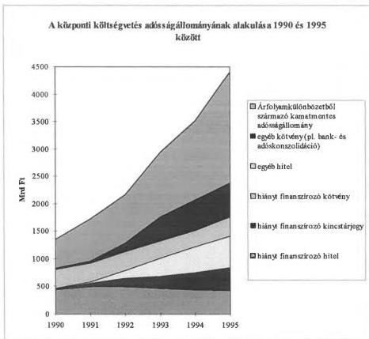
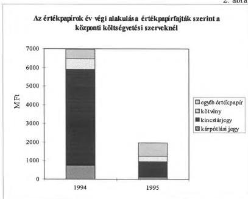
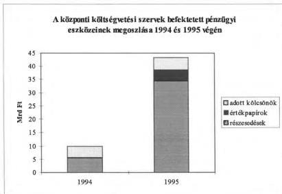
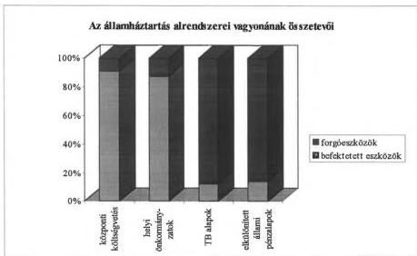
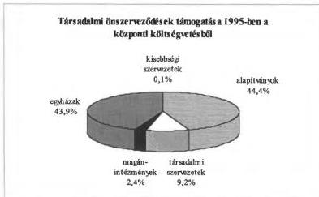

T/2825/1.

Állami Számvevőszék

# JELENTÉS

(1. füzet)

a Magyar Köztársaság 1995. évi költségvetése végrehajtásának
ellenőrzéséről
(ÖSSZEFOGLALÓ és JAVASLATOK)

1996. augusztus

326.

---

A-286-5/96.

# Bevezetés

Az Országgyűlés költségvetési joga a zárszámadási joggal együtt alkot teljes egységet. A törvényhozó hatalmi ág ez utóbbi révén is gyakorolja a végrehajtó hatalmat ellenőrző funkcióját. A zárszámadás feladata, hogy az előirányzatokat összehasonlítsa a ténylegesen befolyt bevételekkel és a teljesített kiadásokkal. Az összehasonlítás - a zárszámadási dokumentumok, valamint a bevételek és kifizetések nyilvántartásainak helyszíni ellenőrzése - alapján értékelhető az államháztartás vitelének törvényessége és szabályszerűsége, minősíthetők a gazdálkodás eredményei, s ítélhető meg a Kormány felelőssége a költségvetés végrehajtásáért. A zárszámadási törvény megalkotásával az Országgyűlés elfogadja a végrehajtók elszámolásait a feladatok teljesítéséről, tudomásul veszi az előirányzatoktól való eltéréseket és azok indokolását.

A zárszámadásban

- számot kell adni arról, hogyan alakultak azok az előirányzatok, amelyek teljesítését közvetlen kormányzati intézkedéssel nem lehet befolyásolni; értékelni kell, hogy a költségvetés előirányzataitól való eltérések előre nem tervezhető események vagy a nem eléggé körültekintő tervezés miatt következtek-e be;
- be kell számolni arról, hogy a végrehajtás során hogyan éltek azokkal a felhatalmazásokkal, amelyek a költségvetési törvényben szereplő összegek módosítására, az előirányzattól eltérő teljesítésre adtak lehetőséget;
- a számadási évet követő évre vonatkozóan rögzíteni kell a törvényes lehetőséget az áthúzódó feladatok és kifizetések teljesítéséhez.

Az Állami Számvevőszék alkotmányos kötelezettségének megfelelően ellenőrzi az éves költségvetés végrehajtását. Vizsgálja, hogy a Kormány, a miniszterek, önkormányzatok és a költségvetési intézmények törvényes keretek között használták-e fel előirányzataikat, s a gazdálkodásról készített zárszámadás híven tükrözi-e az előző évi gazdasági eseményeket. A zárszámadás ellenőrzése elsősorban törvényességi, szabályszerűségi ellenőrzés, és az arról készített jelentésben az Állami Számvevőszék számot ad az Országgyűlésnek arról, hogy

- a zárszámadási dokumentum teljeskörűen tartalmazza-e a gazdálkodás eseményeit, valós képet nyújt-e a költségvetés teljesítéséről, az államháztartás helyzetéről;
- a költségvetés végrehajtói a törvényes előírásoknak megfelelően jártak-e el (a Kormány, illetve a miniszterek miképpen éltek az Országgyűlés felhatalmazásaival);

---

- a zárszámadás elkészítési folyamata biztosítja-e a hiteles dokumentum összeállítását;
- az államháztartás vagyoni helyzetének változása, a gazdálkodási évben vállalt kötelezettségek összege és jellege hogyan alakult, illetve mindezeket tartalmazza-e a zárszámadás.

A számvevőszéki ellenőrzés a következő módszerrel történt:

- a törvényjavaslat normaszövegének ellenőrzésével, adatainak elemzésével;
- a központi költségvetési szervekre, a helyi önkormányzatokra és az elkülönített állami pénzalapokra vonatkozó adatoknak a pénzügyi beszámolók adataival történő összehasonlításával;
- a fejezeteknél, néhány költségvetési szervnél és helyi önkormányzatnál a pénzügyi beszámolókban közölt adatok valódiságának, a gazdálkodás szabályszerűségének helyszíni ellenőrzésével;
- az elkülönített állami pénzalapok éves beszámolóját minősítő könyvvizsgálatok hasznosításával;
- a helyi önkormányzatok normatív állami hozzájárulás és a különféle támogatásainak igénybevételéről és felhasználásáról készített számvevőszéki vizsgálati jelentések hasznosításával.

Az 1995. évi zárszámadási dokumentumok átvizsgálása és a gazdálkodás helyszíni ellenőrzése során szerzett tapasztalatok alapján az Állami Számvevőszék - más lehetősége nem lévén 1995-ben sem a kedvezőtlen helyzet megváltoztatására - megismételi az 1994. évi zárszámadásról készített jelentésében összegzett megállapításait:

Az Áht. 1992. évi hatályba lépése óta az 1995. évi zárszámadás a negyedik olyan, az Országgyűlés elé terjesztett dokumentum, amely a törvény preambulumában felsorolt követelményeknek (teljesség, részletesség, valódiság, egységesség, áttekinthetőség) nem felel meg. Az ÁSZ zárszámadási jelentéseiben erre minden évben felhívta a figyelmet azzal a szándékkal, hogy az információs- és mérlegrendszer átalakítását, a szabályozatlan kérdésekben a végrehajtási szabályok kialakítását sürgesse. Az Áht. 116. §-a kötelezte a Kormányt, hogy alakítsa ki az államháztartás mérlegrendszerét, ami még mindig nem történt meg.

Az államháztartás vitelének 1995. évi szabályai nem változtak jelentősen. Az állami feladatok felülvizsgálata nem hozott számottevő eredményt, folytatódott a korábbi évek gyakorlata. A jelentősebb változást ígérő kincstári gazdálkodás az 1995. év gazdálkodására még nem gyakorolt hatást. Az elmúlt év lezárása viszont befolyásolja az új rendszer indítását. Az 1996. évi költségvetési javaslathoz készített véleményben felhívtuk a figyelmet arra, hogy a gazdálkodási, finanszírozási rendszer megváltoztatása - az 1995. évről áthúzódó maradványok miatt - az 1996. évi költségvetés főösszegét 50 - 90 Mrd Ft-tal megnöveli. A zárszámadás feladata lett volna meghatározni a pontos összeget, amit a kincstári elveknek megfelelően csak előirányzat-módosítás alapján lehet 1996-ban

2

---

igénybe venni. Javasoltuk, hogy a kincstári rendszerre való áttérés miatti jelentős összegű módosítást - a zárszámadás elfogadásával egyidejűleg - költségvetési címenként az Országgyűlés hagyja jóvá. (A törvényben való rögzítést az indokolja, hogy a Kincstár által készítendő „induló” vagyonkimutatásnak, követeléseknek, tartozásoknak alapját képezi az 1995. évről áthozott összeg.) Felhívtuk a figyelmet arra, hogy a költségvetés számára mobilizálható forrást jelenthetnek a kincstári körbe kerülő központi költségvetési szervek és a megszüntetett elkülönített állami pénzalapok eddig ellenőrizhetetlen és ellenőrizetlen pénzügyi és egyéb befektetései, továbbá az ÁFI Rt-nél lévő, a korábbi finanszírozási rend miatt a költségvetésben - szabálytalanul - teljesítésként elszámolt, kiutalt összegek maradványai.

Ezeknek az összegeknek a megállapítása, befizettetése az 1995. év pénzügyi zárásának különleges feladata lett volna. Az új szabályok szerint ezek a maradványok csak a fejezetek előirányzat-módosítása alapján használhatók fel. A formális jóváhagyás, módosítás helyett lehetőség lett volna az intézményeknél lévő befektetések, korábbi évekről áthúzódó pénzmaradványok céljainak felülvizsgálatára, indokolt esetben a maradvány elvonására. Helyszíni ellenőrzésünk nem tapasztalta, hogy ezek a felülvizsgálatok megtörténtek volna, s a zárszámadás szöveges indokolása sem azt mutatja, hogy az 1995. év lezárása más lett volna, mint a korábbi éveké. (Az elszámolási rendet megváltoztató kincstári gazdálkodásra való áttérés, valamint a megszűnő alapok maradványai miatt a pénzeszközök alrendszerek közötti átadásához a zárlati értékek kimutatása nem szerepel a zárszámadásban.)

Az ÁSZ minden évben a hibák, hiányosságok sorozatát tárta fel a zárszámadás szerkezetével, adattartalmával, az adatok pontosságával kapcsolatban. Emellett számos javaslatot is tett. Ezek közül néhányat hasznosítottak, technikailag némileg fejlődött a számszaki háttéranyag előállításának folyamata. Ennek is köszönhetően minden évben pontosabb, áttekinthetőbb a törvényjavaslat. Ezek a kisebb módosítások azonban alapvető, áttörést jelentő változást nem hoztak, s az utóbbi évekhez hasonlóan az 1995. évi zárszámadás sem alkalmas arra, hogy annak alapján az Országgyűlés

- megbízható, áttekinthető képet kapjon a költségvetés teljesítéséről;
- meggyőződjön arról, hogy a költségvetés teljesítésében közreműködő szervezetek elszámoltak, képesek elszámolni a rájuk bízott vagyonnal és pénzösszegekkel;
- biztos lehessen abban, hogy a gazdálkodás során a költségvetés végrehajtói az Országgyűlés rendelkezései és felhatalmazása alapján jártak el.

Az 1995-re vonatkozó zárszámadási jelentést az elmúlt évihez hasonló szerkezetben készítettük el. Külön füzetben szerepelnek a törvényjavaslat és a zárszámadási dokumentum ellenőrzéséről született megállapítások, a pénzügyi beszámolók adatai alapján készített elemzések. A helyszíni ellenőrzés tapasztalatairól készített füzetben - a képviselők és az országgyűlési bizottságok munkáját segítendő - fejezetenként csoportosítva is szerepelnek a helyszíni ellenőrzés megállapításai.

3

---

# 1. A zárszámadási törvényjavaslat normaszövegéhez és számszaki mellékleteihez kapcsolódó megállapítások

A törvényjavaslat normaszövege az 1995. évi költségvetési (pótköltségvetési) törvénnyel nincs teljesen összhangban, ezért a gazdálkodási év lezárásához a normaszöveg pontosítása, kiegészítése szükséges.

Az 1995. évi költségvetést meghatározó - pótköltségvetéssel módosított - 1994. évi CIV. törvény olyan felhatalmazásokat, előírásokat is tartalmaztak, amelyek teljesítéséről a Kormány - bár kötelezettsége lett volna - a zárszámadási törvényjavaslatban nem adott számot. (A törvényjavaslat egyes bekezdéseihez tartozó korrekciókat, kiegészítéseket az 1. füzet 4. pontja, a normaszöveghez kapcsolódó megállapítások indokolását a 2. füzet 1.1. pontja tartalmazza.)

A törvényjavaslat számszaki mellékleteit ellenőrizve megállapítottuk, hogy azok - a tartalmi összefüggések alapján - számszakilag megegyeznek. A törvényjavaslat indokoló táblái azonban több számszaki eltérést tartalmaznak.

# 2. Az államháztartás gazdálkodására vonatkozó szabályok betartása, a felhatalmazások gyakorlásának értékelése

Az Áht. szerint a Kormány a számadási évet követő nyolc hónapon belül köteles benyújtani a zárszámadást az Országgyűlésnek, az ÁSZ-nak pedig két hónap áll rendelkezésére az ellenőrzés elvégzéséhez. A törvényjavaslat I/1. és I/2. köteteit 1996. június 30-án adta át a Pénzügyminisztérium az ÁSZ-nak, a részletes indokolásokat tartalmazó fejezeti köteteket, valamint az I/1-I/2. kötetben végrehajtott javítások jegyzékét azonban csak augusztus 2-án. A késedelem hátráltatta az ellenőrzést.

Az Áht., továbbá a TB-alapokra és az állami vagyon kezelésére vonatkozó törvények szerint a TB-alapok költségvetésének teljesítéséről és a vagyonkezelő szervezet tevékenységéről a központi költségvetés zárszámadásával egyidejűleg kell az Országgyűlésnek beszámolni. Ezek a törvényi előírások az államháztartás alrendszereinek egymással való összefüggései miatt a *teljesség* követelményét elégítik ki, mert az államháztartás lényeges pénzügyi kapcsolatai csak ily módon ellenőrizhetők, ítélhetők meg.

A korábbi évekhez hasonlóan ezúttal sem sikerült a beszámolókat párhuzamosan elkészíteni és az Országgyűlés elé terjeszteni. A késedelem miatt egyetlen esetben sem történt felelősségre vonás. (A TB-alapok zárszámadási törvényjavaslatának elkészítéséhez a Kormánynak, ellenőrzéséhez az ÁSZ-nak törvényileg biztosított idő nincs összhangban a központi költségvetési zárszámadási törvényjavaslat benyújtási határidejével.)

A zárszámadás ellenőrzéséhez szükséges információk rendszeres késedelme, az évek óta nem teljesített törvényi kötelezettség arra hívja fel a figyelmet, hogy a zárszámadás parlamenti megtárgyalásának ütemezését újra kellene gondolni, s a vonatkozó törvényi előírásokban reálisan teljesíthető határidőket rögzíteni.

4

---

Ellenőrzésünk tapasztalatai szerint a költségvetés végrehajtói egyre inkább törekednek a szabályozott eljárási rend követésére. A korábbi időszakhoz képest például a költségvetési tartalék felhasználása, az előirányzat-módosítások területén a szabályszerűség egyértelműen javul. Ahol az ÁSZ hiányosságokat tapasztalt, ott a szabálytalan gyakorlat rendszerint az írásos helyi eljárási rend és a nyilvántartások hiányára vezethető vissza.

Az egyes területeken tapasztalt fejlődés mellett hangsúlyozzuk, hogy a költségvetés végrehajtásának valamennyi szintjén sértettek meg törvényi előírásokat, törvényi felhatalmazás és hatáskör nélkül teljesítettek pénzügyi tranzakciókat.

- A Kormány nem vette figyelembe a pótköltségvetés miatt módosított költségvetési törvényben rögzített kezességvállalási korlátot, és az Országgyűlés által jóváhagyott 29,17 Mrd Ft-os keretet túllépve 40,1 Mrd Ft-ra vállalt kezességet. (A PM a keret túllépését utólag maga is észlelte, s levélben tájékoztatta az ÁSZ elnökét, hogy intézkedéseket tett a hasonló esetek elkerülése érdekében.)
- A TB-alapok kezelői figyelmen kívül hagyták azt a törvényi előírást, hogy 5 Mrd Ft-ot meghaladó hiány esetén pótköltségvetési törvényjavaslatot kell benyújtani. Az Egészségbiztosítási Alap 22,3 Mrd Ft, a Nyugdíjbiztosítási Alap 18,2 Mrd Ft hiánynyal zárta az évet, de pótköltségvetés beterjesztését egyik alap sem kezdeményezte a Kormánynál.
- A Pénzügyminisztérium az Állami Számvevőszék elnökének ellenjegyzése nélkül vett fel devizahitelt, amit az MNB ellenjegyzett szerződés nélkül folyósított is. (Az ÁSZ ellenjegyzési kötelezettségét az Alkotmány is előírja.)
- A PM helyettes államtitkárának intézkedésére (a jegybankról szóló törvény 78. § (3) bekezdésével ellentétben, 1996. január helyett 1995. decemberben) az APEH visszautalta az MNB által befizetett 27,2 Mrd Ft adóelőleget. A tranzakció miatt a központi költségvetés 1995. évi hiánya (és az MNB mérleg szerinti bevétele is) 27,2 Mrd Ft-tal növekedett.
- Az Áht. 57. § (3) bekezdése szerint "A könyvvizsgálatok eredményéről az elkülönített állami pénzalapokra vonatkozóan a Kormány a zárszámadás keretében tájékoztatja az Országgyűlést." E kötelezettségének a Kormány nem tett eleget.
- A zárszámadás mérlegét összeállító, a költségvetési tartalékot kezelő pénzügyminiszter a helyi önkormányzatok számára az 1994. évi normatív állami hozzájárulás elszámolása alapján kiutalt pótlólagos hozzájárulást, illetve az önkormányzatok által befizetett összegeket - közel 720 M Ft-ot - nem a költségvetési törvény 18. § (4) bekezdése szerinti előírásnak megfelelően (az általános tartalékkal szemben) számolta el, hanem az önkormányzatok által visszafizetett összegek terhére.

5

---

- A 2. füzet 2.1.5.6. pontjában és az 1. és 2. számú mellékletekben felsorolt központi költségvetési intézmények
  = rövid lejáratú értékpapírokat vásároltak annak ellenére, hogy ezt az Áht. 1995. január 1-jétől megtiltotta;
  = módosított előirányzat nélkül kifizetést teljesítettek társadalmi szervezetek támogatására, holott e szervezetek csak kormányengedély és költségvetési előirányzat birtokában támogathatók.
- A Pénzügyminisztérium az Egyéb pénzügyi lebonyolítások letéti számláján olyan pénzügyi műveleteket hajtott végre, amelyek az Áht. 12. § (2) bekezdése szerint nem bonyolíthatók le letéti számlán.

Az 1992. évi költségvetésben teljesítésként elszámolt 5,7 Mrd Ft-os MÁV-támogatás még fel nem használt 1,2 Mrd Ft-os maradványát kiutalták a MÁV részére. A maradvány letéti kezelése, 1995. évi kiutalása egyaránt szabálytalan volt. Az 1995-ben teljesített összeg a költségvetés kiadási oldalán egyáltalán nem jelenik meg. (Az ilyen elszámolási "fogások" miatt utólag szinte lehetetlen megállapítani, hogy egyes krízis helyzetben lévő térségek, vállalatok az évek során mennyi állami támogatást kaptak.)

Az 1994. évi zárszámadásról készült ÁSZ-jelentés javasolta a szabálytalanul letéti számlán kezelt összegek befizettetését az állami költségvetésbe, ami nem történt meg.

- Az 1995. évi zárszámadásban tényleges pénzforgalmi teljesítés nélkül "a központi költségvetés pénzmaradványa" címen 20 159,7 M Ft-ot, teljesített kormányzati beruházásként pedig 2 387,4 M Ft-ot számoltak el. Ezeket az adatokat kiadási bizonylatokkal alátámasztani nem lehet. (E minden évben kifogásolt eljárás a kincstári rendszerben megszűnhet.)
- Helyszíni ellenőrzésünk megállapította, hogy a zárszámadási adatok egy része nem megbízható, mert
  = az ellenőrzött intézmények többségénél hiányzott az elszámolások helyességét biztosító karbantartott számlarend,
  = a tárgyi eszközök leltározási, nyilvántartási gyakorlata nem biztosítja a vagyontárgyakkal való elszámoltatást;
- Helyszíni ellenőrzésünk feltárta, hogy az államháztartás alrendszereiben nincs biztosítva a köztartozások megfizettetése, sőt a beszedéshez a megfelelő nyilvántartások is hiányoznak.

6

---

= Az APEH által nyilvántartott hátralékállomány - a rárakódó bírságoknak is köszönhetően - 250,3 Mrd Ft-ra nőtt. Ennek jelentős része az egykori nagyvállalatok "öröksége", aminek a kimutatása az APEH pénzforgalmi ellenőrzése szerint sem megbízható. A technikailag megszűnt 560 ezer adóalany közül 31 ezernek a folyószámláján 28 Mrd Ft-ot meghaladó a tartozás, aminek a kivizsgálása - a revizori kapacitás szűkösségével indokolva - tovább húzódik, csökkentve a beszedés valószínűségét.

= A VPOP-nél a kinnlevőségek állománya 1994-hez képest közel 20%-kal, 74,3 Mrd Ft-ra emelkedett, számbavétele nem megbízható.

= A BM és a PM nem vezet analitikus nyilvántartást a helyi önkormányzatokat meg nem illető normatív hozzájárulásokról, illetve a jogtalanul igénybevett támogatások kamatterheiről. A kötelezettségeket nem állítják szembe a teljesített befizetésekkel. A fizetési felszólítás a nyilvántartás hiányában elmarad.

= A minisztériumok a pénzmaradványok felülvizsgálatánál nem alkalmazzák következetesen a költségvetési törvény előírásait, s nem vezetnek analitikus nyilvántartást a felügyeletük alá tartozó költségvetési szervek pénzmaradványt terhelő befizetéseiről. Emiatt egyes intézmények a befizetéseket egyáltalán nem vagy késedelmesen teljesítik, sőt néhány intézmény nem is rendelkezik annyi pénzmaradvánnyal, amennyiből a befizetési kötelezettségét teljesíthetné.

= A költségvetési szervek egyre több olyan (befektetett eszköznek minősülő) vagyonrésszel, kárpótlási jeggyel rendelkeznek, amit követelések fejében vagy más módon szereztek, és e vagyonrészek kezelését, nyilvántartását nem tudják szakszerűen elvégezni.

### 3. A zárszámadási dokumentum adatainak valódisága, a számviteli elvek érvényesülése az államháztartás gazdálkodásában

Az államháztartási törvényt 1992-ben többek között "a közpénzekkel való hatékony és ellenőrizhető gazdálkodás garanciáinak megteremtésére", továbbá "a teljesség, a részletesség, a valódiság, az egységesség, az áttekinthetőség és a nyilvánosság" alapelvének érvényesítésére alkotta az Országgyűlés. Az idézett elvek gyakorlatilag azonosak az egy évvel korábban született számviteli törvény alapelveivel (teljesség, valódiság, világosság, folyamatosság, bruttó elszámolás stb.).

Az 1994. évi zárszámadásról készített ÁSZ-jelentés értékelte a számviteli, államháztartási elvek érvényesülését az államháztartás vitelében. Megállapította, hogy a központi költségvetés könyvvezetése és a zárszámadás nem felel meg a törvényben foglalt alapelveknek. Az 1994. évi elszámolások kapcsán tett számvevőszéki megállapítások szinte kivétel nélkül érvényesek az 1995. évi elszámolásokra is. (Az államháztartási törvény megalkotása óta a Kincstár felállítása - az ezzel kapcsolatos jogszabály-módosítások - az első

7

---

olyan lépés, amely a kezdetét jelentheti a gazdálkodási rendben kialakult visszásságok felszámolásának.)

A számviteli alapelvek a központi költségvetési szervekre is vonatkoznak. (Szvt. 2. §) A számvevőszéki ellenőrzés által feltárt hiányosságok miatt a *zárszámadás nem minősíthető hitelesnek*, mert a számviteli alapelveket nem megfelelően érvényesítették a könyvvezetésben és az Országgyűlésnek benyújtott dokumentum összeállításánál.

Az *évszázadok* során letisztult számviteli elvek eligazítást adnak arra vonatkozóan, hogy a gazdálkodás adatainak feljegyzése során hogyan kell eljárni. A rendszerbeli hibákat feltáró egy évvel ezelőtti megállapításokat - tekintettel arra, hogy ezek felszámolására csak a kezdeti lépések történtek meg - *megismételjük*.

A *valódiság elve* azt jelenti, hogy a könyvvezetésben és a beszámolóban szereplő tételek a valóságban is megtalálhatók. Létük bizonyítható és megállapítható, értékelésük az elfogadott számviteli szabályoknak megfelelő értékelési elven alapul, a könyvvezetésben rögzített események megtörténte bizonylatok útján ellenőrizhető. Az államháztartás alrendszereinek éves gazdálkodásáról számot adó zárszámadási dokumentum több ezer szervezet pénzügyi beszámolói alapján készül. A valódiság elve emiatt a központi költségvetés zárszámadásánál azt is jelenti, hogy a zárszámadási dokumentum bizonyíthatóan az elemi pénzügyi beszámolók adataira épül. Ellenőrzéseink a valódiság elvének érvényesítésével kapcsolatban a következőket tárták fel:

- A központi költségvetés bevételeit, kiadásait és a hiányt áttekinthető módon, mérlegszerűen a törvényjavaslat 10. számú melléklete tartalmazza. A melléklet egyes sorainak tartalma azonban nem definiált. Emiatt lehetőség van arra, hogy a különböző költségvetési években különböző sorokat alkalmazzanak, illetve az egyes sorok adattartalma könnyen megváltoztatható. (Pl. rendkívüli bevételek és kiadások, adósságszolgálat, nemzetközi bevételek és kiadások, koncessziós bevételek.) A változások azonban nem dokumentáltak, ezért nem is követhetők. Ez nemcsak a valódiság, hanem a *folytonosság* és az *összemérhetőség* elvét is sérti.
- A számviteli törvény alapján a Kormány 1991. decemberében rendeletben szabályozta a költségvetés alapján gazdálkodó szervek beszámolási és könyvvezetési kötelezettségét. A beszámoló-készítési kötelezettség nem vonatkozik az állami forgóalap kezelőjére és a forgóalap pénzforgalmában közreműködő - a központi költségvetés bevételeit és kiadásait kezelő - APEH-ra és VPOP-ra. Az általuk kezelt bevételekről és kiadásokról formális pénzügyi beszámolót nem készítenek. Az adatok belső kimutatásoknak minősíthető jelentésekben és a zárszámadásban jelennek meg. A pénzforgalmi áthúzódások, a pénzforgalmilag befolyt, de tisztázatlan bevételek, a teljesítési adatok számbavételi szabályai nincsenek rögzítve az 1995-ben még érvényesülő visszásságokat részben felszámoló 79/1996. (VI.4.) Korm. sz., a Magyar Államkincstár könyvvezetési és beszámolási kötelezettségéről szóló rendeletben sem.
- Helyszíni vizsgálatunk során megállapítottuk, hogy a pénzügyi beszámolót készítő költségvetési szervek, helyi önkormányzatok közül többen - részben vagy telje-

8

---

sen - elmulasztották *leltárral* alátámasztani a mérlegben kimutatott tételek való-diságát.

- — A központi költségvetés kötelezettségeiről és követeléseiről a PM nem vezet megbízható, zárt rendszerű nyilvántartást, az értékelés szabályai sincsenek kialakítva. Mindezek miatt esetenként a leltározás feltételei nem is adottak.
- — A helyi önkormányzatok és a központi költségvetési szervek különböző jogcímeken történő befizetési kötelezettségei teljesítésének számonkérésére a Pénzügyminisztériumban nem vezetnek nyilvántartásokat, ezért a zárszámadásban szereplő összegek valódiságáról nem lehet meggyőződni. A nyilvántartások hiánya miatt a központi költségvetés bevételektől eshet el, s a törvényi előírások számonkérése sem történik meg.
- — Az állam tulajdonában lévő vagyontárgyak nyilvántartása nem megoldott, emiatt a leltározás feltételei sem adottak.

A *teljesség elve* azt jelenti, hogy minden gazdasági eseményt rögzíteni kell a könyvvezetésben, és azok hatásait meg kell jeleníteni a beszámolóban. A teljességhez rögzíteni kell minden *vagyonváltozást* is. Az államháztartás alrendszereinek egymással való összefüggései miatt a teljesség követelményéhez tartozik az a törvényi előírás, hogy a központi költségvetés zárszámadásával egyidejűleg kellene benyújtani és tárgyalni a TB-alapok és az állami vagyont kezelő szervezetek beszámolóit is az Országgyűlésnek.

Az Áht. 13.§-a szerint az éves költségvetések és zárszámadások csak a *pénzforgalmilag* teljesült tételeket tartalmazhatják. (Függő és átfutó elszámolásként, illetve letéti számlákon nem szerepelhetnek a költségvetés végleges bevételi és kiadási teljesítésével összefüggő tételek.) Ha ezt a szabályt megsértik, a teljesség elve nem érvényesül. Az éves teljesítést tartalmazó központi költségvetési mérlegen kívül a *hitelmérlegek* bemutatása és az *évek között áthúzódó azon kötelezettségek, követelések elszámolása* is szükséges, amelyek az éves pénzforgalomban közvetlenül nem jelennek meg.

- — A központi költségvetésben - a zárt rendszerű könyvvitel hiánya miatt - nem biztosított, hogy valamennyi gazdasági eseményt feljegyezzenek. A bevételeket és kiadásokat különböző szervezetek szedik be, illetve teljesítik. A zárszámadási dokumentumba ezek nyilvántartásai alapján kerülnek az adatok. Nincs olyan írásos eljárási rend, amely rögzítené a különböző szervezetek lebonyolítói jogkörét. Emiatt nincs garancia arra, hogy a gazdasági eseményeket teljeskörűen (és a valóságnak megfelelően) rögzítik a nyilvántartásokban.
- — A központi költségvetésben - a kettős könyvvitelen alapuló számviteli rend hiánya miatt - csak a pénzforgalmi teljesítéseket jegyzik fel a nyilvántartásokban, a *vagyonváltozást* nem. Emiatt hiányzik a pénzforgalmi áthúzódások, valamint a vagyoni helyzetet befolyásoló, több évre kiható kötelezettségek és követelések mérlegszerű bemutatása.
- — Az Áht. nem szabályozza a továbbkölcsönzésre felvett hitelek elszámolási rendjét. Emiatt a XXXI. fejezet 4. cím 6. alcímén 151,3 M Ft-ot "tovább kölcsönöztek", holott az elméletileg fedezetül szolgáló XXXI. fejezet 6. címén a tervezett 330 M Ft hitelfelvételt nem teljesítették. Az elszámolás a költségvetési hiány összegét 151,3 M Ft-tal megemelte.

9

---

— Az adósságszolgálattal kapcsolatos, a költségvetés finanszírozását teljeskörűen bemutató mérleg sem készült el. (Ebben kellene szerepeltetni azokat a kormány-, deviza- és származékos világbanki hiteleket, valamint kötvény és kincstárjegykibocsátásokat, amelyekből különböző költségvetési kiadásokat teljesítenek.)

A költségvetési hiány, illetőleg a pénzmaradványok megállapításakor a tárgyévben ténylegesen befolyt (beszedett) bevételeket és a tárgyévben ténylegesen teljesített kiadásokat kell figyelembe venni. Ezzel biztosítható a költségvetés egyenlegének valódisága. Az összemérés elve szerint a teljesítéseket mindig az előirányzatokhoz kell viszonyítani. Az Országgyűlés által megállapított előirányzat felhatalmazás arra, hogy a tárgyévben milyen összegben teljesíthető kifizetés. A beszámolás során számot kell adni az eltérések okairól, az eltérések jogosságát pedig az ellenőrzésnek kell vizsgálnia. A nem megengedett eltéréseknek következményeket kell(ene) maguk után vonniuk.

— Az előirányzat-módosítási kötelezettséget a fejezetek és a költségvetési szervek is több esetben elmulasztották. 1994-ben 269, 1995-ben 352 intézmény a módosított előirányzatait meghaladóan teljesítette kiemelt kiadási előirányzatait. 1994-ben 25 Mrd Ft, 1995-ben 15,9 Mrd Ft többletkiadást teljesítettek előirányzat nélkül. (Ezeknél az intézményeknél a saját bevétel, az előző évekről származó pénzmaradvány, illetve az államháztartás más alrendszeriből átvett pénzeszközök fedezetet biztosítottak a kiadásokra, de az Áht. szerint módosítás nélkül az előirányzatok akkor sem léphetők túl, ha teljesítésükre megvan a pénzügyi fedezet. A kincstári gazdálkodásban az előirányzatok módosítása nélkül nem is teljesítik a kifizetéseket.)

A kötelezettség ellenőrzését, a mulasztás megállapítását megnehezíti a pótköltségvetési törvénynek az a felhatalmazása, hogy végkielégítés miatt túlléphetők az előirányzatok. (Az előirányzatot az ÁSZ álláspontja ellenére az automatikusan túlteljesíthető tételek közé sorolták. Az elszámolásokban a végkielégítés és annak TB-járuléka szervesen beépül a többi azonos tartalmú költségvetési tétel közé, így a pénzügyi beszámoló vizsgálata alapján nem állapítható meg, hogy a túllépés az előirányzat-módosítási kötelezettség elmulasztása vagy a végkielégítés miatt haladja meg a módosított előirányzatot.)

— A fejezeti kezelésű előirányzatokat több esetben nem arra a célra költötték, amire az előirányzatot az Országgyűlés megállapította.
— Az előirányzat-maradványok okait a zárszámadás nem tárja fel, nem mutatja be. Nem állapítható meg, hogy a maradvány áthúzódó kötelezettség, a feladat meghiúsulása, esetleg költségtakarékosság miatt keletkezett-e.

A valódiság, a teljesség és az összemérés elve együttesen a költségvetési gazdálkodás sajátos szabályait alapozzák meg. A gazdálkodás fő szabálya az, hogy a költségvetés bevételeit és kiadásait az Országgyűlés által megállapított keretek között kell teljesíteni. Eltérés csak az előre elfogadott kivételek alapján lehetséges. Ennek két garanciája van:

— A bevételi előirányzatokat csak az Országgyűlés emelheti meg. Az előirányzatok akkor sem növelhetők az Országgyűlés jóváhagyása nélkül, ha a tényleges teljesítés jelentősen meghaladja az előirányzottat. E szabály alól kivételt képeznek a költségvetési intézményekre vonatkozó előírások, amelyek szerint bizonyos feltételek megléte esetén saját hatáskörben felhasználhatók a többletbevételek. (Ezen kívül az elsősorban térítési díjakból keletkezett támogatásértékű többletbevételek

10

---

előirányzatának megnövelésére a felügyeletet ellátó miniszter jogosult.) E döntések hatásai az 1. és 2. számú mellékletek összegeiben megjelennek, de közvetlenül nem módosítják a központi költségvetés egyensúlyi helyzetét.

— A kiadási előirányzatok nem léphetők túl. Ha valamely kiadási előirányzat nem bizonyul elégségesnek, akkor - az átcsoportosítási szabályoknak megfelelően - más előirányzat csökkentésével egyidejűleg lehet a kiadási szükségletet kielégíteni. (Ha átcsoportosítással nem oldható meg a forrás megteremtése, akkor az előirányzat engedélyezéséhez az Országgyűlés jóváhagyását kell kérni.)

A garanciák érvényesülését az átcsoportosítási szabályok segítik. Ezek szerint a Kormánynak joga van a legtöbb kiadási előirányzat között átcsoportosítani, illetve a költségvetési címek előirányzatát megnövelni abban az esetben, ha a fedezetet a költségvetés általános tartalékának terhére biztosítani tudja. Nincs azonban a Kormánynak felhatalmazása arra, hogy az évközben keletkezett többletbevételt a költségvetésben nem tervezett feladat teljesítésére engedélyezze.

A költségvetés sokezernyi tételénél az összeméréshez, a ténylegesen keletkező megtakarítások és többletbevételek megállapításához a teljesítést mindig a módosított előirányzathoz kell viszonyítani.

— A zárszámadási dokumentum és a helyszíni vizsgálatok tapasztalatai szerint a költségvetés módosítására vonatkozó szabályokat nem alkalmazzák következetesen. A dokumentumban (az 1. és 2. számú mellékletekben) a módosított előirányzatot egyáltalán nem tüntetik fel, az eredeti és a teljesítési adatok összevetése pedig megtévesztő. Ez a világosság és áttekinthetőség elvét is megsérti.
— Sok tételnél (ahol a teljesítés oszlopban "0" szerepel) nem lehet megállapítani, hogy azért nem történt-e teljesítés, mert az előirányzatot más tételre csoportosították át (és a teljesítés ott jelentkezik), vagy pedig azért, mert valamilyen okból valóban elmaradt a jóváhagyott összeg kifizetése. Ennek pandantjaként más tételeknél az előirányzatot meghaladó teljesítések szerepelnek, amelyekről egyszerű rátekintéssel nem lehet megállapítani, hogy túlteljesítés történt, vagy pedig az előirányzat összegét megnövelték, és a módosított előirányzathoz igazodva többet használtak fel, mint azt az eredeti költségvetésben tervezték.

A vállalkozói számvitelben az időbeli elhatárolás elve azt jelenti, hogy azokat a gazdasági eseményeket, amelyek több elszámolási időszakot érintenek, az elszámolási időszakok között olyan arányban kell megosztani, amilyen arány az alapul szolgáló időszak és az elszámolási időszakok között kialakul. Az Áht. - mivel a költségvetési évben csak a pénzforgalmilag is teljesült bevételeket és kiadásokat lehet elszámolni - elméletileg kizárja az időbeli elhatárolás elvének alkalmazását. (Az Áht. végrehajtására kiadott kormányrendelet szerint ezért ezt az elvet nem lehet érvényesíteni a költségvetési szervek gazdálkodásában.) Számos feladat pénzügyi teljesítése azonban a költségvetési szerveknél sem zárható le az év lezárásával együtt, mert a következő évre áthúzódó kötelezettségek is keletkeznek. Ezekre a fedezetet mindig annak az évnek a költségvetése tartalmazza, amelyikre vonatkozóan a feladatot és az előirányzatot az Országgyűlés jóváhagyta. Ha az év lezárultával további kötelezettség teljesítése igazolható, a lezárt évet követő költségvetési évben a kifizetés forrása a jelenlegi költségvetési rendszerben nem biztosított. Kivételt képez ez alól a költségvetési szervek pénzmaradványa, aminek a sajátos gazdálkodási szabályok szerint adottak a jogi keretei.

11

---

A hiányos szabályozás miatt különböző szabálytalan megoldásra kényszerülnek a költségvetés végrehajtói:

- ténylegesen nem teljesített kiadást teljesítettként mutatnak ki (központi intézmények pénzmaradványa, beruházások keretmaradványa);
- szabálytalanul, a pénzügyi forrás "átmentésére" alkalmazzák a függő, átfutó, letéti elszámolásokat;
- az adó- és vámbevételeknél nem tisztázott a költségvetési évben befolyt, de bevételi jogcím szerint kérdéses tételek kezelése, összegének szerepeltetése a tárgyévi bevételek között.

A bruttó elszámolás elve azt jelenti, hogy a könyvvezetésben és a beszámoló összeállítása során a követeléseket és kötelezettségeket, valamint a hozamokat és ráfordításokat nem szabad egymással szemben elszámolni. Hiánya egyben a világosság elvét is megsérti, mert a nettó elszámolások miatt nem állapítható meg a bevételek és kiadások tényleges összege.

A bruttó elszámolás elve alapján meg kellene változtatni azt a gyakorlatot, ami szerint a különböző adókból adott kedvezményeket kiadásként nem mutatják ki, hanem a bevételeket a kedvezményekkel csökkentett összegekkel szerepeltetik. A jelenlegi mérlegrendszerben a bevételi oldalon nem jelenik meg az adóbevételek teljes összege, a kiadási oldalon pedig hiányoznak az adókedvezmények tételei, azaz a törvényjavaslat 2. és 10. számú mellékletei az adóbevételeket nettó módon tartalmazzák. (Az Áht. a pénzügyminiszter feladataként írja elő, hogy jogcímek szerint tartsa nyilván a központi költségvetés bevételeit érintő kedvezményeket.) Technikailag egyszerűbb, de még elfogadható megoldás, ha az adóbevételeket és a kedvezményeket a törvényjavaslatok (költségvetés és zárszámadás) mellékletében hagyják jóvá.

A folytonosság elve azt jelenti, hogy a könyvvezetés, valamint a beszámoló fő részeinek formája és tartalma tekintetében az eltérő időszakok közötti összehasonlíthatóságot biztosítani kell. Ha a szerkezet, az egyes mérlegsorok tartalma megváltozik, azt dokumentálni kell, és közzétenni, hogy mindenki, aki a költségvetések és zárszámadások adatait hasznosítja, a változtatásokat megismerhesse.

A világosság elve azt jelenti, hogy a gazdasági eseményeket, a különböző kimutatások és mérlegek tételeit úgy kell megjelölni és csoportosítani, hogy azok érthetőek és áttekinthetőek legyenek. A költségvetés nyilvános, következésképpen a zárszámadás adatai nem lehetnek sem olyan részletesek, sem olyan összevontak, hogy a képviselők és az állampolgárok nem, vagy csak nagy nehézségek árán tudnak megfelelő képet alkotni az előirányzatokból megvalósított feladatok teljesítéséről, az éves gazdasági események következményeiről, a költségvetés vagyoni, pénzügyi és jövedelmi helyzetéről, valamint a vagyon, a saját tőke, a külső finanszírozás, a bevételi többlet, vagy hiány alakulásáról.

A zárszámadási dokumentum rendkívül sok adatot tartalmaz. Ezek egy része olyan összevont, hogy a részletes adatokból nem vagy csak nehézségek árán lehet információhoz jutni. Az adatok másik része viszont túlságosan részletezett; hiányoznak azok az összesítő táblák, amelyek a részletes és az összevont adatok között az áttekinthető és ellenőrizhető kapcsolatot megteremtik. (Mint azt említettük, teljesen hiányzik a zárszámadásból a vagyonváltozás — ennek keretében a követelések és kötelezettségek —, a tárgyévben közvetlen bevételt nem jelentő finanszírozási tételek bemutatása. Ezek hiányában a tárgyévi pénzforgalmi tételek sem ellenőrizhetők és tekinthetők át megfelelően.)

12

---

Az Áht. preambulumában rögzített és a számviteli elvek között az egyetlen jelentős különbséget a csak az államháztartásra vonatkozó nyilvánosság elve jelenti. Ez az elv, amely hosszú ideig nem érvényesült a költségvetési gazdálkodásban - azon kívül, hogy a költségvetések és zárszámadások adatai nyilvánosak - azt is jelenti, hogy a közpénzek elköltéséről közérthetően, áttekinthető módon kell számot adni. Ennek az elvnek a terjedelmes zárszámadási kötetek nem tesznek eleget. Különösen az általános indokolás táblázatai nem adnak elegendő, közérthető információt a közérdeklődésre számot tartó tételek tekintetében. A valódi információt nélkülöző adattömegre példa az általános indokolás mellékleteként a 277-386. oldalakon közölt táblázat a központi (kormányzati) és egyéb beruházásokról. A több mint 100 oldalt kitevő felsorolás ellenére szinte semmit nem tudunk meg a beruházásokról. Nem derül ki azok célja, évenkénti ütemezése, az 1995-ben megvalósult műszaki tartalom, a beruházáshoz igénybevett hitel jogcíme, de még az sem, hogy melyik fejezetnél lehet részletesebb információt találni az adott beruházásról. Ugyanakkor nem találunk beszámolót a támogatott közalapítványok támogatási céljairól, a költségvetési szférában vállalkozásokba fektetett tulajdonrészekről.

Jogállamiságunk hatodik évének zárszámadásáról a számvevőszéki ellenőrzés tapasztalatai alapján összefoglalásképpen azt mondhatjuk, hogy a közpénzekkel való gazdálkodás, elszámolás terén némi javulás, illetőleg a javításra irányult törekvések jelei mutatkoznak. Az államháztartás vagyonának nyilvántartásáról, kezeléséről e szerény elismerés nem mondható el. Elsősorban emiatt az 1995. évi zárszámadás dokumentumai sem adhatnak hiteles, megbízható és kielégítő információkat az adófizetők pénzével és a közvagyonnal való gazdálkodásról. Az államháztartás rendszerében továbbra is hiányoznak az ellenőrizhetőség és az elszámoltatás alapvető feltételei. A pénzeszközök felhasználását és a vagyon kezelését tartalmazó jogszabályok hiányosak, a meglévők megfogalmazásai pontatlanok. A költségvetési törvények csak nagyvonalúan határozzák meg a feladatokat, és a számítási anyagok sem rögzítik a költségvetési szervek által elérendő célokat, elvárt eredményeket. Hiányzik a rendszeres számonkérés és a pénzügyi műveleteket elszámolási keretbe foglaló, zárt rendszerű államszámviteli rend. Még mindig nem született meg az államháztartási mérlegrendszer.

Az elfogadható eredményeket nem hozó közkiadások, a nem megfelelően előkészített változtatások, a felelőtlen döntések megismétlődnek, mert ezek miatt felelősség senkit nem terhel. A szabálytalan, törvénysértő gazdálkodásért a felelősök megszemélyesítése, a szankció rendre elmarad.

13

---

## 4. Javaslatok

# I.

# A zárszámadási törvényjavaslat normaszövegének korrekciója

Az alábbi helyesbítéseket az Országgyűlés Számvevőszéki bizottságának módosító indítványaival javasoljuk realizálni. (Az indítványokat az ÁSZ előkészíti.)

1. A 3. §-ban a központi költségvetés bel- és külföldi adósságállományának törlesztéseinél biztosítani kell az 1. sz. melléklet XXXII. "a költségvetés törlesztései" fejezetben szereplő összegekkel a számszaki egyezőséget.
2. A helyi önkormányzatokat meg nem illető normatív hozzájárulás befizetéséhez a 7. § (5) bekezdésében a normaszöveg pontosításához és teljessé tételéhez szövegjavaslatunk a következő:

"A (3) bekezdés a) pontjában meghatározott visszafizetési kötelezettségen felül 134,5 M Ft-ot, a b) pontban meghatározott, a központi költségvetést terhelő kiegészítésen felül 54,6 M Ft-ot a pénzügyminiszter és a belügyminiszter külön rendelete önkormányzatok szerint részletezi."

3. A helyi önkormányzatok által jogtalanul igénybe vett támogatások visszafizetési kötelezettségeivel kapcsolatban az 7. § (6) bekezdése a következőképpen egészüljön ki:

"... szerinti vizsgálatára —178,7 M Ft jogtalanul igénybe vett cél- és címzett támogatás visszafizetési kötelezettség és további 26,1 M Ft összegű jogtalanul igénybe vett központosított támogatás visszafizetése terheli ..."

4. A törvényjavaslat 7. § (6) bekezdésének kiegészítését javasoljuk. A helyi önkormányzatok címzett és céltámogatási rendszeréről szóló 1992. évi LXXXIX. törvény 14. §-a alapján 1994. évet érintően 2 000,9 M Ft, 1995. évet érintően pedig 194,4 M Ft a kötelező lemondás elmaradása miatt feltárt előirányzat. Ennek visszavonásról - a BM nyilvántartása és az időközi lemondások alapján - intézkedni kell.
5. A törvényjavaslat 10. §-ának kiegészítését javasoljuk az alábbiak szerint az Áht. 116. §-ával összhangban:

"Az Országgyűlés az elkülönített állami pénzalapok összevont mérlegét tartalmazó ... számú melléklet szerinti tájékoztatást tudomásul veszi." (Tartalma azonos az I. kötet 492. oldalán szereplő kimutatással.)

14

---

### A zárszámadási törvényjavaslat kiegészítésére vonatkozó javaslatok

Az alábbi kiegészítéseket az Országgyűlés Számvevőszéki bizottságának módosító indítványaival javasoljuk realizálni. (Az indítványokat az ÁSZ előkészíti.)

6. Az Országgyűlés a vállalkozások nem normatív támogatásainál tudomásul vesz 5,8 Mrd forintos túllépést.

7. A Kormány egészítse ki a zárszámadás indokolását és a törvényjavaslatot a külföldi követelésekkel való gazdálkodásról szóló információkkal. (Áht. 108/A. § (6) bekezdése)

8. Számoljon be a Kormány arról, hogy miként élt 1995-ben a költségvetési törvény 93. §-ában foglalt felhatalmazásokkal: az 1993. december 31-ig keletkezett adó-, vám-, vámkezelési díj- és kamattartozás fejében milyen tulajdonrészt fogadhatott el az APEH és a VPOP.

9. A Kormány az elmaradt világkiállítással kapcsolatban
- 1995-re vonatkozóan tételesen mutassa be a pénzügyi teljesítéseket, a kormányzati beruházásnak minősülő kifizetéseket;
- az ÁSZ ezzel kapcsolatos jelentését hasznosítva szabályozza a Világkiállítási Alap megszűnésére vonatkozó szervezeti, hatásköri, vagyon-elszámolási és értékelési kérdéseket;
- határozza meg valamennyi befejezetlen beruházás tulajdonosát illetve kezelőjét, rögzítse az átadásra kerülő befejezetlen beruházások (átadáskori) értékét.

10. A Kincstár felállításával megváltozott finanszírozási rend miatt el kell készíteni (és az ÁSZ részére megküldeni) az elszámolást
- a megszűnt és a fejezeti költségvetésbe épített, valamint az összevont alapok 1995. évi záróállományáról;
- a korábbi években felhalmozódott, az ÁFI Rt.-nél kezelt kormányzati beruházások, önkormányzati cél- és címzett támogatások és egyéb pénzeszközök maradványáról.

A felülvizsgált maradványok összegeivel az Országgyűlésnek az 1996. évi előirányzatokat módosítania kell.

# 11. A zárszámadási törvényjavaslat

- kötelezze a Kormányt, hogy vizsgálja felül az 1996. január 1-én megszűnt elkülönített állami pénzalapok hitelszerződéseit;
- kötelezze az elkülönített állami pénzalapokkal rendelkező minisztereket, hogy
  = a korlátozott vagy függő könyvvizsgálati záradék esetén kezdeményezzék a felelősségre vonást,
  = intézkedjenek a feltárt hibák kijavítására;

15

---

- hatalmazza fel a pénzügyminisztert a könyvvizsgálók által feltárt hibák korrekciójának egységes, a számviteli renddel összehangolt megoldási módjának szabályozására.

## II.

### A hatályos jogszabályok, előírások betartatására, számonkérésére vonatkozó javaslatok

Az Állami Számvevőszék által tapasztalt, nyilvánosságra hozott, évek óta visszatérő hiányosságok kiküszöbölése érdekében a zárszámadási törvényjavaslat elfogadásával egyidejűleg az Országgyűlés *határozatban* kötelezze a Kormányt a törvényi előírások betartatására. A Kormány - az Állami Számvevőszék alábbi javaslatainak figyelembe vételével - jelölje meg a végrehajtásért felelős minisztereket, írja elő a teljesítési határidőket valamint a feladatok teljesítésével kapcsolatos beszámolási kötelezettséget. Mulasztások esetén felelősségrevonással szerezzen érvényt a hatályos előírásoknak.

1. 12. Az általános tartalék felhasználására irányuló döntések előtt a Kormány *követelje meg* a támogatási igények szakmai és számszaki megalapozását, az átcsoportosítások formai követelményeinek betartását (pl. címrendi megjelölés, a pénzellátás ütemezése, a támogatás egyszeri vagy tartós jellegének meghatározása). Döntései meghozatalánál vegye figyelembe a pénzügyi megvalósíthatóság időigényét.
2. 13. A Kormány a következő évek zárszámadásának valódisága érdekében *számoltassa be* a minisztereket arról, hogy a felügyeletük alá tartozó szervezetek beszámolási kötelezettségüket miként teljesítették (adjanak számot az intézmények leltározási kötelezettségének teljesítéséről, a függő, átfutó, kiegyenlítő elszámolásoknál az évek óta tisztázatlan tételek rendezéséről, a vonatkozó számviteli szabályok érvényesítéséről).
3. 14. A Kormány *számoltassa be* azokat a felügyeleti szervezetek, amelyek felügyelete alá tartozó intézményeknél
   - - az 1995. évi pénzmaradvány nem nyújt fedezetet a maradványt terhelő befizetésekre;
   - - rövidlejáratú értékpapírt vásároltak;
   - - a pénzmaradványokat terhelő befizetéseket nem teljesítették (ide értve a korábbi időszakban elmaradt befizetéseket is).

Az intézkedésekről az Állami Számvevőszék kapjon tájékoztatást.

1. 15. A Kormány *tegyen intézkedéseket* a törvénysértésekkel kapcsolatos személyi felelősség megállapítására.
2. 16. A Kormány a kormányzati ellenőrzés eszközeivel *kérje számon* a miniszterektől a fejezeti kezelésű előirányzatok felhasználásának belső szabályozását és annak folyamatos érvényesítését.

16

---

17. A Pénzügyminisztérium intézkedjen a helyi önkormányzatok késedelmes fizetései miatti kötelezettségek (kamat, büntetőkamat) nyilvántartására, befizettetésére. Gondoskodjon arról, hogy a befizetések jogcíme pontosan megállapítható legyen, kezdeményezze a hátralékok behajtását.

18. A Pénzügyminisztérium intézkedjen a pénzmaradványok előírások szerinti időben való jóváhagyásáról.

19. A felügyeleti szervek már a tervezés során szerezzenek érvényt a Áht. végrehajtására kiadott kormányrendeletben foglaltaknak:

- az éves költségvetési előirányzatokat a működtetni tervezett kapacitások forrásszükséglete alapján alakítsák ki;
- vegyék figyelembe az adott terület fő feladatait, valamint a gazdaságossági szempontokat;
- a pénzügyi forrásokkal összhangban állapítsák meg az intézmények szakmai feladatait, a megvalósítást folyamatosan értékeljék.
- az intézményi költségvetések előirányzatait úgy alakítsák ki, hogy évközi előirányzat-módosításra csak rendkívüli esetben kerüljön sor;

20. A költségvetések megalapozottságának javítása, a kitűzött célok teljesítésének ellenőrizhetősége érdekében

- a Pénzügyminisztérium követelje meg, hogy az éves költségvetési törvényjavaslatok fejezeti indokolásai konkrétan, a szükséges részletezettséggel tartalmazzák a fejezeti kezelésű előirányzatok között tervezett ágazati, szakmai programok céljait, a feladatok teljesítését igazoló mennyiségi és minőségi mutatókat is;
- a fejezetek a költségvetés jóváhagyását követően adjanak ki intézményekre szabott, a teljesítmény-követelményeket tartalmazó végrehajtási előírásokat.

# Javaslatok a hiányosságok megszüntetéséhez szükséges szabályozásokra

21. Az államháztartás kintlévőségeinek reális számbavétele érdekében a Kormány rendelje el

- a hátralékok behajthatóságának minősítését;
- a behajthatatlanná vált követelések nyilvántartási értékének meghatározását és leírását;

17

---

- a behajthatónak minősülő követelések hiteles, a számviteli elveknek megfelelő nyilvántartásba vételét.

A Kormány vizsgálja meg az államháztartás alrendszereiben nyilvántartott kintlévőségek egységes elvek szerinti (külön szervezet általi) behajtási lehetőségét.

22. A Pénzügyminisztérium készítsen szabályzatot a technikai fejezetekhez (belföldi államadósság, nemzetközi elszámolások és a költségvetés törlesztései) kapcsolódó hatáskör és felelősség érvényesítésére. (Ezeknél az előirányzatoknál is érvényesíteni kell a többi fejezethez hasonló elszámolást.)
23. A Pénzügyminisztérium dolgozza ki az immateriális javak körébe tartozó, értékesítésre nem kerülő, de jelentős eszmei értéket képviselő szellemi termékek értékelési szabályait.
24. A Pénzügyminisztérium alakítsa ki az elkülönített állami pénzalapok létrehozásának és megszüntetésének eljárási és elszámolási rendjét.
25. A Pénzügyminisztérium szabályozza a költségvetési intézmények vállalkozási tevékenysége keretében végzett belföldi csereügyletek (barter) folyamatát. Készítse el az e tevékenységgel érintett jogszabályok módosítását.
26. A Pénzügyminisztérium az államháztartási törvény és a végrehajtására kiadott kormányrendelet módosításával szabályozza a letéti számlán kezelt összegek befektetési lehetőségét.
27. A Pénzügyminisztérium szabályozza az alapítványok támogatásának engedélyezési rendszerét, feltételeit, az elszámolási és nyilvántartási rendet.
28. Ahol az még nem történt meg, a felügyeleti szervek haladéktalanul végezzék el a költségvetési szervek alapító okiratainak - jogszabályok által előírt, de évek óta halogatott - felülvizsgálatát és a törvényi előírásokkal összhangban határozzák meg az intézmények vállalkozási tevékenységének körét és mértékét.

### Az Áht. módosítására irányuló, illetve a költségvetési törvényekbe építhető javaslatok

29. A jelenlegi határidők felülvizsgálatával úgy célszerű módosítani az Áht-t, hogy a jövőben a központi költségvetés zárszámadásával együtt kerülhessen az Országgyűlés elé a társadalombiztosítási alapok zárszámadása és az ÁPV Rt. beszámolója, illetőleg az ezekről szóló számvevőszéki ellenőrzési jelentés.

18

---

30. A Kormány - az Áht. módosítása kapcsán - készítsen törvényjavaslatot

- arra vonatkozóan, hogy az általános tartalék államháztartáson kívüli célra való felhasználása csak az Országgyűlés jóváhagyásával történhessen;
- a kormányhitelek felvételének, engedélyezési mechanizmusának, nyilvántartási rendjének szabályozására;
- a költségvetési intézmények birtokába került befektetéseknek, kárpótlási jegyek vagyonkezelő szervezet részére történő átadására.

A pénzmaradványokkal való elszámolás, a következő évben felhasználható keret engedélyezése a zárszámadási törvényjavaslatban történjen.

31. A Kormány terjesszen elő törvényjavaslatot a helyi önkormányzati pénzügyi szabályozórendszer módosítására. A szabályozórendszer

- az állami és önkormányzat feladatok ésszerű megosztásán alapuljon;
- hosszabb időszakra érvényes elemekből épüljön fel;
- valamennyi önkormányzat számára biztosítsa a kötelező alapszolgáltatások pénzügyi feltételeit;
- ösztönző elemeket is tartalmazzon arra, hogy egyes önkormányzatok ésszerű, költségkímélő szervezeti megoldásokat válasszanak (körjegyzőség, intézményirányító társulás stb.);
- az ellátottsági szintet, a kötelező feladatokat figyelembevevő beruházás támogatási elemmel egészüljön ki (a beruházások megvalósításához szükséges saját forrás megléte a támogatás kizárólagos feltétele legyen).

32. A Kormány vizsgálja meg a Magyar Köztársaság nemzetközi feladatait ellátó fejezetek, illetve feladatok pénzügyi forrásainak biztosításánál egy "értékállósági klauszula" alkalmazásának lehetőségét.

33. A központi költségvetési szervek megszűnésével összefüggésben a Pénzügyminisztérium - az egységes eljárás érdekében - szabályozza a követelések és tartozások elszámolási és finanszírozási rendjét.

34. Az Állampolgári Jogok Országgyűlési Biztosa Hivatalánál a fejezeti jogosítványoknak megfelelő címrendi besorolásra van szükség.

19

---

### III.

#### Az Állami Számvevőszék hatáskörének módosítására irányuló javaslat

35. Az Országgyűlés hatalmazza fel az Állami Számvevőszéket a Magyar Nemzeti Bank működésének, gazdálkodásának ellenőrzésére. (A hatályos számvevőszéki törvény szerint az ÁSZ az MNB és az államháztartás hitelkapcsolatait vizsgálhatja.)

36. Az Országgyűlés - a helyi önkormányzatokról szóló 1990. évi LXV. törvény könyvvizsgálattal foglalkozó rendelkezését - egészítse ki azzal, hogy a könyvvizsgálók jelentéseiket küldjék meg az ÁSZ számára is.

### IV.

#### Az államháztartás információs rendszerének fejlesztésére irányuló javaslatok

Megismételjük, illetve kiegészítjük a mérlegrendszer kidolgozására, az információs rendszer átalakítására, a hiányzó nyilvántartási rendszer kialakítására vonatkozó korábbi javaslatainkat, amelyeket elsősorban a Pénzügyminisztérium figyelmébe ajánlunk.

37. A központi költségvetésre vonatkozóan olyan, zárt rendszerű beszámolási rendet kell kialakítani, ami megfelel a számviteli elveknek.

38. Az államháztartás mérlegrendszere legyen alkalmas arra, hogy a hitelfelvétel és a törlesztés, a rendes és a rendkívüli bevételek és kiadások alakulása, hatásuk a költségvetés pozíciójára értékelhető legyen.

39. Az államháztartás alrendszereinek vagyonát a mérlegrendszerben teljeskörűen ki kell mutatni. Olyan nyilvántartási rendet kell kialakítani, aminek alapján a vagyonelemek változása a valóságnak megfelelően, természetes mértékegységben is követhető.

40. Szabályozni kell a kezességvállalással összefüggő döntési, szerződési, adatszolgáltatási és nyilvántartási rendszert.

41. A nemzetközi elszámolások körébe vont külföldi segélyek (japán segély, PHARE stb.) államháztartásban való felhasználásának feltételeit, a szükséges információs rendszer kiépítését meg kell kezdeni.

42. Biztosítani kell az adatok valódiságának ellenőrizhetőségét és azt, hogy a beszámológarnitúra kitölthető, világos szerkezetű legyen, és csak olyan adatokat tartalmazzon, melyekre szükség van. (A követelmények meghatározásánál azt is figyelembe kell venni, hogy vannak kis gazdálkodó szervek, ahol nincs apparátus a bonyolult elszámolási és beszámolási rendszer működtetéséhez.)

20

---

43. Tisztázandó, hogy az államháztartás egyes alrendszerei milyen feladatokra adhatnak át egymásnak pénzeszközöket.
44. Meg kell határozni, hogy az Áht. 116. §-a szerint előírt mérlegek közül a helyi önkormányzatoknál melyekre van szükség, és konkrétan elő kell írni a mérlegekben szereplő információk tartalmát.
45. A helyi önkormányzatok pénzügyi információs és beszámolási rendszerének egyszerűsítésével kell megteremteni a központi szervek nyilvántartásaival való egyezőséget.

Budapest, 1996. augusztus 27.

Sándor István
alelnök

dr. Nyikos László
alelnök

21

---

Együtt kezelendő a T/2825/1-gyel

# JELENTÉS

(2. füzet)

a Magyar Köztársaság 1995. évi költségvetése végrehajtásának
ellenőrzéséről

(A ZÁRSZÁMADÁSI DOKUMENTUM TÖRVÉNYESSÉGI
ÉS SZÁMSZAKI ELLENŐRZÉSE)

1996. augusztus

326.

---

# TARTALOMJEGYZÉK

# 1. A MAGYAR KÖZTÁRSASÁG 1995. ÉVI KÖLTSÉGVETÉSÉRŐL SZÓLÓ — PÓTKÖLTSÉGVETÉSSEL MÓDOSÍTOTT — 1994. ÉVI CIV. TÖRVÉNY VÉGREHAJTÁSA... 3

1.1. A ZÁRSZÁMADÁSI TÖRVÉNYJAVASLAT NORMASZÖVEGÉHEZ KAPCSOLÓDÓ MEGÁLLAPÍTÁSOK ... 3

1.1.1.A tórvenyjavaslat módositásat igénlyó észrevételek 3
1.1.2. Tórvenyi kõtelezettsegek teljesitésenek elmulasztása 4
1.1.3. Tórvenyszégések 6

1.2. A TÖRVÉNYJAVASLAT SZÁMSZAKI MELLÉKLETEINEK SZERKEZETE, TELJESSÉGE ÉS VALÓDISÁGA ... 9

# 2. AZ ÁLLAMHÁZTARTÁS EGYES ALRENDSZEREINEK GAZDÁLKODÁSA, MŰKÖDÉSÉNEK ÉRTÉKELÉSE ... 11

2.1. A KÖZPONTI KÖLTSÉGVETÉS ... 11

2.1.1. Kezessegvallalasok alakulasa 11
2.1.2. Altalanos tartalek 14
2.1.3. Kormányzati beruházások 14
2.1.4.A belfoldi allamadossag alakulasa 15
2.1.5. Kozponti koltsegvetesi szervek 16

2.2.AZ ELKULONITETT ALLAMI PENZALAPOK GAZDALKODASA 23
2.3.A HELYI ONKORMANYZATOK 25

2.3.1.A helyi onkormanyzatok gazdalkodasa 25
2.3.2.A helyi onkormanyzatok koltsegvetesi beszamoloinak valdisaga 26
2.3.3. Elteresek a kulonbozó celu allami hozzajárulások szamszaki adatainal...26
2.3.4. Az 1994. évi zárszámadási törvenynek a normativ állami hozzájárulas elszamolására vonatkoź rendelkezesei 27

2.4. A TÁRSADALOMBIZTOSÍTÁS ÉS A KÖZPONTI KÖLTSÉGVETÉS KAPCSOLATA ... 27

2.4.1.A tarsadalombitzositas koltsegvetesenek vegrehajtsa 27
2.4.2.A tarsadalombitzositas es a koltsegvetes penzigyi kapcsolatai 28
2.4.3.A TB-alapok tervezett es kialakult pozicioja 28
2.4.4.A tarsadalombitzositas profiltisztitasa 29
2.4.5.Az alapok mukodokepessege es likviditasa 29

# 3. AZ ÁLLAMHÁZTARTÁS ALRENDSZEREINEK VAGYONNAL VALÓ GAZDÁLKODÁSA ... 30

# 4. TÁRSADALMI ÖNSZERVEZŐDÉSEK, ALAPÍTVÁNYOK TÁMOGATÁSA ... 31

4.1.A TARSADALMI SZERVEZETEK TAMOGATASA 32
4.2.AZ ALAPITVANYOK TAMOGATASA 32
4.3.AZ EGYHAZAK TAMOGATASA 33

1

---

2

---

# 1. A Magyar Köztársaság 1995. évi költségvetéséről szóló — pótköltségvetéssel módosított — 1994. évi CIV. törvény végrehajtása

## 1.1. A zárszámadási törvényjavaslat normaszövegéhez kapcsolódó megállapítások

### 1.1.1. A törvényjavaslat módosítását igénylő észrevételek

#### *A helyi önkormányzatok normatív hozzájárulásának elszámolása*

A zárszámadási törvényjavaslat 7. § (3) bekezdése rögzíti a helyi önkormányzatok ténylegesen teljesített feladatmutatói alapján az elszámolásokat. Az (5) bekezdés szolgál az elszámolásokat felülvizsgáló számvevőszéki ellenőrzés megállapításainak realizálására. Az ÁSZ-ellenőrzés értelemszerűen nem a (3) bekezdésben közölt összegekből, hanem azokon felül állapított meg visszafizetési kötelezettséget, illetve költségvetést terhelő igényt. A normaszöveg pontosítására javaslatot teszünk:

*'A (3) bekezdés a) pontjában meghatározott visszafizetési kötelezettségen felül 134,5 M Ft-ot, a b) pontban meghatározott központi költségvetést terhelő kiegészítésen felül 54,6 M Ft-ot - figyelemmel az Állami Számvevőszéknek az Áht. 121. §-ának (3) bekezdése szerinti vizsgálatára - a pénzügyminiszter és a belügyminiszter külön rendelete önkormányzatok szerint részletezi.'*

#### *Jogtalanul igénybe vett helyi önkormányzati támogatások*

A zárszámadási törvényjavaslat 7. § (6) bekezdése a helyi önkormányzatok által jogtalanul igénybe vett cél, címzett és központosított támogatások visszafizetési kötelezettségéről rendelkezik.

Az ÁSZ által végzett vizsgálatok alapján a törvényjavaslat normaszövegébe illesztendő összegek a következők:

- 26,1 M Ft jogtalanul igénybe vett központosított támogatás.

Ezeken kívül a címzett és céltámogatás rendszeréről szóló 1992. évi LXXXIX. törvény 14. §-a alapján az ÁSZ 1995. évet érintően 194,4 M Ft, 1994. évet érintően 2 000,9 M Ft lemondási kötelezettség elmaradását tárta fel. A helyszíni vizsgálat megállapította, hogy ezekre a támogatásokra a jogosultságukat az önkormányzatok elveszítették, de a képviselő testületek nem mondták le a támogatás összegét.

#### *A belföldi jövedelemtulajdonosokkal szemben fennálló államadósságról*

A törvényjavaslat az Állami Fejlesztési Intézet Rt. által kezelt, az államháztartási körön kívüli adósokkal szemben nyilvántartott követelésállomány csökkenésével is fog-

3

---

lalkozik. A 12. § (3) bekezdés a) pontjában szereplő összegek nem egyeznek a 2. sz. melléklet megfelelő soraival. Az eltérés 59, illetve 52,3 M Ft:

- állami kölcsön törlesztéséből a bevétel a normaszöveg szerint 1 735,7 M Ft, a 2. sz. melléklet szerint 1 794,7 M Ft;
- fix járadék fizetéséből a bevétel a normaszöveg szerint 8 530,9 M Ft, a 2. sz. melléklet szerint 8 583,2 M Ft.

# Az állam által vállalt egyedi kezességek

A törvényjavaslat 20. §-a a Kormány 36 366 M Ft összegű egyedi kezességvállalásához kéri az Országgyűlés jóváhagyását, kiemelve az agrárgazdasági célokra kalkulált összeget. A dokumentumok alapján megállapítható, hogy a Kormány túllépte az egyedi garanciák 29,2 Mrd Ft-ban maximált keretösszegét és 40 121 M Ft-ra vállalt kezességet.

# Adósságtörlesztés

A 3. § a központi költségvetés bel- és külföldi adósságállományának törlesztéseit sorolja fel. A törlesztések együttes összege nem pontosan egyezik a XXXII. "A költségvetés törlesztései" c. fejezet összesen sorával. (Az eltérés 0,1 M Ft valószínűleg kerekítésből származik.)

### 1.1.2. Törvényi kötelezettségek teljesítésének elmulasztása

Az Áht., az 1995. évi költségvetési törvény, valamint egyéb más törvények számos, a költségvetési előirányzattal kapcsolatos beszámolási kötelezettséget írnak elő. Ezek törvénybe iktatásával hagyja jóvá, veszi tudomásul az Országgyűlés a Kormány intézkedéseit. A következő feladatok, a végrehajtás legitimálását jelentő szakaszok hiányoznak a törvényjavaslatból:

# Beszámolási kötelezettségek teljesítésének elmulasztása

A Kormány a zárszámadással egyidejűleg nem nyújtotta be beszámolóját az Országgyűlésnek az ÁPV Rt. tevékenységéről és a társadalombiztosítás költségvetésének végrehajtásáról. Ezzel megsértette az 1995. évi XXXIX. tv. 25.§ (2) bekezdésének előírásait.

# Ellenjegyeztetés elmulasztása

A Pénzügyminisztérium és a Magyar Nemzeti Bank az 1995. márciusában kialakult finanszírozási gondok miatt megállapodott, hogy a jegybank a belföldi kereskedelmi bankoktól egyéves futamidejű devizahitelt vesz fel legfeljebb 43 Mrd Ft-nak megfelelő devizaösszegben. A hitelek felvétele 1995. március 17-én és 20-án történt. A szerződéseket az MNB a hitelek felvétele után kezdte megkötni. A PM a Magyar Állam nevében felvett devizahitelek szerződéseinek eredeti példányait, azok ellenjegyzése céljából 1995. október 31-én küldte meg az Állami Számvevőszék részére. Az ÁSZ elnöke az utólagosan megkötött szerződés ellenjegyzését megtagadta.

4

---

# *Az Oroszországgal szemben fennálló követelés-állományról történő elszámolás*

Az 1994. évi XIII. törvény 3. §-a - amely az egyes nemzetközi tartozások ellentételeként beérkező szállítások pénzügyi elszámolásáról rendelkezett - kötelezte a Kormányt, hogy a törvényben foglaltak végrehajtásáról a költségvetési zárszámadás keretében részletesen számoljon be az Országgyűlésnek. A Kormány ennek a kötelezettségének nem tett eleget. Az Oroszországgal szemben fennálló követelés-állomány fejében 1995-ben beérkezett haditechnikai eszközök elszámolására nem került sor a kormányhitelek bevételei között.

# *Tájékoztatás az elkülönített állami pénzalapok beszámolóját minősítő könyvvizsgálatok eredményéről*

Az Áht. 57. § 2. bek. a) pontja szerint a könyvvizsgálatok eredményéről a Kormány a zárszámadás keretében tájékoztatja az Országgyűlést. A pénzügyi kormányzat nem teljesítette ezt a kötelezettséget.

Az Áht. 116. § 1. bek. (b) pontja szerint az alapok költségvetési mérlegét zárszámadáskor az Országgyűlésnek kell jóváhagynia. A törvényjavaslat 7. számú melléklete – 'az elkülönített állami pénzalapok 1995. évi kiadási/bevételi előirányzatainak teljesítése' címet viseli – nem azonos az alapok mérlegével. Az előterjesztés 492. oldalán található 'Az elkülönített állami pénzalapok összevont mérlege' c. táblázat, amelynek szöveg- és adattartalma megfelel a mérleg kritériumának. Ennek a törvényi jóváhagyása 1995-re különösen indokolt, mert a 29 alapból 1996. január 1-től 24-nek az alapszerű működése megszűnt.

# *Egyedi befizetési kötelezettségek végrehajtásáról való elszámolás*

A pótköltségvetésről rendelkező 1995. évi LXXII. törvény 27. § d.) pontjában az Országgyűlés felhatalmazta a Kormányt, hogy 'a Kisvállalkozói Garancia Alapnál vizsgálja felül a garanciavállalási kötelezettségeket, és a megállapított kötelezettségekkel nem terhelt pénzeszközöket vonja be a központi költségvetés bevételeibe.' A felülvizsgálat elvégzéséről a törvényjavaslat nem tartalmaz információt. (Az alap jelentős összegű befizetést teljesíthetett volna, ha a Kormány él a törvényi felhatalmazással.)

# *A külföldi követelésekkel való elszámolás*

Az Áht. 108/A. § (6) bekezdése értelmében 'a külföldi követelésekkel való gazdálkodásról az Országgyűlést a zárszámadás keretében évente kell tájékoztatni. Ennek során be kell mutatni a külföldi követelések alakulását országonként, követeléstípusonként, lejárat szerint, ezeken belül külön a lejárt és a kétessé vált állományt.'

A zárszámadási javaslatban a Kormány nem mutatja be a külföldi követelésekkel összefüggő tevékenységét, és a normaszövegből is hiányzik a tudomásul vétel szándéka.

# *Az APEH és a VPOP kapcsolata a bankkonszolidációval*

Az 1995. évi költségvetési törvény 93. §-a lehetővé tette az APEH és a VPOP részére, hogy a bankkonszolidációban részt vevő pénzintézeteknél minősített hitellel rendelkez-

5

---

ző adós kérelmére, az 1993. december 31-ig keletkezett adó-, vám-, vámkezelési díj- és kamattartozása fejében tulajdonrészt (üzletrészt, részvényt) fogadjon el.

A zárszámadás nem tartalmaz elszámolást arról, hogy e törvényi felhatalmazásokkal 1995. év során éltek-e, s ha igen, annak az adott évben milyen költségvetési kihatása volt. Arról is el kellett volna számolni, hogy az APEH és a VPOP milyen nagyságú tartozás fejében fogadott el tulajdonrészt, illetve a pénzügyminiszter milyen összegű tartozás elengedéséhez járult hozzá.

# *A Magyar Export–Import Bank Rt. és a Magyar Exporthitel Biztosító Rt. elszámolása*

A pótköltségvetés miatt módosított költségvetési törvény 37. §-a szerint

- a Magyar Export–Import Bank Rt. által felvehető hitelek és kibocsátott kötvények együttes állományának felső határa 1995. december 31–én 30 000 M Ft;
- a Magyar Export–Import Bank Rt. által a központi költségvetés terhére vállalható garanciaügyletek állományának felső határa 1995. december 31–én 16 500 M Ft;
- a Magyar Exporthitel Biztosító Rt. által vállalható politikai kockázatok elleni biztosítási kötelezettség összegének felső határa 1995. december 31–én 80 000 M Ft lehet.

A zárszámadási törvényjavaslat nem tartalmaz elszámolást a fenti kritériumok teljesüléséről, a keretek kihasználtságáról.

# *Elszámolás a céltartalékokról*

A zárszámadási törvényjavaslat részletesen bemutatja az *általános tartalék* 19 Mrd Ft-os előirányzatának teljesítését, hiányzik viszont az elszámolás a 28 Mrd Ft *céltartalék* felhasználásáról. Mivel a céltartalék előirányzatai között a bérpolitikai keret, a létszámleépítés többletkiadásai automatikusan teljesülő előirányzatok voltak, így indokolt lett volna bemutatni, hogy az előirányzathoz viszonyítva hogyan alakult a teljesítés. Az előirányzat nagyságrendje, a feladatok jellege is megkívánta volna a jogcím szerinti tételes elszámolást.

### 1.1.3. Törvényszegések

# *Szabálytalan letéti kezelések*

Az Áht. 12. § (1) bek. szerint az államháztartás alrendszereinek minden bevétele és kiadása költségvetésük részét képezi. Letéti számla csak a kezelő tevékenységi körén kívül eső, átmenetileg vagy megbízásból kezelt pénzforgalom lebonyolítására szolgál.

Az Egyéb pénzügyi lebonyolítások letéti számláról jogellenesen ide helyezett összegek kifizetésére került sor. Az 1992. évi költségvetésben teljesítésként elszámolt 5,7 Mrd Ft-os MÁV-támogatás még fel nem használt (1,2 Mrd Ft-os) maradványát kiutalták a MÁV részére. A maradvány letéti kezelése, 1995. évi kiutalása egyaránt szabálytalan pénzügyi művelet volt, az 1995-ben teljesített összeg a költségvetés kiadási oldalán nem jelenik meg. (Az ilyen "elszámolási fogások" miatt utólag szinte lehetetlen megál-

6

---

lapítani, hogy egyes krízis helyzetben lévő térségek, vállalatok az évek során mennyi állami támogatást kaptak.)

Az ÁSZ az 1994. évi költségvetés végrehajtásának helyszíni ellenőrzése során megállapította, hogy egyes - a költségvetést bevételként megillető - pénzösszegek letéti számlákon maradtak, és ezzel kikerültek az Országgyűlés döntési köréből. Ezek között szerepelt a MÁV Rt támogatása. Az ÁSZ javasolta a MÁV költségvetésen kívüli támogatásánál megmaradt összeg befizetését a költségvetésbe, ami azonban nem történt meg.

#### *A Magyar Nemzeti Bank adóelőlegének visszautalása*

1995. december 29-én a PM helyettes államtitkárának levele alapján, a törvényi előírásokkal ellentétesen az adóhatóság 27,2 Mrd Ft-ot visszautalt az MNB-nek.

A Magyar Nemzeti Bankról szóló 1991. évi LX. törvény 78. § (1) és (2) bekezdései szerint az MNB éves mérleg szerinti eredményének - a közgyűlés által meghatározott célokra történt visszatartás után - fennmaradó részét a központi költségvetésbe önadózás formájában befizeti. E fizetési kötelezettségnek a (3) bekezdés alapján az MNB negyedévenként (a tárgynegyedév utolsó hónapjának 25. napjáig) előlegfizetéssel tesz eleget.

A visszautalásra a tényleges nyereség összegének megfelelően a tárgynegyedévet követő hónapban, azaz 1996. januárjában nyílt volna lehetőség. A szabálytalanul visszautalt összeggel a költségvetés 1995. évi zárszámadási mérlegében 27,2 Mrd Ft-tal kevesebb a bevétel. A hiány ennek következtében 27,2 Mrd Ft-tal növekedett.

#### *Központi költségvetési szervek törvénytelen befektetései*

Az 1995. évi költségvetési törvény 79. §-a az Áht. módosításával 1995. január 1-től megtiltja a központi költségvetési szerveknek az államilag garantált értékpapírok elsődleges forgalomban való vásárlását is.

Az összesített pénzügyi beszámolókban a forgóeszközök között kimutatott értékpapírok állománya 1995. év végén 1 946,3 M Ft. A záróállománnyal rendelkező 25 intézmény megsértette az Áht. előírását. (Az intézmények felsorolását, a záróállomány összegét az 1. sz. melléklet tartalmazza.)

#### *Az egyedi kezességekre vonatkozó keretösszeg túllépése*

A módosított költségvetési törvény 36. § (2) bekezdése a költségvetés kiadási főösszegének 1,5%-ában – azaz 29,2 Mrd Ft-ban – jelölte meg a Kormány által elvállalható állami garanciák összegét. A benyújtott törvényjavaslat 36,4 Mrd Ft-os összeggel számol el. Jelentésünk 2.1.1. pontja szerint a költségvetési évben 40,1 Mrd Ft állami garanciavállalás történt.

#### *Az elkülönített állami pénzalapok hitelezése*

Az 1994. évi XXIX. törvény 1. §-a 1994. december 31-ig oldotta fel az Áht-ban megfogalmazott és az alapokra érvényes hitelezési tilalmat. Ennek alapján a Hírközlési Alap a koncessziós bevételből 1994-ben közel 9 Mrd Ft-ot hitelezett 5 elkülönített

7

---

állami pénzalapnak. A Hírközlési Alap 1996. januárjában megszűnt, a törlesztés 3 évéből egy év - 1995 - telt el. A Kormány garanciavállalása mellett nyújtott hitelből fennálló tartozás további rendezésének módját jogszabály nem rögzítette.

A PM közigazgatási államtitkára a KHVM helyettes államtitkárához írt 1996. március 25-i levele szerint '... az alapszerű finanszírozása megszűnésével a kölcsöntörlesztés és kamatfizetés értelmét veszi, ugyanis a központi költségvetésben tényleges forrástöbblet nem keletkezik.'

A hitelnyújtást olyan feladatokra engedélyezték, amelyeknél az államháztartáson kívüli szférából a visszafizetési kötelezettséget elő kellett írni. Ezeket a követeléseket nyilván kell tartani, hogy beszedésük a lejáratkor meg is történjen. A hitel 'eltörlésével' nem lehet törölni ezeket a kötelezettségeket, hanem a jogutód - fejezeti kezelésbe került, megszűnt elkülönített állami pénzalap - számára elő kell írni a befizetési kötelezettséget. Emiatt a hitelszerződések megszüntetése kiegészítéseként rendelkezni kell a központi költségvetést megillető bevételek előírásáról, elszámolási módjáról. Ez utóbbiról eddig nem történt intézkedés. (1995. december 31-ig kamatok nélkül 6 Mrd Ft hiteltartozás áll fenn.)

#### *A helyi önkormányzatok befizetése*

A központi költségvetés mérlegében a helyi önkormányzatok befizetése jogcímen kimutatott 975 M Ft bevétel a központi költségvetésbe ténylegesen visszafizetett 1 735,7 M Ft és az önkormányzatoknak pótlólagosan kiutalt 760,7 M Ft egyenlege. A bruttó elszámolás elvét sértő gyakorlat a költségvetési törvény 18. § (4) bekezdése szerinti előírásnak sem felel meg. A helyi önkormányzatok 1994. évi normatív állami hozzájárulásának elszámolása alapján az önkormányzatokat terhelő, a tervezettet meghaladó visszatérítéseket (tervezett 200 M Ft volt), illetve a pótlólagos hozzájárulásokat az általános tartalék javára, terhére kellett volna elszámolni.

#### *A társadalombiztosítás költségvetésének végrehajtása*

Az államháztartás társadalombiztosítási alrendszerére vonatkozóan az Áht. 86. § (1) bekezdése szerint: 'A társadalombiztosítás gazdálkodásának előirányzatait,... ...a költségvetési törvénnyel egyidejűleg jóváhagyásra az Országgyűlés elé kell terjeszteni. A teljesítésről a zárszámadás keretében kell beszámolni.' Az ÁSZ a társadalombiztosítás 1995. évi gazdálkodásának teljesítéséről szóló zárszámadási törvényjavaslatot nem kapta meg.

Az idézett törvényi előírás nincs összhangban a TB-önkormányzatok igazgatásáról szóló 1991. évi LXXXIV. törvény 23. § (6) bekezdésével, ami szerint a Kormány a TB-alapok zárszámadási törvényjavaslatát legkésőbb augusztus 31-ig nyújtja be az Országgyűlésnek. Ha a Kormány kihasználja e lehetőségét (bár az önkormányzatok beszámolóit a törvényes határidőre, június 30-ra megkapta), az ÁSZ-nak nem marad meg a törvényben biztosított hatvan napja az ellenőrzésre.

A társadalombiztosítás pénzügyi alapjairól szóló 1992. évi LXXXIV. törvény 11. §-a előírja, hogy pótköltségvetési törvényjavaslatot kell készíteni, ha az érintett alap várható egyenlege éves szinten 5 000 millió forinttal kedvezőtlenebb, mint az előirányzat.

8

---

Közvetlenül a nullszaldós költségvetés elfogadása után – 1995 első félévének végére – a társadalombiztosítási alapok hiánya elérte az év végére kialakult hiány felét. Az Egészségbiztosítási Alap 22,3 Mrd Ft-os, a Nyugdíjbiztosítási Alap 18,2 Mrd Ft-os hiánnyal zárta az 1995-ös esztendőt. Ennek ellenére a társadalombiztosítási önkormányzatok nem készítették el az alapok pótköltségvetését.

#### *Társadalmi önszerveződések támogatása*

1995-ben a központi költségvetési intézmények 28,2 Mrd Ft-tal támogatták a társadalmi önszerveződéseket. Ezen belül közel 13 Mrd Ft volt az *alapítványi támogatás*. A pénzügyi beszámolókból megállapítható, hogy egyes intézmények túllépték módosított előirányzataikat, és előirányzat nélkül támogatták a társadalmi önszerveződéseket. (Az érintett intézmények felsorolását a 2. sz. melléklet tartalmazza.)

### **1.2. A törvényjavaslat számszaki mellékleteinek szerkezete, teljessége és valódisága**

A zárszámadási törvényjavaslat 1. §-ában a központi költségvetés főösszegeit, 2. §-ában a főösszegeken belül a fejezetek, költségvetési címek előirányzatait, 11. §-ában a 10. sz. mellékletet – a központi költségvetés mérlegét – hagyja jóvá az Országgyűlés. Az 1. és 2. sz. mellékletekben szereplő adatok megegyeznek a költségvetés összevont mérlegét tartalmazó 10. sz. mellékletben szereplő adatokkal. Ez a számszaki egyezőség azonban – a helyszíni vizsgálatok és az előterjesztéshez benyújtott dokumentumok vizsgálata alapján – nem jelenti egyúttal azok tartalmi helyességét, valódiságát is.

A zárszámadási törvényjavaslatokat évek óta ismétlődő hiányosságok tudomásul vételével hagyja jóvá az Országgyűlés. Az alábbiakban összefoglaljuk azokat a szerkezetbeli és számszaki hiányosságokat, amelyek az 1995. évi zárszámadásra is jellemzőek.

- A törvényjavaslat számszaki mellékletei nem határolják el áttekinthető, értékelhető módon a folyó bevételeket és kiadásokat az egyszeriektől, bár az államháztartásról szóló törvény 16. § (1) bekezdése előírja, hogy *'A tervezés és beszámolás során külön kell választani az államháztartás rendes bevételeit és kiadásait a rendkívüli bevételektől és kiadásoktól.'*

Az 1995. évi költségvetési törvény 8. §-a címenként és alcímenként felsorolja a rendkívüli kiadásokat és bevételeket. Ezek számos kiadási és bevételi előirányzatot rendkívülinek minősítenek. Az előterjesztésben ugyanakkor a mérleg kiadási oldalán e tételeknek csak egy kis része (VII. MEH fejezet 30. címen, valamint a XVIII. MKM fejezet 18. címen található teljesítési összeg) jelenik meg rendkívüli kiadásként. A mérleg másik oldalán egyáltalán nem szerepel rendkívüli bevétel, bár pl. a törvényjavaslat 5. § c.) pontja 12 Mrd Ft konszolidációs kötvény beváltása miatti visszafizetésre a rendkívüli privatizációs bevételi számlát jelöli meg.

A törvény normaszövegében kiemelt rendes és rendkívüli kiadások és bevételek nem egyeznek meg a kiadásokat és bevételeket mérlegszerűen bemutató 10. sz. melléklet, valamint az 1. és 2. sz. melléklet adataival. (Az 1996. évi költségve-

9

---

tés számszaki mellékleteiben jelent meg először többé-kevésbé következetesen az Áht.-ból idézett megkülönböztetés.)

- - A központi költségvetési szervek és a helyi önkormányzatok összesített pénzügyi beszámolóinak adatai nem pontosan egyeznek meg a zárszámadás számszaki mellékleteiben szereplő adatokkal. A hibák múlt évi okait az ellenőrzésre rendelkezésre álló idő alatt lehetetlen feltárni. Korábbi tapasztalataink szerint a kisebb-nagyobb eltéréseket az alábbiak okozzák:
  - = a zárszámadás számszaki mellékleteinek egyes adatai nemcsak a hivatalos, a költségvetési szervezetek vezetői által aláírásukkal hitelesített pénzügyi beszámolók adataiból származnak, hanem *egyéb* adatgyűjtésből;
  - = az elszámolási rend nem zártkörű, nincs kötelezettség az adatütköztetések teljes körű végrehajtására, a hibák javításának átvezetésére; a pénzügyi beszámolók adatait a fejezetek, a PM egyéb számszaki összefüggések miatt javítja, a korrekciók hitelességének számviteli alátámasztása nélkül;
  - = beszámolás rendszere rendkívül bonyolult, mindemellett egyes, az azonos értelmezést biztosító előírások szabályozatlanok (milyen típusú pénzmozgás számolható el teljesítésként, mikor kell átadott-átvett pénzeszközként, illetve támogatás leadásként elszámolni a tranzakciókat stb.).
- - Az államháztartás alrendszerein belül és az alrendszerek között átvett és átadott pénzeszközök kimutatott összegei nem egyeznek egymással. Az eltérés oka csak akkor lenne felderíthető, ha valamennyi érintett szervezet pénzügyi beszámolóját *könyvvizsgálat* ellenőrizné aminek alapján a korrekciók végrehajthatók lennének.
- - Több elkülönített állami pénzalapnál az évek között átvihető pénzeszközöket tartalmazó záró- és nyitó állományok nem egyeznek meg. (Ezt a problémát 1990. óta valamennyi zárszámadási jelentésünkben jeleztük.) Általában kisebb összeget mutatnak ki nyitó állományként a tényleges maradványnál – ami akár milliárdos tétel is lehet –, így a következő gazdálkodási év támogatási igénye sem tekinthető megalapozottnak.
- - A költségvetési szerveknél a pénzmaradványok felülvizsgálatáról a fejezetenkénti elszámolás, a pénzmaradványokat terhelő elvonások miatti befizetési kötelezettség jogcím szerinti részletezése, a befizetések teljesítésének elszámolása minden évben hiányzik a zárszámadásból. A PM ugyan külön információt kér be erre vonatkozóan a fejezetektől, de a zárszámadás keretében erről nem számol be az Országgyűlésnek. (A XVII. PM fejezet 30. cím 1. Központi költségvetési szervek befizetései alcímén egy összegben jelenik meg az összes befizetési kötelezettség teljesítése. 1995-ben ez az összeg 10,8 Mrd Ft volt.)
- - A kormányzati beruházások költségvetési mérlegben szereplő teljesítési adatai nem a felhasznált, hanem az Állami Fejlesztési Intézetnek kiutalt támogatást mutatják. A beruházások támogatásának teljesítményarányos finanszírozási követelményét (Áht. 102. § (2) bek.) sértő pénzellátás miatt keletkezett 2,4 Mrd Ft-os maradványt a zárszámadás 1995-ben is felhasználásként kezeli. (Ez a hiányosság a Kincstár működésének köszönhetően 1996-tól remélhetőleg megszűnik.)

10

---

- A helyi önkormányzatok cél- és címzett támogatásainak az aktuális előirányzattal megegyező összegű kifizetése az ÁFI-nak minden évben maradványt jelent. Az 1995-ben 10,3 Mrd Ft-os összeggel magasabbnak kimutatott felhasználás csorbítja a valódiság követelményét. (A cél- és címzett támogatásokra vonatkozó törvény azonban erre felhatalmazást ad.)

## 2. Az államháztartás egyes alrendszereinek gazdálkodása, működésének értékelése

### 2.1. A központi költségvetés

A központi költségvetési alrendszer két fő elemből áll. Az egyik elemet a kormányzat közvetlen bevételei és kiadásai alkotják. Az ezekkel kapcsolatos, a zárszámadási dokumentummal összefüggő megállapításokat, kiegészítéseket jelentésünk 2.1.1. – 2.1.4. pontjai tartalmazzák. Az alrendszer másik elemét a központi költségvetési szervek alkotják. Ezek pénzügyi adatainak ellenőrzéséről a jelentés a 2.1.5. pontban ad számot.

#### 2.1.1. Kezességvállalások alakulása

Az elmúlt időszakban az állami kezességvállalások az érdeklődés középpontjába kerültek. A vállalt garanciák nyomon követése, naprakész ismerete azért fontos, mert a nem megalapozott kötelezettségvállalások a következő évek számára visszavonhatatlan terhet jelentenek. Az Áht. 124. § (2) bekezdés e) pontja alapján a Kormány a közelmúltban elkészítette az állam által vállalt kezesség előkészítésének és beváltásának eljárási rendjéről szóló rendelet tervezetét. A rendelet – még nem lépett hatályba – olyan elemeket is tartalmaz, hogy a garanciából előnyt élvező fél csak valóban indokoltan igényelje a költségvetés helytállását.

##### 2.1.1.1. A kezességvállalásból eredő kötelezettségek keretei

A kezességek bemutatási kötelezettségét az Áht. 42. § (3) bekezdése írja elő: "A Kormány ... kezességvállalásairól, valamint az adott évben a kezesi felelősség alapján esedékessé váló fizetési kötelezettség teljesítéséről pedig a zárszámadás keretében tételesen köteles beszámolni az Országgyűlésnek." A zárszámadási törvényjavaslat tételesen bemutatja a költségvetési évben határozati szinten vállalt összes kezességet. 1995-ben a vállalható kezességek összegét több törvényhely szabályozta:

- Az 1995. évi költségvetésről rendelkező 1994. évi CIV. törvény 36. § (2) bekezdése az 1995. évi állami garanciavállalásokat a központi költségvetés kiadási főösszegének 2,5%-ában maximálja.
- Az idézett paragrafus (3) bekezdése a fentieken túl lehetővé teszi az alapvető energiahordozók importjához, illetve azok biztonsági készletezéséhez szükséges állami garanciák megadását.
- A költségvetési törvény 38. §-a korlátozás nélkül engedélyez állami garanciákat a nemzetközi pénzügyi szervezeteknek.

11

---

- Az 1995. évi pótköltségvetésről rendelkező 1995. évi LXXII. törvény módosította a eredeti költségvetési törvényben elrendelt kezességvállalási értékhatárt. A 12. § (1) bekezdése az 1995-ben elvállalható kezességek új összegét a kiadási főösszeg 1,5%-ban határozta meg.

Az alábbi táblázat bemutatja a vállalható kezességek évenkénti összegét.

1. táblázat

# **Az állami garanciák lehetséges összegének változása az évek során**

|  Törvényhely | Kiadási főösszeg milliárd Ft | Elvállalható kezesség  |   |
| --- | --- | --- | --- |
|   |   |  % | milliárd Ft  |
|  1993. évi költségvetési törv. (1992. évi LXXX. tv.) | 1 275,8 | 3,0 | 38,3  |
|  1993. évi pótköltségvetési törv. (1993. évi LXXII tv.) | 1 283,4 | 3,0 | 38,5  |
|  1994. évi költségvetési törv. (1993. évi CXI. tv.) | 1 637,7 | 3,0 | 49,1  |
|  1994. évi pótköltségvetési törv. (1994. évi LXV. tv.) | 1 648,3 | 3,0 | 49,4  |
|  1995. évi költségvetési törv. (1994. évi CIV. tv.) | 1 914,1 | 2,5 | 47,8  |
|  1995. évi pótköltségvetési törv. (1995. évi LXXII. tv.) | 1 945,3 | 1,5 | 29,2  |

1995-ben a központi költségvetés terhére vállalható egyedi garanciák százalékos mértéke a korábbiak felére csökkent. Ez részben a MEHIB és az EXIM Bank működésének következménye. (A két intézmény a tevékenységi körükbe tartozó kezesség megadásával csökkentette az állami garanciákat.)

# **2.1.1.2. A kezességre vonatkozó 1995. évi előírás betartása**

Az egyedi garanciákra előírt törvényes keretösszeg 1995-ben 29,17 Mrd Ft volt. A kormányhatározatok és egy kormányrendelet alapján több mint 40 Mrd Ft az 1995. évben vállalt garanciák összege. A zárszámadási törvényjavaslatban a felhatalmazást meghaladó összegű, de a határozatokban eredetileg szereplő összegektől eltérően csak 36 Mrd Ft garanciavállalás szerepel.

Egyes esetekben a Kormány határozataiban szereplő összegek nem jelentenek biztos kiindulópontot a garanciavállalás nyilvántartásba vételére.

A 2250/1995. Korm.hat. az M5 autópálya koncessziójával összefüggésben 9 000 M Ft-ért vállal kezességet 1993. május 19-i áron. Ennek összege 1995-ben jóval magasabb, a határozat meghozatalakor és az 1995-ös keretösszeg kitöltésekor mégis a korábbi alacsonyabb értékkel számoltak.

A 2197/1995. Korm.hat. alapján a MÁV Rt. 26 M CHF (2 800 M Ft) hitelt vehet fel vasúti kocsik felújítására. A határozat szövegében a Kormány 'tudomásul veszi' a hitelfelvételt, kezességet azonban nem fogalmaz meg. (A keretösszeg feltöltésekor a Kormány feltehető szándékának megfelelően kezességként vettük figyelembe a hitelt.)

12

---

A táblázat az egyedi garanciavállalás törvényi keretösszege alá tartozó kezesség-vállalásokat mutatja be időrendben.

2. táblázat

Az 1995. évi garanciavállalások folyamatának bemutatása

|  Korm. hat. száma | A kezesség célja | Dátuma | Garancia összege M Ft | Keret ki-használtsága M Ft | Megjegyzés  |
| --- | --- | --- | --- | --- | --- |
|  2020/1995. | A közoktatás 1995. évi tankönyvellátása | II. 2. | 2 600 | 2 600 | költségv.-i keret: 48 Mrd Ft  |
|  2045/1995. | A Formula-1 Magyar Nagydíj 1995. évi megrendezése | III. 1. | 150 | 2 600 | 2173/1995.(VI. 13.) Korm.hat. hatályon kívül helyezte  |
|  2046/1995. | A Magyar Alkotóművészek Közalapítvány vagyonpótlása | III. 1. | 100 | 2 600 | 2239/1995.(VIII.24.) Korm.hat hatályon kívül helyezte  |
|  2067/1995. | Egyes kiemelt fővárosi beruházások | III. 6. | 8 456 | 11 056 | szerződés 8 926 M Ft-ról szól  |
|  2197/1995. | A MÁV Rt vasúti kocsik felújítása | VII. 13 | 2 800 | 13 856 | pótköltségv. törvény VII. 14.  |
|  2204/1995. | Az Útalap a Kereskedelmi Bank Rt-vel kötött hitelszerződésének garanciája | VII. 19 | 3 625 | 17 481 | pótköltségv. hatályos VII. 22. keretösszege: 29 Mrd Ft  |
|  2244/1995. | A Pannonhalmi Főapátság felújítása | VIII. 2 | 500 | 17 981 |   |
|  2250/1995. | Az M5 autópálya koncessziós szerződésével összefüggő Üzemelteté-si Hozzájárulási Megállapodáshoz kapcsolódó kezesség | VIII. 3 | 9 000 | 26 981 | 1993. május 19-i áron számított összeg  |
|  2265/1995. | Az Ikarus Rt. rövid távú feljavítása | IX. 18. | 3 000 | 29 981 |   |
|  1090/1995. | A Formula-1 Magyar Nagydíj megrendezése | IX. 25. | 130 | 30 111 |   |
|  2342/1995. | A Németh László Közép-Európai Népi Akadémia hitelének garanciája | XI. 16. | 10 | 30 121 |   |
|  2344/1995. | A Nemzeti Kataszteri Program elindítása | XI. 16. | 10 597 | 30 121 | téves garanciavállalás történt, nem számít a keretösszegbe*  |
|  177/1995. Korm.rend. | Egyes agrárgazdasági célok 1996. évi támogatásáról | XII. 29 | 10 000 | 40 121 |   |

* A Nemzeti Kataszteri Program megvalósítására a 2344/1995. Korm. hat. alapján felvett 110 M DEM hitelhez – határozathozatali árfolyamon számítva 10 597 M Ft – nem szükséges állami kezesség, mivel azt az állam nevében eljáró MNB veszi fel kormányhitelként. A Kormány elé 1996-ban benyújtott újabb előterjesztés javaslata az állami garanciát hatályon kívül kívánja helyezni.

13

---

### 2.1.1.3. Az 1995-ben beváltott garanciák elszámolása

A költségvetési törvényben kezességbeváltási előirányzatként három alcímen összesen 20 000 M Ft szerepelt. A törvényjavaslat szerint a tervezett előirányzaton belül teljesítésként 5 580,8 M Ft valósult meg. A valóságban ennél több volt az állam helytállása (mintegy 6,5 Mrd Ft). A zárszámadási javaslat 1. és 2. számú mellékletében - a bruttó elszámolás elvét megsértve - a megtérülésekkel csökkentett kiadásokat mutatja csak be a törvényjavaslat 1. sz. melléklet XVII. PM fejezet 24. címe.

### 2.1.2. Általános tartalék

A zárszámadási törvényjavaslatban a Kormány a korábbi évekhez viszonyítva részletesebben számol el az általános tartalék felhasználásáról. A benyújtott dokumentumok szöveges és számszaki indokoló részében a határozatok alapján és fejezetenként történik meg az elszámolás. A helyszíni ellenőrzés megállapításai szerint a kedvező változások elismerése mellett is jelentkeznek problémák:

- a helyi önkormányzatok normatív állami hozzájárulásának elszámolása nem a költségvetési törvény 18. § (4) bekezdése alapján történt;
- az általános tartalék felhasználásáról szóló határozatokhoz mellékelendő adatlapok hiányosak vagy egyáltalán nincsenek;
- előfordult olyan eset, amikor a megítélt többletforrás szükségtelennek bizonyult;
- az év végére halasztott késői döntések következtében a megítélt összeg el sem jutott a címzettekhez.

### 2.1.3. Kormányzati beruházások

Az 1995. évi költségvetési törvény 50 Mrd Ft-ot hagyott jóvá kormányzati beruházásokra. A pótköltségvetés az előirányzatot 49 Mrd Ft-ra csökkentette, amiből 48 Mrd Ft-ot használtak fel.

A kiemelt jelentőségű kormányzati beruházásokról (felújításról) a 138/1993.(X.12.) kormányrendelet 9. § (2) bekezdés a) pontjában foglaltak szerinti részletezésben kell számot adni. Ez azt jelenti, hogy beruházásonként elkülönítve részletezni kell többek között a beruházás megvalósításának időtartamát, a beruházás költségét, a forrásokat, éves ütemezésben a ráfordításokat stb.

- A törvényjavaslat általános indokolásának mellékleteként (277. oldaltól 386. oldalig) szerepel egy részletező táblázat, ami azonban nem informatív és nem is felel meg az Áht. szerinti részletezésnek, mert
  - nem különül el benne a kiemelt jelentőségű kormányzati beruházás, a beruházási célprogram, a kormányzati és az intézményi beruházás;
  - a beruházások "nem azonosíthatók be", a fejezetre csak a megnevezésből lehet következtetni;
  - nem derül ki belőle, hogy ki a források között esetenként megjelenő hitelek finanszírozója;
  - a 100 oldalt meghaladó felsorolás információértékkel nem bír, nem segíti az eligazodást, ilyen formában áttekinthetetlen;

14

---

= az összegzett beruházási adatok (eredeti, módosított előirányzat, teljesítés) nem egyeznek meg sem a mérlegben, sem pedig a 276. oldalon "Kormányzati beruházások" mellékletében szereplő azonos tartalmú adatokkal.
- Az általános indokolás kormányzati beruházások szöveges részében (132. oldal) a teljesítés 0,6 M Ft-tal kisebb összegben szerepel, mint a mérlegben.

### 2.1.4. A belföldi államadósság alakulása

A központi költségvetés bruttó belföldi adóssága 1995. december 31-én 4413,6 Mrd Ft, ami folyóáron több mint háromszorosa az 1990. évi állománynak. Az adósság költségvetésre gyakorolt hatását a nettó állomány alapján lehetne pontosabban értékelni. Ennek megbízható számbavételéhez a követeléseket minősíteni kellene a behajthatóság szempontjából. Ezt a minősítést a Kormány teljes körűen még nem végezte el.

A mennyiségben és a szerkezetben bekövetkezett változást az alábbi grafikon szemlélteti.

1. ábra

15

---

A hiány finanszírozásában egyre nagyobb hangsúlyt kap a tőkepiac, ami a kötvények és kincstárjegyek adósságállományon belüli arányának növekedését eredményezte. Míg 1990-ben a kötvények, kincstárjegyek állománya a belföldi államadósságnak csak 3,8%-át tette ki, addig ez az arány 1995-re 37%-ra emelkedett. Ezen belül a kötvények aránya 3%-ról 27%-ra, a kincstárjegyek aránya 0,7%-ról 9%-ra növekedett.

Az egyéb, tehát nem a hiány finanszírozására fordított kötvények állománya az 1990. évi 28,1 Mrd Ft-ról 1995-re 630,4 Mrd Ft-ra emelkedett. A növekedés okai között a legjelentősebb a hitel- és bankkonszolidációval kapcsolatos kötvénykibocsátás. A 385 Mrd Ft-os konszolidációs kötvénykibocsátás egy részére nem lett volna szükség, ha a hitel-, bank- és adóskonszolidációk előre megtervezett, jól előkészített rendszer keretében, egymásra épülve valósultak volna meg, szigorú ellenőrzés mellett.

A nem kamatozó, ún. 'nullás' hitelek állománya a forintleértékelések miatt közel négyszeresére, 2 023 Mrd Ft-ra emelkedett az elmúlt hat év alatt. A jegybanktörvény alapján 1995 már a második olyan év, amikor az előző év végi állomány öt százalékának megfelelő adósságot átalakítanak piaci kamatozású kötvénnyé.

A központi költségvetés kamatozó hitelállománya 1991 óta évről évre csökkent. Ezt a tendenciát törte meg a hitelállomány 1995. évi 27 Mrd Ft-os növekedése (ami a hiányt finanszírozó hitelek állományának 12,2 Mrd Ft-os csökkenéséből és a nem hiányt finanszírozó hitelek 39,2 Mrd Ft-os növekedéséből ered). Az állam 1995. december 31-én átvállalta a MÁV Rt. által 1992-95. években állami garanciával felvett likviditási hiteleket, 45,6 Mrd Ft-ot. (A MÁV Rt. részére hitelt nyújtó bankok: CIB, Postabank, OTP, MKB, MHB, Közép-Európai Bank, Kereskedelmi Bank, Ibusz Bank, BNP-KH-Dresdner Bank.)

Jelenleg jogszabályok nem határozzák meg a kormányhitelek felvételének engedélyezési mechanizmusát, a nyilvántartási rendet, a beszámolási kötelezettséget. A XXXI. 'A költségvetés belföldi adóssága' fejezet bevételeinél és kiadásainál pl. a Származékos világbanki hitelek felvétele, illetve folyósítása címeken egyaránt 330-330 M Ft-ot terveztek meg. (A bevétel a hitelfelvételt, a kiadás a továbbkölcsönzést jelenti.) A jogszabályban nem rögzített alapelv az, hogy csak akkor lehet továbbkölcsönözni a hitelt, ha a hitelfelvétel meg is történt.

1995-ben a fejezeti indokolás és teljesítési adatok szerint hitelfelvétel nem történt, ennek ellenére 151,3 M Ft-os kifizetést teljesítettek. Az ily módon történt elszámolás megnövelte a költségvetési hiány összegét. A szabályozás rendezetlensége, a hiányos indokolás miatt nem lehet megállapítani, hogy felhatalmazás nélküli kifizetés vagy az előző évben felvett, de még tovább nem kölcsönzött hitel áthúzódó teljesítése történt-e.

### 2.1.5. Központi költségvetési szervek

1995. december 31-én 618 önállóan és 709 részben önállóan gazdálkodó, együttesen 1 327 költségvetési szerv működött. A részükre nyújtott 424 Mrd Ft támogatás (a központi beruházások költségvetési fedezetét is figyelembe véve) a központi költség-

16

---

vetés támogatás kiadásainak közel negyedét (24,4 %) tette ki. A támogatáson felül az intézmények összesen 260 Mrd Ft saját bevételre tettek szert.

Az államháztartási reformtól várt feladatstruktúra-felülvizsgálat eredményeiről 1995-re vonatkozóan sem számolhatunk be; semmiféle jelentős változás nem következett be, noha a kormányprogram ezt ígérte. Rendszeresen publikált ellenőrzési jelentéseink tanulságait ezzel kapcsolatban röviden az alábbiak szerint összegezhetjük:

- A költségvetési intézmények feladatait tisztázó törvények hiányosak. Az intézmények, a minisztériumok nem rendelkeznek olyan hosszabb távú tervekkel, amelyben rögzítenék az ellátandó szakmai feladatokat.
- A pénzügyi nyilvántartások nem kellően szabályozottak. Számos kimutatást, beszámolót készítenek az intézmények, az elszámoltatás, számonkérés azonban nem történik meg.
- A feltárt hiányosságok megszüntetésére intézkedések nem, vagy csak részlegesen születnek, a szabálytalanságok elkövetésénél a várható felelősségrevonás visszatartó ereje egyáltalán nem érvényesül.
- A költségvetési törvény mellékleteiben megfogalmazott célfeladatok teljesítése nem kérhető számon, mert nem eléggé pontos és részletes a feladatok meghatározása, nem rögzített a tervezett ráfordításoktól elvárt eredmény.

# 2.1.5.1. Az intézményi előirányzatok irányító szervi és saját hatáskörű módosítása

Az előirányzat-módosítás összege az előző évhez képest 1/3-ra csökkent. A módosítások a központi költségvetési szervek pénzügyi lehetőségeit 61,0 Mrd Ft-tal bővítették.

3. táblázat

A központi költségvetési szervek előirányzat-változásai hatáskörök szerint

|  Hatáskört gyakorló | Előirányzat változása Mrd Ft  |
| --- | --- |
|  Irányító szerv | - 2,9  |
|  Országgyűlés | - 40,2  |
|  Kormány | 20,7  |
|  Felügyeleti szerv | 16,6  |
|  Saját intézmény | 63,9  |
|  Költségvetési tartalékból | 10,9  |
|  Vállalkozási tartalékból | 1,7  |
|  Egyéb | 51,3  |
|  **Előirányzat-változás együtt** | **61,0**  |

Forrás: APEH SZTADI intézményi beszámolók elemi adatait tartalmazó adatbázisa

# 2.1.5.2. Az alaptevékenység bevételei

A költségvetési intézmények alaptevékenységből teljesített bevétele 27,5 Mrd Ft, ami 1,8 Mrd Ft-tal, 7%-kal haladja meg az eredeti előirányzatot. Az intézményi beszámolók adatainak feldolgozásából megállapítható, hogy 218 intézmény, az önállóan gaz-

17

---

dálkodó költségvetési intézmények 31%-a teljesítette túl az alaptevékenység bevételi előirányzatát. (Ezeknél az eredeti előirányzatot meghaladó teljesítés 4,4 Mrd Ft.) A tényleges bevételek alakulása – a korábbi évek tendenciáját folytatva – azt támasztja alá, hogy az intézmények továbbra is alátervezik saját bevételeiket és a többletteljesítést – a fejezeti előirányzat módosításával legalizálva – intézményi döntés alapján év közben többletforrásként felhasználják. (E gyakorlatot némileg korlátozta az 1995. évi LXXII. törvény 7. §-a, ami szerint az eredeti előirányzatot meghaladó többletbevétel 50%-a a központi költségvetést illeti meg.)

### 2.1.5.3. Vállalkozási tevékenység

Az Áht. 96. § (1) bekezdése felhatalmazza a költségvetési szerveket vállalkozási tevékenység végzésére, amennyiben azok ezáltal nem veszélyeztetik az alapító okiratban meghatározott alaptevékenységüket és az abból fakadó kötelezettségeik teljesítését.

4. táblázat

**A központi költségvetési szervek vállalkozási tevékenységének jellemző adatai 1995-ben**

|  Megnevezés | Intézmények száma | Vállalkozási tevékenység pénzforgalmi eredménye (ezer Ft)  |
| --- | --- | --- |
|  Veszteséges | 11 | -58.211  |
|  Nyereséges | 155 | 7.685.841  |
|  Összesen | 166 | 7.627.630  |

Forrás: APEH SZTADI intézményi beszámolók elemi adatokat tartalmazó adatbázisa

a) 1995-ben 166 költségvetési intézmény – az intézmények 24 %-a – végzett vállalkozási tevékenységet. Számuk évről-évre csökken. Tevékenységük pénzforgalmi eredménye 7,6 Mrd Ft volt, ami az előző évihez viszonyítva csaknem 50 %-os csökkenést jelent. Nőtt viszont a veszteséges vállalkozási tevékenységet végző intézmények száma. Míg az adott tevékenységből származó pénzforgalmi veszteség 1994-ben 20 M Ft volt, 1995-ben közel megháromszorozódott (58 M Ft), noha mindössze kettővel volt több a veszteséges intézmények száma. (A veszteséges tevékenységet folytató intézmények felsorolását a 3. sz. melléklet tartalmazza.)

b) A 137/1993. (X. 12.) Korm. rendelet 5. § (1) bekezdése értelmében *'ha a költségvetési szerv vállalkozási tevékenysége összességében veszteséges (negatív pénzforgalmi eredmény), a felügyeleti szerv köteles a veszteség okait felülvizsgálni és annak alapján intézkedni azok megszüntetésére'*.

A zárszámadási törvényjavaslat indokoló részében, a fejezeti indokolásokban nincs utalás arra, hogy milyen intézkedések történtek, felülvizsgálták-e a veszteséges vállalkozási tevékenységet végző intézményeknél a veszteségek okait.

c) A 138/1993. (X. 12.) Korm. rendelet 38. § (7) bekezdése szerint:

*'Ha a költségvetési szerv vállalkozási tevékenységből származó bevételek együttes összege két egymást követő évben meghaladja – a költségvetési támogatást is magában foglaló – ténylegesen teljesített összbevétel egyharmadát, és a vállalkozások tartós fenntartására, illetve bővíté-*

18

---

sére lehetőség látszik, az alapító – központi költségvetési szervnél a pénzügyminiszter egyetértésével – dönt a költségvetési szervként való továbbműködésről és a vállalkozási tevékenység korlátozásáról, vagy gazdasági társasággá való átalakításáról, illetve a vállalkozási részlegek leválasztásáról.'

A költségvetési szervek beszámolóinak adatai alapján az ÁSZ már az előző évi zárszámadások ellenőrzése során megállapította, hogy 1993-ban 21, 1994-ben 10 intézménynél haladta meg a vállalkozási bevétel összbevételhez viszonyított részaránya a 33%-ot. Nyolc intézménynél két egymást követő évben magasabb volt a vállalkozási bevétel a kritikus határnál, így ezeknél 1995-ben aktuálissá vált a fejezet felülvizsgálata. Az intézmények többsége (6 vízügyi intézmény) a KHVM fejezethez tartozik. (Az intézmények adatait a 4. sz. melléklet tartalmazza.)

A fejezeti kötetek indokolásából nem állapítható meg a fejezetek ezirányban tett intézkedése. (A KHVM az 1996. évi költségvetési törvényjavaslat fejezeti indokolásában arra hivatkozik, hogy 1994-ben kormány határozat alapján átalakította a vízügyi igazgatóságok szervezetét, s a vállalkozási tevékenységeket leválasztva gazdasági társaságok jöttek létre. Ennek ellentmond az 1995. évi zárszámadás: 6 intézménynél haladja meg a vállalkozási bevétel összbevételhez viszonyított részaránya a 33%-ot. Köztük 3, a KHVM fejezethez tartozó olyan vízügyi intézmény van, amelyeknél már harmadik éve 33 %-ot meghaladó a vállalkozási bevétel aránya: Középdunavölgyi, Nyugatdunántúli Vízügyi Igazgatóság, Árvízvédelmi és Belvízvédelmi Központi Szervezet).

### 2.1.5.4. Pénzmaradványok, befizetési kötelezettség

Az 1995. évi költségvetési törvény 15. § (3) bekezdése szerint '*A központi költségvetési szerv pénzmaradványát a fejezetért felelős szerv vezetője, a fejezet összesített pénzmaradványát a pénzügyminiszter vizsgálja felül és hagyja jóvá.*' A zárszámadás szöveges indokolása nem tesz említést arról, hogy a pénzmaradványok jóváhagyása megtörtént volna.

A központi költségvetési szervek beszámolójában 'pénzmaradványt terhelő elvonás' összesen 3,1 Mrd Ft. A zárszámadási törvényjavaslat szöveges indokolása szerint az intézmények a végrehajtott önrevíziójuk során a jogszabályi előírásoknak megfelelően több mint 4 Mrd Ft befizetési kötelezettséget állapítottak meg a pénzmaradvány terhére, ami a központi költségvetést illeti. A két szám közötti eltérés okát, levezetését a zárszámadás indokolásában nem tüntetik fel.

a) A befizetési kötelezettségek jogcímenkénti teljesítése csak a 618 önállóan gazdálkodó költségvetési intézmény *könyvvizsgálatából* lenne ellenőrizhető. A Pénzügyminisztérium az 1995. évi zárszámadási köriratában a pénzmaradványok keletkezési jogcímei szerinti részletes, külön információt kért be a fejezetektől, megfelelő részletező, számszerűsített elszámolás azonban az előterjesztésben nem található. 33 intézménynél 380 M Ft pénzmaradványt terhelő befizetési kötelezettség keletkezett, de ezek az intézmények nem rendelkeznek pénzmaradvánnyal. További 39 intézménynél előírt 672 M Ft-os befizetési kötelezettségre csak 255 M Ft pénzma-

19

---

radvány áll rendelkezésre. Ezek az intézmények valójában túllépték előirányzataikat.

b) Az 1995. évi költségvetési törvény 15. § (1) bekezdése a központi költségvetést megillető befizetési kötelezettségeket, a 137/1993. Kormányrendelet 35. § (1) bekezdése pedig a pénzmaradványt terhelő elvonásokat határozza meg.

1995-ben 218 költségvetési intézménynél együttesen 4,4 Mrd Ft összegben keletkezett az eredeti előirányzatot meghaladó, az alaptevékenységgel összefüggő bevétel. Ennek 50%-a (2,2 Mrd Ft) a központi költségvetést illeti meg. A 218 intézmény közül 81 a pénzmaradvány elszámolási űrlapján 'a pénzmaradványt terhelő elvonások' során nem, vagy a ténylegesen keletkezett kötelezettségnél kisebb összeget tüntetett fel.

Az elvonásra kötelezett *'normatív támogatások jogosultságot meghaladó többlete, az elmaradt, nem teljesített feladatok, a céljelleggel megállapított előirányzatok - következő évre áthúzódó kötelezettségekkel nem terhelt - külön jogszabályban foglaltak szerint megállapított pénzmaradványának'* az összege az intézményi beszámolók adattartalma alapján nem állapítható meg. A számításba vett összeg valódisága, pontossága csak a beszámolók könyvvizsgálatával lenne hitelesíthető.

A gazdálkodási szabályok a gyakorlatban nem biztosítják a törvényi előírás számonkérhetőségét sem, mert a normatív támogatások elkülönített nyilvántartását nem követelik meg.

### 2.1.5.5. Előirányzatok módosítása

A költségvetési törvény értelmében az alaptevékenységgel összefüggő bevételt és ezzel összefüggésben a kiadási előirányzatot év közben kizárólag a fejezetért felelős szerv módosíthatja. A 139/1993. Kormányrendelet 20. §-a előírta, hogy a felügyeleti szervek hatáskörében végrehajtott előirányzat módosításokról az Állami Számvevőszéket tájékoztatni kell. Az ÁSZ-hoz beérkezett előirányzat-módosítási tájékoztatók, valamint a zárszámadás adatainak összevetése alapján megállapítható, hogy a változásokról az ÁSZ-t nem minden esetben tájékoztatták. Az előirányzat módosításról szóló jelentések sem minden esetben feleltek meg a jogszabályban meghatározott feltételeknek, gyakran hiányzott az adatlapokról az előirányzat módosítás érvényessége, egyszeri, vagy a következő évi költségvetésbe beépülő jellege, az áthúzódó hatása, a módosítást elrendelő jogszabály, vagy határozat száma.

### 2.1.5.6. Értékpapírok vásárlása

Az értékpapírok vásárlása és értékesítése nem tartozik a klasszikus intézményi feladatkörbe. (A kincstári rendszerben ez meg fog szűnni.) A szabályozás hatása a pénzügyi beszámolók mérlegkimutatásában is nyomon követhető.

Engedélyezése az 1980-as évek végén került be a gazdálkodási szabályok közé. A rugalmatlan 1/12-es finanszírozás miatt volt lehetőség az intézmények bankszámláin felgyülemlett, időlegesen nem használt pénzeszközök kamatnyereség reményében való hasznosítására. A központi költségvetésnek részben azért kellett kincstárjegyet kibocsátania, hogy a központi költségvetési szervek értékpapírokat vásárolhassanak.

20

---

A pénzügyi kormányzat 1992 óta folyamatosan szigorította az értékpapír vásárlás feltételeit. 1995-től megszűnt a rövid lejáratú értékpapír vásárlási lehetőség.

A kincstárjegyek 831 M Ft-os záróállománya szabálytalan gazdálkodási gyakorlatra utal, mivel ez az az értékpapírfajta, amelynek lejárata szigorúan egy éven belül van, és központi költségvetési szerveknek tilos megvásárolni. Kincstárjegy záróállománnyal összesen 5 intézmény rendelkezett 1995 végén:

|  – Állami Értékpapír Felügyelet | 93,0 M Ft  |
| --- | --- |
|  – Helikon Kastélymúzeum | 30,0 M Ft  |
|  – Magyar Közigazgatási Intézet | 7,0 M Ft  |
|  – MTA Számítástechnikai és Automatizálási Intézet | 568,0 M Ft  |
|  – Pénzügyminisztérium | 132,5 M Ft  |

2. ábra

Az intézmények közül 22-nek volt záró értékpapír állománya. (Az intézmények felsorolását az 1. sz. melléklet tartalmazza.) Az állományok nagysága 38 E Ft és 568 M Ft között szóródik. Hat intézménynél mutatható ki állomány növekedés.

A vagyonmérlegben kimutatott értékpapír-állomány csak az év végi állapotot mutatja. A pénzforgalmi adatokból megállapítható, hogy számos intézmény végzett értékpapír adásvételt, de év végére értékpapírjaikat beváltották, a zárómérlegben már nem jelentek meg. (Az éven belüli értékpapír-vásárlás 3 880 M Ft, az éven belüli értékpapírbevétel 8 564 M Ft volt.) A pénzforgalmi adatokból sem lehetett mindig megállapítani az értékpapír-vásárlás nagyságát. A XI. Népjóléti Minisztérium fejezetnél két intézmény az MHB-tól, hat pedig az MNB-től vásárolt értékpapírt. Az intézmények többségénél az elmúlt évi állomány beváltása miatt magasabb volt "az értékesítés" mint a

21

---

vásárlás, ennek eredményeképpen csökkent is az értékpapír állomány. Két intézmény azonban a jogszabályi tiltás ellenére növelte a kincstárjegyek állományát (Magyar Közigazgatási Intézet 7 M Ft, Helikon Kastélymúzeum 14,2 M Ft).

#### 2.1.5.7. Fejezeti kezelésű előirányzatok elszámolása

A központi költségvetési szervek kiadásainak egy részét az Országgyűlés feladatonként hagyja jóvá a törvényjavaslat 1. sz. mellékletében. A zárszámadásban e feladatok többségének teljesítéséről – a központi költségvetési szervek kiadásainak egyhatod részéről – nem kap információt az Országgyűlés.

A törvényjavaslat 1. sz. mellékletében (néhány fejezet kivételével) a feladatokra jóváhagyott előirányzatok mellett a teljesítés soron nem található adat. Nem derül ki, hogy a feladatot egyáltalán nem teljesítették, vagy részben-egészben teljesítették ugyan, csak a felhasználás beleolvadt valamely intézmény-finanszírozási mechanizmus (személyi juttatás, dologi, egyéb) kiadásaiba.

A zárszámadásban a feladatok teljesítése követhetetlen, az 1. sz. mellékletnek ebben a vonatkozásban információtartalma nincs. A fejezeti szöveges indokolásokban az áll, hogy felhasználták az előirányzatokat, de csak elvétve tartalmaznak értékeléseket a feladat teljesítéséről.

#### 2.1.5.8. A vagyoni helyzet változása

##### Befektetett pénzügyi eszközök

A központi költségvetési szervek befektetett pénzügyi eszközeinek állománya 1994-ről 1995-re több mint négyszeresére növekedett. A pénzügyi eszközök aránya megnőtt a befektetett eszközökön belül ( 0,8%-ról 2,9%-ra ).

3. ábra

22

---

A költségvetési szervek rendeltetésétől valójában idegen, hogy befektetett pénzeszközökkel rendelkezzenek. Hosszúlejáratú bankbetét tartását tiltja az Áht., a 94. § (2) bekezdése viszont a következőt engedélyezi: "A költségvetési szerv a Kormány engedélyével alapíthat gazdasági társaságot, illetőleg szerezhet gazdasági társaságban érdekeltséget".

Érdekeltség birtokába általában vásárlással, gazdasági társaság alapításával lehet jutni, de előfordul, hogy korábbi követelések fejében jutnak a költségvetési szervek tulajdonrészhez. A részesedések állománya egy év alatt több mint hatszorosára növekedett. (A befektetett pénzügyi eszközök 79 %-át teszik ki, míg egy évvel korábban ez az arány csak 57% volt.)

## 2.2. Az elkülönített állami pénzalapok gazdálkodása

Az elkülönített állami pénzalapok 1995. évi gazdálkodásában, beszámolási gyakorlatában és ellenőrzésében jelentős változások történtek:

- év közben alapok összevonására került sor (a Mezőgazdasági Alap és az Erdészeti Alap összevonása; a Kereskedelemfejlesztési Alap és a Befektetésösztönzési Alap összevonása Gazdaságfejlesztési Alappá);
- szeptembertől csak az MNB-nél kezelhetik pénzeszközeiket;
- szeptembertől megszűnt az alapok értékpapír-vásárlási lehetősége;
- törvényi kötelezettség alapján független könyvvizsgálók auditálják az alapok beszámolóit.

Az utóbbi kötelezettség első ízben az 1994. évi beszámolásra vonatkozott. Az 1995. évi auditori jelentések alapján megállapítható, hogy egy év leforgása alatt is jelentős az előrelépés.

Az alapok többsége az 1995. évi mérlegében mutatta ki először követelései és kötelezettségei teljes körét, értékelte szabályszerűen azok állományát. Több alap először állapította meg valósan a vagyoni helyzetet. A könyvvizsgálatok eredményeit összegező záradéki minősítések – valós-hiteles, korlátozott, függő – alakulásából érzékelhető a szabályozás, a bizonylati fegyelem, általában a számbavétel hitelességének javulása.

Az Állami Számvevőszék az 1994. évi zárszámadási jelentésében összefoglalta a könyvvizsgálatok eredményeit, és sürgette a feltárt hibák kijavításával kapcsolatos teendők egységes szabályozását. Az 1995. évi könyvvizsgálati tapasztalatok összegzését már nem akadályozta a tavalyihoz hasonló körülmény, a zárszámadás mégsem tartalmazza az értékelést.

23

---

5. táblázat

# Az elkülönített állami pénzalapok könyvvizsgálatának eredménye

|  Megnevezés | Könyvvizsgálat záradéki minősítése  |   |   |   |   |   |   |   |
| --- | --- | --- | --- | --- | --- | --- | --- | --- |
|   |  Hiteles |   | Függő |   | Korlátozott |   | Elutasító  |   |
|   |  1994. | 1995. | 1994. | 1995. | 1994. | 1995. | 1994. | 1995.  |
|  Földvédelmi A |  | x |  |  | x |  |  |   |
|  Halgazdálkodási A+ |  | x |  |  | x |  |  |   |
|  Vadgazdálkodási A+ |  | x | x |  |  |  |  |   |
|  Állattenyésztési A |  | x |  |  | x |  |  |   |
|  Mezőg. és Erdészeti A | x | x |  |  |  |  |  |   |
|  Idegenforgalmi A |  | x |  |  |  |  | x |   |
|  Gazdaságfejl. A* |  | x |  |  |  |  |  |   |
|  - Keresk. fejl. A+ |  |  |  |  |  |  | x |   |
|  - Befektetésszt. A | x |  |  |  |  |  |  |   |
|  Ált. Piaci Interv. A | x | x |  |  |  |  |  |   |
|  FEFA |  |  |  |  | x | x |  |   |
|  Közp. Ifjúsági A |  |  |  |  | x | x |  |   |
|  Nemzeti Kult. A | x | x |  |  |  |  |  |   |
|  OTKA | x | x |  |  |  |  |  |   |
|  K MŰFA | x |  |  |  |  | x |  |   |
|  Rehabilitációs A**+ |  | x |  |  |  |  | x |   |
|  Környezetvédelmi A |  | x |  |  |  |  | x |   |
|  Területfejlesztési A |  | x |  |  |  |  | x |   |
|  Foglalkoztatási A** |  | x |  |  | x |  |  |   |
|  Szolidaritási A**+ |  | x |  |  | x |  |  |   |
|  Szakképzési A** |  | x |  |  | x |  |  |   |
|  Munkavédelmi A |  |  | x | x |  |  |  |   |
|  Bérgarancia A** |  | x |  |  | x |  |  |   |
|  Menekülteket tám. A |  | x |  |  |  |  | x |   |
|  Utalap | x | x |  |  |  |  |  |   |
|  Vízügyi Alap | x | x |  |  |  |  |  |   |
|  Hírközlési Alap | x | x |  |  |  |  |  |   |
|  Orsz. Játékalap+ |  | x |  |  | x |  |  |   |
|  Kisváll. Garancia A | x | x |  |  |  |  |  |   |
|  Gépj. bizt. Kárrend. A. |  |  | x |  |  | x |  |   |
|  Nemzeti Sportalap | x | x |  |  |  |  |  |   |
|  Világkiállítási Alap | x |  |  |  |  |  |  |   |

Forrás: könyvvizsgálati jelentések

* 1995-ben a Kereskedelemfejlesztési és a Befektetéssztönzési Alap összevonásával jött létre

** a jelölt alapokból összevonással jött létre a Munkaerőpiaci Alap

+az alap 1994. évi beszámolóját a korrekciókat követően könyvvizsgálóval újra ellenőriztette

Elutasító záradéki minősítése ezúttal egyetlen alapnak sem volt.

Megoldásra vár még annak szabályozása, hogy milyen teendői vannak azoknak az alapkezelőknek, ahol az alap beszámolója, mérlege kifogásoló minősítésű záradékot kapott. Már az 1994. évi könyvvizsgálatokat követően az alapokkal rendelkező fejezetek között eltérő gyakorlat alakult ki. Több fejezetnél azonnal intézkedtek, korrigáltak, pótolták a hiányzó dokumentációkat, kijavították a kifogásolt eljárási rendet stb. és ezt követően ismételten elvégeztették a könyvvizsgálatot. Ezzel már 1994. évi be-

24

---

számolójuk és mérlegük 'hiteles' minősítésre változott. (Pl. Kereskedelemfejlesztési Alap.)

Több függő vagy elutasító záradékú alapnál azonban elmaradtak – a megszüntetésre és összevonásra várva – a szükséges és javasolt intézkedések. Elmarasztaló záradéki minősítésük nem képezte akadályát annak, hogy az alap eszközei és forrásai beépüljenek az 1996. évi fejezeti költségvetésbe, vagy az összevont alapba. Emiatt előfordulhat, hogy pénzeszközök, vagyontárgyak kikerülnek, eltűnnek az elszámolási körből.

Az alappal rendelkező fejezetek eltérő gyakorlata következtében nem készült el az alapok eszközeit és forrásait összegező 1994. évi hiteles mérleg sem. Az 1995. évi zárszámadási dokumentumok sem számolnak be az egyes alapok adatain átvezetett változások okairól, tartalmáról. Az alapkezelők, alappal rendelkező tárcák intézkedéseiről a zárszámadás nem tartalmaz beszámolót.

Az alapok 1995. évi pénzügyi beszámolóira és mérlegeire vonatkozó könyvvizsgálatok jó feltételeket teremtettek ahhoz, hogy az 1996-ban megszűnt vagy összevont alapok elszámolásai hiteles adatokkal szolgáljanak a költségvetési előirányzatok módosításához, az összevont alapok eszközeinek és forrásainak megbízható számbavételéhez.

#### *A Világkiállítási Alap kiadási és bevételi tételeinek elszámolása*

A világkiállítás lemondásáról rendelkező 1994. évi LXX. törvény előírta, hogy a Világkiállítási Alappal való gazdálkodásról 1995. december 31-ig a Kormány számoljon el az Országgyűlésnek. (Az 1995. évi CXXI. törvény alapján az alap pénzmaradványát 1996. január 1-i fordulónappal a központi költségvetés vegyes bevételeinél kell elszámolni.)

A Kormány beszámolási kötelezettségének – az alapot felügyelő ipari és kereskedelmi miniszter előterjesztésében – 1995 novemberében eleget tett. Az ÁSZ az alapról szóló zárójelentést áttanulmányozva felhívta a miniszter figyelmét néhány, még lezáratlan ügyre, hiányzó intézkedésre és elszámolásra (vagyonátadás, selejtezés, kötvényvagyon számbavétele stb.). Javasolta, hogy a hiányosságok felszámolása, a pontos és megbízható elszámolás érdekében bízzon meg független könyvvizsgálót az alap végelszámolásának felülvizsgálatával. (Az ÁSZ vizsgálatot indított az alap gazdálkodásának, elszámolásának néhány témakörében.)

### 2.3. A helyi önkormányzatok

#### 2.3.1. A helyi önkormányzatok gazdálkodása

A helyi önkormányzati gazdálkodásban nem következett be lényeges változás. Nem került sor az állami és önkormányzati feladatok egyértelmű szétválasztására és az ezen alapuló állami teherviselés megosztására. Az önkormányzatok számára a hosszabb időszakra előre látó tervezés, gazdálkodás feltételei változatlanul hiányoznak.

Az elmúlt években a helyi önkormányzatoknál igen erőteljes volt a fejlesztés iránti igény. A képviselőtestületek nagy része – a megszerezhető központi forrásokra pá-

25

---

lyázva - a lehető legtöbb beruházás megvalósítására törekedett. A beruházásokra az önkormányzatok gyakran pénzügyi lehetőségeiket meghaladó mértékben vállalkoztak, nem rangsorolták a település jellegéből, fejlettségi szintjéből következő helyi igényeket. Ez megalapozatlan kötelezettségvállalásokhoz és külső források növekvő igénybevételéhez vezetett, jelentős szerepe volt az önkormányzatok eladósodottságának növekedésében.

A saját bevételek szerepe az önkormányzati feladatok finanszírozásában nem meghatározó. Különösen kistelepülések esetén minimálisak e lehetőségek. A romló pénzügyi helyzet ellenére sem törekszik minden önkormányzat saját lehetőségeinek teljes körű feltárására és kinnlevőségeinek beszedésére. A saját bevételek hátralékai 1995-ben jelentősen emelkedtek. Ezzel párhuzamosan néhány önkormányzatnál a helyi iparűzési adó jelentős forráselemmé vált. Ezeknél az önkormányzatoknál lényegesen jobbak a pénzügyi feltételek. Kiegyenlítő mechanizmus kidolgozása nélkül várhatóan növekedni fog a különbség a "szegény" és "gazdag" önkormányzatok között.

Az önhibájukon kívül hátrányos helyzetben lévő önkormányzatok támogatásának az önkormányzati finanszírozási rendszerben való tartós jelenléte és erősödő szerepe a rendszer ellentmondásaira és feszültségeire utal.

### 2.3.2. A helyi önkormányzatok költségvetési beszámolóinak valódisága

A helyi önkormányzatok beszámolási tevékenységének színvonala 1995-ben sem javult. A gazdálkodásról szolgáltatott információk sok hibát tartalmaznak, így nem a valós képet tükrözik. Ezen a bevezetett könyvvizsgálat még nem tudott érezhetően javítani.

A beszámolók adattartalma túlzottan nagy, ennek ellenére nem képes kielégíteni sem a központi, sem a helyi információs igényeket.

A helyi önkormányzatok több jogcímen kapják meg az állami hozzájárulást, támogatást. A különböző célú állami hozzájárulásoknál a központi költségvetés és a helyi önkormányzatok pénzügyi kapcsolatait tükröző összesítések adatai eltérnek egymástól.

### 2.3.3. Eltérések a különböző célú állami hozzájárulások számszaki adatainál

# *Cél- és címzett támogatások*

A korábbi évekhez hasonlóan az 1995. évi teljesítési adatok sem egyeznek a különböző elszámolásokban:

- az 1. sz. melléklet VIII. fejezet 25. cím 3. alcím szerinti teljesítés 32 637,6 M Ft;
- az 5. és 6. sz. mellékletben az 1995. évi előirányzatban teljesítésként 24 179,2 M Ft jelenik meg;
- az APEH-SZTADI összesítő füzetben teljesítésként 29 694,2 M Ft szerepel.

26

---

Továbbra sem biztosított, hogy az önkormányzati beszámolókban és a zárszámadásban a tárgyévi és az áthúzódó teljesítések összehasonlítható, azonosítható módon jelenjenek meg. Az információs rendszer hiányosságát jelzi az is, hogy a zárszámadási törvényjavaslat 8. § (6) bekezdésében elszámolási különbözetként megjelenő 210 692 E Ft jogossága a rendelkezésre álló adathalmaz (több kötetnyi zárszámadási dokumentum, 32 űrlapból álló önkormányzati beszámoló) ellenére sem ellenőrizhető.

#### *Központosított előirányzatok és egyéb központi támogatások*

A zárszámadási törvényjavaslat és az önkormányzatok által készített beszámolók adatai között az alábbi eltérések vannak:

|  1995. évi központosított előirányzatok teljesítése |   |
| --- | --- |
|  – az 1. sz. melléklet 25. cím 4. alcím | 32 591,5 M Ft  |
|  – APEH-SZTADI összesítés | 32 610,4 M Ft  |
|  1995. évi egyéb központi támogatások teljesítése |   |
|  – az 1. sz. melléklet 25. cím 7., 8., 9., 10. alcím | 10 165,7 M Ft  |
|  – APEH-SZTADI összesítés | 10 164,6 M Ft  |

A helyszíni vizsgálatok tapasztalatai alapján a hibák 1995-ben is abból adódnak, hogy bár javuló, de még mindig nem megfelelő az egyeztetés a minisztériumok és az önkormányzatok között. Hiányosságok vannak a TÁKISZ-oknál az önkormányzatok beszámolóinak felülvizsgálatánál, valamint nem szabályozott a visszafizetések lebonyolítási rendje, számviteli elszámolása.

### **2.3.4. Az 1994. évi zárszámadási törvénynek a normatív állami hozzájárulás elszámolására vonatkozó rendelkezései**

A zárszámadási törvényjavaslat 9. §-ában az Országgyűlés tudomásul veszi, hogy a helyi önkormányzatok eleget tettek az 1994. évi zárszámadási törvényben meghatározott összegű normatív állami hozzájárulási és kamatfizetési kötelezettségüknek.

A befizetések figyelemmel kísérésének rendszere a PM-ben az 1994. évi zárszámadáshoz képest nem változott, továbbra is hiányos. A befizetéseket nem állították szembe a kötelezettségekkel. A helyi önkormányzatok teljesítései az előző évekhez hasonlóan nem azonosíthatóak. A Pénzügyminisztériumban az önkormányzatok által visszafizetendő normatív hozzájárulás, kamat és késedelmi kamat befizetési kötelezettség teljesítése egyértelműen nem állapítható meg.

## **2.4. A társadalombiztosítás és a központi költségvetés kapcsolata**

### **2.4.1. A társadalombiztosítás költségvetésének végrehajtása**

A társadalombiztosítási önkormányzatok által jóváhagyott 1995. évi költségvetési törvénytervezet hosszas egyeztetési folyamat után került az Országgyűlés elé. A költ-

27

---

ségvetési év első felében nem volt jóváhagyott társadalombiztosítási költségvetés, az átmeneti állapotot az 1995. évi XXX. törvénnyel módosított 1994. évi CIII. törvény hidalta át.

A társadalombiztosítási alapok 1995. évi zárszámadási törvényjavaslata nem állt az ÁSZ rendelkezésére a törvényekben előírt módon. (A könyvvizsgáló által hitelesített beszámolókat az alapok kezelői 1996. májusban átadták a Pénzügyminisztériumnak.)

#### 2.4.2. A társadalombiztosítás és a költségvetés pénzügyi kapcsolatai

A társadalombiztosítási alrendszer két fontos ponton kapcsolódik a központi költségvetéshez. Ezek:

- a központi költségvetési forrásokból finanszírozott, de a társadalombiztosításon keresztül folyósított ellátások;
- a megelőlegezési számlák által az állami forgóalap igénybevétele, ami a társadalombiztosítás jelenlegi pénzügyi helyzetében elkerülhetetlen.

A központi költségvetés kiadásai között a nem a társadalombiztosítást terhelő ellátások a XI. Népjóléti Minisztérium fejezet 11. címén jelennek meg. Az itt részletezett előirányzatok azonban csak részben vethetők össze a társadalombiztosítási alapok költségvetési törvényében szereplő, a megfelelő társadalombiztosítási ellátásokat bemutató előirányzatokkal, mert az egyes kifizetési jogcímek szerkezete különböző.

#### 2.4.3. A TB-alapok tervezett és kialakult pozíciója

Az Országgyűlésnek 1995 elején benyújtott társadalombiztosítási költségvetést a márciusi stabilizációs intézkedések kihirdetése után a Kormány visszavonta. A társadalombiztosítás pozíciójára nagy hatást gyakorló intézkedések nyomán a társadalombiztosítás költségvetését a stabilizációs programhoz kellett igazítani.

Az 1995. évi LXXIII. törvényben 1995. június 30-án elfogadott társadalombiztosítási költségvetés az 1995-ös költségvetési évre hiány nélkül állapította meg mind az Egészségbiztosítás, mind a Nyugdíjbiztosítási Alap költségvetését. A Kormány és az önkormányzatok egyeztetett engedményei során kialakult, hiány nélküli egyensúly teljesíthetősége a bevételi és a kiadási oldalban rejlő bizonytalanságok miatt azonban már akkor kérdéses volt.

A TB-alapok 1995. évi hiányának kialakulásának "bevétel – kiadási" összetevői

|  TB-alapok | Bevételek |   | % T/E | Kiadások |   | % T/E  |
| --- | --- | --- | --- | --- | --- | --- |
|   |  Előirányzat | Teljesítés |   | Előirányzat | Teljesítés  |   |
|  Egészségbiztosítási A. | 436,9 | 422,9 | 96,7 | 436,9 | 445,1 | 101,9  |
|  Nyugdíjbiztosítási A. | 511,4 | 494,6 | 96,7 | 511,4 | 512,8 | 100,3  |

Forrás: az 1995. évi költségvetés végrehajtásáról benyújtott dokumentumok

28

---

A társadalombiztosítási összevont költségvetés végrehajtását tekintve megállapítható, hogy a hiány háromnegyede – 31,3 Mrd Ft – a bevételi oldalon keletkezett. A többletkiadások – túlnyomó részben a táppénz, illetve a gyógyszer- és gyógyászati segédeszköz támogatás túlteljesülése miatt – 9,2 Mrd Ft-tal a hiány negyed részét adják.

A hiány kialakulásában egyaránt szerepet játszott a részletes számításokat nélkülöző tervezés, emellett a március 12-én meghirdetett stabilizációs intézkedések egy részének (a járulékalap szélesítése és a betegszabadság idejének meghosszabbítása) visszavonása.

### 2.4.4. A társadalombiztosítás profiltisztítása

A társadalombiztosítási rendszer átalakításának részeként 1995-ben befejeződött a több éve tartó profiltisztítás, aminek keretében a nem a társadalombiztosítási körbe tartozó ellátások finanszírozását rendezik. Ennek utolsó lépéseként a mezőgazdasági járadék finanszírozását is átvállalta a költségvetés. A nem társadalombiztosítási forrásokból finanszírozott ellátásoknak mintegy harmadát teszik ki az 1995. évi profiltisztítás során a központi költségvetésbe átkerülő juttatások.

### 2.4.5. Az alapok működőképessége és likviditása

Az 1995. évi költségvetési törvény hasonlóan a korábbi évekhez, ismét költségvetési garanciát állított a társadalombiztosítási alapok működése mögé. A zárszámadási törvényjavaslat indokoló táblázatai között szerepel a társadalombiztosítás alapok forgóalap hitele, melyekből megállapítható, hogy az Egészségbiztosítási Alap működésképtelenné válna a forgóalaphitel használata nélkül. 1995-ben egyetlen napon sem fedezték a folyó bevételek a napi kiadásokat. A Nyugdíjbiztosítási Alap is összességében alig több mint egy hónapig volt képes az önfinanszírozásra. A társadalombiztosítási alrendszer a központi költségvetéssel igen szoros likviditási függőségben áll.

**A TB-alapok által az állami forgóalapról felvett likviditási hitel maximuma**

|  TB-alapok | (milliárd Ft)  |   |
| --- | --- | --- |
|   |  1994 | 1995  |
|  Egészségbiztosítási Alap | 53,4 | 73,0  |
|  Nyugdíjbiztosítási Alap | 39,5 | 47,1  |

Forrás: az 1995. évi költségvetés végrehajtásáról benyújtott dokumentumok

Az állami forgóalap igénybevételének fokozódása tükrözi a társadalombiztosítás évek óta rendezetlen hiányainak felszaporodását. (A havi bevételek és kiadások eltérő ütemének kiegyensúlyozására lenne hivatott az alapok likviditási tartaléka. Ez funkcionálna forgóalapként abban az esetben, ha rendezetlen hiányok nem lennének, és a likviditási tartalék összege kellő nagyságú volna.)

29

---

### 3. Az államháztartás alrendszereinek vagyonnal való gazdálkodása

Az Áht. 116. § (2) bekezdésének 8. pontja előírja, hogy az Országgyűlés részére zárszámadáskor tájékoztatásul be kell mutatni az államháztartás alrendszereinek vagyonkimutatását. Ezt a követelményt a zárszámadási törvényjavaslat csak részben teljesíti: bemutatja a központi költségvetési szervek, a helyi önkormányzatok, a társadalombiztosítás és az elkülönített állami pénzalapok vagyonmérlegét. Ez azonban kevés az állami vagyon alakulásának mind a megítéléséhez, mind az ellenőrzéséhez. Nem állapítható meg például az értékadatok mögött meghúzódó naturális vagyon alakulása, nem tudjuk meg azt, hogy a Kormány hogyan gazdálkodott az állam tulajdonában, kezelésében levő ingatlanvagyonnal.

A zárszámadási törvényjavaslat nem tartalmaz elszámolást az ideiglenesen és tartósan állami tulajdonban levő vállalkozói vagyonról sem.

Az alrendszerek immateriális javakkal csak csekély mértékben rendelkeznek. A tárgyi eszközök (ingatlanok, gépek, járművek) állománya a központi költségvetési szerveknél és a helyi önkormányzatoknál jelentős. Mindkét alrendszerben növekedett az állomány, előbbinél 260 Mrd Ft-tal, utóbbinál 42 Mrd Ft-tal. Befektetett pénzügyi eszközökkel jellemzően a helyi önkormányzatok rendelkeznek, itt kismértékű (21 Mrd Ft) emelkedés figyelhető meg 1994-ről 95-re.

4. ábra

A 4. ábrából jól látható, hogy míg a központi költségvetési szervek és a helyi önkormányzatok vagyonának nagy részét a befektetett eszközök teszik ki, addig a társadalombiztosítási alapok és az elkülönített állami pénzalapok esetében épp ellenkező

30

---

a tendencia: a vagyonon belül a forgóeszközök nagyságrendileg meghaladják a befektetett eszközök állományát. Ez a nagyfokú aránytalanság is azt mutatja, hogy az államháztartás alrendszereinek vagyonnyilvántartása nem megoldott, az alrendszerek olyan vagyonelemeket is működtetnek, amelyek mérlegükben nem szerepelnek.

Az állami vagyon pontos meghatározása, annak változásáról való részletes és megbízható elszámolás a zárszámadási jelentés szerves részét kellene hogy képezze. Ehhez elengedhetetlen feltétel a vagyon szakszerű értékelése és nyilvántartása, megfelelő információrendszer működtetése az államháztartás valamennyi alrendszerénél, valamint az ideiglenesen és tartósan állami tulajdonban levő vállalkozói vagyon tekintetében. Ezeket a feltételeket 1995-ben sem sikerült teljesíteni.

Helyszíni ellenőrzésünk megállapította, hogy a mérleg adatainak bizonylatokkal való alátámasztása (elsősorban a leltárral való alátámasztottság) több fejezetnél nem volt megfelelő. Ez részben a leltározás teljes hiányát, részben annak részleges elvégzését, illetve kiértékeletlenségét jelentette (BM, KÜM, FM, MKM, IKM, KTM, PM, MR, MTV).

#### 4. Társadalmi önszerveződések, alapítványok támogatása

A társadalmi önszerveződések támogatása a különféle társadalmi csoportok érvényesülését, illetve bizonyos közfeladatok ellátását ösztönzi. Költségvetési támogatásuk éppen a hatályos törvényi szabályozások által egyéb forrásokat is megnyithat. A központi költségvetésben a társadalmi önszerveződések támogatása öt költségvetési címen jelenik meg:

- kisebbségi szervezetek,
- társadalmi szervezetek,
- egyházak,
- magánintézmények és
- az alapítványok támogatása.

A társadalmi önszerveződések 1995-ben is részesültek célzott és normatív támogatásban. Emellett a központi költségvetés intézményei és az elkülönített állami pénzalapok is hozzájárultak az önszerveződések működéséhez. 1995-ben a részükre juttatott 28 262 M Ft megoszlási arányait a következő grafikon mutatja be.

31

---

5 ábra

#### 4.1. A társadalmi szervezetek támogatása

A központi költségvetési szervek beszámolói szerint 1995-ben 121 intézmény támogatott társadalmi szervezeteket. (Közülük 1994-ben 87 támogatott társadalmi szervezeteket.)

#### 4.2. Az alapítványok támogatása

Az alapítvány intézményének 1990-es felélesztése az évek során alapvetően indokoltnak és hasznosnak bizonyult. A közcélokat megvalósító, társadalmilag is egyre inkább elismert alapítványi tevékenységek mellett azonban előfordulnak visszaélések is. Ez utóbbiak az alapítvány intézményét, a valóban nemes célokat is kikezdik a közvélemény szemében. Éppen ezért különösen fontos a jogi és gazdasági szabályozás áttekintése, annak finomítása.

A közfeladatok ellátására létesített közalapítványok célszerűségi és törvényességi ellenőrzését az ÁSZ végzi. A vizsgált közalapítványok vagyona zömmel az állam kincstári, illetve vállalkozási vagyonából származik. Ebben az alapítványi körben az egyéb más alapítványokhoz képest a civil szféra kisebb arányban járult hozzá a működéshez. Ezek az alapítványok tehát nem tudtak megfelelően bevonni működésükbe állami támogatáson kívüli pénzeszközöket. Működésük folyamatossága egyértelműen a központi költségvetés támogatásának rendszerességétől függ.

A leginkább támogatott tevékenységek a kulturális, az oktatás, a kutatás és a határainkon túli magyarsággal összefüggő feladatok. Az állampolgári jogok védelme, a menekültek és a politikai, vallási tevékenységek kapnak kisebb segítséget. A költségvetési támogatás szakszerű és hatékony felhasználása még nem jellemző, ahogy a támogató részéről a támogatás célszerinti felhasználásának ellenőrzése sem. Az alapítványok egy részénél háttérbe szorulnak az alapítói célok. Az ÁSZ által vizsgált alapítványok egy részénél előfordult, hogy állami támogatás felhasználása nem közérdekű cél érdekében

32

---

történt, gazdasági tevékenységük pedig veszteséges. A kitűzött célok leghatékonyabban azoknál az alapítványoknál érvényesülnek, amelyek kiadásaikat pályázati rendszerrel teljesítik.

1995-ben 26 központi költségvetésből gazdálkodó intézmény adott pénzt alapítványi célra, ezek közül 16 az előző évben is. A teljesített 12 537,6 M Ft-ból jelentősebb részarányt képviselnek: a XVIII. MKM fejezet (56%-kal), a IX. HM fejezet (28%-kal) és a XI. NM fejezet (13%-kal).

### 4.3. Az egyházak támogatása

Az egyházak részére juttatott támogatás részben közvetlen költségvetési támogatás, részben pedig normatív támogatás. A közelmúltat tekintve az egyházak egyre növekvő társadalmi feladatvállalása nyomán az általuk kapott juttatások fokozatos bővülése tapasztalható 1995-ben. A támogatások 90%-át a XVIII. MKM fejezet 5 intézmény által teljesítette.

33

---

# MELLÉKLETEK

---

1. sz. melléklet

# 1995 VÉGÉN ÉRTÉKPAPÍRÁLLOMÁNNYAL RENDELKEZŐ KÖZPONTI KÖLTSÉGVETÉSI SZERVEK

|  Fejezet | Intézmény | záró értékpapír-állomány (E Ft)  |
| --- | --- | --- |
|  VII. | MAGYAR KÖZIGAZGATÁSI INTÉZET | 7.000  |
|  VIII. | BRFK | 913  |
|   | MEGYEI RENDŐRFŐKAPITÁNYSÁGOK | 347  |
|   | HŐR ORSZÁGOS PARANCSNOKSÁG ÉS SZERVEI | 312.000  |
|  XI. | ORSZÁGOS KÓRHÁZ- ÉS ORVOSTECHNIKAI INTÉZET | 50  |
|  XII. | IM BÜNTETÉSVÉGREHAJTÁS | 27.052  |
|  XV. | FÖLDMÉRÉSI ÉS TÁVÉRZÉKELÉSI INTÉZET | 75  |
|   | FM GAZDÁLKODÓ SZERVEZETE | 346.706  |
|   | ERDÉSZETI TUDOMÁNYOS INTÉZET | 39  |
|  XVII. | PÉNZÜGYMINISZTÉRIUM | 132.533  |
|   | PM SZERENCSEJÁTÉK FELÜGYELET | 20.000  |
|   | ÁLLAMI ÉRTÉKPAPÍR FELÜGYELET | 92.954  |
|   | KINCSTÁRI VAGYONKEZELÉSSEL ÉS HASZNOSÍTÁSSAL KAPCS. | 112.547  |
|  XVIII. | TANGAZDASÁGOK | 277  |
|   | AGRÁRTUDOMÁNYI EGYETEM | 220  |
|   | BUDAPESTI MŰSZAKI EGYETEM | 2.000  |
|   | MISKOLCI EGYETEM | 9.000  |
|   | BERZSENYI DÁNIEL TANÁRKÉPZŐ FŐISKOLA | 38  |
|   | MAGYAR ÁLLAMI OPERAHÁZ | 30.000  |
|   | HELIKON KASTÉLYMŰZEUM | 30.206  |
|   | SZÉPMŰVÉSZETI MŰZEUM | 170  |
|   | ORSZÁGOS KÖZOKTATÁSI INTÉZET | 150.000  |
|  XIX. | IPARI MINISZTÉRIUM IGAZGATÁSA | 103.696  |
|  XX. | ORSZÁGOS MŰEMLÉKVÉDELMI HIVATAL | 200  |
|  XXI. | MTA SZÁMÍTÁSTECHNIKAI ÉS AUTOM. KUT. INT. | 568.313  |
|  ÖSSZESEN: |   | 1.946.336  |

---

2. sz. melléklet

# TÁRSADALMI ÖNSZERVEZŐDÉSEKET 1995-BEN ELŐIRÁNYZAT NÉLKÜL TÁMOGATÓ INTÉZMÉNYEK

(ezer Ft)

|  No. | Intézmény | Támogatás összege | A támogatott önszerveződés típusa  |
| --- | --- | --- | --- |
|  1. | MKM Igazgatása | 6 074 | kisebbségi szervezetek  |
|  2. | OGY Hivatala | 25 | társadalmi szervezetek  |
|  3. | Legfőbb Ügyészség Gazd. Szervezete | 56 | társadalmi szervezetek  |
|  4. | BM Baranya M-i Testnev. Sporthivatal | 43 | társadalmi szervezetek  |
|  5. | BM Győr-Moson-Sopron M-i Testnev. Sporthiv. | 1 199 | társadalmi szervezetek  |
|  6. | BM Veszprém M-i Testnev. Sporthiv. | 30 | társadalmi szervezetek  |
|  7. | BM Tűzoltóparancs-nokságok | 626 | társadalmi szervezetek  |
|  8. | BM TÁKISZ | 280 | társadalmi szervezetek  |
|  9. | BM Főv. és Megyei Közig. Hivatalok | 83 | társadalmi szervezetek  |
|  10. | IM Tolna Megyei Bíróság | 16 | társadalmi szervezetek  |
|  11. | KHVM MÁV Kórház | 11 | társadalmi szervezetek  |
|  12. | KHVM Középdunántúli Ig. | 320 | társadalmi szervezetek  |
|  13. | KHVM BAZ Megyei Közl. Felügyelet | 791 | társadalmi szervezetek  |
|  14. | KHVM Vas Megyei Közl. Felügyelet | 710 | társadalmi szervezetek  |
|  15. | FM Mg-i Középfokú Szakokt. Intézet | 23 | társadalmi szervezetek  |
|  16. | FM Gazdálkodó Szervezete | 200 | társadalmi szervezetek  |
|  17. | FM Szőlészeti és Borászati Kutató Int. | 75 | társadalmi szervezetek  |
|  18. | FM Öntözési Kutató Intézete | 18 | társadalmi szervezetek  |
|  19. | FM Heves Megyei Földhivatala | 133 | társadalmi szervezetek  |
|  20. | FM Nógrád Megyei Földhivatala | 150 | társadalmi szervezetek  |
|  21. | FM Zala Megyei Földhivatala | 50 | társadalmi szervezetek  |
|  22. | FM Állami Ménesgazdaság | 55 | társadalmi szervezetek  |
|  23. | PM APEH | 9 625 | társadalmi szervezetek  |
|  24. | MKM Magyar Testnevelési Egyetem | 560 | társadalmi szervezetek  |
|  25. | MKM Agrártudományi Egyetem | 603 | társadalmi szervezetek  |
|  26. | MKM Juhász Gyula Tanárképző Főisk. | 140 | társadalmi szervezetek  |
|  27. | MKM Igazgatása | 1 983 | társadalmi szervezetek  |
|  28. | MKM Debreceni Orvostudományi Egy. | 198 | társadalmi szervezetek  |
|  29. | MTA Számítástech. és Aut. Kutató Int. | 1 058 | társadalmi szervezetek  |
|  30. | KSH Bács-Kiskun Megyei Igazgatósága | 19 | társadalmi szervezetek  |
|  31. | KSH Zala Megyei Igazgatósága | 5 | társadalmi szervezetek  |
|  32. | BM Tűz és Polgári Védelmi Orsz. Par. | 50 | alapítványok  |
|  33. | FM Öntözési Kutató Intézet | 30 | alapítványok  |
|  34. | MKM Kertészeti és Élelmiszeripari E. | 3 | alapítványok  |

---

3. sz. melléklet

# VESZTESÉGES VÁLLALKOZÁSI TEVÉKENYSÉGET VÉGZŐ INTÉZMÉNYEK 1995-BEN

|  FEJEZET | INTÉZMÉNY | EZER Ft VÁLLALKOZÁS PÉNZFORGALMI VESZTESÉGE  |
| --- | --- | --- |
|  BM | TOLNA MEGYEI TESTNEVELÉSI ÉS SPORTHIVATAL | -6  |
|  NM | ORSZÁGOS PSZICHIÁTRIAI ÉS NEUROLÓGIAI INTÉZET | -188  |
|  KHVM | ALSÓDUNAVÖLGYI VÍZÜGYI IGAZGATÓSÁG | -16 713  |
|   | FELSŐTISZAVIDÉKI VÍZÜGYI IGAZGATÓSÁG | -1 813  |
|   | TISZÁNTÚLI VÍZÜGYI IGAZGATÓSÁG | -18 180  |
|  FM | MEZŐGAZDASÁGI KÖZÉPF.SZAKOKT.TOVÁBBKÉPZŐ INTÉZET | -4 295  |
|  MÜM | ORSZÁGOS MUNKAVÉDELMI KÉPZŐ ÉS TOVÁBBKÉPZŐ INTÉZET | -232  |
|  PM | KINCSTÁRI VAGYONKEZELŐ SZERVEZET | -3 968  |
|  MKM | IDEGEN NYELVI TOVÁBBKÉPZŐ KÖZPONT * | -3 770  |
|  IKM | ÁLLAMI ENERGETIKAI ÉS ENERGIABIZTONSÁGTECHN. INTÉZET | -7 166  |
|   | VELENCEI-TAVI INTÉZŐ BIZOTTSÁG TITKÁRSÁGA | -1 880  |
|   | ÖSSZESEN: | -58 211  |

Megjegyzés: * 1994-ben is veszteséges volt (496 E Ft)

---

4. sz. melléklet

# VÁLLALKOZÁSI TEVÉKENYSÉGET FOLYTATÓ INTÉZMÉNYEK ADATAI, AHOL A VÁLLALKOZÁSI BEVÉTEL ÖSSZBEVÉTELEN BELÜLI ARÁNYA 1993-BAN, 1994-BEN ÉS 1995-BEN IS MEGHALADTA A 33 %-OT

|  FEJEZET | INTÉZMÉNY | VÁLLALKOZÁSI BEVÉTEL ARÁNYA % |   |   | VÁLLALKOZÁSI TEV. PÉNZFORGALMI EREDMÉNYE EZER FT  |   |   |
| --- | --- | --- | --- | --- | --- | --- | --- |
|   |   |  1993 | 1994 | 1995 | 1993 | 1994 | 1995  |
|  KHVM | ÉSZAKDUNÁNTÚLI VÍZÜGYI IG | 61,6 | 42,6 | 0 | -42 529 | 43 134 | 0  |
|   | KÖZÉPDUNAVÖLGYI VÍZÜGYI IG. | 43,3 | 43,2 | 37,2 | 118 201 | 28 645 | 35 612  |
|   | NYUGATDUNÁNTÚLI VÍZÜGYI IG. | 41,1 | 59,8 | 43,3 | -31 024 | 19 735 | 22 276  |
|   | KÖZÉPTISZAVIDÉKI VÍZÜGYI IG. | 66,0 | 38,0 | 0 | 31 655 | 6 055 | 0  |
|   | KÖRÖSVIDÉKI VÍZÜGYI IG. | 71,2 | 46,2 | 0 | 32 033 | -15 394 | 0  |
|   | ÁRVÍZVÉD. ÉS BELVÍZVÉDELMI KÖZPONT | 33,9 | 55,8 | 71,9 | 16 614 | 41 912 | 40 939  |
|  MÜM | ORSZ.MUNKAVÉD.TUD.KUTATÓ INTÉZET | 95,2 | 88,7 | 0 | 1 714 | 2 797 | 0  |
|  IKM | ÁLLAMI ENERG. ÉS ENERG.BIZT. FELÜGYELET. | 45,8 | 47,4 | 36,2 | -2 697 | 16 495 | -7 166  |
|  ÁSZ | TOVÁBBKÉPZŐ INTÉZET ÉS ÜDÜLŐ | 0 | 0 | 33,6 | 0 | 0 | 3 051  |
|  MR | MAGYAR RÁDIÓ | 0 | 0 | 39,7 | 0 | 0 | 2355297  |

---

Együtt kezelendő a T/2825/1-gyel

# JELENTÉS

(3. füzet)

a Magyar Köztársaság 1995. évi költségvetése végrehajtásának
ellenőrzéséről
(HELYSZÍNI ELLENŐRZÉS)

1996. augusztus

326.

---

## Rövidítések jegyzéke

|  I. KE | — | Köztársasági Elnökség  |
| --- | --- | --- |
|  II. OGY | — | Országgyűlés  |
|  III. AB | — | Alkotmánybíróság  |
|  IV. LB | — | Legfelsőbb Bíróság  |
|  V. MKÜ | — | Magyar Köztársaság Ügyészsége  |
|  VII. MEH | — | Miniszterelnökség  |
|  VIII. BM | — | Belügyminisztérium  |
|  IX. HM | — | Honvédelmi Minisztérium  |
|  X. NGKM | — | Nemzetközi Gazdasági Kapcsolatok Minisztériuma  |
|  XI. NM | — | Népjóléti Minisztérium  |
|  XII. IM | — | Igazságügyi Minisztérium  |
|  XIV. KÜM | — | Külügyminisztérium  |
|  XV. FM | — | Földművelésügyi Minisztérium  |
|  XVI. MÜM | — | Munkaügyi Minisztérium  |
|  XVII. PM | — | Pénzügyminisztérium  |
|  XVIII. MKM | — | Művelődési és Közoktatási Minisztérium  |
|  XIX. IKM | — | Ipari és Kereskedelmi Minisztérium  |
|  XX. KTM | — | Környezetvédelmi és Területfejlesztési Minisztérium  |
|  XXI. MTA | — | Magyar Tudományos Akadémia  |
|  XXII. MTI | — | Magyar Távirati Iroda  |
|  XXIII. | — | Magyar Rádió  |
|  XXIV. | — | Magyar Televízió  |
|  XXV. GV | — | Gazdasági Versenyhivatal  |
|  XXVI. KSH | — | Központi Statisztikai Hivatal  |
|  XXVII. ÁJOBH | — | Állampolgári Jogok Országgyűlési Biztosának Hivatala  |
|  APEH | — | Adó- és Pénzügyi Ellenőrzési Hivatal  |
|  ÁFI | — | Állami Fejlesztési Intézet Rt.  |
|  MNB | — | Magyar Nemzeti Bank  |
|  VP | — | Vám- és Pénzügyőrség  |

---

# TARTALOMJEGYZÉK

I. FEJEZET A KÖZPONTI KÖLTSÉGVETÉS ELLENŐRZÉSE ... 3

A) AZ 1995. ÉVI KÖZPONTI KÖLTSÉGVETÉS ZÁRSZÁMADÁSÁNAK HELYSZÍNI ELLENŐRZÉSÉRŐL ... 3

I. A zárszámadás számszaki és tartalmi helyessége ... 4

1. A költségvetési mérleg nemzetgazdasági elszámolások adatainak számszaki és tartalmi helyessége ... 4
2. A fejezetek költségvetési beszámolójának valódisága ... 6

II. Az előirányzatok módosítása és a pénzellátás ... 8

1. A fejezeti kezelési előirányzatok átcsoportosítása ... 8
2. Az intézményi előirányzatok fejezeti és saját hatáskörű módosításai ... 9
3. Az állami forgóalap likviditása és pénzellátási rendje ... 10

III. A központi költségvetés fő bevételi jogcímei ... 12

1. Gazdálkodó szervezetek befizetései ... 13
1.1 Társasági adó ... 13
1.2 Vám- és importbevételek ... 13
2. Fogyasztáshoz kapcsolt adók ... 14
2.1 Általános forgalmi adó ... 14
2.2 Fogyasztási adó ... 15
3. Lakosság befizetései ... 15
3.1 Személyi jövedelemadó ... 15
3.2 Egyéb lakossági adó ... 16
4. Pénzintézetek társasági adója ... 16
5. Adóelengedések, adókedvezmények, támogatások ... 16
6. Az adóskonszolidáció megvalósulása ... 17
7. Az adó- és vámhátralékok behajtására tett intézkedések ... 18

IV. A fejezeti előirányzatok teljesítése ... 21

1. Társadalmi közkiadások ... 21
1.1 Az intézmény- és feladatrendszer feltülvizsgálata, takarékossági intézkedések ... 22
1.2 A pénzmaradványok keletkezése ... 23
1.3 A vagyoni helyzet változása ... 24
2. A központi költségvetés technikai fejezetei ... 25
2.1 A nemzetközi elszámolások előirányzatainak teljesítése ... 25
2.1.1 A kiadási előirányzatok teljesítése ... 26
2.1.2 A bevételi előirányzatok teljesítése ... 28
2.2 Az adósságszolgálat (belföldi államadósság) alakulása ... 29
2.2.1 A kiadási előirányzatok teljesítése ... 29
2.2.2 Bevételi előirányzatok teljesítése ... 33
2.3 A költségvetés törlesztései előirányzatainak alakulása ... 35
2.3.1 A belföldi adósság törlesztése ... 35
2.3.2 Nemzetközi adósság törlesztése ... 36

V. A letéti pénzkezelés ... 37

1. A központi letéti számlák pénzforgalma ... 37
2. A költségvetési szervek letéti számlái ... 38

VI. Az általános tartalék felhasználása ... 38

VII. Kezességvállalások és érvényesítések ... 40

B) A VIZSGÁLATOK TAPASZTALATAI KÖLTSÉGVETÉSI FEJEZETENKÉNT ... 45

I. KÖZTÁRSASÁGI ELNÖKSÉG ... 47
II. ORSZÁGGYŰLÉS ... 48
III. ALKOTMÁNYBÍRÓSÁG ... 49
IV. LEGFELSŐBB BÍRÓSÁG ... 51
V. MAGYAR KÖZTÁRSASÁG ÜGYÉSZSÉGE ... 52
VI. ÁLLAMI SZÁMVEVŐSZÉK ... 54
VII. MINISZTERELNÖKSÉG ... 55
VIII. BELÜGYMINISZTÉRIUM ... 57
IX. HONVÉDELMI MINISZTÉRIUM ... 61
XI. NÉPIÓLÉTI MINISZTÉRIUM ... 64

---

XII. IGAZSAGUGYI MINISZTERIUM 66
XIII. KOZLEKEDESI, HIRKOZLESI ES VIZUGYI MINISZTERIUM 68
XIV. KULUGYMINISZTERIUM 69
XV. FÖLDMÜVELESÜGYI MINISZTÉRIUM 73
XVI. MUNKAUGYI MINISZTERIUM 76
XVII. PENZUGYMINISZTERIUM 80
XVIII. MUVELODESI ES KOZOKTATASI MINISZTERIUM 84
XIX. IPARI ES KERESKEDELMI MINISZTERIUM 85
XX. KÖRNYEZETVEDELMI ES TERÜLETFEJLESZTÉSI MINISZTÉRIUM 87
XXI. MAGYAR TUDOMANYOS AKADEMIA 91
XXII. MAGYAR TAVIRATI IRODA 94
XXIII. MAGYAR RADIO 96
XXIV. MAGYAR TELEVIZIO 99
XXV. GAZDASAGI VERSENYHIVATAL 103
XXVI. KOZPONTI STATISZTIKAI HIVATAL 105
XXVII. ALLAMPOLGARI JOGOK ORSZAGGYULESI BIZTOSANAK HIVATALA 107

# II. FEJEZET A HELYI ÖNKORMÁNYZATOK GAZDÁLKODÁSÁNAK ELLENŐRZÉSE... 109

I A HELYI ÖNKORMÁNYZATOK 1995. ÉVI ZÁRSZÁMADÁSÁNAK HELYSZÍNI ELLENŐRZÉSE ... 111

A. Osszefoglaló MEGALLAPITASOK, KÖVETKEZTÉSEK 111
B. RÉSZLETES MEGÁLLAPITÁSOK 113

1. A helyi önkormányzatok 1995. évi központi költségvetési kapcsolatai ... 113

1.1 A kozponti koltsegvetesbol az onkormanyzatokat erinto eliranyzati es felhasznalasi adatok egyezosege 113
1.2 Az 1994. evi koltsegvetes vegrehajtsarol szol 1995. evi CIV. torvenyben rogzitett elszamolasi kotelezettsegek teljesitese 115
1.3 Helyi onkormanyzati tuzoltosagok tamogatasa 116

1.4 A működésképtelenné vált helyi önkormányzatok kiegészítő támogatása előirányzatának teljesülése 119

1.4.1 Támogatas vis maior esetében 119
1.4.2 Az onhibajukon kivul hatranyos helyzetben levo (forrashianyos) helyi onkormanyzatok tamogatasa 121
1.4.3 A sajat hibajabol tartosan fizetoképtelen helyi onkormanyzatok atmeneti tamogatasa 123

1.5 Egyéb helyi önkormányzatokat érintő előirányzatok teljesülése ... 125

2. Az 1995. evi onkormanyzati koltsegvetesi beszamolok szabalszerusegenek, valdisaganak ertekelse. 126
3.A konyvvizsgalati tevekenyseg megindulasanak tapasztalatai az onkormanyzatoknal 134
4.A kisebbségi onkormányzatok 1995. évi gazdalkodásanak tapasztalatai 136

II. A HELYI ÖNKORMÁNYZATOK ÁLTAL IGÉNYELHETÖ 1995. ÉVI KÖZPONTOSITOTT ELÖIRÁNYZATOK ELLENÖRZÉSE 138
III. A HELYI ÖNKORMÁNYZATOK BERUHÁZÁSAHIOZ ES REKONSTRUKCIÖIHOZ NYÜTOTT 1995. ÉVI CÍMZETT-ES CÉLTÁMOGATÁSOK ELLENÖRZÉSE 139
IV. A HELYI ÖNKORMÁNYZATOK 1995. ÉVI NORMATÍV ÁLLAMI HOZZÁJÁRULÁSA IGÉNYBEVÉTELENEK ES ELSZÁMOLÁSÁNAK ELLENÖRZÉSE 140
V. AZ ÖNKORMÁNYZATOK PENZÜGYI EGYENSÜLYI HELYZETENEK ELLENÖRZÉSE 142

1. Onkormányzati források alakulása 142
2. Onkormányzati feladatok ellatasa 143
3. Külso forrasok szerepe a feladatellatasban 143

Mellékletek

---

# I. fejezet

## A KÖZPONTI KÖLTSÉGVETÉS ELLENŐRZÉSE

A) AZ 1995. ÉVI KÖZPONTI KÖLTSÉGVETÉS ZÁRSZÁMADÁSÁNAK HELYSZÍNI ELLENŐRZÉSÉRŐL

---

[Non-Text]

1. 2017年1月1日至2018年1月1日（含）的公司股票交易均价为4.56元/股，与前一交易日收盘价相比，涨幅为-0.97%。

[Non-Text]

[Non-Text]

[Non-Text]

[Non-Text]

[Non-Text]

[Non-Text]

[Non-Text]

[Non-Text]

[Non-Text]

[Non-Text]

[Non-Text]

[Non-Text]

[Non-Text]

[Non-Text]

[Non-Text]

[Non-Text]

[Non-Text]

[Non-Text]

[Non-Text]

[Non-Text]

[Non-Text]

[Non-Text]

[Non-Text]

[Non-Text]

[Non-Text]

[Non-Text]

[Non-Text]

[Non-Text]

[Non-Text]

[Non-Text]

[Non-Text]

[Non-Text]

[Non-Text]

[Non-Text]

[Non-Text]

[Non-Text]

[Non-Text]

[Non-Text]

[Non-Text]

[Non-Text]

[Non-Text]

[Non-Text]

[Non-Text]

[Non-Text]

[Non-Text]

[Non-Text]

[Non-Text]

1. 2017年1月1日，公司与上海浦东发展银行股份有限公司签订了《关于使用部分闲置募集资金进行现金管理的协议》。

---

Az 1995. évi központi költségvetés zárszámadásának helyszíni ellenőrzése a Magyar Köztársaság 1995. évi költségvetéséről szóló 1994. évi CIV. törvény, illetve a Magyar Köztársaság 1995. évi pótköltségvetéséről szóló LXXII. törvény végrehajtására irányult.

Az ellenőrzés - törvényi kötelezettségünk szerinti - célja annak értékelése volt, hogy a központi költségvetés teljesítésére vonatkozó adatok valósághűen tükrözik-e az 1995. évi pénzügyi folyamatokat, egyes pénzügyi műveletek miként befolyásolták a költségvetés pozícióját. Ellenőrzésünk arra is kiterjedt, hogy a költségvetés végrehajtásában jog- és hatáskörrel rendelkező szervek (Kormány, fejezet felügyeletét ellátó szervek, költségvetési intézmények) az államháztartási és az éves költségvetési, illetve pótköltségvetési törvényben kapott felhatalmazásuk keretei között jártak-e el, illetőleg kötelezettségeiknek megfelelően eleget tettek-e.

Helyszíni ellenőrzésünk a központi költségvetés egyes bevételi és kiadási előirányzatainak teljesítéséért és az arról való beszámolásért felelős szervek tevékenységére irányult. Az állami forgóalap központilag lebonyolított bevételi és kiadási pénzforgalmát - beleértve a belföldi államadósság, a nemzetközi elszámolások és a költségvetés törlesztései technikai fejezetek pénzügyi teljesítését -, egyes pénzműveletek hatását, továbbá az általános tartalék felhasználásával kapcsolatos és egyéb, fejezetek közötti előirányzat átcsoportosításokat, valamint a pénzellátást a Pénzügyminisztériumnál (PM) vizsgáltuk.

A költségvetési hitelkapcsolataikkal és finanszírozási tevékenységükkel összefüggésben a helyszínen tájékozódtunk a Magyar Nemzeti Bank és a volt Állami Fejlesztési Intézet Rt érintett egységeinél. A költségvetés fő bevételi forrásait jelentő adóbevételek előirányzatainak teljesítése érdekében tett intézkedések eredményességét az Adó- és Pénzügyi Ellenőrzési Hivatalnál, a vám-, adó- és illetékkiszabási és behajtási tevékenységet a Vám- és Pénzügyőrségnél értékeltük.

A költségvetési fejezetek döntő többségénél, összesen 24-nél - helyszíni ellenőrzés keretében - vizsgálatot végeztünk az éves költségvetési beszámolójuk számszaki és tartalmi valódisága, költségvetési irányító és végrehajtó tevékenységük megítélése, a gazdálkodás fő folyamatainak áttekintése érdekében.

Az egyes fejezeteknél végzett helyszíni ellenőrzések tapasztalatait függelékben szerepeltetjük. A megállapításokat alátámasztó példák - a betűkiemeléssel hivatkozott fejezeteknél - ebből ismerhetők meg.

Az ellenőrzést nehezítette, hogy az 1995. évi központi költségvetés zárszámadásáról szóló törvényjavaslat tervezetét a fejezeti indoklások nélkül kaptuk meg a Pénzügyminisztériumtól és azok még augusztus elején sem álltak rendelkezésünkre. (Az Áht. 53. §-a szerint a Kormány a zárszámadásról szóló törvényjavaslatot az Országgyűlés elé történő terjesztést megelőzően két hónappal benyújtja az Állami Számvevőszéknek.)

3

---

# Megállapítások

## I. A zárszámadás számszaki és tartalmi helyessége

Az 1995. évi központi költségvetés végrehajtásáról szóló törvényjavaslat egyes mellékleteinek adattartalma a pénzügyi folyamatok nagyvonalú értékelésére alkalmas. Részleteiben azonban számos bevételi és kiadási tételnél tapasztaltunk kisebb-nagyobb számszaki és tartalmi pontatlanságot, ami - nagyságrendjétől függően - hatással van az érintett területek megítélésére.

### 1. A költségvetési mérleg nemzetgazdasági elszámolások adatainak számszaki és tartalmi helyessége

A zárszámadási törvényjavaslat 10. számú, a központi költségvetés mérlegét bemutató mellékletének adatai - a bevételi és kiadási főösszegekkel bezárólag - számszakilag megegyeznek az állami forgóalap bankszámláinak 1995. december 29-i egyenlegeivel. A költségvetési fejezetek címrendi tagolásának megfelelően az 1. és 2. mellékletekben is szereplő ugyanezen pénzforgalmi adatok értelemszerűen szintén számszakilag egyezőnek fogadhatók el.

A valódiság megítélésénél figyelembe kellett venni az egyéb vállalati támogatás és az egyéb befizetések költségvetési jogcímek közötti 2.522,6 M Ft finanszírozási művelet miatti korrekciót. Az 1995. év elején a támogatási számláról a bevételi számlára történt átutalásra szükség volt, mert az APEH megyei igazgatóságai letéti számláin lévő, jellemzően végrehajtásból és szankcionális jellegű befizetésekből származó bevételek 1994. év végi maradványának elvonása miatt az 1995. évi rendezéshez fedezetet kellett biztosítani. A pénzügyi fedezet megteremtése ugyanakkor nem tekinthető költségvetési bevételnek és kiadásnak, ezért az érintett számlák pénzforgalmában megjelent összeggel csökkenteni kellett a költségvetési mérleg mindkét oldalát.

A zárszámadási adatoknak az állami forgóalap számlákkal való számszaki egyezősége nem jelenti egyúttal azok tartalmi helyességét, valódiságát is. Az 1995. évi zárszámadásban többnyire változatlanul megjelennek a megoldatlan, évek óta visszatérően jelentkező torzulások.

A költségvetési mérleg bevételi oldalán az évek között áthúzódó adó- és vámbevétel elszámolások okoztak jelentősebb tartalmi eltéréseket. Az APEH letéti számláin lévő összegek egyéb befizetések jogcímen történt 1994. évi - az akkori pozíciót javító - elszámolása kihatott az 1995. évi költségvetésre is. Az 1995. évre áthúzódó - az 1994. évi zárszámadási jelentésünkben már jelzett - pénzügyi rendezés az érintett társasági adó, ÁFA, fogyasztási adó és más adónemek javára elszámolt 2,5 Mrd Ft-tal befolyásolta az egyéb befizetések mértékét is.

A vámbiztosítékkal fedezett közterhek (ÁFA, fogyasztási adó, vám, statisztikai illeték stb.) 1995. évi teljesítési adatai közel 20 Mrd Ft-tal alacsonyabb bevételt tükröznek a vám-

4

---

hatóság által 1995-ben jóváírt, de - az év végi elvonás miatt - fedezet hiányában pénzügyi-leg nem rendezett köztartozásoknál.

Az 1995-ben vámhatározatokban utalványozott importterhek az 1993-ban bevételként elszámolt (elvont) vámbiztosítékokat mintegy 1 Mrd Ft-tal, az 1994. éveket közel 19 Mrd Ft-tal érintették. Az elvont vámbiztosítékokkal összefüggő hatósági intézkedések végrehajtása - az érvényes jogszabályok és belső utasítások ellenére - hiányosan, nagyrészt fiktív módon történt.

Az importőrök folyószámláin a terhelésekkel szembeni jóváírást (a tartozások kiegyenlítésének elismerését) elvégezték, de pénzügyi teljesítést csak a visszafizetéseknél alkalmaztak. Ez a gyakorlat eredményezte a vámhatóság nyilvántartásaiban regisztrált és az egyes adónemekből ténylegesen realizált bevételek több tízmilliárd Ft-os eltérését. Az ÁHT és a költségvetési törvény vámbiztosítékra vonatkozó előírásai ezt az anomáliát intézményesítették.

A helyi önkormányzatok befizetése jogcímen kimutatott 975,0 M Ft bevétel a központi költségvetésbe ténylegesen visszafizetett 1.735,7 M Ft és az önkormányzatoknak pótlólagosan kiutalt 760,7 M Ft egyenlege. A bruttó elszámolás elvét sértő gyakorlat a költségvetési törvény 18. § (4) bekezdése szerinti előírásnak sem felelt meg. Az önkormányzatoknak - az 1994. évi normatív állami hozzájárulás elszámolása alapján - nyújtott pótlólagos hozzájárulást (közel 720 M Ft-ot) ugyanis az általános tartalék terhére, kiadásként kellett volna folyósítani és elszámolni.

Az egyéb (vegyes) bevételek jogcímen szintén előfordultak olyan kifizetések, amelyek csökkentették az 1995-ben realizált bevételeket. A Magyar Exporthitel Biztosító Rt a politikai kockázatok elleni biztosításokkal összefüggő kárfizetések és megtérülések, valamint a díjbevételek és ráfordítások havi elszámolása keretében e jogcímre 347,1 M Ft befizetést teljesített és innen 108,2 M Ft támogatásban részesült.

A nemzetközi pénzügyi kapcsolatokból eredő bevételek és kiadások, továbbá a "vonal alatti" adósságtörlesztési kiadások adatai nem teljeskörűek, mert hiányoznak egyes, az állam által korábban felvett hitelek 1995. évi, 58,7 Mrd Ft összegű törlesztését és esedékes kamatait jelentő teljesítések. Ebből 2,5 Mrd Ft-os összegnek a költségvetési mérlegből való kimaradása az ÁHT 18. §-ának az összehasonlíthatóság alapelvére vonatkozó előírásával is ellentétesnek tekinthető.

A Világbanktól felvett és az MNB-nek importfinanszírozásra átengedett 200 M USD 1995. évi törlesztőrészletét és kamatát a költségvetési törvény előirányzatként tartalmazta. Ennek ellenére a 2,5 Mrd Ft összegű teljesítést a nemzetközi elszámolások helyett - szabálytalanul - központi letéti számlán futtatták át. Hasonló módon jártak el az állam által felvett és az MNB-nél devizabetétként elhelyezett hitel 56,2 Mrd Ft összegű, 1995. évi törlesztésének elszámolásánál is.

A kormányzati beruházások költségvetési mérlegben szereplő teljesítési adatai a korábbi évekhez hasonlóan nem a felhasznált, hanem az állami forgóalapból az Állami Fejlesztési Intézetnek kiutalt támogatást mutatják. A beruházások támogatásának teljesítményarányos finanszírozási követelményét (ÁHT 102.§ (2) bek.) sértő pénzellátás miatt keletkezett 2,4 Mrd Ft-os maradványt a zárszámadás 1995-ben is felhasználásként kezeli. Kedvező fejlemény, hogy a kincstári rendszer bevezetése már nem tette lehetővé az 1996. évre áthúzódott beruházási kiadások előző évre történő elszámolását, az elmúlt években ismétlődően kifogásolt egyoldalú pótkezelést.

5

---

Az önkormányzatok cél- és címzett támogatásának az aktuális előirányzattal megegyező összegű kifizetése az ÁFI-nak szintén előidézett maradványt. A 10,3 Mrd Ft-os összeggel magasabbnak kimutatott felhasználás csorbítja a valódiság követelményét, a cél- és címzett támogatásokra vonatkozó törvény azonban erre felhatalmazást adott.

Az állam által vállalt kezesség érvényesítése körében 1995-ben sem találtak megoldást a bruttó elszámolás elvének megfelelő gyakorlat kialakítására. Így a kezesség alapján teljesített kifizetéseket a zárszámadás nem teljes összegükben (6.512,0 M Ft), hanem az év során visszatérült, de nem bevételként elszámolt 931,2 M Ft-tal csökkentve mutatja be.

# 2. A fejezetek költségvetési beszámolójának valódisága

A zárszámadási törvényjavaslat 1. és 2. sz. mellékleteiben, valamint a részletes indokolásokban az egyes fejezetek 1995. évi gazdálkodását bemutató adatok a lejátszódott pénzügyi folyamatokat döntően megbízhatóan tükrözik. A fejezetek felügyeletét ellátó szervek - az évek óta alkalmazott számítástechnikai program alkalmazásán kívül - elvégezték a költségvetési szervek beszámolóinak számszaki felülvizsgálatát, a fellelt hibák korrigálását. Kivételes volt, hogy a fejezet a számszaki felülvizsgálattól eltekintett, illetve azt csak részben valósította meg (FM, PM), amiben a személyi feltételek hiánya is közrejátszott.

A 137/1993. (X.12.) Korm. rendelet a számszaki felülvizsgálat mellett előírta a szakmai feladatok teljesítésének, a pénzügyi forrásokkal való összhang értékelését is. E követelményeknek a fejezetek csak töredékükben tettek eleget. A sajátosságoknak megfelelő szakmai feladatellátásra is kiterjedő értékelés megvalósítása mellett (MKÜ, MTA, MTI fejezetek) a fejezetek többsége e kötelezettségét elmulasztotta (KE, AB, BM, KÜM, MÜM, MKM, MR, MTV, KSH fejezetek).

A jogszabályban előírt, a pénzügyi teljesítés és a feladatmegvalósítás összhangjának minősítése szempontjából fontos felügyeleti szűrő elmaradása, esetenként szóbeli értékeléssel (HM), illetve későbbi, utólagos ellenőrzésekkel (FM) tervezett megvalósítása a zárszámadási értékelések, az 1995. évi gazdálkodás alapján képződött pénzmaradványok megalapozottságát csökkentette.

A felügyeleti szervek számszaki felülvizsgálata nem jelentette egyben a kiadások és bevételek teljesítési adatainak valódiságát. A helyszíni ellenőrzések tapasztalatai szerint a fejezetek döntő többségének zárszámadásában megállapíthatók egyes adatok valódiságát megkérdőjelező, megalapozottságuknak, megbízhatóságuknak ellentmondó tényezők. Ezek okai és nagyságrendjük különböző. Helyszíni ellenőrzésünk időkorlátai miatt a feltárt esetek nem teljeskörűek, a központi költségvetési szervek viszonylag szűk körében szerzett tapasztalatokat jelentik.

A központi költségvetési szervek beszámolójának, mérlegének valódiságát hátrányosan befolyásolta, hogy egyes fejezeteknek, intézményeiknek nincs, illetve a jogszabályi előírásoknak nem megfelelő a számlarendje (FM, MKM, IKM, KTM, MÜM fejezetek).

A számlarendi hiányosságokkal is összefüggésbe hozható egyes esetekben, hogy a mérleg adatainak bizonylatokkal való alátámasztása (elsősorban a leltárral való alátámasztottság) több fejezetnél nem volt megfelelő. Ez részben a leltározás teljes hiányát, részben annak

6

---

részleges elvégzését, illetve kiértékeletlenségét jelentette (**BM, KÜM, FM, MKM, IKM, KTM, PM, MR, MTV**).

Tapasztaltuk a pénzügyi teljesítések alapbizonylatainak hiányát (**KE**) is, melyet ellenőrzésünk ideje alatt pótoltak.

Egyes esetekben - pl. belföldi csereügyletek (barter), technikai számlák alkalmazása - az elszámolási szabályok hibás értelmezése (**MR**), a bruttó elszámolás megsértése miatt keletkeztek adathiányok (**KSH**), illetve az éves gazdálkodás során alkalmazott számlák és az e számlák alkalmazásával történt beszerzések beszámolókban, mérlegben való szerepeltetésének hiánya (**BM**) kérdőjelezi meg a beszámolók valódiságát.

Néhány fejezetnél a reális és igazolható teljesítményektől eltérő teljesítési adatok szervezeti anomáliákkal, illetve a költségvetés szerkezeti rendje által okozott megoldatlan elhatárolásokkal, a szervezetek közötti munkamegosztás és felelősségvállalás rendje szabályozásának hiányával függtek össze (**PM, KÜM, FM, BM, HM, KTM**). Ezek a számviteli elszámolást, annak áttekinthetőségét, ellenőrizhetőségét nehezítették.

A mérlegvalódiságot egyes fejezeteknél hátrányosan befolyásolta, hogy a nagy eszmei értéket képviselő immateriális javak körébe tartozó szellemi termékek, filmek, egyéb produkciók értékelésére nem került sor, és így azok értékét a mérleg nem tartalmazza (**MTV, MR**). A rendszeresen értékesített immateriális javak esetében a jogszabályok az értékelést egyértelműen előírják, míg az értékesítésre nem kerülők esetében ezt a kötelezettséget nem tartalmazzák.

A központi költségvetési szervek adataiban - az előző évben tapasztaltaknál kisebb mértékben, de - jelentős összegben szerepeltek 1995. év végén a függő, átfutó és kiegyenlítő bevételek és kiadások. Ezen elszámolások a törvényjavaslatban nem szerepelnek. Az év végén az e tételek között szereplő rendezetlen adatok miatt az **NM, KÜM, MÜM, PM, IKM** fejezeteknek a törvényjavaslat 1. és 2. sz. mellékletében lévő teljesítési adatai hiányosak, ami a pénzmaradványaik nagyságát is befolyásolja. A függő és átfutó elszámolásokat az intézmények nem mindig alkalmazták szabályszerűen (**MÜM, PM, KÜM, KTM, NM**), az adatok egyes fejezeteknél több évre visszamenő rendezetlen tételeket is tartalmaznak.

Az 1995-ben keletkezett pénzmaradványok mértékét a függő, átfutó, kiegyenlítő elszámolások, valamint a közös gazdálkodást folytató intézmények közötti aránytalan költségfelosztások általában eltérítették a szabályszerű gazdálkodás esetén képződő összegektől.

Az elszámolások és a mérleg valódiságát hátrányosan befolyásolta, hogy a fejezet intézményeinek közös központi irányítása eredményeként az előirányzatokat és a teljesítési adatokat az egyik intézmény terhére számolták el, ami ellentétes a 137/1993. (X.12.) sz. Korm. rendelettel (**KÜM**).

A mérlegvalódiság mellett a pénzmaradvány megállapításának korrektségét is hátrányosan befolyásolta, hogy decemberben a következő év januári számlái, illetve az eredeti szerződés előírásaival összhangban nem álló részszámlák kifizetésére is sor került egyes fejezeteknél (**PM, MÜM**).

7

---

A beszámolók és az elmúlt év gazdálkodásának valódiságát érintő hiányosságként értékeljük, hogy a több évre szóló elkötelezettségek nyilvántartásával a fejezetek egy része nem rendelkezik, illetve a kidolgozott gazdálkodási szabályzatban rögzített bejelentési kötelezettségnek nem tudott érvényt szerezni (AB, BM).

## II. Az előirányzatok módosítása és a pénzellátás

A központi költségvetés 1995. évi előirányzatai év közben - a pótköltségvetés szigorító intézkedései következtében is - jelentősen változtak. A változáson belül a központi költségvetési szervek bevételi és kiadási előirányzatainak eltérése is jelentős.

Az 1995. évi előirányzat-módosításokon belül a növekedés jelentős részét a központosított tartalékok kormányzati és fejezeti szintű átcsoportosítása jelentette, ami a központi költségvetés előirányzatainak együttes összegét nem növelte.

### 1. A fejezeti kezelésű előirányzatok átcsoportosítása

A fejezeti szinten kezelt, elsősorban ágazati, szakmai, államháztartáson kívüli szervezetek (alapítványok, társadalmi szervezetek, stb.) támogatása, a fejezeten belüli felújítások, nagyjavítások finanszírozására szolgáló előirányzatok, fejezeti kezelésű speciális előirányzatok átcsoportosítása általában megfelelt a jogszabályi előírásoknak, az Áht. 24. § (3) bekezdésében rögzített követelményeknek (a MÜM fejezet kivételével).

Az előirányzatok célok szerinti felhasználásának ellenőrzését nehezítették a költségvetési törvényben alkalmazott általános megfogalmazások, amelyek nem egyértelműen közvetítették a törvényalkotói szándékokat.

Az ÁSZ a Magyar Köztársaság 1995. évi költségvetéséről adott Véleményében (6. oldal) a törvényjavaslat megfogalmazásait kifogásolta. "A törvényjavaslat 13. §-ának b) pontja nem definiálja, hogy mit kell céljelleggel megállapított előirányzatnak tekinteni. az 1. számú mellékletben többféle, célelőirányzatnak tekinthető megnevezés is szerepel (pl. ágazati és célfeladatok, fejezeti kezelésű speciális támogatások, címzett támogatások, feladatfinanszírozás stb.) Ezek közül ki kell jelölni a célelőirányzatokat, azaz azokat a címeket, amelyek előirányzatait más feladatra nem lehet átcsoportosítani, illetve felhasználni."

A fejezetek a fejezeti kezelésű előirányzatok támogatási összegeinek elkülönített kezeléséről és többnyire nyilvántartásáról is gondoskodtak, de az elszámolási szabályokat több esetben megsértették.

A helyszíni ellenőrzés során vizsgált fejezetek többsége nem tett eleget a 139/1993. (X.12.) Korm. sz. rendelet 19. § (7) bekezdése szerinti azon kötelezettségének, hogy a fejezeti kezelésű előirányzatok felhasználásának rendjét (az igénylés és elosztás módját, az engedélyezési hatásköröket, az előirányzat-módosítás rendjét, a pénzügyi lebonyolítást és a szakmai és pénzügyi teljesítés ellenőrzését) írásban szabályozza (BM, HM, PM, KÜM). A jogszabály megsértését jelenti az is, hogy a fejezeti előirányzatokról operatív gazdálkodást is folytattak (BM).

A folyamat teljeskörű szabályozását és az ennek megfelelő megvalósítást is tapasztaltuk (NM).

8

---

A jogszabályi előírásoknak megfelelően a fejezetek és intézményeik kellő időben elkészítették pénzellátási terveiket. Az ezektől való eltérés részben tervezési hiányosság, részben a gazdálkodási körülményeikben beállt változás következménye volt. A pénzellátás tervezésének hiányosságaként értékelhető, hogy a havi támogatási összeg meghatározásakor a saját bevételeket nem vették figyelembe (PM, IKM, KTM).

Egyes esetekben a súlyos likviditási gondok feloldására a PM rendkívüli, a forgóalap rulírozó jellegű igénybevételét jelentő segítséget nyújtott (KÜM), ami sérti az ÁHT. 98. §-ában foglaltakat. Előfordult, hogy az intézmény részére az előrehozott támogatás - a szakmai feladatok megvalósítása érdekében - sem volt elegendő és a likviditási problémák áthidalására a fejezet egyik intézményétől pénzügyi fedezetet kértek (MÜM), ami - a hivatkozott jogszabály megsértésével - tiltott hitelezésnek minősül.

A fejezeti kezelésű előirányzatok felhasználásánál tapasztaltuk, hogy több fejezet a teljesítményarányos finanszírozás helyett a tényleges felhasználást jelentősen megelőző időpontban igényelte a támogatást, amivel indokolatlanul terhelte az állami forgóalapot (AB, MKÜ, PM, IKM).

Előfordult, hogy a kiemelt előirányzatnál a pénzügyi fedezet leutalásakor az előirányzatot a PM nem módosította, így az a törvényi lehetőség alapján túllépésre került.

Egyes előirányzatok felhasználásának ellenőrzése kapcsán tapasztaltuk, hogy a felhasználás szabályszerűsége mellett - a megrendelői pozíció nem kellő érvényesítésével - a költségvetési érdeket nem eléggé szem előtt tartó szerződés megkötésére került sor (KÜM), amelyet - a fejezet szerint - döntően a korlátozott pénzügyi lehetőségek indokoltak.

# 2. Az intézményi előirányzatok fejezeti és saját hatáskörű módosításai

A költségvetési szervek előirányzataik saját hatáskörben végrehajtott módosítása az évközben realizált többletbevételek és az azokból teljesíthető kiadások előirányzatokon történt átvezetésével függött össze. A módosításokra a pótköltségvetési törvényben közvetített megszorító intézkedések, valamint az eredetileg alultervezett bevételi előirányzatok miatt a működőképességük biztosítása érdekében is szükség volt. A módosításokat - tapasztalataink szerint - általában a megfelelő hatáskörrel rendelkező, illetve arra illetékes személyek engedélyezték.

Az előirányzatok saját hatáskörű módosításánál több esetben viszont nem voltak tekintettel a jogszabályi előírásokra. Egyes intézmények kiemelt kiadási előirányzatokat is átcsoportosítottak egymás között, bár ennek engedélyezése - a 137/1993. (X.12.) sz. Korm. rendelet 16. § (1) bekezdés c. pontja szerint - csak jogszabályi felhatalmazás, vagy felügyeleti szervi jóváhagyás alapján volt megengedett (KE, AB, IM, PM, MTA, BM).

Nagy számban tapasztaltuk, hogy a költségvetési intézmények és felügyeleti szerveik az 1995. évi gazdálkodás során is figyelmen kívül hagyták az Áht. 93. § (1) bekezdése szerinti előírást, mely szerint a költségvetésben megállapított kiemelt előirányzatok csak meghatározott feltételek esetén léphetők túl.

9

---

Az előirányzatmódosítások gyakorisága és időbelisége alapján azt tapasztaltuk, hogy az év második felében került sor az előirányzatot meghaladó kiadások teljesítésére. A forrást jelentő bevételek és kiadások előirányzatait utólag módosították, de több esetben ez is elmaradt, illetve a tényleges teljesítés meghaladta a módosított előirányzatot (AB, LB, KÜM, PM, GVH, KSH).

Egyes intézmények előirányzataikat egyáltalán nem módosították, bár eredeti bevételi előirányzataikat jelentősen túlteljesítették, és a kiadási előirányzatok teljesülése is ezekhez igazodott (PM). Ezzel megsértették az Áht. 98. §-ának előírásait.

A költségvetési törvényekben jóváhagyott előirányzatok módosításának elmaradásából származó törvénysértő gyakorlat az 1996. január 1-jével bevezetésre kerülő kincstári rendszer, az utólagos finanszírozás következtében döntően megszűnik. Az új finanszírozási rendszer előirányzat hiányában pénzügyi teljesítésre nem ad lehetőséget.

Az ellenőrzött költségvetési intézmények többsége az előirányzatok módosításának nyilvántartását áttekinthetően, kellő részletezettséggel vezette. Ugyanakkor tapasztaltuk azt is, hogy a számviteli szabályok szerinti - "0" számlaosztálybeli - vezetésük elmaradt.

### 3. Az állami forgóalap likviditása és pénzellátási rendje

Az állami forgóalap likviditási helyzete az 1995 február vége - augusztus közepe közötti időszakban szinte folyamatosan kiélezett volt. Ezen időszak valamennyi hónapjában (egy-egy hónapon belül többször is) szükség volt a jegybanki likviditási hitel igénybevételére, mert a költségvetés túlköltekezett. A likviditási hitel lehívása megfelelt a jegybanki törvényben foglalt összeg- és időbeli korlátoknak (nem haladta meg a bevételi főösszeg 2 %-át és a havonkénti 15 napot).

Az év első felét jellemző likviditási zavarok az állami forgóalap feltöltetlen nyitó pénzállományával, a központi költségvetés első negyedévi - az időarányost kétszeresen meghaladó - hiányával, a társadalombiztosítási alapok 40-80 Mrd Ft-os állandósult pénzigényével, illetőleg a finanszírozási szükséglettől elmaradó állampapír kibocsátással hozhatók összefüggésbe.

Az állami forgóalap 75 Mrd Ft-os saját pénzvagyonával szemben 31 Mrd Ft pénzkészlettel nyitotta az évet. Ez a fejezetek és a költségvetési szervek bankszámláin lévő összegek 60 %-ának beszámításával sem érte el a 60 Mrd Ft-ot. (A visszacsatolás mértékének április 1-től 80%-ra növelése javított a helyzeten, de érdemi változást nem eredményezett.) A forgóalap feltöltetlensége abból származott, hogy a hiányzó 44 Mrd Ft részt vett az előző évi hiányok finanszírozásában és visszapótlása később is elmaradt.

A központi költségvetés hiánya március végére 146 Mrd Ft-ra, a költségvetési törvényben egész évre jóváhagyott hiány közel 52 %-ára nőtt. Mértéke a következő hónapokban is emelkedett, de - a stabilizációs intézkedések hatására - lényegesen kisebb dinamika mellett.

A társadalombiztosítási alapok részéről az állami forgóalap pénzeszközeinek kamatmentes igénybevétele havi átlagban 45-120 Mrd Ft között mozgott. Nem volt olyan nap, amikor az igénybevétel 20 Mrd Ft alá csökkent, az év végén pedig előfordultak 150 Mrd Ft körüli kölcsönösszegek is. A forgóalap terhelésében nagy szerepet játszott, hogy az 1995. évi pótköltségvetési törvény 1996-ra halasztotta a tb alapok - eredetileg 1995. június 30-i határidőre szóló -

10

---

kötelezettségét, az 1994 végéig felhalmozott tartozásuk rendezését. A 62,1 Mrd Ft-os tartozásállományt az alapok így egész évben görgették maguk előtt.

Az állampapírok kibocsátása, illetve értékesítése az első félévben nem tartott lépést a forgóalap finanszírozási szükségletének növekedésével. Az inflációs és forintleértékelési várakozások hatására beszűkült pénzpiaci kereslet miatt az értékpapír kibocsátások csak a szükségesnél kisebb összegben és magas kamatok mellett valósultak meg.

**Az év második felében** a hiány növekedési ütemének – az utolsó hónapokban abszolút összegének – csökkenése, a forgóalap pénzállományának számításában és a pénzellátásban végrehajtott változtatások, a kedvezőbb pénzpiaci viszonyok között megnövekedett állampapír kibocsátás **az állami forgóalap likviditását lényegesen javították**. A privatizációs bevételek év végi realizálása bő likviditást, a forgóalap számított egyenlegében 301,7 Mrd Ft záróállományt eredményezett. Az egyenlegből azonban mindössze 20,7 Mrd Ft volt a forgóalaphoz tartozó bankszámlákon, az összeg döntő többsége a visszacsatolt számlák kezelőinek rendelkezése alatt állt.

A pótköltségvetésről szóló törvény alapján augusztustól az ÁPV Rt és az elkülönített állami pénzalapok bankszámláira is kiterjesztették az állami forgóalaphoz történő visszacsatolást. Az intézkedések mintegy 40-50 Mrd Ft-tal javították a forgóalap likviditását, mérsékelték finanszírozási szükségletét.

Az elkülönített pénzalapok havi időarányos finanszírozási rendjéről, a szükséglethez igazodó pénzellátásukra történt áttérés havi 1-3 Mrd Ft kiadási megtakarítást eredményezett májustól kezdődően. Az éves előirányzat szerinti támogatás egyharmadának kiutalására december hónapban került sor, akkor sem teljes összegben.

Az állami forgóalap 1995. december 29-i számított egyenlegéből az ÁPV Rt 245,6 Mrd Ft, a fejezetek és intézményeik 24,9 Mrd Ft, az elkülönített alapok 66,2 Mrd Ft összeggel, aznapi pénzállományuk 80 %-ával részesedtek. **A forgóalap saját (75 Mrd Ft-os) pénzvagyonának az év eleji (31 Mrd Ft) nyitó állományhoz viszonyított 10 Mrd Ft-os csökkenése a hiányfinanszírozásban való tartós jelenlétét mutatja.**

Az állami forgóalap pénzszükségletének, ezen belül a **költségvetés hiányának finanszírozása jellemzően** a különösebb megkötést nem tartalmazó **törvényi felhatalmazás keretei között valósult meg**. Az adósságtörlesztési kiadásokat is tartalmazó, 388,4 Mrd Ft finanszírozási szükségletet az államkötvények 249,2 Mrd Ft, a kincstárjegyek 139,2 Mrd Ft összegű állomány növekedésével elégítették ki. A megelőző éveknél kedvezőbb összetételű (lejárati szerkezetű) kibocsátás a hosszabb lejáratú állampapírok iránti bizalom növekedését, illetve a befektetőknek a relatíve magas kamatokban való anyagi érdekeltségét jelezte. A márciusban belföldi bankoktól felvett 42,4 Mrd Ft devizahitel is éven belüli, átmeneti forrásbevonásnak bizonyult, mert év végén – a bő likviditásra tekintettel – a költségvetés azt soron kívül visszatörlesztette.

A kincstárjegy állomány hiányfinanszírozás miatti növekménye a figyelembe vett 139,2 Mrd Ft-tal szemben valójában 102,1 Mrd Ft volt. A különbség abból adódik, hogy az 1994. évi zárszámadásban a PM negatív kibocsátásról számolt be. Az akkori jelentésünkben kifogásolt módszer hatása gyűrűzött így át az 1995. évre.

Az állampapírok jegyzésében az MNB aktívan részt vett, az 1995-ben kibocsátott kötvényeknek közel a felét vásárolta meg. Ennek ellenére **nem valósult meg a költségvetési törvény** azon **előírása** (4.§ (5) bek.), hogy a jegybanknak 48 Mrd Ft összegben kell finanszíroznia (hitelekkel, illetve állampapírok vételével) a költségvetés hiányát. A birtokában

11

---

lévő állampapírok állományát nem növelte, hanem - a nyíltpiaci műveletek keretében, másodpiaci eladásokkal - jelentősen csökkentette. (A másodpiaci forgalomban az alacsony fix kamatozású állampapírok eladásánál a jegybank komoly árfolyamveszteséget szenvedett el és erős konkurenciát gyakorolt az új állampapírok kibocsátásával szemben is.)

**A fejezetek és az elkülönített állami pénzalapok pénzellátását** 1995-ben is a következetlenség, nem ritkán a törvényi előírásoktól, illetőleg felhatalmazásoktól eltérő végrehajtás jellemezte. Az egyes kiadási előirányzatok (felújítás, nagyjavítás, fejezeti kezelésű előirányzatok) teljesítményhez kötött támogatásával szemben 1995-ben is a havi időarányos ütemezés volt az általános. A valós pénzszükséglettől elszakadó, idő előtti pénzellátásra került sor az általános tartalékból és más központosított előirányzatokból engedélyezett támogatási többletek egy részénél is. A költségvetési számlák állami forgóalaphoz való fokozottabb vissza-csatolása és az átmenetileg szabad pénzeszközök befektetésének korlátozása következtében azonban ez a gyakorlat már viszonylag kisebb mértékben terhelte a finanszírozási rendszert.

Kedvezőtlenebb hatással azok az egy-két részletben folyósított támogatások voltak, amelyek elhagyták az államháztartást. Ide tipikusan a különböző alapítványoknak - az eredeti előirányzat, vagy az általános tartalék terhére - kiutalt támogatások sorolhatók (Üdülési-, Mozgókép-, Hungária TV Közalapítvány, Magyar Alkotóművészeti Közalapítvány stb.).

Ellentétes, a hatályos törvényi rendelkezést is sértő pénzellátást folytatott a PM az elkülönített állami pénzalapok támogatásánál. A havi időarányos finanszírozási rendről a tényleges pénzszükséglet szerinti ütemezésre való áttérést, a gazdasági stabilizációt szolgáló egyes törvénymódosításokról szóló 1995. évi XLVIII. tv. június 30-i hatálybalépését megelőzően, már a májusi pénzellátásnál alkalmazta. A módosított finanszírozást törvényesen csak júliustól végezhette volna.

### III. A központi költségvetés fő bevételi jogcímei

**A központi költségvetés 1995. évi bevételeinek több mint 80 %-át realizáló két nagy adóhatóság, az APEH és a VP teljesítette, illetve túlteljesítette a hatáskörébe tartozó adónemek, vámok és egyéb közterhek - év közben módosított - előirányzatait.** A két szervezet hatósági tevékenységének eredményessége ennek ellenére - külső és belső okok következtében - nem minősíthető kiemelkedőnek.

**A központi költségvetés 1995. évi bevételeinek mintegy 40 %-a, 636 Mrd Ft származott az APEH által kezelt adónemek bevételéből.** (A vámszervek által realizált import ÁFA és fogyasztási adó bevétellel együtt összegük 1.060 Mrd Ft-hoz, arányuk a kétharmadhoz közelít.) E bevételek az előző évi teljesítést 12 %-kal haladták meg, a pótköltségvetési előirányzattól minimálisan, 0,7 %-kal elmaradva.

12

---

# 1. Gazdálkodó szervezetek befizetései

## 1.1 Társasági adó

A módosított költségvetési előirányzathoz viszonyítva - a főbb adónemek közül a pénzintézeti körön kívüli - **társasági adóbevétel** jelentősen túlteljesült, 91 Mrd Ft-os összege **64%-kal haladta meg a módosított előirányzatot**. Kedvezőtlen, hogy az év első három negyedévében a módosított előirányzat 58 %-a folyt be, ami lényegesen elmaradt az időarányostól.

Az elmúlt évben megszűnt a társasági adóbevallások februári előzetes benyújtási kötelezettsége, így az előző évi eredményekhez kapcsolódó visszaigénylések későbbi időpontban jelentkeztek. Ezért a havonkénti pénzforgalom az év nagyobb részében eltért az előző évtől.

Ugyanakkor az előző évivel azonos módon, a bevétel több mint 50 %-a december hónapban folyt be, ami mutatja, hogy ennél az adónemnél az adófizetés jelenlegi rendszere miatt a költségvetés finanszírozása nem egyenletes. A nagyösszegű decemberi befizetés feltételezhető okai a tervezettet meghaladó - exporttevékenységből, inflációs hatásokból, támogatások eredményjavító hatásából származó - eredménynövekedés, a feltöltési kötelezettség elmulasztásának szigorú szankciója, továbbá az osztalékfizetés adójának figyelembe vétele.

**A bevételi többletben szerepe volt a külföldi részvétellel működő egyes gazdasági társaságok korábban biztosított adókedvezményei csökkentésének is.** Az 1995. évi hatás ugyanakkor csak átmenetinek tekinthető, a kedvezmények visszaállítása a következő évi bevételeket fogja halmozottan csökkenteni.

Az Alkotmánybíróság 16/1996. (V.3.) AB határozata 1995. január 1-jei visszamenőleges hatállyal semmisítette meg a társasági adótörvény kedvezmények szűkítésére vonatkozó módosítását. A megvont adókedvezmények miatt 1995-ben befizetett összegek - a társasági adótörvény módosítását követő - utólagos megtérítése becslések szerint több milliárd forintos nagyságrendet érhet el.

## 1.2 Vám- és importbevételek

Az 1995. évi előirányzatot a pótköltségvetés 88,6 Mrd Ft-tal, 221,3 Mrd Ft-ra növelte, amely mintegy 12 %-kal (247,4 Mrd Ft-ra) túlteljesült. A vám- és importbevételek összegét növelik még a vámeljárás során fizetett, de a költségvetési mérleg más jogcímein megjelenített adók, illetékek.

A vám- és importbevételekből - a költségvetési törvényjavaslatnak a befizetéseket részletező táblázata, valamint a pótköltségvetési törvényjavaslat szöveges indoklása értelmében - mintegy 24 Mrd Ft-tal részesedik a **vámbiztosíték**. Vám, vámkezelési díj, vámpótlék, statisztikai illeték címen 200 Mrd Ft folyt be 1995. évben.

A vámpótlék bevételi számlára ugyan 20,5 Mrd Ft érkezett, ennél lényegesen magasabb (a vámhatóság kimutatása szerint 73 Mrd Ft) lehet az 1995. márciusban bevezetett 8 %-os vámpótlékbevétel. Ez a bevétel az év első 9 hónapjában - külön számla hiányában - a vámbevételi számlára került.

13

---

A vámbiztosíték számla - amely csak technikailag kezeli a bevételeket, amíg azok a megfelelő költségvetési számlákra át nem kerülnek - a tervezettnél magasabb, 47,5 Mrd Ft egyenleggel zárult.

# 2. Fogyasztáshoz kapcsolt adók

# 2.1 Általános forgalmi adó

Az általános forgalmi adóból származó bevétel a központi költségvetés legnagyobb bevételi forrása. A 9 Mrd Ft-tal megemelt módosított előirányzattól a teljesítés 14 Mrd Ft-tal, azaz 3%-kal maradt el, 424 Mrd Ft folyt be. A bevétel az adó- és a vámhatóság részére befizetett, illetve a kiutalt összeg egyenlege. Az előirányzattól való elmaradás jelzi, hogy a pótköltségvetésnél figyelembe vett, várható többletbevételek nem realizálódtak teljeskörűen, ugyanakkor a bevételeket mérsékelte az export egyébként kedvező, dinamikus növekedése.

A bevétel alakulásában az is szerepet játszott, hogy a nullakulcsos export és a belföldi tárgyi adómentes értékesítés erőteljesebben növekedett, mint az adóköteles termékek és szolgáltatások forgalma.

A többlet adóbevételek beszedése érdekében a személyi feltételek megteremtésére az adóhatóság részére 1995. év közepétől 350 fős létszámnövelési lehetőség nyílt.

A létszámmal a fővárosi, illetve a Pest megyei Igazgatóság bővült. Ez a tárgyidőszak ellenőrzéseit csak korlátozottan javíthatta, mivel a dolgozók felvétele, szakmai felkészítése, elhelyezése csak időeltolódással valósulhatott meg.

Az adóhatóságnál a tevékenység fontosságára tekintettel 1995-ben kialakították a visszaigénylés kiutalása előtti ellenőrzést végzők önálló osztályszervezetét 286 fős revizori létszámmal (ez az ellenőrzés területén dolgozó 1291 fő revizori létszám több mint 20%-a).

A kiutalás előtti általános forgalmi adó vizsgálatok eredményeként 1995. évben a véglegesen visszatartott összeg elérte a 10,5 Mrd Ft-ot, mely az előző évi adat több mint kétszerese.

Az APEH által visszatartott - az adott időpontban jogosulatlan, a későbbiekben jogossá válható visszatérítés - összege az 1994. évi 14,1 Mrd Ft-tól 1995-ben 12,3 Mrd Ft-ra csökkent. Az ezen összegen belül véglegesen visszatartott - bírság alapnak minősülő - összeg 1994-ben 4,8 Mrd Ft, 1995-ben 10,6 Mrd Ft volt.

A 273 ezret meghaladó visszaigénylő pozíciójú bevallás 349,3 Mrd Ft összegű visszatérítést tartalmazott. Az adóhatóság iratbetekintéssel 25836 db, adónem ellenőrzéssel 18646 db bevallást ellenőrzött. Az adónem ellenőrzések száma az előző időszakhoz képest több mint 20 %-kal csökkent, ami - a nagy számú iratbetekintés ellenére is - indokolatlannak tűnik, figyelembe véve a kiutalás előtti ellenőrzést végző osztályok felállítását, valamint azt az - adóhatóság által is jól ismert - körülményt, hogy a kiutalás előtti ellenőrzés eredménye az adóellenőrzésnél kedvezőbb.

Az ellenőrzésre kiválasztás az 1994. évben bevezetett és jelenleg is fejlesztés alatt álló számítógépes rendszerrel történt, ahol a 26 kiválasztási paraméter, illetve az értékhatár megállapítása változatlanul igazgatósági hatáskörbe utalt.

14

---

A kiválasztott bevallásokban visszaigényelt általános forgalmi adó összegére vonatkozóan adat nem állt rendelkezésre. Így nem volt az sem megítélhető, hogy az ellenőrzött igénylésekből milyen arányban került sor visszatartásra.

## 2.2 Fogyasztási adó

A fogyasztási adó bevétele megközelítőleg az előirányzat szintjén teljesült, a 10 Mrd Ft-tal megemelt pótköltségvetési előirányzatnál 0,5 %-kal több, 200,9 Mrd Ft folyt be. Az összeg tartalmazza a vámhatóság által beszedett import termékek 34,7 Mrd Ft fogyasztási adóját is.

A fogyasztási adóról és a fogyasztói árkiegészítésről szóló törvényben biztosított jogcímek szerinti fogyasztási adó visszaigénylésként az adóhatóság 14,8 Mrd Ft-ot mutatott ki 1995. évben, de a teljeskörű kigyűjtés nem volt biztosított.

A termékcsoportonkénti visszaigényléseken belül 6,8 Mrd Ft-os összeggel kiemelkedik a háztartási tüzelőolaj vásárlás. Sugárhajtómű üzemanyag-vásárlás jogcímen 5,5 Mrd Ft (MALÉV, Magyar Honvédség), mezőgazdasági termelők gázolaj felhasználása jogcímén 2,5 Mrd Ft-ot igényeltek vissza az adóhatóságtól.

A kiutalás előtti ellenőrzések nyomán 91 M Ft adóvisszatartásra került sor.

## 3. Lakosság befizetései

### 3.1 Személyi jövedelemadó

A pótköltségvetéssel megállapított előirányzathoz képest a személyi jövedelemadó csekély mértékben túlteljesült, a 3,5 Mrd Ft-tal megemelt pótköltségvetési előirányzatnál 1 %-kal több, 290,1 Mrd Ft folyt be. A bevételek havonkénti alakulása hasonló volt az előző évihez, kisebb-nagyobb eltérésekkel ütemesnek mondható.

Az 1994. évben megszerzett jövedelmekről 2189 ezer fő önállóan, további 2177 ezer fő pedig munkáltatóján keresztül számolt el. Összevonás alá eső jövedelmük 1.531 Mrd Ft volt.

A személyi jövedelemadó bevallások közül 918 ezer visszaigénylő pozíciójú volt. Az összes visszaigénylés közel 23 Mrd Ft-ot tett ki, ez több mint kétszerese az előző évi - közel 10 Mrd Ft összegű - visszautalásnak.

Kedvező, hogy az előző időszakhoz képest mind a késedelmes (30 napon túli) visszatérítések száma (55 ezer, illetve 15 ezer eset), mind pedig a kifizetett késedelmi pótlék összege (67 M Ft, illetve 21 M Ft) jelentősen, a harmadára csökkent.

A személyi jövedelemadó törvény által biztosított adókedvezmény jelentős összeget tett ki, összjövedelmet csökkentő tételként 197 Mrd Ft, adót csökkentő tételként 20,1 Mrd Ft szerepel a bevallást és nyilatkozatot adó magánszemélyek 1994. évről benyújtott jövedelemelszámolásában, melyből a befektetés címén levont összeg 48 Mrd Ft volt.

1995. évben bevezették az adatellenőrzést, mely a bevallások adatainak vizsgálatára, egyebek között az adókedvezmények vizsgálatára irányult. Közel 44 ezer adatellenőrzést végzett az adóhatóság, döntően a magánszemélyek, kisebb részben pedig a társasági adóalanyok vonatkozásában. Ebből közel 7 ezer ellenőrzés zárult megállapítással.

Az ellenőrzések eredményeképpen 209 esetben adórevízióra való átadásra került sor.

15

---

### 3.2 Egyéb lakossági adó

Az egyéb lakossági adó (szeszadó) címén a pótköltségvetésben előirányzott 2,1 Mrd Ft 71%-a, 1,5 Mrd Ft folyt be.

A bevételkiesés okaként egyebek között a mezőgazdaságban végbement privatizációs folyamatot, a szeszadó mértékének növekedését, az időjárás kedvezőtlen alakulását, valamint az egyéb járulékos költségek növekedését jelölték meg.

### 4. Pénzintézetek társasági adója

A pénzintézeti társasági adóbevétel jelentősen elmaradt a módosított előirányzattól, a 13 Mrd Ft-os - osztalék nélküli - bevétel a módosított előirányzat egyharmada.

A pótköltségvetési törvényjavaslat véleményezése során az ÁSZ hiányolta az MNB vonatkozásában a bevételi előirányzat számítással való megalapozottságát.

A kereskedelmi bankok pénzintézeti társasági adójának 9 Mrd Ft-os bevételi előirányzata túlteljesült. A biztosítási és az egyéb pénzintézeti tevékenység szakágazatba sorolt gazdálkodókkal együtt a bevételi számlára befizetett 13 Mrd Ft több mint 40 %-kal meghaladta az előirányzatot. Ugyanakkor az MNB befizetésének egyenlege negatív (- 16 M Ft), mivel az év során befizetett 27,2 Mrd Ft-ot az adóhatóság 1995. december 29-én - a PM helyettes államtitkárának levele alapján, a jegybankról szóló törvény 78. § (3) bekezdésre hivatkozással - törvényellenesen visszafizette.

A Magyar Nemzeti Bankról szóló 1991. évi LX. törvény 78. § (1) és (2) bekezdéseiben foglaltak szerint az MNB éves mérleg szerinti eredményének - a közgyűlés által meghatározott célokra történő visszatartás után - fennmaradó részét a költségvetésbe, önadózás formájában befizeti. A (3) bekezdésében foglaltak szerint fizetési kötelezettségének negyedévenkénti (a tárgynegyedév utolsó hónapjának 25 napjáig) előlegfizetéssel tesz eleget.

Az előbbiekből következően az MNB-nek a költségvetéssel való nyereségadó elszámolása - a jegybankra vonatkozó sajátos szabályok következtében - negyedévenként, a tényleges nyereség alakulása alapján lehetséges, nem pedig 'a Magyar Nemzeti Bank nyereségével összefüggő prognózisok alapján'. Így visszautalásra - a tényleges nyereség összegének megfelelően - a tárgynegyedévet követő hónapban (1996. január) nyílt volna lehetőség. A visszautalt összeggel (18,1 és 9,1 Mrd Ft) a Magyar Köztársaság költségvetésének 1995. évi zárszámadási mérlege alacsonyabb bevételi főösszeget, illetve magasabb deficitet mutat.

Szükséges megjegyezni, hogy az MNB eredményét hátrányosan befolyásolta a működési költségek jelentős - a kincstári rendszer kialakításában és működtetésében való közreműködéssel is összefüggő - növekedése. A költségvetési gazdálkodásban az elmúlt években betöltött kiemelkedő szerepe miatt indokolt lenne az MNB számvevőszéki ellenőrzése.

### 5. Adóelengedések, adókedvezmények, támogatások

Az adóhatóság az adómérséklés eljárásának egységes gyakorlati alkalmazását az adózás rendjéről szóló módosított 1990. évi XCI. törvény előírásai figyelembevételével összeállított 7004/1995. (AEÉ.4.) APEH irányelv kiadásával kívánta biztosítani.

16

---

Az elsőfokú adóhatóságokhoz 1995-ben közel 39 ezer méltányossági kérelem érkezett, amelynek 73 %-a magánszemélytől származott. A 9,4 Mrd Ft törölni kért összeg 90 %-a szankciókra (önellenőrzési-, késedelmi pótlék, adó-, mulasztási bírság) vonatkozott.

A közel 30 ezer elsőfokú határozat 3 Mrd Ft-ot, 96 %-ban pótlékot és bírságot törölt.

A másodfokú eljárás keretében 1361 ügyet bíráltak el, 76 %-uknál az elsőfokú határozat került helybenhagyásra.

Az elsőfokú határozatok 1 %-ának (kb. 300-nak) megváltoztatása, illetve megsemmisítése következtében további 121,5 M Ft-ot töröltek.

Az esedékes, vagy befizetett vám- és adóteher (méltányosságból való) elengedésének 1995. évi esetszámáról, valamint összegéről központi összesített információ nem állt rendelkezésre. A VPOP nem tett eleget az adókedvezmények és elengedések zárszámadás keretében történő - az ÁHT 116. § (2) bekezdés 10. pontjában előírt - bemutatási kötelezettségének sem, mindössze annyi ismert, hogy exporttermékekbe beépítés címén vám- és illetékvisszatérítésként 16,1 Mrd Ft-ot mutatott ki.

Az APEH által - különböző címeken - folyósított támogatások kiutalás előtti ellenőrzése nyomán az igényelt összeg 2 %-a, 2,5 Mrd Ft került visszatartásra.

Több mint 353 ezer támogatási igénylőlapot és bevallás űrlapot nyújtottak be a gazdálkodók 127,8 Mrd Ft támogatási összegre vonatkozóan. A vizsgálatok száma alacsonynak tekinthető, kézi kiválasztás alapján mindössze 1151 db kiutalás előtti ellenőrzés történt, amiből 23 %-uk zárult megállapítással.

A támogatások nagyságrendje, illetve az előirányzat-túllépések is indokolták volna, hogy ez a vizsgálati típus nagyobb figyelmet kapjon. A visszatartott összeg közel 80 %-a, 2 Mrd Ft a mezőgazdasági és élelmiszeripari exporttámogatásnál jelentkezett, melyből egyébként az 1995. évi 45 Mrd Ft összegű tényleges támogatás közel 30 %-kal túllépte a pótköltségvetési előirányzatot.

## 6. Az adóskonszolidáció megvalósulása

Az adóskonszolidáció keretében (élve a költségvetési törvény 93. § (3) bekezdésében kapott felhatalmazással) a bankkonszolidációban részt vevő pénzintézetnél minősített hitellel rendelkező adós gazdálkodó szervezetek - 1993. december 31-ig keletkezett - adó- és kamattartozását átütemezték, illetve elengedték. E köztartozások fejében tulajdonrész elfogadására nem került sor.

Az adóskonszolidáció megvalósításának feladatait az 1078/1993. (XII.20.) Korm. határozat, eljárási kérdéseit pénzügyminisztériumi közlemény (MK 1994/13.szám) szabályozta. Ezen kívül az állami hitelezők egységes eljárásának érdekében 1994. márciusban a PM helyettes államtitkára 'tárgyalási irányelv'-eket adott ki.

A vizsgált esetek dokumentáltsága - banki értesítés, szerződés, pénzforgalmi ellenőrzéssel alátámasztott 1993. december 31-i adósságállomány tekintetében - általában megfelelő volt.

Adóhatósági hatáskört meghaladó összeghatár esetében a PM Állami Költségvetési Főosztályának engedélyét megkérték. A fizetési átütemezések 1998. évig történtek.

17

---

Az eljárások befejezésének meghosszabbított határidejéig - 1995. június 30-ig - az APEH 86 gazdálkodó szervezettel kötött megállapodást, összesen 6042 M Ft adótartozásra.

Az adótartozás több mint 70 %-a, 4.379 M Ft tőke-, a fennmaradó 1.663 M Ft pótlék- és bírságtartozás volt. Az összes adótartozás közel 60 %-át, 3.552 M Ft-ot átütemeztek, a fennmaradó 948 M Ft tőke- és 1.542 M Ft pótlék- és bírságtartozást feltételesen elengedték.

Hét esetben az adóskonszolidációs szerződést felbontották, mivel az adósok nem tettek eleget folyó fizetési, valamint törlesztési kötelezettségüknek. Többségük ellen végrehajtási eljárás van folyamatban 200 M Ft adótartozás beszedésére. Egy esetben azért bontottak szerződést, mert egyidejűleg az adós fizetési halasztást kért és kapott, s egy kötelezettségre csak egyfajta kedvezmény adható.

A **vámhatóság** 1994-ben 22, 1995. évben 10 gazdálkodóval kötött szerződést a tőketartozás átütemezésére, illetve a késedelmi pótlék feltételes elengedésére.

Az 1995. évben kötött megállapodások keretében 411 M Ft tőketartozást ütemeztek át. Szerződés nem hiúsult meg. A tőketartozás az év végéig 232 M Ft-tal csökkent, így a december 31-i állapot szerint a még meg nem fizetett tőketartozás összege 179 M Ft volt. Egy szerződést az adós teljesített, ezért 498 E Ft késedelmi pótlék elengedésre került sor.

## 7. Az adó- és vámhátralékok behajtására tett intézkedések

Az APEH fővárosi és megyei igazgatóságai havi adatszolgáltatásainak összesítéséből nyert **hátralékállomány 1995. december 31-i összege 251,7 Mrd Ft**, ami az azonos tartalmú előző évi 128 Mrd Ft összegű záróállomány közel kétszerese.

A hátralék összegéből 173,5 Mrd Ft a tőke és 78,2 Mrd Ft a járulékok összege. Megoszlása szerint döntő mértéket képvisel a közzétett és kezdeményezett felszámolással érintett vállalkozások tartozása (összesen 158,1 Mrd Ft). A hátralék teljes összegéből korlátozottan, vagy nem behajtható minősítésű 186,2 Mrd Ft (125,5 Mrd Ft tőke- és 60,7 Mrd Ft járuléktartozás).

A kimutatott hátralékállomány különböző tényezők miatt azonban nem tekinthető megbízható adatnak.

Az év végén folyamatban lévő 8811 felszámolási eljárás közül a számszerűsített - azaz végleges - hitelezői igénybejelentés csak 5576 esetben történt meg, ahol a folyószámlán kimutatott tartozást pénzforgalmi ellenőrzés, illetve revízió felülvizsgálta és szükség szerint korrigálta.

Az adóhatóság mintegy 4 millió adófolyószámlát kezel. Az adatok helyességére irányuló pénzforgalmi ellenőrzések során a folyószámlákon kimutatott hátralék 1995. évben 31.707 esetben - 23714 nap ráfordítással - került vizsgálat alá. A vizsgált körben a folyószámlán kimutatott hátralék - alapvetően a követelés előírás és a befizetés rögzítés nem megfelelő időpontú, vagy helytelen összegű rögzítése miatt - 134,2 Mrd Ft-ról 105,2 Mrd Ft-ra, 29 Mrd Ft-tal csökkent.

A további 7416 elvégzett pénzforgalmi ellenőrzés számszerű kihatásáról összesítő adat nem állt rendelkezésre.

A pénzforgalmi ellenőrzéseket az is indokolta, hogy a csőd-, a felszámolási- és a végrehajtási feladatokat ellátó szervezeti egységek nyilvántartásai eltértek a folyószámlakönyvelés adataitól. Az egyezőség megteremtésére az APEH vezetése 1996-ban intézkedett.

18

---

**A hátralékállomány tartalmazza az engedélyezett fizetési halasztások 1996. I. 1. utáni törlesztőrészletét - összességében 13 Mrd Ft-ot - is, pedig a későbbi, nem lejárt esedékességű adótartozás nem minősíthető hátraléknak.**

Figyelemre méltó, hogy a Csőd- és Végrehajtási Főosztály által kezelt hátralékállományon túl további közel 130 Mrd Ft a működő adóalanyok hátraléka, az összeg azonban állandóan változik az előírások és befizetések könyvelésének függvényében.

A technikailag megszűnt 560 ezer adóalany közül 31 ezer folyószámláján 28 Mrd Ft-ot meghaladó adóhátralék mutatkozott év végén. Ennek kivizsgálása - a revizori kapacitás szűkösségének indokával - 1995-ben tovább húzódott. Az idő előrehaladtával azonban tisztázásuk lehetősége egyre csökken.

**A VP-nél a nyilvántartott kinnlevőségek állománya 1995. évben 11,3 Mrd Ft-tal, közel 18 %-kal növekedett.** A 63 Mrd Ft nyitó állomány az 1995. XII. 31-i zárásra 74,3 Mrd Ft-ra változott.

**A folyószámlavezetés múltbeli és jelenlegi hibái, valamint az azonnali és halasztott vámfizetés rendszerének nem megfelelő működése egyaránt zavarja a kinnlevőségek helyes állománybavételét, az állomány hiteltérdemlő kimutatását.**

A hátralékállományból a vám- és vámkezelési díj 17,9 Mrd Ft, a vámpótlék 3 Mrd Ft, a statisztikai illeték 1,4 Mrd Ft, az ÁFA 33,3 Mrd Ft, a fogyasztási adó 18,7 Mrd Ft volt.

A kinnlevőségből a csőd és felszámolási eljárás, valamint végelszámolás alatt álló szervezetek tőketartozása a vámhatóság kimutatása szerint 39,7 Mrd Ft volt. Ennek megtérülésével alig lehet számolni, bár a kinnlevőségek - pénzügyi esedékesség szerinti - minősítése nem történt meg.

A hátralék összegét növeli az 1995. évben előírt jogerős jövedéki bírság be nem fizetett - 1,8 Mrd Ft-os - összege, melyből 1 Mrd Ft behajtási intézkedést igényel.

**A késedelmi pótlék tartozásról, valamint az elengedett (törölt) késedelmi pótlék összegéről hiteles adat nem áll rendelkezésre.** Ezekről a köztartozásokról a zárszámadás sem tartalmaz semmiféle információt.

A felszámított késedelmi pótlék nagyságrendjére utal, hogy a csőd- és felszámolási eljárás, valamint végelszámolás alatt álló gazdálkodók késedelmi pótlék tartozásaként 1995. XII. 31-ig közel 60 Mrd Ft-ot mutattak ki. Az összeg a vámhatóság szerint sem helyes, mivel a rendszer a késedelmi pótlék felszámításában nem kezeli külön az 1991. évi II. törvény, és az ezt megelőző, az 1986. évi 11. tvr. alapján indított eljárások tartozásait.

**A hátralék behajtására irányuló intézkedések, illetve azok eredményessége nem állapítható meg.** A tevékenység nem értékelhető, mivel nyilvántartás hiányában összegzett, rendszerezett információ nem áll rendelkezésre.

Nem tudjuk, hogy azon gazdálkodók, melyekkel csődegyezség jött létre, teljesítik-e a megállapodásban foglaltakat, vagy sem. Ennek figyelemmel kísérése azért bír jelentőséggel, mivel a csődegyezség meghiúsulása esetén végrehajtási eljárást kellene ellentik kezdeményezni.

A végrehajtási eljárásokról, a lefoglalt ingóság, ingatlan értékéről, és azok értékesítéséről sem áll rendelkezésre összegzett információ.

19

---

Az APEH-nél az 1995. évben csőd-, felszámolási- és végrehajtási eljárás következtében az 1994. évi 43,9 Mrd Ft-nál 17 %-kal kevesebb, 36,3 Mrd Ft folyt be. Ennek legnagyobb része (85 %-a, 30,7 Mrd Ft) a végrehajtási eljárás alá vont adósoktól származik, éppúgy, mint az előző évben, azonban annak összegétől (38,2 Mrd Ft) közel 20 %-kal elmarad. A 112,4 Mrd Ft végrehajtható adótartozással szembeállítva nem értékelhető jó eredménynek.

A lefoglalt ingóságok értékesítéséhez szükséges árverési csarnokhálózat kialakításában 1995-ben előrelépés történt. Több megyében eseti jelleggel, vagy a TB-vel, illetve a VPOP-vel közösen bérel csarnokot az adóhatóság. Egyedül Budapesten rendelkezik saját tulajdonú, árverés céljára használt helyiséggel, melyet 1995. évben a fővárosi és a Pest megyei Igazgatóság vett igénybe.

Az év során 713 esetben ingóságot és 200 esetben ingatlant árverezett az adóhatóság, amelyeknek közel 80 %-a eredményes volt.

Magas a foglalt vagyon év végi becsértéke: 5,3 Mrd Ft ingóság - az APEH vagy az ügyfél tárolásában - és 5,9 Mrd Ft ingatlan vár értékesítésre.

Azonnali beszedési megbízást 10.395 esetben 40,7 Mrd Ft összegre bocsátottak ki, ebből mindössze 3,1 Mrd Ft hátralékot sikerült beszedni az előző évi 4,8 Mrd Ft-tal szemben.

Figyelemre méltó, hogy a végrehajtási tevékenység nyomonkövetésére 1995-ben számítógépes rendszert dolgoztak ki, illetve vezettek be, amelynek fejlesztése 1996. évben tovább folytatódik.

A végrehajtási eljárás keretében az adóalanyok által letéti számlára befizetett összegek csak időbeli eltolódással kerültek a megfelelő adóbevételi számlákra. A letéti számlák 1995. év végi, 1,5 Mrd Ft-os maradványát a PM már nem vonta el. Így torzulást csak az 1994. év végi 2,5 Mrd Ft-os elvonás 1995-re átgyűrűzött hatása idézett elő az egyes adónemek bevételi adataiban.

Az APEH által indított csődeljárások száma és a befizetések összege az előző időszakhoz viszonyítva csökkent. Az 1995. évben közzétett csődeljárások száma az előző évi 74-ről 28-ra csökkent.

Csökkentette az eljárások számát az adóskonszolidációs eljárásba való bekerülés. A kevés eljárás oka az öncsőd intézményének törvénymódosítással való (1993. évi) megszüntetése.

Az adóhatóság 9 csődegyezséget kötött 1,3 Mrd Ft adótartozásra. Az érvényben lévő csődegyezséggel érintett tartozásból mindössze 160 M Ft (1994-ben 1,1 Mrd Ft) folyt be.

A VP-nél a csődeljárás alatt állók 1995. év végi tőketartozása 1,7 Mrd Ft, késedelmi pótlék tartozása 2,5 Mrd Ft volt. 1995. évben mindössze 5 csődegyezség született, az érintett tőkekövetelés 503 M Ft.

Az APEH-nél a felszámolási eljárások száma az előző évhez képest növekedett, a kielégítési arány változatlanul alacsony maradt.

A felszámolási eljárásokból 1995. évben az előző évinél 61 %-kal többet, 1763 eljárást kezdeményezett az adóhatóság, 23,2 Mrd Ft adótartozásra vonatkozóan. Az adósoktól az előző időszaki 4,6 Mrd Ft-ot meghaladó összeg, 5,4 Mrd Ft folyt be.

20

---

A tárgyévben befejezett felszámolási eljárások során 179 M Ft értékű vagyontárgy, 842 M Ft névértékű kötvény és részvény került az adóhatóság tulajdonába, amit a Kincstári Vagyoni Igazgatóság (KVI) részére - értékesítés céljából - átadott.

1992. óta mintegy 3 Mrd Ft értékű vagyontárgyat adtak át (többségét 1995. évet megelőzően). A KVI 1995-ben az átvett vagyontárgyaknak csak töredékét (3 M Ft) értékesítette. A hátralékállomány nagyságát is érinti, hogy amíg az értékesítésre nem kerül sor, a követelést sem lehet - hitelezési veszteségként - leírni.

A VP-nél a felszámolási eljárás alatt állók 1995. év végi tőketartozása 35,9 Mrd Ft, késedelmi pótlék tartozása 54 Mrd Ft volt.

Az 1995. évben indult felszámolási eljárásokban az érintett tőketartozás 3,2 Mrd Ft, a késedelmi pótlék tartozás 12,4 Mrd Ft volt. A befejeződött felszámolási eljárásokból a 898 M Ft hitelezői igénnyel szemben mindössze 15 M Ft folyt be, valamint 53 M Ft értékben adtak át üzletrészt a Kincstári Vagyoni Igazgatóság részére.

Az esedékességig meg nem fizetett köztartozásokra 1995. évben 2625 db azonnali beszedési megbízást bocsátott ki a vámhatóság, összesen 8,3 Mrd Ft összegre. Az azonnali beszedési megbízás rendszerének rossz hatásfokát jelzi, hogy a teljesülés a vámhatóságnál is csekély, mindössze 46 M Ft volt.

A vámbeszedés végrehajtására 1994. évben utasítást adott ki a VPOP, mely egyebek között a végrehajtási eljárást is szabályozta.

Nem alakították meg azonban a behajtási szervezetet. Az 1996-ban végzett állapotfelmérés tapasztalatai szerint a vámhivataloknál a végrehajtási feladatot többségében nem szakirányú képesítéssel és nem fő feladatként végzik a kijelölt dolgozók. A végrehajtási tevékenységről - az azonnali beszedési megbízásokra vonatkozó adatokon kívül - nem is áll rendelkezésre rendszerezett központi információ, jóllehet az utasítás havi jelentéstételi kötelezettséget ír elő a megyei parancsnokságok részére.

A jövedéki ellenőrzések következtében kiszabott jövedéki bírság befizetési aránya elfogadhatatlanul alacsony.

A 2,2 Mrd Ft összegű 1995. évi jogerős jövedéki bírság előírással szemben mindössze 299 M Ft befizetés történt, további 78 M Ft pedig a lefoglalt termék értékesítésből folyt be.

Nincsenek adatok a behajtási tevékenység eredményességéről. A mindössze 51 M Ft összegben benyújtott azonnali beszedési megbízás esetszáma, teljesülési aránya, az ingó- és ingatlan végrehajtás adata nem ismert.

# IV. A fejezeti előirányzatok teljesítése

# 1. Társadalmi közkiadások

A központi költségvetési szervek 1995-ben lényegében változatlan szervezeti keretek között és feladatrendszerben működtek. Az előző évi pénzmaradványokból, az éves gazdálkodás során realizált többletforrásokból működőképességüket fent tudták tartani. Ugyanakkor a feladatellátást súlyosan veszélyeztető likviditási feszültségekkel, forráshiánnyal is találkoztunk egyes fejezeteknél (BM, HM, MÜM, MTI, MR, MTV).

21

---

A súlyos likviditási helyzetben lévő szervezeteknél már a korábbi években megbomlott az ellátandó feladatok és a rendelkezésre álló pénzforrások közötti összhang. A kialakult helyzet okainak mélyebb elemzésére jelen vizsgálatunk során nem térhettünk ki.

Több fejezetnél tapasztaltuk, hogy folyó kiadásait a központi költségvetés és a TB alapok rovására, valamint más esedékes köztartozások megfizetésének elmulasztásával is finanszírozták. Esetenként jelentős szállítói tartozások alakultak ki, amiben szerepet játszott a vevők fizetési készségének drasztikus romlása is.

A kialakult likviditási feszültségek megítélését az is motiválja, hogy a feladatokat még mennyiségi kritériumok alapján sem határozták meg, teljesítésük igazolása az intézmények önbevallása szerint történt. A szakmai feladatok és pénzügyi források összhangja ellenőrzésének – korábban is említett – elmaradása azt jelentette, hogy a fejezeteket felügyelő szervek többsége számára nem ismert részleteiben a különböző forrásokból finanszírozott feladattömeg megvalósulása.

### 1.1 Az intézmény- és feladatrendszer felülvizsgálata, takarékossági intézkedések

Az állami feladatellátás intézményrendszerének felülvizsgálatában – 1995-ben – érdemi változások nem voltak. A korábbi intézkedések áthúzódó hatása mellett az egyes fejezetek által felügyelt intézmények közötti átrendeződés volt megfigyelhető.

Az MTI gazdasági társasággá történő – évek óta húzódó – átalakítása 1995-ben sem valósult meg. A döntően saját bevételekből gazdálkodó intézmény – a vevők fizetési készségének romlása következtében is – rákényszerült veszteséges szervezeti egységeinek felszámolására, a külföldi irodák számának csökkentésére.

Az intézmények jelentős részénél a kiadások mérséklésére és a bevételek növelésére intézkedési tervet készítettek és léptettek életbe. A megtett intézkedések költségvetésre gyakorolt hatása – a megfelelő mérési módszerek hiánya következtében is – nem kimutatható. Érzékelhető megtakarítást az elkövetkezendő években jelenthet. A takarékossági intézkedések keretében a működőképesség fenntartása a szakmai feladatellátás kompromisszumokkal való megvalósítására irányult (**HM**).

Tapasztaltuk azt is, hogy a költségcsökkentő intézkedések ellenkező eredménnyel jártak, amikor a fizikai állományú dolgozók létszámleépítése következtében a feladatok ellátása többletkiadást jelentett (**KTM**).

A pótköltségvetésről szóló törvény előírta az üdülők költségvetési támogatása mérséklésének felülvizsgálatát. Az elrendelt felülvizsgálat és támogatáscsökkentés elmulasztása mellett (**BM**) a térítési díjak két alkalommal való emelését (**BM, HM**), az üdültetésre előirányzott összeg más célra való felhasználását (**GVH**) is tapasztaltuk.

A takarékosság mellett – az 1995. évi előirányzatok helytelen tervezésére visszavezethetően – személyi juttatások forrását jelentő többlettámogatások folyósítására és ebből a jóváhagyott jogosulatlan előirányzatból több havi (esetenként kirívóan magas) jutalom kifizetésének lehetőségét, rendkívüli fizetésemelések, valamint személyi fizetések megállapításának lehetőségét is feltártuk (**MÜM, PM**).

22

---

A pénzügyi források intézmények számára kedvezőtlen alakulása olyan anomáliát is felszínre hozott, hogy a szakmai feladatok ellátásához kapcsolódó, de a minisztériumra háruló feladatok finanszírozására elkülönített állami pénzalapból vontak be forrást (KTM).

Tapasztaltuk a közbeszerzési törvény hatálybalépését megelőzően versenytárgyalás meghirdetését és ezzel érzékelhető megtakarítás elérését is (OGY).

# 1.2 A pénzmaradványok keletkezése

Az 1995. évi pénzmaradványok keletkezésében a központi költségvetés még meglévő laza pénzellátási, finanszírozási rendje mellett a tudatos megtakarításnak is szerepe volt. Tapasztalataink szerint jelentősebb pénzmaradványok a nagyobb szakmai programok, célfeladatok finanszírozásával megbízott fejezeteknél képződtek (MÜM, NM).

A pénzmaradványok alakulásában közrejátszott a nem tervezhető, a törvényi szabályozás megváltozásából származó többletbevétel (IM), a felhasználásról rendelkező kormányhatározatok kedvezőtlen időbelisége (ME) is. Fellelhető volt az átalakítani tervezett szervezet működéséhez nélkülözhetetlen forgótőke összegének pénzmaradványként való szerepeltetése is (MÜM).

Tapasztaltuk a költségvetési gazdálkodással összhangban nem álló, feladatelmaradásból származó pénzmaradvány késedelmes elvonásra való felajánlását, az év közben, illetve év végén megszüntetett, átszervezett intézmények és az osztalékbevétel központi költségvetésbe teljesítendő befizetési kötelezettségének figyelmen kívül hagyását is (IKM).

Az 1995. évi pénzmaradványok elszámolásánál előfordult, hogy a fejezeti kezelésű speciális előirányzat maradványát szerepeltették és a feladatelmaradás ellenére kérték visszahagyását (MÜM).

Előfordult, hogy a pénzmaradványt terhelő befizetési kötelezettséget csak ellenőrzésünk megállapításai alapján teljesítették. A pénzmaradványt terhelő elvonások között tártuk fel, hogy a kötelezettséggel terhelt összegeket nem minden esetben fedték le bizonylatokkal, szerződésekkel, az elvonásokat helytelen számlára fizettették be (PM).

Általános tapasztalat, hogy a PM a fejezetek pénzmaradványát a jogszabályi előírásoktól eltérően, késve hagyta jóvá. A késlekedés következtében is, a fejezetek jóváhagyása az intézményekhez nem egy esetben az év utolsó hónapjaiban jutott el (HM, PM). A pénzmaradványok felhasználásánál tapasztaltuk, hogy azt a Kormány a jóváhagyást megelőzően rendelte el (ME).

A költségvetési szerveknek az eredeti előirányzatokon felüli többletbevételük után - az 1995. évi költségvetésről, illetve pótköltségvetésről szóló törvények előírása alapján - a központi költségvetésbe meghatározott mértékű befizetést kellett teljesíteniük. A befizetési kötelezettség teljesítését a fejezetek, illetve költségvetési intézmények nem, vagy helytelen értelmezésből következően hiányosan, illetve nem az előírt határidőre teljesítették (FM, NM, MÜM, PM, KTM).

23

---

### 1.3 A vagyoni helyzet változása

A központi költségvetési szervek mérlegeiben kimutatott összegek az ellenőrzöttek nagyobb részénél a valóságos állapottól eltérő könyv szerinti értéket tükröztek. Ez különböző - a mérlegvalódiságnál már tárgyalt - okokra vezethető vissza.

A költségvetési szervek vagyona összességében növekedett. Egyes fejezeteknél jelentősebb vagyongyarapodás (OGY, ME) következett be, ami elsősorban az ingatlanokkal kapcsolatos felújítások, bővítések aktivált összege elszámolásának eredménye. Az esetenként jelentős vagyoncsökkenést a korábbi helytelen elszámolások okozták (AB, MÜM).

A vagyon reális értékelésénél egyes fejezetek esetében azt is figyelembe kell venni, hogy a felújításnak nem minősülő munkák (festés, mázolás, tapétázás) helytelen számviteli elszámolásával növelték az épületek állományi értékét, a vagyoni értékben a tárgyi hagyatékok értékei nem szerepelnek, illetve a mérlegben kétes - behajthatatlannak is minősíthető - követelések vannak (PM), illetve a mennyiségi számbavétel elmaradása, az előírt analitikus nyilvántartások hiánya következtében nem tükrözi a valós helyzetet (KÜM).

Az év során bekövetkezett vagyoni változásokról a fejezetek általában értesítették a Kincstári Vagyoni Igazgatóságot.

Egyes fejezetek birtokában - korábban értékesítésre került vagyontárgyak eladásából származó - jelentős mennyiségű kárpótlási jegy van (HM, PM). Az ellenértékként kapott kárpótlási jegyek - a megsemmisítést követően - vagyoni csökkenést jelentenek.

Általános a törekvés a kihasználatlan, feleslegessé vált vagyontárgyak értékesítés, bérlet útján való hasznosítására. Egyedi esetként - az ingatlan állapotából következően - sikertelen próbálkozást is tapasztaltunk a hasznosításra (LB). Az ingatlanok hasznosítása után - az 1994. évi CIV. tv. 12. §-ában foglaltak szerint - járó, a központi költségvetést megillető befizetési kötelezettség elmaradása, illetve késedelmes teljesítése is előfordult (NM, IKM).

A költségvetési szervek által végzett vállalkozási tevékenység pénzforgalmi eredményéből az alaptevékenység ellátására való visszaforgatás megítélésénél nehézséget jelent, hogy az alapító okiratokból gyakran hiányzott az 1991. évi CIV. törvényben és az Áht-ban, valamint a végrehajtására kiadott kormányrendeletekben előírtaknak megfelelően a vállalkozási tevékenységek körének és mértékének meghatározása (IM, KTM, FM, IKM, MR). Az MTV-nek pedig még jóváhagyott alapító okirata sem volt. A vállalkozásban tulajdonnal rendelkező szervezetek az elért eredményt a vállalkozásba visszaforgatták (HM).

Előfordult, hogy költségvetési szerv bevételeit - a helytelen alátervezési gyakorlatból is következően - alacsonyan határozták meg (IKM). Az ellenőrzés során tapasztaltuk, hogy a bevételek - a PM intézkedése napján - a tényleges teljesítésnél alacsonyabb összegben tartalmazzák az értékpapírműveletek kiadási és bevételi teljesítési adatait. Nem szerepelt a visszaváltott értékpapírok összege sem a zárszámadási adatokban (MÜM).

A költségvetési szervek átmenetileg szabad pénzeszközeik lekötésénél általában figyelembe vették a befektetést korlátozó - az Áht. 100. § (1) bekezdésében, illetve a 137/1993. (X.12.) Korm. rendeletben foglalt - jogszabályi feltételeket. Az ellenőrzésünk által feltárt és kifogásolt gyakorlat elsősorban azzal függött össze, hogy nem államilag garantált értékpapi-

24

---

rokat, illetve nem az elsődleges kibocsátótól vásároltak. Előfordult, hogy az értékpapír vásárlását tiltó jogszabály hatálybalépését követően került sor a tranzakcióra (NM, PM, MTA).

Alapítványok, társadalmi szervezetek támogatására az elmúlt évben is csak törvényi felhatalmazás, illetve a Kormány engedélye alapján kerülhetett sor. Az ellenőrzött fejezetek és intézményeik a támogatásokat a szükséges engedélyek birtokában folyósították. A jogszabályokkal összhangban álló közvetlen pénzügyi támogatás nem feltétlenül jelentette az érintett szervezetek egyedüli támogatási formáját. A feltárt esetben a pénzbeli alapítványi támogatás mértéke kiegészült az érintett fejezet (BM) költségvetésébe beépített, az alapítvány használatában lévő ingatlanok fenntartási költségeivel és egyéb működési kiadásokkal. (Ennek ismeretében más alapítványok, illetve társadalmi szervek esetében sem zárható ki az egyéb nem pénzbeni támogatás gyakorlata.)

## 2. A központi költségvetés technikai fejezetei

A központi költségvetés nemzetközi és belföldi hitelkapcsolatainak, gazdaságpolitikai döntéseinek, intézkedéseinek, kiadási és bevételi előirányzatait, azok teljesítéséhez kapcsolódó pénzforgalmi adatokat három technikai (Nemzetközi elszámolások, a Költségvetés belföldi adóssága és a Költségvetés törlesztései) fejezet tartalmazza.

A Magyar Állam külkapcsolatait (hitelfelvétel, hitelkihelyezés, nemzetközi segély stb.) reprezentáló adatok a Nemzetközi elszámolások fejezetben; az MNB-vel és egyéb jövedelemtulajdonosokkal kapcsolatos hitelműveletek, az állami vagyonhoz, a tartozás átvállalásokhoz (volt ÁFI, MÁV) és átalakításokhoz (rubel tartozás, nullás adósság), konszolidálásokhoz stb. kapcsolódó költségvetési és zárszámadási adatok a Költségvetés belföldi adóssága fejezetben kerülnek bemutatásra.

A nemzetközi elszámolási gyakorlatra való részleges áttérésből következően 1995-től a belföldi és nemzetközi adósság tőkevisszatérítésének kiadásai a Költségvetés törlesztései fejezetben kerülnek elszámolásra.

Mind a három technikai fejezet szakmai és pénzügyi felügyelete a Pénzügyminisztérium hatáskörébe tartozik.

### 2.1 A nemzetközi elszámolások előirányzatainak teljesítése

A Nemzetközi elszámolások fejezet kiadásai és bevételei elmaradtak az előirányzattól és egyenlegükben a tervezettől eltérően nem csökkentették, hanem 1.178 M Ft-tal növelték a központi költségvetés hiányát.

A forint árfolyama 1994. december 31. és 1995. december 31. között 29,86 %-kal csökkent. A forintleértékelés hatása (egyéb ellentétes hatások miatt látszólag) nem tükröződött a bevételek és kiadások hasonló mértékű növekedésében annak ellenére, hogy tervezéskor csak 115 Ft-ra prognosztizálták az USD átlagárfolyamát.

25

---

### 2.1.1 A kiadási előirányzatok teljesítése

A **kormányhitelek** cím eredeti előirányzatának teljesítésére - a szükséges megállapodás megkötésének hiányában - nem került sor, az előirányzatot a pótköltségvetési törvény törölte.

A **Világbank-i, EIB, EBRD hitelek** cím előirányzatai közül a **világbanki hitelek** kihelyezésének előirányzatát 4.233M Ft-tal növelte a pótköltségvetési törvény. A lehívott hitel azonban 7.782 M Ft-tal elmaradt a pótköltségvetés előirányzatától, és az eredetileg tervezett előirányzatot sem érte el.

A Nyugdíjigazgatás és Egészségbiztosítás, Egészségügyi Szolgálat és Menedzsment programok tervezett hitelfelvétele csupán 9, illetve 7 %-ban valósult meg, ami a tervezésnél alkalmazott 115 Ft/USD árfolyammal számolva 7.578 M Ft hitelkihelyezés elmaradását jelentette.

A hitelfelvételek nem gazdasági megfontolásból maradtak el, hanem a kapcsolódó törvények (pl. új nyugdíjtörvény) hiánya miatt. A hitelfelvétel elmaradásának kedvezőtlen hatása, hogy a kölcsönök törlesztését 1998-ban már el kell kezdeni függetlenül attól, hogy azokat felhasználták-e. A hitelfelhasználás elmaradása is kiadással jár, mivel a fel nem használt összeg után rendelkezésretartási jutalékot kell fizetni.

Az Emberi erőforrások fejlesztése című program hiteligénybevételét 1997. V.30-ig meghosszabbították, mivel a kölcsön 86 %-át lehívták 1995. XII. 31-i zárónappal.

Az **EIB, EBRD** állami **hitelfelvétel** sem a tervezett ütemben valósult meg, a forintban tervezett hitelfelvétel kétharmadát hívták le. Az Utak II. program esetében ez az arány jóval rosszabb (33 %).

A korábban felvett hitelek után teljesítésként kimutatott kamatkiadás 1.633 M Ft-tal maradt el a pótköltségvetés előirányzatától. Az eltérés döntően abból adódott, hogy a költségvetésben az Ipari ágazati szerkezetkiigazítási program kamatelőirányzatát is tervezték, de a zárszámadási törvényjavaslatban a 15,36 M USD forint ellenértékét már nem mutatták ki a nemzetközi kiadások között. Ezáltal a **Nemzetközi elszámolások fejezet zárszámadási törvényjavaslata nem tesz maradéktalanul eleget az ÁHT 18. §-ban foglaltaknak, mely a költségvetés végrehajtásáról szóló zárszámadást az elfogadott költségvetéssel azonos szerkezetben, összehasonlító módon rendeli elkészíteni.**

Az állam a Világbanktól 200 M USD összegű kölcsönt vett fel Ipari ágazati szerkezetkiigazítási céllal. A kölcsön forintellenértékét nem írták jóvá az állam költségvetési számláján, mert az állam ezt a kölcsönt az MNB-nek továbbadta, hogy azt a folyó import finanszírozásra használja fel. Az előző évi zárszámadási ellenőrzésünknél is kifogásoltuk, hogy ezen hitelfelvétel elszámolása a XXX. fejezetben nem történt meg.

A Világbank-i, EIB, EBRD hitelek felvételének elmaradása, illetve alacsonyabb szintű teljesülése a Nemzetközi elszámolások fejezet e címen tervezett bevételi előirányzataira is hatással volt.

Az **Újjáépítési Hitelbanktól (Hesseni Tartományi Központi Bank - Kfw) felvett hitelek** címen tervezett előirányzat célja a Budapest-Hegyeshalom vasútvonal korszerűsítése. A pótköltségvetésben előirányzott összeget 2,5%-kal meghaladó hitel kihelyezését ugyanakkor nem ezen a jogcímen, **hanem a felhalmozások támogatásaként kellett volna szerepeltetni.**

26

---

A Magyar Állam által felvett 280 M DEM hitelt a MÁV állami támogatásként kapta meg. A helytelen elszámolásra már az 1994. évi zárszámadás keretében is felhívtuk a figyelmet, a korrekcióra - az akkori ígéretek ellenére - nem került sor.

A korábban felvett hitelek után fizetett kamat és rendelkezésretartási jutalék 65 %-kal haladta meg a pótköltségvetésben tervezett előirányzatot. A jelentős eltérés a forintleértékelésen kívül abból is adódott, hogy a hitelek lehívása a tervezettnél gyorsabb ütemben történt, így nagyobb összeg után keletkezett kamatfizetési kötelezettség.

A vegyes kiadások címen elszámolt kiadási tételek összességében 3897 M Ft-tal maradtak el a pótköltségvetési törvényben előirányzott kiadásoktól. Az e címnél elszámolt teljesítések különböző módon alakultak.

Az ENSZ önkéntes alapokra tervezett 54.1 M Ft befizetése nem történt meg, az elmaradás okaira az előterjesztésben elfogadható magyarázat nem lelhető fel. A befizetés elmaradása miatt a költségvetés pozíciója 54.1 M Ft-tal javult.

A Nemzetközi tagsággal összefüggő tőkehozzájárulás (IDA, EBRD, IFC) fizetési kötelezettségének megfelelően eleget tett. Az előirányzat és a teljesítési kötelezettség közötti eltérés a forint leértékeléséből adódott.

Az amerikai kötvénymegállapodás alapján keletkezett fizetési kötelezettség teljesítését a zárszámadás nem mutatta ki.

A Kormány a Magyar Királyság által 1924-ben kibocsátott font-sterling és USA dollár kötvények visszavásárlására kötött megállapodást az amerikai és az angol kötvénytulajdonosok képviselőivel. A Kormány pénzintézetet bízott meg, hogy a kötvénymegállapodásból eredő kötelezettségek teljesítése során a képviseletében eljárjon a kötvénymegállapodás érdekében. Az Egyesült Államokban lévő fizetőhely tulajdonosa megváltozott, ezért a kötvény-visszavásárlást és kamatfizetést szüneteltették anélkül, hogy erről tájékoztatták volna a PM-et.

Az amerikai fizetőhelyre átutalt, de fel nem használt 240 E USD összegről a zárszámadási törvényjavaslat nem tartalmaz információt.

A PM hozzájárult, hogy a Pénzintézeti Központ (PK) a 240 E USD-t, a Chase Manhattan Bankhoz áthelyezze, és a "kötvénymegállapodás végrehajtásával kapcsolatban az Államra nézve előnyös módon használja fel". A PM azzal, hogy lemondott az eredeti céljára fel nem használt pénz nemzetközi bevételek számlára való visszautalásról és hozzájárult az új bankba való átutaláshoz, kivonta az Országgyűlés látóköréből a 240 E USD-t.

A PM ezzel az intézkedésével nem tett eleget az Áht. 36. § b) pontjában előírt kötelezettségének.

Az államsegélyekként nyilvántartott Japán segélyek bevétele 6 M Ft-tal haladta meg a kiadások összegét.

A fejezeti indokolásban ismertetett segélyek nem azonos adattartalommal kerültek bemutatásra. Az adott segélyek összegét különböző pénznemben adták meg, a megadott összegek pedig nem egy költségvetési évre vonatkoztak. Így abból nem állapítható meg az 1995-ben kapott segélyek összege.

27

---

A zárszámadási törvényjavaslat nem tartalmazza a PHARE segélyprogram keretében felhasznált - a Segélykoordinációs Titkárság kimutatása szerint 32,6 M ECU helyi kifizetést - összeget, bár a költségvetési törvényjavaslat eredetileg 3000 M Ft-ot irányzott elő bevétel- és kiadásként egyaránt. A Segélykoordinációs Titkárság adatai szerint az előirányzott összegnek mintegy kétszerese teljesült.

A fejezeti indoklásban prezentált 'Tájékoztató a PHARE segélyek felhasználásáról 1993-1995' című táblázat nem rögzíti egyértelműen az adatok tényleges mértékegységét. A táblázat szerint az 'adatok ECU-ban és Ft-ban (ezer egységben)' kerültek megadásra. A táblázat nem tartalmaz összesen sort, ezért az 1995-ben kapott (felhasznált) segélyek összegét csak külön számítással lehet meghatározni.

A zárszámadási törvényjavaslat általános indokolásában az összeg prezentációs hiányára megfogalmazott magyarázatot - 'a jogszabályi háttér hiánya' - elfogadni nem lehet, mivel a költségvetés elkészítésekor már ismert körülmények nem változtak meg és a pótköltségvetés alkalmával sem csökkentették a vegyes bevételek és kiadások cím előirányzatát.

**USD AID hitelek** címen a pótköltségvetési törvény - az eredetileg egyéb kiadások és bevételek között szereplő - amerikai magánhitelezőktől felvenni tervezett 2.700 M Ft összegre állapított meg előirányzatot. A hitel kereskedelmi bankokon keresztül került volna továbbkölcsönzésre magánszemélyek részére.

A költségvetési törvény véleményezésénél megalapozatlannak tartottuk az e címen előirányzott összeget. A PM Pénzügyi Intézmények Főosztálya szerint a programszerződés 'újragondolására' van szükség. A hitelfelvétel elmaradása nem érinti a költségvetés pozícióját, mivel a tervezett hitel összege kiadási és bevételi oldalon - a továbbkölcsönzés miatt - egyenlő volt.

### 2.1.2 A bevételi előirányzatok teljesítése

A Nemzetközi elszámolások fejezet bevételei összességükben mintegy harmadával a pótköltségvetési törvény által megállapított előirányzat alatt teljesültek. Az eltérés a címek, alcímek túl- és alulteljesítésének egyenlegeként, az utóbbiak túlsúlyával alakult ki.

A **kormányhitelek** bevételei között az Oroszországgal szemben fennálló követelésállomány fejében 1995-ben beérkező haditechnikai eszközök nem kerültek elszámolásra. A leszállított, de el nem számolt eszközök értéke 3.581 E USD. Az 1994. évi XIII. törvény 3. §-ában foglalt beszámolási kötelezettségének a Kormány a zárszámadásban nem tett eleget.

Az 1995. évi pénzügyileg nem rendezett, de a hazánkba beérkezett haditechnikai eszközöknél megoldható lett volna a pénzügyi rendezés is, ha évente nem egy alkalommal kerülnek átadásra a dokumentumok ellenjegyzés céljából a KEI-nek.

A **dollárelszámolású hitelek** törlesztéséből származó bevétel 60 %-kal haladta meg a költségvetési törvényben előirányzott összeget. A jelentős növekedés kis részben a forint leértékeléséből adódott, nagyobb részben, hogy olyan országok is törlesztették adósságukat, amelyektől nem terveztek bevételt.

28

---

A külföldi követelésekről az országonkénti tájékoztatás elmaradt mind a zárszámadási törvényjavaslatban, mind annak fejezeti indoklásában, figyelmen kívül hagyva ezzel az Áht. 108/A § (6) bekezdésében foglaltakat.

Dollárelszámolású hiteltörlesztést csak három ország esetében terveztek. Az Egyiptomtól, Törökországtól és Indonéziától befolyt tőke- és kamattörlesztés forintértéke közel az előirányzatnak megfelelően alakult. Algéria, Tanzánia, Szíria, Mongólia, India, Peru, Banglades országokból 500 M Ft nem tervezett hiteltörlesztés folyt be.

**A korábban nyújtott rubelelszámolású hitelek** törlesztéseként prognosztizált 2.500 M Ft bevétel elmaradt. Az elmaradást elsősorban az okozta, hogy az orosz államadósság diszázsivál történő értékesítésével kapcsolatos feltételeket (ÁFI-val kötött megbízási szerződés) a 3053/1995.sz. Korm. határozatban meghatározott határidőnél (május 20.) jóval később (július 26-án) teremtették meg.

**A vegyes bevételek** cím teljesítési adatai közül a Kfw devizakamat bevételét - az MNB kimutatásától eltérően - 300 M Ft-tal kisebb összegben tartalmazza a törvényjavaslat. Az eltérés oka, hogy az MNB a Kfw devizakamat átutalásakor az átutalási megbízáson nem tüntette fel, hogy az átutalt kamat a Kfw devizakamata. Ezzel **megsértették a többször módosított 1991. évi XVIII. törvény valódiság elvére vonatkozó előírásait.**

## 2.2 Az adósságszolgálat (belföldi államadósság) alakulása

**A Költségvetés belföldi adóssága** fejezet 1995. évi pótköltségvetési kiadási előirányzata 502,9 Mrd Ft-ra (100,6 %), míg módosított bevételi előirányzata 205,4 Mrd Ft-ra (104,4 %) teljesült. A bevételi többlet - a kiadási növekmény (3 Mrd Ft) ellensúlyozásán túl - 5,7 Mrd Ft-tal javította a fejezet és a központi költségvetés tervezett egyensúlyi pozícióját.

### 2.2.1 A kiadási előirányzatok teljesítése

**Az állam hiteltartozásai miatt** a központi költségvetést terhelő 1995. évi **kamatfizetések** 2,0 %-kal haladták meg előirányzatukat. Az átlagos növekményt számottevően meghaladó eltérés (39,3 %, 196,5 M Ft értékben) a nemzetközi hitelfelvételek miatti **megbízási díjkifizetésnél** fordult elő. A megbízási díjak esetenként banki jutalékkal való nettósítása miatt, 1995. évben sem tartották be maradéktalanul az Áht., illetve a számviteli törvény bruttó elszámolás elvét megkövetelő előírásait.

Előirányzat nélküli teljesítésként merült fel 76,2 M Ft kamatfizetés az átmeneti **likviditási** gondokat áthidaló **hitelfelvételek** miatt, amelyekhez a költségvetési törvény nem biztosított előirányzatot.

A hitelekkel összefüggő kiadások közé tartozna, de az egyéb kamat-, költség- és jutalékfizetésnél szerepel a **MÁV** 1992-95 években állami kezesség mellett felvett **likviditási hitelátvállalásának** felhatalmazás nélküli kamatfizetése.

Az 1995. évi CXXI. törvény 4. § (4) bekezdése nem rendelkezett a MÁV hitelek központi költségvetési átvállalásánál az 1995. XII. 29-i pénzügyi teljesítésű 1.756,5 M Ft kamatfizetésről. Törvényi felhatalmazás szerinti hitelátvállalás esetén, az 1996. év első munkanapján

29

---

esedékes (1995. IV. negyedévi) kamatot XII. 29-én a MÁV-nak kellett volna megfizetnie. A PM, a konzorciumot alkotó bankok és a MÁV által kötött szerződés keltezése az év mellett csak a hónapot rögzíti. A hitelt átvállaló szerződéseknek, illetve módosításainak csak egy része intézkedett a MÁV hitelfelvételéhez nyújtott kezesi szerződések hatályon kívül helyezéséről.

**Az államkötvények kamata** kiadási cím legjelentősebb tétele a hiányfinanszírozás miatti forrásbevonás kamatkiadása.

A zárszámadási törvényjavaslat 4. §-ában az **1995. évi hiányfinanszírozásról** az értékpapír kibocsátások dokumentációiban hivatkozott kibocsátási céltól eltérő összetételben számolt be a Kormány.

A 4. § a) pontjában rögzített 61.658,4 M Ft-os hiányt finanszírozó államkötvénnyel szemben, 177.200 M Ft névértékben bocsátott ki a pénzügyminiszter 'az 1995. évi hiány részbeni finanszírozás'-át szolgáló államkötvényt, amelyből 174.264,4 M Ft-nyi került értékesítésre. Az előbbieken túli nyilvános kibocsátású kötvénynél a hiányfinanszírozás mellett a lejáró államadósság megújítási célt is megjelölték. Mennyiségét tekintve ez azonban lényegesen kevesebb, mint a törvényjavaslat 5 §-ának a) pontjában beszámolt 161.309,1 M Ft. Egyetlen állampapír kibocsátásánál sem hirdették meg viszont, a költségvetési törvény 4. § (1) bekezdés b) pontjában adott felhatalmazás szerinti hiteltörlesztési jogcímet.

A kincstárjegy kibocsátásokkal történő pénzügyi forrásbiztosítás felhasználási jogcíme (hiányfinanszírozás) nem a kibocsátáskor dől el. Számításának módjából, jellegéből eredően nem egyezik meg a zárszámadási kötetben közölttel (normaszöveg 4. § c) pont, illetve a 6. § (2) bekezdés).

Az 1995. évi zárszámadásnál harmadik alkalommal kér megalapozatlanul a Kormány felhatalmazás nélküli intézkedésére - 1996. januárjában **kincstárjegy lecserélése államkötvényre** 24.812,4 M Ft értékben; törvényjavaslat 6. § (2) bekezdése szerint - utólagos jóváhagyást az Országgyűléstől.

Az Áht. 7. § (3) bekezdése a költségvetési évet a naptári évvel azonosítja, és pénzforgalmi szemléletű elszámolást ír elő az államháztartás alrendszerén belül a központi költségvetés részére is. Az 1996. januári gazdasági intézkedések megtételéhez az 1995. évi CXXI. törvény ad felhatalmazást; teljesítésének értékelése egy év múlva esedékes.

A megalapozott döntés érdekében szükséges felhívni a figyelmet, hogy a 24.812,4 M Ft-ot érintő államkötvény-kibocsátásból az 1997. Z1 és az 1997. Z2 jelű kötvények 1996. I. 24-ei jegyzésének Nyilvános ajánlattételében a lejáró költségvetési adósság megújítása mellett, a központi költségvetésnek nem is az 1995. évi **hiányának** részbeni finanszírozása került meghirdetésre (értékesítés az MNB adatközlése szerint 14.602,41 M Ft, illetve 5.000 M Ft).

A törvényjavaslat 6 § (2) bekezdésének elfogadása a valóságtól való további eltérés miatt sem lehetséges. A 24.812, M Ft-nyi kincstárjegy államkötvényre cserélése ugyanis csak annak lényegesen kisebb részében (3,97 M Ft) következett be. Az 1996. januári 94,24 Mrd Ft-os kincstárjegy visszaváltás 90,27 Mrd Ft értékben megújításra került.

1995-ben került sor első alkalommal **esedékes kamatot tőkésítő államkötvény** kibocsátásra. Hiányt finanszírozó forrást teremtő hatása a normaszöveg 4. § b) pontja szerint 1.554,0 M Ft.

30

---

**Eltérést** állapított meg az ellenőrzés a Magyar Állam hiányt finanszírozó **kötvényekből adódó adósságának** 1995. XII. 31-ei **állományánál**. A közép és hosszú lejáratú államadósság kötvény számlának az 1995-ös pénzforgalom utáni egyenlege 570,2 Mrd Ft, amivel szemben a központi költségvetés bruttó tartozását és kamatát - a törvényjavaslatot az általános és részletes indoklással rögzítő zárszámadási kötet 497. oldalán - bemutató számozatlan melléklet 574,1 Mrd Ft év végi kötvényadósságról számol be. A kamattőkésítés elszámolási különbözősége miatt eltérést mutat a kötvényadósság 1995. évi **állományváltozása** a PM (186,5 Mrd Ft) és az MNB (184,9 Mrd Ft) nyilvántartása szerint.

**Nem gondoskodott a PM az államkötvények** különböző mozgásnemeinek **névérték és pénzforgalom szerinti zártrendszerű vezetéséről**, szervezetek közötti **egyeztetési kényszeréről**. A **konszolidációs államkötvényekre** 1995. évben kimutatott **kamatfizetések** az MNB és a PM szerint 4.647,6 M Ft-tal **eltérnek**. A PM nyilvántartásában kiadást csökkentő jóváírásként szerepelnek az 1995. évi törvényi felhatalmazás nélküli konszolidációs intézkedésekkel összefüggő kamatvisszafizetések. A Belföldi államadósság kiadási számlájára teljesített tényleges pénzforgalom szerinti elszámolás több ponton eltér a megkötött szerződésekben, részvényjegyzésekben rögzített megállapodásoktól (többségében bevételi számlára való utalást rögzítenek).

Az általános indoklás II/6. pontja szerinti kategorikus kijelentés ellenére megkérdőjelezhető, sőt kifogásolható a hitel-, bankkonszolidációs intézkedések megtételét illetően a kellő átgondoltság az Iparbankház vonatkozásában.

**A kamatmentes adósság** 1995. évi átalakításával, kötvényesítésével kapcsolatosan a XII. hónapban esedékes kamatot az MNB adóelőlegként befizette, azonban - a jegybankról szóló 1991. évi LX. törvény 78. § (3) bekezdésére hivatkozással - a PM helyettesállamtitkárának, a törvényi előírásokkal ellentétes intézkedésével azt néhány napon belül visszakapta.

Az államháztartástól származó további kamatbevételek (hitel, kötvény, kincstárjegy) mellett, az adóelőleg visszafizetésének, illetve az MNB éves eredményének értékeléséhez hozzátartozik, hogy a nullás adósság korábbi átalakításából a decemberi 9,1 Mrd Ft-on túl, 1995-ben 25,7 Mrd Ft kamatbevétele származott az MNB-nek, aminek sorsáról nem rendelkezett a költségvetési törvény.

**A kincstárjegyek kamatának** nagyságára (103.021,4 M Ft) ellentétesen hatott az éves kibocsátási volumen mintegy 9 %-os csökkenése, illetve az 1995-ös hozamoknak a bázishoz viszonyított 4-5 %-os átlagos növekedése. A pótköltségvetési törvénnyel megemelt kamat-előirányzat teljesítése 93,4 %.

A kincstárjegy 1995. évi állománynövekményének a társadalombiztosítási önkormányzatok forgóalap igénybevételén felüli részét a PM - a korábbi évek gyakorlatának megfelelően - utólag hiányfinanszírozási célú kibocsátásnak tekintette. Emiatt a törvényjavaslat 4. § c) pontja 70.677,8 M Ft-os adósságnövekményről számol be. A hivatkozott § a-c. pontjait, illetve a tényleges kibocsátási dokumentációkat figyelembe véve a központi költségvetés 1995. évi 133.890,2 M Ft hiányát legalább 246.496,2 M Ft értékpapírral (kötvénnyel és kincstárjeggyel) finanszírozták.

31

---

A törvényjavaslatot rögzítő kötet 512. oldalán az állami forgóalap finanszírozási tábla adatainál esetenként még a megközelítő pontosság sem biztosított (kötvény-, kincstárjegy kibocsátás, állami forgóalap változása). Az utolsó sorban közölt 8.453,5 M Ft-os állami forgóalap állománycsökkenéssel szemben, a tényleges pénzfogalom 10.391,8 M Ft-os saját vagyon felélést mutat. Ráadásul e vagyon forrása nagyobb részt állami hitelfelvétel által biztosított.

Az állampapírok lejárati szerkezetalakítását illetően a törvényjavaslat általános és fejezeti indoklása is a kedvezőbb pénzpiaci hatásra hivatkozik. Nem említi a kiadás késleltetésén túl az a tényt, hogy az állami forgóalaphoz visszacsatolt számlák 1995. IV. hónaptól magasabb állománya és augusztustól további mintegy 20 Mrd Ft-os növekedése a központi költségvetés finanszírozási kényszerének csökkenése révén jótékonyan hatott az állampapírok kibocsátás-szervezése mellett a kamatok nagyságára is. Az általános indoklástól (II/6.1. pont) eltérően a 90 napos - rövid lejáratú állampapír - kincstárjegy kibocsátásoknál is számottevő növekedés következett be.

Nagyobb mértékű, többes eltérés került megállapításra a kincstárjegyekben megtestesülő államadósság 1995. évi nettó változását illetően is, amely az MNB szerint 113,6 Mrd Ft, az Államadósság Kezelő Központ szerint 101,9 Mrd Ft, melyekkel szemben az állami forgóalap számlájának egyenlege 139,2 Mrd Ft.

Súlyos gondot jelent, hogy az állami forgóalap számla szerinti kincstárjegy kibocsátások forint értékét, illetve az 1995. XII. 31-én fennálló kincstárjegy adósság mennyiségét papírfajtánkénti összetételben a PM analitikával nem tudja alátámasztani.

Az Egyéb kamat-, költség- és jutalékfizetés előirányzaton belül az előirányzatot többszörösen (2,3-szorosan) meghaladó teljesítésű a kedvezményes kamatozású lakáshitelek kamatkiegészítése alcím, a maga 7.977,9 M Ft-os értékével. A Kormány kamatemelési szándékát megsemmisítő alkotmánybírósági döntésen túl, figyelemre méltó az eredeti előirányzathoz viszonyított mintegy 60 %-os túlteljesítés.

A törvényjavaslat általános indoklásának a magánerőből való lakásépítés támogatás című részében (II/3.2. pont) közölt 39,7 Mrd Ft belföldi államadóssági kiadás 0,1 Mrd Ft-tal eltér az e fejezetben ténylegesen elszámolt tőke- és kamatfizetéstől.

A 9.323,1 M Ft-os árfolyam-különbözet az MNB-nek eladott kötelezettségek (devizahitel, CIB kötvény), és a CIB kincstárjegyek miatti tőketartozás árfolyamvesztesége, melyek kamatfizetéséről - a számviteli törvény előírásának megfelelően - a deviza árfolyamváltozásával együtt számoltak be.

A függő és egyéb tételként kiadást - azon belül az 5. címen elszámolt reklám- és nyomda-költséget - csökkentő jóváírásként került elszámolásra 907,5 M Ft. Az OTP 1995. év elején és végén is - a szerződésben rögzítettől eltérően - kiadási számlára utalta a költségvetési bevételt, amiből az utóbbi tétel (825,0 M Ft értékben) rendezetlen maradt. Tévedésére az OTP figyelmét felhívó levelet a PM nem mutatott be. A fejezeti indoklástól (III. kötet 31.6. oldal) eltérően a téves kiutalás helyett a költségvetés javára teljesített befizetés történt. A téves pénzforgalom a költségvetés egyenlegére nem, csak a bevételi és kiadási főösszegére hat.

Nem felel meg a valóságnak a törvényjavaslat 5. § b) 1) pontjában a 42.413,9 M Ft összegben felvett devizahitel felhatalmazási hivatkozása. A 23 kereskedelmi bank köz-

32

---

reműködésével a központi költségvetésnek - az ÁSZ elnökének ellenjegyzése nélkül - továbbkölcsönzött devizahitel az államadósság szerkezetjavítása helyett, pénzügyi forrást teremtett a 2013/A hitelkonszolidációs államkötvények után 1995. március 17-20-án esedékes kamatfizetéshez.

# 2.2.2 Bevételi előirányzatok teljesítése

A volt ÁFI által (az állam nevében) kezelt refinanszírozási hitelekből 1995. év végén nyilvántartott követelések állománya - adósság megfizetés, tőkekonverzió, illetve a tartozás elengedésre irányuló intézkedések miatt - mindössze 79.750,9 M Ft, amivel szemben a Magyar Állam tartozása 231.261,2 M Ft. A zárszámadási törvényjavaslat 12. § (1) bekezdése a zárszámadási évet követő pénzforgalmi tételeket 1995-ös teljesítésként elfogadva mindössze 79.404,0 M Ft-os állami követelésállományról számol be. Parlamenti elfogadása esetén a XVII. fejezet, jogcíménél bemutatásra nem kerülő egyedi állami támogatás is megvalósul.

Számszaki eltérés áll fenn a zárszámadási törvényjavaslat normaszövege 12. § (3) bekezdésének a) pontjában rögzítettek és a 2. sz. melléklet XXXI. fejezet 1. cím 1-2. alcímének teljesítési adatai között. Utóbbiak az állami kölcsön törlesztés (1.735,7 M Ft), illetve az állami alapjuttatás fix járadék befizetések (8.530,9 M Ft) közé nem tartozó elszámolásokat is tartalmaznak.

A törvényjavaslat általános indoklása (a törvényjavaslatot az általános és részletes indoklásával rögzítő kötet 192. oldal) szerint előbbi hitelekkel összefüggésben megfizetett állami alapjuttatás járadékbevételét, valamint a forrásadó Mrd Ft-os nagyságrendű növekményét kísértékű túlteljesülésként értékeli a Kormány, melyek arányukban 14,7-22,6 %-os mértéknek felelnek meg.

Átfogó, hosszabb távú intézkedések hiánya miatt ismételten szükséges felhívni a figyelmet a jamburgi gázszállítás árelszámolásának jogi rendezetlenségére. A költségvetési bevétel, illetve a finanszírozási forrás éves tervezhetősége nem biztosított az érintettek szerződéskötésének rendszeres elmulasztása, késlekedése miatt. Az 1995. év első 10 hónapjában ismét hiányzott az ármegállapodás, majd az 1995. október 31-ei szerződéskötésre mindössze december 31-ig tartó érvényességgel került sor. Az utólagos szerződés miatt indokolt pénzforgalom 1995-ben megtörtént.

Az Egyéb kamatbevételeknek a 2. melléklet szerinti összege - több kiadási tétel elszámolási differenciája miatt - alatta maradt a bruttó elszámolás szerint indokolt összegnek (konszolidációs kamat átutalások). Túlteljesítésének mértéke (133,2 %) még így is kiemelkedik a bevételi előirányzatok közül.

A Kormány általános és fejezeti indoklása szerint ez az előirányzat nem tervezhető, bár a számítás alapját képező - bankoknak kiadott - konszolidációs kötvények állománya ismert; illetve amennyiben a költségvetési kiadások finanszírozási stratégiája és gyakorlati megvalósítási módja rendszerében hosszabb távra átgondolt, akkor az utólagosan eladott kötvények felhalmozott kamatának meg kellett volna jelennie legalább a pótköltségvetési törvény tervezési tételei között. A pénzügyminiszter által dokumentálisan is jóváhagyott finanszírozási terv, illetve annak módosításai bemutatásra nem kerültek.

33

---

A **privatizációs bevételek** központi költségvetést megillető hányadának teljesítése – időbeli ütemkülönbségek miatt – csak részben minősíthető a tervezettel összhangban lévőnek. A pénzügyi teljesítés egyenetlenségére, illetve annak kedvezőtlen finanszírozási hatására a törvényjavaslat általános és fejezeti indoklása sem tért ki.

Az 1994. évi, illetve az 1995. I. 1-jei átruházással értékesített, a kereskedelmi bankoktól kivásárolt rossz minősítésű követelésekből a központi költségvetésnek mindössze 951,5 M Ft **hitelkonszolidációs bevétele** származott. Megvalósult továbbá 0,47 M Ft értékben a 2013/A kötvény-transzfer.

A bevétel megítélését illetően szükséges megemlíteni, hogy az a 100 Mrd Ft-ot meghaladó állami tőke és kamat követelés eladással hozható összefüggésbe. Az 1995. évi megtérülés tehát nem éri el az 1,0 %-ot sem.

Az 1995. évi hitelkonszolidációs költségvetési bevétel indokoltnál alacsonyabb voltát egyrészt az utolsó követelés-átruházási szerződés 8. a. pontjából eredő 403,5 M Ft-os, 1995. VI. 30-án esedékes befizetési kötelezettség teljesítésének MBFB Rt általi időleges elmulasztása – amit a PM hónapokon át nem kifogásolt –, másrészt az állami érdek érvényesítést nem mindig tükröző szerződések tartalma okozta.

A rendelkezésre álló dokumentumok szerint több tételnél, illetve negyedéves összesítésben is előfordult, hogy a követelést értékesítő sikerdíja (a sikeres értékesítésért kapott jutalék összege) abszolút összegben meghaladta az állam által kapott bevételt.

Nem gondoskodott a PM 1995-ben a 403,5 M Ft egy részéből megvásárolt kereskedelmi banki **részvények** átvételéről, bár az 1995. évi XXXIX. törvény 70. § (9) bekezdése szerint azok felett a tulajdonosi jogokat – 1995. VI. 16-tól – a pénzügyminiszter köteles gyakorolni.

A **származékos világbanki hitelek törlesztési bevételének** elmaradása előirányzatmódosítás nélkül következett be. A 31,1 M Ft-os bevétellel szemben a költségvetést – a XXXII. fejezetben – 248,0 M Ft tőketörlesztési kötelezettség terhelte.

A 31,1 M Ft egyébként egyensúlyjavítást idézett elő az Áht. 14. § tiltása ellenére. A mindössze 12,4 %-os előirányzat teljesülést jelentő elmaradást a Kormány a törvényjavaslat általános indoklásában (a törvényjavaslatot az általános és részletes indoklásával rögzítő kötet 192. oldal) csekély mértékűnek ítélte.

Nem helytálló az előirányzat túlteljesítésére vonatkozó fejezeti indoklás, mivel hivatkozott átutalását az MNB szerződéses kötelezettségének megfelelően – a Nemzetközi elszámolások fejezetbe tartozó – számlára teljesítette. A törvényjavaslat 2. sz. melléklete a XXX. fejezet zárszámadási adatai között függő bevételt nem is tartalmaz.

A költségvetés egyenlegét befolyásoló hitelfelvétel és törlesztésre vonatkozó jogsértés (Áht. 14. §) következett be a **származékos hitelekkel** összefüggésben a 6-os bevételi cím 0,0 M Ft-os, valamint a fejezet 4/6 kiadási alcímének 151,3 M Ft-os teljesítése miatt. **Hitelkihelyezés** előzetes hitelfelvételből, a célra rendelkezésre álló szabad pénzeszközből, vagy hiány növekedésből történhet.

34

---

A költségvetési törvény vonatkozó kiadási és bevételi előirányzatának azonosságából (330,0 M Ft) következően, törvényalkotói szándék szerint nem a hiányt növelve kívánták a továbbkölcsönzéseket finanszíroztatni, mint ahogyan az bekövetkezett. A fejezetbe tartozó 1995. évi hitelfelvétel (2,4 M Ft) tévedésből a Nemzetközi elszámolások fejezetben került kimutatásra, kihelyezetlenül kamatozó pénze a költségvetésnek fenti célra elkülönítve nincs. Rendszerbe szervezett alrendszerek működtetése esetén géppel vezérelhető ellenőrzés biztosíthatná a feltétel teljesüléshez kötött (csak hitelfelvételt követő hitelkihelyezés) műveletvégrehajtást. GFS, vagy SNA elszámolási elv követése szerint a hitel felvételek, kihelyezések, illetve az adós és állami törlesztések a XXXII. fejezet előirányzatai közé tartoznának.

A előző évhez hasonlóan kiadás helyett bevétel csökkenésként számolt el a PM, **lejáratkor vissza nem váltott kincstárjegyet** 27,2 M Ft értékben.

**Az Áht. tételes előírása** (116. § 4. b) pont) **ellenére** a zárszámadási törvényjavaslat még a számozatlan mellékleteiben **sem mutatta be az államadósság hitelezők szerinti megoszlását.**

A PM 1995-ben sem gondoskodott az államháztartás valamennyi alrendszerére kiterjedő államadósság bemutatását biztosító információs rendszer kidolgozásáról.

A XXXI. Belföldi államadósság és XXXII. A költségvetés törlesztései technikai fejezetek gazdálkodói felelőse és az intézkedések koordinátora, végrehajtója az Államadósság Kezelő Központ létrehozásával 1995. évben szervezetileg elkülönült. A felelősség érvényesíthetőségének a hatáskörrel összehangolt működtetése szabályozási intézkedést kíván.

### 2.3 A költségvetés törlesztései előirányzatainak alakulása

A fejezet tervezett előirányzata a 257.824,3 M Ft-os elszámolt értékével 55,7 %-kal túlteljesült, ami a belföldi adósságtörlesztés 68,05 %-os túlteljesítése mellett, a nemzetközi fejezettel összefüggő adósságtörlesztés 14,89 %-os elmaradása egyenlegeként alakult ki.

#### 2.3.1 A belföldi adósság törlesztése

A költségvetési törvény 1995-re nem határozta meg a fejezet bevételi előirányzatait, aminek következtében a zárszámadási törvényjavaslat számozott mellékleteiből nem állapítható meg a **központi költségvetés nettó adósságának állományváltozása**. A normaszöveg, illetve az indoklás szerinti bemutatás eltérő.

Nem áll fenn egyezőség a normaszöveg 17. § (1) bekezdés c) pontja és a benne nevesített törvényrészek, az általános indoklás számozatlan melléklete (511. oldal, 2014/B kötvény) között. A kötvényadósság 1995. évi állományváltozásaként nem fogadható ugyanis el, az évközben kiadott és 1995. XII. 31-e előtt visszafizetett 12,4 Mrd Ft értékű konszolidációs államkötvény.

A hivatkozott törvényrészekkel egyezőséget mutató 17. § d) pont szerinti adósság adata csak az 1994. évet követő, de annak zárszámadási törvényében elfogadott kincstárjegy csere korrekciójával együtt egyezik meg a törvényjavaslatot rögzítő kötetnek a 497. oldalán a bruttó tartozást rögzítő kincstárjegyek 1995. és 1994. év végi állománykülönbözetével.

35

---

A hitelszerződésekben és az értékpapír kibocsátási tervekben rögzített - 1994. évben esedékes - **adósságtörlesztési kötelezettségének** az állam maradéktalanul eleget tett.

Az 1989. évi XVIII. törvény 25. § (2) előírására alapozott, szerződéses kötelezettséget meghaladó előirányzat tervezés miatt 10,3 %-os elmaradást mutat a lakással kapcsolatos **kedvezményes kamatozású hitel** tőketörlesztése.

A privatizációs bevételből (**E-hitel**) teljesített 3,594,6 M Ft-os, moratórium alatti hiteltörlesztés az előző évhez képest csökkenő mértékben ugyan, de indokolatlan kamatkiadással terhelte a központi költségvetést. **1995-ben is fennáll az 1993. évi intézkedés** (miszerint piaci kamatozású adósságelem tőketörlesztése helyett, kedvezményes kamatozású tartozás visszafizetésben állapodott meg a PM és az MNB) **éveken át továbbgyűrűző kedvezőtlen hatása**.

Finanszírozási igénye mellett - a GFS rendszerre való részleges áttérésből adódóan - **nincs hatása a költségvetési hiány nagyságára a belföldi államadósság** 1995. évi 65.395,8 M Ft összegű **rendkívüli tőketörlesztésének**.

A költségvetési törvény 4. § (2) bekezdése ugyan felhatalmazta a pénzügyminisztert - szerkezetjavítás érdekében - a lejárat előtti adósságtörlesztésre, de ugyanakkor a 41. § (1) bekezdése nem engedélyezett előirányzattól való automatikus eltérést a XXXII. fejezetben.

A teljesített rendkívüli visszafizetésekhez a pénzügyi forrást formálisan az év végén befizetett privatizációs bevételek, valamint az állami forgóalaphoz visszacsatolt számlák 'bőséges' állománya biztosította.

A fejezeti indoklásban szereplő forrásmegjelöléssel összefüggésben szükséges felhívni a figyelmet a privatizációs bevételek tervezett összegének 100 %-os teljesítésére.

Az 1995-ben keletkezett költségvetési adósság rendkívüli visszafizetése miatt, a következő évben esedékes tőke- és kamatfizetési teljesítések az érvényes előirányzattól elmaradnak.

### 2.3.2 Nemzetközi adósság törlesztése

A kormányközi megállapodásnak megfelelően Németország részére 19.242 M DEM tőkefizetési kötelezettség teljesítésre került. A pótköltségvetési törvény által jóváhagyott előirányzat túllépése árfolyamváltozás következménye.

A korábban felvett világbanki EIB, EBRD hitelek törlesztésére a pótköltségvetési törvény 8.984,6 M Ft-ot irányzott elő, amelynél a teljesítés 3.828,6 M Ft-tal kevesebb. A zárszámadás előterjesztője az Ipari ágazati szerkezetkiigazítási programra fizetett 20 M USD-nak megfelelő forint tőketörlesztést figyelmen kívül hagyta a zárszámadási törvényjavaslatban. Ezzel megsértette az ÁHT 13. § (1) bekezdésében foglaltakat, amely szerint a bevételeket és kiadásokat részletesen teljes összegükben, pénzforgalmi szemléletben kell számbavenni.

A tőketörlesztés letéti számlán bonyolódott az Áht. 12. §-ának tiltása ellenére. A letéti számlán a kiadások meghaladják a bevételeket, amely ellentmond a PM és az MNB között létrejött megállapodásnak.

Az Ipari ágazati szerkezetkiigazítási programra teljesített kamat- és tőketörlesztés pénzforgalmilag teljes egészében nem került elszámolásra, ezért maradéktalanul nem tettek eleget az 1995. évi LXXII. tv. 2.§-ában foglaltaknak, amely a külföldi hitelezők javára 24.613,6 M Ft hitel törlesztését írta elő.

36

---

Az MNB nyilvántartása szerint a központi költségvetés külföldi bruttó tartozása 1995. végén nem egyezik meg a zárszámadás előterjesztője által közölt külföldi adósságállománnyal. Az eltérés legnagyobb tétele (államközi szerződés megszűnése miatt nem folytatódó Bős-Nagymarosi Vízlépcsőrendszerhez kapcsolódó adósság) az a 67.683 M Ft, amely az 1996. évi költségvetési törvény 4. § (6) bekezdése alapján került átvállalásra.

## V. A letéti pénzkezelés

### 1. A központi letéti számlák pénzforgalma

A központi letéti számlákon 1995-ben tisztulási folyamat volt megfigyelhető. Év végén megszüntették a - korábban is indokolatlanul vezetett - **Termelőszövetkezetek visszatérítendő állami alapjuttatása** letéti számlát, év végi 37,9 M Ft-os maradványát befizették a költségvetésbe. A **Hungarocamion világbanki adósságszolgálata** letéti számlán a pénzforgalom 1995-ben is rendeltetésszerűen bonyolódott.

Az **Egyéb pénzügyi lebonyolítások** letéti számláról kifizették a nagyobb, jogellenesen ide helyezett összegeket. Ezek között pl. az 1992. évi költségvetés terhére fiktíven elszámolt 5,7 Mrd Ft-os MÁV támogatás még fel nem használt, 1,2 Mrd Ft-os maradványát is kiutalták, ismét megkerülve a költségvetésben történő elszámolást. A törvényi előírásokkal ellentétes letéti pénzkezelés más esetben is előfordult.

Indokolatlanul növelte a számla pénzforgalmát a nemzetközi pénzügyi szervezeteknek törlesztett - a jelentés korábbi részében említett - 58,7 Mrd Ft-os összeg átfuttatása.

Az ÁHT 12. § (2) bek. alapján letéti számla csak a kezelő tevékenységi körén kívül eső pénzforgalom lebonyolítására szolgálhat. Tekintve, hogy a központi letéti számlák az állami forgóalap szintjén működnek, a nemzetközi pénzügyi műveletek nem tekinthetők tevékenységi körén kívül eső, a központi költségvetés bevételei és kiadásai, illetőleg törlesztései között nem elszámolható teljesítéseknek.

A tranzakciók során ráadásul - hibás árfolyamalkalmazás miatt - 6 M Ft többletkiadás keletkezett, aminek a számlán nem volt közvetlen fedezete. A letéti számla 4,2 Mrd Ft záró egyenlege lényegében a megszűnt Világkiállítási és Fejlesztési Alap törvényesen ide helyezett pénzeszközeinek maradványával azonos.

A központi költségvetéstől elkülönített pénzkezelés a **Külföldi államsegélyek** letéti számla alkalmazása esetében szintén nem indokolt. A 15,0 M Ft nyitó és 13,6 M Ft záró pénzállomány mellett lebonyolított 144,0 M Ft-os kiadási forgalom a japán államsegély felhasználását jelentette. Az év végi maradvány következő évre történő átvitele a letéti számla alkalmazását magyarázza, jogszerűségét azonban nem teremti meg.

A központi letéti számlák 1995. évi pénzforgalmának a törvényjavaslat általános indoklása III. fejezet 5.1 pontjában történő bemutatása nem alkalmas a jelentősebb, nagyobb összegű pénzműveletek megismerésére sem. A fejezetek és költségvetési szerveik számára követelményként szabott részletes beszámolási kötelezettséget a központi letéti számlák esetében nem érvényesítették.

37

---

## 2. A költségvetési szervek letéti számlái

A fejezeteket felügyelő szervek és a jogosult költségvetési intézmények alkalmazhatják a költségvetésben bevételként nem elszámolható pénzforrások - pénzforgalomban is elkülönített - kezelésére szolgáló letéti számlákat.

Az államháztartási törvény szabályozását követően a fejezetek felülvizsgálták a letéti pénzkezelés és számlák szükségességét. A felülvizsgálat eredményeként az elmúlt években - a jogszabályi előírásoknak megfelelő rendeltetéssel is - csökkent volumenű pénzforgalom valósult meg e számlákon. Az elmúlt években a törvényi előírással ellentétes pénzforgalmat is feltárt helyszíni ellenőrzésünk.

**Az 1995. évi zárszámadás ellenőrzésének tapasztalatai szerint a letéti számlák pénzforgalma többségében a törvényi szabályozásnak megfelelt.**

A letéti számlán kezelt összegek rendeltetésszerű felhasználása mellett tapasztaltunk indokolatlan pénzforgalmat is, amikor megszűnt intézmény elszámolásait végezték (IKM).

A törvényi szabályozás eltérő értelmezéséből következő - megítélésünk szerint - a jogszabályi előírásokkal ellentétes, de egyébként célszerűnek tekinthető pénzügyi tranzakciót egy esetben (MKM) tártunk fel.

## VI. Az általános tartalék felhasználása

A zárszámadási törvényjavaslatnak az általános tartalék felhasználására vonatkozó elszámolása megfelel a tényeknek, de a törvényi előírásoknak nem teljeskörűen tesz eleget. A költségvetési törvény 18. § (4) bekezdése szerinti kötelezettséget, hogy az 1994. évi normatív állami hozzájárulások elszámolása alapján az önkormányzatokat terhelő, tervezettet meghaladó visszatérítéseket, illetve a pótlólagos hozzájárulásokat az általános tartalék javára, illetve terhére kell elszámolni, a PM nem teljesítette. A költségvetés pozícióját egyébként nem befolyásoló művelet végrehajtására a PM nem készült fel, a pénzügyi teljesítések dokumentumai és a nyilvántartások alkalmatlanok e kötelezettség teljesítésére.

A költségvetési törvényben 19.100 M Ft-ban meghatározott és az 1995. évi CIX. tv.-ben további 250 M Ft-tal kiegészített általános tartalék felhasználása az előirányzatok átcsoportosításáról rendelkező kormányhatározatok szerint 13.423,5 M Ft volt. A pótelőirányzatok finanszírozásából a PM indokoltan, bár jogkörét túllépve tartott vissza 55 M Ft támogatást, ezzel együtt az általános tartalékból a Kormány 5.981,5 M Ft-ot nem használt fel, csökkentve a költségvetés hiányát.

A hadiipari kapacitások fenntartására az Ipari és Kereskedelmi Minisztérium javára megítélt 55 M Ft-os támogatási többlet szükségtelennek bizonyult, mert a Pénzügyminisztérium fejezetnél e célra is tervezett eredeti célelőirányzat fedezte az igényt. Indokolt lett volna az általános tartalék átcsoportosításáról intézkedő 2373/1995. (XII.1.) Korm. határozat módosítása, mert a PM nem jogosult a kormánydöntések felülvizsgálatára.

Az általános tartalék átcsoportosításáról szóló kormányhatározatok a kedvező változások ellenére nem teljeskörűen elégítik ki a tartalmi és formai követelményeket. Csak kb. minden második határozatot publikáltak a 139/1993. (X.12.) Korm. rendeletben előírt

38

---

adatlap melléklettel, amely a címrendi tagozódásnak megfelelően formálisan is rögzíti az előirányzat növelés címzettjét, a pénzellátás ütemezését és az előirányzat egyszeri, vagy tartós jellegét. Minden harmadik (szám szerint 14) határozat nemcsak azért volt hiányos, mert nem csatolták a mellékletet, de a határozat szövege sem tartalmazta ezeket az információkat.

Az általános tartalék felhasználására **vonatkozó döntések időzítése** vegyes képet mutat. Előremutató megoldásnak tartjuk, hogy 1995-ben több kormányhatározat - bizonyos feladatok támogatására - a tartalékból keretösszegeket különített el, de az előirányzatok tényleges átcsoportosítását későbbre halasztotta. Az igények pontosításához, a feladatok időszerűvé válásához kötött újabb döntésre az esetek egy részében nem volt szükség. Az általános tartalék ilyen jellegű megtakarítása megközelítette az 1,2 Mrd Ft-ot.

**Az év végére halasztott döntések ugyanakkor a támogatási többletek folyó évi felhasználását már többnyire nem tették lehetővé**, így a döntések indokoltsága is vitatható. Egyes összegek el sem jutottak a címzettekhez.

A 2421/1995. és 2427/1995. sz. kormányhatározatok december 28-i kihirdetése az utolsó banki napra esett. A két határozattal átcsoportosított 241,0 M Ft-nak az érintett költségvetési intézményekhez való eljuttatása is összehangolt előkészítést igényelt. A támogatások ezek eredményességétől függően vagy az intézményeknél, vagy a fejezeteknél jelentkeztek maradványként (kiutalatlan támogatásként).

A költségvetési törvényjavaslat melléklete - fejezetenkénti bontásban, kormányhatározatra való hivatkozással - tartalmazza az 1995. évi központi költségvetés általános tartalékának felhasználását. Az összeállításból kitűnik, hogy több esetben került sor államháztartáson kívülre (alapítvány, közalapítvány, vállalati reorganizáció stb.) való támogatás odaítélésére. Az általános tartalék ilyen célú felhasználásának volumene indokolttá tenné a felhasználás engedélyezésének szigorítását.

A központi költségvetésben eredetileg, illetve a pótköltségvetésben jóváhagyott általános tartalék felhasználására a fejezetek részéről előterjesztett igények egy része nem volt kellően megalapozott, számításokkal alátámasztott, illetve az erre vonatkozó dokumentumok az ellenőrzés idején nem álltak rendelkezésre (**HM, KÜM**).

A támogatások folyósítására egyes esetekben egy összegben került sor, ami indokolatlanul terhelte a forgóalapot (**ME**). A későn született kormányhatározat nem igazodott a feladat végrehajtási üteméhez és nem tette lehetővé az időbeni felhasználást (**KSH**).

Előfordult, hogy a fejezet az előrehozott támogatást később - a januárban igényelt és megkapott célelőirányzat pénzügyi fedezetét döntően a negyedik negyedévben - az ütemezéstől eltérően utalta az intézmények részére (**KSH**).

A bérpolitikai intézkedések finanszírozására elkülönített céltartalékok fejezeti igénylése és felhasználása többnyire megalapozott és szabályszerű volt.

Általános tapasztalat, hogy a fejezetek az általános tartalék, illetve a bérpolitikai intézkedések keretében igényelt és költségvetési szerveik részére továbbadott összegek felhasználását nem ellenőrizték, arról az intézményeik teljes körét nem számoltatták el.

39

---

A takarékossági intézkedések keretében tervezett létszámcsökkentések pénzügyi igényének felmérését és az intézkedések végrehajtását a fejezetek 1995-ben - a korábbi évben tapasztaltaktól eltérően - felmérték és számottevő eredményeket értek el.

# VII. Kezességvállalások és érvényesítések

A költségvetési törvény a Kormány által vállalható egyedi kezességek mértékét a központi költségvetés kiadási főösszegének 2,5 %-ában limitálta, amit a pótköltségvetési törvény 1,5 %-ra, 29,2 Mrd Ft-ra mérsékelt. A Kormány, törvény szerinti felhatalmazását túllépve, a keretösszeget 73,6 %-kal meghaladóan, formálisan 50,6 Mrd Ft (nyilvántartott) összegre növelte. Ebből 10,5 Mrd Ft tévesen került vállalásra, a túllépés azonban így is meghaladta a 37 %-ot.

A Német Szövetségi Köztársaság Kormánya által biztosított 500 M DEM hitelkeretből a Nemzeti Kataszteri Program elindításához felvenni tervezett 110 M DEM (10,5 Mrd Ft) hitelre a Kormány - a 2344/1995. (XI.16.) Korm. határozatban foglaltak ellenére - nem vállalhatott kezességet, mert azt a Magyar Állam vette fel. Az MNB megbízása a hitelfelvétel lebonyolítására e körülményen nem változtatott.

Meg kell továbbá azt is említeni, hogy a túllépésről a Kormánynak nem volt tudomása, mert a pénzügyminiszter év közben nem tájékoztatta a testületet sem a túllépés veszélyéről, sem annak bekövetkezéséről.

A PM illetékes főosztálya írásban többször tájékoztatta a minisztérium vezetőit, beleértve a minisztert is, a kezességvállalási lehetőség kimerülését megelőzően és azt követően is. A kezességvállalásra vonatkozó kormányelőterjesztések azonban - részben a tárcaegyeztetések hiányosságai miatt - erre nem hívták fel a Kormány figyelmét.

Ezek sem adhatnak okot azonban arra, hogy a zárszámadási törvényjavaslat normaszövegének 20. §-ában a valóságtól és az előző évek gyakorlatától eltérően, a Kormány határozati formában közzétett egyedi döntéseivel szemben a Parlament lényegesen kisebb, 36,4 Mrd Ft összegű új kezességvállalást vegyen tudomásul. A túllépés megítélését befolyásoló tényezőként az agrárgazdasági kezességvállalás normaszövegben történő szerepeltetését sem ítélhetjük helyénvalónak.

A törvényjavaslat általános indoklásának II. fejezet 8.3 pontja tér ki arra, hogy a pénzügyminiszter kezdeményezte három, együttesen 14,3 Mrd Ft összegű kezességvállalási döntés visszavonását. (A döntések visszavonása - a vonatkozó szerződések megkötésének elmaradása miatt - nem jár anyagi következményekkel.) A zárszámadási törvényjavaslat 1996 augusztusi véglegesítéséig sor került a német hitelkeret 10,5 Mrd Ft-os kezességvállalásának visszavonására (2167/1996. /VII.4./ Korm. határozat), a zárszámadás indoklása azonban erre nem tér ki.

Az elmúlt évek zárszámadásában a költségvetési (naptári) évben a kormánydöntések attól függetlenül összesítésre kerültek, hogy azokat esetenként később visszavonták, vagy meghiúsult a kezesi szerződés megkötése. (Arra a vonatkozásra, hogy a központi költségvetéssel szemben kezességet érvényesíteni csak szerződés alapján lehet, így potenciális teher is csak szerződéses esetekben jelentkezhet, visszatérően, de hatástalanul felhívtuk a figyelmet.) Az eddigi gyakorlattól eltérő számbavételt jelenleg jogszabályi változás nem indokolja.

Az agrárgazdasági célokkal kapcsolatos, 1996. január 1-jétől hatálybalépő rendeletre és annak 10 Mrd Ft-os kalkulált hatására való utalás azért nem helyénvaló, mert hasonló tartalmú jogszabályok az előző években is születtek, de fel sem merült, hogy az azok alapján érvényesíthető

40

---

összeg ne a kormánydöntés időpontja szerinti év keretét terhelje. (Az 1995. január 1-jén hatálybalépett előző kormányrendelet például 11,2 Mrd Ft-os kalkulált kötelezettséggel, az 1994. évi kezességvállalások közé számított.)

A PM nyilvántartásában szereplő és a zárszámadásban bemutatott kezességvállalások 50,6 Mrd Ft-os, a téves vállalást kiszűrve is 40,1 Mrd Ft-os mértéke csak a tőkeösszeget jelenti (devizahitelnél a szerződéskori árfolyamon számítva), a felmerülő kamat- és egyéb hitelköltségeket, árfolyamváltozásokat nem. A visszatérően jelentkező **számbavételi problémára** a költségvetési törvény sem ad kielégítő eligazítást.

A törvény a járulékos hitelköltségek és az árfolyamváltozások miatt bekövetkező automatikus emelkedés esetét említi, mint a limitált keret túllépésének törvényes lehetőségét. Nem definiálja ugyanakkor az emelkedés viszonyítási alapját, ezért az sem egyértelmű, hogy mi tekinthető emelkedésnek. Az előírás nem menti fel a Kormányt az alól a kötelezettség alól sem, hogy a kezességvállalásokat teljes kihatásukban, járulékos terheikkel együtt vegye számításba és arról számoljon be a Parlamentnek.

A kezességgel biztosított (deviza)hitelek tőkeösszegét érintő változások és a rárakódó járulékos terhek nagy jelentőséggel bírnak, mert reálleértékelő árfolyampolitika és a szerződésekben érvényesített pozitív reálkamatok esetén az érvényes kezességek nemcsak nominális többletterhet jelenthetnek, hanem potenciálisan reálértékben is növelhetik a kezességbeváltások súlyát a költségvetési kiadások között.

A Kormány határozataiban szereplő összegek és az érvényesítés esetén felmerülő költségvetési terhek különbségét mutatja pl. az M5-ös autópálya koncessziós üzemeltetéséhez kapcsolódó, az Útalap javára vállalt kezesség. A 9 Mrd Ft-os összegben nyilvántartott kezesség szerződés szerinti teljes kihatása - a szerződéshez tartozó inflációs prognózissal és a 2004. évi lejárattal számítva - meghaladja a 33,5 Mrd Ft-ot. E kezességvállalás nyilvántartott mértéke a tőkeösszegre vonatkozóan sem reális, mert a 9 Mrd Ft összeget az 1993. május 19-i áron számították. A Kormány 1995. augusztus 31-i döntése idején - a több mint két év alatt bekövetkezett árcemelkedések miatt - ennél lényegesen magasabb érték meghatározása lett volna indokolt.

1995. évben is tovább folytatódott a következő évek költségvetéseit terhelő támogatások - formálisan kezességvállalással történő - megelőlegezése. Az érintett ügyletek gyakorlatilag a központi költségvetés közvetett hitelezését jelentik.

A 2067/1995. (III.6.) Korm. határozatban a Kormány kezességet vállalt egyes kiemelt fővárosi beruházások finanszírozását szolgáló kereskedelmi banki hitelek és azok járulékainak megfizetésére arra az esetre, ha az esedékes törlesztések fedezetét biztosító előirányzatokat az éves költségvetésben nem hagyják jóvá. A határozat szövegszerűen meg is fogalmazta, hogy a felvett hitel a központi költségvetési forrás megelőlegezésére szól.

E kezességvállalással összefüggésben meg kell azt is említeni, hogy a kormányhatározatban 8,456 Mrd Ft-ban maximált 1995. évi hitelezési lehetőséggel szemben a pénzügyminiszter 8,926 Mrd Ft-ra kötött kezességvállalási szerződést, amit 1996-ban módosítottak a határozat szerinti mértékre. (A zárszámadás indoklásában a kisebb összeg szerepel.)

A Pannonhalmi Főapátság építés-felújítási programjához felvett 500 M Ft-os hitel törlesztésére a Kormány hasonló feltételekkel vállalt kezességet (támogatási kötelezettséget).

Ebbe a körbe sorolható a FORMA 1. verseny 1996. évi megrendezéséhez kapcsolódó kezességvállalás is, ahol a 130 M Ft-os garancia formálisan a hitel visszafizetésére szólt ugyan, valójában a rendezők esetleges veszteségének részbeni költségvetési megtérítését célozza.

41

---

Államháztartáson kívüli szervezetek javára, hitelképességet biztosító kezességvállalásokra viszonylag szűk körben, összesen 18,5 Mrd Ft nyilvántartott tőkeösszegre vonatkozóan került sor. Ebben szerepe volt annak is, hogy a szakosított pénzintézetek létrehozásával az export-import hitelezés és biztosítás garanciáinak vállalása kikerült a Kormány egyedi döntési köréből.

Az 1995. évi kezességvállalásokkal és lejáratokkal együtt az év végén **nyilvántartott egyedi kezességek állománya** 286,9 Mrd Ft volt, ebből kezesi szerződést 254,4 Mrd Ft tőkeösszegre és annak járulékaira kötött a mindenkori pénzügyminiszter.

Az 1996. évi nyitóállomány az év végi lejáratok és a MÁV adósságállományának átvállalása miatt lényegesen kedvezőbb képet mutat. A PM nyilvántartásában a kormányhatározatok szerinti kezességvállalás 200,4 Mrd Ft, ebből szerződéses kötelezettség 187,6 Mrd Ft.

A nemzetközi pénzügyi szervezetek felé - a költségvetési törvény 38. §-a szerint - összegszerű korlátozás nélkül vállalt kezességeket a zárszámadás indoklása bemutatja. Az 1995 végén érvényes ilyen kezességek összege 3,45 Mrd USD, aktuális árfolyamon számítva kb. 480 Mrd Ft volt.

**A beváltott kezességek** 1995-ben 6,5 Mrd Ft-ot, a visszatérülések 0,9 Mrd Ft-ot tettek ki. Egyenlegük számszakilag megegyezik a pénzforgalommal, azonban a visszatérülések kiadásokkal szembeni elszámolása sértette a bruttó elszámolás követelményét (ÁHT 13. § (1) bek.).

Az 1995-ben kezességvállalások alapján kifizetett összegek visszatérítésére - a költségvetési törvény 36. § (5) bekezdésének megfelelően - az APEH többnyire megtette a szükséges intézkedéseket. Az állammal szembeni tartozások adók módjára történő behajtása változó eredményességűnek ígérkezik, mert a nagyobb összegű hitelek felvevői a törlesztés idejére többségükben csőd- és felszámolási eljárás alá kerültek, ami egyúttal az érintett kezességvállalások megalapozottságát is minősíti.

A PM főosztályvezetői szinten aláírt, 1996. április 30-i leirata arról tájékoztatta az APEH érintett vezetőjét, hogy a MÁV tartozását a zárszámadási törvény keretében tervezik rendezni. A behajtástól való eltekintést az irat törvényi hivatkozás nélkül kérte.

A költségvetési törvény 37. §-ában a Magyar Export-Import Bank Rt. és a Magyar Exporthitel Biztosító Rt. részére adott felhatalmazások összegszerű korlátait a pénzintézetek nem merítették ki. A tevékenységükről szóló zárszámadási indoklás adatai megfelelnek a valódiság követelményének, amit a Kormányzati Ellenőrzési Iroda helyszíni ellenőrzése is megerősített. A pénzintézetek központi költségvetést érintő tevékenységét és pénzügyi kapcsolatát a Kormány és a pénzügyminiszter részletesen szabályozta. A szabályozás és az elszámolás egyes elemei megítélésünk szerint módosításra szorulnak.

Nem tartjuk helyénvalónak a 36/1994. (XII.28.) PM rendelet azon előírását, hogy az állami tőkejuttatással létrehozott Magyar Exporthitel Biztosító Rt. az alaptevékenységébe tartozó politikai kockázatok elleni biztosítási tevékenység díjbevételeiről és banküzemi költségeiről havonta elszámol a költségvetéssel. A különleges bevételeket terhelő 1995. évi, egyenlegében 6,1 M Ft költségvetési támogatást indokolatlanak, pénzügyi teljesítését a bruttó elszámolási elvet sértőnek ítéljük.

A hivatkozott rendelet az éves költségvetési törvényben megszabott felhatalmazás összegszerűségét nem elfogadható módon, ún. globállimit alkalmazásával megemeli. Ennek lényege, hogy

42

---

a politikai kockázatok elleni biztosítások költségvetési törvényben limitált összegét az év első munkanapján érvényes Ft/USD árfolyamon határozza meg, így a forint leértékelése - függetlenül a biztosítási szerződések időpontjától - automatikusan növeli a maximált keret összegét. E számítási módszer alkalmazásával a törvény szerinti 80 Mrd Ft-tal szemben 1995 végén 100 Mrd Ft-nyi összeget láttak biztosíthatónak.

43

---

44

---

# **B) A VIZSGÁLATOK TAPASZTALATAI KÖLTSÉGVETÉSI FEJEZETENKÉNT**

45

---

1

---

# I. KÖZTÁRSASÁGI ELNÖKSÉG

A fejezet intézményei - a Köztársasági Elnök Hivatala és a Köztársasági Elnök Katonai Irodája - beszámolóinak átvétele számszaki és a főkönyvi kivonattal való egyeztetéssel valósult meg. A fejezet zárszámadási adatai a szabályszerűen vezetett nyilvántartásokkal megegyeztek.

A fejezet sajátosságaira figyelemmel külön szakmai felülvizsgálat nem készült. A feladatmegvalósítás és a pénzügyi teljesítés értékelése a szöveges beszámolóban került rögzítésre.

A Kormány hatáskörében biztosított pénzeszköz és az előző évi pénzmaradvány felhasználása miatt jelentkező többletforrásokkal összefüggő előirányzatmódosításokat a fejezet címeinél szabályszerűen hajtották végre. Nem tettek eleget azonban a fejezet 2. címénél (Katonai Iroda) a dologi többletkiadások miatti előirányzatmódosítási kötelezettségnek, így azt túllépték. Ezzel megsértették az 1994. évi CIV. tv. 78. §-ában, illetve az 1992. évi XXXVIII. tv. 98. § (3) bekezdésében foglaltakat. A többletkiadást a személyi juttatás jogcímen jelentkező megtakarítás finanszírozta, mely ellentmond az ÁHT 24. § (3) bekezdésében rögzítetteknek.

A fejezeti kezelésű előirányzatot (62 M Ft) elkülönítetten kezelték, annak - 7,8 M Ft összegű pótelőirányzattal együtt 69,8 M Ft-os - felhasználása az engedélyezett jogcímen (állami kitüntetések) történt.

A költségvetési támogatás időbeni ütemezése összhangban volt a feladatok végrehajtásával. A minimális mértékű (78 E Ft) saját bevétel a pénzellátás összeállításánál nem játszott szerepet, a feladatellátás fedezete a költségvetési támogatás volt. Az 1995. évi gazdálkodás során likviditási problémák nem merültek fel.

A fejezetnél a gazdálkodás alapvetően kiegyensúlyozott. A bizonylati fegyelemre fokozott figyelmet kell fordítani a szabályszerűség érdekében, mivel néhány esetben a pénztárban a kifizetés alapbizonylata hiányzott, melyet pótoltak.

47

---

## II. ORSZÁGGYŰLÉS

A fejezet címeinek a zárszámadási adatai a nyilvántartási adatokkal megegyeztek és a kötelező egyezőségi követelményeknek megfeleltek.

A költségvetésben jóváhagyott előirányzatok módosítása a hatásköri előírásoknak megfelelt, amelyet hiánytalanul dokumentáltak. Az előirányzatokat és az azokban bekövetkezett változásokat áttekinthetően nyilvántartották.

A feladatok ellátását a jóváhagyott költségvetési előirányzaton kívül az előző évi pénzmaradvány igénybevétele és a pénzeszközlekötésből származott kamatbevétel jelentősen elősegítette. A kiemelt előirányzatokat - a jogszabályi előírással összhangban - betartották.

Az általános tartalékból folyósított támogatási többlet meghatározott célra - Közbeszerzések Tanácsa megalakulására - rendeltetésszerűen felhasználásra került. A fejezeti kezelésű előirányzat 80 M Ft (NATO közgyűlés, alkotmányozással összefüggő feladatok) elkülönített kezelését biztosították. Az előirányzat rendeltetésszerű felhasználásáról gondoskodtak, melyből összesen 18 M Ft - legnagyobb részben - az alkotmányozással összefüggő maradvány keletkezett (13 M Ft áthúzódó, 5 M Ft elvonásra felajánlott).

A fejezet gazdálkodásában továbbra is érvényesült az előző évben megkezdett, takarékosságot célzó, képviselőcsoportokat érintő normatív finanszírozás. Ezen túlmenően a közbeszerzési törvény hatálybalépését megelőzően kiterjesztették a versenytárgyalások körét.

Az előírt befizetési kötelezettséget az előírt határidőre teljesítették.

A fejezet 1995. évi korrigált pénzmaradványa 612,9 M Ft. A visszahagyásra javasolt összeg 151 M Ft, melyből 79 M Ft kötelezettségvállalással terhelt. A személyi juttatás maradványa a 137/1993. (X.12.) sz. Korm. rendelet 21. §. (5) bekezdése alapján visszahagyásra kimutatott keret.

A fejezet által kezelt vagyon értékével összefüggésben indokolatlan beruházást, felesleges beszerzést nem tapasztaltunk. Az értéknövekedés összesen 400 M Ft-ot tett ki, mely minden vagyoncsoportot érintett. Ennek jelentős része az ingatlannal kapcsolatos felújítás, bővítés, beleértve a korábbi évben megkezdett, 1995. évben aktivált értéket is. A további hányad a gépek-berendezések, járművek állományának bővítését, korszerűsítését, illetve cseréjét tartalmazza.

Az ingatlanvagyonnal kapcsolatos adatszolgáltatási kötelezettségét részben teljesítette, az elmaradtak pótlása megtörtént.

A átmenetileg szabad pénzeszközök lekötésénél szabályszerűen jártak el.

A fejezet letéti számláján 1995. évben nem volt forgalom.

48

---

### III. ALKOTMÁNYBÍRÓSÁG

A fejezet intézménye a beszámolót főkönyvi kivonat alapján állította össze, annak tartalmi, számszaki egyezőségét ellenőrizte. A beszámoló felülvizsgálata - a 137/1993. (X.22.) Korm. rendeletben előírt - a szakmai feladatok teljesítésének, valamint a pénzügyi teljesítés összhangjának értékelésére azonban nem terjedt ki.

Az 1995. évi költségvetésről szóló törvény a fejezet részére 352,0 M Ft kiadási előirányzatot rögzített. Ebből fejezeti kezelésű előirányzat 72 M Ft volt, ami az alkotmánybírák számának növelésével kapcsolatos többletkiadások előirányzatát tartalmazta. Az 1995. évi LXXII. pótköltségvetésről szóló törvény a fejezeti kezelésű előirányzatokat az Alkotmánybíróság költségvetéséből törölte.

Az 1995. évi pénzmaradvány összeg 568 E Ft, amely kötelezettséggel nem terhelt, a fejezet visszahagyásra javasolja.

A pénzmaradvány kimutatás helyessége a kiemelt előirányzatok túllépését tiltó törvényi előírás (ÁHT 92. §) szempontjából megkérdőjelezhető. A dologi kiadások előirányzatainak módosítása a teljesítés mértékét nem érte el, így ezen a tételen negatív előjelű maradványt mutatnak ki. A személyi kiadásoknál - aminek terhére végső soron a dologi kiadásokat finanszírozták - olyan összegű kiadási megtakarítás (4.080 E Ft) került kimutatásra, amelynek pénzügyi fedezete nincs.

A fejezet az előirányzatmódosításokról nyilvántartást csak az I. félévtől kezdve vezetett. A módosítások jóváhagyása azonban utólag történt, amely gyakorlat ellentétes az ÁHT 98. § (3) bekezdésében előírtakkal. A módosításoknál nem voltak figyelemmel az előirányzatok túllépését tiltó törvényi előírásokra (ÁHT 93. §), mivel a dologi előirányzatok módosított előirányzatát (88,2 M Ft) a tényleges teljesítés meghaladta 92,6 M Ft.

A pénzellátási tervben a működési kiadások fedezetére időarányos finanszírozást kértek. A felhalmozási kiadások fedezetére azonban előbb igényelték a támogatás leutalását, mint ahogy az a teljesítményarányos finanszírozás szerint indokolt lett volna. A szükségletet meghaladó összeget más célra nem használták fel, az a pénzmaradvány elszámolásnál visszahagyásra javasolt összegként került kimutatásra.

A fejezet kiadási előirányzata 103,9 %-ra teljesült. A költségvetési kiadások tényleges teljesítése meghaladja a módosított előirányzatot. Ennek indoka a dologi kiadások előirányzatának túllépése. A túlteljesítés 4.382 E Ft. Megtakarítás jelentkezett ugyanakkor a személyi juttatásoknál 4.080 E Ft, amelynek oka, hogy a foglalkoztatottak száma a tervezett mértéket csak részben érte el.

A pótlólagos pénzforrások bevonása pénzügyi szempontból az Alkotmánybíróság gazdálkodását nem befolyásolták, mivel az kiegyensúlyozott volt.

A fejezet gépkocsivásárlással kapcsolatosan megállapodást kötött, amely több évre szóló olyan kötelezettségvállalást jelentett, amelynek pénzügyi fedezete az aláírás időpontjában még nem volt biztosított.

49

---

Az Alkotmánybíróság mérlegfőösszege 1.376.729 E Ft-ról 673.160 E Ft-ra változott. A csökkenés az ingatlanok körében következett be, amely a korábbi, 1995-ben befejezett ÁSZ ellenőrzés által megállapított indokolatlan aktiválás korrigálása miatt vált szükségessé.

50

---

# IV. LEGFELSŐBB BÍRÓSÁG

A fejezet beszámolójának adatai a szabályszerűen vezetett nyilvántartással és a főkönyvi kivonatokkal megegyeztek. A fejezet mérlegének egyes tételei, készlet- és pénzügyi leltárral alátámasztott volt.

A zárszámadási beszámoló szöveges indoklása tartalmazza a feladatok szakmai teljesítését, a pénzügy teljesítés és a feladatmegvalósítás összhangjának értékelését.

A többletforrások (előző évi pénzmaradvány, többletbevétel) keletkezése és felhasználása alapján a felügyeleti és a saját hatáskörben végrehajtott előirányzatmódosítások indokoltak voltak. Egy kártérítésből származó, többletbevételnek minősülő forrás esetén elmulasztották az előirányzatmódosítást. Ennek hiányában a dologi kiadásoknál teljesített kiadás túllépést okozott, mely ellentétes az 1994. évi CIV. tv. 78. §-ban, illetve az 1992. évi XXXVIII. tv. 98. § (3) bekezdésében foglaltakkal.

Időarányostól eltérő pénzellátást - az év elején a 13. havi külön juttatás, egy felújításból eredő kifizetési kötelezettség, valamint a nyári szabadság igénybevétele miatt előrehozott személyi juttatás kifizetésével összefüggésben - igényeltek.

A saját bevételek a pénzellátási tervek összeállításánál nem kerültek megjelenítésre, azok a nem tervezett, felmerült többletkiadásokat fedezték.

A Legfelsőbb Bíróság kiegyensúlyozott, pazarlástól mentes gazdálkodást folytatott. Nem szűnt meg azonban a hétvégi pihenőházzal kapcsolatos kiadás, értékesítése a korábbi eredménytelen kísérlet alapján bizonytalan. A pályáztatás, illetve közzététel további kiadásokat indukálna.

Az 1995. évben keletkezett, mindössze 157 E Ft összegű pénzmaradványt teljes mértékben befizetési kötelezettség terheli.

A fejezet beruházási és felújítási feladatai alapvetően az ütemezésüknek megfelelően valósultak meg.

A fejezet letéti számlával nem rendelkezett. Az ítélkezéssel összefüggő letéti pénzforgalmat a gazdálkodó szervezet költségvetési bankszámláján, elkülönítetten kezelte.

51

---

# V. MAGYAR KÖZTÁRSASÁG ÜGYÉSZSÉGE

A fejezet zárszámadási adatai teljeskörűek, azok valódisága és a kötelező egyezőségek biztosítottak. A pénzügyi teljesítés és a szakmai feladatok megvalósítását a fejezet a beszámoló szöveges indoklásában részletesen értékelte.

A fejezet a Számviteli törvénynek megfelelő leltározási szabályzattal rendelkezik, az abban foglaltak a törvény előírásainak megfelelnek, biztosítják az alapelvek - a valódiság és a teljesség - érvényesülését.

A fejezeti szinten keletkezett pénzmaradvány összege alapvetően kiadási megtakarításból származott, a felújítási keret maradványa az I. negyedévben igényelt és kiutalt túlfinanszírozás miatt keletkezett. A pénzmaradvány teljes összege kötelezettséggel terhelt összegként került kimutatásra.

Az előirányzat-átcsoportosításokról vezetett nyilvántartás áttekinthető, a módosítások a hatásköri előírásoknak megfelelnek, azok felhasználása kötött volt.

A pénzellátási terv összeállításánál a 13. havi jutalom és a hozzákapcsolódó járulékok kivételével az időarányos támogatás leutalását kérték. A saját bevételek mértéke és eseti jellege a támogatási keret igénylését nem befolyásolhatta. A felújítás esetében a támogatás igénylése az I. negyedévben nem teljesítményarányosan történt.

A fejezet a központi költségvetés általános tartaléka terhére 6 M Ft összegű támogatásban részesült, ez a szakértői díjak fedezetét szolgálta.

A fejezet szervezeteinél a működőképesség biztosított volt.

A bevételi előirányzat teljesítése 106,9 %, amely eseti jellegű, a tervezés időszakában nagyságrendjében nem becsülhető tételekből tevődött össze.

A fejezet a költségvetést illető befizetési kötelezettségeinek eleget tett, azokról áttekinthető nyilvántartást vezetett.

A kiadások mérséklésére és bevételek növelésére intézkedési tervet készítettek, megvalósítását elkezdték.

A december havi pénzforgalom alapján megállapítható, hogy a kifizetések szükségszerűek voltak, a pénzeszközök indokolatlan felhasználása nem volt kimutatható.

A fejezetnél a hivatali üdülők költségvetési támogatásának mérséklésére intézkedés nem történt.

A vagyoni helyzet változását a mérleg főösszegének 91,3 M Ft-os csökkenése jelzi, amelynek meghatározója a pénzeszközállomány csökkenése.

52

---

Az ingatlanértékesítés értékhatára a törvényben előírt egyedi értékhatárt nem haladta meg, így annak értékesítése versenytárgyalás nélkül történhetett. A változással kapcsolatos adatszolgáltatási kötelezettséget teljesítették.

A beruházások közül a Salgótarjáni Ügyészség épületének kivitelezése a törvényben előírt versenytárgyalási felhívás kötelezettsége alá tartozó beruházás volt. A felhívás szövege napilapban megjelent.

A fejezet letéti számláján kezelt összeg a jogszabályi előírásoknak megfelelt.

53

---

# VI. ÁLLAMI SZÁMVEVŐSZÉK

Az Állami Számvevőszék költségvetési fejezet 1995. évi zárszámadását független könyvvizsgálók ellenőrizték.

Az Állami Számvevőszék elnöke a Magyar Közlöny 1996. évi 16. számában pályázatot írt ki az Állami Számvevőszék 1995. évi költségvetési beszámolójának könyvvizsgálatára. Az Országgyűlés Számvevőszéki Bizottságának döntése alapján a megbízást az AUDIT Könyvszakértő és Tanácsadó Rt. nyerte el.

A felülvizsgálatot követően az auditor az alábbi záradékkal hagyta jóvá a beszámolót:

'Az ÁSZ 1995. évi költségvetési beszámolóját a jogszabályi előírásoknak megfelelően állította össze. A beszámoló szabályszerűen dokumentált, valós adatokat tartalmaz és hű képet ad a költségvetési előirányzatokkal való gazdálkodásról, a vagyoni helyzet alakulásáról.'

54

---

# VII. MINISZTERELNÖKSÉG

Az 1995. évi fejezeti zárszámadási adatok, valamint a Miniszterelnöki Hivatal intézmény éves beszámoló adatai megegyeztek a főkönyvi kivonat, illetve az intézmény főkönyvi kivonatának adataival.

Az intézményi beszámolók felülvizsgálata elsősorban a költségvetési támogatás összegére és annak módosítására, valamint a fejezeti elvonásokra irányult. A feladatok szakmai teljesítésének vizsgálata - az elkülönült szakmai és pénzügyi felügyelet miatt - nem történt meg.

A fejezet álláspontja szerint a fejezeti kezelésű előirányzatok között számos olyan célelőirányzat van, amelyeknél a feladatellátás szakmai irányítását - fontosságukra tekintettel - a Kormány, megfelelően körülhatárolt jogkörrel rendelkező politikai államtitkárokra bízta (pl. balatoni kutatás, kisebbségi témák, határon túli magyarsággal kapcsolatos ügyek).

Ez a tény, továbbá az, hogy a fejezeti kezelésű előirányzatok szabályzata az előirányzatok felhasználását az említett vezetők döntéséhez, vagy jóváhagyásához köti, megfelelően biztosítja a szakmai kontrollt.

A fejezeti szinten keletkezett pénzmaradványok a Kisebbségi Kompenzációs keret, a Modernizációs program fel nem használt pénzeszközei, illetve a szerződésekben foglalt kötelezettségek és az elkülönített állami pénzalapoktól átvett pénzeszközök eredményezték. A pénzmaradványok keletkezését jelentős részben az okozta, hogy a rendelkező kormányhatározatok (pl. Kompenzációs keret terhére kisebbségi önkormányzatok részére ingatlanvásárlásra fordítható összeg) decemberben jelentek meg.

A fejezeti szinten képződött, 1994. évi kötelezettségvállalással nem terhelt pénzmaradványból a Kormány 2129/1995. (V.9.) határozata alapján 11 M Ft-tal támogatta a Recski Szövetséget. Ezzel az intézkedésével megsértette a 137/1993. (X.12.) Korm. rendelet 34. § (1) bekezdését, mivel a pénzmaradvány felhasználására annak jóváhagyását megelőzően került sor.

Az előirányzatmódosításokról a fejezetnél és az ellenőrzött intézménynél teljeskörű, naprakész nyilvántartást vezettek.

Az előirányzatok saját hatáskörben engedélyezett módosítása a hatásköri előírásoknak megfelelő. Az előirányzatmódosítás a fejezeti kezelésű előirányzatoknál alapvetően a célelőirányzatokra korlátozódott, az intézmény esetében döntően az alaptevékenység ellátását és új szervezeti egységek létrehozását szolgálta.

Az általános tartalékból átcsoportosított előirányzatokat kormányhatározatok alapján folyósították, túlnyomó részben a fejezethez tartozó alapítványok részére. Az előterjesztések egy részét nem a fejezet készítette. Megalapozottságot, az átcsoportosítások célszerűségét és hatékonyságát nem vizsgálták.

Az általános tartalékból engedélyezett támogatások egy összegben történő kifizetése a II. és III. negyedévben indokolatlanul terhelte az állami forgóalapot.

55

---

Az Első Közép és Kelet Európai Együttműködés Alapítványnak a 2199/1995. (VII.3.) kormányhatározat alapján 20 millió Ft-ot utaltak ki az állami forgóalapról a Miniszterelnökség pénzellátási számláján keresztül. A támogatások soron kívüli kiutalásával - figyelemmel az ÁHT 102. § (3) bekezdésében foglaltakra is - megsértették az ÁHT 102. § (1) bekezdésének előírásait.

A nyilvántartások alapján megállapítható, hogy a pénzellátási számlán több esetben a PM utalásról értesítő levele előtt már a számlán rendelkezésre állt a támogatás összege.

A fejezet álláspontja szerint az Első Közép- és Kelet-Európai Együttműködési Alapítványnak nyújtott támogatás, de pl. a ROM-SOM Világfesztivál is konkrét időpontban lezajlott rendezvényekhez kapcsolódott, amelyek esetében az időarányos finanszírozás kizárta volna azok lebonyolítását.

A bérpolitikai keret felhasználásához az intézményi igények felmérése a jogszabályi előírások alapján történt, annak felosztása az igények alapján valósult meg. A Központi Állami Üdülő az átcsoportosításra került összeget nem használta fel, elvonásra került.

A fejezetnél és Hivatalnál a kiemelt kiadási előirányzatok túllépését tiltó jogszabályi előírás betartását biztosították.

A költségvetési támogatások igénylése általában időarányosan történt. Az igényektől eltérő finanszírozásra a Határon Túli Magyarok Hivatala (az előírt létszámcsökkentés miatt) és a Központi Állami Üdülő esetében (átmeneti likviditási hiány miatt) került sor.

A meghatározott bevételek utáni befizetési kötelezettséget általában határidőben teljesítették, késedelmes befizetés egy intézmény esetében fordult elő.

A fejezetnél az üdülők támogatás-mérséklésének felülvizsgálatát nem végezték el, arról dokumentum nem állt rendelkezésre. A támogatási előirányzat ugyanakkor csökkentésre került, a pótköltségvetésben realizálódott. A korábban a fejezet kezelésében levő központi üdülőt 1995-től a Közlöny és Lapkiadó Kft működteti. A fejezet az üdülő támogatás-mérséklését a 22 M Ft költségvetési támogatás elvonásával oldotta meg. (A csökkentést a Kft által a MEH állományából átvett dolgozók személyi juttatása + TB járuléka tette lehetővé.)

A Miniszterelnöki Hivatalnál a 87 M Ft összegű ingatlan értéknövekedés nagyobb része (65,1 M Ft) felújításból adódott. A Hivatal 1995-ben ingatlant nem értékesített.

Az alapítványok támogatása alapvetően a költségvetési törvényben jóváhagyott, illetve a kormányhatározatokban meghatározott keretek között történt.

A fejezet 1995-ben 10 hónapos (60 M Ft értékben) és 2 hónapos időtartamra (80 M Ft értékben) kötött le pénzeszközt. A lekötések után elszámolt kamatbevétel 13,3 M Ft volt. A pénzeszközök tartós lekötését a 137/1993. (X.12.) sz. Korm. rendelet előírásainak megfelelően végezték el.

A fejezeti letéti számla 25 M Ft-os nyitóegyenlegét az MKM letéti számlájára utalták át. További pénzforgalom a számlán nem volt.

56

---

# VIII. BELÜGYMINISZTÉRIUM

A BM fejezet költségvetési beszámolója 63 önálló költségvetési beszámoló készítésére kötelezett szervezet beszámolóját összesíti, amely kiegészül a fejezeti kezelésű előirányzatokkal, vagyonnal való elszámolással, mivel a 139/1993. (X.12.) Korm. rendelet 19. § előírásaitól eltérően nemcsak előirányzatmódosítással és pénzeszközátadással csökkentették a rendelkezésre álló keretet, hanem arról operatív gazdálkodást is folytattak.

Ilyen módon mintegy 10 címen 1,068 M Ft kifizetés történt, melyeket fejezeti kezelésű előirányzatok mérlegbeszámolója között számoltak el. A fejezet a fejezeti kezelésű előirányzatokkal történő gazdálkodási rendet a 139/1993. (X.12.) Korm. rendelet 19. § (7) bekezdés előírásainak megfelelően, 1995. évre vonatkozóan nem szabályozta.

A költségvetési beszámoltatás rendje igazodott a hatályos címrendhez. A címrend az évenkénti változtatás ellenére is több anomáliára hívja fel a figyelmet, amelyben közrejátszott az is, hogy a vizsgált évben sem volt egyértelmű szabályozás a címrend felépítésére vonatkozóan.

Pl. alcím a 17. címen (Központi Gazdasági Főigazgatóságon) belül a Központi Beszerzési Iroda, mint önálló költségvetési szerv, több részben önálló jogállású szervezet (8 üdülő, BM Kiadó és szervei), valamint a Központi Gazdasági Főigazgatóság saját szervezeti egysége a Vendéglátási és Közétkeztetési Osztály.

Ugyancsak e címhez került besorolásra külön szervezet nélkül, 10. alcímként a Választás és népszavazás pénzeszközei, amelynek a vizsgálat megállapítása szerint a költségvetés általános tartaléka adhatott volna megfelelően besorolást.

Az intézményi beszámolók szakmai szempontból történő értékelése a korábbi évekhez hasonlóan nem történt meg. Ezt alapvetően a szervezetek sajátosságai determinálják, bár egyes jóléti intézmények esetében az értékelés objektív módon végrehajtható lett volna. (Pl. egy ellátottra jutó költségek összehasonlítása).

A vagyoni helyzet alakulásáról - melyet a PM zárszámadási körirata írt elő - a vizsgált szervezetek szöveges beszámolóikban nem adtak számot, a fejezet beszámolója sem tartalmazott erre vonatkozólag utalást.

Az ellenőrzött igazgatási cím kezelésében lévő vagyon felmérése időben megtörtént. A szabálytalan anyaggazdálkodás miatt azonban az egyes főosztályoknál olyan mértékű eltéréseket állapított meg a leltározási bizottság, amely értékelését a számviteli szervezet az elmúlt negyedévben nem volt képes végrehajtani. Ezért a cím mérlegében a gépek, berendezések nyilvántartási értéken szerepelnek. A leltározás hívta fel a figyelmet a külső forrásokból származó vagyontárgyak nyilvántartásának hiányosságaira is.

A vizsgált évben a központi kezelésben lévő, a kötelezően előírt négy számlán (költségvetési, bevételi, maradvány, letéti) kívül további, speciális rendeltetésű számlával rendelkezett a fejezet. A számlák felett a rendelkezési jogot főként szakmai főosztályok gyakorolták. A számlák közül 4 pénzforgalmát a fejezet egyetlen mérlegbeszámolója sem tartalmazza.

57

---

A fejezet költségvetésének szerkezete meghatározóan az évek óta elmaradt automatizmusok miatt rendkívül kedvezőtlen, a személyi juttatások összege - az azokat terhelő elvonásokkal együtt - az összköltségvetés mintegy kétharmadát teszi ki.

A beszámolók tanúsága szerint a fejezethez tartozó szervezetek korábbi tartalékaikat szinte teljesen felélték. A kiadási előirányzatok mintegy 99 %-ban teljesültek.

A tárgyévi 873 M Ft-ból 152 M Ft a fejezeti kezelésű előirányzatok maradványa. Az elvonásra javasolt pénzmaradvány összege 100 M Ft-ot tett ki, amely összeg mintegy 3/4 része a bevételi többletekből származó központi elvonás. A kötelezettséggel nem terhelt visszaigényelt pénzmaradvány összege nem érte el a 15 M Ft-ot.

A próbaszerű ellenőrzés megállapítása szerint valójában ez az összeg nagyságrendekkel nagyobb, mivel a létszámleépítés finanszírozására biztosított összeget (fejlesztészinten 147 M Ft, KGFI-nél 72 M Ft, igazgatásnál 11,3 M Ft) kötelezettségvállalással terheltként mutatták ki, konkrét bizonylatokkal alátámasztott fizetési elkötelezettség azonban nem állt rendelkezésre. Az összeget 1995. december 28-án az utolsó banki teljesítési napon kapták meg.

Az előirányzatmódosítás rendjét és módját a gazdálkodási szabályzatban részletesen rögzítették. A vizsgált szervezetek előirányzatmódosításai a hatásköri előírásokat figyelembe vették.

Az előbbiekben már ismertetett címrendi besorolási problémák azonban ezen a területen is éreztetik ellentmondásos hatásukat. Az önálló alcímként besorolt részben önálló költségvetési szervek és szakmai egységek előirányzat-módosításait ugyanis az önálló költségvetési szerv nem tudja végrehajtani. Ennek megfelelően az előirányzatmódosítás helyett gyakran pénzeszköz átadással tudják csak a működőképességet biztosítani.

A felhasználási adatok tanúsága szerint a kiemelt előirányzatokat - az ÁHT előírásait megsértve - több cím, alcím túllépte, amely túllépés fejezeti szinten az összesített (halmazott) adatok szerint a dologi előirányzatoknál 254 M Ft-ot jelentett.

A bevételi előirányzatok - a teljesítést figyelembe véve - alultervezettek voltak. A befolyt bevételek 683 M Ft-tal haladták meg a módosított előirányzatokat. A bevételi többletek forrása azonban többnyire rendkívüli, nem megismételhető.

A feladatok által determinált igények és a pénzügyi lehetőségek a korábbi évekhez hasonlóan a vizsgált évben sem estek egybe. Ez a tény gyakorlatilag a szervezetek egy jelentős részénél a gazdálkodás mozgásterének oly mértékű korlátozásával valósult meg, amely válságmenedzselésnek is nevezhető. Ilyen körülmények között esetenként szükségszerűvé vált a költségvetési szabályok szándékos megsértése is. Több cím kényszerült így más kiemelt előirányzat terhére történő kifizetésre. (Pl. Rendőrség, Határőrség, Tűz- és Polgári Védelem stb). A személyi juttatás és tb járulék, valamint felújítás, felhalmozás terhére történő dologi kiadások növelése - a szabálytalansága mellett - sem hasznosult mindig célszerűen.

A költségvetési egyensúly visszaállítása és megtartása érdekében sem a tárca, sem az irányítása alá tartozó szervezetek nem tettek érdemi lépéseket, az állami feladatvállalás a kívánt csökkentéssel szemben folyamatosan növekedett. A tárca által ellátott 23 szakfeladatból mindössze az óvodai ellátásban részesülők 160 fős csökkentése minősíthető számottevőnek.

58

---

Az üdülők gazdálkodásának áttekintése és az ezzel összefüggő támogatáscsökkentés lehetőségének felülvizsgálatát a pótköltségvetésről szóló törvény előírásaitól eltérően nem hajtották végre.

A rendőrség a folyamatosan jelentkező többletfeladatok, gazdálkodási anomáliák és szabálytalanságok, valamint a prioritások helytelen megállapítása miatt évek óta a fejezet, valamint a Kormány segítsége ellenére változatlan nagyságrendű - mintegy 1,6 Mrd összegű - adósságállománnyal rendelkezik. A vizsgálat megállapítása szerint változatlan feltételekkel és módon történő gazdálkodás mellett az új rendőrszékház átadása az adósságállomány ugrásszerű és kezelhetetlen emelkedéséhez vezethet.

A gazdálkodás hiányosságait súlyosbítja, hogy bár a fejezet gazdálkodási szabályzatában rögzítette a többéves elkötelezettséggel járó kiadások bejelentési kötelezettségét, annak azonban érvényt szerezni nem tudott.

A felügyeleti ellenőrzés tárta fel, hogy a Rendőrség mintegy 30 szerződéssel - a szükséges engedély megszerzése nélkül - mintegy 1,3 Mrd Ft összegben vállalt költségvetési éven túli kötelezettséget, sok esetben - fejezeti megítélés szerint - megalapozatlanul. (Ez az összeg az adósságállományon kívül jelent további elkötelezettséget.)

A fejezet a központi költségvetést megillető, többletbevételekhez fűződő befizetési kötelezettségek évközi teljesülésének ellenőrzési módszerét nem alakította ki. Arról, - hasonlóan a fejezetszintű, illetőleg a több évre szóló kötelezettségekhez - nyilvántartást nem vezetnek.

A fejezetnek a központi költségvetést illető többletbevételhez fűződő befizetési kötelezettség teljesítésével kapcsolatban tett észrevétele szerint a befizetési kötelezettség teljesítését az év végi szöveges indoklásban célszerű az intézményektől számon kérni, illetve felügyeleti jellegű revízió keretében, a mérlegvalódiság ellenőrzése során a helyszínen lehet teljeskörűen áttekintetni.

A fejezeti kezelésű eredeti előirányzat 1,897 M Ft volt, melyből 389 M Ft intézményi beruházásokra, 759 M Ft kormányzati és intézményi beruházásokra 545 M Ft fejezeti kezelésű speciális támogatásokra került jóváhagyásra. Belső döntés alapján - korábban már ismertetett szabályzat hiányában - a működési kiadásokra jóváhagyott összeget 9 célfeladatra bontották meg. A valós felhasználás a pénzmaradvány, valamint a többletbevételek miatt azonban több vonatkozásba eltért a tervezettől. Az ebből származó forrásnövekedést a tárca a nem tervezett központi feladatok ellátására használta fel.

A feladatok és pénzeszközök intézményi lebontását követően a feladatvégrehajtásról, illetve a kapcsolódó pénzügyi teljesülésekről a fejezetnek nincs megfelelő információja, a szervezetek szöveges beszámolói meghatározóan arra nem térnek ki. A szervezetek a kapott előirányzatokat nem mint külön célelőirányzatokat, hanem mint a fejezet által végrehajtott előirányzat módosítást tartják nyilván (pl. Rendőrség, Határőrség). Így az más, többségében külön nem finanszírozott feladatok elvégzésére nyújthat forrást.

A fejezeti kezelésű előirányzatokra vonatkozó szabályzat hiánya több esetben szabálytalan az operatív gazdálkodás keretébe tartozó pénzügyi teljesítéseket is eredményezett, gyakran megkerülve az ellátási rendet.

A fejezet észrevétele szerint a fejezeti kezelésű előirányzatokról folytatott operatív gazdálkodás döntően jogi tisztázatlanság (SZANYUH jogi helyzete) miatt történt.

59

---

A pénzellátási terv ellenére a szervek nagy részénél, különösen az összetett feladatot ellátó országos hatáskörű szervezeteknél (Rendőrség, Határőrség) állandósultak a likviditási problémák, amelyek a szállítói követelések késve történő kiegyenlítéséhez vezettek.

A fizetési határidők elmulasztása miatt ezekkel a (hatósági jogkörrel is rendelkező) szervezetekkel szemben olyan mértékű bizalomvesztés következett be, hogy a szállítók a teljesítést gyakran készpénzfizetéshez kötötték.

A likviditási problémák alapvetően gazdálkodási és gazdálkodás irányítási zavarokra, adott esetben szabálytalanságokra vezethetők vissza, de számottevő szerepet játszott az is, hogy a pénzellátási terv nem veszi figyelembe a tényleges pénzforgalmat, így nem számol a bevételek teljesülésének sajátosságaival.

A likviditási problémák mellett, illetőleg annak ellenére a szervezetek egy része átmenetileg szabad pénzeszközökkel rendelkezett.

A bekért tanúsítványok szerint 67 esetben történt pénzeszköz kihelyezés, többségében a számlavezető pénzintézetnél történt betételhelyezéssel, de volt kincstárjegy vásárlás, illetőleg más pénzintézetnél értékpapír vásárlás is.

A kihelyezések mintegy 665 M Ft összeget jelentettek fejezeti szinten. A kamatbevétel 353,7 M Ft-ot tett ki, amelyből 83,1 M Ft a fejezeti kezelésű előirányzatok kamatbevétele, illetőleg az Ybl Banktól a tőketörlesztéssel egyidejűleg beérkezett részkamat. A címek közül jelentősebb kamatbevételt a TÁKISZ-ok mutattak ki 17,9 M Ft összegben. (Rendőrség 3,1 M Ft, Határőrség ,4 M Ft, a vizsgált KGFI és Központi Igazgatás cím nem helyezett ki pénzeszközt.)

Az 1995. évi költségvetési és a pótköltségvetési törvény, valamint a Kormány 2066/1995. (III.6.), illetőleg 2330/1995. (X.31.) számú határozata 6 alapítvány részére 55,6 M Ft támogatás folyósítását engedélyezte. Az alapítványi támogatás mértéke azonban a fentieknél nagyobb volt, mivel 1995-ben a fejezet 17. címének költségvetésébe (mint állami feladat) beépültek a Szabadságharcos Alapítvány használatában lévő ingatlanok fenntartási költségei, kiegészülve egyéb működési kiadásokkal, amelyek mintegy 10 M Ft összegű költségvetési támogatást igényeltek. A vizsgálat egyéb, nem pénzbeni támogatás lehetőségét az alapítvány, illetőleg más alapítványok vonatkozásában kizárni nem tudja.

60

---

# IX. HONVÉDELMI MINISZTÉRIUM

A korábbi évek gyakorlatának megfelelően, az 1995. évről készített számszaki és szöveges beszámolók készítéséhez 1996-ban is kiadásra került az MH PÜSZCSF-ség ezt segítő intézkedése. A mintegy 250 alsó- és középszintű beszámolásra kötelezett költségvetési szervezet számszaki beszámolóinak ellenőrzése a K 11 számítógépes program alkalmazásával elvégzésre került.

Az intézményi beszámolók felülvizsgálata az előirányzatok, illetve a pénzügyi teljesítés összhangját célozta. Az alaptevékenységbe tartozó feladatok szakmai teljesítésének értékelése az irányító szervek részéről szóban történt. A pénzügyi teljesítés és a szakmai feladatmegvalósítás összhangjának írásos értékelése (a 137/1993. (X.12.) Korm.rendelet 32. § (5) bekezdése szerint) a honvédség évek óta tartó alulfinanszírozottsága miatt - ami az 1995. évet is jellemezte - az intézmények felé nem történt meg. A beszámolóra kötelezett szervezetek az éves MH parancsnoki ún. feladatszabó eligazításon kapnak majd jelentősen összevont, szóbeli értékelést az előző évi teljesítményről.

A minisztériumnak, mint intézménynek (1/1 alcím: HM igazgatása) gazdálkodó szerve nincs. A minisztériumi hivatal 1995. év közepén megszüntetésre került. A minisztérium Pénzügyi Osztálya az 1/1 alcím költségvetése végrehajtójaként működik az MHP ellátási rendszerébe integráltan.

Egy 1991. évi HM-MH megállapodás alapján számos dologi kiadást az ellátást nyújtó MH szervek térítésmentesen, saját költségvetésük terhére biztosítanak a minisztérium számára (pl. gépjárművek beszerzése, gépjárművezetők, őrség személyi juttatásai, takarító személyzet személyi juttatása, jelentősebb épület karbantartás), más dologi kiadásokat a HM kifizet az MH-nak (pl. felhasznált üzemanyag, kisebb javítások).

A minisztériumnak vagyona nincs, az eszközbeszerzések év végén térítésmentesen átadásra kerülnek az MH részére, s annak vagyonaként és mérlegében kerülnek kimutatásra (1995. évben 23,7 M Ft került átadásra az MH Ellátó Igazgatóságnak). Előzőekből következően az intézményi kiadások nincsenek egzaktul elkülönítve a HM és a minisztérium épületét is használó MH között.

Az 1994. évi 496,8 M Ft fejezeti pénzmaradványt a PM - a felülvizsgálatot követően - 1995. július 25-én hagyta jóvá a HM tárca számára. Az intézmények (HM-MH) az 1994. évi pénzmaradványok felettes szervi jóváhagyását csak 1995. november-december hónapokban kapták meg, amikor annak felhasználására alig volt lehetőség.

A központi költségvetés általános tartalékából átcsoportosított előirányzatoknál az igénylő előterjesztések fejezeti indoklása (esetenként a fejezet irattározta háttéranyagok) - vélelmezhetően a megelőző HM-MH-PM tárgyalások, egyeztetések során felhasznált munkaanyagok, informális tájékoztatások folytán - számos esetben csekély, nélkülözi a kellő számítási alátámasztást is. Néhány esetben a fejezet saját hatáskörű előirányzatmódosításának kellő mélységű dokumentáltsága is hiányzott.

61

---

A 139/1993 (X.12.) Korm.rendelet 19 § (7) bekezdése előírja, hogy a fejezeti kezelésű előirányzatok felhasználásának rendjét a fejezet felügyeletét ellátó szerv vezetőjének írásban kell szabályoznia. Ez még nem történt meg.

A fejezet eredeti előirányzatait a pótköltségvetési törvény mintegy 1,6 Mrd Ft-tal csökkentette. A fejezeti saját hatáskörű előirányzatmódosítások és a különböző kormányhatározatok - más jogcímeken - ennél mintegy 1 Mrd Ft-tal többet juttattak a tárcának. Az előirányzatmódosítások az eredeti előirányzatok okozta feszültségeket - az alulfinanszírozottságot - csak minimális mértékben enyhítették.

Egyes esetekben az előirányzatmódosítás és főként a finanszírozás, a feladatellátás közben vagy utána történt, így néha más előirányzatok és pénzellátásuk terhére kellett feladatokat megoldani (pl. Cooperative Light, IFOR).

Az előirányzatok célirányos felhasználása sem volt képes felszámolni a fejezet gazdálkodási feszültségeit, mivel a tervezéskor sem dologi automatizmust, sem várható áremeléseket, inflációs ütemet figyelembe venni nem lehetett.

A HM fejezet 1995. évi pénzellátása a pénzellátási tervek szerint történt. A pénzellátás ütemezését a saját bevételek tényleges alakulása nem befolyásolta (a fejezet bevételeinek realizálási ideje, üteme a bizonytalanságok miatt alig tervezhető).

A HM és PM egyeztetése alapján néhány esetben a tervezettől eltérő pénzellátás valósult meg. A tervezettől eltérő finanszírozási igények indokoltak és dokumentáltak voltak. Így pl.: 13. havi személyi juttatás, 1994. év végi 2,1 Mrd Ft-os kifizetetlen tartozások visszapótlási kötelezettséggel történő rendezése.

A helyszínen ellenőrzött két szervezetnél, illetve az MH 1995. december havi pénzforgalmánál (utóbbi aránya az előző évek decemberéhez viszonyítva alig változott) a pénzeszközök indokolatlan felhasználása nem volt tapasztalható.

1995. december 31-én a fejezet kifizetetlen tartozása 2,2 Mrd Ft volt (1,4 Mrd Ft határidőn túli kifizetetlen számla - többségében hajtóanyag, energia és közüzemi díjak - 0,8 Mrd Ft még le nem járt határidejű számla). A kifizetetlen számlák rendezése a korábbi gyakorlatnak megfelelően történik 1996 évben is, előrehozott támogatásból visszapótlási kötelezettséggel, amely - hasonlóan az 1995 évhez - a dologi kiadási lehetőségeket csökkenti.

A takarékossági, gazdálkodást szigorító rendszabályok 1995 évben is a kompromisszumokkal történő működés fenntartására irányultak (tartalékosok behívásának csökkentése, különböző szintű alegység gyakorlatok elhagyása, a legszükségesebb - élet és vagyonbiztonsági, harckészültségi - karbantartások, felújítások elvégzése, a csapatok pénzgazdálkodásának szűkítése a központi természetbeni ellátás mind több területen való visszaállításával, stb.).

Az 1995. év folyamán a technikai eszközök, ingatlanok műszaki állapota tovább romlott (az MH technikai eszközeinek 44 %-a számvitelileg '0'-ra leírt állomány).

A hivatali üdülők támogatási rendszerének felülvizsgálataként a HM miniszter 1995. év folyamán két esetben is utasításban emelte az üdülési térítési díjakat, de a honvédségi üdülők támogatásának mérséklése nem kimutatható.

62

---

A kiemelt jelentőségű kormányzati beruházások közül az MH Központi Honvédkórház előirányzata 70,9 M Ft előirányzat emelést követően, 420,9 M Ft összegben teljesült. Ezzel a rekonstrukció elindítása óta (1986-1995) mintegy 10 Mrd Ft-ot költött a költségvetés a kórházra.

Kormánydöntés szerint 1996. I. félév végéig létre kell hozni a beruházást és a kórház üzemeltetést elvégző részvénytársaságot, amelynek - a nem hivatalos számítások szerint - még kb. 30 Mrd Ft-ot kellene a kórház építésébe investálnia a befejezésig.

Az 1995. évben a fejezetnek 13 gazdasági társaságban (4 Kft és 9 Rt) volt kisebb-nagyobb mértékű közvetlen, valamint ezeken keresztül 10 gazdasági társaságban közvetett érdekeltsége.

A részvénytársaságok az állami vállalatok átalakulási kötelezettsége folytán jöttek létre, tevékenységükre a fejezet vezetése szerint a honvédség működéséhez szükség van. A társaságok 1992-1995 évek között változó eredményeket értek el (bevételük, nyereségük tevékenységük csekély konvertálhatósága miatt a honvédségi megrendelések nagyságától, végső soron a honvédségnek juttatott költségvetési támogatás nagyságától függ), nyereségesség esetén az osztalékot a HM beruházási, fejlesztési célokra a társaságoknál visszahagyta.

A 4 Kft közül 3 felszámolási-, 1 végelszámolási eljárás alatt áll. A felszámolási eljárás alatt lévő Kft-knél a befektetés megtérülési ideje és összege bizonytalan. Két Kft felszámolási eljárásában 1995. évben előrelépés nem történt.

A minisztérium 1995. évi átmenetileg szabad pénzeszközei rövid lejáratú betétként kerültek engedéllyel kihelyezésre. Hiányosság, hogy a betéti szerződésekből sem a kihelyezett összeg nagysága, sem lejárati ideje, sem a kamat mértéke nem állapítható meg.

A fejezetnél 1995. évi végével az elidegenített szolgálati lakások vételáraként átvett kárpótlási jegyek címletértéken 112,9 M Ft-ot tettek ki. Várható megsemmisítési eljárásuk a IX. Honvédelmi Minisztérium vagyonát csökkenteni fogja 1996. évben.

63

---

# XI. NÉPJÓLÉTI MINISZTÉRIUM

A fejezet a központi költségvetés általános tartalékából összesen 223 M Ft többlettámogatást kapott. Az Állami Népegészségügyi Szolgálat intézetei dologi kiadások fedezésére 113 M Ft, valamint oltóanyag beszerzésére 113 M Ft többlettámogatásban részesültek, amelyet célirányosan használtak fel. A külföldön élő magyarok ellátását segítő alapítvány előirányzata - az általános tartalékból juttatott 30 M Ft-tal - 140 M Ft-ra emelkedett, rendeltetésének megfelelően teljes egészében felhasználásra került.

A céltartalékból a tárca bérpolitikai intézkedésekre és az energiaár-emelkedések részleges kompenzálására összesen 619,9 M Ft pótelőirányzatban részesült.

A bérpolitikai intézkedések 398,9 M Ft-os keretét az intézményi igények alapján osztották fel, felhasználásukat év végén ellenőrizték. Az akadémikusok illetményrendszerének változása miatt 4 M Ft-ot csoportosították át a Magyar Tudományos Akadémiától.

Az energiaár-emelkedésre, kompenzációjára átcsoportosított 221 M Ft-ból az egészségügyi szociális intézetek 181 M Ft, a nem állami humán szociális intézmények 40 M Ft támogatásban részesültek. Az MKM fejezettől 1,8 M Ft-ot csoportosították át.

A köztisztviselői és a közalkalmazotti létszámleépítés a fejezet intézményeinél 1307 főt érintett, ebből a kötelező leépítés 883 fő volt.

A Gazdasági Igazgatóságnál a kiegyenlítő, függő, átfutó kiadások állománya 81,5 M Ft volt, amely jelentősen megnövekedett az előző évi 36,4 M Ft-os állományhoz képest. Ezen belül a függő kiadások állománya 21,4 M Ft-ról 71,3 M Ft-ra emelkedett, a Világbanki Projektet terhelő költségek (valutavétel, repülőjegyvásárlás stb.) utólagos rendezése miatt.

Az aktív kiegyenlítő elszámolások állománya 9,9 M Ft volt, amely a Nemzetközi Főosztály előlegeinek csökkenése következtében az előző évi 12,7 M Ft-os állományhoz képest javult.

A fejezeti kezelésű 17,7 Mrd Ft eredeti támogatási előirányzat 12,5 Mrd Ft-ra történő csökkenése mellett 761,3 M Ft pénzmaradvány keletkezett, ebből végleges feladatelmaradás miatt 88,4 M Ft - önrevízió alapján - felajánlásra került.

A fejezeti kezelésű előirányzatok felhasználásának rendjét a fejezet belső szabályzatban írta elő. A tárca felügyelete alá tartozó intézmények az előirányzatok rendeltetésszerű felhasználásáról a zárszámadás keretében számoltak el. Külső szervek esetén a diszpozíciós joggal felruházott szervezeti egység kérte számon a források célszerű felhasználását.

A minisztérium - az előző évek gyakorlatának megfelelően - évente két alkalommal ír ki pályázatot. A szakmai programokra benyújtott pályázatok nyerteseivel minden esetben szerződést kötöttek, amely tartalmilag megfelelt a fejezeti gazdálkodás szabályzatban előírtaknak. A keretek felhasználása, a szerződések megkötése minden esetben államtitkári engedély alapján történt. A kifizetések dokumentáltak, a kiutalások a szakmai főosztály intézkedései alapján történtek.

64

---

A célszerű felhasználás érdekében a nyertes pályázókkal támogatási szerződést kötöttek. A fennmaradó összeget ismételt pályázat útján osztották el.

Az előirányzatok felhasználásáról, módosításáról megfelelő nyilvántartás vezettek, a módosítások megfeleltek a hatásköri szabályoknak.

A fejezet 2,2 Mrd Ft pénzmaradványából 1,3 Mrd Ft az intézményeknél keletkezett, amelyből önrevízió alapján az intézmények 200,1 M Ft-ot elvonásra felajánlottak. A fejezeti kezelésű előirányzatok visszahagyásra javasolt 1995. évi pénzmaradványa 731,8 M Ft, amely teljes egészében, a következő évre áthúzódó kötelezettségekkel terhelt.

Az intézmények visszahagyásra javasolt pénzmaradványa 1.130,7 M Ft volt, melyből 82,7 M Ft, a kötelezettségekkel nem terhelt pénzmaradvány.

A visszahagyásra javasolt pénzmaradványból a következő évre áthúzódó kötelezettség 266,6 M Ft, amely a fejezeti kezelésű előirányzatokból származik. Az egyéb kötelezettségvállalással terhelt pénzmaradvány 706,8 M Ft.

Az intézmények támogatási előirányzata havi finanszírozási rendszer keretében időarányosan, a felújítási keretek folyósítása teljesítményarányosan történt.

A fejezet beruházási kerete 4.982 M Ft kormányzati hatáskörű módosítások következtében 105 M Ft-tal nőtt. A felhasználás 99,1 %-os volt.

Az esztergomi gyermek és ifjúságvédelmi intézetnél ingatlanértékesítésből 0,2 M Ft, az Országos Mentőszolgálatnál 3,2 M Ft bevétel keletkezett, amely után az 1994. évi CIV. törvény 12. §-ában előírt befizetési kötelezettséget nem teljesítették.

Alapítványok támogatására megfelelő engedélyek alapján került sor, melynek forrásai saját bevételek és átvett pénzeszközök voltak. Az alapítványok támogatása szakmailag kötődött a támogatás nyújtó intézmények tevékenységéhez.

Gazdasági társaságok működéséhez történő hozzájárulás a szakmai programok kerete terhére - a minisztérium által meghirdetett - pályázatokon címzetten elnyert összeg volt. 1995-ben 17 intézmény vásárolt értékpapírt, illetve helyezett el betétet. Két intézmény az MHB-tól, hat pedig MNB-től vásárolt értékpapírt, ezzel megsértették az 1995. évi költségvetési törvény 79. §-ával módosított ÁHT 100. §-ában, illetve a 137/1993. (X.12.) Korm. rendelet 18. § (1) bekezdésében foglalt rendelkezéseket.

A fejezet letéti számláján kezelték 1995. ápr. 19-től a beteg gyerekeket segítő Arany Ág Alapítvány számlájának megnyitásáig a befizetéseket. A számla megnyitása után a maradvány átutalásra került.

65

---

# XII. IGAZSÁGÜGYI MINISZTÉRIUM

A fejezet költségvetési beszámolójának és az intézményi beszámolók felülvizsgálatát döntően szabályosan elvégezték.

Az előző évben átfogó vizsgálatra került sor az ÁSZ részéről. A mérlegvalódiság, a leltárral való alátámasztottság területén feltárt hiányosságok – az azóta eltelt időben – döntően felszámolásra kerültek.

Az IM Gazdasági Osztálya és a Műszaki Osztály együttesen végzi a leltározást és nyilvántartást. Az alapleltárt a Műszaki Osztály vette fel. A számszaki kiértékelést a Műszaki Főosztályhoz tartozó Fenntartó Szolgálatot Ellátó Osztály, az IM függetlenített belső ellenőrének bevonásával hagyományos módon végezte el. A feladatot az IM pénzgazdálkodását bonyolító Gazdasági Osztály bevonásával indokolt elvégezni, mivel az analitikus nyilvántartást is a Gazdasági Osztály vezeti.

Az IM fejezet Bíróságok címnél az 50 %-os elvonás ellenére az 1995. évi pénzmaradvány viszonylag magas volt. Ennek oka az 1995. évi törvényi szabályozásban bekövetkezett változás (1995. évi LXI. tv.), melynek következtében egyes eljárásoknál, személyes meghallgatás mellőzésével pénzbírságok kiszabásának lehetősége lépett életbe.

A vizsgált címeknél a kötelező befizetések kimutatásra kerültek.

Az előirányzatoknál fejezetek közötti átcsoportosítás történt. A fejezettől az egyes fontos tisztséget betöltő személyek ellenőrzését végző Bizottság és titkárságának átadása a Miniszterelnöki Hivatalhoz a feladat ellátására tervezett előirányzattal együtt történt meg, az átcsoportosítás dokumentált volt.

Az Országgyűlés a pótköltségvetésben a fejezet előirányzatait csökkentette.

A Bíróságok címnél 1994. IX.1-jén meglevő üres álláshelyekre megkapott előirányzatot jórészt jutalomra és az 1/3-át dologi költségekre használták fel. Az előirányzattól eltérő felhasználásra – a tárca álláspontja szerint – a bíróságok működőképességének megőrzése érdekében volt szükség. A személyi juttatások dologi kiadásokra való felhasználása ellentétes az 1992. XXXVIII. számú az államháztartásról szóló törvény 24. § (3) bekezdésében előírtakkal.

Fejezeti kezelésű előirányzatok eredeti összege 526 M Ft volt, amelyet a pótköltségvetés 1,4 M Ft-tal csökkentett. A beruházások kivitelezésére az engedélyezett keret csak a sürgős feladatok megvalósítását tette lehetővé.

Az IM a beruházások kivitelezésénél a 36/1988. (VIII.16.) PM számú, a versenytárgyalás kiírási kötelezettségről szóló rendelet előírásának értelmében járt el.

A fejezet pénzellátása pénzellátási terv alapján történt, melyet az IM Pénzügyi Főosztálya küldött meg a Pénzügyminisztérium részére. A címeknek, az éves előirányzat 1/12 részét ütemezték havonta.

66

---

A Bíróságoknak nem volt, a Büntetésvégrehajtó intézményeknek külön pénzellátási terve készült. Finanszírozási gondok huzamosabb ideig nem voltak.

Az éves gazdálkodás során az eredeti előirányzatot meghaladó bevételeket - a törvény előírásai szerint - terhelő 13 %-os befizetési kötelezettségüknek az intézmények eleget tettek. A Bíróságok döntően a fejezet engedélyével használják fel az alaptevékenység többletbevételeit.

Az 1995. szeptembertől működő, a céginformációk értékesítésére kialakított Cégnyilvántartási és Céginformációs Szolgálat bevétele az IM Gazdasági Osztályának számlájára került befizetésre.

A Szolgálat önálló alapító okirattal nem rendelkezik, nem önálló költségvetési szerv. A törvényi előírásnak megfelelő feladatokat a minisztérium informatikai rendszerére szervezetten, az Országos Cégnyilvántartási és Céginformációs Rendszer adatainak felhasználásával látja el.

A Szolgálat szakmai feladatokat ellátó dolgozói, mint a rendszer üzemeltetéséért, továbbfejlesztéséért és a hozzákapcsolódó szolgáltatásáért felelős szervezeti egységhez, az IM Jogi Informatikai főosztály szervezetéhez tartoznak.

A Szolgálat bevételei a Gazdasági Osztályhoz kerülnek befizetésre, mint a minisztérium alaptevékenységének bevételei.

A Gazdasági Osztálynak, mint a minisztérium gazdálkodó szervezetének önálló alapító okirata nem készült, tevékenységi körét külön nem rögzítették.

Ez ellentétes az államháztartásról szóló - többször módosított - XXXVIII. törvény 88. § (3) bekezdésében foglaltakkal. A minisztérium elmulasztotta a Magyar Köztársaság 1992. évi költségvetésről és az államháztartás vitelének 1992. évi szabályairól szóló 1991. évi XCI. törvény 34. § (3) bekezdésében előírt alapító okiratok meglétének, és szabályszerűségének felülvizsgálatát is.

A törvényi előírások elmulasztásából következően jelenleg nem állapítható meg az, hogy a minisztérium mely tevékenységei tartoznak az alaptevékenységek közé, illetve melyeket lenne indokolt vállalkozási formában ellátni. Ez, különösen a 156/1995. (XII.26.) Korm. rendelet 3. §-ában foglaltak alapján, a minisztériumban soron kívüli feladatot jelent.

A fejezetnél, a minisztérium részéről bérbeadás, pénzlekötés nem volt. A vizsgált intézmények közül a Pest Megyei Bíróság 5 helyiséget adott bérbe szabályszerűen.

Alapítványt a vizsgált címek nem támogattak.

A letéti számlákon való pénzkezelésnél, az ellenőrzött központi-, bírói-, elnöki-, végrehajtói letéti számlákon csak az ide tartozó jogcímen történt pénzkezelés.

67

---

# XIII. KÖZLEKEDÉSI, HÍRKÖZLÉSI ÉS VÍZÜGYI MINISZTÉRIUM

A Közlekedési, Hírközlési és Vízügyi Minisztérium fejezet 1993-1995. évekre kiterjedő pénzügyi-gazdasági ellenőrzése még nem zárult le. Ezért az 1995. évi zárszámadásra vonatkozó vizsgálati megállapításokat a fejezet átfogó ellenőrzésének tapasztalatait rögzítő jelentésünkben szerepeltetjük.

68

---

# XIV. KÜLÜGYMINISZTÉRIUM

A fejezet 1995. évi zárszámadása nem elégítik ki a valódiság, a teljeskörűség és a világosság követelményeit, megsértve ezzel a Számviteli törvény, valamint a 179/1991. (XII.30.) Korm. rendeletben foglalt előírásokat. A mérleg leltárral való alátámasztása terén is hiányosságok tapasztalhatók.

A realizált bevételeket teljeskörűen nem tartalmazza a zárszámadás, mert pl. a külképviseleti címen belül a washingtoni állomáshely december havi konzuli és vízumdíj bevételei (1994. évhez hasonlóan) - a számlára történő befizetés elmaradása miatt - nem jelentek meg.

A fejezet észrevétele szerint a konzuli forgalomban hó végéig bekerült bevételek nemcsak készpénzben jelentkeznek, hanem csekkbefizetést is elfogadnak. A csekkek beváltása néhány napot igénybe vesz, így annak könyvelése néhány nappal késik. A washingtoni külképviselet 1995. évi bevételi adatai - egy hónapos csuszással - 12 havi bevételt tartalmaznak.

Ellenőrzési megállapításaink szerint az egy hónapos csúszás következtében a bevételi adatok 1995-re úgy tartalmaznak 12 havi bevételt, hogy az 1995. évi 11 havi tényleges bevétel mellett az 1994. évi december havi bevétel is itt került elszámolásra.

Az intézmények éves beszámolóját a fejezet számszakilag és a főkönyvi kivonatokkal történő összevetéssel ellenőrizte. A szakmai feladatok teljesítésének értékelésére, a feladatellátás és a pénzügyi teljesítés összhangjának megítélésére - a 137/1993. (X.12.) Korm. rendeletben előírt - felülvizsgálat nem terjedt ki.

A fejezet az intézmények beszámolóiban kimutatott pénzmaradványát sem vizsgálta felül, ellentétben a hivatkozott kormányrendelettel. Felülvizsgálat hiányában a - pénzmaradvány elszámolása során - pénzmaradványt terhelő, a bevételek meghatározott körét érintő befizetési kötelezettséggel nem csökkentették a pénzmaradványt.

A pénzmaradvány összegét befolyásoló tételekről ellenőrzésünk Tanúsítványt kért. Az átadott kimutatás azonban nem fogadható el, mert nem az 1995. évi pótköltségvetésről szóló 1995. évi LXXII. törvénnyel módosított 1995. évi költségvetésről elfogadott 1994. évi CIV. tv. 15., 16. §-ában foglaltak szerint készült.

A kimutatott 1995. évi pénzmaradvány ugyan teljes egészében kötelezettségvállalással lekötött, felhasználása - nagy valószínűséggel - nem realizálódhat rendeltetésének megfelelően.

A fejezet 606,4 M Ft pénzmaradványából ugyanis 467,3 M Ft a Külképviseletek házipénztárainak zárókészlete. Továbbá a pénzmaradványból mintegy 200 M Ft-ot 1996. év folyamán vissza kell téríteni az állami forgóalap számlájára, mivel ez a Seuso kincsek perköltségének fedezeti összegét szolgáló maradvány.

A jóváhagyott előirányzatmódosításokat és ezek teljesítéséről a szükséges címenkénti nyilvántartásokat vezetik. Az előirányzatmódosítások adatszolgáltatása a hatásköri előírásokat illetően nem valós, mivel a fejezeti hatáskörben végrehajtott előirányzatmódosításokat saját hatáskörűnek tüntették fel a beszámolókban.

69

---

Az előirányzatmódosításoknál nem voltak tekintettel a kiemelt előirányzatok túllépését tiltó törvényi előírásokra, mivel a Központi Igazgatás cím az ÁHT 93. § (1) bekezdésében foglaltakkal ellentétben a dologi és felhalmozási kiadások módosított előirányzatát túllépte.

Az általános tartalékból igényelt támogatási többletek nem voltak kellően megalapozottak, pl. a közel 900 M Ft 1994. évi pénzmaradványt figyelmen kívül hagyták az igénylésnél.

Az 1995. márc. 16-án kelt PM felé benyújtott, folyamatosan aktualizált és november 30-i előterjesztés szerinti 1654,7 M Ft igénnyel szemben a 2395/1995. sz. (XII.12.) Kormányhatározat mindössze 634,5 M Ft előirányzatmódosítást biztosított.

Az engedélyezett előirányzatok rendeltetésszerű felhasználásának ellenőrzésére nem került sor.

A pénzellátás rendje és a feladatfinanszírozás közötti összhangot a fejezet nem teremtette meg. A kötelezettségek késedelmes pénzügyi rendezése, a bevételek elmaradása is szerepet játszott az állandósuló likviditási problémák kialakulásában.

A likviditási zavarok enyhítése érdekében a **fejezet intézkedéseivel sorozatosan sértette meg** a hatályos előírásokat.

A felújítások és a felhalmozás kiadások fedezetét jóval a kiadások felmerülése előtt kérte a fejezet. Ennek eredményeként felújításoknál 71,4 M Ft, a felhalmozási kiadásoknál 34,4 M Ft pénzmaradvány keletkezett.

Az aktív és passzív pénzügyi elszámolások közbeiktatásával - 1994 évhez képest ugyan csökkenő mértékben - a fejezet az egyes címei között keresztfinanszírozást végzett. A függő és átfutó tételek domináns részének - átmenetileg segítve a külképviseletek finanszírozását -, számvitelileg helyes elszámolása az év végéig megvalósult.

A Központi Igazgatás és a Külképviselet közös központi irányítása azt eredményezte - a 137/1993. (X.12.) Kormányrendeletben foglaltakkal ellentétesen -, hogy az előirányzatok és a teljesítési adatok is helytelenül a Központi Igazgatást terhelték. Ebben közrejátszott az is, hogy az általános költségeket nem osztják fel (6. számlaosztályban nem könyvelnek) így a ráfordítások nem a megfelelő címeknél kerültek elszámolásra.

A fejezet észrevétele szerint a 137/1993. (X.12.) Kormányrendelet megalkotásával a fejezet nem értett egyet és több alkalommal felhívta a jogalkotók figyelmét arra, hogy a rendelet 6. § (3) bekezdés a. és b. pontja közé ne a továbbá, hanem a vagy kötőszó kerüljön, mivel a kettős feltételnek a KÜM nem tud eleget tenni.

A fejezet már az 1993. évet megelőzően is a korlátozott létszám miatt külön pénzügyi-gazdasági tevékenységet ellátó szervezeteket a fejezet, illetve az intézmények részére nem tudott létrehozni.

A hármas feladatot ellátó 1-1 fő tevékenységével kapcsolatos kiadási intézményi szétbontására nincs lehetőség, illetve pótlólagos számítások, vetítési alapok beiktatásával a kiadások megoszthatók lennének (pl. előirányzatarányos megbontás), de az így kapott adatok valódiság tartalma ugyancsak megkérdőjelezhető lenne.

70

---

A Külképviseletek cím pénzügyi helyzetén a fejezet pénzellátási tervben foglalt igényektől eltérő finanszírozással kívánt segíteni. A nemzetközi kötelezettségek (tagdíjak) teljesítésére az V. és VI. hónapban igényelt összesen 500 M Ft támogatáselőrehozást azonban nem az indoklásnak megfelelően, hanem a működési kiadásai fedezetére fordították, figyelmen kívül hagyva az ÁHT 24. § (3) bekezdésében foglalt előírásait.

A nemzetközi tagdíjak (ET tagdíj) fizetésének elhalasztása azt eredményezte, hogy 40.630,28 FRF (1.124,24 E Ft) késedelmi kamatot fizetett a Külképviselet cím.

A külképviseletek finanszírozási zavarai már az év elején oda vezettek, hogy - a fejezet a kifizetések teljesítése előtt nem győződött meg a szükséges pénzeszközök rendelkezésre állásáról - fedezetlen átutalás teljesítéssel bízta meg az MNB-t. Ez az eljárás sérti az ÁHT 98. §-ának előírásait. A PM áthidaló megoldásként - havi visszatérítési kötelezettséggel -, az állami forgóalapból pénzeszközt bocsátott a fejezet rendelkezésére.

A rulírozó hitel jelleggel rendelkezésre álló összegből az év folyamán összesen 1.650.299.300 Ft-ot hívott le az MNB a KÜM kötelezettségeinek kiegyenlítésére a PM áthidaló megoldási mechanizmusa alapján. Az összegeket a következő hónap támogatási összegéből térítették vissza az állami forgóalap részére.

Elengedhetetlen, hogy a fejezet naprakész információval rendelkezzen a várható fizetési kötelezettségekről és a jóváírásra kerülő tételekről. Sajnálatos, hogy a fejezet címei a napi bankkivonatból értesülnek arról, hogy esetenként a PM, illetve az MNB segítségével kerültek el a fizetésképtelenséget.

Az előbbiek azért fordulhattak elő, mert a fejezet és a Központi Igazgatás, illetve a Külképviseletek cím - az előző évhez hasonlóan - nem rendelkezett szállítói kötelezettségek és vevő követelések nyilvántartással, megsértve a Számviteli törvény és a 179/1991. (XII.30.) Korm. rendelet előírásait, ebből következően likviditási tervet sem tudott készíteni.

A fejezet pénzügyi programot nem alakított ki a tartós finanszírozási gondok megoldására.

Az állandósult likviditási gondok ellenére - a figyelemreméltó takarékossági erőfeszítések mellett - csak tüneti kezeléssel (pl. az állomáshelyek ellátmány igényének felülvizsgálatával, esetenkénti mérséklésével) enyhítettek a finanszírozási gondokon, amely az ismétlődő forráshiányok megoldásával nem bizonyult hatékonynak.

A fejezet március 16-i miniszteri értekezletre készült előterjesztésének 21 intézkedési programja közül, egyetlenegy sem tartalmaz a pénzügyi tennivalók rendszerszemléletű változtatási igényére irányuló feladatokat.

A fejezet, a részére nyújtott - előbbiekben leírt - prompt segítséget nem méltányolta akkor, amikor az EBEÉ megrendezésével és bonyolításával kapcsolatos tagi térítéseket (hozzájárulásokat) több hónapos, esetenként félévet is meghaladó késedelemmel utalta át az állami forgóalap számlájára.

A bevételi és kiadási eredeti előirányzatok több esetben teljesen elszakadtak a valóságtól. A bevételi előirányzatok alultervezési gyakorlatának változtatását a pótköltségvetési törvény

71

---

előírásai motiválták. Az intézmények erre nem voltak tekintettel. Ennek eredménye a nem elhanyagolható mértékű bevételeket terhelő befizetési kötelezettségek képződése.

A beruházások tervezett végrehajtását - az objektív akadályok mellett - előkészítési negatívumok is hátráltatták. A székház rekonstrukciójánál pl. a B és C épületeket kivitelezési munkáinak elkezdését a munkaterület átadásának több hónapos késedelme hátráltatta.

A székház-rekonstrukció kapcsán a versenytárgyalások kiírásánál a fejezet szabályszerűen, de nem elég körültekintően járt el amikor megrendelői pozícióját nem érvényesítette (pl. az átalányáras költségvetés szerinti elszámolást nem kötöttek ki és a számlázás negyedévenkénti vagy későbbi időpontban történő benyújtását nem rögzítették, így nem voltak tekintettel központi költségvetés érdekeire).

A fejezet észrevétele szerint a kifogásolt szerződéskötés lehetőségét a többfordulós versenytárgyalások során a pénzügyi adottságok határolták be. A központi forrásból biztosított összeg fejezeti kiegészítésére nem volt lehetőség és a szerződéskötés idején még több (pl. telefon- és számítástechnikai, biztonságtechnikai, tűzvédelmi) terv nem állt rendelkezésükre.

A fejezet vagyonmérlege, a mennyiségi számlavétel elmaradása, az előírt - egyeztetésekhez szükséges - analitikus nyilvántartások hiánya következtében nem tükrözi a tényleges helyzetet. A szállítói és vevőállományt nélkülöző mérlegadatok miatt a tőkeváltozás is eltér a ténylegestől. Az előbbiek a pénzügyi folyamatokat is jelentős mértékben befolyásolják, de ennek nagyságrendjét a fejezet megközelítően sem tudja megállapítani.

72

---

# XV. FÖLDMŰVELÉSÜGYI MINISZTÉRIUM

A fejezet több, mint félszáz intézmény felügyeletét látja el. A felügyeleti szerv átvette ezen intézmények mérlegét és beszámolóját anélkül, hogy a jogszabályi előírásoknak megfelelően ellenőrzésüket elvégezte volna. A beszámolók főkönyvvel való egyeztetésének elmaradásában közrejátszott az is, hogy a feladat ellátásához a szükséges személyi feltételek nem voltak biztosítottak. Ebből következően is elmaradt az intézmények beszámolóinak szakmai felülvizsgálata, a pénzügyi teljesítés és a feladatmegvalósítás összhangjának értékelése, amelyet a 137/1993. (X.12.) Korm. rendelet ír elő a felügyeleti szerv részére.

A szakmai feladatok teljesítésének ellenőrzését a fejezetnél két évenként sorra kerülő ellenőrzések alkalmával valósítják meg.

Az FM GSZ nem készített számlarendet, eljárása nem felel meg a Számviteli törvény 79. §-ában foglaltaknak.

Az FM központi igazgatásával kapcsolatos feladatokat két szervezet látja el. A két különálló szervezet tevékenysége során több ponton kapcsolódik egymáshoz. A szervezetek feladatai jól elkülöníthetők, de független működésük - tapasztalataink szerint - nem volt megoldott.

Az FM Központi Igazgatás címhez tartozó FM Gazdasági Hivatal (GH) és FM Gazdálkodó Szervezet (GSZ) működését célszerű felülvizsgálni, hogy érdemes-e két külön szervezetként működtetni.

A minisztérium eszközeinek leltározását a Gazdasági Hivatal végzi a jóváhagyott leltározási szabályzat alapján. Az eszközök értékének kimutatása a gazdálkodó szervezet mérlegében történik. Az FM GH és az FM GSZ mérlegében kimutatott eszközérték - a leltárral való részbeni alátámasztottság miatt - nem tekinthető valósnak.

A leltározási szabályzat a jogszabályi követelményeknek eleget tett, de annak gyakorlati alkalmazása csak részben történt meg.

A leltározást az FM GH nem a szabályzatnak megfelelően végezte el, mivel a képzőművészeti alkotások leltározása során nem alkalmazták az előírt nyomtatványokat, leltárjegyeket, hanem a számítógépen lévő nyilvántartást - mint analitikus nyilvántartást - tekintették leltárnak.

A két szervezet között lévő anomália, hogy a mérlegben a befektetett eszközöket nem minden esetben a tulajdonbejegyzésnek megfelelően mutatták ki.

Az FM GSZ tulajdonában lévő gazdasági társaságtól osztalékbevétel nem származott a központi költségvetés részére. A jelenlegi 100 %-os osztalékelvonási rendszer nem ösztönzi az FM-et, mint tulajdonost arra, hogy a nyereséget osztalékfizetésre fordítsa.

Az FM GSZ mérlegében 3.988 M Ft-ot mutatott ki értékpapírállományként. Az FM GSZ értékpapírokkal nem rendelkezett 1995-ben. A tévesen kimutatott összeg valójában az 1995. évi XXXIX. tv. (az állam tulajdonában lévő vállalkozói vagyon értékesítése) alapján a földművelésügyi miniszter, mint tulajdonos felügyelete alatt lévő 16 vállalkozás társasági

73

---

szerződésben meghatározott alapításkori értékéből az állami tulajdonrész összege. A számvitelről szóló többször módosított 1991. évi XVIII. törvény 1. számú melléklete szerint a tulajdonrészt a részesedések között kellett volna kimutatni.

Az 1995. évi XXXIX. tv. melléklete szerint az átadás időpontjában az Országos Húsipari Kutatóintézet részvénytársaság formájában működött. A törvényben nem a valóságnak megfelelő társasági forma került feltüntetésre. Az FM az intézet átalakításakor figyelmen kívül hagyta a törvényben megjelölt társasági formát és a Kutató Intézetet kft.-vé alakította át.

Az FM álláspontja szerint az ÁPV Rt-nek 1993. 06. 30-ig át kellett volna alakítania a Kutató Intézetet gazdasági társasággá, ezért a törvény hatálybalépésekor már mulasztásos késedelem állt fenn. Az átalakítást ezt követően az FM hajtotta végre.

Az FM vezetése arra az elhatározásra jutott, hogy a törvényben megjelölt társasági forma nem megvalósítható (többek között a 10 M Ft, a részvénytársaság alapításához szükséges forrás sem állt rendelkezésre) meg.

Az alapító okirat kelte 1995. december volt. A mérlegben nem a társasági szerződésben meghatározott alapításkori értéket, hanem az átértékelést megelőző 71 M Ft-ot (47 M Ft-tal kisebb összeget) tüntetett fel. Gyakorlata nem felel meg a számviteli törvény befektetett pénzügyi eszközök mérlegben kimutatott értékének meghatározásáról leírtakkal.

Az FM GSZ mérlegében, egyéb értékpapírok soron, 347 M Ft követelést mutatott ki. A mérlegben kimutatott követelésnek jogszabályi alapja nem volt, mivel az FM követelések vásárlására nem kapott előirányzatot a költségvetési törvényben.

Eljárásukkal megsértették az Áht. 98. § (3) pontjában foglaltakat, amely szerint a kötelezettségvállalás előtt meg kell győződni arról, hogy a jóváhagyott (módosított) költségvetés fel nem használt és le nem kötött kiadási előirányzata biztosít-e fedezetet.

Az FM álláspontja szerint a minisztérium nem vásárolta meg, hanem adósságrészvény konverzióval (452 M Ft névértékű Concordia részvény ellenében) jutott a mérlegben szereplő 347 M Ft követeléshez. Ezért erre vonatkozóan előirányzatot sem kellett kérnie.

A követelésként kimutatott összeg a Kereskedelmi Bank Rt-nek az ATEV RT-vel szemben fennálló összes követelése, annak esedékes kamataival és egyéb járulékaival együtt. Ennek 1996. 06.30-án csak 52 %-a volt a nem lejárt követelés.

Az FM a Kereskedelmi Bank részére - adósságrészvény konverzióval - értékesített, 1995. évi június 15-én kelt engedményezési szerződésben 452 M Ft névértékű CONCORDIA Rt részvényt, amely a részvénytársaság alaptőkéjének 22,8 %-át jelenti. A részvényeket 105 M Ft-tal a névérték alatt értékesítették, a részvények árfolyamának meghatározását nem dokumentálták. Az 1994. évi CIV. tv. 9.§ (3) pontja szerint a gazdálkodó szervezetek privatizációjából származó bevételek a központi költségvetésbe való befizetéséről a tevékenység ellátásáért felelős miniszter köteles gondoskodni.

A miniszter a törvényben előírt kötelezettségének nem tett eleget, mivel az értékesített részvények fejében a Kereskedelmi Bank ATEV Rt-vel szembeni követelését vásárolta meg, így pénzmozgás hiányában kikerülve a befizetési kötelezettséget.

74

---

A követelések ilyen módon történő megvásárlása nem tekinthető adóskonszolidációnak, hiszen az ATEV Rt adósságterhe nem csökkent - továbbra is fennáll - csupán az adósságállomány jogosultja változott meg, a Kereskedelmi Bank helyett, jelenleg az FM.

Az ATEV Rt adósságtörlesztése a központi költségvetést illeti meg.

Az FM kötelezettséget vállalt arra, hogy a Kereskedelmi Bank Rt-nek a CONCORDIA Rt-vel szemben fennálló 956,7 M Ft jelzálogjog fejében 320 M Ft névértékű CONCORDIA Rt részvényt ad. Az FM GSZ mérlegében a megvásárolt 956,7 M Ft követelést nem mutatta ki. A FM eljárása nem felel meg a többször módosított 1991. évi XVIII. tv. és a végrehajtására kiadott 179/1991. (XII.30.) Korm. rendelet bruttó elszámolásra vonatkozó előírásainak. A számviteli törvény alapján a részvények értékesítéséből származó bevételt el kell számolni.

A CONCORDIA Rt esetében az FM kötelezettséget vállalt az Rt tartozásáért a Kereskedelmi Banknál, ahol az FM lép jogosult pozícióba a Concordia Rt-vel szemben akként, hogy ingatlanán fennálló zálogjog törlésre kerüljön.

Az FM álláspontja szerint a felelősség az ÁPV Rt-t terheli a Concordiánál kialakult helyzetért, amely miatt az FM adósságtőke konverzióra kényszerült a konszolidációs eljárásban. A Concordia ingatlanjairól a jelzálogjogot töröltetni kellett, hiszen a közraktározási tv. szerint közraktározási tevékenységet csak olyan társaság végezhet, amelynek vagyontárgyait jelzálogjog nem terheli.

A zálogjog ily módon való rendezése jogellenesnek tekinthető, ezért fennáll a megállapodás ezen pontjának semmissége.

A perspektívával rendelkező CONCORDIA Rt részvényeinek ily módon való értékesítése (követelés fejében a névérték 76,7 %-ban, jelzálog fejében 298 %-a) nem a jógazda gondosságára utal. A társasággal kapcsolatos iratanyag áttanulmányozásából egyértelműen kiderült, hogy a közraktározás elterjedésével a részvénytársaság komoly profitot remélhetett.

Az FM tulajdonosi érdekérvényesítése nem volt megfelelő.

A fejezet központi letéti számlájának nyitó állománya 154 M Ft, záró állománya ennek 10%-a volt. A központi letéti számla forrását a mezőgazdasági nagyüzemek szakemberellátottságának támogatásáról szóló - többször módosított - 33/1980. (XII.) MÉM számú rendelet határozta meg. A 9/1995. (IV.28.) FM rendelet szerint (A mezőgazdasági és erdészeti alap felhasználásának részletes szabályai) a számla 1995. május 10-ei egyenlege a mezőgazdasági és fejlesztési alapba került befizetésre, így a befizetések ismét a költségvetés keretében kerülnek elszámolásra. A rendelet következménye a letéti számla záróállományának csökkenése.

A fejezetnél a költségvetési, illetve a pótköltségvetési törvényben meghatározott elvonások (13, ill. 50 %) teljesítésének ellenőrzése elmaradt a jelenleg kialakított rendszer nem alkalmas a befizetés elmaradásának ellenőrzésére.

75

---

# XVI. MUNKAÜGYI MINISZTÉRIUM

A fejezet az intézmények beszámolóit számszakilag felülvizsgálta, de a szakmai felülvizsgálatra a zárszámadás során nem került sor. Ezzel megsértették a 137/1993. (X.12.) Korm. rendelet 32. §-át.

A fejezet észrevétele szerint az intézmények szakmai feladatteljesítésének felülvizsgálatát a Munkaügyi Minisztérium megbízott szakmai főosztályai az év folyamán folyamatosan végzik, a zárszámadás értékelésekor az intézmények szöveges indoklásának bekérése mellett.

A fejezet nem rendelkezett számlarenddel, a MÜM Igazgatás cím számlarendje hiányos, nem felelt meg mindenben a számviteli törvény és a költségvetési szervek könyvvezetésére vonatkozó 179/1991. (XII. 30.) Korm. rendelet előírásainak.

A MÜM fejezet tévesen értelmezte az 1995. évi pótköltségvetésről szóló a bevételek meghatározott köre utáni pénzmaradványt terhelő befizetési kötelezettséget, ezért a Regionális Központoknál 13 E Ft-tal alacsonyabb összegben határozták meg a befizetés összegét, mert a pótköltségvetési törvény megjelenését követő előirányzatmódosításokat vették csak figyelembe a befizetési kötelezettség meghatározásánál.

A kötelezettségvállalással terhelt pénzmaradványok között kimutattak szabad maradványokat is, ezek között a személyi juttatások és az ezzel arányos társadalombiztosítási járulék maradványai szerepeltek. (Igazgatás címnél 26,1 M Ft-os, Érdekegyeztető Tanács címnél 0,4 M Ft-os és a Regionális Átképző Központoknál pedig 10,7 M Ft-os összegben).

Az Érdekegyeztető Tanácsnál és az Igazgatás címnél kötelezettséggel terhelt pénzmaradványként szerepeltek olyan pénzeszközátadások, amelyek az ÉT és az Igazgatás mérlegében nem szerepeltek a kötelezettségek között. A kötelezettségekről nem vezettek megfelelő analitikus nyilvántartást ezért fordulhatott elő, hogy a mérlegben nem mutatták ki a kötelezettségeket.

Kötelezettséggel terhelt pénzmaradványként hozták az Országos Munkavédelmi Képző és Továbbképző Intézetnél 14,1 M Ft-os értékben az átalakuláshoz nélkülözhetetlen forgótőke összegét.

A MÜM Igazgatás címénél 61,7 M Ft-os értékben a fejezeti kezelésű speciális előirányzatok maradványa szerepelt a kötelezettséggel terhelt pénzmaradványok között.

A fejezeti kezelésű speciális előirányzatokból teljesítendő feladatok elmaradása ellenére év végén kérték a fedezet állami forgóalapból történő kiutalását, amellyel megsértették az ÁHT-nak a teljesítményarányos finanszírozásra vonatkozó előírásait.

Az 1994. évi CIV. törvény 41. § (1) bekezdés f) pontja a polgári szolgálatnál a kiemelt előirányzat túllépését tette lehetővé. A kiemelt előirányzat fedezetét költségvetési támogatás biztosította ezért célszerű lett volna a támogatás átutalásakor a támogatási és a kiadási előirányzat módosítása a PM részéről.

76

---

A Pénzügyminisztérium a MÜM fejezet 1994. évi pénzmaradványát csak késve hagyta jóvá és ezzel megsértette a 137/1993. (X.12.) Korm. rendelet előírását.

Az 1994. évi pénzmaradványt terhelő elvonásokat a fejezet két részletben utalta át az "Előző évi maradvány számlá"-ra. Az első részletet 1995. augusztus 16-án, míg a fennmaradó 6 M Ft-ot pedig szeptember 8-án. A második részlet későbbi időpontban történő átutalására az Országos Munkavédelmi és Munkabiztonsági Főfelügyelet fizetési gondjai miatt került sor.

A Megyei Munkaügyi Központok a bevételeket és a pénzmaradványt terhelő befizetési kötelezettségeket PM állásfoglalás alapján a MÜM fejezet számláira utalták át. A munkaügyi központok nem a MÜM fejezet intézményei, ezért célszerű lenne a befizetési kötelezettségeket közvetlenül a Pénzügyminisztérium adott számláira utalni.

A MÜM Igazgatás címénél az 1994. évi pénzmaradvány döntő többsége a fejezeti kezelésű speciális előirányzatokból származott. A fejezeti kezelésű speciális előirányzatok maradványából 83 M Ft-ot átcsoportosítottak az Igazgatási tevékenységre, ezzel megsértették az ÁHT. 24. § (3) bekezdését. Az átcsoportosított összegből 26 M Ft-ot tett ki a személyi juttatásokra fordítható rész.

A fejezet tájékoztatása szerint a fejezeti kezelésű speciális előirányzatok maradványából történő 83 M Ft átcsoportosítására, felső vezetői engedéllyel az alábbiak miatt volt szükség:

- a fedezetlen szabadsagra juto atlagkereset, szabadido megvaltas, betegszabadsag, napidj stb. tobbletkoltsegeinek penzugyi fedezetenek biztositasa;
- a Minisztérium muködésének (székház fenntartás, egyeb üzemeltetési költségek, stb.) ellehe-tetlenülésének megakadályozása.

A fejezet az előirányzatok közötti átcsoportosítást a hatásköri előírásoknak megfelelően hajtotta végre.

A fejezetnél a fejezeti kezelésű előirányzatok elkülönített kezelése megoldott.

A zárszámadási törvényjavaslat szöveges indoklásában az Igazgatás cím létszámcsökkentés utáni engedélyezett létszáma nem a tényleges engedélyezett létszámot mutatja, mivel figyelembe vették a miniszterváltás miatti 2 fős létszámcsökkentést. Holott ezzel ténylegesen nem csökkentették a minisztérium engedélyezett létszámát.

A céltartalékból rendelkezésre bocsátott összegek felosztása a fejezetnél az igények alapján valósult meg. A támogatás igényléshez az előzetes számításokat a fejezet az intézményektől bekérte, a keretek felhasználását a beszámolók felülvizsgálata során ellenőrizte.

Fejezeten belüli személyi juttatás és TB járulék előirányzat-átcsoportosításaként szerepelt az Érdekegyeztető Tanács Titkársága és a Munkaügyi Kutatóintézet között az ÉT dolgozója részére biztosított az illetmény fedezete. Ezzel valósították meg, hogy az ÉT dolgozója kiemelkedő munkáját a másik intézménynél magasabb (közalkalmazotti) illetménnyel lehetett honorálni.

A pénzellátás általában az elkészített terveknek megfelelően valósult meg, rendkívüli támogatás igénylésére csak indokolt esetekben került sor. A Nemzeti Szakképzési Intézet részére igényeltek előrehozott támogatást. Az Intézet kiadásai fedezésére az előrehozott támogatás nem volt elegendő, ezért a MÜM Igazgatás címtől is kértek 70 M Ft összegben

77

---

pénzügyi fedezetet. Az NSZI a kért kölcsönt november 1-ig visszafizette a MÜM-nek. A MÜM Igazgatás címnél a kölcsön nyújtása tiltott hitelezésnek minősült.

A fejezet tájékoztatása szerint az NSZI-nek ideiglenesen 'kölcsönadott' 70 M Ft felső vezetői döntés alapján történt, mivel ellenkező esetben a tankönyvkiadás szeptember hóra meghiúsult volna. Az NSZI kiadásainak fedezetére más forrás nem állt rendelkezésre, mivel a tankönyvbevételek csak az év második felében (leginkább a IV. negyedévben) folytak be.

A fejezetnél pénzellátási gondok az Országos Munkabiztonsági és Munkaügyi Főfelügyelőségnél voltak. Itt a dologi kiadások hiányát az általános tartalékból rendelkezésre bocsátott pótelőirányzat biztosította.

A fejezet bevételei 18,6 M Ft-tal alacsonyabb értékben szerepelnek a zárszámadási törvényjavaslatban, mint az APEH-SZTADI adataiban. Ennek az az oka, hogy a Pénzügyminisztérium a zárszámadási adatokban nem szerepelteti az értékpapír műveletek kiadási és bevételi adatait. A MÜM fejezetnek 1994. XII. 31-én 18,6 M Ft értékben volt értékpapírállománya, amit 1995. évben visszaváltottak. Az ebből befolyt bevétel nem szerepel a zárszámadási adatokban.

Az Igazgatási címen 1995. évben 75 M Ft kamatbevételt számoltak el, amelyet a MÜM dologi kiadásainak fedezésére használtak fel, annak ellenére, hogy a kamatoztatott pénz döntő része a Világbank Emberi Erőforrások Program Ifjúsági Komponense pénzmaradványából származott.

A fejezet tájékoztatása szerint a kamatbevételt a működés finanszírozási szükséglete miatt fordította a Minisztérium működési kiadásainak fedezetére. A működés pénzügyi forrásszükségletét a költségvetés tervezésének időszakában jelezték a PM részére, de támogatási többletigény tervezésére nem volt lehetőségük.

A MÜM Igazgatás cím 1995. évi költségvetésébe 34,7 M Ft-os összegű többlet személyi juttatást állítottak be, melynek jelentős része az üres álláshelyek illetményéből adódott, amelyet a PM tervezési körirata nem tett lehetővé. E többlettervezés miatt 1995. évben lehetősége nyílt 3 havi jutalom kifizetésére.

A fejezet néhány intézménye a bevételeket terhelő 13 %-os befizetési kötelezettségét csak néhány napos késéssel utalta át a fejezet bevételi számlájára, ezzel megsértették az 1994. évi CIV. törvény 16. §-át.

A fejezeti kezelésű előirányzatok Világbank Emberi Erőforrások Program Ifjúsági Komponensénél olyan részszámlákat fizettek ki december hónapban, amelyek kifizetésére csak szerződésmódosítások után kerülhetett sor, mert az eredeti szerződésekben nem volt benne a részszámlázás lehetősége. A vizsgált esetekben a számla kiegyenlítések előrehozataláról volt szó.

Kifogásolható az a gyakorlat, hogy 1995. december 18-án a sajtó munkatársainak 129 E Ft értékben CD lemezeket ajándékoztak, az átadás-átvétel dokumentálása nélkül a reprezentációs keret terhére.

A fejezet tájékoztatása szerint a kifogásolt CD lemezek ajándékozása a sajtó munkatársainak egy alkalommal történt az év folyamán, amihez a tárcát vezető miniszternek joga volt. Természetesen az ajándék átadásával egyidejűleg nem írtak alá átvételi elismervényt a megajándé-

78

---

kozottakkal, amint ezt a külföldiek vendéglátása során sem szokás. Az átvétel tényét a szintén jelenlévő miniszteri titkár igazolta.

A fejezet 1995. december 31-i mérlegében az induló tőke összege alacsonyabb az 1994. XII. 31-einél. Ennek egyrésze indokolt volt, míg a másik részét pedig az előző évi rossz könyvelés okozta, amelyet 1995. évben rendeztek. Az előző évi rossz könyveléssel megsértették a 179/1991. (XII.30.) Korm. rendelet 15. §-át.

A minisztérium 1995. évben kormányhatározat alapján támogatott alapítványt.

Értékpapírokat csak a jogszabályok által biztosított feltételek szerint vásároltak.

Magas volt az aktív és a passzív kiadások és bevételek értéke az Országos Munkabiztonsági és Munkaügyi Főfelügyelőségnél és a Nemzeti Szakképzési Intézetnél. Az NSZI-nél még 1992. és 1993. évről is vannak rendezetlen tételek. Az OMMF-nél átfutó kiadásként számolták el az 1995. decemberében fizetett 13. havi személyi juttatás meghatározott hányadát, amelyet 1996. évben számoltak el tényleges kiadásként. A két intézménynél az aktív és a passzív elszámolások rendezetlensége miatt a zárszámadási törvényjavaslatban szereplő pénzmaradványok nem a valós értéket mutatják.

A fejezet tájékoztatása szerint a Pénzügyi és Személyzetfejlesztési Főosztály 1996. évi intézkedése alapján célvizsgálat elrendelésére került sor a Nemzeti Szakképzési Intézetnél a rendezetlen függő, átfutó, kiegyenlítő tételek tekintetében.

79

---

# XVII. PÉNZÜGYMINISZTÉRIUM

A fejezet zárszámadási adatainak felülvizsgálata során az ellenőrzés találkozott fejezeten belüli egyes intézményeknél előforduló helytelen szabályozással és a különböző törvények és kormányrendeletek megsértésével is.

A Pénzügyminisztérium Igazgatási címénél és a volt Kincstári Vagyonkezelő Szervezetnél (KVSZ) fordult elő, hogy nem megfelelően szabályozták az egyes feladatokat, és a feladatokhoz rosszul rendelték a kiadásokat és a bevételeket.

A fejezet az intézmények beszámolóit igyekezett felülvizsgálni, de a fejezeti osztály létszámhiánya miatt ezt nem tudta teljes mértékben megvalósítani.

A 0-ás nyilvántartási számlaosztályban a vizsgált intézmények nem vezették a forgóeszközök nyilvántartását, sőt a PM - Igazgatási címénél - a befektetett eszközökről sem vezetett nyilvántartást.

A Kincstári Vagyonkezelő Szervezet mérlegadatait nem támasztotta alá leltárral, ezzel megsértette a számviteli törvény 30. § (3) bekezdését.

A fejezet a pénzmaradványok ellenőrzésénél nem tudott teljes mértékben érvényt szervezni a 137/1993. (X. 12.) Kormányrendelet 35. §-ában foglalt, a pénzmaradványt terhelő elvonási kötelezettségének. A személyi juttatások pénzmaradványához kapcsolódó társadalombiztosítási járulék maradványán felüli (támogatással fedezett részét meghaladó) társadalombiztosítási járulék a központi költségvetést illeti meg. Ennek a befizetési kötelezettségének a PM Igazgatás cím csak az ÁSZ helyszíni ellenőrzésének hatására tett eleget.

A bevételek meghatározott köre utáni befizetési kötelezettség nem szerepelt a beszámolókban az Állami Bankfelügyeletnél és a Kincstári Vagyonkezelő Szervezetnél. Az Állami Bankfelügyelet befizetési kötelezettségét a fejezet a pénzmaradvány elszámolás során felülvizsgálta és mint befizetési kötelezettséget előírta.

A KVSZ Club Aliga üdülő 13 %-os befizetési kötelezettségének csak a II. negyedév végéig tett eleget. A III. negyedévtől kezdve a 20 M Ft-os befizetési kötelezettségét nem teljesítette és a pénzmaradványt terhelő kötelezettségek között sem hozta. Ezzel megsértette az 1994. évi CIV. törvény 16. §-át. Az üdülő nem szerepeltette az alaptevékenység többletbevételeit terhelő 50 %-os befizetési kötelezettséget 1,4 M Ft-os összegben, ezzel az 1995. évi LXXII. a pótköltségvetésről szóló törvény 8. § (4) bekezdését sértette meg.

A Pénzügyminisztérium Igazgatás címénél is késve teljesítették a 13 %-os befizetési kötelezettségeket és megsértették az 1994. évi CIV. törvény 16. §-át.

A beszámolókban a pénzmaradvány elvonásoknál nem állítottak be minden tételt a KVSZ-nél és a PM-nél. A kötelezettséggel terhelt összegeket nem minden esetben fedték le bizonylatokkal, szerződéskötésekkel a KVSZ-nél. Az Országos Játék Alap Kezelő Szervezet nem szerepeltette a kötelezettséggel terhelt pénzmaradványok között a IV. negyedévi bevételeket terhelő befizetési kötelezettségét.

80

---

A fejezet több intézménye is túllépte a kiemelt előirányzatait ezzel megsértették az ÁHT. 93. §-át (Kincstári Vagyonkezelő Szervezet, Lánchíd Irodaház, Adó és Pénzügyi Ellenőrzési Hivatal, Vám- és Pénzügyőrség).

Az APEH-nél fejezeti és saját hatáskörben nem (módosíttatta) módosította előirányzatait, ezért majdnem minden kiadási előirányzatát túllépte, és megsértette az ÁHT. 98. §-át.

Az 1995. évi költségvetésről szóló 1994. évi CIV. törvény 41. § (1) bekezdés g) pontja lehetővé teszi a támogatási, a személyi juttatás és a társadalombiztosítási járulék előirányzatainak túllépését. A törvény azonban nem úgy rendelkezett, hogy túl kell lépni az előirányzatokat, ezért a PM-nek a támogatások átutalásakor célszerű lett volna az előirányzatokat módosítani.

A Pénzügyminisztérium nem tartotta be a 137/1993. (X.12.) Korm. rendeletben a pénzmaradványok jóváhagyására előírt határidőket. A fejezet pénzmaradványát május 31-e helyett október 16-án hagyta jóvá. Az intézmények pénzmaradványai november 13-án, a Pénzügyminisztérium pénzmaradványa csak december 20-án hagyta jóvá, így a befizetési kötelezettségeket az intézmények is csak késve teljesítették.

A pénzmaradványt terhelő befizetéseket nem a fejezet év végi maradványelszámolási számlájára utalták át - a fejezet téves iránymutatása alapján - hanem a Pénzügyminisztérium előző évi költségvetési maradvány számlájára teljesítették. Emiatt a fejezetnek ellenőrzési lehetősége nem volt, így csak az ÁSZ ellenőrzés során derült ki, hogy a Vám- és Pénzügyőrség a helyszíni ellenőrzés időpontjáig nem teljesítette 4,9 M Ft-os befizetési kötelezettségét.

A Pénzügyminisztérium Gazdálkodó Szervezetének 1994. évben összességében mínusz 1,5 M Ft pénzmaradványa volt. Ezt a dologi kiadások túllépése okozta, míg a többi kiemelt előirányzatnál kiadási megtakarítás volt. A dologi kiadások 1994. évi hiányát az 1995-ben szerzett többletbevétellel kívánták ellentételezni. Az 1994. évi pénzmaradvány előirányzatmódosítását a bevételi és a dologi kiadások előirányzatának csökkentésével valósították meg. Ezzel szerették volna megteremteni a kiadási megtakarítások fedezetét, amit a dologi kiadások túllépése már az előző évben elvitt. Eljárásuk több (ÁHT 92. §., 137/1993. (X.12.) Korm. rendelet 13. § (1) bekezdés e) pont, 16. § (1) bekezdés) jogszabályt sértett.

A PM a fejezeti kezelésű speciális előirányzatainak egyrészét nem az adott célra használta fel, hanem az Igazgatás kiadásainak fedezetére. A fejezet az előirányzatok közötti átcsoportosításokat a hatásköri előírásoknak megfelelően hajtotta végre. A fejezet intézményei a bevételi előirányzatok módosítását nem minden esetben végezték el, így a beszámolókban bevételi többletek szerepeltek.

A fejezetnél a fejezeti kezelésű előirányzatok elkülönített kezelése megoldott, de csak 1996. évtől szabályozták, ezért 1995-ben megsértették a 139/1993. (X.12.) Korm. rendelet 19.§ (7) bekezdését.

A Vám- és Pénzügyőrség az általános tartalékból a határátkelőhelyekkel kapcsolatban kormányhatározat alapján 84 M Ft-ot kapott március hónapban. A támogatást egy összegben átutalták, de a felhasználására csak havonta közel azonos összegben került sor. Az egyösszegű támogatás átutalás indokolatlanul terhelte a forgóalapot.

81

---

A céltartalékból rendelkezésre bocsátott keretek felosztása a fejezetnél az intézményi igények alapján valósult meg, azonban ennek felhasználását a fejezet nem ellenőrizte.

A fejezet a pénzellátási tervekben a havi ütemezéseknél a saját bevételek alakulását nem vette figyelembe.

Az 1995. évi költségvetés irányelveiben a személyi juttatások tervezésénél két olyan szempont is szerepelt, melyet a Pénzügyminisztérium nem tartott be.

A tervezésnél az 1994. IX. 1-i betöltött létszámra kellett meghatározni a személyi juttatásokat. A PM ezzel szemben az üres állásokra - 74 betöltetlen álláshelyre - is tervezett személyi juttatást, ezzel megteremtette a rendkívüli fizetésemelések és 14 esetben pedig személyi illetmény megállapításának pénzügyi fedezetét. A PM-nél 1994. VIII. 3-tól miniszterelnöki engedély alapján két helyettes államtitkári besorolású főcsoportfőnökök alkalmaztak, erre csak kormányengedély alapján lett volna lehetőségük. (A jogszabály 1995. X. 4-én megváltozott, ez időponttól már nem szükséges a Kormányengedély a személyi fizetésekhez.)

Az Állami Bankfelügyeletnél a jutalom előirányzatát nem tervezték a költségvetési irányelveknek megfelelően, ezért is fordulhatott elő, hogy 13 havi jutalmat fizethettek ki. A kifizetett jutalom éves összege magasabb volt mint a havonta felvett fizetések halmozott összege.

Az 1995. december havi pénzforgalom vizsgálata azt mutatja, hogy 1996. januári számlákat fizettek ki december hónap folyamán.

A vagyon értékelésénél nem hagyhatók figyelmen kívül, hogy egyes intézményeknél kétes kintlevőségek vannak a mérleg-adatokban (a PM-nél a Ybl Bankban 1992. évben vásárolt 132,5 M Ft értékű kincstárjegy).

A PM a felújítási előirányzatok terhére festés-mázolási munkák értékét is elszámolta, ezzel növelték az épületek állományi értékét, és megsértették a számviteli törvény 35. §-át.

A fejezet intézményei alapítványokat nem támogattak, gazdasági társaságokat nem alapítottak. Az előző években alapított gazdasági társaságoktól osztalékot nem kaptak.

Az intézmények megtakarításaikból csak rövid lejáratú értékpapírokat vásároltak, ezzel megsértették az 1995. évi költségvetési törvény 79. §-ával módosított Áht. előírásait (Értékpapír és Tőzsde Felügyelet).

A KVSZ beszámolójában szereplő kárpótlási jegyeket egy Rt-nél őrzik. Az Rt és a KVSZ között a kárpótlási jegyek őrzésével és megsemmisítésével kapcsolatban megállapodás született. E szerint a KVSZ díjat fizet az Rt-nek. A kárpótlási jegyek egy része az önkormányzatoknak átadták, másik részét, ami a központi költségvetést illeti meg, pedig meg kell semmisíteni.

A helyszíni ellenőrzés időpontjáig a KVSZ nem számoltatta el az Rt-t a kárpótlási jegyek sorsáról. Nem lehet tudni azt, hogy melyik önkormányzat nem kapta meg a kárpótlási jegyét. A vizsgálat időpontjáig nem került sor kárpótlási jegy megsemmisítésére.

A beszámolókban a PM - helytelenül - 2,8 M Ft értékben az átfutó kiadások között az intézmény által vásárolt érmék és ezek tartóinak értékét is szerepeltette.

82

---

A KVSZ-nél a vevők analitikus és főkönyvi adatai nem egyeztek meg. A kezelt vagyon értékében nem szerepeltek a tárgyi hagyatékok értékei. E két hiányosság miatt a valódiság elve sérült.

A Vám- és Pénzügyőrségnél az átfutó, függő és kiegyenlítő kiadások és bevételek között még 1992. évi rendezetlen tételek is szerepeltek. Az átfutó tételek között szerepeltették a lefoglalt bűnjelpénzek értékét is. Ezek nem a VP-t illetik, hanem költségvetésen kívüli pénzek, így azokat letéti számlán kell kezelni. Az 1995. novemberi illetményből levont személyi jövedelemadót a VP 1996. évben utalta át. A VP-nél az aktív és passzív elszámolások magas értéke és a költségvetésen kívüli pénzek költségvetési pénzekként szerepeltetése miatt megsérült a beszámoló és a pénzmaradvány valódisága.

Az Országos Játék Alapot az 1995. évi CXXI. törvény 109. § (1) bekezdésének 8. pontja - 1996. január 1-jével - jogutód nélkül megszüntette. Az Alap forrásainak kezelését 1996. május 31-ig az Országos Játék Alap Kezelő Szervezet látta el. A kezelő szervezetet e törvény jogutód nélkül szüntette meg 1996. június 1-jével.

Az Alap megszüntetésével kapcsolatban egyéb jogszabály nem született. Az Alap beszámolójában kétes kintlévőségek is vannak több, mint 200 M Ft-os értékben, aminek várhatóan a fele sem térül vissza. Függő bevételként mutatták ki a Gyermek és Ifjúsági Alapot megillető bevételt is 19,6 M Ft-os értékben. A bevétel rendezésére az ellenőrzés időpontjáig nem került sor.

Az Alap bevételei és kiadásai - várhatóan - 1997. december 31-ig rendeződnek.

A fejezet későn intézkedett az Alap és a Kezelő Szervezet megszűnésével kapcsolatos feladatokról. A kormányelőterjesztés elkészítéséhez késve fogtak hozzá.

83

---

# XVIII. MŰVELŐDÉSI ÉS KÖZOKTATÁSI MINISZTÉRIUM

Az MKM a fejezet költségvetési beszámolóját az intézmények felé kiadott részletes beszámoló-összeállítási utasítás kiadásával kívánta megalapozni. A kiadott utasítás a beszámoló számszaki és szöveges részének alátámasztását is biztosította.

Az intézményi beszámolók részletes ellenőrzése az MKM Pénzügyi és Fejlesztési Főosztálya, valamint az illetékes szakmai főosztályok részéről megtörtént, azonban a pénzügyi teljesítés és a feladatmegvalósítás összhangjának értékelése nem valósult meg.

A fejezetnél változatlanul gond, hogy a vizsgált intézmények nem rendelkeznek a számviteli törvénynek megfelelő számlarenddel. Az alkalmazott számlarend a hiányosságok miatt legfeljebb a számlatükör követelményét elégti ki.

Az intézmények közül a Budapesti Közgazdaságtudományi Egyetem leltározása ellentétes a Számviteli Törvény 42. § (2) bekezdésében foglaltaknak, mert bár folyamatosan egész éven át leltárellenőrzéseket végeztek a tárgyi eszközök területén, de ez csak összehasonlítás és nem a tényleges vagyonérték-mérleg fordulónapi megállapítását biztosító számbavétel.

A gazdálkodás racionalizálására, a takarékosági intézkedések megvalósítására törekedtek, lényeges eredményekkel csak az elkövetkező év (évek) folyamán tervbevett intézményi összevonások, feladatátszervezések és egyéb intézkedések megtétele után számolnak. A takarékosági, gazdálkodás-ésszerűsítési intézkedések eredményeinek központi mérésére kidolgozott módszer még nincs.

A gazdasági társaságokban való részvétel általában az ÁHT 94. § (2) bekezdésében foglaltak szerint történt, azonban az MKM területén 1995. évben volt olyan intézmény (Budapesti Közgazdaságtudományi Egyetem), amely 1995. évben üzletrészt vásárolt (100 E Ft) előzetes engedélykérés nélkül.

A fejezeti letéti számlán az új Nemzeti Színház építésére összegyűlt vagyon befektetése az 1042/1990. (X.24.) Kormányhatározat alapján megtörtént. Azonban a diszkont kincstárjegybe való befektetés ellentétes az ÁHT 100. § (1) bekezdés c. pontjában, illetve a 137/1993. (X.12.) Korm. rendelet 18. § (1) bekezdésében foglaltakkal.

A törvényes befektetés érdekében a fejezet megkérte a Pénzügyminisztérium állásfoglalását. A PM 23.197/1995. sz. állásfoglalása szerint az ÁHT értékpapír vásárlást tiltó előírása a költségvetési szervek saját pénzeszközeire vonatkozik.

Megítélésünk szerint a törvényi szabályozás valamennyi, a fejezet rendelkezése alatt álló pénzeszközre, így a közadakozásból befolyt, letéti számlán tartott összegre is vonatkozik.

A közadakozásból befolyt összeg legkedvezőbb hasznot hozó befektetése érdekében indokolt lenne a törvényi tiltás alól nevesített mentesítés, illetve a törvény olyan értelmű módosítása, hogy az idézett pont nem szervezetre, hanem a feladatra vonatkozzon. Ekkor az összeg legkedvezőbb befektetése lehetséges.

84

---

# XIX. IPARI ÉS KERESKEDELMI MINISZTÉRIUM

A fejezet 1995. évi zárszámadási beszámolóját a költségvetési gazdálkodásra vonatkozó jogszabályi előírásokban, a számviteli törvényben foglaltak szerint állította össze, de a tapasztalt hiányosságok miatt csak korlátozottan megbízható képet ad a tárca vagyoni, pénzügyi helyzetéről.

Egyes területeken tapasztalható volt a jogszabályok be nem tartása, egyes intézmények nem rendelkeztek jóváhagyott számlarenddel, számlatükrük sem felelt meg a vonatkozó előírásoknak (IKM Gazdasági Igazgatóság, IKM Jóléti Igazgatóság). A mérlegbeszámolókban kimutatott befektetett eszközök, követelések, kötelezettségek értékét valós, kiértékelt leltári adatok, egyeztetett követelések és kötelezettségek adatai egyes területeken nem támasztották alá (IKM Igazgatás, IKM Gazdasági Igazgatóság).

A fejezet által összesített 1995. évben keletkezett pénzmaradvány mintegy 1 Mrd Ft. Az előző évi felhasználatlan (287,7 M Ft) és a vállalkozási tevékenység eredményéből alaptevékenységre visszaforgatott összeggel együtt a felhasználható pénzmaradvány 1.389,3 M Ft, melyből önrevízió alapján 224,8 M Ft-ot (16 %-ot) ajánlott fel elvonásra a fejezet.

Ennek 71 %-át az alaptevékenységi bevételek eredeti előirányzatot meghaladó 50 %-ának befizetési kötelezettsége teszi ki.

Az 1994. év júniusában rendelkezésre bocsátott központi támogatásból az 1995. évi pénzmaradvány elszámolás során elvonásra felajánlott - az elmaradt feladatokra jutó - 40,1 M Ft-ot. Az elvonást szabálytalanul, két év eltelte után ajánlotta fel a fejezet, holott az 1994. év zárszámadásakor is ismert volt e feladat elmaradása.

A PM-hez felterjesztett fejezeti pénzmaradvány elszámolással kapcsolatban kifogásolandó, hogy nem vette figyelembe az év közben, vagy év végén megszüntetett, átszervezett intézmények központi költségvetésbe befizetendő kötelezettségeit, erre az intézmények megszűnésekor sem volt intézkedés.

Pl. a megszűnt Magyar Szabványügyi Hivatal miatt a központi költségvetést illető befizetési kötelezettség áll fenn, melyet a fejezeti pénzmaradvány elszámolás során pótlólag érvényesíteni kell, a többi megszűnt intézményre is kimunkálva ezen kötelezettségeket.

Helytelen számítás miatt a pénzmaradvány elszámolásban kimutatott alaptevékenységgel összefüggő bevételek eredeti előirányzatot meghaladó - kiadásokkal csökkentett - befizetési kötelezettségeként önrevízió alapján elvonásra felajánlott pénzmaradvány összegéből az IKM Igazgatásnál, a kimutatottat meghaladó összegű befizetési kötelezettség áll fenn. A visszahagyásra javasolt pénzmaradványt a Tartalékgazdálkodási Igazgatóság (TIG) elszámolása - az IKM Igazgatás pénzmaradványát módosítva - 114 M Ft-tal csökkenti.

A TIG átalakuláskor fennálló követeléseit és kötelezettségeit az IKM Igazgatás vette át. Az 1995. évben realizálódott bevételek és kiadások egyenlegeként 229 M Ft-tal nőtt az IKM Igazgatás eredetileg nem tervezett bevétele, melyet 50 %-os befizetési kötelezettség terhel a pótköltségvetési törvény szerint. Megjegyzendő, hogy 1995. év végén a TIG miatti további kötelezettség 62 M Ft, így az intézménynél maradó 114 M Ft csak 54 %-ban terhelt.

85

---

Az IKM mb. közigazgatási államtitkárának tájékoztatása szerint a helyszíni ellenőrzést követően elvégzett felülvizsgálat eredményeként módosult a jogutód nélkül megszűnt TIG miatti bevételek és befizetési kötelezettségek összege.

A TIG elszámolás a függő, átfutó tételeknél és a letéti számlán bonyolódott. A költségvetési pénzeszközök költségvetésen kívüli kezelése szabálytalan, az ÁHT 12. § (2) bekezdésben foglaltakat sérti.

A fejezeti kezelésű előirányzatok elkülönített kezelése, a módosítási hatáskörök szabályozása megfelelő a fejezetnél. Az előirányzatok lebontása az 1995. évi költségvetési törvény, illetve pótköltségvetési törvényben rögzített célokra történt. Kifogásolandó azonban, hogy a központilag tervezett felújítási támogatás nagyobb hányadát (86 %-át) nem teljesítéshez igazodóan bontotta le a tárca.

A költségvetési támogatás igénylése az állami forgóalapból nagy részében időarányosan történt. A saját bevételek alakulását a pénzellátási tervek nem vették figyelembe, az alátervezés a bevételek tervezésénél tapasztalható volt 1995. évben is. Az intézményi működési bevételek mintegy 1 Mrd Ft-tal haladták meg az eredeti előirányzatot.

A fejezetnél ingatlanok, bérleti jog értékesítéséből 14,0 M Ft bevétel realizálódott, melyből korábbi évek eladása miatt 5,3 M Ft volt a központi költségvetést megillető befizetési kötelezettség. Az IKM Igazgatás 5 M Ft befizetési kötelezettségét teljesítette, 250 E Ft befizetési hátralék a Magyar Geológiai Szolgálat által realizált bérleti jog eladásából származó bevétel után áll fenn.

Ingatlanok bérbeadásából (helyiségek tartós és eseti hasznosítása) a tárca intézményei 635 M Ft bevételt realizáltak, az intézmények többsége a 13 %-os befizetési kötelezettségét teljesítette. Befizetési hátralék az IKM Gazdasági Igazgatóságánál 7,1 M Ft, további 6,1 M Ft-ot önrevíziós tételként az intézményi pénzmaradvány elszámolások mutattak ki. Az ingatlanok értékesítéséhez, hasznosításukhoz előírt engedélyekkel az intézmények rendelkeztek. Kedvezőtlen, hogy befizetési kötelezettségeket az intézmények egy része késedelmesen teljesítette.

Alapítványhoz való hozzájárulásként a fejezet 10,2 M Ft támogatást nyújtott a TESZT című havilap megjelenéséhez a Fogyasztók Tisztességes Tájékoztatásáért Alapítványnak. Az 1995. évi költségvetés törvény a támogatást fejezeti kezelésű előirányzatként tartalmazta. Alapítványokhoz való hozzájárulás nem volt számottevő a fejezet intézményeinél, egy esetben az alapítvány kérésére 90 E Ft támogatást nyújtott az intézmény az Egészséges Szívért Alapítványnak, cserébe az alapítvány a dolgozók szűrővizsgálatát végezte el.

A fejezet intézményeinek gazdasági társaságokban való részvétele számottevő osztalékbevételt (1,2 M Ft) nem eredményezett, két társaság privatizációjából származó bevétel 20,2 M Ft volt. A központi költségvetést megillető osztalék és privatizációs bevétel befizetését csak részben teljesítették a fejezet intézményei, nagyobb hányadában (85 %) erre nem került sor, rendezése szükséges.

A fejezet intézményeinek értékpapírműveletei megfeleltek a vonatkozó előírásoknak. A viszonylag szerény pénzeszközlekötések likviditási gondokat, feladatelmaradásokat nem okoztak.

86

---

# XX. KÖRNYEZETVÉDELMI ÉS TERÜLETFEJLESZTÉSI MINISZTÉRIUM

A Környezetvédelmi és Területfejlesztési Minisztérium (KTM) fejezethez 1995. évben 25 önállóan és 10 részben önállóan gazdálkodó költségvetési szerv tartozott.

Egyes intézmények esetében az alapító okiratok nem tartalmazták teljeskörűen a ténylegesen végzett tevékenységet. A fejezet 8 intézménye végzett 1995. évben vállalkozási tevékenységet, amellyel összesen 66,1 M Ft árbevételt értek el. A 8 intézmény közül 6 esetben az alapító okirat egyáltalán nem (Környezetvédelmi felügyelőségek), 1 intézmény esetében pedig nem az ÁHT 88. §. (3) bekezdésének megfelelően határozta meg az ellátható vállalkozási tevékenységek körét.

A fejezet nem a 137/1993. (X.12.) Korm. rendelet 6. § (5) és (b) pontjának előírása szerint szabályozta az önállóan, illetve a részben önállóan gazdálkodó költségvetési szervek közötti munkamegosztás és felelősségvállalás rendjét. Pl. felülvizsgálatot igényel, hogy a Minisztérium főosztályaként működő Környezetvédelmi Főfelügyelőség részben önálló költségvetési szervkénti működtetése indokolt-e, miközben feladatai és tárgyi eszközei beépülnek a Minisztérium igazgatásába.

Az intézményi beszámolás körében ellentmondásos helyzetet teremtett az a gyakorlat, hogy a fejezet részéről részben önállónak minősített Állami Műemlékhelyreállítási és Restaurálási Központ éves bevételi és kiadási adatai - a 139/1993. (X.12.) Korm. rendelet előírásai ellenére - külön beszámolóban és nem az önálló jogosultsági Országos Műemlékvédelmi Hivatal (OMVH) beszámolójában jelentek meg.

A 137/1993. (X.13.) Korm. rendelet 32. §-ában meghatározott fejezeti feladatokat megfelelően elvégezték.

A fejezeti pénzellátás részletes számlarenddel rendelkezik. Az igazgatási címnél előrelépést jelent, hogy a 179/1991. (XII.30.) Korm. rendelet előírásai szerint elkészítették a Számlarendet, Pénzkezelési Szabályzatot, Leltározási Szabályzatot, a felesleges vagyontárgyak hasznosításának selejtezésének szabályzatát.

Hiányosságként értékelhető, hogy teljeskörűen nem szabályozott a részben önálló Környezetvédelmi Főfelügyelőség számviteli kapcsolódásai és elkülönítése.

A vevő számlák nincsenek analitikus nyilvántartással alátámasztva annak ellenére, hogy vezetésüket a 179/1991. (XII. 30.) Korm. rendelet 9. sz. mellékletének számlaosztályi tartalomra vonatkozó 3/a. pontja kötelezően előírja.

Az Igazgatás címnél a mérlegtételek leltárral való alátámasztása - a 179/1991. (XII.30.) Korm. rendelet 25. §-a értelmében - teljeskörűen nem valósult meg, leltározási ütemterv nem készült.

A számviteli bizonylatok nem minden esetben felelnek meg a többször módosított 1991. évi XVIII. tv. 85. § és 86. §-ban foglalt alaki és tartalmi követelményeknek, de érdemi hatással ezek nem voltak a beszámoló számszerűségének helyességére.

87

---

A fejezet 1995. év végén a fejezet összesen 206,3 M Ft pénzmaradványt mutatott ki, ebből az intézményi szektor alaptevékenységénél 133,3 M Ft-ot, a fejezeti kezelésű előirányzatok maradványaként 85,6 M Ft-ot.

A vállalkozási tevékenység eredményéből az alaptevékenységre visszaforgatott összeg 12,6 M Ft. Az intézményeknél - kivéve a Környezetgazdálkodási Intézetet - a vállalkozási eredmények visszaforgatásának szabályszerűsége nem értékelhető, mert az alapító okiratokból hiányzott az 1992. évi XXXVIII. tv. 88. § (3) pontjában előírtaknak megfelelően - a vállalkozási tevékenységek körének és mértékének meghatározása.

A pénzmaradvány együttes összege 232,1 M Ft, ebből 246,6 M Ft kiadási megtakarításból származott (amelynek döntő többsége 85,7 M Ft a fejezeti kezelésű előirányzatok maradványa, 38,8 M Ft a személyi juttatások, 49,1 M Ft a TB járulék és 46,2 M Ft a dologi kiadások maradványa. A bevételi lemaradásként kimutatott összeg 22,3 M Ft. A vállalkozási tevékenység pénzforgalmi eredménye 17,9 M Ft. Önrevízió alapján elvonásra felajánlottak 6.577 E Ft-ot.

A 139/1993. (X.12.) Korm. rendelet 19. § (7) bekezdése alapján a KTM fejezeti kezelésű előirányzatok felhasználását megfelelően szabályozták.

A fejezetnél a jóváhagyott előirányzatokról - az 1992. évi XXXVIII. tv. 103. §-a szerint - címenként nyilvántartást vezettek.

A fejezeti kezelésű előirányzatok átcsoportosítása, illetőleg felhasználása indokolt, igazolt számlák alapján, illetve utólagos elszámolási kötelezettség előírása mellett (kárelhárításnál) valósult meg.

Az általános tartalékból folyósított támogatási többletek igénylése megalapozott volt. Az engedélyezett előirányzatok célirányos felhasználásának ellenőrzésére azonban nem került sor.

A bérpolitikai intézkedések végrehajtása során az 1995. évi költségvetésről szóló 1994. évi CIV. tv. 6. § (1) bekezdése alapján kapott támogatások fejezeten belüli felosztása körültekintően megtörtént, de felhasználásuk végrehajtását a fejezet nem ellenőrizte.

A takarékossági intézkedésekkel összefüggően létszámcsökkentések egyszeri többletkiadásainak felosztása az intézményekkel egyeztetett igények alapján történt. Az 1994. évben biztosított céltámogatásból 1995. évre 38,2 M Ft kifizetés húzódott át, melyből 1995. XII.31-ig 35,6 M Ft került felhasználásra.

A 15 %-os létszámcsökkentés fejezeti szinten köztisztviselőknél 412 főt, a közalkalmazottaknál 62 főt jelentett. A 412 főből az 1994. IX.1-től XII.31-ig megvalósult 119 fő csökkentést és a 7 betöltetlen álláshelyet figyelembe véve 293 fő leépítésére történt fejezeti intézkedés.

Az Igazgatási címen 48 fő leépítésére került sor (3 fő 1996. évre áthúzódott). A 15 %-os létszámcsökkentést döntő részt öregségi, illetve korengedményes nyugdíjazással, továbbá a fizikai alkalmazottaknak - a gépkocsivezetők kivételével - felmentéssel és végkielégítéssel valósították meg. A fizikai állományú dolgozók leépítése nem megtakarítást, hanem intéz-

88

---

ményi szinten rendszeresen évi 3,6 M Ft és egyszeri 7,4 M Ft többletkiadást eredményez(ett).

Az év végi kötelezettséggel terhelt pénzmaradványból 34.181 E Ft a létszámcsökkentések egyszeri többletkiadásaira biztosított pótelőirányzat maradványa. Az Igazgatás címnél a létszámcsökkentés kiadásaira biztosított pótelőirányzat 1996. évre áthúzódó kifizetése 4.155 E Ft-ot tesz ki. A tényleges pénzmaradvány azonban csak 2.601 E Ft-ra biztosít fedezetet, a különbözetet az 1996. évi előirányzat terhére kell rendezni.

A költségvetési támogatás állami forgóalapból történő igénylése csak részben felelt meg az időarányos ütemezést és a teljesítmény szerinti finanszírozást előíró - 1992. évi XXXVIII. tv. 102. § (3) és 140/1990. (X.12.) Kormányrendelet 20. § és 21. § (3) - szabályoknak. A pénzellátási bankszámla havi egyenlegei alapján megállapítható, hogy jelentősebb maradvány (98,1 M Ft) április végén keletkezett.

A fejezet előrehozott támogatásokat folyósított az intézmények részére, a támogatások visszavonása megtörtént.

A KTM fejezet 1995. évben 9 címen gazdálkodott, 7 címen teljesült a fejezet összes működési kiadásának 49,4 %-a. A Területfejlesztési Alap támogatása 5,8 Mrd Ft.

A természetvédelmi szervek a KKA-ból jelentős bevételi forrásokhoz jutottak. A pénzeszközöket viszonylag szűk beruházási keretek bővítésére, dologi kiadások fedezésére fordították.

Az "Alföld időszerű környezetvédelmi feladatai" c. fejezeti kezelésű előirányzat 1994. évi fejezeti pénzmaradványából 7 M Ft-ot az KTM igazgatás kapott - átvett pénzeszközként - e célfeladat korábbi kötelezettségvállalásának teljesítésére.

A KTM fejezet központilag költségcsökkentésre irányuló takarékossági intézkedéseket nem kezdeményezett (pl. beszerzési tilalmat nem rendelt el).

Az Igazgatási címnél az 1995. évi költségvetési törvény 16. § (2) bekezdésében felsorolt bevételek utáni 13 %-os befizetési kötelezettségek nem az előírt határidőre teljesültek.

Berendezési tárgyak közül a miniszteri bérlakásba a KTM pénzeszközeiből 1.798 E Ft értékben beszerzett berendezési tárgyak után - a Miniszterelnöki Hivatal 75-XII/1990. sz. tájékoztatóját figyelembe véve - 107,9 E FT bérleti díj befizetése megtörtént. Az 1994. XI. 24-én 428,2 E Ft - 1995. évben függő kiadásként nyilvántartott - beépített bútor költségeinek megtérítésére, illetve bérleti díj felszámítására nem került sor.

Az 1973. évi III. tv. felhatalmazása alapján - többször módosított - 1077/1987. (XII.31.) MT határozat és a Miniszterelnöki Hivatal 75-XII/1990. számú útmutatója központilag nem határozza meg az állami vezetők részére kiutalt bérlakások felszerelési normáit.

Az ellenőrzés szükségesnek tartja - a takarékossági szempontok figyelembevételével - a nagyértékű tárgyi eszközök beszerzésének és a Miniszterelnöki Hivatal 75-XII/1990. sz. útmutatójának felülvizsgálatát és jogszabályi alapjának megteremtését.

89

---

Értékpapír-vásárlás és pénzeszközök tartós betétként történő elhelyezésére nem került sor. A Magyar Nemzeti Banknál 20 M Ft - egy hónapon belüli lekötéséből - 1.163,5 E Ft kamatbevétel keletkezett.

Nem szűnt meg a környezetvédelemmel összefüggő, de a tárcára háruló feladatok a KKA terhére történő finanszírozása. Működési célra bányajáradék címen 46.386 E Ft, a KKA-tól 13.094,7 M Ft átvételére került sor, melyet számítógépek, terepjáró gépkocsi beszerzésére fordítottak.

A fejezet észrevétele szerint az átvett összegek nem a minisztérium igazgatásának finanszírozására, hanem a KKA és bányajáradék feladatok finanszírozására szolgáltak.

A KKA-ról szóló törvény lehetővé teszi, hogy az Alap működésével, kezelésével kapcsolatos kiadások innét kerüljenek finanszírozásra. 1995-ben az Alap működtetésével kapcsolatos feladatok ellátására nem volt a KTM-igazgatás költségvetésétől elkülönült önálló szervezeti egység.

A KTM Igazgatás címnél a függő kiadás 5.599 E Ft, jelentős 2.307,2 E Ft tételt tartalmaz a szigetközi beruházásra kétszeri átutalás miatt. A függő bevételeknél a 2.398 E Ft-os záró állományból 1.250 E Ft-os Alapból átvett számla nélküli teljesítés. A költségvetésen kívüli függő állomány 843,8 E Ft, melyből jelentősebbek az EPA-USA projekt, NEF 487,7 E Ft stb.

A fejezet felhalmozási kiadási előirányzata 81,2 M Ft volt, mely év végére 406,0 M Ft-ra módosult. A tényleges teljesítés 373,5 M Ft, a módosított előirányzat 92 %-a. A beruházási juttatások eredeti előirányzata 1 Mrd Ft, mely 165 M Ft-tal egészült ki kormányzati hatáskörben. A megadott keret takarékos felhasználásával a legszükségesebb, halaszthatatlan beszerzések, illetve állagvédelmi feladatok voltak elláthatók.

A fejezeti kezelésű előirányzatok között az 1995. évi LXXII. tv. 1. sz. mellékletében jóváhagyott alapítványi támogatások: Grassalkovich Kastély Közalapítvány támogatása 150 M Ft, Borsod-Abaúj-Zemplén megyei Fejlesztési Közalapítvány támogatása 7 M Ft, Szabolcs-Szatmár-Bereg megyei Közalapítvány támogatása 7 M Ft.

A Településekért, Régiókért Alapítvány - a 1057/1994. Kormányhatározat alapján -. 8 M Ft támogatásban részesült.

A fejezet intézményeinek gazdasági társaságokban való anyagi érdekeltsége 1995-ben jelentősebbnek tekinthető bevételt nem eredményezett. Az OMVH 13 gazdasági társaságba vesz részt, a bevitt vagyon értéke 116.062 E Ft. A gazdasági társaságok 1994. év után járó és 1995. évben fizetett osztalék bevétele 864 E Ft volt.

Az intézmény értékpapírműveletei megfeleltek az előírásoknak.

90

---

# XXI. MAGYAR TUDOMÁNYOS AKADÉMIA

Az MTA Titkársága Pénzügyi Főosztálya körlevélben határozta meg a költségvetési szervek számára, a beszámoló szempontjait. Az Akadémia a felügyelete alá tartozó intézmények beszámolóit átvette és ellenőrizte. Az intézményi beszámolók felülvizsgálata kiterjedt a feladatok szakmai teljesítésére, valamint ezek pénzügyi vonzataira.

A kutatóintézetek költségvetési előirányzatait tartalmazó 4. cím (MTA Matematikai és Természettudományi Kutatóintézetek), 5. cím (MTA Élettudományi Kutatóintézetek) és a 6. cím (MTA Társadalomtudományi Intézetek) ellenőrzése eltér a többi címnél alkalmazott teljesítés és a feladatmegvalósítás összhangjának értékelésétől. Ezen intézetek szakmai és gazdálkodási eredményt tartalmazó beszámolóit a szakterületen illetékes Akadémiai Kutatóhelyek Tanácsa értékelte és összefoglaló jelentést készített. Az 1995. évről elkészült tudományterületi jelentéseket az Akadémia illetékes Bizottsága megtárgyalta és elfogadta.

A többi cím beszámolóinak elfogadása az Akadémia ügyrendje szerint felelős Főosztályok által megtörtént. Gazdálkodási szempontból nehézséget okozott, hogy a tervezés során úgy kellett kiemelt előirányzatokról és bevételekről dönteni, hogy nem ismerték azok gazdálkodási előírásokra való hatásait. Mivel a kutatások több évre áthúzódó feladatok, a változó finanszírozási rendszer a megalapozott tervezést akadályozza.

Leltározási kötelezettségeiknek az intézmények eleget tettek, a leltárfelvétel és kiértékelés megtörtént. Az intézmények egy részénél teljeskörű, más részénél pl. MTA Titkárságnál - jogszabályokkal összhangban - csak néhány eszközfajta tekintetében történt tételes leltározás.

Az Akadémia központi feladatainak 1995. évi pénzmaradványa 109,7 M Ft, az intézményi pénzmaradványok összege 179,2 M Ft volt. Az intézmények éves pénzmaradványának felülvizsgálatát a fejezet felügyeletét ellátó Pénzügyi Főosztály elvégezte.

A felügyeleti szerv a módosítási és befizetési előírásokat betartotta, az intézmények által önrevíziós tételként beállított összegek ellenőrzése megtörtént. Az 1995. évi pénzmaradványt az intézmények a fejezet pénzmaradvány számlájára átutalták.

Az Akadémiánál az 1994. évet érintő pénzmaradvány befizetési kötelezettségnek eleget tettek.

A fejezet az előirányzatmódosításokról naprakész nyilvántartást vezetett. A vonatkozó jogszabályok betartásával kerültek végrehajtásra a fejezeti hatáskörben történt előirányzatmódosítások.

Néhány intézménynél a kiemelt előirányzatokat nem a eredeti jogcímeknek megfelelően használták fel, ezzel megsértették az ÁHT 24. §. (3) bekezdésének előírásait.

A gazdasági szigorító intézkedések keretében létszámcsökkentést hajtottak végre. A létszámcsökkentés végrehajtását finanszírozó személyi juttatás és tb-járulékkeret módosítására sem intézményi, sem felügyeleti hatáskörben nem volt lehetőség. Ezért döntően a dologi kiadások terhére történt a szabálytalan átcsoportosítás.

91

---

1995-ben az Akadémia mind a fejezetek közti átcsoportosítás keretében (94,5 M Ft), mind az általános tartalék terhére részesült 518 M Ft többlettámogatásban. A fejezet számításokkal, dokumentumokkal alátámasztott igényei megalapozottak voltak. A támogatási összegek rendelkezésére bocsátása megfelelően igazodott a feladatok végrehajtásához. Az engedélyezett előirányzatok célirányos felhasználását a címeknél és az intézeteknél ellenőrizték.

A fejezeti kezelésű előirányzatok felhasználása szabályszerűen történt. A 13,5 M Ft maradványt nem ajánlották fel elvonásra, mert áthúzódó feladatok miatt kötelezettségvállalással terhelt. Az intézmények befizetési kötelezettségei teljesítését a fejezet ellenőrizte.

A kiadások teljesítése során törekedtek a gazdálkodás racionalizálásra, takarékosságra. A szűkös pénzügyi keretek miatt mind a fejezet, mind az intézmények túlnyomó többségénél létkérdés a takarékos gazdálkodás.

Az intézményeknél a vállalkozási tevékenységek pénzforgalmi nyeresége 465,4 M Ft volt. A vállalkozási bevétel közel 80 %-a, az elért nyereség 90 %-a egyetlen kutatóintézetnél a SZTAKI-nál realizálódott. Az egyéb területen folytatott vállalkozási tevékenység az alaptevékenységet kiegészítette, hiányzó forrásait részben pótolta.

A pénzellátási terv elkészítése idején biztosított volt az összhang a terv és a finanszírozási igény között, mivel a terv elkészítésénél figyelembevették a várható finanszírozási lehetőségeket. A fejezet részére a pénzellátási tervtől eltérő finanszírozás nem történt. Az intézmények több esetben részesültek előrehozott támogatásban, melyről fejezeti hatáskörben döntöttek és dokumentáltak.

A beszámolási időszakban a jóváhagyott költségvetési támogatás 6.812,8 M Ft, mely az előző évi tényszámhoz viszonyítva 9 %-os növekedést jelentett. A költségvetés tervezésénél még bázis jelleggel jóváhagyott fejlesztési többletek - beruházás nélkül - nem éreztették pozitív hatásukat, mert a pótköltségvetési törvényben visszavonásra kerültek.

Az intézmények kiadásaik 40 %-át saját bevételből fedezték. Az intézmények 1995-ben is saját bevételük növelésével igyekeztek kompenzálni csökkenő forrásaikat.

A saját bevételek közel 50 %-át az ún. átvett pénzeszközök tették ki, melyek központi alapokból más fejezetek által kezelt programokból kerültek át az akadémiai intézetekhez. A korábban jelentős vállalkozási bevétel az előző évi teljesítésnek még 50 %-át sem érte el, így a bevételeken belül mindössze 5,3 %-ot tett ki. A saját bevételek kritikus helyzete rontja - esetenként ellehetetleníti - az intézményhálózat működési lehetőségeit.

Az akadémiai törzsvagyon 1995. év végi bruttó értéke 4,5 Mrd Ft, nettó értéke 3,8 Mrd Ft volt. Az immateriális javak területén az elhasználódási szint 82,6 %-os. A vagyon bruttó értékének 4,5 %-os növekedése nem tudta ellensúlyozni a használhatósági szintnél bekövetkezett csökkenési folyamatot. E vagyonnál is legmagasabb elhasználódási szint az immateriális javaknál 79,8 % és a gépek és berendezések területén 74,3 %.

A beruházási célok esetében korlátot a rendelkezésre álló költségvetésben biztosított 240 M Ft jelentette. Ingatlanvagyonban változás nem történt.

A fejezetnél alapítványok támogatására nem került sor.

92

---

Társadalmi szervezetek részére, a költségvetési törvényben jóváhagyott 13,6 M Ft került átutalásra a Tudományos Társaságok részére.

A működő gazdasági társaságok általában nem veszteségesek, az Akadémiai Kiadó és Nyomda Kft kivételével, melynek helyzetét a Magyar Nagylexikon kiadása súlyosbította.

A megtakarításoknál az intézmények - a SZTAKI kivételével - az ÁHT hatályos előírásait betartották. Az MTA SZTAKI, a jogszabályi előírásokat figyelmen kívül hagyva, az 1995. évet 568,3 M Ft értékpapírállománnyal zárta.

93

---

# XXII. MAGYAR TÁVIRATI IRODA

A fejezet két címből álló költségvetési adatainak tartalmi és számszaki valódiságát ellenőrizték. A beszámoló felülvizsgálata kiterjedt a feladatok szakmai, valamint a feladatmegvalósítás és a teljesítés összhangjának értékelésére.

A nyilvántartási számlákat teljeskörűen vezették. Leltározási szabályzattal rendelkeznek, azonban az a végbement szervezeti változások miatt maradéktalanul nem használható. Ezért a leltározási kötelezettségnek nem teljeskörűen tettek eleget, csak néhány eszközcsoportnál történt helyszíni leltározás. Átfogó leltározás elvégzéséhez új leltározási szabályzat elkészítése szükséges. A mérleg adatai a naprakész analitikus nyilvántartással megegyeznek, részbeni leltározási alátámasztással.

A fejezet az 1994. évről maradt 86,8 M Ft pénzmaradványát a tárgyévben felhasználta. Ennek jelentős része 67 M Ft az áthúzódó létszámleépítés keretmaradványa volt. Az 1995. évi pénzmaradvány 91,6 M Ft volt. A nehéz pénzügyi helyzetet figyelembevéve, az 1995. évi költségvetési törvény a fejezetet a bevételeik utáni 13 %-os befizetési kötelezettség alól mentesítette.

A tárgyévi pénzmaradvány elszámolása szabályszerűen történt. A jelentős pénzmaradvány oka egyrészt az, hogy a Kormány decemberben 71,4 M Ft póttámogatást juttatott a tartozások rendezésére - amelyek teljesítése áthúzódik 1996-ra - másrészt az MTI szolgáltatásait igénybevevő szervezetek késedelmes év végi számlakiegyenlítése.

A 2375/1995. (XII.1.) Kormányhatározat az MTI-t mentesítette az egyéb köztartozások befizetési kötelezettsége alól, melyet a zárszámadási törvényben kíván rendezni. A szervezet vállalkozássá való átalakításához kapcsolt köztartozás-elengedési javaslatot a zárszámadási törvényjavaslat tartalmazza.

Az előirányzatmódosításokról naprakész nyilvántartást vezettek, negyedéves adatszolgáltatási kötelezettségüknek eleget tettek. Országgyűlési vagy kormányhatározattal mintegy 120 M Ft előirányzatmódosítás történt. Ezen belül 63 M Ft időarányostól eltérő költségvetési támogatást kaptak, mely az év végéig visszatérítésre került.

Előirányzatmódosításokkal volt biztosítható az MTI működőképessége. Ezek elmaradása az intézmény pénzügyi ellehetetlenülését okozta volna. Az alapellátási kötelezettségének az MTI-nek eleget kell tennie, azonban az ehhez biztosított költségvetési támogatás nem elegendő.

Fejezetek közötti előirányzatátcsoportosítás nem volt. A költségvetés tartalékából 88,4 M Ft-ot kaptak, mely igénylése számításokkal alátámasztottan megalapozott volt. Az MTI fejezeti kezelésű előirányzattal nem rendelkezett.

A pénzellátási terv készítésénél fennállt az összhang a terv és a finanszírozási igény között. A pénzellátás ütemezésénél a saját bevételeket a tervezett szolgáltatások árbevételének szintjén vették figyelembe, ami év közben finanszírozási gondokat okozott. A tervezett

94

---

bevételek a kiadások mintegy 60 %-át fedezték, így az év közbeni bevételi késedelmek, elmaradások már veszélyeztették a szervezet működését.

A fejezetnél finanszírozási rendből származó likviditási probléma nem volt, azonban folyamatos finanszírozási nehézségeket okozott a szolgáltatásokat igénybevevők késedelmes, vagy nem fizetése. Az állandósuló finanszírozási gondok miatt nem keletkezett szükségleteket meghaladó összeg. A fejezet költségvetési támogatása éves szinten teljes egészében folyósításra került.

A bevételi és kiadási előirányzatok teljesítésével a dologi kiadások 26,8 %-os növekedése tapasztalható az eredeti költségvetési előirányzathoz viszonyítva. A saját bevételek összességében 11 %-kal nőttek, ugyanakkor a módosított előirányzathoz képest 5,9 % az elmaradás, melynek oka a kintlévőség.

A gazdálkodás racionalizálására törekedtek, ennek keretében csökkentették a létszámot, megszüntették a veszteségesen működő nyomdát, csökkentették a külföldi irodák számát.

A fejezetnél vállalkozási tevékenységet folytató költségvetési szerv nem volt.

Az MTI vagyoni helyzete 1996-ban lényegében nem változott. A bruttó érték változatlansága mellett az állóeszközök nettó értéke 57,7 %-a a bruttó értéknek. Ez az érték elöregedett eszközállományra utal, amelyet alátámaszt az is, hogy a fejezet 267,6 M Ft bruttó értékű '0'-ra leírt eszközzel rendelkezik. Jelentősen (5 %-kal) 42,1 M Ft-ra nőtt az immateriális javak bruttó értéke. Ezen javak nettó értéke már nem ilyen kedvező, mindössze 7,5 M Ft. Az ingatlanok bruttó értéke 8 %-kal nőtt, a gépjárművek változatlan, a gépek berendezések bruttó értéke mintegy 10 %-kal csökkent.

A beruházási célok ütemesen valósultak meg, mivel a célok kijelölésénél a pénzügyi lehetőségeket figyelembevették.

Versenytárgyalási feltételhez kötött beszerzés nem történt. Alapítványt 1995-ben nem támogattak.

Gazdasági társaságokat 1995. év előtt alapítottak, a bevitt apport működési, feladatellátási zavart nem okozott.

Az MTI által alapított kft-k 1995. évi eredménye 11,0 M Ft volt, mely teljes egészében visszaforgatásra került, ezáltal a saját tőke növekedett. Veszteséges vállalkozás nem volt.

MTI-nek a vizsgált időszakban megtakarítása nem volt. A fejezet értékpapírral, kárpótlási jeggyel, letéti számlával nem rendelkezett.

95

---

# XXIII. MAGYAR RÁDIÓ

A Magyar Rádió (MR) fejezet 1995. évben egy önállóan gazdálkodó költségvetési intézményként működött.

Az MR számítógépes nyilvántartási és feldolgozási rendszere biztosította a számviteli adatok, analitikus nyilvántartások, főkönyvi kivonatok, valamint a beszámoló adatainak egyezőségét.

Az MR intézmény 1995. évi beszámolója átfogóan nem tér ki a szakmai feladatok teljesítése, a pénzügyi teljesítés és a feladatmegvalósítás összhangjának értékelésére. A MR költségcsökkentésre irányuló saját kezdeményezésű takarékossági intézkedései (pl. műsorkészítés és egyéb gazdálkodó egységek gazdálkodási kereteinek többszöri csökkentése, beszerzése tilalom elrendelése, létszámleépítés stb.) a problémák megoldására nem voltak elégségesek. A tényleges kiadásaiban a gazdálkodás racionalizálására irányuló intézkedések mérhetően nem tükröződtek.

A MR likviditási helyzetét jelentősen befolyásolták az előfizetési díjak nem rendszeres ütemű beérkezése, a reklámbevételek szezonális jellege és a januárban és decemberben kifizetett 13 havi személyi juttatás és TB járulék okozta kiadási többletek.

A MR szakmai munkáját 1995. évben gazdálkodási feszültségek, likviditási zavarok nehezítették. Az alapfeladatok és a rendelkezésre álló pénzügyi fedezet összhangját nem sikerült megteremteni. Az alaptevékenység 2,1 Mrd Ft-os forráshiányát a vállalkozási tevékenységből átforgatott összeg - a pénzmaradvány elszámolás szerint - pontosan fedezte. Az intézmény módosított pénzmaradványa - 698 E Ft, amely a vagyonhasználati díj címén 1996-ban fizetendő kötelezettséggel azonos.

A MR eredményelszámolása szerint - az alap és vállalkozási tevékenység együttes helyesbített eredménye - 380,4 M Ft, veszteséges volt.

A vevő kintlevőségek állománya egy év alatt 104,0 M Ft-tal (21,3 %) növekedett és év végére elérték az 592,0 M Ft-ot. Az összes követelés 27,3 %-a 161,6 M Ft behajthatatlan.

Az intézmény év végi kötelezettségei - a szállító számlák záró egyenlege alapján - 530,7 M Ft (ÁFA nélkül) voltak. A jelentősebb tartozások közül említést érdemel a sugárzási díj befizetésének 168 M Ft-os hátraléka, az év közben folyamatosan felhalmozódott 162,2 M Ft-os TB tartozás és a határidőre ki nem fizetett 42,5 M Ft SZJA és 101,5 M Ft ÁFA tartozás.

Az MR 1995. évi mérlegében nem szerepelnek az eszközök között a szerzői jogvédelemben részesülő (1 éven túl használt) meglévő műsorfelvételek. A számviteli törvény és a költségvetési szervek gazdálkodását és a könyvvezetését szabályozó kormányrendeletek nem rendelkeznek egyértelműen az éves működés során előállított műsorok számviteli nyilvántartásának módjáról. Az MR elszámolásaiban az archívum állománya vagyonértéket nem képvisel.

96

---

A számviteli szabályoktól eltérően alkalmazott az MR a könyvvitelében technikai számlákat, amelyek a tényleges pénzforgalom (pénztár, bankszámla) tételein kívül a barterelszámolások, átvezetések, pénzforgalmon kívüli egyéb tételek könyvelésére szolgáltak. A tényleges pénzügyi folyamatok ezáltal a beszámoló adataiból nem értékelhetők.

A költségvetési intézmények jogi szabályozásának rendszere nem ismeri el a 'barter' szerződések elszámolását. Az MR-ben a vállalkozási bevételek 3 %-a ilyen szerződésekkel került lebonyolításra. Az ellenőrzés részére bemutatott 96 db barterszerződésben 100,1 M Ft (ebből 22,1 M Ft ÁFA) értékű csereügyletben állapodtak meg, melyből 97,8 M Ft (ebből 19,6 M Ft ÁFA) realizálódott. 1995. XII. 31-én a rendezetlen ún. 'nyitott barterszámlák' száma 106 db volt 19,6 M Ft értékben.

A barterszámlák nem minden esetben a szerződésben feltüntetett teljesítéseket tartalmazzák, több esetben mélyen áron alul (90 %-os kedvezménnyel) kötöttek szerződéseket és ennek megfelelően számláztak.

A szabályozás hiányosságai és a kialakult elszámolási gyakorlat - ellentétes az 1991. évi XVIII. tv. 85. § és 86. §-ában a számviteli bizonylatokról és az 1992. évi LXXIV. tv. (ÁFA) számlaadásról szóló 43. § (2) és (4) pontjaiban foglaltakkal.

A mérleg vagyoni szempontból leltározással nem megfelelően alátámasztott. Pl. A Műszaki Igazgatóság szervezeti egységnél a megállapított tényleges eltérések, a leltáreredmények tisztázására nem került sor. A leltáreltérések - tárgyi eszközöknél 2.785,3 E Ft hiány és 2.078,8 E Ft többlet anyagoknál 92,0 E Ft hiány - lekönyvelését az 1995. évi mérlegadatok nem tartalmazzák.

A Számítástechnikai Osztály immateriális javak, tárgyi eszközök és a készletek leltározásával nem készült el. Az Üzemgazdasági Főosztály bútorleltára értékelhetetlen, a kísértékű bútoroknál 2575 db 14 M Ft értékű hiány és 1771 db 4,3 M Ft többlet rendezésére nem került sor.

A Dokumentációs Igazgatóság a Kottatár, Felvételtár dokumentumai és a Kelléktár állomány - 1995. évben esedékes - leltározási ütemtervet nem készítette el. A mintegy félmillió db tétel leltározása 1995-ben elmaradt, a leltározást 1996. évre átütemezték.

A leltározásnál tapasztalt visszásságok, határidő csúszások, pontatlanságok nehezítették a beszámoló elkészítését és meghiúsítottak a beszámoló leltárral való megfelelő alátámasztását.

A leltárhiányok és többletek tisztázása, értékének lekönyvelése 1996. évre húzódott át.

Az 1995-re tervezett beruházásokat megvalósították. Érzékelhető törekvés mutatkozott a technikai eszközök korszerűsítésére és a takarékosabb működést eredményező megoldásokra. A beruházások közül a két legnagyobb beruházás a Pécsi Körzeti Stúdió átalakítása (55 M Ft) és a MR 1995. évi beszerzései (56,5 M Ft). Fontos, de kisebb összegű kiadással járt a közvetítőkocsi kialakításának 1995. évi üteme (9,3 M Ft). A MR 24. sz. stúdió kialakításának építési-kivitelezési munkái befejeződtek (16,2 M Ft). Az energiaracionalizálási program II. üteme a tervezettnek megfelelően került megvalósításra (16,1 M Ft).

A Puskin utcai épület tetőtérbeépítése, gyermekkórus helyiség és könyvtár kialakítása - pénzügyi forrás hiányában - szünetel.

97

---

A MR 1995. évben 11 kft-ben vagyoni betét részesedése 14,8 M Ft, az előző év óta 6,6 M Ft értékvesztésre került sor. Pl. a Multimédia Kft folyamatos vesztesége miatt 80 %-os értékvesztésen áll, a MR követelése 1,8 M Ft. A Háttér Kft 1995. évi vesztesége 3,4 M Ft, értékvesztés miatt a 3 M Ft bevitt törzsbetét már csak 870 E Ft. A Rádió Partiscum Kft-nek előző évben felszámolt 406,6 E Ft és 90,2 E Ft késedelmi kamat befizetését elengedte.

A MR-hoz 7 kft-től az 1995. évben befolyt osztalék értéke 5,5 M Ft volt. A veszteséges kft-ékben való részvétel megszüntetése érdekében további intézkedések szükségesek.

98

---

# XXIV. MAGYAR TELEVÍZIÓ

Az MTV mint fejezet, egy intézményként szerepel a költségvetési törvényben. Több önálló költségvetési szervezetre bontását pénzügyi volumene és szervezete lehetővé teszi. Gazdálkodása során az intézményekre és felügyeleti szervekre előírt feladatokat is el kellett látnia.

Az MTV számítógépes adatnyilvántartása és feldolgozása biztosította a számviteli adatok, főkönyvi kivonatok, analitika, leltár, valamint a beszámoló adatainak egyezőségét. Az MTV belső szabályzatai több esetben kifogásolhatók voltak. SZMSZ-éből hiányzott tevékenységének meghatározása, alapító okirata nem állt rendelkezésre.

A gazdálkodással összefüggő szabályzatai (számviteli szabályzat, leltározási szabályzat) az alaptevékenységet, a televíziós műsorszolgáltatás produkcióit nem tekintették szellemi terméknek, befektetett eszköznek. Éves beszámolójukban, számvitelükben a produkciók értékét nem szerepeltették. Az MTV 1995. évi költségvetése, könyvvezetése, beszámolója nem tett eleget a számviteli törvényben és a költségvetési gazdálkodást szabályozó kormányrendeletben előírt alapelveknek, követelményeknek.

A Magyar Televízió 1. és 2. csatornáján 1995-ben az összes műsoridő 11,3 ezer óra, ebből az 1. csatornán 6,4, a 2. csatornán 4,9 ezer óra volt. Az MTV-nél az éves műsoridőn belül 'saját' gyártás 65,2 % (ebből 'külső'-ben, megrendelésre készített 14,4 %), ismétlés 10,3 %, reklám 2,8 %, beszerzett műsor 21,7 % volt. A műsorok közvetlen előállításában az MTV 37 szervezeti egysége vett részt.

Az évi 'kódszámos' műsor a tízezer darabot meghaladta. A produkciók (műsorok) többségét különféle információhordozón (film, video-, magnószalagon) rögzítették. A szalagok, kazetták értékét az információhordozón rögzített műsorok jelentik, amelyek egyenként meghaladták a 20 ezer Ft-os értékhatárt. (Az 1995. évi kiadásból egy produkcióra jutó érték 300 ezer Ft.) Valamennyi produkcióhoz fűződik jogdíj, amelyre az MTV több, mint egymilliárd forintot fizetett ki.

Az elkészült produkciók az MTV raktáraiba kerültek, többségüket több évig őrzik, archiválják. Az MTV központi archívumát 1960-ban létesítették, azóta 1995. végén 97,5 ezer db produkciót tárol, közülük számos produkció ismétlésre (1995-ben a műsoridő 10 %-a, 1,1 ezer óra ismételt műsor volt), vagy értékesítésre került.

Pl. 1995-ben az MTV archív anyagi értékesítéséből (külföldre, belföldre) származó összes bevétele 81,8 M Ft volt, amelyből a Duna TV részére értékesített 125 db produkció ellenértékeként - szerzői jog és szolgáltatás térítés címén - 54,1 M Ft kapott.

Az MTV műsorok eleget tesznek azoknak a paramétereknek, amelyeket a jogszabályok a befektetett eszközökre, illetve az immateriális javak között és a 'szellemi termékek között mutatandók ki, a találmányok szerzői jogvédelemben részesülő javak, szoftver termékek, újítások stb.' nyilvántartására írnak elő.

A műsorok, produkciók előállítása és archiválása számviteli, mérlegbeli elszámolásának hiányát az Állami Számvevőszék korábbi ellenőrzése észrevételezte. A számviteli törvény megjelenését követően 1992 óta az MTV számvitelében, mérlegében szerepeltetni kellett volna, de nem jelentek meg az 1995. évi beszámolóban, számvitelben sem. A produkciók

99

---

értéke továbbra is csak személyi juttatás és dologi kiadásként jelent meg az MTV számvitelében, mint a 20 E Ft-on alul egyedi értéket képviselő eszközöké, illetve fogyóeszközöké (pl. villanykörte).

Az MTV nem tett eleget - a szellemi (termékek) javak tekintetében - a számviteli törvényben előírt egyedi értékelés elvének. Az 1991. évi XVIII. tv. 31. § előírása szerint 'a befektetett eszközöket beszerzési, illetve előállítási költségként kell értékelni'. Ez egyben azt is jelentette, hogy a költségvetési szerveknél általánosan alkalmazott pénzforgalmi szemlélettel szemben a befektetett eszközök értékelése tekintetében a költségszemléletet kell érvényesíteni. E törvényi előírás megtartása helyett az MTV pénzforgalmi szemlélet szerinti értékeket állapított meg a produkciókra.

A fejezet észrevétele szerint az archívumban elhelyezett és ismételt felhasználásra kerülő (MTV műsorban, vagy értékesítésre, esetleg videoforgalmazásra) valamilyen értéket képviselnek. Ezt az értéket értékesítés, kölcsönzés vagy videoforgalmazás esetén - a közvetlen önköltségtől függetlenül - a piaci kereslet határozza meg.

Az archívumban lévő közel 100.000 db műsor közül az elhelyezésük óta 'mozdulatlan' műsor pedig - és a többsége ilyen - az újra felhasználásig (készítési időpontjuktól függetlenül) nem tekinthetők értéknek.

A fejezet vezetése nem vitatja, hogy a számviteli törvény előírás szerint az immateriális javak között a szellemi értéket képviselő termékeket egyedi értékelés alapján a mérlegben szerepeltetni kell és amely előírásoknak az archivált műsorok esetében az MTV nem tett eleget. Az archívumban elhelyezett műsorok egyedi értékelése az MTV számára megoldhatatlan feladatot (az elszámolt közvetlen költségek hiányossága, az egyes műsorok előállítására fordított, közvetlen költséget jelentő tényezők konkrét műsorokra való felosztásának hiánya és megvalósíthatatlansága, illetve a megvalósításhoz szükséges költségigény miatt) jelentett és jelent ma is.

Ennek megfelelően - a követett gyakorlat szerint - az 1995. évi eredeti 23,8 Mrd Ft-os kiadási előirányzatot gazdálkodó keret, a 'külső' személyi juttatás 2,0 M Ft-jával együtt 18,6 Mrd Ft, alapbér és pótlékai 2,1 Mrd Ft és mozgóbér 3,1 Mrd Ft csoportokra bontották. Az egyes kereteket különböző szervezeti részegységekre osztották, majd ezek tovább bontották felügyeletük alá tartozó szervezeti egységekre. A felosztott legnagyobb összeggel 9,2 Mrd Ft-tal rendelkező szervezet, a szerkesztési alelnökhöz tartozó egységeknek próba alapján végzett áttekintésével megállapítható volt, hogy az egyes kiutalásokat különböző bontásokban nyilvántartották szervezeti részegység és produkció szerint.

Meg kell jegyezni, hogy az MTV-nél alkalmazott mozgóbér juttatást a szervezetre vonatkozó Kjt. nem ismer. Bevezették 1995-ben a külső kivitelezésekben készült és a beszerzett műsorok szerződéseinek számítógépes nyilvántartását. A nyilvántartás szerint 1995-ben 150 céggel 288 tételben kötött szerződést az MTV 3,7 Mrd Ft értékben. A korábban kötött, de a tárgyévben is pénzügyi mozgást igénylő szerződések nem szerepeltek a nyilvántartásban. A próba szerint áttekintett szerződések sokrétűek, tartalmuk, végösszegük különbözik.

Egyik szerződésben a sugárzási díjat az MTV, másiknál a vállalkozó fizeti. Egyes szerződések szerint a vállalkozó térítésmentesen használhatja az MTV archív anyagát és az MTI híreit. Az MTV a saját embereit átengedi a vállalkozónak a műsorkészítéshez.

Több szerződésben a vállalkozónak fizetési feltételként a műsorhoz eladott hirdetési bevétel teljesítését szabta meg az MTV. A szerződés - pénzmozgás nélküli - számlaadást is előírt. A külföldi beszerzések szerződései angol nyelvűek, ezt csatolták pénzügyi alapbizonylatnak.

100

---

Kifogásolható, hogy a szerződés hiteles magyar nyelvű fordításával nem rendelkezik az MTV (pl. műszer, gép, film beszerzések).

Az MTV szervezeti egységeinél történt valamennyi utalványozást feldolgozott számviteli tételenként, havonta és évre, általános és műsorkiadásokra csoportosította szervezeti egységenként és produkciókként.

Összesen 24,6 Mrd Ft kiadási értéket mutattak ki, 6,6 Mrd Ft-tal kevesebbet, mint a könyvelés. A könyveléssel történt egyeztetés alapján a hiányzó összeg az általános kiadáshoz kapcsolódott. Így a pénzforgalmi szemléletben összesített adatok szerint az általános kiadás 22,6, a műsorkiadás 8,6 Mrd Ft, 'produktív' kiadás és 'improduktív' kiadás aránya 27,6, illetve 72,4 %.

A produkciók készítésére az MTV nem érvényesítette az egyedi értékelés elvét. A műsorok pénzforgalmi szemléletben készített 'kiadási' értékelése nem tesz eleget a számviteli törvény 35. §-ában leírtaknak. A műsorok önköltségének törvényi előírás szerinti megállapításához önköltségszámítási szabályzat nem készült. Az önköltségszámítási szabályzatot célszerű elkészíteni a produkciók sajátosságainak figyelembevételével, amely előírja, hogy az egyes produkciók önköltségéhez milyen kiadás milyen mértékben kapcsolható. A törvényi előírás szerint kimunkált egyedi érték, önköltség meghatározása választ adhat a vállalkozásba adott (külső gyártás) és a saját előállítás olcsósága között kialakult ellentétes nézetre. Ezért nem volt meghatározható az immateriális javak mérlegbeli hiányának pontos mértéke.

A kormányrendeletek az immateriális javak értékcsökkenésének számítását is tartalmazták, 33 %-os leírási kulcs alkalmazását írták elő. Az MTV az immateriális javak közül csak a szoftver termékre számított értékcsökkenést.

Az MTV költségvetési pénzmaradványát 1994. évben és 1995-ben a kötelezettségvállalás meghaladta. 1994-ben 1,0 Mrd Ft-tal maradt adósa az MTV a sugárzási díjjal az Antenna Hungária Rt-nek, - ezt az ÁPV Rt az MTV-nek meghitelezte, másrészt az 1991. és 1992. évek APEH felülvizsgálata - a késedelmi pótlékokkal és bírsággal együtt - 1,4 Mrd Ft hiányt állapított meg. A hiányt az MTV nem ismerte el, peres eljárásra terelte a fizetési kötelezettséget.

Az MTV eredeti előirányzatát a felügyeleti szervek összesen 806,4 M Ft-tal megnövelték. Az MTV saját hatáskörben további 7,2 Mrd Ft-tal növelte a reklámdíj-bevétel növekedésével arányosan. Emellett a személyi juttatásokból 1,0 Mrd Ft, a fejezeti kezelésű 4,0 Mrd Ft, került saját hatáskörben végrehajtott előirányzat átcsoportosításként a dologi kiadások előirányzatára. A saját hatáskörű átcsoportosításokat az MTV elnöke egyidőben 1996. január 3-i keltezéssel egyszerre, utólag módosította. Ezzel megsértették az ÁHT 24. § (3) bekezdésében, illetve a 98. § (3) bekezdésében foglalt előírásokat.

Az MTV 1995. évi költségvetési tételei a jelentős átcsoportosítások következtében az eredeti előirányzathoz képest megváltoztak, módosultak. A személyi juttatások és tb-vonzata együttes összege az eredeti előirányzathoz képest lecsökkent. A csökkenés főbb tényezői a létszámcsökkentés és a produkciók előállításának külső gyártásba adása. Az utóbbinál kiadás nem személyi juttatásként hanem a produkciót gyártó számlája alapján dologi kiadásként jelent meg, és lehetőséget adott a saját hatáskörben személyi juttatás átcsoportosításra a dologi kiadásokhoz. A dologi kiadások előirányzatait jelentősen megnövelték.

101

---

A költségvetési támogatás a törvényben megjelent 4,0 Mrd Ft és módosítás alapján járó összegből havi bontásban rendszeres volt az MTV pénzellátása. A pénzellátást az MTV igényeinek megfelelően hozták előre, amely segítette a rendszertelenül megjelenő saját bevétel miatt az MTV fizetőképességének fenntartását. A költségvetési támogatás finanszírozása jogszerű volt.

Az 1995. évi teljes munkaidőben foglalkoztatottak teljesített létszáma 3565 fő volt, az év során 182 fővel csökkent (261 fő kilépő, 79 fő belépő). Az MTV munkatársai közalkalmazottak, rendelkeznek kinevezési okmánnyal és munkaköri leírással.

A munkaköri leírások között található volt aláírás nélküli is. További hiányosság, hogy nem határozták meg a törvényes heti 40 órás munkaidő, munkakötelezettséget, normatív követelményeket nem tartalmazott, egyes alkalmazottak részére készenléti időre állapították meg a közalkalmazotti alapilletményét és munkavégzésre külön illetmény (jutalom) fizetését rögzítették. Ez ellentétben áll a Kjt.-ben megfogalmazottakkal.

Személyi juttatásra 5,8 Mrd Ft kiadást teljesítettek, a 7,1 Mrd Ft eredeti előirányzathoz képest 1,4 Mrd Ft-tal kevesebbet. A csökkenéshez hozzájárult a produkciókészítés vállalkozásba adása. A vállalkozásba adott produkciók szerződései között előfordult nem konkrétan meghatározott elemeket tartalmazó szerződés is. A személyi juttatások 44 %-os vonzatát képező tb-járulék kifizetésére 2,5 Mrd Ft-ot teljesítettek. Nem fizettek tb-járulékot 1,6 Mrd Ft teljesített személyi juttatás után, amelyet az MTV olyan szerzői díjnak, illetve megbízási díjnak tekintett, amely után tb járulékot nem kell fizetnie.

Az MTV alaptevékenység kiadásai és bevételei az eredeti előirányzathoz képest emelkedtek a vállalkozási tevékenységé csökkent. A vállalkozási tevékenység kiadási és bevételei nem haladták meg az alaptevékenység 1 %-át.

A költségvetési befizetés az MTV-t nem érintette, ingatlan eladása nem volt, az 1994. évi CIV. tv. 16. § előírt egyéb bevételek utáni - 13 %-os kötelezettség teljesítése alól - az MTV felmentést kapott. Az MTV üdülőinek támogatását nem csökkentette. A Magyar Rádióval közös üdülői vannak, amelyek kezelését az MR látta el, az üdülésben résztvevők aránya szerint osztotta meg a kiadásokat. Az MTV ingatlan vagyonát nem az előírás szerint mutatta ki, értékcsökkenést a telkes épületekre telekértékkel együtt számolta el.

102

---

# XXV. GAZDASÁGI VERSENYHIVATAL

A fejezeti beszámoló adatai megegyeztek a főkönyvi kivonat tartalmilag azonos adataival, az ellenőrzés során eltérés nem volt.

A költségvetési előirányzatok, a befektetett eszközök és forgóeszközök nyilvántartási számláit a "0" nyilvántartási számlaosztályban teljeskörűen vezették.

A Hivatal rendelkezik leltározási szabályzattal. Az 1995. évi mérleg leltárral való alátámasztása - az 1994. évi teljeskörű leltár következtében, a számviteli előírások figyelembevételével - elmaradt. A bekövetkezett változások a folyamatosan vezetett analitika alapján követhetők, a könyvviteli számlákkal egyeznek.

A fejezet Szervezeti és Működési Szabályzata az anyagi kötelezettségvállalás és utalványozás összegét nem határozta meg. Az SZMSZ átdolgozása és ezzel egyidejűleg a kötelezettségvállalás szabályainak pontosítása jelenleg folyamatban van. Véglegesítésére - a 156/1995. (XII.26.) Korm. rendelet 35. §-ában foglaltaknak megfelelően - a versenytörvény módosítása után kerül sor.

A fejezetnél saját hatáskörben 3.657 E Ft előirányzat módosítást hajtottak végre a pótköltségvetési törvény által a személyi juttatások és a felhalmozási kiadások előirányzatainál, az eredeti előirányzathoz viszonyított csökkentés ellensúlyozására. Az előirányzat módosítások a hatásköri előírásoknak megfeleltek, naprakész nyilvántartás vezetésére azonban nem került sor.

A fejezetnél 10 %-os létszámcsökkentésre került sor, amelynek során 11 fővel - ebből 2 fő korengedményes nyugdíjazására került sor - csökkent a Hivatal létszáma.

A pénzellátási terv és a tényleges finanszírozási igények között eltérés nem volt, a működésben likviditási problémák nem merültek fel. Az időarányos pénzellátást meghaladó finanszírozásra nem került sor.

A fejezet saját bevételt nem tervezett, így azt a pénzellátás során nem tudta figyelembe venni. A tényleges bevétel összege a költségvetési támogatás 1,6%-a.

A szükségletet meghaladó, ideiglenesen szabaddá váló pénzeszközök befektetésére nem került sor.

Az előirányzat módosítások keretében a személyi juttatások egyéb sorain (rendszeres és nem rendszeres) jelentkező megtakarításokkal a jutalom kiadási előirányzatát módosították, növelték. A tényleges teljesítés a módosított előirányzatot 15 E Ft-tal haladja meg. Az egyéb személyi juttatásból megvalósult előirányzat módosítására (1996. III. 21-én 10.468 E Ft összegben) a tényleges felhasználást követően több hónappal került sor. A követett gyakorlattal megsértették az ÁHT 98. § (3) bekezdésében foglaltakat.

Az előirányzat módosításokra a személyi juttatások kiemelt előirányzatán belül, az előirányzat összegének változtatása nélkül került sor.

103

---

A fejezet az éves gazdálkodás során törekedett a takarékosságra. Az év során a szakmai munka ellátásának színtan tartásához szükséges eszközök beszerzésére került csak sor. Az év végén – november-december hónapokban tapasztalt kiemelkedő pénzforgalom – a személyi juttatások (jutalom) kifizetésének, szakkönyvek, folyóiratok, számítástechnikai és egyéb műszerek, illetve különféle beszerzések következménye volt.

A fejezetnél vállalkozási tevékenységet nem folytattak.

A hivatali üdülők támogatásának mérséklését előíró pótköltségvetési törvényi előírás betartása érdekében az e célra eredetileg előirányzott összeget (2,1 M Ft) nem használták fel üdülési támogatásra.

Az immateriális javak és a tárgyi eszközök állományi értéke az előző évhez viszonyítva csökkenést mutat, ami a befektetett eszközök állományánál összességében 25%-os csökkenést eredményezett.

A fejezet alapítványokat nem támogatott, gazdasági társaságokban nem vett részt. A Hivatalnak letéti számlája nincs.

104

---

# XXVI. KÖZPONTI STATISZTIKAI HIVATAL

A fejezet zárszámadási adatai megfelelnek a valódiság és a teljeskörűség követelményeinek. A mérlegtételeket alátámasztó szintetikus és analitikus nyilvántartások között az egyezőség fennáll.

A fejezet a költségvetési beszámolókat ellenőrizte. Nem álltak azonban rendelkezésre olyan anyagok, dokumentumok, amelyből megállapítható, hogy - a 137/1993. (X.12.) Kormányrendelet 32. § (5) bekezdésében előírt - a szakmai felülvizsgálatra, a feladatellátás és a pénzügyi teljesítés összhangjára kitértek volna.

Az önállóan gazdálkodó szervek pénzmaradvány elszámolását a fejezet nem az előírásoknak megfelelően vizsgálta felül. A hiányossággal is összefüggésbe hozható, hogy a pénzmaradványt terhelő bevételi előirányzatot meghaladó (kiadásokkal csökkentett) többlettel, valamint a bevételek 13 %-át kitevő (IV. n. év után befizetendő) tételekkel nem módosította pénzmaradványát.

A kötelezettségvállalással lekötött pénzmaradványról és a következő évre áthúzódó kötelezettségekről a fejezet és vizsgált intézményei, jogcímekre bontott nyilvántartással rendelkeznek.

A pénzmaradvány jelentős része átvett pénzeszközökből (OTKA, OKTK, IFA) származott és a pályázat, együttműködési szerződés, megállapodás keretében kapott céljellegű keretek maradványa.

Az átvett pénzeszközök, mint pótlólagos források az átmeneti likviditási gondok enyhítésében a fejezet gazdálkodásában fontos szerepet töltöttek be (a rendeltetéstől eltérő felhasználással azonban nem voltak tekintettel az ÁHT-ban foglalt előírásokra). A pénzeszközök felhasználásának - esetenként céljuktól eltérő - gyakorlata az államháztartáson kívüli szervezet adófizetési kötelezettségének elkerülését jelentette.

Együttműködési megállapodás keretében a fejezet intézménye támogatást nyújtott egy GT-nak a KSH tevékenységeit hirdető szolgáltatásért. A számlázást együttműködési megállapodással helyettesítették, így a GT ÁFA kötelezettségének nem tett eleget.

A jóváhagyott előirányzatmódosításokat és azok teljesítéséről a fejezet az ÁHT 103. §-a szerinti nyilvántartást vezetett. Az ezzel kapcsolatos adatszolgáltatásokat a fejezet teljesítette, de a nyilvántartásokban tévesen a kormányhatáskörben elrendelt előirányzatmódosításokat felügyeleti hatáskörben szerepeltetik (Központi Igazgatási cím).

Az előirányzatmódosításoknál a Megyei Igazgatóságok cím nem volt tekintettel a kiemelt előirányzatok túllépését tiltó törvényi előírásokra, mivel az ÁHT 93. § (1) bekezdésében foglaltakkal ellentétben túllépték a pénzeszközátadás, felhalmozási kiadások, valamint a felújítások módosított előirányzatát.

Az általános tartalékból átcsoportosított támogatási összegek rendelkezésre bocsátása - a megalapozott igényfelmérés mellett - nem igazodott a feladatok végrehajtási üteméhez,

105

---

mivel a későn született 2421/1995. (XII.28.) Kormányhatározat nem tette lehetővé az időbeni felhasználást.

A fejezet pénzellátása felújítások, valamint a fejezeti kezelésű egyes célelőirányzatok pénzellátásának igénylésénél nem volt elfogadható. A felújítások fedezetét a fejezet, az előírásokat sértő havi időarányos ütemezés ellenére, csak a II. félévben történt előirányzatmódosítás után továbbította az intézmények költségvetési elszámolási számlájára.

A fejezet az állami forgóalapot több hónapon keresztül indokolatlanul terhelte, amikor január hónapban igényelt célelőirányzatot (30 M Ft) döntően a IV. n. évben (26,4 M Ft) utalta át az igénybevevő intézmény részére.

A vagyoni állapotot tükröző mérleg adatai a leltározások és a folyamatosan vezetett analitikus nyilvántartások alapján megfelelően alátámasztottak.

A beszámoló pénzforgalmi jelentése a társadalmi szervezet részére nyújtott támogatást a valós helyezettől eltérően nem mutat ki.

106

---

# XXVII. ÁLLAMPOLGÁRI JOGOK ORSZÁGGYŰLÉSI BIZTOSÁNAK HIVATALA

Az AJOBH fejezet egy címmel, Országgyűlési Biztos Hivatala megnevezéssel került jóváhagyásra. A működésre kapott költségvetési előirányzat - a felállításra kerülő hivatal személyi- és tárgyi feltételei ismeretének hiányában - becsült összeg volt. A pótköltségvetési törvény az eredetileg jóváhagyott előirányzatokat csökkentette, majd az általános tartalékból a Kormány többletelőirányzatban részesítette a fejezetet.

Az Országgyűlés az 1993. évi LIX. (VI.22.) törvénnyel határozott Az állampolgári jogok országgyűlési biztosáról, feladatáról, valamint az Országgyűlési Biztos Hivatala felállításáról. A törvény 29. § (3) bekezdése alapján az országgyűlési biztos és annak általános helyettesét négy hónapon belül meg kellett volna választani. Erről azonban csak a 84/1995. (VII.6.) OGY határozat intézkedett, mely nevesítette az országgyűlési biztos, annak általános helyettesét, valamint az 1993. évi LIX. tv. 2. § bekezdéssel meghatározott külön biztosokat, akik a szakterületükre érvényes külön törvények rendelkezései alapján önálló intézkedési joggal rendelkeznek.

Az OGY határozat az 'Országgyűlési biztosok választásáról' intézkedett, abban nem különült el egyértelműen a törvény 1. § és 2. § (2) bekezdésében kimondott országgyűlési biztos és külön biztosok megnevezése.

Az állampolgári jogok országgyűlési biztosa 1/1995. (XI.16.) sz. Utasítása az Országgyűlési Biztosok Hivatalának ideiglenes szervezeti és működési szabályzata a szervezetet országgyűlési biztosonként határozta meg.

Az ÁJOBH szervezeti felépítése és ideiglenes SZMSZ-e nem a törvény szellemében készült. Az SZMSZ kiadására és aláírására a törvényben megnevezett országgyűlési biztos jogosult.

Zavaró, hogy a fejezet a gazdálkodásával összefüggő adatszolgáltatásait Országgyűlési Biztos Hivatala megnevezéssel teljesítette, az 1996. évi költségvetésről szóló törvény is ezt a megnevezést használta, ami azonos az egyik szervezeti egység megnevezésével (Hivatal) is.

Az Országgyűlési Biztos Hivatalát fejezeten belül a törvény 28. § (1) bekezdése alapján az ügyvitel és előkészítés teendőinek ellátására hozták létre, vezetését hivatalvezető látja el helyettes államtitkári rangban. Három elkülönült szervezeti egysége van, egyike a Gazdálkodási, Személyzeti és Munkaügyi Főosztály, melynek élén a gazdasági főigazgató áll.

A fejezet négy elkülönült szervezeti egységének egyike alá rendelt a gazdasági főigazgató. Gazdasági ügyekben intézkedésre, kötelezettségvállalásra vélelmezhetően mindhárom országgyűlési biztos (a törvény szerint az állampolgári jogok országgyűlési biztosa a felelős), valamint a hivatalvezető és az irányítása alá tartozó gazdasági főigazgató is.

Az állampolgári Országgyűlési biztosáról szóló törvények, valamint a költségvetési gazdálkodásról szóló törvények összhangját - az egyenrangú, szakmailag önálló feladatellátás érdekében - meg kell teremteni a biztosok alkotmányból fakadó közvetlen anyagi felelőssége feltételeinek biztosítása érdekében.

Az előirányzatok felhasználását a beszámoló - a főkönyvi kivonat adataival egyezően - tartalmazza. Az ellenőrzés tartalmi és számszaki eltéréseket nem talált.

107

---

Leltározási szabályzata a Hivatalnak nincs, annak elkészültéig az eszközök leltározására utasítás készült, amelyet szobaleltár készítésével hajtottak végre. A leltározás során eltérés nem találtak, a leltári értékek a mérlegadatokkal egyezőek.

A fejezet, illetve gazdálkodó szervezete szabályszerűen és dokumentáltan állapította meg az 1995. évi pénzmaradvány összegét. A 64,1 M Ft kiadási megtakarításból – önrevízió alapján – elvonásra ajánlották fel a TB-járulék maradványát (755 E Ft). A visszahagyásra javasolt pénzmaradvány összege 63,3 M Ft, amelyből 6,2 M Ft a kötelezettségvállalással lekötött. A pénzmaradvány visszahagyását – a feltárt és a hivatal működésével összefüggő okok miatt – az ellenőrzés is indokoltnak tartja.

A fejezet előirányzatait – a hivatal megalakulását követően – az APEH-SZTADI bontotta szét pénzforgalmi előirányzatokra. Más előirányzatmódosítást a fejezet nem hajtott végre.

Az általános tartalékból folyósított 104 M Ft támogatási többlet megalapozott volt. A felhalmozási kiadásokra előirányzott 61,3 M Ft döntő többségét felhasználták. A felújítási és dologi kiadásokra fordítható összeg felhasználására – az idő rövidsége miatt – nem volt lehetőség.

Bérpolitikai keretet a fejezet nem kapott a központi költségvetéstől. Fejezeti kezelésű előirányzata nincs.

A pénzellátás során a támogatási előirányzat 55 %-át a III. negyedévben utalta át a PM a fejezet részére, a teljes összeg felhasználására azonban nem került sor. Pénzellátási tervet első ízben csak a IV. negyedévben készítettek. A pénzellátás ütemezését a fejezet és a PM nem egyeztette.

A személyi- és tárgyi feltételek elhúzódó teljesítése, illetve 1995. évi elmaradása következtében jelentős összeg állt a fejezet számláján rendelkezésre. A szabad pénzeszközt nem fektették be, nem kamatoztatták.

A dologi kiadások előirányzata 48,4 %-ra teljesült. A felújítási kiadásoké 21,4 %-ra, a felhalmozási kiadásoké 73,4 %-ra. A 115 M Ft eredeti előirányzattal szemben a módosított előirányzat 171 M Ft, a teljesítés 106,9 M Ft (62,5 %).

A Hivatal – 1995. évi létrehozása következtében – alacsony saját vagyonnal rendelkezik. A működéshez szükséges tárgyi feltételek megteremtése következtében a befektetett eszközök év végi állománya (ezen belül az immateriális javak, gépek, berendezések, felszerelések, járművek állományi értéke) alacsony.

Ellenőrzési tapasztalataink szerint a gazdálkodás takarékos és racionális volt. A gazdálkodás során törekedtek a pénzeszközök célszerű felhasználására.

A Hivatal alapítványokat nem támogatott, gazdasági társaságokban nem vett részt. Értékpapírral nem rendelkezik, letéti számlája nincs.

A Hivatal létrehozását követően elhelyezése nehézségekbe ütközött, bár megvalósítási módjáról a 2243/1995. (VIII. 24.) sz. Korm. határozat rendelkezett. A feladat ellátásához szűkösen elegendő bérlemény birtokbavételét csak hónapokkal a hivatalos rendelkezésre bocsátást követően valósíthatták meg.

108

---

## II. fejezet

### A HELYI ÖNKORMÁNYZATOK GAZDÁLKODÁSÁNAK ELLENŐRZÉSE

109

---

110

---

Az ÁSZ az 1995. évi költségvetés végrehajtásához kapcsolódva több *témavizsgálat* keretében összesen 774 önkormányzatnál ellenőrizte a központi források felhasználását, a zárszámadási dokumentumok valódiságát, valamint az ezt megalapozó pénzügyi gazdasági nyilvántartások tartalmi és formai követelményeit.

# I. A helyi önkormányzatok 1995. évi zárszámadásának helyszíni ellenőrzése

## A.

### Összefoglaló megállapítások, következtetések

A vizsgálat megállapítása szerint a helyi önkormányzatok 1995. évi beszámolási tevékenységének színvonala összességében nem javult. Továbbra is sok tekintetben megsértik a Számviteli, az Államháztartási, az Önkormányzati, és más törvények, jogszabályok előírásait. A számviteli, beszámolási fegyelem mind az önkormányzatoknál, mind intézményeiknél többségében laza, így a gazdálkodásukról szolgáltatott és összesített információk a megengedhetőnél jóval több és nagyobb volumenű hibát tartalmaznak. Ezen a helyzetet a bevezetett könyvvizsgálási tevékenység sem tudott még érezhetően javítani.

A megengedhetőnél több hibát tartalmazó beszámolókból megállapítható volt az, hogy az önkormányzati gazdálkodás fő irányai, jellemzői, egyúttal eredményei és fogyatékosságai tekintetében 1995 évben nem következett be lényegesebb elmozdulás. Igen erőteljes változatlanul a fejlesztési tevékenység iránti igény – különösen az infrastruktúra területén – amire gyakran pénzügyi lehetőségeiket meghaladó mértékben vállalkoznak az önkormányzatok. Ez azzal jár, hogy működtetésre szolgáló (maradó) forrásaik nagyon beszűkülnek, s a legtöbb helyen a már meglévő intézmények, feladatok azonos nagyságrendű, minőségű biztosítása is eredménynek tekinthető.

A romló pénzügyi helyzet még nem késztet minden önkormányzatot saját lehetőségei maximális feltárására, kihasználására, amit a vizsgálat saját bevételekre, azok hátralékainak jelentős emelkedésére, a beszámolók tartalmi ellenőrzésének hiányára vonatkozó megállapításaink mutatnak.

Az önkormányzati képviselőtestületek nem kis hányada igen hézagos és pontatlan információkkal rendelkezik saját helyzetéről, a pénzügyi-gazdasági folyamatokról. Beszámolással, elszámolással kapcsolatos igényeiket ritkán fogalmazzák meg, ha igen, akkor igényeik sokszor csak analitikából gyűjthetők. Mindezek következményei közé tartozik a már említett alacsony szintű számviteli beszámolás fegyelme is.

Így mind a központi, mind a helyi vezetéshez, döntésekhez szükséges információk hibásak. Ebben közrejátszik az is, hogy a kötelezettségszegőt a szabályok alig fenyegetik szankciókkal. A gyakorlatban ilyen eset alig fordult elő, egyrészt a hivatali apparátusok magas fluktuációja miatt, másrészt a követelmények sincsenek általában – pl. munkaköri leírásokban, szabályzatokban stb. – úgy rögzítve, ami lehetővé tenné a mulasztókkal szembeni eredményes eljárást.

111

---

Az 1994-ben ill. 1995-ben megalakult kisebbségi önkormányzatok gazdálkodási-pénzügyi munkájában a feladatok és a források összhangjának hiányára, valamint ismerethiányra visszavezethető okok miatt, sok szabálytalanságot tárt fel az ellenőrzés.

A beszámolási rendszer működésében, a beszámolók tartalmában fellelhető hibák, fogyatékosságok visszavezethetők arra is, hogy azok adattartalma túlzottan nagy, bonyolult; mégsem képes kielégíteni a központi és helyi információs igényeket. Változatlanul fennáll a kettős beszámolási rendszer kötelezettsége, más a szerkezete és az adattartalma a központi és más a helyi beszámolóknak; ez aránytalanul nagy munkával teljesíthető és számos hiba forrása.

A költségvetési törvényben biztosított pénzeszközöket a költségvetés végrehajtásában közreműködő minisztériumok a céloknak megfelelően bocsátották az önkormányzatok rendelkezésre. Mindkét minisztérium eleget tett az előirányzat-nyilvántartási kötelezettségének. A helyi önkormányzatokat érintő támogatások fejezetek közötti átcsoportosításra nincs egyértelmű szabályozás arról, hogy mikor kell a Belügyminisztériumon keresztül átadni az előirányzatokat. A Belügyminisztérium fejezetén belül sem rendezett, hogy az egyes, más fejezetektől kapott előirányzatokat mikor kell önálló alcímként meghatározni.

A zárszámadási törvényjavaslatban szereplő és az önkormányzatok által szolgáltatott adatok érdemi ellenőrzésének és egyeztetésének hiánya az elmúlt évhez hasonlóan számos eltérést eredményezett. A jelenlegi előirányzat-nyilvántartási és elszámolási rendszer nem teszi lehetővé a Belügyminisztérium (előirányzat-változtatás) és a Pénzügyminisztérium (finanszírozás) összesített adatai megegyezzenek az önkormányzatok adataival.

Az 1994. évi zárszámadási törvény végrehajtásából a Pénzügyminisztériumra háruló elszámolási feladatok maradéktalanul még nem érvényesültek, de a korábbi évekhez képest pozitívan értékelhető, hogy fizetési kötelezettséget nem teljesítő önkormányzatoktól a késedelem miatti kamatot levonták. Továbbra is megoldatlan a befizetési kötelezettségek és a tényleges befizetések folyamatos, naprakész figyelemmel kísérése.

A Belügyminisztérium és a Pénzügyminisztérium a törvény előírásai szerint döntöttek a működésképtelenné vált helyi önkormányzatok kiegészítő állami támogatásának felhasználásáról.

Az adósságeljárás rendezéséről szóló törvény elfogadásának elhúzódása miatt a saját hibájából hátrányos helyzetbe került önkormányzatok megsegítését új előirányzat létrehozásával átmenetileg megoldották.

A forráshiányosnak minősülő önkormányzati kérelmek elbírálását a korábbi évinél megalapozottabb szempontrendszer szerint érvényesítették. A nagyszámú kérelem és a nagyösszegű igény azonban nem minden esetben adott módot a bírálatban résztvevőknek, hogy az adott támogatási összeget indokolják és megalapozottá tegyék.

A Kormány - a Belügyminisztérium előirányzat-módosítás kezdeményezési kötelezettségének elmulasztása miatt - nem módosította az önkormányzati tűzoltóságok támogatása előirányzatát ezért a zárszámadás a feladat teljesítését mutatja, miközben egyes önkormányzatok feladat - átvételét törvény nem szabályozta (készenléti állománnyal nem rendelkező tűzoltóságok), más önkormányzatok pedig a feladat átvételét megtagadták (bírósági eljárások vannak folyamatban).

112

---

## B. Részletes megállapítások

### 1. A helyi önkormányzatok 1995. évi központi költségvetési kapcsolatai

#### 1.1 A központi költségvetésből az önkormányzatokat érintő előirányzati és felhasználási adatok egyezősége

Mind a Pénzügyminisztérium mind a Belügyminisztérium a **normatív állami hozzájárulás előirányzat - nyilvántartási kötelezettségének eleget tett**, változásait nyilvántartási rendszerében átvezette, és **adataik az év végén megegyeztek**.

A Pénzügyminisztérium az éves költségvetések zárszámadási törvényjavaslatánál az önkormányzati beszámolókból a normatív állami hozzájárulás elszámolási űrlap adatait felhasználja. Ez az alapja az évi zárszámadáshoz kapcsolódó PM-BM együttes rendelet mellékletének. Ezért különösen fontos az alapadatok egyeztetése.

Az egyeztetés teljeskörűen az előző években nem történt meg. Az önkormányzatok által az önkormányzati beszámolókban kimutatott tényleges normatív állami támogatás a törvények mellékleteiből megállapított tényleges támogatástól **1991. évben**: 1,8 millió Ft-tal, **1992-ben**: 6,1 millió Ft-tal, **1993-ban**: 10,5 millió Ft-tal, **1994-ben** már csak 0,6 millió Ft-tal ugyan, de eltért.

1995. évben is egyeztetési hiányosságokra utal, hogy minimális összegben, de mind az eredeti előirányzati, mind az évközi változás során az önkormányzati adatok eltérnek a Pénzügyminisztériumétól.

|   | eredeti előirányzat | Ft-ban évközi változás  |
| --- | --- | --- |
|  minisztérium | 232 879 550 152 | - 229 532 314  |
|  önkormányzatok | 232 879 550 162 | - 229 530 099  |
|  eltérés | + 10 | - 2 215  |

**Az egyéb** (pl. Központosított előirányzatok; Működésképtelenné vált helyi önkormányzatok kiegészítő támogatása; Közalkalmazottak 1995. évi bérpolitikai kerete; stb.) **állami támogatásokhoz kapcsolódó előirányzat nyilvántartás vezetése az előző években kialakítottak szerinti**, ezért megállapításaink is megegyeznek az ÁSZ 1994. évi zárszámadási jelentésében leírtakkal:

A **Pénzügyminisztériumban** vezetett nyilvántartás kiemelt előirányzatonként az eredeti, a módosított előirányzatokat, s idősorosan a kiutalásokat tartalmazta egy összegben. Az egyes önkormányzatoknak különböző címeken kiutalt támogatást az APEH - SZTADI tartotta nyilván.

A **Belügyminisztériumban** vezetett nyilvántartás kiemelt előirányzatonként az eredeti, módosított előirányzatokat egy összegben, az előirányzatok átadását előirányzati jogcímenként idősorosan tartalmazta. Az előirányzatokról fővárosi szintű és megyénkénti összesítő készült. Az egyes önkormányzatoknak különböző jogcímen adott támogatásokat a FÁKISZ és a megyei TÁKISZ-ok tartották nyilván, a minisztérium nem.

113

---

Nem biztosított azonban az önkormányzatokkal az egyezőség, ezért a nyilvántartás teljeskörűen nem szolgáltatott megbízható adatokat, információkat.

Az APEH -SZTADI által összesített 'Összevont szektoros országos önkormányzat összesen 1995. évi beszámolók' c. kötetében eltérések vannak az önkormányzatok által kimutatott módosított előirányzat és a Belügyminisztérium által kimutatott önkormányzatoknak átadott előirányzat között.

Pl. - Az önkormányzatok a központosított előirányzatok módosított előirányzataként (16. űrlap 34. sor) 32 610 334 E Ft-ot mutattak ki a beszámolókban, amely a Belügyminisztérium nyilvántartása szerint 32 606 765 E Ft, az eltérés 3.568 E Ft.

- Az egyéb központi támogatás módosított előirányzatánál (közalkalmazottak bérpolitikai kerete, energiaáremelés kompenzációja, tankönyvtámogatás, minimálbér, személyes szabadság korlátozása miatti kárpótlás) 26 E Ft az eltérés.

A Pénzügyminisztérium az éves költségvetések zárszámadási törvényjavaslatánál az önkormányzati beszámolókból az állami hozzájárulások, támogatások előirányzati és teljesítési adatait nem használja fel. Eltérések vannak ugyanis az önkormányzatok által kimutatott teljesített bevétel és a Pénzügyminisztérium által kimutatott finanszírozás között.

Pl. - Az önkormányzatok 'Központosított előirányzatok' bevételi teljesítéseként (16. űrlap 34. sor) 32 610 395 E Ft-ot mutattak ki az önkormányzati beszámolókban, amely a Pénzügyminisztérium nyilvántartása szerint 32 591 667 E Ft, az eltérés 18 728 E Ft.

- Az 'Egyéb központi támogatás' teljesítésénél (közalkalmazottak bérpolitikai kerete, energiaáremelés kompenzációja, tankönyvtámogatás, minimálbér, személyes szabadság korlátozása miatti kárpótlás) összesen 873 E Ft az eltérés az önkormányzati beszámolók (16. űrlap 40. sor) és a minisztérium nyilvántartása között.

Az eltérések ez évben is abból adódtak, hogy az önkormányzatok gyakran igényeltek támogatást tévesen vagy jogtalanul, s azt visszafizették évközben a Pénzügyminisztériumnak, s nem mindig tüntették fel pontosan a visszafizetés jogcímét. A Pénzügyminisztérium az egyes bankszámlákra befolyt azonosítatlan, befizetési jogcím megjelölése nélküli befizetéseket nem tudta év végéig tisztázni. (Előfordulhattak az önkormányzatoknál téves könyvelések is.) A Belügyminisztériumot sem értesítették minden esetben a változásról az önkormányzatok.

A Pénzügyminisztérium az önkormányzatok által 1995. január-december hónapokban a tárgyévi finanszírozási bankszámlára visszafizetett jogcím megjelölése nélküli tételeket a tárgyévben nem rendezte, a rendezetlen tételek összegét (1995. I-XI. hóig összesen 8 168 E Ft, decemberben 6 803 E Ft) 1996. márciusában két részletben utalták át az Önkormányzatok előző évi befizetései bankszámlára.

Mindezek a hibák abból adódnak, hogy a korábbi évekhez képest javuló, de még mindig nem megfelelő az egyeztetés kapcsolatrendszere a minisztériumok és az önkormányzatok között, illetve hiányosságok vannak a TÁKISZ-oknál az önkormányzatok beszámolóinak felülvizsgálatánál, valamint nem szabályozott az évközi, különösen a december havi visszafizetések lebonyolításának rendje (beleértve a számviteli elszámolást is).

114

---

## 1.2 Az 1994. évi költségvetés végrehajtásáról szóló 1995. évi CIV. törvényben rögzített elszámolási kötelezettségek teljesítése

Az előző évhez hasonlóan - csak az önkormányzatok normatív állami hozzájárulásának elszámolása, és a befizetés rendje szabályozott részletesen.

Az 1994. évi költségvetés végrehajtásáról szóló 1995. évi CIV. tv. az önkormányzatok 1994. év dec. 31-én fennálló visszafizetési kötelezettségét 1283,8 millió Ft-ban, a központi költségvetést terhelő kiegészítést 665,3 millió Ft-ban hagyta jóvá, az önkormányzatok saját elszámolása és az ÁSZ megállapításai alapján. A törvény késői hatálybalépése (1995. dec. 28.) miatt az ÁSZ által megállapított eltérések, valamint a késedelmes befizetések miatti eltérések pénzügyi rendezése 1996. évre húzódott át. Az önkormányzatoknak a zárszámadási törvény értelmében az őket ténylegesen megilletőnél 5%-kal nagyobb, vagy azt meghaladó mértékben igénybe vett normatív állami hozzájárulás után saját elszámolása alapján 64 548 923 Ft, az ÁSZ vizsgálat eredményeként 4 979 565 Ft kamatfizetési kötelezettségük volt, amely befizetésének, illetve pénzügyi rendezésének határideje 1995. évben, illetve 1996. évben volt.

Az önkormányzatokat pótlólagosan megillető támogatást a Pénzügyminisztérium a törvényben előírt határidőben átutalta.

A helyi önkormányzatok teljesítései az előző évekhez hasonlóan nem azonosíthatóak. A Pénzügyminisztériumban az önkormányzatok által visszafizetendő normatív hozzájárulás, kamatfizetési kötelezettség és késedelmi kamat befizetési kötelezettség teljesítése egyértelműen nem állapítható meg. Ennek okai elsősorban az önkormányzatoknál elkövetett mulasztásokban, tévedésekben, másrészt a minisztériumon belül a szükséges egyeztetések elmaradásában kereshetőek. Ezért a Pénzügyminisztérium a törvényben előírt kötelezettségének teljeskörűen ez évben sem tudott eleget tenni.

Az önkormányzatoknak a törvényben meghatározott bankszámlára kellett a befizetéseket teljesíteni. (Az állami hozzájárulásokat, támogatásokat az "Önkormányzatok előző évről származó befizetései", a kamatokat a "Különleges bevételek" bevételi számlára, miután a bevételek az éves költségvetésekben nem a Belügyminisztérium fejezetében, hanem a Pénzügyminisztériumnál Önkormányzatok előző évi befizetéseként, a kamatok a Vegyes bevételek között jelennek meg.) A bankszámlákhoz nem kapcsolódik önkormányzatonkénti és befizetési jogcímenkénti analitikus nyilvántartás, és az egyes évekre történő befizetés sem elkülönített. A bankszámlák tételes forgalmát tartalmazó kimutatásban vannak tételek, amelyekből nem állapítható meg vagy az, hogy ki fizetett be, vagy az, hogy mit fizetett vissza.

Az önkormányzatok a visszafizetéseket (normatív hozzájárulás és egyéb támogatások is) nem mindig a 3/1993. (Pk.16.) tájékoztatóban megjelölt bankszámlára utalták át.
Pl.- több önkormányzat az ADIRA Megosztott bevételek lebonyolítási számlájára 1995-ben összesen 39 633 E Ft normatív hozzájárulást fizetett be. (1996. első két hónapjában is több mint 2 millió Ft érkezett e bankszámlára)

Jánoshida az 1995. évi késedelmes befizetés utáni kamatot a Különleges bevételek számla helyett az önkormányzatok előző évi befizetések számlára teljesítette 1996-ban.
Az átutalásokon gyakran volt azonosíthatatlan a visszafizetés jogcíme.

pl. Sáta 1995. 02. 22-i 500 000 Ft befizetése
Lenti 1996. 02. 15-i befizetése

115

---

Nem bontották meg a visszafizetést hozzájárulás, kamatfizetési kötelezettség, vagy késedelmi pótlékra, és ezáltal részben rossz bankszámlára is fizettek.

pl. Mezőhegyes 1995. 01. 18.

Nem tüntették fel külön a saját elszámolás szerinti és az ÁSZ által megállapított kötelezettséget.

pl. Csongrád 1995. 05. 08-i befizetésén

A befizetések figyelemmel kísérésének rendszere a - Kincstár létrejöttével - az 1994. évi zárszámadáshoz képest nem változott. A befizetéseket nem állították szembe a kötelezettségekkel.

Az 1995. évi költségvetési törvény (1994. évi CIV. tv.) 18. §. (4) előírta, hogy az 1994. évi normatív állami hozzájárulások elszámolása alapján a központi költségvetésbe visszatérülő, a tervezettet (200 Millió Ft) meghaladó bevétel az általános tartalék összegét növeli. 1995. évben az általános tartalék összegét fentiek miatt nem változtatták, mivel nem tudták kiszűrni az 1994. évi zárszámadáshoz kapcsolódó befizetések összegét az önkormányzatok előző évi befizetései bankszámláról (december 31-i egyenlege 968 millió Ft).

A befizetési teljesítések megállapításához a TÁKISZ-okat kérte fel a Pénzügyminisztérium. Az 1996. márciusában kiadott körlevél szerint felmérték az önkormányzatok által történt befizetéseket, és jelezték a minisztériumnak, mely önkormányzatok nem tettek eleget kötelezettségüknek. A felmérés és ezáltal az adatszolgáltatás nem terjedt ki a késve befizetett összegnél a fizetési határidőre. Ezért ez évben sem került sor a késedelmes befizetés miatti kamat megállapítására, illetve normatív állami hozzájárulásból történő levonására.

A TÁKISZ-ok jelentése szerint összesen 99 492 396 Ft-ot nem fizettek vissza az önkormányzatok, amely után a minisztérium 17 287 122 Ft összegű büntetőkamatot állapított meg. A nettó finanszírozás rendszere miatt a teljes összeget április hónapban nem tudták levonni (áprilisban 56,3 millió Ft-ot, májusban 20,1 millió Ft-ot vontak le az önkormányzatoknak járó támogatásból).

### 1.3 Helyi önkormányzati tűzoltóságok támogatása

Az Országgyűlés a Magyar Köztársaság 1995. évi költségvetéséről szóló törvényben döntött arról, hogy **112 helyi önkormányzat részére - 1995. július 1-től - támogatást folyósít.**

Fedezetét a VIII. Belügyminisztérium fejezet,

25. Helyi önkormányzatok támogatásai, hozzájárulásai címen

6. Helyi önkormányzati tűzoltóságok támogatása alcímen

2 268,9 millió Ft-ban határozták meg, melyet az 1995. évi pótköltségvetésről szóló LXXII. tv. **2 560,9 millió Ft-ra** módosított.

A pótköltségvetés 6. sz. mellékletében a központi támogatás összege nyomdai hiba miatt 2 560 861 ezer Ft-ot mutat, az önkormányzatonkénti támogatások összege helyesen: 2 560 891 ezer Ft.

A Pénzügyminisztérium az éves támogatás összegét az önkormányzatoknak 2 560 891 ezer Ft-tal, időarányosan - egyidejűleg a normatív állami támogatással - finanszírozta.

116

---

**A feladat átadás- átvétel csak összességében valósult meg.** Az új tűzvédelmi törvény elfogadásának elhúzódása, a korábban érvényben lévő törvényerejű rendelet kényszerű módosítása, a végrehajtást elrendelő kormányrendeletek késői megjelenése és nem utolsó sorban az 1995. évi költségvetési törvénnyel való összhang hiánya **az önkormányzati tűzoltóságok átadás-átvétellel összefüggő feladatainak végrehajtását bizonytalanná**, helyenként pedig kapkodóvá tették, a szűkre szabott határidők nehezen voltak tarthatók. A zárszámadási törvényjavaslat 10. sz. mellékletében teljesítésként kimutatott 2 560 891 ezer Ft egyes önkormányzati tűzoltóságok átvételének elmaradása következtében a teljesítés - a vizsgált körben 21 595 ezer Ft-tal - **alacsonyabb**, abból adódóan, hogy ezen önkormányzatoknál a Belügyminisztérium nem kezdeményezte az előirányzat-módosítást, a Pénzügyminisztérium pedig automatikusan azoknak is utalt, akik nem vették át a feladatot.

A feladat végrehajtását akadályozta, hogy **az átadást-átvételt meghatározó szakmai és pénzügyi szabályok összhangja nem volt biztosított.**

Az átadást megalapozó szakmai törvényt (A tűz elleni védekezésről, a műszaki mentésről és a tűzoltóságról szóló 1996. évi XXXI.tv.) csak jelentős késéssel 1996. április 23-i ülésnapján fogadta el az Országgyűlés. A költségvetési törvény végrehajtása érdekében az Országgyűlés 1995. június 25-én megalkotta "a tűz elleni védekezésről" szóló 1973. évi 13.tvr. módosításáról rendelkező 1995. évi XLIX. törvényt, amely a készenléti szolgálattal rendelkező hivatásos önkormányzati tűzoltóparancsnokságok székhelye szerinti települések önkormányzatainak tette csak kötelező közszolgáltatási feladatává a tűzoltást és műszaki mentést.

Az 1995. évi költségvetésről szóló törvény 19.§./6/ bekezdése alapján a Kormány 59/1995. (V.30.) számú rendeletben (továbbiakban Kr.) szabályozta a hivatásos önkormányzati tűzoltóságok tárgyi és költségvetési átadás-átvételének rendjét. A központi költségvetési támogatás a tűzoltóságok működési és fenntartási költségeinek valamint a több tűzoltóság működési területét kiszolgáló speciális gépjárművek, technikai eszközök üzemeltetési, fenntartási költségei fedezetére szolgál. A Kr. 6.§-a tartalmazza a továbbra is központi gazdálkodási körbe tartozó feladatokat.

A végrehajtás érdekében - a Kr. megjelenését megelőző egy hónappal - a BM Tűz- és Polgári Védelmi Országos Parancsnokságának Vezetője 7/1995. (V.9.) szám alatt intézkedett, amelynek értelmében a megyei és városi parancsnokságoknak rendezniük kellett:

- a tűzoltólaktanyák ingyenes használati jogának átadását,
- a tűzoltóság által használt ingóságok leltár szerinti átadását,
- az állomány személyi juttatásához kapcsolódó társadalombiztosítási, adózási, pénzintézeti, stb. szervezeti és egyéb módosításokat.

A megyei tűzoltóságok feladatul kapták, hogy az átmeneti időben - megállapodás alapján 1995. december 31-ig - lássák el a hivatásos önkormányzati tűzoltóságok gazdasági folyamatainak számviteli, bérszámfejtési, egyéb szakmai és üzemeltetési feladatait, mint térítésmentes szolgáltatást. A jogszabály a megyei parancsnokságoknak az 1995. I. félévi könyvviteli mérleg elkészítésére, aktívák, passzívák elszámolására, és a pénzmaradvány megállapítására augusztus 31-i határidőt állapított meg, a fenntartók részére történő egyidejű átadással. A Kr. 3.§-a koordinációs feladatot a megyei közigazgatási hivatalok számára a vagyonátadás lebonyolításában határozott meg, június 15-ig kellett előkészíteni a megyei parancsnokságok és a fenntartó önkormányzatok közötti megállapodás-tervezeteket.

A végrehajtási rendelet az önkormányzati tűzoltóságok működtetését és fenntartását szolgáló vagyon átadását az önkormányzatok számára feltételhez kötötte, miszerint a fenntartónak gondoskodnia kell a tűzoltóság költségvetési szervként történő megalapításáról (Kr. 2. §. /1/ bek.).

A törvénymódosítást követően jelent meg a Kormány 78/1995. (VI.27.) sz. rendelete, amely az átadás-átvételre kijelölt 112 település közül 94 önkormányzati tűzoltóságot minősített készenléti

117

---

szolgálattal rendelkezőnek, 18 településen pedig 3-4 főben határozta meg a parancsnokságok létszámát. Ezeken a helyeken készenléti szolgálat fenntartását nem írta elő a jogszabály.

# A feladatátvételhez nélkülözhetetlen szervezeti kereteket a vizsgált önkormányzatok - Bicske és Hódmezővásárhely kivételével - megteremtették.

Székesfehérvár Megyei Jogú Város képviselő-testülete 100 fős hivatásos állománnyal és 5 fő közalkalmazottal önálló költségvetési szervet alapított.

A gazdálkodási jogkörre vonatkozó önállóság megteremtéséhez - gazdaságvezetői munkakör létrehozásához - 1995. évben nem tudott anyagi segítséget nyújtani, a többletigényt az 1996. évi költségvetési előirányzatok kialakításakor ismerte el az intézmény költségvetésében.

Rétság város készenléti állománnyal nem rendelkező 3 fő engedélyezett létszámú parancsnokságot vett át (1 létszám betöltetlen), a testület határozata alapján a tűzoltóság a polgármesteri hivatal részben önálló költségvetési szerveként működik.

Komárom város önálló gazdálkodó jogkörrel rendelkező költségvetési intézményt alapított, a pótköltségvetésben meghatározott összegű 22.380 ezer Ft állami támogatást az eredeti tervhez képest 4,2 millió Ft-tal csökkentett összeggel kapta meg. Az országos átszervezés keretében a parancsnokságnál 18 álláshely megszüntetésére került sor, ami az intézmény megítélése szerint veszélyezteti működőképességüket, a szomszédságukban lévő stratégiai tározótér miatt.

Bicske város képviselő-testülete első lépésként - júniusi ülésére előterjesztve - határozta el a tűzoltóság átvételét, részben önálló intézményként való működtetéssel. Az 1995. június 29-i testületi ülésen mégsem született döntés az átvételről, mivel a törvényi módosítás és a 78/1995. (VI.27.) Korm. számú rendelet értelmezéséből azt a következtetést vonták le, hogy az önkormányzat számára nem kötelező feladat a tűzoltóság fenntartása és az ehhez szükséges intézmény-alapítás. A városi önkormányzat a tűz elleni védekezés feladatát 10 fős önkéntes tűzoltó egyesület működéséhez való hozzájárulással évek óta vállalja, a költségvetéséből évi 5 millió Ft-os támogatással. A képviselő-testület az átvétellel kapcsolatos döntését, mivel törvénysértést nem követett el - az új tűzvédelmi törvény és végrehajtási rendeletei figyelembevétele és az önkormányzati érdekek szem előtt tartásával hozza meg, legkésőbb 1996. október 31-ig. A Fejér Megyei Közigazgatási Hivatal Vezetője 1995. augusztus 9-én kelt levelében állásfoglalást kért a BM Közigazgatási helyettes államtitkártól, a hivatal az önkormányzati döntést az akkori jogi helyzet alapján nem minősítette törvénysértőnek.

Hódmezővásárhely Megyei Jogú Város képviselő-testülete 194/1995. (VI.19.) sz. határozatával döntött arról, hogy a hivatásos önkormányzati tűzoltóságot nem veszi át, szervezeti, működési és pénzügyi feltételek hiányára hivatkozva. A Csongrád Megyei Közigazgatási Hivatal a Megyei Jogú Város képviselő-testülete által hozott határozat bírósági felülvizsgálatát kezdeményezte. Viszontkeresetében a város annak megállapítását kérte, hogy a hivatásos önkormányzati tűzoltóság megalapítását elrendelő kormányrendelet az önkormányzat alkotmányos elveivel ellentétes. A közigazgatási per 1995. őszétől az új tűzvédelmi törvény megjelenéséig szünetelt, a közigazgatási hivatal május 28-án az illetékes városi bíróságtól az eljárás folytatását kezdeményezte, a közgyűlés mulasztásos törvénysértésének megállapítása végett. Az ügyben a bíróság még nem tűzte ki a tárgyalás időpontját.

A tűzoltóságot átvevő mindhárom önkormányzatnál alapvetően zökkenőmentes volt a vagyon térítésmentes használatba adása-vétele, tulajdonjogilag azonban vegyes kép alakult ki, mert az 1995. évi jogi szabályozás az önkormányzatoknak úgy adott feladatot, hogy tulajdonjogot nem biztosított.

Székesfehérváron a közös használatban (városi-megyei tűzoltóság) lévő laktanya épületét, a földterülettel együtt 69%-os arányban, határozatlan időtartamra szóló használati joggal a megyei jogú város számára biztosították.

118

---

**Komáromban** az eddig is használt ingatlant térítésmentesen kapták a megyei önkormányzattól használatba, a megyei tűzoltóparancsnokság leltár alapján térítésmentesen átadta a berendezési, felszerelési tárgyakat és tulajdonba az anyagkészleteket.

**Győr-Moson-Sopron** megyében közgyűlési döntés alapján mind az ingó mind pedig az ingatlan vagyon tulajdonjogát átadták a tűzoltóságot fenntartó városi önkormányzatoknak.

**Az állami támogatást** a fenntartó önkormányzatok a folyamatos pénzellátás keretében biztosították. Egyéb jogcímen előirányzatot az önkormányzati költségvetések terhére a testületek nem hagytak jóvá. **A tűzoltósági feladatok átvételét vitató önkormányzatok is rendszeresen továbbították** a feladatra megkapott támogatások összegét.

A **bicskei** önkormányzati tűzoltóságot megillető támogatás - 1 852 ezer Ft összegben rendszeresen a városi önkormányzathoz érkezett, melyet a működtetést ellátó Fejér Megyei Tűzoltóparancsnoksághoz időben átutaltak (a Belügyminisztérium egyetértését megszerezve).

A **hódmezővásárhelyi** tűzoltóság működésének biztosítására a megyei parancsnoksággal a városi jogú önkormányzat együttműködési megállapodást kötött, a város vállalta, hogy a költségek fedezetét időben átutalja a megyei parancsnokság számlájára. A központi támogatás utalási rendjéből adódóan a feladatot vállaló gazdálkodásában a pénzeszköz érkezése rendszeresen likviditási gondokat okozott, a bérfizetés fedezetét (4-5 millió Ft nagyságrendben) kénytelen volt megelőlegezni.

## 1.4 A működésképtelenné vált helyi önkormányzatok kiegészítő támogatása előirányzatának teljesülése

### 1.4.1 Támogatás vis maior esetében

Az 1995. évi Költségvetési törvény vis maior esetében nyújtandó támogatásra 500,0 millió Ft előirányzatot hagyott jóvá, az előző évi tervszámot 200,0 millió Ft-tal emelte meg.

A törvény 6. sz. melléklete a támogatás igényelhetőségéről - ezzel egyidejűleg a támogatni nem kívánt célokról -, a korábbi évihez képest részletesebb útmutatásokat ad, új szabályként pedig rögzíti, hogy az odaítélt támogatás rendeltetésszerű felhasználásáról az önkormányzatoknak 30 napon belül, bizonylatok becsatolásával kell a Pénzügyminisztériumnak elszámolniuk.

A minisztériumok illetékes főosztályai a vis maior helyzetbe került önkormányzati kérelmek elbírálási rendjére 1995. évre vonatkozóan, új, belső szabályozást nem készítettek, a döntés-előkészítés során továbbra is érvényben lévőnek tekintették a PM és a BM illetékes munkatársai közötti - 1994. februárban létrejött - megállapodást (Emlékeztető 1994. február 16.).

A kérelmek megítélésénél alapvető szempontként határozták meg, hogy a támogatással az önkormányzatra háruló, alapellátást nyújtó intézmények működőképessége váljék biztosíthatóvá.

A vis maior jogcímen igényelt támogatási kérelmeket az önkormányzatok általában a Pénzügyminisztériumhoz juttatták el, előfordult azonban az, hogy előzetesen vagy párhuzamosan más hivatalokhoz, fórumokhoz, TÁKISZ-okhoz is megküldték. A költségvetési törvény ennél a támogatási formánál nem írta elő a TÁKISZ-ok közreműködését a döntés-előkészítésben.

Az érdemi döntéshez számos esetben kellett dokumentációk pótlására, kiegészítő információk közlésére az önkormányzatokat felkérni, több település esetében a helyszínen történő tapasztalatszerzés is kívánatos volt.

119

---

**A vizsgált évben 176 önkormányzat nyújtotta be kérelmét, összegük meghaladta az 1,5 milliárd Ft-ot, a lehetőségek háromszorosa volt.**

Nagy számban fordultak kérelemmel önkormányzatok intézményeik felújításához, több esetben beruházásnak minősülő létesítmények építéséhez anyagi forrás elnyerésére, amelyek jogosan elutasításra kerültek.

Az önkormányzatok által beküldött kérelmek felülvizsgálata folyamatosan történt, áprilistól-decemberig (általában két havonta) 6 ütemre bontva határoztak a benyújtott igények teljes vagy részbeni elismeréséről illetve elutasításáról.

**Év végéig 113 önkormányzat kérelmét támogatták, 478,2 millió Ft odaítélésével.** A vis maior támogatások zömét az 1995. évi rendkívüli esőzések és viharkárok helyreállítási költségeihez való hozzájárulás címén valamint az aszálykár miatt életveszélyessé vált önkormányzati intézmények felújításához, rendbehozatalához nyújtották.

A kérelmek közül nem támogatták azokat,

- amelyek más törvényi hatáskörbe tartozók (pl. céltámogatás),
- nem rendkívüli és váratlan esemény következtében okoztak többletfeladatot az önkormányzatoknak,
- a kialakult helyzet sem jellegénél, sem pedig nagyságrendjénél fogva vis maior jogcímen nem támogatható ( pl. Duna-holtág vízminőség romlásának megállítása, Avas-hegy csúszásveszélye, elmaradt jubileumi díj kifizetése, magán ingatlanokban bekövetkezett károk, önkormányzatokkal kapcsolatban álló gazdálkodó szervek csődje, stb.).

Az odaítélt támogatások közül néhány esetben a döntéshozó a törvényi megfogalmazástól eltérő célt érvényesített.

Pl.: **Kunszállás, Pörböly** önkormányzatok esetében a szociálpolitikai normatíva Népjóléti Minisztérium általi "téves" számolását korrigálta (1.354 ezer Ft, 934 ezer Ft).

A **Bács-Kiskun Megyei Önkormányzatnak** az 1993. évi zárszámadással összefüggésben 894 ezer Ft összegű jogos követelése került rendezésre.

**Rédics** önkormányzat a határátkelőhely miatt elszenvedett károk megszüntetésére kapott 5 millió Ft támogatást.

A költségvetési támogatásról a pénzügyminiszter és a belügyminiszter együttes levélben értesítette az érintett önkormányzatokat, ezzel egyidejűleg történt intézkedés a támogatás folyósításáról.

Az egyedi értesítésekben az állami támogatás felhasználásának utólagos elszámolására az önkormányzatok figyelmét felhívták.

Az 1995. évben támogatásban részesültek közül mindössze 20 önkormányzat tett eleget a törvényben előírt kötelezettségének, ezek jelentős része is inkább jelzés volt a pénzeszköz felhasználásáról, mint szabályszerű elszámolás.

A Pénzügyminisztérium a visszaérkező jelentések feldolgozását a vizsgálat befejezéséig nem készítette el.

120

---

#### 1.4.2 Az önhibájukon kívül hátrányos helyzetben lévő (forráshiányos) helyi önkormányzatok támogatása

A költségvetési törvényben 4,921 milliárd Ft állt rendelkezésre, amely év közben a cél- és címzett támogatások lemondásaival 6,83 milliárd Ft-ra emelkedett.

Az előirányzat csak az 1995. január-április közötti időszakban történt céltámogatási lemondásokat tartalmazza (1 909 millió Ft), az azt követően lemondott támogatásokkal (315,1 millió Ft céltámogatás, 374,8 millió Ft címzett támogatás) a pótköltségvetésről szóló 1995. évi LXXII. tv. szerint az előirányzatot nem kellett megemelni.

A támogatások igényléséhez a két minisztérium egy útmutatót készített, amelyet a TÁKISZ-okon keresztül juttattak el az önkormányzatokhoz. Az útmutatóban a főbb bevételi forrásokról és kiadásokról kértek információt, valamint a forráshiány összegének megállapításához egységes számítási sémát adtak ki.

A tervezett sémát csak segédletként lehetett alkalmazni, mert a gyakorlatban kiderült, hogy a bevételeknél és a kiadásoknál lévő "egyéb tételeket" nem lehetett egyértelművé tenni. (Pl. Egyéb sajátos hiányt növelő tényezőnek minősítették az infláció hatását, az elmaradt karbantartások pótlását, az önkormányzatok egymás közötti tartozások rendezését, a magánszemélyek közműfejlesztési támogatását, a kjt. és ktv. saját forrás hiányát, stb. )

A költségvetési törvény szerint két alkalommal nyújthatták be igényüket az önkormányzatok a TÁKISZ-okhoz.

Első alkalommal az április 30-ig benyújtható támogatási igények kerültek elbírálásra. A benyújtott támogatási igények szerint a forráshiány összesen 12.929,7 millió Ft volt, s a TÁKISZ-ok által javasolt támogatás megközelítette a 10 milliárd Ft-ot.

1995-ben változás az előző évekhez képest, hogy az igények elbírálásának megkönnyítésében, a döntés előkészítésében a TÁKISZ-oknak fontos feladata lett volna, amelyet nem, vagy csak részben teljesítettek.

A Pénzügyminisztériumban leadott igénylések azt bizonyítják, hogy e feladatnak többségük nem tudott megfelelő színvonalon eleget tenni:

- nem készítettek rövid elemzést az önkormányzatról,
  pl. a Baranya megyei TÁKISZ -Hosszúhetény,
  Győr-Moson-Sopron megyei TÁKISZ- Szakony
- az önkormányzatok által igényelt támogatást valós igénynek ismerték el.
  Pl. a FÁKISZ a XX. kerület által jelzett 82 116 E Ft igényt támogatta, holott az az 1995. jan. 1-én alakult soroksári önkormányzat kifizetéseinek megelőlegezése volt. Az önkormányzat nem kapott támogatást;
- a Heves megyei TÁKISZ az önkormányzatok által jelzett igényt (698 millió Ft), változtatás nélkül javasolta.

A fentiek alapján a minisztériumokra hárult a feladat, hogy az igényeket a lehetőségekhez igazítsa.

Az elbíráláshoz a forráshiány kiszámításának algoritmusa (a fentebb írt hiányosság miatt csak) irányszámot adott meg, s nem mutatta a jogosnak elismerhető hiányt. A minisztérium a felülvizsgálat során azt vizsgálta, hogy pl. az önkormányzatok 1995. évben miként vették figyelem-

121

---

be a működés során a működési kiadásokon belül a kötelező feladatok elsőbbségét, milyen intézkedéseket tettek a kiadások csökkentésére, helyi adót bevezettek-e.

A felülvizsgálat eredményeként az első ütemben 600 helyi önkormányzat, összesen 4 765,7 millió Ft támogatást kapott, és 248 kérelmet utasítottak el.

Szeptember 30-ig 363 helyi önkormányzat 4 490,0 millió Ft támogatási igényt nyújtott be. Az elbírálás során a döntéselőkészítést segítette, hogy az igényeket a TÁKISZ-ok csoportosították, aszerint, hogy az önkormányzat új igénylő, az első ütemben a kérelmét számítási hiba miatt utasították el, vagy ismételten benyújtott igények voltak. A TÁKISZ-ok által javasolt támogatás összege 2 853 millió Ft volt.

A minisztériumi felülvizsgálat során mindhárom csoportban ismételten vizsgálták, hogy pl. a számításba vehető bevételeit megtervezte-e, a kiadások csökkentése érdekében milyen intézkedéseket hoztak, stb. Nem javasolták támogatni azon önkormányzatok kérelmeit, amelyek a forráshiány számításánál működési többlet mutatkozott, az első félévi tényleges bevételi adatok alapján működési bevételüket alultervezték, stb.

Az előkészítők a felülvizsgálat alapján 274 önkormányzat, összesen 1603,6 millió Ft támogatására, és 461,0 millió Ft maradványra tettek javaslatot. Javaslatukat a miniszterek a javasolt támogatások jóváhagyásával elfogadták.

Az ellenőrzés során szűrőpróbaszerűen összesen 14 önkormányzat, 23 pályázatát vizsgáltuk meg. A pályázatok tartalmazták a törvényben előírt dokumentumokat, valamint az útmutatóban kért adatokat. Kifogásolható, hogy az egyes ügyiratokban nem minden esetben követhető nyomon, hogy a döntéselőkészítés során az ügyiratban feltüntetett javasolt támogatás összege miért módosult, vagy mi volt az elutasítás oka.

**Bojt** önkormányzata (Hajdú megye) az első ütemben 9 millió Ft támogatást kapott. A második ütemben kért 2 millió Ft-ot a TÁKISZ nem javasolta, mert rossz volt a félévi beszámolója (a valós pénzügyi helyzetét nem lehetett megítélni), ennek ellenére a kért támogatást megkapta.

**Komló** (Baranya megye) az első ütemben kért 27 164 E Ft-ot, melyet a TÁKISZ támogatásra javasolta, az ügyiratban lévő 'Javasolt forráshiány levezetése' elnevezésű lapon a Pénzügyminisztérium az igényt korrigálta, mert volt általános tartaléka, de a végső döntéskor a kért támogatást kapta meg.

**Püspökladány** (Hajdú megye) az első ütemben 55 158 E Ft hiányt jelzett, melyet a TÁKISZ 43 000 E Ft-ra csökkentett. A pályázat elutasításra került. (A második ütemben kért 27 027 E Ft odaítélését a TÁKISZ nem javasolta, mert nem vettek figyelembe tőkejellegű bevételeket. Az önkormányzat támogatást a 2. ütemben sem kapott.)

A pályázatok eredményeit - a törvényi előírásoknak megfelelően - a miniszterek együttes közleményként jelentették meg a Magyar Közlönyben. A pályázat benyújtásától a közlönyben történő kihirdetésig mindkétszer több hónap telt el. Az áprilisi pályázatok az augusztus 4-i, a szeptemberi pályázatok a december 19-i közlönyökben jelentek meg. A támogatás kiutalása a miniszteri döntések után, de a közlönyben való megjelenés előtt megtörténtek.

A finanszírozásról az éves költségvetési törvény nem tartalmazott szabályokat, ezért a miniszterek együttes közleményében meghatározott szerinti finanszírozás szabályos volt.

122

---

Az első ütem során a 2 millió Ft feletti támogatási összeget költségvetési likviditási okok miatt havonta, időarányosan kapták meg. Egyösszegben utalták ki a 2 millió Ft alatti, illetve a második ütemben (december 11-én) odaítélt támogatást.

### 1.4.3 A saját hibájából tartósan fizetésképtelen helyi önkormányzatok átmeneti támogatása

Az 1995. évi költségvetés a saját hibából tartós fizetésképtelenség helyzetébe került helyi önkormányzatok támogatására **1 milliárd Ft kiemelt előirányzatot** tartalmazott.

A helyi önkormányzatok adósságrendezési eljárásának törvényi szabályozására 1995. évben nem került sor, ezért **az eredeti céllal előirányzott összeg terhére felhasználás nem történt**.

Az 1994. II. félévtől ismertté vált, hogy néhány önkormányzat a kellően át nem gondolt gazdálkodásával a kötelező önkormányzati feladatok ellátását is veszélyeztette, azokat minimális szinten sem volt képes finanszírozni. A csődeljárás törvényi szabályozásáig - átmeneti megoldást jelentett - a Kormány 2063/1995. (III.6.) sz. határozata, majd az önkormányzatok bankszámlavezetési rendjét módosító 23/1995. (III.8.) sz. Kormányrendelet annak érdekében, hogy a helyi önkormányzatokat megillető normatív állami hozzájárulások hitelfedezetül való felhasználását megakadályozza. Így a hitellel rendelkező (készfizető kezességet vállaló) önkormányzatok számára kötelezővé vált az állami hozzájárulásokkal kapcsolatos alszámlanyitás, amelyből hiteltörlesztés vagy kezesség beváltás nem teljesíthető.

1995. nyarán több önkormányzatnál gazdálkodásuk következtében a kötelező feladatok ellátásához szükséges anyagi feltételek nem álltak rendelkezésre. Ezért a Kormány foglalkozott helyzetükkel, és a saját gazdálkodási hibából tartósan fizetésképtelen helyi önkormányzatok átmeneti támogatásáról 1092/1995. (IX.28.) sz. határozatával döntött VII. Miniszterelnökség fejezet, 29. cím alatti 'költségvetés általános tartaléka' terhére, a VIII. Belügyminisztérium fejezet, 25.cím 5. alcímen belüli új, 4. számú '**a saját gazdálkodási hibából tartósan fizetésképtelen helyzetbe került helyi önkormányzatok átmeneti támogatása**' c. kiemelt előirányzat létrehozásával, 250 millió Ft átcsoportosításáról döntött.

A költségvetés általános tartalékának 'visszapótlásáról' az 1995. évi költségvetési törvényt 1995. december 13-tól módosító 1995. évi CIX.tv. rendelkezett, miszerint a Belügyminisztérium fejezet 'Saját hibából tartós fizetésképtelenség helyzetébe került helyi önkormányzatok támogatására' tervezett 1 milliárd Ft előirányzatot 750 millió Ft-ra csökkentette, ezzel egyidejűleg a Miniszterelnökség fejezetben lévő 'költségvetés általános tartalékát' 250 millió Ft-tal emelve, 19.350 ezer Ft-ban határozta meg.

A kormányhatározatban a Belügy- és Pénzügyminiszter felhatalmazást kaptak az egyes önkormányzatokat érintő támogatások odaítélésére, (2. §.), a Kormány elfogadta a támogatás nyújtására és kezelésére az előterjesztésben javasolt eljárási módot.

A Kormány döntése szerint a támogatás átmeneti, visszterhes, az állammal szembeni tartozások rendezése az adósságrendezési eljárásról szóló törvény alapján, a mindenkori bírósági végzés szerint történik (a kormányhatározat feltételezte a törvény megjelenését). A Kormány meghatározta a támogatásból finanszírozható önkormányzati feladatok körét is. Az átmeneti támogatásból csak olyan kiadások teljesíthetők, amelyek a legalapvetőbb lakossági közszolgáltatási igényeket elégti ki.

123

---

A minisztériumok önkormányzati főosztályai 1995. október 5-én együttes intézkedési tervet készítettek, ennek alapján:

- tájékoztatták az érintett önkormányzatok polgármestereit a Kormány döntéséről,
- a területileg illetékes TÁKISZ igazgatók a BM Önkormányzati helyettes államtitkára által felhatalmazást kaptak kormányzati feladatok elvégzésére, a kormányhatározat végrehajtásáig szóló, meghatározott időre.

A TÁKISZ-ok hatáskörébe utalták: az önkormányzati kérelmek ellenőrzését, a PM által engedélyezett letéti számla kezelését, könyvvezetését és folyamatos információ szolgáltatást az ún. krízis költségvetés végrehajtásáról. Az önkormányzat által eszközölt kifizetések utalványozására a TÁKISZ igazgató kapott felhatalmazást.

A Kormányhatározatot követően három önkormányzat - Bakonszeg, Bátorliget és Szerencs - nyújtotta be támogatási igényét.

Nágocs község részéről kérelem nem érkezett. (Nágocs önkormányzata önhibáján kívül hátrányos helyzetben lévő helyi önkormányzatok támogatására adott be pályázatot, s a 2. ütemben az igényelt 16 172 E Ft-ot megkapta.)

A belügyminiszter és a pénzügyminiszter együttes döntése alapján

|  Bakonszeg községnek | 19 810 ezer Ft  |
| --- | --- |
|  Bátorliget községnek | 7 465 ezer Ft  |
|  Szerencs városnak | 131 243 ezer Ft  |

összegű átmeneti támogatást állapítottak meg. Ezzel egyidejűleg az önkormányzatok polgármesterei megállapodást kötöttek a belügyminiszterrel a támogatás igénybevételéről valamint az önkormányzat adósságrendezésével összefüggő kötelezettségéről.

Az egységes gyakorlat kialakítását nehezítette a "csődtörvény" életbelépésének elhúzódása.

Bakonszeg községnél az állammal szembeni tartozás érvényesítését általánosságban fogalmazták meg követelményként ("adósságrendezési eljárásról szóló törvényben foglaltaknak megfelelően"),

Bátorliget és Szerencs településeknél a megállapodás tartalmaz kötelezettséget arra vonatkozóan is, amennyiben az adósságrendezési eljárás kikerülhető, a támogatást 4 év alatt kell az önkormányzatoknak, egyenlő összegű részletekben a központi költségvetésnek visszafizetniük.

Páty község 1995. novemberben kérte támogatását. A kérelemben jelzett feladatok köre és költségigénye megfelelt a Kormányhatározatban foglaltaknak, a minisztériumok Páty község számára 13.813 ezer Ft összegű átmeneti támogatás jóváhagyására tettek javaslatot, amelyet a Kormány elfogadott.

Páty község a megállapodásban arra vállalt kötelezettséget, hogy az adósságrendezési eljárásról szóló törvény hatályba lépését követően, de legkésőbb 1996. december 31-ig a támogatást a költségvetés javára visszafizeti.

A saját gazdálkodási hibából tartósan fizetésképtelen helyzetbe került önkormányzatok támogatására 1995. évben 172.331 ezer Ft került kifizetésre, a Pénzügyminisztérium - 1995. november és december hónapokban - önkormányzatonként megállapított részletekben a pénzellátási tervnek megfelelően folyósította.

124

---

A nehéz pénzügyi helyzetbe került önkormányzatok gazdálkodását a Belügyminisztérium elsősorban a TÁKISZ-okon keresztül kísérte folyamatosan figyelemmel, rendkívüli beavatkozásra nem volt szükség.

# 1.5 Egyéb helyi önkormányzatokat érintő előirányzatok teljesülése

A Belügyminisztérium fejezetében évközi előirányzat változásként önálló alcímként került át az energiaár-emelés ellentételezése, a közalkalmazottak 1995. évi bérpolitikai kerete, (ezek a Miniszterelnökség fejezetében megtervezett kiadások önkormányzatokat érintő előirányzatai), a 2160/1995. (V.31.) Kormány határozat szerint a minimálbér emelés ellentételezésének támogatása (az általános tartalékból történt az átcsoportosítás).

Az előirányzatok összegét jogszabályi előírások, egységesen kialakított elvek alapján az önkormányzat által szolgáltatott adatokból határozták meg, 9.024,9 millió Ft volt a fenti jogcímeken átcsoportosított előirányzatok összege.

Fejezettől átvett pénzeszközként került át a Művelődési Minisztériumtól 1 244,8 millió Ft tankönyv vásárlás támogatására, amelynek összegét a Művelődési Minisztérium számította ki (a tanulók száma alapján).

Az előirányzatokat az önkormányzatok Egyéb központi támogatásként kapták.

A minisztériumban 112,2 millió Ft maradványt mutattak ki a fenti előirányzatokból. A maradvány oka részben az, hogy a munkanélküli jövedelempótló támogatásban részesülők részleges kompenzálása címen biztosított előirányzat meghatározásához pontos adatok nem állhattak rendelkezésre, mert több - tárgyévi - hónap tényleges létszámadatai alapján kellett az összegeket az önkormányzatoknak meghatározniuk. (Az előirányzat maradványa a minisztériumban 105,8 millió Ft volt.)

Előirányzat maradvány keletkezett részben abból is, hogy a támogatás odaítélésénél voltak tévedések, mert az önkormányzatok az adatokat rosszul mérték fel, vagy a jogszabályt nem jól értelmezték. Az önkormányzatok a hibát észlelve a támogatást részben vagy egészben visszafizették, de nem mindenki jelezte pontosan mit fizetett vissza, s erről nem mindig értesítették külön a Belügyminisztériumot. (Lásd korábban leírt egyeztetési problémákat.)

Ugyancsak Fejezetektől átvett pénzeszközök alcímen belül jelent meg a Személyes szabadság korlátozása miatti kárpótlás, amelyre az általános tartalékból 8 200 E Ft került átcsoportosításra, a kifizetett összeg 8 183 118 Ft volt.

A többször módosított 93/1990. (XI.21.) Korm. számú rendelet hatálya alá tartozó személyek szociális helyzetének rendezését célzó kifizetésekre előirányzatot sem a központi költségvetés, sem a helyi önkormányzatok nem terveznek, így a korábbi években alkalmazott gyakorlat szerint az önkormányzatok által megelőlegezett és folyósított segélyeket az állami költségvetés az év végén ellentételezte.

Az önkormányzatoknak az 1994. évben kifizetett kárpótlások megtérítését a Pénzügyminisztérium 1995. novemberben kelt felhívására - az illetékes TÁKISZ-on keresztül - lehetett igényelniük, a dokumentációk egyidejű megküldésével. A TÁKISZ-ok a megyei igényeket az előírt - rövid - határidőn belül összesítették és továbbították a PM Önkormányzati és Területfejlesztési Főosztályára. A támogatások az önkormányzatok bankszámlájára az év végéig megérkezett.

A kárpótlás címén elismert összeggel a Belügyminisztérium az önkormányzatok 1995. évi egyéb központi támogatásának összegét megemelte, ezzel egyidejűleg 305/25/1995. sz. levelé-

125

---

ben az önkormányzatok részére egyéb központi támogatás jogcímen kiadási pótelőirányzatot engedélyezett.

A pótelőirányzatokról szóló értesítés 1996. január hónapban érkezett az önkormányzatokhoz. (Fejér megyében 12 önkormányzat - 15 fő kárpótolt személy után - 165 110 Ft támogatásban részesült.)

A helyi önkormányzatok más fejezetektől is kaptak támogatást (az önkormányzati beszámolók 09. űrlap 16. sorában kimutatott 'Más fejezettől, központi költségvetési szervtől működési célra átvett pénzeszköz' 5 257 421 E Ft.), de ezekről a Belügyminisztériumnak nincsenek információi.

Az éves költségvetési törvény lehetővé teszi a fejezetek közötti átcsoportosítást, azonban egyértelműen nem szabályozott, hogy az átcsoportosítás hogyan történjen, mely esetekben kell a belügyminisztériumon keresztül átadni az előirányzatokat. A belügyminisztérium fejezetén belül sem rendezett, hogy az egyes, más fejezetektől kapott előirányzatokat mikor kell önálló alcímként meghatározni.

Pl. 9 alcímszámon szerepelteti a 'Fejezetektől átvett pénzeszközök'-et, miközben 7. 8. 10. alcímen is már fejezetektől átvett pénzeszköz elszámolása szerepel.

## 2. Az 1995. évi önkormányzati költségvetési beszámolók szabályszerűségének, valódiságának értékelése

Az államháztartás rendszerébe tartozó valamennyi gazdálkodó szervezetre egyaránt kötelező költségvetés és beszámolókészítési kötelezettséget az államháztartásról szóló 1992. évi XXXVIII. tv. szabályozza. Az ebben, de számos más jogszabályokban (pl. Számviteli törvény, Önkormányzati törvény, különböző kormányrendeletek) foglaltak kötelezővé teszik az önkormányzatok számára azt, hogy a költségvetési szervek számlakerete alapján alakítsák ki, szervezzék meg saját számviteli rendjüket, egyúttal gondoskodjanak annak végrehajtásáról is. A különböző szintű információs igények ugyanis jól szervezett számviteli alapok hiányában megfelelő minőségben nem elégíthetők ki, ezért ennek biztosítása kiemelkedő fontosságú valamennyi szervezet számára.

**A korábbi és a jelenlegi vizsgálati tapasztalatok szerint az önkormányzatok nagy többsége e kötelezettségének nem tesz eleget, s ez közrejátszik abban, hogy pénzügyi-vagyoni helyzetüket bemutató beszámolóik jelentős mértékben hibásak, valótlanok, s nem a tényleges helyzetet tükrözik.**

Az ÁSZ elmúlt évi - 1994. évi zárszámadási - ellenőrzése megállapította, hogy a vizsgálatba bevont önkormányzatok 70%-a nem, vagy hibásan (hiányosan) alakította ki számviteli rendjét, gazdálkodása belső szabályait, ezek miatt számviteli munkájuk is alacsony színvonalú.

A polgármesteri hivatalok, körjegyzőségek többségénél jelenleg is ez állapítható meg. Nem következett be számottevő javulás, mivel a számlarendek, belső szabályzatok túlnyomó többsége nem a helyi viszonyokat, sajátosságokat tükrözi, s karbantartásukról kevés helyen gondoskodtak. Néhány településen szerzett tapasztalatunk ugyanakkor azt mutatja, hogy

126

---

ahol a szabályozottságra kiemelt figyelmet fordítottak, ott nagyobb volt a számviteli munka rendje, fegyelme is az átlagosnál (Sopron, Miskolc, Heves, Rudabánya).

Általános jelenség, hogy az önkormányzatok önállóan gazdálkodó intézményeik számviteli tevékenységének szabályozására sem fordítottak kellő gondot, amivel megsértették az 1991. évi XX. tv. 140. § (1) bekezdésében foglalt előírásokat.

A gyakorlati munkát kevés helyen vezérli a szabályozás, azt attól függetlenül végzik, a vizsgálat tapasztalatai szerint sajnos többségében hibásan, kifogásolhatóan. Ezt egyértelműen mutatja az, hogy az 1995 éves beszámoló a vizsgált önkormányzatok 63%-ánál nem, vagy csak részben felelt meg az előírásoknak. Előfordultak olyan esetek is, amikor az egyébként nem gyakori, megfelelő szabályozási háttér ellenére sem volt kifogástalan a számviteli munka, s azt hibásan, szabálytalanul végezték.

Szentes városban, ahol a kialakított számviteli rend biztosítaná a gazdasági események teljeskörű rögzítését és ez alapján a beszámoló elkészítését, az eszközeiket (vagyonukat) nem szabályszerűen vették számba. Pl. a beruházásokat egyedileg nem tartották nyilván, az értékcsökkenést csoportosan számolták el, a földterületekről nem vezettek számviteli nyilvántartást stb.

Szegváron szintén kielégítő a szabályozás, viszont a számviteli alapelveket sértő gyakorlatot folytattak azzal, hogy a könyvviteli számlákhoz kapcsolódóan nem, vagy hiányos analitikus nyilvántartást vezettek, a mérlegtételeket leltárral nem támasztották alá, s a főkönyvi könyvelés és az analitika egyezőségét nem biztosították.

**A vizsgálatba bevont önkormányzatok az Áht. előírásainak megfelelve elkészítették 1995. évi költségvetési rendelettervezeteiket és azokról a testületek rendeletet alkottak.**

Az önkormányzatoknak 1995 évben is működőképességük fenntartása volt a fő céljuk, ami a sok helyen folyamatban lévő fejlesztések pénzszükséglete miatt bevételi lehetőségeik bővítését, egyúttal az előirányzataik átrendezését, esetleges tartalékaik mozgósítását tette szükségessé.

A korábbi évekhez hasonlóan, sok helyen volt tapasztalható a bevételek alátervezésének gyakorlata, ami a jelentős túlteljesítés miatt gyakori, s nem szabályszerűen végrehajtott előirányzat-módosítást okozott.

Fertőrákos községben az eredeti saját bevételi előirányzatot 66%-kal túllépték amiatt, hogy nem számoltak az átmenetileg lekötött betételek utáni kamatbevétellel.

Gyöngyöspata községben is az óvatos tervezésnek, s a lehetőségek nem kellő figyelembevételének volt a következménye az, hogy a saját bevételek az előirányzott 22 millió Ft-tal szemben 50 millió Ft-ot értek el.

Petőfibánya községben hasonló okok miatt volt 24 millió Ft helyett 41 millió Ft a bevételek teljesülése.

Csongrád városban a vagyonhasznosítás bevételét tervezték alá, s értek el a tervezett 80 millió Ft-tal szemben 148 millió Ft-ot.

127

---

A költségvetés-készítést és a bevételek reális megtervezését leginkább a vagyonhasznosításból származó bevételek bizonytalansága, valamint a beruházásokhoz kapcsolódó ÁFA visszatérítés nehezítette.

Néhány kedvező tapasztalat ugyanakkor azt mutatta, hogy nagyobb körültekintéssel reálisabban tudták megtervezni saját bevételeiket, megalapozottabbá téve ezzel egész költségvetésüket is (Tiszafüred, Bajna, Tiszaroff).

A saját bevételek tekintetében kedvezőtlen jelenség, hogy **meggyorsult a kintlevőségek - s azon belül a hátralékok - állományának az emelkedése.** Ez a beszámolókban feltüntetetteknél is nagyobb mérvű, mivel nem kevés azon önkormányzatok száma, akik ilyen információt - nyilvántartás hiányában - beszámolóikban nem is közöltek. Amelyik önkormányzat viszont közölt ilyen információt, ezen kötelezettségének gyakran pontatlanul, a mérlegvalódiságot sértő módon tett csak eleget. Az analitikus nyilvántartásokkal való egyezőség pl. a követelések 26%-ánál nem, míg 35%-ánál részben volt csak biztosítva a vizsgálat megállapítása szerint, ami igen magas hibaarányt jelez e tekintetben, és sérti a mérlegvalódiság elvét.

**Sopron** megyei jogú városban, ahol a saját bevételek részaránya a tervezett 36,7%-kal szemben ténylegesen 43%-ot ért el, a követelések (kintlevőségek) állománya az év eleji 277 millió Ft-ról a többszörösére, 935 millió Ft-ra emelkedett az év végére. Ennek döntő része ugyan lakásvásárlási hitel miatt keletkezett, de mintegy 61 millió Ft-ra tehető a tényleges hátralék nagysága. Mivel a magas hátralék a polgármesteri hivatal hiányos munkájával is összefüggésbe volt hozható, széleskörű intézkedésekkel kívánják e kedvezőtlen folyamatot visszaszorítani.

**Rudabányán** is folyamatosan nőtt a kintlevőségek állománya, ahol a település általános szociális helyzete, a munkanélküliség teszi nehezen kezelhetővé e problémát.

**Mezőcsát** városban a közüzemi díjbevételek hátraléka növekvő mértékű a lakosság fokozódó elszegényedése miatt. 1992. évtől kezdődően - évenként - 2.224 E Ft, 1.628 E Ft, 1.604 E Ft, illetve 1.490 E Ft vízdíjat fizettek be, miközben 1995-ben 3.518 E Ft-ot irányzott elő az önkormányzat ezen bevételből.

**Esztergomban** közel háromszorosára nőtt a kintlevőségek állománya 1995 évben, melyből 13.093 E Ft-ot behajthatatlan követelésként mutattak ki, ami a teljes állomány 5,5%-a. Nem törölték a behajthatatlanná vált követeléseket, ami sérti a mérlegvalódiságot.

**Szentes** városban 42 millió Ft-ról 80 millió Ft-ra nőttek a kintlevőségek 1995-ben, ahol intézkedési tervet készítettek a folyamat megfordítására.

**Csolnok, Fertőrákos, Sárisáp** községek ugyanakkor nem mutattak ki beszámolójukban követelésállományt, s a hátralékosok megállapítására sem került sor.

Az önkormányzatok saját bevételeik beszedésére irányuló erőfeszítései számottevő eredményt a vizsgálat időpontjáig nem hoztak.

**Nem változott az a korábbi gyakorlat, hogy vagy nem szabályozták az előirányzat-módosítás rendjét, vagy annak gyakorlatát nem végezték minden tekintetben szabályszerűen.**

Általánosan jellemző hiba, hogy az Áht. végrehajtására megjelent 137/1993. (X.12.) Korm. sz. rendelet azon előírását, hogy a képviselőtestületnek legkésőbb december 31-ig kell döntenie éves költségvetésének módosításáról, nem tartják be. Ebben részben közrejátszik

128

---

az, hogy különféle állami támogatásokról december hó folyamán értesülnek, így annak módosítására csak januárban vagy a zárszámadás megállapításával egyidejűleg kerülhet sor. Az évközi saját hatáskörű előirányzat-módosítások gyakran megelőzik az azokról való döntést, így a testületek azokat utólag már csak jóváhagyólag kénytelenek tudomásul venni (pl. Écs, **Fertőrákos**). Nem tekinthető általánosnak az a **Mezőcsáton**, **Hevesben** tapasztalt helyes gyakorlat, hogy megfelelően szabályozták és végre is hajtották az előirányzat-módosítások rendjét.

**A helyi önkormányzatok központi beszámolási kötelezettségüknek határidőben eleget tettek. A beszámolók adattartalma azonban a vizsgált esetek igen magas hányadában nem tekinthető megfelelőnek.** Leginkább a mérlegvalódiság elve szenvedett sérelmet, melynek következménye, hogy az Országgyűlés és a központi szervek tájékoztatására szolgáló adatszolgáltatás hibás, nem tekinthető hitelesnek. Ennek mértéke jóval meghaladja a megengedhetőnek tekinthetőt, mivel pl. a mérlegbeszámoló adatait a vizsgált önkormányzatok 31%-a leltárral egyáltalán nem támasztotta alá. Ahol ezt megtették, ott is igen magasnak tekinthető a hibaarány.

Nem, vagy csak részben volt egyező a mérleg (leltár) és a számviteli nyilvántartás

- a függő-átfutó tételek 34%-ánál.

Még olyan eset is előfordult (**Fertőrákos**), hogy a bankszámlák év végi egyenlege sem volt egyező a beszámolóban feltüntetett értékkel.

Igen magasnak tekinthető a vagyon, azon belül is a tárgyi eszközök, a befektetett és üzemeltetésre átadott eszközök számbavételével, értékelésével, beszámolóban való szerepeltetésével kapcsolatos hibák, szabálytalanságok.

**Jánoshida** községben a nyilvántartások zártkörűsége és teljeskörűségének hiánya miatt nem alátámasztott a befektetett eszközállomány értéke, mivel nem teljeskörűen mutatták ki a részesedéseiket, s nem tisztázták az önkormányzati vízművagyon értékét sem.

**Fertőrákos** községben elmulasztották a 32,9 millió Ft-os vízművagyonukat nyilvántartásba venni és szerepeltetni a mérlegükben.

**Esztergomban** a kárpótlási jegyeket nem vették nyilvántartásba, s vitathatóan számoltak el értékvesztést a részesedések után. A társaságok átmeneti vagyonvesztése ugyanis arra jelentős tőketartalék mellett nem elég indok. A teljes (41.111 E Ft) értékvesztés elszámolása így nem felelt meg a Számviteli törvény 39. § (3) bekezdésében foglaltaknak. Ugyanitt nem mutatták ki több százmillió Ft értékben az üzemeltetésre átadott vízmű és gázmű hálózat értékét.

**Heves** városi önkormányzatnál úgy szerepeltették a mérlegben a vagyon döntő részét, hogy azt az analitikával - mint leltárral - támasztották alá. Ezt azonban nem jogszabály szerint tették, mivel az analitikus nyilvántartásuk nem felelt meg azoknak a követelményeknek (teljeskörűség, folyamatosság stb.), melyek megléte esetén azok leltár alapjaként elfogadhatók lettek volna. Emiatt úgy az immateriális javaknál, mint az ingatlanoknál, gépek-berendezések-felszereléseknél nem állt fenn a kötelező egyezőség, s a vizsgálat eltéréseket állapított meg.

**Budapest III.** kerületében az immateriális javak, az anyagok, a követelések értékelése tekintetében állapított meg hiányosságokat az ellenőrzés.

**Gyöngyöspata** községben - s ez általános jelenség - a forgalomképtelen ingatlanok közül (út, híd, járda, parkoló) csak azoknak az értéke szerepel a mérlegben, melyet az utóbbi években

129

---

építettek vagy újítottak fel. A többi ingatlan csak a kataszterben szerepel, sok esetben még becsült értéküket sem tüntetve fel. Ugyanitt olyan részvények értékét is tartalmazta a mérleg, melyek 1995. december 31-én nem voltak birtokukban. A részvények értékét az illetékes szolgáltató vállalatoktól telefonon (!) kérték be, ami együttesen 3.540 E Ft-ot tett ki. Teljesen hasonló típusú hibákat tapasztalt az ellenőrzés a szintén Heves megyei Petőfibánya település önkormányzatánál is.

Deszk községi önkormányzatnál, ahol a leltározást sok tekintetben szabálytalanul végezték, az 1995 évben beszerzett tárgyi eszközöket nem vették nyilvántartásba, s ugyanígy elmulasztották az azóta 10 millió Ft-ért értékesített gyógyszertár valamint a 6.510 E Ft nettó értékű vízművagyon nyilvántartásba vételét is.

Szegvár község beszámolóját azért nem lehetett hitelesnek tekinteni, mivel a mérlegben nem támasztották alá leltárral a kimutatott eszközök és források értékét, hiányosan vezették analitikus nyilvántartásukat, (amit elmulasztottak egyeztetni a főkönyvi nyilvántartásukkal), helytelenül állapították meg a befektetett eszközök állományának értékét, elmulasztották az adótartozásokat és egyéb követeléseket a mérlegben szerepeltetni, s a vagyonátadás során tulajdonukba került vagyont nem vették nyilvántartásba.

Csolnok községben a beszámoló nem tartalmazta a befejezetlen beruházások (160 millió Ft) értékét, a kapott üzletrészek (27 millió Ft), az adósokkal - szállítókkal szembeni követelések - kötelezettségek értékét (456 illetve 854 E Ft).

Sárisáp és Bajna községi önkormányzatoknál is hasonló szabálytalanságok miatt nem volt a mérlegvalódiság megállapítható.

A beszámolók jellemző hibái 1995 évben sem változtak, s az előforduló hibaarány sem változott észrevehetően, mivel

- a mérlegben kimutatott eszközök és források értékét az önkormányzatok túlnyomó többsége továbbra sem támasztotta alá szabályszerűen (leltárral vagy analitikus nyilvántartással),
- a főkönyvi és analitikus nyilvántartásokat gyakran továbbra sem egyeztetik szabályszerűen dokumentálva,
- igen gyakori a gazdasági társaságokban meglévő részesedéseik kimutatásának hiánya,
- a befektetett eszközök állományát változatlanul pontatlanul, hibásan állapítják meg az önkormányzatok kb. 2/3 részénél,
- a tartozásaikat és követeléseiket nem, vagy hiányosan mutatják ki.

Igen alacsonynak tekinthető még azon települések száma (Miskolc, Sopron, Túrkeve, Rudabánya), ahol a jogszabályi előírásoknak megfelelve kiemelt figyelmet fordítottak a mérlegvalódiságra, a mérleg leltárral történő alátámasztására.

Az 1995. évi intézményi beszámolókat az önkormányzatok - megfelelve a 137/1993. (X.12.) Korm. sz. rendelet 32. § (3) bekezdés előírásainak - felülvizsgálták. Ez azonban kevés helyen irányult a költségvetési szervek adatai valódiságának megállapítására.

Tartalmi-logikai felülvizsgálat esetében nem fordulhattak volna elő pl. Nógrád megyében olyan hibák az intézményi beszámolókban, mint

- negatív előjelű tárgyi eszközadatok, aktív-passzív elszámolások, kiadási-bevételi teljesítés szerepelt a beszámolókban,

130

---

- a feladatmutatókat összekeverjék, s élelmezési napként működési napot szerepeltessenek, vagy a háziorvosi körzetek száma helyett a havi rendelési órákat tüntessék fel, s ezek kerüljenek országos összesítésre.

Az önkormányzatok felületes intézmény-ellenőrző munkájára utal, hogy többségük (75%) nem értesítette intézményeit írásban a beszámoló elbírálásáról, megsértve ezzel a 137/1993. (X 12.) Korm. r. 32. § (5) bekezdésben foglaltakat.

Néhány településen volt csak jellemző az (Heves, Bajna, Túrkeve), hogy igyekeztek érdemben is értékelni, elemezni a terv és tényadatok eltéréseit, a feladatok szakmai teljesítését is a beszámolók alapján.

**Az önkormányzati beszámolók hibáit - tartalmi vonatkozásban - a TÁKISZ-ok átvételi-ellenőrzési rendszere valójában nem tudta kiszűrni, így az országos összesítésre került információk pontosan nem megállapítható mértékben, de a részletezett példák alapján jelentősnek valószínűsíthető eltéréseket, valótlanságokat tartalmaznak.**

A TÁKISZ-ok felé hagyományos módon illetve mágneses adathordozón is lehetett a beszámolást teljesíteni. Mindkét esetben a K11 beszámoló ellenőrző program segítségével ellenőrizték - vagy az adatszolgáltatóknál vagy a TÁKISZ-nál - a beszámolót, ami az egyes űrlapokon belüli és az űrlapok közötti összefüggéseket vizsgálta. A hibák nagy hányada kerekítésből keletkezett, vagy adathiány-többlet miatt. Egyes beszámolókban olyan szakfeladatokon nem jelent meg teljesítési adat, melyhez feladatmutatót szerepeltettek (pl. általános iskolások étkeztetése és napközis ellátás). A fővárosban tipikus hiba volt, hogy az önkormányzatok 50%-ánál a záró-nyitó adatok nem egyeztek meg, mint ahogy az eredeti előirányzatok sem egyeztek meg a beszámolásra kötelezettek 40%-ánál a költségvetésben szereplő eredeti előirányzattal. Tipushibának volt tekinthető az is, hogy a beszámoló 31. sz. űrlapján a szoc.pol. normatívánál a mutatószám oszlopba nem létszámadatot, hanem értékadatot tüntettek fel. A 33. sz. űrlapon gyakoriak voltak az egyes jogcímek közötti sorelcsúszások. A 37. sz. űrlapon az egyes szakfeladatok teljesítménymutatóját gyakran helytelenül értelmezték.

A TÁKISZ-ok nem vállalkozhattak többre, mint a beszámolók kitöltésének, a formai előírások betartásának az ellenőrzésére. A tartalmi ellenőrzés lényegébe véve változatlanul megoldatlan, még utólagosan is, mivel az önkormányzatoknál jelenleg nincs teljeskörű, rendszeres ellenőrzés e tekintetben.

A vizsgálat azonban olyan hiányosságot is feltárt, amelyeket a TÁKISZ kiszűrhetett volna. "Ránézéssel" is megállapíthatók - és javíthatók - lettek volna ugyanis olyan érdemi hibák, mint pl. a mérlegben negatív előjelű gép-berendezés-felszerelés, követelések-tartozások feltüntetésének hiánya, vagy negatív bevétel-kiadás szerepeltetése stb.

**Az önkormányzatok nagy többsége eleget tett az 1994. évi zárszámadás szerinti visszafizetési kötelezettségének.** A vizsgált kört illetően azonban ezt 20%-uk határidőn túl teljesítette, s a kamatfizetési kötelezettségének nem tett maradéktalanul eleget.

**Jánoshida** önkormányzata az 1994. évi többlet normatív állami támogatás igénybevétele után járó kamatot csak 1996. március 18-án fizette meg. Azonban ekkor is csak az 1995. május 18-ig terjedő, a támogatás visszafizetéséig számított időre járó kötelezettségét teljesítette, s a kamatfizetés közel egy éves késése miatt hátrányt nem szenvedett..

**Budapest III.** kerület önkormányzata szintén jogtalanul igénybe vett normatív állami támogatás következtében - melyet az ÁSZ ellenőrzése állapított meg - volt kötelezett visszafizetésre. A 18.234.256 Ft összeget késve, kamatfizetés nélkül teljesítette, s az átutaláson nem tüntette fel, hogy ezen összeg az ÁSZ által megállapított visszafizetési kötelezettség.

131

---

**Gyöngyöspata** önkormányzata 164.800 Ft-os normatív állami támogatási visszafizetési kötelezettségének az előírt március 25-i határidő helyett csak május 23-án tett eleget, szintén kamatfizetés nélkül.

**Csongrád** város is csak május 5-én fizette vissza a költségvetésnek - kamatfizetés nélkül - a tartozását.

Az 1995. évet illetően a **testületek eleget tettek az állami támogatásokra vonatkozó elszámolási kötelezettségüknek**. Ezen elszámolások alapinformációit azonban - intézményeiknél - nem, vagy csak hézagosan, felszínesen ellenőrizték többségében, ami az önkormányzatok ellenőrzési munkájának összességében nem megfelelő színvonalával, az intézményfelügyelet gyengeségével van összefüggésben.

Az államháztartási törvény azon előírását, mely szerint a **jegyző által elkészített zárszámadási rendelet-tervezetet a polgármester a költségvetési évet követő 3 hónapon belül köteles a képviselőtestület elé terjeszteni, a vizsgált önkormányzatok jelentős részénél (36%) megsértették**. A vizsgált körben, a fővárosban fordult elő, hogy az ellenőrzés időpontjáig (május vége) sem terjesztették még elő zárszámadási rendelettervezetüket.

### **Budapest III., VII. és XI. kerület önkormányzatai.**

Néhány önkormányzatnál (pl. **Esztergom, Csolnok, Komárom**) a polgármester a gazdálkodás első féléves helyzetéről is késve számolt be a testület előtt, megsértve ezzel az Áht. 79. §-ában előírt kötelezettségét (határidő augusztus 15.).

**A pénzügyi bizottságok a beszámolókat (zárszámadást) általában előzetesen megtárgyalták, bár ez sem tudta megakadályozni azt, hogy az önkormányzatok ne törvénysértő módon, hiányosan tegyenek eleget nagy számban ezen kötelezettségüknek.**

**A legjellemzőbb, néhány vonatkozásban tömegesen tapasztalt hibák a következők voltak:**

- a **zárszámadással egyidejűen beterjesztendő, az Áht. 116. §-ában előírt mérlegeket - Miskolc és Szentes kivételével - hiánytalanul egy vizsgált önkormányzat sem mutatta be**. Ebben részben az is közrejátszott, hogy a Kormány sem tett eleget mindezideig az Áht. 124. § (2) bekezdés b.) pontjában előírt kötelezettségének maradéktalanul, s nem állapította meg a 116. §-ban említett adatszolgáltatások részletes szabályait, tartalmát.

Volt olyan önkormányzat, ahol igyekeztek ugyan az előírásoknak megfelelni, s a mérlegek többségét bemutatták (pl. **Sopron, Jánoshida, Esztergom, Felsőregmec, Túrkeve, Miskolc stb.**), de volt olyan is, ahol az előírtakból csak egy-két került bemutatásra (**Mezőcsát, Fertőrákos, Sárisáp, Komárom stb.**).

- a **vizsgált önkormányzatok közel negyedénél a beszámoló nem a költségvetéssel összehasonlítható szerkezetben vagy nem az előírt tartalommal készült**, megsértve ezzel az Áht. 18. §-ában, V. fejezetében, valamint a 22/1995. (III.8.) Korm. sz. rendeletben előírtakat.

Écs községi önkormányzat zárszámadása azért nem volt teljesen összehasonlítható az elfogadott költségvetéssel, mert nem mutatták be az önkormányzati hivatal jóváhagyott költségvetésének teljesítését, a felújítások alakulását, s a fejlesztési kiadásoknak csak a teljesítési adatait közölték.

132

---

Fertőrákos községi önkormányzatnál elmulasztották bemutatni címenként és kiemelt előirányzatonként a költségvetés teljesítését, valamint külön tételben az általános és céltartalék felhasználását és a fejlesztési kiadások alakulását.

Sárisápon a zárszámadást a költségvetéstől eltérő szerkezetben készítették, de ugyanez volt tapasztalható Budaörs város önkormányzatánál is.

- Az önkormányzatok többsége úgy a beszámolóban, mint a zárszámadás során nem fordított kellő figyelmet arra, hogy a gazdasági folyamatokról a számszaki információk mellett megfelelő mélységű szöveges értékelést is adjon. Nem tartották be általában a költségvetés alapján gazdálkodó szervek beszámolási és könyvvezetési kötelezettségéről szóló 179/1991. (XII.30.) Korm. sz. rendelet 28. § (4-5) bekezdéseiben előírtakat, mivel pl. az előirányzatok jelentős változásait, az átcsoportosításokat csak felszínesen indokolták, nem részletezték az állami támogatás visszafizetésének okait, s a gazdálkodás helyzetéről, befolyásoló tényezőiről kevés információt közöltek.
- Nem alakult ki egységes gyakorlat a zárszámadáshoz csatolandó vagyoni állapot bemutatási kötelezettsége tekintetében. Amelyik önkormányzat igyekezett is eleget tenni ezen kötelezettségének, az vagy a könyvviteli mérlegében szereplő vagyon tárgyévi alakulását mutatta be értékben, míg más csak a befektetett eszközöket, azok állományváltozását értette ezen kötelezettség alatt. A teljes vagyoni kör nemcsak értékadatokat hanem naturáliát is megjelenítő bemutatásával az ellenőrzés nem találkozott.

Az 1995-ös évben sem változott az a helyzet, hogy az önkormányzatok beszámolási kötelezettsége kétirányú. Az Országgyűlés részére készülő beszámolásra a 179/1991. (XII.30.) Korm. sz. rendelet, míg a testületek részére készülő zárszámadás összeállítására az Áht és a 137/1993. (X.12.) Korm. sz. rendelet tartalmazott előírásokat 1995. évre vonatkozóan. A központi és helyi beszámolás határideje, adattartalma eltérő, ami többletmunkát okoz, s számos hiba forrása.

A TÁKISZ-hoz benyújtandó beszámoló határideje február 28, míg a zárszámadást a testület elé március 31-ig kell benyújtania a polgármesternek.

Az Országgyűlés tájékoztatására és a zárszámadási törvényjavaslat megalapozására tehát olyan információk alapján kerül sor, amit az önkormányzati testületek még nem hagytak jóvá, s a tapasztalatok szerint a hibatartalma magas. Ezt a bevezetett könyvvizsgálati kötelezettség sem tudja megváltoztatni mivel a központi információszolgáltatás érdekében készülő beszámolót a könyvvizsgálóknak nem kell auditálniuk. A testület elé később benyújtandó zárszámadást is csak az önkormányzatok szűkebb körében (a megyei, megyei jogú városi, fővárosi és kerületi önkormányzatoknál) kötelező megvizsgálni.

A TÁKISZ-hoz - legkorábban - továbbítandó beszámolók adatai a későbbiekben lényegébe véve megváltoztathatatlanok, s nincs jelenleg egységesen szabályozva az, hogy a különböző időpontokban szolgáltatott információk valamilyen okból (pl. testületi döntés, könyvvizsgáló megállapítása) bekövetkező változásai, eltérései esetén mi a teendő, az hogyan rendezendő.

A tapasztalatok változatlanok a tekintetben, hogy a beszámoló-garnitúrákban megjelenő adattömeg megismerését a képviselőtestületek nem igénylik. A füzetekben jelen van

133

---

felesleges adathely-kijelölés, többszörös adatismétlés, ugyanakkor ésszerűtlen adatösszevonás is.

A 34. Költségvetési szerveknél teljes munkaidőben foglalkoztatottak létszáma és rendszeres juttatásai űrlap 1-49 sorában (első három oldal) elvileg csak központi szervek közölhetnének adatot, a több mint 3000 önkormányzat és 15000 intézmény beszámolójában ezen adathelyek feleslegesek. A gyakorlat a beszámoló kitöltésére vonatkozó PM tájékoztató alapján azonban az, hogy az önkormányzati képviselők tiszteletdíját az országgyűlési képviselők sor (02) Egyéb juttatás oszlopában (9) fel kell tüntetni az egyezőségi előírás teljesítése érdekében. Ellentmondás van abban is, hogy az űrlap a teljes munkaidőben foglalkoztatottakra vonatkozik.

Az adatismétlésre példa a 16. űrlap, mivel a 7-8. űrlapok adott sorai részletezésével a 16. űrlap összesen sorai többségében nem ismétlődnének.

Az önkormányzatoknál ugyanakkor igény lenne a rendszeres nevelési és szociális segély elkülönítésére, de a beszámolóban egy soron kell kimutatni.

A beszámolórendszer bonyolultsága, túlzott adattartalma 1995 évben sem változott, egyszerűsödött, ami a többségében kis önkormányzati, intézményi gazdasági apparátusok számára igen nehezen teljesíthető feladatokat jelentett. **A nagy erőfeszítést igénylő munkának helyi hozadéka** valójában **alig van**, így nem meglepő, hogy a túlzottan leterhelt, helyenként képzetlen, gyakorlatlan, rosszul fizetett hivatali alkalmazottak számviteli, beszámolókészítési fegyelme mérsékelt.

### 3. A könyvvizsgálati tevékenység megindulásának tapasztalatai az önkormányzatoknál

A gazdasági stabilizációt szolgáló intézkedéscsomag részeként került az Ötv. módosításával előírásra az önkormányzatok meghatározott körére a könyvvizsgálati kötelezettség. **Az ellentmondásos, egyéni értelmezésre teret adó, kidolgozatlan szabályozás** következtében az önkormányzatok ezen kötelezettségüknek igen differenciált módon tettek eleget, ami **közrejátszott abban, hogy az 1995. évi beszámolást a könyvvizsgálók közreműködése összességében még kevésbé tudta javítani**, jobbá tenni.

Az Ötv. 92/A. § (1) bekezdés körébe nem tartozó önkormányzatok számára - a Fővárosi, megyei, megyei jogú városokon kívül minden más önkormányzat ebben lehet érintett - a törvény tételes szövege nem írt elő egyértelműen pályázatási kötelezettséget, szerződéskötési határidőt, a költségvetési és zárszámadási rendelet véleményezését. A törvényi szabályozás szerint ezek az önkormányzatok - melyek a többséget alkotják - csak az egyszerűsített tartalmú beszámoló auditálására kötöttek szerződést. Ily módon a mérlegvalódiság, a könyvvizsgálói tevékenység fő követelménye értelmezhetetlenné válhat, mivel az egyszerűsített beszámoló megjelenését (és vizsgálatát) hónapokkal megelőzi a parlamenti információ-szolgáltatás, s az önkormányzat zárszámadási rendelet-alkotásának folyamata is.

Több önkormányzat módosítani kívánta a TÁKISZ-hoz benyújtott beszámolóit utólag a könyvvizsgáló által feltárt szabálytalanságok miatt, amire azonban jelenleg nincs mód.

A pályázatási, megbízási kötelezettségnek számos önkormányzat - a vizsgált körben közel 20% - csak késve tett eleget az előkészítés, döntés elhúzódása következtében. Ez esetenként olyan mértékű volt, ami az 1995. évi beszámoló, zárszámadás vizsgálatát nem, vagy csak nagyon felszínesen tette lehetővé. (Sopron, Sárisáp, Oroszlány, Csolnok, Budaörs)

134

---

Előfordult olyan eset is (Petőfibánya, hogy a könyvvizsgálóval az ellenőrzés időpontjáig sem kötötték meg a szerződést, szóbeli megállapodás alapján dolgozik)! Sárisápon 1996. június 3-ig nem kötötték meg a megbízási szerződést, s a vizsgálatot sem kezdte meg a könyvvizsgáló.

Egy településen ugyanakkor (Rudabánya) jogszabályi kötelezettség hiánya ellenére is szükségét látták könyvvizsgáló alkalmazásának, ami meg is látszott a hivatal belső rendjén.

A megbízások (pályáztatások) esetenkénti késedelméhez az is hozzájárult, hogy egyes önkormányzatok bizonytalanok voltak a kötelezettségre vonatkozó azon törvényi megfogalmazások tekintetében, mint pl. "előző év", "kiadások összege" stb.

A pályázatok elbírálási szempontjainál leginkább a megajánlott ár játszott közre. A pályázatokban megjelölt díjak rendkívül szóródtak.

Komárom-Esztergom megyében pl. 80-5.700 E Ft +ÁFA/év között tettek ajánlatot a pályázók, melynek alapján a megkötött szerződések szerint a megyei önkormányzat vizsgálatát 1.200 E Ft +ÁFA/év díjért, míg olyan települések vizsgálatát, mint Esztergom, Dorog, Komárom, Nyergesújfalu, Tata, Oroszlány, 200-550 E Ft+ÁFA/év díjért vállalták. Hasonló nagyságrendek voltak más vizsgált megyékben is tapasztalhatók.

A megbízási szerződések a feladatokat, a díjazást általában részletesen meghatározták, de 37%-uknál teljesítési határidőt nem került rögzítették. Néhány esetben (Bicske, Főváros XI. ker.) a szerződésben nem rögzítették a könyvvizsgálatot végző természetes személy nevét, csak a vállalkozás (könyvvizsgáló cég) nevét, megsértve ezzel az Ötv. 92/B. § (3) bekezdésében előírtakat.

Nem jellemzően, de előfordult olyan eset is, hogy a megbízási szerződésben a könyvvizsgáló kikötötte, hogy tevékenysége nem terjed ki az önkormányzat intézményeire (Sopron). Az ilymódon lefolytatott könyvvizsgálat azonban nem teszi lehetővé az Ötv. idevonatkozó rendelkezésének a végrehajtását. Nem lehet teljeskörű, megalapozott és valós véleményt mondani anélkül, hogy az önkormányzati intézményekre ne terjedne ki a könyvvizsgálat.

A zárszámadás véleményezése a már említett megbízási késedelmek miatt többségében nem, vagy csak részlegesen történt meg.

Nem tekinthető jellemzőnek az az Écs községben tapasztalt gyakorlat, ahol a könyvvizsgálati tevékenység határidejét február 28-ban határozták meg; így már a központi beszámolás is ellenőrzött információkon alapult.

Gyakori, hogy a könyvvizsgálók végleges jelentésüket az egyszerűsített beszámoló auditálásához igazodva, csak június hónapra ígérték megadni. A már elkészült jelentések - többségében néhány oldalasak - arról tanúskodnak, hogy a megindult vizsgálatok mélysége, terjedelme még nem elegendő többségében ahhoz, hogy az Ötv-ben előírtakat különösen a 92/C. § (1) bekezdésében foglaltakat, - "Feladata különösen a helyi önkormányzat befektetett eszközeinek, készletállományának, pénzeszközeinek, követeléseinek és kötelezettségeinek, pénzmaradványának és eredményének vizsgálata." - megvalósítsák.

A könyvvizsgálók egy részének önkormányzati gyakorlata, jogszabályismerete még nem megfelelő, s erre vezethető vissza az is, hogy esetenként nem észrevételezték az ÁSZ által kifogásoltakat, vagy megállapításaikkal az ÁSZ számvevői nem értettek egyet.

135

---

**Komárom** városi önkormányzatnál a könyvvizsgáló nem érintette a részesedések, követelések alátámasztását és értékelését. Az ÁSZ vizsgálat ugyanakkor kifogásolta a részvények és üzletrészek alátámasztásának hiányát, az értékvesztés elszámolását, a behajthatatlan követelések leírásának elmulasztását.

**Szegvár** községi önkormányzatnál egyetértett ugyan az ÁSZ a "korlátozott" könyvvizsgálói záradékkal, de eltérés volt a megállapítások értékét illetően a könyvvizsgálói jelentésben feltüntetettekhez képest. Nem kifogásolta ugyanis a könyvvizsgáló, hogy az önkormányzat nem szerepeltette mérlegében 3.510 E Ft értékben egy társaságban meglévő részesedését. Nem kifogásolta azt sem, hogy a tárgyi eszközöknél az értékesítés kapcsán nem a nyilvántartás, hanem az eladási értéken vezették ki a vagyontárgyakat a nyilvántartásukból, torzítva ezáltal a mérlegben szereplő vagyon értékét.

**Esztergom** városi önkormányzatnál a könyvvizsgáló nem kifogásolta a befektetett pénzügyi eszközök, s az üzemeltetésre átadott eszközök nyilvántartását és értékelését, míg az ÁSZ ellenőrzés több szabálytalanságot is tapasztalt azokban. Az ÁSZ azt is kifogásolta, hogy a könyvvizsgáló jelentésében nem tért ki az Ötv. 92/A. § (1) bekezdésében foglalt adósságot keletkeztető kötelezettség-vállalásokra, valamint az egyes mérlegsorok alátámasztottságára illetve annak hiányára.

A jelenlegi szabályozás - egyebek mellett - nem teszi egyértelművé, hogy a könyvvizsgálói tevékenység része e az állami ellenőrzésnek, milyen a viszonya az ÁSZ-szal, hogyan illeszkedik ahhoz, s együttműködésük milyen szabályok szerint történjen.

Néhány helyen emiatt fordult elő, hogy a számvevők és a könyvvizsgálók akadályozták, fenntartották egymást az egyidejűleg végzett, azonos témák vizsgálata miatt, s tanácstalanok voltak az együttműködés mikéntjét illetően is.

#### **4. A kisebbségi önkormányzatok 1995. évi gazdálkodásának tapasztalatai**

Az 1994. évi választást követően illetve 1995. év elején jöttek zömében létre a vizsgált települések kisebbségi önkormányzatai, melyek működésének, gazdálkodásának szabályait a módosított Ötv. X/A. fejezete, a nemzeti és etnikai kisebbségek jogairól szóló 1993. évi LXXVIII. tv. és a 20/1995. (III.3.) Korm. sz. rendelet tartalmazza. E jogszabályok végrehajtását, a kisebbségi önkormányzatok megalakulását, s első - többségében még nem teljes - évi gazdálkodását vizsgálva az ellenőrzés számos bizonytalanságot tapasztalt, ami törvénysértéseket, szabálytalanságokat okozott. A szerzett tapasztalatok összegzésével megállapítható volt az, hogy a **helyi kisebbségi önkormányzatok**

- **megalakulásukat követően rendelkeztek azokkal a minimális feltételekkel, melyek birtokában működésüket meg tudták kezdeni,**
- **többségükben elkészítették saját Szervezeti és Működési Szabályzatukat, ami néhány kivételtől eltekintve megfelelt a követelményeknek,**
- **nem vállaltak át - a vizsgált körben - feladatokat a helyi önkormányzatoktól, elsősorban amiatt, hogy finanszírozásuk hosszú távon még kialakulatlan, nem bír kellő stabilitással és garanciákkal, de a helyi önkormányzattal való feladatmegosztásban is sok még a bizonytalanság. A központi támogatás mellett a helyi önkormányzatok csak egy része tudta támogatni őket, de ez is bizonytalan, évről-évre változó.**

136

---

- 1995 évben általában nem kötöttek (Miskolc, Salgótarján kivételével) megállapodást az operatív gazdálkodási feladatok ellátására a helyi önkormányzattal, ami bár 1996. január 1-től már kötelező, az ellenőrzések időpontjában sem volt még fellelhető többségüknél. A megállapodás hiánya tevékenységüket nem zavarta, gátolta ugyan - mivel a helyi önkormányzatok tudatában voltak ilyenirányú kötelezettségüknek - de az együttműködés helyi szabályai rögzítésének hiánya mégis számos szabálytalanság, törvénysértő gyakorlat forrásává vált,
- költségvetési határozataikat gyakran nem, vagy igen nagy késéssel, vagy nem az előírt tartalommal állapították meg, megsértve ezzel a 20/1995. (III.3.) Korm. sz. rendelet 7-8. §-ainak előírásait.

Gyöngyöspata településen, ahol a cigány kisebbségi önkormányzat csak a 221 ezer Ft-os központi támogatásból gazdálkodott, 1995. december 28-án készítették el a tárgyévi költségvetésüket annak ellenére, hogy ezen kisebbség önkormányzatának alakuló ülése 1995. január 5-én volt. Határozathozatalra már nem is került sor, ami törvénysértő.

Túrkeve városban, ahol 1995. január 11-én cigány kisebbségi önkormányzat alakult, szintén nem határoztak 1995. évi költségvetésükről. Az önkormányzat jegyzőjének írásbeli figyelmeztetése hatástalan maradt, ami érvényes az 1995. évi zárszámadásra úgy, mint az 1996. évi költségvetésre is.

Heves városban, Fertőrákos községben is a költségvetés elfogadásának késedelme illetve nem előírt részletezettsége miatt nem épülhetett be a helyi önkormányzat költségvetésébe a kisebbségi önkormányzatok előirányzatai.

- zárszámadási határozataikat szintén nem vagy nem az előírt tartalom szerint hozták meg a testületek (Túrkeve város, Budapest III. ker., Miskolc megyei jogú városban tevékenykedő kisebbségi önkormányzatok), megsértve ezzel az előzőekben hivatkozott kormányrendelet vonatkozó előírásait,
- a gazdálkodás számvitelben történő rögzítése gyakorta okozott zavarokat, ami több esetben is megnehezítette illetve tette lehetetlenné az 1995. évi költségvetési beszámoló megfelelő kitöltését,

A főváros III. kerületében működő mindhárom önkormányzat kiadásainak egy része - vegyesen - egy önálló szakfeladaton jelent meg, míg másik része a polgármesteri hivatal kiadásaival keveredve, azzal együtt került elszámolásra (pl. megbízási díjak stb.), figyelmen kívül hagyva a rendelet 13. § (1) bekezdésében foglaltakat.

Kálló községben egy kiadási címen, jóléti kiadásként könyvelték a kisebbségek költségvetési előirányzatait és annak felhasználását.

Fertőrákoson, ahol az önkormányzat számvitelében nem különítették el a német kisebbségi önkormányzat működési előirányzatait és kiadásait, a beszámoló garnitúra 17-es és 26-os mellékleteit ki sem tudták tölteni, ami a vonatkozó rendelet 15. § (1) bekezdésében előírtakkal ellentétes.

- a pénzügyi műveletekkel kapcsolatos hatáskörök gyakorlásának hiánya, zavarai azzal jártak, hogy törvényellenes, szabálytalan kifizetések történtek egyes vizsgált önkormányzatoknál,

137

---

**Túrkeve** város cigány kisebbségi önkormányzatánál a két önkormányzat együttműködése nehézkes, feszültségektől terhes. Ennek következménye, hogy a kisebbségi önkormányzat elnöke által utólagos elszámolási kötelezettséggel felvett pénzeszközökkel való elszámolás akadozott, csak többszöri felszólítást követően, több hónapos késedelemmel történt meg. Itt rendkívül kedvezőtlenek voltak az első évi tapasztalatok, számos törvénysértő jelenséget állapított meg az ellenőrzés.

**Budapest** III. kerületében az ellenőrzés egyetlen bizonylaton sem talált ellenjegyzői aláírást, s olyan eset is előfordult, hogy a kisebbségi önkormányzat elnöke saját maga vette fel az általa engedélyezett összeget.

**Felsőregmec** községben súlyos pénzügyi szabálytalanságok voltak. A tisztségviselőknek október 2-i határozattal állapítottak meg 'támogatást' 5.000 Ft értékben. Az elnöknek és alelnöknek ugyanakkor ezen összeget már június 17-én illetve október 10-én segély címén kifizették. Több esetben nem számoltak el a folyósított készpénzelőleggel. A jegyző itt sem élt ellenjegyzési kötelezettségével egy esetben sem. A kisebbségi önkormányzat kifizetéseinek egy része vállalkozási tevékenységgel volt kapcsolatos (sertéshízlalás), melyről a testület nem döntött. Az ellenőrzés megállapítása szerint a kisebbségi önkormányzat 1995. évi kifizetéseinek döntő része nem működésével kapcsolatos feladatokat finanszírozott!

**Rétságon** a teljesített kiadások jelentős hányadát a kisebbségi önkormányzat elnökének (és a vele utazóknak) saját gépkocsihasználata költségei tették ki.

**Kállón** a kapott támogatás közel felét egy rendezvényre, a 'cigánymajálisra' használták fel, ahol a résztvevők ingyen kaptak ételt, italt.

A kisebbségi önkormányzatok működésének, gazdálkodásának első évi tapasztalatai a meglévő hiányosságok, szabálytalanságok ellenére is összességében kedvezőek. Általános tapasztalat volt, hogy autonómiájukat a helyi önkormányzatok nem korlátozták, szabadon – bár egyes esetekben szabadosan és a szabályok figyelmen kívül hagyásával – gazdálkodhattak. Helyüket, lehetőségeiket, feladataikat még keresik, amiben korlátozza őket a finanszírozási rendszerük kiforratlansága, a támogatások előre nehezen tervezhető volta, a vállalható feladatok és a tényleges lehetőségeik közötti túl nagy különbségek.

## II. A helyi önkormányzatok által igényelhető 1995. évi központosított előirányzatok ellenőrzése

Az Állami Számvevőszék az elmúlt évben is vizsgálta az önkormányzatok forrásorientált szabályozásának kiegészítő elemét képező központosított előirányzatok felhasználását. A vizsgálat 38,6 millió Ft jogtalan igénybevételt állapított meg, melynek visszafizetését az 1994. évi zárszámadási törvény elrendelte. A központosított előirányzatok csökkentésére és a szabályozás pontosítására irányuló javaslatainkkal a Pénzügyminisztérium egyetértett, azonban azok az 1995. évi költségvetési törvényben már nem érvényesülhettek, így az előirányzatok száma tovább növekedett.

Az 1991-95. években a jogcímek száma megháromszorozódott, összege pedig 34-szeresére nőtt. Ezen belül 1994-ről 1995-re 20-ról 23-ra emelkedett az előirányzatok száma, összege pedig szinte változatlanul 29,5 milliárd Ft maradt. A pótköltségvetési törvény további két előirányzatot biztosított, s így a központosított előirányzatok összege 32,6 milliárd Ft-ra módosult.

138

---

Megállapítható, hogy a feladatonként külön feltételrendszer szerint igényelhető központosított előirányzatok köre az évek során túlburjánzott, nincs összhangban a helyi önkormányzati szabályozás általános elveivel.

A központosított előirányzatok bármelyikét vizsgálva ugyanakkor azt a következtetést vonhatjuk le, hogy az adott feladatokra juttatott kiegészítő források az önkormányzatok működéséhez szükségesek. Az elosztás, a felhasználás és az elszámolás hiányosságai azonban egyértelműen bizonyítják, hogy az elaprózott támogatási rendszerben juttatott állami források felhasználásának hatékonysága, célszerűsége nem kellően biztosítható.

Változatlanul indokoltnak tartjuk, hogy az államháztartási reform keretében mérsékeljék a támogatási rendszer elaprózottságát, csökkentsék a központosított előirányzatok számát.

Ez évi vizsgálatunk tapasztalatai ismét azt igazolták, hogy a változó jogszabályi háttér nyomonkövetése, az egyes támogatási formák igénylésével, felhasználásával összefüggő szerteágazó nyilvántartási és elszámolási feladatok előírásszerű megoldására az önkormányzatok szakmailag és technikailag nem kellően felkészültek. Részben ennek tudható be, hogy a támogatások igénylésénél, felhasználásánál az önkormányzatok nem mindig tartották be a jogszabályi előírásokat. Az is igaz viszont, hogy az 1995. évi költségvetési törvényben biztosított támogatások feltételrendszerét a kormány- és a miniszteri rendeletek, tájékoztatók, közlemények nem minden esetben szabályozták egyértelműen, a törvény előírásaival összhangban. Esetenként tágabb lehetőségeket, lazább szabályozást biztosítottak a pályázatok benyújtásához, mint amit a költségvetési törvény mellékletében a jogalkotók megfogalmaztak.

Továbbra is hiányossága az önkormányzati beszámoló rendszernek, hogy nem teszi lehetővé a költségvetésből kiutalt összegek és az ehhez kapcsolódó önkormányzati kifizetések tényleges pénzügyi folyamatának kimutatását. Ebből adódóan a gyermeknevelési támogatásnál, a munkanélküliek jövedelempótló támogatásánál nem az önkormányzat tényleges tárgyévi pénzmozgása jelenik meg. A beszámolókból nem állapítható meg a támogatási célonként kifizetett összeg sem.

A vizsgálat 26,1 millió Ft jogtalanul igénybe vett támogatást tárt fel, ebből 21,0 millió Ft rendezésére még nem került sor. (1. és 2. számú melléklet.)

### III. A helyi önkormányzatok beruházásaihoz és rekonstrukcióihoz nyújtott 1995. évi címzett- és céltámogatások ellenőrzése

A helyi önkormányzatok jelenlegi pénzügyi szabályozásának szerves része a címzett és céltámogatási rendszer. E támogatások nélkül – figyelemmel a korlátozott saját forrásokra – az önkormányzatok nem lettek volna képesek fejlesztéseik nagy részét megvalósítani. A támogatásokkal létrehozott beruházások nagymértékben elősegítették a települések, illetve az egyes térségek kommunális, egészségügyi, oktatási ellátási színvonalának emelését, az életkörülmények javítását és a környezeti ártalom csökkentését.

Az önkormányzati beruházások 1995-ben is keresletet támasztottak az építőanyagiparral, feldolgozóiparral és a kivitelező építőiparral szemben. A támogatások segítségével megvalósuló beruházásoknak munkaerő-foglalkoztatás szempontjából is nagy jelentősége van.

139

---

A beruházások döntő többségének létrehozása célszerű volt. Egyes beruházások azonban a valós szükségleteket meghaladó méretekben és megoldásokban valósultak meg. Ez pedig magasabb központi költségvetési kiadást, nagyobb összegű saját forrást és többlet üzemeltetési terhet jelent.

A fejlesztések jelentős hányadának megvalósítása nem tekinthető tervszerűnek. Ezt a céltámogatási előirányzatok 1994-95. évi maradványainak növekvő összege is jelzi. A támogatási rendszer jellegéből, működési hiányosságaiból, illetve az önkormányzatoknál – döntően – a megvalósítás hibáiból következően 1995 végén összesen 10,5 milliárd Ft állami pénzeszköz maradt felhasználatlanul.

Az 1993-1995. években többszörösére növekedett a céltámogatási előirányzatokról történő lemondás összege és aránya, amely szintén a költségvetési pénzeszközök fölösleges lekötéséről tanúskosdik.

A címzett- és céltámogatási rendszer hibájaként róható fel, hogy a célok kijelölése nem mindig a valós helyi szükségleteket tükrözte vissza és kényszerpályára terelte a helyi fejlesztési tevékenységet. Nem ösztönzött az állami pénzeszközök takarékos és hatékony felhasználására. A területi koordináció, a szakmai irányítás és ellenőrzés hiányossága következtében az esetenként pazarló pénzfelhasználással létrejövő elaprózott vagy túlméretezett kapacitások működtetése gondot okoz.

A támogatások elnyerését célzó igények benyújtásánál és a pénzeszközök felhasználásánál az önkormányzatok többsége megtartotta a jogszabályi előírásokat. A helyi döntések előkészítettsége – különösen a pénzügyi megalapozottság tekintetében – gyakran ellentmondásos, nem megfelelő volt. Az igénybejelentéskor a saját forrásra vonatkozó képviselőtestületi kötelezettségvállalás sokszor csak formális, az önkormányzatok a megítélt céltámogatás után keresik a kiegészítő saját erő igénybevételének lehetőségét. A saját forrás hiánya, elégtelensége részben a feladat elhagyásához, vagy csökkentett mértékű megvalósításához, az elnyert céltámogatási előirányzatról való lemondáshoz vezetett, részben pedig a beruházás megvalósításának elhúzódását idézte elő.

Az önkormányzatoknál továbbra is jelentős a jogtalanul igénybe vett, ezért a központi költségvetésbe visszafizetendő címzett- és céltámogatások összege. A vizsgálat 163,9 millió Ft céltámogatás és 14,7 millió Ft címzett támogatás visszavonásra tett javaslatot (3. és 4. számú melléklet). A helyi önkormányzatok címzett- és céltámogatási rendszeréről szóló törvény 14. §-a alapján a helyszíni vizsgálat további – 1995. évet érintően 194,4 M Ft, 1994. évet érintően 2000,9 M Ft – még nem rendezett lemondási kötelezettséget tárt fel (ezt az elmúlt évi zárszámadás során már jeleztük, döntés azonban nem született az előirányzatmegvonásról) /5., 6., és 7. számú melléklet/.

#### **IV. A helyi önkormányzatok 1995. évi normatív állami hozzájárulása igénybevételének és elszámolásának ellenőrzése**

A normatív állami hozzájárulások összege az önkormányzatok finanszírozásában évről-évre jelentős nagyságrendet képvisel, 1995-ben az összes állami támogatás kétharmada volt. A normatív állami hozzájárulás előirányzatát a költségvetés adott évi helyzete határozza meg, így 1995-ben az 1994. évihez képest – a bérpolitikai intézkedések nélkül – 6 milliárd forint-

140

---

tal, 3,8%-kal csökkent a hozzájárulás. A vizsgált jogcímek összegei harmadik éve nem növekedtek.

A reálértékben csökenő normatív állami hozzájárulást - mivel az egyre kisebb hányadát fedezi az intézményi kiadásoknak - az önkormányzatok különböző módon igyekeztek pótolni. Egyik formája a hitelfelvétel volt, emellett "végletes" megoldásként mind nagyobb számban zárnak be intézményeket, ezért a feladatellátás színvonalában jelentős eltérések tapasztalhatók. Érdemi változások eléréséhez - a korábbi évekhez hasonlóan - ismételten felvetjük a település típusokhoz kapcsolódó konkrétabb kötelező feladatmeghatározás és az ahhoz kidolgozott új finanszírozási rend szükségességét.

Az 1990-1995. közötti évek alatt a normatívák száma 12-ről 27-re nőtt, miközben vizsgálati tapasztalataink szerint lényegesen kevesebb, szakmailag egységesebb tartalmú jogcímet tartottunk indokoltnak. A jogcímek száma 1995-ben lecsökkent 14-re, azonban az egyes jogcímekhez kapcsolódó részletes szabályozás szerint már közel 70 féle mértékben vehetik igénybe az önkormányzatok a normatív állami hozzájárulást.

A finanszírozási rendszer 1996-ban már olyan bonyolult és nehezen kezelhető, hogy az elszámolások lebonyolításához szükséges nyilvántartások részletekbe menő szabályozása elengedhetetlen. Enélkül az önkormányzatok ezirányú feladataikat nem lesznek képesek maradéktalanul ellátni. További gondot jelent, hogy a költségvetési törvény szövege - a színvonaljavulás ellenére - esetenképnt pontatlan vagy félreérthető. Az egyes jogcímek tartalmának értelmezéséhez szakmai jogszabályok részletes ismeretére is szükség van. Ezeket a jogszabályokat az önkormányzatok munkatársai nem ismerik kellően, s emiatt a törvény szövegét tévesen értelmezik, egyes szélsőséges esetekben pedig tudatosan félremagyarázzák.

A költségvetési törvények - javaslatunkra - utalnak a vezetendő alapdokumentumokra, azonban több esetben nincs szoros összhang az igényjogosultság feltétele és a hivatkozott alapokmányok és azok tartalma között. Szinte minden évben rámutattunk a finanszírozási szempontok, a költségvetési beszámolók feladatmutatói és az ágazati-szakmai statisztikák adatgyűjtése közötti összhang hiányára, ám előrelépés e téren nem történt.

A normatív állami hozzájárulások tervezésének, igénybevételének és elszámolásának gyakorlata az elmúlt években javult ugyan, de az intézményeknél végzett helyszíni ellenőrzések tapasztalatait összegezve megállapítható, hogy az intézmények még mindig nem fordítanak kellő figyelmet a tanügyi és egyéb nyilvántartások vezetésének pontosságára. Az önkormányzatok többsége nem érzékeli a finanszírozás szempontjából fontos ellenőrzés súlyát és továbbra sem tett eleget ellenőrzési kötelezettségének. Nem győződött meg a mutatószámok valódiságáról, az előírt bizonylatok meglétéről és szabályszerű vezetéséről.

Az önkormányzatok 1995. évi elszámolásait követő helyszíni ellenőrzés 134,5 millió Ft jogosulatlan igénybevételt és 54,6 millió Ft önkormányzatokat megillető állami hozzájárulást, egyenlegében 79,9 millió Ft költségvetést megillető visszafizetési kötelezettséget állapított meg.

141

---

# V. Az önkormányzatok pénzügyi egyensúlyi helyzetének ellenőrzése

## 1. Önkormányzati források alakulása

Az egyes önkormányzatok gazdálkodási lehetőségeit alapvetően a központi költségvetésből juttatott hozzájárulások, támogatások, valamint a saját és átengedett bevételek határozzák meg. Az önkormányzatok bevételeik túlnyomó többségét újraelosztás révén kapják. Az állami támogatások és hozzájárulások, az átengedett adók és a TB Alapoktól átvett pénzek együttesen több mint kétharmadát teszik ki az összes önkormányzati bevételnek.

Az állami támogatás rendszerén belül az önkormányzatok pénzügyi egyensúlyi helyzetére, a testületek kötelezettség vállalásaira a szabályozás beruházásokat ösztönző elemei voltak közvetlen hatással. Az önkormányzati beruházásokat támogató többszatornás finanszírozási rendszer évről-évre változik, módosul. Emiatt a képviselőtestületek nagy része az adott időszakban rendelkezésre álló központi források minél nagyobb igénybevételére és ezzel lehetőség szerint a legtöbb beruházás megvalósítására törekedett. Gyakran nem rangsorolta döntései meghozatala során a település jellegéből, fejlettségi szintjéből következő helyi igényeket és nem mérte fel a fejlesztés forráslehetőségeit sem. Mindez megalapozatlan kötelezettségvállalásokhoz vezetett és a külső források növekvő mértékű bevonásával járt.

A saját bevételeknek az önkormányzati feladatok finanszírozásában betöltött szerepe nem meghatározó. A bővülő önkormányzati feladatok költségigénye és az ehhez biztosított költségvetési támogatások közötti forráshiányt az önkormányzatok saját bevételeik növelésével igyekeztek ellensúlyozni.

Az önkormányzatok lehetőségei a helyi adók megállapításában és a bevételek realizálásában, a település-struktúrában elfoglalt helyüktől függően eltérőek. A városokban nagyobb lehetőség kínálkozik a helyi adóbevételek növelésére, míg a kistelepülések lehetőségei korlátozottak. A saját bevételek növelésének másik útja a meglévő önkormányzati vagyon hasznosítása. A vagyon hasznosítás útján történő bevételnövelésére elsősorban a jelentősebb vagyonnal rendelkező nagyobb településeknek van lehetősége.

Az önkormányzatok saját bevételeik növelésének korlátozott lehetőségei ellenére sem tesznek meg mindent kinnlevőségeik feltárására és annak behajtására. A vizsgálati tapasztalatok szerint az önkormányzati mérlegekben a kinnlevőségek nem a valós értéken szerepelnek. Teljes nagyságrendjük pontos analitikus nyilvántartások hiányában nem is állapítható meg. A követelések behajtására tett intézkedések szintén nem kielégítőek.

A forrásszabályozás alapvető hiányossága, hogy a törvények által előírt kötelező önkormányzati feladatok meghatározott szintű ellátásának pénzügyi fedezetét nem garantálja. Az államháztartás reformjának késedelmével hozható összefüggésbe, hogy nem került sor az állami és önkormányzati feladatok szétválasztására és a feladatmegosztáson alapuló költségviselés arányainak kimunkálására. A gazdálkodás biztonságát nem szolgálták a támogatási rendszer gyakori módosításai sem. A forráshoz jutás feltételeinek évente történő változtatása az önkormányzati tervező munkában - különösen a több évre vonatkozó döntések

142

---

meghozatalában - bizonytalanságot okozott és megalapzatlan kötelezettség vállalásokhoz vezetett. A forrásszabályozás stabilitásának, kiszámíthatóságának hiánya az ellátási kötelezettség teljesítésére, valamint az önkormányzatok pénzügyi egyensúlyi helyzetére is kedvezőtlenül hatott.

## 2. Önkormányzati feladatok ellátása

Az önkormányzatok a törvények által meghatározott, valamint testületi döntések alapján önként vállalt feladataik ellátására és egyéb kötelezettségeikre fordított kiadásai a két évvel korábbi szintet csupán az infláció mértékével haladják meg. Az intézményi költségvetési előirányzatok reál értékének folyamatos csökkenésén túl a gyakran erőn felül végrehajtott bérfejlesztések is hozzájárultak ahhoz, hogy az önkormányzati intézmények nagy részénél a tárgyi eszközök, berendezések, felszerelések kiegészítésére, pótlására továbbá karbantartási feladatok elvégzésére nem, vagy csak szerény mértékben adódott lehetőség. Egyértelműen érzékelhető, hogy egyes önkormányzati feladatok ellátásában színvonal csökkenés következett be.

Az önkormányzati törvény az egyes önkormányzatok számára a településnagyságától függetlenül egységesen határozta meg a kötelező feladatok körét. Ezzel egy széttagolt, ezért szükségszerűen magas fajlagos kiadásokkal működő önkormányzati hivatali- és intézményi struktúra kialakulásának feltételeit teremtette meg. E lehetőséggel élve a tanácsi rendszer megszűnését követően önállóvá vált kistelepülések többsége önálló hivatalokat hozott létre és az alsó tagozat oktatását is saját településén kívánta megoldani. A széttagoltság az igazgatási költségek szükségszerű növekedéséhez, magas fajlagos ráfordítással működő intézményrendszer kialakulásához vezetett, miközben e települések többségénél a feladatok színvonalas ellátásának feltételei nem teremtődtek meg.

A települési önkormányzatok általában ragaszkodnak meglévő, regionális feladatokat is ellátó intézményeikhez, esetenként újakat is alapítottak. Mindinkább jellemző, hogy az intézményeik fenntartásához ragaszkodó nagyközségek, kisvárosok egyre nehezebb pénzügyi helyzetbe kerülnek. Ennek fő oka, hogy az adott feladat ellátásához biztosított normatíva évről-évre kisebb hányadát fedezi a tényleges kiadásoknak.

## 3. Külső források szerepe a feladatellátásban

A kiadásoknak a bevételeket meghaladó ütemű növekedése az önkormányzatok tartalékainak csökkenéséhez, külső források növekvő arányú igénybevételéhez vezetett. Az önkormányzatok nagy részénél a hitelfelvétel a gazdálkodás nélkülözhetetlen elemévé vált. A beruházások finanszírozását szolgáló fejlesztési célú hitelek felvételén túlmenően, a szinte állandósult és tartós forráshiányra utaló gondok enyhítésére folyamatosan munkabér illetve egyéb rövidlejáratú hitelek felvételére is kényszerültek.

Az önkormányzatok hitelfelvételét - 1995 végéig nemzetközi viszonylatban szinte egyedülálló módon - semmi sem korlátozta. Az 1995. évi pótköltségvetésben elrendelt, majd az önkormányzati törvénybe átemelt a helyi önkormányzat éves kötelezettségvállalásának felső határát szabályozó előírás a már bekövetkezett eladósodottság kezelésére nem alkalmas, a

143

---

jövőbeni kötelezettség vállalások tekintetében pedig laza korlátot jelent. Nem veszi megfelelő súllyal figyelembe a már meglévő hitelek állományának a későbbi évek önkormányzati adósságszolgálatára gyakorolt hatását. Nagyobb településeken, amelyeknél a saját bevételek aránya, mértéke jelentős a korlátozó rendelkezések betartása mellett is sor kerülhet olyan összegű hitelek felvételére, amelyeknek saját erőből történő visszafizetésére nem lehet reális esély.

A hitelek tőke és kamatterhei jelentős mértékben terhelik az elkövetkező évek önkormányzati költségvetését.

144

---

# MELLÉKLETEK

---

1. számú melléklet

# Jogtalanul igénybevett központosított előirányzatok

ezer Ft-ban

|  Település megnevezése | Közmű- fejlesztési támogatás | Nevelési segély kieg. | Gyermek- nevelési támogatás | Munka- nélküliek jöv. pótló tám. | Köztiszt- viselő tv. tám. | Egyéb okt.fel. támogatás | Gazd.stab. támogatás | Összesen  |
| --- | --- | --- | --- | --- | --- | --- | --- | --- |
|  Apagy | 103 |  | 31 |  |  |  |  | 134  |
|  Ács | 1050 |  |  | 60 | 38 |  |  | 1148  |
|  Baktalórántháza |  |  |  | 163 |  |  |  | 163  |
|  Balatonkenese | 280 |  |  |  |  |  |  | 280  |
|  Becsehely |  | 200 |  | 16 |  |  |  | 216  |
|  Békésszentandrás |  |  |  | 170 |  |  |  | 170  |
|  Boba | 15 |  |  |  |  |  |  | 15  |
|  Bp.IV.Ker. | 16 | 127 |  | 10395 |  |  |  | 10538  |
|  Bp. X. Ker. |  |  |  | 1292 | 753 |  |  | 2045  |
|  Bp.XXIII.Ker. |  | 24 |  |  |  |  |  | 24  |
|  Dévaványa |  |  |  | 120 |  |  |  | 120  |
|  Dorog | 407 |  |  | 194 | 471 |  |  | 1072  |
|  Duka |  |  |  |  | 336 |  |  | 336  |
|  Dunaföldvár |  | 474 |  |  |  |  |  | 474  |
|  Halásztelek | 135 |  |  | 7 |  |  |  | 142  |
|  Kerekegyháza | 77 | 156 |  |  | 166 |  |  | 399  |
|  Kisbárkány | 2 | 62 |  |  |  |  |  | 64  |
|  Kisbér | 237 |  |  |  |  |  |  | 237  |
|  Kisköre |  | 286 |  |  |  |  |  | 286  |
|  Kocsord |  | 25 |  |  |  |  |  | 25  |
|  Komárom * |  |  |  |  |  |  | 3464 | 3464  |
|  Környe |  |  |  |  | 54 |  |  | 54  |
|  Ladánybene |  | 88 |  | 19 |  |  |  | 107  |
|  Lánycsók | 139 |  |  |  |  |  |  | 139  |
|  Lórév |  |  |  | 3 |  |  |  | 3  |

---

- 2 -

ezer Ft-ban

|  Település megnevezése | Közmű- fejlesztési támogatás | Nevelési segély kieg. | Gyermek- nevelési támogatás | Munka- nélküliek jöv. pótló tám. | Köztiszt- viselő tv. tám. | Egyéb okt.fel. támogatás | Gazd.stab. támogatás | Összesen  |
| --- | --- | --- | --- | --- | --- | --- | --- | --- |
|  Lucfalva |  |  |  | 90 |  |  |  | 90  |
|  Mándok | 22 |  |  |  |  |  |  | 22  |
|  Márkháza |  | 23 |  |  |  |  |  | 23  |
|  Méhtelek |  |  | 125 |  |  |  |  | 125  |
|  Mihályfa |  | 29 |  |  |  |  |  | 29  |
|  Nemeskocs |  | 2 |  |  |  |  |  | 2  |
|  Nemesládony |  | 14 |  | 19 |  |  |  | 33  |
|  Nézsa | 8 | 80 |  | 29 |  |  |  | 117  |
|  Pásztó |  | 28 |  | 4 |  |  |  | 32  |
|  Poroszló |  | 329 |  |  |  |  |  | 329  |
|  Pósfa |  | 25 |  | 4 |  |  |  | 29  |
|  Ráckeve |  |  |  | 139 |  |  |  | 139  |
|  Simaság |  | 14 |  | 43 | 64 |  |  | 121  |
|  Soltvadkert | 8 |  |  | 65 |  |  |  | 73  |
|  Szabadszállás | 73 | 462 |  | 170 | 140 |  |  | 845  |
|  Szarvasgede |  | 1 |  |  |  |  |  | 1  |
|  Szászberek |  | 73 |  |  |  |  |  | 73  |
|  Tiszaföldvár |  |  |  | 641 |  |  |  | 641  |
|  Tiszapüspöki |  |  | 3 |  |  |  |  | 3  |
|  Újireg |  |  |  | 27 |  |  |  | 27  |
|  Vaja |  |  | 10 |  |  |  |  | 10  |
|  Várpalota |  |  |  | 34 |  |  |  | 34  |
|  Vép | 16 | 110 | 165 | 66 |  |  |  | 357  |
|  Veszprém m. önk. |  |  |  |  |  | 23 |  | 23  |
|  Zala megyei Önk. |  |  |  |  |  | 779 |  | 779  |
|  Zalakomár |  | 441 |  |  |  |  |  | 441  |
|  Összesen | 2588 | 3073 | 334 | 13770 | 2022 | 802 | 3464 | 26053  |

* Az 1995. évi zárszámadás vizsgálatában feltárt jogtalan igénybevétel

---

2. számú melléklet

Jogtalanul igénybevett központosított támogatások közül pénzügyileg rendezetlen

|  Település megnevezése | Közmű- fejlesztési támogatás | Nevelési segély kieg. | Gyermek- nevelési támogatás | Munka- nélküliek jöv. pótló tám. | Köztiszt- viselő tv. tám. | Egyéb okt.fel. támogatás | Gazd.stab. támogatás | ezer Ft-ban Összesen  |
| --- | --- | --- | --- | --- | --- | --- | --- | --- |
|  Apagy | 103 |  | 31 |  |  |  |  | 134  |
|  Acs | 1050 |  |  |  |  |  |  | 1050  |
|  Baktalórántháza |  |  |  | 163 |  |  |  | 163  |
|  Balatonkenese | 280 |  |  |  |  |  |  | 280  |
|  Békésszentandrás |  |  |  | 170 |  |  |  | 170  |
|  Bp.IV.Ker. | 16 | 127 |  | 10395 |  |  |  | 10538  |
|  Bp. X. Ker. |  |  |  | 1292 | 753 |  |  | 2045  |
|  Bp.XXIII.Ker. |  | 24 |  |  |  |  |  | 24  |
|  Dévaványa |  |  |  | 120 |  |  |  | 120  |
|  Dorog | 407 |  |  | 194 | 471 |  |  | 1072  |
|  Kerekegyháza | 77 |  |  |  | 166 |  |  | 243  |
|  Kisbér | 237 |  |  |  |  |  |  | 237  |
|  Kisköre |  | 286 |  |  |  |  |  | 286  |
|  Kocsord |  | 25 |  |  |  |  |  | 25  |
|  Komárom * |  |  |  |  |  |  | 3464 | 3464  |
|  Környe |  |  |  |  | 54 |  |  | 54  |
|  Lánycsók | 139 |  |  |  |  |  |  | 139  |
|  Lucfalva |  |  |  | 90 |  |  |  | 90  |
|  Mándok | 1 |  |  |  |  |  |  | 1  |
|  Méhtelek |  |  | 125 |  |  |  |  | 125  |
|  Nemesládony |  | 14 |  | 19 |  |  |  | 33  |
|  Nézsa |  | 80 |  | 29 |  |  |  | 109  |
|  Pósfa |  | 25 |  | 4 |  |  |  | 29  |
|  Simaság |  | 14 |  | 43 | 64 |  |  | 121  |
|  Szászberek |  | 73 |  |  |  |  |  | 73  |
|  Vaja |  |  | 10 |  |  |  |  | 10  |
|  Várpalota |  |  |  | 34 |  |  |  | 34  |
|  Vép | 16 | 110 | 165 | 66 |  |  |  | 357  |
|  Összesen | 2326 | 778 | 331 | 12619 | 1508 | 0 | 3464 | 21026  |

---

3.sz. melléklet

# Visszafizetésre javasolt céltámogatások

|  Ezer Ft-ban  |   |   |   |
| --- | --- | --- | --- |
|  Önkormányzat | Feladat | Feladat azonosítás a céltámogatás odaítélését tartalmazó — a Magyar Közlönyben (MK-ben) megjelent — törvények és Kormány közlemények alapján | Visszafizetendő jogtalanul lehívott (többlet) céltámogatás  |
|  megnevezése  |   |   |   |
|  1. | 2. | 3. | 4.  |

## A. A céltámogatási feltételeknek meg nem felelő és elfogadott igénybejelentések

#### Bács-Kiskun megye

|  Tiszakécske | szennyvízcsatorna építése | MK. 1993/119. sz 1/b. sz. mell. 425.. | 1 499  |
| --- | --- | --- | --- |

A beépítetlen területen előközművesítésként végzett szennyvízcsatornázási feladatokat is a támogatott műszaki tartalomnál vették figyelembe, illetve ezek után is elszámolták a támogatást, amit a 46/1993. (III.17.) Korm. r. 4. mell. V/f. pontja és az 1994. évi CIV. tv. 21. § (5) bekezdése nem tesz lehetővé. Előközművesítésre a céltámogatás igénybevétele a kormányzati szervek megtévesztésének minősül.

A támogatást 1996. I. 04-én vették igénybe.

## B. Nem a megjelölt, jóváhagyott feladatra felhasznált céltámogatások

#### Bács-Kiskun megye

|  Kiskunfélegyháza | elü-i gép-műszer beszerz. | MK. 1995/26. sz. 1. sz. mell. 177. | 1 223  |
| --- | --- | --- | --- |

A szociális otthon részére beszerzett eszközök után elszámolt céltámogatás a helyi önkormányzatok címzett és céltámogatási rendszeréről szóló 1992. évi LXXXIX. tv. (a továbbiakban: Cct.) 1. sz. mellékletének III/1. pontja alapján az önkormányzatot nem illeti meg, az csak a működő egészségügyi intézmények vonatkozásában lett volna jogszerű. A támogatás lehívása a következő: 1995-ben XI. 28. 201 E, XII.27. 1 022 Ezer Ft.

---

# Nógrád megye

|  Cserhátsurány | ivóvízhálózat építése | MK. 1993/119. sz. 1/a. sz. mell. 204. | 26  |
| --- | --- | --- | --- |

Nem lakott, beépítetlen területrészen ivóvízvezetéket építettek, mely a Cct. 1.sz. mell. I/1. pontja és a 46/1993. (III.17.) Korm. r. 4.sz. mell. V/e pontja szerint nem támogatott cél. E célra a támogatást 1994. I. 19-én hívták le.

|  Cserhátsurány (Terény) | ivóvízhálózat építése | MK. 1993/119. sz. 1/a. sz. mell. 204. | 303  |
| --- | --- | --- | --- |

Terényben nem lakott területrészen, építésre kijelölt terület előközművesítése céljából ivóvízvezeték tervezésére és megvalósítására is hívtak le támogatást, mely a Cct. 1. sz. mell. I/1. pontja és a 46/1993.(III.17.) Korm. r. 4.mell. V/e. pontja szerint nem támogatott cél. A támogatás lehívása a következő: 1994-ben IX.23. 142 E, XI.03. 161 Ezer Ft.

|  Bánk | szennyvízcsatorna építése | MK.1993/119. sz 1/b. sz. mell. 264. | 756*  |
| --- | --- | --- | --- |

A nem támogatott műszaki tartalmat, az építésre kijelölt területen végzett beruházást – a 46/1993. (III.17.) Korm. r. 4. sz. mell. V/f. és IX.1. pontjaiban foglaltak ellenére – céltámogatásból finanszírozták.

A támogatások igénybevétele a következő: 1995-ben X.18. 584 E, XI.9. 114 E, XI. 21. 58 Ezer Ft. *A támogatást 1996. III.26-án visszautalták a központi költségvetésbe. (Kincstár 10032000-01720268) sz. bankszámlájára)

# Pest megye

|  Szentendre | cü-i gép-műszer beszerz. | MK. 1995/26. sz 1. sz. mell. 341.. | 3 531  |
| --- | --- | --- | --- |

Az 1994. évi CIV. tv. 21. § (5) bekezdése alapján nincs lehetőség a pályázatban megjelölt céltól való eltérésre, a nem támogatott egészségügyi gépbeszerzésre történő támogatás felhasználásra, továbbá az egyéb jogtalan támogatás igénybevételre és felhasználásra. A támogatást 1995. XII. 18-án hívták le.

# Vas megye

|  Répcelak | szennyvízcsatorna építése | MK. 1993/119. sz. 1/b. sz. mell. 332. | 5 851*  |
| --- | --- | --- | --- |

Az önkormányzat ÁFA nélkül 19,5 millió Ft-ért vásárolt 1 db csatornamosó-mélyszívó gépjárművet, mely nem kapcsolatos a beruházás költségeivel, üzemeltetési célokat szolgál. Beszerzését az üzemeltető VVCSV szorgalmazta, cserébe 9,9 millió Ft-tal támogatta a csa-

2

---

tornaépítést olymódon, hogy e támogatást a nevezett berendezés neki történő bérbeadásából származó bevételből az önkormányzat visszatéríti számára. A benyújtott számlák támogatás alapjául szolgáló végösszege azonban meghaladta a teljes 1995. évi céltámogatási keretet. A benyújtott számlák közül az időrendben legutoljára kifizetett a kérdéses berendezés volt, így ennek 50 %-os hányada nem volt finanszírozható teljesen az 1995-ös keretből. A támogatást 1995. I. 18-án hívták le.

A berendezés lehetséges másik funkciója, a lakossági folyékony hulladék szennyvíztisztítóba történő beszállítása ugyancsak nem kapcsolatos a csatornahálózat építésével és annak céltámogatásával. A Cct. a lakossági folyékony hulladék szállítását nem sorolta a támogatható célok közé.

Az önkormányzat 1996. VI. 07-én a teljes összeget visszafizette (Kincstár 10032000-01031496 sz. bankszámlájára).

# Veszprém megye

Ajka cü-i gép-műszer beszerz. MK. 1995/26. sz. 1 004
1. sz. mell. 211.

A jóváhagyott céltámogatási keret terhére az 1995. évi beruházási adatlap műszer listájában nem szereplő vérplazma-fagyasztót vásároltak, mely után a támogatását az 1994. évi CIV. tv. 21. § (5) bekezdése alapján jogosulatlanul 1996. I. 04-én vették igénybe.

Budapest IX. kerület alapfokú oktatás, MK. 1992/74. sz. 980
tornaterem építése 2. sz. mell. 1214.

A beruházásnál a nem tornatermi, ezért nem támogatott rész tervezéséhez, és a nem megfelelő tervezés miatt a módosításokra kifizetett összeg arányos részére jogtalanul hívtak le támogatást. Az önkormányzat a kivitelezést nem kezdte meg és a beruházás megvalósításától is elállt, hiszen a szükséges forrást az 1995. évi költségvetésében már nem biztosította. A visszafizettetés jogszabályi alapja az 1992. évi XXXVIII. tv. 64. §-a, az 1/1991. (XII.31.) OGY. sz. irányelv 3. sz. mell. 2. a. pontja, az 1993. évi CXI. tv. 19. § (5) és az 1994. évi CIV. tv. 21. § (5) bekezdése.

A céltámogatások lehívása a következő: 1994-ben II. 01. 443,0 E, IV. 13. 1,7 E, V. 27. 238,0 E, VII. 12. 0,7 E, XII. 13. 296,0 Ezer Ft, 1995-ben I. 11. 0,9 Ezer Ft.

Budapest X. kerület Rákosvölgyi úti szennyvízcsatorna építése MK. 1993/119.sz. 2 171
1/b. sz. mell. 363.

A céltámogatás segítségével megvalósított beruházás részeként nem támogatható műszaki tartalom (bekötőcsatornák) finanszírozását is végezték.

3

---

A csatorna építésénél a versenytárgyalással megalapozott beruházási költség bekötőcsatornák nélkül számított összegének arányos részét meghaladó összeg jogtalan.

A BM és a KHVM észrevételével szemben az ÁSZ továbbra is fenntartja azt a jogszabályra alapozott megállapítását, hogy – a 38/1995. (IV. 5.) Korm. rendelettel hatályon kívül helyezett 27/1995. (X. 30.) MT. rendelet hatályban lévő időszakában befejeződött szennyvízcsatorna beruházásnál – a bekötő csatornák megvalósításának költségei a tulajdonost terhelik. (A bekötő csatorna és a főgyűjtő műszaki összetartozását és egyidejű megvalósításának célszerűségét az ÁSZ nem vitatja).

A visszavonás jogszabályi alapja a 27/1975.(X.30.) MT.r. 2.sz. mell. 6. § (3) bekezdése, a 36/1988. (VIII.16.) PM.r. 1. §-a, az 1992. évi LXXX.tv. 17. § (2) bekezdése, a Cct. 16. § (1) bekezdése.

A jogosulatlan támogatás igénybevétele a következő: 1994-ben X.27. 371,4 E, XII.07. 872,1 E, XII.15. 42,0 E, XII.31. 629,9 E, 1995-ben I.01. 64,5 E, I.23. 191,3 E forint.

|  Budapest XV. kerület | szennyvízcsatorna építése Pestújhelyi út -Körvasútsor | MK. 1993/119. sz. 1/b. sz. mell. 367. | 9 825  |
| --- | --- | --- | --- |

A céltámogatás segítségével megvalósított beruházás részeként nem támogatható műszaki tartalom (bekötőcsatornák) finanszírozását is végezték. A csatorna építésénél a versenytárgyalással megalapozott beruházási költség bekötő csatornák nélkül számított összegének arányos részét meghaladó összeg jogtalan.

A BM és a KHVM észrevételével szemben az ÁSZ továbbra is fenntartja azt a jogszabályra alapozott megállapítását, hogy – a 38/1995. (IV. 5.) Korm. rendelettel hatályon kívül helyezett 27/1995. (X. 30.) MT. rendelet hatályban lévő időszakában döntő mértékben befejeződött szennyvízcsatorna beruházásnál – a bekötő csatornák megvalósításának költségei a tulajdonost terhelik. (A bekötő csatorna és a főgyűjtő műszaki összetartozását és egyidejű megvalósításának célszerűségét az ÁSZ nem vitatja).

A visszavonás jogszabályi alapja a 27/1975.(X.30.) MT.r. 2.sz. mell. 6. § (3) bekezdése, a 36/1988. (VIII.16.) PM.r. 1. §-a, az 1992.évi LXXX.tv. 17. § (2) bekezdése, a Cct. 16. § (1) bekezdése.

A jogosulatlan támogatás igénybevétele a következő: 1995-ben V.26. 7 094,3 E, VI.14. 2 730,7 Ezer Ft.

|  Budapest XV. kerület | szennyvízcsatorna építése Rákos út – – Szentmihályi út | MK. 1993/119. sz 1/b. sz. mell. 369. | 41 558  |
| --- | --- | --- | --- |

A céltámogatás segítségével megvalósított beruházás részeként nem támogatható műszaki tartalom (bekötőcsatornák) finanszírozását is végezték. A csatorna építésénél a versenytár-

4

---

gyalással megalapozott beruházási költség bekötő csatornák nélkül számított összegének arányos részét meghaladó összeg jogtalan.

A BM és a KHVM észrevételével szemben az ÁSZ továbbra is fenntartja azt a jogszabályra alapozott megállapítását, hogy – a 38/1995. (IV. 5.) Korm. rendelettel hatályon kívül helyezett 27/1995. (X. 30.) MT. rendelet hatályban lévő időszakában már megkezdett – folyamatban lévő szennyvízcsatorna beruházásnál – a bekötő csatornák megvalósításának költségei a tulajdonost terhelik. (A bekötő csatorna és a főgyűjtő műszaki összetartozását és egyidejű megvalósításának célszerűségét az ÁSZ nem vitatja).

A visszavonás jogszabályi alapja a 27/1975.(X.30.) MT.r. 2.sz. mell. 6. § (3) bekezdése, a 36/1988. (VIII.16.) PM.r. 1. §-a, az 1992.évi LXXX.tv. 17. § (2) bekezdése, a Cct. 16. § (1) bekezdése.

A jogosulatlan támogatás igénybevétele a következő: 1995-ben V.26. 4 204,3 E, VI.16. 10 320,3 E, VI.30. 60,9 E, VII.14. 5 230,5 VII. 24. 3 200,0 E, VII.31. 4 564,9 E, VIII.04. 4 000,0 E, VIII.16. 38,4 E, VIII.28. 1 832,0 E, VIII.28. 1 920,0 E, IX.12. 1 520,0 E, IX.20. 1 720,3 E, IX.30. 43,3 E, XI.02. 2 903,1 Ezer Ft.

Budapest XV. kerület

szennyvízcsatorna

MK. 1993/119. sz.

616

építése

1/b. sz. mell. 368.

Dembinszky út – Tóth I. út.

A céltámogatás segítségével megvalósított beruházás részeként nem támogatható műszaki tartalom (bekötőcsatornák) finanszírozását is végezték. A csatorna építésénél a versenytárgyalással megalapozott beruházási költség bekötő csatornák nélkül számított összegének arányos részét meghaladó összeg jogtalan.

A BM és a KHVM észrevételével szemben az ÁSZ továbbra is fenntartja azt a jogszabályra alapozott megállapítását, hogy – a 38/1995. (IV. 5.) Korm. rendelettel hatályon kívül helyezett 27/1995. (X. 30.) MT. rendelet hatályban lévő időszakában befejeződött szennyvízcsatorna beruházásnál – a bekötő csatornák megvalósításának költségei a tulajdonost terhelik. (A bekötő csatorna és a főgyűjtő műszaki összetartozását és egyidejű megvalósításának célszerűségét az ÁSZ nem vitatja).

A visszavonás jogszabályi alapja a 27/1975.(X.30.) MT. r. 2. sz. mell. 6. § (3) bekezdése, a 36/1988. (VIII.16.) PM.r. 1. §-a, az 1992.évi LXXX. tv. 17. § (2) bekezdése, a Cct. 16. § (1) bekezdése.

A jogosulatlan támogatás igénybevétele a következő: 1994-ben V.25. 589,5 E, VI.01. 12,9 E, X.03. 10,8 E, XI.24. 3,1 Ezer Ft.

5

---

# C. A törvényben rögzített arányt meghaladó (többlet) céltámogatások lehívása

# Bács-Kiskun megye

|  Újsolt | vízbázis fejlesztése kútfúrás | MK. 1995/26. sz. 1. sz. mell. 65. | 376  |
| --- | --- | --- | --- |

A vízműtelep bővítésére, illetve nagyobb méretű kút fúrására igényeltek céltámogatást, holott ez kevesebb mennyiségben valósult meg. Így a lehívott céltámogatás a törvényben rögzített arányt meghaladta, egy részének visszafizettetése indokolt az 1994. évi CIV. tv. 21. § (5) bekezdése alapján. A céltámogatást 1995. XII. 15-én vették igénybe.

# Győr-Moson-Sopron megye

|  Töltéstava | általános iskolai tornaterem építés | MK. 1993/171. I. sz. 117. | 1 979  |
| --- | --- | --- | --- |

A céltámogatás segítségével folytatott beruházás részeként nem támogatott műszaki tartalom (288 m²-en felüli küzdőtér és iskolabővítés) részbeni finanszírozására is sor került.

A támogatott műszaki tartalom aránya alapján számított céltámogatást meghaladó jogtalan igénybevétel napja 1995. I. 10.

Az 1994. évi CIV. tv. 21. § (5) bekezdése alapján a támogatási arányt meghaladó, s így már a nem támogatott műszaki tartalmat finanszírozó összeg visszafizetendő.

Az önkormányzatot 1996-ra fentiek alapján már csak a végszámla és az esetleges jogszerű további kiadások támogatott műszaki tartalmára eső céltámogatás illeti meg. Ezzel szemben az OTP az 1995. évben saját forrásból teljesített kiadások után – támogatási arányt meghaladóan – a teljes céltámogatási keretet (4 500 Ezer Ft) biztosította 1996. januárjában. A jogtalan igénybevétel pontos összege azonban 1996-ra vonatkozóan a végszámla teljesítési mértékétől függően állapítható majd meg, amit befolyásolhat az ÉMI vizsgálat alapján esetleg jelentkező kivitelezői engedmény.

A szabálytalanságot nem a témaellenőrzés, hanem az önkormányzatnál folyó pénzügyi-gazdasági ellenőrzés tárta fel.

# Komárom-Esztergom megye

|  Tata | általános iskolai tornaterem építés | MK. 1993/119. sz. 1/b. sz. mell.563, 564. | 4 500  |
| --- | --- | --- | --- |

A Cct. mellékletének II. 1. sorszáma tornacsarnok építésénél is csak 288 m² küzdőtérre és 320 m² kiegészítő helyiségre biztosít támogatást. Az önkormányzat pályázatában két tornaterem építésére nyújtotta be céltámogatási igényét, amellyel szemben egy tornacsarnok épül, tehát az előírásra nem volt figyelemmel. A támogatás igényléséhez valótlan adatot szolgáltattak, az 1994. évi CIV. tv. 21. § (5) bekezdésében foglaltak szerint az önkormányzat a lehívott támogatást köteles visszatéríteni, mivel a törvényben rögzített arányt meghaladó

6

---

mértékű támogatást vett igénybe. A támogatások igénybevételének időpontjai 1995. évben a következők: V. 29-én 500 E, X. 12-én 1 750 E és XII. 19-én 2 250 Ezer Ft.

### Nógrád megye

|  Egyházasgerge | 1-4.osztály helyben történő oktatásához tanterem építése | MK. 1993/119. sz. 1/b. sz. mell. 498. | 443  |
| --- | --- | --- | --- |

Kétszeres, valamint céltól eltérő és pontatlan, illetve rögzített arányt meghaladó támogatás felhasználás történt 443 Ezer Ft összegben, ugyanakkor nem hívtak le 130 Ezer Ft támogatást, mely utóbbi az önkormányzatot megilleti. A 313 Ezer Ft nettó céltámogatás különbözet az 1994. évi CIV. tv. 21. § (5) és az 1992. évi XXXVIII.tv. 101. § (2) bekezdései alapján jogtalan igénybevétel. Mivel a beruházás nem tekinthető befejezettnek, az ellenőrzés javasolta, hogy a jogtalan támogatás lehívást a címzett és céltámogatási lebonyolítási számlára (10032000-01720268) fizessék vissza, amely az 1995. év végi keretmaradvánnyal együtt 1996. végéig kizárólag az elfogadott célra használható fel, amennyiben ehhez az önkormányzat a saját forrást biztosítani tudja. A jogtalan bruttó támogatás igénybevételének időpontja 1995. II. 16.

### Vas megye

|  Vámoscsalád | ált.isk.1-4.oszt. helyben történő okt.tanterem ép. | MK. 1993/119. sz. 1/b. sz. mell. 512. | 302  |
| --- | --- | --- | --- |

A támogatott és nem támogatott tartalmú befejezett beruházásnál a tervezett költségektől történő elmaradás (115 Ezer Ft), illetőleg a céltámogatás jóváhagyását megelőzően kifizetett 1 486 Ezer Ft összegű számlák miatt merült fel jogosulatlan támogatás igénybevétel.

Az 1 601 Ezer Ft-nak az iskola épületben elfoglalt alapterületének aránya szerinti hányada jogtalan. A támogatások igénybevétele a következő: 1995-ben VI. 9. 28,3 E, VIII.9. 31 E, XI.2. 33 E, XI.7. 22 E, XI.16. 32 E, XI.17. 151 E, XII.5. 5 Ezer Ft.

### Veszprém megye

|  Ajka | szennyvíztisztító építése- | 1991. évi XXI. tv. 3. sz. mell. 215. 1992. évi XXVI. tv. 2. sz. mell. 904. 1993. L .tv. 2.sz. mell. 271. | 1 005  |
| --- | --- | --- | --- |

Az önkormányzat a beruházás végszámlájának kiegyenlítése után szerződésmódosítást írt alá az eredeti kivitelezővel annak érdekében, hogy a próbaüzem során meghibásodott (céltámogatással megvalósított műszaki tartalom) rothasztó kupola ismételt kivitelezését elvégeztesse. Mivel a rendelkezésre álló céltámogatási keretnek még volt maradványa, ezért

7

---

az önkormányzat sem a szakértő, sem a kivitelező felelősségét nem vetette fel, hanem ugyanannak a műszaki tartalomnak a megvalósítására újabb számlát fogadott be, melyet céltámogatás igénybevételére benyújtott. A szerződésmódosítás szerint ugyanannak a műtárgynak új technológiával történő javítását rendelték meg, ugyanannak a műszaki tartalomnak a megvalósítására kétszer vettek igénybe céltámogatást. Ezzel az önkormányzat megsértette az 1994. évi CIV. tv. 21. § (5) bekezdésében foglaltakat, mivel adott műszaki tartalom megvalósítására a törvényben rögzített arányt meghaladó mértékben támogatást vett igénybe.

1993-ban jogtalan többlet lehívás történt, ugyanakkor a pénzintézet által rosszul befogadott végszámla után többlet igénybevételi lehetőség illeti meg az önkormányzatot. Mindezek figyelembevételével a jogosulatlan támogatás igénybevételének időpontja (időtartama) a következő: 1993. I. 01-1993. VII. 07. 555 E, 1993. VII. 08-1995. XII. 08. 452 E, 1996. I. 04. 1 005 Ezer Ft.

|  **Zirc** | szennyvízcsatorna építése | 1993. évi L. tv. 2. sz. mell. 270. | 17  |
| --- | --- | --- | --- |

A beruházáshoz 1995. VIII. 24-én tévesen, az igényelhetőt meghaladóan vettek igénybe támogatást.

## D. Egyéb ok miatti jogtalan céltámogatás lehívások

### Bács-Kiskun megye

|  **Hajós** | szennyvízcsatorna építése | MK. 1993/119. sz. 1/b. sz. mell. 292. | 13 330  |
| --- | --- | --- | --- |

A községeknél nem teljesült az együttműködés a társulásokként indított beruházásnál. Császártöltés elállt a közös beruházásban való részvételtől. Így az igénybe vett 10 %-os preferencia az önkormányzatot nem illeti meg a Cct. 14. § (3) és a 46/1993. (III.17.) Korm. r. 11. § (1), (2), valamint az 1994. évi CIV. tv. 21. § (5) bekezdése alapján. A céltámogatást 1995. XI. 29-én vették igénybe.

|  **Kalocsa** | szennyvízcsatorna építése | 1993. évi L. tv. 2. sz. mell. 243. | 7 242  |
| --- | --- | --- | --- |

A beruházásra az önkormányzat és a társulat által felvett célhitel kamata után (7 096 Ezer Ft), valamint államháztartáson kívüli szervezetnek – szerződés alapján – felhalmozási célú pénzeszköz átadás után (146 Ezer Ft) is helytelenül elszámoltak céltámogatást, melyekre a Cct. 23. § c., g. pontjai és az 1994. évi CIV. tv. 21. § (5) bekezdése nem ad lehetőséget. A céltámogatások igénybevétele a következő: 1994. XII.27. 356 E, 1996-ban I.23. 6 740 Ezer Ft, illetve 1994. XII. 22. 115 E, 1995. XI.08. 31 Ezer Ft.

8

---

|  **Kalocsa** | kollégium rekonstrukciója | 1993. évi L. tv. 2. sz. mell. 681. | 180  |
| --- | --- | --- | --- |

Az államháztartáson kívüli szervezetnek – szerződés alapján – felhalmozási célú pénzeszköz átadás után is elszámoltak támogatást, mely ütközik a 179/1991.(XII.30.) Korm.r. 9.sz. mellékletében és az 1994.évi CIV. tv. 21. § (5) bekezdésében foglaltakkal.

A támogatást 1994. IX. 28-án hívták le.

|  **Baja** | nemzetiségi ált.isk. tanterem építése | 1993. évi L. tv. 2. sz. mell. 551. | 2 797  |
| --- | --- | --- | --- |

Az önkormányzat 1995. évben – az ÁFA tv. alapján – kérelemmel fordult az APEH Megyei Igazgatóságához, hogy az 1995. évi építési számlákban felszámított ÁFÁ-ra, a külföldi adománynak megfelelő arányú kedvezményt kapjon. Az adóhatóság 1996. I.2-án kelt határozatában 50 %-os mértékű kedvezményben részesítette az önkormányzatot. A visszaigényelhető ÁFÁ-ra is elszámolták a céltámogatást (2 722 Ezer Ft). Az államháztartáson kívüli szervezetnek -szerződés alapján- felhalmozási célú pénzeszköz átadás után is igénybe vették a céltámogatást (75 Ezer Ft), mely a 1991. évi XVIII. tv. és a 179/1991. (XII.30.) Korm.r. 9.sz. melléklete szerint nem képezi a beruházás részét. Mindezekre az 1994. évi CIV. tv. 21. § (5) bekezdése nem ad lehetőséget.

A támogatások lehívása a következő: 1995. I. 23. 75 E, 1996.II. 05. 2 722 Ezer Ft.

#### **Békés megye**

|  **Újkigyós** | szennyvíztisztító telep építése | MK. 1995/26. sz. 1. sz. mell. 205. | 3 536  |
| --- | --- | --- | --- |

A jóváhagyott céltámogatás tartalmazta a vissza nem igényelhető ÁFA-t – a létesítmény bérleti üzemeltetése miatt – ugyanakkor az ÁFA-t visszaigényelték, melyre a céltámogatást is igénybe vették. A Cct. 5. §-a szerint a beruházás befejezéséig a támogatás aránya nem változhat. A támogatás lehívása a következő: 1995-ben XI. 27. 592 E, XII. 15. 1 082 és XII. 21. 1 862 Ezer Ft.

#### **Fejér megye**

|  **Lovasberény** | ált.isk. tornaterem építése | MK. 1993/171. I. sz. 59. | 755*  |
| --- | --- | --- | --- |

Egy nagyobb és több kisösszegű készpénzfizetési számlát kétszer összesítettek és nyújtottak be az OTP RT. fiókjához, amely a 755 Ezer Ft támogatást duplán hívta le az ÁFI-tól. A jogtalan igénybevétel 1995. XI. 09-én történt, a **támogatást már az ellenőrzés szóbeli megállapításai alapján, 1996. II. 06-án visszautalták a központi költségvetésnek.**

(Kincstár 10032000-01720268 sz. bankszámlájára). A visszafizetés jogszabályi alapja az 1994. évi CIV. tv. 21. § (5) és az 1995. évi CXXI. tv. 22. § (6) bekezdése, valamint az 1992. évi XXXVIII.tv. 101. § (2) bekezdése.

9

---

## Győr-Moson-Sopron megye

|  **Fertőszentmiklós** | szennyvíztisztító telep építése | MK. 1993/119. sz. 1/b. sz. mell. 173. | 4 227  |
| --- | --- | --- | --- |

A jogosulatlan támogatást 1995. XII. 28-án vették igénybe.

|  **Fertőszentmiklós** | szennyvízcsatorna építése | MK. 1993/119. sz. 1/b. sz. mell. 283. | 29 614  |
| --- | --- | --- | --- |

Mindkét beruházásnál a nem jogos igénybevétel abból származott, hogy a támogatásokat vissza nem igényelhető ÁFA-val hagyták jóvá, ami viszont – az 1992-ben tervekre kifizetett és visszaigényelt ÁFA következtében – visszaigényelhető volt. Így az igénybejelentés hibás volt. A vizsgálat megállapította az önkormányzatot ténylegesen megillető céltámogatásokat akként, hogy a jóváhagyott összegeket a visszaigényelhető ÁFA-val csökkentette. A tényleges igénybevételt ehhez viszonyítva pedig azt a többletet, ami visszafizetési kötelezettség alá esik. A lehívott többlet céltámogatás a beruházások megvalósításának ütemgyorsítását szolgálta. A támogatás igénybevétele a törvényben meghatározott 1994-95. évi ütemet (arányt) túllépte. A visszafizettetés jogszabályi alapja az 1992. évi XXXVIII. tv. 64. §-a, a Cct. 12. §-a, a 46/1993.(III.17.) Korm. r. 13. § (1), a 179/1991. (XII.30.) Korm.r. 6. § (1), az 1993.évi CXI. tv. 19. § (5), az 1994.évi CIV. tv. 21. § (5) és az 1995. évi CIV. tv. 5. §-a. A jogosulatlan támogatás igénybevétele a következő: 1994.XI.22. 7 095,0 E, 1995-ben IX.8. 192,9 E, IX.12. 65,0 E, IX.13. 1 625,6 E, IX.15. 4 023,7 E, IX.18. 1 322,0 E, X.10. 495,6 E, X.16. 795,4 E, X.18. 6 473,1 E, XI.1. 3 620,8 E, XI.2. 419,5 E, XI.21. 662,0 E, XI.22. 2 823,4 Ezer Ft.

|  **Sopronkövesd** | szennyvízcsatorna építése | MK. 1993/119. sz. 1/b. sz. mell. 339. | 6 286  |
| --- | --- | --- | --- |

Az igénybejelentésnek megfelelően a támogatásokat ÁFA-val hagyták jóvá, de a visszatérítendő ÁFA-ra jogosultságot szereztek. A vizsgálat megállapította az önkormányzatot ténylegesen megillető támogatást akként, hogy a jóváhagyott összeget a visszaigényelhető ÁFA-val csökkentette. A tényleges igénybevételt ehhez viszonyítva pedig azt az 1994. évi többletet, ami visszafizetési kötelezettség alá esik. A lehívott többlet céltámogatás a beruházás megvalósításának ütemgyorsítását szolgálta. A visszafizettetés jogszabályi alapja a Cct. 12. §-a és a 46/1993. (III.17.) Korm.r. 4. sz. mellékletének VII. pontja. A jogosulatlan támogatás igénybevétele a következő: 1994-ben X.17. 1 439,3 E, X.27. 4 509,5 E, XI.9. 337,2 Ezer Ft.

## Hajdu-Bihar megye

|  **Szentpéterszeg** | vízbázis fejlesztés | MK. 1995/26. sz. 1. sz. mell. 61. | 1 236  |
| --- | --- | --- | --- |

10

---

A központi szervek megtévesztése mellett a felhasználás során sorozatos szabálytalanságot követtek el, a fedezet nélküli kötelezettségvállalással megsértették az államháztartási törvényt. Az önhibáján kívül hátrányos helyzetű települések kiegészítő támogatásának elnyerése érdekében a cél- és címzett támogatásokkal megvalósuló beruházásokat a költségvetésben nem tervezték meg. Közvetlen a kifizetést megelőző rendelet módosítás alkalmával, csupán a támogatások összegét építették be a költségvetésbe. A céltámogatást 1995. XI. 23-án vették igénybe.

### Jász-Nagykun-Szolnok megye

|  **Karcag** | szennyvízcsatorna építése | MK. 1993/119. sz. 1/b. sz. mell. 397. | 2 808  |
| --- | --- | --- | --- |

Az elfogadott támogatás előirányzata az ÁFA arányos részét is tartalmazta, ugyanakkor az önkormányzat az ÁFA visszaigénylésére is jogosulttá vált. A visszaigényelt ÁFA összeggel a beruházás műszaki tartalmát, illetve összköltségét a Cct. 16. § (1) bekezdésében foglaltakat megsértve jogtalanul megnövelték. A céltámogatást 1995. II. 03-án vették igénybe.

### Nógrád megye

|  **Bánk** | szennyvízcsatorna építése | MK. 1993/119. sz. 1/b. sz. mell. 264. | 648*  |
| --- | --- | --- | --- |

Vissza nem igényelhetőként tervezett, de visszaigényelhetővé vált ÁFA miatt támogatási előirányzatot meghaladóan hívtak le céltámogatást, mely ütközik a Cct. 12. § (1) bekezdésével. A támogatás igénybevételének időpontja 1995. XII. 19. *Az összeget 1996. III. 19-én visszautalták a központi költségvetésbe. (ÁFI 10032000-85407022-00007021 sz. bankszámlájára)

|  **Cserhátsurány** | ivóvízhálózat építése | MK. 1993/119. sz. 1/a. sz. mell. 204. | 1 667  |
| --- | --- | --- | --- |

Az ellenőrzés megítélése szerint az APEH-nak a kifizetések kisebb része után az 1995. évi önrevízió alapján visszaigényelt 1994. évi ÁFA teljes összegét, s nem csak a saját forrásra jutó részét kellett volna az önkormányzat javára elszámolnia. Ezzel szemben az önellenőrzést követő adóhatósági ellenőrzés 1996-ban a visszaigényelt ÁFA-ból csak a saját forrásra jutó részt fogadta el, illetve utalta át az önkormányzat javára. Az önkormányzatnak a visszaigényelhetővé vált ÁFA céltámogatásra jutó részét, ennek újabb visszaigénylését, majd megtérítését követően 1996. évben haladéktalanul be kell fizetnie a központi költségvetésbe. Ennek jogszabályi alapja az ÁFA-ról szóló 1992. évi LXXIV. tv. 8. § (1) bekezdése, illetve (2) bekezdése a. pontja és 32. § (1) bekezdése, továbbá a Cct. 14. §-a, a 46/1993. (III. 17.) Korm. r. 4.sz. mell. VII/3. pontja és 8. §-a. A visszaigényelt ÁFA céltámogatásra jutó részét

11

---

(1667 E Ft) az önkormányzat 1996. VII. 24-én kapta meg, melyet 1996. VII. 26-án befizetett a központi költségvetésbe. (Kincstár 10032000-01031496 sz. bankszámlájára).

|  Nógrádmegyer | ivóvíztermelő mű (távvezeték) kiépítése | MK. 1994/37. sz. 1. sz. mell. 20. | 219*  |
| --- | --- | --- | --- |

Vissza nem igényelhetőként tervezett, de visszaigényelhető ÁFA miatt csökkentett támogatási előirányzatot meghaladóan hívtak le céltámogatást, mely ütközik a Cct. 12. § (1) és 16. § (1) bekezdésével, továbbá a 46/1993. (III.17.) Korm. r. 4.sz. mell. VII/3. pontjával és 8. §-ával. A támogatás igénybevétele a következő: 1995-ben XI. 06. 119 E, XI. 29. 100 Ezer Ft.
*E támogatást 1996. III. 25-én visszautalták a központi költségvetésbe. (Kincstár 10032000-01031496 sz. bankszámlájára)

|  Dejtár | szennyvíztisztító telep építése- | MK. 1993/119. sz. 1/a. sz. mell. 1088. | 938*  |
| --- | --- | --- | --- |
|  Dejtár | szennyvízcsatorna építése | MK. 1993/119. sz. 1/a. sz. mell. 1133. | 52*  |

Mindkét feladatnál a vissza nem igényelhető ÁFA-val tervezett, de az utólagosan visszaigényelhetővé vált ÁFA-val csökkentett céltámogatási előirányzatot meghaladó többlet céltámogatást hívtak le, mivel a támogatás igénybevétele – az ÁFA visszaigényelhetősége után is – az ÁFA-t is tartalmazó beruházási ráfordítások alapján történt. A jogosulatlan támogatás igénybevétel összesen 24 062 Ezer Ft összegű volt, melyből a tisztítónál 6 874 Ezer Ft-ot, a csatornánál 16 198 Ezer Ft-ot, összesen 23 072 Ezer Ft-ot „önellenőrzés” alapján 1996. II. 02-án visszautaltak a központi költségvetésbe, a később jelzett bankszámlára. Az önkormányzatot az összesen 990 Ezer Ft támogatási különbözet sem illeti meg.

A többlet céltámogatás lehívás ütközik, a Cct. 12. § (1), 16. § (1) bekezdésével és 14. §-ával, az 1994.évi CIV. tv. 21. § (5) bekezdésével, továbbá a 46/1993. (III.17.) Korm.r. 4.sz. mell. VII/3. pontjával, 8. §-ával és 13. § (1) bekezdésével. A nagyobbrészt átmenetileg, – döntően a KKA-ból származó támogatás szerződés aláírásának, illetve e pénzeszköz megérkezésének elhúzódásáig – a beruházások időbeni megvalósíthatósága érdekében jogosulatlanul lehívott és használt többletcéltámogatások időpontjai a következők. Szennyvíztisztítónál 1995-ben X. 02. 1396 E Ft, X. 13. 325 E Ft, XI. 9. 1254 EFt, XI. 24. 2484 EFt, XI. 30. 2353 E Ft, összesen 7812 EFt. A szennyvízcsatornánál: 1995-ben IX. 19. 1713 E Ft, X. 02. 2283 E Ft, X. 13. 2446 E Ft, XI. 9. 487 E Ft, XI. 13. 1539 E Ft, XI. 24. 5220 E Ft, XII. 19. 2509 E Ft, 1996-ban II. 29. 53 E Ft, összesen 16 250 E Ft.*A 990 Ezer Ft többlet támogatást 1996. III. 21-én visszafizették a központi költségvetésbe. (Kincstár 10032000-01031496 sz. bankszámlájára).

12

---

## Tolna megye

|  **Hőgyész** | vízhálózat és víztározó ép. | MK. 1994/37. sz. 1. sz. mell. 48. | 3 238  |
| --- | --- | --- | --- |

Az 1994. évben csak a tervezési és bonyolítási díjak kifizetéséhez vettek igénybe céltámogatást. A kivitelezést a támogatás első évében nem kezdték meg, emiatt a Cct. 14. § (1) bekezdése alapján az önkormányzat elvesztette a támogatás felhasználására való jogosultságát, a Cct. 23. § a./ pontja szerint a kivitelezés kezdése az építési napló megnyitása. Az 1994. évi maradványt az 1995. évben jogosulatlanul igénybe vették. A lehívott céltámogatás a következő: 1995-ben VIII.16. 82 E, XI. 01. 1 917 E, XII. 05. 1 239 Ezer Ft.

|  **Németkér** | víztermelőmű építése | MK. 1995/26. sz. 1. sz. mell. 47. | 149*  |
| --- | --- | --- | --- |

Az önkormányzat a beruházás pénzügyi kötelezettségeiből 470 Ezer Ft-ot kompenzációval kívánt teljesíteni. A beruházás kivitelezője és a községi vízmű üzemeltetője ugyanaz a kft., annak szerződés alapján koncessziós díj fizetési kötelezettsége áll fenn. Ez képezte a kompenzáció alapját.

A beruházási ráfordítás egy részének kompenzációval történő elszámolásáról megállapodás nem készült, az önkormányzat dokumentumokkal nem tudta alátámasztani, hogy 470 Ezer Ft összegű koncessziós díj követelése volt. A fiktív bizonylatokon alapuló kompenzáció beruházási célú kifizetésként nem fogadható el. Emiatt az önkormányzat által igénybe vett céltámogatásból a kifogásolt összeghez kapcsolódó 149 Ezer Ft támogatás 1995. XI. 20-i felhasználása jogtalan. *Ezen összeget 1996. III.28-án visszafizették a központi költségvetésbe. (Kincstár 10032000-01031496 sz. bankszámlájára)*

|  **Decs** | szennyvíztisztító telep ép. | MK. 1995/26. sz. 1. sz. mell. 180. | 4 821  |
| --- | --- | --- | --- |

Az igénybejelentésben a támogatás alapjául szolgáló beruházási összköltséget ÁFA-val növelten határozták meg, a jóváhagyott támogatás éves ütemei az ÁFA-ra eső céltámogatást is tartalmazzák. A támogatás igénybevétele 1995. évben az ÁFA-t is tartalmazó beruházási ráfordítások alapján történt. Időközben az önkormányzat a ráfordítások ÁFA-ját visszaigényelte, melyet az APEH ellenőrzött, és jogosnak ítélt.

A visszaigényelhető ÁFA-ra eső céltámogatás a 175/1994.(XII.24.) Korm.r. 4. § (1) bekezdés alapján az önkormányzatot nem illeti meg.

A támogatás lehívása a következő: 1995-ben IX.15. 1 020 E, X.15. 960 E, XI.14. 1 500 E, XII.05. 1 341 Ezer Ft.

## Veszprém megye

|  **Magyarpolány** | szennyvízcsatorna építése | MK. 1993/119. sz. 1/a. sz. mell. 1143. | 1 307  |
| --- | --- | --- | --- |

13

---

Az ÁFA visszaigénylési lehetőség kapcsán a 46/1993 (III. 17.) Korm. r. alapján jogtalan támogatás igénybevételét tárta fel az ellenőrzés, melyek a következők: 1995-ben X. 27. 1 256 E, XI. 09. 51 Ezer Ft.

### Zala megye

|  Gellénháza | víztermelőművek kiépítése | MK. 1995/26. sz. 1. sz. mell. 32. | 928  |
| --- | --- | --- | --- |

A gesztor önkormányzat tározókkal, elosztóvezetékekkel ivóvízbázist épít. A rendszer villamos energia ellátását biztosító hálózatot az áramszolgáltató csak úgy vállalta kiépíteni, ha a beruházó a megvalósításhoz szükséges költségeket beruházási forrásként átadja.

A lakosság alapellátását biztosító, megvalósítás alatt álló közel 80 millió Ft értékű fejlesztés majdani működtetése érdekében az önkormányzat kényszerűségből elfogadta a megoldást. 1995. IX. 01-én megállapodást kötöttek az Észak-Dunántúli Áramszolgáltató Vállalattal 1 524 E Ft összegű beruházási keret átadásáról.

A megállapodás 7. pontja szerint a fenti összegért a rendszerhez villamos hálózatot és 20 KW-os transzformátor állomást épít ki a szolgáltató. Ugyanakkor a megállapodás 10. pontja szerint a megvalósuló létesítmény teljes egészében az ÉDÁSZ Rt. tulajdonát képezi. Pótmunkák miatt 1995. IX. 21-én újabb, hasonló tartalmú megállapodást írtak alá 60 E Ft átadásáról.

A Cct. 19. § (1) bekezdése előírja, hogy a központi támogatást az önkormányzatnak vissza kell fizetni az állami költségvetésbe, ha a támogatás igénybevételével keletkezett vagyont a beruházás időtartama alatt vagy azt követő 10 éven belül elidegeníti.

Jelen esetben olyan vagyon létrehozásához vettek igénybe támogatást, amely a megvalósulással egyidőben, azonnal privatizált részvénytársaság tulajdonába kerül.

A keretátadás a számviteli törvény szerint nem minősül beruházási ráfordításnak, a Cct. 10. §-a, valamint 23. § g., ill. m. pontjai alapján ezután támogatás nem vehető igénybe. A támogatást a Cct. 17. § (3) bekezdése, valamint a 47/1993. (III. 17.) Korm. r. 12. §-a szerint megállapodás alapján nem lehetett volna leigényelni. Az átadott források után a finanszírozó pénzintézeten keresztül 1995-ben IX. 15-én 893 E Ft, X. 11-én 35 Ezer Ft céltámogatást hívtak le.

|  Mindösszesen (A+B+C+D) | 163 943  |
| --- | --- |
|  * = önkormányzatok által visszafizetve a költségvetésbe | 11 035  |
|  **Önkormányzatok által nem rendezett jogtalan igénybevétel** | **152 908**  |

14

---

4. sz. melléklet

# Visszafizetésre javasolt címzett támogatások

|  Ezer Ft-ban  |   |   |   |
| --- | --- | --- | --- |
|  Önkormányzat | Feladat | Feladat azonosítás: a címzett támogatás odaítélését tartal mazó törvény alapján | Jogtalanul le- hívott, vissza- fizetendő cím- zett támogatás  |
|  1. | 2. | 3. | 4.  |

# Bács-Kiskun megye

Baja

75 férőhelyes
nemzetiségi óvoda

1993. évi LXXXVII.tv.
1. sz. mell. 12.ssz.

1 571

A jogosulatlan címzett támogatás igénybevételnek 2 összetevője van. A nagyobb az ÁFA visszaigényléssel kapcsolatos. Az önkormányzat az 1994. évi LXXXIX. tv. 25. §-a alapján ÁFA visszatérítést kért az APEH Megyei Igazgatóságától a német nemzetiségi központ építésével összefüggésben, mert a források között külföldi adomány is volt. Az ÁFA kedvezmény összege 10 626 E Ft. Ebből az összegből a címzett támogatással megvalósuló beruházásra jutó ÁFA visszatérítés összege 3 058 E Ft, mely összegre jutó arányos – a támogatás mértéke 50%-os volt – címzett támogatást, 1 529 E Ft-ot jogosulatlanul vette igénybe az önkormányzat, ugyanis a visszaigényelhető ÁFÁ-ra eső címzett támogatás a 175/1994.(XII.24.) Korm. r. 4. §-ának (1) bekezdése alapján az önkormányzatot nem illeti meg.

A jogosulatlan címzett támogatás igénybevétel másik összetevője felhalmozási célú pénzeszköz átadással függ össze. Az önkormányzat a MATÁV kecskeméti távközlési üzemének 270 E Ft felhalmozási célú pénzeszközt adott át. Ezen összegre jutó beruházásarányos (31%) rész 84 E Ft. Az 50%-os támogatási arányra figyelemmel ebből 42 E Ft-ot fedeztek címzett támogatásból. A felhalmozási célú pénzeszköz-átadás az 1991. évi Sztv. és a többször módosított 179/1991.(XII.30.) Korm. sz. rendelet 9. sz. melléklete alapján nem képezi a beruházás ráfordításának részét, így azután nem lehet támogatást igénybe venni, ezért a 42 E Ft címzett támogatást jogosulatlanul vette igénybe az önkormányzat. A két összetevőt figyelembe véve a jogosulatlanul igénybe vett címzett támogatás összege 1 571 E Ft. A felhalmozási célú pénzeszköz átadáshoz a 42 E Ft címzett támogatást

---

1995. január 23-án vették igénybe. Az ÁFA visszatérítéshez kapcsolódó 1 529 E Ft címzett támogatást 1996. II. 06-án hívták le.

### **Szabolcs-Szatmár-Bereg megye**

|  **Kisvárda** | Kórházrekonstrukció | 1993. évi L. tv. 1. sz. mell. 19. ssz. | 13 174  |
| --- | --- | --- | --- |

Az önkormányzat a kórház-rekonstrukció keretében olyan munkákat végeztetett, amelyeket a pályázat során nem jelölt meg a rekonstrukció céljai között, a programban nem szerepeltek. Elvégeztették a víztorony javítását, a tetőszigetelést és a szülészeti vizesblokk felújítását. Ezek nem azonnal váltak használhatatlanná, életveszélyessé. Átgondolt, tervszerű, kellően megalapozott fenntartási tevékenységgel és tervezéssel e feladatokat már évekkel ezelőtt meg kellett volna oldani az állóeszköz-tárgyi eszköz karbantartás, illetve felújítás keretében az intézmény működési költségeinek terhére. Az önkormányzat összességében 13 173 881 Ft címzett támogatást nem a megjelölt, jóváhagyott feladatra használt. A jogosulatlan címzett támogatást 1995. évben az alábbi ütemezésben vette igénybe:

|  január 13-án | 1 063 611 Ft; | február 23-án | 2 612 848 Ft;  |
| --- | --- | --- | --- |
|  május 8-án | 2 879 909 Ft; | szeptember 6-án | 137 513 Ft;  |
|  október 19-én | 6 480 000 Ft. |  |   |

---**Visszavonásra javasolt címzett támogatás összesen: 14 745**---

2

---

5. sz. melléklet

# **Kötelező lemondás elmaradása miatt  
előirányzat elvonására, illetve csökkentésére javasolt céltámogatások  
(1992. évi LXXXIX. tv.)**

|  Ezer Ft-ban  |   |   |   |   |   |
| --- | --- | --- | --- | --- | --- |
|  Önkormányzat megnevezése | Feladat | Feladat azonosítás a céltámogatás odaítélését tartalmazó – a Magyar Közlönyben (MK-ben) megjelent – törvények és Kormány közlemények alapján | ÁSZ javaslata a céltámogatási előirányzat (keret) lemondására, csökkentésére | Előző alapján 1996.VI.04-ig az önkormányzat választott testülete által határozattal lemondott előirányzat. (keret) | Le nem mondott, ezért az OGY döntése alapján a céltámogatási előirányzat (keret) csökkentése  |
|  1. | 2. | 3. | 4. | 5. | 6.  |

# **Bács-Kiskun megye**

|  **Hajós** | szennyvízcsatorna építése | MK. 1993/119. sz. I/b. sz. mell. 292. | 131 863 | 131 863 | —  |
| --- | --- | --- | --- | --- | --- |

A Hajós gesztorságával végzett beruházásból kilépett Császártöltés község, így a fejlesztés társulásos jellege megszűnt. Emiatt le kell mondani Császártöltés céltámogatási keret részéről és a már igénybe vett, illetve a még fel nem használt 10 %-os preferenciáról, mert ezek az önkormányzatot a 46/1993. (III. 17.) Korm. r. 11. § (1), (2) bekezdése és a helyi önkormányzatok címzett és céltámogatási rendszeréről szóló 1992. évi LXXXIX. tv. (a továbbiakban: Cct.) 14. § (3) bekezdése szerint nem illetik meg.

|  **Baja** | egészségügyi gép-műszer beszerzése | MK. 1995/26. sz. I. sz. mell. 216. | 1 374 | — | 1 374  |
| --- | --- | --- | --- | --- | --- |

A gép-műszerek beszerzésének egy részét 1995. évben – saját erő hiányában – megrendelni nem tudták, így ezen eszközökre a támogatás igénybevételének jogosultságát a Cct. 14 § (1) bekezdése alapján elveszítették.

---

|  **Baja** | nemzetiségi általános iskolai tanterem építése | 1993. évi L.tv. 2. sz. mell. 551. | 11 490 | — | 11 490  |
| --- | --- | --- | --- | --- | --- |

Az önkormányzat 1995. decemberében mind pénzügyileg, mind műszakilag elszámolt a befejezett beruházással, az 1994. évi ütem maradványa a Cct. 12. § (2) bekezdése alapján csak az 1995. év végéig állhat rendelkezésre.

|  **Kalocsa** | kollégium-rekonstrukció | 1993. évi L.tv. 2. sz. mell. 681. | 4 372 | 4 372 | —  |
| --- | --- | --- | --- | --- | --- |

A beruházás az 1995. évben befejezettnek tekinthető, a maradvány a Cct. 12. § (2) bekezdése alapján csak az 1995. év végéig állhat rendelkezésre.

|  **Jánoshalma** | egészségügyi gép-műszer beszerzése | MK. 1994/37.sz. 1. sz. mell. 191. | 3 753 | 3 753 | —  |
| --- | --- | --- | --- | --- | --- |

A gép-műszerek beszerzésének egy részét – saját forrás hiányában – megrendelni nem tudták, így ezen eszközöknél a támogatás igénybevételére vonatkozó jogosultságukat a Cct. 14 §. (1), (3) bekezdései alapján elveszítették.

#### **Békés megye**

|  **Újkígyós** | szennyvíztisztító telep ép. | MK. 1995/26. sz 1. sz. mell. 205. | 14 144 | — | 14 144  |
| --- | --- | --- | --- | --- | --- |

A jóváhagyott 1996. évi céltámogatás tartalmazta a vissza nem igényelhető ÁFA-t, amelyet azonban időközben visszaigényeltek. A Cct. 5. §-a szerint a beruházás befejezéséig a támogatás aránya nem változhat, az ÁFA ezen részét a beruházásra visszaforgatni nem lehet.

|  **Gyula** | szennyvíztisztító telep ép. | MK. 1995/26. sz. 1. sz. mell. 183. | 56 000 | — | 56 000  |
| --- | --- | --- | --- | --- | --- |

A jóváhagyott 1995-96. évi céltámogatás tartalmazta a vissza nem igényelhető ÁFA-t, (37,5 és 18,5 Millió Ft), amelyet azonban visszaigényeltek. A Cct. 5. §-a alapján a beruházás befejezéséig a támogatás aránya nem változhat, az ÁFA ezen részét a beruházásra visszaforgatni nem lehet, melyről az önkormányzatnak le kell mondani.

|  **Békésszentandrás** | vízkezelési eljárás | MK. 1995/26. sz. 1. sz. mell. 113. | 4 551 | — | 4 551  |
| --- | --- | --- | --- | --- | --- |

A jóváhagyott 1995. évi céltámogatás tartalmazta a vissza nem igényelhető ÁFA-t, melyet azonban időközben visszaigényeltek. A Cct. 5. §-a alapján a beruházás befejezéséig a támogatás aránya nem változhat, az ÁFA ezen részét a beruházásra visszaforgatni nem lehet.

2

---

## Fejér megye

|  Adony | szennyvízcsatorna építése | MK. 993/119. sz. 1/b. sz. mell.23. | 11 627 | — | 11 627  |
| --- | --- | --- | --- | --- | --- |

Az igérvényes beruházásra 1996. évben – az 1994. évi költségvetési törvény által 1995. évről átütmezetten – rendelkezésre álló céltámogatási előirányzat az ÁFA-t is tartalmazza, melynek felhasználására az önkormányzat az ÁFA törvény időközbeni módosítása miatt, – számára a víziközmű beruházás ÁFA visszaigénylése lehetővé vált 1996. év végéig – elvesztette jogosultságát. Ezért az 1992. évi XXXVIII. tv. 64. §-a, a Cct. 12. §-a és a 46/1993. (III.17.) Korm. r. 4. sz. mell. VII/3. pontja alapján lemondási kötelezettség jelentkezik.

## Győr-Moson-Sopron megye

|  Fertőszentmiklós | szennyvíztisztító telep ép. | MK. 1993/119. sz 1/b. sz. mell. 173. | 7 369 | — | 7 369  |
| --- | --- | --- | --- | --- | --- |
|  Fertőszentmiklós | szennyvízcsatorna ép. | MK.1993/119.sz. 1/b.mell. 283. | 21 284 | — | 21 284  |

Mindkét beruházásnál a támogatásokat vissza nem igényelhető ÁFA-val hagyták jóvá, ami viszont – az 1992-ben tervekre kifizetett és visszaigényelt ÁFA következtében – visszaigényelhető volt. Így az igénybejelentés hibás volt. A vizsgálat megállapította az önkormányzatot ténylegesen megillető céltámogatásokat akként, hogy a jóváhagyott összegeket a visszaigényelhető ÁFA-val csökkentette. A kettő különbözete a csökkentendő, lemondandó összes előirányzat, keret, melyekből az 1996. évi ütem 4 969 E, illetve 21 284 Ezer Ft. A lemondás jogszabályi alapja az 1992. évi XXXVIII. tv. 64. §-a, a Cct. 14. §-a, a 46/1993. (III.17.) Korm. r. 4.sz. mell. VII/3. pontja, a 179/1991. (XII.30.) Korm. r. 6. § (1), az 1993. évi CXI. tv. 19. § (5), az 1994. évi CIV. tv. 21. § (5) bekezdése és az 1995. évi CIV. tv. 5. §-a.

|  Sopronkövesd | szennyvízcsatorna ép. | MK. 1993/119. sz 1/b. sz.mell. 339. | 50 286 | 50 286 | —  |
| --- | --- | --- | --- | --- | --- |

Az igénybejelentésnek megfelelően a támogatást ÁFA-val hagyták jóvá, de a visszaigényelhető ÁFA-ra jogosultságot szereztek. Az önkormányzatot megillető céltámogatás a visszaigényelhető ÁFA-val csökkentett céltámogatási előirányzat, keret. Az összes csökkentésből 25 143 Ezer Ft az 1996. évi támogatás. A lemondás jogszabályi alapja az 1992. évi XXXVIII. tv. 64. §-a, a Cct. 14. §-a, a 46/1993. (III.17.) Korm. r. 4. sz. mell. VII/3. pontja.

## Hajdu-Bihar megye

|  Berettyóújfalu | Zalka Máté Szakközépisk. rekonstr. középfokú okt.int.fejl. | 1991. évi XXI. tv. 2. sz. mell. 399. | 3 019 | — | 3 019  |
| --- | --- | --- | --- | --- | --- |
|   |  | 1992. évi XXVI. tv. 2. sz. mell. 218. | 1 175 | — | 1 175  |

3

---

Az ÁFI az elmúlt év végéig olyan kereteket tartott nyilván, amelyet az önkormányzat nem kíván felhasználni, és jogszerűen nem is teheti azt. Mindkét összeg egy szabálytalan igénybejelentés alapján engedélyezett támogatásból maradt meg.

A szabálytalanság tényét a Számvevőszék már az 1991. november hónapban tartott vizsgálat alkalmával megállapította. Ezt követően az önkormányzat további összeget nem hívott le a központi költségvetésből, de a keretmaradványról sem mondott le. A céltámogatás igénylése és egy részének felhasználása is szabálytalan volt. A benyújtott igény nem felelt meg az 1990. évi CIV. tv. 6. sz. mellékletében meghatározott követelményeknek, így a maradvány jogszerű felhasználására a továbbiakban nincs mód.

A középfokú oktatási intézmény fejlesztésének befejezésére odaítélt támogatás maradványa (1 175 Ezer Ft) jogszerűen – rendeltetésének megfelelően – nem használható fel.

A lemondási kötelezettséget a Cct. írta elő, mely a korábban engedélyezett – s így a fenti – támogatásokra nem rendelkezik.

|  **Berettyóújfalu** | víziközmű társulati csatorna építése | 1993. évi L. tv. 2. sz. mell. 1. | 3 306 | — | 3 306  |
| --- | --- | --- | --- | --- | --- |

A víziközmű társulat megszüntetése miatt a csatornaépítést nem tudták folytatni, a lemondási kötelezettségüket viszont elmulasztották. Az emiatti keretmaradvány 1995. XII. 31-ig 2 406 Ezer Ft, de jogszerűen az 1996. évi 900 Ezer Ft keret sem használható fel.

### Heves megye

|  **Gyöngyös** | eü-i gép-műszerbeszerz. | MK. 1995/26. sz. 1. sz. mell. 250. | 7 210 | 7 210 | —  |
| --- | --- | --- | --- | --- | --- |

A beszerzésekre a megrendelést nem küldték el, ezért a Cct. 23. § a) pontja és a 14. § (1) bekezdése alapján az önkormányzat a támogatás felhasználására való jogosultságát elvesztette.

### Jász-Nagykun-Szolnok megye

|  **Megyei Önkormányzat** | eü-i gép-műszerbeszerz. | MK. 1994/37. sz. 1.sz. mell. 190. | 393 | — | 393  |
| --- | --- | --- | --- | --- | --- |

Az 1994. évi céltámogatási maradvány igénybevételi határideje a Cct. 12. § (2) bekezdése alapján lejárt, így az az önkormányzatot nem illeti meg.

### Nógrád megye

|  **Cserhátsurány** | ivóvízhálózat építése | MK. 1993/119.sz. 1/a. sz. mell. 204. | 22 353 | 22 353 | —  |
| --- | --- | --- | --- | --- | --- |

A beruházás 1995-ben befejeződött, az előirányzatmaradványról (20 686 Ezer Ft) 1996. márciusában lemondtak. A céltámogatást a vissza nem igényelhetőként tervezett ÁFA-ra is jóvá-

4

---

hagyták. Az önkormányzat 1995-ben önrevízióval – bérleti díjat felszámító üzemeltetési szerződés alapján – az ÁFA kisebb részét visszaigényelhette. Az adóhatóság 1996. évben azonban ennek csak a saját forrásra jutó részét utalta át az önkormányzatnak. Az önkormányzatnak ezért ezen ÁFA-ból a céltámogatásra jutó részről (1 667 Ezer Ft-ról) – 1996. évi újabb visszaigénylés, illetve az APEH visszatérítése (elszámolása) alapján- szintén le kell mondania, mely utóbbinak időközben eleget tettek. Ennek jogszabályi alapja az ÁFA-ról szóló 1992. évi LXXIV. tv. 8. § (1) bekezdése, illetve (2) bekezdése a. pontja és 32. § (1) bekezdése, továbbá a Cct. 14. §-a, a 46/1993. (III.17.) Korm. r. 4. sz. mell. VII/3. pontja és 8. §-a.

|  **Nógrádmegyer** | víztermelő művek (távvezeték) ép. | MK. 1994/37.sz. 1. sz. mell. 20. | 6 950 | 6 950 | —  |
| --- | --- | --- | --- | --- | --- |
|  **Nógrádmegyer** | települések ivóvízhálózat építése | MK. 1994/37. sz. 1. sz. mell. 55. | 10 406 | 10 406 | —  |

A beruházások 1995-ben befejeződtek, a maradványokról az önkormányzat a Cct. 12. és 14. §-a alapján lemondott.

|  **Dejtár** | szennyvíztisztító telep építése | MK.1993/119.sz. 1/a. mell.1088. | 938 | 938 | —  |
| --- | --- | --- | --- | --- | --- |
|  **Dejtár** | szennyvízcsatorna ép. | MK.1993/119. sz. 1/a. mell.1133. | 52 | 52 | —  |

Mindkét feladatnál a vissza nem igényelhető ÁFA-val tervezett céltámogatási előirányzatot csökkenteni kellett az utólag visszaigényelhetővé vált ÁFA-nak e támogatásra jutó részével, összesen 24 062 Ezer Ft-tal.

Az önkormányzat az ellenőrzést megelőzően 23 072 Ezer Ft-ról mondott le. A vizsgálatot követően az ellenőrzés javaslatára az összesen 990 Ezer Ft – 1994. évi – céltámogatás különbözőtől is lemondtak a Cct. 14. §-a és a 46/1993. (III.17.) Korm. r. 4. sz. mell. VII/3. pontja alapján.

|  **Bánk** | szennyvízcsatorna ép. | MK.1993/119. sz. 1/b. mell. 264. | 648 | 648 | —  |
| --- | --- | --- | --- | --- | --- |

A céltámogatást a vissza nem igényelhető ÁFA-ra is jóváhagyták, de 1995-ben bérleti díj ellenében vállalt szándéknyilatkozat alapján, illetve APEH állásfoglalás alapján a beruházás ÁFA-ja visszaigényelhetővé vált.

A céltámogatásra jutó 7 352 Ezer Ft ÁFA összegével azonos céltámogatásról lemondtak és azt 1995. XII. 19-én visszafizették az állami költségvetésbe. A megítélt 40 Millió Ft céltámogatás 8 Millió Ft ÁFA tartalommal került megállapításra, így a különbözet – a Cct.12. § (1) bekezdé-

5

---

se, 14. §-a és a 46/1993. (III.17.) Korm. r. 4. sz. mell. VII/3. pontja alapján – még lemondásra várt, amit időközben teljesítettek.

|  **Hugyag** | általános iskolai tornaterem építése | MK.1993/171 sz. I. sz. mell. 45. | 7 401 | 7 401 | —  |
| --- | --- | --- | --- | --- | --- |

Forráshiány, illetve fontosabbnak ítélt beruházások miatt a céltámogatás első évében (1994-ben) és azóta sem kezdték el a kivitelezést, ezért a Cct. 14. § (1) bekezdése, illetve az 1993. évi CXI. tv. 17. § (3.b.) bekezdése alapján az önkormányzat a céltámogatás felhasználására a jogosultságát elveszítette.

### Tolna megye

|  **Hőgyész** | szennyvízcsatorna ép. | MK. 1992/74. sz. 1/b. mell. 115. és 1993. évi L. tv. 2. sz. mell. 241. | 856 | 856 | —  |
| --- | --- | --- | --- | --- | --- |
|   |  |  | 10400 | 10400 | —  |

A beruházás az 1993. évben befejeződött. Az önkormányzat az 1995. évi keretmaradvány felhasználására a Cct. 14. §-a alapján már nem jogosult.

|  **Decs** | szennyvíztisztító telep építése | MK. 1995/26. sz. 1. sz. mell. 180. | 11 345 | 11 345 | —  |
| --- | --- | --- | --- | --- | --- |

Az elfogadott támogatási keret az ÁFA arányos részét is tartalmazta, de az ÁFA utólagos visszaigénylése miatt e keretrész nem illeti meg az önkormányzatot, melyből az 1996. évi összeg 8 083 Ezer Ft. A keretcsökkentés jogszabályi alapja a 46/1993. (III.17.) Korm. r. 4. sz. mell. VII/3. pontja és 13. § (1) bekezdése.

|  **Dombóvár** | cú-i gép-műszer- beszerzés | MK. 1995/26. sz. 1 sz. mell. 240. | 22 | 22 | —  |
| --- | --- | --- | --- | --- | --- |

A pályázati cél a tervezettnél alacsonyabb ráfordítással valósult meg, így az 1995. év végi maradványról a Cct. 14. § (3) bekezdése alapján az önkormányzatnak le kell mondania.

### Vas megye

|  **Szombathely (Nárai)** | szennyvízcsatorna építése | MK.1993/119. sz. 1/b. mell. 137. | 11 835 | — | 11 835  |
| --- | --- | --- | --- | --- | --- |

Nárai község csatornázási beruházása vissza nem igényelhető ÁFA-val került elfogadásra, illetőleg támogatásra. A Szombathely-Újperinti csatornázással együtt folyó beruházás egésze jogosult volt ÁFA visszaigényelésre az APEH szerint, így a Nárai beruházás céltámogatásának ÁFA-tartalmáról a Cct 14. §-a és a 46/1993. (III.17.) Korm. r. 4. sz. mellékletének VII. pontja alapján az önkormányzatoknak – már a beruházás befejezése előtt – le kellett volna mondaniuk (1994-ben 4 288, 8 Ezer Ft, 1995-ben 7 546,2 Ezer Ft).

6

---

|  Kőszeg | szennyvízcsatorna építése | MK.1993/119.sz. 1/b. sz. mell. 86. | 46 842 | — | 46 842  |
| --- | --- | --- | --- | --- | --- |
|  Répcelak | szennyvízcsatorna építése | MK.1993/119. sz. 1/b. sz.mell. 332. | 3 912 | 3 9123 | —  |
|  Felsőcsatár | szennyvízcsatorna építése | MK.1993/119. sz. 1/b.sz. mell. 282.. | 3 818 | 3 818 | —  |

Mindhárom önkormányzatnál az igénybejelentések 1995. évi üteme (az igérvényességből kifolyólag ezek 1996. évtől hozzáférhetőek) tartalmazta a vissza nem igényelhető ÁFA céltámogatását is, mivel a céltámogatási igény benyújtásakor az ÁFA visszaigénylési lehetőség 1994. év végéig állt fenn az akkori ÁFA törvény szerint. A törvény módosítása az ÁFA visszaigénylésének lehetőségét 1996. év végéig kitolta, az ÁFA visszaigénylések folynak is, tehát a céltámogatás ÁFA tartalmára ez évben e beruházások megvalósítása céljából nincsen szükség. Kőszeg közös beruházása esetében a 13 önkormányzat polgármestere abban állapodott meg egymással(!), hogy nem mondanak le a céltámogatási előirányzat részről, mert a beruházás a tervezettnél többe kerül és ezt arra akarják fordítani.

# Veszprém megye

|  Ajka | szennyvíz-tisztító telep rekonstrukciója | 1991. évi XXI. tv. 3. sz. mell. 215. 1992. évi XXVI. tv. 2. sz. mell. 904. 1993. évi L. tv. 2. sz. mell. 271. | 1 600 | 1 600 | —  |
| --- | --- | --- | --- | --- | --- |

A támogatást az 1991-94. évekre kapták, ezért ennek igénybevételi lehetősége a Cct. 12. § (2) bekezdése alapján a múlt év végével lejárt. Ekkor a maradvány 5 845 Ezer Ft volt, melyből áthúzódó kiadásokra 1996. év elején 4 530 Ezer Ft-ot hívtak le. Az 1 005 Ezer Ft jogtalan igénybevétellel együtt a maradvány 1996. I. hó végén 2 320 Ezer Ft, melyből 720 Ezer Ft-ról az 1995. év végén már lemondtak. E különbözetről 1996. VI. 04-én utólag lemondtak.

|  Magyarpolány | szennyvízcsatorna építése | MK. 1993/119. sz 1/a. mell. 1143. | 4 468 | 4 468 | —  |
| --- | --- | --- | --- | --- | --- |

A jóváhagyott céltámogatás eredetileg tartalmazta 1995. évre a vissza nem igényelhető ÁFA-t, amelyet azonban az ÁFA tv. módosulása kapcsán továbbra is visszaigényelhettek. A Cct. 5. §-a szerint a beruházás befejezéséig a támogatás aránya nem változhat, az ÁFA ezen részét a beruházásra visszaforgatni nem lehet, erről az önkormányzatnak is le kell mondani.

|  Zirc | szennyvízcsatorna építése | 1993. évi L. tv. 2. sz. mell. 270. | 8 140 | 8 140 | —  |
| --- | --- | --- | --- | --- | --- |

7

---

A beruházás 1995. évi üteme mind műszakilag, mind pénzügyileg befejeződött, a fennmaradó központi támogatásról a Cct. 14. § (3) bekezdése alapján az önkormányzatnak le kell mondania.

|  **Megyei Önkormányzat** | cü-i gép-műszer beszerzés | MK. 1994/37. sz. 1. sz. mell. 284. | 141 | 141 | —  |
| --- | --- | --- | --- | --- | --- |

Az 1995.év végi előirányzatmaradványról a Cct. 12. (2) és a 46/1993. (III.17.) Korm.r. 4.sz. melléklete V/I. pontja alapján lemondási kötelezettség áll fenn.

|  Összesen: | 485 343 | 290 934 | 194 409  |
| --- | --- | --- | --- |

8

---

6. sz. melléklet

# **Az 1994. évi helyszíni vizsgálat során az ÁSZ által kezdeményezett kötelező lemondások nem teljesítése miatt a címzett támogatások előirányzatainak megvonására vonatkozó javaslat (1992. LXXXIX. tv. alapján)**

|  Ezer Ft-ban  |   |   |   |   |   |
| --- | --- | --- | --- | --- | --- |
|  Önkormányzat | Feladat | Feladat azonosítás a támogatás odaítélését tartalmazó – a Magyar Közlönyben (MK-ben) megjelent – törvények és Kormány közlemények alapján | ÁSZ javaslat a címzett támogatási keretről történő lemondásról | Előző alapján az önkorm. választott testülete által határozattal le mondott előirányzat | Le nem mondott, ezért az OGY döntése alapján a címzett támogatási előirányzat csökkentése  |
|  1. | 2. | 3. | 4. | 5. | 6.  |
|  **Nógrád megye**  |   |   |   |   |   |
|  **a/ Pásztó** | Városi Kórház hotel-diagnosztikai tömb létesítése | MK. 1994. évi 36. sz. 1994.évi XXVI. tv. 1. sz. melléklet 19. sz. | 1 048 200 | 1 048 200 | –  |

Az önkormányzat az igénybejelentés időpontjában megfelelő előkészítettségű beruházás további szervezési feladatait a címzett támogatás megítélését követően nem az elvárható figyelemmel végezte. Az eredménytelennek minősített versenytárgyalást követően a polgármester olyan fővállalkozói szerződést kötött, melyben a beruházás tárgya:

- – nem azonos az önkormányzat címzett támogatás igénybejelentéséhez csatolt engedélyezési tervdokumentációban közölt mutatókkal,
- – a kivitelezés versenyeztetése nem történt meg (1993. évi CXI. tv. 16. § (5) bekezdés),
- – a szükséges hatósági engedéllyel – építési engedély – nem rendelkezett, így a Ptk. 215. § (1) bek. alapján a szerződés a vizsgálat időpontjáig nem jött létre.

---

A felsorolt hiányosságok miatt az önkormányzat a módosított 1992. évi LXXXIX. tv. 14. § (1) bek. értelmében a központi támogatás felhasználására a jogosultságát elvesztette, mivel a kivitelezést a támogatás első évében nem kezdte meg.

|  **b/ Lucfalva** | Nemzetiségi ált. isk. | MK.1993. évi 149. sz. 1993. évi LXXXVII. tv. 1. sz. mell. 18. sz. | 306 | 306 | —  |
| --- | --- | --- | --- | --- | --- |

A címzett támogatás maradványa 1994. év végén – a tv.-ben megjelent keretösszeghez viszonyítva – 306.464 forint, amelyről az önkormányzatnak a módosított 1992. évi LXXXIX. tv. 12 § (2) bek. értelmében le kell mondania, hiszen a címzett támogatás 1993. évre szólt, a létesítményt 1994. évben üzemeltésre átadta.

|  **Összesen:** | **1 048 506** | **306** | **1 048200**  |
| --- | --- | --- | --- |

2

---

7. sz. melléklet

# **Az 1994. évi helyszíni vizsgálatok során az ÁSZ által kezdeményezett kötelező lemondások nem teljesítése miatt a céltámogatások előirányzatainak megvonására vonatkozó javaslat (LXXXIX. tv. alapján)**

|  Önkormányzat | Feladat | Feladat azonosítás a céltámogatás odaítélését tartalmazó – a Magyar Közlönyben (MK-ben) megjelent – törvények és Kormány közlemények alapján | ÁSZ javaslat a céltámogatási keretről történő lemondásról | Előzőből a BM nyilvántart.-i, észrevételei, és a beruházás készültségi foka, ill. lemondások alapján rendezett előirányzatok | Ezer Ft-ban  |
| --- | --- | --- | --- | --- | --- |
|   |   |   |   |   |  Az OGY. döntése alapján a céltámogatási előirányzat csökkentése  |
|  1. | 2. | 3. | 4. | 5. | 6.  |

# **1. Baranya megye**

|  a/ Harkány nagyközség | szennyvízcsat. | 119/1993. MK 1/b 220 34. | 3.196 | — | 3.196  |
| --- | --- | --- | --- | --- | --- |

A lehívás jogalap nélküli lenne, mivel a pályázat szerint 8.350 fm-ből 1.141,5 fm előközművesítés a Terv utcában. A 6.391 eFt teljes költség 50 %-a nem hívható le, 3.196 eFt 1995. évben.

# **2. Bács-Kiskun megye**

|  a/ Megyei Önk. | garai szoc. otthon fh. létesítése | MK. 1993.évi 119. sz. 1/a. mell. 242. 1007 sorsz. | 125 | 125 | —  |
| --- | --- | --- | --- | --- | --- |

---

|  1. | 2. | 3. | 4. | 5. | 6.  |
| --- | --- | --- | --- | --- | --- |

A beruházás a tervezett 1993. évi befejezéssel szemben az 1994. évben valósult meg. A többször módosított 1992. évi LXXXIX. tv. 12. § (2) bekezdése alapján a céltámogatás a beruházás tervezett befejezését követő év végéig használható fel.

|  **b/ Kecskemét m.j. város** | szennyvízcsatorna | 119/1993. MK 1/b. 399., 400. | 1.560 | 1.560 | —  |
| --- | --- | --- | --- | --- | --- |

A tényleges költség az igénybejelentésnél (45.200 eFt), kevesebb lesz 10.340 eFt. A céltámogatást vissza kell téríteni, vagy lemondani 1995-ben.

|  **c/ Kerekegyháza nagyközség** | ivóvízellátás | 119/1993. MK 1/a 246., 247. | 23 | 23 | —  |
| --- | --- | --- | --- | --- | --- |

Az 1992. évi LXXXIX. tv. 12. § (2) bekezdés szerint a maradvány nem vehető igénybe. Befejeződött a beruházás.

|  **Kerekegyháza nagyközség** | egészségügyi gép-műszer beszerzés | MK. 1993.évi 119. sz. 1/a. mell. 241 678 sorsz | 18 | 18 | —  |
| --- | --- | --- | --- | --- | --- |

A beruházás a tervezett 1993. évi befejezéssel szemben az 1994. évben megvalósult. A többször módosított 1992. évi LXXXIX. tv. 12. § (2) bekezdése alapján a keretmaradvány az önkormányzatot 1995. évben már nem illeti meg.

|  **d/ Rém község** | életveszélyessé vált ált.isk.tan- terem kiváltása | MK. 1993.évi 119.sz.1/a. mell. 236. 448. sorsz. | 650 | 650 | —  |
| --- | --- | --- | --- | --- | --- |

A fejlesztés 1994-ben befejeződött, a költség kímélő megvalósítás következtében keletkezett a keretmaradványról az önkormányzatnak a többször módosított 1992. évi LXXXIX. tv. 14. § (3) bekezdése alapján le kell mondania.

|  **e/ Tompa község** | ivóvízhálózat | 119/1993.MK. 1/a. 331., 332 | 2.983 | 2.983 | —  |
| --- | --- | --- | --- | --- | --- |

Költségcsökkenés volt a kivitelezésnél.

### 3. Békés megye

|  **a/ Gyula város** | szennyvízcsat. | 1992.XXVI.tv. | 2.564 | 2.564 | —  |
| --- | --- | --- | --- | --- | --- |

Kevesebb volt a kivitelezési költség.

2

---

|  1. | 2. | 3. | 4. | 5. | 6.  |
| --- | --- | --- | --- | --- | --- |
|  **Gyula város** | középf. iskolai. tornaterem építése | MK. 1993. évi 171. sz. mell. 232, 133. | 12.829 | 12.829 | —  |

A beruházás kivitelezését 1994. évben nem kezdték el, ezért a többször módosított 1992. évi LXXXIX. tv. 14. § (1) bekezdése szerint a támogatásra való jogosultságot elveszítették.

#### 4. Borsod-Abaúj-Zemplén megye

|  **a/ Felsőregmec és Vilyvitány községek** | közkifolyós ivóvízellátás | 119/1993. MK 1/a. 221 22. | 16.459 | 16.459 | —  |
| --- | --- | --- | --- | --- | --- |

A vállalkozási szerződés nem indokolja a pályázati teljes költség igénybevételét és a támogatást sem (100 %-os volt).

Várható maradvány a szerződés alapján 16.459 eFt céltámogatás.

#### 5. Csongrád megye

#### 6. Fejér megye

|  **a/ Székesfehér- vár m.j.város** | ált. iskolai tor- naterem | MK. 1992. évi 49. sz. 2.sz. mell. 118. 1435. 1992. évi XXVI. tv. | 913 | 913 | —  |
| --- | --- | --- | --- | --- | --- |
|  **Székesfehér- vár m.j. város** | egészségügyi gép-műszer be- szerzése | MK. 1994. évi 37.sz. 1.sz. mell. 241 257 | 407 | 407 | —  |

A beruházások az 1994. évben befejeződtek, ezért a többször módosított 1992. évi LXXXIX. tv. 14. § (3) bekezdése és a 175/1994. (XII.24.) sz. Korm.r. 3. §-a alapján az önkormányzatnak a támogatásról le kell mondania.

|  **b/ Mór város** | szennyvízcsat. | 119/1993. MK 1/b. 222 218. | 126 | 126 | —  |
| --- | --- | --- | --- | --- | --- |

Le kell mondani, illetve a lehívottság miatt vissza kell fizetni.

|  **c/ Ercsi nagyközség** | egészségügyi gép-műszer beszerzése | MK. 1993. évi 119.sz. 1/a. mell. 241 588. sorsz. | 2.690 | 2.690 | —  |
| --- | --- | --- | --- | --- | --- |

3

---

|  1. | 2. | 3. | 4. | 5. | 6.  |
| --- | --- | --- | --- | --- | --- |

A beszerezni nem kívánt – eredeti lista jegyzékében szereplő – szemészeti eszközökhöz elnyert céltámogatásról, a megváltozott körülmények – a beruházási cél részleges meghiúsulása – miatt az önkormányzatnak le kell mondania a többször módosított 1992. évi LXXXIX. tv. 14. § (3) bekezdése és a 175/1994. (XII.24.) sz. Korm. r. 3. §-a alapján.

|  **d/ Alap község** | vízbázisfejl. | 1992. XXVI. tv. 1/b. m. 112 16. | 1.500 | 1.500 | —  |
| --- | --- | --- | --- | --- | --- |

Le kell mondani, mivel nem kezdték el.

|  **e/ Vértesacsa község** | ivóvízhálózat | 119/1993. MK 1/a. 215 342 | 82 | 82 | —  |
| --- | --- | --- | --- | --- | --- |
|   | ivóvízkezelés | 119/1993. MK 1/a. 217 384 | 3.150 | 3.150 | —  |

A IV. sz. kútnál a maradványról 82 eFt le kell mondani. A vízminták részletes elemzése után kell dönteni a maradvány kérdésében, várhatóan lemondandó, a vízkezelési eljárásnál.

|  **f/ Szárliget község** | szennyvízcsat. | 1992. XXVI. tv. 2.m. 117 162. 1993. L. tv. 2. m. 117 347 | 58.200 | 58.200 | —  |
| --- | --- | --- | --- | --- | --- |

Lemondás kell. Indokolatlan lekötés. Nem kezdődött meg.

|  **g/ Rácalmás nagyközség** | szennyvízcsat. | 119/1993.MK 1/b. mell. 220 330 | 50.000 | 50.000 | —  |
| --- | --- | --- | --- | --- | --- |

Várhatóan 100 000 eFt-tal kevesebb lesz a tényleges költség, így az 50 000 eFt támogatás lemondása indokolt.

## 7. Győr-Moson-Sopron megye

|  **a/ Moson magyaróvár város** | vízbázis, ivóvízhálózat | 1993. L. tv. 112 151 | 80.000 | 80.000 | —  |
| --- | --- | --- | --- | --- | --- |

Irreálisan magas az előirányzott költség. A céltámogatásról vagy egy részéről – a műszaki tartalom részletes felülvizsgálata után – le kell mondani.

|  **b/ Kapuvár város** (Öntés-major) | ivóvízellátás | 1993. L. tv. 112 135. | 3.604 | — | 3.604  |
| --- | --- | --- | --- | --- | --- |

4

---

|  1. | 2. | 3. | 4. | 5. | 6.  |
| --- | --- | --- | --- | --- | --- |

Le kell mondani, mert a beruházás 1994. október 28-án befejeződött.

|  **c/ Csorna város** | ivóvízbázis | 119/1993. MK 213 428. | 1.904 | 1.904 | —  |
| --- | --- | --- | --- | --- | --- |
|  **d/ Beled nagyközség** | szennyvíz-csatorna | 119/1993. MK 222 100. | 100.000 | 100.000 | —  |

Indokolatlanul magas költségek. A műszaki tartalom felülvizsgálandó, és ennek alapján a céltámogatás egyrészéről le kell mondani. Pályázatban 881 MFt, szerződésben 388 MFt., kb. 100 M Ft. támogatás

### 8. Hajdú-Bihar megye

|  **a/ Megyei Önk.** | szociális otthon fh.fejlesztés | MK. 1993.évi 119.sz. 1/a. mell. 242 1023 ssz. | 546 | 546 | —  |
| --- | --- | --- | --- | --- | --- |

A beruházás 1994-ben befejeződött, a végleges megtakarításról a többször módosított 1992. évi LXXXIX.tv. 14. § (3) bekezdése alapján az önkormányzatnak le kell mondania.

|  **b/ Berettyó újfalu város** | szociális otthon fh. fejlesztés | MK. 1993.évi 119. sz. 1/a. mell. 242 1010 ssz. | 935 | — | 935  |
| --- | --- | --- | --- | --- | --- |

A Szentpéterszegi önkormányzat névlegesen sem teljesítette a közös beruházáshoz vállalt hozzájárulási kötelezettségét.

Emiatt a már jogtalanul lehívott céltámogatáson túl a többször módosított 1992. évi LXXXIX. tv. 23. § (1) bekezdése alapján az 1994. évi keretmaradvány sem illeti meg az önkormányzatot.

|  **c/ Komádi nagyközség** | egészségügyi gép-műszer beszerzése | MK. 1993. évi 119.sz. 1/a. mell. 241 694. sz. | 169 | — | 169  |
| --- | --- | --- | --- | --- | --- |

A 46/1993. (III.17.) Korm.r. 4. sz. mellékletét képező Beruházási Adatlap lábjegyzete szerinti egyéves időtartam az 1994. évben letelt. A tervezett fogászati röntgent nem rendelték meg. Emiatt az előbbi Korm. r. 8. § (2) bekezdése alapján esedékes a céltámogatási keretmaradványról történő önkormányzati lemondás.

5

---

|  1. | 2. | 3. | 4. | 5. | 6.  |
| --- | --- | --- | --- | --- | --- |

### 9. Heves megye

|  **a/ Kál nagyközség** | ivóvíztermelő mű | 119/1993. MK 1/a. 213 131. | 1.529 | 1.529 | —  |
| --- | --- | --- | --- | --- | --- |

Le kell mondani, mert a tényleges költségnél: 12.950 eFt, kevesebb volt: 8.626 eFt.

|  **b/ Szilvásvá-** **rad** **község** | szennyvíztisztító | 119/1993.MK 1/a. 218 1104 | 36.313 | — | 36.313  |
| --- | --- | --- | --- | --- | --- |
|   | szennyvíz csatorna | 119/1993.MK 1/a. 220 1160 | 82.500 | — | 82.500  |

Nem kezdődött el saját forrás hiányában. Le kell mondani, indokolatlan pénzlekötés volt.

### 10. Jász-Nagykun-Szolnok megye

|  **a/ Megyei Önk.** | egészségügyi gép-műszer beszerzése | MK. 1993. évi 119. sz. 1/a. mell. 241 647. sz. | 12 | — | 12  |
| --- | --- | --- | --- | --- | --- |
|   | egészségügyi gép-műszer beszerzése | MK. 1993.évi 119. sz. 1/a. mell. 241, 648. | 392 | — | 392  |

E fejlesztések megvalósítási határideje 1994. évben lejárt, ezért a maradványokról az önkormányzatnak a többször módosított 1992. évi LXXXIX. tv. 12. § (2) bekezdése alapján le kell mondania.

|  **b/ Karcag város** | egészségügyi gép-műszer beszerzése | MK. 1993. évi 119. sz. 1/a. mell. 241 666 | 346 | — | 346  |
| --- | --- | --- | --- | --- | --- |

A fejlesztés 1993-ban befejeződött, 1994-ben mindössze kezelési költség merült fel. A végleges maradványról az önkormányzatnak a többször módosított 1992. évi LXXXIX. tv. 14. § (3) bekezdése alapján le kell mondania.

### 11. Komárom-Esztergom megye

|  **a/ Tata város** | általános iskolai tornaterem épít. | MK. 1993. évi 119. sz. 1/b. mell. 231 563 sz. 231 564 sz. | 18 240 | — | 18 240  |
| --- | --- | --- | --- | --- | --- |

6

---

|  1. | 2. | 3. | 4. | 5. | 6.  |
| --- | --- | --- | --- | --- | --- |

A két igénybejelentés adat- és szöveges tartalma teljesen azonos volt. Közülük csak az egyik tekinthető jogszerűnek, mivel a műszaki és pénzügyi adatok megfelezését megcélzott két tornaterem valójában egy létesítmény megépítésére irányult. Adott esetben egy 1669 m² alapterületű, 650 m² küzdőterű sportcsarnokról van szó. Az 1992. évi LXXXIX. tv. mellékletében meghatározott támogatott cél, illetve igénybevétel feltételei csak maximum 288 m² küzdőtérig támogatja a tornateremépítést. Céltámogatás lehívására eddig nem került sor.

|  **a/ Tata város** | egészségügyi gép-műszer beszerzése | MK. 1993. évi 119. sz. 1/a. mell. 241 921. | 91 | 91 | —  |
| --- | --- | --- | --- | --- | --- |

A fejlesztés 1994-ben befejeződött, ezért a végleges maradványról a többször módosított 1992. évi LXXXIX. tv. 14. § (3) bekezdése alapján az önkormányzatnak le kell mondania.

|  **b/ Bajót község** | szennyvízcsat. | 119/1993. MK 1/a. 220 1120 | 69.293 | 69.293 | —  |
| --- | --- | --- | --- | --- | --- |

A kivitelezést a polgármester leállította, mivel saját forrás nincs. A maradványról így le kell mondani. Indokolatlan pénzlekötés.

|  **c/ Dunaszent- miklós község** | szennyvízcsat. | 119/1993. MK 1/a. 220 1134 | 16.800 | 16.800 | —  |
| --- | --- | --- | --- | --- | --- |

Lemondás saját forrás hiánya miatt. Indokolatlan pénzlekötés, túlbecsült beruházási költség.

|  **d/ Héreg község** | szennyvíz- csatorna | 119/1993. MK 1/a. 220 1138 | 3.000 | 3.000 | —  |
| --- | --- | --- | --- | --- | --- |

A teljes költség túlbecsült 80.181 eFt, így maradvány várható, ennek céltámogatás részéről le kell mondani. Szerződés 71.838 eFt.

|  **e/ Szomód község** | szennyvíz- csatorna | 119/1993. MK 1/a 220 1162 | 25.142 | 25.142 | —  |
| --- | --- | --- | --- | --- | --- |

A teljes költség túlbecsült 122.994 eFt. Saját forrás hiány, a céltámogatásról le kell mondani. Nem támogatott műszaki tartalom (szvt) jelentős.

## 12. Nógrád megye

|  **a/ Balassa- gyarmat város** | egészségügyi gép-műszer beszerzése | MK. 1993. évi 119.sz. 1/a. mell. 241 491 | 252 | 252 | —  |
| --- | --- | --- | --- | --- | --- |

7

---

|  1. | 2. | 3. | 4. | 5. | 6.  |
| --- | --- | --- | --- | --- | --- |

A beruházás a tervezett 1993. évi befejezéssel szemben az 1994. évben valósult meg. A többször módosított 1992. évi LXXXIX. tv. 14. § (3) bekezdése alapján az önkormányzatnak a maradványról le kell mondania.

|  **b/ Szuha község** | ivóvíztermelő művek | 119/1993. MK 1/a. 213 156 | 27.132 | 27.132 | —  |
| --- | --- | --- | --- | --- | --- |

A maradványról le kell mondani, mert a beruházás lényegesen kevesebbe került.

|  **c/ Hont község** | ivóvízhálózat | 119/1993. MK 1/a. 215 230 | 17.187 | 17.187 | —  |
| --- | --- | --- | --- | --- | --- |

A maradványról le kell mondani, mert a beruházás lényegesen kevesebbe került.

### 13. Pest megye

|  **a/ Megyei Önk.** | kórházre-konstrukció | MK. 1993. évi 119. sz. 1/a. mell. 243 1070 | 394 | 394 | —  |
| --- | --- | --- | --- | --- | --- |

A beruházás a tervezett 1993. évi befejezéssel szemben az 1994. évben valósult meg. A többször módosított 1992. évi LXXXIX. tv. 14. § (3) bekezdése alapján az önkormányzatnak a maradványról le kell mondania.

|  **b Ócsa nagyközség** | középiskolai tornaterem ép. | MK. 1992. évi 58.sz. 2. sz. mell. 201 24. sz. MK. 1993. évi 73. sz. 2. sz. mell. 201 645 ssz. 1993. évi L. tv. | 870 | 870 | —  |
| --- | --- | --- | --- | --- | --- |

A beruházás 1994-ben befejeződött, így az önkormányzatnak a maradványról a többször módosított 1992. évi LXXXIX. tv. 14. § (3) bekezdése alapján le kell mondania.

|  **c/ Mende község** | ivóvízellátás | 1992. XXVI.tv. 112 547 és 1993. L. tv. 112 149 | 3.689 | — | 3.689  |
| --- | --- | --- | --- | --- | --- |

A 3.689 eFt maradványról le kell mondani, mert 1993. évben befejeződött.

8

---

|  1. | 2. | 3. | 4. | 5. | 6.  |
| --- | --- | --- | --- | --- | --- |

#### 14. Somogy megye

|  a/ Lengyeltóti város | szennyvíztisztító telep | 119/1993. MK 1/b. 218 204 | 25.683 | 25.683 | —  |
| --- | --- | --- | --- | --- | --- |

Saját forrás nem volt, kivitelezés nem indult meg a 25.683 eFt maradványról le kell mondani.

|  b/ Tengőd község | ivóvízhálózat | 119/1993. MK 1/a 215 328 | 790 | 790 | —  |
| --- | --- | --- | --- | --- | --- |

Az 1994. évi 790 eFt maradványról le kell mondani, mert befejeződött.

|  c/ Bonnya község | közkifolyós ivóvízellátás | 119/1993. 1/a 211 6 | 185 | 185 | —  |
| --- | --- | --- | --- | --- | --- |

Az 1994. évi 185 eFt maradványról le kell mondani, mert befejeződött.

|  d/ Balaton-keresztúr község | szennyvíz-csatorna | 119/1993.MK 1/b 220 262 | 10.625 | 10.625 | —  |
| --- | --- | --- | --- | --- | --- |

A maradványból 10.625 eFt-ról le kell mondani, mert kevesebbe került.

|  e/ Látrány község | települési folyékony hulladéktisztító | 119/1993. MK 1/b 219 245 | 358 | — | 358  |
| --- | --- | --- | --- | --- | --- |

Befejeződött a 358 eFt maradványról le kell mondani.

#### 15. Szabolcs-Szatmár-Bereg megye

|  a/ Ibrány város | szennyvíz-csatorna | 119/1993. MK 1/b 220 298 | 554 | 554 | —  |
| --- | --- | --- | --- | --- | --- |

A befejezés után (1995.) az 554 eFt maradványról le kell mondani.

|  b/ Napkor község | ivóvízellátás javítás | 37/1994. MK 1.m. 217 83 | 15.202 | 15.202 | —  |
| --- | --- | --- | --- | --- | --- |

Túlbecsült a teljes költség, a 15.202 eFt maradványról le kell mondani.

|  c/ Nagycserkesz község | ivóvízellátás | 119/1993. MK 1/a. 215 266 | 2.319 | 2.319 | —  |
| --- | --- | --- | --- | --- | --- |

A maradványról, 2.319 eFt le kell mondani. Túlbecsült költség.

|  d/ Kálmán-háza község | szennyvíz-csatorna | 119/1993.MK 1/a 220 1139 | 8.779 | 8.779 | —  |
| --- | --- | --- | --- | --- | --- |

9

---

|  1. | 2. | 3. | 4. | 5. | 6.  |
| --- | --- | --- | --- | --- | --- |

Túlbecsült költség, a 8.779 eFt maradványról le kell mondani.

|  **e/ Bátorliget község** | általános iskola és tornaterem építése | MK. 1992.évi 74.sz. 2.sz. mell. 118 1194 1992.évi XXVI.tv. MK. 1993.évi 73. sz. 2.sz. mell. 118 384 ssz. 1993. évi L. tv. | 6.335 | 6.335 | —  |
| --- | --- | --- | --- | --- | --- |

A beruházás 1994-ben befejeződött, ezért a maradványról az önkormányzatnak a többször módosított 1992. évi LXXXIX.tv. 14. § (3) bekezdése alapján le kell mondania.

## 16. Tolna megye

|  **a/ Pincehely nagyközség** | szennyvízcsatorna | 119/1993. MK 1/b 220 327 | 108.438 | 108.438 | —  |
| --- | --- | --- | --- | --- | --- |

Saját erő nem volt, 1995. januárjában lemondták. Felelőtlen pénzlekötés.

## 17. Vasmegye

|  **a/ Celldömölk város** | szennyvíz-tiszt. telep | 119/1993. 1/b. 218 163 | 23.500 | 23.500 | —  |
| --- | --- | --- | --- | --- | --- |

Túlbecsült költség, a 23.500 eFt maradványról le kell mondani.

|  **b/ Sorokpolány község** | szennyvízcsatorna | 119/1993. MK 1/a. 220 1157 | 2.283 | 2.283 | —  |
| --- | --- | --- | --- | --- | --- |

Befejezés után a 2.283 eFt maradványról le kell mondani. Kevesebbe került.

|  **c/ Táplánszentkereszt község** | szennyvízcsat. | 119/1993. MK 1/a 220 1163 | 30.325 | 30.325 | —  |
| --- | --- | --- | --- | --- | --- |

Túlbecsült költség, a 30.325 eFt maradvány lemondható.

## 18. Veszprém megye

|  **a/ Veszprém m.j.város** | szennyvíztiszt. | 74/1992. MK 1/b 117 173 és 1993. L. tv. 2 m. 117 352 | 5.865 | 5.865 | —  |
| --- | --- | --- | --- | --- | --- |

10

---

|  1. | 2. | 3. | 4. | 5. | 6.  |
| --- | --- | --- | --- | --- | --- |

Az 5.865 eFt maradványról lemondtak 1995. I. 27-én.

|  **b/ Pápa város** (Veszprémi u.) | szennyvízcsat. | 119/1993. MK 1/b 222 112 | 484 | 484 | —  |
| --- | --- | --- | --- | --- | --- |

A 484 eFt maradványról le kell mondani, mert befejeződött.

|  **Pápa város** | egészségügyi gép- műszer beszerzése | MK. 1993.évi 119. sz. 1/a mell. 241 816. | 1.800 | 1.800 | —  |
| --- | --- | --- | --- | --- | --- |

A versenytárgyalási kiírást csak 1993. december 9-én tették közzé. Az ajánlatok 1994. január hóban érkeztek be, ezért a megrendelésre a beruházás jóváhagyásának évében nem került sor. Így a LXXXIX. tv. 14. § (1) bekezdése alapján az önkormányzat céltámogatási keretét, illetve jogosultságát elveszítette.

|  **Pápa város** | szociális otthon fh.fejlesztése | MK. 1993.évi 119.sz. 1/a. mell. 242 1035. | 2.350 | 2.350 | —  |
| --- | --- | --- | --- | --- | --- |

A beruházás a tervezett 1993. év helyett 1994. évben befejeződött, így a többször módosított 1992. évi LXXXIX. tv. 12. § (2) bekezdése alapján a maradványról az önkormányzatnak le kell mondania.

## 19. Zala megye

|  **a/ Tótszerda- hely község** | ivóvízhálózat | 119/1993. MK 1/a 215 335 | 4 | 4 | —  |
| --- | --- | --- | --- | --- | --- |

A 4 eFt maradványról le kell mondani, mert befejeződött.

|  **Tótszerda- hely község** | szennyvíztiszt | 119/1993. MK 1/a 218 1107 | 10.275 | 10.275 | —  |
| --- | --- | --- | --- | --- | --- |

A 10.275 eFt maradványról le kell mondani, mert az 1992. évi LXXXIX. tv. 12. §(2) alapján már nem használhatja fel.

11

---

|  1. | 2. | 3. | 4. | 5. | 6.  |
| --- | --- | --- | --- | --- | --- |
|  **Tótszerda-hely község** | egészségügyi gép-műszer beszerzése | MK. 1992.évi 74.sz. 2. sz. mell. 121 2321. 1992. évi XXVI. tv. | 16 | 16 | —  |

A maradvány felhasználására vonatkozó jogosultságát az önkormányzat a többször módosított 1992. évi LXXXIX. tv. 11. § (1), valamint 12. § (2) és 14. § (3) bekezdése alapján elveszítette.

|  **b/ Molnári község** | szennyvíztiszt. | 119/1993. MK 1/a 218 1093 | 4.875 | 4.875 | —  |
| --- | --- | --- | --- | --- | --- |

A maradvány ÁFA részéről le kell mondani.

|  **Molnári község** | szennyvízcsat. | 119/1993. MK 1/a 220 1145 | 5.548 | 5.548 | —  |
| --- | --- | --- | --- | --- | --- |

A maradvány ÁFA részéről le kell mondani. 1992. évi LXXX. tv. 17.§(3), 19.§ (8) 1994. évi LXVII. tv-vel módosított 1992. évi LXXXIX. tv. 14.§ (3) bek.

|  **c/ Petrivente község** | szennyvíztiszt. | 119/1993. MK 1/a 218 1098 | 3.627 | 3.627 | —  |
| --- | --- | --- | --- | --- | --- |

A 3.627 eFt maradványról le kell mondani. 1992. évi LXXX. tv. 17.§ (3), 19.§ (8) 1994. évi LXVII. tv-vel módosított 1992. évi LXXXIX. tv. 14.§ (3) bek.

|  **c/ Petrivente község** | szennyvízcsatorna | 119/1993. MK 1/a 220 1152 | 2.896 | 2.896 | —  |
| --- | --- | --- | --- | --- | --- |

A 2.896 eFt maradványról le kell mondani. 1992. évi LXXX. tv. 17.§ (3), 19.§ (8) 1994. évi LXVII. tv-vel módosított 1992. évi LXXXIX. tv. 14. § (3) bek.

|  **d/ Gutorfölde** | szennyvíztisztító |  | 1.500 | 1.500 | —  |
| --- | --- | --- | --- | --- | --- |

Alacsonyabb a kivitelezési költség 2-3 MFt-tal, így 1,2-1,5 MFt céltámogatásról le kell mondani.

|  **Gutorfölde** | szennyvízcsatorna |  | 30.000 | 30.000 | —  |
| --- | --- | --- | --- | --- | --- |

Alacsonyabb a kivitelezési költség 59-60 MFt-tal, így 29-30 MFt céltámogatásról le kell mondani.

|  **Összesen:** |  |  | **952.431** | **802.677** | **149.754**  |
| --- | --- | --- | --- | --- | --- |

12

---

[{"box_2d": [0, 0, 999, 999], "label": "equation", "caption": "\\[ \\left\\|\\mathbf {x} \\right\\|^{2}\\left\\|\\mathbf {x} \\right\\|^{2}=\\left\\|\\mathbf {x} \\right\\|^{2}\\left\\|\\mathbf {x} \\right\\|^{2}=\\left\\|\\mathbf {x} \\right\\|^{2}\\left\\|\\mathbf {x} \\right\\|^{2}=\\left\\|\\mathbf {x} \\right\\|^{2}\\left\\|\\mathbf {x} \\right\\|^{2}=\\left\\|\\mathbf {x} \\right\\|^{2}\\left\\|\\mathbf {x} \\right\\|^{2}=\\left\\|\\mathbf {x} \\right\\|^{2}\\left\\|\\mathbf {x} \\right\\|^{2}=\\left\\|\\mathbf {x} \\right\\|^{2}\\left\\|\\mathbf {x} \\right\\|^{2}=\\left\\|\\mathbf {x} \\right\\|^{2}\\left\\|\\mathbf {x} \\right\\|^{2}=\\left\\|\\mathbf {x} \\right\\|^{2}\\left\\|\\mathbf {x} \\right\\|^{2}=\\left\\|\\mathbf {x} \\right\\|^{2}\\left\\|\\mathbf {x} \\right\\|^{2}=\\left\\|\\mathbf {x} \\right\\|^{2}\\left\\|\\mathbf {x} \\right\\|^{2}=\\left\\|\\mathbf {x} \\right\\|^{2}\\left\\|\\mathbf {x} \\right\\|^{2}=\\left\\|\\mathbf {x} \\right\\|^{2}\\left\\|\\mathbf {x} \\right\\|^{2}=\\left\\|\\mathbf {x} \\right\\|^{2}\\left\\|\\mathbf {x} \\right\\|^{2}=\\left\\|\\mathbf {x} \\right\\|^{2}\\left\\|\\mathbf {x} \\right\\|^{2}=\\left\\|\\mathbf {x} \\right\\|^{2}\\left\\|\\mathbf {x} \\right\\|^{2}=\\left\\|\\mathbf {x} \\right\\|^{2}\\left\\|\\mathbf {x} \\right\\|^{2}=\\left\\|\\mathbf {x} \\right\\|^{2}\\left\\|\\mathbf {x} \\right\\|^{2}=\\left\\|\\mathbf {x} \\right\\|^{2}\\left\\|\\mathbf {x} \\right\\|^{2}=\\left\\|\\mathbf {x} \\right\\|^{2}\\left\\|\\mathbf {x} \\right\\|^{2}=\\left\\|\\mathbf {x} \\right\\|^{2}\\left\\|\\mathbf {x} \\right\\|^{2}=\\left\\|\\mathbf {x} \\right\\|^{2}\\left\\|\\mathbf {x} \\right\\|^{2}=\\left\\|\\mathbf {x} \\right\\|^{2}\\left\\|\\mathbf {x} \\right\\|^{2}=\\left\\|\\mathbf {x} \\right\\|^{2}\\left\\|\\mathbf {x} \\right\\|^{2}=\\left\\|\\mathbf {x} \\right\\|^{2}\\left\\|\\mathbf {x} \\right\\|^{2}=\\left\\|\\mathbf {x} \\right\\|^{2}\\left\\|\\mathbf {x} \\right\\|^{2}=\\left\\|\\mathbf {x} \\right\\|^{2}\\left\\|\\mathbf {x} \\right\\|^{2}=\\left\\|\\mathbf {x} \\right\\|^{2}\\left\\|\\mathbf {x} \\right\\|^{2}=\\left\\|\\mathbf {x} \\right\\|^{2}\\left\\|\\mathbf {x} \\right\\|^{2}=\\left\\|\\mathbf {x} \\right\\|^{2}\\left\\|\\mathbf {x} \\right\\|^{2}=\\left\\|\\mathbf {x} \\right\\|^{2}\\left\\|\\mathbf {x} \\right\\|^{2}=\\left\\|\\mathbf {x} \\right\\|^{2}\\left\\|\\mathbf {x} \\right\\|^{2}=\\left\\|\\mathbf {x} \\right\\|^{2}\\left\\|\\mathbf {x} \\right\\|^{2}=\\left\\|\\mathbf {x} \\right\\|^{2}\\left\\|\\mathbf {x} \\right\\|^{2}=\\left\\|\\mathbf {x} \\right\\|^{2}\\left\\|\\mathbf {x} \\right\\|^{2}=\\left\\|\\mathbf {x} \\right\\|^{2}\\left\\|\\mathbf {x} \\right\\|^{2}=\\left\\|\\mathbf {x} \\right\\|^{2}\\left\\|\\mathbf {x} \\right\\|^{2}=\\left\\|\\mathbf {x} \\right\\|^{2}\\left\\|\\mathbf {x} \\right\\|^{2}=\\left\\|\\mathbf {x} \\right\\|^{2}\\left\\|\\mathbf {x} \\right\\|^{2}=\\left\\|\\mathbf {x} \\right\\|^{2}\\left\\|\\mathbf {x} \\right\\|^{2}=\\left\\|\\mathbf {x} \\right\\|^{2}\\left\\|\\mathbf {x} \\right\\|^{2}=\\left\\|\\mathbf {x} \\right\\|^{2}\\left\\|\\mathbf {x} \\right\\|^{2}=\\left\\|\\mathbf {x} \\right\\|^{2}\\left\\|\\mathbf {x} \\right\\|^{2}=\\left\\|\\mathbf {x} \\right\\|^{2}\\left\\|\\mathbf {x} \\right\\|^{2}=\\left\\|\\mathbf {x} \\right\\|^{2}\\left\\|\\mathbf {x} \\right\\|^{2}=\\left\\|\\mathbf {x} \\right\\|^{2}\\left\\|\\mathbf {x} \\right\\|^{2}=\\left\\|\\mathbf {x} \\right\\|^{2}\\left\\|\\mathbf {x} \\right\\|^{2}=\\left\\|\\mathbf {x} \\right\\|^{2}\\left\\|\\mathbf {x} \\right\\|^{2}=\\left\\|\\mathbf {x} \\right\\|^{2}\\left\\|\\mathbf {x} \\right\\|^{2}=\\left\\|\\mathbf {x} \\right\\|^{2}\\left\\|\\mathbf {x} \\right\\|^{2}=\\left\\|\\mathbf {x} \\right\\|^{2}\\left\\|\\mathbf {x} \\right\\|^{2}=\\left\\|\\mathbf {x} \\right\\|^{2}\\left\\|\\mathbf {x} \\right\\|^{2}=\\left\\|\\mathbf {x} \\right\\|^{2}\\left\\|\\mathbf {x} \\right\\|^{2}=\\left\\|\\mathbf {x} \\right\\|^{2}\\left\\|\\mathbf {x} \\right\\|^{2}=\\left\\|\\mathbf {x} \\right\\|^{2}\\left\\|\\mathbf {x} \\right\\|^{2}=\\left\\|\\mathbf {x} \\right\\}^{2}\\left\\|\\mathbf {x} \\right\\|^{2}=\\left\\|\\mathbf {x} \\right\\|^{2}\\left\\|\\mathbf {x} \\right\\|^{2}=\\left\\|\\mathbf {x} \\right\\|^{2}\\left\\|\\mathbf {x} \\right\\|^{2}=\\left\\|\\mathbf {x} \\right\\|^{2}\\left\\|\\mathbf {x} \\right\\|^{2}=\\left\\|\\mathbf {x} \\right\\}^{2}\\left\\|\\mathbf {x} \\right\\|^{2}=\\left\\|\\mathbf {x} \\right\\}^{2}\\left\\|\\mathbf {x} \\right\\|^{2}=\\left\\|\\mathbf {x} \\right\\}^{2}\\left\\|\\mathbf {x} \\right\\|^{2}=\\left\\|\\mathbf {x} \\right\\}^{2}\\left\\|\\mathbf {x} \\right\\}^{2}=\\left\\|\\mathbf {x} \\right\\}^{2}\\left\\|\\mathbf {x} \\right\\}^{2}=\\left\\|\\mathbf {x} \\right\\}^{2}\\left\\|\\mathbf {x} \\right\\}^{2}=\\left\\|\\mathbf {x} \\right\\}^{2}\\left\\|\\mathbf {x} \\right\\}^{2}=\\left\\|\\mathbf {x} \\right\\}^{2}\\left\\|\\mathbf {x} \\right\\}^{2}=\\left\\|\\mathbf {x} \\right\\}^{2}\\left\\|\\mathbf {x} \\right\\}^{2}=\\left\\|\\mathbf {x} \\right\\}^{2}\\left\\|\\mathbf {x} \\right\\}^{2}=\\left\\|\\mathbf {x} \\right\\}^{2}\\left\\|\\mathbf {x} \\right\\}^{2}=\\left\\|\\mathbf {x} \\right\\}^{2}\\left\\|\\mathbf {x} \\right\\}^{2}=\\left\\|\\mathbf {x} \\right\\}^{2}\\left\\|\\mathbf {x} \\right\\}^{2}=\\left\\|\\mathbf {x} \\right\\}^{2}\\left\\|\\mathbf {x} \\right\\}^{2}=\\left\\|\\mathbf {x} \\right\\}^{2}\\left\\|\\mathbf {x} \\right\\}^{2}=\\left\\|\\mathbf {x} \\right\\}^{2}\\left\\|\\mathbf {x} \\right\\}^{2}=\\left\\|\\mathbf {x} \\right\\}^{2}\\left\\|\\mathbf {x} \\right\\}^{2}=\\left\\|\\mathbf {x} \\right\\}^{2}\\left\\|\\mathbf {x} \\right\\}^{2}=\\left\\|\\mathbf {x} \\right\\}^{2}\\left\\|\\mathbf {x} \\right\\}^{2}=\\left\\|\\mathbf {x} \\right\\}^{2}\\left\\|\\mathbf {x} \\right\\}^{2}=\\left\\|\\mathbf {x} \\right\\}^{2}\\left\\|\\mathbf {x} \\right\\}^{2}=\\left\\|\\mathbf {x} \\right\\}^{2}\\left\\|\\mathbf {x} \\right\\}^{2}=\\left\\|\\mathbf {x} \\right\\}^{2}\\left\\|\\mathbf {x} \\right\\}^{2}=\\left\\|\\mathbf {x} \\right\\}^{2}\\left\\|\\mathbf {x} \\right\\}^{2}=\\left\\|\\mathbf {x} \\right\\}^{2}\\left\\|\\mathbf {x} \\right\\}^{2}=\\left\\|\\mathbf {x} \\right\\}^{2}\\left\\|\\mathbf {x} \\right\\}^{2}=\\left\\|\\mathbf {x} \\right\\}^{2}\\left\\|\\mathbf {x} \\right\\}^{2}=\\left\\|\\mathbf {x} \\right\\}^{2}\\left\\|\\mathbf {x} \\right\\}^{2}=\\left\\|\\mathbf {x} \\right\\}^{2}\\left\\|\\mathbf {x} \\right\\}^{2}=\\left\\|\\mathbf {x} \\right\\}^{2}\\left\\|\\mathbf {x} \\right\\}^{2}=\\left\\|\\mathbf {x} \\right\\}^{2}\\left\\|\\mathbf {x} \\right\\}^{2}=\\left\\|\\mathbf {x} \\right\\}^{2}\\left\\|\\mathbf {x} \\right\\}^{2}=\\left\\|\\mathbf {x} \\right\\}^{2}\\left\\|\\mathbf {x} \\right\\}^{2}=\\left\\|\\mathbf {x} \\right\\}^{2}\\left\\|\\mathbf {x} \\right\\}^{2}=\\left\\|\\mathbf {x} \\right\\}^{2}\\left\\|\\mathbf {x} \\right\\}^{2}=\\left\\|\\mathbf {x} \\right\\}^{2}\\left\\|\\mathbf {x} \\right\\}^{2}=\\left\\|\\mathbf {x} \\right\\}^{2}\\left\\|\\mathbf {x} \\right\\}^{2}=\\left\\|\\mathbf {x} \\right\\}^{2}\\left\\|\\mathbf {x} \\right\\}^{2}=\\left\\|\\mathbf {x} \\right\\}^{2}\\left\\|\\mathbf {x} \\right\\}^{2}=\\left\\|\\mathbf {x} \\right\\}^{2}\\left\\|\\mathbf {x} \\right\\}^{2}=\\left\\|\\mathbf {x} \\right\\}^{2}\\left\\|\\mathbf {x} \\right\\}^{2}=\\left\\|\\mathbf {x} \\right\\}^{2}\\left\\|\\mathbf {x} \\right\\}^{2}=\\left\\|\\mathbf {x} \\right\\}^{2}\\left\\|\\mathbf {x} \\right\\}^{2}=\\left\\|\\mathbf {x} \\right\\}^{2}\\left\\|\\mathbf {x} \\right\\}^{2}=\\left\\|\\mathbf {x} \\right\\}^{2}\\left\\|\\mathbf {x} \\right\\}^{2}=\\left\\|\\mathbf {x} \\right\\}^{2}\\left\\|\\mathbf {x} \\right\\}^{2}=\\left\\|\\mathbf {x} \\right\\}^{2}\\left\\|\\mathbf {x} \\right\\}^{2}=\\left\\|\\mathbf {x} \\right\\}^{2}\\left\\|\\mathbf {x} \\right\\}^{2}=\\left\\|\\mathbf {x} \\right\\}^{2}\\left\\|\\mathbf {x} \\right\\}^{2}=\\left\\|\\mathbf {x} \\right\\}^{2}\\left\\|\\mathbf {x} \\right\\}^{2}=\\left\\|\\mathbf {x} \\right\\}^{2}\\left\\|\\mathbf {x} \\right\\}^{2}=\\left\\|\\mathbf {x} \\right\\}^{2}\\left\\|\\mathbf {x} \\right\\}^{2}=\\left\\|\\mathbf {x} \\right\\}^{2}\\left\\|\\mathbf {x} \\right\\}^{2}=\\left\\|\\mathbf {x} \\right\\}^{2}\\left\\|\\mathbf {x} \\right\\}^{2}=\\left\\|\\mathbf {x} \\right\\}^{2}\\left\\|\\mathbf {x} \\right\\}^{2}=\\left\\|\\mathbf {x} \\right\\}^{2}\\left\\|\\mathbf {x} \\right\\}^{2}=\\left\\|\\mathbf {x} \\right\\}^{2}\\left\\|\\mathbf {x} \\right\\}^{2}=\\left\\|\\mathbf {x} \\right\\}^{2}\\left\\|\\mathbf {x} \\right\\}^{2}=\\left\\|\\mathbf {x} \\right\\}^{2}\\left\\|\\mathbf {x} \\right\\}^{2}=\\left\\|\\mathbf {x} \\right\\}^{2}\\left\\|\\mathbf {x} \\right\\}^{2}=\\left\\|\\mathbf {x} \\right\\}^{2}\\left\\|\\mathbf {x} \\right\\}^{2}=\\left\\|\\mathbf {x} \\right\\}^{2}\\left\\|\\mathbf {x} \\right\\}^{2}=\\left\\|\\mathbf {x} \\right\\}^{2}\\left\\|\\mathbf {x} \\right\\}^{2}=\\left\\|\\mathbf {x} \\right\\}^{2}\\left\\|\\mathbf {x} \\right\\}^{2}=\\left\\|\\mathbf {x} \\right\\}^{2}\\left\\|\\mathbf {x} \\right\\}^{2}=\\left\\|\\mathbf {x} \\right\\}^{2}\\left\\|\\mathbf {x} \\right\\}^{2}=\\left\\|\\mathbf {x} \\right\\}^{2}\\left\\|\\mathbf {x} \\right\\}^{2}=\\left\\|\\mathbf {x} \\right\\}^{2}\\left\\|\\mathbf {x} \\right\\}^{2}=\\left\\|\\mathbf {x} \\right\\}^{2}\\left\\|\\mathbf {x} \\right\\}^{2}=\\left\\|\\mathbf {x} \\right\\}^{2}\\left\\|\\mathbf {x} \\right\\}^{2}=\\left\\|\\mathbf {x} \\right\\}^{2}\\left\\|\\mathbf {x} \\right\\}^{2}=\\left\\|\\mathbf {x} \\right\\}^{2}\\left\\|\\mathbf {x} \\right\\}^{2}=\\left\\|\\mathbf {x} \\right\\}^{2}\\left\\|\\mathbf {x} \\right\\}^{2}=\\left\\|\\mathbf {x} \\right\\}^{2}\\left\\|\\mathbf {x} \\right\\}^{2}=\\left\\|\\mathbf {x} \\right\\}^{2}\\left\\|\\mathbf {x} \\right\\}^{2}=\\left\\|\\mathbf {x} \\right\\}^{2}\\left\\|\\mathbf {x} \\right\\}^{2}=\\left\\|\\mathbf {x} \\right\\}^{2}\\left\\|\\mathbf {x} \\right\\}^{2}=\\left\\|\\mathbf {x} \\right\\}^{2}\\left\\|\\mathbf {x} \\right\\}^{2}=\\left\\|\\mathbf {x} \\right\\}^{2}\\left\\|\\mathbf {x} \\right\\}^{2}=\\left\\|\\mathbf {x} \\right\\}^{2}\\left\\|\\mathbf {x} \\right\\}^{2}=\\left\\|\\mathbf {x} \\right\\}^{2}\\left\\|\\mathbf {x} \\right\\}^{2}=\\left\\|\\mathbf {x} \\right\\}^{2}\\left\\|\\mathbf {x} \\right\\}^{2}=\\left\\|\\mathbf {x} \\right\\}^{2}\\left\\|\\mathbf {x} \\right\\}^{2}=\\left\\|\\mathbf {x} \\right\\}^{2}\\left\\|\\mathbf {x} \\right\\}^{2}=\\left\\|\\mathbf {x} \\right\\}^{2}\\left\\|\\mathbf {x} \\right\\}^{2}=\\left\\|\\mathbf {x} \\right\\}^{2}\\left\\|\\mathbf {x} \\right\\}^{2}=\\left\\|\\mathbf {x} \\right\\}^{2}\\left\\|\\mathbf {x} \\right\\}^{2}=\\left\\|\\mathbf {x} \\right\\}^{2}\\left\\|\\mathbf {x} \\right\\}^{2}=\\left\\|\\mathbf {x} \\right\\}^{2}\\left\\|\\mathbf {x} \\right\\}^{2}=\\left\\|\\mathbf {x} \\right\\}^{2}\\left\\|\\mathbf {x} \\right\\}^{2}=\\left\\|\\mathbf {x} \\right\\}^{2}\\left\\|\\mathbf {x} \\right\\}^{2}=\\left\\|\\mathbf {x} \\right\\}^{2}\\left\\|\\mathbf {x} \\right\\}^{2}=\\left\\|\\mathbf {x} \\right\\}^{2}\\left\\|\\mathbf {x} \\right\\}^{2}=\\left\\|\\mathbf {x} \\right\\}^{2}\\left\\|\\mathbf {x} \\right\\}^{2}=\\left\\|\\mathbf {x} \\right\\}^{2}\\left\\|\\mathbf {x} \\right\\}^{2}=\\left\\|\\mathbf {x} \\right\\}^{2}\\left\\|\\mathbf {x} \\right\\}^{2}=\\left\\|\\mathbf {x} \\right\\}^{2}\\left\\|\\mathbf {x} \\right\\}^{2}=\\left\\|\\mathbf {x} \\right\\}^{2}\\left\\|\\mathbf {x} \\right\\}^{2}=\\left\\|\\mathbf {x} \\right\\}^{2}\\left\\|\\mathbf {x} \\right\\}^{2}=\\left\\|\\mathbf {x} \\right\\}^{2}\\left\\|\\mathbf {x} \\right\\}^{2}=\\left\\|\\mathbf {x} \\right\\}^{2}\\left\\|\\mathbf {x} \\right\\}^{2}=\\left\\|\\mathbf {x} \\right\\}^{2}\\left\\|\\mathbf {x} \\right\\}^{2}=\\left\\|\\mathbf {x} \\right\\}^{2}\\left\\|\\mathbf {x} \\right\\}^{2}=\\left\\|\\mathbf {x} \\right\\}^{2}\\left\\|\\mathbf {x} \\right\\}^{2}=\\left\\|\\mathbf {x} \\right\\}^{2}\\left\\|\\mathbf {x} \\right\\}^{2}=\\left\\|\\mathbf {x} \\right\\}^{2}\\left\\|\\mathbf {x} \\right\\}^{2}=\\left\\|\\mathbf {x} \\right\\}^{2}\\left\\|\\mathbf {x} \\right\\}^{2}=\\left\\|\\mathbf {x} \\right\\}^{2}\\left\\|\\mathbf {x} \\right\\}^{2}=\\left\\|\\mathbf {x} \\right\\}^{2}\\left\\|\\mathbf {x} \\right\\}^{2}=\\left\\|\\mathbf {x} \\right\\}^{2}\\left\\|\\mathbf {x} \\right\\}^{2}=\\left\\|\\mathbf {x} \\right\\}^{2}\\left\\|\\mathbf {x} \\right\\}^{2}=\\left\\|\\mathbf {x} \\right\\}^{2}\\left\\|\\mathbf {x} \\right\\}^{2}=\\left\\|\\mathbf {x} \\right\\}^{2}\\left\\|\\mathbf {x} \\right\\}^{2}=\\left\\|\\mathbf {x} \\right\\}^{2}\\left\\|\\mathbf {x} \\right\\}^{2}=\\left\\|\\mathbf {x} \\right\\}^{2}\\left\\|\\mathbf {x} \\right\\}^{2}=\\left\\|\\mathbf {x} \\right\\}^{2}\\left\\|\\mathbf {x} \\right\\}^{2}=\\left\\|\\mathbf {x} \\right\\}^{2}\\left\\|\\mathbf {x} \\right\\}^{2}=\\left\\|\\mathbf {x} \\right\\}^{2}\\left\\|\\mathbf {x} \\right\\}^{2}=\\left\\|\\mathbf {x} \\right\\}^{2}\\left\\|\\mathbf {x} \\right\\}^{2}=\\left\\|\\mathbf {x} \\right\\}^{2}\\left\\|\\mathbf {x} \\right\\}^{2}=\\left\\|\\mathbf {x} \\right\\}^{2}\\left\\|\\mathbf {x} \\right\\}^{2}=\\left\\|\\mathbf {x} \\right\\}^{2}\\left\\|\\mathbf {x} \\right\\}^{2}=\\left\\|\\mathbf {x} \\right\\}^{2}\\left\\|\\mathbf {x} \\right\\}^{2}=\\left\\|\\mathbf {x} \\right\\}^{2}\\left\\|\\mathbf {x} \\right\\}^{2}=\\left\\|\\mathbf {x} \\right\\}^{2}\\left\\|\\mathbf {x} \\right\\}^{2}=\\left\\|\\mathbf {x} \\right\\}^{2}\\left\\|\\mathbf {x} \\right\\}^{2}=\\left\\|\\mathbf {x} \\right\\}^{2}\\left\\|\\mathbf {x} \\right\\}^{2}=\\left\\|\\mathbf {x} \\right\\}^{2}\\left\\|\\mathbf {x} \\right\\}^{2}=\\left\\|\\mathbf {x} \\right\\}^{2}\\left\\|\\mathbf {x} \\right\\}^{2}=\\left\\|\\mathbf {x} \\right\\}^{2}\\left\\|\\mathbf {x} \\right\\}^{2}=\\left\\|\\mathbf {x} \\right\\}^{2}\\left\\|\\mathbf {x} \\right\\}^{2}=\\left\\|\\mathbf {x} \\right\\}^{2}\\left\\|\\mathbf {x} \\right\\}^{2}=\\left\\|\\mathbf {x} \\right\\}^{2}\\left\\|\\mathbf {x} \\right\\}^{2}=\\left\\|\\mathbf {x} \\right\\}^{2}\\left\\|\\mathbf {x} \\right\\}^{2}=\\left\\|\\mathbf {x} \\right\\}^{2}\\left\\|\\mathbf {x} \\right\\}^{2}=\\left\\|\\mathbf {x} \\right\\}^{2}\\left\\|\\mathbf {x} \\right\\}^{2}=\\left\\|\\mathbf {x} \\right\\}^{2}\\left\\|\\mathbf {x} \\right\\}^{2}=\\left\\|\\mathbf {x} \\right\\}^{2}\\left\\|\\mathbf {x} \\right\\}^{2}=\\left\\|\\mathbf {x} \\right\\}^{2}\\left\\|\\mathbf {x} \\right\\}^{2}=\\left\\|\\mathbf {x} \\right\\}^{2}\\left\\|\\mathbf {x} \\right\\}^{2}=\\left\\|\\mathbf {x} \\right\\}^{2}\\left\\|\\mathbf {x} \\right\\}^{2}=\\left\\|\\mathbf {x} \\right\\}^{2}\\left\\|\\mathbf {x} \\right\\}^{2}=\\left\\|\\mathbf {x} \\right\\}^{2}\\left\\|\\mathbf {x} \\right\\}^{2}=\\left\\|\\mathbf {x} \\right\\}^{2}\\left\\|\\mathbf {x} \\right\\}^{2}=\\left\\|\\mathbf {x} \\right\\}^{2}\\left\\|\\mathbf {x} \\right\\}^{2}=\\left\\|\\mathbf {x} \\right\\}^{2}\\left\\|\\mathbf {x} \\right\\}^{2}=\\left\\|\\mathbf {x} \\right\\}^{2}\\left\\|\\mathbf {x} \\right\\}^{2}=\\left\\|\\mathbf {x} \\right\\}^{2}\\left\\|\\mathbf {x} \\right\\}^{2}=\\left\\|\\mathbf {x} \\right\\}^{2}\\left\\|\\mathbf {x} \\right\\}^{2}=\\left\\|\\mathbf {x} \\right\\}^{2}\\left\\|\\mathbf {x} \\right\\}^{2}=\\left\\|\\mathbf {x} \\right\\}^{2}\\left\\|\\mathbf {x} \\right\\}^{2}=\\left\\|\\mathbf {x} \\right\\}^{2}\\left\\|\\mathbf {x} \\right\\}^{2}=\\left\\|\\mathbf {x} \\right\\}^{2}\\left\\|\\mathbf {x} \\right\\}^{2}=\\left\\|\\mathbf {x} \\right\\}^{2}\\left\\|\\mathbf {x} \\right\\}^{2}=\\left\\|\\mathbf {x} \\right\\}^{2}\\left\\|\\mathbf {x} \\right\\}^{2}=\\left\\|\\mathbf {x} \\right\\}^{2}\\left\\|\\mathbf {x} \\right\\}^{2}=\\left\\|\\mathbf {x} \\right\\}^{2}\\left\\|\\mathbf {x} \\right\\}^{2}=\\left\\|\\mathbf {x} \\right\\}^{2}\\left\\|\\mathbf {x} \\right\\}^{2}=\\left\\|\\mathbf {x} \\right\\}^{2}\\left\\|\\mathbf {x} \\right\\}^{2}=\\left\\|\\mathbf {x} \\right\\}^{2}\\left\\|\\mathbf {x} \\right\\}^{2}=\\left\\|\\mathbf {x} \\right\\}^{2}\\left\\|\\mathbf {x} \\right\\}^{2}=\\left\\|\\mathbf {x} \\right\\}^{2}\\left\\|\\mathbf {x} \\right\\}^{2}=\\left\\|\\mathbf {x} \\right\\}^{2}\\left\\|\\mathbf {x} \\right\\}^{2}=\\left\\|\\mathbf {x} \\right\\}^{2}\\left\\|\\mathbf {x} \\right\\}^{2}=\\left\\|\\mathbf {x} \\right\\}^{2}\\left\\|\\mathbf {x} \\right\\}^{2}=\\left\\|\\mathbf {x} \\right\\}^{2}\\left\\|\\mathbf {x} \\right\\}^{2}=\\left\\|\\mathbf {x} \\right\\}^{2}\\left\\|\\mathbf {x} \\right\\}^{2}=\\left\\|\\mathbf {x} \\right\\}^{2}\\left\\|\\mathbf {x} \\right\\}^{2}=\\left\\|\\mathbf {x} \\right\\}^{2}\\left\\|\\mathbf {x} \\right\\}^{2}=\\left\\|\\mathbf {x} \\right\\}^{2}\\left\\|\\mathbf {x} \\right\\}^{2}=\\left\\|\\mathbf {x} \\right\\}^{2}\\left\\|\\mathbf {x} \\right\\}^{2}=\\left\\|\\mathbf {x} \\right\\}^{2}\\left\\|\\mathbf {x} \\right\\}^{2}=\\left\\|\\mathbf {x} \\right\\}^{2}\\left\\|\\mathbf {x} \\right\\}^{2}=\\left\\|\\mathbf {x} \\right\\}^{2}\\left\\|\\mathbf {x} \\right\\}^{2}=\\left\\|\\mathbf {x} \\right\\}^{2}\\left\\|\\mathbf {x} \\right\\}^{2}=\\left\\|\\mathbf {x} \\right\\}^{2}\\left\\|\\mathbf {x} \\right\\}^{2}=\\left\\|\\mathbf {x} \\right\\}^{2}\\left\\|\\mathbf {x} \\right\\}^{2}=\\left\\|\\mathbf {x} \\right\\}^{2}\\left\\|\\mathbf {x} \\right\\}^{2}=\\left\\|\\mathbf {x} \\right\\}^{2}\\left\\|\\mathbf {x} \\right\\}^{2}=\\left\\|\\mathbf {x} \\right\\}^{2}\\left\\|\\mathbf {x} \\right\\}^{2}=\\left\\|\\mathbf {x} \\right\\}^{2}\\left\\|\\mathbf {x} \\right\\}^{2}=\\left\\|\\mathbf {x} \\right\\}^{2}\\left\\|\\mathbf {x} \\right\\}^{2}=\\left\\|\\mathbf {x} \\right\\}^{2}\\left\\|\\mathbf {x} \\right\\}^{2}=\\left\\|\\mathbf {x} \\right\\}^{2}\\left\\|\\mathbf {x} \\right\\}^{2}=\\left\\|\\mathbf {x} \\right\\}^{2}\\left\\|\\mathbf {x} \\right\\}^{2}=\\left\\|\\mathbf {x} \\right\\}^{2}\\left\\|\\mathbf {x} \\right\\}^{2}=\\left\\|\\mathbf {x} \\right\\}^{2}\\left\\|\\mathbf {x} \\right\\}^{2}=\\left\\|\\mathbf {x} \\right\\}^{2}\\left\\|\\mathbf {x} \\right\\}^{2}=\\left\\|\\mathbf {x} \\right\\}^{2}\\left\\|\\mathbf {x} \\right\\}^{2}=\\left\\|\\mathbf {x} \\right\\}^{2}\\left\\|\\mathbf {x} \\right\\}^{2}=\\left\\|\\mathbf {x} \\right\\}^{2}\\left\\|\\mathbf {x} \\right\\}^{2}=\\left\\|\\mathbf {x} \\right\\}^{2}\\left\\|\\mathbf {x} \\right\\}^{2}=\\left\\|\\mathbf {x} \\right\\}^{2}\\left\\|\\mathbf {x} \\right\\}^{2}=\\left\\|\\mathbf {x} \\right\\}^{2}\\left\\|\\mathbf {x} \\right\\}^{2}=\\left\\|\\mathbf {x} \\right\\}^{2}\\left\\|\\mathbf {x} \\right\\}^{2}=\\left\\|\\mathbf {x} \\right\\}^{2}\\left\\|\\mathbf {x} \\right\\}^{2}=\\left\\|\\mathbf {x} \\right\\}^{2}\\left\\|\\mathbf {x} \\right\\}^{2}=\\left\\|\\mathbf {x} \\right\\}^{2}\\left\\|\\mathbf {x} \\right\\}^{2}=\\left\\|\\mathbf {x} \\right\\}^{2}\\left\\|\\mathbf {x} \\right\\}^{2}=\\left\\|\\mathbf {x} \\right\\}^{2}\\left\\|\\mathbf {x} \\right\\}^{2}=\\left\\|\\mathbf {x} \\right\\}^{2}\\left\\|\\mathbf {x} \\right\\}^{2}=\\left\\|\\mathbf {x} \\right\\}^{2}\\left\\|\\mathbf {x} \\right\\}^{2}=\\left\\|\\mathbf {x} \\right\\}^{2}\\left\\|\\mathbf {x} \\right\\}^{2}=\\left\\|\\mathbf {x} \\right\\}^{2}\\left\\|\\mathbf {x} \\right\\}^{2}=\\left\\|\\mathbf {x} \\right\\}^{2}\\left\\|\\mathbf {x} \\right\\}^{2}=\\left\\|\\mathbf {x} \\right\\}^{2}\\left\\|\\mathbf {x} \\right\\}^{2}=\\left\\|\\mathbf {x} \\right\\}^{2}\\left\\|\\mathbf {x} \\right\\}^{2}=\\left\\|\\mathbf {x} \\right\\}^{2}\\left\\|\\mathbf {x} \\right\\}^{2}=\\left\\|\\mathbf {x} \\right\\}^{2}\\left\\|\\mathbf {x} \\right\\}^{2}=\\left\\|\\mathbf {x} \\right\\}^{2}\\left\\|\\mathbf {x} \\right\\}^{2}=\\left\\|\\mathbf {x} \\right\\}^{2}\\left\\|\\mathbf {x} \\right\\}^{2}=\\left\\|\\mathbf {x} \\right\\}^{2}\\left\\|\\mathbf {x} \\right\\}^{2}=\\left\\|\\mathbf {x} \\right\\}^{2}\\left\\|\\mathbf {x} \\right\\}^{2}=\\left\\|\\mathbf {x} \\right\\}^{2}\\left\\|\\mathbf {x} \\right\\}^{2}=\\left\\|\\mathbf {x} \\right\\}^{2}\\left\\|\\mathbf {x} \\right\\}^{2}=\\left\\|\\mathbf {x} \\right\\}^{2}\\left\\|\\mathbf {x} \\right\\}^{2}=\\left\\|\\mathbf {x} \\right\\}^{2}\\left\\|\\mathbf {x} \\right\\}^{2}=\\left\\|\\mathbf {x} \\right\\}^{2}\\left\\|\\mathbf {x} \\right\\}^{2}=\\left\\|\\mathbf {x} \\right\\}^{2}\\left\\|\\mathbf {x} \\right\\}^{2}=\\left\\|\\mathbf {x} \\right\\}^{2}\\left\\|\\mathbf {x} \\right\\}^{2}=\\left\\|\\mathbf {x} \\right\\}^{2}\\left\\|\\mathbf {x} \\right\\}^{2}=\\left\\|\\mathbf {x} \\right\\}^{2}\\left\\|\\mathbf {x} \\right\\}^{2}=\\left\\|\\mathbf {x} \\right\\}^{2}\\left\\|\\mathbf {x} \\right\\}^{2}=\\left\\|\\mathbf {x} \\right\\}^{2}\\left\\|\\mathbf {x} \\right\\}^{2}=\\left\\|\\mathbf {x} \\right\\}^{2}\\left\\|\\mathbf {x} \\right\\}^{2}=\\left\\|\\mathbf {x} \\right\\}^{2}\\left\\|\\mathbf {x} \\right\\}^{2}=\\left\\|\\mathbf {x} \\right\\}^{2}\\left\\|\\mathbf {x} \\right\\}^{2}=\\left\\|\\mathbf {x} \\right\\}^{2}\\left\\|\\mathbf {x} \\right\\}^{2}=\\left\\|\\mathbf {x} \\right\\}^{2}\\left\\|\\mathbf {x} \\right\\}^{2}=\\left\\|\\mathbf {x} \\right\\}^{2}\\left\\|\\mathbf {x} \\right\\}^{2}=\\left\\|\\mathbf {x} \\right\\}^{2}\\left\\|\\mathbf {x} \\right\\}^{2}=\\left\\|\\mathbf {x} \\right\\}^{2}\\left\\|\\mathbf {x} \\right\\}^{2}=\\left\\|\\mathbf {x} \\right\\}^{2}\\left\\|\\mathbf {x} \\right\\}^{2}=\\left\\|\\mathbf {x} \\right\\}^{2}\\left\\|\\mathbf {x} \\right\\}^{2}=\\left\\|\\mathbf {x} \\right\\}^{2}\\left\\|\\mathbf {x} \\right\\}^{2}=\\left\\|\\mathbf {x} \\right\\}^{2}\\left\\|\\mathbf {x} \\right\\}^{2}=\\left\\|\\mathbf {x} \\right\\}^{2}\\left\\|\\mathbf {x} \\right\\}^{2}=\\left\\|\\mathbf {x} \\right\\}^{2}\\left\\|\\mathbf {x} \\right\\}^{2}=\\left\\|\\mathbf {x} \\right\\}^{2}\\left\\|\\mathbf {x} \\right\\}^{2}=\\left\\|\\mathbf {x} \\right\\}^{2}\\left\\|\\mathbf {x} \\right\\}^{2}=\\left\\|\\mathbf {x} \\right\\}^{2}\\left\\|\\mathbf {x} \\right\\}^{2}=\\left\\|\\mathbf {x} \\right\\}^{2}\\left\\|\\mathbf {x} \\right\\}^{2}=\\left\\|\\mathbf {x} \\right\\}^{2}\\left\\|\\mathbf {x} \\right\\}^{2}=\\left\\|\\mathbf {x} \\right\\}^{2}\\left\\|\\mathbf {x} \\right\\}^{2}=\\left\\|\\mathbf {x} \\right\\}^{2}\\left\\|\\mathbf {x} \\right\\}^{2}=\\left\\|\\mathbf {x} \\right\\}^{2}\\left\\|\\mathbf {x} \\right\\}^{2}=\\left\\|\\mathbf {x} \\right\\}^{2}\\left\\|\\mathbf {x} \\right\\}^{2}=\\left\\|\\mathbf {x} \\right\\}^{2}\\left\\|\\mathbf {x} \\right\\}^{2}=\\left\\|\\mathbf {x} \\right\\}^{2}\\left\\|\\mathbf {x} \\right\\}^{2}=\\left\\|\\mathbf {x} \\right\\}^{2}\\left\\|\\mathbf {x} \\right\\}^{2}=\\left\\|\\mathbf {x} \\right\\}^{2}\\left\\|\\mathbf {x} \\right\\}^{2}=\\left\\|\\mathbf {x} \\right\\}^{2}\\left\\|\\mathbf {x} \\right\\}^{2}=\\left\\|\\mathbf {x} \\right\\}^{2}\\left\\|\\mathbf {x} \\right\\}^{2}=\\left\\|\\mathbf {x} \\right\\}^{2}\\left\\|\\mathbf {x} \\right\\}^{2}=\\left\\|\\mathbf {x} \\right\\}^{2}\\left\\|\\mathbf {x} \\right\\}^{2}=\\left\\|\\mathbf {x} \\right\\}^{2}\\left\\|\\mathbf {x} \\right\\}^{2}=\\left\\|\\mathbf {x} \\right\\}^{2}\\left\\|\\mathbf {x} \\right\\}^{2}=\\left\\|\\mathbf {x} \\right\\}^{2}\\left\\|\\mathbf {x} \\right\\}^{2}=\\left\\|\\mathbf {x} \\right\\}^{2}\\left\\|\\mathbf {x} \\right\\}^{2}=\\left\\|\\mathbf {x} \\right\\}^{2}\\left\\|\\mathbf {x} \\right\\}^{2}=\\left\\|\\mathbf {x} \\right\\}^{2}\\left\\|\\mathbf {x} \\right\\}^{2}=\\left\\|\\mathbf {x} \\right\\}^{2}\\left\\|\\mathbf {x} \\right\\}^{2}=\\left\\|\\mathbf {x} \\right\\}^{2}\\left\\|\\mathbf {x} \\right\\}^{2}=\\left\\|\\mathbf {x} \\right\\}^{2}\\left\\|\\mathbf {x} \\right\\}^{2}=\\left\\|\\mathbf {x} \\right\\}^{2}\\left\\|\\mathbf {x} \\right\\}^{2}=\\left\\|\\mathbf {x} \\right\\}^{2}\\left\\|\\mathbf {x} \\right\\}^{2}=\\left\\|\\mathbf {x} \\right\\}^{2}\\left\\|\\mathbf {x} \\right\\}^{2}=\\left\\|\\mathbf {x} \\right\\}^{2}\\left\\|\\mathbf {x} \\right\\}^{2}=\\left\\|\\mathbf {x} \\right\\}^{2}\\left\\|\\mathbf {x} \\right\\}^{2}=\\left\\|\\mathbf {x} \\right\\}^{2}\\left\\|\\mathbf {x} \\right\\}^{2}=\\left\\|\\mathbf {x} \\right\\}^{2}\\left\\|\\mathbf {x} \\right\\}^{2}=\\left\\|\\mathbf {x} \\right\\}^{2}\\left\\|\\mathbf {x} \\right\\}^{2}=\\left\\|\\mathbf {x} \\right\\}^{2}\\left\\|\\mathbf {x} \\right\\}^{2}=\\left\\|\\mathbf {x} \\right\\}^{2}\\left\\|\\mathbf {x} \\right\\}^{2}=\\left\\|\\mathbf {x} \\right\\}^{2}\\left\\|\\mathbf {x} \\right\\}^{2}=\\left\\|\\mathbf {x} \\right\\}^{2}\\left\\|\\mathbf {x} \\right\\}^{2}=\\left\\|\\mathbf {x} \\right\\}^{2}\\left\\|\\mathbf {x} \\right\\}^{2}=\\left\\|\\mathbf {x} \\right\\}^{2}\\left\\|\\mathbf {x} \\right\\}^{2}=\\left\\|\\mathbf {x} \\right\\}^{2}\\left\\|\\mathbf {x} \\right\\}^{2}=\\left\\|\\mathbf {x} \\right\\}^{2}\\left\\|\\mathbf {x} \\right\\}^{2}=\\left\\|\\mathbf {x} \\right\\}^{2}\\left\\|\\mathbf {x} \\right\\}^{2}=\\left\\|\\mathbf {x} \\right\\}^{2}\\left\\|\\mathbf {x} \\right\\}^{2}=\\left\\|\\mathbf {x} \\right\\}^{2}\\left\\|\\mathbf {x} \\right\\}^{2}=\\left\\|\\mathbf {x} \\right\\}^{2}\\left\\|\\mathbf {x} \\right\\}^{2}=\\left\\|\\mathbf {x} \\right\\}^{2}\\left\\|\\mathbf {x} \\right\\}^{2}=\\left\\|\\mathbf {x} \\right\\}^{2}\\left\\|\\mathbf {x} \\right\\}^{2}=\\left\\|\\mathbf {x} \\right\\}^{2}\\left\\|\\mathbf {x} \\right\\}^{2}=\\left\\|\\mathbf {x} \\right\\}^{2}\\left\\|\\mathbf {x} \\right\\}^{2}=\\left\\|\\mathbf {x} \\right\\}^{2}\\left\\|\\mathbf {x} \\right\\}^{2}=\\left\\|\\mathbf {x} \\right\\}^{2}\\left\\|\\mathbf {x} \\right\\}^{2}=\\left\\|\\mathbf {x} \\right\\}^{2}\\left\\|\\mathbf {x} \\right\\}^{2}=\\left\\|\\mathbf {x} \\right\\}^{2}\\left\\|\\mathbf {x} \\right\\}^{2}=\\left\\|\\mathbf {x} \\right\\}^{2}\\left\\|\\mathbf {x} \\right\\}^{2}=\\left\\|\\mathbf {x} \\right\\}^{2}\\left\\|\\mathbf {x} \\right\\}^{2}=\\left\\|\\mathbf {x} \\right\\}^{2}\\left\\|\\mathbf {x} \\right\\}^{2}=\\left\\|\\mathbf {x} \\right\\}^{2}\\left\\|\\mathbf {x} \\right\\}^{2}=\\left\\|\\mathbf {x} \\right\\}^{2}\\left\\|\\mathbf {x} \\right\\}^{2}=\\left\\|\\mathbf {x} \\right\\}^{2}\\left\\|\\mathbf {x} \\right\\}^{2}=\\left\\|\\mathbf {x} \\right\\}^{2}\\left\\|\\mathbf {x} \\right\\}^{2}=\\left\\|\\mathbf {x} \\right\\}^{2}\\left\\|\\mathbf {x} \\right\\}^{2}=\\left\\|\\mathbf {x} \\right\\}^{2}\\left\\|\\mathbf {x} \\right\\}^{2}=\\left\\|\\mathbf {x} \\right\\}^{2}\\left\\|\\mathbf {x} \\right\\}^{2}=\\left\\|\\mathbf {x} \\right\\}^{2}\\left\\|\\mathbf {x} \\right\\}^{2}=\\left\\|\\mathbf {x} \\right\\}^{2}\\left\\|\\mathbf {x} \\right\\}^{2}=\\left\\|\\mathbf {x} \\right\\}^{2}\\left\\|\\mathbf {x} \\right\\}^{2}=\\left\\|\\mathbf {x} \\right\\}^{2}\\left\\|\\mathbf {x} \\right\\}^{2}=\\left\\|\\mathbf {x} \\right\\}^{2}\\left\\|\\mathbf {x} \\right\\}^{2}=\\left\\|\\mathbf {x} \\right\\}^{2}\\left\\|\\mathbf {x} \\right\\}^{2}=\\left\\|\\mathbf {x} \\right\\}^{2}\\left\\|\\mathbf {x} \\right\\}^{2}=\\left\\|\\mathbf {x} \\right\\}^{2}\\left\\|\\mathbf {x} \\right\\}^{2}=\\left\\|\\mathbf {x} \\right\\}^{2}\\left\\|\\mathbf {x} \\right\\}^{2}=\\left\\|\\mathbf {x} \\right\\}^{2}\\left\\|\\mathbf {x} \\right\\}^{2}=\\left\\|\\mathbf {x} \\right\\}^{2}\\left\\|\\mathbf {x} \\right\\}^{2}=\\left\\|\\mathbf {x} \\right\\}^{2}\\left\\|\\mathbf {x} \\right\\}^{2}=\\left\\|\\mathbf {x} \\right\\}^{2}\\left\\|\\mathbf {x} \\right\\}^{2}=\\left\\|\\mathbf {x} \\right\\}^{2}\\left\\|\\mathbf {x} \\right\\}^{2}=\\left\\|\\mathbf {x} \\right\\}^{2}\\left\\|\\mathbf {x} \\right\\}^{2}=\\left\\|\\mathbf {x} \\right\\}^{2}\\left\\|\\mathbf {x} \\right\\}^{2}=\\left\\|\\mathbf {x} \\right\\}^{2}\\left\\|\\mathbf {x} \\right\\}^{2}=\\left\\|\\mathbf {x} \\right\\}^{2}\\left\\|\\mathbf {x} \\right\\}^{2}=\\left\\|\\mathbf {x} \\right\\}^{2}\\left\\|\\mathbf {x} \\right\\}^{2}=\\left\\|\\mathbf {x} \\right\\}^{2}\\left\\|\\mathbf {x} \\right\\}^{2}=\\left\\|\\mathbf {x} \\right\\}^{2}\\left\\|\\mathbf {x} \\right\\}^{2}=\\left\\|\\mathbf {x} \\right\\}^{2}\\left\\|\\mathbf {x} \\right\\}^{2}=\\left\\|\\mathbf {x} \\right\\}^{2}\\left\\|\\mathbf {x} \\right\\}^{2}=\\left\\|\\mathbf {x} \\right\\}^{2}\\left\\|\\mathbf {x} \\right\\}^{2}=\\left\\|\\mathbf {x} \\right\\}^{2}\\left\\|\\mathbf {x} \\right\\}^{2}=\\left\\|\\mathbf {x} \\right\\}^{2}\\left\\|\\mathbf {x} \\right\\}^{2}=\\left\\|\\mathbf {x} \\right\\}^{2}\\left\\|\\mathbf {x} \\right\\}^{2}=\\left\\|\\mathbf {x} \\right\\}^{2}\\left\\|\\mathbf {x} \\right\\}^{2}=\\left\\|\\mathbf {x} \\right\\}^{2}\\left\\|\\mathbf {x} \\right\\}^{2}=\\left\\|\\mathbf {x} \\right\\}^{2}\\left\\|\\mathbf {x} \\right\\}^{2}=\\left\\|\\mathbf {x} \\right\\}^{2}\\left\\|\\mathbf {x} \\right\\}^{2}=\\left\\|\\mathbf {x} \\right\\}^{2}\\left\\|\\mathbf {x} \\right\\}^{2}=\\left\\|\\mathbf {x} \\right\\}^{2}\\left\\|\\mathbf {x} \\right\\}^{2}=\\left\\|\\mathbf {x} \\right\\}^{2}\\left\\|\\mathbf {x} \\right\\}^{2}=\\left\\|\\mathbf {x} \\right\\}^{2}\\left\\|\\mathbf {x} \\right\\}^{2}=\\left\\|\\mathbf {x} \\right\\}^{2}\\left\\|\\mathbf {x} \\right\\}^{2}=\\left\\|\\mathbf {x} \\right\\}^{2}\\left\\|\\mathbf {x} \\right\\}^{2}=\\left\\|\\mathbf {x} \\right\\}^{2}\\left\\|\\mathbf {x} \\right\\}^{2}=\\left\\|\\mathbf {x} \\right\\}^{2}\\left\\|\\mathbf {x} \\right\\}^{2}=\\left\\|\\mathbf {x} \\right\\}^{2}\\left\\|\\mathbf {x} \\right\\}^{2}=\\left\\|\\mathbf {x} \\right\\}^{2}\\left\\|\\mathbf {x} \\right\\}^{2}=\\left\\|\\mathbf {x} \\right\\}^{2}\\left\\|\\mathbf {x} \\right\\}^{2}=\\left\\|\\mathbf {x} \\right\\}^{2}\\left\\|\\mathbf {x} \\right\\}^{2}=\\left\\|\\mathbf {x} \\right\\}^{2}\\left\\|\\mathbf {x} \\right\\}^{2}=\\left\\|\\mathbf {x} \\right\\}^{2}\\left\\|\\mathbf {x} \\right\\}^{2}=\\left\\|\\mathbf {x} \\right\\}^{2}\\left\\|\\mathbf {x} \\right\\}^{2}=\\left\\|\\mathbf {x} \\right\\}^{2}\\left\\|\\mathbf {x} \\right\\}^{2}=\\left\\|\\mathbf {x} \\right\\}^{2}\\left\\|\\mathbf {x} \\right\\}^{2}=\\left\\|\\mathbf {x} \\right\\}^{2}\\left\\|\\mathbf {x} \\right\\}^{2}=\\left\\|\\mathbf {x} \\right\\}^{2}\\left\\|\\mathbf {x} \\right\\}^{2}=\\left\\|\\mathbf {x} \\right\\}^{2}\\left\\|\\mathbf {x} \\right\\}^{2}=\\left\\|\\mathbf {x} \\right\\}^{2}\\left\\|\\mathbf {x} \\right\\}^{2}=\\left\\|\\mathbf {x} \\right\\}^{2}\\left\\|\\mathbf {x} \\right\\}^{2}=\\left\\|\\mathbf {x} \\right\\}^{2}\\left\\|\\mathbf {x} \\right\\}^{2}=\\left\\|\\mathbf {x} \\right\\}^{2}\\left\\|\\mathbf {x} \\right\\}^{2}=\\left\\|\\mathbf {x} \\right\\}^{2}\\left\\|\\mathbf {x} \\right\\}^{2}=\\left\\|\\mathbf {x} \\right\\}^{2}\\left\\|\\mathbf {x} \\right\\}^{2}=\\left\\|\\mathbf {x} \\right\\}^{2}\\left\\|\\mathbf {x} \\right\\}^{2}=\\left\\|\\mathbf {x} \\right\\}^{2}\\left\\|\\mathbf {x} \\right\\}^{2}=\\left\\|\\mathbf {x} \\right\\}^{2}\\left\\|\\mathbf {x} \\right\\}^{2}=\\left\\|\\mathbf {x} \\right\\}^{2}\\left\\|\\mathbf {x} \\right\\}^{2}=\\left\\|\\mathbf {x} \\right\\}^{2}\\left\\|\\mathbf {x} \\right\\}^{2}=\\left\\|\\mathbf {x} \\right\\}^{2}\\left\\|\\mathbf {x} \\right\\}^{2}=\\left\\|\\mathbf {x} \\right\\}^{2}\\left\\|\\mathbf {x} \\right\\}^{2}=\\left\\|\\mathbf {x} \\right\\}^{2}\\left\\|\\mathbf {x} \\right\\}^{2}=\\left\\|\\mathbf {x} \\right\\}^{2}\\left\\|\\mathbf {x} \\right\\}^{2}=\\left\\|\\mathbf {x} \\right\\}^{2}\\left\\|\\mathbf {x} \\right\\}^{2}=\\left\\|\\mathbf {x} \\right\\}^{2}\\left\\|\\mathbf {x} \\right\\}^{2}=\\left\\|\\mathbf {x} \\right\\}^{2}\\left\\|\\mathbf {x} \\right\\}^{2}=\\left\\|\\mathbf {x} \\right\\}^{2}\\left\\|\\mathbf {x} \\right\\}^{2}=\\left\\|\\mathbf {x} \\right\\}^{2}\\left\\|\\mathbf {x} \\right\\}^{2}=\\left\\|\\mathbf {x} \\right\\}^{2}\\left\\|\\mathbf {x} \\right\\}^{2}=\\left\\|\\mathbf {x} \\right\\}^{2}\\left\\|\\mathbf {x} \\right\\}^{2}=\\left\\|\\mathbf {x} \\right\\}^{2}\\left\\|\\mathbf {x} \\right\\}^{2}=\\left\\|\\mathbf {x} \\right\\}^{2}\\left\\|\\mathbf {x} \\right\\}^{2}=\\left\\|\\mathbf {x} \\right\\}^{2}\\left\\|\\mathbf {x} \\right\\}^{2}=\\left\\|\\mathbf {x} \\right\\}^{2}\\left\\|\\mathbf {x} \\right\\}^{2}=\\left\\|\\mathbf {x} \\right\\}^{2}\\left\\|\\mathbf {x} \\right\\}^{2}=\\left\\|\\mathbf {x} \\right\\}^{2}\\left\\|\\mathbf {x} \\right\\}^{2}=\\left\\|\\mathbf {x} \\right\\}^{2}\\left\\|\\mathbf {x} \\right\\}^{2}=\\left\\|\\mathbf {x} \\right\\}^{2}\\left\\|\\mathbf {x} \\right\\}^{2}=\\left\\|\\mathbf {x} \\right\\}^{2}\\left\\|\\mathbf {x} \\right\\}^{2}=\\left\\|\\mathbf {x} \\right\\}^{2}\\left\\|\\mathbf {x} \\right\\}^{2}=\\left\\|\\mathbf {x} \\right\\}^{2}\\left\\|\\mathbf {x} \\right\\}^{2}=\\left\\|\\mathbf {x} \\right\\}^{2}\\left\\|\\mathbf {x} \\right\\}^{2}=\\left\\|\\mathbf {x} \\right\\}^{2}\\left\\|\\mathbf {x} \\right\\}^{2}=\\left\\|\\mathbf {x} \\right\\}^{2}\\left\\|\\mathbf {x} \\right\\}^{2}=\\left\\|\\mathbf {x} \\right\\}^{2}\\left\\|\\mathbf {x} \\right\\}^{2}=\\left\\|\\mathbf {x} \\right\\}^{2}\\left\\|\\mathbf {x} \\right\\}^{2}=\\left\\|\\mathbf {x} \\right\\}^{2}\\left\\|\\mathbf {x} \\right\\}^{2}=\\left\\|\\mathbf {x} \\right\\}^{2}\\left\\|\\mathbf {x} \\right\\}^{2}=\\left\\|\\mathbf {x} \\right\\}^{2}\\left\\|\\mathbf {x} \\right\\}^{2}=\\left\\|\\mathbf {x} \\right\\}^{2}\\left\\|\\mathbf {x} \\right\\}^{2}=\\left\\|\\mathbf {x} \\right\\}^{2}\\left\\|\\mathbf {x} \\right\\}^{2}=\\left\\|\\mathbf {x} \\right\\}^{2}\\left\\|\\mathbf {x} \\right\\}^{2}=\\left\\|\\mathbf {x} \\right\\}^{2}\\left\\|\\mathbf {x} \\right\\}^{2}=\\left\\|\\mathbf {x} \\right\\}^{2}\\left\\|\\mathbf {x} \\right\\}^{2}=\\left\\|\\mathbf {x} \\right\\}^{2}\\left\\|\\mathbf {x} \\right\\}^{2}=\\left\\|\\mathbf {x} \\right\\}^{2}\\left\\|\\mathbf {x} \\right\\}^{2}=\\left\\|\\mathbf {x} \\right\\}^{2}\\left\\|\\mathbf {x} \\right\\}^{2}=\\left\\|\\mathbf {x} \\right\\}^{2}\\left\\|\\mathbf {x} \\right\\}^{2}=\\left\\|\\mathbf {x}