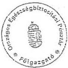

T/2838/1

# JELENTÉS

a társadalombiztosítás pénzügyi alapjainak  
1995. évi zárszámadásához kapcsolódó ellenőrzések  
tapasztalatairól

1996. szeptember

328.

---

A jelentés elkészítéséért felelős:

az ÁSZ IV. Vagyonellenőrzési Igazgatóság
dr. Kovács Árpád igazgató

A vizsgálatot vezette

dr. Csépán Magdolna osztályvezető főtanácsos

A vizsgálatban közreműködtek:

|  Balla Józsefné | tanácsos  |
| --- | --- |
|  dr. Fónyad Erzsébet | tanácsos  |
|  Hegyesné dr. Sólymosi Mária | számvevő  |
|  Hajagos Józsefné | tanácsos  |
|  dr. Kurucz István | tanácsos  |
|  Molnár Istvánné | tanácsos  |
|  Szendrődi Józsefné | számvevő  |

---

# T A R T A L O M J E G Y Z É K

|   | Oldal  |
| --- | --- |
|  Jelentés a társadalombiztosítás pénzügyi alapjainak 1995. évi zárszámadásához kapcsolódó ellenőrzések tapasztalatairól | 1.  |
|  I. BEVEZETÉS, A JELENTÉS KÉSZÍTÉSÉNEK KÖRÜLMÉNYEI | 1.  |
|  II. ÖSSZEFOGLALÓ KÖVETKEZTETÉSEK, MEGÁLLAPÍTÁSOK, JAVASLATOK | 4.  |
|  1. A zárszámadási ellenőrzések főbb tapasztalatai | 6.  |
|  1.1. Az alapok beszámolási és - könyvvezetési kötelezettségének teljesítése | 7.  |
|  1.2. Az alapok főbb előirányzatainak teljesülése | 7.  |
|  1.3. Az egyes ellátási kiadásokat érintő fontosabb megállapítások | 8.  |
|  1.4. Az alapok működési költségvetése | 10.  |
|  1.5. Az alapok vagyongazdálkodási tevékenysége, tartalékainak alakulása | 12.  |
|  1.6. A társadalombiztosítás által folyósított, az alapok forrásait nem terhelő ellátások | 15.  |
|  1.7. Az alapok likviditási helyzete 1995-ben | 16.  |
|  2. Ajánlások, javaslatok | 17.  |
|  III. RÉSZLETES MEGÁLLAPÍTÁSOK | 21.  |
|  1. A Nyugdíjbiztosítási Alap 1995. évi zárszámadásához kapcsolódó ellenőrzések tapasztalatai | 21.  |

---

- 2 -

1.1. A beszámolási és könyvvezetési kötelezettség teljesítése a Nyugdíjbiztosítási Alap ellátási és működési szektorában 21.
1.1.1. Szabályozottság 21.
1.1.2. A beszámolási kötelezettség teljesítése 22.
1.1.3. A mérlegvalódiság érvényesülése, leltárral való alátámasztottsága 23.
1.1.4. A Nyugdíjbiztosítási Alap 1995. évi zárszámadási adatainak szükséges módosítási igénye 24.
1.2. A Nyugdíjbiztosítási Alap bevételi és kiadási előirányzatának teljesítése 26.
1.2.1. A tervezés időszakában figyelembe vett prognózisok 26.
1.3. A nyugdíjbiztosítás működési költségvetése 27.
1.3.1. A működési költségvetés bevételeinek és kiadásainak alakulása 27.
1.3.2. A főbb fejlesztési célok megvalósulása szabályszerűsége 28.
1.4. A Nyugdíjbiztosítási Alap pénzügyi és vagyongazdálkodási tevékenysége 1995-ben 33.
1.4.1. A tevékenység szabályozottsága 33.
1.4.2. Az NY. Alap tartalékainak alakulása 34.
1.4.2.1. Pénzügyi tevékenység, annak eredményessége 34.
1.4.2.2. A tartalékok állománya 1995. év végén 36.

---

- 3 -

1.4.3. Járuléktartozás fejében átvett
vagyon a nyugdíjágazatban 36.
1.4.4. Az ingyenes vagyonjuttatás
keretében átvett vagyon 37.
1.5. A nyugdíjfolyósítás szervei által
folyósított, az NY. Alap forrásait
nem terhelő ellátások 40.
1.5.1. Az ellátások kiadásai 1995-ben 40.
1.5.2. A megállapítás és a folyósítás
működési költségeinek megtérítése 41.
1.5.3. Egyes folyósított ellátások
konkrét vizsgálata 42.
1.6. A Nyugdíjbiztosítási Alap
likviditási helyzete 1995-ben 43.
1.6.1. A kintlevőségek állományának és
összetételének változása 43.
1.6.2. A 10/1995. (III.1.) OGY határozat
ágazatot érintő végrehajtása 43.
1.6.3. A nyugdíjágazat ellenőrzési
tevékenysége 44.
1.6.4. Az állami forgóalap igénybe-
vétele 1995-ben 45.
1.6.5. A Nyugdíjbiztosítási Alap
hiányainak rendezése 45.
2. Az Egészségbiztosítási Alap 1995.
évi zárszámadásához kapcsolódó el-
lenőrzések tapasztalatai 46.
2.1. A beszámolási és könyvvezetési
kötelezettség teljesítése az
Egészségbiztosítási Alap ellátási
és működési szektorában 46.
2.1.1. Szabályozottság 46.
2.1.2. A beszámolási kötelezettség
teljesítése 47.
2.1.3. A mérlegvalódiság érvényesülése 47.
2.2. Az Egészségbiztosítási Alap bevé-
teli és kiadási előirányzatának
teljesülése 48.

---

- 4 -

2.2.1. A tervkészítés időszakában figyelembe vett prognózisok, feltételezések 48.
2.2.2. Az E. Alap fő előirányzatai és azok teljesülése 49.
2.3. Az Egészségbiztosítási Alap főbb ellátási kiadásainak alakulása 50.
2.3.1. A gyógyító-megelőző egészségügyi ellátások finanszírozása 50.
2.3.1.1. Az előirányzat kialakítása és teljesülése 50.
2.3.1.2. A fontosabb kiadási jogcímek ellenőrzése 51.
2.3.1.3. Az 1995. október 1-jei szerződéskötések tapasztalatai 57.
2.3.2. Az E. Alapba tartozó egyéb ellátások 60.
2.3.2.1. Természetbeni ellátások 60.
2.3.2.2. Pénzbeni ellátások 63.
2.4. Az egészségbiztosítás működési költségvetése 64.
2.4.1. A működési költségvetés bevételeinek és kiadásainak alakulása 64.
2.4.2. Főbb fejlesztési célok teljesülése 66.
2.4.2.1. Informatikai fejlesztések 67.
2.4.2.2. A világbanki kölcsönhöz kapcsolódó hazai kiadások 68.
2.5. Az Egészségbiztosítási Alap pénzügyi és vagyongazdálkodási tevékenysége 1995-ben 69.
2.5.1. A tevékenység szabályozottsága 69.
2.5.2. Az E. Alap tartalékainak alakulása 69.
2.5.2.1. Pénzügyi tevékenység, annak eredményessége 69.
2.5.2.2. A tartalékok alakulása 71.
2.5.2.3. A járulék tartozás fejében átvett vagyon az E. Alapnál 72.

---

- 5 -

2.5.2.4. Ingyenes vagyonjuttatás helyzete 73.
2.6. Az egészségbiztosítás szervei által folyósított, az E. Alap forrásait nem terhelő ellátások 77.
2.6.1. Az ellátások alakulása 77.
2.6.2. A folyósítás működési költségeinek megtérítése 78.
2.7. Az Egészségbiztosítási Alap likviditási helyzete 1995-ben 78.
2.7.1. A kintlévőségek állományának és összetételének változása 79.
2.7.2. A 10/1995. (III.1.) OGY. határozat ágazatot érintő előírásainak végrehajtása 80.
2.7.3. A végrehajtási - behajtási tevékenységhez kialakított ösztönzési rendszer működése 81.
2.7.4. Az állami forgóalap igénybevétele 1995-ben 82.
2.7.5. Az E. Alap hiányainak rendezése 83.

Mellékletek

---

1

1

1

1

1

1

1

1

1

1

1

1

1

1

1

1

1

1

1

1

1

1

1

1

1

1

1

1

1

1

1

1

1

1

1

1

1

1

1

1

1

1

1

1

1

1

1

1

1

1

1

1

1

1

1

1

1

1

1

1

1

1

1

1

1

1

1

1

1

1

1

1

1

1

1

1

1

1

1

1

1

1

1

1

1

1

1

1

1

1

1

1

1

1

1

1

1

1

1

1

1

1

1

1

1

1

1

1

1

1

1

1

1

1

1

1

1

1

1

1

1

1

1

1

1

1

1

1

1

1

1

1

1

1

1

1

1

1

1

1

1

1

1

1

1

1

1

1

1

1

1

1

1

1

1

1

1

1

1

1

1

1

1

1

1

1

1

1

1

1

1

1

1

1

1

1

1

1

1

1

1

1

1

1

1

1

1

1

1

1

1

1

1

1

1

1

1

1

1

1

1

1

1

1

1

1

1

1

1

1

1

1

1

1

1

1

1

1

1

1

1

1

1

1

1

1

1

1

1

1

1

1

1

1

1

1

1

1

1

1

1

1

1

1

1

1

1

1

1

1

1

1

1

1

1

1

1

1

1

1

1

1

1

1

1

1

1

1

1

1

1

1

1

1

1

1

1

1

1

1

1

1

1

1

1

1

1

1

1

1

1

1

1

1

1

1

1

1

1

1

1

1

1

1

1

1

1

1

1

1

1

1

1

1

1

1

1

1

1

1

1

1

1

1

1

1

1

1

1

1

1

1

1

1

1

1

1

1

1

1

1

1

1

1

1

1

1

1

1

1

1

1

1

1

1

1

1

1

1

1

1

1

1

1

1

1

1

1

1

1

1

1

1

1

1

1

1

1

1

1

1

1

1

1

1

1

1

1

1

1

1

1

1

1

1

1

1

1

1

1

1

1

1

1

1

1

1[{"box_2d":

---

ÁLLAMI SZÁMVEVŐSZÉK

V-11-38/1996.

Témaszám: 326

# J E L E N T É S

a társadalombiztosítás pénzügyi alapjainak
1995. évi zárszámadásához kapcsolódó ellenőrzések
tapasztalatairól

I. BEVEZETÉS, A JELENTÉS KÉSZÍTÉSÉNEK KÖRÜLMÉNYEI

Az államháztartásról szóló 1992. évi XXXVIII. törvény 86. §.
(3) bekezdése szerint a társadalombiztosítás költségvetésé-
nek végrehajtásáról szóló törvényjavaslatot az Országgyűlés
az Állami Számvevőszék jelentésével együtt tárgyalja meg.

Zárszámadási ellenőrzési kötelezettségének az ÁSZ 1992. óta
rendszeresen eleget tett. Az ellenőrzés körülményei azonban
minden esztendőben "rendhagyóak" voltak.

Az 1995. évi zárszámadási ellenőrzéseit az tette "különle-
gessé", hogy az 1996. évi XLVII. törvénnyel módosultak a
társadalombiztosítás önkormányzati igazgatásáról szóló 1991.
évi LXXXIV. törvény előírásai. Ebben a társadalombiztosítási
alapok zárszámadásának "menetrendjét" is szabályozták.

---

- 2 -

E szerint:

- az adott biztosítási önkormányzat az általa elfogadott zárszámadást (E. Alap zárszámadását és Ny. Alap zárszámadását) jóváhagyása után június 30-ig küldi meg a Kormány részére; - a Kormány pedig a zárszámadásról szóló törvényjavaslatot - legkésőbb augusztus 31-ig - nyújtja be az Országgyűlésnek.

A változás lényege, hogy az önkormányzatok 'csak' a beszámolót fogadják el, de a zárszámadási törvényjavaslat benyújtása a Kormány feladatát képezi.

A törvényi előírás szerint az ÁSZ-nak jelentése elkészítéséhez a törvényjavaslat benyújtását megelőzően hatvan nap áll rendelkezésére. Az ÁSZ-nak így a kormánnyal párhuzamosan és egyidejűleg kell a zárszámadási ellenőrzéseket elvégeznie, végleges, lezárt dokumentumok hiányában. Nem rendelkeztek arról sem, hogy az ÁSZ e dokumentumokat időben megkapja a Kormánytól.

Az ÁSZ az ellenőrzéseket végül is az alapok (auditált) költségvetési beszámolói, továbbá a biztosítási önkormányzatok által június végén elfogadott zárszámadások alapján végezte el.

A kormány által benyújtott T/2838. számú törvényjavaslatot az ÁSZ augusztus 30-án kapta meg. A Kormány a társadalombiztosítási önkormányzatok által elfogadott zárszámadásokon lényeges változtatást nem hajtott végre, a két Alap beszámolóit 'összevonva' készítette el a törvényjavaslatot. Nem élt a törvényben biztosított ellenőrzési jogával sem.

Az Egészségbiztosítási és a Nyugdíjbiztosítási Alap zárszámadási ellenőrzése során az ÁSZ a fő hangsúlyt az 1995. évi LXXIII. törvényben foglaltak megvalósulására, az eltéréseket meghatározó főbb okok feltárására helyezte, a törvényességi és célszerűségi szempontok, valamint az ágazati sajátosságok egyidejű érvényesítése mellett.

---

- 3 -

Az ellenőrzések 'hagyományos' célja a vizsgált év folyamatainak széleskörű áttekintése, a biztosítási ágak helyzetének bemutatása is.

A társadalombiztosítási alapok 1995. évi zárszámadásához kapcsolódó számvevőszéki vizsgálatok súlypontjait és időrendjét két felkérés is befolyásolta. Egyrészt az Országgyűlésnek az Egészségbiztosítási Önkormányzat és az Országos Egészségbiztosítási Pénztár gazdálkodásával foglalkozó vizsgáló bizottsága arra kérte fel az ÁSZ-t, hogy munkája segítése érdekében bizonyos kapcsolódó ellenőrzési feladatokat időben korábban és a zárszámadási vizsgálathoz szükséges mélységnél részletesebben végezzen el és tapasztalatait adja át a bizottságnak. Másrészt a Kormány 1996. július 24-i 2199/96. sz. határozatának 6.3. pontja alapján az ÁSZ arra kapott felkérést, hogy a társadalombiztosítási alapok gazdálkodását soron kívül 'világítsa át'.

Az ÁSZ az országgyűlési bizottság felkérésének 1996. július végén a V-11-12/1996. számú jelentése átadásával eleget tett. A dokumentum részletesen foglalkozott az egészségügyi kockázatkezelésre fordított kiadások ügyével. Így e jelentés a korábban, részletesen kifejtett megállapítások közül csak a zárszámadáshoz közvetlenül kapcsolódókra utal vissza.

Az 'átvilágításra' vonatkozó felkérés értelmezésére a Pénzügyminisztérium és a Népjóléti Minisztérium egy 12 pontból álló témajavaslatot adott át. Az ÁSZ a témajavaslatban szereplő kérdésekre két szakaszban az 1995-ről szóló zárszámadási jelentésben, illetve a társadalombiztosítási alapok 1997. évi költségvetési javaslatához fűzött véleményében tesz eleget. Az 'átvilágítás' javasolt témái közül a jelentés elsősorban a nyilvántartási-informatikai rendszer és a kapcsolódó beruházások ügyével, a járuléktartozás fejében

---

- 4 -

átvett vagyon hasznosításával, a kintlévőségekkel, az ú.n. függő bevételek összetételével, az alapok hitelfelvételével és hiányának összefüggéseivel foglalkozik. A külön felkérés teljesítése, valamint az a tény, hogy a benyújtott zárszámadási dokumentum a benne szereplő 'számok' hátteréről, megalapozottságáról igen szűkszavú információkat tartalmaz, visszahatott a jelentés tartalmi részletességére és hangsúlyaira.

A társadalombiztosítás pénzügyi alapjainak 1995. évi zárszámadásához kapcsolódó ellenőrzések tapasztalatairól szóló jelentés II. fejezete az összefoglaló tapasztalatokat, következtetéseket, javaslatokat a két alapra nézve együtt tárgyalja, míg a III. fejezet külön részletesen foglalkozik az Egészségbiztosítás és a Nyugdíjbiztosítási Alapnál tapasztaltakkal. Az ÁSZ ezzel is jelezni kívánja az alapok gazdálkodásával, sajátosságaival, eltérő jellegével kapcsolatos, korábbi években is jelzett véleményét.

Az ÁSZ a zárszámadáshoz kapcsolódó ellenőrzéseinek tapasztalatairól szóló jelentés tervezetét – észrevételeket kérve – 1996. szeptember 5-én megküldte az önkormányzatok elnökeinek, az ONYF és az OEP főigazgatójának, valamint a Pénzügyminisztériumnak és a Népjóléti Minisztériumnak.

Észrevételezési, véleményezési lehetőségével a két igazgatási szerv vezetője élt. A vizsgálatot végző számvevők az ONYF főigazgatójával és munkatársaival személyes konzultációt is folytattak. A jelentés véglegesítése a kapott észrevételek figyelembe vételével történt meg.

Az ONYF és az OEP levelét, amelyben az ÁSZ megállapításaival kapcsolatos álláspontot kifejtik a jelentés 4.sz melléklete tartalmazza.

---

- 5 -

## II. ÖSSZEFOGLALÓ KÖVETKEZTETÉSEK, MEGÁLLAPÍTÁSOK, JAVASLATOK

Az Állami Számvevőszék két alkalommal véleményezte a társadalombiztosítás pénzügyi alapjainak 1995. évi költségvetését. A Kormány által 1995. márciusában visszakért és átdolgozott költségvetési javaslat (az önkormányzati és a kormány álláspontot tükröző) két változatából az Országgyűlés által végül megalkotott 1995. évi LXXIII. törvény több formai és tartalmi hiányosságot, ellentmondást hordozott magában (például a beruházási lehetőségek, a világbanki hitelhez kapcsolódó hazai kiadások, a behajtási tevékenység ösztönzésének szabályozása esetében).

Ezekkel a végrehajtás értékelésekor is szembe kell nézni. Legtöbb problémát a nyugdíjágazat beruházási tevékenységének szabályai jelentették. Ezek ellentmondásossága hozzájárult a törvényi előírások betartásával kapcsolatos gondokhoz.

Az 1995. közepén megszületett költségvetési törvényben rögzített egyensúlyi állapot már a törvény megjelenésének pillanatában sem volt reális és betartható. A költségvetési 'sarokszámokat' megalapozó intézkedések jelentős részét az Alkotmánybíróság hatályon kívül helyezte. A gazdasági-társadalmi folyamatok iránya az eredeti prognózisokhoz képest változott, s ez kihatott a társadalombiztosítás pénzügyi pozíciójának alakulására is.

Mindezek következtében a Nyugdíjbiztosítási és az Egészségbiztosítási Alap pénzügyi helyzete a vártnál lényegesen kedvezőtlenebbül alakult, a bevételek nem fedezték a kiadásokat és nem javult az ellátások színvonala sem. Pótköltségvetés készítésére azonban év közben már nem került sor.

---

- 6 -

Reformértékű intézkedésekre igazából egyik ágazatban sem került sor. Az egészségügyi intézményekkel 1995. végén kötött szerződések, illetőleg ezek hatása nem tekinthető ilyennek.

## 1. A zárszámadási ellenőrzések főbb tapasztalatai

### 1.1. Az alapok beszámolási és könyvvezetési kötelezettségének teljesítése

Az ÁSZ minden eddigi zárszámadási jelentése megállapította, hogy a társadalombiztosításra is vonatkozó költségvetési előírások eltérések nélkül maradéktalanul nem tarthatók be. Ezt kényszerűen most is rögzíteni kell. Az eltéréseket, sajátosságokat egységes rendszerbe foglaló (törvényi szintű) szabályozás nem született meg.

A költségvetési beszámoló elkészítésének határidejét a két biztosítási alap esetében a tárgyévet követő év május 31.-ére módosították. Ezt a határidőt sikerült megtartani, sőt eddig gyakorlatilag a világbanki kölcsönszerződés feltételeként előírt könyvvizsgálat is lezárult. Az auditor az alapok beszámolóit a mellékelt hitelesítő záradékkal látta el. (2. sz. melléklet.)

A mérlegvalódiság elvének érvényesülését mindkét alapnál változatlanul akadályozza a kimutatott tartozás állomány adatának bizonytalansága (a megfelelő nyilvántartási rendszer kialakítását szolgáló informatikai fejlesztés késedelme miatt). Ezt a nyugdíjágazatban egyéb bevételi és kiadási tételek pontatlansága is fokozza.

Az ágazatok beszámolása és könyvvezetése során más számviteli alapelvek is sérültek.

---

- 7 -

A Nyugdíjbiztosítási Alap és a működési költségvetés zárszámadásának egyes tételei eltérnek az auditált költségvetési beszámolóban foglaltaktól. Ezért az ÁSZ számszaki módosításokra tesz javaslatot. Kisebb korrekciókra az Egészségbiztosítási Alap zárszámadását érintően is szükség van. A módosításokat, azok magyarázatával együtt a jelentés 1/a. és 1/b. számú melléklete összegzi.

A nyugdíjbiztosítás zárszámadása nem mutatja be, hogy az ellátási szektor vagyonából 1994-ben és 1995-ben szerzett ingatlanokat térítésmentesen átadták a működési költségvetésnek. Ezen intézkedésnek az ÁSZ szerint nem volt jogalapja. A pénzeszközök és vagyonelemek ellátási és működési szektor közötti átcsoportosításáról csak az Országgyűlés dönthet. Elvileg is helytelen, a tisztánlátást akadályozza a két terület 'összemosása'.

### 1.2. Az alapok főbb előirányzatainak teljesülése

Az 1995. évi LXXIII. törvény a Nyugdíjbiztosítási és az Egészségbiztosítási Alap költségvetését azonos kiadási és bevételi főösszeggel, 0-egyenleggel fogadta el.

A tervezett egyensúly azonban egyik ágazatban sem valósult meg. A bevételek elmaradtak az előirányzattól. Ebben az egyéni, a munkáltatói és a munkanélküli ellátások utáni járulékbevételek elmaradása volt a meghatározó elem.

A nyugdíjkiadások gyakorlatilag a tervezett szinten teljesültek. Az egészségbiztosítás egyes ellátási kiadásainál azonban jelentős túllépés következett be.

---

- 8 -

Az alapok együttesen számított bevételei a tervezett 853,5 milliárd forinttal szemben végül is 822,2 milliárd forintra, a kiadások pedig az előirányzott 853,5 milliárd forint helyett 862,7 milliárd forintra teljesültek. Így az együttes hiány valamivel több, mint 40 milliárd forint. Az ÁSZ számszaki észrevételeinek Országgyűlés általi elfogadása esetén ezen összegek is módosulnak. Összességében az alapok hiánya 167 millió forinttal lesz kevesebb.

### 1.3. Az egyes ellátási kiadásokat érintő fontosabb megállapítások

A nyugdíjkiadásokat (az 1995. év tényadata az Ny. Alap esetében 443,2 milliárd forint) a vonatkozó előírások értelmében a nettó kereseti színvonal várható alakulása határozza meg. A tervezés időszakában 14,5 %-os növekedésre számítottak. Éves szinten a nyugdíjak 15,3 %-kal emelkedtek, két alkalommal volt nyugdíjemelés, márciusban 11 % és szeptemberben 4 %. Ez a nettó keresetek szintjét valamivel meghaladó emelést jelentett.

Az Egészségbiztosítási Alap ellátásai közül az ÁSZ mindig kiemelt figyelmet fordít a gyógyító-megelőző egészségügyi ellátás finanszírozásának témakörére. Az egészségügy reformjának célkitűzéseit jelentős részben a biztosító területén és eszközrendszerével kívánják elérni, a figyelem ezért is indokolt.

Az egészségügy finanszírozás 192,3 milliárd forintos költségvetési előirányzata 1995-ben – az energia áremelés egyszeri kompenzációjának és a végrehajtás során elért “megtakarítás” eredményeként – 191,1 milliárd forintra teljesült.

---

- 9 -

A kiadások alakulását jelentősen meghatározta a közalkalmazottak alapilletményének 1995. évi emelése, az intézményi előirányzatok külön törvény alapján megemelt összege az esetszám szerint finanszírozott ellátások keretösszegének megemelése és az u.n. célelőirányzati keret felhasználása.

Évközben jelentős összegeket kitevő forrás átcsoportosításokat hajtottak végre az egyes kasszák, illetve a célelőirányzatok között. Ennek jogszabályi háttere azonban nem tisztázott egyértelműen. Az ellenőrzés tapasztalatai is rávilágítottak a finanszírozás főbb gondjaira.

Ilyenek:

- az esetfinanszírozás területén mutatkozó súlyos ellentmondások, a valós teljesítmények elszámolásának problémái,
- a biztosító megelőzés területén viselt szerepvállalásának, felelősségének tisztázatlansága, a kialakult pályázati támogatási rendszer visszásságai,
- az 1995. októberi szerződéskötések előkészítetlensége, lebonyolítása (aminek révén a remélt megtakarításokat nem lehetett elérni),
- az intézményi finanszírozás kiegyenlítésére irányuló törekvések sikertelensége.

A reform indulásakor megfogalmazott, általános célhoz, miszerint egy a szükségletekhez jobban alkalmazkodó és finanszírozható, jól működő egészségügyi ellátó rendszer alakuljon ki - ezidáig - nem sikerült közelebb kerülni. A finanszírozás reformját kiemelték a folyamat többi lépése közül, ami - önmagában - nem eredményezte (nem is eredményezhette) az ellátó rendszer átalakítását. Eközben ugyanis hiá-

---

- 10 -

nyoztak – sok esetben még elviekben sem tisztázódtak – a reform következetes végrehajtásához szükséges egyéb feltételek.

Az Egészségbiztosítási Alapba tartozó egyéb fontosabb természetbeni ellátásoknál (gyógyszertámogatás, gyógyászati segédeszköz támogatás, gyógyfürdői szolgáltatások) az előirányzathoz viszonyított kiadásnövekedés következett be – a támogatási rendszerek átalakítása ellenére.

Az Alapból nyújtott pénzbeni ellátások közül a legjelentősebbek a rokkantsági nyugdíj, a terhességi-gyermekágyi segély, illetőleg a táppénz. Ezekből a táppénzkiadások lépték túl (a betegszabadság kiterjesztésére hozott törvényi rendelkezés visszavonásának hatására) a tervezett összeget.

### 1.4. Az alapok működési költségvetése

A társadalombiztosítás ellátási feladatainak teljesítéséhez – az 1994-ben keletkezett pénzmaradvány felhasználását is figyelembe véve – a zárszámadási adatok szerint 21,7 milliárd forint állt rendelkezésre, ami a nyugdíjágazatban 9,2, az egészségbiztosítás területén 12,5 milliárd forintot jelent.

A nyugdíjbiztosítást érintően a működési költségvetés zárszámadásának bevételi és kiadási adatait meg kell változtatni (1,3 milliárd forinttal csökkenteni kell), ami az Ny. Alap főösszegének, tartalék-adatainak változtatását is maga után vonja. Nem fogadható el ugyanis, hogy egyes befektetéseket a zárszámadásban beruházásként szerepeltetnek, mely probléma abból adódik, hogy a működési célú beruházások megvalósítása az eredeti törvényi előírásoktól eltérő módon történt.

---

- 11 -

Az 1995. évi LXXIII. törvény a nyugdíjágazat működési kiadásainak 'látszólagos' csökkentése céljából – utólag erősen vitatható, bonyolult szabályozással – megengedte, hogy a törvényben előirányzott 940 millió forintos beruházási költséget – a Nyugdíjbiztosítási Alap tartalék vagyonát jelentő – befektetett eszközök értékesítéséből származó forrásból túllépjék, további 930 millió forinttal.

A valóságban azonban csak 525 millió forint tényleges épületberuházást lehet a költségvetés végrehajtásánál figyelembe venni, a többi (1325+5=1330 millió forint) formálisan nem beruházás, hanem üzletrészek megszerzésére, illetőleg meglévő irodaházak felújítására felhasznált tartalék vagyon. Ez egyébként az Alap auditált költségvetési beszámolójában is 'részesedésként' szerepel.

A beruházási folyamatba közbeiktatott gazdasági társaságok az alapítói vagyonból sajátjukként valósították meg a beruházásokat. E célszerűségében és indokoltságában vitatható megoldás miatt a zárszámadásban nem lehet a valós pénzügyi eseményeket bemutatni. Erre utólag is csak akkor lenne mód, ha a két kft-t (VIR Kft és NYUGBER-CENTER Kft) a biztosítási önkormányzat megszüntetné, vagy – a tulajdonviszonyok rendezése mellett – döntenének a kft-k tevékenységi körének korlátozásáról (üzemeltetés, hasznosítás, beruházás-bonyolítás). Hasonlóan a térítésmentesen átadott irodaépületek hasznosításához, még az esetben is országgyűlési döntést igényelne, hogy az épületek – forrásuk eredete szerint – az Alap vagyonát képezik-e, vagy onnan átkerülnek a működési költségvetésbe.

Az ellentmondásos helyzet kialakulásáért a törvényelőkészítés hibái mellett – hiszen a szabályozás gondjai szinte késztetést adtak a törvényi előírások megkerülésére – a Nyugdíjbiztosítási önkormányzat is hibáztatható mivel a

---

- 12 -

tényleges eseményeket elfedő tulajdonosi döntéseket hoztak (például a kft-k megalapításakor).

Ugyancsak a nyugdíjbiztosítás működési költségvetését érinti az a megállapítás, miszerint a világbanki kölcsönnel kapcsolatos hazai kiadások esetében a fel nem használt összegéből (118 millió forintból) pénzmaradványt képeztek, ami indokolatlan volt.

Kisebb számszaki észrevételek miatt az egészségbiztosítás működési költségvetését (pénzmaradványát) is korrigálni kell, mert az arculattervezés költségeit nem vették figyelembe és a világbanki kölcsön hazai ráfordításai között oda nem illő tételeket számoltak el.

### 1.5. Az alapok vagyongazdálkodási tevékenysége, tartalékainak alakulása

Az államháztartási törvény 85. §. előírása ellenére a társadalombiztosítás vagyongazdálkodásáról szóló törvény sem született meg. A törvény hiányát – vizsgálati tapasztalatai alapján – az ÁSZ ugyancsak ismétlődően állapítja meg. Az alapok vagyongazdálkodási tevékenysége egyre sokrétűbbé válik, annak szabályszerűségi, célszerűség és eredményességi szempontból való minősítése – megfelelő szabályozás nélkül – az ellenőrzés számára sem egyszerű feladat (ami például a nyugdíjágazat beruházási tevékenységének megítélése szempontjából nagy gondot okozott).

A tartalékoknak a zárszámadási törvényben történő szerepeltetése alkalmatlan arra, hogy az alapok valós vagyoni helyzetét áttekinthetően, világosan mutassa be.

---

- 13 -

Az E. Alap befektetett eszközökből származó bevétele a zárszámadás szerint 159 millió forint volt. Ezen felül az ingyenes vagyonjuttatásból származott még 15 millió forintos hozambevétele. Megjegyzendő, hogy a költségvetési törvény az utóbbira 500 millió forintos bevételi előirányzatot tartalmazott, ami azért nem teljesült, mert az Alap részére járó osztalék, illetve árfolyamnyereség pénzforgalmilag nem realizálódott, ezeket rögtön 'visszaforgatták', a befektetett eszközök állományát növelték és (ellentétben a költségvetési törvény előírásaival) nem vonták be a folyó finanszírozásba. Mindez szintén visszavezethető a szabályozás hiányosságaira és ellentmondásaira is.

A Nyugdíjbiztosítási Alap tartalékait, működési költségvetését is érintő értékesítések, befektetések, működési célú beruházások eseményeit az 1.4 pont részletesen ismerteti. Az ezekhez fűzött ellenőrzési megállapítások miatt az Alap tartalékainak alakulását bemutató melléklet adatai sem fogadhatóak el, végső soron módosulnak a befektetések hozama tartalék, illetve a tartós befektetések 1995. évi állományi adatai.

A likviditási tartalék a rendezetlen hiány(ok) tartalékba helyezésével mindkét alapnál negatív előjelű szám, melynek törvényben való megjelenítését az ellenőrzés nem tartja célszerűnek. A tapasztalatok a tartalékokra vonatkozó szabályozás újragondolását igénylik, szoros összefüggésben a vagyon-gazdálkodással.

A járuléktartozás fejében átvett vagyon névértéke 1995-ben összességében 4,1 milliárd forint volt. A részvények, üzletrészek, követelések eszmei hányadok szerint oszlanak meg az alapok között. Az átvételeket a tartozások kezelését végző OEP bonyolítja. Változatlan gond, hogy a járuléktartozás fe-

---

- 14 -

jében történő vagyonátvétel tényleges célja – annak értékesítése és a finanszírozásba való bevonása – eddig nem valósult meg.

A vagyonelemek részben bírói végzéssel, részben az adósokkal kötött megállapodások útján kerülnek a biztosítóhoz. Átvételük azonban korántsem jelenti a tartozás megtérülését, mivel az adósok jelentős része felszámolás alatt áll, a vagyon névértéke sem éri el a tartozás összegét, az átvett gazdasági társaság tartósan veszteséges, az adott vagyontárgy nem forgalomképes, év végén az átvett vagyon után is értékvesztéseket kell elszámolni.

Az 1995. évi LXXIII. törvény „újraszabályozta” a társadalombiztosítás részére történő ingyenes vagyonjuttatást, annak végső időpontjául 1995. végét jelölte meg és a korábbi 300 milliárd forintos nagyságrendet 55–65 milliárd forintra csökkentette. A vagyonjuttatás járulékarányosan illeti meg a két biztosítási ágat.

A megadott határidőig a Nyugdíjbiztosítási Alaphoz mintegy 4,6 milliárd forint, az Egészségbiztosítási Alaphoz pedig 5,4 milliárd forint értékben kerültek át különféle vagyonelemek (banki részvények, működési célt szolgáló ingatlanok, gazdasági társaságok részesedései). Az átvett vagyont a törvényjavaslat 8. és 9. számú mellékletei tartalmazzák, az Ny. Alapnál összevontan, az E. Alapnál vagyonelemenként, áttekinthető részletezettséggel.

A vagyonátadás határidőre való teljesítésének elmaradásáról, a vagyonjuttatás rendezéséről újabb rendelkezés nem született.

---

- 15 -

Az ÁSZ korábban is jelezte, hogy a társadalombiztosítás részére történő vagyonjuttatás célja, rendeltetése nem tisztázott egyértelműen.

Az eredeti nagyságrendnek töredékét jelentő vagyon átadásának közvetlen, gazdálkodást javító hatása nincs. Ilyen nagyságrendű vagyon hozama még hosszabb távon sem képes a társadalombiztosítás pénzügyi egyensúlyát helyreállítani. A biztosítottak érdekei szempontjából tehát 'közömbös', hogy az egészségbiztosítónak, illetve a nyugdíjbiztosítónak van-e egyáltalán vagyona. Ugyanakkor a vagyonnal kapcsolatos ráfordítások terhelik a szűkös forrásokat, és az igazgatási szervezetben vagy azon kívül megjelenik egy, a költségvetési gazdálkodástól eltérő feladatfelfogású tevékenység, mely külön felkészülést kíván.

A vagyonátadás eredeti céljaitól eltér az is, hogy miközben folyik a vagyon átadása, az éves költségvetési törvények az alapok meglévő vagyonának hozamát, de adott esetben magukat a tartós befektetéseket is fokozatosan bevonják a folyó finanszírozásba, tehát az alapokat a vagyon felélésére 'kényszerítik'.

### 1.6. A társadalombiztosítás által folyósított, az alapok forrásait nem terhelő ellátások

A Nyugdíjbiztosítási és az Egészségbiztosítási Alap által folyósított ellátások tényleges kiadásai 1995-ben 215,6 milliárd forintot tettek ki. Az eredeti előirányzat 205,7 milliárd forint volt. Az ellátásokat nagyobb részben a központi költségvetés finanszírozza.

---

- 16 -

A törvényjavaslat 7. számú melléklete – főként az ellátások összetettsége miatt – bonyolult, nehezen áttekinthető. Ebben a nyugdíjbiztosítást érintően az adattartalom is kifogásolható, átdolgozásra szorul.

Az ellátásokhoz kapcsolódó működési kiadásokat a finanszírozó az általa elfogadott számítási módszerrel megállapítva téríti meg. A megtérített összeg a működési költségvetés bevételét képezi.

### 1.7. Az Alapok likviditási helyzete 1995-ben

Az alapok pénzügyi pozíciója 1995-ben sem javult, a tendenciák a megelőző évekéhez hasonlóak. A tervezett egyensúly nem valósult meg, a járulékbevételek jelentősen elmaradtak a tervezett összegtől, míg az Egészségbiztosítási Alap egyes kiadási tételei jelentősen meghaladták az előirányzatokat. Az Alapok együttes hiánya több, mint 40 milliárd forint.

A kedvezőtlen pénzügyi helyzetet részben befolyásolja, hogy a társadalombiztosítással szembeni adósság állomány tovább nőtt, 1995. végén már meghaladta a 230 milliárd forintot. A tartozások behajtására (figyelemmel a 10/1995. (III. 1.) országgyűlési határozatban foglaltakra is) a társadalombiztosítás igazgatási szervei – elsődlegesen az egészségbiztosítás – megkülönböztetett figyelmet fordítottak, ami különösen a behajtási tevékenység fokozásában, illetve kiemelt kezelésében nyilvánult meg.

A megtett intézkedések sem voltak azonban képesek biztosítani a kívánt pénzügyi egyensúlyt. Az intézkedések közül legjelentősebb a tartozások rendezésének új feltételekre épülő rendszere, az adósokkal való megállapodások megkötése volt.

---

- 17 -

A végrehajtási, behajtási, ellenőrzési tevékenység színvonalának javítása céljából, mindkét ágazatban külön ösztönzési rendszert vezettek be. Az erre vonatkozó törvényi szabályozás ellentmondásossága és pontatlansága következtében az egészségbiztosítás területén az előirányzottnál lényegesen kisebb behajtási összeg eléréséért 50 %-kal több jutalmat fizettek ki.

Mindkét Alap rendszeresen és növekvő összeg erejéig vette igénybe az ellátások finanszírozásához az állami forgóalapot, a legmagasabb összeg az NY. Alap esetében 66 milliárd forint, az E. Alap esetében pedig 83 milliárd forint volt.

Az 1992-94. év között felhalmozódott hiányok jogi rendezése az 1996. évi központi költségvetésről szóló 1995. évi CXXI. törvény szerint megtörtént. Az 1995. év hiányának rendezése az 1995. évi központi költségvetés zárszámadási törvényben várhatóan megoldódik, a kincstári számlához kapcsolt megelőlegezési számlán fennálló adósság elengedésével.

A hiányrendezés említett módozatai azonban nem jelentik az alapok konszolidálását. A bevételek és a kiadások összhangjának hiánya miatt a kiadási többlet keletkezése szinte természetes, aminek rendezése évről-évre felmerülő igény.

## 2. AJÁNLÁSOK, JAVASLATOK

Az ÁSZ az 1995. évi zárszámadási vizsgálatok alapján a társadalombiztosítás pénzügyi alapjainak 1995. évi zárszámadásáról szóló T/2838. számú törvényjavaslat tárgyalásához kapcsolódóan a következőket kéri, illetve javasolja.

---

- 18 -

# Az Országgyűlés

-- fogadja el az ÁSZ-nak a Nyugdíjbiztosítási és az Egészségbiztosítási Alap zárszámadásaihoz tett számszerű észrevételeit (a jelentés 1/a. és 1/b. számú mellékletei szerint) és ennek megfelelően fogadja el a T/2838 sz. törvényjavaslat normaszövegét és annak számszaki mellékleteit,

-- kötelezze a Kormányt a társadalombiztosítás sajátosságait tükröző, mindeddig hiányzó törvények mielőbbi előkészítésére, amelyekben egyértelműen rögzítésre kerülnek a működés, gazdálkodás, elszámolás, vagyongazdálkodás kötelezően érvényesítendő előírásai, valamint a biztosítási ágak helye, kapcsolatrendszere az államháztartás keretei között,

-- kérje fel a Nyugdíjbiztosítási Önkormányzatot, illetőleg az Országos Nyugdíjbiztosítási Főigazgatóságot, a 3,8 milliárd forintot kitevő összegű (az 1995. évi költségvetési beszámolóban függő bevételként kezelt) visszaérkezett nyugdíj tételének rendezésére, tisztázására, lehetőség szerint annak még az 1995. évi zárszámadásban való részbeni figyelembevétele - a hiány mérséklése - érdekében,

-- kérjen beszámolót a biztosítási ágak legfontosabb nyilvántartási rendszereinek helyzetéről, az informatikai háttér megteremtése érdekében tett intézkedésekről, különös tekintettel az érintett területeken végrehajtott fejlesztésekre, azok pénzügyi vonzatára és a megvalósítás eredményességére, összefüggésben a világbanki kölcsönből megvalósítani tervezett fejlesztésekre is,

---

- 19 -

-- állásfoglalásában ismételten erősítse meg, hogy a gyógyító-megelőző egészségügyi ellátás törvényi előirányzatából kockázatkezelés-megelőzés címén nyújtott támogatások beruházási célra nem használhatók.

# A Kormány

-- haladéktalanul tegye meg a szükséges intézkedéseket az ajánlott törvények előkészítésére.

-- gondoskodjon arról, hogy az Állami Számvevőszéknek, törvényben meghatározott ellenőrzési kötelezettsége teljesítéséhez, megfelelő idő álljon rendelkezésre és a zárszámadás végleges dokumentumai az ÁSZ-hoz időben eljussanak,

-- az Országgyűlés döntéseinek előkészítése érdekében alakítsa ki álláspontját és terjessze azt az Országgyűlés elé a Nyugdíjbiztosítási Alap vagyonából megvalósított, illetve az ingyenes vagyonjuttatás keretében kapott működési célú ingatlanok hovatartozását illetően,

# A társadalombiztosítási önkormányzatok és központi igazgatási szerveik

-- tekintsék át és értékeljék az ágazatok számára kiemelt fontosságú nyilvántartási rendszerek és az ezekhez kapcsolódó informatikai fejlesztések helyzetét, a tett intézkedéseket és erről számoljanak be az Országgyűlésnek,

-- alakítsák ki az ingyenes vagyonjuttatás keretében az önkormányzatok tulajdonába kerülő vagyonnal való gazdálkodás, hasznosítás koncepcióját, hasonlóan a tartozás fejében átvett vagyonelemek mielőbbi értékesítésére vonatkozó programjukat,

---

- 20 -

-- a nyugdíjbiztosítás területén dolgozzák ki a számviteli nyilvántartások egyeztetésének megbízható rendjét, amely alkalmas a költségvetés szerkezetének megfelelő adatok szolgáltatására és ellenőrzésére is,

-- az egészségbiztosítás területén alakítsák ki a vagyon-gazdálkodás áttekintésére, ellenőrzésére alkalmas nyilvántartás rendszerét,

-- a vényfeldolgozás tapasztalatai alapján az OEP tegyen javaslatot a szükséges jogszabályi és egyéb intézkedésekre,

-- az OEP alakítsa ki az esetfinanszírozásba tartozó egészségügyi szolgáltatások korrekt, ellenőrizhető elszámolási rendjét,

-- mindkét ágazatban törekedjenek a külső és belső ellenőrzések hatékonyságának fokozására, az eddigieknél jobban támaszkodjanak az ellenőrzés eszközrendszerére.

A társadalombiztosítási alapok zárszámadásával kapcsolatos összegszerű, számszerű módosítási javaslatokat az 1/a. és az 1/b. számú mellékletek tartalmazzák.

---

- 21 -

### III. RÉSZLETES MEGÁLLAPÍTÁSOK

#### 1. A Nyugdíjbiztosítási Alap 1995. évi zárszámadásához kapcsolódó ellenőrzések tapasztalatai

##### 1.1 A beszámolási és könyvvezetési kötelezettség teljesítése a Nyugdíjbiztosítási Alap ellátási és működési szektorában

###### 1.1.1. Szabályozottság

A nyugdíjbiztosítás – az egészségbiztosítással együtt – az államháztartás alrendszere, a beszámolási és könyvvezetési kötelezettséget mindeddig a költségvetési szférára érvényes szabályok határozzák meg.

Az ÁSZ minden eddigi zárszámadási jelentése megállapította, hogy a 'hagyományos' költségvetési előírások alkalmazása csak eltérések mellett lehetséges. Az eltérések szabályozása azonban továbbra sem történt meg, annak ellenére, hogy az alapok pénzügyi szabályozásáról szóló törvénytervezet megalkotását 1995. év elején kormányhatározat is célul tűzte (2015/1995. (I.26.) számmal). A késedelmet az államháztartás reformja, a kincstári rendszer megkezdett kiépítése csak részben magyarázza.

Az alapokra vonatkozó törvényi előírások és a költségvetési-számviteli szabályok hiányosságaira, ellentmondásaira (amit a pénzügyi szétválás csak fokoz) az auditálást végző cég jelentése is rámutat.

---

- 22 -

### 1.1.2. A beszámolási kötelezettség teljesítése

A Pénzügyminisztérium a módosított 139/1993./X. 12.) Kormányrendelet szerint az alapok beszámolóinak elkészítéséhez rendelkezésre bocsátotta a D-jelű nyomtatvány garnitúrát, de kitöltési útmutatót nem készített. Ennek hiányában egyes tételek számbavételét illetően a két ágazatnál eltérő gyakorlat alakult ki.

A nyugdíjágazatnál hogy a működési szektorban nem különül el az Alaptól a működés céljaira átvett és a külső forrásokból származó pénzeszköz (pl. a folyósított ellátások után az NM fejezettől kapott megtérítése), mindkét bevételt a 46-os főkönyvi számlára könyvelik.

E tekintetben az egészségbiztosítás gyakorlata a helyes, ahol az Alaptól átvett pénzt a 9-es számlaosztályban könyvelik. Az eltérő megoldást az auditorok nem kifogásolták.

A költségvetési beszámoló késedelmes elkészítését az ÁSZ korábban rendszeresen kifogásolta. Időközben az eddigi (márciusi) határidő május 31.-re módosult, amit az 1995. évről szóló beszámoló esetében már sikerült betartani.

A Nyugdíjbiztosítási Alap és a működési költségvetés zárszámadásának egyes tételei nem felelnek meg a költségvetési beszámolóban foglaltaknak (tartalékok, egyes működési kiadások eltérései) ami a zárszámadás alapját is képezi.

További probléma, hogy a törvényben meghatározott előirányzatok nyilvántartása, egyeztetése nincs szabályozva (a költ-

---

- 23 -

ségvetési és a számviteli szakterület között). Az ONYF az 1994. és 1995. évi jóváhagyott pénzmaradvány felhasználásáról nem vezet nyilvántartást.

Több ponton hiányos, illetve helytelen a számlarend is. Nem ad például eligazítást az eredetileg az Alap vagyonát képező, de működési célra használt ingatlanokkal kapcsolatos elszámolásokra, nem írja elő az analitikus és főkönyvi adatok kötelező egyeztetését sem a szakfőosztályokkal.

### 1.1.3. A mérlegvalódiság érvényesülése, leltárral való alátámasztottsága

Az Ny. Alap mérlegét is érinti az adósállomány adatának pontatlanságára, az előidéző okokra vonatkozóan az Egészségbiztosítási Alapnál részletesen kifejtett ellenőrzési megállapítás.

A nyugdíjágazat mérlege, költségvetési tartaléka és a tárgyévi folyó bevételek adata azért nem valós, mert nem rendezték a 3,8 milliárd forint összeget kitevő visszaérkezett nyugdíjat. Azt függő bevételként tartják nyilván, ily módon növelték az ellátási hiány nagyságát a költségvetés megtérítési kényszerét.

A nyugdíjkiadások adata is megkérdőjelezhető, mert a MÁV nyugdíjak adatait nem egyeztetik a NYUFIG könyvelési adataival, vagyis az analitika és a főkönyv egyezősége nem biztosított.

---

- 24 -

#### 1.1.4. A Nyugdíjbiztosítási Alap 1995. évi zárszámadási adatainak szükséges módosítási igénye

Az ÁSZ vizsgálati megállapításai miatt módosítani szükséges a zárszámadási törvénytervezet egyes számadatait, hasonlóan az Ny. Alap mellékleteiben szereplő adatokat is (az 1/a. sz. mellékletben lévő adatokkal, az ott részletezett okok miatt).

Hasonlóan módosítani szükséges a működési költségvetés egyes bevételi és kiadási tételeit és pénzmaradványát is.

Az 1994-95-ben a befektetések hozama tartalékból beszerzett, valamint az ingyenes vagyonjuttatás keretében kapott ingatlanokat a szolgáltatási szektorból térítésmentesen áttették a működési szektorba. Ennek nem volt jogalapja és a vagyonmozgásokat az Önkormányzat Közgyűlése által elfogadott zárszámadás sem tartalmazza. Csak az Országgyűlés dönthet arról, hogy az Alap vagyonából vásárolt ingatlanok átkerülnek a működési vagyon körébe (akár térítésmentesen, akár térítés mellett).

Nevezetesen: befektetések hozama tartalékból 1994-ben vett ingatlanok értéke 399 millió forint

Működési célt szolgáló ingyenes vagyonjuttatás értéke 227 millió forint

Tartósan befektetett eszközt értékesítettek azért, hogy abból 5 millió forint értékű felújítást valósítsanak meg, holott a törvény egyértelműen beruházásra adott engedélyt.

A zárszámadásban mindezek még, az Alap vagyonaként, a tartalékokat bemutató törvényi mellékletben szerepelnek.

---

- 25 -

A döntés "önkényes" volt, amellett hogy az ellátási és a működési szektor között "szabad átjárhatóság" irányába tett lépésként is értékelhető. Ez azonban nem fogadható el, hiszen az önkormányzat átcsoportosítási jogosítványainak ilyen értelmezése a gazdálkodást teszi áttekinthetetlenné. Elvileg is helytelen megengedni az ellátási célokra jóváhagyott források működési célokra történő szabad felhasználását.

1.2. A Nyugdíjbiztosítási Alap bevételi és kiadási előirányzatának teljesítése

1.2.1. A tervezés időszakában figyelembe vett prognózisok

A társadalombiztosítás pénzügyi alapjai 1995. évi költségvetésének parlamenti jóváhagyása, több, mint fél évet vett igénybe. Ez idő alatt a tervezési paraméterek is többször módosultak.

A járulékbevételek tervezésénél - hasonlóan a korábbi évekhez - a központi költségvetést megalapozó makrogazdasági prognózisokat vették figyelembe.

Kezdetben azzal számoltak, hogy:

- a bruttó keresettömeg 12 - 13 % - kal,
- a bruttó átlagkeresetek 19 % - kal,
- a nettó keresetek 14,5 % - kal,
- az árak 28,5 % - kal nőnek,
- a foglalkoztatottak száma tovább csökken (3,5 % - kal).

Jelentős szerepet szántak a gazdasági stabilizációs intézkedésnek is (1995. évi XLIII. törvény), mely a nyugdíjágazatot érintően bővítette volna a munkáltatói járulékalapot, mini-

---

- 26 -

mális korlátot vezetett volna be az egyéni járulékfizetésre, emelte volna a baleseti járulék mértéke.

Ezen előírásokat az Alkotmánybíróság nagyrészt hatálytalanította.

Így – noha a makrogazdasági paraméterek alakulása elvileg pozitív hatással járt volna –, azt az előbbi intézkedések hatásainak elmaradása ellensúlyozta és a gazdaságban végbemenő folyamatok is kedvezőtlenül hatottak a járulékbevételekre.

### 1.2.2. Az Ny. Alap fő előirányzatainak teljesülése

Az Ny. Alap költségvetését az 1995. évi LXXIII. törvény 511,4 milliárd forintos bevételi és kiadási főösszeggel és '0' egyenleggel hagyta jóvá. A látszólagos egyensúly ezúttal az E. Alaptól való 1052 millió forintos egyösszegű átcsoportosítással jött létre.

A tervezett egyensúly a nyugdíjágazatban sem jött létre. Az Ny. Alap bevételei 16,8 milliárd forinttal maradtak el az előirányzattól. A kiadások 1,4 milliárd forinttal voltak magasabbak a tervezettnél, így jött létre az Alap 18,2 milliárd forintos hiánya.

Bevételi oldalon a járulékbevételek elmaradása a meghatározó tényező, legnagyobb mértékben az egyéni járulékok fizetése alakult kedvezőtlenül.

Az Alap kiadásai csaknem előirányzati szinten alakultak és 1994-hez viszonyítva 13,4 %-kal emelkedtek. A nyugdíjkiadások nagysága 1995-ben belül maradt a tervezett összegen. Éves szinten a nyugdíjak 15,3 %-kal növekedtek, márciusban 11, szeptemberben pedig 4 %-kal, ez a nettó keresetek szintjét 2,7 %-kal haladta meg.

---

- 27 -

Az Alap kiadásainak kismértékű túllépését a postaköltségek, illetve a működési kiadások emelkedése okozta.

A nyugdíjmegállapítási rendszerben nem következett be érdemi változás. Emelkedtek a valorizációs szorzók, egy évvel bővült a megállapítás alapját képező évek száma, kisebb mértékben változott a degresszió szabályozása. A nyugdíjmegállapításban érvényes felső jövedelmi plafon 1992. óta nem változott, ami az 'induló' nyugdíjak nagyságát ma már szinte determinálja, azok szóródását egyre inkább visszaszorítja.

Az Ny. Alap hiányának alapvető oka a járulékbevételek elmaradása volt.

### 1.3. A nyugdíjbiztosítás működési költségvetése

#### 1.3.1. A működési költségvetés bevételeinek és kiadásainak alakulása

Az 1995. évi LXXIII. törvény 9.223 millió forinttal hagyta jóvá a működési költségvetés bevételi és kiadási előirányzatát.

A Nyugdíjbiztosítási Önkormányzat által elfogadott zárszámadásban ezzel szemben 10.667 millió forint bevételi és 10.146 millió forint kiadási összeg és 521 millió forint pénzmaradvány szerepel. (Az ÁSZ ellenőrzési megállapításai miatt a működési költségvetés egyes tételei változtatásra szorulnak.) A többletbevételek következtében a kiadások is eltérnek a tervtől és elsősorban a felhalmozási kiadások növekedtek.

---

- 28 -

A személyi juttatások és járulékai, valamint a dologi kiadások szerényebb mértékben, de szintén túllépték a költségvetési törvényben jóváhagyott összegeket.

Az egyes előirányzatok pontos adatai nem ismertek, mert a nyugdíjbiztosítási célfeladatok alcímen szereplő teljesítések előirányzatonkénti elkülönítésére, illetve elszámolására az 1995-ben használt nyilvántartási rendszer nem volt alkalmas. A terv és tényadatok összehasonlítására a pénzforgalmi beszámoló sem használható.

### 1.3.2. A főbb fejlesztési célok megvalósulása, szabályszerűsége

Épületberuházásokra a költségvetési törvény a működési költségvetésben 940 millió forintot irányzott elő, ami a szabályozás értelmében 930 millió forinttal túlléphető, ha a befektetett eszközök értékesítési előirányzatának növekedésével erre a fedezetet megteremtik.

Ezzel tehát a törvény azt rögzítette egyértelműen, hogy 1995-ben $(940 + 930) = 1870$ millió forintot lehet irodaépítésre, vásárlásra fordítani. Nem mondta ki viszont (tudatosan, vagy gondatlan fogalmazásból – utólag ez már nehezen tisztázható), hogy ennek megvalósulása esetén a 930 millió forintnak is a működési költségvetésben kell-e megjelennie. Más szóval a törvény rendelkezett ugyan a szolgáltatási szektor tartalékának beruházási célú felhasználásáról (és az nem egyéb vagyonkonverzióval, mert a beruházás is befektetett eszköz marad), de nem rendelkezett a forrásnak a működési költségvetésbe történő átcsoportosításáról !!!

---

- 29 -

Működési célú informatikai fejlesztésekre 558 millió forintot, a világbanki program hazai kiadásaira pedig 150 millió forintot szándékoztak felhasználni.

Mindkét célnál előírja a törvény, hogy ha a tényleges kiadás kevesebb az előirányzatnál, azt megtakarításként más célra nem lehet felhasználni.

A működési költségvetés egyes címei alatt összesen 220 millió forint a felújítási és 80 millió forint a felhalmozási kiadások tervezett összege.

A felsorolt fejlesztési célok zárszámadásban szereplő teljesítése az annak alapját képező költségvetési beszámolókból nem vezethető le, a főkönyvi számlák forgalmával nem támasztható alá. Ezekhez viszonyítva több száz millió forintos az eltérés a felújításoknál, az ingatlanok vásárlásánál, létesítésénél. A helyszíni ellenőrzés a megfelelő keretekkel gazdálkodó szervezeti egység analitikus nyilvántartásait használta (amelyekről viszont tudott, hogy a főkönyvi könyveléssel nincs egyeztetve).

Az épületberuházások teljesítése a törvény hatálybalépésekor a törvényben rögzített maximális értéket, az 1870 millió forintot már lényegesen meghaladta.

A törvényi előírások – formális – betartása végett bonyolult könyvelési manővereket hajtottak végre. Az év során vásárolt és használatba vett ingatlanokat (Baja, Debrecen) és építési tervdokumentációt is “értékesítettek” – 164 millió forint + 37 millió forint ÁFA értékben a Nyugdíjbiztosítási Önkormányzat által alapított egyszemélyes Kft-nek.

---

- 30 -

Az eladási árban nem érvényesítették a vagyonvédelmi beruházások és felújítások kiadásait, holott annak értéke jelentős volt (17,6 millió forint). A Kft az ingatlanok tulajdonjogának bejegyzésére már meg is tette a szükséges lépéseket.

Az értékesített vagyontárgyakat 1996-ban vissza kívánják vásárolni a Kft-től. Ez a művelet-sorozat önmagában több, mint 100 millió forint többlet terhet jelent a nyugdíjágazatnak.

Végül is a zárszámadásban az épületberuházásokhoz a működési költségvetésben hozzárendelt 940 millió forintos forrás helyett csak 530 millió forintról számolnak be, a 930 millió forintos többletfelhasználással szemben viszont 1325 millió forint szerepel, 'ingatlan-beruházási célú befektetésnek' elnevezve. Ez a technikai megoldás sem formailag, sem tartalmilag nem fogadható el mert az üzletrészek az Alap vagyonát képezik.

A többletforrást a Lakásfedezeti Államkötvény értékesítésével teremtették meg, oly módon, hogy 1350 millió forint névértékű kötvényre 1156,5 millió forintos vételárat realizáltak, a veszteség tehát közel 200 millió forint. Az 1995. évben megvalósított ingatlanberuházások kapcsán tehát az Alap vagyonvesztése összesen 300 millió forint.

Az épületberuházásokkal kapcsolatos kiadásokból 725 millió forint az ONYF (időközben megvalósult) elhelyezését szolgáló üzletrész-vásárlás a VIR Kft-ben, továbbá 600 millió forint törzstőkével megalapították a NYUGBER-CENTER-Kft-t, a Váci út 73 szám alatti NYUFIG elhelyezését szolgált beruházás megvalósítására. Az utóbb létrehozott kft feladata teljesen azonos a VIR Kft-ével, saját apparátussal a NYUFIG beruház-

---

- 31 -

zást sem tudta lebonyolítani az építkezés befejeződésével működése teljesen formálissá vált. Léte csupán a működési kiadásokat növeli. Ráadásul az így kialakított épületegyüttes (amelyben megoldódott a NYUFIG végleges elhelyezése) vegyes tulajdonná vált, ami az aktiválás, a használat, illetőleg az értékcsökkenés elszámolása során is sok gondot fog okozni.

Az ÁSZ-hoz több felkérés érkezett a nyugdíjágazat beruházási tevékenységének vizsgálatára. Ezek közül a zárszámadási ellenőrzés keretében néhány jellemző ügy vizsgálatára nyílt lehetőség. Így a nyíregyházi beruházás és a VIR Kft rendelkezésre álló dokumentációit átnézve is sok negatív megállapítás adódik.

A nyíregyházi beruházásnál például a teljes költség több, mint kétszerese az eredetileg tervezettnek, amit az alapterület növelése csak részben magyaráz. A fizetést nem a megvalósítással arányosan ütemezték (60 %-os készültséghez 90 %-os kifizetést engedélyeztek). Az átadás jelentősen elhúzódott, emiatt azonban a szerződést nem változtatták.

A VIR Kft esetében az ONYF elhelyezéséhez az épületet üzletrész formájában 1697,6 millió forintért - vásárolták meg a vételár 1997. közepéig történő kiegyenlítése mellett. Az eladó az átruházási szerződésben magára vállalta az épület felújítását, melynek forrását a társaság tőkeemelésével biztosítják. A 760 millió forintos tőkeapporttal az egyszemélyes kft megszűnik, mert az eladó (pénzintézet) ismét tulajdonossá vált. Az épület informatikai hátterének kialakítása újabb tőkeemelést tesz szükségessé. Az irodaház átadása 1995. decemberében megtörtént, de még ma sincs rendezve az épület tulajdonjoga és üzemeltetésének kérdése.

---

- 32 -

Eszközbeszerzésekre (ÁFA nélkül) 45 millió forintot fordítottak, főként gépkocsik vásárlására és berendezési tárgyakra.

Felújítási kiadásként a zárszámadásban 297 millió forint szerepel. A kerettel gazdálkodó szervezet ennél többet, a költségvetési beszámoló pedig kevesebbet mutat ki.

Jelentős felújításokat végeztek a megvásárolt ingatlanokon, esetenként beruházásokat is felújításként számoltak el.

A működési célú informatikai fejlesztések 542 millió forintra teljesültek. Az előirányzathoz viszonyítva ez 26 millió forinttal kevesebb, amiből pénzmaradványt képeztek, tekintettel az áthúzódó kötelezettség vállalásra. Legjelentősebb a NYUGDMEG rendszer kialakításához és országos telepítéséhez kapcsolódó fejlesztési kiadás, de számottevő összeget fordítottak különféle eszközbeszerzésekre is

A világbanki kölcsönnel kapcsolatos hazai kiadások teljesítésére kimutatott összeg a zárszámadásban 32 millió forint, töredéke a 150 millió forintos eredeti előirányzatnak. A 118 millió forintos különbségből pénzmaradványt képeztek, noha ez kötelezettség vállalással csak kis részben volt alátámasztott. A többletforrás bevonása a működési költségvetésbe, majd annak 'megtakarítása' így tehát indokolatlan volt.

A társadalombiztosítás pénzügyi alapjainak 1996. évi költségvetéséről szóló 1996. év XIV. törvény, szerint a jóváhagyott működési kiadások előirányzata túllépéséhez a Világbanki Program tényleges kiadásainak mértékéig a Kormány egyetértése szükséges. Az 1995. után megképzett pénzmaradvány felhasználása és az 1996-ra vonatkozó szabályozás egymással nincs összhangban.

---

- 33 -

A hazai kifizetések a különböző szolgáltatások utáni ÁFA megfizetéseket jelentik.

A világbanki hitelből szolgáltatásokra mintegy egymillió USD-t, utazásokra 79 ezer USD-t használtak fel. A szolgáltatások döntően alapozó tevékenységek segítése, illetőleg az ágazat PR tevékenységének kialakítása. A megvalósult feladatok kevésbé kapcsolhatók az ágazat információ technológiai fejlesztéséhez, a kölcsön célszerű felhasználását nem szolgálják.

#### 1.4. A Nyugdíjbiztosítási Alap pénzügyi és vagyongazdálkodási tevékenysége 1995-ben

##### 1.4.1. A tevékenység szabályozottsága

A társadalombiztosítás vagyongazdálkodásáról szóló törvény továbbra sem született meg. Megalkotását az államháztartásról szóló törvény kötelezően írja elő, ennek azonban máig sem tettek eleget az illetékesek. A törvény hiányát – vizsgálati tapasztalatai alapján az ÁSZ évről-évre megállapítja, 1995-ben a beruházási tevékenység kapcsán ez különös hangsúlyt kap. A Nyugdíjbiztosítási Alap Befektetési és Vagyonkezelési Szabályzatát a Közgyűlés a 23/1995. IV. 28-i határozatában elfogadta. A tulajdonjog gyakorlásával kapcsolatosan megfogalmazottak (mi az Elnökség és mi a Közgyűlés hatásköre) nem felelnek meg mindenben az 1991. évi LXXXIV. tv-ben foglaltaknak.

---

- 34 -

# 1.4.2. Az Ny. Alap tartalékainak alakulása

# 1.4.2.1. Pénzügyi tevékenység, annak eredményessége

# a.) Rövid lejáratú ügyletek

Az Alap likviditási helyzete miatt 1995-ben csak januárban volt mód rövidlejáratú értékpapír-vásárlásra. Az 1994. évi értékpapír ügyletekből az 1995. évi rövidlejáratú befektetésekből származó kamatbevétel összege 512 millió forint.

# b.) Beruházások, tartós befektetések

Ebbe a körbe tartoznak a működési célú beruházások, az Alap tartalékait is érintő értékesítések, vagyonmozgások, ami az épületberuházások kapcsán a 1.3.2. pontban már részletes kifejtésre került. Ezek miatt nem fogadható el az Alap tartalékainak alakulását bemutató melléklet adattartalma sem.

A melléklet nem mutatja be, hogy :

- a tartósan befektetett eszközök közül az 1994. évi épületberuházásokat, ingatlanvásárlásokat az Alap vagyonából térítésmentesen átadták a működési költségvetésnek (399 millió forint),
- a vissztehermentesen átvett ingatlanvagyont (1994-ben Kecskemét, 1995-ben Vác, összesen 227 millió forint értékben is térítésmentesen átadták a működési költségvetésbe, holott a törvényi szabályozás szerint a vagyonjuttatás az Alapot illeti. Ezen csak az Országgyűlés jogosult változtatni,

---

- 35 -

- a Postabank részesedése után kapott és tőkeemelésre fordított 66 millió forintot, amelyet mint tartós befektetést számolták el. Ezzel a vissztehermentesen átvett vagyonalapot kell megnövelni, mert ahhoz kapcsolódik,
- a beruházási forrás megteremtéséhez 1350 millió forint értékű tartósan befektetett eszközt értékesítettek, de abból csak 1157 millió forintos valóságos bevétel keletkezett (193 millió forint a veszteség),
- a törvény által megengedett működési célú beruházások "helyett" üzletrész-vásárlást (VIR Kft) finanszíroztak, illetőleg a forrást saját kft alapításához használták fel (NYUGBER- CENTER Kft).

Az 1995. évi tényleges vagyoni helyzetet, a vagyongazdálkodási tevékenységet a vonatkozó törvényi melléklet nem mutatja hűen és érthetően. Az ellátási és a működési szektor gazdálkodásának összemosása nem fogadható el.

A vagyonnal kapcsolatos döntések a Nyugdíjbiztosítási Önkormányzat hatáskörébe tartoznak. Az Alap tulajdonának védelme, jövőbeni sorsa szempontjából nem tekinthető átgondolt, felelős döntésnek, hogy a működési célra létrehozott, biztos piaci értékű irodaépületek helyett bizonytalan tevékenységi körű és rendeltetésű Kft-üzletrészeket szereztek. Az eredményesség pénzügyi szempontból is megkérdőjelezhető figyelemmel az ügyletek érdekében elszenvedett veszteségre.

A tartalékokat szemléltető táblázatot figyelemmel az ÁSZ tételes észrevételeire teljesen át kell dolgozni, tartalmát még az Országgyűlés döntése is érintheti. Erre a számszerű javaslatokat az 1/a. sz.melléklet foglalja össze.

---

- 36 -

#### 1.4.2.2. A tartalékok állománya 1995. év végén

A befektetések hozama tartalékalap zárszámadásban közölt záróállománya 167 millió forint, ez az ÁSZ észrevételei nyomán módosítást igényel.

A tartósan befektetett eszközök értéke a zárszámadás szerint 11.005 millió forint, ami az előzőekben kifejtettek miatt szintén változik, figyelmen kívül hagyták az 1995. évi tényleges vagyonmozgásokat és azok tartalékokra gyakorolt hatását.

A likviditási tartalék kimutatott záróállománya (-) 23.053 millió forint, az 1995. évi hiány tartalékba helyezés után. A negatív előjelű tartalék képzését és a törvényben való megjelenítését az ellenőrzés nem tartja célszerűnek.

#### 1.4.3. Járuléktartozás fejében átvett vagyon a nyugdíjágazatban

Az 1995-ben járuléktartozás ellenében átvett vagyon (részvény és üzletrész) - egy kivétellel - csak eszmeileg van az az Alap birtokában. Bírói végzéssel 1160 millió forint értékben, megállapodással 1141 millió forintért vett át u.n. 'tartozásos' vagyont az ágazat. Az egészségbiztosítás által a működés céljaira átvett 7 millió forint értékű ingatlanból az Ny. Alapot illető eszmei hányad 4 millió forint.

Korengedményes nyugdíjak (ami nem az Ny. Alapot illeti, mert a folyósított ellátásokhoz kapcsolódik) megtérítésére bírói határozattal 4,4 millió forint, megállapodással 77,2 millió forint értékben vett át vagyont a nyugdíjágazat.

---

- 37 -

A vagyonátvételen kívül a járuléktartozás és a korengedményes nyugdíjak megtérítésére – felszámolási eljárás keretében – lakásvásárlási és építési kölcsönből származó követelést is el kellett fogadni. Ebből az év végén fennálló követelés értéke 2,6 millió forint volt.

Az eszmei hányadok szerint megosztott vagyonelemek után a nyugdíj ágazat is elszámolta az értékvesztést. E vagyonelemek hasznosulásáról az Egészségbiztosítási Alap zárszámadási anyagának 2.5.2.3. pontja szól.

#### 1.4.4. Az ingyenes vagyonjuttatás keretében átvett vagyon

A módosított törvényi szabályozás értelmében a két biztosítási alapnak 1995. december 31.-éig 55-65 milliárd forint összértékű vagyont kell átadni. Határidőre ebből 12,3 milliárd teljesült. Az elmaradásról, a vagyonjuttatás rendezéséről újabb rendelkezés nem született.

A Nyugdíjbiztosítási Alapot megillető hányad 30 – 36 milliárd forint értékű vagyon lenne. Az Alap 1995. évi 18,2 milliárd forintos (és a megelőzőévek hasonló nagyságrendű) hiányát alapul véve könnyen belátható, hogy a vagyonból származó hozam, netán a vagyon értékesítése – felélése – sem lehet elegendő a pénzügyi biztonság megteremtéséhez, az Alap konszolidációjához.

Az ÁSZ korábban is jelezte, hogy a társadalombiztosítás részére történő vagyonjuttatás célja, rendeltetése nem tisztázott egyértelműen.

A korábbi nagyságrendnek töredékét jelentő vagyon esetében ez a tény még inkább zavaró. Ez amiatt is így van, mert mi-

---

- 38 -

közben folyik a vagyon átadása, az éves költségvetési törvények az alapok meglévő vagyonának hozamát, de magukat a tartós befektetéseket is fokozatosan bevonják a folyó költségvetés finanszírozásába, tehát az alapokat 'kényszerítik' a vagyon 'felélésére'.

A nyugdíjbiztosítás által 1995. végéig átvett vagyon 4566 millió forint. Ez az eddig átadott vagyonértéknek a 37 %-a, tehát nem felel meg a törvényi arányoknak. Erre legkésőbb az átadás befejezésekor figyelemmel kell lenni.

Az átadás-átvétel gyorsítására, előkészítésére a két ágazat közös bizottságot hozott létre. Az 1996-ban tervezett vagyon átvételt a felajánlott vagyonelemek alapján megosztották egymás között.

Közös átvételként tervezik az energia szektort (áramszolgáltatók), a Hírlapkiadó Székházat, a Humán Rt-t és a Szikra Rt-t, együttesen számítva 38 milliárd forint értékben.

Az Ny. Alap kizárólagos tulajdonába kerül a Hungar Hotels öt szállodája, az AUTOKER Holding, a VIZITERV székház.

A nyugdíjágazat is változtatott átvételi politikáján, felajánlott vagyont nem utasítanak vissza, hanem az áralkuban alakítják ki az elfogadható árat. Az átvétel előtt tehát nincs koncepció a vagyon hasznosítására (értékesítés, csere, tovább működtetés), erről az átvételt követően kívánnak dönteni.

Az eddig megvalósult vagyonátadásokat áttekintve:

Működés célját szolgáló ingatlant (váci székházat) az egészségbiztosítással közösen vették át 112,7 millió forint

---

- 39 -

értékben.

Banki részvényeket (OTP, Postabank) az egészségbiztosítással egyenlő arányban vettek át – 2800, illetve 659 millió forint névértéken.

A Borsodchem Rt. 651,1 millió forint névértékű névre szóló törzsrészvényeinek ideiglenes átadása 135 %-on, 879 millió forintért történt, amit opciós jogával élve az ÁPV Rt. 1996-ban visszavásárolt, azonos áron. A vételárból 920 millió forint értékű Postabank névre szóló törzsrészvényeket vásároltak. A Nyugdíjbiztosítási Önkormányzat ezzel az akcióval állította helyre a vagyonátadáskor birtokolt “eredeti” tulajdoni hányadát (10,13 %-ot).

A zárszámadási ellenőrzés idején bonyolódott le a TVK-ügylet. A 10 %-os tulajdoni hányadot megtestesítő 2,4 milliárd forint névértékű részvénycsomagot – opciós jog kikötésével – 135 %-os áron adták át, 1996. július 3-án. A következő napon a visszavásárlás már meg is történt. Így valójában nem is vagyonjuttatásról, hanem pénzeszközátadásról van szó, amit szabadon lehet befektetni, jelen esetben a Közgyűlés újabb banki részvények megszerzéséhez adta hozzájárulását.

Az előírások értelmében a részesedéseket névértéken kell szerepeltetni, így azok nem tükrözik az átadás – átvétel tényleges értékét, a könyvekben ettől eltérő értékek szerepelnek. Itt is jelentkezik az a probléma (hasonlóan az egészségbiztosításhoz), hogy a névérték feletti átvétel és az azonos értéken való értékesítés (Borsodchem, TVK) már hozambevételként kezelendő, amit a jelenlegi szabályok értelmében a folyó kiadások finanszírozásába kell(ene) bevonni, míg a vagyonátadás szempontjából ez csak konverziót jelent. A másik szélsőség, ha névérték alatti átvételnél és az ennél magasabb, de még mindig névérték alatti továbbadásnál a könyvvezetés szabályai szerint vagyonvesztés jelentkezne,

---

- 40 -

míg az átvételhez viszonyítva valójában hozamot érnek el.

A korábban átvett kecskeméti székházat – a működési célú hasznosítás mellett – bérbe adják, 1995-ben ebből az Alapnál 6,6 millió forint bevételt értek el.

A banki részvények esetében a megállapodások rögzítik, hogy az 1994-re járó osztalék a társadalombiztosítást illeti.

A Postabank esetében a 10 %-nak megfelelő osztalék pénzforgalmilag nem realizálódott, mivel azt tőkeemelésre fordították.

Az OTP a törzsrészvények után járó osztalékot a tartalékalap feltöltésére fordította, csupán a bemutatóra szóló részvények után fizetett 15,3 millió forintot. Ezt vették figyelembe az Alap bevételeként.

E csekély hozambevétellel szemben 1995-ben a vagyonátvétellel kapcsolatos kiadásokra mintegy 50 millió forintot költöttek.

### 1.5. A nyugdíjbiztosítás szervei által folyósított, az Ny. Alap forrásait nem terhelő ellátások.

#### 1.5.1. Az ellátások kiadásai 1995-ben

A társadalombiztosítás által folyósított, de egyéb forrásból finanszírozott ellátásokra az NY. Alap területét érintően 1995-ben 74,2 milliárd forintot fordítottak, ami 4,8 milliárd forinttal több a tervezettnél. Az ellátások 2/3-át a központi költségvetés, 1/3-át más források terhére finanszírozták (Foglalkoztatási Alap, Szolidaritási Alap, ÁVÜ, OKKH, Hadirokkantak Közalapítványa).

A költségvetési beszámolóban a folyósított ellátásokat a szolgáltatási szektor 59. számú űrlapján kell kimutatni. Ehhez azonban nincs kitöltési útmutató, aminek következtében a két ágazatnál tartalmi eltérések is tapasztalhatók. Formailag is eltérően mutatják be az általuk végzett folyósítási

---

- 41 -

tevékenységet, ami az egyébként is bonyolult, nehezen áttekinthető törvényi mellékletet (7. sz.) szinte kezelhetetlenné teszi.

Az ONYF melléklete azért sem fogadható el, mert:

- a melléklet 1994. évi oszlopa az előirányzatot és nem a teljesítési adatokat tartalmazza,
- az 1995. évi kiadási előirányzat oszlopa nem az előirányzatot, hanem részben a megtérítéseket sorolja fel,
- az 1995. évi teljesítés postaköltségek nélkül tartalmazza a kiadásokat, holott azokat a finanszírozók megtérítették stb.

A központi költségvetéssel a nyugdíjágazat is elszámolt, a mintegy egymilliárd forintot kitevő többlettérítés felhasználásához a PM hozzájárult. Az elszámolás hatásait azonban a zárszámadásban nem vették figyelembe.

A zárszámadás ellenőrzésének idején a többi finanszírozóval az ONYF még nem számolt el.

A folyósított ellátások vizsgálata a nyugdíjágazatban is jelzi a feladatellátás és az Alap likviditási helyzetével kapcsolatos összefüggéseket.

1.5.2. A megállapítás és a folyósítás működési költségeinek megtérítése

Az ellátások folyósításához kapcsolódó működési kiadásokat nem gyűjtik elkülönítve, megtérítésük a finanszírozó által elfogadott, "számított" kiadások figyelembevételével történik.

---

- 42 -

A megtérített összeg a zárszámadásban a működési célú bevételek között szerepel. Az Ny. Alapnál a 934 millió forintos összbevételen belül 155 millió forint a központi költségvetés általi megtérítés és 618 millió forint az 'egyéb' bevételek, ami azonban egyes tételek bizonytalansága miatt csak feltételek mellett fogadható el.

A folyósított ellátások finanszírozásának, elszámolásának, a működési költségek megtérítésének a nyugdíjágazatnál nincs megbízható rendje, ami a növekvő nagyságrend, az ellátások összetettsége miatt sem fogadható el.

### 1.5.3. Egyes folyósított ellátások konkrét vizsgálata

A helyszíni vizsgálat során a házastársi pótlék és a vagyoni kárpótlás életjáradékra váltása esetében részletesebb elemzésre is sor került.

Az un. kiegészítő ellátások ellenőrzésének időszerűségére az ÁSZ már 1995-ben a NYUFIG tevékenységének áttekintésekor felhívta a figyelmet.

A házastársi pótlék jogosultságának felülvizsgálata ezt a javaslatot sok esetben igazolta, az ellenőrzés nyomán éves szinten több, mint 300 millió forint az elérhető megtakarítás.

A vagyoni kárpótlás alapján megállapított életjáradék igények ugrásszerűen megnövekedtek. Míg 1994. év végén az érintettek száma két ezer fő körül volt, egy évvel később már több, mint 50 ezer főnek folyósították ezt az ellátást. Igen magasan állapították meg az ehhez járuló számított működési költséget, a 472 millió forintos összeget azonban az ÁPV Rt. elfogadta.

---

- 43 -

## 1.6. A Nyugdíjbiztosítási Alap likviditási helyzete 1995-ben

### 1.6.1. A kintlévőségek állományának és összetételének változása

Az adósállomány alakulására a nyugdíjágazatnak nincs (a feladatmegosztásból eredően nem lehet) érdemi ráhatása. Az alap beszámolójában megjelenő számadat (124,1 milliárd forint) a járulékmegosztási arányok szerint számított érték. Ugyanez vonatkozik a kintlévőségek behajtásából eredő 'rendkívüli' járulékbevételek Ny. Alapra jutó összegére is, aminek elkülönített megjelenítése nem jelenti a pénzügyi javulását.

### 1.6.2. A 10/1995. (III.1.) OGY. határozat ágazatot érintő végrehajtása

A társadalombiztosítási alapok kintlévőségeinek rendezéséről, a járulékbeszedés – végrehajtás – és ellenőrzés feladatairól hozott OGY. határozat gyakorlati végrehajtásában a Nyugdíjbiztosítási Önkormányzatnak és igazgatási apparátusának mozgástere lényegesen korlátozottabb, mint az egészségbiztosításé.

A megvalósítást mindkét ágazat esetében alapvetően gátolja, hogy az államháztartási reform társadalombiztosításra vonatkozó kérdéseinek egyértelmű tisztázása még elvi szinten sem történt meg.

A nyugdíjágazat gyakorlati szerepköre alapvetően az ellenőrzési tevékenységre összpontosul.

---

- 44 -

### 1.6.3. A nyugdíjágazat ellenőrzési tevékenysége

A nyugdíjbiztosítás igazgatási apparátusa látja el a járulékbevallási kötelezettség teljesítésének és az ezzel kapcsolatos nyilvántartási, adatszolgáltatási feladatok ellátásának szakellenőrzését. Ezt a tevékenységet az elmúlt időszak során fokozatosan erősítették, javították a szabályozottságot.

Az eredményesség azonban a behajtási-végrehajtási tevékenységhez viszonyítva kevésbé mérhető (és kevésbé 'látványos'), mert a feltárt – elfedett – járulék realizálása, a folyószámlán történő átvezetéstől kezdődően, már a másik ág feladata.

A kirovás – az elfedett járulék feltárása alapján – összegszerűen növekszik, az 1994. évi 1,8 milliárd forinttal szemben 1995-ben már 3,1 milliárd forintot tett ki. Javultak a járulékellenőrzés fajlagos mutatói is, ami részben összefügg a kialakított ösztönzési rendszerrel is.

Az ösztönzésre az 1995. évi LXXIII. törvény először különített el egy meghatározott keretet (40 millió forintot). A tényleges kifizetés ezen a címen 31 millió forint volt. Az ellenőrzési szakterületen dolgozók részesültek a juttatásban

Az ellenőrzés különösen a 'fekete gazdaság' elleni fellépés szempontjából lehet hatékony eszköz, a bejelentés nélküli foglalkoztatás feltárásában. A lehetőségek azonban kapacitás oldaláról erősen korlátozottak, igazából nem elégségesek a jogellenes cselekmények megelőzésére.

---

- 45 -

#### 1.6.4. Az állami forgóalap igénybevétel 1995-ben

Az Ny. alap év eleji hitelállománya 14,7 milliárd forint volt, január és március között mérséklődött, majd a II. negyedévtől kezdődően a hitel igénybevétele fokozatosan növekedett, a legmagasabb összeg decemberben 66 milliárd forint volt.

#### 1.6.5. A Nyugdíjbiztosítási Alap hiányainak rendezése

Az Ny. Alap 1992-93-94. évi hiányainak – a korábbi részleges rendezés utáni – jogi rendezése az 1996. évi központi költségvetésről szóló 1995. évi CXXI. törvény 32. §. (1) bekezdése szerint megtörtént.

Az 1995-ben kialakult 18,2 milliárd forintos hiány rendezéséről az 1995. évi központi költségvetés zárszámadási törvényében várható olyan intézkedés, mely szerint 1997. január 1-jei hatállyal elengedik a kincstári számlához kapcsolt megelőlegezési számlán fennálló 1995. év végi adósságot.

A hiányrendezés immár 'hagyományos' módja (az állam általi átvállalás – elengedés) azonban nem egyenlő az Ny. Alap konszolidációjával. A bevételek és a kiadások összhangjának hiánya miatt rendszeresen kiadási többlet keletkezik, ezért állandósul a rendezés iránti igény is.

---

- 46 -

## 2. Az Egészségbiztosítási alap 1995. évi zárszámadásához kapcsolódó ellenőrzések tapasztalatai

### 2.1. A beszámolási és könyvvezetési kötelezettség teljesítése az Egészségbiztosítási Alap ellátási és működési szektorában

#### 2.1.1. Szabályozottság

Az egészségbiztosítás – a nyugdíjbiztosítással együtt – az államháztartás alrendszere, a beszámolási és könyvvezetési kötelezettséget a költségvetési szférára érvényes szabályok határozzák meg.

Az ÁSZ minden eddigi zárszámadási jelentése megállapította, hogy a 'hagyományos' költségvetési előírások alkalmazása csak eltérések mellett lehetséges. Az eltérések szabályozása azonban továbbra sem történt meg, annak ellenére, hogy az alapok pénzügyi szabályozásáról szóló törvénytervezet megalkotását 1995. elején kormányhatározat is célul tűzte (2015/1995. (I.26.) számmal).

Az Egészségbiztosítási Önkormányzat kezdeményezte ugyan az államháztartási törvény módosítását a társadalombiztosítást illető kérdésekben, ez azonban a kincstári rendszer megkezdett kiépítése miatt nem került az Országgyűlés elé.

Az alapokra vonatkozó törvényi előírások és a költségvetési – számviteli szabályok hiányosságaira, ellentmondásaira (amit a pénzügyi szétválás csak fokoz) az auditálást végző cég jelentése is rámutatott.

---

- 47 -

### 2.1.2. A beszámolási kötelezettség teljesítés

A Pénzügyminisztérium a módosított 139/1993. (X. 12.) kormányrendelet szerint az alapok beszámolóinak elkészítéséhez, rendelkezésre bocsátotta a D jelű nyomtatvány garnitúrát, de kitöltési útmutatót – ami a mérlegösszefüggéseket egyértelműen – tartalmazza nem készített. Ennek hiányában egyes tételek számbavételét illetően a két ágazatnál eltérő gyakorlat alakult ki.

Az ÁSZ korábban rendszeresen kifogásolta a költségvetési beszámoló késedelmes elkészítését. Időközben az eddigi (márciusi) határidő május 31 – ére módosult, amit az 1995. évről szóló beszámoló esetében már sikerült betartani.

### 2.1.3. A mérlegvalódiság érvényesülése

Az E. Alap mérlegében továbbra sem tekinthető megbízható adatnak az adósállomány összege, noha a tartozások behajtására, egyeztetésére az OEP 1995-ben jelentős erőfeszítéseket tett. Októberben valamennyi folyószámla egyenlegről értesítette a járulékfizetőket. Az egyenlegek rendezése azonban teljeskörűen nem történt meg. A Budapesti Igazgatóságon a feldolgozatlan ügyiratok száma az év végén mintegy 36 ezer darab volt.

Jelentős a 'megszűnt', de egyenleggel bíró folyószámlák száma is, melyeknek rendezése (törlése) különösen nehézkes. A naprakész és pontos nyilvántartási rendszer kialakítását alapvetően az informatikai fejlesztés késedelme akadályozza. Az E. Alap tartósan befektetett eszközeinek leltározásánál az ÁSZ ismételt kifogásai ellenére sem vették nyilvántartásba – idegen tulajdonként – a ténylegesen az OEP irodaházban található, 70 millió forint névértékű Thermál Invest részvényeket.

---

- 48 -

Az egészségbiztosítás területén kialakított számviteli rendet annak gyakorlati működése – a jelzett észrevételek mellett is – összességében megfelelő és áttekinthető.

## 2.2. Az Egészségbiztosítási Alap bevételi és kiadási előirányzatának teljesülése

### 2.2.1. A tervkészítés időszakában figyelembe vett prognózisok, feltételezések

Az Egészségbiztosítási Önkormányzat Közgyűlése eredetileg 1994. novemberében fogadta el az E. Alap 1995. évi költségvetését.

Ismert okok miatt azonban a országgyűlési jóváhagyásra csak 1995. közepén került sor. Ez idő alatt a tervezési paraméterek is jelentősen módosultak, főként a márciusban elhatározott stabilizációs intézkedésekkel és a gazdasági folyamatok alakulásával összefüggésben.

A makrogazdasági folyamatokban bekövetkezett változásoknak (bruttó keresetnövekedés, infláció, a foglalkoztatottak számának alakulása) összességében a járulékbevételek alakulására – elvileg – pozitív hatást kellett volna gyakorolnia. Ez azonban nem következett be, mert jelentősebbek voltak a 'kedvezőtlen' hatások (a stabilizációs intézkedések nagyrészenek hatálytalanítása, a gazdaságban végbemenő szerkezeti változások, a fizetési morál romlása stb.).

---

- 49 -

### 2.2.2. Az E. Alap fő előirányzatai és azok teljesülése

Az 1995. évi LXXIII. törvényben az Alap költségvetését 436 milliárd forint kiadási és bevételi főösszeggel, 0 - egyenleggel fogadták el.

A tervezett egyensúly nem jött létre.

A költségvetési törvény hatályba lépését követően a 'sarokszámokat' megalapozó intézkedések jelentős részét az Alkotmánybíróság hatályon kívül helyezte. Kimondható tehát, hogy a törvényben rögzített egyensúlyi állapot már a megjelenés idején sem volt reális, betartható.

A Pénzügyminisztérium, a Népjóléti Minisztérium, valamint a biztosítási Önkormányzatok között megállapodás jött létre a költségvetési előirányzatok betartása érdekében. A megállapodás alapján az E. Alapot érintően a természetbeni szolgáltatások és a táppénzjogosultság szabályozására született kormányrendeletek révén 7 milliárd forintos megtakarítást kívántak elérni. Ezt sem sikerült megvalósítani.

Végül is az E. Alap bevételei 14 milliárd forinttal maradtak el az előirányzattól, míg a kiadások 8,3 milliárd forinttal túlteljesültek. Így alakult ki az Alap 22,3 milliárd forintos hiánya.

A bevételi oldalon a járulékbevételek elmaradása a meghatározó, az egyéni, a munkáltatói és a munkanélküli ellátások utáni járulékoknál egyaránt.

A költségvetési törvény külön jeleníti meg a kintlévőségek behajtásából származó összeget. Az E. Alap esetében az eredetileg tervezett 15,9 milliárd forinttal szemben ez a tétel

---

- 50 -

13,3 milliárd forintot jelent. Az ellenőrzés véleménye, hogy a behajtási 'hányad' elkülönítése csak a kapcsolódó ösztönzési rendszer miatt bír jelentőséggel (lásd a 2.7.3 pontban foglaltakat).

A kiadások esetében a többletet alapvetően a táppénzkiadások, a gyógyászati segédeszközök és a gyógyszertámogatások túllépése okozta, amit 'mérsékelt' a gyógyító - megelőző ellátások terén bekövetkezett kiadáscsökkenés.

### 2.3. Az Egészségbiztosítási Alap főbb ellátási kiadásainak alakulása

#### 2.3.1. A gyógyító - megelőző egészségügyi ellátások finanszírozása

##### 2.3.1.1. Az előirányzat kialakítása és teljesülése

Az 1995. évi LXXIII. törvény 7. §-a az előirányzatot 192,3 milliárd forintban határozta meg, azzal, hogy az energia áremelés egyszeri kompenzációjára a központi költségvetésből később átutalásra kerülő összeggel az előirányzat automatikusan megemelkedik.

A tervezés folyamatát 'kompromisszumok' jellemezték. Az 1994. évi (szintre hozott) báziselőirányzatot 22,7 milliárd forinttal növelte a KJT miatti illetményemelés, az egészségügyi intézmények törvény alapján megemelt havi előirányzata, az esetszám szerint finanszírozott ellátások keretösszegének emelése, a fejlesztési pályázatokra felhasználható összeg és a heterogén összetételű un. célelőirányzati keret.

---

- 51 -

Az egészségügyi ellátásokra a zárszámadásban a ténylegesen felhasznált összeg 1995-ben 191,1 milliárd forint, megegyezően a főkönyvi adatokkal és az analitikus nyilvántartásokkal. Az egyeztetés dokumentáltsága megfelelően biztosított.

### 2.3.1.2. A fontosabb kiadási jogcímek ellenőrzése

a.) A közalkalmazottak alapilletményének 8000 forintról 8500 forintra történt emelése az E. Alapnál 5.637 millió forintba került és teljes egészében saját forrásból valósult meg.

A kifizetésekre egyedi felmérés nélkül, az 1995. évi tervezett béralapra vetített 6,25 %-os növelés formájában került sor. A kasszánként megállapított növekmény az egyes ellátási formák finanszírozási technikáját követve 'beépült' a finanszírozási rendszerbe.

A KJT esetében továbbra is fennáll a teljesítményektől függő bevételek és az egészségügyi dolgozók közalkalmazott státusát deklaráló törvény közötti ellentmondás, amely az illetményrendszerhez kötődő 'kötelező' kiadásokban mutatkozik.

Az intézkedések hozzájárultak az egészségügyi intézmények adósságállományának növekedéséhez is. (A nehéz pénzügyi helyzetbe került kórházak 'konszolidációja' érdekében tett intézkedésekről a 3. sz. melléklet nyújt áttekintést.)

b.) A társadalombiztosítás pénzügyi alapjainak 1995. évi költségvetéséről szóló törvény hatálybalépéséig szükséges egyes rendelkezésekről hozott 1994. évi CIII. törvény értelmében az egészségügyi szolgáltatások finan-

---

- 52 -

szírozását, 1995-ben az 1994. évi szintre hozott előirányzatok 1/12 részének megfelelő összegben kellett biztosítani.

Az előbbi, u.n. 'átmeneti' törvényt 1995. áprilisában módosították. Az 1995. évi XXX. törvény a szakellátás intézményeinek járó előirányzatokat (visszamenőlegesen) 10 %-kal megemelte. Az intézkedés hatása az év első öt hónapjára 6759,5 millió forint volt, éves szinten pedig 13.202,2 millió forintot jelentett.

c.) A központi költségvetésből biztosított 882 millió forintból az energia áremelés hatásainak ellentételezésére 877 millió forint került felhasználásra. Az összeg felosztása nem kapcsolódott az energia kiadásokhoz, ennek felmérése nagy munkát jelentett volna. Az OEP a saját adatbázison rendelkezésre álló vetítési alapokat választotta, a felosztás konkrét módszere ellátási (finanszírozási) formánként eltérő volt.

d.) Az Egészségbiztosítási Önkormányzat Közgyűlése által jóváhagyott zárszámadásból megállapítható, hogy a teljesítés – összességében és kasszánként is – eltér az árellentételezéssel módosított költségvetési előirányzattól. Az Önkormányzat Elnökségének 102. és 158. határozatai jelentősen átrendezték és összesen 2 milliárd forinttal csökkentették az egészségügy finanszírozásának forrásait. Az intézkedésre a PM, az NM és a biztosítási önkormányzatok előzőekben már említett megállapodása alapján került sor.

Ez a 'megtakarítás' az ellenőrzés megítélése szerint sokkal inkább tekinthető elvonásnak. Az erről készült előterjesztés pénzügyi szemléletű, szakmai indoklást az intézkedések célját, lehetséges következményeit nem

---

- 53 -

tartalmazta. Így az intézkedés megalapozottsága is vitatható, aminek hatása az E. Alap hiányának mérséklése szempontjából nem meghatározó, ugyanakkor kétségtelenül fokozta a kórházak működési zavarait.

A kasszák, illetőleg feladatok közötti átcsoportosítások egy része indokolt volt, a fedezetet azonban csak a költségvetés adott pénzügyi keretei között lehetett megteremteni. Általában is igaz, hogy az egyes ellátási formák finanszírozási keretösszegeinek reálértéke nagymértékben csökken.

A hatáselemzés nélkül végrehajtott forráscsökkentő intézkedések is rámutatnak a finanszírozás szabályainak hiányosságaira és ellentmondásaira. Az E. Alap költségvetéséről szóló törvények évente meghatározzák az u. kasszák előirányzatait, viszont az ezek közötti 'átjárhatóság' egyértelműen nem szabályozott. Mindenütt vannak ugyanis (a bázis finanszírozás idejéből jól ismert) 'nem lekötött' pénzösszegek, amelyek a költségvetésben fiktív módon kerülnek felosztásra és a törvény nem biztosít jogot az Alap kezelőjének a gyakorlatban szükségessé váló korrekciókra.

A kasszák, illetve a célelőirányzatok közötti átrendezés 2 milliárd forintos egyenlege 3,6 milliárd forint értékű növelő és 5,6 milliárd forint összegű csökkentő tételből tevődik össze.

A forráselvonás legérzékenyebben az aktív és a krónikus fekvőbeteg ellátás pénzügyi lehetőségeit érintette. Az u.n. esetfinanszírozásba tartozó ellátások (ahol leginkább jellemző a vállalkozási forma jelenléte) viszont többletforráshoz jutottak.

---

- 54 -

Az átcsoportosítás kiterjedt a célelőirányzatokra is. Megszűnt az eredeti 1000 millió forintos fejlesztési előirányzat, pontosabban ezen a jogcímen 1995-ben nem történt kifizetés.

A kockázatkezelő programok előirányzata összességében 1654 millió forint lett, nem használták fel a táppénz-ellenőrzés és a gyógyszerfelírás ösztönzésére, továbbá az újszerű ellátások fejlesztésére képzett előirányzatokat sem.

e.) Az u.n. esetfinanszírozás gyűjtőfogalmába a művesekezelések, a CT és MRI diagnosztika, egyes nagyértékű műtéti és diagnosztikai eljárások, a tételes elszámolás alá eső egyszer használatos eszközök és implantátumok tartoznak. A pénzügyi keretek meghatározása az OEP feladata. Összességében az esetfinanszírozás teljesített összege 11,3 milliárd forint, ami megegyezik a pénzügyi nyilvántartásokkal, illetőleg azokból levezethető.

Az OEP illetékes szervezeti egysége a vizsgálat számára az 1995. évi kifizetésekhez kapcsolódó teljesítmény-elszámolásokat nem tudta bemutatni. Ezek az OEP főigazgatójának nyilatkozata szerint – két évre vissza menőleg – felülvizsgálat alatt állnak. A véletlenszerűen kiválasztott intézményi elszámolások ezt indokolják is. Az utalások nem áttekinthetőek, az egyeztetést, az ellenőrzést nem teszik lehetővé. A tisztánlátást a szakmai szabályozás hiányosságai is akadályozzák. Mindezek következtében törvényszerűen alakulhatott ki az a helyzet, hogy az OEP 1996. márciusától nem fizetett ki eset-díjat, majd több intézet bejelentette az “életmentő” műtétek, beavatkozások elvégzésének szüneteltetését.

---

- 55 -

A tisztánlátás szándéka ezen anomáliák miatt csak helyeselhető. A vizsgálat nyomán felszínre kerülő esetleges elmaradások, illetve a túlfinanszírozás azonban utólag pénzügyileg már aligha rendezhetők. A jelenlegi struktúrában – többletforrás biztosítása nélkül – minden külső beavatkozás inkább zavarokat okoz.

Külön érdemel említést a művese kezelések finanszírozásának kérdése. Itt ugyanis nincs felső korlát, a keretszám túllépése 1995-ben gyakorlatilag a fekvőbetegellátás “rovására” történt. Szembetűnő a sokkal drágább akut dialízisek arányának növekedése. (Az OEP-nek szándéka az indikációk helyességének utólagos ellenőrzése.)

Az esetfinanszírozás területén tovább nőtt a vállalkozások szerepe. A diagnosztikai vizsgálatok 32 %-át, ezen belül az MRI-vizsgálatok 68 %-át már vállalkozók végzik.

f.) Az E. Alap költségvetései 1992. óta tartalmaznak az u.n. elsődleges megelőzés céljait szolgáló összegeket, elszámolásuk a gyógyító-megelőző egészségügyi ellátás törvényi előirányzata terhére történik.

A célok és a felhasználható összegek egyre szélesedtek, növekedtek.

Az 1995. évre vonatkozóan a célelőirányzatokra a törvény összesen 2602 millió forintot irányzott elő. Az átcsoportosítások után a teljesítés 1993 millió forint lett, ebből a kockázatkezelésre jutó összeg 1654 millió forint. (Ezen belül szükségletkommunikációra 84, szűrés-gondozásra 489, életmódprogramokra 933, otthonápolásra – hospice ellátásra pedig 148 millió forintot használtak fel.)

---

- 56 -

Az ÁSZ már az 1994. évi zárszámadás ellenőrzésekor is kiemelt figyelmet fordított az említett pénzeszközök hasznosulására. Az 1995. évre vonatkozó vizsgálatot pedig az Egészségbiztosítási Önkormányzat és az Országos Egészségbiztosítási Pénztár tevékenységét vizsgáló parlamenti ad-hoc bizottság felkérésének eleget téve időben előrehozva végezte el. Az elkészült jelentést az ÁSZ júniusban hozta nyilvánosságra. Az ismételt vizsgálat tapasztalatai megerősítették az egy évvel korábbi megállapításokat.

Szabályszerűségi szempontból a leglényegesebb kérdés, a pályázati úton odaítélt támogatások beruházási, felhalmozási célokra történő felhasználása. Az ÁSZ ellenőrzése megállapította, hogy – mivel a célelőirányzatok az egészségügy működési kiadásainak keretösszegébe tartoznak – a kockázatkezelés területén is csak működési jellegű kiadásokra használható fel a kapott támogatás. (Az Egészségbiztosítási Önkormányzat ugyanakkor a kialakult támogatási gyakorlatot megfelelőnek tartja.)

Jelentős a véleménykülönbség az ÁSZ és a finanszírozó között a támogatások célszerűsége, indokoltsága tekintetében is. Az ÁSZ alapvetően a kockázatkezelés – megelőzés fogalomkörének biztosításpolitikai szempontból való tisztázatlanságát, elnagyoltságát kifogásolja, aminek következtében egy meglehetősen 'parttalan', az erőforrásokat szétforgácsoló pályázati rendszer alakult ki.

Az egészségbiztosító PR-tevékenységet 1995-ben is az életmód kuratórium által kezelt pályázati pénzből finanszírozták, holott ez egyértelműen a működési költségvetésbe tartozó tétel. E célra 34 millió forintot költöttek.

---

- 57 -

### 2.3.1.3. Az 1995. október 1-jei szerződéskötések tapasztalatai

#### a.) A szerződéskötések lebonyolítása

Az 1995. évi LXXIII. tv. az eddigiektől eltérő módon határozta meg az OEP szerződéskötési kötelezettségét. Az egészségügyi szakellátás tekintetében a szerződéseket az OEP és az NM 2-2 képviselőjéből álló szakmai bizottság véleményének figyelembevételével, a népjóléti miniszter által javasolt intézményi kapacitásokra köteles megkötni.

További – elég nehezen értelmezhető – kikötés, hogy az előbbit meghaladó szolgáltatásokra a népjóléti miniszter egyetértésével az OEP szerződést köthet, ám az összes szerződéses kapacitás nem haladhatja meg az 1994. év végén érvényes szerződésekben rögzített kapacitásokat. E szerint tehát a szükséges és a finanszírozható szolgáltatásokat a szerződésekkel kellett volna összhangba hozni a meglévő intézményrendszer teljesítményeivel.

Az u.n. 'Négyes Bizottság' feladata rendkívül nehéz és hálátlan volt, hiszen az elérhető célállapot sem a szükséglet, sem a finanszírozás oldaláról nem volt pontosan meghatározva.

Az 'ágyszám' a finanszírozás technikájának átalakítása során elveszítette mind szakmai, mind pénzügyi tartalmát, az ezzel kapcsolatos adatok nem pontosak (informatívak). Így lényegében, ahány nyilvántartás létezik, annyiféle ágyszámadat volt forgalomban. Többszöri változás után november végére alakult ki, hogy az érvényes szerződéses állomány 96.670 ágy.

---

- 58 -

A döntésekhez hiányzott a regionális szintű szakmapolitikai háttér és az intézmények objektív szakmai minősítése. Emiatt valójában egy alku-folyamatról volt szó, amelyet esetenként a politika, a szakmai csoportok érdekvényesítő képessége, illetőleg a helyi közvélemény is igyekezett befolyásolni.

A hosszas egyeztetések eredményeként kialakított sarokszámokat a Négyes Bizottság a népjóléti miniszter elé terjesztette, amelyet a miniszter levélben hagyott jóvá. Új szolgáltatások, ellátások vállalkozási formában történő befogadását illetően a miniszter úgy foglalt állást, hogy az csak korábbi kötelezettségvállalás alapján lehetséges, egyúttal döntött a vállalkozói szerződések felülvizsgálata mellett.

Ezt a Négyes Bizottság lényegében nem vette figyelembe, egyáltalán nem foglalkozott az esetszám alapján finanszírozott dializáló, a képalkotó diagnosztikát végző és a személyszállító kapacitások felülvizsgálatával. Ily módon tehát eltértek a költségvetési törvénytől és az azt megerősítő miniszteri állásfoglalástól is.

Mint azt a 2.3.1.2./d. pont említi az 1995. évi fejlesztési célelőirányzatot 'megszüntették'. Ugyanakkor a Bizottság ilyen tételeket is tárgyalt. A kiválasztás elvei nem ismertek, de az tény, hogy a szerződéskötések során – struktúra módosításként – kerültek fejlesztések a finanszírozási rendszerbe.

Az 1995. évi 'ágyszámcsökkentés' sem az egészségbiztosítás, sem az intézmények szintjén nem vezetett megta-

---

- 59 -

karításhoz, átcsoportosítható forrásokat nem szabadított fel. Konkrét 'eredmény' öt szülőotthon megszüntetése és két budapesti HM kórház összevonása volt.

Nem sikerült érvényt szerezni annak az előzetes koncepciónak sem, hogy a fekvőbeteg ellátó kapacitások csökkentésével egyidejűleg erősödjön a járóbeteg szakellátás.

# b.) A finanszírozási rendszer változásának hatásai

Az 1995. évi szerződéskötés köréhez kapcsolódóan megfogalmazódott az a szándék is, hogy a finanszírozás terén meg kell kezdeni a nivellációt is.

A 'saját áras' alapdíjak helyett megállapított egységes alapdíjat (mivel annak azonnali bevezetése nem volt lehetséges) szakmai és intézménycsoportonkénti szorzók korrigálják. Így azonban a jelenlegi megoldás is 'ösztönöz' a teljesítmények 'eltérítésére'.

A finanszírozás részletes szabályait tartalmazó 103/1995. (VIII. 25.) Kormányrendeletbe beépültek bizonyos garanciális elemek is. Így, ha változatlan teljesítmények mellett az aktív fekvőbeteg ellátásban a finanszírozás mértéke nem éri el havonta az 1995. évi szintre hozott bázis 1/12-ének 90 %-át, ugyanerre a szintre ki kell egészíteni. A havi finanszírozás összege ugyanakkor nem lehet több 120 %-nál. A gyakorlatban az OEP ezeket a korlátokat automatikusan alkalmazta. Így az intézményi bevételek alakulása egyre jobban elszakadt a teljesítményektől.

---

- 60 -

Az ellenőrzés tapasztalata, hogy a finanszírozás rendjének első, olyan átalakítási kísérlete, amely – ha igen áttételesen is – valamiféle kiegyenlítésre törekedett, végeredményében sikertelen volt. Az egészségügyi ellátó rendszer kapacitásának, struktúrájának és finanszírozásának 1995. évi átalakítására tett intézkedések nem érték el céljukat.

### 2.3.2. Az E. Alapba tartozó egyéb ellátások

#### 2.3.2.1. Természetbeni ellátások

##### a.) Az 1995. évi gyógyszertámogatási előirányzat alakulása

Az E. Alap zárszámadása szerint a lakossági gyógyszertámogatásra kifizetett összeg 69.977 millió forint volt, megegyezően a főkönyvi nyilvántartással, 2.275 millió forinttal több az eredeti előirányzatnál. Az analitikus nyilvántartásokkal való egyeztetést továbbra is nehezíti, hogy azokban az adott évre vonatkozó elszámolásokhoz tartozó támogatási összegeket veszik figyelembe teljesítésként, ami nem azonos a pénzügyi teljesítéssel. Az ebből adódó eltérés azonban levezethető volt.

A közforgalmú gyógyszertárak részére 66.105 millió forintot fizettek ki. Az 1994. évi CIII. ('átmeneti') törvényben adott felhatalmazás alapján a gyártóknak és a forgalmazóknak 1.981 millió forintot utalt át az OEP. A különbözetet a járóbetegellátás és a térítésköteles gyógyszerek (MÁV, SOTE, BM) támogatása teszi ki.

A közgyógyellátottak részére járó ingyenes gyógyszerek (gyógyászati segédeszközök és gyógyfürdői szolgáltatások) tényleges fogyasztói árának a központi költségve-

---

- 61 -

tésből való finanszírozása és a települési önkormányzatoktól átutalt hozzájárulás együttesen 7 milliárd forintos tervezett összege az 1995. évi költségvetésben az egészségbiztosítás által folyósított ellátások között jelenik meg. A tényleges pénzátadás 5520,5 millió forint volt, szemben az 5589,5 millió forintos tényleges kiadással. Ezt a tételt korábban a gyógyszerkiadások között mutatták ki.

A gyógyszertámogatások alakulása az E. Alap költségvetésének mindig 'kényes' területe volt, az előirányzatokat a valós kiadások évről évre jelentősen meghaladták, hozzájárulva az Alap rendszeres hiányához. A túllépés mértéke az előző évekhez viszonyítva mérséklődött, a közgyógyellátás kimutatásának előbb jelzett változását is figyelembe véve.

A 'viszonylagos' mérséklődés egyértelműen a lakosság terhére valósult meg. A támogatott és a nem támogatott gyógyszerekre összesen kifizetett lakossági térítés az 1994. évi 20,4 milliárd forintról 30,4 milliárd forintra emelkedett, a növekedés mintegy 50 %-os mértékű. Eközben a fogyasztás mennyiségileg is csökkent.

A gyógyszerek támogatottságának átlagos mértéke szintén csökkent az előző évhez viszonyítva, 74,8 %-ról 65,3 %-ra. Az új támogatási rendszer átrendezte a különböző mértékben támogatott gyógyszercsoportokat.

A 100 %-os támogatású gyógyszerek körében 62 %-kal nőtt a közgyógyellátás keretében kiszolgáltatott gyógyszerek értéke. Nőtt az ellátottak száma, de visszaélések is történtek. E körben az orvosok az átlagnál négyszer több gyógyszert írnak fel.

---

- 62 -

A gyógyszerek ára az 1995. év folyamán öt alkalommal emelkedett, a hazai gyógyszereké összesen 29 %-kal, az import gyógyszereké pedig 31,1 %-kal.

A gyógyszerellátásban megindult privatizációs folyamat, elérte az állami tulajdonú patikákat. A magánpatikák száma 467-ről 919-re nőtt. Ez új helyzetet és feladatot jelent a szerződéskötések és a finanszírozás terén a megyei egészségbiztosítási pénztárak (létszámban nem bővülő) apparátusa számára.

A MEP-ek 1995-ben hagyományos módon végezték ellenőrzéseiket. Bár március 1-jétől megkezdődött az orvos-specifikus vonalkódos vények bevezetése, a vényfeldolgozás régóta húzódó programja csak 4 megyére kiterjedő kísérlet lebonyolításáig jutott el. A saját fejlesztésű KEVER program 1996. január 1-jétől az összes megyében működik. A vényadatok országos feldolgozását biztosító OVER rendszer azonban jelenleg sem funkcionál. (A témában szintén átfogó vizsgálat folyik.) A megyei eredmények mindenképpen a rendszer működésének fontosságát igazolják. Kérdéses azonban, hogy az így nyerhető információk, a feltárt anomáliák nyomán a finanszírozónak milyen intézkedések megtételére lesz jogosultsága.

#### b.) Gyógyászati segédeszközök

A gyógyászati segédeszközök törvényben szereplő 7,5 milliárd forintos előirányzatának jóváhagyásakor (júniusban) már 5,3 milliárd forint volt a tényleges felhasználás, alapvetően a forintleértékelés és a fogyasztói árnövekedés hatására.

---

- 63 -

Az új támogatási rendszer a tervezetthez képest fél év késéssel - szeptemberben - lépett életbe. Ez fix összegű támogatást tartalmaz, a korábbi százalékos támogatás helyett. Az év hátralévő részében így mintegy 500 millió forintos megtakarítást jelentett, de a kiadási előirányzat túllépését már nem tudták megakadályozni, ami ténylegesen 10,8 milliárd forint lett.

c.) A gyógyfürdői szolgáltatások támogatásának előirányzata 0,6 milliárd, a tényleges felhasználás 1,2 milliárd forint lett. Év közben itt is változott a szolgáltatások társadalombiztosítási támogatással megvalósuló igénybevételének lehetősége, ennek révén azonban megtakarítások nem következtek be.

### 2.3.2.2. Pénzbeni ellátások

a.) A baleseti és rokkantsági nyugellátásokra 1995-ben kifizetett 68,1 milliárd forintos összeg belül maradt az előirányzaton. Az egy főre jutó havi átlagos ellátás 14.519 forint volt, ami 13,6 %-kal nagyobb az előző évinél. Az E. Alapba tartozó nyugellátások alakulását alapvetően ugyanazok a tényezők befolyásolják (létszám, cserélődés, az éves nyugdíjemelés mértéke), mint az NY. Alapba tartozó ellátásokat.

b.) Az 1995. évi terhességi-gyermekágyi segély kifizetések 8,9 milliárd forintos összege 1,3 milliárd forinttal kevesebb a tervezettnél, amit a vártnál jóval alacsonyabb születésszám és ennek következtében a segélyen töltött napok számának csökkenése eredményezett.

---

- 64 -

c.) A táppénzkiadások nagysága viszont jelentősen növekedett, az előirányzott 34,8 milliárd forintot a tényleges kifizetések 5 milliárd forinttal lépték túl. (Ez azonban nem több az előző évinél.) Az Alkotmánybíróság megsemmisítette a betegszabadság 25 napra való kiterjesztésére hozott törvényi rendelkezést, így nem lehetett tartani az előirányzatot. Összességében azonban a táppénz igénybevétel csökkenő tendenciát mutat, mert csökkent a táppénz mértéke, leszűkült a biztosítási időn túli keresőképtelenség idején kapható táppénz időtartama, a nyugdíjasok foglalkoztatása esetén nem kell a betegség idejére ellátást adni.

## 2.4. Az egészségbiztosítás működési költségvetése

### 2.4.1. A működési költségvetés bevételeinek és kiadásainak alakulása

Az 1995. évi LXXIII. tv. 11.655 millió forintban határozta meg az E. Alap működési költségvetését. A jóváhagyott zárszámadásban (a költségvetési beszámolóval megegyezően) ez 899 millió forinttal megemelkedett, az 1995. évi teljesítés így tehát 12.554 millió forint lett, ebből a pénzmaradvány összege 559 millió forint.

A bevételek növekedését a saját bevételek tervezettet meghaladó növekedése, az előző évi pénzmaradvány igénybevétele, a behajtási tevékenység ösztönzésére felhasznált nagyobb összeg indokolja.

Az ellenőrzés behajtási tevékenység ösztönzéséhez fűződő megjegyzéseit a 2.7.3 pont tartalmazza.

---

- 65 -

A kiadások tényleges növekedése a törvényi előirányzathoz képest 340 millió forint, az összes felhasználás tehát 11.995 millió forint volt.

A kiemelt előirányzatok közül a dologi kiadás 697 millió forinttal, a beruházás, felújítás 390 millió forinttal, a pénzeszközátadás 58 millió forinttal több, a személyi juttatás és járuléka 398 millió forinttal kevesebb volt a tervezettnél.

Az Önkormányzat Elnöksége év közben módosította a kiadási előirányzatot, számolva a többletbevételekkel és többször élt az egyes címek közötti átcsoportosítási lehetőséggel is. A módosítások után főleg a dologi és a beruházási előirányzatok nőttek.

A személyi juttatások terén a KTV előírásainak megfelelően végrehajtották a bérbeállást, 119 fővel növelték a létszámot (az egészségügy finanszírozási és a behajtási szakterületen). A személyi juttatásként kifizetett összesen 5,3 milliárd forintból 1,3 milliárd forint – 24 % – volt a jutalom nagyságrendje. A behajtás ösztönzésére a költségvetési törvény által előirányzott összeg 400 millió forint volt, de a meglehetősen 'laza', pontatlan előírásoknak köszönhetően (a tervezettet el nem érő behajtási hányad ellenére) ténylegesen 607 millió forint került kifizetésre.

A legjelentősebb kiadásnövekedés a dologi kiadásoknál jelentkezett. A 23,5 %-os növekedésből nem állapítható meg, hogy abban milyen szerepet játszott az áremelkedés, a feladatnövekedéshez kapcsolódó többletigények, illetve a megalapozatlan tervezés.

---

- 66 -

#### 2.4.2. Főbb fejlesztési célok teljesülése

Az 1995. évi LXXIII. tv. az intézményi beruházásokat és felújításokat címenként, az E. Alaptól működési célra átvett pénzeszközökből irányozta elő, összességében 428 illetve 140 millió forint értékben.

Informatikai fejlesztésekre és a világbanki program hazai kiadásaira 500, illetve 407 millió forintot különített el a törvény, olyan korlátozással, ha a tényleges kiadás kevesebb lesz, mint az előirányzat azt megtakarításként más célra nem lehet felhasználni.

Bár mindkét alapnál azonos jellegű – tartalmú – kiadásról van szó, a törvény a világbanki kölcsönnel kapcsolatos kiadásokat eltérően szabályozta. Az E. Alapnál kimondta, hogy az előirányzat kizárólag a ténylegesen felmerülő költségek mértékéig használható fel.

Beruházásokra ténylegesen 797 millió forintot fordítottak, 80 %-kal többet az előirányzatnál, részben az évközi átcsoportosítások, részben a pótlólagos források (előző évi pénzmaradvány, ingatlan értékesítésből származó bevétel felhasználása) eredményeként.

Ezen belül ingatlanok vásárlására, létesítésére több, mint 500 millió forintot használtak fel, a megyei pénztárak elhelyezésének megoldására, illetve a Fiumei úti székház tetőrekonstrukciójára. Utóbbi arányosan terheli a két ágazatot.

---

- 67 -

Teljesen célszerűtlen volt a salgótarjáni ingatlan vásárlása (23 millió forint), mert a korábban bérelt terület megvétele nem jelent többletet, egyik ágazat végleges elhelyezését sem oldja meg.

Eszközbeszerzésekre az OEP-nél 101 millió forintot fizettek ki, ügyviteltechnikai eszközökre, bútorok vásárlására és informatikai beruházásokra. A MEP-eknél végrehajtott eszközbeszerzésekről az OEP-nél nem állt rendelkezésre megfelelő dokumentáció.

Felújításokra a tervezett 140 millió forinttal szemben 178 millió forintot fordítottak, ennek zöme a vásárolt, az ingyenesen juttatott és a járuléktartozás fejében átvett irodaépületeken végzett felújítási és átalakítási munkákhoz kapcsolódott.

Rendezetlen az E. Alap vagyonát képező épületek felújításának nyilvántartása. Az értékcsökkenést az Alapnál számolják el, a felújítást ugyanakkor a működési költségvetésben aktiválják.

#### 2.4.2.1. Informatikai fejlesztések

Az informatikai fejlesztések 500 millió forintos előirányzatát többször módosították, ami a zárszámadás szerint 468 millió forintra teljesült. (Ebben azonban nem szerepel a DEJÁK projekt 76 millió forintos ráfordítása.) A 32 millió forintos megtakarításból pénzmaradványt képeztek, túlnyomórészt áthúzódó kötelezettségvállalások miatt.

Az egészségbiztosítás 1995. évi legfontosabb feladata a korábbi években megkezdett Országos Vényelemzési Rendszer (OVER) és a Decentralizált Járulék és Folyószámla Rendszer (DEJÁK) továbbfejlesztése, az országos működtetés feltétel-

---

- 68 -

inek megteremtése volt. Az eredeti célokat nem sikerült megvalósítani, 1995-ben inkább közbülső megoldások születtek.

Az OVER fejlesztésére a HICARE Kft-vel megkötött szerződést 1994. végén módosították, melynek következtében az egészségbiztosítás érdekeit védő kikötések, feltételek nélkül összesen 165,7 millió forintot fizettek ki egy olyan rendszerért, ami két évvel a határidő leteltével sem működik. Az OVER feladatának egy részét végző KEVER program fejlesztését belső, megyei szakemberek dolgozták ki.

A DEJÁK projekt késedelme miatt bevezetett KESZ rendszer szintén saját fejlesztés, nem váltotta ki a NYUFIG-nál végzett központi folyószámla adatfeldolgozást, de jelentősen segíti a MEP-ek tevékenységét. A DEJÁK projekt 1996. januárjára halasztott indítása nem történt meg, a rendszer még a zárszámadás helyszíni vizsgálatakor sem működött.

#### 2.4.2.2. A világbanki kölcsönhöz kapcsolódó hazai kiadások

A világbanki kölcsönnel kapcsolatos kiadások 407 millió forintos előirányzata 201 millió forintra teljesült. Az államháztartás reformjának elsődlegessége miatt a Világbank csúsztatta az előkészített projektek engedélyezését. A kifizetések elmaradásának másik oka, hogy 1995-re nem számolták el az igénybevett kölcsön utáni kamatot és a fel nem használt rész utáni rendelkezésre tartási jutalékot. A kifizetések zömét a hitelt terhelő eszközbeszerzések, nettó árának 25 %-a vásárolt szolgáltatásokhoz kapcsolódó ÁFA-kiadások, megbízási díjak, helyiség bérleti díjak tették ki.

---

- 69 -

Az ellenőrzés megállapítása szerint egyes eszközbeszerzések (mobil telefonok és a Kockázatkezelő Kuratórium számára vásárolt fénymásoló stb.) nem kapcsolhatók a világbanki fejlesztési célokhoz (Intelligens Integrált Informatikai Rendszer) Emiatt 201 millió forintot 3 millió forinttal csökkenteni kell, a működési költségvetés megfelelő fejlesztési kiadás adatának megemelése mellett.

## 2.5. Az Egészségbiztosítási Alap pénzügyi és vagyongazdálkodási tevékenysége 1995-ben.

### 2.5.1. A tevékenység szabályozottsága

A társadalombiztosítás vagyongazdálkodásáról szóló törvény továbbra sem született. Megalkotását az államháztartási törvény kötelezően írja elő, ennek azonban máig sem tettek eleget az illetékesek. A törvény hiányát – vizsgálati tapasztalatok alapján – az ÁSZ évről-évre megállapítja.

Az Egészségbiztosítási Önkormányzat Ideiglenes Vagyonkezelési, Befektetési Szabályzata 1995. IV. 3-ától van érvényben. Ennek a tulajdonjog gyakorlásával kapcsolatosan megfogalmazott szabályai (az Elnökség és a Közgyűlés kompetenciái) nem mindenben felelnek meg a társadalombiztosításról szóló 1991. évi LXXXIV. törvény előírásainak.

---

- 70 -

## 2.5.2. Az E. Alap tartalékainak alakulása

### 2.5.2.1. Pénzügyi tevékenység, annak eredményessége

#### a.) Befektetések

Az egészségbiztosítási feladatok ellátásához 1995-ben egész évben szükség volt az állami forgóalap igénybevételére, így rövidlejáratú ügyletekre nem került sor.

Növekedtek ugyanakkor az E. Alap Medicor Holding-részesedései. Az 1994. decemberében értékesített banki részvények vételárából, a Medicor 1995. évi osztalékából összesen 126 millió forintot fektettek a Dispomedicor Rt-be. Ezzel az ügylettel az Egészségbiztosítási Önkormányzat valójában megsértette az 1995. évi LXXIII. törvényt, amelynek értelmében a kamat és hozam bevételeket 1995-ben be kell vonni a folyó finanszírozásba.

Gazdálkodási szempontból a döntés – önmagában – nem minősíthető kedvezőnek, mert az Önkormányzat az említett céget tulajdonképpen a csődhelyzettől mentette meg. A valódi cél azonban a Medicor Holding társaság 25 %-os részesedésének megszerzése volt.

#### b.) Kamat és hozambevételek

Az E. Alap zárszámadásában a befektetett eszközökből származó bevételek összege 159 millió forint, amely azonban nem tartalmazza az Alap vagyonát képező bérházak teljeskörű adatait (hasonlóan a kiadásoknál sem).

Az ingyenes vagyonjuttatás keretében kapott OTP Bank-részvények utáni osztalék 1995-ben 15 millió forint volt.

---

- 71 -

### 2.5.2.2. A tartalékok alakulása

A befektetések hozama tartalékalap 535 millió forintos nyitó állományának a folyó finanszírozásba történő bevonása után korábbi befektetések megtérülésével (Ybl Bank, Mc Donalds kötvény) és a Dispomedicor részvények megszerzésének hatására az év végi állomány összege 129 millió forint.

A tartósan lekötött eszközök záró állománya a zárszámadás szerinti 983 millió forintos összegét az ellenőrzés szerint 79 millió forinttal csökkenteni kell, mivel az OEP nem számolta el a Medicor Kereskedelmi Rt. részvényeinek értékvesztését.

A likviditási tartalék záróállománya (-) 57.122 millió forint, az 1995. évi költségvetési hiány 'tartalékba helyezése' után. Negatív előjelű likviditási tartalék képzését és a zárszámadási törvényben való megjelenítését az ellenőrzés nem tartja célszerűnek.

A befektetett eszközökről vezetett analitikus nyilvántartások nem felelnek meg a számviteli követelményeknek, nem biztosított megfelelően a vagyon védelme. Mindezt az ÁSZ már korábban is kifogásolta.

A nyilvántartásokból nem követhetők a különféle vagyonmozgások, változások (például a részesedések, üzletrészek esetében az sem állapítható meg, hogy a feltüntetett saját-jegyzett tőke adat melyik évre vonatkozik). Az 1992-ben járuléktartozás fejében a FORCON Vállalattól átvett, 2.250 ezer forint értékű OKHB részvényeknek nyoma veszett.

---

- 72 -

### 2.5.2.3. A járuléktartozás fejében átvett vagyon az E. Alapnál

A járuléktartozás fejében átvett vagyon kérdései a két alap között továbbra sem szabályozottak. Az átvételeket 1995-ben is az OEP bonyolította. Változatlanul nincs összhang a tulajdonjogi helyzet és a számviteli elszámolás között.

Az E. Alap 1995-ben bírói végzéssel 918,6 millió forint értékben, megállapodással 908,6 forint értékben vett át – az érvényes megosztási arányszámok alapul vételével – részvényeket és üzletrészeket. A működési céllal átvett ingatlan (Sátoraljaújhely) értéke 7 millió forint, ebből az egészségbiztosítást megillető rész 3 millió forint, viszont teljes egészében használják.

Felszámolási eljárás keretében követeléseket is el kellett fogadni (lakásvásárlási és építési kölcsön tartozásokat). Ebből a december 31-én fennálló követelésállomány összege 594 ezer forint.

Az átvett vagyon után 1995-re 104 millió forint értékvesztést (értékcsökkenést) kellett elszámolni.

Az 1994-ben átvett vagyonelemek közül a Mátrai Erőmű és a Hotel Carbona zárta az évet eredményesen, de csak az előbbi fizetett (1,3 %-os !!!) osztalékot.

A Carbon Közraktár Kft. veszteséges volt, 1995-ben bírósági határozat volt a végelszámolásra. A Kft. egyetlen vagyona a Komárom megyei EP elhelyezését szolgáló irodaépület, így az egészségbiztosító jelentős anyagi terheket vállalt a végelszámolás elkerülésére. Még ma is 'homályos' az épület felújítási költségének ügye, amit 206 millió forintos tartozás

---

- 73 -

fejében végeztek el. Felújítási költségként viszont csak 51 millió forintot tudnak bemutatni. (A felújított épület a Kft. tulajdona, amelyik nem egyszemélyes.)

Az 1995-ben bírói határozat alapján átvett vagyonelemek nem jelentik egyértelműen a tartozás megtérülését, mivel azóta több társaság áll felszámolás alatt, a vagyon névértéke sem éri el a tartozás összegét, a társaság tartósan veszteséges, a vagyon nem forgalomképes (holott a járuléktartozás fejében történő átvételnek csak ez lehet az igazi célja).

#### 2.5.2.4. Ingyenes vagyonjuttatás helyzete

A költségvetési törvény úgy módosította a korábbi 300 milliárd forintos vagyonjuttatásra vonatkozó előírást, hogy 1995. végéig legalább 55, legfeljebb 65 milliárd forint értékű vagyont kell a két alapnak átadni. Ennek az egészségbiztosítást járulékarányosan megillető része mintegy 24 milliárd forint. A vagyon hozambevételéből 500 millió forintot terveztek elérni, egyúttal bevonni a folyó kiadások finanszírozásába.

Az átadott vagyon egy része – 141 millió forint értékben – működés célját szolgáló ingatlan (Eger, Szolnok, Vác), amiből bevétel nem származott, de az év végén az értékcsökkenést el kellett számolni.

A banki részvények (OTP, Postabank) átadására vonatkozó megállapodás ideiglenes átvételi árat rögzített, azzal, hogy végleges elszámolásra az aláírástól számított egy év múlva kerül sor. Az OTP-részvényeinek utólagos korrekciója az ingyenes vagyonjuttatásba beszámító értéket 423 millió forinttal növelte.

---

- 74 -

A Borsodchem Rt. 651,1 millió forint névértékű törzsrészvényeinek ideiglenes átadása 135 %-on 879 millió forint értékben történt. A végleges átadási árat 1996. szeptember 30-ig kell meghatározni. Az átadó ÁPV Rt. opciós jogot kötött ki a részvények visszavásárlására. Az Egészségbiztosítási Önkormányzat a részvényeket ideiglenes áron továbbadta a Postabanknak, az opciós joggal egyetemben. Az ÁPV Rt. a részvényeket még 1995-ben visszavásárolta, a végleges ár azonban nem ismert. Annyi tény, hogy az Önkormányzat ezen a módon jutott (pénzforgalom nélkül) 920 millió forint névértékben Postabank törzsrészvényekhez, 191 millió forint értékben pedig Dispomedicor részvényekhez.

A számviteli előírások szerint a részesedéseket névértéken kell nyilvántartani, így azok nem tükrözik az átadás-átvétel valós értékét. A névérték feletti átvétel hozambevételt jelent, amit a költségvetési törvény szabályozása szerint 1995-ben a folyó finanszírozásba kellett volna bevonni. Mivel az előbbi ügylet pénzforgalom nélkül bonyolódott, a hozambevétel az E. Alapnál nem jelent meg, így a törvényi előírás megkerülésére adott módot.

Ezzel magyarázható, hogy az Alap zárszámadásában tervezett 500 millió forintos bevétellel szemben csupán 15 millió forint bevétel szerepel.

A Club Aliga átvétele a Kincstári Vagyonkezelő Szervezettől 1995. végén ideiglenesen megtörtént. A kizárólagos tulajdonláshoz szükséges nyugdíjágazati lemondás már 1996. januári keltű. Így a zárszámadási törvényjavaslatban a 2137 millió

---

- 75 -

forint értéket képviselő ügylet egyáltalán nem szerepel. Az üdülőkomplexumot – amelyet közben Rt-vé alakítottak át – bonyolult tulajdonosi konstrukció, telekkönyvi rendezetlenség, jelentős felújítási igény jellemzi.

Összességében az egészségbiztosításnak átadott vagyon értéke a vizsgálat idején megközelítette a 8 milliárd forintot, ebből a zárszámadásban 5,4 milliárdot kitevő felsorolás szerepel.

Előzőek alapján megállapítható, hogy a vagyonátadás az újabb törvényi határidőre sem teljesült. A két Alap közötti vagyonmegosztás jelenleg még nem felel meg a járulékaránynak, az átadott vagyon nagyobb része az egészségbiztosítóhoz került.

Az E. Alap változtatott átvételi politikáján, felajánlott vagyonelemet nem utasítanak vissza, hanem áralkuban kísérlik meg érdekeik érvényesítését.

Az ÁSZ korábban is jelezte, hogy a társadalombiztosítás részére történő vagyonjuttatás célja, rendeltetése egyértelműen nem tisztázott. A korábbi nagyságrendnek töredékét jelentő vagyon esetében ez a tény még inkább zavaró. A vagyonból remélhető hozam érdemben még hosszabb távon sem befolyásolhatja az egészségbiztosítás, illetve a nyugdíjbiztosítás pénzügyi pozícióját. Ugyanez igaz a biztosítottaknak nyújtható ellátások színvonalára is, érdekeik szempontjából “közömbös”, hogy a biztosítónak van-e vagyona.

A korábban átadott OMKER és RICO részvények után 1995-ben hozambevétel nem származott.

---

- 76 -

Az átvett banki részvények megállapodásai rögzítik, hogy az osztalék megilleti a két biztosítót.

A Postabank esetében a 10 %-os osztalékfizetés 66 millió forint bevételt jelentett volna, ami azonban nem folyt be, mert az átadó és az Önkormányzat közötti megállapodás rögzítette, hogy az osztalékot tőkeemelésre kell fordítani. A jelenség azonos a Borsodchem Rt-nél leírtakkal, vagyis a költségvetési törvény előírásait megkerülve az osztalékot (mivel az az Alap számlájára nem is folyt be) nem a folyó kiadások finanszírozására, hanem a banki részesedés növelésére fordították – amit az Önkormányzat 'stratégiai' befektetésnek tekint.

Az OTP a törzsrészvények után járó 1994. évi osztalékot a tartalékalap feltöltésére fordította, csupán a bemutatóra szóló részvények után fizetett 15,3 millió forint osztalékot (végül is ez szerepel az E. Alap zárszámadásában bevételként).

A Medicor vagyonelemek sem jártak hozambevétellel, sőt az utolsóként megszerzett Dispomedicor részvények után jelentős értékvesztést is el kellett számolni.

Az Önkormányzat tulajdonosi funkcióit – megváltoztatva a korábbi gyakorlatot – képviselői útján látja el, a vagyongazdálkodás operatív feladatait az OEP apparátusa végzi. Az illetékes főosztályon azonban a vagyonelemek (ellenőrzési szempontból nélkülözhetetlen) dokumentumai hiányosak. A vagyonmozgások csak a számviteli nyilvántartásokból követhetőek.

---

- 77 -

## 2.6. Az egészségbiztosítás szervei által folyósított, az E. Alap forrásait nem terhelő ellátások

### 2.6.1. Az ellátások alakulása

A társadalombiztosítás által folyósított, más (zömmel költségvetési) forrásból finanszírozott ellátásokra az E. Alap területét érintően 141,4 milliárd forintot fordítottak 1995-ben, szemben a 136,3 milliárd forintos törvényi előirányzattal.

Legjelentősebb tételek, a családi pótlék (100,9 milliárd forint), a gyermekgondozási díj (19,9 milliárd forint) és a gyermekgondozási segély (11,2 milliárd forint).

Az ellátások megtérítése alapvetően a központi költségvetésből történik. A lakosság közgyógyellátására a települési önkormányzatok is fizetnek térítést, ennek összege 1995-ben 1.120 millió forint volt.

A költségvetési beszámolóban a folyósított ellátásokat a szolgáltatási szektor 59. számú űrlapján kell kimutatni. Ehhez azonban nincs kitöltési útmutató, aminek következtében a két ágazatnál tartalmi eltérések is tapasztalhatók.

Formailag is eltérően mutatják be az általuk végzett folyósítási tevékenységet, ami az egyébként is bonyolult nehezen áttekinthető törvényi melléklet (7.sz.) szinte kezelhetetlenné teszi.

A központi költségvetéssel az OEP elszámolt, az egészségbiztosításnál keletkezett 262 millió forintos finanszírozási többlet felhasználásához a PM hozzájárult. Abból 150 millió forintot egyes 1996-ra áthúzódó tételekre kell fordítani,

---

- 78 -

112 millió forintot pedig – még az 1991. évi hiány finanszírozására felhasznált – likviditási tartalék visszapótlására használhatnak fel.

A folyósított ellátások vizsgálata ismételten rávilágít arra a problémára, hogy az E. Alap likviditási helyzetét jelentősen befolyásolja e tevékenység ellátásának feladata. A megelőlegezési számla hitel jellegű igénybevételére nem kis részben ezen ellátások miatt van szükség, amit a szabályozás során évről-évre figyelmen kívül hagynak.

### 2.6.2. A folyósítás működési költségeinek megtérítése

A finanszírozókkal való elszámolás szerves része a működési költségekhez való hozzájárulás rendezése, a működési költségvetés keretei között. A működési kiadásokat nem különböztetik meg aszerint, hogy az kapcsolódik-e a folyósítási tevékenységhez, kimutatásuk számítások segítségével megtörténik, a megtérítés pedig a működési költségvetés bevétele. Ennek 1995. évi összege (az előirányzattal megegyezően) 1195 millió forint.

### 2.7. Az Egészségbiztosítási Alap likviditási helyzete 1995-ben

Az E. Alap pénzügyi pozíciója 1995-ben sem javult, hasonló tendenciák jellemzik, mint a korábbi éveket. A tervezett egyensúly nem jött létre a bevételek alul –, a kiadások túlteljesültek, a tárgyévi hiány összege 22,3 milliárd forint lett.

---

- 79 -

### 2.7.1. A kintlévőségek állományának és összetételének változása

Az adósállományra vonatkozóan az E. Alap költségvetési beszámolójában megjelenő számadat – 98,8 milliárd forint – az alapok közötti járulékmegosztási arány szerint számított érték.

Az összes tartozás az év végén megközelítette a 233 milliárd forintot, ami 44 milliárd forinttal több az előző évinél.

A két ágazat közötti feladatmegosztásból adódóan a tartozások behajtása az E. Alap feladatkörébe tartozik.

A behajtási tevékenység megkülönböztetett kezelését jelzi, hogy az alapok költségvetésében a bevételek között címzetten is megjelenik a behajtásból eredő járulékbevételek összege, arányosan megosztva a két alap között. Az 1995-re tervezett összeg 35,4 milliárd forint volt, ami az E. Alapnál 15,9 milliárd forintot jelentett. Ezzel szemben a teljesítés 2,7 milliárd forinttal volt kevesebb, amihez viszont a már említettek szerint az eredeti előirányzatnál 50 %-kal magasabb ösztönzési keret kapcsolódott – ami egyértelműen a törvényi szabályozás hibájának tudható be.

A kintlévőségek óriási tömegének 'kezelhetetlenségére' az ÁSZ is évek óta felhívja a figyelmet. A feladattal az egészségbiztosítás szervei egymagukban nem képesek megbirkózni, a bajok alapvetően 'külső' eredetűek, a nemzetgazdaság helyzetével, átalakulásával összefüggésben. Az összes kintlévőség nagy része a volt állami vállalatok utódszervezeteinél jelentkezik. A legjelentősebb adós továbbra is a MÁV. Növekedést mutat azonban a különböző egyéni és társas

---

- 80 -

vállalkozások tartozása is. Nem javult a fizetési fegyelem sem, a tartozásállományon belül növekvő összeget és arányt képvisel a késedelmi pótlék és bírság.

#### 2.7.2. A 10/1995. (III. 1.) OGY határozat ágazatot érintő előírásainak végrehajtása

A társadalombiztosítás költségvetési egyensúlyának biztosítása érdekében teendő feladatokat az Országgyűlés határozatban fogalmazta meg, felkérve az önkormányzatokat a kintlévőségek behajtását célzó intézkedések megtételére, a járulékbeszedés és ellenőrzés átfogó rendszerére vonatkozó jogszabálymódosítások előkészítésére.

Kétségtelen, hogy az önkormányzatok és az igazgatási apparátus részéről is nagyobb figyelem irányult erre a kritikus területre. A megtett intézkedésekről az 1994. évi zárszámadással egyidejűleg beszámoló készült, azt az OGY Szociális Bizottsága 1996. májusában megtárgyalta és elfogadta.

Az OEP által tett intézkedések azonban nem biztosították az 1995. év költségvetési egyensúlyát, ez az előbb említett okok miatt nem is tekinthető reális elvárásnak.

Az intézkedések közül legjelentősebb a tartozások rendezésének új feltételekre épülő rendszere volt. A törvényes keretek között felkínált kedvezmények – az egészségbiztosítási pénztárakkal köthető megállapodások megkötésének – célja a járulékfizetés újraindítása, figyelembe véve az adós tényleges pénzügyi lehetőségeit. A megállapodások nyomán közel 16 milliárd forint folyt be, így az akció eredményesnek mondható.

---

- 81 -

Újraszabályozták a behajtási - végrehajtási tevékenység eljárási rendjét, azt egységes, összefüggő folyamatként kezelve. A szabályozás azonban nem járt együtt a gyakorlati működéssel, mert a feltételét jelentő egységes informatikai bázis megteremtése és üzemeltetése még nem történt meg. Enélkül pedig minden jószándékú döntés kudarcra van ítélve.

A járuléktartozások további növekedésének megakadályozását szolgáló jogszabálymódosításokra már csak 1996-ban került sor. Megjelent az egyes köztartozások behajtásáról szóló 1996. évi LX. törvény, mely kedvezően változtatta, pontosította a legfontosabb jogi előírásokat (csődtörvény, társadalombiztosítási törvény, egyéni vállalkozásokról szóló törvény).

### 2.7.3. A végrehajtási - behajtási tevékenységhez kialakított ösztönzési rendszer működése

Az 1995. évi LXXIII. törvény lehetővé tette, hogy a behajtási tevékenység eredményességét anyagi ösztönzési rendszer is segíthesse. A szabályozás azonban ellentmondásos és pontatlan. Egyfelől a törvény szövegében és mellékleteiben konkrétan rögzítik, hogy e célra az egészségbiztosítás területén 400 millió forint szolgál. Másutt azonban a jogszabály kimondja, hogy a behajtási cselekmények nyomán befolyt összegnek 2 %-a fordítható ösztönzésre, ami a törvényben szereplő 35,4 milliárd forintos behajtási hányad esetében már eleve 700 millió forintot jelentett volna. A 400 millió forint - mint felső korlát - értelmezése a megfogalmazásokból egyértelműen nem következik. (Az 1996. évre - az ÁSZ javaslatára - ez is egyértelművé vált, de az előbb említett 1996. évi

---

- 82 -

LX. törvényben ezt hatályon kívül helyezték). Ezért fogalmazódott meg az ellenőrzés részéről az a vélemény (a 2.2.2.pontban), hogy a behajtásból eredő járulékbevételi összegnek a költségvetési törvényben való megjelenítése kizárólag az ösztönzési rendszer szempontjából bír jelentőséggel.

A működési költségvetésben az előirányzott 400 millió forint helyett így végül is 607 millió forint került át ösztönzési célra. A felhasználás inkább jutalom jellegűnek mondható (a teljesítmény-elv kevésbé érvényesült), ami a vezetőknél egy főre jutóan 300-650 ezer forintot, a beosztott dolgozók esetében átlagosan 135 ezer forintot jelentett. A kifizetésekre 1995. végén került sor.

Az OEP-nél a saját behajtási szervezetek tevékenységén kívül külső közreműködőkre is számítottak. A meghirdetett pályázatra 51 cég jelentkezett, ebből 28-cal kötöttek szerződést 5,7 milliárd forint behajtásában való közreműködésre. Az akció valójában eredménytelen volt, a teljesítés nem érte el az egy %-ot sem.

#### 2.7.4. Az állami forgóalap igénybevétele 1995-ben

Az E. Alap kiadásai minden nap meghaladták a befolyó bevételeket, így a hitelszámla egyenlege 20 és 83 milliárd forint közötti volt. Az év utolsó napján a záróállomány összege megközelítette a 74 milliárd forintot.

A hitelszámla igénybevételéhez éves, negyedéves bontásban likviditási tervet készítenek, kiindulva a járulékbevételek alakulását jellemző tényezőkből.

---

- 83 -

### 2.7.5. Az E. Alap hiányainak rendezése

A rendezendő tételek három csoportba sorolhatóak.

Az E. Alap 1991 - 94 között felhalmozódott - értékpapír kibocsátással nem fedezett hiányainak együttes összege 52,1 milliárd forint volt, amit az 1996. évre szóló központi költségvetési törvény (1995. évi CXXI. tv. 32. §.) a megelőlegezési számlán történő jóváírással - jogilag - rendezett.

Az 1991. évi hiány finanszírozásába bevont likviditási tartalék visszapótlására 112 millió forintot fordítottak (a 2.6.1.pontban foglaltak szerint), de továbbra is rendezetlen ezzel összefüggően 1086 millió forint.

Az Alap 1995. évi 22,3 milliárd forintos hiányának rendezésére előreláthatólag az eddigiekhez hasonlóan - az 1995. évi zárszámadás keretében - a megelőlegezési számlán történő jóváírással intézkednek.

A hiányrendezés immár 'hagyományos' módja (állam általi átvállalása - elengedése) azonban nem tekinthető az E. Alap konszolidációjának. A bevételek és a kiadások összhangjának hiánya miatt rendszeresen kiadási többlet keletkezik, ezért állandósul a rendezés iránti igény is.

Budapest, 1996. szeptember 19.

  
(Sándor István)  
alelnök

---

1

---

1/a. számú melléklet
a V-11-38/1996. számú ÁSZ
jelentéshez

# Számszerű módosítási javaslatok a
Nyugdíjbiztosítás Alap zárszámadásához

1. A zárszámadás 1. számú törvényi mellékletének bevételi
főösszege 494.646 millió forintról 493.393 millió forint-
ra változik,

mert:

-- nem állítható be az Alap bevételei közé a befektetett
eszközök értékesítése címén kimutatott 1250 millió fo-
rint, mivel abból formálisan nem beruházást, hanem tartós
befektetést valósított meg, amit az ÁSZ tartalékok közöt-
ti vagyonmozgásnak tekint. A tétel folyó bevételek közöt-
ti szerepeltetése indokolatlan,

-- a kamat és hozambevételek összege 3655 millió forintról
3637 millió forintra változik, mivel a vissztehermentes
vagyonjuttatásból származó 15 millió forint osztalékot
külön soron kell szerepeltetni, ugyanitt nem vették számí-
tásba, az 1994. évi zárszámadásnál a 307 millió forint
korrekciós tételben benne lévő 3 millió forintot,

Mindezek együttes hatására az Ny. Alap bevételi főösszegét
1258 millió forinttal kell csökkenteni.

Az 1. számú melléklet kiadási főösszege az ÁSZ javaslata
szerint 512.846 millió forintról 511.465 millió forintra mó-
dosul,

---

- 2 -

mivel:

-- az Alap folyó kiadásaként nem vehető figyelembe az 1855 millió forint, a tartalékból megvalósított befektetések helytelen szerepeltetése miatt. Ezt 1330 millió forinttal kell csökkenteni, mert a költségvetésben 1995. évi beruházásként ténylegesen csak 525 millió forintot lehet beállítani,

-- a befektetett eszközök értékesítéséből összesen csak 1250 millió forint bevétel származott, miközben az új befektetésekre valójában 1325 millió forintot fordítottak. Ezért a különbséget - 75 millió forintot - járulékbevételekből megvalósított befektetésnek (részesedés vásárlásnak) kell tekinteni és beállítani a folyó kiadások közé,

-- a kamat és hozambevételekkel kapcsolatos ráfordítás 267 millió forint helyett 259 millió forint, mert helytelenül itt vették figyelembe a működést terhelő egyes kiadásokat (a Fiumei úti székház rekonstrukciójával, egyes ingatlanok értékesítésének előkészítésével, műszaki ellenőrzésével összefüggő tételeket),

-- a világbanki kiadásokat az ÁSZ 118 millió forinttal javasolja csökkenteni, megfelelően a tényleges helyzetnek.

Összességében tehát az Ny. Alap kiadási főösszegét 1386 millió forinttal kell csökkenteni.

A bevételek és kiadások összegének változtatása miatt a hiány összege 18.200 millió forintról 18.072 millió forintra mérséklődik.

---

- 3 -

# 2. A zárszámadás 2. számú mellékletének végösszege

10.667 millió forintról 9.214 millió forintra csökken az

ÁSZ beruházásokkal, befektetésekkel, valamint a világbanki kölcsönnel kapcsolatos észrevételei miatt.

Változik a működési pénzmaradvány összege is:

521 millió forintról 390 millió forintra csökken.

# 3. A zárszámadás 8. számú mellékletében

# -- a tartósan befektetett eszközök alapja

11.005 millió forintról 12.269 millió forintra változik, mert a tartalékok közé vissza kell tenni a VIR Kft és a NYUGBER CENTER Kft 1325 millió forintot kitevő részesedését, viszont az állami vagyonjuttatás osztalékának újra befektetése (66 millió forint) az ellenőrzés szerint itt nem szerepelhet, hanem a megfelelő tartalékelem állományát növeli. Az ellátási szektor tartalékából fizetett, térítésmentesen a működési költségvetésbe áttett felújításokért elszámolt kiadások 5 millió forintot kitevő összegét szerepeltetni kell,

# -- a befektetések hozama tartalékalap összege

167 millió forintról 88 millió forintra módosul, mivel a tartalékot nem csökkentették a vagyonmegosztás során az OEP-től kapott 120 millió forinttal, ami az 1995. évi LXXIII. törvény szerint és ténylegesen is a beruházások fedezetéül szolgált, ezért azt nem lehet egyidejűleg tartalékként is kimutatni. Növeli ugyanakkor a tartalékot az Ybl Bank megtérítéséből követelésként nyilvántartott 152 millió forint feletti megtérítésből származó 41 millió forint.

---

The image contains no text. The horizontal lines are stylistic or background elements and must be ignored according to the rules. Therefore, the correct OCR output is an empty string.

(No text to output)

---

# 1/b. számú melléklet  
a V-11-38/1996. számú ÁSZ  
jelentéshez

# Számszerű módosítási javaslatok az  
Egészségbiztosítási Alap zárszámadásához

# 1. A zárszámadás 3. számú mellékletében a kiadási főösszeg

445.175 millió forintról 445.141 millió forintra,  
a gyógyító-megelőző egészségügyi ellátás kiadása  
191.056 forintról 191.022 millió forintra,  
az E. alap hiányának összege pedig

22.260 millió forintról, 22.226 millió forintra módosul, mert hasonlóan az 1994. évi gyakorlathoz 1995-ben is előfordult, hogy az egészségügyi kockázatkezelés céljait szolgáló forrásból helytelenül a biztosító arculattervezésével kapcsolatos kiadásokat (34 millió forintot) finanszíroztak. Ezeket az Országgyűlés egyértelműen működési jellegű kiadásoknak minősítette. Ugyanezt javasolja 1995-re vonatkozóan is az ÁSZ, azzal az eltéréssel, hogy most ne rendeljen a zárszámadási törvény a kiadásokhoz forrást is, hanem ezzel csökkentésre kerüljön a működési költségvetés pénzmaradványa.

# 2. Előzőekkel összefüggésben a zárszámadás 5. számú mellékletének pénzmaradvány adata

559 millió forintról 522 millió forintra csökken.

A 34 millió forintot kitevő PR-tevékenységre fordított összeget még növeli 3 millió forint, a világbanki kölcsönnel kapcsolatos hazai kiadások között helytelenül elszámolt tételek miatt.

---

- 2 -

A pénzmaradvány csökkentéséhez kapcsolódóan értelemszerűen meg kell növelni a működési költségvetés egyes kiadási tételeit.

3. A zárszámadás 9. számú mellékletében a tartós befektetések állománya

983 millió forintról 904 millió forintra változik, mivel be kell mutatni a MEDICOR Kereskedelmi Rt. részvények értékvesztésének hatását is.

---

2. sz. melléklet  
a V-11-38/1996. számú  
ÁSZ jelentéshez

---

The Ground Truth image displays a single, solid horizontal line. According to Rule 2 (UNDERSCORE & LINE RULES), this is a stylistic or background line, not a placeholder underscore. Therefore, the OCR result must ignore it and output nothing or only meaningful text. The provided OCR content is "____", which consists of four underscores. This is an incorrect interpretation of the line as a placeholder, violating the rule that stylistic lines must be ignored. The OCR has hallucinated underscores where none should exist based on the GT's visual context. Hence, the OCR result is inconsistent with the Ground Truth.

---

Hungária

Könyvvizsgáló, Adó- és Közgazdasági Tanácsadó Kft.

H-1122 Budapest
Maros u. 19-21.
Hungary

Telefon: (36-1) 202-2299
Telefax: (36-1) 202-4405

I. Független Könyvvizsgálói Jelentés

Készült a következő megbízóink részére: Nyugdíjbiztosítási Önkormányzat
Országos Nyugdíjbiztosítási Főigazgatóság

1. Nyugdíjbiztosítási Alap Szolgáltatási szektor

Elvégeztük az Nyugdíjbiztosítási Alap Szolgáltatási szektora mellékelt 1995. december 31-i
Mérlegének, Pénzmaradvány kimutatásának és az 1995. évre vonatkozó Pénzforgalmi
jelentésének, valamint az ezeket kiegészítő mellékletének (együttesen a Költségvetési
beszámoló) vizsgálatát. Az éves Költségvetési beszámoló elkészítése az Országos
Nyugdíjbiztosítási Főigazgatóság vezetésének a felelőssége. A mi feladatunk a Költségvetési
beszámoló hitelesítése könyvvizsgálatunk alapján.

A könyvvizsgálatot a Magyarországon érvényben lévő törvények és jogszabályok alapján,
valamint a Nemzetközi Könyvvizsgálati Irányelvekkel összhangban hajtottuk végre. A fenti
irányelvek értelmében a könyvvizsgálat tervezése és elvégzése révén kellő bizonyosságot kell
szereznünk arról, hogy az éves Költségvetési beszámoló nem tartalmaz jelentős mértékű
tévedéseket. A könyvvizsgálat magában foglalja a Költségvetési beszámoló tényszámait és
állításait alátámasztó bizonylatok mintavétel alapján történő vizsgálatát. Emellett tartalmazza az
alkalmazott számviteli alapelvek és az Alap vezetése által tett lényegesebb becslések
megítélését, valamint az éves Költségvetési beszámoló összeállításának átfogó értékelését. Az
auditálási munkánk a fent említett területre korlátozódott és nem tartalmazza egyéb, nem az
Alap auditált számviteli nyilvántartásaiból levezetett információk áttekintését.
Meggyőződésünk, hogy munkánk megfelelő alapot nyújt a független könyvvizsgálói jelentés
megadásához.

Véleményünk szerint:

Az éves Költségvetési beszámolót a számvitelről szóló 1991. évi XVIII. törvény és a
költségvetés alapján gazdálkodó szervek beszámolási és könyvvezetési kötelezettségére
vonatkozó 179/1991. (XII. 30.) számú Korm. rendelet, a társadalombiztosítás pénzügyi
alapjairól és azok 1993. évi költségvetéséről szóló 1992. évi LXXXIV. törvény, valamint a
társadalombiztosítás pénzügyi alapjainak 1995. évi költségvetéséről szóló 1995. évi LXXIII.
és a társadalombiztosítás pénzügyi alapjai 1994. évi költségvetésének végrehajtásáról szóló
1996. évi XL. törvény előírásainak megfelelően állították össze.

Az éves költségvetési beszámoló megbízható és valós képet ad a Nyugdíjbiztosítási Alap
Szolgáltatási szektorának 1995. december 31-i vagyoni és pénzügyi helyzetéről, valamint az
éves pénzforgalom alakulásáról.

Budapest, 1996. május 31.

KPMG Hungária Kft.
KE - 0045/95/I

David Thompson  
Partner

dr. Cselótei Istvánné  
Bejegyzett könyvvizsgáló  
KI-1923/94/X

---

|  序号 | 名称 | 数量  |
| --- | --- | --- |
|  1 | 2017年1月1日 | 150  |
|  2 | 2017年1月2日 | 150  |
|  3 | 2017年1月3日 | 150  |
|  4 | 2017年1月4日 | 150  |
|  5 | 2017年1月5日 | 150  |
|  6 | 2017年1月6日 | 150  |
|  7 | 2017年1月7日 | 150  |
|  8 | 2017年1月8日 | 150  |
|  9 | 2017年1月9日 | 150  |
|  10 | 2017年1月10日 | 150  |
|  11 | 2017年1月11日 | 150  |
|  12 | 2017年1月12日 | 150  |
|  13 | 2017年1月13日 | 150  |
|  14 | 2017年1月14日 | 150  |
|  15 | 2017年1月15日 | 150  |
|  16 | 2017年1月16日 | 150  |
|  17 | 2017年1月17日 | 150  |
|  18 | 2017年1月18日 | 150  |
|  19 | 2017年1月19日 | 150  |
|  20 | 2017年1月20日 | 150  |
|  21 | 2017年1月21日 | 150  |
|  22 | 2017年1月22日 | 150  |
|  23 | 2017年1月23日 | 150  |
|  24 | 2017年1月24日 | 150  |
|  25 | 2017年1月25日 | 150  |
|  26 | 2017年1月26日 | 150  |
|  27 | 2017年1月27日 | 150  |
|  28 | 2017年1月28日 | 150  |
|  29 | 2017年1月29日 | 150  |
|  30 | 2017年1月30日 | 150  |
|  31 | 2017年1月31日 | 150  |
|  32 | 2017年1月32日 | 150  |
|  33 | 2017年1月33日 | 150  |
|  34 | 2017年1月34日 | 150  |
|  35 | 2017年1月35日 | 150  |
|  36 | 2017年1月36日 | 150  |
|  37 | 2017年1月37日 | 150  |
|  38 | 2017年1月38日 | 150  |
|  39 | 2017年1月39日 | 150  |
|  40 | 2017年1月40日 | 150  |
|  41 | 2017年1月41日 | 150  |
|  42 | 2017年1月42日 | 150  |
|  43 | 2017年1月43日 | 150  |
|  44 | 2017年1月44日 | 150  |
|  45 | 2017年1月45日 | 150  |
|  46 | 2017年1月46日 | 150  |
|  47 | 2017年1月47日 | 150  |
|  48 | 2017年1月48日 | 150  |
|  49 | 2017年1月49日 | 150  |
|  50 | 2017年1月50日 | 150  |
|  51 | 2017年1月51日 | 150  |
|  52 | 2017年1月52日 | 150  |
|  53 | 2017年1月53日 | 150  |
|  54 | 2017年1月54日 | 150  |
|  55 | 2017年1月55日 | 150  |
|  56 | 2017年1月56日 | 150  |
|  57 | 2017年1月57日 | 150  |
|  58 | 2017年1月58日 | 150  |
|  59 | 2017年1月59日 | 150  |
|  60 | 2017年1月60日 | 150  |
|  61 | 2017年1月61日 | 150  |
|  62 | 2017年1月62日 | 150  |
|  63 | 2017年1月63日 | 150  |
|  64 | 2017年1月64日 | 150  |
|  65 | 2017年1月65日 | 150  |
|  66 | 2017年1月66日 | 150  |
|  67 | 2017年1月67日 | 150  |
|  68 | 2017年1月68日 | 150  |
|  69 | 2017年1月69日 | 150  |
|  70 | 2017年1月70日 | 150  |
|  71 | 2017年1月71日 | 150  |
|  72 | 2017年1月72日 | 150  |
|  73 | 2017年1月73日 | 150  |
|  74 | 2017年1月74日 | 150  |
|  75 | 2017年1月75日 | 150  |
|  76 | 2017年1月76日 | 150  |
|  77 | 2017年1月77日 | 150  |
|  78 | 2017年1月78日 | 150  |
|  79 | 2017年1月79日 | 150  |
|  80 | 2017年1月80日 | 150  |
|  81 | 2017年1月81日 | 150  |
|  82 | 2017年1月82日 | 150  |
|  83 | 2017年1月83日 | 150  |
|  84 | 2017年1月84日 | 150  |
|  85 | 2017年1月85日 | 150  |
|  86 | 2017年1月86日 | 150  |
|  87 | 2017年1月87日 | 150  |
|  88 | 2017年1月88日 | 150  |
|  89 | 2017年1月89日 | 150  |
|  90 | 2017年1月90日 | 150  |
|  91 | 2017年1月91日 | 150  |
|  92 | 2017年1月92日 | 150  |
|  93 | 2017年1月93日 | 150  |
|  94 | 2017年1月94日 | 150  |
|  95 | 2017年1月95日 | 150  |
|  96 | 2017年1月96日 | 150  |
|  97 | 2017年1月97日 | 150  |
|  98 | 2017年1月98日 | 150  |
|  99 | 2017年1月99日 | 150  |
|  100 | 2017年1月100日 | 150  |

---

KPMG Hungária

Könyvvizsgáló, Adó- és Közgazdasági Tanácsadó Kft.

H-1122 Budapest
Maros u. 19-21.
Hungary

Telefon: (36-1) 202-2299
Telefax: (36-1) 202-4405

# I. Független Könyvvizsgálói Jelentés

Készült a következő megbízóink részére: Egészségbiztosítási Önkormányzat
Országos Egészségbiztosítási Pénztár

# I.1. Egészségbiztosítási Alap Szolgáltatási szektor

Elvégeztük az Egészségbiztosítási Alap Szolgáltatási szektora mellékelt 1995. december 31-i Mérlegének, Pénzmaradvány kimutatásának és az 1995. évre vonatkozó Pénzforgalmi jelentésének, valamint az ezeket kiegészítő mellékletének (együttesen a Költségvetési beszámoló) vizsgálatát. Az éves Költségvetési beszámoló elkészítése az Országos Egészségbiztosítási Pénztár vezetésének a felelőssége. A mi feladatunk a Költségvetési beszámoló hitelesítése könyvvizsgálatunk alapján.

A könyvvizsgálatot a Magyarországon érvényben lévő törvények és jogszabályok alapján, valamint a Nemzetközi Könyvvizsgálati Irányelvekkel összhangban hajtottuk végre. A fenti irányelvek értelmében a könyvvizsgálat tervezése és elvégzése révén kellő bizonyosságot kell szereznünk arról, hogy az éves Költségvetési beszámoló nem tartalmaz jelentős mértékű tévedéseket. A könyvvizsgálat magában foglalja a Költségvetési beszámoló tényszámait és állításait alátámasztó bizonylatok mintavétel alapján történő vizsgálatát. Emellett tartalmazza az alkalmazott számviteli alapelvek és az Alap vezetése által tett lényegesebb becslések megítélését, valamint az éves Költségvetési beszámoló összeállításának átfogó értékelését. Az auditálási munkánk a fent említett területre korlátozódott és nem tartalmazza egyéb, nem az Alap auditált számviteli nyilvántartásaiból levezetett információk áttekintését. Meggyőződésünk, hogy munkánk megfelelő alapot nyújt a független könyvvizsgálói jelentés megadásához.

Véleményünk szerint:

Az éves Költségvetési beszámolót a számvitelről szóló 1991. évi XVIII. törvény és a költségvetés alapján gazdálkodó szervek beszámolási és könyvvezetési kötelezettségére vonatkozó 179/1991. (XII. 30.) számú Korm. rendelet, a társadalombiztosítás pénzügyi alapjairól és azok 1993. évi költségvetéséről szóló 1992. évi LXXXIV. törvény, valamint a társadalombiztosítás pénzügyi alapjainak 1995. évi költségvetéséről szóló 1995. évi LXXIII. törvény és a társadalombiztosítás pénzügyi alapjai 1994. évi költségvetésének végrehajtásáról szóló 1996. évi XL. törvény előírásainak megfelelően állították össze.

Az éves költségvetési beszámoló megbízható és valós képet ad az Egészségbiztosítási Alap Szolgáltatási szektorának 1995. december 31-i vagyoni és pénzügyi helyzetéről, valamint az éves pénzforgalom alakulásáról.

Budapest, 1996. május 31.

KPMG Hungária Kft.
KE - 0045/95/I

David Thompson
Partner

dr. Cselőtei Istvánné
Bejegyzett könyvvizsgáló
KI-1923/94/X

---

1. 2017年1月1日

1

[Non-Text]

[Non-Text]

1

[Non-Text]

1

[Non-Text]

[Non-Text]

1

[Non-Text]

[Non-Text]

1

[Non-Text]

[Non-Text]

[Non-Text]

[Non-Text]

[Non-Text]

[Non-Text]

[Non-Text]

[Non-Text]

[Non-Text]

---

KPMG Hungária

Könyvvizsgáló, Adó- és Közgazdasági Tanácsadó Kft.

H-1122 Budapest
Maros u. 19-21.
Hungary

Telefon: (36-1) 202-2299
Telefax: (36-1) 202-4405

# I. Független Könyvvizsgálói Jelentés

Készült a következő megbízóink részére: Egészségbiztosítási Önkormányzat
Országos Egészségbiztosítási Pénztár

# I.2. Egészségbiztosítási Alap Működési szektor

Elvégeztük az Egészségbiztosítási Alap Működési szektora mellékelt 1995. december 31-i
Mérlegének, Pénzmaradvány kimutatásának és az 1995. évre vonatkozó Pénzforgalmi
jelentésének, valamint az ezeket kiegészítő mellékletének (együttesen a Költségvetési
beszámoló) vizsgálatát. Az éves Költségvetési beszámoló elkészítése az Országos
Egészségbiztosítási Pénztár vezetésének a felelőssége. A mi feladatunk a Költségvetési
beszámoló hitelesítése könyvvizsgálatunk alapján.

A könyvvizsgálatot a Magyarországon érvényben lévő törvények és jogszabályok alapján,
valamint a Nemzetközi Könyvvizsgálati Irányelvekkel összhangban hajtottuk végre. A
fenti irányelvek értelmében a könyvvizsgálat tervezése és elvégzése révén kellő
bizonyosságot kell szereznünk arról, hogy az éves Költségvetési beszámoló nem tartalmaz
jelentős mértékű tévedéseket. A könyvvizsgálat magában foglalja a Költségvetési
beszámoló tényszámait és állításait alátámasztó bizonylatok mintavétel alapján történő
vizsgálatát. Emellett tartalmazza az alkalmazott számviteli alapelvek és az Alap vezetése
által tett lényegesebb becslések megítélését, valamint az éves Költségvetési beszámoló
összeállításának átfogó értékelését. Az auditálási munkánk a fent említett területre
korlátozódott és nem tartalmazza egyéb, nem az Alap auditált számviteli
nyilvántartásaiból levezetett információk áttekintését. Meggyőződésünk, hogy munkánk
megfelelő alapot nyújt a független könyvvizsgálói jelentés megadásához.

Véleményünk szerint:

Az éves Költségvetési beszámolót a számvitelről szóló 1991. évi XVIII. törvény és a
költségvetés alapján gazdálkodó szervek beszámolási és könyvvezetési kötelezettségére
vonatkozó 179/1991. (XII. 30.) számú Korm. rendelet, a társadalombiztosítás pénzügyi
alapjairól és azok 1993. évi költségvetéséről szóló 1992. évi LXXXIV. törvény, valamint
a társadalombiztosítás pénzügyi alapjainak 1995. évi költségvetéséről szóló 1995. évi
LXXIII. törvény és a társadalombiztosítás pénzügyi alapjai 1994. évi költségvetésének
végrehajtásáról szóló 1996. évi XL. törvény előírásainak megfelelően állították össze.

Az éves költségvetési beszámoló megbízható és valós képet ad az Egészségbiztosítási
Alap Működési szektorának 1995. december 31-i vagyoni és pénzügyi helyzetéről,
valamint az éves pénzforgalom alakulásáról.

Budapest, 1996. május 31.

KPMG Hungária Kft.
KE - 0045/95/I

David Thompson
Partner

dr. Cselótei Istvánné  
Bejegyzett könyvvizsgáló  
KI-1923/94/X

---

|  序号 | 名称 | 数量  |
| --- | --- | --- |
|  1 | 2017年1月1日 | 150  |
|  2 | 2017年1月2日 | 150  |
|  3 | 2017年1月3日 | 150  |
|  4 | 2017年1月4日 | 150  |
|  5 | 2017年1月5日 | 150  |
|  6 | 2017年1月6日 | 150  |
|  7 | 2017年1月7日 | 150  |
|  8 | 2017年1月8日 | 150  |
|  9 | 2017年1月9日 | 150  |
|  10 | 2017年1月10日 | 150  |
|  11 | 2017年1月11日 | 150  |
|  12 | 2017年1月12日 | 150  |
|  13 | 2017年1月13日 | 150  |
|  14 | 2017年1月14日 | 150  |
|  15 | 2017年1月15日 | 150  |
|  16 | 2017年1月16日 | 150  |
|  17 | 2017年1月17日 | 150  |
|  18 | 2017年1月18日 | 150  |
|  19 | 2017年1月19日 | 150  |
|  20 | 2017年1月20日 | 150  |
|  21 | 2017年1月21日 | 150  |
|  22 | 2017年1月22日 | 150  |
|  23 | 2017年1月23日 | 150  |
|  24 | 2017年1月24日 | 150  |
|  25 | 2017年1月25日 | 150  |
|  26 | 2017年1月26日 | 150  |
|  27 | 2017年1月27日 | 150  |
|  28 | 2017年1月28日 | 150  |
|  29 | 2017年1月29日 | 150  |
|  30 | 2017年1月30日 | 150  |
|  31 | 2017年1月31日 | 150  |
|  32 | 2017年1月32日 | 150  |
|  33 | 2017年1月33日 | 150  |
|  34 | 2017年1月34日 | 150  |
|  35 | 2017年1月35日 | 150  |
|  36 | 2017年1月36日 | 150  |
|  37 | 2017年1月37日 | 150  |
|  38 | 2017年1月38日 | 150  |
|  39 | 2017年1月39日 | 150  |
|  40 | 2017年1月40日 | 150  |
|  41 | 2017年1月41日 | 150  |
|  42 | 2017年1月42日 | 150  |
|  43 | 2017年1月43日 | 150  |
|  44 | 2017年1月44日 | 150  |
|  45 | 2017年1月45日 | 150  |
|  46 | 2017年1月46日 | 150  |
|  47 | 2017年1月47日 | 150  |
|  48 | 2017年1月48日 | 150  |
|  49 | 2017年1月49日 | 150  |
|  50 | 2017年1月50日 | 150  |
|  51 | 2017年1月51日 | 150  |
|  52 | 2017年1月52日 | 150  |
|  53 | 2017年1月53日 | 150  |
|  54 | 2017年1月54日 | 150  |
|  55 | 2017年1月55日 | 150  |
|  56 | 2017年1月56日 | 150  |
|  57 | 2017年1月57日 | 150  |
|  58 | 2017年1月58日 | 150  |
|  59 | 2017年1月59日 | 150  |
|  60 | 2017年1月60日 | 150  |
|  61 | 2017年1月61日 | 150  |
|  62 | 2017年1月62日 | 150  |
|  63 | 2017年1月63日 | 150  |
|  64 | 2017年1月64日 | 150  |
|  65 | 2017年1月65日 | 150  |
|  66 | 2017年1月66日 | 150  |
|  67 | 2017年1月67日 | 150  |
|  68 | 2017年1月68日 | 150  |
|  69 | 2017年1月69日 | 150  |
|  70 | 2017年1月70日 | 150  |
|  71 | 2017年1月71日 | 150  |
|  72 | 2017年1月72日 | 150  |
|  73 | 2017年1月73日 | 150  |
|  74 | 2017年1月74日 | 150  |
|  75 | 2017年1月75日 | 150  |
|  76 | 2017年1月76日 | 150  |
|  77 | 2017年1月77日 | 150  |
|  78 | 2017年1月78日 | 150  |
|  79 | 2017年1月79日 | 150  |
|  80 | 2017年1月80日 | 150  |
|  81 | 2017年1月81日 | 150  |
|  82 | 2017年1月82日 | 150  |
|  83 | 2017年1月83日 | 150  |
|  84 | 2017年1月84日 | 150  |
|  85 | 2017年1月85日 | 150  |
|  86 | 2017年1月86日 | 150  |
|  87 | 2017年1月87日 | 150  |
|  88 | 2017年1月88日 | 150  |
|  89 | 2017年1月89日 | 150  |
|  90 | 2017年1月90日 | 150  |
|  91 | 2017年1月91日 | 150  |
|  92 | 2017年1月92日 | 150  |
|  93 | 2017年1月93日 | 150  |
|  94 | 2017年1月94日 | 150  |
|  95 | 2017年1月95日 | 150  |
|  96 | 2017年1月96日 | 150  |
|  97 | 2017年1月97日 | 150  |
|  98 | 2017年1月98日 | 150  |
|  99 | 2017年1月99日 | 150  |
|  100 | 2017年1月100日 | 150  |

---

3. sz. melléklet
a V-11-38/1996. számú
ÁSZ jelentéshez

# Az egészségügyi intézmények adósságállományának
alakulása, és a probléma megoldására irányuló
intézkedések értékelése

Az 1995. év végén a Népjóléti Minisztériumhoz beérkezett in-
formációk alapján az egészségügyi szakellátási intézmények-
nél jelentős adósságállomány szaporodott fel, mely az előze-
tes becslések alapján elérte a 10 milliárd forintot.

Az Egészségügyi Gazdasági Vezetők Egyesületének segítségével
felmérés készült a fekvőbeteg intézmények adósságállományá-
ról az 1995. december 31.-ei állapotnak megfelelően. A fel-
mé-

rés alapján kiderült, hogy az adósságállomány 6 milliárd fo-
rint körüli, mely nagyságrendje miatt a működőképességet
veszélyezteti. 145 intézmény szolgáltatott adatot amelyből
80 intézménynek van adósságállománya.

Az előterjesztés alapján született a 2029/1996. (II. 9.)
Kormányhatározat.

A Kormányhatározat végrehajtása érdekében a NM tárgyalást
kezdeményezett a pénzügyi tárcával a pályázat kiírására és a
forrás biztosítására. Az Egészségbiztosítási Pénztár és a
Népjóléti tárca a megelőlegezéshez szükséges forrással nem
rendelkezik.

A Pénzügyminisztérium nem értett egyet a Népjóléti Miniszté-
rium által javasolt konszolidáció formájával és kivitelezé-

---

- 2 -

sének módjával. A PM a teljes intézményrendszert át kívánja világítani. Az adósságrendezésre szolgáló forrást nem jelölte meg, mivel a hiány valós nagyságára csak becslések és nem konkrét adatok állnak rendelkezésre.

A forrás bizonytalansága miatt a Kormányhatározatban előírt 1996. február 15.-ei pályázati határidő csúszott. Konszenzus hiányában a népjóléti miniszter arra kényszerült, hogy a pályázati felhívást egyedül hirdesse meg. Ez a Népjóléti Közlöny XLVI. évfolyam 6. számában jelent meg, mely rögzítette a pályázat céljait és feltételrendszerét. A pályázatok benyújtási határideje 1996. április 30-án járt le. Azok az intézetek pályázhattak akiknek az adósságállománya a Nettó bevétel 5 %-át meghaladja 1995. december 31.-én.

A fenti kiírásra 34 pályázat érkezett.

Az intézmények jelzése alapján az adósságállomány az azóta eltelt idő alatt tovább növekedett, így mostanra kiélezett feszült helyzet alakult ki.

Az előkvalifikáció alapján összesen 33 önálló pályázat került értékelésre. A pályázatok összesített forrásigénye 4,5 milliárd forint volt. Az előkvalifikációs TEAM 26 pályázat esetében nem talált lényeges tartalmi, vagy formai hibát, ezek összforrásigénye 4,2 milliárd forint, ezen belül 5 intézmény adóssága az összes adósság 51,5 %-át teszi ki. A fennmaradt 7 intézmény esetében a pályázati feltételektől való eltérés miatt javasolták a további értékelésből való kizárást.

---

- 3 -

Az adósság több mint felét kitevő 5 intézmény esetében részletes mindenre kiterjedő átvilágítást és válságmenedzselési program kidolgozását elkerülhetetlennek tartják, mert az adósság mögött itt komplex válság húzódik meg.

Az adósságállomány abszolút összege a következők szerint oszlik meg:

|  10 millió Ft alatti adósságállomány | 2 intézmény  |
| --- | --- |
|  10-50 millió Ft adósságállomány | 4 intézmény  |
|  50-100 millió Ft adósságállomány | 5 intézmény  |
|  100-150 millió Ft adósságállomány | 6 intézmény  |
|  150-200 millió Ft adósságállomány | 4 intézmény  |
|  200-500 millió Ft adósságállomány | 4 intézmény  |
|  500 millió Ft feletti adósságállomány | 1 intézmény  |

A NM-nél felső vezetői egyeztetés meg volt, az átvilágítási programot szűkített formában elfogadták. Az átvilágításhoz az NM-nél a pénz rendelkezésre áll. Június végéig az átvilágítást megcsinálják. A konszolidáció elvégzéséhez pénz nem áll rendelkezésre.

Az OEP konszolidációs elképzelése csak kezdeti stádiumban van. A fizetési nehézségek megoldására elsősorban kamatmentes finanszírozási előleget, kisebb részben vissza nem térítendő támogatást igényelnek.

Az OEP az egészségügyi intézmények konszolidációjának irányelveit és eljárási szabályait készítette el. Az OEP-hez egyre többen fordulnak kritikus gazdálkodási helyzetű intézmények.

Az alapvető probléma, hogy a 2029/1996. (II. 9.) Kormányhatározat egyértelműen nem rendel forrást a konszolidációs folyamathoz, és a forrásbiztosítást nem a PM, sem az OEP nem tekinti feladatának, illetve álláspontjuk szerint erre keretük nincs.

---

- 4 -

A PM szükségesnek tartja az egészségügyi intézményrendszer teljes körű átvilágítását. A kórházi struktúra módosításával egybekötve.

A fentieken kívül komolyan számolni kell a beszállító cégeket érintő továbbgyűrűző problémával, hiszen például az OMKER, illetve a HUNGAROPHARMA esetében a kintlévőség meghaladja az 1 milliárd forintot, és ez már számukra is súlyos likviditási gondokat okoz. Ezen nagy beszállítók válsága negatívan visszahat az egész egészségügyi ellátó rendszerre, melyből egy az általános gazdasági szférát is érintő körforgás alakul ki.

A 2029/1996. (II. 9.) Kormányhatározatot végre kellene hajtani. A Népjóléti Minisztérium által történő előrehaladott munkálataiban a PM-nek és az OEP-nek hatékonyabban kellene bekapcsolódnia.

A konszolidáció elmaradása, vagy csúszása az ellátási normákat és a kapacitásokat szabályozó törvény elfogadását, illetve annak végrehajtását negatívan befolyásolja. Ez az egész egészségügyi ellátórendszer működését és finanszírozhatóságát veszélyezteti.

---

4. sz. melléklet  
a V-11-38/1996. számú  
ÁSZ jelentéshez

---

---

---

ORSZÁGOS
NYUGDÍJBIZTOSÍTÁSI FŐIGAZGATÓSÁG
FŐIGAZGATÓ

ÁLLAMI SZÁMVEVŐSZÉK

ÉRKEZETT: 1998 -09- 12

IKTATÓSZÁM: V-11-39/96

MELLÉKLET: Cg DB

1-2771/2/1996

Hiv.szám: V-11-36/1996

Tárgy: Az 1995. évi zárszámadásról
szóló jelentés tervezetre
szakmai vélemény

Dr. Kovács Árpád Úrnak
számvevő-igazgató
Állami Számvevőszék

Budapest

# Tisztelt Számvevő-igazgató Úr!

Köszönettel vettem a Társadalombiztosítási Alapok 1995. évi zárszámadásáról
szóló jelentés tervezet megküldését és azt, hogy már ebben a szakaszban lehetőség
nyílt a szakmai vélemény kifejtésére. Külön is megköszönöm a személyes
konzultációt. Ez a hozzáállás is jelzi, hogy az ÁSZ egész vizsgálata korrekt szakmai
keretek között zajlott.

A szeptember 10-én tartott konzultáción elhangzott és az ÁSZ képviselői által -
pontosításra is - elfogadott észrevételeimet nem ismétlem meg.

A jelentés tervezettel, illetve elsősorban a részletes megállapításokról készült
ellenőrzési összefoglalóval kapcsolatos véleményem a következő. (A jelentés
tervezetre azért nem térek ki tételesen, mert a részletes megállapításokra tett
észrevételek és az ennek alapján elfogadott pontosítások remélhetőleg a jelentésen is
átvezetésre kerülnek.)

Teljes egészében egyetértek az ÁSZ azon megállapításával, hogy a jelentésben is
megfogalmazott szakmai kifogások "egy az egyben" visszavezethetők az 1995. évi
költségvetés elfogadását megelőző átmeneti helyzetre, ezen belül is arra, hogy a
költségvetés országgyűlési jóváhagyására nagy késéssel, csak az év közepén került sor.
(Azt is meg kell jegyeznem, hogy a nyugdíjbiztosítási ágnak "önálló működése" óta
még soha nem volt az év elején az Országgyűlés által jóváhagyott költségvetése.)
Ennek hatása 1995-ben különösen kirívó volt, a költségvetési törvényben szereplő
módosított számok egyszerűen nem teremtettek mozgásteret az addig jogszerűen -

---

2

korábbi törvényi előírásokra figyelemmel - megtett intézkedések, illetve vállalt kötelezettségek teljesítésére. Ennek hátterét és a törvényi ellentmondásnak a gazdálkodási tevékenységre gyakorolt hatását folyamatosan jeleztük az illetékes kormányzati szerveknek.

Ez a helyzet a Nyugdíjbiztosítási Alap mindkét szektora tekintetében a feszültségek hordozójává vált. Lényegesen korlátozta a költségvetési mozgásteret, különös gondot okozva a működési költségvetésben, ezen belül is az igazgatási szervezet működéséhez szükséges beruházások, felújítások területén.

Hangsúlyozom, hogy évenként nagy körültekintéssel, a takarékossági követelmények érvényesítésével, részletesen kidolgozzuk működési költségvetésünket, amelyet - a pénzügyi kormányzat kezdeményezésére - drasztikusan csökkentenek. Törvényi kötelezettség az előírt szakmai feladatok végrehajtásához szükséges működési feltételek megteremtése, ami magába foglalja a nyugdíjbiztosítási igazgatási szervek elhelyezését is. Nem lehet elvonatkoztatni a szétválás után kialakult helyzettől és attól sem, hogy a feltételek megteremtéséhez két évig nem kaptunk a kormányzattól segítséget. Így nem volt más lehetőségünk, minthogy a nyugdíj ág működési feltételeit - a Közgyűlés által elfogadott koncepció alapján - saját beruházással, felújítással teremtsük meg. Ezt a folyamatot állította le a vizsgált időszakban az 1995 közepén - alapvető változásokkal - elfogadott költségvetési törvény.

Reális az ÁSZ-nak az a megállapítása, hogy az elfogadott költségvetés magában hordozta a végrehajtás során bekövetkezett ellentmondásokat. Különösen a hatályos törvényi feltételeknek és a gazdaságosság igényeinek megfelelő 1. félévi intézkedések későbbi megkérdőjelezése - a költségvetési törvénybe épített korlátokkal - teremtett lehetetlen helyzetet. Az Önkormányzat által elfogadott és előterjesztett költségvetésnek - elsősorban politikai alapú, az összefüggéseket és következményeket figyelmen kívül hagyó - megváltoztatása kényszerpályára állította a megindult beruházási folyamatot. Azonnal láthatóvá vált, hogy a törvényi korlát betartása és a gazdaságosság követelménye nem jön össze! Ennek részletei az ÁSZ előtt ismertek, amelyeket nem kívánok megismételni.

Messzemenően egyetértek az ÁSZ azon megállapításával is, ami - az előzőeken túl - a törvényi szabályozás hiányára, illetve hibáira vezeti vissza a folyamatos költségvetési gazdálkodással, a számviteli nyilvántartással, az egyes tételek szakmai minősítésével kapcsolatos kérdések jelentős részét. Csak megismétlem, hogy mindazokat a szabályozási igényeket, amelyeket az ÁSZ a jelentésben részletesen felsorolt, az Önkormányzat folyamatosan jelezte nemcsak a Kormánynak, hanem az Országgyűlésnek is. (Ezeket a jelzéseket összegyűjtve tartalmazza az 1994-es munka értékeléséről készített összeállítás, amit valamennyi országgyűlési képviselőhöz eljuttattunk. A jelzéseket, kezdeményezéseket ezt követően is folyamatosan megtettük.) A szakmai kérdések szabályozatlansága okozza azt a helyzetet is - amit az ÁSZ jelentése is rögzít - hogy egy-egy gazdálkodási döntés és tevékenységi folyamat értékelése az eltérő jogi, szakmai értelmezés miatt eltérő minősítést eredményezhet. Ennek megfelelően néhány, az ÁSZ által szabálytalannak minősített döntés és annak a javaslatban számszakilag is megnyilvánuló következménye - határozott véleményem

---

3

szerint - teljesen más előjelű, jogilag megalapozott értékelést kaphat. Ezekre a későbbiekben még kitérek. A jogi tisztázást annál is inkább szükségesnek tartom, mert alapvető érdekünk, hogy a saját hatáskörben orvosolható hibákat sürgősen kijavítsuk, ahol pedig jogilag megalapozott, szabályos döntések születtek, azt tekintsük rendezettnek, azok a végzett munka értékelését és a következő gazdálkodási időszakot ne terheljék.

A több területen jelzett hiányos, vagy pontatlan törvényi szabályozás mellett egyetértek azzal a megállapítással is, hogy nem sikerült a társadalombiztosítás önkormányzati igazgatásáról szóló törvény (a továbbiakban: Öit) azon módosítása, amely a költségvetés, illetve zárszámadás előterjesztésével és elfogadásával kapcsolatos ellentmondásokat próbálta meg rendezni. Az új szabályozás sem az ÁSZ-nak, sem nekünk, de feltehetően a Kormánynak sem jó. Az ÁSZ zárszámadási jelentésének - így az elkészítési határidőnek is - a Kormány által benyújtott zárszámadási törvényjavaslathoz kellene kapcsolódnia (A Közgyűlés saját zárszámadását jóval korábban fogadja el). A módosítás a költségvetés jóváhagyásánál, illetve a Kormány törvényjavaslatához kapcsolódó ÁSZ vélemény kialakításánál még súlyosabb ellentmondást keletkeztetett. Ezeket azonnal jeleztük a Kormánynak, eredménytelenül. Mindenképpen indokolt a törvény ezen részeinek pontosítása, ami a Kormánynak is érdeke.

Az ÁSZ által megfogalmazott észrevételekkel, javaslatokkal - a későbbiekben felsorolt néhány kivételtől eltekintve - messzemenően egyetértek, azokat segítő szándékúnak tartom. Egyidejűleg jelzem, hogy néhány javaslatot, amelyeket az ÁSZ az Önkormányzat irányában fogalmazott meg - amelyekben a kezdeményező lépéseket önkormányzati és hivatali szinten már korábban megtettük - indokolt lenne a Kormánynak címezni.

Ilyennek tartom a nyugdíjbiztosítás egész nyilvántartási tevékenységét. E területen a koncepció az ágazat részéről több mint egy éve elkészült, a Kormány véleménye azonban még mindig nem alakult ki és az intézkedések sem történtek meg. Ennek következményei a nyugdíjbiztosítás munkáját akadályozzák.

A korábban jelzettek szerint néhány kérdéskörben jogi, szakmai véleményem az ÁSZ megállapításaitól eltérő. Különösen a vagyongazdálkodással, beruházásokkal kapcsolatos kérdések jogi értelmezését látom másként. Az Öit 2. § b) pontjában az Önkormányzatnak biztosított jogosítványból levezethető a biztosítási alaphoz tartozó vagyonnal - így az "ingyenes" vagyonnal - való önálló gazdálkodás jogi megalapozottsága és a megtett intézkedések szabályossága. Miután nincs kizáró törvényi rendelkezés, az Önkormányzat megfelelően járt el a vagyonnal és a beruházásokkal kapcsolatos döntések meghozatalánál, még akkor is, ha az Öit és a pénzügyi alapokról szóló törvény (a továbbiakban: AT) egyes szabályai nem teljesen egységesek. Azt a törvényi kitételt is figyelembe kell venni - s ebből az önkormányzati döntések szabályossága egyértelműen megállapítható - hogy mind a működési, mind a szolgáltatási vagyon a Nyugdíjbiztosítási Alap vagyona. A két szektor közötti vagyonmozgás kizárólag a törvényi kereteken belüli vagyonkonverziónak tekinthető. Ugyancsak a döntés jogszerűségét támasztja alá, hogy az AT szerint a vissztehermentesen átadott vagyon hozama tartós befektetésre fordítható. (AT 6. § (2)

---

4

bekezdés és a 7. § (3) bekezdés.) A beruházás pedig tartós befektetésnek tekinthető. Az Önkormányzat megtett intézkedései nem sértették az Országgyűlés törvényi kompetenciáját.

A beruházási tevékenység és a jelzett vagyonkonverzió alapjaiban összhangban van azzal a korábban megismert ÁSZ ajánlással is, hogy a nyugdíjágazat vagyonát a legbiztonságosabb ingatlanokba fektetni. Nagyban segítené munkánkat e téren is a világos jogi szabályozás.

Az Önkormányzat - az ONYF előterjesztései alapján - több fordulóban, alapos megfontolás után döntött a szóban lévő konstrukcióról. Ezt úgy is jellemezhetném, hogy a "sok rossz közül a legjobbat" választotta ki, kényszerűen! Másik alternatíva nyílt törvénysértés lett volna, amely vállalhatatlan volt! (A téma elnökségi és közgyűlési tárgyalásán jelen volt a kormányzat és az ÁSZ képviselője, kritikát nem fogalmaztak meg.) Megítélésünk szerint az 1995-ben megindított és megvalósított beruházások jogszerű és törvényes alapon álltak, indokoltak és mindenképpen célszerűek voltak. Ezért megfontolásra javasolom a vagyongazdálkodással, beruházással kapcsolatos megállapítások más jogi alapon történő értékelését, ami a javaslatokban szereplő számszaki módosításokra is kihatással lehet.

Az ÁSZ véleményével szemben a hatályos törvények nem zárják ki a világbanki pénzmaradvánnyal kapcsolatos költségvetési lépést. A döntés elnökségi határozaton alapult, ami egyidejűleg rendelkezett a pénzmaradványba helyezett összeg változatlan (világbanki) célú felhasználásáról. Meggyőződésem szerint - megalapozott jogi értelmezéssel - a pénzmaradvány meghatározása nem tekinthető szabálytalannak és az erre irányuló, a zárszámadás számszerűségét is érintő módosító javaslat elkerülhető. Ez is olyan szakmai kérdés, amely a jövőre nézve egyértelmű törvényi szabályozással véglegesen megoldható.

Ezen túlmenően - mint ahogy a szakmai konzultáción is jeleztem - az ÁSZ vizsgálatát követően azonnal intézkedtem az észlelt hibák - lehetőség szerinti - mielőbbi kijavítására, illetve az okok megszüntetésére.

Így például:

- a számviteli és szakmai nyilvántartási adatok közötti eltérés kiküszöbölése, az összevethetőség feltételeinek megteremtése érdekében a keretgazdai rendszer kialakítása megkezdődött,
- aláírás előtt áll a beruházások rendjének részletesebb, a vizsgálati megállapításokat is figyelembe vevő szabályozása,
- megkezdődött a számviteli politikához igazodó számlarend kialakítása,
- felvettük a kapcsolatot a MÁV Nyugdíjigazgatósággal a megfelelő elszámolási rend kialakítása érdekében
- a NYUFIG vezetése intézkedett a visszaérkezett nyugdíjak pontosabb nyilvántartására és kezelésére.

Itt kell megjegyeznem, hogy nem tudjuk elfogadni a 3,8 milliárd forint rendezetlenségével kapcsolatos ÁSZ megállapítást. A függő bevételi számlán kezelt 3,8 milliárd forint visszaérkezett nyugdíj teljes összegének bevételkénti

---

5

szerepeltetése nem megoldható. Ezen a számlán tartjuk nyilván azokat a visszaérkezett nyugdíjakat is, melyek a törvény figyelembevételével a nyugdíjas elhalálozását követő 12 hónapon belül az arra jogosultat megilleti. Így fenti összeg csökkentésére, illetve bevételi számlára történő átkönyvelésére csak az 1 évnél régebbi visszaérkezések esetén van lehetőség. Álláspontunk szerint helytelen lenne a függő bevételi számla megszüntetése, mert ez esetben az alapot meg nem illető bevételek elszámolására kerülne sor. Az egy évnél régebbi visszaérkezések átkönyvelésének ügyviteli megoldása jelenleg kidolgozás alatt áll. Ezért kérem az ÁSZ megállapítás differenciáltabb megfogalmazását, illetve pontosítását.

- Megjegyzem azt is, hogy az ÁSZ helyszíni vizsgálata után a nem Nyugdíjbiztosítási Alapból finanszírozott ellátásokkal kapcsolatos elszámolások rendeződtek. Fontosnak tartom jelezni, hogy e területen ugrásszerű változás következett be a finanszírozás szabályozottságának kezdeményezése és annak eredményessége területén. Ezt a mellékletben részletesen összefoglalom és csatolom kezdeményezéseink dokumentumait.
- Megítélésem szerint az ellenőrzés területén is egyértelműen kimutatható mennyiségi és minőségi eredményeket sikerült elérni. Természetesen ennek hatása a nyugdíjbiztosítás területén közvetlenül nem mutatható ki, de a növekvő számszerűségek jelzik a munka eredményességét. Ma már változatlan személyi feltételek mellett, a teljesítőképesség maximumáig eljutottunk. A jövőben csak létszámnövekedéssel lehet további eredményeket elérni.

Ismételten megköszönöm az ÁSZ által biztosított konzultációs lehetőséget és hogy a személyesen, valamint levelemben jelzett szakmai vélemények alapján a megállapítások és javaslatok pontosításától nem zárkóztak el.

A számunkra fontos, de az országgyűlési értékeléssel összefüggésben kisebb jelentőségű kérdésekre nem térek ki. A megbeszélésen elhangzottak szerint néhány témakörben szakmai összeállítást mellékelek, amit a végleges értékelésnél remélem hasznosítani tudnak.

Budapest, 1996. szeptember 12.

Tisztelettel:

---

6

# MELLÉKLETEK

# az 1995. évi zárszámadásról szóló jelentéstervezetre készített szakmai véleményhez

- A T. 120/A paragrafuson alapuló nyilvántási tevekenység dokumentálasa.
- Beruházásokkal kapcsolatos néhány dokumentum.
- A nem nyugdijbiztositasi alapból finanszirozott ellatások megteritésének megallapodásai, levelezesei.
- A számviteli terülen észlelt kifogásokkal kapcsolatos részletes válaszok.
- A NYUFIG tevekenységében észlelt hiányosságokra adott válasz.
- Az 1995. évi költségvetésel kapcsolatos jelzesek.

---

13:09 '96 09:18

36 1 270 1616

OEP. KÖZGAZD. FŐO.

002

ORSZÁGOS
EGÉSZSÉGBIZTOSÍTÁSI PÉNZTÁR
FŐIGAZGATÓ

5-819/1996.

Dr. Kovács Árpád Úrnak
számvevő-igazgató

Állami Számvevőszék

B u d a p e s t

Tisztelt Igazgató Úr!

A társadalombiztosítás pénzügyi alapjainak 1995. évi zárszámadásához kapcsolódó ellenőrzések tapasztalatairól szóló, az Állami Számvevőszék által készített Jelentés tervezetéhez az Egészségbiztosítási Alap vonatkozásában a következő észrevételeket teszem.

I.

Általános véleményem az, hogy a Jelentés az egészségbiztosítás 1995. évi működéséről, gazdálkodásáról összességében reális és pontos képet ad. Különösen fontosnak tartom azokat a megállapításokat, amelyek világosan jelzik az egészségbiztosítás kedvezőtlen környezeti feltételrendszerét, ebbe beleértve a megfelelő szabályozások egyes fontos területeken tapasztalható hiányát éppúgy, mint a kiegyensúlyozott gazdálkodás megvalósulását akadályozó kedvezőtlen makrogazdasági feltételeket. Ezek a negatívumok mindennapi munkánkat is nagyban megnehezítik. Úgy vélem, hogy legalább azokon a területeken indokolt lenne előrelépni, amelyek nagyrészt döntések kérdései, mint pl. a hiányzó törvényi szabályozások mielőbbi megalkotása. Ismeretes az Állami Számvevőszék előtt is - a korábbi években a zárszámadásokhoz kapcsolódó Jelentésekhez fűzött észrevételeinkben tételesen is felsoroltuk - milyen kezdeményezéseket tett az egészségbiztosítás a hiányzó szabályozások pótlására, a meglevők fejlesztésére. Ezek eddig nem jártak sikerrel. Ezért igen fontosnak tartom,

---

13-09 '96 09:15 ☎-36 1 270 1616

OEP. RÓZGAZD. FŐO.

01

2

hogy az Állami Számvevőszék ismét ráirányítja a figyelmet a szükséges szabályozások hiányából fakadó - valamennyi érintett részére kedvezőtlen hatású - következményekre.

Kevés kivételtől eltekintve egyetértek az összefoglaló következtetésekkel és megállapításokkal. A megfogalmazott ajánlások, javaslatok nagy részét is elfogadom. Néhány megállapítást és javaslatot illetően azonban ellenvéleményen vagyok. Ezeket a következőkben fejtem ki. Úgy gondolom, álláspontjaink e kérdésekben is közelednek majd egymáshoz, az esetleges félreértések tisztázásával, egyes kérdések több oldalról történő bemutatásával.

## II.

Nem értek egyet a zárszámadási törvényjavaslat egyes számszerűségeinek módosítására tett javaslatokkal. Ezt - az egyes témakörökhöz kapcsolódóan - az 1-3. pontokban fejtem ki.

1. A pályázatok támogatására odaítélt. 34 millió forintos összeg működési költségvetésben történő elszámolásának javaslata
(Jelentés 1.4. pontja, a Jelentés ajánlások, javaslatok fejezete, a Jelentés 1/b. számú melléklete, a Részletes Megállapítások kötet 3.1.2. pontjának f) alpontja)

Az ÁSZ-nak a kockázatkezelési keretből támogatott pályázatok 1995. évi elszámolásának módosítására tett javaslatával az adott formában egyetérteni nem tudok.

Az 1995. évi működési költségvetés - hasonlóan az 1994. évihez - pályázat útján finanszírozott célokra vonatkozó előirányzattal nem rendelkezett. Az összeg odaítéléséről a működési költségvetés felett kötelezettségvállalási jogkörrel nem bíró kuratórium döntött egyértelműen az Egészségbiztosítási Alap költségvetésében kockázatkezelés céljára elkülönített előirányzat terhére.

Mindezek alapján, valamint figyelembevéve azt, hogy a helyzet mindenben megegyezik az 1994. évivel, a szóban forgó összegek működési költségvetésben való elszámolására csak az 1994. évi zárásnál

---

13.09 '96 09:19 36 1 270 1616

OEP.KÖZGAZD.FÖÖ.

004

3

követett megoldás alkalmazása esetén látok lehetőséget, vagyis ha a gyógyító-megelőző előirányzatból a működési költségvetésbe történő forrásátcsoportosításra is sor kerül.

Nem látom megalapozottnak a szóban forgó tételeknek az 1994. évi zárszámadásnál alkalmazottól eltérő kezelését azért sem, mert amikor (1996. májusban) az 1994. évi zárszámadási törvényt az Országgyűlés elfogadta, az 1995. év már lezárult, az 1995-ös folyamatokra az ÁSZ észrevételek figyelembevételével hatást gyakorolni már nem lehetett.

2. A Világbanki Program hazai kiadásainak összegével kapcsolatos megállapítás

(Jelentés 1.4. pontja, a Jelentés ajánlások, javaslatok fejezete, a Jelentés 1/b. melléklete, a Részletes Megállapítások kötet 4.2.2. pontja)

Nem értek egyet az ÁSZ-nak azzal a megállapításával, hogy a világbanki program hazai költségei között jogtalanul kerültek elszámolásra különféle eszközbeszerzések kiadásai. A szóban forgó tételek elszámolása teljesen szabályos volt.

A szóbanforgó beszerzésekre az érvényes szerződés alapján a Világbank egyetértésének birtokában került sor. A világbanki előírásoknak megfelelően hazai áru beszerzésénél, amely nem közvetlenül a gyártótól származik, a nettó árnak csak a 75 %-a finanszírozható a világbanki hitelből, a nettó ár 25 %-a és az ÁFA a hazai hozzájárulásból kerül kiegyenlítésre. A szóban forgó beszerzések ebbe a körbe tartoztak, tehát a hazai kiadások között az említetteknek megfelelően a nettó ár 25 %-a és az ÁFA tartalom szabályszerűen jelenik meg. (Ezek összege a kifogásolt 3 millió forint.)

3. A befektetések záróállományának Medicor értékpapírok leértékelése miatti módosítása

(a Jelentés ajánlások, javaslatok fejezete, a Jelentés 1/b. melléklete, a Részletes Megállapítások kötet 5.2.2. pontja)

A szóbanforgó Medicor értékpapíroknál értékvesztést elszámolni a mérlegbeszámoló, illetve a zárszámadási törvényjavaslat elkészítésekor nem lehetett. Az adott cégnek az értékvesztés elszámolásához szükséges zárómérlege az említett időpontban nem állt rendelkezésre. A szóban

---

13.09 '96 09:20

☎-36 1 270 1616

OEP.KÖZGAZD.FÖÖ.

005

4

forgó értékpapíroknak az említett dokumentumokban szereplő értéken való figyelembevétele szabályos volt, azt az auditálást végző KPMG Hungária Kft sem kifogásolta. Ennek megfelelően nem látom megalapozottnak a jelenleg rögzített záróértékek módosítását. Értékvesztés elszámolására - indokolt esetben - csak az 1996. évi zárás során kerülhet sor.

# III.

Az ÁSZ további főbb megállapításaihoz fűzött észrevételeimet az alábbiakban fogalmazom meg.

1. A behajtásból származó bevétel előirányzata és teljesítése, az ösztönzési konstrukció szabályozása

(Jelentés 15. oldal 1. bekezdés, Részletes Megállapítások 5. oldal 1. bekezdés, 20. oldal 4. bekezdés, 34. oldal 4. bekezdés, 36-37. oldal)

E témakörben a tervezetek több olyan megállapítást is tesznek, amelyekkel nem értek egyet. Több helyen is szerepel az a megállapítás, hogy a behajtásból származó bevétel tényadata elmaradt az előirányzattól. Ennek értékelésénél nem lehet figyelmen kívül hagyni, hogy a behajtásból származó bevétel eredetileg tervezett előirányzata 20 milliárd forint volt. Ez az összeg jelent meg az Országgyűléshez 1995. januárjában benyújtott T/464. számú törvényjavaslatban. Az ösztönzési konstrukció 2 %-os mértékének megfelelően a behajtás ösztönzésére fordított összeg előirányzataként 400 millió forintot jelölt meg ez a törvényjavaslat, tehát a bevétel, illetve az ösztönzési keret előirányzata egymással szinkronban volt.

A törvényjavaslatot a Kormány - a gazdasági stabilizációs intézkedéscsomag kialakításával összefüggésben - visszavonta, s a helyette beterjesztett - és végül elfogadott - törvényjavaslatot már 35 milliárd forint összegű előirányzatot tartalmazott a behajtásból származó bevételre. A módosítás indoka az volt, hogy a behajtásból származó bevételnek „bázisa” (előző évi tényadata) van és a 20 milliárd forint bevételi többletet ezen a bázison felül kell teljesíteni. Ennek megfelelően a rendszeres járulékbevételből 15 milliárd forint át lett csoportosítva a

---

13/09 '96 09:21 36 1 270 1616

OEP.KÖZGAZD.FÖÖ.

006

5

behajtásból származó járulékbevételek előirányzatába. (Vagyis az összes járulékbevételen belül egy technikai átcsoportosításra került sor.)

Álláspontom szerint ennek az átcsoportosításnak nem volt szakmai alapja. A behajtásból származó bevételnek ugyanis nincs olyan bázisa, mint a rendszeres járulékbevételnek. Ez utóbbi számára az teremt bázist, hogy az előző évi járulékalap (a kifizetett keresettömeg, stb) a következő évben is létrejön, és bizonyos %-os mértékben növekedik is. Ezzel szemben a behajtásból származó bevételt minden évben a „0-ról indulva” kell teljesíteni, hiszen az előző évben behajtott összeg nem jelenik meg újra a tárgyévben (pl. azért, mert a járulékfizető tartozása az előző évi behajtás eredményeként megszűnt). Így a behajtásból származó bevételnek nincs bázisa. A 20-ról 35 milliárd forintra felemelt előirányzat így irreálisan megemelt követelményt tartalmazott. A tényadat (közel 31 milliárd forint) az eredeti előirányzatot jelentősen meghaladta és a felemelt előirányzatot is megközelítette. Ez egyértelműen a behajtás terén elért igen jó eredménynek minősül - ezzel kapcsolatban a tervezetek különböző helyein az Állami Számvevőszék is elismerő megállapításokat tesz -, félrevezető tehát pusztán annyit megállapítani, hogy a teljesítés elmaradt az előirányzattól.

Különösen vitatom azt a beállítást, hogy a bevételi elmaradás ellenére az ösztönzési keret felhasználása másfélszeres volt. Valójában arról van szó, hogy a 20 milliárd forint összegű bevételi előirányzat 35 milliárd forintra történő emelésénél elmaradt az ösztönzésre előirányzott összeg ezzel párhuzamos felemelése. Ez a törvényelőkészítés hibája volt, amely megbontotta az előirányzatok konzisztenciáját. A 400 millió forint összegű előirányzat változatlansága mögött nem volt olyan szándék, hogy ez az előirányzat fölső határként szolgáljon. Ezt jól mutatja az ösztönzésre felhasználható összeget meghatározó szabály, mely a felhasználható összeget az elért bevétel függvényévé teszi bármifajta felső korlát nélkül. Ezzel nincs ellentmondásban, hogy a törvény konkrét számszerű előirányzatot tartalmaz. Más tételeknél is szerepelnek az előirányzatok, de ezektől a tényadatok az automatizmusok függvényében eltérhetnek.

A kifejtettek alapján nem értek egyet a tervezetek azon megállapításaival, miszerint az előírások lazák, pontatlanok voltak, illetve hogy a törvényi szabályozás hibás, ellentmondásos volt.

---

13.09 '96 09:22

☎-36 1 270 1616

OEP.KÖZGAZD.FÖÖ.

2007

6

Vitatom azt a megállapítást is, hogy a behajtásból származó bevétel törvényi megjelenítése kizárólag az ösztönzési rendszer szempontjából bír jelentőséggel. Ennek cáfolatára elegendő arra utalni, hogy nemcsak a kormányzati szervek, de a sajtó is élénk figyelemmel követi a behajtásból származó bevételek alakulását. Az elkülönítést szűken vett szakmai szempontok is indokolják, hiszen e bevételek keletkezése más mechanizmusok szerint (külön behajtási intézkedések hatására) történik, mint a rendszeres járulékbevételeké.

Végezetül vitatom azt a megállapítást is, hogy az ösztönzésre szolgáló összeg felhasználásánál a teljesítmény-elv kevésbé érvényesült (inkább jutalom-jellegű volt). Meggyőződésem, hogy a kedvező behajtási eredmények kiváltója jelentős mértékben az ösztönzési konstrukció volt. A teljesítmény-elv markánsan érvényesült, hiszen a behajtási tevékenységet végző igazgatási szervek az általuk elért eredmények függvényében jutottak hozzá az ösztönzési forrásokhoz. Ezzel összefüggésben azt is hangsúlyozandónak tartom, hogy a törvényben biztosított ösztönzési keret csak részben ellensúlyozta azt a 800 millió forint összegű elvonást, amit az eredetileg tervezett - eleve szűkös kereteket jelentő - előirányzathoz képest végrehajtottak. Emellett ez a keret direkt teljesítmény-követelmény teljesítése függvényben volt csak felhasználható. Hozzá kell tenni azt is, hogy - a behajtással foglalkozó többi intézménytől (APEH, stb) eltérően - a társadalombiztosítási behajtó apparátusnak korábban nem volt ösztönző rendszere.

# 2. A vagyongazdálkodással kapcsolatos megállapítások

(a Jelentés 1.5. pontja, a Jelentés ajánlások, javaslatok fejezete, Részletes Megállapítások 5.2. pontja)

- A Jelentés 1.5. pontjában az a megállapítás szerepel, hogy a vissztehermentesen átvett vagyonból származó hozambevétel 500 millió forintos előirányzata azért nem teljesült, mert nem kerültek a bevételek között elszámolásra olyan tételek, amelyeknek e bevételeket kellett volna növelniük. A Jelentés megállapítása szerint mindez ellentétes volt a költségvetési törvény előírásaival.

A szóbanforgó megállapítások véleményem szerint nagyrészt félreértésen alapulnak. Az adott költségvetési előirányzat tervezésekor

---

13/09 '96 09:22 36 1 270 1616

OEP.KÖZGAZD.FÖÖ.

005

7

a vagyonjuttatással egészségbiztosítási tulajdonba kerülő részvények stb. valós jövedelme, azaz osztaléka, kamata stb került számításbavételre. Az előirányzat árfolyamkülönbözet jellegű tételeket nem tartalmazott. Ilyen jellegű tételek folyó bevételként való figyelembevétele ugyanis nem hozambevételt, hanem a vagyon fokozatos felélését jelentené, hiszen az árfolyamkülönbözet nem más, mint az adott vagyontárgy nyilvántartási értékének és valós - egy adott tranzakcióban realizálható - értékének különbözete. Megjegyzem továbbá, hogy árfolyamkülönbözet tételeknek a hozambevételek között való előirányzása egyben implicite értékesítési kényszert jelentett volna. A BorsodChem részvényeknek a Részletes Megállapítások kötet 5.2.4. pontjában részletesen is elemzett konverziójánál is arról van szó, hogy a művelettel a valós értéknek a névérték feletti többlete került realizálásra.

Véleményem szerint nem következik a költségvetési törvényből a „természetben” történő osztalékelfogadás szabálytalansága sem, ezért e műveletek törvényellenességének megállapítását is vitatom. Megállapításaim értelemszerűen vonatkoznak a tartós befektetések között szereplő Dispomedicor értékpapírok beszerzésével kapcsolatos ÁSZ értékelésre is.

- A likviditasi tartalek jelenlegi szambavetele, a szamviteli elszamolásban, illetve a törvenyi beszamolásban valo kezelésenek jelenlegi modja veleményem szerint logikusan és kovethetően mutatja be a likviditasi tartalekra bato folyamatokat. Az elszamolás, beszamolás rendszerének megvaltoztatasát ezert nem látom indokoltnak.
A tartozások kiegyenlitéseként történő vagyonátvétellel, az átvett vagyon értékesitési lehetõsegeivel kapcsolatban a következóket jegyzem meg. A tarsadalombitzositási tartozások fejiben vagyon átvételère az esetek tulnyomó töbsegében a felszámolási eljárast lezáró bíró végzs hatására került, illetve kerül sor. Ezekben az esetekben az átvételt (pontosabban tartozás kiegyenlitéseként vagyon átadasát), "kész tenyként" kell kezelni, az átvett vagyon „minõsegère" a tarsadalombitzositás lenyeges hatást gyakorolni nem tud. Éppen ezert az átvett vagyonelemek suk esetben lenyegébenCsak részben egyenlítik ki a követelést, forgalomképességuk csekély.

---

5.09

96

08:23

36 1 270 1616

OEP.RÖZGAZD.FÖÖ.

2009

8

- A vagyongazdálkodással kapcsolatban, a Részletes Megállapítások kötet 5.2. pontjában megfogalmazott további részletező észrevételekre - tekintettel a határidőbeli korlátokra - csak főbb vonalakban reagálok:

A berhazakkal kapcsolatos, 1995-ben a koltsegvetesben szamba nem vett beveteli es kiadasi tetelek elszamolasanak rendezese az iden megtortenik, a szoban forgo osszegek az 1996-os bevetelek, illetve kiadasok kozott elszamolasra kerulnek.
- Kezdemenyezni fogjuk a tulajdonjogi nyilvantartasok helyesbiteset azon, tartozás kiegyenlitesekent atvett vagyonelemek tekintetuben, amelyeknel a nyilvantartasokban szerepló tulajdoni helyzet nem tukrozi a szamviteli nyilvantartasokban megjelenő valós tulajdoni viszonyokat.
A Club Aliga 1995-ben meg a KVSZ merlegében szerepelt, az atvétel idopontja 1996. januar 1. Csatolom a KVSZ idevonatkozó értesitését. Nem ertek egyet a tulajdoni konstrukció bonyolultságáról irottakkal sem. Kérem .1 fentiek figyelembevételével a leirtak korrekcióját.

3. Átcsoportosítások az egyes kasszák, illetve célelőirányzatok között (Jelentés 7. oldal 2. bekezdés, Részletes Megállapítások 8. oldal 3. bekezdés)

A tervezet szerint a kasszák, illetve célelőirányzatok közötti átcsoportosítások jogszabályi háttere egyértelműen nem tisztázott. Véleményem szerint az átcsoportosítási jogosultságot az 1995. évi LXXIII. törvény 14. §-ának (3) bekezdése egyértelműen szabályozza, amikor kimondja, hogy az Egészségbiztosítási Alap kezelője a természetbeni ellátások éves költségvetési előirányzatán belül az egyes finanszírozási formák előirányzatai között szükség esetén - utólagos indokolási kötelezettség mellett - átcsoportosíthat.

---

13:09 '96 09:24

☎-36 1 270 1616

OEP.KÖZGAZD.FÖÖ.

010

9

# 4. 2 milliárd forintos megtakarítás a gyógyító-megelőző ellátásoknál
(Részletes Megállapítások 7-9. oldal)

A tervezet a 7. oldal utolsó bekezdésében úgy értékeli, hogy a gyógyító-megelőző ellátások kiadási előirányzatánál történt 2 milliárd forint összegű zárolás sokkal inkább tekinthető elvonásnak, mint megtakarításnak. A zárolást indokolta, hogy az elmúlt évben igen erőteljesen jelentkezett az igény a kormányzati szervek részéről a költségvetési pozíció javítására és az Egészségbiztosítási Önkormányzat is - a felelős gazdálkodás követelményéből kiindulva - kereste a lehetőségeket az egyensúlyi helyzethez való közelítésre. Ennek jegyében született döntés a zárolásról, melynek 2 milliárd forintos mértékét és ennek a hiány csökkentésre gyakorolt hatását nem tartom jelentéktelennek.

Azt illetően pedig, hogy elvonás-e valójában ez a megtakarítás: úgy gondolom, hogy egy keretből történő megtakarítás csak akkor nem elvonás, ha a keretben megfelelő mennyiségű tartalékok vannak, olyan pénzeszközök, amelyek a felhasználás során viszonylag könnyen nélkülözhetők. A gyógyító-megelőző ellátások kiadási előirányzata viszont eleve igen feszített volt, így az itt elért megtakarítás szükségszerűen olyan pénzeszközökre terjedt ki, amelyek a működésnél hiányoztak, tehát az érintettek óhatatlanul elvonásként érzékelték.

A tervezet a 8. oldal utolsó bekezdésében így fogalmaz: „A forráselvonás legérzékenyebben az aktív és a krónikus fekvőbetegellátás pénzügyi lehetőségeit érintette.” Azzal egyetértek, hogy az aktív fekvőbetegellátást negatívan érintette az évközi kassza-átcsoportosítás és elvonás, amely 1,7 milliárd forintot tett ki. A krónikus fekvőbetegellátás területén azonban a törvényi előirányzathoz képest 139 millió forint összegű többlet-felhasználás történt.

Szeretném felhívni a figyelmet arra, hogy fontos élesen különválasztani a Parlament által jóváhagyott, az 1995. évi LXXIII. törvényben megjelent stabilizációs-intézkedési csomagot és az Egészségbiztosítási Önkormányzat évközi kassza-átcsoportosítását és azok hatásait. Ellenkező esetben a stabilizációs intézkedésekről az a látszat keletkezne, mintha azok is az Önkormányzat kezdeményezésére történtek volna.

---

13.09 '96 09:35 36 1 270 1616

OEP.KÖZGAZD.FÜÖ.

2002

10

# 5. További észrevételek a gyógyító-megelőző ellátások finanszírozásához tett megállapításokhoz

A részletes megállapításokról szóló kötet 10. oldalának 2. bekezdéséhez kapcsolódóan megjegyzem, hogy a művese kezeléseknél az indikációk helyességét az OEP nemcsak utólagosan kívánja ellenőrizni, hanem a továbbiakban folyamatosan is.

A 14. és 15. oldal első bekezdésében foglaltakat illetően nem értek egyet azzal, hogy az ágyszámcsökkentés és intézményi profilátalakítás nem vezetett semmilyen eredményre. A szükségletekre reagálva elkezdődött az ápolási osztályok, ápoló kórházak rendszerének kialakítása és néhány településen összevonásra kerültek különböző kórházakban párhuzamosan működő azonos profilú kórházi osztályok.

# 6. Megállapodás a PM, NM és a társadalombiztosítási önkormányzatok között az 1995. évi költségvetési egyenlegjavító intézkedésekről (Részletes Megállapítások 4. oldal 4. bekezdés)

A tervezet szerint a megállapodásban célul kitűzött 7 milliárd forint összegű megtakarítást nem sikerült megvalósítani. Ezt a megállapítást indokolt árnyaltabban megfogalmazni, ugyanis a megtakarítási cél részlegesen teljesült. A megállapodás értelmében a természetbeni egészségbiztosítási ellátások, valamint a táppénzellenőrzés területén 7 milliárd forint összegű megtakarítást biztosító intézkedéseket kellett hozni, s az ezeket szabályozó jogszabályoknak 1995. szeptember 1-jével hatályba kellett lépniük. Emellett a Pénzügyminisztérium vállalta, hogy biztosítja a központi költségvetési szervek járulékfizetésének folyamatos teljesítését, a fennálló tartozások ütemes rendezését, továbbá elősegíti az állami tulajdonú gazdálkodók társadalombiztosítási járuléktartozásának rendezését.

Az előirányzott kiadásmérséklő intézkedések megkéstek és hatásuk is kisebb volt a tervezettnél. Ez utóbbit az egészségbiztosítás úgy próbálta ellensúlyozni, hogy a gyógyító-megelőző ellátások kiadási előirányzatából 2 milliárd forintot zárolt.

Nem valósultak meg a költségvetési szervek, illetve az állami tulajdonú gazdálkodó szervezetek járulékfizetésével, tartozásrendezésével

---

13-09 '96 09:36

36 1 270 1616

OEP. KÖZGAZD. FŐO.

003

11

kapcsolatos célok sem, mert elmaradtak a kormányzati szervek által vállalt intézkedések.

7. A működési költségvetéssel kapcsolatos részletező megállapítások (Részletes Megállapítások kötet 4. pont és 6.2. pont)

- A részletes megallapitások 20. oldal 3. bekezdésiben rögzíteteck szerint a személyi juttatasként kifizetett összesen 5,3 md Ft-ból 1,3 md Ft - 24 % - volt a jutalom nagyságrendje. Az egészségbiztosítási ágazat területén az elmúlt időszakhoz képest letszámfejlesztésre lenyegében nem került sor, azonban a feladatellátás jelentösen bővült. A tobbletfeladatok ellatása érdekében munkatársaink megyei igazgatási szerveinknél, illetve a központi irányítás területén is jelentós tobbletteljesitményt, tulmunkát vallalnak. A Jelentésben említett jutalom összug a teljesített tobbletteljesitmény, illetve tulmunka elismerését szolgáta 1995. évben. A köztisztviselői törveny értelmében a törveny hatálya alá tartozó köztisztviselőnek a tulmunka Ellenértekeként dijazás nem fizethö, ezáltal kizárólag a jutalomelöirányzat terhére van lehetőseg elismerni munkatársaink tevekenységét.
- A 20. oldal utolsó bekezdésének megallapitasa szerint „a legjelentősebb kiadásnövekedés a dologi kiadásoknál jelentkezett. A 23,5 %-os novekedésból nem allapithato meg, hogy abban milyen szerepet jatszott az aremelkedés, a feladatnövekedéshez kapcsolótobbletigények, illetve a megalapozatlan tervezés."

Az 1995. évi működési kiadásaink a költségvetés elfogadását megelőző parlamenti vita során jelentős mértékben csökkentek, módosultak. A vizsgálat évére szóló működési előirányzatok közel 800 millió Ft-tal csökkentésre kerültek. Az előirányzat módosítására a parlamenti vita során, szakmai alapot nélkülözően „fűnyíróelv szerűen” került sor. A jóváhagyott előirányzatból a szintrehozásokat sem lehetett biztosítani. A feladatnövekedésekhez kapcsolódó többletigények elismerésére a folyamatos működési kiadások között alapvetően nincs lehetőségünk, az minden esetben az egyszeri kiadások (központosított előirányzatok) között kerül tervezésre. A parlamenti vita eredményeképpen jelentkező kiadáscsökkentés ellensúlyozása érdekében jelentős átcsoportosításokra is sor került,

---

13/09 '96 09:37 36 1 270 1616

OEP. KÖZGAZD. FŐO.

004

12

részben a dologi kiadások javára, személyi kiadások terhére. (E tényre a vizsgálati jelentés is utal). A dologi kiadások növekedése még így is elmarad a 28,2 %-os fogyasztói árnövekedéstől.

- A 21. oldal 1. bekezdés megállapítja, hogy a működési költségvetés vonatkozásában „átfogó költségvizsgálattal (a feladatok normatív megközelítésével) évek óta adós az ágazat, az ÁSZ ilyen irányú kezdeményezései nem találtak meghallgatásra”. A megállapítással ellentétben 1994. év őszén teljeskörű felmérést végeztünk, ennek alapján a szakterületek döntő többségénél a feladatellátáshoz igazodó normatívákat állapítottunk meg. A megállapított normatívákhoz képest jelentősen eltérő igazgatási szerveink létszámhelyzetét az átlagos szinthez igazítottuk, illetve a szakterületek között jelentős létszámátcsoportosítást hajtottunk végre és ehhez a finanszírozási feltételeket is hozzárendeltük. Az eltelt időszak változásait is figyelembe véve jelenleg folyik a korábban megállapított normatívák tételes felülvizsgálata és ennek eredményeképpen várható a normatíva alá vont szakterületek teljeskörűvé tétele. Az 1994. évi ezirányú felméréseinket, a szükséges intézkedéseket az Önkormányzat Elnöksége is tárgyalta, illetve jóváhagyta.

- A 22. oldal 1. bekezdés rögzíti, hogy a gyulai kirendeltség épületének vásárlását az OEP-nél pénzeszköz átadásnak tüntetik fel. Az ágazati szétválás során a két önkormányzat megállapodott a működési i gatlan vagyon megosztásában. E megállapodás során a gyulai kirendeltség korábban közösen használt épülete az egészségbiztosításhoz került azzal, hogy a nyugdíjbiztosítási ágazat elhelyezésének megoldásához az egészségbiztosítási ágazat saját működési költségvetése terhére az ágazatok helyi létszámarányának figyelembevétel forrásokkal hozzájárul. A nyugdíjágazat gyulai kirendeltségének elhelyezése céljából vásárolt épület így értelemszerűen – az önkormányzatok döntésével összhangban – a nyugdíjágazat tulajdonába került, s így az az egészségbiztosítási ágazat számviteli nyilvántartásaiban nem szerepel, aktiválására a nyugdíjbiztosítási ágazat számviteli nyilvántartásaiban került sor.

- A 22. oldal 2. bekezdés célszerűtlennek minősíti a salgótarjáni igazgatási szervünknél 1995. évben lebonyolított, korábban bérelt ingatlanrész megvásárlását. A MESZÖV tulajdonában álló épületrész

---

13.09 '96 09:38

☎-36 1 270 1616

OEP.KÖZGAZD.FÖÖ.

005

13

megvásárlása álláspontunk szerint nem volt célszerűtlen, hiszen igazgatási szerveink ügyviteli egységei működtek ezen területrészen, s a tulajdonos szándékában állt az eladás. Valójában nem jutottunk többletterülethez, de ez a beruházás alapvetően nem is ezt a célt szolgálta, hiszen ha a tulajdonos másnak értékesíti az ingatlanrészt, úgy elhelyezési gondjainkat további költségtöbblettel oldhattuk volna meg (újabb bérlemény, költözködés, szétszórtság stb).

- A 22. oldal 3. bekezdésében foglaltakkal kapcsolatban megjegyzendő, hogy a MEP-ek önállóan gazdálkodó költségvetési szervek, így saját hatáskörben végrehajtott eszközbeszerzéseik dokumentációja a MEP-ek saját könyvviteli nyilvántartásának alapbizonylatait képezi.
- Szintén a 22. oldalon található megállapítás szerint „rendezetlen az E. Alap vagyonát képező épületek felújításának nyilvántartása. Az értékcsökkenést az Alapnál számolják el, a felújítást ugyanakkor működési költségvetésben aktiválják”. A nyugdíjbiztosítási ágazattal létrejött megállapodás értelmében megkezdődik a tartozások kiegyenlítéseként átvett ingatlanok „kivásárlása”, vagyis a működési szektor fokozatosan megveszi az ellátási szektortól a szóban forgó ingatlankört. Ennek megfelelően kerültek a működési költségvetésben elszámolásra és aktiválásra az adott ingatlanokkal kapcsolatos felújítási költségek és az azzal kapcsolatos értékcsökkenés.
- A 33. oldal 6.2. pont megállapítja, hogy a működési költségvetésünkben a központi költségvetés által finanszírozott, de az egészségbiztosítási ágazat által folyósított ellátásokhoz kapcsolódó működési kiadásokat nem különböztetjük meg aszerint, „hogy az kapcsolódik-e a folyósítási tevékenységhez” és az e címen felmerült kiadásainkat számítások segítségével állapítjuk meg.

Az állami költségvetés által folyósított ellátások megállapítása, bonyolítása számos igazgatási szervünknél ügyvitelileg és személyileg sem különül el a társadalombiztosítási ellátások folyósítását végző ügyviteli és személyi körtől. Ezen ellátások folyósítását is az ágazatunk személyi állományába tartozó köztisztviselők végzik, így bérük, dologi kiadásaik stb. működési kiadásaink szerves részei. Az e címen felmerült kiadásokat egyrészt közvetlenül (pl. bérköltség), másrészt számításokkal (pl. fűtési, világítási költségek arányos része)

---

13.09 '96 09:38

📞-36 1 270 1616

OEP.KÖZGAZD.FÖÖ.

📄 006

14

ki tudjuk mutatni. Megjegyezni kívánjuk, hogy kiadásaink évek óta meghaladják az e címen a központi költségvetéstől kapott megtérítés összegét.

- A 23. oldalon, a 4.2.2. pontban leírtak szerint a Világbank az államháztartás reformjának elsődlegessége miatt csúsztatta az előkészített projektek engedélyezését. A csúszás oka nem ez volt, hanem a Származékos Kölcsönmegállapodás módosítása aláírásának Pénzügyminisztérium általi késleltetése és a nagyobb beszerzések feltartóztatása. A Világbank mindvégig támogatta és sürgette a Nyugdíjigazgatási és Egészségbiztosítási Projekt megvalósítását, a hitel felhasználását. A beszerzések feltartóztatása meghatározó szerepet játszik az új folyószámla-rendszer országos beindításának elhúzódásában is.

Az 1995-ös zárszámadás témakörben személyes konzultációk, információnyújtások, stb. formájában magam és munkatársaim készséggel állunk az Állami Számvevőszék rendelkezésére.

Budapest, 1996. szeptember „ .”

Tisztelettel:

---

“

“

---

1

1