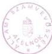
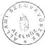

Állami Számvevőszék

# JELENTÉS

a Világkiállítási és a hozzákapcsolódó Fejlesztési Alappal
összefüggő gazdálkodás egyes kérdéseinek célvizsgálatáról

1996. szeptember

330.

---

ÁLLAMI SZÁMVEVŐSZÉK  
V-5-55/1996.  
Témaszám: 319

# JELENTÉS

## a Világkiállítási és a hozzákapcsolódó Fejlesztési Alappal összefüggő gazdálkodás egyes kérdéseinek célvizsgálatáról

A Világkiállítási és a hozzákapcsolódó Fejlesztési Alapot (továbbiakban: Alap) - mint elkülönített állami pénzalapot - az 1992. évi LXXXII. törvénnyel létesítette az Országgyűlés. Az Alap feladata a Világkiállítás megvalósításához fűződő gazdasági érdekek érvényesítése céljából a rendelkezésre álló források hatékony felhasználásának biztosítása volt. Az Alapot növelte a 80/1990. (IV.27.) MT rendelettel létrehozott Világkiállítási Alap 1992. XII. 31-i záróállománya.

Az Alap kezelője a Világkiállítási Programiroda (VKPI), majd jogutódja a Kormánybiztosi Iroda (KI) volt, amelynek - mivel 1996. XII. 31-gyel megszűnt - 1996-tól a Pénzügyminisztérium fejezethez tartozó Kincstári Vagyoni Igazgatóság az általános jogutódja.

Az Alappal a világkiállítási főbiztos, majd a kormánybiztos rendelkezett, tevékenységüket a Világkiállítási Kormánybizottság, 1994. VII. 1-től az ipari és kereskedelmi miniszter felügyelte.

Az Alap pénzügyi műveleteire kijelölt pénzintézet az Állami Fejlesztési Intézet Rt. (ÁFI) volt.

Az 'EXPO '96 Budapest' Nemzetközi Szakkiállítás lemondásáról szóló 1994. évi LXX. törvény rendelkezett az Alap 1994. december 31-i megszűnéséről azzal, hogy a gazdálkodásról 1995. december 31-ig az Országgyűlés előtt kell elszámolni.

Ugyanakkor az 1994. évi CIV. törvény szerint az Alapnál maradó pénzösszeget a Pénzügyminisztérium (PM) központi letéti számláján kell elkülöníteni, és a lemondással összefüggő, a költségvetést terhelő kötelezettségeket részben ebből kell finanszírozni. Az 1995. évi CXXI. törvény szerint az Alap pénzmaradványát 1996. január 1-jei fordulónappal a központi költségvetés vegyes bevételeinél kell elszámolni.

Az Országgyűlés előtti beszámolási kötelezettségnek - az Alapkezelő tevékenységét felügyelő ipari és kereskedelmi miniszter előterjesztésében - a Kormány 1995. novemberében eleget tett. E szerint az Alap - megszűnéséig bruttó módon számított - teljes bevétele

---

24,2 Mrd Ft, kiadása 17,0 Mrd Ft, s a PM által elkülönített letétszámlára 1994. XII. 30-án átutalt pénzmaradványa 7,2 Mrd Ft volt.

Az Alap 1994. évi költségvetési beszámolója, az auditáló "Mobilconsult" Tőkeforgalmazó és Üzleti Tanácsadó Kft. záradéka szerint, megfelelő képet ad az Alap vagyoni, pénzügyi helyzetéről. A közpénzek felhasználásának módjára, irányára, a lezárulatlan tételekre tekintettel azonban indokoltnak tartottuk az Alappal összefüggő gazdálkodás néhány konkrét kérdésének a vizsgálatát.

Ellenőrzésünk így - az Állami Számvevőszékről szóló 1989. évi XXXVIII. tv. 2. § (3) bekezdése alapján - az Alap vagyonából létrehozott EXPO '96 Műszaki, Fejlesztési, Üzemeltetési Kft-re (Expó '96 Kft.), a beruházások selejtezésére, az innovációs felsőoktatási kötvényre, a Globex Rt-vel kötött jogügyletre irányult.

# A vizsgálat célja volt, hogy értékelje:

- az EXPO '96 Kft. alapitasanak, mukodesenek törvenyesseget, a részere juttatott kozpénzek indokoltsagat, felhasznalasanak a meghatarozott feladatokkal valo osszhangjat es szabályszeruseget, a Kft-be befektetett vagyon megörzsését;
- az innovációs felsöktatási kótvény finanszirozasának indokoltságát, kibocsatásának, igénybevételének és elszamolásának szabályszerüsegét;
- az Alapnal a selejtezett eszkozok kijelolését, az ezekkel kapcsolatos szamviteli elszamolások szabályszerüsegét.

Az ellenőrzés az 1992-95. évekre terjedt ki, módszere többnyire szúrópróbaszerű volt.

A vizsgálatot nehezítette, hogy az Alappal (letéti maradvánnyal) rendelkező szervezetek, személyek változtak, többször módosult az irattározásuk rendje. Így korlátozott volt, esetenként hiányzott a személyes információ, s mutatkozott bizonytalanság az iratok, dokumentumok teljeskörűségét illetően is.

További gondot jelentett, hogy a Világkiállítás elmaradása következtében feleslegessé vált, nem hasznosuló, illetve a lemondás kapcsán felmerülő kiadások közül melyek minősíthetők szükséges és célszerű kiadásnak, vagy - ellenkezőleg - indokolatlan, felesleges költekezésnek.

2

---

# I.
Összefoglaló megállapítások, következtetések, javaslatok

1) A Világkiállítással kapcsolatos döntések gyakran változtak, módosultak, esetenként elhúzódtak, ami a végrehajtásnak keretet adó jogi háttér bonyolultságában - nem ritkán - ellentmondásosságában is megnyilvánult. Mindezek tükröződtek a pénzügyi-gazdasági folyamatokban.

Az Alappal, a letéti maradvánnyal, a kötvényforrásokkal való gazdálkodás és a pénzügyi-számviteli feladatok szervezetek közötti (VKPI, Expo '96 Kft.) megosztottsága nagyfokú koordinációt, a döntések következményeinek komplex áttekintését igényelte volna. Ez a követelmény azonban nem érvényesült folyamatosan és maradéktalanul, így a koordinálatlanság egyik forrásává vált az elkövetett szabálytalanságoknak, mulasztásoknak. Nehezítette a helyzetet az is, hogy nem fogalmazták meg egyértelműen, szabályozott módon az Alap megszűnését követő feladatok ellátását.

2) Az Expo'96 Kft. alapítása, részére a törzsvagyon juttatása a vonatkozó törvényi előírásoknak megfelelt. A működés törvényes kellékeinek karbantartására azonban nem fordítottak folyamatosan kellő figyelmet, s így a bejegyzett adatokban bekövetkezett változások bejelentésének elmulasztásával megsértették az 1988. évi VI. törvény 23. §-ban foglalt követelményt.

A VKPI (KI) rendelkezési körébe utalt források (Alap, illetve letéti maradvány, kötvényforrás) felhasználására kialakított, szerződésekben konkretizált döntési mechanizmust az alapítói irányítás - a világkiállítási főbiztoshoz (kormánybiztoshoz) centralizált döntés - jellemezte, az Expo '96 Kft. szerepe és felelőssége többnyire a döntéselőkészítésre korlátozódott. Ugyanakkor a döntések kellő megalapozásának hiányára, az engedélyezések formális voltára utalnak a megbízási szerződések utólagos, a konkrét munkák megkezdését követő megkötésének - döntően a "lesz Világkiállítás" időszakára jellemző - esetei.

Az Expo '96 Kft. vállalkozási tevékenysége - a tervezett saját beruházások és üzemeltetésük - lényegében nem bontakozott ki. Az Expo '96 Kft-nek juttatott törzstőke - utólagosan értékelve - nem volt összhangban a végzett tevékenységével, azt méreteiben meghaladta. Ezért célszerű lett volna a vonatkozó kormánydöntésnél mérlegelni, hogy nem lett volna-e célszerűbb megoldás az Informatikai és Technológiai Innovációs Parkot az Expo '96 Kft. tevékenységi köréhez kapcsoltan létrehozni, az Informatikai és Technológiai Park Rt. alapítása helyett.

Az Expo '96 Kft. a vizsgált időszakban nem kényszerült az erőforrásokkal való takarékos gazdálkodásra, arra az alapító sem késztette. A VKPI (KI) ugyanis nem várt el nyereséget a társaságtól, sőt az egyes években - különböző okokból - vitatható módon és mértékben, esetenként indokolatlanul ismert el részére teljesítményeket, szolgáltatásokat. Ebben közrejátszott az is, hogy a Világkiállítás lemondását kö-

3

---

vetően az Alap forrásainak felhasználásában a takarékosság követelménye nem jutott megfelelően érvényre. Így kifogásoljuk, hogy 1994-ben a KI által utólagosan, a bonyolítási díjban meg nem térülő tevékenységek fedezete címen kifizetett 296,7 M Ft egy részével az Alap pénzeszközeit feleslegesen terhelték. Az Expo '96 Kft. ugyanis számos, a működtetését külön nem terhelő, illetve a bonyolítási díjjal már elismert ráfordítást számolt fel. Ugyancsak kellő megalapozottság nélkül - paraméterekkel nem meghatározott feladatok megszüntetésére hivatkozással - a KI a létszámleépítés költségeire (mint szolgáltatás után) 57,6 M Ft + ÁFA-t utalt át 1995-ben a letéti maradványból.

Az Expo '96 Kft. működését a VKPI 1993-ban az Alapból mintegy 70 M Ft előlegnyújtással is segítette, melynek elszámolására adott hosszú időt (1995) a társaság likviditási helyzete nem indokolta. Az Expo '96 Kft. ugyanis ebben az időszakban szabad pénzeszközeinek lekötéséből jelentős bevételt realizált és használt fel.

Az Alapból az Expo '96 Kft-nek a KÉSZ és Társa Építőipari Közkereseti Társaság (KÉSZ Kkt.) kártérítési igénye fedezetére az 1050 M Ft pénzeszközátadás nem ütközött jogszabályi előírásba, ugyanakkor nem volt célszerű. A költségvetést illető forrás áttételeken keresztüli kihelyezése rontja a visszaáramoltatás biztonságát.

Az alapítóval szembeni hosszú távú kötelezettség előírása tekintetében az Expo '96 Kft. az elvárásoknak eleget tett. A kapott törzstőkét változatlan összegben megőrizte, az átvett pénzeszközt - az alapítói szándékot, valamint a vagyonmegőrzés követelményét kielégítő módon és a szabályok szerint - befektette. Az Expo '96 Kft. pénzügyi, számviteli nyilvántartási rendszere biztosította az Alapból (letéti maradványból) kapott források és felhasználásuk nyomonkövetését, az alapítóval szemben fennálló kötelezettségek elkülönített kimutatását.

3) A Világkiállítás lemondásával a beruházások megvalósítása lelassult, az ütemezett pénzügyi forrástól rendre elmaradt a teljesítés. Mindez következményeiben a fejlesztések drágulásával jár(hat).

Az Alappal (letéti maradvánnyal) rendelkező VKPI (KI) nem volt következetes a pénzeszközök felhasználásának követésében, ellenőrzésében és intézkedéseiben. A világkiállítási területeken az Alapból (majd a letéti maradványból) finanszírozott közcélú infrastrukturális beruházások 1995. év végén még nem zárultak le teljeskörűen. A nyilvántartott befejezetlen beruházás magas állományértékét (2056,1 M Ft) torzítja, hogy szabálytalanul, már működő közműrendszert is befejezetlen beruházásként tartanak nyilván.

Nem teljesült maradéktalanul az 1128/1995. (XII.15.) sz. Kormányhatározatban előírt határidőre, illetve késik az 1994. évi LXX. tv. 4. § (2) bekezdésében meghatározott egyes közművek és közterületek fővárosi önkormányzati, továbbá a távközlési alépítmények közműtársasági tulajdonba adása. A Fővárosi Önkormányzat ugyanis nem vette tulajdonba a már működő vízhálózatot, vízelvezető-, gázellátási és távhőrendszert, a MATÁV pedig nem volt hajlandó a beruházás költségeit megfizetni.

4

---

A világkiállítási területen kívüli közcélú infrastrukturális beruházások megvalósításá-hoz - a VKPI által elrendelt vizsgálat szerint - a Fővárosi Önkormányzattal kötött szerződések jogi szempontból kifogásolhatók, 1994-ben a 104 M Ft késedelmi pótlék felszámolása és kifizetése indokolatlan volt. Hiányolható ugyanakkor, hogy a megál-lapításokra a VKPI nem intézkedett.

Az Alap terhére 1994-ben végrehajtott jelentős (1520,1 M Ft) összegű selejtezés során túlnyomó többségében szellemi termékek (tervek, engedélyezések, megva-lósítási koncepciók stb.) költségeit írták le. A selejtezésre kijelölést - a Világkiállítás lemondásával módosult, illetve meghiúsult célok miatt feleslegesnek ítélt ráfordítások mellett - az a törekvés is motiválta, hogy a létesítmények bekerülési értéke kisebb, a használati értékkel arányos legyen. A kidolgozott selejtezési modell alkalmazásával azonban megsértették a vonatkozó számviteli előírásokat. Ezért az Alap 1994. évi mérlege hibás. A selejtezési eljárás ugyanakkor dokumentálisan alátámasztott, megfelelően bizonylatolt volt. Hiányolható azonban, hogy az ÁFI a munkafolyamat-ba építetten kívül, a selejtezési jegyzőkönyvek alapján, külön ellenőrzést nem végzett.

Szakértői vizsgálatot igényel annak megítélése, hogy az eredeti célok (értékhelyesbítés) szempontjából mennyire voltak célszerűek, szükségesek a selejtezett ráfordítások, illetve történt-e intézkedés a selejtezett, de valójában megőrzött szellemi alkotások hasznosítására, figyelemmel az Alapot megillető jogi biztosíték hiányára is.

4) Az innovációs felsőoktatási kötvénykibocsátás koncepcionálisan nem volt megfe-lelően megalapozott, esetenként hiányzott a vonatkozó jogszabályok közötti össz-hang. Ez érintette a kibocsátások összegszerűségét, ütemét, a külföldi forgalomba ho-zatalt és az elszámolás módját.

Az összesen 6 Mrd Ft értékű, szabályszerű kötvénykibocsátás időbeni ütemezése nem igazodott megfelelően sem az egyetemi beruházások műszaki megvalósítá-sához, sem a fedezet biztosítás jogszabályi követelményéhez. Az UNIVERSITAS I. kötvénynek a kormányhatározatban előírthoz mérten késedelmes kibocsátása a ver-senytárgyalásokról szóló 1987. évi 19. tvr. 5. § (3) bekezdésében foglalt előírás megsértésével járt. Ugyanakkor a beruházások megvalósítása, a kötvényforrások igénybevétele a kibocsátás ütemétől elmaradt, ami - a teljes lejegyzésre és az alacso-nyabb kamatszínvonalra tekintettel - rontotta az államadósságra gyakorolt kedve-zőbb hatást.

A kötvényforrás befektetése a vonatkozó kormányhatározatnak megfelelt és 1994-ben 889 M Ft, 1995-ben 1253 M Ft hozammal bővítette a felsőoktatási beruhá-zások forrását.

Az ÁFI megszűnésével és feladatainak átvételével összefüggésben a kötvényforrás maradványát, 3247,2 M Ft-ot a Magyar Államkincstár beruházási maradványszámla javára befizették.

5

---

5) Az ÁFI számviteli gyakorlata nem szolgálta megfelelően az Alap (majd letéti maradvány) és a kötvényszámla közötti forgalom közvetlen kimutatását, továbbá esetileg előfordult a számviteli törvény előírásaiba ütköző, szabálytalan könyvelés is.

Az egyetemi és világkiállítási célt is szolgáló beruházások finanszírozására vonatkozó rendelkezéseknél, a beruházási számlák kifizetésénél nem mindig fordítottak kellő figyelmet a források szabályszerű, illetve az engedélyokiratnak megfelelő igénybevételére, a vitás kérdések - a pénzügyi teljesítést megelőző - tisztázására. Tapasztalható volt a kötvényszámla és az Alap közötti keresztfinanszírozás, esetenként törvénysértő módon. Ezeket többnyire megegyezéssel rendezték. (Így 1994-ben megállapodás alapján az Alap és a kötvényszámla között a finanszírozási döntésekhez kapcsolódóan 1600 M Ft - az 1992. évi LXXXII. tv. előírásaiba ütköző - pénzeszközátadásra került sor, amit azonban a kormánybiztos rendelkezésére a kamatokkal növelten még ugyanabban az évben visszavezettek a kötvényszámla javára.)

Nem volt megfelelően rendezett - részben jogszabályi hiányosságra is visszavezethetően - az ÁFA fizetés és visszaigénylés kérdése. A kötvényforrásból finanszírozott ÁFA ugyanis az Alapot növelte.

6) A már jelzett szervezetek közötti megosztott feladatellátás és az elégtelen koordináció is hozzájárult ahhoz, hogy az érintettek az Alap megszűnését követően, a hozott döntésekhez igazodóan nem mérték fel komplex módon a szükséges feladatokat. Nem tettek megfelelő intézkedéseket az Alap vagyonának, pénzeszközeinek szabályszerű elszámolására, a letéti kezelés törvényben és egyéb jogszabályban előírt módjának megteremtésére. Ezért a számvitel nem tükrözi megfelelően a valós folyamatokat.

Szabálytalanul az ÁFI bankszámláján kezeltek PM központi letéti pénzeszközöket, megsértve ezzel a hivatkozott 140/1993. Kormányrendelet 16. §-ban foglalt előírást. Az ÁFI megszűnésével a számláján lévő letéti és egyéb maradványt (164.080 E Ft) átutalták a Magyar Államkincstár számlájára. Az "Alap" záró-főkönyvében így nem jelenik meg a letéti maradvány PM központi számlájára történő visszautalása. Ezzel megsértették az 1996. évi költségvetési törvény 50. §-ában előírtakat.

7) Az egyes témák vizsgálata azt jelzi, hogy a működő érdekstruktúrában a központi költségvetés pozíciója volt a leggyengébben érvényesített. Több üzletkötés, megoldás ugyanis a központi források hátrányára született.

A Világkiállításhoz kapcsolódó ingatlanok értékesítésénél a VKPI marketingtevékenysége nem volt kellően hatékony és eredményes, kínálati kényszer érvényesült, ami a versenytárgyalások eredményességét, a vételár összegét, a megkötendő szerződések feltételeit jelentős mértékben befolyásolta.

A VKPI az eladásra szánt telkek csak kis hányadát - a hasznosítás, valamint a pénzügyi feltételek tekintetében egyaránt - kompromisszumokkal értékesítette. Az ingatlanértékesítési feladatok vállalkozásba adásánál nem jártak el az elvárható gondossággal és körültekintéssel, a VKPI, illetve a Magyar Állam érdekére figye-

6

---

lemmel. A Szentex Kft. - a földingatlan Globex Rt. részére történő értékesítése során - a versenytárgyalásra vonatkozó előírásokat megsértette, a megbízatását túllépte, továbbá a megbízó VKPI hátrányára járt el a részfizetéses megállapodással és azzal, hogy a vételár első részletének teljesítése után hozzájárult a tulajdonjog bejegyzéséhez. A Globex Rt. nem hajlandó a vételár hátralékot megfizetni, s a VKPI (KI) sem tudott követelésének érvényt szerezni.

A szponzorok Alappal szembeni követelése a VKPI-vel kötött szerződések alapján jogszerű volt, a visszafizetéseket a kormánybiztos engedélyével, szabályszerűen teljesítették.

Az Alap pénzeszközeinek felhasználása szempontjából nem volt célszerű megoldás, hogy az Expo '96 Kft. egyes feladatai ellátását az - VKPI engedélyével 1010 E Ft befektetésével megszerzett - Expo-Geo Kft. közbeiktatásával, így magasabb költséggel oldotta meg, e szervezet integrációja helyett.

A világkiállítási területen igénybevett sportobjektumok pótlásánál a VKPI az egyetemek igényeinek figyelembevételével, esetenként nagyvonalúan és vitatható célszerűséggel járt el. A sportkapacitások pótlása ugyanis a tömegsport lehetőségeket szűkítette, s így a jelentős költségvetési ráfordítások a korábbinál szűkebb réteg sportolási lehetőségeit szolgálják.

Összegezve: a tapasztalatok, e konkrét vizsgálaton túlmutatva arra is utalnak, hogy - különösen a költségvetési szférából kikerülő - állami vagyon megőrzésének, célszerű és eredményes hasznosításának követelménye a gyakorlatban nem érvényesül kellően. Azt a vonatkozó (így pl. a számviteli) szabályozások sem segítik minden esetben egyértelműen, illetve megfelelően.

Mindezek alapján javasoljuk:

a Kormány részére, hogy

- szamoltassa be az erintetteket mind a leteti szamlara kerult alapmaradvany, mind a kottvenyforras 1995. evi felhasznalasarol, a beruhazasok allasarol;
- tegyen intezkedeseket a lagymanyosi egyetemi beruhazasok felgyorsitasa erdekében;
- vizsgalja meg hataskoreben, hogy az elkovetett szabalytalansagokert, mulasztasokert kit terhel a felelosseg es intezkedjen a felelosseg ervenyesitesere.

a PM részére:

gondoskodjon arról, hogy a Kincstári Vagyoni Igazgatóság

- tegyen intézkedéseket az Alap 1994. évi mérlege felülvizsgálatára, figyelemmel a selejtezések szükséges korrekciójára;

7

---

- a központi költségvetést megillető kötelezettségként tartsa nyilván könyveiben az Expo '96 Kft-nek - a KÉSZ Kkt követelésének rendezéséhez - átadott 1050 M Ft-ot és kamatait;
- a kamat felhasználást megengedő szakasz törlésével és a kamatok költségvetésbe történő befizetésének meghatározásával módosítsa a KI és az EXPO '96 Kft. között - a Világkiállítás lemondásáról szóló törvényből a Kft-re háruló feladatok elvégzésére - 1994. november 30-án létrejött szerződést;
- kezdeményezzen intézkedést annak érdekében, hogy az elkészült infrastrukturális beruházásokat a Fővárosi Önkormányzat és a közműtársaságok mielőbb tulajdonba vegyék;
- tegyen javaslatot a számviteli törvény, illetve a költségvetés alapján gazdálkodó szervek beszámolói és könyvvezetési kötelezettségét szabályozó kormányrendelet módosítására annak érdekében, hogy a vagyonértékelési, - selejtezési szabályok egységesen értelmezhetők legyenek;
- kezdeményezze - amennyiben a Globex Rt-vel megfelelő kompromisszumra nem tud jutni - a szerződés megszüntetését a Magyar Gazdasági Kamara mellett szervezett Állandó Választott Bíróságnál.

az MKM részére:

- a pénzügyi lehetőségek függvényében (a források ésszerű koncentrálásával) intézkedjen egy-egy létesítmény teljes befejezése érdekében.

## II. Megállapítások

### 1. Az Expo '96 Kft. tevékenységének, működésének értékelése

#### 1.1. Az Expo '96 Kft. létrehozása

A Világkiállítási Programiroda 1992. november 23-án 400 M Ft törzstőkével határozatlan időre létrehozta az egyszemélyes EXPO '96 Kft-t az 1996-ban Budapesten megrendezendő Világkiállítás előkészítése, megvalósítása és üzemeltetése érdekében szükséges tevékenység elvégzésére.

Az Expo '96 Kft. létrehozásának lehetőségét az 1991. évi LXXV. tv. teremtette meg. A nevezett Kft. részére az Alapból pénzeszközátadás azonban csak az 1992. évi LXXXII., illetve az 1992. évi LXXXIII. törvények hatályba lépésével vált lehetővé.

8

---

Az 1996. évben megrendezendő Világkiállításról szóló 1991. évi LXXV. tv. 4. § (2) bekezdése szerint a VKPI - a Világkiállítási Tanács jóváhagyásával - gazdasági társaságot alapít, illetve gazdálkodó szervezet közreműködését veheti igénybe.

A Világkiállítási és a hozzákapcsolódó Fejlesztési Alapról szóló 1992. évi LXXXII. tv. 3. § b. pontja szerint az Alapból teljesíthető kiadás ezen gazdasági társaság részére pénzeszközök átadása. Az 1992. évi LXXXIII. tv. 73. § (2) bekezdése - az Áht. 59 §-nak módosításával - törvényi szintű rendelkezés esetén nem tiltja az elkülönített pénzalap terhére gazdasági társaságban érdekeltség szerzését.

**Az Expo '96 Kft. alapító okiratának jóváhagyásakor még hiányzott a törzstőke Világkiállítási Alapból történő finanszírozásának jogszabályi lehetősége, a VKPI költségvetése e célra fedezetet nem tartalmazott. Így az alapító okirat 400 M Ft törzstőke átutalására vonatkozó szakasza késedelmesen, de már a törvényi előírások betartásával teljesült.**

A VKPI az alapító okirat 7. pontjában vállalta, hogy a törzstőke teljes összegét az alapító okirat aláírását követő 15 napon belül banknál nyitott egyszámlaszámra befizeti. A 400 M Ft átutalására megbízást csak 1993. január 27-én adott az Alap terhére.

A Fővárosi Bíróság a világkiállítási főbiztos kérelmére az Expo '96 Kft-t 1993. január 21-én jegyezte be 01-09-260369 szám alatt a cégnyilvántartásba.

**A társasági szerződésben elfogadott tevékenységek a törvényben megjelölt célokkal megegyeztek, ugyanakkor elvileg széleskörű lehetőséget nyújtottak az Expo '96 Kft-nek a Világkiállítással össze nem függő feladatok elvégzésére is.**

Az alapító okiratot a tulajdonos két ízben módosította. A második módosítás az Expo '96 Kft. majdani jövőjét kívánta az elnevezés megváltoztatásával, a megalapítási cél törlésével elősegíteni.

1993. július 30-án bővítették a cégjegyzésre jogosultak körét, továbbá módosult az első üzleti évre választott könyvvizsgáló személye.

1995. július 14-én az Expo '96 Kft. elnevezése '96 Beruházásszervező és Fővállalkozó Kft-re változott. Hatályon kívül helyezték megalakításának célját, az alapító Felügyelő Bizottságot hozott létre. Az alapító okiratot kiegészítették azzal, hogy az 1994. évi LXX. tv-ben foglaltakra tekintettel az alapítói jogokat a KI gyakorolja.

**Az alapító okirat módosítások ugyanakkor nem követték valamennyi, az Expo '96 Kft. működését érintő, s a gazdasági társaságokról szóló 1988. évi. VI. tv-ben megjelölt változást, s elmaradt egyes időszerűtlenné vált alapítói intézkedések visszavonása, törlése is.**

9

---

Az alapító okiratot nem módosították az alapító személyében - a 153/1995. (XII. 15.) sz. Kormányrendelettel jogutódlás folytán ismételten - bekövetkezett, továbbá az 1996. február 1-jei székhely (Tüköry u. 3. helyett Bogdánfy u. 10.) változást követően. Ugyanakkor a hivatkozott törvény 23. § (3) bekezdése előírja, hogy a bejegyzett adatok megváltozását harminc napon belül be kell jelenteni a Cégbíróságnak.

Az alapító okirat 11. pontja az alapítást követő I. negyedév végéig a törzstőke emelését, 12. pontja az 1993. év végéig zárt körű részvénytársasággá való átalakítását írta elő, melyek nem teljesültek. Az alapító ezen előírások visszavonásával az okiratot nem módosította.

Az Expo '96 Kft. további sorsáról a Világkiállítás lemondásával összefüggésben jogszabályi szinten nem rendelkeztek, **késett a tulajdonlásának és működtetésének további feltételei kidolgozására** vonatkozó Kormányhatározat végrehajtása. Mindez negatívan hatott a szervezet stabilitására, tevékenységének szabályozottságára.

Az 1128/1995.(XII.15.) Kormányhatározat 4. pontjában - 1996. január 31-ei határidővel - előírt kormányelőterjesztés 1996 március végén még csak tárcaegyeztetés szintjén volt. Ez az előterjesztés-tervezet a jövőben az EXPO '96 Kft.-vel a Kincstári Vagyoni Igazgatóság tulajdonában, annak beruházás-, fenntartásszervezési, reorganizációs feladatai végrehajtójaként, illetve az Informatikai és Technológiai Innovációs Park beruházásszervezői feladatainál számolt.

Az 1046/1996. (V.15.) sz. határozatával a Kormány azonban döntött az Informatikai és Technológiai Innovációs Park létesítéséről és megbízta a Miniszterelnöki Hivatalt (MeH) - hogy a Modernizációs és Integrációs Projektiroda Kht. útján - biztosítsa a feltételeket az Rt. vállalkozói alapon történő létrehozásához.

Az Expo '96 Kft. tulajdonlása és működtetése feltételeiről a Kormányhatározat nem rendelkezik, ami azt jelenti, hogy nem tartottak szükségesnek a 153/1995. (XII.15.) Kormányrendeletben foglaltakhoz képest további változást.

## 1.2. Az Expo '96 Kft. feladata, szervezete, tevékenységének szabályozottsága

A Világkiállítás megvalósításának Alaptervében foglaltakra is figyelemmel az **Expo '96 Kft-t hármas feladatkör ellátására alapították**. Az Alapból, illetve az UNIVERSITAS kötvényből finanszírozott **beruházások lebonyolítása** megbízási szerződések alapján (I., II., IV. beruházási csoport), a szponzori, vállalkozói forrásokból **saját vállalkozásban** beruházások megvalósítása és üzemeltetése (III. beruházási csoport), továbbá **az alapító igényeinek kiszolgálása**.

Az 1992-ben készített Alapterv a Világkiállítás területén tervezett beruházásokat 4 főbb csoportba rendezte: I. területrendezés, közművek létrehozása; II. a kiállítási előhasznosítású egyetemi beruházások; III. vállalkozásként megvalósuló feladatok (kiállítási csarnok építése, Világkiállítás működtetése); IV. a Világkiállításhoz nem kapcsolódó egyetemi beruházások.

10

---

Az Expo '96 Kft. Szervezeti Működési Szabályzata (SZMSZ) számos, VKPI-hez kapcsolódó feladatot tartalmaz (besegítés tájékoztatók készítésébe, döntéselőkészítés, VKPI irodák üzemeltetése, VKPI számítástechnikai felügyelete, versenytárgyalások kiírása, nemzetközi kapcsolatokban való közreműködés stb.).

Az Expo '96 Kft. lényegében az alapító tulajdonos (VKPI, illetve jogutódja a KI) utasításának végrehajtója volt, mint vállalkozó alig működött. Az alapító nem várta el a nyereség elérését, az üzleti tervek veszteséggel (1994.) vagy alacsony szintű nyereséggel számoltak. Az Expo '96 Kft. és az alapító közötti feladatmegosztás indokoltságát, célszerűségét ugyanakkor a VKPI (illetve KI) megszűnése miatt megfelelően megítélni már a vizsgálat idején és keretében nem volt lehetséges.

Az Expo '96 Kft. szervezete többnyire "mozgásban" volt, nagysága, tagoltsága követte a tevékenysége változását (bővülés, szűkülés), s lényegében a helyszíni ellenőrzéskor - a további feladataira vonatkozóan tervezett döntés elhúzódásával és hiányában - sem volt stabilnak ítélhető.

1993. IV. negyedévben - az SZMSZ jóváhagyásakor - az átlagosan 65 fős szervezet élén ügyvezető (vezér)igazgató állt egy helyettessel.

1994. májusában a tevékenység bővülését (nemzetközi, marketing feladatok, a vállalkozói megvalósítással tervezett kiállítás, az üzemeltetés előkészítése stb.) tükröző új SZMSZ már 5 vezérigazgatóhelyettes, 20 igazgató irányította szervezetet tartalmaz, melynek kiépítésére - a Világkiállítás lemondása miatt - már nem került sor. Ekkor a szervezet létszáma átlagosan 131 fő volt.

Az ellenőrzéskor a szervezeti felépítés az 1993. évi SZMSZ-beli állapothoz közelített (1995. IV. negyedévben a létszám 62 fő volt).

Az Expo '96 Kft. tevékenységének 1994. évre folyamatosan kiépített szabályozottsága - az aktualizálás hiányában - a vizsgálat idején már nem volt minden területen megfelelő. Elsősorban a tevékenységet átfogó szabályzatok korszerűsítése késett, nagyobb részt a Kft. átmeneti helyzetéből adódóan.

Az alapító okirat jelzett hiányosságai mellett az SZMSZ és az ellenőrzési szabályzat is korszerűtlen, átdolgozást igényel.

Ugyanakkor a pénzügyi-számviteli nyilvántartási rendszer biztosította az Alaptól kapott források és felhasználások nyomonkövetését, az elszámolási kötelezettségek teljesítésének ellenőrizhetőségét.

Mind az Alap 1993. májusában jóváhagyott működési rendjének szabályai, mind az Expo '96 Kft. szabályzatai minden fontosabb döntéshez előírták a világkiállítási főbiztos, később a kormánybiztos egyetértő aláírásának meglétét. Az alapítói irányítás szabályait a konkrét megbízási szerződésekben, majd 1994. közepétől keretszerződésben is rögzítették.

11

---

A VKPI és az Expo '96 Kft. az 1994. július 5-én kötött keretszerződésben minden jelentősebb döntési csomóponthoz (beruházási alapokmány, 10 M Ft feletti megbízási-tervezői-kivitelezési szerződések, versenytárgyalási kiírások és döntések stb.) hozzárendelték a világkiállítási főbiztos jóváhagyó aláírásának megszerzését. A keretszerződés alapján minden projektre külön megbízást kötött a VKPI (a KI) a Kft-vel, majd ennek alapján a Kft. a tervezőkkel, kivitelezőkkel. (Ezekhez a szerződésekhez is biztosították a VKPI, illetve a KI egyetértő aláírását.)

A keretszerződés aktualizálása a körülmények változását - összefüggésben a döntések elhúzódásával - jelentős időeltolódással és visszamenő hatállyal követte.

Az 1995. május 15-én - visszamenőleges hatállyal - módosított keretszerződés szerint a munkálatok a Pénzügyminisztérium által jóváhagyott Célprogram szerint, a KI megbízásából történtek.

A KI és az Expo '96 Kft. kiegészítő közös nyilatkozata (1995. VIII. 10.) a keretszerződés hatályát a Világkiállítás lemondásából adódó beruházási és egyéb feladatok elvégzéséig meghosszabbította, illetve a lágymányosi egyetemi beruházások lebonyolítását továbbra is a Kft-re bízta.

A VKPI (majd KI) és az Expo '96 Kft. között a megbízási szerződések utólagos, a konkrét munkák megkezdését követő megkötésének - főként a "lesz Világkiállítás" időszakára jellemző - gyakorlata kifogásolható.

A szerződő felek gyakran szóban, előzetes megbeszéléseken állapodtak meg a munkákról s írásos szerződés csak jóval később készült. Nem egyszer előfordult a szerződés aláírásának napjára dátumozott, illetve a szerződés dátumához igen közel eső, több millió forint értékű munkateljesítés.

Az alapító és az Expo '96 Kft. közötti szerződéses rendszer és a már jelzett szabályozás, továbbá annak végrehajtása következtében az Expo '96 Kft-nél az Alap (majd a letéti számla) és a kötvényforrás terhére hozott valamennyi kötelezettségvállalási, illetve finanszírozási döntés a világkiállítási főbiztos (majd a kormánybiztos) engedélyével és így felelősségével történt. Az állami vagyonnal való gazdálkodás törvényessége, szabályszerűsége ily módon volt biztosított.

### 1.3. Az Expo '96 Kft. gazdálkodásával összefüggő egyes kérdések

Az Expo '96 Kft. - bevételeinek és ráfordításainak hullámzó alakulása mellett - szerény szinten, növekvő mértékű eredményt realizált.

Az Expo '96 Kft. bevétele 1993. évben mintegy 158 M Ft, 1994. évben 623 M Ft, 1995. évben 377 M Ft volt. Kiadásai ugyanekkor 157,8 M Ft-ot, 618,2 M Ft-ot, 359 M Ft-ot tettek ki. A mérleg szerinti eredmény 1993. évben 2,5 M Ft-ot, 1994. évben 3,7 M Ft-ot 1995. évben 18,2 M Ft-ot ért el. (Az auditor Ernst and Young az 1993-94. évi mérlegeket rendben lévőnek ítélte.)

12

---

1.3.1. Az Expo '96 Kft. bevételei döntően az Alapból származtak. A források között a beruházások lebonyolítási díja - 1993-ban 81,5 M Ft, 1994-ben 75,2 M Ft, 1995-ben mintegy 112 M Ft - növekvő volumene mellett csökkenő arányú volt.

A Világkiállítás lemondásából, a VKPI megszüntetéséből, a KI létrehozásából, utóbb megszüntetéséből adódó feladatok elvégzése 1994. és 1995. években számottevő bevételt biztosított az Expo '96 Kft-nek.

A Világkiállítás megrendezésének felülvizsgálatáról döntő 1071/1994. (VIII. 3.) Kormányhatározatot követően az Expo '96 Kft. a szerződések és megállapodások alapján folyó koncepciókészítési, hatásvizsgálati, tervezési stb. munkálatok zömét felfüggesztette. A lemondási törvényt követően - a munkavégzőkkel egyeztetve - felmérte az addigi teljesítményeket és annak alapján a szerződéseket megegyezéssel felbontotta, illetve az elvégzett munkát kifizettette az Alapból.

Az Expo '96 Kft. az így kifizetett számlák alapján a keretszerződés szerinti lebonyolítási díjat felvette.

Megállapítható ugyanakkor, hogy az Expo '96 Kft. által kifizetett beruházási, illetve egyéb teljesítések - az infrastrukturális és az egyetemi beruházást nem számolva - jelentős része (a Világkiállítás érdekében készített tervek, koncepciók, stb.) nem, vagy csak veszteséggel hasznosul.

Többek között például: a Világkiállítás növényzetének előnevelésére az Expo '96 Kft. versenytárgyalás után 223,6 M Ft értékben szerződött 10 vállalkozással 1994-ben, melyre 1995 nyaráig 214,6 M Ft-ot fizettek ki. A hasznosítás érdekében csak az önkormányzatok részére meghirdetett versenytárgyaláson néhány (13) önkormányzat, majd később a Természetvédelmi Hivatal vásárolt összesen mintegy 14,2 M Ft értékben fákat, bokrokat, illetve az Expo '96 Kft. ültetett el az egyetemi beruházások környékén 55,6 M Ft értékű növényt. Így a veszteség 144 M Ft.

A zászlótér beruházási projekt 21,7 M Ft-ba került. A zászlórudak elbontása további mintegy 2 M Ft volt, értékesítésüket az Expo '96 Kft. a vizsgálat idejéig sikertelenül kezdeményezte.

Esetileg - és nem számottevő összeget érintően - állapítottunk meg e körben a Világkiállításhoz kapcsolódó, de már a lemondást követően vállalt kötelezettségre kifizetést.

Korábbi megbeszélések alapján a kormánybiztos 1994. december 22-én még hozzájárult az Expo '96 Kft. szerződéskötéséhez a Budapest Film Rt-vel, ami a Világkiállítás speciális vetítőrendszerű filmszínháza megvalósíthatósági tanulmányára szólt (200 E Ft + ÁFA). A tanulmány elkészült, kifizetése megtörtént. A közeli jövőben ilyen mozi - már befogadó képességének nagysága miatt sem - várhatóan nem épül meg.

Az Expo '96 Kft. az Alapból az Alapterv (III.) vállalkozási, illetve nem beruházás lebonyolítói feladatokhoz kapcsolódóan is realizált bevételt a VKPI-vel (KI-vel) kötött szerződések alapján.

13

---

A VKPI és az Expo '96 Kft. 1994. június 22-én megállapodást kötött a nemzetközi és marketing feladatoknak a Kft-hez történő átcsoportosításáról, a kiállítás üzemeltetési szervezete kiépítéséről. A megállapodást aláírók szerint az ehhez szükséges anyagi eszközök az Expo '96 Kft. bevételeiből nem voltak fedezhetők, így azokhoz a VKPI - a korábban előírt, de addig ki nem utalt törzstőke emelés végrehajtásaként - 3,7 Mrd Ft tőketartalékot kívánt 3 részletben átadni. Az első, 200 M Ft-os részletet 1994. június 30-ig átutalták a Kft-hez (a további két részletet az újonnan kinevezett kormánybiztos már nem utaltatta át).

**A Világkiállítás lemondásáról szóló törvényből az Expo '96 Kft-re háruló feladatok elvégzésére a KI-val - elsősorban az 1994. november 30-án - kötött megállapodásokon alapuló Kft. bevételek egy része utólagosan kompenzációnak minősíthető, illetve vitatható.**

A KI és az Expo '96 Kft. között 1994. november 30-án kötött megállapodás (1 sz. melléklet) többek között közös megegyezéssel hatályon kívül helyezte a jelzett 3,7 Mrd Ft alapátadásról szóló szerződést azzal, hogy a már átutalt 200 M Ft-tal 1994. XII. 15-ig a Kft. az Alapnak elszámol. Az elszámolás megtörtént és az Expo '96 Kft. az igénybe nem vett 169,5 M Ft-ot az Alap javára visszautalta.

A felhasznált 30,5 M Ft-ból 28,5 M Ft-ot a KÉSZ Kkt. részére fizették ki mintapavilon tervezése, kivitelezése és bérleti díja jogcímen, szerződés szerint. A 2 M Ft a III. beruházási csoporttal kapcsolatos tervpályázatok díja volt.

A KI és az Expo '96 Kft. jelzett, a Világkiállítás lemondásáról szóló 1994. évi LXX. tv. hatályba lépését követően kötött megállapodása utólagosan az elvégzett, de a bonyolítási díjban meg nem térülő tevékenységek 1994. évi költségeinek előirányzatát az Alap terhére 296,7 M Ft-ban (237,3 + ÁFA) rögzítette, majd a KI az erre az összegre benyújtott számlát kiegyenlítette.

Az Alapot kezelő, azzal gazdálkodó KI ezen megállapodásában szereplő feladatok a Világkiállítás érdekében merültek fel. A szűrőpróbaszerűen ellenőrzött kifizetések egy része ugyanakkor az Alap pénzeszközeit feleslegesen terhelte. Az Expo '96 Kft. ugyanis több, a működési költségeit külön nem terhelő ráfordítást számolt fel. (A számítás 20 E Ft-os mérnöknap díjtétellel történt.)

Így az Expo '96 Kft. felszámolta és a KI a kifizetést engedélyezte a - lebonyolítási díjjal már megfizetett - következő munkák után: VKPI részére adott tájékoztatások, hivatalos látogatók kísérése a kiállítási területen, a médiának nyújtott tájékoztatások (4760 E Ft + ÁFA); a tárgyalásokon, zsűriken, tájékoztatókon részvétel; az Expo '96 Kft. szervezetének kialakítása; tervezőkkel folytatott konzultációk; részvétel heti koordinációs értekezleten a Fővárosi Önkormányzatnál a lágymányosi közúti híddal kapcsolatosan - 800 E Ft + ÁFA; részvétel lakossági fórumon - 800 E Ft + ÁFA.

A Világkiállítás lemondásával kapcsolatosan 1995-ben a letéti számláról - a KI által elismerten - realizált bevételek egy részének indokoltsága, mértéke, illetve módja szintén vitatható.

14

---

A KI az 1995. márciusi megállapodás szerint az Expo '96 Kft-vel készítette el a PM jóváhagyásra előterjesztett "a Világkiállítás lemondásából adódó beruházási és egyéb feladatok Célprogram" anyagát (10 M Ft + ÁFA), ami zömmel meghatározza a Kft-nek a Világkiállítás lemondásából adódó feladatait 1998. évig.

A KI az 1995. július 7-én kötött megállapodás alapján az Expo '96 Kft-vel felmérette a VKPI által megkötött szerződéseket 6,4 M Ft + ÁFA díjtételért.

A KI az Expo '96 Kft-nek az 1995. június 30-án kötött megállapodás és számla alapján - a feladatok megszűnésére hivatkozással - megtérítette a 73 fős létszámcsökkentés költségét, 57,6 M Ft + ÁFA-t. Ugyanakkor sem a szervezet bővítését, sem annak leépítését célzó megállapodás nem tartalmazott létszám és vonatkozó költségadatot, így nem adott megfelelő paramétert az indokolt térítés megállapításához, illetve ellenőrzéséhez. A szerződéskötésnél nem vették figyelembe azt, hogy a gazdasági társaság működési körében a vállalkozási kockázat a létszámleépítés, továbbá a létszámleépítést szolgáltatásként kezelték. (1994-ben a 296,6 M Ft terhére szervezeti átalakítás címen ugyanakkor már ismertek el költséget.)

Az alapító az évek során - az előzőeken túl - más egyéb bevételekhez is hozzásegítette az Expo '96 Kft-t, illetve jelentős előleg nyújtásával segítette likviditását.

1993-ban közel 70 M Ft-ot utaltatott ki a VKPI az Expo '96 Kft. számára a majdani beruházási lebonyolítási díj előlegeként utólagos elszámolásra, mellyel az 1995. év végéig folyamatosan elszámolt.

A VKPI 1993-ban az MNB által kibocsátott emlékpénz expo emblémája (védjegy) használatáért 6,5 M Ft-ot fizettetett közvetlenül az Expo '96 Kft. számlájára. Az érmék forgalmazása utáni jutalék is a Kft-t illette (mintegy 1 M Ft), igaz a VKPI reprezentációs célú érme felhasználása ugyanakkor a Kft. költségeit növelte (622 db).

A VKPI a Kft. közbeiktatásával bérbe adta a kiállítási terület pesti oldala kerítésének hirdetésre alkalmas felületeit (1,1 M Ft + ÁFA éves bérleti díj). Az ebből származó bevétel 30%-a 1994. és 1995. évben a Kft-t illette meg.

Számottevő volt az átmenetileg szabad pénzeszközök befektetéséből realizált bevétel is (pl.: 1994-ben 65,7 M Ft, 1995-ben 94,8 M Ft).

1.3.2. Az Expo '96 Kft. költségeinek legnagyobb tételét az elmúlt három évben a személyi jellegű ráfordítások képezték, arányuk az összes költség mintegy 50%-a körüli. (1993. évben kb. 50%; 1994. évben kb. 43%; 1995. évben mintegy 52%). Jelentős volt a tárgyi eszköz vásárlás mértéke, a három év alatt összesen 81,8 M Ft beszerzésből a 20 E Ft érték alatti tárgyi eszközök aránya 16%-ot tett ki.

Az 1 főre vetíthető mintegy 60 E Ft-nyi azonnali költségként elszámolt eszközérték - még a "lesz Világkiállítás" hangulatának elismerése mellett is - magasnak értékelhető.

15

---

Az egyéb költségek (bérletek, szakértők, járulékok, hirdetés stb.) 1993. és 1995. évhez képest 1994. évben viszonylag magas összegét részben az Expo '96 Kft. tevékenységének 1994. évi "felfutása" magyarázza.

1.3.3. Az Expo '96 Kft. feladatainak egy részét vállalkozásba adással - gazdasági társaság tulajdonjogának megszerzésével és annak közreműködésével - végezte el, így az indokoltnál nagyobb költséggel.

Az EXPO '96 Kft. 1993. év novemberében a VKPI engedélyével 1010 E Ft-ért - a jegyzett tőke kifizetésével - megvásárolta az Expo-Geo Geodéziai és Térinformatikai Szolgáltató Kft-t (Expo-Geo Kft.).

Az Expo '96 Kft. ugyanekkor mintegy 10 M Ft értékben komplett térinformatikai konfigurációs géprendszert, rajzgépet vásárolt, amelyeket 13,6 M Ft lízing-értéken átadott az Expo-Geo Kft-nek.

Célszerűbb lett volna, ha az Expo-Geo Kft-t az Expo '96 Kft. magába olvasztja, mivel azzal az Alap pénzeszközei felhasználását az Expo-Geo Kft. munkánként felszámított hasznával csökkenteni lehetett volna.

Az Expo-Geo Kft. 1993-1994. évi 31,4 M Ft, illetve 58,3 M Ft árbevétele 97 %-ban, illetve 99%-ban a VKPI-től és az Expo '96 Kft-től származott. Mérleg szerinti eredménye ugyanekkor 1,9, illetve, 2,5 M Ft volt, melyet a tulajdonos rendelkezésére eredménytartalékba helyezett.

1.3.4. 1995. év végén az Expo '96 Kft. rövid lejáratú kötelezettségei és követelései közel azonosan, mintegy 470 M Ft érték körül alakultak, zömük alvállalkozói szerződésekhez kapcsolódott. A kötelezettségek között szerepelt még 1050 M Ft hosszú távú, alapítóval szembeni kötelezettség.

A KI és az Expo '96 Kft. által is foglalkoztatott ügyvéd 1994. év végén javasolta - mintegy megerősítve a KI döntését -, hogy a KÉSZ Kkt. szerződésének fedezete (1050 M Ft) kerüljön a Kft. bankszámlájára, mert ezzel a KI a perből kivonható.

A KI - a megállapodás alapján - az Alapból 1050 M Ft-t átutalt a Kft-nek 1994 decemberében. A pénzösszeg egyedüli felhasználási jogcíme az EXPO '96 Kft. által megkötött szerződések felbontásával kapcsolatos, illetve a Világkiállítás lemondása miatt a Kft-vel szemben támasztott pénzügyi kötelezettségek kiegyenlítése. (Ekkor az Expo '96 Kft. és a KI vezetői már majdnem biztosan tudták, hogy csak egyetlen vállalkozással, a KÉSZ Kkt-vel nem tud a Kft. egyezséget kötni.)

A KÉSZ Kkt. a nemzetközi kiállítási csarnokok tervezésére, elemei legyártására, a csarnokok megépítésére, azok későbbi elbontására - versenytárgyalás után (nettó ár: 839.745 E Ft + ÁFA, bruttó ár: 1.049.681 E Ft) rögzített áron - kötött szerződést a Kft-vel.

16

---

A KÉSZ Kkt. az Expo '96 Kft. egyezségi ajánlatát (a tényleges teljesítés kifizetését) elutasította és 1995. január 6-án keresetet nyújtott be a bírósághoz, s az elmaradt haszonnal együtt 2466,8 M Ft kártérítési igénnyel perbe hívta a Kft-t és a KI-t is.

A bíróság 1995. május 12-i közbenső ítélete szerint a KÉSZ Kkt. és az EXPO '96 Kft. közötti szerződés lehetetlenülés folytán megszűnt, annak összegét viszont csak hosszabb bizonyítási eljárással lehet megállapítani. A bíróság szerint az 1994 évi LXX. tv., mint speciális jogszabály alapján a KI kártérítési felelősséggel tartozik.

Mind a KÉSZ Kkt, mind a KI fellebbezéssel élt a közbenső ítélet ellen.

A pénzeszközátadás egyaránt megfelelt az 1992 évi LXXXII. tv. 3. § (6) bek. és az 1994 évi LXX. tv. 7. § (3) bek. előírásainak, azonban nem volt célszerű. A kártérítés - Alapot (letéti maradványt) terhelő - fedezetigénye a KI felelősségéhez kapcsoltan indokoltan és célszerűen a központi költségvetés alrendszerén belül kezelendő. Észrevételezhető, hogy a KI megszűnésekor a befektetés hozamának költségvetési befizetéséről nem rendelkeztek.

Az átutalt pénzeszköz befektetésére vonatkozóan a KI külön kikötésekkel a megállapodásban nem élt, továbbá kifogásolható, hogy a kamatok felhasználását - az 1994. évi LXX. tv. 7. § (3) bekezdésétől eltérően - megengedte. Rögzítették a felek, hogy az átutalt forrás után elszámolt kamatot az EXPO '96 Kft. csak a Világkiállítás megvalósításával és lemondásával összefüggő ráfordítások fedezetére fordíthatja és a Világkiállítással kapcsolatos szerződések lezárását követően megmaradó összegről az alapító felé köteles elszámolni.

Az Expo '96 Kft. számvitelében elkülönítetten tartja nyilván az alapítóval szembeni kötelezettségeit: a 400 M Ft törzstőke összegét, valamint az elszámolásra átvett 1050 M Ft pénzösszeget és az annak befektetéséből származó 1995. évi 359 M Ft hozamot. Az átvett pénzeszközt dokumentált, ellenőrizhető módon az ÁFI-Bróker Rt. államkötvényekbe fektette be, melyeket a KELER Rt-nél helyeztek letétbe.

Ez a megoldás ugyan biztosítja, hogy az Expo '96 Kft. csak a megadott célra használhatja fel az átvett pénzt, ugyanakkor azonban az államadósságot ha csekély mértékben is, de növeli.

Az átadott pénzeszköz és kamatai alapítói követeléssé minősítése - az alapítónál a költségvetési befizetési kötelezettség előírása nélkül - nincs összhangban az 1994. évi CIV. tv. 55. §-a, illetve az 1995. évi CXXI. tv. 50. §-ával, ezek szerint ugyanis az Alap pénzmaradványával az alapítónak (jogutódjának) a központi költségvetéssel szemben elszámolási kötelezettsége van.

Megjegyzés: a KI 1995. év végi mérlegében az aktív függő és átfutó elszámolások tételen az 1050 M Ft, az egyéb követelések tételen 359,285 M Ft szerepel tőkeváltozásokkal szemben. Az Alap "zárómérlegének" forrás oldalán az 1050 M Ft a költségvetési tartalékok között szerepel.

17

---

Hiányolható ugyanakkor, hogy jogszabályi szinten nem rendelkeztek az Alapot terhelő, de megszűnésekor még függő ügyekkel kapcsolatos eljárásról.

## 2. Az infrastrukturális beruházások helyzete

A VKPI és a Fővárosi Önkormányzat megállapodásban rögzítette a Világkiállítás érdekében megvalósítandó infrastrukturális beruházásokban a munkamegosztás területeit, a rájuk háruló feladatokat, a felelősséget és a finanszírozás feltételeit.

A VKPI vállalta, hogy 1996. I. 31-ig maradéktalanul megvalósítja és használatba adja a világkiállítási területen az alábbi beruházásokat: budai dunaparti út, Soroksári úti szervíz-út, Vágóhíd utca átkötése, Nádorkerti közúti és vasúti híd, Mester utca átkötése, Duna jobb parti főnyomócső, árvízvédelem, gázellátás, távhőellátás (teljes rendszer).

A Fővárosi Önkormányzatot ugyanez a kötelezettség terhelte a világkiállítási területen kívüli infrastrukturális fejlesztések tekintetében (19-es villamos pályájának meghosszabbítása 1. ütem, 2-es villamos pályájának rekonstrukciója - belvárosi szakasz, Dél-pesti főnyomócsövek, szennyvíziszap, Hamzsabégi úti csatorna, 5. sz. főút bevezetése, Csepel víztisztító I. ütem, Sánc utcai főnyomócső).

### 2.1. A világkiállítási területen megvalósuló közcélú infrastrukturális beruházások helyzete

A Világkiállítás területén közcélú infrastrukturális fejlesztésekre az Alap forrásaiból 1996. III. 10-ig 3388,3 M Ft-ot fordítottak. A pénzügyi teljesítés a beruházási alapokmányok szerinti előirányzat 70 %-a, a szerződésekkel lekötött előirányzat 98 %-a (2. sz. melléklet).

Ezek a közcélú infrastrukturális fejlesztések az EXPO 80 ha-nyi területén együttesen szolgálták volna ideiglenesen az EXPO-t, véglegesen pedig a fővárost. Utóbbi fejlesztési cél lényegében nem sérült a Világkiállítás lemondásával, mert az előirányzott munkák - mérsékeltebb kapacitással - folytatódtak.

A 1995. XII. 31-i beruházási leltár alapján (3. sz. melléklet) a közcélú infrastrukturális kiadások (ÁFA nélküli) értéke 1994. XII. 31-ig 1356,4 M Ft, az 1995. évi ráfordítás 1321,5 M Ft volt. Selejtezésre 1994. évben 65,2 M Ft, 1995. évben 3,3 M Ft értékben került sor. A beruházásból aktiváltak, illetve átadtak 553,3 M Ft értékű létesítményt. A nyilvántartott befejezetlen állomány értéke - 2056,1 M Ft - magas. Ugyanakkor a már működő közműrendszert is szabálytalanul - a tulajdoni rendezés elhúzódása miatt - befejezetlen beruházásként kezelik.

Az 1128/1995.(XII.15.) sz. Kormányhatározatban előírt 1995. XII. 31. határidőig az 1994. évi LXX. tv. 4. § (2) bekezdésében meghatározott egyes közművek és közterületek önkormányzatok tulajdonába adása, illetve a távközlési alépítmények illetékes közműtársaság tulajdonába - ellenérték fejében - való átadása csak részben teljesült.

18

---

A XI. kerületi Önkormányzatnak 418,3 M Ft értékben, a IX. kerületi Önkormányzatnak 143,2 M Ft értékben átadták az elkészült úthálózatot és közvilágítást.

A Fővárosi Önkormányzat - a használatbavételi engedély elkészülte ellenére - nem vette tulajdonba a már működő vízellátóhálózatot, vízelvezetőrendszert, a gázellátási- és távhőrendszert.

A közmű átadására vonatkozó - és a főpolgármester, illetve a kormánybiztos kézjegyével ellátott - tervezetet a Kormány elfogadta, s határozatban döntött 1995. december 18-án az aláírásáról. A megállapodást 1996. február végéig a Fővárosi Önkormányzat részéről nem írták alá, így a beruházások átadása a helyszíni vizsgálat idején még nem történt meg.

A távközlési hálózatból csak az alépítmény épült meg. A MATÁV nem volt hajlandó a beruházás költségeit megfizetni. (Az 1994. évi LXX. tv. térítés mentességet csak a beruházások önkormányzati tulajdonba adásánál enged meg.)

# 2.2. A világkiállítási területen kívüli közcélú infrastrukturális beruházások finanszírozásának egyes kérdései

A Fővárosi Önkormányzattal kötött megállapodások alapján az Alap összesen 5410,97 M Ft kiadásából 5288,6 M Ft pénzeszközátadás történt a közlekedési, közműfejlesztési, valamint az egészségügyi és kulturális célú beruházásokra.

A Világkiállítás területén kívüli közcélú infrastrukturális beruházás megvalósítása érdekében az Alapból 1994. II. 2-án átutalták a megállapodásban vállalt 4150 M Ft-ot, majd 104 M Ft késedelmi pótlékot.

Az alapkezelő VKPI megbízásából a Price Waterhouse Budapest Kft. vizsgálta az Alap eszközeinek felhasználását, s többek között jogi szempontból kifogásolhatónak ítélte a Fővárosi Önkormányzattal kötött szerződéseket, továbbá nem tartotta indokoltnak a késedelmi pótlék felszámítását.

Hiányoznak a szerződés teljesítését biztosító garanciák, az átvevő kötelezettségei teljesítését ellenőrző feltételek, a szerződés bármilyen okból történő megszűnése esetén az eredeti állapot visszaállításával kapcsolatos kikötések, a teljesítés helyének, módjának, idejének pontos és szabatos meghatározása stb.

E szerint a Fővárosi Önkormányzat nem támaszthatott volna kamatigényt a késedelmes kifizetés miatt. A hivatkozási alapját jelentő megállapodást ugyanis módosították, melyben a felek a korábbitól eltérő fizetési határidőt kötöttek ki.

Megállapították azt is, hogy az alapkezelő VKPI és a Fővárosi Önkormányzat között 1994. V. 24-én létrejött egészségügyi és kulturális fejlesztésekkel kapcsolatos megállapodás ellentétes az 1992. LXXXII. törvény rendelkezéseivel.

19

---

A megállapodás olyan egészségügyi és kulturális fejlesztések megvalósítására irányul, amelyek a Világkiállítás területén kívül esnek, s ezért az 1992. évi LXXXII. törvény 3. § e. pontja szerint az Alapból nem lettek volna finanszírozhatók. A hivatkozott jogszabályhely szerint ugyanis egyértelmű, hogy művelődési és egészségügyi beruházások, mint infrastrukturális fejlesztések csak a Világkiállítás területén valósulhatnak meg.

A Price Waterhouse Kft. vizsgálati megállapításaira figyelemmel azonban az alapkezelő nem tett intézkedéseket.

### 3. A selejtezések értékelése

#### 3.1. Az Alap terhére elszámolt selejtezés

A Világkiállítási és a hozzákapcsolódó Fejlesztési Alap nem folytatott vállalkozási tevékenységet, számlarendje is ennek megfelelően került jóváhagyásra. Az Alapnak nem volt selejtezési szabályzata sem, amely alapján a ténylegesen aktivált immateriális javakra és tárgyi eszközökre vonatkozó kivezetést végrehajthatták volna.

Az Alap tulajdonában lévő tárgyi eszközöket nem selejteztek. Selejtezésre a beruházás megkezdését előkészítő, túlnyomó többségében szellemi termékeket (terveket, engedélyezési, megvalósítási koncepciókat, szakértőknek fizetett költségeket stb.) jelöltek ki. Ez alól kivételt az ún. kiváltott (lebontott és máshol újra felépített) létesítmények képeztek.

A próbaszerűen ellenőrzött selejtezett költségek között nem volt olyan, amely a Világkiállítás lemondása után adott megbízásból keletkezett.

Az Alap 1994. évi mérlegében a tőkeváltozás rovatban elszámolt 1.520,120 M Ft - és 1995. év folyamán a helyszíni vizsgálatunkkor eredetileg elrendelt, összesen 146,727 M Ft - összegű selejtezések kivétel nélkül olyan, a beruházásokra elszámolt költségekre vonatkoztak, amelyek az alaptervben foglalt célok megvalósításának valamilyen fázisában voltak, vagy el sem kezdődtek. (4-5. sz. mellékletek)

A lemondást elhatározó 1994. évi LXX. törvénynek megfelelően - a beruházási feladatrészek pénzügyi megvalósulása, a ráfordítások felmérése érdekében - szükségessé vált az önállóan kezelt, beruházási munkaszámmal megjelölt létesítményekre közvetlenül el nem számolt, ún. közvetett költségek megállapítása, majd felosztása.

Az aktiválódó és a selejtezendő ráfordítások meghatározására a KI elszámolási modellt dolgozott ki, amely vitatható.

A modell szerint a közvetett költségfelosztáshoz elkülönítették a még folyamatban lévő, nem aktivált beruházásokat az el sem kezdett, vagy aktiválható eredményt várhatóan nem hozó, a lemondással értelmét vesztett feladatoktól. A közvetett költségeket - első lépésként - az eredeti pénzügyi előirányzatok arányában osztották fel. Ezért ez utóbbi beruházási munkaszámokra is jutott költség. Ezeket a rá-

20

---

fordításokat azonban selejtezték. Hasonlóan irányozták elő azoknak a részköltségeknek a selejtezését is, amelyek eredetileg az aktiválásra kerülő befejezetlen beruházásokhoz kapcsolódtak, de időközben értelmüket vesztették. (részletesen 6.sz. melléklet)

Az elszámolási modell alkalmazása a gyakorlatban a számviteli törvény (35. 36. §) és a 179/1991. (XII.30.) Kormányrendelet (22., 23., 25. §) előírását sértő, s az indokoltnál nagyobb összegű selejtezéshez vezetett.

Nem lehettek volna selejtezhetők pl. a folytatódó egyetemi épület beruházások költségei, így az ELTE Északi tömbnél 66,5 M Ft, az ELTE Déli tömbnél 53,3 M Ft, vagy az építéssel kapcsolatos geodéziai munkák ráfordításai, a tereprendezési költségek, stb.

/Az 1995. évi selejtezések kijelölésénél már véleményünk ismeretében jártak el (7. sz. melléklet)./

Nem tekinthetők ugyanis automatikusan feleslegesnek, tehát az aktiválás során elhagyhatónak (selejtnek) azok a kapacitást, bekerülési költséget növelő ráfordítások, amelyeket egyes tárgyi eszközök létesítése, átépítése, vagy felújítása során elvégeztek, de a Világkiállítás lemondása miatt eredeti értelmüket részben, vagy teljesen elvesztették. (Ezért nem értünk egyet a PM azon véleményével, hogy a lemondás, mint "nyomós ok" indokolja az alkalmazott modellt. A PM véleményét a 6/a. sz. melléklet tartalmazza.)

A számvitelről szóló 1991. évi XVIII. törvény 35. § (3) bekezdése szerint a tárgyi eszköz bruttó értékét növelik a meglévő tárgyi eszköz bővítésével, rendeltetésének megváltoztatásával, átalakításával, élettartamának növelésével összefüggő munkák költségei, valamint az elhasználódott, megsemmisített (lebontott) tárgyi eszköz eredeti állaga (kapacitása) helyreállítását szolgáló építési, felújítási munkák költségei is. Ezért sem tekintjük selejtnek a Világkiállítás tervezett területén elvégzett tereprendezési, közműfejlesztési, közlekedési létesítmények ráfordításait, beleértve a tervezés, engedélyeztetés stb. költségeit.

Hasonlóan nem a hivatkozott jogszabályoknak megfelelően számolták el 1994-ben a közművek, berendezések bővítésével, átalakításával, a lebontott és máshol újra felépített tárgyi eszközök létesítésével kapcsolatos költségeket.

A "selejtezési eljárás" bizonylatolása, számviteli elszámolása - a jelzett szabálytalanságot nem számítva - az előírásoknak megfelelt. A véletlen kiválasztás módszerével kijelölt nagyobb összegű bizonylatok ellenőrzése során sem a bizonylati elvet sértő, sem számszerű hibát nem találtunk.

Az 1995. évi könyvelést a helyszíni vizsgálatkor még nem zárták le, a követett gyakorlat azonban az előző évinek megfelelően szabályszerű.

A selejtezési jegyzőkönyvek a selejtezéssel lezárt munkaszámokra vonatkozóan utalást tartalmaznak arra is, hogy a selejtként elszámolt dokumentumok hol találhatók meg. (Az Expo '96 Kft. a teljes dokumentáció 1 példányát megőrzi.)

21

---

A beruházási folyamatok elszámolásának szabályszerűségét az ÁFI munkafolyamatba építetten ellenőrizte. A selejtezési jegyzőkönyvek alapján azonban külön ellenőrzést nem végeztek.

A selejtezések jogosságának teljeskörű megítélése - melyre jelen ellenőrzés keretei között nem volt mód - további szakértői vizsgálatot igényelne abból a szempontból is, hogy a már lezárt beruházások ráfordításának selejtezése indokolt volt-e.

Hiányolható, hogy a lehetséges esetekben sem készültek felmérések, számítások a döntési alternatívára: új épület tervezése és kivitelezése, vagy kisebb módosításokkal az eredeti tervek szerinti építés a gazdaságosabb.

Az általános, vagy egyes részfeladathoz kapcsolódó selejtezett szellemi alkotások változatlan formában nem értékesíthetők. Nem lehet kizárni ugyanakkor, hogy a szerzők egyes részmegoldásokat más megbízásaiknál hasznosítani tudnak, ezt megtiltó jogi biztosíték azonban egyik szerződésben sem található.

A Világkiállítás lemondásából adódó beruházási és egyéb feladatokról készített és a PM által jóváhagyott Célprogram nem tartalmaz a dokumentációk megőrzésére vonatkozó intézkedést. A selejtezésre ítélt "költségek" bizonylataira érvényes számviteli szabályozás nem helyettesíti a bizonylatokba foglalt szellemi értéket képviselő dokumentációkról való gondoskodást. (A keletkezett iratok megőrzésének rendjét tartalmazó iratkezelési szabályzatát az EXPO '96 Kft. a Fővárosi Levéltárral egyeztette.)

### 3.2. A Kormánybiztosi Irodánál elszámolt selejtezés

A KI megszűnését megelőző leltározással egyidejűleg végzett selejtezés 135 E Ft-tal (bruttó értékben 598 E Ft) csökkentette a tárgyi eszközök állományának nettó értékét.

A selejtezés volumenét és arányát jelzi, hogy VKPI (és jogutódja) a mérlegbeszámolók szerint 1994., 1995. években 29.911 E Ft, illetve 19.375 E Ft nettó értékben tartott nyilván különféle nagyértékű tárgyi eszközöket. Kisértékű tárgyi eszközök beszerzésére évenként mintegy 4-500 E Ft-ot használtak fel, amelyről a számviteli előírásoknak megfelelően mennyiségi nyilvántartást vezettek.

A selejtezési eljárást - a dokumentumok tanúsága szerint - az előírásoknak megfelelően folytatták le. Ennek során a kiválasztott eszközök megsemmisítéséről intézkedtek. Kifogásolható, hogy az eljárás keretében 128 E Ft értékben szolgáltatást selejteztek, ami nem felel meg a számviteli előírásoknak.

A "nyilvántartás rendezése miatt" megjelöléssel Febrú bútorok - melyek nem szerepeltek az eljárásba vont eszközök között - szerelési költségét selejtezték.

A KI 1995. dec. 31-i megszűnésével a tulajdonában lévő eszközöket az általános jogutódnak, a Kincstári Vagyoni Igazgatóságnak átadták.

22

---

# 4. Az innovációs felsőoktatási kötvény (UNIVERSITAS)

# 4.1. Kötvénykibocsátás

Az 1992. évi LXXX. tv. 39. §-a a budapesti felsőoktatás fejlesztése céljaira - világkiállítási előhasznosítással - 1993-1994. években összesen 23 Mrd Ft értékben, több részletben, de összegszerű ütemezés előírása nélkül, államkötvény kibocsátásáról rendelkezett.

A kötvénykibocsátás feltételeit, a kibocsátással kapcsolatos feladatokat kormányhatározatok rögzítették. A kibocsátások időbeli ütemezésére és összegszerűségére, valamint a befolyó pénzeszközök kezelésére vonatkozóan hiányzott a határozott álláspont, amit egyes kormányhatározatok keretjellege és későbbi módosítása, esetenként a végrehajtása is tükröz.

A budapesti felsőoktatási kötvény kibocsátásáról rendelkező, 1992. szeptember 3-án kiadott 3410/1992. sz. Kormányhatározat szerint a 23 Mrd Ft értékű államkötvényből 1993. évben 10,5 Mrd Ft, 1994. évben 12,5 Mrd Ft kerül kibocsátásra, melynél törekedni kell a külföldi kibocsátás minél nagyobb részarányára.

A kötvénykibocsátás részletes feltételeit rögzítő 1993. július 22-i 3273/1993. sz. Kormányhatározat az 1993-1996. évekre 24-28 Mrd Ft kötvénykibocsátást írt elő és az első részlet kibocsátását 1993. szeptember 30-ára konkretizálta.

Az 1992. december 17-i 3622/1992. sz. Kormányhatározat azon szakaszát, amely jegyzéskor az eladott kötvények ellenértékének az Alapon való elhelyezéséről rendelkezett, módosította a 3483/1993. sz. Kormányhatározat. Ez - többek között - az UNIVERSITAS kötvényforrásból megvalósuló fejlesztéseket a kötelezettség teljesítésekor engedi csak az Alap javára elszámolni.

Az 1992. évi LXXXII. tv 2. §-ával ellentétes a 3483/1993. sz. Kormányhatározat annyiban, hogy az Alap forrásai között nem szerepelnek a budapesti innovációs felsőoktatási kötvényekből befolyt pénzeszközök. A tv. 1. § (2) bekezdése szerint azonban az Alap feladatai között megtalálható a Világkiállítást követő felsőoktatási és egyéb célú utóhasznosításhoz fűződő gazdasági érdekek érvényesítése érdekében a rendelkezésre álló források hatékony biztosítása.

A kötvények külföldi forgalomba hozatalára a 3410/1992. sz. Kormányhatározatban általánosan megfogalmazott elvárásokat a későbbiekben nem konkretizálták, illetve nem hajtották végre. Ebben közrejátszott, hogy a külföldi források bevonására irányuló követelmény megalapozatlannak bizonyult. Az MNB 1993. tavaszán végzett felmérése szerint ugyanis a kötvény iránt nem volt külföldön érdeklődés.

A kötvényforrásból megvalósuló fejlesztésekkel, valamint a kötvényforrás szabad pénzeszközeinek forgatásával kapcsolatos feladatokat a felelősként megjelölt szervek többoldalú szerződésben rögzítették, ami kielégítően biztosította a Kormány vonatkozó

23

---

**döntéseinek megfelelő végrehajtását.** A szerződés melléklete azonban keretül szolgált az 1992. évi LXXXII. tv. - a későbbiekben kifejtett - megsértésének.

A pénzműveletek ellátását a VKPI és az ÁFI között 1994. május 31-én megkötött szerződés rögzítette. A szerződés elválaszthatatlan része a VKPI és az MKM között 1993. október 1-én kötött együttműködési megállapodás (8. sz. melléklet), valamint az Alap - a Világkiállítás főbiztosa által kiadott - működési szabályzata.

**A hatályos törvényekben kapott - 23 Mrd Ft, illetve 30,5 Mrd Ft összegű - felhatalmazással szemben összesen 6 Mrd Ft értékben, két sorozatban, 3-3 Mrd Ft nagyságrendben értékesített három éves, fix kamatozású kötvényeket bocsátottak ki. Az elmaradásban a beruházások előkészítésének, kivitelezésének elhúzódása is közrejátszott.**

**A kibocsátások időbeni ütemezése ugyanakkor sem a beruházások műszaki megvalósításához, sem a versenytárgyalásoknál megkövetelt előzetes fedezet biztosításához nem igazodott. Az UNIVERSITAS I. kötvényt - a 3273/1993. Kormányhatározatban előírt 1993. szeptember 30-i határidőt figyelmen kívül hagyva - 1993. dec. 15-én bocsátották ki 3 Mrd Ft értékben.**

A kötvénykibocsátáshoz a kivitelező kiválasztása elhúzódott. Az ÁFI 1993. augusztus 5-én kiírt pályázata feltételeinek a jelentkezők nem feleltek meg. A pályázatok elbírálási határidejét (aug. 23.) követően vették fel a kapcsolatot az ÁB Monéta Kft-vel, amely megfelelt a kötvény kibocsátások feltételeként előírt követelményeknek. (Többek között vállalta a jegyzési garancia teljes összegét és azt megfelelő módon alátámasztotta.)

**Kizárólag a versenytárgyalási előírással indokolható az UNIVERSITAS II. kötvény 1994. áprilisi kibocsátása.** A beruházások kivitelezésében jelentkező jelentős csúszások ugyanis újabb pénzforrások bevonását ezen időszakban nem tették szükségessé.

A beruházásokra folyósított kifizetések 1994. I. félév végére is alig haladták meg az 1 Mrd Ft-ot. (Az UNIVERSITAS I. kötvényből származó 3 Mrd Ft teljes felhasználására - tekintettel a beruházások időközben elrendelt lassítására is - csak 1995. I. negyedév végén került sor).

Ezért hiúsult meg a kötvény harmadik részletének 1994. szeptember 15-i időpontra tervezett kibocsátása az ÁFI, a VKPI, az EXPO '96 Kft., az ÁFI Bróker Rt. vezetői részvételével 1994. május 31-én tartott megbeszélés emlékeztetője szerint.

**A kötvénykibocsátás módja szabályosnak értékelhető.**

A kötvények kibocsátása 10 E Ft-os alapcímletekben és - a költségkímélésre is figyelemmel - az igényeknek megfelelő darabszámban, összevontan történt (50 E Ft, 100 E Ft, 1 M Ft).

**A kötvénykibocsátással kapcsolatos ráfordítások 1994. évben 124,8 M Ft-ot, 1995. évben 30 M Ft-ot tettek ki, melyet - a kormányhatározatnak megfelelően - a kötvények befolyt ellenértékéből származó átmenetileg szabad pénzeszközök befektetésének hozamából fedeztek.**

24

---

A kötvénykibocsátással összefüggő költségszámlákat az ÁFI számlalikvidációján megfelelően ellenőrizték.

Észrevételezhető ugyanakkor, hogy az ÁFI nem kötött írásos szerződést egy 30 M Ft-ot meghaladó reklámszolgáltatás igénybevételére (Ogilvy and Mather Budapest Rt. 1993. december 7-i 826/93. sz. számla).

Kedvezően értékelhető, hogy a konzorcionális szervezésben kibocsátott UNIVERSITAS I. kötvényt teljes összegben lejegyezték és az alkalmazott fix 22 %-os kamat színvonala is mintegy 3 % ponttal elmaradt az ezen időszakban kibocsátott állampapírokétól.

Az UNIVERSITAS II. kötvény 25 %-os fix kamata is - az akkori viszonyokat tekintve - kedvezőnek tekinthető, a kibocsátott összeg viszont a tervezett 4 Mrd Ft-tal szemben 3 Mrd Ft volt, mivel a 100 % jegyzési garanciavállalást az MHB visszavonta.

A 3 Mrd Ft jegyzési garancia vállalásának megoszlása a konzorcium tagjai között a következő volt: 1 Mrd Ft ÁB Monéta Kft., 0,8 Mrd Ft ÁFI Bróker Rt., 0,7 Mrd Ft Talentum Rt., 0,5 Mrd Ft Postabank Rt.

Az 1994. október 29-én elfogadott 1994. évi pótköltségvetési törvény az UNIVERSITAS kötvények kibocsátásának felfüggesztéséről, egy hónappal később a Világkiállítás lemondásáról szóló 1994. évi LXX. törvény 5. §-a pedig 1994. november 23-i hatállyal a további kibocsátások megszüntetéséről rendelkezett.

# 4.2. A kötvényforrás befektetésének eredményessége

A kötvénykibocsátó ÁFI a 3483/1993. sz. Kormányhatározatban előírt befektetési feladatát megfelelően teljesítette. A kötvényforrások átmenetileg szabad pénzeszközeit rövid lejáratú likvid állampapírokba fektette. Az államkötvények forgatásával realizált 1994. évi 889 M Ft, 1995. évi 1253 M Ft hozam a felsőoktatási beruházások forrásait növelte.

Az ÁFI a szabad pénzeszközöket döntően 90, 180 napos diszkont kincstárjegyekbe és államkötvényekbe fektette és többnyire a lejárat napján gondoskodott a további lekötésekről. Az ÁFI zömében aukciós vétellel és kedvező feltételű értékesítéssel bonyolította le értékpapír-piaci műveleteit.

# 4.3. A kötvénykibocsátás államadósságra, illetve központi költségvetésre gyakorolt hatása

A felsőoktatás fejlesztését szolgáló beruházások beindításához szükséges, jelentős anyagi fedezet előteremtését az 1993 - 1994. évi központi költségvetésből a Kormány nem látta biztosítottnak. Az UNIVERSITAS kötvények kamatkondíciói kedvezőbbek voltak a kibocsátó állam számára, mint az éves hiányokat finanszírozó állampapírok kamata, s ezért a kötvénykibocsátás ilyen szempontból indokoltnak tekinthető.

25

---

Az államadósságot növelő 6 Mrd Ft-os kötvénykibocsátás későbbi évek költségvetését terhelő 10,2 Mrd Ft-os adósságszolgálati terhe a közvetlen költségvetési finanszírozással szemben - a kibocsátás és a műszaki fejlesztés összhangja esetén, amely azonban nem valósult meg - kedvezőbb megoldásként lett volna értékelhető.

Az adósságszolgálati kiadások (tőketörlesztések és kamatok) prognosztizált alakulása: 1994. évben 661,1 M Ft; 1995. évben 1411,1 M Ft; 1996. évben 4416,16 M Ft; 1997. évben 3750 M Ft; összesen: 10.238,36 M Ft.

Az 1994 - 1996. évi kiadásokra az adott évi költségvetési törvények biztosították a szükséges fedezetet. A kötvények beváltásának módjáról és pénzügyi rendezéséről a PM és az ÁFI között 1995. július 17-én kelt megállapodás intézkedett.

Ugyanakkor a kötvényeknek a beruházási ütemet meghaladó kibocsátása felesleges, elkerülhető terhét részben kompenzálja, hogy az időlegesen szabad pénzeszközök állampapírokba fektetésük révén részt vesznek a költségvetés finanszírozásában.

#### 4.4. A kötvényszámla forgalma, a kötvényforrások igénybevétele

Az ÁFI főkönyvi könyvelésében 1995. év végéig az UNIVERSITAS kötvényforrás számlán elszámolt kötvény forgalomból a bevételek 8,2 Mrd Ft-ot, a kiadások 5,1 Mrd Ft-ot tettek ki. Az 1995. év végi záró állomány értéke 3,1 Mrd Ft volt.

Jutalék címén 67,7 M Ft-ot (1994. évben 28,0 M Ft-ot, 1995. évben 39,7 M Ft-ot) számoltak el, a megbízási díjak és egyéb költségek 1995. évi kifizetése együttesen 35,2 M Ft volt.

A beruházásokra 1995. XII. 31-ig összesen 4837,2 M Ft-ot folyósítottak (1993-1994. években 2047,3 M Ft-ot, 1995. évben 2789,9 M Ft-ot).

Az 1994. évi LXX. tv. alapján az egyetemi fejlesztések 1999-ig megvalósulnak az ország teherbíró képessége szerinti tartalommal és ütemezésben. Az egyetemi fejlesztések tervezett költségelőirányzata folyóáron ÁFA-val 31,6 Mrd Ft.

A felsőoktatási célú ráfordítások (1995. dec. 31-én) a tervezett bekerülési érték mintegy 14,3 %-át érték el. A PM árindex prognózisát, valamint az 1999. évi tervezett befejezést figyelembevéve, a teljesítés mindössze 7,1 %-os.

Az egyetemi beruházásokra - az Expo állapotig - az elfogadott engedélyokmányokban a rendelkezésre álló kötvényforrást teljesen, majd a lemondást követően jóváhagyott beruházási alapokmányokban csak nagyobb részben - 83 % - kötötték le (9-10. sz. mellékletek). Az eredeti elgondolásoktól eltérően ugyanis az egyetemi fejlesztésekkel összefüggésben indokoltnak ítélt infrastruktúrális beruházásokat - a Célprogramban is rögzítetten - kötvényforrásból finanszírozzák.

26

---

A beruházási okmányok azonban sem a kivitelezés üteme, sem a létesítmények anyagi-műszaki összetétele, sem a forrás tekintetében nem minősíthetők kellően megalapozottnak.

Az UNIVERSITAS I. kötvényből finanszírozott beruházások versenytárgyalásának meghirdetése idején a szükséges pénzforrások még nem álltak rendelkezésre. Ezzel megsértették a versenytárgyalásokról szóló 1987. évi 19. tv. 5. § (3) bekezdésében foglalt követelményt, mely szerint a versenytárgyalás kiírójának a szerződés megkötéséhez szükséges feltételekkel, beleértve az anyagi fedezet meglétét is, rendelkezni kell. (Az ELTE Északi tömb, alapok bontására a versenytárgyalás kiírásának időpontja 1993. X. 25-e volt, a nyertes ár 33,9 M Ft; az ELTE Északi tömb, neutrongenerátor részlésére a versenytárgyalás kiírásának időpontja 1993. XI. 22. volt, a nyertes ár 116,6 M Ft; az ELTE Északi tömb cölöpalapozására a versenytárgyalást 1993. XII. 8-án írták ki, a nyertes ár 70,1 M Ft volt.)

A kötvények kibocsátásából származó pénzforrások felhasználása, a beruházások megvalósítása elmaradt a kötvénykibocsátás ütemétől. (A pénzügyminiszter - a művelődésügyi és közoktatási miniszter és a világkiállítási főbiztos egyetértésével készített - 1993. július 15-ei kormányelőterjesztésében foglalt 1993. és 1994. I. negyedévi felhasználásként ütemezett 2,5 - 3 Mrd Ft-tal szemben mindössze 465 M Ft kifizetés történt ebben az időszakban.)

A műszaki megvalósulás lassulása 1994-ben a Világkiállítás lemondásával részben indokolt, de jellemzően nem változott a helyzet az 1995. évben kiadott alapokmányhoz mérten sem.

Az ütemezéstől - valamennyi létesítménynél és évben - a pénzügyi teljesítés rendre elmaradt, s attól összetételében is eltért. A kivitelezés elhúzódása is közrejátszott abban, hogy a beruházási számlákat a rendelkezésre álló kötvényforrás terhére egyenlítették ki. Jellemzően szinte valamennyi egyetemi beruházás műszaki megvalósítása a pénzügyi teljesítés alapján, a tervezett ütemhez képest (1995. év végén 3-20 % közötti mértékben) késik.

# 4.5. Az UNIVERSITAS kötvényszámla kezelése

4.5.1. Az UNIVERSITAS kötvények ellenértékének elkülönítésére vonatkozóan a 3483/1992. sz. Kormányhatározat előírásait az ÁFI nem valósította meg maradéktalanul. A kötvényforrással kapcsolatos tényleges pénzforgalom nem önálló bankszámlán, hanem - hasonlóan az Alaphoz - az ÁFI saját MNB egyszámláján, így az államháztartáson kívül bonyolódott.

Az ÁFI 1994. V. 31-én a VKPI-vel kötött szerződésben - többek között - kötelezettséget vállalt a kötvényforrás elkülönített számlán történő nyilvántartására. Az erre vonatkozó bankszámla és finanszírozási szerződés megkötésére azonban - a Világkiállítás lemondása miatt - nem került sor.

27

---

Az Alap és a kötvény könyvvezetését így együtt kezelték az ÁFI könyveivel, a tényleges felhasználásokat azonban az ÁFI a számviteli nyilvántartásokban elkülönítetten vezette.

Az ÁFI Expo Alapkezelési Osztálya az Alap főkönyvi könyvelése részére 1993. és 1994. években a kifizetéseket igazoló számlákat napi számlakivonathoz csatoltan, Világkiállítási Alap számla 44341 000/407 és Felsőoktatási Innovációs kötvényszámla 46995000/408 bontásban átadta.

Az Alap számvitelében azonban nem különítették el az Alap és a kötvényforrásból történő kifizetéseket. Ezért a kialakított nyilvántartás nem volt folyamatosan, minden kétséget kizáróan megbízható és áttekinthető.

A kötvényforrás terhére elszámolt kifizetések forrását az Alap vállalkozástól átvett pénzeszközként tartotta nyilván. 1995. évben a folyamatban lévő beruházásokat a főkönyvi számlán belül, alszámlákon elkülönítették a kötvényforrásból megvalósult beruházásoknál.

Az Alap analitikus nyilvántartásában munkaszámonkénti bontásban együtt szerepelt az Alap és a kötvényforrásból történt kifizetés.

Mindezekből is következően az Alap és a kötvényszámla közötti forgalom közvetlen kimutatását az ÁFI számviteli gyakorlata nem szolgálta megfelelően.

Szabálytalanságot a kötvényszámla vezetésénél is elkövettek.

Az ÁFI a kötvény 1993. évi forgalmát (3005,06 M Ft bevételt és 206,9 M Ft kiadást) a kötvényszámla 1994. évi nyitótételei között nem szerepeltette, hanem azt 1994. évi forgalomként tartotta nyilván. Így nyilvántartásaik szerint a 6005,06 M Ft kötvény eladásból származó bevétel teljes egészében 1994. évi forrásként lett feltüntetve.

A bruttó elszámolás elvét megsértve 1994-ben a forrásokat csökkentették 124,8 M Ft befektetési költséggel (1995. évben a 30 M Ft befektetési költséget helyesen, a terhelések között számolták el).

1995-ben - a kötvényszámla terhére folyósított kifizetések és az átadott forrás elszámolásának szúrópróbaszerű ellenőrzése alapján - a fejlesztésekre történt folyósítások és az ÁFI jutalék összege a PM letéti számla forrásai között kimutatásra kerültek. Az UNIVERSITAS kötvényszámla előírt tőke- és kamattartozása a főkönyvi kivonattal és az analitikával megegyezett.

Az ÁFI által a PM megbízásából végzett tevékenységek közül az UNIVERSITAS kötvény lebonyolítási ügyeit is 1996. január 1-től a Magyar Államkincstárra bízták. A kötvényszámla 3247,2 M Ft maradványának átutalásáról a Kincstári beruházás maradványszámlára 1996. első negyedéve folyamán intézkedtek.

28

---

A befektetett állományként kimutatott kötvényforrást - amely 1996-ban 212,9 M Ft hozam és 4,2 M Ft elszámolt költség egyenlegként 208,7 M Ft-tal, 3213,1 M Ft-ra emelkedett - II. 21-én utalták át.

A szabad készpénzállomány terhére 1996. I. 11-én a Középületépítő Rt. 1995. XII. 22-én kelt 750570 sz. végszámlája alapján 70,6 M Ft-ot fizettek ki, a fennmaradó 34,1 M Ft átutalásáról II. 26-án intézkedtek.

Az Alapot és a kötvényszámlát érintően jelzett pénzforgalmi, számviteli megoldások is hozzájárultak ahhoz, hogy a beruházások forrás szerinti megosztásának nem mindig felelt meg a pénzügyi teljesítés.

#### 4.6. Az Alap és a kötvényszámla közötti kapcsolat

Az egyetemi és világkiállítási célt is szolgáló beruházások finanszírozására vonatkozó rendelkezéseknél, a beruházási számlák kifizetésénél nem mindig fordítottak kellő figyelmet a források szabályszerű, illetve az engedélyokiratnak megfelelő igénybevételére, a vitás kérdések - a pénzügyi teljesítést megelőző - tisztázására. Ennek következménye a kötvényszámla és az Alap közötti esetileg törvénysértő átjárás, keresztfinanszírozás volt.

##### 4.6.1. Az Alap forrásainak az UNIVERSITAS kötvényszámlát terhelő bővítésére kötött megállapodás (8. sz. melléklet), és annak alapján az 1600 M Ft pénzeszközátadás nem felelt meg az 1992. évi LXXXII. tv. előírásainak.

A VKPI, az MKM, valamint a BME és az ELTE között 1993. október 1-én kötött együttműködési megállapodás alapján összesen 1600 M Ft az UNIVERSITAS kötvényszámláról az Alapra került. A hivatkozott törvényben - mint már az előzőekben is jeleztük - az Alap bevételi forrásai között kötvényforrás nem szerepel.

A világkiállítási kormánybiztos kérte az egyetemi fejlesztésekhez kapcsolódó infrastruktúra létesítéséhez előirányzott 3442,5 M Ft-nak az Alap számlájára való utalását. Az ÁFI a kért célra a szerződéssel le nem kötött 1600 M Ft átvezetésére intézkedett, jelezve, hogy a hiányzó 1845,5 M Ft-ot lehetőség esetén a soron következő kötvénykibocsátásból teljesíti. Az átvezetéseket 3 részletben (100 M Ft-ot IV. 20-án, 1400 M Ft-ot IV. 26-án, 100 M Ft-ot V. 17-én) teljesítették. (11-12. sz. mellékletek)

A szabálytalanul átcsoportosított, kamatokkal növelt kötvényforrást (1910,4 M Ft-ot) az ÁFI a kormánybiztos rendelkezésére 1994. XII. 29-én visszavezette a kötvényszámla javára (13. sz. melléklet).

29

---

4.6.2. Az 1994. évi LXX. tv. 4. § (3) bekezdésében meghatározott beruházások ráfordításainak Alap és kötvényforrás szerinti megoszlása és a tényleges pénzügyi teljesítés között 201,644 M Ft, Alapot illető eltérést mutattak ki 1995. év végén, melynek jogszerűsége az érintettek között is vitatott volt (14-16. sz. mellékletek).

Az ÁFI az átvezetést nem teljesítette és 1995. XII. 28-i levelében tájékoztatta a KI-t, hogy az UNIVERSITAS kötvényforrás teljes előirányzata lekötött a lágymányosi egyetemek fejlesztésére jóváhagyott beruházási alapokmányokkal, szabad forrás nem áll rendelkezésre.

A fenti problémát 1996. III. 29-én megegyezéssel rendezték. A Kincstári Vagyoni Igazgatóság és az MKM az 1994. évi LXX. törvény 4. § (3) bekezdésében meghatározott beruházás beruházói jogkörének átadás-átvétele során egyetértően megállapította, hogy a kötvényszámla 71,898 M Ft-tal tartozik az Alapnak (17. sz. melléklet).

A Kincstári Vagyoni Igazgatóság nyilatkozott, hogy az összeget 1996. március 30-ig átutalja a központi költségvetés javára.

A BME által 145,3 M Ft értékben átvett gőzvezeték rekonstrukciójával kapcsolatos beruházásokat csak többszöri szakmai egyeztetést követően, a korábbi kötelezettségvállalás alapján, az "Alap" maradványa terhére számolták el.

Megállapítottuk, hogy a BME részére a 145,3 M Ft gőzvezeték rekonstrukció átadást az ÁFI lekönyvelte, azonban a könyvelési tétel bizonylati alátámasztottsága hiányos volt, mivel az átadásról szóló jegyzőkönyveket a könyvelési bizonylathoz nem csatolták.

4.6.3. Az ÁFI az egyetemi beruházásoknál 1994-ben az engedélyokmányoktól eltérően, nem az Alapból, hanem kötvényforrásból finanszírozta az ÁFA-t. A visszaigényelt ÁFA-t azonban az Alapon számolták el. Mindez szűkítette az UNIVERSITAS kötvényforrást.

Az ELTE Észak-Déli tömb összekötő épület 15/1994. sz. 1994. III. 21-én jóváhagyott engedélyokmányában (beruházási jelzőszám 029-8952) - folyóáron 1443 M Ft összegben (az ÁFA-val egyezően) az Alapot, 6074 M Ft összegben a kötvényt jelölik meg forrásként. Ugyanakkor csak a kötvényforrás terhére teljesítették a kifizetéseket. Hasonló a helyzet a többi beruházások tekintetében is.

Az Alap és a kötvényszámla közötti kapcsolat az ÁFA visszaigénylések tekintetében további - részben joghézagra visszavezethető - forrásrendezetlenséget is tartalmaz.

Az 1992. évi LXXX. tv. 69. § (4) pontja alapján az APEH felhatalmazást kapott arra, hogy az Alapból finanszírozott, az 1992. évi LXXXII. tv. 3. §-a (d) és (e) pontjában meghatározott jogcímeken teljesíthető kiadásokra jutó, a vonatkozó törvény rendelkezései alapján le nem vonható ÁFA-t, az alapkezelő részére - az adólevonási jog érvényesítésének szabályai szerint - engedélyezze.

30

---

Jogszabályi hiányosságként értékelhető, hogy nem egyértelmű az ÁFA visszaigénylési jogosultság a felsőoktatási fejlesztési célokra történt kifizetések esetében. Az 1992. évi LXXXII. tv. 3. §-a (d) és (e) pontjaiban meghatározott jogcímek alapján a felsőoktatási fejlesztési célokra történt kifizetésekből csak a - nehezen elhatárolható - művelődési és egészségügyi beruházások után lehetett az ÁFA-t visszaigényelni.

Az APEH és a VKPI 1994. júniusában kötött együttműködési megállapodásában a visszaigénylés alapjául az Expo '96 Kft. által elkészített "Világkiállítás létesítményeinek és tevékenységeinek kódszámjegyzékét" jelölte meg.

Megállapítást nyert, hogy a kötvényszámla terhére kifizetett sport- és kulturális beruházások után is az ÁFA-t visszaigényelték.

Az Alapnál vezetett nyilvántartásból az Alap, illetve a kötvényforrás terhére fizetett és visszaigényelt ÁFA csak együttesen - külön-külön bontva nem - volt megállapítható. Mindez egyben azzal járt, hogy a kötvényforrásból finanszírozott ÁFA visszatérítések is az Alap bevételeit növelték.

# 5. Az Alap megszűnésével összefüggő pénz- és vagyonelszámolási, kezelési kötelezettségek

Az Alap megszüntetésének elrendelésekor vagyonának, pénzeszközeinek rendezéséről és elszámolásáról jogszabályi szinten csak részlegesen rendelkeztek. Az Alap pénzmaradványának a megszűnési fordulónapot megelőző befizettetése a PM központi letéti számlára - megítélésünk szerint - számviteli szempontból nem volt kellően átgondolt.

Az Alap megszűnését követően a hozott döntésekhez igazodóan nem mérték fel a szükséges feladatokat, s nem tettek megfelelő intézkedéseket az Alap vagyonának, pénzeszközeinek szabályszerű elszámolására, pénzügyi rendezésére, a letéti kezelés törvényben és egyéb jogszabályban előírt módjának megteremtésére. Mindez oka, illetve előidézője volt azoknak az elkövetett szabálytalanságoknak, mulasztásoknak, amelyek következtében a számvitel nem tükrözi megfelelően a valós folyamatokat (18. sz. melléklet).

Az Alap megszűnését követően - a 179/1991. (XII. 30.) Kormányrendelet 2. § 4-5 bekezdésének előírásait megsértve - az Alapról 1994-ben zárómérleg nem készült, erről nem történt időben intézkedés. A zárómérleg időbeni elkészítését egyes vagyontételek rendezetlensége is akadályozta (19. sz. melléklet).

Az ÁFI szabálytalanul megnyitotta a megszűnt Alap 1995. évi könyveit, s a korábban alkalmazott könyvelési technika szerint, a költségvetési könyvvezetési szabályok alapján az Alap működéséhez kialakított számlarendszer alkalmazásával járt el. Ebből következően a megszűnt Alap 1995-ben induló tőkével, befektetett eszközökkel, évközi pénzforgalommal, különféle bevételi forrásokkal, pénzmaradványt befolyásoló függő állománnyal rendelkezett.

31

---

A megszűnt Alap 1995. évi alapszerű működtetésével megsértették az 1991. évi XVIII. tv. valódiság és világosság számviteli alapelvét. Az ÁFI által vezetett főkönyvi könyvelés nem különült el bevételi forrásonként, az "Alapról" egy főkönyvi kivonat készült. A főkönyvi számlák összevont adatai alapján nem állapítható meg - csak külön gyűjtéssel - mely beruházás valósult meg a PM központi letéti számláról történő finanszírozással.

Az "Alap" bevételi forrásai különféle jogcímekből tevődtek össze: PM letéti számláról lehívás, felhalmozási célra átvett kormányzati beruházási forrás, felhalmozási célra vállalkozástól átvett forrás (UNIVERSITAS, céltámogatás).

A főkönyvi könyvelés előirányzat adataiban sem különítették el a különböző forrásokat, illetve a letéti számláról ütemezett előirányzatot. (A Világkiállítás lemondásából adódó beruházási és egyéb feladatoknak a letéti számláról ütemezett 1995. évi előirányzata a Célprogram szerint 3153,55 M Ft. Ezzel szemben a főkönyvi könyvelés előirányzat adatai szerint ez az összeg 3706,3 M Ft, tartalmazhat tehát kormányzati és UNIVERSITAS forrásokat is.)

A PM központi letéti számla terhére vonatkozó kifizetések elkülönített elszámolásához szükséges feltételeket nem biztosították, letéti pénzt szabálytalanul az ÁFI bankszámláján kezeltek, megsértve ezzel a 140/1993. Kormányrendelet 16. §-ban foglalt előírásokat.

A főkönyvi könyvelésből a letéti számlához kapcsolódóan közvetlenül nem egyeztethetők a Célprogramban megjelölt főbb jogcímenként a kifizetések csoportosítása és jogossága, az külön egyeztetést igényel.

A PM központi letéti számláról az ÁFI lehívások ugyancsak nem teszik lehetővé a Célprogram szerinti beazonosítást, legfeljebb csak tételes egyeztetéssel. (A 79. sorszámú leirat alapján az összes leigénylés 1995-ben (2 340 521 275 Ft) 27 M Ft-tal kevesebb, mint a főkönyvi könyvelésben kimutatott összeg. A különbség az ÁFI jutalék, külön leigénylés alapján.)

Mindezek alapján tehát a letéti pénzeszköz elkülönített elszámolására vonatkozó követelmény nem érvényesült maradéktalanul, mivel az ÁFI az elszámolást - mind bevételi, mind kiadási oldalon - összevontan kezelte az egyéb jogcímeken átvett forrásokkal és kiadási tételekkel még akkor is, ha az adat főkönyvi számlánként kigyűjthető, kimutatható.

A helyszíni ellenőrzéskor az ÁFI záró főkönyvi kivonattal még nem rendelkezett, a könyvelés alapjául szolgáló egyes tételek hiányai, folyamatban lévő rendezése miatt.

A számviteli törvény előírása értelmében a kezelőnek, jogutódnak (KI) az 1995. évről külön-külön beszámolót kell készítenie a saját működéséről, a letéti pénzeszközök felhasználásáról, illetve az UNIVERSITAS kötvényszámláról. Ezt követően készülhet el az összevont beszámoló. Ezt a követelményt - a PM Számviteli Főosztálya hozzájárulásával - a beszámoló készítésénél nem követték. (A beszámoló elkészítése a KI feladata, ahhoz az ÁFI adatot szolgáltat.) /20. sz. melléklet/

32

---

Utólagosan 1995. XII. 31-én, az 1994. évi nyitó állomány tételeivel elkészítették - a függő tételek vitatható rendezésével - az Alap zárómérlegét és azt összevezették a KI mérlegével.

Mint már korábban jeleztük, az 1050 M Ft hosszú lejáratú alapítói követelés és vonzata - ami a központi költségvetést illető követelés - a KI vagyonába mint tőkeváltozás beépült, holott ez az összeg az "Alap" záró főkönyvi kivonatában pénzmaradványként jelenik meg.

Az így készült beszámoló - a vagyonnak a KI mérlegében történő nyilvántartásba vétele - az 1994. évi LXX. tv. 4. §-ban és az 1994. évi CIV. tv. 55. §-ban foglaltakra figyelemmel nem azonos a letétként elhelyezett maradvány kezelésével és elszámolásával.

További problémát jelent, hogy az ÁFI megszűnésével a számláján lévő letéti és egyéb maradványt is beutalták a Magyar Államkincstár számlájára. Az "Alap" záró főkönyvében így nem jelenik meg a letéti maradvány PM központi számlájára történő visszautalása.

A közösen felvetett jegyzőkönyv szerint (18. melléklet) a költségvetési elszámolási számla záró egyenlege 164,080 M Ft, ez az összeg a különféle források és elszámolt kiadások különbözete.

Ugyanakkor így nem érvényesítették maradéktalanul az 1996. évi költségvetési törvény 50. §-nak előírását, melynek értelmében a PM letéti számlájának egyenlegét - beleértve a Világkiállítási Alap pénzmaradványát is - 1996. jan. 1. fordulónappal a központi költségvetés vegyes bevételeinél kell elszámolni.

## 6. A Világkiállításhoz kapcsolódó egyéb kérdések

### 6.1. A Világkiállításhoz kapcsolódó ingatlanértékesítések, a Globex Rt-vel kötött ingatlanügylet

6.1.1. Az 1989-ben kisajátítással a Magyar Állam tulajdonába került 38017/6, 8, 10. hrsz. ingatlanok kezelői jogát a VKPI - az 1991 év LXXV. tv. 9. § alapján - 1992. VIII. 1-el szerezte meg befektetési céllal, a földingatlanok értékesítéséből bevételekre számítva.

A telkek értékesítésére kiírt nyílt, egyfordulós, nemzetközi pályázat több szempontból eltért az akkor hatályos, versenytárgyalásról szóló 1987. évi 19. sz. törvényerejű rendelet által előírt tartalmi és formai követelményektől.

A Metrimpex Rt. szervezésében 1993. április 2-án - 1993. május 18-i határidővel - meghirdetett pályázat nem biztosította a nemzetközi versenytárgyalásra előírt minimális 60 napot a kiírás és a pályázatok beadási határideje között. Nem tartalmazta az ellenszolgáltatással kapcsolatos kikötéseket, feltételeket, a teljesítés helyét, legkésőbbi határidejét, az ajánlatok felbontási helyére és idejére, valamint

33

---

az elbírálásra vonatkozó adatokat. A versenytárgyalásra biztosítékot (bánatpénzt) a VKPI a pályázati felhívásban nem, de a pályázati dokumentációban már előírta, amelynek összegét az ajánlott vételár 10 %-ban határozta meg.

A pályázat közzétételére, a befektetők felkutatására nem fordítottak elegendő figyelmet.

A pályázati kiírás - a mintegy 40 külképviseleti kereskedelmi tanácsos tájékoztatásán kívül - mindössze a Világgazdaság című napilap két számában jelent meg.

A pályázati kiírás a jelentkezők számát és ajánlatait tekintve nem volt eredményes. A 15 telekre beérkező 14 ajánlat közül csak kettő pályázó tett eleget a tartalmi, formai követelményeknek, továbbá a tervezett feltételekkel egyetlen telket sem tudtak értékesíteni. A VKPI mind a hasznosításban, mind a pénzügyi feltételekben kompromisszumra kényszerült.

Az Építőipari Vállalkozók Országos Szövetségével (ÉVOSZ) kötött szerződés bankgaranciát nem, csak készfizető kezes írt elő, a szerződés aláírásával egyidejűleg a tulajdonjog bejegyzésre felhatalmazott, függetlenül az ellenérték teljesítésétől.

A Magyar Olajipari Rt. (MOL Rt.) részére bankgaranciát a szerződés szintén nem tartalmazott, sőt újabb kötelezettségeket vállalt az eladó azzal, hogy töltőállomás építéséhez a pesti oldalon a továbbiakban nem járult hozzá. Ezzel leíratlanul is korlátozta magát e telkek jövőbeni hasznosításában. A pályázatban szereplő első és a VKPI megkeresésére módosított második vételár ajánlat (8.000 Ft/m², illetve 31.020 Ft/m²) elmaradt a világkiállítási területtől távol eső egyéb fővárosi közművesített telkek árától. Ennek ellenére ez utóbbi összeggel a felek a szerződést megkötötték.

A földingatlan értékesítés-, hasznosítás szervezői, lebonyolítói feladatainak vállalkozásba adásánál nem jártak el kellő körültekintéssel és a VKPI, illetve a Magyar Állam érdekére figyelemmel.

A Szentex Kft. - melynek vezetője korábban a VKPI azonos feladatot ellátó munkatársa volt - 1993. július 1-i megbízását versenytárgyalás vagy minősítés nem előzte meg. A vele kötött szerződés több pontban előnytelen volt a VKPI számára (pl. feladat meghatározás, jutalék, a Kft. elhelyezése). Erre a szerződés aláírását követően a világkiállítási főbiztos figyelmét mind a VKPI apparátusa, mind a VKPI jogi képviselője (Bálintfi és Társai Ügyvédi Iroda) felhívta. A megbízási feladatok között a VKPI által már elvégzettek is szerepeltek (a nyílt versenytárgyalás kihirdetése, a zárt körű versenytárgyalás kiírása).

Ugyancsak kifogásolható a VKPI-nek a Káptalan Mérnöki és Kereskedelmi Iroda Bt-vel a Pest-Észak fejlesztési területre vonatkozó műszaki tanácsadói tevékenységre létrejött szerződése, mivel a tárgya beletartozott a Szentex Kft. ügykörébe. Így a megbízási szerződés a Szentex Kft. érdekeit szolgálta. A Bt. által benyújtott számlák kifizetésének jogosságát a Szentex Kft. vezetője igazolta, erre azonban a megbízási szerződése nem hatalmazta fel.

34

---

A vállalkozásba adással sem változott, továbbra is gyenge színvonalú volt a marketing tevékenység. Ez a megmaradt ingatlanok értékesítésére szolgáló második versenytárgyalás szervezésében és eredménytelenségében is megmutatkozott.

A zárt körű, meghívásos versenytárgyalásra beérkezett 16 pályázat közül - a formai kellékek hiánya miatt - mindössze három pályázatot értékelt, majd minősített győztesnek a bíráló bizottság, köztük a Globex Rt. pályázatát. A pályázók más-más területre adták be igényeiket.

Az 1987. évi 19 tvr. 16. § (2) bekezdése alapján - a versenytárgyalásra vonatkozó egyes előírások be nem tartása miatt - a versenytárgyalást és a Globex Rt. ajánlatát egyaránt érvénytelennek kellett volna minősíteni. A Globex Rt. a pályáztatott területre opciós vásárlási jog bejegyzését kérte és azt meg is kapta.

A zárt versenytárgyalásra az ajánlatokat július 30-ig kellett beadni, a Globex Rt. szándéknyilatkozatot tartalmazó bemutatkozó levele 1993. szept. 24-i keltezésű. A tendert - a kiírás szerinti 1993. augusztus 23. helyett - 1994. január 10-én értékelték. A pályázat beadásához a Globex Rt. - hasonlóan a többi pályázóhoz - bánatpénz elhelyezéséről nem gondoskodott.

6.1.2. A Szentex Kft. a megbízását túllépve és a megbízó VKPI (Magyar Állam) hátrányára járt el a Globex Rt. részére a földingatlan értékesítési ügyletben.

A Szentex Kft. vezetője az előzőekben jelzett opciós vásárláshoz a letét összegét 10 %-ban határozta meg annak elhelyezését követően opciós szerződést kötött, melyre azonban a megbízási szerződése nem hatalmazta fel. (21. sz. melléklet)

A Szentex Kft-vel kötött megbízási szerződés II/3. pontja csak az adásvételi szerződések feltételeinek előzetes megtárgyalására adott a Kft. részére felhatalmazást, a szerződések aláírási jogát a VKPI magának tartotta fenn.

Az opciós szerződés azt a képet mutatja, mintha azt a Globex Rt. a földingatlant kezelő VKPI-vel kötötte volna meg és nem a Szentex Kft-vel. (A szerződés, illetve tartalma jogszerűségét a VKPI részéről vitató dokumentumot az ellenőrzés nem talált.)

A szerződést a VKPI nevében és pecsétnyomatával hitelesítve kötötte meg és küldte meg a Szentex Kft. ügyvezetője a Globex Rt-nek.

Kifogásolható módon az opciós ügylet az adásvétel meghiúsulása esetére jogkövetkezményt nem állapított meg. Így a szerződés csak a VKPI-t korlátozta az ingatlanra vonatkozó rendelkezési jogaiban, míg a másik szerződő fél az opciós jogot ellenszolgáltatás nélkül szerezte meg és a vételtől jogkövetkezmény nélkül elállhatott volna.

Az opciós szerződésben a végleges adásvétel megkötésére megállapított határidő (1993. XII. 31.) megelőzte a versenytárgyalás időpontját (1994. I. 10.).

35

---

A VKPI jogi képviselője a szerződést nem ellenjegyezte, ezért elmaradt az opciós jog bevezetése az ingatlan nyilvántartásukba.

A adásvételi szerződést - jóval a versenytárgyalás eredményhirdetését követően - a világkiállítási főbiztos felhívására és abban a végső határidőnek megjelölt időponton (1994. VI. 15.) túl kötötték meg. A Globex Rt. által igényelt és számára kedvező módon, az eladó VKPI hátrányára, a pályázati kiírásban, illetve dokumentációban, meghatározottól jelentősen eltértek. (22. sz. melléklet)

A vevő a 92.180 E Ft vételárat több részletben /a vételár 20 %-át, 18.436 E Ft-ot a szerződést követő 15 napon belül, 40 %-át, 36.872 E Ft-ot 1994. dec. 31-ig kamatmentesen, valamint a fennmaradó 40 %-ot, 36.872 E Ft-ot és 1995. évi kamatát (mértéke a banki alapkamat + 3 %), összesen 47.196 E Ft-ot 1995. dec. 31-ig/ vállalta kifizetni.

A szerződés aláírásával az eladó feltétlen és visszavonhatatlan hozzájárulását adta ahhoz, hogy a vételár első részletének megfizetését követően a Globex Rt. tulajdonjoga vétel jogcímen az ingatlan nyilvántartásban a tulajdonlapra bejegyzésre kerüljön. A VKPI hozzájárult ahhoz is, hogy a Globex Rt. a vállalt beruházási kötelezettségének megvalósítása érdekében a földingatlant megterhelje.

A vételár részletekben történő kiegyenlítése, mely a pályázatban nem szerepelt, jelentős kedvezményt jelentett a Globex Rt. számára (a második részletre megjelölt kamatmentesség mintegy 10 M Ft reálértékvesztést jelentett).

A megkötött szerződés az eladó VKPI számára garanciát egyáltalán nem tartalmazott, amely a későbbiekben következményeiben a vevő teljesítésének elhúzódását, majd a teljes vételár megfizetésének elmaradását eredményezte.

A Globex Rt. a szerződésben vállalt vételár első részletét 18.436 M Ft-ot is késedelmesen és felszólításra, a szerződésben vállalt július 21-i határidő helyett 1994. december 21-én teljesítette. A második, illetve harmadik részletet, továbbá a késedelemből származó kamatterheket a vizsgálat időpontjáig nem fizette meg.

A Szentex Kft. a számlázás és teljesítés közötti öt hónap alatt nem küldött felszólítást a vevőnek és elmulasztotta az adásvételi szerződés érvénytelenítését is. Ezen feladatok a megbízási szerződés alapján ügykörébe tartoztak.

Ugyanakkor felszámolta az átutalt vételár előlegnél a teljes összegre vonatkozó, kiemelt mértékű (1,5 %-os) jutalékát, amelyre a megbízási szerződés szerint csak akkor jogosult, ha a vevőt saját maga kutatja fel. Ennek tényét azonban a VKPI nem ismerte el. A vizsgálat időpontjában a jutalék és kamatai összegét a Szentex Kft. perrel kísérli érvényesíteni.

A VKPI a vételár beszedése érdekében, illetve a szerződés érvénytelenítésére szintén nem intézkedett, s erre a jogi képviseletet ellátó ügyvédi irodának - amely ezt az adásvételi szerződést készítette és ellenjegyezte - külön megbízást nem adott.

36

---

Első ízben a KI szólította fel fizetésre az Globex Rt-t (1994. december 14.), amelyre a fentiekben jelzett átutalás végül megtörtént.

A Szentex Kft. - melynek a megbízási szerződését a kormánybiztos 1994. nov. 7-én kelt levelében a szerződés szerinti 90 napos határidővel felmondta - az 1994. dec. 19-én a Konzum Bank által aláírt, de feltételekhez kötött bankgaranciát megküldte.

A Konzum Bank a szükséges fedezetet a VKPI nyilatkozatához kötötte, amelyben a VKPI (illetve annak esetleges jogutódja) vállalja, hogy a Folyóparti Központ infrastrukturális beruházásait tartalmazó program (gyalogoshíd, Duna-corsó, HÉV vonalnak kiváltása, közművesítés, parkosítás stb. tehát az Expo beruházás) megvalósítására a szükséges döntések, valamint a források biztosítottak és rendelkezésre állnak.

A bankgarancia annak ellenére, hogy a nyilatkozatot a kormánybiztos nem írta alá - mint az a levelezésből kitűnt - a vizsgálat időpontjáig élt.

A bankgarancia és az első részlet megküldését követően a Szentex Kft. kérte a kormánybiztost, hogy az ingatlan átírásához, az adásvételi szerződésben foglalt hozzájárulást haladéktalanul adja ki. Ezt a kormánybiztos nem teljesítette, a felelősség tisztázására belső ellenőri vizsgálatot rendelt el.

E szerint: a Globex Rt. ingatlan vásárlásáról létrejött adásvételi szerződés nem képviseli az iroda érdekeit; az adásvételi szerződéskötés során több mulasztás történt; a vizsgált folyamatban fellelt mulasztások döntő többsége a Szentex Kft-t terheli, de a VKPI-t terhelő mulasztások is kimutathatók.

A vizsgálat megállapítására azonban érdemi döntések nem születtek sem a szerződés megszüntetésére, sem a mulasztókkal szembeni eljárás lefolytatására.

A kormánybiztos mindössze az 1994. évi esedékes vételárhányad fizetésére vonatkozó felszólítást tartotta szükségesnek, melyről a vizsgálatot követő második hónapban (1995. május 8.) intézkedtek, eredménytelenül.

A Globex Rt. a második részlet megfizetését megtagadta és a Világkiállítás lemondása miatt a vételár újbóli meghatározását kezdeményezte, összegére 17.598 E Ft értékben javaslatot tett azzal, hogy a késedelmes teljesítés miatt a már átutalt vételár részletből (18.436 E Ft-ból) nem igényel visszatérítést.

A KI az ajánlott vételárat - annak túlzottan alacsony mértéke miatt - nem fogadta el. A tárgyalások 1995. dec. 31-ig, a KI a megszüntetéséig nem jártak eredménnyel.

Az új vételár négyzetméterre vetített összege a tízezer forintot alig haladja meg, mely figyelembevéve a dunaparti telkek árát, jóval az átlagos érték alattinak nevezhető.

1995 augusztusától a helyszíni vizsgálat befejezéséig egyik szerződő fél sem fordult bírósághoz annak ellenére, hogy mindkét fél érdekelt a jogi helyzet rendezésében.

37

---

A Globex Rt. tulajdonjogát a tulajdoni lapra csak széljegyzettel jegyezték be. Ez a tulajdonosi jogok korlátozását jelenti, s ezért az ingatlanon beruházást még nem eszközölt. A Magyar Állam tulajdonát kezelő szervezet ugyanakkor a vételárhátralék behajtásának nem tud érvényt szerezni.

# 6.2. A külföldi szponzori díjak visszafizetésének helyzete

A lemondási törvény kihirdetése után a Világkiállítást támogató szponzori befizetésekből, illetve természetbeni támogatásokból 3 cég esetében intézkedtek visszafizetésről.

A szponzorok követelése a VKPI-vel kötött szerződéseikben foglaltakon alapult, így jogszerű volt. A visszafizetéseket a kormánybiztos engedélyével, szabályszerűen teljesítették.

A Coca-Cola cégnél az 1993. szeptember 15-i szponzori megállapodás 16-17. pontja alapján az Alapba befizetett 1560 E USD 80 %-át 1994. december 29-én átutalták, kérése szerint a magyarországi vállalkozása számlájára.

Az AMSTEL cégtől az Alapnak 750 E USD szponzori bevétele származott. A befizetett összeg 80 %-át 1994. december 14-én az Alapból, majd - a szponzor felszólítására és jogi érvelésére - a teljes összeg hiányzó részét 1995. március 23-án a letéti maradványból a cég hollandiai bankszámlájára visszautalták.

A Hungarocamion Rt. 10 M Ft értékig vállalt ingyenes szállításokat a Világkiállítás részére. Az elvégzett szállításai után 1995. február 3-án 5,4 M Ft tényleges szállítási költséget kifizettek részére.

# 6.3. Az egyetemi sportlétesítmények kieső kapacitásának pótlása

A Világkiállítás "Buda-északi" területének kialakítása szükségessé tette az - állami tulajdonban és a BME, illetve az ELTE kezelésében lévő - 4139 és 4144 hrsz. ingatlanok kisajátítását. A főként egyetemi sportlétesítményeknek helyt adó ingatlanok kezelői jogának átengedése az eredeti elképzelések szerint ideiglenesnek volt tekinthető, mivel az érintett ingatlanok - a Világkiállítást követően - felújított állapotban visszakerülnek az egyetemek birtokába.

A beruházások miatt kieső sportlétesítmények kiváltását, az egyetemi hallgatók, a BEAC sportegyesület sportolási lehetőségeinek biztosítását a VKPI különböző konstrukciókban (sportlétesítmények tulajdon-, illetve kezelői jogának megvásárlása és használatba adása, pályák bérlése) oldotta meg. Vállalta továbbá a használathoz egyéb feltételek biztosítását, így a többlet üzemeltetési, a felújítási, a hallgatók szállítási költségeinek megtérítését.

A VKPI a kieső sportobjektumok pótlásánál az egyetemek igényeinek legteljesebb mértékű figyelembevételével, esetenként nagyvonalúan - az Alap pénzeszközeit nem kímélve - járt el. Egyes választott megoldások célszerűsége is vitatható.

A VKPI a BME kezelésében lévő és igénybevett pályák részbeni pótlására a CSŐSZER XI. Vegyész utcai sportlétesítményének kezelői jogát 80 M Ft + ÁFA

38

---

értékben megvásárolta. Az objektumot az egyetem ingyenes használatába adta, továbbá vállalta a szükséges felújítási és többlet üzemeltetési költségeket.

A BME a Vegyész utcai sporttelep használati jogát a Világkiállítás lemondását követően visszaadta, mivel a Világkiállítás területén kapott kezelői jogot egy füves futballpályára és a kapcsolódó kiszolgáló létesítményekre.

A BME kieső teniszpályáinak pótlására a VKPI kártalanítás címen megtérítette a BME által a BHG-tól átvett XI. Hauszmann úti sporttelep kezelői joga ellenértékét, összesen 139,8 M Ft összegben. (A sporttelepen főként teniszpályák vannak.)

Az 1993. novemberében kötött szerződés értelmében ezzel a megoldással a BME a VKPI által igénybevett sportlétesítményei kiváltását a 400 méteres atlétikai és 1 db kidobópálya kivételével megoldottnak tekintette.

Ugyanakkor a hivatkozott szerződésben vállaltakon felül a Hauszmann utcai sporttelep felújítására 111,9 M Ft + ÁFA-t fizettek ki. Erre vonatkozóan az ellenőrzésnek átadott szerződések között dokumentum nem szerepelt, az 1995. évre jóváhagyott Célprogram azonban ezen a címen 137 M Ft előirányzatot tartalmaz.

Az ELTE sportlétesítményeinek kiváltására 40 M Ft + ÁFA vételárért a VKPI megvásárolta a Magyar Állam tulajdonában lévő, a Központi Bányászati Fejlesztési Intézet III. Mikovinyi utcai sporttelepének kezelői jogát. Az ELTE ingyenes használatába adott sportcentrum felújítására 3,9 M Ft-ot fordított.

Az ezen felül hiányzó pályákat a VKPI bérleményként biztosította, s ezen a címen több mint 30 M Ft-ot fizettek ki az Alap, illetve letéti maradványa terhére. További jelentős összegeket költött a hallgatók szállítása címen. A VKPI munkanapokon körforgalmi szállítási rendszerben közlekedő két buszra kötött szerződést 6.500 Ft+ÁFA/munkanap/autóbusz díjtétel mellett.

A Világkiállításhoz igénybevett sportkapacitások sportág szerinti összetételükben jelentősen eltértek a pótlásukra szolgáló sportkapacitástól. Elsősorban a teniszpályák számának jelentős emelkedése volt tapasztalható a labdarúgó és kézilabda pályák számának terhére, melyben feltehetően az egyetemi igények voltak a meghatározók. Ez a megoldás ugyanakkor az egyetemi tömegsport lehetőségeinek szűkítésével járt, így jelentős központi költségvetési ráfordítások a korábbinál szűkebb réteg sportolási lehetőségét szolgálták.

Budapest, 1996. szeptember

dr. Nyikos László  
alelnök

Sándor István  
alelnök

39

---

értékben megvásárolta. Az objektumot az egyetem ingyenes használatába adta, továbbá vállalta a szükséges felújítási és többlet üzemeltetési költségeket.

A BME a Vegyész utcai sporttelep használati jogát a Világkiállítás lemondását követően visszaadta, mivel a Világkiállítás területén kapott kezelői jogot egy füves futballpályára és a kapcsolódó kiszolgáló létesítményekre.

A BME kieső teniszpályáinak pótlására a VKPI kártalanítás címen megtérítette a BME által a BHG-tól átvett XI. Hauszmann úti sporttelep kezelői joga ellenértékét, összesen 139,8 M Ft összegben. (A sporttelepen főként teniszpályák vannak.)

Az 1993. novemberében kötött szerződés értelmében ezzel a megoldással a BME a VKPI által igénybevett sportlétesítményei kiváltását a 400 méteres atlétikai és 1 db kidobópálya kivételével megoldottnak tekintette.

Ugyanakkor a hivatkozott szerződésben vállaltakon felül a Hauszmann utcai sporttelep felújítására 111,9 M Ft + ÁFA-t fizettek ki. Erre vonatkozóan az ellenőrzésnek átadott szerződések között dokumentum nem szerepelt, az 1995. évre jóváhagyott Célprogram azonban ezen a címen 137 M Ft előirányzatot tartalmaz.

Az ELTE sportlétesítményeinek kiváltására 40 M Ft + ÁFA vételárért a VKPI megvásárolta a Magyar Állam tulajdonában lévő, a Központi Bányászati Fejlesztési Intézet III. Mikovinyi utcai sporttelepének kezelői jogát. Az ELTE ingyenes használatába adott sportcentrum felújítására 3,9 M Ft-ot fordított.

Az ezen felül hiányzó pályákat a VKPI bérleményként biztosította, s ezen a címen több mint 30 M Ft-ot fizettek ki az Alap, illetve letéti maradványa terhére. További jelentős összegeket költött a hallgatók szállítása címen. A VKPI munkanapokon körforgalmi szállítási rendszerben közlekedő két buszra kötött szerződést 6.500 Ft+ÁFA/munkanap/autóbusz díjtétel mellett.

A Világkiállításhoz igénybevett sportkapacitások sportág szerinti összetételükben jelentősen eltértek a pótlásukra szolgáló sportkapacitástól. Elsősorban a teniszpályák számának jelentős emelkedése volt tapasztalható a labdarúgó és kézilabda pályák számának terhére, melyben feltehetően az egyetemi igények voltak a meghatározók. Ez a megoldás ugyanakkor az egyetemi tömegsport lehetőségeinek szűkítésével járt, így jelentős központi költségvetési ráfordítások a korábbinál szűkebb réteg sportolási lehetőségét szolgálták.

Budapest, 1996. szeptember

Melléklet: 42 lap

dr. Nyikos László  
alelnök

Sándor István  
alelnök

39

---

értékben megvásárolta. Az objektumot az egyetem ingyenes használatába adta, továbbá vállalta a szükséges felújítási és többlet üzemeltetési költségeket.

A BME a Vegyész utcai sporttelep használati jogát a Világkiállítás lemondását követően visszaadta, mivel a Világkiállítás területén kapott kezelői jogot egy füves futballpályára és a kapcsolódó kiszolgáló létesítményekre.

A BME kieső teniszpályáinak pótlására a VKPI kártalanítás címen megtérítette a BME által a BHG-tól átvett XI. Hauszmann úti sporttelep kezelői joga ellenértékét, összesen 139,8 M Ft összegben. (A sporttelepen főként teniszpályák vannak.)

Az 1993. novemberében kötött szerződés értelmében ezzel a megoldással a BME a VKPI által igénybevett sportlétesítményei kiváltását a 400 méteres atlétikai és 1 db kidobópálya kivételével megoldottnak tekintette.

Ugyanakkor a hivatkozott szerződésben vállaltakon felül a Hauszmann utcai sporttelep felújítására 111,9 M Ft + ÁFA-t fizettek ki. Erre vonatkozóan az ellenőrzésnek átadott szerződések között dokumentum nem szerepelt, az 1995. évre jóváhagyott Célprogram azonban ezen a címen 137 M Ft előirányzatot tartalmaz.

Az ELTE sportlétesítményeinek kiváltására 40 M Ft + ÁFA vételárért a VKPI megvásárolta a Magyar Állam tulajdonában lévő, a Központi Bányászati Fejlesztési Intézet III. Mikovinyi utcai sporttelepének kezelői jogát. Az ELTE ingyenes használatába adott sportcentrum felújítására 3,9 M Ft-ot fordított.

Az ezen felül hiányzó pályákat a VKPI bérleményként biztosította, s ezen a címen több mint 30 M Ft-ot fizettek ki az Alap, illetve letéti maradványa terhére. További jelentős összegeket költött a hallgatók szállítása címen. A VKPI munkanapokon körforgalmi szállítási rendszerben közlekedő két buszra kötött szerződést 6.500 Ft+ÁFA/munkanap/autóbusz díjtétel mellett.

A Világkiállításhoz igénybevett sportkapacitások sportág szerinti összetételükben jelentősen eltértek a pótlásukra szolgáló sportkapacitástól. Elsősorban a teniszpályák számának jelentős emelkedése volt tapasztalható a labdarúgó és kézilabda pályák számának terhére, melyben feltehetően az egyetemi igények voltak a meghatározók. Ez a megoldás ugyanakkor az egyetemi tömegsport lehetőségeinek szűkítésével járt, így jelentős központi költségvetési ráfordítások a korábbinál szűkebb réteg sportolási lehetőségét szolgálták.

Budapest, 1996. szeptember

Melléklet: 42 lap

dr. Nyikos László  
alelnök

Sándor István  
alelnök

39