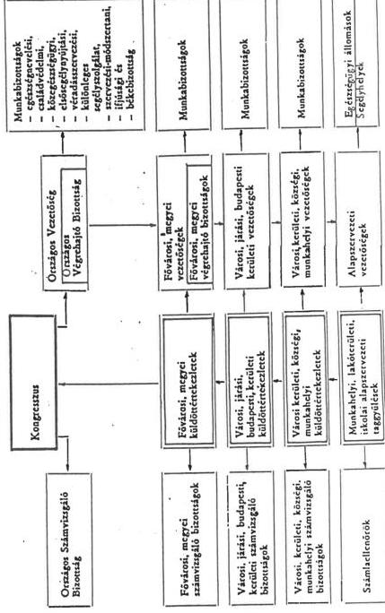
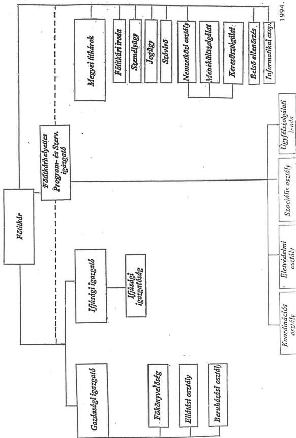
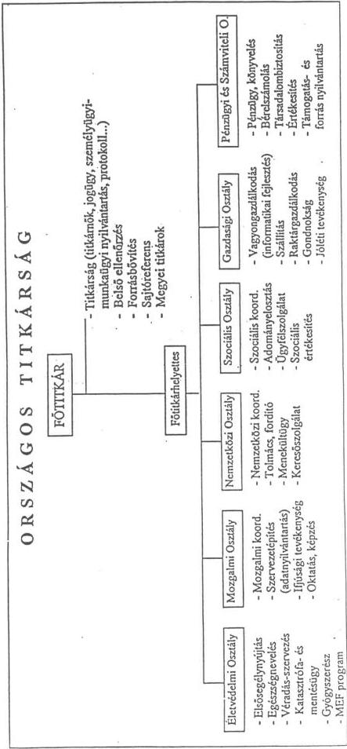

Állami Számverőszék

# JELENTÉS

a Magyar Vöröskereszt pénzügyi-gazdasági
ellenőrzéséről

1996. október

331.

---

ÁLLAMI SZÁMVEVŐSZÉK

V-4-35/1996.

Témaszám: 314

# JELENTÉS

# a Magyar Vöröskereszt pénzügyi-gazdasági ellenőrzéséről

A Magyar Vöröskereszt (MVK) a Nemzetközi Vöröskereszt és Vörösfélhold Mozgalomhoz csatlakozó nemzeti humanitárius társadalmi szervezet. Feladatait és működésének garanciális szabályait az 1994. évi XXXVII-es törvénnyel módosított 1993. évi XL. tv. (a továbbiakban 1993. évi XL. tv.) határozza meg. Ezt megelőzően a MVK az 1955. évi 25. sz. tvr. alapján demokratikus tömegszervezetként tevékenykedett, működésének költségeit az állami és az állami szervektől kapott támogatás nagyrészt fedezte.

A szervezet 1992-95. között évente közel 1 Mrd Ft-tal gazdálkodott. Ezen belül az állami támogatás 1992-1994. években 260 M Ft/év, 1995-ben 300 M Ft volt, s az 1996. évi előirányzat szintén 300 M Ft, amelyet az éves költségvetési törvényekben az Országgyűlés fejezetben hagyott jóvá a Parlament.

A MVK 7.000 körüli helyi szervezettel, mintegy félmillió taggal, 50 ezer önkéntessel, közel 700 alkalmazottal látja el részint az ún. klasszikus vöröskeresztes feladatokat (háború esetén az áldozatok mentése, hadifoglyok nyilvántartása, rászorultak segítése; békében a keresőszolgálatok működtetése, a menekültek segítése, önkéntes véradásszervezés, egészségnevelés), részint az ezeken túlmutató, főként a szociális ellátás körébe tartozó feladatokat (szociális étkeztetés, népkonyhák, nappali melegedők, átmeneti otthonok, éjjeli menedékhelyek, stb. működtetésével segít a rászorultakon).

Tevékenységét az önállóan gazdálkodó megyei, budapesti (a továbbiakban: megyei) szervezetek, illetve az Országos Titkárság (OT) fogja össze.

A nemzetközi vöröskeresztes mozgalom tagjaként a megfelelő önkormányzati szervezetekkel és szabályzatokkal rendelkezik; 4 évente kongresszust tart, működésében meghatározó a Kongresszus által elfogadott Alapszabály, választott vezetősége és ellenőrzési szervezete van.

Az Állami Számvevőszékről szóló, többször módosított, 1989. évi XXXVIII. tv. 2. § (5) bekezdése értelmében a társadalmi szervezeteknek az állami költségvetésből juttatott támogatásuk felhasználását az ÁSZ ellenőrzi.

---

# Ellenőrzésünk során arra kerestünk választ, hogy a MVK-nél

- a kozponti koltsegvetesból juttatott támogatas - figyelemmel az Alapszabályban meghatározott tevekenységi celokra -, valamint a pályázatok utján elnyert, az allami koltsegvetesból származó penzeszközok felhasznalása, az azokkal valo gazdalkodás megfelelt-e a törvenyi elóirásoknak és a celszerüsegi, eredményességi szempontoknak;
- a gazdalkodásra, nyilvántartásra és beszámolásra vonatkozo jogszabályi elóirásokat betartották-e.

Az ellenőrzés számára gondot jelentett, hogy a MVK nyilvántartásai nem voltak alkalmasak a központi költségvetési támogatás felhasználásának nyomonkövetésére, s ez szükségessé tette a szervezet működésének, gazdálkodásának széleskörű vizsgálatát.

A helyszíni ellenőrzést a MVK OT-nál, továbbá a Baranya-, Békés-, Csongrád-, Fejér-, Győr-Moson-Sopron-, Pest-, Szabolcs-Szatmár-Bereg-, és Tolna megyei szervezeteinél végeztük.

Vizsgálatunk a MVK 1992-1995. közötti működésére, gazdálkodására terjedt ki, s érintette az 1996. első félévit is.

# I.

# Összefoglaló megállapítások, következtetések, javaslatok

A MVK feladataiban a jogelőd, a MV Egylet intézeteinek 1949-ben történt államosítása után jelentős változások következtek be. A MV Egylet még 1948-ban is 228 különböző intézetet működtetett (kórházak, tüdőbeteg gyermekek szanatóriuma, Heine-Medin kórház, bentlakásos és napközis gyermekotthonok, orvosi rendelők, bölcsődék stb.). Az államosítást követően viszont előtérbe kerültek az intézeti háttér nélküli, ún. mozgalmi feladatok, már 1951-ben célul tűzték ki az egészségügyi tömegszervezetté fejlődést. Ezt az irányt megerősítette az 1955. évi 25. tvr., amely kimondta, hogy a MVK demokratikus tömegszervezet, amelynek feladata az egészségügyi viszonyok javításában és az egészségügyi kultúra fejlesztésében a magyar dolgozó nép tevékeny részvételének előmozdítása. A feladatok közül csak az önkéntes véradók toborozása volt konkrétnak tekinthető.

E szabályozás következtében a MVK egy túlduzzasztott és túlbürokratizált tömegszervezetté vált, viszonylag kevés konkrét szakmai feladattal, ugyanakkor a működésének költségeit fedező állami (állami szervezeti és vállalati) támogatással.

A MVK 1990-től tevékenyen részt vállalt a megjelenő új feladatok ellátásában, így pl. a menekültellátásban, a szociális segélyezésben és gondozásban (hajléktalanok segítése). Az új feladatokat az 1992-ben tartott VIII. Kongresszuson Alapszabályba iktatták. Ezt követően az 1993. évi XL. törvényben a MVK által ellátott összes feladat alapfeladat-

2

---

ként nyert megfogalmazást azzal, hogy a törvény a szociális segítségnyújtás területén a konkrét feladatellátás meghatározását az Alapszabályra bízza. Az érvényes Alapszabály szerint e téren az adománygyűjtés, -elosztás, a szociális árusítás, az alapítványok kezdeményezése, a vállalkozások, akciók szervezése egyaránt megengedhető.

Ez a szabályozás lehetőséget ad a MVK feladatvállalásának bővítéséhez a szociálpolitikai ellátások területén. Egy karitatív, humanitárius szervezettől nem is vitatható el ez a jogosítvány, szükséges viszont a megfelelő eszközrendszer hozzárendelése a bővülő feladatokhoz.

Ugyanakkor sem a MVK-ról szóló törvény, sem a kapcsolódó ágazati törvények nem adnak egyértelmű eligazítást az alapfeladatok állami jellegét illetően.

A MVK-ról szóló törvény az alapfeladatok teljesítéséhez kimondja a külön jogszabály szerinti költségvetési támogatás biztosítását. A külön jogszabály nem született meg, ehelyett a tárgyévi költségvetési törvényekben - az OGY fejezetben - határoztak meg egy konkrét összegű állami támogatást a feltételek előírása nélkül.

E szabályozás és az ennek alapján kialakult gyakorlat nem biztosítja az állami támogatás felhasználásának tételes és célirányos nyomonkövethetőségét.

Szükséges ezért az alapfeladatok körének felülvizsgálata, egy választható feladatstruktúrából azok kiemelése, amelyeknél célszerű az állami feladatellátásban való közreműködés és ezekhez a megfelelő finanszírozási forma (normatíva, állami megbízás, stb.) hozzárendelése.

Ebből a szempontból feltétlenül figyelembe veendők a főként a Szociális igazgatásról szóló 1993. évi III. tv. nyomán kibontakozó azon folyamatok, amelyek keretében a MVK egyes helyi önkormányzatokkal külön megállapodásban rögzített módon vesz részt a szociális feladatellátásban.

A MVK szervezetére, működésére az 1993. évi XL. törvény - az Alapszabály megalkotásán túl - az egyesülési jogról szóló 1989. évi II. törvény társadalmi szervezetekre vonatkozó rendelkezéseinek alkalmazását írja elő. Az 1994. I. 1-jével hatályba léptetett SZMSZ pontosan körülhatárolta a szakmai, valamint a funkcionális tevékenységet végző szervezeti egységek feladatait és a vezetők felelősségét az OT-ra vonatkozóan. A megyei szervezetek pedig lehetőséget kaptak a saját területükre kiegészítő szabályozásra, mellyel többségük (15) élt.

A vizsgált időszak végére kialakult szervezet alkalmassá vált az alapfeladatok ellátására, a tagoltság, a szakmai feladatok elhatárolása megfelelő volt.

A működési rendet illetően szükséges a testületi szervek és az apparátus hatékonyabb együttműködését biztosító új formák kialakítása, az apparátus működéséből pedig a bürokratikus elemek kiiktatása, egy manager típusú vezetés kialakítása. Erősíteni kell továbbá az OT-nak a megyei szervezetekkel való kapcsolatában a

3

---

koordinatív, az elvi irányító, módszertani elemeket. Ez különösen aktuális a megyei szervezetek önálló jogi személlyé válásával.

A szervezet egészére vonatkozó átfogó gazdálkodási szabályzatot nem készítettek, ugyanakkor rendelkeztek a gazdálkodás egyes részterületeit lefedő szabályzatokkal, melyek azonban nem tértek ki a költségvetési támogatás felhasználásának feltételeire. Az egyes gazdálkodási részterületeket illetően meglévő szabályzatok minősége eltérő.

A szabályozási hiányosság szembeötlő volt a vállalkozási tevékenységnél, az alapítványokban, gazdasági társaságokban való részvételnél, valamint a szociális árusításoknál a MVK egészére vonatkozóan.

A megyei szervezetek nagy része élt a kiegészítő szabályozás lehetőségével. Átfogó gazdálkodási szabályozással öt megyei szervezet, az egyes részterületek szabályozásával két megyei szervezet rendelkezett. Nem élt a kiegészítő gazdálkodási szabályozás lehetőségével 4 megyei szervezet.

A megyei szervezetek önálló gazdálkodása az Alapszabály szerinti származtatott jogi személyiségből ered. Az SZMSZ az OT-nak, valamint a megyei szervezeteknek önálló tervkészítési, gazdálkodási, beszámolási kötelezettséget ír elő, amely felett az OT szakmai és gazdálkodási felügyeletet lát el.

Az 1996-ban tartott IX. Kongresszuson elfogadott Alapszabály-módosítás kimondta a megyei szervezetek önálló jogi személyiségét.

A MVK alapfeladatai ellátásához nyújtott költségvetési támogatásra vonatkozó törvényi előírás nem zárta ki, hogy a támogatás működési kiadásokra is fordítható. (Megjegyezzük, hogy a külföldi példák szerint a vöröskeresztes szervezetek működésük finanszírozásához állami támogatásban nem részesülnek. Nemzetközi összehasonlításunkat a 2. függelék tartalmazza.) Az éves költségvetési törvények sem kötötték konkrét feladatokhoz, illetve célokhoz a támogatást. Mindezek következtében a költségvetési támogatás - bár csökkenő arányban - elsősorban a szervezet működési kiadásainak fedezetét szolgálta. A támogatás célirányos, eredményes felhasználása - amely a közpénzekkel való gazdálkodás lényeges követelménye - ugyanakkor nem követhető nyomon.

A MVK összes bevétele növekvő tendenciájú volt, s a vizsgált években 52,5%-kal emelkedett. A növekedés azonban csak a megyei szervezetekre volt jellemző az eredményesebb forrásbővítő tevékenység következtében.

A szervezet működését, feladatellátását 65-78%-ban az alaptevékenységi bevételek és a költségvetési támogatás biztosította, ugyanakkor a legintenzívebben a vállalkozási tevékenység bevételei nőttek. Az alaptevékenységi bevételek közül kiemelkedő volt a szociális tevékenység aránya, amelyben azonban közrejátszott, hogy a megyei szervezetek - kifogásolható módon - a ténylegesen vállalkozási (kiskereskedelmi) tevékenységnek minősülő szociális árusítás bevételeit is itt vették számba. A központi költségvetési támogatás részaránya az összes bevételen belül 35%-ról 26%-ra csökkent. A központi költségvetési támogatáson kívül egyes költségvetési szervektől 1994-95-ben

4

---

45-70 M Ft támogatást kapott a MVK. Az OT bevételi struktúrájának változásai arra utalnak, hogy a költségvetési támogatáson kívüli bevételek bizonytalanok, esetlegesek voltak.

A MVK éves költségvetési támogatási igényének szakmai alátámasztása az általánosság szintjén mozgott, azt számításokkal nem alapozták meg. A támogatás szervezeten belüli elosztása - a döntéselőkészítés hiányosságai miatt - nem volt kellően megalapozott. A költségvetési támogatás egyrészt az OT és a megyei szervezetek működési kiadásainak részbeni fedezetét szolgálta, másrészt a központosított tevékenységek kiadásainak forrása volt, továbbá a megyei szervezeteknek pályázatok útján is biztosítottak támogatást. A megyei szervezetek költségvetési támogatását normatívák alapján határozták meg, ugyanakkor a működési költségeket, s az ennek fedezetét képező bevételeket nem elemezték.

A MVK összes kiadása emelkedő irányzat mellett 72%-kal nőtt a vizsgált időszakban. Szerkezetének alakulását az alaptevékenységekre fordított kiadások csökkenése, s a működési kiadások növekedése jellemezte. Az OT magasabb működési költséghányad mellett látta el tevékenységét mint a megyei szervezetek, ami részben a feladatmegosztásból is fakad, részben viszont a takarékos gazdálkodás hiányára utal.

A kiadások költségnemenkénti szerkezete - a megyei szervezetek nyilvántartási hiányosságai miatt - nem volt értékelhető. Az azonban megállapítható, hogy átlagosan az összes kiadás 1/4-ét a bérköltség tette ki. Az OT-nál 1993-tól a kiadások jelentősen meghaladták a tárgyévi bevételeket. Az OT működésére fordított kiadások 1994-ig folyamatosan nőttek, s az összkiadás mintegy felét tették ki. 1995. II. félévétől a bevezetett takarékossági intézkedések eredményeként kedvező fordulat mutatkozott.

A központi költségvetési szervektől, valamint az államháztartás más alrendszereitől kapott támogatást - általában - meghatározott célokhoz kötötték. A szerződésekben előírt szakmai és pénzügyi elszámolási kötelezettségnek az OT eleget tett, a támogatások felhasználására vonatkozó elkülönített nyilvántartási és pénzkezelési kötelezettségének azonban többnyire nem, vagy nem kielégítően.

A költségvetési támogatást a forgóalap havonta utalta át a MVK-nek, s a megyei szervezetek finanszírozása is így történt. Az OT pénzügyi helyzetének romlása 1994-től már a megyei szervezeteknél is pénzellátási zavarokhoz vezetett a késedelmes utalások miatt, ami átmeneti likviditási nehézségeket okozott. Az OT likviditása 1993-tól 1994. végéig folyamatosan romlott, a 1995. II. félévi takarékossági intézkedésekkel sikerült a pénzügyi egyensúlyt fenntartani. Korábban azonban az OT vezetése nem kísérte figyelemmel a pénzügyi helyzet és a likviditás alakulását, okait nem vizsgálták.

Az OT tartalékai folyamatosan csökkentek. Az egyes tevékenységek forrásainak maradványaiból 1992. végén - a számviteli törvényt sértően - 156,7 M Ft céltartalékot képeztek. Ezt követően a meghatározott célokra fordítható maradványokat a mérlegben passzív időbeli elhatárolásként szerepeltették, hogy ezek a tárgyévi eredményt ne befolyásolják. A tevékenységek forrásainak maradványa 1994. végére 68,8 M Ft-ra, 1995. végére 39,1 M Ft-ra csökkent, s a mérleg szerinti pénzeszközállomány nem nyújtott

5

---

fedezetet a kimutatott maradványokra. A konkrét célokra felhasználható pénzeszközök egy részét tehát más kiadások finanszírozására fordították.

A MVK létszáma 1992. január 1. - 1995. december 31. között 12,6%-kal 642 főről 723 főre emelkedett, ezen belül az OT-é 106 főről 114 főre, 7,5%-kal nőtt. A megyei szervezeteknél a létszámnövekedés általában többlet feladatvállalással függött össze. Szembetűnő volt az OT-on belüli 20-30%-os fluktuáció, amely az alacsony fizetések és a személyi változások következménye. A létszám összetételére jellemző volt az igazgatási-ügyviteli dolgozók arányának bővülése az alaptevékenységet végzőkkel szemben.

A MVK bérgazdálkodása - a megyei szervezetek önállósága miatt - nem volt egységes. Az OT bérgazdálkodása ellentmondásos volt. Rendelkeztek ugyan szabályzatokkal, de ezeket nem aktualizálták, többször megsértették. A szervezeti egységek bérkeretgazdálkodása nem valósult meg, sem ösztönző, sem korlátozó szerepe nem érvényesült.

A MVK költségvetési támogatásának mintegy 40%-át tette ki a bérköltség, a személyi jellegű kifizetések és a TB járulék összege, amely az 1992. évi 155 M Ft-ról 1995-re 189 M Ft-ra nőtt.

A szervezet eszközállományának növekedésében meghatározóak voltak a beruházások, amelyeknél a központi költségvetési támogatás forrásként - dokumentáció hiányában - nem volt megállapítható. A tevékenység szabályozása nem volt kielégítő, s csak 1995-ben adták ki a Beruházási Ügyrendet. A vagyongazdálkodás célkitűzése az ingatlan állomány bővítése volt, amelyek előkészítését és megvalósítását szabályszerűen végezték. A beruházások eredményeként a szervezet ingatlanállományának értéke közel háromszorosára nőtt. Ennek ellenére a MVK a vállalt feladatai ellátásához szükséges vagyoni (ingatlan) feltételekkel csak korlátozottan rendelkezett. A MVK vezetése kezdeményezte államosított ingatlanai visszaszerzését, amelyhez azonban az államháztartási törvényben meghatározott feltételekkel nem rendelkezett.

A MVK működéséről, vagyonáról, pénzügyi helyzetéről - a számviteli törvénynek megfelelően - a szervezet egészére nem számolnak be, ennek hiányában pénzügyi, vagyoni helyzete áttekinthetetlen.

A MVK OT számviteli rendjét a jogszabályoknak megfelelően alakították ki. A számviteli rend szerkezetében igen, de tartalmában nem mindenben felelt meg a követelményeknek: az időbeli elhatárolás elvét nem megfelelően alkalmazták, az értékcsökkenés elszámolását nem a társadalmi szervezetekre vonatkozó előírások alapján végezték el, nem aktiválták az idegen tulajdonú tárgyi eszközök felújítását. A szabálytalan elszámolások esetenként rontották az eredménykimutatás megbízhatóságát. A számvitel nem biztosította a költségvetési támogatás felhasználásának figyelemmel kísérését.

Az analitikus nyilvántartások rendszere a költségvetéshez nem, a társadalmi szervezetek beszámolásához szükséges adatszolgáltatást azonban biztosította, az SZMSZ-ben megfogalmazott nyilvánosság elvének nem tett eleget. A bizonylati rend és bizonylati fegyelem betartása nem volt teljeskörű.

6

---

Az ellenőrzés nem volt az irányítás hatékony eszköze, nem szolgáltatott kellő mélységű információkat a gazdálkodási döntések megalapozásához, illetve azok végrehajtásáról a MVK vezetése részére.

# Javaslat a Kormánynak:

1) Keszítse elő a MVK-ról szólo 1993. évi XL. törvény módosításat az alapfeladatok diferenciát meghatározásával, kiemelve az allami feladatellátásban való kozremúkódes lehetőségeit és felteteleit, a megfelelo finanszirozási formákkal és elszámolásí kõtelezettseggel.
2) Mérlegelje a MVK 1949-ben allamositott, illetöleg 1990-ig kezelt ingatlanai vonatkozasaban a vagyonjuttatast az Aht. elöirasainak megfeleloen.
3) A 8/1996. (I.24.) Kormányrendelet módosításával rendelkezzen a társadalmi szervezetek onalloan gazdalkodó szervezetei konszolidál éves beszámoltatásáról.

# Javaslat a MVK-nek:

Az eredményes és hatékony működés, valamint az állami pénzeszközök célirányos felhasználásának nyomonkövethetőségét kiemelten kezelve:

1) Keszítse el a gazdalkodás atfogó keretszabályozásat.
2) Alakitsa ki a testuleti szervek és az apparátus hatékonyabb együttmuködését biztosító szervezeti és muködési formákat; torekedjen az apparátusi munkában a manager típus vezetésre, továbbá a megyei szervezetekkel való kapcsolatban az elvi irányító, modszertani munkára.
3) Teremtse meg az allami penzeszkozk felhasznalasanak napraksz nyomonkovetesét, ennek erdekében vizsgalja felul a

-koltsegvetesi tervezesi es beszamolasi rendjet,
- számviteli rendjét, különös tekintettel a szervezet egészére vonatkoź beszámolásirendre.

4) Teremtse meg a belső ellenőrzés megfelelő személyi feltételeit.

7

---

## II. Részletes megállapítások

### A) Az alapfeladatok, a szervezet és a működési feltételek összhangjának értékelése

#### 1. A MVK feladataiban bekövetkezett változások

A MVK a Nemzetközi Vöröskereszt és Vörösfélhold Mozgalomhoz csatlakozó, a Nemzetközi Vöröskereszt alapelvei és elismerési feltételei szerint működő humanitárius társadalmi szervezet, s mint ilyen, a Magyar Köztársaságban egyetlen.

Szervezetének és működésének szabályait a kongresszus által jóváhagyott Alapszabálya határozza meg. Törvényben elismert alapfeladatokat lát el, amelyek részint ún. klasszikus vöröskeresztes feladatok (háború esetén az áldozatok mentése, hadifogoly nyilvántartás; rászorultak segélyezése; békében: működteti a keresőszolgálatot, segíti a menekülteket; szervezi az önkéntes véradást, részt vesz az egészségnevelésben); részint e feladatokon túlmutatóak (átmeneti szállások megteremtésével, fenntartásával, egyéb módokon közreműködik a menekültek megsegítésében, házigondozó szolgálatot alakít ki; elsősegélynyújtást oktat; végzi a szociális segítségnyújtást az Alapszabályában meghatározott módokon).

**Az alapfeladatok teljesítéséhez költségvetési támogatásban részesül; hatósági jogkörrel nem rendelkezik; mentes az adó- és illeték fizetése alól, a vámjogszabályban meghatározott vámmentesség (vámkedvezmény) illeti meg.**

A MVK a vizsgált időszak elején tartotta VIII. Kongresszusát, amelyen új Alapszabályt fogadtak el, egyben 4 évre meghatározták fő feladataikat.

Szervezettségüket a csökkenő tendencia jellemezte.

1991-ben 10.173 helyi szervezetben 729.972 taggal és 95.651 önkéntessel dolgoztak, 1992-ben a helyi szervezetek száma 8.524, a taglétszám 557.457, az önkéntesek száma 51.095 volt. 1994-re a helyi szervezet száma tovább csökkent, már csak 7.066, a taglétszám nem érte el a félmilliót (490.268), az önkéntesek száma 53.148 volt. Szembeötlő a helyi szervezetek csökkenése, stagnál a lakóterületi helyi szervezetek száma (3.000 körüli), a taglétszám helyi szervezetek szerinti megoszlásában ugyanez a tendencia figyelhető meg.

Az ok a vöröskeresztes munka fő bázisát képező állami üzemek, vállalatok felszámolása, átszervezése.

8

---

A vöröskeresztes munka fő tevékenységi területei 1992-95. között:

- szociális munka, melyen belül elotérbe került az un. valságkezelés (szociális étkeztétés, népkonyhák, nappali melegedők, atmeneti otthonok, éjeli menedékhelyek, raszorulók segélyezese);
- egészségvédelem (Mozgalom az Egészséges Falvakert saját program, továbbá az Egészséges Városokér, Iskolákér mozgalomban, CINDI programban való részvetel; dohányzás-, drog-ellenes egészségnevelo munka);
- elsosegelynyujtás (kiemelten a gépjarmüvezetok képzése és vizsgáztatása), katasztrófa elhárítás;
- ifjusagi munka keretuben iskolaktol fuggetlen ifjusagi klubok szervezese;
- nemzetkozi kapcsolatok.

A MVK feladataiban a jogelőd, az MV Egylet intézeteinek 1949-ben történt államosítását követően előtérbe kerültek az intézeti háttér nélküli, ún. mozgalmi feladatok. Ezt megerősítette az 1955. évi 25. tvr.

A túlduzzasztott és túlbürokratizált tömegszervezetben a tényleges szakmai munka az ún. munkabizottságokban folyt.

Az I. Kongresszustól az 1970-es évekig a szakmai munkában jelentős irányváltások nem emelhetők ki.

A vizsgált időszak elejére a MVK-nál új feladatok jelentek meg, így pl. a menekültellátás; a szociális segélyezés és gondozás (pl. hajléktalanok segítése stb.). Ezeket az 1992-ben megtartott VIII. Kongresszuson elfogadott Alapszabály is rögzítette.

A feladatstruktúrában a MVK-ról szóló 1993. évi XL. tv. előremutató változást hozott azzal, hogy az akkorra kialakult feladatokat konkrétan, alapfeladatként deklarálta. A szociális segítségnyújtást viszont nem határolta be, az Alapszabályra bízta a konkretizálást. A törvényhozáskori Alapszabályt figyelembe véve ezen a területen az adománygyűjtés, elosztás, szociális árusítás, alapítványok kezdeményezése, vállalkozások, akciók szervezése egyaránt megengedett.

Ugyanakkor a törvényi szabályozás nem tér ki arra, hogy az alapfeladatok közül melyek sorolhatók a kötelező állami feladatellátás körébe.

A törvény külön jogszabályra bízza az alapfeladatok teljesítéséhez a költségvetési támogatás feltételeinek meghatározását, ez a külön jogszabály új jogszabályként ilyen tartalommal nem született meg, ehelyett a mindenkori tárgyévi költségvetési törvényben került meghatározásra egy konkrét támogatási összeg, feltételek hozzárendelése nélkül. (A külön jogszabályi feltételeknek a tárgyévi költségvetési törvény is megfelelne, ha a támogatási összeghez hozzárendelné a feltételeket.)

A MVK feladataiban a vizsgált időszak kezdetére jól körülhatárolható formában megjelentek és az 1993. évi XL. törvénnyel alapfeladatként rögzültek a klasszikus

9

---

vöröskeresztes feladatokon (a rászorultak segítése háború; katasztrófa esetén, keresőszolgálat működtetése, véradásszervezés) túlmutató, a szociális ellátás keretébe tartozó intézményes ellátások (átmeneti szállások, anyaotthonok, nappali melegedők stb.).

Tendenciaként - a társadalmi és gazdasági változások irányát figyelembe véve - megfigyelhető az ún. szegénypolitikai ellátások iránti igény folyamatos növekedése, amely az erre érzékeny MVK-nél állandó feladatbővülést indukálhatna. Ehhez azonban megfelelő anyagi háttérrel a MVK nem rendelkezik, ezért szükséges egyértelműen meghatározni az alapfeladatok körében az állami feladatellátásban való közreműködést, valamint ezek finanszírozásának lehetőségeit és feltételeit.

Ebből a szempontból feltétlenül figyelembe veendők:

- fokent a Szocialis igazgatasrol szoló 1993. évi III. tv. nyoman kibontako-zó folyamatok: igy a MVK és a helyi önkormányzatok külön megallapodásban rögzítéték, hogy az allami szocialis feladatellatásból a törvenyben meghatározott szocialis normativáert mely feladatokat vett at a MVK (5 atmeneti szallo, 5 éjeli menedékhely, 2+1 anyaoltalmazó haz, 8 nappali melegedó, 11 népkonyha);
- vagy igenykent az onkentes veradomozgalom szervezésenek rendszerszer elismertete, amely kulönosen aktualis az Orszagos Verellato Kozpont vir-tualis letrehozasaval (48/1995. (XII.29.) NM rendelet);
- vagy az otthonapolas rendszerszeru bevezetesehez kozeledve a vöröskeresztes apolok ebben valo részvetelenek megfeleloBiztositasa (kepzes, apolok bevetele az otthon apolast vegzö csapatba);

# 2. A MVK nemzetközi kapcsolatai, az ebből eredő kötelezettségek

A MVK annak a humanitárius világmozgalomnak a része, amely magában foglalja a Vöröskereszt és Vörös Félhold Társaságokat, vagyis az összes nemzeti társaságot, a Vöröskereszt Nemzetközi Bizottságát és a Vöröskereszt és Vörös Félhold Társaságok Nemzetközi Szövetségét (a továbbiakban: Nemzetközi Szövetség).

A Vöröskereszt Nemzetközi Bizottsága független státuszú humanitárius szervezet, tagjait kooptálással toborozza a svájci állampolgárok közül. Külön Alapszabálya van, őrködik a Mozgalom alapelveinek fenntartása és terjesztése felett. Ez a bizottság ismeri el az újonnan alakított vagy átalakított nemzeti társaságokat és ellátja a Genfi Egyezményekben elismert feladatokat (e körben biztosítja a Központi Keresőszolgálat működését is); szoros kapcsolatot tart fenn az egyes nemzeti társaságokkal, főleg fegyveres konfliktusok esetén (pl.: segélykoordináció).

A Nemzetközi Szövetség saját Alapszabállyal, önálló jogi személyiséggel, egyesületként működik. Általános célkitűzése, hogy ösztönözze, előmozdítsa, megkönnyítse és fejlessze a nemzeti társaságok humanitárius tevékenységét, annak érdekében, hogy megelőzze és enyhítse az emberi szenvedést, hozzájáruljon a béke fenntartásához és előrehaladásához a világban. Állandó összekötő és koordinációs tevékenységet lát el a nemzeti társaságok között.

10

---

A Nemzetközi Bizottság és a Nemzetközi Szövetség között az együttműködést külön megállapodások rögzítik.

Ahhoz, hogy egy nemzeti társaság ilyen minőségben létrejöhessen, a Nemzetközi Bizottság elismerése szükséges. Az elismerési feltételeket a Nemzetközi Vöröskereszt és a Vörös Félhold Mozgalom Alapszabálya határozza meg. E feltételek között szerepel, hogy a nemzeti társaság olyan független állam területén jöjjön létre, ahol a Genfi Egyezmény érvényben van; az adott államban az egyetlen ilyen jellegű szervezet legyen; az állam törvényes kormánya kellőképpen ismerje el; önálló státusza legyen, használja a mozgalom nevét és jelvényét; olyan szervezettel rendelkezzen, amely lehetővé teszi az Alapszabályában meghatározott feladatok elvégzését; tevékenysége az állam egész területére terjedjen ki, csatlakozzék a Nemzetközi Szövetség Alapszabályához; tartsa tiszteletben a mozgalom alapelveit és a nemzetközi humanitárius jog vezérelje a tevékenységét.

A felvétel feltételeit a Nemzetközi Szövetség Eljárási Szabályzata határozza meg. A szervezet elnökéhez benyújtott kérelmekhez csatolni kell: a kérelmező társaság alapszabályát, a saját kormány hivatalos elismeréséről a megfelelő dokumentumot, írásos nyilatkozatot arról, hogy a Nemzetközi Szövetség alapszabályát, döntéseit betartja, kötelezi magát, hogy pénzügyi hozzájárulást (éves tagdíjat) fizet.

A VK nemzeti társaságaival igen kiterjedt kétoldalú kapcsolatokat tart a MVK (1992-ben 129, 1993-1994-ben 151 és 1995-ben 155 szervezettel). Kiemelkedő jelentőségű a francia és a német kapcsolat, a "Visegrádi Négyek" tagországainak vöröskeresztes szervezeteivel folytatott rendszeres konzultációk.

A magyar vöröskeresztes munka elismerését jelentette, hogy 1993-ban a Nemzetközi Szövetség ún. székhelyegyezményt írt alá a Magyar Köztársaság Kormányával (a 106/1993. (VII.20.) Kormányrendelettel hirdették ki), azzal a céllal, hogy az iroda innen hangolja össze a Közép- és Kelet Európa államaiban végzendő humanitárius segítségnyújtást. A MVK kapcsolata az irodával koordinatív, szakmai jellegű.

A nemzetközi együttműködés keretében a MVK-nél a következő szakmai feladatok jelentek meg:

A kormánysegélyek lebonyolítása, amelyhez a Külügyminisztérium (KÜM) külön segélyalapból biztosított - elszámolási kötelezettséggel - forrásokat: 1992-ben 17,2 M Ft, 1993-ban 18,5 M Ft, 1994-ben 2,0 M Ft, 1995-ben 11,9 M Ft összegben.

A menekültek segítése és a keresőszolgálat működtetése keretében menekültek segítésére - készpénz, egyéb adomány menekülttáborok fenntartásához, illetve más szervezeteknek nyújtott támogatás formájában - 1992-ben közel 200 M Ft-ot, 1993-ban közel 80 M Ft-ot, 1994-ben 100 M Ft-ot, 1995-ben közel 70 M Ft-ot fordítottak.

A nemzeti társasági tagi minőségében a MVK tagdíjat fizet a Nemzetközi Szövetségnek. Ennek összege 1992-1993-ban közel azonos volt, 74.900, illetve 75.513 CHF, 1994-ben 82.524 CHF-re, 1995-ben 90.054 CHF-re emelkedett.

11

---

(A Nemzetközi Szövetség tagdíjbevételének egyébként csak 0,35-0,38%-át tette ki a MVK tagdíja. 1996-ban a tagdíj összesen 101.048 CHF.)

A MVK szokásjogi alapon, önként hozzájárul (kötelező előírás erre nincs) a Nemzetközi Bizottság működéséhez. Erre a vizsgált időszakban 2 esetben került sor: 1992-ben 5 E CHF, 1993-ban 10 E CHF összeggel.

A tagdíj fedezetéül a MKV költségvetésében tervezetten az állami támogatás központosított része szolgált.

# 3. A Magyar Vöröskereszt szervezetében bekövetkezett változások

A Magyar Vöröskeresztről szóló 1955. évi 25. tvr. az MVK szervezetének meghatározását az Alapszabályra bízta. Az első Alapszabályt az 1959-ben tartott I. Kongresszus fogadta el.

Az I. Kongresszustól az 1973-ban tartott IV. Kongresszusig a mozgalmi jelleg dominált, megjelentek a választott testületek (Országos Vezetőség, Számvizsgáló Bizottság megyei (fővárosi), járási, városi vezetőségek). Az 1976-ban elfogadott új Alapszabályban, a döntéshozó és végrehajtó szervek szétválasztásának alapján megjelentek mind közigazgatási, mind munkahelyi szinten az ún. VB-k. (1. sz. ábra)

Szervezeti oldalról az 1993. évi XL. törvény a MVK-re - az Alapszabály megalkotásán túl - az egyesülésről szóló 1989. évi II. törvény társadalmi szervezetekre vonatkozó előírásainak alkalmazását írja elő.

E tekintetben az 1994. I. 1-jével hatályba léptetett SZMSZ döntő fontosságú volt, mivel pontosan körülhatárolta a szakmai, valamint a funkcionális tevékenységet végző szervezeti egységek feladatait és a vezetők felelősségét az OT-ra vonatkozóan. Megjegyezzük, hogy kiemelkedő részletezettségű a főtitkári felelősség és feladatkör. A megyei szervezetek pedig lehetőséget kaptak a saját területükre vonatkozó kiegészítő szabályozásra.

(Az SZMSZ-hez kiegészítést készítettek: A MVK Budapesti, valamint a Vas-, BAZ-, Békés-, Komárom-Esztergom, Baranya-, Zala-, Győr-Moson-Sopron-, Nógrád-, Veszprém-, Bács-Kiskun-, Pest-, Jász-Nagykun-Szolnok-, Szabolcs-Szatmár-Bereg-, Heves megyei szervezetei.)

1995-ben az OT-n belüli szervezetet is módosították, az igazgatóságok helyett osztálytagozódást vezettek be (2. és 3. sz. ábra)

Összegezve: a vizsgált időszak végére kialakult szervezet, különösen az OT-é, alkalmas az alapfeladatok ellátására, tagoltsága, a szakmai feladatok elhatárolása megfelelő.

12

---

#### 4. A szervezet szabályozottsága és működési rendje, különös tekintettel a gazdálkodásra

A MVK 1992-ben tartott VIII. Kongresszusa új Alapszabályt fogadott el, amely szabályozási tárgykörét tekintve megfelel a Nemzetközi Vöröskereszt és Vörös Félhold Társaság nemzeti társaságai számára ajánlott mintaként kiadott alapszabályi követelményeknek.

Összehasonlítva a MVK Alapszabályát a holland, a német, az osztrák VK Alapszabályával, két alapvető különbség állapítható meg:

- A hivatkozott alapszabályok lényegesen részletesebbek, ennek oka az is, hogy a nagyobb taglétszámuknak megfelelően tagoltabb szervezettel rendelkeznek.
- A gazdálkodást érintő előírások sokkal részletesebbek, mint a MVK Alapszabályában. A holland VK Alapszabálya például azt is meghatározza, hogy a helyi szervezetek a tagdíjbevételük hány %-át fizetik be kötelezően a központi szervezetnek.

Az Alapszabályhoz 1992-ben - egyes rendelkezések értelmezésére - ún. Eljárási Szabályzat lépett életbe.

Ezeken túlmenően is a vizsgált időszak alatt a MVK szervezetét, működését, gazdálkodását illetően a szabályozottság igen jelentősen javult.

A gazdálkodási jogosítványokat elhatároló SZMSZ mellett van Kollektív Szerződésük, Tűz- és Munkavédelmi Szabályzatuk és vannak a gazdálkodás egyes részterületeit lefedő szabályzataik (bérgazdálkodási az OT-re 1993-tól, adománykezelési 1994-től, ennek egy kiegészítése a külföldről származó adományokra, a közérdekű kötelezettségvállalások elfogadásáról 1993-tól, a belső ellenőrzésről 1995-től, a beruházásokról 1995-től stb., sőt külön meghatározásra került a tervezési, beszámolási, adat- és információszolgáltatási tevékenység ütemezése is 1994. november 28-tól).

A megyei szervezetek többsége is élt a kiegészítő szabályozás lehetőségével, két típusba sorolhatóan:

- átfogó gazdálkodási szabályozással, pl. a Szabolcs-Szatmár-Bereg-, a Nógrád-, a Vas-, a Heves-, a BAZ megyei szervezet;
- egyes gazdasági részterületek, elemek szabályozásával, így pl. a pénzkezelés, a gépkocsihasználat, a leltározás, az eszköznyilvántartás, az adományok kezelése rendjéről (Csongrád-, Békés-, Komárom-Esztergom-, Zala-, Pest-, Tolna-, Jász-Nagykun-Szolnok megyei szervezet).

Nem élt a kiegészítő gazdálkodási szabályozás lehetőségével: a Fejér-, a Hajdú-Bihar-, a Somogy- és a Bács-Kiskun megyei szervezet.

Az egyes gazdálkodási részterületekre vonatkozó szabályzatok minősége eltérő, így pl. a Beruházási Ügyrend fogalom-gyűjtemény, túl általános, részleteiben nem jól körülhatárolt, vagy pl. az Adománykezelési Szabályzat azzal, hogy a készletezést és

13

---

annak felügyeletét az OT-on belül az adománykezelést egyébként ellátó Szociális Osztálytól a gazdasági részleghez teszi, megbontja a folyamat áttekinthetőségét, megnehezítve az ellenőrzést.

Vannak azonban a szabályozásban jelentős hiányosságok is, így pl. külön szabályozást igényelne az egész MVK-re az ún. szociális árusítások, illetve a vállalkozói tevékenység, az alapítványokban, gazdasági társaságokban való részvétel kérdésköre. Nem készült el a megyei szervezetek számára iránymutató átfogó keretszabályozás a gazdálkodás területén (SZMSZ 30. § (5)).

A megyei szervezetek önálló gazdálkodása az 1992-ben elfogadott Alapszabályban meghatározott származtatott jogi személyiségükből ered.

Az 1994. I. 1-jétől hatályos SZMSZ 4. §-ában rögzíti az egész MVK-ra az önálló jogi személyiséget, összhangban az 1993. évi XL. törvénnyel, továbbá a gazdálkodási jogosítványokat tekintve az OT-nak, valamint a megyei szervezeteknek önálló tervkészítési, gazdálkodási, beszámolási kötelezettséget ír elő, amely felett az OT szakmai és gazdálkodási felügyeletet lát el.

Megjegyezzük, hogy az 1996-ban tartott IX. Kongresszuson elfogadott Alapszabálymódosítás ezt erősíti, kimondja a megyei szervezetek önálló jogi személyiségét.

A helyi szervezetek gazdálkodási önállóságának kérdése is felmerült 1992-ben, de nem éltek vele. Az Eljárási Szabályzat adott lehetőséget a helyi (városi, területi, körzeti) szervezetek számára is külön feltételek teljesítése esetén (pályázni kell az OV-hoz, a pályázatban be kell mutatni, hogy tartósan, legalább 2 évig önállóan tud gazdálkodni; az engedélyt az OV adja) származtatott jogi személyként való működésre.

Ugyanakkor sem az Alapszabály, sem a SZMSZ nem rögzítette a választott tisztségviselők, illetve a fizetett alkalmazottak munkakapcsolatát biztosító szervezeti és működési formákat.

Az OT-on belül a főtitkári irányítású apparátus működését tekintve túlbürokratizált volt.

Még 1995. augusztusáig is szinte minden héten felváltva, de majdnem teljesen ugyanazon osztályvezetők részvételével vezetői, illetve programegyeztető értekezleteket tartottak, ezt később mérsékelték 2 hetenkénti vezetői értekezlet tartására. 1995. közepéig működött egy ún. instruktori rendszer: régiónként járt rendszeresen konzultálni 1-1 vezetőségi tag. A rendszert megszüntették, mert belátták, hogy nem volt képes a megfelelő szakmai segítség nyújtására.

A SZMSZ alapján az OT-on mind az ügyrendek, mind a munkaköri leírások elkészültek. A működésben azonban jelentős hiányosságok voltak tapasztalhatók, így pl.: az 1995. nyarán bekövetkezett fontos vezetőváltásoknál (főtitkári, gazdasági vezetői munkakör) a szabályszerű, jegyzőkönyvben rögzített átadás-átvétel - nem feltétlenül a jelenlegi vezetés hibájából - nem történt meg. A főtitkári munkakört illetően a képviseleti

14

---

jogosultság személyi változásának bírósági bejegyzését téves alaphelyzetből kiindulva nem sikerült elintézni; így a vizsgálatunk idején főtitkári munkakört ellátó személy a szervezetet nyilvántartó Fővárosi Bíróságnál bejegyzett képviseleti jogosultsággal nem rendelkezett.

Az Alapszabály szerint a képviseleti jog az elnököt és a főtitkárt illeti meg, a főtitkári tisztségre a pályázatot az OV 1996. június 25-én írta ki. Ennek lezárásáig a főtitkári munkakört ellátó személy képviseleti jogosultsága 1995. november 20-i elnöki megbízáson alapul, amely az SZMSZ-ből és az Eljárási Szabályzatból eredeztethető. Jogi szempontból ez az ügyek viteléhez elégséges.

# B) A költségvetési támogatással való gazdálkodás

A MKV-ről szóló 1993. évi XL. törvény 3. §-a szerint a szervezet a törvényben felsorolt alapfeladatai teljesítéséhez költségvetési támogatásban részesül külön jogszabályban meghatározottak szerint. A törvény nem zárja ki, hogy a támogatás az alaptevékenységek mellett működési kiadások finanszírozására is fordítható. A támogatás éves összegét megállapító költségvetési törvények sem kötötték konkrét feladatokhoz, illetve célokhoz a felhasználást. A támogatásnak ez a módja - ahogy azt a 2. sz. függelékben is bemutatjuk - nemzetközi viszonylatban nem megszokott.

Mindezek következtében a költségvetési támogatás - bár évről-évre csökkenő arányban - elsősorban a szervezet növekvő működési kiadásainak fedezetét szolgálta. A támogatás célirányos, eredményes felhasználása - amely a közpénzekkel való gazdálkodás lényeges követelménye - ugyanakkor nem követhető nyomon.

# 1. A MVK bevételeinek alakulása

A szervezet összes bevétele a vizsgált időszakban folyamatosan emelkedett. Az 1995. évi bevétel az 1992. évit 52,5%-kal haladta meg.

A MVK összes bevételének 60-79%-át a megyei szervezetek, 21-40%-át az OT realizálta. A folyamatos bevételnövekedés csak a megyei szervezeteket jellemezte, az OT bevételei jelentős mértékben ingadoztak. A megyei szervezetek forrásmegtartó és -bővítő tevékenysége tehát általában eredményesebb volt, mint az OT-é.

A bevételek jogcímük szerint az alaptevékenységi feladatok bevételeiből, pályázati, egyéb támogatásokból, jogi és magánszemélyek befizetéseiből, a központi költségvetési támogatásból, tagdíjbevételből, az ún. KÜM segélyekből, az egyéb bevételekből és a vállalkozási tevékenység bevételéből származtak.

Az összbevétel struktúrájában - bár kisebb arányeltolódások megfigyelhetők - számottevő változások nem mutatkoztak. A MVK működését és az alapfeladatok ellátását 65-78%-ban az alaptevékenységi bevételek és a költségvetési támogatás biztosítot-

15

---

ta. Legdinamikusabban a vállalkozási tevékenység bevételei növekedtek (az 1995. évi bevétel 290%-kal haladta meg az 1992. évit), jelentős, de nem meghatározó forrással egészítve ki a bevételeket.

A legjelentősebb részarányt az alaptevékenységek bevételei képezték, a négy év átlagában e forrásból származott az összes bevétel 38,4%-a. Ezen belül kiemelkedett a szociális tevékenység részaránya (38-62%). Az arányt azonban rendkívül erősen torzította, hogy a megyei szervezetek egy része az ún. szociális célú árusítás bevételeit is itt vette számba.

Előfordult, hogy a megyei szervezet minősítése szerinti szociális célú árusítás keretében csaknem 100 M Ft értékű éves forgalmat realizáltak, amelyet a szociális tevékenység bevételei között mutattak ki.

1995. évben a Fejér Megyei Szervezet 108,9 M Ft alaptevékenységi bevételt ért el, amelyből 97,7 M Ft három nyílt árusítású bolt forgalmából származott. (Ez a MVK összes szociális tevékenységi bevételének 46,2%-a volt.) Az üzletek három városban szociális helyzettől függetlenül igénybe vehető módon alapvető élelmiszereket és vegyi árukat értékesítettek a kiskereskedelmi árnál alacsonyabb - ÁFA nélküli - árakon. Az üzletek működtetési módja (nyílt árusítás) miatt az sem szociális célú árusításnak, sem szociális tevékenységnek nem minősíthető, s így nem felel meg az Alapszabályában rögzített céloknak sem. A megyei szervezet ténylegesen adóköteles vállalkozási - kiskereskedelmi - tevékenységet folytatott.

Más megyei szervezetnél is találkoztunk nyílt árusítást folytató boltok üzemeltetésével és bevételeik alaptevékenységi bevételként történő számbavételével (pl. 1993. évben a Győr-Moson-Sopron Megyei Szervezet).

Jelentős alaptevékenységi bevételi forrás volt 1993. évtől az elsősegélynyújtás képzési tevékenység (1993. évben 127 M Ft, 1995. évben 144,6 M Ft volt a bevétel). 1993. évtől vált ugyanis a MVK feladatává a gépjárművezetéshez előírt elsősegélynyújtó tanfolyamokhoz kötött díjköteles vizsgáztatás.

A véradásszervezés bevételei hullámzóak voltak (1993. évben 15,3 M Ft, 1994. évben 26,3 M Ft, 1995. évben 16,8 M Ft) annak ellenére, hogy a MVK vezetői többször fordultak az érintett szervezetekhez - a Népjóléti Minisztériumhoz (NM), az Országos Egészségbiztosítási Pénztárhoz (OEP) - a MVK véradásszervezési tevékenységének elismerése és támogatása ügyében.

Az alaptevékenységi bevételek mellett másik fő bevételi forrás a központi költségvetési támogatás volt, amelynek összege 1995. évig változatlan maradt, így az összes bevételen belüli részaránya 35%-ról 26%-ra csökkent.

A vizsgált időszakban a központi költségvetési támogatáson felül az államháztartási és a civil szféra változó intenzitással támogatta a MVK tevékenységét.

A legjelentősebb támogatóik a költségvetési szervek voltak, 1994-1995. években mintegy 45-70 M Ft-tal segítve a szervezet tevékenységét.

16

---

A jogi személyek hozzájárulása évente 32-48 M Ft-ot tett ki, s mérsékelten emelkedett a magánszemélyeké is (1994. évben 17 M Ft, 1995. évben 19 M Ft). Az önkormányzatok által nyújtott támogatás bár csaknem négyszeresére emelkedett, szerény mértékű volt.

1994. évtől dinamikusan növekedett a **vállalkozási tevékenységből származó bevétel** (1994. évben az összes bevétel 8,7%-a, 1995. évben 13,2%-a származott e forrásból), amelynek keretében alapvetően kereskedelmi tevékenységet folytattak a megyei szervezetek.

1992. évben 7, 1995. évben már 17 megyei szervezet számolt el vállalkozási tevékenységből származó bevételt.

Nem jelentett számottevő forrást a **tagdíj bevétel**, amelynek összege 1994. év végéig folyamatosan csökkent (1992. évben 10,2 M Ft, 1994. évben 6,7 M Ft), 1995. évben a tagdíjemelés következményeként meghaladta a 11 M Ft-ot.

### 1.1 Az OT bevételeinek alakulása

**Az OT bevételei a vizsgált időszakban nagymértékben ingadoztak**, a legmagasabb összeget 1994. évben érték el (341,4 M Ft), ezt követően jelentős visszaesés mutatkozott. (Az 1995. évi összes bevétel - 236,1 M Ft - az 1992. évinek 78,2%-a, az 1994. évinek mindössze 69,2%-a volt.)

**Az egyes években figyelemre méltó arányeltolódások mutatkoztak a bevételek összetételében is.** A bevételek nagyságrendjének és az egyes bevételi jogcímek arányainak változásai arra utalnak, hogy a központi költségvetési támogatáson kívüli bevételek realizálása bizonytalan, esetleges volt.

A 1994. év kivételével a legjelentősebb bevételi forrást a központi költségvetési támogatás jelentette, részaránya 1995. évben megközelítette a 49%-ot. Ez azonban az alaptevékenységi bevételek nagymértékű csökkenésének tudható be. (Az 1995. évi alaptevékenységi bevétel nem érte el az 1992. évi szintet sem.)

**Az alaptevékenységi bevételek struktúrája is jelentősen ingadozott.** 1992-1994. években kiemelkedő volt a szociális tevékenység és a menekültügyi tevékenység bevétele, 1995. évben a szociális tevékenység bevétele minimális szintre esett vissza (2,5 M Ft), a menekültügyi tevékenység azonban megtartotta kiemelkedő részarányát.

Az egyéb bevételeken belül a kamatbevétel - az OT pénzeszközállományának nagymértékű csökkenése miatt - az 1993. évi 23,3 M Ft-ról 1995. évre 3 M Ft-ra esett vissza.

17

---

# 2. A központi költségvetési támogatás igénylésének megalapozottsága, az elosztás módja és elvei

A vizsgált időszak elején hatályban lévő 1955. évi 25. tvr. kimondta a MVK-et illetően az állami intézmények, vállalatok támogatási kötelezettségét, ezen túl az állami támogatás kereteinek minisztertanácsi jóváhagyását. Lényegében erre hivatkozással az 5/1991. (II.9.) OGY határozat egyértelművé tette, hogy a MVK-et a társadalmi szervezetek támogatására szolgáló kereten kívüli forrásból kell támogatni, egyben ennek megoldására felkérte a Kormányt.

Ennek alapján - a vizsgált időszak egészére jellemzően - a tárgyévi költségvetési törvényben az OGY fejezetben került meghatározásra az állami támogatás összege, amely 1992-1994-ben 260 M Ft/év, 1995-ben 300 M Ft volt.

A MVK az éves költségvetés tervezése keretében a Pénzügyminisztériumhoz (PM) nyújtotta be a költségvetési támogatás iránti igényét. Az éves költségvetési tervezéshez szükséges dokumentációt csak 1992-re és 1993-ra vonatkozóan tudták az ellenőrzés rendelkezésére bocsátani.

E dokumentumok alapján az éves állami támogatásra vonatkozó igények alátámasztása nem volt megfelelő. A szakmai érvanyag az általánosság szintjén mozgott, az igényeket számításokkal nem alapozták meg.

A központi költségvetési támogatás szervezeten belüli elosztására, a felhasználás jogcímeinek meghatározására az éves költségvetési javaslatok megtárgyalása és jóváhagyása keretében került sor. Az Alapszabály 22. cikkelye alapján a szervezet éves költségvetésének, s így az annak részét képező költségvetési támogatás felosztásának jóváhagyása is az Országos Vezetőség (OV) feladata és hatásköre volt.

Egyes években a támogatás felosztására vonatkozó javaslat kidolgozására ad hoc bizottság alakult (pl. 1993. évben). Előfordult, hogy e bizottságnak nem állt rendelkezésére a MVK gazdálkodásának alakulásáról megfelelő áttekintést nyújtó adatbázis. Kifogásolható, hogy a támogatás felosztására vonatkozó javaslatok egyetlen esetben sem tartalmazták az előző év tényadatait. E hiányosságok miatt a támogatás felosztása nem volt kellően megalapozott.

A vizsgált években a költségvetési támogatás elosztásáról eltérő mélységű, részletezettségű döntések születtek.

1992., 1993. években a költségvetési támogatás felhasználását részletesen, 1994., 1995. években csak a főbb felhasználási arányok rögzítésével hagyták jóvá.

A költségvetési támogatást egyrészt az OT és a megyei szervezetek használták fel, másrészt fedezetét képezte a "központosított tevékenységek" (nemzetközi kötelezettségek, kapcsolattartás, sajtó, propaganda, nemzetközi segélyalap, beruházások, felújítások) kiadásainak is, amelyeket az OT kezelt. 1992. évben a MVK VIII. kongresszusának előkészítésére is e forrásból különítettek el 5,2 M Ft-ot.

18

---

1992-1995. években a támogatásból az OT 25-32%-ban, a megyei szervezetek 57-61%-ban részesedtek, a fennmaradt összeget (29 M Ft - 47 M Ft) a központosított tevékenységek kiadásaira tervezték felhasználni.

1996. évben a korábbi arányoktól lényegesen eltértek. Az ezévi felosztás ugyanis a megyei szervezetek 70%-os, az OT 30%-os felhasználásával számolt, míg a központosított tevékenységek kiadásaira már nem maradt költségvetési forrás, így azok finanszírozása bizonytalanná vált.

Az OV döntése értelmében 1992. évben az állami támogatás az OT esetében működési kiadások (személyi és dologi jellegű költségek), valamint az OT szervezeti egységeiként működő szolgálatok szakfeladataihoz kapcsolódó kiadások fedezetéül szolgált.

1993. évtől a felhasználási célok között már csak a működési kiadások finanszírozása jelent meg.

1992. évben az OT számára jóváhagyott 65,2 M Ft támogatásból 5,3 M Ft-ot (8%-ot) különítettek el az alaptevékenységi feladatok ellátására.

Az állami támogatás felosztására vonatkozó döntésekből 1994. évtől nem állapítható meg, hogy a támogatás az OT tervezett működési kiadásait milyen mértékben fedezte.

Az 1992. évi tervben az OT működési költségeinek (89,2 M Ft) 73%-át (a bérköltséget és részben a dologi kiadásokat is) fedezte a költségvetési támogatás. 1993. évben ez az arány 75%-os volt.

A MVK megyei szervezetei számára a költségvetési támogatást alapvetően a működési kiadások finanszírozására nyújtották. E forrás a tényleges kiadásokat azonban csak részben fedezte.

Emellett pályázat útján programokra is biztosítottak támogatást, az így leosztásra került összegek azonban az összes megyei támogatáshoz viszonyítva nem voltak jelentősek.

1992. évben a pályázat alapján elosztott támogatás az összes megyei támogatás 7%-át tette ki. 1994. évben 10,6 M Ft-ot osztottak el belső pályázat alapján. 1995. évben az OT likviditási gondjai miatt a pályázaton elnyert 9,7 M Ft támogatásból csak mintegy 0,5 M Ft-ot utaltak le a megyei szervezeteknek.

A MVK állami támogatása fedezte a megyei titkárok bérköltségét is.

Az egyes megyei szervezetek költségvetési támogatását 1992-1995. években alapvetően a megye lakosságszámát figyelembe véve állapították meg (12 Ft/fő normatívával számolva). A megyei szervezetek tényleges működési költségeinek alakulását és az ennek fedezetére felhasználható bevételek nagyságát, egymáshoz való viszonyát nem elemezték.

19

---

1996. évben a megyei szervezetek támogatásának új rendszerét dolgozták ki. A már ismertetett arányváltozás mellett (megyék részesedése 70%) változott az elosztás szempontrendszere is.

A lakosságszám szerinti fejkvótát 18 Ft/főre emelték, az összes megyei támogatás 88%-át osztották el ily módon. A lakosságszám mellett ugyanakkor figyelembe vették a munkanélküliek és a nyugdíjasok létszámát is.

A megyei szervezeteknek leosztott és átutalt költségvetési támogatás összege a vizsgált időszakban folyamatosan emelkedett annak ellenére, hogy a MVK költségvetési támogatása 1994. évig nem változott.

# 3. A MVK kiadásainak alakulása

A vizsgált időszakban a szervezet összes kiadása emelkedő tendenciát tükrözött, így az 1995. évi kiadás (1.157,3 M Ft) közel 72%-kal haladta meg az 1992. évit (673,7 M Ft). Ezen belül kiemelkedő volt az 1993. évi - mintegy 38%-os - kiadásnövekedés.

A kiadások szerkezetének alakulását az alaptevékenységekre fordított kiadások folyamatos csökkenése jellemezte, miközben mind abszolút összegükben, mind arányukban növekedtek a szervezet működtetésének kiadásai.

A megyei szervezeteknél és az OT-nál összehasonlítva az alaptevékenységi kiadások, működési kiadások arányát megállapítható, hogy az OT magasabb működési költséghányad mellett látta el tevékenységét, mint a megyei szervezetek. Ez az OT apparátus viszonylag nagy létszámának és az egy főre jutó magasabb működési költségeknek következménye, az utóbbi a takarékos gazdálkodás hiányára utal.

Az OT-nál 1994. évben 1 főre átlagosan 1.511 E Ft működési költség jutott, a megyei szervezeteknél ezzel szemben átlagosan mindössze 437 E Ft. (A tényleges arány azonban az OT számára valamivel kedvezőbb, mivel a megyei szervezetek egy része a bérköltséget és annak közterheit részben nem a működési, hanem az alaptevékenységi kiadások között vette számba. Az OT esetében a teljes bérköltség és annak közterhei működési kiadásként szerepeltek.)

Az alaptevékenységek kiadásain belül kiemelkedően magasak voltak a szociális tevékenység ráfordításai. Ezeket követően az elsősegélynyújtás képzésére, a véradásszervezésre és a menekültügyre fordított kiadások voltak a legjelentősebbek.

A szociális tevékenység kiadásait nagymértékben növelte, s így e tevékenység szerepét felértékelte az ún. szociális célú árusítás kiadása, amelyet a megyei szervezetek egy része itt vett számba. Más megyei szervezetek e ráfordításokat a vállalkozási tevékenység kiadásaként mutatták ki, illetve egyes szervezeteknél változott a számbavétel módja a vizsgált időszakon belül is.

A kiadások költségnemenkénti szerkezete a megyei szervezetek nyilvántartási hiányosságai miatt megbízhatóan nem értékelhető. Az azonban megállapítható, hogy átlagosan az

20

---

összes kiadás mintegy 1/4-ét a bérköltség tette ki. A felhalmozási kiadások részaránya 1993. évben volt jelentős, ekkor elérte az összes kiadás 10%-át. A vállalkozási tevékenység kiadásai 1994. évtől ugrásszerűen növekedtek, az 1993. évi kiadásnak az 1994. évi négyszerese, az 1995. évi megközelítően kétszerese volt.

### 3.1 Az OT kiadásainak alakulása

1992-1994. között az OT kiadásai folyamatosan nőttek (1994. évben már az infláció mértékénél alacsonyabb ütemben), 1995-ben az előző évihez képest 24,5%-kal csökkentek.

1992. évben az OT összes kiadása 251,3 M Ft-ot, 1994. évben 375,7 M Ft-ot, 1995. évben 283,6 M Ft-ot tett ki.

**1993. évtől a kiadások jelentősen meghaladták a tárgyévi bevételeket. A vizsgált időszak egészében többet fordított az OT az alaptevékenységekre, 1993. évben pedig működésre is, mint a rendelkezésre álló tárgyévi forrás. Ezekben az években az OT a korábban képződött tartalékait élte fel.**

1993. évben 232,4 M Ft bevétel mellett 342,9 M Ft kiadást számoltak el. 1994-1995. években a tárgyévi bevétellel nem fedezett kiadás 34,3 M Ft-ot, illetve 47,5 M Ft-ot tett ki.

A tárgyévi bevétellel nem fedezett kiadásnövekedés részben a rendelkezésre álló források és kötelezettségvállalások egyidejű vizsgálatának elmaradására (pl. 1993. évi beruházások, 1994. évi sorsjegy kibocsátás), a nyilvántartások hiányosságaira, részben az OT költségvetése kidolgozásának hiányára vezethető vissza.

A vizsgált időszak első felében az OT még többet fordított az alaptevékenységek finanszírozására, mint a szervezet működtetésére. 1994. évben a működési kiadások már 28,3 M Ft-tal - 1995. évben pedig 40,5 M Ft-tal - meghaladták az alaptevékenységi kiadásokat.

Az OT a működési és az alaptevékenységi kiadások határozott elkülönítésének hiányában nem tudta figyelemmel kísérni változásaikat.

Az alaptevékenységeken belül a menekültügyi és a szociális tevékenység finanszírozására fordították a legjelentősebb összegeket.

1992. évben az összes alaptevékenységi kiadás 33%-át menekültügyre, 16%-át szociális tevékenységre fordították. 1994. évben a menekültügyi tevékenység részesedése 22,8%-os, a szociális tevékenységé 31%-os volt.

Ezek mellett további kilenc alaptevékenységet finanszíroztak, amelyek kiadásainak nagyságrendjében figyelemre méltó eltérések mutatkoztak.

21

---

Egészségnevelésre 1994. évben mindössze 43 E Ft-ot fordítottak az 1992. évi 1,8 M Ft-tal szemben.

1994. évre nagymértékben lecsökkent a mozgalmi, propaganda tevékenység ráfordítása (1992-ben 13,8 M Ft, 1994-ben 7,7 M Ft), ugyanakkor több mint 1000%-kal nőtt az elsősegélynyújtás képzés kiadása (1992-ben 1 M Ft, 1994-ben 13 M Ft).

A tárgyévben teljesített alaptevékenységi kiadások és bevételek között nem volt szoros kapcsolat. A véradásszervezés kivételével három év alatt (1992-1994. években) valamennyi alaptevékenységre - sok esetben nagyságrendekkel - többet fordítottak a realizált bevételeknél.

A szociális tevékenység körében 1992-1994. években az összes bevétel 59,1 M Ft, míg az összkiadás 93,1 M Ft volt.

A mozgalmi, propaganda tevékenység bevétele 1992-1994. években összesen 5,8 M Ft, amellyel szemben a kiadás 30,4 M Ft volt.

Az ifjúsági mozgalmi tevékenység 3,5 M Ft összegű bevételével szemben a három év alatti ráfordítás 35 M Ft.

Az alaptevékenységi kiadások finanszírozásában tehát jelentős szerepet kaptak az egyéb bevételek és az előző évek maradványai.

Figyelembe véve az OT 1995. év végére kialakult pénzügyi helyzetét, valamint a tevékenységek maradványainak csökkenését, a jövőben az egyes programok, akciók, tevékenységek finanszírozásakor lényegesen kevesebb lehetőség lesz az alaptevékenységi bevételek más forrásból való kiegészítésére. Ez az egyes programok, akciók következetes és előzetes fedezetvizsgálatát teszi szükségessé, amire az OT vezetése már 1995. II. felében felhívta a szolgálatok figyelmét.

Az OT működésére (beleértve a működési célú beruházásokat is) fordított kiadások 1994. évig folyamatosan nőttek, 1995. évben viszont az előző évhez képest 20,4%-kal csökkentek.

A vizsgált időszakban a működési kiadások 39-46%-át a bérköltség és a személyi jellegű kifizetések, 31-37%-át a dologi kiadások tették ki.

A dologi kiadásokon belül a legjelentősebb részarányt az anyagjellegű szolgáltatások kiadásai (7-10%), ezen belül a külföldi kiküldetés költségei, továbbá az anyagköltség (5-7%), valamint a MVK egyéb felhasználásai (14-16%) érték el.

Az OT működésére fordított kiadások összes kiadáson belüli 50%-ot megközelítő, illetve 1994. évtől azt meghaladó aránya a takarékos gazdálkodásra való törekvés hiányára utal.

22

---

1995. II. félévében főtitkári határozatok (5/1995., 6/1995.) alapján bevezetett **takarékossági intézkedések eredményeként az 1995. évi működési kiadások alig haladták meg az 1993. évit**, bár az összes kiadáson belüli arányuk még így is kedvezőtlen volt.

A takarékossági intézkedések keretében felülvizsgáltak, illetve felfüggesztettek egyes kiadásokat (pl. a fenntartási kiadásokat). Szigorították a kötelezettségvállalás rendjét, személygépkocsikat, mobiltelefonokat értékesítettek, nemzetközi telefonvonalakat kikapcsoltattak, jelentős mértékben visszafogták a külföldi kiküldetéseket stb. A takarékossági intézkedések végrehajtását az OT vezetése folyamatosan figyelemmel kísérte.

Az intézkedések eredményeként egyes költségek csökkentek, illetve növekedésük mértéke az infláció mértéke alatt maradt (pl. mindössze kb. 2%-kal nőtt a járművek üzemanyagköltsége, az irodaszer felhasználás). Jelentősen csökkent a reklám és propaganda, épületkarbantartás, értekezletek, konferenciák, egyéb nem anyagjellegű szolgáltatások költsége. Nem sikerült ugyanakkor csökkenést elérni a posta, telefon, telefax költségeknél (az 1995. évi kiadás kb. 40%-kal meghaladta az 1994. évit), mivel a megtakarítást az áremelkedésből adódó költségek meghaladták.

#### 4. A központi költségvetési támogatás felhasználása

A központi költségvetési támogatás részaránya és szerepe a szervezet működési kiadásainak finanszírozásában csökkenő tendenciájú volt a vizsgált időszakban.

A megyei szervezeteknél a MVK állami támogatása fedezte a titkárok bérköltségét, továbbá a működési kiadások részbeni finanszírozásához és a pályázatok útján meghirdetett programok teljesítéséhez biztosított forrást.

A működési kiadások céljára nyújtott támogatás a tényleges kiadásokat nem fedezhette, így azokat a megyei szervezetek elsősorban a bér- és bérjellegű kifizetéseknél vették figyelembe.

Az OV határozatok a megyei szervezeteknek pályázat útján elosztandó támogatási keretet csak 1992. évben állapítottak meg. Ennek ellenére 1994. évben 10,6 M Ft-ot, 1995. évben 0,5 M Ft-ot utalt át ilyen címen az OT a jóváhagyott költségvetési támogatása terhére.

Az OT költségvetési támogatása 1992. évben még fedezte az összes működési kiadását, azt követően azonban már csak annak 50-78%-ára volt elegendő, s nem érte el az OV által jóváhagyott keret összegét.

A költségvetési támogatás felhasználásának jogcímei az OT nyilvántartásai alapján 1992., 1993. évekre vonatkozóan egyáltalán nem, 1994., 1995. évek esetében tételes kigyűjtés alapján részlegesen voltak nyomonkövethetők. (A nyilvántartásban a tárgyévet követő évben kerültek átkönyvelésre azok a tételek, amelyeket más forrás hiányában a költségve-

23

---

tési támogatás terhére finanszírozott kiadásként mutattak ki.) Az állami támogatás felhasználását pénzforgalmilag sem különítették el.

Az OT nyilvántartási rendszere nem alkalmas a konkrét célokra átutalt adományok, támogatások célszerinti felhasználásának naprakész figyelemmel kísérésére sem. Az 1995. II. félévében főtitkári határozattal előírt operatív bevétel-ráfordítás nyilvántartást teljeskörűen még 1996. május végén sem vezették.

A költségvetési támogatás felhasználásának pénzforgalmi, nyilvántartásbeli elkülönítésére jogszabályi kötelezettség nincs. A MVK SZMSZ-ének 6. § (2) bekezdésében megfogalmazott "nyilvánosság elve", valamint a támogatás iránti igény és annak számszaki alátámasztása megköveteli az e forrás terhére történő kifizetések egyértelmű elkülönítését.

SZMSZ 6. § (2) bekezdése: "A Magyar Vöröskereszt gazdálkodásában érvényesülnie kell a nyilvánosság elvének. Ez azt jelenti, hogy beszámolási kötelezettsége és az állam, a privát szféra, vagy a lakosság által reá bízott eszközökkel való elszámolási kötelezettsége oszthatatlan. A Magyar Vöröskereszt minden önállóan gazdálkodó szervezetének belső nyilvántartásait - a törvényi előírásokon túl - a nyilvánosság elvének megfelelően kell kialakítania és vezetnie."

A tevékenységenként vezetett analitikus nyilvántartás szerint 1994. évben 53,2 M Ft költségvetési támogatást fordítottak az OT szervezeti egységei (osztályai és egyes szolgálatai) működésének költségeire. Emellett támogatást használtak fel ingatlan karbantartásra, gépjármű, üdülő és konyha üzemeltetésre, készletgazdálkodásra, szociális célú árusítás kiadásaira.

1995. évben az egyes osztályok és szolgálatok működési költségeire 87,2 M Ft támogatást használtak fel. Költségvetési támogatásból fedezték továbbá a nemzetközi tagdíjakat (7 M Ft), az ingatlankarbantartást (4,1 M Ft), az üdülő üzemeltetésének költségeiből 4,1 M Ft-ot. Alaptevékenységi feladatokra összesen 13,8 M Ft támogatás jutott.

Pl. ifjúsági tevékenységre (elsősegélynyújtó versenyre, gyermek üdültetésre, drogellenes programra, propagandára, képzésre) 4,9 M Ft-ot, szociális tevékenységre (pl. átmeneti szállásra, karácsonyi szeretetakcióra, képzésre) 6 M Ft-ot, mozgalmi tevékenységre (propagandára, képzésre) 1,9 M Ft költségvetési támogatást használtak fel.

A felhasználás költségnemenkénti szerkezete azonban - a bizonylatolás hiányosságai miatt - teljeskörűen nem volt követhető.

# 5. A központi költségvetési szervektől, valamint az államháztartás más alrendszereitől kapott támogatások felhasználása

Az OT 1992-1993. években évente mintegy 28 M Ft, 1994. évben 42 M Ft, 1995. évben 23,1 M Ft céltámogatásban részesült. Emellett a KÜM nemzetközi segélyezésre az OT szervezésében évente 2-18,5 M Ft-ot fordított.

24

---

A céltámogatásokat többnyire pályázat alapján, illetve a menekültügyi tevékenység támogatása esetében a ténylegesen felmerült költségek utólagos megtérítése útján, szerződésekben rögzített feltételek mellett nyújtották.

A költségvetési szervek az OT részére évente 23-28,5 M Ft céltámogatást nyújtottak. Ez az összes céltámogatás 55-100%-át jelentette.

A NM a térítésmentes véradásszervezési tevékenységre évente 10 M Ft-ot biztosított. Ebből az OT a véradásszervezés működéséhez, a donorok erkölcsi elismeréséhez szükséges anyagokat, kitüntetéseket, továbbá a véradás propagandáját és a szervezéssel foglalkozók továbbképzését fedezte. Feszültséget okozott, hogy a támogatás összege a vizsgált időszak egészében változatlan maradt.

A menekültügyi tevékenységet a Migrációs Hivatal évi 12 M Ft-tal, az ORFK és a Határőrség évente megkötött együttműködési megállapodás alapján a Magyarországon elhelyezett menekültekre fordított kiadások utólagos megtérítésével támogatta.

Önkormányzati forrásból mindössze 1992. évben jutott 0,6 M Ft támogatáshoz a szervezet a Budapesten lévő Anyaoltalmazó Ház működtetésére.

Társadalombiztosítási forrásból az OT 1994. évben 29 M Ft céltámogatást kapott. 10 M Ft-ot gyógyászati segédeszköz kölcsönzési kísérleti programra, 10 M Ft-ot alapszűréssel kiegészített véradásszervezésre, 9 M Ft-ot a "Mozgalom az egészséges falvakért" programra. A támogatásokból összesen 18,9 M Ft-ot 1995. évben végrehajtandó programokon használtak fel.

A céltámogatásokra vonatkozó szerződésekben általában előírt szakmai és pénzügyi elszámolási kötelezettségének az OT eleget tett, a támogatások felhasználására vonatkozó elkülönített nyilvántartás és pénzkezelési kötelezettségének azonban többnyire nem, illetve nem kielégítő módon.

A véradásszervezésre biztosított NM támogatás felhasználására vonatkozó elszámolás az analitikus nyilvántartás alapján nem, csak a bizonylatok tételes feldolgozásával volt lehetséges.

Az OEP az 1994. év végén alapszűréssel kiegészített véradásszervezés támogatására átutalt 10 M Ft felhasználását 1995. évben a helyszínen ellenőrizte. A vizsgálat a felhasználás nyilvántartását nem találta megfelelőnek, az elkülönített nyilvántartás hiányát állapította meg.

# 6. Pénzellátás, likviditási helyzet

A költségvetési támogatást a forgóalap havonta - az éves támogatás 1/12-ed részét - utalta át a MVK-nak.

A normál pénzellátási rend szerint a megyei szervezeteknek járó támogatást szintén havonta utalta át az OT. A havi időarányos pénzellátás felett rendkívüli körülmények, illet-

25

---

ve előre nem tervezett nagyösszegű finanszírozási igény esetében történt támogatás utalás, a később esedékes támogatás megelőlegezése jogcímen. Az OT likviditási helyzetének romlása miatt 1994. évben és 1995. év II. félévében egy havi késéssel került sor a megyei támogatások leutalására. 1995. év végén az OT a megyéknek 21,6 M Ft költségvetési támogatással tartozott.

1993. évben összesen 4,8 M Ft, 1994. évben 2,2 M Ft költségvetési támogatást előlegeztek meg a megyei szervezeteknek. Pl. a BAZ megyei szervezetnek előlegként 1993. évben 4 M Ft támogatást folyósítottak 4 év futamidőre, havi 83 E Ft törlesztés mellett, bérelt ingatlan kiváltását célzó ingatlan vásárlásra. Megelőlegeztek kisebb összegű támogatást a megyei szervezet év elejei nagyobb összegű kifizetésére, TB tartozás törlesztésére.

1994. évben szintén a BAZ megyei szervezetnek 1,4 M Ft hosszú lejáratú kölcsönt nyújtottak (1998. január 1-jei lejáratra) a Hajléktalan Gondozási Központ beüzemeltetésének költségeire.

Az 1995 évben járó, de év végéig le nem utalt, működési célú költségvetési támogatás 12,3 M Ft-ot, a belső pályázatra elfogadott 9,7 M Ft-ból a le nem utalt támogatás 9,2 M Ft-ot tett ki.

A megyei szervezeteknél - a helyszíni vizsgálatok tapasztalatai szerint - 1995. első félévig likviditási gondok nem voltak. Ezt követően azonban már jelentkeztek pénzügyi feszültségek, amelyek elsősorban a költségvetési támogatás leutalásának zavarából eredtek.

Pénzügyi feszültséget okozott 1995. évben több megyei szervezetnél is, hogy az OT a pályázatok útján elnyert támogatásokat nem-, illetve azoknak csak egy részét utalta át.

1996. év elején átmeneti finanszírozási nehézséget okozott, hogy az OT - nemzetközi tagdíjfizetési kötelezettsége miatt - az állami támogatás terhére lemondást kért a megyei szervezetektől.

Az OT pénzügyi helyzete, likviditása 1993. évtől 1994. év végéig folyamatosan romlott.

A pénzeszközök állománya az 1992. évi 231,8 M Ft-ról 1995. év végére 21,8 M Ft-ra (mintegy 91%-kal) csökkent.

A pénzeszközállomány csökkenése indokoltnak tekinthető, figyelembe véve a korábbi évek jelentős tartalékait, amely hosszabb távon nem lehet reális követelmény. A felerősödő szociális feszültségek szükségessé tették a kiadások növelését, miközben a bevételek összege nagy mértékben hullámzott. (Az 1995. évi bevétel az 1992. évit sem érte el.)

Az 1992. évi mérlegadatok az OT gazdasági, pénzügyi helyzetének stabilitását mutatták.

26

---

1991. évhez képest az eszközök állománya növekedett, ezen belül legjelentősebben a pénzeszközöké, 70 M Ft-tal. Ugyanakkor 19,8 M Ft-tal csökkent a rövid lejáratú kötelezettségek állománya. (Hosszú lejáratú kötelezettség nem volt.)

1993. évben a likviditási helyzet romlott, de a szervezet pénzügyi egyensúlya biztosítható volt. Az eszközök struktúrája a likviditási helyzet szempontjából kedvezőtlenül változott, 140,2 M Ft-tal csökkent a pénzeszközök állománya, miközben 81,4 M Ft-tal nőtt a tárgyi eszköz állomány. Ez alapvetően a 75,5 M Ft értékű ingatlan beruházásokból, felújításokból adódott. (Ennek kétharmadát alaptevékenységi, egyharmadát működési célú beruházás tette ki.) A beruházásokkal, felújításokkal kapcsolatos kötelezettségvállalásoknál nem vizsgálták, hogy a beruházás célja szerinti forrással a MVK rendelkezik-e. (Az 1993. évi mintegy 50 M Ft értékű alaptevékenységi beruházás - Fonyód utcai ingatlan megvásárlása menekültotthon céljára - forrását utólag, 1994. évben határozták meg.) Az 1992. évihez képest megháromszorozódott a készletnövekedés (18,2 M Ft), a befektetett pénzügyi eszközök növekedése (8,8 M Ft) hétszeres volt. Ez utóbbiból 8 M Ft a Családi Lap Kft-nek nyújtott, hosszú lejáratú kamatmentes kölcsön, amelynek forrása nem volt megállapítható.

1994. évben a pénzeszközök állományának csökkenése (44,2 M Ft) folytatódott, amellyel szemben a készletek, a követelések és a befektetett pénzügyi eszközök emelkedtek. Mind a készletek, mind a követelések állományában jelentős volt azonban a nem mobilizálható, illetve a nem behajtható állomány értéke.

Az 1994. évi 72,7 M Ft készletértékből az értékesíthető ismeretterjesztő könyvek állománya 35,4 M Ft volt. A készletek 35%-át azonban a kibocsátott Vöröskereszt sorsjegyek OT készletében maradt állománya tette ki, amelynek értékesítése - a Szerencsejáték Felügyeletnek a sorsjegy forgalmazását betiltó határozata alapján - 1995. évben véglegesen meghiúsult.

A követelések állománya az 1993. évi 27,3 M Ft-ról 70,5 M Ft-ra (157,9%-kal) nőtt. Ebből a megyei szervezetekkel szembeni követelés 61,5 M Ft volt, amelyből 45,4 M Ft a megyéknek értékesítésre kiszámlázott, de jelentős részben eladhatatlanná vált sorsjegyekből származott.

A befektetett pénzügyi eszközök növekedése (8,8 M Ft) 1994. évben is kölcsönnyújtásokból származott.

1994. évben a MVK Kft-nek összesen 7 M Ft kölcsönt nyújtottak a lejárat meghatározása nélkül, amelyet a helyszíni ellenőrzés lezárásáig a Kft. nem fizetett vissza. Emellett 1 M Ft-ot fektettek be törzsbetétként a Kft-be. A kereskedelmi tevékenység folytatására létrehozott társaság működéséből a MVK nyereséget nem realizált. (A Kft. végelszámolása folyamatban van.)

Az előző két évihez viszonyítva számottevően nőttek a rövid lejáratú kötelezettségek. Ezek nagy részét a más szervezetekkel szembeni tartozások (56,6 M Ft), 13%-át az állammal szembeni kötelezettségek (SZJA, TB járulék hátralék) tették ki.

27

---

A szállítói tartozások közül a legmagasabb a sorsjegyet előállító Helioplan Kft-vel szembeni, összesen 12,4 M Ft volt (a tartozásból 4,3 M Ft-ot 1995. I. félévében kiegyenlítettek, a fennmaradó összeget megállapodás alapján átütemezték).

Az 1994. év végén kimutatott rövid lejáratú kötelezettségből 30 M Ft éven belüli lejáratra felvett hitelből származott. A hitel fedezetére a bank mintegy 29 M Ft nyilvántartási értékű devizát zárolt. Így 1994. év végén az OT mobilizálható pénzeszköze mindössze 18,4 M Ft volt.

1994. év elejére az OT likviditási helyzete oly mértékben romlott, hogy február 15-én 30 M Ft, 1994. november 30-i lejáratú 24%-os kamatozású folyószámla hitelt volt kénytelen felvenni a Közép-Európai Hitelbank Rt-től. (A kölcsön futamidejét a későbbiekben kétszer is meghosszabbították, aminek következtében a kamat 31,5%-ra emelkedett.) 1995. szeptemberében a hitelt a lejárat előtt visszafizették. A kifizetett kamat összesen 12,5 M Ft volt.

**Az 1995. évi pénzeszközállomány** már csak 21,8 M Ft, ami az 1992. évinek 9,4%-a. Az 1995. II. félévében bevezetett takarékossági intézkedésekkel sikerült a szervezet pénzügyi egyensúlyát fenntartani.

A likviditási helyzet romlását jelzi a kötelezettségek növekedése és a hitelfelvétel mellett a likviditási mutatók alakulása, a megyei szervezeteknek járó költségvetési támogatás késedelmes utalása, a nemzetközi szervezeteknek fizetendő éves tagdíj részletekben történő kiegyenlítése és a megyéknek belső pályázat alapján leutalandó összegek visszatartása.

A készletek és a követelések állományát figyelmen kívül hagyó gyors likvid mutató az 1992. évi 0,99 értékről 1993. évben 0,51-re, 1994. évben 0,28-ra csökkent, 1995. év végére 0,38-ra emelkedett. A vizsgált időszakban csak 1994. évben volt alacsonyabb a mérleg szerinti pénzeszközállomány a rövid lejáratú kötelezettségeknél. (1992. évben ez az arány még 16,28 volt, 1994. évben már csak 0,73, s 1995. évben 1,41 volt.)

Az OT vezetése 1995. II. félévéig nem kísérte folyamatosan figyelemmel a pénzügyi helyzet alakulását. A likviditás változását és annak okait nem elemezték.

## 7. Átmeneti és tartós tartalékok képződése és felhasználása az OT-nál

A vizsgált időszakban az OT tartalékai folyamatosan csökkentek. Az egyes tevékenységek (programok, akciók) maradványaként 1992. év végén az OT 156,7 M Ft-ot mutatott ki, amelyből céltartalékot képzett. 1993. évtől - mivel a számviteli törvény előírásai alapján a szervezetnek céltartalékképzési lehetősége nincs, s így az 1992. évi is szabálytalan volt - a meghatározott célokra felhasználandó maradványokat a mérlegbe passzív időbeli elhatárolásként állították be annak érdekében, hogy ezek a tételek a tárgyévi eredményt ne befolyásolják.

**1994. év végére a tevékenységek maradványa 68,8 M Ft-ra, 1995. év végére 39,1 M Ft-ra csökkent.**

28

---

A 68,8 M Ft 26 különböző tevékenység 1994. évben fel nem használt forrásaiból adódott. Teljes mértékben felhasználatlan maradt az 1994. december 20-án átutalt, az OEP által - alapszűréssel kiegészített véradásszervezésre - 1995. évben végrehajtandó programra nyújtott 10 M Ft-os összegű céltámogatás. Minimális volt a felhasználás a 'Mozgalom az egészséges falvakért' pályázatra biztosított 9 M Ft-ból. Jelentős volt a Ruanda megsegítésére befolyt adományok (mintegy 14 M Ft) maradványa is (9,4 M Ft).

Az 1994. év végi 68,8 M Ft maradványból a meghatározott célokra felhasználandó összeg (a sorsjegy értékesítés 9,3 M Ft összegű maradványát figyelmen kívül hagyva) 59,5 M Ft volt. Ezzel szemben a maradványok finanszírozására felhasználható pénzeszköz mindössze mintegy 18,4 M Ft volt. (Az 1994. évi mérlegben kimutatott 47,4 M Ft pénzeszközállományból mintegy 29 M Ft nyilvántartási értékű devizát a 30 M Ft hitel fedezeteként zárolt a bank, így ez az összeg a hitel törlesztéséig a maradványok finanszírozására nem volt felhasználható.)

**Az OT 1994. december 31-én nem rendelkezett 41,1 M Ft összegű maradvány finanszírozására pénzügyi fedezettel. A konkrét célokra felhasználható pénzeszközök nagyobb részét átmenetileg tehát más célok finanszírozására fordították, illetve kötötték le. 1995. év végén - 1994. évhez hasonlóan - a mérleg szerinti pénzeszközállomány nem nyújtott fedezetet a kimutatott maradványokra.**

Maradvány képződött 1994. év végén a Ruanda megsegítésére átutalt adományok és az OEP támogatások mellett, pl. az Örményország megsegítésére átutalt 1,4 M Ft összegű adományból (maradvány: 667 E Ft), a békásmegyeri áldozatok megsegítésére átutalt adományokból (adomány 1,1 M Ft, maradvány 1,1 M Ft), menekültek segélyéből (maradvány 545 E Ft), szociális segélyezés bevételéből (maradvány 2,7 M Ft), ingyenkonyha céljára felhasználandó bevételből stb.

Az egyes tevékenységek - a tárgyévet követő évben - ténylegesen felhasználható maradványának kimutatását csak 1994. évtől oldották meg. 1992. és 1993. években ugyanis az előző évi maradvány és a tárgyévi bevétel terhére finanszírozott kiadások közül az 1. és 2. számlaosztályban elszámolt tárgyi eszköz és készletbeszerzés kiadásai nem jelentek meg. Így ezekben az években a ténylegesnél magasabb összegben mutatták ki a különböző tevékenységek finanszírozására rendelkezésre álló források maradványait.

Az OT pénzeszköz állományának csökkenése tükröződött a pénzeszközök lekötéséből, illetve kihelyezéséből származó bevétel alakulásában is.

1992. és 1993. években forintban 1-6 hónapra folyamatosan még 170-200 M Ft-ot kötöttek le, 1994. évtől Ft lekötésre már nem került sor. (1995. évben Ft lekötés helyett 10,3 M Ft értékű kötvényt vásároltak.)

A pénzeszközök jelentős részét a szervezet devizaszámlán tartotta (1994. év végén 95%-át, 1995. év végén 34%-át) és rövid lejáratú betétként folyamatosan lekötötte.

29

---

A rövid lejáratú Ft és deviza lekötésekből 1992. évben még 64,2 M Ft, 1995. évben már csak 3 M Ft kamatbevételt értek el.

## 8. Létszám és bérgazdálkodás

### 8.1 A létszám alakulása, összetételének változása

A feladat-szervezet-létszám összefüggésében az OT és a területi szervezetek munkamegosztását az SZMSZ világosan elkülöníti. Az OT főként az alaptevékenység szakmai, módszertani irányítását végzi, a területi szervezetek végrehajtják az alaptevékenységi feladatokat.

A MVK alkalmazottainak száma 1992. január 1. és 1995. december 31. között 12,6%-kal, 642 főről 723 főre emelkedett. A növekedést csak az 1993. évi 10 fős csökkenés törte meg.

A létszám az OT-on kisebb mértékben, 106 főről 114 főre, 7,5%-kal nőtt. A helyi szervezetek adatai különböző tendenciákat tükröztek.

Míg 15 megyei szervezetnél nem tapasztalható érdemi változás, Veszprém megyénél a hullámozás tűnik fel. A vizsgált időszak kezdetén és végén egyformán 26 főt alkalmaztak, de ennek mindössze 61,5%-a az 1994. január 1-jei tényleges létszám.

A legjelentősebb változást BAZ megyénél (ahol 35 főről 66 főre, 88,6%-kal nőtt a létszám) és Fejér megyénél (ahol 23 főről 43 főre, 87,0%-kal nőtt a létszám) tapasztaltuk.

Hét megyében kisebb-nagyobb mértékű létszámcsökkenés következett be. Közülük kiemelkedik Szabolcs-Szatmár-Bereg megye, ahol 31 főről 23-ra, 25,8%-kal csökkent az alkalmazottak száma.

A megyei szervezeteknél a létszámváltozások okait vizsgálva megállapítható, hogy a létszám emelkedése általában a többlet feladat felvállalása miatt következett be (BAZ megyében ingyenkonyhát létesítettek, Fejér megyében a szociális árusítási hálózatot bővítették). A csökkenések csak az alkalmazotti létszámnál voltak jellemzőek, az ellátatlan feladatok elvégzésére, illetve az esetenként jelentkező többlet munkákra - célszerűen - megbízási szerződéseket kötöttek.

Az OT-on belül a vizsgált időszakban jelentős, 20-30%-os fluktuáció volt tapasztalható.

A fluktuáció a legjelentősebb 1993-ban volt, amikor 35 főfoglalkozású és 2 nyugdíjas lépett be, míg 22 főfoglalkozású - közülük mindössze 3 fő ment nyugdíjba - és 3 nyugdíjas lépett ki.

A megyei titkárok cserélődése is 1993-ban volt a legnagyobb mértékű, ekkor 8 szervezetnél változott a titkár személye. A kilépők közül senki sem érte el az öregségi nyugdíjkorhatárt. A fluktuációban az alacsony fizetések mellett a szervezeti változások, illetve a vezetőváltások játszottak meghatározó szerepet.

30

---

A létszámösszetétel az OT-on nem változott jelentősen: 3%-kal csökkent a felsőfokú végzettségűek aránya, jelenleg 33,0%. Ugyanennyivel nőtt a középfokú végzettségűek aránya, így 45,0%, míg az érettségivel nem rendelkezőké változatlanul 22,0%. A területi titkárok valamennyien rendelkeznek felsőfokú végzettséggel.

Az OT-on a munkakörök szerinti megoszlást tekintve némileg csökkent a vezetők és ügyintézők aránya (60,0%-ról 54,0%-ra), míg az ügyviteli és fizikai alkalmazottak, gépkocsivezetők aránya nőtt.

Figyelemre méltó változást mutatott a szervezeti egységek szerinti létszám megoszlás. Az igazgatás-ügyviteli feladatokat ellátó, a működést szolgáló egységekben dolgozók aránya 57,0%-ról 65,0%-ra emelkedett az alaptevékenységet végző egységek foglalkoztatottaival szemben. Ugyanakkor a gazdasági-ügyviteli feladatok végrehajtásánál zavarokat okozott a létszámhiány.

A főfoglalkozású dolgozók alkalmazása mellett - a vizsgált években - 10-20 fővel rendszeres havi díjazás ellenében, megbízási szerződést kötött az OT. Az így alkalmazottak általában nyugdíjasok voltak vagy másodállásban végezték feladatukat.

Munkakörüket a folyamatosan karbantartott megbízási szerződésekben pontosan meghatározták, miként az alkalmazó szervezeti egységet és a havonkénti díjazást is. Ilyen módon foglalkoztattak fordítókat, idegen nyelvű levelezőket.

Létszámot váltottak ki az ügyvédi megbízásokkal, illetve vállalkozási szerződésekkel.

Egyszerre öt ügyvéddel kötöttek szerződést a MVK jogi képviseletére. A feladat ellátása jogtanácsos alkalmazásával - célszerűen - egy kézben összpontosulhatott volna.

Jelenleg 6 fő polgári szolgálatost alkalmaznak, akik munkabérét a Munkaügyi Központ utalja át. A MVK-nek így csak az étkezési és utazási hozzájárulásuk jelent költséget.

### 8.2 Bérgazdálkodás

A MVK bérgazdálkodása a megyék önállósága miatt nem egységes. A bérgazdálkodás központilag nem szabályozott, ilyen irányú törekvés sem volt. Az OT-on kidolgozott dokumentumok csak ajánlások voltak a megyei szabályzatok elkészítéséhez. Az OT végzi a MVK teljes bérszámfejtését, a megyei szervezetek havi feladásai alapján.

A MVK-val munkaviszonyban állók jogait és kötelezettségeit a Kollektív Szerződés szabályozza. Ennek melléklete a Besorolási és bérarány táblázat.

Ez utóbbi a dolgozókat 12 kategóriába sorolja. Meghatározza az egyes beosztásokhoz szükséges képesítést és nyelvismeretet, valamint a munkabér alsó határát, esetenként a vezetői pótlék mértékét.

31

---

A jelenleg érvényben lévő táblázat 1994. január 1-jei keltezésű, évenkénti aktualizálása nem történt meg. Ezt megelőzően egy 1992. októberi dokumentum határozta meg a MVK OT illetménybesorolási rendszerét.

Ez a szabályzat öt besorolási osztályt alkalmazott, azokon belül a munkaviszony időtartamához kötötte öt éves intervallumokban a kategória alsó bérhatárát.

Az 1994. évi táblázat a bér alsó határát 80 E Ft-ban határozza meg a legmagasabb főtitkári besorolás, 10 E Ft-ban a legalacsonyabb kisegítő munkatárs esetén. Az 1995. júniusi tényleges adatok a főtitkári beosztásnál (119 E Ft) közel 50%-kal, az utóbbinál (16,5-25 E Ft), 65-150%-kal haladták meg az előírást. A megyei titkárok minimális bérét 45 E Ft-ban határozták meg, ez ténylegesen 51-62,5 E Ft között mozgott, 15,0-40,0%-kal meghaladva a táblázat adatát. A besorolási osztályokon belüli különbségek az egyéni elbírálással magyarázhatók, hiszen belső kategorizálás nem történt (ellentétben az 1992. évi szabályozással).

A vezetői pótlék mértéke 25-10%, a megyei titkároknál egységesen 18%.

A vezetők az előírt felsőfokú végzettséggel rendelkeztek, nyelvismerettel azonban nem. A volt főtitkáron kívül a felső vezetők - akiknél a "Besorolási és bérarány táblázat" ezt előírja - nem rendelkeztek nyelvvizsgával.

Nyelvtudásuk szintjének emelésére megbízási szerződést kötött az OT az OXFORD Nemzetközi Oktatási és Nyelvvizsga Centrummal 5-5 vezető munkatárs részvételére. 1995-ben négy hónap alatt összesen 312 E Ft-ot fizettek ki erre. Az utolsó kifizetés augusztusban történt. A tanfolyam nem volt eredményes, azóta sem tettek a résztvevők nyelvvizsgát.

A nyelvpótlékot a munkabér %-ában fizették. Mértékét nem a nyelvvizsga szintjéhez kötötték, hanem a betöltött munkakörhöz. Így a munkakör ellátásához szükséges nyelvtudásra nyelvenként maximum 15%, a munkaköri feladatokhoz nem elengedhetetlenre nyelvenként maximum 10% adható. Ez a szabályozás, valamint az, hogy az alacsonyabb beosztású dolgozóknál jellemző a nyelvismeret, szembeszökő aránytalanságokhoz vezetett.

Míg a volt főtitkár egyetlen középfokú nyelvvizsgája (15%) 17.850 Ft-ot ért, addig egy titkárnő, idegennyelvű levelező két felsőfokú és egy középfokú nyelvvizsgája (38%) 18.240 Ft-ot, egy idegennyelvű ügyintéző egy felső-, két középfokú nyelvvizsgája (30%) 6.000 Ft-ot jelentett havonta.

Az 1993. május 20-án kiadott 5. számú Főtitkári határozat intézkedett a bérgazdálkodás rendjéről. Eszerint az OT minden szervezeti egysége bérkerettel gazdálkodik, mely tartalmazza a foglalkoztatottak alapbérét, azok járulékait és pótlékait, valamint az eseti és folyamatos megbízási szerződéssel alkalmazottak bruttó bérköltségét. A bérkeretek nagyságát évenként a főtitkár határozza meg. Ilyen elosztást tartalmazó szabályozást azonban egyetlen évre sem tudtak bemutatni, a bérgazdálkodás tehát nem tervezett, bázis szemléletű, ad hoc jellegű. A szervezeti egységek a bérgazdálkodásnak nem aktív része-

32

---

sei - ahogy az a határozatból következne - csupán végrehajtói. Jutalmukat, fizetésemelésüket nem ők gazdálkodják ki, nem érdekeltek a megbízási díjak csökkentésében.

A Bérgazdálkodási Szabályzat akkor lenne megfelelő, ha kiegészülne az aktualizált Besorolási és béraránytáblázattal. Használata elképzelhetetlen a szervezeti egységekre megállapított bérkeretek, illetve azok folyamatos nyilvántartása nélkül. Csak így kiegészítve adna módot a megtakarítások - és ezzel együtt a szervezeti egységen belüli bérfejlesztés, jutalom lehetőségének - regisztrálására, illetve a kerettúllépések szankcionálására.

A MVK éves költségvetési támogatásának mintegy 40,0%-át tette ki a bérköltség, a személyi jellegű kifizetések és a TB járulék összege, amely emelkedő tendenciát jelzett, így 1992-ről 1995-re 22,4%-kal, 155 M Ft-ról 189 M Ft-ra nőtt.

Ugyanez az arány az OT esetében csökkent. Az 1992. évi 40,0%-ról 1995-re 32,0%-ra, az 1992. évi 112 M Ft-os támogatásból 45 M Ft-ot, az 1995. évi 115 M Ft-ból 37 M Ft-ot használtak fel erre a célra.

A bérköltség az OT-on a vizsgált időszakban 48,7%-kal emelkedett, az 1992. évi 42,4 M Ft-ról 1995-re 63,1 M Ft-ra. 1994-ben volt a legmagasabb: 66,0 M Ft, 55,6%-kal haladta meg az 1992. évit.

A jutalom és a bérfejlesztés felső vezetői elhatározás kérdése volt, a mindenkori anyagi lehetőségek függvényében. A jutalom aránya az összes kifizetett munkabérhez viszonyítva 1992-ben volt a legmagasabb 18,8%, 1995-ben a legalacsonyabb 6,9%, míg összege 1994-ben volt a legjelentősebb 7,4 M Ft.

A feladatok egy részére megbízási szerződéseket kötöttek. A bizonylatolás rendje általában megfelelő volt. A meghosszabbított szerződéseken azonban egyértelműen nem érvénytelenítették az előző dokumentumot, emiatt nehézséget okozott az azonos személyekkel, cégekkel kötött egyidejű megállapodások kiszűrése.

A HGEN Kereskedelmi és Szolgáltató Bt-vel három szerződés volt érvényben egyszerre. A tartósan alkalmazott egyéni munkavállalók és vállalkozók megbízási szerződéseit időről-időre - általában a megbízási díjat emelendő - meghosszabbították.

Megbízási szerződés alapján rendszeres juttatásban részesül a MVK elnöke, alelnökei - ezeket a kifizetéseket helyesen külön számlán könyvelték - valamint a nyugdíjas bizottság elnöke is.

Az Alapszabály nem tiltja - csak az ellenőrző bizottsági tagok esetében - a választott tisztségviselők rendszeres és eseti javadalmazását. Etikai kérdésként vethető fel, hogy ez összeegyeztethető-e a vöröskereszt mozgalom elveivel. Az ilyen jellegű kifizetéseket - az elnök és alelnökök részére rendszeresen kifizetett összegek mintájára - célszerű lenne elkülöníteni a számvitelben, így a döntési helyzetben lévő, választott személyek díjazására fordított összegek kimutathatók lennének.

33

---

Eseti megbízásokat a MVK dolgozóival is kötöttek. Ily módon 1995-ben több, mint 20 fő részesült a kifizetésekből összesen közel 1 M Ft összegben. Megbízási díjként az OT összesen 8,1 M Ft-ot fizetett ki, amely a munkavállalók bérköltségének 15%-a volt. A megbízási díjak 12%-át MVK dolgozói kapták.

A vezetők a megyei szervezeteknél tartott továbbképzésért, a beosztottak például a Segítő Otthonban adott ügyeletért részesültek díjazásban.

A Főkönyvelőség dolgozóinak a sorsjegyekkel kapcsolatos elszámolások címén fizettek megbízási díjat.

A legtöbb esetben ezek a megbízások a munkabér kiegészítéseként minősíthetők. A feladatok ellátása - kevés kivétellel - nem jelentett munkaidőn túli munkavégzést, esetenként az adott munkakörrel szembeni megnövekedett elvárásokkal magyarázták (pl. sorsjegy-kibocsátás miatt megnövekedett adminisztrációs feladatok).

Rendszeres feladatellátást és költséget jelentettek a vállalkozói szerződések.

Vállalkozói szerződést kötöttek a székház takarítására, a sajtófigyelésre, a számítógépes programok követésére. Egyéni vállalkozó látta el a "tűzvédelmi tanácsadó", a "forrásbővítő menedzser" feladatait.

A 6/1995. számú, a MVK rövid-, valamint középtávú takarékossági és bevételnövelési programját kiadó Főtitkári határozat előírta a megbízási szerződések felülvizsgálatát, amely 1995. július végén megkezdődött, s a helyszíni vizsgálatunk alatt még nem zárult le.

A személyi jellegű kifizetések közül a reprezentáció tétele több, mint tízszeresére nőtt a vizsgált években 0,2 M Ft-ról 2,1 M Ft-ra.

# 9. A MVK vagyongazdálkodása

A MVK - a vizsgált időszakban - nem rendelkezett a szervezet egészére vonatkozó egységes beszámolóval, ennek hiányában adatai nem nyújtanak valós képet vagyoni helyzetének alakulásáról. Ez a hiányosság ellenőrzésünk lehetőségeit is korlátozta, így elsősorban az OT tevékenységének értékelése alapján vonjuk le következtetéseinket. (A vizsgálatba bevont megyei szervezetek gazdálkodására vonatkozó megállapításainkat az 1. sz. függelék tartalmazza.)

A MVK OT mérlegének főösszege az 1992. évi 375,6 M Ft-ról 1995. évre 291,7 M Ft-ra csökkent. A forgóeszközök értéke 269,3 M Ft-ról 123 M Ft-ra, ezen belül a pénzeszközök 231,8 M Ft-ról 21,8 M Ft-ra csökkentek. A pénzeszközök csökkenését bizonyos mértékben, a tárgyiasult vagyon gyarapodása követte. Tekintettel a saját tőke jelentőségére a rendeltetésszerű feladatok ellátásában, pozitív változásként értékelhető az eszközök saját forrásának jelentős növekedése.

34

---

A befektetett eszközök értéke az 1992. évi 96,4 M Ft-ról 1995-re 167,6 M Ft-ra növekedett, arányuk az eszközök összértékében 25,7%-ról 57,4%-ra bővült. A saját tőke aránya a forrásokon belül 34,9%-ról 79,5%-ra növekedett.

A befektetett eszközök változását nagymértékben befolyásolta az immateriális javak és tárgyi eszközök értékének 70%-os gyarapodása.

A beruházási tevékenység meghatározó szerepet játszott az eszközállomány növekedésében. A tevékenység szabályozása nem volt kielégítő, s csak az 1/1995. sz. Főtitkári utasításban adták ki a MVK Beruházási Ügyrendjét.

A szabályzat szerint ingatlan és építési beruházásnál a MVK OT vállalhat kötelezettséget, a beruházás lebonyolítója minden esetben az OT Beruházási és Fejlesztési Osztálya. A gép és egyéb beruházásoknál megbízást adhat az igénylő szervezet, a lebonyolításnál közreműködik az OT Beruházási és Fejlesztési Osztálya, valamint 500 E Ft értékhatár alatt a megyei szervezet. Az ingatlan és építési beruházások üzembehelyezését és aktiválását az OT-nál végzik el, a gép és egyéb beruházásokat az igénylő szervezet könyveiben kell kimutatni.

A szabályozás hiányossága, hogy lehetőséget ad az éves költségvetéstől eltérő gazdálkodásra, nem biztosítja a költségvetés kötöttségét, amely a tervszerű gazdálkodás alapja.

A szabályzat II.4. pontja értelmében a beruházások pénzügyi forrása "a MVK éves költségvetési tervének bármely bevételi, illetve kiadási alapjából biztosítható". Az éves költségvetésbe "beállított költségek a MVK szervezeteinél a tervezett célberuházásokra szolgálnak". Ezeken túl a beruházások pénzügyi fedezete biztosítható még egyéb források (adományok, pályázat, hitel stb.) bevonásával is.

Beruházási tervet csak 1992. évre készítettek, ezt követően az igényeket, s az ezek alapján javasolt beruházásokat összesítették, amelyek messzemenően meghaladták a költségvetésben előírt központi beruházási keretet.

1994-ben 70,4 M Ft volt az igényelt, 45,4 M Ft a javasolt és 30 M Ft a tervszerinti beruházási keret.

Az éves költségvetésben meghatározott központi beruházási keret 1992-ben 27 M Ft, a következő években 30 M Ft volt, forrását - hitelt érdemlően - nem dokumentálták.

Mindössze 1993. évre volt fellelhető egy munkaanyag, mely az állami támogatás költségnemenkénti felosztását rögzítette. A dokumentáció szerint a beruházások és felújítások 30 M Ft-os keretéből 16,7 M Ft-ot állami támogatásból fedeztek. A teljesítés elszámolásakor azonban a forrást nem jelölték meg.

A beruházási és felújítási ráfordítások értéke 1993-ban meghaladta a költségvetési keretet, a többi évben azt nem érte el.

A szervezet vagyonának bővítéséhez nagymértékben hozzájárultak az ingatlan vásárlások és kapacitást növelő beruházások. Ezekkel a működés technikai feltételeinek és intéz-

35

---

**ményi bázisának kialakítását célozták meg.** A MVK saját tulajdonú ingatlannal 1992. előtt, csekély mértékben rendelkezett.

1990-ben a szervezet saját tulajdonú ingatlanállománya mindössze 10 vidéki ingatlanból állt, melynek bruttó összértéke 7,7 M Ft volt. A társadalmi szervezetek kezelői jogának megszüntetéséről szóló 1990. évi LXX. tv. alapján, az addig kezelésükben lévő 15 ingatlanra használati jogot kaptak.

Nagyobb volumenű ingatlanberuházás az 1993. évi 50 M Ft értékű Budapest, Fonyód u. 2. sz. alatti ingatlan vásárlása volt. A beruházás összhangban volt a MVK alaptevékenységével, mivel a Csillebércen üzemeltetett menekülttábor elhelyezését oldották meg, célszerűen.

A beruházás csökkentette a menekültellátás költségeit (8-10 M Ft-os éves bérleti díjat takarítottak meg), az ellátás színvonalának javítása mellett. Mind az előkészítés, mind a megvalósítás során körültekintően jártak el. A beruházási javaslathoz műszaki és gazdaságossági felméréseket végeztek. A szerződéskötésre az Ügyvezető Elnökség 1993. július 14-i állásfoglalásával került sor, fedezetét a tartalékalapból biztosították.

Az ingatlanvásárlásokat sürgősségi szempontok, az előnyös vételár, önkormányzati tulajdonnál az egyes megyékben jelentkező kínálat, a szakmai feltételeknek való megfelelés és a pénzügyi lehetőségek határozták meg.

**A vizsgált időszakban a MVK ingatlanállománya közel háromszorosára nőtt. Ennek ellenére a MVK a vállalt feladatai ellátásához szükséges vagyoni ingatlan feltételekkel csak korlátozottan rendelkezik.**

A MVK szervezetei jelenleg az egész ország területén 251 ingatlanon belül tevékenykednek, ebből 31 ingatlan saját tulajdonú, 15 ingatlan felett rendelkeznek használati joggal, egyéb szervezetek (zömében önkormányzatok) által biztosított 60 helyen ingyenes használók, 107 helyen határozatlan idejű és 38 helyen határozott idejű helységbérletet tartanak fenn. Az utóbbi 4-5 évben a térítésmentes 'bérlemények' száma az 1/3-ára csökkent.

A mérleg szerinti adatok alapján az ingatlanok nettó értéke 1995. év végén 91,4 M Ft volt, melynek becsült forgalmi értéke (4 adományingatlannal együtt) 227 M Ft-ot tett ki. A MVK korábbi tulajdonában, majd kezelésében lévő, jelenleg használati jogú ingatlanok becsült forgalmi értéke 522 M Ft.

A MVK vezetése kezdeményezte a MEH-nél és a PM-nél államosítás előtti ingatlanai és az 1990-ig kezelt ingatlanok tulajdonjogának vagy az általuk felbecsült ingatlanállománynak megfelelő értékű ingatlanok tulajdonjogának visszaadását. (A csereingatlanokra konkrét listával rendelkeznek.)

Kutatásaik alapján a MVK tulajdonát képezték (az államosítás előtt): MVK Erzsébet kórház, ma Sportkórház (1123, Budapest Alkotás u. 48-50., Hrsz: 7805.), MVK székház, ma lakóépület (1082, Budapest Baross u. 15. Hrsz: 36755.), MVK Segélyhely, ma Semmelweis Orvostörténeti Múzeum, Könyvtár és Levéltár

36

---

(1023, Budapest Török u. 12. Hrsz: 13443), MVK Kiskunhalasi Szervezete és Segélyhelye, ma lakóépület (Kiskunhalas, Kinizsi u. Hrsz: 816.)

Az államosított ingatlanokra vonatkozóan a Miniszterelnöki Kabinetiroda álláspontja szerint: '... Az államháztartási törvény viszont módot ad (szemben a csak természetes személyekre kiterjedő kárpótlási lehetőséget biztosító 1991. évi XXV. törvénnyel!) - külön törvény alapján - az államháztartás alrendszereihez kapcsolódó vagyon ingyenes átruházására az esetben, ha az ingyenes vagyonjuttatás állami feladatot vált ki, s a költségvetést tehermentesíti...'.

**Az egyéb beruházásoknál az OT nem minden esetben járt el kellő gondossággal.**

Az 1993. évi gépjármű-beszerzés, melynek keretében 7 db Opel gépkocsit vásároltak 6,4 M Ft (ÁFA nélküli) értékben, a szervezet pénzügyi lehetőségeit felülmúlta, így a beruházás megalapozottsága megkérdőjelezhető. A gépkocsik beszerzése a tárgyévre tervezett célberuházások között nem szerepelt, fedezete nem volt biztosítva, OV döntés hiányában nem képezhette volna a tartalékalap felhasználását.

### C) A MVK számviteli és bizonylati rendje

A MVK tevékenységét az OV által jóváhagyott éves költségvetése alapján végezte, ugyanakkor a **működéséről, vagyonáról, pénzügyi helyzetéről** - a számviteli törvényben előírt módon - a szervezet egészére nem számoltak be.

A származtatott jogi személyiséggel felruházott **megyei szervezetek**, önálló gazdálkodási jogosítványokkal rendelkező, önálló adóalanyként működtek, következésképpen a számviteli törvény által előírt **beszámolási kötelezettségüknek önállóan tettek eleget**.

**Az egységes beszámolás hiányában, a szervezet vagyoni és pénzügyi helyzete áttekinthetetlen.** Az OT és a megyei szervezetek 'szállító-vevő' kapcsolatban vannak egymással, a mérlegek és egyéb gazdálkodási adatok (költségek, bevételek) mechanikus összesítése halmazódásokat tartalmaz, valótlan számadatot eredményez.

A konszolidált beszámoló elkészítésének jogi szabályozási feltételei sem biztosítottak.

A számviteli törvény a vállalkozók részére írja elő az összevont (konszolidált) éves beszámolót a törvényben meghatározott módon és feltételek mellett.

A számviteli törvény a társadalmi szervezetet egyéb szervezetként kezeli. A társadalmi szervezetek könyvvezetésére vonatkozó 157/1992. (XII.4.) Kormányrendelet, továbbá az azt követő 8/1996. (I.24.) Kormányrendelet sem rendelkezik a társadalmi szervezet önállóan gazdálkodó szervezetei konszolidált mérlegbeszámolásáról.

37

---

A vizsgált időszakban az összevont mérleg elkészítését akadályozta a megyei szervezetek és az OT eltérő számviteli rendszere is.

A megyei szervezetek naplófőkönyvön egyszeres könyvvitelt vezetnek, egyszerűsített mérleget készítenek, az OT kettős könyvvitelt vezet, egyszerűsített éves beszámolót (éves mérleg + eredménykimutatás) készít. A megyei szervezetek pénzforgalmi szemléletű könyvelési adatai az OT eredményszemléletű költségelszámolásával és árbevételével összeegyeztethetetlenek voltak.

## 1. Az OT számviteli rendje

Az OT a számviteli törvény és a 157/1992. (XII.4.) Kormányrendeletben foglaltakra alapozott számlarenddel rendelkezett. A számlarend felépítésében az előírásokhoz igazodó, tartalmában azonban nem teljesen felelt meg a követelményeknek, néhány vonatkozásban jogszabálysértő volt.

A számlarendet 1992-ben adták ki. 1995-ben elkészítették a szervezet új számviteli politikáját és számlarendjét (amely tartalmilag teljes mértékben azonos az előzővel), jóváhagyása, illetve hatályba helyezése azonban nem történt meg.

A jogszabályi módosításokat (1993. évi XL. tv.), valamint a szervezet sajátosságaiból adódó változásokat a számlarend és a hozzátartozó számlatükör nem követte, ezért nincs teljeskörű egyezőség a kiadott számlatükör és az alkalmazott számlacsoportok között.

A számlatükör nem tartalmazott minden megnyitott számlát, ugyanakkor fellelhetőek a korábbi években alkalmazott számlák (42 Céltartalék, 5321 MVK VIII. Kongresszus Költségszámlája), vagy a számla tartalma (5312 Megyei titkárok bérfedezete) eltért a számlatükörben megjelölt tartalomtól (5312 Tagdíjak).

A számlarend nem rendelkezett a 6-os, 7-es számlaosztályok alkalmazásáról, nem írta elő a tevékenységek költségeinek elhatárolását a közvetett működési költségektől. Ez ellentétes a 114/1992. (VII.23.) Kormányrendelet 3. és 4. §-ában foglaltakkal, mely szerint elkülönítetten kell nyilvántartani, többek között, a célja szerinti tevékenység közvetlen költségeit az egyéb közvetett költségektől.

A számviteli politika 1995. május 13-án kiadott 2. számú kiegészítése rögzítette, hogy a szervezet bevételeit és költségeit tevékenységi kódok szerinti bontásban is ki kell mutatni. Az elszámolás konkrét módját azonban nem határozták meg, a tevékenységre közvetlenül el nem számolható költségek felosztását nem szabályozták. A nyilvántartás alapján a működési és alaptevékenységi feladatok közvetlen ráfordításainak elszámolása egyértelműen nem volt követhető, ezért a 6-os, 7-es számlaosztályok alkalmazását nem helyettesítette.

A számviteli politika kiegészítésének rendelkezése, mely szerint 'az év végi rendezés után az adott évben fel nem használt maradványokat a 9-es számlaosztályból a 48-as passzív időbeli elhatárolás számlaosztályba át kell könyvelni' ellentétes az OT számlarendje, va-

38

---

lamint a számviteli törvény által előírt passzív időbeli elhatárolások tartalmi meghatározásával.

A számviteli törvény 29. §-a szerint passzív időbeli elhatárolásként kell kimutatni a 'mérleg fordulónapja előtt befolyt pénzbevételt, amely a mérleg fordulónapja utáni időszak árbevételét képezi'. Az előírás az OT gazdálkodásában úgy értelmezhető, hogy a tárgyévi bevételek következő időszakban kötelezettségekkel terhelt maradványát lehet kimutatni a passzív időbeli elhatárolások között.

Szükséges az áthúzódó programok fedezetét biztosító célpénzek maradványának elkülönítése, a gazdálkodás eredményességéből származó általános működési maradványtól, melyet tőkeváltozásként kell kimutatni.

A számviteli politika 1995. május 13-án kiadott 1. számú módosítása szabálytalanul a társasági adóról szóló 1991. évi LXXXVI. tv. előírásának alkalmazását írta elő.

A módosítás értelmében a 100 E Ft beszerzési érték alatti, valamint - értékhatártól függetlenül - a társasági adóról szóló többször módosított 1991. évi LXXXVI. tv. 2. sz. melléklet B. fejezetének egy pontja szerint 33%-os amortizációs norma alá sorolt számítástechnikai, irányítástechnikai eszközök beszerzési költsége a használatbavételkor egyösszegben elszámolható.

Nem megengedett a társasági adótörvény előírásainak alkalmazása vállalkozási tevékenységet nem végző társadalmi szervezet esetében. A vizsgált időszakban az OT vállalkozási tevékenységet nem számolt el, ezért az eszközök értékcsökkenésének elszámolását nem a társasági adótörvény, hanem a számviteli tv. előírásai alapján kellett volna elvégezni.

Az OT számlarendje nem biztosította az évenként juttatott költségvetési támogatás felhasználásának nyomonkövethetőségét.

Az alaptevékenység bevételeként a 919-es bevételi számlán kell elszámolni a kapott költségvetési támogatást, ugyanakkor a felhasználás elkülönített elszámolására a számlarend nem tartalmazott iránymutatást.

## 2. Az OT 1992-1995. évi egyszerűsített éves beszámolói

A vizsgált időszakban az OT eleget tett a 157/1992. (XII.4.) Kormányrendeletben előírt egyszerűsített éves beszámoló készítési kötelezettségének. A mérlegtételek tartalmi ellenőrizhetőségét biztosító, a mérleg valódiságát és teljességét alátámasztó mellékletek azonban nem minden esetben voltak fellelhetőek.

Nem végezték el az éves mérlegekben szerepeltetett időbeli elhatárolások ellenőrizhető dokumentálását, tételes kimutatás formájában az elhatárolások tartalmi meghatározásával (az áthúzódó programok konkrét megjelölésével).

A mérlegeket a főkönyvi kivonatok és a számviteli analitikus nyilvántartások alapján állították össze, biztosítva az előírt egyezőséget.

39

---

A mérlegtételek leltárral történő alátámasztása (Számviteli törvény 42. §-ában foglaltak szerint) megfelelő volt.

**A mérlegek és eredménykimutatások tartalmára vonatkozóan a következő szabálytalanságokat állapítottuk meg:**

Az 1992. évi 239,7 M Ft összegű eredményből, a várható kötelezettségek terhére céltartalékot képeztek 203,5 M Ft értékben. Ebből 43,7 M Ft elkülönítése nem felelt meg a céltartalékképzés kritériumainak (pl. számlával történő alátámasztás nélkül szállítók kifizetésére 11,4 M Ft-ot tartalékoltak). A korrekciót önrevízió keretében 1993-ban elvégezték, a szükséges tőkeváltozást kimutatták.

Gyakorlatilag céltartalékként szerepeltették az előző időszak tevékenységeinek pénzügyi maradványait.

Az 1992. évi céltartalékból összesen 58,4 M Ft volt a szolgálatok maradványa (71 E Ft kereső, 36,6 M Ft menekült, 4,3 M Ft ifjúsági, 8,2 M Ft életvédelmi és 9,1 M Ft szociális szolgálatra) és 99,5 M Ft az OT központi kerete.

A céltartalékképzés ellentétes volt a 157/1992. (XII.4.) Kormányrendelet előírásával.

Az 1992. évi mérlegre vonatkozó könyvvizsgálói jelentés a céltartalékképzésre pénzügyminisztériumi állásfoglalás megkérését javasolta.

A PM véleményével összhangban, a továbbiakban céltartalékot nem képeztek, a korrekciókat az 1993. évi zárásnál elvégezték. A PM állásfoglalását azonban tévesen úgy értelmezték, hogy a maradványokat időbeli elhatárolásként kell számba venni.

A PM állásfoglalása szerint céltartalékot képezni nem szabad 'az időbeli elhatárolás elvét kell alkalmazni a valós vagyoni és pénzügyi helyzet kimutatása érdekében', a számviteli törvényben meghatározott feltételek mellett.

Azáltal, hogy lezárt programok fedezetét szolgáló bevételeket különítettek el következő időszakot érintő árbevételként, megsértették a számviteli törvény vonatkozó előírásait.

Az 1990. év előtti árvízkárosultak megsegítését szolgáló bevétel 13,4 M Ft összegű maradványát, az 1990. évi román sürgősségi program 21 M Ft-os maradványát 1993. év végén passzív időbeli elhatárolásként mutatták ki.

Az időbeli elhatárolások szabálytalan alkalmazását bizonyítja az a tény, hogy 1993. évi 166 M Ft összegű passzív időbeli elhatárolás 50 M Ft összegű tárgyévben felhasznált maradványt is tartalmazott.

1993. júliusában az OT 50 M Ft értékű ingatlanberuházást (Budapest, Fonyód utcai Segítő Otthon) végzett az előző évi maradványok terhére. A beruházás elszámolásakor nem végezték el a kötelező átvezetéseket, nem vezették át a fedezetet biztosító maradványt a 9-es bevételi számlára, ami kihatással volt a tárgyévi eredménykimutatásra, az elszámolt tőkeváltozásra. Az 1993. évi ingatlanberuházásból származó tőkeváltozást csak az 1994. évi mérlegben mutatták ki.

40

---

Az eszközök értékcsökkenésének elszámolásánál - helytelenül - nem a számviteli törvény, hanem a társasági adó törvény előírásait alkalmazták.

A szabálytalan eljárás következtében 1994-ben 19,5 M Ft, 1995-ben 9,8 M Ft értékcsökkenést számoltak el, ami indokolatlanul megnövelte az elszámolt költségeket (1992-ben 2,3 M Ft, 1993-ban 4,6 M Ft volt a költségként elszámolt értékcsökkenés), befolyásolva ezáltal az eredménykimutatás megbízhatóságát.

# 3. Az OT számviteli nyilvántartásai

A főkönyvi könyvelés alátámasztását szolgáló számviteli analitika rendszerét az előírásoknak megfelelően alakították ki. Az immateriális javak, tárgyi eszközök, készletek, vevő, szállító részletező nyilvántartásai teljeskörűen és a valódiság elvének megfelelően biztosították a beszámoláshoz szükséges adatszolgáltatást. Ugyanakkor az SZMSZ-ben rögzített nyilvánosság elvének nem minden esetben tettek eleget. A nyilvánosság elve megköveteli, hogy a célpénzek felhasználását a számviteli szabályokon túl az adományozók részére is kimutathatóvá tegyék. A belső nyilvántartások (tevékenységi kódok szerinti elszámolások) erre nem voltak alkalmasak.

A központi költségvetésből juttatott állami támogatás felhasználását költségnemenként nem vezették, így annak figyelemmel kísérését, ellenőrizhetőségét nem biztosították.

A számviteli nyilvántartások a beszámolóhoz igazodtak, amelynek szerkezete eltért a költségvetésétől, így a tervezéshez szükséges adatbázis csak kigyűjtéssel volt megteremthető.

A számviteli analitikák tartalmával kapcsolatban a következő hibák, hiányosságok állapíthatók meg:

A 100 E Ft egyedi érték alatti, valamint a számítástechnikai eszközöket értékhatártól függetlenül, a használatbavétel első évében egyösszegben leírták, az év végén értékben kimutatott műszaki gépek, berendezések állománya ezért minimálisra csökkent.

1994. év végén az OT mérlegszerinti gépek, berendezések leltára mindössze 11, az irodai felszerelések leltára 6 tételből állt, számítástechnikai eszközöket egyáltalán nem szerepeltettek.

A szervezet eszközellátottsága a mérlegadatok és a számviteli nyilvántartások alapján emiatt nem értékelhető. A vagyoni helyzet valós kimutatását rontja, hogy a teljesen leírt eszközöket selejtezés előtt kivezetik a főkönyvi nyilvántartásból. A gyakorlat vagyonvédelmi szempontból kifogásolható. A teljesen leírt eszközök használók szerinti munkahelyi nyilvántartását ez idáig nem valósították meg.

A MVK ingatlanállományát egységesen az OT-nál tartják nyilván. Az analitika kialakításánál a számviteli előírásokat betartották, ugyanakkor a folyamatos vezetésnél hiányosság, szabálytalanság volt tapasztalható.

41

---

Az ingatlanok kezelői jogának megszüntetése és használati joggá változtatása után (1990. évi LXX. tv.) a főkönyvi számlák közötti átvezetést késedelmesen - 1995-ben - végezték el.

A számviteli törvény 35. § (3) bekezdés előírását megsértették azáltal, hogy az idegen tulajdonú ingatlan felújítását és az idegen tulajdonú telken végzett beruházást az OT könyveiben nem mutatták ki.

1994-ben a MVK Budapesti Szervezeténél a Damjanich u. 50. szám alatti ingyenkonyha és nappali melegedő működtetéséhez vizesblokk kialakítását célzó beruházást hajtottak végre önkormányzati tulajdonú ingatlanon. A beruházás ÁFA nélküli értéke 1,1 M Ft, melyet nem aktiváltak, a tárgyi eszközt nyilvántartásba nem vették.

Nem végezték el a Budapest XXI. ker. Ady E. u. 64. sz. alatti menedékhely kialakítását célzó épületfelújítás aktiválását. A kivitelezési munkák ÁFA nélküli értéke 5 M Ft volt.

#### 4. Az OT bizonylati rendje

A vizsgált időszakban az OT bizonylati szabályzattal nem rendelkezett, de a belső szabályzatokban (ügyrend, számlarend, pénzkezelési szabályzat, raktári bizonylatolás és eszköznyilvántartás rendje, adománykezelési szabályzat) meghatározták a számvitel bizonylati rendjét. A szabályzatok előírásait azonban nem minden esetben érvényesítettek.

A pénzügyi bizonylati rend szabályozása nem volt egyértelmű. A kötelezettségvállalások rendjét az SZMSZ 62. §-ban szabályozták, ugyanitt az utalványozásról és ellenjegyzésről nem rendelkeztek.

A pénztári utalványozásról a házipénztár szabályzatában, a pénzügyi kötelezettségvállalás rendjével azonos módon (értékhatártól függően vezetői jogkörökhöz kötve) rendelkeztek, de az utalványozási joggal rendelkezők névsorát nem tudták bemutatni. A banki bizonylatok utalványozását nem szabályozták. A gyakorlatban a pénztári kifizetésekhez hasonlóan végezték, de előfordult, hogy a számlaérvényesítő és kontírozó lap nem tartalmazta az utalványozás formai kellékét.

A számviteli és pénzügyi bizonylati fegyelmet megsértették azáltal, hogy az 1995. évi Ford VLS gépkocsi vásárlásánál a banki okmányok felszereltsége hiányos volt, a teljesítés igazolását nem dokumentálták, továbbá a gépkocsi nyilvántartásba vételét nem végezték el.

1995. március 7-én az OT a Tolna megyei szervezet megbízásából egy Ford VLS típusú használt gépkocsit rendelt meg a Bajor Vöröskeresztől. A továbbiakban az adás-vételi szerződést nem tudták bemutatni, az 1995. március 24-i 3.500 DM értékű banki átutaláshoz számlát nem csatoltak. A devizaátutalási megbízást a MVK főtitkára és gazdasági vezetője, a teljesítés igazolása nélkül utalványozta és ellenjegyezte. A gépkocsit a Tolna megyei szervezetnél átvették (az 1995. április 18-i nyilatkozat szerint) azonban annak nyilvántartásba vételét elmulasztották.

42

---

(Megjegyezzük, hogy elsődlegesen a gépkocsit az OT-nál kellett volna nyilvántartásba venni, majd könyvjóváírással átadni a megyei szervezetnek.)

A pénztári kifizetéseknél a pénzkezelési előírásokat betartották, a bizonylatok ellenőrzése, utalványozása megtörtént.

A főkönyvi könyvelés naprakészségét a vizsgált időszakban nem biztosították. A bevételek, kiadások pénzforgalmi könyvelésénél is előfordult egy hónap csúszás, ám a költségek feladása és annak elszámolása fél évet vagy annál többet is késett. A könyvelés elmaradása az évközi értékeléseket nem tette lehetővé. A gyakorlat sérti az időbeli számbavétel elvét.

# D) Ellenőrzési tevékenység

A MVK ellenőrzési rendszerében az önkormányzati működésnek megfelelően jelen van a társadalmi ellenőrzés és - az apparátusi munkát illetően - a belső ellenőrzés. A társadalmi ellenőrzést az Országos Ellenőrző Bizottság (OEB) és a Megyei Ellenőrző Bizottságok (MEB) végzik.

Az OEB elnökét és tagjait a Kongresszus választja. Két kongresszus között munkájukról évente tájékoztatják az OV-t. Véleményezik a MVK költségvetését, folyamatában ellenőrzik gazdálkodását, vagyonkezelését, gazdasági vállalkozásait.

Az 1992. évi Kongresszus 5 tagú testületet választott, vizsgálatunk idején az OEB már csak három tagú volt.

Az OEB éves munkaterv alapján végezte ellenőrzéseit. A vizsgált időszakban évente hat-hét "beszámolót" készítettek, ezen belül a megyék munkáját külön-külön komplett vizsgálati jelentésben minősítették.

Az OEB tagjai ellenszolgáltatás nélkül, társadalmi munkában tevékenykedtek. Költségeiket a MVK térítette, ennek mértékét azonban nem szabályozták.

A havi Pénztárjelentés adatai alapján 1995-ben 0,5 M Ft-ot fizettek ki az OEB tagjainak költségtérítés címen.

A belső ellenőrzési rendszert a 4/1995. sz. Főtitkári határozat szabályozta, amely az ellenőrzési rendszer valamennyi elemére kiterjedt. Ezt megelőzően a Belső ellenőrzési csoport működésének 1993. júniusi szabályzata csak az OT függetlenített belső ellenőrzésére vonatkozott. A belső ellenőrzés így csak 1995. júniusától tekinthető szabályozottnak.

A MVK gazdálkodásában mutatkozó hiányosságokban szerepet játszott a vezetői ellenőrzés gyengesége is. A belső szabályzatok végrehajtását nem kérték számon. Így pl.: a bérgazdálkodás rendjéről szóló 5/1993. sz. Főtitkári határozatot. A gazdálkodásra vonatkozó információk és tájékoztatások folyamatos értékelése nem történt meg.

43

---

A munkafolyamatba épített ellenőrzés hatékonyságát rontották a gazdálkodási, számviteli szabályzatok hibái, hiányosságai.

A függetlenített belső ellenőrzést 2-3 fős szervezet végezte. Feladata az SZMSZ szerint "az MVK működésének komplex ellenőrzése". Két kongresszus között - négy évre vonatkozó - feladattervet készítettek, éves munkatervet csak 1995-re tudtak bemutatni.

A Belső ellenőrzési csoportnak a vizsgált négy évben két kinevezett és egy megbízott vezetője volt. Előfordult, hogy ellenőri feladatot megbízási szerződéssel látott el nyugdíjas.

Vizsgálataikat az OT-nál, a budapesti és megyei szervezeteknél, néhány városi szervezetnél, valamint a MVK kft-inél végezték. Megállapításaikat dokumentumokkal alátámasztották, s a vizsgált szervezetek beszámoltak a megállapítások realizálásáról. 1992-95. között csak három utóvizsgálatot végeztek.

A függetlenített belső ellenőrzés szervezeti formája megfelelt az SZMSZ előírásának, mely szerint az OT feladata a gazdálkodás ellenőrzése, ugyanakkor az önállóan gazdálkodó megyei szervezeteknél nem alakították ki a belső ellenőrzés feltételeit. A megyei szervezeteknél a gazdálkodásban, számviteli tevékenységben feltárt hiányosságok, szabálytalanságok többsége a megfelelő belső ellenőrzéssel megakadályozható, illetve időben korrigálható lett volna.

A belső ellenőrzés nem volt az irányítás hatékony eszköze, nem szolgáltatott kellő mélységű információkat a gazdálkodási döntések megalapozásához, illetve azok végrehajtásáról a MVK vezetése részére.

Budapest, 1996. október

Melléklet: 8 lap

dr. Nyikos László  
alelnök

Sándor István  
alelnök

44

---

1. sz. ábra

# A Magyar Vöröskereszt szervezeti felépítése

1976.

---

2. sz. ábra

# A Magyar Vöröskereszt Országos Titkárságának szervezeti felépítése

Az SZMSZ 1. számú melléklete

1994. I. 1.

---

3. sz. ábra

A Magyar Vöröskereszt Országos Titkárság szervezeti felépítése

---

1. sz. Függelék
a V-4-35/1996. sz. jelentéshez

# A vizsgálatba bevont megyei szervezetek gazdálkodásának, számviteli és bizonylati fegyelmének értékelése

# A gazdálkodás értékelése

A MVK megyei szervezeteinek gazdálkodását - a vizsgált időszakban - az Alapszabályban meghatározott feladatok ellátásának biztosítása jellemezte. Bevételeik évenkénti alakulása és struktúrájuk változásai azt tükrözték, hogy a felvállalt feladataik teljesítéséhez növekvő arányban járultak hozzá a költségvetési támogatáson kívüli egyéb bevételek. Gazdálkodásukban fokozatosan erősödött a vállalkozási tevékenység szerepe.

A megyei szervezetek forrásaiban a központi támogatást a tagdíjak, az alaptevékenység bevételei és a hozzákapcsolódó pályázati pénzeszközök, valamint az egyéb bevételekként elszámolt vállalkozási tevékenység, illetve a pénzpiaci műveletek kamatai egészítették ki.

A bevételeikben a központi támogatás aránya csökkenő tendenciájú annak ellenére, hogy abszolút mértékben nőtt az OT által leosztott állami támogatás.

Csongrád megyében az 1992. évi 50,3%-os arány 1995. évre 27,9%-ra csökkent. Ez az arány Pest megyében 38%-ról 26%-ra, Tolna megyében 31%-ról 19%-ra, Győr-Moson-Sopron megyében 29%-ról 19%-ra mérséklődött.

Csökkenés volt tapasztalható a befizetett tagdíjak összegében is, melyet elsősorban a munkahelyek átalakulása, a munkanélkülivé válás, a mezőgazdaság tulajdoni szerkezetében bekövetkezett változásoknak a taglétszámra gyakorolt hatásai eredményeztek.

Baranya megyében 1992-ben a megye lakosainak 7%-a vöröskereszt tag, 1995-re arányuk 4% alá csökkent.

A központi támogatás arányának csökkenésével szemben emelkedtek az alaptevékenységi feladatok bevételei. Különösen dinamikus volt az elsősegély tanfolyamok vizsgáztatásából származó forrásnövekedés.

Pest megyében 1992. évben 196 E Ft, 1995. évben 4.825 E Ft, Csongrád megyében 7 E Ft-tal szemben már 6.075 E Ft bevétel realizálódott. Hasonló tendencia volt tapasztalható a többi vizsgált megyei szervezetnél is.

A megyei szervezetek alaptevékenységi bevételeit növelték a pályázatok útján elnyert pénzeszközök is. A támogatások célszerű felhasználását a kiírások a pályázati feltételrendszerekben határozták meg, az elszámolásra vonatkozó szabályok rögzítésével.

---

Az OT felé is hasonló módon történt a belső pályázatok elszámolása azzal a jelentős változással, hogy a megyei szervezetek 1994-ig általában előre kapták meg a támogatást utólagos elszámolás mellett. 1995. évtől viszont már a megyei szervezeteknek kellett megelőlegezniük a jóváhagyott programok finanszírozását utólagos elszámolással.

A megyei szervezetek finanszírozási körében legjelentősebb volt a vállalkozási tevékenységükből, illetve a pénzpiaci műveletekből származó kamatbevételi források növekedési üteme.

A helyszíni vizsgálatok megállapították, hogy a megyei szervezetek által folytatott vállalkozási tevékenység (amely egyrészt a gyűjtött adományok egy részének eladása, másrészt az olcsóbb árucikkek vásárlása és árréssel növelt tovább értékesítése) kiskereskedelmi árusításnak felel meg.

A szociális árusítás tartalmát, kritériumait rögzítő szabályzatot a MVK nem készített. Ennek következtében a megyei szervezetek 1994-95. években úgy részesültek ÁFA bevételben, hogy annak igénylése nem a vállalkozási tevékenység ÁFA vonzatával volt kapcsolatban, hanem a befizetések mellőzésével az alaptevékenységre hivatkozással történt.

A vállalkozási tevékenységből származó bevételek volumene és növekedési üteme tette lehetővé, hogy a vizsgált megyei szervezetek többségénél az 1992-94. években likviditási gondok nem jelentkeztek annak ellenére, hogy a közvetlen kiadások kisebb hányadát fedezte a költségvetési támogatás.

A szabályozatlanságból eredően pl. Fejér megyében a teljes vállalkozási tevékenységet (1995. évben 97.949 E Ft-ot) alapfeladati körben számolta el a megyei szervezet, de átfedések minden megyében megállapíthatóak voltak.

A bevételek dinamikus növekedése biztosította a pénzügyi alapot a megyei szervezetek feladatellátásával kapcsolatos kiadások fedezetére.

A kiadások (költségek) nyilvántartási rendszere hármas bontásban tagolja a költségviselők felosztását: alaptevékenységi közvetlen, működési közvetett, illetve a vállalkozási tevékenység közvetlen költségei.

A vizsgált időszakban a kiadások belső struktúrájának változása is a vállalkozási tevékenység arányának növekedését tükrözte. Ennek oka, hogy a szociális és bolti árusítás anyag- és árú jellegű közvetlen költségeit is részben itt számolták el.

A költségek felosztását az OT Gazdasági Igazgatósága 6. sz. körlevele szabályozza, amelyet 1993. novemberében adtak ki az év elejétől számított hatállyal. A körlevélben foglaltak szerint a felosztásnál a közvetlen költségeket és működési közvetett költségeket kell figyelembe venni. Ezen túlmenően a közvetlen költségek további költségnemenkénti bontását központilag nem írták elő.

A működési közvetett költségek felosztása - amely az egyszerűsített mérlegek valódiságát is megkérdőjelezi, elsősorban az eredmény kimutatása szempontjából - a megyei

2

---

szervezeteknél feltárt gyakorlat szerint nem a 114/1992. (VII.23.) Korm. rendelet 5. §-ában meghatározott bevételarányos, hanem költségarányos módszerrel történt.

A vizsgált időszakban a megyei szervezetek törekedtek a zavartalan feladatellátáshoz igazodó létszám struktúra kialakítására.

A szervezetek a bér- és bérjellegű kifizetések fedezeteként elsősorban a központi költségvetési támogatást vették figyelembe. A létszám nagyságát központilag nem határozták meg, és a felhasználható bérkeret is a megyei döntés kompetenciájába tartozott. A bérfejlesztés mértékére az OT ajánlást adott ki, kizárólag a megyei titkárok bérét állapította meg. A tényleges bérfejlesztés a többi dolgozó esetében az ajánlástól eltérhetett, mivel csak a bérek alsó határát rögzítették.

Az alkalmazotti bérfejlesztések a vizsgált időszakban a megyék pénzügyi helyzetétől függően - amelyet részben a költségvetési támogatás mértéke is befolyásolt - eltérést mutattak.

Pl.: Fejér megyében 1993. évben 30%-os volt a bérfejlesztés, 1994. évben bérfejlesztés nem történt, 1995. évben a béremelés 10-15%-os mértékű volt. Pest megyében 1992-95. között a munkabérek 47%-kal, ezen belül a teljes munkaidőben foglalkoztatottak bére 55%-kal emelkedett. Szabolcs megyében az évenkénti bérfejlesztések mértéke 19% és 35% között változott. Csongrád megyében a bérfejlesztések 1992-96. években összességükben 83%-os növekedést értek el.

A bérkifizetéseken belül a megbízási díjak mértéke is jelentősen emelkedett.

1993. évtől a területi szervezetnél az elsősegély nyújtó vizsgákkal kapcsolatos megbízási díjak pl. Csongrád megyében megháromszorozódtak. Békés megyében 1995. évben a bérköltségeknek már 23%-át tették ki az ezen a címen történt kifizetések.

A helyszíni vizsgálatok értékelései szerint a megyei szervezeteknél 1992-től 1995. első félévéig likviditási gondok nem voltak. Egyes megyékben azonban 1995. II. félévétől már jelentkeztek a pénzügyi nehézségek, amelyek elsősorban a központi támogatások leutalásának zavarából eredtek. Pénzügyi feszültség kialakulását jelentette a többi megyei szervezetnél is, hogy az OT az elnyert és jóváhagyott pályázati támogatásokat nem, vagy csak egy részét utalta ki 1995. évben. A programok megvalósítása érdekében azok teljes összegét a megyéknek kellett megelőlegezni.

Pest megyében 1995. júliusában az OT gazdálkodási nehézségei miatt az állami támogatás leutalása egy hónapos késéssel történt, az elnyert 440 E Ft értékű pályázati támogatást nem utalták le.

Békés megyében az OT a költségvetési támogatást több havi késéssel utalta, illetve a vizsgálat idejéig nem utalta át az 1995. évi pályázati pénzek jelentős hányadát annak ellenére, hogy a pénz felhasználásával a megye elszámolt.

Jelentős terhet okozott a megyék részére, hogy az OT utasítására 1995. évben is átvettek oktató és felvilágosító könyveket, amelynek értékét az eladás előtt megelőlegezték.

3

---

Ilyen címen az OT részére visszautalásra került sor pl. Békés megyében 450 E Ft, Baranya megyében 492 E Ft, Szabolcs megyében 825 E Ft stb. A könyvek értékesítése csak részleges volt, (pl. Betegápolás otthon, Elsősegély kézikönyv) jelentős részük készletben található.

Az 1996. év eleji finanszírozásban gondot jelentett, hogy a megyei szervezetektől az állami támogatás terhére lemondást kért az OT a nemzetközi tagdíjfizetési kötelezettsége miatt. A visszautalások a helyszíni vizsgálat lezárásáig megtörténtek.

A likviditási helyzetük azoknak a megyéknek volt kedvezőbb, ahol az ideiglenesen szabad, jelentősebb mértékű pénzeszközeiket lekötötték és ebből különböző mértékű kamatbevételekre tettek szert.

Pl. Csongrád megyében 1992-95. években realizált kamatbevétel 4.630 E Ft volt. Győr megyében a vizsgált időszakban éves szinten 480 E Ft és 1.000 E Ft közötti forrásbővítést jelentett a kamat.

A vagyongazdálkodás körében a megyei szervezetek részéről az alapítványokba különböző mértékű, elsősorban pénzeszközök kerültek végleges átadásra.

Az OT központilag nem határozta meg a különböző alapítványokban és gazdasági társaságokban való megyei részvétel feltételeit és szabályait. A megyei szervezetek így olyan pénzeszközöket vontak ki a finanszírozási körből, amelyek végsősorban a MVK vagyonát képezték.

Pl. Csongrád megyében két alapítványnak alapítója és egy Kft-nek tagja a megyei szervezet.

Baranya megyében egy alapítvány működik, kettő viszont megszűnt, Békés megyében a szabálytalanságok miatt az alapítvány 1994-ben ugyancsak megszűnt.

## A számviteli és bizonylati fegyelem értékelése

A MVK megyei szervezeteinek gazdálkodására a 114/1992.(VII.23.) Korm.r., számviteli rendszerének kialakítására a Számvitelről szóló 1991. évi XVIII. tv. és a 157/1992. (XII.4.) Korm.r. előírásai voltak az irányadók. A vizsgált megyei szervezetek e jogszabályi előírásoknak nem teljeskörűen tettek eleget.

A helyszíni ellenőrzések olyan szabálytalanságokat tártak fel, amelyek a vizsgált időszakban készített egyszerűsített mérlegek valódiságát kérdésessé teszik. Az 1992-95. évek adatai nem nyújtanak megbízható, valós képet a MVK megyei szintű gazdálkodásáról, vagyoni helyzetének alakulásáról.

A MVK Alapszabálya értelmében a megyei szervezetek származtatott jogi személyként működnek. Ezen státusuk szerint önálló gazdálkodásuk központi koordinálása csak részben teljesült. Különösen hangsúlyozottan érvényesült ez a folyamat a 4/1994. sz. Gazdasági igazgatói utasítás kiadásáig (hatályos 1995. január 1-jétől).

4

---

Az utasításban szabályozásra került a naplófőkönyv és a hozzákapcsolódó kötelező analitikák vezetésének rendje.

Az OT utasítására 1992-ben rendszerbe állított számítógépes programok nem feleltek meg teljeskörűen az adatszolgáltatás megbízhatóságának. Ennek következtében az OT részére - különösen az 1992-94. években - szolgáltatott adatok sem voltak megbízhatóak.

A vizsgálat során a fentiek miatt jelentős gondokat okozott a tanúsítványok kitöltése is. Az adatok jelentős része csak utólagos kigyűjtéssel volt megállapítható.

A gazdálkodást rögzítő számviteli nyilvántartásokban a mérleg valódiságát sértő következő hibatípusokat, hibaforrásokat tárták fel a helyszíni ellenőrzések:

- a helyi szervektől származó éves adatok összegezése nem ellenőrzötten történt meg. Az eseti javítások csak az egyezőséget biztosították, de tartalmi állapotát nem tekintették át (Baranya megye);
- a naplófőkönyv és ahhoz alkalmazott analitika nincs szinkronban egymással, nem alkalmas a gyűjtésre a főkönyv (Baranya megye);
- a nem megfelelő nyilvántartások miatt 1994. évben "teljeskörű leltározást" végeztek el a pénzeszközök leltározása nélkül. A mérleg és az OT-nak készített beszámoló adatainak egy része között nincs meg a számszaki egyezőség (Békés megye);
- 1995. évig a számszerűsített mérleget tíz naplófőkönyv zárása után, összesítések alapján készítették el, a halmozódások kiküszöbölése nélkül (Békés megye);
- nem került szabályozásra, hogy az áruk készletét beszerzési áron kell értékelni olymódon, hogy a fogyasztói áras készletérték és az árrés analitikus nyilvántartás egyenlege a beszerzési áras készletértéket adja (Csongrád megye);
- a megyei szervezet a szükséges analitikus nyilvántartások egy részét nem vezeti (pl. nincs a kötelezettségekről, követelésekről semmilyen nyilvántartás), így a mérlegbe való beállításuk elmaradt (Fejér megye);
- a tárgyi eszközök leltározására az ellenőrzött időszakban nem került sor, csak a könyv szerinti készlet került rovancsolásra a megyei és városi szervezetek eszközeinél (Szabolcs-Szatmár-Bereg megye);
- a tárgyi eszközök analitikus nyilvántartása hiányos, az év végi leltárban felvett tárgyi eszközökről nem vezetnek nyilvántartást. Az év végi leltárak kiértékelése elmaradt (Győr-Moson-Sopron megye);
- az egyszerűsített mérleget szabályszerű leltárral nem teljeskörűen támasztották alá. A megyei szervezet az OTP számlán kívül Támogatási Alap számlával és

5

---

deviza számláva is rendelkezik. Ez utóbbiak forgalma nincs bevonva a naplófőkönyv pénzforgalmi könyvelésébe (Pest megye);

- a cél szerinti tevékenység és a vállalkozási tevékenység között a működési közvetett költségeket nem bevételek, hanem a felmerült kiadások arányában osztották fel. A 114/1992. (VII.23.) Korm.r. 5. §-ában foglalt előírást elmulasztották, ezzel a mérlegadatokban a vállalkozási tevékenységből származó eredmény számítása nem volt reális (minden megye).

A mérlegvalódisággal kapcsolatos hiányosságok mellett a bizonylati fegyelem betartása terén is jelentős szabálytalanságok fordultak elő. Ezek közül kiemelkedők:

- az 1992-94. évi banki átutalási és pénztári kifizetés okmányai időrendi sorrendiség nélkül, ömlesztve találhatók, amelyeknél - hivatkozások hiányában - a visszakeresés lehetetlen volt (Győr-Moson-Sopron megye);
- a Szabolcs-Szatmár-Bereg megyei szervezetnél a magánszemélyek által adott adományok esetében bevételezés, nyilvántartásbavétel nincs. Az adományok tárgyi segélyezés formájában kerülnek elosztásra, amely szintén nem került dokumentálásra;
- Fejér megyében a pénzkezelés helytelen rendjét az OT belső ellenőrei 1994. évben már kifogásolták, de változás nem történt. A gyakorlatban a bizonylatok kiállítása, az utalványozás késedelmesen, utólag történik. Pénztárzárásra egyáltalán nem került sor a vizsgált években. A pénzkészlet ellenőrzése a pénztárnapló alapján történt;
- a Pest megyei szervezetnél a vállalkozási tevékenység nyilvántartása nehezen áttekinthető, a készletek megállapítása az analitikus nyilvántartásból nem lehetséges, a saját szabályzat kiadására a vizsgálat időpontjáig nem került sor;
- a Tolna megyei szervezetnél a gazdálkodás területe áttekinthetetlen a szervezet pénzügyi és számviteli okmányai irattározási rend nélkül, kritikus állapotban voltak. A pénzügyi-számviteli fegyelem nem valósult meg;
- a Győr-Moson-Sopron megyei szervezet 1995. júniusában a Német Vöröskereszt Ingolstadti Szervezetétől - a vámáru-nyilatkozat szerint - 2 db Mercedes mentőautót kapott. Mindkét gépkocsiban értékes EKG berendezéseket helyeztek el (becsült értéke 3-3 E DM). A nagy értékű eszközök összértéke a német fél jelzése szerint mintegy 26 E DM, az egyidejűleg beszállított gyógyszer és egyéb adományok értékét nem számolva. Az EKG berendezésekről egyedi nyilvántartó kartont bemutatni nem tudtak. Az egyik készüléket az 1996. április 30-án kötött átadás-átvételi elismervény szerint "kipróbálásra" átadták dr. Szukkentrunk és Társa Bt-nek. Az átadás-átvételi elismervény annak időtartamáról, a fizetendő térítési díjról stb. nem rendelkezik. Ezt követően bérleti szerződés megkötésére 1996. május 16-ával került sor. A mentőautókról egy nyilvántartó karton készült, melyen csupán a gépkocsik rendszámtáblájának száma került feltüntetésre.

6

---

Összességében a feltárt szabálytalanságok és hiányosságok egyrészt jogszabályi előírások elmulasztásából, másrészt a helyi gazdálkodási feladatokat rögzítő szabályzatok hiányából, hiányosságából is eredtek. Hiányosságok abban mutatkoztak, hogy az OT által rendelkezésre bocsátott szabályzatok az összegzésre is alkalmas megyei feladatokat nem rögzítik, és az önállóságukra való tekintettel a megyei szervezetekre bízták a feladatok szabályozását.

A vizsgálatok tapasztalatai azt mutatták, hogy a megyei szervezeteknél a gazdálkodási feladatokat és kötelezettségeket rögzítő szabályzatok jelentős többsége nem került aktualizálásra, felülvizsgálatra, illetve a szabályozás nem történt meg. Pl.:

- Győr-Moson-Sopron megyében a gazdálkodás folyamata, az azzal összefüggő feladat- és hatáskör nagyrészt nem rendezett;
- Békés megyében 1992-93. években a működés szabályozatlan volt. Nem volt SZMSZ, Kollektív Szerződés, nem szabályozták a gazdálkodás és számvitel rendjét;
- Fejér megyében az országos pénzkezelési szabályzatot a megyei sajátosságokkal nem egészítették ki;
- Baranya megyében az alkalmazásra került számviteli rendszer követelmény szintjét sem határozták meg az egyedi sajátosságok figyelembevételével;
- Tolna megyében nem szabályozták az utalványozásra jogosultak körét;
- Csongrád megyében a készletek értékelésével kapcsolatban hiányosság, hogy az 1995. évben kiadott készletgazdálkodási szabályzat sem tartalmazza a vásárolt anyagok és áruk értékelését és az értékbeli nyilvántartás szabályait.

Budapest, 1996. október

7

---

2. sz. függelék
a V-4-35/1996. sz. jelentéshez

# Az állami támogatás szerepe egyes külföldi
nemzeti társaságok gazdálkodásában

A vöröskeresztes tevékenység állami feladatainak, s az ehhez igazodó állami támogatás feltételeinek körültekintő megalapozása érdekében áttekintettük néhány nemzeti társaságnál a fő gazdálkodási elemek szerepét, különös tekintettel az állami támogatás súlyára. A rendelkezésünkre álló külföldi forrásokból a következő tapasztalatokat tartjuk figyelemre méltónak:

1) A Cseh Vöröskereszt a pénzalapjának kb. 75%-át az Egészségügyi Minisztériumtól kapja, ún. állami megbízás alapján (így az állam felkérésére végzi a legkülönbözőbb betegségekben szenvedő gyerekek gyógyításának és üdültetésének szervezését, véradók toborzását és jutalmazását, nővérképzést stb.), tipikusan a helyi önkormányzattól kapott támogatásokat fordítják szociális kiadásokra (gondozóközpont, szociális otthon, hajléktalan szálló stb.).

A szervezetnek saját sorsjegye van, amelynek a bevételét szociális tevékenységre fordítják. A területi szerveik, az ún. Körzeti Bizottságok önálló jogi személyek, akik a már említett állami megbízásként ellátott feladatokon kívül a legkülönbözőbb fizetett szolgáltatási körben tevékenykednek (tanfolyam, rendezvény-biztosítás vöröskeresztes nővérekkel, kis vöröskeresztes boltok üzemeltetése, helyiség bérbeadás stb.). Adó- és illetékmentességgel nem rendelkeznek.

2) A Német Vöröskereszt vidéki és fiókszervezetei is teljes önállósággal gazdálkodnak, az állami támogatás nem jellemző, a keresőszolgálatnál, illetve a nemzetközi segélyezésnél fordul elő.

A vértranszfúziós szolgáltatást teljesen önállóan működteti.

A költségeket a vért felhasználó kórházak térítik, ezen kívül külön fizetnek a vér meghatározott egységéért. Mentőszolgálatuk decentralizált, a helyi szervek a díjszabási és működési feltételeket az érintett egészségbiztosítási, illetve önkormányzati szervekkel alakítják ki. Boltot csak néhány helyi szervezet működtet, azok nyereségét a VK szolgáltatásaira kell fordítaniuk. A kapott adományokat nem adhatják el.

3) A Svájci Vöröskereszt költségvetésének 48%-a különféle közmegbízásokból származik (szakoktatás, menekültellátás), 25%-a a nagyközönség és a nagyvállalatok körében végzett forrásbővítő tevékenységből.

---

Néhány helyi szervezet - főleg nagyobb városokban - tart fenn boltot, ezekben főleg helyi gyűjtésből származó ruházati cikkeket árulnak önkéntesek. (Bernben van egy jelentősebb szervezet 400 E frank éves forgalommal.)

4) A Brit Vöröskereszt jellemző bevételi forrásai az önkéntes adományok, a hagyatékok, a kereskedelmi árusítások és a befektetések, a szervezet állami támogatásban nem részesül. Az adományok képezik a bevételek felét.

Mintegy 10 ezer szociális boltot működtetnek, ezekben főként adományként kapott használt ruhát árusítanak, a bevételt vöröskeresztes tevékenységre fordítják. A kedvezményt a mérsékelt, (20 %-os) általános üzleti adó jelenti. A boltok működtetésében az önkéntesek munkája a döntő.

A néhány nemzetközi példa alapján is megállapítható, hogy a szinte feltételek nélküli, lényegében a szervezetnek nyújtott állami támogatási forma egyáltalán nem jellemző. A külföldi vöröskeresztes szervezetek működésük finanszírozásához állami támogatásban nem részesülnek. Az állami pénzeszközök juttatása konkrétan meghatározott feladatok teljesítéséhez kötött, s így azok felhasználása ellenőrizhető (cseh és német példa). A külföldi szervezetek forrásaiban meghatározó arányt képviselnek az adományokból, szociális értékesítésből származó bevételek.

Budapest, 1996. október

2