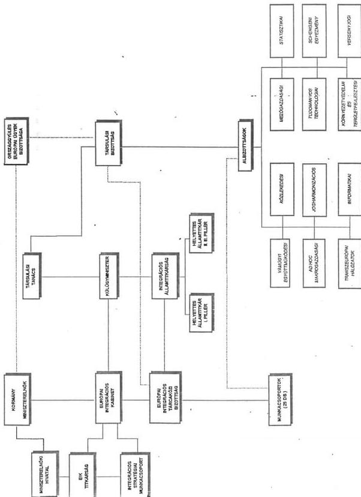
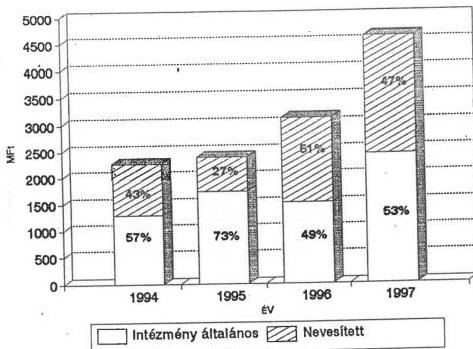
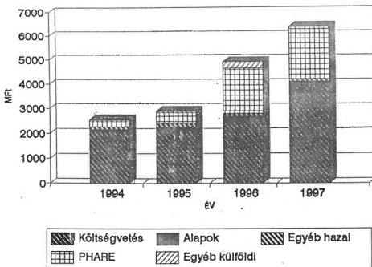
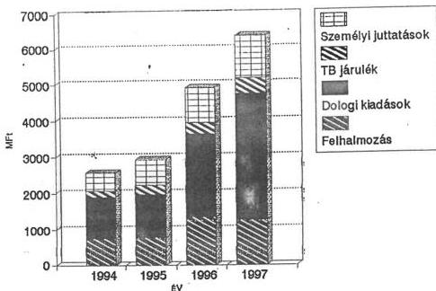
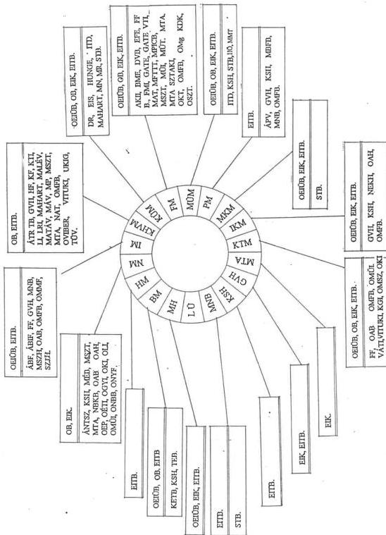
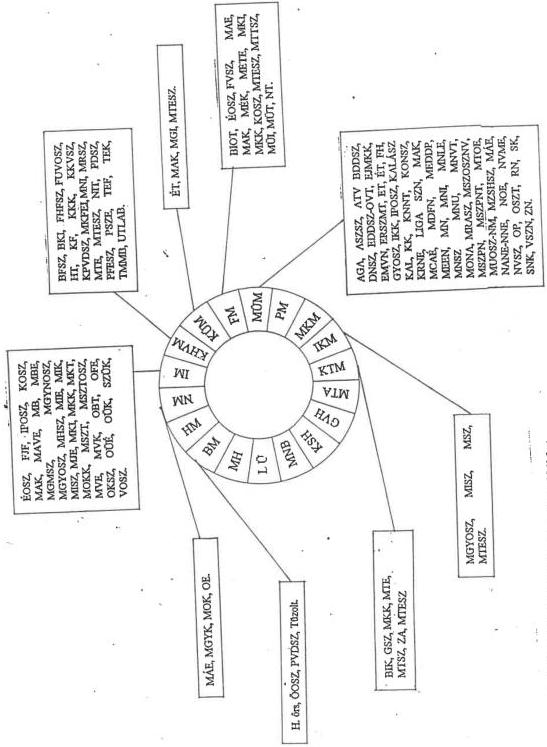
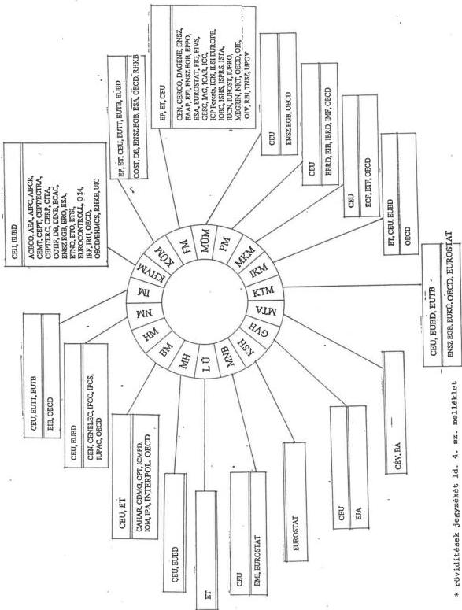

Állami Számvevőszék

# JELENTÉS

az Európai Unióhoz való csatlakozás folyamatának
ellenőrzéséről

1996. november

332.

---

A vizsgálat végrehajtásáért felelős:

az ÁSZ IV. Vagyonellenőrzési Igazgatósága

*Halász Gejza*

*számvevő igazgatóhelyettes*

A vizsgálatot vezette:

*Kemény Emil*

*osztályvezető főtanácsos*

A vizsgálatot végezte:

*Bank Lajos*

*számvevő tanácsos*

*Benti Gabriella*

*számvevő tanácsos*

*Réthelyi Jenő*

*számvevő*

*Tardos József*

*számvevő*

---

- I -

# T A R T A L O M J E G Y Z É K

|   | Oldal  |
| --- | --- |
|  I. BEVEZETÉS | 1  |
|  1.1. Előzmények | 1  |
|  1.2. A vizsgálat | 2  |
|  1.3. A vizsgálat módszere | 3  |
|  II. ÖSSZEFOGLALÓ MEGÁLLAPÍTÁSOK | 7  |
|  2.1. Törvényi és szervezeti háttér | 7  |
|  2.2. Az EU csatlakozás forrásai és költségei | 13  |
|  2.3. Kapcsolatrendszer | 20  |
|  2.4. Emberi erőforrás | 25  |
|  III. RÉSZLETES MEGÁLLAPÍTÁSOK | 28  |
|  3.1. Miniszterelnöki Hivatal (MH) | 28  |
|  3.2. Magyar Köztársaság Ügyészsége (LÜ) | 30  |
|  3.3. Legfelsőbb Bíróság (LB) | 31  |
|  3.4. Belügyminisztérium (BM) | 31  |
|  3.5. Honvédelmi Minisztérium (HM) | 33  |
|  3.6. Népjóléti Minisztérium (NM) | 34  |
|  3.7. Igazságügyi Minisztérium (IM) | 40  |
|  3.8. Közlekedési, Hírközlési és Vízügyi Minisztérium (KHVM) | 43  |
|  3.9. Külügyminisztérium (KÜM) | 53  |
|  3.10. Földművelésügyi Minisztérium (FM) | 58  |
|  3.11. Munkaügyi Minisztérium (MÜM) | 70  |
|  3.12. Pénzügyminisztérium (PM) | 71  |
|  3.13. Művelődési és Közoktatási Minisztérium (MKM) | 74  |
|  3.14. Ipari és Kereskedelmi Minisztérium (IKM) | 79  |

---

- II -

3.15. Környezetvédelmi és Területfejlesztési Minisztérium (KTM) ... 82
3.16. Magyar Tudományos Akadémia (MTA) ... 85
3.17. Gazdasági Versenyhivatal (GVH) ... 86
3.18. Központi Statisztikai Hivatal (KSH) ... 88
3.19. Magyar Nemzeti Bank (MNB) ... 90

# M E L L É K L E T E K

1. sz. melléklet - A vizsgált szervezetek rövidítés jegyzéke
2. sz. melléklet - Állami és gazdálkodó szervezetek rövidítés jegyzéke
3. sz. melléklet - Szakmai, érdekvédelmi szervezetek rövidítés jegyzéke
4. sz. melléklet - Külföldi szervezetek rövidítés jegyzéke

---

ÁLLAMI SZÁMVEVŐSZÉK

V-7-61/1996.

Témaszám: 322

# J E L E N T É S

az Európai Unióhoz való csatlakozás folyamatának ellenőrzéséről

## I.

### B E V E Z E T É S

#### 1.1. Előzmények

A Lengyel Legfőbb Ellenőrzési Kamara, a Cseh Köztársaság Legfelsőbb Ellenőrzési Hivatala, a Szlovák Köztársaság Legfelsőbb Ellenőrzési Hivatala és az Állami Számvevőszék elnökei az 1994 októberében Pozsonyban tartott tanácskozáson megállapodtak arról, hogy az egyes országok számvevőszékei saját hatáskörükön belül megvizsgálják kormányuk – az EU csatlakozás érdekében tett – tevékenységét. A megállapodás rögzítette, hogy az ellenőrzések célrendszerét és tematikáját – a lehetőségek határain belül – összehangolják és a vizsgálatok tapasztalatairól kölcsönösen tájékoztatják egymást. A konkrét szakmai kérdések megvitatása és az egyeztetett módszertan kialakítása érdekében felek 1995 februárjában Lengyelországban, majd 1995 novemberében Magyarországon tartottak szakértői konzultációt.

A konzultáció során a felek egyetértettek a Lengyel Legfőbb Ellenőrzési Kamara által megfogalmazott alapelvekkel

---

- 2 -

és vizsgálati célokkal. Véleményeltérés csak az ellenőrzés végrehajtásának lehetséges időpontja körül merült fel. A Lengyel Legfőbb Ellenőrzési Kamara az első vizsgálatát 1994-ben, a másodikat 1996-ban befejezte a témában. Az Állami Számvevőszék 1996-os munkatervébe állította be az ellenőrzés végrehajtását. A Cseh Köztársaság Legfőbb Ellenőrzési Hivatala képviselői mindkét találkozón jelezték vizsgálati hajlandóságukat, de mivel a vizsgálat elvégzéséhez az Országgyűlés engedélye szükséges, a várható időpontról nem tudtak nyilatkozni. A Szlovák Köztársaság Legfelsőbb Ellenőrzési Hivatala a lengyelországi megbeszélésre nem delegált szakértőt, a magyarországi megbeszélésen a cseh féllel azonos okra hivatkozva nem tudott nyilatkozni a vizsgálat időpontjáról.

# 1.2. A vizsgálat

Az Állami Számvevőszék az Európai Unióhoz való csatlakozás érdekében tett kormányzati intézkedések ellenőrzését az 1989. évi XXXVIII. törvény 2. § (1) bekezdésében foglalt felhatalmazás alapján végezte.

Az EU együttműködésének Maastrichti Szerződésben rögzített három alappillére:

- I., a belső piaci integráció, jogharmonizáció (Fehér Könyv),
- II., a közös kül- és biztonságpolitikai együttműködés,
- III., a bel- és igazságügyi együttműködés.

Magyarország EU-integrációs tevékenységének jelenlegi szakaszában a hangsúly az I. pillér, a belső piac és a jogrendszer minél előbbi összhangjának kialakítására irányul.

---

- 3 -

Párhuzamosan megkezdődött az érintett minisztériumoknál a II. és III. pillér szerinti integrációs feladatok előkészítése és megvalósítása.

A vizsgálat célja annak megállapítása volt, hogy

- a társulási szerződés aláírását, majd kihirdetését követően a kormány, illetve az alá rendelt szervezetek milyen intézkedéseket hoztak az integráció elősegítése érdekében;
- az érintett szervezetek kialakították-e a tevékenység ellátásához szükséges bel- és külföldi kapcsolatrendszert, valamint információáramlást;
- az érintett szervezetek rendelkeznek-e a feladat végrehajtásához szükséges anyagi és személyi erőforrással.

A helyszíni ellenőrzés 1996. március 16-án kezdődött és 1996. június 30-án fejeződött be. A vizsgálat során az 1994. és 1995. év tényadatait, valamint az 1996-97. évek tervadatait dolgoztuk fel. Rendkívül nehezítette az ellenőrzést, hogy időpontja egybeesett a Magyarországnak az Európai Unióhoz való csatlakozási kérelmével összefüggő kérdőívcsomag kitöltésével, az Integrációs Stratégiai Munkacsoport indulásával és az Integrációs Államtitkárság kialakításával.

A Jelentésben közölt emberi erőforrásra vonatkozó adatok 1996. május-júniusi állapotot tükröznek.

### 1.3. A vizsgálat módszere

A vizsgálat megállapításait kérdőíven alapuló adatszolgáltatás és azt kiegészítő helyszíni interjúk támasztják alá.

---

- 4 -

A kérdőíveken alapuló forrás- és költség-táblázatok sorai az alábbiak szerint értendők:

### Források

**Hazai források:** az állami költségvetésből, az elkülönített állami pénzalapokból, valamint az egyéb hazai forrásokból az Európai Unióhoz való csatlakozás előkészítésére fordított források.

Amennyiben a költségvetésben vagy az elkülönített állami pénzalapokban erre a célra külön forrást nevesítettek, akkor azt elkülönítve is közöljük.

Az egyéb hazai források az önálló gazdálkodó szervezetek költségvetésen kívüli ráfordításait mutatják.

**Külföldi források:** a PHARE, Világbank, vagy más egyéb külföldi források, amelyeket címzetten az Európai Unióhoz való csatlakozás előkészítése érdekében hagytak jóvá.

### Kiadások

**Személyi juttatások:** a minisztérium, szervezet, illetve az irányítása alatt álló háttérintézmények állományában az EU csatlakozás előkészítésével foglalkozó főállású dolgozóinak, illetve a munkavégzésre irányuló egyéb jogviszony keretében a feladattal foglalkozóknak kifizetett személyi juttatások.

A nem nevesített ráfordítások emberi erőforrás költségeit nem analitikus adatok, hanem becslés alapján határozták meg az egyes intézmények. A becslés egységes módszer alapján készült: a minisztériumok és intézmények főosztályi szintű élőmunka ráfordítását (ember/év) szorozták

---

- 5 -

az intézményben jellemző átlagbérrel. Ezen szorzatok aggregátuma a jelentésben szereplő személyi költség. Ez a módszer lehetőséget adott arra, hogy a múltra vonatkozó költségadatok számítása megegyezzen a tervadatok számítási módjával. Így, ha az adatok abszolút értékben tartalmazhatnak is hibát, az évek között megállapítható tendenciákat konzisztens adatsorok támasztják alá.

**Szakértői díj:** az integrációs tevékenység érdekében igénybe vett hazai és/vagy külföldi tanácsadók (személyek vagy szervezetek) részére kifizetett díjak.

**Társadalombiztosítási járulék:** a személyi juttatásokhoz kapcsolódó, annak megállapítási módszerével arányosan számolt érték.

#### **Dologi kiadások**

A minisztérium, szervezet integrációs tevékenységével összefüggő üzemeltetési, fenntartási, speciális szakmai tevékenységgel stb. kapcsolatos kiadások.

**Utazás, kapcsolattartás** az integrációs tevékenységhez szükséges hazai és külföldi konferenciákon, rendezvényeken való részvétel költségei.

**Könyv, folyóirat stb.** az EU csatlakozás előkészítéséhez szükséges szakmai tevékenység elvégzését segítő információhordozók beszerzésére fordított kiadások.

**Szakmai szolgáltatás** az EU csatlakozás előkészítéséhez igénybe vett szolgáltatások, mint fordítási-, tolmácsolási-, tanácsadói stb. szerződések.

---

- 6 -

# Felhalmozási kiadások

Az Európai Unióhoz való csatlakozás előkészítése érdekében eszközölt beruházások (pl. számítógép beszerzés), iroda kialakítás stb.

A kérdőív - a forrás és költségadatokon túl - az alábbiakról kért adatokat:

- a minisztérium vagy intézmény kiépített hazai és nemzetközi kapcsolatai a feladat ellátása érdekében 1996-ban,
- az integrációs feladat ellátásához 1996-ban rendelkezésre álló emberi erőforrás számított mértéke, megoszlása, képzettsége és nyelvtudása,
- a minisztérium vagy intézmény integrációhoz kötődő feladatainak jegyzéke, megbecsülve ebből a jogharmonizáció százalékos mértékét, illetve megoszlását az ún. I. pillérhez (Fehér Könyv) és a II., III. pillérhez kapcsolódó feladatok között.

Nem szerepelt az ellenőrzés céljai között a minisztériumokban és intézményekben eddig elvégzett munka értékelése sem teljességi, sem minőségi értelemben, mivel ez a Kormány feladata és felelőssége. Az Országgyűlés és illetékes bizottságai a feladat előrehaladásáról a Kormány - törvényben szabályozott - időszakos beszámolói alapján nyer képet.

---

- 7 -

## II. ÖSSZEFOGLALÓ MEGÁLLAPÍTÁSOK

### 2.1. Törvényi és szervezeti háttér

Az Európai Unió tagságának elérésére irányuló szándék a Magyar Kormány nemzeti konszenzuson alapuló stratégiai célkitűzése. Magyarországnak az Európai Közösségekbe való integrációjáért a mindenkori kormány testületileg felelős.

A Kormány főbb lépései a társulási szerződés előkészítésében:

- - az 1990. december 20-i ülésen hozott határozat felhatalmazást adott a társulási szerződés megkötésére irányuló tárgyalások folytatására, és meghatározta a tárgyalások irányelveit,
- - az 1991. október 24-i ülésen megvizsgálta a tárgyalások helyzetét, állást foglalt a tárgyalások záró szakaszára a nyitott kérdésekben, és felhatalmazást adott a szerződés parafálására,
- - 1991. december 12-i ülésen megvizsgálta a parafált megállapodást, és felhatalmazást adott a társulási szerződés, valamint annak kereskedelmi részét ideiglenesen hatályba léptető kereskedelmi megállapodás aláírására,
- - 1991. december 16-án a miniszterelnök Brüsszelben aláírta a társulási szerződést,
- - 1992. október 15-i ülésen elhatározta a társulási szerződésnek ratifikáció céljából az Országgyűlés elé terjesztését.

---

- 8 -

Az Országgyűlés 80/1992. (XI. 25.) határozata szól 'A Magyar Köztársaság és az Európai Közösségek és azok tagállamai között társulás létesítéséről szóló, 1991. december 16-án aláírt Európai Megállapodás végrehajtásáról'.

A Magyar Köztársaság Elnöke a megerősítő okiratot 1992. november 25-én kiállította.

Az Európai Megállapodás, amelyet a Magyar Köztársaság Országgyűlése 1993. december 20-i ülésén iktatott törvénybe, 1994. február elsején, az 1994. évi I. törvényként hatályba lépett.

A Megállapodásban foglaltaknak megfelelően a magyar-EU Társulási Tanács (TT), amely egyrészről a felmerülő vitás kérdések legfelsőbb egyeztető fóruma, másrészről pedig miniszteri szinten felügyeletet gyakorol a megállapodás alkalmazása felett, 1994 márciusában Brüsszelben alakult meg. A TT tagjai az Európai Tanács, az Európai Bizottság tagjai és a magyar Kormány tagja. A TT-ben a Magyar Köztársaság Kormányát a külügyminiszter képviseli.

A TT munkáját a Társulási Bizottság (TB) segíti, melynek tagjai az Európai Tanács, az Európai Bizottság, valamint a magyar Kormány képviselői. A TB albizottságokra tagolódik. A TB-ben korábban az Európai Ügyek Hivatalának elnöke, majd 1996-os megalakulása után a Külügyminisztérium Integrációs Államtitkárságának vezetője képviseli a Kormányt.

A Parlamenti Társulási Bizottság (PTB) a magyar Országgyűlés és az Európai Parlament tagjaiból álló fórum, amely alakuló ülését 1994 januárjában tartotta Budapesten.

---

- 9 -

Az integrációs folyamat feladatainak súlya szükségessé tette speciális kormányzati szervezeti rendszer létrehozását. Az 1023/1992. (IV. 23.) határozatával a Kormány az európai integrációval kapcsolatos feladatok koordinálására tárcaközi bizottságot hozott létre, amelynek társelnökei a Külügyminisztérium és a Nemzetközi Gazdasági Kapcsolatok Minisztérium közigazgatási államtitkárai voltak.

1992 januárban az NGKM szervezetében megalakították az Európai Ügyek Hivatalát (EÜH), 1992. februárban a KÜM-ben felállították az Európai Közösségek Főosztályát. A többi minisztériumban folyamatosan alakultak meg az integrációval foglalkozó szervezeti egységek.

A Magyar Köztársaság érdekeit Brüsszelben az Európai Közösségek melletti magyar misszió képviseli.

Az Országgyűlés 10/1993. (III. 5.) határozatának megfelelően a Kormány 1993 márciusában első alkalommal, majd azóta minden évben részletes tájékoztatót készített a Parlament részére a Társulási Megállapodás végrehajtásáról, amelyet az illetékes parlamenti bizottság megtárgyalt és elfogadott.

Az 1992–1993 években a Kormány törekvése főként arra irányult, hogy elérje a Társulási megállapodás mielőbbi hatályba léptetését. Ezt a célt szolgálta az ideiglenes kereskedelmi megállapodás megkötése, az új kereskedelmi rendszer beindítása, a kedvezmények igénybevételének kidolgozása, a Vegyesbizottság ülésein a magyar gazdaság érdekeinek kiterjesztése és képviselete.

1994 januárban a Kormány határozott a társulási megállapodás végrehajtásával és Magyarország európai integrációjával kapcsolatos kormányzati stratégiáról és intézkedésekről.

---

- 10 -

A Kormány 1994. április 1-jén átadta az Európai Tanács soros elnökének a Magyar Köztársaság csatlakozási kérelmét.

1994 második felétől az események felgyorsultak. Az új összetételű Kormány szeptemberben intézkedett a társulási szerződés végrehajtásával kapcsolatos egyes kérdésekről és további feladatokról, majd októberben határozatot hozott "Az európai integrációval összefüggő kormányzati feladatok felelősségi és koordinálási rendjéről".

A Kormány az 1093/1994. (X.7.) határozatával a külügyminiszter vezetésével létrehozta az Európai Integrációs Tárcaközi Bizottságot (EITB), amelynek valamennyi minisztérium és országos hatáskörű szerv valamint az MNB is a tagja. Az EITB munkáját a Gazdasági Koordinációs Munkabizottság és a Stratégiai Tervezési Munkabizottság támogatta. Az eljárási rend keretében megalakultak az EITB albizottságai - összesen 13 db -, amelyek lényegileg a TB keretében működő közös magyar-EU albizottságok magyar tagozatai (lásd 1. ábra). Az EITB titkársági feladatait a Külügyminisztérium látja el.

Az Európai Tanács Essenben tartott decemberi ülésén elfogadták a felkészülés előkészítését segítő programot és a strukturált párbeszédet.

1995-ben kormányhatározat intézkedett

- a csatlakozást előkészítő jogharmonizációs feladattervről,
- a csatlakozási tárgyalások megkezdéséig teljesítendő további feladatokról,
- az ötéves jogharmonizációs programról,
- az 1996. évre vonatkozó részletes jogharmonizációs programról,

---

- 11 -

- a belső piaci integrációnkra vonatkozó Fehér Könyvvel összefüggő feladatok végrehajtásáról.

1995. elején szakértők közreműködésével kidolgozták a lakosságnak az uniós csatlakozásra felkészítését szolgáló programot, a kormányzati Kommunikációs Stratégiát.

1996. februárban a Kormány az integrációval összefüggő döntések előkészítésének irányítására és végrehajtásának koordinálására megalakította az Európai Integrációs Kabinetet (EIK), amelynek vezetője a miniszterelnök, helyettese a külügyminiszter, tagjai a belügy-, igazságügy-, ipari és kereskedelmi-, valamint a pénzügyminiszter. Állandó meghívottak az Integrációs Stratégiai Munkacsoport vezetője és a Miniszterelnöki Hivatal közigazgatási államtitkára.

1996. május 1-jén a Kormány a Külügyminisztériumban Integrációs Államtitkárságot hozott létre, amely a csatlakozás egész folyamatában viseli a nemzeti koordináció felelősségét. Feladata a tárcaközi koordináció, a Kormány és az Európai Integrációs Kabinet integrációs tevékenységéhez kapcsolódó feladatok elvégzése. Az Integrációs Államtitkárság vezetője az EITB elnöki tisztét is betölti, a szervezet pedig ellátja a titkársági feladatokat.

Az Integrációs Államtitkárságot közvetlenül a külügyminiszter irányítja, azt címzetes államtitkár vezeti, akinek a munkáját két helyettes államtitkár támogatja.

Az EITB keretében megalakult albizottságokat, munkacsoportokat az elsődlegesen felelős minisztérium képviselője vezeti, és azok munkájában részt vesz az Integrációs Stratégiai Munkacsoport adott területért felelős tagja is.

---

- 12 -

1. ábra

# AZ EU INTEGRÁCIÓ IRÁNYÍTÁSI STRUKTÚRÁJA+

+ A kétdimenziós ábrázolhatóság érdekében az ábra egyszerűsí-

---

- 13 -

A kialakított struktúra információ áramlása fölfelé jól szabályozott. A visszacsatolás kevésbé megoldott, a folyamat szereplői a formális és rendszeres tájékoztatás helyett döntően informális kapcsolatrendszeren keresztül szereznek be információt. A hierarchia alsóbb, vagy perifériális helyén dolgozó munkatársak nem rendelkeznek képpel az integrációs folyamat helyzetéről, vagy más hasonló szintű területek munkájáról, feladatáról.

Összegezve megállapítható, hogy az Európai Tanács 1990 áprilisi dublini értekezletén a társulási megállapodás előkészítésére felhívó indítványt követően a magyar kormány megtette a szükséges intézkedéseket az integráció előkészítésére. Az 1996. év közepére felállított irányítási struktúra alkalmas az integráció folyamatának kézben tartására. Az integráció ügyének jelentőségéhez méltó, hogy az irányítás csúcsszervének az Európai Integrációs Kabinetnek a vezetését a miniszterelnök vállalta magára.

## 2.2. Az EU csatlakozás forrásai és költségei

Az integráció előkészítésével kapcsolatosan már 1990-től kezdődően folyt kormányzati tevékenység, de jelentősebb forrás elkülönítésére az 1994. évi költségvetési törvényben került sor.

Az integrációhoz kapcsolódó források és kiadások szerkezetét és megoszlását az 1. és a 2. sz. táblázat mutatja be. A táblázat sorainak értelmezése az 1.3. fejezetben, az oszlopok azonosítása a rövidítésjegyzékben található.

A vizsgált intézmények közül 1994-ben és 1995-ben csak az FM nevesítette az integráció várható költségeit.

Az 1996-os költségvetésben már nyolc intézménynél megjelent nevesítve a csatlakozás előkészítésére előirányzott

---

- 14 -

keretösszeg. Ez a szám az 1997-es intézményi tervek alapján hétre csökkent annak ellenére, hogy mind az Országgyűlés EU Integrációs Ügyek Bizottsága, mind az ÁSZ kérte a Pénzügyminisztériumon keresztül a kormányzati intézményektől a részletes tervezést és a forrásigények elkülönített nevesítését.

A vizsgálathoz érkezett PM észrevétel - DT 3825/1996. számú, 1996. október 17-én kelt levél - ismerteti az 1997. évi költségvetési törvényjavaslatban az Európai Unióhoz való csatlakozáshoz 'címzetten' megjelent előirányzatokat.

Tekintettel arra, hogy az 1997. éves költségvetési törvényt a vizsgálat lezárásának időpontjáig még nem fogadták el, a jelentés korábbi, szintén előirányzatokat tartalmazó adatait nem indokolt módosítani.

Az ÁSZ megállapításával szemben a PM tíz tárcánál tervez nevesített előirányzatot 1997. évre. Ez még mindig távol van a teljeskörűségtől, ha figyelembe vesszük, hogy a vizsgálatba bevont 18 intézmény közül 17-ben terveznek az integrációs feladatokra költségvetési forrás felhasználást.

A költségvetésből származó általános és nevesített források belső arányának alakulását mutatja a 2. sz. ábra. Jól látható, hogy a források abszolút növekedése mellett a belső arányok szinte változatlanok. Ez azt jelenti, hogy a ráfordítások csak közel 50 %-a tervezhető előre, tehát jelenik meg nevesítve a költségvetési törvényben, így a fennmaradt 50% felhasználásának hatékonysága nem követhető nyomon.

Az integrációs feladatok ellátását az elkülönített állami pénz alapokból is finanszírozzák évente növekvő mértékben (84.2 M Ft/94; 155.9 M Ft/95; 240.9 M Ft/96; 198.4 M Ft/97). Az alapokból származó hozzájárulás az összes hazai forrás százalékában: 3.7%/94; 6.5%/95; 8.7%/96; 4.7%/97.

---

- 15 -

1994-95 ÉVI FORRÁSOK ÉS KIADÁSOK

1. TÁBLÁZAT

|  1994  |   |   |   |   |   |   |   |   |   |   |   |   |   |   |   |   |   |   |   |
| --- | --- | --- | --- | --- | --- | --- | --- | --- | --- | --- | --- | --- | --- | --- | --- | --- | --- | --- | --- |
|  FORRÁS/SZERVEZET | MII | LÜ | BM | BM | NM | IM | KHVM | KÜM | FM | MÜM | PM | MKM | BM | KTM | MTA | CHH | KSH | MNB | ÖSSZESEN  |
|  BAZAI FORRÁS ÖSSZESEN |  | 2.1 | 348.1 |  | 22.8 | 7.9 | 99.3 | 442.8 | 985.5 | 1.4 | 20.7 | 1.4 | 251.6 | 17.3 | 12.2 | 14.5 | 34.5 | 10.8 | 2272.9  |
|  Költségvetési forrás |  | 2.1 | 348.1 |  | 22.8 | 7.9 | 65.0 | 442.8 | 914.3 | 1.4 | 20.7 | 1.4 | 160.8 | 13.3 | 3.0 | 14.5 | 34.5 |  | 2052.6  |
|  ebből peremllett |  |  |  |  |  |  |  |  | 914.3 |  |  |  |  |  |  |  |  |  | 914.3  |
|  Elkötőbelfett alapból |  |  |  |  |  |  |  |  | 61.8 |  |  |  | 11.9 | 4.0 | 6.5 |  |  |  | 84.2  |
|  ebből peremllett |  |  |  |  |  |  |  |  | 61.8 |  |  |  |  |  | 6.5 |  |  |  | 68.3  |
|  Egyéb hazai forrás |  |  |  |  |  |  | 34.3 |  | 9.4 |  |  |  | 78.9 |  | 2.7 |  |  | 10.8 | 136.1  |
|  KÜLFÖLDI FORRÁS |  | 0.3 |  |  |  |  | 9.3 |  | 187.9 |  | 3.9 |  | 80.8 | 35.8 | 18.4 |  |  |  | 316.4  |
|  ebből PÉRAFE |  |  |  |  |  |  | 3.1 |  | 178.0 |  | 2.3 |  | 48.0 | 35.8 | 16.0 |  |  |  | 263.2  |
|  VEJÁCSANK |  |  |  |  |  |  | 0.1 |  | 6.2 |  |  |  |  |  | 1.0 |  |  |  | 7.3  |
|  BÜTÉS |  | 0.3 |  |  |  |  | 8.1 |  | 3.7 |  | 1.5 |  | 12.8 |  | 3.4 |  |  |  | 27.8  |
|  FORRÁS ÖSSZESEN | 0.0 | 2.4 | 348.1 | 0.0 | 22.8 | 7.9 | 108.6 | 442.8 | 1173.4 | 1.4 | 24.6 | 1.4 | 312.4 | 53.1 | 30.6 | 14.5 | 34.5 | 10.8 | 2589.3  |

|  KIADÁS/SZERVEZET  |   |   |   |   |   |   |   |   |   |   |   |   |   |   |   |   |   |   |   |
| --- | --- | --- | --- | --- | --- | --- | --- | --- | --- | --- | --- | --- | --- | --- | --- | --- | --- | --- | --- |
|  MŰKÖDÖSI KÖZÜSÉG ÖSSZESEN | 1.4 | 327.5 |  | 22.8 | 7.6 | 108.2 | 393.2 | 518.3 | 1.4 | 24.6 | 1.4 | 296.5 | 52.7 | 30.6 | 14.5 | 33.3 | 10.8 | 1642.0 |   |
|  Személyi kettéle |  | 13.8 |  | 10.0 | 4.3 | 41.2 | 177.9 | 87.9 | 0.2 | 12.0 | 0.4 | 106.2 | 3.7 | 12.6 | 8.0 | 15.2 | 5.9 | 499.3 |   |
|  ebből székletű díj |  |  |  |  |  | 1.0 |  | 4.0 |  |  |  | 7.6 |  | 2.4 |  | 0.9 |  | 15.9 |   |
|  TB. Járulék |  | 5.9 |  | 4.3 | 1.7 | 18.0 | 23.4 | 35.6 | 0.1 | 5.3 | 0.2 | 56.1 | 1.7 | 4.2 | 3.6 | 6.7 | 2.8 | 189.6 |   |
|  Dolcsi kiadások | 1.4 | 307.8 |  | 8.5 | 1.9 | 47.0 | 191.9 | 392.8 | 1.1 | 7.4 | 0.8 | 125.9 | 47.3 | 13.8 | 2.8 | 11.4 |  | 1161.8 |   |
|  ebből utazás |  |  |  | 4.0 | 0.8 | 24.3 | 40.0 | 13.5 | 0.5 | 1.6 | 0.8 | 13.0 |  | 4.4 | 1.5 | 0.5 | 1.3 | 108.2 |   |
|  kötsz. felvétel |  |  |  | 0.7 | 0.2 | 1.7 | 5.0 | 9.6 |  | 0.4 |  | 5.7 |  | 4.1 | 0.9 | 0.2 | 1.2 | 29.7 |   |
|  szakmai szolgáltatás | 1.4 | 300.0 |  | 1.0 |  | 15.0 | 3.0 | 369.7 | 0.6 | 3.1 |  | 11.4 |  | 3.2 | 0.8 | 1.9 | 0.1 | 711.2 |   |
|  FELHÁLMOZÁSI KIADÁSOK | 1.0 | 20.6 |  |  | 0.3 | 2.4 | 49.6 | 657.1 |  |  |  | 13.9 | 0.4 |  |  | 1.2 | 0.8 | 747.3 |   |
|  KIADÁS ÖSSZESEN | 0.0 | 2.4 | 348.1 | 0.0 | 22.8 | 7.9 | 108.6 | 442.8 | 1173.4 | 1.4 | 24.6 | 1.4 | 312.4 | 53.1 | 30.6 | 14.5 | 34.5 | 10.8 | 2589.3  |

|  1995  |   |   |   |   |   |   |   |   |   |   |   |   |   |   |   |   |   |   |   |
| --- | --- | --- | --- | --- | --- | --- | --- | --- | --- | --- | --- | --- | --- | --- | --- | --- | --- | --- | --- |
|  FORRÁS/SZERVEZET | MII | LÜ | BM | BM | NM | IM | KHVM | KÜM | FM | MÜM | PM | MKM | BM | KTM | MTA | CHH | KSH | MNB | ÖSSZESEN  |
|  BAZAI FORRÁS ÖSSZESEN | 15.5 |  | 311.6 | 0.1 | 57.8 | 18.7 | 162.9 | 455.6 | 854.3 | 3.0 | 23.0 | 2.3 | 372.8 | 16.2 | 17.7 | 18.6 | 46.9 | 15.5 | 2392.5  |
|  Költségvetési forrás | 15.5 |  | 311.6 | 0.1 | 57.8 | 18.7 | 63.2 | 455.6 | 744.9 | 3.0 | 23.0 | 2.3 | 282.7 | 16.2 | 3.0 | 18.6 | 46.9 |  | 2083.1  |
|  ebből peremllett |  |  |  |  |  |  |  |  | 616.2 |  |  |  |  |  |  |  |  |  | 616.2  |
|  Elkötőbelfett alapból |  |  |  |  |  |  | 40.3 |  | 92.8 |  |  |  | 15.8 |  | 7.0 |  |  |  | 155.9  |
|  ebből peremllett |  |  |  |  |  |  |  |  | 27.8 |  |  |  | 2.6 |  | 7.0 |  |  |  | 37.4  |
|  Egyéb hazai forrás |  |  |  |  |  |  | 39.4 |  | 16.6 |  |  |  | 74.3 |  | 7.7 |  |  | 15.5 | 153.5  |
|  KÜLFÖLDI FORRÁS | 11.0 |  |  |  | 30.0 | 0.8 | 38.7 | 78.2 | 215.9 | 4.0 | 4.4 |  | 50.0 | 64.5 | 30.1 |  |  | 0.5 | 528.1  |
|  ebből PÉRAFE | 11.0 |  |  |  | 30.0 | 0.8 | 18.8 | 78.2 | 196.0 | 4.0 | 2.6 |  | 34.8 | 64.5 | 25.5 |  |  | 0.5 | 466.7  |
|  VEJÁCSANK |  |  |  |  |  |  | 0.1 |  | 5.0 |  |  |  |  |  | 1.2 |  |  |  | 6.3  |
|  BÜTÉS |  |  |  |  |  |  | 19.8 |  | 14.9 |  | 1.8 |  | 15.2 |  | 3.4 |  |  |  | 55.1  |
|  FORRÁS ÖSSZESEN | 26.5 | 0.0 | 311.6 | 0.1 | 87.8 | 19.5 | 201.6 | 533.8 | 1070.2 | 7.0 | 27.4 | 2.3 | 422.8 | 80.7 | 47.8 | 18.6 | 46.9 | 16.0 | 2920.6  |

|  KIADÁS/SZERVEZET  |   |   |   |   |   |   |   |   |   |   |   |   |   |   |   |   |   |   |   |
| --- | --- | --- | --- | --- | --- | --- | --- | --- | --- | --- | --- | --- | --- | --- | --- | --- | --- | --- | --- |
|  MŰKÖDÖSI KÖZÜSÉG ÖSSZESEN | 26.5 |  | 306.6 | 0.1 | 87.8 | 17.7 | 182.8 | 510.6 | 372.7 | 7.0 | 27.4 | 2.3 | 406.6 | 80.1 | 47.8 | 18.6 | 45.9 | 15.8 | 2156.3  |
|  Személyi kettéle | 18.4 |  | 13.8 | 0.1 | 20.6 | 9.4 | 61.4 | 179.6 | 151.5 | 0.6 | 13.3 | 0.8 | 181.9 | 4.4 | 21.3 | 10.7 | 22.8 | 9.7 | 720.3  |
|  ebből székletű díj | 14.0 |  |  |  |  |  | 4.7 |  | 4.7 |  |  |  | 14.1 |  | 4.2 |  | 2.0 |  | 43.7  |
|  TB. Járulék | 3.8 |  | 5.9 |  | 7.8 | 4.0 | 25.8 | 25.8 | 80.4 | 0.3 | 5.8 | 0.3 | 86.9 | 2.0 | 5.5 | 4.7 | 10.1 | 4.1 | 253.2  |
|  Dolcsi kiadások | 4.3 |  | 286.9 |  | 59.4 | 4.3 | 95.4 | 305.4 | 160.8 | 6.1 | 8.3 | 1.2 | 147.7 | 73.7 | 21.0 | 3.2 | 13.0 | 2.0 | 1192.7  |
|  ebből utazás |  |  |  |  | 6.2 | 1.2 | 28.3 | 50.0 | 19.6 | 1.5 | 1.8 | 1.2 | 9.7 |  | 9.0 | 1.1 | 0.6 | 1.5 | 131.7  |
|  kötsz. felvétel |  |  |  |  | 1.0 | 0.4 | 4.1 | 5.0 | 8.6 | 0.2 | 0.5 |  | 5.4 |  | 8.3 | 1.6 | 0.2 | 0.5 | 36.0  |
|  szakmai szolgáltatás | 4.3 |  | 280.0 |  | 42.5 |  | 19.7 | 3.0 | 132.4 | 4.4 | 3.5 |  | 23.6 |  | 2.6 | 0.5 | 2.0 |  | 518.9  |
|  FELHÁLMOZÁSI KIADÁSOK |  |  | 5.0 |  |  | 1.8 | 19.0 | 23.0 | 697.5 |  |  |  | 18.2 | 0.6 |  |  | 1.0 | 0.2 | 784.3  |
|  KIADÁS ÖSSZESEN | 26.5 | 0.0 | 311.6 | 0.1 | 87.8 | 19.5 | 201.6 | 533.8 | 1070.2 | 7.0 | 27.4 | 2.3 | 422.8 | 80.7 | 47.8 | 18.6 | 46.9 | 16.0 | 2920.6  |

---

- 16 -

1996-97 ÉVI TERVEZETT FORRÁSOK ÉS KIADÁSOK

2. TÁBLÁZAT

1996

|  FORRÁS/SZÉPVEZET | MH | LU | BM | HM | NM | IM | KÖVM | KÜM | FM | MÜM | FM | MXM | BM | KTM | MTA | GYH | KSH | MNB | ÖSSZESEN  |
| --- | --- | --- | --- | --- | --- | --- | --- | --- | --- | --- | --- | --- | --- | --- | --- | --- | --- | --- | --- |
|  BÁZAI FORRÁS ÖSSZESEN | 153,0 | 0,5 | 88,4 | 0,1 | 81,2 | 22,2 | 222,4 | 684,0 | 973,9 | 108,0 | 28,8 | 31,9 | 387,8 | 27,5 | 37,4 | 54,1 | 99,3 | 23,1 | 2778,2  |
|  Kökségbevétel forrás | 153,0 | 0,5 | 88,4 | 0,1 | 81,2 | 22,2 | 183,1 | 684,0 | 835,1 | 21,0 | 26,8 | 31,9 | 337,2 | 27,5 | 18,1 | 54,1 | 99,3 |  | 2444,5  |
|  ebből nemesített | 153,0 |  | 40,0 |  |  |  | 7,9 | 359,6 | 701,1 |  |  |  | 181,8 |  |  | 40,0 | 40,0 |  | 1443,4  |
|  Előritkelt alapvető |  |  |  |  |  |  | 8,4 |  | 105,9 | 85,0 |  |  | 43,6 |  | 7,0 |  |  |  | 240,9  |
|  ebből nemesített |  |  |  |  |  |  | 3,0 |  | 65,9 |  |  |  | 0,5 |  | 6,5 |  |  |  | 69,4  |
|  Egyéb hazai forrás |  |  |  |  |  |  | 52,9 |  | 32,9 |  |  |  | 7,0 |  | 12,3 |  |  | 23,1 | 92,8  |
|  KÖZPÁNY FORRÁS | 39,0 |  | 420,0 |  | 30,0 | 128,1 | 171,4 | 360,0 | 667,9 | 100,0 | 3,7 | 80,0 | 144,3 | 68,6 | 28,8 |  |  | 0,5 | 2142,4  |
|  ebből PHARE | 39,0 |  | 390,0 |  | 30,0 | 128,1 | 131,2 | 360,0 | 659,0 | 8,0 | 1,9 |  | 137,2 | 68,6 | 22,0 |  |  | 0,5 | 1882,4  |
|  VEJACBANK |  |  |  |  |  |  | 0,1 |  |  |  |  |  |  |  |  |  |  |  | 0,1  |
|  ELYME |  |  | 30,0 |  |  |  | 40,1 |  | 8,9 | 92,0 | 1,8 | 80,0 | 7,0 |  | 6,8 |  |  |  | 259,8  |
|  FORRÁS ÖSSZESEN | 192,0 | 0,5 | 508,4 | 0,1 | 111,2 | 148,3 | 393,8 | 1044,0 | 1641,8 | 206,0 | 30,5 | 111,9 | 532,1 | 96,1 | 66,2 | 54,1 | 99,3 | 23,6 | 4920,6  |

KIADÁS/SZÉPVEZET

|  MISZÓNÉSI KÖLTSÉG ÖSSZESEN | 192,0 | 0,5 | 317,1 | 0,1 | 108,7 | 145,0 | 372,3 | 1019,5 | 601,5 | 184,0 | 30,5 | 111,9 | 504,3 | 93,2 | 66,2 | 25,3 | 96,7 | 23,4 | 3587,4  |
| --- | --- | --- | --- | --- | --- | --- | --- | --- | --- | --- | --- | --- | --- | --- | --- | --- | --- | --- | --- |
|  Személyi juttatások | 98,0 | 0,5 | 26,9 | 0,1 | 29,1 | 12,7 | 116,3 | 301,4 | 199,6 | 11,0 | 17,9 | 6,5 | 148,6 | 11,6 | 31,2 | 12,6 | 47,8 | 14,2 | 968,6  |
|  ebből szakértői díj | 76,0 |  |  |  |  |  | 21,9 |  |  | 1,5 |  |  | 21,8 |  | 11,0 |  | 1,8 |  | 123,2  |
|  TB jövedék | 38,0 |  | 11,3 |  | 11,2 | 5,3 | 45,1 | 47,4 | 80,4 | 4,7 | 7,6 | 2,8 | 76,6 | 4,9 | 7,3 | 5,4 | 20,3 | 6,7 | 330,4  |
|  Dologi kiadások | 56,0 | 0,5 | 278,9 |  | 68,4 | 127,0 | 210,9 | 670,7 | 321,5 | 168,3 | 5,0 | 102,6 | 278,1 | 76,7 | 27,7 | 7,3 | 28,6 | 2,5 | 2287,9  |
|  ebből utazás | 31,0 |  |  |  | 8,3 | 0,6 | 47,1 | 60,0 | 26,1 | 7,0 | 1,8 | 2,2 | 36,0 |  | 12,0 | 2,1 | 0,9 | 1,9 | 220,1  |
|  Időnyi fekvőnyel | 7,0 |  |  |  | 2,0 | 0,4 | 7,3 | 5,0 | 9,0 | 0,3 | 0,4 | 0,7 | 9,0 |  | 6,3 | 1,2 | 0,3 | 0,5 | 41,1  |
|  szakmai szolgáltatás | 18,0 | 0,5 | 250,0 |  | 43,5 | 128,1 | 69,5 | 14,5 | 286,4 | 16,0 | 1,0 | 92,0 | 9,3 |  | 3,5 | 0,6 | 4,0 |  | 906,6  |
|  FELMALAPÍTÁS KIADÁSOK |  |  | 191,3 |  | 2,5 | 3,3 | 21,5 | 24,5 | 1040,3 | 22,0 |  |  | 27,6 | 2,9 |  | 28,8 | 2,6 | 0,2 | 1333,2  |
|  KIADÁS ÖSSZESEN | 192,0 | 0,5 | 508,4 | 0,1 | 111,2 | 148,3 | 393,8 | 1044,0 | 1641,8 | 206,0 | 30,5 | 111,9 | 532,1 | 96,1 | 66,2 | 54,1 | 99,3 | 23,6 | 4920,6  |

1997

|  FORRÁS/SZÉPVEZET | MH | LU | BM | HM | NM | IM | KÖVM | KÜM | FM | MÜM | FM | MXM | BM | KTM | MTA | GYH | KSH | MNB | ÖSSZESEN  |
| --- | --- | --- | --- | --- | --- | --- | --- | --- | --- | --- | --- | --- | --- | --- | --- | --- | --- | --- | --- |
|  BÁZAI FORRÁS ÖSSZESEN | 153,0 |  | 93,9 | 0,2 | 153,3 | 59,1 | 328,1 | 1014,6 | 692,8 | 220,0 | 63,6 | 593,2 | 644,7 | 47,4 | 25,1 | 81,0 | 218,2 | 36,6 | 4216,5  |
|  Kökségbevétel forrás | 153,0 |  | 93,9 | 0,2 | 153,3 | 59,1 | 250,1 | 1014,6 | 795,8 | 220,0 | 63,6 | 593,2 | 511,7 | 47,4 | 5,1 | 81,0 | 218,2 |  | 3908,5  |
|  ebből nemesített | 153,0 |  | 40,0 |  |  |  | 21,8 | 515,5 | 708,2 |  |  | 568,0 | 121,0 |  |  |  |  |  | 2127,5  |
|  Előritkelt alapvető |  |  |  |  |  |  | 11,4 |  | 90,0 |  |  |  | 97,0 |  | 8,0 |  |  |  | 196,4  |
|  ebből nemesített |  |  |  |  |  |  |  |  | 50,0 |  |  |  | 10,0 |  | 8,0 |  |  |  | 60,0  |
|  Egyéb hazai forrás |  |  |  |  |  |  | 68,6 |  | 7,0 |  |  |  | 36,0 |  | 11,0 |  |  | 36,6 | 109,6  |
|  KÖZPÁNY FORRÁS | 153,0 |  | 320,0 |  | 50,0 |  | 127,6 | 140,0 | 701,0 | 1,8 |  | 568,0 | 114,3 | 285,0 | 35,2 |  |  |  | 2175,7  |
|  ebből PHARE | 153,0 |  | 280,0 |  | 50,0 |  | 87,4 | 140,0 | 694,0 | 1,8 |  | 568,0 | 98,0 | 285,0 | 25,2 |  |  |  | 2072,2  |
|  VEJACBANK |  |  |  |  |  |  | 0,1 |  |  |  |  |  |  |  |  |  |  |  | 0,1  |
|  ELYME |  |  | 40,0 |  |  |  | 40,1 |  | 7,0 |  |  |  | 10,0 |  | 10,0 |  |  |  | 103,1  |
|  FORRÁS ÖSSZESEN | 306,0 | 0,0 | 413,9 | 0,2 | 203,3 | 59,1 | 455,7 | 1154,6 | 1593,8 | 221,8 | 63,6 | 1161,2 | 759,0 | 332,4 | 60,3 | 81,0 | 218,2 | 36,6 | 6392,2  |

KIADÁS/SZÉPVEZET

|  MISZÓNÉSI KÖLTSÉG ÖSSZESEN | 306,0 |  | 413,9 | 0,2 | 197,8 | 43,4 | 424,4 | 1147,6 | 515,2 | 221,8 | 63,6 | 1161,2 | 654,2 | 328,0 | 60,3 | 44,7 | 215,2 | 36,3 | 5140,3  |
| --- | --- | --- | --- | --- | --- | --- | --- | --- | --- | --- | --- | --- | --- | --- | --- | --- | --- | --- | --- |
|  Személyi juttatások | 156,0 |  | 29,8 | 0,2 | 41,1 | 24,0 | 141,0 | 356,0 | 156,5 | 22,0 | 40,0 | 8,7 | 240,1 | 19,9 | 25,8 | 23,5 | 56,9 | 22,8 | 1213,4  |
|  ebből szakértői díj | 138,0 |  |  |  |  |  | 20,1 |  |  | 15,0 |  |  | 37,0 |  | 5,2 |  | 2,1 |  | 200,1  |
|  TB jövedék | 38,0 |  | 12,5 |  | 16,3 | 10,2 | 60,8 | 77,7 | 63,0 | 9,0 | 23,6 | 2,8 | 127,4 | 8,5 | 8,7 | 10,0 | 24,2 | 10,7 | 441,3  |
|  Dologi kiadások | 112,0 |  | 371,6 |  | 140,4 | 9,2 | 222,6 | 713,9 | 295,7 | 190,8 |  | 1151,7 | 286,5 | 299,6 | 25,6 | 5,5 | 134,1 | 2,8 | 3494,4  |
|  ebből utazás | 73,0 |  |  |  | 11,3 | 2,1 | 58,0 | 80,0 | 24,1 | 48,8 |  | 3,6 | 75,9 |  | 13,5 | 3,0 | 1,1 | 2,4 | 376,8  |
|  Időnyi fekvőnyel | 13,0 |  |  |  | 3,0 | 1,3 | 9,1 | 10,0 | 9,0 | 2,0 |  | 1,2 | 17,8 |  | 9,0 | 1,8 | 0,4 | 0,3 | 68,4  |
|  szakmai szolgáltatás | 26,0 |  | 356,0 |  | 105,0 |  | 79,2 | 20,0 | 282,6 | 140,0 |  | 1136,0 | 14,5 |  | 2,1 | 0,9 | 4,8 |  | 2139,3  |
|  FELMALAPÍTÁS KIADÁSOK |  |  |  |  | 5,5 | 15,7 | 31,3 | 7,0 | 1078,6 |  |  |  | 104,8 | 4,4 |  | 36,3 | 3,0 | 0,3 | 1242,9  |
|  KIADÁS ÖSSZESEN | 306,0 | 0,0 | 413,9 | 0,2 | 203,3 | 59,1 | 455,7 | 1154,6 | 1593,8 | 221,8 | 63,6 | 1161,2 | 759,0 | 332,4 | 60,3 | 81,0 | 218,2 | 36,6 | 6392,2  |

---

- 17 -

# Az államháztartási források  
szerkezete

2. ábra

Részét képezik az integrációs forrásoknak az önállóan gazdálkodó intézmények ráfordításai is (136.1 M Ft/94; 153.5 M Ft/95; 92.8 M Ft/96; 109.6 M Ft/97). A gazdálkodó intézmények ráfordításai az összes hazai forrás százalékában: 6.0%/94; 6.4%/94; 3.3%/96; 2.6%/97.

A hazai források mellett igen jelentős a külföldi források, ezen belül is a PHARE szerepe a finanszírozásban. 1994-ben az összes forrás – 12.2% – származott külföldről és ez a támogatás 1997-re – növekvő abszolút értékek mellett – eléri a 34.0%-ot. Ez a növekedés döntően abból származik, hogy 1995 után a PHARE program célrendszere megváltozott és az új programcsomagok az ország integrációs törekvéseinek támogatására irányulnak. A csatlakozási felkészülés forrásszerkezetét a 3. ábra mutatja be.

---

- 18 -

3. ábra

# A csatlakozási felkészülés  
forrásszerkezete

Az integrációs kiadások szerkezetét mutatja be a 4. sz. ábra.

A személyi juttatások mértéke évente csak 20-30%-kal nő, ami alatta marad az összes ráfordítás növekménynek és alig haladja meg az infláció mértékét. Ez azt jelzi, hogy a minisztériumok nem tervezik az integrációval érintett emberi erőforrás mennyiségi növelését és/vagy minőségi cseréjét.

Jelentős a dologi kiadások növekedése mind a tény, mind a tervezett adatok szerint. A dologi kiadások valamennyi tétele emelkedik, de a döntő részt a nemzetközi kapcsolattartás és a fordítások egyre növekvő költségei jelentik.

---

- 19 -

# Az előkészületi kiadások  
szerkezete

4. ábra

A felhalmozásra fordított összegek 1996-ban és 1997-ben közel a duplájára nőnek 1995-höz képest. A pénzt döntően számítástechnikai és telekommunikációs fejlesztésekre fordítják a megkérdezett intézmények.

Az integrációs tevékenység forrás és költség adatai között nem szerepel a brüsszeli EU Misszió, az Atlanti Összekötő Hivatal és a Nagykövetség együttes beruházási költsége, amely 693,7 M Ft és az EU Misszió működési kiadásai, amely 1995-ben 100,9 M Ft, 1996-ban pedig várhatóan 104,1 M Ft, mivel ezek a mindenkori költségvetési törvényben a 'külképviseletek' cím alatti forrás és költség igények között kerülnek kielégítésre.

Ezek a kiadások Magyarországnak az euroatlanti integráció folyamatában való részvételéhez, a NATO csatlakozás elő-

---

- 20 -

készítéséhez szükséges jelentős munkaerő és anyagi ráfordítás biztosításához elengedhetetlenek.

Az integrációs előkészületek költségei között nem szerepelnek a Köztársasági Elnöki Hivatal, az Országgyűlés és az Állami Számvevőszék ráfordításai, mivel ezen intézményeknél az Európai Unióhoz történő csatlakozás nem többletfeladatként jelentkezik, hanem a mindenkor aktuális feladatvégzés részének tekinthető.

A központi állami intézmények közül egyedül a Legfelsőbb Bíróság nyilatkozott úgy, hogy az EU integráció előkészítése nem jelent feladatot számára, így költségei sem merültek fel.

### 2.3. Kapcsolatrendszer

A minisztériumok egy részénél az integrációs feladatok jelentős részének végrehajtása az irányításuk alá tartozó szakmai intézményeknél valósul meg. A munka szervezését, koordinálását a minisztériumok látják el (NM, KHVM, FM, MÜM, PM, MKM, IKM).

A minisztériumok egy része az irányítása alá tartozó háttérintézményekkel végezteti el a feladatok döntő részét és szerepét a munka szervezésére, koordinálására összpontosítja (NM, KHVM, FM, MÜM, PM, MKM, IKM). Az integráció által kevésbé érintett, vagy a bizalmas adatokat kezelő intézményeknél jellemzőbb a házon belüli feladatmegosztás és a belső szakértők időleges bevonása (MH, LÜ, BM, HM, IM, KÜM, KTM, MTA, GVH, KSH, MNB).

A kérdőívekre beérkezett válaszok alapján feldolgoztuk a 18 érintett intézmény hazai és nemzetközi kapcsolatrendszerét.

---

- 21 -

Az ábrázolhatóság miatt az intézmények nevének rövidítését használtuk. A rövidítések jegyzékei a jelentés mellékletében találhatók. A kérdőívek kitöltési utasításában hangsúlyoztuk, hogy csak az EU integrációval összefüggésbe hozható kapcsolatokat adják meg, ennek ellenére előfordulhat, hogy egyrészt a lista nem teljes, másrészt, hogy olyan szervezetek is az ábrába kerültek, amelyek csak igen távoli kapcsolatban vannak az integráció folyamatával.

Az áttekinthetőség kedvéért a vizsgált intézmények kapcsolatait három csoportban ábrázoljuk. Az 5. ábra az államigazgatással és a gazdálkodó szférával kialakított kapcsolatokat, a 6. ábra a szakmai/érdekképviseleti szervezetekkel kialakított kapcsolatokat, míg a 7. ábra a külföldi szervezetekkel fennálló kapcsolatokat mutatja be.

Az államigazgatási kapcsolatokat bemutató 5. ábrán látható, hogy három intézmény játszik kiemelt szerepet az EU integrációs információ áramlásban: az Európai Integrációs Kabinet (EIK), az Európai Integrációs Tárcaközi Bizottság (EITB) és az Országgyűlés Európai Integrációs Ügyek Bizottsága (OEIÜB).

Hasonló központi helyet foglal el a külföldi szervezetek között az Európai Bizottság, illetve annak – e táblákon nem részletezett – Főigazgatóságai (lásd 7. ábra).

A szakmai és érdekképviseleti szervek esetében ilyen információs központ – értelemszerűen – nem található.

A vizsgált intézményekre általánosan jellemző, hogy a bel- és külföldi kapcsolattartást magas szintű állami tisztviselő (államtitkár, vagy helyettes államtitkár) irányítja.

---

- 22 -

# ÁLLAMI ÉS GAZDÁLKODÓ SZERVEZETEKEL FENNÁLLÓ KAPCSOLATOK *

* rövidítések jegyzékét ld. 2. sz. melléklet

---

- 23 -

6. ábra

SZAKMAJÉRDEKKÉPVISELETI SZERVEZETEKEL FENNÁLLÓ KAPCSOLATOK *

* rövidítések jegyzékét ld. 3. sz. melléklet

---

- 24 -

# KÜLFÖLDI SZERVEZETEKKEL FENNÁLLÓ KAPCSOLATOK 1996-BAN *

* rövidítések jegyzékét ld. 4. sz. melléklet

---

- 25 -

# 2.4. Emberi erőforrás

A vizsgálatba bevont 18 állami intézményben 1996-ban több mint 1000 fő foglalkozott fő- vagy részmunkaidőben EU integrációs kérdésekkel. Ez összesen több mint 500 ember/év humán kapacitásnak felel meg (3. táblázat).

Az integráció előkészítéséhez kapcsolódó feladatok elvégzése több, eltérő irányú ismeretet kíván a témával megbízott munkaerőtől. Ismernie kell:

- saját munkaterületét, illetve az azt szabályozó törvényi, rendeleti hátteret,
- a munkaterületéhez kapcsolódó EU jogszabályokat,
- a megfelelő idegen nyelvet.

A felmérés és a lefolytatott interjúk alapján megállapítható, hogy mindhárom ismerettel egyaránt magas szinten rendelkező munkaerő nem áll nagy számban a vizsgált intézmények rendelkezésére.

Viszonylag jobb helyzetben van a KHVM, a KÜM és az MTA, ahol magas a feladattal teljes munkaidőben foglalkozó, nyelvismerettel rendelkező diplomás szakemberek aránya.

A probléma áthidalására nagy fokú a horizontális munkamegosztás. Jelenleg a legnagyobb gondot a szakmai nyelvismeret hiánya jelenti.

A humánpolitikai vezetők általános véleménye az volt, hogy az érvényes köztisztviselői besorolás alapján fizethető bér nem elegendő olyan munkaerő megszerzésére, amely az igényelt három ismerettel együttesen rendelke-

---

- 26 -

zik. Becslésük szerint a munkaerő piaci versenyképességhez a jelenlegi bér 2-2,5-szerese lenne szükséges. Alapvetően ez az oka, hogy az összes – integrációval érintett – munkavállaló közül kevés a teljes munkaidőben foglalkoztatottak aránya (17,3 %). A gyakorlat azt mutatja, hogy szerződéses munkavállaló számára könnyebb mind a belső, mind a külső forrásokból a bérbesoroláson felüli pénzeket juttatni.

Az államigazgatási szervezetek részére előírt létszámcsökkentési kötelezettségek ugyancsak nehezítik az EU-integrációs feladatok ellátásához indokolt számú szakemberek felvételét. Különféle kényszermegoldás alkalmazására került sor.

Az intézmények többsége jelezte, hogy az 1041/1996. (V.3.) kormányhatározat alapján kötelezően felállított szervezet önállóan nem képes a feladat végrehajtására, és az esetileg bevont munkatársak csak napi feladataik rovására tudnak integrációs ügyekkel foglalkozni.

---

- 27 -

3. táblázat

HUMÁN ERŐFORRÁS FELHASZNÁLÁS 1996-ÁVBEN

|   | MH | LÜ | BM | HM | NM | IM | KHVM | KM | FM | MM | PM | MKM | IKM | KTM | MTA | GVH | KSH | MNB | ÖSSZESEN  |
| --- | --- | --- | --- | --- | --- | --- | --- | --- | --- | --- | --- | --- | --- | --- | --- | --- | --- | --- | --- |
|  Teljes munkaidőben foglalkoztatottak (fő) | 5 | 0 | 12 | 0 | 9 | 11 | 33 | 29 | 16 | 0 | 5 | 5 | 12 | 3 | 30 | 2 | 2 | 3 | 177  |
|  ebből Felsőfokú végzettségű (fő) | 4 | 0 | 12 | 0 | 8 | 9 | 31 | 29 | 14 | 0 | 5 | 4 | 12 | 3 | 27 | 2 | 2 | 3 | 165  |
|  Nyelvtudással rendelkező (fő) | 3 | 0 | 11 | 0 | 8 | 8 | 28 | 29 | 14 | 0 | 5 | 4 | 12 | 3 | 18 | 2 | 2 | 3 | 150  |
|  Munkaidejük egy részében foglalkoztatottak (fő) | 3 | 5 | 37 | 6 | 78 | 10 | 180 | 157 | 72 | 21 | 38 | 45 | 25 | 44 | 36 | 19 | 65 | 8 | 849  |
|  (fő/év) | 0.5 | 0.25 | 13 | 0.6 | 26 | 1 | 66.6 | 56.7 | 44.8 | 8.2 | 3.8 | 10 | 3.3 | 12 | 17 | 8 | 13 | 3 | 287.75  |
|  Humán erőforrás összesen (fő/év) | 5.5 | 0.25 | 25 | 0.6 | 35 | 12 | 99.6 | 85.7 | 60.8 | 8.2 | 8.8 | 15 | 15 | 15 | 47 | 10 | 15 | 6 | 464.75  |

---

- 28 -

### III. RÉSZLETES MEGÁLLAPÍTÁSOK

A minisztériumok és intézmények EU-integrációs tevékenységéhez felhasznált forrásait és kiadásait az 1., 2. táblázatok, külföldi és hazai kapcsolatrendszerét az 5., 6., 7. ábrák, humán erőforrás kapacitás adatait a 3. táblázat mutatja be, ezért ezek az adatok az intézményekről szóló részletes megállapításokban nem szerepelnek.

#### 3.1. Miniszterelnöki Hivatal (MH)

Magyarország Európai Unióba történő integrációjáért a mindenkori kormány testületileg felelős. A Miniszterelnöki Hivatal, mint a kormány testületi működését ellátó intézmény, az integráció valamennyi lépésében – közvetve, vagy közvetetten – érintett.

Az integrációval kapcsolatos feladatok intézésére a hivatal 1995-ig nem hozott létre külön szervezetet. 1995. január 1-től Modernizációs Programiroda látta el a csatlakozással kapcsolatos kormányzati feladatok előkészítését és koordinálását.

1996. február 7-én a Kormány létrehozta az Európai Integrációs Kabinetet (EIK) és annak tanácsadó testületeként az Integrációs Stratégiai Munkacsoportot (ISM). A Kabinet vezetője a miniszterelnök, tagjai a Miniszterelnöki Hivatal közigazgatási államtitkára, a külügy, a belügy, az igazságügyi, a pénzügy és az ipari és kereskedelmi miniszter. A Kabinetbe állandó meghívott az Integrációs Stratégiai Munkacsoport vezetője és a Külügyminisztérium integrációs államtitkára.

A Modernizációs Programirodából megalakult az Európai Integrációs Kabinet titkársága, ahol három főállású és

---

- 29 -

három mellékállású dolgozót foglalkoztatnak. A titkárság munkáját további két fő segíti megbízásos munkaviszonyban. A témával foglalkozók közül négy fő felsőfokú végzettségű és három fő rendelkezik idegennyelv-tudással.

Formailag az Integrációs Stratégiai Munkacsoport is a Miniszterelnöki Hivatal hatáskörébe tartozik, de sem a munkacsoport vezetője, sem témafelelősei nem kerültek a Hivatallal munkaviszonyba.

Az ISM alapvető feladata, hogy stratégiai jellegű kutatásokkal segítse a döntéshozók munkáját Magyarország EU tagságára vonatkozó általános felkészülési politika kialakításában, mind a csatlakozási tárgyalások során képviselt magyar állásponttal, mind a jövőben megvalósuló teljes jogú tagsággal kapcsolatban.

Az ISM 20 kutatási főirányt jelölt ki munkatervében:

1. Kereskedelempolitika
2. Jogharmonizáció
3. Agrárgazdaság
4. Ipar, energetika, versenypolitika
5. Technológia és műszaki fejlesztés
6. Oktatás, képzés, tudomány
7. Vállalati szféra
8. Regionális politika
9. Pénzügyi szektor, központi költségvetés
10. Munkaügy
11. Szociálpolitika, egészségügy
12. Infrastruktúra, szolgáltatás
13. Környezetvédelem
14. Gazdaságpolitikai koordináció
15. Külpolitika
16. Biztonságpolitika
17. Bel- és igazságügy, Schengen
18. Kisebbségi kérdések

---

- 30 -

19. Kormányközi konferencia, intézményi kérdések
20. Kultúra, média, információs rendszerek

Az egyes főirányokat témafelelősök, vagy koordinátorok irányítják és a bevont kutatók, munkatársak száma a feladatok jellege és határideje szerint eltérő.

A díjazásnak az elvégzett munka az alapja.

A Miniszterelnöki Hivatal, mint költségvetési fejezet, kormányzati rendkívüli kiadások címen 500 M Ft-ot beállított az 1996-os költségvetésbe előirányzatként nevesítve az EU csatlakozásra történő felkészülés biztosítására, de ezt az összeget év közben átcsoportosították.

Az előirányzatból a fejezet várhatóan 150 M Ft-ot használ fel 1996-ban.

### 3.2. Magyar Köztársaság Ügyészsége (LÜ)

Az EU integráció folyamatában a Legfőbb Ügyészségnek nincsenek a jogharmonizáció, illetve a Fehér Könyv szakmai témái között meghatározott feladatai.

Az egyéb integrációs feladatok körébe sorolható tevékenységük során az intézmény szakértői részt vesznek az Európai Tanács egyes bizottságaiban, valamint szakmai tapasztalatcserén.

A Legfőbb Ügyészség az integrációhoz való közelítés körében az alábbi szervezetekkel áll kapcsolatban:

Egyéb nemzetközi szervezetek:

- Európa Tanács jogi osztálya
- ENSZ regionális szervezetek

---

- 31 -

Minisztériumok:

- Igazságügyi Minisztérium
- Külügyminisztérium

Az integrációs feladatok ellátásával teljes munkaidőben nem foglalkozik senki. Munkaidejük egy részében foglalkozik öt fő, akik összesen egy ügyész évi munkaidejének 0,25%-át fordítják erre.

A témával foglalkozó öt fő felsőfokú végzettségű és nyelvtudással rendelkezik.

Az integrációs tevékenység hazai és külföldi pénzügyi forrásai 1994-ben 2,4 millió forintot, 1996-ban 0,5 milliót tettek ki.

3.3. Legfelsőbb Bíróság (LB)

A Legfelsőbb Bíróságnak az integráció előkészítésével kapcsolatban feladatai nincsenek.

3.4. Belügyminisztérium (BM)

A BM hatáskörébe a Fehér Könyvben szereplő témák közül az emberek szabad mozgásával, valamint a személyi adatok védelmével összefüggő jogharmonizációs feladat tartozik. A minisztériumra háruló feladatok nagyobb hányadát az egyéb integrációs tevékenységek teszik ki, mint

- a Maastrichti Szerződés K6 Fejezete szerint a III. pillérrel (Bel- és igazságügyi együttműködés) összefüggő feladatok;
- az Európai Uniós és más országokkal kötendő két- és többoldalú - vízum, tolonc, katasztrófa, szervezett bü-

---

- 32 -

nőzés elleni, jogosítványok közös elismerése stb. - szerződések megkötése;

- PHARE programok kezelése és szervezése.

A teljes munkaidőben foglalkoztatottak száma 12 fő felsőfokú végzettségű szakember, akik közül 11 fő rendelkezik idegennyelv-tudással. Munkaidejük egy részében összesen 13 fő/év időtartamban végeznek integrációs feladatot.

Az integrációs tevékenység pénzügyi forrása 1994. és 1995. években 659,7 M Ft volt az állami költségvetésből. A feladat ellátására nevesített összeget nem különítettek el.

Az 1996. és 1997. években a minisztérium általános költségei mellett 182,3 M Ft, már nevesítetten is megjelenik a költségvetésben 40-40 millió forint a Schengeni Egyezményből és más nemzetközi kapcsolatokból adódó feladatok finanszírozására.

Az 1996. és 1997. években már külföldi forrás is a BM rendelkezésére áll: PHARE keretből 670 millió, egyéb külföldi forrásból pedig összesen 70 millió forint.

Az 1994. és 1995. években a felmerült 659,7 M Ft-ot lényegében dologi kiadásokra, ezen belül a szakmai szolgáltatásra fordították.

1996-ban a szakmai szolgáltatásra 230 M Ft, felhalmozási kiadásként pedig 191,3 M Ft felhasználását tervezik. Ebben az évben az előző évekhez viszonyítva jelentősen, 508,4 M Ft-ra nő az összes tervezett kiadás.

---

- 33 -

1997. évre összes kiadás 413,9 M Ft-ra csökken, amit szakmai szolgáltatásra fordítanak.

A BM az Európai Unióval 1992 óta tart szorosabb kapcsolatot. Az első lépés a PHARE programhoz történő csatlakozás volt a 'Közigazgatás reformja' projekt kidolgozásával, majd az EURO-GTAF PHARE program, a köztisztviselők EU csatlakozásra való felkészítését végző oktatási projekt elkészítésével és beindításával.

A III. pillér, a bel- és igazságügyi együttműködés, keretében 1994 szeptemberében az EU és a társult országok között megkezdődött az ún. 'Struktúrált párbeszéd'.

Az integráció egyik fontos eleme a 'Schengeni Egyezmény'-hez történő csatlakozás, amelynek előkészítésére tárcaközi bizottságot alakítottak a BM részvételével.

Az uniós kapcsolatokért elsősorban felelős Nemzetközi Főosztály jelenlegi szervezeti kialakításában 1994 óta működik, a BM Közigazgatási Államtitkár irányításával.

### 3.5. Honvédelmi Minisztérium (HM)

Az EU integrációs tevékenység keretében a honvédelmi tárca részt vesz az Európai Integrációs Tárcaközi Bizottság (EITB) munkájában.

Tekintettel arra, hogy az európai integrációnak nincs különálló katonapolitikája, az EU integráció külön feladatot nem ró a minisztériumra.

Magyarország az európai uniós csatlakozás folyamatával párhuzamosan részt vesz az euroatlanti integráció folyamatában, a NATO csatlakozás előkészítésében is, amelyhez a HM jelentős munkaerő és anyagi ráfordítást biztosít. Az

---

- 34 -

Állami Számvevőszék a vizsgálat előkészítése során kezdeményezte, hogy a HM a NATO csatlakozás érdekében kifejtett tevékenységét vegyük figyelembe, azonban tudomásul vette a HM állásfoglalását, hogy a NATO csatlakozás nem része az európai uniós integrációnak, tehát az erre rendelkezésre álló erőforrásokat a jelentésben nem szerepelteti.

Az 1996. május 1-től kinevezett, a nemzetközi ügyekért felelős új helyettes államtitkár az integrációs ügyek kezelésére is megbízást kapott.

Az EU integrációs feladatok ellátásához teljes munkaidőben szakembert nem foglalkoztatnak. Munkaidejük egy részében 6 fő, felsőfokú végzettségű szakember összesen 27,7 nap/év időtartamban végez integrációs feladatot, akik közül 5 fő rendelkezik idegennyelv-ismerettel.

Az integrációs tevékenység költségei 1995.évben jelentkeztek első alkalommal személyi juttatás és a hozzá kapcsolódó társadalombiztosítási járulék formájában 0,1 M Ft értékben. 1996-97. évekre a terv összesen 0,3 M Ft. Forrása az állami költségvetésben nincs nevesítve.

### 3.6. Népjóléti Minisztérium (NM)

A megkötött alapszerződések a személyek szociális biztonságát, az emberi élet és egészség védelmét szolgáló előírásokat is tartalmaznak. Ezek részben a munka világához, a foglalkoztatáshoz kapcsolódnak (vándorló munkaerő szociális biztonsága, munkahelyi egészség és biztonság stb.), részben az egységes piac létrehozásához kapcsolódó az árúk, a tőke, a személyek és a szolgáltatások szabad mozgásához kötődően. Az egészség védelméhez kapcsolódó előírások rendkívül széles kört ölelnek fel.

---

- 35 -

A belső piaci integrációs és jogharmonizációs feladatok végrehajtásában a Népjóléti Minisztérium kizárólagos vagy második helyen jelzett felelősségi területei a következők:

- az ipari termékek biztonsága és szabad áramlása
  = új megközelítésű irányelvek
  = vegyianyagok
  = élelmiszerek
  = humán gyógyszerek
  = állatgyógyászati készítmények

- szociálpolitika és cselekvés
  = nők és férfiak egyenlő lehetőségei
  = szociális biztonsági rendszerek koordinálása
    (Vándorló munkaerő szociális biztonsága)
  = munkahelyi egészség és biztonság

- mezőgazdaság
  = állategészségügyi jogszabályok
  = növényegészségügy és takarmányozás

- környezet
  = élelmiszerek radioaktív szennyezettsége
  = sugárzás-védelem
  = vegyi anyagok (veszélyes készítmények)
  = meglévő készítmények kockázata, ellenőrzése
  = egyes veszélyes vegyi anyagok export-importja
  = genetikailag módosított szervezetek kiszabadulásának környezeti következményei
  = hulladék-gazdálkodási politika
  = építkezések és gépek hangkibocsátása

- szakmai képesítések kölcsönös elismerése

---

- 36 -

- energia
= nukleáris ágazat

- fogyasztóvédelem
= játékok
= kozmetikumok

A Fehér Könyvben rögzítettekhez kapcsolódóan, illetve azt meghaladóan a minisztérium EU-integrációs feladatait képezik:

- egyéb jogharmonizációs feladatok, törvényelőkészítés
- intézmény fejlesztés, akkreditálás
- a szociális védelmi rendszer átalakítása
- közösségi programokhoz történő csatlakozás
- intézmény innováció és emberi erőforrás-fejlesztés támogatása.

Az érintett területeken a jogharmonizációs feladatokon túl a tárcának át kell tekintenie az intézményi kereteket, el kell készítenie a javaslatokat az intézményrendszer szükséges átalakítására, fejlesztésére vonatkozóan, meghatározva a feladatok ellátásához szükséges beruházási-, létszám-, képzési- és továbbképzési igényeket.

Mindezen feladatokat a tárcának az Állami Népegészségügyi és Tisztiorvosi Szolgálat átfogó áttekintésével és átalakításával szoros összhangban kell megvalósítani.

A jogharmonizációs tevékenységhez szorosan kapcsolódó tárcaszintű feladat a vizsgáló laboratóriumok akkreditálása.

---

- 37 -

A magyar egészségügyi és szociálpolitikai reform megvalósításához, a piacgazdaságnak megfelelő rendszerek létrehozásához szükséges az Unió tagállamaiban alkalmazott - és bevált - eljárásokat és tapasztalatokat megismerni. Ennek érdekében a minisztérium törekszik arra, hogy - kihasználva az Európai Megállapodás kooperációt elősegítő cikkelyeiből adódó lehetőségeket - minél szélesebb körű együttműködést alakítson ki az Unió Bizottságával, illetve a tagállamokkal.

A feladatok finanszírozási forrásainak biztosítása szempontjából a minisztériumban azonban még nyitott kérdés az Unió belső szakmai programjaiba történő bekapcsolódás biztosítottsága. Ehhez a jogi feltételek a közelmúltban megteremtődtek, és a kormányzati szintű egyeztetések jelenleg folynak a programok megnyitása érdekében. A tárca részéről a következő területeken kérték a programok megnyitását:

- közegészségügy (beleértve a jelenleg is meglévő rák, AIDS, drog és dohányzás elleni programokat, továbbá a Maastrichti Szerződést követően kialakított új közegészségügyi keretprogramot),
- egészségügyi informatika (AIM, illetve annak alprogramjai), - orvostudományi kutatások (a tudományos-kutatási keretprogramon belül a BIOMED program),
- a szociális védelmi politikákra vonatkozó információs rendszer (MISSOC),
- rokkantak (HELIOS program),
- szegénység és kirekesztődés,
- családpolitika (csak figyelőrendszer),
- időspolitikák (csak figyelőrendszer).

A helyzetelemzés azt mutatja, hogy az összes humán erőforráskapacitásnak (1996-ban 35 fő/év) csak 25 %-a tartozik a Népjóléti Minisztériumhoz. Ez következik részben a tárca adottságaiból, részben abból a tudatos

---

- 38 -

vezetési felfogásból, hogy a tárca az érintett hatósági, ellenőrzési feladatokat ellátó intézményeket már kezdeti szakaszban bekapcsolja az integrációs feladatok végrehajtásába.

A tárcánál 9 fő főfoglalkozású dolgozóból 6 fő dolgozik a Népjóléti Minisztériumban, 3 fő a háttérintézetekben. A részfoglalkozású dolgozók között ez az arány 8 és 18 fő. Az irányításban tehát az alapvető cél az, hogy az integrációs kérdésekkel azok a munkatársak foglalkozzanak elsősorban, akiknek az adott szakmai téma a napi munkájukhoz kapcsolódik.

A teljes munkaidőben foglalkoztatottakból felsőfokú végzettségűek száma 8 fő, a tárgyban felhasználható idegennyelv-tudással rendelkezők száma 8 fő.

A tárca EU-integrációs feladatainak megoszlását tekintve jelenleg a jogharmonizációs, illetve ahhoz kapcsolódó tevékenységek a meghatározóbbak, az egyéb integrációs tevékenységek arányához képest.

A Jogi Főosztály szakmai irányításával PHARE finanszírozással 1995-ben megalakult a Jogharmonizációs Munkacsoport. A munkacsoport lényegében két feladattal foglalkozik. Egyrészt a magyar jogrend általános áttekintését végzi az egészségügyi ágazatot érintő jogszabályok vonatkozásában, másrészt az emberi erőforrásokra (szakképzés, diplomák elismerése stb.) vonatkozó jogi normák vizsgálatát és mindezek összehasonlító elemzését az Európai Unió jogalkotásával.

A pénzügyi forrásokkal kapcsolatos vizsgálat alapján a jelenlegi helyzetre az a jellemző, hogy mind a Minisztérium, mind pedig az intézmények elsősorban általános költségeikből fedezik az integrációs kiadásokat.

---

- 39 -

Az Unió programjaiba történő tervezett bekapcsolódásnak komoly pénzügyi feltételei is vannak. A költségek finanszírozására korlátozott mértékben ugyan lesz lehetőség uniós források bevonásával, de ehhez jelentős hazai forrásokat is kell biztosítani.

Az európai integrációból, az Európai Megállapodás végrehajtásából eredő feladatok megvalósításának elősegítéséhez, a kiegészítő finanszírozási források biztosításához a tárcaszintű összehangoltságot a minisztériumnak fokoznia kell.

A tárca jelenlegi, illetve az 1996. év során előirányzott feladatai:

- a már beindult, ütemezett tevékenységek folyamatos végzése (jogharmonizáció, technika harmonizáció, belső piaci integráció, kurrikulumok, bizonyítványok, szakmai tevékenység folytatása feltételeinek közelítése),
- az ÁNTSZ hálózatát, intézményeit érintő intézmény átalakítási, fejlesztési program részletes kidolgozása, ütemezése, a pénzügyi feltételek feltárása, biztosítása,
- a migráns munkások szociális biztonságára vonatkozó európai koordinációs lehetőségek megismerése az alkalmazásra történő felkészülés keretében: a jövőbeni feladatok konkrétabb megfogalmazása, végrehajtásuk ütemezése,
- az Európai Unió programjaihoz történő csatlakozás konkrét feltételeinek felmérése, megteremtése, majd a későbbiekben a programokban történő részvétel koordinálása.

---

- 40 -

Kiemelkedően fontos folyamatos feladat - a Külgyminisztérium koordinálásával - a tagfelvételi tárgyalásokra történő felkészülés, a köztisztviselők felkészítése, és a folyamatban lévő és előkészítés alatt álló PHARE programok teljesítése.

### 3.7. Igazságügyi Minisztérium (IM)

A belső piaci integrációra vonatkozó feladatokban az Igazságügyi Minisztérium kizárólagos vagy első helyen jelzett felelősségi területei:

- a versenyjog,
- növényegészségügy és takarmányozás fejezeten belül a növényfajták közösségi oltalma alfejezetben,
- az audiovizuális szolgáltatás,
- a közbeszerzés,
- a személyi adatvédelem,
- a társasági jog,
- a polgári jog,
- a szakmai képesítések kölcsönös elismerése fejezetből az ügyvédi szolgáltatások szabadsága,
- a szellemi tulajdon,
- a fogyasztóvédelem fejezetből a fogyasztóval kötött szerződések tisztességtelen szerződési feltételei; a Tagállamok fogyasztói hitelre vonatkozó jogszabályai.

A minisztérium egyéb - Fehér Könyvben rögzítettekhez kapcsolódó, illetve azokon felüli - EU-integrációs feladatait kormányhatározatok rögzítették:

- 2004/1995. (I. 20.) Korm. határozat 6. pontja alapján a Társulási Megállapodásban írt első ötéves időszakra vonatkozó, átfogó jogharmonizációs feladattervet terjesztett elő 1995 májusában;

---

- 41 -

- 2004/1995. (I. 20.) Kormányhatározat 4. pontja alapján minden év október 31. napjáig a következő tárgyévre vonatkozó részletes jogharmonizációs feladattervet kell előterjeszteni;
- 2004/1995. (I. 20.) Korm. határozat 8. pontja alapján minden év június 30-ig a tájékoztatja a Kormányt a jogharmonizáció időarányos teljesítéséről;
- 2174/1995. (VI. 15.) Korm. határozat 6. pontja alapján: az EU képviselőinek a Társulási Bizottság soron következő ülésére beszámolót juttat el a jogharmonizációs programok teljesítéséről.

A Kormányhatározatokban foglaltakon túl közreműködik a modernizációs program kidolgozásában, valamint részt vesz az EU-val kapcsolatos diplomáciai kapcsolattartásban és a hazai integrációs politika alakításában.

Az EU jogharmonizáció időarányos teljesítéséről minden év június 30-ig tájékoztatnia kell az igazságügyi miniszternek a Kormányt és az EU képviselőit. Ez a tájékoztatás idén szeptember végére módosul, mivel valamennyi tárca kapacitását lekötötte az EU által igényelt kérdőívek/felmérőívek megválaszolása.

Az Igazságügyi Minisztérium valamennyi tárca EU jogharmonizációs tevékenységét segítette a szükséges "jogi nyelvezet" megadásával, valamint "alaki előírásokkal". Pl. Jogszabályainknak felsorolást kell tartalmazniuk arról, hogy milyen közösségi jogszabályokat vettek figyelembe; indokolni kell a közösségi jogszabályoktól eltérést.

Az 1995-ben kihirdetett 15 törvény az Európai Megállapodás alapján fennálló jogharmonizációs követelményekre tekintettel készült.

---

- 42 -

A minisztérium EU integrációs feladatait döntően az 1992 óta működő 'Európai Közösségi Jogi Főosztály' látja el. A 11 fős szervezeti egységet helyettes államtitkár irányítja.

További tíz fő munkaidejének mintegy 10 %-ában foglalkozik EU integrációs ügyekkel. Két fő kivételével felsőfokú végzettségűek a munkatársak, és 70 %-uk rendelkezik a szükséges idegennyelv-ismerettel.

Az EU-integrációs feladatok ellátásához a **technikai-felszereltség** közel kielégítő. A dokumentáció és a szükséges technikai berendezések beszerzését a PHARE-támogatás tette lehetővé.

Az állami költségvetésből nem állt rendelkezésre EU jogharmonizációs tevékenységekre elkülönített vagy nevesített forrás. A minisztérium a fejezeti forrásából gazdálkodta ki az EU integrációs tevékenységekre fordított összegeket.

A 'PHARE EURO-GTAFF' program részben alprogramjai által, részben közvetlen módon támogatja a magyarországi jogharmonizációt. Az Igazságügyi Minisztérium kezelésére bízott – a kifejezetten jogharmonizációs célokat szolgáló – 'Jogszabályok közelítése' alprogram keretösszege 700 E ECU. Az Európai Ügyek Hivatala (jelenleg Európai Integrációs Államtitkárság) a technikai tárgyú jogszabályok és más normák összehangolásával kapcsolatos alprogram keretében 900 E ECU fölött diszponál.

Az IM szerint nem összehangolt a két minisztérium által kezelt PHARE-támogatások felhasználása.

Az 1997. évre várható PHARE támogatás, és annak összege még nem ismeretes 1996 június végén. A minisztérium 1 M

---

- 43 -

ECU-t igényelt jogharmonizációs és fordítási feladatok elvégzésére, valamint képzési központok létesítésére. Ezen túlmenően 4 M ECU-t kért a bírósági rendszer korszerűsítésére.

Az Igazságügyi Minisztériumban nem létesült PHARE programiroda. A jogharmonizációval kapcsolatos PHARE támogatás pénzügyi lebonyolítása a Külügyminisztérium kezében van. A jogharmonizációs alprogram menedzselésével egy fő ügyintéző foglalkozik, akit egyéves szerződéssel (1996. januártól), PHARE-forrásból fizetnek. Ez a helyzet kedvezőtlen mind a minisztériumon belüli koordináció, mind az IM érdekérvényesítési pozíciója tekintetében, továbbá kedvezőtlenül hat a tárca segélykoordinációs ügyekben történő képviseletére.

Az 1994. évi PHARE forrás összegszerű kimutatását nem tudta megadni a minisztérium. A támogatás jelentőségére és mértékére azonban rámutat az IM-dokumentáció PHARE támogatással megvalósított gyarapodása.

### 3.8. Közlekedési, Hírközlési és Vízügyi Minisztérium (KHVM)

A közlekedési, hírközlési és vízügyi tárca területén, ezen belül pedig elsősorban az ágazat európai integrációját közvetlenül irányító, illetve menedzselő minisztériumban az európai csatlakozási folyamat alapvető feladatai a következők:

- hivatalos csatlakozási folyamat részeként a belvízi, szárazföldi és légiközlekedési megállapodások megkötése az Unióval,
- eurokonform törvényelőkészítés, jogszabályalkotás, jogharmonizáció, műszaki jogi normák és szabványok, hatásvizsgálatok,

---

- 44 -

- Magyarország kapcsolódásának megvalósítása az információs társadalom európai információs sztrádájához,
- együttműködés a transzeurópai közlekedési és hírközlési hálózatok közös fejlesztésében, a kapcsolódó adminisztratív, segélydiplomáciai és projektmenedzsment feladatok,
- részvétel a közösség közlekedési, hírközlési és vízügyi programjaiban, az európai integráció magyar infrastrukturális előfeltételeinek biztosítása (TEN, PACT stb.),
- az európa-konform hatósági intézményrendszer kiépítése, akkreditált vizsgálóhelyek, az európai hatósági ellenőrzési normák betartása, közlekedésbiztonsági, hírközlési adatvédelmi, vízminőségi követelmények és vízkárelhárítási feladatok teljesítése,
- emberi erőforrások fejlesztése,
- tárca kapcsolatainak fejlesztése a szakosított közlekedési, hírközlési és vízügyi világméretű nemzetközi szervezetekben,
- a tárca regionális és kétoldalú kapcsolatainak erősítése az Unió szomszédos országaival (Ausztria) és a német tartományokkal (Baden-Württemberg, Alsó-Szászország), kormányszintű koordináció,
- elnöki tisztségek betöltése európai közlekedési miniszteri szervezetekben (CEMT - 1996, Eurocontrol - 1997).

A magyar közlekedéspolitika és az 1996. év folyamán várhatóan parlamenti jóváhagyásra kerülő nemzeti hírközléspolitika kiemelt feladatként kezeli a jogharmonizáció

---

- 45 -

megteremtését. Ennek megfelelően valamennyi hazai szabályozási kérdésben prioritást élveznek az EU vonatkozó előírásai. A közösségi szabályozás 'másolását', direkt és teljes adaptálását az eltérő hazai feltételrendszeri elemek nem teszik lehetővé. A törvényhozásban tapasztalható eltérések a gazdasági lehetőségek különböző szintjéből, a magyar fuvarpiacon megjelenő vállalatok tőkeszegénységéből adódnak. Mindezekre tekintettel a teljes körű harmonizáció csak átmeneti időszak biztosításával, fokozatosan realizálható.

A hírközlés globalizálódása felgyorsult. Ezért a szektorban meg kell határozni az automatikusan és a feltételekkel elfogadott ajánlások körét, a bevezetés módját és ütemét, valamint azokat a megoldásokat, amelyeket más – Európán kívüli – fejlett országok tapasztalataira támaszkodva kíván a tárca alkalmazni.

A KHVM részletesen kidolgozta az 1995–1998. évekre szóló európai jogharmonizációs ütemtervet a Fehér Könyv alapján, amely tartalmazza az elvégzendő feladatokat, figyelembe véve a 2403/1995. (XII.12.) Korm. határozatban foglaltakat.

Az ütemtervben szerepelnek az átfogó jogharmonizációs programban (2174/1995. (VI. 15.) Korm. határozatban meghatározott, de a Fehér Könyvben nem ajánlott jogforrások is.

A hírközlési szektorban a távközlési szolgáltatások nyújtására kiadott engedélyek, valamint a távközlési végberendezések egyezésének és típusengedélyezésének kölcsönös elismerése; e berendezések, valamint a szolgáltatások piaci versenyére vonatkozó szabályozás, a nyílt hálózatbiztosítás bérelt vonalakra és az élőszavas telefon-

---

- 46 -

technikára történő alkalmazása, továbbá a műholdas hírközléssel kapcsolatos új feltételek adaptálása a legkiemeltebb feladat.

A költségvetési szervek elsősorban a következő feladatokkal foglalkoznak:

- az audiovizuális szolgáltatások feladatai,
- a szolgáltatások minőségbiztosítása,
- ipari termékek szabad mozgása, szabványosítás,
- forgalombiztonsági követelmények, szabványosítás, tengelysúly terhelések, járműparaméterek.

A gazdálkodó szervezetek főbb integrációs tevékenységei a következők:

- 91/440 EEC direktíva végrehajtásának előkészítése
- szállítás, közúti fuvarozás,
- piacra jutás,
- technológia és biztonság,
- a gépjárműpark modernizálása, eurokonform műszaki előírások alkalmazása,
- adóharmonizáció,
- szociális harmonizáció,
- AETR Egyezményhez történő csatlakozás előkészítése,
- az egységes európai okmányok alkalmazási feltételei,
- az ISO szabványok alkalmazása.

A közlekedés, hírközlés és vízügyek területén a jogharmonizáció során a mezőgazdasághoz hasonlítható nagyságrendű, rendkívül nagy európai joganyagot kell átvenni, illetve átvizsgálni. Így például a következő két-három évben be kell építeni és jelentős részben magyar nyelven is meg kell jelentetni az alábbiakat:

---

- 47 -

- veszélyes áruk fuvarozási szabályai (kb. 5000 oldal),
- légi alkalmassági szabályok (kb. 2000 oldal),
- gépjárművek műszaki előírásai (kb. 1000 oldal) stb.,
- információs társadalom hírközlési infrastruktúrájához kapcsolódó távközlési szabályozások (kb. 1000 oldal),
- európai jogi műszaki normák (CEN, CTR) kötelező szabványok (kb. 2000 oldal).

A magyar gazdasági helyzet várhatóan szükségessé teszi mentesítések és kivételek kérését is az EU-tól, ezért az EU jog ezirányú precedenseinek európai jogharmonizációs szakértők közreműködésével történő részletes tanulmányozása és megfelelő hatástanulmányok készítése különösen fontos.

A közlekedés és a hírközlés területén a jogközelítést célzó szabályozás indokait, várható társadalmi, gazdasági és egyéb hatásait, valamint az alkalmazás feltételeit csak a vonatkozó EU jogszabályok, illetve módosítandó vagy új magyar jogszabályok részletes elemzése és hatásvizsgálata alapján lehet elfogadható biztonsággal megbecsülni. A jelen vizsgálat során azonban megállapítható volt, hogy hatásvizsgálatok ezideig csak kis mértékben készültek és a jövőbeni feladatokra a pénzügyi források nem látszanak biztosítottnak.

Az Európai Megállapodás értelmében 1996-1998. folyamán a tárcának hivatalos tárgyalásokat kell folytatni és meg kell kötni a légügy, belvízi hajózási és szárazföldi közlekedési egyezményeket az Európai Unióval. Az egyezményeknek, illetve a hozzájuk kapcsolódó magyar jogszabályok nagyrészének már a csatlakozás előtt meg kell felelniük a Közösség vonatkozó joganyagának, ami az eddigiekhez képest lényegesen nagyobb integrációs, valamint jogharmonizációs feladatot, és együttműködési igényt, költséget okoz a KHVM-nek.

---

- 48 -

Az információs társadalom európai sztrádájának kialakítása céljából folyamatban van az EU hírközlési rendszerének, annak szinte a teljes jogi szabályozásának átalakítása, fejlesztése, a versenyszabályok új megfogalmazása. A tárca bekapcsolódása az alapvetően új folyamatokba az európai csatlakozásnak egyik legfontosabb eleme és előfeltétele.

A tárca arra törekszik, hogy a tényleges csatlakozás időszakára felszámolja legsúlyosabb elmaradásait és hálózata szervesen illeszkedjen a Transzeurópai Hálózatokhoz (TEN). Ehhez partneri viszonyon alapuló összeurópai támogatásra van szükség, amely a magyar helyzet ismeretén, a tárca törekvéseinek megértésén alapul. Ezen belül kiemelt jelentőségű:

- Magyarország tranzitszerepének biztosítása és annak fejlesztése az EU szempontjából, a határátkelő fejlesztések megvalósítása,

- fő tranzitirányok kiépítése, mint

= IV. folyosó Németország-Ausztria-Magyarország-Balkán (Görögország) (délszláv helyzet rendeződése után várható élénkülés); Kiemelt projekt: kelebiai vasútvonal fejlesztése;

= V. folyosó Észak-Olaszország-Magyarország-Ukrajna-Oroszország. (Kiemelt projektek: M7, M0, M3 autópályák, szlovén vasúti kapcsolat);

= VII. folyosó Duna. (Kiemelt projektek: Budapest-Szap folyamszakasz, Győr-Gönyű kikötő).

Az európai közlekedési, hírközlési és vízügyi jogi-műszaki normák betartása megköveteli az Unió elvá-

---

- 49 -

rásainak megfelelően az ellenőrző hatósági intézmény-rendszer fejlesztését is.

Az élet- és vagyonbiztonság részeként egyre sürgetőbbé válik az európai forgalombiztonsági, járműellenőrzési rendszer alkalmazása, a hírközlésben a műszaki és jogi adatvédelmi rendszerek meghonosítása, továbbá a lakosság számára az Unió előírásainak megfelelő vízminőség, csatornázás és vízkárelhárítás biztosítása. Mindezekből következik, hogy az európai gyakorlatnak megfelelően jelentős nagyságrendű költségvetési közpénzek biztosítása szükséges nemzeti hozzájárulásként úgy az Unió kutatási, mint a magyar csatlakozás infrastrukturális előfeltételét jelentő fejlesztési programokba.

Az európai együttműködés a jelenleginél nagyságrendekkel több és jobb európai nyelvismerettel rendelkező szakembert igényel. Ennek érdekében az eddiginél lényegesen nagyobb finanszírozási forrásokat és lehetőségeket kell koncentrálni a menedzsment specifikus szakirányú szakmai és nyelvi képzése céljából. Még a csatlakozási tárgyalások megkezdése előtt nagy a jelentősége az integrációval kapcsolatos ismeretek megszerzésének. Bár 1996 során számos konferenciát, továbbképzést szerveztek, ezeken – elsősorban anyagi okok miatt – a tárca részvételi lehetősége igen korlátozott volt.

Az 1990-es években történt nemzetközi nyitás következtében egyre több nemzetközi szervezetnek lett tagja a tárca. A magyar tevékenységet nem egy esetben a szervezet elnöki tisztének betöltésével ismerték el – 1996: CEMT, 1997: Eurocontrol. Ebből adódóan ezen szervezetekben az eddiginél is fokozottabb magyar aktivitás szükséges.

---

- 50 -

A kormányközi nemzetközi szervezetek 1997-ben is számos konferenciát, kerekasztal megbeszélést és szemináriumot tartanak, amelyekben prioritás felállításával kell részt venni. Kiemelkedő esemény lesz az ENSZ Közlekedés és környezet regionális konferenciája.

A Kormány 2128/1995. (V. 9.) határozata alapján a közlekedési, hírközlési és vízügyi miniszter felelős a magyar - baden-württembergi és alsószász kapcsolatok - a miniszterelnöki találkozókból eredő - feladatainak koordinálásáért. A Magyar - Baden-Württembergi Vegyes Bizottság magyar társelnökeként az eddigi rotációs gyakorlat szerint 1997-ben Budapesten lesz a társtárcák és érintett intézmények bevonásával a következő ülés.

A tárcához tartozó költségvetési szerveknek jogharmonizáción felüli főbb feladatai a következők:

- postai szektor liberalizációs feladatai,
- HIF információs és kapcsolati rendszer fejlesztése,
- belső képzés az EU-val kapcsolatban;,
- szabványosítás, úthálózatfejlesztés a hálózattal szemben támasztott követelmények átvétele, úthasználati díjak kialakítása,
- a légiközlekedésről szóló 1995. XCVII. törvény végrehajtására kiadandó mintegy 30 db jogszabály jogharmonizációs feladataiba részvétel a kidolgozás során,
- a JAA (Európai Közös Légügyi Hatóság) normáinak és a magyar légügyi hatósági szabályok, eljárások egységesítése,
- a távbeszélő szolgáltatásokra kiadott koncessziók lejárat előtti megszüntetése lehetőségének vizsgálata,
- az egyetemes távközlési szolgáltatások fogalomkörének és finanszírozási módjának meghatározása.

---

- 51 -

A tárca gazdálkodó szervezeteinek integrációt elősegítő tevékenységeinek súlyponti feladatait képezik:

- az egységes európai vasúti rendszer kialakításának előkészítése,
- stratégiai szövetségek kialakítása,
- vegyesvállalatok alapítása,
- oktatás,
- hatékony információcsere,
- részvétel az európai vállalkozói szervezetekben és érdekképviseletekben.

A tárca EU integrációs tevékenységeihez érvényesített hazai kapcsolatrendszer igen széles körű és megfelelően kiépített. A kapcsolatrendszer feltérképezésére jelen vizsgálat szolgált alapul.

Az információs és statisztikai rendszer folyamatos működtetésének biztosítása érdekében azonban - az EU tagsággal kapcsolatos adatok megkérését és szolgáltatását illetően - a minisztérium koordinációs jogkörének és hatáskörének erősítése szükséges.

A tárca EU-integrációs tevékenységeihez igénybe vett, illetve rendelkezésre álló humán erőforrás 1996-ban az alábbiak szerint alakult:

A teljes munkaidőben foglalkoztatottak száma 33 fő. A munkaidejük egy részében EU-integrációs feladattal is foglalkoztatottak kapacitása 66,57 fő/évet tett ki. A teljes munkaidőben foglalkoztatottakból a felsőfokú végzettségűek száma 31 fő és a tárgyban felhasználható idegennyelv-tudással rendelkezők száma 28 fő. Ezen belül, a Minisztériumban a teljes munkaidőben foglalkoztatottak száma 9 fő, a munkaidejük egy részében

---

- 52 -

EU-integrációs feladattal foglalkoztatottak kapacitása 21,52 fő/év.

A KHVM tárcához tartozó gazdálkodó szervezetek többségének sajátosságaiból adódóan az 1996. és 1997. évi tárcaszintű adatok az integrációs és jogharmonizációs feladatok finanszírozását tekintve bizonyos differenciáltságot tartalmaznak. Míg a gazdálkodó szervezetek gazdasági tevékenységekből, illetve pályázati egyéb forrásokból származóan viszonylag jelentősebb fedezetet tudtak biztosítani, addig a – minisztérium alacsonyabb finanszírozási lehetőségei miatt – a felmérés szerint a jogharmonizáció és integráció költségeinek területén 1996-ban 138,5 M Ft hiány mutatkozik, ami a számítások szerint 1997-re mintegy 300 M Ft nagyságrendűre halmozódhat. Ez a tény önmagában is szükségessé teszi a KHVM részére külön költségvetési soron nevesített források biztosítását a jogharmonizáció és integráció folyamatának az EU elvárásainak megfelelő teljesíthetősége érdekében.

Az EU szervezetekkel a minisztérium 10 szervezeti egysége tart közvetlen, többcsatornás kapcsolatot. A legaktívabb a kapcsolattartás az Európai Bizottság Közlekedési Főigazgatóságával (DG-VII), valamint a Hírközlési ügyekkel foglalkozó (DG-XIII) Főigazgatósággal, valamint Környezet, Víz (DG-XI) és K+F főigazgatóságokkal (DG-XII).

A távközlés területén a tárca államigazgatási szinten 22 nemzetközi szervezetnek a tagja.

A minisztérium egyre növekvő európai integrációs feladatainak megoldását a korlátozott anyagi lehetőségek késleltethetik. A tárca kötelezettségeinek a Kormány által megadott határidőre való teljesítését veszélyez-

---

- 53 -

tetheti az ahhoz szükséges pénzügyi háttér megteremté-
sének elhúzódása. Így különösen nehéz a helyzet a jármű
műszaki és légügyi területén, továbbá a hírközlési és
vízügyi szakterületeken is sürgetőek az anyagi gondok.

Amennyiben az átcsoportosításokra, illetve a
költségvetésből pótlólagos források megszerzésére nem
nyílik lehetőség, akkor a 2403/1995. (XII.15.) Korm.
határozatban foglalt jogharmonizációs kormányprogram
időarányos teljesítése 1996-ban veszélybe kerülhet.

Számításba kell venni, hogy az európai integrációs és
jogharmonizációs feladatok ellátása az EU együttműkö-
désbe és bürokráciába való fokozott bekapcsolódás az
Európai Unióhoz nemrégiben csatlakozott országokban, az
európai partner minisztériumoknál is jelentős ráfordí-
tásokat, többletforrások biztosítását igényelte.

### 3.9. Külügyminisztérium (KÜM)

A minisztériumra háruló integrációs feladatok a következő
tevékenységekben határozhatók meg:

- a Külügyminisztérium feladata a Fehér Könyv fejezetei-
ben megjelölt ajánlások adaptálásának, megvalósításának
figyelemmel kísérése és koordinálása;
- EU-val történő általános politikai együttműködés
kialakítása, intézése, országos szintű koordinálása;
- a strukturált dialógus keretében végzett tevékenység
előkészítése, koordinálása, az abban való részvétel;
- a II. pillér, a közös kül- és biztonságpolitikai
együttműködés, az EBESZ-EU, illetve a NATO-NYEU-EU kap-

---

- 54 -

csolódási pontjai mentén végzett diplomáciai, külpolitikai tevékenység;

- a III. pillér, a bel- és igazságügyi együttműködés koordinálása, tevékenységben való részvétel;
- az EITB titkársági funkcióinak ellátása;
- a magyar közvélemény tájékoztatása, felkészítése;
- az integrációs PHARE program irányítása;
- valamennyi magyar diplomáciai misszió részéről: diplomáciai jelentések, jelzések küldése az EU általános tendenciáiról, a magyar-EU kapcsolatok szempontjából figyelemre méltó fejleményekről - az adott országban szolgálatot teljesítő EU, illetve tagországbeli diplomatakkal fenntartott kapcsolatok alapján, valamint a társult országok részére, vagy azok képviselőinek bevonásával rendezett EU találkozókon, tájékoztatókon;
- a KÜM és az OGY Európai Integrációs Ügyek Bizottsága (EIÜB) közötti együttműködés biztosítása, az OGY Külügyi Hivatala és különböző bizottságai által kért integrációs tájékoztatók, háttéranyagok elkészítése;
- az EU által a világ különböző térségeiben kifejtett politikai-gazdasági-diplomáciai aktivitás figyelemmel kísérése, elemzése, prognosztizálása;
- a Duna hasznosításával, használatával és védelmével összefüggő kormányzati koordináció az EU konformitás érdekében, az Új Duna egyezmény kidolgozása EU részvétellel.

---

- 55 -

A Külügyminisztérium szervezetében működő PHARE EURO GTAF Iroda tevékenységének kisebb hányadát a jogharmonizációhoz, jelentősebb részét az egyéb integrációs feladatok elvégzése jelenti.

1996 április végéig a Külügyminisztériumban 17 fő, a külképviseleteken, a brüsszeli misszión 7 fő a teljes munkaidőben foglalkoztatottak száma, aki közül mindenki rendelkezik a szükséges idegennyelv-tudással.

A KÜM állománya egyrészt 157 fő, összesen 56,7 fő/év időtartamban végez integrációs feladatokat. A munkatársak fele külképviseleteken, fele pedig a Központban dolgozik. A KÜM szervezetében 1996. május 1-jétől működik az Integrációs Államtitkárság. Az Integrációs Államtitkárság megalakításával az IKM szervezetében megszüntetésre került az Európai Ügyek Hivatala (EÜH), az itt dolgozóknak a KÜM szervezetébe történő áthelyezésével. Az új szervezet megalakításával 1996-ban 36 fővel, 1997-ben további tervezett 38 fővel nő az EU integrációval foglalkozó dolgozók létszáma. Ezen dolgozók rendelkeznek a feladat elvégzéséhez szükséges iskolai végzettséggel és nyelvismerettel.

A KÜM PHARE EURO GTAF Iroda 5 fő felsőfokú végzettségű munkatársat foglalkoztat teljes munkaidőben EU integrációs feladatokkal, akik rendelkeznek a szükséges idegennyelv-ismerettel. Az 5 fő közül 4 fő a PHARE alkalmazott, 1 fő a KÜM alkalmazottja.

Az integrációs tevékenység hazai pénzügyi forrása 1994. és 1995. években az állami költségvetés 898,4 M Ft értékben, nevesítés nem történt. Ehhez kapcsolódott 1995-ben 78,2 M Ft PHARE forrás. 1996. és 1997. években a 875,1 M Ft nevesített hazai forrás mellett továbbra is jelentős, 823,5 M Ft nem nevesített forrás felhasználását tervezik. Ezt kiegészíti az 500 M Ft értékű PHARE támogatás.

---

- 56 -

Az EÜH szervezetének KÜM szervezetébe történő átszervezésével egy időben az EÜH tevékenységének időarányos pénzügyi forrása is átcsoportosításra került az 1041/1996. (V.3.) Korm. határozat szerint 1996. évre 149 M Ft, 1997. évre 77,5 M Ft.

Az 1996. évi költségvetésben az EU Integráció Kommunikációs Stratégiája kidolgozására 226,6 M Ft-ot hagytak jóvá, melyből az Integrációs Stratégiai Munkacsoport részére 16 M Ft-ot elvontak. 1997. évre az Integrációs Államtitkárság tevékenységéhez 515,5 M Ft nevesítését tervezik.

Az 1994. és 1995. években végzett integrációs feladatokhoz képest az események felgyorsulását jelzi, hogy 1996-ban az összes kiadás várhatóan meghaladja az 1 milliárd forintot (1044 M Ft), ami az 1994. évi kiadás 2,5-szerese, az 1995. évinek pedig kétszerese. 1997. évre a kiadások a terv szerint tovább nőnek, várhatóan elérik a 1154,6 M Ft-ot.

A költségeket minimális mértékű felhalmozási kiadások mellett gyakorlatilag teljes összegében a működési költségek fedezetére fordítják. 1994-95-ben a dologi költségek 493,7 M Ft-ot, a személyi juttatások és a társadalombiztosítás 406,7 M Ft-ot értek el. Ugyanezen két költségtényező várható értéke 1996-97-ben 1384,6 M Ft és 782,5 M Ft.

A Társulási Megállapodás 1991 decemberi aláírását követően a kormányzati feladatok koordinálására létrehozott tárcaközi bizottság társelnöke a KÜM államtitkára, ami deklarálja a minisztérium irányító, koordináló feladatkörét az integrációra történő felkészülésben.

---

- 57 -

Az 1093/1994. (X.7.) Korm. határozattal létrehozott EITB vezetésével a külügyminisztert bízták meg.

A 152/1994. (XI.17.) Korm. rendelet a külügyminiszter feladat- és hatásköréről rendelkezik az alábbiak szerint:

A miniszter koordinálja és - a kül- és biztonságpolitikai együttműködés területén - irányítja Magyarország és az EU közötti kapcsolatokat. Ennek keretében

- irányítja az EITB-t,
- képviseli a Kormányt Magyarország és az Európai Unió Társulási tanácsában, koordinálja a Kormány képviselőjének tevékenységét a Társulási Bizottságban,
- koordinálja a közvélemény és az érdekvédelmi szervezetek hazai tájékoztatását az európai integrációról és a Kormány politikájáról.

Az 1006/1996. (II.7.) számú kormányhatározattal a Kormány létrehozta az Európai Integrációs Kabinetet, amelynek vezetője a miniszterelnök, helyettese a külügyminiszter, az Integrációs Államtitkárság vezetője pedig állandó meghívottként részt vesz a Kabinet munkájában.

A külügyminisztériumban az integrációval összefüggő feladatok ellátására 1996. május 1-jével létrehozták az Integrációs Államtitkárságot a KÜM meglevő szervezetéből és az IKM-ből az EÜH és a Segélykoordinációs Titkárság áthelyezéséből.

Az európai integrációs folyamat jelentőségét mutatja, hogy a minisztériumba beérkező minősített nagykövetségi jelentések alapján összeállított ún. "napi jelentés"-ben a témát érintő információk aránya 1995. és 1996. eddigi időszakában mintegy 80%-os.

---

- 58 -

Az EU tagállamok fővárosaiban levő nagykövetségek a bilaterális kapcsolatok mellett jelentős figyelmet fordítanak az adott tagország és az EU egésze viszonyának elemzésére, parlamentjeinek és kormányainak vezető tisztségviselőivel, tudományos- és kutatóintézetekkel, a médiákkal kiépített kapcsolatok fenntartására és fejlesztésére.

Az EU tagállamaiban végzett integrációs tevékenység mennyisége és minősége igen nagy mértékben megnövekszik amikor a soros elnökség az adott tagállamra esik.

### 3.10. Földművelésügyi Minisztérium (FM)

Az FM teljes intézményi hálózatával komoly jogszabályi, szabvány- és egyéb szabályzati 'harmonizációs' munkára kényszerült már a Fehér Könyv megjelenését megelőző időszakban is. Az EU tagállamokba irányuló nagymértékű élelmiszer exportra előírt minőségi, beltartalmi követelmények, gyártástechnológia, okmányoltság megléte – függetlenül a csatlakozási szándéktól – már évek óta előírt szállítási feltétel volt. Ahogy ezek a követelmények növekedtek, úgy kellett egyre modernebb vizsgálati módszereket, eljárásokat bevezetni, járványvédelmi feltételeket biztosítani és ezek szabályozási, jogi rendszerét kialakítani. Ezek az előzmények segítették a Fehér Könyvben foglaltak mielőbbi teljesítését. 1995-ben az Országgyűlés jóváhagyta 'az élelmiszerekről', 'az állategészségügyről', 'a takarmányok előállításáról és forgalomba hozataláról' szóló törvényeket. Az élelmiszer-törvényhez kapcsolódó FM – végrehajtási – rendelet betartása 1996 első napjaitól kötelező; tartalmazza a Magyar Élelmiszerkönyv I. és III. kötetének 81 előírását, amelyek az EU-irányelvek szöveghű átvételei. 1995-ben mintegy 150 FM rendelet kiadására került sor.

---

- 59 -

1995 szeptemberétől – a PHARE program keretében – “Csatlakozást Előkészítő Tanácsadó Csoport” jött létre az FM-ben. Olyan projekteket kezdeményez és működik közre azok végrehajtásában, amelyek a magyar agrárgazdaság EU-ba történő integrálódását segítik elő. Ennek keretében a Csoport közreműködik a csatlakozást megelőző stratégiák kidolgozásában és az EU-csatlakozást elősegítő mezőgazdasági intézményrendszer kialakításában.

A Csoport vezetője svéd, egy munkatársa holland szakértő.

Az FM saját kiadványt rendszeresített 1991 szeptemberétől “EK-TÁJÉKOZTATÓ” címmel, amely havonta megjelenik. Ebben az EU-val kapcsolatos legfontosabb eseményekről tájékoztatnak. Címzettjei a minisztérium vezetői és a tárca-szervezetek vezetői.

Az FM-ben kialakított és karbantartott EU-jogszabályok “napra kész” számítógépes nyilvántartási rendszere a tárca egészének rendelkezésére áll.

A tulajdonbiztonság erősítéséhez, a jelzálog hitelintézmény megalapozásához nélkülözhetetlen feladatok végrehajtása kezdődött meg, mint az ingatlannyilvántartás infrastrukturális korszerűsítése; az ingatlan nyilvántartás és térinformatikai rendszerek térképi alapjainak felújítása; a földhivatali szolgáltatások minőségi szintjének emelése. 1996. január óta kormánybiztos felügyeli a “Nemzeti Kataszteri Program” végrehajtását.

A tárca kizárólagos vagy elsődleges felelősségével megvalósuló jogharmonizációs tevékenységei a Fehér Könyv, illetve a 2403/1995. (XII. 12.) Korm. határozat csoportosítási szempontjai szerint az alábbiak:

---

- 60 -

Az "Ipari termékek biztonsága és szabad áramlása" -
Fehér Könyv 2. - fejezetén belül:

2.3.3 Vegyianyagok

2.3.4 Élelmiszerek

2.3.5 Humán gyógyszerek

2.3.6 Állatgyógyászati készítmények

4. Szociálpolitika és cselekvés

4.5 Dohány termékek

A "Mezőgazdaság" - Fehér Könyv 5. - fejezetében:

5.1. Általános áttekintés

5.2. Állat-, növényegészségügyi és takarmányozási szabályozás

5.2.A. Állategészségügyi jogszabályok

5.2.A.1 Élő-, tenyészállatok, spermák, embriók kereskedelme

5.2.A.2 Állati eredetű termékek kereskedelme

5.2.A.3 Ellenőrzés

5.2.A.4 Állati termékek piacra jutása

5.2.A.5 Több ágazatot érintő kérdések

5.2.A.6 Élő állatok, állati termékek importja harmadik országból

5.2.A.7 Ellenőrzés és védelmi rendszer

5.2.A.8 Szaporítóanyag és fajtatiszta tenyészállatok

5.2.A.9 Állatvédelem

5.2.B. Növényegészségügy és takarmányozás

5.2.B.1 Vetőmagvak és szaporítóanyagok

5.2.B.2 Növények és növényi termékek

5.2.B.3 Állati takarmány

5.2.B.4 Növényvédőszerek

5.2.B.5 Növényvédőszer maradékok

5.2.B.6 Növényfajták közösségi oltalma

5.2.B.7 Biotermelés

5.3. Mezőgazdasági piacok

5.3.1 Marha, borjú, juh és kecskehúsok

5.3.2 Zöldség, gyümölcs

5.3.3 Bor, borpárlatok

5.3.4 Sertés, baromfi, tojás

---

- 61 -

A "Környezet" - Fehér Könyv 8. - fejezetén belül:

8.1. Élelmiszerek radioaktív szennyezettsége

8.6. Genetikailag módosított szervezetek kiszabadulásának környezeti következményei

8.7. Hulladék-gazdálkodási politika

8/B Környezetvédelem (Az átfogó jogharmonizációs programban szereplő, de a Fehér Könyvben nem ajánlott jogforrások)

A "Fogyasztóvédelem" - Fehér Könyv 23. - fejezetén belül:

23/B Fogyasztóvédelem (Az átfogó jogharmonizációs programban szereplő, de a Fehér Könyvben nem ajánlott jogforrások)

A tárca egyéb - Fehér Könyvben rögzítettekhez kapcsolódó, illetve azokon felüli - EU-integrációs feladatai az alábbiak:

a. A minisztériumon belül:

- az agrárágazat EU csatlakozásra való felkészítése, harmonizáció,
- a magyar agrárpolitika irányelveinek az EU-éhoz közelítő kialakítása,
- az agrárrendtartás, piacszabályozás irányelveinek az EU-éhoz közelítő kialakítása,
- a támogatási rendszer irányelveinek az EU irányelveihez közelítő kialakítása,
- mezőgazdasági szerkezetváltás elősegítése,
- térségfejlesztés (integrált vidékfejlesztés) irányelveinek az EU irányelveihez közelítő kialakítása,
- információs rendszerek EU-rendszerekhez hasonló kialakítása,
- intézményrendszer átalakítása,
- a harmonizációs jogszabályokban foglalt előírások betartása, betarttatása,

---

- 62 -

- nyelvtanfolyamok, EU továbbképzések szervezése,
- EU kommunikációs stratégiában való részvétel,
- EU csatlakozást segítő harmonizációs munkacsoportok szervezése,
- EU programok magyarországi bevezetése (pl. LEADER távérzékelési, környezetvédelmi),
- Európai Megállapodásból eredő agrárkereskedelmi és adaptációs tárgyalásokon való részvétel,
- kiadvány készítése az aktuális EU hírekről,
- jogszabályelőkészítés, jogszabályszerkesztés, valamint jogharmonizációt érintő törvényalkotási koncepciók kidolgozása (Fehér Könyvön kívül is),
- információ- és adatszolgáltatás nemzetközi szervezetek számára,
- digitális térképészeti munkák,
- szabványok készítése, EU szabványok honosítása,
- térképi alapú adatbázisok előállítása,
- az integrációs feladatokra biztosított pénzügyi források kiutalása,
- állategészségügyi és élelmiszerellenőrzési egyéb harmonizációs feladatok,
- növényegészségügyi, agrár-környezetgazdálkodási egyéb harmonizációs feladatok,
- agrároktatás-, kutatás harmonizálása,

b. A minisztérium intézményeiben:

Kutatóintézetek:

- légköri nitrogén változás és a fotokémiai fejlődési folyamat a légkör és az erdei ökoszisztéma között (ERTI),
- piacgazdasági alapokon nyugvó új erdészeti politika Magyarországon (ERTI),
- az új magánerdő tulajdonosok EU konform képzési és információs rendszerének kialakítása PHARE projekt keretében,

---

- 63 -

- halászat, akvakultúra, természetvédelem jogharmonizációs feladatainak szakmai véleményezése,
- K+F együttműködés, szakértői tevékenység EU szervezetek számára- Magyar Élelmiszerkönyv,
- minőség-harmonizálás,
- csomagolás-harmonizálás,
- szakmai koordináció,
- minőségi információ adatbázisa,
- mezőgazdasági gépek európai konformitásának megteremtése.

# FM Erdőrendezési Szolgálat

- EU konform felvételi és adatfeldolgozási rendszer kialakítása "a Közösség erdeinek légszennyezés okozta károk elleni védelme" (3528/86 EGK) rendelet alapján,
- Európai Erdészeti Információs és Kommunikációs Rendszer (EFICS) várható igényeinek megfelelő hazai információs rendszer kialakítása és gondozása, a szükséges jogi háttér biztosítása,
- erdészeti témájú adatszolgáltatás Eurostat számára.

# Állategészségügyi Intézetek

- az állategészségügyi diagnosztikai laboratóriumi műszerezettség és informatika fejlesztése az EU színvonalhoz való közelítés érdekében.

# Növényegészségügyi Intézetek

- ellenőrző laboratóriumok fejlesztése, EU megfeleltetése.

# Agrárszakoktatási Intézet

- középfokú agrár szakképesítések nemzetközi egyenértékűségének vizsgálata, az új követelményeknél a nemzetközi előírások figyelembe vétele.

---

- 64 -

Országos Mezőgazdasági Könyvtár

- információ szolgáltatás,
- lapelőállítás,
- kiadványok beszerzése.

Állatgyógyászati OGYTEI

- állatgyógyászati oltóanyag- gyógyszerkészítmények és gyógyszertartalmú premixek törzskönyvezésének, forgalomba hozatalának és hatósági ellenőrzésének EU harmonizációja.

FŐMI

- digitális térképészeti munkák, szabványok készítése, térképi alapú adatbázisok, európai szabványok honosítása, távérzékelési programok.

OMMI

- vetőmag vizsgálat és minősítés EU határértékre való átállítása.

Agrobotanikai Intézet, Tápiószele

- "Kelet-európai génbank dokumentációs rendszer" projektben való részvétel, "Növényi Genetikai Erőforrások" európai együttműködési programban való részvétel.

Szőlészeti és Borászati Kutató Intézet

- Ecos Ouverture Ferticompost projektben való részvétel, irányelvek, javaslatok összeállítása EU csatlakozás előkészítésére, nemzetközi szervezetekben referensként való részvétel.

Állategészségügyi és Élelmiszer-ellenőrző állomások

- EU bizonylatok kiállítása, export-igazolványok korrekt hátterének megteremtése,
- információs hálózat.

---

- 65 -

A tárca az EU-integrációs feladatok ellátására 16 fő függetlenített dolgozót foglalkoztat. További 382 fő (ebbe beleértendő a minisztérium apparátusa és a háttérintézmények is) munkaidejének egy részében foglalkozik EU-integrációs tevékenységgel. Ily módon - nettó - 112,4 fő/év a tárca személyi ráfordítása. A részben és teljes mértékben EU-integrációs feladatokkal foglalkozó - bruttó - 398 főből 357 felsőfokú végzettségű és 138 rendelkezik a szükséges idegen nyelv tudásával.

A feladatra függetlenített 16 fős létszám a minisztérium apparátusában áll rendelkezésre; ez az FM "érdemi" dolgozóinak 3,7%-a. A munkaidejüknek egy részében EU-feladattal is foglalkozókkal együtt számított minisztériumi arány: 20%.

A minisztériumban kizárólagosan EU- integrációs feladatok végrehajtásával foglalkozik, illetve ezen tevékenységekért felelős szervezet a Nemzetközi Gazdasági Kapcsolatok Főosztálya, amelyet államtitkár felügyel. A Főosztály négy szervezeti egysége közül kettő foglalkozik EU-ügyekkel:

1. Europai Unio Gazdasagi Kapcsolatok Osztalya (6 f0) (gazdasagi harmonizaciós feladatok adatbázis-kezelés)
2. Europai Unio Harmonizaciós Osztály (6 f6) (integrácios feladatok általános koordinálasa, beleertve a Fehér Konyv szakertői csoportjainak tárcát érintő koordináciját is)

Az integrációs feladatok ellátásának segítésére a tárca 16 munkacsoportot hoz létre 1996. végéig. A munkacsoportok titkári helyeit pályázati úton töltik be. Pályázati feltételek: 30 év korhatár, kiváló angolnyelvismeret és szakmai gyakorlat. A titkárok alkalmazása két évre ter-

---

- 66 -

vezett; finanszírozásuk 50%-ban FM, 50%-ban PHARE forrásból valósul meg. A minisztériumok részére előírt létszám-gazdálkodási kötelezettség miatt az új munkatársak az Agrár Gazdasági Kutató és Információs Intézet állományába kerültek, de az FM foglalkoztatja őket.

FM vélemény szerint az EU-csatlakozásra felkészülés a jelenlegi létszámmal nem oldható meg.

1994-től kezdve az FM informatikai felszereltsége a minisztérium megítélése szerint nagymértékben javult, a számítógép-ellátottság mintegy 80%-os. Kiépült a házon belüli hálózat is, ez azonban – bár már egy éve üzemel – még jelenleg sem használható általánosan, csak a főosztályvezetői gépek vannak bekötve, ezáltal azok számára, akik valóban hasznosítani tudnák, gyakorlatilag hozzáférhetetlen. A minisztérium számítógépes felszereléséhez PHARE támogatást nem vettek igénybe; jelentős mértékben támogatja viszont a PHARE az országos agrárpiaci információs rendszert (terméktanácsok, kamarák, földművelésügyi hivatalok hálózatba kötése és ezáltal közvetlen adatszolgáltatás a minisztérium részére), valamint az állategészségügyi és élelmiszerellenőrző állomások számítógépes hálózatának kiépítését. Ezek működése még kezdetleges, az adatszolgáltatás hiányos. A PHARE támogatás azonban folyamatos, ezért remélhető, hogy pár éven belül már valóban használható lesz a rendszer.

Az FM éves költségvetéseiben 1993. évtől elkülönítetten megjelennek az EU-harmonizációs feladatok végrehajtására szolgáló összegek. A források döntő többségét a tárca szervezetei kapják, amelyek döntő részét végzik a harmonizációs munkának. A tárca EU-harmonizációra fordított összes költségeiből 98,7%, 97,6%, 97,8% és 97,2%-os az arányuk az 1994-1997. években.

---

- 67 -

A tárca évente több mint egy milliárd forintot fordított, illetve fordít EU-harmonizációs feladatokra. Az ilyen célú ráfordítások összege évről évre emelkedett; az 1996. évi költségek már másfélszeresei az 1994. évinek. A növekedő ráfordításokat döntően az állami költségvetésből származó támogatások tették lehetővé annak ellenére, hogy a 'nevesített' állami költségvetési forrás összege folyamatosan csökkent az összes forráson belül. Az éves ráfordítás növekedése arányában csökkent.

A tárca 1996. évi EU-integrációs tevékenységének szakterületenkénti alábbi bemutatása egyúttal az állami költségvetésből származó - 'nevesítetten' EU-harmonizációs feladatokra szánt - forrás felhasználását is jelzi.

**Állategészségügyi szakigazgatás:** (20 állategészségügyi állomás, 5 állategészségügyi intézet, Központi Élelmiszer- és Vegyvizsgáló központ, határállomások, kirendeltségek)

**Feladatok:** kiemelt EU követelmények szerint műszerezett megyei állomások működését biztosító speciális vegyszer beszerzés, kiegyensúlyozott működést garantáló eszközbeszerzés, X-25 számítógépes-kommunikációs rendszer befejezése és üzemeltetése, hús- és tejfelügyelet működtetése, több nyelvű ismertető kiadvány készítése, élelmiszer ellenőrzéssel kapcsolatos radiológiai eszközbeszerzés, biogazdálkodást elősegítő tervezet készítése, ellenőrzést, minősítést és járvány megelőzési feladatokat segítő járműbeszerzés.

**Növényegészségügyi szakigazgatás:** (20 növényegészségügyi és talajvédelmi állomás, kiemelt laboratóriumok, határállomási kirendeltségek)

---

- 68 -

**Feladatok:** a termőföldek talajszennyezettségének meghatározását szolgáló laboratóriumi műszerfejlesztés, EU/OECD követelményeknek megfelelő GLP laboratóriumok akkreditációja, talajvédelmi laboratóriumok nemzetközi kóranalízisében való részvételének elősegítése, termőhelyi hatósági ellenőrzés tételeinek fejlesztése, vírusdiagnosztikai üvegház automatizálása, hatósági laboratóriumok EU, EPPO minőségtanúsítási (GAP) felkészítése.

**Mezőgazdasági minősítés és törzstenyészet fenntartás** (Országos Mezőgazdasági Minősítő Intézet)

**Feladatok:** takarmány, vetőmag vizsgálatokhoz műszer- és eszközbeszerzés, zöldségkísérletekhez eszköz- és gépbeszerzés, öntözőrendszer létesítése a fajtakitermesztéshez, a SZIR-rendszer II. ütemének megvalósítása.

**Földügyi szakigazgatás** (20 földhivatal, Földmérési és Távérzékelési Intézet)

**Feladatok:** a regionális GIS alapjául szolgáló digitális topográfiai adatbázis létrehozása és telepítése a megyei földhivatalokhoz, COINE 1:100 000 digitális földfelszínborítási adatbázis szolgáltatása a földhivatalok részére.

**Közművelődés** (Országos Mezőgazdasági Könyvtár és Dokumentációs Központ, FM szakmai főosztályok)

**Feladatok:** EU különgyűjtemény és referencia könyvtár felállítása, EU adatbázis létrehozása, FM ágazati tevékenységet bemutató reprezentatív kiadvány 5 nyelven, harmonizációs munkacsoportok létrehozása, tématanulmányok.

**Kutatóintézetek:** (Agrárgazdasági Kutató- és Informatikai Intézet, Központi Élelmiszeripari Kutató Intézet, Erdészeti Tudományos Intézet)

---

- 69 -

**Feladatok:** a magyar élelmiszerpolitika II. ütemének kidolgozása, Élelmiszerminőségügyi Információs Centrum működési költségeihez hozzájárulás, szaporítóanyag-bázis létrehozását segítő beruházás, EU konform agrárinformációs rendszerfejlesztés a német segélyprogram keretén belül, költség/jövedelem számítás fejlesztése, korszerűsítése, egyes mezőgazdasági és élelmiszeripari termék nemzetközi versenyképességének vizsgálata marketing módszerekkel.

**Erdészeti szakigazgatás** (FM Erdőrendezési Szolgálat, OMMI Erdészeti Főosztály)

**Feladatok:** a GIS-rendszer létrehozása a légszennyezési, talaj és erdőkár mintavételi helyei geometriai és attribútum adatainak tárolására, erdészeti szaporítóanyag hatósági ellenőrző rendszerének kialakítása, genetikai ellenőrző műszerek fejlesztése, a légszennyezés erdőkre gyakorolt hatásának EU előírás szerinti vizsgálata, nemzetközi koordinációs és adatszolgáltatási feladatainak ellátása.

**Egyéb külső szervezetek** (Vágóállat- és Hús Terméktanács, KSH, PANNON Agrártudományi Egyetem, Országgyűlési Könyvtár, EURO-INFO, Mezőgazdasági Kiadó stb.).

**Feladatok:** vágóhídi állategészségügyi információk visszacsatolási rendszerének kidolgozása sertések élő- és hasított súly közötti összefüggéseinek vizsgálata a garantált és irányár megállapításához, EU konform agrárinformációs rendszer kidolgozása, harmonizációval kapcsolatos dokumentumok beszerzése, fordítások készítése, EU agrárismeretek oktatása, EU-magyar glosszárium elkészítése, EU-szaknyelv oktatása angol-magyar nyelven, 6 nyelvű mezőgazdasági szótár kiadása.

---

- 70 -

### 3.11. Munkaügyi Minisztérium (MÜM)

A minisztérium a Fehér Könyv csoportosítási szempontjai szerint az alábbi jogharmonizációs területeken érintett:

- egyenlő lehetőségek a férfiak és a nők számára,
- munkaegészségügy és munkahelyi biztonság,
- munkajog és munkahelyi feltételek,

A Fehér Könyv ajánlásaihoz kapcsolódó, illetve azokon felüli - integrációs feladatok:

- Mintegy 120 EN jelzetű szabvány honosítása.
- A szakképesítések kölcsönös elismertetésének szorgalmazása.
- Kétoldalú foglalkoztatási egyezmények megkötésének elősegítése a magyar munkaerő külföldi munkavállalásának előmozdítása érdekében
- A munkaerőpiaci szervezet szolgáltatásainak megfeleltetése az EU követelményeinek
- A szakképzés tartalmi korszerűsítése az EU-programjaihoz való csatlakozás útján (pl. Leonardo da Vinci program)
- Az EU-csatlakozásból adódó, munkaügyi területet érintő integrációs feladatok összehangolása és koordinálása

A Munkaügyi Minisztériumon belül nincs EU-integrációs ügyekre függetlenített szervezeti egység és nincsen e feladatokra függetlenített személy. A minisztérium alá rendelt Nemzeti Szakképzési Intézetben négy fő foglalkozik főállásban integrációs feladatok ellátásával.

A minisztériumban 8 fő munkaidejének 50 %-ában és 21 fő munkaidejének cca. 20 %-ában foglalkozik EU-integrációs ügyekkel így a személyi ráfordítás 9 fő/év. A munka-

---

- 71 -

társak 91 %-a felsőfokú végzettségű és 94 %-a rendelkezik a szükséges nyelvi ismerettel.

Az EU-integrációs feladatokat a Politikai Államtitkári Titkárság koordinálja.

A minisztérium irodatechnikai felszereltsége igen jónak minősíthető. Ez, az 1990-es évek elejétől, előbb a Világbanki Program, majd azt követően a PHARE program beruházásainak köszönhető. Célzottan EU-integrációt elősegítő eszközbeszerzés igénye nem merült fel.

A központi költségvetésből nem állt rendelkezésre EU-integrációs tevékenységekre elkülönített forrás. A MÜM fejezeti keretéből próbálta kigazdálkodni a szükséges összegeket, de ez nem nyújtott mindenre fedezetet. Az Országos Munkaügyi és Munkavédelmi Főfelügyelőség forráshiány miatt nem tudja teljesíteni az 1996. év végéig vállalt jogharmonizációs feladatait. A minisztérium nyújtott be 29,8 M Ft-ra pótköltségvetési kérelmet.

1996-ban a két nagy összegű forrás a Nemzeti Szakképzési Intézeteknek jutott a "Leonardo da Vinci program" magyarországi végrehajtásáért.

# 3.12. Pénzügyminisztérium (PM)

A Pénzügyminisztérium az Európai Unióhoz történő közelítés keretében az alábbi, szakmai feladatkörébe tartozó feladatokat látja el (a "Fehér Könyv" szakmai bontása szerint):

1. A tőke szabad mozgása
3. Versenyjog
10. Közvetlen adózás
12. Közbeszerzés

---

- 72 -

13. Pénzügyi szolgáltatások (pénzintézet, biztosítás)
16. Számvitel
21. Vámunió
22. Közvetett adózás

A Fehér Könyvön kívüli/felüli - egyéb integrációs feladatai:

- olyan ad hoc feladatok, amelyek az EU tagságra történő felkészülés normál menetéhez tartoznak (pl. inputok jelentésekhez, előterjesztésekhez, tájékoztatókhoz, ilyenek véleményezése, magyar álláspont kidolgozása egyes kérdésekben, döntés-előkészítés stb.). Egyes esetekben a "tevékenység" pl. új intézmény létrehozásának előkészítése, jogszabályok módosítása, szervezetek átstrukturálása) motivációja nem kimondottan a jogharmonizáció vagy az integrációra való felkészülés, de ezek a szempontok is messzemenően érvényesülnek a munkavégzés során,
- az integráció következtében felmerülő többletfeladatként jelentkezett a vámigazgatás területén: az EU-ban is alkalmazott, 1996-tól érvényes kombinált nómenklatúra rendszerre való átállással kapcsolatos oktatás és felkészülés, az új vámtörvény kapcsán a különböző többletvizsgálatok, az egységes vámokmány (SAD) bevezetésével járó oktatás, tájékoztatás,
- jelentkeztek a számítástechnikai rendszer korszerűsítésével és az EU kompatibilitás megteremtésével járó feladatok is (adó- és vámrendszer, belső adatátviteli rendszer és a számítógéprendszer áttekintése). Ugyanígy megemlíthető példaként a felügyeletek (Bank-, Értékpapír és Tőzsde-, Biztosítás Felügyelet) munkájának alkalmassá tétele az adaptált jogszabályok követelményeihez.

---

- 73 -

A Pénzügyminisztérium állományából EU integrációs ügyekkel teljes munkaidőben 1996-ban 5 fő foglalkozik. Számításaik szerint annak a 38 főnek, akik munkaidejük egy részében integrációs ügyekkel foglalkoznak 3,8 fő/évet tesz ki ez a tevékenységük. Valamennyien felsőfokú végzettségűek és felhasználható idegennyelv-tudással rendelkeznek.

Az integrációs tevékenység hazai és külföldi pénzügyi forrásai 1994-ben 24,6 millió, 1995-ben 27,4 millió forintot tettek ki. Az 1996-os tervben 30,5 millió forint szerepel, 1997-re 63,6 millióra számítanak.

Az integrációval kapcsolatos feladatok elkülönítése a PM szervezetén belül nehézségbe ütközik. A pénzügyi rendszer (adó-, vám-, deviza-, biztosítási) modernizálása a tárca tevékenységének szerves részét képezték, illetve képezik. Az pedig a modernizáció természetes célja, hogy figyelembe vegyék, alkalmazzák Európa nyugati részén található megoldásokat. Ha nem lenne szándékunk a csatlakozás, lényegében akkor is az átalakítást végre kellene hajtani. A 'jogharmonizáció' jelenleg inkább jelenti azt, hogy előterjesztéseikben igyekeznek elkerülni az összeütközést az EU rendelkezéseivel, mint azt, hogy az EU szabályait beépítsék készülő előterjesztéseikbe. Ez utóbbi a jelenleginél több szakmai és nyelvi felkészültségű munkatársat kívánna meg.

Vannak olyan területek, ahol az OECD tagsággal összefüggő kötelezettségek nagyobb feladatot jelentenek mint az EU-val kapcsolatosak. Ezeket szintén integrációs feladatoknak kellene tekinteni.

Mind a koordináló részlegnél, mind a szakmai főosztályoknál növekvő gondot fog okozni a nyelvtudással és szakképzettséggel rendelkező munkatársak hiánya annak

---

- 74 -

arányában, ahogy az integrációs feladatok szaporodnak. Nem halasztható tovább az EU joganyag részletes megismerése és értelmezése, szabályok átvételének hatásvizsgálata.

# 3.13. Művelődési és Közoktatási Minisztérium (MKM)

A Római Egyezmény 128. cikkelye közös szakképzési politika megvalósítását tűzte ki célul, és erre alapozva az EU Oktatási Minisztereinek Tanácsa 1976-ban közös cselekvési programot határozott meg, amelynek céljai különösen:

- közelebbi kontaktus Európa oktatási és képzési rendszerei között,
- az együttműködés fejlesztése a felsőoktatás területén,
- a felsőfokú tanulmányok és a diplomák kölcsönös elismerése,
- a kutatók, tanárok és diákok mobilitásának előmozdítása,
- az oktatás átjárhatósága.

Az Ifjúságpolitikai együttműködés keretét a következő években a "Youth for Europe", LEONARDO és SOCRATES programok adják. A "Youth for Europe" program megújításáról 1995 márciusában született döntés, amelynek értelmében 1995-1999. között külön támogatási keret áll rendelkezésre a tagországok és a közép-kelet-európai fiatalok együttműködésére, a demokrácia tanulásához és gyakorlásához szükséges képességek fejlesztésére, és új ifjúsági struktúrák kiépítését célul kitűző nemzetközi projektek támogatására.

A diplomák kölcsönös elismerése témában a tárca kezdettől fogva aktív szerepet játszik az Európa Tanácsban és az UNESCO/CEPES-ben. Az Amerikai Egyesült Államo-

---

- 75 -

kat, Ausztráliát, Kanadát, Izraelt is magában foglaló, Európa Tanács-i és UNESCO/CEPES európai ekvivalencia hálózat - Budapesten alakult meg -, amelynek az elnöke magyar. Ebben a hálózatban vesz részt az EU szakképesítések elismerésével foglalkozó hálózat (NARIC), s ezáltal is biztosított a követelmények ismerete, a magyar felsőoktatás megismertetése, s ennek következtében a bizalom erősítése. Az EU csatlakozásra tekintettel a 47/1995. (IV. 27.) Kormányrendelet a Magyar Ekvivalencia és Információs Központ új jogállását határozta meg a minisztérium keretében működő önálló központi hatóságként. Ugyancsak ez a Kormányrendelet írja elő a Magyar Ekvivalencia Bizottság megalakítását.

A belső piaci integrációs és jogharmonizációs feladatok végrehajtásában a Művelődési és Közoktatási Minisztérium kizárólagos vagy első helyen jelzett felelősségi területei a következők:

- audiovizuális szolgáltatás,
- szakképzettségek kölcsönös elismerése.

A Fehér Könyvben rögzítettekhez kapcsolódóan, illetve azt meghaladóan a minisztérium EU-integrációs feladatait képezik:

- az európai normákhoz igazított törvények vagy törvényjavaslatok kidolgozása az alábbi területeken:
  = a kulturális javak védelme (és ezzel összefüggésben a kulturális javak védelmét ellátó hatóság felépítése),
  = a köziratok, a közlevéltárak és a magánlevéltári anyag védelme (különös tekintettel a közlevéltárakban folytatható kutatás szabályozására),

---

- 76 -

- - a SOCRATES közösségi oktatási programban való részvétel szakmai hátterének, terjesztő hálózatának kialakítása, a célkitűzések, ajánlások megfogalmazása,
- - a PHARE Kommunikációs Stratégiai Program középiskolát érintő alprojektjeinek tartalmi kialakítása,
- - a 'European Training Foundation Advisory Forum'-ában a magyar oktatáspolitika szakértői képviselete,
- - a TEMPUS program magyarországi politikájának és prioritásainak meghatározása,
- - a PHARE oktatási-képzési projektek végrehajtásának felügyelete és koordinálása,
- - az EU MEDIA II. programjában való részvétel előkészítése során a megfelelő törvényi és koordinációs feladatok ellátásában való közreműködés,
- - a felsőoktatási minőségbiztosítás korszerűsítése, az oktatás minőségbiztosításának informatikai alapjai,
- - a fejlődés-tanulmányok ismeretanyagának integrálása az Európa Tanulmányokba,
- - a kutatási program megvalósítása 'Nemzetközi integráció és igazgatás' címmel,
- - az Európai Unió oktatási, kulturális, audiovizuális programjaiban történő magyar részvétel előkészítését szolgáló intézkedések tervezése és végrehajtása, a programok beindítása,
- - a PHARE magyar nemzeti program tervezésében, koordinálásában és végrehajtásában történő részvétel, különös tekintettel az oktatással, felsőfokú képzéssel, távoktatással összefüggő programok, projektek megvalósításának irányítására, összehangolására és az eredmények értékelésére (TEMPUS, A gazdaság és felsőoktatás kapcsolatának erősítése, Regionális Távoktatási Program),
- - az oktatással, képzéssel kapcsolatos integrációs feladatok ellátása - (az Európai Unió I. és XXII. főigazgatóságával való szoros együttműködésben).

---

- 77 -

A minisztérium személyi állományának (valamivel több mint 500 dolgozó) mintegy 70-75 %-a egyáltalán nem kerül integrációs feladatokkal kapcsolatba, a többi - mintegy 100-120 fő - munkatárs zöme is csak közvetett módon. Közvetlen integrációs feladat végzésével ténylegesen mintegy 40-45 fő foglalkozik a minisztériumban. E munkatársak többsége a köz- és felsőoktatás szervezeti egységeinél, egy része a nemzetközi felügyeleti területen, illetve a kulturális felügyeleti terület bizonyos osztályain dolgozik.

Teljes munkaidőben 5 fő foglalkozik integrációs feladatokkal. Munkaidejüknek egy részében EU-integrációval foglalkoztatottak összes lekötött kapacitása 10 fő/év.

A teljes munkaidőben foglalkoztatottakból felsőfokú végzettségűek száma 4 fő, a tárgyban felhasználható idegennyelv-tudással rendelkezők száma 4 fő.

A minisztérium vezető tisztségviselői közül kb. 20 fő vehetett részt EU integrációs témákban tartott (hazai és külföldi) felkészítőkön, továbbképzésen. E tanfolyamok anyagi hátterét részben a minisztérium költségvetése, részben PHARE segélyprogram biztosította.

Az elmúlt két évben a jogharmonizációs vagy az azzal közvetve összefüggő feladatok alkották az integrációs munka zömét.

Az MKM-ben 1996-ig a vizsgált témában elkülönített feladatkörök nem voltak és az EU-integrációs feladatokhoz rendelt elkülönített pénzalapok ezideig nem álltak rendelkezésre. 1996. január 1-jével a nemzetközi ügyekkel foglalkozó helyettes államtitkár irányításával kis létszámú önálló szervezeti egység jött létre az integrációs feladat végrehajtására, illetve koordinálására. Az

---

- 78 -

1997-es évre a pénzügyi tervezésnél már figyelemmel lesznek a tárca összköltségvetésében biztosítandó, mind a közösségi programokban való részvételt lehetővé tevő források, mind pedig a nemzetközi tevékenység ún. multilaterális kerete (ezen belül integrációs feladatok megvalósítása) finanszírozási forrásának megteremtésére.

Az Európai Unió a kelet-középeurópai (CEEC) országok felsőoktatásának modernizálását, európai felzárkóztatását szolgáló TEMPUS programja 1990-ben indult el a PHARE program részeként. Magyarország 1995 végéig 92 M ECU (jelenlegi árfolyamon közel 17 Mrd Ft) térítésmentes támogatás kapott. A TEMPUS program nemzeti költségvetésének alakulása a vizsgált időszakban a következő: 1994-BEN 16 M ECU, 1995-BEN 16 M ECU, 1996-ban 10 M ECU, 1997-ben 7 M ECU.

A TEMPUS program pénzügyi forrásai, tekintettel felhasználásának sokrétűségére, nem szerepelnek a vizsgálat összefoglaló pénzügyi kimutatásaiban.

A diákok mobilitásának előmozdítását tekintve az egyik leglényegesebb eredmény, hogy 1990-től a program elindításától 1995-ig mintegy 4500 magyar hallgató végezhette el tanulmányainak egy részét az Európai Unió valamely felsőoktatási intézményében. (A legkedveltebb célországok Nagy-Britannia és Németország, míg Franciaország és Hollandia egyaránt a harmadik helyen áll.)

Az Európai Unió összes tagországa Luxemburg kivételével képviselve van a kapcsolatokban.

A program keretében EU tagállamok nyelvéről és kultúrájáról szerzett ismeretek is további eszközként szolgálhatnak Magyarország és Európa közeledéséhez.

---

- 79 -

A következő években, így 1996/97. tanévben is, a TEMPUS program politikájának egyik legkiemeltebb célja az EU integrációra való felkészülés segítése a belső piaci kapcsolatok kiépítéséhez a humán erőforrások hosszú távú biztosítása.

# 3.14. Ipari és Kereskedelmi Minisztérium (IKM)

1996. április 30-ig a miniszter a feladat és hatásköréről szóló kormányrendelet szerint a minisztérium integrációs egysége és az Európai Ügyek Hivatala (EÜH) szervezetén keresztül az alábbi feladatokat látta el:

- az EU-hoz kapcsolódó egységes kereskedelempolitika megvalósítása, a Társulási Megállapodás végrehajtása és továbbfejlesztése,
- az Európai Integrációhoz való kapcsolódás és a csatlakozásra történő felkészítés nemzeti koordinációs és tárcaspecifikus szakmai feladatainak ellátása. Az EÜH vezetője a Fehér Könyv végrehajtásának szakmai koordinátora volt.
- a külföldi segélyek hazai felhasználásának irányítása, koordinálása, kapcsolattartás az EU és más fejlett országok segélyező szerveivel.

Az EU-magyar együttműködés legfelsőbb operatív fórumában, a Társulási Tanácsban a magyar kormány képviseletét társelnöki minőségben az EÜH elnöke látta el, és

1994 októberéig társelnöke volt az Európai Integrációs Tárcaközi Bizottságnak.

---

- 80 -

Az EÜH alaptevékenységét az alábbi egységek révén látta el:

- EK Kereskedelmi Főosztály
- EK Koordinációs és Harmonizációs Ügyek Főosztálya
- OECD Segélykoordinációs Titkárság

Az egységes irányítás érdekében rövid ideig a hivatalhoz tartozott az EK tagországok Főosztálya is, de integrációs feladatok hiányában 1995 elején kivált a hivatalból.

Az IKM integrációs feladata egyenlő arányban oszlott meg a jogharmonizáció, a külgazdasági kapcsolatok és a segélykoordináció között. Ehhez járultak még az EU intézményi kapcsolatok.

1996. május 1. után az IKM újjáalakította EU integrációs szervezetét, mivel az EÜH szervezetét megszüntették, személyi állományát pedig a KÜM-be áthelyezték.

Az új szervezeti egység tevékenységének alapjait az ipari tárca változatlan hatásköre képezi. Továbbra is megmaradtak a külgazdasággal kapcsolatos funkcionális feladatok, illetve a minisztériumnak - az agrárszférát kivéve - a reálgazdaságot átfogó főhatóságként meghatározó szerepe van az egységes belső piachoz való csatlakozás előkészítésében. A tárca szakminisztériumként továbbra is felelős olyan nagyfontosságú témákért, mint ipar, energia, műszaki fejlesztés, fogyasztóvédelem, idegenforgalom stb.

Az IKM tevékenységében megnőtt a jogharmonizációval és a külgazdasági kapcsolatokkal összefüggő tevékenység, továbbra is megmaradtak az EU intézményi kapcsolatok, megszűnt viszont a segélykoordináció.

---

- 81 -

Az IKM integrációs egységének tevékenységi súlypontjai:

- az EU-val fenntartott külgazdasági, kereskedelempolitikai kapcsolatok kormányzati felelőse,
- az ipar, az energetika, a turisztika és a fogyasztóvédelem terén folyó jogharmonizáció kormányzati felelőse (műszaki szabványok, tanúsítványok, minőségi megfelelőségek és ezek notifikációja az EU felé),
- elsőhelyi kormányzati felelősség a belsőpiaci jogharmonizáció végrehajtásáért a KÜM koordinációja mellett.

Az IKM szakfőosztályai felelősek a Fehér Könyv Ipari termékek, Áruk szabad áramlása, Energia, Fogyasztóvédelem fejezeteiért.

Az új EU integrációs szervezet az IKM feladataiból adódó tevékenységeket végzi. Az EU Külgazdasági Főosztály látja el a megállapodás végrehajtásával kapcsolatos külgazdasági-kereskedelmi feladatokat. Az EU Belső Piaci Főosztálya végzi a "Fehér Könyv" ajánlásainak az ipari tárca területi átvételét, és a jogharmonizációs feladatok végrehajtását.

Az új integrációs szervezet helyettes államtitkár felügyelete alá tartozik, tervezett létszáma a két főosztály keretein belül 23 fő.

1996. május 1-jétől az IKM-ben 12 fő a teljes munkaidőben foglalkoztatottak száma, akik közül 9 fő maradt az EÜM-ből a májusi átszervezés után az IKM állományában. Valamennyien rendelkeznek a szükséges felsőfokú végzettséggel és idegennyelv-ismerettel.

Munkaidejük egy részében 25 fő összesen 3,3 fő/év időtartamban végez integrációs feladatot.

---

- 82 -

Az integrációs tevékenység pénzügyi forrása és költsége megoszlik az IKM és a háttérintézmények között, így ennek adatait célszerű külön-külön vizsgálni.

Az IKM integrációs tevékenységének pénzügyi forrása 1994. és 1995. években lényegében az állami költségvetés 165,3 M Ft értékben, nevesítés nem történt. Ehhez kapcsolódott minimális, 2,8 M Ft PHARE forrás. 1996-1997. években a költségvetésből 109,5 M Ft felhasználását tervezik, nevesítés nélkül.

Az IKM háttérintézményei integrációs tevékenységének pénzügyi forrása 567,1 M Ft 1994-95 években. A 459,1 M Ft hazai forrásból 287,8 M Ft a költségvetésből, 27,7 M Ft elkülönített állami pénzalapból míg 143,6 M Ft-ot egyéb hazai forrásból biztosítottak. Ehhez kapcsolódott még 108,0 M Ft külföldi forrás.

1996-97. évekre 1181,6 M Ft forrás felhasználását tervezik, amiből 923,1 M Ft a hazai és 258,5 M Ft a külföldi forrás.

Az IKM-ben a forrást teljes egészében a működési költségek fedezetére fordították személyi juttatások és dologi kiadások formájában a vizsgált időszakban.

A háttérintézmények integrációs költségei között jelentős hányadot képvisel a személyi juttatás és társadalombiztosítási járulék, valamint a dologi kiadás. 1997-re 104,0 M Ft felhalmozási kiadást terveznek.

### 3.15. Környezetvédelmi és Területfejlesztési Minisztérium (KTM)

A Fehér Könyvvel összefüggő feladatok végrehajtásában a KTM kizárólagos, vagy első helyen jelzett felelősségi területei:

---

- 83 -

- "Az ipari termékek biztonsága és szabad áramlása" - Fehér Könyv 2. - fejezeten belül a "vegyianyagok";
- a Fehér Könyv 8. "Környezet" fejezetén belül a meglévő készítmények kockázata, ellenőrzése; a hulladék-gazdálkodási politika; építkezések és gépek hangkibocsátása; légnemű szerves anyagok légszennyezése; ózon károsító készítmények ellenőrzése;
- a Fehér Könyv 20. "Energia" fejezetén belül a nukleáris környezetbiztonság.

További jogharmonizációs feladatokat jelent a KTM részére a más minisztériumok elsődleges felelősségével teljesítendő jogalkotási munkákban való részvétel, valamint a Fehér Könyvben nem ajánlott, de kormányhatározatokban előírt jogszabályi feladatok elvégzése. Ily módon összegezve: a KTM fő-felelőssége 24 direktíva, társfelelőssége 35 direktíva; átfogó jogharmonizációs programban fő felelőssége 56 direktíva, társfelelőssége 43 direktíva. A felsorolt összesen 158 direktíván túlmenően a KTM társfelelősségi körébe tartozik további több mint 40 környezetvédelmi, és mintegy 40 egyéb EU jogszabály. Az ütemtervnek megfelelően a KTM elvégezte a Fehér Könyvbe foglalt környezetvédelmi direktívák elemzését, jogközelítettségi vizsgálatát. Az Országgyűlés elfogadta a környezet védelmének általános szabályairól, a környezetvédelmi termékdíjról szóló törvényeket, továbbá a területfejlesztési- és rendezési törvényt, valamint a természet védelméről szóló törvényt. Megkezdődött a Nemzeti Területfejlesztési Koncepció kidolgozása.

Egyéb feladatok: az EU teljes környezetvédelmi és egyéb, a KTM illetékességi köréhez tartozó joganyagának közelítése. Az EU XI. Főigazgatóságának "levelezői hálózat"-ával kapcsolatos feladatok ellátása.

---

- 84 -

A csatlakozással kapcsolatos feladatok teljesítése. (EU kérdőív kitöltése, EU csatlakozáshoz átfogó stratégia készítése stb.)

Az EU-integrációs feladatokra függetlenített 3 fő az Európai Integrációs és Nemzetközi Főosztály dolgozója, amely a Stratégiai Iroda vezetőjének felügyelete alá rendelt szervezeti egység. Ez az 'Európai Integrációs Osztály' 1996 márciusától működik. A megelőző években egyetlen személy (miniszteri biztos) feladata volt a tárca illetékességébe tartozó valamennyi EU-integrációs feladat koordinálása, összefogása stb.

További 44 fő foglalkozik munkaidejének egy részében EU-integrációs feladatokkal. A munkaidejüknek csak egy részében EU-jogharmonizációt ellátók közül 3 fő a Törvényelőkészítő és Jogharmonizációs Főosztály dolgozója. E főosztályt helyettes államtitkári kinevezéssel felügyeli a Közigazgatási Iroda vezetője. További 41 főt a különböző szakmai főosztályokon foglalkoztatnak, helyettes államtitkári kinevezésű vezetők felügyeletével. (Környezetvédelmi Hivatal vezetője, Természetvédelmi Hivatal vezetője és a Területfejlesztési- és Építésügyi Hivatal vezetője.)

A minisztérium számított személyi ráfordítása nettó 12 fő/év. A bruttó 47 fős – EU-munkatársi stábnak 81%-a felsőfokú végzettségű, és 92%-a rendelkezik a szükséges idegen nyelv tudásával.

A technikai felszereltség – bár a korábbi állapothoz képest javult – nem tekinthető kielégítőnek.

Az állami költségvetésből nem állt rendelkezésre EU-integrációs tevékenységekre elkülönített forrás. A KTM a fejezeti keretéből gazdálkodta ki az e célra fordított összegeket.

---

- 85 -

A PHARE-forrásokban nincs feltüntetve az a 3,5 M ECU, amely az 'EU harmonizációs projekt' végrehajtására igényelt, mivel jóváhagyása húzódik. (A KTM 1995. december óta várja a tenderkiíráshoz az engedélyt az EU BD-től.)

### 3.16. Magyar Tudományos Akadémia (MTA)

A Magyar Tudományos Akadémia az Európai Integrációhoz történő csatlakozás előkészítésére a kormányzati munkamegosztás keretében nem kapott feladatot. Ugyanakkor 7 társadalomtudományi intézetben kutatásokat folytatnak az Európai Unióhoz történő csatlakozásunk várható gazdasági, társadalmi hatásairól, az EU-nak régiónkra gyakorolt hatásairól. E kutatásokat az intézetek, illetve kutató csoportok – a hazai és külföldi forrásokból – elnyert pályázatokból szerzett támogatásokból finanszírozzák. Az MTA költségvetése ezeket a kutatásokat csak közvetetten, az intézetek fenntartási költségeinek finanszírozásán keresztül támogatja. Így az MTA – az egyes intézeteinek kutató tevékenységén kívül – az integráció előmozdítása érdekében feladatokat nem lát el. A társadalomtudományi intézetek a kapcsolatos témákkal saját kezdeményezésükre, illetve közvetlen felkérésre foglalkoznak. Az MTA költségvetéséből e témájú kutatásokra fordított összegek lényegében a kutatóintézeteknek adott támogatás, 'rezsi költségek' arányos része.

Az MTA társadalomtudományi intézetei közül két intézet (a Világgazdasági Kutató Intézet és a Regionális Kutatások Központja) jelezte, hogy tevékenysége révén milyen szervezetekkel állnak kapcsolatban.

A 7 kutatóintézet tájékoztatása szerint 1996-ban EU-integrációs ügyekkel teljes munkaidőben 30-an foglalkoznak, munkaidejük egy részében foglalkozók 17 fő/évet

---

- 86 -

jelentenek. A 30-ból 27 fő felsőfokú végzettségű és 18-nak van felhasználható nyelvtudása. A munkaidejük egy részében foglalkozók az intézetek szerint mind felhasználható nyelvtudású felsőfokú végzettségűek.

Az integrációs kutatási tevékenység hazai és külföldi pénzügyi forrásai 1994-ben 30,6, 1995-ben 47,8 millió forintot tettek ki. 1996-ban 66,2, 1997-ben 60,3 millió forintra számítanak.

### 3.17. Gazdasági Versenyhivatal (GVH)

A Gazdasági Versenyhivatal az EU integráció folyamatában az alábbi, szakmai feladatkörébe tartozó feladatokat látja el (a Fehér Könyv szakmai bontása szerint):

- 3.2 Fúzió ellenőrzés;
- 3.3 Versenykorlátozó megállapodások és erőfölénnyel való visszaélés.

A fentieken kívül az integráció előmozdítása érdekében a Hivatal rendszeresen:

- részt vesz az Európai Integrációs Tárcaközi Bizottság munkájában;
- valamint az EK/magyar Versenyjogi Albizottság munkájában; - ellátja az Európai Megállapodás versenyjogi cikkelyeinek teljesítésével kapcsolatos hazai koordinációt;
- kapcsolatot tart a Bizottság és a tagállamok versenyfelügyeleti szerveivel;
- felkészül a csatlakozási tárgyalásokra (pl. az EU "Vélemény"-kérdőívének megválaszolása, részvétel képzési programokban stb.).

---

- 87 -

A 2004/1995. Korm. határozat a jogharmonizáció keretében előírja az 1990. évi LXXXVI. sz. törvény módosítását

(versenyszabályok: a tisztességtelen piaci magatartás tilalmáról). A 2171/1995. (VI. 15.) Korm. határozat 1. sz. melléklete a jogharmonizáció keretében 1996-ra írta elő a versenyszabályok harmonizálását. Az Országgyűlés 1996. június 25-én elfogadta az új versenytörvényt. A vonatkozó végrehajtási kormányrendeletek kidolgozása jelenleg folyik.

Már a társult tagságból eredően is érkezhetnek a Hivatalhoz magyar vállalatokkal szembeni panaszok, amelyeket ki kell vizsgálniuk és érdemben meg kell válaszolniuk. Az EU Bizottság kifejezte igényét az EU illetékes Igazgatósága, illetve a tagállamok illetékes hivatalai és a Gazdasági Versenyhivatal közötti számítógépes 'on line' kapcsolatra. Az ezzel kapcsolatos informatikai fejlesztés költségeit pontosan még nem tudták felmérni, valószínűnek tartják, hogy az 1997 utáni időre is át fog a fejlesztés (és költségvetési támogatása) húzódni.

Az EU integrációs feladatok kezelésére, EU (és OECD) kapcsolattartásra a Hivatal létrehozott egy külön szervezeti egységet, Irodát.

A Hivatal számára a költségvetésben jóváhagyott 106 fő állományi létszámból EU integrációs ügyekkel teljes munkaidőben 2 fő foglalkozik. Számításaik szerint annak a 19 főnek a munkaidejéből, akik munkaidejük egy részében foglalkoznak az EU integrációval 8 ember évet tesznek ki az integrációs ügyek. A teljes munkaidőben foglalkoztatottak felsőfokú végzettségűek, használható nyelvtudásúak. A munkaidejük egy részében integrációs ügyekkel foglalkozók közül 16 felsőfokú végzettségű és tíznek van felhasználható nyelvtudása.

---

- 88 -

Az integrációs tevékenység pénzügyi forrásai 1994-ben 14,5, 1995-ben 18,6 millió forintot tettek ki. Az 1996. évi tervükben 54,1 milliót irányoztak elő, amelyből 40 millió nevesített. 1997-re 81 millió forintot terveznek.

Problémát és jelentős költségeket fog a Hivatal számára jelenteni az EU jogszabályok, jogi döntések, valamint panaszokkal kapcsolatos levelezés fordítási költségei, miután a Hivatal szakértőinek nyelvtudása nem elegendő a feladat magas szintű ellátáshoz.

### 3.18. Központi Statisztikai Hivatal (KSH)

A Központi Statisztikai Hivatal számára az EU integrációs kormányzati feladatterv nem határozott meg feladatokat. Így nem főfelelőse a Fehér Könyvben meghatározott témák egyikének sem. Ugyanakkor az 1989-90-től kezdődő években jelentős munkát végeztek a magyar statisztikai rendszer – technikai és módszertani – modernizálása területén. Ezt szükségessé tette a rendszerváltás eredményeként átalakult gazdasági és társadalmi szerkezet, az adatszolgáltatók körének megváltozása, valamint az EU-hoz közeledésünk, társult tagságunk ténye. Szükségessé vált statisztikai rendszerünk átalakítása, hogy adataink, statisztikai mutatóink tartalma azonosak legyenek az EU-ban alkalmazottakkal. Érdekünk is információ rendszerünknek az EU rendszerével történő harmonizálása, mert a csatlakozási tárgyalásokon közölt adataink csak így válnak 'érthetőkké' partnereink számára.

A statisztikai rendszer fejlesztésére hozott kormányhatározatok sorában a legutolsó a 3310/1994. számú, amely a statisztikai munka 2000-ig szóló fejlesztési irányait és a munka koncepcionális keretét határozta meg. Ez a munka lényegében EU integrációs feladatnak minősül, végeredmé-

---

- 89 -

nye a teljes statisztikai rendszernek az EU rendszerével való harmonizációja lesz.

Az integráció előmozdítása érdekében a KSH az alábbi feladatokat végzi:

- részt vesz az EITB munkájában;
- a bizottságon belül összefogja a statisztikai albizottság munkáját;
- részt vesz az EU vegyesbizottság munkájában;
- az EU-kérdőív kitöltésével kapcsolatos feladatai:
  = fő felelősséggel a 19. Statisztika c. fejezet kitöltése a hivatalos statisztikai szolgálat érintett tagjaival együttműködve,
  = a 2/VI. Mezőgazdasági statisztikai c. alfejezet kitöltése közösen az FM-mel,
  = valamennyi fejezet anyagában és összes mellékletében (összesen 7000 oldal!) szereplő statisztikai adatok konzisztenciájának biztosítása. (Végrehajtására gyakorlatilag szűk egy hónap áll a hivatal rendelkezésére).

Integrációs ügyekkel a KSH-ban teljes munkaidőben 2 fő foglalkozik (ezek felsőfokú végzettségűek és nyelvtudásuk felhasználható), munkaidejük egy részében pedig 65 fő, akik közül 50 felsőfokú végzettségű és 22-nek van felhasználható idegennyelv-tudása.

Az integrációs tevékenység pénzügyi forrásai 1994-ben 34,5 millió, 1995-ben 46,9 millió Ft-ot tettek ki. 1996. évi tervükben 99,3 millió szerepel, amelyből 40 millió nevesített. 1997. évi fejlesztéseiknél 218,2 millió Ft-tal számolnak.

---

- 90 -

A Hivatal az EUROSTAT-tal való együttműködés projektjeinek koordinálására egy kisebb egységet hozott létre.

A 3310/1994. kormányhatározat és a statisztikai koordináció tárgyában 1992-ben hozott kormányhatározat teljesítése megindult, illetve teljesült, azonban egyes feladatok nem valósultak meg az előírt határidőkre. Ennek okát az érintett szervek egyetértésének hiányában kell keresni (pl.: A fizetési mérleg és a pénzügyi statisztika módszertana, külkereskedelmi statisztika, nemzetközi migráció.) Ezek vizsgálata túlmegy jelen vizsgálat keretein.

### 3.19. Magyar Nemzeti Bank (MNB)

Az Európai Unióhoz való csatlakozás előkészítésének jelenlegi szakaszában a Magyar Nemzeti Bank nem témafelelős a kormányzati munkamegosztásban. Ugyanakkor rendszeresen közreműködik az EU számára készülő gazdaság- és pénzpolitikai anyagok összeállításában.

A Fehér Könyv témáinak megfelelően az MNB a Pénzügyminisztérium főfelelőssége mellett

- a tőkék szabad áramlása,

témakörök kidolgozásában vesz részt.

A fentieken kívül az integráció előmozdítása érdekében az MNB az alábbi tevékenységeket végzi:

---

- 91 -

- tanulmányokat és jelentéseket készít az EU-magyar Társulási Bizottság és Makrogazdasági Munkacsoportja részére; - Közreműködött az EU kérdőívének megválaszolásában; - Közreműködik az ECOFIN részére készülő anyagok összeállításában;
- a csatlakozási előkészületek jelenlegi szakaszában az európai monetáris integrációhoz való kapcsolódás intézményi feltételeinek kialakítása nem szerepel a vonatkozó kormányrendeletben, de az MNB az elmúlt másfél évben megkezdte az intézményes kapcsolatok kiépítését a frankfurti Európai Monetáris Intézettel.

Az EU-hoz történő csatlakozás előkészítésével kapcsolatos tevékenységek, feladatok ellátására 1993-ban külön szervezeti egységet hoztak létre. Jelenleg ez az osztály végzi az integráció előkészítésével járó hazai egyeztetéseket és a külföldi kapcsolattartást. A 7 főből álló osztály végzi az OECD kapcsolatok ápolását is.

EU integrációs ügyekkel teljes munkaidőben 3 fő foglalkozik. A számítások szerint az integrációs ügyekkel munkaidejük egy részében foglalkozó 8 fő munkájából ez a tevékenység 3 fő/évet tesz ki. Valamennyien felsőfokú végzettségűek és zömükben felhasználható idegennyelv-tudásúak.

Az integrációs tevékenység pénzügyi forrásai 1994-ben 10,8, 1995-ben 16 millió forintot tettek ki. 1996-ban előreláthatóan 23,5 milliót költenek, 1997-re 36,6 millió forintot irányoznak elő. Az MNB nem részesül költségvetési támogatásban, az EU integráció előkészítésével kapcsolatos feladatok költségeit éves mérlegükben a "Banküzem működési költségei" tétel keretében számolják el. (1995 és 1996-ban fél-fél milliónyi PHARE segélyt is kaptak).

---

- 92 -

Az utazási kiadások között a konferenciákon való részvétel költségein kívül szerepeltették az EU által szervezett tanulmányutak költségeiből az MNB-re háruló költségeket is.

Budapest, 1996. november 21.

(dr. Nyikos László)  
alelnök

(Sándor István)  
alelnök

---

# MELLÉKLETEK

---

.

.

.

.

---

# 1. sz. melléklet

# A VIZSGÁLT SZERVEZETEK RÖVIDÍTÉS JEGYZÉKE

|  BM | Belügyminisztérium  |
| --- | --- |
|  FM | Földművelésügyi Minisztérium  |
|  GVH | Gazdasági Versenyhivatal  |
|  HM | Honvédelmi Minisztérium  |
|  IKM | Ipari és Kereskedelmi Minisztérium  |
|  IM | Igazságügyi Minisztérium  |
|  KHVM | Közlekedési, Hírközlési és Vízügyi Minisztérium  |
|  KSH | Központi Statisztikai Hivatal  |
|  KTM | Környezetvédelmi és Területfejlesztési Minisztérium  |
|  KÜM | Külügyminisztérium  |
|  LÜ | Legfőbb Ügyészség  |
|  MH | Miniszterelnöki Hivatal  |
|  MKM | Művelődési és Közoktatási Minisztérium  |
|  MNB | Magyar Nemzeti Bank  |
|  MTA | Magyar Tudományos Akadémia  |
|  MÜM | Munkaügyi Minisztérium  |
|  NM | Népjóléti Minisztérium  |
|  PM | Pénzügyminisztérium  |

---

---

---

2. sz. melléklet

# ÁLLAMI ÉS GAZDÁLKODÓ SZERVEZETEK RÖVIDÍTÉS JEGYZÉKE

|  EIÜB | Országgyűlés Európai Integrációs Ügyek Bizottsága  |
| --- | --- |
|  OB | Országgyűlés Bizottságai  |
|  EIK | Európai Integrációs Kabinet  |
|  EIT | Európai Integrációs Tárcaközi Bizottság  |
|  ***  |   |
|  AKII | Agrárgazdasági Kutató és Informatikai Intézet  |
|  ÁBF | Állami Bankfelügyelet  |
|  ÁBIF | Állami Biztosításfelügyelet  |
|  ÁNTSZ | Állami Népegészségügyi és Tisztiorvosi Szolgálat  |
|  ÁPV | Állami Privatizációs és Vagyonkezelő Rt.  |
|  ÁTR TB | Állami Támogatások Rendszere Tárcaközi Bizottság  |
|  BME | Budapesti Műszaki Egyetem  |
|  DR | Danubius Rádió  |
|  DVB | Duna Védelme Bizottság  |
|  EFE | Erdészeti és Faipari Egyetem  |
|  EIS | Euro Info Service  |
|  FFB | Fenntartható Fejlődési Bizottság  |
|  FF | Fogyasztóvédelmi Főfelügyelőség  |
|  FMI | FM intézményei (67 db)  |
|  GATE | Gödöllői Agrártudományi Egyetem  |
|  GATE VTI | GATE Vezetőképző Intézet  |
|  GVH | Gazdasági Verseny Hivatal  |
|  HF | Hírközlési Főfelügyelet  |
|  HÖ | Helyi Önkormányzatok  |
|  HUNGE | Hungexpo  |
|  ITD | ITD Hungary  |
|  KETB | Kábítószerellenes Tárcaközi Bizottság  |
|  KF | Közlekedési Főfelügyelet  |
|  KSH | Központi Statisztikai Hivatal  |
|  KTI | Közlekedéstudományi Intézet Rt.  |
|  LI | Légügyi Igazgatóság  |
|  LRI | Légiforgalmi és Repülőtéri Igazgatóság  |
|  MAHART | Magyar Hajózási Rt.  |
|  MALÉV | Magyar Légiközlekedési Rt.  |
|  MAT | Magyar Asztronautikai Társaság  |
|  MATÁV | Magyar Távközlési Rt.  |
|  MÁV | Magyar Államvasutak Rt.  |
|  MBFB | Magyar Beruházási és Fejlesztési Bank  |
|  MÉB | Magyar Élelmiszerkönyv Bizottság  |
|  MFTT | Magyar Földmérési, Térképészeti és Távérzékelési Társaság  |
|  MMT | Megyei Munkaügyi Tanácsok  |

---

- 2 -

|  MN | Magyar Nemzet  |
| --- | --- |
|  MNB | Magyar Nemzeti Bank  |
|  MP | Magyar Posta Rt.  |
|  MPICB | Magyar PIC Bizottság  |
|  MR | Magyar Rádió  |
|  MSZH | Magyar Szabadalmi Hivatal  |
|  MSZT | Magyar Szabványügyi Testület  |
|  MTA | Magyar Tudományos Akadémia  |
|  MTA SZTAKI | Magyar Tudományos Akadémia Számítástechnikai és Automatizálási Kutató Intézete  |
|  MÜI | Magyar Űrkutatási Iroda  |
|  MÜT | Magyar Űrkutatási Tanács  |
|  NAT | Nemzeti Akkreditálási Tanács  |
|  NBKB | NBK Bizottság  |
|  NEKH | Nemzeti és Etnikai Kisebbségi Hivatal  |
|  OAB | Országos Atomenergia Bizottság  |
|  OAH | Országos Atomenergia Hivatal  |
|  OEP | Országos Egészségbiztosítási Pénztár  |
|  OÉTI | Országos Élelmezési- és Táplálkozástudományi Intézet  |
|  OGYI | Országos Gyógyszerészeti Intézet  |
|  OKI | Országos Közegészségügyi Intézet  |
|  OKT | Országos Környezetvédelmi Tanács  |
|  OLI | Országos Laboratóriumi Intézet  |
|  OMFB | Országos Műszaki Fejlesztési Bizottság  |
|  OMgKDK | Országos Mezőgazdasági Könyvtár és Dokumentációs Központ  |
|  OMMF | Országos Munkabiztonsági és Munkaügyi Főfelügye-lőség  |
|  OMÜI | Országos Munka- és Üzemegészségügyi Intézet  |
|  ONBB | Országos Népegészségügyi Bizottság  |
|  ONYF | Országos Nyugdíjbiztosítási Főigazgatóság  |
|  OSZT | Országos Szakképzési Tanács  |
|  OVIBER | Országos Vízügyi Beruházási Mérnöki Konzulens és Tervező Kft.  |
|  STB | Segélykoordinációs Tárcaközi Bizottság  |
|  SZJH | Szerzői Jogvédő Hivatal  |
|  TEB | Terrorellenes Bizottság  |
|  TÜV | Hannover KTI Kft.  |
|  UKIG | Útgazdálkodási és Koordinációs Igazgatóság  |
|  VG | Világgazdaság  |
|  VITUKI | Vízgazdálkodási Tudományos Kutató Rt.  |

---

3. sz. melléklet

# SZAKMAI, ÉRDEKVÉDELMI SZERVEZETEK RÖVIDÍTÉS JEGYZÉKE

|  AGA | Ariadne Gaia Alapítvány  |
| --- | --- |
|  ASZSZ | Autonóm Szakszervezetek Szövetsége  |
|  ATV | Asszonyok a Tisza Vízéért  |
|  BDDSZ | Bölcsődei Dolgozók Demokratikus Szakszervezete  |
|  BFSZ | Belvízi Fuvarozók Szövetsége  |
|  BIK | Budapesti Iparkamara  |
|  BIOT | Biomassza Társaság  |
|  BKI | Budapesti Kereskedelmi és Iparkamara  |
|  DNSZ | Diplomás Nők Szövetsége  |
|  EDDSZ-OVT | EDDSZ-Országos Védőnői Tagozat  |
|  EJMKK | Emberi Jogok Magyar Központja Közalapítvány  |
|  EMVN | Első Magyar Vidéki Nőegylet  |
|  ERSZMT | Európai Rendőrnők Szervezet Magyarországi Tagozat  |
|  ET | Esélyegyenlőség Társaság  |
|  ÉKSZ | Életfa Környezetvédő Szövetség  |
|  ÉOSZ | Élelmiszerfeldolgozók Országos Szövetsége  |
|  ÉT | Érdekegyeztető Tanács  |
|  FH | Feminista Hálózat  |
|  FHFSZ | Folyami Hajósok Független Szakszervezete  |
|  FJF | Független Jogász Fórum  |
|  FUVOSZ | Fuvarozó Vállalkozók Országos Szövetsége  |
|  FVSZ | Falusi Vendégfogadók Szövetsége  |
|  GSZ | Göncöl Szövetség  |
|  GYOSZ | Gyáriparosok Országos Szövetsége  |
|  H.örs. | Határőrség  |
|  HT | Hidrológiai Társaság  |
|  IKK | Ipari és Kereskedelmi Kamara  |
|  IPOSZ | Ipartestületek Országos Szövetsége  |
|  KALÁSZ KAL | Kalász-Katolikus Asszonyok és Lányok Szövetsége-Egyesület Szociális Testvérek Hálózata  |
|  KF | Közlekedési Főfelügyelet  |
|  KK | Kézműves Kamara  |
|  KKK | Közúti Közlekedési Kamarák  |
|  KKVSZ | Közúti Közlekedési Vállalkozók Szövetsége  |
|  KNNT | Kereszténydemokrata Néppárt Női Tagozata  |
|  KONSZ | Kisgazdapárti Országos Nők Szövetsége  |
|  KOSZ | Kereskedők Országos Szövetsége  |
|  KPVDSZ | Kereskedelmi, Pénzügyi és Vendéglátóipari Dolgozók Szakszervezete  |
|  KRNE | Közéleti Roma Nők Egyesülete  |

---

- 2 -

|  LIGA SZN | LIGA Szakszervezetek Nőtagozata  |
| --- | --- |
|  MAE | Magyar Agráripari Egyesület  |
|  MAK | Magyar Agrár Kamara  |
|  MAVE | Magyar Versenyjogi Egyesület  |
|  MÁE | Magyar Ápolási Egyesület  |
|  MB | Magyar Bankszövetség  |
|  MBE | Magyar Bírói Egyesület  |
|  MCAÉ | Magyarországi Cigány Anyák Érdekszövetsége  |
|  MDFN | Magyar Demokrata Fórum Nőfóruma  |
|  MEDPP | Magyarországi Egyesület a Demokrácia és Polgárság PHARE Programért  |
|  MEEN | Magyarországi Evangélikus Egyház Nőbizottsága  |
|  MÉK | Mérnöki Kamara  |
|  MÉTE | Magyar Élelmezésipari Tudományos Egyesület  |
|  MGI | Magyar Gazdasági és Iparkamara  |
|  MGMSZ | Magyar Gazdasági és Munkaadói Szövetség  |
|  MGYK | Magyar Gyógyszerész Kamara  |
|  MGYNOSZ | Magyar Gyógyszergyártók és Nagykereskedők Országos Szövetsége  |
|  MGYOSZ | Magyar Gyáriparosok Országos Szövetsége  |
|  MHSZ | Magyar Hanglemezkiadók Szövetsége  |
|  MIE | Magyar Iparjogvédelmi Egyesület  |
|  MIK | Magyar Innovációs Kamara  |
|  MISZ | Magyar Innovációs Szövetség  |
|  MJE | Magyar Jogász Egyesület  |
|  MKFI | Magyar Közúti Fuvarozók Ipartestülete  |
|  MKI | Magyar Kereskedelmi- és Iparkamara  |
|  MKK | Magyar Kézműves Kamara  |
|  MKT | Magyar Kisvállalati Társaság  |
|  MN | Munkáspárt Nőbizottsága  |
|  MNI | Magánfuvarozók Nemzetközi Ipartestület  |
|  MNLE | Magyar Nők Lapja Egyesület  |
|  MNSZ | Magyar Nők Szövetsége  |
|  MNU | Magyar Nő Unió  |
|  MNVT | Magyar Nőszövetség Vállalkozói Tagozata  |
|  MOK | Magyar Orvos Kamara  |
|  MOKK | Magyar Országos Közjegyzői Iroda  |
|  MONA MNA | MONA-Magyarországi Női Alapítvány  |
|  MRASZ | Magyar Ráció Angol Szekció  |
|  MRSZ | Magyar Repülő Szövetség  |
|  MSZOSZNV | Magyar Szakszervezetek Országos Szövetsége Női Választmánya  |
|  MSZPN | MSZP Nőtagozata  |
|  MSZT | Magyar Szabványügyi Testület  |

---

- 3 -

|  MSZTOSZ | Mezőgazdasági Szövetkezők és Termelők Országos Szövetsége  |
| --- | --- |
|  MSZ | Munkaadói Szövetség  |
|  MSZPNT | Magyarországi Szociáldemokrata Párt Női Tagozata  |
|  MATE | Madártani és Természetvédelmi Egyesület  |
|  MTE | Magyar Tengerész Egyesület  |
|  MTESZ | Magyar Természettudományi Egyesületek Szövetsége  |
|  MTOE | Magyar Titkárnők Országos Egyesülete  |
|  MTSZ | Magyar Természetvédők Szövetsége  |
|  MTTSZ | Magyar Tangazdaságok és Tanüzemek Szövetsége  |
|  MUOSZ-NMSZ | MUOSZ-Nők a Médiában Szakosztály  |
|  MÚI | Magyar Űrkutatási Iroda  |
|  MÚT | Magyar Űrkutatási Tanács  |
|  MVE | Magyar Védjegy Egyesület  |
|  MVK | Magyar Vállalkozói Kamara  |
|  MZSHSZ | Magyarországi Zsidó Hitközségek Szövetsége  |
|  NANE-NNE | NANE-Nők a Nőkért Együtt az Erőszak Ellen  |
|  NIT | Magánvállalkozók Nemzetközi Fuvarozók Ipartestülete  |
|  NOE | Nagycsaládosok Országos Egyesülete  |
|  NT | Napenergia Társaság  |
|  NVME | Nők Világbankja Magyarországi Egyesülete  |
|  NVSZ | Nők Világbéke Szövetsége  |
|  OBT | Országos Bírói Tanács  |
|  OE | Orvostudományi Egyesületek  |
|  OFE | Országos Fogyasztóvédelmi Egyesület  |
|  OKSZ | Országos Kereskedelmi Szövetség  |
|  OP | Ombudsnő Program  |
|  OSZT | Országos Szakképzési Tanács  |
|  OÜE | Országos Ügyészi Egyesület  |
|  OÜK | Országos Ügyvédi Kamara  |
|  ÖOSZ | Önkormányzatok Országos Szövetsége  |
|  PDSZ | Postai Dolgozók Szakszervezete  |
|  PFESZ | Postások Független Érdekvédelmi Szövetsége  |
|  PSZE | Postások Szakmai Egyesülete  |
|  PVDSZ | Polgári Védelmi Dolgozók Szakszervezetei  |
|  RN | Református Nőszövetség  |
|  SK | Soroptimist Klub  |
|  SNK | Soproni Nők Klubja  |
|  SZÜK | Szabadalmi Ügyvivői Kamara  |
|  TEK | Tudományos Egyesületek és Kamarák  |
|  TÉF | Távközlési Érdekegyeztető Fórum  |

---

- 4 -

|  TMMB | Távközlési Mérnöki Minősítő Bizottság  |
| --- | --- |
|  Tűzolt. | Tűzoltóság  |
|  UTLAB | Állami közúti, műszaki és információs rendszer keretében működő minőségi laboratóriumok  |
|  VOSZ | Vállalkozók Országos Szövetsége  |
|  VSZN | Vasas Szakszervezet Nőbizottsága  |
|  ZA | Zöld Alternatíva  |
|  ZN | Zöld Nők  |

---

4. sz. melléklet

# KÜLFÖLDI SZERVEZETEK RÖVIDÍTÉS JEGYZÉKE

|  EP | Európai Parlament  |
| --- | --- |
|  ET | Európai Tanács  |
|  CEU | az EU Bizottsága  |
|  EU TT | EU Társulási Tanács  |
|  EU TB | EU Társulási Bizottság  |
|  EU BD | EU Budapesti Delegációja (Képviselete)  |
|  ***  |   |
|  ACECO | Segítségnyújtás és tanácsadás a közép-kelet-európai országok számára  |
|  AEA | Európai Légitársaságok Szövetsége  |
|  AIPC | Híd- és Magasépítés Nemzetközi Egyesülete  |
|  AIPCR | Útügyi Kongresszusok Állandó Nemzetközi Egyesülése  |
|  BA | Bertelsmann Alapítvány  |
|  CAHAR | Területi menedék, menekültek és hontalan személyek jogi vonatkozásaival foglalkozó Bizottság  |
|  CDMG | Migrációs Főbizottság  |
|  CEMT | Közlekedési Miniszterek Európai Konferenciája  |
|  CEMT Mcs. | Új tagállamok integrációja Munkacsoport  |
|  CEN | Európai Szabványosítási Bizottság  |
|  CENELEC | Committe Europeane de Normalisation Electronique  |
|  CEPT | Európai Postai és Távközlési Igazgatások Konf.  |
|  CEPT/ECTRA | Európai Hálózati Szabályozók Bizottsága  |
|  CEPT/ERC | Európai Rádiótávközlési Bizottság  |
|  CERCO | Nemzeti Térképészet Főhatóságainak EU Bizottsága  |
|  CERP | Európai Postai Szabályozók Bizottsága  |
|  CITA | Légitávközlési Nemzetközi Társaság  |
|  COST | Cooperation in the Field of Scientific and Technical Research  |
|  COTIF | Nemzetközi Vasúti Árufuvarozási Szövetség  |
|  CPT | A kínzás és az embertelen vagy megalázó büntetés, illetve bánásmód megelőzésére alakult Bizottság  |
|  DAGENE | Dunai Országok Állati Géneket Védő Egyesülete  |
|  DB | Duna Bizottság  |
|  DINB | Dunavédelmi Ideiglenes Nemzeti Bizottság  |
|  DNSZ | Disznövényforgalmazók Nemzetközi Szövetsége  |
|  EAAP | Európai Állattenyésztő Szövetség  |
|  EBRD | Európai Újjáépítési és Fejlesztési Bank  |
|  ECAC | Európai Polgári Repülési Konferencia  |

---

- 2 -

|  ECF | Európai Kulturális Alapítvány  |
| --- | --- |
|  EFI | Európai Erdészeti Intézet  |
|  EIB | Európai Befektetési Bank  |
|  EJA | Európai Jogi Akadémia  |
|  EMI | Európai Monetáris Intézet  |
|  ENSZ EGB | ENSZ Európai Gazdasági Bizottság  |
|  EPPO | Európai Földközi Tenger-melléki Növényvédelmi Szervezet  |
|  ERO | Európai Rádiótávközlési Hivatal  |
|  ESA | Európai Úr Ügynökség  |
|  ETF | Európai Képzési Alap  |
|  ETNO | Európai Távközlési Hálózat Üzemeltetők Szervezete  |
|  ETO | Európai Távközlési Hivatal  |
|  ETSI | Európai Távközlési Szabványosítási Intézet  |
|  EUKÜ | EU Környezetvédelmi Ügynökség  |
|  EUROCONTROLL | Európai Szervezet a Légiközlekedés Biztonságáért  |
|  EUROSTAT | Európai Közösségek Statisztikai Hivatala  |
|  FIG | International Federation of Surveyors  |
|  FIVS | Fédération International des Vins et Spiritueux  |
|  G24 | EU és OECD közös munkacsoport  |
|  GESC | Groupe Européen des Systems de Conduits  |
|  IAG | International Cartographic Association  |
|  ICAR | Tejhasznosítású Állatok Termelését Ellenőrző Nemzetközi Bizottság  |
|  ICC | International Association for Cereal Science and Technology  |
|  ICMPD | Nemzetközi Migráció-politikai Fejlesztési Központ  |
|  ICP Forests | ENSZ EGB által az Erdők Egészségi Állapotát mérő megfigyelő rendszer  |
|  IFCC | Klinikai Kémiai Társaságok Nemzetközi Szövetsége  |
|  IGN | Institute Geographique Nationale  |
|  ILSI EUROPE | Nemzetközi Élettudományi Intézet  |
|  IMF | Nemzetközi Valuta Alap  |
|  IOBC | Nemzetközi Szervezet állatok és növényvények biológiai ellenőrzésére  |
|  IOM | Nemzetközi Migrációs Szervezet  |
|  IPA | Nemzetközi Rendőrszövetség  |
|  IPCS | Nemzetközi Kémia Biztonsági Program  |
|  IRF | Nemzetközi Útügyi Szervezet  |
|  IRU | Nemzetközi Közúti Fuvarozási Egyesület  |
|  ISHS | Nemzetközi Kertészeti Tudományos Társaság  |

---

- 3 -

|  ISPRS | International Society for Photogrammetry and Remote Sensing  |
| --- | --- |
|  ISTA | Vetőmagvizsgálók Nemzetközi Szervezete  |
|  INTERPOL | Bűnügyi Rendőrség Nemzetközi Szervezete  |
|  IUCN | Természet-megőrzési Világszervezet  |
|  IUFOST | Nemzetközi Élelmiszertudományi és Technológiai Szervezet  |
|  IUFRO | Erdészeti Kutató Intézetek Nemzetközi Szövetsége  |
|  IUPAC | Tiszta- és Alkalmazott Kémiai Tudományok Nemzetközi Egyesülete  |
|  JAA | Európai Közös Légügyi Hatóság  |
|  MEGRIN | Multipurpose European Ground Related Information Network  |
|  NKT | Nemzetközi Kertészeti Társaság  |
|  OECD | Gazdasági Együttműködési és Fejlesztési Szervezet  |
|  OECD/BHMcs. | Belvízi Hajózási Munkacsoport  |
|  OIE | Nemzetközi Járványügyi Hivatal  |
|  OIV | Nemzetközi Szőlészeti és Borászati Hivatal  |
|  RBI | Rare Breeds International  |
|  RHKB | Rajnai Hajózási KB  |
|  TNSZ | Takarmányvizsgálók Nemzetközi Szövetsége  |
|  UIC | Nemzetközi Vasútegylet  |
|  UPOV | Új növényfajták oltalmára létesített Nemzetközi Egyezmény  |

---

1

1