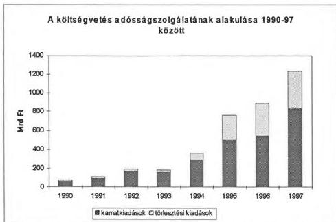

T/3174/1.

*Állami Számvevőszék*

# **VÉLEMÉNY**

**A MAGYAR KÖZTÁRSASÁG 1997. ÉVI KÖLTSÉGVETÉSÉRŐL**

(A költségvetési dokumentum törvényességi és számszaki ellenőrzése, javaslatok.)

(1. füzet)

1996. október

333.

---

# A jelentésben található rövidítések jegyzéke

|  APEH | Adó- és Pénzügyi Ellenőrzési Hivatal  |
| --- | --- |
|  Áht | Az államháztartásról szóló 1992. évi XXXVIII. tv.  |
|  ÁPV Rt. | Állami Privatizációs és Vagyonkezelő Részvénytársaság  |
|  ÁSZ | Állami Számvevőszék  |
|  BM | Belügyminisztérium  |
|  EB Rt. | Magyar Exporthitel Biztosító Rt.  |
|  Eximbank | Magyar Export-Import Bank Rt.  |
|  GFS | Nemzetközi Kormányzati Pénzügyi Statisztika  |
|  KHVM | Közlekedési, Hírközlési és Vízügyi Minisztérium  |
|  MBFB | Magyar Befektetési és Fejlesztési Bank  |
|  MeH | Miniszterelnöki Hivatal  |
|  MNB | Magyar Nemzeti Bank  |
|  MTV | Magyar Televízió  |
|  MR | Magyar Rádió  |
|  NM | Népjóléti Minisztérium  |
|  OGY | Országgyűlés  |
|  PM | Pénzügyminisztérium  |
|  VPOP | Vám- és Pénzügyőrség Országos Parancsnoksága  |

---

# TARTALOMJEGYZÉK

# 1. VÁLTOZÁSOK A KÖLTSÉGVETÉS SZERKEZETÉBEN ÉS SZABÁLYOZÁSÁBAN 5

1.1 Az Aht. egyes eloirasainak ervenyesitese a törvenyjavaslatban 5
1.2 Az Aht. egyes eloirasainak ervenyesitese a törvenyjavaslat melleketeiben 5

# 2. A TÖRVÉNYJAVASLAT TÖRVÉNYESSÉGI ÉS SZÁMSZAKI MINŐSÍTÉSE 7

2.1 A törvényjvaslat normaszövegehez kapcsoló észrevételek 7
2.2 A törvényjvaslat számszaki mellekleteivel kapcsolatos észrevételek 10

2.2.1 Az 1-2. és a 10. számú mellékletek egyezősége 10

# 3. AZ ÁLLAMHÁZTARTÁS ALRENDSZEREINEK MŰKÖDÉSI FELTÉTELEI 10

3.1 A központi költségvetés 10

3.1.1 A kozponti koltsegvetes hianya 10
3.1.2 A kozponti koltsegvetes adossaganak alakulasa 11
3.1.3 Az allami kezessegvallalasok 11
3.1.4 A kozponti koltsegvetesi szervek 13

3.2 A tarsadalombitzositasi alapok es a kozponti koltsegvetes kapcsolata 13
3.3 A helyi onkormanyzatok alrendszere 14
3.4 Az elkulönitett allami penzalapok 15

# 4. AZ ÁLLAMI VAGYONNAL KAPCSOLATOS BEVÉTELEK 15

# JAVASLATOK 17

1

---

A-330-3/1996.

## Bevezetés

Az Állami Számvevőszék a költségvetés előirányzatainak megalapozottságáról szóló véleményében tájékoztatja az Országgyűlést a tervezőmunka folyamatáról, a benyújtott dokumentumok törvényekben és egyéb jogszabályok előírt követelményeivel való összhangjáról.

Az államháztartás pénzügyi reformjának kezdeti lépéseit döntően az 1996-tól működő Kincstár, a kincstári finanszírozás jelenti. Ez feltételezi és kikényszeríti az intézményi tervezés korábbinál körültekintőbb, pontosabb folyamatát, a szakmai és pénzügyi szervezeti egységek együttműködését, a felügyeleti szervek hatáskörének és felelősségének növekedését. Az előirányzatok ilyen módon történő megalapozása lehetőséget nyújt az Országgyűlés reális tájékoztatására és biztosíthatja azt, hogy a benyújtott törvényjavaslathoz képest minél kevesebb módosítás történjen. Azt is jelentheti továbbá, hogy az intézmények, feladatok évközi előirányzatmódosításai csökkenjenek. A továbbfejlesztésről szóló kormányhatározat a kincstári körre, a kincstári finanszírozásra vonatkozóan 1997-től konkrét feladatokat írt elő. Ezek között a fontosabbak: a kincstári kör kiterjesztése, a társadalombiztosítási alapok kincstári finanszírozása, a kötelezettségvállalás nyilvántartási rendszerének kialakítása, a közterhek központosított befizetése stb.

A határozat végrehajtásával kapcsolatos intézkedésekről az előterjesztés nem ad tájékoztatást. Az 1997. évi költségvetési törvényjavaslatban olyan, a központi költségvetés helyzetét kedvezően befolyásoló, a pénzügyi rendszer továbbfejlesztésére irányuló jelentős lépések, mint 1996-ban, nem találhatók. A szöveges indokolásban a konkrét intézkedések helyett továbbra is csak az intézmény- és szervezet-felülvizsgálat folytatásáról, más területeken a lehetőségek vizsgálatáról van szó. Nem tesz eleget az előterjesztés az államháztartási törvény 1996-tól hatályos azon előírásának, ami szerint a költségvetési évet követő két év várható előirányzatait is be kell mutatni, amire azért lenne szükség, mert a mai döntések következményeit így jobban lehetne mérlegelni.

A jelenlegi időszakban tárcaegyeztetés folyik az Áht. tervezett módosításáról. Ennek kapcsán a a Korm. határozatban foglalt egyes feladatok megjelennek a tervezett törvényi szabályozásban, a törvényjavaslat előterjesztése azonban még nem történt meg.

Az államháztartási reformfolyamat egyik elemének tekinthető a képzési költségek és az intézményfenntartást érintő normatív finanszírozás meghirdetése a felsőoktatásban. Ennek hatékonyságát, a költségvetésre gyakorolt hatását, illetőleg a felsőoktatási támogatások felhasználásának célszerűségét, gazdaságosságát azonban csak hosszabb idő alapján lehet megítélni.

A költségvetés végrehajtási folyamatának, a zavartalan működésnek egy fontos feltétele – ami ugyan csak egy részletkérdést érint –, hogy a törvényjavaslat szerint megtörténik a kincstári ügyfelek előirányzat-maradványainak és a központi beruházások előirányzat-maradványának kezelési és felhasználási szabályozása.

3

---

Hiányzik a benyújtott törvényjavaslatból az Áht-ban, a költségvetési törvényjavaslat előterjesztésére előírt egyes követelmények teljesítése. Esetenként visszalépés történt az Áht-ban előírt tájékoztatási kötelezettség teljesítése terén az 1996. évi költségvetési törvényjavaslat tartalmához viszonyítva is (például a létszámkeret választott tisztségviselők és foglalkoztatottak szerint, a kiemelt jelentőségű beruházások és felújítások, kiemelt jelentőségű beruházási célprogramok bemutatása).

Az előterjesztés olyan alapokra is épít, amelyeket törvények még nem legitimálnak (adótörvények, Áht. módosítása). A tervezett változások összegszerűsége, a költségvetésre gyakorolt hatása nehezen ítélhető meg. Ebből adódóan az 1997. évi költségvetés, azon belül különösen a bevételi oldal megalapozottsága, teljesíthetősége bizonytalan. A társadalombiztosítási alapok költségvetését – a korábbi évekhez hasonlóan – nem a költségvetési törvényjavaslattal együtt terjesztette be a Kormány, ezért az alapok és a központi költségvetés pénzügyi kapcsolatainak megítélésére az ÁSZ-vélemény kialakításánál nem volt lehetőség. Az ÁSZ egy későbbi külön jelentésében véleményt ad a TB 1997. évi költségvetéséről.

A megmaradt öt elkülönített állami pénzalap előirányzataiból megállapítható, hogy azok közül három (Központi Környezetvédelmi Alap, Munkaerőpiaci Alap, Útalap) hiánnyal tervezte meg 1997. évi költségvetését. Együttes hiányuk 23,5 Mrd Ft, amit a központi költségvetés hiánya nem tartalmaz.

Az államháztartási reform keretében, a pénzügyi információs rendszer felülvizsgálata során elkerülhetetlen annak törvényi szabályozása is, hogy a költségvetési törvényjavaslat Országgyűlés elé terjesztése milyen formában történjen. A Kormány részéről az Áht-ban előírt szeptember 30-i határidőre ugyanis csak a törvényjavaslat általános kötetének benyújtása történt meg. Ennek megfelelően az ÁSZ-vélemény 1. füzete csak az első kötetben foglalt adatok, információk alapján tett megállapításokat tartalmazza. E kötet ugyanakkor több helyen utal a véleményünk kialakításakor rendelkezésünkre nem álló, ún. fejezeti kötetekben foglaltakra. A törvényalkotó tevékenység megalapozásához, a jó döntésekhez célszerű – a törvényjavaslat benyújtási határidejének rögzítése mellett – a Kormány által benyújtott dokumentumok tartalmának, rendszerének és formai megjelenítése módjának meghatározása is.

Az ÁSZ az 1997. évi költségvetésről készített véleményét két füzetben terjeszti az Országgyűlés elé. Az 1. füzet tartalmazza a törvényjavaslatban foglaltakkal kapcsolatos észrevételeket, a javaslatokat. A 2. füzetben a helyszíni ellenőrzés tapasztalatait adjuk közre.

4

---

# 1. Változások a költségvetés szerkezetében és szabályozásában

## 1.1 Az Áht. egyes előírásainak érvényesítése a törvényjavaslatban

A Kormány az 1997. évi költségvetési törvényjavaslatot – folytatva az 1996-ban megkezdett átalakítást – a nemzetközileg elfogadott és a Nemzetközi Valutaalap által alkalmazott GFS számbavételi rendszer egyes elemeinek alkalmazásával készítette el. A bevételi és kiadási előirányzatok, valamint a központi költségvetés mérlege nem tartalmazzák a hitelfelvételeket, a bel- és külföldi államadósság esedékes törlesztését, illetőleg az államkötvények visszavásárlási összegét. Ezek külön fejezetben, a kiadási és bevételi főösszegektől elkülönítve, illetve a mérlegben 'vonal alatt' jelennek meg.

Az 1997. évi költségvetés szerkezete azonban ezzel a módosítással sem tekinthető véglegesnek. A Kormány az Áht. 116. §-ában előírt mérlegek részletes tartalmát és szabályait még nem alakította ki. Ez azt jelenti, hogy a mérlegek tartalmának évenkénti kisebb-nagyobb változtatásával, majd a teljes körű mérlegrendszer kidolgozásával szinte minden évben változik a költségvetés szerkezete, adatállománya (1. sz. melléklet). A törvényjavaslatokkal egyidőben kidolgozott szerkezeti változtatások sok hibalehetőséget rejtenek magukban. A költségvetés részletes adatait megadó szervezetek előzetesen nem ismerik, hogy az általuk szolgáltatott adatokat milyen összefüggéseket tartalmazó mérlegrendszerben mutatják be. Rendszeresen elmarad az adattartalom pontos definiálása is. Mindezek megnehezítik az elszámoltatást, rontják az ellenőrizhetőséget, fontos idősorok, összehasonlítható adatállományok előállítását pedig szinte lehetetlenné teszik.

Az Áht. 36. §-a szerint a költségvetési törvényjavaslat benyújtásakor a Kormánynak elő kell terjesztenie azokat a törvényjavaslatokat, melyek a javasolt előirányzatok megalapozásához szükségesek. Az 1997. évi költségvetési törvényjavaslatban benyújtott törvénymódosítás döntő része a kiadásokat érinti (például: a felsőoktatásról, a családi pótlékról és a családok támogatásáról, a szociális igazgatásról és szociális ellátásokról, a köztisztviselők jogállásáról, a fegyveres szervek hivatásos állományú tagjainak szolgálati viszonyáról, a közoktatásról, a közalkalmazottak jogállásáról szóló törvények). A bevételi oldalt meghatározó, a finanszírozhatóságot megalapozó adójogszabályok módosítását az Országgyűlés tárgyalja. Ez kedvezőtlenül befolyásolja az ÁSZ vélemények kialakítását a költségvetési előirányzatok megalapozottságáról.

Az Áht. 32. § (1) bekezdésének megfelelően szükséges a Kormánynak felhatalmazást adni a központi költségvetésben előírt bevételek beszedésére és a kiadások teljesítésére.

## 1.2 Az Áht. egyes előírásainak érvényesítése a törvényjavaslat mellékleteiben

A jövő évi költségvetési törvényjavaslat új fejezetrendben készült el (2. sz. melléklet). Változások találhatók a fejezeten belüli címrendben, az előirányzat-csoportokban és a központi költségvetés mérlegsoraiban is. Ennek indokoltságát nem vitatva – bár a változtatás elveit, tartalmát az előterjesztés nem mutatja be – az új szerkezetben az adatok egybevetése, ellenőrzése, idősorok kialakítása továbbra sem egyszerű, és sérül az összehasonlíthatóság elve is.

Az államháztartási törvény szerint a rendes bevételeket és kiadásokat külön kell választani a rendkívüliektől. Immár második éve, hogy a törvényjavaslat 1. és 2. számú mellékleteiben valamennyi költségvetési cím előirányzatát rendes vagy rendkívüli tételnek sorolták be. A megkülönböztetés lehetővé teszi az előirányzatok mérlegelését azzal, hogy elkülöníti a folyamatos

5

---

működéssel jellemzően összefüggő bevételeket és kiadásokat a nem állandó jellegű, általában egyetlen évben felmerülő, eseti kiadásoktól, bevételektől. Az előirányzatok tagolása a következő évek költségvetési bázisának kialakításánál is hasznosul, ezzel a költségvetés megalapozását segítheti. Az Áht-ban előírt tagolás viszont nem jelenik meg a központi költségvetés mérlegében, holott a Kormány az 1996. évi költségvetési törvényjavaslatot már ebben a formában nyújtotta be.

Az előirányzatok elkülönítésénél az előző évekhez hasonlóan a kiadások minősítése és ennek megfelelő besorolása az egyes fejezeteknél nem egységes. Elsősorban a fejezeti kezelésű előirányzatok egyes céljellegű előirányzatai (a közalapítványi támogatások, a pályázati előirányzatok, a társadalmi önszerveződéseknek stb. nyújtott támogatások) nem kerültek a tartalmuknak megfelelő rendkívüli kiadások közé.

Az előirányzatok megkülönböztetésével kapcsolatban sem az Áht., sem a költségvetési törvényjavaslat nem szól arról, hogy a rendes és a rendkívüli előirányzatoktól a felhasználás során el lehet-e térni, az előirányzat-átcsoportosítás megengedett-e. A rendkívüli kiadások általában valamilyen célfeladathoz kapcsolódnak, aminél a célok szerinti felhasználás és tételes elszámoltatás indokolt. A rendkívüli bevételek és kiadások felhasználási lehetőségét, az "átjárást" a kétféle előirányzat között szabályozni szükséges.

Az 1997. évi költségvetési törvényjavaslatban jelenik meg első ízben az Áht. 1996. január 1-jei módosítását követően, hogy a kiemelt előirányzatok közül a munkaadókat terhelő járulékok (a társadalombiztosítási és a munkaadói járulék) együttes összege szerepel a törvénynek megfelelő címen és tartalommal.

A törvényjavaslatban az Áht. alábbi paragrafusaiban előírt kötelezettségek nem teljesültek:

- Az Áht. 8/A § (1) bekezdése alapján a költségvetés megállapításakor jóvá kell hagyni a hiány finanszírozási módját.
- Az Áht. 23. § (1) bekezdése szerint "a központi költségvetésben tételesen kell előirányozni a kiemelt jelentőségű beruházások és felújítások előkészítésére és megvalósítására szolgáló összegeket."
- Az Áht. 36. §-a szerint a Kormánynak a költségvetés benyújtásakor tájékoztatást kell adnia a többéves elkötelezettséggel járó kiadási tételek későbbi évekre vonatkozó hatásairól.
- A 36. § c) pontja szerint az "1997. évi költségvetési évtől kezdődően teljeskörűen" kellett volna bemutatni a költségvetési évet követő két év várható előirányzatait (gördülő tervezés).
- Az Áht. 57. § (2) bekezdése szerint a Kormány az alapokra vonatkozóan is "köteles tájékoztatásul a költségvetési törvényjavaslat indokolásában az Országgyűlés elé terjeszteni" a következő két év várható előirányzatait, továbbá a kötelezettségvállalások és az előírt tartozások tervezett alakulását.
- Az Áht. 58. §-a szerint az elkülönített állami pénzalapok költségvetési tervezeteihez szöveges indokolást kell mellékelni, amelyben az egyes előirányzatok megalapozottságát kell indokolni.

6

---

- Az Áht. 86. § (1) bekezdésének megfelelően "a társadalombiztosítás gazdálkodásának előirányzatait, a bevételek és kiadások összegét", a hiány fedezését a költségvetési törvénnyel együttesen kellett volna előterjeszteni.
- Az Áht. 116. § 3. pontjának megfelelően az államháztartás mérlegeit (amelyek az államháztartás valamennyi alrendszereinek összes bevételét, illetőleg az azokból teljesített minden kiadását, finanszírozását és pénzeszközének változását tartalmazzák) alrendszerenként és összevontan is be kellett volna mutatni.
- A 116. § 4. pontjának megfelelően be kellett volna mutatni az államadósságot és az állam által nyújtott hitelek állományát lejárat, illetve eszközök szerinti bontásban.
- A 116. § 9. pontjának megfelelően a többéves kihatással járó döntések számszerűsítéséről évenkénti bontásban, valamint összesítve is tájékoztatást kellett volna adni.
- A 116. § 10. pontjának megfelelően a közvetett támogatásokról (pl. adókedvezmények) kimutatást kellett volna készíteni.

A Kormány a 157/1995. (XII. 26.) számú rendeletében foglalt egyes kötelezettségeinek sem tett eleget:

- A Korm. rend. 9. § (2) bekezdés a) pontja szerint a kiemelt jelentőségű beruházást, kiemelt jelentőségű beruházási célprogram megvalósítását az Országgyűlés engedélyezi az illetékes miniszter által kidolgoztatott beruházási javaslat alapján. A javaslat főbb adatait és szöveges indokolását a rendelet mellékletében meghatározott formában a költségvetési törvényjavaslat mellékleteként kell az Országgyűléshez benyújtani. A törvényjavaslat ezt nem tartalmazza, bár az Állami Számvevőszéknek törvényi kötelezettsége (az ÁSZ-ról szóló 1989. évi XXXVIII. törvény 2. § (7) bekezdés) az Országgyűlés elé terjesztett kormányprogramok és az állami kötelezettséggel járó beruházási előirányzatok indokoltságának, célszerűségének véleményezése.
- A Korm. rend. 9. § (2) bekezdés b) pontja szerint a beruházási célprogramban összefoglalt beruházások megvalósítandó célját – nevesítve – az Országgyűlés az éves költségvetési törvényben hagyja jóvá. Ehhez az előterjesztés hiányzik.

## 2. A törvényjavaslat törvényességi és számszaki minősítése

### 2.1 A törvényjavaslat normaszövegéhez kapcsolódó észrevételek

#### A költségvetés általános tartaléka

Az Áht. 25. §-a előírja, hogy a központi költségvetésben általános tartalékot kell képezni. Ez összegszerűen (14,7 Mrd Ft) a X. Miniszterelnökség fejezet 10. cím 1. alcímén jelenik meg, de – az előző évek gyakorlatához hasonlóan – az általános tartalék előirányzatát a normaszövegben is szükséges rögzíteni, az ellenőrzés és az elszámoltatás jogalapjának megteremtése érdekében.

Az általános tartalék az előre nem tervezhető kiadásokra szolgál. A kormányzati rendkívüli kiadások között (X. Miniszterelnökség fejezet 11. cím) "Egyéb rendkívüli kiadások" címen 7,5 Mrd Ft előirányzat szerepel. Rendeltetésének indokolása hiányzik.

7

---

### *Az előirányzat-módosítási kötelezettség nélkül teljesülő előirányzatok*

Az 'Egyéb rendkívüli kiadások' előirányzatot a törvényjavaslat 42. § (1) bekezdésének s) pontja az előirányzat-módosítási kötelezettség nélkül teljesülő automatikus előirányzatok közé sorolja. Az Áht. 40. §-a szerint: *'Ezen előirányzatok között olyan bevételi, illetve kiadási előirányzat jelölhető meg, amelynek teljesülése jogszabályon alapul, illetve olyan tényezők következménye amelyek alakulására a Kormánynak közvetlen befolyása nincs.'* Külön szabályozott módosítás nélkül teljesülő előirányzattá tétele, tartalmának ismerete nélkül nem minősíthető.

A törvényjavaslat 42. § (1) bekezdésének c) pontja az előirányzat-módosítási kötelezettség nélkül teljesülő kiadások közé sorolja a központi költségvetési szervek 1997-ben végrehajtandó létszámcsökkentésével és a bérpolitikai keretével összefüggő – 6. §-ban előírt – céltartalékát is. Az 1995. évi zárszámadás ellenőrzésekor megállapítottuk, hogy a céltartalék teljesített előirányzata az előterjesztett törvényjavaslatból nem állapítható meg, nem ellenőrizhető. Szükséges ezért annak rögzítése a normaszövegben, hogy a zárszámadás során a Kormány a céltartalék felhasználásának tényszámait, ezen belül a létszámcsökkentésekre fordított összegeket mutassa be. (Ennek hiányában nem lehet ellenőrizni és értékelni a feladat végrehajtását.)

Indokolatlannak tartjuk, hogy a törvényjavaslat 42. § (1) bekezdésének c) pontja a céltartalék terhére automatikusan túlléphető előirányzattá teszi a költségvetésből kikerült Magyar Rádió Rt-nek és a Magyar Televízió Rt-nek a létszámcsökkentéssel kapcsolatos kötelezettségei teljesítését is. A céltartalék igénybevételére a törvényjavaslat 6. § (4) bekezdésében ellenőrizhetetlen, követhetetlen feltételeket szab az előterjesztő.

A törvényjavaslat 42. § (1) bekezdésének g) pontja a vállalkozások folyó támogatásánál az eddigi normatív támogatásokon kívül az egyéb vállalati támogatásokra (1,1 Mrd Ft) is kiterjeszti azt a szabályozást, mely szerint a teljesülés külön szabályozott módosítás nélkül eltérhet az előirányzattól. Ugyancsak ebbe a körbe emeli be a törvényjavaslat a XXII. PM fejezetben előirányzott jogcím megbontás nélkül szereplő 5 050 M Ft egyéb vegyes kiadást (17. cím 1. alcím, 11. kiemelt előirányzat).

### *A volt tanácsi vállalatok értékesítéséből származó bevételek*

A törvényjavaslat 25. §-a rendelkezik a volt tanácsi vállalatok értékesítéséből származó bevételek helyi önkormányzatokat megillető részéről. Már az 1996. évi költségvetési törvényjavaslat véleményezése során is kifogásoltuk, hogy a korábbi évek szabályozásához képest a helyi önkormányzatok igényeinek szűkítését jelenti a jelenlegi javaslatban is szereplő 'készpénzbevétel' megfogalmazás, hiszen az értékesítésből nem csak készpénzbevétel származhat.

### *Országgyűlési felhatalmazások*

A törvényjavaslat 93-95. és 97. §-aiban szereplő különféle szabályozási feladatokhoz rendelt, egyes szervezetek részére adott felhatalmazásoknál szükségesnek tartjuk a határidők rögzítését is.

### *A költségvetési szervek által a közhasznú, illetve gazdasági társaságok részére átadandó eszközök*

A törvényjavaslat 52. §-a rendelkezik a központi költségvetési szerv közfeladatainak és vagyonának átadásáról, eszközeinek térítésmentes használatba adásáról. (Hasonló előírás szerepelt az 1996. évi költségvetési törvényben is.) A piaci körülményekhez jobban alkalmazkodó közhasz-

8

---

nú társaságok, gazdasági társaságok közreműködésével bizonyos állami feladatok ellátása hatékonyabb lehet. A már létrejött gazdasági társaságok átalakítása, megszüntetése, az ingyen átadott eszközök visszaszerzése azonban aligha lehetséges, ha a későbbiekben az állami feladat ellátására az adott forma sikertelennek bizonyul. Célszerű ezért, ha a társaságok megalapításáról – az Áht. 94. § (4) bekezdése értelmében központi költségvetési szerv kizárólag a felügyeleti szerv és a pénzügyminiszter együttes engedélyével alapíthat közhasznú társaságot, gazdasági társaságot – csak költség-haszon elemzés alapján születik döntés.

# A helyi önkormányzatok visszafizetései

A helyi önkormányzatoknak a jogtalanul felvett támogatásokat vissza kell fizetniük a központi költségvetésbe. Az ÁSZ zárszámadáshoz kapcsolódó vizsgálatai megállapították, hogy a Pénzügyminisztériumnál vezetett, a visszafizetett összegeket összevontan tartalmazó számla alapján nem lehet megállapítani, hogy egy-egy önkormányzat teljesítette-e (és a megfelelő jogcímen teljesítette-e) visszafizetési kötelezettségét. Ezért a törvényjavaslat 22. § (7) és (8) bekezdésének kiegészítését javasoljuk az alszámla jogcím szerinti (normatív hozzájárulások, központosított előirányzatok, cél- és címzett támogatások) részletezésével annak érdekében, hogy az önkormányzatok számára egyértelmű legyen: a visszafizetett összegeket és az ahhoz kapcsolódó kamatfizetési kötelezettséget melyik számlára kell utalniuk.

# Az önhibájukon kívül hátrányos helyzetben lévő önkormányzatok előlege

A törvényjavaslat 29. §-ának (2) bekezdése az önhibájukon kívül hátrányos helyzetben lévő önkormányzatok számára előleg igénybevételét teszi lehetővé. Erre "az önkormányzat elfogadott költségvetési rendelete alapján egy alkalommal - 1997. február 10-ig - van lehetőség". Elfogadott költségvetési rendelete erre az időre az – Áht. idevonatkozó paragrafusai és a költségvetési javaslatban a részletes támogatási előirányzatok közzétételi határideje alapján – nem lehet az önkormányzatnak.

A hivatkozott paragrafus a továbbiakban arról rendelkezik, hogy "az előleg átutalása az első félév során havonta időarányosan" történik. Mivel az igénylés határideje február 10-e, leghamarabb márciusban kaphatnak első alkalommal előleget az önkormányzatok.

# A törvényjavaslat néhány paragrafusának téves hivatkozása

- A törvényjavaslat 43. § (7) bekezdésében a Kormány felhatalmazást kap arra, hogy a XXI. Népjóléti Minisztérium fejezet "Közgyógyellátás" előirányzat-csoport terhére a XI. Belügyminisztérium fejezetnél a helyi önkormányzatok központosított előirányzatai közül, a letszámcsökkentéssel kapcsolatos kiadások javára csoportosítson át. Téves hivatkozás szerepel a törvényjavaslatban, az 5. sz. melleklet alapján az átcsoportosításoknak a 20. "Közgyógyellátás támogatása" kiemelt előirányzat javára kellene történnie.
- A törvényjavaslat 89. §-anak 1. pontja szerint hatályát veszti az elkülönített állami pénzalapokról szólo 1992. évi LXXXIII. törvény 37. és 38. §-a. A törvényjavaslat 93. §-a ugyanezen törvény 28-38. §-aira (tehát a hatályát vesztettre is) a végrehajtáshoz szükséges részletes szabályozást ir elő.
- A 3. sz. melleklet "5. Bentlakasos es atmeneti elhelyezest nyujto intezmenyi ellatas" normativa leirasanak (5) es (6) bekezdésben szerepló hivatkozasok hibasak.

9

---

# 2.2 A törvényjavaslat számszaki mellékleteivel kapcsolatos észrevételek

# 2.2.1 Az 1-2. és a 10. számú mellékletek egyezősége

A törvényjavaslat 1. és 2. sz. melléklete az Áht 16. § (1) bekezdésében előírtaknak megfelelően különválasztva jeleníti meg a rendes és rendkívüli előirányzatokat. A 10. sz. a központi költségvetés mérlegét tartalmazó melléklet ezt a bontást nem tartalmazza, csak összesített adatokat közöl. Változott a központi költségvetés mérlegének szerkezete, de az 1. és 2. sz. mellékletek együttes összegei a 10. sz. melléklet megfelelő soraival megegyeznek.

A törvényjavaslat 10. sz. mérleg mellékletről hiányzik a "millió forintban" megjegyzés. A mérleg kiadási oldalán a központi költségvetési szervek címszó alatt a "támogatási célprogramok támogatással fedezett kiadásai 16 256,8 M Ft" sora nem a tényleges tartalmat fedi. Ez a sor ugyanis nem a támogatással, hanem a saját bevétellel fedezett kiadást tartalmazza.

# 3. Az államháztartás alrendszereinek működési feltételei

# 3.1 A központi költségvetés

# 3.1.1 A központi költségvetés hiánya

A központi költségvetés tervezett hiánya 301,7 Mrd Ft, ami – a törvényjavaslat 1. és 2. sz. mellékletei szerint – az államháztartás folyamatos működéséből származik. A lejáró adósságállomány miatt felmerült törlesztési kiadások "vonal alatti tételek", így a tervezett deficit az Áhtnak megfelelően azokat nem tartalmazza. A központi költségvetés összes finanszírozási igénye 1997-ben a tervek szerint 698,6 Mrd Ft. A kibocsátandó értékpapírok, illetve hitelek összetételét a Kormány 1997-re sem rögzíti.

1. táblázat

A központi költségvetés egyenlegeinek alakulása 1990-97 között (adatok Mrd Ft-ban)

|  Megnevezés | 1990 | 1991 | 1992 | 1993 | 1994 | 1995 | 1996 | 1997  |
| --- | --- | --- | --- | --- | --- | --- | --- | --- |
|  elsődleges egyenleg | 69,4 | -7,1 | -6,6 | -14,9 | 38,5 | 369,0 | 413,7 | 532,9  |
|  kamatkiadások | 62,2 | 92,8 | 170,0 | 161,5 | 292,1 | 502,9 | 546,6 | 834,6  |
|  költségvetési hiány | 7,1** | 99,9 | 176,6 | 176,4 | 253,6 | 133,9 | 132,9 | 301,7  |
|  törlesztési kiadások | 8,5 | 14,3 | 20,6 | 23,3 | 68,1 | 257,8 | 345,3 | 396,9  |
|  finanszírozási igény* | 1,4 | 114,2 | 197,2 | 199,7 | 321,7 | 391,7 | 478,2 | 698,6  |

* 1994-ig ez szerepelt költségvetési hiányként

**1990. évben többlet

10

---

2. táblázat

# **A kamat- és adósságszolgálati kiadások aránya 1990-97 között (%-ban)**

|  Megnevezés | 1990 | 1991 | 1992 | 1993 | 1994 | 1995 | 1996 | 1997  |
| --- | --- | --- | --- | --- | --- | --- | --- | --- |
|  kamatkiadások/kiadási főösszeg | 9,7 | 9,5 | 14,3 | 11,0 | 16,2 | 25,5 | 26,2 | 32,6  |
|  adósságszolgálat/kiadási főösszeg | 11,0 | 11,0 | 16,0 | 12,6 | 20,0 | 38,7 | 42,7 | 48,2  |

### 3.1.2 A központi költségvetés adósságának alakulása

A központi költségvetés és a Magyar Nemzeti Bank között tervezett adósság cserével kapcsolatos részletes véleményünket a 2. füzet 5. 'Belföldi államadósság költségvetési elszámolásai' fejezet tartalmazza.

### 3.1.3 Az állami kezességvállalások

A költségvetési törvényjavaslat az 1997-ben újonnan elvállalható kezességek összegét – hasonlóan az 1996. évi előíráshoz – a kiadási főösszeg két százalékában határozza meg. Célszerű volna, ha a korábbi éveknek megfelelően, a törvényjavaslat 36. §-ának (1) bekezdése tartalmazná, hogy a Kormány a központi költségvetés terhére vállal állami garanciát.

11

---

3. táblázat

# A központi költségvetést terhelő garanciák várható alakulása 1997-ben

|  A kezesség fajtája | Keretállomány 1997. év végén | Az 1997. évi vállalható keretösszeg | Az 1997-ben várhatóan beváltásra kerülő összeg  |
| --- | --- | --- | --- |
|  Egyedi kezességek | mintegy 280 Mrd Ft | 51 Mrd Ft + járulékos hitelktg. és árfolyamvált. | 11 Mrd Ft  |
|  Nemzetközi pénzintézetektől felvett hitelekre adott garanciák | nincs adat | korlátlan | nincs előirányzat  |
|  A MBFB által felvett külföldi fejlesztési hitelek | 80 Mrd Ft | az állomány nem változhat 1996 végéhez képest | nincs előirányzat  |
|  Az EXIM Bank exportcélú garanciái | 50 Mrd Ft | legalább 25 Mrd Ft | 1,5 Mrd Ft  |
|  Az EB Rt. politikai és árfolyam-biztosítási kötelezettsége | 130 Mrd Ft | legalább 20 Mrd Ft | 1 Mrd Ft  |
|  A Hitelgarancia Rt. kezességei | 35 Mrd Ft | az állomány nem változhat 1996 végéhez képest | 1,5 Mrd Ft  |

Az Áht. 42. § (4) bekezdése kimondja, hogy *'A Kormány az (1) bekezdés szerinti kezességvállalásai alapján várhatóan esedékessé váló fizetési kötelezettségeit összesítve, az esedékessé válás valószínűsége szerint is bemutatva köteles a költségvetési törvényjavaslat indokolásában tájékoztatásul előterjeszteni.'* A törvényjavaslat általános indokolása szerint a XXII. PM fejezet az 1997-ben esedékessé váló fizetési kötelezettségeket tételesen és a kezességbeváltás valószínűsége szerint bemutatja. Az erre vonatkozó adatokat azonban a benyújtott *'A Magyar Köztársaság 1997. évi költségvetése'* c. általános indokolást előterjesztő kötet nem tartalmazza.

Új elem a kezességvállalások rendszerében, hogy a törvényjavaslat 36. és 37. §-ában meghatározott garanciák után kezességvállalási díjat kell felszámítani a központi költségvetés javára. A díjat a Kormány állapítja meg nyilvános határozatban. A paragrafus akkor lenne egyértelmű, ha a megfogalmazás a hivatkozott szakaszok alapján újonnan elvállalt kezességet említené, másrészt ha a díjfizetésre kötelezettet a normaszövegben megjelölnék. Az állami garancia ugyanis egyaránt biztosítékot jelent a hitelt felvevő és az azt nyújtó számára.

A korábbi években a költségvetési törvény kimondta, hogy ha az állam által vállalt kezességek költségvetéssel szembeni beváltásának összege meghaladja az előirányzatot, akkor a különböző az általános tartalékot terheli. Az 1997. évi törvényjavaslat nem intézkedik ilyen esetekre.

12

---

### 3.1.4 A központi költségvetési szervek

A központi költségvetési szervek körében változások következtek, illetve következnek be, melyek befolyással vannak az 1997. évi előirányzatokra (közúti igazgatóságok, Magyar Rádió, Magyar Televízió szervezeti átalakítása). A költségvetési törvényjavaslat számszaki és szöveges indokolása viszont összehasonlítható formában nem tartalmaz információkat.

Az intézmény-korszerűsítési program tovább folytatódik, bár lényegesen szűkebb körben, mint 1996-ban. Az 1996-os évközi intézkedések hatása a költségvetési előirányzatokban most jelenik meg. A program keretében a költségvetésből kikerült intézmények döntő része saját bevételből finanszírozta kiadásait (pl. közúti igazgatóságok). Így az átszervezés a központi költségvetés kiadási-bevételi előirányzatait, a létszámot csökkenti ugyan, de támogatási megtakarítást nem eredményez.

Az államháztartás egyes alrendszerei 1997-99. évi költségvetési tervezőmunkájának, a költségvetési javaslat kidolgozásának és a költségvetési törvényjavaslat összeállításának feladataihoz a PM tájékoztatót adott ki. Ebben tájékoztatást kért be az intézmény és feladat felülvizsgálat keretében az intézményrendszer átalakulásával kapcsolatos létszámokról, előirányzatokról. A törvényjavaslat szöveges indokolása ezekről az információkról, illetve az eddigi átalakulások eredményéről nem tájékoztat.

#### *Bevételeket beszedő szervek támogatása*

A köztartozások eredményesebb beszedése, a feketegazdaság elleni sikeresebb fellépés érdekében az adó- és pénzügyi tevékenység területén kiemelt fejlesztési előirányzatok, jelentős létszámfejlesztések, az átlagot meghaladó személyi juttatási előirányzatok szerepeltek, illetve szerepelnek. Fejlesztési programokra, intézményi beruházásokra 1996-ban és 1997-ben is 5-5 Mrd Ft feletti előirányzat áll e szervezetek rendelkezésére. A jelentős támogatás felhasználásáról és az ennek révén elért számszerűsíthető eredményekről célszerű volna, ha a Kormány az 1996. évi zárszámadás keretében tájékoztatást adna az Országgyűlés részére.

### 3.2 A társadalombiztosítási alapok és a központi költségvetés kapcsolata

A társadalombiztosítás gazdálkodásának előirányzatait a költségvetési törvénnyel egyidejűleg kell az Országgyűlés elé terjeszteni (Áht. 86. §). A társadalombiztosítás önkormányzati igazgatásáról szóló 1991. évi LXXXIV. törvény 23. § (5) bekezdése szerint a Kormány a biztosítási önkormányzatok kezelésében levő társadalombiztosítási alapok költségvetésére vonatkozó javaslatot figyelembe véve törvényjavaslatot dolgoz ki a biztosítási alapok költségvetésére, melyet legkésőbb a következő évre vonatkozó központi költségvetési törvényjavaslattal együtt nyújt be az Országgyűléshez. A költségvetési törvényjavaslatban tájékoztatásul bemutatják a társadalombiztosítási alapok tervezett költségvetését. A társadalombiztosítási alapok 1997. évi költségvetési törvényjavaslatát 1 héttel később nyújtották be az Országgyűlésnek.

A törvényjavaslat – hasonlóan a korábbi évekhez – most is garanciát állít a társadalombiztosítás folyamatos működése mögé. Ennek érdekében a központi költségvetés a Nyugdíjbiztosítási Alapnak 35 Mrd Ft, az Egészségbiztosítási Alapnak 40 Mrd Ft kamatmentes hitelt nyújt. A megelőlegezési számlákról a hitelt igénybe venni csak a Kincstár által jóváhagyott finanszírozási terv alapján lehet. A javaslat rögzíti a hitelnyújtás feltételeit is. A Nyugdíjbiztosítás forgóalaphitele szinte mindig alatta maradt, az Egészségbiztosítás havi átlagos forgóalap igénybevétele viszont az 1995. évi tényadatok szerint szinte egész évben meghaladta a megállapított szintet. Az alapoknak kamatteherrel is számolniuk kell a forgóalaphitel igénybevételekor.

13

---

Az államháztartás pénzügyi rendszerének reformjával kapcsolatban a kormányhatározatokban megfogalmazott feladatok a társadalombiztosítást is érintik. Ennek alapján – a jelenleg egyeztetési folyamatban lévő – Áht. módosítási javaslat már a kincstári kör tagjaként határozza meg a társadalombiztosítási alapokat. A törvényjavaslat megemlíthette volna ezt a fontos reformlépést.

### 3.3 A helyi önkormányzatok alrendszere

Az 1997. évi költségvetési irányelvek a helyi önkormányzatok szabályozásának elveit többek között az alábbiakban határozták meg:

- a nagy elosztó rendszerek, valamint az önkormányzati rendszer reformlépéseit érvényesíteni kell a helyi önkormányzatok forrásszabályozásában;
- az állami támogatások és hozzájárulások, valamint a személyi jövedelemadó átengedés összehangolt szabályozását kell kialakítani;
- az önhibájukon kívül hátrányos helyzetű önkormányzatok támogatási rendszerének átalakítását el kell kezdeni (az egyéb támogatásoknál is egyszerűsítéseket, szűkítéseket indokolt végrehajtani).

Ezek a törekvések megjelennek ugyan az 1997. évi költségvetési törvényjavaslatban, de a helyi önkormányzatok támogatási rendszere alapjaiban nem változott. Az egyes támogatások szerkezetében azonban elmozdulások történtek. Az átengedett személyi jövedelemadó aránya nagyobb mértékben, az állami támogatások és hozzájárulások kisebb mértékben emelkednek az előző évi előirányzatokhoz képest, de a korábban normatív hozzájárulásként szereplő egyes jogcímek (település üzemeltetés, községek általános támogatása) finanszírozására a személyi jövedelemadó nyújt fedezetet. A törvényjavaslat nem tér ki arra, hogy az átengedés mértékének, a szabályozás módjának változtatásával az egyes önkormányzat típusok helyzetében milyen elmozdulások következnek be.

Az állami hozzájárulások között továbbra is meghatározóak a normatív hozzájárulások A normatívák ez évben sem fedezik az adott feladat ellátásához szükséges teljes összeget, az csak az elosztást szabályozó keretszám. 1996-hoz képest az igénybevétel jogcímeinek szabályozása egyszerűsödött ugyan, de még mindig indokolatlanul magas a normatívák száma, évenkénti módosításuk pedig a tervezés, a végrehajtás és az ellenőrzés terén is növeli a gondokat.

A saját bevételek előirányzata az 1996. évi teljesítési adatok alapján reálisnak látszik. A rendelkezésre álló információk alapján nem ítélhető meg, hogy a törvényjavaslatban megfogalmazott garanciák mennyire biztosítják azoknak az önkormányzatoknak a forrásait, amelyek saját bevételekkel alig rendelkeznek, illetve intézményi átalakítási és létszám leépítési lehetőségeik nincsenek.

A központosított támogatás összege csökkent, ugyanakkor a jogcímek száma nem. Az önhibájukon kívül hátrányos helyzetű önkormányzatok támogatási rendszere nem változott, bár a költségvetési irányelvek és az ÁSZ vizsgálati tapasztalatai is a támogatási rendszer átalakításának szükségességére utaltak. Az igénybevétel és a rendelkezésre álló keret felosztásának szabályai az 1996. évivel azonosak. Az érintett önkormányzatok likviditási helyzetét kedvezően befolyásoló változás, hogy a támogatásra előleg igényelhető. A valóban forráshiányos önkor-

14

---

mányzatok védelmében, preventív célzattal azonban az indokolatlan előlegigénylésre is célszerű lenne kiterjeszteni a valótlan adatok közléséhez fűződő jogkövetkezményeket.

### 3.4 Az elkülönített állami pénzalapok

Az elkülönített állami pénzalapok számának radikális csökkentése nyomán öt alap működik önállóan. A megszűnt alapok előirányzatai – feladataik megtartása mellett – az alapot kezelő fejezet 'fejezeti kezelésű' előirányzataiba épültek be. Kiadásaik és bevételeik előirányzása, felhasználása is ezen a címen történik meg. A megmaradt alapok a korábbiakhoz hasonlóan, az Áht-ban foglalt szabályoknak megfelelően önálló költségvetést készítenek.

A törvényjavaslatban szereplő mérlegekből megállapítható, hogy az öt állami pénzalapból három (Központi Környezetvédelmi Alap, Munkaerőpiaci Alap, Utalap) hiánnyal tervezte meg az 1997. évi költségvetését: bevételeit 23,5 Mrd Ft összeggel meghaladó mértékű kiadást állított be költségvetésébe. Ezzel az elkülönített állami pénzalapok az államháztartás hiányát 23,5 Mrd Ft-tal növelik. Ez ellentétben áll az Áht. 14. §-ával, amely szerint a központi költségvetés adósága kizárólag a központi költségvetés hiányának finanszírozási szükséglete miatt változhat.

A költségvetési törvényjavaslat 33. § (3) bekezdésében teremti meg az alapok tervezett hiányának finanszírozási módját. Eszerint a 12. sz. mellékletben jóváhagyott egyenleg mértékéig a Kincstár teljesíti a kifizetéseket. Ezt fellazítja a (4) bekezdés: *'Az alapok előirányzataik mértékét meghaladó finanszírozási igényeik teljesítéséhez legfeljebb három hónapra igénybe vehetik a Kincstári Egységes Számlát. Az igénybevételt esetenként a pénzügyminiszter engedélyezi.'* Az alapok tervezett negatív egyenlege tehát az államháztartás – végeredményben a központi költségvetés – hiányát növeli a kincstári finanszírozás által.

Ezért indokolt a törvényjavaslat kiegészítése egy olyan kimutatással, amely a pénzügyi kormányzat hatáskörébe tartozó államháztartási alrendszerek hiányát és finanszírozási igényét bemutatja. (Ide tartozónak tekinthető a társadalombiztosítás hiánya is, mert végső soron azért is a központi költségvetés vállalja a garanciát.)

### 4. Az állami vagyonnal kapcsolatos bevételek

Az ÁPV Rt. 1997. január 1-re prognosztizált (saját tőke-alapú) vagyona névértéken 800 Mrd Ft. Ebből a tartósan állami tulajdonban maradó vagyon 350 Mrd Ft, a rövid távon nem értékesíthető vagyon 65 Mrd Ft-ra becsülhető. 1997-ben ilyen címen 385 Mrd Ft a privatizálható vagyon névértéken. Az 1991-1995-ben kialakult trend szerint a privatizáció során a névértéken számbavett vagyon 60%-on értékesíthető. Ez alapján az elérhető privatizációs bevétel 231 Mrd Ft. Tekintettel arra, hogy a költségvetési befizetés forrása csak az ÁPV Rt. készpénzes bevétele lehet, a kárpótlási jegy ellenében kiadandó vagyont levonva (ami 48 Mrd Ft) a maximális készpénzes bevétel 1997-ben 180-183 Mrd Ft-ra tehető.

A globálisan értékelt vagyontömeg alapján elérhető készpénzes bevétel lehetővé teszi az összesen 72 Mrd Ft költségvetési befizetés teljesítését. (XLI. fejezet 11. cím 3. alcím és 13. cím)

A készpénzbevételi előirányzat megalapozottságát a nem vagyoni oldalról közelítve is átvizsgáltuk. A cégenkénti saját vagyon értéke, a jegyzett tőke értéke és az elérhető eladási ár azonban az ÁPV Rt. üzleti titkát képezi, ezért bár azt az ÁSZ rendelkezésére bocsátják, de nyilvánosságra hozásához nem járulnak hozzá.

15

---

A portfólió áttekintése alapján megállapítható, hogy a tervezett értékesítési struktúra 80%-a viszonylag kevés számú nagyértékű privatizációhoz kötődik. A kialakult elképzelések és az előkészítés jelenlegi helyzete alapján ma nem zárható ki a privatizációs bevétel előirányzatainak teljesülése. A kockázati elemet ma inkább az ÁPV Rt.-nél kialakult vezetői válság hordozza. (Ennek gyors és szakszerű kezelése, megoldása esetén az ÁPV Rt. 1997. évi tervezett költségvetési befizetései teljesíthetők.)

Az állami vagyonnal kapcsolatos bevételi előirányzatok (adóskonszolidációs bevételek, osztalék) részletes alátámasztásáról a PM-ben folytatott helyszíni vizsgálatunk nem tudott meggyőződni. (2. füzet 5. fejezet)

16

---

# Javaslatok

## Az Országgyűlés részére:

Az Országgyűlés kérje fel a Kormányt arra, hogy az Áht. módosításával szabályozza a benyújtandó költségvetési törvényjavaslat dokumentumainak tartalmát és formai megjelenítésének módját.

Az előző évek gyakorlatának megfelelően a törvényjavaslat normaszövegének kiegészítése szükséges az általános tartalék előirányzatával. A törvényjavaslat egészüljön ki egy új paragrafussal, szövegszerűen: *A központi költségvetés – 2. § (1) bekezdésében jóváhagyott – kiadásaiból az általános tartalék 14 700 millió forint.*

A törvényjavaslat normaszövege írja elő a céltartalék felhasználásának részletes elszámolását a zárszámadás keretében. Szövegszerűen a 6. § egészüljön ki egy új (7) bekezdéssel: *Az 1997. évi zárszámadás keretében a Kormány tételesen számoljon el a céltartalék felhasználásáról.*

A törvényjavaslat X. MEH fejezet 11. cím, 11. alcím 'Egyéb rendkívüli kiadások' előirányzatát törölni kell a 42. § (1) bekezdés s) pontjából az előirányzat-módosítási kötelezettség nélkül teljesülő előirányzatok közül.

A korábbi gyakorlathoz igazodva rendelkezzen a normaszöveg arról, hogy ha a garanciák beváltása meghaladja az előirányzatot, akkor a különbözőt az általános tartalékot terheli. Ezen kívül a kezességi díjról rendelkező paragrafust a díj megfizetésére kötelezett megnevezésével pontosítsa.

A törvényjavaslat 43. § (7) bekezdésének következő pontosítása indokolt: a 23. cím, 4. alcím, 19. kiemelt előirányzat helyett a 23. cím, 4. alcím, 20. kiemelt előirányzat szerepeljen.

A törvényjavaslat normaszövege az alábbiaknak megfelelően módosuljon:

– a 22. § (7) bekezdése egészüljön ki a következőképpen: *'...kijelölt jogcímenkénti (normatív hozzájárulások, központosított előirányzatok, címzett és céltámogatások) alszámlájára...'*

– a 22. § (8) bekezdésének utolsó mondata folytatásaként: *'...kétszerese, amit a (7) bekezdésben felsorolt Magyar Államkincstárnál megnyitott alszámlákra kell befizetni.'*

– a 29. § (2) bekezdéséből maradjon el *'...igénylésére [az önkormányzat elfogadott költségvetési rendelete alapján] egy...'*, valamint *'... Az előleg átutalása [az első félév során havonta időarányosan], a nettó...'* szövegrészlet és egészüljön ki *'...Az előleg átutalása az első negyedévtől egyösszegben az igények elbírálása után havonta, a nettó...'* szövegrésszel.

17

---

Az önkormányzatok normatív állami hozzájárulását meghatározó egyes jogcímek esetében a szabályozás alábbi kiegészítése, pontosítása indokolt:

– a 3. sz. melléklet 18. g) pontjában szereplő 20.000 Ft/fő kiegészítő normatíva mutató-számának és feladatának meghatározását;

– a 3. sz. melléklet kiegészítő szabályok 1. n) pontjában szereplő felsorolás kiegészítését "...általános iskolai, középiskolai, szakiskolai, óvodai, kollégiumi napközi otthoni ellátást...".

– a 6. számú melléklete 2. számú pontjának utolsó bekezdése egészüljön ki: a "...havi ütemezésben történik, az előleg beszámításával."

– a 8. sz. melléklet 1. pontja módosítását "... alapján folyik. [Nem jár a hozzájárulás abban az esetben.] Ha az óvoda, általános iskola, ... szószóló csak akkor jár hozzájárulás, [kivéve,] ha legalább nyolc ... iskolai oktatás indítását. [Ha az óvoda, iskola ... vehető igénybe, ha] és az országos kisebbségi önkormányzat ...".

– a 8. sz. melléklet 2. pontja módosítását "...gyermeklétszám a nevelési és első közoktatási sztatisztika adata szerint [napján] 60, az iskolai tanulólétszám [a tanítási év első napján] 130 főt..."

#### A Kormány részére:

A Kormány adjon tájékoztatást az intézmény-átalakítási program eddigi eredményeiről. Az állami feladatok közhasznú, illetve gazdasági társaság által való ellátására csak költség-haszon elemzés alapján adjon engedélyt.

A törvényjavaslat egészüljön ki az alrendszerek 1997. évi hiányát és finanszírozását bemutató államháztartási mérleggel.

Budapest, 1996. október 10.

dr. Nyikos László
alelnök

Sándor István
alelnök

18

---

1. sz. melléklet

# A központi költségvetés 1996. és 1997. évi mérlegének struktúrája

|  Mérlegsorok megnevezése 1996. évben | Mérlegsorok megnevezése 1997. évben  |
| --- | --- |
|  **B E V É T E L E K**  |   |
|  GAZDÁLKODÓ SZERVEZETEK BEFIZETÉSEI | GAZDÁLKODÓ SZERVEZETEK BEFIZETÉSEI  |
|  Társasági adó (pénzintézetek nélkül) | Társasági adó (pénzintézetek nélkül)  |
|  Különleges helyzetek miatti befizetések | **Bányajáradék**  |
|  Vám és importbefizetések | Vám és importbefizetések  |
|  Játékadó | Játékadó  |
|  Egyéb befizetések | Egyéb befizetések  |
|  FOGYASZTÁSHOZ KAPCSOLT ADÓK | FOGYASZTÁSHOZ KAPCSOLT ADÓK  |
|  Általános forgalmi adó | Általános forgalmi adó  |
|  Fogyasztási adó | Fogyasztási adó  |
|  LAKOSSÁG BEFIZETÉSEI | LAKOSSÁG BEFIZETÉSEI  |
|  Személyi jövedelemadó | Személyi jövedelemadó  |
|  Adóbefizetések | Adóbefizetések  |
|  Illeték befizetések | Illeték befizetések  |
|   | **KÖZPONTI KÖLTSÉGVETÉSI SZERVEK SAJÁT BEVÉTELEI**  |
|   | **TÁMOGATÁSI CÉLPROGRAMOK SAJÁT BEVÉTELEI**  |
|  KÖZPONTI KÖLTSÉGVETÉSI SZERVEKTŐL SZÁRMAZÓ BEFIZETÉSEK | KÖZPONTI KÖLTSÉGVETÉSI SZERVEKTŐL SZÁRMAZÓ BEFIZETÉSEK  |
|  HELYI ÖNKORMÁNYZATOK BEFIZETÉSE | HELYI ÖNKORMÁNYZATOK BEFIZETÉSEI  |
|  ELKÜLÖNÍTETT ÁLLAMI PÉNZALAPOKTÓL | ELKÜLÖNÍTETT ÁLLAMI PÉNZALAPOK BEFIZETÉSEI  |
|  NEMZETKÖZI PÉNZÜGYI KAPCSOLATOKBÓL EREDŐ BEVÉTELEK | NEMZETKÖZI PÉNZÜGYI KAPCSOLATOKBÓL EREDŐ BEVÉTELEK  |
|   | **ÁLLAMI, KINCSTÁRI VAGYONNAL KAPCSOLATOS BEFIZETÉSEK**  |
|  PÉNZINTÉZETEK TÁRSASÁGI ADÓJA ÉS OSZTALÉKA | PÉNZINTÉZETEK TÁRSASÁGI ADÓJA ÉS OSZTALÉKA  |
|  EGYÉB BEVÉTELEK | EGYÉB BEVÉTELEK  |
|  ADÓSSÁGSZOLGÁLATTAL KAPCSOLATOS BEVÉTELEK | ADÓSSÁGSZOLGÁLATTAL KAPCSOLATOS BEVÉTELEK  |
|  BEVÉTELEK ÖSSZESEN | **BEVÉTELI FŐÖSSZEG PRIVATIZÁCIÓS BEVÉTELEK NÉLKÜL**  |
|  BEVÉTELEK ÖSSZESEN | **PRIVATIZÁCIÓS BEVÉTELEK NÉLKÜLI HIÁNY**  |
|  KIADÁSOK ÖSSZESEN |   |
|  A KÖZPONTI KTGV. FOLYÓ EGYENLEGE |   |
|  PRIVATIZÁCIÓS BEVÉTELEK | PRIVATIZÁCIÓBÓL SZÁRMAZÓ BEVÉTELEK  |
|  KÖZPONTI KTGV. KORRIGÁLT EGYENLEGE |   |
|  Központi költségvetési szervek saját bevételei |   |
|  A törvény 2. sz. mell. szer. bevételi főösszeg | **BEVÉTELI FŐÖSSZEG**  |
|  A törvény 1. sz. mell. szer. kiadási főösszeg |   |
|  A KÖZPONTI KÖLTSÉGVETÉS HIÁNYA | A KÖZPONTI KÖLTSÉGVETÉS HIÁNYA  |
|  |   |
|  A KÖLTSÉGVETÉS HITELFELVÉTELEI | A KÖLTSÉGVETÉS HITELFELVÉTELEI  |
|   | Nemzetközi pénzügyi kapcsolatok  |
|   | Belföldi hitelfelvételek  |

---

2

|  KIADÁSOK  |   |
| --- | --- |
|  GAZDÁLKODÓ SZERVEZETEK TÁMOGATÁSA | GAZDÁLKODÓ SZERVEZETEK TÁMOGATÁSA  |
|  Termelési árkiegészítés és dotáció | Egyedi és normatív támogatás  |
|  Reorganizációs program | Egyéb támogatás  |
|  Egyéb támogatás | Agrárgazdaság támogatása  |
|  Mezőgazdasági és élelmiszeripari exporttámogatás | Piacra jutási támogatás  |
|  Agrárpiaci támogatás | Reorganizációs program  |
|  Agrártermelés költségeit csökkentő támogatás | Agrártermelési támogatás  |
|  FOGYASZTÓI ÁRKIEGÉSZÍTÉS | FOGYASZTÓI ÁRKIEGÉSZÍTÉS  |
|  FELHALMOZÁSI KIADÁSOK | FELHALMOZÁSI KIADÁSOK  |
|  Központi beruházások költségvetési fedezete | Központi beruházások költségvetési fedezete  |
|  Magánerőből való lakásépítés támogatása | Kiemelt beruházások, beruházási célprogramok  |
|  GARANCIA ÉS HOZZÁJÁRULÁS A TÁRSADALOMBIZTOSÍTÁSHOZ | Egyéb felhalmozási kiadások, lakásépítés, lakástámogatás  |
|  ENERGIA-ÁREMELÉS LAKOSSÁGI ÉS INTÉZMÉNYI KOMPENZÁCIÓJÁRA | Lakásépítési támogatások  |
|  TB. KÖZREMŰKÖDÉSÉVEL FOLYÓSÍTOTT ELLÁTÁSOK | TB. KÖZREMŰKÖDÉSÉVEL FOLYÓSÍTOTT ELLÁTÁSOK  |
|  Családi pótlék, várandóssági támogatás | Családi támogatások  |
|  Egyéb juttatások és térítések | Jövedelempótló és jövedelem kiegészítő szociális támogatások  |
|   | Különféle jogcímen adott térítések  |
|  KÖZPONTI KÖLTSÉGVETÉSI SZERVEK TÁMOGATÁSA | KÖZPONTI KÖLTSÉGVETÉSI SZERVEK  |
|  Minisztériumok, országos szervek | Költségvetési szervek támogatással fedezett kiadásai  |
|  Védelem és egyéb fegyveres testületek | Támogatási célprogramok támogatással fedezett kiadásai  |
|  Társadalmi önszerveződések támogatása | Költségvetési szervek saját bevétellel fedezett kiadásai  |
|  Bérpolitikai keret | Támogatási célprogramok támogatással fedezett kiadásai  |
|   | TÁRSADALMI ÖNSZERVEZŐDÉSEK TÁMOGATÁSA  |
|  HELYI ÖNKORMÁNYZATOK TÁMOGATÁSA | HELYI ÖNKORMÁNYZATOK TÁMOGATÁSA  |
|  ELKÜLÖNÍTETT ÁLLAMI PÉNZALAPOK TÁMOGATÁSA |   |
|  NEMZETKÖZI PÉNZÜGYI KAPCSOLATOK KIADÁSAI | NEMZETKÖZI PÉNZÜGYI KAPCSOLATOK KIADÁSAI  |
|  ADÓSSÁGSZOLGÁLAT, KAMATTÉRÍTÉS | ADÓSSÁGSZOLGÁLAT, KAMATTÉRÍTÉS  |
|  EGYÉB KIADÁSOK | EGYÉB KIADÁSOK  |
|  ÁLTALÁNOS TARTALÉK | ÁLTALÁNOS TARTALÉK  |
|   | CÉLTARTALÉKOK  |
|  RENDKÍVÜLI KIADÁSOK | KORMÁNYZATI RENDKÍVÜLI KIADÁSOK  |
|  ÁLLAM ÁLTAL VÁLLALT KEZESSÉG ÉRVÉNYESÍTÉSE | ÁLLAM ÁLTAL VÁLLALT KEZESSÉG ÉRVÉNYESÍTÉSE  |
|  KIADÁSOK ÖSSZESEN | KIADÁSI FŐÖSSZEG  |
|  Központi ktgv. szervek nem támogatással fedezett kiadásai |   |
|  A törvény 1.sz. mell. szerinti kiadási főösszeg |   |
|  A KÖLTSÉGVETÉS TÖRLESZTÉSEI | A KÖLTSÉGVETÉS TÖRLESZTÉSEI  |
|   | Nemzetközi pénzügyi kapcsolatok  |
|   | Adósságtörlesztés  |

---

2. sz. melléklet

# Az 1997. évi fejezetrend struktúrája

|  Fejezet-szám | 1996. évi fejezetrend | 1997. évi fejezetrend  |
| --- | --- | --- |
|  I. | Köztársasági Elnökség | Országgyűlés  |
|  II. | Országgyűlés | Köztársasági Elnökség  |
|  III. | Alkotmánybíróság | Alkotmánybíróság  |
|  IV. | Legfelsőbb bíróság | Országgyűlési Biztosok Hivatala  |
|  V. | Magyar köztársaság ügyészsége | Állami Számvevőszék  |
|  VI. | Állami Számvevőszék | Legfelsőbb Bíróság  |
|  VII. | Miniszterelnökség | Bíróságok  |
|  VIII. | Belügyminisztérium | Magyar Köztársaság Ügyészsége  |
|  IX. | Honvédelmi Minisztérium |   |
|  X. |  | Miniszterelnökség  |
|  XI. | Népjóléti Minisztérium | Belügyminisztérium  |
|  XII. | Igazságügyi minisztérium | Földművelésügyi Minisztérium  |
|  XIII. | Közlekedési, Hírközlési és Vízügyi Min. | Honvédelmi Minisztérium  |
|  XIV. | Külügyminisztérium | Igazságügyi Minisztérium  |
|  XV. | Földművelésügyi Minisztérium | Ipari és Kereskedelmi Minisztérium  |
|  XVI. | Munkaügyi Minisztérium | Környezetvédelmi és Területfejlesztési Min.  |
|  XVII. | Pénzügyminisztérium | Közlekedési, Hírközlési és Vízügyi Min.  |
|  XVIII. | Művelődési és Közoktatási Minisztérium | Külügyminisztérium  |
|  XIX. | Ipari és Kereskedelmi Minisztérium | Munkaügyi Minisztérium  |
|  XX. | Környezetvédelmi és Területfejlesztési Min. | Művelődési és Közoktatási Minisztérium  |
|  XXI. | Magyar Tudományos Akadémia | Népjóléti Minisztérium  |
|  XXII. | Magyar Távirati Iroda | Pénzügyminisztérium  |
|  XXIII. | Magyar Rádió |   |
|  XXIV. | Magyar Televízió |   |
|  XXV. | Gazdasági Versenyhivatal |   |
|  XXVI. | Központi Statisztikai Hivatal |   |
|  XXVII. | Országgyűlési Biztosok Hivatala |   |
|  XXVIII. | Bíróságok |   |
|  XXX. | Nemzetközi Elszámolások | Gazdasági Versenyhivatal  |
|  XXXI. | A költségvetés belföldi adóssága | Központi Statisztikai Hivatal  |
|  XXXII. | A költségvetés törlesztései és hitelfelvételei | Magyar Távirati Iroda  |
|  XXXIII. |  | Magyar Tudományos Akadémia  |
|  XXXIV. |  | Történeti Hivatal  |
|  XL. |  | Nemzetközi elszámolások  |
|  XLI. |  | A belföldi államadósság költségvetési elszámolásai  |
|  XLII. |  | A költségvetés nemzetközi hitelfelvételei és külföldi adósságának törlesztése  |
|  XLIII. |  | A költségvetés belföldi hitelfelvételei és belföldi adósságának törlesztése  |

---

Együtt kezelendő a T/3174/1-gyel

# VÉLEMÉNY

A MAGYAR KÖZTÁRSASÁG 1997. ÉVI KÖLTSÉGVETÉSÉRŐL
(Helyszíni ellenőrzés)

(2. füzet)

1996. október

333.

---

# *A jelentésben található rövidítések jegyzéke*

|  APEH | Adó- és Pénzügyi Ellenőrzési Hivatal  |
| --- | --- |
|  BM | Belügyminisztérium  |
|  Bv | Büntetésvégrehajtás  |
|  CKK | Céltámogatási kiegészítő keret  |
|  FM | Földművelésügyi Minisztérium  |
|  HM | Honvédelmi Minisztérium  |
|  IM | Igazságügyi Minisztérium  |
|  IKM | Ipari és Kereskedelmi Minisztérium  |
|  KBH | Katonai Biztonsági Hivatal  |
|  KFH | Katonai Felderítő Hivatal  |
|  KfW | Hesseni Tartományi Központi Bank  |
|  KHVM | Közlekedési Hírközlési és Vízügyi Minisztérium  |
|  KKA | Központi Környezetvédelmi Alap  |
|  KM | Külügyminisztérium  |
|  KTM | Környezetvédelmi és Területfejlesztési Minisztérium  |
|  KVI | Kincstári Vagyoni Igazgatóság  |
|  LB | Legfelsőbb Bíróság  |
|  MÁK | Magyar Államkincstár  |
|  MÁV | Magyar Államvasutak  |
|  ME | Miniszterelnökség  |
|  MEH | Miniszterelnöki Hivatal  |
|  MHPK | Magyar Honvédség Parancsnoka  |
|  MKM | Művelődési és Közoktatási Minisztérium  |
|  MNB | Magyar Nemzeti Bank  |
|  MRP | Munkavállalói részvény program  |
|  MÜM | Munkaügyi Minisztérium  |
|  NM | Népjóléti Minisztérium  |
|  OVF | Országos Vízügyi Főigazgatóság  |
|  PM | Pénzügyminisztérium  |
|  STRABAG | Strabag Hungária Építő Rt.  |
|  TEFA | Területfejlesztési Alap  |
|  VP | Vám és Pénzügyőrség  |
|  VPOP | Vám és Pénzügyőrség Országos Parancsnoksága  |

# *Jogszabályok:*

|  Áht. | Az államháztartásról szóló - többször módosított - 1992. évi XXXVIII. törvény  |
| --- | --- |
|  ART. | Az adózás rendjéről szóló - többször módosított - 1990. évi XCI. törvény  |
|  Ktv. | A köztisztviselők jogállásáról szóló - többször módosított - 1992. évi XXIII. törvény  |
|  Kjt. | A közalkalmazottak jogállásáról - többször módosított - 1992. évi XXXIII. törvény  |
|  KV tv. | A környezetvédelemről szóló 1995. évi LIII. törvény  |
|  TÁSA | Társasági adó  |

---

# TARTALOMJEGYZÉK

## I. fejezet
Az 1997. évi központi költségvetés előirányzatai megalapozottságának ellenőrzése

|  **BEVEZETÉS** | **3**  |
| --- | --- |
|  1. A makroszintű számítások megbízhatósága | 4  |
|  2. A költségvetés egyes fő bevételi előirányzatainak megalapozottsága | 6  |
|  2.1 Gazdálkodó szervezetek befizetései | 6  |
|  2.1.1 Társasági adó (pénzintézetek nélkül) | 6  |
|  2.1.2 Bányajáradék | 8  |
|  2.1.3 Állami, kincstári vagyonnal kapcsolatos bevételek | 8  |
|  2.1.4 Vám- és importbefizetések | 9  |
|  2.1.5 Játékadó | 10  |
|  2.1.6 Egyéb befizetések | 11  |
|  2.2 Fogyasztáshoz kapcsolt adók | 11  |
|  2.2.1 Általános forgalmi adó | 11  |
|  2.2.2 Fogyasztási adó | 12  |
|  2.3 Lakosság befizetései | 13  |
|  2.3.1 Személyi jövedelemadó | 13  |
|  2.3.2 Egyéb lakossági befizetések | 14  |
|  2.4 Pénzintézetek társasági adója és osztaléka | 14  |
|  2.5 Magyar Nemzeti Bank befizetései | 16  |
|  3. A fejezetek költségvetési előirányzatai | 16  |
|  3.1 A fejezeti tervezés irányítása, összehangolása | 16  |
|  3.2 Az intézmény- és feladatfelülvizsgálat eredményei | 18  |
|  3.3 Kiadási előirányzatok | 19  |
|  3.3.1 Személyi juttatások | 21  |
|  3.3.2 Munkaadókat terhelő járulék | 25  |
|  3.3.3 Dologi előirányzat | 26  |
|  3.3.4 Fejezeti kezelésű előirányzatok | 27  |
|  3.3.5 Felhalmozási kiadások | 30  |
|  3.3.6 Az elkülönített állami pénzalapok támogatása | 33  |
|  3.4 Bevételi előirányzatok | 39  |
|  4. Nemzetközi elszámolások | 40  |
|  4.1 Kiadások | 40  |
|  4.1.1 Hitelek kihelyezése | 40  |
|  4.1.2 Nemzetközi pénzügyi szervezetektől és külföldi pénzintézetektől felvett hitelek kamata és rendelkezésretartási jutaléka | 41  |
|  4.1.3 Vegyes kiadások | 42  |
|  4.2 Bevételek | 43  |
|  4.2.1 Kormányhitelek visszatérülése | 43  |
|  4.2.2 Nemzetközi pénzügyi szervezetek és külföldi pénzintézetek kihelyezett hiteleinek visszatérülése | 43  |
|  4.2.3 Vegyes bevételek | 44  |
|  5. A belföldi államadósság költségvetési elszámolásai fejezet | 44  |
|  5.1 A kiadási előirányzatok megalapozottsága | 45  |
|  5.1.1 A költségvetés által felvett MNB hitelek kamata | 45  |
|  5.1.2 Az államkötvények kamata | 45  |
|  5.1.3 Az 1996-ban átváltott devizakötvények kamata ("nullás adósságcsere") | 46  |
|  5.1.4 A kincstárjegyek kamata | 48  |
|  5.1.5 Egyéb kamat-, költség- és jutalékfizetések | 48  |
|  5.1.6 Származékos világbanki hitelek folyósítása | 49  |
|  5.2 A bevételi előirányzatok megalapozottsága | 49  |
|  5.2.1 A költségvetés követeléseit csökkentő bevételek | 49  |
|  5.2.2 Kamatbevételek | 49  |
|  5.2.3 Az állami vagyonnal kapcsolatos bevételek | 50  |

1

---

6. A költségvetés nemzetközi hitelfelvételei és külföldi adósságának törlesztése...50
7. A költségvetés belföldi hitelfelvételei és belföldi adósságának törlesztése...50
7.1 A kiadási (törlesztési) előirányzatok megalapozottsága...51
7.1.1 A költségvetés által felvett MNB hitelek törlesztése...51
7.1.2 Az államkötvény-adósság törlesztése...51
7.1.3 Egyéb hiteltörlesztések...51
7.1.4 Árfolyamkülönbözetből származó, MNB-vel szembeni nulla kamatozású, lejárat nélküli adósság törlesztése...52
8. Az állami kezesség érvényesítése...52
9. Az 1998-1999. évek várható előirányzatai megalapozottsága...54
JAVASLATOK...56

## II. fejezet

# A helyi önkormányzatok 1997. évi költségvetése
tervezésének vizsgálatáról, különös tekintettel a központi költségvetésben a helyi
önkormányzatok részére biztosított állami támogatásokra

ÖSSZEFOGLALÓ MEGÁLLAPÍTÁSOK...59
RÉSZLETES MEGÁLLAPÍTÁSOK...60
A) A TERVEZÉS FELTÉTELRENDSZERE...60
B) AZ 1997. ÉVI FORRÁSSZABÁLYOZÁS JELLEMZŐI, KÜLÖNÖS TEKINTETTEL AZ ÖNKORMÁNYZATI BE-
VÉTELEK MEGALAPOZOTTSÁGÁRA...63
1. Az állami hozzájárulások tervezése...64
1.1 Normatív állami hozzájárulás...64
1.2 Cél-, címzett támogatás...66
1.3 Egyéb támogatások...67
1.3.1 A helyi önkormányzatok színházi támogatása...67
1.3.2 Központosított előirányzatok...67
1.3.3 A működésképtelenné vált helyi önkormányzatok kiegészítő támogatása...68
1.3.4 Helyi önkormányzati hivatásos tűzoltóságok támogatása...68
1.3.5 Területi kiegyenlítést szolgáló fejlesztési célú támogatás...69
2. Átengedett bevételek...69
3. Saját források...70
4. Az 1997. évi gazdálkodás egyensúlya...70

2

---

# I. fejezet

## Az 1997. évi központi költségvetés előirányzatai megalapozottságának ellenőrzése

### Bevezetés

Az ellenőrzés célja annak megállapítása volt, hogy az 1997. évi központi költségvetésről szóló törvényjavaslat - valamint az 1998-1999. évekre kimunkált számszerűsített elképzelések - megalapozottságát a tervezésnél alkalmazott módszerek, az állami feladatrendszer és a szabályozók javasolt módosításai kielégítően biztosítják-e, az előirányzat kialakítására kiadott kormányhatározatokban, irányelvekben megfogalmazottak, illetve a tervezési köriratban foglaltak miként teljesültek, a költségvetési javaslat összeállítása megfelel-e az államháztartásról szóló - többször módosított - 1992. évi XXXVIII. törvény, valamint a végrehajtására kiadott kormányrendeletek előírásainak.

A Pénzügyminisztérium központi tervező és koordináló tevékenysége mellett a helyszínen ellenőriztük a Legfelsőbb Bíróság, a Bíróságok, a Miniszterelnökség, a Belügyminisztérium, a Földművelésügyi Minisztérium, a Honvédelmi Minisztérium, az Igazságügyi Minisztérium, az Ipari és Kereskedelmi Minisztérium, a Környezetvédelmi és Területfejlesztési Minisztérium, a Közlekedési, Hírközlési és Vízügyi Minisztérium, a Külügyminisztérium, a Munkaügyi Minisztérium, a Művelődési és Közoktatási Minisztérium, a Népjóléti Minisztérium, a Pénzügyminisztérium fejezetek és a kezelésükben lévő elkülönített állami pénzalapok közül az Útalap, a Vízügyi Alap, a Munkaerőpiaci Alap és a Központi Környezetvédelmi Alap költségvetési javaslatainak kimunkálását. Ennek során vizsgálatunk különösen a fejezeti tervezést összefogó szervező munkára, intézményi szinten a minisztérium gazdálkodó szervezetére, továbbá egyes, próbaszerűen kiemelt fejezeti kezelésű előirányzatok tervezésének megalapozottságára irányult.

Ellenőrzésünk kiterjedt a nemzetközi elszámolások, a költségvetés belföldi adóssága, a költségvetés nemzetközi hitelműveletei és külföldi adóssága, a költségvetés törlesztései és hitelfelvételei technikai fejezetekre, valamint a garanciavállalás és kezességérvényesítés tervezésére is.

A Magyar Köztársaság 1997. évi központi költségvetése előirányzatai megalapozottságának megítélését hátrányosan befolyásolta, hogy helyszíni ellenőrzésünk befejezésekor, a törvényjavaslat parlamenti benyújtásával egyidejűleg még nem állt rendelkezésre a fejezetek előirányzatainak részletes számszaki és szöveges indoklása.

3

---

A törvényjavaslat benyújtását követően is sor került a fejezetek és a PM között az adatok módosítására, pontosítására. Ez helyszíni ellenőrzésünk megállapításainak egyeztetését, illetve a jelentés összeállítását megnehezítette.

## 1. A makroszintű számítások megbízhatósága

Az 1997. évre kidolgozott, valamint az 1998-1999. évekre számszerűsített elképzelések központi költségvetést megalapozó makroszámításainak és elemzéseinek előkészítése, ezáltal a tervezés feltételrendszere összességében az előző években tapasztaltaknál kedvezőbbnek ítélhető. Az előirányzatok megalapozottságát hátrányosan befolyásoló szinte valamennyi - a korábbi években is meglévő - kockázati tényező fellelhető volt ugyan, de esetenként hatásuk mérséklődött.

A megelőző évek gyakorlatához viszonyítva új elem - az Áht. előírásainak megfelelően - a rövid és a hosszabb időszakhoz kötődő makroszintű tervezés, a gazdasági folyamatok figyelemmel kísérésének, a stratégia kidolgozásának az igénye. A tervkészítés során az 1997. évi költségvetés makroszintű megalapozását és a hosszabb távú gazdaságpolitikai koncepció megvalósítását együttesen kellett érvényesíteni. A feladat ellátásához szükséges szervezeti feltételeket már 1995-ben kialakították. A makrotervezés számítástechnikai feltételei azonban nem kellően biztosítottak.

A megkezdett számítógép-fejlesztés leállt, az új szoftverek, programok felhasználását, alkalmazását a korszerűbb számítógépek hiánya akadályozta.

A több évet átfogó tervezés, így a központi költségvetés 1997. évi, valamint az 1998-99. évekre várható pozíciójának előrejelzésére irányuló makroszámítások, a prognóziskészítés megalapozottsága a módszertan és az információs adatbázis együttes fejlesztését igényelte.

Kedvező, hogy a tervezőmunka módszertani eszköztára - az OECD közreműködésével és a PHARE segély felhasználásával - kétféle modelltípus (integrált konjunktúra mutató, ökonometriai modell) fejlesztésével tovább bővült.

Növekedett a makroszámítások módszertani fejlesztésében a belső és külső kapcsolatok szerepe.

Szorosabbá, folyamatosabbá vált a munkakapcsolat a PM Gazdaságelemzési és Módszertani Főosztálya, valamint az Állami Költségvetési Főosztálya között.

További hasznos információs segítséget jelentettek a tervezéshez a KOPINT-DATORG Rt és a Gazdaságkutató Intézet Rt interjúi, a felmérés eredményeinek felhasználása. Javult és szorosabbá vált a PM és az intézetek közötti kapcsolat, szakmai megbeszélésen tisztázták, egyeztették a vitás kérdéseket.

A külső kapcsolatok jelentősen bővültek és folyamatosnak tekinthetők. Az OECD az államháztartás információs rendszere fejlesztéséhez, a GFS rendszer bevezeté-

4

---

séhez, a nemzeti számlák rendszere (SNA) kialakításához jelentős támogatást nyújtott.

Ugyanakkor a makroszámítások területén nincs kialakult kapcsolat az ágazati tárcákkal. Közreműködésük, becslési adataik hiányoztak a makroprognózis kialakításakor, a tárcáknál ilyen munka nem folyt. A hiányt a PM ágazati főosztályai, mint a szabályozási kérdések felelősei, igyekeztek pótolni.

A gazdasági folyamatok, az éves teljesítések értékeléséhez a megfigyelési rendszer szélesedése, a bővülő tartalmú időszakos gyorsjelentések, elemzések jó alapul szolgáltak.

Törekedtek a negyedévenkénti adatok bővítésére, a kincstári információk közreadására, az államháztartási alrendszerek elszámoltatására.

A gazdasági modellezés, a prognóziskészítés megalapozottságát nehezítette azonban, hogy a számítások alapjául szolgáló adatbázisok éves adatokra épültek, illetve nem fedték le teljesen a gazdasági folyamatokat.

A KSH megkezdte a GDP negyedéves mérlegének fejlesztési munkáit 1994., 1995. és 1996. I. negyedévre kiterjedően, azonban ezek az adatok még nem voltak felhasználhatók az 1997. évi költségvetési tervező munkához. Ebből következően a tervezés - az előző évekhez hasonlóan - éves adatokra épült.

A makroszámítások adatbázisa - a javulás ellenére - változatlanul nem teljes körű, több terület továbbra is hiányzik a prognóziskészítésből.

A nonprofit szervezetek adatainak gyűjtése a KSH részéről megkezdődött.

A termelő infrastruktúra területén csak a naturális mutatókat gyűjtik. (Az ÁFA bevallások felülvizsgálatával várhatóan bővülni fog az adatbázis.)

A kereskedelmi bankok és biztosító szervezetek adatait a felügyeletek gyűjtik, az adatok azonban nem épülnek be a makroszámításokba.

Az ÁPV Rt által menedzselt vállalatokról változatlanul nincsenek információk, nem állnak rendelkezésre időben a vállalkozások évközi termelési mutatói sem.

A lakossági jövedelmek, a fogyasztás tervezése részletes információk, számítások nélkül, becsült adatok alapján történt.

Nem sikerült feloldani a tervezés előkészítési igénye és az APEH adatszolgáltatása közötti ellentmondást. Az adatszolgáltatás időbeni eltolódása miatt a részletes elemzésre a szükségesnél kevesebb idő állt rendelkezésre. Ugyanakkor az 1995. évi jövedelemképződésről és a befolyt adókról készített adathalmaz kevesebb javítással készült, így kisebb volt a felhasználás kockázata.

A tervezés alapadatai az APEH-nél július végéig kerültek feldolgozásra. A tervezés előkészítése így hosszabb időn keresztül az alapinformációk hiányában folyt

5

---

és csak a végső szakaszban, augusztus végén váltak felhasználhatóvá az APEH-től kapott adatok.

Az 1997. évi költségvetés bevételi oldalának számítását megalapozó **makrogazdasági paraméterek a költségvetési irányelvekhez számítottan** – részben ellenkező irányú hatással – változtak.

Az 1996. évi gazdasági folyamatok a számítottól eltérően alakulnak, alacsonyabb gazdasági növekedés valószínűsíthető. A lakossági fogyasztás, a beruházások, az import, a nyereség 1997. évi prognosztizált adatai az irányelvekhez képest ezért csökkentek.

Másfelől azonban az adónemek tervezési, kiindulási bázisa is módosult. Az 1995. évi TÁSA bevallások feldolgozásával új, pozitív irányú információk váltak ismertté a felhasználható jövedelmekre vonatkozóan.

## 2. A költségvetés egyes fő bevételi előirányzatainak megalapozottsága

Az 1997. évi központi költségvetés fő bevételi előirányzatait többnyire a gazdasági- és jövedelemprognózisok figyelembevételével, s nagyobb hányadukban számszakilag alátámasztottan tervezték.

Az egyes adónemek bevételi előirányzatának várható teljesülését eltérően befolyásoló kockázati tényező, hogy a tervezésük alapjául szolgáló statisztikai adatbázis nem volt teljes körű és pontos. Ez részben az adóalanyok magatartására, adózási fegyelmének lazaságaira, részben a statisztikai adatgyűjtés, szolgáltatás hasznosítási hiányosságaira vezethető vissza. Egyes esetekben bizonytalansági tényezőt jelentett a jogi megalapozás késedelme, hiánya is.

A tervezés során az adóhatóságok által rendelkezésre bocsátott adónemenkénti pénzforgalmi adatokat csak egyes adónemeknél hasznosították.

Az előirányzatok teljesülése feltételezi az adóbeszedés szigorítását, beleértve az adóhatósági ellenőrzés eredményességének javítását is, bár a szükséges feltételek pénzügyi forrását a törvényjavaslat nem teremti meg.

### 2.1 Gazdálkodó szervezetek befizetései

#### 2.1.1 Társasági adó (pénzintézetek nélkül)

A társasági adó 1997. évi előirányzata 120 Mrd Ft, amely az 1995. évi tényadatot 32 %-kal, az 1996. évi várható teljesítést 35 %-kal haladja meg. A bázisként szolgáló, 1995. évről benyújtott társasági adóbevallásokból készült összesítések megbízhatósága az előző évhez képest javult.

6

---

Az adóbevallások feldolgozási szintje az előző évi 91 %-kal szemben 94 %-ra emelkedett.

Az eredményszemléletű társasági adó összegének tervezésénél a felhasznált információk, valamint az egyeztetések elősegítették a tervkészítés megalapozottságát.

Az adózás előtti nyereséget, az azt növelő és csökkentő tényezőket nemzetgazdasági ágazati szinten tervezték, tapasztalati adatok, makroszámok, KSH által közzétett indexek alapján. A tervezés folyamata során módosuló adatoknak az ágazati osztályokkal való egyeztetése megtörtént.

A társasági adóbevétel előirányzatának kialakításánál - a korrekt tervezést és a törvényjavaslat változatlan elfogadását feltételezve - mindenkor bizonytalansági tényezőt jelent, ha a gazdasági és a pénzügyi folyamatok a tervezett iránytól eltérnek, mivel az a vállalkozói magatartást - előre nem látható és tervezhető módon - befolyásolja.

Optimista az 1996. I. félévi tényadatok alapján a beruházások 10 %-os növekedésének prognosztizációja, mely a vállalkozásoknál maradó felhalmozási források nagymértékű növekedésében bízik (a beruházásokra összehasonlító áron ugyanis 7 %-kal kevesebbet fordítottak, mint a múlt év hasonló időszakában).

Az energiaár-emelés tervezésnél figyelembe vettől (1996. október) eltérő időpontú és várhatóan nagyobb mértékű megvalósulása kedvezőtlenül befolyásolhatja a bevételi előirányzat teljesülését.

**Az APEH havi befizetési és kiutalási adataira épülő pénzforgalmi adóbevételi prognózis túlzottan biztonságra törekvő, mivel nem érvényesítették az előző évi adófeltöltési adatokat.**

Az adófeltöltés összegét (a tapasztalati számokat mellőzve) az eredményszemléletű adóból vezették le, így a túlteljesülés 1997-ben sem zárható ki.

A társasági adótörvény tervezete az előző törvényhez képest több változást, illetve új elemet tartalmaz. Ezek többségét a tervkészítés során érvényesítették, ezért a nem számszerűsített tényezők hatása csak kisebb pontatlanságot okozhat.

Az adózás előtti eredményt növelő és csökkentő tételeket, az adókedvezmények körében módosuló szabályok kihatásait, az osztalékadó bevezetését számszerűsítették.

A kiegészítő adó megszűnése miatt az adóelőleg számításánál 1,2-es szorzószámot kell alkalmazni, ezt a tervezés során figyelembe vették.

Adat hiányában nem került külön kimutatásra a törvénytervezet 12-18. §-aiban megjelölt különféle szervezetek (alapítvány, közalapítvány, egyház, társadalmi szervezet, célszervezet, MRP, közhasznú társaság, külföldi vállalkozó stb.) adóalapja, bár ezek eltérnek az általános sémától.

7

---

Nem állapítható meg egyértelműen a számítási anyagból, hogy figyelembe vették-e az egyéni vállalkozók személyi jövedelemadó hatálya alá való átsorolásának hatását.

Nem történt érdemi előrelépés a szabályozásban az éves szintű társasági adókötelezettség egyenletesebb befizetése érdekében.

Az előző adóévi adóösszeg alapján fizetendő adóelőleg még az inflációs hatást sem tartalmazza, így nem csökken a jelentősége a december közepén esedékes feltöltési befizetéseknek.

### 2.1.2 Bányajáradék

A bányajáradék 1997. évi bevételi előirányzataként 18 Mrd Ft-ot tartalmaz a költségvetési törvényjavaslat. Ez az 1995. évi tényszámot 12 %-kal, az 1996. évi várható teljesítést 3 %-kal haladja meg.

A tervezett bevétel több mint 90 %-át a szénhidrogének (kőolaj, földgáz, CO2) után fizetendő járadék teszi ki. Az előirányzat részletes számításokra alapozott.

Az előirányzat kialakítása során mind a kőolaj átlagárának, mind a földgáz viszonteladói árának növekedésével számoltak.

A kitermelésre kerülő mennyiségek az 1995. évi tény-, és az 1996. évi várható adathoz képest kőolajnál szinten tartással, földgáznál enyhe visszaeséssel számoltak. Ez visszafogott tervezésre vall, hiszen az egyes ágazatok eredményének tervezett emelkedése termelésnövekedést is feltételez, így növekvő energiafelhasználást indokolna. Ez pedig a hazai szénhidrogén kitermelés növelését is szükségessé teheti.

A kifejtéssel termelt nemesfémes ásványi nyersanyag, az egyéb szilárd ásványi nyersanyag és geotermikus energia kitermelésének enyhe növekedését prognosztizálták. Az ezekből származó járadék részaránya nem számottevő.

A bevétel pontosságát növeli, hogy a tapasztalati adatok alapján terveztek pénzforgalmi áthúzódást.

A tervezés során a költségvetési törvényjavaslatban szereplő, az előző időszakhoz képest csökkenő járadékkulcs (17,6 %) került érvényesítésre, amely megfelel a bányászatról szóló törvény előírásának (1993. évi XLVIII. tv. 50. § (9) bekezdés). A bevétel teljesülését kedvezően befolyásolhatja a kitermelés növekedése és eltérést okozhat a termelői, illetve viszonteladói árak tervezettől eltérő alakulása.

### 2.1.3 Állami, kincstári vagyonnal kapcsolatos bevételek

Az 1997. évi költségvetési törvényjavaslat az állami, kincstári vagyonnal kapcsolatos bevételek között tartalmazza a koncessziós díjbevétel címén előirányzott összeget (574

8

---

M Ft). A koncessziós díjbevétel a távközlési szolgáltatásokra kötött és az autópályák koncesszióba adásából származó bevételeket tartalmazza.

A távközlési szolgáltatásokra kötött koncessziós szerződésekből származó bevétel 30 %-a 557 M Ft, (a 70 % a költségvetési törvényjavaslat értelmében KHVM bevétel), az autópálya koncesszióba adásából származó bevétel 17 M Ft.

Nem érvényesítettek egységes elvet a koncesszióból származó bevételek költségvetésben való megjelenítésénél. A kaszinó koncesszióba adásából származó - 250 M Ft - bevételi előirányzat ugyanis az egyéb (vegyes) bevételek között szerepel. A kaszinó koncessziókból származó előirányzatot a jelenlegi 154 Ft/USA dollár devizaárfolyammal számolták, ennek várható növekedése a tényleges bevételt eltérítheti a tervezettől.

# 2.1.4 Vám- és importbefizetések

A vám- és importbefizetések 1997. évi előirányzata - az adóbeszedési eredményjavulásból származó többletbevétel nélkül - 181 Mrd Ft, a különféle intézkedések, vámhatósági beavatkozások figyelembe vételével 196 Mrd Ft. Az előirányzat nem kellően megalapozott.

Az 1996. évi módosított előirányzathoz viszonyított csökkenés 26,4%, illetve 20,3%, az 1996. évi várható teljesítéshez (235 Mrd Ft) mérten 23,0%, illetve 16,4%.

A vámbevételi előirányzatok alakulását a GATT és a szabad kereskedelmi megállapodásokban foglaltak határozták meg. Ennek eredményeként az 1996. évi 5,2% átlagos vámjellegű teher több mint 2,5%-kal mérséklődik.

A nemzetközi kötelezettségekben foglalt és az 1997. évi költségvetési irányelvekben is rögzített ajánlásokat a statisztikai illetéknél ugyanis nem sikerült teljes mértékben figyelembe venni.

A statisztikai illeték 10 Mrd Ft előirányzata - megítélésünk szerint - magas, amennyiben az csak a nem GATT országokból származó importra vonatkozik.

A részletes jogcímekre bontott adatok csak 155 Mrd Ft vám- és vámjellegű előirányzatról állnak rendelkezésre. A 15 Mrd Ft adóbeszedési eredmény javulásból tervezett többletbevétel teljesítése is kétséges. Az eddigi eredmények ismeretében nem javult számottevően a végrehajtási tevékenység hatékonysága.

A VP részére meghatározott 15 Mrd Ft többletbevételből 7,9 Mrd Ft-ot vámhatósági direkt beavatkozással - a végrehajtási tevékenység javításával (5,9 Mrd Ft) és az ellenőrzés szigorításával (2 Mrd Ft) - kívánják elérni az intézkedési terv szerint.

1996. I-VIII. hóban 21.244 M Ft összegű azonnali beszedési megbízást nyújtottak be, melyből csupán 34,7 M Ft folyt be a költségvetésbe.

9

---

A vámhatóság költségvetési törvényjavaslat szerinti támogatása a jelzett többletbevétel biztosításához benyújtott szűkített igényeitől jelentősen elmarad. Így a létszám és a költségvetési támogatás alacsony szintje ellentétes a végrehajtási eljárás fokozott figyelembevételének elvével és nem teljesül ' A szervezett gazdasági jellegű bűnözés elleni hatékonyabb fellépés jogszabályi, anyagi feltételeinek megteremtéséről' szóló 1077/1996. (VII.16.) Korm. határozatból adódó és a Kormány által jóváhagyólag tudomásul vett szervezeti intézkedések és szervezési változtatások realizálása.

A vámhatóság szűkített többletigénye 4,1 Mrd Ft és az ehhez kapcsolódó létszám 1403 fő. A VP részére mindössze 2,2 Mrd Ft fejlesztési többlet és 850 fő felvételét tartalmazza a költségvetési törvényjavaslat.

A PM tájékoztatása szerint az 1996. szeptember 15-ével létrehozott VP Központi Járőrszolgálati Parancsnoksága sem kapja meg az igényelt 732 M Ft költségvetési előirányzatot. (A korábbi vizsgálatunk alapján az akciócsoport létrehozását javasoltuk.) Az 1997. évi előirányzatként biztosított 331 M Ft-tal a tevékenység eredményessége kétséges, ezáltal az ellenőrzés szigorításával elérendő 2 Mrd Ft többletbevétel teljesítése is veszélybe kerülhet.

A költségvetési törvényjavaslat vám- és importbefizetésekre vonatkozó indoklásában, valamint a rendelkezésre álló, a vámbiztosíték tervezését részletesen tartalmazó előkészítő anyagokban a tevékenység engedélyezéséhez kötött garanciára utalás nem történt. Ennek mértéke pedig - a meghatározott alanyi kör részére megszabott türelmi idő lejárta miatt - közelítően tervezhető.

A vámjogról, a vámeljárásról, valamint a vámigazgatásról szóló 1995. évi C. törvény elfogadásával a vámáruhoz kötődő vámbiztosíték mellett a tevékenység engedélyezéséhez kötött garancia is életbelépett (7. § (2) bek.).

A vám- és importterhek 1997. évi előirányzatából (196 Mrd Ft) 26 Mrd Ft-ról előkészítő anyagok, kimutatások, egyéb dokumentumok nem állnak rendelkezésre.

### 2.1.5 Játékadó

A játékadó bevételi előirányzat 1997. évi 11,1 Mrd Ft-os összege az 1995. évi bevételnél 109 %-kal, az 1996. évi várható teljesülésnél 23 %-kal magasabb. Az 1997. évi játékadó előirányzat - a pénznyerő automaták kivételével - a már 1996-tól hatályos előírásokra, illetve adómértékekre épült. A tervezett növekedés realitását az 1996. évi várható adatok alátámasztják.

A folyamatos sorsolású szerencsejátékokból származó bevétel a játékadó tervezett összegének növekvő arányát, mintegy 8 %-át teszi ki. E szerencsejáték fajtánál a bevétel számottevő emelkedésének teljesülését az 1996. évi várható adat megerősíti.

Növekedést prognosztizálnak a pénznyerő- és játékautomaták, valamint a játékkaszinók működéséből származó az előirányzat mintegy 30%-át kitevő bevételből. Ugyanakkor a

10

---

nem forintban szervezett kaszinók bevételének számbavételénél a devizaárfolyam változása okozhat eltérést.

Az állam által fenntartott szerencsejátékok közül a lottó 25 %-os - enyhén csökkenő - részesedéssel bír a bevételből. A totó részarányának lassú csökkenése mellett a kenő térnyerése tapasztalható.

A szerencsejátékok forgalmát alapvetően meghatározza a fizetőképes kereslet nagysága, melynek kedvezőtlen alakulása bevétel elmaradást okozhat.

# 2.1.6 Egyéb befizetések

Az egyéb befizetések címen 1997-re előirányzott 25,7 Mrd Ft bevétel az 1996. évi előirányzatot és a várható bevételt 97,7 %-kal haladja meg.

Az előirányzatból 18 Mrd Ft az ART szankciók szigorítására vonatkozó módosítás alapján megalapozott, jogcímenkénti bontása kellően alátámasztott. A 7,7 Mrd Ft további növekedést azonban nem indokolja megfelelően a költségvetési törvényjavaslat. Az adóhatóság elemzései a feszített előirányzatot nem igazolják. Nem várható ugyanis, hogy az önadózáson kívüli technikával tervezett többletbevétel teljesül, amely függvénye a kapcsolódó szankciók alakulásának.

# 2.2 Fogyasztáshoz kapcsolt adók

# 2.2.1 Általános forgalmi adó

Az általános forgalmi adó 1997. évi előirányzata - adóbeszedési eredményjavulásból származó többletbevétel nélkül - 605 Mrd Ft, amely az 1996. évi 510 Mrd Ft várható bevételhez mérten 18,6 %-os, az 1996. évi előirányzathoz (513,3 Mrd Ft) 17,9 %-os növekedést mutat.

Az előirányzott összegből 80 %-ot a lakossági vásárolt fogyasztás adja. A vásárolt fogyasztásra jutó ÁFA növekedés 21,9 %, amelyben az ÁFA törvény módosításának hatása is szerepet játszik. (Megszűnik a behajthatatlan követelésekre jutó ÁFA visszatérítés, ami 6,5 Mrd Ft megtakarítást jelent a költségvetés számára. A leltározott zárókészletek /tételes/ fogyasztási adótételei növekményének ÁFA-ként történő számbavétele 2,5 Mrd Ft többletvételt jelent.)

Az előző évekhez képest a tervezés statisztikai háttere megalapozottabb. Többszöri észrevételünk hatására ugyanis 1995. évtől - a PM kezdeményezésére - a KSH a kiskereskedelmi forgalomról (ami a vásárolt fogyasztás mintegy 60 %-a) a legfontosabb árucsoportokra negyedéves gyakorisággal felmérést készít, mely információul szolgált az előirányzat-tervezéshez.

A költségvetési törvényjavaslat a vásárolt fogyasztás folyóáras emelkedésén túl a lakossági beruházások ÁFA-jának 15 %-os növekedésével és az intézményi dologi kiadások

11

---

valamint a beruházások alacsonyabb emelkedésével indokolja az 1997. évi bevételi előirányzatot.

Az ÁFA előirányzata kellően alátámasztott, azonban az önadózáson kívüli technikával elérhető többletbevétellel együtt számolt 627 Mrd Ft teljesítése bizonytalan.

A bevételi előirányzatokat az előző években is csak intenzív adóhatósági beavatkozással lehetett teljesíteni (1995. évben az ÁFA-nál még ezáltal sem, s az 1996. évi előirányzat realizálása sem várható 100 %-ban). Ezért sem érthető, hogy az 1997. évi költségvetés előkészítéséről szóló 2160/1996. (VII.4.) Korm. határozat f) pontja új jogcímen - „adóbeszedési eredményjavulás" - külön kezeli a végrehajtás, az adóellenőrzés és a kiutalás előtti ellenőrzés hatására teljesülő bevételeket.

Az ÁFA teljes bevételi előirányzata az adóbeszedési eredményjavulás 22 Mrd Ft tervezett hozamával növelten 627 Mrd Ft. A kormányhatározat az önadózáson kívüli bevételek előirányzatát 35 Mrd Ft-ban állapította meg. Ebből az APEH "vállalása" 20 Mrd Ft (az adónemenkénti bontás szerint 11,5 Mrd Ft az ÁFA, amely az ismert tervezési mechanizmussal - hetenkénti emelkedéssel - végső soron 22 Mrd Ft-ra módosult. (Ez utóbbiból mindössze 1,5 Mrd Ft a VP beavatkozásának hatása).

A többletbevételek teljesítéséhez nem teremtette meg a Kormány az anyagi feltételeket, ugyanakkor az adóbeszedési eredményjavulással elérendő bevételeket felemelte.

A 20 Mrd Ft önadózáson kívüli bevételek realizálásához az APEH által igényeltnél 3,6 Mrd Ft támogatással kevesebbet fogadott be a költségvetési törvényjavaslat, ami 1250 fő átlagos létszám foglalkoztatását teszi lehetővé a szükségesnek tartott 2400 fő helyett.

A tervezett önadózáson kívüli technikával elérhető többletbevétel csak a fogyasztáshoz kapcsolt adók tekintetében összesen 30 Mrd Ft, melynek domináns része az APEH beavatkozások eredményeként képződhet.

Az ÁFA mértékek tekintetében az EU (elsősorban a saját tagországai részére) ajánlásokat fogalmazott meg, ahol a kedvezményes kulcsot 5-15% között, a normál mértéket 15-25%-ban határozta meg. Az ÁFA-kulcs Magyarországon a kedvezményes kulcs tekintetében 80 %-os beállási szinten a normál mértéknél a maximumon helyezkedik el. Az ÁFA-kulcs csökkentésével - a beszedéscentrikus tervezés mellett - 1997. évben még nem indokolt számolni.

# 2.2.2 Fogyasztási adó

A fogyasztási adó 1997. évi előirányzata - az adóbeszedési eredményjavulásból származó többletbevétel nélkül - 259 Mrd Ft, ami az 1996. évi 226 Mrd Ft várható bevételhez képest 14,6 %-os, 1996. évi előirányzathoz (238,8 Mrd Ft) 8,5 %-os növekedést jelez.

12

---

A tervezett növekedés jelentős része a tételes adók valorizációjából származik. Az EU ajánlásokhoz történő közelítés érdekében egyes termékcsoportokban adómér-séklésre, illetve megszüntetésre került sor.

Az adóvalorizáció és a fogyasztásiadó-törvény módosításának figyelembevételével az alap-előirányzat teljesülése valószínűsíthető. Az adóbeszedési eredményjavulással 267 Mrd Ft-ra növelt előirányzat azonban nem reális.

Az APEH vállalásból eredetileg mindössze 1 Mrd Ft volt az adóbeszedési eredményjavulásból származó fogyasztási adó többletbevétele. Az e jogcímen tervezett összeg - a VP intézkedéseit is számításba véve - 8 Mrd Ft, melyet elsősorban a végrehajtási tevékenység erősítésével kívánnak elérni.

## 2.3 Lakosság befizetései

### 2.3.1 Személyi jövedelemadó

A személyi jövedelemadóból származó bevétel 1997. évi előirányzata 531,0 Mrd Ft, amelyből a központi költségvetés tervezett bevétele 395,3 Mrd Ft, az 1995. évi tényadatnál 36 %-kal, az 1996. évi várható teljesítésnél pedig 3 %-kal magasabb.

Jóllehet a személyi jövedelemadó törvénymódosulás egyes elemei (étkezési hozzájárulás, mezőgazdasági kistermelői kör, egyéni vállalkozók adózási szabályainak változása) kimutatható bevételi többletet eredményezhetnek, ez azonban nem jelentős előrelépés az 'árnyékgazdaság' terjedelmének csökkentésében.

Az adózói kör bevallási adatain alapuló tervezési mechanizmus következtében az adóalapok szélesítésének, ezáltal a közteherviselésbe bevont jövedelmek aránya bővítésének követelménye érdemben nem érvényesülhetett. Ezt a progresszíven adózó jövedelmek 16 %-ra tervezett növekedése is alátámasztja.

A számítások során a jövedelemre és jövedelem-felhasználásra készített makrogazdasági paramétereket alkalmazták.

A legfontosabb mutatók - mint pl. a bruttó átlagkereset 17 %-os, a fogyasztói árindex 18 %-os növekedése, - tervezettől való esetleges elmozdulása maga után vonhatja a bevételi előirányzattól való eltérést is. Az elmozdulást valószínűsítik a KSH 1996. I. félévi tényadatai. Eszerint az előző év azonos időszakához viszonyítva a nemzetgazdaságban foglalkoztatottak bruttó keresete 20 %-kal, a fogyasztói árak pedig közel 26 %-kal növekedtek.

A 2161/1996. (VII.4.) sz. Korm. határozat a progresszív személyi jövedelemadó táblára vonatkozó számításokhoz peremfeltételeket írt elő.

A kettős adótábla megszűnt, a jelenlegi adótábla 20 %-os induló és 42 %-os felső adókulccsal a progresszív adózás alá eső jövedelmek átlagos adóterhelése csökken.

13

---

A pénzforgalmi bevételi előirányzat tartalmazza azt a 2,5 Mrd Ft-os bevételi többletet, amelyet adóbeszedési eredményjavulás címén az adóhatóság - tárgyi és személyi feltételeinek javítása esetén - felvállalt, figyelemmel a 2160/1996. (VII.4.) sz. Kormányhatározatban foglaltakra.

### 2.3.2 Egyéb lakossági befizetések

Egyéb lakossági vámbefizetések jogcímen 1,8 Mrd Ft lakossági vámbevétel és 1,2 Mrd Ft szeszadó bevétel előirányzatát tartalmazza a költségvetési törvényjavaslat.

A lakossági vámbevételek 1996. évi előirányzathoz (3,5 Mrd Ft) viszonyított csökkenése a nemzetközi kötelezettségekkel összefüggő vámlebontások következményeként alakult ki. Az 1996. I - III. negyedévi tényadatok ismeretében az előirányzat megalapozottnak tekinthető.

A szeszadó bevétel tervezése - megítélésünk szerint - csökkenő tendenciát mutató automatizmuson alapul. A 0,3 Mrd Ft tervezett csökkenést a szeszfőzdei szolgáltatások és a permetezőszerek árnövekedése teljeskörűen nem indokolja. Az előirányzatot számításokkal, felmérésekkel nem támasztották alá.

### Lakossági illeték befizetések

A gazdasági stabilizációról szóló törvényben módosult illetéktörvényi előírások, valamint az ingatlanforgalmi érték változásához kapcsolódó bevételnövekedés következtében a 29,9 Mrd Ft összegű (központi költségvetést illető) előirányzat megalapozottnak tekinthető (az 1996. évi előirányzat 26,9 Mrd Ft, a növekedés mértéke 11,1 %).

Az Országgyűlés által elfogadott - többször módosított - 1990. évi XCIII. törvény preambuluma szerint az állami és társadalmi feladatokhoz való arányos hozzájárulás a törvény egyik célja. E cél érdekében indokolt lenne az illetékköteles eljárások költségeinek elemzése.

### 2.4 Pénzintézetek társasági adója és osztaléka

A pénzintézeti társasági adója és osztaléka jogcímen 1997-re 17,5 Mrd Ft-ot terveztek, mely az 1995. évi tényszámnál 14%-kal magasabb.

A biztosító társaságoktól 1997. évben 1 Mrd Ft adóbevételt várnak.

Az Állami Biztosításfelügyelettől származó 1995. évi részletes és összesített tényadatok alapján a biztosító társaságoknál magas eredménynövekedést terveztek 1997. évre, a pozitív adóalap közel hétszeres növekedésével számoltak. Jóllehet a társaságok díjbevétele emelkedik, mégis kevésbé valószínűsíthető, hogy az 1995. évben még döntően veszteséges társaságok - figyelembe véve az áthozott veszteség leírását is - valamint a négy, nyereséget elérő társaság nyeresége

14

---

ilyen nagy mértékben emelkedik. Emiatt nem lehet kizárni az előirányzattól való elmaradást.

A pénzforgalmi előirányzat csak minimális összegű (50 M Ft) osztalékadó bevételt tartalmaz, holott a társaságok többsége külföldi érdekeltségű. Ezt leszámítva a pénzforgalmi áthúzódás egyenlege elfogadható mértékű. Adókedvezmény igénybevételével a biztosító társaságoknál nem számolnak, mivel ez a tényadatokban sem jelent meg.

A kereskedelmi (és befektetési) bankoktól, valamint a szövetkezeti pénzintézetektől 1997. évben 14 Mrd Ft adóbevételt várnak.

A bevételi előirányzat 8 %-kal haladja meg az 1995. évi bevételt és közel 3 %-kal az 1996. évi várható adatot.

A számítás alapja az Állami Bankfelügyelet 1995. évi és az 1996. I. félévi összevont tájékoztató adata, melynek alapján 1997-ben a veszteséges bankok eredményét is tartalmazó összevont adóalap és a számított adó mérsékelt növekedését tervezik.

1997. évre a kamatok 3 %-os, a pénzintézeti költségek 6 %-os csökkentését feltételezik. Utóbbi megvalósulása az esetleges létszámleépítések és más intézkedések ellenére is - figyelemmel az infláció mértékére - bizonytalan.

A céltartalék képzés és felhasználás prognosztizálása során figyelembe vették a rossz minősítésű eszközállomány további csökkenését, valamint a hitelintézetekről és a pénzügyi vállalkozásokról készült törvényjavaslat kockázati céltartalékképzési előírásait.

Az adókedvezmények minimális (40 M Ft) összeggel kerültek meghatározásra - a korábbi kedvezmények kifutásáig - ami a tényadatra alapozott. Ugyanakkor nehezíti a prognózis helyességének megítélését az, hogy számított adóként a veszteséges bankok eredményét is tartalmazó összevont adóalap 22 %-ával számoltak.

A társasági adóról és az osztalékadóról szóló törvénytervezet értelmében 18 %, illetve 20 % az adókulcs, így a számított adó összege osztalékadót is tartalmaz.

Osztalékfizetés esetén - az adó 1998. évben várható befizetése miatt - a pénzforgalom eltérhet a tervezettől.

Pozitívan értékelhető, hogy 1997. évre végre a teljes pénzintézeti szektor adóbevételére alakították ki az előirányzatot.

A biztosító társaságok, a kereskedelmi banki és szövetkezeti pénzintézeti kör mellett a pénzintézeti ágazatba tartozó egyéb szervezetek társasági adóbevételét is megtervezték. Az 1997. évi előirányzat összege 2,5 Mrd Ft, mely tapasztalati számokra alapozott, teljesülése reálisnak látszik.

15

---

## 2.5 Magyar Nemzeti Bank befizetései

A Magyar Nemzeti Bank nem tartozik sem a társasági adótörvény, sem a pénzintézeti törvény hatálya alá, jövedelemszabályozása egyedi.

A központi költségvetés bevételei között megjelenő befizetése másik oldalról az adósságszolgálati kiadások jelentős növelésével jár együtt.

Az 1996. évi, várhatóan negatív előjelű (51,7 Mrd Ft) eredményével szemben - mely költségvetési támogatással válik pozitívvá - 1997. évi eredményterve 56,9 Mrd Ft, melyből a befizetés pénzforgalmi előirányzata 55,7 Mrd Ft. A befizetést egyebek között a megvalósítani tervezett adósságkonverzió teszi lehetővé, amely azonban a belföldi államadósság fejezetnél - a költségvetési törvényjavaslat indoklásában jelzett - jelentős kiadásokat jelent.

Az eredményterv bizonytalan, teljesülése a pénzügyi és gazdasági döntések, folyamatok tényleges alakulásának függvénye.

## 3. A fejezetek költségvetési előirányzatai

### 3.1 A fejezeti tervezés irányítása, összehangolása

A Kormány által jóváhagyott és az Országgyűlés elé terjesztett 1997. évi költségvetési irányelvek kiemelt feladatként határozták meg a felsőoktatás, a kutatás, a közbiztonság, az igazságszolgáltatás, az Euro-atlanti integráció és - a feketegazdaság visszaszorítása céljából - az adó-, a pénzügyi-, a munkaügyi ellenőrzési többleteredményekre vezető programok támogatását.

Az irányelvek alapján a költségvetési törvényjavaslat összeállításához kiadott Tájékoztató (tervezési körirat) a költségvetési fejezetek 1997-1999. évi költségvetési javaslatának kialakításához a központi költségvetési szerveknél követelményként határozta meg a támogatások visszafogását, az intézményrendszer korszerűsítését, a kapacitások, a működést meghatározó feladatok felülvizsgálatát. A központi költségvetési fejezetek a tervezésnél figyelembe veendő paraméterek alapján feszítettebb költségvetési javaslat összeállítására kényszerültek.

A tervezési Munkaprogram ütemezésének megfelelően a fejezetek július 25-ig küldték meg a PM-nek az 1997. évi költségvetési előirányzataikat a kiadott táblák kitöltésével, jelezve támogatási igényeiket, azok beépítése nélkül.

Az előirányzatok véglegesítésére, a részletek pontosítására az 1996. július 29 - augusztus 5 között lefolytatott költségvetési tárgyalások, ill. a vitás kérdéseket eldöntő kormányülést követően került volna sor, azonban az egyeztetések újabb tényezők, megfontolások felmerülése miatt jelentősen elhúzódtak és a költségvetési törvényjavaslat I. füzete a tervezett szeptember 20-a helyett, szeptember 26-án került a Kormány elé.

16

---

A Kormány a tervezési időszakban több alkalommal foglalkozott a vitás ügyekkel, az eredménytelen tárcaegyeztetések miatt kialakult helyzet rendezésével.

A KM, HM, BM fejezeteknél a megalapozott tervezőmunkát hátráltatta a PM-mel való megegyezés hiánya a költségvetési támogatás mértékéről, a tervezési irányelvek fejezeti érvényesítéséről. A fejezetek a tervezési irányelvekben foglaltak alapján tervezhető támogatás pénzügyi lehetőségeit meghaladó mértékű igényt jeleztek. A vitás kérdések, az igények egyeztetése elhúzódott és eredménytelensége miatt a Kormány döntését igényelte.

A fejezetek 142 Mrd Ft-os állami támogatási többletigényüket fenntartották, ezzel szemben a PM 20-25 Mrd Ft felosztására látott lehetőséget. A Kormány döntései közül a működési kiadásoknál az állami támogatások 6%-ról 15%-ra való emelése tekinthető a legjelentősebbnek, amely ellentétes az elfogadott irányelvekben és a tervezési tájékoztatóban meghatározott mértékkel. A módosítással kapcsolatos döntés – vélelmezhetően – két tényezőre vezethető vissza: egyrészt az irányelvek kidolgozása, makroszintű megalapozása nem volt kellő mélységű, másrészt időközben újabb felhasználható forrásokhoz (TÁSA bevételek növekedése) jutott a központi költségvetés, amelyek fedezetet nyújtottak a nagyobb tárcaigények befogadásához.

A központi költségvetési szervek (fejezetek) működési támogatása 1997-ben az előző évhez képest 120,8 %-ra, ezen belül a preferált területeké 129,4 %-ra, a nem preferált területeké 118,1 %-ra emelkedik. A preferált területek közül is jelentősebb támogatásban részesülnek a Bíróságok, a BM, a HM, a KM, az MKM fejezetek, valamint a PM fejezeten belül az APEH, a VP és a MÁK.

A fejezetek hatáskörében az egyik kiemelt szervezési feladat volt az intézménykorszerűsítés és az ellátandó feladatok felülvizsgálata. Év végéig várhatóan a fejezetektől összességében 68,2 Mrd Ft kiadás-bevétel 13 ezer fő létszámmal kerül ki (közúti igazgatóságok, agrár-kutatási intézmények, MTV, MR), a jövő évben ez a kör tovább bővül.

A BM fejezet szervezeteinél a PM a foglalkoztatott állománycsoportok mindegyikénél létszámcsökkentést tervezett, amely nem volt reális. A hatályos hároméves megállapodás rögzíti, hogy a rendvédelem területén létszámleépítésből bér-emelésre fordítható megtakarítás nem keletkezik.

Az elvárt létszámleépítés fejezeten belüli differenciálással nem hajtható végre. Megvalósítását az is akadályozza, hogy a köztisztviselői kar közel 70 %-át a Közigazgatási Hivatalok, illetve a TÁKISZ-ok létszáma adja, melyeknél 1997-ben többletfeladatok jelentkeznek.

A HM fejezet a hatályos OGY döntéssel szemben gyorsítani kívánja a haderő létszámleépítését, s a feladatot egy évvel korábban, már 1997. december 31-re teljesíteni akarja. Ezt a gyorsítást az 1997. évi költségvetési törvénnyel együtt kell az OGY-nek jóváhagynia.

Az állami támogatás 6 %-ról 15 %-ra való emelése az eredeti követelményekhez képest 'felpuhulást' eredményezhet, a központi támogatás részaránya nő a személyi juttatások forrásának biztosításában. A dologi kiadások 20 %-os csökkentése az eddigi információk

17

---

alapján nehezen áttekinthető, átcsoportosítással fejlesztési többletként jelent meg az előirányzatokban (a projektek finanszírozása, a 17 %-os béremelés egy részének fedezete).

Nem egységes rendező elv érvényesült az alapítványok, illetve a közalapítványok költségvetési fejezeti rendjének törvényjavaslati prezentációjában.

Az alapítványok, közalapítványok többsége a Kormány nevében az alapítói jogot gyakorló miniszter által felügyelt fejezethez került besorolásra. Ettől eltérően az ME fejezetben szerepel az 1956-os Magyar Forradalom Történetének Dokumentációs és Kutatóintézete Közalapítvány támogatása. Az alapítói jog gyakorlásával a Kormány a belügyminisztert ruházta fel, így a támogatás BM fejezethez sorolása lenne indokolt.

Az 1997. évi költségvetési tervezés előkészítésének hiányosságai, a lerövidült tervezési időszakon belül a feladatok szoros ütemezése, a véleménykülönbségek egyeztetésének rendkívüli időigénye nem biztosított megfelelő feltételt a megalapozott költségvetés elkészítéséhez (BM, HM, IKM, KM).

A rendkívül feszített ütemű tervezés kiemelkedő koordinációs tevékenységet és gyors döntéseket követelt volna meg, ami sem a fejezetek és a PM, illetve a Kormány szintjén, sem pedig az egyes fejezeteken belül nem valósult meg maradéktalanul.

### 3.2 Az intézmény- és feladatfelülvizsgálat eredményei

Az 1997. évi költségvetés irányelveiben - a korábbi évekhez hasonlóan, de - hangsúlyosabban került megfogalmazásra a központi költségvetési intézményrendszer reformja. Fő célként a túlméretezett, a klasszikus költségvetési szervektől részben eltérő módon működő állami intézményrendszer szűkítése, az állami feladatvállalás, illetve a térítésmentes szolgáltatások körének korlátozása, a megmaradt feladatok ellátásában a hatékonyság javítása került megfogalmazásra.

Az 1997. évi költségvetési tervezés során az ellenőrzött fejezetek többsége továbbra sem vállalt kezdeményező szerepet a szervezet- és intézményrendszer korszerűsítésében, az egyes szervezetek megszüntetésében, átalakításában. Ebből következően - az évek óta szorgalmazott intézmény- és feladatfelülvizsgálat, amely már az 1994. évi költségvetési javaslat összeállításának szempontjai között is kiemelt jelentőséget kapott - eredményei elmaradnak a kitűzött céloktól.

Előfordult, hogy a szervezetkorszerűsítést, a gazdálkodási forma változtatását a kapcsolódó törvényalkotás elhúzódása, illetve magasabb szintű döntés hiánya hátráltatta.

Az MTI gazdasági társasággá való átalakítása 1993-ban merült fel. A részvénytársasággá történő átszervezésre a szervezet Vezérigazgatói Tanácsa javaslatot készített. Az átalakulásra vonatkozó kormányzati döntés hiányában az 1997. évi törvényjavaslat továbbra is tartalmazza a fejezet előirányzatait.

18

---

A KHVM irányítása alá tartozó Árvíz- és Belvízvédelmi Központi Szervezetet (ÁBKSZ) 1996. évben közhasznú társasággá kívánják átalakítani. A vonatkozó 2220/1996. (VIII.28.) számú kormányhatározat csak az átalakulás pénzügyi feltételeiről rendelkezik, az átalakulás időpontjáról nem, annak ellenére, hogy az 1996. júliusban kelt kormányhatározati előterjesztésben már szerepelt. (Ennek hiányában az ÁBKSZ 1997. évi tervezett kiadásait helyesen a Vízügyi Igazgatóságok címen belül szerepeltetik.)

A MűM fejezet - előző évi javaslatát megismételve - az intézmény- és feladatfelülvizsgálat során javaslatot tett az Országos Munkavédelmi Képző és Továbbképző Intézet részvénytársasággá való átalakítására. Az átszervezéshez szükséges törvény előkészítése elhúzódott. Az 1997. évi költségvetési javaslat előirányzatai között, valamint a fejezet címrendjében az intézmény adatai szerepelnek.

Az 1997. évi előirányzatok tervezése során találkoztunk a szervezetkorszerűsítési intézkedések között hibásnak tűnő döntéssel is.

A HM fejezet - a haderő-átalakítás kapcsán - a HM-MH párhuzamos feladatellátás megszüntetése érdekében a pénzügyi-számviteli szervezet összevonását tervezi 1997. januárjától. A tervek szerint a csapatoknál sem maradnak pénzügyi szakemberek, s az új szervezettel egyetlen egységbe kerül a költségvetési tervezés, gazdálkodás, valamint annak pénzügyi bonyolítása. Ugyanakkor a szervezet létrejöttével csorbulhat az MH PK és az egyéb intézményi körbe tartozó szervezetek (KBH, KFH stb.) törvényben megfogalmazott gazdálkodási jogköre és feladata.

Előfordult, hogy szervezetkorszerűsítést a fejezet nem kezdeményezett, bár azt kormányhatározat írta elő, illetve a gazdálkodás tapasztalatai azt indokolták volna.

A KM fejezet szervezeti változást nem kezdeményezett, bár a Jóléti intézmények költségvetési formában való működtetése az irányelvekben foglaltak szerint nem indokolt, kiadásait évről-évre egyre nagyobb hányadban saját bevételeiből fedezi.

Egyes szervezetkorszerűsítések költségvetési törvényjavaslatban való érvényesítését az hátráltatta, hogy a megvalósításhoz szükséges döntés elhúzódott (KTM, BM, FM).

### 3.3 Kiadási előirányzatok

A tervezési köriratban megfogalmazott prioritásokat élvező területeken többletforrás biztosítására is sor került (LB, ME, Bíróságok, IM, PM fejezetnél APEH, VP, MÁK, KVI). Még itt sem volt teljeskörűen tapasztalható a felmerült igények kielégítése (Bíróságok, IM, PM fejezetnél az APEH, VP). A költségvetési gazdálkodás prioritást nem élvező területein a köriratban megfogalmazott feltételek erőteljesebben érvényesültek és itt a gazdálkodási körülmények változása miatt az előirányzatok csak a fejezetek kisebb hányadánál minősíthetők reálisnak.

A Bíróságok fejezet többletigénye jelentősen meghaladta az 1997. évi törvényjavaslatban szereplő összeget, mellyel az Országos Bírói Tanács egyetértett. A tör-

19

---

vényjavaslatokban szereplő fejlesztésen felül a Tanács fenntartotta a bírák és bírósági dolgozók illetményének emelésére korábban kialakított álláspontját.

A Bíróságok fejezet a jogi szabályozás módosításának hatálybalépésekor (az ítélőtáblák felállítása, a szabálysértési eljárás jogorvoslati reformja) jelentkező többletfeladatok támogatással való ellentételezését is igényli. Döntés csak a csődeljárásról szóló törvény módosításával összefüggésben történt. E módosítás következtében a bíróságoknál jelentkező többletfeladat - a hitelezők bevezetésre kerülő előlegfizetési kötelezettségének és abból a felszámolók díjának nyilvántartására és elszámolására vonatkozó - támogatás igényét az előirányzat tartalmazza. Így összességében a bírósági feladatok, valamint a pénzforrások kielégítő összhangja nem biztosított.

A HM fejezet 1997. évi költségvetési tervjavaslata kiadási előirányzata - az 1996. szeptember 22-i rendkívüli kormányülés döntése alapján - 96,8 Mrd Ft lehet. Ez az 1996. évi eredeti kiadási előirányzathoz képest 22,7 %-os, a várható tényleges kiadásokhoz viszonyítva 13 %-os növekedés, amivel a fejezet költségvetési reálértéke szinten tartását kívánja a Kormány biztosítani. Ugyancsak a Kormány döntése értelmében az IFOR esetleges jövő évi költségeit és a békefenntartásban való magyar részvétel kiadásait nem a HM fejezetnek kellett költségvetésébe beállítania.

Tapasztaltuk, hogy a tervezés folyamatát hátráltatták olyan tényezők is, amikor a fejezet nem a tervezési körirattal megegyező módon kérte az intézményektől az előirányzatok összeállítását, illetve nem értesítette azokat a feladat változásokról, az érvényesíthető sajátosságokról. Ez a fejezeti tervezési munkát önmagában is minősíti (KHVM, KM).

Az 1997. évi előirányzatokban az energiaárak változásának hatása nem került számszerűsítésre, mivel konkrét mértéke nem volt ismert. A gazdálkodás minden területére kiható energiaár-változás számszerűsítésének hiánya a költségvetési törvényjavaslat szinte valamennyi előirányzatának realitását megkérdőjelezi.

A fejezetek és intézményeik többsége az árnövekedés részleges kompenzálása - amelynek pénzügyi forrása nem ismert - esetén sem képes kiadási szerkezetének determináltsága miatt a fennmaradó növekmény 'kigazdálkodására'.

Az ellenőrzés során több fejezetnél tapasztaltuk, hogy az előirányzatok kialakítását - a szükségletek pontos meghatározása érdekében szükséges - részletes számítások kimunkálása helyett tapasztalati adatok, illetve becslés alapján végezték. (Az LB, a Bíróságok és az IKM fejezeteknél a beruházási, felújítási előirányzatoknál.)

Az előirányzatok megállapításánál - a prioritások között nem szereplő esetben - tapasztaltuk, hogy elkülönített állami pénzalaptól átvett forrásból, részben törvényi szabályozással összhangban nem álló módon kívánják biztosítani a működés pénzügyi feltételeit.

A környezet- és természetvédelem a költségvetési irányelvekben nem szerepel a prioritásként kezelt feladatok között. Ez tükröződik a fejezet működési költségvetésének támogatási előirányzatában is ( a bázishoz viszonyítva a támogatásnöve-

20

---

kedés a kormányzati beruházások és a volt TEFA támogatása nélkül mindössze 3,9%).

A KTM fejezet által ellátandó, jogszabályban előírt többletfeladatok forrását a költségvetés nem ismeri el. Ennek következtében az intézményrendszer működőképességének fenntartását, illetve a többletfeladatok ellátását döntően a KKA bevételeinek bevonásával oldják meg. Az alapelőirányzat az átlagkereset-növekedés eléréséhez szükséges támogatás többletet sem tartalmazza.

A fejezetnél az intézmények és a fejezeti kezelésű előirányzatok bevétele jelentősen meghaladja a bázisidőszak eredeti előirányzatát. A növekmény jelentős része mindkét esetben a KKA-tól átvenni tervezett bevételekből adódik.

A KTM Igazgatás cím, a fejezeten belüli támogatás (döntően fejezeti kezelésű előirányzatok támogatásának) átcsoportosításával teremtett bérfejlesztésre fedezetet. Az így elvont támogatás visszapótlását a KKA forrásaiból biztosítják, így az alap teremti meg a többletkiadások finanszírozásának lehetőségét.

A Környezetgazdálkodási Intézet dologi kiadási előirányzata az 1996. évi eredetinek alig fele. A drasztikus előirányzat-csökkentést részben az intézet teljes költségvetési támogatásának fejezeten belüli átcsoportosítása okozza, amelyet a szándékok szerint a KKA-tól átvett pénzeszközből kívánnak pótolni.

A természetvédelmi és a környezetvédelmi területi szervek (9 természetvédelmi igazgatóság, illetve nemzeti park, valamint 12 környezetvédelmi felügyelőség) a KKA-tól átvenni tervezett forrásból pótolja a dologi előirányzatának a keresetfejlesztés miatti csökkenését, illetve biztosít többletelőirányzatot.

Előfordult, hogy a működési költségvetés támogatásának jelentős megemelésére az évek óta tartó alulfinanszírozás miatt került sor.

Az FM Gazdasági Hivatalánál a működés költségvetési támogatásának tervezett összege az 1996. évi eredeti előirányzatnak 146%-a. A tervezett jelentős emelkedés oka, hogy a Gazdasági Hivatal dologi kiadásainak eredeti előirányzata évek óta alultervezett volt, a székház üzemeltetésével kapcsolatban felmerülő kiadásokra nem nyújtott fedezetet.

A tervezési köriratnak megfelelő módon előirányzott összeget - annak jelentősen alultervezett volta miatt - a fejezet megemelte. Így a dologi kiadások javasolt előirányzata a bázisidőszak eredeti előirányzatának 143%-a.

### 3.3.1 Személyi juttatások

A személyi juttatások 17%-os növekedésében az irányelvek szerint a fejezetek többségénél a saját források szerepe lesz a meghatározó. A bevételek növelésének jogszabályi megalapozása viszont csak a jövő évben várható.

A fejezetek, az 1996. évi létszámcsökkentésen túl 1997-ben további 15076 fő leépítésével számolnak és az összes létszám 294709 főről 279633 főre módosul;

21

---

ebből a teljes munkaidős létszám 14191 fővel, a részmunkaidősök 289 fővel, a nyugdíjas foglalkoztatottak száma 596 fővel csökken. Az ily módon felszabaduló bért - a saját bevételek felhasználása mellett - a keresetek növelésére fordítják.

Jelentős létszámfejlesztési többletelőirányzat csak a VP, az APEH és a MÁK költségvetési szerveknél volt tervezhető.

A Bíróságok fejezetnél a személyi feltétel javításán túl 1997. évben a hangsúlyt az előmeneteli rendszer reformjára helyezték. A szervezet személyi feltételrendszerét létszámfejlesztéssel is tervezik javítani, ami elsődlegesen a helyi bíróságok munkaterhének csökkentését célozza. Ennek megvalósítására azonban a tervezett előirányzatok nem biztosítanak fedezetet.

A kormányhatározatokban - 2376/1995. (XII.5.); 2200/1995. (VII.13.); 2096/1996. (IV.23.); 2160/1996. (VII.4.), 1027/1996. (IV.3.) - elfogadott létszámleépítés 1997. évi hatása csak néhány fejezetnél volt tapasztalható. Ezek költségvetési kiadásokra gyakorolt számszerűsítése nem minden fejezetnél történt meg, illetve a tervezési időszakban még nem volt felmérhető.

Az MKM fejezetnél a kulturális intézmények közül a Budapesti Kamaraszínház, a Játékszín és a Budapest Táncegyüttes átalakítása, vagy átadása önkormányzatnak szerepel a jelenlegi feladatok között.

Az intézmények közül az INTERART Koncertszervező 1997. év folyamán megszűnne, mint költségvetési szerv és más szervezeti formában (jelenlegi elképzelés szerint gazdasági társaságként) működne a jövőben.

Az NM fejezet a tervezés során megkezdte az intézményi kör, a létesítményhálózat, az ellátott feladatok leépítésére vonatkozó vizsgálatát. Ennek kapcsán tárgyalások folynak a szociális ellátást nyújtó budapesti intézmények Fővárosi Önkormányzathoz történő átadásáról.

Az Országos Gyógyszerészeti Intézetnél, valamint az Országos Orvostudományi Intézetnél és Könyvtárnál megkezdték a tevékenységi kör átfogó felülvizsgálatát és ennek alapján döntenek az intézmények sorsáról.

A jelenleg költségvetési intézményként működő Hévízi Állami Gyógyfürdő Kórháznál, továbbá az Országos Kórház és Orvostechnikai Intézetnél vizsgálják, van-e lehetőség az államháztartásból történő kiemelésükre.

A fejezet a következő években is kiemelt feladatként kezeli az egészségügyi intézményrendszer szerkezetének átalakítását, amelyre az igényelt 6.100 M Ft helyett 3.500 M Ft-ot kapott. Ezért a programban szereplő feladatok átütemezésével kell számolni.

A létszámleépítés az intézményi átszervezések függvénye. 1997-re a szakmai főosztály 10.000 kórházi ágy megszüntetése következtében 6.000 munkahely megszűnésével és 10-15 ezer főt érintő létszámmozgással számol. A felszabaduló létszám egy részét a háziápolásban, szociális ellátásban, illetve ápolási osztályokon

22

---

foglalkoztatnák. Így várhatóan 1000-1500 középfokú végzettségű egészségügyi dolgozó és 200-300 orvos válhat munkanélkülivé.

A képzéshez, átképzéshez szükséges támogatást az egészségügyi intézményrendszer szerkezetének átalakítása célelőirányzata tartalmazza.

A KHVM fejezet a részére megállapított - az intézményhálózatra kiterjedő - létszámleépítésnek (523 fő) ugyan eleget tud tenni, de az tényleges megtakarítással, azaz a fejezetet érintő központi költségvetési támogatás csökkentéssel nem jár.

Az intézkedések nem párosulnak az ellátandó állami feladatok szűkítésével. A legnagyobb létszámleépítést a tárca a profiljába nem tartozó (és költségvetési támogatással nem járó) egészségügyi ellátás területén tervezi. Így a tényleges megtakarítás nem a fejezet szintjén, hanem a központi költségvetés más alrendszerében, illetve nemzetgazdasági szinten jelenthet megtakarítást. Ennek nagyságáról azonban a tárca még nem rendelkezik számszerűsíthető adatokkal és ilyen jellegű információt a PM sem igényelt.

Az ellenőrzött fejezetek többsége a személyi juttatások előirányzatait a tervezési köriratnak megfelelően számította ki. Előfordult azonban ettől eltérő előirányzat tervezés is.

Az FM Gazdálkodó Szervezeténél a személyi juttatások előirányzatának kialakításakor a tervezési körirat 17%-os átlagkereset-növelésre vonatkozó előírását vették figyelembe. A rendszeres személyi juttatások 1996. évi eredeti előirányzatát - amely már átlagosan 23 E Ft illetményalap fizetésére biztosított fedezetet - automatikusan 15%-kal növelték, így az 1997. évi előirányzat 26,5 E Ft illetményalapot tesz lehetővé. (A tervezési körirat szerint 1997. évre a köztisztviselők esetében 23 E Ft illetményalappal kellett számolni.)

Az FM Gazdasági Hivatalánál a rendszeres személyi juttatások 1997. évi alapelőirányzatának tervezésekor nem vették figyelembe az 1997-ben esedékes átsorolásokat. A 17 %-os átlagkereset növekedés számításakor helytelenül határozták meg a kereset összetevőit. (A jubileumi jutalmat a kereset részeként kezelték és a rendszeres személyi juttatások növekedésének tervezésekor figyelembe vették.)

Az IKM Igazgatás és Gazdasági Igazgatóság az 1997. évi átlagkereset-növekedés kiszámításánál a teljes személyi juttatási előirányzatra - a nem rendszeres személyi juttatások pl. napidíj, ruházati-, üdülési-, étkezési hozzájárulás - számolta a bérfejlesztést. Az Igazgatás bérfejlesztésének döntő többségét támogatás, kisebb hányadában saját bevétel fedezi. A Gazdasági Igazgatóság a bérfejlesztést és járulékait saját bevételből tervezi finanszírozni. A későbbi évek bérfejlesztésére azonban már támogatási igényt tartalmaz a tervjavaslat.

A KM fejezet 1997. évi tervezett létszáma 1555 fő, melyből 1503 fő köztisztviselő és 42 fő közalkalmazott. Ezen felül 310 fő idegen állampolgárságú alkalmazottal rendelkezik. Az idegen állampolgárságú alkalmazotti létszám jogszabályi alapját az ellenőrzésnek bemutatni nem tudták.

23

---

A PM fejezetnél a felügyeleteknél - Állami Bankfelügyelet (BAF) és Szerencsejáték Felügyelet - a személyi juttatások közé olyan tételeket is beállítottak, mint a betegszabadság idejére fizetett díjazás, valamint a jutalom összege (BAF).

Az előbb említett felügyeletek szabadságra, munkából való távollétre jutó átlagkeresetet is terveztek. A Munka Törvénykönyve 151/A. §-a szerint a távollétre többlet kifizetés nem jár.

A fejezetnél a döntően költségvetési támogatásból gazdálkodó intézmények közül a KVI-nál nőttek jelentős mértékben a személyi juttatások, holott a létszámuk összesen csak 30 fővel emelkedett. A rendszeres személyi juttatások emelkedése 51,4 %. Az egyéb személyi juttatások között itt is terveztek jutalmat, betegszabadságra jutó átlagkeresetet és szabadságra jutó távolléti díjat.

A MÁK az 1996. évi létszám-előirányzat meghatározásánál az éves átlaglétszámot vette figyelembe és azt állította be a költségvetésébe. A törvényjavaslat szöveges indoklásában a MÁK-nál engedélyezett létszámként 400 főt szerepeltettek. A törvényjavaslat szöveges indoklásának létszáma és az intézményi költségvetés létszámadatai 1996. évre vonatkozóan 80 fővel eltérnek egymástól.

A MÁK az MNB fiókhálózatánál az MNB által rendelkezésre bocsátott illetményadatokat vette figyelembe. Az MNB által közölt adatokban azonban már eredetileg szerepeltek pótlékok, amit az 1997. évi tervezés során az alapilletmények között is figyelembe vettek, így ezek kétszeresen jelennek meg az 1997. évi személyi juttatás adataiban. A pótlékok összege havi szinten 1,4 M Ft.

A MűM fejezetnél az Igazgatás címnél, mivel a tervezési körirat nem határozta meg az 1997. évi jutalom előirányzat tervezési szabályait, az 1995. évi előírások alapján jutalom előirányzatként a rendszeres személyi juttatások 1%-át vették számításba.

Az alapilletményeket a fejezetek - a tervezési körirat előírásainak megfelelően - a köztisztviselőknél a 23.000 Ft-os illetményalappal, a közalkalmazottaknál új, a fizetési osztályoknak és fokozatoknak megfelelően kimunkált és jóváhagyásra javasolt illetménnyel számították ki. A fegyveres erők és rendvédelmi szervek hivatásos állományú tagjainál figyelembe vették az 1997. évi bérfejlesztési lehetőségeket, a szolgálati törvény végrehajtásának többletigénye azonban nem minden esetben került biztosításra.

A HM fejezet, illetve a Magyar Honvédség a személyi juttatásokat a tervezett létszámcsökkentés végkielégítési vonzata (752 M Ft) nélkül tervezte. A személyi juttatások növekedését a hivatásos állománynál 17 + 8 %-ra (túlóra, jubileumi jutalom stb.), a közalkalmazottaknál 17 %-ra, a sor- és hallgatói állománynál 15%-ra tervezték. A személyi juttatások és járulékai továbbra is az éves fejezeti költségvetés meghatározó tételei (49,1 %).

Az IM fejezetnél a Bv cím előirányzata nem tartalmazza a szolgálati törvényen alapuló, az 1999. évig elérendő személyi juttatások 1997. évre ütemezett többletét. A többletigény biztosítása az általános személyi juttatás növekedésen felül további 11 %-os növekedést jelentene.

24

---

A személyi juttatások területén speciális támogatási többletigényt jelent a devizaellátmányok személyi jövedelemadó fizetési kötelezettség körébe vonása.

A KM fejezetnél az SZJA törvény változása következtében többletigény jelentkezik, mivel a devizaellátmányok 10 %-a az adó alapját képezi 1997-től, így ezt a hányadot "bruttósítani" kívánják.

Előfordult, hogy a - különböző okok miatt - be nem töltött álláshelyek aránya magas, s ez képez(het) fedezetet jutalomfizetésekre.

Az LB fejezetnél a fejezet teljes létszámához viszonyítva az üres állások 10 %-os részt képviselnek, míg a bírói munkakörökben 15,6 %-ot tesz ki.

A létszámleépítések mellett feladatbővüléshez kapcsolódóan, számszerűen megadott létszámfejlesztésekkel is számolhattak az érintett fejezetek (ME, MüM, KM, IKM, KHVM).

Előfordult az 1997. évi költségvetési tervezés során, hogy a személyi juttatások és a dologi kiadások között átcsoportosítást hajtottak végre.

A KTM fejezetnél az előirányzatok számszaki levezetése szerint a keresetnövekedéshez szükséges többletforrást valamennyi intézménynél a dologi előirányzat csökkentése teremtette meg, amelynek átlagos mértéke 34 % volt. A csökkentés különböző forrásokból, de - a KGI kivételével - valamennyi intézmény esetében visszapótlásra került.

### 3.3.2 Munkaadókat terhelő járulék

A munkaadókat terhelő járulék - amely tartalmazza a társadalombiztosítási és a munkaadói járulékot - mértékét a tervezési körirat 42,2 %-ban határozta meg. A fejezetek és intézmények többsége betartotta a köriratban meghatározott mértéket, de előfordult többlettervezés is, amely többlettámogatási igénnyel járt.

A PM fejezetnél két intézmény nem érvényesítette a tervezési körirat által meghatározott, a munkaadókat terhelő járulékok százalékos mértékére vonatkozó előírásokat. Az APEH és a Támogatásokat és Járadékokat Kezelő Szervezet (TJKSZ) magasabb %-kal számolta ki e járulékok összegét, így többletjárulékot terveztek. Az APEH-nál a többletjárulék összege 285,9 M Ft, míg a TJKSZ-nél 2,5 M Ft. Mindkét esetben a járulék döntő többségét költségvetési támogatás fedezi, ezért ezek csökkentése indokolt.

A személyi juttatások után az előírt mérték figyelembevételével a Kincstárnál 733,6 M Ft a munkaadót terhelő járulék, ezzel szemben az 1997. évi költségvetési törvényjavaslat adataiban 738,9 M Ft szerepel. Így mintegy 5,3 M Ft-tal magasabb összegben tervezték meg a munkaadókat terhelő járulékok összegét.

25

---

### 3.3.3 Dologi előirányzat

A tervezési köriratban foglalt - a dologi előirányzatok támogatásának 20%-os csökkentése - követelmény a fejezetek és intézményeik többségénél 1997. évben számos feszültség, esetenként a működés ellehetetlenülésének okozója lehet. A tervezés alkufolyamata során - az érintett fejezetek ellenállása, érvei alapján - a szigorú kötelezettség felborult. Egyes fejezeteknél (a prioritásként megjelölt területeken túl is) teljesen (LB, NM, BM, IM fejezet Bv címnél, KM), vagy részben (ME, HM, IKM, KHVM) eltekintettek az eredetileg meghatározott követelmény 1997. évi előirányzatoknál való érvényesítésétől.

A Magyar Honvédség területén 1997. évben csak 10 %-kal emelkedhetnek az élelmezés és ruházat ellátási normái, ami várhatóan nem ellentételezi teljes körűen az áremelkedéseket. A tervszámokban az energiaköltségek csak 17 %-os inflációval kerültek beállításra.

A beérkező T-72 harcjárművek és a repülőtechnika üzembentartási feltételeit javító kormányhatározati intézkedések 1997. évet érintő kihatásai kivételével a honvédség épületei, eszközei, azok üzembentartási feltételei 1997. évben várhatóan tovább romlanak. A HM fejezet 1997. évre is folyamatos pénzügyi feszültségekkel, ellátási nehézségekkel számol, ami a Magyar Honvédség jelenlegi működési intenzitása további lassulását eredményezheti.

**A fejezetek jelentős részénél találkoztunk a dologi előirányzatok körében - különböző indokok következtében - megalapozatlan, számításokkal nem kellően alátámasztott, mechanikusan tervezett előirányzatokkal.**

Az FM Gazdálkodó Szervezete a dologi kiadások tervezésénél az előírásoknak megfelelően járt el (a bázisidőszak eredeti előirányzatát 20 %-kal csökkentett mértékben vették figyelembe). Ugyanakkor a fejezet 59 M Ft-tal megemelte a javasolt előirányzat összegét, amely növelésnek csak egy része megalapozott, mivel a mezőgazdasági attasék működéséhez a KM részére adott költségtérítés 1997. évre tervezett összege várhatóan az előirányzottnál kevesebb lesz. Az elszámolás tervezett módja is helytelen, mivel azt az államháztartáson belüli működési célú pénzeszköz-átadásként kell tervezni.

A KM fejezet működési költségvetésében a volt fejezeti kezelésű speciális előirányzatok összegén felüli dologi kiadás többlet előirányzatának megalapozottsága nem megfelelő, mivel a fejezet nem készített részletes (jogcím szerinti) előirányzatot és más dokumentációval sem rendelkezett.

A KHVM fejezet igazgatási címe a dologi kiadásoknál - az irányelvekkel összhangban - rendkívül alacsony összeget tervezett, ami a gazdálkodás feszültségforrása lehet. A Gazdálkodó Szervezet dologi előirányzatai 1994. év óta 110 M Ft-ban kerültek meghatározásra, bár az éves teljesítések az előirányzott összegnek több mint háromszorosát tették ki.

A MűM fejezetnél a korábbi években megszokott módon, bázisalapon megtervezett dologi kiadási előirányzatok - amennyiben a gazdálkodási feltételek jelentősebben nem romlanának - sem minősíthetőek reálisnak.

26

---

Az ellenőrzés időszakában az a tapasztalat alakult ki, hogy az előirányzatok kialakítását - a meglévő bizonytalanság ellenére, illetve a szükségletek pontos meghatározása érdekében szükséges - részletes számítások kimutatása helyett 'diktált számok' alapján, a PM körirat előírásainak figyelembevételével végezték. Az 1997. évi dologi előirányzat javaslata és a minisztérium által készített felmérés adatai között jelentős az eltérés.

A fejezetek és intézményeik a feszes pénzügyi keretek ellenére többnyire nem mérték fel a rendelkezésre álló készleteket és nem terveztek szigorító intézkedéseket a beszerzések és eszközfelhasználások körében.

A költségvetési törvényjavaslat 15. § (1) bekezdése a bevételek utáni befizetési kötelezettség 13 %-os mértékét 5 %-ban kívánja rögzíteni. A befizetési kötelezettség mértékének csökkenése enyhítő hatással lehet a fejezetek és intézményeik dologi kiadások előirányzatainál tapasztalható feszültségekre.

### 3.3.4 Fejezeti kezelésű előirányzatok

Az 1997. évi tervezési körirat a fejezeti kezelésű előirányzatok jogcímek szerinti felülvizsgálatát is megcélozta. A felülvizsgálat során a fejezetek többsége eleget tett a köriratban megfogalmazott követelményeknek. Ez azonban nem eredményezte a költségvetési támogatás csökkenését. Az előirányzatok összevonását több esetben nem a célszerűség motiválta, ezért az előirányzatok mögött álló feladatok áttekinthetősége is romlott.

A HM fejezet költségvetése átláthatóságát nehezíti, hogy a békepartnerségi kiadások (közel 700 M Ft) a minisztérium igazgatása, a felsőfokú tanítézetek, illetve a fejezeti kezelésű előirányzatok között találhatók, a PM kívánalma szerint nem nevesítve a prezentációban.

A fejezeti kezelésű előirányzatok megalapozottságának ellenőrzésénél több esetben tapasztaltuk, hogy azok nem kellő körültekintéssel készültek, dokumentumok a tervezett összegek alátámasztására nem álltak rendelkezésre, illetve túltervezettek voltak.

Az FM fejezetnél a fejezeti kezelésű intézményi előirányzatok összege nem megalapozott és nem indokolt. A Nemzeti Kataszteri Program feltételeinek biztosítása, a kárpótlási földkimérés és az Euro-atlanti integráció előkészítése megnevezéssel előirányzott összegek egy része számításokkal nem kellően alátámasztott. A vállalkozások folyó támogatása címen belül a piacra jutás támogatásának előirányzatai csak részben megalapozottak.

A termőföld minőségi védelme, hasznosítása elnevezésű kiadási előirányzat javasolt összege túltervezett, a teljesítés évek óta - az 1995. évet kivéve, amikor az összegből kormányhatározat alapján földhivatali támogatásokra történt felhasználás - nem haladja meg az előirányzat 10-20%-os mértékét.

A PM-nél a fejezeti kezelésű előirányzatok között szerepel az 1997. évi költségvetési törvényjavaslatban a nyugdíjreform előkészítésére 500 M Ft, valamint az államháztartási reformra beállított 200 M Ft. Az előirányzatok nem tekinthetők

27

---

megalapozottaknak, mert a rendelkezésre bocsátott keretekre nem tudták bemutatni azok belső tartalmát. Ugyanez vonatkozik az APEH beruházásokra és a Világbanki Program adóigazgatás korszerűsítése előirányzatára is.

A KHVM fejezetnél nem teljes körűen megalapozott a támogatással nem járó fejezeti kezelésű előirányzatok közül a megszűnt Hírközlési Alapot felváltó, elkülönített célelőirányzat összege. Ez részben visszavezethető arra, hogy a minisztérium az alapszerűen kezelt összeg terhére ez évre még nem írt ki pályázatot – melynek jelentős hányada visszatérítendő támogatás –, az abból befolyt összeg pedig az Alap jelentős forrása.

A KTM fejezetnél a Budai vár, Szent György tér környezetének rendezésére tervezett előirányzat megalapozottságára műszaki dokumentáció a tervezés időszakában nem állt rendelkezésre.

A fejezeti kezelésű előirányzatok köre ugyanakkor a fejezetek egy részénél új feladatokkal bővült.

A HM fejezetnél itt került megtervezésre végre a költségvetési támogatás terhére az 1997. aug. 20-ai tűzijáték költségelőirányzata (60 M Ft).

A BM fejezetnél a fejezeti kezelésű előirányzatokhoz biztosított fejlesztési többletek a Kormány által meghatározott prioritásokkal összhangban vannak, de a fejezet részére meghatározott feladatok teljesítéséhez nem nyújtanak kellő pénzügyi fedezetet.

A MűM fejezeten belül a közmunkavégzés támogatására, a fejezeti kezelésű előirányzatok között rendkívüli előirányzatként, 5 Mrd Ft összeg került meghatározásra.

Egyes fejezeteknél az 1997. évi előirányzat, a korábbi évek determinációja miatt a feladatellátást nem tudja biztosítani.

A KTM fejezetnél a helyi önkormányzatok címzett és céltámogatási rendszeréhez kapcsolódó CKK-ról szóló kormányrendelet szerinti, az elmaradott települési önkormányzatok céltámogatási igényeihez szükséges saját forrás kiegészítését szolgáló előirányzat célját nem tudja 1997-ben betölteni, mivel a korábbi évek döntései alapján az előirányzott összeg több mint 90 %-ban kötelezettségvállalással terhelt.

Tapasztaltuk, hogy kormányhatározat, miniszterek együttes rendelete alapján, a több fejezet által biztosított forrásból származó céljellegű előirányzatok tervezésénél nem volt megfelelő az érintett szervezetek koordinációja, illetve a szükséges előirányzat a költségvetési törvényjavaslatba nem, vagy nem reálisan került beállításra.

A KHVM fejezetnél a 2060/1996. (III.13.) számú Korm. határozat végrehajtására, az árvízi katasztrófák megelőzésére – a PM alapszerű kezelésében – jelentős összeget kívánnak elkülöníteni. Az előirányzatra az illetékes szakfőosztály javaslatot tett, ezen a címen azonban az 1997. évi költségvetésbe nem terveztek ilyen tartalmú célelőirányzatot. Ennek oka, hogy a miniszterek közötti szóbeli egyeztet-

28

---

tés alapján a célfeladat forrását a költségvetés általános tartaléka terhére kívánják biztosítani.

Szakmai megalapozottság hiányában nem dolgozták ki az e célra szánt források pénzügyi konstrukcióját. Az összeg kezelése olyan szabályozást igényel, amelyben a finanszírozás konkrét gyakorlata, az elszámolás módja, határideje kerül rögzítésre.

A KTM fejezet költségvetésében a Borsod-Abaúj-Zemplén megyei integrált szerkezetátalakítási program támogatására előirányzatként jelképes összeget állítottak be. A feladat megvalósítására vonatkozó 1063/1996. (VI.11.) Korm. határozat szerint a programra más fejezetek célelőirányzataiból, a KTM által kezelt 'Területfejlesztési Alap átvett feladatai' előirányzatból, valamint elkülönített állami pénzalapokból kell biztosítani a támogatást és ezt összevontan a KTM fejezet költségvetésében kell tervezni. A Kormány - a költségvetési törvény felhatalmazása alapján, fejezetek közötti átcsoportosítással - 1997-ben kívánja biztosítani a program állami támogatásának fedezetét.

Egyes esetekben a költségvetési törvényjavaslatban előirányzott támogatás a feladat végrehajtásának elhúzódását eredményezheti.

A KTM fejezet felügyeletével - a védett természeti területek védettségi szintjének helyreállításáról szóló 1995. évi XCIII. törvény 4 § (1) bekezdése alapján - a magántulajdonba került védett, illetve védelemre tervezett földterületeket néhány kivételtől eltekintve 6 éven belül (2001. év végéig) ki kell sajátítani. A törvény felhatalmazása alapján a kisajátítás ütemezését, illetve a kisajátításra kerülő egyes földterületek kisajátításának időpontját a KTM miniszter a pénzügyminiszterrel egyetértésben rendelettel állapítja meg. (E rendelet csak augusztus végén lépett hatályba.)

A hivatkozott törvény szerint a kisajátítás pénzügyi fedezetéről az éves költségvetési törvényben kell rendelkezni. A Természetvédelmi Hivatal kimutatása szerint a törvény alapján 1996-2001. években összesen 264 ezer ha védett és védelemre tervezett területet kell kisajátítani. (A védett és a védelemre tervezett területek szétválasztása még nem történt meg.)

A számítások szerint 1996-ban a rendelkezésre álló 500 M Ft-ból 20 ezer ha kisajátítása oldható meg. A tárca 1997. évi igénye 1,0 Mrd Ft volt 30 ezer ha kisajátítására. Mivel erre a célra 1997-ben csak 600 M Ft fog rendelkezésre állni, a törvény szerinti határidő betartása nagyobb támogatást igényel a hátralévő években. Emellett a kisajátítások elhúzódása veszélyezteti a védett területek természeti értékeinek megőrzését is.

Fejezeti kezelésű speciális előirányzat az 1997. évtől nem tervezhető. A tervezési köriratban és a kitöltési utasításban foglaltak szerint az ilyen jogcímen szereplő kiadási és bevételi előirányzatok visszakerülnek a fejezeti kezelésű előirányzatok közé, kivételesen indokolt esetben - ha az rendes előirányzat és az intézményi költségvetésbe való beolvasztásával a Pénzügyminisztérium egyetért - integrálódhat azon cím működési költségvetésébe, ahol 1996-ban szerepelt.

29

---

A MűM fejezetnél a fejezeti kezelésű speciális előirányzatok megszüntetése a VB Emberi erőforrások fejlesztése program esetében - mely 1996. évben a költségvetésben rendkívüli kiadás - nem a tervezési köriratban foglaltaknak megfelelően történt, beépült az intézményi költségvetésbe.

A KTM fejezetnél az Országos Műemlékvédelmi Hivatal cím 1997. évi javasolt dologi kiadási előirányzata mintegy 20 %-ának forrásul szolgál 'Az országos műemlékvédelem többletfeladatai' fejezeti kezelésű speciális előirányzat beépítése a cím működési költségvetésébe. A beépítés, mivel az 1996. évi költségvetésről szóló törvény szerint rendkívüli előirányzat, kifogásolható.

A korábban elkülönített állami pénzalapok előirányzatainak, ill. a fejezeti kezelésű speciális előirányzatoknak a költségvetésben való prezentációja nem biztosítja a feladatok megvalósulásának, ellenőrizhetőségének lehetőségét. Nem egységes elvek alkalmazásával kerültek a költségvetési törvényjavaslatban feltüntetésre, esetenként a korábbi rendkívüli kiadás rendes kiadásként való szerepeltetését is tapasztaltuk.

A KM a működési költségvetésében tervezte meg 1997-re a volt fejezeti kezelésű 'speciális' előirányzatokat, amelyeknek összege 1.929,6 M Ft (Állami Protokoll, Túristakölcsönök, Nemzetközi tagdíjak, Külföldi tájékoztatás, Bős-Nagymaros nemzetközi bírósági eljárás, EU-integráció kommunikációs stratégiája, NATO Békepartnerségi Program, Külügyi segélyezés).

A PM fejezetnél 1995. december 31-én 3 elkülönített állami pénzalap volt, ebből december 31-ével megszűnt az Országos Játék Alap, a másik két alapot - a Gépjármű Felelősségbiztosítási és Kárrendezési Alapot (GFKA) és a Kisvállalkozói Garancia Alapot (KGA) - pedig a Támogatásokat és Járadékokat Kezelő Szervezet kezeli.

A GFKA a fejezeti kezelésű előirányzatok 13. cím 2. alcím 5. előirányzat csoportjába szerepel, míg a KGA kamattámogatása a 14. cím 2. alcím 3. előirányzat csoportjában, a Hitelgarancia Rt garancia ügyleteiből eredő fizetési kötelezettség pedig a 18. cím 5. alcímén jelenik meg.

A GFKA felé fennálló 1,4 Mrd Ft összegű PM tartozást a helyszíni ellenőrzés lezárásának időpontjáig a PM e feladattal foglalkozó főosztálya nem rendezte, annak ellenére, hogy ezt az ÁSZ előző ellenőrzése már megállapította.

A KTM fejezetnél a természetvédelmi területek kisajátításával kapcsolatos előirányzat kivételével valamennyi 1996. évben rendkívüli előirányzatként kezelt előirányzat a költségvetési törvényjavaslatban rendes előirányzatként (pl. 'A Hágai jogvita környezeti-ökológiai megalapozása' előirányzat) szerepel.

### 3.3.5 Felhalmozási kiadások

A felhalmozási kiadások tervezésénél a költségvetési tervezési irányelvekben meghatározott prioritásokat (infrastruktúra, felsőoktatás, kutatás, közbiztonság, igazságszolgáltatás, feketegazdaság visszaszorítása) a makroszámítások alapján rendelkezésre álló fejlesztési lehetőségek figyelembevételével kellett érvényesíteni. A célok megvalósítása, a forrá-

30

---

sok körültekintő felhasználása szükségessé teszi a különböző fejlesztési pénzalapok integrált felhasználását, különös tekintettel a területi kiegyenlítődés, az exportfejlesztési célok megvalósítására.

A központi beruházások tervezésénél meghatározó tényező volt az adott lehetőségek figyelembevétele. A lehetőségeket a tárcák igényei lényegesen meghaladták. Központi beruházásokra - az 1996. évi 80.190,7 M Ft várható ráfordítás figyelembevételével - az 1997. évi költségvetési irányelvek és a makroszámítások alapján, az egyeztetések eredményeként az előirányzat maximális lehetősége 92.440 M Ft-ra módosult. (A központi beruházási forrás a kormányzati hitelekkel együtt értendő.) Az Áht. előírásainak megfelelő, fejezetenkénti központi beruházási költségvetési előirányzat 1997. évre készült.

Az 1997. évi költségvetési irányelv egyes fejezeteknél a központi beruházás forrásfedezetéből jelentősebb volumenű fejlesztést irányzott elő (MKM és PM fejezetek). Az irányelvek és az igények szerinti előirányzatok, egyeztetések eredményeként a maximális fejlesztési lehetőségeket fejezetenként véglegezték.

Az előirányzatok nagyságrendje alapján érzékelhető a gazdaság- és költségvetési politikai szándékok érvényesítésére való törekvés, bár az irányelvek szerinti előirányzatokat az igények meghaladják.

A központi beruházásokon túl az államháztartás körében jelentősebb volument tesznek ki az egyéb beruházások, amelyek döntően költségvetési támogatással valósulnak meg. (1995-ben a közpénzekből megvalósult beruházások 333 Mrd Ft-ot tettek ki és várható, hogy 1996-ban 350-360 Mrd Ft lesz a teljesítés.)

A fejlesztési források 1997. évi tervezésénél számoltak az áthúzódó beruházások jövő évi forrásigényével, amely a fel nem használt előirányzat-maradvány átvitelét jelenti a munkák elvégzésére. Ezzel megszűnik a sokat kifogásolt pótkezeléses eljárás gyakorlata. A költségvetési törvényjavaslat előirányzatot biztosít az elmaradt és szükséges munkák befejezéséhez, projektenként kell azonban eldönteni, milyen előirányzat maradványt lehet és indokolt a jövő évre átvinni.

Az 1998-99. évekre a beruházási lehetőségeknél a GDP 1%-ával számolnak, amelyben az előző évek determinációi is megjelennek.

A MÁK a kormányzati beruházások 1997-98-99. évi tervezéséhez a befogadott alapokmányok teljes előirányzatáról, a tárgyévi előirányzatról, a szerződés szerinti lekötésről és az igénybevétel forrásösszetételéről készített kimutatását megküldte a PM Állami Költségvetési Főosztályának. A szerződések még nem tekinthetők teljesnek, az év hátralévő részében bővülhetnek.

A MÁK-nak a fejezeti beruházásokról készített kimutatásai szerint 1997-ben a befogadott alapokmányok szerinti előirányzat 49 Mrd Ft, a szerződéssel lekötött állomány 6,8 Mrd Ft. 1998-ban a befogadott előirányzat 23,4 Mrd Ft, szerződéssel lekötött része 0,9 Mrd Ft; 1999-ben a befogadott előirányzat 11,6 Mrd Ft, a szerződéssel lekötött állomány eddig 0,01 Mrd Ft.

31

---

Az adatok döntően az 1996. évi determinációk által meghatározott előirányzatokat tartalmazzák. A makroszámítások alapján beruházásokra fordítható források és a determinációk előirányzata közötti különbözet az új beruházások indításának fedezetét biztosítja.

A folyamatban lévő beruházások mellett megalapozott döntéselőkészítést igényelnek az új fejlesztések. A tárcák új beruházásokra vonatkozó indokolása több esetben nem kellően támasztotta alá igényeik megalapozottságát. A célok, a lehetőségek és a megvalósítás nem kellő mélységű kimunkálásának hiányában nehezen volt megítélhető a benyújtott igények realitása. További információkra, egyeztetésre volt szükség a javaslatok, az igények elfogadásához.

A beruházások tervezésére kedvezőtlenül hatott, hogy a fejlesztések, beruházások adatai nincsenek egy kézben, a teljes felhalmozási kör nem jelenik meg a kincstári nyilvántartásban.

Rendkívüli kormányzati hitelekkel finanszírozzák pl. a Lágymányosi Egyetem beruházását, a Hegyeshalmi vasúti pálya korszerűsítését. Az önkormányzatok többféle forrásból kapnak pénzeszközöket ugyanarra a feladatra, de annak indokoltságát nem értékelik, nem elemzik. Az alapok előirányzott felhasználása, kezelése kívül esik a Kincstár hatáskörén.

A felhalmozás teljes körű kezeléséhez, pénzügyi bonyolításához törvényi háttérre lenne szükség, ezáltal lehetővé válna az utólagos, teljesítményarányos finanszírozás, a beruházási területre való teljes körű rálátás. Az egységes kezelés nemcsak a nyilvántartást, hanem a beruházási források összehangolt felhasználását is magában foglalná (alapok, központi költségvetési előirányzatok, rendkívüli kormányzati hitelek); lehetővé tenné a fejlesztési célok és a különböző támogatási eszközök áttekintését, egymáshoz rendelését.

A felhalmozási kiadások – intézményi, egyéb beruházások, felújítások – előirányzatai a korábbi évekről felgyülemlő igények miatt is feszültségekkel terheltek. A beruházási és felújítási előirányzatokat egyes esetekben nem alapozták meg a szükségletek felmérésével.

Az IKM Gazdasági Igazgatóságának beruházási és felújítási előirányzatai megalapozatlanok, mivel pontosan nem dokumentáltak, csak előzetes műszaki becslések állnak rendelkezésre.

A PM fejezetnél a Kincstárnál a felhalmozási kiadások között nem szerepel a világbanki hitelből megvalósítandó informatikai hálózatbővítést terhelő központi elvonások (vám, vámpótlék, ÁFA stb.) pénzügyi fedezete. A szerződés jelenleg nincs aláírva és emiatt nem állították be a költségvetésbe.

A rendelkezésre álló keretek és a fejezetek által tervezett igények egyeztetésénél az alkumechanizmus érvényesült. Az igényektől elmaradó előirányzatok miatt indokolt fejlesztési elképzelések halasztására, nem egy esetben a már elkezdett beruházások, felújítások megvalósítási ütemének lassítására kényszerülhetnek az érintett költségvetési szer-

32

---

vek. A pénzügyi keretek által meghatározott műszaki tartalom szerint kötött szerződések, a kivitelezések elhúzódása többnyire rontja az előirányzat-felhasználás hatékonyságát.

A HM fejezet felhalmozási, beruházási előirányzatai csak a feltétlen szükséges pótlások és a megkezdett beruházások folytatásához elégségesek. A 94/1995. és 95/1995. OGY határozatok előírta fejlesztési programok költségvonzatai 1997. évre betervezésre nem kerültek. Szinte minden fejlesztési többletigény a következő évekre tolódik át. A tervezett 1997. évi felhalmozási kiadásokkal (9,9 Mrd Ft) szemben az 1998-1999. évi irányszámok 31,2 Mrd Ft-ot, illetve 41,8 Mrd Ft-ot jeleznek.

Az NM fejezetnél a központi beruházásokra kiadott irányelveknek megfelelően, a folyamatban lévő beruházások között került megtervezésre az osztrák hitellel segített Soproni Kórház teljes rekonstrukciója, amely tartalmazza a hitelvisszafizetési és kamatfizetési kötelezettséget. A hiteltörlesztés folyamatosan történik, az utolsó részlet visszafizetése 2000-ben esedékes.

Az igényelt keret kevesebb a rendelkezésre álló összegnél, így a beruházás átütemezése vált szükségessé. A szívesebészeti pavilon megkezdett rekonstrukciójának csak az építészeti része fejeződhet be, a műszerek és a felszerelések beszerzése 1998-ra húzódik át.

Az MKM fejezetnél a felhalmozások előirányzata egy sor feszültséget hordoz magában elsősorban a 'kényszerpályán' lévő beruházásoknál. (Pl. a Lágymányosi Egyetemek fejlesztése, az Új Nemzeti Színház beruházás; az 1010/1996. Korm. határozat alapján a múzeumi rekonstrukció, a királyi székhelyek rekonstrukciója, a bécsi Collegium Hungaricum beruházásai stb.)

### 3.3.6 Az elkülönített állami pénzalapok támogatása

Az 1997. évi költségvetési törvényjavaslat 5 elkülönített állami pénzalap működtetésével számol.

Elkülönített állami pénzalap a Nemzeti Kulturális Alap, az Útalap, a Vízügyi Alap, a Központi Környezetvédelmi Alap és a Munkaerőpiaci Alap, amelyek törvényi szabályozás alapján működnek.

A költségvetési törvényjavaslat mellékletei csak GFS rendszerben tartalmazzák az elkülönített állami pénzalapok összesített adatait.

#### Útalap

Az Alap legfontosabb bevételi forrását jelentő, üzemanyag útalap-hozzájárulás literenkénti mértékéről, a pénzügyminiszter és a KHVM minisztere a szeptember 22-i egyeztetéskor jutott közös álláspontra, amely szerint az előző évi 12,10 Ft/liter hozzájárulás 15,40 Ft/literre emelkedik. Ennek alapján a tárca az Alap költségvetésének számszaki és szöveges indoklását IX.24-én nyújtotta be a PM részére.

33

---

A törvényi előterjesztés 54.100 M Ft folyó bevétellel, 150 M Ft eredménytartalék forrásbevonásával, továbbá az érvényes szerződések alapján, 6.400 M Ft külföldi hiteligénybevétellel számol, ezáltal az Alap költségvetési pozíciója továbbra sem javul.

**A bevételi tervszámokat reális mértékben határozták meg; az 'Üzemanyag útalaphozzájárulás' soron a tervezett összeg 45.750,0 M Ft, - összhangban a literenkénti növekménnyel - 17 %-kal magasabb az előző évinél.**

**Az Útalapból tervezett kiadások a törvényi előírással összhangban állnak.**

A kiadások közül 600 M Ft-ot kerékpár-utak, 625 M Ft-ot pedig önkormányzati kezelésű utak (járdák) építésére különítettek el, amelyek az előirányzatok 2%-át képviselik.

Számottevő a korábban felvett hitelek után 1997-ben kifizetendő tőke, valamint a kamat nagysága és aránya.

Tőketörlesztésre 4.550 M Ft-tal, az esedékes kamatfizetésre 9.900 M Ft-tal kalkuláltak, amelyek együttesen az éves felhasználás közel 24 %-át teszik ki.

A hitelfelvételek összegeit, valamint a korábbi kölcsönszerződések 1997-re esedékes részleteit, illetve az adósságszolgálatot az érvényes szerződésekkel összhangban állították be. Az adósságtörlesztésnél - a PM-mel történő egyeztetést követően - a GFS egyenleg hiánya miatt 1.550 M Ft összegű kamatfizetési kötelezettség átütemezésére kényszerülnek.

Az Útalap felhasználása - összhangban az IBRD hitelezési feltételeivel - az útfenntartás irányába tolódik el. E tételen az 1996. évi 9.200,0 M Ft-tal szemben 50 %-kal magasabb, 13.800 M Ft összegű előirányzatot terveztek, mely a folyó kiadások 25 %-át jelenti, ez 38 %-kal haladja meg a közúthálózat fejlesztésre szánt 10.000,0 M Ft-os összeget.

Az Útalapnak esedékes hiteltartozása (3.100 M Ft) áll fenn a megszűnt Hírközlési Alappal, illetve az átvett feladatokra nyitott 'fejezeti kezelésű előirányzattal' szemben. A megszűnt Hírközlési Alap jogutódja maga a minisztérium, így lehetőség van arra, hogy a tartozást mérsékeljék, esetleg eltöröljék.

## **Vízügyi Alap**

Az Alap költségvetési javaslatában a minisztérium az eddigi 1 Ft-ról 1,20 Ft-ra kívánta emelni a vízkészlet járulékot, mely egyben az Alap legfontosabb bevétele.

A szeptember 16-i miniszteri egyeztetés eredményeképpen, a vízkészlet járulék 1,15 Ft/liter összegben került meghatározásra.

A Vízügyi Alap prognosztizált bevételeinek összegét (4.000 M Ft), az 1997. évre tervezett 510 M Ft-os nyitó állományból, 231 M Ft-tal kívánják kiegészíteni. A várható pénzügyi forrást döntően - 3.960 M Ft összegben - a vízkészletjárulék címen befolyó bevétel

34

---

képezi, amely az előző évi eredeti előirányzathoz képest 19 %-os növekményt feltételez. Ugyanakkor a díjbevételt meghatározó alapjárulék 15-16 %-os növekménye prognosztizálható. A forrásmeghatározás reálisnak minősíthető, mivel az 1996. évi várható bevétel összege 10 %-kal haladja meg a tervezett értéket, ami az előirányzottat meghaladó vízkészlet felhasználására utal. (A tervadatok egyúttal a vízhasznosítási szorzószámok változatlanul hagyását is jelzik.)

A szöveges indoklásban nem tértek ki a vízkészlet várható felhasználására - ami az előző év(ek) tendenciája alapján prognosztizálható lenne -, valamint a díjfizetési hátralékok alakulására sem.

A tervszámokkal egy időben a tárca benyújtotta az Alapról szóló törvénymódosítás tervezetét; a tárca a tervezés során az abban foglaltak szerint járt el.

Ennek értelmében az állami feladatokra fordítható kiadások - az előző évihez képest - a bevételi források 5 %-ával nőhetnek, míg a pályázati úton elnyerhető támogatások hasonló mértékben csökkenek.

Az állami alapfeladatokra, ezen belül az OVF és a vízügyi igazgatóságok dologi kiadásaira a bevétel 38 %-a, az Alap működési költségeinek fedezésére 2 %-nak megfelelő összeg, míg pályázati rendszerben további 60 %-os rész, elsősorban az önkormányzati beruházások forrásbővítését jelentené.

A Vízügyi Alap újabb hitelkonstrukcióra (hitelfelvételre) nem kényszerül. A vízügyi igazgatóságok által létrehozott gazdasági társaságok induló vagyonának rendelkezésre bocsátása miatt a korábban a Hírközlési Alaptól felvett 800 M Ft hitel törlesztése 1997-ben 200 M Ft. (A jelzett összeg, kiegészítve a 31 M Ft-os banki hiteltartozással, megegyezik a nyitó állomány csökkentésével, ezáltal a költségvetés e részterületének GFS egyenlege: '0'.)

A megszűnt Hírközlési Alap jogutódja maga a minisztérium, így - az Útalap tartozásának rendezéséhez hasonlóan - lehetőség van arra, hogy a tartozást mérsékeljék, esetleg eltöröljék.

## Központi Környezetvédelmi Alap

A KKA költségvetési javaslatában a kiadási és bevételi előirányzatokat a törvényi szabályozás új normaszöveg tervezete alapján határozták meg. A jogszabálymódosítás tervezete a KKA bevételeinek felhasználási arányait némiképp átrendezi.

Ennek hatására csökken a kötelezően környezetvédelmi fejlesztésekre (kiadásokra) fordítandó bevétel aránya, nő a működtetésre, kezelésre, beszedésre és ellenőrzésre előirányozható összeg.

Az Alap 1997. évi kiadási előirányzatai közül 1996. évhez képest legjelentősebb mértékben a közcélú környezetvédelmi feladatok előirányzata nő (262 %-kal). A 3.480 M Ft összegű előirányzatot 533,9 M Ft-tal terheli meg a fejezet költségvetésében tervezett egyes fejezeti kezelésű előirányzatoknak költségvetési támogatás helyett, a KKA bevéte-

35

---

léből történő finanszírozása. Az így felszabadított költségvetési támogatás jelentős részben a minisztérium működési és felhalmozási többletkiadásait fedezi.

Folytatódik tehát - az ÁSZ által már kifogásolt - a tárcára háruló feladatok egy részének burkoltan a KKA terhére történő finanszírozása.

A kezelés, a működtetés, a beszedés és az ellenőrzés kiadására 1.580 M Ft-ot irányoztak elő. E kiadások növelése csak részben tekinthető indokoltnak.

A környezetvédelmi termékdíjról szóló 1995. évi LVI. tv. alapján a termékdíj megállapításának és befizetésének teljesítését az Alap kezelője ellenőrzi az ART rendelkezéseinek megfelelő alkalmazásával. Mivel ezt a feladatot a 30 fős létszámú kezelő szervezet közvetlenül nem tudja ellátni, az APEH bevonásával válna lehetővé a törvényben előírtak teljesítése.

A működésre, kezelésre stb. rendelkezésre álló előirányzatból 420 M Ft a környezetvédelmi és a természetvédelmi területi szervek előirányzatait növeli, amelynek célja a 17 %-os keresetfejlesztés miatt kiesett, illetve további, a működéshez szükséges, de a fejezet költségvetéséből nem biztosítható források pótlása. Tekintettel arra, hogy az Alaptól átvett összeg bázist képző módon beépül az érintett intézmények költségvetésébe, a KKA számára ez nem egy évi, hanem folyamatosan jelentkező terhet fog jelenteni. Ez esetben az intézményi szféra működtetésének forráshiánya már jogszabálysértő módon terhelődik át az Alapra.

Az Alap folyó bevételi előirányzata 14.117 M Ft. Új bevételi forrás 1997. évtől az állami tulajdonú műemlékek értékesítéséből, hasznosításából befolyó árbevétel és az építésügyi bírság.

Az épített környezet alakításáról és védelméről szóló törvénytervezetet a Kormány már benyújtotta a parlamentnek.

Az Alap 1997. évi bevételi előirányzatában a legnagyobb részarányt a környezetvédelmi termékdíj képezi.

A környezetvédelmi termékdíj 1997. évi előirányzata 9.990 M Ft, ami az 1996. évi eredeti előirányzatnál 1.890 M Ft-tal alacsonyabb. Ennek oka, hogy a csomagolóeszközök termékdíjának 1996. évi előirányzatát tapasztalati adatok hiányában túlbecsülték. (Várhatóan csak az előirányzat 50 %-a fog teljesülni).

A környezetvédelmi termékdíj 1997. évi előirányzatának meghatározásakor még nem számoltak a beszedés és az ellenőrzés várható hatékonyság javulásával elérhető többlettel.

Az Alap bevételi forrásai ugyanakkor szűkülnek is 1996. évhez képest, mivel a költségvetési törvényjavaslat a bányajáradékból a korábbi 5 % helyett 0 %-ot engedne át az Alapnak. (A bevétel kiesés 840 M Ft.)

A környezetvédelmet közvetlenül elősegítő fejlesztésekre az 1997. évi folyó kiadási előirányzat 67,3 %-át tervezik fordítani. A fejlesztésekre fordítható előirányzat egyösszegű

36

---

tervezése jelzi, hogy a források kötött felhasználását az új jogszabálytervezet oldja. Az Alap kiadási jogcímeinek tervezett bővítése ugyanakkor ellentmond az ÁSZ korábbi megállapításának, amely már a jelenleg hatályos törvény alapján is túlzottan széleskörűnek minősítette a források felhasználási lehetőségét.

Az Alap bevételei között 1998. évtől jelennek meg a környezethasználati és -terhelési díjak, valamint ezzel összhangban megváltozik a bírságolás jelenlegi rendszere is.

A tárca kidolgozta a környezeti elemek védelméhez és a hulladékgazdálkodáshoz kapcsolódó bírságok koncepcióját. A környezetvédelmi bírság intézményét a KV tv. (1995. évi LIII. tv.) tartalmazza. A törvény 110. §-a felhatalmazta a Kormányt a bírságok fajtájának, mértékének, megállapítása módjának meghatározására. (A végrehajtásra határidőt nem szabott meg.)

A veszélyes hulladék bírság újraszabályozása már megtörtént.

A kialakított koncepció feltételezi a környezethasználati és -terhelési díjak bevezetését, ezzel összefüggésben a bírság a jövőben nem rendelkezne elsődleges pénzalap-teremtő funkcióval. Ezért bár a bírság mértékeket jelentősen emelnék, a bírságbevételek a korábbi évekhez képest fokozatosan csökkennének. (Az 1997. évi előirányzatot még az 1996. évi előirányzat 20,8 %-os növelésével határozták meg.)

## Munkaerőpiaci Alap

Az 1997. évi költségvetési törvényjavaslat 126,4 Mrd Ft kiadási előirányzata az 1995. évi CXXI. törvényben jóváhagyott 1996. évi kiadási előirányzatnál 24,9 Mrd Ft-tal (24,5 %-kal) magasabb.

A bevételi javaslat 108,9 Mrd Ft (a növekedés az előző évi előirányzathoz képest 9,5 Mrd Ft; 9,6 %), az 1997. évi GFS egyenleg -17,5 Mrd Ft. Az előirányzatok szakmai és számszaki szempontból megalapozottak, de az érdekegyeztetés során módosulhatnak.

A tervezés során figyelembe vették a foglalkoztatás elősegítéséről és a munkanélküliek ellátásáról szóló 1991. évi IV. törvény 1997. január 1-jétől hatályos módosításait.

A Munkaerőpiaci Alapról szóló törvény a pénzeszközök felhasználásának célja szerint 7 alaprészt nevesített. Az egyes alaprészeknek a rendeltetése eltérő, különböző az ellátandó feladatok nagysága, a befizetői kör és a jogszabályi háttér is.

**A foglalkoztatási alaprész** a foglalkoztatás elősegítését, a munkanélküliség megelőzését és a hátrányos következmények enyhítését szolgáló támogatásokat tartalmazza. A központi és decentralizált keret együttesen javasolt kiadási előirányzata **23,4 Mrd Ft** (az előző évi előirányzathoz képest 23,2 %-os a növekedés).

Fenti összegből 1,4 Mrd Ft a 4500 Ft/hó/fő minimum járulék bevezetése következtében nehéz helyzetbe került ágazatok (textilipar, egészségügy stb.) aktív támogatását szolgálja. Ennek az új támogatási formának a megalapozása a rendelkezésre álló béradat információk alapján történt. A támogatások odaítéléséhez

37

---

szükséges mutatórendszer kidolgozását a törvény - 1997. január 1-jei - hatályba lépéséig el kell végezni.

**A szakképzési alaprész** javasolt kiadási előirányzata 3,1 Mrd Ft (20,8 %-os a csökkenés az előző évi előirányzathoz képest). Az alaprész szakképzési célú kamatmentes kölcsönökre, a hozzájárulásra kötelezettek visszaigényléseire és a szakképzés fejlesztésére nyújt fedezetet. A kiadások 64,5 %-a 2 Mrd Ft, a hozzájárulásra kötelezettek visszaigénylésére szolgál. A szakképzés fejlesztését célzó, pályázati úton elnyerhető központi és decentralizált keretből finanszírozott támogatások kiadási előirányzata 1,1 Mrd Ft.

A jelenlegi törvényi szabályozás a szakképzési hozzájárulások sokszínűségét biztosítja, ami az ellenőrizhetőséget korlátozza és a tervezés alapozását megakadályozza. A szakképzési hozzájárulásra kötelezettek bevallási kötelezettsége a tárgyévet követő harmadik hónapban történik, ezért az Alapkezelő csak utólag kap információt arról, hogy mennyi lesz a szakképzési hozzájárulás bevételeinek összege. A törvény jelenlegi módosítása némi előrelépést jelent. A visszaigénylési támogatási kör elszámoltatására fel kell készülnie az Alapnak.

Az APEH-el történt megállapodás alapján az 1997. évtől az adóbevallás külön soron tartalmazza a befizetési kötelezettség összegét és a teljesítés módját. Jelenleg nincs hitelt érdemlő nyilvántartás a szakképzési hozzájárulást fizetők köréről és a teljesítés módjáról.

A szakképzési alaprész előirányzatát a bizonytalansági tényezők miatt a korábbi 5 év tényleges kifizetései alapján becsült összegben határozták meg.

**A sz. kifizetési alaprész** a munkanélküli ellátásokat tartalmazza, amelynek mértékét a - többször módosított - 1991. évi IV. tv. határozza meg. A javasolt kiadási előirányzat 66,1 Mrd Ft összegben került meghatározásra, ami havonta kb. 190-200 ezer fő munkanélküli ellátásának és TB befizetési kötelezettségének fedezete, továbbá 65 ezer fő előnyugdíjazásának várható kiadását biztosítja.

**A jövedelempótló támogatás alaprész** az 1993. évi III. tv. alapján fizetett jövedelempótló támogatásra, az e támogatás után fizetett egészségügyi hozzájárulás 75 %-ának és a hajléktalan munkanélküliek jövedelempótló támogatásának teljes összegére tervezték, ami 23,1 Mrd Ft, 200 ezer fő támogatására nyújt fedezetet.

**A bérgarancia alaprészek** kiadási előirányzata 400 M Ft. A kifizetés visszterhes támogatás formájában valósul meg. Az előirányzat a várható kifizetések csökkenése miatt 20 %-kal kisebb az 1996. évi előirányzatnál.

**A rehabilitációs alaprész** kiadási előirányzata 1996-tól módosítás nélkül került át a Rehabilitációs Alapból. A megváltozott munkaképességű személyek foglalkoztatását elősegítő források javasolt előirányzata 1 Mrd Ft. Felhasználása pályázati úton történik.

**A működési alaprész** kiadási előirányzata 9,3 Mrd Ft. A költségvetési irányelvekkel összhangban a munkaerőpiaci szervezet költségvetése 1997. évtől bekerül a MüM fejezet költségvetésébe.

38

---

A Munkaügyi Központ adatai 1993-tól kezdve a zárszámadási és költségvetési adatokban nem szerepeltek, mert a MSZA finanszírozta és nem mint költségvetési intézmény jelent meg a prezentációban. A MüM tájékoztató jelleggel minden évben elkészítette a Munkaügyi Központok beszámolóját.

A MSZA kiadásai között azonban csak a munkaügyi központok működéséhez átadott pénzeszközök összege szerepelt, nem derültek ki az adott évben a munkaügyi központok tényleges kiadásai és egyéb bevételei sem.

Az 1997. évben az alaptól átadott pénzeszközök biztosítják a MüM fejezetbe integrálódott szervezetek működési kiadásainak jelentős részét (8,3 Mrd Ft). A munkaerőpiaci szervezet közép távú éves informatikai és infrastruktúrális fejlesztési programjának 1997. évi fedezete 1 Mrd Ft, amelyről a részletes kormányelőterjesztést még el kell készíteni.

A bevételek tervezése során változatlan mértékűnek tekintették a 4,2 %-os, illetve a 4,5 %-os munkaadói és a 1,5 %-os munkavállalói járulék mértékét, de a járulékalap szélesítésével számoltak.

Az Alap 1997. évi nyitó állománya 34,1 Mrd Ft-ról az év végére - várhatóan - 16,6 Mrd Ft-ra csökken.

### 3.4 Bevételi előirányzatok

A fejezetek az 1997. évi saját bevételi előirányzataikat döntően a tervezési köriratban szereplő mértékig tervezték.

Tapasztalataink szerint egyes esetekben a bevételi előirányzatot nem támasztják alá megfelelő számítások.

A HM fejezet saját bevételi kötelezettsége 12,8 Mrd Ft, ami 2 Mrd Ft-tal magasabb, mint az 1996. évi elvárás. A kötelezettségnek valamivel kevesebb, mint a fele támasztható alá reális számításokkal. Figyelembe véve a várható mintegy 2 Mrd Ft-os, 1997. évre áthúzódó kifizetetlen számlaállományt is, úgy tűnik, az éves fejezeti kiadási előirányzatból mintegy 8 Mrd Ft-nak nincs fedezete.

A BM fejezetnél a központi források csökkentését a saját bevételek növelésével nem tudják ellentételezni. A bevételek jelentős része hatósági jellegű. A tervezési köriratban előírt 18 %-os növekedést megtervezték, bár a szervezetek jelentős részénél ennek nincs realitása.

A bevételi előirányzatok tervezésénél bizonytalansági tényező az is, hogy az intézményi szolgáltatások, ellátások díjtételei emeléséhez szükséges jogszabályi módosítások kidolgozása több fejezetnél - az ellenőrzés időszakában - nem fejeződött be.

Az FM fejezetnél a saját bevétellel rendelkező szakigazgatási intézmények a bevétel növelését egyrészt díjköteles szolgáltatások bevezetésével (pl. erdészet, növényvédelem), másrészt a díjtételek emelésével (pl. növényvédelem, állategész-

39

---

ségügy) tudják biztosítani, ezért a szükséges jogszabály módosítások előkészítése folyamatban van.

A KHVM fejezetnél kidolgozás alatt állnak - és várhatóan még ez évben kormányelőterjesztésre kerülnek - azok a hatósági díjakat érintő rendeletek, melyek meghatározzák az egyes intézmények gazdálkodási feltételeit. Dönteni kell a vállalkozói szférát és a lakosságot egyaránt érintő közlekedési hatósági díjak emelése mértékéről. (Hatósági műszaki vizsga, környezetvédelmi felülvizsgálat, ún. zöldkártya, gépjárművezetői engedély megszerzésével kapcsolatos díjak, tehergépjármű fuvarozás engedélyezési eljárás, taxi engedélyezési díjak.)

A kellően meg nem alapozott, a kiadásokhoz igazodó bevételek tervezése, teljesülésük elmaradása esetén, finanszírozási problémákat okozhat.

Az MKM fejezetnél az intézményi bevételek előirányzatainak kialakítása során általánosan jellemző az MKM fejezet intézményei egy részénél, hogy a 18 %-os működési bevétel növekedést túltervezték. A túltervezés elsősorban a személyi jellegű kiadások és a dologi jellegű kiadások növekedésének ellensúlyozását szolgálja.

## 4. Nemzetközi elszámolások

A központi költségvetés devizában felmerülő bevételeinek és kiadásainak átszámításához alkalmazott devizaárfolyam meghatározása a jelenleg is érvényes és a továbbiakban is fenntartani kívánt csúszó árfolyamrendszer szerint tervezett forintleértékelés figyelembe vételével történt.

A nemzetközi kapcsolatok kiadásainak és bevételeinek prognosztizálásánál lényeges a devizaárfolyam prognózis megbízhatósága. Az állam követelése és tartozása több devizanemben merül fel és nem minden esetben azonos devizanemen történnek a gazdasági tranzakciók. A Világbanktól felvett hitelek után átértékelési különbözetet is kell fizetni. A világgazdaságban végbemenő folyamatok hatására az egyes devizák egymáshoz képest fel, illetve leértékelődnek. Ezen folyamatok is hatással vannak a forintban kifejezett kiadásokra és bevételekre, de a prognosztizált devizaárfolyamok számításánál a keresztárfolyamok várható alakulásával reálisan nem tudtak kalkulálni.

A devizaárfolyamok az említett okok miatt várhatóan a prognosztizált devizaárfolyamok fölött alakulnak, aminek következménye, hogy emelkednek az előirányzott bevételek és kiadások.

### 4.1 Kiadások

#### 4.1.1 Hitelek kihelyezése

A fejezet előirányzott kiadásának 41 %-a a felvett hitelek kihelyezéséből származik. Az állam öt világbanki program (már korábban megkötött hitelszerződés) alapján tervez 9.4

40

---

Mrd Ft hitelfelvételt, illetve kihelyezést (a hitelfelvételek a XLII. fejezetben jelennek meg bevételként).

Az MNB által prognosztizált világbanki hitelfelvétel több, mint duplája a költségvetés előterjesztője által előirányzott összegnek. A törvényjavaslatban szereplő előirányzatok reálisabbnak tekinthetők, a szerződésekre alapozó MNB számításokkal szemben, mert számolnak a megvalósítás vontatott ütemével.

A Nyugdíjigazgatási és Egészségügyi program megvalósulása pl.eddig nem a tervezett ütemben haladt. A hitel felhasználásával kapcsolatos problémák a költségvetés elkészítésekor még nem tisztázódtak, a program megvalósításával kapcsolatban nagyrészt még csak szakértői díjak kifizetésére került sor.

A tervezéshez szükséges számítási anyagban az előirányzott hitelfelvétel konkrét felhasználását, rendeltetését azonban nem dokumentálták. Az előirányzott hitelfelvétel és kihelyezés 1997. évi ütemezése megalapozott számításokkal így nem alátámasztott.

A Japán's Overseas Economic Cooperation Fund (OECF) hitelének felvételére és kihelyezésére előirányzott összeg, valamint a kamatfizetési kötelezettség meghatározása a felhasználóktól bekért adatok alapján történt.

# 4.1.2 Nemzetközi pénzügyi szervezetektől és külföldi pénzintézetektől felvett hitelek kamata és rendelkezésretartási jutaléka

A fejezet kiadási előirányzatának 53 %-át jelentő 24.9 Mrd Ft-os kamat és rendelkezésretartási jutalék aránya kiugróan magas, részben szerkezeti változás következménye, mert az állam által felvett és az MNB-nél elhelyezett deviza után a külföldre fizetendő kamat 1997-ben először jelenik meg kiadásként a fejezetben. A szerkezeti változás a költségvetés pozícióját nem érinti, mert a fejezet kiadásai között előirányzott 9.030 MFt kamatfizetéssel szemben a Belföldi államadósság költségvetési elszámolásai fejezet bevételei között megjelenik az MNB azonos összegű kamattérítése. (Az MNB kamattérítésére az előző években is sor került, de annak pénzforgalmi elszámolását, a kiadásokhoz hasonlóan, a letéti számlán végezték.)

Az előirányzott kiadásnak része a tervezett, de még meg nem kötött EF-SAL hitelszerződés alapján fizetendő kamat is. A várható kiadások nagyságát a szerződés megkötésének időpontja és a hitel kondíciói bizonytalanná teszik.

A Világbank felé fizetendő kamat és rendelkezésretartási jutalék előirányzata megalapozatlan, nem áll arányban a tervezett hitelfelvétellel. Az aránytalanul magas összeg potenciális tartalékot jelent. A tervezett kiadás ugyanis - a korábban felvett hitelek után fizetendő kamatokra is tekintettel - az MNB által prognosztizált 21 Mrd Ft hitelfelvétel esetén merülne fel (szemben a PM által prognosztizált 9,4 Mrd Ft-os hitelfelvétellel). A PM a költségvetés ugyanezen címén tervezett (1. alcím, 1. előirányzat csoport) hitelkihelyezésnél 11 Mrd Ft-tal nagyobb összeghez határozta meg a kamat- és a rendelkezésretartási jutalékra képzett előirányzatot.

41

---

A Bős-Nagymaros Vízlépcsőrendszerrel kapcsolatos államadósság törlesztéseként prognosztizált kiadás az 1986. V. 28-án kötött megállapodáson és az 1996. évi ismert adatokon alapul. A prognosztizált kiadással kapcsolatos bizonytalansági tényező a villamosenergia hatósági árának 1997. évi alakulása, mivel az államadósság éves törlesztése 1200 GWh villamosenergia szállításával történik.

A tervezés időszakában nem volt ismert a villamosenergia hatósági árának emelése, de köztudott, hogy az áremelésre sor kerül. A villamosenergia 1996. októberi árához képest ezért 1997. évre átlagosan 38 %-os áremeléssel számoltak. A kiadási tételre a devizaárfolyam alakulása nincs közvetlen hatással, mert az elszámolás az MVM Rt-vel forintban történik.

A szállított villamosenergia szerződés szerinti ellenértéke magában foglalja a kamat- és a tőketörlesztést. A tőketörlesztés (71,2 %) és a kamatkiadás (28,8 %) aránya az osztrák féllel történő elszámoláson alapszik, a tervezésnél az 1996. évi tőke-kamat arányt vették figyelembe. Megjegyezzük, hogy az arányok megváltozása hatással van a költségvetés pozíciójára, mert a kamatkiadások arányának növekedése rontja, csökkenése javítja azt (a tőketörlesztés a XLII. fejezeten belül kerül elszámolásra, így a költségvetés egyenlegét nem befolyásolja).

### 4.1.3 Vegyes kiadások

A Japán és világbanki segélyek alcímre prognosztizált kiadás megegyezik a bevételként ugyanezen alcímen tervezett összeggel. Így a költségvetés pozíciójára a segély elszámolása - az Áht. vonatkozó előírásainak megfelelően - nincs hatással. A gyakorlatban alkalmazott letéti pénzkezelés ugyanakkor az Áht. arra érvényes szabályaiba ütközik.

A nemzetközi fejlesztési intézményekben való tagsággal összefüggő, tőkehozzájárulásként előirányzott kiadás dokumentumokkal alátámasztott.

A magyar-angol és a magyar-amerikai kötvénytörlesztés, már az elnevezésében, de tartalmát tekintve is csak részben felel meg az Áht. 8/A. §-ában és az 1997. évi költségvetési törvényjavaslat 202. oldalán leírtaknak. A tőkejellegű pénzmozgásokat ugyanis mind a kiadási, mind a bevételi oldalon ki kellett volna szűrni. Az előirányzott kiadásnak kevesebb mint 50 %-a kamat- és egyéb költség, a többi a tőketörlesztés (Sinking Fund), ami nem ide, hanem a XLII. fejezet kiadási tételeihez tartozik.

Az állam által felvett nemzetközi hitelek banki megbízási díjaként prognosztizált összeg (760,5 M Ft) megállapításához készült számítási anyag, de a kellő megalapozáshoz szükséges valamennyi tényezőt nem vette figyelembe.

Az egyéb kiadásként tervezett 150 M Ft-ra vonatkozóan nem határozták meg, hogy mire kívánják fordítani. Az összeg gyakorlatilag tartaléknak tekinthető.

42

---

## 4.2 Bevételek

### 4.2.1 Kormányhitelek visszatérülése

#### Rubel elszámolású hitelek visszatérülése

A fejezet előirányzott bevételének 71 %-át (23.180 M Ft) az 58 %-os diszázsolóval polgári célra (vállalkozóknak) értékesített orosz államadósságból tervezték. A Magyar Államkincstárral megkötött szerződések (706 M USD értékben) többségének ( 5 szerződés kivételével) hatálybalépési feltételei a megfelelő realizálást nagy mértékben bizonytalanná teszik.

A teljesítés szerződés szerinti feltétele:

- az Orosz Pénzügyminisztérium befogadó nyilatkozata, hogy a tervezett projektet (importot) engedélyezi az orosz államadósság terhére megvalósítani;
- a pályázó a szerződésben foglaltaknak megfelelően bankgaranciával rendelkezik;
- a szerződésben foglalt bánatpénzt a Kincstár számlájára befizetik.

A bizonytalanságot fokozza, hogy az Orosz Föderációval kötött megállapodás 1996. december 31-ig lejár. Az 1994. január 1-jétől érvényes szerződésből alig három hónap van hátra, ezen idő alatt kell a polgári célra értékesítendő orosz államadósság 5/6 részére a befogadó nyilatkozatot megszerezni.

A rendelkezésre álló három év alatt nem biztosították, hogy az adósság a megállapodásnak megfelelő feltételek szerint kerüljön törlesztésre. A metróépítéssel kapcsolatos elutasító döntésről szóló 1098/1996. (IX. 17.) Korm. határozat következményeként 264 M USD fordítható polgári célra, ez az adósság 40 %-át teszi ki.

#### Dollár elszámolású hitelek visszatérülése

A költségvetés előterjesztője nyolc országtól 1,6 Mrd Ft bevételt tervezett. Az előirányzott összeg nem teljes körűen tartalmazza a várható bevételeket. Van olyan ország, amelyből nem terveztek bevételt, függetlenül attól, hogy adósságát eddig a szerződésnek megfelelően törlesztette (Törökország 3,3 M USD tőke és 1,1 M USD kamat).

### 4.2.2 Nemzetközi pénzügyi szervezetek és külföldi pénzintézetek kihelyezett hiteleinek visszatérülése

A belföldre továbbkölcsönzött hitelek visszatérülésére prognosztizált 2,3 Mrd Ft a nemzetközi pénzügyi szervezetektől és külföldi pénzintézetektől korábban felvett hitelek törlesztésének 20 %-át sem teszi ki. Az előirányzott bevétel a bekért részadatok összegzéséből adódott.

43

---

### 4.2.3 Vegyes bevételek

A Japán és világbanki segélyek címre tervezett bevétel megegyezik a kiadásoknál tervezett összeggel. Egyéb segélyt nem terveztek, a PHARE által nyújtott segélyek sem itt kerülnek számbavételre.

Az egyéb bevételként prognosztizált 0,3 Mrd Ft forrását a törvényjavaslat jelölte meg. Helyszíni tapasztalataink szerint ezen a jogcímen a KfW-től felvett, de még fel nem használt devizahitel után az MNB részéről fizetendő kamattal kalkuláltak. Tartalmát tekintve a bevétel a belföldi államadósság kamatból származó bevételei közé tartozik.

## 5. A belföldi államadósság költségvetési elszámolásai fejezet

A törvényjavaslat 1997. évre a XLI. A belföldi államadósság költségvetési elszámolásai fejezet kiadását 834,6 Mrd Ft-ban, bevételeit pedig 229,4 Mrd Ft-ban irányozta elő. A fejezet egyensúlytalansága (-605,2 Mrd Ft), a bruttó hazai termék 3,8 %-át kitevő elsődleges költségvetési szuficitet (+301,7 Mrd Ft) fed el.

A központi költségvetés összeállításánál nem biztosította a Kormány az 1997. évi költségvetés előkészítéséről hozott 2160/1996. (VII. 4.) határozatának mellékletében előírt fejezetrend megvalósítását. Eseti intézkedéstől eltekintve nem került sor az Állami Számvevőszék által több ízben javasolt, a belföldi államadóssághoz kapcsolódó előirányzatok címrendjének átfogó felülvizsgálatára és rendszerszemléletű kialakítására.

A hivatkozott kormányhatározat az államháztartás adósságával kapcsolatos elszámolásokat a LI-LIII. fejezetekbe sorolta, míg a nemzetközi elszámolások előirányzatainak és teljesítésének prezentálására a XL. fejezetet jelölte ki, a benne lévő adósságelemek ellenére. A törvényjavaslat a XL-XLIII. fejezet-számozást használja.

A költségvetési és zárszámadási törvényjavaslatok számvevőszéki véleményezésénél visszatérő igény a címek tartalmi 'kitisztítása' (egy címen belül csak kamat, vagy csak költség, illetve jutalék kerüljön elszámolásra), valamint a kamatkiadási és törlesztési előirányzatok jogcímenkénti megfeleltetésének szükségessége.

Az Áht 1996. I. 1-től hatályos előírása (8/A. § (1) bekezdés) ellenére nem rendelkezik a törvényjavaslat a központi költségvetés 1997. évi tervezett hiányának finanszírozási módjáról, korlát nélküli lehetőséget biztosítva ezzel a feladatot ellátó szervezet (MÁK) számára.

Az állami forgóalap likviditására, finanszírozási igényére és biztosításának módjára vonatkozó, havi részletezésben (1996. és 1997. évekre) összeállított konkrét finanszírozási terveknek az 1997. évi központi költségvetés törvényjavaslati kötetbe történt - minősítés nélküli - csatolása az államtitokról és szolgálati titokról szóló 1995. évi LXV. törvény vonatkozó előírásait sérti.

44

---

## 5.1 A kiadási előirányzatok megalapozottsága

### 5.1.1 A költségvetés által felvett MNB hitelek kamata

A költségvetési cím és annak szakmai tartalma között **diszharmónia** van. A költségvetés által felvett hiteleken kívül, a kiemelt előirányzatok között, más hitelfelvevő helyett átvállalt kötelezettség (ÁFI refinanszírozási hitel) is szerepel.

A korábbi évek költségvetési hitelfelvételeinek 1997. évi kiadási kamatelőirányzata reálisan vállalható kockázattal teljesíthető. Megjegyezzük, hogy az MNB következő évi monetáris politikai irányelvei az elmúlt évek gyakorlatához hasonlóan most sem álltak a tervező apparátus rendelkezésére.

Az ÁFI-tól átvett refinanszírozási hitelre 1997-ben tervezett 20.772,8 M Ft kamatkiadási és tőketörlesztési előirányzattal szemben a központi költségvetési megtérülés mindössze 9.180,0 M Ft (44,2 %). Különösen indokolt ezért az állami követelés-érvényesítés fokozása.

### 5.1.2 Az államkötvények kamata

Az államkötvények várható kamatkiadását alapvetően, az 1996. év hátralévő időszakán túl, az 1997. év értékpapír kibocsátásainak kondíciói befolyásolják. A MÁK Államadósság Kezelő Központja a központi költségvetés finanszírozását és annak folyó kiadását két változatban készítette el. A második változat melletti kincstári tanácsi döntés, a magasabbra prognosztizált bevétel és az alacsonyabb szinten számszerűsített kamatkiadás révén erősen optimista. Az együttes hatást tekintve a közel 10 Mrd Ft-tal **kedvezőbb teljesülés valószínűsége megkérdőjelezhető**. Különös tekintettel a törvényjavaslatba véletlenül bekerült konkrét finanszírozási tervekre.

Az 1993-1995. években a kereskedelmi bankoknak átadott konszolidációs kötvények után – az állam által fizetendő éves kamatkiadásokkal is összefüggő – pénzintézeti társasági adóbefizetések előirányzatainak (mintegy 14 Mrd Ft, a XXII. fejezet 25. bevételi címben) megalapozottsága kérdéses.

A pénzintézeti társasági adó mértékének és az állami teherviselés hasznosulásának megítéléséhez hozzátartozik, hogy a konszolidációs államkötvények kamatára 1996. évben várhatóan mintegy 102,7 Mrd Ft-ot fizet ki az állam. A bankok tartalékolási kötelezettségének javulását prognosztizálja a törvényjavaslat – a pénzintézeti társasági adóra vonatkozó – általános indoklása, és mégsem kerül még a 'tisztán' kifizetett 94,5 Mrd Ft-hoz tartozó társasági adóbefizetés (18 %) sem számbavételre.

A konszolidálással összefüggésben meg kell említeni, hogy a törvényjavaslat normaszövegének 58. § (3) bekezdésében nevesítés nélkül, az Antenna Hungária Rt nettósított adóskonszolidálását tervezi megvalósíttatni a Kormány. Arra is fel kell hívnunk a fi-

45

---

gyelmet, hogy az 58. § bekezdéseiben megfogalmazott intézkedések többsége nem biztosítja a bruttó elszámolásra vonatkozó Áht előírás (12. §) teljesítését.

### 5.1.3 Az 1996-ban átváltott devizakötvények kamata ('nullás adósságcsere')

Megtévesztő a XLI. fejezet 4. kiadási címének megnevezése, mert egy megtörtént gazdasági esemény előirányzatának tervezését sugallja, holott a devizakötvény átváltására felhatalmazás hiányában még nem is kerülhetett sor.

A helyszíni ellenőrzés során bemutatott dokumentumok szerint még fontos kérdések várnak tisztázásra. A törvényjavaslat normaszövege és annak indokolása a kitűzött célok elérésének, megvalósításának módjára, összefüggéseire, kihatására általában nem ad kellő eligazítást, a felelős döntés meghozatalához kielégítő információkat.

A helyszíni ellenőrzés alkalmával nem mutatták be a tervezett és konkrét döntéseket, az intézkedéseket érdemben megalapozó szakmai érvanyagot (olyan dokumentumokat), amelyekből a központi költségvetés megnyugtatóan megállapítható lett volna, hogy a Kormány által javasolt intézkedéssel végérvényesen megoldottá válhat az árfolyamkülönbözetekből évtizedeken át felhalmozódott adósság problémája. Kellő mélységű és részletezettségű dokumentáltság hiányában nem lehetett megismerni az 1970-es évek elejétől felhalmozódott adósság keletkezését, előidéző okok szerinti összetételét, az adósságkezelési megoldások kihatásait bemutató gazdasági számításokra alapozott alternatívákat.

Az MNB által a saját nevében felvett devizahitelekből, a kibocsátott devizakötvényekből valójában csak az adósságátadás 'szimulálását' tervezik. Nem kerül sor az adósság tényleges átruházására. Mindebből, illetve a monetáris és a fiskális feladatok következetes szétválasztásának hiányából következően valószínűleg az újabb, nagy állami (és adófizetői) teherviselés mellett sem biztosítható a probléma végleges megoldása.

A rövid-, közép- és hosszútávú kihatások kiszámíthatatlanságát növeli, hogy a forint-adósság devizaadósságra történő cserélésének módjában a Kormány szabad kezet kíván kérni a pénzügyminiszter és az MNB elnöke közötti megállapodáshoz.

A törvényjavaslat erre vonatkozó intézkedés- és előirányzat-javaslatai azt mutatják, hogy nem sikerült a Kormánynak az államháztartási reform főbb céljai között meghirdetett átlátható (és pénzügyileg vállalható) feladat- és finanszírozási struktúrát kialakítani. A Kormány - illetőleg a törvényjavaslat szerint - a pénzügyminiszter és az MNB elnöke olyan konstrukció kialakítására kapna biankó felhatalmazást, amelynek fontos elemei, illetőleg kihatásai nem ismertek.

Az államadósságnak a központi költségvetés és a jegybank közötti átrendezésére, valamint a nagyvonalú hatás bemutatására vonatkozó, a Miniszterelnök és a Kormány számára készített előterjesztések a nulla kamatozású adósságelemre koncentráltak. Nem tettek említést a központi költségvetés közvetlen nemzetközi hitelfelvételei (világbanki-, nem-

46

---

zetközi pénzintézeti-, kormányhitelek) további elszámolásának sorsáról. Nem látható az 1997. évi és az azt követő leértékelési és keresztárfolyam-veszteségek rendezésének törlesztési stratégiája, nincsenek bemutatva az 1998. második félévtől esedékes visszafizetések finanszírozásának és lebonyolításának módjára vonatkozó kormányzati elgondolások.

A költségvetési törvényjavaslat normaszövegének 5.§-a gyakorlatilag az MNB mérlegében kimutatott nettó deviza-adósságállomány összegével azonos devizakötvény átadásáról rendelkezik. Ez az összeg nagyságrendileg hasonló a nullás adósságállományhoz, közgazdasági tartalmát tekintve azonban a két állomány között nincs közvetlen összefüggés.

A "kötvényesítés" nem terjed ki az MNB könyveiben szereplő, bruttó hitelállomány egészére, a portfóliójában maradó devizahiteleken továbbra is jelentkezni fog a forintleértékelés hatása. Ennek megtérítése a következő évek költségvetéseit várhatóan érinteni fogja.

Amennyiben a Magyar Állam devizabelföldinek minősül, úgy forint adósságának a törvényjavaslat szerinti lecserélése, a devizáról szóló törvénybe ütköző felhatalmazás volna a pénzügyminiszter részére.

Az 1995. évi CXXI. törvénnyel módosított 1995. évi XCV. törvény hatályban lévő, illetve a költségvetés előirányzatainak megalapozását szolgáló rendelkezései között, a törvényjavaslat második részében módosítani tervezett 10. §-a (is) tiltja deviza belföldiek között fizetési kötelezettség teljesítésével kapcsolatban olyan kikötés alkalmazását, amely deviza, valuta valóságos szolgáltatására irányul.

A kötvénykibocsátási feltételekre vonatkozó elgondolások hiányában nem ítélhető meg, hogy a jegybanknak átadni tervezett devizakötvények a pénz- és tőkepiacon forgathatók lesznek-e. Amennyiben igen, az előterjesztés nem oszlatja el a kettős valuta-rendszer kialakulásának potenciális veszélyét.

Az államadósság-kezelés problémáját példázza, hogy a jegybanktörvény 22. §-ára alapozva 1996. májusában piaci kamatozásúvá alakított kötvények közül is 1997. évi rendes előirányzatként terveztek 2006. illetve 2026. években lejáró tőketörlesztést 353,5 M Ft értékben.

Az 1996-1997.évek fordulóján átváltani javasolt, lejárat nélküli, nulla kamatozású államadósság (deviza)kötvényesítésének 1997. évi kamatelőirányzatát többségében fix kamatokkal, illetve a valutakosár szerkezetének megfelelő átalakítás (fedezeti műveletek) várható költségtényezőjével számolták. Utóbbi költségelem mennyiségi számbavételének, illetve az árfolyam-prognózisának megalapozottsága vitatható.

Felhívjuk a figyelmet arra, hogy a XLI. fejezet 3. címe (Államkötvények kamata) 5. alcímének 101.996,9 M Ft-ja és a devizakötvények után előirányzott 190.544,1 M Ft, tényleges tartalmát illetően együttesen jelenti az eredeti nulla kamatozású adósság átalakításához tartozó kiadást. Különbség a két tétel között csak az átalakítás időpontjában és a

47

---

kamatszámítás módjában van. Ezzel szemben áll a 64.860,2 M Ft-os egyszeri kamatvisszatérítés. (Lásd a törvényjavaslat 138. oldalán a 10. cím 5. alcímét.)

Részletkérdés, de lényeges, hogy - a törvényjavaslat 5. §-a szerint a 'kamatmentes forinthitel 1996. december 31-én fennálló teljes állományának...' tényleges adatával 1997. január 1-jén egyik érintett szervezet sem rendelkezik; valamint, hogy az Országgyűlésnek elfogadásra ajánlott intézkedés az 1997. I. 1-jei törvényes bankszünnapon az MNB rendkívüli megnyitása nélkül nem hajtható végre.

### 5.1.4 A kincstárjegyek kamata

A kincstárjegyek prognosztizált kamatkiadására némi mennyiségi és időbeliségi differencia mellett, döntően a hozamalakulás hat. Az Államadósság Kezelő Központ által összeállított két változat közötti, közel 4 Mrd Ft-os eltérés - a piac bizonytalansága mellett - előrevetíti a várható teljesülés elmaradásának veszélyét is. Ennek megbízhatóságát - a jövedelemtulajdonosok megtakarítási hajlandóságán túl - erősen befolyásolhatja az MNB által 1997-re tervezett monetáris politika.

### 5.1.5 Egyéb kamat-, költség- és jutalékfizetések

A kiadási cím továbbra is egyaránt tartalmaz az adósság után fizetendő kamatokra és jutalékokra előirányzatokat. Az érdemi előrelépést a PM szervezeti egységei közötti nem kielégítő kapcsolattartás, a munkafolyamat koordinálási és információ áramlási hiányosságai is hátráltatják.

Összegezett hatását tekintve (13.721,8 M Ft) az előzőektől elmaradó jelentőséggel bír e kiadási cím. Szakmai tartalmát tekintve (a hozzátartozó normaszövegrésszel) több törvényességi, illetve megalapozottsági kérdés vethető fel.

A törvényjavaslat 55. és 56. §-aiban a központi költségvetésen kívüli hitelfelvételek belföldi államadósságként történő átvállalására kér - az Áht 14. § (2) bekezdésébe ütköző - jóváhagyást a Kormány. Parlamenti elfogadás esetén már az első évben nem teljesül, az 1996. I. 1-től hatályos hivatkozott Áht joghelynek azon előírása, mely szerint a központi költségvetés adóssága kizárólag a központi költségvetés finanszírozási szükséglete miatt változhat. (A rendelkezés alkalmazási kötelezettsége alóli felmentést a normaszöveg 96. §-a rögzíti.)

A fővárosi infrastruktúrális- és a STRABAG hitel felvételénél, a tényleges szakmai tartalomtól elvonatkoztatva, felhalmozási támogatás előirányzása helyett állami kezességvállalásra került sor. A beruházási támogatásból történő törlesztés, illetve a kezesség beváltás elszámolása - ezáltal az elsődleges egyenleg csökkentése - helyett a költségvetésből való kivonásról szándékozik döntést hozatni a Kormány.

A vonatkozó kamat- és tőkevisszafizetési előirányzatok megalapozottságát a hitel állományának közelítő ismerete gyengíti, amiben az árfolyam alakulás, és a folyamatban lévő

48

---

hitelfelvétel mellett, az 1996. végéig tőkésítésre kerülő változó kamatnak van meghatározó szerepe.

Célszerűnek tartanánk ebbe a kiadási címbe tartozóan (alcímenként elkülönítetten) elszámolni a reklám- és nyomdaköltségek előirányzatait.

# 5.1.6 Származékos világbanki hitelek folyósítása

A származékos világbanki hitelekből 82,0 M Ft-nak adóshoz történő kihelyezése, folyósítása ellenére hiányzik a törvényjavaslatból az állam világbanki hitelfelvételének előirányzata (XLI. fejezet, bevételi oldal).

Már az 1995. évi zárszámadási törvényjavaslat ellenőrzése alapján is jeleztük, hogy a központi költségvetés korábbi hitelfelvételeiből kamatozó betéttel, illetve áthúzódó rendezetlen forrással nem rendelkezik. Az adóshoz történő hitelkihelyezés - az Áht 14. §-ának tiltó rendelkezése ellenére - így csak a hiány növelésével valósulhatna meg.

# 5.2 A bevételi előirányzatok megalapozottsága

A fejezet 82.969,2 M Ft-os rendes és 146.426,8 M Ft-os rendkívüli bevételi előirányzatának döntő része a nulla kamatozású adósság 1997. I. 1-jéig felhalmozott kamatának bruttó elszámolásával, a Kincstári Egységes Számla pénzforgalmával és egyenlegével, valamint az állami vagyonhoz kapcsolható befizetésekkel hozható összefüggésbe.

# 5.2.1 A költségvetés követeléseit csökkentő bevételek

Az állami kölcsönt törlesztő, illetve az állami alapjuttatás járadékát fizető adósok szerződésben vállalt kötelezettségeitől - fizetésképtelenség, csőd- és felszámolási eljárások miatt - elmarad a 800,0 illetve 8.000,0 M Ft-os előirányzat. Az 1997-re tervezett bevétel a MÁK adatszolgáltatására alapozott.

A jamburgi gázszállításból előirányzott 14.000,0 M Ft-os bevétel az 1995. XII. 30-ai Kormányközi Egyezmény rendezéséig, illetve a PM - MOL közötti ármegállapodás folyamatosan visszatérő rendezetlenségére tekintettel túltervezett. A MÁK mindössze 1.700,0 M Ft bevételt prognosztizált. A helyszíni ellenőrzés ideje alatt is fennálló rendezetlensége nem indokolja a tervezési optimizmust.

# 5.2.2 Kamatbevételek

A kamatbevételek előirányzatait az ÁKK tervezési számításokkal alátámasztotta, az előirányzat teljesülések valószínűsége azonban erősen függ a ténylegesen megvalósuló finanszírozási lehetőségektől (Kincstári Egységes Számla betéti kamata), a privatizációhoz

49

---

közvetlenül, vagy közvetetten kapcsolódó pénzügyi források rendelkezésre állásától, a TB alapok likviditási forrás igénybevételétől.

A devizabetét kamatelőirányzata - mint új kategória - a PM és az MNB közötti pénzügyi folyamatok szétválasztásához tartozóan a nemzetközi elszámolások fejezetben kiadási jogcímen, várhatóként előirányzott kifizetéssel egyező.

A 64.860,2 M Ft kamatbefizetési előirányzat az 1997. I. 1-jei adósság átalakítás miatt az MNB-t terhelő időarányos kamat bruttó elszámolásával függ össze.

### 5.2.3 Az állami vagyonnal kapcsolatos bevételek

Az állami vagyonnal kapcsolatos bevételi előirányzatok számszaki megalapozásáról és a várható teljesülések valószínűségének realitásáról a PM-nél végzett helyszíni ellenőrzés nem tudott meggyőződni. A költségvetés tervezéséhez biztosított információk köre és azok részletezettsége a számbavétel pontosságát kétségessé tették.

## 6. A költségvetés nemzetközi hitelfelvételei és külföldi adósságának törlesztése

A költségvetési törvényjavaslat ezen a címen 42.552,7 M Ft kiadást irányzott elő, aminek több mint 50 %-a az MNB-nél devizabetétként elhelyezett összeg törlesztéséből származik.

A nemzetközi hitelfelvételekkel kapcsolatos megállapításokat - az alábbi két kivétellel - a 4. pontban ismertettük.

A KfW hitel, amit a Budapest-Hegyeshalom vasútvonal korszerűsítésére vesz fel az állam és támogatásként ad tovább a MÁV-nak, már helyesen szerepel az 1997. évi költségvetési javaslatban. (A MÁV támogatása felhalmozási kiadásként és nem - mint korábban - hitelkihelyezésként jelenik meg.)

A tervezett EF-SAL hitelfelvétel (az előirányzott hitelfelvétel 44 %-át jelenti) szerződését még nem kötötték meg. A hitelt - a tervek szerint - az állam veszi fel a Kincstári Egységes Számla devizabetét-állományának növelése céljából. Szerződés hiányában és a forint folyamatos árfolyam változásának hatásaként a hitel forintban számított összege bizonytalannak látszik. A törvényjavaslat indoklása nem tér ki arra, hogy a külföldi hitelfelvétel hiányfinanszírozási, vagy likviditási célt szolgál-e.

## 7. A költségvetés belföldi hitelfelvételei és belföldi adósságának törlesztése

Az 1997. évi költségvetési törvényjavaslattal a Kormány, a központi költségvetés tervezett finanszírozási műveleteit 'féloldalasan' bemutató, hiányos törvény megalkotását kéri az Országgyűléstől.

50

---

Az 1997. év folyamán is folyamatosan felmerülő törlesztési kötelezettség ellenére, nem került a törlesztési kiadások között megjelenítésre az állam nevében kibocsátott kincstárjegyek visszafizetéseinek tervezett pénzmozgása.

A tervező munkálatok folyamatában nem került sor a XLIII. fejezet bevételi előirányzatainak kialakítására, bár várhatóan költségvetési hitelfelvételekre, és/vagy állampapír-kibocsátásokra a korábbi idők mindenkor mennyiségét meghaladó mértékben kerül sor.

A helyszíni ellenőrzés befejezésének időpontjában - 1996. szeptemberében - sem állt még rendelkezésre az államháztartásban egységesen érvényesítendő osztályozási rend. A kiadási és bevételi előirányzatoknak a nemzetközi (GFS, illetőleg SNA) gyakorlatra alapozott egységesítése, illetőleg az 1997. I.1-től történő áttérés feltétele így tervezési oldalról nem is lehetett biztosított.

## 7.1 A kiadási (törlesztési) előirányzatok megalapozottsága

### 7.1.1 A költségvetés által felvett MNB hitelek törlesztése

A költségvetés által felvett MNB hitelek 1997-ben esedékes tőketörlesztési előirányzatait a költségvetési törvényjavaslat az érvényben lévő szerződésekkel megalapozottan tartalmazza.

### 7.1.2 Az államkötvény-adóság törlesztése

Az államkötvény-adóság törlesztésére vonatkozó költségvetési 'rendes' előirányzatok - az 5. alcímet kivéve - az állampapír kibocsátásakor vállalt visszafizetési feltételeknek megfelelnek. Az 5. alcím alatti nulla kamatozású MNB hitel tartozás átváltott kötvényeinek 353.500,0 M Ft-os rendes törlesztése csak a 2006., és a 2026. években esedékes, tehát a visszafizetés rendkívüli intézkedésnek minősül.

### 7.1.3 Egyéb hiteltörlesztések

Az egyéb hiteltörlesztési előirányzatok közül - a számításnál alkalmazott devizaszórók figyelembevételével - a MÁV-tól 1995. XII. 31-gyel átvállalt, valamint a Fővárosi Önkormányzattól és a STRABAG-tól 1997. I. 1-jével átvállalni javasolt kiadási előirányzatok teljesülésének realitása, a hitel állományának változósága miatt, némi bizonytalanságot tükröz.

A normaszöveg 57. §-a utólag kér felhatalmazást a helyi önkormányzatok által (a közalkalmazotti törvény végrehajtásának fedezetéül) felvett hitelek költségvetési 'átvállalásához'. Az esedékes törlesztések előirányzata némileg meghaladja a reálisan várható összeget, mert az 1994. évben jogtalanul igénybevett központosított támogatás

51

---

(a 6/1996.(I. 31.) PM-BM együttes rendelet 5. mellékletében rögzített) visszafizetési kötelezettségéhez 50%-os hiteligénybevétel kapcsolódik.

Az önkormányzatok 1994. évi közalkalmazotti bérfejlesztéshez kapcsolódó kereskedelmi banki hitelfelvételéből azon hitelrésznek a központi költségvetésből történő törlesztése indokolatlan, amelyekhez az önkormányzatok jogtalanul vettek igénybe központosított támogatást (1996-98. években 2,2-2,2 M Ft).

### 7.1.4 Árfolyamkülönbözetből származó, MNB-vel szembeni nulla kamatozású, lejárat nélküli adósság törlesztése

A fejezet 4. kiadási címében rendkívüliként előirányzott 1.606.400,0 M Ft árfolyamkülönbözetből származó, MNB-vel szembeni, nulla kamatozású, lejárat nélküli adósság törlesztési előirányzata megtévesztő, annak tényleges visszafizetésére az 1997. költségvetési évben nem kerül sor. Az összeg átutalását pl. a finanszírozási terv nyilvánvalóan nem tartalmazza.

A törvényjavaslat 5. §-ában rögzített adósság egészének törlesztési kiadásként való szerepeltetése szakmailag is hibás (adósságcseréről lévén szó, a tranzakció pénzügyi mozgással nem jár), az az állam hitelmérlegében lenne elszámolandó.

### 8. Az állami kezesség érvényesítése

Az államilag vállalt garanciák költségvetési előirányzatait az Áht. előírásai és a Pénzügyminisztériumban kialakított gyakorlat szerint állították össze.

Az Áht. 1996. jan. 1-jén hatályba lépett módosítása (124. §. (2) bek. e/ pontja) felhatalmazta a Kormányt, hogy 'az állam által - jogszabályban vagy szerződésben - vállalt kezesség (garancia, helytállás) előkészítésének és a kezesség beváltásának eljárási rendjét, egyszerű kezesség esetén a kezessel szembeni jogérvényesítés feltételeit' rendeletben szabályozza. A rendeletet a Kormány 1996. szeptember 26-i ülésén elfogadta.

A tervező munka jelenlegi szakaszában az újonnan elvállalásra kerülő egyedi kezességek együttes összege 1997-ben nem haladhatja meg a költségvetési törvényjavaslat 1. §. a/ pontjában megállapított kiadási főösszeg 2 %-át.

**A garanciavállalások kormányhatározatokkal alátámasztott állományáról a nyilvántartás teljes körű.** Az érvényben lévő egyedi kezességvállalásokra hozott 46 db kormányhatározat alapján a kezességállomány összege az 1996. július 31-i állapot szerint 232.524,10 M Ft.

A kezességállományból szerződéssel lefedett 202.110,20 M Ft, nincs szerződés 35.263,80 M Ft-ra; a szerződéses állományból 193.756,80 M Ft ütemezett, 8.353,40 M Ft-ra nincs ütemezés, melyből jelentősebb volumenű tétel a MALÉV privatizációjához (7.353,4 M Ft) és a Grassalkovich Kastély helyreállításához

52

---

nyújtott kezességvállalás, ahol a feltételek tisztázása hiányában hitelszerződést eddig még nem kötöttek.

Az egyedi kezességvállalások 1997. évi esedékességének összege 40.724,8 M Ft, amely a járulékos költségek és az árfolyamalakulás figyelembevételével bruttó módon számítva 64.578,7 M Ft. (Az adatok együttesen tartalmazzák a valószínű, a lehetséges és az érvényesítésre nem kerülő kezességeket.)

A tervezésnél megfelelően koordinálták a kockázati megállapításokat, a kezességek minősítését, a garanciabeváltások előirányzatait. Ugyanakkor a kockázati elemzések szakterületenként eltérő mélységűek voltak és esetenként nehezítették az előirányzatok megalapozott tervezését.

A jogszabályokon alapuló kezességek érvényesítése, a fizetési kötelezettségek tervezése a kötvénykibocsátások és takarékbetétek állományánál kockázati elemzéssel - információk hiányában - nem volt megítélhető, a tervezésnél becsült adatokra támaszkodtak.

A központi költségvetés által vállalt kezességérvényesítés összegét a költségvetési törvényjavaslat az Áht 42. § (4) bekezdésének megfelelően alcím bontásban bemutatja. Az 1997. évi előirányzat szerint az állami költségvetést terhelő kifizetések összege az 1996. évi 9.000 M Ft előirányzathoz képest jelentősen nagyobb lesz, eléri a 15.000 M Ft-ot.

A jogszabályi és egyedi kezességek alapján várható fizetési kötelezettségek fedezetére szükséges 1997. évi előirányzat tervezésénél többek között az egyes kereskedelmi bankok örökölt kétes hiteleihez, privatizációs célú konszolidációjához és tőkehelyzetének rendezéséhez, az agrárágazat támogatásához, valamint a lakossági kötvényekhez és takarékbetétekhez kapcsolódó kezesség érvényesítésével számolnak 11.000 M Ft összegben.

A korábbi években a kötvényátadás formájában végrehajtott bankkonszolidációtól eltérő kezességvállalás érvényesítése jelenti az 1997. évi előirányzatok 2/3-át. Feltűnő, hogy a vonatkozó kezességvállalási összegek igen magas arányú érvényesítésével számoltak. Az MHB pénzügyi célú konszolidációja elősegítésére 11 Mrd Ft készfizető kezességből 5,6 Mrd Ft beváltással kalkuláltak, a Mezőbank tőkehelyzetének rendezésére az 5,5 Mrd Ft-os kezességvállalásából 4,6 Mrd Ft a tervezett beváltás összege. A két utóbbi kezességbeváltás a 2065/1996. és a 2137/1996. számú Korm. határozatokon alapul.

Az 1997. évi állami kezességek érvényesítése az Eximbank Rt által vállalt garanciaügyletekből eredően 1.500 M Ft lesz, az EB Rt által biztosítási tevékenységből várhatóan 1.000 M Ft, a Hitelgarancia Rt garanciaügyleteiből eredően 1.500 M Ft fizetési kötelezettséggel egészül ki.

Az Eximbank Rt. garanciaügyleteiből, az EB Rt biztosítási tevékenységéből és a Hitelgarancia Rt garanciaügyleteiből eredő fizetési kötelezettségek előirányzatai az illetékes főosztály javaslatához képest csökkentek. Ugyanakkor az Eximbank Rt. előirányzatának előző évi 1000 M Ft-ról 1500 M Ft-ra emelése - az ügyletek lassú beindulását követő növekedése miatt - indokoltnak tekinthető. Az EB Rt örökletes kezességvállalási állománya az eredeti szerződések teljesítésével várha-

53

---

tóan csökken, így a kifizetési kötelezettségek mérséklődésével is reálisan lehet számolni.

A költségvetési törvényjavaslat XXII. fejezet 22. cím Egyéb költségvetési bevételek 1. alcím egyéb vegyes bevételek sora a kezességvállalási díj összegét 300 M Ft-ban tartalmazza. A kezességvisszatérülés soron 50 M Ft az előirányzat. A visszafizetés összege az előző évekhez képest erősen alábecsültnek tekinthető (1995-ben 1 Mrd Ft, 1996-ban várhatóan 5 Mrd Ft).

## 9. Az 1998-1999. évek várható előirányzatai megalapozottsága

Az államháztartásról szóló - többször módosított - 1992. évi XXXVIII. törvény 36. § c/ pontja (amelyet az 1995. évi CV. törvény hagyott jóvá) rendelkezik arról, hogy az 1997. évi költségvetési évtől kezdődően teljes körűen be kell mutatni a költségvetési évet követő két év előirányzatait. Ezekben az előirányzatokban a költségvetés folyamatainak áthúzódó hatásait, a tervezett feladatellátási és szervezeti változásokat, valamint a gazdasági előrejelzések prognózisait kell feltüntetni, illetve ezek alapján kell az előirányzatokat megállapítani.

Az 1997. évi költségvetésről szóló törvényjavaslat mellékletében az Áht. jelzett törvényi előírásainak megfelelő hatásokat nem számszerűsítették, holott kidolgozásukra az Irányelvek, illetve az ennek alapján kiadott PM tervezési Tájékoztató is adott útmutatást.

A részletes előirányzatok fejezeti szintű kialakításához kiadott Tájékoztató szerint a makroszámítások és a gazdasági folyamatok előrejelzésének mérlegelésével az 1998. és az 1999. évben a bevételi előirányzat 13 %-kal, ill. 10 %-kal, a kiadási előirányzat 11 %-kal, ill. 9 %-kal, az állami támogatás 10 %-kal, ill. 8 %-kal emelkedhet.

Az 1998-1999. évi előirányzatok kidolgozásához külön szempontokat nem határoztak meg. Az irányelvekben meghatározott prioritások a hároméves időszak egészében érvényesítendők; ezek a programok, célok (felsőoktatás, kutatás, infrastruktúra fejlesztés, adó-, vámellenőrzés, EU integrációhoz csatlakozás feladatai) hosszabb távon valósulhatnak meg.

Az 1998-1999. évi előirányzatok meghatározásánál a fejezetek általában a tervezési köriratban foglaltak szerint jártak el. Erre vonatkozó külön számításokat nem végeztek, a megadott szorzószámok alapján számították ki az 1998-1999. évi kiadási, bevételi és támogatási előirányzataikat. Az előirányzatok kialakítása mechanikusan történt, így a tervezés a legkevésbé sem tekinthető megalapozottnak. A tárcaközi egyeztetéseken szóba sem kerültek az 1998-1999. évi előirányzatok, a tárgyalások az 1997. évi költségvetési előirányzatok előzetes jóváhagyásáról folytak.

A tárcák, a PM-től kapott adatlapokon az 1998-1999. évi előzetes előirányzatokat is közölték. Ezek az adatok azonban az 1997. évi előirányzatok egyeztetése nélkül nem voltak valósak. Az 1997. évi előirányzatok egyeztetése után - a változások miatt - a tárcák újból kitöltötték az 1998-1999. évi előirányzatokat tartalmazó táblákat. Ezeket a táblákat be-

54

---

küldték a PM-nek, ahol az adatok egyeztetése, ellenőrzése helyszíni ellenőrzésünk befejezésekor még folyamatban volt. A fejezetektől beérkezett táblák adatainak összesítése még meg sem kezdődött, ennél fogva nem volt mód arra, hogy a tárcák bevételeinek, kiadásainak és állami támogatásának alakulásáról képet lehessen alkotni.

A gördülő tervezés során az alábbi problémákat tapasztaltunk:

- A makroszámítások, gazdasági prognózisok - a gazdálkodás jelenlegi körülményei között - csak rendkívül nagy bizonytalansággal készíthetők. Ezek a költségvetési fejezetek, illetve intézményeik előirányzatainak megalapozott előrejelzését is rendkívül hátrányosan befolyásolják.
- A saját bevételből gazdálkodó szervezetek ún. támogatásértékű bevételei jogszabályokon, illetve azok változásán alapul, a bevételek növekedésének mértéke előre nem kalkulálható, hiszen a piac többi szereplőinek (vállalkozók, lakosság) "szolgáltatás igénybevételi kedvétől" is nagymértékben függ.
- Több intézménynek jelenleg nincs fedezete a várható 1997. évi kiadások teljesítésére, így teljesen bizonytalan, hogy a hiányt a bázis szintjén vissza tudja-e termelni.
- Számos beruházás anyagi fedezet hiányában az eredetileg meghatározott tervtől elmaradásban van, a hiány bepótlása - a működési kiadásokhoz hasonlóan - kérdéses.

55

---

# JAVASLATOK

## Az Országgyűlés részére

1/ A külföldi hitelek árfolyamveszteségéből származó, nem kamatozó adósság állományának devizakötvénnyé való átváltását jóváhagyó döntésével várja meg az Állami Számvevőszéknek az államadósságra irányuló ellenőrzését. Az átváltás - törvényjavaslattól eltérő - ütemezésére vonatkozó döntéséhez kapcsolódóan
- írja elő, hogy az MNB megfelelő dokumentumokkal alátámasztva készítse el az árfolyamveszteségekből származó államadósság tételes elszámolását,
- hívja fel a Kormányt az 1997. évi költségvetési törvényjavaslatban szereplő, érintett előirányzatok korrekciójára (beleértve a törvényi szabályozás elhalasztásából származó jegybanki veszteség megtérítésének kiadási vonzatát is),
- az Áht, illetve a jegybanktörvény tárgykörre vonatkozó módosításait az előbbiekkel együtt kezelje.
2/ Kérje fel a Kormányt a kibocsátandó devizakötvényekkel végezhető pénzügyi műveletek törvényi szintű szabályozásának kezdeményezésére.
3/ Az 1996. évi költségvetésben a fejezeti kezelésű speciális előirányzatok között jóváhagyott, és 1997. évre az intézményi működési kiadások közé - rendes, illetve rendkívüli előirányzatként - átcsoportosított összegeket - az adott célra való felhasználás ellenőrizhetősége és számonkérhetősége érdekében - ismételten fejezeti kezelésű előirányzatként hagyja jóvá.

## A Kormány részére

1/ A minisztériumokat vonja be a prognóziskészítésbe, hogy becslési adataikkal, a makroszámításokhoz kapcsolódó konkrét információk megadásával segítsék a feltételek reálisabb kialakítását.
2/ A források ismételt áttekintésével vizsgálja felül a pénzügyi feszültségekkel terhelt fejezeti előirányzatok kiegészítésének lehetőségét pótlólagos támogatással, a támogatások átrendezésével stb. Ennek keretében fordítson kiemelt figyelmet azokra a fejezetekre, ahol a feladatok ellátásához a szakmai szempontból igényeltnél évek óta kevesebb pénzügyi forrás állt rendelkezésre, és ezért jelentős tartozásállományt halmoztak fel.

56

---

3/ A következő évek költségvetési előirányzatainak - megalapozottsága érdekében:

- intézkedjen a tervezési folyamat felgyorsítására, az új határidők megállapításakor legyen tekintettel a szükséges egyeztetések, döntések időigényére is;
- az előirányzatok kialakítása során biztosítsa a fejezetek és intézményeik részére a különböző szintű jogszabályokban, illetve kormányhatározatokban megfogalmazott szakmai feladataik ellátásához szükséges pénzügyi forrásokat;
- gondoskodjon arról, hogy a fejezetek, illetve intézményeik előirányzatait érintő jogszabályok legkésőbb a költségvetési év kezdetét megelőzően rendelkezésre álljanak.
4/ Készítsen elő törvényjavaslatot, amely szabályozza a források összehangolása, átláthatósága érdekében a teljes felhalmozási kör (beleértve az önkormányzatokat) egységes kincstári nyilvántartásban való megjelenítését.
5/ Intézkedjen az 1998-1999. évi előirányzatok megalapozott kialakítása érdekében a szükséges elemzések, adatpontosítások, tárcaegyeztetések lefolytatására.

# A Pénzügyminisztérium részére

1/ A tervezési időszak egyenletesebbé tétele érdekében tegyen intézkedéseket, hogy az APEH a bevételi, jövedelmi adatokat az augusztus végét megelőző időpontban bocsássa rendelkezésre.
2/ Gondoskodjon arról, hogy a makrotervezés számítástechnikai feltételeinek fejlesztése a programnak megfelelően tovább folytatódjon.
3/ A prognóziskészítésből kieső területek (termelő infrastruktúra, kereskedelmi bankok, biztosító szervezetek adatai stb.) tervezésbe való bevonásával tegye teljeskörűvé a makroszámítások adatbázisát, ezáltal növelve az előirányzatok megalapozottságát.
4/ Az egyedi kezességvállalások előirányzatainak megalapozottsága érdekében végeztessen részletesebb kockázati elemzéseket. Értékeljék a várható beváltásokkal összefüggő előirányzatok növelésének vagy csökkentésének megalapozottságát.

# A fejezeteket felügyelő szervek részére

1/. A fejezetek az Áht-val összhangban készítsék el, illetve aktualizálják az egyes ágazati célfeladat előirányzatok felhasználásának rendjét.
2/. A KTM fejezet szüntesse meg a fejezet finanszírozási feszültségének a Központi Környezetvédelmi Alapra való terhelését.
3/. A KHVM a PM egyetértésével dolgozza ki a központi költségvetésre háruló, árvízés belvízvédelmi károkkal összefüggő terhek lökésszerűen jelentkező hatásainak enyhítését, e célok tartós megoldását biztosító pénzügyi konstrukciót. A miniszter

57

---

foglaljon állást a megszűnt Hírközlési Alap fennálló követelésének a Vízügyi és az Útalappal szembeni érvényesítésről.

4/. A KM - az intézmény- és feladatfelülvizsgálat keretében - dolgozza ki a jóléti intézmények más gazdálkodási formában (Kht, Kft vagy nonprofit szervezet) való működtetésének feltételeit.

5/. A MÜM fejezet - a Munkaerőpiaci Alap kezelőjeként - dolgozzon ki új pályázati rendszert az új aktív támogatási formák célszerű felhasználása érdekében. Folyamatosan ellenőrizze a szakképzési hozzájárulás befizetését és felhasználását.

6/. A PM fejezet - az APEH, a MÁK és a támogatásokat kezelő szervezet intézményeinél - csökkentse a munkaadókat terhelő járulékok, továbbá a MÁK személyi juttatásainak indokolatlan többletelőirányzatát.

58

---

## II. fejezet

# A helyi önkormányzatok 1997. évi költségvetése tervezésének vizsgálatáról, különös tekintettel a központi költségvetésben a helyi önkormányzatok részére biztosított állami támogatásokra

A vizsgálat célja annak megállapítása volt, hogy

- az 1997. évi központi költségvetésben meghatározott önkormányzati támogatási rendszer hogyan változott a korábbi évhez képest;
- a költségvetési irányelvekben meghatározott mértékek és arányok a törvényjavaslatban érvényesülnek-e;
- a helyi önkormányzatok költségvetés-előkészítési, tervezési munkái összhangban vannak-e a kormányzati szervek tervezőmunkájával;
- megalapozottnak ítélhetők-e a helyi önkormányzatok 1997. évi bevételei. A vizsgálat időpontjában biztosítottnak látszik-e a jövő évi gazdálkodás egyensúlya.

### Összefoglaló megállapítások

Az 1997. évi központi költségvetési törvényjavaslatban meghatározott helyi önkormányzati támogatási rendszer alapjaiban nem változott, ugyanakkor szerkezetében elmozdulás történt.

Az átengedett személyi jövedelemadó aránya nagyobb mértékben (134%), az állami támogatások és hozzájárulások kisebb mértékben (107,8%) emelkednek az előző évi előirányzatokhoz képest. Az átengedett személyi jövedelemadó forrásán belül jelentős mértékben (190%) nő a személyi jövedelemadó településenkénti különbségeinek mérséklését szolgáló előirányzat, valamint jelentős a megyei önkormányzatok kiegészítő előirányzata is. Az állami hozzájárulások között továbbra is meghatározóak a normatív támogatások. A korábbi években alkalmazott bérpolitikai külön keret megszűnik, az önkormányzatok és intézményeik dolgozóinak átlagkereset emelkedésére külön forrást a központi költségvetés nem biztosított.

A Kormány a költségvetési irányelvekben meghatározott 6%-os forrásbővítéssel szemben a benyújtott törvényjavaslatban 14%-ot (összehasonlító szerkezetben 13%-ot) biztosított a helyi önkormányzati költségvetési szervek részére. Ez a növekedés csak az önkor-

59

---

mányzati saját forrás bővülésének tervezettet meghaladó emelkedése esetén érheti el a központi költségvetési szervek részére biztosított dinamikát.

A helyi önkormányzatoknál érdemi költségvetés-előkészítési, tervezési munka a költségvetési törvényjavaslat benyújtása előtti időszakban egyes kivételektől eltekintve nem folyt. A kormányzati szervek modell-számításai a vizsgálat befejezésekor is folyamatban voltak. A korábbi évek tapasztalata alapján a törvényjavaslat benyújtását követően, a normatívák tervezéséhez nélkülözhetetlen statisztikai adatok rendelkezésére állásával kezdődhet el a helyi önkormányzatoknál az érdemi tervezőmunka.

A költségvetési törvényjavaslatban szereplő 1997. évi önkormányzati saját bevételek előirányzatai az ez évi teljesítési adatok alapján reálisak. Az önkormányzatok jövő évi gazdálkodásának egyensúlya globálisan biztosítottnak látszik. Nem ítélhető meg az ellenőrzés rendelkezésére álló információk alapján, hogy a törvényjavaslatban megfogalmazott garanciák mennyire lesznek képesek biztosítani azon önkormányzatok részére a forrásokat, amelyek adottságaik folytán saját bevételekkel alig rendelkeznek, illetve intézményracionalizálási és létszámleépítési lehetőségeik nincsenek.

## Részletes megállapítások

### A) A tervezés feltételrendszere

A Kormány az 1997. évi költségvetés tervezőmunkái során az államháztartási törvényben meghatározott határidőket betartotta. Időben elkészült a költségvetés irányelve, s a szeptember 30-i határidőre megtörtént a törvényjavaslat benyújtása is. Az önkormányzati gazdálkodás 1997. évi keretei azonban a folyamatos tervezőmunkának csak végső szakaszára alakultak ki.

Az 1996. júniusában meghatározott költségvetési irányelvek alapján júliusban felvázolt 1997. évi költségvetési szabályozás az állami támogatás és az átengedett személyi jövedelemadó (SZJA) együttes összegének csupán 6%-os bővülésével számolt. E mérték azonos volt a központi költségvetési szervek tervezett támogatás-növekedésével. A szeptember közepén előterjesztett változat is azonos nagyságrenddel számolt, s a Pénzügyminisztérium a Belügyminisztérium által javasolt többlettámogatásnak csak a töredékét - a központi források további 2%-os növelését - látta reálisan betervezhetőnek.

A benyújtott költségvetési törvényjavaslat ezzel szemben az Országgyűlés által 1996. évre eredetileg jóváhagyott összeg 14%-os növelését irányozza elő. A növekmény a várhatóhoz képest 11,2%-os emelkedést jelent, jelentősen elmarad a központi költségvetési szervek tervezett támogatásától. A törvényjavaslat indoklása szerint változatlan szerkezetben a növekedés mértéke alacsonyabb, 13, illetve 10,2%.

Az önkormányzatok pozíciója ennek következtében romlik, a központi költségvetés a GDP-hez viszonyítva csökkenő mértékű támogatást biztosít számukra.

60

---

A tervezés folyamatába bekapcsolódott a Népjóléti, valamint a Művelődési és Közoktatási Minisztérium is, a törvényjavaslat a benyújtáskor mégsem elégti ki teljes egészében a módosított államháztartási törvény (Áht) 36.§-ának minden rendelkezését. A költségvetést megalapozó törvényjavaslatok jórészt elkészültek, de nem minden szükséges jogszabály, vagy jogszabály-módosítás előterjesztésére került sor.

A szociális törvényt módosító javaslat még nem tartalmazza a jövedelempótló támogatásból kikerülők további szociális ellátásának biztosítékát, a TB-reform kapcsán módosuló közgyógyellátási támogatás igénybevételének feltételeit sem, bár ez utóbbihoz a törvény biztosít tartalékként előirányzatot.

Nem nyújtották még be a hosszú ideje formálódó gyermekvédelmi törvényt, így az ebből fakadó kötelezettségek fedezetére is csak tartalékként szerepel összeg az előirányzatok között.

A közoktatási törvénynek a finanszírozást megalapozó módosítására júliusban került sor, ennek ellenére a szaktárca ismét terjesztett elő - a normatív hozzájárulást és a központosított előirányzatokat egyaránt érintő - módosító javaslatot.

A folyamatosan változó jogi háttér következtében a költségvetési törvényjavaslat sok ponton olyan jogszabályok - vagy támogatási feltételek - későbbi meghatározására ad felhatalmazást, melyek lényegesen befolyásolják az önkormányzatok 1997. évi költségvetési kondícióit.

A gyermekvédelmi törvény hiánya miatt, az ezzel összefüggésben tartalékolt összeg elosztását a törvény végrehajtásaként később megjelenő NM-BM-PM rendelet lesz hivatott szabályozni.

Nem a költségvetési törvény szabályozza a körjegyzőségek számára differenciáltan juttatandó-, valamint a természetes partfalak veszélyelhárítását segítő központosított támogatás feltételeit sem. Ezeket 1997. január 31-ig a Belügyminisztériumnak kell közzétennie.

A korábbi évektől eltérően a törvényjavaslat nem határozza meg a társadalmi-gazdasági szempontból elmaradott települések számára az egy lakosra jutó SZJA kiegészítés összegét. Erre a Kormány kap felhatalmazást.

A közoktatási törvény által biztosított hatféle oktatási célú központosított előirányzatból négy esetében kell a művelődési miniszternek 1997. III. 31-ig a támogatás igénybevételének feltételeit rendeletben szabályoznia, vagy a Pénzügyminisztérium és a Belügyminisztérium véleményének kikérését követően tájékoztatóban közzétennie.

Az Áht előírása ellenére a törvényjavaslat nem mutatja be a költségvetési évet követő 2 év várható előirányzatait, nem értékeli a költségvetési évet megelőző időszak gazdasági, költségvetési folyamatait. (Míg az államháztartás alrendszerei közül az elkülönített állami pénzalapok, a társadalombiztosítás, valamint az önkormányzatok becsatolt költségvetési mérlegei az 1996. év várható adatait is bemutatják, addig a központi költ-

61

---

ségvetés esetében csak a tárgyévi eredeti előirányzathoz hasonlíthatók az 1997. évi előirányzatok.)

A felsorolt hiányosságok ellenére pozitívan értékeljük, hogy a költségvetési törvényjavaslat több ponton figyelembe veszi az Állami Számvevőszék részéről elhangzott korábbi észrevételeket, javaslatokat.

A központosított előirányzatok igénybevételének vizsgálata során javasoltuk a szociális céllal juttatott források koncentrálását, ami - a törvényi keretek között - hatékonyabb önkormányzati szociálpolitika folytatását teszi lehetővé. Szükségesnek láttuk emellett, hogy a jövedelempótló támogatási körből kiesők ellátása érdekében többletforrás álljon rendelkezésre. A szociálpolitikai normatíva tartalmának meghatározása során ezeket figyelembe vették.

Ugyancsak e vizsgálat vetette fel a gyermeknevelési támogatás, valamint a munkanélküliek jövedelempótló támogatásának megelőlegezéséből fakadó azon finanszírozási gondokat, melyeket a törvényjavaslat - az éven belüli elszámolási kötelezettséggel adott előleg igénylésének lehetőségével - most orvosol.

A zárszámadást és a központosított előirányzatokat érintő vizsgálatok is többször felvetették, hogy a felhasználási kötöttséggel nyújtott támogatások visszafizetése és az előirányzatok kapcsolódó módosítása nem kellően szabályozott. A törvényjavaslat 22. §-ának módosítása ezen kíván változtatni.

A címzett- és céltámogatások vizsgálati megállapításai alapján 1997-ben külön hangsúlyt kapnak az üzembehelyezhetőség szempontjából műszakilag összetartozó szennyvíz-elvezetési és -tisztítási beruházások, s az igényekhez képest szűkös források hatékonyabb felhasználását eredményezheti a lemondással felszabaduló összegek újrafelosztása.

A normatív állami hozzájárulások vizsgálatai többször javasolták az intézményi tényleges költségek figyelembevételét a normatívák kialakításánál. A közoktatási törvény módosítása nyomán az 1997. évi költségvetési törvénytervezetben az oktatási normatívák már eszerint alakultak ki.

Vizsgálati észrevételeink nyomán bővült a GYIVI-s normatíva nagykorúak utáni igénybevételi lehetősége.

A Pénzügyminisztérium és a Belügyminisztérium a korábbi évek gyakorlatától eltérően az önkormányzatok és intézményeik feladatmutatóit előzetesen nem mérte fel. A normatív állami hozzájárulások jogcímenkénti, önkormányzatsoros számításához egy későbbi időpontban - részben már a tényleges statisztikai adatok birtokában - fogják a feladatmutatókat felmérni, ami megalapozottabbá teheti az önkormányzatok 1997. évi tervezési munkáját is.

A központi költségvetés tervezési folyamatával párhuzamosan nem indult meg az önkormányzati tervezőmunka. A Belügyminisztérium és a Pénzügyminisztérium a TÁKISZ-ok útján az önkormányzatok rendelkezésére bocsátotta a költségvetési irányelveket, ezek önmagukban azonban a szabályozók várható alakulásáról nem nyújtottak

62

---

elegendő információt. Következésképp az önkormányzatoknál a forrásokra vonatkozó számítások ez ideig nem készültek, a legtöbb helyen csupán a kötelezettségek számbavétele történt meg. Az oktatási törvény késői módosítására, valamint a nyári szabadságokra tekintettel csak kevés helyen döntöttek a pedagógusok kötelező óraszámának felemeléséről, illetve a közoktatás költségeit befolyásoló egyéb kérdésekről (időkeret, térítési díjak, stb.).

# B) Az 1997. évi forrásszabályozás jellemzői, különös tekintettel az önkormányzati bevételek megalapozottságára

A költségvetési irányelvek, s a törvényjavaslat indoklásának az államháztartási reformmal foglalkozó része is fontos teendőként jelöli meg az önkormányzati feladat- és hatáskörök átalakítását, ami a racionálisabb gazdálkodás érdekében egyes feladatok településmérettől függő átcsoportosítását, közös ellátását célozná. Ennek ellenére a törvényjavaslatban az önkormányzati és hatásköri törvények ilyen értelmű módosítása nem szerepel. Közvetett módon az átalakítás szándéka jelentkezik a központosított előirányzatok között: az 1996. évhez képest közel háromszorosra emelkedik a körjegyzőségek támogatása, valamint az oktatási normatívák között kiegészítő elemként szerepel az intézmény-fenntartói társulás keretében oktatott gyermekek után igénybe vehető hozzájárulás. Ugyanakkor a 3000 fő alatti lélekszámú települések a társulástól függetlenül - de társulás esetében is, további kiegészítő hozzájárulásként - vehetnek igénybe igen jelentős többletbevételt eredményező normatív állami hozzájárulást.

Az 1997. évi forrásszabályozás több eleme a gazdaságilag rosszabb pozícióban lévő önkormányzatok helyzetének javítását célozza.

Közel kétszeresére nő az SZJA-kiegészítésre jutó összeg, ami a legrosszabb helyzetű települések esetében az egy főre jutó mérték 34%-os - az átengedett SZJA-tömeg egészének bővülésével azonos mértékű - növelését teszi lehetővé.

A közoktatási normatívák kistelepüléseket segítő - kiegészítő elemein kívül, a szociális normatívát is a település szociális helyzetét jellemző súlyozó tényezőket figyelembe véve kapják az önkormányzatok.

A területi kiegyenlítést szolgáló fejlesztési célú hozzájárulás előirányzata az 1996. évi várható összeg kétszeresére nő.

Kormányzati szándék szerint e többlettámogatások teremtenek forrást az új közalkalmazotti bértáblában szabályozott átlagkereset emeléshez. A bérmegállapodásban rögzített 17%-os bruttó átlagkereset-növekedést a kistelepülések esetében a fenti tényezők és a normatívák növekedése fedezné.

Az előbbiekben ismertetett támogatásokban nem érintett önkormányzatok közül a jó pozícióban lévők feltehetően saját forrásaikból - elsősorban az inflációval arányosan növekvő iparűzési adó bevételtöbbletéből -, valamint az SZJA helyben maradó részének növekményéből fogják biztosítani a béremelés egy részét, míg az átlagos pozíciójú-

63

---

aknak ehhez élniük kell a létszámleépítésből adódó forrásteremtéssel, illetve a kiadásaik átrendezésével is.

Összességében a központi költségvetésből az önkormányzatok az 1996. évi előirányzatnál 60 milliárd Ft-tal (14%-kal), a várható teljesítésnél pedig közel 50 milliárd Ft-tal (11,2%-kal) több forráshoz jutnak 1997-ben.

A várhatóhoz mért növekedés 68%-át az SZJA növekménye és az átengedési mérték 2%-os emelése teszi ki. Az oktatási normatívák 64%-os, a szociális feladatokhoz rendelt normatívák közel 40%-os többletforrást biztosítanak, ezek hatását mérsékli azonban az egyéb normatívák és támogatási formák jelentős csökkenése.

A lakosságszámtól, vagy településtípustól függő, a település igazgatási feladatait szolgáló támogatások összege közel 10 milliárd Ft-tal csökken, fedezetül pedig szinte kizárólag az önkormányzatoknak átengedett SzJA szolgál. A céloknak megfelelően ezen normatívák átkerülése az SZJA-val finanszírozott forráskörbe jelentősen mérsékli a helyben maradó és a kiegészítésként juttatott SZJA növekedés hatását.

A településüzemeltetésnek a normatív támogatások közül kikerülése, és az eddig egyéb támogatásként biztosított bérpolitikai keret és a háztartási tüzelőolaj áremelkedése miatt juttatott központosított előirányzat beépülése a normatívákba együttesen azt eredményezi, hogy a normatív állami hozzájárulás és az egyéb támogatási formák növekedése teszi ki a forrásbővülés 94%-át.

A költségvetési javaslat összeállításának időszakában a Belügyminisztériumnál rendelkezésre álló adatbázison modellezték a szabályozás várható hatásait. E számítások jelenleg csak a szeptember elején ismert, minimális forrásbővülést figyelembe vevő elképzeléseket, adatokat tükrözik, amikor csak számított SZJA adatok álltak még rendelkezésre településsorosan. A fenti munkálatokkal párhuzamosan alakította ki a Művelődési és Közoktatási Minisztérium a - biztosított forrásnak a szakma-politikai elképzeléseket és a tényleges ráfordításokat súlyozással figyelembe vevő - oktatási normatívákat. A Népjóléti Minisztériumban jelenleg is folyik a szociális normatívára rendelkezésre álló összeg településenkénti - a szociális helyzetet jellemző mutatók alapján történő - felosztása.

## 1. Az állami hozzájárulások tervezése

### 1.1 Normatív állami hozzájárulás

A normatív hozzájárulások nagyságrendjére vonatkozóan jelenleg csak a közoktatás területén van törvényi előírás. Ezzel összhangban a közoktatási feladatokra normatív alapon elosztásra javasolt összeg meghaladja az önkormányzatok 1995. évi ilyen célú - a törvényi előírásoknak megfelelően korrigált - folyó kiadásának 80%-át. E hozzájárulások együttes növekménye megközelíti a 25%-ot. A gyermekjóléti és szociális intézményi normatívák fajlagos összegei 9- és 16% közötti mértékben emelkednek.

64

---

A normatív hozzájárulások rendszere valamelyest áttekinthetőbbé, az önkormányzatok és az igénybevétel jogosságát számonkérők számára egyaránt kezelhetőbbé vált. A jogcímek száma az 1996. évi 14-ről, 18-ra emelkedett az ezekhez kapcsolódó mértékek viszont közel felére csökkentek. Az oktatási normatívák részletezettsége azonban továbbra is meghaladja az indokolt mértéket.

Az egyéb közoktatási hozzájárulások között összesen 13 féle jogcímen igényelhetnek támogatást az önkormányzatok. Ezek egy része a területi kiegyenlítés igényével és a kisebb települések együttműködésének ösztönzésével indokolható is. Számos viszont az olyan jogcímeken tervezett összeg is, amely az alapnormatívákba beépíthető lenne (étkeztetés, szülői szervezetek, iskolaszékek, diákönkormányzatok, iskolai sportkör, iskolai könyvtár támogatása).

A hozzájárulások igénybevételének, elszámolásának, s a jogosság dokumentáltságának szabályai, néhány kivételtől eltekintve, a törvénytervezetben, illetve azok mellékleteiben kellően meghatározottak. Egyes jogcímek esetében azonban a szabályozás kiegészítésre, pontosításra szorul.

A 3. számú melléklet 18. g/ pontjában szereplő 20.000 Ft/fő kiegészítő normatíva leírásából nem állapítható meg, hogy azt az önkormányzatok milyen mutatószám alapján, mely intézményi feladatok ellátásához igényelhetik.

A 3. számú mellékletnek a gyermek- és ifjúságvédelmi normatívára vonatkozó szabályai szerint, ha a gondozott más önkormányzat által fenntartott óvodai, kollégiumi, napközi otthoni ellátást vesz igénybe, a GYIVI azokért térítést köteles fizetni a fenntartó számára. Az óvodai, kollégiumi és napközi otthoni ellátáshoz kapcsolódó normatívák leírásában (9., 15., 18./i pontok), viszont a tervezet nem rendelkezik arról, hogy az összegek az állami gondozott gyerekek után a központi költségvetésből nem igényelhetők. Adott ezért a lehetősége annak, hogy az érintett kör után az önkormányzatok indokolatlan támogatást vegyenek igénybe.

Nem kellően összehangoltak az oktatási normatívák és a nemzeti etnikai kisebbséghez tartozók neveléséhez, oktatásához igényelhető kiegészítő hozzájárulás igénybevételének szabályai.

A törvénytervezet 3. számú mellékletének kiegészítő szabályai h.) pontjában meghatározottak szerint, az elszámolás a statisztikai adatokra (illetve az azt megalapozó tanügyi okmányokra) épül. Az oktatási intézmények szeptember 15., illetve október 1-i állapotnak megfelelően készítik el statisztikai jelentésüket. Ezzel szemben a 8. számú melléklet 2. pontja a kiegészítő hozzájárulást a nevelési év első napján (általában szeptember 1.) meglévő gyermeklétszámhoz köti. Indokolatlan többletadminisztrációt okozhat, amennyiben az önkormányzatoknak, illetve intézményeknek mindkét időpontra vonatkozóan biztosítaniuk kell a megfelelő dokumentáltságot.

Számottevően emelkedett a nemzeti, etnikai kisebbséghez tartozók neveléséhez, oktatásához javasolt kiegészítő normatíva összege. Ugyanakkor az etnikai kisebbségi normatívák igénybevételének feltételei csak kevés helyen adottak. A szabályozás szerint a támogatás csak akkor vehető igénybe, ha 'az óvodai nevelés, iskolai nevelés és oktatás

65

---

a művelődési és közoktatási miniszter által kiadott, vagy jóváhagyott nemzeti, etnikai kisebbségi nevelési, oktatási terv, program alapján folyik'. A miniszter a cigány kisebbség neveléséhez, oktatásához ilyen tervet a vizsgálat időpontjáig annak ellenére nem adott ki, hogy e feltétel már az 1996. évi központi költségvetésről szóló törvényben is szerepelt. Vélhetően az önkormányzatok egy jelentős része (melyek saját tervet kidolgozni, illetve kidolgoztatni nem tudnak), a cigánygyerekek neveléséhez, oktatásához megállapított kiegészítő normatívát már 1996. évben sem tudja igénybe venni.

**A nemzeti, etnikai kisebbséghez tartozók kiegészítő normatíváját** (tv. 8. számú melléklete) az előterjesztők felhasználási kötöttséggel javasolják engedélyezni. A szándék ezzel vélhetően az, hogy az ilyen összegeket kizárólag a nemzetiségi kultúra ápolására, a kisebbség hátrányos helyzetéből fakadó különbségek felszámolására lehessen felhasználni. A javasolt szabályozási módszer azonban a kívánt cél elérését nem segíti. Az önkormányzatok az oktatási alap- és más kiegészítő normatívákat felhasználási kötöttség nélkül kapják. Emellett az intézményeik működési költségeihez további, mintegy 30%-os saját forrást biztosítanak. Ilyen körülmények között a felhasználási kötöttségnek már abban az esetben is eleget tesznek, ha csupán a kisebbségi normatíva összegét utalják át az intézményeik számára. A célhoz kötött felhasználás az oktatási intézményekben sem érhető tetten, hiszen a kiegészítő normatíva a gyermek oktatási költségeinek csupán mintegy 10%-át fedezi. Mindezek alapján az ellenőrzés a korábbi gyakorlatnak megfelelően, csupán azt kérheti számon az oktatási intézményektől, hogy a kisebbséggel kiemelten foglalkoztak-e, illetve a nevelés és oktatás az előírt tervek alapján történt-e.

Félreérthetően fogalmaz a tervezet (8. számú melléklet 1. pont leírása) a kisebbségi normatíva igénybevételének arra az esetére, ha a településen kisebbségi önkormányzat nem alakult, illetve nincs kisebbségi szószóló. A szövegszerkesztők együttes feltételként kívánták megszabni a szülői kezdeményezést és az országos kisebbségi önkormányzat véleményének beszerzését. E szándék azonban a szövegleírásból egyértelműen nem állapítható meg.

## 1.2 Cél-, címzett támogatás

A beruházások prioritására tekintettel, a Kormány az 1996. évi 34 milliárd Ft-tal szemben 39 milliárd Ft-ot javasol cél- és címzett támogatásként. A nominálisan növekvő, de reálértékét tekintve csökkenő előirányzatból az önkormányzati igényeknek csak egy része elégíthető ki.

A folyamatban lévő fejlesztésekhez 1997. évre már odaítélt cél- és címzett támogatás együttes összege 26.832 millió Ft. A fennmaradó alig több, mint 12 milliárd Ft-ra az önkormányzatok címzett támogatásként 2 milliárd Ft-, céltámogatásként 21 milliárd Ft-os új igényt nyújtottak be.

A preferált célok az 1996. évhez viszonyítva lényegében nem változtak, így a több mint 10 milliárd Ft-os kielégítetlen igény az önkormányzatok szennyvízberuházásait érinti.

66

---

Növelheti a felosztható keretet (bár nem számottevően) az a javaslat, mely szerint az 1997. június 30-ig lemondással felszabaduló összeg a ki nem elégitett céltámogatási igényekre használható fel. Ennek technikai lebonyolítására megfelelő garanciákat is tartalmaz a törvénytervezet.

Kedvező hatással lehet a rendszer működésére a területi kiegyenlítést szolgáló fejlesztési támogatás. A területfejlesztési tanácsok által juttatott támogatások révén olyan önkormányzatok is pályázhatnak céltámogatásokra, melyek korábban a szükséges saját erő hiányában a rendszerből kimaradtak. Tapasztalataink szerint, a tanácsok már az ez évi keret felhasználása során is azonosultak az ilyen települések gondjaival. Hasznos lehet, ha a Kormány a céltámogatási igények kielégítési sorrendjének kialakításánál is preferálja az ilyen beruházásokat.

### 1.3 Egyéb támogatások

Az egyéb támogatási formák köre az 1996. évhez viszonyítva nem változott, összegszerűségükben és jogcímeikben viszont említést érdemlő elmozdulások történtek.

#### 1.3.1 A helyi önkormányzatok színházi támogatása

A javasolt előirányzat az 1996. évi 3.461,9 millió Ft-ról, 4.277,6 millió Ft-ra emelkedett, mely 23,6%-os növekedésnek felel meg. Az elosztás tervezett módja az 1996. évivel azonos.

#### 1.3.2 Központosított előirányzatok

A legnagyobb mértékben a központosított előirányzatok összetétele módosult, miközben az összes előirányzat a 49.528 millió Ft-ról, 34 020 millió Ft-ra mérséklődött. Az előirányzat az 1996. évivel szemben, nem tartalmazza a bérpolitikai intézkedések 15 milliárd Ft-os, a tüzelőolaj áremelkedése miatt adott, 1997-re a szociálpolitikai normatívába beépített 7 milliárd Ft-os és a fővárosi tömegközlekedés támogatása címén a 2 milliárd Ft-os összeget. (A csökkenések részletes indoka az előterjesztésben megtalálható.)

Számos új előirányzat épült be viszont a központosított előirányzatok közé a közoktatási törvény végrehajtásaként. Ezek esetében a költségvetési törvénytervezet, két jogcím kivételével, a jelenleg hatályos közoktatási törvényben előírt előirányzatokkal számol. Sajátos megoldást választottak viszont a fejlesztési, továbbá a pedagógusok képzési támogatásának tervezésére.

A közoktatásról szóló, többször módosított, 1993. évi LXXIX. törvény 1. számú melléklet második rész 1/a. pontja szerint a közoktatás fejlesztésére minimálisan a normatív hozzájárulások összegének 2%-át, a pedagógus szakvizsga, továbbképzés és átképzés támogatására annak 3%-át más célra fel nem használható, központosított előirányzatként kell megtervezni. A tervezendő előirányzat így az előző jogcímen 3,2 milliárd Ft, az utóbbinál 4,8 milliárd Ft. A központosított elői-

67

---

rányzatok között ezzel szemben 1,6 milliárd Ft, illetve 3,4 milliárd Ft szerepel. A különbözetet a Művelődési és Közoktatási Minisztérium fejezeti költségvetésébe tervezték meg azonos célra. (Az oktatási törvény ennek megfelelő módosítását a Kormány a törvénytervezet 80. §. (11) bekezdésében kezdeményezi.

Az előirányzatok fenti megosztása miatt indokolt, hogy kellő koordináció érvényesüljön az összegek odaítélése, felhasználása során.

A körjegyzőségek támogatása címen előirányzott összeg megháromszorozódása és a szándékok szerinti differenciált támogatás elősegítheti az alacsony hatásfokkal és az önkormányzat anyagi erejéhez mérten magas költséghányaddal működő polgármesteri hivatalok számának csökkenését.

A létszámcsökkentéssel kapcsolatos kiadásokra tervezett (3,5 milliárd Ft), továbbá a rendszeres gyermekvédelmi támogatás tartalékaként szereplő (4 milliárd Ft) összeg indoklását az előterjesztés tartalmazza.

A lakossági közműfejlesztési támogatás csökkenő, s a gyermeknevelési támogatás növekvő előirányzata, az ezekkel kapcsolatos témavizsgálatunk megállapításai szerint is indokoltak.

### 1.3.3 A működésképtelenné vált helyi önkormányzatok kiegészítő támogatása

A javasolt előirányzat az előző évi eredeti előirányzat kétszerese. A törvénytervezet előírása (19. § (7) bekezdés) szerint e forrást növeli továbbá évközben a normatív hozzájárulásból, a kisebbségi oktatás támogatási előirányzatából, valamint 1997. július 1. után a cél-, címzett támogatásból lemondással felszabaduló összeg. Az előirányzat-növekményt az 1996. évi tapasztalati adatok, s a forráshiányos önkormányzatok számának várható növekedése indokolja.

Az igénybevétel és a rendelkezésre álló keret felosztásának szabályai az 1996. évivel azonosak. Pozitív, az érintett önkormányzatok likviditási helyzetét kedvezően befolyásoló változás viszont, hogy az önhibáján kívül hátrányos helyzetbe került önkormányzatok támogatásra előleg igényelhető (29. § (2) bekezdés). A valóban forráshiányos önkormányzatok védelmében, preventív célzattal azonban az indokolatlan előlegigénylésre is célszerű lenne kiterjeszteni a valótlan adatok közléséhez fűződő jogkövetkezményeket (22. § (5) bekezdés).

### 1.3.4 Helyi önkormányzati hivatásos tűzoltóságok támogatása

A javaslat e célra az előző évinél 24%-kal magasabb összeget irányoz elő. Az előterjesztők azonban nem teremtették meg a támogatás feloszthatóságának feltételeit.

A törvénytervezet 7. számú mellékletében szereplő leírás szerint a személyhez kapcsolódó juttatásokat (1. pont), a működéssel kapcsolatos egyéb dologi kiadások fedezetét (2/b. pont), továbbá a készenléti szolgálattal nem rendelkező parancsnokságok támogatását (3.

68

---

pont) a 78/1995.(VI.27.) Korm. rendeletben megállapított létszám alapján kívánják felosztani. A hivatkozott rendeletet azonban a 115/1996.(VII.24.) Korm. rendelet 4.§-a hatályon kívül helyezte.

A tűz elleni védekezésről, a műszaki mentésről és a tűzoltóságokról szóló 1996. évi XXXI. törvény 47.§. (2) bekezdés j.) pontjában a belügyminiszter kapott felhatalmazást arra, hogy rendeltben meghatározza a hivatásos önkormányzati tűzoltóságok legkisebb létszámát. Az e tárgyú rendelet azonban a vizsgálat időpontjáig (1996. október 4.) nem jelent meg. Következésképp jelenleg nincs hatályos jogforrásban meghatározott olyan mutatószám, amelynek alapján a támogatások feloszthatók lennének.

### 1.3.5 Területi kiegyenlítést szolgáló fejlesztési célú támogatás

A beruházások prioritási szándékát jelzi, hogy ilyen címen az 1996. évi tervezett 5 milliárd Ft, s a ténylegesen felhasznált 4 milliárd Ft-tal szemben, a tervezet 8 milliárd Ft-ot irányoz elő.

Az állami támogatások ellenőrzésének rendje nem szabályozott. A törvényjavaslat 97.§-a felhatalmazza - többek között - a kormányt a területfejlesztési szempontból kedvezményezett térségek helyi önkormányzatai részére juttatott támogatások ellenőrzési rendszerének rendeleti szabályozására. Valamennyi központi támogatásra igaz, hogy kívánatos lenne kidolgozni az önrevízió, az auditálás, vagy a számvevőszék évközi pénzügyi-gazdasági ellenőrzései által feltárt eltérések kezelésének módját. A jelenlegi gyakorlat szerint csak a számvevőszéki témavizsgálatok keretében feltárt különbségek rendezése történik meg a zárszámadásról szóló törvény keretében, ami indokolatlan. 'A saját kárukra tévedő' önkormányzatok esetében pedig méltánytalan, hogy az egyéb ellenőrzések tapasztalatai, nem hasznosulnak.

## 2. Átengedett bevételek

A vizsgálatunk időpontjában a személyi jövedelemadóból való részesedés összegére vonatkozó településsoros modellszámítás még nem állt rendelkezésre, így a változások hatása csak makro szinten értékelhető. A beszedett adó dinamikájának, s a megosztási arányok 1997. évre tervezett változásának hatására nő e bevételi forrás súlya az önkormányzati gazdaságban. A lakossági jövedelemkülönbségek hatásaként viszont az egyes településeken beszedett adó jelentősen differenciált nagyságrendű helyben maradó összeget biztosít az önkormányzatok számára. Kiemelt jelentősége lenne ezért annak, hogy a különböző kiegyenlítő célzatú szabályok (SZJA kiegészítés, társadalmi-gazdasági szempontból elmaradt települések kiegészítése) hatékonyságát a modellszámítások alapján minősíteni tudjuk.

A gépjármű adóból való részesedés mértéke nem változik. Számos települési önkormányzat élt a törvényben meghatározott minimális mértékű adó felemelésének lehetőségével, így az e forrásból prognosztizált bevétel nagyságrendje reális.

69

---

### 3. Saját források

Helyszíni vizsgálataink tapasztalatai alapján az önkormányzatok többsége újabb helyi adó bevezetésével, vagy a jelenlegi mértékek növelésével 1997. évre nem számol. A Kormány által prognosztizált ilyen bevétel azonban makro szinten - főként az iparűzési adó alapjának növekedése hatásaként - reálisan teljesíthető.

Egyetértünk a törvénytervezet indoklásában megfogalmazottakkal, hogy a helyi adók döntő hányadát kitevő iparűzési adó jelentősen differenciálja az önkormányzatok jövedelmi helyzetét. Hasonló differenciáló tényezők a különböző privatizációs-, továbbá a vagyon (vagyontárgyak, részvények, vállalatok) értékesítéséből származó felhalmozási és tőke jellegű bevételek.

### 4. Az 1997. évi gazdálkodás egyensúlya

A törvénytervezethez a Kormány által becsatolt önkormányzati költségvetési mérleg adatai szerint 1997. évben az előző évi országgyűlési előirányzathoz képest a bevételek mintegy 97 milliárd Ft-tal emelkednek. Ugyanezen forrásból megállapíthatóan az 1996. évben végrehajtott és az 1997. évre javasolt béremelés kihatása több, mint 92 milliárd Ft. Az önkormányzatok részére javasolt központi forrásnövekmény egy tekintélyes hányada viszont olyan többletfeladatokhoz, vagy meghatározott célokhoz kapcsolódik, mely kizárja a béremelésként történő felhasználást (szociálpolitikai juttatások, az oktatási törvényhez kapcsolódó dologi kiadások, stb.). Érthető ezért, hogy az előterjesztő is - a 4%-os létszámcsökkentésen túl - a kiadások átrendeződésével számol.

Mindezek eredményeként makro szinten a beruházások volumene - a szándékolt prioritásuk ellenére - csökken, s jelentős reálértékvesztés következik be a dologi kiadások előirányzataiban is.

Az önkormányzatok differenciált jövedelemhelyzetét is figyelembe véve különösen ott várható a költségvetési egyensúly megbomlása, ahol az iparűzési adó, továbbá a privatizációs bevétel nem számottevő, illetve a tervezett létszámcsökkentés végrehajtásának feltételei nem adottak. Reálisnak értékelhető ezért a Kormány azon prognózisa, mely szerint az önhibáján kívül hátrányos helyzetbe került önkormányzatok száma emelkedni fog.

Budapest, 1996. október 10.

70

---

•

The Ground Truth image displays a single, solid horizontal line. According to Rule 2 (UNDERSCORE & LINE RULES), this is a stylistic or background line, not a placeholder underscore. Therefore, the OCR result must ignore it. The provided OCR content is "____", which consists of four underscores. This is an incorrect interpretation of the line as a placeholder, violating the rule that stylistic lines must be ignored. The OCR has hallucinated underscores where none should exist based on the GT's visual context. Hence, the OCR result is inconsistent with the Ground Truth.

[Non-Text]

[Non-Text]

[Non-Text]

[Non-Text]

[Non-Text]

[Non-Text]

[Non-Text]

[Non-Text]

[Non-Text]

[Non-Text]

[Non-Text]

[Non-Text]

[Non-Text]

[Non-Text]

[Non-Text]

[Non-Text]

[Non-Text]

[Non-Text]

[Non-Text]

[Non-Text]

[Non-Text]

[Non-Text]

[Non-Text]

[Non-Text]

[Non-Text]

[Non-Text]

[Non-Text]

[Non-Text]

[Non-Text]

[Non-Text]

[Non-Text]

[Non-Text]

[Non-Text]

[Non-Text]

[Non-Text]

[Non-Text]

[Non-Text]

[Non-Text]

[Non-Text]

[Non-Text]

[Non-Text]

[Non-Text]

[Non-Text]

[Non-Text]

[Non-Text]

[Non-Text]

[Non-Text]

[Non-Text]

[Non-Text]

[Non-Text]

[Non-Text]

[Non-Text]

[Non-Text]

[Non-Text]

[Non-Text]

[Non-Text]

[Non-Text]

[Non-Text]

[Non-Text]

[Non-Text]

[Non-Text]

[Non-Text]

[Non-Text]

[Non-Text]

[Non-Text]

[Non-Text]

[Non-Text]

[Non-Text]

[Non-Text]

[Non-Text]

[Non-Text]

[Non-Text]

[Non-Text]

[Non-Text]

[Non-Text]

[Non-Text]

[Non-Text]

[Non-Text]

[Non-Text]

[Non-Text]

[Non-Text]

[Non-Text]

[Non-Text]

[Non-Text]

[Non-Text]

[Non-Text]

[Non-Text]

[Non-Text]

[Non-Text]

[Non-Text]

[Non-Text]

[Non-Text]

[Non-Text]

[Non-Text]

[Non-Text]

[Non-Text]

[Non-Text]

[Non-Text]

[Non-Text]

[Non-Text]

[Non-Text]

[Non-Text]

[Non-Text]

[Non-Text]

[Non-Text]

[Non-Text]

[Non-Text]

[Non-Text]

[Non-Text]

[Non-Text]

[Non-Text]

[Non-Text]

[Non-Text]

[Non-Text]

[Non-Text]

[Non-Text]

[Non-Text]

[Non-Text]

[Non-Text]

[Non-Text]

[Non-Text]

[Non-Text]

[Non-Text]

[Non-Text]

[Non-Text]

[Non-Text]

[Non-Text]

[Non-Text]

[Non-Text]

[Non-Text]

[Non-Text]

[Non-Text]

[Non-Text]

[Non-Text]

[Non-Text]

[Non-Text]

[Non-Text]

[Non-Text]

[Non-Text]

[Non-Text]

[Non-Text]

[Non-Text]

[Non-Text]

[Non-Text]

[Non-Text]

[Non-Text]

[Non-Text]

[Non-Text]

[Non-Text]

[Non-Text]

[Non-Text]

[Non-Text]

[Non-Text]

[Non-Text]

[Non-Text]

[Non-Text]

[Non-Text]

[Non-Text]

[Non-Text]

[Non-Text]

[Non-Text]

[Non-Text]

[Non-Text]

[Non-Text]

[Non-Text]

[Non-Text]

[Non-Text]

[Non-Text]

[Non-Text]

[Non-Text]

[Non-Text]

[Non-Text]

[Non-Text]

[Non-Text]

[Non-Text]

[Non-Text]

[Non-Text]

[Non-Text]

[Non-Text]

[Non-Text]

[Non-Text]

[Non-Text]

[Non-Text]

[Non-Text]

[Non-Text]

[Non-Text]

[Non-Text]

[Non-Text]

[Non-Text]

[Non-Text]

[Non-Text]

[Non-Text]

[Non-Text]

[Non-Text]

[Non-Text]

[Non-Text]

[Non-Text]

[Non-Text]

[Non-Text]

[Non-Text]

[Non-Text]

[Non-Text]

[Non-Text]

[Non-Text]

[Non-Text]

[Non-Text]

[Non-Text]

[Non-Text]

[Non-Text]

[Non-Text]

[Non-Text]

[Non-Text]

[Non-Text]

[Non-Text]

[Non-Text]

[Non-Text]

[Non-Text]

[Non-Text]

[Non-Text]

[Non-Text]

[Non-Text]

[Non-Text]

[Non-Text]

[Non-Text]

[Non-Text]

[Non-Text]

[Non-Text]

[Non-Text]

[Non-Text]

[Non-Text]

[Non-Text]

[Non-Text]

[Non-Text]

[Non-Text]

[Non-Text]

[Non-Text]

[Non-Text]

[Non-Text]

[Non-Text]

[Non-Text]

[Non-Text]

[Non-Text]

[Non-Text]

[Non-Text]

[Non-Text]

[Non-Text]

[Non-Text]

[Non-Text]

[Non-Text]

[Non-Text]

[Non-Text]

[Non-Text]

[Non-Text]

[Non-Text]

[Non-Text]

[Non-Text]

[Non-Text]

[Non-Text]

[Non-Text]

[Non-Text]

[Non-Text]

[Non-Text]

[Non-Text]

[Non-Text]

[Non-Text]

[Non-Text]

[Non-Text]

[Non-Text]

[Non-Text]

[Non-Text]

[Non-Text]

[Non-Text]

[Non-Text]

[Non-Text]

[Non-Text]

[Non-Text]

[Non-Text]

[Non-Text]

[Non-Text]

[Non-Text]

[Non-Text]

[Non-Text]

[Non-Text]

[Non-Text]

[Non-Text]

[Non-Text]

[Non-Text]

[Non-Text]

[Non-Text]

[Non-Text]

[Non-Text]

[Non-Text]

[Non-Text]

[Non-Text]

[Non-Text]

[Non-Text]

[Non-Text]

[Non-Text]

[Non-Text]

[Non-Text]

[Non-Text]

[Non-Text]

[Non-Text]

[Non-Text]

[Non-Text]

[Non-Text]

[Non-Text]

[Non-Text]

[Non-Text]

[Non-Text]

[Non-Text]

[Non-Text]

[Non-Text]

[Non-Text]

[Non-Text]

[Non-Text]

[Non-Text]

[Non-Text]

[Non-Text]

[Non-Text]

[Non-Text]

[Non-Text]

[Non-Text]

[Non-Text]

[Non-Text]

[Non-Text]

[Non-Text]

[Non-Text]

[Non-Text]

[Non-Text]

[Non-Text]

[Non-Text]

[Non-Text]

[Non-Text]

[Non-Text]

[Non-Text]

[Non-Text]

[Non-Text]

[Non-Text]

[Non-Text]

[Non-Text]

[Non-Text]

[Non-Text]

[Non-Text]

[Non-Text]

[Non-Text]

[Non-Text]

[Non-Text]

[Non-Text]

[Non-Text]

[Non-Text]

[Non-Text]

[Non-Text]

[Non-Text]

[Non-Text]

[Non-Text]

[Non-Text][[[[[[[[[[[[[ [62,[[[[[[["}][{"box [62, [62, [62, [62, [62, [62,[[[[[["}][{"[{"[{"[[[["}]"}][{"[{"[{"[{"[{"box_2d [62, [62, 140, 140, "label":], "text", "caption": "|"}]

[Non-Text][[

[Non-Text]

[Non-Text][[[

[Non-Text][[[[[[[[[[{"box [62, [62, [62, [62, [62,[{"box_2d": [62,,, 156, 140], "label":": "text", "caption": "|"}][[[[[{"box_2d": [62, 140, 140, 998], "label": "text", "

---

1

1