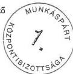
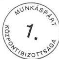

Állami Számvevőszék

# JELENTÉS

a Munkáspárt

1994-1995. évi gazdálkodása törvényességének ellenőrzéséről

1996. december

339.

---

ÁLLAMI SZÁMVEVŐSZÉK

IV. Vagyonellenőrzési Igazgatóság

V-1017-16/1996.

# J E L E N T É S

a Munkáspárt 1994-1995. évi gazdálkodása
törvényességének ellenőrzéséről

I.

# BEVEZETŐ RÉSZ

A pártok működéséről és gazdálkodásáról szóló, többször módosított 1989. évi XXXIII. törvény (a továbbiakban: párttörvény) 10. §. (1.) bekezdése, valamint az Állami Számvevőszékről szóló 1989. évi XXXVIII. törvény 5. §-a alapján a pártok gazdálkodása törvényességének ellenőrzésére az Állami Számvevőszék (továbbiakban: ÁSZ) jogosult. A törvény felhatalmazása alapján az ÁSZ 1996. II. félévi ellenőrzési tervében rögzített ütemezésnek megfelelően elvégezte a Munkáspárt (a továbbiakban: párt) gazdálkodása törvényességének ellenőrzését.

Az ellenőrzés célja – a törvényi felhatalmazások alapján – kizárólag annak megállapítására irányult, hogy a párt működéséhez szabályszerűen igénybevehető forrásokat használt-e fel, a párttörvényben engedélyezett gazdálkodó tevékenységet folytatott-e, valamint betartotta-e a gazdálkodással összefüggő pénzügyi-számviteli szabályokat.

---

- 2 -

A jelentés a párt Budapest, V. kerületi, valamint a Borsod-Aba-új-Zemplén megyei és a Somogy megyei koordinációs bizottságnál, valamint a Központi Bizottságnál végzett vizsgálatok jelentései alapján készült.

Az ellenőrzött időszak a lezárt 1994. és 1995. gazdasági év volt.

A helyszíni ellenőrzés 1996. augusztus 26. – 1996. szeptember 25. közötti időszakban történt.

## II.

### RÉSZLETES MEGÁLLAPÍTÁSOK

#### 1. A párt 1994. és 1995. évi gazdálkodásáról közzétett éves beszámolókhoz kapcsolódó adatszolgáltatások vizsgálata

A központ a közzétett éves beszámolókhoz számítógépes feldolgozás alapján készült főkönyvi kivonattal, számlasoros listákkal, a párttörvény 1. sz. melléklete egyes sorai kitöltését biztosító főkönyvi számlákkal kapcsolódik.

A területi koordinációs bizottságok a központ által kiadott egységes formanyomtatvány és az ahhoz kapcsolódó kitöltési útmutató felhasználásával évente egyszer készítettek adatszolgáltatást a saját és a hozzájuk tartozó alapszervezetek gazdálkodásáról, amelyek alapján a központban országos bevételi és kiadási főösszesítőt állítanak össze, ezen összesítő

---

- 3 -

adatai kerülnek kontírozást követően az egyes évek gépi főkönyvi kivonatába. A központ bevételi és kiadási adatai a bizonylatok kontírozása és gépi adatrögzítése alapján kerülnek a főkönyvi számlákra és a főkönyvi kivonatba.

### 1.1. A közzétett beszámolók pontossága és teljeskörűsége

A párttörvény 9. §. (1.) bekezdése alapján a pártok kötelesek minden év április 30-ig az előző évi gazdálkodásukról szóló beszámolót a Magyar Közlönyben – a törvény 1. sz. mellékletében meghatározott minta szerint – közzétenni. E kötelezettségének a párt mindkét vizsgált évben határidőben eleget tett.

A párt által közzétett beszámolók azonban mind részleteikben, mind főösszegükben pontatlanok. A pontatlanságok elsősorban a halmozódások nem teljeskörű kiszűréséből adódnak. A beszámolók – több megyei adatszolgáltatás hiányos volta miatt – nem teljeskörűek.

### 1.2. A beszámolók bevételi oldalát érintő megállapítások

A párt tagdíj bevételeit nem tartalmazza teljeskörűen sem az 1994. sem az 1995. évről készült beszámoló. Az ellenőrzés megállapítása szerint a Komárom-Esztergom megyei Koordinációs Bizottság 1994. és 1995. évet illetően is csak 14 alapszervezet tagdíjbevételét jelentette a központ nyilvántartása szerinti 21 alapszervezet összesen adata helyett. A Borsod-Abaúj-Zemplén megyei Koordinációs bizottság 1994. évről 57 alapszervezet, 1995. évben pedig 73 alapszervezet adataiból állította össze a beszámolóját, holott a központ nyilvántartása szerint 78 alapszervezete volt a megyének

---

- 4 -

mindkét évben. A Somogy megyei Koordinációs Bizottsághoz tartozó alapszervezetek száma a központ nyilvántartása szerint mindkét évben 33, a megyei beszámoló 1994. évet illetően 20, 1995. évet illetően 15 szervezet adataiból készült. A Pest megyei Koordinációs bizottság alapszervezeteinek száma a vizsgált időszakban a központ nyilvántartása szerint 54, a beszámoló 1994. évről 40, 1995. évről pedig 36 alapszervezet adataiból készült. A közölt tagdíjbevétel az előzőekben leírtakon túlmenően azért is pontatlan, mert 1995. évet illetően a Somogy megyei összesítő tagdíjak összesen adata 191.745 Ft, a szervezetek beszámolóinak összesítésével azonban 199.650 Ft tagdíjbevételt állapított meg az ellenőrzés. Jelezni szükséges azonban azt is, hogy 1994. és 1995. évben is az egyik kaposvári alapszervezet csak a IV. negyedévi gazdálkodási adatait közölte, ebben 1994-ben 1.650, 1995-ben 1.180 Ft tagdíjbevétel van feltüntetve. Az alapszervezetek egy része 1995-ről csak összes bevételt közölt, bontás nélkül pl. Siófok városi szervezet 67.255 Ft-ot.

Az állami költségvetésből származó támogatás összege az ellenőrzés megállapítása szerint pontos mindkét év beszámolójában. Az 1994. évi gazdálkodásról közzétett beszámoló 'képviselő csoportnak nyújtott állami támogatás' során szereplő 7.686 E Ft összeg az országgyűlési képviselők általános választásakor a 366 fő jelölt részére juttatott állami választási kampánytámogatás. Mivel e célra szolgáló külön adatsor a párttörvény 1. sz. mellékletében nem szerepel az ellenőrzés nem kifogásolja a szerepeltetés módját.

---

- 5 -

Az "Egyéb hozzájárulások, adományok" cím részletező sorai-ban kimutatott összegek mindkét évben pontatlanok. A hozzá-járulások pontos összege egyik évben sem állapítható meg a tagdíjak sornál már részletezett nem teljeskörű adatszol-gáltatások következtében. A pontos összeg azért sem álla-pítható meg, mert több alapszervezet bevételi adatait csak összevontan közölte. A Somogy megyei alapszervezetek adat-szolgáltatásainak összesítése esetében magasabb az adomá-nyok összege a beszámolóban közöltnél.

Az egyéb hozzájárulások összegének belső megoszlása is pon-tatlan, helytelen összegek szerepelnek a jogi személyektől, a jogi személynek nem minősülő gazdasági társaságoktól és a magánszemélyektől származó adományok sorokon. Például:

- 1994. és 1995. évben is a magánszemélyektől származó tá-mogatás soron szereplő összegben tüntetik fel az MSZOSZ-től, tehát jogi személytől származó 18 E Ft illet-ve 15 E Ft összeget;
- a jogi személynek nem minősülő gazdasági társaságtól származó hozzájárulás soron szerepeltetik a Szimpatizáns Baráti Társaságtól kapott 5.500 Ft hozzájárulás összegét 1994-ben, amely nem gazdasági társaság. E soron 1995. év-ben nem szerepel egy Bt-től kapott 20 E Ft összegű ado-mány, amely összeget a Somogy megyei KOB az ezt dokumen-táló alapbizonylat ellenére nem szerepeltetett beszámoló-jában e soron;
- a magánszemélyektől származó adomány sor összegét az is torzítja, hogy a központ az 1994. április 30-i keltű 616.335. sz. bevételi pénztárbizonylat alapján 550.400 Ft-ot könyvelt, az alapbizonylatok alapján 558.200 Ft adomány állapítható meg;

---

- 6 -

- 1995-ben a XVIII. kerületi KOB beszámolójában jogi személytől származó hozzájárulás soron 38 E Ft összeg szerepel, ez azonban a központtól származik, valójában az összeg nem bevétel;

- a magánszemélyektől származó hozzájárulások összege 1994. és 1995. évben is a halmozódások ki nem szűrése miatt a valóságtól jelentősen eltérő összegeket tartalmaz. A párt megyei, fővárosi kerületi koordinációs bizottságaitól származó és ott már bevételként elszámolt összegek sok esetben a központ helytelen kontírozása következtében ismételten bevételként kerültek elszámolásra. Így például a 91186. sz. Választási propagandára adomány főkönyvi számlán több mint 366 E Ft, a 9118. sz. Választási alapra adomány főkönyvi számlán 391 E Ft, a 9112. sz. Adományból származó bevételi főkönyvi számlán több mint 15 E Ft egyszer már bevételként elszámolt összeg szerepel 1994. évben.

Az 1995. évi magánszemélyektől származó hozzájárulás összege is jelentős halmozódást tartalmaz, alapvetően azért, mert a 9114. sz. 'ESMA ügyre és KB-nak adomány' elnevezésű főkönyvi számla 3.060.796 Ft összegű követel egyenlegének több mint a fele párton belüli szervezetek adománya. A 9112. sz. Adományból származó bevétel főkönyvi számla egyenlegéből 1995. évet illetően több mint 30 E Ft pártszervezetek és a központ közötti pénzmozgás.

Az egyéb bevétel adat a megyei, fővárosi kerületi adatszolgáltatások 1994. és 1995. évet illetően is tapasztalt nem teljeskörűségén túlmenően azért is pontatlan, mert a megyei, fővárosi kerületi Koordinációs Bizottságok adatszolgáltatásai halmozódásokat tartalmaznak:

---

- 7 -

- 1994. évet illetően az V. kerületi KOB adatszolgáltatás egyéb bevétel összege tartalmazza a XIII. kerületi KOB 10 E Ft összegű költséghozzájárulását is, ez pedig valójában csak párton belüli pénzmozgás. Az 1995. évről készített adatszolgáltatásban pedig az egyéb bevételek között szerepeltet az V. kerületi KOB 24.276 Ft összegű pénzfelvételt, amely összeg ténylegesen ugyancsak nem bevétel;
- a VII. kerületi KOB 1994-ben zárolt betét feloldása címén közöl egyéb bevételei között 120 E Ft összeget, ez valójában nem bevétel;
- a BAZ megyei KOB 1994. évi beszámolójában alapszervezetektől származó befizetéseket is közöl egyéb bevételei között, azonban az alapszervezetek a befizetéseket a saját adatszolgáltatásukból megállapíthatóan a beszedett tagdíjakból teljesítették, nem a kimutatott bevételeken túli összegből, így ez halmozódást okoz, a BAZ megyei KOB 1995. évről készített beszámolójában az egyéb bevétel soron 316.003 Ft-ot közöl, azonban ezen sor alatt rögzített "a Szabadság újságra" címen 90.245 Ft-ot, amelyet a központ helytelenül úgy értelmezett, hogy az összeg növeli az egyéb bevétel összegét, valójában az tartalmazza az újságra befizetett összeget.

### 1.3. A beszámolók kiadási oldalát érintő megállapítások

A párttörvény 1. sz. mellékletéhez kitöltési útmutató nem készült, így az egyes sorok tartalmának értelmezése pártonként eltérő lehet, ezt az ellenőrzés nem kifogásolja, csak jelzi a párt által követett gyakorlatot. Hibaként csak a jogszabályba ütköző gyakorlatot említi.

---

- 8 -

A Munkáspárt központja mindkét évben azonosan határozta meg az egyes kiadási sorokhoz tartozó főkönyvi számlaszámokat, így az összehasonlíthatóság és az állandóság követelménye elvben érvényesül. A megyei, fővárosi kerületi adatszolgáltatások kitöltéséhez a mindkét évben azonos tartalmú kitöltési útmutató szolgált alapul. A kitöltési útmutatóban definiált anyagjellegű, bérjellegű és egyéb kiadások összesen adata került a párt beszámolójába működési kiadásként. Eszközbeszerzésként a megküldött formanyomtatványon '2.000 Ft feletti beszerzés' található helytelenül. Az útmutató szerint a 20 E Ft feletti vásárolt eszköz értékét kellett beírni, a teljes értéket, ez pedig azért helytelen, mert a számvitelről szóló, többször módosított 1991. évi XVIII. törvény (a továbbiakban számviteli törvény) 35. §. (1.) bekezdésének előírása szerint a beszerzési ár hatósági díjat, ÁFA-t, illetéket nem tartalmazhat. Az útmutató politikai tevékenység kiadásaként a teljes propagandaköltség szerepeltetését írja elő, példálózó felsorolással megemlítve ilyenként a TV, rádió, újság, plakát, szórólap költségét.

A beszámoló kiadási adatai azonban mindkét évben pontatlanok. A kiadások nem teljeskörűek a beszámoló bevételi oldalánál már részletezett hiányos adatszolgáltatások következtében.

A beszámoló kiadási sorai halmozódásokat tartalmaznak, az alapszervezetek és a KOB-ok közötti, a KOB-ok és a KB közötti pénzmozgásokból adódó halmozódásokat a gyakorlatban elkövetett hibák következtében nem szűrték ki teljeskörűen.

---

- 9 -

Az eszközbeszerzés 725 E Ft 1994. évi adata helytelen, a megyei, kerületi adatszolgáltatások ilyen címen közölt adata 673 E Ft, a központban pedig az évben nem szereztek be 20 E Ft feletti tárgyi eszközt. A megyei, kerületi adatszolgáltatások összegében szerepel az előzetesen felszámított általános forgalmi adó is. Eszközbeszerzés címén 1995-ben a beszámoló nem közöl adatot, a Jász-Nagykun-Szolnok megyei KOB azonban jelentett 35 E Ft összegű eszközbeszerzést.

Mindkét év beszámolójában a megyei, kerületi adatszolgáltatások működési és politikai költség összesen adata tartalmazza az általános forgalmi adót, ez ellentétes a számviteli törvény már hivatkozott 35. §. (1.) bekezdésének rendelkezésével.

Az ellenőrzés nem kifogásolja, csak jelzi, hogy a beszámolóban nem szerepel az értékcsökkenési leírás, mivel ez nem kiadás a párt részéről.

A támogatás egyéb szervezeteknek beszámolósoron közölt adat mindkét évben pontatlan. E soron szerepelnek a 'Nőbizottságnak' adott összegek is, ez azonban nem bejegyzett társadalmi szervezet. Az összegeket helyesen párton belüli szervezeti egységeknek adott előlegként kellett volna kezelni és elszámoláskor a megfelelő főkönyvi számlákra rögzíteni a tényleges kiadásokat.

---

- 10 -

## 2. Az éves beszámolók megalapozottságával kapcsolatos könyvvizsgálati megállapítások

2.1. A párt központja a lehetséges könyvvezetési módok közül a kettős könyvvitel rendszerében rögzíti a gazdasági eseményeket a bizonylatok kontírozása és gépi adatrögzítése révén.

A könyvvezetés rendszere azonban a párt egészét tekintve nem egységes, a központon kívüli pártszervek egyszeres könyvvitelt vezetnek. Ennek következtében a számviteli alapelvek közül az összemérés és az időbeli elhatárolás elve csak a központban érvényesül. A szervezetek beszámolóikat az egyszeres könyvvitel elvei alapján készült könyvelésből állították össze, ezek esetében tehát bevételek és kiadások találhatók az adatszolgáltatásokban, a központ pedig mindkét évben a bevételeket a 9. számlaosztály, a kiadásokat pedig az 5. és 8. számlaosztályba könyvelt adatokból vette. Ez a gyakorlatban azonban nem okozott összeütközést, mert az időbeli elhatárolások számlát egyik évben sem alkalmazták. A központ valamennyi kiadása egyben költség, a készletek rögzítésére szolgáló 2. számlaosztály számláit nem használták.

2.2. A központ által rendelkezésre bocsátott számlarend nem felel meg a számviteli törvény 79. §-ában meghatározott követelményeknek.

A számlarend nem tartalmazza minden alkalmazásra kijelölt számla számjelét és megnevezését. A gyakorlatban alkalmaznak olyan főkönyvi számlákat pl. 51182, 51183, 56311. számú főkönyvi számlák, amelyek sem a számlatükörben, sem a számlarendben nem szerepelnek.

---

- 11 -

A számlarend nem rögzíti minden esetben a számla tartalmát, ha az a számla megnevezéséből egyértelműen nem következik. Ennek következtében pl. egyéb anyagköltség és karbantartási alkatrész számlán is van könyvelve ablakmosó beszerzése, a karbantartási alkatrész és az egyéb fogyóeszköz költség számlán egyaránt könyveltek elembeszerzést költségként.

A számlarend nem részletezi egyes esetekben a főkönyvi számla és az analitikus nyilvántartás kapcsolatát. Ennek is betudható az éves beszámolókban található halmazódások egy része. Kellően részletes analitika hiányában a megyék és a központ közötti pénzmozgások részbeni ki nem szűrése fordul elő.

A számlarend további hiányossága, hogy a párt központon kívüli szervezeti egységeinek számviteli munkájához nem nyújt segítséget. A megyei, fővárosi kerületi KOB-ok feladatai ellátásához a beszámoló kitöltéséhez kiadott formanyomtatvány és útmutató sem ad kellő eligazítást. Az útmutató ismertetett hibáin túlmenően azért sem, mert nem mindig definiál fogalmakat, megelégszik pl. 'értelemszerűen kell kitölteni' instrukcióval, holott akiknek készült nincsenek tisztában fogalmakkal.

2.3. A beszámoló pontatlanságát okozzák a központban tapasztalt **kontírozási hibák** is. Ezek egy része kiküszöbölhető lett volna kellő eligazítást nyújtó előírások, szabályozások révén. Így például ha a bizonylatot utalványozó jelzi, hogy párton belüli pénzmozgás történt, nem fordulhatna elő párton belüli szervezeti egységnek adott előleg más társadalmi szervezetnek nyújtott támogatásként történő könyvelése.

---

- 12 -

2.4. A könyvvezetést a párt központja külső vállalkozó útján biztosítja, aki rendelkezik az iskolarendszeren kívüli pénzügyi és számviteli szakmai oktatásról, képesítésről és minősítésről, a pénzügyi-számviteli tevékenységek szakképesítési feltételeiről, valamint az adószakértői működési engedélyezésének szabályozásáról szóló 10/1993. (IV. 9.) PM rendeletben előírt szakképesítéssel. A könyvelő díjazás nélkül, társadalmi munkában végzi a könyvvezetést.

A külső vállalkozóval való könyvvezetés is indokolná a jelenleginél részletesebb, a párt sajátosságait kellően részletező belső számviteli szabályozás kialakítását.

2.5. A jelenlegi rendszerben nem biztosított a beszámoló pontossága a belső ellenőrzés nem megfelelő volta miatt sem.

A központi pénzügyi ellenőrző bizottság tevékenysége nem a párt által a Magyar Közlönyben közzétett beszámoló ellenőrzésével kapcsolatos, a vizsgált időszakban ilyen irányú ellenőrzést nem végeztek.

A munkafolyamatba épített ellenőrzés nincs kialakítva megfelelően, mert például a megyei, fővárosi kerületek beszámolói ellenőrzés nélkül kerülnek az országos bevételi és kiadási főösszesítőbe, tartalmi helyességüket senki nem vizsgálja. Esetenként a beszámolók adatait a korábbi nyomtatvány felhasználásával készítették, ezeket a központban az új nyomtatvány rovatainak megfelelően átdolgozták, azonban nem állapítható meg, hogy mely összegek lettek összevonva, ezek tartalmilag pontosak-e.

---

- 13 -

A vezetői ellenőrzés hiányossága, hogy a külső könyvelő részére nem ad mindig kellő segítséget a könyvelésre átadott bizonylat annak mikénti minősítéséhez. Kellően részletes szabályozás és ennek alkalmazása során a rendszeres ellenőrzés több hibaforrás kiküszöbölését eredményezné. A beérkezett adatszolgáltatások teljeskörűségének ellenőrzése sem biztosított, a központnak nincs információja arról, hogy a nyilvántartott szervezeti egységek közül hány adatai szerepelnek az adatszolgáltatásokban.

2.6. A már említett kontírozási hibákon túlmenően is tapasztalható hiányosság. A számlarend a hatályos jogszabályok előírásaival összhangban rögzíti, hogy a tárgyi eszközök esetében értékcsökkenési leírást kell elszámolni. Ez azonban a gyakorlatban a vizsgált időszakban nem történt meg.

### 3. Analitikus nyilvántartások, a bizonylati elv és bizonylati fegyelem ellenőrzése

3.1. A párt központja – a vonatkozó jogszabályok előírásainak megfelelően – vezeti a tárgyi eszközök nyilvántartását, SZJA köteles kifizetések és elszámolásra kiadott előlegek nyilvántartását, TB befizetés és bevallás, valamint a szállítók követelését mutató számlanyilvántartást.

3.2. A központ szigorú számadású nyomtatványként kezeli a pénztárbizonylatokat, a készpénzcsekkfüzetet.

3.3. A könyvvezetés a központban készpénzforgalom esetén bevételi és kiadási pénztárbizonylatok és az azokhoz kapcsolódó alapbizonylatok által alátámasztott.

---

- 14 -

A gazdasági események bizonylatokkal alátámasztottak, azonban a könyvvezetés nem mindig idősorrendben történik. Előfordult több esetben, hogy több bizonylat adatait összevontan hó végén egy tételben kontírozták és könyvelték le.

A bankbizonylatokon kontírozás csak elvétve található, így a könyvelés helyességét csak tételes, teljeskörű ellenőrzéssel lehetett volna megállapítani.

3.4. A külföldi utazások, belföldi utazások, költségtérítések elszámolása általában előírásszerű.

4. A párt bevételeinek és gazdálkodó tevékenységének ellenőrzése

A párt bevételi forrásai tagdíjakból, hozzájárulásokból, állami költségvetési támogatásból, gazdálkodó tevékenységből és egyéb bevételből származtak a vizsgálat időszakban.

A párt a párttörvény 6. §. (1.) bekezdésének a./ pontjában említett gazdálkodó tevékenységek közül az ellenőrzés részére adott nyilatkozatok és az ellenőrzés megállapítása szerint ingók értékesítésének lehetőségével élt. A párttörvény 6. §. (1.) bekezdésének b./ pontja alapján az országos központ a tulajdonában álló ingatlant hasznosította díj ellenében.

Az ellenőrzés tiltott gazdálkodó tevékenységet állapított meg a Kaposvár város és Városkörnyéki koordinációs bizottság esetében. Nem tulajdonukban álló ingatlant hasznosítottak bérleti szerződés alapján, amelyből 293 E Ft bevétel származott. A tevékenységet – figyelemmel az ellenőrzés megállapításaira – a jelentés elkészítésének időpontjáig megszüntették, így felhívás törvényes állapot helyreállítására nem indokolt.

---

- 15 -

### III.

#### ÖSSZEGZŐ MEGÁLLAPÍTÁSOK, KÖVETKEZTETÉSEK FELHÍVÁS A TÖRVÉNYES ÁLLAPOT HELYREÁLLÍTÁSÁRA

A párt által az 1994. és 1995. évi gazdálkodásról a Magyar Közlönyben közzétett pénzügyi zárómérlegek mind részleteikben, mind főösszegükben pontatlanok és nem teljeskörűek.

A beszámolók nem tartalmazzák teljeskörűen a párt szervezeti egységeinek gazdálkodási adatait. Több megyei koordinációs bizottság esetében az általuk készített adatszolgáltatás mindkét évben csak a hozzájuk tartozó alapszervezetek 65-70%-ának adatait tartalmazza.

Több beszámolóban a halmozódások nem teljeskörű kiszűrése következtében pontatlan adatot tartalmaz. Halmozódásokat tartalmaznak a megyei koordinációs bizottságok adatszolgáltatásai mindkét évben, mert a pártszervezetek egymás közötti pénzmozgásait nem minden esetben szűrték ki, valamint halmozódásokat eredményeztek a központban elkövetett kontírozási hibák is.

Pontatlanságokat eredményezett a párt központja által a megyei koordinációs bizottságoknak az általuk kitöltendő adatszolgáltatáshoz megküldött kitöltési útmutató nem kellően részletes eligazítása is. Az útmutató egyes fogalmak értelmezéséhez nem ad elégséges magyarázatot, különféle értelmezésekre ad lehetőséget.

---

- 16 -

Hibákat eredményezett a belső ellenőrzési rendszer nem megfelelő volta is. A központi pénzügyi ellenőrző bizottság a párt pénzügyi zárómérlegét nem vizsgálta. A munkafolyamatokba épített ellenőrzés rendszere hiányos, mert a megyei, fővárosi kerületek beszámolóinak adatai ellenőrzés nélkül kerülnek az országos összesített adatokba. A vezetői ellenőrzés nem kielégítő volta miatt is pontatlan adatok találhatók a beszámolókban.

Az analitikus nyilvántartások vezetését és a bizonylati fegyelmet illetően is tapasztalt az ellenőrzés hibákat.

A párt gazdálkodó tevékenységét illetően a párt egyik szervezeti egysége az ellenőrzés megállapítása szerint tiltott gazdálkodó tevékenységet folytatott, nem tulajdonában álló ingatlant hasznosított díj ellenében. A párttörvény 6. §. (1.) bekezdésének b./ pontja alapján párt csak a tulajdonában álló ingókat és ingatlanokat hasznosíthatja díj ellenében. A tiltott gazdálkodásból származó bevétel összege 293 E Ft.

A vizsgálat megállapításai alapján a párttörvény 10. §. (4.) bekezdésében kapott felhatalmazás alapján az Állami Számvevőszék felhívja a párt elnökét, hogy:

1. Az ellenőrzési megállapítások figyelembevételével készítsék el és tegyék közzé a párt tényleges állapotnak megfelelő gazdálkodási adatait tartalmazó 1994. és 1995. évi pénzügyi beszámolókat.

2. A párttörvény 6. §. (5.) bekezdése, valamint a 4. §. (4.) bekezdése alapján a II/4. pontban részletezett tiltott gazdálkodó tevékenységből származó 293 E Ft összeget a jelentés kézhezvételétől számított 15 napon belül fizessék be az állami költségvetésbe.

---

- 17 -

A párttörvény 6. §. (5.) bekezdése értelmében további szankcióként a párt költségvetési támogatását a tiltott gazdálkodó tevékenység bevételével 293 E Ft, azaz kettőszázkilencvenháromezer forinttal csökkenteni kell. Erre az ÁSZ a szükséges kezdeményezést megteszi.

Budapest, 1996. december "M."

Sándor István/
alelnök

Melléklet: 2 db

---

1. sz. melléklet a V-1017-16/96. sz. jelentéshez

# KÖZPONTI BIZOTTSÁG

1082 BUDAPEST, BAROSS UTCA 61.

TELEFON: 1341-509

TELEFAX: 1135-423

A Munkáspárt 1994. évi beszámolója a pénzügyi gazdálkodásról

BEVÉTELEK:

Ezer Ft-ban

|  1. Tagdíjak | 12.979  |
| --- | --- |
|  2. Állami költségvetésből származó támogatás | 27.623  |
|  3. Képviselő csoportnak nyújtott állami támogatás | 7.686 választáshoz állami tám.  |
|  4. Egyéb hozzájárulások, adományok | -  |
|  4.1. Jogi személyektől | 1.238  |
|  4.1.1. Belföldiektől (az 500 000 forint feletti hozzájárulás nevesítve) | -  |
|  4.1.2. Külföldiektől ( a 100 000 forint feletti hozzájárulás nevesítve) | -  |
|  4.2. Jogi személynek nem minősülő gazdasági társaságtól | 456  |
|  4.2.1. Belföldiektől (az 500 000 forint feletti hozzájárulás nevesítve) | -  |
|  4.2.2. Külföldiektől ( a 100 000 forint feletti hozzájárulás nevesítve) | -  |
|  4.3. Magánszemélyektől | 6.402  |
|  4.3.1. Belföldiektől ( az 500 000 forint feletti hozzájárulás nevesítve) | -  |
|  4.3.2. Külföldiektől ( a 100 000 forint feletti hozzájárulás nevesítve) | -  |
|  5. A párt által alapított vállalat és korlátolt felelősségű társaság nyereségéből származó bevétel | -  |
|  6. Egyéb bevétel | 5.289  |
|  Összes bevétel a gazdasági évben | 61.673  |

---

KIADÁSOK:

Ezer Ft-ban

|  1. Támogatás a párt országgyűlési csoportja számára | -  |
| --- | --- |
|  2. Támogatás egyéb szervezeteknek | 165  |
|  3. Vállalkozások alapítására fordított összegek | -  |
|  4. Működési kiadások | 19.588  |
|  5. Eszközbeszerzés | 725  |
|  6. Politikai tevékenység kiadása | 49.909  |
|  7. Egyéb kiadások | 6.042  |

Összes kiadás a gazdasági évben 76.429

Budapest, 1995. április 28.

Karács Lajosné

gazdasági vezető

Thürmer Gyula

elnök

BUDAPESTI SZOLGÁLTATÁS  
1. KÖZPONTI BIZOTTSÁGA  
1. KÖZPONTI BIZOTTSÁGA  
1. KÖZPONTI BIZOTTSÁGA  
1. KÖZPONTI BIZOTTSÁGA

---

2. sz. melléklet a V-1017-16/96. sz. jelentéshez

KÖZPONTI BIZOTTSÁG

1082 BUDAPEST, BAROSS UTCA 61.

TELEFON: 1341-509

TELEFAX: 1135-423

A Munkáspárt 1995. évi beszámolója a pénzügyi gazdálkodásáról

# BEVÉTELEK:

Ezer Ft-ban

1. Tagdijak 13.499
2. Allami koltsegvetesból származó támogatás 25.200
3. Képviselöi csoportnak nyujtott allami támogatás
4. Egyeb hozzajárulások, adományok

4.1. Jogi szemelyektol
4.1.1. Belföldiektől (az 500.000 forint feletti hozzájárulás nevesítve) 1.047
4.1.2. Külföldiektől (az 100.000 forint feletti hozzájárulás nevesítve)
4.2. Jogi szemelynek nem minosuló gazdasági társaságtól
4.2.1. Belföldiektől (az 500.000 forint feletti hozzájárulás nevesítve) 1.007
4.2.2. Külföldiektől (az 100.000 forint feletti hozzájárulás nevesítve)
4.3. Maganszemelyektol
4.3.1. Belföldiektől (az 500.000 forint feletti hozzájárulás nevesítve) 6.426
4.3.2. Külföldiektől (az 100.000 forint feletti hozzájárulás nevesítve)

5. A párt által alapított vállalat és korlátolt felelosségú társaság nyereségéból származó bevétel
6. Egyeb bevetel

Összes bevétel a gazdasági évben

5.157

52.336 ezer forint

---

KIADÁSOK:

Ezer Ft-ban

|  1. Támogatás a párt országgyűlési csoportja számára | -  |
| --- | --- |
|  2. Támogatás egyéb szervezeteknek | 362  |
|  3. Vállakozások alapítására fordított összegek | -  |
|  4. Működési kiadások | 15.388  |
|  5. Eszközbeszerzés | -  |
|  6. Politikai tevékenység kiadása | 29.441  |
|  7. Egyéb kiadások | 8.733  |
|  Összes kiadás a gazdasági évben | 53.924 ezer forint  |

Budapest, 1996. április 30.

Karács Lajosné
gazdasági vezető

Thürmer Gyula
elnök

MINISZTERELNÖKI HIVATAL
1055 Budapest, V.
Kossuth Lajos tér 1-3.
44.

1996 -U4- 30

---

Budapest, 1996. november 19.
V-1017-15/1996.

M E D G Y E S S Y PÉTER úr
pénzügyminiszter

B u d a p e s t

Tisztelt Pénzügyminiszter Úr!

Tájékoztatom, hogy a Munkáspárt 1994-1995. évi gazdálkodása törvényességének ellenőrzéséről szóló - mellékelten megküldött - jelentésben az Allami Számvevőszék felhívta a párt elnökét, hogy a párttörvény 6. §. (5.) bekezdése, valamint a 4. §. (4.) bekezdése értelmében a jelentés III. pontjában összegzett, tiltott gazdálkodó tevékenységből származó, összesen 293.000 Ft bevételnek megfelelő összeget a jelentés kézhezvételétől számított 15 napon belül fizessék be a központi költségvetésbe.

Kérem pénzügyminiszter urat, hogy a párttörvény 4. §. (4.) bekezdése alapján szíveskedjék intézkedni a párt költségvetési támogatásának 293.000 Ft, azaz kettőszázkilencvenháromezer Ft összegű csökkentéséről, valamint ha a párt 15 napon belül nem fizeti be az Allami Számvevőszék felhívásában szereplő összeget annak adók módjára való behajtásáról.

Tisztelettel:

/Sándor István/

Melléklet: 1 db

---

ALLAMI SZÁMVEVŐSZÉK

IV. Vagyonellenőrzési Igazgatóság

V-1017-14/1996.

# J E L E N T É S

a Munkáspárt 1994-1995. évi gazdálkodása
törvényességének ellenőrzéséről

I.

# BEVEZETŐ RÉSZ

A pártok működéséről és gazdálkodásáról szóló, többször módosí-
tott 1989. évi XXXIII. törvény (a továbbiakban: párttörvény) 10.
§. (1.) bekezdése, valamint az Allami Számvevőszékről szóló
1989. évi XXXVIII. törvény 5. §-a alapján a pártok gazdálkodása
törvényességének ellenőrzésére az Allami Számvevőszék (további-
akban: ASZ) jogosult. A törvény felhatalmazása alapján az ASZ
1996. II. félévi ellenőrzési tervében rögzített ütemezésnek meg-
felelően elvégezte a Munkáspárt (a továbbiakban: párt) gazdálko-
dása törvényességének ellenőrzését.

Az ellenőrzés célja - a törvényi felhatalmazások alapján - kizá-
rólag annak megállapítására irányult, hogy a párt működéséhez
szabályszerűen igénybevehető forrásokat használt-e fel, a párt-
törvényben engedélyezett gazdálkodó tevékenységet folytatott-e,
valamint betartotta-e a gazdálkodással összefüggő pénzügyi-szám-
viteli szabályokat.

---

- 2 -

A jelentés a párt Budapest, V. kerületi, valamint a Borsod-Aba-új-Zemplén megyei és a Somogy megyei koordinációs bizottságnál, valamint a Központi Bizottságnál végzett vizsgálatok jelentései alapján készült.

Az ellenőrzött időszak a lezárt 1994. és 1995. gazdasági év volt.

A helyszíni ellenőrzés 1996. augusztus 26. – 1996. szeptember 25. közötti időszakban történt.

## II.

### RÉSZLETES MEGÁLLAPÍTÁSOK

#### 1. A párt 1994. és 1995. évi gazdálkodásáról közzétett éves beszámolókhoz kapcsolódó adatszolgáltatások vizsgálata

A központ a közzétett éves beszámolókhoz számítógépes feldolgozás alapján készült főkönyvi kivonattal, számlasoros listákkal, a párttörvény 1. sz. melléklete egyes sorai kitöltését biztosító főkönyvi számlákkal kapcsolódik.

A területi koordinációs bizottságok a központ által kiadott egységes formanyomtatvány és az ahhoz kapcsolódó kitöltési útmutató felhasználásával évente egyszer készítettek adatszolgáltatást a saját és a hozzájuk tartozó alapszervezetek gazdálkodásáról, amelyek alapján a központban országos bevételi és kiadási főösszesítőt állítanak össze, ezen összesítő adatai kerülnek kontírozást követően az egyes évek gépi fő-

---

- 3 -

könyvi kivonatába. A központ bevételi és kiadási adatai a bizonylatok kontírozása és gépi adatrögzítése alapján kerülnek a főkönyvi számlákra és a főkönyvi kivonatba.

### 1.1. A közzétett beszámolók pontossága és teljeskörűsége

A párttörvény 9. §. (1.) bekezdése alapján a pártok kötelesek minden év április 30-ig az előző évi gazdálkodásukról szóló beszámolót a Magyar Közlönyben – a törvény 1. sz. mellékletében meghatározott minta szerint – közzétenni. E kötelezettségének a párt mindkét vizsgált évben határidőben eleget tett.

A párt által közzétett beszámolók azonban mind részleteikben, mind főösszegükben pontatlanok. A pontatlanságok elsősorban a halmazódások nem teljeskörű kiszűréséből adódnak. A beszámolók – több megyei adatszolgáltatás hiányos volta miatt – nem teljeskörűek.

### 1.2. A beszámolók bevételi oldalát érintő megállapítások

A párt tagdíj bevételeit nem tartalmazza teljeskörűen sem az 1994. sem az 1995. évről készült beszámoló. Az ellenőrzés megállapítása szerint a Komárom-Esztergom megyei Koordinációs Bizottság 1994. és 1995. évet illetően is csak 14 alapszervezet tagdíjbevételét jelentette a központ nyilvántartása szerinti 21 alapszervezet összesen adata helyett. A Borsod-Abaúj-Zemplén megyei Koordinációs bizottság 1994. évről 57 alapszervezet, 1995. évben pedig 73 alapszervezet adataiból állította össze a beszámolóját, holott a központ nyilvántartása szerint 78 alapszervezete volt a megyének

---

- 4 -

mindkét évben. A Somogy megyei Koordinációs Bizottsághoz tartozó alapszervezetek száma a központ nyilvántartása szerint mindkét évben 33, a megyei beszámoló 1994. évet illetően 20, 1995. évet illetően 15 szervezet adataiból készült. A Pest megyei Koordinációs bizottság alapszervezeteinek száma a vizsgált időszakban a központ nyilvántartása szerint 54, a beszámoló 1994. évről 40, 1995. évről pedig 36 alapszervezet adataiból készült. A közölt tagdíjbevétel az előzőekben leírtakon túlmenően azért is pontatlan, mert 1995. évet illetően a Somogy megyei összesítő tagdíjak összesen adata 191.745 Ft, a szervezetek beszámolóinak összesítésével azonban 199.650 Ft tagdíjbevételt állapított meg az ellenőrzés. Jelezni szükséges azonban azt is, hogy 1994. és 1995. évben is az egyik kaposvári alapszervezet csak a IV. negyedévi gazdálkodási adatait közölte, ebben 1994-ben 1.650, 1995-ben 1.180 Ft tagdíjbevétel van feltüntetve. Az alapszervezetek egy része 1995-ről csak összes bevételt közölt, bontás nélkül pl. Siófok városi szervezet 67.255 Ft-ot.

Az állami költségvetésből származó támogatás összege az ellenőrzés megállapítása szerint pontos mindkét év beszámolójában. Az 1994. évi gazdálkodásról közzétett beszámoló 'képviselő csoportnak nyújtott állami támogatás' során szereplő 7.686 E Ft összeg az országgyűlési képviselők általános választásakor a 366 fő jelölt részére juttatott állami választási kampánytámogatás. Mivel e célra szolgáló külön adatsor a párttörvény 1. sz. mellékletében nem szerepel az ellenőrzés nem kifogásolja a szerepeltetés módját.

---

- 5 -

Az "Egyéb hozzájárulások, adományok" cím részletező sorai-ban kimutatott összegek mindkét évben pontatlanok. A hozzá-járulások pontos összege egyik évben sem állapítható meg a tagdíjak sornál már részletezett nem teljeskörű adatszol-gáltatások következtében. A pontos összeg azért sem álla-pítható meg, mert több alapszervezet bevételi adatait csak összevontan közölte. A Somogy megyei alapszervezetek adat-szolgáltatásainak összesítése esetében magasabb az adomá-nyok összege a beszámolóban közöltnél.

Az egyéb hozzájárulások összegének belső megoszlása is pon-tatlan, helytelen összegek szerepelnek a jogi személyektől, a jogi személynek nem minősülő gazdasági társaságoktól és a magánszemélyektől származó adományok sorokon. Például:

- 1994. és 1995. évben is a magánszemélyektől származó tá-mogatás soron szereplő összegben tüntetik fel az MSZOSZ-től, tehát jogi személytől származó 18 E Ft illet-ve 15 E Ft összeget;
- a jogi személynek nem minősülő gazdasági társaságtól származó hozzájárulás soron szerepeltetik a Szimpatizáns Baráti Társaságtól kapott 5.500 Ft hozzájárulás összegét 1994-ben, amely nem gazdasági társaság. E soron 1995. év-ben nem szerepel egy Bt-től kapott 20 E Ft összegű ado-mány, amely összeget a Somogy megyei KOB az ezt dokumen-táló alapbizonylat ellenére nem szerepeltetett beszámoló-jában e soron;
- a magánszemélyektől származó adomány sor összegét az is torzítja, hogy a központ az 1994. április 30-i keltű 616.335. sz. bevételi pénztárbizonylat alapján 550.400 Ft-ot könyvelt, az alapbizonylatok alapján 558.200 Ft adomány állapítható meg;

---

- 6 -

- 1995-ben a XVIII. kerületi KOB beszámolójában jogi személytől származó hozzájárulás soron 38 E Ft összeg szerepel, ez azonban a központtól származik, valójában az összeg nem bevétel;
- a magánszemélyektől származó hozzájárulások összege 1994. és 1995. évben is a halmozódások ki nem szűrése miatt a valóságtól jelentősen eltérő összegeket tartalmaz. A párt megyei, fővárosi kerületi koordinációs bizottságaitól származó és ott már bevételként elszámolt összegek sok esetben a központ helytelen kontírozása következtében ismételten bevételként kerültek elszámolásra. Így például a 91186. sz. Választási propagandára adomány főkönyvi számlán több mint 366 E Ft, a 9118. sz. Választási alapra adomány főkönyvi számlán 391 E Ft, a 9112. sz. Adományból származó bevételi főkönyvi számlán több mint 15 E Ft egyszer már bevételként elszámolt összeg szerepel 1994. évben.

Az 1995. évi magánszemélyektől származó hozzájárulás összege is jelentős halmozódást tartalmaz, alapvetően azért, mert a 9114. sz. "ESMA ügyre és KB-nak adomány" elnevezésű főkönyvi számla 3.060.796 Ft összegű követel egyenlegének több mint a fele párton belüli szervezetek adománya. A 9112. sz. Adományból származó bevétel főkönyvi számla egyenlegéből 1995. évet illetően több mint 30 E Ft pártszervezetek és a központ közötti pénzmozgás.

Az egyéb bevétel adat a megyei, fővárosi kerületi adatszolgáltatások 1994. és 1995. évet illetően is tapasztalt nem teljeskörűségén túlmenően azért is pontatlan, mert a megyei, fővárosi kerületi Koordinációs Bizottságok adatszolgáltatásai halmozódásokat tartalmaznak:

---

- 7 -

- 1994. évet illetően az V. kerületi KOB adatszolgáltatás egyéb bevétel összege tartalmazza a XIII. kerületi KOB 10 E Ft összegű költséghozzájárulását is, ez pedig valójában csak párton belüli pénzmozgás. Az 1995. évről készített adatszolgáltatásban pedig az egyéb bevételek között szerepeltet az V. kerületi KOB 24.276 Ft összegű pénzfelvételt, amely összeg ténylegesen ugyancsak nem bevétel;
- a VII. kerületi KOB 1994-ben zárolt betét feloldása címén közöl egyéb bevételei között 120 E Ft összeget, ez valójában nem bevétel;
- a BAZ megyei KOB 1994. évi beszámolójában alapszervezetektől származó befizetéseket is közöl egyéb bevételei között, azonban az alapszervezetek a befizetéseket a saját adatszolgáltatásukból megállapíthatóan a beszedett tagdíjakból teljesítették, nem a kimutatott bevételeken túli összegből, így ez halmozódást okoz, a BAZ megyei KOB 1995. évről készített beszámolójában az egyéb bevétel soron 316.003 Ft-ot közöl, azonban ezen sor alatt rögzített "a Szabadság újságra" címen 90.245 Ft-ot, amelyet a központ helytelenül úgy értelmezett, hogy az összeg növeli az egyéb bevétel összegét, valójában az tartalmazza az újságra befizetett összeget.

### 1.3. A beszámolók kiadási oldalát érintő megállapítások

A párttörvény 1. sz. mellékletéhez kitöltési útmutató nem készült, így az egyes sorok tartalmának értelmezése pártonként eltérő lehet, ezt az ellenőrzés nem kifogásolja, csak jelzi a párt által követett gyakorlatot. Hibaként csak a jogszabályba ütköző gyakorlatot említi.

---

- 8 -

A Munkáspárt központja mindkét évben azonosan határozta meg az egyes kiadási sorokhoz tartozó főkönyvi számlaszámokat, így az összehasonlíthatóság és az állandóság követelménye elvben érvényesül. A megyei, fővárosi kerületi adatszolgáltatások kitöltéséhez a mindkét évben azonos tartalmú kitöltési útmutató szolgált alapul. A kitöltési útmutatóban definiált anyagjellegű, bérjellegű és egyéb kiadások összesen adata került a párt beszámolójába működési kiadásként. Eszközbeszerzésként a megküldött formanyomtatványon '2.000 Ft feletti beszerzés' található helytelenül. Az útmutató szerint a 20 E Ft feletti vásárolt eszköz értékét kellett beírni, a teljes értéket, ez pedig azért helytelen, mert a számvitelről szóló, többször módosított 1991. évi XVIII. törvény (a továbbiakban számviteli törvény) 35. §. (1.) bekezdésének előírása szerint a beszerzési ár hatósági díjat, AFA-t, illetéket nem tartalmazhat. Az útmutató politikai tevékenység kiadásaként a teljes propagandaköltség szerepeltetését írja elő, példálózó felsorolással megemlítve ilyenként a TV, rádió, újság, plakát, szórólap költségét.

A beszámoló kiadási adatai azonban mindkét évben pontatlanok. A kiadások nem teljeskörűek a beszámoló bevételi oldalánál már részletezett hiányos adatszolgáltatások következtében.

A beszámoló kiadási sorai halmozódásokat tartalmaznak, az alapszervezetek és a KOB-ok közötti, a KOB-ok és a KB közötti pénzmozgásokból adódó halmozódásokat a gyakorlatban elkövetett hibák következtében nem szűrték ki teljeskörűen.

---

- 9 -

Az eszközbeszerzés 725 E Ft 1994. évi adata helytelen, a megyei, kerületi adatszolgáltatások ilyen címen közölt adata 673 E Ft, a központban pedig az évben nem szereztek be 20 E Ft feletti tárgyi eszközt. A megyei, kerületi adatszolgáltatások összegében szerepel az előzetesen felszámított általános forgalmi adó is. Eszközbeszerzés címén 1995-ben a beszámoló nem közöl adatot, a Jász-Nagykun-Szolnok megyei KOB azonban jelentett 35 E Ft összegű eszközbeszerzést.

Mindkét év beszámolójában a megyei, kerületi adatszolgáltatások működési és politikai költség összesen adata tartalmazza az általános forgalmi adót, ez ellentétes a számviteli törvény már hivatkozott 35. §. (1.) bekezdésének rendelkezésével.

Az ellenőrzés nem kifogásolja, csak jelzi, hogy a beszámolóban nem szerepel az értékcsökkenési leírás, mivel ez nem kiadás a párt részéről.

A támogatás egyéb szervezeteknek beszámolósoron közölt adat mindkét évben pontatlan. E soron szerepelnek a 'Nőbizottságnak' adott összegek is, ez azonban nem bejegyzett társadalmi szervezet. Az összegeket helyesen párton belüli szervezeti egységeknek adott előlegként kellett volna kezelni és elszámoláskor a megfelelő főkönyvi számlákra rögzíteni a tényleges kiadásokat.

---

- 10 -

## 2. Az éves beszámolók megalapozottságával kapcsolatos könyvvizsgálati megállapítások

2.1. A párt központja a lehetséges könyvvezetési módok közül a kettős könyvvitel rendszerében rögzíti a gazdasági eseményeket a bizonylatok kontírozása és gépi adatrögzítése révén.

A könyvvezetés rendszere azonban a párt egészét tekintve nem egységes, a központon kívüli pártszervek egyszeres könyvvitelt vezetnek. Ennek következtében a számviteli alapelvek közül az összemérés és az időbeli elhatárolás elve csak a központban érvényesül. A szervezetek beszámolóikat az egyszeres könyvvitel elvei alapján készült könyvelésből állították össze, ezek esetében tehát bevételek és kiadások találhatók az adatszolgáltatásokban, a központ pedig mindkét évben a bevételeket a 9. számlaosztály, a kiadásokat pedig az 5. és 8. számlaosztályba könyvelt adatokból vette. Ez a gyakorlatban azonban nem okozott összeütközést, mert az időbeli elhatárolások számlát egyik évben sem alkalmazták. A központ valamennyi kiadása egyben költség, a készletek rögzítésére szolgáló 2. számlaosztály számláit nem használták.

2.2. A központ által rendelkezésre bocsátott számlarend nem felel meg a számviteli törvény 79. §-ában meghatározott követelményeknek.

---

- 11 -

A számlarend nem tartalmazza minden alkalmazásra kijelölt számla számjelét és megnevezését. A gyakorlatban alkalmaznak olyan főkönyvi számlákat pl. 51182, 51183, 56311. számú főkönyvi számlák, amelyek sem a számlatükörben, sem a számlarendben nem szerepelnek.

A számlarend nem rögzíti minden esetben a számla tartalmát, ha az a számla megnevezéséből egyértelműen nem következik. Ennek következtében pl. egyéb anyagköltség és karbantartási alkatrész számlán is van könyvelve ablakmosó beszerzése, a karbantartási alkatrész és az egyéb fogyóeszköz költség számlán egyaránt könyveltek elembeszerzést költségként.

A számlarend nem részletezi egyes esetekben a főkönyvi számla és az analitikus nyilvántartás kapcsolatát. Ennek is betudható az éves beszámolókban található halmazódások egy része. Kellően részletes analitika hiányában a megyék és a központ közötti pénzmozgások részbeni ki nem szűrése fordul elő.

A számlarend további hiányossága, hogy a párt központon kívüli szervezeti egységeinek számviteli munkájához nem nyújt segítséget. A megyei, fővárosi kerületi KOB-ok feladatai ellátásához a beszámoló kitöltéséhez kiadott formanyomtatvány és útmutató sem ad kellő eligazítást. Az útmutató ismertetett hibáin túlmenően azért sem, mert nem mindig definiál fogalmakat, megelégszik pl. 'értelemszerűen kell kitölteni' instrukcióval, holott akiknek készült nincsenek tisztában fogalmakkal.

---

- 12 -

2.3. A beszámoló pontatlanságát okozzák a központban tapasztalt **kontírozási hibák** is. Ezek egy része kiküszöbölhető lett volna kellő eligazítást nyújtó előírások, szabályozások révén. Így például ha a bizonylatot utalványozó jelzi, hogy párton belüli pénzmozgás történt, nem fordulhatna elő párton belüli szervezeti egységnek adott előleg más társadalmi szervezetnek nyújtott támogatásként történő könyvelése.

2.4. A könyvvezetést a párt központja külső vállalkozó útján biztosítja, aki rendelkezik az iskolarendszeren kívüli pénzügyi és számviteli szakmai oktatásról, képesítésről és minősítésről, a pénzügyi-számviteli tevékenységek szakképesítési feltételeiről, valamint az adószakértői működési engedélyezésének szabályozásáról szóló 10/1993. (IV. 9.) PM rendeletben előírt szakképesítéssel. A könyvelő díjazás nélkül, társadalmi munkában végzi a könyvvezetést.

A külső vállalkozóval való könyvvezetés is indokolná a jelenleginél részletesebb, a párt sajátosságait kellően részletező belső számviteli szabályozás kialakítását.

2.5. A jelenlegi rendszerben nem biztosított a beszámoló pontossága a **belső ellenőrzés** nem megfelelő volta miatt sem.

A központi pénzügyi ellenőrző bizottság tevékenysége nem a párt által a Magyar Közlönyben közzétett beszámoló ellenőrzésével kapcsolatos, a vizsgált időszakban ilyen irányú ellenőrzést nem végeztek.

A munkafolyamatba épített ellenőrzés nincs kialakítva megfelelően, mert például a megyei, fővárosi kerületek beszámolói ellenőrzés nélkül kerülnek az országos bevételi és

---

- 13 -

kiadási főösszesítőbe, tartalmi helyességüket senki nem vizsgálja. Esetenként a beszámolók adatait a korábbi nyomtatvány felhasználásával készítették, ezeket a központban az új nyomtatvány rovatainak megfelelően átdolgozták, azonban nem állapítható meg, hogy mely összegek lettek összevonva, ezek tartalmilag pontosak-e.

A vezetői ellenőrzés hiányossága, hogy a külső könyvelő részére nem ad mindig kellő segítséget a könyvelésre átadott bizonylat annak mikénti minősítéséhez. Kellően részletes szabályozás és ennek alkalmazása során a rendszeres ellenőrzés több hibaforrás kiküszöbölését eredményezné. A beérkezett adatszolgáltatások teljeskörűségének ellenőrzése sem biztosított, a központnak nincs információja arról, hogy a nyilvántartott szervezeti egységek közül hány adatai szerepelnek az adatszolgáltatásokban.

2.6. A már említett **kontírozási hibákon** túlmenően is tapasztalható hiányosság. A számlarend a hatályos jogszabályok előírásaival összhangban rögzíti, hogy a tárgyi eszközök esetében értékcsökkenési leírást kell elszámolni. Ez azonban a gyakorlatban a vizsgált időszakban nem történt meg.

### 3. Analitikus nyilvántartások, a bizonylati elv és bizonylati fegyelem ellenőrzése

3.1. A párt központja – a vonatkozó jogszabályok előírásainak megfelelően – vezeti a tárgyi eszközök nyilvántartását, SZJA köteles kifizetések és elszámolásra kiadott előlegek nyilvántartását, TB befizetés és bevallás, valamint a szállítók követelését mutató számlanyilvántartást.

---

- 14 -

3.2. A központ szigorú számadású nyomtatványként kezeli a pénztárbizonylatokat, a készpénzcsekkfüzetet.

3.3. A könyvvezetés a központban készpénzforgalom esetén bevételi és kiadási pénztárbizonylatok és az azokhoz kapcsolódó alapbizonylatok által alátámasztott.

A gazdasági események bizonylatokkal alátámasztottak, azonban a könyvvezetés nem mindig idősorrendben történik. Előfordult több esetben, hogy több bizonylat adatait összevontan hó végén egy tételben kontírozták és könyvelték le.

A bankbizonylatokon kontírozás csak elvétve található, így a könyvelés helyességét csak tételes, teljeskörű ellenőrzéssel lehetett volna megállapítani.

3.4. A külföldi utazások, belföldi utazások, költségtérítések elszámolása általában előírásszerű.

#### 4. A párt bevételeinek és gazdálkodó tevékenységének ellenőrzése

A párt bevételi forrásai tagdíjakból, hozzájárulásokból, állami költségvetési támogatásból, gazdálkodó tevékenységből és egyéb bevételből származtak a vizsgálat időszakban.

A párt a párttörvény 6. §. (1.) bekezdésének a./ pontjában említett gazdálkodó tevékenységek közül az ellenőrzés részére adott nyilatkozatok és az ellenőrzés megállapítása szerint ingók értékesítésének lehetőségével élt. A párttörvény 6. §. (1.) bekezdésének b./ pontja alapján az országos központ a tulajdonában álló ingatlant hasznosította díj ellenében.

---

- 15 -

Az ellenőrzés tiltott gazdálkodó tevékenységet állapított meg a Kaposvár város és Városkörnyéki koordinációs bizottság esetében. Nem tulajdonukban álló ingatlant hasznosítottak bérleti szerződés alapján, amelyből 293 E Ft bevétel származott. A tevékenységet – figyelemmel az ellenőrzés megállapításaira – a jelentés elkészítésének időpontjáig megszüntették, így felhívás törvényes állapot helyreállítására nem indokolt.

### III.

#### ÖSSZEGZŐ MEGÁLLAPÍTÁSOK, KÖVETKEZTETÉSEK FELHÍVÁS A TÖRVÉNYES ÁLLAPOT HELYREÁLLÍTÁSÁRA

A párt által az 1994. és 1995. évi gazdálkodásról a Magyar Közlönyben közzétett pénzügyi zárómérlegek mind részleteikben, mind főösszegükben pontatlanok és nem teljeskörűek.

A beszámolók nem tartalmazzák teljeskörűen a párt szervezeti egységeinek gazdálkodási adatait. Több megyei koordinációs bizottság esetében az általuk készített adatszolgáltatás mindkét évben csak a hozzájuk tartozó alapszervezetek 65–70%-ának adatait tartalmazza.

Több beszámolóban a halmozódások nem teljeskörű kiszűrése következtében pontatlan adatot tartalmaz. Halmozódásokat tartalmaznak a megyei koordinációs bizottságok adatszolgáltatásai mindkét évben, mert a pártszervezetek egymás közötti pénzmozgásait nem minden esetben szűrték ki, valamint halmozódásokat eredményeztek a központban elkövetett kontírozási hibák is.

---

- 16 -

Pontatlanságokat eredményezett a párt központja által a megyei koordinációs bizottságoknak az általuk kitöltendő adatszolgáltatáshoz megküldött kitöltési útmutató nem kellően részletes eligazítása is. Az útmutató egyes fogalmak értelmezéséhez nem ad elégséges magyarázatot, különféle értelmezésekre ad lehetőséget.

Hibákat eredményezett a belső ellenőrzési rendszer nem megfelelő volta is. A központi pénzügyi ellenőrző bizottság a párt pénzügyi zárómérlegét nem vizsgálta. A munkafolyamatokba épített ellenőrzés rendszere hiányos, mert a megyei, fővárosi kerületek beszámolóinak adatai ellenőrzés nélkül kerülnek az országos összesített adatokba. A vezetői ellenőrzés nem kielégítő volta miatt is pontatlan adatok találhatók a beszámolókban.

Az analitikus nyilvántartások vezetését és a bizonylati fegyelmet illetően is tapasztalt az ellenőrzés hibákat.

A párt gazdálkodó tevékenységét illetően a párt egyik szervezeti egysége az ellenőrzés megállapítása szerint tiltott gazdálkodó tevékenységet folytatott, nem tulajdonában álló ingatlant hasznosított díj ellenében. A párttörvény 6. §. (1.) bekezdésének b./ pontja alapján párt csak a tulajdonában álló ingókat és ingatlanokat hasznosíthatja díj ellenében. A tiltott gazdálkodásból származó bevétel összege 293 E Ft.

A vizsgálat megállapításai alapján a párttörvény 10. §. (4.) bekezdésében kapott felhatalmazás alapján az Állami Számvevőszék felhívja a párt elnökét, hogy:

---

- 17 -

1. Az ellenőrzési megállapítások figyelembevételével készítsék el és tegyék közzé a párt tényleges állapotnak megfelelő gazdálkodási adatait tartalmazó 1994. és 1995. évi pénzügyi beszámolókat.

2. A párttörvény 6. §. (5.) bekezdése, valamint a 4. §. (4.) bekezdése alapján a II/4. pontban részletezett tiltott gazdálkodó tevékenységből származó 293 E Ft összeget a jelentés kézhezvételétől számított 15 napon belül fizessék be az állami költségvetésbe.

A párttörvény 6. §. (5.) bekezdése értelmében további szankcióként a párt költségvetési támogatását a tiltott gazdálkodó tevékenység bevételével 293 E Ft, azaz kettőszázkilencvenháromezer forinttal csökkenteni kell. Erre az ASZ a szükséges kezdeményezést megteszi.

Budapest, 1996. november "..."

/Sándor István/
alelnök

/dr. Nyikos László/
alelnök

Melléklet: 2 db