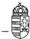
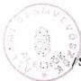

*Állami Számvevőszék*

## JELENTÉS

az Agrárszövetség

1994-1995. évi gazdálkodása törvényességének ellenőrzéséről

1996. december

340.

---

ÁLLAMI SZÁMVEVŐSZÉK

IV. Vagyonellenőrzési Igazgatóság

V-1016-10/1996.

# J E L E N T É S

az Agrárszövetség 1994-1995. évi gazdálkodása
törvényességének ellenőrzéséről

# BEVEZETŐ RÉSZ

A pártok működéséről és gazdálkodásáról szóló - többször módosított - 1989. évi XXXIII. törvény (továbbiakban: párttörvény) 10. §. (1.) bekezdése, valamint az Állami Számvevőszékről szóló több ször módosított - 1989. évi XXXVIII. tv. 2. §. (5.) bekezdése alapján a pártok gazdálkodása törvényességének ellenőrzésére az Állami Számvevőszék jogosult. A törvényi felhatalmazás alapján az ellenőrzési tervben rögzített ütemezésnek megfelelően került sor az Agrárszövetség (továbbiakban: Szövetség) gazdálkodása törvényességének ellenőrzésére. Az Agrárszövetség - az állami költségvetésben foglaltak szerint - 1994. évben 22.499.000 Ft, 1995-ben 16.600.000 Ft állami támogatásban részesült.

Az ellenőrzés célja annak megállapítása volt, hogy a Szövetség gazdálkodása megfelelt-e a párttörvényben előírt törvényességi szempontoknak, a központ által készített beszámoló a valósággal megegyező adatokat tartalmazza-e, valamint a Szövetség a működéséhez szabályszerűen igénybevehető forrásokat használt-e fel, és

---

- 2 -

gazdálkodó tevékenysége során betartotta-e a gazdálkodással összefüggő pénzügyi számviteli szabályokat. A jelentés a Szövetség Országos Központjában (továbbiakban: Központ), a Tolna megyei irodában lefolytatott helyszíni vizsgálat, valamint a Vas megyei irodától bekért dokumentáció alapján készült. A Tolna és a Vas megyei irodáknál a képviseletre jogosult vezetőknek átadott jelentésekkel kapcsolatosan észrevétel nem merült fel.

Az ellenőrzött időszak az 1994. január 1. – 1995. december 31-ig tartó időszakra terjedt ki. A helyszíni ellenőrzéseket 1996. augusztus 22. – szeptember 20. között folytattuk le. Az ellenőrzés módszere szűrőpróbaszerű vizsgálat volt, a helyszíneken rendelkezésre bocsátott, valamint a bekért iratok és dokumentumok alapján.

## I.

### RÉSZLETES MEGÁLLAPÍTÁSOK

#### 1. A Szövetség gazdálkodásáról szóló 1994–1995. évi beszámolók ellenőrzésének tapasztalatai

A Szövetség az 1994. évi beszámolóját 1995. április 27-én a Magyar Közlöny 32. számában, az 1995. évi beszámolóját 1996. április 30-án a Magyar Közlöny 34. számában jelentette meg (1. és 2. sz. melléklet). A beszámolókat a párttörvény 1. sz. mellékletében előírt formában és tartalommal, a párttörvény 9. §. (1.) bekezdésében megjelölt határidőn belül hozták nyilvánosságra.

---

- 3 -

A közzétett beszámolók a Központ és az önálló jogi személyiséggel rendelkező megyei irodák gazdálkodásának összesített adatai alapján készültek. A Központ 1994. évi beszámolójában azonban pontatlanság tapasztalható, ezért az 1994. évi beszámoló nem felelt meg mindenben a számviteli törvényben megfogalmazott számviteli alapelveknek. A beszámoló tartalmát illetően a következő számviteli alapelvek nem teljesültek.

- A teljesség elvét sérti, hogy a beszámoló nem tartalmazza a Szövetség valamennyi helyi alapszervének tárgyévi gazdálkodására vonatkozó adatát, ugyanis Bács-Kiskun megye 1994. évi elszámolásában a helyi alapszervezetek bevételei és kiadásai nem szerepeltek.

Nem teljes a beszámoló azért sem, mert az 1994-ben megszüntetett megyei irodák esetében a megszűnésekkel kapcsolatos teljeskörű dokumentáció (bankszámla, pénztár egyenlegek, jegyzőkönyvek a lezárásról, nyilatkozatok az eszközökről, esetleges adósságról, vagyonelszámolásról) hiányosan állt az ellenőrzés rendelkezésére.

- A valódiság elvét sérti, hogy a Szövetség 1994. évi összesített pénzügyi zárómérlegébe néhány esetben nem a megyék által lejelentett mérlegadatok kerültek be.
- A bruttó elszámolás elvét sérti, hogy 1994. évben az Országos Központban és a Tolna megyei irodánál a munkabéreket, továbbá a Központban még az ingatlanértékesítést és az azzal kapcsolatos váltóügyletet is nettó módon könyvelték.

---

- 4 -

A felmerült szabálytalanságok arra vezethetők vissza, hogy a Szövetség 1994-ben nem rendelkezett megfelelő könyvelői képzettségű szakemberrel.

A számvitel, illetve könyvelés rendbetétele érdekében 1995-ben könyvelőváltás történt, továbbá számítógépes könyvelési és nyilvántartási rendszert vezettek be. Az 1995. évi beszámoló ellenőrzése során elmarasztaló észrevétel nem merült fel. A beszámoló összesített adatai pontosak és teljeskörűek, tükrözik a központ és a megyei irodák tényleges pénzügyi helyzetét.

## 2. Az 1994. és 1995. évi beszámolók megalapozottságát alátámasztó könyvviteli megállapítások

A Szövetség központja és megyei irodái gazdasági eseményeinek rögzítésére az egyszeres könyvvitelt választották, naplófőkönyv vezetésével teljesítették könyvvezetési kötelezettségüket. Az adatok rögzítésének gyakorlata 1994-ben az alábbi esetekben tért el a számviteli törvényben előírtaktól.

2.1. 1994. június 29-én a Szövetség megszüntette a Mezőbanknál vezetett bankszámláját és új bankszámlát nyitott. A Szövetség a bankszámlanyitást követően nem a bankszámla bevétel, kiadás, egyenleg rovatot vezette tovább, hanem helytelenül a vállalkozás pénzügyi eredményének elszámolása (növekedés, csökkenés) rovatba könyvelt. Az évvégi záráskor a naplófőkönyv banki záróegyenlege megegyezett a bankszámla tényleges záróegyenlegével, de a fent említett helytelen könyvelés miatt a bankszámla egyenlegét nem tudták folyamatosan figyelemmel kísérni és ellenőrizni.

---

- 5 -

2.2. A munkabéreket nettó módon könyvelték, és a pénztárba visszavételezett SZJA-t, munkavállalói és munkaadói járulékot tételesen nem könyvelték le, így nehezen követhető, hogy a különböző járulékokból ténylegesen mennyi volt a havi bevallási és befizetési kötelezettség.

2.3. 1994. április 7-én a Szövetség egyik tisztségviselőjének bruttó 144.000 Ft tiszteletdíjat fizettek ki. A tiszteletdíj után nem vallották be, és nem fizették be a 44%-os társadalombiztosítási járulékot (63.360 Ft). Ugyanakkor helytelenül levonták a 10% egészségbiztosítási és nyugdíjjárulékot, (14.400 Ft) és az 1,5% munkavállalói járulékot, (2.160 Ft). A Szövetségnek fentiek alapján a Társadalombiztosítás felé 63.360 Ft befizetési hiánya keletkezett, és tisztségviselője részére összesen 16.560 Ft kifizetési kötelezettsége van.

2.4. A naplófőkönyvet minden félévben lezárták, az adatok rögzítése szabályos alapbizonylatok alapján történt. 1994. évben a naplófőkönyv vezetése nem idősoros, több helyen ceruzásan vezetett, a visszakeresés nehézkes.

2.5. A Szövetség a személyi jövedelemadó, társadalombiztosítási járulék, nyugdíj- és egészségbiztosítási járulék, valamint a munkaadói és munkavállalói járulék levonási, bevallási és befizetési kötelezettségeinek a 2.2; 2.3; pontokban leírt hiányosságok figyelembevételével eleget tett.

2.6. A Tolna megyei iroda adatrögzítési gyakorlata mindkét vizsgált évben eltért a számviteli törvényben előírtaktól, (saját tőkerovat vezetése, munkabérek nettó módon való könyvelése, szja, munkavállalói, munkaadói járulék könyvelése) technikailag nem helyes.

---

- 6 -

### 3. Az analitikus nyilvántartások, a bizonylati rend és fegyelem ellenőrzése

#### 3.1. A vizsgált időszakban a Központban az előírt analitikus nyilvántartásokat vezették.

A vezetett analitikus nyilvántartások közül 1994-ben a TB köteles kifizetések nyilvántartása nem felelt meg mindenben az előírásoknak. Hiányos vezetése miatt nem alkalmas a kötelezettség megállapítására.

#### 3.2. A szigorú számadású nyomtatványok körét a Szövetség Szabályzatában meghatározta. A bizonylatok nyilvántartása megfelel a szigorú számadás követelményeinek.

#### 3.3. Költségtérítések gyakorlatának ellenőrzése

A Szövetség a hivatali gépjármű hivatali, saját gépjármű hivatali célú használatával kapcsolatos jogszabályi rendelkezéseket betartotta. A gépjárművek üzemanyagelszámolásánál az útvonalnyilvántartás alapján történő norma szerinti elszámolást alkalmazták.

A vizsgált időszakban külföldi hivatalos célú utazás nem volt, valutafelvétele és elszámolásra sem került sor.

#### 3.4. Pénztárbizonylatok kiállítását a bizonylati fegyelem betartásával végzik. A Szövetség házipénztárára vonatkozó rendelkezéseket a házipénztár pénzkezelési szabályzat tartalmazza. A szabályzat napi pénztárjelentés használatát írja elő. Az időszaki pénztárjelentést azonban 1994. év folyamán

---

- 7 -

a pénztáros nem naponta, hanem több napot összevonva kezelte és zárta le. A Szövetség Tolna és Vas megyei irodája a pénztárkifizetések utalványozására jogosultak névsorát nem határozta meg, azzal pénzkezelési szabályzatát nem egészítette ki.

#### 4. A Szövetség bevételének és gazdálkodó tevékenységének ellenőrzése

A Szövetség 1994. és 1995-ben a párttörvény által engedélyezett gazdálkodó tevékenységek közül a következővel élt.

4.1. A Szövetség választási kampánya költségeinek fedezésére 1994. évben értékesítette egy pénzintézetnek 2 db ingatlanát, összesen 70.800.000 Ft-ért. Az ingatlaneladást megelőzően hitelt vett fel az eladásban érintett pénzintézettől 60.000.000 Ft értékű váltó kiállításával, melynek fedezetéül a 70.800.000 Ft értékű ingatlanok szolgáltak. A váltók leszámított együttes értéke 64.181.667 Ft volt, melyet a pénzintézet 1994. június 16-án érvényesített, és az ingatlanok eladási árából került levonásra. A két pénzügyi művelet egyenlegeként a pénzintézet 6.618.333 Ft-ot utalt át a Szövetség bankszámlájára.

A gazdasági műveletek nettó módon való helytelen könyvelése miatt, az ingatlaneladás tényleges bevétele nem 70.800.000 Ft összeggel, hanem csak 66.618.333 Ft-tal, azaz 4.181.667 Ft-tal kevesebb összeggel szerepel a pénzügyi kimutatásban az 'egyéb bevétel' soron, ezzel egyidőben a váltóleszámítolási költségként felmerült 4.181.667 Ft összeggel kevesebb a beszámoló 'egyéb kiadások' sora.

---

- 8 -

4.2. Az ellenőrzött időszakban a központ, és az ellenőrzött megyei irodák nem folytattak olyan tevékenységet, melyet a párttörvény tilt. Tárgyi adományt nem kaptak, tiltott gazdálkodó tevékenységet nem folytattak.

4.3. Az ellenőrzött szervezeti egységek Rt-t, Kft-t, vállalatot nem alapítottak, más társaságban részesedést nem szereztek.

## 5. Az előző ellenőrzés utóvizsgálata

Az ellenőrzés megállapította, hogy az előző, 1992–1993. évekre vonatkozó vizsgálat javaslatainak realizálása megtörtént.

A hibás könyvelési tételeket az 1994. évi mérlegben rendezték.

Az 1993. évi mérleget módosították és ismételten közzétették 1995. január 23-án a Magyar Közlöny 5. számában. Teljeskörűen szabályozásra került a Szövetség gazdálkodása és számviteli rendje. Intézkedtek a külföldi kiküldetések devizaellátmányához kapcsolódó – le nem vont – személyi jövedelemadó-előlegek utólagos rendezéséről. Megtörtént a Szövetség eszközgazdálkodásának belső vizsgálata és eszközállományának nyilvántartásba vétele.

---

- 9 -

# II.

# ÖSSZEGZŐ MEGÁLLAPÍTÁSOK

A Szövetség által az 1994. évi gazdálkodásról a Magyar Közlönyben közzétett pénzügyi beszámoló pontatlan és nem teljeskörű, mivel nem tartalmazza a Szövetség valamennyi szervezeti egységeinek gazdálkodási adatait.

Az analitikus nyilvántartások vezetését, bizonylati fegyelmét illetően is tapasztalt az ellenőrzés hibákat. A Szövetség azonban 1995. évben azzal, hogy áttért a számítógépes rendszeren nyugvó könyvelésre és ezzel párhuzamosan új könyvelőt alkalmazott, a korábbi hiányosságokat kiküszöbölte, illetve felszámolta.

# III.

# FELHÍVÁS A TÖRVÉNYES ÁLLAPOT HELYREÁLLÍTÁSÁRA

A vizsgálat megállapításai alapján a párttörvény 10. §. (4.) bekezdésében kapott felhatalmazás alapján az Állami Számvevőszék felhívja a párt elnökét, hogy:

1. A Tolna megyei Iroda szüntesse meg a helytelen könyvelési gyakorlatot.

2. A megyei irodák is határozzák meg az utalványozásra jogosultak névsorát és egészítsék ki vele a pénzkezelési szabályzatot.

---

- 10 -

3. Intézkedjen a Szövetség a kifizetett tiszteletdíj utáni társadalombiztosítási bevallási, és befizetési kötelezettségének visszamenőleges teljesítésére.

4. Intézkedjenek továbbá arról, hogy a Szövetség volt tisztségviselőjének a tévesen levont járulékokat kifizessék.

5. Az ingatlaneladás nettó elszámolása (4.1. pont) miatt gondoskodjanak a módosított 1994. évi beszámoló közzétételéről.

Budapest, 1996. december "14."

Sándor István/
alelnök

Melléklet: 2 db

---

1. sz. melléklet a V-1016-10/96. sz. jelentéshez

ÖZLÖNY

1995/32. szám

# V. rész

# KÖZLEMÉNYEK, HIRDETMÉNYEK

Az Agrárszövetség 1994. évi pénzügyi zárómérlege

Forint

# A) Bevételek

1. Tagdijak
2. Allami koltsegvetesbol szarmazo ta-mogatas 22 499 000,00
3. Képviselóscsoportnak nyújtott állami támogatás 7 182 000,00
4. Egyeb hozzajárulások

4.1. Jogi személyektől

4.1.1. Belfoldickto1 8471003,00
(Sárvári Cukoripari Rt. 500 000
Tank Kft., Budapest 1000000)
4.1.2. Külföldiektől

4.2. Jogi személynek nem minősülő gazdasági társaságtól

4.2.1. Belfoldiektol
4.2.2. Külföldiektöl
4.3. Maganszemelyektol
4.3.1. Belfoldiektol 23650,00

5. A part altal alapitott vallalat es korlatolt felelossegu tarsasag nyeresegabol szarmazo bevetel
6. Egyeb bevetel

Összes bevétel a gazdasági évben 108 850 354,64

# B) Kiadások

1. Támogatas a párt országgyulési cso-portja szárára
2. Támogatas egyeb szervezeteknek 435 067,00
3. Vallalkozások alapítására fordított összeg
4. Mukodesi kiadasok 63672385,00
5. Eszkozbeszerzes 1374649,07
6. Politikai tevekenység kiadása 82 411 984,25
7. Egyeb kiadas 2267103,30

Összes kiadás a gazdasági évben 150 161 188,62

# C) Tényleges pénzügyi helyzet a gazdasági év végén

Bevétel a gazdasági évben 108 850 354,64

Kiadás a gazdasági évben 150 161 188,62

Hiány a gazdasági évben —41 310 833,98

Halmozott többlet az előző gazdasági évről 32 838 344,00

Többlet (hiány) a gazdasági év végén —8 472 489,98

Veres István s. k., pártigazgató

Dr. Solymosi József s. k., pártelnök

---

2. sz. melléklet a V-1016-10/96. sz. jelentéshez

Az Agrárszövetség 1995. évi pénzügyi zárómérlege

|   | Bevételek | Forintban  |
| --- | --- | --- |
|  1. Tagdíjak |  | —  |
|  2. Állami költségvetésből származó támogatás |  | 16 600 000  |
|  3. Képviselőcsoportnak nyújtott állami támogatás |  | —  |
|  4. Egyéb hozzájárulások |  |   |
|  4.1. Jogi személyektől |  |   |
|  4.1.1. Belföldiektől |  | 18 000  |
|  4.1.2. Külföldiektől |  | —  |
|  4.2. Jogi személyeknek nem minősülő gazdasági társaságoktól |  |   |
|  4.2.1. Belföldiektől |  | —  |
|  4.2.2. Külföldiektől |  | —  |
|  4.3. Magánszemélyektől |  |   |
|  4.3.1. Belföldiektől |  | —  |
|  4.3.2. Külföldiektől |  | —  |
|  5. A párt által alapított vállalat és kft. nyereségéből |  | —  |
|  6. Egyéb bevétel |  | 2 834 701  |
|  Összes bevétel a gazdasági évben: |  | 19 452 701  |
|   | Kiadások |   |
|  1. Támogatás a párt országgyűlési csoportja számára |  | —  |
|  2. Támogatás egyéb szervezeteknek |  | —  |
|  3. Vállalkozások alapítására fordított összeg |  | 9 380 983  |
|  4. Működési kiadások |  | 463 675  |
|  5. Eszközbeszerzés |  | 735 377  |
|  6. Politikai tevékenység kiadása |  | 237 547  |
|  7. Egyéb kiadások |  | —  |
|  Összes kiadás a gazdasági évben: |  | 10 817 582  |
|   | Tényleges pénzügyi helyzet a gazdasági évben |   |
|  Bevétel a gazdasági évben |  | 19 452 701  |
|  Kiadás a gazdasági évben |  | 10 817 582  |
|  Többlet a gazdasági évben |  | 8 635 119  |
|  Halmozott többlet (hiány) az előző gazdasági évről |  | —8 472 490  |
|  Halmozott többlet a gazdasági év végén |  | 162 629  |

Dr. Solymosi József s. k.,
elnök