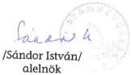

Állami Számvevőszék

# JELENTÉS

A Kereszténydemokrata Néppárt
1994-1995. évi gazdálkodása
törvényességének ellenőrzéséről

341.

1997. április

---

A vizsgálat végrehajtásáért felelős:

Halász Gejza

számvevő igazgató

Az ellenőrzést vezette:

dr. Szávai Tamás

osztályvezető főtanácsos

Az összefoglaló jelentést készítette:

Tóth István

számvevő tanácsos

Hoffmann István

számvevő

---

V-1015-14/1996-97.

# Tartalomjegyzék

# I. RÉSZLETES MEGÁLLAPÍTÁSOK 4

1. A Párt gazdálkodásáról szóló 1994-1995. évi beszámolók ellenőrzésnek tapasztalatai 4

1.1.A teljes vizsgalati idszakra ervenyes megallapitasok 4
1.2. Részletes megállapítások 4

1.2.1. AZ 1994. ÉVI BESZÁMOLÓ ELLENŐRZÉSE 4

1.2.1.1.A bevetelekkel kapcsolatos megallapitasok 4
1.2.1.2.A kiadásokkal kapcsolatos megállapítások 5

1.2.2. AZ 1995. ÉVI BESZÁMOLÓ ELLENŐRZÉSE 5

1.2.2.1.A bevetelekkel kapcsolatos megallapitasok 5
1.2.2.2.A kiadásokkal kapcsolatos megállapítások 5

2. A könyvvezetés szabályszerűsége 6

2.1.A konyvvezetes modja 6
2.1.1.A KONYVVEZETESSEL KAPCSOLATOS MEGALLAPITASOK 6

2.2. Analitikus nyilvántartások és a bizonylati elv érvényesülésének ellenőrzése 7

2.2.1. ANALITIKUS NYILVÁNTARTÁSOK 7

2.2.1.1. Eszkoznyilvantartas 7
2.2.1.2. Elszamolásra kiadott elölegek 8
2.2.1.3. Szigoru szamadásuBizonylatok nyilvantartasa 8
2.2.1.4. Külföldi kiküldetések 8
2.2.1.5. Szallitok es vevok 9
2.2.1.6. Gépjarmü üzemeltetés 9

2.2.2. A BIZONYLATI ELV ÉS BIZONYLATI FEGYELEM ÉRVÉNYESÜLÉSE 10

2.2.2.1. Kötelezettségvallalás, utalványozás 10
2.2.2.2. Bizonylatolás 10

2.3. Az adózásra, illetőleg járulékfizetésre vonatkozó jogszabályok betartása 10

3. A Párt bevételszerző, gazdálkodó tevékenységének ellenőrzése 11

3.1.A Part bevetelszerz tevekenységenek ellenorzese 11
3.2.A Part egyeb bevetelei 11

4.A Part gazdalkodasanak belso ellenorzese 12
5. Az elozo ellenorzés utovizsgalata 12

# II. ÖSSZEGZŐ MEGÁLLAPÍTÁSOK, KÖVETKEZTETÉSEK, JAVASLATOK 12

1. Osszefoglalo megallapitasok 12
2. Felhivás a törvenyes allapot helyreallitására 13
3.Javaslatok 13

1

---

2

---

V-1015-14/1996-97.

# JELENTÉS

# a Kereszténydemokrata Néppárt 1994-1995. évi gazdálkodása törvényességének ellenőrzéséről

A pártok működéséről és gazdálkodásáról szóló - többször módosított - 1989. évi XXXIII. törvény (a továbbiakban: párttörvény) 10. §. (1.) bekezdése, valamint az Állami Számvevőszékről szóló 1989. évi XXXVIII. törvény 5. §-a alapján a pártok gazdálkodása törvényességének ellenőrzésére az Állami Számvevőszék (a továbbiakban: ÁSZ) jogosult. A törvényi felhatalmazás alapján az ÁSZ 1996. második félévi és 1997. első félévi ellenőrzési tervének megfelelően vizsgálta a Kereszténydemokrata Néppárt (a továbbiakban: Párt) 1994-1995. évi gazdálkodása törvényességét.

Az ellenőrzött szervezet: Kereszténydemokrata Néppárt

Címe: 1126. Budapest, Nagy Jenő u. 5.

Jogállása: önálló jogi személy

Az ellenőrzött időszak: 1994. január 1. - 1995. december 31. A bevételek jogszerűsége tekintetében 1994. január 1. - 1996. szeptember 30.

Az ellenőrzés célja annak megállapítása volt, hogy:

\(\spadesuit\) a Part altal keszitett es a Magyar Kozlonyben kozzett etes beszamolok a konyvvezetessel es a valosaggal megegyezo adatokat tartalmaznak-e;
\(\spadesuit\) a konyvvezetés és a gazdalkodás során betartották-e a vonatkozo jogszabályi elóirásokat;
\(\spadesuit\) a Part mukodeshez szabályszerüen igenybevehető forrásokat használt-e fel, nem folytatott-e a partörvény által tiltott gazdalkodó tevekenységet, illetve nem fogadott-e el tiltott adományt.

Az ellenőrzés módszere: helyszíni (szúrópróbaszerű) vizsgálat

A helyszíni ellenőrzés időpontja: 1996. december 16. - 1997. január 30.

A vizsgálati jelentés megállapításai a Párt Országos Központjában rendelkezésre bocsátott iratok, dokumentumok tanulmányozásával megvalósított ellenőrzés tapasztalatain alapulnak.

3

---

I. RÉSZLETES MEGÁLLAPÍTÁSOK

# 1. A PÁRT GAZDÁLKODÁSÁRÓL SZÓLÓ 1994-1995. ÉVI BESZÁMOLÓK ELLENŐRZÉSNEK TAPASZTALATAI

# 1.1. A teljes vizsgálati időszakra érvényes megállapítások

A Párt az 1994. és 1995. évi beszámolókat (1. és 2. sz. melléklet) a párttörvény 9. §. (1.) bekezdésében előírt határidőben és a törvény 1. sz. mellékletében előírt formában 1995. április 24-én a Magyar Közlöny 31., illetve 1996. április 30-án a 34. számában hozta nyilvánosságra. A közzétett beszámolók a Központ, továbbá az önálló jogi személyiséggel nem rendelkező megyei koordinációs irodák, valamint a helyi szervek gazdálkodásának összesített adatait tartalmazzák.

A Párt számviteli politikájában meghatározta az éves beszámoló összeállításának módszerét, a közzétett beszámolók tehát a Központ, a megyei koordinációs irodák, és a helyi szervezetek összesített adatait foglalják magukba.

Általánosságban megállapítható, hogy az éves beszámolók tartalma több soron pontatlan. A beszámolók részleteikben nem a tényleges állapotot tükrözik, ezen túlmenően az 1994.évi beszámoló kiadási főösszege is eltér a tényleges állapottól. A Párt a könyvvezetés és a beszámolók készítése során megsértette a számviteli törvény alapelveit: a teljesség és a valódiság elvét.

A teljesség elvét, mivel az 1994. évi kiadások között nem szerepel 3.288.306 Ft értékű kiadás.

A valódiság elvét, mivel a közzétett beszámolók egyes sorai nem felelnek meg a főkönyvi könyvelésben rögzített, illetve a tényleges állapotnak.

# 1.2. Részletes megállapítások

# 1.2.1. AZ 1994. ÉVI BESZÁMOLÓ ELLENŐRZÉSE

# 1.2.1.1. A bevételekkel kapcsolatos megállapítások

Helytelen könyvelés miatt a bevételek az alábbiakban térnek el a beszámolóban közzétettektől:

A tagdijak összege berleti djbevétel konyvelése miatt, 529 E Ft-tal tobb a ténylegesnel.
Egyeb hozzajárulások, adományok kozott a jogi személyektól származó adomány 2.550 E Ft helyett helyesen 2.615 E Ft.

4

---

I. RÉSZLETES MEGÁLLAPÍTÁSOK

A külföldi jogi személytól származó adomány 1.734 E Ft helyett 1.919 E Ft.
A belföldi jogi személytól eredő hozzájárulás helyesen 696 E Ft.
Jogi szemelynek nem minosul gazdasagi tarsasag (belfoldi) soron a beveteI helyesen 200 E Ft;
Maganszemelyek adomanya 3.133 E Ft helyett 2.955 E Ft, amelybol a helyes osszeg kulfoldiek vonatkozasaban 1.628 E Ft, belfoldiek esetuben pedig 1.327 E Ft.

# 1.2.1.2. A kiadásokkal kapcsolatos megállapítások

A jelentés 2.1.1. pontjában részletezett okok miatt hiányzik a Párt 1994. évi beszámolója II. kiadások fejezet 6. Politikai tevékenység kiadása sorából 3.288.806 Ft. Ez az összeg a Párt könyvvitelében sem szerepel. Ezen túlmenően a Párt 1994. évi beszámolójában szereplő kiadási tételek megegyeznek a könyvelt és a tényleges kiadásokkal.

# 1.2.2. AZ 1995. ÉVI BESZÁMOLÓ ELLENŐRZÉSE

# 1.2.2.1. A bevételekkel kapcsolatos megállapítások

A helytelen könyvelés következtében 1995. évi bevételek is eltérnek a beszámolóban közzétett adatoktól, az alábbiakban:

Az Egyeb hozzajárulások, adományok jogi személyektól cím alatt a beszámolóban 67 E Ft talalható. Nem szerepel a beszámolóban a Barankovics István Alapitványtól származó 10.020 E Ft adomány, amelyet tevesen a beszámoló egyeb bevetelek során tüntettek fel.
Ugyancsak hibás összeg szerepel a jogi személynek nem minósuló gazdasági társaságtól soron, ahol a tenyleges bevétel 204 E Ft (a különbozet, ami 100 E Ft, belföldi magánszemélyektól származó adományként tüntéték fel a beszámolóban).
Az egyeb bevétel soron a beszámoló 19.991 E Ft összeget tartalmaz, a jogi személyektól származó adományokkal kapcsolatban leirt okok miatt 10.020 E Ft-tal tobb a ténylegesnel.

# 1.2.2.2. A kiadásokkal kapcsolatos megállapítások

A beszámolóban szereplő kiadások részleteiben és főösszegében megegyeznek a könyvelésben szereplő adatokkal és a tényleges állapottal.

5

---

I. RÉSZLETES MEGÁLLAPÍTÁSOK

## 2. A KÖNYVVEZETÉS SZABÁLYSZERŰSÉGE

### 2.1. A könyvvezetés módja

A Párt a vizsgált időszakban a kettős könyvvitel rendszerében - valamennyi szervezeti egységére kiterjedően - tett eleget könyvviteli nyilvántartási kötelezettségének. A Párt számviteli politikáját teljeskörűen 1993-1994-ben alakították ki.

A megfelelő színvonalú számviteli politikát írásban rögzítették. Ennek során elkészítették a számlarendet, amely tartalmazza:

- a számlatükröt, a főkönyvi számlák tartalmát;
- az éves pénzügyi terv és a beszámoló elkészítésének módját;
- a főkönyvi könyvelés és analitikus nyilvántartások vezetésének szabályait, a kettő kapcsolatát;
- a könyvviteli ellenőrzési feladatokat;
- a költségelszámolás szabályait;
- a leltárkészítés módszereit;
- a könyvviteli zárlat időpontját.

#### 2.1.1. A KÖNYVVEZETÉSSEL KAPCSOLATOS MEGÁLLAPÍTÁSOK

A vizsgált időszakban a gazdasági szakterület élén - a személyi változások ellenére - mindig szakképzett és gyakorlati tudással rendelkező szakember állott. A könyvviteli nyilvántartások vezetésével kapcsolatban az ÁSZ a következő megállapításokat tette:

A) Az 1-es főkönyvi számlaosztályban mindkét évben a tárgyi eszközöket bruttó beszerzési - azaz általános forgalmi adót tartalmazó - értékben könyvelték és vették nyilvántartásba. Ez a gyakorlat nem felel meg a számviteli törvény 35. §. (1.) bekezdésének, amely szerint az eszközök beszerzési ára és a költségnem elszámolások nem tartalmazhatják az általános forgalmi adó összegét. A Pártnak a törvényi rendelkezés következtében a főkönyvi könyvelésben az általános szabályok szerint alkalmaznia kellett volna az Előzetesen felszámított általános forgalmi adó számlát - és ezt kijelölni a számlatükrönben is. A felmerült általános forgalmi adót, mint ráfordítást, a Párt a 8. számlaosztályban a vizsgált időszakban nem számolta el, illetve nem mutatta ki.

6

---

I. RÉSZLETES MEGÁLLAPÍTÁSOK

B) A megfelelően kialakított számlatükörben, illetve számlarendben megfogalmazottaktól eltér az alkalmazott számítógépes könyvelési program a 9-es számlaosztály esetében. Ennek következtében egyes főkönyvi számlák elnevezése nem teljesen egyértelmű.

A számlák alszámlákra történt bontása zavar forrása lehet, mivel nem zárja ki a téves kontírozás lehetőségét.

C) A számviteli törvény 15.§. (2.) bekezdésében megfogalmazott teljességi alapelvet sérti az a gyakorlat, hogy a Párt 1994. évben 3.288.806 Ft értékben vásárolt eszközöket, illetve igényelt szolgáltatásokat úgy, hogy azokról a számlát nem a saját, hanem a tulajdonát képező Hunnia Pac Kft nevére állíttatta ki. Ez azt vonta maga után, hogy ezen számlák értékét a Párt költségként az 5-ös számlaoszályban nem könyvelte le. A számlák kifizetését a 433. Hosszú lejáratú kapott kölcsönök főkönyvi számlán, mint tartozáscsökkenést könyvelte el.

E könyvelési eljárás oka, hogy a Párt 1994-ben két esetben - 1994. március 22-én és március 31-én - összesen 6 M Ft értékben kölcsönt vett fel a Hunnia Pac Kft-től, amely kölcsönök elszámolási feltétele között szerepelt, hogy a Párt teljesítheti a szerződést a Kft, mint vevő nevére és címére kiállított ÁFA-t tartalmazó készpénzszámla átadásával.

A Párt részére 3.288.806 Ft értékben vásárolt eszközök és igényelt szolgáltatások eredeti számláit a Párt a Kft részére átadta, fennálló tartozása törlesztése fejében. Ennek következtében a tárgyévben a Párt kiadásait ennyivel kisebb értékben mutatja ki.

Ez az eljárás a Kft számvitelében ténylegesen fel nem merült kiadás elszámolását teszi lehetővé, ennyivel csökkentve a Kft gazdálkodásának adózás előtti eredményét. Az átadott számlák előzetesen felszámított ÁFA-t tartalmaznak, 466.143 Ft összegben. Ez lehetőséget nyújt arra, hogy a Kft az ÁFA-t az Adóhivataltól visszaigényelhesse.

## 2.2. Analitikus nyilvántartások és a bizonylati elv érvényesülésének ellenőrzése

### 2.2.1. ANALITIKUS NYILVÁNTARTÁSOK

Az Országos Központban tíz fajta, a főkönyvi számlákhoz kapcsolódó analitikus nyilvántartást vezettek a vizsgált időszakban.

#### 2.2.1.1. Eszköznyilvántartás

A Pártnál az eszköznyilvántartáson belül ingatlan nyilvántartást és a tárgyi eszközök nyilvántartását vezetik. A nyilvántartások a szükséges információkat tartalmazzák.

7

---

I. RÉSZLETES MEGÁLLAPÍTÁSOK---

Nyilvántartott eszközeiket kétévente leltározták, a szükséges egyeztetéseket pedig elvégezték.

### 2.2.1.2. Elszámolásra kiadott előlegek

A Párt házipénztárára vonatkozó rendelkezéseket a házipénztári pénzkezelési szabályzat tartalmazza. A Szabályzat a pénztári kifizetések nyilvántartására időszaki pénztárjelentés használatát írja elő. A gyakorlat megfelel az előírásoknak.

A Szabályzat a pénztáros feladataként előírja az elszámolásra kiadott előlegek határidős nyilvántartásának kötelezettségét. A nyilvántartást a pénztáros vezeti. A nyilvántartás vezetése megfelel a követelményeknek. Az elszámolások egy-két kivételtől eltekintve határidőre megtörténtek. A határidőn túli elszámolás esetén a Szabályzatban előírtak szerint jártak el.

### 2.2.1.3. Szigorú számadású bizonylatok nyilvántartása

A Párt házipénztári Pénzkezelési Szabályzatában meghatározták a szigorú számadású nyomtatványok körét, melyekről a Központ péztárosa teljeskörű nyilvántartást köteles vezetni. A nyilvántartás megfelel a szigorú számadás követelményének és a Pártnál használt valamennyi, ilyen jellegű nyomtatványra kiterjed.

### 2.2.1.4. Külföldi kiküldetések

A hivatalos külföldi kiküldetések teljesítésével kapcsolatos költségek elszámolását a Párt Szervezeti Működési Szabályzatának mellékletében a 30/1992. (II. 13.) Kormányrendelet előírásainak megfelelően szabályozták.

A megfelelő szabályozás ellenére 1994-ben egyetlen egy olyan esettel sem találkozott az ellenőrzés, amikor a kiküldetés elrendelése, bizonylatolása és elszámolása megfelelő lett volna.

Ebben az időszakban az ellenőrzés egyetlen esetben sem találkozott szabályosan elrendelt kiküldetési rendelvényvel. Az esetek többségében utólag a könyvelés állította ki a rendelvényt. Kiküldetési rendelvény és az elszámolás alapjául szolgáló dokumentumok hiányában a kifizetett napidíjak jogossága nem állapítható meg.

A főbb hiányosságok a következők:

- Az ellenőrzés egyetlen kiutazással kapcsolatban sem talált olyan dokumentumot - meghívó, feljegyzés, jegyzőkönyv, program, beszámoló - amiből a külföldi utazások hivatalos jellege megállapítható lenne.

---8

---

I. RÉSZLETES MEGÁLLAPÍTÁSOK

Bár a Szabályzat előirja, hogy az ellatottság mertékétól fuggöen valtozó napidijra jogosultak a kiutazók, teljes ellatás eseten pedig napidij nem adhato, tobb esetben, - az utazások mintegy 20%-ánál - tapasztalta az Ellenőrzés, hogy teljes ellatás eseten is sor került napidij, illetve elszámolásra nem kõtelezett ellatmány kiadására.
A kiküldetéshez hasznalt utazási jegyekkel (repulójegy, vonatjegy, buszjegy) az esetek 50%-aban nem szamoltak el. A jegyeket nem csatolták az elszámolásBizonylataihoz. Ez a gyakorlat visszaelésre ad alkalmat. A le nem adott jegy ugyanis késöbb elszamolási elöleggel valo elszámolás során becsatolhato, ami kétseres kifizétest eredményezhet.
A kikuldetés teljesítese utan a 30/1992. (II. 13.) Kormányrendeletben elóirt valutaelszámolási határidőt tobb esetben nem tartották be. A vizsgált esetekben tobb hónapos késésell törtent meg az elszámolás.
Egyetlen esetben sem allapithato meg pontosan a kulfodi tartozkodas idotartama. Ugyanis meg azokban az esetekben sem tartottak be a 30/1992. (II. 13.) Kormanyrendelet elorasait, amikor a kikuldetesi rendelveny reszbeni kitoltese megtortent. Az indulast es erkezest ugyanis nem a rendelet 8. \(\S\) -a szerint vettek figylembe, illetve az esetek \(95\%\) -aban egyaltalan nem tuntettek fel.

Fentiekre való tekintettel megállapítható, hogy ebben az időszakban a 30/1992. (II. 13.) Kormányrendelet előírásait rendszeresen megszegték.

1995-ben - az ász 1994. évi vizsgálatatát követő felhívás alapján - az ideiglenes külföldi kiküldetések elszámolásának gyakorlatában jelentős változás történt. A kiküldetések elrendelése és az elszámolás szabályossá vált. Továbbra is hiányosság azonban, hogy az utazásokhoz kiadott utazási jegyekkel az utazók nem minden esetben számoltak el.

# 2.2.1.5. Szállítók és vevők

A Párt szállítóiról és vevőiről egyaránt nyilvántartást fektetett fel, amelynek tartalma minden információigényt kielégít. A nyilvántartások vezetése a követelményeknek megfelel, évente újrakezdődő sorszámozással valamennyi bemenő és kimenő számlát tartalmazzák.

# 2.2.1.6. Gépjármű üzemeltetés

A Párt a magántulajdonú gépjármű hivatali célú használatával kapcsolatos jogszabályi előírásokat mindkét évben betartotta.

A gépkocsik üzemeltetésére és használatára vonatkozóan szabályzatban rögzítette magántulajdonú gépjármű üzemi célú használatának rendszerét, az utazási költségtérítésben részesíthetők körét, továbbá az elszámolás ügyvitelét. Az igénybevételeket belföldi kiküldetési rendelvény alkalmazásával eszközölték.

9

---

I. RÉSZLETES MEGÁLLAPÍTÁSOK

A kifizetések, illetve térítések során a 60/1992. (VI. 1.) Kormányrendelet - amely az üzemanyag elszámolásáról rendelkezik - betartották. Az elszámolásokhoz csatolt alapbizonylatoknál - alaki és tartalmi szempontból egyaránt - az ellenőrzés hiányosságot nem tapasztalt.

# 2.2.2. A BIZONYLATI ELV ÉS BIZONYLATI FEGYELEM ÉRVÉNYESÜLÉSE

# 2.2.2.1. Kötelezettségvállalás, utalványozás

A Pártnál a kötelezettségvállalás, érvényesítés és utalványozás rendjét a Szervezeti és Működési, valamint a Házipénztári Pénzkezelési Szabályzatban - megfelelő részletességgel - szabályozták.

A szabályzatokban feladatkörök és beosztások szerint felsorolták az utalványozási és érvényesítési jogkörrel megbízott személyeket. A kötelezettségvállalási jogosultságot is beosztásonként határozták meg. A szabályzatban foglaltakat - az ellenőrzés tapasztalatai szerint - betartották.

# 2.2.2.2. Bizonylatolás

A könyvelési adatok bizonylati alátámasztottsága minden tekintetben - egy kivétellel - a számviteli törvény 83-87. §-ában előírt követelményeknek megfelel (a kivétel a Hunnia Pac Kft-től felvett kölcsön elszámolása keretében befogadott, a Kft nevére kiállított 26 db számla könyvelése).

# 2.3. Az adózásra, illetőleg járulékfizetésre vonatkozó jogszabályok betartása

A) A Párt a személyi jövedelemadóról szóló 1992. évi LXXV. törvénnyel módosított 1991. évi XC. törvény, illetve az adózás rendjéről szóló 1990. évi XCI. törvényben foglaltaknak eleget tett.

Mindkét évben - a kötelező nyilvántartások felfektetése és az előírt adatszolgáltatás mellett - a kifizetett munkabérekből és bérjellegű jövedelmekből az adóelőlegeket és a járulékokat levonták, valamint teljesítették az adóbevallási és befizetési kötelezettségüket.

A napidíjként felvett valuták személyi jövedelemadózásával kapcsolatos törvényi előírást betartották.

10

---

I. RÉSZLETES MEGÁLLAPÍTÁSOK

B) A Párt, mint munkáltató, 1994. és 1995. évben eleget tett társadalombiztosítási feladatainak, így:

- a TB alapokat megillető befizetéseket,
- nyilvántartási és adatszolgáltatási kötelezettségeket;
- a TB ellátások kifizetését

teljesítette.

### 3. A PÁRT BEVÉTELSZERZŐ, GAZDÁLKODÓ TEVÉKENYSÉGÉNEK ELLENŐRZÉSE

#### 3.1. A Párt bevételszerző tevékenységének ellenőrzése

A Párt - egy kivételtől eltekintve -, a párttörvény 6. §. (1.) bekezdésében engedélyezett gazdálkodó tevékenységet folytatott.

A jogszerűen folytatott gazdálkodási tevékenységen felül azonban a Pártnak 1994. január 1. - 1996. október 1. között a Párt tulajdonában nem álló vidéki irodahelyiségek bérbeadásából összesen 1.665.831 Ft jogtalan bevétele származott.

A párttörvény 6. §. (1.) bekezdésében foglaltak alapján a Párt számára csak a tulajdonában álló ingatlanok hasznosítása engedélyezett. Az ettől eltérő ingatlanhasznosítás tiltott tevékenységnek minősül. Ennek egyes évek közti megoszlása a következő:

|  1994. év | 1995. év | 1996. év | Összesen  |
| --- | --- | --- | --- |
|  273.000 Ft | 904.302 Ft | 488.529 Ft | 1.665.831 Ft  |

#### 3.2. A Párt egyéb bevételei

A Pártnak az előbb felsoroltakon kívül egyéb bevételei is adódtak, így a:

- káresemények miatti bevételből,
- valuta árfolyamnyereségből,
- folyószámla kamatbevételből.

A Párt a vizsgált időszakban számára tiltott adományokat nem fogadott el, tiltott értékpapírt nem vásárolt, több személyes Kft-ben részesedést nem szerzett. A Pártnak egy egyszemélyes Kft-je van, attól a vizsgált időszakban bevétele nem származott.

11

---

II. ÖSSZEGZŐ MEGÁLLAPÍTÁSOK, KÖVETKEZTETÉSEK, JAVASLATOK

# 4. A PÁRT GAZDÁLKODÁSÁNAK BELSŐ ELLENŐRZÉSE

A Pártnak Alapszabálya szerint Pénzügyi Ellenőrző Bizottsága van. A vizsgált időszakra vonatkozóan a Bizottság tevékenységéről, annak eredményéről írásos dokumentumot az ellenőrzésnek bemutatni nem tudtak.

# 5. AZ ELŐZŐ ELLENŐRZÉS UTÓVIZSGÁLATA

Az előző ÁSZ vizsgálat megállapításai alapján az ÁSZ elnöke felhívta a Pártot, hogy:

- Az 1992. és 1993. évi gazdálkodásáról a pénzügyi beszámolókat ismételten készíttesse el és a Magyar Közlönyben tegye közzé.
- Az IKU-t terhelő kiadások szabálytalan könyvelését vizsgáltassa felül és állapítsák meg, hogy mennyi volt az IKU-t terhelő 1992. évi tényleges kiadások, illetve az IKU-t terhelő tartozások összege.
- Intézkedjen annak érdekében, hogy az ideiglenes külföldi kiküldetési költségek elszámolásánál és bizonylatolásánál a 30/1992. (II. 13.) Kormányrendelet előírásai maradéktalanul érvényesüljenek.
- A jelentés III. fejezet 2.4. pontja 5. francia bekezdésében szereplő 274.310,90 Ft bizonylat nélküli kifizetéssel és a III. fejezet 2.6. pontja 4. francia bekezdésében szereplő kétszeresen kifizetett 30.080 Ft értékű repülőjeggyel kapcsolatban a személyi felelősség megállapítása érdekében hatáskörében tegye meg a szükséges intézkedéseket.

A Párt elnöke a felhívásra a szükséges intézkedéseket megtette, melynek eredményeként a két módosított beszámoló 1995. április 30-án a Magyar Közlönyben megjelent, az Ifjú Kereszténydemokrata Unió kiadásait a Párt könyveléséből kivették és 1995-től helyreállt a külföldi kiküldetések elszámolásának szabályszerűsége.

# II. ÖSSZEGZŐ MEGÁLLAPÍTÁSOK, KÖVETKEZTETÉSEK, JAVASLATOK

# 1. ÖSSZEFOGLALÓ MEGÁLLAPÍTÁSOK

A Párt számviteli politikáját kialakította, a pénzkezelés és a gazdálkodás rendjét belső szabályzatokban rögzítette. A Párt által megtett intézkedések következtében 1994. évtől megszilárdult a számviteli-pénzügyi tevékenység, a hibák és hiányosságok gyakorisága lényegesen csökkent.

Az 1994. évi beszámoló adatainak kismértékű eltérése a ténylegestől - amelyek a bevételek főösszegét nem változtatják meg - a számviteli törvényben foglalt teljesség és valódiság elvét sértette meg, pontatlanságot okozva.

12

---

II. ÖSSZEGZŐ MEGÁLLAPÍTÁSOK, KÖVETKEZTETÉSEK, JAVASLATOK

A Párt néhány helyi és vidéki szervezete ingatlanok tiltott bérbeadásából 1994-1996. októberig terjedő időszakban 1.665.831 Ft jogtalan bevételre tett szert.

# 2. FELHÍVÁS A TÖRVÉNYES ÁLLAPOT HELYREÁLLÍTÁSÁRA

A jelentés megállapításainak figyelembevételével, a párttörvény 10. §. (4.) bekezdésében kapott felhatalmazás alapján az Állami Számvevőszék felhívja a Párt elnökét, hogy:

A) A jelentés I. fejezet 1.2.1. és 1.2.2. pontjaiban megállapított hiányosságokra tekintettel keszüttese el és tegye kozé a Magyar Közlonyben - a pártörvény 1. sz. melleklete szerinti formában és tartalomban - a Pár 1994. és 1995. évi beszámolóját.
B) A jelentés I. fejezet 2.1.1. pontjaban megfogalmazott konyvvezetési hiányosságokra valo tekintettel tegyen intezkedest a konyvvezetés pontosíasára.
C) A jelentés I. fejezet 3.1. pontjaban megallapitott 1.665.831 Ft tiltott gazdalkodásból származó bevételt a partörvény 6. §. (5.) bekezdésben elóirtaknak megfeleloen a jelentés kézhezveitelétól számított 15 napon belül az allami költségvetésbe fizessék be.

# 3. JAVASLATOK

A jelentésben foglaltak alapján az Állami Számvevőszék javasolja:

A) A penzügyminiszter a jelentés I. fejezet 2.1.1./c. pontjaban leirt hiányosságokra valo tekintettel, az adózás rendjéról szólo 1990. évi XCI. törveny 53. §. (4.) bekezdésben foglaltak figyelembevételével rendeljen el adóhatósági vizsgálatot a Hunnia Pac Kft-nél annak megallapítására, törtent-e jogtalan ÁFA visszaigénylés, illetve adóalapot csökkentő koltségelszámolás.
B) A penzügyminiszter a jelentés I. fejezet 3.1. pontjaban megallapitott tiltott gazdalkodásból származó bevételre valo tekintettel a partörvény 4. §. (4.) bekezdésben megfogalmazott elóirásoknak megfeleloen a Part 1997. évi allami költségvetési támogatását a tiltott gazdalkodásból származó 1.665.831 Ft-nak megfelelo összeggel csökkentse.

Budapest, 1997. április 14.

Melléklet: 2 db

13

---

•

---

1. sz. melléklet a V-1015-14/1996-97. sz. jelentéshez

A Kereszténydemokrata Néppárt
1994. évi pénzügyi zárómérlege

# I. BEVÉTELEK

1. Tagdijak 4943
2. Allami koltsegvetesbol szarmazo tamo-gatas 102767
3. Kampanyra nyujtott allami tamogatas 7854
4. Egyeb hozzajarulasok, adomanyok

4.1. Jogi személyektől

4.1.1. Belföldiektől (az 500 000 Ft
feletti hozzájárulás)

4.1.2. Külföldiektől (a 100 000 Ft
feletti hozzájárulás)

— CHR DEMOCKRA-
TISCH APPEL

4.2. Jogi személynek nem minósuló gazdasági társaságtól
4.2.1. Belföldiektól (az 500 000 Ft feletti hozzájárulás)
4.2.2. Külföldiektól (a 100 000 Ft feletti hozzájárulás)

4.3. Magánszemélyektől

4.3.1. Belföldiektől (az 500 000 Ft
feletti hozzájárulás)

4.3.2. Külföldiektől (a 100 000 Ft
feletti hozzájárulás)

— ANDREW SARLOS 1 002
— NIKOLAS MÉZES 138

5. A part altal alapfott vallalat es korlatolt felelossegu tarsasag nyeresegbol szarmazo bevetel
6. Egyeb bevetel

6.1.Apartpropagandatevekenységébol 165
6.2.Apartgazdalkodotevekenységébol 14505
6.3.Egyeb bevetei: kamat arfolyam diff. 3 505
6.4.Rovid lejaratu kolcson 19232

Összes bevétel a gazdasági évben

158 654

# II. KIADÁSOK

1. Támogatás a párt országgyűlési csoportja
számára

1.1. Támogatás a párt alapszervezetei ré-
szére

2. Támogatas egyeb szervezeteknek 2 240
3. Vallalkozások alapítására fordított összegek

4. Mukodesi kiadasok 98 229
5. Eszkozbeszerzes 934
6. Politikai tevekenyseg kiadasa 61 151
7. Szekhaz felujitas koltsegei 2084
8. Egyeb kiadasok 2400

Összes kiadás a gazdasági évben

# III. ELSZÁMOLÁS AZ 1994. ÉVRŐL

I. Bevetelek 158654
II. Kiadasok 167083
Hiany a gazdasagi evben 8429
Elozo evi penzmaradvany 15777
Halmozott tobblet 1994. december 31-én 7.348

Dr. Giczy György s. k.,
elnök

Harsányi Lászlóné s. k.,
főkönyvelő

---

（1）根据《中华人民共和国公司法》、《中华人民共和国证券法》、《上市公司收购管理办法》等法律法规，公司股票在交易所上市交易。

[Non-Text]

[Non-Text]

[Non-Text]

[Non-Text]

(1) 2017年1月1日至2018年1月1日，公司与关联方累计发生关联交易的总金额为人民币45,639.87万元。

(1) 2017年1月1日至2018年1月1日，公司与关联方累计发生关联交易的总金额为人民币45,639.87万元。

(1) 2017年1月1日至2018年1月1日，公司与关联方累计发生关联交易的总金额为人民币45,639.87万元。

(1) 2017年1月1日至2018年1月1日，公司与关联方累计发生关联交易的总金额为人民币45,000万元。

(1) 2017年1月1日至2018年1月1日，公司与关联方累计发生关联交易的总金额为人民币45,000万元。

[Non-Text]

[Non-Text]

(1) 2017年1月1日至2018年1月1日，公司与关联方累计发生关联交易的总金额为人民币45,639.87万元。

(1) 2017年1月1日至2018年1月1日，公司与关联方累计发生关联交易的总金额为人民币45,639.87万元。

(1) 2017年1月1日至2018年1月1日，公司与关联方累计发生关联交易的总金额为人民币45,639.87万元。

(1) 2017年1月1日至2018年1月1日，公司与关联方累计发生关联交易的总金额为人民币45,639.87万元。

(1) 2017年1月1日至2018年1月1日，公司与关联方累计发生关联交易的总金额为人民币45,639.87万元。

(1) 2017年1月1日至2018年1月1日，公司与关联方累计发生关联交易的总金额为人民币45,639.87万元。

(1) 2017年1月1日至2018年1月1日，公司与关联方累计发生关联交易的总金额为人民币45,639.87万元。

(1) 2017年1月1日至2018年1月1日，公司与关联方累计发生关联交易的总金额为人民币45,639.87万元。

(1) 2017年1月1日至2018年1月1日，公司与关联方累计发生关联交易的总金额为人民币45,639.87万元。

(1) 2017年1月1日至2018年1月1日，公司与关联方累计发生关联交易的总金额为人民币45,639.87万元。

(1) 2017年1月1日至2018年1月1日，公司与关联方累计发生关联交易的总金额为人民币45,639.87万元。

(1) 2017年1月1日至2018年1月1日，公司与关联方累计发生关联交易的总金额为人民币45,639.87万元。

(1) 2017年1月1日至2018年1月1日，公司与关联方累计发生关联交易的总金额为人民币45,639.87万元。

(1) 2017年1月1日至2018年1月1日，公司与关联方累计发生关联交易的总金额为人民币45,639.87万元。

(1) 2017年1月1日至2018年1月1日，公司与关联方累计发生关联交易的总金额为人民币45,639.87万元。

[Non-Text]

[Non-Text]

[Non-Text]

(1) 2017年1月1日至2018年1月1日，公司与关联方累计发生关联交易的总金额为人民币45,639.87万元。

(1) 2017年1月1日至2018年1月1日，公司与关联方累计发生关联交易的总金额为人民币45,639.87万元。

(1) 2017年1月1日至2018年1月1日，公司与关联方累计发生关联交易的总金额为人民币45,639.87万元。

[Non-Text]

(1) 2017年1月1日至2018年1月1日，公司与关联方累计发生关联交易的总金额为人民币45,639.87万元。

(1) 2017年1月1日至2018年1月1日，公司与关联方累计发生关联交易的总金额为人民币45,639.87万元。

[Non-Text]

(1) 2017年1月1日至2018年1月1日，公司与关联方累计发生关联交易的总金额为人民币45,639.87万元。

(1) 2017年1月1日至2018年1月1日，公司与关联方累计发生关联交易的总金额为人民币45,639.87万元。

(1) 2017年1月1日至2018年1月1日，公司与关联方累计发生关联交易的总金额为人民币45,639.87万元。

(1) 2017年1月1日至2018年1月1日，公司与关联方累计发生关联交易的总金额为人民币45,639.87万元。

(1) 2017年1月1日至2018年1月1日，公司与关联方累计发生关联交易的总金额为人民币45,639.87万元。

(1) 2017年1月1日至2018年1月1日，公司与关联方累计发生关联交易的总金额为人民币45,639.87万元。

[Non-Text]

(1) 2017年1月1日至2018年1月1日，公司与关联方累计发生关联交易的总金额为人民币45,639.87万元。

(1) 2017年1月1日至2018年1月1日，公司与关联方累计发生关联交易的总金额为人民币45,639.87万元。

(1) 2017年1月1日至2018年1月1日，公司与关联方累计发生关联交易的总金额为人民币45,639.87万元。

(1) 2017年1月1日至2018年1月1日，公司与关联方累计发生关联交易的总金额为人民币45,639.87万元。

(1) 2017年1月1日至2018年1月1日，公司与关联方累计发生关联交易的总金额为人民币45,639.87万元。

(1) 2017年1月1日至2018年1月1日，公司与关联方累计发生关联交易的总金额为人民币45,639.87万元。

(1) 2017年1月1日至2018年1月1日，公司与关联方累计发生关联交易的总金额为人民币45,639.87万元。

(1) 2017年1月1日至2018年1月1日，公司与关联方累计发生关联交易的总金额为人民币45,639.87万元。

(1) 2017年1月1日至2018年1月1日，公司与关联方累计发生关联交易的总金额为人民币45,639.87万元。

[Non-Text]

(1) 2017年1月1日至2018年1月1日，公司与关联方累计发生关联交易的总金额为人民币45,639.87万元。

[Non-Text]

(1) 2017年1月1日至2018年1月1日，公司与关联方累计发生关联交易的总金额为人民币45,639.87万元。

(1) 2017年1月1日至2018年1月1日，公司与关联方累计发生关联交易的总金额为人民币45,639.87万元。

(1) 2017年1月1日至2018年1月1日，公司与关联方累计发生关联交易的总金额为人民币45,639.87万元。

(1) 2017年1月1日至2018年1月1日，公司与关联方累计发生关联交易的总金额为人民币45,639.87万元。

(1) 2017年1月1日至2018年1月1日，公司与关联方累计发生关联交易的总金额为人民币45,639.87万元。

(1) 2017年1月1日至2018年1月1日，公司与关联方累计发生关联交易的总金额为人民币45,639.87万元。

(1) 2017年1月1日至2018年1月1日，公司与关联方累计发生关联交易的总金额为人民币45,639.87万元。

(1) 2017年1月1日至2018年1月1日，公司与关联方累计发生关联交易的总金额为人民币45,639.87万元。

(1) 2017年1月1日至2018年1月1日，公司与关联方累计发生关联交易的总金额为人民币45,639.87万元。

(1) 2017年1月1日至2018年1月1日，公司与关联方累计发生关联交易的总金额为人民币45,639.87万元。

(1) 2017年1月1日至2018年1月1日，公司与关联方累计发生关联交易的总金额为人民币45,639.87万元。

(1) 2017年1月1日至2018年1月1日，公司与关联方累计发生关联交易的总金额为人民币45,639.87万元。

(1) 2017年1月1日至2018年1月1日，公司与关联方累计发生关联交易的总金额为人民币45,639.87万元。

(1) 2017年1月1日至2018年1月1日，公司与关联方累计发生关联交易的总金额为人民币45,639.87万元。

(1) 2017年1月1日至2018年1月1日，公司与关联方累计发生关联交易的总金额为人民币45,639.87万元。

[Non-Text]

[Non-Text]

[Non-Text]

[Non-Text]

[Non-Text]

[Non-Text]

[Non-Text]

[Non-Text]

[Non-Text]

---

2. sz. melléklet a V-1015-14/1996-97. sz. jelentésho

A Kereszténydemokrata Néppárt 1995. évi pénzügyi zárómérlege

|   | Ezer forintban  |
| --- | --- |
|  Bevételek  |   |
|  1. Tagdíjak | 4 907  |
|  2. Állami költségvetésből származó támogatás | 97 900  |
|  3. Képviselőcsoportnak nyújtott állami támogatás | —  |
|  4. Egyéb hozzájárulások, adományok | —  |
|  4.1. Jogi személyektől |   |
|  4.1.1. Belföldiektől | 67  |
|  4.1.2. Külföldiektől | —  |
|  4.2. Jogi személynek nem minősülő gazdasági társaságoktól |   |
|  4.2.1. Belföldiektől | 104  |
|  4.2.2. Külföldiektől | —  |
|  4.3. Magánszemélyektől |   |
|  4.3.1. Belföldiektől | 1 233  |
|  4.3.2. Külföldiektől | 28  |
|  5. A párt által alapított vállalat és kft. nyereségéből származó bevétel | —  |
|  6. Egyéb bevétel | 19 991  |
|  Összes bevétel: | 124 230  |
|  Kiadások  |   |
|  1. Támogatás a párt országgyűlési csoportja számára | —  |
|  2. Támogatás egyéb szervezeteknek | 572  |
|  3. Vállalkozások alapítására fordított összegek | —  |
|  4. Működési kiadások | 69 070  |
|  5. Eszközbeszerzés | 84  |
|  6. Politikai tevékenység kiadása | 33 281  |
|  7. Egyéb kiadások | 2 880  |
|  Összes kiadás: | 105 887  |

---

LJ000226