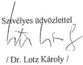
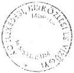
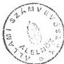
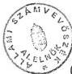

Állami Számvevőszék

# JELENTÉS

a TECHNOIMPEX Rt. szerepéről a GSM típusú digitális
közcélú rádiótelefon szolgáltatás létesítésére kiírt pályázatban

1996. november

345.

---

A vizsgálat végrehajtásáért felelős:

az ÁSZ IV. Vagyonellenőrzési Igazgatósága

*Halász Gejza*

*számvevő igazgatóhelyettes*

Az ellenőrzést vezette:

*dr. Kovácsné*

*dr. Pósfay Zsuzsanna*

*osztályvezető főtanácsos*

A vizsgálatot végezte:

*Podonyi László*

*számvevő tanácsos*

---

# T A R T A L O M J E G Y Z É K

I. E L Ő Z M É N Y E K 1-4.

II. ÖSSZEFOGLALÓ MEGÁLLAPÍTÁSOK, KÖVETKEZTETÉSEK, AJÁNLÁSOK 4-8.

1. Összefoglaló következtetések 4-8.
2. Ajánlások 8.

III. RÉSZLETES MEGÁLLAPÍTÁSOK

1. A versenytárgyalást bonyolító társaság megváltoztatása és a koncepcióváltás 9-12.
2. A közreműködői díj 12-13.
3. Az ÁFA és a késedelmi pótlék helytelen elszámolása 14-15.
4. Kártérítés 15-16.

---

-

-

-

-

---

ÁLLAMI SZÁMVEVŐSZÉK
V-19-126/1995-1996.

# J E L E N T É S

# a TECHNOIMPEX Rt. szerepéről a GSM típusú digitális
közcélú rádiótelefon szolgáltatás létesítésére kiírt
pályázatban

# I.

# E L Ő Z M É N Y E K

Az Állami Számvevőszék az 1989. évi XXXVIII. törvény 2. §. (6)
bekezdésében foglaltak alapján ellenőrizte az 1993. évben le-
folytatott GSM típusú digitális közcélú rádiótelefon szolgálta-
tás koncessziós pályázatának előkészítésére - a TRANSELEKTRO Rt.
helyett - a TECHNOIMPEX Rt.-nek a közlekedési miniszter által
adott megbízás alapján kifizetett 1,7 milliárd Ft összegű siker-
díjjal kapcsolatos ügyletet. Az ügy összefüggésben áll az állami
költségvetéssel a koncesszióról, az államháztartásról, valamint
a távközlésről szóló törvény vonatkozó előírásai következtében.

A közcélú mobil rádiótelefon szolgáltatás koncesszió köteles te-
vékenységnek minősül, amelyre koncessziós pályázatot a közleke-
dési, hírközlési és vízügyi miniszter írhat ki (a koncesszióról
szóló 1991. évi XVI. tv., illetve a távközlésről szóló 1992. évi
LXXII. tv. alapján).

---

- 2 -

A törvényi előírások részletes feladatokat szabnak meg a koncessziós pályáztatásra, de nem maximálják az ebben közreműködők díjazását.

A pályáztatás előkészítés több munkaigényes feladatból áll. A távközlésről szóló 1992. évi LXXII. törvény 5. §-a szerint a pályázati kiírásnak tartalmaznia kell a szolgáltatás időben ütemezett forgalmi, mennyiségi, minőségi és műszaki követelményeit, más távközlési szolgáltatóval való együttműködés feltételeit a koncessziós díjra vonatkozó feltételeket, a szolgáltatási díjak megállapításának módját és módosításuk feltételeit, továbbá a tevékenység gyakorlásának földrajzi feltételeit.

A távközlési törvény deklarálja a miniszternek azt a jogát, hogy a szerződést fogyasztói érdekből, illetőleg a fejlesztési követelményekre, és az időközben vállalt nemzetközi kötelezettségekre figyelemmel időszakonként felülvizsgálhassa a szerződésben meghatározott feltételekkel módosíthassa. A miniszter ezen jogát a pályázati kiírásnak és a szerződésnek is tartalmaznia kell.

A koncessziós díjak a Távközlési Alap (az 1995. évi LIV. tv. alapján a továbbiakban: Hírközlési Alap) bevételét képezték. A koncessziós díjból fizették a GSM típusú mobil rádiótelefon szolgáltatás pályáztatásának előkészítésére kifizetett összegeket. Az 1996. évi költségvetési törvény megszüntette a Hírközlési Alapot, annak pénzeszközeit elvonta a tárcától. Következésképpen a GSM tenderrel kapcsolatos pályáztatási ügy költségei, az utólagos perek és peren kívüli megegyezések a Hírközlési Alapot, illetve közvetve az állami költségvetést érintik.

A telefon igények 1993. évben olyan nagy mértékben kielégítetlenek voltak, hogy a mobil rádiótelefon szolgáltatási koncessziót elnyerő cég biztos és jelentős piacot szerezhetett.

---

- 3 -

A mobil rádiótelefon koncessziós pályázatot először az 1990-92. években készítették elő és írták ki, de ezt a HUNGARIA TELECOM perben megtámadta, ezért az eljárást szünteltetnie kellett a tárcának. 1993. évben újabb pályázatot készíttetett elő a tárca, amely sikerrel zárult és licitálás útján maximális 96 millió USD összegű koncessziós díjbevételt értek el, amit a vevő kifizetett. Időközben ugyanis a hivatalába lépett miniszter az azonos műszaki feltételeket teljesítő pályázatok benyújtóinak licitálási lehetőségeit megerősítette a koncessziós díj növelése érdekében. Az új elgondolás az volt, hogy az egyszeri 24 USD összegű, két év alatt befolyó fix díj helyett árversenyt hirdetett meg a pályázók között. A korábbi induló árhoz képest pályázók licitjéből 72 millió USD bevételi többlet keletkezett. A koncesszióval elnyerhető piac értékesnek bizonyult.

A tender előkészítési feladattal korábban érvényes szerződés nélkül, de a tárca ráutaló magatartása alapján foglalkozó cég – a TRANSELEKTRO Rt. – helyett, az állami résztulajdonú TECHNOIMPEX Rt.-vel kötött sikerdíjas szerződést a miniszter. Az ügyre hosszan ráirányult a közfigyelem. Az Országgyűlés 1994. december 22-i ülésnapján képviselői interpelláció is elhangzott a Kormány közlekedési hírközlési és vízügyi miniszteréhez a TECHNOIMPEX Rt.-nek kifizetett sikerdíjra vonatkozóan.

Az Állami Számvevőszék vizsgálatának célja annak feltárása volt, hogy az állami vagyonnal (pénzeszközökkel) való gazdálkodás megfelelő volt-e a GSM koncessziós szerződésekkel és tendereztetésekkel kapcsolatos sikerdíj kifizetésénél.

A vizsgálat keretében áttekintettük a KHVM kapcsolódó tevékenységét. Nyilatkozatot kértünk az ügy időpontjában funkcióban lévő felelős szakmai vezetőtől, valamint lehetőséget adtunk arra is, hogy a korábbi miniszter – ha szükségesnek tartja – véleményt

---

- 4 -

nyilvánítson. Erre sajnos a vizsgálat ideje alatt nem került sor. A jelentés véglegzésekor viszont a volt miniszter több megállapításra is szakmai választ adott (1996. október 21.). A válaszok figyelembevételével a volt miniszter kérésének megfelelően a jelentés tartalmazza a kétféle elgondolással járó koncessziós és fogyasztói díj összefüggéseket.

Felvilágosítást kértünk továbbá az ügyben érintett TECHNOIMPEX Rt.-től és TRANSELEKTRO Rt.-től is.

A TECHNOIMPEX Rt. ma már csak 15 %-ban állami tulajdonú cég. Elnöke az Állami Számvevőszék illetékességét vitatva először nem volt hajlandó választ adni arra, hogy milyen indokok vezérelték a szakértői díj kialakításában és a pénzügyi átutalások rendhagyó teljesítésében.

Később a TECHNOIMPEX Rt. elnöke a kérdésekre általános jellegű válaszokkal reagált, s benne az átutalásról, a tényektől eltérő leírást adott.

## II.

### ÖSSZEFOGLALÓ MEGÁLLAPÍTÁSOK, KÖVETKEZTETÉSEK, AJÁNLÁSOK

#### 1. Összefoglaló következtetések

A GSM típusú mobil rádiótelefon koncessziós díjának tendere előkészítésében résztvevőkkel szemben a tárca eljárása jogellenesnek nem minősíthető a szóbeli megbízás felmondása, illetőleg más szerződő fél kiválasztása tekintetében. Az ügy elintézése módjából származó járulékos ügyekből azonban károk keletkeztek.

---

- 5 -

A TRANSELEKTRO RT.-nek nem volt írott szerződése a KHVM-el a mobil rádiótelefon koncessziós díjára irányuló tender előkészítésére, a munkálatokban a tárca ráutaló magatartása alapján vett részt. A minisztérium 1993. június 9-én ezen megbízást felmondta.

A TECHNOIMPEX Rt.-vel a miniszter új szempontok alapján írott szerződést kötött a tendereztetés lebonyolítására. Az új koncepció lényege az volt, hogy meg kellett emelni a tender felhívásban korábban meghatározott minimum árat és a koncessziós jogot licitálás útján a legtöbbet fizetőnek adták el. A díjverseny megvalósult. A vevő 96 millió USD koncessziós díjat fizetett a TECHNOIMPEX Rt. számlájára.

A TECHNOIMPEX Rt. a hozzá befolyt koncessziós díjból a lebonyolításért 1,7 Mrd Ft sikerdíjat tartott vissza, melyből (1993. december 16-án) 352,4 millió Ft-ot tévesen befizetett az APEH-hoz ÁFA-ként. A koncessziós díj többi részét átutalták a KHVM által kezelt Távközlési Alapba. Utóbb tisztázódott, hogy a sikerdíj nem volt általános forgalmiadó köteles ellenérték. A tévesen befizetett 352,4 millió Ft ÁFA 1993. december 16-tól 1994. október 20-ig volt az APEH bankszámláján, tehát az adóhatósághoz befolyt. A TECHNOIMPEX Rt. az adóhatósággal folytatott hosszas jogvita után az APEH-tól visszaigényelte a tévesen befizetett pénzt, amelyet 1994. október 20-ától kezdve magánál tartott, holott az a Hírközlési Alapot illeti.

A Távközlési Törvény a tendert lebonyolító díjazására felső határt nem ír elő.

A közlekedési, hírközlési és vízügyi miniszter 1993-ban, mint a Hírközlési (Távközlési) Alap felett rendelkező, a GSM tender lebonyolításával kapcsolatban bár jelentős, 96 millió USD koncessziós díjbevételt ért el, de ugyanakkor a Hírközlési Alapot a

---

- 6 -

versenyeztetés alkalmával három esetben elkerülhető kiadásokkal terhelte meg. Illetve a törvényes jogorvoslattal elérhető kamatbevételhez képest kisebb összeggel is megelégedett a tárca a későbbi években.

a. A sikerdíj, közreműködői díj jelentős része elkerülhető kiadás lett volna az Alap számára, ha a versenyeztető cégek kiválasztásánál az alacsonyabb százalékú szakértői díjat ajánló tanácsadók mellett döntenek, feltéve, hogy ugyancsak jelentős koncessziós díj elérésére alkalmas megoldást ajánlottak.

A minisztérium a legmagasabb sikerdíjat felszámoló társasággal kötött szerződést. A megbízott cég és a másik hazai pályázó sikerdíja között 1 Mrd Ft volt a különbség, gondosabb kiválasztásával mintegy 1 Mrd Ft kiadást lehetett volna elkerülni.

b. A szerződött társaság tévesen alkalmazta a vonatkozó ÁFA törvényt, ezért a Hírközlési Alap károsult, mert a neki járó 352,4 millió Ft ÁFA címen visszatartott összegnek csak egy részéhez jutott hozzá, ahhoz is csak évek múlva. A fennálló tőketartozás jelenleg 100 millió Ft, amely beszedése bírósági per tárgya (az ÁSZ által folytatott vizsgálat javaslatára).

A KHVM 30 millió Ft kamatot számolt fel a késedelmes teljesítés miatt, amely szintén peresítés alatt áll. A kamat mértéke 13 %, egyező a Hírközlési Alap számláját abban az időben kezelő OTP Bank Rt. által fizetett látra szóló kamattal.

Az Alap kezelője törvényes jogait csak részlegesen érvényesítette, amikor az elérhető késedelmi pótléknál kisebb összeggel is megelégedett. A törvény alapján felszámolható késedelmi pótlék ugyanis jelenleg elérné a 300 millió Ft-ot.

---

- 7 -

A költségvetést a folyamatban lévő bírósági követelés érvényesítése esetén is az elérhetőhöz képest 270 millió Ft-os bevételkiesés éri amiatt, hogy a tárca nem élt teljes mértékben a törvény adta jogaival. Amennyiben a követelés nem folyik be, úgy ez a Hírközlési Alapnak összesen 400 millió Ft-os bevételkiesést jelent.

A bevétel kiesését elkerülhették volna, ha a koncessziós díjat nem a lebonyolító TECHNOIMPEX Rt. számlájára, hanem közvetlenül a KHVM által kezelt Alapba fizetik a koncesszió nyertesei.

c. A szakértői megbízás visszavonása és az új cég bevonása után nem rendeződött a korábbi társaság vagyoni igénye. Annak ellenére, hogy az elvégzett munkát elismerték, nagyságrendjét meghatározták, az ellenértéket nem fizette ki a tárca. A TRANSELEKTRO Rt. emiatt pert indított a KHVM ellen.

A követelés nagyságrendje 2 Mrd Ft volt. A további kár megelőzése érdekében a minisztérium peren kívüli egyezséget kötött a követelővel 197,5 millió Ft összeg kifizetésére.

Ez az összeg a költségvetést terheli. A szerződésváltás körültekintőbb elrendezése esetén ezen kiadás nagyobb része elkerülhető lett volna.

A TECHNOIMPEX Rt. a GSM koncessziós szerződésekkel kapcsolatban a koncessziós díj növeléséhez kapcsolt és nem a végzett munkájával arányos magas díjazásban részesült. A TECHNOIMPEX Rt. összesen 1.758 millió Ft-ot tartott vissza a hozzá befolyt koncessziós díjból.

---

- 8 -

A TECHNOIMPEX Rt. 1993. évi kiválasztásának indokaira, a tárca korábbi vezetésének elveire alapozott színvonalas munkát végző tanácsadó a TRANSELEKTRO Rt. eltávolításának indokaira nincs megfelelő dokumentum. A KHVM nem kötött érvényes szerződést a TRANSELEKTRO Rt.-vel. A cég a tárca ráutaló magatartása alapján - a tárca korábbi vezetésének elveire alapozva, - végezte a GSM tender előkészítésével kapcsolatos munkákat.

A minisztérium apparátusa bár felhívta a tárca akkori vezetőjének figyelmét az általa elrendelt lépések kockázatára, a vezetői utasításra hivatkozva a döntést végrehajtotta.

## 2. Ajánlások

A közlekedési, hírközlési és vízügyi miniszter részére ajánljuk, hogy hatáskörében eljárva

- gondoskodjon arról, hogy hasonló esetek ne fordulhassanak elő. Vizsgáltassa meg, hogy az érintetteket milyen indokok vezették abban, hogy a tender lebonyolításának ilyen formában való és összegű odaítélésekor megelégedtek a vezetői döntés kockázatának adott szerény mértékű jelzésével;
- gondoskodjanak arról a folyamatban lévő polgári per során, hogy a TECHNOIMPEX Rt.-től a hiányzó tartozást olyan összegben szedjék be, amely megfelel a törvényes tartozások után felszámítandó kamatnak, tehát a mindenkori banki alapkamat kétszeresének megfelelő összegnek.

---

- 9 -

### III.

#### RÉSZLETES MEGÁLLAPÍTÁSOK

##### 1. A versenytárgyalást bonyolító társaság megváltoztatása és a koncepcióváltás.

A TECHNOIMPEX Rt. a GSM koncessziós szerződések megkötésével kapcsolatban végzett munkáért aránytalanul magas díjazásban részesült. Az ügy fő eseményei az alábbiak:

- A GSM tender első kiírásának elkészítésére a TRANSELEKTRO Rt. kapott megbízást. A cég elvégezte a kiírásokat, a KHVM-el szorosan együttműködött, szakértők szerint munkájával kapcsolatban kifogás nem merült fel. A TRANSELEKTRO Rt. tevékenységét 1993. május 28-ig végezte, a pályázatra beérkező ajánlatok átvételéig és regisztrálásáig.

- 1993. június 2-án a KHVM akkori minisztere a TRANSELEKTRO-Rt.-nek adott megbízást visszavonta. A visszavonás alátámasztására okot adó dokumentumot a vizsgálat részére nem tudtak átadni.

A TRANSELEKTRO Rt. vezérigazgatójának nyilatkozata szerint a cég munkáját az előkészítés alatt nem érte bírálat. Ezt a csatolt KHVM által írt levél is bizonyítja.

Idézet dr. Scharle Péter úr, a KHVM főosztályvezetője által Székely Péternek, a TRANSELEKTRO Rt. vezérigazgatójához 1993. július 3-án írt leveléből:

---

- 10 -

'Megerősítve tegnap esti közlésemet tájékoztatom arról, hogy kérésemre Bölcskei Imre helyettes államtitkár úr felülvizsgálta a TRANSELEKTRO Rt. által a GSM tender bontásáig terjedő időszakban végzett munka elszámolási lehetőségeit. Megállapította, hogy a Megbízás I. jelű tervezetben és azt kiegészítő iratban ismertetett tevékenységet a TRANSELEKTRO megfelelően látta el és díjigénye arányban áll az eredetileg teljes tenderezési időszakra előirányzott feladatok most bekövetkezett megosztásával.'

- 1993. június 9-én a KHVM akkori minisztere versenyeztetés nélkül, személyes döntés alapján a TECHNOIMPEX Rt.-nek adott a lebonyolításra megbízást a TRANSELEKTRO Rt.-nél jóval magasabb, négyszeres díjért, illetve az ez időben több cég által ajánlott díjtól is magasabb árért. A KHVM főosztályvezetője a miniszter személyes utasítására – bár a vezetői döntés kockázatára felhívta a figyelmet – felkérte a TECHNOIMPEX-et a tender lebonyolítására.

Az eljárás jogilag nem kifogásolható. A közbeszerzési törvény ekkor még nem volt hatályban, és a miniszter hatásköre sem volt egyértelműen szabályozva.

A Polgári Törvénykönyv 483 §. (1) bekezdése alapján a miniszternek joga volt elődje szóbeli megbízását azonnali hatállyal felmondani és más céggel írásos szerződést kötni. Az elvek megváltoztatása miatt azonban nem feltétlenül szükséges megváltoztatni a megbízott személyét. A Ptk. 474. §. (2) bekezdése értelmében ugyanis a megbízott a megbízást a megbízó utasításai szerint és érdekeinek megfelelően köteles teljesíteni. A tény az, hogy írásos érvényes szerződést e feladatra a TECHNOIMPEX Rt.-vel kötöt-

---

- 11 -

tek. Az érvényes szerződés alapján a TECHNOIMPEX Rt.-t a koncesszióra befolyt 96 millió USD után degresszíven 25-10 % díj illette meg.

A TECHNOIMPEX Rt. elnökének levele szerint is a minisztérium felkérésére végezték el a tendereztetést, és a sikerdíjra szóló ajánlatukat a minisztérium módosítás nélkül elfogadta.

A TECHNOIMPEX Rt. kiválasztása, vezetői (miniszteri) döntésen alapult indoklására érdemleges értékelést, dokumentumot az érintettek nem tudtak bemutatni.

Idézet dr. Scharle Péter úr a KHVM helyettes államtitkárának, a GSM tender kapcsán az ÁSZ által feltett kérdésekre adott válaszleveléből:

“A Transelektro közreműködését 1993. tavaszáig Csapodi Csaba főosztályvezető úr, illetve Bölcskei Imre helyettes államtitkár úr felügyelte. Tudomásom szerint a részvénytársaság teljesítményét megfelelőnek tartották, egyáltalán nem foglalkoztak a megbízás visszavonásának gondolatával. Április 20-án Schamschula György miniszter úr a minisztériumi irányítást illető elégedetlensége miatt, egy nyolcszemközti eligazítás alkalmával vonta el a GSM-tender felügyeletét a két szakági vezetőtől és helyezte hatáskörömbe, felszólítva őket arra, hogy az adott témában segítsék munkámat”.

A két társaság megbízása eltérő versenytárgyalási elgondolásra épült. A TRANSELEKTRO Rt. megbízása arra terjedt ki, hogy adott koncessziós ár mellett a versenyeztetés folyamán minél nagyobb minőségi szintet érjen el. Ezáltal az alacsonyabb koncessziós

---

- 12 -

díj mellett szolidabb díjtétellel működtek volna a GSM társaságok. A TECHNOIMPEX Rt. feladata viszont az volt, hogy a koncessziós díjat maximalizálja. Így az előfizetői díjak is magasabbá váltak. A koncepcióváltásból következően – melynek indokai ma is tisztázatlanok – nehezen összevethető a két cég által végzett munka minősége. Jogilag sem releváns az összevetés, mivel a felek szerződéses akaratuk szerint függetlenítették a díjat a végzett tevékenységtől és annak mértékétől.

A szemléletváltást alátámasztó részletes háttérszámítások nem készültek el, amelynek alapján a kétfajta koncepció realizálásának hatását össze lehetett volna hasonlítani.

Megállapítható, hogy a magasabb koncessziós díj mellett is előnyös volt a vétel a GSM cégeknek, mivel a fogyasztói díjak kellő megtérülést biztosítottak. A magasabb díjat a fogyasztó fizette meg.

A koncepcióváltást nem a TECHNOIMPEX Rt., hanem egy külföldi tanácsadó cég, a CREDIT SUISSE FIRST BOSTON Budapest Rt. javasolta. Összeférhetetlenségi okra hivatkozva ez a cég visszalépett a további munkálatoktól.

## 2. A közreműködői díj

A közreműködői díjat és a versenyeztető céget nem elég körültekintően állapították meg, illetve választották ki. A díj döntő része elkerülhető kiadásnak tekinthető a Hírközlési Alap számára.

A tender lebonyolítására több cég jelentkezett. A minisztérium érdemi válogatást a cégek között nem végzett és a legmagasabb

---

- 13 -

szakértői díjjal dolgozó TECHNOIMPEX Rt.-t bízta meg a tender lebonyolításával.

Összehasonlító táblázat az ajánlattevők által igényelt, illetve előirányzott díjakról a KHVM közlése alapján:

# Összes koncessziós díjbevétel  
millió USD a dologi költségek nélkül

|   | 24 | 28 | 30 | 32 | 40 | 70 | 96  |
| --- | --- | --- | --- | --- | --- | --- | --- |
|  CSFB |  |  | 0,50 | 2,45 | 8,60 | 12,47 |   |
|  Lazard | (résztevékenység, 0,50 alapdíjjal)  |   |   |   |   |   |   |
|  Lehman | (mint CSFB)  |   |   |   |   |   |   |
|  Omnitele | (szakértői tarifa szerint)  |   |   |   |   |   |   |
|  Transelelektro | 0,48 | 0,68 | 0,78 | 0,88 | 1,28 | 2,78 | 4,08  |
|  Technoimpex | 0,153 | 0,153 | 0,653 | 1,153 | 3,043 | 9,653 | 14,013  |

A megbízott TECHNOIMPEX Rt. és a másik hazai pályázó a TRANSELEKTRO Rt. sikerdíja közötti különbség 1 Mrd Ft.

A TECHNOIMPEX Rt. részére kiutalt közreműködői díj aránytalanságát bizonyítja, hogy egy más cég által már részben elvégzett tendereztetés előkészítése folytatásáról, lebonyolításáról volt szó, az eredeti cég 410 millió Ft-os vállalási díjának négyszereséért. A többi versenyző cég vállalási díja is alacsonyabb volt a nyertesnél. A kiutalt összeg nagyságrendje és az utólagosan keletkezett járulékos terhek miatt a hírközlési alapot, a költségvetést jelentős veszteség érte, melyért etikai felelősség terheli a tárca akkori vezetőjét.

---

- 14 -

### 3. Az ÁFA és a késedelmi pótlék helytelen elszámolása

A TECHNOIMPEX Rt. a kiutalt összegből ÁFA címen (352,4 millió Ft összegben) még a szerződésben meghatározottnál is nagyobb összeget tartott vissza. Ennek egy részét, 250 millió Ft-ot a Távközlési (Hírközlési) Alapba utalta át 1995. március 31-ig. Ekkortól megszüntették a tőketörlesztést és a hiányzó részt, valamint annak kamatköltségét még mindig nem utalták át, ez szintén veszteséget jelent a Hírközlési Alapnak.

A KHVM a TECHNOIMPEX Rt.-nek a késedelmes teljesítésre csupán 13 %-os kamatot számolt fel és csak akkortól, amikor az általános forgalmi adót a TECHNOIMPEX Rt. az APEH-től visszakapta. A gazdasági esemény időpontjában hatályos 86/1990. (XI.14.) Kormányrendelet alapján késedelmi kamatként a TECHNOIMPEX Rt.-nek az eredeti esedékességgel meg nem fizetett összeg után a banki alapkamat kétszeresét kellett volna felszámolni. Ez ma már többszáz millió forintot jelent.

A KHVM a fizetési kötelezettség teljesítésére több sürgető levelet intézett a TECHNOIMPEX Rt. elnökének. A felkérésre mindig fizetési ígéretek érkeztek, de tényleges pénzügyi teljesítés nem volt, ezért a KHVM peresítette a követelést. A Fővárosi Bíróság 1996. július 22-én jogerős fizetési meghagyást bocsátott ki a kötelezettel szemben. 132,9 millió Ft és ennek 1996. július 1-jétől a kifizetés napjáig járó 20 % kamatának megfizetésére. A fizetési meghagyás 1996. szeptember 26-án jogerőre emelkedett és végrehajtóvá vált.

Az ÁFA címen visszatartott összegből jelenleg 100 millió Ft a tőketartozás. A KHVM 30 millió Ft kamatot számolt fel a késedelmes teljesítés miatt. A vizsgálat alapján megállapítható,

---

- 15 -

hogy az elérhető késedelmi pótléknál jóval kisebb összeggel is megelégedett az alap kezelője. Ennek oka az, hogy a törvényesen megállapítható banki alapkamat kétszerese helyett csupán 13 %-os mértéket kötött ki a tárca, illetve a késedelembe esést nem az eredeti esedékesség alapján állapították meg.

Ha a törvény által engedélyezett banki alapkamat kétszeresének megfelelő pótlékot az eredeti esedékességtől (a koncessziós társaságok átutalása időpontjától) számítják fel, akkor a kamat ma eléri a 300 millió Ft-ot.

A Hírközlési Alapot – a bírósági követelés érvényesítése esetén – az elérhetőhöz képest 270 millió Ft-os bevétel kiesés éri. Amennyiben a bíróságnál folyamatban lévő követelés nem érvényesíthető, úgy a költségvetés 400 millió Ft-al rövidül meg.

A vázolt bevételkiesésre nem került volna sor, ha a pályázatban nyertes GSM társaságok közvetlenül az alapba fizetik be a díjakat és nem a TECHNOIMPEX Rt. számláján keresztül bonyolódik az üzlet.

#### 4. Kártérítés

A TRANSELEKTRO Rt. a tender visszavonásával kapcsolatos veszteségek miatt ugyancsak polgári pert kezdeményezett a KHVM ellen. Később a két fél peren kívül megegyezett. A megegyezésre a törvény módot ad. A minisztérium a kialakult helyzetben kénytelen volt kártérítést fizetni. A TRANSELEKTRO Rt. a KHVM-től 30 millió forint szolgáltatási ellenértéket 7,5 millió Ft ÁFA-t 17 millió Ft késedelmi pótlékot és 143 millió Ft kártérítést, vagyis összesen 197,5 millió Ft-ot kapott.

---

- 16 -

A kártérítés összegének nagyobb része a költségvetés számára elkerülhető kiadásnak tekinthető. A szakértői megbízás megváltoztatása (visszavonása és új cég kijelölése) után nem került sor a régi társaság anyagi követeléseinek rendezésére, annak ellenére, hogy annak munkáját és az ellenérték nagyságrendjét elismerték.

A TRANSELEKTRO Rt. a követelését peresítette 2 Mrd Ft-os nagyságrendben. A nagyobb kár megelőzése érdekében a minisztérium peren kívüli egyezséget kötött. A KHVM a Hírközlési Alapból 197,5 millió Ft-ot fizetett a TRANSELEKTRO Rt.-nek 1996. május 5-én.

A kifizetett összeg a költségvetést terheli, ezáltal megállapítható, hogy ha a szerződésváltás körültekintőbben rendeződik, akkor ezen kiadás nagyobb része elkerülhető lett volna.

Budapest, 1996. november " 29 "

(Sándor István)  
alelnök

---

# M E L L É K L E T E K

1. dr. Schamschula György úr levele az ÁSZ alelnökének
(V-19-120-/95-96. sz. 1996. november 15-én érkezett)
2. KHVM Dr. Lotz Károly miniszter úr levele az ÁSZ alelnökének
(V-19-122/95-96. sz. 1996. november 28-án érkezett)
3. Sándor István alelnök úr levele Dr. Lotz Károly miniszter
úrnak (V-19-125/1995-96. sz. 1996. november 28-án kelt)
4. Sándor István alelnök úr levele dr. Schamschula György kép-
viselő úrnak (V-19-127/1995-96. sz. 1996. november 28-án
kelt)

---

.

.

.

.

---

ORSZÁGGYŰLÉSI KÉPVISELŐ

L. Pótfay
Aztolóvaló
o. meczeketelés
96. XI. 15.

Fedész G. L.
XI. 15.
Szan

Allami Számvevőszék
Sándor István alelnök úr
részére

Budapest

Tisztelt Alelnök Ur!

|  **ÁLLAMI SZÁMVEVŐSZÉK**  |   |
| --- | --- |
|  ÉRKEZETT: | 1996 -11- 15  |
|  IKTATÓSZÁM: | V-19-120/96  |
|  MELLÉKLET: | DB  |

Kézhezvettem 1996. október 25-i keltű válaszát, köszönöm a jelentésük álláspontjainak alapjául szolgáló magyarázatait. Mindazonáltal - az ügynek a magam részéről történő lezárásaként - kötelességemnek érzem, hogy az abban foglaltak egy részével való egyet nem értésemet fejezzem ki véleményemet meg is indokolva, és annak a reményemnek adjak kifejezést, hogy számomra közvetlenül evidensnek tűnő magyarázataim alapján mégis korrigálják jelentésüknek az összes körülmények ismeretében tévesnek, illetve legalább is hiányosnak bizonyult megállapításait. Konkrétan a következőket kívánom megjegyezni.

1./ Nem rajtam mult, hogy nem korábban járultam hozzá a tényállás tisztázásához. Az Allami Számvevőszék a programon kívüli vizsgálatot még a parlamenti illetékes bizottsággal sem egyeztette és engem sem értesített róla. Véletlenszerűen szereztem tudomást az ügyről. Sem a vizsgálati programot, sem a szempontokat nem kaptam meg és a vizsgálatot végző Allami Számvevőszék alkalmazottak sem kerestek meg. Ennek ellenére az összeállított anyaghoz megtettem azokat az észrevételeimet, melyeket az adott rövid időn belül összeállíthattam. Ennél többet az ügy tisztázása érdekében nem tehettem utólag. Ha az ügy kivizsgálásába bevonnak és az anyag összeállításánál figyelembe veszik az általam elmondottakat - jobb és szakszerűbb összeállítást készíthettek volna az Ön munkatársai.

2./ Téves az a feltevés, amely szakmai szempontból szembeállítja egymással a Transelektro illetve a Technoimpex feladatát. A tenderkiírásban egyértelműen meg voltak határozva a nyertes által alkalmazható árképzési és áralkamazási feltételek, amelyek a MATAV árbázására és az inflációs hatásmechanizmusra alapozódtak, s így az árak nem függöttek attól, hogy milyen összegű koncessziós díj folyik majd be. Téves és félrevezető tehát az a megállapítás, hogy "végső soron a magasabb díjat a fogyasztó fizette meg".

Ugyancsak ide tartozik, és ezt támasztja alá, hogy Európában hazánkban a legolcsóbb a mobil telefon díja (egyedül Finnországban van kedvezőbb tarifa, de a skandináv országok szubvencionálják a távközlésnek ezt a módját). Tehát ez is azt húzza alá, hogy nem kétfajta koncepció létezett, hanem

---

- 2 -

el kellett hárítani a magyar koncessziós jog áron aluli kiárusításának kísérletét. Ez egyben válasz Önnek arra a felvetésére, hogy 'a koncepcióváltást alátámasztó háttérszámítások nem készültek el'. A háttérszámítás itt csak annyiból kellett álljon, hogy 98 millió USD több mint 24 millió, a fogyasztót pedig nem terhelte magasabb díjfizetési teher.

3./ Nem érthetek egyet b. levelének azzal amegállapításával, hogy 'az ok-okozati összefüggések az ügyben hiányoznak, szubjektív döntések történtek'. Milyen okot kell még felhozni arra, hogy az ország számára hátrányos ajánlatot és azt a céget, mely ezt próbálta képviselni el kellett utasítani?

4./ Szerény megítélésem szerint a Jelentés akkor lenne igazságos és megalapozott, ha ahelyett, hogy a Transelektro leváltásának helytelenségét sugallná, azt a valóban alapvető fontosságú kérdést tisztázná, hogy ki és miért akarta a koncessziós jogot mélyen áron alul értékesíteni. Ugyanakkor azt is le kellene írni, hogy a minisztérium műszaki és gazdasági aparátusa feladatát kitűnően oldotta meg, amit az elért jelentős nemzetgazdasági előnyön kívül a technikai megvalósulás és az elterjedés egyértelműen igazol.

5./ Megjegyzem még, félreértésen alapul Alelnök úr levelének azon megállapítása, mely szerint én sem kifogásoltam a jelentés azon megállapításának tényszerűségét, hogy a KHVM a kialakult helyzetben kényszerítve volt a peren kívüli megegyezésre stb. Én ezzel a kérdéssel egyáltalán nem kívánok foglalkozni, mivel az én hatáskörömbe ugyancsak nem tartozik ennek értékelése. Egyébként a KHVM által megbízott Bacher és társai ügyvédi iroda mintegy 60 M Ft-ra becsülte a Transelektro által jogosan igényelhető összeget az általa teljesített munkafázisig.

Végül szeretnék rámutatni arra, hogy a szerintem több vonatkozásban hiányos és téves jelentés-anyag kiszivárogtatása nekem közismerten jelentős politikai kárt okozott, ami egyértelműen indokolja a jelentés olyan tárgyilagos kiegészítését, amely mentesít az alaptalan gyanúsításokat keltő téves szakmai értékitéletek folyamatos keltésének veszélyétől.

Budapest, 1996. november 14-én.

Tisztelettel

Dr Schamschula György

---

KÖZLEKEDÉSI, HÍRKÖZLÉSI ÉS VÍZÜGYI
MINISZTER
661.690/1996.

Sándor István úr
alelnök

Állami Számvevőszék

Budapest

601/Eku/96

1. Húlius 9-11.

M.2.6.

|  ÁLLAMI SZÁMVEVŐSZÉK  |   |
| --- | --- |
|  ÉRKEZETT: | 1996 11-28  |
|  IKTATOSZÁM: | V-19-122/95  |
|  MELLÉKLET: | DB  |

Tisztelt Alelnök Úr!

A GSM típusú digitális közcélú rádiótelefon szolgáltatás létesítésére kiírt pályázatban a Technoimpex Rt. szerepéről készített Állami Számvevőszék-i jelentéstervezetet köszönettel megkaptam.

A jelentéstervezet megállapításai alapvetően tényeket rögzítenek, azokat nem kívánom vitatni, hiszen annak idején magam kértem a vizsgálat elvégzését. Ugyanakkor azonban nem világos számomra, hogy az előző, augusztusban véleményezésre átadott változathoz képest - amellyel a KHVM észrevételek nélkül egyetértett - néhány alapkérdés megítélése tekintetében miért, illetve minek az alapján változott meg az ÁSz álláspontja.

Az átdolgozott anyaghoz kapcsolódó részletes észrevételeim a következők.

A 3. oldalon a jelentéstervezet rögzíti, hogy a mobil rádiótelefon koncessziós pályázatot vissza kellett vonni, mert a HUNGÁRIA TELECOM azt perben megtámadta. A HUNGÁRIA TELECOM által indított per miatt a pályázati kiírás nem került visszavonásra, csupán az eljárás szünetelt. A koncesszió elveire vonatkozó feltételeket a hivatalába lépő új miniszter nem változtatta meg, mert ebben az esetben érvénytelen lett volna a pályázat. Az azonos műszaki feltételeket teljesítő pályázatok licitálási lehetőségeit erősítette meg.

Az 5. oldal utolsó bekezdése elmarasztalja a KHVM-et, mert a GSM lebonyolítása során nem megfelelően gazdálkodott az állami vagyonnal. E megállapítást három okkal támasztják alá:

1. a magas sikerdij kifizetese;
2. az afa törveny helytelen alkalmazása;
3. a TRANSELEKTRO Rt. kovetelése.

---

2

# ad.1.

A sikerdíj nagysága ténykérdés, nem dokumentálható azonban az, hogy a Technoimpex Rt.-t ki és milyen eljárásban választotta ki. Az azonban törvényes, hogy a pályáztatás költségei az Alapból fedezhetőek. Az Alapnak ugyanis csak akkor keletkezik bevétele, ha a tendereztető gondoskodik a pályázat fizikai előkészítéséről, hirdetéséről, árusításáról, a pre-bid konferenciák lebonyolításáról, postázásról, sokszorosításról, stb. Ezek a dologi kiadások és szellemi erőfeszítések pénzbe kerülnek. Mivel a minisztérium ezt a feladatot saját apparátusával nem tudta megoldani, kénytelen volt azt megbízásos alapon elvégeztetni.

# ad.2.

Reális az a megállapítás, hogy a Technoimpex Rt. jogosulatlanul számított fel az őt megillető sikerdíj után általános forgalmi adót. Ezt a módszert azonban a KHVM nem fogadta el. Amikor a Technoimpex Rt. a díjbefizetésekkel elszámolt és a KHVM által a KSH-tól és az APEH-tól beszerzett állásfoglalás alapján egyértelművé vált, hogy a sikerdíj nem adóköteles, az APEH az Rt. számára visszautalta a jogosulatlanul befizetett 353,3 MFt összeget 1994. október 20-án. Ezt követően a Technoimpex Rt. írásban vállalt kötelezettséget 1995. január 20-án arra, - amikor is az APEH-nak az Rt.-nél folytatott pénzügyi revíziója lezárult - hogy 1995. március 26-ig visszautalja a Hírközlési Alaphoz a szóban forgó összeget.

Az elmaradt áfa-befizetéssel kapcsolatos kamatfizetési kötelezettség felszámítására a KHVM-nek csak a visszafizetést (1994. október 20-át) követően volt lehetősége. Ugyanis ezt megelőzően (1993. december 16-a és 1994. október 20-a között) a vitatott összeg az APEH számláját gazdagította. Ezen időszakban tehát - a központi költségvetéssel szemben - késedelmi kamat érvényesítésének nem volt reális alapja. Az előzőekkel összefüggésben ugyanakkor belátható, hogy a jelzett időszak alatt államháztartási szintű károkozás - a fel nem számított kamatfizetési kötelezettség következtében - nem történt. Mindezeket figyelembe véve az ÁSz által veszteségként számított (300 MFt - 30 MFt = 270 MFt) összeg is jelentősen mérséklődik.

Tekintettel arra, hogy a Hírközlési Alap számláját abban az időben vezető OTP Bank Rt. a számlán lévő összeg után 13%-os látraszóló kamatot fizetett, ezért a KHVM a Technoimpex Rt.-től (a 352,3 MFt után) - 1994. október 20-ától kezdődően - ugyancsak 13%-os kamatot igényelt. A 13%-os kamatfizetési kötelezettség előírásakor a tárca abból indult ki, hogy ha az az összeg az Alap számlavezető bankjánál lenne, abban az esetben is 13%-os kamat keletkezne. A kamatszint megállapítása során arra is figyelemmel kellett lenni, hogy - a vitás kérdés mielőbbi lezárását elősegítendő - mindkét fél számára elfogadható megoldásokat volt célszerű előtérbe helyezni.

---

3

A Technoimpex Rt. visszafizetési kötelezettségének csak részben tett eleget, ugyanis 1995. március 31-ig csupán 250 MFt-ot utalt át a Hírközlési Alap számlájára. Ezt követően a fizetési kötelezettség teljesítésére több ízben levélben szólította fel a KHVM a Technoimpex Rt.-t, amelyre többnyire fizetési határidő módosítást kérő válasz (majd a későbbiekben már az sem) érkezett.

A 6. oldal 3. bekezdésében foglaltakkal kapcsolatban hangsúlyozom, hogy a tárca - az ÁSz vizsgálattól függetlenül is - peres útra terelte az ügyet, mivel a megállapodásokban foglaltakat a Technoimpex Rt. sorozatosan nem tartotta be.

A Technoimpex Rt. tartozását a KHVM végül is 1996. júliusában peres úton próbálta behajtani. A Fővárosi Bíróság 1996. július 22-én jogerős fizetési meghagyást bocsátott ki a kötelezettel szemben 132.932.000 Ft és ennek 1996. július 1-jétől a kifizetés napjáig járó 20% kamatának megfizetése iránt. A fizetési meghagyás 1996. szeptember 26-án jogerőre emelkedett és végrehajthatóvá vált.

# ad.3.

A TRANSELEKTRO Rt. által a KHVM ellen indított perre vonatkozó megállapítása a jelentéstervezetnek helytálló. Véleményem szerint az Rt.-vel kötött egyezség pernyertességgel egyenértékű volt. Vitathatatlan volt ugyanis, hogy az elvégzett és elfogadott előkészítő munkát ki kellett fizetni. Ha megvárja a tárca a bíróság döntését, feltehetően jóval magasabb összeget kellett volna kifizetni a TRANSELEKTRO Rt. részére.

Összességében szükségesnek tartom felhívni a figyelmet arra, hogy a KHVM eljárásából adódóan nemcsak komoly veszteségek érték az államháztartást, ugyanis a pótlólagos kiadásokkal egy időben (azokkal összefüggésben) 72 MUSD bevételi többlet is származott. Amíg az összefoglaló következtetések a., b. és c. pontjaiban összegezett veszteség mintegy 1,6 MrdFt-ot ér el, addig - mai árfolyamon számítva - az ügylet kapcsán realizált többletbevétel legkevesebb 11 MrdFt-tal növelte az államházartási szintű bevételeket.

A felelősség megítélése kérdésében jelentős eltérés mutatkozik az ÁSz augusztusi jelentéséhez mérten, mivel a jelenlegi anyag 5. oldalának utolsó bekezdése a Közlekedési, Hírközlési és Vízügyi Minisztériumot nevesíti, mint amely "nem megfelelően gazdálkodott az állami vagyonnal". Korábban az ÁSz - a veszteségek kialakulása miatt - a tárca akkori vezetőjét marasztalta el (vizsgálati részjelentés 7. oldal 2. pont). Az Ász módosított véleményével - az alapkérdés megítélésének változatlanságát figyelembe véve, illetve az előzőekben feltárt és bemutatott összefüggések alapján - nem értek egyet.

A fentiek alapján nem tartom megalapozottnak a felelősség kérdésében kialakított, kizárólag a KHVM-et elmarasztaló álláspontot, ezért szükségesnek tartom annak az előzőekben (ad.1.-ad.3. pontokban) leírtak figyelembevételével történő korrekcióját.

---

4

A 8. oldal 2. bekezdéséhez kapcsolódóan nem értek egyet a minisztériumi apparátus egészére kiterjedő elmarasztalással, ugyanis csak egy szűk vezetői kör rendelkezett információkkal a tervezett módosítások lényegét és irányát tekintve. Az érintett vezetők felhívták az akkori miniszter figyelmét a döntés egyes kifogásolható elemeire, amelynek eredményeként az érintetteket a miniszter az ügyek intézéséből kizárta, sőt a Távközlési Főosztály vezetőjét állásából is felmentette.

Az előző bekezdésben foglaltakra is tekintettel a jelentéstervezet Ajánlásának első francia bekezdésével kapcsolatban megjegyzem, hogy a vizsgálat nem tárt fel olyan tényeket, amelyek alapján a személyes érintettség kérdése felmerülhet. Ezért célszerűnék tartanám és kérem a 8. oldal (2. Ajánlások fejezet) első francia bekezdésének 2. mondatából a "személyes" szó elhagyását.

Az Ajánlás második francia bekezdésében javasolt teendő újragondolását javasolom, mert a Technoimpex Rt. felszámolása következtében nem csak az ÁSz által javasolt büntetőkamatokkal számított tartozás, de még a KHVM eredeti követelésének behajtására irányuló erőfeszítés eredményessége is kérdéses. Javaslatomat egyébként az is indokolja, hogy a késedelmi kamat mértékéről szóló 86/1990. (XI. 14.) kormányrendeletet a Magyar Köztársaság 1996. évi költségvetéséről szóló CXXI. törvény 109. § (1) bekezdés 24. pontja 1996. január 1-jével hatályon kívül helyezte.

A tervezetnek a "Részletes megállapítások"-kal kapcsolatos 3. fejezetére nem kívánok külön kitérni, mert az első két fejezetre vonatkozó észrevételeim adott esetben - különösen a harmadik pontban az áfa és a késedelmi pótlék helytelen elszámolására vonatkozó megállapításokat illetően - a részletes megállapításokra is értelemszerűen vonatkoznak. Ezért észrevételeim, javaslataim e helyen történő megismétlése szükségtelen.

Végül megköszönöm Alelnök úr megértését és segítségét, amely lehetővé tette e kérdésben a tényfeltáró vizsgálat lefolytatását.

Egyúttal kérem, hogy észrevételeimet elfogadni és a vizsgálatot lezáró jelentés véglegesítésénél figyelembe venni szíveskedjék.

Budapest, 1996. november "25."

---

Állami Számvevőszék

Aelnök

V-19-125/1995/96.

DR. L O T Z KÁROLY úr,

miniszter

Közlekedési, Hírközlési és Vízügyi Minisztérium

B U D A P E S T

Tisztelt Miniszter Úr!

Köszönettel megkaptam levelét, amelyben "a TECHNOIMPEX Rt. szerepe a GSM típusú digitális közcélú rádiótelefon szolgáltatás létesítésére kiírt pályázatban" című jelentés-tervezetre tett észrevételeket.

Megköszönöm a jelentés-tervezetre tett hasznos, pontosító észrevételeit, amelyeket nagyobb részben elfogadtam és a jelentés véglegzésénél figyelembe vettem.

A jelentés-tervezetre tett észrevételeit az alábbiakban fogadtam el:

- A jelentés-tervezet 3. oldalához tett észrevételét elfogadtam, a jelentésben az észrevételnek megfelelően módosítottam.
- A jelentés-tervezet 5. oldalán az összefoglaló megállapítást az észrevétel figyelembevételével átalakítottam.
- A késedelmi pótlékkal kapcsolatos észrevétellel a végleges jelentést kiegészítettem, megjegyzem azonban, hogy az elmaradt ÁFA befizetéssel kapcsolatban a KHVM-nek lehetősége lett volna a koncesszió nyerteseinek befizetésétől kezdve a TECHNOIMPEX Rt. felé a késedelmi kamat felszámolására.

A gazdasági események idején hatályban volt a gazdálkodó szervezetek egymás közötti viszonyában a késedelmi kamat mértékéről szóló 86/1990. (XI.14.) Kormányrendelet, amely a késedelmi kamat mértékét a banki alapkamat kétszeresében határozta meg.

---

Állami Számvevőszék

- 2 -

A felszámított kamatot nem befolyásolhatja, hogy a Hírközlési Alap milyen nagyságú kamaton tartja a pénzét, illetve az, hogy az adós hová utalta a pénzét.

Észrevételében említettektől eltérően nem a TECHNOIMPEX Rt., hanem a TECHNOIMPEX Külkereskedelmi Vállalat áll felszámolás alatt, így a késedelmi kamat eredményesen követelhető.

- Az észrevételének megfelelően a végleges jelentésben a 72 millió USD bevételtöbblet szerepel.
- A volt miniszter és az apparátus felelősségi kérdését a végleges jelentésnél elkülönítettem.
- A jelentés-tervezet ajánlások fejezeténél első francia bekezdésben szereplő "személyes" kifejezést töröltem. A második francia bekezdésben lévő ajánlást a késedelmi kamatnál leírtak miatt fenntartottam.

A részletes jelentésben az észrevételeket az összefoglalóban jelzetteknek megfelelően vettem figyelembe.

Az észrevételeknek megfelelően átdolgozott végleges jelentést mellékelten megküldöm, amit az Országgyűlésnek és a Ogy. Számvevőszéki Bizottságának is benyújtok.

Ezúton megköszönöm Miniszter úr és munkatársai vizsgálathoz nyújtott segítségét.

Budapest, 1996. november 29.

Tisztelettel

(Sándor István)

---

Állami Számvevőszék

Aelnök

V-19-127/1995/96.

DR. SCHAMSCHULA GYÖRGY úr
országgyűlési képviselő

BUDAPEST

Tisztelt Képviselő Úr!

Megköszönöm az Állami Számvevőszéknek "a TECHNOIMPEX Rt. szerepéről a GSM típusú digitális közcélú rádiótelefon szolgáltatás létesítésére kiírt pályázat" című jelentés-tervezetére adott észrevételeit. Időközben beérkezett a tárca véleménye is.

Az ügyben érintettek észrevételei alapján az Országgyűléshez, valamint az Ogy. Számvevőszéki Bizottságához benyújtandó jelentést több ponton kiegészítettem. A két irányból származó tényállások pontosítása után csatoltan megküldöm az Állami Számvevőszék végleges álláspontját magában foglaló jelentést.

Közreműködését ez alkalommal is megköszönöm.

Budapest, 1996. november 29.

Tisztelettel

(Sándor István)

---

•
•
•

•
•
•