Allami Számvevőszék

# JELENTÉS

a Dunamenti Erőmű Rt. működésének és privatizációjának
ellenőrzéséről

1997. január

346.

---

A vizsgálat végrehajtásáért felelős:

az ÁSZ IV. Vagyonellenőrzési Igazgatósága

Halász Gejza

számvevő igazgatóhelyettes

A vizsgálatot vezette:

Kemény Emil

osztályvezető főtanácsos

A vizsgálatot végezte:

Karsainé Dömsödi Éva

számvevő tanácsos

a vizsgálat koordinátora

Gálik Jenő

számvevő tanácsos

Kiss Istvánné

számvevő tanácsos

Pallós Gáborné

számvevő tanácsos

Bányai István

külső szakértő

Istvánffy Lóránt

külső szakértő

---

- I -

# T A R T A L O M J E G Y Y É K

Oldal

|  I. | BEVEZETÉS | 1  |
| --- | --- | --- |
|  II. | ÖSSZEFOGLALÓ MEGÁLLAPÍTÁSOK, KÖVETKEZTETÉSEK, AJÁNLÁSOK | 4  |
|  1. | Összefoglaló megállapítások | 4  |
|  1.1. | A hazai villamosenergia-rendszer és a Dunamenti Erőmű Rt. | 5  |
|  1.2. | A Dunamenti Erőmű Rt. privatizációja | 9  |
|  1.3. | A Dunamenti Erőmű Rt. gazdálkodása, a tüzelőanyag-ellátás, tárolás helyzete | 18  |
|  2. | Ajánlások | 22  |
|  III. | RÉSZLETES MEGÁLLAPÍTÁSOK | 26  |
|  3. | A magyar villamosenergia-rendszer (VER) | 26  |
|  3.1. | A hazai villamosenergia-rendszer működése | 26  |
|  3.2. | A működési modell | 27  |
|  3.3. | A villamosenergia-rendszer üzemvitele | 29  |
|  4. | A Magyar Villamos Művek Rt. fejlesztési kötelezettségei | 30  |
|  5. | A Dunamenti Erőmű Rt. működése | 35  |
|  5.1. | Az erőmű iparági piaci környezete | 35  |
|  5.2. | Az erőművi gépcsoportok állapota | 36  |
|  5.3. | Környezetvédelem | 39  |
|  5.3.1. | Az energiatermelés környezeti terhelései | 39  |
|  5.3.2. | A társaság környezetvédelmi tevékenysége | 42  |
|  5.3.3. | Környezeti auditálás | 43  |
|  5.3.4. | Környezetszennyezési bírságok | 45  |
|  5.3.5. | Hulladékkezelés | 46  |
|  5.3.6. | A környezetvédelmi előírásoknak megfelelő berendezések | 46  |
|  6. | A Dunamenti Erőmű Rt. tüzelőanyagellátása | 48  |
|  6.1. | Szénhidrogénbázisú tüzelőanyagellátás | 48  |
|  6.2. | Energiahordozó készletezés | 52  |

---

- II -

7. A villamosenergia-ipari privatizációs folyamat .. 59
7.1. Az energetikai szakma privatizációs állásfoglalása ... 62
7.2. A privatizációs pályázat ... 64
7.3. Privatizációs szerződések ... 67
7.4. Az Állami Privatizációs és Vagyonkezelő Rt. által vállalt szerződéses kötelezettségek, garanciák .. 75
7.5. Az erőmű privatizáció előkészítése a Magyar Villamos Művek Rt.-ben ... 76
8. A Dunamenti Erőmű Rt. gazdálkodása ... 81
8.1. Gazdálkodás ... 81
8.1.1. A gazdálkodás szabályozottsága ... 81
8.1.2. A Dunamenti Erőmű Rt. számviteli politikája ... 82
8.1.3. Az amortizáció elszámolása ... 82
8.1.4. A gazdálkodás értékelése ... 83
8.1.5. Pénzügyi műveletek eredményének alakulása ... 85
8.1.6. A karbantartási költségek alakulása ... 87
8.1.7. Az üzletágak szerinti eredmény alakulása ... 87
8.2. A Dunamenti Erőmű Rt. humánpolitikája ... 88
8.3. A gazdasági munkafolyamatok gépesítettsége ... 90
8.4. A Dunamenti Erőmű Rt. jelentős gazdálkodási eseményei ... 90

# M E L L É K L E T E K

1. melléklet Jogszabályok és egyéb normatívák jegyzéke
2. melléklet Műszaki jellemzők, adatok bemutatása
A magyar villamosenergia-rendszer műszaki jellemzői és a Dunamenti Erőmű Rt. működése
3. melléklet A Dunamenti Erőmű Rt. gazdálkodási mutatóinak elemzése

---

ÁLLAMI SZÁMVEVŐSZÉK

V-12-32/1996.

Témaszám: 327

# J E L E N T É S

a Dunamenti Erőmű Rt. működésének és privatizációjának
ellenőrzéséről

# I.

# B E V E Z E T É S

A villamosenergia-ipar több mint 560 milliárdos vagyona képezte
az elmúlt évben Magyarországon az egyik legnagyobb privatizálha-
tó vagyontömeget. Ezen belül mintegy 34 Mrd Ft vagyont jelentett
a Dunamenti Erőmű Rt.

A Kormány 1994 decemberében határozott a villamosenergia-ipar
privatizációjáról úgy, hogy a társaságokat külföldi szakmai be-
fektetők számára értékesítsék.

A privatizációs stratégia új tulajdonosi szerkezetet és ehhez új
jogi, szabályozási és szerződéses működési modell kialakítását,
valamint a hazai és nemzetközi tőke szervezett bevonását írta
elő. Az Országgyűlés törvényekben állapította meg a tartósan ál-
lami tulajdonban maradó vagyon részarányát.

"Jelentés az állam tulajdonosi funkció érvényesüléséről a Magyar
Villamos Művek Részvénytársaságnál és társaságainál" - címmel az
Állami Számvevőszék 1995 júliusában számolt be az Országgyűlés-
nek e folyamatok alakulásáról. A teljes ágazatot átfogó elemzés-
sel bemutatta a hazai villamosenergia ipar helyzetét és a priva-
tizáció előkészítettségét. Megalapozta az energiaipari vagyon-
gazdálkodás további vizsgálatait.

---

- 2 -

E számvevőszéki vizsgálat folytatásaként került sor a Dunamenti Erőmű Rt. működését és magánosítási folyamatát átvilágító ellenőrzésre.

A vizsgálat célja az volt hogy:

- állapítsa meg, miként érvényesültek az Országgyűlés által elfogadott energiapolitikai alapelvek;
- tárja fel az erőmű működése és magánosítása során miként valósultak meg a villamosenergia-ipari privatizációs kormányzati döntések és ágazati-szakmai célok;
- elemezze, a privatizáció hogyan szolgálta a társasági gazdálkodás hatékonyságának növelését az erőművi fejlesztésekhez, a termelő berendezések állapotjavításához szükséges tőkebevonást, hogyan hasznosultak az előző jelentés ajánlásai;
- állapítsa meg hogyan tesz eleget a társaság az egyre szigorodó környezetvédelmi követelményeknek, továbbá hogyan érvényesítik ezeket a privatizációs megállapodásokban;
- mutassa be az erőmű működésének keretfeltételeit és jellemző vonásait, gazdálkodását.

A helyszíni vizsgálatunkkal gyakorlatilag egy időben folyt a Magyar Energia Hivatal (MEH) egész ágazatot átfogó költségvizsgálata, illetve az októberi energia áremelés elhalasztása nyomán kormánymegbízotti vizsgálat kezdődött.

A helyszíni vizsgálatok a Magyar Villamos Művek Rt.-re (MVM Rt.), a Dunamenti Erőmű Rt.-re (DE Rt.), továbbá az Állami Privatizációs és Vagyonkezelő Rt.-re (ÁPV Rt.) terjedtek ki. A vizsgálat megállapításait a kapott dokumentumokra és a szakemberekkel folytatott konzultációkra alapoztuk.

---

- 3 -

A hazai villamosenergia-rendszer új működési modell formálása, a privatizáció előkészítése és lebonyolítása a többi termelő társasággal összevontan, ágazati szinten folyt. Ennek következtében elkerülhetetlen volt, hogy a Dunamenti Erőmű Rt. vizsgálatát az Állami Számvevőszék:

- az energia-rendszer, a tüzelőanyag-ellátás és a privatizáció kérdésköreiben jogi és ágazati összefüggések elemzésével, míg
- az erőmű műszaki-gazdasági-környezetvédelmi tevékenységi területein a társaság-specifikus egyedi dokumentumok és szabályozási környezet vizsgálatával végezze el.

A hagyományos ellenőrzési módszerek mellett kísérletképpen alkalmaztuk az értékelemzési módszert. Az energiapolitika új alapokra helyezése, az új működési modell és a privatizáció, továbbá az új tulajdonosi szerkezet feltételei és alakulása képezték az elemzés gerincét.

Az összeállított logikai séma segítette a vizsgálókat az egységes logikán alapuló ellenőrzési szemlélet megvalósításában (2. melléklet).

Az elemzések a Magyar Energia Hivatal párhuzamosan folyt költség vizsgálatából származó adatokra, a szakértő készítette részanyagokra, a villamosenergia statisztikai évkönyvek adataira épülnek.

A Jelentés alapvetően az 1994-1996. között keletkezett dokumentumokat dolgozza fel, de szükség szerint visszatekint az 1995. júniusi 258. sz. ÁSZ jelentésben részben érintett - a privatizáció előkészítésével foglalkozó - korábbi történések elemzésére.

---

- 4 -

# II.

# ÖSSZEFOGLALÓ MEGÁLLAPÍTÁSOK, AJÁNLÁSOK

# 1. Összefoglaló megállapítások

Az energiapolitikai alapelveket, stratégiai célokat az európai integrációs törekvéseinkkel, a piacgazdaság megvalósulásával és az abba történő minél zökkenőmentesebb energetikai beilleszkedéssel összhangban deklarálta az Országgyűlés 21/1993. (IV. 9.) határozatában, az ország stabilizációjának egyik eszközeként.

Ezen alapelv korlátozottan érvényesült az energiatársaságok, így a Dunamenti Erőmű Rt. működése és a privatizáció első fázisa során.

A DE Rt. működését az 1994. évi XLVIII. törvényben – villamosenergia törvény továbbiakban: VET – rögzített két jelentős optimalizálási követelmény befolyásolta. Az egyik elvárás az ellátásbiztonság zavarmentes megvalósítása – ma már a magyar és a nyugat-európai villamosenergia-rendszer műszaki előírásainak betartásával. A másik előírás a legkisebb költségen alapuló árelv érvényesítése.

A két fő követelmény egyidejű betartása számos konfliktus forrása volt a privatizációt megelőzően, és azt követően. A villamosenergia-rendszer működési kockázatát jelentő bizonytalanságokat három fő tényező együttes hatása okozta, amelyek a következők:

- A DE Rt. – MVM Rt. kapcsolatrendszerben az eddigi műszaki-gazdasági együttműködést az új működési modell megváltoztatta, üzleti alapokra helyezte.
- Az erőmű privatizációjakor abszolút prioritást kapott a készpénzes eladás a mielőbbi költségvetési bevétel érde-

---

- 5 -

kében. Ez a megvalósítási mód ellentmondott mind az előkészítés során deklarált szakmai/kormányzati elveknek, mind az ágazat magánosításától elvárt komplex stratégiai szemléletnek. Az új tulajdonosi körben a villamosenergia-rendszer egyensúlya megbomlott, az érdekek tovább polarizálódtak.

- Az erőmű költséggazdálkodásának meghatározó eleme az ár, amely szoros összefüggésben van a primer energiahordozó-ellátással és az indokolt fejlesztések forrásait is megteremtő önfinanszírozási feltételrendszer kialakításával. Az ár- és tarifarendszer rendezése nem megoldott, az árképzési elvek jogi szabályozása az energiaszektor egyes ágazataiban diszharmónikus.

### 1.1. A hazai villamosenergia-rendszer és a Dunamenti Erőmű Rt.

Új működési modell kialakulása van folyamatban a magyar villamosenergia-rendszerben (VER). A modell fő elemei a VET megalkotása, a Magyar Energia Hivatal (MEH) 1995. évi felállítása, a megkezdett privatizáció, illetve a piaci alapon meghatározott villamosenergia ár- és tarifarendszer majdani elérése.

A villamosenergia-rendszer átalakítása 1992-től kezdődött meg. A jogi szabályozások fokozatos megjelenésétől, 1994-től a társaságcsoport átalakulása egyre növekvő ütemben zajlik, folyamatosan változó műszaki-gazdasági feltételrendszerben, változó tulajdonosi összetétel mellett. Eközben a villamosenergia-ellátás folyamatosságát és biztonságát megőrizték.

Az új működési modellben mára alapvetően megváltoztak az állam feladatai. A korábbiakhoz képest jóval kevésbé kiszámítható piaci viszonyok alakultak ki.

---

- 6 -

Az ágazati stratégiai feladatok ellátására a jogi szabályozás az állam irányítási, beavatkozási eszköze. A VET és a hozzá kapcsolódó jogi környezet diszharmonikus. Az MVM Rt. mint szállító egyenrangú a termelőkkel és szolgáltatókkal. A VET kiemeli az MVM Rt. felelősségét a villamosenergia-rendszerért, az ellátás folyamatosságáért/biztonságáért és a legkisebb költségre alapozott árelv érvényesítéséért. E feladatokat az MVM Rt. érdemben csak termeltetői szerepben tudja ellátni.

A MEH és az MVM Rt. hatásköri és feladatköri elhatárolása nincs összhangban. A MEH-hoz rendelt jogok érvényesítéséhez a szükséges eszköztár és feltételrendszer biztosítását a VET előírások szem előtt tartásával kell úgy szabályozni, hogy az a feladatok eredményes végrehajtását, az ellátásbiztonság követelményeit érdemben szolgálja.

Az elsődleges energiahordozók közül a szénhidrogén alapú villamosenergia-termelés biztonságos gáz- és fűtőolajellátása rendezetlen. A villamosenergia-rendszer a szénhidrogénalapú tüzelőanyag ellátásra nem rendelkezik hosszú távú szerződésekkel. A VET-ben meghatározott, villamosenergia-ellátás biztonságát alátámasztó, az energiarendszerek működését összehangoló stratégiai koncepció nem készült.

Az MVM Rt. a közelmúltban – 1992 óta – a folyamatosan változó műszaki-gazdasági feltételrendszerre tekintettel és a szénhidrogén-ellátás bizonytalanságai miatt több fejlesztési erőműépítési koncepciót dolgozott ki.

A magyar villamosenergia-rendszer közcélú erőműveinek beépített villamos kapacitása 1995 elején 7292 MW volt.

---

- 7 -

Az 1995 júniusában elfogadott erőműépítési stratégia alapján a selejtezések az elkövetkező 15 éves periódusban mintegy 4000 MW új erőművi kapacitás létrehozását teszik szükségessé. 1995. évi áron számolva az erőműépítés várható költsége 450 Mrd Ft, a környezetterhelést csökkentő, élettartam növelő beruházások további 100 Mrd Ft-ra becsülhetők egy alacsonyabb villamosenergia-igény növekedéssel prognosztizálva.

Összességében folyó áron 550-770 Mrd Ft közötti fejlesztési forrásigény kalkulálható, az 1995. évi villamosenergia-igény bázistól számított kisebb vagy nagyobb igénynövekedési változattól függően.

A folyamatos és biztonságos villamosenergia-ellátást súlyosan veszélyezteti, hogy tisztázatlan az 1997-2000. közötti időszakra eső forrásteljesítmény növelő beruházások finanszírozása. További kockázatnövelő tényező, hogy a privatizációt megelőzően nem dolgozták ki teljes körűen a társaságcsoport és az azt alkotó egyes társaságok privatizációhoz kapcsolható alaptőke emelési igényét. Így a privatizáció szükségessége nincs alátámasztva a külső befektetési szükségletek konkrét összegző bemutatásával.

Az MVM Rt. összes beépített erőművi teljesítményének 27%-a a DE Rt.-ben van – az 1995-ben értékesített villamosenergia mennyiségből a hazai termelés 19%-át adta, – amely fokozottan menetrendtartó erőmű, technikai adottságai következtében első helyen kiemelt az 1995. október 18-án létre jött nyugat-európai villamosenergia-rendszer csatlakozás (UCPTE) szabályozási feladatainak folyamatos ellátásában.

Az 1980-as években megszűnt a fejlesztések/beruházások központi finanszírozása. Az 1989-től bekövetkezett gazdasági visszaesés nyomán a DE Rt. is egyre növekvő üzemviteli kockázattal működött, a nem tervezett események és a kiesett

---

- 8 -

órák száma növekvő tendenciát mutatott. A berendezéseknél nem állapotfüggő, diagnosztikán alapuló, hanem hibaorientált karbantartás folyt. A rendelkezésre állás mutatói nemzetközi összehasonlításban is gyengék és magas a karbantartás időigényessége. Ennek oka a források szűkösségén túl a rendelkezésre álló források nem megfelelő újraosztása, a járadékrendszer hiányosságai.

A Dunamenti Erőmű Rt.-t megillető árbevételből közel 15 Mrd Ft-ot vont el az MVM Rt. a vizsgált 1992-95. közötti időszakban. A karbantartási költségek tényszámai ugyanezen időszakban 4,6 Mrd Ft-ot tettek ki. Az inflációval korrigálva és az 1991-es árszintre vetítve a karbantartási ráfordítások reáltértéke alig kétharmada a műszakilag indokolt és a nemzetközi gyakorlatnak megfelelő értéknek.

Összességében 1995-ben közel 7 Mrd Ft volt a DE Rt. fejlesztési ráfordítása, amely mintegy 15%-a az MVM Rt. ugyanezen időszakra eső teljes beruházási fejlesztési ráfordításainak.

A Dunamenti Erőmű Rt. már 1993-ban összefoglalta a rendszerérdekű fejlesztési igényeit. Az akkori fejlesztési elképzelések lényegében ma is helytállóak.

A DE Rt. számára – előregedő erőművi blokkjai miatt – a szigorodó környezetvédelmi előírások követése növekvő terheket jelent.

Az energiatermelés jellemző környezeti terhelései a zajártalom, levegőszennyezés, vízszennyezés, veszélyes hulladékok. A társaság környezetvédelmi tevékenysége jól szervezett, a feladatokat 1988 óta évenkénti intézkedési tervekben jelölik meg és évenként értékelő beszámoló készül. A társaság kárelhárítási, havária elhárítási tervekkel rendelkezik.

---

- 9 -

Az 1995. évi LIII. törvény nemcsak környezetvédelmi bírság, hanem környezetterhelési díj fizetési kötelezettségét is előírja.

1995-ben levegőszennyezési bírság címén mintegy 73 M Ft-ot fizetett ki a DE Rt., zaj- és vízszennyezési bírságolásra nem került sor. A még fel nem tárt környezeti problémák vizsgálati költsége mintegy 80 M Ft.

### 1.2. A Dunamenti Erőmű Rt. privatizációja

Az energetikai nemzeti vagyonon belül meghatározó a villamosenergia iparág, amelynek együttes 1991. évi könyv szerinti értéke több mint 560 Mrd Ft, amin belül mintegy 34 Mrd Ft vagyont jelent a Dunamenti Erőmű Rt.

Az állam tulajdonában lévő vállalkozói vagyonértékesítés jogi hátterét az 1995. évi XXXIX. tv. szabályozza (kihirdetve: 1995.05.17.). Eszerint az ÁPV Rt. elsődleges feladata az állam tulajdonában álló vagyonrészek mielőbbi értékesítése prioritásként kezelve a készpénzes eladást.

A villamosenergia-privatizáció konkrét folyamatát, megvalósítási elképzeléseit és lépéseit jogszabály nem korlátozta, így mind a politikai, mind a szakmai döntések a kormányzat szintjén születtek meg törvényi, illetve jogszabályi kontroll nélkül.

A Kormány ügyrendje alapján határozatokat hozott az energia privatizáció végrehajtására vonatkozóan, ezek viszont nem jogszabályok. A Kormánynak a jelenlegi hatályos magyar tételes jogszabályozás értelmében nem feladatköre és nem is joga az ÁPV Rt.-nek a privatizációval kapcsolatos üzleti döntéseit normatív úton megszabni.

---

- 10 -

A DE Rt. privatizációs folyamatát, szerződéseit a kormányhatározatokon kívül az ÁPV Rt. tanácsadók javaslatai, az ezekre alapuló ÁPV Rt. igazgatósági döntések és az MVM Rt. – ÁPV Rt. megállapodások határozták meg. Ezek nem egyedileg és speciálisan az erőmű körülményeit és adottságait vették figyelembe, hanem a villamosenergia-ipar privatizációjának egészére vonatkoztak. Így az erőmű vizsgálatán keresztül a magyar villamosenergia termelő rendszer jelenlegi működése, és a privatizáció első fázisának megvalósulása is nyomon követhető.

A privatizáció során, a fejlesztések megvalósításához szükséges befektetéseket összegző, alaptőke-emelési igényeket bemutató konkrét elemzések nem készültek.

Az ágazat helyzetét, műszaki-, közgazdasági-szabályozási kapcsolatait összefüggően egyetlen tanulmány, tanácsadói elemzés nem mutatta be annak ellenére, hogy a privatizációval kapcsolatosan olyan összetett érdekek jelentek meg, amelyek a magyar gazdaságban egyedülállóak. Nem készültek olyan hatáselemzések, amelyek a tulajdonosi szerkezet megváltozásának egyes lépcsőihez kapcsolódnak és annak várható következményeit modellezik. Mindezek szükségességére az ÁSZ jelentése 1995 júliusában a villamosenergia-ipari privatizáció előkészítésének vizsgálata kapcsán már felhívta a figyelmet.

A privatizáció feltételrendszerének kialakításakor nem kellő alapossággal dolgozták ki az állami- és ágazati szabályozást, nem került sor az ár- és tarifarendszer, illetve a költségszerkezet optimális kezeléséhez szükséges megállapodásokra, keretszerződések megkötésére.

---

- 11 -

Az energetikai szakmai érvek másodlagos szerepet kaptak. A szakmai szervezetek javaslatait nem vették figyelembe, szaktanácsadóként, szakértőként nem vettek részt a privatizáció előkészítésében és lebonyolításában, még a külföldi tanácsadók magyar szakértői között sem.

Az iparág 1992–94. között megkezdte, illetve folytatta a privatizáció különböző, szakmailag végrehajtható változatainak kialakítását, műszaki megalapozását. A DE Rt.-ben külön is készültek alternatív javaslatok a fejlesztési projektekben szükséges tőkebevonás módozataira. A privatizáció későbbi fázisaiban ezen lehetőségek további részletes kidolgozása elmaradt.

A Kormány két lépcsőben, a többségi tulajdon eladása mellett döntött a privatizációs törvénnyel, majd az 1995. július 21-től hatályos LXIX. tövénymódosítással. Az eközben eltelt két hónap alatt a DE Rt.-nél az állami tulajdonban maradó részarányt 50%+1 helyett 1 db 'aranyrészvényben' határozta meg.

A privatizációs pályázatban a pályázók versenyeztetési szabályait, az értékelés kritériumait az ÁPV Rt. kiírása a versenyszabályoknak megfelelően tartalmazta. A pályázati felhívás az 1114/1995. Korm. hat. 2.2. pontja szerinti erőműépítési projekteket finanszírozó tőkebevonási kötelezettség előírása tekintetében nem egyértelmű, nem tér ki a DE Rt. fejlesztésének környezetvédelmi követelményeire, illetve a folyamatban lévő és tervezett fejlesztésekből a befektetőre háruló kötelezettségekre. A kiértékelés a kiírásban rögzített kritériumok szerint történt.

---

- 12 -

Az értékesítés ütemét nem az iparág fejlesztési érdeke, hanem a költségvetés bevételi igénye diktálta. A versenyeztetés kényszerű lerövidítése kedvezőtlenül hatott az adásvételi megállapodást megelőző tárgyalássorozatra.

Az összesen több mint 2,8 Mrd USD értéket képviselő és 14 villamosenergia-ipari társaság jövőendő sorsát meghatározó pályázatokról négy nap alatt érdemi döntést hoztak úgy, hogy további két nap múlva a szerződéseket már alá is írták.

Az MVM Rt. és az ÁPV Rt. a villamosenergia privatizációs modellalkotási és elbírálási folyamatban másodlagos, kiszolgáló szerepet játszott, a külföldi tanácsadók előtérbe kerülése mellett.

Az MVM Rt. 1995. második felében az ÁPV Rt. utasítására külön megállapodásokat kötött az ESBI műszaki-, a Stikeman Elliott jogi-, a Schroders pénzügyi nemzetközi tanácsadók-kal és a könyvvizsgáló Deloitte and Touche-al.

A megkötött megállapodások alapján az MVM Rt. az általa alkalmazott tanácsadóknak nem volt jogosult közvetlenül feladatokat adni és azok teljesítését elbírálni. Ez a Schroders jogosítványa volt, aki az ÁPV Rt. vezető pénzügyi tanácsadója a privatizációs projektekben.

A megállapodási konstrukcióból következik, hogy az MVM Rt. műszaki tanácsadóját valójában a Schroeders alkalmazta az általa felállított villamosenergia-privatizációs pénzügyi modell műszaki vonatkozásainak alátámasztására.

A Stikeman Elliott jogi tanácsadóval az MVM Rt. titoktartási megállapodásokat kötött, amelyben az értelmezést érintő jogviták esetére e megállapodás angol nyelvű változatát jelölték meg irányadónak.

---

- 13 -

A villamosenergia-iparági privatizációs dokumentumok kezelése, a titoktartási megállapodások megkötésének körülményei, az utólagos – a dokumentumok átvételét követő – aláírás ellentétes a magyar joggyakorlattal és a dokumentum kezelésre vonatkozó eljárásokkal.

Az MVM Rt. a villamosenergia-ipar első fázisában a tanácsadóknak összességében mintegy 468 M Ft-ot fizetett ki – ennek több mint egyharmadát GBP-ban –, amely összeg nem tartalmazza sem az ÁPV Rt. által fizetett díjak összegét, sem a tanácsadók sikerdíját.

Az ÁPV Rt. részéről kifizetett tanácsadói díjakat az ÁSZ párhuzamosan végzett – az ÁPV Rt. 1995. évi értékesítési tevékenységére irányuló – vizsgálata mutatja majd be.

A DE Rt.-t 1995. december 8-án kelt adásvételi megállapodás alapján értékesítették a belga TRACTABEL/POWERFIN S.A. konzorcium részére. A 141,1 millió USD vételár ellenében a részvények 48,76%-át vásárolták meg.

A részvényárfolyam alapja a DE Rt. 1991. december 31-i eszköz utánpótlási értéken meghatározott vagyonértéke volt. A privatizáció megkezdése előtt nem készültek gazdasági felmérések az erőmű valóságos üzleti értéke meghatározására. A piackonform üzleti érték megállapításának alapfeltétele lett volna az árakban elismerhető költségelemek tisztázása. A privatizációs tárca nélküli miniszter, mint a részvényesi jogok gyakorlója, nem tett maradéktalanul eleget a privatizációs törvény szerinti jogaiból fakadó kötelezettségének.

A DE Rt. privatizációjában a készpénzes részvényértékesítés abszolút preferenciát kapott a külföldi tőkebevonással, a fejlesztések kötelezettségként történő előírásával szemben.

---

- 14 -

A szakmai befektető kisebbségi részvénycsomag megvásárlásával többségi management jogokhoz jutott, a többségi tulajdonszerzés lehetőségének kormányzati véges határidejű garanciájával.

A Dunamenti Erőmű Rt. magánosításakor az ÁPV Rt. olyan megállapodásokat kötött, amelyek nem felelnek meg teljes körűen a villamosenergia-ipar privatizációjára vonatkozó előírásoknak. Az új tulajdonosi szerkezetben bizonytalan helyzet alakult ki a szolgáltatási ár megállapításában, továbbá a biztonságos energiaellátás VET-ben rögzített követelményeinek teljesülésében.

A privatizációs megállapodások fő elemeit határozataiban az ÁPV Rt. igazgatósága és ügyvezetése hagyta jóvá. Ezek nem felelnek meg teljes körűen sem egymásnak, sem a privatizációs törvénynek és a folyamatot szabályozó kormányhatározatokban foglaltaknak.

A privatizációs megállapodások olyan típusszerződések, melyek az angol joggyakorlat alkalmazásával készültek, az adott társaság konkrét jellegzetességeinek bennfoglalása nélkül. A megállapodások tőkeemelési kötelezettséget, továbbá ennek megvalósítására vonatkozó konkrét kikötéseket nem tartalmaznak.

Nem garantált a hazai vállalkozók védelme, a dolgozói tulajdonszerzés megvalósítása, a társasági dolgozók szociális és munkajogi védelme. A privatizációs szerződésekben nincs olyan klauzula, amely a VET-ben rögzített állami kötelezettségek érvényesítésének hatékony és gyors eszköze lehetne az esetleges viták bírói útra terelésének elkerülése nélkül.

A DE Rt. adásvételi megállapodása (továbbiakban: AVM) nem írja elő a fejlesztéspolitika keretében az erőmű rekons-

---

- 15 -

trukciójára a vevő fejlesztési kötelezettségét. A vevő feladata nem a rekonstrukció, hanem annak 'támogatása és előmozdítása'.

A DE Rt.-ben tervezett nagyteljesítményű erőművi blokk iparági előkészítő munkái 1994 végén lelassultak, az AVM megkötésekor nem volt hatósági előzetes létesítési engedélye, így egy kiemelt hazai erőműépítési terv megvalósulása bizonytalanodott el.

A vevő számára az AVM előírja: 'A vevőnek minden ésszerűen elvárhatót el kell követnie', továbbá 'minden ésszerű erőfeszítést megtesz', hogy vállalt kötelezettségeit teljesítse. Az adásvételi megállapodás minden olyan kötelezettség vállalás teljesülése ellenőrizhetetlen, számonkérhetetlen, amelynek része e fogalom. A szakmai befektetők vállalt kötelezettségeinek teljesítése ily módon stratégiai jelentőségű területeken vált szubjektív megítélés tárgyává.

A DE Rt. összes fejlesztési igénye folyó áron 100-120 Mrd Ft között becsülhető, melynek finanszírozási forrásai bizonytalanok.

A környezetvédelmi intézkedések, beruházások, a környezeti károk és terhelések enyhítésére vonatkozó követelményrendszer beépítése az adásvételi megállapodásokba a privatizációs jogszabályok alapján törvényi kötelezettség.

A DE Rt. környezeti állapotáról az eladás időpontjáig nem készült környezeti vizsgálat. Ennek alapján nem zárható ki kárigény felmerülése e kérdéskör kapcsán a vevő részéről.

Az AVM nem tartalmazza a DE Rt. környezetvédelmi célzatú fejlesztéseit, csupán az üzleti tervben szerepelnek ezek. Így az AVM nem kötelezi a vevőt a környezetvédelmi feladatok megvalósítására.

---

- 16 -

A kedvezményes munkavállalói részvényvásárlás megvalósítására, illetve tudomásulvételére irányuló befektetői kötelezettségvállalás szerződésbe foglalásáról, a kisbefektetők, a kárpótoltak, az önkormányzatok tulajdonszerzéséről az ÁPV Rt. nem rendelkezett az adásvételi megállapodásokban.

Ezek az igények már csak az MVM Rt.-nél lévő DE Rt. részvények terhére elégíthetők ki. Ugyanakkor a DE Rt. részvényesi megállapodása ezekre a részvényekre vonatkozóan a szakmai befektető részére elővásárlási jogot enged meg.

A befektető által megvásárolt részvények elidegenítési tilalmát nem a kormányhatározatnak megfelelően szabályozta az ÁPV Rt. Igazgatósága, és az adásvételi megállapodás sem. Az AVM néhány korlátozással, de megengedi a befektető számára az erőművi részvények 5 éven belüli továbbértékesítését.

Az adásvételi megállapodásban az ÁPV Rt. lehetővé tette a befektetők számára a privatizációt közvetlenül megelőzően (1995. október) megkötött hosszú távú villamosenergia eladási és kapacitáslekötési megállapodások (HTM) újratárgyalását. A tulajdonosi szerkezet lényeges megváltozásával e megállapodások tartalmi kérdései már nem rendezhetők a szélesebb nemzeti érdekek érvényesítésére alkalmas pozícióból. A vitás kérdések eldöntését az AVM alapján nemzetközi választott bíróság elé kell vinni.

Az erőművi társaságokra – így ezen belül a DE Rt. MVM Rt. üzleti együttműködésére – vonatkozó új HTM a vizsgálat lezárásáig nem készült el, bár a befejezés határideje 1996. június 30. volt.

A villamosenergia-ipari társaságok privatizációjával összefüggésben, összesítetten 1995. december 8-ig mintegy 70 Mrd Ft nagyságrendű a garanciavállalási követelmény, amelynek fedezetül a költségvetés általános tartaléka szolgál. A

---

- 17 -

Dunamenti Erőmű Rt. adásvételi megállapodását is 1995. december 8-án írták alá. Az időpontokból következik, hogy a garanciák vállalásához a törvényben előírt előzetes pénzügyminiszteri engedély nem lehetett az ÁPV Rt. birtokában. E tekintetben az ÁPV Rt. törvényt sértő eljárásbeli szabálytalanságot követett el.

A DE Rt. esetében az állami tulajdont megtestesítő 1 db 'aranyrészvény' az ÁPV Rt. tulajdonában marad. Az 'aranyrészvény' fogalma sem a privatizáció idején, sem azt követően nem volt törvényi szinten egyértelműen rögzítve, s így a hozzáfűződő jog sem.

Az 1988. évi VI. törvény 24 §-a alapján adott a lehetőség osztalék-, illetve szavazatelsőbbségi részvényfajta kibocsátására, amelyből a szavazatelsőbbségi részvényre használatos az ún. 'aranyrészvény' elnevezés.

Az erőművi társaságok szavazatelsőbbségi részvényéhez fűződő jogokat a Kormány határozatban állapította meg, illetve módosította (2220/1995. (VIII. 4.) Korm. határozat és 1115/1995. (XI. 29.) Korm. határozat.

A Kormány 1995. augusztus 4-én és november 29-én foglalkozott határozatban az aranyrészvény jogosítványaival. Az adásvételt közvetlenül megelőző határozatban visszavonta a társasági osztalék és fejlesztéspolitika meghatározási jogot és azt csupán egyeztetési kötelezettségre szűkítette. E határozat meghozatala feltétele volt az AVM megkötésének, illetve érvényességének.

A vevő, fejlesztéspolitikával összhangban álló osztalékpolitikára vonatkozó kötelezettségét az AVM nem tartalmazza, az csak a részvényesi megállapodásban szerepel időbeli korlátozással 2000. december 21-ig, tehát a részvényelidegenítési korlátozás lejártáig.

---

- 18 -

### 1.3. A DE Rt. gazdálkodása, a tüzelőanyag-ellátás, tárolás helyzete

A DE Rt. működése gazdasági szempontból megfelelően szabályozott, a bizonylati rend és fegyelem jó színvonalú, az informatikai eszközök alkalmazásával a számviteli előírásoknak megfelelő gazdasági elszámolásokat készítenek, amelyek kielégítik a vagyonvédelmi szempontokat is.

Az eszközök és források értékelése, ezek elvei lényegében megfelelnek a számviteli törvény előírásainak, kivéve a karbantartások és felújítások eseti elszámolásait.

Ezen a téren nem következetesen alkalmazzák a felújítások és karbantartások elkülönítésére előírt, eltérő elszámolási módokat. A gazdálkodás mindenkori érdekei szerint adott esetben döntik el, hogy ugyanazon javítási költségre melyik elszámolási módot választják. Ez sérti a számviteli törvényben megfogalmazott óvatosság elvét.

A DE Rt. amortizációs politikája megfelel a törvényi előírásoknak.

Az erőmű az ellenőrzött időszakban társasági adót nem fizetett. Ennek hátterében az áll, hogy nem számolhatta el költségként az amortizációnak azt az összegét, amelyet egyébként a Társasági Adótörvény lehetővé tesz, mivel áraiban a teljes költséget soha nem érvényesíthette.

Összességében a Társaság gazdálkodása eredményes volt.

A DE Rt. költségszerkezete speciális. A tüzelőanyagköltség az összköltség 78-80%-át teszi ki.

Az amortizáció (értékcsökkenési leírás) az összköltségen belül 10-11%-ot reprezentál. A bér és személyi jellegű

---

- 19 -

kifizetések együttes összege 5,3-6,3% között mozog, tendenciája emelkedő. Az egyéb költségek a fennmaradó 6,7-2,7% arányban változtak a vizsgált időszakban, bár részarányuk nem meghatározó, de növekedési ütemük 282,8% jelentős, főként az amortizációs költség 175,6%-os emelkedési ütemével összevetve.

A fűtőolaj szabadáras termék, fő szállítója a MOL Rt., amely a világpiaci ármozgásokat közvetlenül érvényesíti termékei árában. A villamosenergia ár hatóságilag szabályozott, nem teszi lehetővé a költségemelkedés továbbhárítását.

A Százhalombattai Olajfinomító és a DE Rt. közötti kapcsolat szorosan egymásra épült, és zavarmentesen működött a legutóbbi időkig. 1995-ben ez a kapcsolat megromlott, rendezetlen állapotok alakultak ki, amelynek hátterében a társaságok termékeinél alkalmazott eltérő árszabályozási mechanizmus, a hosszú távú tüzelőolajellátási szerződés MOL Rt. részéről történt felmondása és a két társaság privatizációja következtében kialakult érdekkellentétek állnak. Jelenleg a DE Rt. fűtőolajellátása bizonytalan, havi ütemezésben folyamatos tárgyalások révén esetileg biztosított.

A villamosenergia és a szénhidrogének ármechanizmusa, ezek jogi szabályozása nincs összhangban. A fűtőolajár szabadáras, megállapítása a világpiaci árakhoz igazodó árképlettel, rendeletileg havonta lehetséges. A villamosenergia-ár megállapítására a 63/1995. (XI. 24.) IKM rendelettel szabályozott képletegyüttes alkalmazása az előírás. Az árképlet alkalmazott mutatói a költségek és az áralakulást befolyásoló egyéb tényezők éves kiegyenlítését teszik lehetővé.

Az 1995 augusztusában a privatizáció előkészületei sorában hozott kormányhatározat, előírja, hogy az 1997. január 1-i viszonteladói és végfelhasználói villamosenergia-áraknak az indokolt működési költségeken felül 8% tőkearányos nyeresé-

---

- 20 -

get is kell tartalmazniuk. A befektetők e kormányzati igérvény tudatában tették meg vételi ajánlataikat. A vizsgálat során a 8% mérték megalapozottságát és szükségességét indokló számításokat, dokumentumokat nem tudtak felmutatni.

A piacgazdaságra való áttérés következtében az elsődleges energiahordozó beszerzés, illetve termelés közel teljes körűen piaci feltételek közé került. A direkt állami előírás ellentmondásba került a piacgazdaság törvényszerűségeivel. A probléma visszavezethető arra, hogy a villamosenergia-ár nem tartalmazza az indokolt költségeket, nem önfinanszírozó.

A villamosenergia-iparban eddig kialakult tüzelőanyag készletezési rendszer zavarmentesen működött. Ezt igazolja, hogy tüzelőanyaghiány miatt nem fordult elő országos korlátozás. A DE Rt. tárolási kötelezettségeit részben saját, részben az olajfinomítótól bérelt tárolók igénybevételével oldotta meg. Ez ma a két társaság eltérő üzletpolitikai érdekei következtében korlátozottan, esetileg alkalmazható.

A villamosenergia-iparra kötelező érvényű stratégiai normatív készletezési előírások 1995-ben szigorodtak. A VET-ben rögzített ellátásbiztonsági követelmények, a nyugateurópai villamosenergia-rendszerben előírt többszintű tartalékképzési előírások és a világpiaci ármozgások hatásainak mérséklése áll ezen intézkedések hátterében.

Az MVM Rt. saját fejlesztési forrásaiból a DE Rt. telephelyén 90 ezer m³- olajtárolóteret létesített. A DE Rt. telephelyén jelenleg meglévő saját és MVM Rt. tulajdonú tartálypark együttesen adja ki a stratégiai fűtőolajmennyiség készletezésére elegendő tárolókapacitást.

---

- 21 -

Nincs megegyezés a DE Rt. és az MVM Rt. között a tartálypark üzemeltetése és hasznosítása tárgyában elsősorban az eltérő tulajdonviszonyok és működtetési célok miatt. Tovább nehezíti a közös megegyezést a DE Rt.-nél időközben bekövetkezett privatizáció és a tulajdonosi szerkezet változása miatt kialakult eltérő üzletpolitikai érdekek megjelenése.

Az MVM Rt. 1995 szeptemberében az ALTUS Rt. magántársasággal közösen (55%-45% tulajdoni arányban) 20 M Ft-os alaptőkével megalapította a FORTUS Rt.-t – az MVM beruházásban létesített olajtárolók hasznosítására – bértárolás és olajkereskedelem céljából. Az alapítás több hónappal megelőzte az MVM Rt. Igazgatóságának erre vonatkozó döntését.

A FORTUS Rt. alapítása üzletpolitikailag nem kellően megalapozott. Az előkészítés nem volt körültekintő és a tárolók üzemeltetésére és hasznosítására vonatkozó elképzelések még ma is kiforratlanok. Az 1996. augusztus-október között lezajlott olajkereskedelmi üzleti tranzakciók lebonyolítása során nem bizonyosodott be a FORTUS Rt. olajkereskedelemben való jártassága. Az érdemi ügyintézést a DE Rt. és az MVM Rt. szakemberei bonyolították le.

Az alapító okirat – társasági alaptőkeemelést szabályozó – megállapodása megteremti a lehetőségét annak, hogy a 4 Mrd Ft értékű tartálypark FORTUS Rt.-be történő esetleges apportálása révén az ALTUS Rt. magántársaság ellentételezés nélkül részesülhessen az állami vagyonból.

Megítélésünk szerint az olajtárolók, mint állami vagyon-tárgyak, nem ruházhatók át, nem apportálhatók a FORTUS Rt.-be.

---

- 22 -

# 2. Ajánlások

# 2.1. A Kormány

- Vizsgálja felül az ÁPV Rt.-re vonatkozó, a privatizáció folyamatát vezérlő gyakorlatát különös tekintettel az ÁPV Rt. üzleti döntéseit meghatározó, illetve ezek kereteit szabályozó normatív, jogszabályi előírásokra vonatkozóan. Szigorítsa meg a privatizáció hátralévő időszakában az ÁPV Rt. privatizációs döntéseinek folyamatba épített, ellenőrzését, tekintettel az országos infrastruktúrát működtető társaságok tervezett privatizációjára.
- Vizsgálja felül az állami vagyon védelmét szolgáló hatályos jogszabályok összhangját abból a szempontból, hogy ellenérték nélkül állami vagyontárgy apportálása ne történhessen meg vegyestulajdonú gazdasági társaságba. Törvényben állapítsa meg az állami vagyon elidegenítésének módjait, korlátait, továbbá az ellenérték nélküli vagyonátadás szankcióit.
- Gondoskodjon arról, hogy az ÁPV Rt. saját hatáskörében ne vállaljon garanciát a pénzügyminiszter előzetes hozzájárulása nélkül.
- Tegyen intézkedéseket az állami tulajdonban maradó "aranyrészvény"-hez fűződő jogok és kötelezettségek törvényi rendezésére.
- Dolgoztassa ki a konszern típusú irányítási rendszer normatív szabályozási és befolyásolási eszközeit. A villamossenergia-iparág megváltozott irányítási és döntési mechanizmusában érvényesítse a részvény tulajdoni hányad és a szavazati jog összhangját, és az államnak a villamos energia törvényben rögzített stratégiai szerepét.

---

- 23 -

## 2.2. Az ipari, kereskedelmi és idegenforgalmi miniszter

- - Vizsgálja felül a hatályos villamosenergia-ipari jogszabályokat, az Országgyűlés 21/1993. (IV.9.) OGY. határozatában megfogalmazott energiapolitikai alapelvek szerint.
- - Dolgozza ki és terjessze a Kormány elé a hiányzó hőszolgáltatási törvény tervezetét.
- - Tegyen intézkedéseket a MEH és az MVM Rt. hatáskörének és feladatkörének összehangolása érdekében. Normatív szabályozásban rögzítse az árhatósági feladatok érvényesítésének feltételeit.
- - Szabályozza a fogyasztói érdekek érvényesülése szempontjából szükséges egyeztetési kötelezettségeket.
- - Kérje fel a Magyar Energia Hivatalt, hogy:
  - = Dolgozza ki az ágazati szervezetek közreműködésével az átláthatóság és az összehasonlíthatóság javítása érdekében a villamosenergia árképlet alkalmazásának hatásmechanizmusát.
  - = Tegyen javaslatot az energia szektor ágazataiban alkalmazott árszabályozás összhangjának megteremtésére.
  - = Dolgozza ki az egységes villamosenergia ár- és tarifarendszert.

## 2.3. Az Állami Privatizációs és Vagyonkezelő Rt.

- Érvényesítse az állami tulajdon képviseleti jogkörében eljárva a már privatizált villamosenergia-ipari társasá-

---

- 24 -

goknál a villamosenergia törvényben rögzített ellátásbiztonság és a legkisebb költség alapú árelv követelményeit, továbbá a munkavállalói érdekek védelmét.

- Mutassa be tételesen a privatizált villamosenergia ipari társaságok eladásakor vállalt garanciák mértékét, esedékességét, érvényesítési feltételeit.
- Adjon számot részletesen arról, hogy a villamosenergia-ipari privatizáció első fázisát milyen ráfordítások terhelték. Ismertesse az alkalmazott tanácsadók díjazását, beleértve a Magyar Villamos Művek Rt. kifizetéseit is.

# 2.4. Magyar Villamos Művek Rt.

- Dolgozza ki a stratégiai fűtőolaj készletek tárolására létrehozott tartálypark üzemeltetési és hasznosítási koncepcióját oly módon, hogy azok valamennyi erőmű érdekét szolgálva a villamos energia törvény legkisebb költség elvének megfelelően, magas kihasználtság mellett, minimális üzemköltséggel működjenek.
- Tegyen intézkedéseket társaságainál a tulajdonosi arányának megfelelő érdekképviselet érvényesítésére.
- Kísérje fokozott figyelemmel a Dunamenti Erőmű Rt. beruházásaihoz biztosított hitelek pénzügyi rendezését.
- Segítse a Dunamenti Erőmű Rt. hosszú távú tüzelőanyag ellátási megállapodásának létrehozását.

---

- 25 -

## 2.5. Dunamenti Erőmű Rt.

- - **Tegyen intézkedéseket** a fejlesztések alapját képező hosszútávú tüzelőanyag ellátási megállapodás mielőbbi véglegesítésére.
- - **Hozzon szigorító intézkedéseket** a társaság költséggazdálkodásának javítására, a villamoenergia törvény alapelveivel összhangban - különös figyelemmel az ellátásbiztonságot szolgáló karbantartási, felújítási költségek alakulására, felhasználására.
- - **Valósítsa meg** a megkezdett és tervezett, előírt környezetvédelmi beruházásokat a már felvett hitelek felhasználásával.
- - **Javítsa** a karbantartási tevékenységet, pótolja az elmaradt javításokat, korszerűsítse szerződéseket nyilvántartó rendszerét.
- - **Érdemben segítse** az olajtárolók üzemeltetésére és hasznosítására vonatkozó iparági érdekek érvényesülését, a mielőbbi közös megegyezésen alapuló megoldás létrejöttét.

---

- 26 -

### III. RÉSZLETES MEGÁLLAPÍTÁSOK

#### 3. A magyar villamosenergia-rendszer (VER)

Magyarországon a villamosenergia termelési-, szállítási és szolgáltatási tevékenységet kétszintű konszern-típusú részvénytársaság csoport végezte és módosult hatáskörrel végzi ma is. A konszern felső szintjén a Magyar Villamos Művek Részvénytársaság (MVM Rt.) áll, míg az alrészvénytársaságok szintjén az erőmű-, az áramszolgáltató-, és az alaphálózatot üzemeltető társaságok működnek. Az MVM Rt ma is teljes mértékben állami tulajdonban van, míg az utóbbiakat részben már privatizálták.

Az Országgyűlés 1994. április 6-án elfogadta 'A villamosenergia termeléséről, szállításáról és szolgáltatásáról' szóló 1994. évi XLVIII. törvényt (VET), ennek megfelelően az MVM Rt. közvetlen és operatív módon irányítja a rendszer üzemét összhangban a 34/1995. (IV.5.) Kormányrendelet előírásaival.

A VET és a kapcsolódó jogszabályok hatályba lépésével, a Magyar Energia Hivatal felállításával, a privatizációval és a piaci árak majdani elérésével a magyar villamosenergia rendszerben új működési modell kialakulása van folyamatban.

##### 3.1. A hazai villamosenergia rendszer működése

3101 A vezetékes energiaellátó rendszer – technikai monopóliumából adódóan – egyetlen együttműködő energetikai rendszert alkot. Hosszú távú és éves szerződéseken alapuló kereskedelem folyik, illetve a szükséges kapacitások biztosítása a megfelelő tartalékok mellett ellenőrzött kapacitásfejlesztési koordinációt igényel. E rendszer szerves része a DE Rt. működése, privatizációja.

---

- 27 -

3102 A legkisebb költségű működés fenntartásához tartozó kereskedelmi megállapodások, a megfelelő tőkeallokációs mozgástér érdekében a tulajdonosi jogok bizonyos részét az MVM Rt.-hoz telepítették.

3103 A VET és a kapcsolódó jogszabályok, valamint a működési engedélyek alapján az együttműködő villamosenergia rendszer működési modell szerinti feltételeit az Üzemi Szabályzat rögzíti.

Az Üzemi Szabályzat MVM Rt. társaságaira vonatkozó egységesített szövegezésű típus-alapváltozatát a MEH 1995. október 6-án jóvá hagyta. A szabályzatszöveg összeállítását a villamosenergia iparág szakértői készítették; az ÁPV Rt. és a MEH külföldi tanácsadókkal is véleményeztette.

### 3.2. A működési modell

A VET a villamosműveket közcélú és saját célú kategóriákba sorolja. A tevékenységi engedély szempontjából megkülönbözteti a termelő, szolgáltató és szállító engedélyt.

3201 Az MVM Rt. mint szállító egyenrangú a termelő és szolgáltató engedélyesekkel. Ugyanakkor a VET kiemeli az MVM Rt. felelősségét a villamosenergia rendszerért, az ellátás folyamatosságáért/biztonságáért és a legkisebb költségre alapozott árelv érvényesítéséért. E feladatokat az MVM Rt. érdemben csak termeltető szerepben tudja ellátni.

3202 A modellben a működés alapját – a korábbi, társaságok közötti alapszerződést felváltó, a privatizációs folyamatnak és az új jogi környezetnek megfelelő – a MEH által jóváhagyott hosszú távú kapacitás – lekötési szerződések jelentik. A termelők és a szállítók, valamint a szolgáltatók közötti együttműködés feltételrendszerét az Üzemi Szabályzat

---

- 28 -

és a kereskedelmi szerződések rögzítik, míg a szolgáltatók és a fogyasztók közötti együttműködést a Közüzemi Szabályzat és közüzemi szerződések képezik.

3203 Az 1994. évi XLVIII. (VET) törvénynek megfelelő jogi környezet diszharmonikus, a hőszolgáltatási törvény előkészítése most van folyamatban.

3204 A villamosenergia iparág létrehozta a hatályos jogszabályoknak megfelelő iparági műszaki-, jogi-, kereskedelmi szabályozást. A kialakított működési modell a termelő-szállító-szolgáltató funkciókat kielégíti.

3205 A piacgazdaságra való áttérés következtében az elsődleges energiahordozó beszerzés, illetve termelés közel teljes körűen piaci feltételek közé került. Az IKM kompetenciájába tartozó (VET-ben rögzített) energiahordozó kijelölés elvesztette szerepét, nem alkalmas az ellátási problémák kezelésére. A direkt állami előírás ellentmondásba került a piacgazdaság törvényszerűségeivel.

A kötelező stratégiai, normatív készletezést a 27/1995. (VII.25.) IKM rendelet írja elő. Ezzel szemben a villamosenergia-ipar működése során kialakult egy olyan készletezési normatíva, amelyet igazol, hogy tüzelőanyaghiány miatt nem fordult elő országos korlátozás. Az új rendeletben előírt készletezés mennyisége mintegy felével haladja meg az eddigit. Ez közel 2 Mrd Ft finanszírozási forrásigény növekedést jelent, amit tovább növel a kamatköltség és a tárolás működtetés díja is.

A szénhidrogén alapú villamosenergia termelés biztonságos gáz- és fűtőolaj ellátása rendezetlen. A szénhidrogén alapú elsődleges energiahordozókra a villamosenergia-rendszer nem rendelkezik hosszú távú szerződésekkel. A VET szerinti vil-

---

- 29 -

lamosenergia ellátás biztonságot alátámasztó, az energia-rendszerek működését összehangoló stratégiai koncepció még nem készült.

### 3.3. A villamosenergia-rendszer üzemvitele

A villamosenergia-rendszer üzemirányítását és teljesítőképességét jellemző adatsorokat és magyarázatukat külön műszaki mellékletben foglaltuk össze (2. melléklet).

3301 Az 1995. évi adatok alapján a DE Rt.-ben található az MVM csoport összes beépített teljesítményének 27%-a és az összes kiadott hőtermelés 17,9%-a.

Az MVM csoport erőművi összehasonlításában a rendszer beépített teljesítményének 52,5%-a a DE Rt.-ben és Pakson található, míg a maradék 47,5%-nyi villamosteljesítmény megoszlik az ország egyéb, 15 erőművi telephelyén.

3302 A hazai villamosenergia-rendszer együttműködik más európai rendszerekkel is. A nyugat-európai rendszerekhez történő csatlakozás (továbbiakban: UCPTE) feltétele volt a paksi, a DE Rt. 6x215 MW és a Tiszai Erőmű Rt. 4x215 MW blokkjainak tesztelése, műszaki technikai felkészítése.

Az UCPTE kapcsolat sikeresen létrejött, 1995. október 18-án és zavarmentesen működik azóta is.

Az iparág a több évtizedes nemzetközi műszaki tudományos együttműködési tapasztalatok és az ezek birtokában végzett beruházási üzemviteli, fejlesztési tevékenység eredményeként volt képes az UCPTE nyugat-európai rendszeréhez történő csatlakozási feltételeknek megfelelni.

---

- 30 -

#### 4. Az MVM Rt. fejlesztési kötelezettségei

4001 A hazai erőműpark jelentős része technikailag elavult, hatásfoka alacsony, környezeti hatásaiban nem felel meg az európai elvárásoknak. Az alap- és elosztórendszer, valamint a rendszerirányítási infrastruktúra szintén megújításra szorul. A 90-es évek közepétől szükségessé váló modernizáció olyan mértékű finanszírozási kényszert jelent, amelynek tőkeszükséglete meghaladja az iparági akkumuláció mértékét. A privatizáció révén várt pótlólagos tőke fejlesztési célú felhasználása a hosszú távú erőműfejlesztési stratégia meghatározó eleme volt.

4002 A társaságcsoport feladata a változó működési modellben, az átalakuló tulajdonosi szerkezetben változatlanul az energiaellátási kötelezettség teljesítése, a villamosenergia használati értékének megőrzése, a biztonságos szolgáltatás, azaz a rendelkezésre állás.

4003 Az 1980-as években megszűnő központi finanszírozás és az 1989-től bekövetkezett gazdasági visszaesés hatása nyomán minimális mértékűre csökkent az új építés, a selejtezésre megérett erőművi berendezések pótlása. A berendezéseknél nem állapottól függő, diagnosztikán alapuló, hanem hibaorientált karbantartás folyt.

4004 A rendszerszabályozás szempontjából igénybevett DE Rt. és Tiszai Erőmű Rt. 215 MW-os erőművi blokkok alig felelnek meg a jelenlegi szabályozási feltételeknek, szabályozási tartományuk és sebességük szűk határok között változtatható. Ezek eredetileg alaperőművi (állandó terhelési üzemű) blokkoknak épültek, és annak ellenére, hogy az elmúlt időszakban jelentős fejlesztésekre került sor, csak korlátozottan szabályozhatók. A rendszerszabályozás nem rendelkezik teljes körűen hazai forrásból az UCPTE rendszerben meghatározott többszörös szabályozási tartalékokkal. Az

---

- 31 -

előírt tartalékok részben hazai forrásból vagy import szerződések alapján biztosítottak.

4005 A villamosenergia-hálózat topológiája a 2000 MW nagyságrendű korábbi keleti importhoz igazodik. Nem felel meg a megváltozott importlehetőségeknek, az import belső szállítási feltételeinek és ellentmondásokat eredményez a működtetésben a jelenleg kialakult tulajdonosi szerkezet is. A hálózatot különböző tulajdonosok működtetik, részben az MVM Országos Villamos Távvezeték Vállalat (OVIT) révén, részben pedig az áramszolgáltató társaságok. Ennek következtében előfordulhat, hogy az MVM Rt. az export-importot a földrajzilag közbeeső áramszolgáltató tulajdonában lévő hálózaton kénytelen lebonyolítani, jelentős többlet költséggel.

4006 Az erőműveknél az európai követelményszintet messze túllépi az SO₂ és NOₓ kibocsátás, valamint probléma a szilárdtűzelési maradványok környezetbarát elhelyezése.

4007 Az elmúlt évek műszaki színvonalromlását jelzi, hogy az erőművi berendezések átlagos energetikai összhatásfoka alacsony (30 %), átlagéletkoruk pedig magas:

- a széntüzelésű erőművek esetében 26,6 év,
- az olaj- és gáztüzelésű erőművek esetében 20,6 év,
a tervezett 25 esztendős élettartam mellett.

4008 Összességében a DE Rt. - mint a többi hazai erőmű is - egyre növekvő üzemviteli kockázattal működik. A nem tervezett üzemi események és a kiesett órák száma növekvő tendenciát mutat.

4009 Az MVM Rt. Igazgatósága 1995. június 28-án elfogadta a magyar villamosenergia-rendszer forrásoldalának fejlesztésére vonatkozó, korszerűsített erőműépítési stratégiát.

---

- 32 -

A stratégia megalapozó célvizsgálatai 1995-2010. közötti időszakra terjedtek ki. A jogszabályban előírt engedélyezési eljárás (a tervezés, a megvalósíthatósági és környezetvédelmi hatástanulmányok elkészíttetése) miatt az ezredfordulóig csak az engedélyezési eljárásba már bevont tervek valósíthatók meg. A stratégia a villamosenergia igények várható alakulását, 1995. év bázisától 1 %/év és 2,5 %/év igényváltozattal prognosztizálta.

Az 1%/év növekedési változat mellett a jelenlegi évi 35 TWh körüli bruttó igény az ezredfordulóra 37 TWh körüli értékre, a következő évtized végére mintegy 42 TWh-ra emelkedhet. Az éves maximális csúcsterhelés az 1994. évi 5550 MW-ról a következő évtized végére 6600 MW-ra növekedhet. A rendszertartalékokat az UCPTE csatlakozásnak megfelelően határozták meg.

A hőtermelésnél a fő mérce, hogy a hazai távhő igény kétharmadát a közcélú erőműveknek kell megtermelni.

4010 A magyar villamosenergia-rendszer közcélú erőműveinek beépített villamos kapacitása 1995 elején 7292 MW, amelyből a tervek készítői az ezredfordulóig 800 MW, a következő évtized végéig további 3000 MW villamos-kapacitás leselejtezésével számoltak. A selejtezések az elkövetkező 15 éves periódusban mintegy 4000 MW új erőművi kapacitás létrehozását teszik szükségessé.

4011 Az 1995-2010. évek között 4000 MW-nyi új erőmű építése 1995. évi áron számolva 450 Mrd Ft. Az élettartam növelő, környezetterhelést csökkentő átalakítások (Retrofit) költségei 100 Mrd Ft-ra becsülhetők, ami összesen 550 Mrd Ft beruházást jelent.

---

- 33 -

Ha a nagyobb villamosenergia igényre terveznek, akkor a becsült erőmű fejlesztési költség közel 770 milliárd Ft. Az 1-2,5%-os évi villamosenergia-igény növekménnyel tervezett erőmű építés az elsődleges energiahordozó import számottevő növekedését vonja maga után.

4012 A villamosenergia-rendszerek - 1302 pontban említett - hálózati összekapcsolódásán túlmenően a rendszertartalékok és az üzemirányítás egyes problémái még megoldásra várnak az EU villamosenergia szabályozással konform magyar villamosenergia-rendszer kialakulásához.

A Retrofit programba tartozó DE Rt. és Tiszai erőművek (6+4)x215 MW-os blokkjainak mielőbbi kivitelezése és a szekunder, illetve tercier tartalékok megépítése teheti minden tekintetben alkalmassá a villamosenergia-rendszert az UCPTE csatlakozásra.

4013 A VET-ből fakadó ellátási kötelezettség teljesíthetősége szempontjából súlyos kockázati tényező, hogy tisztázatlan az 1997-2000. évekre eső forrásteljesítmény növelő beruházások finanszírozása.

A Dunamenti 'H' blokkjaként megfogalmazott új, 500 MW kapacitás jelentős helyet foglal el az erőmű építési tervben. Az MVM Rt. 1995. június 28-i határozata építésre előkészített, de még nem engedélyezett ún. 'C' csoportba sorolta a fejlesztést. 1994. évi árszinten, telepítési változattól függően a 'H' blokk teljes beruházási költsége 55-65 Mrd Ft.

---

- 34 -

4014 Az elmúlt három évben a DE Rt. beruházások és felújítások teljesítése (M Ft-ban folyó áron):

|   | 1993 | 1994 | 1995  |
| --- | --- | --- | --- |
|  Rendszerérdekű összesen | 768,2 | 2.786,9 | 5.942,5  |
|  Felújítások | 548,7 | 587,8 | 615,1  |
|  Saját döntésű beruházás | 166,9 | 292,6 | 284,2  |
|  Fejlesztések összesen | 1.483,8 | 3.667,3 | 6.841,8  |

4015 A DE Rt. beruházásai között szerepel a gázturbinás blokkok megvalósítása (G1 és G2), az 'F' blokkok retrofitja, továbbá az UCPTE teljes körű csatlakozást elősegítő és egyéb környezetvédelmi beruházások. A Dunamenti Erőműben már 1993-ban tervezett akkori fejlesztések lényegében ma is helytállónak tekinthetők.

4016 Összességében 1995-ben közel 7 Mrd Ft volt a DE Rt. fejlesztési ráfordítása, amely mintegy 15%-a az MVM Rt. ugyanezen időszakra eső teljes beruházási, fejlesztési ráfordításainak.

---

- 35 -

# 5. A Dunamenti Erőmű működése

# 5.1. Az erőmű iparági piaci környezete

5101 A Dunamenti Erőmű Rt. termelése, szolgáltatásai és fejlesztési lehetőségei alapvetően összefüggnek az ország villamosenergia fogyasztásával, a termelő kapacitások selejtezési és fejlesztési programjával, a villamosenergia export-import, a környezetvédelmi rendelkezések, valamint a tüzelőanyag ellátás jövőbeli alakulásával. Az erőmű a termelés mintegy 19%-át adja.

5102 A DE Rt. fokozottan menetrendtartó erőmű, a technikai adottságai következtében alkalmas a villamosenergia rendszer szabályozási feladatok ellátására. A termelő egységek beépített teljesítőképessége és a szabályozás alapján 1995-ben is meghatározó az erőművek között.

A Dunamenti Erőmű üzletágai az alábbiak:

1. Kapcsolt hő- és villamosenergia-termelés
2. Kondenzációs villamosenergia-termelés.

5103 Az erőmű jelenlegi kiépítettségében az ország legnagyobb villamos teljesítőképességű erőműve, és erre az erőműre mint hőforrásra csatlakozik a felhasznált hő mennyiségét tekintve az ország legnagyobb ipari gőzellátó rendszere.

5104 A villamos teljesítőképesség és a kiadott energia eladásának, illetve átadásának feltételeit 2010. december 31-ig szabályozza a "Hosszú Távú Villamosenergia és Kapacitáslekötési Megállapodás" (továbbiakban: HTM) az MVM Rt. (mint szállító) és a DE Rt. (mint termelő) között. A HTM a gépcsoportokat elkülöníti a termelés jellege, a rendelkezésreállás minősége, és a rendszerérdek jelentősége alapján. Eszerint különféle tarifákat fizet az MVM Rt. az erőműnek.

---

- 36 -

A termelt villamosenergia átvétele az éves kereskedelmi szerződésekben szabályozott módon történik.

A DE Rt. és az MVM Rt. között jelenleg is viták vannak az egyes tarifák mértékéről, esedékességéről, elszámolási módozatairól. E vita hátterében a privatizációt megelőzően megkötött HTM korrekcióra szoruló egyezségei állnak. A megállapodás újratárgyalása folyamatban van az új tulajdonosokkal a jelentés lezárásakor. A vita lezárását és az egyezség kialakulását nehezíti, hogy nincs megegyezés az indokolt költségeket fedező villamosenergia árban.

## 5.2. Az erőművi gépcsoportok állapota

5201 Az erőmű villamosenergia-termelő berendezései műszaki állapota jelentős eltéréseket mutat.

A DE Rt.-I. egységei a tervezési életciklusukon túl vannak, selejtezésük 1997-2002. évek között várható folyamatosan.

A DE Rt.-II. egységei a villamosenergia-termelés és a rendszer szintű szabályozás szempontjából kiemelt jelentőségűek. Viszonylag jó hatásfokuk és alacsony önfogyasztásuk miatt megújító, ún. retrofit felújításukat vették tervbe 1999-től, amely a lejáró élettartamukat 2020-ig meghosszabbítja, egyben alkalmassá teszi a berendezéseket a változott környezetvédelmi feltételek kielégítésére is.

A DE Rt.-GT egységei (G 1+G 2+gőzciklus) – mint komplex projekt – az energiarendszer legkorszerűbb berendezés-komplexuma. A DE Rt. a GT egységekre 1996. október elejéig még nem tett üzleti tervre javaslatot, amely a GII. gőzciklus hosszú távú kapacitás lekötési megállapodás alapja lehetne.

---

- 37 -

A G1 gázturbina a hőhasznosító kazánjával a Dunai Finomító (DUFI) hőellátását végzi a villamosenergia-termelés mellett.

A gázciklus működik már a G2 berendezésnél 1997 áprilisa óta üzemi gépként és építés alatt áll a G2 gőzciklusú része, 1998-ban tervezett üzembehelyezési időponttal.

5202 A berendezések karbantartása forráshiány következtében a szükségestől elmarad, az állapottól függő karbantartás helyett a hibaorientált karbantartás jellemzi az utóbbi három évet.

Nagy a karbantartási anyagfelhasználás és jelentős létszámú szakképzett belső és idegen munkaerőt foglalkoztatnak.

Üzemzavarok következtében a kieső idő 604 munkanap volt 1995-ben, ami 91080 MWh termeléskiesésnek felel meg.

A rendelkezésre állás mutatói nemzetközi összehasonlításban gyengének mondhatók. Magas a karbantartás időigénye összevetve akár a bonyolultabb technológiájú atomerőművel vagy az elavultabb ligniterőművi adatokkal.

5203 A karbantartási ráfordítások összességében 1995. évben 1513,9 M Ft-ot tettek ki. Ebből mintegy 945 M Ft az idegen karbantartás aránya, amely az összes költség 62%-ának felel meg. Az idegen karbantartáson belül a költségek mintegy 2/3-a megoszlik 8-10 magántársaság között.

A DE Rt. saját karbantartóival végeztetett karbantartás az összes költség 38%-a, 568,9 M Ft. Ebből 334,7 M Ft (60%) az anyagköltség.

---

- 38 -

Az inflációval korrigálva, 1991-es árszintre vetítve a karbantartási ráfordítások reálértéke alig kétharmada a műszakilag indokolt és a nemzetközi gyakorlatnak megfelelő értéknek.

5204 A szerződéskötési, szerződésnyilvántartási rendszer nem kellően összehangolt a műszaki és a gazdasági terület nyilvántartásaiban, annak ellenére, hogy ezt már több alkalommal megállapította a DE Rt. belső ellenőrzése is.

5205 Az egyik jelentős fejlesztés az 'F' jelű üzemrész 6x215 MW blokkjainak 2020-ig történő élettartam meghosszabbítása felújítással. Várható költségigénye mintegy 36 Mrd Ft. Környezetvédelmi technológiák beépítése is része e fejlesztésnek.

5206 A másik kiemelt fejlesztés a DE Rt.-hez telepítendő 500 MW BT új kapacitás létesítése. Az előkészítő munkálatok, tanulmányok, elemzések eddigi költsége 400-500 M Ft-ra becsülhető. Az előkészítés részeként elkészült egy általános megvalósíthatósági tanulmány és előzetes környezeti hatásvizsgálat is. Az MVM Rt. Igazgatóság által 1995 júliusában jóváhagyott erőműépítési stratégia része a 'H' blokk. Várható költsége megvalósítási változattól függően 60-70 Mrd Ft.

Az új 500 MW-nyi kapacitás tervezett üzembehelyezési éve 2000, illetve 2001 volt, ma már nyilvánvalóan ez az üzembehelyezési időpont nem tartható és az sem zárható ki, hogy 2010-ig is kitolódhat.

5207 A DE Rt. összes fejlesztési igénye folyó áron 100-120 Mrd Ft között becsülhető, melynek finanszírozási forrásai bizonytalanokká váltak a Társaság privatizációja után.

---

- 39 -

### 5.3. Környezetvédelem

5301 A villamosenergia-előállítás és a környezet kapcsolata rendkívül szoros és összetett. A hagyományos erőművek kibocsátásai a környezet minden elemét érintik, de a légköri kibocsátások a leginkább közismertek. A levegőbe kerülő környezetterhelő emissziók döntő része a fosszilis energia-hordozók elégetésekor keletkezik. A gázok hatása a magas erőművi kémények miatt az erőműtől távolabb is érvényesül.

5302 A Dunamenti Erőmű Rt. Pest megyében, Budapesttől déli irányban 27 km-re található Százhalombatta városban, mintegy 2,5 km-re a Duna nyugati partjától. Egy telephelyen belül megtalálható a szénhidrogén tüzelésű erőművi technológiára jellemző valamennyi technológiai berendezés és építmény.

Az erőmű telepítésének helykiválasztását a Dunából nyerhető jelentős mennyiségű hűtővízigény indokolta.

#### 5.3.1. Az energiatermelés környezeti terhelései

Az erőműben a környezeti terhelések valamennyi válfaja megtalálható.

##### 5311 - Levegőszennyezés

A szénhidrogén tüzelés sajátos anyagösszetételéből adódóan szénmonoxid, széndioxid, kéndioxid, nitrogénoxidok és toxikus szilárd por van jelen a kibocsátott füstgázban, amely három nagy magasságú és a Gl-blokk alacsonyabb kéményén pontszerű szennyezőforráson keresztül kerül a légtérbe.

A DE Rt. környezetet károsító tevékenysége nagyrészt a levegőszennyezés terén jelentkezik. A kibocsátott gázok és szilárd toxikus por mérgezőanyag tartalma miatt.

---

- 40 -

Kéndioxid kibocsátása jelentősen túllépi a környezetvédelmi hatóság által előírt megengedett mértéket, a fűtőolaj magas (2,2 - 3%) kéntartalma miatt és a kéntelenítő berendezések hiánya következtében.

A nitrogénoxid kibocsátás szinte folyamatosan túllépi a megengedett szintet. Ez a szennyezőanyag a termelés növekedésével arányosan növekszik, ha nem alkalmazzák a primer NOx-csökkentő égőket.

A porkibocsátás nehézfémtartalma is rendszeresen túllépi a határértéket.

Szénmonoxid is távozik a kéményekből, de a megengedett érték 0,5 - 1%-a közötti mennyiségben.

Összességében a levegőszennyezési adatok az alábbiak:

# **LEVEGŐSZENNYEZÉS**  
**Kibocsátás t/év**  
**1990-1995.**

|  Év | SO2 | NOx | Szilárd | Vanádium | Nikkel | Berillium | Olajfel. (t)  |
| --- | --- | --- | --- | --- | --- | --- | --- |
|  1990 | 10343 | 3719 | 153,2 | 9,6 | 2,5 | - | 184689  |
|  1991 | 23994 | 6414 | 1089 | 22,6 | 6,05 | - | 435534  |
|  1992 | 46568 | 6936 | 1175 | 43,48 | 11,36 | - | 816987  |
|  1993 | 62521 | 112526 | 3516 | 67,29 | 16,68 | 0,383 | 1189511  |
|  1994 | 51306 | 12236 | 3599 | 53 | 14,44 | 0,332 | 1030165  |
|  1995 | 49370 | 11236 | 3478 | 51,345 | 12,96 | 0,318 | 987413  |

**Megjegyzés:** Az 1995. évi szilárd emissziót 209 tonnával csökkentette az elektrofilter.

# 5312 - Vízszennyezés

A vízlágyítás mellékterméke a mésziszap, savak, lúgok szennyezik a nagyobb részt hűtés, kisebb mennyiségben pedig pótvíz előállítás céljára szolgáló Duna-vízet.

---

- 41 -

A vízfelhasználásnál a Duna felmelegedése a megengedett határérték alatt van. Bírságolásra legutóbb 1987-ben, egy esetben, üzemzavar miatt került sor.

# 5313 - *Zajártalom*

Az előregedett erőművi blokkok számára a környezetvédelmi előírások szigorodása sok esetben megoldhatatlan kihívást jelent.

Az erőmű domináns zaj- és rezgésforrásai a BEAD blokkok, a C blokk, az F és G1 blokk. A Környezetgazdálkodási Intézet mind a négy forrásnál 70 dB hangnyomást mért, ami éppen a zajemisszió megengedett határértéke.

Az erőmű 1989-től kezdődően zajcsökkentő burkolatokat és zajcsökkentő falazatokat épített. Ezen túlmenően fásítási programot folytat a helyi önkormányzattal közösen 20 M Ft értékben.

A zajemisszió csökkentő intézkedések következménye, hogy utóljára 1989-90-ben fizettek bírságot, azóta a zajszint a megengedett határérték alatt maradt.

# 5314 - *Hulladékok*

A nem veszélyes ipari és kommunális hulladék gyűjtése és lerakása az erőmű területén, illetve a városi lerakótelepen történik.

A veszélyes hulladékok gyűjtése, átmeneti tárolása, kezelése és ártalmatlanítása, végleges elhelyezése megoldott.

---

- 42 -

### 5.3.2. A társaság környezetvédelmi tevékenysége

5321 A részvénytársaságnál a környezetvédelmi feladatokat a Biztonsági és Környezetvédelmi Osztály látja el a vezérigazgató közvetlen felügyelete mellett.

A Társaságnak van 1988-ban jóváhagyott Környezetvédelmi Szabályzata, amely rendelkezik kidolgozott kárelhárítási, vízkárelhárítási, valamint havária elhárítási tervekkel. Környezetvédelmi adatgyűjtő-, szolgáltató- és beszámolási kötelezettségeinek eleget tett, hatósági kifogás e téren nem volt.

5322 1991-ben a 10. blokk kazánját NOx-szegény égőkkel szereltették fel, aminek hatásaként – mind fűtőolaj, mind földgáztüzelésnél – az NOx kibocsátás – a kazán névleges kapacitásán járatva – mintegy 40%-a az átalakítás nélküli kazánok kibocsátásának.

5323 Környezetvédelmi szempontból jelentős beruházás a gázturbinás program. A legrégebbi, legkorszerűtlenebb egységek helyett létesülő 2 db gázturbina (G1 és G2) lehetővé teszi 4 db szennyező egység leállítását. A G1 már üzemel, a G2 üzembe állításának határideje 1997. Ezek a berendezések teljes egészében megfelelnek a környezetvédelmi előírásoknak.

Jelentős beruházás volt egy kéményhez elektrosztatikus porleválasztó beépítése, amelynek hatása a levegőbe jutó Ni és V csökkenésében jelentkezik. A Százhalombattai Önkormányzattal történt megállapodás szerint további porleválasztó telepítését vállalta az erőmű az F blokk gőzáramú kazánjaihoz.

---

- 43 -

### 5.3.3. Környezeti auditálás

5331 A villamosenergia-ipari társaságok (hálózati áramszolgáltató társaságok, erőmű társaságok és az MVM Rt.) privatizációs előkészítése során a Kormány 3043/1995. határozatának 2. pontja előírta a villamosenergia-ipari társaságok környezeti állapotfelmérésének azonnali elkészítését.

Az állam tulajdonában lévő vállalkozói vagyon értékesítéséről szóló 1995. évi XXXIV. törvény 29. § (2) bekezdésének c. pontja is előírja, hogy a pályázati felhívásnak tartalmaznia kell szükség szerint a környezeti károk és terhelések enyhítésére vonatkozó követelményrendszert. Az ÁPV Rt. Igazgatóságának 21/1995. (VI. 26.), valamint az ÁPV Rt. Ügyvezetésének 34/1995. (VII. 4.) határozata alapján írták ki a zártkörű pályázatot.

Az első pályázat eredménytelenül zárult, amely után az ÁPV Rt. Igazgatósága 1995. augusztus 4-én levélben utasította az MVM Rt. Igazgatóságát, hogy készítsen állapotjelentést az MVM Rt. társaságainak környezeti állapotáról a rendelkezésére álló adatokból.

Az iparági társaságok állapotjelentéseit az ÁPV Rt. 1995. szeptember 11-én átvette. Ezek a rendelkezésre álló idő rövidsége ellenére korrekt információkat tartalmaztak a társaságokról, így a DE Rt.-ról is.

5332 Az állapotjelentéseken túl a társaságok környezeti auditálására az ÁPV Rt. 1995. augusztus 21-én ajánlati felhívást adott ki.

Az ajánlattételre a GOLDER Associates Hungary által vezetett konzorcium az MVM Rt.-vel kötött megállapodásában vállalta, hogy a Dunamenti, a Mátrai és a Budapesti Erőmű részvénytársaságok auditját 1995. november 30-ig elkészíti.

---

- 44 -

A munkára vonatkozó szerződésnek október 15-én kellett volna hatályba lépnie. Az ÁPV Rt. késedelmes válasza (október 17.) miatt, a szerződést október 24-én írták alá, így a határidő a három erőműre december 11-ére tolódott el, a további 5 erőmű auditjának határideje 1996. február 29-e volt.

5333 1995. november 28-án az ÁPV Rt. levelében a privatizációs tanácsadók véleményének hatására – miszerint a folyamatban lévő audit hátrányosan befolyásolná a befektetői ajánlatokat – kérte a sikeres privatizáció elősegítése érdekében a környezetvédelmi vizsgálatok azonnali felfüggesztését 90 napig.

A felfüggesztés miatt a szerződés szerinti bánatpénzt (5.184.000 Ft) 1995. december 13-án a konzorcium képviselőjének kifizették.

A vizsgálat felfüggesztéséig kifizetett összegek

|  Számla kiállításának dátuma | Szerződés szerinti összeg (M Ft) | ÁFA M Ft | Összesen M Ft  |
| --- | --- | --- | --- |
|  1995.11.01. | 16 | 2 | 18  |
|  1995.12.13. | 37 | 5 | 42  |
|  1995.12.13. (bánatpénz) | 5 |  | 5  |
|  **Összesen:** | **58** | **7** | **65**  |

5334 A privatizáció előkészítő fázisában nem készült el a DE Rt. környezetvédelmi auditálása. Ez hátrányos következményekkel járhat a privatizációs adásvételi megállapodásban vállalt környezetvédelmi garancia érvényesítésére. Nem zárható ki,

---

- 45 -

hogy a kész audit hiánya kedvezőtlenül hatott az átalakulóban lévő ÁPV Rt. tárgyalási esélyeire, a részvényárfolyam alakulására.

A Dunamenti Erőmű Rt. esetében a feltárt környezetvédelmi károk helyreállítási költségeinek pontos és egyértelmű meghatározása érdekében további vizsgálatok elvégzése szükséges.

#### 5.3.4. Környezetszennyezési bírságok

5341 A vizsgálat időpontjáig fizetett bírságok:

|  Év | Bírság (M Ft)  |   |   |
| --- | --- | --- | --- |
|   |  Zaj | Víz | Levegő  |
|  1987. | - | 0,5 | 0,6  |
|  1988. | - | - | 12,0  |
|  1989. | 1,0 | - | 1,9  |
|  1990. | 0,5 | - | 1,1  |
|  1991. | - | - | 6,9  |
|  1992. | - | - | 50,5  |
|  1993. | - | - | 105,2  |
|  1994. | - | - | 75,5  |
|  1995. | - | - | 72,3  |

A jövőben ezek a terhek várhatóan növekedni fognak, az 1995. évi LIII. törvény szigorúbb előírásai következtében.

5342 A környezetterhelési díj és a környezetvédelmi bírság jövőbeni csökkentése érdekében is célszerű lenne a már megkezdett, illetve tervezett környezetvédelmi projekteket befejezni. A privatizáció során ezeket a kérdéseket nem rendezték egyértelműen. A privatizációs adásvételi megállapodás nem tartalmaz konkrét környezetvédelmi fejlesztéseket.

---

- 46 -

5343 A város önkormányzatával megállapodott az erőmű, hogy 1996-ban két porleválasztót épít, amelyre kapott is a Központi Környezetvédelmi Alaptól 150 M Ft kamatmentes hitelt - ennek meghosszabbítását kérvényezték december 31-ig. Az építésről mindmáig nincs döntés.

# 5.3.5. Hulladékkezelés

5351 Az Erőmű 1995. évi hulladékkezelési költsége 76,2 M Ft volt, ami tartalmazza az ipari- és kommunális hulladék, az olajos rongy, olajiszap, Ljungström iszap és a filterpernye kezelését, ez utóbbi költsége 54 M Ft volt.

5352 1995-ben az elektrofilter 209 t-val csökkentette a szilárd emissziót. Mivel a leválasztott pernye nehézfémeket is tartalmaz, veszélyes hulladéknak minősül. Jelenleg az aszódi veszélyes hulladék lerakóban helyezik el.

A nehézfémtartalom vegyi eltávolítására és a visszamaradó anyag elégetésére az erőmű területén 50-60 M Ft-os beruházásra volna szükség. Ez az összeg a jelenleg meglévő egy pernyeleválasztó hulladékának egyévi kezelési költsége.

# 5.3.6. A környezetvédelmi előírásoknak megfelelő berendezések

5361 A megkezdett környezetvédelmi audit javaslatai szerint a jelenlegi üzem fenntartásához középtávon javasolt beruházások becsült költségei (1996. január 1-i árszinten, ÁFA nélkül):

- Levegőtisztaság védelem: kéntelenítők és porleválasztók beépítése összesen 21,3 M Ft.
- A környezeti károk mérséklését, illetve megszüntetését célzó intézkedések becsült költségei összesen 80,9 M Ft.

---

- 47 -

5362 A levegőtisztaság védelme kedvezőbb áron megoldható lenne a földgáz-tüzelésre való áttérés esetén, mivel így csak alacsony NOx égők beépítésére lenne csak szükség.

A környezetvédelmi beruházások összege nagyságrendekkel nagyobb mint a jelenlegi éves környezetszennyezési bírság.

---

- 48 -

## 6. A DE Rt. tüzelőanyagellátása

### 6.1. Szénhidrogénbázisú tüzelőanyagellátás

Az Erőmű szénhidrogénbázisú tüzelőanyagra épült, a termelt hőenergia nagy részben a Dunai Finomító (DUFI) nehézolajának elégetéséből származik. A finomító hőt és villamosenergiát kap az erőműtől. Kapcsolatuk műszaki-, technológiai-, területi- és gazdasági szempontból is szorosan egymásra épült. Az erőmű az 1994-es évtől eltekintve gyakorlatilag csak a DUFI-tól szerzi be a fűtőolajat és kizárólag a MOL Rt-tól tud földgázt vásárolni.

6101 Az erőmű a hazai földgázrendszerben eddig pufferfogyasztóként szerepelt. A most előkészítés alatt álló gázteljesítmény lekötési szerződés legalább egy gázturbina folyamatos üzemeltetését teszi lehetővé.

6102 Az erőmű gazdálkodásában meghatározó költségtényező a tüzelőanyag, amely 1995-ben az összes költség 79,8%-át tette ki. A hazai szénhidrogén piacon meghatározó helyzetű a MOL Rt. A fűtőolaj árak a közelmúltban a termelői inflációt jóval meghaladó mértékben emelkedtek. Az 1994. évi fűtőolaj piaci egyensúlyi helyzet döntően központi, kormányzati intézkedések hatására változott meg.

A biztonsági szempontok előtérbe kerülésével – az 1993. évi IL. törvény szerint – változtak a készletezési előírások, ami folyamatosan növekvő készletezésre kötelezte az importőröket. A 27/1995. (VII.25.) IKM rendelet az erőműveket kötelezte a biztonsági tartalékok növelésére.

A nehézfűtőolaj alapenergiahordozóból termékké minősítése 1995 márciusában az importot sújtó 8%-os vámpótlék bevezetését jelentette, míg az importőrök jövedéki törvény alá kerülése, az 1995. évi LXVIII. törvénnyel előírt vámbiztosíték és annak kamatterhe tovább erősítette a MOL piacvezető helyzetét. Az ezzel egyidejűleg előállt fűtőolaj hiányos helyzet áremelési lehetőségeket terem-

---

- 49 -

tett a MOL számára, a jelentősebb tőkével nem rendelkező importőrök pedig a piac perifériájára szorultak. A fűtőolaj 1994. évi viszonylagos olcsósága csak átmeneti jelenség volt, 1996-ban mintegy 72%-kal emelkedett meg az ára. A fűtőolaj szabadáras, így nem kötelező a tételes kalkuláció, ezzel szemben a villamosenergia-iparnak nincsenek szabadáras termékei, a hatósági villamosenergia ár jelenleg nem teszi lehetővé a költségemelkedés továbbhárítását.

Az ellátási és árkérdések miatt a DE Rt. és a MOL Rt. között keletkezett feszültségeket, a kialakult érdekkellentéteket tovább súlyosbította a privatizáció. Az ezévi tüzelőanyag ellátási viták oka a drasztikus fűtőolaj áremelésen túl a DE Rt. G1 blokkjának téli próbaüzemét jelentősen hátráltató gázhiány.

6103 A hosszú távú tüzelőanyag szállítási szerződés hiánya veszélyezteti a DE Rt. villamosenergia termelését, lehetetlenné teszi a tervezési és fejlesztési koncepció kialakítását.

1993-ban a Magyar Villamos Művek és a MOL hosszú távú megállapodást írt alá a hosszú távú tüzelőanyag ellátás biztosítására, amelyben külön nem nevesítette a DE Rt.-t. A MOL részére évente 40 PJ folyékony szénhidrogén szállítását vállalta, ami közelítőleg évi 1 millió tonna fűtőolajnak felel meg. Ez a megállapodás 15 éves távlatra szól, s ugyan a mai értelemben nem nevezhető hosszú távú szerződésnek, de az akkori magyar gyakorlat szerint annak volt megfelelő. Ezt a megállapodást a MOL Rt. 1995-ben felmondta, illetve a jövőre nézve elbizonytalanította.

A DE Rt.-DUFI kapcsolatában az 1995. évre vonatkozó szerződés megkötésére csak 1995 augusztusában került sor. Az 1996-os olajellátás mennyiségi és árkérdéseiben csak feltételekhez kötött álláspont alakult ki, heti-, havi szállí-

---

- 50 -

tási ütemezéssel, a hosszú-, illetve a közép távú megállapodást pedig még nem kötötték meg. Egy hosszú távú szerződés futamideje a nemzetközi gyakorlatban min. 12-15 év! Ilyen időtartamra jelenleg teljesen bizonytalanok a feltételek.

Az MVM-nek komoly problémát okoz a többlet villamosenergia-termelésre vonatkozó vásárlási egységár-megállapodásoknál az a tény, hogy az erőmű csak éves szénhidrogén szállítási szerződéssel rendelkezik.

6104 Az energiatermelés költségeit és ennek révén az energiaárakat a legnagyobb mértékben befolyásoló tényező a szénhidrogén árak alakulása. Ezt a politikai-gazdasági-jogi-piaci környezet határozza meg, az üzleti partnerek saját működési területükön nem tudják befolyásolni.

A MOL Rt. azon bejelentett szándéka, hogy a fűtőolajszállítást a mélyfeldolgozás miatt 2000-től megszünteti, tovább élezte a tüzelőanyag ellátás kérdését.

6105 A villamosenergia és a szénhidrogének ármechanizmusa, ezek jogi szabályozása nem konzisztens.

Az 64/1995. (XI.24.) IKM rendelet a fűtőolajár havonta történő megállapítását írja elő, ugyanakkor a villamosenergia ármegállapítás éves intervallumra épül. A VET 55. paragrafus (3) bekezdés és az 1074/1995. (VII.4) kormányhatározat alapján készült 63/1995. (XI.24.) IKM rendelettel megállapított villamosenergia árszabályozási rendszer, illetve hatósági ármegállapító képletegyüttes teljes szemlélete, alkalmazott mutatói, a költségek, és a különféle áralakulást befolyásoló tényezők éves kiegyenlítését teszik lehetővé. A rendelet szerint ezt a merev számítási metódust kell alkalmazni a villamosenergia árszabályozási rendszerében 2000. december 31-ig.

Emiatt a DE Rt. tüzelőanyag költségének alakulása nehezen tartható kézben, folyamatosan halmozódik a villamosenergia árában elismert és a tényleges tüzelőanyag

---

- 51 -

költség különbözete, veszteségként. Mindezek alátámasztják az árképlet alkalmazási korlátait és hatásmechanizmusát feltérképező modellezés hiányát.

Az árszabályozási összhang hiánya és a két társaság privatizációja következtében előállt érdekellentétek a DE Rt. és a DUFI között rendezetlen állapotok kialakulásához vezettek.

6106 Az 1994. évi XLVIII. villamosenergia törvény és a végrehajtására kiadott 34/1995. (IV. 5.) kormányrendelet alapján a Magyar Energia Hivatal alapfeladata az energia-politika érvényesítésének ellenőrzése; a hatósági ármegállapító és felügyelő szerepkör, továbbá a Kormány, illetve az Országgyűlés által elfogadott energia-politikai irányelvek érvényesítése. A kialakult helyzetben kérdéses, hogy az adott hatásköri megosztás és a tulajdonosi szerkezetváltozás után a Hivatal hogyan szerez érvényt hatáskörének.

6107 Az 1995. évi tüzelőanyag forgalom kimutatás alapján megállapítható, hogy a DE Rt. egyenletes olajbeszerzésre törekedett, kiegyenlítve ezzel a szezonális áringadozásokat és a szállítási bizonytalanságokból eredő esetleges átmeneti hiányokat. Az 1996. évi fűtőolajbeszerzések már tükrözik az olajellátás bizonytalanságait.

A DE Rt. éves fűtőolaj átlagárainak 1992. és 1996. közötti alakulását 1992-95. között lassú emelkedés, majd 1996 elején drasztikus áremelés (43%) jellemzi.

6108 A földgázpiacon a földgáz ára 1992-1994 között gyakorlatilag stagnált, 1995-re emelkedni kezdett és 1996-ban kétszeres áremelést terveztek.

A téli időszakban sokszor bizonytalan a gázellátás, miközben erre az időszakra esik a tervezett éves felhasználás

---

- 52 -

31%-a. A DE Rt. e bizonytalanságok miatt kénytelen a számára kedvezőtlenebb nehézolaj fűtőanyag mellett dönteni.

6109 A Dunai Finomító – a Dunamenti Erőműben korábban elégetett – nehézolaj továbbfeldolgozásával közel 70 %-os kihozatallal fehérárút (benzin, gázolaj, stb.) képes gyártani. Az olaj további feldolgozásának végterméke a petrolkoksz, ennek égetésére a DE Rt. kazánjai nem alkalmasak. A MOL Rt. ezirányú terveiről a társaság 1995. november 21-én kelt levelében értesítette a DE Rt.-t. A **tüzelőanyag függőség enyhítésére a DE Rt. megcélozta új alternatív tüzelőanyag források felkutatását.**

## 6.2. Energiahordozó készletezés

A DE Rt. tüzelőanyag ellátására vezetéken beérkező fűtőolaj az erőművi tárolótartályokba kerül. Az erőmű jelenlegi tárolókapacitása 62.500 m³, ami fűtőolaj csúcs-felhasználás (10.000 t/nap, illetve 12.500 m³/nap) esetén megközelítőleg 5 napi készlet tárolására alkalmas. A DE Rt. átlagos napi fűtőolaj felhasználása 3124 tonna (kb. 3600 m³).

A jelenlegi helyzetet az idézte elő, hogy az erőmű létesítése során – az erőmű beruházásaként – a kőolajfinomító területén épült meg az a 180 ezer tonna kapacitású tartálypark, amely az erőmű stratégiai fűtőanyag készletének tárolására szolgált. Az OKGT 1992. évi átalakulásakor ez a tárolótér is a MOL Rt. tulajdonába került és az erőmű elvesztette e tárolókapacitások használati jogát.

A 27/1995. (VII. 15.) IKM. rendelet a VET 4. paragrafus e. pontja végrehajtása érdekében rendelkezik a villamosenergia termelők normatív energiahordozó készletéről. E rendelet előírja, hogy a hagyományos erőműveknél legalább 8 napi maximális termeléshez szükséges energiahordozó készlettel

---

- 53 -

kell rendelkezni. A rendelet másik előírása ezen felül további 50 ezer tonna fűtőolaj és 5 ezer tonna gázolaj stratégiai készlet tartását írja elő, melyet 1997. január 1-re kell elérni. A készletezési kapacitás növelése szükséges a már említett UCPTE csatlakozás teljes körűvé tételéhez.

6201 Az MVM Rt. és a DE Rt. részben saját kezdeményezésben, közös koncepció kialakítása nélkül kezdte meg a fűtőolajtárolási probléma megoldását. Mindebben a társaságokká történő átalakuláskor bekövetkezett dezintegráció következményei jelentek meg, tapasztalható volt az Rt.-k közötti párhuzamosság, koncepció és feladat-elhatárolás rendezetlensége a rendszerérdek és az erőművi érdek keveredése.

6202 A DE Rt. már 1993. évben saját finanszírozású beruházást tervezett a meglévő fűtőolajtárolás kapacitásbővítésére, de a beruházás finanszírozási problémák miatt nem valósult meg.

6203 Az MVM Rt. igazgatósága 1992. november 20-i ülésén jóváhagyta a Társaság 1995. évre szóló középtávú üzleti tervét, amelyben új iparági olajtároló és lefejtő kapacitás kiépítéséről döntöttek.

A döntés nyomán megkezdődött a mintegy 200 kt fűtőolajtároló kapacitás kiépítése. Az MVM a DE Rt. területén létesítendő olajtároló beruházás lebonyolításáról 1993. január 18-án döntött. A mindkét fél által aláírt emlékeztetőben rögzítették, hogy a 3x30 ezer m3-es olajtárolóval és kiszolgáló létesítményeivel az MVM Rt. rendelkezik. Az MVM Rt. az erőmű telephelyén hosszú távú (50 év) szerződéssel bérli a létesítmény területét és az erőművel kötött külön szerződés keretében fogja a létesítményt működtetni.

Az olajtárolók üzembehelyezése érdekében az MVM ajánlatokat kért az üzemi próbához szükséges olajbeszerzésre. 1996. július-augusztus hónapokban a szükséges olajmennyiséget

---

- 54 -

beszerezték, és a tárolók üzembehelyezése a szakhatósági előírások betartásával 1996. augusztus hónapban megtörtént.

A DE Rt.-nek a beruházás kapcsán az MVM részéről kifizetett díjak:

|  1. A létesítményi terület bérleti díja a beruházás végéig kifizetve | 36,8 millió Ft  |
| --- | --- |
|  2. Energiaszolgáltatásra, szakértői díjakra kifizetve | 15,4 millió Ft  |

Összesen az MVM által térített összeg: 52,2 millió Ft 1995 végéig.

Az olajtárolók létesítését az MVM Rt. saját forrás felhasználásával végezte. Az olajtárolók létesítésekor a központosított amortizációs alap igénybevételére nem került sor, ezért nem számol sem a Dunamenti, sem a Tiszai Erőmű üzleti tervében ilyen tétellel.

6204 Az MVM Rt. Igazgatósága 8/1996. (II.14.) határozatában döntött arról, hogy a megépített tárolókat a FORTUS Rt. hasznosítsa bértárolás és kereskedelem céljából.

Ezt megelőzően az 56. számú, 1995. augusztus 31-i igazgatósági határozatban az MVM Igazgatósága bár egyetértett: "a két MVM Rt. tulajdonú tartálypark, illetve olajkereskedelemmel foglalkozó vállalkozás létrehozására tett javaslattal", de ez a döntés nem értelmezhető egyértelmű felhatalmazásként arra nézve, hogy az olajtárolók hasznosításának követendő és egyetlen lehetséges megoldása a FORTUS Rt. megalapítása. Ennek ellenére az MVM vezetősége 1995. szeptember 13-án aláírta a FORTUS Rt. alapító okiratát.

Az olajtárolók létesítése műszakilag, gazdaságilag szükségszerű és indokolt. Az igazgatósági határozatok és az át-

---

- 55 -

adott egyéb dokumentumok azonban azt tanúsítják, hogy 1995 szeptemberében még nem volt kiforrott álláspont az olajtárolók üzemeltetése és hasznosítása tekintetében.

A FORTUS Rt.-vel közös tevékenységekre 1996 februárjában született igazgatósági döntés, tehát a FORTUS Rt. 1995. szeptember 13-i létrehozása nem volt üzletpolitikailag megalapozott, előkészítése nem volt körültekintő. Ezt támasztja alá az is, hogy a FORTUS társaság nem rendelkezett az olajbeszerzési tevékenység folytatásához szükséges engedélyekkel sem.

Az MVM Rt. Igazgatósága csak 1996. május 24-én fogadta el azt az üzletpolitikáról szóló határozatot, melyben az alaptevékenységen kívüli tevékenységek ún. szatellit társaságokba szervezéséről döntött.

A FORTUS Rt. alapítása tehát több hónappal megelőzte a döntést alapvetően érintő MVM Rt. igazgatósági határozatokat, sőt, még a tárolók földterületének bérleti rendezését is (1995. november 30.).

Az olajtárolók működtetésével együttjáró tevékenységek nem tartoznak az MVM profiljába – a tröszti szervezet felszámolásával szűnt meg az iparági központosított tüzelőanyag kereskedelmi szervezet –, viszont az erőművek végeznek ilyen tevékenységeket. A tárolók működtetésével kapcsolatban kitűzött iparági célok és érdekek tehát a társaságok bevonásával és együttműködésével is elérhetők, az állam szempontjából nem célszerű külön részvénytársaság alapítása.

6205 A FORTUS Rt.-t az alapító okirat (1995. szeptember 13.), illetve annak módosítása (1995. október 12.) szerint az MVM Rt. és az ALTUS Befektetési és Vagyonkezelő Rt. 20 millió Ft-os alaptőkével alapította, 55–45 %-os tulajdoni arány-

---

- 56 -

ban. Az alaptőkéből 11 db egymillió Ft névértékű törzs-részvény az MVM-et illeti.

Egy darab 9 millió Ft névértékű, többletjogokat biztosító szavazat-, osztalék-, és likvidációs elsőbbségi részvény az ALTUS Rt.-é. Az eredeti alapításkor az ALTUS Rt. minimális tulajdoni részesedését 5%-ban határozták meg.

A módosított alapító okirat 2. pontja értelmében – az elsőbbségi részvény tulajdonosának – az ALTUS Rt.-nek 3% mértékű tulajdoni részesedéshez tartozó jogokat biztosít az MVM Rt. abban az esetben is, ha a FORTUS Rt.-ben végrehajtott tőkeemelés következtében az ALTUS Rt. tulajdoni aránya e 3% alá csökkenne.

Az esetleges alaptőke emelés fedezetéül a mintegy 4 Mrd Ft értékű tartálypark jöhet szóba a technológiai együttműködés megvalósulása esetén. Az állami tulajdont képező vagyontárgyak apportálása után, az MVM Rt.-ALTUS Rt. alapításkori 55-45% tulajdoni aránya 99,998-0.002%-ra változna. Az ALTUS magántársaságra nézve e kedvezőtlen arányt módosítaná a számára biztosított 3% tulajdonrész. Így a 9 M Ft-os készpénzes magántőke investálással mintegy 120 M Ft-os vagyonértékhez tartozó elsőbbségi részvényesi jogok illetnék meg az ALTUS Rt.-t, amely ellenérték nélküli állal vagyonátadásnak minősül. A valóra váltás lehetősége az érvényes alapító okirat alapján adott.

6206 A DE Rt. a tárgyalások alkalmával több ízben kifejtette a tárolókra vonatkozó vételi szándékát. Az MVM Rt. Igazgatósága még nem döntött a tárolók tulajdonba adásáról. A Dunamenti Erőmű Rt.-ben az olajtárolók üzembe helyezése nyár közepén megtörtént, az apportálására viszont nem került sor, részben azért, mert az MVM Rt. Igazgatósága az erről való döntést a 8/1994. (II. 14.) sz. határozatában 1996 utolsó negyedévére halasztotta.

---

- 57 -

Ez több okra vezethető vissza:

- Az MVM Rt. és a DE Rt. között az olajtárolók hasznosítására vonatkozó tárgyalások nem hoztak érdemi eredményt, a privatizációt követően megváltozott a DE Rt. érdeke.

A DE Rt. a tároló kizárólagos tulajdonjogát kívánja megszerezni, ráadásul az általa megállapított vagyon beszámításával, az általa használt tüzelőanyagok betárolásával, előhasználati joggal.

- Az MVM Rt. Szervezeti és Működési Szabályzat módosítása miatt a 8/1996. (II. 14.) sz. határozat alapján az olajtárolók hasznosítására új előterjesztés kidolgozására került sor 1996 novemberében. Az előterjesztés összeállításához 1996. október 4-i dátummal írott levélben kérték meg a DE Rt. és a Tiszai Erőmű Rt. hasznosítási javaslatait, október 20-i válaszadási határidővel.

6207 Az ÁSZ pótlólagos kérésére 1996. október 24-én átadott újabb FORTUS üzleti dokumentumok alapján megállapítható:

- A DE Rt. területén MVM Rt. tulajdonban lévő olajtárolók üzemi próbáihoz szükséges olajmennyiséget az MVM Rt. szerezte be pályázat útján a legelőnyösebb ajánlati árakon 1996 júliusában és augusztusában. A beszerzés költségeit az MVM Rt. finanszírozta;
- Az 1996. szeptember hónapban kialakult villamosenergia üzemviteli helyzet szükségessé tette, hogy a DE Rt.-től olajbázison többlet villamosenergia-termelést igényeljen az MVM Rt., melyhez vállalta, hogy a Dunamenti tárolókban lévő fűtőolajból biztosítja a többlet termeléshez szükséges mennyiséget;

---

- 58 -

- Az MVM Rt. az olajértékesítéssel a FORTUS Rt.-t bízta meg annak ellenére, hogy köztük érvényes megbízási szerződés e tárgyban nincs;
- A FORTUS Rt.-t a szállító társaságok viszonteladónak minősítették, ezért számára nem kívántak szállítási ajánlatot tenni (1996. október 4. MVM Rt. jegyzőkönyv);
- Az MVM Rt. eredetileg a FORTUS RT. számlájára akarta utaltatni az olaj ellenértékét. Ezt a szándékát 1996. október 14-én kelt megállapodásban visszavonta és rendelkezett, hogy a 421 M Ft-ot az MVM Rt. számlájára utalják át.

Az MVM Rt. - ALTUS Rt. alapítású FORTUS Rt. olajkereskedelemben való jártassága nem bizonyosodott be a vázolt üzleti tranzakciók során, az érdemi ügyintézés a DE Rt. és az MVM Rt. között zajlott le. A FORTUS részvételéért elvileg járó 20% "sikerdíj" felszámítása nem volt megállapítható.

6208 Mindezek megerősítik, hogy az olajtárolók hasznosítása nem felel meg az MVM eredeti koncepciójának.

A VET egyik alapelve, a társadalmilag ellenőrzött, legkisebb költség-alapú árelv érvényesítését és ennek felelősségét a "Szállító Engedélyesre" - vagyis az MVM Rt.-re - delegálja. Az érvényesítés és ellenőrzés nem lehetséges a tv.-nek megfelelően, ha a tárolókat bármely vegyes tulajdonú vagy magántársaság hasznosítja.

Az MVM Rt. ezidáig nem tett meg minden tőle elvárhatót annak érdekében, hogy társaságaival közösen megtalálják, az iparági tárolási igények kielégítésére elfogadható alkalmas megoldást.

---

- 59 -

## 7. A villamosenergia-ipari privatizációs folyamat

Az energetikai nemzeti vagyonon belül meghatározó a villamosenergia iparág, amelynek együttes értéke 91-es könyv szerint több mint 560 Mrd Ft, amin belül mintegy 34 Mrd Ft vagyont jelent a Dunamenti Erőmű Rt.

7001 Az állam tulajdonában lévő vállalkozói vagyonértékesítés jogi hátterét az 1995. évi XXXIX. tv. szabályozza (kihirdetve: 1995.05.17.). Eszerint az ÁPV Rt. elsődleges feladata az állam tulajdonában álló vagyonrészek mielőbbi értékesítése magántulajdonosok részére.

A törvényben az ok, a cél és az eszköz keveredik. A válság kezeléséhez, a versenyképesség fokozásához, a technológiai megújuláshoz nem elegendő önmagában a magántulajdonba adás. A szakmai befektető elsősorban a saját piaci pozícióját akarja javítani, befektetésének a lehető legjobb és leggyorsabb megtérülési szándékával. A tulajdonszerkezet átalakításának, a válságkezelésnek alapvető módszere a privatizálás. Ezen kockázati tényezőkre az ÁSZ 1995. júniusi 258. sz. jelentésében már ráirányította a figyelmet. Ajánlásaink csak csekély mértékben hasznosultak.

7002 A villamosenergia-privatizáció konkrét folyamatát, megvalósítási elképzeléseit és lépéseit jogszabály nem szabályozta, így mind a politikai, mind a szakmai döntések a kormányzat szintjén születtek meg. A Kormány döntéseit határozatokban hozta meg, melyeket az összes egyéb alkalmazott jogszabállyal együtt az 1. mellékletben találhatók.

A 'határozat' az 1987. évi XI. tv. (jogalkotásról szóló törvény) 1. paragrafus értelmében nem minősül jogszabálynak, az kormányzati politikai akarat kifejezője, az állami irányítás egyéb jogi eszközei közé tartozik.

---

- 60 -

7003 Az állam az energia privatizáció irányítása során nem törekedett olyan reális konzisztens, hosszú távú jogi-gazdasági szabályozórendszer kialakítására, amellyel az új tulajdonosok valóban tulajdonosként viselkedhetnének, az állam pedig stratégiai elveit keresztülvihetné.

Nincs regulációs garancia az új tulajdonosok esetében a dinamikus és reális vállalatvezetési magatartás ellenőrzésére, a fejlesztés illetve rekonstrukció megvalósítására, a versenyhelyzetben való helytállásban a megoldáskeresés számonkérésére.

Ugyancsak elletmondásos a törvényi hivatkozás és az indoklás a Versenyhivatal Dunamenti Erőmű részvényeire vonatkozó 238/1995.VJ. határozatában.

A regulációs hiányok rendezetlensége, privatizáció előkészítés mulasztásai, kétessé teszik az elvégzett folyamatok eredményességét.

A hatályos magyar társasági törvény jogértelmezése számos olyan konszernjogi problémát vet fel, amelyek e jogszabály VII. fejezet 7.cim előírásai alapján nem kezelhetők. Ezek közé tartozik az aranyrészvényhez tartozó részvényesi jogosultságok és azok érvényesítési lehetőségeinek, jogi eszközeinek bizonytalansága. A másik, a GT-ben nem részletezett terület a kisebbségi részvénytulajdonláshoz tartozó többségi management jogok és a tulajdonosi jogok összekeveredése. A privatizációs törvényben az állami tulajdonosi és kezelői jogok összemosódása a management képviseleti jogaival.

A hatályos rendelkezések alapján a konszern szervezetbe tartozó társaságok esetében – figyelemmel a privatizáció során végrehajtott kormányhatározati döntésekre – a részvényesek érdekeinek azonos jogorvoslati szintet jelentő védelme nem biztosított.

A többségben lévő társaság tevékenységével sértheti a kisebbségben lévő részvényesek érdekeit anélkül, hogy a kisebbségi részvényes a jog eszközeivel érvényesíthet-

---

- 61 -

né saját sérelmeit, saját érdekei védelmében. A reguláció részlegessége eredményezheti, hogy az uralkodó társaság fejlesztési érdekei miatt akár több évig nem fizet osztalékot a leánytársaságnál, vagy fordítva: a fejlesztések elmaradásának terhére teszi az ellenkezőt. A hitelezői érdekek kapcsán a kisebbségi részvényesre gyakorolt hatás révén elvonhatja a hitelezői kielégítések alapjául szolgáló eszközöket.

A meghatározó befolyás megszerzésének elbírálása ellentmondásos. Az elbírálás alapjául szolgáló, a tisztességtelen piaci magatartás tilalmáról szóló 1990. évi LXXXVI. törvény e kérdés megítélését a kérelem benyújtását megelőző naptári évben megszerzett piaci részesedés mértékétől teszi függővé. Ez a villamosenergia ipar privatizációjában értelmezhetetlen.

7004 Az állam működő vagyonáról és vagyonkezeléséről szóló tv. és a villamosenergia törvény előírásaiban összemosódik a tulajdonosi és a vagyonkezelői felelősség. A konszern típusú villamosenergia irányítási rendszer az említett egyéb joghézagok miatt is irányítási disszonanciákkal küszködik.

7005 A villamosenergia ipari privatizáció keretét adó kormányhatározatokban az egyik nevesített felelős a privatizációs tárca nélküli miniszter. A részvényesi jogokat gyakorló miniszter nem rendelkezett külön (határozatban vagy utasításban) a kormányhatározatokban rögzített elvek, feladatok értelmezéséről, végrehajtásáról.

7006 A Dunamenti Erőmű privatizációs folyamatát, privatizációs szerződéseit a kormányhatározatokon kívül az ÁPV Rt. tanácsadók javaslatai, az ezekre alapuló ÁPV Rt. igazgatósági döntések és az MVM Rt.- ÁPV Rt. megállapodások határozták meg. A privatizációs és vagyonkezelő szervezet Igazgatóságára hárult a kormányhatározatok és az előterjesztett döntési változatok kölcsönös megfeleltetése.

7007 A döntéselőkészítő javaslatok kidolgozását az ÁPV Rt. nemzetközi Tanácsadói apparátusa, illetve saját ügyvezetése

---

- 62 -

végezte. Az MVM Rt. feladata a dokumentáció-, adat-, információ szolgáltatás és véleményezés volt.

Az ÁPV Rt. Igazgatósága saját szakmai belátása szerint próbált a villamosenergia-ipari privatizációs kormányhatározatoknak megfelelő döntéseket hozni. Nem volt jogszabályi kötelezettsége arra, hogy a villamosenergia-ipari szakma, az MVM Rt., az országos energetikai szervezetek, testületek, az MTA bevonásával, közös megegyezésen alapuló privatizációs megállapodásokat kössön.

7008 A Dunamenti Erőmű Rt. privatizációs folyamatában nyomon követhető, hogy elsődleges szempont volt az ÁPV Rt. Igazgatósága részéről "a vagyon mielőbbi értékesítése magántulajdonosok részére". A villamosenergia-ipar privatizációját felgyorsítani szándékozó 1114/1994.(XII.7.) kormányhatározat előterjesztése még lényegileg az MVM Rt., az ÁPV Rt. és az IKM konszenzusán alapuló megállapodás volt. Ezt követően az energetikai szakmai érvek másodlagos szerepet kaptak.

# 7.1. Az energetikai szakma privatizációs állásfoglalásai

A vizsgálat során számbavettük az energiaipar privatizációjával kapcsolatosan a mértékadó, az energiaipart és az energetikát reprezentáló műszaki tudományos közélet jelentős csoportjainak állásfoglalásait, nevezetesen:

1. Az MTA Energetikai Bizottsága állásfoglalása, 1995. május hó;
2. A Magyar Elektrotechnikai Egyesület állásfoglalása; 1995. április 6.; 1995. május 26.; 1995. október 10.
3. Az Energiagazdálkodási Tudományos Egyesület állásfoglalása; 1995. október 10.

---

- 63 -

4. A Magyar Energetikai Társaság állásfoglalás; 1995. november 25.

7101 Valamennyi szakvélemény az egyesületi szakemberek szakmai vitáiban, elemzések alapján érlelődött, és azok szakmai konszenzusán alapuló, többnyire együttes szavazás és közös vélemény egyeztetés után közzétett álláspontokat tükröz.

7102 Hiányolják, hogy a privatizáció alátámasztására és lefolytatására kielégítőnek ítélt mélységű elemzés, koncepció, és stratégia nem készült. Kifogásolják, hogy az energetikai privatizációs stratégia kidolgozására és végrehajtására kizárólagosan külföldi tanácsadó cégeket kértek fel, ugyanakkor sérelmezik, hogy a magyar szakmai és tudományos szervezetek szakértőinek igénybevételét mellőzték.

7103 A privatizáció megindításának előfeltételeként említik a fejlesztési forrásokat és nyereséget is biztosító energiaárak kialakítását, továbbá az energiaágazatok fejlesztési koncepciójának kialakítását, amelyek együttesen az energia privatizációs stratégia alapját képezhetik.

7104 Az erőművek esetében a költségigényes fejlesztést elsősorban a tőkeemeléses privatizációval, külföldi szakmai befektetők bevonásával tartják megvalósíthatónak. A rendszert meghatározó nagy erőművek értékesítését csak állami többségi tulajdon mellett tartják célszerűnek. Az áramszolgáltatók többségi külföldi tulajdonba adását nem javasolták, a piac eladásából következő veszélyek miatt.

7105 A privatizáció első fázisában javaslataik nem realizálódtak, ezen szervezetek szaktanácsadóként, szakértőként nem vettek részt a privatizáció előkészítésében és lebonyolításában, még a külföldi tanácsadók magyar szakértői között sem.

---

- 64 -

## 7.2. A privatizációs pályázat

7201 Az ÁPV Rt. a DE Rt. privatizációja pályázati feltételeit, a pályázati felhívás és kiírás tartalmi, formai követelményeit alapvetően a Ptv.-ben, a kormányhatározatokban, valamint a saját szabályzatában foglaltaknak megfelelően határozta meg.

A Kormány két lépcsőben, többségi tulajdonba adás mellett döntött, az 1995. május 17-től hatályos XXXIX. törvénnyel, majd az 1995. július 21-től hatályos LXIX. törvénymódosítással. Az idő közben eltelt két hónap alatt a DE Rt.-nél az állami tulajdonban maradó részarányt 1 db 'aranyrészvényben' határozta meg.

7202 Az ÁPV Rt. a versenyeztetés szabályait, az értékelés kritériumait (beadási határidő rögzítése, közjegyzői hitelesítések módja, a pontszámítások, stb.) a döntés módját a kiírás a versenyszabályoknak megfelelően írta elő.

A pályázati felhívás az 1114/1995. Korm. határozat 2.2. pontja szerinti erőműépítési projekteket finanszírozó tőkebevonási kötelezettség előírása tekintetében nem egyértelmű. A kiírás megfogalmazása pontatlan, mert nem tartalmazza, hogy mely blokkok fejlesztését kell elvégezni, mely időpontokra és az elszámolás (aktiválás), a tőkeemelés mikor és hogyan történik. A versenyfelhívás nem tért ki a DE Rt. fejlesztésének környezetvédelmi követelményeire, illetve a folyamatban lévő és tervezett fejlesztésekből a befektetőre háruló kötelezettségekre.

7203 A versenyeztetés időbelileg is elhúzódott a kormányhatározatok többszöri módosulása, a privatizáció mértékének ismé-

---

- 65 -

telt változtatása és a döntés időbeni elhúzódása (1995. július) következtében. A tervezetthez képest az jánlatok beadási határideje két hetet csúszott, november 30-ra. Tekintettel arra, hogy szándék volt a győztes befektetővel még az azévi szerződéskötés, így a versenyeztetés folyamatának húzódása és kényszerű lerövidítése kedvezőtlenül hatott a szerződéskötést megelőző tárgyalássorozatra.

7204 A DE Rt. részvényeinek 48,76%-át kitevő 1.635.589 db, egyenként 10 E Ft névértékű részvény megvásárlására hirdetett pályázatra az Információs Memorandumot 11 érdeklődő vásárolta meg, de csak három pályázó nyújtott be ajánlatot a megadott 1995. november 30-i határidőre. A pályázóknak a jogszabályban előírt 45 nap rendelkezésre állt az ajánlat megtételéhez.

Az ajánlattevők a következők voltak:

1. POWERFIN SA. belga társaság ajánlati ára 141 100 000 USD - kezes: TRACTABEL SA., mint a társaság többségi tulajdonosa.
2. POWER GEN PLC angol: ajánlati ára 180 100 000 USD.
3. SOUTHERN ELECTRIC INTERNATIONAL Inc., USA: ajánlati ára 119 000 000 USD.

A pályázatok értékelése a kiírásban rögzített kritériumok szerint történt. Az értékelés és a döntés kielégítően dokumentált. Az ÁPV Rt. és a Ptv. 34. §-ában előírt emlékeztetőt a privatizáció végrehajtásáról elkészítette, de néhány fontos dokumentum, így elsősorban a Bíráló Bizottság részletes véleménye és javaslatának indoklása nem szerepel ezek között.

---

- 66 -

7205 A tenderbontástól a győztes pályázóval történt szerződéskötésig mindössze 8 nap – 6 munkanap – állt rendelkezésre (ezen belül az értékelésre egy hétvége + 1 nap). Ennyi idő alatt döntöttek hat áramszolgáltató és két erőmű eladásáról! A rövid időnek tudható be, hogy nem vizsgálták a pályázók üzleti terveiben előirányzott fejlesztési szándékaik megalapozottságát és nem pontosították a kormányhatározatok szándékaival összhangban. A magasabb árat kínáló pályázó elfogadhatatlannak minősített feltételeit nem tisztázták megnyugtatóan.

7206 A Bíráló Bizottság az ajánlatokat rangsorolta a kiírásban meghatározott kritériumok alapján.

|   | Pénzügyi pont | Üzleti terv pont | Összesen  |
| --- | --- | --- | --- |
|  Power Gen | 150 | 5 | 155  |
|  Powerfin | 118 | 5 | 123  |
|  Southern E. | 100 | 7 | 107  |

Az értékelés alapján a Power Gen ajánlata volt a legkedvezőbb. A pályázó azonban a befektetést feltételekhez kötötte, ezért ajánlata érvénytelen volt.

7207 A határozat a DE Rt.-re kiírt pályázat nyertesének a POWER-FIN SA-t nevezte meg, 141, 1 M USD vételárral. Az eladott jegyzett tőkére vetített árfolyamot 118%-ban állapította meg a határozat.

Az összesen több mint 2,8 Mrd USD értéket képviselő és 14 villamosenergia-ipari társaság jövőendő sorsát meghatározó pályázatokról három-négy nap alatt érdemi döntést hoztak úgy, hogy további két nap múlva a szerződéseket már alá is írták.

---

- 67 -

Az ÁPV Rt. a kifizetett vételárat az eladás napján érvényes 137 Ft/USD árfolyammal számolta. A forintbevétel és a részvények névértékének a hányadosaként az ÁPV Rt. a privatizáció eredményességét 118 %-ban állapította meg.

Kifogásolható, hogy az ÁPV Rt. az eladáskori dollárárfolyammal fejezte ki a privatizáció sikerességét. Az eredeti kiírásban megjelölt 130 Ft/USD árfolyammal a privatizáció 112% eredményt ért el a részvény névértékére vetítve.

#### 7208 A Dunamenti Erőmű Rt. tulajdoni szerkezete

A Dunamenti Erőmű Rt. tulajdonosi szerkezete a privatizáció után 1995. december 21. óta a felemelt 33.542.230.000 Ft alaptőke arányában:

|  MVM Rt. | 49.9999851 % | 16.771.110 E Ft | törzsrészvény  |
| --- | --- | --- | --- |
|  Powerfin S.A. | 48.7620829 % | 16.355.890 E Ft | törzsrészvény  |
|  ÁPV Rt. | 0.0000003 % | 10 E Ft | aranyrészvéy  |
|  Önkormányzat | 1.0106663 % | 339.000 E Ft | törzsrészvény  |
|  Balatoni RF Kft. | 0.2272654 % | 76.220 E Ft | törzsrészvény  |
|  Összesen: | 100 % |  |   |

Az aranyrészvény bevezetésével, az alaptőke emelést követően nem történt meg a részvények újbóli elosztása. Ennek következtében az ÁPV Rt.-nél megmaradt a '+1' szavazatelsőbbségi részvény, viszont az MVM Rt. 50%-os tulajdoni aránya, töredékével ugyan, de csökkent.

#### 7.3. Privatizációs szerződések

7301 Az áramszolgáltatók és az erőművek szerződései ún. forma-, vagy típusszerződések. A típusszerződéseket az ÁPV Rt. jogi tanácsadója a Stikemann Elliott készítette elő, a nemzetközi joggyakorlat alkalmazásával, az adott Társaság konkrét

---

- 68 -

jellegzetességeinek bennfoglalása nélkül, eredetileg angol nyelven.

A vizsgálat során elkerülhetetlenné vált, hogy a DE Rt.-re aláírt privatizációs megállapodások tartalmi és formai ellenőrzését az erőművi társaságok privatizációjára vonatkozó szélesebb körű előírások elemzésén keresztül végezzük el.

Az erőművek esetében a privatizáció vizsgált írásos dokumentumai:

= Adásvételi Megállapodás, AVM;
= Részvényesi Megállapodás, RM; az MVM Rt.-ÁPV Rt. között;
= az AVM-ben hivatkozott Feltáró Levél;
= Átruházási Megállapodás (amely a RM 3.1. melléklete szerinti "A RM-ban biztosított jogok és kötelezettségek átruházására, illetve átvállalására kötött megállapodás"-t jelenti)
= Vételi Jogi Megállapodás (mely az ÁPV Rt. és az MVM Rt. között jött létre, és amelynek a 7.4.sz. mellékletében foglalt "Kijelölési és Kötelezettségátvállalási Megállapodás" ÁPV Rt. és a nyertes pályázó közötti aláírása alapján az MVM vételi jogot enged a nyertes pályázónak a további részvények vásárlására 1997. december 31-ig);
= Opciós Megállapodás (amelyben az MVM Rt. vételi jogot enged az ÁPV Rt. javára opciós részvényre);

7302 A Powerfin-Tractabel a fizetési kötelezettségét az AVM-ben rögzítetteknek megfelelően teljesítette, - a zárás napjáig - a 141.100.000,-USD vételárat szabályosan és pontosan utalta át, az MNB-n keresztül az ÁPV Rt. számlájára.

7303 A Powerfin-Tractabel által vállalt kötelezettségeket összehasonlítva a kormányhatározatokban előírtakkal megállapítható, hogy a Dunamenti Erőmű Rt. privatizációja az ÁPV Rt.

---

- 69 -

tulajdonában lévő részvények értékesítésével történt, az adásvételi megállapodások tőkeemelési kötelezettséget nem tartalmaznak.

Ez nem felel meg az 1114/1994. Kormányhatározatban és az indoklásában megfogalmazottaknak, az MTA, az ETE, az ágazati szakmai szervezetek szakvéleményeinek és az MVM Rt. szakvezetés állásfoglalásainak. Nem felel meg a kormányzat a villamosenergia-ipari privatizáció szükségességét alátámasztó indoklásának.

Ellentétes az 1063/1995. (VII.6.) Kormányhatározat 2.2. pontjában, valamint a 2220/1995. (VIII.4.) Kormányhatározat 1. pontjában rögzített előírásokkal. Az 1063/1995. (VII.6.) Kormányhatározat 2.2. pont végrehajtásáról, a fejlesztési projekteket finanszírozó tőkebevonás kötelező előírásáról nem rendelkezik Igazgatósági határozat.

Nem felel meg az ÁPV Rt. Igazgatóságának 147. (IX.13.) sz. határozatában kifejtetteknek, amely szerint 'valamennyi erőművi társaság rendelkezik fejlesztési projekttel' – a Vértesi Erőmű kivételével – amelyek megvalósítására a külföldi tőkebevonás érvényesíthető – a kormányhatározatok szerinti tőkeemeléssel.

7304 Nem valósult meg az elavult villamosenergia rendszer műszaki fejlesztéséhez szükséges külső működő tőke bevonása azért, hogy ez a ráfordítás ne vonjon el forrásokat az ország társadalmi-gazdasági fejlődésétől.

Az AVM IX. cikkelye nem írja elő kötelezettségként a vevő számára a fejlesztési projektekhez a tőkeemelést. A jegyzett tőke emelés során az ÁPV Rt., az MVM Rt., és a befektető együttszavazási kötelezettségéről csak a részvényesi

---

- 70 -

megállapodás rendelkezik. Az ÁPV.Rt részére történő osztalék fizetési előírásokat az adásvételi megállapodás nem tartalmazza.

A külföldi működő tőke bevonása nyilvánvalóan finanszírozást jelent, ami többféle pénzügyi technikával elérhető, ám a kormányhatározatok a tőkeemeléses privatizációs megoldást nevesítették.

A Villamosenergia Rendszer (VER) érdekeinek jobban megfelelt volna a tőkeemeléses privatizáció. A külföldi működő tőke bejutott ugyan az országba az értékesített erőművi részvények ellenértékeként – költségvetési bevétel formájában –, de nem jelentett pénzügyi forrást a privatizált villamosenergia-ipari társaságoknál, az ott meglévő és közeljövőbeli fejlesztési projekt finanszírozási problémák megoldására.

7305 A DE Rt. privatizációjakor, 1995 decemberében a részvényérték meghatározására a társaság 1991. december 31-i vagyoni értékét vették alapul nem aktualizálták az AVM megkötésének megfelelő állapot felmérés alapján.

A vagyonértékelés reális képet ad az eszközértékről, de nem azonos az üzleti értékkel. A piackonform üzleti érték megállapításának alapfeltétele az árakban elismerhető költségelemek tisztázása, az energiaárak rendezése.

A privatizációs pályázat kiírását megelőzően nem készültek energetikai gazdasági számítások, összehasonlító elemzések az erőmű valóságos üzleti értékének meghatározására.

A részvényárfolyam alapja az 1991-es árakon, utánpótlási értéken megállapított eszközérték volt, így ez az eszközérték lett az üzleti érték is. Nem vették figyelembe az

---

- 71 -

időközben eltelt 4 év alatt bekövetkezett inflációs hatásokat, noha nyilvánvaló, hogy az infláció az 1991-ben utánpótlási értéken megállapított eszközértéket is jelentősen módosította volna. Mindezek következtében a részvényárfolyam meghatározása közgazdaságilag nem megalapozott, nem körültekintően meghatározott érték. Az ÁPV Rt., mint az állam tulajdonosi jogainak gyakorlója, a privatizációs tárca nélküli miniszter, mint a részvényesi jogok gyakorlója: nem tett maradéktalanul eleget a privatizációs törvény szerinti jogaiból fakadó kötelezettségeinek.

7306 Az AVM nem írja elő a fejlesztéspolitika keretében a Dunamenti rekonstrukciójára a vevő fejlesztési kötelezettségét. A kötelezettsége nem maga a rekonstrukció megvalósítása, hanem annak 'támogatása és előmozdítása'.

7307 Az 1115/1995. (XI.29.) Kh. az 1063/1995. (VII.6.) Kormányhatározattal módosított 1114/1994. (XII.7.) Kormányhatározat 2.4. pontja értelmében az MVM Rt. tulajdonában lévő erőművi részvényeket 1998. december 31-ig értékesíteni kell. Az értékesítéskor a privatizáció első fázisában tulajdont szerzett szakmai befektetők, az ÁPV Rt., hazai kisbefektetők, valamint hazai és külföldi intézményi befektetők részére kell felajánlani. Más szakmai befektetők részére nem lehet értékesíteni a részvényeket. A Dunamentire megkötött részvényesi megállapodás a szakmai befektető részére elővásárlási jogot enged meg, amely szűkebb, behatárolt kötöttség, mint a kormányhatározatban felsorolt kör részére történő felajánlás.

7308 Az 1115/1995. (XI.29.) Kh. 2. pontja eltörölte az aranyrészvényhez fűződő jogok közül a 2220/1995. (VIII.4.) Kh.-ban előírt osztalék-, és fejlesztéspolitika meghatározását. Így a szavazatelsőbbségi, ún. aranyrészvény tulajdonosa által érdemben érvényesíthető jogok erősen korlátozottak.

---

- 72 -

Az 'aranyrészvényhez' fűződő jogok csorbítását eredményező kormányhatározat négy hónappal az eredeti határozat után született úgy, hogy ezen idő alatt még az eredeti jogosítványok 'kipróbálására' sem nyílt lehetőség. Ez a négy hónap a privatizációs szerződések véglegesítési időszaka, az AVM-et december 8-án írták alá.

Az újabb határozat a szavazatelsőbbségi részvény tulajdonosának, az ÁPV Rt.-nek a társasági osztalék és fejlesztéspolitika meghatározási jogát egyeztetési kötelezettségre szűkítette. Annak ellenére, hogy a módosító Kormányhatározat egyeztetési kötelezettség követelményét – a fejlesztéspolitikával összhangban álló osztalékpolitikát – adásvételi szerződési kötelezettség vállaláshoz köti, az adásvételi megállapodásban ennek nincs nyoma. A vevő ezirányú kötelezettségét csak a Részvényesi Megállapodás rögzíti, időbeli korlátozással, 2000. december 21-ig írja elő, tehát a részvény elidegenítési tilalom lejártáig!

7309 Az 1064/1995. (VII.6.) Kormányhatározat az adásvételi és a részvényesi megállapodásokban szabályozandó kötelezettségeket ír elő egyebek mellett arra, hogy a befektető a részvényeit legalább 5 évig nem értékesíti. Az AVM 9.1., a részvények elidegenítésének korlátozására vonatkozó pontja nem megtiltja, csupán korlátozza a részvények elidegenítését, a megállapodás aláírását követő 5 évig bizonyos kivételekkel.

Az AVM 9.2., a részvények megengedett elidegenítésére vonatkozó pontja pedig a megengedett kedvezményezettek közül a vevő (vagy esetleg kezes) teljes tulajdonú leányvállalata részére az eladó hozzájárulása nélkül is, bármely más személynek pedig az eladó hozzájárulásával lehetővé teszi a részvények továbbértékesítését.

---

- 73 -

A részvények 5 éves elidegenítési tilalma kapcsán ellentét van az 1064/1995. (VII.6.) Kormányhatározat és a 324/1995. (XI.15.) ÁPV Rt. Igazgatósági Határozat f. pontja között. Ez utóbbi alapján több esetben lehetséges az öt éven belüli elidegenítés.

7310 Az AVM 9.4., az Üzleti Terv szerinti kötelezettségvállalások teljesítésére előírja: 'A vevőnek minden ésszerűen elvárhatót el kell követnie' ezek végrehajtására, 'amennyiben az Üzleti Tervben foglalt kötelezettségvállalások a józan üzleti gyakorlattal továbbra is összhangban állnak'. A hatályos magyar joganyagban ez a fogalom sehol nem fordul elő, így tartalma nem határozható meg.

A Dunamenti Erőmű új tulajdonosai a TRACTABEL és a POWERFIN SA. multinacionális cégek, ám abban az országban, amelyben érdekeltségeiket működtetik, az adott ország érvényben lévő jogszabályai szerint kell eljárniuk.

Az adásvételi megállapodás minden olyan kötelezettségvállalás teljesülése ellenőrizhetetlen, számonkérhetetlen, amelynek része ez a fogalom, így elhúzódó jogvitákra okot adhat.

7311 A DE Rt.-re vonatkozó privatizációs megállapodások nem tartalmazzák a kedvezményes munkavállalói tulajdonszerzés megvalósításának módozatait.

A kedvezményes munkavállalói részvényvásárlás megvalósításáról a 195/1996. (III.27) ÁPV Rt. Igazgatósági határozat rendelkezik, amely már a DE Rt. értékesítése után született, így nem része az AVM-nek.

Az 1063/1995. (VII.6.) Kormányhatározat 2.3. pont végrehajtására, a kisbefektetői tulajdonszerzésre és a kárpótlási jegy cserealappal történő tulajdonszerzésre több ÁPV Rt.

---

- 74 -

igazgatósági határozat született, ezek egy részét végre is hajtották a privatizációs megállapodások azonban nem rendezik ezt a kérdést.

7312 A Részvényesi Megállapodás V. cikkelye alapján többségi management jogok kerültek a külföldi szakmai befektető tulajdonába, kisebbségi tulajdont jelentő részvénycsomag megvásárlásával.

A vevő az erőművi társaságnál az 5 fős igazgatóságba 3 tagot jelölhet úgy, hogy ezek egyike az igazgatóság elnöke; a Felügyelőbizottság 6 tagjából a vevő 3 tagot jelölhet úgy, hogy ezek egyike a Felügyelőbizottság elnöke. A magasabb vezető állású dolgozók tekintetében a vevő jogosult a társaság gazdasági vezérigazgatójának kinevezésére. Az erőművi társaságoknál a vevő joga a társaság könyvvizsgálójának kinevezése.

7313 Az AVM 7.2. pontja a hosszú távú villamosenergia eladási és kapacitáslekötési megállapodásokkal foglalkozik. A külföldi szakmai befektetők az ÁPV Rt.-től az AVM-en kívül garanciát kaptak a társaságonként 1995. októberében megkötött szerződések 1996. június 30-i befejezési időponttal történő újratárgyalására.

= Az AVM 11.9 pont alapján a vitás kérdések eldöntését nemzetközi választott bíróság elé kell vinni.
= A hosszú távú megállapodások tartalmi kérdései nem rendezhetők állami, kormányzati erőfölény, illetve szélesebb nemzeti érdekek érvényesítésére alkalmas pozícióból.
= A villamosenergia árszabályozási mechanizmus korlátossága (lásd: 6.1. pont).

7314 Az 1074/1995. (VIII.4.) Kormányhatározat 1. pontja előírja, hogy "az 1997. január 1-jei viszonteladói és végfelhasználói áraknak az indokolt működési költségeken felül 8% tőkearányos nyereséget is kell tartalmazniuk."

---

- 75 -

Nem készültek a 8% mérték megalapozottságát és szükségességét indokló számításokat vagy dokumentumok.

#### 7.4. Az ÁPV Rt. által vállalt szerződéses kötelezettségek, garanciák

Mind az eladó, mind a vevő a szerződés végrehajtása és a felek jogainak biztosítása érdekében számos nyilatkozatot és szavatossági kijelentést tett, amelyek megszegése a másik felet kártérítésre jogosítja. A szerződésben tételesen felsorolt nyilatkozatok egy része formális és megszegése gyakorlatilag kizárt.

Az eladó nyilatkozatainak másik része azonban olyan jellegű, hogy nem zárható ki a vevő kártérítési igénye. (Egyes szavatosság elévülési ideje 3,5 és 10 év.)

7401 Felmerülhet kárigény a környezetvédelemmel kapcsolatban tekintettel arra, hogy az eladás időpontjáig nem volt megbízható felmérés a Társaság környezeti állapotáról.

Az 1115/1995. (XI.29.) Kormányhatározat szabályozza a környezeti károkból eredő, ÁPV Rt. által vállalható felelősséget. Eszerint az ÁPV Rt. garanciavállalási lehetősége korlátozott mértékű és határidejű. Az erőművi társaságok esetében ez legfeljebb az értékesítési árbevétel 25%-ig terjedhet, érvényességének határideje a 36 hónapot nem haladhatja meg. A DE Rt. adásvételi megállapodása ezt a kormányhatározatnak megfelelően tartalmazza.

7402 Az ÁPV Rt. Igazgatósága saját hatáskörében további kötelezettségvállalásokat hagyott jóvá a 289/1995. (XI.10.), valamint a 324/1995. (XI.15.) számmal módosított 224/1995. (X.9.) határozatával.

---

- 76 -

Az átadott dokumentumokból nem állapítható meg tételesen, csak közelítő számítással a Dunamenti Erőmű Rt. egyedi adásvétele tárgyában a külföldi befektetők és a privatizációs tárca nélküli miniszter közötti megállapodás alapján vállalt garanciák konkrét, és összesített mértéke, feltételei, érvényesítésük esedékessége.

7403 Az 1995. évi XXXIX.tv.23.par.(3).bek. szerint az ÁPV Rt. a kezességvállalást, vagy szavatossági felelősséget eredményező döntését megelőzően köteles a pénzügyminiszter egyetértését megszerezni, értékhatárra tekintet nélkül.

A pénzügyminiszter 1995. december 8-án kelt levelében a részére megküldött megállapodásokban tett garanciavállalásokat tudomásul vette. A villamosenergia ipari társaságok privatizációjával összefüggésben, összesítetten 1995. december 8.-ig mintegy 70 Mrd Ft nagyságrendű a garanciavállalási követelmény, amelynek fedezetéül a költségvetés általános tartaléka szolgál.

A Dunamenti Erőmű Rt. adásvételi megállapodását is 1995. december 8-án írták alá. Az időpontokból következik, hogy a garanciák vállalásához a törvényben előírt előzetes engedély nem lehetett az ÁPV Rt. birtokában. E tekintetben az ÁPV Rt. törvényt sértő eljárásbeli szabálytalanságot követett el.

### 7.5. Az erőmű privatizáció előkészítése az MVM Rt.-ben

- *Alternatív villamosenergia-ipari privatizációs stratégia*

7501 A villamosenergia-ipari privatizáció 1994. végi felgyorsítását megelőzően készültek olyan privatizációs változatok, amelyek a megvalósult változattól eltérő, más megoldási módszereken alapultak.

---

- 77 -

Mind időbeli átfutását, mind műszaki-gazdasági hatásait tekintve különböző megoldási javaslatokat dolgoztak ki, amelyeket az MVM Rt. Igazgatósága 1993. augusztus 27-i ülésén elfogadott.

Az iparág a magánosítási folyamat során, 1992-1994. években megkezdte és folytatta a privatizáció különböző szakmailag végrehajtható változatainak kialakítását, előkészítését, műszaki technikai megalapozását.

A Dunamenti Erőmű Rt.-ben külön is készültek alternatív javaslatok a szükséges tőkebevonás módozataira, a projekt hosszú távú bérbeadásával. A javaslatok eljutottak a Schroders-hez, az ÁPV Rt. pénzügyi tanácsadójához is, kidolgozásukra azonban nem került sor. A privatizáció későbbi fázisaiban a vázolt lehetőségek nem kerültek szóba, további részletes kidolgozásuk elmaradt.

7502 A különféle szakvélemények és a tanácsadói dokumentációk együttese sem bizonyult komplex hatáselemzésnek. Koncepcionális nézetkülönbségek voltak az ÁV Rt., a tanácsadók és az MVM Rt. privatizációs elképzelései között. Az MVM Rt. az iparágban betöltött vezető szerepét igyekezett megőrizni, illetve erősíteni.

A privatizáció felgyorsítását követően az ÁPV Rt. a költségvetési bevételek gyors növelésében volt érdekelt, tovább élezte ezzel a már meglévő véleményeltéréseket. Ezek végigkísérték a privatizáció első fázisát, a nézetkülönbségeket nem tisztázták megnyugtatóan. Ez alátámasztja a privatizáció különböző megoldásait modellező komplex hatáselemzés hiányát, melyet az ÁSZ 258. sz. 1995. júniusi jelentésében már előre jelzett.

---

- 78 -

A kialakult bizonytalanság, a kiforratlan privatizációs koncepció, megerősítette a – már az ÁV Rt.-nél is kiemelt szerephez jutott – nemzetközi privatizációs tanácsadók helyzetét. Az ÁPV Rt.-nél e szervezetek gyakorlatilag átvették a privatizációs folyamat irányítását.

# - *Nemzetközi tanácsadói megállapodások*

7503 A privatizáció első szakaszában a Tanácsadói rendszer élén, mint vezető pénzügyi tanácsadó a Schroders állt. A többi tanácsadóval szemben – a Stikemann Elliottot kivéve – a Schroders-et utasítási-, felügyeleti-, irányítási-, számla igazolási jog illette meg a privatizációval kapcsolatos minden ügyben. Az MVM Rt. 1995 második felében külön megállapodásokat kötött az egyes tanácsadókkal. A tanácsadók közti feladatmegosztásban az MVM Rt.-nek másodlagos, közvetítő és információ szolgáltató szerep jutott.

# - *Műszaki tanácsadói megállapodás*

7504 Az MVM 1995. augusztus 25-én írta alá a szerződést a műszaki tanácsadójával, az ESBI Engineering UK Limited céggel. A megbízási konstrukcióban az MVM Rt. kijelölte a ESBI-t az MVM Rt. projekttel kapcsolatos műszaki tanácsadójává, ugyanakkor az ÁPV Rt. nyomására az MVM Rt. kijelölte a Schroders-t kizárólagos képviselőjévé. Az MVM Rt. a műszaki tanácsadónak nem volt jogosult közvetlenül feladatokat adni és az elvégzett feladatok teljesítését elbírálni. A számlahitelesítés a Schroders joga, míg a számlakiegyenlítés az MVM Rt. feladata volt.

A megállapodási konstrukcióból következik, hogy az ESBI-t a Schroders alkalmazta az általa felállított privatizációs modell 'hitelesítésére', a pénzügyi modell műszaki vonatkozásainak alátámasztására.

---

- 79 -

# - *Könyvvizsgálói feladatok*

7504 Az MVM Rt. a villamosenergia-ipar részleges privatizációja kapcsán a DELOITTE and TOUCHE HUNGARY Tanácsadót könyvvizsgálójának jelölte ki. A megállapodásban az MVM Rt. kijelölte a Tanácsadót könyvvizsgálójává ugyanakkor kijelölte a Schroders-t kizárólagos képviselőjévé a Tanácsadó felügyelete és ellenőrzése tekintetében. Az MVM Rt. a könyvvizsgálónak nem volt jogosult közvetlenül feladatokat adni, és az elvégzett feladatok teljesítését elbírálni.

# - *Jogi tanácsadót megállapodás*

7506 A jogi ügyek kizárólagos intézője a villamosenergia ipari privatizáció első szakaszát megelőzően a Stikemann Elliott volt. Az ÁV Rt. Igazgatósága 30/1995. (II.21.). sz. határozata ellenére pályázat kiírása nélkül e korábbi tanácsadót erősítette meg az ÁPV Rt. is. Az ÁPV Rt. és a Stikeman Elliott közötti megállapodás tartalma az MVM Rt. előtt ismeretlen, azt az ÁPV Rt. nem bocsátotta az MVM Rt. rendelkezésére. Ez volt az oka, hogy külön titoktartási megállapodások készültek az MVM Rt. és a Stikemann Elliott között.

A végleges megállapodást magyar és angol nyelven írták alá, és rögzítették, hogy a titoktartási megállapodás értelmezésével kapcsolatos bármely jogvita esetén az angol nyelvű változatot tekintik irányadónak.

7507 A dokumentumok átadása megelőzte a titoktartási megállapodás aláírását. A villamosenergia iparági privatizációs dokumentumok kezelése, a megállapodások utólagos aláírása ellentétes a magyar joggyakorlattal és a dokumentumkezelésre vonatkozó eljárásokkal.

---

- 80 -

7508 Az MVM Rt. és az ÁPV Rt. a villamosenergia privatizációs modellalkotási és elbírálási folyamatban másodlagos, kiszolgáló szerepet játszott. A külföldi tanácsadók által meghatározott tartalommal és ütemezésben történt a megállapodások megkötése.

# - *Tanácsadói díjak*

7509 A villamosenergia-ipar privatizációjának első fázisában az MVM Rt. különböző tanácsadóknak kifizetett összesen 298 M Ft-ot és 772.595 GBP-t, – ami 220 Ft/GBP árfolyammal számolva, mintegy 170 M Ft-nak felel meg. Így a tanácsadói díjak összege mintegy 468 M Ft, de az ÁPV Rt. által fizetett tanácsadói díjakat és a főtanácsadó Schroders sikerdíját nem tartalmazza.

---

- 81 -

## 8. A Dunamenti Erőmű Rt. irányítása

### 8.1. Gazdálkodás

#### 8.1.1. A gazdálkodás szabályozottsága

8111 A DE Rt. Önköltségszámítási Szabályzata (továbbiakban: Szabályzat) az 1991. XVIII. - a számvitelről szóló törvény előírásainak betartásával készült, és 1993. január 1-én lépett hatályba. Legutóbbi módosítása 1996. január 1-i, amikor már az új tulajdonosi szerkezetű Társaság szakemberei változtattak a szabályzat egyes előírásain, annak érdekében, hogy megteremtsék az összhangot a VET, és az új együttműködési keretmegállapodások és engedélyek között. A szabályzat szakmai szempontból jónak minősíthető. Az eredeti Szabályzat tényleges készítője a Magyar Villamos Művek Részvénytársaság volt elsősorban azért, mert az adott időben (1993) döntő irányítást és ellenőrzést gyakorolt a hozzá tartozó társaságok felett.

8112 A vizsgálat folyamán az 1994., 1995. és 1996. évi számlakereteket ellenőriztük. Lényeges változás következett be az 1996. évben életbe lépett számlakeret felépítésében, tagoltságában, finomították az ÁFA elszámolás számlát, a költségelszámolási számlaosztályokat átdolgozták a mai követelményeknek megfelelően. Összegezve megállapítható, hogy a számlakeretet folyamatosan karbantartották, és így a számbavételi, a könyvelési munka pontosabbá vált, elősegítve az önálló gazdasági egységek hitelesebb elszámoltatását.

8113 A leltározási szabályzat pontosan rögzíti a leltárfelvétel módját és a különböző anyagok, eszközök leltározásának gyakoriságát. A leértékelést, selejtezést még a leltározás előtt végrehajtják. A raktárak készletmennyiségét évenként egyeztetéssel, 3 évenként mennyiségi felvétellel – nyilvántartástól függetlenül leltározzák.

---

- 82 -

8114 A jelenleg is érvényben lévő Pénztárszabályzat jól tagolt, világos és teljes körű, 1994. július 14-én adták ki.

A DE Rt. működése – gazdasági szempontból – megfelelően szabályozott. A bizonylati rend és fegyelem jó színvonalú, a rendelkezésre álló számítógépes rendszer megfelelően biztosítja az analitikus és a szintetikus könyvelés egyezőségét.

### 8.1.2. A DE Rt. számviteli politikája

8121 Az eszközök és források értékelése, ezek elvei lényegében megfelelnek a Számviteli Törvény előírásainak a felújítások, karbantartások elszámolását kivéve.

8122 A DE Rt. nem következetesen alkalmazza a Számviteli törvény felújításra/karbantartásra vonatkozó elkülönítő és eltérő elszámolási módját. A nagyjavítások esetében a gazdálkodás mindenkori érdekei szerint az adott esetben döntik el, hogy karbantartásnak vagy felújításnak minősítik ugyanazon javítási költséget (pl.: turbina lapátcsere költsége). A minősítésnek megfelelően jelentkező költséget felújítás esetén a berendezésre aktiválni kell, ami értéknövelő ráfordításnak minősül, míg a másik esetben nem. Ez az ellentmondásosság a Számviteli törvény nem egyértelmű megfogalmazása miatt lehetséges, az APEH ellenőrzések ezt nem rótták fel hibaként. Nem megengedhető egy jogszabályi előírás minősítése a mindenkori társasági érdekek szerint. Ez a helyzet sérti a Számviteli törvényben megfogalmazott óvatosság elvét.

### 8.1.3. Az amortizáció elszámolása

8131 A vizsgált időszak nagy részében (1992–95.) az amortizációs politika alakulására, az amortizációból képződő összeg

---

- 83 -

felhasználására döntő hatása volt az MVM Rt.-nek. Az értékcsökkenésből származó összeg nagy részét a DE RT.-től az MVM Rt. elvonta, egy központi alapba helyezte és az itt képződő forrásból finanszírozta a hozzá tartozó társaságok kisebb-nagyobb beruházásait.

8132 Az iparági amortizációs politika felülvizsgálatát társasági szinten a tanácsadó Deloitte and Touche Kft. könyvvizsgáló végezte el, aminek alapján 1996. január 1-től módosították az amortizációs politikát. A DE Rt. amortizációs politikája megfelel a törvényi előírásoknak.

A vagyon védelme érdekében az eszközökről megfelelő nyilvántartásokat vezettek.

8133 A Számviteli törvény által definiált választási szabadsággal a DE Rt. csak kismértékben tudott élni, mivel – az egész vizsgált időszakban – a villamos energia ára nem nyújtott fedezetet az elszámolható reális amortizáció finanszírozására. Az irreálisan alacsony leírási kulcsok miatt (1992–95.) lassú vagyonfelélés következett be. A leírási kulcs átlagosan 1%-os növelése ennél a vagyontömegnél 12–15% többletköltséget jelent.

Az amortizáció évenként elszámolható és a valóságban elszámolt összege döntően befolyásolta a társasági adóalap alakulását az egész vizsgált időszakban. A DE Rt. az egész ellenőrzött időszakban nem fizetett társasági adót (csak 1994-ben volt minimáladó fizetési kötelezettsége).

### 8.1.4. A gazdálkodás értékelése

8141 A vizsgált időszak döntő hányadában (1992–95.) a DE Rt. gazdálkodása az MVM Rt.-vel kötött „Alapszerződés”-ben rögzített keretek között bonyolódott, a tevékenysége csak formailag volt önálló.

---

- 84 -

A privatizációs adásvételt megelőzően az Állami Vagyonügynökség által 1991. december 31-i hatállyal jóváhagyott Alapszerződéssel az MVM Rt. egy olyan normatív (járadék) rendszert működtetett, amely az erőműveire az egységes termelői árszintben elismert, az átlagos termelési feltételekhez képest objektíven létező, eltérő termelési feltételek jövedelmezőségi hatását, előre rögzített módon és paraméterek alapján átcsoportosította.

8142 A kereskedelmi szerződés az alapszerződés kiegészítő melléklete, amelyben évente meghatározták (MVM Rt. – DE Rt.) a műszaki üzemeltetési paramétereket, az átadott energia mennyiségét és fajtáját (kondenzációs kapcsolt), az ellenértéket (árat), a rendelkezésre állási járadékot és az áramdíj járadékot (tüzelőjáradék). A két járadék minden évben negatív előjelű volt, és így az MVM Rt. – az ellenőrzött időszakban közel 15 Mrd Ft-ot vont el a DE Rt.-t megillető árbevételből.

8143 A Társaság önköltség szerkezete speciális abban az értelemben, hogy a tüzelőanyagköltség az összköltség 78–80 %-át teszi ki. Mivel a termék (olaj) szabadáras, a fő szállító a Magyar Olajipari Részvénytársaság (továbbiakban: MOL Rt.) érvényesíti a DE Rt. felé a világpiaci ármozgásokat és ez túlnyomórészt önköltségnövelő hatással jár, a másik oldalon lévő, a kereskedelmi szerződésekben lévő rögzített árak viszont csak késve követik az alapanyag árának emelkedését.

Az anyagköltség, az anyagjellegű ráfordítások költségnem után a második helyen áll az értékcsökkenési leírás (amortizáció), amely az összköltségen belül 10–11%.

A DE Rt. a vizsgált időszak egyetlen évében sem számolhatta el költségként az amortizációnak azt az összegét, amelyet egyébként a társasági adótörvény lehetővé tesz,

---

- 85 -

azért mert áraiban a teljes költséget soha nem érvényesíthette.

A bérköltség, a személyi jellegű egyéb kifizetések és az idetartozó társadalombiztosítási járulék együttes összege 5,3 és 6,3% között mozgott a vizsgált évek alatt, tendenciája emelkedő volt.

Az 1992–95. közötti évek költségeinek alakulását figyelemmel kísérve megállapítható, hogy a legnagyobb növekedés a „személyi jellegű ráfordítások” költségnemnél következett be, (1992 = 100 %; 1995 = 204,6 %) ezen belül a „személyi jellegű egyéb kifizetések” (pl. vezetői prémiumok) 353,3 %-kal vezeti a listát, mivel bevezetésre került az új privatizációs rendszer, melynek forrása a már meglévő bérköltség.

Az „egyéb költség”-ek (bár részarányuk az összköltségen belül jelentéktelen) 282,8%-os növekedést mutatnak, az amortizációs költség 175,6%-ra emelkedett 1992 óta.

A kiemelkedően legnagyobb súllyal bíró „anyagjellegű ráfordítások” költségnem 167,3%-os emelkedése idézte elő az összköltség 171,5%-os növekedését.

8144 Figyelembe véve a DE Rt. erős (kényszerű) kötődését az MVM Rt.-hez, valamint a tüzelőanyag árának állandó emelkedését és azt az el nem hanyagolható körülményt, hogy a villamosenergia hatóságilag rögzített árkategóriába tartozik, az ellenőrzés a Társaság gazdálkodását eredményesnek ítéli meg.

#### 8.1.5. Pénzügyi műveletek eredményének alakulása

8151 A DE Rt. mérleg szerinti nyereségének alakulását – az egész ellenőrzött időszakban – nagymértékben befolyásolta a pénzügyi műveletek eredménye.

---

- 86 -

8152 A rendkívüli bevételek 118 M Ft-os eredménye ellensúlyozta 1994-ben a DE Rt. 98.6 M Ft-os üzemi veszteségét és nyereségessé tette a Társaság gazdálkodását.

8153 Az üzemi eredmény erős hullámzást mutat a különböző években:

|  1993 | 742,4 M Ft  |
| --- | --- |
|  1994 | - 58,6 M Ft  |
|  1995 | 76,4 M Ft  |

Az ingadozásnak az az oka, hogy 1994-ben jelentős mértékben megnőttek - 1993-hoz viszonyítva - az értékesítés közvetlen költségei (+13,7 %) és az igazgatási költségek (+31,8 %), valamint az egyéb általános költségek (+33,7 %). A költségek növekedésével az árbevétel emelkedése nem tudott lépést tartani (+8,7 %) és ezen tényezők együttes hatása idézte elő az üzemi tevékenység veszteségét.

1995-ben a szóban forgó költségek növekedése a következő képet mutatja:

|  - értékesítés közvetlen költségei: | + 19,3 %  |
| --- | --- |
|  - igazgatási költségek: | + 44,9 %  |
|  - egyéb általános költségek: | + 17,1 %.  |

Ellensúlyozta a költségek emelkedését - és ezért üzemi szinten nyereség is képződött - az árbevétel 21,8%-os növekedése, amelyben szerepet játszott az évközben bekövetkezett energia áremelés is.

Az adózott eredmény - az ellenőrzött időszakban összesen csak 10,7%-kal emelkedett, bár ez a növekedés - ismerve az energiaipar általános jövedelmezőségi pozícióját - nem tekinthető rossznak.

8154 Összességében az 1992-95 közötti időszakban a Társaság mind a pénzgazdálkodás, mind a finanszírozás terén nagyobb önál-

---

- 87 -

lósággal rendelkezett. Megváltozott az iparágon belül a gazdasági kapcsolatrendszer, a központi irányítást a szerződéses kapcsolatokon alapuló viszonyok közötti szabályozás váltotta fel. Azonban a pénz- és hitelgazdálkodást nehezítette, hogy az új gazdasági kapcsolatrendszer elemeit nem határozták meg a szükséges részletességgel és egyértelműséggel. Ez a társaságok között eseti vitákra adott okot.

#### 8.1.6. A karbantartási költségek alakulása

8161 1990 és 1994 között a karbantartási költségek terv, illetve tényszámai a következőképpen alakultak:

|   |  |  | M Ft  |
| --- | --- | --- | --- |
|  Megnevezés | Terv | Tény | %  |
|  1990 | 1.008 | 963,4 | 95,6  |
|  1991 | 1.370 | 1.580,4 | 115,3  |
|  1992 | 700 | 745,6 | 106,5  |
|  1993 | 841,8 | 1.040,4 | 123,5  |
|  1994 | 1.150 | 1.300 | 113,0  |

A DE Rt. a karbantartási költségek tervezésénél 5 év alatt gyakorlatilag azonos összeget irányzott elő, bár 1992-93-ban jelentősen csökkentették a tervelőirányzatot.

A karbantartás elhalasztásával folyamatosan romlott a termelő berendezések műszaki állapota.

#### 8.1.7. Az üzletágak szerinti eredmény alakulása

8171 A DE Rt. fő tevékenysége a villamosenergia termelés, valamint a hőtermelés, amelyeket üzletági megbontásban értékesítenek, illetve számolnak el.

---

- 88 -

A Társaság nyereségének évenkénti nagyságát döntő mértékben befolyásolta a kondenzációs villamosenergia önköltségének alakulása, ez utóbbi pedig elsősorban a tüzelőanyag árától függ.

8172 A gazdálkodási mutatók részletes elemzését a 3. mellékletben mutatjuk be. A gazdálkodási mutatók egyértelműen jelzik a jövedelmezőség fokozatos csökkenését, az eladósodás növekedését és az akkor is igaz, ha a DE Rt. gazdálkodása, annak szervezettsége és színvonala meghaladja az országos átlagot. A vállalat hatékonysága a realizált nyereség tekintetében kiegyensúlyozatlan. Az ellentmondás hátterében a már korábban tárgyalt inkonzisztens ármechanizmus áll.

Az MVM Rt. által működtetett járadékrendszer is rontotta a DE Rt. pozícióit, hiszen 1992. és 1996. között közel 15 Mrd Ft árbevételt vontak el a Társaságtól, mivel működési feltételeit az átlagosnál jobbnak ítélték meg.

8173 1996. első negyedévében – mivel a termelői ármozgás nem követte a költségek több mint 40%-os emelkedését – a DE Rt. működése 306 M Ft veszteséget eredményezett, ez a veszteség októberig előreláthatóan elérheti az 1 Mrd Ft-ot.

## 8.2. A DE Rt. humánpolitikája

8201 A DE Rt. összes bérköltségének alakulása 1992–95. évek között a következő képet mutatja:

|  Év | Bérköltség M Ft | Növekedés az előző évhez viszonyítva %  |
| --- | --- | --- |
|  1992. | 454,2 | -  |
|  1993. | 612,2 | 34,80  |
|  1994. | 760,4 | 24,21  |
|  1995. | 884,4 | 16,31  |

---

- 89 -

A jövedelemgazdálkodásban a Társaság szem előtt tartotta az MVM Rt. ezirányú előírásait, ajánlásait. Az évenkénti keresetszínvonal növekedését ezzel együtt elsősorban a kedvező gazdasági eredmények tették lehetővé.

8202 A DE Rt. által foglalkoztatott – teljes munkaidős – munkavállalók jövedelme lépést tartott az inflációval, jelentős mértékű reáljövedelem csökkenés nem következett be. Elsősorban az 1993-as sikeres gazdasági év tette lehetővé a DE Rt. számára a keresetek jelentős emelését.

8203 Az átlagos statisztikai létszám a vizsgált időszakban az alábbiak szerint alakult:

|  Állománycsoport | 1992 | 1993 | 1994 | 1995 | 1996.I.n.év  |
| --- | --- | --- | --- | --- | --- |
|  Teljes munkaidős | 1192 | 1194 | 1177 | 1149 | 1124  |
|  - fizikai | 840 | 831 | 810 | 782 | 764  |
|  - szellemi | 352 | 363 | 367 | 367 | 360  |
|  Részmunkaidős | 13 | 8 | 4 | 1 | 1  |
|  Nyugdíjas | 19 | 15 | 7 | 3 | 3  |
|  Összesen: | 1224 | 1217 | 1188 | 1153 | 1124  |

Az ellenőrzött időszakban az átlagos állományi létszám csökkenése figyelhető meg; 1992. évhez képest 96 fővel csökkent a létszám 1996. március 31-re.

A két nagy állománycsoportban eltérő a tendencia: a fizikai teljes munkaidősök 840 főről 764 főre csökkentek, ennek mértéke: -9,1%, míg a szellemi foglalkozásúak létszáma 352 főről 360 főre emelkedett, ennek mértéke: +1,7%.

---

- 90 -

### 8.3. A gazdasági munkafolyamatok gépesítettsége

8301 A DE Rt.-nél - a különböző munkaterületeken - egyre nagyobb mértékben használják a számítástechnikát.

Az infrastruktúra közepes és korszerű elemek keveredéséből jött létre, nem egységes és nem elégti ki a zökkenőmentes informatikai kapcsolatrendszer alapkövetelményeit. A Közgazdasági és Controlling Főosztály által készített fejlesztési javaslat 3 fázisból áll, a bekerülési összeg pedig kb. 126 M Ft. A bevezetésre javasolt SAP R/3 rendszer szállítójának kiválasztása folyamatban van.

### 8.4. A DE Rt. jelentős gazdálkodási eseményei

#### - Vagyonértékelés

8401 A vagyonértékelés alapvető feltétele volt a Dunamenti Hőerőmű Vállalat (DHV) társasággá való átalakulásának. A vagyonértékelés és a vagyonmérleg auditálását a Deloitte and Touche Hungary Kft. végezte (fordulónap: 1991. XII. 31.).

A vagyonérték az utánpótlási értékből kiindulva a fizikai elhasználódás és a technikai színvonal figyelembe vételével került megállapításra. A vagyonértékelés során minden önálló leltári számmal nyilvántartott eszközt átértékeltek.

A DE Rt. saját vagyona az átértékelés után 34.751 M Ft lett, a korábbi 7.360 milliós vagyonértékkel szemben.

A vagyonértékelést a DE Rt. az előírásoknak megfelelően hajtotta végre.

---

- 91 -

- A DE Rt. 1996. évi üzleti terve

8402 A DE Rt. 1996. évi üzleti terve 1995-höz képest 41 %-os költségnövekedéssel számolt.

A DE Rt. 1996. évi árbevételi tervében a bevétel 82,2%-a (27.608,0 M Ft) a megtermelt villamosenergia eladási árából folyik be. A hőértékesítésből tervezett bevétel 15,9% (5.338,5 M Ft). A fennmaradó 1,9% (638,1 M Ft) egyéb bevételekből és az aktivált saját teljesítmény értékéből tevődik össze.

A tervezett árbevétel (33.584,6 M Ft) és a tervezett összköltség (33.214,6 M Ft) közötti különbség adja a tervezett 370 M Ft eredményt 1996. évre, ami árbevételarányosan 1,1% nyereséget jelent.

A terv készítésekor az elmúlt évek tapasztalatai, valamint az 1996. év eleji ismeretek, előrejelzések birtokában a sarokpontok reálisan kerültek meghatározásra.

- Az esedékes termelői árváltozás erőművi prognosztizálása

8403 A villamosenergia termelői átlagára - a DE Rt. esetében - döntő mértékben a tüzelőanyag beszerzési árától függ. Természetesen a többi árképző tényező (amortizáció, bérköltség, egyéb költségek) szerepe sem elhanyagolható, bár hatásuk az árak alakulására csupán töredéke a tüzelőanyagénak.

Az olaj 1996. évi márciusi-áprilisi beszerzési átlagára 1995-höz képest 58,1%-kal növekedett.

Az értékcsökkenés költségeit a kulcsok változása (degresszivitás) és a belépő új gázturbina miatt az 1995. évi 2.528,7 M Ft-ról 1996-ra 3.949,0 M Ft-ra emelték meg, a költségnövekedés 56,2%.

---

- 92 -

A személyi jellegű ráfordítások 1995-ről 1996-ra 17%-kal nőnek; ezen belül a bérköltség 19%-kal, a közteher 8%-kal és a személyi jellegű kifizetések 34%-kal. A személyi jellegű ráfordítások tervezett 1996. évi összege: 1.695.312 E Ft.

A DE Rt. 1995. évi összes költsége és ráfordítása 23.506.176 E Ft volt, 1996-ra 33.214.649 E Ft-ot terveznek, a költségnövekedés mértéke 41%.

Mindezek alapján, továbbá figyelembe véve azt a követelményt, amelyet az 1074/1995. (VIII. 4.) Kormányhatározat 1. pontja tartalmaz: ("az 1997. január 1-i viszonteladói és újrafelhasználói áraknak az indokolt működési költségeken felül 8 %-os tőkearányos nyereséget kell tartalmazniuk") körvonalazódik az az erőművi elvárás, hogy a termelői áremelés DE Rt. által igényelt mértéke 45-50%. A termelői árak, valamint ezek súlyozott átlagából (MVM Rt. összes társasága) képzett fogyasztói ár prognosztizálására a vizsgálat - megfelelő adatbázis nélkül - nem vállalkozhatott.

Budapest, 1997. január 28.

(Dr. Nyikos László)  
alelnök

(Sándor István)  
alelnök

---

# **AZ ELLENŐRZÖTT SZERVEZETEK ÉSZREVÉTELEI  
ÉS AZ AZOKRA ADOTT VÁLASZOK**

---

1. 2017年1月1日

---

7/24/97.

# ÁLLAMI
PRIVATIZÁCIÓS ÉS
VAGYONKEZELŐ RT.

Kijja: Kormány Gámbá 1.9. 96

1133 BUDAPEST, POZSONYI ÚT 56. LEVÉLCÍM: 1399 BUDAPEST, PF.: 708
TEL.: 2698-600, 1495-745 TELEX: 20-2892

Vezérigazgató
V1-1237/96.

Budapest, 1997. január 2.
10/57 /ÁPV Rt.

Sándor István úr
az Állami Számvevőszék
alelnöke

Budapest

Tisztelt Alelnök Úr!

|  ÁLLAMI SZÁMVEVŐSZÉK  |   |
| --- | --- |
|  ÉRKEZETT: | 1997 -01- 10  |
|  IKTATÓSZÁM: | V-12-40/96 97  |
|  MELLÉKLET: | DB  |

Köszönettel megkaptam az Állami Számvevőszék Elnöki Értekezlete által megtárgyalt és jóváhagyott jelentést a Dunamenti Erőmű Rt. működéséről és privatizációjáról.

A jelentés rendkívül nagy ívet fog át: áttekinti a hazai villamosenergia-rendszer működését és a Dunamenti Erőmű Rt. benne elfoglalt helyét, részletesen tárgyalja a villamosenergia-ipari társaságok privatizációját kifejezve hiányérzetét a társaság egyedi megközelítésével kapcsolatban, alapos elemzést ad a Dunamenti Erőmű Rt. gazdálkodásáról. Számunkra leginkább érdekesek a privatizációval kapcsolatos megállapításai, hiszen e téren szolgáltattak munkatársaim az Önök részére adatokat, de nem hagyhatjuk figyelmen kívül az általában a villamosenergia-rendszerre vonatkozó kérdéseket sem, mivel azok lényegesen befolyásolták a privatizáció lebonyolíthatóságát.

Mellékelten küldöm záró észrevételeinket, amelyek részletesen tartalmazzák szakértőinknek az anyaggal kapcsolatos elemzéseit. Ezen túlmenően engedje meg, hogy néhány általános kérdésre e levél kereteiben térjek ki.

Többször visszatérő elem a privatizáció előkészítetlensége, amelyet az anyag a privatizációs koncepció hiányával, a jogszabályi környezet befejezetlenségével, az energiapolitikai, komplex stratégiai szemléleti elvek figyelembe nem vételével illusztrál. A mielőbbi készpénzes eladás abszolút prioritásának feltételezésével az állítólagos előkészítetlenséget tovább hangsúlyozza.

Folyamatában vizsgálva az eseményeket egyértelműen megállapítható, hogy a privatizációs koncepció fokozatosan alakult ki az 1990-es évek kezdetétől valamennyi mértékadó hazai szakmai kör bevonásával, külföldi tanácsadók tapasztalatainak figyelembe vételével. Felróható, hogy nem készült egy végső, összefoglaló dokumentum ilyen cím alatt, azonban a rendkívül tág határok közötti véleményeltérések miatt ezt a szintézist csak olyan szakmai grémium hozhatta volna létre, melynek pártatlanságát mindenki elismeri, és az így is elkerülhetetlen partikuláris érdeksérüléseket nem a koncepció megalkotóinak részrehajlásával magyaráznák.

---

- 2 -

A sokoldalú koncepcionális munka alapján a privatizációs kormányhatározat adta meg a véleményekből a Kormány által létrehozott szintézist, amelyet a politika is támogatni tudott. Az ÁPV Rt. számára a kormányhatározat tartalmazta a privatizációs koncepciót, ami egyben végrehajtandó feladatot is jelentett számára.

A konszenzusnak, a jogi szabályozásnak így kialakult szintjén az ÁPV Rt. célja értelmezhető úgy is, mint a mielőbbi költségvetési bevétel biztosítása, ami egyébként törvényben is megfogalmazott feladata a privatizációs társaságnak: "...elsődleges feladata ... az állam tulajdonában álló részvények ... mielőbbi értékesítése ..." A hosszas elvi előkészítés eredményeként el kell jutni egy olyan fázisba, amikor a koncepciót végre kell hajtani. Egyoldalúság lenne ezt a fázist kiemelve az egész folyamatot úgy tekinteni, mint amiben abszolút prioritást kapott a készpénzes eladás.

Megjegyzendő, hogy a privatizáció meghirdetésének, pályáztatásának időszakában az ÁPV Rt. kezdeményezésére az IKM, KTM, PM és mások támogatásával és egyetértésével több olyan kormányhatározat, rendelet született, amelyek elősegítették a privatizáció keresztülvihetőségét a jogszabályi háttér fejlesztése révén. Tehát a privatizációs szervezet minden tőle telhetőt megtett annak érdekében, hogy a privatizáció feltételeit biztosító jogszabályi környezet létrejöhessen.

Kénytelen vagyok a leghatározottabban visszautasítani azt a kitételt, hogy "... az ÁPV Rt. a villamos energia privatizáció modellalkotási és elbírálási folyamatban másodlagos, kiszolgáló szerepet játszott, a külföldi tanácsadók előtérbe kerülése mellett."

A villamosenergia-rendszer működési modelljét az 1994-ben az Országgyűlés által elfogadott villamos energia törvény alkotta meg több éves szakmai és kodifikációs előkészítés eredményeképpen. A modell szakszerű leírására, bemutatására, megjelenítésére az MVM Rt. vállalkozott, és ezt a munkát használták fel a külföldi tanácsadók kiegészítve a főhatóságokkal folytatott (főleg az IKM és a Magyar Energia Hivatal) konzultációk során kapott magyarázatokkal.

Ami az elbírálást illeti, az szintén többlépcsős folyamat eredménye: a bírálati szempontokat, a bíráló bizottságok összetételét az ÁPV Rt. Igazgatósága egyeztetett anyagú előterjesztések alapján hagyta jóvá. Az Értékelő Bizottságban, amely megadta ajánlásait az ÁPV Rt. részére, nem volt tag egy külföldi tanácsadó sem, csupán lehetőség volt arra, hogy a Bizottság - saját elhatározásból - esetleg szolgálataikat igénybe vegye. Az elbírálás utolsó lépcsője az ÁPV Rt. Igazgatóságának döntése volt, amelynek meghozatalában a külföldi tanácsadók semmilyen szerepet nem játszottak.

Az ÁPV Rt. vezetői és szakértői igen hathatósan és operatívan irányították a külföldi tanácsadók munkáját. Természetesen tanácsaik nagy részét felhasználták, szakértelmükre alapozott operatív tevékenységüket igénybe vették, hiszen erről szólt a szerződés, ezért járt részükre fizetség.

Sajnálatos, hogy a részjelentésre adott korábbi észrevételeinket csak igen szerény mértékben vették figyelembe. Szakértőinkkel folytatott konzultációk eredménye nem tükröződik kellő módon a levont következtetések és összefoglaló megállapítások hangvételében.

ÁSZ1227.DOC

---

- 3 -

A megfogalmazott ajánlásokkal egyetértünk és az azokban az ÁPV Rt-vel szemben támasztott feladatoknak - amint azokat az Országgyűlés illetékes bizottsága által történt elemzés után feladatként megkapjuk - igyekszünk eleget tenni.

Melléklet

Üdvözlettel

Dr. Szabó Pál

ÁSZ1227.DOC

---

1

2

3

4

---

## a DE Rt. privatizációjával kapcsolatos ÁSZ jelentéshez

### Összefoglaló megállapítások

A jelentés több fejezete olyan, a villamosenergia rendszer fejlesztésével és strukturális kialakításával kapcsolatos átfogó elemzést tartalmaz, amely nincs szorosabb összefüggésben a Dunamenti Erőmű Rt. privatizációjával, annak végrehajtásával. Ennek ellenére néhány megállapítására szükségesnek tartjuk a reagálást, mert azok általánosságban érintik a villamosenergia-ipari társaságok energetikai privatizációját.

Általános megállapítása az anyagnak, hogy az ágazat privatizációja nem volt kellőképpen előkészítve, nem volt megteremtve az értékesítést megelőzően a kellő garanciákat nyújtó jogi, szabályozási környezet, a privatizáció bevételorientált volt. Ezen megállapítással kapcsolatban el kell mondani, hogy a társaságcsoport privatizációjának előkészítése 1993. óta folyt. Még ezt megelőzően kialakításra került a kétszintű irányítási rendszer, a rendszer tagjai között szerződéses kapcsolat jött létre, amely a piaci viszonyok közötti működés alapvető feltétele. Ezt követően került sor az értékesítési folyamat ütemezésének és lebonyolításának meghatározására.

1994. második felében az ÁV Rt. által készített, és a Kormány elé benyújtott előterjesztés részletesen bemutatta és elemezte a villamosenergia-ipari társaságok helyzetét, a jogi, szabályozási környezetet és javaslatot tett az iparág jövőbeni struktúrájára. Felhívta egyben a figyelmet azokra a megoldandó kérdésekre, melyek a privatizációt megelőzően rendezést igényelnek. Amint azt a jelentés is kiemelte ezen anyag azt is jelezte, hogy az előkészítő munka szükséges időigénye minimum fél év. Ezt az időintervallumot a Kormány két hónapra szűkítette le az 1114/1994. (XII. 7.) sz. határozatában. A határozatban foglalt feladatokat az ÁV Rt. az Ipari és Kereskedelmi Minisztériummal, valamint az MVM Rt.-vel közösen áttekintette. Megállapítást nyert, hogy a Kormány-határozatban rögzített működési modell megvalósítása előtt további vizsgálatokat kell végezni mind a modell, mind az állami tulajdon csökkentésének mértéke, mind a jogi, szabályozási környezet tekintetében, összevetve a szolgáltatás költségminimumát figyelembe vevő más modellekkel. Ezen egyeztetésben a Miniszterelnöki Hivatal és az Ipari és Kereskedelmi Miniszter is képviseltette magát. Az 1995. tavaszi egyeztetéseket követően készült el a Kormány részére az az ÁPV Rt. előterjesztés, amely az iparági társaságok

---

2

tekintetében 25 % + 1 szavazat mértékű tulajdoni hányadok értékesítésére tett javaslatot. A Kormány ezután döntött - elsősorban a Pénzügyminisztérium javaslatára - a társaságok teljes állami tulajdoni hányadának értékesítése mellett. Ez az áramszolgáltatók esetében közel 48 %-os, az erőművek esetében 34-49 %-os tulajdoni arányt jelentett. Üzletpolitikai szempontból ez azt jelentette, hogy a 25 - 50 % közötti résztulajdon nem biztosít többlet vállalatirányítási jogokat, mely a privatizációs bevételekre kedvezőtlenül hathatott volna. Az ekkor már konkretizált privatizációs elképzelések ismeretében az ÁPV Rt-nek valóban egyik elsődleges szempontja kellett, hogy legyen a privatizációs bevételek maximálása, és ennek érdekében arra kényszerült, hogy a közel 50 %-os tulajdoni hányadok mellé vállalatirányítási jogokat is kellett biztosítania a befektetők számára a magasabb bevétel elérése érdekében.

Az ellátásbiztonság és a monopolisztikus hatások kézbentartása érdekében a szabályozási környezet megteremtésével kapcsolatban is folytak a munkák. Az 1994-ben megalakult Magyar Energia Hivatal feladata volt az új működési modell kidolgozása.

A villamosenergia termelésről, szállításról és szolgáltatásról szóló 1994. évi XLVIII. törvény ezzel kapcsolatban pontosan meghatározza, hogy kinek milyen feladata és jogköre van, amely kihat a villamosenergia ellátásbiztonsági kérdéseire is.

Kormányzati, illetve parlamenti jogkör a 200 MW-nál nagyobb teljesítményű erőművek jövőbeni létesítésének jóváhagyása, különös tekintettel az atomerőmű létesítésére, melyet az Országos Atomenergia Bizottsággal egyetértésben teljesítményre való tekintet nélkül az Országgyűlésnek kell jóváhagynia. Ugyancsak az ipari és kereskedelmi miniszter határozza meg a villamosenergia mennyiségének a hazai termelésből és az importból adódó arányát, amivel biztosítható a belföldi termelés optimalizálása. Az ellátás-biztonságot érintő lényeges kérdés az erőművi energiahordozó-készletek legkisebb mértékének a meghatározása, amelyet jogszabály ír elő.

Hatósági jogkörben van és marad továbbra is a Magyar Energia Hivatal (továbbiakban Hivatal) kezelésében a villamosenergia termeléssel szállítással és szolgáltatással kapcsolatos engedélyek kiadása, mely a tenderek meghirdetése előtt megtörtént. Mára már a társaságcsoport minden tagja rendelkezik működési engedéllyel, valamint jóváhagyott üzemi és üzletszabályzattal. A működési engedélyek módosítására csak a Hivatal jóváhagyásával van mód. A működési engedélyek előírják mind a termelő, mind a szállító, mind a szolgáltató számára, hogy az abban meghatározott ellátási kötelezettségének maradéktalanul és megkülönböztetés nélkül köteles eleget tenni, és az ennek érdekében

---

3

szükséges fejlesztéseket végrehajtani. Tevékenysége során a legkisebb költség elvét köteles betartani, és ezt a Hivatal kérésére adatokkal igazolni. Az erőművi társaságok működési engedélye határozott időre szól és előírja az engedély birtokosa számára, hogy a működés során és annak megszüntetése után a hatóságok által előírt környezetvédelmi előírásoknak (rekultiváció, tájrendezés, veszélyes hulladékok kezelése) eleget kell tennie és erre a pénzügyi forrásokat biztosítania kell. A működési engedélyben foglaltak megszegése bírsággal sújtható, súlyosabb esetben visszavonható az engedély, például abban az esetben ha annak birtokosa nem képes eleget tenni ellátási kötelezettségének. A működési engedély visszavonása esetén a Hivatal a cégbíróságnál kezdeményezheti a volt engedélyes működésének megtiltását. Ebben az esetben a hivatal más engedélyest is kijelölhet annak érdekében, hogy a folyamatos ellátás biztosítható legyen. A szállítói és a szolgáltatói engedélyek birtokosai ugyan lemondhatnak a működési engedélyekben meghatározott jogaikról és kötelezettségeikről mások javára, de ezt csak a Hivatal jóváhagyásával tehetik. Ilyen esetben természetesen a kötelezettségek az újonnan belépő szállítót, illetve szolgáltatót terhelik.

A Hivatal feladatai közé tartozik az előzőekben ismertetett szabályozási tevékenységek, továbbá a fogyasztói érdekegyeztetés, érdekvédelem összehangolása és egyeztetése, hogy az szolgálja mind a termelői-elosztói, mind pedig a fogyasztói érdekeltségeket.

Az energiaágazat privatizációjának egyik elsődleges célja volt a villamosenergia iparágban mára már elengedhetetlenné váló fejlesztések finanszírozásának biztosítása. Köztudott, hogy az erőműpark átlagos életkora meghaladja a 20 évet, a berendezések hatékonysága a kor mai technikai színvonalát tekintve alacsony. Ugyanakkor a fejlesztések egyik alapfeltétele, hogy az ágazatban minden tekintetben biztosítva legyenek a piaci viszonyok, beleértve az energiaárakat is.

A Dunamenti Erőmű Rt. (továbbiakban DE Rt.) privatizációjával kapcsolatban is tesz a jelentés általános megállapításokat.

Ezen fejezet megállapítja, hogy a Kormánynak nem feladatköre és jogköre a az ÁPV Rt-nek a piaci döntéseit normatív úton megszabni. Itt szükséges figyelembe venni az állami tulajdonban lévő vállalkozói vagyon értékesítéséről szóló 1995. évi XXXIX törvény 8. §-ának (2) bekezdését, mely azt mondja ki, hogy ' A nemzetgazdaság működőképessége szempontjából jelentős társaságok privatizációs koncepciójáról a Kormány dönt' . A villamosenergia-ipari társaságok ezen körbe tartoznak az országgyűlés döntése értelmében.

---

4

A DE Rt-ben tervezett fejlesztési és retrofit programmal kapcsolatban meg kell jegyezni, hogy az azokkal kapcsolatos munkák 1993-ban leállításra kerültek. ennek egyik legfőbb oka a tüzelőanyag-ellátással kapcsolatos bizonytalanságokra vezethető vissza.

A jelentés ezen része kifogásolja, hogy a privatizációs pályázatokról hozott döntést az ÁPV Rt. négy nap alatt hozta meg. Ezzel kapcsolatban szükséges röviden ismertetni a privatizáció technikáját, mely alapvetően arra alapult, hogy a pályázóknak egy hosszú folyamat eredményeként végzett munkájával kidolgozott szerződést is alá kellett írnia a pályázata beadásával. Így vált lehetségessé, hogy a döntéshozatali fázis lerövidítésre kerüljön.

A jelentés azon megállapítása, hogy a folyamat domináns irányítói a tanácsadók lettek volna, nem helytálló. A folyamatban a tanácsadók csak javaslattételi joggal élhettek.

A jelentés azt is kifogásolja, hogy a társaság eladását megelőzően nem készült vagyonértékelés. Ezzel kapcsolatban hangsúlyozni kell, hogy az 1995. évi XXXIX. tv. - szemben a korábbi 1992-es privatizációs törvényekkel - nem tartalmaz olyan előírást, mely szerint a privatizációt vagyonértékelésnek kellene megelőzni. A DE Rt. eszközalapú vagyonértékelése az 1991. júliusi állapotot figyelembe véve készült, és úgynevezett utánpótlási értékbázison lett meghatározva.Ez azt jelenti, hogy az élettartamnak megfelelő korrekcióval határozták meg a technológiai berendezések újraelőállítási értékeit. A vagyonértékelés óta eltelt négy év során a szükséges amortizáció megképzése nem volt biztosítható az alacsony árszínvonal miatt, ugyanakkor a termelői infláció ezen időszakban elérte összességében a 70 - 80 %-ot. Mindezen szakmai fejtegetéstől függetlenül is teljesen mindegy, hogy készült-e vagyonértékelés, vagy sem, az értékesítési árfolyam úgyis a befektetői minősítések alapján a társaságok részletes befektetői átvilágítása során alakultak ki, és azok egyértelműen tükrözték a társaságok piaci értékét.

Egyértelműen vissza kell utasítani azt a megállapítást, hogy nem volt garanciája a munkavállalói tulajdonszerzésnek. Erre szolgált az ÁPV Rt. és az MVM Rt. között létrejött opciós szerződés, mely az ÁPV Rt. számára biztosította meghatározott számú részvény megvásárlását az MVM Rt-től, így biztosítva a munkavállalói tulajdonszerzéshez szükséges részvénymennyiséget. Meg kívánjuk jegyezni, hogy az iparág munkavállalói ennek során az eddigi privatizációkhoz viszonyítva példa nélkül álló és a törvény előírásai szerinti maximális kedvezményben részesültek.

---

5

A hazai vállalkozók részvétele az elkövetkezendő időszak beruházásaiban attól függ, hogy elsősorban minőségben és árban megfelelő ajánlattal tudnak-e élni a fejlesztésekhez szükséges berendezések tekintetében. ebben az esetben minden befektető jelezte, hogy hajlandó a hazai beszállítók ajánlatait előnyben részesíteni.

A fejlesztési kötelezettségvállalásokkal kapcsolatos összefoglaló megállapításokra válaszunk részletező fejezetében reagálunk.

A jelentés kifogásolja, hogy a befektető által vásárolt részvények elidegenítési tilalmát nem a Kormányhatározatnak megfelelően szabályozta az ÁPV Rt. Igazgatósága. A Kormányhatározat azt kívánta meg, hogy a befektető 5 évig ne idegenítse el a részvényeit. E kívánalomnak a szerződés az alábbiakban tesz eleget: a befektető a 100%-os tulajdonában lévő leányvállalat kivételével bármely más személynek csak az ÁPV Rt. előzetes írásbeli hozzájárulásával adhat el részvényeket. A 100%-os tulajdonban lévő leányvállalatoknak történő átruházás megengedése a privatizáció sikere érdekében szükséges volt, azonban bármilyen átruházás esetén az alábbi szabályok lépnek be:

- a leányvállalatban a szóban forgo tulajdonrész az 5 év alatt nem szünhet meg,
- az uy tulajdonos az adasvetei szerzodés alanyáva valik, terheli mindazon kotelezettseg, amely az eredeti vevot terhelte, ilyen modon az atruházasi korlatozások is vonatkoznak rá,
- mindezek mellett az eredeti befektető a részények átruházása során nem mentesül az adásvételi szerzódésben foglalt kõtelezettsegek alól, hanem azokér t az uy tulajdonossal egyetemlegesen lesz felelos.

A fenti szabályozás teljes mértékben megfelel a Kormányhatározatban megfogalmazott céloknak, továbbá úgy értelmezendő, hogy a döntés előtt az ÁPV Rt-nek kormányzati jóváhagyás szükséges.

A nemzeti érdekek érvényesíthetőségének csorbulása miatt a jelentés kifogásolja, hogy a hosszú távú szerződések újratárgyalása során a vitás kérdések eldöntését nemzetközi választottbíróság elé kell vinni. Véleményünk szerint ez a megoldás a lehető legkorrektebb, tekintettel arra is, hogy e szerződések a már privatizált vagy a jövőben privatizálásra kerülő társaságok között léteznek. Amennyiben e szerződések valamely eleméhez nemzeti érdek fűződne, úgy azt normatív jogi szabályozás útján kell és lehet érvényesíteni.

---

6

Azon megállapítás, hogy a hosszútávú megállapodások tartalmi kérdései ma már nem rendezhetők állami, kormányzati erőfölénnyel, pontosan azt jelenti, hogy a reguláció az eredeti célnak megfelelően a piacgazdaság felé orientálja ezt a kérdést.

A villamosenergia-ipari társaságok esetében az ÁPV Rt. által az adásvételi szerződésekben vállalt garanciális kötelezettségek véleményünk szerint nem ellentétesek az 1995. évi XXXIX. törvény 23. § (3) bekezdésében foglaltakkal, melynek értelmében a Pénzügyminisztérium jóváhagyását a döntést megelőzően be kell szerezni.

A privatizációs tranzakciókkal kapcsolatos döntési folyamatnak az ÁPV Rt-ben ugyanis többlépcsős. Első lépcsőben szükséges az Igazgatóság elvi jóváhagyó hozzájárulása a garanciák tárgyáról és százalékos mértékéről. Ebben a fázisban a vállalt garancia nominális értéke az értékesítési ár ismeretének hiányában még nem becsülhető meg. A garancia fajták közül a jogi garancia 100 %-os mértéke általános gyakorlat, annak csökkentésére nincs lehetőség, de annak lehívási valószínűsége a tranzakció előkészítési munkájának jó elvégzésével minimálisra csökkenthető. Ebben a fázisban még nem szerezhető be a PM engedély a konkrét összegek ismeretének hiányában.

A beérkezett pályázatok elbírálási folyamatában már szakértői szinten is részt vettek a PM munkatársai és a Bíráló Bizottságban is biztosított volt a PM részvétele.

Ezt követően az ajánlati árak és a nyertes javaslatok ismeretében kérte meg az ÁPV Rt. a PM jóváhagyását, mert ekkor volt először lehetőség a vételár és a lehívási valószínűségek összevetésével a garancia számszerű értékének becslésére.

A PM jóváhagyás dátuma ugyan megegyezik az adásvételi szerződések aláírásának dátumával, de ezen napon belül az aláírás előtt, tehát a szükséges engedély birtokában kaptuk azt kézhez.

Ezen utóbbi ténynek egyébként sincs jelentősége, mert a tranzakció az ÁPV Rt. részéről csak a zárással fejeződik be, és a zárás egyik alapfeltétele ezen dokumentum rendelkezésre állása. Ennek hiányában az aláírt szerződések nem léphettek volna hatályba.

Az "aranyrészvény"-nyel kapcsolatos felvetések tisztázása érdekében meg kell jegyezni, hogy azok tartalmát a 220/1995-ös Kormány-határozat írta elő és annak módosítására az 1115/1995-ös Kormány-határozatban került sor a fejlesztés- és osztalékpolitika tekintetében.

---

7

A jelentés ezzel kapcsolatos megállapítása kifogásolja, hogy ezzel az aranyrészvényhez kapcsolódó jogosultságok korlátozódtak. A befektetői kötelezettséggel kapcsolatban megjegyezzük, hogy a vonatkozó Kormány-határozat az alábbiakat írja elő:

'konzultáljon az elsőbbségi részvényessel a társaság osztalékpolitikája és fejlesztéspolitikája meghatározása során. Szerződésben kell vállalnia, hogy olyan osztalékpolitikát alkalmaz, amely megfelel a Társaság fejlesztéspolitikájának.'

A követelmény pontosabban tükröződik - az 1115. kormányhatározatnak megfelelően - mind a részvényesi megállapodásban, mint az AVM-ben:

'a [befektető] konzultál az [elsőbbségi részvényessel] a Társaság számára a társasági fejlesztéspolitikájával összhangban lévő osztalékpolitika meghatározása során.'

## Részletes megállapítások

A továbbiakban a jelentés 7. fejezete foglalkozik részletesen a DE Rt. privatizációjának folyamatával.

A 7002. pont helyesen állapítja meg, hogy a kormányhatározat nem minősül jogszabálynak, ezért az ÁPV Rt. igazgatósága számára közvetlen kötelezettséget nem jelent. A Ptk. szerint semmis az a szerződés, amely jogszabályba ütközik, és mivel a kormányhatározat nem jogszabály, így az annak való esetleges meg nem felelés nem eredményezi a szerződés érvénytelenségét. Az alábbiakban részletezett észrevételeinkből egyébként egyértelműen kitűnik, hogy a privatizáció a kormány határozatainak megfelelően zajlott le.

A 7003. pont kifogásolja, hogy az állam az energia privatizáció irányítása során nem törekedett olyan reális, konzisztens hosszútávú jogigazdasági szabályozórendszer kialakítására, amellyel az új tulajdonosok valóban tulajdonosként viselkednének. Ezen megállapítással kapcsolatban meg kell jegyezni, hogy az energetikai szabályozás alapelemei rögzítésre kerültek az 1994. első felében a parlament által jóváhagyott villamosenergia és gáztörvényekben, melyek jóváhagyását követően megalakult a Magyar Energia Hivatal, mint ezen szabályozórendszer egyik legfontosabb eleme. 1995-ben átfogó kodifikációs munka keretében minden, az energetikai szabályozást érintő törvény áttekintésre került, és a szükséges módosítások megtörténtek. Mindezek mellett a villamosenergia szabályozás területén megszülettek mindazok a rendeletek, melyek az új

---

8

rendszer működéséhez szükségesek voltak. Természetesen minden szabályozási rendszerben találhatók hibák, de az eddigi tapasztalatok azt mutatják, hogy ez a rendszer alapjaiban működőképes, a felmerülő hibák, hiányosságok korrekciója folyamatosan megtörténik.

Ugyanezen pont keretében a jelentés a többségi menedzsment jogok és a tulajdonosi jogok összekeveredéséről ír. Ezzel kapcsolatban meg kell jegyezni, hogy a Gt. a tulajdonostól függetlenül szabályozza a részvényesek jogait, tehát ennek a kérdésnek összefüggésbe hozása a privatizációval nem értelmezhető.

A jelentés megállapításával szemben az aranyrészvényhez fűződő jogok érvényesítésének nincs a Gt. konszernjogi szabályaival összefüggő területe. A kisebbségi részvénytulajdonhoz kapcsolt - szerződésben részvényesi megállapodásban) megengedett - tényleges irányítási jogok nem ütköznek jogszabályba, és nem utolsósorban irányítási jogokkal. Ugyanakkor rögzíthető, hogy egy részvénycsomag nagyságrendekkel többet ér a piacon mint irányítói jogok nélkül.

A 7004. pontban foglaltak megállapítják, hogy a vagyonkezelésről szóló, valamint a villamosenergia törvények előírásaiban összemosódik a tulajdonosi és a vagyonkezelői felelősség. Itt megint szükségesnek látjuk megjegyezni, hogy a jogalkotás összhangjáért az igazságügyminiszter a felelős. Az ÁPV Rt. munkáját az érvényes törvényi rendelkezések alapján végezhette csak.

A 7005. pont kifogásolja, hogy nem született RJGY határozat, melyben a privatizációs miniszter rendelkezett volna a Kormány-határozatokban rögzített feladatok végrehajtásáról. A privatizációt szabályozó Kormány-határozatokat előkészítő előterjesztésekben a privatizációs miniszter meghatározó szerepet játszott. A privatizációs törvény által meghatározott célok elérése érdekében az adott regulációs környezetben megfogalmazta a feladatokat, amelyek Kormány-határozat formájában jelentek meg. A privatizációs szervezet számára ezek után sem értelmezésre, sem utasításra nem volt szükség, hiszen a saját maga által előkészített feladatokat kapta vissza, amelyek végrehajtására Kormány határozatok formájában kapta meg a felhatalmazást.

A 7006. és 7007. pontok a döntéshozatali folyamatot elemzik. Az ezen pontokban tett azon megállapítások, hogy a folyamat domináns irányítói a tanácsadók lettek volna, nem helytállóak. A folyamatban a tanácsadók csak javaslattételi joggal élhettek.

---

9

A 7008. pontnak a privatizáció folyamatával, valamint a szakmai konszenzussal kapcsolatos megállapításaira részletesen reagáltunk az összefoglaló részben, itt ezen megállapításokat nem ismételjük meg. Ugyanez vonatkozik a 7.1 pont megállapításaira is.

A 7202. pont szerint az adásvételi szerződés nem tartalmazza a fejlesztési projekthez tartozó tőkeemelési kötelezettséget.

Ezzel kapcsolatban meg kell állapítani, hogy a privatizáció alapját képező módosított 1114/94. (XII.7.) Korm. határozat az erőművek privatizációja során az erőműépítési projekteket finanszírozó tőkebevonásról beszél. A DE Rt. esetében nem erőmű építésről, hanem rekonstrukcióról volt szó, amely esetet a Kormányhatározat nem említ.

A tőkebevonás nyilvánvalóan finanszírozást jelent, azonban nem jár együtt feltétlenül tőkeemeléssel, másrészt a tőkebevonásnak a fejlesztési projekthez kell kapcsolódnia. A tőkebevonási kötelezettség egyébként a tőkeemelésnél tágabb fogalom, magában foglalja egy fejlesztésnek nemcsak a jegyzett tőkén keresztül történő finanszírozását, hanem a hitel-, illetve a projekt finanszírozást is. A privatizáció időszakában azonban a Dunamenti Erőmű nem rendelkezett olyan mélységig kidolgozott fejlesztési projekttel, amelyhez konkrét finanszírozási kötelezettség kapcsolható lett volna. Mindazonáltal az AVM 9.8. pontjában a vevő vállalta azt, hogy amennyiben a társaság fejlesztési projekthez kapcsolódó pénzügyi terve megkívánja, úgy a vevő az általa delegált igazgatósági tagokon keresztül támogatni fogja a szükséges alaptőkeemelést. Ugyanakkor a részvényesi megállapodásban az ÁPV Rt. és az MVM Rt. azt vállalta, hogy amennyiben ilyen alaptőkeemelés szükségessé válik, úgy olymódon fog szavazni, hogy a vevő az alaptőkeemelést végre tudja hajtani.

A részvényesi szerződésben a felek azt is vállalták, hogy jóhiszemű megfontolás tárgyává tesznek minden olyan alaptőkeemelést, amelyet a társaság pénzügyi helyzete igényel. A privatizáció időszakában hosszadalmas viták folytak a tekintetben, hogy van-e lehetőség a fentieknél konkrétabb kötelezettség előírására az alaptőkeemelést illetően, azonban az ÁPV Rt. végül is arra az álláspontra helyezkedett, hogy tekintettel a részleteiben is kidolgozott fejlesztési projekt hiányára nem lehetséges a vevőt a fentieknél konkrétabb kötelezettségvállalásra rábírni, illetve az ÁPV Rt. esetleges ilyen igénye a privatizáció sikerét veszélyeztetné.

A fejlesztési kötelezettség tekintetében az AVM szerződés 9.7. - 9.9. pontjai a vevő kötelezettségeit igen részletesen szabályozzák, mégpedig két fázisban. Az első fázisban (9.7.) a vevő azon kötelezettségei kerültek

---

10

rögzítésre, amelyek ahhoz szükségesek, hogy a projekt egyáltalán megvalósítható állapotba kerüljön. A 9.8. pont szerint pedig a vevő kötelezettséget vállal a projekt végrehajtására amennyiben az, a 9.7. pont szerinti vállalások eredményeként megvalósítható állapotba kerül. A vevő e kötelezettségeit a 9.9. pont szerinti szankció biztosítja. Ilyen módon tehát a vevő által teljesítendő "ésszerű erőfeszítések" a szerződésben konkrétan kifejtésre kerültek.

Így a szerződés tételesen előírja azt öt alpontban, hogy a vevő milyen előzetes lépéseket köteles megtenni, illetve megtetni a társasággal annak érdekében, hogy a projekt végrehajtható legyen.

E kötelezettségek a következők:

a/ jóhiszemú letárgyalása a hosszú távú szerzódéseknek az MVM-ben,
b/ szerzódéskötes a tuzelóanyag-ellatas tekintetében,
c/ kérelem benyújtása az Energiahivatalhoz az elózetes engedély és a letesítési engedély iránt,
d/ amennyiben a c/ pont szerinti engedelyt az Energiahivatal nem adja meg, ugy kotelezettség az engedely iranti kerelem ismetelt benyuktására,
e/ ha a fejlesztési projet megkivanja, ugy kérelem benyújtása a banyaszati engedély irant.

A szerződés 9.8. pontja pedig azt tartalmazza, hogy amennyiben a fenti feltételek teljesülnek, úgy a vevő köteles minden ésszerű erőfeszítést megtenni annak érdekében, hogy a társaság a projektet megvalósítsa. Hangsúlyozni kell, hogy a vevő közvetlenül nem vállalhatott kötelezettséget a projekt megvalósítására, csak arra, hogy elősegíti és támogatja a projekt társaság által történő megvalósítását.

A fejlesztési projektet természetesen nem a vevőnek, hanem magának a társaságnak kell végrehajtani.

Ez az oka annak, hogy a fejlesztések végrehajtását nem a vevő vállalta, hanem arra vállalt kötelezettséget, hogy ő, mint a társaság részbeni tulajdonosa minden ésszerűen elvárható eszközzel előmozdítja és támogatja, illetve az általa delegált igazgatósági tagok útján előmozdíttatja és támogattatja a tervezett projekt megvalósítását.

---

11

A fejlesztési kötelezettségek ennél szigorúbb megfogalmazására lehetőség nem volt, tekintettel arra, hogy a projekt előkészítettsége erre nem adott módot. Tájékoztatásul korábbi véleményünkhez mellékeltem az MVM Rt. erre vonatkozó levelét, amelyből egyértelműen kiderül, hogy a Dunamenti Erőmű Rt. esetében a tervezett fejlesztés előkészítési munkálatai 1993-ban leálltak és a mai napig nem folytatódtak. Az ÁPV Rt. a tervezett erőmű projektek esetében csak 'hozott anyagból' dolgozhatott, és az értékesítés idején a rendelkezésére ilyen anyagok több kötelezettség előírására nem adtak lehetőséget.

A Dunamenti Erőmű Rt. esetében a retrofit fejlesztési kötelezettség a fentiek alapján szintén csak a szerződésben foglaltaknak megfelelően kerülhetett be az adásvételi szerződésekbe. Ezzel kapcsolatban meg kell még jegyezni, hogy a Dunamenti Erőmű Rt. alapvető tüzelőanyagának a nehézolajnak az ezredforduló utáni biztosítása a MOL Rt.-vel folytatott tárgyalások alapján nem lesz realizálható, ezért a hat olajtüzelésű blokk alapvetően környezetvédelmi (légszennyezési) okokból tervezett retrofitja nem reális célkitűzés.

A 7204. pont kifogásolta, hogy nem szerepel a tranzakcióról készült emlékeztetőben a Bíráló Bizottság részletes véleménye. A pályázatok elbírálási folyamata nem egy lépcsőben zajlott. Az ajánlatok beérkezését és bontását követően azok átvizsgálása több szakmai csoportban folyt. A szakmai munkában és az előzetes minősítő anyagok elkészítésében részt vettek a minisztériumok képviselői, az ÁPV Rt. munkatársai, valamint a tranzakció megbízott tanácsadói. A szakmai anyagok a Bíráló Bizottság rendelkezésére álltak. A bizottság a szakmai véleményeket alapanyagnak tekintette, amelyeket felhasznált a döntéshozatalhoz, de maga nem készített részletes véleményt.

A 7303., 7304., 7305., és 7306. pontokban a jelentés ismét a fejlesztési kötelezettségek nem megfelelő ÁPV Rt. általi kezelését hangsúlyozza ki. Ezen kérdésekkel kapcsolatos részletes álláspontunkat a 7202. pontban fejtettük ki.

A 7305. pontban a vagyonértékelés hiányával kapcsolatban lásd az összefoglalót tárgyaló rész megállapításait.

A 7308. pont az aranyrészvényhez fűződő jogok érvényesíthetőségét taglalja. Ezt a problémakört szintén véleményeztük az összefoglalóban.

A 7309. pont. Lásd az összefoglalót elemző rész megállapításait.

A 7310. pontban megfogalmazottakkal szemben azt kell rögzíteni, hogy a befektetők által vállaltatni kívánt kötelezettségek minden esetben a

---

12

társaság kötelezettségeit jelentik. A fejlesztésekre, az éves béremelésekre, a jóléti szolgáltatások fenntartására, a meglévő munkaerő átképzésére csak a társaság tud kötelezettséget vállalni, mivel e kötelezettségek alanya nem közvetlenül a befektető, hanem maga a megvásárolt társaság. Ezért van az, hogy a befektető az e kötelezettségek társaság általi betartására vállalt kötelezettséget a szerződésekben.

Az a megfogalmazás, hogy a befektető minden ésszerű erőfeszítést megtesz annak érdekében, hogy az általa megvásárolt társaság e kötelezettségeket betartsa egyáltalán nem üres, tartalmatlan kötelezettségvállalások. Egy esetleges választottbírósági eljárás esetén ez a megfogalmazás a bíróság által értelmezhető és nagyon is jól körülírható jelentéssel bír.

Az értékesítés óta eltelt időszak tapasztalatai alapján a befektetők egyébként ezeket a vállalt kötelezettségeket betartották. Megvolt a megállapodás szerinti béremelés, érvényben vannak a Kollektív Szerződések, és a jóléti szolgáltatások is változatlanul igénybe vehetők a korábbi időszak gyakorlatának megfelelően.

A 7311. pont rögzíti, hogy a megállapodás nem tartalmazza a kedvezményes munkavállalói tulajdonszerzés szabályait. E szabályokat a megállapodás azért nem tartalmazza, mert a kedvezményes munkavállalói tulajdonszerzés lebonyolításához nincs szükség a befektető hozzájárulására. A befektető egyébként ezekről a körülményekről az információs memorandumban részletes tájékoztatást kaptak, az ÁPV Rt. nem hirdetett meg annyi részvényt, hogy a munkavállalói tulajdonszerzést ne lehessen biztosítani. A munkavállalói tulajdonszerzés egyébként a privatizált társaságoknál a terveknek megfelelően folyamatban van.

A 7312. pont észrevételezi, hogy a befektető kisebbségi (kb 48%) megvásárlásával kvázi többségi menedzsment jogokat kapott. Véleményünk szerint éppen az volt a privatizáció egyik célja, hogy a külföldi befektető a társaság szakmai, pénzügyi irányítását átvegye, ennek során alkalmazza mindazokat az ismereteket, mindazt a vezetési know-how-t, amelynek birtokában van. Más megközelítésben a majd 49%-os tulajdon része folytán - a dolgozói részvényértékesítést, a TB és az önkormányzatoknak történő vagyonátadást követően - a külföldi befektető a társaság relatív többségi tulajdonosa, így a management jogok átadása nélkül is közgyűlési úton irányíthatná az adott társaságot.

Ezen pont tartalmaz még egy olyan megállapítást is, hogy a többségben lévő tulajdonos ki tudja kényszeríteni az általa kívánt árat. Az árnak a menedzsment jogokhoz és a tulajdonviszonyokhoz véleményünk

---

13

szerint nincs kapcsolódása, annak kialakítása egyedül az árszabályozási mechanizmustól függ és kormányzati kompetenciába tartozik.

A 7313. pont. Lásd az összefoglalót elemző rész megállapításait.

A 7314. pont tekintetében rögzíteni kell, hogy a befektetővel kötött egyetlen megállapodásban sem szerepel semmilyen kötelezettségvállalás a villamos energia árának emelése tekintetében.

A 7.4. pont az ÁPV Rt. által vállalt szerződéses kötelezettséggel és garanciákkal foglalkozik. Ezen ponttal kapcsolatban is lásd az összefoglalót elemző rész megállapításait.

### Általános megállapítások

Sajnálattal tapasztaltuk, hogy a DE Rt privatizációjával kapcsolatos részjelentésükre adott – a problémákat részletesen taglaló – írásos anyagunkban foglalt szakmai érveket a végleges jelentésükben csak igen kis mértékben vették figyelembe, elsiklanak felettük, még csak nem is cáfolják azokat.

Ugyancsak hiányoljuk, hogy a jelentés véglegesítését megelőzően folytatott szakmai egyeztető tárgyalások szelleme nem tükröződik a jelenlegi anyagban.

1996. december 23.

---

1. 2017年，公司与上海浦东发展银行股份有限公司签订了《关于使用部分闲置募集资金进行现金管理的协议》。

[Non-Text]

[Non-Text]

[Non-Text]

[Non-Text]

1

[Non-Text]

[Non-Text]

1

1

[Non-Text]

[Non-Text]

[Non-Text]

[Non-Text]

1

[Non-Text]

1

1

[Non-Text]

1

1

[Non-Text]

[Non-Text]

1

[Non-Text]

[Non-Text]

[Non-Text]

[Non-Text]

[Non-Text]

[Non-Text]

[Non-Text]

[Non-Text]

[Non-Text]

1

[Non-Text]

1

1

[Non-Text]

[Non-Text]

[Non-Text]

[Non-Text]

[Non-Text]

[Non-Text]

[Non-Text]

[Non-Text]

[Non-Text]

[Non-Text]

[Non-Text]

1

1

---

# Az Állami Számvevőszék véleménye

# az Állami Privatizációs és Vagyonkezelő Rt. vezérigazgatója 1997. január 2-iki
levelében foglaltakra

Az ÁPV Rt. záró észrevételeinek több pontjában visszatérő elemként általában nehezményezik, hogy a Dunamenti Erőmű Rt. működésének és privatizációjának ellenőrzéséről készült jelentés mind a villamos energia rendszer, mind a privatizáció kapcsán túlmutat a DE Rt. egyedi sajátosságain és rendszer összefüggéseket tárgyal.

Mind a villamosenergia-rendszer működési modell, mind a privatizációs folyamat átfogóan az erőművi vertikumra vonatkozott. Ez a dokumentumok alapján feltárt tényhelyzet és az erőművi társaságok "csomagban" történt privatizációs pályáztatása eredményezte azt, hogy a DE Rt.-t nem lehetett az erőművi társaságoktól teljesen elkülönítetten vizsgálni.

Az ÁPV Rt. véleményétől eltérően a jelentés nem tér ki a villamosenergia-ipari társaságok átfogó privatizációjára, csupán az erőművi társaságok privatizálása kapcsán tárja fel a DE Rt. privatizációjára érvényes megállapításokat, amelyre a jelentés bevezetőjében is utaltunk.

97.01.28 11:59 DE o:\users\zuzi\wmunka\dertvel.doc

---

# Az Összefoglaló megállapításokra tett észrevételek

1. ad 1. oldal 3. bek.-től 2. oldal 1. bek.-ig:

Az ÁPV Rt. észrevételei nem helytállóak. A kifogásolt szöveg sehol nem szerepel a DE Rt. működésének és privatizációjának ellenőrzéséről készített jelentésben..

2. ad 2. oldal 2. bek.-től - 3. oldal 3. bek.-ig:

Egyetértünk az ÁPV Rt. szakértői által leírtakkal. Ebben a részben az ÁPV Rt. részletesen ismerteti a Magyar Energia Hivatal (MEH) és a kapcsolódó szervezetek energia ellátás biztonsággal összefüggő szabályozási tevékenységét, amely számunkra is nyilvánvaló. A MEH szabályozás részletes, ismertetésével megállapításainkat nem cáfolják.

A pontosság kedvéért megjegyezzük, hogy a MEH nem 1994-ben alakult meg, hanem 1995-ben jött létre az 1994. évi XLI. gázszolgáltatásról szóló törvény és az ennek végrehajtására kiadott 3/1995. (I. 20.) Kormányrendelet alapján, mindkét jogszabály 1995. I. 28-tól hatályos.

A DE Rt. jelentésben az erőművi fejlesztések és a biztonságos energiaellátás összefüggései kapcsán leírtak és az ÁPV Rt. észrevételei között nincs összefüggés.

A jelentésben éppen azt hiányoltuk, hogy az erőművi privatizációs típusszerződés, illetve a DE Rt. privatizációs szerződései nem nyújtanak elegendő garanciát a fejlesztésekhez szükséges források biztosítására. Így a biztonságos energiaellátáshoz szükséges fejlesztések finanszírozási forrásai váltak bizonytalanná, holott - mint azt a 3. oldal 3. bek.-ben az ÁPV Rt. szakemberei is elismerik - a privatizáció: "egyik elsődleges célja

2

---

volt a villamosenergia-iparágban mára elengedhetetlenné váló fejlesztések finanszírozásának biztosítása".

# 3. ad 3. oldal 5. bek.:

Szóvá tettük, hogy a DE Rt. privatizációja kormányhatározatokon és ÁPV Rt. igazgatósági döntéseken alapult. Megállapítottuk, hogy az 1995. évi jogi szabályozás alapján a Kormánynak nem feladatköre és jogköre az ÁPV Rt. piaci döntéseit normatív úton megszabni.

Az igaz, hogy az 1995. évi XXXIX. tv. 8. § (2) bek. előírja, hogy a nemzetgazdaság szempontjából jelentős társaságok privatizációs koncepciójáról a Kormány dönt. A probléma az, hogy az Országgyűlés csak 1996. július 9-én határozta meg a nemzetgazdasági szempontból jelentős társaságok körét. Túl azon, hogy a kiemelt társaságokat minősítő lista megjelenése a DE Rt. privatizációját már nem befolyásolhatta - hiszen ez 1995 decemberében megtörtént - kiemeljük, hogy a közel 1 éves késedelemmel megjelent felsorolás csak az MVM Rt.-t minősíti, az erőművi és áramszolgáltató társaságokat nem. Mindezek miatt érvelésük nem állja meg a helyét az ÁSZ jelentés megállapításaival szemben.

A DE Rt. privatizációs folyamatát, szerződéseit a kormányhatározatokon kívül az ÁPV Rt. tanácsadók javaslatai, az ezekre alapuló ÁPV Rt. igazgatósági döntések és az MVM Rt. - ÁPV Rt. megállapodások határozták meg.

3

---

# 4. ad 4. oldal 1. bek.:

Az ÁPV Rt. megállapítása nem helytálló. Összemosódik benne a DE Rt.-be tervezett új erőművi blokk és a meglévő 6 db - rendszerszabályozási feladatokat ellátó - "F" blokk környezet terhelést csökkentő rekonstrukciója az ún. "retrofit".

A retrofit program a tüzelőanyag-ellátás bizonytalanságaival nincs közvetlen összefüggésben, az "F" blokkok mind nehézolaj, mind gázégőkkel üzemeltethetők.

A tervezett új erőművi blokk szoros összefüggésben van a tüzelőanyag-ellátással, azonban e kérdések csak 1995. év második felében éleződtek ki. Az ún. "H" blokk előkészítő munkái között az utolsó lépés az 1994 januárjában elkészült "előzetes megvalósíthatósági tanulmány". Ezt követően éppen a privatizációs munkák felgyorsulása következtében kialakult MVM Rt. - DE Rt. bizonytalanságok lassították le az új fejlesztés előkészítését.

# 5. ad 4. oldal 2. bek.:

Az ÁPV Rt. által vázolt privatizációs technikát az ÁSZ munkatársai is részletesen megismerték a vizsgálat során. Ismertetésük nem tartalmaz a jelentés megállapításaira vonatkozó cáfolatot.

# 6. ad 4. oldal 3. bek.:

Az ÁPV Rt. megállapítása a Számvevőszék számára kezelhetetlen, mivel azt igazoló dokumentumot nem mellékeltek. Az ÁSZ jelentés megállapításai a "tanácsadói dokumentumok" tételes vizsgálatára alapultak.

4

---

# 7. ad 4. oldal 4. bek.:

Az ÁSZ jelentés megállapítása nem törvényhelyi hivatkozással kifogásolta a privatizációt megelőző vagyonértékelés elmaradását. A tényhelyzet az, hogy a privatizációra meghirdetett társaságokat, így a DE Rt.-t is, teljes körű céginformációkkal ellátva a vevők aktuális állapotukban minősítették, ezután alakították ki az ajánlati árakat. Az ÁSZ azért hiányolta az eladást megelőző vagyonértékelést, mivel egy aktuális vagyonértékelés az eladót (közvetve a magyar államot), segíthette volna a vevők által ajánlott ár korrekt elbírálásában. Ez hozzá tartozott volna az ÁPV Rt. "jó gazda" szerepéhez, így nem tudjuk elfogadni az ÁPV Rt. szakmai érvelését, amely szerint: "teljesen mindegy, hogy készült-e vagyonértékelés, vagy sem, az értékesítési árfolyam úgyis a befektetői minősítések alapján a társaságok részletes befektetői átvilágítása során alakultak ki, és azok egyértelműen tükrözték a társaságok piaci értékét".

# 8. ad 4. oldal 5. bek.:

Köszönettel vettük tájékoztatásukat, amely szerint a vizsgálati időszakot követően a munkavállalói tulajdonszerzés lehetősége a dolgozók számára kedvezően és megnyugtatóan alakult. Mindez a jelentés megállapításait nem érinti, mivel azok a vizsgálatkori állapotra vonatkoznak. A dolgozói tulajdonszerzésről a kedvezményes munkavállalói részvényvásárlásról az ÁPV Rt. 196/1996. (III. 27.) 1996. márciusi igazgatósági határozatával rendelkezett.

5

---

# **9. ad 5. oldal 3. bek.-től 7. bek.-ig:**

A befektetők által vásárolt részvények elidegenítéséről szóló 1064/1995. (VII. 6.) Kormányhatározat a privatizáció feltételeként előírja: 'a befektető kötelezettséget kell vállaljon arra, hogy részvényeit legalább 5 évig nem értékesíti' mindezt kivételek és feltételek nélkül.

Az ÁPV Rt. olyan megállapodásokat kötött, amely ezt a kitételt bizonyos feltételek és kivételek mellett érvényesíti. Ezért az ÁPV Rt. érvelése nem helytálló, a jelentésben tett megállapításokat változatlanul fenntartjuk.

# **10. ad 5. oldal 8. bek.-től 6. oldal 1. bek.-ig:**

A hosszú távú villamos energia és kapacitás-lekötési megállapodással (HTM) kapcsolatos megállapításainkat fenntartjuk. Ehhez fűzött magyarázatuk nem jelenti megállapításaink cáfolatát, továbbá a vizsgálat után a közelmúlt eseményei - az új HTM-ek megkötésének elhúzódása az új tulajdonosok közreműködésével -, szintén az ÁSZ jelentésben leírtakat igazolják.

# **11. ad 6. oldal 2. bek.-től 7. oldal 7. bek.-ig:**

Az ÁPV Rt. garanciavállalásához szükséges előzetes pénzügyminiszteri jóváhagyás szükségességével kapcsolatban felhívjuk az ÁPV Rt. szakértőinek figyelmét arra, hogy az előzetes pénzügyminiszteri jóváhagyás megléte törvényi előírás (1995. évi XXXIX. tv. 23. § (3) bek).

---6

---

E kötelezettség alól nem ad felmentést az, hogy a Pénzügyminisztérium képviselője a tranzakciók előkészítésének különféle lépéseiben, tárgyalásain részt vesz. Megállapításainkat fenntartjuk.

# **12. ad 6. oldal 8. bek.-től 7. oldal 4. bek.-ig:**

A szavazatelsőbbségi részvénnyel kapcsolatos megállapításainkat fenntartjuk.

Az ezen részvényhez fűződő jogok közül a 2220/1995. (VIII. 4.) Korm. hat. szerint: a társasági osztalék- és fejlesztéspolitika meghatározásához a szavazatelsőbbségi részvény tulajdonosának hozzájáruló szavazata volt szükséges. Ezt a feltételt az 1115/1995. (XI. 29.) Korm. hat. visszavonta, sőt ezen túlmenően a befektetők az eredeti 2220/1995. Kormányhatározat ilyen módosítását az adásvételi megállapodás érvényességének feltételül szabták!

A szavazatelsőbbségi részvényhez tartozó feltételrendszert eltérően fogalmazták meg az adásvételi és a részvényesi megállapodásokban - mint ezt az ÁPV Rt. szakértői véleményében is elismerik, továbbá e megfogalmazások sem pontosan az 1115/1995. (XI. 9.) Korm hat. szerinti megállapítást tartalmazzák, amely valójában így szól:

'A szakmai befektetőnek a szavazatelsőbbségi részvény tulajdonosával egyeztetési kötelezettsége van a társaság osztalék- és fejlesztéspolitikájának meghatározását illetően. Szerződésben kell vállalnia, hogy a vállalt fejlesztéspolitikával összhangban álló osztalékpolitikát folytat.'

---7

---

# Az ÁPV Rt. részletes megállapításainak véleményezése

Az ÁSZ jelentés részletes megállapításai jelentették az összefoglaló megállapítások alapját, így az ÁPV Rt. záró észrevételek 7-13. oldalig terjedő okfejtéseire részleteiben nem reagálunk, véleményünket az összefoglaló megállapítások 1-12. pontjában már kifejtettük.

Összességében méltányoljuk az ÁPV Rt. szakszerű és terjedelmes elemzését, de az ÁSZ tényekre alapuló és dokumentumokkal alátámasztott megállapításait nem tudták bizonyítékokkal megcáfolni. Ezzel függ össze az az ÁPV Rt. által nehezményezett helyzet, hogy korábbi észrevételeiket és a szakértőikkel folytatott konzultációk eredményét kevésbé látják visszatükröződni az ÁSZ jelentésében.

Meggyőződésünk, hogy az ÁSZ feladata a tények feltárása és megállapításainak dokumentált alátámasztása. Ez a jelentés is ebben a szellemben, e gyakorlatnak megfelelően készült.

Budapest, 1997. január 28.

---8

---

Magyar Villamos Művek Rt.

VEZÉRIGAZGATÓ
Le-2236/96.

Állami Számvevőszék

Sándor István alelnök úr
részére

Budapest
Apáczai Csere János u. 10.
1052

Tisztelt Alelnök Úr!

Köszönöm Alelnök Úrnak a V-12-38/1996. sz. levele mellékleteként a Dunamenti
Erőmű Rt. működésének és privatizációjának ellenőrzéséről készített jelentés
megküldését.

Örülök, hogy a korábbi tervezethez fűzött észrevételeink nagy részét a jelentés
véglegesítésekor hasznosították.

A mellékletben ismételten és továbbra is vitatjuk azokat a megállapításokat, valamint
következtetéseket, amelyek nem felelnek meg a tényeknek, vagy alap nélküli
feltételezésekre épülnek, és megtesszük az észrevételünket a jelentés azon
részéhez, melyet a tervezet korábban nem tartalmazott.

Köszönöm, hogy észrevételeinket csatolni fogják az Országgyűlés illetékes
bizottságai elé kerülő jelentéshez.

Budapest, 1996. december 23.

6457 Eze / 96

ÁLLAMI SZÁMVEVŐSZÉK

ÉRKEZETT: 1996 -12- 30
IKTATÓSZÁM: V-12-38/96
MELLÉKLET: P. L. P.

Halál G. ig. t. u.
'97. T. 2
Me
kg

Üdvözlettel
Lengyel Gyula

Üdvözlettel

01. 06.

Melléklet.

Az MVM Rt. észrevételei
az Állami Számvevőszék által készített
"a Dunamenti Erőmű Rt. működésének és privatizációjának
ellenőrzéséről" készült jelentéshez

T. Kennedy M.

Kiem, hogy az észrevétel
alkotott véleményeket velem
ismutatásuk!

1992. 1. 3.
Jkg

1011 Budapest, Vám utca 5-7. Telefon: (36-1) 202-1406 Telefax: (36-1) 202-1656 Telex: 22-4382 MVM H.

---

The Ground Truth image displays a single, solid horizontal line. According to Rule 2 (UNDERSCORE & LINE RULES), this is a stylistic or background line, not a placeholder underscore. Therefore, the OCR result must ignore it. The provided OCR content is "____", which consists of four underscores. This is an incorrect interpretation of the line as a placeholder, violating the rule that stylistic lines must be ignored. The OCR has hallucinated underscores where none should exist based on the GT's visual context. Hence, the OCR result is inconsistent with the Ground Truth.

The Ground Truth image displays a single, solid horizontal line. According to Rule 2 (UNDERSCORE & LINE RULES), this is a stylistic or background line, not a placeholder underscore. Therefore, the OCR result must ignore it. The provided OCR content is "____", which consists of four underscores. This is an incorrect interpretation of the line as a placeholder, violating the rule that stylistic lines must be ignored. The OCR has hallucinated underscores where none should exist based on the GT's visual context. Hence, the OCR result is inconsistent with the Ground Truth.

The Ground Truth image displays a single, solid horizontal line. According to Rule 2 (UNDERSCORE & LINE RULES), this is a stylistic or background line, not a placeholder underscore. Therefore, the OCR result must ignore it. The provided OCR content is "____", which consists of four underscores. This is an incorrect interpretation of the line as a placeholder, violating the rule that stylistic lines must be ignored. The OCR has hallucinated underscores where none should exist based on the GT's visual context. Hence, the OCR result is inconsistent with the Ground Truth.

The Ground Truth image displays a single, solid horizontal line. According to Rule 2 (UNDERSCORE & LINE RULES), this is a stylistic or background line, not a placeholder underscore. Therefore, the OCR result must ignore it. The provided OCR content is "____", which consists of four underscores. This is an incorrect interpretation of the line as a placeholder, violating the rule that stylistic lines must be ignored. The OCR has hallucinated underscores where none should exist based on the GT's visual context. Hence, the OCR result is inconsistent with the Ground Truth.

The Ground Truth image displays a single, solid horizontal line. According to Rule 2 (UNDERSCORE & LINE RULES), this is a stylistic or background line, not a placeholder underscore. Therefore, the OCR result must ignore it. The provided OCR content is "____", which consists of four underscores. This is an incorrect interpretation of the line as a placeholder, violating the rule that stylistic lines must be ignored. The OCR has hallucinated underscores where none should exist based on the GT's visual context. Hence, the OCR result is inconsistent with the Ground Truth.

The Ground Truth image displays a single, solid horizontal line. According to Rule 2 (UNDERSCORE & LINE RULES), this is a stylistic or background line, not a placeholder underscore. Therefore, the OCR result must ignore it. The provided OCR content is "____", which consists of four underscores. This is an incorrect interpretation of the line as a placeholder, violating the rule that stylistic lines must be ignored. The OCR has hallucinated underscores where none should exist based on the GT's visual context. Hence, the OCR result is inconsistent with the Ground Truth.

The Ground Truth image displays a single, solid horizontal line. According to Rule 2 (UNDERSCORE & LINE RULES), this is a stylistic or background line, not a placeholder underscore. Therefore, the OCR result must ignore it. The provided OCR content is "____", which consists of four underscores. This is an incorrect interpretation of the line as a placeholder, violating the rule that stylistic lines must be ignored. The OCR has hallucinated underscores where none should exist based on the GT's visual context. Hence, the OCR result is inconsistent with the Ground Truth.

The Ground Truth image displays a single, solid horizontal line. According to Rule 2 (UNDERSCORE & LINE RULES), this is a stylistic or background line, not a placeholder underscore. Therefore, the OCR result must ignore it. The provided OCR content is "____", which consists of four underscores. This is an incorrect interpretation of the line as a placeholder, violating the rule that stylistic lines must be ignored. The OCR has hallucinated underscores where none should exist based on the GT's visual context. Hence, the OCR result is inconsistent with the Ground Truth.

The Ground Truth image displays a single, solid horizontal line. According to Rule 2 (UNDERSCORE & LINE RULES), this is a stylistic or background line, not a placeholder underscore. Therefore, the OCR result must ignore it. The provided OCR content is "____", which consists of four underscores. This is an incorrect interpretation of the line as a placeholder, violating the rule that stylistic lines must be ignored. The OCR has hallucinated underscores where none should exist based on the GT's visual context. Hence, the OCR result is inconsistent with the Ground Truth.

The Ground Truth image displays a single, solid horizontal line. According to Rule 2 (UNDERSCORE & LINE RULES), this is a stylistic or background line, not a placeholder underscore. Therefore, the OCR result must ignore it. The provided OCR content is "____", which consists of four underscores. This is an incorrect interpretation of the line as a placeholder, violating the rule that stylistic lines must be ignored. The OCR has hallucinated underscores where none should exist based on the GT's visual context. Hence, the OCR result is inconsistent with the Ground Truth.

The Ground Truth image displays a single, solid horizontal line. According to Rule 2 (UNDERSCORE & LINE RULES), this is a stylistic or background line, not a placeholder underscore. Therefore, the OCR result must ignore it. The provided OCR content is "____", which consists of four underscores. This is an incorrect interpretation of the line as a placeholder, violating the rule that stylistic lines must be ignored. The OCR has hallucinated underscores where none should exist based on the GT's visual context. Hence, the OCR result is inconsistent with the Ground Truth.

The Ground Truth image displays a single, solid horizontal line. According to Rule 2 (UNDERSCORE & LINE RULES), this is a stylistic or background line, not a placeholder underscore. Therefore, the OCR result must ignore it. The provided OCR content is "____", which consists of four underscores. This is an incorrect interpretation of the line as a placeholder, violating the rule that stylistic lines must be ignored. The OCR has hallucinated underscores where none should exist based on the GT's visual context. Hence, the OCR result is inconsistent with the Ground Truth.

The Ground Truth image displays a single, solid horizontal line. According to Rule 2 (UNDERSCORE & LINE RULES), this is a stylistic or background line, not a placeholder underscore. Therefore, the OCR result must ignore it. The provided OCR content is "____", which consists of four underscores. This is an incorrect interpretation of the line as a placeholder, violating the rule that stylistic lines must be ignored. The OCR has hallucinated underscores where none should exist based on the GT's visual context. Hence, the OCR result is inconsistent with the Ground Truth.

The Ground Truth image displays a single, solid horizontal line. According to Rule 2 (UNDERSCORE & LINE RULES), this is a stylistic or background line, not a placeholder underscore. Therefore, the OCR result must ignore it. The provided OCR content is "____", which consists of four underscores. This is an incorrect interpretation of the line as a placeholder, violating the rule that stylistic lines must be ignored. The OCR has hallucinated underscores where none should exist based on the GT's visual context. Hence, the OCR result is inconsistent with the Ground Truth.

The Ground Truth image displays a single, solid horizontal line. According to Rule 2 (UNDERSCORE & LINE RULES), this is a stylistic or background line, not a placeholder underscore. Therefore, the OCR result must ignore it. The provided OCR content is "____", which consists of four underscores. This is an incorrect interpretation of the line as a placeholder, violating the rule that stylistic lines must be ignored. The OCR has hallucinated underscores where none should exist based on the GT's visual context. Hence, the OCR result is inconsistent with the Ground Truth.

The Ground Truth image displays a single, solid horizontal line. According to Rule 2 (UNDERSCORE & LINE RULES), this is a stylistic or background line, not a placeholder underscore. Therefore, the OCR result must ignore it. The provided OCR content is "____", which consists of four underscores. This is an incorrect interpretation of the line as a placeholder, violating the rule that stylistic lines must be ignored. The OCR has hallucinated underscores where none should exist based on the GT's visual context. Hence, the OCR result is inconsistent with the Ground Truth.

The Ground Truth image displays a single, solid horizontal line. According to Rule 2 (UNDERSCORE & LINE RULES), this is a stylistic or background line, not a placeholder underscore. Therefore, the OCR result must ignore it. The provided OCR content is "____", which consists of four underscores. This is an incorrect interpretation of the line as a placeholder, violating the rule that stylistic lines must be ignored. The OCR has hallucinated underscores where none should exist based on the GT's visual context. Hence, the OCR result is inconsistent with the Ground Truth.

The Ground Truth image displays a single, solid horizontal line. According to Rule 2 (UNDERSCORE & LINE RULES), this is a stylistic or background line, not a placeholder underscore. Therefore, the OCR result must ignore it. The provided OCR content is "____", which consists of four underscores. This is an incorrect interpretation of the line as a placeholder, violating the rule that stylistic lines must be ignored. The OCR has hallucinated underscores where none should exist based on the GT's visual context. Hence, the OCR result is inconsistent with the Ground Truth.

The Ground Truth image displays a single, solid horizontal line. According to Rule 2 (UNDERSCORE & LINE RULES), this is a stylistic or background line, not a placeholder underscore. Therefore, the OCR result must ignore it. The provided OCR content is "____", which consists of four underscores. This is an incorrect interpretation of the line as a placeholder, violating the rule that stylistic lines must be ignored. The OCR has hallucinated underscores where none should exist based on the GT's visual context. Hence, the OCR result is inconsistent with the Ground Truth.

The Ground Truth image displays a single, solid horizontal line. According to Rule 2 (UNDERSCORE & LINE RULES), this is a stylistic or background line, not a placeholder underscore. Therefore, the OCR result must ignore it. The provided OCR content is "____", which consists of four underscores. This is an incorrect interpretation of the line as a placeholder, violating the rule that stylistic lines must be ignored. The OCR has hallucinated underscores where none should exist based on the GT's visual context. Hence, the OCR result is inconsistent with the Ground Truth.

The Ground Truth image displays a single, solid horizontal line. According to Rule 2 (UNDERSCORE & LINE RULES), this is a stylistic or background line, not a placeholder underscore. Therefore, the OCR result must ignore it. The provided OCR content is "____", which consists of four underscores. This is an incorrect interpretation of the line as a placeholder, violating the rule that stylistic lines must be ignored. The OCR has hallucinated underscores where none should exist based on the GT's visual context. Hence, the OCR result is inconsistent with the Ground Truth.

The Ground Truth image displays a single, solid horizontal line. According to Rule 2 (UNDERSCORE & LINE RULES), this is a stylistic or background line, not a placeholder underscore. Therefore, the OCR result must ignore it. The provided OCR content is "____", which consists of four underscores. This is an incorrect interpretation of the line as a placeholder, violating the rule that stylistic lines must be ignored. The OCR has hallucinated underscores where none should exist based on the GT's visual context. Hence, the OCR result is inconsistent with the Ground Truth.

The Ground Truth image displays a single, solid horizontal line. According to Rule 2 (UNDERSCORE & LINE RULES), this is a stylistic or background line, not a placeholder underscore. Therefore, the OCR result must ignore it. The provided OCR content is "____", which consists of four underscores. This is an incorrect interpretation of the line as a placeholder, violating the rule that stylistic lines must be ignored. The OCR has hallucinated underscores where none should exist based on the GT's visual context. Hence, the OCR result is inconsistent with the Ground Truth.

The Ground Truth image displays a single, solid horizontal line. According to Rule 2 (UNDERSCORE & LINE RULES), this is a stylistic or background line, not a placeholder underscore. Therefore, the OCR result must ignore it. The provided OCR content is "____", which consists of four underscores. This is an incorrect interpretation of the line as a placeholder, violating the rule that stylistic lines must be ignored. The OCR has hallucinated underscores where none should exist based on the GT's visual context. Hence, the OCR result is inconsistent with the Ground Truth.

The Ground Truth image displays a single, solid horizontal line. According to Rule 2 (UNDERSCORE & LINE RULES), this is a stylistic or background line, not a placeholder underscore. Therefore, the OCR result must ignore it. The provided OCR content is "____", which consists of four underscores. This is an incorrect interpretation of the line as a placeholder, violating the rule that stylistic lines must be ignored. The OCR has hallucinated underscores where none should exist based on the GT's visual context. Hence, the OCR result is inconsistent with the Ground Truth.

The Ground Truth image displays a single, solid horizontal line. According to Rule 2 (UNDERSCORE & LINE RULES), this is a stylistic or background line, not a placeholder underscore. Therefore, the OCR result must ignore it. The provided OCR content is "____", which consists of four underscores. This is an incorrect interpretation of the line as a placeholder, violating the rule that stylistic lines must be ignored. The OCR has hallucinated underscores where none should exist based on the GT's visual context. Hence, the OCR result is inconsistent with the Ground Truth.

The Ground Truth image displays a single, solid horizontal line. According to Rule 2 (UNDERSCORE & LINE RULES), this is a stylistic or background line, not a placeholder underscore. Therefore, the OCR result must ignore it. The provided OCR content is "____", which consists of four underscores. This is an incorrect interpretation of the line as a placeholder, violating the rule that stylistic lines must be ignored. The OCR has hallucinated underscores where none should exist based on the GT's visual context. Hence, the OCR result is inconsistent with the Ground Truth.

The Ground Truth image displays a single, solid horizontal line. According to Rule 2 (UNDERSCORE & LINE RULES), this is a stylistic or background line, not a placeholder underscore. Therefore, the OCR result must ignore it. The provided OCR content is "____", which consists of four underscores. This is an incorrect interpretation of the line as a placeholder, violating the rule that stylistic lines must be ignored. The OCR has hallucinated underscores where none should exist based on the GT's visual context. Hence, the OCR result is inconsistent with the Ground Truth.

The Ground Truth image displays a single, solid horizontal line. According to Rule 2 (UNDERSCORE & LINE RULES), this is a stylistic or background line, not a placeholder underscore. Therefore, the OCR result must ignore it. The provided OCR content is "____", which consists of four underscores. This is an incorrect interpretation of the line as a placeholder, violating the rule that stylistic lines must be ignored. The OCR has hallucinated underscores where none should exist based on the GT's visual context. Hence, the OCR result is inconsistent with the Ground Truth.

The Ground Truth image displays a single, solid horizontal line. According to Rule 2 (UNDERSCORE & LINE RULES), this is a stylistic or background line, not a placeholder underscore. Therefore, the OCR result must ignore it. The provided OCR content is "____", which consists of four underscores. This is an incorrect interpretation of the line as a placeholder, violating the rule that stylistic lines must be ignored. The OCR has hallucinated underscores where none should exist based on the GT's visual context. Hence, the OCR result is inconsistent with the Ground Truth.

The Ground Truth image displays a single, solid horizontal line. According to Rule 2 (UNDERSCORE & LINE RULES), this is a stylistic or background line, not a placeholder underscore. Therefore, the OCR result must ignore it. The provided OCR content is "____", which consists of four underscores. This is an incorrect interpretation of the line as a placeholder, violating the rule that stylistic lines must be ignored. The OCR has hallucinated underscores where none should exist based on the GT's visual context. Hence, the OCR result is inconsistent with the Ground Truth.

The Ground Truth image displays a single, solid horizontal line. According to Rule 2 (UNDERSCORE & LINE RULES), this is a stylistic or background line, not a placeholder underscore. Therefore, the OCR result must ignore it. The provided OCR content is "____", which consists of four underscores. This is an incorrect interpretation of the line as a placeholder, violating the rule that stylistic lines must be ignored. The OCR has hallucinated underscores where none should exist based on the GT's visual context. Hence, the OCR result is inconsistent with the Ground Truth.

The Ground Truth image displays a single, solid horizontal line. According to Rule 2 (UNDERSCORE & LINE RULES), this is a stylistic or background line, not a placeholder underscore. Therefore, the OCR result must ignore it. The provided OCR content is "____", which consists of four underscores. This is an incorrect interpretation of the line as a placeholder, violating the rule that stylistic lines must be ignored. The OCR has hallucinated underscores where none should exist based on the GT's visual context. Hence, the OCR result is inconsistent with the Ground Truth.

The Ground Truth image displays a single, solid horizontal line. According to Rule 2 (UNDERSCORE & LINE RULES), this is a stylistic or background line, not a placeholder underscore. Therefore, the OCR result must ignore it. The provided OCR content is "____", which consists of four underscores. This is an incorrect interpretation of the line as a placeholder, violating the rule that stylistic lines must be ignored. The OCR has hallucinated underscores where none should exist based on the GT's visual context. Hence, the OCR result is inconsistent with the Ground Truth.

The Ground Truth image displays a single, solid horizontal line. According to Rule 2 (UNDERSCORE & LINE RULES), this is a stylistic or background line, not a placeholder underscore. Therefore, the OCR result must ignore it. The provided OCR content is "____", which consists of four underscores. This is an incorrect interpretation of the line as a placeholder, violating the rule that stylistic lines must be ignored. The OCR has hallucinated underscores where none should exist based on the GT's visual context. Hence, the OCR result is inconsistent with the Ground Truth.

The Ground Truth image displays a single, solid horizontal line. According to Rule 2 (UNDERSCORE & LINE RULES), this is a stylistic or background line, not a placeholder underscore. Therefore, the OCR result must ignore it. The provided OCR content is "____", which consists of four underscores. This is an incorrect interpretation of the line as a placeholder, violating the rule that stylistic lines must be ignored. The OCR has hallucinated underscores where none should exist based on the GT's visual context. Hence, the OCR result is inconsistent with the Ground Truth.

The Ground Truth image displays a single, solid horizontal line. According to Rule 2 (UNDERSCORE & LINE RULES), this is a stylistic or background line, not a placeholder underscore. Therefore, the OCR result must ignore it. The provided OCR content is "____", which consists of four underscores. This is an incorrect interpretation of the line as a placeholder, violating the rule that stylistic lines must be ignored. The OCR has hallucinated underscores where none should exist based on the GT's visual context. Hence, the OCR result is inconsistent with the Ground Truth.

The Ground Truth image displays a single, solid horizontal line. According to Rule 2 (UNDERSCORE & LINE RULES), this is a stylistic or background line, not a placeholder underscore. Therefore, the OCR result must ignore it. The provided OCR content is "____", which consists of four underscores. This is an incorrect interpretation of the line as a placeholder, violating the rule that stylistic lines must be ignored. The OCR has hallucinated underscores where none should exist based on the GT's visual context. Hence, the OCR result is inconsistent with the Ground Truth.

The Ground Truth image displays a single, solid horizontal line. According to Rule 2 (UNDERSCORE & LINE RULES), this is a stylistic or background line, not a placeholder underscore. Therefore, the OCR result must ignore it. The provided OCR content is "____", which consists of four underscores. This is an incorrect interpretation of the line as a placeholder, violating the rule that stylistic lines must be ignored. The OCR has hallucinated underscores where none should exist based on the GT's visual context. Hence, the OCR result is inconsistent with the Ground Truth.

The Ground Truth image displays a single, solid horizontal line. According to Rule 2 (UNDERSCORE & LINE RULES), this is a stylistic or background line, not a placeholder underscore. Therefore, the OCR result must ignore it. The provided OCR content is "____", which consists of four underscores. This is an incorrect interpretation of the line as a placeholder, violating the rule that stylistic lines must be ignored. The OCR has hallucinated underscores where none should exist based on the GT's visual context. Hence, the OCR result is inconsistent with the Ground Truth.

The Ground Truth image displays a single, solid horizontal line. According to Rule 2 (UNDERSCORE & LINE RULES), this is a stylistic or background line, not a placeholder underscore. Therefore, the OCR result must ignore it. The provided OCR content is "____", which consists of four underscores. This is an incorrect interpretation of the line as a placeholder, violating the rule that stylistic lines must be ignored. The OCR has hallucinated underscores where none should exist based on the GT's visual context. Hence, the OCR result is inconsistent with the Ground Truth.

The Ground Truth image displays a single, solid horizontal line. According to Rule 2 (UNDERSCORE & LINE RULES), this is a stylistic or background line, not a placeholder underscore. Therefore, the OCR result must ignore it. The provided OCR content is "____", which consists of four underscores. This is an incorrect interpretation of the line as a placeholder, violating the rule that stylistic lines must be ignored. The OCR has hallucinated underscores where none should exist based on the GT's visual context. Hence, the OCR result is inconsistent with the Ground Truth.

The Ground Truth image displays a single, solid horizontal line. According to Rule 2 (UNDERSCORE & LINE RULES), this is a stylistic or background line, not a placeholder underscore. Therefore, the OCR result must ignore it. The provided OCR content is "____", which consists of four underscores. This is an incorrect interpretation of the line as a placeholder, violating the rule that stylistic lines must be ignored. The OCR has hallucinated underscores where none should exist based on the GT's visual context. Hence, the OCR result is inconsistent with the Ground Truth.

The Ground Truth image displays a single, solid horizontal line. According to Rule 2 (UNDERSCORE & LINE RULES), this is a stylistic or background line, not a placeholder underscore. Therefore, the OCR result must ignore it. The provided OCR content is "____", which consists of four underscores. This is an incorrect interpretation of the line as a placeholder, violating the rule that stylistic lines must be ignored. The OCR has hallucinated underscores where none should exist based on the GT's visual context. Hence, the OCR result is inconsistent with the Ground Truth.

The Ground Truth image displays a single, solid horizontal line. According to Rule 2 (UNDERSCORE & LINE RULES), this is a stylistic or background line, not a placeholder underscore. Therefore, the OCR result must ignore it. The provided OCR content is "____", which consists of four underscores. This is an incorrect interpretation of the line as a placeholder, violating the rule that stylistic lines must be ignored. The OCR has hallucinated underscores where none should exist based on the GT's visual context. Hence, the OCR result is inconsistent with the Ground Truth.

The Ground Truth image displays a single, solid horizontal line. According to Rule 2 (UNDERSCORE & LINE RULES), this is a stylistic or background line, not a placeholder underscore. Therefore, the OCR result must ignore it. The provided OCR content is "____", which consists of four underscores. This is an incorrect interpretation of the line as a placeholder, violating the rule that stylistic lines must be ignored. The OCR has hallucinated underscores where none should exist based on the GT's visual context. Hence, the OCR result is inconsistent with the Ground Truth.

The Ground Truth image displays a single, solid horizontal line. According to Rule 2 (UNDERSCORE & LINE RULES), this is a stylistic or background line, not a placeholder underscore. Therefore, the OCR result must ignore it. The provided OCR content is "____", which consists of four underscores. This is an incorrect interpretation of the line as a placeholder, violating the rule that stylistic lines must be ignored. The OCR has hallucinated underscores where none should exist based on the GT's visual context. Hence, the OCR result is inconsistent with the Ground Truth.

The Ground Truth image displays a single, solid horizontal line. According to Rule 2 (UNDERSCORE & LINE RULES), this is a stylistic or background line, not a placeholder underscore. Therefore, the OCR result must ignore it. The provided OCR content is "____", which consists of four underscores. This is an incorrect interpretation of the line as a placeholder, violating the rule that stylistic lines must be ignored. The OCR has hallucinated underscores where none should exist based on the GT's visual context. Hence, the OCR result is inconsistent with the Ground Truth.

The Ground Truth image displays a single, solid horizontal line. According to Rule 2 (UNDERSCORE & LINE RULES), this is a stylistic or background line, not a placeholder underscore. Therefore, the OCR result must ignore it. The provided OCR content is "____", which consists of four underscores. This is an incorrect interpretation of the line as a placeholder, violating the rule that stylistic lines must be ignored. The OCR has hallucinated underscores where none should exist based on the GT's visual context. Hence, the OCR result is inconsistent with the Ground Truth.

The Ground Truth image displays a single, solid horizontal line. According to Rule 2 (UNDERSCORE & LINE RULES), this is a stylistic or background line, not a placeholder underscore. Therefore, the OCR result must ignore it. The provided OCR content is "____", which consists of four underscores. This is an incorrect interpretation of the line as a placeholder, violating the rule that stylistic lines must be ignored. The OCR has hallucinated underscores where none should exist based on the GT's visual context. Hence, the OCR result is inconsistent with the Ground Truth.

---

# Az MVM Rt. észrevételei

# az Állami Számvevőszék által készített

# "a Dunamenti Erőmű Rt. működésének és privatizációjának

# ellenőrzéséről" készült jelentéshez

# II. Összefoglaló megállapítások és ajánlások

# 8. oldal 1. és 2. bekezdéséhez

Nem tekintjük helytállónak e bekezdés azon megállapításait, miszerint a Dunamenti Erőmű Rt. rendelkezésre állási mutatóiban bekövetkezett romló tendencia egyik okaként "a források nem megfelelő újra elosztását, a járadékrendszer hiányosságait" tünteti fel. Ezt a megállapításunkat alátámasztja a jelentés 8. oldal 3. bekezdése is, miszerint a Dunamenti Erőmű Rt. 15 %-ban részesedett az iparágban megvalósuló fejlesztésekből, ami 2,5-szer magasabb, mint a társaság vagyoni hányada a villamosenergia-ipar vagyonához képest. A fejlesztések visszafogásának valódi oka az volt, hogy a szükséges mértékű villamos energia áremelésekre 1991-1995 között nem került sor, így a rendszer nem lehetett önfinanszírozó.

Nem helytálló az a megállapítás sem, miszerint "a Dunamenti Erőmű Rt.-t megillető árbevételből közel 15 Mrd Ft-ot vont el az MVM Rt. a vizsgált 1992-95. évi időszakban". Mind az akkori, mind a jelenlegi rendszer modell (a működés szabályzott rendje) a növekményköltség szerinti terhelés elosztásra épül. Ez azt jelenti, hogy a szállító az erőművek költségeit fizeti meg (1997. január 1-től lép be a 8 %-os eszközvagyon arányos nyereség), így a technikai okok miatt olcsóbban termelő sem jut többletnyereséghez. Az MVM Rt. majd a MEH és az illetékes miniszter ezért az ármeghatározás során (beleértve a belső árakat is) csakis a társaságok működőképességének fenntartására, a szolgáltatás biztonságára, tehát a veszteségek egyenletes elosztására törekedett. Erre a nagykereskedelmi ármeghatározás és a járadék rendszer működtetése adott lehetőséget.

---

2

# 12. oldal 4. bekezdéséhez

Az MVM Rt.-nek a Stikeman, Elliott jogi tanácsadóval nem volt szerződése. A Schroders tanácsadóval az ÁPV Rt. kötött szerződést, melyet kérésére az MVM Rt. is aláírt, miután a szerződés néhány pontjában, mint közreműködő érintett volt.

# 21. oldal 2. bekezdéséhez

Amint az előző - a jelentés tervezetéhez fűzött - észrevételeinkkel is bizonyítottuk, nem helytálló a jelentés azon megállapítása, miszerint a FORTUS Rt. megalapítása több hónappal megelőzte az MVM Rt. Igazgatóságának erre vonatkozó döntését. Indokainkat a részletes megállapítás című fejezet kapcsán fejtjük ki.

# 21. oldal 3. bekezdéséhez

A részletes jelentés vonatkozó részében tett észrevételeink alapján az a megállapítás, hogy a FORTUS Rt. alapítása nem volt üzletpolitikailag kellően megalapozott, nem helytálló.

# III. fejet: Részletes megállapítások

# 54. oldal 6204. ponthoz

A vizsgálat számára átadott dokumentumokból (igazgatósági előterjesztések és határozatok, tárgyalások emlékeztetői, levelezések, stb.) egyértelműen megállapítható a végrehajtás folyamatának menete, logikai és szakmai felépítése. Amit az ÁSZ e pontban felvázol, az pontatlan, sok tekintetben nem tényszerű hibás következtetései csakis ebből származhatnak. Ezért ismételen összefoglaljuk a FORTUS Rt. alapításának és működtetésének tényszerű eseményeit:

-1995. április 27-én az MVM Rt. Igazgatósága megtárgyalta és jóváhagyta "Az MVM Rt. társaságcsoport 1995. évi üzletpolitikája"-t, amelyet a májusi közgyűlés megerősített. Ennek 3.1 pontja intézkedik a nem fő tevékenységgel foglalkozó szervezetek, "szatelit" társaságokba történő szervezéséről. Ebbe a kategóriába tartozik az olajkereskedelem és az olajtárolás is. Szemben a

ho168/96.

---

3

jelentés azon állításával, miszerint "az MVM Rt.Igazgatósága csak 1996. május 24-én fogadta el azt az üzletpolitikáról szóló határozatot, melyben az alaptevékenységen kívüli tevékenységek ugynevezett szatelit társaságokba szervezéséről döntött."

- Az 56/1995. (VIII.31.) sz. MVM Rt. igazgatósági határozat 2. pontja: "Az Igazgatóság a két MVM Rt. tulajdonú tartálypark hasznosítására, illetve az olajkereskedelemmel foglalkozó vállalkozás létrehozására tett javaslattal egyetért."

- Az MVM Rt. 1995. szeptember 13-án - az Igazgatóság idézett határozata alapján (56/1995. (VIII.31.) sz. határozat) - FORTUS Rt. néven társaságot alapított az olajtárolók hasznosítására és az olajkereskedelem megszervezésére.

- Az MVM Rt. Igazgatósága - az MVM Rt. olajtároló kapacitásainak a társaság szervezeti rendszerén kívüli hasznosításának koncepciója tárgyában hozott - 93/1995. (XII.20.) számú határozatában

"4. Felkéri az ügyvezetést, hogy a lehetséges alternatívák vizsgálata alapján dolgoztassa ki a vagyon hasznosításának koncepcióját annak figyelembevételével, hogy a hasznosításra irányuló vállalkozás minél előbb még 1996-ban megkezdhesse működését. Az ügyvezetés az Igazgatóság soron következő ülésén terjessze elő javaslatát a beruházott eszközök működtetésére és hasznosítására vonatkozóan."

- Az MVM Rt. Igazgatósága - az olajtárolók hasznosítása, olajkereskedelem tárgyában hozott - 8/1996. (II.14.) számú határozatában

"1. Az Igazgatóság egyetért azzal, hogy a Dunamenti és a Tiszai Erőművek területén az MVM Rt. által megépített és az MVM Rt. tulajdonában lévő olajtárolókat az MVM Rt. többségi tulajdonában lévő FORTUS Kereskedelmi Rt. hasznosítsa"..."A FORTUS Rt. tevékenysége bértárolásra és fűtőolaj kereskedelemre terjedjen ki."

ho168/96.

---

4

"2. Az Igazgatóság felhatalmazza az MVM Rt. vezérigazgatóját arra, hogy...
megállapodjon ezen tárolóknak a FORTUS Rt. részére történő bérbeadásáról."

- A FORTUS Rt. 1996. I. félévéig alkalmazottak nélkül működött, feldata volt a
szükséges engedélyek megszerzése, telephelyének kialakítása, valamint az
olajtárolók hasznosítási koncepciójának kialakításában való közreműködés.

- Ezen előfeltételek 1996. júniusára teremtődtek meg. Az MVM Rt. ezt követően
kötötte meg a FORTUS Rt-vel az olajtároló hasznosítására vonatkozó első
szerződését a Tiszai Erőmű Rt. területén található olajtároló vonatkozásában,
amely a tárolók átmeneti hasznosítására irányult és megfelelt az Igazgatóság
8/1996. (II.14.) számú határozatának. A FORTUS Rt. tehát csak 1996. június 1-
től vesz részt az olajtárolók hasznosításában.

Fentiekből egyértelműen következik, hogy az ÁSZ megállapítása,
"miszerint a FORTUS Rt. megalapítása több hónappal megelőzte a
döntést alapvetően érintő MVM Rt. igazgatósági határozatokat", nem
helytálló. Igaz viszont az, hogy az Igazgatóság teljes folyamatában ismerte
a témát, minden lényeges kérdésről információt kapott, azokban állást
foglalt, vagy döntött. A FORTUS Rt. alapítása és működtetése minden
tekintetben jogszerű és célszerű volt abban semmi hibát nem vétettünk.

Az a megállapítás is vitatható, miszerint a "FORTUS Rt. 1995. szeptember
13-i létrehozása nem volt üzletpolitikailag megalapozott, előkészítése nem
volt körültekintő", mert "a társaság nem rendelkezett az olajbeszerzési
tevékenység folytatásához szükséges engedélyekkel sem". Egy létre nem
hozott társaság nem is rendelkezhet ilyen engedélyekkel! A hatóságok az
engedélyezési eljárás során megkövetelik, hogy az engedélyt kérő
rendelkezzen jogi személyiséggel, bankszámlával, adóhatósági
bejelentkezéssel, ezen túl a szükséges jövedéki engedély megszerzéséhez a
VPOP még megköveteli, hogy a társaság a cégnyilvántartásban is
szerepeljen (be legyen jegyezve), és megfelelő anyagi biztosítékot legyen
képes felmutatni az engedély kiadásának feltételéül. Ezért először létre kellett

ho168/96.

---

5

hozni a társaságot, annak érdekében, hogy a működéséhez szükséges engedélyeket megszerezze, a működés egyéb feltételeit megteremtse, melyekre 1996. júniusáig várni kellett.

E pont utolsó bekezdése azt sugallja, hogy az olajtárolók hasznosítási koncepciójának kialakítása a társaságok bevonása és együttműködése nélkül történt meg.

Az MVM Rt. előző Igazgatósága által elkezdett olajtároló beruházásokat a jelenlegi Igazgatóság fejezte be azzal a határozott szándékkal, hogy az iparági erőművek bevonásával közösen hasznosítsa. Ezt igazolják az 1996. január 30. - február 2. között az érintett erőművek vezetőivel közösen aláírt emlékeztetők, melyek rögzítik az erőművek elvi egyetértését és érdekeltségét egy általuk közösen tulajdonolt olajkereskedelemmel foglalkozó társaság létrehozásában. Ez alapozta meg az MVM Rt. Igazgatóságának 8/1996. (II.14.) sz. határozatát, és ezt valósította volna meg a FORTUS Rt.

Az MVM Rt. az olajtárolókat hasznosította, olcsó olajjal töltötte fel. Ezt az olajat és a tartályparkok kapacitását a két legnagyobb olajtüzelésű erőmű részére biztosította. Nem engedett viszont ultimátumszerű vételi ajánlatoknak, melyek az olajtárolók időközben privatizált társaságok részére irreális feltételek mellett történő értékesítését célozták. Ha engedett volna, ma mit sem érne a Jelentés 6208. pont 2. bekezdésében foglalt számvevőszéki megállapítás, mely a tárolók privát tulajdonba adása ellen foglal állást. Az MVM Rt. e megállapítást köszönettel veszi, és ki fogja kérni minden illetékes állami szerv erre vonatkozó álláspontját.

# 6205. ponthoz:

Már a tervezethez fűzött észrevételünkben részletesen kifejtettük: Azon tul, hogy az ÁSZ jelentés az alapító okirat vonatkozó rendelkezéseit tévesen értelmezi, olyan feltételezett hibás szándékokat tulajdonít az MVM Rt-nek, amelyeket nem akart, nem tett és nem is tehetett volna meg.

ho168/96.

---

6

1996. második felében nyilvánvalóvá vált, hogy az erőművek előzetes szándékaik ellenére sem érdekeltek egy közös olajkereskedő cég létrehozásában. Ezzel az olajtárolók ilyen módon történő hosszú távú hasznosításának megszűnt az üzleti alapja. Egyidejűleg az olajtárolók FORTUS Rt-be történő apportálása is okafogyottá vált. Mindez az ÁSZ vizsgálatától teljesen függetlenül történt.

Fontos még tudni, hogy a közel 4 milliárd forintos eszköz vagyon FORTUS Rt-be történő apportálása az alábbi módon történhetne ha ilyen döntés született volna:

- Az MVM Rt. ügyvezetésénék gazdaságilag megalapozott elöterjesztést kell készitenie az MVM Rt. Igazgatosága részère (beleérte az apportálás utáni tulajdonviszonyokat és azok indokait is.)
- Az MVM Rt. Igazgatoságanak donteni kell az eloterjesztésrol. Amennyiben az apportással egyetert, intézkednie kell az MVM Rt. kozgyulésenek összehivásáról, mert a kompetencia szabály ertelmében az olajtarolok elidegenitése - az ertekhatar miatt - kozgyulési hataskör.
- Az MVM Rt. Igazgatosága a kozgyulési eloterjesztést be kell nyujtsa a tulajdonosoknak. Az MVM Rt. domináns, irányítási joggal rendelkezó tulajdonosa, az APV Rt. Az APV Rt. ügyvezetésénék támogatnia kell az apportálást.
- Ezt kovetoen az APV Rt. Igazgtosaganak is egyet kell erteni a tulajdonosi szerkezet megvaltoztatasaval.
- Végul az MVM Rt. kozgyulésenek kell érvényes határozatot hozni az olajtarolóknak egy társaságba történő apportálásáról.

Ebből is látható, hogy az állami vagyon apportálás esetén is állami kézben marad, és bármilyen részének "MVM segédletével" történő magánkézbe juttatása az ÁPV Rt. Igazgatósága által közvetített "állami hozzájárulás"

ho168/96.

---

7

nélkül nem bonyolítható le. A szóbanforgó alapító okirat tehát semmiféle vagyonátadásra nem adott lehetőséget ahhoz, először az erőművek készségére, majd a fent ismertetett döntési folyamatra lett volna szükség.

Ellenérték nélkül pedig csak úgy, hogy ha a társtulajdonos nem szolgáltatott volna elegendő ellenértéket (erre a részvényvásárlástól a munkán keresztül az apportálásig számos lehetőség van) és a döntést hozó szervek (igazgatóságok, közgyűlés) elkövetik a jelentés által lehetőségként máris "megelőlegezett" jogsértést.

# 6207. ponthoz

Az Állami Számvevőszék pótlólagos kérésére 1996. október 24-én az MVM Rt. átadta, a témával összefüggő valamennyi írott anyagot, szerződéseket, szerződés tervezeteket, számlákat, megrendeléseket stb. a vizsgálat részére. Az Állami Számvevőszék álláspontját ezekről csak a végleges jelentésből ismertük meg. Az átadott nagyszámú írott anyagból és dokumentumból egy az akkor tárgyalás alatt lévő meg nem kötött szerződés tervezet képezi a további megállapítások alapját. A szerződés azóta sincs megkötve, mert a feltételekben nem tudtunk megállapodni a FORTUS Rt-vel.

A jelentés is rögzíti hogy a FORTUS Rt. és az MVM Rt. között nem jött létre az a szerződés, amely a Dunamenti Olajtárolóban tárolt fűtőolaj értékesítésére vonatkozóan a sokat sejtető "20 % sikerdíjat" tartalmazta, és aminek a "felszámítása nem volt megállapítható", természetesen azért, mert ilyen kifizetés nem történt. Mindezek ellenére mégis magyarázatot érdemel, hogy minek a 20 %-a nem volt megállapítható. A bizományosi díj bázisa az a nettó árrés lett volna, amely úgy jön ki hogy az eladási árból levonjuk az MVM Rt-nél az eladás napjáig felmerült költségeket (olajbeszerzési, kamat, üzemeltetési költségek, stb). Ennek a 20 %-át kapta volna meg az MVM Rt. 55 %-os tulajdonában lévő FORTUS Rt. bizományosi díj és nem "sikerdíj" fejében.

A Dunamenti olajtárolóban lévő MVM Rt. tulajdonú olaj értékesítését egyedi szerződésekkel FORTUS Rt-n, mint bizományoson keresztül bonyolítottuk.

ho168/96.

---

8

Ezzel összefüggésben megjegyezzük, hogy nem az MVM Rt., hanem a FORTUS Rt. akarta saját számlája közbeiktatásával átutalni az MVM Rt.-t megillető, az olajértékesítésből származó bevételt, amihez az MVM Rt. nem járult hozzá. (Az átadott anyagokból ez egyértelműen kiderül.) Az átutalás közvetlenül MVM Rt. számlájára történt.

A fentiek és a tényleges történések összefoglalásaként úgy véljük joggal állapítható meg, hogy az MVM Rt. jelenlegi Igazgatósága jogszerűen, szakszerűen és körültekintően járt el, minden elvárhatót megtett azért, hogy a nem általa hozott döntések alapján megépült olajtárolókat a megváltozott (privatizáció, reguláció) viszonyok között is az eredeti célokat figyelembevéve, hasznosítsa.

ho168/96.

---

# Az Állami Számvevőszék véleménye

# a Magyar Villamos Művek Rt. vezérigazgatója 1996. december 23-iki
levelében foglaltakra

A DE Rt. működését és privatizációját bemutató ÁSZ jelentés az 1992-95. közötti időszakban több vizsgálati témát áttekint, nevezetesen:

- bemutatja a hazai villamos energia rendszer muködését, iparági-, szabályozási környezetét;
- jellemzi a DE Rt. muködését, helyét a hazai erőművek között, továbbá muszaki-, környezetvédelmi allapotát;
- bemutatja a tuzel'anyag-ellatas/tarolas helyzetét, utal ezek arosszefuggeseire;
- elemzi az erómúvi privatizácio, azon belül a DE Rt. privatizációs folyamatát;
- bemutatja az erómú gazdalkodását.

Az összefoglaló, végleges ÁSZ jelentést a vizsgálati témakörökben előzőleg készült egyeztetett és elfogadott négy vizsgálati jelentés alapján állítottuk össze - az ÁSZ szabályzata és eddigi gyakorlata szerint - s így, az előzményekben nem szereplő, új megállapításokat nem tartalmazott.

Az MVM Rt. a négyből azt az egy vizsgálati jelentés tervezetet véleményezte korábban, amely döntően az MVM Rt. tevékenységével foglalkozott.

A DE Rt. gazdálkodását és az ÁPV Rt. tevékenységét elemző jelentés tervezeteket az érintett felek véleményezték.

Az alábbiakban az MVM Rt. záró észrevételeire tételesen reagálunk:

97.01.28 09:21 DE o:\users\zuzi\wmunka\mvmszakv.doc

---

# 1. ad 1. oldal 1. és 2. bekezdés:

Fenti ismertetésünk alapján az MVM Rt. érvelése nem fogadható el számunkra. Jelentésünkben a karbantartás és a fejlesztés visszafogásának árösszefüggéseit több megközelítésben bemutattuk (pl.: 814-817. pontok). A DE Rt.-t érintő elvonás összesített mértékét a hitelesített mérlegadatokra alapoztuk. Az előzetes egyeztetés során a jelentés tervezet adatait és megállapításait a vizsgált szervezet helytállónak minősítette, azok tényszerűségét elismerte.

# 2. ad 2. oldal 1. bekezdés:

Az ÁSZ jelentésben nem szerepel az, hogy az MVM Rt.-nek a Stikeman, Elliott tanácsadóval szerződése volt (lásd 7506. pont). A jelentésben a "megállapodás" szó szerepel, utalva az MVM Rt. és a Stikeman, Elliott között létrejött 1995. július 21. és 1995. augusztus 11-i keltezésű titoktartási megállapodásokra. Az MVM Rt. észrevételezése ily módon nem helytálló.

# Az olajtárolóra vonatkozó megállapításokra tett MVM

# észrevételek véleményezése

Örömmel nyugtáztuk, hogy az MVM Rt. szakemberei záró észrevételükben elismerik, hogy a jelentés tervezethez fűzött korábbi MVM észrevételek nagy részét a Számvevőszék hasznosította. Ez is alátámasztja, hogy csak azokat az észrevételeket nem tudtuk figyelembe venni a jelentés véglegesítésekor, amelyek nem a dokumentumokból következő tényhelyzetnek felelnek meg.

Legnagyobb sajnálatunkra e körbe tartozott a DE Rt. területén létesített MVM olajtárolók tárgyában tett észrevételek nagy része. A végleges jelentésre érkezett válaszuk alapján

2

---

e témakörben továbbra is véleményeltérés áll fenn az Állami Számvevőszék és az MVM Rt. között.

Nincs vita közöttünk abban, hogy az ÁSZ jelentése ráirányítja a figyelmet a privatizációt követően kialakult iparági helyzetre: az állami érdekek és a külföldi befektetői érdekek különbségeire, a társaságcsoporton belül széles sávban polarizálódott érdekeltségekre. Ennek alapján hívta fel a figyelmet az ÁSZ vezetése a jelentés tervezet egyeztetése során (kelt 1996. október 30.) az alábbiakra:

'Fontosnak tartjuk, hogy az olajtárolók az állam tulajdonában maradjanak, a létesítéskor deklarált MVM céloknak, az Országgyűlés 21/1993. (IV. 9.) határozatában rögzített energiapolitikai irányelveknek, továbbá a stratégiai készletek tárolására vonatkozó rendeleteknek is megfelelően. Fontos, hogy ezek az állam tulajdonosi szempontok – főként a VET-ben megfogalmazott minimál költség alapú árelv – érvényesítésének közvetlen eszközeként legyenek működtethetők.'

Ma is fenntartjuk ezt a számvevőszéki álláspontot és örülünk annak, ha ilyen tartalmú megállapodás született a társaságok és az MVM Rt. között tárolók hasznosítására.

Az olajtárolók létesítésének szükségességét és indokoltságát elismertük a jelentésben is (6204. pont), a probléma a hasznosításra, illetve üzemeltetésre választott mód megítélésében van, itt tér el markánsan az ÁSZ és az MVM Rt. álláspontja.

Az alábbiakban a részletes megállapításokra tett MVM észrevételek kiemelt pontjaira reagálunk:

*ad 6204. pont:*

Az MVM érvelésének alapja az 'MVM Rt. társaságcsoport 1995. évi üzletpolitikája' c. anyag 3.1. pontja, amely szövegszerűen így szól:

### **'3.1. Belső intézkedések**

Meg kell indítani azt a folyamatot, hogy az üzemvitelt kiszolgáló, de szervezetileg leválasztható tevékenységek szatellit társaságokba szerveződjenek. Meg kell kísérelni ezek értékesítését oly módon, hogy az ebből származó várható bevétel és költség-megtakarítás alapján gazdaságos legyen. Lehetőség szerint el kell érni, hogy a külső befektető többségi tulajdont szerezzen. Ez a 'profilisztítás' azonban nem veszélyeztetheti a működés biztonságát.

Törekedni kell mindazon eszközök, ingatlanok és üzletrészek értékesítésére – még veszteség árán is, ha ez rövid távon (néhány év alatt) megtérül –, amelyek az üzletmenethez közvetlenül nem szükségesek és nem termelnek elvárható jövedelmet.

3

---

Az MVM Rt. a szorosan vett alaptevékenységből leválasztható egységeit, amelyek fejlesztésére előkészített projekt van, célszerű értékesíteni. Ennek megvalósítását az ÁPV Rt.-vel egyeztetve úgy kell végezni, hogy a társaság MVM Rt.-vel szemben fennálló kötelezettségeinek csökkentését eredményezte, illetve biztosítson a tulajdonosi arányoknak megfelelő bevételt az MVM Rt. számára...'

Ez egy általános tartalmú, igazgatóság által elfogadott és javasolt megoldás, nem foglalt állást konkrétan az olajkereskedelemmel foglalkozó társaság megalapításával kapcsolatban..

Az ÁSZ jelentés 6.2 fejezetében leírtak egyértelműen megteremtették a lehetőségét annak, hogy a 4 Mrd Ft értékű tartálypark FORTUS Rt.-be történő esetleges apportálása révén az ALTUS Rt. magántársaság ellentételezés nélkül részesülhessen az állami vagyonból.

Az MVM Rt. 1996. május 24-i határozata a Társaság 1996. évi üzletpolitikájának elfogadásával az alábbiak szerint döntött:

'... Az MVM Rt.-ről és társaságairól le kell választani a nem főtevékenységgel foglalkozó feladatokat ellátó szervezeti egységeket és szatellit társaságokba kell szervezni abból a célból, hogy mielőbb értékesíthetők legyenek...'

A FORTUS Rt. alapítását az MVM érvelésében foglaltak szerint mutatja be az ÁSZ jelentése a 6204-6205. pontokban.

A jelentés és a fentiek igazolják, hogy az ÁSZ megállapításai helytállóak. Az alapító okirat, amelyet 1995. szeptember 13-án írtak alá, megelőzte a FORTUS Rt.-t nevesítetten meghatározó igazgatósági döntéseket (1996. február 14.). Az igazgatóság tájékozottságát e kérdésben egyetlen megállapításunk sem vonta kétségbe. Az ÁSZ csupán azt állítja, hogy a folyó privatizáció és a változó üzletpolitikai elképzelések közepette nem tekinthető egyértelműen kiforrott álláspontnak az, hogy az olajtárolók **hasznosítására** az egyedül üdvözítő megoldás a FORTUS Rt. létrehozása lett volna.

*ad 6205. pont:*

---4

---

Az apportálás lehetőségének folyamata és korlátossága az ÁSZ előtt is ismert. E kérdésben is többszöri egyeztetés és alapos elemzés után születtek meg az ÁSZ végleges és továbbra is fenntartott megállapításai. Az apportálással kapcsolatban az alábbiakban közöljük annak jogértelmezéséről készített elemzésünket:

Az 1988. évi VI. tv. (a gazdasági társaságokról) 22. § (2) bekezdése kimondja:

'A nem pénzbeli betét bármilyen, vagyoni értékkel rendelkező forgalomképes dolog, szellemi alkotás és vagyoni értékű jog lehet.'

Esetünkben lényeges kitétel a bármilyen vagyonértékkel rendelkező forgalomképes dolog.

Részvénytársaságok esetében feltétel továbbá a 293. § (1) bekezdésben rögzítettek:

'Nem pénzbeli hozzájárulásként - a 22. § (2) bekezdésben meghatározott feltételek fennállása esetén is - csak olyan végrehajtható dolgot, továbbá olyan szellemi alkotást, vagy jogot lehet figyelembe venni, amelyet utóbb a gazdasági társaság harmadik személy hozzájárulása (engedélye) nélkül ruház át.'

A két törvényhely alapján vizsgálni kell, hogy az olajtárolók apportálása megfelel-e, megfelelhet-e a törvényi előírásoknak, különös tekintettel arra, hogy csak az MVM Rt. tulajdonában vannak, és jelenleg az állami vagyon részét képezik.

A jelentés tervezet mellékletéből megállapítható az MVM Rt.-ben a Magyar Állam tulajdoni részesedése 99,8 %. Nem hagyható figyelmen kívül továbbá a Ptk. 172. § g. pontja, amely alapján, ha törvény eltérően nem rendelkezik, kizárólag az állam tulajdonában vannak a közcélú villamosművek, az energiaszolgáltatás és szállítás országos távvezeték hálózata. A Ptk. eltérést enged az által, hogy nem feltétlen érvényűen határozza meg a kizárólag állami tulajdonban álló tárgyakat. Lehetővé teszi ugyanis, hogy a gazdasági, társadalmi körülmények, a természeti környezet változása a tudomány és a technika előrehaladtával a felvetett igényeknek megfelelően a törvény az adott listát (kizárólagos állami tulajdon köre) bővítse, vagy éppen ellenkezőleg szűkítse, akár oly módon is, hogy a felsorolt tulajdontárgyak meghatározott körében csupán az állami tulajdoni hányad majoritását nem pedig kizárólagosságát kívánja meg. Ez összhangban van az Alkotmány 10. § (2) bekezdésével is.

---5

---

A Ptk. 173. § (1) bekezdés a. pontja rendelkezett arról, hogy forgalomképtelenek a kizárólag állami tulajdonban álló dolgok. A forgalomképtelenné nyilvánítás jogpolitikai célja az, hogy az állam feladatának ellátáshoz nélkülözhetetlen, legjelentősebb vagyontárgyak állami tulajdon, vagy más tulajdoni forma körében való megtartását biztosítsa.

A forgalomképtelenség következménye, hogy a forgalomképtelen dolog elidegenítése semmis. A Ptk. 174. §-a szerint a kizárólag állami tulajdonban álló dolog birtokát, használatát, haszonszedésének jogát az állam törvényben szabályozott módon másnak átengedheti (koncessziós szerződéssel, vagy a Kincstári Jogügyi Igazgatóság, vagy ezzel felruházott más állami szerv útján (ÁPV Rt.).

Esetünkben a tulajdonosi jogokat az ÁPV Rt. gyakorolja, mint tartósan állami tulajdont (1995. XXXIX. tv. 7. §).

Az állami vagyonnal való gazdálkodást ebben az esetben az 1979. évi II. tv. VIII. fejezete, illetve végrehajtására kiadott 23/1979. (VI. 28.) MT rendelet szabályozta, amelyet hatályon kívül helyezett az 1995. évi CV tv. 115. § (4) bekezdés c. pontja, és 1996. január 1-től hatálytalan.

A hatálytalanító törvény az államháztartási törvény módosítása, amely egyben a kincstári rendszer megalapozója, ezért az állami vagyonnal való gazdálkodás jelenlegi szabályait az ÁHT IX. fejezetében kell keresnünk.

Esetünkben kizárólagos állami tulajdonban van az MVM Rt. vagyona, a Ptk. 172. § g. pontja alapján, amely a módosított 1992. évi XXXVIII. törvény 109/B § a. pontja alapján az a vagyon, amelyet a törvény kizárólagos állami tulajdonnak minősít, az a kincstári vagyonba tartozik.

Azáltal, hogy az érintett vagyontárgy a kincstári vagyon részének tekinthető tulajdonjoga átruházhatóvá vált, kezelésbe adható, és a 109. F § (4) bekezdése alapján a kincstári vagyonhoz kapcsolódó jogok és más immateriális javak gazdasági társaságba nem pénzbeli betétként bevihetők, hozzájárulásként átengedhetők.

6

---

Az ÁSZ megítélése szerint magántársaság az állami tulajdon esetén csak kezelői, használati jogosult pozíciót szerezhet, ténylegesen az nem kerülhet tulajdonába.

Azért fontos ezen precedens értékű eset megjelenése az ÁSZ jelentésében, mert felhívja a figyelmet az állami vagyonnal való gazdálkodás egyes hiányosságaira, illetve a részletes szabályozás szükségességére.

Fentiek alapján az ÁSZ jelentés megállapításait nem áll módunkban megváltoztatni.

Az ÁSZ számára nem kétséges, hogy az MVM Rt. továbbra is az olajtárolók tulajdonosaként, új igazgatóságával és apparátusával képes lesz azokat az eredetileg deklarált iparági érdekek érvényesítésére hasznosítani és működtetni.

Budapest, 1997. január 28.

---7

---

1. 2. 3. 4. 5. 6. 7. 8. 9. 10. 11. 12. 13. 14. 15. 16. 17. 18. 19. 20. 21. 22. 23. 24. 25. 26. 27. 28. 29. 30. 31. 32. 33. 34. 35. 36. 37. 38. 39. 40. 41. 42. 43. 44. 45. 46. 47. 48. 49. 50. 51. 52. 53. 54. 55. 56. 57. 58. 59. 60. 61. 62. 63. 64. 65. 66. 67. 68. 69. 70. 71. 72. 73. 74. 75. 76. 77. 78. 79. 80. 81. 82. 83. 84. 85. 86. 87. 88. 89. 90. 91. 92. 93. 94. 95. 96. 97. 98. 99.

---

ÁLLAMI SZÁMVEVŐSZÉK

# MELLÉKLETEK

'a Dunamenti Erőmű Rt. működésének és privatizációjának ellenőrzéséről' szóló jelentéshez

1997. január

346.

---

1. 2017年1月1日

•

•

•

•

[Non-Text]

[Non-Text]

---

1. melléklet

# Jogszabályok és egyéb normatívák jegyzéke

- 1962. évi IV. törvény
a villamosenergia fejlesztéséről, átviteléről és elosz-
tásáról
- 40/1962. (XI. 11.) Korm. rendelet
az 1962. évi IV. törvény végrehajtásáról
- 11/1970 (IV. 29.) Korm. rendelet
a 40/1962. (XI. 11.) Korm. rendelet módosításáról és ki-
egészítéséről
- 1987. évi XI. törvény
a jogalkotásról
- 1988. évi VI. törvény
a gazdasági társaságokról
- 1990. évi LXXXVI. törvény
a tisztességtelen piaci magatartás tilalmáról
- 1990. évi LXXXVII. törvény
az árak megállapításáról
- 1991. évi XVIII. törvény
a számvitelről
- 1992. évi LIII. törvény
a tartósan állami tulajdonban maradó vállalkozói vagyon
kezeléséről és hasznosításáról
- 126/1992. (VIII. 28.) Korm. rendelet
a részben vagy teljesen tartósan állami tulajdonban ma-
radó gazdálkodó szervezetekről
- 146/1992. (XI. 4.) Korm. rendelet
a környezetre jelentős hatással bíró villamos- és hő-
energia fejlesztésére szolgáló berendezések létesítése
egyes kérdéseinek átmeneti szabályzásáról
- 86/1993. (VI. 4.) Korm. rendelet
egyes tevékenységek környezeti hatásvizsgálatának
átmeneti szabályozásáról
- 67/1994. (V. 4.) Korm. rendelet
az egyes tevékenységek környezeti hatásvizsgálatának át-
meneti szabályozásáról szóló 86/1993. (VI. 4.) Korm.
rendelet módosításáról
- 1994. évi XLVIII. törvény
a villamos energia termeléséről, szállításáról és szol-
gáltatásáról, egységes szerkezetben az egyes rendelkezé-
seinek végrehajtásáról szóló 34/1995. (IV. 5.) Korm.
rendelettel

---

- 2 -

- 1995. évi LXXI. törvény
a villamos energia termeléséről, szállításáról és szolgáltatásáról szóló 1994. évi XLVIII. törvény és az ahhoz kapcsolódó egyes törvényi rendelkezések módosításáról
- 1995. évi XXXIX. törvény
az állami tulajdonában lévő vállalkozói vagyon értékesítéséről
- 1995. évi LIII. törvény
a környezet védelmének általános szabályairól
- 1995. évi LXIX. törvény
az állam tulajdonában lévő vállalkozói vagyon értékesítéséről szóló 1995. évi XXXIX. törvény módosításáról
- 4/1984. (I. 23.) Eü. M. rendelet
(a DE Rt. telephelyének területi besorolásáról) a zaj- és rezgésterhelési határértékek megállapításáról
- 27/1995. (VII. 25.) IKM rendelet
az erőművek energiahordozó-készletének legkisebb mértékéről és a készletezés rendjéről
- 3861995. (VIII. 25.) IKM rendelet
a lakossági fogyasztók részére háztartási célra szolgáltatott villamosenergia díjának megállapításáról
- 51/1995. (X. 13.) IKM rendelet
a közcélú villamosművek villamosenergia vásárlási árának megállapításáról
- 10/1996. (II. 27.) IKM rendelet
a közcélú villamosművek villamosenergia vásárlási árának megállapításáról szóló 51/1995. (X. 13.) IKM rendelet módosításáról
- 3165/1991 (IV. 25.) Korm. határozat
a Magyar Villamos Művek Tröszt konszern típusú szervezetté történő alakulásáról
- 21/1993. (IV. 9.) OGY határozat
a magyar energiapolitikáról
- 1114/1995. (VII. 6.) Korm. határozat
a villamosenergia-ipari társaságok privatizálásáról szóló 1114/1994. (XII. 7.) Korm. határozat módosításáról
- 1064/1995. (VII. 6.) Korm. határozat
a villamosenergia-ipari társaságok privatizációs pályázati feltételeiről
- 1074/1995. (VIII. 4.) Korm. határozat
a villamosenergia árszabályozásáról és 1997. január 1-jéig terjedő árkiigazításáról

---

- 3 -

- 2220/1995. (VIII. 4.) Korm. határozat

a villamosenergia-ipari társaságok erőműfejlesztési cél-
kitűzéseinek programjáról, valamint az erőművi és háló-
zati áramszolgáltató társaságoknál bevezetésre kerülő
szavazat elsőbbségi részvényben rendelt jogokról

- 3043/1995. Korm. határozat

a villamosenergia-ipari társaságok környezeti állapot-
felmérésének azonnali elkészítéséről

- 1115/1995. (XI. 29.) Korm. határozat

a villamosenergia-ipari társaságok privatizálásáról szó-
ló 1114/1994. (XII. 7.) Korm. határozat, a villamosener-
gia-ipari társaságok erőműfejlesztési célkitűzéseinek
programjáról, valamint az erőművi és hálózati áramszol-
gáltató társaságoknál bevezetésre kerülő szavazat-el-
sőbbségi részvényhez rendelet jogokról szóló 2220/1995.
(VIII. 4.) Korm. határozat módosításáról és a villamose-
nergia-ipari privatizációval kapcsolatos egyes felada-
tokról

# A Dunamenti Erőmű privatizációját érintő APV Rt. igazgatósági
döntések ismertetése

AV Rt. 30/1995. (II. 21.) hat.: valószínűleg a tanácsadók
pályáztatásáról

APV Rt. Ig. 21/1995. (IV. 26.) zártkörű pályázatról

APV Rt. Ügyv. 34/1995. (VII. 4.) zártkörű pályázatról

APV Rt. Ig. 32/1995. pályázati felhívási és kiírási minta köte-
lező alkalmazása

APV Rt. Ig. 369/1995. (XII. 6.) a beérkezett pályázatok eredmé-
nye, a pályázat nyertesének megnevezése

A privatizáció első fázisában hat áramszolgáltató társaság, két
erőművi társaság és az MVM Rt. részvényeiből az APV Rt. Igazga-
tóságának 147/1995. (IX. 13.) sz. határozatában rögzített rész-
vénymennyiség került meghirdetésre nyilvános, egyfordulós pályá-
zattal, szakmai befektetők részére.

E pályázati kiírást jóváhagyó határozatot a pályázat beadásának
az elbírálás időpontja és Bíráló Bizottság összetétele tekinte-
tében módosította 322/1995. (XI. 15.) sz. Igazgatósági határo-
zat, valamint a privatizációs tenderszabályokat módosító
323/1995. (XI.15.) sz. Igazgatósági határozat.

---

- 4 -

A 148/1995. (IX. 13.) sz. Igazgatósági határozat a villamosenergia-ipari társaságok privatizációjával kapcsolatos problémák, megoldási javaslatok, így többek között a részvénycserék, szavazatelsőbbségi részvényhez rendelt jogok, önkormányzati részvények kiadása tárgyában hozott döntéseket, amelyeket a 170/1995. (IX.20.) sz. határozatával módosított.

A 218/1995. (X. 5.) sz. határozat jóváhagyta a 'A Villamosenergia-ipari társaságok privatizációjához kapcsolódó vagyonátadások' című Kormány előterjesztést.

Az APV Rt. Igazgatósága 224/1995. (X. 9.) sz. határozatában hagyta jóvá a villamosenergia-ipari társaságok privatizációja során kötendő Adásvételi Megállapodás, Részvényesi Megállapodás, valamint Opciós Megállapodás főbb elemeit, és felhatalmazta az ügyvezetést, hogy a határozat szerint végezze el a megállapodások véglegesítését. A határozat szerint a befektetők észrevételeire tekintettel véglegesített adás-vételiszerződéseket, valamint a részvényesi megállapodást és opciós szerződéseket 1995. október 15-ig az Igazgatóságnak ismételten jóváhagyásra – be kellett mutatni.

A 289/1995. (XI. 1.) sz. Igazgatósági határozat a befektetőkkel kötendő adásvételi szerződésekben rögzítendő, APV Rt. által vállalandó felelősségről rendelkezik az önkormányzatoknak kiadandó részvények tekintetében, illetve az APV Rt. és az MVM Rt. között megkötendő opciós szerződés fő elemeit határozta meg. E szerződés az erőművi társaságok MVM Rt. tulajdonában lévő azon részvényeire biztosít vételi jogot az APV Rt. számára, amelyek fedezetet nyújtanak a dolgozói részvénykiadásra és az esetleges önkormányzati igényekre.

Az Adásvételi Megállapodás, Részvényesi Megállapodás, Opciós Megállapodás véglegesített főbb feltételeit a 324/1995. (XI. 15.) sz. Igazgatósági határozat rögzíti.

A 266/1995. (X.2 5.) sz. Igazgatósági határozat az MVM Rt.-vel kötendő Részvénycsere Szerződés feltételei tárgyában döntött, mely részvénycsere során az APV Rt. tulajdonában lévő Paksi Atomerőmű Rt. és az OVIT Rt. részvényeket kell átadni az MVM Rt.-nek, a birtokában lévő összes áramszolgáltatói részvény ellentételeként.

---

- 5 -

A befektetőkkel kötendő Adás-vételi Megállapodások tervezeteinek rendelkezéseiből következően szükségessé váló társasági Alapító Okirat (Alapszabály) módosítás, valamint a tisztségviselők és felügyelő bizottsági tagok visszahívására, illetve megválasztására vonatkozó meghozatala érdekében az Igazgatóság 265/1995. (X.25.) sz. határozatában döntött a villamosenergia-ipari társaságok rendkívüli közgyűlései összehívásának kezdeményezéséről, és meghatározta a szükséges napirendi pontokat is. A rendkívüli közgyűlések időpontján is javaslatot tett a társaságoknak, 1995. december 15-18 között.

A 376/1995. (XII. 11.) sz. Igazgatósági határozat arról döntött, hogy a társaságok 1995. december 12-15 közötti rendkívüli közgyűlésein az APV Rt.-t hogyan képviseljék a résztvevő APV Rt. képviselők.

Az 424/1994. (XII. 7.) sz. Kormányhatározat módosítására kormányelőterjesztés készült, az APV Rt. Igazgatósága az abban foglalt határozati javaslatokkal egyetértett, véleményét a 321/1995. (XI. 15.) sz. határozatában foglalta össze.

---

•

•

•

•

---

2. melléklet

# Műszaki jellemzők, adatok bemutatása

A magyar villamosenergia-rendszer műszaki jellemzői

és a Dunamenti Erőmű Rt. működése

---

1. 2017年1月1日，公司与上海浦东发展银行股份有限公司签订了《关于使用部分闲置募集资金进行现金管理的协议》。

---

I. ábra. Villamosítás Magyarországon 1925 - 1995

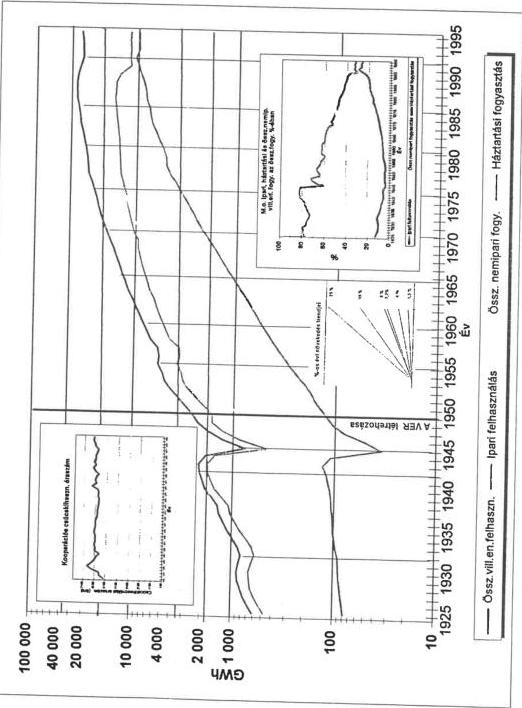

---

The Ground Truth image displays a single, solid horizontal line. According to Rule 2 (UNDERSCORE & LINE RULES), this is a stylistic or background line, not a placeholder underscore. Therefore, the OCR result must ignore it. The provided OCR content is "____", which consists of four underscores. This is an incorrect interpretation of the line as a placeholder, violating the rule that stylistic lines must be ignored. The OCR has hallucinated underscores where none should exist based on the GT's visual context. Hence, the OCR result is inconsistent with the Ground Truth.

[Non-Text]

[Non-Text]

[Non-Text]

[Non-Text]

[Non-Text]

[Non-Text]

[Non-Text]

[Non-Text]

[Non-Text]

[Non-Text]

[Non-Text]

The Ground Truth image displays a single, solid horizontal line. According to Rule 2 (UNDERSCORE & LINE RULES), this is a stylistic or background line, not a placeholder underscore. Therefore, the OCR result must ignore it. The provided OCR content is "____", which consists of four underscores. This is an incorrect interpretation of the line as a placeholder, violating the rule that stylistic lines must be ignored. The OCR has hallucinated underscores where none should exist based on the GT's visual context. Hence, the OCR result is inconsistent with the Ground Truth.

The Ground Truth image displays a single, solid horizontal line. According to Rule 2 (UNDERSCORE & LINE RULES), this is a stylistic or background line, not a placeholder underscore. Therefore, the OCR result must ignore it. The provided OCR content is "____", which consists of four underscores. This is an incorrect interpretation of the line as a placeholder, violating the rule that stylistic lines must be ignored. The OCR has hallucinated underscores where none should exist based on the GT's visual context. Hence, the OCR result is inconsistent with the Ground Truth.

The Ground Truth image displays a single, solid horizontal line. According to Rule 2 (UNDERSCORE & LINE RULES), this is a stylistic or background line, not a placeholder underscore. Therefore, the OCR result must ignore it. The provided OCR content is "____", which consists of four underscores. This is an incorrect interpretation of the line as a placeholder, violating the rule that stylistic lines must be ignored. The OCR has hallucinated underscores where none should exist based on the GT's visual context. Hence, the OCR result is inconsistent with the Ground Truth.

The Ground Truth image displays a single, solid horizontal line. According to Rule 2 (UNDERSCORE & LINE RULES), this is a stylistic or background line, not a placeholder underscore. Therefore, the OCR result must ignore it. The provided OCR content is "____", which consists of four underscores. This is an incorrect interpretation of the line as a placeholder, violating the rule that stylistic lines must be ignored. The OCR has hallucinated underscores where none should exist based on the GT's visual context. Hence, the OCR result is inconsistent with the Ground Truth.

[Non-Text]

The Ground Truth image displays a single, solid horizontal line. According to Rule 2 (UNDERSCORE & LINE RULES), this is a stylistic or background line, not a placeholder underscore. Therefore, the OCR result must ignore it. The provided OCR content is "____", which consists of four underscores. This is an incorrect interpretation of the line as a placeholder, violating the rule that stylistic lines must be ignored. The OCR has hallucinated underscores where none should exist based on the GT's visual context. Hence, the OCR result is inconsistent with the Ground Truth.

[Non-Text]

[Non-Text]

The Ground Truth image displays a single, solid horizontal line. According to Rule 2 (UNDERSCORE & LINE RULES), this is a stylistic or background line, not a placeholder underscore. Therefore, the OCR result must ignore it. The provided OCR content is "____", which consists of four underscores. This is an incorrect interpretation of the line as a placeholder, violating the rule that stylistic lines must be ignored. The OCR has hallucinated underscores where none should exist based on the GT's visual context. Hence, the OCR result is inconsistent with the Ground Truth.

The Ground Truth image displays a single, solid horizontal line. According to Rule 2 (UNDERSCORE & LINE RULES), this is a stylistic or background line, not a placeholder underscore. Therefore, the OCR result must ignore it. The provided OCR content is "____", which consists of four underscores. This is an incorrect interpretation of the line as a placeholder, violating the rule that stylistic lines must be ignored. The OCR has hallucinated underscores where none should exist based on the GT's visual context. Hence, the OCR result is inconsistent with the Ground Truth.

The Ground Truth image displays a single, solid horizontal line. According to Rule 2 (UNDERSCORE & LINE RULES), this is a stylistic or background line, not a placeholder underscore. Therefore, the OCR result must ignore it. The provided OCR content is "____", which consists of four underscores. This is an incorrect interpretation of the line as a placeholder, violating the rule that stylistic lines must be ignored. The OCR has hallucinated underscores where none should exist based on the GT's visual context. Hence, the OCR result is inconsistent with the Ground Truth.

The Ground Truth image displays a single, solid horizontal line. According to Rule 2 (UNDERSCORE & LINE RULES), this is a stylistic or background line, not a placeholder underscore. Therefore, the OCR result must ignore it. The provided OCR content is "____", which consists of four underscores. This is an incorrect interpretation of the line as a placeholder, violating the rule that stylistic lines must be ignored. The OCR has hallucinated underscores where none should exist based on the GT's visual context. Hence, the OCR result is inconsistent with the Ground Truth.

The Ground Truth image displays a single, solid horizontal line. According to Rule 2 (UNDERSCORE & LINE RULES), this is a stylistic or background line, not a placeholder underscore. Therefore, the OCR result must ignore it. The provided OCR content is "____", which consists of four underscores. This is an incorrect interpretation of the line as a placeholder, violating the rule that stylistic lines must be ignored. The OCR has hallucinated underscores where none should exist based on the GT's visual context. Hence, the OCR result is inconsistent with the Ground Truth.

The Ground Truth image displays a single, solid horizontal line. According to Rule 2 (UNDERSCORE & LINE RULES), this is a stylistic or background line, not a placeholder underscore. Therefore, the OCR result must ignore it. The provided OCR content is "____", which consists of four underscores. This is an incorrect interpretation of the line as a placeholder, violating the rule that stylistic lines must be ignored. The OCR has hallucinated underscores where none should exist based on the GT's visual context. Hence, the OCR result is inconsistent with the Ground Truth.

The Ground Truth image displays a single, solid horizontal line. According to Rule 2 (UNDERSCORE & LINE RULES), this is a stylistic or background line, not a placeholder underscore. Therefore, the OCR result must ignore it. The provided OCR content is "____", which consists of four underscores. This is an incorrect interpretation of the line as a placeholder, violating the rule that stylistic lines must be ignored. The OCR has hallucinated underscores where none should exist based on the GT's visual context. Hence, the OCR result is inconsistent with the Ground Truth.

The Ground Truth image displays a single, solid horizontal line. According to Rule 2 (UNDERSCORE & LINE RULES), this is a stylistic or background line, not a placeholder underscore. Therefore, the OCR result must ignore it. The provided OCR content is "____", which consists of four underscores. This is an incorrect interpretation of the line as a placeholder, violating the rule that stylistic lines must be ignored. The OCR has hallucinated underscores where none should exist based on the GT's visual context. Hence, the OCR result is inconsistent with the Ground Truth.

The Ground Truth image displays a single, solid horizontal line. According to Rule 2 (UNDERSCORE & LINE RULES), this is a stylistic or background line, not a placeholder underscore. Therefore, the OCR result must ignore it. The provided OCR content is "____", which consists of four underscores. This is an incorrect interpretation of the line as a placeholder, violating the rule that stylistic lines must be ignored. The OCR has hallucinated underscores where none should exist based on the GT's visual context. Hence, the OCR result is inconsistent with the Ground Truth.

The Ground Truth image displays a single, solid horizontal line. According to Rule 2 (UNDERSCORE & LINE RULES), this is a stylistic or background line, not a placeholder underscore. Therefore, the OCR result must ignore it. The provided OCR content is "____", which consists of four underscores. This is an incorrect interpretation of the line as a placeholder, violating the rule that stylistic lines must be ignored. The OCR has hallucinated underscores where none should exist based on the GT's visual context. Hence, the OCR result is inconsistent with the Ground Truth.

The Ground Truth image displays a single, solid horizontal line. According to Rule 2 (UNDERSCORE & LINE RULES), this is a stylistic or background line, not a placeholder underscore. Therefore, the OCR result must ignore it. The provided OCR content is "____", which consists of four underscores. This is an incorrect interpretation of the line as a placeholder, violating the rule that stylistic lines must be ignored. The OCR has hallucinated underscores where none should exist based on the GT's visual context. Hence, the OCR result is inconsistent with the Ground Truth.

The Ground Truth image displays a single, solid horizontal line. According to Rule 2 (UNDERSCORE & LINE RULES), this is a stylistic or background line, not a placeholder underscore. Therefore, the OCR result must ignore it. The provided OCR content is "____", which consists of four underscores. This is an incorrect interpretation of the line as a placeholder, violating the rule that stylistic lines must be ignored. The OCR has hallucinated underscores where none should exist based on the GT's visual context. Hence, the OCR result is inconsistent with the Ground Truth.

The Ground Truth image displays a single, solid horizontal line. According to Rule 2 (UNDERSCORE & LINE RULES), this is a stylistic or background line, not a placeholder underscore. Therefore, the OCR result must ignore it. The provided OCR content is "____", which consists of four underscores. This is an incorrect interpretation of the line as a placeholder, violating the rule that stylistic lines must be ignored. The OCR has hallucinated underscores where none should exist based on the GT's visual context. Hence, the OCR result is inconsistent with the Ground Truth.

The Ground Truth image displays a single, solid horizontal line. According to Rule 2 (UNDERSCORE & LINE RULES), this is a stylistic or background line, not a placeholder underscore. Therefore, the OCR result must ignore it. The provided OCR content is "____", which consists of four underscores. This is an incorrect interpretation of the line as a placeholder, violating the rule that stylistic lines must be ignored. The OCR has hallucinated underscores where none should exist based on the GT's visual context. Hence, the OCR result is inconsistent with the Ground Truth.

The Ground Truth image displays a single, solid horizontal line. According to Rule 2 (UNDERSCORE & LINE RULES), this is a stylistic or background line, not a placeholder underscore. Therefore, the OCR result must ignore it. The provided OCR content is "____", which consists of four underscores. This is an incorrect interpretation of the line as a placeholder, violating the rule that stylistic lines must be ignored. The OCR has hallucinated underscores where none should exist based on the GT's visual context. Hence, the OCR result is inconsistent with the Ground Truth.

The Ground Truth image displays a single, solid horizontal line. According to Rule 2 (UNDERSCORE & LINE RULES), this is a stylistic or background line, not a placeholder underscore. Therefore, the OCR result must ignore it. The provided OCR content is "____", which consists of four underscores. This is an incorrect interpretation of the line as a placeholder, violating the rule that stylistic lines must be ignored. The OCR has hallucinated underscores where none should exist based on the GT's visual context. Hence, the OCR result is inconsistent with the Ground Truth.

The Ground Truth image displays a single, solid horizontal line. According to Rule 2 (UNDERSCORE & LINE RULES), this is a stylistic or background line, not a placeholder underscore. Therefore, the OCR result must ignore it. The provided OCR content is "____", which consists of four underscores. This is an incorrect interpretation of the line as a placeholder, violating the rule that stylistic lines must be ignored. The OCR has hallucinated underscores where none should exist based on the GT's visual context. Hence, the OCR result is inconsistent with the Ground Truth.

The Ground Truth image displays a single, solid horizontal line. According to Rule 2 (UNDERSCORE & LINE RULES), this is a stylistic or background line, not a placeholder underscore. Therefore, the OCR result must ignore it. The provided OCR content is "____", which consists of four underscores. This is an incorrect interpretation of the line as a placeholder, violating the rule that stylistic lines must be ignored. The OCR has hallucinated underscores where none should exist based on the GT's visual context. Hence, the OCR result is inconsistent with the Ground Truth.

The Ground Truth image displays a single, solid horizontal line. According to Rule 2 (UNDERSCORE & LINE RULES), this is a stylistic or background line, not a placeholder underscore. Therefore, the OCR result must ignore it. The provided OCR content is "____", which consists of four underscores. This is an incorrect interpretation of the line as a placeholder, violating the rule that stylistic lines must be ignored. The OCR has hallucinated underscores where none should exist based on the GT's visual context. Hence, the OCR result is inconsistent with the Ground Truth.

The Ground Truth image displays a single, solid horizontal line. According to Rule 2 (UNDERSCORE & LINE RULES), this is a stylistic or background line, not a placeholder underscore. Therefore, the OCR result must ignore it. The provided OCR content is "____", which consists of four underscores. This is an incorrect interpretation of the line as a placeholder, violating the rule that stylistic lines must be ignored. The OCR has hallucinated underscores where none should exist based on the GT's visual context. Hence, the OCR result is inconsistent with the Ground Truth.

The Ground Truth image displays a single, solid horizontal line. According to Rule 2 (UNDERSCORE & LINE RULES), this is a stylistic or background line, not a placeholder underscore. Therefore, the OCR result must ignore it. The provided OCR content is "____", which consists of four underscores. This is an incorrect interpretation of the line as a placeholder, violating the rule that stylistic lines must be ignored. The OCR has hallucinated underscores where none should exist based on the GT's visual context. Hence, the OCR result is inconsistent with the Ground Truth.

The Ground Truth image displays a single, solid horizontal line. According to Rule 2 (UNDERSCORE & LINE RULES), this is a stylistic or background line, not a placeholder underscore. Therefore, the OCR result must ignore it. The provided OCR content is "____", which consists of four underscores. This is an incorrect interpretation of the line as a placeholder, violating the rule that stylistic lines must be ignored. The OCR has hallucinated underscores where none should exist based on the GT's visual context. Hence, the OCR result is inconsistent with the Ground Truth.

The Ground Truth image displays a single, solid horizontal line. According to Rule 2 (UNDERSCORE & LINE RULES), this is a stylistic or background line, not a placeholder underscore. Therefore, the OCR result must ignore it. The provided OCR content is "____", which consists of four underscores. This is an incorrect interpretation of the line as a placeholder, violating the rule that stylistic lines must be ignored. The OCR has hallucinated underscores where none should exist based on the GT's visual context. Hence, the OCR result is inconsistent with the Ground Truth.

The Ground Truth image displays a single, solid horizontal line. According to Rule 2 (UNDERSCORE & LINE RULES), this is a stylistic or background line, not a placeholder underscore. Therefore, the OCR result must ignore it. The provided OCR content is "____", which consists of four underscores. This is an incorrect interpretation of the line as a placeholder, violating the rule that stylistic lines must be ignored. The OCR has hallucinated underscores where none should exist based on the GT's visual context. Hence, the OCR result is inconsistent with the Ground Truth.

The Ground Truth image displays a single, solid horizontal line. According to Rule 2 (UNDERSCORE & LINE RULES), this is a stylistic or background line, not a placeholder underscore. Therefore, the OCR result must ignore it. The provided OCR content is "____", which consists of four underscores. This is an incorrect interpretation of the line as a placeholder, violating the rule that stylistic lines must be ignored. The OCR has hallucinated underscores where none should exist based on the GT's visual context. Hence, the OCR result is inconsistent with the Ground Truth.

The Ground Truth image displays a single, solid horizontal line. According to Rule 2 (UNDERSCORE & LINE RULES), this is a stylistic or background line, not a placeholder underscore. Therefore, the OCR result must ignore it. The provided OCR content is "____", which consists of four underscores. This is an incorrect interpretation of the line as a placeholder, violating the rule that stylistic lines must be ignored. The OCR has hallucinated underscores where none should exist based on the GT's visual context. Hence, the OCR result is inconsistent with the Ground Truth.

The Ground Truth image displays a single, solid horizontal line. According to Rule 2 (UNDERSCORE & LINE RULES), this is a stylistic or background line, not a placeholder underscore. Therefore, the OCR result must ignore it. The provided OCR content is "____", which consists of four underscores. This is an incorrect interpretation of the line as a placeholder, violating the rule that stylistic lines must be ignored. The OCR has hallucinated underscores where none should exist based on the GT's visual context. Hence, the OCR result is inconsistent with the Ground Truth.

The Ground Truth image displays a single, solid horizontal line. According to Rule 2 (UNDERSCORE & LINE RULES), this is a stylistic or background line, not a placeholder underscore. Therefore, the OCR result must ignore it. The provided OCR content is "____", which consists of four underscores. This is an incorrect interpretation of the line as a placeholder, violating the rule that stylistic lines must be ignored. The OCR has hallucinated underscores where none should exist based on the GT's visual context. Hence, the OCR result is inconsistent with the Ground Truth.

The Ground Truth image displays a single, solid horizontal line. According to Rule 2 (UNDERSCORE & LINE RULES), this is a stylistic or background line, not a placeholder underscore. Therefore, the OCR result must ignore it. The provided OCR content is "____", which consists of four underscores. This is an incorrect interpretation of the line as a placeholder, violating the rule that stylistic lines must be ignored. The OCR has hallucinated underscores where none should exist based on the GT's visual context. Hence, the OCR result is inconsistent with the Ground Truth.

The Ground Truth image displays a single, solid horizontal line. According to Rule 2 (UNDERSCORE & LINE RULES), this is a stylistic or background line, not a placeholder underscore. Therefore, the OCR result must ignore it. The provided OCR content is "____", which consists of four underscores. This is an incorrect interpretation of the line as a placeholder, violating the rule that stylistic lines must be ignored. The OCR has hallucinated underscores where none should exist based on the GT's visual context. Hence, the OCR result is inconsistent with the Ground Truth.

---

II. ábra. A magyar villamosenergia-rendszer alaphálózata, valamint a hozzátartozó erőművei 1995. év végén

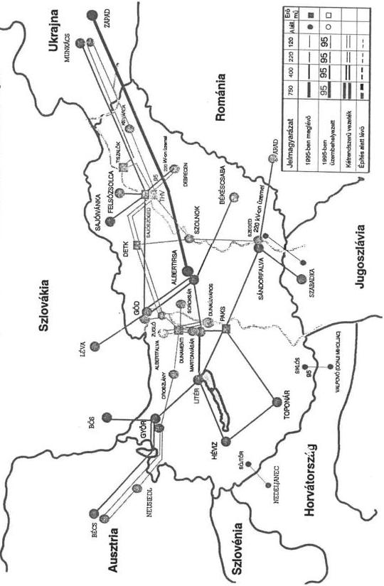

---

•

•

•

•

---

III. ábra. CDU tagországok villamosenergia-rendszer egyesülése (VERE) nemzetközi távvezetékei 1995. XII. 31-én

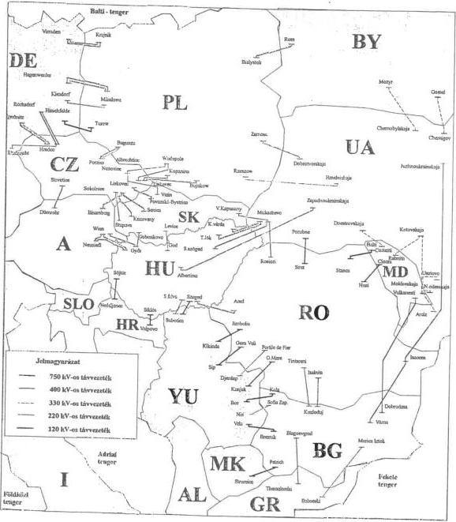

---

(1) 2017年，公司与上海浦东发展银行股份有限公司签订了《关于使用部分闲置募集资金进行现金管理的协议》。

[Non-Text]

[Non-Text]

[Non-Text]

[Non-Text]

[Non-Text]

(1) 2017年1月1日至2018年1月1日，公司与关联方累计发生关联交易的总金额为人民币45,639.87万元。

(1) 2017年1月1日至2018年1月1日，公司与关联方累计发生关联交易的总金额为人民币45,000万元。

[Non-Text]

[Non-Text]

(1) 2017年1月1日至2018年1月1日，公司与关联方累计发生关联交易的总金额为人民币45,639.87万元。

[Non-Text]

(1) 2017年1月1日至2018年1月1日，公司与关联方累计发生关联交易的总金额为人民币45,639.87万元。

(1) 2017年1月1日至2018年1月1日，公司与关联方累计发生关联交易的总金额为人民币45,639.87万元。

(1) 2017年1月1日至2018年1月1日，公司与关联方累计发生关联交易的总金额为人民币45,639.87万元。

(1) 2017年1月1日至2018年1月1日，公司与关联方累计发生关联交易的总金额为人民币45,639.87万元。

[Non-Text]

[Non-Text]

(1) 2017年1月1日至2018年1月1日，公司与关联方累计发生关联交易的总金额为人民币45,639.87万元。

[Non-Text]

[Non-Text]

(1) 2017年1月1日至2018年1月1日，公司与关联方累计发生关联交易的总金额为人民币45,639.87万元。

[Non-Text]

(1) 2017年1月1日至2018年1月1日，公司与关联方累计发生关联交易的总金额为人民币45,639.87万元。

[Non-Text]

(1) 2017年1月1日至2018年1月1日，公司与关联方累计发生关联交易的总金额为人民币45,639.87万元。

[Non-Text]

(1) 2017年1月1日至2018年1月1日，公司与关联方累计发生关联交易的总金额为人民币45,639.87万元。

(1) 2017年1月1日至2018年1月1日，公司与关联方累计发生关联交易的总金额为人民币45,639.87万元。

(1) 2017年1月1日至2018年1月1日，公司与关联方累计发生关联交易的总金额为人民币45,639.87万元。

(1) 2017年1月1日至2018年1月1日，公司与关联方累计发生关联交易的总金额为人民币45,639.87万元。

[Non-Text]

(1) 2017年1月1日至2018年1月1日，公司与关联方累计发生关联交易的总金额为人民币45,639.87万元。

(1) 2017年1月1日至2018年1月1日，公司与关联方累计发生关联交易的总金额为人民币45,639.87万元。

(1) 2017年1月1日至2018年1月1日，公司与关联方累计发生关联交易的总金额为人民币45,639.87万元。

(1) 2017年1月1日至2018年1月1日，公司与关联方累计发生关联交易的总金额为人民币45,639.87万元。

(1) 2017年1月1日至2018年1月1日，公司与关联方累计发生关联交易的总金额为人民币45,639.87万元。

(1) 2017年1月1日至2018年1月1日，公司与关联方累计发生关联交易的总金额为人民币45,639.87万元。

(1) 2017年1月1日至2018年1月1日，公司与关联方累计发生关联交易的总金额为人民币45,639.87万元。

(1) 2017年1月1日至2018年1月1日，公司与关联方累计发生关联交易的总金额为人民币45,639.87万元。

(1) 2017年1月1日至2018年1月1日，公司与关联方累计发生关联交易的总金额为人民币45,639.87万元。

[Non-Text]

[Non-Text]

[Non-Text]

[Non-Text]

[Non-Text]

[Non-Text]

[Non-Text]

[Non-Text]

[Non-Text]

---

IV. ábra. A teljesítőképesség jellemzői

A VER teljesítőképességének fejlődése

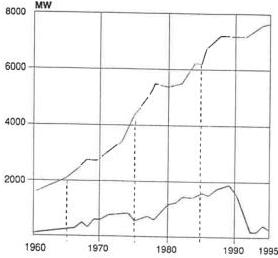

|  Kód | Megnevezés | 1989 | 1994 | 1995 | NW Növe- kedés (95-94)  |
| --- | --- | --- | --- | --- | --- |
|   | Kooperáló erőművek BT-je | 7 168 | 7 317 | 7 403 | 83  |
|   |  Kooperáló erőművek RT-je | 7 075 | 6 676 | 6 832 | 156  |
|   |  MVM-csoport erőműveinek BT-je | 6 956 | 7 105 | 7 217 | 112  |
|   |  MVM-csoport erőműveinek RT-je | 6 871 | 6 584 | 6 733 | 149  |
|   |  A VER- erőművek csúcsterhelése | 4 855 | 5 288 | 5 356 | 68  |
|   |  Garantált import | 1 900 | 350 | 250 | - 100  |

A VER importtal növelt év végi teljesítőképessége és terhelése

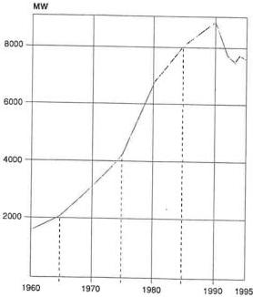

A VER fogyasztói csúcsterhelése 1989-ben 6553 MW volt, míg 1995-ben 5731 MW-ra esett vissza, ami több mint 800 MW csökkenést jelent.

Az év végi rendelkezésre álló teljesítőképesség esetében az 1994. évihez képest némi emelkedés mutatkozik, de az 1989-es érték így is 1843 MW-tal volt nagyobb.

|  Kód | Megnevezés | 1989 | 1994 | 1995 | NW Növe- kedés (95-94)  |
| --- | --- | --- | --- | --- | --- |
|   | BT+import | 9 018 | 7 664 | 7 653 | -14  |
|   |  RT+import | 8 925 | 7 026 | 7 082 | 56  |
|   |  Garantált import | 1 850 | 350 | 250 | -100  |
|   |  Csúcsterhelés | 6 553 | 5 550 | 5 731 | 181  |

---

1. 2017年1月1日

1. 2017年1月1日

1. 2017年1月1日，公司与上海浦东发展银行股份有限公司签订了《最高额保证合同》，约定在2017年1月1日（含）前30日内执行。

The Ground Truth image displays a single, solid horizontal line. According to Rule 2 (UNDERSCORE & LINE RULES), this is a stylistic or background line, not a placeholder underscore. Therefore, the OCR result must ignore it. The provided OCR content is "____", which consists of four underscores. This is an incorrect interpretation of the line as a placeholder, violating the rule that stylistic lines must be ignored. The OCR has hallucinated text (underscores) where none should exist. Hence, the result is inconsistent with the Ground Truth.

---

V. ábra. A VER teljesítőképességének fejlődése

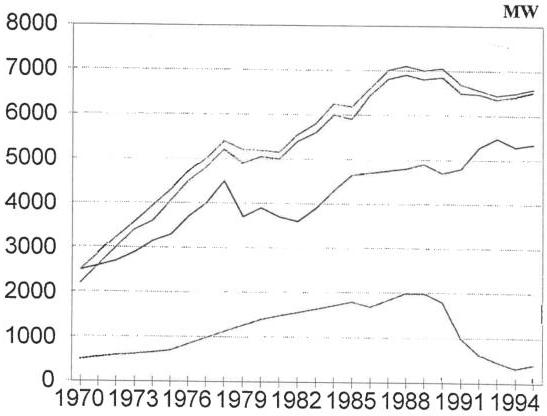

Kooperaló eromüvek RT-je
MVM eromvek RT-je
VER eromvek decemberi csucsterhelse
Import szaldo

VER
RT

Villamos Energia Rendszer

Rendelkezésre álló teljesítőképesség: az a legnagyobb villamos teljesítmény-ban, amelyet az erőművek az állandó és változó hiányok, ill. többletek figyelembevételével normál üzemben kényszerkieséss nélkül szolgáltatni tudnak.

---

1

1

1

1

---

# VI. ábra. A VER teljesítőképesség-mérlegének havi alakulása

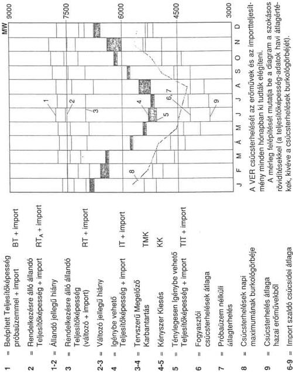

---

•

•

•

•

---

VII. ábra. Az MVM-csoport erőmű részvénytársaságainak telephelyei

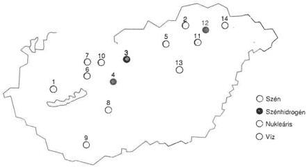

Bakonyi Erőmű Rt.

Ajkai Eromu (1)
- Inotai Erómú (6)

Budapesti Erőmű Rt. (3)

Kelenföldi Erómú
Kobányai Erómú
Ujpesti Erómú
Angyalföldi Erómú
Kispesti Erómú
Révész utcai Fútómú

Dunamenti Erőmű Rt. (4)

Mátrai Erőmű Rt. (5)

Paksi Atomerőmű Rt. (8)

Pécsi Erőmű Rt. (9)

Pecsi Erómú
Komlói Fútoerómú Kft.

Tiszai Erőmű Rt.

Borsodi Energetikai Kft. (2)
Tiszaalkonyai Erómú (11)
Tisza II. Erómú (12)

Kiskore (13)
Tiszalok (14)

Vértesi Erőmű Rt.

Dorogi Regionalis Futoeromu Kft.
Oroszlanyi Erómú (7)
- Tatabányai Energetikai Termelő és Szolgaltató Kft.
Banhidai Erómú (10)
- Tatabányai Erómú

|  Erőmű | Tüzelőanyag | Blokkok, turbinák |   |   | 1995. évi  |   |   |
| --- | --- | --- | --- | --- | --- | --- | --- |
|   |   |  száma, db | teljesítménye egyenként, MW | villamos teljesítménye összesen, MW | hőszolgáltatási teljesítmény,* MW | villamos-termelés, GWh | hőszolgáltatás, TJ  |
|  1 Ajka | szén | 6 | 3x30+12+10+19 | 132 | 157,8 | 572 | 3 073  |
|  2 Borsod | szén | 9 | 4x30+4+4,5+10,12+21 | 171 | 159,9 | 463 | 2 700  |
|  3 Budapest | szénhidrogén | 16 | min 1,3-max 32 | 294 | 1 243,0 | 696 | 14 886  |
|  4 Dunamenti | szénhidrogén | 12 | 63215+3x150+40+2x20 | 1 820 | 456,0 | 5 025 | 2 423  |
|  4 Dunamenti GT | szénhidrogén | 1 | 145 | 145 |  | 1 082 | 5 887  |
|  5 Mátrai | lignit | 5 | 3x200+2x100 | 800 | 22,5 | 4 328 | 178  |
|  6 Inota | szén | 4 | 2x20+12 | 72 | 38,1 | 100 | 500  |
|  6 Inota GT | olaj | 2 | 2x85 | 170 | - | 1 | -  |
|  7 Oroszlány | szén | 4 | 1x55+3x60 | 235 | 27,0 | 1 479 | 347  |
|  8 Paks | nukleáris | 8 | 8x230 | 1 840 | 29,0 | 14 026 | 605  |
|  9 Pécs | szén | 5 | 2x60+2x35+30 | 220 | 300,0 | 917 | 2 942  |
|  10 Bánhida | szén | 1 | 100 | 100 | 7,5 | 479 | 105  |
|  11 Tiszapalkonya | szén | 7 | 1x50+13+15+7+3x55 | 250 | 149,4 | 656 | 1 574  |
|  12 Tisza II. | szénhidrogén | 4 | 4x215 | 860 | - | 2 997 | -  |
|  13 Kisköre | víz | 4 | 4x7 | 28 | - | 85 | -  |
|  14 Tiszalök | víz | 3 | 3x3,8 | 11,4 | - | 43 | -  |

* Igénybe vett max.

---

(1) 2017年1月1日

1. 2017年1月1日

•

•

•

•

---

VIII. ábra. Az MVM-csoport erőműveinek termelése és a felhasznált üzemanyag

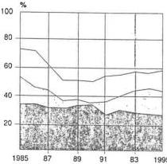

|   | 1985 |   | 1995  |   |
| --- | --- | --- | --- | --- |
|   |  GWh | % | GWh | %  |
|  Energetikai barnaszénből | 4402 | 17,0 | 3633 | 10,9  |
|  Linginből | 3786 | 14,7 | 4157 | 12,5  |
|  Feketeszén féltermékből | 713 | 2,8 | 825 | 2,5  |
|  Szénből összesen | 8901 | 34,5 | 8615 | 25,9  |
|  Fűtőolajból | 4504 | 17,4 | 5477 | 16,5  |
|  Földgázból | 5781 | 22,4 | 4917 | 14,8  |
|  Szénhidrogénből összesen | 10 285 | 39,8 | 10 394 | 31,3  |
|  Fosszilis energiahordozókból | 19 186 | 74,3 | 19 009 | 57,2  |
|  Vízenergiából | 155 | 0,6 | 164 | 0,5  |
|  Atomenergiából | 6480 | 25,1 | 14 026 | 42,3  |
|  Mindösszesen | 25 821 | 100,0 | 33 199 | 100,0  |

Az összes tüzelőhő megoszlása

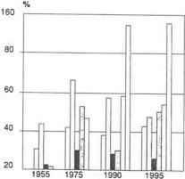

|   | PJ | %  |
| --- | --- | --- |
|  Szén | 114,0 | 28,8  |
|  Szénhidrogén | 129,3 | 32,7  |
|  ebből földgáz | 68,3 | 52,8  |
|  Hasadóanyag | 152,3 | 38,5  |
|  Összesen | 395,6 | 100,0  |

Lignit
Barnaszén
Feketeszén felt.
Olaj
Gaz
Hasadoanyag

Az ábra a felhasznált összes tüzelőhő-megoszlást mutatja az MVM-csoport erőműveinél. Jól látható a 70-es években a szénhidrogének, majd a hasadóanyag felhasználásának fokozódása.

|   | Lignit 1 Mt=6,75 PJ |   | Barnaszén 1 Mt=9,75 PJ |   | Feketeszén félt. 1 Mt=10,99 PJ |   | Olaj 1 Mt=40,34 PJ |   | Földgáz 1 Gm³=30,84 PJ |   | Hasadóanyag | Összes tüzelő  |
| --- | --- | --- | --- | --- | --- | --- | --- | --- | --- | --- | --- | --- |
|   |  10³t | TJ | 10³t | TJ | 10³t | TJ | 10³t | TJ | 10³m³ | TJ | TJ | TJ  |
|  1955 | 2370 | 19 326 | 4038 | 47 772 | 244 | 4110 | 42 | 1649 | - | - | - | 72 857  |
|  1965 | 2871 | 22 038 | 8247 | 92 204 | 1258 | 13 605 | 491 | 19 590 | 254 | 8692 | - | 156 130  |
|  1975 | 6230 | 41 758 | 7916 | 90 969 | 1797 | 19 314 | 1579 | 63 859 | 1471 | 52 526 | - | 268 426  |
|  1985 | 6758 | 46 462 | 7676 | 75 368 | 1352 | 14 815 | 1479 | 59 769 | 2761 | 84 976 | 72 736 | 354 126  |
|  1987 | 6781 | 45 785 | 7826 | 79 233 | 1688 | 18 252 | 1209 | 48 440 | 2513 | 77 775 | 119 547 | 389 032  |
|  1988 | 5442 | 36 907 | 7950 | 79 339 | 1611 | 17 472 | 660 | 26 335 | 2435 | 74 845 | 147 331 | 382 229  |
|  1989 | 5296 | 35 756 | 7729 | 75 338 | 1449 | 16 684 | 513 | 20 432 | 2660 | 82 048 | 150 994 | 381 252  |
|  1990 | 5387 | 35 474 | 7437 | 72 792 | 1469 | 16 129 | 466 | 18 573 | 2382 | 73 847 | 14 8366 | 365 121  |
|  1991 | 4934 | 33 302 | 7049 | 68 731 | 1298 | 14 270 | 965 | 38 914 | 2411 | 74 370 | 14 7624 | 377 211  |
|  1992 | 6473 | 43 690 | 6456 | 62 950 | 1209 | 13 289 | 1309 | 52 814 | 2035 | 62 748 | 15 0886 | 386 377  |
|  1993 | 6826 | 46 075 | 5643 | 55 018 | 1161 | 12 762 | 1742 | 70 256 | 1953 | 60 225 | 148 777 | 393 113  |
|  1994 | 6605 | 45 589 | 5293 | 51 603 | 1000 | 10 991 | 1631 | 65 787 | 2058 | 63 471 | 152 745 | 390 186  |
|  1995 | 6893 | 46 531 | 5748 | 56 047 | 1036 | 11 365 | 1512 | 60 975 | 2216 | 68 342 | 152 304 | 395 584  |

---

1. 2017年1月1日

1

•

1. 2017年1月1日

1. 2017年1月1日

•

•

•

1. 2017年1月1日

1. 2017年1月1日

1. 2017年1月1日

1. 2017年1月1日

1. 2017年1月1日

•

•

---

IX. ábra. Az MVM-csoport összes tüzelőhő felhasználása
1980-1995 között

# A felhasználás 1980–1995 között

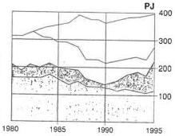

|   | 1985 |   | 1995  |   |
| --- | --- | --- | --- | --- |
|   |  PJ | % | PJ | %  |
|  Nukleáris | 72,7 | 20,5 | 152,3 | 38,5  |
|  Gáz | 85,0 | 24,0 | 68,3 | 17,3  |
|  Olaj | 59,8 | 16,9 | 61,0 | 15,4  |
|  Szén | 136,6 | 38,6 | 114,0 | 28,8  |
|  Összesen | 354,1 | 100,0 | 395,6 | 100,0  |

# Az MVM-csoport tüzelőhő-megoszlása 1995-ben

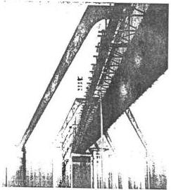

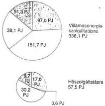

Az MVM-erőművek 1995-ben villamosenergia-termelésre 44,8%-ban használtak fel atomenergiát, hőszolgáltatásra pedig 52,5%-ban földgázt.

|   | Villamosenergia-termelésre |   | Hőszolgáltatásra |   | Összesen  |   |
| --- | --- | --- | --- | --- | --- | --- |
|   |  PJ | % | PJ | % | PJ | %  |
|  Nukleáris | 151,7 | 44,8 | 0,6 | 1,0 | 152,3 | 38,5  |
|  Gáz | 38,1 | 11,3 | 30,2 | 52,5 | 68,3 | 17,3  |
|  Olaj | 51,3 | 15,2 | 9,7 | 16,9 | 61,0 | 15,4  |
|  Szén | 97,0 | 28,7 | 17,0 | 29,6 | 114,0 | 28,8  |
|  Összesen | 338,1 | 100,0 | 57,5 | 100,0 | 395,6 | 100,0  |

---

•

•

•

•

---

# X. ábra. Magyarország villamosenergia-termelése és -felhasználása

A termelés és fogyasztás folyamatábrája 1995-ben

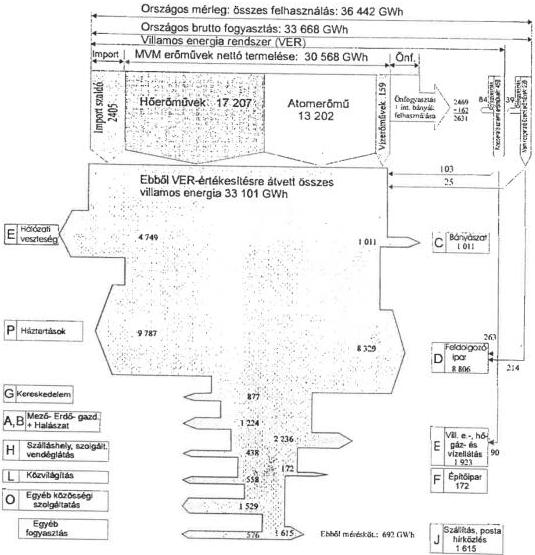

A fogyasztás megbontása megfelel a KSH egy séges ágazati osztályozási rendszerének.

Az "E" ágazatban a közcélú villamosenergia vállalatok saját felhasználása nem szerepel, mivel az nem értékesítés.

Az országos energiamérleg szerint az "E" kategória villamosenergia-felhasználása a fentiekkel növelt mennyiség: 9 305 GWh.

(A kooperáló erőművek: önfogyasztásából (84 GWh-ból) az E kategóriába tartozó önfogyasztás: 15 GWh)

---

(1) 2017年，公司与上海浦东发展银行股份有限公司签订了《关于使用部分闲置募集资金进行现金管理的协议》。

[Non-Text]

[Non-Text]

[Non-Text]

[Non-Text]

[Non-Text]

[Non-Text]

[Non-Text]

(1) 2017年1月1日至2018年1月1日，公司与关联方累计发生关联交易的总金额为人民币45,639.87万元。

[Non-Text]

[Non-Text]

[Non-Text]

[Non-Text]

(1) 2017年1月1日至2018年1月1日，公司与关联方累计发生关联交易的总金额为人民币45,639.87万元。

(1) 2017年1月1日至2018年1月1日，公司与关联方累计发生关联交易的总金额为人民币45,639.87万元。

(1) 2017年1月1日至2018年1月1日，公司与关联方累计发生关联交易的总金额为人民币45,639.87万元。

(1) 2017年1月1日至2018年1月1日，公司与关联方累计发生关联交易的总金额为人民币45,639.87万元。

[Non-Text]

[Non-Text]

[Non-Text]

(1) 2017年1月1日至2018年1月1日，公司与关联方累计发生关联交易的总金额为人民币45,639.87万元。

[Non-Text]

[Non-Text]

[Non-Text]

[Non-Text]

[Non-Text]

[Non-Text]

[Non-Text]

[Non-Text]

[Non-Text]

[Non-Text]

[Non-Text]

(1) 2017年1月1日至2018年1月1日，公司与关联方累计发生关联交易的总金额为人民币45,639.87万元。

(1) 2017年1月1日至2018年1月1日，公司与关联方累计发生关联交易的总金额为人民币45,639.87万元。

(1) 2017年1月1日至2018年1月1日，公司与关联方累计发生关联交易的总金额为人民币45,639.87万元。

(1) 2017年1月1日至2018年1月1日，公司与关联方累计发生关联交易的总金额为人民币45,639.87万元。

(1) 2017年1月1日至2018年1月1日，公司与关联方累计发生关联交易的总金额为人民币45,639.87万元。

(1) 2017年1月1日至2018年1月1日，公司与关联方累计发生关联交易的总金额为人民币45,639.87万元。

(1) 2017年1月1日至2018年1月1日，公司与关联方累计发生关联交易的总金额为人民币45,639.87万元。

[Non-Text]

[Non-Text]

(1) 2017年1月1日至2018年1月1日，公司与关联方累计发生关联交易的总金额为人民币45,639.87万元。

(1) 2017年1月1日至2018年1月1日，公司与关联方累计发生关联交易的总金额为人民币45,639.87万元。

[Non-Text]

[Non-Text]

[Non-Text]

[Non-Text]

[Non-Text]

[Non-Text]

[Non-Text]

---

# XI. ábra. A főbb fogyasztói csoportok alakulása

A Központi Statisztikai Hivatal 1992-ben az ENSZ és az EU előírásainak megfelelően megváltoztatta a nemzetgazdasági ágak statisztikai besorolását.

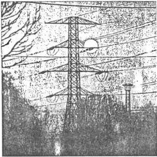

Ezért az 1991 évig bemutatott ágazat-idősorok nem folytathatók, és 1992-től az adatok már az új csoportosításban szerepelnek. A villamosenergia-szakágazat (4010) az "E villamosenergia-, hő-, gáz- és vízellátás" ágba tartozik.

Természetesen az új beosztás nem változtatja a hazai mérésköteles ipari nagyfogyasztók és a nem mérésköteles kisfogyasztók energiagazdálkodási jellegű nyilvántartását.

A hálózati veszteség a közcélú hálózatok vesztesége, de tartalmazza az OVIT és az ász-ok saját felhasználását is.

A bruttó fogyasztás az erőművi önfogyasztás nélküli fogyasztást jelenti.

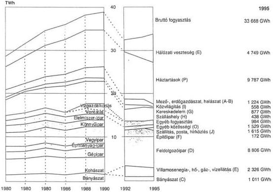

---

---

**XII. ábra. A villamosenergia-termelés és az import szaldó részaránya a VER-ben**

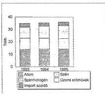

|   | 1993 | 1994 | TWh 1995  |
| --- | --- | --- | --- |
|  Import szaldó | 2.5 | 2.0 | 2.4  |
|  Üzemi erőművek | 0.6 | 0.7 | 0.5  |
|  Szénhidrogén | 8.9 | 9.7 | 10.4  |
|  Szén | 9.0 | 8.8 | 8.6  |
|  Atom | 13.8 | 14.1 | 14.0  |
|   | 34.8 | 35.3 | 35.9  |

**1993**

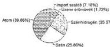

**1994**

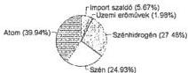

**1995**

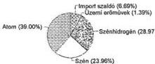

---

1. 2017年1月1日

1. 2017年1月1日

1. 2017年1月1日

•

•

1

1. 2017年1月1日

1. 2017年1月1日

1. 2017年1月1日

1. 2017年1月1日

1. 2017年1月1日

1. 2017年1月1日

1

1. 2017年1月1日

1. 2017年1月1日

1. 2017年1月1日

1. 2017年1月1日，公司与上海浦东发展银行股份有限公司签订了《最高额保证合同》，约定为

1. 2017年1月1日

1. 2017年1月1日

---

XIII. ábra. 1995. évi export-import tényleges forgalma (GWh)

A diagram a határkeresztező távvezetéken ténylegesen mért villamosenergia-forgalmat ábrázolja a tranzitszállításokkal együtt.
A kereskedelmileg lebonyolított export-import mennyiség ennél lényegesen nagyobb, de a szaldó természetesen azonos.
Kereskedelmi import
3 181,3 GWh
Kereskedelmi export
776,0 GWh
Szaldó
2 405,3 GWh

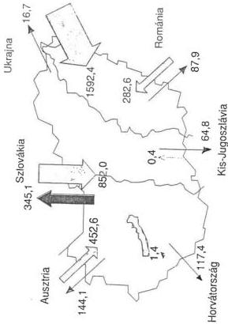

---

1. 2017年1月1日

[Non-Text]

[Non-Text]

[Non-Text]

[Non-Text]

[Non-Text]

[Non-Text]

[Non-Text]

[Non-Text]

[Non-Text]

[Non-Text]

[Non-Text]

[Non-Text]

[Non-Text]

[Non-Text]

[Non-Text]

[Non-Text]

[Non-Text]

[Non-Text]

[Non-Text]

[Non-Text]

[Non-Text]

[Non-Text]

[Non-Text]

[Non-Text]

[Non-Text]

[Non-Text]

[Non-Text]

[Non-Text]

[Non-Text]

[Non-Text]

[Non-Text]

[Non-Text]

[Non-Text]

[Non-Text]

[Non-Text]

[Non-Text]

[Non-Text]

[Non-Text]

[Non-Text]

[Non-Text]

[Non-Text]

[Non-Text]

[Non-Text]

[Non-Text]

[Non-Text]

[Non-Text]

[Non-Text]

[Non-Text]

[Non-Text]

[Non-Text]

[Non-Text]

[Non-Text]

[Non-Text]

[Non-Text]

[Non-Text]

[Non-Text]

[Non-Text]

[Non-Text]

[Non-Text]

[Non-Text]

[Non-Text]

[Non-Text]

[Non-Text]

[Non-Text]

[Non-Text]

[Non-Text]

[Non-Text]

[Non-Text]

[Non-Text]

[Non-Text]

[Non-Text]

[Non-Text]

[Non-Text]

[Non-Text]

[Non-Text]

[Non-Text]

[Non-Text]

[Non-Text]

[Non-Text]

[Non-Text]

[Non-Text]

[Non-Text]

[Non-Text]

[Non-Text]

[Non-Text]

[Non-Text]

[Non-Text]

[Non-Text]

[Non-Text]

[Non-Text]

[Non-Text]

[Non-Text]

[Non-Text]

[Non-Text]

[Non-Text]

[Non-Text]

[Non-Text]

[Non-Text]

[Non-Text]

[Non-Text]

[Non-Text]

[Non-Text]

[Non-Text]

[Non-Text]

[Non-Text]

[Non-Text]

[Non-Text]

[Non-Text]

[Non-Text]

[Non-Text]

[Non-Text]

[Non-Text]

[Non-Text]

[Non-Text]

[Non-Text]

[Non-Text]

[Non-Text]

[Non-Text]

[Non-Text]

[Non-Text]

[Non-Text]

[Non-Text]

[Non-Text]

[Non-Text]

---

XIV. ábra. A nemzetközi villamosenergia-forgalom

# Az éves forgalmak alakulása

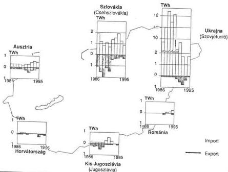

|   |  | 1986 | 1987 | 1988 | 1989 | 1990 | 1991 | 1992 | 1993 | 1994 | 1995  |
| --- | --- | --- | --- | --- | --- | --- | --- | --- | --- | --- | --- |
|  Szovjetunió (Ukrajna) | Import | 9 670 | 11 094 | 12 426 | 11 560 | 12 160 | 6 605 | 2 741 | 1 604 | 1 037 | 1 592  |
|   |  Export | 8 | 4 | 3 | 14 | 10 | 243 | 544 | 781 | 331 | 17  |
|  Csehszlovákia (Szlovákia) | Import | 1 912 | 1 233 | 920 | 1 122 | 778 | 1 393 | 1 497 | 1 846 | 1 195 | 852  |
|   |  Export |  |  |  |  |  |  |  |  |  | 345  |
|  Románia | Import | — | — | — | — | — | — | — | 34 | 218 | 283  |
|   |  Export | — | — | — | — | 61 | — | 106 | — | — | 88  |
|  Jugoszlávia (Kis Jugoszlávia) | Import | 19 | 21 | 2 | 5 | 62 | 157 | 504 | 207 | — | —  |
|   |  Export | 99 | 173 | 162 | 504 | 294 | 60 | 31 | 15 | — | 65  |
|  Jugoszlávia (Horvátország) | Import | 11 | 3 | — | 5 | 1 | — | — | — | — | 1  |
|   |  Export | 24 | 18 | — | 10 | — | — | — | 221 | 123 | 117  |
|  Ausztria | Import | 250 | 252 | 251 | 254 | 200 | 255 | 246 | 402 | 505 | 453  |
|   |  Export | 167 | 161 | 172 | 175 | 183 | 325 | 472 | 355 | 285 | 144  |

---

1

1

1

1

1

1

1

1

1

1

1

1

1

1

1

---

XIV. ábra (folytatása)

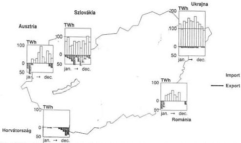

|   |  | 01. | 02. | 03. | 04. | 05. | 06. | 07. | 08. | 09. | 10. | 11. | 12.  |
| --- | --- | --- | --- | --- | --- | --- | --- | --- | --- | --- | --- | --- | --- |
|  Ukrajna | Import | 127,5 | 97,7 | 149,2 | 133,8 | 163,0 | 146,5 | 141,0 | 167,9 | 136,4 | 127,6 | 108,9 | 92,8  |
|   |  Export | 0,3 | 2,6 | 0,7 | 1,0 | 3,6 | 2,0 | 2,8 | 0,9 | 1,8 | - | 0,4 | 0,5  |
|  Szlovákia | Import | 74,8 | 97,4 | 46,9 | 53,4 | 74,5 | 72,6 | 73,7 | 39,0 | 79,3 | 62,5 | 103,8 | 74,1  |
|   |  Export | 14,1 | 18,5 | 21,7 | 40,9 | 50,5 | 12,6 | 38,1 | 53,9 | 42,3 | 23,2 | 11,6 | 17,7  |
|  Románia | Import | - | - | 33,8 | 35,7 | 41,3 | 57,6 | 35,9 | 31,4 | 46,9 | - | - | -  |
|   |  Export | 34,9 | 33,4 | - | - | - | - | - | - | - | - | - | 19,6  |
|  Ausztria | Import | 3,9 | 1,1 | 28,3 | 23,5 | 24,1 | 56,0 | 94,4 | 34,6 | 4,5 | 68,9 | 54,6 | 58,7  |
|   |  Export | 29,6 | 55,2 | 7,4 | - | - | - | - | 0,8 | 5,8 | 7,8 | 14,7 | 22,9  |
|  Horvátország | Import | - | - | - | - | - | 0,6 | - | 0,8 | - | - | - | -  |
|   |  Export | - | - | 1,7 | 0,7 | - | - | - | 5,1 | 7,9 | 19,6 | 41,5 | 40,9  |

---

1. 2017年，公司与上海浦东发展银行股份有限公司签订了《关于使用部分闲置募集资金进行现金管理的协议》。

[Non-Text]

[Non-Text]

[Non-Text]

[Non-Text]

[Non-Text]

[Non-Text]

[Non-Text]

[Non-Text]

[Non-Text]

[Non-Text]

[Non-Text]

[Non-Text]

[Non-Text]

[Non-Text]

[Non-Text]

[Non-Text]

[Non-Text]

[Non-Text]

[Non-Text]

[Non-Text]

[Non-Text]

[Non-Text]

[Non-Text]

[Non-Text]

[Non-Text]

[Non-Text]

[Non-Text]

[Non-Text]

[Non-Text]

[Non-Text]

[Non-Text]

[Non-Text]

[Non-Text]

[Non-Text]

[Non-Text]

[Non-Text]

[Non-Text]

[Non-Text]

1

[Non-Text]

[Non-Text]

[Non-Text]

[Non-Text]

[Non-Text]

[Non-Text]

[Non-Text]

[Non-Text]

[Non-Text]

1

1

1

[Non-Text]

[Non-Text]

[Non-Text]

[Non-Text]

[Non-Text]

[Non-Text]

[Non-Text]

[Non-Text]

[Non-Text]

[Non-Text]

[Non-Text]

[Non-Text]

[Non-Text]

[Non-Text]

[Non-Text]

[Non-Text]

[Non-Text]

[Non-Text]

[Non-Text]

[Non-Text]

[Non-Text]

[Non-Text]

[Non-Text]

•

[Non-Text]

[Non-Text]

[Non-Text]

[Non-Text]

[Non-Text]

[Non-Text]

[Non-Text]

[Non-Text]

[Non-Text]

[Non-Text]

[Non-Text]

[Non-Text]

[Non-Text]

[Non-Text]

[Non-Text]

[Non-Text]

[Non-Text]

[Non-Text]

[Non-Text]

[Non-Text]

[Non-Text]

[Non-Text]

[Non-Text]

[Non-Text]

---

# XV. ábra. A villamosenergia-fogyasztás befolyásolása a magyar VER-ben

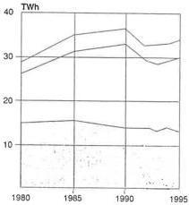

A magyar villamosenergia-rendszerben 1954 óta működik a fogyasztói befolyásolás kezdetben hatósági, 1968-tól elsősorban tarifális rendszere. A szabályzásra kijelölhető fogyasztók körét az Állami Energia Felügyelet jelöli ki (ÁEEF).

A 6. oldalon lévő ábrában közölt csoportosítás szerint „havi terhelésmérésre kötelezett” és szabadon vételező „nem mérésköteles” fogyasztócsoportokat különböztetünk meg. Az összes fogyasztás – a hálózati veszteség nélkül – 1995-ben 3902 GWh-val, azaz 11%-kal volt kevesebb, mint 1990-ben.

Ugyanezen időszakban a hálózati veszteség növekedett a kisfeszültségű fogyasztók arányának emelkedése miatt.

GWh

|  Kód | Megnevezés | 1955 | 1970 | 1980 | 1990 | 1994 | 1995  |
| --- | --- | --- | --- | --- | --- | --- | --- |
|   | Mérésköteles | 3 668 | 10 158 | 15 176 | 13 889 | 13 541 | 8 996  |
|   | Nem mérésköteles fogyasztás | 828 | 4 673 | 11 072 | 18 964 | 15 199 | 19 684  |
|   | Fogyasztás összesen | 4 496 | 14 831 | 26 248 | 32 853 | 28 740 | 28 680  |
|   | Hálózati veszteség | 490 | 1 490 | 2 755 | 3 846 | 4 253 | 4 749  |
|   | Fogyasztás+hálózati veszteség | 4 986 | 16 321 | 29 003 | 36 699 | 32 993 | 33 429  |

---

The Ground Truth image displays a single, solid horizontal line. According to Rule 2 (UNDERSCORE & LINE RULES), this is a stylistic or background line, not a placeholder underscore. Therefore, the OCR result must ignore it and output nothing or only meaningful text. The provided OCR content is "____", which consists of four underscores. This is an incorrect interpretation of the line as a placeholder, violating the rule that stylistic lines must be ignored. The OCR has hallucinated underscores where none should exist based on the GT's visual context. Hence, the OCR result is inconsistent with the Ground Truth.

[Non-Text]

[Non-Text]

[Non-Text]

[Non-Text]

[Non-Text]

[Non-Text]

[Non-Text]

[Non-Text]

The Ground Truth image displays a single, solid horizontal line. According to Rule 2 (UNDERSCORE & LINE RULES), this is a stylistic or background line, not a placeholder underscore. Therefore, the OCR result must ignore it and output nothing or only meaningful text. The provided OCR content is "____", which consists of four underscores. This is an incorrect interpretation of the line as a placeholder, violating the rule that stylistic lines must be ignored. The OCR has hallucinated underscores where none should exist based on the GT's visual context. Hence, the OCR result is inconsistent with the Ground Truth.

[Non-Text]

[Non-Text]

[Non-Text]

•

[Non-Text]

•

[Non-Text]

[Non-Text]

[Non-Text]

[Non-Text]

[Non-Text]

[Non-Text]

[Non-Text]

[Non-Text]

[Non-Text]

[Non-Text]

[Non-Text]

[Non-Text]

[Non-Text]

[Non-Text]

[Non-Text]

[Non-Text]

[Non-Text]

[Non-Text]

[Non-Text]

[Non-Text]

•

•

•

[Non-Text]

[Non-Text]

[Non-Text]

[Non-Text]

[Non-Text]

[Non-Text]

[Non-Text]

[Non-Text]

[Non-Text]

[Non-Text]

•

---

XVI. ábra. Áramszolgáltató részvénytársaságok területi megoszlása, körzeti diszpécser szolgálatok és a hatáskörükbe tartozó erőművek 1995. év végén

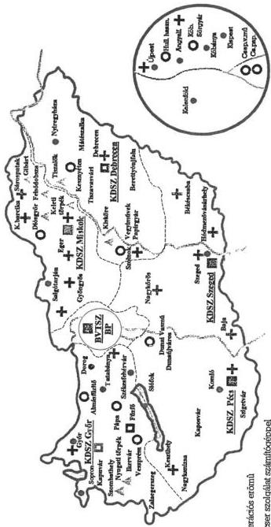

▲ Vizerőmű

● Körzeti alkotógerációs erőmű

■ Körzeti diszpécser szolgálat számítógéppel

□ Körzeti diszpécser szolgálat számítógép nélkül

○ Üzemi erőmű

+ Üzemirányító Központ számítógéppel

---

1. 2017年1月1日

1. 2017年1月1日

1. 2017年1月1日

1. 2017年1月1日

1. 2017年1月1日

1. 2017年1月1日

1. 2017年1月1日

1. 2017年1月1日

1. 2017年1月1日

1. 2017年1月1日

1. 2017年1月1日

1. 2017年1月1日

1. 2017年1月1日

1. 2017年1月1日

1. 2017年1月1日

1. 2017年1月1日

1. 2017年1月1日

1. 2017年1月1日

1. 2017年1月1日

1. 2017年1月1日

1. 2017年1月1日

1. 2017年1月1日

1. 2017年1月1日

1. 2017年1月1日

1. 2017年1月1日

1. 2017年1月1日

1. 2017年1月1日

1. 2017年1月1日

1. 2017年1月1日

1. 2017年1月1日

1. 2017年1月1日

1. 2017年1月1日

1. 2017年1月1日

1. 2017年1月1日

1. 2017年1月1日

1. 2017年1月1日

1. 2017年1月1日

1. 2017年1月1日

1. 2017年1月1日

1. 2017年1月1日

1. 2017年1月1日

1. 2017年1月1日

1. 2017年1月1日

1. 2017年1月1日

1. 2017年1月1日

1. 2017年1月1日

1. 2017年1月1日

1. 2017年1月1日

1. 2017年1月1日

1. 2017年1月1日

1. 2017年1月1日

1. 2017年1月1日

1. 2017年1月1日

1. 2017年1月1日

1. 2017年1月1日

1. 2017年1月1日

1. 2017年1月1日

1. 2017年1月1日

1. 2017年1月1日

1. 2017年1月1日

1. 2017年1月1日

1. 2017年1月1日

1. 2017年1月1日

1. 2017年1月1日

1. 2017年1月1日

1. 2017年1月1日

1. 2017年1月1日

1. 2017年1月1日

1. 2017年1月1日

1. 2017年1月1日

1. 2017年1月1日

1. 2017年1月1日

1. 2017年1月1日

1. 2017年1月1日

1. 2017年1月1日

1. 2017年1月1日

1. 2017年1月1日

1. 2017年1月1日

1. 2017年1月1日

1. 2017年1月1日

1. 2017年1月1日

1. 2017年1月1日

1. 2017年1月1日

1. 2017年1月1日

1. 2017年1月1日

1. 2017年1月1日

1. 2017年1月1日

1. 2017年1月1日

1. 2017年1月1日

1. 2017年1月1日

1. 2017年1月1日

1. 2017年1月1日

1. 2017年1月1日

1. 2017年1月1日

1. 2017年1月1日

1. 2017年1月1日

1. 2017年1月1日

1. 2017年1月1日

1. 2017年1月1日

1. 2017年1月1日

1. 2017年1月1日

1. 2017年1月1日

1. 2017年1月1日

1. 2017年1月1日

1. 2017年1月1日

1. 2017年1月1日

1. 2017年1月1日

1. 2017年1月1日

1. 2017年1月1日

1. 2017年1月1日

1. 2017年1月1日

1. 2017年1月1日

1. 2017年1月1日

1. 2017年1月1日

1. 2017年1月1日

1. 2017年1月1日

1. 2017年1月1日

1. 2017年1月1日

1. 2017年1月1日

1. 2017年1月1日

1. 2017年1月1日

1. 2017年1月1日

1. 2017年1月1日

1. 2017年1月1日

1. 2017年1月1日

1. 2017年1月1日

1. 2017年1月1日

1. 2017年1月1日

1. 2017年1月1日

1. 2017年1月1日

1. 2017年1月1日

1. 2017年1月1日

1. 2017年1月1日

1. 2017年1月1日

1. 2017年1月1日

1. 2017年1月1日

1. 2017年1月1日

1. 2017年1月1日

1. 2017年1月1日

1. 2017年1月1日

1. 2017年1月1日

1. 2017年1月1日

1. 2017年1月1日

1. 2017年1月1日

1. 2017年1月1日

1. 2017年1月1日

1. 2017年1月1日

1. 2017年1月1日

1. 2017年1月1日

1. 2017年1月1日

1. 2017年1月1日

1. 2017年1月1日

1. 2017年1月1日

1. 2017年1月1日

1. 2017年1月1日

1. 2017年1月1日

1. 2017年1月1日

1. 2017年1月1日

1. 2017年1月1日

1. 2017年1月1日

1. 2017年1月1日

1. 2017年1月1日

1. 2017年1月1日

1. 2017年1月1日

1. 2017年1月1日

1. 2017年1月1日

1. 2017年1月1日

1. 2017年1月1日

1. 2017年1月1日

1. 2017年1月1日

1. 2017年1月1日

1. 2017年1月1日

1. 2017年1月1日

1. 2017年1月1日

1. 2017年1月1日

1. 2017年1月1日

1. 2017年1月1日

1. 2017年1月1日

1. 2017年1月1日

1. 2017年1月1日

1. 2017年1月1日

1. 2017年1月1日

1. 2017年1月1日

1. 2017年1月1日

1. 2017年1月1日

1. 2017年1月1日

1. 2017年1月1日

1. 2017年1月1日

1. 2017年1月1日

1. 2017年1月1日

1. 2017年1月1日

1. 2017年1月1日

1. 2017年1月1日

1. 2017年1月1日

1. 2017年1月1日

1. 2017年1月1日

1. 2017年1月1日

1. 2017年1月1日

1. 2017年1月1日

1. 2017年1月1日

1. 2017年1月1日

1. 2017年1月1日

1. 2017年1月1日

1. 2017年1月1日

1. 2017年1月1日

1. 2017年1月1日

1. 2017年1月1日

1. 2017年1月1日

1. 2017年1月1日

1. 2017年1月1日

1. 2017年1月1日

1. 2017年1月1日

1. 2017年1月1日

1. 2017年1月1日

1. 2017年1月1日

1. 2017年1月1日

1. 2017年1月1日

1. 2017年1月1日

1. 2017年1月1日

1. 2017年1月1日

1. 2017年1月1日

1. 2017年1月1日

1. 2017年1月1日

1. 2017年1月1日

1. 2017年1月1日

1. 2017年1月1日

1. 2017年1月1日

1. 2017年1月1日

1. 2017年1月1日

1. 2017年1月1日

1. 2017年1月1日

1. 2017年1月1日

1. 2017年1月1日

1. 2017年1月1日

1. 2017年1月1日

1. 2017年1月1日

1. 2017年1月1日

1. 2017年1月1日

1. 2017年1月1日

1. 2017年1月1日

1. 2017年1月1日

1. 2017年1月1日

1. 2017年1月1日

1. 2017年1月1日

1. 2017年1月1日

1. 2017年1月1日

1. 2017年1月1日

1. 2017年1月1日

1. 2017年1月1日

1. 2017年1月1日

1. 2017年1月1日

1. 2017年1月1日

1. 2017年1月1日

1. 2017年1月1日

1. 2017年1月1日

1. 2017年1月1日

1. 2017年1月1日

1. 2017年1月1日

1. 2017年1月1日

1. 2017年1月1日

1. 2017年1月1日

1. 2017年1月1日

1. 2017年1月1日

1. 2017年1月1日

1. 2017年1月1日

1. 2017年1月1日

1. 2017年1月1日

1. 2017年1月1日

1. 2017年1月1日

1. 2017年1月1日

1. 2017年1月1日

1. 2017年1月1日

1. 2017年1月1日

1. 2017年1月1日

1. 2017年1月1日

1. 2017年1月1日

1. 2017年1月1日

1. 2017年1月1日

1. 2017年1月1日

1. 2017年1月1日

1. 2017年1月1日

1. 2017年1月1日

1. 2017年1月1日

1. 2017年1月1日

1. 2017年1月1日

1. 2017年1月1日

1. 2017年1月1日

1. 2017年1月1日

1. 2017年1月1日

1. 2017年1月1日

1. 2017年1月1日

1. 2017年1月1日

1. 2017年1月1日

1. 2017年1月1日

1. 2017年1月1日

1. 2017年1月1日

1. 2017年1月1日

1. 2017年1月1日

1. 2017年1月1日

1. 2017年1月1日

1. 2017年1月1日

1. 2017年1月1日

1. 2017年1月1日

1. 2017年1月1日

1. 2017年1月1日

1. 2017年1月1日

1. 2017年1月1日

1. 2017年1月1日

1. 2017年1月1日

1. 2017年1月1日

1. 2017年1月1日

1. 2017年1月1日

1. 2017年1月1日

1. 2017年1月1日

1. 2017年1月1日

1. 2017年1月1日

1. 2017年1月1日

1. 2017年1月1日

1. 2017年1月1日

1. 2017年1月1日

---

XVII. ábra. Elosztó hálózatok

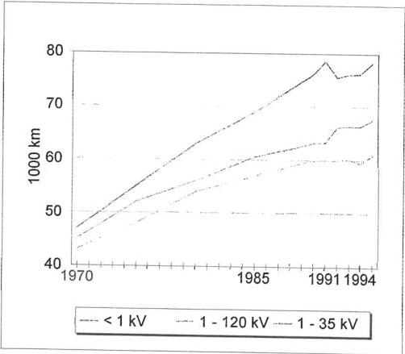

---

.

.

.

.

---

XVIII. ábra. Az értékesített villamosenergia áramszolgáltató részvénytársaságonként 1995.évben

|   | Ipar | Kommunális | Egyéb | Összesen | Részarány, % | Csúcsterhelés, MW | Kihaszn. óraszám  |
| --- | --- | --- | --- | --- | --- | --- | --- |
|  ÉDÁSZ Rt, Győr | 2 980 017 | 2 064 537 | 825 547 | 5 890 101 | 20.6 | 1 057 | 6 672  |
|  DÉDÁSZ Rt, Pécs | 1 430 775 | 1 632 668 | 547 032 | 3 610 475 | 12.7 | 688 | 5 248  |
|  ÉMÁSZ Rt, Miskolc | 2 704 107 | 1 656 379 | 406 975 | 4 767 461 | 16.8 | 816 | 5 842  |
|  DÉMÁSZ Rt, Szeged | 909 773 | 1 591 670 | 663 366 | 3 164 809 | 11.2 | 586 | 5 401  |
|  TÍTÁSZ Rt, Debrecen | 696 141 | 1 775 032 | 741 492 | 3 212 665 | 11.3 | 610 | 5 267  |
|  ELMŰ Rt, Bpest | 2 416 016 | 3 666 748 | 1 591 221 | 7 673 985 | 27.1 | 1 543 | 4 973  |
|  ÁSZ Rt - k összesen | 11 136 828 | 12 407 034 | 4 775 633 | 28 319 496 | 100.0 |  |   |
|  MVM Rt | 37 250 |  | 804 920 | 842 180 |  |  |   |
|  Értékesített vill. en.összesen | 11 174 089 | 12 407 034 | 5 580 653 | 29 161 676 |  |  |   |

Ipar

Kommunális

Egyéb

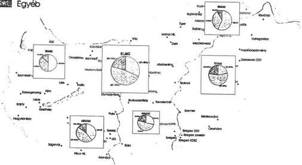

---

__________

---

XIX. ábra. A háztartási (lakás-) fogyasztás alakulása (1980-1995)

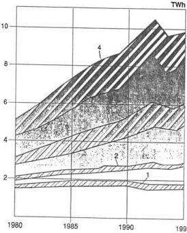

Az ábra a lakásfogyasztás változását mutatja be Budapesten (1), a kiemelt városokban (2-1), az egyéb városokban (3-2) és a községekben (4-3).

A sávozott rész a felsorolt kategóriákon belül az éjszakai külön mért fogyasztást jelöli.

A lakásfogyasztások alakulása 1995-ben

|   | Háztartási összesen | MWh Ebből éjszakai  |
| --- | --- | --- |
|  Budapest | 1 896 603 | 241 304  |
|  Kiemelt város | 966 258 | 158 568  |
|  Egyéb város | 3 124 099 | 1 163 044  |
|  Község | 3 800 258 | 1 614 001  |
|  Összesen | 9 787 218 | 3 176 917  |

---

The Ground Truth image displays a single, solid horizontal line. According to Rule 2 (UNDERSCORE & LINE RULES), this is a stylistic or background line, not a placeholder underscore. Therefore, the OCR result must ignore it and output nothing or only meaningful text. The provided OCR content is "____", which consists of four underscores. This is an incorrect interpretation of the line as a placeholder, violating the rule that stylistic lines must be ignored. The OCR has hallucinated underscores where none should exist based on the GT's visual context. Hence, the OCR result is inconsistent with the Ground Truth.

[Non-Text]

[Non-Text]

[Non-Text]

[Non-Text]

[Non-Text]

[Non-Text]

The Ground Truth image displays a single, solid horizontal line. According to Rule 2 (UNDERSCORE & LINE RULES), this is a stylistic or background line, not a placeholder underscore. Therefore, the OCR result must ignore it and output nothing or only meaningful text. The provided OCR content is "____", which consists of four underscores. This is an incorrect interpretation of the line as a placeholder, violating the rule that stylistic lines must be ignored. The OCR has hallucinated underscores where none should exist based on the GT's visual context. Hence, the OCR result is inconsistent with the Ground Truth.

The Ground Truth image displays a single, solid horizontal line. According to Rule 2 (UNDERSCORE & LINE RULES), this is a stylistic or background line, not a placeholder underscore. Therefore, the OCR result must ignore it and output nothing or only meaningful text. The provided OCR content is "____", which consists of four underscores. This is an incorrect interpretation of the line as a placeholder, violating the rule that stylistic lines must be ignored. The OCR has hallucinated underscores where none should exist based on the GT's visual context. Hence, the OCR result is inconsistent with the Ground Truth.

[Non-Text]

[Non-Text]

The Ground Truth image displays a single, solid horizontal line. According to Rule 2 (UNDERSCORE & LINE RULES), this is a stylistic or background line, not a placeholder underscore. Therefore, the OCR result must ignore it and output nothing or only meaningful text. The provided OCR content is "____", which consists of four underscores. This is an incorrect interpretation of the line as a placeholder, violating the rule that stylistic lines must be ignored. The OCR has hallucinated underscores where none should exist based on the GT's visual context. Hence, the OCR result is inconsistent with the Ground Truth.

[Non-Text]

The Ground Truth image displays a single, solid horizontal line. According to Rule 2 (UNDERSCORE & LINE RULES), this is a stylistic or background line, not a placeholder underscore. Therefore, the OCR result must ignore it and output nothing or only meaningful text. The provided OCR content is "____", which consists of four underscores. This is an incorrect interpretation of the line as a placeholder, violating the rule that stylistic lines must be ignored. The OCR has hallucinated underscores where none should exist based on the GT's visual context. Hence, the OCR result is inconsistent with the Ground Truth.

[Non-Text]

The Ground Truth image displays a single, solid horizontal line. According to Rule 2 (UNDERSCORE & LINE RULES), this is a stylistic or background line, not a placeholder underscore. Therefore, the OCR result must ignore it and output nothing or only meaningful text. The provided OCR content is "____", which consists of four underscores. This is an incorrect interpretation of the line as a placeholder, violating the rule that stylistic lines must be ignored. The OCR has hallucinated underscores where none should exist based on the GT's visual context. Hence, the OCR result is inconsistent with the Ground Truth.

The Ground Truth image displays a single, solid horizontal line. According to Rule 2 (UNDERSCORE & LINE RULES), this is a stylistic or background line, not a placeholder underscore. Therefore, the OCR result must ignore it and output nothing or only meaningful text. The provided OCR content is "____", which consists of four underscores. This is an incorrect interpretation of the line as a placeholder, violating the rule that stylistic lines must be ignored. The OCR has hallucinated underscores where none should exist based on the GT's visual context. Hence, the OCR result is inconsistent with the Ground Truth.

The Ground Truth image displays a single, solid horizontal line. According to Rule 2 (UNDERSCORE & LINE RULES), this is a stylistic or background line, not a placeholder underscore. Therefore, the OCR result must ignore it and output nothing or only meaningful text. The provided OCR content is "____", which consists of four underscores. This is an incorrect interpretation of the line as a placeholder, violating the rule that stylistic lines must be ignored. The OCR has hallucinated underscores where none should exist based on the GT's visual context. Hence, the OCR result is inconsistent with the Ground Truth.

The Ground Truth image displays a single, solid horizontal line. According to Rule 2 (UNDERSCORE & LINE RULES), this is a stylistic or background line, not a placeholder underscore. Therefore, the OCR result must ignore it and output nothing or only meaningful text. The provided OCR content is "____", which consists of four underscores. This is an incorrect interpretation of the line as a placeholder, violating the rule that stylistic lines must be ignored. The OCR has hallucinated underscores where none should exist based on the GT's visual context. Hence, the OCR result is inconsistent with the Ground Truth.

[Non-Text]

The Ground Truth image displays a single, solid horizontal line. According to Rule 2 (UNDERSCORE & LINE RULES), this is a stylistic or background line, not a placeholder underscore. Therefore, the OCR result must ignore it and output nothing or only meaningful text. The provided OCR content is "____", which consists of four underscores. This is an incorrect interpretation of the line as a placeholder, violating the rule that stylistic lines must be ignored. The OCR has hallucinated underscores where none should exist based on the GT's visual context. Hence, the OCR result is inconsistent with the Ground Truth.

The Ground Truth image displays a single, solid horizontal line. According to Rule 2 (UNDERSCORE & LINE RULES), this is a stylistic or background line, not a placeholder underscore. Therefore, the OCR result must ignore it and output nothing or only meaningful text. The provided OCR content is "____", which consists of four underscores. This is an incorrect interpretation of the line as a placeholder, violating the rule that stylistic lines must be ignored. The OCR has hallucinated underscores where none should exist based on the GT's visual context. Hence, the OCR result is inconsistent with the Ground Truth.

The Ground Truth image displays a single, solid horizontal line. According to Rule 2 (UNDERSCORE & LINE RULES), this is a stylistic or background line, not a placeholder underscore. Therefore, the OCR result must ignore it and output nothing or only meaningful text. The provided OCR content is "____", which consists of four underscores. This is an incorrect interpretation of the line as a placeholder, violating the rule that stylistic lines must be ignored. The OCR has hallucinated underscores where none should exist based on the GT's visual context. Hence, the OCR result is inconsistent with the Ground Truth.

The Ground Truth image displays a single, solid horizontal line. According to Rule 2 (UNDERSCORE & LINE RULES), this is a stylistic or background line, not a placeholder underscore. Therefore, the OCR result must ignore it and output nothing or only meaningful text. The provided OCR content is "____", which consists of four underscores. This is an incorrect interpretation of the line as a placeholder, violating the rule that stylistic lines must be ignored. The OCR has hallucinated underscores where none should exist based on the GT's visual context. Hence, the OCR result is inconsistent with the Ground Truth.

The Ground Truth image displays a single, solid horizontal line. According to Rule 2 (UNDERSCORE & LINE RULES), this is a stylistic or background line, not a placeholder underscore. Therefore, the OCR result must ignore it and output nothing or only meaningful text. The provided OCR content is "____", which consists of four underscores. This is an incorrect interpretation of the line as a placeholder, violating the rule that stylistic lines must be ignored. The OCR has hallucinated underscores where none should exist based on the GT's visual context. Hence, the OCR result is inconsistent with the Ground Truth.

The Ground Truth image displays a single, solid horizontal line. According to Rule 2 (UNDERSCORE & LINE RULES), this is a stylistic or background line, not a placeholder underscore. Therefore, the OCR result must ignore it and output nothing or only meaningful text. The provided OCR content is "____", which consists of four underscores. This is an incorrect interpretation of the line as a placeholder, violating the rule that stylistic lines must be ignored. The OCR has hallucinated underscores where none should exist based on the GT's visual context. Hence, the OCR result is inconsistent with the Ground Truth.

The Ground Truth image displays a single, solid horizontal line. According to Rule 2 (UNDERSCORE & LINE RULES), this is a stylistic or background line, not a placeholder underscore. Therefore, the OCR result must ignore it and output nothing or only meaningful text. The provided OCR content is "____", which consists of four underscores. This is an incorrect interpretation of the line as a placeholder, violating the rule that stylistic lines must be ignored. The OCR has hallucinated underscores where none should exist based on the GT's visual context. Hence, the OCR result is inconsistent with the Ground Truth.

The Ground Truth image displays a single, solid horizontal line. According to Rule 2 (UNDERSCORE & LINE RULES), this is a stylistic or background line, not a placeholder underscore. Therefore, the OCR result must ignore it and output nothing or only meaningful text. The provided OCR content is "____", which consists of four underscores. This is an incorrect interpretation of the line as a placeholder, violating the rule that stylistic lines must be ignored. The OCR has hallucinated underscores where none should exist based on the GT's visual context. Hence, the OCR result is inconsistent with the Ground Truth.

The Ground Truth image displays a single, solid horizontal line. According to Rule 2 (UNDERSCORE & LINE RULES), this is a stylistic or background line, not a placeholder underscore. Therefore, the OCR result must ignore it and output nothing or only meaningful text. The provided OCR content is "____", which consists of four underscores. This is an incorrect interpretation of the line as a placeholder, violating the rule that stylistic lines must be ignored. The OCR has hallucinated underscores where none should exist based on the GT's visual context. Hence, the OCR result is inconsistent with the Ground Truth.

The Ground Truth image displays a single, solid horizontal line. According to Rule 2 (UNDERSCORE & LINE RULES), this is a stylistic or background line, not a placeholder underscore. Therefore, the OCR result must ignore it and output nothing or only meaningful text. The provided OCR content is "____", which consists of four underscores. This is an incorrect interpretation of the line as a placeholder, violating the rule that stylistic lines must be ignored. The OCR has hallucinated underscores where none should exist based on the GT's visual context. Hence, the OCR result is inconsistent with the Ground Truth.

The Ground Truth image displays a single, solid horizontal line. According to Rule 2 (UNDERSCORE & LINE RULES), this is a stylistic or background line, not a placeholder underscore. Therefore, the OCR result must ignore it and output nothing or only meaningful text. The provided OCR content is "____", which consists of four underscores. This is an incorrect interpretation of the line as a placeholder, violating the rule that stylistic lines must be ignored. The OCR has hallucinated underscores where none should exist based on the GT's visual context. Hence, the OCR result is inconsistent with the Ground Truth.

The Ground Truth image displays a single, solid horizontal line. According to Rule 2 (UNDERSCORE & LINE RULES), this is a stylistic or background line, not a placeholder underscore. Therefore, the OCR result must ignore it and output nothing or only meaningful text. The provided OCR content is "____", which consists of four underscores. This is an incorrect interpretation of the line as a placeholder, violating the rule that stylistic lines must be ignored. The OCR has hallucinated underscores where none should exist based on the GT's visual context. Hence, the OCR result is inconsistent with the Ground Truth.

The Ground Truth image displays a single, solid horizontal line. According to Rule 2 (UNDERSCORE & LINE RULES), this is a stylistic or background line, not a placeholder underscore. Therefore, the OCR result must ignore it and output nothing or only meaningful text. The provided OCR content is "____", which consists of four underscores. This is an incorrect interpretation of the line as a placeholder, violating the rule that stylistic lines must be ignored. The OCR has hallucinated underscores where none should exist based on the GT's visual context. Hence, the OCR result is inconsistent with the Ground Truth.

The Ground Truth image displays a single, solid horizontal line. According to Rule 2 (UNDERSCORE & LINE RULES), this is a stylistic or background line, not a placeholder underscore. Therefore, the OCR result must ignore it and output nothing or only meaningful text. The provided OCR content is "____", which consists of four underscores. This is an incorrect interpretation of the line as a placeholder, violating the rule that stylistic lines must be ignored. The OCR has hallucinated underscores where none should exist based on the GT's visual context. Hence, the OCR result is inconsistent with the Ground Truth.

The Ground Truth image displays a single, solid horizontal line. According to Rule 2 (UNDERSCORE & LINE RULES), this is a stylistic or background line, not a placeholder underscore. Therefore, the OCR result must ignore it and output nothing or only meaningful text. The provided OCR content is "____", which consists of four underscores. This is an incorrect interpretation of the line as a placeholder, violating the rule that stylistic lines must be ignored. The OCR has hallucinated underscores where none should exist based on the GT's visual context. Hence, the OCR result is inconsistent with the Ground Truth.

The Ground Truth image displays a single, solid horizontal line. According to Rule 2 (UNDERSCORE & LINE RULES), this is a stylistic or background line, not a placeholder underscore. Therefore, the OCR result must ignore it and output nothing or only meaningful text. The provided OCR content is "____", which consists of four underscores. This is an incorrect interpretation of the line as a placeholder, violating the rule that stylistic lines must be ignored. The OCR has hallucinated underscores where none should exist based on the GT's visual context. Hence, the OCR result is inconsistent with the Ground Truth.

The Ground Truth image displays a single, solid horizontal line. According to Rule 2 (UNDERSCORE & LINE RULES), this is a stylistic or background line, not a placeholder underscore. Therefore, the OCR result must ignore it and output nothing or only meaningful text. The provided OCR content is "____", which consists of four underscores. This is an incorrect interpretation of the line as a placeholder, violating the rule that stylistic lines must be ignored. The OCR has hallucinated underscores where none should exist based on the GT's visual context. Hence, the OCR result is inconsistent with the Ground Truth.

The Ground Truth image displays a single, solid horizontal line. According to Rule 2 (UNDERSCORE & LINE RULES), this is a stylistic or background line, not a placeholder underscore. Therefore, the OCR result must ignore it and output nothing or only meaningful text. The provided OCR content is "____", which consists of four underscores. This is an incorrect interpretation of the line as a placeholder, violating the rule that stylistic lines must be ignored. The OCR has hallucinated underscores where none should exist based on the GT's visual context. Hence, the OCR result is inconsistent with the Ground Truth.

The Ground Truth image displays a single, solid horizontal line. According to Rule 2 (UNDERSCORE & LINE RULES), this is a stylistic or background line, not a placeholder underscore. Therefore, the OCR result must ignore it and output nothing or only meaningful text. The provided OCR content is "____", which consists of four underscores. This is an incorrect interpretation of the line as a placeholder, violating the rule that stylistic lines must be ignored. The OCR has hallucinated underscores where none should exist based on the GT's visual context. Hence, the OCR result is inconsistent with the Ground Truth.

The Ground Truth image displays a single, solid horizontal line. According to Rule 2 (UNDERSCORE & LINE RULES), this is a stylistic or background line, not a placeholder underscore. Therefore, the OCR result must ignore it and output nothing or only meaningful text. The provided OCR content is "____", which consists of four underscores. This is an incorrect interpretation of the line as a placeholder, violating the rule that stylistic lines must be ignored. The OCR has hallucinated underscores where none should exist based on the GT's visual context. Hence, the OCR result is inconsistent with the Ground Truth.

The Ground Truth image displays a single, solid horizontal line. According to Rule 2 (UNDERSCORE & LINE RULES), this is a stylistic or background line, not a placeholder underscore. Therefore, the OCR result must ignore it and output nothing or only meaningful text. The provided OCR content is "____", which consists of four underscores. This is an incorrect interpretation of the line as a placeholder, violating the rule that stylistic lines must be ignored. The OCR has hallucinated underscores where none should exist based on the GT's visual context. Hence, the OCR result is inconsistent with the Ground Truth.

The Ground Truth image displays a single, solid horizontal line. According to Rule 2 (UNDERSCORE & LINE RULES), this is a stylistic or background line, not a placeholder underscore. Therefore, the OCR result must ignore it and output nothing or only meaningful text. The provided OCR content is "____", which consists of four underscores. This is an incorrect interpretation of the line as a placeholder, violating the rule that stylistic lines must be ignored. The OCR has hallucinated underscores where none should exist based on the GT's visual context. Hence, the OCR result is inconsistent with the Ground Truth.

The Ground Truth image displays a single, solid horizontal line. According to Rule 2 (UNDERSCORE & LINE RULES), this is a stylistic or background line, not a placeholder underscore. Therefore, the OCR result must ignore it and output nothing or only meaningful text. The provided OCR content is "____", which consists of four underscores. This is an incorrect interpretation of the line as a placeholder, violating the rule that stylistic lines must be ignored. The OCR has hallucinated underscores where none should exist based on the GT's visual context. Hence, the OCR result is inconsistent with the Ground Truth.

The Ground Truth image displays a single, solid horizontal line. According to Rule 2 (UNDERSCORE & LINE RULES), this is a stylistic or background line, not a placeholder underscore. Therefore, the OCR result must ignore it and output nothing or only meaningful text. The provided OCR content is "____", which consists of four underscores. This is an incorrect interpretation of the line as a placeholder, violating the rule that stylistic lines must be ignored. The OCR has hallucinated underscores where none should exist based on the GT's visual context. Hence, the OCR result is inconsistent with the Ground Truth.

The Ground Truth image displays a single, solid horizontal line. According to Rule 2 (UNDERSCORE & LINE RULES), this is a stylistic or background line, not a placeholder underscore. Therefore, the OCR result must ignore it and output nothing or only meaningful text. The provided OCR content is "____", which consists of four underscores. This is an incorrect interpretation of the line as a placeholder, violating the rule that stylistic lines must be ignored. The OCR has hallucinated underscores where none should exist based on the GT's visual context. Hence, the OCR result is inconsistent with the Ground Truth.

The Ground Truth image displays a single, solid horizontal line. According to Rule 2 (UNDERSCORE & LINE RULES), this is a stylistic or background line, not a placeholder underscore. Therefore, the OCR result must ignore it and output nothing or only meaningful text. The provided OCR content is "____", which consists of four underscores. This is an incorrect interpretation of the line as a placeholder, violating the rule that stylistic lines must be ignored. The OCR has hallucinated underscores where none should exist based on the GT's visual context. Hence, the OCR result is inconsistent with the Ground Truth.

The Ground Truth image displays a single, solid horizontal line. According to Rule 2 (UNDERSCORE & LINE RULES), this is a stylistic or background line, not a placeholder underscore. Therefore, the OCR result must ignore it and output nothing or only meaningful text. The provided OCR content is "____", which consists of four underscores. This is an incorrect interpretation of the line as a placeholder, violating the rule that stylistic lines must be ignored. The OCR has hallucinated underscores where none should exist based on the GT's visual context. Hence, the OCR result is inconsistent with the Ground Truth.

The Ground Truth image displays a single, solid horizontal line. According to Rule 2 (UNDERSCORE & LINE RULES), this is a stylistic or background line, not a placeholder underscore. Therefore, the OCR result must ignore it and output nothing or only meaningful text. The provided OCR content is "____", which consists of four underscores. This is an incorrect interpretation of the line as a placeholder, violating the rule that stylistic lines must be ignored. The OCR has hallucinated underscores where none should exist based on the GT's visual context. Hence, the OCR result is inconsistent with the Ground Truth.

The Ground Truth image displays a single, solid horizontal line. According to Rule 2 (UNDERSCORE & LINE RULES), this is a stylistic or background line, not a placeholder underscore. Therefore, the OCR result must ignore it and output nothing or only meaningful text. The provided OCR content is "____", which consists of four underscores. This is an incorrect interpretation of the line as a placeholder, violating the rule that stylistic lines must be ignored. The OCR has hallucinated underscores where none should exist based on the GT's visual context. Hence, the OCR result is inconsistent with the Ground Truth.

The Ground Truth image displays a single, solid horizontal line. According to Rule 2 (UNDERSCORE & LINE RULES), this is a stylistic or background line, not a placeholder underscore. Therefore, the OCR result must ignore it and output nothing or only meaningful text. The provided OCR content is "____", which consists of four underscores. This is an incorrect interpretation of the line as a placeholder, violating the rule that stylistic lines must be ignored. The OCR has hallucinated underscores where none should exist based on the GT's visual context. Hence, the OCR result is inconsistent with the Ground Truth.

---

XX. ábra. A villamosított háztartások régiók szerinti átlagfogyasztása kWh/lakos

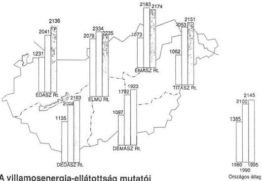

A villamosenergia-ellátottság mutatói

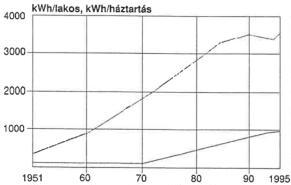

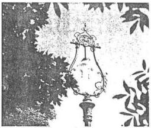

Magyarországon a villamosítás 99,3%-ra becsülhető, azaz az összes lakás és üdülő közül csupán 0,7% nincs a közcélú villamos hálózatra kapcsolva.

|  Kód | Megnevezés | 1951 | 1985 | 1990 | 1994 | 1995  |
| --- | --- | --- | --- | --- | --- | --- |
|  — | Háztartási fogyasztók száma, ezer | 1 167 | 4 046 | 4 378 | 4 527 | 4 563  |
|   |  Egy lakosra jutó bruttó villamosenergia-fogyasztás, kWh/lakos | 342 | 3 323 | 3 571 | 3 210 | 3 296  |
|   |  Egy háztartás évi átlagfogyasztása, kWh/háztartás | 139 | 1 828 | 2 097 | 2 174 | 2 145  |
|   |  Egy lakosra jutó háztartási fogyasztás, kWh/lakos | 17 | 695 | 871 | 958 | 958  |

---

The image is too blurry to recognize any text content.

(1) 2017年1月1日至2018年1月1日，公司与关联方累计发生关联交易的总金额为人民币45,000万元。

(1) 2017年1月1日至2018年1月1日，公司与关联方累计发生关联交易的总金额为人民币45,000万元。

(1) 2017年1月1日至2018年1月1日，公司与关联方累计发生关联交易的总金额为人民币45,000万元。

(1) 2017年1月1日至2018年1月1日，公司与关联方累计发生关联交易的总金额为人民币45,000万元。

---

# XXI. ábra. A villamosenergia-értékesítés folyamatában
az összevont mérlegben bekövetkezett
költségelem-változások

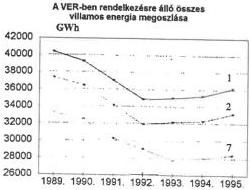

1 VER szinten Rendelkezésre alló összes villamos energia
2 Ertékesitésre átadott villamos energia
7 Hazai ertekesités (2-7 = Halózati veszteség)

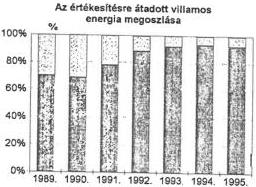

2.3 Koop. uz. eromüvektol atvett vill.en. részaranya %
2.2 Import szaldo részaranya, %
2.1 MVM-eromvek részaranya, %

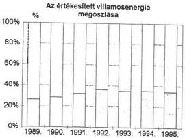

7.1 Termelői fogyasztás
7.2 Háztartási fogyasztás

---

1. 2017年1月1日

(1) 2017年1月1日至2018年1月1日，公司与关联方累计发生关联交易的总金额为人民币45,000万元。

[Non-Text]

[Non-Text]

[Non-Text]

[Non-Text]

[Non-Text]

[Non-Text]

[Non-Text]

[Non-Text]

[Non-Text]

[Non-Text]

[Non-Text]

[Non-Text]

---

# XXI. ábra. folytatása

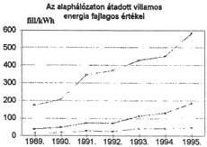

5 Teljes onkoltseg, ebbol
4 Elosztasi koltseg
3 Halózati veszteség

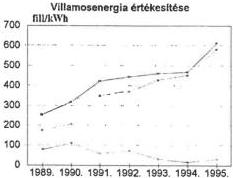

7 Ertékesités
5 Teljes onkoltseg
6 Üzletági eredmény

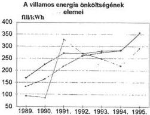

2.3 Vásárlás kooperálo üzemi erőművektől
2.1 Az MVM erőművek önköltsége
2.2 Az import szaldó eredő költsége

---

1. 2017年1月1日

1. 2017年1月1日

1. 2017年1月1日

[Non-Text]

[Non-Text]

[Non-Text]

[Non-Text]

[Non-Text]

[Non-Text]

[Non-Text]

[Non-Text]

[Non-Text]

[Non-Text]

[Non-Text]

(1) 2017年1月1日，公司与关联方发生的交易金额为人民币4,000万元。

---

# XXI. ábra. folytatása

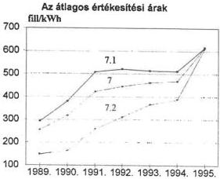

7.1 Termelöi fogyasztói átlagár
7 Értékesitési átlagár
7.2 Házortási fogyasztói átlagár

A villamosenergia-értékesítés folyamatában az összevont mérlegben bekövetkezett költségelemváltozások

|  Sor-szám | Megnevezés | M.e. | 1989. | 1990. | 1991. | 1992. | 1993. | 1994. | 1995.  |
| --- | --- | --- | --- | --- | --- | --- | --- | --- | --- |
|  1 | VER szinten rendelkezésre álló villamosenergia | GWh | 40 328 | 39 224 | 36 977 | 34 794 | 35 006 | 35 249 | 36 144  |
|  2 | Értékesítésre átadott, v.é. | GWh | 37 303 | 36 387 | 34 093 | 31 856 | 32 127 | 32 233 | 33 106  |
|  2.1 | - ebből: MVM erőművek | fill/kWh | 132.01 | 163.39 | 216.64 | 260.26 | 273.3 | 282.25 | 355.23  |
|   |  | % | 70.2 | 68.9 | 78.2 | 88.7 | 92.0 | 93.3 | 92.34  |
|  2.2 | Import szaldó | fill/kWh | 93.23 | 86.6 | 330.3 | 271.04 | 248.96 | 219.17 | 291.31  |
|   |  | % | 29.7 | 31.0 | 21.6 | 10.9 | 7.7 | 6.3 | 7.26  |
|  2.21 | MVM | fill/kWh | - | - | 331.07 | 263.23 | 235.17 | 219.16 | 291.31  |
|   |  | % | - | - | 21.3 | 8.8 | 6.0 | 5.9 | 7.26  |
|  2.22 | Barter | fill/kWh | - | - | 240.4 | 303.58 | 298.84 | 219.42 | -  |
|   |  | % | - | - | 0.3 | 2.1 | 1.7 | 0.4 | -  |
|  2.3 | Koop. üzemi erőművektől átvett | fill/kWh | 168.26 | 225.12 | 272.79 | 271.83 | 281.98 | 285.00 | 357.81  |
|   |  | % | 0.1 | 0.1 | 0.2 | 0.4 | 0.3 | 0.4 | 0.4  |
|  2 | Az értékesítésre átadott vill.en. önk. | fill/kWh | 120.57 | 139.68 | 241.87 | 270.34 | 271.45 | 278.27 | 349.63  |
|  3 | Hálózati veszteség | GWh | 4 143 | 4 036 | 3 871 | 2 841 | 4 358 | 4 254 | 4 749  |
|   |  | fill/kWh | 14.70 | 17.00 | 30.25 | 26.47 | 42.6 | 42.32 | 47.01  |
|  4 | Elosztási költség | fill/kWh | 40.11 | 49.61 | 74.84 | 73.91 | 114.32 | 130.92 | 185.17  |
|  5 | Teljes önköltség | fill/kWh | 175.38 | 206.29 | 346.96 | 370.72 | 428.37 | 451.51 | 592.14  |
|  6 | Üzletági eredmény | fill/kWh | 79.80 | 111.24 | 60.81 | 74.34 | 33.89 | 16.88 | 32.90  |
|  7 | Értékesítés átlagára | GWh | 33 250 | 32 440 | 30 222 | 29 015 | 27 769 | 27 979 | 28 356  |
|   |  | fill/kWh | 255.26 | 317.53 | 422.77 | 445.06 | 462.26 | 468.39 | 614.73  |
|  7.1 | Termelői fogy. átlagára | fill/kWh | 292.85 | 380.05 | 508.40 | 521.45 | 514.17 | 512.15 | 615.96  |
|   |  | % | 72.9 | 71.2 | 67.6 | 63.8 | 65.0 | 64.8 | 65.49  |
|  7.2 | Háztartási fogy. | fill/kWh | 148.55 | 162.68 | 259.17 | 310.63 | 365.89 | 387.75 | 612.32  |
|   |  | % | 26.00 | 28.34 | 32.30 | 36.20 | 35.00 | 35.20 | 34.51  |
|  8 | Üzletági eredményt terhelő ráfordítások | fill/kWh | .. | .. | .. | -34.25 | -25.72 | -23.15 | -79.51  |
|  9 | Korrigált üzletági eredmény | fill/kWh | .. | .. | .. | 40.09 | 8.17 | -6.27 | -46.61  |

---

1

1

1

1

1

1

1

1

1

1

---

XXII. ábra. Környezetvédelem

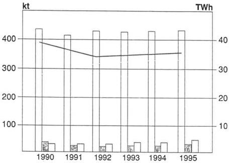

|  Kód |  | 1994 | 1995  |
| --- | --- | --- | --- |
|   | Villamosenergia-igény, TWh | 35,2 | 36,1  |
|   | Villamosenergia-termelés, TWh | 32,7 | 33,2  |
|   | SO₂-kibocsátás, kt | 421,9 | 436,0  |
|   | Noₓ-kibocsátás, kt | 41,1 | 39,3  |
|   | Szilárdanyag-kibocsátás, kt | 20,5 | 20,6  |

---

[Non-Text]

[Non-Text]

[Non-Text]

[Non-Text]

[Non-Text]

[Non-Text]

[Non-Text]

The Ground Truth image displays a single, solid horizontal line. According to Rule 2 (UNDERSCORE & LINE RULES), this is a stylistic or background line, not a placeholder underscore. Therefore, the OCR result must ignore it and output nothing or only meaningful text. The provided OCR content is "____", which consists of four underscores. This is an incorrect interpretation of the line as a placeholder, violating the rule that stylistic lines must be ignored. The OCR has hallucinated underscores where none should exist based on the GT's visual context. Hence, the OCR result is inconsistent with the Ground Truth.

[Non-Text]

[Non-Text]

The Ground Truth image displays a single, solid horizontal line. According to Rule 2 (UNDERSCORE & LINE RULES), this is a stylistic or background line, not a placeholder underscore. Therefore, the OCR result must ignore it and output nothing or only meaningful text. The provided OCR content is "____", which consists of four underscores. This is an incorrect interpretation of the line as a placeholder, violating the rule that stylistic lines must be ignored. The OCR has hallucinated underscores where none should exist based on the GT's visual context. Hence, the OCR result is inconsistent with the Ground Truth.

[Non-Text]

[Non-Text]

The Ground Truth image displays a single, solid horizontal line. According to Rule 2 (UNDERSCORE & LINE RULES), this is a stylistic or background line, not a placeholder underscore. Therefore, the OCR result must ignore it and output nothing or only meaningful text. The provided OCR content is "____", which consists of four underscores. This is an incorrect interpretation of the line as a placeholder, violating the rule that stylistic lines must be ignored. The OCR has hallucinated underscores where none should exist based on the GT's visual context. Hence, the OCR result is inconsistent with the Ground Truth.

The Ground Truth image displays a single, solid horizontal line. According to Rule 2 (UNDERSCORE & LINE RULES), this is a stylistic or background line, not a placeholder underscore. Therefore, the OCR result must ignore it and output nothing or only meaningful text. The provided OCR content is "____", which consists of four underscores. This is an incorrect interpretation of the line as a placeholder, violating the rule that stylistic lines must be ignored. The OCR has hallucinated underscores where none should exist based on the GT's visual context. Hence, the OCR result is inconsistent with the Ground Truth.

The Ground Truth image displays a single, solid horizontal line. According to Rule 2 (UNDERSCORE & LINE RULES), this is a stylistic or background line, not a placeholder underscore. Therefore, the OCR result must ignore it and output nothing or only meaningful text. The provided OCR content is "____", which consists of four underscores. This is an incorrect interpretation of the line as a placeholder, violating the rule that stylistic lines must be ignored. The OCR has hallucinated underscores where none should exist based on the GT's visual context. Hence, the OCR result is inconsistent with the Ground Truth.

[Non-Text]

[Non-Text]

[Non-Text]

[Non-Text]

[Non-Text]

[Non-Text]

The Ground Truth image displays a single, solid horizontal line. According to Rule 2 (UNDERSCORE & LINE RULES), this is a stylistic or background line, not a placeholder underscore. Therefore, the OCR result must ignore it and output nothing or only meaningful text. The provided OCR content is "____", which consists of four underscores. This is an incorrect interpretation of the line as a placeholder, violating the rule that stylistic lines must be ignored. The OCR has hallucinated underscores where none should exist based on the GT's visual context. Hence, the OCR result is inconsistent with the Ground Truth.

The Ground Truth image displays a single, solid horizontal line. According to Rule 2 (UNDERSCORE & LINE RULES), this is a stylistic or background line, not a placeholder underscore. Therefore, the OCR result must ignore it and output nothing or only meaningful text. The provided OCR content is "____", which consists of four underscores. This is an incorrect interpretation of the line as a placeholder, violating the rule that stylistic lines must be ignored. The OCR has hallucinated underscores where none should exist based on the GT's visual context. Hence, the OCR result is inconsistent with the Ground Truth.

The Ground Truth image displays a single, solid horizontal line. According to Rule 2 (UNDERSCORE & LINE RULES), this is a stylistic or background line, not a placeholder underscore. Therefore, the OCR result must ignore it and output nothing or only meaningful text. The provided OCR content is "____", which consists of four underscores. This is an incorrect interpretation of the line as a placeholder, violating the rule that stylistic lines must be ignored. The OCR has hallucinated underscores where none should exist based on the GT's visual context. Hence, the OCR result is inconsistent with the Ground Truth.

[Non-Text]

[Non-Text]

The Ground Truth image displays a single, solid horizontal line. According to Rule 2 (UNDERSCORE & LINE RULES), this is a stylistic or background line, not a placeholder underscore. Therefore, the OCR result must ignore it and output nothing or only meaningful text. The provided OCR content is "____", which consists of four underscores. This is an incorrect interpretation of the line as a placeholder, violating the rule that stylistic lines must be ignored. The OCR has hallucinated underscores where none should exist based on the GT's visual context. Hence, the OCR result is inconsistent with the Ground Truth.

The Ground Truth image displays a single, solid horizontal line. According to Rule 2 (UNDERSCORE & LINE RULES), this is a stylistic or background line, not a placeholder underscore. Therefore, the OCR result must ignore it and output nothing or only meaningful text. The provided OCR content is "____", which consists of four underscores. This is an incorrect interpretation of the line as a placeholder, violating the rule that stylistic lines must be ignored. The OCR has hallucinated underscores where none should exist based on the GT's visual context. Hence, the OCR result is inconsistent with the Ground Truth.

The Ground Truth image displays a single, solid horizontal line. According to Rule 2 (UNDERSCORE & LINE RULES), this is a stylistic or background line, not a placeholder underscore. Therefore, the OCR result must ignore it and output nothing or only meaningful text. The provided OCR content is "____", which consists of four underscores. This is an incorrect interpretation of the line as a placeholder, violating the rule that stylistic lines must be ignored. The OCR has hallucinated underscores where none should exist based on the GT's visual context. Hence, the OCR result is inconsistent with the Ground Truth.

The Ground Truth image displays a single, solid horizontal line. According to Rule 2 (UNDERSCORE & LINE RULES), this is a stylistic or background line, not a placeholder underscore. Therefore, the OCR result must ignore it and output nothing or only meaningful text. The provided OCR content is "____", which consists of four underscores. This is an incorrect interpretation of the line as a placeholder, violating the rule that stylistic lines must be ignored. The OCR has hallucinated underscores where none should exist based on the GT's visual context. Hence, the OCR result is inconsistent with the Ground Truth.

The Ground Truth image displays a single, solid horizontal line. According to Rule 2 (UNDERSCORE & LINE RULES), this is a stylistic or background line, not a placeholder underscore. Therefore, the OCR result must ignore it and output nothing or only meaningful text. The provided OCR content is "____", which consists of four underscores. This is an incorrect interpretation of the line as a placeholder, violating the rule that stylistic lines must be ignored. The OCR has hallucinated underscores where none should exist based on the GT's visual context. Hence, the OCR result is inconsistent with the Ground Truth.

The Ground Truth image displays a single, solid horizontal line. According to Rule 2 (UNDERSCORE & LINE RULES), this is a stylistic or background line, not a placeholder underscore. Therefore, the OCR result must ignore it and output nothing or only meaningful text. The provided OCR content is "____", which consists of four underscores. This is an incorrect interpretation of the line as a placeholder, violating the rule that stylistic lines must be ignored. The OCR has hallucinated underscores where none should exist based on the GT's visual context. Hence, the OCR result is inconsistent with the Ground Truth.

[Non-Text]

[Non-Text]

[Non-Text]

The Ground Truth image displays a single, solid horizontal line. According to Rule 2 (UNDERSCORE & LINE RULES), this is a stylistic or background line, not a placeholder underscore. Therefore, the OCR result must ignore it and output nothing or only meaningful text. The provided OCR content is "____", which consists of four underscores. This is an incorrect interpretation of the line as a placeholder, violating the rule that stylistic lines must be ignored. The OCR has hallucinated underscores where none should exist based on the GT's visual context. Hence, the OCR result is inconsistent with the Ground Truth.

The Ground Truth image displays a single, solid horizontal line. According to Rule 2 (UNDERSCORE & LINE RULES), this is a stylistic or background line, not a placeholder underscore. Therefore, the OCR result must ignore it and output nothing or only meaningful text. The provided OCR content is "____", which consists of four underscores. This is an incorrect interpretation of the line as a placeholder, violating the rule that stylistic lines must be ignored. The OCR has hallucinated underscores where none should exist based on the GT's visual context. Hence, the OCR result is inconsistent with the Ground Truth.

The Ground Truth image displays a single, solid horizontal line. According to Rule 2 (UNDERSCORE & LINE RULES), this is a stylistic or background line, not a placeholder underscore. Therefore, the OCR result must ignore it and output nothing or only meaningful text. The provided OCR content is "____", which consists of four underscores. This is an incorrect interpretation of the line as a placeholder, violating the rule that stylistic lines must be ignored. The OCR has hallucinated underscores where none should exist based on the GT's visual context. Hence, the OCR result is inconsistent with the Ground Truth.

[Non-Text]

[Non-Text]

[Non-Text]

[Non-Text]

[Non-Text]

[Non-Text]

[Non-Text]

[Non-Text]

[Non-Text]

[Non-Text]

The Ground Truth image displays a single, solid horizontal line. According to Rule 2 (UNDERSCORE & LINE RULES), this is a stylistic or background line, not a placeholder underscore. Therefore, the OCR result must ignore it and output nothing or only meaningful text. The provided OCR content is "____", which consists of four underscores. This is an incorrect interpretation of the line as a placeholder, violating the rule that stylistic lines must be ignored. The OCR has hallucinated underscores where none should exist based on the GT's visual context. Hence, the OCR result is inconsistent with the Ground Truth.

---

Figure 1

Grafik 1

Diagram 1

# XXIII. ábra. Az UCPTE teljesítmény mérleg terve
1994. október - 1995. december között

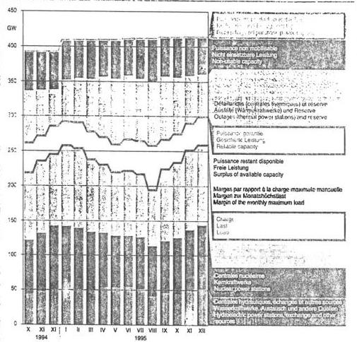

1. táblázat Az UCPTE összesített teljesítmény mérleg 1993-1995. decemberéig

|   | 1993. dec. | 1994. dec. | 1995. dec.  |
| --- | --- | --- | --- |
|  Erőművi és garantált Import teljesítmény (BT) | 377,9 GW | 381,4 GW | 385,7 GW  |
|  Üzembíztosan igénybe- vehető teljesítmény (ÜIT) | 269,5 GW | 276,0 GW | 281,0 GW  |
|  Terhelés 11^{h}-kor | 227,6 GW | 238,8 GW | 243,7 GW  |
|  Szabadteljesítmény | 26,3 GW | 25,1 GW | 25,2 GW  |
|  Ebből tartósan igénybe- vehető | 12,5 GW | 12,6 GW | 11,2 GW  |

Az 1995 évi terv a volt NDK adatait is tartalmazza 1993-tól pedig a JUGEL adatok hiányoznak az összesítésből. Ezért a korábbi évekkel való összevetés korlátozott.

---

•

---

9.45. Mouvements physique d'énergie
Physikalische Energieflüsse
Physical energy flows
A fizikai energiaáramlások

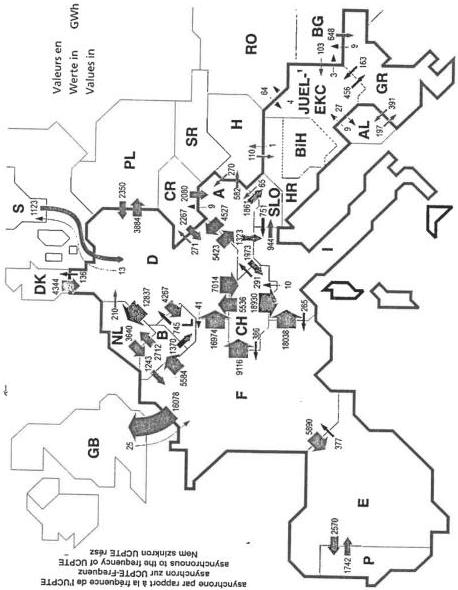

---

1

1

1

1

---

# TULAJDONOSI STRUKTÚRA
1995. 12. 31-i állapot

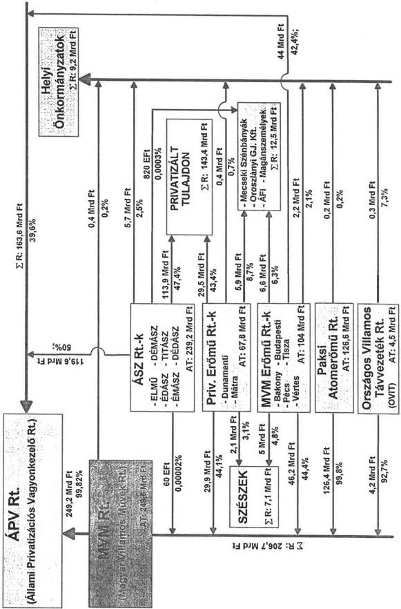

Privatizációs Oszt.

---

[{"box_2d": [175, 155, 414, 834], "label": "list", "caption": "1. 2017年，公司与上海浦东发展银行股份有限公司签订了《关于使用部分闲置募集资金进行现金管理的协议》。\n1. 2017年，公司与上海浦东发展银行股份有限公司签订了《关于使用部分闲置募集资金进行现金管理的协议》。\n1. 2017年，公司与上海浦东发展银行股份有限公司签订了《关于使用部分闲置募集资金进行现金管理的协议》。\n1. 2017年，公司与上海浦东发展银行股份有限公司签订了《关于使用部分闲置募集资金进行现金管理的协议》。\n1. 2017年，公司与上海浦东发展银行股份有限公司签订了《关于使用部分闲置募集资金进行现金管理的协议》。\n1. 2017年，公司与上海浦东发展银行股份有限公司签订了《关于使用部分闲置募集资金进行现金管理的协议》。\n1. 2017年，公司与上海浦东发展银行股份有限公司签订了《关于使用部分闲置募集资金进行现金管理的协议》。\n1. 2017年，公司与上海浦东发展银行股份有限公司签订了《关于使用部分闲置募集资金进行现金管理的协议》。\n1. 2017年，公司与上海浦东发展银行股份有限公司签订了《关于使用部分闲置募集资金进行现金管理的协议》。\n1. 2017年，公司与上海浦东发展银行股份有限公司签订了《关于使用部分闲置募集资金进行现金管理的协议》。\n1. 2017年，公司与上海浦东发展银行股份有限公司签订了《关于使用部分闲置募集资金进行现金管理的协议》。\n1. 2017年，公司与上海浦东发展银行股份有限公司签订了《关于使用部分闲置募集资金进行现金管理的协议》。\n1. 2017年，公司与上海浦东发展银行股份有限公司签订了《关于使用部分闲置募集资金进行现金管理的协议》。\n1. 2017年，公司与上海浦东发展银行股份有限公司签订了《关于使用部分闲置募集资金进行现金管理的协议》。\n1. 2017年，公司与上海浦东发展银行股份有限公司签订了《关于使用部分闲置募集资金进行现金管理的协议》。\n1. 2017年，公司与上海浦东发展银行股份有限公司签订了《关于使用部分闲置募集资金进行现金管理的协议》。\n1. 2017年，公司与上海浦东发展银行股份有限公司签订了《关于使用部分闲置募集资金进行现金管理的协议》。\n1. 2017年，公司与上海浦东发展银行股份有限公司签订了《关于使用部分闲置募集资金进行现金管理的协议》。\n1. 2017年，公司与上海浦东发展银行股份有限公司签订了《关于使用部分闲置募集资金进行现金管理的协议》。\n1. 2017年，公司与上海浦东发展银行股份有限公司签订了《关于使用部分闲置募集资金进行现金管理的协议》。\n1. 2017年，公司与上海浦东发展银行股份有限公司签订了《关于使用部分闲置募集资金进行现金管理的协议》。\n1. 2017年，公司与上海浦东发展银行股份有限公司签订了《关于使用部分闲置募集资金进行现金管理的协议》。\n1. 2017年，公司与上海浦东发展银行股份有限公司签订了《关于使用部分闲置募集资金进行现金管理的协议》。\n1. 2017年，公司与上海浦东发展银行股份有限公司签订了《关于使用部分闲置募集资金进行现金管理的协议》。\n1. 2017年，公司与上海浦东发展银行股份有限公司签订了《关于使用部分闲置募集资金进行现金管理的协议》。\n1. 2017年，公司与上海浦东发展银行股份有限公司签订了《关于使用部分闲置募集资金进行现金管理的协议》。\n1. 2017年，公司与上海浦东发展银行股份有限公司签订了《关于使用部分闲置募集资金进行现金管理的协议》。\n1. 2017年，公司与上海浦东发展银行股份有限公司签订了《关于使用部分闲置募集资金进行现金管理的协议》。\n1. 2017年，公司与上海浦东发展银行股份有限公司签订了《关于使用部分闲置募集资金进行现金管理的协议》。\n1. 2017年，公司与上海浦东发展银行股份有限公司签订了《关于使用部分闲置募集资金进行现金管理的协议》。\n1. 2017年，公司与上海浦东发展银行股份有限公司签订了《关于使用部分闲置募集资金进行现金管理的协议》。\n1. 2017年，公司与上海浦东发展银行股份有限公司签订了《关于使用部分闲置募集资金进行现金管理的协议》。\n1. 2017年，公司与上海浦东发展银行股份有限公司签订了《关于使用部分闲置募集资金进行现金管理的协议》。\n1. 2017年，公司与上海浦东发展银行股份有限公司签订了《关于使用部分闲置募集资金进行现金管理的协议》。\n1. 2017年，公司与上海浦东发展银行股份有限公司签订了《关于使用部分闲置募集资金进行现金管理的协议》。\n1. 2017年，公司与上海浦东发展银行股份有限公司签订了《关于使用部分闲置募集资金进行现金管理的协议》。\n1. 2017年，公司与上海浦东发展银行股份有限公司签订了《关于使用部分闲置募集资金进行现金管理的协议》。\n1. 2017年，公司与上海浦东发展银行股份有限公司签订了《关于使用部分闲置募集资金进行现金管理的协议》。\n1. 2017年，公司与上海浦东发展银行股份有限公司签订了《关于使用部分闲置募集资金进行现金管理的协议》。\n1. 2017年，公司与上海浦东发展银行股份有限公司签订了《关于使用部分闲置募集资金进行现金管理的协议》。\n1. 2017年，公司与上海浦东发展银行股份有限公司签订了《关于使用部分闲置募集资金进行现金管理的协议》。\n1. 2017年，公司与上海浦东发展银行股份有限公司签订了《关于使用部分闲置募集资金进行现金管理的协议》。\n1. 2017年，公司与上海浦东发展银行股份有限公司签订了《关于使用部分闲置募集资金进行现金管理的协议》。\n1. 2017年，公司与上海浦东发展银行股份有限公司签订了《关于使用部分闲置募集资金进行现金管理的协议》。\n1. 2017年，公司与上海浦东发展银行股份有限公司签订了《关于使用部分闲置募集资金进行现金管理的协议》。\n1. 2017年，公司与上海浦东发展银行股份有限公司签订了《关于使用部分闲置募集资金进行现金管理的协议》。\n1. 2017年，公司与上海浦东发展银行股份有限公司签订了《关于使用部分闲置募集资金进行现金管理的协议》。\n1. 2017年，公司与上海浦东发展银行股份有限公司签订了《关于使用部分闲置募集资金进行现金管理的协议》。\n1. 2017年，公司与上海浦东发展银行股份有限公司签订了《关于使用部分闲置募集资金进行现金管理的协议》。\n1. 2017年，公司与上海浦东发展银行股份有限公司签订了《关于使用部分闲置募集资金进行现金管理的协议》。\n1. 2017年，公司与上海浦东发展银行股份有限公司签订了《关于使用部分闲置募集资金进行现金管理的协议》。\n1. 2017年，公司与上海浦东发展银行股份有限公司签订了《关于使用部分闲置募集资金进行现金管理的协议》。\n1. 2017年，公司与上海浦东发展银行股份有限公司签订了《关于使用部分闲置募集资金进行现金管理的协议》。\n1. 2017年，公司与上海浦东发展银行股份有限公司签订了《关于使用部分闲置募集资金进行现金管理的协议》。\n1. 2017年，公司与上海浦东发展银行股份有限公司签订了《关于使用部分闲置募集资金进行现金管理的协议》。\n1. 2017年，公司与上海浦东发展银行股份有限公司签订了《关于使用部分闲置募集资金进行现金管理的协议》。\n1. 2017年，公司与上海浦东发展银行股份有限公司签订了《关于使用部分闲置募集资金进行现金管理的协议》。\n1. 2017年，公司与上海浦东发展银行股份有限公司签订了《关于使用部分闲置募集资金进行现金管理的协议》。\n1. 2017年，公司与上海浦东发展银行股份有限公司签订了《关于使用部分闲置募集资金进行现金管理的协议》。\n1. 2017年，公司与上海浦东发展银行股份有限公司签订了《关于使用部分闲置募集资金进行现金管理的协议》。\n1. 2017年，公司与上海浦东发展银行股份有限公司签订了《关于使用部分闲置募集资金进行现金管理的协议》。\n1. 2017年，公司与上海浦东发展银行股份有限公司签订了《关于使用部分闲置募集资金进行现金管理的协议》。\n1. 2017年，公司与上海浦东发展银行股份有限公司签订了《关于使用部分闲置募集资金进行现金管理的协议》。\n1. 2017年，公司与上海浦东发展银行股份有限公司签订了《关于使用部分闲置募集资金进行现金管理的协议》。\n1. 2017年，公司与上海浦东发展银行股份有限公司签订了《关于使用部分闲置募集资金进行现金管理的协议》。\n1. 2017年，公司与上海浦东发展银行股份有限公司签订了《关于使用部分闲置募集资金进行现金管理的协议》。\n1. 2017年，公司与上海浦东发展银行股份有限公司签订了《关于使用部分闲置募集资金进行现金管理的协议》。\n1. 2017年，公司与上海浦东发展银行股份有限公司签订了《关于使用部分闲置募集资金进行现金管理的协议》。\n1. 2017年，公司与上海浦东发展银行股份有限公司签订了《关于使用部分闲置募集资金进行现金管理的协议》。\n1. 2017年，公司与上海浦东发展银行股份有限公司签订了《关于使用部分闲置募集资金进行现金管理的协议》。\n1. 2017年，公司与上海浦东发展银行股份有限公司签订了《关于使用部分闲置募集资金进行现金管理的协议》。\n1. 2017年，公司与上海浦东发展银行股份有限公司签订了《关于使用部分闲置募集资金进行现金管理的协议》。\n1. 2017年，公司与上海浦东发展银行股份有限公司签订了《关于使用部分闲置募集资金进行现金管理的协议》。\n1. 2017年，公司与上海浦东发展银行股份有限公司签订了《关于使用部分闲置募集资金进行现金管理的协议》。\n1. 2017年，公司与上海浦东发展银行股份有限公司签订了《关于使用部分闲置募集资金进行现金管理的协议》。\n1. 2017年，公司与上海浦东发展银行股份有限公司签订了《关于使用部分闲置募集资金进行现金管理的协议》。\n1. 2017年，公司与上海浦东发展银行股份有限公司签订了《关于使用部分闲置募集资金进行现金管理的协议》。\n1. 2017年，公司与上海浦东发展银行股份有限公司签订了《关于使用部分闲置募集资金进行现金管理的协议》。\n1. 2017年，公司与上海浦东发展银行股份有限公司签订了《关于使用部分闲置募集资金进行现金管理的协议》。\n1. 2017年，公司与上海浦东发展银行股份有限公司签订了《关于使用部分闲置募集资金进行现金管理的协议》。\n1. 2017年，公司与上海浦东发展银行股份有限公司签订了《关于使用部分闲置募集资金进行现金管理的协议》。\n1. 2017年，公司与上海浦东发展银行股份有限公司签订了《关于使用部分闲置募集资金进行现金管理的协议》。\n1. 2017年，公司与上海浦东发展银行股份有限公司签订了《关于使用部分闲置募集资金进行现金管理的协议》。\n1. 2017年，公司与上海浦东发展银行股份有限公司签订了《关于使用部分闲置募集资金进行现金管理的协议》。\n1. 2017年，公司与上海浦东发展银行股份有限公司签订了《关于使用部分闲置募集资金进行现金管理的协议》。\n1. 2017年，公司与上海浦东发展银行股份有限公司签订了《关于使用部分闲置募集资金进行现金管理的协议》。\n1. 2017年，公司与上海浦东发展银行股份有限公司签订了《关于使用部分闲置募集资金进行现金管理的协议》。\n1. 2017年，公司与上海浦东发展银行股份有限公司签订了《关于使用部分闲置募集资金进行现金管理的协议》。\n1. 2017年，公司与上海浦东发展银行股份有限公司签订了《关于使用部分闲置募集资金进行现金管理的协议》。\n1. 2017年，公司与上海浦东发展银行股份有限公司签订了《关于使用部分闲置募集资金进行现金管理的协议》。\n1. 2017年，公司与上海浦东发展银行股份有限公司签订了《关于使用部分闲置募集资金进行现金管理的协议》。\n1. 2017年，公司与上海浦东发展银行股份有限公司签订了《关于使用部分闲置募集资金进行现金管理的协议》。\n1. 2017年，公司与上海浦东发展银行股份有限公司签订了《关于使用部分闲置募集资金进行现金管理的协议》。\n1. 2017年，公司与上海浦东发展银行股份有限公司签订了《关于使用部分闲置募集资金进行现金管理的协议》。\n1. 2017年，公司与上海浦东发展银行股份有限公司签订了《关于使用部分闲置募集资金进行现金管理的协议》。\n1. 2017年，公司与上海浦东发展银行股份有限公司签订了《关于使用部分闲置募集资金进行现金管理的协议》。\n1. 2017年，公司与上海浦东发展银行股份有限公司签订了《关于使用部分闲置募集资金进行现金管理的协议》。\n1. 2017年，公司与上海浦东发展银行股份有限公司签订了《关于使用部分闲置募集资金进行现金管理的协议》。\n1. 2017年，公司与上海浦东发展银行股份有限公司签订了《关于使用部分闲置募集资金进行现金管理的协议》。\n1. 2017年，公司与上海浦东发展银行股份有限公司签订了《关于使用部分闲置募集资金进行现金管理的协议》。\n1. 2017年，公司与上海浦东发展银行股份有限公司签订了《关于使用部分闲置募集资金进行现金管理的协议》。\n1. 2017年，公司与上海浦东发展银行股份有限公司签订了《关于使用部分闲置募集资金进行现金管理的协议》。\n1. 2017年，公司与上海浦东发展银行股份有限公司签订了《关于使用部分闲置募集资金进行现金管理的协议》。\n1. 2017年，公司与上海浦东发展银行股份有限公司签订了《关于使用部分闲置募集资金进行现金管理的协议》。\n1. 2017年，公司与上海浦东发展银行股份有限公司签订了《关于使用部分闲置募集资金进行现金管理的协议》。\n1. 2017年，公司与上海浦东发展银行股份有限公司签订了《关于使用部分闲置募集资金进行现金管理的协议》。\n1. 2017年，公司与上海浦东发展银行股份有限公司签订了《关于使用部分闲置募集资金进行现金管理的协议》。\n1. 2017年，公司与上海浦东发展银行股份有限公司签订了《关于使用部分闲置募集资金进行现金管理的协议》。\n1. 2017年，公司与上海浦东发展银行股份有限公司签订了《关于使用部分闲置募集资金进行现金管理的协议》。\n1. 2017年，公司与上海浦东发展银行股份有限公司签订了《关于使用部分闲置募集资金进行现金管理的协议》。\n1. 2017年，公司与上海浦东发展银行股份有限公司签订了《关于使用部分闲置募集资金进行现金管理的协议》。\n1. 2017年，公司与上海浦东发展银行股份有限公司签订了《关于使用部分闲置募集资金进行现金管理的协议》。\n1. 2017年，公司与上海浦东发展银行股份有限公司签订了《关于使用部分闲置募集资金进行现金管理的协议》。\n1. 2017年，公司与上海浦东发展银行股份有限公司签订了《关于使用部分闲置募集资金进行现金管理的协议》。\n1. 2017年，公司与上海浦东发展银行股份有限公司签订了《关于使用部分闲置募集资金进行现金管理的协议》。\n1. 2017年，公司与上海浦东发展银行股份有限公司签订了《关于使用部分闲置募集资金进行现金管理的协议》。\n1. 2017年，公司与上海浦东发展银行股份有限公司签订了《关于使用部分闲置募集资金进行现金管理的协议》。\n1. 2017年，公司与上海浦东发展银行股份有限公司签订了《关于使用部分闲置募集资金进行现金管理的协议》。\n1. 2017年，公司与上海浦东发展银行股份有限公司签订了《关于使用部分闲置募集资金进行现金管理的协议》。\n1. 2017年，公司与上海浦东发展银行股份有限公司签订了《关于使用部分闲置募集资金进行现金管理的协议》。\n1. 2017年，公司与上海浦东发展银行股份有限公司签订了《关于使用部分闲置募集资金进行现金管理的协议》。\n1. 2017年，公司与上海浦东发展银行股份有限公司签订了《关于使用部分闲置募集资金进行现金管理的协议》。\n1. 2017年，公司与上海浦东发展银行股份有限公司签订了《关于使用部分闲置募集资金进行现金管理的协议》。\n1. 2017年，公司与上海浦东发展银行股份有限公司签订了《关于使用部分闲置募集资金进行现金管理的协议》。\n1. 2017年，公司与上海浦东发展银行股份有限公司签订了《关于使用部分闲置募集资金进行现金管理的协议》。\n1. 2017年，公司与上海浦东发展银行股份有限公司签订了《关于使用部分闲置募集资金进行现金管理的协议》。\n1. 2017年，公司与上海浦东发展银行股份有限公司签订了《关于使用部分闲置募集资金进行现金管理的协议》。\n1. 2017年，公司与上海浦东发展银行股份有限公司签订了《关于使用部分闲置募集资金进行现金管理的协议》。\n1. 2017年，公司与上海浦东发展银行股份有限公司签订了《关于使用部分闲置募集资金进行现金管理的协议》。\n1. 2017年，公司与上海浦东发展银行股份有限公司签订了《关于使用部分闲置募集资金进行现金管理的协议》。\n1. 2017年，公司与上海浦东发展银行股份有限公司签订了《关于使用部分闲置募集资金进行现金管理的协议》。\n1. 2017年，公司与上海浦东发展银行股份有限公司签订了《关于使用部分闲置募集资金进行现金管理的协议》。\n1. 2017年，公司与上海浦东发展银行股份有限公司签订了《关于使用部分闲置募集资金进行现金管理的协议》。\n1. 2017年，公司与上海浦东发展银行股份有限公司签订了《关于使用部分闲置募集资金进行现金管理的协议》。\n1. 2017年，公司与上海浦东发展银行股份有限公司签订了《关于使用部分闲置募集资金进行现金管理的协议》。\n1. 2017年，公司与上海浦东发展银行股份有限公司签订了《关于使用部分闲置募集资金进行现金管理的协议》。\n1. 2017年，公司与上海浦东发展银行股份有限公司签订了《关于使用部分闲置募集资金进行现金管理的协议》。\n1. 2017年，公司与上海浦东发展银行股份有限公司签订了《关于使用部分闲置募集资金进行现金管理的协议》。\n1. 2017年，公司与上海浦东发展银行股份有限公司签订了《关于使用部分闲置募集资金进行现金管理的协议》。\n1. 2017年，公司与上海浦东发展银行股份有限公司签订了《关于使用部分闲置募集资金进行现金管理的协议》。\n1. 2017年，公司与上海浦东发展银行股份有限公司签订了《关于使用部分闲置募集资金进行现金管理的协议》。\n1. 2017年，公司与上海浦东发展银行股份有限公司签订了《关于使用部分闲置募集资金进行现金管理的协议》。\n1. 2017年，公司与上海浦东发展银行股份有限公司签订了《关于使用部分闲置募集资金进行现金管理的协议》。\n1. 2017年，公司与上海浦东发展银行股份有限公司签订了《关于使用部分闲置募集资金进行现金管理的协议》。\n1. 2017年，公司与上海浦东发展银行股份有限公司签订了《关于使用部分闲置募集资金进行现金管理的协议》。\n1. 2017年，公司与上海浦东发展银行股份有限公司签订了《关于使用部分闲置募集资金进行现金管理的协议》。\n1. 2017年，公司与上海浦东发展银行股份有限公司签订了《关于使用部分闲置募集资金进行现金管理的协议》。\n1. 2017年，公司与上海浦东发展银行股份有限公司签订了《关于使用部分闲置募集资金进行现金管理的协议》。\n1. 2017年，公司与上海浦东发展银行股份有限公司签订了《关于使用部分闲置募集资金进行现金管理的协议》。\n1. 2017年，公司与上海浦东发展银行股份有限公司签订了《关于使用部分闲置募集资金进行现金管理的协议》。\n1. 2017年，公司与上海浦东发展银行股份有限公司签订了《关于使用部分闲置募集资金进行现金管理的协议》。\n1. 2017年，公司与上海浦东发展银行股份有限公司签订了《关于使用部分闲置募集资金进行现金管理的协议》。\n1. 2017年，公司与上海浦东发展银行股份有限公司签订了《关于使用部分闲置募集资金进行现金管理的协议》。\n1. 2017年，公司与上海浦东发展银行股份有限公司签订了《关于使用部分闲置募集资金进行现金管理的协议》。\n1. 2017年，公司与上海浦东发展银行股份有限公司签订了《关于使用部分闲置募集资金进行现金管理的协议》。\n1. 2017年，公司与上海浦东发展银行股份有限公司签订了《关于使用部分闲置募集资金进行现金管理的协议》。\n1. 2017年，公司与上海浦东发展银行股份有限公司签订了《关于使用部分闲置募集资金进行现金管理的协议》。\n1. 2017年，公司与上海浦东发展银行股份有限公司签订了《关于使用部分闲置募集资金进行现金管理的协议》。\n1. 2017年，公司与上海浦东发展银行股份有限公司签订了《关于使用部分闲置募集资金进行现金管理的协议》。\n1. 2017年，公司与上海浦东发展银行股份有限公司签订了《关于使用部分闲置募集资金进行现金管理的协议》。\n1. 2017年，公司与上海浦东发展银行股份有限公司签订了《关于使用部分闲置募集资金进行现金管理的协议》。\n1. 2017年，公司与上海浦东发展银行股份有限公司签订了《关于使用部分闲置募集资金进行现金管理的协议》。\n1. 2017年，公司与上海浦东发展银行股份有限公司签订了《关于使用部分闲置募集资金进行现金管理的协议》。\n1. 2017年，公司与上海浦东发展银行股份有限公司签订了《关于使用部分闲置募集资金进行现金管理的协议》。\n1. 2017年，公司与上海浦东发展银行股份有限公司签订了《关于使用部分闲置募集资金进行现金管理的协议》。\n1. 2017年，公司与上海浦东发展银行股份有限公司签订了《关于使用部分闲置募集资金进行现金管理的协议》。\n1. 2017年，公司与上海浦东发展银行股份有限公司签订了《关于使用部分闲置募集资金进行现金管理的协议》。\n1. 2017年，公司与上海浦东发展银行股份有限公司签订了《关于使用部分闲置募集资金进行现金管理的协议》。\n1. 2017年，公司与上海浦东发展银行股份有限公司签订了《关于使用部分闲置募集资金进行现金管理的协议》。\n1. 2017年，公司与上海浦东发展银行股份有限公司签订了《关于使用部分闲置募集资金进行现金管理的协议》。\n1. 2017年，公司与上海浦东发展银行股份有限公司签订了《关于使用部分闲置募集资金进行现金管理的协议》。\n1. 2017年，公司与上海浦东发展银行股份有限公司签订了《关于使用部分闲置募集资金进行现金管理的协议》。\n1. 2017年，公司与上海浦东发展银行股份有限公司签订了《关于使用部分闲置募集资金进行现金管理的协议》。\n1. 2017年，公司与上海浦东发展银行股份有限公司签订了《关于使用部分闲置募集资金进行现金管理的协议》。\n1. 2017年，公司与上海浦东发展银行股份有限公司签订了《关于使用部分闲置募集资金进行现金管理的协议》。\n1. 2017年，公司与上海浦东发展银行股份有限公司签订了《关于使用部分闲置募集资金进行现金管理的协议》。\n1. 2017年，公司与上海浦东发展银行股份有限公司签订了《关于使用部分闲置募集资金进行现金管理的协议》。\n1. 2017年，公司与上海浦东发展银行股份有限公司签订了《关于使用部分闲置募集资金进行现金管理的协议》。\n1. 2017年，公司与上海浦东发展银行股份有限公司签订了《关于使用部分闲置募集资金进行现金管理的协议》。\n1. 2017年，公司与上海浦东发展银行股份有限公司签订了《关于使用部分闲置募集资金进行现金管理的协议》。\n1. 2017年，公司与上海浦东发展银行股份有限公司签订了《关于使用部分闲置募集资金进行现金管理的协议》。\n1. 2017年，公司与上海浦东发展银行股份有限公司签订了《关于使用部分闲置募集资金进行现金管理的协议》。\n1. 2017年，公司与上海浦东发展银行股份有限公司签订了《关于使用部分闲置募集资金进行现金管理的协议》。\n1. 2017年，公司与上海浦东发展银行股份有限公司签订了《关于使用部分闲置募集资金进行现金管理的协议》。\n1. 2017年，公司与上海浦东发展银行股份有限公司签订了《关于使用部分闲置募集资金进行现金管理的协议》。\n1. 2017年，公司与上海浦东发展银行股份有限公司签订了《关于使用部分闲置募集资金进行现金管理的协议》。\n1. 2017年，公司与上海浦东发展银行股份有限公司签订了《关于使用部分闲置募集资金进行现金管理的协议》。\n1. 2017年，公司与上海浦东发展银行股份有限公司签订了《关于使用部分闲置募集资金进行现金管理的协议》。\n1. 2017年，公司与上海浦东发展银行股份有限公司签订了《关于使用部分闲置募集资金进行现金管理的协议》。\n1. 2017年，公司与上海浦东发展银行股份有限公司签订了《关于使用部分闲置募集资金进行现金管理的协议》。\n1. 2017年，公司与上海浦东发展银行股份有限公司签订了《关于使用部分闲置募集资金进行现金管理的协议》。\n1. 2017年，公司与上海浦东发展银行股份有限公司签订了《关于使用部分闲置募集资金进行现金管理的协议》。\n1. 2017年，公司与上海浦东发展银行股份有限公司签订了《关于使用部分闲置募集资金进行现金管理的协议》。\n1. 2017年，公司与上海浦东发展银行股份有限公司签订了《关于使用部分闲置募集资金进行现金管理的协议》。\n1. 2017年，公司与上海浦东发展银行股份有限公司签订了《关于使用部分闲置募集资金进行现金管理的协议》。\n1. 2017年，公司与上海浦东发展银行股份有限公司签订了《关于使用部分闲置募集资金进行现金管理的协议》。\n1. 2017年，公司与上海浦东发展银行股份有限公司签订了《关于使用部分闲置募集资金进行现金管理的协议》。\n1. 2017年，公司与上海浦东发展银行股份有限公司签订了《关于使用部分闲置募集资金进行现金管理的协议》。\n1. 2017年，公司与上海浦东发展银行股份有限公司签订了《关于使用部分闲置募集资金进行现金管理的协议》。\n1. 2017年，公司与上海浦东发展银行股份有限公司签订了《关于使用部分闲置募集资金进行现金管理的协议》。\n1. 2017年，公司与上海浦东发展银行股份有限公司签订了《关于使用部分闲置募集资金进行现金管理的协议》。\n1. 2017年，公司与上海浦东发展银行股份有限公司签订了《关于使用部分闲置募集资金进行现金管理的协议》。\n1. 2017年，公司与上海浦东发展银行股份有限公司签订了《关于使用部分闲置募集资金进行现金管理的协议》。\n1. 2017年，公司与上海浦东发展银行股份有限公司签订了《关于使用部分闲置募集资金进行现金管理的协议》。\n1. 2017年，公司与上海浦东发展银行股份有限公司签订了《关于使用部分闲置募集资金进行现金管理的协议》。\n1. 2017年，公司与上海浦东发展银行股份有限公司签订了《关于使用部分闲置募集资金进行现金管理的协议》。\n1. 2017年，公司与上海浦东发展银行股份有限公司签订了《关于使用部分闲置募集资金进行现金管理的协议》。\n1. 2017年，公司与上海浦东发展银行股份有限公司签订了《关于使用部分闲置募集资金进行现金管理的协议》。\n1. 2017年，公司与上海浦东发展银行股份有限公司签订了《关于使用部分闲置募集资金进行现金管理的协议》。\n1. 2017年，公司与上海浦东发展银行股份有限公司签订了《关于使用部分闲置募集资金进行现金管理的协议》。\n1. 2017年，公司与上海浦东发展银行股份有限公司签订了《关于使用部分闲置募集资金进行现金管理的协议》。\n1. 2017年，公司与上海浦东发展银行股份有限公司签订了《关于使用部分闲置募集资金进行现金管理的协议》。\n1. 2017年，公司与上海浦东发展银行股份有限公司签订了《关于使用部分闲置募集资金进行现金管理的协议》。\n1. 2017年，公司与上海浦东发展银行股份有限公司签订了《关于使用部分闲置募集资金进行现金管理的协议》。\n1. 2017年，公司与上海浦东发展银行股份有限公司签订了《关于使用部分闲置募集资金进行现金管理的协议》。\n1. 2017年，公司与上海浦东发展银行股份有限公司签订了《关于使用部分闲置募集资金进行现金管理的协议》。\n1. 2017年，公司与上海浦东发展银行股份有限公司签订了《关于使用部分闲置募集资金进行现金管理的协议》。\n1. 2017年，公司与上海浦东发展银行股份有限公司签订了《关于使用部分闲置募集资金进行现金管理的协议》。\n1. 2017年，公司与上海浦东发展银行股份有限公司签订了《关于使用部分闲置募集资金进行现金管理的协议》。\n1. 2017年，公司与上海浦东发展银行股份有限公司签订了《关于使用部分闲置募集资金进行现金管理的协议》。\n1. 2017年，公司与上海浦东发展银行股份有限公司签订了《关于使用部分闲置募集资金进行现金管理的协议》。\n1. 2017年，公司与上海浦东发展银行股份有限公司签订了《关于使用部分闲置募集资金进行现金管理的协议》。\n1. 2017年，公司与上海浦东发展银行股份有限公司签订了《关于使用部分闲置募集资金进行现金管理的协议》。\n1. 2017年，公司与上海浦东发展银行股份有限公司签订了《关于使用部分闲置募集资金进行现金管理的协议》。\n1. 2017年，公司与上海浦东发展银行股份有限公司签订了《关于使用部分闲置募集资金进行现金管理的协议》。\n1. 2017年，公司与上海浦东发展银行股份有限公司签订了《关于使用部分闲置募集资金进行现金管理的协议》。\n1. 2017年，公司与上海浦东发展银行股份有限公司签订了《关于使用部分闲置募集资金进行现金管理的协议》。\n1. 2017年，公司与上海浦东发展银行股份有限公司签订了《关于使用部分闲置募集资金进行现金管理的协议》。\n1. 2017年，公司与上海浦东发展银行股份有限公司签订了《关于使用部分闲置募集资金进行现金管理的协议》。\n1. 2017年，公司与上海浦东发展银行股份有限公司签订了《关于使用部分闲置募集资金进行现金管理的协议》。\n1. 2017年，公司与上海浦东发展银行股份有限公司签订了《关于使用部分闲置募集资金进行现金管理的协议》。\n1. 2017年，公司与上海浦东发展银行股份有限公司签订了《关于使用部分闲置募集资金进行现金管理的协议》。\n1. 2017年，公司与上海浦东发展银行股份有限公司签订了《关于使用部分闲置募集资金进行现金管理的协议》。\n1. 2017年，公司与上海浦东发展银行股份有限公司签订了《关于使用部分闲置募集资金进行现金管理的协议》。\n1. 2017年，公司与上海浦东发展银行股份有限公司签订了《关于使用部分闲置募集资金进行现金管理的协议》。\n1. 2017年，公司与上海浦东发展银行股份有限公司签订了《关于使用部分闲置募集资金进行现金管理的协议》。\n1. 2017年，公司与上海浦东发展银行股份有限公司签订了《关于使用部分闲置募集资金进行现金管理的协议》。\n1. 2017年，公司与上海浦东发展银行股份有限公司签订了《关于使用部分闲置募集资金进行现金管理的协议》。\n1. 2017年，公司与上海浦东发展银行股份有限公司签订了《关于使用部分闲置募集资金进行现金管理的协议》。\n1. 2017年，公司与上海浦东发展银行股份有限公司签订了《关于使用部分闲置募集资金进行现金管理的协议》。\n1. 2017年，公司与上海浦东发展银行股份有限公司签订了《关于使用部分闲置募集资金进行现金管理的协议》。\n1. 2017年，公司与上海浦东发展银行股份有限公司签订了《关于使用部分闲置募集资金进行现金管理的协议》。\n1. 2017年，公司与上海浦东发展银行股份有限公司签订了《关于使用部分闲置募集资金进行现金管理的协议》。\n1. 2017年，公司与上海浦东发展银行股份有限公司签订了《关于使用部分闲置募集资金进行现金管理的协议》。\n1. 2017年，公司与上海浦东发展银行股份有限公司签订了《关于使用部分闲置募集资金进行现金管理的协议》。\n1. 2017年，公司与上海浦东发展银行股份有限公司签订了《关于使用部分闲置募集资金进行现金管理的协议》。\n1. 2017年，公司与上海浦东发展银行股份有限公司签订了《关于使用部分闲置募集资金进行现金管理的协议》。\n1. 2017年，公司与上海浦东发展银行股份有限公司签订了《关于使用部分闲置募集资金进行现金管理的协议》。\n1. 2017年，公司与上海浦东发展银行股份有限公司签订了《关于使用部分闲置募集资金进行现金管理的协议》。\n1. 2017年，公司与上海浦东发展银行股份有限公司签订了《关于使用部分闲置募集资金进行现金管理的协议》。\n1. 2017年，公司与上海浦东发展银行股份有限公司签订了《关于使用部分闲置募集资金进行现金管理的协议》。\n1. 2017年，公司与上海浦东发展银行股份有限公司签订了《关于使用部分闲置募集资金进行现金管理的协议》。\n1. 2017年，公司与上海浦东发展银行股份有限公司签订了《关于使用部分闲置募集资金进行现金管理的协议》。\n1. 2017年，公司与上海浦东发展银行股份有限公司签订了《关于使用部分闲置募集资金进行现金管理的协议》。\n1. 2017年，公司与上海浦东发展银行股份有限公司签订了《关于使用部分闲置募集资金进行现金管理的协议》。\n1. 2017年，公司与上海浦东发展银行股份有限公司签订了《关于使用部分闲置募集资金进行现金管理的协议》。\n1. 2017年，公司与上海浦东发展银行股份有限公司签订了《关于使用部分闲置募集资金进行现金管理的协议》。\n1. 2017年，公司与上海浦东发展银行股份有限公司签订了《关于使用部分闲置募集资金进行现金管理的协议》。\n1. 2017年，公司与上海浦东发展银行股份有限公司签订了《关于使用部分闲置募集资金进行现金管理的协议》。\n1. 2017年，公司与上海浦东发展银行股份有限公司签订了《关于使用部分闲置募集资金进行现金管理的协议》。\n1. 2017年，公司与上海浦东发展银行股份有限公司签订了《关于使用部分闲置募集资金进行现金管理的协议》。\n1. 2017年，公司与上海浦东发展银行股份有限公司签订了《关于使用部分闲置募集资金进行现金管理的协议》。\n1. 2017年，公司与上海浦东发展银行股份有限公司签订了《关于使用部分闲置募集资金进行现金管理的协议》。\n1. 2017年，公司与上海浦东发展银行股份有限公司签订了《关于使用部分闲置募集资金进行现金管理的协议》。\n1. 2017年，公司与上海浦东发展银行股份有限公司签订了《关于使用部分闲置募集资金进行现金管理的协议》。\n1. 2017年，公司与上海浦东发展银行股份有限公司签订了《关于使用部分闲置募集资金进行现金管理的协议》。\n1. 2017年，公司与上海浦东发展银行股份有限公司签订了《关于使用部分闲置募集资金进行现金管理的协议》。\n1. 2017年，公司与上海浦东发展银行股份有限公司签订了《关于使用部分闲置募集资金进行现金管理的协议》。\n1. 2017年，公司与上海浦东发展银行股份有限公司签订了《关于使用部分闲置募集资金进行现金管理的协议》。\n1. 2017年，公司与上海浦东发展银行股份有限公司签订了《关于使用部分闲置募集资金进行现金管理的协议》。\n1. 2017年，公司与上海浦东发展银行股份有限公司签订了《关于使用部分闲置募集资金进行现金管理的协议》。\n1. 2017年，公司与上海浦东发展银行股份有限公司签订了《关于使用部分闲置募集资金进行现金管理的协议》。\n1. 2017年，公司与上海浦东发展银行股份有限公司签订了《关于使用部分闲置募集资金进行现金管理的协议》。\n1. 2017年，公司与上海浦东发展银行股份有限公司签订了《关于使用部分闲置募集资金进行现金管理的协议》。\n1. 2017年，公司与上海浦东发展银行股份有限公司签订了《关于使用部分闲置募集资金进行现金管理的协议》。\n1. 2017年，公司与上海浦东发展银行股份有限公司签订了《关于使用部分闲置募集资金进行现金管理的协议》。\n1. 2017年，公司与上海浦东发展银行股份有限公司签订了《关于使用部分闲置募集资金进行现金管理的协议》。\n1. 2017年，公司与上海浦东发展银行股份有限公司签订了《关于使用部分闲置募集资金进行现金管理的协议》。\n1. 2017年，公司与上海浦东发展银行股份有限公司签订了《关于使用部分闲置募集资金进行现金管理的协议》。\n1. 2017年，公司与上海浦东发展银行股份有限公司签订了《关于使用部分闲置募集资金进行现金管理的协议》。\n1. 2017年，公司与上海浦东发展银行股份有限公司签订了《关于使用部分闲置募集资金进行现金管理的协议》。\n1. 2017年，公司与上海浦东发展银行股份有限公司签订了《关于使用部分闲置募集资金进行现金管理的协议》。\n1. 2017年，公司与上海浦东发展银行股份有限公司签订了《关于使用部分闲置募集资金进行现金管理的协议》。\n1. 2017年，公司与上海浦东发展银行股份有限公司签订了《关于使用部分闲置募集资金进行现金管理的协议》。\n1. 2017年，公司与上海浦东发展银行股份有限公司签订了《关于使用部分闲置募集资金进行现金管理的协议》。\n1. 2017年，公司与上海浦东发展银行股份有限公司签订了《关于使用部分闲置募集资金进行现金管理的协议》。\n1. 2017年，公司与上海浦东发展银行股份有限公司签订了《关于使用部分闲置募集资金进行现金管理的协议》。\n1. 2017年，公司与上海浦东发展银行股份有限公司签订了《关于使用部分闲置募集资金进行现金管理的协议》。\n1. 2017年，公司与上海浦东发展银行股份有限公司签订了《关于使用部分闲置募集资金进行现金管理的协议》。\n1. 2017年，公司与上海浦东发展银行股份有限公司签订了《关于使用部分闲置募集资金进行现金管理的协议》。\n1. 2017年，公司与上海浦东发展银行股份有限公司签订了《关于使用部分闲置募集资金进行现金管理的协议》。\n1. 2017年，公司与上海浦东发展银行股份有限公司签订了《关于使用部分闲置募集资金进行现金管理的协议》。\n1. 2017年，公司与上海浦东发展银行股份有限公司签订了《关于使用部分闲置募集资金进行现金管理的协议》。\n1. 2017年，公司与上海浦东发展银行股份有限公司签订了《关于使用部分闲置募集资金进行现金管理的协议》。\n1. 2017年，公司与上海浦东发展银行股份有限公司签订了《关于使用部分闲置募集资金进行现金管理的协议》。\n1. 2017年，公司与上海浦东发展银行股份有限公司签订了《关于使用部分闲置募集资金进行现金管理的协议》。\n1. 2017年，公司与上海浦东发展银行股份有限公司签订了《关于使用部分闲置募集资金进行现金管理的协议》。\n1. 2017年，公司与上海浦东发展银行股份有限公司签订了《关于使用部分闲置募集资金进行现金管理的协议》。\n1. 2017年，公司与上海浦东发展银行股份有限公司签订了《关于使用部分闲置募集资金进行现金管理的协议》。\n1. 2017年，公司与上海浦东发展银行股份有限公司签订了《关于使用部分闲置募集资金进行现金管理的协议》。\n1. 2017年，公司与上海浦东发展银行股份有限公司签订了《关于使用部分闲置募集资金进行现金管理的协议》。\n1. 2017年，公司与上海浦东发展银行股份有限公司签订了《关于使用部分闲置募集资金进行现金管理的协议》。\n1. 2017年，公司与上海浦东发展银行股份有限公司签订了《关于使用部分闲置募集资金进行现金管理的协议》。\n1. 2017年，公司与上海浦东发展银行股份有限公司签订了《关于使用部分闲置募集资金进行现金管理的协议》。\n1. 2017年，公司与上海浦东发展银行股份有限公司签订了《关于使用部分闲置募集资金进行现金管理的协议》。\n1. 2017年，公司与上海浦东发展银行股份有限公司签订了《关于使用部分闲置募集资金进行现金管理的协议》。\n1. 2017年，公司与上海浦东发展银行股份有限公司签订了《关于使用部分闲置募集资金进行现金管理的协议》。\n1. 2017年，公司与上海浦东发展银行股份有限公司签订了《关于使用部分闲置募集资金进行现金管理的协议》。\n1. 2017年，公司与上海浦东发展银行股份有限公司签订了《关于使用部分闲置募集资金进行现金管理的协议》。\n1. 2017年，公司与上海浦东发展银行股份有限公司签订了《关于使用部分闲置募集资金进行现金管理的协议》。\n1. 2017年，公司与上海浦东发展银行股份有限公司签订了《关于使用部分闲置募集资金进行现金管理的协议》。\n1. 2017年，公司与上海浦东发展银行股份有限公司签订了《关于使用部分闲置募集资金进行现金管理的协议》。\n1. 2017年，公司与上海浦东发展银行股份有限公司签订了《关于使用部分闲置募集资金进行现金管理的协议》。\n1. 2017年，公司与上海浦东发展银行股份有限公司签订了《关于使用部分闲置募集资金进行现金管理的协议》。\n1. 2017年，公司与上海浦东发展银行股份有限公司签订了《关于使用部分闲置募集资金进行现金管理的协议》。\n1. 2017年，公司与上海浦东发展银行股份有限公司签订了《关于使用部分闲置募集资金进行现金管理的协议》。\n1. 2017年，公司与上海浦东发展银行股份有限公司签订了《关于使用部分闲置募集资金进行现金管理的协议》。\n1. 2017年，公司与上海浦东发展银行股份有限公司签订了《关于使用部分闲置募集资金进行现金管理的协议》。\n1. 2017年，公司与上海浦东发展银行股份有限公司签订了《关于使用部分闲置募集资金进行现金管理的协议》。\n1. 2017年，公司与上海浦东发展银行股份有限公司签订了《关于使用部分闲置募集资金进行现金管理的协议》。\n1. 2017年，公司与上海浦东发展银行股份有限公司签订了《关于使用部分闲置募集资金进行现金管理的协议》。\n1. 2017年，公司与上海浦东发展银行股份有限公司签订了《关于使用部分闲置募集资金进行现金管理的协议》。\n1. 2017年，公司与上海浦东发展银行股份有限公司签订了《关于使用部分闲置募集资金进行现金管理的协议》。\n1. 2017年，公司与上海浦东发展银行股份有限公司签订了《关于使用部分闲置募集资金进行现金管理的协议》。\n1. 2017年，公司与上海浦东发展银行股份有限公司签订了《关于使用部分闲置募集资金进行现金管理的协议》。\n1. 2017年，公司与上海浦东发展银行股份有限公司签订了《关于使用部分闲置募集资金进行现金管理的协议》。\n1. 2017年，公司与上海浦东发展银行股份有限公司签订了《关于使用部分闲置募集资金进行现金管理的协议》。\n1. 2017年，公司与上海浦东发展银行股份有限公司签订了《关于使用部分闲置募集资金进行现金管理的协议》。\n1. 2017年，公司与上海浦东发展银行股份有限公司签订了《关于使用部分闲置募集资金进行现金管理的协议》。\n1. 2017年，公司与上海浦东发展银行股份有限公司签订了《关于使用部分闲置募集资金进行现金管理的协议》。\n1. 2017年，公司与上海浦东发展银行股份有限公司签订了《关于使用部分闲置募集资金进行现金管理的协议》。\n1. 2017年，公司与上海浦东发展银行股份有限公司签订了《关于使用部分闲置募集资金进行现金管理的协议》。\n1. 2017年，公司与上海浦东发展银行股份有限公司签订了《关于使用部分闲置募集资金进行现金管理的协议》。\n1. 2017年，公司与上海浦东发展银行股份有限公司签订了《关于使用部分闲置募集资金进行现金管理的协议》。\n1. 2017年，公司与上海浦东发展银行股份有限公司签订了《关于使用部分闲置募集资金进行现金管理的协议》。\n1. 2017年，公司与上海浦东发展银行股份有限公司签订了《关于使用部分闲置募集资金进行现金管理的协议》。\n1. 2017年，公司与上海浦东发展银行股份有限公司签订了《关于使用部分闲置募集资金进行现金管理的协议》。\n1. 2017年，公司与上海浦东发展银行股份有限公司签订了《关于使用部分闲置募集资金进行现金管理的协议》。\n1. 2017年，公司与上海浦东发展银行股份有限公司签订了《关于使用部分闲置募集资金进行现金管理的协议》。\n1. 2017年，公司与上海浦东发展银行股份有限公司签订了《关于使用部分闲置募集资金进行现金管理的协议》。\n1. 2017年，公司与上海浦东发展银行股份有限公司签订了《关于使用部分闲置募集资金进行现金管理的协议》。\n1. 2017年，公司与上海浦东发展银行股份有限公司签订了《关于使用部分闲置募集资金进行现金管理的协议》。\n1. 2017年，公司与上海浦东发展银行股份有限公司签订了《关于使用部分闲置募集资金进行现金管理的协议》。\n1. 2017年，公司与上海浦东发展银行股份有限公司签订了《关于使用部分闲置募集资金进行现金管理的协议》。\n1. 2017年，公司与上海浦东发展银行股份有限公司签订了《关于使用部分闲置募集资金进行现金管理的协议》。\n1. 2017年，公司与上海浦东发展银行股份有限公司签订了《关于使用部分闲置募集资金进行现金管理的协议》。\n1. 2017年，公司与上海浦东发展银行股份有限公司签订了《关于使用部分闲置募集资金进行现金管理的协议》。\n1. 2017年，公司与上海浦东发展银行股份有限公司签订了《关于使用部分闲置募集资金进行现金管理的协议》。\n1. 2017年，公司与上海浦东发展银行股份有限公司签订了《关于使用部分闲置募集资金进行现金管理的协议》。\n1. 2017年，公司与上海浦东发展银行股份有限公司签订了《关于使用部分闲置募集资金进行现金管理的协议》。\n1. 2017年，公司与上海浦东发展银行股份有限公司签订了《关于使用部分闲置募集资金进行现金管理的协议》。\n1. 2017年，公司与上海浦东发展银行股份有限公司签订了《关于使用部分闲置募集资金进行现金管理的协议》。\n1. 2017年，公司与上海浦东发展银行股份有限公司签订了《关于使用部分闲置募集资金进行现金管理的协议》。\n1. 2017年，公司与上海浦东发展银行股份有限公司签订了《关于使用部分闲置募集资金进行现金管理的协议》。\n1. 2017年，公司与上海浦东发展银行股份有限公司签订了《关于使用部分闲置募集资金进行现金管理的协议》。\n1. 2017年，公司与上海浦东发展银行股份有限公司签订了《关于使用部分闲置募集资金进行现金管理的协议》。\n1. 2017年，公司与上海浦东发展银行股份有限公司签订了《关于使用部分闲置募集资金进行现金管理的协议》。\n1. 2017年，公司与上海浦东发展银行股份有限公司签订了《关于使用部分闲置募集资金进行现金管理的协议》。\n1. 2017年，公司与上海浦东发展银行股份有限公司签订了《关于使用部分闲置募集资金进行现金管理的协议》。\n1. 2017年，公司与上海浦东发展银行股份有限公司签订了《关于使用部分闲置募集资金进行现金管理的协议》。\n1. 2017年，公司与上海浦东发展银行股份有限公司签订了《关于使用部分闲置募集资金进行现金管理的协议》。\n1. 2017年，公司与上海浦东发展银行股份有限公司签订了《关于使用部分闲置募集资金进行现金管理的协议》。\n1. 2017年，公司与上海浦东发展银行股份有限公司签订了《关于使用部分闲置募集资金进行现金管理的协议》。\n1. 2017年，公司与上海浦东发展银行股份有限公司签订了《关于使用部分闲置募集资金进行现金管理的协议》。\n1. 2017年，公司与上海浦东发展银行股份有限公司签订了《关于使用部分闲置募集资金进行现金管理的协议》。\n1. 2017年，公司与上海浦东发展银行股份有限公司签订了《关于使用部分闲置募集资金进行现金管理的协议》。\n1. 2017年，公司与上海浦东发展银行股份有限公司签订了《关于使用部分闲置募集资金进行现金管理的协议》。\n1. 2017年，公司与上海浦东发展银行股份有限公司签订了《关于使用部分闲置募集资金进行现金管理的协议》。\n1. 2017年，公司与上海浦东发展银行股份有限公司签订了《关于使用部分闲置募集资金进行现金管理的协议》。\n1. 2017年，公司与上海浦东发展银行股份有限公司签订了《关于使用部分闲置募集资金进行现金管理的协议》。\n1. 2017年，公司与上海浦东发展银行股份有限公司签订了《关于使用部分闲置募集资金进行现金管理的协议》。\n1. 2017年，公司与上海浦东发展银行股份有限公司签订了《关于使用部分闲置募集资金进行现金管理的协议》。\n1. 2017年，公司与上海浦东发展银行股份有限公司签

---

# TULAJDONOSI STRUKTÚRA A PRIVATIZÁCIÓ I. SZAKASZA UTÁN

1995. 12. 31.

Privatizációs Oszt.

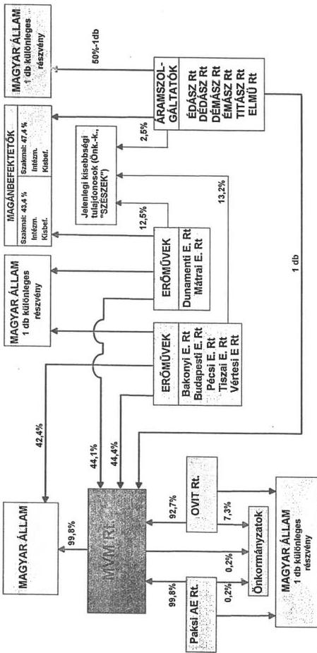

---

|  序号 | 名称 | 数量  |
| --- | --- | --- |
|  1 | 2017年1月1日 | 150  |
|  2 | 2017年1月2日 | 150  |
|  3 | 2017年1月3日 | 150  |
|  4 | 2017年1月4日 | 150  |
|  5 | 2017年1月5日 | 150  |
|  6 | 2017年1月6日 | 150  |
|  7 | 2017年1月7日 | 150  |
|  8 | 2017年1月8日 | 150  |
|  9 | 2017年1月9日 | 150  |
|  10 | 2017年1月10日 | 150  |
|  11 | 2017年1月11日 | 150  |
|  12 | 2017年1月12日 | 150  |
|  13 | 2017年1月13日 | 150  |
|  14 | 2017年1月14日 | 150  |
|  15 | 2017年1月15日 | 150  |
|  16 | 2017年1月16日 | 150  |
|  17 | 2017年1月17日 | 150  |
|  18 | 2017年1月18日 | 150  |
|  19 | 2017年1月19日 | 150  |
|  20 | 2017年1月20日 | 150  |
|  21 | 2017年1月21日 | 150  |
|  22 | 2017年1月22日 | 150  |
|  23 | 2017年1月23日 | 150  |
|  24 | 2017年1月24日 | 150  |
|  25 | 2017年1月25日 | 150  |
|  26 | 2017年1月26日 | 150  |
|  27 | 2017年1月27日 | 150  |
|  28 | 2017年1月28日 | 150  |
|  29 | 2017年1月29日 | 150  |
|  30 | 2017年1月30日 | 150  |
|  31 | 2017年1月31日 | 150  |
|  32 | 2017年1月32日 | 150  |
|  33 | 2017年1月33日 | 150  |
|  34 | 2017年1月34日 | 150  |
|  35 | 2017年1月35日 | 150  |
|  36 | 2017年1月36日 | 150  |
|  37 | 2017年1月37日 | 150  |
|  38 | 2017年1月38日 | 150  |
|  39 | 2017年1月39日 | 150  |
|  40 | 2017年1月40日 | 150  |
|  41 | 2017年1月41日 | 150  |
|  42 | 2017年1月42日 | 150  |
|  43 | 2017年1月43日 | 150  |
|  44 | 2017年1月44日 | 150  |
|  45 | 2017年1月45日 | 150  |
|  46 | 2017年1月46日 | 150  |
|  47 | 2017年1月47日 | 150  |
|  48 | 2017年1月48日 | 150  |
|  49 | 2017年1月49日 | 150  |
|  50 | 2017年1月50日 | 150  |
|  51 | 2017年1月51日 | 150  |
|  52 | 2017年1月52日 | 150  |
|  53 | 2017年1月53日 | 150  |
|  54 | 2017年1月54日 | 150  |
|  55 | 2017年1月55日 | 150  |
|  56 | 2017年1月56日 | 150  |
|  57 | 2017年1月57日 | 150  |
|  58 | 2017年1月58日 | 150  |
|  59 | 2017年1月59日 | 150  |
|  60 | 2017年1月60日 | 150  |
|  61 | 2017年1月61日 | 150  |
|  62 | 2017年1月62日 | 150  |
|  63 | 2017年1月63日 | 150  |
|  64 | 2017年1月64日 | 150  |
|  65 | 2017年1月65日 | 150  |
|  66 | 2017年1月66日 | 150  |
|  67 | 2017年1月67日 | 150  |
|  68 | 2017年1月68日 | 150  |
|  69 | 2017年1月69日 | 150  |
|  70 | 2017年1月70日 | 150  |
|  71 | 2017年1月71日 | 150  |
|  72 | 2017年1月72日 | 150  |
|  73 | 2017年1月73日 | 150  |
|  74 | 2017年1月74日 | 150  |
|  75 | 2017年1月75日 | 150  |
|  76 | 2017年1月76日 | 150  |
|  77 | 2017年1月77日 | 150  |
|  78 | 2017年1月78日 | 150  |
|  79 | 2017年1月79日 | 150  |
|  80 | 2017年1月80日 | 150  |
|  81 | 2017年1月81日 | 150  |
|  82 | 2017年1月82日 | 150  |
|  83 | 2017年1月83日 | 150  |
|  84 | 2017年1月84日 | 150  |
|  85 | 2017年1月85日 | 150  |
|  86 | 2017年1月86日 | 150  |
|  87 | 2017年1月87日 | 150  |
|  88 | 2017年1月88日 | 150  |
|  89 | 2017年1月89日 | 150  |
|  90 | 2017年1月90日 | 150  |
|  91 | 2017年1月91日 | 150  |
|  92 | 2017年1月92日 | 150  |
|  93 | 2017年1月93日 | 150  |
|  94 | 2017年1月94日 | 150  |
|  95 | 2017年1月95日 | 150  |
|  96 | 2017年1月96日 | 150  |
|  97 | 2017年1月97日 | 150  |
|  98 | 2017年1月98日 | 150  |
|  99 | 2017年1月99日 | 150  |
|  100 | 2017年1月100日 | 150  |

---

# 1. A VER üzemirányítása és teljesítőképessége

A magyar villamosenergia-rendszer – VER – a közcélú és az együttműködésbe bevont üzemi villamos erőműveket, valamint a nagy-, közép-, és kisfeszültségű villamos távvezetékeket és az ide tartozó transzformátor állomásokat foglalja magában.

A VER műszaki felügyeletét, operatív üzemirányítását az MVM Rt. szervezetében működő Országos Villamos Teherelosztó (OVT) látja el. Az OVT az alaphálózatot és az erőműveket irányítja. Az üzemi erőművek, a hőszolgáltató iparági erőművek és az elosztó hálózat üzemirányítását kooperációs szempontból a körzeti diszpécserszolgálatok (KDSZ) végzik. Az OVT feladata az erőművek, az alaphálózat alállomások és körzeti diszpécserszolgálatok munkájának, a fogyasztók üzembiztos és gazdaságos energiaellátás céljából történő összehangolása.

A VER működésének meghatározó jellemzője a teljesítőképesség változása. Az 1970 óta bemutatott adatsorok változásából látható, hogy, az intenzív növekedést 1985–1990 között átmeneti stagnálás, majd az ipari termelési szerkezet átalakulása következtében enyhén csökkenő, illetve állandósuló irányzat jellemezte.

A VET szerinti villamosenergia termelési feladatokat az erőművek látják el. A közcélú villamos erőmű a lakosság, az ipar, a mezőgazdaság, a közlekedés, továbbá különféle intézmények és szervek villamosenergia szükségletének kielégítését szolgálja (VET 2. paragrafus (2)). Valamennyi közcélú villamos erőmű az MVM Rt. szervezetébe tartozik.

Az MVM csoport összes ténylegesen rendelkezésre álló teljesítmény 27,0 %-a, a DE Rt.-ben van. Az összes kiadott hő 17,9%-át a DE Rt. állította elő.

---

- 2 -

Az MVM csoporthoz tartozó erőművek összehasonlításában a rendszer teljes beépített teljesítményének 52,2%-a a DE Rt.-ben és Pakson található, míg a maradék 47,8%-nyi villamos teljesítmény megoszlik az ország egyéb, 15 erőművi telephelyén.

## 2. A magyar villamosenergia rendszer csatlakozása a nemzetközi hálózatokhoz

A magyar villamosenergia rendszer korábban a kelet-közép-európai rendszeregyesüléssel működött együtt. A minőség és a biztonság, valamint európai integrációs törekvéseink egyik követelménye a nyugat-európai országok társaságainak villamosenergia rendszer egyesüléséhez – UCPTE – történő csatlakozás.

Ennek érdekében – a KGST villamosenergia rendszer-egyesülés szétesését követően – a magyar, lengyel, cseh és szlovák villamos társaságok megalakították a CENTREL néven ismertté vált villamosenergia-rendszerek egyesülését.

Az UCPTE – a nyugat-európai villamosenergia rendszer-egyesülés – részéről elvárás, hogy a társaságok meghatározott műszaki-technikai (teljesítmény egyensúly, megfelelő tartalékok és szabályozás), és gazdasági feltételeket is kielégítsenek. A CENTREL autonóm üzemű próbája 1993. szeptember 29–30-án volt, amikor az egyesülés bizonyította, hogy képes megközelíteni az UCPTE által megkívánt technikai színvonalat.

Az ellátásbiztonságot javította a Győr és Bécs közötti 400 kV feszültségszintű távvezeték, és a Bécs melletti 600 MW teljesítmény átvitelére képes egyenáramú betét üzembehelyezése. Lehetővé vált az UCPTE és a magyar villamosenergia-rendszer közötti hálózati kapcsolat.

---

- 3 -

A villamosenergia-rendszerek együttműködését érzékeltetik az alábbi energia-termelés részesedési arányok (1992-es adatok):

|  Európa bruttó energia termelése...4.466.418 GWh | 100 %  |
| --- | --- |
|  EU országok energia termelése...1.976.618 GWh | 43 %  |
|  További európai országok...601.161 GWh | 12 %  |
|  Közép-Keleteurópai országok...1.882.639 GWh | 45 %  |

A hazai villamosenergia-rendszer 1995-ben 7317 MW beépített teljesítménnyel rendelkezett. Az UCPTE rendszerszintű üzemi csatlakozás feltétele volt a paksi, a DE Rt. 6x215 MW és a Tiszai 4x215 MW blokkjainak tesztelése illetve az erre való műszaki technikai felkészülés.

Az UCPTE csatlakozási vizsgálatok 1995. szeptember 15-16. között zajlottak le, a próbaüzem eredményei alapján az UCPTE döntött, és 1995. október 18-án 12 óra 30 perckor a CENTREL rendszer összekapcsolódott az UCPTE rendszerrel. A párhuzamos üzemmód kísérleti üzem jelleggel ezen időponttól fennáll, végleges üzemmé 1996. október 1-től vált az egyenáramú betét erre való műszaki alkalmassá tételével.

Az iparág a több évtizedes nemzetközi műszaki tudományos együttműködési tapasztalatok és az ezek birtokában végzett beruházási üzemviteli fejlesztési tevékenység eredményeként volt képes az UCPTE nyugat-európai rendszeréhez történő csatlakozási feltételeknek megfelelni.

E kapcsolat viszonylag gyors létrejöttét támogatta az Európai Energia Charta, amely az energiapiac integrálása, a piac szabályozása és liberalizálása útján, az együttműködés és a technológiai verseny erősödését, a szolgáltatások minőségének javulását, az ellátásbiztonság javítását a környezeti kockázatok csökkentését tűzte ki célul.

---

- 4 -

### 3. Az elmúlt 3 év beruházási, kutatási és fejlesztési ráfordításai

Az elmúlt három évben az iparági beruházások pénzügyi teljesítés fő összegei:

|  M Ft-ban | 1993 | 1994 | 1995  |
| --- | --- | --- | --- |
|  MVM Rt. beruházások |  |  |   |
|  mindösszesen:...23.237,4...40.436,7...49.568,9 |  |  |   |

Az adatok mind a saját, mind a külső forrásból történt ráfordításokat tartalmazzák, beleértve a rendszerérdekű és a társasági saját döntésből megvalósult beruházásokat.

A kutatás-fejlesztésre fordított iparági költségek:

|  M Ft-ban | 1992 | 1993 | 1994 | 1995  |
| --- | --- | --- | --- | --- |
|  K+F...48,8...19,8...38,2...73,2 |  |  |  |   |
|  Tanulmányok...-...5,2...22,1 |  |  |  |   |
|  VB.EIB költség...-...1,2...- |  |  |  |   |
|  Működési költség.-...48,4...29,9...99,0 |  |  |  |   |
|  ÖSSZESEN...48,8...68,2...74,5...194,3 |  |  |  |   |

Az MVM Rt. kutatás-fejlesztési témái között rendszeresen szerepelt a DE Rt.-t érintő mindegyik kiemelt téma:

- a "H"-blokk létesítése kapcsán felmerülő technológiai problémák;
- retrofitok megvalósítása;
- a nehézolajtüzelésű blokk füstgáztisztító eljárásainak vizsgálata;
- alternatív tüzelőanyagként megjelent az Orimulsion, az 1995. évi témák része.

---

- 5 -

#### 4. A DE Rt gépcsoportok állapota

Az erőmű villamosenergia termelő berendezései műszaki állapota jelentős eltéréseket mutat.

A DE Rt. belső technológiai kapcsolatai miatt az erőmű egyetlen telephelynek tűnik, azonban a gépcsoportok műszaki felépítése és állapota jelentősen különbözik egymástól, ezért jelenlegi környezetüket bemutatni, továbbá műszaki állapotukat minősíteni csak üzemrészenként lehet.

A DE Rt. termelőberendezései összetételét a táblázat foglalja össze, mutatja az üzembehelyezések évét és a teljesítményeket.

|  Blokk hsz. | Üzembehelyezés | Teljesítmény  |
| --- | --- | --- |
|  DE Rt. - I. |  |   |
|  I. | 1963. 11. 26. | turbina selejtezve  |
|  II. | 1963. 07. 10. | 20  |
|  III. | 1965. 02. 06. | 40  |
|  VII. | 1969. 03. 17. | 20  |
|  IV. | 1966. 03. 20. | 150  |
|  V. | 1967. 04. 07. | 150  |
|  VI. | 1968. 08. 28. | 150  |
|  DE Rt. - II. |  |   |
|  VIII. | 1973. 11. 18. | 215  |
|  IX. | 1974. 06. 22. | 215  |
|  X. | 1974. 10. 26. | 215  |
|  XI. | 1975. 05. 06. | 215  |
|  XII. | 1975. 09. 13. | 215  |
|  XIII. | 1976. 03. 19. | 215  |
|  DE RT. - GT |  |   |
|  XIV. | 1994. 08. 23. | 142  |

A DE Rt.-I. egységei a tervezési életciklusukon túlvannak, selejtezésük 1997-2002. évek között várható, folyamatosan.

A DE Rt.-II. egységei a villamosenergia-termelés és a rendszer szintű szabályozás szempontjából kiemelet jelentőségűek.

---

- 6 -

Viszonylag jó hatásfokuk és alacsony önfogyasztásuk miatt megújító, ún. retrofit felújításukat vették tervbe 1999-től, amely a lejáró élettartamukat 2020-ig meghosszabbítja, egyben alkalmassá teszi a berendezéseket a változott környezetvédelmi feltételek kielégítésére is.

A DE Rt.- GT egységei (G 1+G 2+gőzciklus) - mint komplex projekt - az energiarendszer legkorszerűbb berendezés-komplexuma. A DE Rt. a GT egységekre 1996. október elejéig még nem tett üzleti tervre javaslatot, amely a GII. gázciklus hosszú távú kapacitás lekötési megállapodás alapja lehetne.

A G1 gázturbina a hőhasznosító kazánjával a Dunai Finomító (DUFI) hőellátását végzi a villamosenergia-termelés mellett.

A gázciklus működik már a G2 berendezésnél 1997 áprilisa óta üzemi gépként és építés alatt áll a G2 gőzciklusú része, 1998-ban tervezett üzembehelyezési időponttal.

A rendelkezésre álló kapacitások mennyiségi és minőségi megfelelőségét a villamosenergia-rendszer egészének vizsgálata mutatja, tekintettel a DE Rt. menetrendtartó erőművi jellegére.

A hatásfok-önfogyasztás táblázata mutatja a DE Rt. és egyes egység-csoportjai energetikai bruttó hatásfokát és önfogyasztásait mint minőségi jellemzőket. A hatásfok jelentősen függ az erőmű kihasználtságától és a kiadott hő mennyiségétől.

A Dunamenti villamosenergia termelésének egészére vonatkozó fajlagos tüzelőanyag felhasználási adatai javuló tendenciát mutatnak.

---

- 7 -

|  1992. | 9914 kJ/kWh  |
| --- | --- |
|  1993. | 9777 kJ/kWh  |
|  1994. | 9419 kJ/kWh  |
|  1995. | 9017 kJ/kWh  |

### 5. A DE Rt. karbantartási tevékenysége

Az erőmű karbantartására általánosan érvényes észrevétel, hogy az évről-évre bekövetkező költségkorlátozások miatt elmaradás van a csatornák, kémények, beton műtárgyak, és egyes épületek felülvizsgálata és felújítása területén, továbbá egyes korrózióvédelmi munkáknál és a nagyhőmérsékletű vezetékek, kazánok hőszigetelésének felújításánál. Forráshiány következtében az állapotfüggő karbantartás helyett a hibaorientált karbantartás került előtérbe.

Az erőmű mérete, összetettsége miatt a karbantartásban abszolút értékben nagy az anyagfelhasználás, jelentős létszámú szakképzett belső, és idegen munkaerőt foglalkoztat. A főberendezések javítására, visszatérő feladatokra átalánydíjas szerződéseket kötöttek. Mindezek mellett összességében időben és költségeiben is növekedtek nominál értékben a karbantartási ráfordítások a tervezett adatokhoz képest. Üzemegységenként a tervhez viszonyított állásidők alakulását mutatja az alábbi táblázat:

|   | Terv |   | Tény  |   |
| --- | --- | --- | --- | --- |
|  DE I. | 165 mn | 13650 MW mn | 246 mn | 15860 MW mn  |
|  De II. | 292 mn | 6278 MW mn | 333 mn | 71595 MW mn  |
|  DE III. | 30 mn | 4350 MW mn | 25 mn | 3625 MW mn  |
|  Összesen: | 487 mn | 80780 MW mn | 604 mn | 91080 MW mn  |

Az üzemzavarok is növekvő tendenciát mutatnak.

A termeléskiesések adataiból következik, hogy 1995-ben a nem tervezett események száma nőtt, 61-ről 90-re, viszont ez nem okozott nagyobb arányú veszteséget. Az üzemzavarok a gázturbinák üzembeállításával magyarázhatók. A rendelkezésre állás

---

- 8 -

mutatói nemzetközi összehasonlításban nem állják meg a helyüket, gyengének mondhatók. A DE Rt. karbantartási időigénye magasabb mint az összes többi erőművé. A hosszú távú szerződésekben a TMK/BT teljesítményarányokra 1997-re az alábbi adatok szerepelnek:

|  Duna C | 9,71%  |
| --- | --- |
|  Duna F | 23,91%  |
|  Tisza II. | 25,79%  |
|  Mátra | 12,33%  |
|  Paks | 14,93%  |

A Dunamenti és a Tiszai karbantartáselőkészítő tevékenysége, karbantartás időigénye hosszabb, mint a nukleáris vagy a ligniterőművé, amelyek bonyolultabb technológiával, illetve rosszabb körülmények között működnek. A Tiszai ajánlata 1997-re 14,6%, a Dunamenti így rossz arányával kiemelkedik a többi erőművel való összehasonlításban.

A karbantartási ráfordítások összességében 1995. évben 1513,9 millió Ft-ot tettek ki. Ebből mintegy 945 millió Ft az idegen karbantartás aránya, amely az összesköltség 62 %-ának felel meg. Az idegen karbantartáson belül a költségek mintegy 2/3-a megoszlik 8-10 magántársaság között.

A DE Rt. saját karbantartóival végeztetett karbantartás az összes költség 38%-a, 568,9 millió Ft. Ebből 334,7 millió Ft az anyagköltség (60 %).

A karbantartási ráfordítások alakulását vizsgálva megállapítható, hogy az inflációval korrigálva, 1991-es árszintre vetítve a ráfordítások reálértéke alig kétharmada a műszakilag indokolt és a nemzetközi gyakorlatnak megfelelő. Mindebből következik, hogy a rendelkezésreállás javítása, a kieső idők csökkentése és az elmaradt karbantartások pótlása már nem halasztható tovább, a karbantartás finanszírozási forrásainak növelését igényli.

---

- 9 -

A DE Rt.-nél a szokásos típuskarbantartásokon túlmenően a nagyjavításokkal párhuzamosan végzik el a szükséges felújításokat. A felújítási szükségletek prognózisát nagyban befolyásolja a jövőbeni földgáz és fűtőolaj tüzelési aránya, a tüzelőanyag ellátás alakulása.

A szerződéskötési szerződésnyilvántartási rendszer nem kellően összehangolt a műszaki és a gazdasági terület nyilvántartásaiban, annak ellenére, hogy ezt már több alkalommal megállapította a DE Rt. belső ellenőrzés is. Az elszámolások egyszerűsítése és az adatforgalom összehangolása megkívánja a hiányzó adatok pótlását, ugyanakkor a redundáns tevékenységelemek elhagyását.

A termelés és termelési célú karbantartás területén foglalkoztatottak összlétszáma 868 fő. Az üzemeltetés területén, a DE Rt. ebből 378 főt foglalkoztat. Az üzemi karbantartás során alkalmazott saját állományú emberi erőforrás felhasználásában az a gyakorlat a DE Rt.-nél, hogy a saját munkakapacitás jóval alacsonyabb, mint a karbantartási munkák tényleges szükséglete. A különbözetet az igénybevett külső szolgáltatások hidalják át. Ez utóbbiak egyben a csúcsidejű igények emberi erőforrás szükségletét is biztosítják. Mindebből következik, hogy az üzemi karbantartás létszámstruktúrájában a magasabban szakképzettek aránya dominál. Azon túl, hogy nekik kell elvégezni a speciális helyismeretet és szakmaismeretet, valamint nagy gyakorlatot igénylő karbantartási feladatokat, további feladatuk a külső szolgáltatásban végzett munkákon dolgozók tevékenységének szakmai irányítása, ellenőrzése, koordinálása.

---

- 10 -

6. A 2001-ig szóló fejlesztési terv és üzleti terv műszaki és tartalmi minősítése.

A tervezett felújítások az egyes berendezések és rendszerek elavulásával, megbízhatatlanná válásával, javításuk ellehetetlenülésével hozhatók összefüggésbe. Kiemelkedő felújítási programcsomag a retrofit. A terv célja az F jelű kondenzációs erőműrész élettartamának 2020-ig történő meghosszabbítása. Realitását gazdasági és maradék-élettartam vizsgálatok igazolták. Amennyiben a retrofit során a jelenlegi alacsony eszközértékű F rész másfélszereséért --ami kb. 36 mrdFt.-- az élettartamát meghosszabbítják, kereken 47 eFt/kW fajlagos beruházási költségű erőműrészhez lehet jutni. Ez kevesebb mint egyharmada egyúj blokk fajlagos beruházási költségének.

A földgáztüzelésű változathoz csak irányítástechnikai retrofit és alacsony NOₓ kibocsátású égő beépítése kapcsolódik, egyébként karbantartásokkal és kisebb felújításokkal a blokkok élettartama alacsonyabb kihasználás mellett 2012-ig fenntartható.

A retrofit keretében egyrészt szükséges mértékben és ütemezésben felújítják a konvencionális blokk-elemeket, másrészt megépülnek a környezetvédelmet szolgáló technológiák. Ez utóbbiak ütemezését a környezetvédelmi moratóriumi rendelkezések határozzák meg:

- 1999. január 1-től a négy nehézolaj tüzelésű blokknak porleválasztóval kell rendelkeznie.
- 2000. január 1-től az egyik kénmosónak működnie kell.
- 2004. január 1-től működnie kell a másik kénmosónak is, továbbá mind a hat F blokknak alacsony NOₓ kibocsátású égővel kell rendelkeznie.

---

- 11 -

A hosszú távú tüzelőanyag szerződés hiánya miatt a fejlesztések megalapozottsága kérdőjeleződik meg.

## 7. A 'H' blokk fejlesztési folyamata

A 'H' blokk ma már szénhidrogén bázisú, a DE Rt.-hez telepítendő, 500 MW BT új kapacitás létesítését jelenti.

A DE Rt. telephelyén megvalósítandó, eredetileg nehézolaj tüzelésű blokk fejlesztési – telepítési vizsgálatai a rendszerérdekű fejlesztés keretében az MVM Rt. irányításával és a DE Rt. közreműködésével – az erőmű fejlesztés 6-8 változatot elemző koncepciótervének kidolgozásával történtek.

1992-1994. években több változatot pontosítottak. A kiválasztottra elkészült a blokk Általános Megvalósíthatósági Tanulmánya (AMT) és az Előzetes Környezeti Hatástanulmánya (EKHT).

A műszaki problémák megoldására egy átfogó tanulmány, míg a blokk egyes kiemelt technológiai funkcióinak ellátására célvizsgálatok készültek.

Az erőmű tervezett fejlesztéseinek társadalmi fogadtatását szociológusok vizsgálták, felmérő és PR tevékenységet indítottak az erőmű környezetbarát fejlesztéseinek propagálására. A lakossági fórumokon az erőmű fejlesztései kedvező fogadtatásra találtak, amennyiben azok a terület imissziós értékeit csökkentik.

Az előkészítő munkálatok különösen 1993-1994. évben kaptak kiemelt hangsúlyt. A 'H' blokk összesített tervezési-, fejlesztés-előkészítés ráfordításai nem különíthetők el egyértelműen, a költségeket az MVM.Rt. fedezte így ezek nagysága

---

- 12 -

több esetben a DE.Rt.-nél nem is ismert, de 400-500 millió Ft nagyságrendűre becsülhető.

Az előkészítő vizsgálatok igazolták, hogy a szomszédos olajfinomító maradékolaj bázisára tervezett "H" blokk a más erőművekben vizsgált kondenzációs blokkokkal összehasonlítva a legjobb fejlesztési változatnak bizonyult. A jelenlegi helyzetben a tüzelőanyagpiac és a környezetvédelmi előírások változásai újabb vizsgálatot involválnak.

Az MVM Rt. Igazgatósága 1995 júniusában elfogadta az erőmű fejlesztési stratégiát, melynek végrehajtási ütemezése a "H" blokk előzetes engedélyezését 1997. januárra tervezi.

1995 novemberében a privatizációs tervekkel, és a DE Rt.-ROWERFIN S.A. adásvételi megállapodás aláírásával (1995. november 24.) összefüggésben az MVM Rt. és az ERÖTERV Rt. közös megegyezéssel a tervezési keretszerződést felbontotta. A szerződésbontás nevesített oka a MOL Rt. azon bejelentett szándéka, hogy 2000-től meg kívánja szüntetni a nehézfűtőolaj szolgáltatását.

A privatizációs érdekek és érvek az adásvételi megállapodásba minél több fejlesztési projekt beépítését ésszerűsítették volna, a külföldi tőkebevonás, a fejlesztés finanszírozás segítésére.

Jelenleg a DE Rt. a megváltozott körülmények, a tüzelőanyag probléma miatt, az előzetes létesítési engedélyhez szükséges dokumentumok elkészítését helyezte előtérbe, amelyek:

= Tüzelőanyag beszerzésre vonatkozó nyilatkozat;
= Az új blokk kapacitására és kapacitáslekötésére vonatkozó megállapodás;
= A környezetvédelmi megfelelőségre vonatkozó nyilatkozat.

---

- 13 -

Az új egység(ek) tüzelőanyag ellátását együtt kell kezelni az F rész igényeivel, s ez szorosan összefügg a MOL Rt. Dunai Finomítójának tervezett fejlesztéseivel.

Az új 500 MW-nyi kapacitás nyitás tervezett üzembehelyezési éve 2000, illetve 2001 volt, ma már nyilvánvaló ez az üzembehelyezési időpont nem tartható, és az sem zárható ki, hogy 2010-ig is kitolódhat.

#### 8. A privatizációs folyamat értékelemzése

A vizsgálat során a hagyományos ellenőrzési módszerek mellett alkalmaztuk -- kísérleti jelleggel -- az értékelemzést.

A vizsgálók által összeállított funkciók logikai sémáját mutatjuk be az alábbiakban:

##### F$_{1}$ Energiapolitikát új alapokra helyez

###### F$_{11}$ Hosszú távú energiapolitikai koncepciót alakít ki

F$_{111}$ Előírja a hazai és import energiahordozók arányát

F$_{112}$ Hipotetikus növekedési trendeket vázol

F$_{113}$ Perspektivikusan megjelöli a termelés, szállítás fejlesztési irányait

F$_{114}$ Meghatározza az energiahordozók és a villamosenergia import (nettó) beszerzésének bázisait

F$_{115}$ Vizsgálja a termelés és szolgáltatás energiaigényessége mérséklésének eszközeit

###### F$_{12}$ Hosszú távú energetikai koncepciót alakít ki

F$_{121}$ Meghatározza a bányászat jövőképét

F$_{122}$ Meghatározza a gázipar fejlesztését

F$_{123}$ Meghatározza a villamosenergia-ipar fejlesztését

F$_{124}$ Meghatározza a hőszolgáltatás fejlesztési centrumait

###### F$_{13}$ Hosszú távú energiagazdálkodási koncepciót dolgoz ki

F$_{131}$ Az energiaigényes iparfejlesztési igényeket a regionális forrásokkal priorizál F$_{132}$ Mérsékli a termelés és szolgáltatás energiaigényességét

F$_{133}$ A napi fogyasztási völgyek és csúcsok közötti sávok csökkentésére tarifális eszközöket ajánl

---

- 14 -

F$_{14}$ Közép távú döntéseket hoz- F$_{141}$ Koncepciókat aktualizál
- F$_{142}$ Energiahordozókat kijelöl
- F$_{143}$ Hatósági áras kötelezettségeket értékelF$_{15}$ Éves döntéseket hoz- F$_{151}$ Ellátási kötelezettséget értékel
- F$_{152}$ Átvételi kötelezettséget értékel
- F$_{153}$ Hatósági árakat értékel
- F$_{154}$ Termelői, szállítói és szolgáltatói önköltséget értékel
- F$_{155}$ Önköltségek és árak eltérítését elfogadja
- F$_{156}$ Tarifarendszer korszerűsítésében dönt
- F$_{157}$ Import energiahordozók és villamosenergia elő irányzatait jóváhagyja
- F$_{158}$ Éves szubvenciók és ártámogatások módjában és mértékében dönt
- F$_{159}$ Villamosenergia-ipari vállalatok adózás előtti eredményét vizsgáljaF$_{16}$ Reguláció hatásait vizsgálja- F$_{161}$ Az energetikai ágazat jövedelmezőségét befolyásoló piaci és szabályozási feltételeket elemzi és finomítja
- F$_{162}$ Nemzetközi kötelezettségekkel és nemzeti érdekekkel összefüggésben a regulációt finomítja
- F$_{163}$ Társadalmi igényekkel és teherbíró képességgel összefüggésben regulációt finomítF$_{2}$ Privatizációt előkészít- F$_{21}$ Ágazati modellt vizsgál
  - F$_{211}$ Nemzetközi kooperációt feltár
  - F$_{212}$ Ágazatközi kapcsolatokat feltár
  - F$_{213}$ Ágazati működést feltár
  - F$_{214}$ Az ágazat külső és belső célállapotát definiálja
  - F$_{215}$ Működési modellt meghatároz
  - F$_{216}$ Működési modell feltételrendszerét kialakítja
  - F$_{217}$ A modellt és annak feltételrendszerét elfogadtatja
  - F$_{218}$ Regulációs igényeket meghatároz
- F$_{22}$ Privatizációs stratégiát kialakít
  - F$_{221}$ Alternatívákat vázol
  - F$_{222}$ A rész és az egész optimumát vizsgálja a működés, a működés megújítása és a költségvetési bevétel szempontjából
  - F$_{223}$ A rész és az egész optimumát vizsgálja a befekte tők és a fogyasztók szempontjából

---

- 15 -

- F$_{224}$ Meghatározza a választott stratégia garanciális elemeit a költségvetés, a fogyasztók és a befektetők szempontjából
- F$_{225}$ Meghatározza a stratégia alkalmazása feltételrendszerét
- F$_{226}$ A Stratégiát és annak feltételrendszerét elfogadtatja
- F$_{227}$ Regulációs igényeket meghatároz
- F$_{23}$ Privatizációs tervet készít
  - F$_{231}$ Meghatározza a társaságok aktuális üzletértékét
  - F$_{232}$ Elkészítteti az aktuális pénzügyi, mérnöki és környezetvédelmi auditokat
  - F$_{233}$ Meghatározza a befektetőkkel szemben érvényesítendő kötelező és kívánatos fejlesztési projekteket
  - F$_{234}$ Kialakítja az értékesítés kívánatos ársávjait
  - F$_{235}$ Értékesítési tervet készít
  - F$_{236}$ Meghatározza a terv megvalósítása feltételrendszerét
  - F$_{237}$ Dönt az értékesítésről
- F$_{3}$ Innovációt gerjeszt
  - F$_{31}$ Technológiát korszerűsít
    - F$_{311}$ Technológiát vált
    - F$_{312}$ Technológiát korszerűsít
  - F$_{32}$ Termék minőségét javítja
    - F$_{321}$ Termelési paraméterét javítja
    - F$_{322}$ Szállítási és szolgáltatási paraméterét javítja
  - F$_{33}$ A valósidejű rendszer-irányítást javítja
    - F$_{331}$ Mérő-, szabályozó- és vezérlőrendszereket javít
    - F$_{332}$ Adatátviteli rendszert fejleszt
    - F$_{333}$ Rendszerközi, rendszerszintű, regionális és
  - F$_{34}$ A működés hatásfokát, üzemviteli szabályozással javít
    - F$_{341}$ Üzemi szabályzatokat módosít
    - F$_{342}$ Üzemviteli szabályzatokat módosít
  - F$_{35}$ Az ágazat egésze közgazdasági működését javítja
    - F$_{351}$ Önköltségszámítási szabályokat javít
    - F$_{352}$ A termelő, szállító és szolgáltató közötti haszonmegosztást javítja
    - F$_{353}$ Algoritmusokat fejleszt a legkisebb költség elve érvényesítésére
    - F$_{354}$ Algoritmusokat fejleszt az eltérő önköltségen működő termelők és szolgáltatók közötti közgazdasági értékelésére

---

- 16 -

- F$_{36}$ Humán erőforrásokat fejleszt
  - F$_{361}$ Szakmastruktúrát változtat
  - F$_{362}$ Szakképzettségi szintet növel
  - F$_{363}$ Specializációt mélyít
- F$_{37}$ Fogyasztói kapcsolatokat javítja
  - F$_{371}$ Innovatív tarifarendszert fejleszt
  - F$_{372}$ Fogyasztói szolgáltatás javítja
- F$_{38}$ A villamosenergia szállítás és elosztás hálózatait fejleszt
  - F$_{381}$ A fogyasztói ellátás feltételeit javítja
  - F$_{382}$ A nemzeti rendszer átviteli feltételeit javítja
  - F$_{383}$ A hálózati rendszerben a kompenzálás eszközeit fejleszt
  - F$_{384}$ A nemzetközi és kétoldalú kooperáció átviteli feltételeit javítja
- F$_{4}$ Nemzetközi kooperációt fejleszt
  - F$_{41}$ Nemzetközi együttműködésben részvételét javítja
    - F$_{411}$ Beilleszkedik az EU szervezeteibe
    - F$_{412}$ Fokozza részvételét az EU műszaki-tudományos életében
    - F$_{413}$ Fejleszt kétoldalú kapcsolatait
  - F$_{42}$ Export-import tevékenységét fejleszt
    - F$_{421}$ Kétoldalú kereskedelmet fejleszt
    - F$_{422}$ Regionális kereskedelmet fejleszt
    - F$_{423}$ EU kereskedelmet fejleszt

A vázolt logikai séma a vizsgálatban azonos szempontrendszer érvényesítését tette lehetővé a vizsgálatban résztvevő ellenőrök számára.

---

3. melléklet

# A DE Rt. gazdálkodási mutatók elemzése

# 1. Árbevétel-arányos jövedelmezőség

- Számítási módja: $$\frac{\text{Adózás előtti eredmény}}{\text{Ert. nettó árb. + egyéb bev. + Pü. műv. bev. + rendkívüli bevétel}} \times 100$$

- 1992-ben az a mutató 2,7% volt, 1993-ban – elsősorban a realizált nyereség erőteljes növekedése miatt – 4,17%-ra emelkedett, 1994-ben elérte – a vizsgált időszakban – a mélypontot (1,6%), majd 1995-ben ismét kismértékű emelkedést (1,76%) mutatott.

Az adózás előtti eredmény évenkénti hullámzása, amelynek okai között elsősorban a tüzelőanyag árának változása a determináló, meghatározza e mutató alakulását. Az 1994. és 1995. évi mutató minden esetre a gazdálkodás fokozódó nehézségeit és a jövedelmezőség csökkenését jelzi.

# 2. Eszközarányos-jövedelmezőség

- Számítási módja: $$\frac{\text{Adózás előtti eredmény}}{\text{Mérleg eszközeinek főösszege}} \times 100$$

A nevezőben szereplő mérleg főösszeg évről évre emelkedett (1992: 36,6 Mrd Ft; 1995: 45,2 Mrd Ft), a számlálóban lévő adózás előtti eredmény erőteljes hullámzást mutat.

E mutató értékének mozgása párhuzamos az előzőekben tárgyalt 'árbevétel-arányosjövedelmezőség'-i mutatóval, itt is az elért eredmény nagysága volt a meghatározó (1992: 1,04%; 1995: 0,93%).

---

- 2 -

### 3. Tőkearányos jövedelmezőség

$$- \text{Számítási módja: } \frac{\text{Adózás előtti eredmény}}{\text{Saját tőke}} \times 100$$

A tőkearányos jövedelmezőség mutatója, illetve értéke szoros összefüggésben áll az adózás előtti eredmény alakulásával, a saját tőke értéke alig változott a vizsgált időszakban (1992: 35,1 Mrd Ft, 1995: 36,4 Mrd Ft).

### 4. Tárgyi eszközök hatékonysága

$$- \text{Számítási módja: } \frac{\text{Adózás előtti eredmény}}{\text{Tárgyi eszközök nettó értéke}} \times 100$$

A tárgyi eszközök hatékonysági mutatója, köszönhetően a termelési érték évről-évre történő erőteljes növekedésével, emelkedő tendenciát mutat. Bár a nevezőben lévő 'tárgyi eszközök nettó értéke' nem mutatja a termelőeszközök valóságos erkölcsi és fizikai állapotát, mégis megállapítható, hogy hatékonyságuk javult a vizsgált időszakban.

### 5. Készletek hatékonysága

$$- \text{Számítási módja: } \frac{\text{Adózás előtti eredmény}}{\text{Készletek értéke}} \times 100$$

A készletek hatékonysága, illetve a mutató értéke a vizsgált időszakban emelkedett, elsősorban azért, mert a DE Rt. fokozatosan felszámolta elfekvő, vagy alig mozgó készleteit, és így az értékesítés nettó árbevétele jelentősen meghaladta a készletnövekedés mértékét (az árbevétel: + 68,4%; készlet: + 10,7%).

---

- 3 -

## 6. Tőkeellátottsági mutató

- Számítási módja: Saját tőke
Összes forrás

A tőkeellátottsági mutató értéke a vizsgált 4 év alatt fokozatosan csökkent (1992: 0,96; 1995: 0,81), leginkább a források növekedése miatt, mivel a saját tőke értéke alig változott. A 0,81-es érték is elfogadhatónak ítélhető meg.

## 7. Pénzjövedelem

- Számítás módja: Mérleg szerinti eredmény + ECS

A pénzjövedelem egyik alkotó eleme a mérleg szerinti nyereség, amely 1993-ban volt a legmagasabb, de az amortizáció összege évről-évre növekedett, mivel változtak a leírási kulcsok és új egység (pl. G₁ gázturbina) üzembeállítása is megtörtént. 1994-ben ugyan a pénzjövedelem kisebb volt az 1993. évinél, de 1995-re - elsősorban az amortizáció összegének több mint 500 M Ft-os növekedése miatt - a pénzjövedelem kiegyensúlyozott képet mutat.

## 8. Diszponibilitási mutató

- Számítási módja: Pénzeszköz x 100
Rövidlejáratú kötelezettség

Ez a mutató a DE Rt. "gyors" fizetőképességét reprezentálja. 1992-ben - elsősorban a rendelkezésre álló pénzeszköz viszonylagos szűkössége miatt - 4,32%-os értéket ért el ez a ráta, majd 1993-ban 19,06%-ra emelkedett, mutatva az azonnali fizetőképesség teljesítésének ugrásszerű megnövekedését. A ráta a következő két évben csökkent ugyan - ezen az úton is

---

- 4 -

jelzést adva a gazdálkodás fokozódó nehézségeiről - de értéke még így is jelentősen meghaladja a közepes szintet.

# 9. Tőkeforgási sebesség

- Számítási módja: $$\frac{\text{Összes árbevétel} \times 100}{\text{Összes befektetett eszköz}}$$

Az összes árbevétel és a befektetett eszközök aránya megmutatja, hogy 1 Ft-nyi befektetett eszközzel mennyi árbevétel érhető el.

Az ellenőrzött évek alatt az árbevétel növekedése jelentősen meghaladta a befektetett eszközök értékének növekedését, ezért ez a mutató 40,59 fillérről 56,80 fillérre emelkedett.

Javult a tőke forgási sebessége, azaz 1 Ft-nyi befektetett eszköz 4 év alatt egyre nagyobb árbevételt eredményezett.

# 9. Eladósodási mutató

- Számítási módja: $$\frac{\text{Hosszúlejáratú tartozások} \times 100}{\text{Saját vagyon} + \text{adózott eredmény}}$$

Az adósság szolgálati mutató a hosszú lejáratú tartozások (államkölcsön + világbanki hitel) záróállománya, a hosszú lejáratú tartozások és a saját források (saját vagyon + adózott eredmény összegének %-os kifejezése.

A DE Rt. saját vagyonának és az adózott eredmény együttes összegének növekedése - a vizsgált időszakban - nem számottevő, ugyanakkor a hosszú lejáratú tartozások összege - ugyanezen időszak alatt - 40-szeresére emelkedett (1992: 124,4 M Ft; 1995: 5,02 Mrd Ft).

---

- 5 -

E tartozások növekedését a beruházásokhoz kapcsolódó hitelfelvételek okozzák, a $G_2$ (gázturbina) beruházáshoz pl. 4,4 Mrd Ft hitelt vett igénybe a Társaság.

E mutató ugrásszerű növekedése (1992: 0,35; 1995: 13,52) szinte megköveteli a $G_2$ beruházás átlagon felüli jövedelmezőségét, mert alacsony, vagy közepes jövedelmezőség mellett igen hosszú lesz a megtérülési idő és ez komolyan veszélyeztetheti a DE Rt. jövőbeli gazdaságos működését.

#### A villamosenergia termelés fajlagos önköltsége

##### 1. Összehasonlítás a DE Rt. és más erőművek adatai között

Az MVM Rt. közvetett irányítása alá tartozó erőművek villamosenergia termelésének fajlagos önköltségeit összehasonlítva a Paksi Atomerőmű adatait az ellenőrzés nem vonja vizsgálat alá, a nukleáris fűtőenergia speciális helyzete miatt.

A széntüzelésű erőművek adatait szintén nem tartalmazza a következő táblázat, mivel azok sem hasonlíthatók össze a szénhidrogén tüzelőanyagot felhasználó erőművekkel.

|  Megnevezés | Villamosenergia termelés fajl. |   |   |   | fill. kWh önkölts. 1995 1992  |
| --- | --- | --- | --- | --- | --- |
|   |  1992 | 1993 | 1994 | 1995  |   |
|  Bp-i Erőmű | 231,30 | 272,28 | 281,42 | 310,43 | 134,2  |
|  Dunam. Erőmű | 347,18 | 263,34 | 292,87 | 333,44 | 134,9  |
|  Tiszai Erőmű | 334,34 | 339,27 | 338,78 | 429,15 | 128,3  |

A DE Rt. - az egész vizsgált időszak alatt - az összköltség alakulásának döntő hányadát képező tüzelőanyagot jóval drágában szerezte be, mint a Budapesti Erőmű, és így hiába takaré-

---

- 6 -

koskodott az állandó költségeivel, a Budapesti Erőmű minden évben olcsóbban állította elő a villamosenergiát (az MVM Rt. által rendelkezésre bocsátott adatok alapján).

A Tiszai Erőmű – a három vizsgálatra ment egység közül – a legmagasabb áron szerezte be tüzelőanyag szükségletét, valamint az állandó költségei is a legmagasabbak.

A széntüzelésű erőművek fajlagos önköltsége jóval magasabb az itt bemutatott erőművek fajlagos önköltségénél, életben maradásukat elsősorban az MVM Rt. által működtetett járadékrendszer biztosította, az átcsoportosítások révén.

Üzemeltetésük – közgazdaságilag – csak akkor indokolt, ha az ország energiaszükségletét a többi erőmű nem tudja kielégíteni.

#### Az 1996. I. negyedévi gazdálkodási mutatók alakulása

A DE Rt. 1996. I. negyedévében – az erre az időszakra tervezett termelési feladatait időarányosan teljesítette, sőt kismértékben túl is teljesítette.

A karbantartási és a beruházási – időarányos – terv teljesítése nem sikerült, ennek egyik oka az, hogy január hónapban még nem rendelkezett a DE Rt. elfogadott beruházási tervvel, így a betervezett munkák indítása késedelmet szenvedett. Február hónapban megkezdődtek az éves tervben szereplő beruházási és felújítási munkákra az ajálatkérések, az éves beszerzések további egyeztetés igényelnek.

Az eredmény alakulására döntő, sőt kizárólagos hatással bírt a MOL Rt. által szállított tüzelőanyag árának drasztikus emelkedése. Mivel a DE Rt. önköltségében az egész vizsgált időszak alatt a tüzelőanyag 75–78 %-kal részesedett, így az – eddigi

---

- 7 -

minden mértéket meghaladó - áremelés eredményezte az első negyedév 306 M Ft-os veszteségét.

A tüzelőanyag árának alakulását mutatja be a következő táblázat:

|  1992 | 7.587 Ft/to | = | 100,00 %  |
| --- | --- | --- | --- |
|  1993 | 8.175 Ft/to | = | 107,75 %  |
|  1994 | 9.043 Ft/to | = | 119,19 %  |
|  1995 | 10.116 Ft/to | = | 133,33 %  |
|  1996* | 14.602 Ft/to | = | 192,46 %  |

*1996. január-február havi adatok alapján számított érték.

A számsor jólmutatja azt a tényt, hogy a MOL Rt. felhagyva az eddigi - nagyjából évi 10%-os áremelési politikájával, az 1995. évi átlagárat 44%-kal meghaladó tüzelőolaj áremelést hajtott végre 1996 első két hónapjában, de a márciusi szállítással már elérték a 16.000 Ft/hó árat is.

Nem vitatva a kemény tél miatti olajkészlet csökkenését és ennek világpiaci árfelhajtó hatását, az ilyen mértékű áremelés legalábbis megkérdőjelezhető még akkor is, ha a forint folyamatos - havonkénti - leértékelése és az infláció egy bizonyos mértékű áremelést mindenképpen indokolttá tesz.

A fajlagos költségalakulást vizsgálva megállapítható, hogy a DE Rt. kondenzációs villamosenergia termelése, a csúcserőművi villamosenergia előállítás, a hőenergia értékesítése - a kiugróan magas tüzelőolaj költség miatt - veszteséges. Egyedül a kapcsolt villamosenergia-termelés hoz az Rt. számára pozitív eredményt, azaz nyereséget.

---

- 8 -

# 1996. február havi adatok

|  Megnevezés | Fajl.tüz.ag. ktg. Ft/GJ | Fajl.váll.elő- áll. ktg. fill/kWh;Ft/GJ | Elszámoló- ár fill/kWh; Ft/GJ  |
| --- | --- | --- | --- |
|  Kondenzációs vill.energia | 407.02 | 432.82 | 296.20  |
|  Kapcsolt vill. energia | 404.90 | 236.48 | 377.90  |
|  Csúcserőművi vill.energia | 457.22 | 619.36 | 332.00  |
|  Hőenergia értékesítés | 391.92 | 455.60 | 366.70  |

A kondenzációs villamosenergia termelésnél keletkező 136.62 fill/kWh (46%) fedezetlenség olyan negatív érték, amelyre a DE Rt. történetében még nem volt példa. A március 1-től végrehajtott villamosenergia áremelés és a március 20-tól életbe lépett gázáremelés következtében a februári 'rekord' fedezetlenség jelentősen csökkent (37.06 fill/kWh).

# Legfontosabb gazdálkodási mutatók 1996. I. negyedévben

|  Megnevezés | Mérték egység | Éves terv | I. n.évi terv | I. n.évi tény | I. n.év terv % tény | I. n.év 96.év %  |
| --- | --- | --- | --- | --- | --- | --- |
|  Fajl. vill.en. | GWh | 5.615 | 1.608 | 1.601 | 99,6 | 28,6  |
|  Kiadott vill.en. | GWh | 5.285 | 1.523 | 1.526 | 100,2 | 28,9  |
|  Értékesített hő | TJ | 8.553 | 2.662 | 2.661 | 100,0 | 31,1  |
|  Adózás előtti en. | MFT | 370 | - 325 | - 306 | 106,2 |   |
|  Karbantartás | MFT | 1.633 | 320 | 263 | 82,2 | 16,1  |
|  Beruházás | MFT | 4.328 | 1.094 | 758 | 69,3 | 17,5  |
|  Készletek és előleg | MFL | 1.970 | 1.239 | 1.239 | 100,0 | 62,9  |
|  Átlaglétszám | fő | 1.184 | 1.188 | 1.123 | 94,5 | 94,5  |

---

- 9 -

A tüzelőanyag készlet alakulása – az olajpiaci helyzet alakulásának (jelentős drágulás) megfelelően alacsonyabb a kívánatosnál, az egyéb készletek volumene az elvárásnak megfelelő.

|  Megnevezés | Márciusi adatok |   |   | MFT Eltérés  |
| --- | --- | --- | --- | --- |
|   |  Jan. 1-i nyilv. | Márc. havi záró | Kívánatos  |   |
|  Tüzelő | 830 | 489 | 700 | 211  |
|  Egyéb | 517 | 704 | 650 | (54)  |
|  Előlegek | 10 | 46 | 25 | (21)  |
|   | 1.357 | 1.239 | 1.375 | 136  |

---

1

1