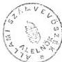
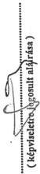
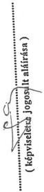

Állami Számvevőszék

# JELENTÉS

a Magyar Alkotóművészeti Közalapítvány gazdálkodásának
ellenőrzéséről

1996. december

347.

---

A vizsgálat végrehajtásáért felelős:
az ÁSZ III. Költségvetési Ellenőrzési Igazgatósága

Bihary Zsigmond számvevő igazgató

Az ellenőrzést vezette:

Balázs Andrásné számvevő főtanácsos

Az ellenőrzést végezték:

|  Belovai Sándorné | számvevő  |
| --- | --- |
|  Bittó Zoltán | számvevő tanácsos  |
|  Karsai Lászlóné | számvevő  |
|  Makláry Valentin | számvevő  |
|  Pásztor Katalin | számvevő  |
|  Tóth Bálint | számvevő  |
|  dr. Horváth Gyula | külső munkatárs  |
|  dr. Solymár Jánosné | külső munkatárs  |

---

# Tartalomjegyzék

oldal

I. ÖSSZEFOGLALÓ MEGÁLLAPÍTÁSOK, KÖVETKEZTETÉSEK, JAVASLATOK... 4

II. RÉSZLETES MEGÁLLAPÍTÁSOK ... 9

A) A KÖZALAPÍTVÁNY LÉTREHOZÁSÁNAK ÉS MŰKÖDÉSÉNEK SZABÁLYOZOTTSÁGA, A FELADAT- ÉS SZERVEZETI RENDSZER ÖSSZHANGJA ... 9

1. Az alapitoi (Kormany) dontesek megalapozottsaga 10
2. Az Alapitvany, illetve Kozalapitvany Alapito Okiratai 15
3.A kuratorium tevekenysge 16
4.Belso szabalyzatok. 19
5.A munkaszervezet mukodese, hataskori tullepesek, gazdalkodasi szabalytalansagok. 20
6.A gazdalkodasi ügyvitel, konyvvezetes szabalyozottsaga es a vegrehajtas szabalyossaga. 24
7. Ellenorzs 26

B) A KÖZALAPÍTVÁNYHOZ RENDELT ÁLLAMI VAGYON SZERKEZETE, VAGYONGAZDÁLKO DÁS ... 27

1. Az Alapitvany Alapito Okirataban rogzitett alapitoi vagyon szerkezete. A vagyon atadasanak dokumentaltsaga, az atadott vagyon tulajdonjogi rendezese 27
2.A kimutatott vagyonhiany, a vagyon potlasa 30
3.A rendelkezesre bocsatott vagyon osszhangja es celszerusege az alapitvanyi celokkal 31
4.A torzsvagyon es a vallalkozasi celu vagyon elkulonitett kezelese 31
5.Mualkotask kezelese, nyilvantartasa, ertekesitese, leltarozasa, selejtezese 33
6. Vagyongazdalkodás 34

a.A bevetelek alakulasa 36
b.A kiadasok alakulasa 36
c. A felszamolt, illetve a felszamolas alatt levo leanyvallatok, kft-k tartozasi, ezek rendezese es hatasa a MAK penzugyi helyzetere 37

7. A vagyon értékesítése ... 38

a. Ingatlanok es vagonyi erteku jogok ertekesitese 38
b.A kft-k vagyonanak ertekesitese 40

8.A vagyon-szerkezet atalakitasanak hatasa a likviditasra 40
9.A MAK vagyonvesztese es ennek ellensulyozasara tett intezkedesek 41
10.A befektetett vagyon osszetetele, valtozasai 43

C) AZ ALAPÍTÓ OKIRATBAN MEGHATÁROZOTT CÉLOK TELJESÍTÉSE, AZ ÁLLAMI TÁMOGATÁS FELHASZNÁLÁSA ... 45

1. A Közalapítvány által működtetett szociális segélyezési rendszer ... 45

a.Jogszabalyi alapok es szervezeti keret. 45
b.A segely-nyugdijrendszer anyagi alapjai 46
c.A Kozalapitvanyak folyositott allami tamogatas felhasznalasa 47
d. Az allami tamogatas finanszirozasa 48
e.A nyugdijak es segelyek megallapitasanak rendszere 49

2. A Közalapítvány által működtetett művészeti támogatási rendszer ... 51

a. Non-profit celok teljesitese 51
b.Alkotohazak mukodietese 51
c.A muveszeknek adott alkotoi elolegek 53
d. A Magyar Alkotomuveszek Orszagos Egyesuletenek tamogatasa, a Kozalapitvany kapcsolata az Egyesulettel 53

---

[Non-Text]

[Non-Text]

[Non-Text]

The Ground Truth image displays a single, solid horizontal line. According to Rule 2 (UNDERSCORE & LINE RULES), this is a stylistic or background line, not a placeholder underscore. Therefore, the OCR result must ignore it and output nothing or only meaningful text. The provided OCR content is "____", which consists of four underscores. This is an incorrect interpretation of the line as a placeholder, violating the rule that stylistic lines must be ignored. The OCR has hallucinated underscores where none should exist based on the GT's visual context. Hence, the OCR result is inconsistent with the Ground Truth.

[Non-Text]

[Non-Text]

[Non-Text]

[Non-Text]

The Ground Truth image displays a single, solid horizontal line. According to Rule 2 (UNDERSCORE & LINE RULES), this is a stylistic or background line, not a placeholder underscore. Therefore, the OCR result must ignore it and output nothing or only meaningful text. The provided OCR content is "____", which consists of four underscores. This is an incorrect interpretation of the line as a placeholder, violating the rule that stylistic lines must be ignored. The OCR has hallucinated underscores where none should exist based on the GT's visual context. Hence, the OCR result is inconsistent with the Ground Truth.

[Non-Text]

[Non-Text]

[Non-Text]

1. 2017年1月1日至2018年1月1日（含）的公司股票交易均价为4.56元/股，与前一交易日收盘价相比，涨幅为-0.97%。

•

[Non-Text]

•

[Non-Text]

•

[Non-Text]

1. 2017年1月1日至2018年1月1日（含）的公司股票交易均价为4.56元/股，与前一交易日收盘价相比，涨幅为-0.97%。

1. 2017年1月1日至2018年1月1日（含）的公司股票交易均价为4.56元/股，与前一交易日收盘价相比，涨幅为-0.97%。

[Non-Text]

The Ground Truth image displays a single, solid horizontal line. According to Rule 2 (UNDERSCORE & LINE RULES), this is a stylistic or background line, not a placeholder underscore. Therefore, the OCR result must ignore it and output nothing or only meaningful text. The provided OCR content is "____", which consists of four underscores. This is an incorrect interpretation of the line as a placeholder, violating the rule that stylistic lines must be ignored. The OCR has hallucinated underscores where none should exist based on the GT's visual context. Hence, the OCR result is inconsistent with the Ground Truth.

[Non-Text]

[Non-Text]

The Ground Truth image displays a single, solid horizontal line. According to Rule 2 (UNDERSCORE & LINE RULES), this is a stylistic or background line, not a placeholder underscore. Therefore, the OCR result must ignore it and output nothing or only meaningful text. The provided OCR content is "____", which consists of four underscores. This is an incorrect interpretation of the line as a placeholder, violating the rule that stylistic lines must be ignored. The OCR has hallucinated underscores where none should exist based on the GT's visual context. Hence, the OCR result is inconsistent with the Ground Truth.

The Ground Truth image displays a single, solid horizontal line. According to Rule 2 (UNDERSCORE & LINE RULES), this is a stylistic or background line, not a placeholder underscore. Therefore, the OCR result must ignore it and output nothing or only meaningful text. The provided OCR content is "____", which consists of four underscores. This is an incorrect interpretation of the line as a placeholder, violating the rule that stylistic lines must be ignored. The OCR has hallucinated underscores where none should exist based on the GT's visual context. Hence, the OCR result is inconsistent with the Ground Truth.

1. 2017年1月1日至2018年1月1日（含）的公司股票交易均价为4.56元/股，与前一交易日收盘价相比，涨幅为-0.97%。

The Ground Truth image displays a single, solid horizontal line. According to Rule 2 (UNDERSCORE & LINE RULES), this is a stylistic or background line, not a placeholder underscore. Therefore, the OCR result must ignore it and output nothing or only meaningful text. The provided OCR content is "____", which consists of four underscores. This is an incorrect interpretation of the line as a placeholder, violating the rule that stylistic lines must be ignored. The OCR has hallucinated underscores where none should exist based on the GT's visual context. Hence, the OCR result is inconsistent with the Ground Truth.

The Ground Truth image displays a single, solid horizontal line. According to Rule 2 (UNDERSCORE & LINE RULES), this is a stylistic or background line, not a placeholder underscore. Therefore, the OCR result must ignore it and output nothing or only meaningful text. The provided OCR content is "____", which consists of four underscores. This is an incorrect interpretation of the line as a placeholder, violating the rule that stylistic lines must be ignored. The OCR has hallucinated underscores where none should exist based on the GT's visual context. Hence, the OCR result is inconsistent with the Ground Truth.

The Ground Truth image displays a single, solid horizontal line. According to Rule 2 (UNDERSCORE & LINE RULES), this is a stylistic or background line, not a placeholder underscore. Therefore, the OCR result must ignore it and output nothing or only meaningful text. The provided OCR content is "____", which consists of four underscores. This is an incorrect interpretation of the line as a placeholder, violating the rule that stylistic lines must be ignored. The OCR has hallucinated underscores where none should exist based on the GT's visual context. Hence, the OCR result is inconsistent with the Ground Truth.

1. 2017年1月1日至2018年1月1日（含）的公司股票交易均价为4.56元/股，与前一交易日收盘价相比，涨幅为-0.97%。

The Ground Truth image displays a single, solid horizontal line. According to Rule 2 (UNDERSCORE & LINE RULES), this is a stylistic or background line, not a placeholder underscore. Therefore, the OCR result must ignore it and output nothing or only meaningful text. The provided OCR content is "____", which consists of four underscores. This is an incorrect interpretation of the line as a placeholder, violating the rule that stylistic lines must be ignored. The OCR has hallucinated underscores where none should exist based on the GT's visual context. Hence, the OCR result is inconsistent with the Ground Truth.

The Ground Truth image displays a single, solid horizontal line. According to Rule 2 (UNDERSCORE & LINE RULES), this is a stylistic or background line, not a placeholder underscore. Therefore, the OCR result must ignore it and output nothing or only meaningful text. The provided OCR content is "____", which consists of four underscores. This is an incorrect interpretation of the line as a placeholder, violating the rule that stylistic lines must be ignored. The OCR has hallucinated underscores where none should exist based on the GT's visual context. Hence, the OCR result is inconsistent with the Ground Truth.

The Ground Truth image displays a single, solid horizontal line. According to Rule 2 (UNDERSCORE & LINE RULES), this is a stylistic or background line, not a placeholder underscore. Therefore, the OCR result must ignore it and output nothing or only meaningful text. The provided OCR content is "____", which consists of four underscores. This is an incorrect interpretation of the line as a placeholder, violating the rule that stylistic lines must be ignored. The OCR has hallucinated underscores where none should exist based on the GT's visual context. Hence, the OCR result is inconsistent with the Ground Truth.

[Non-Text]

[Non-Text]

1. 2017年1月1日至2018年1月1日（含）的公司股票交易均价为4.56元/股，与前一交易日收盘价相比，涨幅为-0.97%。

The Ground Truth image displays a single, solid horizontal line. According to Rule 2 (UNDERSCORE & LINE RULES), this is a stylistic or background line, not a placeholder underscore. Therefore, the OCR result must ignore it and output nothing or only meaningful text. The provided OCR content is "____", which consists of four underscores. This is an incorrect interpretation of the line as a placeholder, violating the rule that stylistic lines must be ignored. The OCR has hallucinated underscores where none should exist based on the GT's visual context. Hence, the OCR result is inconsistent with the Ground Truth.

[Non-Text]

[Non-Text]

The Ground Truth image displays a single, solid horizontal line. According to Rule 2 (UNDERSCORE & LINE RULES), this is a stylistic or background line, not a placeholder underscore. Therefore, the OCR result must ignore it and output nothing or only meaningful text. The provided OCR content is "____", which consists of four underscores. This is an incorrect interpretation of the line as a placeholder, violating the rule that stylistic lines must be ignored. The OCR has hallucinated underscores where none should exist based on the GT's visual context. Hence, the OCR result is inconsistent with the Ground Truth.

The Ground Truth image displays a single, solid horizontal line. According to Rule 2 (UNDERSCORE & LINE RULES), this is a stylistic or background line, not a placeholder underscore. Therefore, the OCR result must ignore it and output nothing or only meaningful text. The provided OCR content is "____", which consists of four underscores. This is an incorrect interpretation of the line as a placeholder, violating the rule that stylistic lines must be ignored. The OCR has hallucinated underscores where none should exist based on the GT's visual context. Hence, the OCR result is inconsistent with the Ground Truth.

[Non-Text]

[Non-Text]

[Non-Text]

[Non-Text]

[Non-Text]

The Ground Truth image displays a single, solid horizontal line. According to Rule 2 (UNDERSCORE & LINE RULES), this is a stylistic or background line, not a placeholder underscore. Therefore, the OCR result must ignore it and output nothing or only meaningful text. The provided OCR content is "____", which consists of four underscores. This is an incorrect interpretation of the line as a placeholder, violating the rule that stylistic lines must be ignored. The OCR has hallucinated underscores where none should exist based on the GT's visual context. Hence, the OCR result is inconsistent with the Ground Truth.

The Ground Truth image displays a single, solid horizontal line. According to Rule 2 (UNDERSCORE & LINE RULES), this is a stylistic or background line, not a placeholder underscore. Therefore, the OCR result must ignore it and output nothing or only meaningful text. The provided OCR content is "____", which consists of four underscores. This is an incorrect interpretation of the line as a placeholder, violating the rule that stylistic lines must be ignored. The OCR has hallucinated underscores where none should exist based on the GT's visual context. Hence, the OCR result is inconsistent with the Ground Truth.

---

ÁLLAMI SZÁMVEVŐSZÉK

V-3-59/1996.

Témaszám: 313.

# JELENTÉS

# A Magyar Alkotóművészeti Közalapítvány gazdálkodásának ellenőrzéséről

A Magyar Alkotóművészeti Alapítványt (MAA) a Magyar Köztársaság Művészeti Alapja (Alap) jogutódjaként 1992. október 1-jei hatállyal létesítette a Kormány. Az Alapítvány tevékenységeként elsősorban a művészek társadalombiztosítási, jóléti és szociális biztonságával összefüggő feladatok ellátását jelölték meg, ehhez megkapta a jogelőd Alap kezelésében lévő vagyont.

A Ptk. módosítását követően, 1994. január 1-jétől az alapítvány a Ptk. 74./G. §-a szerint közalapítvány lett, gazdálkodásának törvényességét és célszerűségét az Állami Számvevőszék ellenőrzi.

A Magyar Alkotóművészeti Közalapítvány (MAK) feladatköre az alkotómunka támogatására és a művészek szociális biztonságának megteremtésére irányul. Ezen belül a magyar irodalom, képzőművészet, iparművészet, ipari tervezőművészet, fotóművészet és zenei alkotóművészet területén önálló biztosítási rendszer keretében biztosítási jellegű rendszeres és rendkívüli támogatás nyújtása, az alkotómunka jobb körülményeinek elősegítése, alkotóházak működtetése, műtermek, műterem lakások létrehozása, műalkotások megismertetése, értékesítése, ösztöndíjak, jutalmak, művészeti pályázati díjak, alkotói előlegek, kölcsönök nyújtása, művészeti kezdeményezések, fiatal művészek támogatása képezi feladatát.

Feladatai ellátásához a MAA a Kormánytól az 1992. évi alapításkor 1,3 Mrd Ft vagyont kapott, 1993-1995. között évente 200-210 M Ft állami támogatásban részesült. A MAK saját tőkéje az 1995. évi mérleg szerint 427,7 M Ft-ra csökkent. (1,3 sz. tanúsítványok)

Ellenőrzésünk során arra kerestünk választ, hogy

- az Alapítvány létrehozásakor, illetve közalapítvánnyá történő átalakításakor megteremtették-e a működéshez szükséges feltételeket,

---

- az Alapítványnak átadott állami vagyon változása, a vagyonhasznosítási és átalakítási program végrehajtása, ezen belül a vállalkozási vagyonnal való gazdálkodás milyen hatást gyakorolt az Alapítvány pénzügyi helyzetére,
- az átadott állami vagyont és támogatást az alapítványi céloknak, illetve a közfeladat ellátásának megfelelően hasznosították-e,
- a Magyar Alkotóművészek Nyugdíjpénztárának megalakításához, működéséhez milyen pénzügyi feltételek álltak rendelkezésre.

A vizsgálat 1992. július - 1995. december 31. közötti időszakra terjedt ki.

# I.

# Összefoglaló megállapítások, következtetések, javaslatok

Az Alapítvány létesítésekor a Kormányt az a szándék vezette, hogy hosszú távra biztosítsa az állam támogatását a magyar irodalom, képzőművészet, iparművészet, fotóművészet és zenei alkotóművészet, illetve művészek részére, s az alapítvány-rendeléssel is elismerje, hogy a vagyon jórészt a művészeti ágakat élethivatásszerűen művelő művészek négy évtizedes alkotómunkája révén gyarapodott.

Az Alapítványhoz, illetve a Közalapítványhoz fűzött kormányzati elgondolások eddig nem teljesültek. A működés feltételei még rövid távon sem biztosítottak megnyugtatóan. Az alapítványi célokat csak vagyonfeléléssel és nem az elvárt vagyonmegőrzéssel, sőt vagyongyarapítással tudja a kuratórium teljesíteni.

Az Alapítvány létrehozásakor a Kormány, illetve a Művelődési és Közoktatási Minisztérium (MKM) nem végeztetett vagyonfelmérést, vagyonértékelést és megalapozó gazdaságossági számításokat az alapítványi célok teljesíthetőségére, várható költségkihatására, valamint ezek fedezeteként a számításba vehető, valós források, bevételek alakulására. Alapvetően hibásnak bizonyult az az alapítói koncepció, hogy az Alapítványnak átadott állami vagyon hozama elegendő lesz a meghatározott célok teljesítéséhez. Az átadott vagyon összetétele miatt erre már az alapításkor jórészt alkalmatlan volt és az alapítványi működés során a kedvezőtlen folyamatok elmélyültek. A vállalkozói vagyon jövedelemtermelő képessége minimális lett, jelentős részét felszámolták, illetve a felszámolás folyamatban van, a törzsvagyon (alkotóházak) rentábilis működése megoldatlan, felújításuk és fenntartásuk az Alapítvány pénzügyi lehetőségeit meghaladó többletköltséggel jár.

Az Alapítvány rendezetlen vagyont kapott. Több vagyonelem érték nélkül szerepelt az induló vagyonban, nem vették számításba a vagyon részét képező gazdasági társaságok kötelezettségeit és vagyoni hiányait. A működés megkezdését követő felmérés által kimutatott vagyonhiány egyes tételei nem bizonyultak tényleges hiánynak, de a bekövetkezett értékvesztés ezeket kiegyenlíti. Az ingatlanok és vagyoni értékű jogok becsült piaci értéke többszöröse az induló vagyonban meghatározott értéknek, ezért valójában az

4

---

alapítás hibáiból nem vagyonhiány, hanem vagyontöbblet mutatható ki. A pénzbeni kötelezettségek teljesítése és a várt hozam túlbecsülése miatt azonban az ellenőrzés elfogadhatónak tartja a pénzben teljesített pótlólagos vagyonjuttatást.

A vagyonpótlásra vonatkozó kormányhatározatokban megszabott feladatokat a Pénzügyminisztérium (PM), az MKM, a Kincstári Vagyonkezelő Szervezet (KVSZ), a MAA kuratóriuma és munkaszervezete késedelmesen vagy egyáltalán nem hajtotta végre, a mulasztásokat a kormány újabb és újabb - két év alatt összesen hat - határozat meghozatalával hallgatólagosan tudomásul vette.

Az Alapítvány, illetve a Közalapítvány kormány-rendeletekkel jóváhagyott Alapító Okiratai részben kellően át nem gondolt szabályozásokat, részben belső ellentmondásokat tartalmaztak, illetve tartalmaznak, amelyek a vagyon kezelésében és az alapítvány gazdálkodásában szabálytalanságok, belső érdekütközések sorozatát indították el, ezáltal hozzájárultak a vagyonvesztéshez.

Alapvetően hibásnak bizonyult az első kuratórium személyi összetételének kialakítása. A jószándékú, művészeti kérdésekben járatos, a művészek egzisztenciális gondjait jól ismerő, de a gazdasági kérdésekben, főleg a válságkezelésben járatlan művész kurátorok irányításával csaknem törvényszerűen következett be a nagyarányú vagyonvesztés. A kuratórium összetétele azt az illúziót tükrözte, hogy piaci viszonyok között az üzleti vállalkozások tartósan és közvetlenül érvényesíthetnek eredményrontó, egyéni művészi érdekeket. Az ellenőrzés álláspontja szerint a Közalapítvány vállalkozói vagyonát gazdasági szempontok szerint szabad csak működtetni, és ennek hozamából kell a művészek alkotómunkáját támogatni, a szakmai érvényesülés feltételeit kialakítani, ezek megteremtéséhez hozzájárulni, illetve gondoskodni a rászorulók szociális jellegű megsegítéséről.

1992-94. között az Alapítványon belül semmilyen ellenőrzési rendszer sem működött, továbbá a kuratórium nem végzett tulajdonosi ellenőrzést a vagyon részét képező 52 kft-nél, 5 leányvállalatnál és 3 rt-nél.

Az ellenőrzés szerint a művészeti érdekeknek alárendelt gazdasági döntések bár számottevő, de kisebb kárt okoztak, mint a hibás és végrehajthatatlan koncepcióra - az ún. pénzintézeti koncepcióra - épített felelőtlen gazdasági döntések. A kuratórium nem volt képes ellenőrzés és korlátok között tartani a munkaszervezet vezetőinek hatáskört túllépő, pazarló, meggondolatlan intézkedéseit, kritikátlanul elfogadta a megalapozatlan javaslatokat, irreálisan, a feladat nagyságától és az Alapítvány anyagi lehetőségeitől elszakadva állapította meg személyi juttatásaikat.

Az Alapítvány három és fél éves működése alatt induló vagyonának kétharmadát, több mint 850 milliót Ft értékben elvesztette. Az alapítással összefüggő vagyonvesztés miatt - leányvállalatok értékvesztése, késedelmi kamat, hitelezési veszteség - 350 M Ft, a gazdálkodással összefüggő vagyonvesztés miatt - kft-k értékvesztése, kft. üzletrészek, ingatlanok és vagyoni értékű jogok értékesítése, rendkívüli és egyéb ráfordítások - 500 M Ft vagyoncsökkenés következett be. A gazdálkodással összefüggő vagyonvesztésben jelentős része volt a pazarló és célszerűtlen gazdálkodásnak és az alapítvá-

5

---

nyi célok teljesítése érdekében bekövetkező vagyonfelélésnek. A megállapítások egy része hűtlen kezelés alapos gyanúját támasztja alá, ezért az Állami Számvevőszék bűnvádi eljárást kezdeményez.

A vagyoncsökkentéssel járó intézkedések zöme kuratóriumi döntés nélkül történt, melyekről a kuratóriumot utólag is csak részben tájékoztatták.

A Kormány nem intézkedett időben a vagyonkezelésre alkalmatlan kuratórium leváltására, sőt ellenőrzéséről is csak a közalapítvánnyá történt átalakításkor gondoskodott, a felügyelő bizottság létrehozásával. (Az alapítványoknál nem kötelező ellenőrzésre jogosult szerv létrehozása, a közalapítványnál azonban a Ptk. 74/G. § (5) bekezdése ezt előírja.)

Az 1995. márciustól működő három tagú válság-kuratórium, majd a kibővített létszámú új kuratórium, illetve a jelenlegi munkaszervezet alkalmas a feladatok megoldására, tervszerűen és dinamikusan kezdtek hozzá a felgyülemllett problémák megoldásához. Az általuk készített és a Kormány által jóváhagyott pénzügyi terv elvileg alkalmasnak látszik a Közalapítvány tartós stabilizálásához, a bizonytalansági tényezőt a jelenlegi vagyon-szerkezet pénztőkévé történő átkonvertálásának mielőbbi megvalósítása jelenti.

A pénzügyi terv végrehajtásáig, eredményei realizálásáig továbbra is számottevő gazdálkodási bizonytalanság és likviditási zavar lesz a jellemző a Közalapítványra. Az eddigi intézkedések eredménytelensége miatt e folyamat elhúzódásával kell számolni, amely a Közalapítvány feladatainak finanszírozásában ismételten felvetheti az állami támogatás iránti folyamatos és növekvő igényt.

Tekintettel arra, hogy a pénztőke majdani kialakítása után a vagyon és a kapott osztalék lesz a forrása a folyó kifizetéseknek, a vagyon hosszútávú, értékálló megőrzése, illetve gyarapítása - amelyet az Alapító Okirat célul tűzött ki - nem reális követelmény.

Az Alapító Okiratban meghatározott alapítványi célok csak részlegesen, illetve az elvártnál szerényebb mértékben teljesültek.

A saját nyugdíjpénztár megalakítása a kuratórium hibájából két év késedelmet szenvedett. Az e célra adott állami támogatást és hitelt részben elpazarolták, részben - objektív okok miatt - a nyugdíjkifizetések fedezetéül használták fel. Az alkotómunka támogatására fordított összegek tendenciája csökkenő, az alkotóházak, művésztelepek, műtermek fenntartása veszteséges, indokolt felújításuk és karbantartásuk pénzhiány miatt elmaradt. Az alkotómunkához adható előlegek feltételrendszerét nem dolgozták ki, folyósítását likviditási okok miatt 1995. óta felfüggesztették. A Közalapítvány a Magyar Alkotóművészek Országos Egyesülete (MAOE) működését támogatja, az átadott támogatások elszámoltatása, a cél szerinti felhasználás ellenőrzése azonban a vizsgált időszakban nem történt meg. A kuratórium és a MAOE közötti kapcsolat konfliktusokkal terhelt, melyben szerepe van a hatáskörök rendezetlenségének, a Közalapítvány által nyújtott szolgáltatások miatti jogos elégedetlenségnek és a pénzügyi lehetőségeket meghaladó, túlzott elvárásoknak.

6

---

Indokolatlan késéseket tapasztalt az ellenőrzés a központi költségvetési támogatások folyósításában 1995-ben és 1996-ban, jóllehet a finanszírozó PM, valamint MKM előtt jól ismert, hogy a havi rendszerességgel fizetett nyugdíjakhoz a támogatások időben történő beérkezése nélkülözhetetlen. Az ütemtelen átutalások miatt a Közalapítvány több alkalommal csak késve tudta a nyugdíjas művészek járandóságát kifizetni, az érintettek jogos felháborodására.

Az állami garanciával vállalt nyugdíjak fedezetére biztosított központi költségvetési támogatás rendszeresen kevesebb a ténylegesen fizetendő nyugdíjaknál - a központi költségvetés adóssága 1995. év végén már meghaladta a 90 millió Ft-ot - elszámolása és pénzügyi rendezése érthetetlenül elhúzódik, s ez nagymértékben okozója a Közalapítvány likviditási zavarainak.

Az ellenőrzés megállapításai alapján a következőket javasoljuk

# A Kormánynak

1) Valamennyi közalapítvánnyal kapcsolatban

a) Teremtse meg a felteteleket ahhoz, hogy a kozalapitvanyok kuratoriumai es felugyeloBizottsagai altal a Kormanynek keszitett eves beszamolok erdemi minositest kapianak, a kormanyzati dontest igenylo ugyekben intezkedes tortenjek.
b) A kozalapitvanyok kuratoriumainak mukodeskeptelenné, vagy alkalmatlanná valasa eseten soronkivul dontson uj kuratoriumok felkéréserol a vagyonvesztés megakadalyozasa erdekében.
c) Igenyelje, hogy a felugyelőBizottságok a kozalapitványok ellenörzési rendszerenek muködését is ertékeljék a Kormánynak keszített beszámolóikban.

2) A Magyar Alkotóművészeti Közalapítvánnyal kapcsolatban

a) Gondoskodjon arrol, hogy a Kozalapitvany es jogelodjei altal kifizetett, allami garanciaval fedezett nyugdijak es az e celra adott kozponti koltsegvetesi tamogatas kulonbozet a Kozalapitvany haladektalanul megkapja. A kozpontilag elhatarozott nyugdij emelasek fedezet a folyositas kezd idopontjara a Kozalapitvany szamara isBiztositsa.
b) A Kozalapitvany Alapito Okiratanak modositásával szüntesse meg a belso ellentmondásokat a szabad pénzeszközok befektetési lehetosegeben, továbbá a realitásoknak megfeleloen modositsa a vagyon megörzsésere és gyarapitására vonatkozo celkitüzest.
c) 1997. végéig számoltassa be a Közalapitvány kuratóriumát 1995-1997. évi tevekenységeröl, határozzon a stabilizáciohoz szükséges kormányzati intezkedesekról.

7

---

d) Vizsgáltassa meg a Magyar Alkotóművészeti Közalapítványnak jóváhagyott vagyonpótlás késedelmes finanszírozásának okát, indokolt esetben a mulasztást elkövetőket vonja felelősségre.

### **Művelődési és közoktatási miniszternek**

Vizsgáltassa meg a Magyar Alkotóművészeti Közalapítványnak járó központi költségvetési támogatás késedelmes finanszírozásának okát, személyes mulasztás esetén gondoskodjon a felelősségrevonásról, intézkedjék a további finanszírozás zavartalanságáról.

### **A Magyar Alkotóművészeti Közalapítvány kuratóriumának**

1. 1) A Közalapítvány Alapító Okiratban meghatározott céljai teljesítése érdekében ismételten és kritikusan vizsgálják át a vagyonrészeket, intézkedjenek a törzsvagyonon kívüli vagyonelemek hozamnövélése érdekében a szükséges és lehetséges kicserélés, a működésképtelen, veszteséges gazdasági társaságok haladéktalan felszámolása érdekében.
2. 2) Haladéktalanul számolják fel a Közalapítvány és a tulajdonában álló gazdasági társaságok közötti költségterhelések - beleértve a személyi állomány kirendelés - helytelen gyakorlatát, biztosítsák, hogy mind a költségek, mind a bevételek ott kerüljenek elszámolásra, ahol azok ténylegesen keletkeztek. Ésszerű határokon belül csökkentsék az egy személy által ellátott ügyvezetői és felszámolási megbízatásokat.
3. 3) A Közalapítvány számlarendjét úgy alakítsák ki, hogy az elsődlegesen az alapítványi célok, a kiemelt feladatok teljesítését mutassa be.
4. 4) A Közalapítvány - a jelentés megállapításait figyelembevéve - pontosítsa az 1992. évi központi költségvetési támogatás elszámolását, a nyugdíj kifizetések forrásai között a segélyjárulék összegét is figyelembevéve.
5. 5) A gazdálkodás stabilizálása, a megbízható vagyonkezelés, a kedvezőbb összetételű portfólió kialakítása érdekében átfogó ellenőrzési rendszert kell kialakítani és működtetni. Az eseti ellenőrzések mellett kapjon nagyobb hangsúlyt a folyamatos ellenőrzés, mind a Közalapítvány gazdálkodását, mind a Közalapítvány gazdasági társaságokban lévő tulajdonának működtetését illetően. Az ellenőrzést valamennyi vagyonelemre, illetve az ezekkel való gazdálkodásra ki kell terjeszteni.
6. 6) A Szervezeti és Működési Szabályzatban részletesen határozzák meg a belső ellenőrzés rendszerét, szabályozzák az ellenőrzés egyes elemeinek (a kuratórium tulajdonosi ellenőrzése, külső /könyvvizsgálói/ ellenőrzés, vezetői ellenőrzés, munkafolyamatba épített ellenőrzés, belső ellenőrzés) működését.
7. 7) Az ellenőrzés megállapításai alapján a Közalapítványnak és gazdasági társaságainak anyagi hátrányt okozó intézkedésekben vizsgálja meg a felelősség kérdését - bele-

8

---

értve az előző kuratórium tagjait is - és ez alapján járjon el a kár megtérítése érdekében. Kezdeményezze a FEB közreműködését a szükséges vizsgálatok lefolytatásában.

## II. Részletes megállapítások

# A) A Közalapítvány létrehozásának és működésének szabályozottsága, a feladat- és szervezeti rendszer összhangja

A MAA jogelődje, a Művészeti Alap, mint társadalmi szervezet, 1968. január 1-jén jött létre az Irodalmi Alap, a Képzőművészeti Alap és Zenei Alap összevonásával.

A Minisztertanács 43/1983. (XI.20.) sz. rendelete 1984. január 1-jei hatállyal a Művészeti Alapot a művelődési miniszter közvetlen felügyelete alá tartozó önálló költségvetési szervvé alakította át, melynek feladata lett a művészeti alkotómunka támogatása, illetve társadalombiztosítási jellegű juttatások biztosítása az Alap tagjai számára. Az Alap költségvetési szervként való működésekor különleges jogi státuszt élvezett (pl. az Alaptagság pótolta a munkaviszonyt, a leányvállalatai nem fizettek adót és egyes esetekben monopol helyzetben voltak). A tagok kedvezményes módon fizették a segélyezési járulékot, ezen felül egyéb támogatásokban, juttatásokban is részesültek. Mindemellett 1989-től az Alap bevételeit az állami költségvetésből kellett kiegészíteni (1989-ben 143 M Ft, 1990-ben 84 M Ft, 1991-ben 113 M Ft).

Az Alap már a 80-as évek végén megkezdte vállalkozásai struktúrájának átalakítását, a nem túl hatékonyan működő leányvállalatokból és az Artunion közös vállalatból ötven, különböző társasági formában működő vállalkozást hozott létre.

Az Alapot irányító vezetők 1988-90. között olyan spontán privatizációt hajtottak végre, amely mind a tulajdonosi érdekek, mind a gazdaságosság szempontjából vitatható. 1991. után az általános gazdasági hanyatlás, a leányvállalatok csődje, a monopolhelyzet megszűnése és vezetési hibák következtében a vállalkozások jövedelemtermelő képessége drasztikusan csökkent.

A művésztársadalom 1990. májusát követően belső demokratikus önigazgatása, gazdasági függetlensége reményében bejelentette igényét a közreműködésével létrehozott vagyon tulajdonjogára.

Az előkészítő szakaszban a tárcaegyeztetések során az Alapítvány létrehozásával kapcsolatban egyetértő vélemények nyilvánultak meg.

A Kormány 3315/1992. (VII.2.)sz. határozatában felhatalmazta a művelődésügyi minisztert a költségvetési törvényben a Művészeti Alap számára megállapított költségvetési támogatás 119 M Ft-nyi időarányos részének MAA részére való folyósítására, valamint

9

---

1992-ben további 31 M Ft-ot és a nyugdíjpénztár beindításához szintén 31 M Ft-ot biztosított. Előírta, hogy 10 év lejártával meg kell vizsgálni az Alapítvány pénzügyi helyzetét és a további költségvetési támogatás szükségességét.

# 1. Az alapítói (Kormány) döntések megalapozottsága

A 117/1992. (VII.29.) Kormányrendelet döntött a Művészeti Alap megszüntetéséről és a Magyar Alkotóművészeti Alapítvány létesítéséről 1992. október 1-jei hatállyal.

Az Alapítvány létrehozásakor a Kormány, mint alapító és az MKM, mint az alapítást előkészítő minisztérium nem végzett tényleges vagyonfelmérést, vagyonértékelést és megalapozó gazdaságossági számításokat az alapítványi célok teljesülésére, várható költségkihatására, valamint ezek fedezeteként számításba vehető, valós források, bevételek alakulására. Alapvetően hibásnak minősült az alapító koncepciója az alapítvány rendelkezésére bocsátott vagyon hozamtermelő képessége tekintetében. Az Alapítvány rendezetlen vagyont kapott, melyet az alapításkor számításon kívül hagyott kötelezettségek és vagyoni hiányok terheltek.

Az Alapítvány céljai megvalósításához a kormány és az MKM - 10 éven át tartó kizárólag nyugdíjcélú kifizetésre fordítható állami támogatás mellett - a rendelkezésre bocsátott vagyont és az azzal történő, jövedelem- és vagyongyarapítást biztosító gazdálkodást szánta.

A művészek és a döntést hozó politikusok részleteiben nem voltak tisztában az Alap helyzetével, bár a Kormánynak szóló előterjesztés jelezte, hogy az ingatlan-vagyon jórészt improduktív. A működőtőke-részt a vállalatok és az Alap által létrehozott társaságokban kihelyezett vagyon képviselte, amelynek hozadéka nem adott kellő fedezetet az alapítványi célokra.

Az MKM előtt nem volt, nem lehetett ismeretlen, hogy az Alap gazdasági működőképessége vitatható, mégis csak az Alapítvány megalakítása után, 1992. dec. 11-én kezdeményezte az alapítvány vagyoni helyzetének rendezését, az ehhez szükséges kormány-előterjesztés elkészítését.

Az előterjesztés előkészítése során a PM a vagyonhiány összegének megállapítását könyvvizsgálói hitelesítéshez kötötte.

Ezt a feladattal megbízott kft. elvégezte 1993. február 26-ra, és a hiány összegét 501,2 M Ft-ban állapította meg.

Az Alapítvány, illetve a Közalapítvány vagyonpótlására vonatkozó kormányhatározatokat az érintett kormányzati szervek - PM, MKM -, a KVSZ és az Alapítvány kuratóriuma késedelmesen vagy egyáltalán nem hajtotta végre, a mulasztásokat a Kormány újabb és újabb határozatok meghozatalával hallgatólagosan tudomásul vette.

1993. június és 1995. augusztus között hat kormányhatározat foglalkozott a nyugdíj és vagyonpótlás kérdéseivel, végül a 2239/1995. (VIII.24.) kormányhatározat az

10

---

összes megelőző kormányhatározatot hatályon kívül helyezve oldotta meg azoknak a feladatoknak egy részét, melyeket már az alapítást megelőzően el kellett volna végezni.

Az 1993. áprilisában benyújtott előterjesztés alapján hozott 2015/1993. (HT.10.) Kormányhatározat elfogadta az 1992. október 1-jéig tagsági viszonyban álló és ez időpontig nyugdíjba vonult tagok részére 2002-ig évi 50 M Ft összegű támogatást, valamint a nyugdíjpénztár felállításához és működéséhez 210 M Ft összeg éves 70 M Ft részletben történő folyósítását, úgy, hogy 1996-tól kezdődően hat év alatt a kapott összeget a költségvetésnek évente egyenlő összegben visszatéríti az Alapítvány. Támogatta a fennálló köztartozások megállapodással történő rendezését. Vizsgálat körébe vonta a pótlólagos vagyonbiztosítás lehetőségét, ha a művelődési és közoktatási miniszter vagyonhasznosítási és átalakítási programot készít, amelyet a PM-el és a KVSZ-el egyeztetetten 1993. augusztus 31-ig a Kormány elé terjeszt. (Fentiek szerint a Kormány a vagyonpótlást ebben a fázisban nem elfogadta, hanem azt feltételhez kötötte.)

A megadott határidőre nem készült el a vagyonhasznosítási program. A művelődési és közoktatási miniszter a KVSZ-vel és a PM-mel előírt egyeztetések határidejének 1993. december 31-re történő módosításával fordult a Kormányhoz, amely azt a 2035/1993. (IX.9.) sz. határozatával elfogadta.

1993. október hónapban az Alapítvány és a KVSZ megállapodása szerint a vagyoni hiány pótlására a 350 M Ft értékű Badacsonytomaj Club Tomaj üdülő és a 47,7 M Ft értékű Badacsonytördemic "Rodostó" ház ingatlanok kerültek volna átadásra, 1993. október 25-ig.

Az 2044/1993. (XI.9.) Kormányhatározat vagyonpótlási célokra a KVSZ rendelkezésére álló vagyonból 400 M Ft értékben ingatlanokat tartott fenn az Alapítvány számára és elfogadta a program elkészítésének határidő módosítását.

A vagyonhasznosítási és átalakítási program a megjelölt módosított időpontra sem készült el, így annak határidejét a 2062/1993. (XII.31.) Kormányhatározat 1994. március 15-ében határozta meg, kiegészítve azzal, hogy vagyonkezelési és befektetési szabályzat is készüljön, amely a vagyon megőrzését és megfelelő működtetését biztosítja. A KVSZ-t kötelezte a fenntartott ingatlanok elidegenítésére és az ellenérték Alapítvány részére történő átadására 1994. március 15-ig. Felhívta a művelődési és közoktatási miniszter figyelmét, hogy a MAA 1994. január 1-jétől Közalapítványnak minősül, az alapító okiratot a Kormány nevében módosítsa.

Az Alapítvány miniszteri biztosa a kuratórium elnökének írt 1993. november 17-i levelében jelezte, hogy az igazgatóság megállapodásuk ellenére nem teljesíti vállalását, az átalakítási program tervezetét nem kapta meg, ez veszélyezteti a tárgyévi kormányelőterjesztés elkészítését és a vagyonpótlást.

A művelődési és közoktatási miniszter a vagyonhasznosítási és átalakítási programról készített előterjesztést végül 1994. március 31-én terjesztette a Kormány elé.

11

---

A 2038/1994. (IV.25.) Kormányhatározat elfogadta a vagyonhasznosítási és átalakítási programot és elrendelte a KVSZ hasznosítási bevételeiből történő egyszeri 368 M Ft értékű vagyonpótlást a pénzügyminiszter felelősségével, azonnali határidővel. Kötelezte a MAK-ot, hogy a vagyonhasznosítási és átalakítási program részteljesítéséről évente, 1996-ban pedig összefoglalóan számoljon be. E beszámolóval párhuzamosan a Kormány ellenőrzésre kérte fel az Állami Számvevőszéket is. A határozatot a 2039/1995. (VIII.24.) Korm. határozat hatályon kívül helyezte.

A kormányhatározat ellenére a vagyonpótlás rendezése húzódott, a KVSZ semmiféle elfogadható elképzeléssel nem rendelkezett a végrehajtás realizálását illetően.

A Kormány 1995. február 28-ával határozott időre új kuratóriumot nevezett ki.

A 2046/1995. (III.1.) határozatban a Kormány a vagyonpótlás részeként a folyó kiadások fedezetére 100 M Ft kereskedelmi kamatozású hitelért készfizetői kezességet vállalt. A vagyonpótlási kötelezettség teljesítésének idejét a MAK vagyoni és pénzügyi helyzetének megismeréséhez kötötte. Felkérte a MAK-ot a Nyugdíjbiztosító Pénztár megszervezésére, a vállalkozói vagyon felmérésére, a vagyonkezelés módjának és új vagyonkezelő szervezetnek a kialakítására.

A Kormány 2239/1995. (VIII.24.) határozatában rendezte a vagyonpótlást. A költségvetés általános tartalékából 1995-ben 60 M Ft-ot biztosított a Nyugdíjpénztár céljaira és előírta, hogy az 1996. évi költségvetésben 268 M Ft-ot tervezzenek vagyonpótlásként. A nyugdíjpénztár beindításához szükséges 210 M Ft 1996-tól kezdődő visszatérítésének szabályait külön megállapodás tárgyává tette.

Az 1996. évi költségvetési törvény 308 M Ft 1996. évben esedékes vagyonpótlást tartalmazott, amelyet azonban havi egyenlő részletekben teljesítették 1996. júniusáig, majd a fennmaradó részt 1996. június 4-én egy összegben átutalták.

Az Alapítvány, illetve a Közalapítvány alapító okiratait jóváhagyó, illetve módosító kormányrendeletek részben belső ellentmondásokat, részben kellően át nem gondolt szabályozásokat is tartalmaztak, melyek a vagyon kezelésében és a gazdálkodásban szabálytalanságok sorozatát indították el, ezáltal hozzájárultak a vagyonvesztéshez.

Alapvetően hibásnak bizonyult az első kuratórium személyi összetétele kialakítása. A jószándékú, művészeti kérdésekben járatos és a művészek egzisztenciális gondjait jól ismerő, de a gazdasági kérdésekben, főleg a válságkezelésben járatlan művészkurátorok irányításával csaknem törvényszerűen következett be a nagyarányú vagyonvesztés. A kuratórium összetétele azt az illúziót tükrözte, hogy piaci viszonyok között a üzleti vállalkozások tartósan és közvetlenül érvényesíthetnek eredményrontó, egyéni művészi érdekeket.

A munkaszervezet és annak vezetője hatáskör túllépésének alapját az alapítást elrendelő kormányrendeletek képezték, ugyanis a 117/1992. (VI.29) Korm.rendelet és az ezt mó-

12

---

dosító 58/1994. (IV.16.) Korm.rendelet képviseleti joggal ruházta fel a munkaszervezet igazgatóját.

A 16/1995. (II.28.) Korm.rendelet - a megelőző időszak tanulságait alapulvéve - már nem biztosított képviseleti jogot az Igazgatóság vezetőjének, a kuratóriumra bízta a képviseleti joggal való felruházás lehetőségét.

Az 58/1994. (IV.16.) Korm. rendelet és a 179/1995. (XII.29.) Korm. rendelet ellentmondásosan rendelkezett a szabad pénzeszközök befektetéséről. A rendeletek mellékletét képező Alapító Okirat szerint a Közalapítvány átmenetileg szabad készpénzvagyona csak állampapírban helyezhető el, viszont a jóváhagyott vagyonkezelési és befektetési szabályzatok szerint az Alapítvány szabad pénzeszközeinek elhelyezésére 4 kockázati osztályt és számos - állampapíron kívüli - befektetési formát határoztak meg. A 179/1995. (XII.29.) Korm. rendelettel jóváhagyott vagyonkezelési és befektetési szabályzat - helyesen - előírja, hogy a Közalapítvány rendelkezésére bocsátott állami támogatások - kivéve, ha az adományozó másként nem rendelkezik - csak állam által garantált értékpapírban helyezhetők el.

Ellentmondásos a Közalapítvány és a Magyar Alkotóművészek Országos Egyesülete (MAOE) közötti hatáskör a vagyoni kérdésekben.

A Művészeti Alap átalakításának átmeneti időszakára a művelődési és közoktatási miniszter a segélyezési bizottságok kijelölésének az akkor még hatályos jogszabályokban (43/1983. (XI.20.) MT rendelet 6. § (2) bek. és a 8/1995. (V.11.) MM rendelet 15. § (1) bek.) foglalt jogkörét az alapítvány kuratóriumára és az egyesület elnökségére ruházta át, a két testület közötti feladat elhatárolása nélkül.

A kuratórium a 117/1992. (VII.29.) Kormányrendelet hatályba lépéséig (1992. október 1-jéig) döntési jogkörrel nem rendelkezett. A segélyezési bizottságok az egyesület szakosztályainak keretén belül kezdték meg működésüket, a nyugdíjmegállapítást a helyszíni vizsgálat időpontjáig is a MAOE bizottságai végezték.

Ezt az átmeneti állapotot hagyta jóvá a Kormány a 2038/1994. (IV.25.) határozattal elfogadott Vagyonhasznosítási és Átalakítási Programban (VHÁP), melyet azonban a 2239/1995. (VIII.24.) Korm. határozat hatályon kívül helyezett.

A VHÁP 1. és 2. sz. melléklete rögzítette, hogy a MAOE tulajdonosi jogait a pénztár, állami támogatás, szerzett vagyon utáni járulék, míg a MAK az 1,3 Mrd Ft értékű teljes vagyon fölött gyakorolja (6. sz. melléklet), miközben a 117/1992. (VII.29.) Kormányrendelet a MAA-t jelölte meg az Alap jogutódjaként, illetve a kormányrendelettel jóváhagyott alapító okiratok tulajdonosként a közalapítványt, kezelőként a kuratóriumot nevezték meg.

A hatásköri rendezetlenség érdekellentétet eredményezett, mivel a kedvezményezettek állapították meg a nyugdíjfolyósítás szabályait és mértékét, viszont a Közalapítvány kuratóriumának kellett a fedezetről gondoskodni.

13

---

A Kormány mint alapító elkészten döntött az 1994. októberében lemondott kuratórium helyett új kuratórium megbízásáról (1995. február), ezzel mind a Kormány, mind az MKM hallgatólagosan hozzájárult ahhoz, hogy közel fél évig a Közalapítványt jogellenesen a kuratórium elnöksége vezesse, illetve döntsön vagyoni kérdésekben.

Az 1992. évben jóváhagyott Alapító Okiratban a Kormány nem rendelkezett felügyelő bizottság megalakításáról és nem írta elő a belső ellenőrzés kialakítását sem. Bár a Ptk. alapítványokra vonatkozó szabályozása nem kötelezi az alapítókat az ellenőrzés feltételeinek megteremtésére, álláspontunk szerint a MAA esetében ez feltétlenül indokolt lett volna. E mulasztás döntően hozzájárult ahhoz, hogy időben nem derült fény a felületes, pazarló, gondatlan gazdálkodásra, az ebből származó vagyonvesztésre.

Felügyelő Bizottság (FEB) alakításáról a Kormány csak 1994. áprilisában intézkedett, az 58/1994.(IV.16.) Korm. rendeletben, mivel a Ptk. 74/G. § (5) bekezdése közalapítványoknál előírta a kezelő szerv ellenőrzésére jogosult szerv létrehozását. Kötelezte a FEB-et, hogy évente számoljon be, fenntartotta magának a jogot, hogy a FEB ügyrendjét jóváhagyja. E jogot a 179/1995. (XII.29.) sz. Korm. rendeletben a FEB-re ruházta át.

Az ügyrend az MKM közreműködésével előterjesztésre került, de sem a jóváhagyásról, sem az elutasításról a FEB nem kapott visszajelzést.

Az MKM az átalakítást megelőzően az Alap ellenőrzésében, illetve az átalakítást elrendelő kormány-határozat előkészítésében mulasztásokat követett el, melyek következménye a rendezetlen, hiányosan dokumentált vagyon és az alapításkor nem ismert kötelezettségek.

Az MKM az Alapítványt létrehozó kormányrendelet elfogadását követően az átalakítás irányítására 1992. július - 1994. május 31. közötti időtartamra (ez időtartam alatt 3-szor meghosszabbítva) részletes feladat- és hatáskör megjelölés nélkül miniszteri biztost nevezett ki. A kijelölés a megfelelő előkészítést tekintve késedelmes, de szükséges lépésnek minősíthető.

Az 1990. évi felügyeleti ellenőrzés több szabálytalanságot tárt fel az Alapnál mind a költségvetési és vállalkozási vagyonnal való gazdálkodásban, mind a számvitelben. A feltárt hiányosságok megszüntetésére készített intézkedési terv végrehajtását az alapítvánnyá történő átalakítást megelőzően az MKM nem ellenőrizte és ezt a miniszteri biztos feladatai között sem határozta meg.

A vagyonátadást megnehezítette és késleltette, hogy az Alap megbízott igazgatóját 1992. október 16-án rendkívüli felmondással kellett elbocsátani, mivel kötelezettségeinek megszegése miatt büntető eljárást kezdeményeztek ellene.

A miniszteri biztos intézkedésére az Alapító Okiratban meghatározott vagyon felülvizsgálata 1992. végén kezdődött el, megállapításai 1993-ban kerültek az MKM-hez, majd a Kormányhoz előterjesztésre.

A miniszteri biztos elősegítette az Alapítvány működésének beindítását, a folyamatos tevékenységet akadályozó problémák egy részének feltárását és részleges megoldását,

14

---

elsősorban a Kormánytól igényelt vagyonpótlást illetően. Az Alapítvány működési zavarainak jelentős része azonban az indulás zavaraira, a működés feltételeinek hiányára vezethető vissza, így a miniszteri biztos tevékenysége összességében nem tekinthető eredményesnek.

# 2. Az Alapítvány, illetve Közalapítvány Alapító Okiratai

1995. december 29-ével bezárólag három alkalommal került módosításra az Alapítvány, illetve a Közalapítvány Alapító Okirata, a változtatások a feladatokat és a személyi kérdéseket egyaránt érintették.

A 117/1992. (VII.29.) sz. Korm.rendelet mellékletét képezte az első Alapító Okirat. Az Alapítványt a Fővárosi Bíróság a 9 PK. 69364/2. számon jegyezte be 1992. október 1-jén.

Ez az Alapító Okirat az ellátandó feladatok sorában még nem jelölt meg prioritásokat, a célok felsorolásánál az alkotások, a művészeti alkotó munka szerepelt elsőként a szociális biztonság anyagi feltételeinek biztosítása előtt. Az Alapító Okirat a kuratóriumra bízta, hogy évente döntsön a felhasználás mértékéről és módjáról. A vagyon egy részét is felhasználhatták az alapítványi célokra, csak a 20%-on felüli csökkentéshez kellett az alapítóval egyeztetni.

Az alapítványi vagyon felhasználása a MAOE elnökség véleményének meghallgatásával a kuratórium döntési kompetenciája lett.

Az Alapító Okirat előírta, hogy az Alapítvány működtetésére a Kuratórium Igazgatóságot hozzon létre, felhatalmazta szervezetének, működésének meghatározására és ellenőrzésére.

Az Alapítvány kezelője a három évre megbízott 21 fős kuratórium lett. Az alapító által delegált 1 fő kivételével gazdálkodási, vagyonkezelési kérdésekhez értő kurátor tag nem volt.

A 19 művész tagot a MAOE választmánya delegálta, 2 főt - az MKM helyettes államtitkárait - az alapító képviseletére a művelődési és közoktatási miniszter kért fel.

A második Alapító Okirat a 117/1992. (VII.29.) sz. Korm.rendeletet módosító 58/1994. (IV.16.) Korm.rendelet alapján jött létre.

A kormány-rendelet módosításának oka, hogy az Alapítvány 1994. január 1-jétől Közalapítványnak minősült, így a rendelet mellékleteként kihirdetésre került a MAK Alapító Okirata, a Ptk. 74. G. § (6) bekezdésének megfelelően. A Közalapítvány bírósági bejegyzése csak 1994. augusztus 18-án a 9. PK 69384/10. számon történt meg. Az Alapító Okirat a vagyon és működés feltételeiben, valamint személyi és szervezeti ügyekben is tartalmazott változtatásokat.

15

---

A módosított Alapító Okirat szerint a MAK feladata az állami közfeladat folyamatos biztosítása, amely a művészek alkotó munkája és szociális biztonsága anyagi feltételeit szolgálja.

Az Alapító Okirat első helyre a szociális biztonságot szolgáló, biztosítás jellegű rendszeres és rendkívüli támogatás nyújtását sorolta és meghatározta a fontossági sorrendet. A szakmai érdekvédelemhez kapcsolódó szolgáltatásokhoz szükséges anyagi fedezet megteremtését is alapítványi feladatként jelölte meg.

A vagyonon belül - érték nélkül - elkülönítette az el nem idegeníthető törzsvagyon.

A vagyonfelhasználás módját az Alapító Okirat mellékletét képező vagyonkezelési és befektetési szabályzat határozta meg.

Az Alapítvány képviseletével az elnököt, az alelnököket és az Igazgatóság igazgatóját bízta meg.

Kiegészült az Alapító Okirat gazdasági tanácsadók bevonásával a döntés előkészítésben, valamint a határozatképesség meghatározásával.

Az alapító három tagú felügyelő bizottságot hozott létre a Közalapítvány ellenőrzésére. Változások következtek be kuratóriumi tagok összetételében.

A harmadik Alapító Okirat módosítást a kuratórium tagjainak lemondása, a munkaszervezet szétzilálódása következtében kialakult válsághelyzet megoldása indokolta.

A 16/1995. (II.28.) sz. Korm.rendelet a Közalapítvány kezelőjévé és legfőbb döntéshozó szervévé 3 tagú kuratóriumot nevezett ki, amelynek megbízatása hat hónapra szólt. Döntései előkészítésére 4 fős művészeti szakmai tanácsadó testületet kért fel, amelyet MAOE Elnökség delegált.

A 179/1995. (XII.29.) sz. Korm.rendelettel módosított negyedik - jelenleg is hatályos - Alapító Okirat a MAK vagyonkezelési és döntéshozó szerveként 7 tagú kuratóriumot bízott meg, amelynek 3 tagját a művelődési és közoktatási miniszter, 4 tagját a MAOE választmánya választása alapján bízott meg a Kormány.

A kuratóriumot az elnök és az elnökhelyettes képviseli, az Igazgatóság vezetője képviseleti joggal ruházható fel. A FEB feladatában és összetételében megerősítésre került. Módosult a vagyonkezelési és befektetési szabályzat és a törzsvagyon összetétele.

### 3. A kuratórium tevékenysége

A kuratórium - mint az Alapítvány vagyonát kezelő és legfőbb döntéshozó szerv - tevékenységére a megalakulástól egészen 1995. márciusig a nagyfokú szervezetlenség, szervezeti, személyi problémák voltak jellemzőek.

16

---

Már az alapításnál tisztázatlan helyzetek nyomasztották (vagyoni kérdések rendezetlensége, büntető eljárás beindulása, munkaszervezetben jelentkező problémák). 1994. februárjáig nem rendelkezett Szervezeti Működési Szabályzattal (SZMSZ).

A kuratórium és a munkaszervezet között a kapcsolat, az együttműködés feszült, bizonyos időszakokban bizalmatlan volt.

A kuratóriumon belül is megosztottság uralkodott. 1994. év közepére a kuratóriumon belüli nézeteltérések oly mértékben felerősödtek, hogy a kuratórium testületileg felajánlotta lemondását, ha ezzel elősegíti a kibontakozást és a megegyezést.

A kuratórium előtt szereplő döntéseket többnyire nem alapozták meg gazdasági számítások, sok esetben nem is készült írásos anyag. A gazdálkodás átszervezésére készített koncepció nem valósult meg, ennek révén kár, fölösleges kiadások keletkeztek, a belső összetűzések tovább mélyültek.

A kuratórium eltűrte, hogy a munkaszervezettől nem kapott teljeskörű, súlyponti kérdéseket kiemelő és az elgondolások távlati kihatásait is tartalmazó információkat, amely döntéseihez biztonságos alapot adott volna.

Kuratóriumi ülésterv nem volt, az ülések nem voltak összefogottak, a jegyzőkönyvek, a kuratóriumi határozatok megszövegezése pontatlan volt, a döntések lényegét, szabályosságát nem tükrözték.

A lemondások következtében kialakult legitimitási probléma megoldására, a működőképesség érdekében az 1994. augusztus 9-i kuratóriumi ülés 5 fős operatív testület - Elnökség - létrehozását szavazta meg, amely két ülés között képviselte a kuratóriumot. A kuratórium 1994. augusztus 9-től 1995. február 28-ig működött ily módon.

Az Elnökség olyan kuratóriumi hatáskörű döntéseket is hozott, amely az Alapító Okiratban rögzítettekkel ellentétes volt.

A kuratórium működésének szervezetlenségéhez nagymértékben hozzájárult az SZMSZ kései megalkotása, illetve az abban foglaltak be nem tartása. A vagyonkezelő szervezet ügyrendje nem is került kidolgozásra.

Az 1994. január 19-én elfogadott SZMSZ a közalapítvánnyá történt átalakulást követően - egyes kurátorok sürgetése ellenére - nem került átdolgozásra, annak ellenére, hogy ezt az Alapító Okirat is előírta.

Nem készült költségvetés - erre 1996. évben került először sor -, a költségvetési beszámolók elfogadása elhúzódott.

A kuratórium eljárási rendjének sorozatos megszegése következtében a jegyzőkönyvek nem tükrözték a tárgyalt témák lényegét, a határozathozatal szabályosságát, a határozatok pontos szövegét.

17

---

A kuratórium 1995. februárjáig gyakorlatilag nem gyakorolt számonkérést és ellenőrzést a munkaszervezet felett. Irreális mértékű fizetéseket, prémiumokat, jutalmakat, kölcsönöket, végkielégítéseket állapított meg a munkaszervezet vezetőinek, miközben kiderült, hogy azok az alapítványi célok teljesítésére alkalmas szervezetet nem képesek kialakítani és szabályosan működtetni.

A kuratórium működését a gyakori döntésképtelenség, az operatív kérdések túlsúlyba kerülése, a munkaszervezeti hatásköri túllépések tömkelege jellemezte ebben az időszakban. Képtelen volt az Alapítvány tulajdonában lévő vállalkozásoknál valódi tulajdonosként viselkedni, a tulajdonosi érdekeket érvényesíteni.

Előfordult, hogy egyes kurátorok, illetve a kuratórium által felkért művész szakértők az Alapítvány érdekeivel szemben saját egyéni művészi vagy tulajdonosi érdekeiket képviselték (Képcsarnok Rt. műtárgykészletének értékbecslése, alapítvánnyal való közös üzletrész megvásárlása).

A kuratórium gazdasági ügyekhez értő egyik tagja, aki egyben az alapító képviselője is volt, azért mondott le, mert a kuratórium művész tagjaival szakmai véleményét nem tudta elfogadtatni, és a kuratórium gazdasági ügyekben kialakított álláspontjával nem értett egyet.

A kuratórium a tulajdonában álló gazdasági társaságok ügyvezetésével az alapítvány alkalmazottait bízta meg, akik fizetésüket az Alapítványtól és nem az általuk irányított vállalkozástól kapták.

Így pl. a Képcsarnok Rt. vezérigazgatója és az ART-HOLDING Vagyonkezelő Rt. vezérigazgatója volt az Alapítvány 1993. április - 1994. július közötti időszakban kinevezett vagyonigazgatója.

A Közalapítvány vagyonigazgatóságának ügyvezető igazgató helyettese a következő szervezetek vezetője volt, illetve jelenleg is az:

- Képcsarnok Rt. igazgató volt 1993. VII.20. - 1994. II.28. és 1994. XII.1. - 1995. V.31. között,
- ARTHOLDING Rt-nél (végelszámolás előtt) elnök-vezérigazgató, jelenleg felszámoló,
- a Nyugdíjpénztár Kft-nél ügyvezető igazgató, jelenleg végelszámolója,
- HUNGART Kft. (végelszámolás előtt) ügyvezetője 1995. X. 1. óta,
- Képzőművészeti Kiadó Kft. ügyvezető igazgatója 1996. II. 1-től,
- Megbízást kapott továbbá az IDEA Korona Kft. és az IDEA Kolor Kft-k végelszámolására.

Feladatainak ellátását az Alapítvány állományában végezte, illetményét az Alapítvány folyósítja. A Képzőművészeti Kiadónál végzett munkájáért munkabérét a Kiadó folyósítja. Munkaviszonya a MAK-nál - nyugdíjbavonulás miatt - 1996. december 31-én megszűnik.

18

---

Fenti megbízások nem jelentenek jogszabályban tételesen meghatározott összeférhetetlenséget, de esetenként okoztak érdek-ütközést (pl. Képcsarnok Rt.).

**A kuratórium feladat-ellátásának színvonala érzékelhetően javult 1995. márciusa óta.** Kidolgozta a szervezett működéshez szükséges legfontosabb szabályzatokat, áttekintette a folyamatban lévő ügyeket és a Közalapítvány helyzetét. Szabályozottá és rendszeressé váltak a kuratóriumi ülések, melyeket munkaterv alapján tartanak. A kuratórium és a munkaszervezet tevékenysége összehangoltabbá vált.

#### 4. Belső szabályzatok

Az Alapítvány a következő szabályzatokkal rendelkezett a vizsgálat idején:

**Leltározási szabályzata** 1993. december 30-tól hatályos, szakmailag megfelelő és a szabályozás teljeskörű. **Pénzkezelési szabályzata** 1993. november 1-jétől hatályos, néhány érdemi és technikai kérdés rendezése hiányzik belőle (idegen pénzeszközök kezelése, pénztárhelyiség kulcsainak tárolása). **Számlarendje** 1993. május 31-én került kiadásra. A számviteli törvényben bekövetkezett módosítások, az új számítógépes rendszer bevezetéséhez szükséges módosítás 1996. áprilisban megtörtént. **A cégek közötti belső elszámolás ügyrendjének** szabályzata, amely 1994. június 15-ével vált hatályossá, a holding-felépítésű gazdálkodási rendre épült. Eszerint a MAOE, a Hungart Kft., Képcsarnok Rt., az Alkotóművészeti Nyugdíjpénztár Kft., Artholding Rt. közös likviditással dolgozik, így az átmeneti likviditási gondokat a cégek egymásközti tagi kölcsön formájában tudják áthidalni. A szabályzat a megváltozott gazdálkodási rend miatt szükségességét vesztette, de ebből eredően pénzügyi rendezetlenségek még most is terhelik az Alapítványt. **Premizálási szabályzat** csak 1993. évre volt hatályos, aktualizálása szükséges. Nem rendelkezik az Alapítvány **Iratkezelési Szabályzattal**, ennek elkészítése a dokumentális szabályozottság, a belső és külső ellenőrzések feltételeinek megteremtése érdekében szükséges.

Az új kuratórium kidolgozta az **SZMSZ-t**, amelyet az 1995. március 13-i kuratóriumi ülés fogadott el. (Ezt azóta több menetben aktualizáltak.)

Az új **SZMSZ** a kuratórium feladatkörébe vonta a hitelfelvétel, hitelnyújtás, váltó kibocsátás, elfogadás, kezességvállalás, garancia nyújtás előzetes jóváhagyását. Működési rendjében határozott a kuratóriumi ülések gyakoriságáról, az írásbeli előterjesztés rendjéről, a képviseletről.

Az **Alapító Okirat módosítására** javaslatot készítettek a Kormány elé, amely részeként **új vagyonkezelési és befektetési szabályzatot** dolgoztak ki.

**1996. évben a kuratórium** négy elévült belső szabályzatot hatályon kívül helyezett, 2 szabályzatot átdolgozott, az Iratkezelési Szabályzat elkészítését megkezdték.

Az **SZMSZ** módosítások kapcsán szabályozásra került a jegyzőkönyvek vezetésének, a határozatok nyilvántartásának, hitelesítésének, ellenjegyzésének módja.

19

---

## 5. A munkaszervezet működése, hatásköri túllépések, gazdálkodási szabálytalanságok

Az Alapítvány munkaszervezetére megalakulásától a nagyfokú változás volt a jellemző, 1992. október - 1995. március között a vezetői posztokon négy váltás volt, amely a dolgozói állományban is fluktuációt eredményezett.

A munkaszervezet vezetői 1992. október - 1993.áprilisa, 1993. áprilisa - 1994.júliusa, 1994. júliusa - 1995. márciusa közötti időszakban, illetve 1995. márciusa óta töltötték, illetve töltik be az igazgatói funkciót.

**A munkaszervezet működésében hatásköri szabálytalanságok sora fordult elő.**

Az 1993. április - 1994. július közötti időszakban funkcióban lévő **munkaszervezeti igazgató hatásköri túllépését** elősegítette, hogy 1993. ápr. 1. - 1994. július 31. közötti időszakban a kuratórium elnökétől - szabálytalanul - olyan meghatalmazást kapott, mely szerint az igazgatói képviseleti jog teljes körű, korlátozás nélküli kötelezettségvállalásra is kiterjed.

Az 1994. I. 19-én hatálybalépett ideiglenes SZMSZ az Alapítvány képviseletére és az aláírási jog gyakorlására csak a kuratórium elnökét és alelnökeit jogosította fel.

1992-1995. között a munkaszervezet jelentősen túllépte hatáskörét, olyan vagyon - és eszköz felhasználásokról döntött, melyek az alapításról szóló Korm.rendeletek szerint a kuratórium felelősségébe és hatáskörébe tartoztak.

Ilyen volt többek között a dorogi Nyomda Kft. NOVOPRINT Rt-vé való átalakítása, mely folyamat végén az Alapítvány eredeti többségi tőkerészesedése 29,89%-os mértékűvé csökkent. Elidegenítettek 7 bérleti jogú helyiséget és 2 ingatlan tulajdont, 12 kft. üzletrészt. Több alkalommal, összesen 160 M Ft összegben hitel- és kölcsönszerződéseket kötöttek.

A szerződéseket az esetek túlnyomó többségében 1992. okt. 1. - 1995. febr. 27. között a **munkaszervezet igazgatói írták alá**, a Korm.rendeletekben megjelölt képviseleti jogosítvány alapulvételével.

A MAK és a Képcsarnok Rt. között 1994. július 15-én kötött, a Pannoncolor Kft. 10.660 E Ft-os üzletrész átruházásáról szóló szerződést első helyen mind az eladó, mind a vevő nevében az akkori vagyonigazgató írta alá.

1993-ban néhány esetben a szerződéseket a **munkaszervezet más vezető beosztású munkatársai írták alá** jogosulatlanul. A munkaszervezeten belüli képviseleti jogosultságokat az igazgató csak 1994-ben szabályozta és osztotta fel vezető munkatársai között, jogellenesen, mivel ez ellentétes volt az alapító kormányrendelettel és az ideiglenes SZMSZ-szel.

20

---

Az 1993. április - 1994. július közötti időszakban funkcióban lévő vagyonigazgató legsúlyosabb hatásköri túllépései

- Az 1994. I. 26-án a NOVOTRADE Rt-vel részvény-eladási szerződést kötött, melyet az Alapítvány képviselőjeként az Alapítvány egyik munkatársával együtt írt alá, a kuratórium tudta és beleegyezése nélkül.

Az adásvételi szerződés 52 millió Ft névértékű NOVOPRINT Rt. részvény megvásárlásáról szól a NOVOTRADE Rt-től az Alapítvány részére, 125%-os árfolyamon, 65 M Ft összegben. A 65 M Ft-os vagyoni befektetés, azaz a NOVOPRINT Rt-ben lévő alapítvány üzletrész 52 M Ft-os tőkeemelése a nyugdíjpénztár létesítésére nyújtott 70 M Ft-os állami hitelből valósult meg.

A 117/1992. (VII.20.) Korm.rendelet előírásai szerint az Alapítvány átmenetileg szabad készpénz-vagyona csak az állam által garantált értékpapírokban helyezhető el.

A kuratórium csak az 1994. február 9-i ülésén tárgyalt a NOVOPRINT Rt-ben lévő Alapítványi tőke emelésének kérdéséről. Itt a vagyonigazgató - a kuratóriumi jegyzőkönyv tanúsága szerint - ingatlanok eladásából kívánta megvalósítani ill. fedezni a tőkeemelést, a kuratórium utólagosan, ez utóbbi forrás biztosításának tudomásulvételével hagyta jóvá a tőkeemelés végrehajtását.

Az 52 M Ft NOVOPRINT részvénycsomag 125%-os árfolyamú megvásárlása gazdasági szempontból is kizárólagosan előnytelen üzlet volt, mivel a vásárlást megelőző két évben az Rt. nem működött nyereségesen, és a jelentős összegű részvény vásárlás ellenére az Alapítvány nem szerzett többségi tulajdont, részesedési aránya 29,9%-ról 46,3%-ra nőtt.

A részvények 65 M Ft-os vételárát a MAK késedelmesen utalta át a NOVOTRADE Rt. részére, emiatt nevezett cég 3.250 E Ft késedelmi kamat követeléssel állt elő 1994. június 14-én. A követelés a jelentés készítésének időpontjában kamatokkal és perköltséggel együtt megközelítette a 7 M Ft-ot.

A vagyonigazgató által, a kuratóriumi jóváhagyással ellentétesen, állami hitelből megvalósított tőkeemelés - a hivatkozott kormányrendelet előírása alapján - jogszabályellenesnek minősül. A volt vagyonigazgató felelős az elmaradt haszon okozta kárért: 65 M Ft éves kamathozama 30%-os kamattal, amely 19,5 M Ft, továbbá a részvények 125%-os árfolyamon történő vásárlásával az Alapítványt ért 13 M Ft-os kárért (többletköltség, 1, 2, 3 sz.mellékletek), illetve a vételár késedelmes átutalásával okozott mintegy 7 M Ft kárért.

- A volt vagyonigazgató 1993. október - 1994. júliusa között egyidejűleg volt a MAA vagyonigazgatója és a Képcsarnok Rt. vezérigazgatója. E kettős funkciójában, jogilag és pénzügyileg megalapozatlanul a MAA vagyoni igazgatóság munkatársait - a tervezett, de később meghiúsult holdingszerű gazdálkodási-irányítási modell részeként - átköltöztette a Képcsarnok Vörösmarty tér 1 sz. alatti irodáiba. Az

21

---

ott végzett felújítási munkák - melyhez a tulajdonos nem járult hozzá - a beépített berendezések és felszerelések, illetve az ezzel összefüggően vásárolt tárgyi eszközök 24,6 millió Ft szükségtelen kiadást okoztak (4, 5, 6 számú mellékletek).

A Vörösmarty téri Irodaházban az Rt. által használt irodák önkényes felújítása nemcsak tulajdonosi jogot sértett, de kizárta annak lehetőségét is, hogy a végzett felújításért esetleg költség-átvállalást vagy bérbeszámítást kérjenek.

A volt vagyonigazgató nem vette figyelembe azt, hogy a Képcsarnok 1988. óta mint bérlő van jelen az épületben, ráadásul a bérleti szerződés nem felelt meg a 19/1984. (X.15.) MT sz. rendelet előírásainak. A Fővárosi Bíróság, majd fellebbezés után a Legfelsőbb Bíróság megerősítette a Művészeti és Szabadművelődési Alapítvány tulajdonosi jogait. Ez többek között a szabad bérmegállapítás jogkövetkezményével is járt, melynek érvényesítése nyomán kényszerült a Képcsarnok Rt - költségkímélés miatt - a bérlet elhagyására.

A volt vagyonigazgató és vezérigazgató az általa vezetett a Képcsarnok Rt-nek, valamint ennek egyszemélyi tulajdonosának, az Alapítványnak jogos gazdasági érdekeit szándékosan megsértette, személyes felelősség terheli az idegen tulajdonon engedély nélkül, így a visszatérülés esélye nélkül végzett munkálatokért, az ezáltal okozott kárért.

Az 1993. április - 1994. július közötti időszakban funkcióban lévő vagyonigazgató irányítása alatt az Alapítvány és az Alapítvány tulajdonában álló gazdasági társaságok pénzügyi elszámolásai összekeveredtek, jellemzővé vált, hogy a költségek egy részét nem az a gazdálkodó szervezet számolta el, amely tevékenysége érdekében felmerült. Ezzel a gyakorlattal megsértették a számviteli és az adótörvények előírásait. Az Alapítvány és gazdasági társaságai között a költségek keveredése akadályozta a tisztánlátást, lehetetlenné tette a valós eredményesség vagy eredménytelenség kimutatását, elemzését, ezáltal a racionális döntések meghozatalát.

Az Alapítvány 1992-1994. években költségein belül nem különítette el a munkaszervezet költségeit, és nem osztotta fel a vállalkozási és alapítványi célú bevételek arányában. Ezzel megsértették a 115/1992. (VII.23.) Korm. rendelet előírásait.

Az Alapítvány 1995. évi főkönyvi kivonatában a munkaszervezet fenntartását és működését szolgáló költségek elkülönítésre kerültek az alapítványi és vállalkozási költségektől. Ez összességében 89,8 M Ft-ot tett ki, az összes költség 16%-át.

A munkaszervezet működése nem volt megfelelő módon szabályozott, ez az Alapítványnál folyó döntés-előkészítő munkát nagymértékben befolyásolta.

Működését sem az Alapító Okirat, sem az SZMSZ nem szabályozta 1996. január 1-jéig. Munkaköri leírások is csak 1994-től vannak.

Az 1996. január 1-jétől érvényes SZMSZ meghatározza a működés, a kötelezettségvállalás rendjét, taxatív felsorolva a kuratóriumi döntés nélküli igazgatói kötelezettségvállalás körét, a pénzügyi aláírási rendet, kiadmányozási jogot.

22

---

1995. márciusa óta a munkaszervezet a kuratórium által tárgyalt témák, feladatok döntést megalapozó anyagait a hetenként tartandó kuratóriumi ülésekre írásos formában terjeszti be és a hozott döntéseket hajtja végre. Kiemelt feladatát képezte és elkészült 1995-ben a Közalapítvány vagyonának felmérése és az érdekeltségi körébe tartozó kft-k átvilágítása, értékelése. Felmérték az alkotóházak költségeit és kihasználtságát, kidolgozták a hasznosítás lehetőségeit, módjait. Előterjesztést készítettek a Képcsarnok Rt. stratégiai koncepciójáról.

A munkaszervezet 1993-ban 188 főt, 1994-ben 172 főt, 1995-ben 143 főt foglalkoztatott, ennek mintegy fele az alkotóházak alkalmazottja volt.

Az Alapítvány fennállása óta a munkaszervezet igen nagy, bár évről-évre dinamikusan csökkenő létszámmal oldotta meg a vagyonkezelés feladatait. Az alkalmazottak - elsősorban a vezetők - jövedelme az Alapítvány feladataihoz mérve kiugróan magas volt, az 1995. évet megelőző munkaszervezeti vezetők jövedelmét a végzett munka színvonala és eredményessége sem támasztotta alá.

Az 1993. április - 1994. július közötti időszakban funkcióban lévő vagyonigazgató 16 hónapig állt az Alapítvány alkalmazásában, ez idő alatt munkabér, jutalom, végkielégítés és 10 éves törlesztésű kamatmentes kölcsön jogcímeken 16,7 M Ft-ot kapott.

1993-ban 10,7 M Ft vezetői prémium került kiosztásra 14 vezető, meghatározóan olyan munkatársak részére, akik az adott év áprilisa óta voltak az Alapítványnál alkalmazásában. Ennek 64%-a négy vezető között került felosztásra, 1,3 - 1,9 M Ft közötti összegekben. A nyilvántartásokban a prémiumfeladat kitűzésről és annak teljesítéséről dokumentumok nem álltak rendelkezésre.

7,4 M Ft kifizetett jutalomból 6,5 M Ft a munkaszervezeté, ebből 5,5 M Ft a vagyonigazgató jutalma volt.

1994-ben végkielégítés címén a munkaszervezet munkatársai részére 10,9 M Ft-ot fizettek ki. Ebből 9,4 M Ft-ot a négy vezető munkatárs végkielégítése tett ki, a volt vagyonigazgatóé 4,6 M Ft, vezető munkatársaié 1,4 - 2 M Ft volt. A végkielégítés tényét és összegét a kuratórium megszavazta.

A volt vagyonigazgató és három vezető munkatársa - akik kamatmentes kölcsöne 3,8 M Ft-ot tett ki - kuratóriumi döntés alapján változatlan feltételek mellett törlesztenek munkaviszonyuk megszűnte után, kamatmentesen, 10 évig. 1993-94-ben összesen 18 fő kapott kamatmentes kölcsönt, a vizsgálat idején azonban már csak ketten dolgoztak a Közalapítványnál.

A MAA munkaszervezetének létszáma 1993. évben 89 fő, a kifizetett összes kereset közel 51 M Ft volt. Az összes létszámból a vezetők aránya 24%-ot képviselt, ezzel szemben az összes kereset 63%-át - 32,2 M Ft - a vezetői kereset tette ki. A vezetők havi átlag keresete 213.000 Ft volt.

1994. évben a munkaszervezetben erőteljes létszám csökkenés következett be - 89 főről 55 főre - ugyanakkor a kifizetett összes kereset az előző évinél 8%-kal magasabb,

23

---

55 M Ft volt. Az összes kereset 68%-át a vezetői kereset tette ki, átlag havi 226.000 Ft nagyságban. Ezen kívül a MAK dolgozói számára a Képcsarnok Rt-n és a Hungárt Rt-n keresztül még 22 M Ft bér kifizetése történt.

Alapítványi állományban, de más cégnél kihelyezve 8 fő volt alkalmazásban (Hungart Kft., Képcsarnok RT).

1995. évben a munkaszervezetben további létszámcsökkentésre került sor. A munkaszervezet létszámában - az időszak elején 45 fő, végén 31 fő - a vezetők létszáma az éven belül 12 főről 7 főre csökkent. A kifizetett összes kereset 35,2 M Ft volt, ebből a vezetők keresete 18,6 M Ft, az összes kereset 65%-a. A vezetői átlag létszám alapján a havi átlag kereset 171.000 Ft.

A kifizetett összes személyi juttatás 77%-a munkabér, 10%-a végkielégítés, korkedvezményes nyugdíj címén kifizetett költség. Az év folyamán 25 fő részesült jutalomban, egy havi munkabére erejéig.

A munkaszervezet jelenlegi igazgatója munkaszerződése 250.000 Ft alapfizetést és 50%-ig terjedő prémium megállapításának lehetőségét tartalmazza. A kuratóriumi döntés-előkészítő anyagok időbeni és színvonalbeli elkészítéséért 750.000 Ft prémiumot kapott 1995.-ben, 1996-ban pedig a finanszírozás normalizálásáért, az apparátus csökkentéséért és stabilizálásáért, az 1996. évi költségvetés, vagyonhasznosítás elkészítéséért, a Nyugdíjbiztosító Pénztár előkészítéséért, a nyugdíjsegély választmányi anyagának elkészítéséhez nyújtott segítségért 600.000 Ft prémiumban részesült. A prémium feladatokat és összegét a kuratórium határozta meg.

1996. év első félévében kifizetett 15,4 M Ft keresetből 1 M Ft-ot a prémium tett ki, amelyben 4 fő részesült.

## 6. A gazdálkodási ügyvitel, könyvvezetés szabályozottsága és a végrehajtás szabályossága

Az alapítványi átalakulás számviteli előkészítése és végrehajtása nem a számviteli törvény előírásainak megfelelően történt. A megalakuláskor nem készült nyitó mérleg, a mérleget alátámasztó és hiteles adatokat tartalmazó vagyonleltár.

Az Alapítvány 1993. év folyamán megkezdte számvitele megszervezését. Egy sor szabályzatot helyeztek hatályba, így a gazdálkodás szempontjából döntő számlarendet, leltározási és pénzkezelési szabályzatot.

1992. október 1. és 1993. december 31. között három számlakeretet is elfogadtak.

Ezek a szabályzatok azonban inkább szakdolgozatoknak tekinthetők, mintsem egy konkrét feladatot konkrét környezetben ellátó szervezet számviteli, pénzügyi vezérfonalának. Hiányzott belőlük a tényleges feladatokhoz igazodó, a számvitellel szemben az adott in-

24

---

tézmény valóságához igazodó információszükséglet kialakítása. Ennek folytán csak külön gyűjtésekkel lehetett a későbbiek során megállapítani a pénzeszközök célonkénti ráfordításait.

**1993-ban a számvitel megbízhatóságát kétségessé tette, hogy a vagyoni helyzetet (részesedések, követelések, tartozások) nem tudták pontosan felmérni, a műtárgykészlet valóságos értékét nem ismerték, az alkalmazott számítástechnikai hardware és software korlátozott lehetőségeit sem tudták kihasználni. Ehhez járult még a számviteli szakterület nem kielégítő szellemi színvonala, a gyakori téves könyvelések, az előírt zárlati egyeztetések elhúzódása.**

**A MAK számvitele az 1994. éves beszámoló elkészítésének idejéig nem volt képes megszüntetni a részesedések, készletek és a saját tőke számszerű bizonytalanságait. Ezekben a vagyonelemekben a számvitel nem tükrözte a valóságot. Ugyancsak nem végezték el teljeskörűen az egyeztetéseket sem, így a követelések és a kötelezettségek tévedéseket tartalmazhattak. Az 1994. évi beszámoló mérlegében és eredménykimutatásában is előfordultak tévedések. A beszámoló számszerű hibáin az auditálást végző könyvvizsgáló cég átsiklott. A könyvvizsgálók jelentésükben megállapították, hogy az éves beszámolóban lévő számadatok a készletek, részesedések és saját tőke értékén kívül a valós képet mutatják. Ez azt jelentette, hogy a MAK fő mérlegadatai - szemben a könyvvizsgáló cég jóváhagyó záradékával - elfogadhatatlanok.**

**1995-ben a számviteli munkában határozott változás kezdődött. Ez részben az 1992-93. években keletkezett hibák felszámolásának megkezdésében, esetenként kijavításában nyilvánult meg.**

Az év folyamán a tárgyi eszköz és műtárgy készletek mennyiségi és értékadatait pontosították és számítógépre vitték. Erőfeszítéseket tettek a részesedések tényleges vagyoni értékének tisztázására. Közelebb jutottak a követelések ügyeinek lezárásához (peresítés, megegyezés).

**A megindult javulás határozottan összefügg a Kuratórium átszervezésével, és ehhez kapcsolódóan a vagyonkezelő szervezetnél végrehajtott személyi és szervezeti változásokkal.**

Jelentős mértékben járult hozzá az 1995. évi beszámoló hitelességének javításához, hogy az ellenőrzést, auditálást új könyvvizsgáló végezte.

**A MAK jelenlegi számlarendjének komoly fogyatékossága, hogy nem a szervezeti struktúrát alapul véve alakították ki, elsősorban a központi gazdálkodó szervezet gazdálkodási adataira helyeztek súlyt. Az intézmények adatai a főkönyvi számlákon többnyire eltűnnek, és legfeljebb a feladásokból és egyéb háttér adathordozókból történő kigyűjtésekkel állapíthatók meg.**

25

---

## 7. Ellenőrzés

A kuratórium ellenőrzési feladatait az Alapítvány belső szabályzatai nem részletezték, írásban nem rögzítették a gazdálkodási és felelősségi jogköröket, ezek végrehajtásának és ellenőrzésének rendszerét. Az ellenőrzés mellőzése jellemezte a szervezeti és személyi feltételek kialakítását is. A tulajdonosi-, vezetői-, munkafolyamatba épített és belső ellenőrzési rendszer 1992-94. között nem került kialakításra.

Az ellenőrzési rendszer funkcionálásának hiánya az alapítványt számos esetben hátrányos helyzetbe hozta.

Az Alapítvány, illetve a Közalapítvány kuratóriuma a tulajdonosi és érdekeltségi körébe tartozó gazdasági társaságoknál 1992-95. között nem érvényesítette érdekeit, a gazdasági társaságok működését nem ellenőrizte. Az e feladat ellátására szervezett apparátus - követelménytámasztás és számonkérés hiányában - nem működött. Az ellenőrzés hiánya, a mérlegek és beszámolók értékelésének, elemzésének elmulasztása és az elmaradt tulajdonosi intézkedések is hozzájárultak a befektetett vagyon folyamatos és nagyarányú csökkenéséhez.

Függetlenített belső ellenőrt 1995-től foglalkoztat a Közalapítvány, az új kuratórium intézkedésére. A belső ellenőr felsőfokú végzettséggel, szakképesítéssel és gyakorlattal rendelkezik.

A belső ellenőrzés működése célszerű és eredményes.

Éves belső ellenőrzési munkaterv készítését nem írták elő. A felmerülő igényeknek megfelelően az ellenőrzések ütemezését, az ellenőrzött területeket, témáit egyedi kuratóriumi, illetve vezetői döntések határozzák meg.

A végrehajtott belső ellenőrzések lebonyolítása, dokumentálása jó, a vizsgálati jelentéseket a kuratórium rendszeresen értékeli, a feltárt hiányosságok megoldására az Igazgatóság intézkedési tervet készít, melyekről a kuratóriumot tájékoztatja.

A belső ellenőr által feltárt egyes szabálytalanságok elkövetőivel szemben büntető eljárást kezdeményeztek, más esetekben a rendezetlenség és szabályozatlanság miatt már nem tudtak érdemi felelősségre vonással élni, illetve az okozott kár megtérítésére intézkedni. A munkahelyi számonkérést akadályozta, hogy a mulasztások elkövetői ezek feltárásakor már nem álltak az Alapítvány alkalmazásában.

Az Alapítvány gazdasági társaságokban való részesedéseinek ellenőrzése ugyancsak 1995-től vált rendszeressé.

A helyszíni ellenőrzés idején még nem volt teljes egészében szabályozott a munkafolyamatba épített és a vezetői ellenőrzés rendszere, ebből a szempontból a munkaköri leírások esetenként hiányosak voltak.

26

---

A Felügyelő Bizottságot az 58/1994. (IV.16.) Korm. rendelet hozta létre. Az FEB alakuló ülésén elnöknek az MKM delegáltját választották meg, aki korábban miniszteri biztos volt, és jelenleg az MKM Ellenőrzési Főosztályának vezetője. A FEB ellenőrzési tevékenységét az általa kidolgozott ügyrend alapján tervezte, szervezte és hajtotta végre. 1994-95. években szakértők bevonásával ellenőriztette a Közalapítvány gazdálkodását és likviditási helyzetét, a Képcsarnok Rt. pénzügyi, gazdasági helyzetét, illetve a vezetőváltáshoz céllellenőrzést végeztek.

A FEB megbízatását követően részt vett a kuratórium ülésein, véleményezte az előterjesztett anyagokat. Ellenőrzési tevékenységét azonban több mint négy hónap késéssel kezdte meg, így az első kuratóriumnak - mely ettől az időponttól gyakorlatilag már nem működött - érdemi segítséget ellenőrzési megállapításaival és javaslataival nem adott.

A FEB által végzett (végeztetett) 1994. évi ellenőrzések lényeges kérdésekre koncentráltak, de nem érintették a gazdálkodás valamennyi területét. A pénzügyi feszültségek, a likviditás, a működés és gazdálkodás egyes területei, a vezetői tevékenység képezte a vizsgálatok tárgyát. A FEB által készített vizsgálati jelentés megalapozta a Kormány intézkedéseit.

A Közalapítvány 1995. év elején kinevezett új vezetője elkészítette az intézkedési tervet a FEB által 1994-ben feltárt hiányosságok rendezésére. Ezek döntő többségét az előírt határidőkre végrehajtották, a kuratóriumot tájékoztatták.

A FEB 1994. július hónapban tájékoztatta az MKM-en keresztül alapítót a kuratórium működés- és határozatképtelenségéről. Alapítói intézkedés az új kuratórium megbízására azonban csak 1995. februárban történt.

## B) A Közalapítványhoz rendelt állami vagyon szerkezete, vagyongazdálkodás

### 1. Az Alapítvány Alapító Okiratában rögzített alapítói vagyon szerkezete. A vagyon átadásának dokumentáltsága, az átadott vagyon tulajdonjogi rendezése.

Az alapító az Alapítvány induló vagyonaként az Alap teljes vagyonát az Alapító Okirat 1. számú melléklete értelmében, az alábbi összetétel szerint hagyta jóvá:

|  I. | Az Alap kezelésében lévő ingatlanok | 426.010,0 E Ft  |
| --- | --- | --- |
|  II. | Vagyoni értékű jogok | 1.000,0 E Ft  |
|  III. | Leányvállalatokba és kft-kbe kihelyezett vagyon | 814.588,5 E Ft  |
|  IV. | Az Alap álló- és fogyóeszközeinek értéke | 51.157,9 E Ft  |
|   | Ö s s z e s e n | 1,292.756,4 E Ft  |

Az Alapító Okiratban megjelenített vagyon 'nyilvántartás szerinti bruttó érték' megjelöléssel szerepelt, amelynek összeállítása számviteli szempontból szakszerűtlen volt, s nem az átalakuláskor meglévő valós vagyonértéket mutatta.

27

---

A kimutatás lényeges hiányossága, hogy a vagyon szerkezetének megoszlását csak eszközoldalról közelítette meg, a kötelezettségeket és a tartozásokat nem tartalmazta, de az eszközökön belül sem mutatták ki a forgóeszközöket készlet, követelés, értékpapír, pénzeszközök bontásban.

Nem állapítható meg, hogy az alapító vagyon 1.292,8 M Ft-os értéke milyen időpontra vonatkozik, ugyanis a később kimutatott 1992. X. 1-jei induló vagyon más értéket mutatott.

Az egyes előterjesztési javaslatok mellékleteiben szereplő vagyonértékek igen különböznek voltak: 1991. szeptemberben 1.329 M Ft; 1992. januárban 1.503,5 M Ft.

Az utólag elkészített nyitómérleg 1992. X. 1-jei állapotnak megfelelő 1.393,4 M Ft-os eszközértéke 100,6 M Ft-tal meghaladta az Alapító Okiratban deklarált vagyon összegét.

A vagyonkimutatás összeállításakor nem vették figyelembe a számvitelről szóló 1992. I. 1-jétől életbe lépett 1991. évi XVIII. törvény előírásait, az ebben meghatározott számviteli fogalmakat, csoportosításokat, amelyek a költségvetési szervekre, így átalakulás előtt az Alapra is hatályosak voltak.

Sem zárómérleg, sem átadó-átvevő leltár nem készült. A nyitómérleget is csak utólag, 5 hónappal később készítették el.

A vagyon körüli tisztázatlanságot fokozták még a vagyon-összeállítás belső tartalmában lévő hiányosságok. A kormányrendelettel szinte azonos időben láttak napvilágot olyan információk, amelyek az 1,3 Mrd Ft-os vagyonhoz képest értékvesztést feltételeztek.

**Az ingatlanokat és a bérleti jogú helyiségeket** hasznot hozó és hasznot nem hozó csoportokra bontották meg, amelyek az elnevezéssel ellentétben nem fedték a nyereségtermelő képességet vagy annak hiányát.

Az ingatlanok 28 tulajdonlapon lévő - 11 alkotóház és üdülő, 2 vendégház, 1 telek, s 14 különböző célú (raktár, üzem, ipartelep) - egységből álltak, 423,4 M Ft könyvszerinti értékben.

A Városligetben lévő Olof Palme sétányon lévő ingatlan az ingatlanlistára érték nélkül lett felvéve, pedig a kimutatás 'bruttó' értéket jelölt meg. Az 1992. I. havi listán az épület könyv szerinti értéke 11,5 M Ft volt. Az ingatlan a jelenlegi nyilvántartásokban is érték nélkül szerepel, holott forgalmi értéke 400 M Ft érték felett van.

A lajstrom tételei között szerepelt 6,4 M Ft összeg 'nyilvántartásban nullára leírt állóeszközök bruttó értéke' elnevezéssel, amelyből nem lehet megállapítani, hány darab eszközt, milyen egyedi érték szerint tartalmazott.

Kimaradt a lajstromból a Zsennyén lévő kastély komplexum egyik ingatlana (215. tul. lapszám, 61. hrsz.).

28

---

Az Alap jogszerű használatába tartozó helyiségek száma a lista szerint 33, könyv szerinti értékük mindössze 2,6 M Ft volt, amely 3 helyiségen, mint bérelt ingatlanon végzett beruházás, felújítás aktivált értéke került korábban elszámolásra.

A számviteli törvény előírásai szerint a vagyoni értékű jogokat (mint a bérleti jogokat is) az immateriális javak között az 1. számlaosztályban kellett volna kimutatni.

A vagyoni értékű jogok között mindössze 1 M Ft - a Szentendrei Galéria tulajdonjogának 1980. évi megváltásakor térített összeg - szerepelt, hasonlóan a jelenlegi nyilvántartásában is.

A bérleti jogú helyiségek közül 4 helyiség bérleti joga kimaradt a vagyonkimutatásból, holott azok az Alap jogos használatában voltak.

A Budapest, VI. ker. Szondy u. 98. sz. alatt lévő 98 m²-es, a Budapest VI. Desewffy u. 8-10. sz. alatt lévő 18 m²-es, Budapest IX. Sobieski J. u. 5. sz. alatt lévő 24 m² + 52 m² pince helyiségek és a Budapest V. Szép u. 5. sz. alatti bérlemények.

Az ingatlanok forgalmi értéke a tényleges nyilvántartási érték többszörösét érte, a bérleti jogú helyiségek is komoly értéket képviseltek. Célszerű lett volna ezekről értékbecslést készíteni az átalakítás előtt.

Az Alapítvány ingatlanainak és helyiségeinek tulajdoni rendezettsége az alapítás időszakában megfelelő volt. A tulajdoni lapra történő bejegyzés az Alapítvány, vagy a jogelődje nevére szólt. (Kivételt képezett ezáltal az Artunion Vállalat 2 helyisége.)

A leányvállalatokban és a közös vállalatban lévő vagyoni betét 560,0 M Ft-os értéke a főkönyvi nyilvántartással egyezően került kimutatásra.

A vagyonlista szerint 249,6 M Ft értékű vagyonrész 52 kft-ben lévő üzletrész értéke. Az összeg a tényleges nyilvántartási értéknél 0,6 M Ft-tal kevesebb.

Az eltérés összességében nem számottevő, az egyes tételes üzletrészek értéke azonban 22 kft. esetében eltértek egymástól.

A vagyonlista értékét cégkivonatok leltárszerűen nem támasztották alá. A leányvállalatokban és az üzletrészekben lévő befektetések, részesedések sem tükrözték a valóságnak megfelelő állapotot.

**Összegezve megállapítható, hogy az Alapítvány létrehozásakor a vagyon pontos felmérése, értékelése tekintetében nem jártak el kellő körültekintéssel, szakszerűséggel. Felelősség terheli emiatt az Alap akkori vezetését, de felelős ebben az alapító és az MKM is.**

29

---

## 2. A kimutatott vagyonhiány, a vagyon pótlása

Az MKM egy könyvvizsgáló és vállalkozási kft-nek adott megbízást 1993. II. 22-én a MAA vagyonát terhelő kötelezettségek vizsgálatára, amely szerint a vagyonhiány összege 501 M Ft, amelyből 133 M Ft köztartozás.

A 368 M Ft vagyonhiány összességében és nagyságrendjében - a mai állapotnak megfelelően - helytálló, összetétele azonban részben megalapozatlan és vitatható, mert a feltárt esetek egy részében nem érte kár az Alapítványt.

100 M Ft nagyságrendű, az Idea Tours Kft-nek vállalt hitelgarancia pénzügyi végrehajtására sem az Alap működése alatt, sem az Alapítvány megalakulását követően nem került sor. Ebből adódó vagyoni kár eddig nem történt.

- Az Alapítvány az ellene benyújtott 50 M Ft fizetési meghagyást peres útra vitte a szabálytalan kötelezettségvállalásra hivatkozva.

Az 1995. X. 31-i tárgyalásra felperes nem jelent meg, így a per 6 havi szüneteltetés után megszűnni látszott. 1996. július 10-én - a helyszíni vizsgálat befejezését követően - kapta kézhez az idéző végzést a MAK a per újraindításáról.

- Az ugyancsak 50 M Ft összegű, Idea-Tours Kft. által felvett rövidlejáratú kölcsön pénzügyi végrehajtása nem történt meg.

1992. VII. 22-én egy kereskedelmi bank és az Idea-Tours Kft. között létrejött 10 M Ft-os kölcsönszerződést visszafizetésének eredménytelensége miatt az Alap számlájáról elégítette ki a bank.

Peresítést követően az összeg kamataival együtt - mintegy 24,1 M Ft - 1995. VIII. 18-án befolyt a Közalapítványhoz, így tényleges vagyoni kár nem történt.

A vagyonpótlás részeként lett jóváhagyva 37 M Ft értékben két helyiség bérleti joga, amely az Alap volt igazgatója és a Novotrade Rt. igazgatója közötti, az Artunion közös vállalat megszüntetését követő 'vagyon-elosztáskor' került ki az Alap kezeléséből. Az ügyben ügyészségi feljelentést tett a művelődési és közoktatási miniszter 1993. I. 13-án.

Az ügyészségi vizsgálat egyrészt megállapította, hogy a tőkekivonások és a 2 helyiség bérleti jogának átadása nem esik ügyészségi, törvényességi felügyelet hatálya alá, másrészt a vagyon átruházására irányuló szerződéseket nem találta jogszabályba ütközőnek. A megtámadhatóság polgárjogi szempontból merülhetett volna fel, de akkor a megtámadhatósági igény már nem volt érvényesíthető.

Az ehhez hasonló bérleti jogok nyilvántartása a mai napig 'nulla' értékkel történik az Alapítvány könyveiben. A bérleti jog elvesztése anyagi hátrányt teremtett ugyan, de megléte esetén sem lett volna része az 1,3 Mrd Ft-os könyv szerinti vagyonnak.

30

---

### 3. A rendelkezésre bocsátott vagyon összhangja és célszerűsége az alapítványi célokkal

A rendelkezésre bocsátott vagyonból az ingatlanok nagyobb hányada alkotóházakból, illetve üdülőkből állt, amelyek a művészek pihenését, alkotó környezetét hivatottak biztosítani. A fizetett térítési díjakból befolyó rendkívül alacsony bevétel még a fenntartási és a felújítási költségekre sem nyújtott fedezetet. Ezek "non-profittá" tételét egyrészt a térítési díjak önköltséghez történő közelítésével, másrészt az átalakításkor már meglévő hasznosítási koncepció következetes végrehajtásával lehetett volna megvalósítani.

A leányvállalati üzletrészek már az Alapítvány létrehozásakor is csőd- és felszámolási eljárás alatt álltak, azok el nem számolt értékvesztései számottevő vagyoni hátránnyal jártak a MAA számára.

A kft. üzletrészek gazdálkodását általánosan a veszteség-termelés jellemezte, így ebből számottevő bevételt - pontosabb számviteli nyilvántartások mellett - nem lett volna reális tervezni.

A vagyoni értékű jogok között szereplő - zömmel saját érdekeltségű kft-knek albérletbe adott - helyiségek jövedelemtermelő képességgel nem, vagy alig rendelkeztek, miután a bérlők többsége az Alapítvány által is megfizetendő bérleti díjat fizette.

### 4. A törzsvagyon és a vállalkozási célú vagyon elkülönített kezelése

A számviteli, bizonylati rend és fegyelem gyengesége következtében a törzsvagyon elkülönített kezelése és nyilvántartása csak 1994. évben jelent meg a számviteli nyilvántartásokban.

A Kormány a közalapítvánnyá nyilvánításkor az 58/1994. (IV.16.) rendeletében meghatározta az Alapító Okirat 1. sz. mellékletében az alapítványi vagyonnak azt a részét, amely elidegenítési tilalom alá esik.

A vagyonnak ez a része - a törzsvagyon - kezdetben 6 alkotóházból állt, amelyek megjelenítették egyben az egyes művészeti ágak érdekeit is.

- Szigligeti-alkotóház (írók);
- Hódmezővásárhely alkotóház (festők);
- Galyatető (zenészek);
- Kecskemét (képzőművészek);
- Mártély (vegyes);
- Zsennye alkotóház (képzőművészek).

Az elidegeníthetetlen vagyon részeként határozták meg a Szentendrei Galériát is.

A 179/1995. (XII.29.) Kormányrendelet a törzsvagyoni kört szűkítette a Galériával, valamint a Hódmezővásárhely és Mártély helyiségekben található alkotóházakkal.

31

---

Az alapítványi célok meghatározásával - az 1992. évi Alapító Okiratot és annak módosításait figyelembe véve - a prioritási sorrendben második helyet foglalta el az alkotóházak működtetése, szükség esetén újak létrehozása, a kollektív műtermek üzemeltetése és műteremlakásokhoz nyújtott támogatások mellett.

Az 1994-ben elfogadott Vagyonkezelési és Befektetési Szabályzat szerint a törzsvagyon kezelése a MAOE és a Közalapítvány céljainak megfelelő gazdaságos üzemeltetési és hasznosítási feladatok ellátását, fenntartását, az értéknövelésüket szolgáló munkálatok irányítását jelentette, amely biztosítja a művészek céljára a "non-profit" elven működő ingatlanok folyamatos készenlétét, fogadóképességét.

A VHÁP az 1993-95. évi helyzetfeltáró, stabilizáló szakaszban tűzte ki - többek között - az alkotóházak működtetésének, gazdaságosságának felülvizsgálatát (a MAOE-val együtt), a gazdaságosan nem üzemeltethető és a tagság által nem igényelt alkotóházak működésének megszüntetését. A megmaradó alkotóházakat érdekeltségi, szerződéses alapon működő üzemeltetési rendszerrel tervezték, az igénybe vevő alkotóművész szociális helyzetét figyelembe vevő céltámogatás egyidejű nyújtása mellett.

Az 1995. VI. 30-án elkészült vagyonátvilágításhoz kapcsolt pénzügyi terv részeként meghatározták az alkotóházak működtetését biztosítani látszó vagyonelemeket. Megfogalmazódott az alkotóházak "non-profittá" tétele, amelyet azonban 1995. évben nem sikerült megvalósítani.

Gazdaságtalan és célszerűtlen volt a törzsvagyonként kezelt Szentendrei Galéria hasznosítása.

A Szentendre Fő tér 20. szám alatt álló pince és földszinti helyiséget még az Alap adta bérbe a Képcsarnok Vállalatnak 1991. évben évi 200 E Ft bérleti díj fejében. A MAK nevében új szerződés jött létre 1994. V. 10-én, 300 E Ft összegben.

A Képcsarnok és a MAK között létrejövő szerződéssel szinte párhuzamosan a Képcsarnok Vállalat

- üzemeltetési szerződést kötött 1994. IV. 1-jén egy kft-vel 600 E Ft+ÁFA, majd 713 E Ft+ÁFA összegért,
- egy bt-vel vendéglátóipari egység üzemeltetésére 500 E Ft+ÁFA, majd 594 E Ft+ÁFA összeggel.

A kft. albérletbe adta a pincét egy gmk-nak 540 E Ft+ÁFA díjért.

Mindhárom szerződést a MAK nevében az akkori vagyonigazgató írta alá.

Az Alapítvány számára előnytelen szerződéseket 1995. december 31-ével mondták fel, s közvetlenül kötöttek szerződéseket az érintett felekkel, összesen évi 2,7 M Ft+ÁFA összegben.

32

---

## 5. Műalkotások kezelése, nyilvántartása, értékesítése, leltározása, selejtezése

Az Alapítvány műtárgy vagyona a vizsgált időszakban 40-50 M Ft közötti értékben mozgott, induláskor az alapítói vagyon megközelítőleg 4-5%-át tette ki.

A műtárgykészlet értéke 1992-1994-ben **nem volt kiértékelt leltárral alátámasztva**, ezért az alapításkori valóságos műtárgykészlet mennyisége és értéke nem állapítható meg.

A műalkotások értékváltozásának elemzését az egyes évek eltérő számviteli nyilvántartási rendszere megnehezítette.

1995. augusztusáig sem az induló készlet cikkcsoportonkénti db, forint bontása, sem pedig a készletmozgások analitikus nyilvántartása, könyveléssel való egyeztetése nem volt biztosítva.

A MAK analitikus nyilvántartásaiban három társaság (Képcsarnok Rt., MAK, Hungart Kft.) készleteit vezették cikkszám szerint, de nem volt olyan azonosító, amelynek segítségével a készletet kezelő társaság beazonosítható lett volna.

A készletet folyamatosan, évközben analitikusan nem egyeztették. Ez a vizsgálat időpontjában sem volt biztosított.

Mivel a műtárgyak értéke nem volt megfelelően alátámasztva leltárral, az 1994. évi mérleg készletértékét nem javasolta elfogadásra az auditálást végző könyvvizsgáló cég.

A műtárgy raktárkészlet leltározása és kiértékelése 1994. november 28-én kezdődött és 1995. augusztus 14-én fejeződött be.

**A műalkotások értékesítése** a vizsgált időszakban **nem volt jelentős**, 1992-95 között 6,9 M Ft beszerzési értékű műalkotás értékesítése történt.

**A viszonylag alacsony arányú műalkotás értékesítés oka, hogy a MAK tulajdonú, Képcsarnok Rt-nál tárolt 38,5 M Ft nyilvántartási értékű műalkotások eladását 1994-ben felfüggesztették.**

A készletet az Igazgatóság egy tételben szeretné értékesíteni, a Kuratóriumhoz tartozó művészek viszont tartanak ennek árcsökkentő hatásától.

A műtárgyak elhelyezése nem mindenben felelt meg a raktározási előírásoknak, a **további állagromlás elkerülésére intézkedni szükséges**.

A jelenlegi tárolóhely megfelelő, a korábbi szakszerűtlen tárolás miatt azonban a műtárgyak 30-40%-a megkárosodott.

Értékesíthetőségükhöz szakember (restaurátor) felmérése, a hibák kijavítása, majd szakszerű beárazás szükséges.

33

---

Az Alapítványt 14 M Ft-ot meghaladó kár érte a Mallorca szigeten 1991-ben Ferenczi Béni és Ferenczi Noémi tiszteletére rendezett gobelin és textilkép kiállítás számos műalkotása eltűnése miatt.

A műalkotásokra nem kötött az Alap biztosítást, a kiállított 49 gobelinből csak 13 került vissza Magyarországra. Az érintett 36 művész kártalanítását az Alapítvány kuratóriuma magára vállalta.

A gondatlan károkozásból - bírósági eljárások után - az Alapítványnak mindössze 22 E Ft térült vissza. A felelősnek vélt dolgozó felmondását a bíróság jogalap nélküli felmondásnak minősítette és érvénytelenítette, ezt követően az Alapítvány peren kívüli megállapodással kifizette számára a végkielégítést, a felmondási időre járó illetményt és viselte a perköltségeket is.

# 6. Vagyongazdálkodás

Az Alapítvány 1993-94. évi gazdálkodása tükrözte egyrészt az alapításkor fel nem tárt, és a folyamatos működés során felszínre került rendezetlenségeket, továbbá jelezte a gazdálkodás szubjektív, emberi tényezőkkel összefüggő hiányait, az átgondolatlan és pazarló gazdálkodást, melyek az Alapítvány működőképessége megrendüléséhez, folyamatos likviditási problémákhoz vezettek.

Az első átfogó program a Kormány által 1994. áprilisában elfogadásra került VHÁP volt, melyet az 1993. évi negatív gazdálkodási tapasztalatok alapján (453,9 M Ft mérleg szerinti veszteség, 332,9 M Ft befektetett eszköz csökkenés) rendkívül késedelmesen dolgoztatott ki a munkaszervezet, külső szakértő cégekkel, 10 M Ft-ért. A VHÁP megteremtette a gazdálkodás elvi koncepcióját és általános programját, de gyakorlati végrehajtását a külső feltételek romlása és a belső szervezetlenség, a hozzáértés hiánya akadályozta. Nem valósultak meg a Kormány által jóváhagyott, illetve megígért feltételek sem, így pl. a vagyonpótlás és a köztartozások tárgyalásos rendezése.

Az ingatlanok 426 M Ft-os induló állománya 1995. végére 297 M Ft-ra csökkent, a csökkenés többségében 1994-ben valósult meg, az értékesítések következtében. Az értékesített ingatlanok és tárgyi eszközök árbevétele 356 M Ft, könyv szerinti értéke 93 M Ft volt. 1993-ban az alapítvány 109 M Ft bérleti díjat ért el ingatlanai bérbeadásából, az értékesítések, illetve haszonélvezeti jog alapítás következtében a bérleti díj bevétel 1995-re 18 M Ft-ra csökkent.

A befektetett részesedések 814,6 M Ft induló állománya 1995. végére 414,3 M Ft-ra csökkent. A csökkenést döntően az értékvesztés okozta, mivel az üzletrészek eladásából származó bevétel (74,1 M Ft) közel azonos az értékesített üzletrészek névértékével (68,1 M Ft).

A kuratórium és a munkaszervezet vagyongazdálkodása eredményeként az alapítói szándékokkal ellentétben nem vagyongyarapodás, hanem jelentős összegű vagyoncsökkenés következett be, melyet vagyonvesztésként és vagyonfelélésként kell értékelni.

34

---

A vagyonnal való gazdálkodás bevételei 1995. végéig a folyó működési kiadások fedezetét szolgálták, a koncepcionális célkitűzések megvalósítása helyett a fizetőképesség biztosítása került a gazdálkodás középpontjába.

A vagyonhasznosítás és szerkezet-átalakítás a VHÁP-val jórészt ellentétesen valósult meg, a munkaszervezet a kuratórium döntésével ellentétesen nem a kijelölt ingatlanokat és veszteséges üzletrészeket értékesítette, hanem a piacon könnyen eladhatókat. Ezáltal a megmaradt vagyon hozamtermelő képessége tovább csökkent.

A szerkezet-átalakítás fő célkitűzése a pénzügyi vagyon megteremtése volt, ebből azonban szinte semmi sem valósult meg 1995. februárjáig. (A tőkeallokáció eredményeként 1993-ra 593 M Ft, 1994-re 838 M Ft, 1995-re 988 M Ft vagyont terveztek, s ezután 1994-re 54 M Ft, 1995-re 65 M Ft osztalék bevételt.)

A Közalapítvány vagyongazdálkodásában számottevő különbség van az 1995. februárját megelőző és a követő időszakát illetően.

1995. februárját megelőzően a kuratórium gyakorlatilag szabad kezet adott a főként bankszakmai ismeretekkel, szemlélettel rendelkező munkaszervezeti vezetőknek.

A vagyonkezelés céljából ezen időszak alatt létrehozott önálló alapítványi vállalkozások (HUNGART Kft. a piaci célú vagyon kezelésére, ART-HOLDING Rt. a változatlan vagyoni elemek kezelésére), mint a holdingszerű működés és gazdálkodás szervezeti formái semmilyen valós eredményt nem értek el a vagyongazdálkodásban, felszámolásuk jelenleg folyik. (Működésüket részletesebben a Függelék tartalmazza.) A sikertelen és átgondolatlan kísérletek okozták jórészt - az alapításkori vagyonhiány mellett - 1992. október-1995. február között az alapítvány katasztrófális gazdálkodási eredményeit.

Az 1995. február 28. óta működő, majd szeptemberben kibővített kuratórium, összhangban az új munkaszervezeti vezetéssel, 1995. év folyamán rendkívüli erőfeszítéseket tett a talponmaradás, a működőképesség biztosítása és a gazdálkodás javítása érdekében. 1995. I. félévében felmérték a Közalapítvány vagyonát, ehhez kapcsolódóan a Kormány felkérésére hosszú távú pénzügyi tervet dolgoztak ki, melyet a Kormány 1995. augusztusában elfogadott. Megkezdődött az évek óta húzódó vagyonpótlás folyósítása.

Az 1995. évi gazdálkodási mutatók mögött már érzékelhetőek a gazdálkodás tervszerűségére irányuló erőfeszítések, jóllehet a mérleg szerinti veszteség 237,9 M Ft volt. (Ebből 131 M Ft még mindig az alapításkori veszteségek elszámolásából keletkezett.) A nagyösszegű veszteség jelzi, hogy több súlyos problémára még nem sikerült megoldást találni, mint pl. a hozamtermelő képesség javítására, a veszteségesen működő alkotóházakra.

35

---

### *a. A bevételek alakulása*

A Közalapítvány 1993-1995. között évenként változó, 55 M Ft és 65 M Ft közötti bevételt realizált (4. sz. tanúsítvány) az összes bevételen belül az alapítványi célú bevételek a vizsgált időszakon belül 72%-ról 77%-ra nőttek, a vállalkozási bevételek 28%-ról 23%-ra csökkentek.

A bevételek meghatározó hányadát a nyugdíjcélokra fordított állami támogatás képezte (1993-ban 34%, 1995-ban 46%). Szerény, mindössze 1-3% körüli bevételi arányt reprezentál a más szervektől, magánszemélyektől kapott támogatás, adomány és egyéb, alapítványi célú bevétel.

A vagyongazdálkodási bevételek közül kiemelkednek az immateriális javak és tárgyi eszközök értékesítéséből és lízingeléséből származó bevételek (1993-ban 155 M Ft, 1994-ben 111 M Ft, 1995-ben 99 M Ft), melyek a Közalapítvány működési költségét finanszírozták.

A vállalkozási bevételek között szembetűnően alacsony nagyságrendet képvisel a befektetett üzletrészek után kapott osztalék és részesedés (1993-ban 2,4 M Ft, 1994-ben 3,3 M Ft, 1995-ben 8,2 M Ft), melynek oka a vállalkozások minimális jövedelemtermelő képessége.

A kft. üzletrészek értékesítéséből 1993-94-ben 68,4 M Ft bevételt szerzett a Közalapítvány, 1995-ben 5,7 M Ft-ot.

A vállalkozási célú bérleti díjak 1993-ban 109 M Ft, 1994-95-ben már csak 16-18 M Ft bevételt képeztek, a jelentős bérleti díj bevételt hozó ingatlanok értékesítése, illetve haszonélvezeti jog alapítása miatt.

A pénzügyi kintlévőségekből származó bevételek és az egyéb bevételek éves szinten 4-5%-os forrást, a kamat bevételek 1%-ot képviseltek évenként.

### *b. A kiadások alakulása*

Az 1993-95. évek gazdálkodási kiadásai tükrözik egyrészt az alapításkori rendezetlen helyzet miatt szükséges folyamatos ráfordításokat, másrészt az alapítványi célok ellátását biztosító vagyongazdálkodás szerteágazó megoldási kísérleteinek költségkihatásait.

Az Alapítvány gazdálkodásához szorosabban kötődő költségek megközelítően azonosak az éves bevételekkel. Jellemzően veszteségtermelő tényezők az egyéb és rendkívüli ráfordítások voltak, ezek mögött a vagyon nem megfelelő kezeléséből származó veszteségek húzódtak meg (értékvesztés).

A költségeken belül meghatározó hányadot, évenként növekvő arányban (42%, 46%, 58%) a nyugdíj kifizetések képviselnek. Az anyagköltségek részaránya 4-6%, egyre magasabb az anyagjellegű ráfordítás.

36

---

Jelentős költségtényezőnek számítanak a bérköltségek (11-18%) és az egyéb költségek (15-20%).

Az 1993-ban is magas összeget képviselő személyi jellegű kifizetések és járulékai 1994-ben 24%-kal, 160,5 M Ft-ra növekedtek. Az 1995-ben végrehajtott létszámcsökkentés eredményeként 55 M Ft-tal csökkent a bérköltség és TB járulék összege. Döntően a racionalizálási intézkedések következtében az 1994. évi 573 M Ft-os költségszint 547 M Ft-ra csökkent.

Az egyéb költségek összegükben és részarányukban is csökkentek. E költségcsoport jelentős tényezői a bérelt ingatlanok után fizetett bérleti díj (26,7 M Ft, 23,8 M Ft, 23,7 M Ft), a MAOE részére nyújtott támogatás (31,2 M Ft, 27,5 M Ft, 30,8 M Ft). Az ellenőrzés magasnak minősíti a más vállalkozások számára fizetett szolgáltatási díjakat (12,9 M Ft, 17,2 M Ft, 13,8 M Ft), mivel ezek több esetben rendkívül magas összegű szakértői díjazásokat és kifizetéseket takarnak.

**A kiadások között számos olyan tétel található, mely egyértelműen a pazarló, tervszerűtlen gazdálkodást jelzi.**

A Közalapítvány és érdekkörébe tartozó gazdasági, művészeti szervezetek által használt bérlemények költségei 1995. évben 26,4 M Ft-ot tettek ki, melyből a bérleti díj 23,7 M Ft volt. A 23 bérleményből 10 üresen, kihasználatlanul áll, közöttük évi 1,3-2,3 M Ft-ot is meghaladó, 4-700 nm alapterületű, belvárosi helyiségek. A MAK és a MAOE központi irodáinak bérleti díja évi 8,8 M Ft, a Vigadó Galériáé évi 4,9 M Ft.

*c. A felszámolt, illetve a felszámolás alatt lévő leányvállalatok, kft-k tartozásai, ezek rendezése és hatása a MAK pénzügyi helyzetére*

Az Alapítvány vagyonát terhelő 133 M Ft összegű köztartozás nagyban meghatározta az induló pénzügyi helyzetet.

A köztartozásból 117 M Ft adó, 16 M Ft TB tartozás volt, ebből 120 M Ft négy leányvállalatnál, 13 M Ft az Alapnál keletkezett.

Az alapításkor fennálló **TB tartozást a MAA** két egyenlő részletben, 1993. december – 1994. január hónapokban **rendezte**.

117 M Ft adótartozás miatt az APEH 1995. június 29-én végrehajtási eljárást indított, amelyet a MAK kérésére a vagyonpótlást elrendelő 2038/1994. (IV.25.) Korm. határozat teljesítéséig, de legkésőbb 1996. június 30-ig felfüggesztett.

1995. végén a MAK összes adótartozása 150,5 M Ft, TB követelése 9,6 M Ft, nettó tartozása 140,8 M Ft volt (3. sz. tanúsítvány). 1996. I. félévében csökkentek az adójellegű tartozások (4,9 M Ft-tal), nőtt a késedelmi kamat fizetési kötelezettség (5 M Ft-tal). A helyszíni vizsgálat befejezésekor az adóhiány megfizetésére irányuló kérelmek elbírálása még nem fejeződött be. A MAK vállalta az egyeztetett adóhiány tőkerészének (124,3 M

37

---

Ft) befizetését, ugyanakkor kérte az időközben 24,6 M Ft-ra szaporodott pótlékok elengedését.

A helyszíni vizsgálat befejezéséig 3 kft. és 2 leányvállalat felszámolása fejeződött be, felszámolás alatt állt 1 leányvállalat, valamint 5 többségi, 2 jelentős és 2 egyéb részesedési viszonyú kft., végelszámolás alatt volt 5 többségi és 2 egyéb viszonyú kft. (A felszámolt, illetve felszámolás alatt álló kft-k helyzetét a jelentéshez mellékelt Függelék, illetve a 13. a,b,c,d. sz. tanúsítványok mutatják be.)

**1993-ban az Alapítvány a befektetett pénzügyi eszközöknél 296,9 M Ft, 1994-ben 22,4 M Ft, 1995-ben 105,8 M Ft értékvesztést, összesen 425,1 M Ft-ot számolt el. (5. sz. tanúsítvány)**

A felszámolás és végelszámolás alatt álló, ill. felszámolt végelszámolt kft-k és leányvállalatok értékvesztése 1993-ban 151,5 M Ft, 1994-ben 2 M Ft, 1995-ben 30,7 M Ft, összesen 184,2 M Ft volt (13. a,b,c,d. sz. tanúsítványok).

**A befektetett pénzügyi eszközökkel kapcsolatos veszteséget növelte a késleltetetten történt vagyonvesztés-elszámolás, illetve a felszámolás elhúzódása.**

**A felszámolt leányvállalatok tartozását a MAK-nak, mint tulajdonosnak kell viselnie.** Ez az Art Plast leányvállalat esetében közel 14 M Ft, az Idea Iparművészeti Leányvállalat esetében várhatóan 44,4 M Ft. (A tartozás az APEH-el szemben áll fenn. Rendezése részét képezi az adóhatósággal rendezendő 'adósságcsomagnak', melynek fedezetét a kormány vagyonpótlása biztosítja.)

A felszámolás alatt álló 9 kft. egyikéből sem számíthat a MAK visszatérülésre, a hitelezők igényeinek kielégítése sem várható.

## 7. A vagyon értékesítése

### a. Ingatlanok és vagyoni értékű jogok értékesítése

**Az Alapítvány, illetve a Közalapítvány az értékesítésre vonatkozó részletes belső szabályzattal nem rendelkezik.**

Létrejöttétől 1995. december 31-ig 9 saját tulajdonú ingatlant és 12 bérelt helyiség bérleti jogát értékesítették, összesen 573 M Ft-ért, melyből 1995. végéig 515,4 M Ft folyt be.

1995. végéig a szerződésekben rögzített eladási ár 90%-a folyt be, egy ingatlannál a nagy érték miatt hosszabb időtartamú részletfizetést engedélyeztek.

Az értékesítések döntő hányada 1993-94. évben történt. Az értékesített 19 ingatlan közül mindössze 5-ről döntött a kuratórium, a többit a volt vagyonigazgató - hatáskörét túllépve - önállóan értékesítette.

38

---

A kuratórium döntésén alapuló öt ingatlan értékesítés a vagyonátalakítás részeként - üres és lakott bérlemények, művészeti érdekeket nem sértő értékesítés - célszerűnek minősül, a többi értékesítés - a szabálytalan és jogosulatlan végrehajtáson túl - gazdaságossági szempontból is kifogásolható.

Az értékesítést megelőzően nem készültek gazdaságossági számítások, hogy a biztonságos bevételi forrást jelentő bérleti díjak vagy az ingatlantulajdon felszámolása előnyösebb-e az Alapítványnak.

1995-ben egy ingatlan értékesítése a likviditási gondok enyhítése miatt történt, a szentendrei Várkonyi villát pedig a NOVOPRINT Rt-ben való alapítványi tulajdonrész növeléséhez apportként használták.

A Várkonyi villa értékesítése nyilvános licitálással nem sikerült. Könyv szerinti értéke 2.666 E Ft volt, értékét a szakértői becslés 15.840 E Ft-ban határozta meg, apport-értéke 15.000 E Ft lett.

Az apportálásról szóló döntést a kuratórium elnöksége hozta meg 1994. nov. 15-én, az alapító okiratot megsértve, amely szerint a működő vállalkozásokban részesedések megszerzéséhez 3/4-es többségű kuratóriumi döntés szükséges. Az apportálás célszerűtlen is volt, mivel az Rt 1992-93-ban veszteséges volt, osztalékot nem fizetett.

Az eredeti szerződéses árat 2 ingatlan esetében csökkentették, összesen 33,2 M Ft összeggel. Az árengedmények mértékét gazdaságossági számítások alátámasztották.

Az értékesítések lebonyolítása érdekében az Alapítvány 1993. év elejétől értékbecsléseket készíttetett. Az értékesítések többségénél a becsült értékeket meghaladó szerződéses árat tudott érvényesíteni.

Az értékesítéseket pályáztatás nélkül, hirdetések útján bonyolították. Az érdeklődőktől szándék-nyilatkozatokat kértek, amelyek alapján vagyonigazgató és a vagyonigazgatóhelyettes döntötte el, kinek az ajánlatát fogadják el. Írásos dokumentum a beérkezett ajánlatokról és azok elbírálásáról az Alapítványnál nem volt fellelhető, így nem zárható ki a szubjektív döntés lehetősége.

A használatban lévő ingatlanok megvételére döntő többségben a használók adtak ajánlatokat, a megállapodás szerinti ár többnyire meghaladta a becsült értéket.

Az Igazgatóság alvállalkozókat is bevont a nehezebben értékesíthető ingatlanok eladásába, de ezek nem jártak eredménnyel.

Mintegy 2,5 M Ft veszteséget okozott az Alapítványnak a hédervári kastély hasznosítására, illetve értékesítésére kapott megbízással egy kft. Az értékesítéshez kötött sikerdíjon felül a megbízás 2,5 M Ft fix összegről szólt, melyet a vállalkozás megkapott, jóllehet az értékesítés nem realizálódott. Az elkészített 'megvalósulási tanulmány' értéke messze elmarad a kifizetett díjtól.

39

---

A jelenlegi kuratórium olyan alvállalkozói szerződéseket köt, amely a járandóságot a sikerhez köti, költségtérítési igényt csak ritkán ismer el.

Az értékesítés során a szerződésekben többnyire megfelelően vették figyelembe az Alapítvány érdekeit. A tulajdonlapra az új tulajdonos bejegyzését csak a teljes vételár kifizetését követően engedélyezték.

1995. márciusában a kuratórium leállította a további vagyonértékesítést, 1996. évben pedig csak célszerű esetekben (pl. bérleti jogú ingatlanoknál) engedélyezte.

### b. A kft-k vagyonának értékesítése

A kuratórium 1993. októberében határozta el a veszteségesen működő kft-k alapítványi üzletrészének értékesítését, a munkaszervezetet 12 kft. üzletrész - akár névérték alatti - nyilvános értékesítésével bízta meg, a kuratórium utólagos tájékoztatásával.

A 12 kft. közül 1992-ben csak 6 volt veszteséges, a másik 6 kft. 1993. első félévében vált veszteségessé.

A kijelöltek közül 1994. december 31-ig 6 kft. üzletrészt tudtak értékesíteni, 82,5%-os árfolyamon, 18,7 M Ft-ért. A kft-knél egy kivételével a társtulajdonosok érvényesítették elővásárlási jogukat, így nem történt pályáztatás.

Kuratóriumi felhatalmazás nélkül azonban további 12 kft. üzletrész is értékesítésre került, átlagosan 174%-os árfolyamon.

Ezek közül csak egy volt veszteséges, a többi nyereséges. 1992-ben 64,2 M Ft volt az adózás előtt nyereségük, melyből az Alapítványnak 2,4 M Ft osztalékot fizettek.

A veszteséges kft-k értékesítéséről szóló kuratóriumi döntés megalapozott és célszerű volt. A nyereséges kft. üzletrészek értékesítése - azok szabálytalansága mellett - az Alapítvány számára célszerűtlen is volt, nem illeszkedett az Alapítvány vagyonmegőrző és vagyongyarapító céljai közé, ellentétes volt a Kormány által elfogadott vagyonhasznosítási és átalakítási programmal.

### 8. A vagyon-szerkezet átalakításának hatása a likviditásra

A MAK operatív gazdálkodásában legtöbb feladatot a likviditás biztosítása jelenti. A kiadások havi rendszerességgel jelentkeznek és viszonylag pontosan tervezhetők, ezzel szemben a források egy részét képező vagyonhasznosítási bevételek realizálása nehézségekbe ütközik.

1993-95. évek között a Közalapítvány likviditási mutatója (a forgóeszközök és a mérlegben kimutatott rövidlejáratú kötelezettségek aránya) az évről-évre romló helyzetet mutatja (1993-ban 1,51, 1994-ben 0,73, 1995-ben 0,59).

40

---

1994. évtől a várható havi bevételek és kiadások listájának összeállításával, 1994. novemberétől heti és havi likviditási jelentések és napi fizetési kötelezettségek teljesítéséről szóló jelentések összeállításával figyelik és regisztrálják a likviditási helyzetet.

Az 1993-94-ben értékesített vagyonelemekből befolyt bevételek a működőképesség fenntartását, a MAA és a MAOE működési költségeinek fedezetét, a rövid távú túlélési célok teljesülését szolgálták. A növekvő fizetési kötelezettségek teljesítésére azonban e bevételek sem nyújtottak kellő fedezetet, így kényszerültek bankhitelek felvételére (1993-ban 60 M Ft), szinte rulírozó jelleggel a tulajdonaiban lévő gazdasági társaságoktól tagi kölcsönök felvételére (1994. IX. 30-i állapot szerint összesen 93,6 M Ft, 1994. XI. 3-i állapot szerint 43,8 M Ft, 1995. XII. 31-i állapot szerint 26,9 M Ft).

A fizetőképesség érdekében jogszabály-ellenes lépéseket is alkalmaztak, 1994. áprilisától 1995. decemberéig a Közalapítvány nem fizette be az APEH-nak a dolgozóktól levont 32,6 M Ft SZJA-előleget.

## 9. A MAK vagyonvesztése és ennek ellensúlyozására tett intézkedések

Az Alapítvány 1992. okt. 1-i 1,292.756 E Ft-os induló tőkéjével szemben 1995. december 31-én a saját tőke állománya 427.684 E Ft volt. A működés alig több, mint három éve alatt a vagyonvesztés összege 865.072 E Ft volt.

A tőkeváltozás összetevői közül a mérleg szerinti eredmény alakulása volt döntő hatással a vagyonvesztés kialakulására, a mérleg szerinti eredmény 1993-ban -453.947 E Ft, 1994-ben -243.501 E Ft, 1995-ben -237.881 E Ft volt (4. sz. tanúsítvány).

A befektetett pénzügyi eszközökhöz kapcsolódó vagyonvesztés 480,4 M Ft.

**Indokolt különbséget tenni az alapítással és a gazdálkodással összefüggő vagyon- és értékvesztések között.**

Az alapítással összefüggő vagyonvesztésnek minősíthető a leányvállalatok 1993-1995. között elszámolt 300 M Ft-os értékvesztése, az 1993. évi rendkívüli kiadások között elszámolt, 1992. október 1. előtti időszakot terhelő 39 M Ft-os késedelmi kamat és 11 M Ft-os hitelezési veszteség, összesen tehát 350 M Ft.

Gazdálkodással összefüggő vagyonvesztésnek minősíthető a további, mintegy 500 M Ft-os veszteség, amely a kft-k értékvesztéséből (114 M Ft), a kft. üzletrészek értékesítéséből (68,1 M Ft), ingatlanok és vagyoni értékű jogok értékesítéséből (93 M Ft) és a gazdálkodással összefüggő rendkívüli és egyéb ráfordításokból (224,9 M Ft) áll.

Indokolt különbséget tenni vagyonvesztés szempontjából a két kuratórium működése között is. Az 1995. évben elszámolt veszteségből 106 M Ft a tárgyévi gazdálkodásból származó veszteség, tehát az új kuratórium működése alatt keletkezett, 394 M Ft értékvesztés a 21 tagú kuratórium és munkaszervezete működése miatt következett be.

41

---

A vagyonvesztés fő okai a következőkben foglalhatók össze:

- Az alapító gondatlansága, gazdasági szakértelem hiánya, az elhibázott alapítási konstrukció;
- Késedelmes alapítói vagyonpótlás;
- Az 1992-95. február között működő kuratórium alkalmatlansága;
- A munkaszervezet 1992. október-1995. február közötti szabályozatlan működése, a pazarló gazdálkodás.

A vagyonhasznosítási stratégia kialakítására való törekvés 1993. februárjától követhető nyomon az Alapítvány életében.

1993-ban a kuratórium az ún. pénzintézeti formában megvalósítandó vagyonhasznosítási és átalakítási programot fogadott el.

A kormányközi egyeztetés során a Pénzügyminisztérium elutasította a kimunkált elképzeléseket.

Ezt követően külső szakértők segítségével új programot dolgoztak ki, melyet a Kormány jóváhagyott. A program egy optimista vagyon-hozam növelési koncepciót tükrözött, mely az ingatlan tulajdon ún. szelektív vagyonelem konvertálására épült (mint például a felesleges ingatlanok eladásából pénzforrás biztosítása, az Alapítvány és gazdasági társaságai tulajdonában lévő fölösleges eszközök értékesítése). A koncepciót két időszakra bontott megvalósítási program támasztotta alá.

Már 1994. II. félévtől látható volt, hogy a programból csak nagyon kevés valósul meg. A legfontosabb tényezőkből (a vagyon hozamnövelése és a mobilizálható pénzvagyon megteremtése) semmilyen eredményt sem sikerült elérni, sőt ezzel ellentétes tendenciák zajlottak le. Meghiúsulásában közrejátszott az is, hogy a Kormány halogatta a vagyonpótlást, továbbá, hogy 1993. II. félévtől az ingatlanpiaci kereslet folyamatosan csökkent. A program alapvető hiányossága volt, hogy a kidolgozás fázisában nem történt meg a vagyon tényleges piaci értékének felmérése, s az egyes alapítványi célokhoz nem rendeltek vagyonelemeket.

Az 1995. februárjában munkába állt ún. válságkezelő kuratórium 1995. júniusában vagyonátvilágítást és pénzügyi tervet készített, mely a MAK által elvégzendő feladatokhoz a vagyonelemeket rendel, a feladatokhoz szükséges pénzügyi források biztosítása érdekében. A feladatokat három csoportba sorolták: nyugellátás, a MAK és a MAOE fenntartása és a segélyezés, illetve az alkotóházak és kiállítóhelyek fenntartása és működtetése. Az egyes feladatokhoz csoportosított vagyonelemek, mint pénzügyi források észszerű csoportosítást mutatnak, így elkülönítetten, önállóan kezelhetők az egyes feladatcsoportok, önállóan működtethetők a pénzügyi források. A MAK számvitelét azonban még nem készítették fel az egyes vagyonelemek elkülönített nyilvántartására, az ezekhez tartozó bevételek és kiadások elkülönített költséghelyeken való elszámolásra, mely a vagyonelemek működtetésének pénzügyi forrásait is világosan tükrözné.

42

---

Az 1995. június 30-i hatállyal elvégzett vagyonfelmérés 3,34 Mrd Ft értékű vagyont tartalmaz, az akkor vélelmezett piaci értékeken. A legjelentősebb értéknövekedés az ingatlanok értékelésénél mutatkozik, az 1994. dec. 31-i 367 M Ft könyv szerinti értékkel szemben 2,58 Mrd Ft piaci értékkel számolnak, gyakorlatilag azonos ingatlanállományra. Ebben az értékben szerepel 900 M Ft-ra értékelve az el nem idegeníthető, nem vállalkozási célú ingatlanhányad is, melyek az alkotóházak és kiállítóhelyek feladatcsoportban 0 szaldós működéssel kerültek előirányzásra. Az ingatlanvagyon vállalkozási jellegű csoportja a nyugdíjak fedezetét biztosítaná.

A Közalapítvány könyveiben továbbra is az alapításkor szereplő nyilvántartási értékkel szerepelnek az ingatlanok, a változásokat is ezekben az értékekben vezették keresztül. Nem kívántak élni a vállalkozási célú eszközök piaci értéken történő értékelésének lehetőségével, azaz értékhelyesbítéssel, jóllehet erre a számviteli törvény 1995. áprilisi módosítása lehetőséget teremtett.

A vagyonátvilágítás reálisan felmérte az rt-kbe, leányvállalatokba és kft-kbe fektetett üzletrészek értékét, mely az alapításkori 254,6 M Ft és az 1994. dec. 31-i 69,3 M Ft állapothoz képest 10,1 M Ft-ra csökkent.

A feladatok végrehajtásának értékelésére a helyszíni vizsgálatig eltelt nem egészen egy év még nem ad kellő alapot, a pénzügyi terv kezdeti végrehajtása csak az 1996-os év tényszámai alapján értékelhető megalapozottan. Az 1995. évi tényszámok alapján már megállapítható azonban, hogy elmaradás van az alkotóházak 0 szaldós működtetésében, a meghirdetett pályázatok csak részben jártak eredménnyel. Az rt-kből származó osztalék is kevesebb lett a vártnál. A nyugdíjak fedezetének biztosítására erőteljesebb vagyonhozam növelési, illetve vagyongazdálkodási intézkedések kellenek. Aggasztó, hogy a nyugdíjfeladatcsoporthoz rendelt ingatlanvagyon értékesítésére, illetve hozamot biztosító hasznosításra tett eddigi kezdeményezések nem jártak sikerrel.

# 10. A befektetett vagyon összetétele, változásai

Az Alapítvány időlegesen szabad eszközeit az Alapító Okirat Vagyonkezelési és Befektetési Szabályzatában engedélyezett módszerekkel fektette be. 1992-95. között az Alapítvány pénzügyi befektetései (részesedések, kölcsönök, előlegek) 865,3 M Ft-ról 437,6 M Ft-ra csökkentek, ezen belül a részesedések csökkenése 49%, a kölcsönöké 60%, az adott előlegeké 53%. (3. sz. tanúsítvány)

Meghatározó befektetési forma a gazdasági társaságokban való részesedés, ez az összes befektetés 93-94%-át teszi ki.

Az Alapítvány Alapító Okirata szerint az induló vagyonán belül 814,6 M Ft kihelyezett vagyonnal rendelkezett, leányvállalatainál és kft-inél. E részesedések alakulására az értékesítés, felszámolás, tőkeemelés, elszámolás és értékvesztés különböző mértékben hatott.

43

---

Induláskor az Alapítvány 37 vállalkozásában többségi, 8 vállalkozásban jelentős részesedéssel rendelkezett. 1995. végére megszűnt a részesedése 18 többségi, 3 jelentős, 4 egyéb érdekeltségénél, változatlan a részesedése 16 többségi, 4 jelentős érdekeltségénél, nőtt a részesedése 4 többségi, 1 jelentős és 2 egyéb érdekeltségénél.

Az Alapítvány tulajdonában lévő leányvállalatok, kft-k, rt-k - melyeknek könyv szerinti értéke 830-880 M Ft között mozgott - mérleg szerinti nyereségük és veszteségük egyenlegeként 1992-ben 300 M Ft, 1993-ban 125 M Ft, 1995-ben 511 M Ft veszteséget termeltek, egyedül 1994-ben volt pozitív az egyenleg, 3,9 M Ft összegben.

Az Alapítvány 3 éves működése alatt csak a NOVOPRINT Rt-ben szerzett új részesedést, melynek körülményeit a jelentés más részei tartalmazzák.

Az Alapítványnak a vizsgált időszakban a következő hosszúlejáratú kölcsönállományai voltak:

- vezetői, ún. "egzisztenciális kölcsönök"
- a dolgozóknak adott lakásépítési és lakásfelújítási kölcsönök
- vállalkozóknak nyújtott különféle kölcsönök
- művészeknek adott előlegek

A vezetői kölcsön odaítélésére csak 1993-94. években került sor, összesen 8,6 M Ft értékben, 18 főt érintve. A kölcsön odaítélésének, törlesztésének feltételeit belső szabályzat nem rögzítette. 1995. végén az Alapítvány e jogcímen 5,7 M Ft kintlévősége volt.

Az Alapítvány az Alaptól örökölte 149 dolgozó 1992. előtt kötött lakásépítési kölcsönszerződésének követelésállományát, illetve 1993-94. években újabb szerződéseket is kötött, mintegy 2 M Ft összegben. E jogcímen az Alapítványnak 1995. végén 8,7 M Ft követelés állománya volt.

A helyszíni vizsgálat idején már folyamatban volt a szerződések felülvizsgálata, összegyűjtése, rendszerezése. Felmerült a kintlévőségek csökkentése, a likviditás javítása érdekében a kölcsön egyösszegű, csökkentett mértékű visszafizetési lehetőségének kidolgozása.

Az Alapítvány 1992. induló mérlegében mintegy 31 M Ft "kölcsönadott" pénz is szerepelt, melyet még az Alap adott különböző vállalkozóknak, különböző célokra. A rendezetlen kintlévőségből az Alapítvány 1993-ban hitelezési veszteség, értékvesztés címen 23,2 M Ft-ot elszámolt, a folyamatos rendezés eredményeként 1995. végén e jogcímen lévő követelés-állománya 1,3 M Ft volt.

44

---

C) Az Alapító Okiratban meghatározott célok teljesítése, az állami támogatás felhasználása

# 1. A Közalapítvány által működtetett szociális segélyezési rendszer

# a. *Jogszabályi alapok és szervezeti keret*

Az Alapító Okirat szerint az Alapítvány feladata többek között a magyar irodalom, képzőművészet, iparművészet, fotóművészet és zenei alkotóművészet területén önálló biztosítási jellegű rendszeres és rendkívüli támogatások nyújtása. Az Alap alapítvánnyá történő átalakításával egyidőben kezdődött meg a segélyezési rendszer átalakítása, de még a helyszíni vizsgálat befejeződésekor sem volt megfelelően rendezett.

Ellentmondásos és rövid életű jogi szabályozások nehezítették az önmagában is bonyolult segélyezési rendszer új és kellő anyagi bázison való kialakítását.

A társadalombiztosítás egészségügyi és nyugdíjbiztosításra történő szétválasztásakor az állam vállalta a szabadfoglalkozású Alap-tagok egészségügyi ellátásának fedezetét, a központi költségvetési terhére.

A társadalombiztosítási törvény 1992. márciusától minden szabadfoglalkozású állampolgárra, így az alkotóművészekre is kiterjedt, de már az 1993. évi módosításkor kivonták a törvény hatálya alól az alkotóművészeket. A még egy évig sem tartó állapot zavaros helyzetet teremtett, mivel nem rendezte az Alap-tagként eltöltött évek beszámítását. A nyugdíj előtt álló művészek is - a szolgálati éveket tekintve - a nulláról indultak volna, miközben továbbra is fizették a 10% mértékű segélyjárulékot.

A 117/1992. (VII.29.) Korm. rendelet hatályon kívül helyezte az Alap tagjainak egységes segélyezési rendszeréről szóló 26/1967. (VIII.26.) Korm. rendeletet. Ettől kezdve jogszabály nem írta elő a művészek járulékfizetési kötelezettségét.

Az Alapítvány 1993. augusztus 31-ig jogszabályi felhatalmazás nélkül a szerzői jogdíjakból 10% segélyjárulékot vont a művészekről, illetve 1993. december 31-ig még történtek e jogcímen befizetések az Alapítványhoz.

Az Alapítvány által levont segélyjárulék összege 12,6 M Ft-ot, a befizetések 1,6 M Ft-ot tettek ki.

A MAOE - a megszüntetett 10%-os segélyjárulék helyett - 1993. augusztus 1-jétől 1.000 Ft befizetési kötelezettséget írt elő tagjainak Biztosító Szabályzatában, ezáltal engedély nélküli biztosítási tevékenységet látott el.

A MAOE ezen tevékenysége biztosítási egyesületi tevékenység volt, melyhez a hatályos jogszabályok szerint a Biztosításfelügyelet (BIF) engedélye kellett volna.

A BIF 1994. március 31-ig adott haladékot a biztosítási egyesületi tevékenység jogszabályoknak megfelelő rendezésére.

45

---

A MAOE ennek nem tett eleget, de a tagok befizetési kötelezettségét csak 1995. augusztus 31-től szüntették meg.

A 117/1992. (VII.29.) Korm. rendelet az Alapítványt bízta meg - mint az Alap jogutódját - hogy az Alappal 1992. október 1-jéig tagsági viszonyba lépő tagok számára önálló biztosítási rendszert hozzon létre.

Az 1993. közepén kinevezett vagyonigazgató koncepciója alapján **pénzintézeti formában kívánták a biztosítási rendszert működtetni**. A kuratórium a vagyonigazgató javaslatára úgy határozott, hogy az Alapítvány teljes vagyonát átviszik egy speciális vagyonkezelő holdingba, melynek keretei között működnek majd az önkéntes kölcsönös biztosítási pénztárak. A holdingszervezet kialakítását 1993-ban megkezdték, de a koncepció megvalósítása elmaradt. A létrehozott gazdálkodó egységek nem működnek, vagyonukat felélték, a végrehajtott beruházások, irodafelújítások feleslegessé váltak. A pénzintézeti koncepció végrehajtására magas fizetéssel alkalmazott igazgató és helyettesei végkielégítéssel és egyéb juttatással (prémium, kamatmentes kölcsön, lízingelt gépkocsi) egy év után távoztak az Alapítványtól.

Az Alapítvány csak 1995. végén alakította meg az 1993. évi XCVI. törvény szabályozásának megfelelően az Önkéntes Kölcsönös Biztosító Pénztárat. Létrehozására és vagyonkezelésére pályázat útján választott külső gazdasági társaságot.

Az Alapítvány átvállalta a pénztár-alapítás költségeit, továbbá irodahelyiséget bocsátott a pénztár rendelkezésére.

### b. A segély- nyugdíjrendszer anyagi alapjai

A 117/1992. (VII.29.) Korm. rendelet alapján az Alapítvány vette át az Alapba 1992. október 1-jéig belépett tagok és családtagjaik nyugdíjának és árvasági segélyének folyósítását. Ennek fedezetét 2002. december 31-ig a központi költségvetés biztosítja, a 2002. év utáni kifizetések fedezetét pedig az Alapítvány számára átadott vagyon hozamából kell megoldani.

Az Alapítvány létrehozását megelőzően az MKM szakértői számításokat végeztetett, melyek évi 150 M Ft költségvetési támogatást és 10% segélyjárulék fizetést feltételezve elegendőnek prognosztizálták a felhalmozódó tartalékalapot az 1992. október 1-jéig nyugdíjba került művészek nyugdíjának finanszírozásához.

A nyugdíjkifizetések összege azonban a számítottnál nagyobb ütemben nőtt, nagyobbbrészt az időközben végrehajtott kötelező emelések miatt, kisebbrészt pedig azért, mert a jogkövető özvegyi nyugdíjakat kihagyták a számításokból.

Megalakulása óta közvetlenül az Alapítványnak kell fedeznie az 1992. október 1-je után nyugdíjba vonuló művészek nyugdíját - ez pl. 1995-ben 54,8 M Ft-ot tett ki.

46

---

A kuratórium prognózisa szerint az 1992. október 1. - 1995. december 31. között nyugdíjkorhatárt elérő művészek nyugdíja mintegy 136 M Ft-ot igényel 2002-ben.

Az Alapítványt terhelő nyugdíjakhoz szükséges források megteremtésére különböző elképzelések születtek. A legutóbbi pénzügyi terv mintegy 1,5 Mrd Ft értékű vagyont különítene el erre a célra, amelynek hozamából megfelelő fedezetet remélnek.

E vagyontömegben meghatározó a hédervári kastély és az Olof Palme sétányon lévő ingatlan, amelyek 1,1 Mrd Ft-ot meghaladó értéket képviselnek.

A MAOE-be 1992. október 1-je után belépő új tagok - és az önkéntesen belépő ún. régi tagok - nyugellátását az Önkéntes Kölcsönös Biztosító Pénztárban gyűjtött Nyugdíjalap megoldja.

Az új tagok is jogosultak lettek az egyesületi tagsággal egyéb segélyekhez, melynek fedezetét a Közalapítványnak kell biztosítani.

### c. A Közalapítványnak folyósított állami támogatás felhasználása

A 3315/1992. Korm. határozat alapján a MAA 31 M Ft beruházási célú támogatást kapott a nyugdíjpénztár beindításához. A kapott támogatást a Nyugdíjpénztár Kft-nek adták át, melyből a kft. 21 M Ft-ot használt fel beruházási célra, 4,3 M Ft tagi kölcsönt nyújtott az Alapítványnak, 5,7 M Ft pedig vállalkozási vesztesége volt.

Összességét és végeredményét tekintve a 31 M Ft támogatást az Alapítvány elpazarolta.

A beruházási jogcímen felhasznált 21 M Ft-ot a pénzintézeti koncepció megvalósításához szükséges számítástechnikai berendezésekre fordították. Mivel e koncepció végrehajthatatlan volt, a beszerzett eszközök jórészt feleslegesek, illetve az Alapítvány jelenlegi feladataihoz túlméretezettek. A helyszíni vizsgálat befejezéséig tisztázatlan volt az alkalmazott software jogi helyzete, az Alapítvány számviteli feladataihoz nem is tudták megfelelően használni. Tervezik a beszerzett eszközök egy részének értékesítését.

A vizsgált időszakban a nyugdíjakra adott állami támogatás - a Kormány által vállalt garancia ellenére - nem fedezte a ténylegesen kifizetett nyugdíjakat, a helyszíni ellenőrzés befejezéséig mintegy 90 M Ft-ra szaporodott a fedezetlen kifizetések összege.

A központi költségvetés által nem rendezett, a garancia vállalás körébe tartozó kifizetésekről a Közalapítvány 1996. májusában elszámolást készített a Pénzügyminisztérium számára. Ennek néhány tételét helyszíni ellenőrzésünk megállapításai nem támasztják alá.

1992-ben a segélyezést az I-III. negyedévben még az Alap, a IV. negyedévben már az Alapítvány folyósította, az állami támogatás is részben még az Alaphoz,

47

---

részben már az Alapítványhoz érkezett. A nyugdíjakra és egyéb szociális kiadásokra fordított összeget és az erre adott költségvetési támogatás adatait helyszíni ellenőrzés során a megbízható dokumentáció hiányában teljes pontossággal nem lehetett megállapítani. Az elmúlt évek során több elszámolás is készült az 1992.-es év adatairól a PM számára, melyek között számottevő eltérés van. A miniszteri biztosnak 1993. március 1-én a PM számára készített tájékoztatása szerint 1992. évben a nyugdíjkifizetésekre adott állami támogatás 150,1 M Ft, a 10% segélyjárulékból befolyt összeg 48,4 M Ft volt, tehát a nyugdíjak és egyéb járandóságok fedezetére az Alapnak és az Alapítványnak összesen 188 M Ft állt rendelkezésre, míg ugyanezen jogcímeken 170 M Ft kifizetés történt. 1992. évet illetően tehát a központi költségvetés nem tartozik az Alapítványnak.

E kimutatást alapulvéve nem lehet elfogadni a Közalapítvány 1996. május 9-én készített és a PM-nek benyújtott elszámolásából az 1992-es évi elmaradt járandóság címen kimutatott 7 M Ft-ot (ebben a jelentésben a nyugdíjfolyósítás 165,7 M Ft, állami támogatás 158,6 M Ft).

1993-95. között összesen 610 M Ft állami támogatást kapott az Alapítvány, illetve a Közalapítvány. A PM-nek megküldött elszámolás szerint 705,8 M Ft volt a költségvetést terhelő nyugdíj, ennek megfelelően a Közalapítvány a központi költségvetéssel szemben 95,7 M Ft követelést mutat ki.

Az analitikus nyilvántartások szerint azonban 700,6 M Ft költségvetést terhelő nyugdíj és egyéb kifizetés volt, az eltérés 5,2 M Ft, mely az 1993. és az 1994. évi kifizetéseknél mutatkozik. Így a költségvetéssel szemben a követelés 90,6 M Ft-ra módosul.

A nyugdíjpénztár beindítására és működésére a 2015/1993. (HT.10.) Korm. határozat összesen 210 M Ft hitelt ígért az Alapítványnak, évi 70 M Ft ütemezéssel. Ebből ténylegesen csak 208,5 M Ft kiutalása történt meg.

1994. évben az MKM 1,5 M Ft -tal kevesebb pénzt utalt a Közalapítványnak. Az átutalásokat hitel és költségvetési támogatás szerint nem bontották meg, így nem állapítható meg egyértelműen, melyik jogcím finanszírozásánál keletkezett a hiány. A Közalapítvány a hiányt a hitel igénybevételénél mutatja ki.

A kapott hitel felhasználása nem a megjelölt célnak megfelelően történt, az Alapítvány a hitel egy részét kénytelen volt a nyugdíjak kifizetésére felhasználni, 65 M Ft-ért pedig jogellenesen NOVOPRINT részvényeket vásároltak.

#### *d. Az állami támogatás finanszírozása*

A MAK-nál a nyugdíjak és egyéb járandóságok folyósítását havonta rendszeresen biztosítani kell. A kedvezményezettek jogos igénye, hogy nyugdíj fizetésük lehetőleg azonos napokon történjen.

48

---

Az Alapítvány azonban 1993. óta nem mindig kapta meg havi egyenlő részletekben az állami támogatást, sőt 1995. évben 5 esetben a folyósítás a tárgyhónapon belül késedelmesen vagy részletekben történt.

Az 1995. januári támogatást 20-án, az április havi támogatásból 7 M Ft 19-én, a májusi és júniusi támogatásból 8-8 M Ft 26-án és 27-én, a júliusi támogatásból 3 M Ft 28-án érkezett meg.

A rossz likviditás miatt az Alapítvány nem tudta megoldani a nyugdíjak megelőlegezését, így a nyugdíjasok ellátásukat késedelmesen kapták meg.

A MAK 1995-ben több esetben írásban is kérte az MKM-et az egyenletes és teljes összegű finanszírozás megoldására. Előfordult, hogy az MKM a pótlólag utalt támogatást "hitelelőrehozás visszavonással" jelzéssel biztosította (1995. április 19-én 7 M Ft, augusztus - szeptemberi visszavonással).

1995-ben a kötelező nyugdíjemelések fedezetét is késve kapta meg az Alapítvány, ezért átmeneti finanszírozását saját forrásai terhére kellett biztosítania.

A 91/1995. (VIII.4.) Korm. rendelet az 1995. szeptember 1-je előtt megállapított nyugdíjakat január 1-jei visszamenőleges hatállyal megemelte, melynek összege éves szinten 10 M Ft. Ezt az MKM csak december 29-én utalta, egyösszegben.

Az ütemtelen és késedelmes finanszírozás többezer biztosítottat hozott nehéz helyzetbe, kiváltva jogos felháborodásukat.

# e. A nyugdíjak és segélyek megállapításának rendszere

A nyugdíjak és a segélyek megállapításának rendszere a szerzett jogú ellátásokból és a megalakult nyugdíjpénztár ellátásaiból tevődik össze.

# Szerzett jogú ellátások

- 1992. oktober 1-je elott megallapitott nyugdijellatasok. A kifizetes 2002. december 31-ig a koltségvetest terheli.
- 1992. oktober 1-jétöl 1995. december 31-ig megallapitott nyugdijak. A kifizétés a Közalapitványt terheli.
- 1996. januar 1-jen megallapitott nyugdijak. 1992. oktober 1-jeig 40. eletévet betoltott muveszek. A kifizetes a Kozalapitványt terheli.
- 1992. oktober 1-jeig 40. életévuket be nem toltott muvészek. A kifizétés a Köz-alapitványt terheli.

A nyugdíjpénztár a belépő pénztár-tagok ellátását biztosítja. Az ellátás forrása, illetve fedezete a tagok saját befizetése.

49

---

Az Alapítványt terhelő nyugdíjkifizetések összege 1992. október-december 597 E Ft, 1993-ben 8,9 M Ft, 1994-ben 26,6 M Ft, 1995-ben 54,9 M Ft volt.

A nyugdíjmegállapításokat a MAOE segélyezési bizottságai az 1992. október 1-jén kiadott Biztosítási Szabályzat (hatályos volt 1994. október 1-jéig) alapján végezték. A szabályzat a megállapítható nyugdíjak összegét 8.000 Ft-ban maximálta. A megállapított nyugdíjak összege azonban több esetben meghaladta a szabályzatban foglalt maximumot, mivel az Egyesület nem tartotta be Biztosítási Szabályzatát.

Az Alapítvány megalakulása előtti szabályozás kivételes nyugdíjmegállapítás lehetőségét is fenntartotta azokra a különlegesen indokolt esetekre, amikor a nyugdíjsegély folyósítás feltételrendszerének valamely eleme nem teljesült (pl alaptagság időtartama, befizetett összeghatár). 1995. év végén 51 esetben fizettek kivételes nyugdíjat. A kivételes nyugdíj megállapításának lehetőségét az Egyesület szabályzata is tartalmazta.

1992. október 1-je után 3 főnek állapítottak meg kivételes nyugdíjat, mely 1995-ben 292 E Ft-tal terhelte az alapítványi kifizetéseket.

Az 1994. október 1-jétől 1995. december 31-ig érvényben lévő Nyugdíjbiztosítási Szabályzat 5-19 E Ft-ban rögzítette a nyugdíjak mértékét, melyet a tagsági idő és a befizetett segélyjárulékok alapján kellett megállapítani. Mivel a Szabályzat nem rögzített befizetés és tagsági idő szerinti kategóriákat, a nyugdíjmegállapításokban szubjektív elemek is szerepet játszhattak.

**1995. dec. 31-ig a nyugdíjmegállapításoknál nem érvényesült a biztosítási elv.**

**1996. január 1-jétől az új Kuratórium által elfogadott Szabályzat már a biztosítási elvet is érvényesíti, járulékbefizetési kategóriákhoz köti a megállapítható nyugdíj összegét. Az új Szabályzat figyelembe veszi az állami nyugdíj mértékét is.**

Az 1992. október 1-je után alapítványi nyugdíjban részesülők és a vizsgálat időpontjában nyugdíjas 420 főből 290 fő (közel 70%) rendelkezik állami nyugdíjjal is.

**Jogtalan nyugdíjemelést hajtott végre az Egyesület 1994-ben 23 fő esetében.**

A nyugdíjemeléseket egyéni kérelmek alapján a központi emelésektől függetlenül az 1992. október 1-je előtt nyugdíjazottak körében hajtották végre.

A Közalapítvány Kuratóriumának Elnöksége 1994. október 18-án hozott határozatában tudomásul vette az indokoltságra való tekintettel az emeléseket és nem rendelte el visszavonását. Ugyanakkor határozott arról is, hogy ezen összeg kifizetése ne a költségvetést terhelje, hanem a Közalapítványt. A jogtalan nyugdíjemelés 1,4 M Ft-tal terhelte 1994-ben az alapítványi kifizetéseket, az időközben nyugdíjemelések miatt 1995-ben ez az összeg már 2,1 M Ft volt.

A művészek egy része által 1993. augusztus 1-jétől befizetett 1.000 Ft biztosítási járulék összegét az Alapítvány elkülönítetten kezelte és diszkont kincstárjegyekbe fektette.

50

---

1994-95. évben a realizált diszkont kamat összege 13,4 M Ft volt. 1995. év végével 56 M Ft értékben (vételáron) történt befektetés, melyek lejárata 1996. év, a várható diszkont kamat összege 9,2 M Ft.

A nyugdíjpénztárral szembeni kötelezettségként nyilvántartott 1.000 Ft-os befizetések állománya 1994. év végén 26,9 M Ft, 1995. év végén 44,7 M Ft volt.

Határozat született arról, hogy az alkotóművészek által befizetett összeget - amennyiben a művész belép a nyugdíjpénztárba - egyéni számlájára a Közalapítvány a Ptk. kamat mértékével megnövelve befizeti, illetve a művész kérésére visszafizeti.

## 2. A Közalapítvány által működtetett művészeti támogatási rendszer

Tendenciájában az alkotómunka támogatására fordítható összegek csökkenőek. A munkaszervezet működésére fordított költségek közel akkora részarányt képviselnek, mint az Alapító Okiratban célként meghatározott alkotómunka támogatása.

### a. Non-profit célok teljesítése

Az alkotómunka segítését szolgáló non-profit célok teljesítése csak hozzávetőlegesen állapítható meg, mivel az alapítványi nyilvántartás szakfeladatok szerinti bontást nem tartalmaz. 1993-ban és 1994-ben az alapítványi célokra kimutatott költségek a munkaszervezet költségeit is tartalmazzák, amely elkülönítésre nem került, így az adatok torzítanak. 1993-ban e célra 63 M Ft, 1994-ben 106 M Ft és 1995-ben 62,7 M Ft került felhasználásra.

A támogatások döntő részét az alkotóházak, művésztelepek, műtermek fenntartása és működése teszi ki. A galériák és a fiatal művészek támogatása mérsékelt.

Galériák támogatására 1993-ban 13,6 M Ft-ot, 1994-ben 13,9 M Ft-ot és 1995-ben 22,4 M Ft-ot fordítottak.

Fiatal művészek támogatására 1993-ban 6 M Ft-ot, 1994-ben 26 M Ft-ot, 1995-ben 390 E Ft-ot használtak fel.

### b. Alkotóházak működtetése

A törzsvagyont kitevő alkotóházak működtetése még a közvetlen önköltség szintjén - külön-külön is - minden évben veszteséges volt. A hat alkotóház összesített vesztesége 1993-ban 31,9 M Ft, 1994-ben 36,7 M Ft, 1995-ben 30,9 M Ft volt. A költségek (veszteségek) egyik évben sem tartalmaztak lényeges nagyjavítási, felújítási költségeket. A tervszerű ingatlanfenntartási munka 1991. óta megszűnt.

A Közalapítvány által fenntartott és üzemeltetett ingatlanok között 3 ingatlan vehető még számításba, mint alkotóház. A számviteli adatok és nyilvántartások szerint ezek az alkotóházak további 9-12 M Ft veszteséget termeltek.

51

---

Az egyes alkotóházak különböző műszaki állapotban vannak.

A Szigligeten található - főként az író-társadalom által használt - alkotóház a legnagyobb befogadóképességű és az egyik legkeresettebb üdülő és alkotóházis. Az épület és berendezése rendkívül lelakott, fűtése korszerűtlen, kazánháza leromlott. A legalapvetőbb külső és belső festési munkák hiányoznak. Jelenlegi állapotában idegenforgalmi célokra történő hasznosítása nem lehetséges.

A Zsennyén lévő kastély - bár sokkal jobb állapotban van - nyílászárói korhadtak, fűtése korszerűtlen.

A felújítási munkák sorozatos elmaradása az épületek állagát tovább rontja, s egyre jobban gátjává válik a hasznosíthatóságnak is. Minden évben készült szakvélemény az épületek állagáról, de pénzügyi keret sokszor csak az életveszély-elhárításra jutott.

A 6 alkotóház ténylegesen igénybevett vendégnapjainak száma, s így a kihasználtság is csökkent, az átlagos kihasználtság 1993. évben 45,6%, 1994-ben 41%, 1995. évben 40% volt.

Az alkotóházak "non-profittá" válásának több akadálya volt:

- Az átalakítást megelőzően vagy annak időszakában szükséges lett volna megvizsgálni az alkotóházak gazdaságossági szempontból történő működtetésének, hasznosíthatóságának lehetőségeit. A művészek (MAOE) és az Alapítvány között meglévő érdekkellentét ezt nem segítette.
- A VHÁP hatálybalépését követően az alkotóházak szervezési koncepciója szerint történtek lépések az alkotóházak ráfordításainak csökkentése érdekében, mint pl. egyes alkotóházak üzemeltetésének felfüggesztése, a rendkívül magas üzemeltetési költséggel járó házak bezárása és értékesítésre (Hédervár); a gazdaságtalan üzemeltetési megállapodások megszüntetése (Csongrád, Siklós és Villány). Ezek az intézkedések költség-csökkentésekkel jártak, de az alapvető problémát nem oldották meg, sem a szerződéses üzemeltetés, sem egyéb hasznosítási koncepció nem valósult meg.
- A beutaltak által fizetett ún. jövedelemfüggő térítéses rendszer nem korszerű, számos szubjektív tényezőt vesz figyelembe (pl. saját bevallás szerinti jövedelem). Az idegenek térítési díja 1993-95. években az önköltségi szintet sem érte el.

Szigligeten a tényleges fajlagos kiadások 1.801-2.377 Ft között mozogtak vendégnaponként, ezzel szemben az idegenek által fizetett térítési díjak 1.020-1.600 Ft közöttiek voltak.

Zsennyén 1.854-2.248 Ft átlagos kiadással szemben 1.230-1.242 Ft között volt a térítési díj.

Kecskeméten az 1.270-1.370 Ft-os napi térítési díjjal szemben 2.080-2.700 Ft között alakultak a fajlagos kiadások.

52

---

- A Közalapítványnak nincs beutalási szabályzata, nincs egységes és következetesen betartott étkezési norma.
- Az alkotóházakat nem tették érdekeltté kihasználtság növelésében.

Az alkotóházak "null-szaldóssá" tételének egyik lehetséges módja - a régiók támogatását és érdekeit is figyelembe véve - újabb közalapítványok létrehozása. Ilyen kezdeményezés indult el Kecskeméten. Megvalósításához azonban megfelelő tulajdonosi és belső ellenőrzést kell működtetni.

# c. A művészeknek adott alkotói előlegek

Az Alapítvány számára az Alapító Okirat lehetővé teszi, hogy a művészeti alkotómunka érdekében kölcsönöket (alkotói előlegeket) folyósítson. Az adott előlegek folyósításának és visszafizetésének részletes szabályait azonban sem az Alap, sem az Alapítvány nem dolgozta ki.

Az Alapítvány 18,7 M Ft kintlévőséget örökölt az Alaptól. Az 1992. előtti kintlévőségek a többszöri felszólítások, részletfizetési kedvezmények, elhalálozás, behajthatatlanná váló követelések leírása miatt 1995. végére 8,7 M Ft-ra csökkentek. A tartozások teljes megtérülésére csekély az esély, az örökölt, hiányos adminisztráció és a szerződéses szankciók hiánya miatt.

1993. közepe óta a kuratórium és a MAOE évi 10 M Ft keretösszeg erejéig dönt a tagok kedvezményes művészi kölcsönének biztosításáról.

A kölcsön feltételei változatlanok maradtak (alkotói munkához szükséges eszközök beszerzése, munka közbeni kiadások fedezése), a visszafizetés feltételeit azonban szigorították, évi 20%-os kamatot és két készfizető kezes meglétét írták elő.

A MAOE az éves költségvetésében tervezi meg az alkotói előlegek keretét, évi 4-5 M Ft összegben, melyet a művészeti tagozatok között osztanak fel. 1993-95. között - a MAOE tájékoztatása szerint - 61 fő részesült összesen 6,7 M Ft alkotói kölcsönben. Az 1 főre jutó átlagos kölcsön 110 E Ft, melyet 20% kamat terhel. 1995. közepe óta a kölcsönfolyósítás a likviditási problémák miatt szünetel.

A volt kuratórium szembeszökő aránytévesztését jelzi, hogy miközben 1993-94. között 18 munkavállaló 8,6 M Ft összegű kamatmentes kölcsönben részesült, 61 művész 20%-os kamattal mindössze 6,7 M Ft-ban.

# d. A Magyar Alkotóművészek Országos Egyesületének támogatása, a Közalapítvány kapcsolata az Egyesülettel

A MAOE 1991. novemberében alakult meg, mintegy 5.500 taggal. Tagjai az Alapítvány kedvezményezettjei. Az Alapítvány Alapító Okiratában és az Egyesület Alapszabályában rögzített célok megegyezőek.

53

---

Mindkét szervezet céljai között szerepel az alkotóművészek szociális biztonságának megteremtése.

A Közalapítvány és az alapítványi kedvezményezetteket magába tömörítő MAOE közötti együttműködés, döntési kapcsolat az Alapítványt, majd a Közalapítványt alapító kormányrendeleteken, a vagyonhasznosítási és átalakítási program 1-2. sz. mellékletén, továbbá az SZMSZ-ben és az alapszabályban foglaltakon nyugszik. Az elvi szabályozáson túl, a gyakorlati és a részletkérdéseket is rögzítő együttműködés és a döntési mechanizmus írásos, dokumentált megállapodás formájában nincs a két szervezet között.

Már az 1992. október 5-i kuratóriumi ülés jegyzőkönyvének melléklete tartalmazott együttműködési megállapodás tervezetet a MAOE és a MAA között, de ez nem került elfogadásra. A MAOE Elnöksége 1993. XI. 17-i zárt ülésének határozata is megállapította, hogy teljesen szabályozatlan az Egyesület és az Alapítvány együttműködése.

A gyakorlatban a két szervezet kapcsolatát - az alapítványi működést meghatározó kormányrendelet előírásainál fogva - az egymás mellett élés, egymásra épülés, de folytonos konfliktusokkal terhelt együttműködés, valamint a MAOE részéről az alapítványi konstrukció működtetésének és döntéshozó szerepének nem kellő mértékű elfogadása jellemzi.

Az 1995-ig terjedő időszakban az alapítványi célokat szolgáló nyugdíj- és segélyezési pénzeszközök felhasználásának elbírálását a MAOE szakmai tagozatainál működő segélyezési bizottságok végezték (1992. október 1-től a MAOE Biztosítási Szabályzata, 1994. július 1-től a MAOE Szociális Segélyezési Szabályzata, valamint a MAOE Nyugdíjbiztosítási Szabályzata alapján). Az Alapítvány a kuratórium elé terjesztett és elfogadott MAOE költségvetések alapján folyósította a pénzeszközöket.

A MAOE részére a MAK költségvetéséből 30 M Ft-ot különített el, amelyet segélyezésre, művészeti célú támogatásokra, kiállítások szervezésére, saját működése költségeire használt fel, saját döntési kompetenciájában. A támogatás cél szerinti felhasználását a kuratórium nem ellenőrizte.

Budapest, 1996. december

Melléklet: Melléklet: 6 lap
Függelék: 11 lap
Tanúsítvány: 26 lap

dr. Nyikos László  
alelnök

Sándor István  
alelnök

54

---

1. sz. melléklet
a V-3-59/1996. sz. jelentéshez

# Részvény adásvételi szerződés

amely létrejött egyrészről a NOVOTRADE Rt. (1137 Budapest, Szent I. krt. 18.), mint Eladó (a továbbiakban Eladó)

másrészről a Magyar Alkotóművészeti Alapítvány (1054 Budapest, Báthory u. 10.), mint Vevő (a továbbiakban Vevő) között az alulírott helyen és időben az alábbiak szerint:

1. Felek megállapítják, hogy az Eladó kizárólagos tulajdonát képezi 52.000 db, 1.000 Ft névértékű, névreszóló NOVOPRINT Rt. (2510 Dorog, Esztergomi út 15.) részvény.

2. Felek megállapodnak, hogy az Eladó az 1. pontban megjelölt részvényeit darabonként 1250 Ft-ért eladja a Vevőnek összesen 65.000.000 Ft, azaz hatvanötmillió forint vételárért. Vevő a vételárat jelen szerződés aláírásával egyidejűleg köteles az Eladó részére megfizetni.

3. Eladó kijelenti, hogy a részvények kizárólagos tulajdonát képezi, azok per-, teher- és igénymentesek.

4. Jelen adásvételi szerződés aláírásával egyidejűleg a részvényekből fakadó összes jog a Vevőt illetik meg.

Budapest, 1994. január 26.

NOVOTRADE RT
BUDAPEST

14.

NOVOTRADE Rt.

Magyar Alkotóművészeti Alapítvány
Budapest V., Báthory u. 10.

Magyar Alkotóművészeti Alapítvány

---

•

•

•

•

---

Részlet az 1994. február 9-i kuratóriumi jegyzőkönyvből

2. sz. melléklet
a V-3-59/1996. sz. jelentéshez

Kóka Tamás

A Szállás utcát a NISSA Hungaria bérli.

A Dorogi Nyomda az utóbbi időben egy fillért sem tudott befizetni. Rényinek felajánlottuk a részvényünket, nem fogadta el, - felajánlottuk, hogy mi vásároljuk ki őt, - ebbe sem ment bele. Végül sikerült megégyeznünk és azt is elértük, hogy semmilyen döntést nem hozhat nélkülünk. (Ebben nagy szerepe volt a nyomdaigazgatónak akit mi a négyszinnyomásos nyomdagéppel "vásároltunk" meg.

Alaptőke emelést javasoltunk. Várhatóan 300-330 mFt-ot fog elérni a nyomda. A cégnek jó referenciái vannak. A továbbiakban a nyomdai munkákat velük szeretnék csináltatni. (szolid áron).
Úgy érzi, hogy ezzel a lépéssel nem vállalnak kockázatot.

Bálint István

Miből teremtjük elő a tőkeemelést?

Kóka Tamás

Ingatlanból. Jelenleg 40 mFt-unk van (Qualitas, Műhely Galéria, Haris köz). Az ingatlanból kijövő pénz rögtön odamegy.

Bálint István

Akkor tulajdonképpen átcsoportosítjuk a vagyont.

Kovács Tamás

A nyomdagépvásárlással kapcsolatban még szakmai tájékoztatást ad. Az AGFA "kristályraszterrel" kiegészítve, ez a négy verkes 70 x 100-as gép Európában az elsők között lesz, nyomatai a legigényesebb elvárásoknak is megfelelnek.
(Nagyfelbontásu, korrekt reprodukciók.)

A Kuratórium tudomásul vette Kóka Tamás beszámolóját.

---

.

.

.

.

---

3. sz. melléklet
a V-3-59/1996. sz. jelentéshez

# NYILATKOZAT

Alulírott

MAGYAR ALKOTÓMŰVÉSZETI ALAPÍTVÁNY

Székhelye: Budapest, V. Báthory u. 10.

Képviselő: Kóka Tamás igazgató

n y i l a t k o z z u k,

hogy az állami költségvetés terhére folyósított 70.000.000.- Ft-os kamatmentes kölcsönből megvásárolt 52.000.000.- Ft, azaz Ötvenkétmillió forint névértékű, a NOVOPRINT Nyomdaipari és Kiadói Részvénytársaságban megtestesülő, névre szóló részvényt, az előkészítés és a megalakítás stádiumában lévő Magyar Alkotóművészeti Nyugdíjpénztár számára, annak alaptőkéje részeként visszteher nélkül átadjuk, amint a Nyugdíjpénztár a reá irányadó jogszabályok szerinti módon megalakul, azzal a feltétellel, hogy az MAA kötelezettséget vállal arra is, hogy a Pénztár megalakulásától számított 1 éven belül 65.000.000.- Ft, azaz Hatvanötmillió forint vételárért a részvénypakettet a Pénztártól visszavásárolja.

Budapest, 1994. január 26.

Kóka Tamás  
igazgató

---

“

“

“

“

“

---

4. sz. melléklet
a V-3-59/1996. sz. jelentéshez

Budapest, V. Vörösmarty tér 1. VII. emelet
Képcsarnok Rt.

# Felújítási munkák

|  Szállító | szla. sz. | kelt |  | nettó összeg  |
| --- | --- | --- | --- | --- |
|  Hérosz | 201-02/93 | 93.11.26 | Felújítás | 967.866.-  |
|  Siemens | 4220088 | 93.11.25. | Telefon alközpont | 1.276.400.-  |
|  Tele-Signál | 218/93 | 93.10.11. | 9 db telefon átkötés (Régi Képcsarnokba áthelyezett telefonok) | 25.000.-  |
|  Tele-Signál | 195/93 | 93.09.15. | Telefonvezeték bontás | 40.000.-  |
|  Hérosz | 159-02/93 | 93.10.07. | Felújítás III. részszla. | 4.500.000.-  |
|  Hérosz | 121-02/93 | 93.08.16. | I. részszla. | 3.982.893.-  |
|  Hérosz | 142-02/93 | 93.09.09. | II. részszla. | 3.978.893.-  |
|  Hérosz | 19-02/94 | 94.02.28. | Pótmunka | 469.921.-  |
|  Terézvárosi Textilker | 441114 | 94.01.28. | Függöny | 103.080.-  |
|  Tele-Signál | 119864 | 94.03.08. | Telefon kiépítés | 20.000.-  |
|  Keravill | 0011149 | 94.03.24. | Beépített dugaljak, hosszabbítók | 72.945.-  |
|  Gajdácsi István | 142202 | 94.06.17. | Jogi Igazgatóság felújítása (festés, mázolás, szőnyegpadló) | 110.145.-  |
|  Módusz | 01/3/02309 | 93.11.03. | Telefonkészülék | 38.900.-  |
|  Siemens | VG 477754 | 94.07.26. | Fővonal bekötés, programozás, párhuzamosítás | 8.700.-  |

Összesen:

15.594.743.-

Budapest, 1994. szeptember 7.

Képcsarnok Rt. kigyűjtése alapján összeállította: Hanusovszky Katalin

---

.

.

.

.

---

5. sz. melléklet
a V-3-59/1996. sz. jelentéshez

Budapest, V. Vörösmarty tér 1. VII. emelet
Képcsarnok Rt.

# Berendezések, felszerelések

|  Szállító | szla.sz. | kelt |  | nettó összeg  |
| --- | --- | --- | --- | --- |
|  Pető József | 4/94. | 94.05.04. | Beépített dug. aljzatok | 35.052.-  |
|  Módusz Rt. | 128179 | 93.10.01. | Telefonkészülék adapterek | 35.055.-  |
|  Forrás Kft | 311160iG | 93.11.23. | Lámpák, izzók | 527.280.-  |
|  Tele-Signál | 071534 | 94.06.21. | Telefon (706 szoba) | 10.800.-  |
|  Copy Trade | 28/94 | 94.06.13. | Bútorszerelés | 10.000.-  |
|  Copy-Trade | 20/94 | 94.05.04. | Bútor + elem | 11.875.-  |
|  Copy Trade | 10/94 | 94.03.17. | Bútor | 950.000.-  |
|  Rovó Ferenc | 79381 | 94.03.01. | Növény | 6.000.-  |
|  Pető József | 3/94 | 94.04.18. | Bútorszerelés | 100.000.-  |
|  Pető József | 2/94 | 94.02.24. | Bútorszerelés | 50.000.-  |
|  Pető József | kp/1 | 94.01.12. | Bútorszerelés | 40.000.-  |
|  Takács Tibor | 35712 | 94.01.06. | Szállítás (hőtőszekrény) | 1.182.-  |
|  Elektrocity | 100050 | 94.01.07. | Hűtőszekrény | 28.160.-  |
|  ITB Aeroclean | Re0170/93 | 93.09.24. | Klima | 440.000.-  |
|  Copy Trade | E2/94 | 94.02.10. | Bútor | 1.187.500.-  |
|  Sasad | 400050 | 94.01.24. | Növény | 38.600.-  |
|  Atelier Grabherr | 015/94 | 94.01.25. | Számítógép álpadló | 167.323.-  |
|  Sasad | 304598 | 93.11.11. | Növény | 137.264.-  |
|  Sasad | 304963 | 93.12.08. | Kerámia növényhez | 6.100.-  |
|  Italoffice | 9300634 | 93.09.10. | Bútor + szállítás + szerelés | 5.123.016.-  |
|  Összesen: |   |   |   | 8.905.207.-  |

Budapest, 1994. szeptember 7.

Képcsarnok Rt. kigyűjtése alapján összeállította: Hanusovszky Katalin

---

1. 2017年，公司与上海浦东发展银行股份有限公司签订了《关于使用部分闲置募集资金进行现金管理的协议》。

[Non-Text]

[Non-Text]

[Non-Text]

[Non-Text]

[Non-Text]

[Non-Text]

[Non-Text]

[Non-Text]

[Non-Text]

[Non-Text]

[Non-Text]

[Non-Text]

[Non-Text]

•

[Non-Text]

•

[Non-Text]

[Non-Text]

[Non-Text]

[Non-Text]

[Non-Text]

[Non-Text]

[Non-Text]

[Non-Text]

[Non-Text]

[Non-Text]

[Non-Text]

[Non-Text]

[Non-Text]

[Non-Text]

[Non-Text]

•

[Non-Text]

•

[Non-Text]

[Non-Text]

[Non-Text]

[Non-Text]

[Non-Text]

[Non-Text]

[Non-Text]

[Non-Text]

[Non-Text]

[Non-Text]

[Non-Text]

[Non-Text]

[Non-Text]

•

•

---

6. sz. melléklet

a V-3-59/1996. sz. jelentéshez

Budapest, V. Vörösmarty tér 1. VII. emelet
Képcsarnok Rt.

# Felújítási munkák kárigénye

Szállító szla. sz. kelt nettó összeg

Főber K/727 93.11.26. Elektromos felülvizsgálat 40.000.-

Főber K/667 93.11.22. Felújítási munkák
szakszerűsége 80.000.-

Ravill 093301 93.10.29. Kábeldob 9.466.-

Összesen: 129.466.-

Budapest, 1994. szeptember 7.

Képcsarnok Rt. kigyűjtése alapján összeállította: Hanusovszky Katalin

---

.

.

.

.

---

1. sz. Tanúsítvány

Kimutatás az alapítók által adott alapítványi vagyonról, a kapott támogatásokról, adományokról és ezek elszámolásáról
( alapítónként, illetve támogatónként )

Adatok: 1.000 Ft - ban

|   | Adományozott eszközökből |   |   | A támogatás (adomány) célja (kódszámok) | Elszámolási kötelezettség előírt időpontja(év) | Teljesített elszámolási kötelezettség (év) | Adományozott pénzeszközökből ( 4.oszlop )  |   |   |
| --- | --- | --- | --- | --- | --- | --- | --- | --- | --- |
|   |  Vagyoni értékű jogok | Ingatlanok | Pénzeszközök |   |   |   | Adományozás évében felhasznált | Adományozás éven túl felhasznált | Maradvány 1995. XII.31 - én  |
|   | 1. | 2. | 3. | 4. | 5. | 6. | 7. | 8. | 9.  |
|   |  |  |  |  |  |  |  |  | 10.  |

Alapító, támogató, adományozó neve, címe : MAGYAR KÖZTÁRSASÁG KORMÁNYA

|  Alapító vagyon | 1.292.756 | 1.000 | 426.010 |  |  |  |  |  |   |
| --- | --- | --- | --- | --- | --- | --- | --- | --- | --- |
|  Alapításhoz |  |  |  |  |  |  |  |  |   |
|  Tevékenység megkezdéséhez |  |  |  |  |  |  |  |  |   |
|  Támogatás(adomány) | 91.788 |  |  | 91.783 |  |  |  |  |   |
|  1992. |  |  |  |  |  |  |  |  |   |
|  1993. | 200.000 |  |  | 200.000 |  |  |  |  |   |
|  1994. | 200.000 |  |  | 200.000 |  |  |  |  |   |
|  1995. | 210.000 |  |  | 210.000 |  |  |  |  |   |

Budapest, 1996. június 7.

Magyar Alkotóesüvészeti Közalapítvány
Budapest V. Bábory u. 10.

( képviselőre jogosult aláírása )

Címé

---

1

•

•

•

---

2. sz.TANUSÍTVÁNY

# Tájékoztató adatok az Alapítvány költségeiről főbb alapítványi célok szerint

ADATOK E Ft - ban

|  Alapítványi cél | 1992. | 1993. | 1994. | 1995.  |
| --- | --- | --- | --- | --- |
|  1.Szociális | 48.297 | 210.672 | 267.234 | 321.385  |
|  2.Kulturális | 58.087 | 274.928 | 231.068 | 163.431  |
|  3.Egyéb-Igazgatóság |  |  |  | 89.774  |
|  **Összesen:** | **106.384** | **485.600** | **498.302** | **574.590**  |

Budapest,1996.junius 5.

Magyar Alkotóművészeti Közalapítvány
Budapest V., Báthory u. 10.

...  
( képviselőre jogosult aláírása )

Ami

---

。

。

。

。

---

3.sz.tanúsítvány

# ESZKÖZÖK ÉS FORRÁSOK

adatok : 1.000 Ft - ban

|  Megnevezés | 1992.év | 1993.év | 1994.év | 1995.év  |
| --- | --- | --- | --- | --- |
|  **A.Befektetett eszközök** |  |  |  |   |
|  1.Immateriális javak | 840 | 738 | 568 | 546  |
|  2.Tárgyi eszközök | 381.834 | 362.926 | 366.884 | 326.338  |
|  3.Befektett pénzügyi eszk.össz. | 865.309 | 551.433 | 549.395 | 437.569  |
|  **3 sorból** |  |  |  |   |
|  3.1 Részesedések | 812.796 | 513.579 | 516.083 | 414.348  |
|  3.2 Értékpapírok |  |  |  |   |
|  3.3 Adott kölcsönök( vállalkozóknak, egyéb jogi személyeknek 1 éven túli lejáratra | 52.513 | 37.854 | 33.312 | 23.221  |
|  **3.3 - ból** |  |  |  |   |
|  Alapítványi célt szolgál | 17.250 | 13.458 | 11.693 | 8.734  |
|  3.4 Hosszú lejáratú - 1 éven túli lekötésű bankbetétek |  |  |  |   |
|  **4.Összesen( 1+2+3 )** | **1.247.983** | **915.097** | **916.847** | **764.453**  |
|  **B.Forgóeszközök** |  |  |  |   |
|  5.Készletek | 56.005 | 50.774 | 50.620 | 44.658  |
|  6.Követelések | 35.978 | 229.563 | 113.117 | 88.007  |
|  **6. sorból** |  |  |  |   |
|  6.1 Váltókövetelés |  |  |  |   |
|  6.2 Rövid lejáratra kölcsönadott pénz |  | 12.489 | 37.123 | 29.356  |
|  **6.2 - ból** |  |  |  |   |
|  Alapítványi célt szolgál |  |  | 679 |   |
|  7. Le: felszámított ÁFA |  |  |  |   |
|  8.Értékpapírok |  |  | 28.540 | 81.065  |
|  **8. sorból** |  |  |  |   |
|  8.1 Eladásra vás. részvények |  |  |  |   |
|  8.2 Eladásra vás. kötvények |  |  |  |   |
|  8.3 Eladásra vás.egyéb értékpapírok ( letéti jegy stb. ) |  |  | 28.540 | 81.065  |
|  9. Pénzeszközök | 52.832 | 25.163 | 27.883 | 24.152  |
|  **10.Összesen (5+6-7+8+9):** | **144.815** | **305.500** | **220.160** | **237.882**  |
|  11.Aktív időbeli elhatárolás |  |  |  | 11.049  |
|  **12.Eszközök( aktívák ) összesen ( 4+10+11 )** | **1.392.798** | **1.220.597** | **1.137.007** | **1.013.384**  |

---

•

•

•

•

---

- 2 -

- 2 -

adatok : 1.000 Ft - ban

|  Megnevezés | 1992.év | 1993.év | 1994.év | 1995.év  |
| --- | --- | --- | --- | --- |
|  **C.Saját tőke** |  |  |  |   |
|  13.Induló tőke | 1.292.756 | 1.292.756 | 1.292.756 | 1.292.756  |
|  14. Tőkeváltozás | 73.897 | - 427.733 | - 686.640 | - 865.072  |
|  15.Összesen:( 12+13 ) | 1.366.653 | 865.023 | 606.116 | 427.684  |
|  **D. Céltartalék** | 14.392 | 83.068 | 90.640 | 43.234  |
|  **E. Kötelezettségek** |  |  |  |   |
|  17.Hosszú lejáratú kötelezettség |  | 70.000 | 140.000 | 140.000  |
|  17. sorból |  |  |  |   |
|  17.1 Beruházási és fejl.hitelek |  |  |  |   |
|  17.2 Egyéb hosszú lejáratú hitelek |  |  |  |   |
|  17.3 Hosszú lejáratra kapott kölcsönök |  | 70.000 | 140.000 | 140.000  |
|  18. Rövid lejáratú kötelezettség | 11.753 | 202.506 | 300.251 | 400.164  |
|  18. sorból |  |  |  |   |
|  18.1 Társadalombiztosításnak |  |  |  |   |
|  18.2 Vám - és Pénzügyőrségnek |  |  |  |   |
|  18.3 Adóhatóságnak | 3.592 | 66.482 | 98.259 | 150.451  |
|  19.Passzív időbeli elhatárolás |  |  |  | 2.302  |
|  20. Összesen: (17+18+19 ) | 11.753 | 272.506 | 440.251 | 542.466  |
|  21. Források ( passzívák ) összesen ( 15+16+20 ) | 1.392.798 | 1.220.597 | 1.137.007 | 1.013.384  |

Budapest, 1996.junius 4.

Magyar Alkotóenővészeti Közalapítvány,
Budapest V., Báthory u. 10.

( képviselőre jogosult aláírása )

Abe

---

•

---

4. SZ. TANÚSÍTVÁNY

# PÉNZÜGYI ADATOK ÉS BERUHÁZÁSOK

Adatok: 1.000 Ft - ban

|   | 1992. |   | 1993. |   | 1994. |   | 1995.  |   |
| --- | --- | --- | --- | --- | --- | --- | --- | --- |
|   |  Váll.tev.-ből | Alapítv.célú | Váll.tev.-ből | Alapítv.célú | Váll.tev.ből | Alapítv.célú | Váll.tev.-ből | Alapítv.célú  |
|  **1.Árbevétel összesen:** | **25.916** | **126.583** | **168.236** | **424.998** | **198.787** | **352.241** | **139.583** | **465.655**  |
|  1.1.sorból kamat és osztalék | - | - | - | - | - | - | - | -  |
|  2. Költség ( ráfordítás ) | 30.766 | 106.384 | 561.581 | 485.600 | 296.227 | 498.302 | 268.529 | 574.590  |
|  3. Adózás előtti eredmény | - 4.850 | 20.199 | - 393.345 | - 60.602 | - 97.964 | - 145.537 | - 128.946 | - 108.935  |
|  4. Adófizetési kötelezettség | - | - | - | - | - | - | - | -  |
|  5. Adózott eredmény | - 4.850 | - | - 393.345 | - | - 97.964 | - | - 128.946 | -  |
|  6. Anyagksg.(anyag és árubeszerzés ) és igénybevett anyagjellegű szolg. | - | 3.805 | 15.031 | 33.692 | 7.395 | 10.222 | 5.345 | 30.474  |
|  7. Bérköltség | - | 13.370 | 48.407 | 31.474 | 35.256 | 59.807 | 7.970 | 52.279  |
|  8. Személyi jellegű egyéb kifiz. | - | 50.774 | 784 | 219.364 | 5.257 | 281.727 | 921 | 328.464  |
|  9. Társadalombiztosítási járulék | - | 4.293 | 24.444 | 11.363 | 17.090 | 29.109 | 3.782 | 23.962  |
|  10. Értékcsökkenési leírás | 1.391 | 2.329 | 3.130 | 7.914 | 7.467 | 3.974 | 6.025 | 3.798  |
|  11. 2. sorból kezelő szervez. össz.ksg.-e | - | - | - | - | - | - | - | 89.774  |
|  11.1 kezelő szervezet anyagksg.-ei | - | - | - | - | - | - | - | 8132  |
|  11. 2 kezelő szervezet bérksg.-ei | - | - | - | - | - | - | - | 31232  |
|  11.3 kezelő szerv.egyéb személyi jell.kifizetései | - | - | - | - | - | - | - | 3983  |
|  11.4 kezelő szerv. TB járulékai | - | - | - | - | - | - | - | 14936  |
|  12.Beruházások teljesítmény értéke | - | 2.170 | - | 49.083 | - | 13.176 | - | 3.725  |
|  13. Üzembehelyezett beruházások | - | 14.994 | - | 54.571 | - | 13.931 | - | 1.354  |
|  14. Befejezetlen beruházások év végi állománya | - | 6.387 | - | 899 | - | 144 | - | 2.515  |

Budapest, 1996. június 5.

( képviselője jogosult aláírása )

Magyar Alkotóedvezető Közlönyű
Budapest V. Báthory u. 10.

Clix

---

•

•

•

•

•

•

•

•

•

•

•

•

•

•

•

•

•

•

•

---

5. SZ.TANUSÍTVÁNY

# ELSZÁMOLT ÉRTÉKVESZTÉSEK

Adatok: 1.000 Ft - ban

|  MEGNEVEZÉS | 1992. ÉVBEN | 1993. ÉVBEN | 1994. ÉVBEN | 1995 ÉVBEN  |
| --- | --- | --- | --- | --- |
|  1.Befektetett pénzügyi eszközökből Részesedések( részvények, törzsbetétek,üzletrészek, vagyoni betétek ) értékvesztése |  | 296.849 | 22.450 | 105.835  |
|  2. Értékpapírok ( kötvények, különböző állampapírok ) értékvesztése |  |  |  |   |
|  3. Adott kölcsönök ( vállalkozóknak, egyéb jogi személyeknek 1 éven túli lejáratra ) értékvesztése |  |  |  |   |
|  4. Hosszú lejáratú - 1 éven túli lekötésű - bankbetétek értékvesztése |  |  |  |   |
|  5. Követelésekből Váltókövetelések értékvesztése |  |  |  |   |
|  6. Rövid lejáratra kölcsönadott pénz értékvesztése |  |  |  |   |
|  7. Eladásra vásárolt részvények értékvesztése |  |  |  |   |
|  8. Eladásra vásárolt kötvények értékvesztése |  |  |  |   |
|  9. Eladásra vásárolt egyéb értékpapírok értékvesztése |  |  |  |   |
|  10. Értékvesztés összesen: |  | 296.849 | 22.450 | 105.835  |

Budapest, 1996.junius 5.

Vagyar Alkotóenővészeti Közalapítvány
Budapest V., Béthory u. 10.

( képviseletre jogosult aláírása )

and

---

。

。

。

。

---

6.sz.Tanúsítvány

KIMUTATÁS

az alapítvány és az alapítók, támogatók közötti pénzügyi kapcsolatokról

Adatok: 1.000 Ft-ban

|  Megnevezés | 1992. |   |   | 1993. |   |   | 1994. |   |   | 1995.  |   |   |
| --- | --- | --- | --- | --- | --- | --- | --- | --- | --- | --- | --- | --- |
|  (Azoknak az alapítóknak, támogatóknak a neve és címe, akikkel az alapítvány a táblázatban megjelölt jogcímeken kapcsolatban állt) | Részesedések (rész-vény, törzsbetét, üzletrész, vagyoni betét) | Egy éven túl adott kölcsön | Egy éven belüli lejáratra kölcsönadott pénz és váltó | Részesedések (rész-vény, törzsbetét, üzletrész, vagyoni betét) | Egy éven túl adott kölcsön | Egy éven belüli lejáratra kölcsönadott pénz és váltó | Részesedések (rész-vény, törzsbetét, üzletrész, vagyoni betét) | Egy éven túl adott kölcsön | Egy éven belüli lejáratra kölcsönadott pénz és váltó | Részesedések (rész-vény, törzsbetét, üzletrész, vagyoni betét) | Egy éven túl adott kölcsön | Egy éven belüli lejáratra kölcsönadott pénz és váltó  |
|  ART PROFIT KFT | 5.700 |  |  | 7.300 |  |  | 5.700 |  |  | 5.700 |  |   |
|  PANNONCOLOR | 17.300 |  |  | 17.300 |  |  |  |  |  |  |  |   |
|  ART - LINE KFT | 9.650 |  |  | 9.650 |  |  | 9.650 |  |  | 9.650 |  |   |
|  ASTORIA KFT | 5.640 |  |  | 5.640 |  |  |  |  |  |  |  |   |
|  BUTOR - ART | 18.100 |  |  | 18.100 |  |  | 18.100 |  |  | 18.100 |  |   |
|  COMPEXPO KFT | 1.000 |  |  |  |  |  |  |  |  |  |  |   |
|  CALENDAR KFT | 100 |  |  |  |  |  |  |  |  |  |  |   |
|  DESIGN - PLAST | 14.100 |  |  | 14.200 |  |  | 14.200 |  |  |  |  |   |
|  FORTUNA KFT | 8.100 |  |  | 8.100 |  |  |  |  |  |  |  |   |
|  HOMTEX KFT | 17.550 |  |  | 17.550 |  |  | 17.550 |  |  |  |  |   |
|  HUNGARIA GOBEL | 1.000 |  |  | 1.000 |  |  | 1.000 |  |  | 1.000 |  |   |
|  HUNGART KFT | 1.000 |  |  | 10.000 |  | 10.486 | 10.000 |  | 28.027 | 10.000 |  | 9.629  |
|  IDEA-LUX KFT | 3.600 |  |  | 3.600 |  |  |  |  |  |  |  |   |
|  IDEA - COLOR KFT | 1.000 |  |  | 1.120 |  |  | 1.120 |  |  | 1.120 |  |   |
|  IDEA-KORONA KFT | 2.600 |  |  | 2.700 |  |  | 2.700 |  |  | 2.700 |  |   |
|  IDEA-STELLA | 2.000 |  |  | 2.000 |  |  | 2.000 |  |  | 2.000 |  |   |
|  IDEA-NYÍRFÁCSKA | 2.440 |  |  | 2.440 |  |  | 2.440 |  |  | 2.440 |  |   |
|  IDEA-CASTELLUM | 1.800 |  |  | 1.800 |  |  |  |  |  |  |  |   |
|  IDEA-SOL KFT | 4.200 |  |  | 4.200 |  |  | 4.200 |  |  | 4.200 |  |   |

Magyar Alkotóesüvészeti Közalapítvány.

Budapest V., Báthory u. 10.

---

•

•

•

•

---

|  IDEACONTACK | 3.000 |  |  |  |  |  |  |  |  |   |
| --- | --- | --- | --- | --- | --- | --- | --- | --- | --- | --- |
|  IDEA FENYPONT | 2.400 |  |  | 2.400 |  |  | 2.400 |  |  | 2.400  |
|  IDEA-BAU | 3.100 |  |  | 3.100 |  |  | 3.100 |  |  | 3.100  |
|  IDEA TEXTILNY. | 10.800 |  |  | 10.800 |  |  | 10.800 |  |  | 10.800  |
|  IDEA-MIKRON | 5.000 |  |  | 5.000 |  |  | 5.000 |  |  | 5.000  |
|  IDEA-FÜRED | 900 |  |  |  |  |  |  |  |  |   |
|  IDEA-STEIN | 2.730 |  |  | 2.730 |  |  | 2.730 |  |  | 2.730  |
|  LANCETTA KFT | 500 |  |  |  |  |  |  |  |  |   |
|  MÜGY.GALÉRIÁJA | 4.000 |  |  |  |  |  |  |  |  |   |
|  MODELL ART | 1.900 |  |  |  |  |  |  |  |  |   |
|  QUALITAS KFT | 4.000 |  |  |  |  |  |  |  |  |   |
|  STANDART KFT | 7.690 |  |  |  |  |  |  |  |  |   |
|  SORTIMENT KFT | 9.100 |  |  | 9.100 |  |  | 9.100 |  |  | 9.100  |
|  SUPER-LINE | 1.980 |  |  | 1.980 |  |  | 1.980 |  |  | 1.980  |
|  SZOBOR ÉS SZINES. | 5.550 |  |  |  |  |  |  |  |  |   |
|  VARIA-ART | 800 |  |  | 800 |  |  | 800 |  |  | 800  |
|  VÁR-GALÉRIA | 800 |  |  |  |  |  |  |  |  |   |
|  ARTHOLDING |  |  |  | 10.000 |  | 2 | 10.000 |  |  | 10.000  |
|  ART-TRADE | 1.440 |  |  | 1.440 |  |  | 1.440 |  |  | 1.440  |
|  ART-SHOP KFT | 1.050 |  |  | 1.050 |  |  |  |  |  |   |
|  NOVOPRINT | 38.340 |  |  | 43.340 |  |  | 108.340 |  |  | 123.340  |
|  EMLÉKMŰ KFT | 500 |  |  | 500 |  |  | 500 |  |  | 500  |
|  IDEA-TOURST KFT | 18.000 |  |  | 18.000 |  |  | 18.000 |  |  | 18.000  |
|  IDEA "S" KFT | 1.500 |  |  | 1.500 |  |  |  |  |  |   |
|  KÁBEL KFT | 930 |  |  | 930 |  |  |  |  |  |   |
|  POLLUX KFT | 2.160 |  |  | 2.160 |  |  | 2.160 |  | 5 | 2.160  |
|  AGENDA KFT | 180 |  |  | 180 |  |  | 180 |  |  |   |
|  ALEX KFT | 160 |  |  | 160 |  |  | 160 |  |  |   |
|  THOMA ÉS TÁRSA | 770 |  |  | 770 |  |  | 770 |  |  | 770  |
|  GRAFIKA KFT | 3.000 |  |  | 3.000 |  |  | 3.000 |  |  | 3.000  |
|  IDEA-FERR KFT | 4.200 |  |  | 4.200 |  |  | 4.200 |  |  | 4.200  |
|  KAK KFT | 100 |  |  | 100 |  |  |  |  |  |   |

---

1

1

1

1

---

|  TRADEX KFT | 160 |  | 160 |  | 160 |  | 160 |   |
| --- | --- | --- | --- | --- | --- | --- | --- | --- |
|  ART-EXPORT |  |  | 300 |  | 300 |  | 3.600 |   |
|  KIADÓ LV. | 205.610 |  | 205.610 |  | 205.610 |  | 205.610 |   |
|  IDEA LUX | 21.724 |  | 21.724 |  | 21.724 |  | 21.724 |   |
|  KEPCSARNOK RT | 232.956 |  | 232.956 | 1.901 | 232.956 | 1 | 232.956 |   |
|  KIVITELEZŐ LV. | 52.507 |  | 52.507 |  | 52.507 |  | 52.507 |   |
|  ARTUNION KÖZ.V. | 47.231 |  | 47.231 |  | 47.231 |  | 47.231 |   |
|  ÖSSZESEN: | 813.648 |  | 810.4285 | 12.389 | 833.808 | 28.033 | 820.018 | 9.634  |

Budapest, 1996. június 7.

Magyar Alkotóművészeti Közalapítvány
Budapest V., Bálbony u. 10.

Címé

---

•

•

•

•

---

7.sz.TANUSÍTVÁNY

# ADATOK AZ ALAPÍTVÁNYI VAGYONBA TARTOZÓ - ÁLLAMI
FORRÁSBÓL SZÁRMAZÓ - INGATLANOK ÉRTÉKESÍTÉSÉRŐL

Adatok : 1.000 Ft - ban

|  MEGNEVEZÉS | 1992. | 1993. | 1994. | 1995.  |
| --- | --- | --- | --- | --- |

ÉRTÉKESÍTETT INGATLANOK

|  1 Bruttó értéke |  |  |  |   |
| --- | --- | --- | --- | --- |
|  2. Nettó értéke |  |  |  |   |
|  3. Eladási ára |  | 181.600 | 299.274 | 31.900  |
|  4. Ingatlanértékesítésből befolyt bevétel összesen: |  | 93.500 | 97.903 | 94.680  |

INGATLAÉRTÉKESÍTÉSBŐL SZÁRMAZÓ BEVÉTEL FELHASZNÁLÁSA

|  5. Alapítványi célokra összesen: |  | 93.500 | 97.903 | 94.680  |
| --- | --- | --- | --- | --- |
|  5. sorból: |  |  |  |   |
|  5.1.Folyó kiadásra |  | 93.500 | 97.903 | 94.680  |
|  5.2 Tárgyi eszköz beszerzésre |  |  |  |   |
|  5.3 5.2 - ből ingatlan beszerzésére |  |  |  |   |
|  6. Vállalkozási célokra összesen: |  |  |  |   |
|  6.sorból: |  |  |  |   |
|  6.1 Pénzügyi befektetésekre |  |  |  |   |
|  6.2 Saját vállalkozási tevékenységre |  |  |  |   |
|  6.3 6.2 - ből Tárgyi eszköz beszerzésre |  |  |  |   |
|  7. Felhasználás összesen: |  | 93.500 | 97.903 | 94.680  |

Budapest, 1996.junius 6.

Magyar Alkotóművészeti Közalapítvány
Budapest V., Báthory u. 10.

( képviselőre jogosult aláírása )

Cixl

---

1

1

1

1

---

8.sz.tanúsítvány

# KIMUTATÁS AZ ADOTT KÖLCSÖNÖKRÖL

Adatok e Ft - ban

|  Kölcsön formája | Kölcsön összege | Kölcsön kamata | Kölcsön- nyújtás időpontja | Visszafizetés határideje | Tőke tartozás |   | Kamat tartozás |   | 1996 - ban esedékes rövid lejáratú  |
| --- | --- | --- | --- | --- | --- | --- | --- | --- | --- |
|   |   |   |   |   |  1995.XII.31. | ebből esedékességen túli | 1995.XII.31. | ebből esedékességen túli  |   |
|  Munkáltatói | 5.790 |  | 1993-1994 | 5 év | 5.790 |  |  |  |   |
|  Lakáskölcsön | 8.653 | 127 |  |  | 8.653 |  | 127 |  | 1.088  |
|  Művészeknek adott előle- gek, alkotói előleg | 8.734 |  | 1985-1993 | nincs megha- tározva | 8.734 |  |  |  |   |
|  Üzletrész vásárlás | 13.691 |  | 1994 | 10 év | 13.691 |  |  |  |   |

Budapest, 1996. június 5.

Magyar Alkotóművészeti Közalap:
Budapest V., Báthory u. 10.

( képviselőre jogosult aláírása )

a/2

---

，

，

•

•

---

# KAPOTT ÉS ADOTT TÁMOGATÁSOK, ADOMÁNYOK
(a 4.sz.tanúsítvány 1. és 2.sorának 3., 5., 7., 9. oszlopából)

9.sz.tanúsítvány
Adatok e Ft - ban

|  MEGNEVEZÉS | 1992. | 1993. | 1994. | 1995.  |
| --- | --- | --- | --- | --- |
|  1.Kapott támogatás,adomány összesen | 4.125 | 4.758 |  |   |
|  2. 1. sorból : Pályázat útján kapott támogatás |  |  |  |   |
|  3. 1. sorból: Külföldről juttatott támogatás,adomány |  |  |  |   |
|  4. 1.sorból : Önkormányzatok által juttatott támogatás,adomány |  |  |  |   |
|  5. 1.sorból : Vállalkozók által juttatott támogatás,adomány | 4.125 | 3.733 |  |   |
|  6. 1.sorból : Lakossági támogatás, adomány : |  | 1.025 |  |   |
|  7. 1.sorból : Más alapítványoktól kapott támogatás,adomány |  |  |  |   |
|  8. 1.sorból : Pártoktól kapott támogatás,adomány |  |  |  |   |
|  9.Adott támogatások összesen: |  |  |  |   |
|  10. 9. sorból : Pályázat útján adott támogatás |  |  |  |   |
|  11. 9. sorból : Külföldre juttatott támogatás, adomány |  |  |  |   |
|  12. 9. sorból : Lakosságnak adott támogatás, adomány |  |  |  |   |
|  13. 9. sorból : Más alapítványoknak adott támogatás, adomány |  |  |  |   |
|  14. 9. sorból : Párt(ok)nak adott támogatás adomány |  |  |  |   |
|  15. 9. sorból : Költségvetési intézményeknek adott támogatás |  |  |  |   |
|  16. 9. sorból : Vállalkozóknak adott támogatás,adomány |  |  |  |   |

Budapest, 1996.junius 5.

Magyar Alkotóművészeti Közalapítva
Budapest V, Báthory u. 10.

aht

---

The Ground Truth image displays a single, solid horizontal line. According to Rule 2 (UNDERSCORE & LINE RULES), this is a stylistic or background line, not a placeholder underscore. Therefore, the OCR result must ignore it and output nothing or only meaningful text. The provided OCR content is "____", which consists of four underscores. This is an incorrect interpretation of the line as a placeholder, violating the rule that stylistic lines must be ignored. The OCR has hallucinated underscores where none should exist based on the GT's visual context. Hence, the OCR result is inconsistent with the Ground Truth.

[Non-Text]

[Non-Text]

[Non-Text]

[Non-Text]

[Non-Text]

[Non-Text]

[Non-Text]

[Non-Text]

[Non-Text]

[Non-Text]

[Non-Text]

[Non-Text]

[Non-Text]

[Non-Text]

[Non-Text]

•

[Non-Text]

[Non-Text]

[Non-Text]

[Non-Text]

[Non-Text]

[Non-Text]

[Non-Text]

[Non-Text]

1

[Non-Text]

[Non-Text]

[Non-Text]

[Non-Text]

[Non-Text]

[Non-Text]

1

[Non-Text]

1

1

1

1

[Non-Text]

[Non-Text]

[Non-Text]

[Non-Text]

1

[Non-Text]

[Non-Text]

1

1

[Non-Text]

[Non-Text]

[Non-Text]

---

11. sz. tanúsítvány

Munkaügyi adatok

|   | Megnevezés | 1992. | 1993. | 1994. | 1995.  |
| --- | --- | --- | --- | --- | --- |
|  Főállásban, teljes munkaidőben foglalkoztatottak  |   |   |   |   |   |
|  1. | Átlagos statisztikai állományi létszáma, fő | 164 | 163 | 153 | 105  |
|  2. | Munkaviszonyból származó keresete, 1.000 Ft | 10.089 | 79.881 | 85.892 | 52.603  |
|  Főállásban, nem teljes munkaidőben foglalkoztatottak  |   |   |   |   |   |
|  3. | Átlagos statisztikai állományi létszáma, fő |  |  | 4 | 4  |
|  4. | Munkaviszonyból származó keresete, 1.000 Ft |  |  | 964 | 799  |
|  Foglalkoztatott nyugdíjasok  |   |   |   |   |   |
|  5. | Átlagos statisztikai állományi létszáma, fő |  | 26 | 15 | 23  |
|  6. | Munkaviszonyból származó keresete 1.000 Ft | 1.509 | 4.843 | 5.375 | 6.619  |
|  Nem főállásban (további munkaviszony keretében) foglalkoztatottak  |   |   |   |   |   |
|  7. | Átlagos statisztikai állományi létszáma, fő |  |  | 4 | 3  |
|  8. | További munkaviszonyból származó keresete, 1.000 Ft | 206 |  | 828 | 557  |
|  Az alapítvány által kifizetett  |   |   |   |   |   |
|  9. | Egyszeri, eseti megbízási díjak, 1.000 Ft | 1.567 |  | 2.479 | 2.595  |
|  10. | Kuratórium tagjainak kifizetett díjazás, 1.000 Ft |  | 2.730 |  |   |
|  11. | Kuratórium tagjainak kifizetett költségtérítés, 1.000 Ft |  | 1.515 | 5.354 | 2.370  |

Budapest, 1996. április 17.

P.H.

/Képviselőre jogosult aláírása/
Magyar Alkotóedvezető Közalapítvány
Budapest V. Báthory u. III.

---

.

.

.

.

---

12/a.sz. tanúsítvány

# Tulajdoni érdekeltség gazdasági társaságoknál  
1992. év végén

Adatok 1.000 Ft-ban

|  S. | Társaság megnevezése | Tulajdoni hányad (%) | Tulajdoni érték | Tulajdoni hányadra eső  |   |
| --- | --- | --- | --- | --- | --- |
|   |   |   |   |  Nyereség | Veszteség  |
|  **I. Kft-k:**  |   |   |   |   |   |
|   | Agenda | 12 | 180 |  | - 378  |
|   | Alex | 9 | 160 |  | - 55  |
|   | Art-Line | 98 | 9.650 |  | -2.045  |
|   | Art-Profit | 90 | 5.700 | 0 |   |
|   | Art-Shop | 70 | 1.050 |  | - 426  |
|   | Art-Trade | 48 | 1.440 | 60 |   |
|   | Budapest Grafika | 19 | 3.000 | 533 |   |
|   | Bútor-Art | 99 | 18.100 | 0 |   |
|   | Calendar | 6 | 100 | 2 |   |
|   | Compexpo | 12 | 1.000 |  |   |
|   | Design Plast | 94 | 14.100 | 964 |   |
|   | Dorogi Nyomda | 39 | 43.340 |  |   |
|   | Emlékmű | 50 | 500 | 113 |   |
|   | Fénypont 90 | 80 | 2.400 |  | - 999  |
|   | Fortuna 11 | 77 | 8.100 |  | - 197  |
|   | Homtex | 96 | 17.550 |  |   |
|   | Hungária Gobelin | 100 | 1.000 | 279 |   |
|   | Hungart | 100 | 1.000 |  | - 151  |
|   | IDEA-Astoria | 95 | 5.640 | 1.265 |   |
|   | IDEA-Bau | 78 | 3.100 |  | - 117  |
|   | IDEA-Castellum | 75 | 1.800 | 265 |   |
|   | IDEA-Contact | 91 | 3.000 |  |   |
|   | IDEA-Ferr | 70 | 4.200 |  | -3.217  |
|   | IDEA-Füred | 90 | 900 |  |   |
|   | IDEA-Kolor | 91 | 1.000 |  | - 526  |
|   | IDEA-Korona | 96 | 2.600 |  | - 315  |
|   | IDEA-Lux | 90 | 3.600 |  |   |
|   | IDEA-Mikron | 91 | 5.000 | 59 |   |
|   | IDEA-Nyírfácska | 92 | 2.440 |  | - 42  |

---

Page 1 of 1

---

- 2 -

|  IDEA-S | 50 | 1.500 | 229 |   |
| --- | --- | --- | --- | --- |
|  IDEA-Stella | 91 | 2.000 | 234 |   |
|  IDEA-Szol | 70 | 4.200 |  | -3.067  |
|  IDEA-Textilnyomó | 98 | 10.800 | 162 |   |
|  IDEA-Tours | 50 | 18.000 |  |   |
|  KAK | 1 | 100 | 1 |   |
|  Lanczetta | 50 | 500 |  |   |
|  Modell-Art | 95 | 1.900 |  |   |
|  Műgyűjtők Galériája | 43 | 4.000 |  |   |
|  Pannoncolor | 97 | 17.300 |  |   |
|  Pollux | 50 | 2.160 |  | -1.133  |
|  Qualitas Galéria | 80 | 4.000 |  |   |
|  Sortiment -Art | 97 | 9.100 |  | -3.525  |
|  Standart | 92 | 5.690 |  |   |
|  Stein | 85 | 2.730 |  | -2.377  |
|  Superline-Design | 66 | 1.980 |  | -2.287  |
|  Szigliget Kábel TV | 36 | 930 |  | - 90  |
|  Szobor és Színesfém | 62 | 5.550 | 25 |   |
|  Thoma és Társai | 50 | 770 |  | - 24  |
|  Tradex | 9 | 160 |  |   |
|  Varia-Art | 80 | 800 |  | - 36  |
|  Vár Galéria | 80 | 800 |  |   |
|   |  | 256.620 |  |   |

# **II. Leányvállalatok:**

|  ART-PLAST | 100 | 52.507 |   |
| --- | --- | --- | --- |
|  ARTUNION | 99 | 47.231 |   |
|  IDEA | 97 | 21.724 | - 63.129  |
|  KÉPCSARNOK | 100 | 232.956 | - 64.791  |
|  KIADÓ | 100 | 205.610 | -154.551  |
|   |  | 560.028 |   |

Budapest, 1996. július 5.

Magyar Alkotórendszeri Közalapítvány

(Képviselője jogosult aláírása)

j279

---

.

.

.

.

---

12/b.sz. tanúsítvány

# **Tulajdoni érdekeltség gazdasági társaságoknál  
1993. év végén**

*Adatok 1.000 Ft-ban*

|  S. | Társaság megnevezése | Tulajdoni hányad (%) | Tulajdoni érték | Tulajdoni hányadra eső  |   |
| --- | --- | --- | --- | --- | --- |
|   |   |   |   |  Nyereség | Veszteség  |
|  **I. Kft-k:**  |   |   |   |   |   |
|   | Agenda | 12 | 180 |  |   |
|   | Alex | 9 | 160 |  | - 815  |
|   | Art-Export | 25 | 300 |  | - 46  |
|   | Art-Line | 98 | 9.650 |  |   |
|   | Art-Profit | 92 | 7.300 |  | -4.316  |
|   | Art-Shop | 47 | 700 | 298 |   |
|   | Art-Trade | 48 | 1.440 |  | - 513  |
|   | Budapest Grafika | 19 | 3.000 | 30 |   |
|   | Bútor-Art | 99 | 18.100 | 0 |   |
|   | Design Plast | 96 | 14.400 |  | - 553  |
|   | Emlékmű | 50 | 500 | 4 |   |
|   | Fénypont 90 | 90 | 2.700 | 0 |   |
|   | Fortuna 11 | 77 | 8.100 |  | - 875  |
|   | Homtex | 99 | 17.680 |  |   |
|   | Hungária Gobelin | 100 | 1.000 |  | - 932  |
|   | Hungart | 100 | 10.000 | 326 |   |
|   | IDEA-Astoria | 95 | 5.640 | 0 |   |
|   | IDEA-Bau | 78 | 3.100 |  | -2.072  |
|   | IDEA-Castellum | 75 | 1.800 | 842 |   |
|   | IDEA-Terr | 70 | 4.200 |  | -11.408  |
|   | IDEA-Kolor | 100 | 1.100 |  | - 308  |
|   | IDEA-Korona | 100 | 2.700 |  | - 626  |
|   | IDEA-Lux | 90 | 3.600 | 1.080 |   |
|   | IDEA-Mikron | 91 | 5.000 |  | -4.535  |
|   | IDEA-Nyírfácska | 100 | 2.640 |  | -2.486  |
|   | IDEA-S | 50 | 1.500 | 0 |   |
|   | IDEA-Stella | 91 | 2.000 | 0 |   |

---

•

•

•

•

---

- 2 -

|  IDEA-Szol | 70 | 4.200 | -1.540  |
| --- | --- | --- | --- |
|  IDEA-Textilnyomó | 100 | 10.800 | -4.572  |
|  IDEA-Tours | 50 | 18.000 |   |
|  KAK | 1 | 100 | - 15  |
|  Pannoncolor | 97 | 17.300 | 124  |
|  Pollux | 50 | 2.160 | -1.190  |
|  Sortiment -Art | 97 | 9.100 |   |
|  Stein | 85 | 2.730 | -3.784  |
|  Superline-Design | 66 | 1.980 | - 498  |
|  Szigliget Kábel TV | 36 | 930 | - 369  |
|  Thoma és Társai | 50 | 770 | - 52  |
|  Tradex | 9 | 160 |   |
|  Varia-Art | 80 | 800 | - 53  |
|   |   | --- |   |
|   |   | 197.520 |   |

# **II. Leányvállalatok:**

|  ART-PLAST | 100 | 52.507 |   |
| --- | --- | --- | --- |
|  ARTUNION * | 99 | 47.231 |   |
|  IDEA | 100 | 21.724 |   |
|  KIADÓ | 100 | 205.610 | -61.001  |
|   |   | --- |   |
|   |   | 327.072 |   |

# **III. Részvénytársaságok:**

|  ARTHOLDING | 100 | 10.000 | - 8  |
| --- | --- | --- | --- |
|  KÉPCSARNOK | 100 | 300.000 | - 25.010  |
|  NOVOPRINT | 30 | 43.340 | - 164  |
|   |   | --- |   |
|   |   | 353.340 |   |

* A cégjegyzékből 1993. december 31-i hatállyal törölték

Budapest, 1996. július 5.

Magyar Alkotóenűvészeti Közalapítvány
Budapest V., Báthory u. 10.

(Képviselőre jogosult aláírása)

j280

---

.

.

.

.

---

12/e.sz. tanúsítvány

# **Tulajdoni érdekeltség gazdasági társaságoknál**  
1994. év végén

*Adatok 1.000 Ft-ban*

|  S. | Társaság megnevezése | Tulajdoni hányad (%) | Tulajdoni érték | Tulajdoni hányadra eső  |   |
| --- | --- | --- | --- | --- | --- |
|   |   |   |   |  Nyereség | Veszteség  |
|  **I. Kft-k:**  |   |   |   |   |   |
|   | Agenda | 12 | 180 |  |   |
|   | Alex | 9 | 160 |  |   |
|   | Art-Export | 1,4 | 300 | 7 |   |
|   | Art-Line | 98 | 9.650 |  |   |
|   | Art-Profit | 90 | 5.701 |  | -7.089  |
|   | Art-Trade | 48 | 1.440 |  | - 116  |
|   | Budapest Grafika | 19 | 3.000 |  | - 824  |
|   | Bútor-Art | 99 | 18.100 |  | -5.825  |
|   | Design Plast | 96 | 14.400 |  | -4.256  |
|   | Emlékmű | 50 | 500 |  |   |
|   | Fénypont 90 | 90 | 2.700 |  | - 430  |
|   | Homtex | 99 | 17.680 |  |   |
|   | Hungária Gobelin | 100 | 1.000 |  | - 273  |
|   | Hungart | 100 | 10.000 |  | - 225  |
|   | IDEA-Bau | 78 | 3.100 |  |   |
|   | IDEA-Ferr | 70 | 4.200 |  |   |
|   | IDEA-Kolor | 100 | 1.100 |  | - 470  |
|   | IDEA-Korona | 100 | 2.700 |  | - 396  |
|   | IDEA-Mikron | 91 | 5.000 |  | - 832  |
|   | IDEA-Nyírfácska | 100 | 2.640 |  | - 296  |
|   | IDEA-Stella | 91 | 2.000 | 455 |   |
|   | IDEA-Szol | 70 | 4.200 |  |   |
|   | IDEA-Textilnyomó | 100 | 10.800 |  | -3.200  |
|   | IDEA-Tours | 50 | 18.000 |  |   |
|   | Pollux | 50 | 2.160 |  |   |
|   | Sortiment -Art | 97 | 9.100 |  |   |
|   | Stein | 85 | 2.730 |  |   |

---

•

•

•

•

---

- 2 -

|  Superline-Design | 66 | 1.980 |  |   |
| --- | --- | --- | --- | --- |
|  Thoma és Társai | 50 | 770 | 170 |   |
|  Tradex | 9 | 160 |  |   |
|  Varia-Art | 80 | 800 |  | - 164  |
|   |  | --- |  |   |
|   |  | 156.251 |  |   |

# **II. Leányvállalatok:**

|  ART-PLAST | 100 | 52.507 |  |   |
| --- | --- | --- | --- | --- |
|  IDEA | 100 | 21.724 |  |   |
|  KIADÓ | 100 | 205.610 | 34.200 |   |
|   |  | --- |  |   |
|   |  | 279.841 |  |   |

# **III. Részvénytársaságok:**

|  ARTHOLDING | 100 | 10.000 | 1.113 |   |
| --- | --- | --- | --- | --- |
|  KÉPCSARNOK | 100 | 300.000 |  | -9.887  |
|  NOVOPRINT | 43 | 95.340 | 2.292 |   |
|   |  | --- |  |   |
|   |  | 405.340 |  |   |

Budapest, 1996. július 5.

Magyar Alkotóművészeti Közalapítvány
Budapest V., Báthory u. 10.

(Képviselőre jogosult aláírása)

j285

---

•

•

•

•

---

12/d.sz. tanúsítvány

# Tulajdoni érdekeltség gazdasági társaságoknál  
1995. év végén

*Adatok 1.000 Ft-ban*

|  S. | Társaság megnevezése | Tulajdoni hányad (%) | Tulajdoni érték | Tulajdoni hányadra eső  |   |
| --- | --- | --- | --- | --- | --- |
|   |   |   |   |  Nyereség | Veszteség  |
|  **I. Kft-k:**  |   |   |   |   |   |
|   | Art-Export | 17 | 3.600 | 34 |   |
|   | Art-Line | 98 | 9.650 |  |   |
|   | Art-Profit | 90 | 5.701 |  |   |
|   | Art-Trade | 48 | 1.440 |  | - 664  |
|   | Budapest Grafika | 19 | 3.000 |  |   |
|   | Bútor-Art | 99 | 18.100 |  | -8.306  |
|   | Emlékmű | 50 | 500 |  |   |
|   | Fénypont 90 | 90 | 2.700 |  | - 869  |
|   | Hungária Gobelin | 100 | 1.000 |  | -1.194  |
|   | Hungart | 100 | 10.000 |  | -8.387  |
|   | IDEA-Bau | 78 | 3.100 |  |   |
|   | IDEA-Ferr. | 70 | 4.200 |  |   |
|   | IDEA-Kolor | 100 | 1.100 |  | - 126  |
|   | IDEA-Korona | 100 | 2.700 |  | - 118  |
|   | IDEA-Mikron | 91 | 5.000 |  | - 786  |
|   | IDEA-Nyírfácska | 100 | 2.640 |  |   |
|   | IDEA-Stella | 91 | 2.000 | 9 |   |
|   | IDEA-Szol | 70 | 4.200 |  |   |
|   | IDEA-Textilnyomó | 100 | 10.800 |  |   |
|   | IDEA-Tours | 50 | 18.000 |  |   |
|   | Pollux | 50 | 2.160 |  |   |
|   | Sortiment -Art | 97 | 9.100 |  |   |
|   | Stein | 85 | 2.730 |  |   |
|   | Superline-Design | 66 | 1.980 |  |   |
|   | Thoma és Társai | 50 | 770 | 197 |   |

---

•

•

•

•

---

- 2 -

|  Tradex | 9 | 160 |   |
| --- | --- | --- | --- |
|  Varia-Art | 80 | 800 | - 208  |
|   |  | --- |   |
|   |  | 127.131 |   |

# **II. Leányvállalatok:**

|  ART-PLAST | 100 | 52.507 |   |
| --- | --- | --- | --- |
|  IDEA | 100 | 21.724 |   |
|  KIADÓ | 100 | 205.610 | -32.778  |
|   |  | --- |   |
|   |  | 279.841 |   |

# **III. Részvénytársaságok:**

|  ARTHOLDING | 100 | 10.000 | - 149  |
| --- | --- | --- | --- |
|  KÉPCSARNOK | 100 | 300.000 | -36.993  |
|  NOVOPRINT | 40 | 110.340 | 0  |
|   |  | --- |   |
|   |  | 420.340 |   |

Budapest, 1996. július 5.

Magyar Alkotóművészeti Közalap:
Budapest V., Báthory u. 10.

(Képviselőre jogosult aláírása)

j286

---

1

1

1

1

---

13/a.sz. tanúsítvány

# A fel-, illetve végelszámolás alatt álló gazdasági társaságok 1992.

|  Gazd. társaság megnevezése | Felszámolás kezdő időpontja | Végelszám. kezdő időpontja | Eljárás folyamat- ban | Érték- vesztés 1992-ben eFt-ban  |
| --- | --- | --- | --- | --- |

I. Kft-k:

|  ART LINE | 92. január |  | X | 0  |
| --- | --- | --- | --- | --- |
|  TRADEX | 92. május |  | X | 0  |

II. Leányvállalatok:

|  ART PLAST | 90. szeptember |  | X | 0  |
| --- | --- | --- | --- | --- |
|  ARTUNION | 89. március |  | X | 0  |
|  IDEA Ip.műv. | 90. szeptember . |  | X | 0  |

Budapest, 1996. június 14.

Magyar Alkotóeművészeti Közalapítvány
Budapest V., Báthory u. 10.

(Képviselőre jogosult aláírása)

j262

---

1

1

1

1

---

13/b.sz. tanúsítvány

# A fel-, illetve végelszámolás alatt álló gazdasági társaságok 1993.

|  Gazd. társaság megnevezése | Felszámolás kezdő időpontja | Végelszám. kezdő időpontja | Eljárás folyamat- ban | Érték- vesztés 1993-ben eFt-ban  |
| --- | --- | --- | --- | --- |

I. Kft-k:

|  AGENDA | 93. szept. | X | 0  |
| --- | --- | --- | --- |
|  ART LINE | 92. január | X | 9.650  |
|  HOMTEX | 93. szept. | X | 6.516  |
|  Idea Tours | 93. április | X | 18.000  |
|  Superline Design | 1993 (?) | X | 1.980  |
|  TRADEX | 92. május | X | 160  |

II. Leányvállalatok:

|  ART PLAST | 90. szeptember | X | 46.260  |
| --- | --- | --- | --- |
|  ARTUNION | 89. március | Bef: 93. dec. | 47.231  |
|  IDEA Ip.műv. | 90. szeptember | X | 21.724  |

Budapest, 1996. június 14.

Magyar Alkotóművészeti Közalapítvány
Budapest V., Báthory u. 10.

(Képviselőre jogosult aláírása)

j261

---

1

1

1

1

---

13/c.sz. tanúsítvány

# A fel-, illetve végelszámolás alatt álló gazdasági társaságok 1994.

|  Gazd. társaság megnevezése | Felszámolás kezdő időpontja | Végelszám. kezdő időpontja | Eljárás folyamat- ban | Érték- vesztés 1994-ben eFt-ban  |
| --- | --- | --- | --- | --- |

I. Kft-k:

|  AGENDA | 93. szept. |  | X | 0  |
| --- | --- | --- | --- | --- |
|  ALEX | 94. május |  | X | 160  |
|  ART LINE | 92. január |  | X | 0  |
|  HOMTEX | 93. szept. |  | X | 0  |
|  Idea Ferr | 94. október |  | X | 1.020  |
|  Idea Kolor |  | 94. július | X | 347  |
|  Idea Tours | 93. április |  | X | 0  |
|  STEIN | 94. november |  | X | 463  |
|  Superline Design | 1993 (?) |  | X | 0  |
|  TRADEX | 92. március |  | X | 0  |

II. Leányvállalatok:

|  ART PLAST | 90. szeptember |  | X | 0  |
| --- | --- | --- | --- | --- |
|  IDEA Ip.műv. | 90. szeptember |  | X | 0  |

Budapest, 1996. június 14.

Magyar Alkotórendszeri Közalapítvány
Budapest V., Báthory u. 10.

(Képviselője jogosult aláírása)

j260

---

2

1

6

1

---

13/d.sz. tanúsítvány

# A fel-, illetve végelszámolás alatt álló gazdasági társaságok 1995.

|  Gazd. társaság megnevezése | Felszámolás kezdő időpontja | Végelszám. kezdő időpontja | Eljárás folyamat- ban | Érték- vesztés 1995-ben eFt-ban  |
| --- | --- | --- | --- | --- |

I. Kft-k:

|  AGENDA | 93. szept. |  | Bef: 95.május | 180  |
| --- | --- | --- | --- | --- |
|  ALEX | 94. május |  | Bef: 95. nov. | 0  |
|  ART LINE | 92. január |  | X | 0  |
|  Budapest Grafika |  | 95. szept. | X | 800  |
|  Bútor Art |  | 95. szept. | X | 14.196  |
|  HOMTEX | 93. szept. |  | (Bef: 96. január) | 11.034  |
|  Idea Ferr | 94. október |  | X | 0  |
|  Idea Kolor |  | 94. július | X | 0  |
|  Idea Korona |  | 95. aug. | X | 739  |
|  Idea Nyírfácska | 95. június |  | X | 1.904  |
|  Idea Szol | 95. augusztus |  | X | 0  |
|  Idea Tours | 93. április |  | X | 0  |
|  POLLUX | 95. december |  | X | 467  |
|  STEIN | 94. november |  | X | 0  |
|  Superline Design | 1993 (?) |  | X | 0  |
|  TRADEX | 92. március |  | X | 0  |

II. Leányvállalatok:

|  ART PLAST | 90. szeptember | (Bef: 96.márc.) | 1.348  |
| --- | --- | --- | --- |
|  IDEA Ip.műv. | 90. szeptember | X | 0  |

Budapest, 1996. június 14.

Magyar Alkotóművészeti Közalapítv.
Budapest V., Báthory u. 10.

(Képviselőre jogosult aláírása)

j259

---

1

1

1

1

---

14.sz.Tanúsítvány

# LELTÁRAK ADATAI 1992 - 1995. ÉVEKBEN

Adatok : 1.000 Ft - ban

|  Megnevezés | Az eszközcsoport könyv szerinti értéke | A leltár jegyzőkönyvezett értéke | Leltáreredmény |   | A leltárhiány alapján kirótt kártérítés összege  |
| --- | --- | --- | --- | --- | --- |
|   |   |   |  Többlet | Hiány  |   |
|  1992.év - Tárgyi eszközök (beruházás nélkül) | 381.834 |  |  |  |   |
|  - Készletek | 56.005 |  |  |  |   |
|  1993.év - Tárgyi eszközök (beruházás nélkül) | 362.926 |  |  |  |   |
|  - Készletek | 51.400 | 50.774 |  | 626 |   |
|  1994.év - Tárgyi eszközök (beruházás nélkül) | 366.740 |  |  |  |   |
|  - Készletek | 50.620 |  |  |  |   |
|  1995.év - Tárgyi eszközök (beruházás nélkül) | 324.164 | 323.823 |  | 341 |   |
|  - Készletek | 44.529 | 44.658 | 129 |  |   |

Magyar Alkotóesüvészeti Közalapítvány
Budapest V. Báthory u. 10.

Budapest, 1996. június 7.

( képviselőre jogosult aláírása )

And

---

2

1

1

1

---

Függelék  
a V-3-59/1996. számú jelentéshez

# A Magyar Alkotóművészeti Közalapítvány tulajdonában lévő gazdasági társaságok helyzetéről

## a. A Közalapítvány 100 %-os tulajdonában álló nagyobb társaságok gazdálkodása

### 1. Képcsarnok Rt.

Az Alapítvány, majd a Közalapítvány kötelezettségeinek teljesítéséhez a Képcsarnok Leányvállalatra az alapítók mint biztonságos jövedelemtermelő vállalkozásra számíthattak.

Erre alapot nyújtottak a vállalkozás 1991. év előtti eredményei, a rendre nyereséges gazdálkodás.

Míg korábban nyereséges volt a Képcsarnok, 1992-től 136,7 M Ft veszteséget halmozott fel.

A szembetűnő eredményromlás okainak feltárása és megszüntetése érdekében a tulajdonos Alap, illetve 1992. október 1-től az Alapítvány szakértők bevonásával feltáró elemzéseket végeztetett, intézkedési terveket dolgoztatott ki. Ezek nyomán szervezeti és személyi változtatásokat hajtottak végre. Egyes intézkedések esetenként nem kellően átgondoltak voltak, nem javították jelentősen a Képcsarnok helyzetét. Az átfogó és megalapozott stratégiai döntésekkel ugyanakkor késlekedtek. Ehhez hozzájárult még a Képcsarnok vezetésének néhány máig ható téves intézkedése is, amelyek jelentős mértékben okozták, hogy az egyébként hozzáértő szakgárda erőfeszítéseinek eredményei jórészt elvesztek.

Az 1991. év előtti kedvező állapotot alapvetően megszüntették az állami mecenatúra helyébe lépő piaci viszonyok. A kereslet visszaesett, az életbe lépő új adók hatására a műtárgyak átmenetileg elvesztették népszerűségüket. A galériák költségei rendre meghaladták a bevételeiket.

1991-től a vállalat egésze veszteségessé vált, megszűnt tehát az Alapítvány, majd Közalapítvány jövedelemtermelő bázisa lenni. Nyilvánvalóvá vált, hogy a piaci viszonyok a műtárgykereskedelemben is egyre inkább meghatározóvá válnak, az alkalmazkodás elől nem lehetett kitérni. Fel kellett tárni a hatékonyabb szervezeti, tevékenységi formákat, és

---

le kellett építeni az improduktív költségforrásokat. Ezt megelőzően azonban elemezni kellett a kereslet visszaesésének okait, és az eredményromlás egyéb tényezőit. A Képcsarnok Leányvállalat lényegében az összeomlás küszöbére érkezett, átalakítását haladéktalanul meg kellett kezdeni.

A Képcsarnok részvénytársasággá történő átalakítására vonatkozó későbbi kuratóriumi határozatot a leányvállalat helyzetének szakszerű átvilágítása alapozta meg. A kuratórium a javasolt átalakítást jóváhagyta, és elhatározta a leányvállalat részvénytársasággá alakítását. A galériákra vonatkozóan a szerződéses üzemeltetés mellett döntöttek.

A javaslatokat fenntartásokkal ugyan, de támogatta a kuratórium és a MAOE tagjaiból alakított Képcsarnok Bizottság is. Az átalakítást elfogadó kuratóriumi ülésen nagy hangsúlyt kapott a művészek érdekvédelme, a művészi színvonalnak a gazdasági érdekekkel szembeni háttérbe szorulásától való félelem.

A kuratórium az Alapítvány vagyonigazgatóját azért delegálta a Rt-hez, hogy a Közalapítvány vélt érdekeit ily módon biztosítsa a várhatóan túlzott gazdaságcentrikus törekvésekkel szemben. Visszatérő félelem élt a kuratórium egyes tagjaiban amiatt, hogy a galériák nem a művészek támogatását tekintik majd elsődleges feladatuknak, nem a nívós műveket, hanem az eladható, nem szigorúan zsűrizett "piacképes" darabokat kínálják majd eladásra.

Az átalakítással megbízott szakértő a javaslatok elfogadása esetére 1993. év végére nullszaldós eredményt ígért.

Az átalakítás tényleges lebonyolítása az 1989. évi XIII. törvény előírásainak megfelelően történt.

A vagyonfelmérés során nem szabadultak meg a már hosszú ideje eladhatatlan készletek egy részétől, más részét nem a valóságos értékükön értékelték fel.

Ebben nagy szerepe volt annak, hogy szakértőként az érdekelt művészeket kérték fel, akik azt az álláspontot képviselték, hogy a műalkotások értéke nem csökken, ellenkezőleg inkább növekszik.

Az Rt. rövid működési ideje alatt bebizonyosodott, hogy a vagyon jövedelemtermelő képessége a vártnál lényegesen kevesebb volt, a működő tőke túlbecsült. Ennek alapvetően az volt az oka, hogy a készletet és részben a tárgyi eszközöket alkotó műalkotásokat piaci értéküknél magasabbra értékelték, a forgalom nem igazolta az értékbecslés helyességét. Hasonlóan nem bizonyult számszerűen helyesnek a bérleti jogok tőkésítése sem.

Az 1993. év végére ígért null-szaldó helyett a részvénytársaság az évet 25 M Ft veszteséggel zárta. Ez a veszteségszint 1994. évben 9,9 M Ft-ra mérséklődött.

A piaci körülmények érezhetően nem változtak, tehát a relatív eredményjavulást elsősorban a bérleti jogok és három galéria eladása idézte elő. Eladták az ingatlanok 20, a bérleti jogok 10 %-át. Közel 40 fővel csökkentették a létszámot. Ezzel az 1992. január 1-i 244 fő helyett 93 fő lett a Rt. létszáma.

2

---

A részvénytársaság kedvezőtlen pénzügyi helyzete miatt 1994. november hóban 50 M Ft alaptőke emelést kísérletek meg.

A kísérlet azonban kudarcot vallott, amelynek a feleslegesnek bizonyult 7,8 M Ft kiadáson túlmenően a Rt. hitelét rontó következményei is voltak.

A hibás, át nem gondolt személyi és szervezeti döntései azt eredményezték, hogy 1995. végére 35,9 M Ft veszteség keletkezett, annak ellenére, hogy az áruforgalom árbevétele mintegy 50 M Ft-tal, az árrés pedig 22,8 M Ft-tal növekedett 1994. évhez hasonlítva. A költségemelkedés néhány tétele:

|  Céltartalék | 7 M Ft  |
| --- | --- |
|  Bíró u.-i ház vétel | 7,3 M Ft  |
|  Munkaügyi vesztes perek | 6,3 M Ft  |
|  Szakértői díjak | 5,2 M Ft  |
|  Illeték | 5,3 M Ft  |
|  Követő jogdíj, tisztségviselők | 9,7 M Ft  |

1995. évben a Rt. újabb galériát nem adott el, sőt egy újat vásárolt, ezzel nőtt az üzlethálózat, a műtárgyforgalmazás tárgyi feltétele. Visszavásárolta a HUNGART-tól a korábban eladott Bíró utcai raktárbázist is.

Az rt-vé átalakulást megelőzően kialakult kedvezőtlen folyamatok elmélyülésében jelentős szerepet játszott a korábbi vezér-igazgató és vezérigazgató-helyettes több, az ésszerű kockázatvállalást meghaladó, jogilag, pénzügyileg nem megalapozott döntése.

- a MAK vagyoni igazgatóság munkatársainak kiköltöztetésével okozott kárt a jelentés részletesen tartalmazza
- A sikertelen részvénytőke emelési kísérlet 8 M Ft veszteséget okozott
- Az irodák fenntartásával kapcsolatos különböző járulékos költségeket a Képcsarnok Rt. fedezte. Ellentételként a MAK vállalta a Képcsarnok munkatársainak bérköltsegeit, kb. 19 M Ft értékben. Az intézkedés a Képcsarnok Rt részére mintegy 8-10 M Ft felesleges kiadást okozott
- A bíróságok által megítélt személyi kiadások a hibásnak nyilvánított felmondások következtében 7 M Ft veszteséget okoztak.
- A Mednyánszki Galériát átadták üzemeltetésre egy kft-nek. Erről 1994. június 1-én üzemeltetési szerződést kötöttek. Jogi akadályok miatt a szerződés nem realizálódott, az üzemeltető által vállalt 4 M Ft + ÁFA átalakítási költség helyett 10,6 M Ft tényleges átalakítási költséget a Képcsarnok Rt fizette ki.

További veszteség okozója volt a galéria profiljának megváltoztatása is. A főprofilként tervezett lámpa-árusítás nem vált be, le kellett állítani. Az elérni tervezett 3,6 M Ft nyereséggel és a Mednyánszki Galéria korábbi nyereséges gazdálkodásával szemben a galéria ellehetetlenült, végelszámolása folyamatban van. Az elmaradt haszon miatt mintegy 1,7 M Ft veszteség keletkezett.

3

---

– 1994. év folyamán az Rt megvásárolta az alapítványtól négy kft többségi tulajdonát, összesen 25,9 M Ft-ért. Ennek eredményeként az alapítvány likvid tőkéhez jutott, az Rt viszont jelentős forgó-tőke vesztést szenvedett, ami akadályozta az árukészlet feltöltését, ezáltal jövedelmező üzleti akciók lefolytatását gátolta meg, és hozzájárult az Rt további piacvesztéséhez. Az előállt likvid pénzhiányt az Rt jól menő galériák eladásával ellensúlyozta, melyek kieső nyeresége rontotta az eredményt és fokozta a piacvesztést.

Az Rt jelenlegi érvényes, a kuratórium által is jóváhagyott stratégiája, hogy a galériákat vállalkozási alapon működtessék, holdingszerű menedzseléssel. Végrehajtását új igazgató menedzseli. A vállalkozási alapon működtetett modell 1996. évi eredmény elvárása 37,2 M Ft, ami teljesülése esetén 1995. évhez képest 73 M Ft javulást jelentene.

Az Rt számviteli, pénzügyi rendszere kiépített, a törvényes előírásoknak megfelelő. A vállalkozás körüli tartós egzisztenciális bizonytalanságot jelzi az is, hogy a belső szervezeti, gazdasági folyamatokat átfogó szabályzatok nincsenek kiadva, a számviteli politika és a számlakeret kivételével. A részvénytársaságnál nincsen belső ellenőr, a galériák szoros ellenőrzése sem volt megoldott.

Az 1996. évre összeállított üzleti terv az Rt. általános megerősödését bizonyítja. Jelentős eredmények azonban csak az elmúlt évek hibás döntései miatt keletkezett veszteségek ledolgozása után és az az általános gazdasági környezet javulásával várhatók.

## 2. ARTHOLDING Vagyonkezelő Rt.

Az Alapítvány 1993. július 5-én 10 M Ft alaptőkével, mint zártkörű alapítású részvénytársaságot hozta létre az ARTHOLDING Rt-t.

Az Alapító Okiratban az Alapítvány feladatai teljesítésének támogatását tűzték ki az alapítás céljául, a vagyon gyarapítása, hatékonyabb működtetése révén, valamint előírták az Alapítvány által szolgálni rendelt személyi kör teljesebb körű egzisztenciális és mecénási segítését is.

A Rt. tényleges feladata az alkotóművészek nyugdíjpénztára megalapításának előkészítése, szervezeti és anyagi támogatása volt. Ezt a célt szolgálta az Alkotóművészeti Nyugdíjpénztár Kft. megalapítása is. Az alapítás 1 M Ft törzstőkével történt, amely pénzbeli betétet a Rt. bocsátotta rendelkezésre.

A társaság alapítási lépései szabályosan, az 1988. évi VI. törvénynek megfelelően történtek. Megalakítása óta az Rt. semmilyen érdemleges gazdasági tevékenységet nem végzett, ezáltal ellentétbe került a számviteli törvény 15. § (1) bekezdésében rögzített, a vállalkozás folytatásának elvével.

A 10 M Ft alapítási tőkében változást a MAK-nak kölcsönadott 10,3 M Ft után kapott kamat okozott. Jellemzően ez volt a pénzmozgás 1993-95. december 31-ig, minden évben.

4

---

A Rt. gazdálkodása szabályszerű volt. Éves beszámolóját könyvvizsgáló auditálta. A számviteli teendőket a MAK könyvelése látja el.

A társaság okafogyottá vált, felszámolása szerepel a MAK programjában is, 1996. évi határidővel.

# 3. Alkotóművészeti Nyugdíjpénztár Kft.

A Kft-t az ARTHOLDING Rt. alapította 1993. július 12-én. Az alapítás céljául a nyugdíjpénztár-törvény folyamatban lévő megalkotásáig a művészek nyugdíjbiztosításának személyi és tárgyi feltételei előkészítését jelölték meg. Feladata volt az ehhez szükséges szervezés előkészítése.

A Kft. jegyzett tőkéje 1 M Ft volt, amelyet az ARTHOLDING Rt. biztosított. A Kft. Alapító Okiratában meghatározott feladatok ellátásához az 1 M Ft törzstőke nem volt elég, ezért 1993. július 1-én a MAA 31 M Ft-ot végleges beruházási támogatásként a Kft. rendelkezésére bocsátott. Ebből Wang rendszerű számítógépet és más tárgyi eszközöket vásároltak.

A Kft. 1993-ban kezdte gyűjteni a művészek önkéntes befizetéseit a leendő nyugdíjalap számára. Ezeket a befizetéseket átadták az Alapítványnak.

Az Alapítvány 1994-ben 6 M Ft kamatmentes kölcsönt vett fel a Kft-től, amelyből 1995. év végéig 1,7 M Ft-ot visszafizetett.

Üzleti tervet egyik évre sem készítettek.

A számlarendet és a pénzkezelési utasítást már 1993-ban kidolgozták, jelezve azt, hogy egy nagyobb szabású koncepció megvalósításához kezdtek. A számvitel rendezett volt, jelenleg a MAK látja el. A működés tárgyi feltételei biztosítását is megkezdték. Az alapítási célú feladatok elmaradása miatt a beszerzett tárgyi eszközök amortizációja jelenleg csökkenti a Kft. vagyonát, a veszteség fő forrását képezi. A MAK-tól kapott - a központ költségvetésből származó - beruházási támogatást, amely tőketartalékként van nyilvántartva, a veszteségek folyamatosan felemésztik.

Az időközben elfogadott nyugdíjpénztári törvény kereteibe a Kft. tevékenységét nem lehetett beilleszteni. Szolgáltatásait nem vették igénybe. A Kft. más üzleti tevékenységet nem végzett, 1993. óta 12,6 M Ft vesztesége keletkezett.

A Kft. működtetése, alapítási céljának meghiúsulása miatt folyamatosan veszteséges. Fenntartása évi 3-4 M Ft vagyonvesztést okoz. Felszámolását a Közalapítvány igazgatósága 1996. évben tervezi.

5

---

#### 4. A HUNGART Kereskedelmi és Szolgáltató Kft.

A HUNGART Kft.-t 1990. június 1-én alapította az Alap.

Alapításkori törzstőkéje 1 M forint volt. A társaság tevékenységi köre az alapításkor elsősorban művészeti tárgyú kereskedelmi, szaktanácsadói, ügynöki feladatok tervezett ellátása volt. Az Alapító Okiratban megcélzott tevékenységi kört fokozatosan változtatták, bővítették.

A HUNGART 1990-1991-1992 gazdasági években szerény eredménnyel gazdálkodott.

A Kft. röviddel megalakulása után, először csak ingyenes megőrzésre átvette az Alap 43 ezer darabos műtárgykészletét 39 M Ft nyilvántartási értékben, majd megállapodtak a műtárgyak Kft. által történő értékesítéséről.

A műtárgyak értékesítése céljára az Alap a Kft.-nek ingyenes mellékszolgáltatásként átadta az V. ker. Kossuth Lajos u. 14. sz. alatti 74 nm alapterületű üzlethelyiségét.

Megtartva az addigi tevékenységi kört, 1993. július 12-i alapítói határozattal a törzstőkét 9 M Ft emeléssel 10 M Ft-ra növelték.

Az alapítóke emelés fő célja az volt, hogy a Kft. viselje az Alapítvány költségeinek egy részét, illetve közreműködésével az Alapítvány által vissza nem igényelhető ÁFA-t visszaigényelhessék. Az ÁFA törvény rendelkezéseinek megkerülésére a HUNGART Kft-t valóságban is felhasználták.

Egy sor MAK részére végzett szolgáltatás ellenértékét a Kft.-vel fizettették meg. A számlázott ÁFA-t a Kft. visszaigényelte. A jogtalan gyakorlatot a MAK belső ellenőre 1996. január 26-án feltárta, javasolta az adó önrevízióval való megfizetését. Ez a helyszíni vizsgálat befejezéséig nem történt meg.

További hasonló esetek az ellenőrzés befejezéséig nem lettek feltárva, így a visszatérítésre sem történt intézkedés ( pl. az ARGENTA Rt. esetében 6,1 M Ft; az ALTUS Rt. esetében 1,3 M Ft kifizetett megbízási díjak után visszaigényelt ÁFA-ra vonatkozóan).

1993. második felétől újabb feladatokkal bővítették a Kft. tevékenységét.

Szolgáltatás, raktározás, műteremház üzemeltetése, ingatlan javítás-karbantartás, a grafikai-, gobelin- és keretezőműhely működési feltételeinek biztosítása került bejelentésre a Cégbírósághoz.

Ezáltal az Alapítványnál kialakítani kívánt holding-csoport vállalkozásjellegű tevékenységei a Kft.-hez kerültek volna. E cél érdekében 1994. április 20-án a törzstőke 80 M Ft-ra történő emelését határozták el. Az emelést jelentő 70 M Ft-ból 28 M Ft készpénz és 42 M Ft nyilvántartási értékű alapítványi műtárgykészlet, mint apport volt.

6

---

A pénzbeli betétet 1994-ben az Alapítvány átutalta a HUNGART Kft.-nek, a műtárgy-készletet pedig a Kft. tulajdonának nyilvánították. A törzstőke-emelést bejelentették a Cégbíróságnak. A Kft. - saját tulajdonának tekintve a műtárgykészletet - 1994. június 1-én bizományosi szerződést kötött a Képcsarnok Rt.-vel a műtárgyak értékesítésére.

A műtárgykészlet valóságos értéke azonban nem volt ismert. A megállapodásokban feltüntetett u.n. nyilvántartási érték éveken át pontatlanul vezetett kézi analitika eredménye. A tárgyi apport pontos értékére a Cégbíróság is adatokat kért, de erre a folyamatban volt leltározás miatt a tőkeemelési szándék visszavonásáig választ nem adtak.

A kuratórium 1994. április 20-án a törzstőke emeléséről lemondott és a műtárgykészletet az Alapítvány saját tulajdonába visszavette. Az átvételről nem készült tételes leltár, elfogadták az apportlistát, mint bizonylatot, amely már eredetileg sem egyezett a MAK által készített számítógépes listával.

Csak 1995. év végére fejeződött be a HUNGART 1994. december 31-i leltárának pontosítása, és a készlet, valamint az eltérések tételes megállapítása.

Az elhatározott, de rövid időn belül visszavont törzstőke emelésnek több kárt okozó fejleménye is volt. A Kossuth Lajos utcai helyiséget 1993. szeptember 30-án elvonták a HUNGART-tól, ugyanígy a Védgát utcai műtárgyraktárt is. Előzőleg azonban a Kft. 10 M Ft-ért megvásárolta a Képcsarnok XX. ker. Bíró Mihály u. 3. sz. alatti raktárházát. Ide költözött a Kft., és a műtárgyraktárt is itt helyezték el. Miután 1995. február 10-én a Közalapítvány kuratóriuma a koncepció visszafordításáról döntött, a Képcsarnok Rt. 20,5 M Ft-ért az épületet újra birtokába vette. A felesleges tranzakció mindkét összege után megfizették a vagyonátruházási illetéket, 1 M Ft-ot, illetve 2,05 M Ft-ot.

Az elmaradt törzstőke emelés folyományaként a műtárgykészlet tulajdonjoga visszaszállt a MAK-ra. A műtárgyak azonban a Bíró utcában maradtak, most már a Képcsarnok Rt őrizetében.

A visszavont, de előzetesen átutalt pénzbeli törzstőke-hányadot időközben a HUNGART elköltötte, visszafizetni nem tudta. Ezért, mint tagi kölcsönt különböző MAK érdekeltségek egymás iránti tartozásai és követelései beszámításával kezdték elszámolni, 10,1 M Ft azonban még rendezetlen.

Ahhoz, hogy 1995. év végére a HUNGART Kft. a teljes ellehetetlenülés helyzetébe került, jelentősen hozzájárult a MAK azon hibás lépése is, hogy a tulajdonában lévő Olof Palme sétány 1. sz. alatti ingatlanára a Kft. javára haszonélvezeti jogot alapított. A haszonélvezeti jogról kötött megállapodásnál azonban nem számoltak az illetékfizetési kötelezettséggel. A Fővárosi Illetékhivatal elsőfokon 15,2 M Ft illetéket vetett ki, amelyet 13,5 M Ft-ra mérsékeltek. Eredménytelen fellebbezés után a felek a haszonélvezeti jogot alapító megállapodást 1994. december 19-én visszamenőleges hatállyal felbontották. A Földhivatal ennek alapján a bejegyzést törölte. A közbenső időre érvényben volt jog után 5,5 M Ft illeték megfizetéséhez a Hivatal egyelőre ragaszkodik. Ezzel a kötelezettséggel és gazdasági tevékenységének megszűnésével, székhelyének eladásával a HUNGART Kft. létalapja megszűnt.

7

---

A Kft., mint gazdasági társaság megfelelő szervezettséggel működött. Számviteli és pénzügyi ügyvitele a jogszabályoknak megfelelően lett kialakítva. Más tulajdonosi koncepció mellett életképes vállalkozás lehetett volna. Ennek ellenére az 1995. március 4-én tartott kuratóriumi ülésen a HUNGART Kft. végelszámolását határozták el. Ez időre a Kft. eredményt hozó tevékenységei megszűnése folytán vagyona is veszélybe került. Szellemi bázisa kiürült. A végelszámolási, vagy felszámolási kezdeményezés megtételét az illetékügy kimenetelétől tették függővé. Jelenleg a még adódó rendezetlen tételek számbavétele és eseti rendezése folyik, így pld. a MAK műtárgykészletéből történt eladások utólagos számlázása.

A kuratórium, mint alapító és a korábbi alapítványi vagyon-igazgató kapkodó, megalapozatlan döntései jelentős veszteséget okoztak, amelyek egy része ugyan a Kft.-nél jelentkezett, azonban végső soron a MAK vagyon vesztesében realizálódott.

A társaságnak 1990. óta négy ügyvezetője volt.

### b. A Közalapítvány felszámolt kft-inek vagyonvesztése

Az ÁSZ helyszíni vizsgálatának lefolytatásáig az alapításkori 52 kft-ből mindössze 3 kft. került végérvényesen felszámolásra:

1. Az Agenda Kereskedelmi és Szolgáltató Kft-t a Csongrád megyei Bíróság cégbírósága felszámolás után 1995. június 24-i hatállyal törölte a cégjegyzékből,

Az Agenda Kft-ben az Alapítvány mindössze 12%-os, 180 E Ft-os üzletrésszel rendelkezett.

A felszámolást a bíróság a Képzőművészeti Kiadó kérelmére, 1,7 M Ft-os hitelezői igénye alapján rendelte el 1993. év elején. A kft. 1991-ben még 589 E Ft-os nyereséggel zárt. Az 1992. évi gazdálkodása sikertelen lett, a képzőművészeti naptárak, termékek iránti kereslet visszaesése, a konkurens cégek piaci megjelenése és a vevő fizetésképtelensége következtében. A Kft. 1992-ben 5 M Ft-tal alacsonyabb árbevételt ért el az előző évhez hasonló költségszint mellett, s mindez több, mint 3 M Ft-os veszteséget, saját tőkéje elvesztését és a felszámolási eljárás beindításához vezető fizetésképtelenséget eredményezett. A Kft. vagyonát a felszámoló szervezetnek ítélte a bíróság 375 E Ft-os felszámolási költség ellentételezéseként.

2. A HOMTEX Iparművészeti Kft. cégbírósági törléséről a Fővárosi Bíróság Gazdasági Kollégiumának végzése 1995. XII. 11-i hatályú. (A közzététel időpontja: 1996. április 24.)

A HOMTEX Iparművészeti Kft-ben 99%-os, 17.680 E Ft értékű üzletrésszel rendelkezett az Alapítvány, az IDEA Leányvállalatból 1990-ben a Kft-be telepített bútorszövet szövőde és festőde gépei és megmaradt anyagkészletei révén. (Az alapítói vagyonból az állóeszközök bruttó értéke 7,4 M Ft, vásárolt anyagok értéke 4,9 M Ft, készletek értéke 4,9 M Ft volt).

8

---

A HOMTEX Kft. működésével alapításától kezdve folyamatosan és behatóan foglalkozott az iparművészek széles köre és a MAA munkaszervezete. Ennek ellenére már 1990-ben 2 M Ft. 1991-ben 1,9 M Ft, 1992-ben 2,8 M Ft veszteséget termelt. A Kft. nettó árbevétele az 1990. évi 28,2 M Ft-ról 1992-re 13,6 M Ft-ra csökkent, mivel a bútorgyárak privatizációja következtében a bútoripari cégek a korszerű, divatos import bútorszöveteket részesítik előnyben a divatjamúlt magyar iparművészeti szövetekkel szemben. (A Kft. szövődéjének 80.000 fm/év kapacitásának lekötése 1992. V. 1-jén: 6.323 fm.) A folyamatos piacvesztés mellett a közvetlen költségek ugyan csökkentek, de rendkívül magasak voltak a kft. fix költségei. A belföldi és külföldi tőkebevonásra irányuló erőteljes törekvések nem vezettek eredményre.

A Kft. 1993. I. 12-i taggyűlése a fizetésképtelenség beállása miatt előbb saját maga ellen kezdeményezett felszámolást, majd 1993. szeptemberében 6 hitelező 3,8 M Ft-os nagyságrendű tartozás miatt a bíróságnál kezdeményezte a Kft. felszámolását.

A MAK munkaszervezete jelen vizsgálat lefolytatásának befejezéséig nem tudta rendelkezésre bocsátani a HOMTEX Kft. felszámolási eljárás alatti gép- és anyag értékesítésének dokumentumait, bizonylatait. /Az ezirányú számvevőszéki igényt a Közalapítvány a felszámolást végző rt-hez juttatta el hivatalos levél formájában, e szervezet pedig továbbította a felszámolási irattárolást végző kft-nek./

A Közalapítványnál rendelkezésre álló dokumentumok alapján csak 2 db Nuovo Pignone TP 300 típusú Jacquard ragadókaros szövőgép - mint az Alaptól, illetve MAA-tól a HOMTEX Kft. által lízingelt gépek - értékesítése követhető nyomon. E gépek könyv szerinti bruttó értéke az 1990. III. 30-i lízingszerződés megkötésekor összesen 2,7 M Ft-ot képviselt, 5 évre szóló havi 51,5 E Ft-os lízingdíj fizetési ellentételezés mellett. A két gép értékesítésére 1993. áprilisában és májusában került sor - nem sokkal a lízingidőszak felén túl - pályáztatás nélkül egy textilmérnök részére, összesen 100 E Ft-os szerződéses ár készpénzben történő kifizetése mellett.

3. A Képzőművészeti ALEX Kereskedelmi és Szolgáltató Kft. (Siófok) felszámolási eljárása a Somogy megyei bíróság 182/1993. 23. sz. határozatával - közzétételének időpontja: 1995. XII. 28. - zárult. A hitelezői követelések 13,9 M Ft-ot tettek ki, a felszámolási költségek 857 E Ft-ot, melyből mindössze 314 E Ft-ra maradt fedezet.

Az 1991. I. 1-i időponttal, 1,8 M Ft törzstőkével alapított kft-ben 160 E Ft-os, összesen 9 %-os alapítói résztulajdonnal vett részt az Alap, illetve később a MAK. A Kft. működése már 1992. évtől veszteséges /1992. év: 610 E Ft, 1993. év: 9 M Ft/, melyben közrejátszott a legfőbb alapító, a Képzőművészeti Kiadó által nyitókészletként biztosított 3,6 M Ft-os képzőművészeti nyomdai termék (naptár, poszter stb.) korszerűtlensége és eladhatatlansága. A konkurens piaci cégek megjelenésével egyidejűleg nem megfelelő üzletpolitikával dolgozott a Kft. Mindezek együttesen vezettek a Kft. pénzügyi összeomlásához, a felszámolási eljárás bekövetkezéséhez.

A Kft. gazdálkodási adatainak vizsgálatakor szembetűnő tény az 1992. évi gépkocsi használati költség rendkívül magas, 2 M Ft-os összege, mely nem állt arányban a forgal-

9

---

mazási és üzleti eredményekkel. A legnagyobb összegű gépkocsi használati díjban a Kft társtulajdonosai 356 E Ft és 382 E Ft összegben részesültek.

A MAK értékvesztése e Kft esetében a 160 E Ft-os alapítói vagyon.

### c. A Közalapítvány felszámolás alatt álló kft-inek helyzete

Az ÁSZ helyszíni vizsgálatának befejezéséig 9 kft állt felszámolási eljárás alatt:

#### **1. Idea Ferr Kft.**

A felszámolást végző rt. 1996. V. 7-i levél értelmében a cég vagyona nem nyújt fedezetet a hitelezői igények kielégítésére a várhatóan 1996-ban befejeződő felszámolás során.

#### **2. Idea Mikron Kft.**

Az APEH Fővárosi Igazgatóságának 1995. március 20-án kelt kérelmére a Fővárosi Bíróság 1996. április 24-én meghozta a Kft. fizetésképtelenségét megállapító és felszámolást elrendelő végzését.

#### **3. Idea Nyírfácska Kft.**

A Fővárosi Bíróság 1995. május 11-én hozott végzésében állapította meg a cég fizetésképtelenségét és rendelte el felszámolását. A Közalapítvány, mint tulajdonos munkaszervezetének igazgatója 1994. július 20-án feljelentést tett az V. kerületi Rendőrkapitányságon visszaélés (sikkasztás) gyanúja miatt.

#### **4. Idea Szol Kft.**

A kijelölt felszámoló 1996. IV. 24-i levele szerint a tulajdonosi befektetésekből semminemű megtérülés nem várható.

#### **5. Idea Tours Kft.**

A kijelölt felszámoló 1994. május 26-i levele szerint kérték a felszámoló bírótól az egyszerűsített felszámolás engedélyezését, a könyvelési nyilvántartási hibák miatt. A hitelezői igények kielégítése nem várható.

#### **6. Pollux Kft.**

A felszámoló 1996. V. 23-i levele szerint a Fővárosi Bíróság elrendelte a felszámolási eljárást, de ennek kihirdetése cégközlönyben (1996. június 26-ig) nem jelent meg. A hitelezői igény kielégítése nem várható.

10

---

# **7. Stein Kft.**

A felszámoló 1996. május 2-i levele szerint a Kft. kintlévőségei nem hajthatók be, hitelezők nem számíthatnak költségeik, illetve káruk megtérülésére.

8. **Superline Design Kft.** A kijelölt felszámoló 1996. május 7-i levele szerint a MAK, mint többségi tulajdonos megtérülésre nem számíthat.

# **9. Tradex Kft.**

A kijelölt felszámoló 1996. május 3-i tájékoztatása szerint a hitelezői igények kielégítésének várható aránya 0-5%.

Budapest, 1996. december

11

---

1

1