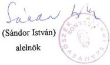

Állami Számvevőszék

# JELENTÉS

Az Állami Privatizációs és Vagyonkezelő Rt.
1995. évi tevékenységéről

350.

1997. február

---

# A vizsgálat végrehajtásáért felelős:
az ÁSZ IV. Vagyonellenőrzési Igazgatósága:

Halász Gejza
számvevő igazgatóhelyettes

# A vizsgálatot vezette:

Harsányi Sándor
osztályvezető főtanácsos

# A vizsgálatot végezték:

Dr. Borisz József
számvevő tanácsos

Lőrinc Alajos
számvevő tanácsos

Makkai Mária
számvevő tanácsos

Dr. Ocskovszky Jánosné
számvevő tanácsos

Rundik János
számvevő tanácsos

Dr. Szöllősi Géza
számvevő tanácsos

Szűcs Ivánné
számvevő

Tornai József
számvevő tanácsos

Vasas Sándorné dr.
számvevő tanácsos

---

# TARTALOMJEGYZÉK

# I. BEVEZETÉS, A VIZSGÁLAT KÖRÜLMÉNYEI 1

# II. ÖSSZEFOGLALÓ MEGÁLLAPÍTÁSOK, KÖVETKEZTETÉSEK, AJÁNLÁSOK 3

1. Osszefoglalo megallapitások 3
2.Kovetkeztetesek 19
3.Ajanlasok 22

# III. RÉSZLETES MEGÁLLAPÍTÁSOK 26

1. A szervezet gazdalkodása és a hozzárendelt vagyonnal kapcsolatos bevetelek és kiadások alakulása 26
1.1. A sajat vagyon es a hozzarendelt vagyon beveetei es kiadasai azok elkulonitese, az elkulonitett nyilvantartasi rendszer torvenyi elorasokkal valo egyezosege, atlathosaga 26
1.2. Az APV Rt. tervezett es tenyleges (sajat vagyon, hozzarendelt vagyon) bevetelenek alakulasa es felhasznalasa 28
1.2.1. A sajat vagyon es a hozzarendelt vagyon 1995. evi ertekesitese es hasznositasa beveetelei, kiadasai tervezett es tenyleges adatainak osszehasonlitasa. (Az adatokat a 1. sz. melleklet tartalmazza) 28
1.2.2.Deviza bevetelek 32
1.3.Koltségek 32
1.3.1.Mukodesi koltseg 32

---

1.3.2. Tanácsadói dijak 34
2. Az APV Rt-hez tartozó rendelt vagyon, a vagyonváltozás okai 41
2.1. Az AVU es AV Rt-hez tartozó  
allami vagyon alakulása az 1995. évi XXXIX.  
törvény hatályba lépéséig 41
2.2. Az Allami Privatizaciós es Vagyonkezelo Részvenytársasaghoz tartozó rendelt vagyon 44
2.3. AZ APV Rt-hez tartozó rendelt vagyon valtozása 1995. évben 45
2.3.1. Allami vallalatok 45
2.3.2. Tarsasagok 45
2.3.3. Elvont, atvett, vásárolt, vegelszámolásimaradvány vagyon 46
2.3.4. Az APV Rt. altal alapitott tarsasagok 46
2.4. Az 1995. évi XXXIX. törvény által elóirt vagyonátadások és vagyonátvetelek 47
2.4.1. A banki részények átadás-átvetele 49
2.4.2. A Kincstári Vagyonkezelő Szervezettől  
átvett vallalkozói vagyon 49
2.5. Az Allami Privatizaciós Rt.-hez tartozó, gazdalkodó szervezetekben muködő rendelt vagyon 1995. december 31-én 52
2.6. Végelszámolás, felszámolás 53
2.7. Elvont, atvett, vásárolt eszközök 54
2.8. A vagyonnyilvantartas rendje 54

---

2.9. Az APV Rt. ellenőrő szervezetei által a rendelt vagyon nyilvántartására vonatkoź vizsgálatok 56
3. Az ertekesitesi tevekenyseg 57
3.1. Szabalyozási környezet 57
3.2. Az ertekesites osszefoglalo adatai 60
3.3. A kivalasztott privatizaciós tranzakciok 62
3.3.1. A MOL Rt. privatizacioja 63
3.3.2. Gazszolgaltato tarsasagok privatizacioja 70
3.3.3. Villamosenergy-ipari tarsasagok privatizacioja 76
4. Az egyszerusitett privatizacio ervenyesulese es jellemzoi 86
4.1. Az egyszerusitett privatizaciós eljárás és a kedvezményes privatizaciós technikákkal valo ertekesités szabályozása 86
4.2. Az egyszerusitett privatizacio ertekesitesi folyamata 88
4.3. Agazati jellemzok az egyszerusitett privatizacioban 89
5. Az APV Rt. kotelezettsegvallalasai es azok teljesulese 91
5.1. A kozponti koltsegvetesi es egyeb kotelezettsegek 91
5.2. Az 1995. évi privatizácihoz kapcsolódo kotelezettségvallalás 92
5.3. Az 1989. évi XIII. törvény szerinti, az önkormányzatok részére a belterületi földek értéke alapján fennálo kõtelezettsegek 96

---

5.4. Az önkormányzatok részére alapítói
jogon járó követelések 102
5.5. Társaságoknak járó 20 %
("Privatizációs Ellenérték Hányad") 104
5.6. Gáz- és áramszolgáltató társaságok
vagyonából az önkormányzatokat
megillető részesedések 105
5.7. A társadalombiztosítási önkormányzatok
számára járó vagyonátadás 107
5.8. A garanciális, szavatossági, kezesi
kötelezettségvállalások rendjére
vonatkozó belső szabályzat 107
6. Reorganizációs kiadások, valamint
befektetések alakulása, a borsodi
kohászat válságkezelésével kapcso-
latos feladatok ellátása 109
6.1. Reorganizációs kiadások 109
6.2. Társaságalapítások, befektetések
tervezése és alakulása 113
6.3. Befektetési alap létrehozása 115
6.4. Borsodi régió kohászatának
válságkezelése, a reorganizáció helyzete 116
7. Vagyonkezelési tevékenység 121

---

ÁLLAMI SZÁMVEVŐSZÉK
IV. VAGYONELLENŐRZÉSI IGAZGATÓSÁG
V-20-70/1996-1997.
Témaszám: 345

# J E L E N T É S
az Állami Privatizációs és Vagyonkezelő Rt.
1995. évi tevékenységének ellenőrzéséről

I.

# BEVEZETÉS, A VIZSGÁLAT KÖRÜLMÉNYEI

Az állam tulajdonában lévő vállalkozói vagyon értékesítéséről szóló 1995. évi XXXIX.
törvény alapján létesített Állami Privatizációs és Vagyonkezelő Részvénytársaság
(továbbiakban ÁPV Rt.) tevékenységének ellenőrzése az Állami Számvevőszék feladata.

Az ellenőrzés az ÁPV Rt. 1995. évi tevékenységére terjedt ki. Tekintettel arra, hogy az
ÁPV Rt. 1995. júniusában alakult meg, a vizsgálat tartalmát lefedő folyamatokat a jog-
előd (ÁVÜ-ÁV Rt.) szervezeteknél is vizsgálni kellett; és ahol annak racionalitása volt,
az ellenőrzést ki kellett terjeszteni az 1996. I. félévi tendenciákra is.

A vizsgálat középpontjában azon lényeges szabályozási területek álltak, melyeket a tör-
vény kiemelt fontosságúnak tekint. Így többek között az ellenőrzés átfogta a vagyonvál-
tozás folyamatát, bevételeket és kiadásokat, kötelezettségvállalásokat, az értékesítési te-
vékenységet, vagyonkezelést, valamint az ellenőrzési rendszert.

97.02.20 02:49 DU o:\users\keti\wmunka\apvjel03.doc

---

Az ellenőrzött időszak: 1995. év és 1996. I. félévig terjedő időszak.

Az ellenőrzés célja: annak megállapítása volt, hogy az ÁPV Rt. 1995. évi tevékenysége megfelelt-e a törvényi előírásoknak, a belső szabályzatoknak. Hogyan alakultak a hozzárendelt vagyonnal kapcsolatos bevételek és kiadások, mi jellemezte a szervezet gazdálkodását. Hogyan változott az ÁPV Rt.-hez tartozó rendelt vagyon, melyek voltak a vagyonvesztés okai. Mi jellemezte az értékesítési folyamatot ezen belül az egyszerűsített privatizációt. Hogyan alakultak az ÁPV Rt. kötelezettségvállalásai és ezek mennyire "teljesültek". Mi volt az ÁPV Rt. regionális válságkezeléssel kapcsolatos állami szerepvállalása, hogyan alakultak a reorganizációs kiadások. Hogyan alakultak a csőd-, felszámolás-, végelszámolási eljárások és milyen volt az rt. vagyonkezelési tevékenysége.

A vizsgálat kiterjedt a kötelezettségvállalásokon belül az 1989. évi XIII. törvény 21. §-ában a belterületi földek értéke után járó vagyonátadásokra vonatkozó kötelezettségek részletes ellenőrzésére, valamint a nem tranzakciós szerződésekhez kapcsolódó szakértői tevékenység átvilágítására.

Nehezítette a vizsgálatot az a körülmény, hogy a szükséges kormányzati döntés elhúzódása miatt 1996 augusztusáig bizonytalan volt, hogy 1995. december 31-i időponttal az alaptőke leszállítást végrehajthatja-e a társaság. Ezért pénzügyi-számviteli szempontból kérdéses volt, hogy a tőkeleszállítás előtti vagy utáni adatbázis képezi az ellenőrzés alapját. A Kormány 1097/1996. (IX. 17.) határozatával döntött az alaptőke fenti időponttal történő leszállításáról és ezt követően állt a vizsgálat rendelkezésére végleges, könyvvizsgáló és közgyűlés által elfogadott beszámoló.

A helyszíni vizsgálat során az Állami Számvevőszék megismerte az ÁPV Rt. Felügyelő Bizottsága által végeztetett belső ellenőrzési és az Etikai Tranzakciós és Szerződés Ellenőrzési Ügyvezető Igazgatóság által végzett vizsgálatokat, melyek megállapításaira, következtetéseire e "Jelentés" megfelelő részein hivatkozunk.

2

---

# II.

# ÖSSZEFOGLALÓ MEGÁLLAPÍTÁSOK, KÖVETKEZTETÉSEK, AJÁNLÁSOK

# 1. Összefoglaló megállapítások

1.1. Az ÁPV Rt. 1995. június 16-án jött létre. Addig a költségvetési gazdálkodási rendben működő Állami Vagyonügynökség és a társasági szabályozás szerint működő Állami Vagyonkezelő Részvénytársaság egymás mellett működött. A törvényalkotás (1995: XXXIX. tv.) elhúzódása, évközi elfogadása elbizonytalanította a két privatizációs szervezetet és ez azzal járt, hogy mind a privatizációban, mind a vagyonkezelésben a folyamatok lelassultak. Az új utódszervezet, az Állami Privatizációs és Vagyonkezelő Rt. nehézkesen alakult ki.

1.2. Az ÁPV Rt.-t létrehozó törvény előírta, hogy a hozzárendelt vagyont megtestesítő az ÁPV Rt. könyveiben szereplő eszközöket az alaptőke leszállításával az alapító okirat egyidejű módosításával kell kivezetni. Az alaptőke leszállításának végső határideje 1997. január hó volt. A tőkeleszállítást - helyesen - nem várva meg a jelzett határidőt 1995. december 31-i dátummal végrehajtották. Így az 1995. évre vonatkozó beszámolóban az ÁV Rt. által kezelt vagyont az ún. "saját vagyonban rendelt vagyonként" az ÁVÜ által kezelt vagyont "rendelt vagyonként" párhuzamosan tartották nyilván. Az alaptőke leszállítása során a rendelt vagyont az ÁPV Rt. könyveiből nyilvántartási értéken vagyonleltár alapján kivezették. Az ÁPV Rt.-nél a tőkeleszállítást követően a jegyzett tőke értéke 9,9 milliárd Ft, az eszközök összértéke 11,1 milliárd Ft, amelyből 2,7 milliárd Ft a működést szolgáló alapvetően tárgyi eszköz a többi bankszámla pénz. Az 1995. gazdasági év nyitó adatai szerint a gazdálkodó szervezetek száma összesen 1332, nyilvántartott állami tulajdonuk 1711,2 milliárd Ft a privatizálható vagyon pedig 1201 milliárd Ft volt. Az ellenőrzés során

3

---

az 1995. évi nyitó adatok nem egyeztek az 1994. évi záró adatokkal, a vagyonkimutatás nem teljesítette a folytonosság követelményét. Az ÁPV Rt.-hez tartozó rendelt vagyon körét törvény és a törvényben hivatkozott más jogszabályok határozzák meg. Az ÁPV Rt. megalakulásakor az ÁPV Rt.-hez tartozó vagyon nagyságát nem határozták meg, sem abban a vonatkozásban, hogy mennyi az a rendelt vagyon ami az ÁV Rt-től, s mennyi az ami az ÁVÜ-től kerül állományba, sem a tekintetben, hogy mekkora az a vagyon ami más a törvényben meghatározott szervezetekbe átkerül, illetve amit más intézménynek át kell adniuk. A rendelt vagyon nagysága még ma sem tekinthető meghatározottnak, mivel a vagyonátadások-átvételek még ma sem lezártak néhány területen. Ugyanakkor jelentős előrelépés, hogy a privatizációs folyamat során első ízben készült az állam privatizációs szervezetekre bízott vagyonának egészére olyan kimutatás, amelyet könyvvizsgáló a számviteli törvény alapján ellenőrzött. 1995. év folyamán az ÁPV Rt.-nél a vagyon változása nyomonkövethető. Veszélyezteti a privatizáció átláthatóságát, a privatizációs bevételek állami ellenőrzését, hogy az ÁPV Rt. jogelődei 1995. végéig 13 társaságba apportáltak vagyont (a lehetséges privatizációs bevételek terhére), és ezzel 22,4 milliárd Ft értékben tulajdonosi részesedéssel rendelkeztek. Ez az érték a még esedékes cégbejegyzést követően az 1995. évi tőkeemeléssel már eléri a 30 milliárd Ft-ot. Az Állami Vagyonkezelő ezeket a társaságokat (a borsodi térségben működők kivételével) különböző társasági tulajdonrészek apportálásával hozta létre. Ezzel a lépéssel az állami tulajdonú társasági részesedéseknek a privatizációja és privatizációs bevétele kikerült az állami tulajdonos hatóköréből.

1.3. Az állam tulajdonában lévő vállalkozói vagyon értékesítéséről szóló 1995. évi XXXIX. tv. előírta, hogy az ÁPV Rt. saját vagyonával való gazdálkodásától el kell különíteni az ÁPV Rt.-hez rendelt vagyon értékesítésével és hasznosításával összefüggő bevételeket és kiadásokat. Az erre szolgáló nyilvántartási rendszert a privatizációért felelős tárca nélküli miniszternek kellett előterjesztenie a törvényi előírás szerint 60 napon belül. A nyilvántartási rendszert az ÁPV Rt. igazgatósága közel 6 hónapos késedelemmel terjesztette fel jóváhagyásra, így azt a miniszter 1996. február 1-jei dátummal tudta jóváhagyni. A miniszteri utasítás előírta, hogy a nyilván-

4

---

tartás elveiről, a nyilvántartási feladatokról, azok végrehajtásáról vezérigazgatói utasítás rendelkezzen. Ennek előfeltétele volt, hogy elkészüljön a törvényi szabályozás előírásának megfelelően az ÁPV Rt. nyilvántartási és beszámolói kötelezettségeinek a számviteli törvénytől eltérő sajátosságait tartalmazó kormányrendelet. Ezt követő 30 napon belül kellett volna kiadni a vezérigazgatói utasítást. A kormányrendelet azonban csak 1996. június 19-i hatállyal jelent meg, így 1995-ben e téren előrelépés nem lehetett. Egy 1996. május végi ügyvezetőségi határozat ugyan rendelkezett a rendelt vagyon értékesítésével és hasznosításával kapcsolatos bevételek és kiadások kimutatásairól (pénzforgalmi szemléletben készült azaz a pénzügyileg teljesült tételeket kellett elszámolni), de nem rendelkezett a saját vagyon és a rendelt vagyon hasznosításának bevételei és kiadásai közötti összefüggések szabályozásáról

Emiatt pontosan nem lehet a számviteli törvény előírásainak megfelelő időbeli és a költségviselőkre vonatkozó egyezőségeket megteremteni. Emellett - és ezzel összefüggésben is - nem megfelelő a controlling tevékenység, ezért a költséggazdálkodás az alapját képező nyilvántartások pontatlansága miatt gyenge színvonalú volt.

1.4. Az ÁPV Rt.-hez rendelt vagyon alakulása a Kincstári Vagyonkezelő Szervezet (később: Kincstári Vagyoni Igazgatóság) és a privatizációs szervezet közötti megoldatlan, törvényben előírt feladatok miatt is bizonytalan volt és jelenleg is az.

A törvényi szabályozás szerint előírt vagyonátadások és vagyonátvételek közül nem rendezett a Kincstári Vagyonkezelő Szervezettől átadandó vállalkozói vagyon kérdése. A privatizációs törvény nem határozza meg pontosan, hogy mit kell vállalkozói vagyonnak tekinteni. Ebben véleménykülönbség van az ÁPV Rt. és a Kincsári Vagyoni Igazgatóság (KVI) között. Így a KVI mint átadó a PM irányítása mellett maga dönti el, hogy mit tekint átadandó vállalkozói vagyonnak és az 1995 júliusában nála lévő mintegy 78 milliárd Ft értékű ingatlancsoportból a volt szovjet, illetve munkásőr ingatlanokat adta át 20 milliárd Ft értékben. A vagyon átadás-átvételére előírt határidőt e tekintetben sem tudták tartani.

5

---

Nem rendezett az állami vagyon műemlékállományának besorolása a kincstári vagyoni körbe. A 2248/1995. kormányhatározat írta elő, hogy az állami vagyon műemlékállományát be kell sorolni a "kincstári" vagyoni körbe. A végrehajtás határideje 1995. szeptember 30. volt. A felmérés nehézkesen halad, az átadás nem lezárt.

1.5. Az ÁPV Rt.-nek a társadalombiztosítás részére 1995. december 31-ig legalább 55, legfeljebb 65 milliárd Ft. vagyont kellet volna átadni. A tényleges vagyonátadás 10,6 milliárd Ft volt és ez még ennyi volt 1996 júniusában is. Az ÁPV Rt. törvényi kötelezettségét annak ellenére akkor nem teljesítette, hogy-e célra már 1995-ben 54 milliárd Ft névértékű társasági és egyéb vagyont különített el, illetve jelölt ki átadásra.

1.6. Az ÁPV Rt.-hez tartozó rendelt, gazdálkodó szervezetekben lévő vagyon értéke 1995. december 31-én 1303,2 milliárd Ft. Az állami tulajdonú vagyon értéke a gazdálkodó szervezetek eredményessége alapján 18,2 milliárd Ft-tal nőtt. Az állami vállalati körbe tartozó 420 vállalatból 311 felszámolás, 100 végelszámolás alatt van és összesen csak 9 működik. A nyilvántartott 779 társaságban az állami tulajdon 1176,4 milliárd Ft. Működő társaságok száma 648, a hozzájuk tartozó vagyon 1160 milliárd Ft. A társaságok közül felszámolás alatt 99, végelszámolás alatt 32 van. 1995 végén az állami vagyon 17 %-a volt 100 %-ban állami tulajdonú társaságokban, a 25 %-nál kisebb állami tulajdoni hányadú társaságok részaránya pedig 45 % volt. A hozzárendelt vagyon nyilvántartása a könyv szerinti saját tőkeértéken történik. Azoknál a társaságoknál, ahol rendelkezésre áll az 1995. évi mérlegadat, ott az ennek megfelelő érték, ellenkező esetben a legutoljára rendelkezésre álló mérlegadat szerepel. Ebből az eltérésből következően a nyilvántartási adatok nagyságrendi információként mutatják csak a valós értéket. Különösen megtévesztő eredményhez vezethet ez a felszámolás alatt lévő gazdálkodó szervezetek adatainak feldolgozásánál.

6

---

1.7. Az ÁPV Rt. 1995. évi értékesítési folyamatainak meg kellett volna felelnie azon törvényi szabályozásnak, amely főbb privatizációs követelményként a gazdálkodás hatékonyságának növelését, a szükséges tőkeemelés biztosítását, a gazdasági szerkezetváltás ösztönzését, a hazai tőkepiac fejlesztését, a hazai vállalkozók tulajdonszerzésének támogatását, munkahely-megőrzést, munkahelyteremtést, dolgozói tulajdonszerzést írt elő. A megvalósult értékesítések során az adott gazdasági társaságoknál tőkeemelés nem történt, döntően nem a hazai vállalkozók szereztek tulajdont, a munkahelyteremtés, a munkahely megőrzés helyett szinte minden társaságnál rövidebb-hosszabb időn belül létszámleépítés történik, fejlesztési kötelezettségvállalás nincs.

1.8. Az ÁPV Rt. létrejöttét megelőzően - 1995. I. félévében - a privatizációs bevételek elhanyagolható mértéket értek csak el. Az ÁPV Rt. értékesítési tevékenységében a fő motivációt a minél előbbi árbevétel elérése, azaz a költségvetési bevétel biztosítása jelentette. A Kormány ezen követelménye végig nyomon követhető a privatizáció előkészítésével és lebonyolításával kapcsolatban készült igazgatósági előterjesztésekben és tükröződik a meghozott határozatokban is. Az előterjesztések nem helyeznek kellő hangsúlyt az adott társaságok szakmai érdekeire.

A költségvetési bevétel biztosítására rövid idő állt rendelkezésre. Ezért az egyes tranzakciók lebonyolítására is igen szűk határidőket írt elő önmagának az ÁPV Rt. Így az értékesítés előkészítése, lebonyolítása nem felelt meg annak a közgazdaságilag is indokolt igénynek, hogy az egyes kapcsolódó területeket, a fontos stratégiai ágazatok közötti összefüggéseket, visszacsatolási pontokat kiemelve átfogó hatásvizsgálatok, értékelések támasszák alá a választott privatizációs megoldást.

Nem helyettesítette ennek hiányát az a tény sem, hogy az egyes adás-vételi szerződésekben pl. a hosszú távú együttműködési megállapodások megkötését előírták,

7

---

mivel annak főbb tartalmi sarokpontjait nem határozták meg. Így adott esetben már az új, külföldi tulajdonos érdekei kerülhetnek előtérbe a hazai érdekekkel szemben.

**1.9. Az értékesítések előkészítése nem volt kellően megalapozott.** Ezt bizonyítja az a tény is, hogy azon társaságok esetében, ahol a privatizációs koncepcióról a Kormánynak kellett döntenie a Kormány arra kényszerült, hogy határozatát - rövid időn belül - többször módosítsa. (Ez történt a MOL Rt., a gáz- és áramszolgáltatók privatizációjára vonatkozó kormányhatározatok esetében). Jobb előkészítéssel, megalapozottabb privatizációs koncepcióval mindez elkerülhető lenne.

Az értékesítéseknél nem minden esetben az igazgatóság testületi döntése volt a meghatározó. Van példa arra is, hogy az igazgatóság elnöke egy személyben tett olyan lépést, mellyel a privatizáció további folytatását biztosította, illetve ezzel annak további irányát is meghatározta. Más esetben pedig az érdemi döntések egy részét a pályázatokat értékelő bizottság hozta meg.

Az ÁPV Rt. vezérigazgatója által 1995. november 15-én kiadott és ekkor hatályba lépett vezérigazgatói utasítás szabályozza az értékesítési eljárásról szóló emlékeztetők tartalmi és formai kellékeit. A vizsgálat körébe vont tranzakciók esetében vagy nem készült emlékeztető, vagy a vezérigazgatói utasítás előírásainak csak minimális mértékben felelt meg. Az igazgatóság - melynek tagja a vezérigazgató - az elkészült emlékeztetőket jóváhagyólag tudomásul vette annak ellenére, hogy azok tartalma az utasításnak nem felelt meg.

**1.10. Az ÁPV Rt. 1995. évi tevékenységében, elért bevételében meghatározó volt az energia szektorban megvalósított privatizáció.** Az energiaipar privatizációjának koncepcióját az ÁV Rt. már 1994-ben kidolgozta, amely három - MOL Rt., gázszolgáltató társaságok, valamint MVM Rt. és társaságai - vállalatcsoport értékesítését jelentette. A Kormány 1994 decemberében mindhárom vállalatcsoport privatizációjáról döntött, külön-külön határozattal.

---8

---

A privatizáció előfeltétele, a gázár rendezése, mindegyik vállalatcsoport szempontjából meghatározó volt. Ennek a Kormány által előírt határideje 1995. január 31. volt, ezzel szemben 1995. augusztus 4-én jelent meg a határozat a gázárakról. A privatizáció érdemi előkészítése, lebonyolítása csak ezt követően kezdődhetett meg.

A MOL Rt. részvényeinek közel 30 %-át értékesítették pénzügyi befektetők részére. Eredetileg a koncepció szakmai befektetőkkel számolt, de mivel a befektetők csak a MOL Rt. többségi tulajdoni hányadának megszerzésében voltak érdekeltek, a Kormány a pénzügyi befektetőknek történő értékesítés mellett döntött. Így maradhatott a MOL Rt. egységes nemzeti olajtársaság.

Az előkészítés hiányosságát mutatja az, hogy a privatizáció konkrét eljárását meghatározó kormányhatározatot követően derült csak ki, hogy az eredetileg szakmai befektetők körében tervezett értékesítés nem valósítható meg. Az ÁPV Rt. a tranzakció későbbi időpontra halasztását - a kedvezőbb ár elérése érdekében - nem vállalta, mivel akkor nem tudott volna eleget tenni annak a feladatnak, hogy a tranzakcióból mihamarabbi bevételhez juttassa a költségvetést.

A privatizáció 110 %-os árfolyamon történt, a tulajdonosi struktúrát változtatta meg, tőkebevonást nem eredményezett és ebből következően likvid forrást sem biztosított a MOL Rt. számára.

A gázszolgáltató társaságok esetében a Kormány arról döntött, hogy az öt vidéki gázszolgáltató társaság - DÉGÁZ, ÉGÁZ, KÖGÁZ, TIGÁZ, DIGÁZ - többségi, 50 %- + 1 szavazatnak megfelelő tulajdoni hányadát szakmai befektetőknek kell értékesíteni. Azt is előírta, hogy az eladásra kínált többségi részvénycsomagot a legmagasabb árajánlatot tevő pályázó kapja.

A pályázati felhívás megjelenése és az adás-vételi szerződések aláírása közötti időszak rendkívül szűkreszabott volt, ennek következtében készített az ÁPV Rt. típus

9

---

szerződéseket. Ezidő alatt történt meg az előminősítés, a szerződések előkészítése, a befektetők tájékozódása, a pályázatok értékelése stb. Az ÁPV Rt. a határidőket maga alakította ki azzal a szándékkal, hogy az 1995. évi privatizációs bevételét biztosítsa és így eleget tudjon tenni költségvetési befizetési kötelezettségének.

Az öt gázszolgáltató társaság eladási ára mintegy 74 milliárd Ft volt és az eladó Magyar Állam a vevők részére nem támasztott sem tőkeemelési, sem fejlesztési kötelezettséget.

A villamosenergia-ipari társaságokat érintően a Kormány úgy döntött, hogy az ÁPV Rt. tulajdonában lévő részvényeket, az 1 db speciális részvény kivételével szakmai befektetők részére kell értékesíteni, és elővásárlási jogot kell a befektetőknek biztosítani az 50 %- + 1 szavazat elérésére az áramszolgáltatóknál és azon erőműveknél, ahol tőkeemelési kötelezettséget nem írtak elő. A megkötött szerződések alapján a villamosenergia-ipari társaságok értékesítése 185,4 milliárd Ft bevételt eredményezett.

Az értékesítés lebonyolítására négy hónap állt az ÁPV Rt.-nek rendelkezésre. A szoros menetrend elkerülhető lett volna, ha az év első felében az előkészületeket megkezdik. Így többek között azzal, hogy a tanácsadókkal a szerződéseket időben megkötik, az átvilágítások elkészülnek és legfőképpen a privatizáció lebonyolításában jelentkező - 1995. februárban feltárt - problémák Kormány elé vitelét nem halogatják júniusig.

A privatizáció úgy történt meg, hogy az ÁPV Rt. igazgatósága 1995 december végéig nem tárgyalt olyan átfogó előterjesztést, amely bemutatta volna az iparág privatizációjához kapcsolódó szakmai kérdések, - mint pl. energiaellátás, szállítás biztosítása, az ország villamosenergia ellátásának biztonsága - megnyugtató rendezését. A Kormány egyes erőművi társaságoknál tőkeemelési kötelezettséget írt elő.

10

---

A társaságok esetében az adás-vételi szerződések e követelmény konkrét megfogalmazását nem tartalmazzák.

1.11. A privatizációs törvény a versenyeztetés mellőzését lehetővé teszi részvénycsere esetében. A vizsgált tranzakciók körében egy ilyen eset volt. A részvénycsere keretében az állami tulajdonú Titán Rt. és Tisza Rt. részvényeit átadták az állami tulajdonban lévő MBFB Rt.-nek, vagyis nem történt magánosítás. Ezzel a két cég privatizációját kivonták a törvény hatálya alól és a magánosítást az MBFB szabad belátására bízták.

1.12. Az ÁPV Rt. 1995. júliusától 1996. november végéig az egyszerűsített privatizációs formában 72 társaságot értékesített. Az eladott állami tulajdon hányadának névértéke 9,4 milliárd Ft, amely az összes értékesítésnek közel 3 %-a. Az értékesítés vételára 4,8 milliárd Ft, amely átlagosan a névérték 51 %-a s ez jóval elmarad az összes értékesítés árfolyamától. Ennek oka, hogy az egyszerűsített privatizációban résztvevő társaságok portfoliója nem a versenyszféra hatékonyan működő, eredményesen gazdálkodó szervezeteiből tevődik össze, hanem az egyensúlyzavarokkal küszködő kritikus piaci helyzetű, vagyonfelélet folytató körből ered. Többségüknél a privatizációs kísérletek is eredménytelenül zárultak. Az egyszerűsített privatizáció nem váltotta be a hozzáfűzött reményeket. A programba mindössze 121 társaság került be és csak 30 adás-vételi szerződést írtak alá. Az egyszerűsített privatizációs technika gyorsasága sem igazolódott. Az azonban tény, hogy az értékesítés 99 %-a készpénzz volt.

1.13. Az ÁPV Rt. bevétele 1995-ben 481 milliárd Ft volt, amely 2,3 szorosa lett a tervezettnek. Ebből a privatizációhoz kapcsolódó készpénzbevétel 438 milliárd Ft, amelynek döntő többsége a kiemelt energiaszolgáltatók privatizációjából ered. A készpénzbevétel 73 %-át ezen társaságok értékesítése adta. Az 1995. évi kiadások összesen 42,5 milliárd Ft-ot értek el. A kiadás egyes tételei meghaladják, mások

11

---

elmaradnak a tervezett értéktől, összességében azonban a tervezetthez képest nincs érdemi eltérés.

A privatizációs bevételek és kiadások alakulása lehetővé tette, hogy az ÁPV Rt. a költségvetéssel szembeni 150 milliárd Ft-os fizetési kötelezettségét teljesítse úgy, hogy 134 milliárd Ft. befizetés 1995. december 28-án teljesült. 1996. januárjában további 100 milliárd és még további 92 milliárd Ft-ot is átutaltak a költségvetésnek. Így az 1995-1996. évre tervezett összesen 250 milliárd Ft költségvetési bevételt is elérték.

1.14. Az ÁPV Rt. 42,5 milliárd Ft összes kiadásán belül 4,1 milliárd Ft működési, 5,5 milliárd Ft pedig a privatizációval kapcsolatos költség. A **privatizációhoz kapcsolódó költségek** túlnyomó többsége az állami vagyon értékesítéséhez kapcsolódó **tanácsadói díj**, melynek nagy része az ÁPV Rt. elődszervezeteihez kötődik, hiszen az azokra vonatkozó szerződéseket az ÁVÜ, illetve az ÁV Rt. kötötte.

A tanácsadói díjak elszámolása terén kialakult helyzet hibákkal terhes. A társaságnál alkalmazott költségbontás nem teszi lehetővé a tanácsadási tevékenységre felmerült költségek elkülönítését az egyéb nem tanácsadás jellegű költségektől, mivel a számviteli politika nem határozta meg ezen költségek körét és tartalmát. Ennek hiányában a számviteli nyilvántartásokban a tényleges tanácsadási tevékenységre történő kifizetések, illetve elszámolt költségek nem rendelhetőek egyértelműen főkönyvi számlákhoz. A tanácsadási tevékenységre 1995. évben elszámolt költségek tényleges összege az ÁPV Rt. által kimutatott 3,1 milliárd Ft helyett 4,9 milliárd Ft. Ez a különböző tükrözi az elszámolási, nyilvántartási rendszer problémáit, de az eredményt nem érinti, mert a különböző költségek belső arányeltolódásáról van szó. Az ÁPV Rt.-nél egyidejűleg kellett alkalmazni a kettős és egyszeres könyvvitelt, és a társaság a két könyvviteli rendszer közötti 'átjárást' nem valósította meg. Az ÁPV Rt. könyvvizsgálója is rámutatott az ebből fakadó bizonytalanságokra.

---12

---

1.15. A garanciavállalások eljárási rendjét másképpen értelmezik a Pénzügyminisztériumban és az ÁPV Rt.-nél. A pénzügyminiszterrel egyetértésben vállalható szavatossági, felelősségi értelmezés kérdésében eltért a pénzügyminiszter és a privatizációs miniszter álláspontja, így e kérdésben nem született megállapodás a két miniszter között és ez a mai napig rendezetlen.

A privatizációs törvény előírja, hogy "Az ÁPV Rt. a kezesség vállalását, vagy szavatossági felelősséget eredményező döntését megelőzően... köteles a pénzügyminiszter egyetértését megszerezni, értékhatárra tekintet nélkül". A vizsgált tranzakciók többségénél a szükséges előzetes pénzügyminiszteri egyetértést nem szerezték meg, annak ellenére, hogy a pénzügyminiszter 1995. március 4-én - a tárca nélküli miniszterhez - írt levele alapján a vezérigazgató úgy intézkedett, hogy az előzetes egyetértést minden esetben az igazgatósági előterjesztés előtt be kell szerezni, írásban.

A PM garancia levelek túl általánosak, minden konkrétum nélküliek, vagy utólag tudomásul veszik a megkötött szerződést vagy "kifogást nem emelnek" ellene. Van példa arra, hogy csak a részvényvásárlási szerződéstervezetben rögzített szavatosságvállalással kapcsolatban nem emelt kifogást a PM, a végleges szerződésben rögzítetteket nem is látva. Így a garanciavállalások összegszerűségének kontrollja a PM részéről nem biztosított.

A garanciális, szavatossági és kezességi kötelezettségvállalások rendjére belső szabályozás nincs az ÁPV Rt.-nél. (A két jogelőd szervezetnél ugyanakkor már volt.)

1.16. 1995. december 31-én a privatizációhoz és a vagyonkezeléshez kapcsolódó garanciavállalások összege 393,77 milliárd Ft volt, 1996. június 30-án a különböző jogcímű garanciavállalások 398 milliárd Ft-ot értek el. Ebből 363 milliárd Ft a nagyprivatizációkhoz, tehát gyakorlatilag az 1995. évi privatizációs tevékenységhez kapcsolódó kötelezettségvállalás. Az elődszervezetek (ÁVÜ, ÁV Rt.) garancia-

13

---

vállalása mintegy 35 milliárd Ft értékű volt. A privatizációhoz kapcsolódó ún. jogszavatossági helytállás értéke - amely azt jelenti, hogy a szolgáltatás, az értékesítés tárgya jogi szempontból "hiánymentes", azaz a vevő tulajdonszerzése jogi akadályokba nem ütközik, a rendelkezési jog nem korlátozott, a vagyon per- és tehermentes - általában a teljes vételár nagysága. A kereskedelmi és környezetvédelmi szavatosságokra ugyanakkor a szerződésekben külön is kikötöttek maximális felső korlátokat.

Az ÁPV Rt. alaptevékenységéhez kapcsolódó kötelezettségvállalások beváltási valószínűsége azonban egész más nagyságrendeket jelent. Az eddigi tényleges garanciabeváltások azt valószínűsítik, hogy elfogadható az ÁPV Rt. azon becslése, hogy a 398 milliárd Ft-os összes kötelezettségvállalásból mintegy 41 milliárd Ft az, amelyet beválthatnak. Ez a 41 milliárd Ft is az egyedi bekövetkezések valószínűsége alapján több évre eloszlik, az ÁPV Rt. 1995. évi beszámolójában az év végi hasonló adat 39,5 milliárd Ft volt. A költségvetési törvény 1996-ra 10 milliárd Ft-ot irányzott elő folyó garanciális kifizetésekre az ÁPV Rt. számára. Ezen túlmenően az ÁPV Rt. 25 milliárd Ft tartalékot képzett a jövőbeni kötelezettségeinek fedezetére.

1.17. A nem tranzakcióhoz kötődő pályázatok eljárási rendjét vezérigazgatói utasítás szabályozza, amely tartalmazza a szerződéskötés előírásait. Nem tartalmaz azonban elég konkrét és szabatos előírásokat, csak a főbb tennivalókat. Ez lehetővé teszi, hogy a szerződéskötést előkészítőnként egyénileg értelmezik. Nincsenek előírva a kötelezően betartandó tartalmi, formai követelmények, több esetben az egyes igazgatóságok nem tartották be a vezérigazgatói utasításban rögzítetteket, pld. az idegen nyelvű szerződések mellé nem csatolják a hiteles fordítást, pedig ezt az utasítás előírja.

A privatizáció lebonyolításához 1995. évben igénybe vett tanácsadó cégek jelentős hányada még az ÁV Rt. által - 1993-ban - megkötött szerződések vagy azok

14

---

módosítása alapján dolgozott. Bár az 1995. évi privatizáció megkezdését megelőzően foglalkoztak a tanácsadók versenyeztetésének gondolatával, de az évekkel ezelőtt kötött szerződések olyan általános elkötelezettségeket tartalmaztak a tanácsadók számára, hogy az ÁPV Rt. kényszerpályára kerülve, a szerződések módosítása vagy újbóli megkötése mellett döntött (pl. a villamosenergia ipari társaságoknál, gázszolgáltatóknál, MOL Rt-nél).

A privatizáció lebonyolítása során egyre nagyobb hányadot képviselnek azok a döntést igénylő kérdéseket tartalmazó dokumentumok, melyek kizárólag angol nyelven készülnek és ezek kerülnek a döntésre jogosult testület elé. Ezek a dokumentumok idegen nyelven speciális, többrétű szakmai tényeket tartalmaznak. Nem biztosítható, hogy a döntésre jogosultak minden ilyen ismeret birtokában legyenek angolul. Ennek alapján nem zárható ki a döntést hozó testület tévedési lehetősége.

1.18. Az állami vállalatok átalakulásáról szóló 1989. évi XIII. tv. szerint az átalakuló vállalat vagyonmérlegében szereplő **belterületi föld értékének** megfelelő üzletrész (részvény) a föld fekvése szerinti helyi önkormányzatot illeti meg. Az ÁPV Rt. ezen címen - 1995. december 31-én meglévő és 1996. június 30-án is fennálló - a vagyonrészek névérték adatainak figyelembevételével összesen 36,7 milliárd Ft kötelezettséget tartott nyilván.

Az ún. átalakulási törvény ezen előírása az eltérő értelmezések - amelyre a törvény szövege kétség kívül lehetőséget adott - következtében viták, majd az önkormányzatok és vagyonkezelő szervezetek közötti peres eljárások kiindulópontja lett. A jogelőd szervezetek gyakorlata az volt, hogy a belterületi földértéknek megfelelő önkormányzati részesedést arányosítással, egy képlet segítségével csökkentett mértékben állapították meg. Ezt arra az érvrendszerre alapították, hogy ha az átalakuló vállalatok részvénymennyiségének - jegyzett tőke - megállapítása során beszámítják a gazdálkodó szervezet terheit, akkor ezt az önkormányzati vagyonrész-

---15

---

nél is meg kell tenni, hiszen ha ez figyelmen kívül marad, a terhek csak az állami vagyonkezelőnél jelentkeznek. Sőt a rossz gazdasági helyzetben lévő vállalatoknál az önkormányzat többségi, esetleg 100 %-os tulajdonosi részesedésre tehetne szert és olyan esetek is előfordulhatnának, hogy a belterületi földérték nagyobb a saját vagyonnal, vagyis eleve lehetetlen a teljes földértéknek megfelelő részvényt kiadni.

Az önkormányzatok 1992-től egyre növekvő számban indítottak pereket és kereseteikben - a törvény betű szerinti értelmezésében - az átalakulási vagyonmérlegben szereplő földértékkel azonos összegű tulajdoni részesedés megadását kérték. A peres eljárások 1995-re érték el a legnagyobb számot és megközelítették a 20 milliárd Ft-os perértéket. A vitában az 1995. november 9-én hozott felülvizsgálati bírósági ítélet (Legfelsőbb Bíróság) hozott döntést, amely a Dunaújvárosi Önkormányzat számára az önkormányzati értelmezés szerint ismerte el a belterületi földek értékét. Ezt a döntést precedens értékűnek tekintette az ÁPV Rt.

A jelzett kötelezettségállomány nem tekinthető megbízható adatnak, mert a tartozások könyvszerinti értékek, járulékokat, késedelmi kamatot, osztalékot nem tartalmaznak. A további bizonytalanságot az okozza, hogy a belterületi föld értékek 10 %-át becsléssel állapították meg az alapdokumentációk hiányosságai, bizonytalanságai miatt. Az év végi állományból az ÁPV Rt. 1996-ban 21,5 milliárd Ft-ot részvényekben és 15 milliárd Ft-ot készpénzben látott teljesíthetőnek. A késedelmes vagyonátadás miatt éves 20 %-os késedelmi kamattal a 15 milliárd Ft-os készpénzkötelezettség 21,2 milliárd Ft-tal, a jegybanki kamat kétszeresével számítva pedig 81 milliárd Ft-tal emelkedhet meg. E számításnak az ad létjogosultságot, hogy az alapul vehető jogerős bírósági ítéletek nem voltak egységesek a késedelmi kamat mértékében, így is, úgy is született döntés.

Az önkormányzatokkal 1996-ban kötött több száz peren kívüli megállapodás értéke 22,6 milliárd Ft volt. Ennek nagyobb része, mintegy 18 milliárd Ft készpénzben való teljesítés, 4,6 milliárd Ft részvénykiadás volt. A tanácsadónak kifizetett si-

---16

---

kerdíj 643,3 millió Ft és a kapcsolódó ÁFA összesen 804,1 millió Ft volt. Jelenleg nem állapítható meg pontosan a még nem teljesített önkormányzati igények pénzügyi vonzata, mert nem áll rendelkezésre a ki nem adott és rendelkezésre álló részvények, üzletrészek cégenkénti állománya és az önkormányzatok esetében alkalmazandó késedelmi kamatok mértéke.

Az ÁPV Rt.-nek saját kimutatása szerint az önkormányzatok részére alapítói jogon járó követelések címén fennálló tartozása 4,6 milliárd Ft. Az összeg bizonytalanságát jelzi, hogy 13 megyei önkormányzat, amely ajánlatot tett egyezségre, a még ki nem adott ilyen jogcímű követeléseit közel 2,7 milliárd Ft-ban határozta meg. Noha ez az összeg nem tartalmazza az összes megye és a főváros igényeit, így is jóval magasabb mint a belső nyilvántartásban szereplő érték. Az egész pénzügyi-számviteli tranzakciós információs rendszer nem alkalmas ezen kötelezettségekről való hiteles információk nyújtására.

1.19. Az ún. önigazgató vállalatokat az átalakulásukat követően lebonyolított értékesítés után a bevételek 20 %-a illeti meg ("privatizációs ellenérték hányad"). A késedelmi kamatok nélkül mintegy 25 milliárd Ft értékű ez a becsült kötelezettség. Ez az ezen jogcím szempontjából számbajöhető cégek lehetséges követeléseit jelenti és nem a konkrét bejelentett igényeket. Ez a fajta tartozás szintén az átalakulási törvényhez nyúlik vissza, mert ez írja elő, hogy az ún. önigazgató vállalatok (vállalati tanács) átalakulását követően az értékesítés után illeti meg a társaságokat a visszafizetés. A kötelezettségek teljesítése függőben van, mert a tényleges végrehajtás (pl. egyezségek kötése, pályáztatás lebonyolítása) a gyakorlatban elmaradt.

1.20. A gázszolgáltató vállalatok vagyonából az önkormányzatokat megillető részesedések értéke 1996. június 30-án az ÁPV Rt. nyilvántartása szerint 47,1 milliárd Ft volt. A részvények egymás közötti felosztásában 1995. november 30-ig kellett volna a szolgáltatók működési területén lévő önkormányzatoknak megegyezniük. A

17

---

határidő elmulasztását formai, jogi hibák okozták. Ott sem történt meg azonban a vagyonátadás, ahol minden szabályszerű volt, pl. a DÉGÁZ Rt. esetében.

1.21. Az ÁPV Rt. 1995. év során 8,9 milliárd Ft-ot folyósított reorganizációra. Ebből 7,2 milliárd Ft kiadás a borsodi térség kohászatának feljavítására irányult. A reorganizációs kiadások valóságos nagyságának megállapítását nehezíti, hogy az egyes tranzakciók időszaki ráfordításainak költségbesorolása nem következetes, esetenként ellentmondó. Az ÁPV Rt. nem alakította ki azt a rendszert, amely a költségvetési törvényben (1996-tól), valamint a saját pénzügyi tervében szereplő reorganizációs keretek felhasználását koordinálja és biztosítja a ráfordítások törvényben szabályozott engedélyezési és hatásköri mechanizmusának betartását. A kormányhatározatok által vezérelt borsodi kohászati reorganizáció - időnként lassú, később gyorsuló ütemben - a kormányhatározatoknak megfelelően folyt. A technológiai váltás megtörtént és a kormányhatározatokon alapuló fejlesztés pénzügyi lezárása már tervezhető.

A reorganizáció keretében a Drótáru és Drótkötél Ipari Kereskedelmi Kft-nek kormányhatározat alapján 200 millió Ft környezetvédelmi támogatást utaltak át. Ezt a meghatározott céltól eltérően nem a Felsőzsolcai Zagytároló felszámolására fordították, hanem az 51 %-ban privatizált társaság technológiai fejlesztését szolgálta. Az állami támogatás utalásának és felhasználásának módja miatt felmerült az ÁPV Rt. érintett vezetőjének személyi felelőssége, amelynek megalapozása további információt és vizsgálatot igényel.

1.22. Az ÁPV Rt. vagyonkezelési tevékenysége a vizsgált időszakban elenyésző volt. Az alapvető gondok a jogelőd szervezetek (ÁVÜ, ÁV Rt.) által kötött vagyonkezelési szerződésekhez kapcsolódnak. Az ÁVÜ 1991. decemberében kötött a Co-Nexus Gazdálkodási és Pénzügyi Rt.-vel vagyonkezelési szerződést 3,9 milliárd Ft névértékű portfólió kezelésére. A vagyonkezelő a teljes tulajdonosi jogokat gyakorolhatta, s azt a kötelezettséget vállalta, hogy 1996. december 31-ét követő 8 napon

18

---

belül 4 milliárd Ft-ot készpénzben fizet. A Co-Nexus Rt. kötelezettségének nem tudott eleget tenni. A vagyonkezelési szerződés fennállási ideje alatt számtalan, köztük ÁSZ vizsgálat is felhívta az ÁVÜ figyelmét a szerződés teljesítésének veszélyére. Érdemi intézkedés nem történt. Az ÁPV Rt. vezetése megalakulásától kezdve, 1995. június 16-tól 1996. közepéig nem foglalkozott a vagyonkezelési szerződés helyzetével, annak ellenére, hogy a 4 milliárd Ft-os állami vagyon védelme ezt indokolta volna. Az ÁPV Rt.-nél a vagyonkezelés kérdése sem elvileg, sem gyakorlatilag nem megoldott.

1.23. Az ÁPV Rt.-nél két ellenőrzési igazgatóság működik, az általuk végzett vizsgálatok között minimális volt a tranzakciókhoz kapcsolódó ellenőrzések száma. Az értékesítések területén végzett ellenőrzéseknél a vizsgálat az adás-vételi szerződésben rögzített vevői és eladói kötelezettségekre irányult és nem foglalkozott a privatizáció lebonyolításának szabályosságával.

Az elvégzett vizsgálatok nyomán érdemi intézkedések nem történtek. Ezt az Állami Számvevőszék a helyszíni vizsgálat során és az ÁPV Rt.-nek átküldött bejelentések kivizsgálásának utóéletén, a belső realizálás elmaradásával is folyamatosan tapasztalja.

## 2. Következtetések

Az ÁPV Rt. megalakulásakor a törvény erejénél fogva átrendeződő vagyon változásának meghatározásában lévő nagyfokú bizonytalanság miatt, a rendelt vagyon nagyságáról még ma is több vonatkozásban bizonytalan adatok vannak. Ennek egyaránt oka a vagyon átadásának-átvételének lezáratlansága, a vagyoni elemek minőségi megítélésében meglévő nézetkülönbségek miatti rendezetlenség (mit lehet forgalomképes, illetve forgalomképtelen vagyonnak tekinteni), valamint az a jelenlegi gyakorlat, amely szerint a hozzárendelt vagyon nyilvántartása könyvszerinti saját tőke értéken történik még akkor is, ha a gazdálkodó szervezet felszámolás alatt áll. (Itt

---19

---

több száz szervezetről van szó). Ez a vagyonérték pedig a valóságban lényegesebben alacsonyabb mint a könyvszerinti érték.

Így még mindig nem zárult le az a folyamat, amely a mindenkori vagyonkezelő szervezetnél megalakulásuk óta tart, nevezetesen, hogy a mindenkori vagyon nagysága nem határozható meg pontosan. Következésképpen a privatizálható és a hosszabb ideig állami tulajdonban maradó vagyon csak nagyságrendben mutatható ki. Tovább árnyalja ezt a képet az a több esetben kialakult gyakorlat, amely különböző módszerekkel úgy csökkenti a privatizálható vagyon nagyságát, hogy az egyes gazdálkodó szervezeteket kivonja a privatizációs törvény hatálya alól és ezzel a privatizációs bevétel is kikerül az állami tulajdonos hatóköréből. Nem kívánatos, hogy az ÁPV Rt. ezeket a módszereket a továbbiakban kövesse.

Az értékesítési folyamat elemzése azt mutatja, hogy az 1995. évi 'nagyprivatizációk' főként az állami bevételek megszerzése tekintetében voltak eredményesek, de nem tettek eleget azoknak a hosszabb távú - a törvényi szabályozásban megjelenő - követelményeknek, mint a tőkeemelés, fejlesztési kötelezettségvállalás, munkahelyteremtés. Lényegében a vagyonértékesítési folyamatot a rövidtávú - bár kétségtelenül fontos - költségvetési érdeknek rendelték alá.

A privatizációhoz és a vagyonkezeléshez különböző jogcímű garanciavállalások kapcsolódnak. Az ebből fakadó kötelezettségek természetesen csökkentik az állam privatizációs bevételeit. Az egyéb, de szintén törvényi szabályozáson alapuló kötelezettségek elnagyolt kezelése, az ezzel kapcsolatos információk elégtelensége egyaránt jelzi, hogy sem a mindenkori vagyonkezelő szervezet, sem a Pénzügyminisztérium nem ismerte fel e témakör jelentőségét. A Pénzügyminisztériumnak e kérdésben játszott formai szerepe - hiszen a garancia vállalásokat a vagyonkezelő csak a pénzügyminiszter egyetértésével teheti meg -, jelzi azt is, hogy nem tudatosult az sem, hogy ezen kérdések jó vagy rossz megoldásának már nemzetgazdasági szinten is je-

---20

---

lentősége van. Ennek következtében jelentősen nőttek és tovább nőhetnek az állami terhek. Ezt jól mutatja, hogy pl. az önkormányzatoknak járó belterületi földek ellenértékének késedelmes átadása kedvező esetben 21 milliárd Ft, kedvezőtlen esetben 80 milliárd Ft plusz állami teher lehet.

Még ma sem kezdődött el a privatizációs ellenérték hányad átadásának felgyorsítása pedig ennek becsült nagysága késedelmi kamat nélkül is 25 milliárd Ft lehet, sőt még e kötelezettségek teljesítéséhez szükséges előfeltételek sem alakultak ki. Az összes kötelezettség mára kialakult nagyságrendje sürgős intézkedések megtételét követeli meg.

A privatizációs tranzakciók nagy hányadában sokszorosan és régóta visszatér az a gyakorlat, hogy a döntést igénylő kérdéseket tartalmazó dokumentumok kizárólag angol nyelven készülnek és kerülnek a döntésre jogosult testület elé. Azon túlmenően, hogy a döntéshozó testület tévedési lehetősége rendkívül megnő, - hiszen sokrétű speciális ismeretek szükségesek az információ kezeléséhez - nagymértékben romlik a privatizáció átláthatósága, a társadalmi, parlamenti ellenőrzés lehetősége pedig rendkívül megnehezedik.

Annak következtében, hogy az 1995. II. félévétől működő ÁPV Rt.-ben egyidőben kellett alkalmazni a kettős és az egyszeres könyvvitelt és e két rendszer között az átjárás nem megfelelően volt biztosított, továbbá a bizonylati fegyelem és a számviteli politika hiányosságai együttesen ahhoz vezettek, hogy nem kellő megbízhatósággal mutatta ki az ÁPV Rt. az egyes tevékenységek költségeit. Ez rontja a gazdasági folyamatok értékelésének lehetőségét és nem a valóságnak megfelelően mutatja be a költséghatékonyságot. Rá kell mutatni arra is, hogy az elmúlt években az ÁPV Rt. és a Pénzügyminisztérium a privatizációs szervezetnek a költségvetés zárszámadásához kapcsolódó adatait illetően jelentős eltérésekkel mutatják ki, amelynek oka a számviteli elszámolások nem zárt rendszere.

21

---

Az ÁPV Rt. tevékenysége a vizsgált időszak alatt ellentmondásokkal terhes volt. Számos ponton nem felelt meg a követelményeknek. Nem megfelelő a vagyonkezelési tevékenysége, kötelezettségei teljesítésének kezelése, az informatikai, köztük a számviteli rend működése. Működésére rányomta bélyegét a "nagyprivatizációk" stratégiai kérdésének az egyes privatizációs tranzakciók átláthatóságának megoldatlansága.

Megérett a helyzet a vagyoni struktúrának és a kötelezettségeknek megfelelő privatizációs és vagyonkezelési koncepció kidolgozására, a végrehajtás jogi, szervezeti, személyi feltételeinek kialakítására, mert ez az ÁPV Rt. tevékenységének előfeltétele és így biztosítható a társadalom és az Országgyűlés számára az átláthatóság, valamint a szűk csoportérdekek érvényesülésének elkerülése.

### 3. Ajánlások

A privatizációért felelős tárca nélküli miniszternek:

1. Kezdemenyezze a penzügyminiszternél az APV Rt. kormányhatározattal jováhagyott szervezeti és muködési szabályzataban előirt megállapodás megkötesét, amely a privatizáciohoz kapcsolódo kezesség- és szavatosságvállalás eljárási rendjét tartalmazza.
2. Kōvetelje meg, hogy a kezesség- és szavatosságvállalás eljárási rendjéré vonatkozó megállapodás megkötéséig is az APV Rt. igazgatosága tegyen eleget a privatizációs törvenyben előirtaknak.

22

---

# Az ÁPV Rt. igazgatóságának:

3. Tegyen intezkedeseket a hozzarendelt vagyon nyilvantartasaban meglevo megoldatlan kerdesek rendezésere. A konyvvizsgaló szakmai felugyelete mellett teljeskörüen tekintse at a hozzarendelt vagyoni kör analitikus nyilvantartasát es vegezzen adategyeztétest a tulajdonaban levő gazdalkod szervezetek mindegyikével.
4. Tegyen intezkedest, hogy a rendelt vagyon egységes nyilvantartasi rendszeruben bemutathato legyen az APV Rt. altal alapitott tarsasagok sajat forrasu tokeemelsebol megnovekedett tulajdoni hanyada.
5. Kezdemenyezez egy tarcaközi munkacsoport letrehozasat, amely rovid hataridon belul egyedi dontesekkel lezarja a kincstari, valamint muemlek vagyon atadasatvetele korul elhuzodó, az allami tulajdonosnak tobbletkoltségekkel, elmaradt bevetelekkel jaró folyamatot.
6. Javitsa a nagy erteku, a gazdasag szamara rendkivul fontos privatizaciós tranzakciok donteselokeszítési munkajat. A koltségvetési bevétel fontosságanak megörzese mellett a tranzakcioknál az elokesztó munka feeljen meg a kozgazdaságilag indokolt szinvonlnak. A fontos strategiai agazatok kozötti összefüggeseket és a visszacsatolasi pontokat kiemelve atfogó hatásvizsgalatokat, ertékeléseket keszitsen. Ezekkel tamassza ala a valasztott privatizaciós megoldást. El kell kerulni, hogy az elokesztó munka hiányosságai miatt a Kormány határozatát rovid idón belül tobbször modositsa.
7. A privatizaciós szerzódések megkötese során követelje meg a különboző jogcímeken vãllalt kõtelezettsegek ertekeinek és hatályanak pontos meghatározását.

23

---

1. 8. A kötelezettségvállalásokból eredő későbbi esetleges jogviták elkerülése vagy az ellenőrzések végrehajtása érdekében szigorítsa meg az iratkezelést és biztosítsa az egész vállalási folyamatot követhetővé tevő dokumentumok megőrzését.
2. 9. Változtassa meg a nem tranzakcióhoz kötődő pályáztatás (NEPPER) előírásait úgy, hogy a szerződéskötés előkészítői számára az egyértelmű és világos legyen, és tegyen intézkedéseket a szerződéses gyakorlat és nyilvántartás javítására.
3. 10. Szüntesse meg azt a gyakorlatot, hogy privatizáció esetében a döntésre jogosult testületek a döntést igénylő kérdéseket kizárólag angol nyelven ismerhessék meg, mert ezzel jelentős mértékben nőhet a döntést hozó testület tévedési lehetősége és egyben nem felel meg az átláthatóság követelményének sem.
4. 11. A jogszabályok alapján esedékes vagyonátadási kötelezettségeket folyamatosan mérje fel és teljesítésüket ellenőrizze, különösen a pénzügyi kötelezettségek pontosítása érdekében.
5. 12. A lehetséges privatizációs bevételek terhére alapított társaságoknál vizsgálja felül, hogy indokolt-e minden esetben a társaság önálló működése, illetve az értékesítésüknél legyen tekintettel a már apportált állami vagyon értékére.
6. 13. A borsodi kohászati reorganizáció kormányhatározatokon alapuló fejlesztésének pénzügyi lezárását tervezze meg és hajtsa végre.
7. 14. A Drótáru és Drótkötés Ipari és Kereskedelmi Kft-ben lévő kisebbségi állami tulajdonrész privatizálását megelőzően mérje fel az állami támogatás felhasználásából, a pácolóüzemi beruházás bővítéséből és a tulajdonostársak mellékszolgáltatási kötelezettségének részleges teljesítéséből adódó többletköltségeket. Ez elősegítené, a tulajdonostárssal - mint várható kohászati stratégia partnerrel - a hosszútávú, többoldalú együttműködés megfelelő üzleti alapokra helyezését is.

---24

---

15. Dolgozzon ki olyan privatizációs és vagyonkezelési koncepciót, amely átfogja az ÁPV Rt.-nél maradó vagyon minden fajtáját (kisebbségi tulajdoni hányad, tartós állami tulajdon, átmenetileg eladhatatlan tulajdon), a közvetlen és közvetett vagyonkezelést és annak biztosítékait, valamint megoldást nyújt a módszertani, szervezeti kérdésekre is.

16. Javítani szükséges az ÁPV Rt. belső ellenőrzési tevékenységét, amelynek során kiemelt figyelmet kell fordítani a tranzakciók előkészítésének és lebonyolításának szabályosságára a jogkövetés és a döntések biztonsága érdekében.

#### **Az ÁPV Rt. Felügyelő Bizottságának:**

17. Ellenőrizze azokat az intézkedéseket, amelyekkel az 1995. évről az 1996. évre történő átmenet során az alkalmazott könyvviteli rendszerek - a kettős és az egyszeres könyvvitel - számviteli törvénynek megfelelő harmonizációját biztosították.

---25

---

# III.

# RÉSZLETES MEGÁLLAPÍTÁSOK

1. A szervezet gazdálkodása és a hozzárendelt vagyonnal kapcsolatos bevételek és kiadások alakulása

1.1. A saját vagyon és a hozzárendelt vagyon bevételei és kiadásai azok elkülönítése, az elkülönített nyilvántartási rendszer törvényi előírásokkal való egyezősége, átláthatósága

Az 1995. évi XXXIX. tv. - az állam tulajdonában lévő vállalkozói vagyon értékesítéséről - kimondja, hogy az ÁPV Rt. saját vagyonával való gazdálkodásától el kell különíteni az ÁPV Rt-hez rendelt vagyon értékesítésével és hasznosításával összefüggő bevételeket és kiadásokat.

A nyilvántartási rendszert az ÁPV Rt. igazgatósága jelentős késedelemmel a törvényben megszabott 60 nap helyett, közel 6 hónap múlva terjesztette a privatizációért felelős tárca nélküli miniszter elé, jóváhagyására - 1996. február 1-jei kelettel - került sor.

A privatizációért felelős tárca nélküli miniszter csak ekkor hagyta jóvá és szabályozta a fenti jogszabály szerinti elkülönített nyilvántartás rendszerét, "az ÁPV Rt-hez rendelt vagyon és ehhez kapcsolódó értékesítési és hasznosítási műveletek bevételeinek és kiadásainak nyilvántartási rendszere" címmel. Az utasítás előírta, hogy a nyilvántartás elveiről, a nyilvántartási feladatokról, azok végrehajtásáról vezérigazgatói utasítás rendelkezzék a jelen rendszerleírás, illetve az ÁPV Rt. nyilvántartási és beszámolási kötelezettségeinek a számviteli törvénytől

26

---

eltérő sajátosságait szabályozó kormányrendelet jóváhagyását követő 30 napon belül. Ebben az utasításban rendelkezni kell a nyilvántartási és eljárási rend betartásának ellenőrzéséről is. A vezérigazgatói utasítást az ÁPV Rt. igazgatóságának elnökével ellenjegyeztetni kell.

Az előző miniszteri utasításban hivatkozott ÁPV Rt. éves beszámoló készítési és könyvvezetési kötelezettségének sajátosságairól szóló kormányrendeletet 1995-ben nem adták ki. Az 1996-ban - 1996. június 19-i hatállyal 87/1996. számmal - megjelent kormányrendelet nem szabályozta a saját vagyon és rendelt vagyon összefüggő kérdéseire vonatkozó rendelkezéseket, azokat az ÁPV Rt. - tárca nélküli miniszter - szabályozásába utalta. A tárca nélküli miniszter utasításában előírt vezérigazgatói utasítást azonban nem adták ki. Ehelyett az ÁPV Rt. 1996. május 23-i ügyvezetőségi értekezletének határozata lépett érvénybe, amely arról intézkedett hogy a pénzforgalmi szemléletű kimutatást saját vagyon, hozzárendelt vagyon és összesen bontásban kell elkészíteni.

A jóváhagyott rendszer adatszerkezetének főbb jellemzőit a 1996. február 1-jei dokumentum mellékletei tartalmazzák. Ezek iránymutatást adnak, rendszerezik a rendelt vagyon értékesítésével és hasznosításával kapcsolatos bevételek és kiadások kimutatásait.

Hangsúlyozni kell azonban hogy a bevételek és kiadások a pénzügyileg teljesült tételeket - pénzforgalmi szemlélet - tartalmazzák, s nem a kettős könyvvitel szabályai szerintit. A saját vagyon és rendelt vagyon hasznosításának bevételei és kiadásai összefüggéseit azonban nem szabályozták. A bevételek és kiadások a privatizációs törvény, illetve a miniszteri utasítás szerinti részletezettségűek.

27

---

Mindezek alapján megállapítható, hogy nem történt meg a miniszteri utasításnak megfelelő ÁPV Rt. szabályozás a rendelt vagyon értékesítésével és hasznosításával kapcsolatos bevételek (rendelt vagyon, saját vagyon), kiadások (rendelt vagyon, saját vagyon) összefüggéseinek átlátható, világos kezeléséhez.

1.2. Az ÁPV Rt. tervezett és tényleges (saját vagyon, hozzárendelt vagyon) bevételének alakulása és felhasználása

1.2.1. A saját vagyon és a hozzárendelt vagyon 1995. évi értékesítése és hasznosítása bevételei, kiadásai tervezett és tényleges adatainak összehasonlítása. (Az adatokat a 1. sz. melléklet tartalmazza)

Tervezési folyamat, előzmények

Az 1995. évi tervezés több lépcsőben történt és tartalmát, valamint elfogadásának időpontját befolyásolta az a tény, hogy a privatizációs törvény júniusi életbe lépése után összevonták a két vagyonkezelő szervezetet. Az ÁV Rt., mint részvénytársaság elkészítette pénzügyi-üzleti tervét és azt elfogadták. Az ÁVÜ költségvetési szervként működött.

Az összevonás után az ÁPV Rt. elkészítette az összevont tervét, melyet az igazgatóság 158/1995. (IX.20.) sz. határozatával hagyott jóvá.

A terv 1995. szeptemberi készítését befolyásolta az a kettősség és átmeneti állapot, hogy az első félévben a szervezetek önállóan és különböző gazdálkodási módban működtek. Az év második felében az összevont szervezet elszámolási rendszere egységesítésének megoldására kellett törekedni. Ez kielégítően nem sikerült

28

---

(pl. egymásra vissza nem vezethető számlarendek a saját vagyon és rendelt vagyon könyve-lésében, szervezeten belüli együttműködés és integráció korlátai és az alapvető pénzügyi információs folyamatok összefoglaló, összefüggő kezelésének hiánya, számítástechnikai feltételek és szoftverek problémái).

A tőkeleszállítás és ezzel a saját vagyon átcsoportosítása a hozzárendelt vagyonba csak az év végével következett be. Ez azt jelentette, hogy a saját vagyon és rendelt vagyon ellentmondásos, zavaros viszonyával 1995. évben együtt kellett élni.

Az 1995. évi költségvetésről szóló törvény a költségvetés nettó privatizációs bevételeit 150 milliárd Ft-ban határozta meg.

A költségvetési befizetések teljesítéséhez a különböző utólagos kötelezettségek, kiadások figyelembe vételével - mintegy 220-240 milliárd Ft bevételre lett volna szükség. A tervkészítés időszakában azonban csak 201 milliárd Ft bevételre, ezen belül 190 milliárd Ft készpénz bevételre volt reális esély. Ezért a jogos és előírt kiadások után 112 milliárd Ft maradt közvetlen költségvetési befizetésre. Így a 150 milliárd Ft befizetés nem lett volna teljesíthető.

---29

---

# A bevételi terv és teljesülése

Az ÁPV Rt. rendelt vagyon értékesítésével és hasznosításával kapcsolatos 1995. évi bevétele terv- és a tényszámokkal való összehasonlításban az alábbiak:

|  Bevételek | Rendelt vagyon |   | Saját vagyon |   | Összesen  |   |
| --- | --- | --- | --- | --- | --- | --- |
|   |  millió Ft |   | millió Ft |   | millió Ft  |   |
|   |  terv | tény | terv | tény | terv | tény  |
|  B1. Értékesítés és vagyonhasznosítás bevételei | 31 322 | 54 346 | 170 272 | 417 583 | 201 594 | 471 929  |
|  Ebből: B1.1 Készpénz bevétel | 20 872 | 20 738 | 168 882 | 417 059 | 189 754 | 437 797  |
|  B1.1.1 Ebből: Deviza |  | 6 983 |  | 404 499 |  | 411 482  |
|  B1.2 E-hitel (és kapcsolt részletfizetés) | 1 898 | 3 986 |  |  | 1 898 | 3 986  |
|  B1.3 Kárpótlási jegy (kamattal növelt érték) | 8 552 | 29 622 | 1 390 | 524 | 9 042 | 30 146  |
|  B2. Kapott osztalék | 2 000 | 2 167 | 4 270 | 3 334 | 6 270 | 5 701  |
|  B3. Egyéb bevételek | 100 | 704 | 1 650 | 2 691 | 1 750 | 3 395  |
|  B4. A vagyonmal kapcsolatos bevételek összesen (B1+B2+B3) | 33 422 | 57 217 | 176 192 | 423 808 | 209 614 | 481 025  |

A bevételi terv (értékesítés, vagyonhasznosítás, osztalék, egyéb) összesen 209,6 milliárd Ft volt és ez 481 milliárd Ft-ra - tehát több mint duplájára - teljesült.

A terv az értékesítési és vagyonhasznosítási bevételt 202 milliárd Ft-ban, ebből a készpénz bevételt 190 milliárd Ft-ban határozta meg. A tervkészítés időszakában ez a szám reálisnak tűnt. A tényleges privatizációs bevétel (472 milliárd Ft, ebből: készpénz 438 milliárd Ft) ennél lényegesen magasabb lett, mivel az értékesített energiaszolgáltatók bevételének jelentős része 1995-ben beérkezett.

30

---

## A kiadási terv és teljesülése

Az ÁPV Rt. rendelt vagyon értékesítésével és hasznosításával kapcsolatos 1995. évi kiadások tervszámai, a tényszámokkal való összehasonlításban az alábbiak:

|  Kiadások | Rendelt vagyon |   | Saját vagyon |   | Összesen  |   |
| --- | --- | --- | --- | --- | --- | --- |
|   |  millió Ft |   | millió Ft |   | millió Ft  |   |
|   |  terv | tény | terv | tény | terv | tény  |
|  K1. Privatizáció előkészítésének költségei | 2 700 | 1 447 | 4 200 | 1 469 | 6 900 | 2 916  |
|  K2. Az értékesítésért járó díj | 300 | 500 | 1 800 | 1 849 | 2 100 | 2 349  |
|  K3. Vagyonkezelés költségei | 800 | 1 167 | 1 700 | 3 426 | 2 500 | 4 593  |
|  K4. Saját működés költségei | 1 713 | 644 | 2 538 | 3 854 | 4 251 | 4 498  |
|  K5. Önkormányzatoknak kiadott ellenérték | 5 000 | 3 700 | 0 | 0 | 5 000 | 3 700  |
|  Ebből: K5.1 Belterületi föld jogán | 530 | 1 177 |  |  | 530 | 1 177  |
|  K5.2 Alapítói jogon (készpénz) | 415 | 1 112 |  |  | 415 | 1 112  |
|  K5.3 Alapítói jogon (kárpótlási jegy) | 3 358 | 1 411 |  |  | 3 358 | 1 411  |
|  K6. Reorganizációs kiadások | 1 200 | 1 203 | 3 200 | 7 682 | 4 400 | 8 885  |
|  K7. Befektetési alapok, gazdasági társaság alapítás (tőkeemelés készpénz) | 200 | 5 315 | 5 750 | 2 998 | 5 950 | 8 313  |
|  K8. Kezési, szavatossági (garanciális) kiadások | 3 260 | 2 514 | 3 760 | 2 062 | 7 020 | 4 576  |
|  K9. Tartalék képzés későbbi évek garanciáira |  |  |  |  |  |   |
|  K10. Egyéb, a privatizációhoz és vagyonhasznosításhoz kapcsolható kiadások |  | 557 |  | 2 082 |  | 2 639  |
|  K11. A privatizációhoz és vagyonhasznosításhoz kapcsolódó kiadások (K1+K2+K3+K4+K5+K6+K7+K8+K9) | 15 173 | 17 047 | 22 948 | 25 422 | 38 121 | 42 469  |
|  E: A privatizáció és vagyonhasznosítás eredménye (B4 - K11) | 18 249 | 40 170 | 153 244 | 398 386 | 171 493 | 438 556  |

A kiadások egyes tételei meghaladják, mások elmaradnak a tervezett értéktől, összességében azonban lényegesen nem térnek el a tervezettől.

Az ÁPV Rt. teljesítette a 150 milliárd Ft, valamint a társaságoktól elvont osztalék - 5,5 milliárd Ft - költségvetési befizetését.

A többletbevétel lehetőséget adott arra is, hogy ezen felül az ÁPV Rt. teljesíthette az 1996. évre előírt 100 milliárd Ft-os kötelezettségét és további 92 milliárd Ft befizetését is.

Az ÁPV Rt a tervezettnél (terv: 9,9 milliárd Ft, tény 30,1 milliárd Ft) nagyobb mértékben élt a kárpótlási jegy ellenében történő értékesítés lehetőségével, így az elvont kárpótlási jegy (terv 6,6 milliárd Ft, tény: 28,7 milliárd Ft) nagyobb összeggel szerepel.

31

---

# 1.2.2. Deviza bevételek

Deviza bevétel összesen 411,48 milliárd Ft, ebből rendelt vagyon értékesítésével és hasznosításával kapcsolatban 6,98 milliárd Ft, a saját vagyon esetében 404,50 milliárd Ft.

Összes devizabevétel devizanemenként:

|  Devizanem | Deviza-egység  |
| --- | --- |
|  amerikai dollár (USD) | 2.918.038.692,00  |
|  német márka (DEM) | 2.439.550,00  |
|  osztrák schilling (ATS) | 38.783.573,00  |
|  francia frank (FRF) | 27.731.328,00  |
|  finn márka (FIM) | 16.008.085,00  |
|  ausztrál dollár (AUD) | 119.574,00  |

A deviza bevételek közel 90 %-a a saját vagyonban lévő rendelt vagyon értékesítéséből döntően a II. félévben folyt be, 119 milliárd Ft a MATÁV, 245 milliárd Ft az áram- és gázszolgáltatók privatizációjából.

# 1.3. Költségek

# 1.3.1. Működési költség

Az ÁPV Rt. kiadásai - 42,5 milliárd Ft - mintegy 22,6 %-a 9,6 milliárd Ft az összes költség. Az összes költségből 4,1 milliárd Ft - 42 % működési költség és 5,5 milliárd Ft a privatizációval kapcsolatos költség.

32

---

A működési költség meghatározó eleme a **bér és személyi jellegű költség**, amelynek aránya 52 %. A bérköltség pedig az összes működési költség 35 %-a.

Az ÁPV Rt. létszám- és bérgazdálkodását 1995. évben jelentősen befolyásolta a két privatizációs szervezet összevonása, amely sajátos helyzetet teremtett. Ez különösen az átlagszámításokat befolyásolta, mert az átlagszámításnál nem összehasonlítható adathalmazból kellett a torzítás minimumra csökkenése mellett átlagadatokat képezni. A bérstatisztikai és a mérleg szerinti átlagkereset számítása minden társaságnál különbözőséget mutatott, mert a prémium háromnegyed részét 1996. január végén fizették ki.

Az ÁPV Rt. létrejöttekor a privatizációs törvény követelményeiből adódó új, illetve megváltozott súlypontú feladatoknak megfelelő munkaszervezetet alakítottak ki. Az új szervezet 1995. II. félévi átlagos statisztikai állományi létszáma 460 fő.

Az 1995. I. félévi átlagos statisztikai állományi létszám az ÁV Rt-ben 177 fő, az ÁVÜ-ben pedig 303 fő volt. A három szervezetet együttvéve (ÁVÜ, ÁV Rt., ÁPV Rt.) bérstatisztikai számítással az 1995. évi 1 főre jutó átlagkereset 203.787 Ft/hó szintet ért el.

Az Állami Számvevőszék 1995. novemberi vizsgálati jelentése részletesen elemzi az Állami Privatizációs és Vagyonkezelő Rt. bértömegének alakulását. Megállapította, hogy a Kormányhatározattal összefüggésben az ÁPV Rt. éves bértömege a 6 %-os átlagkereset növekedést figyelembe véve 1.158.752 ezer Ft lehet 1995. évre. A Társaság ezzel szemben 1.329.815 ezer Ft bértömeggel, 480 főre tervezte gazdálkodását, ami 22 %-os átlagkereset növekedést jelentett volna.

**1995. évre vonatkozóan az ÁV Rt. - ÁPV Rt. mérleg szerinti bértömege ténylegesen 1.224.805 ezer Ft, ami a tervezetthez képest (1.329.815 ezer Ft-hoz) 9%-os bértömeg csökkenést, az 1.158.752 ezer Ft-hoz képest pedig 6% bértömeg növekedést jelentett.**

---33

---

A külföldi utazás és szállásköltség az összes költség 1,3 %-a, 51 millió Ft volt 1995. II. félévében. 1995. I. félévétől 1996. I. félévéig pedig összesen 96 millió Ft lett. Ez tehát az éves nagyságrend. (A tranzakciós és nem tranzakciós célú külföldi utazások megoszlását a 2. sz. melléklet tartalmazza). Bár önmagában maga a költség nagysága nem meghatározó, de célszerűségét tekintve erősen kifogásolható, mivel az e címen felmerült költségek nagyrésze a privatizációt produktívan nem szolgálta. Az utazások célja ünnepségen, kiállításokon, konferenciákon, nyelvtanfolyamon, tanulmány úton való részvétel volt az esetek közel felénél.

Az összes kiutazási költségből nem tranzakciós célú 46 millió Ft azaz 48 %-volt. Még inkább figyelemreméltó a nem tranzakciós célú kiutazások megoszlása, amely szerint 79 % a nyugati országok valamelyikébe, 4 %-a nyugati országcsoportba (körút), 1,6 %-a távolkeletre, 0,6 % arab országokba, míg 9,4 %-a keleti országokba irányult.

A külföldi utazások rendjét belső szabályzatban írták elő. Az úti beszámolókat azonban nem dolgozzák fel, a kiküldetések hatékonyságáról az ügyvezetés számára nem készült összefoglaló jelentés.

### 1.3.2. Tanácsadói díjak

A törvényi és kormányszintű szabályozás szerint az állami vagyon értékesítésével, kezelésbe adásával csak versenyeztetés alapján kiválasztott tanácsadóval köthettek szerződést az ÁPV Rt. illetve jogelődei. Az ezen kívüli tevékenységekre vonatkozó szabályozást a Nem Privatizációs Pályázati Eljárások Rendje - (NEPPER) - tartalmazza.

34

---

A tranzakciókhoz kapcsolódó tanácsadói tevékenységek ráfordításainak nyilvántartását, elszámolását a számviteli törvény szabályozza. Az ÁPV Rt. a **saját vagyonnal** való gazdálkodásról beszámolási kötelezettségeinek a számviteli törvény előírásai szerint köteles eleget tenni. **A hozzárendelt vagyon** tekintetében pedig a privatizációért felelős tárca nélküli miniszter által jóváhagyott - a privatizációs törvény által előírt - nyilvántartási rendszerben foglaltak szerint.

A társaságnál alkalmazott számviteli számlák költségbontása nem teszi lehetővé a tanácsadási tevékenységre felmerült költségek elkülönítését az egyéb - nem tanácsadás - jellegű költségektől, mivel a számlarendben, számviteli politikában nem határozták meg a tanácsadói költségek körét, tartalmát.

A hozzárendelt vagyont terhelő költségek között ténylegesen a saját vagyon terhére elszámolandó költségek is szerepelnek - ha a kifizetés a hozzárendelt vagyon nyilvántartási rendszerben kimutatott bankszámláról történt -, illetve a hozzárendelt vagyon nyilvántartási rendszerében könyvelt saját vagyonra vonatkozó költségszámlákon a hozzárendelt vagyon terhére elszámolandó költségek is - amennyiben azokat a saját vagyon könyvviteli rendszerében nyilvántartott bankszámláról egyenlítették ki.

A tanácsadói tevékenység, illetve a tanácsadói költségek egyértelmű meghatározásának hiánya következtében a számviteli nyilvántartásokban a ténylegesen tanácsadási tevékenységre történt kifizetések, illetve elszámolt költségek nem rendelhetők egyértelműen főkönyvi számlákhoz.

A tanácsadás jellegű tevékenység költségeit tartalmazó főkönyvi számlákról megállapítható, hogy azonos tevékenységfajta költséget sem mindig ugyanazon főkönyvi számlán számolják el, illetve nem a tevékenység jellegének megfelelő főkönyvi számlán szerepelnek.

---35

---

Például:

- A villamosenergia-ipar privatizációjához pénzügyi tanácsadóként megbízott Schroders által számlázott fordítási költségeket részben a 55305 Tanácsadás díj főkönyvi számlán, részben a 56308 Szakfordítások főkönyvi számlán számolták el, az információs szobákban alkalmazott munkaerő bére pedig részben ugyancsak a 56305 Tanácsadás díj főkönyvi számlán, részben a 56314 Egyéb ki nem emelt, nem anyagjellegű szolgáltatások költségei között szerepel.
- Az Antenna Hungária szervezet-átvilágításának módszertanával az átvilágítás vezetéselméleti végrehajtásával kapcsolatos tanácsadás, tanulmány készítés költségét a 56314 Egyéb ki nem emelt, nem anyagjellegű szolgáltatásként számolták el.
- Gazdasági és számviteli tanácsadásra kötött megbízási szerződés költségeit ugyancsak a 56314 Egyéb ki nem emelt, nem anyagjellegű szolgáltatások között számolták el.
- A Répcelaki Sajtgyár Rt. privatizációjához igénybe vett tanácsadó - az Indosuez Capital Bp Kft. - sikerdíja a hozzárendelt vagyon nyilvántartási rendszerében az 56162 Szakértői díjak között számolták el, a Székesfehérvár Megyei Jogú Várost a belterületi föld értékesítése után megillető összeg (8.654.278 Ft) az 56162 Szakértői díj főkönyvi számlán szerepel.

A fentiek miatt az ÁPV Rt. által tanácsadási tevékenységre 1995. évben elszámolt költségek tényleges összege a könyvviteli nyilvántartásokból, illetve az azokon alapuló éves beszámolóból - közvetlenül - nem állapítható meg, annak ellenére, hogy az ÁPV Rt. elszámolt összes költségének igen jelentős részét teszik ki.

Ennek alapvető oka a tanácsadási jellegű tevékenységek egyértelmű meghatározásának hiánya, valamint az, hogy a tanácsadói szerződések keretében végzett "járulékos" tevékenységek (pl. szakfordítás, nyomdai munkák) esetében nem hatá-

36

---

rozták meg, hogy ezek a tanácsadás költségei között, vagy azoktól elkülönítetten, a ténylegesen végzett tevékenység alapján mutassák ki.

Egyes esetekben a szerződésben rögzített tanácsadási tevékenység kapcsolódik mind a hozzárendelt, mind a saját vagyonhoz.

Ilyen pl. a Money Consult Kft.-vel kötött, a privatizációval összefüggésben az ÁPV Rt.-nél felmerülő adózási és számviteli kérdésekben történő tanácsadás az ÁPV Rt. álláspont kialakításához tárgyú megbízási szerződés alapján végzett tevékenység.

A tanácsadói költségeket tehát a saját vagyont terhelő működési költségek, illetve a hozzárendelt vagyont terhelő privatizációs költségek között nem osztották meg. A hozzárendelt és a saját vagyont is érintő költségek közötti költségmegosztásra vonatkozó eljárásrendet, költségmegosztási szempontrendszert nem dolgozták ki.

A tanácsadási jellegű - szűrőpróbaszerűen kiválasztott - költségtételek elszámolása általában a teljesítést igazoló igazgatóság által csatolt szerződés alapján történt. Esetenként azonban a benyújtott számla elszámolhatóságának jogosságát alátámasztó szerződés nem található meg a számla mellett, és az ÁPV Rt. Szerződéstárában sem.

Így pl.: - a Credit Suisse First Boston és az ÁPV Rt. között a MATÁV Rt. privatizációja során pénzügyi tanácsadásra kötött megállapodás a Szerződéstárban nincs nyilvántartva (csak a tranzakciós igazgatóságon található meg.) - a NEXT Computer Kft. és az ÁPV Rt. között a VINES hálózat fejlesztéséhez nyújtott rendszertechnikai tanácsadásra, és tanulmány készítésre kötött megállapodás sem az illetékes ügyvezető igazgatóságon, sem a Szerződéstárban nem található meg. A Stikeman Elliott és az ÁPV Rt. között a villamosenergia-ipari privatizáció jogi tanácsadásra történő megbízásra szerződés nem jött létre. Az elszámolt számlákhoz csatoltan, illetve a Szerződéstárban szerződésként a Stikeman Elliott által 1993. november 26-án Jellen Sándornak írt levél szerepel 10568 szerződésszámon nyilvántartva.

---37

---

E levélben a Stikeman Elliott általános szerződési feltételeit közli, költségtérítéseket, határidőket rögzítő szerződés a felek között nem született. Ennek ellenére a Stikeman Elliott benyújtott számlái alapján csupán 1995. évben 524.588.762 Ft-ot költségként, illetve ráfordításként számoltak el.

Esetenként a szerződések megkötését nem előzte meg tanácsadói pályázat (pl. Stikeman Elliott jogi tanácsadókénti foglalkoztatása a villamosenergia-ipari privatizációban), továbbá a szerződés aláírás nem az SZMSZ, illetve vezérigazgatói utasítás által meghatározott hatáskörök szerint történt.

Az 50 millió Ft tanácsadói díjat meghaladó összegű szerződéseken nem a vezérigazgató aláírása szerepel. Pl. Schroders és ÁPV Rt. között a villamosenergia-ipar privatizációs tanácsadási tevékenység végzésére kötött szerződés. A szerződésben a tanácsadó részére - az ÁPV Rt. előzetes írásbeli jóváhagyásával - térítendő költségek esetében az írásbeli jóváhagyást a tranzakciós ügyintéző adta meg. A gázszolgáltatók vezető pénzügyi tanácsadására az N M Rotschilddal kötött szerződésen az ÁPV Rt. részéről nem szerepel aláírás.

Az igazolt teljesítések nem minden esetben felelnek meg a szerződésben rögzítetteknek. A vizsgált tételeknél több esetben is előfordult, hogy a szerződés szerinti rendszeres, írásbeli tájékoztató jelentések, írásos javaslatok nem készültek, illetve azok nem lelhetők fel az illetékes igazgatóságon (Pl. Borsodferr Rt.)

A tanácsadói szerződésekben - elsősorban a privatizációkhoz kapcsolódó szerződésekben - az ÁPV Rt. a vállalt tevékenység elvégzéséért járó díj mellett a felmerülő költségek fedezésére költségkeretet biztosít. E szerződésekben a megbízott részére biztosított költségtérítések felső határát általában rögzítették. A ténylegesen benyújtott és az ÁPV Rt. által megtérített költségek figyelemmel kísérésére, a költségkeretekkel való összevetésre alkalmas nyilvántartási rendszer nincs.

---38

---

A tanácsadói tevékenységekkel kapcsolatos eseményeket nyomon követő PIR rendszerben sincs megteremtve ennek lehetősége, tehát a rendszer - az adatok megfelelő aktualizálása esetén - sem teszi lehetővé a jóváhagyott költségek túllépésének jelzését a tanácsadó által benyújtott számla jogosságát igazoló tranzakciós terület számára.

A villamosenergia-ipari privatizáció során - az előzőekben említett 1993. december 1-jei levél alapján - igénybe vett Stikeman, Elliott jogi tanácsadó által benyújtott számlákon szereplő tanácsadói díjak és költségek alapbizonylattal nincsenek alátámasztva. (Ráfordított órák elszámolása, felmerült költségek bizonylatai.)

A privatizációk során igénybe vett pénzügyi, illetve privatizációs tanácsadók részére a szerződésekben megállapított díjak között jelentős különbségek tapasztalhatók. Egyes esetekben a %-os ún. sikerdíjakon felül fix összegű megbízási díj is jár a tanácsadónak.

A tanácsadók részére fizetendő sikerdíjak mértéke is eltérő. (Pl. a Biogal Rt. privatizációja esetében 2,5 %, villamosenergia-ipari társaságok közül szolgáltató társaságok esetében 0,8 %, erőművi társaságok esetén 1,5 %, a MATÁV Rt. - korábbi tulajdonosoknak történő értékesítése - esetében 1 %, de előfordul ennek többszöröse is. (Pl. a MOL Rt. privatizációja során a privatizációs tanácsadóknak fizetett 3,6 %).

A privatizációs, illetve vezető pénzügyi tanácsadó mellett az egyes privatizációk során egyéb tanácsadókat is megbíznak. Olyan nyilvántartás azonban nem áll rendelkezésre, melyből megállapítható lenne, hogy az egyes privatizációk során mely tanácsadókat, milyen feladattal bíztak meg, és tanácsadónként, illetve összesen mennyi tanácsadói költséget számoltak el az adott privatizáció során. Ezt az információt a privatizáció befejeztével készített emlékeztetők sem tartalmazzák.

39

---

Az a tény, hogy az ÁPV Rt.-nél egyidejűleg kellett alkalmazni a kettős és az egyszeres (pénzforgalmi szemlélet) könyvvitelt, számos problémához vezetett, mert a két könyvviteli rendszer közötti "átjárást" az ÁPV Rt. nem oldotta meg. Az ebből fakadó bizonytalanságra a könyvvizsgáló is rámutatott jelentésében. A bizonylati fegyelem lazulása vezetett ahhoz is, hogy a tanácsadói díjak nem felelnek meg a valóságnak. A mérlegben kimutatott 3.089 millió Ft-al szemben 4.884 millió Ft a tanácsadói díj. Ez az eltérés következményét illetően nem érinti az eredmény egészének hitelességét, mert a költségek belső eltolódásáról van szó. Ugyanakkor jelzi azt is, hogy a tanácsadói díjakra a valóságban többet fordított az ÁPV Rt. mint amit kimutatott és ez gátolja a tisztánlátást. Az 1,8 milliárd Ft-os különbség abból adódik, hogy azt részrénycsereként számolták el, tanácsadói díj helyett.

A nem tranzakciókhoz kötődő pályázatok alapján - tehát a NEPPER hatálya alá tartozóan - az 1 millió Ft értékhatár feletti szerződések száma 876. Az ÁPV Rt.-nél 1995. november 1-vel hatályba léptetett 26/1995. sz. vezérigazgatói utasítás általában szabályozza, körülhatárolja a nem privatizációhoz kötődő szerződéskötések rendjét. Ezt a 7/1995. sz. vezérigazgatói utasítással együtt kellett végrehajtani. Az eddig hatályos belső szabályozás nem teljes körű. Ez utóbbi vezérigazgatói utasítás nem tartalmaz konkrét, szabatos előírásokat. Minták nincsenek előírva a kötelezően betartandó tartalmi, formai követelményekre, az előkészítők saját belátásuk szerint kötik meg a szerződéseket.

A pályáztatásra vonatkozóan előírt gyakorlatot oly módon alkalmazzák, hogy az ellent mond a vezérigazgatói utasításnak.

Keretszerződés megkötésére kerül sor az ellenérték és ütemezés meghatározása nélkül. Ez más pályázók kizárását, egyoldalú előny biztosítását jelentheti.

Az ellenérték és a teljesítés terjedelme nem egyértelműen meghatározott. A szerződések teljesítésének ellenértékét cégenként vagy oldalanként rögzítik, de ezek ér-

40

---

tékhatára vagy terjedelme nincs egyértelműen meghatározva, tehát a megbízotton múlik, hogy hány céggel végzi el a feladatot, vagy hány oldal a teljesítés konkrét terjedelme.

A jogelődöktől átvett szerződések esetében hibás gyakorlatot alkalmaztak azzal, hogy átvételkor csak azt jelölték meg, hogy az átadó az ÁVÜ, vagy az ÁV Rt. volt, felelős személy megjelölése nélkül.

## 2. Az ÁPV Rt-hez tartozó rendelt vagyon, a vagyonváltozás okai

(Az adatokat a 3-as sz. melléklet tartalmazza)

### 2.1. Az ÁVÜ és ÁV Rt-hez tartozó állami vagyon alakulása az 1995. évi XXXIX. törvény hatályba lépéséig

Az 1995. évi XXXIX. törvény hatályba lépéséig az ÁVÜ az időlegesen állami tulajdonban lévő vagyon értékesítéséről, hasznosításáról és védelméről szóló 1992. évi LIV. tv. alapján a költségvetési intézmények gazdálkodási rendje szerint működött.

A privatizáció céljából rábízott vagyonra, az ezzel összefüggő bevételekre és kiadásokra vonatkozó adatokat egy erre a célra kialakított számítógépes nyilvántartási rendszerben; a Privatizációs Információs Rendszerben (PIR) kezelte.

Az ÁV Rt. a tartósan állami tulajdonban maradó vállalkozói vagyon kezeléséről és hasznosításáról szóló 1992. évi LIII. törvény alapján részvénytársaságként működött, s a privatizáció céljából rábízott vagyont saját eszközei között mutatta ki.

Az Állami Privatizációs és Vagyonkezelő Részvénytársaságot létrehozó 1995. évi törvény záró rendelkezései írták elő, hogy a hozzárendelt vagyont megtestesítő, az ÁPV Rt. könyveiben szereplő eszközöket - az alaptőke leszállításával - az alapító

---41

---

okirat egyidejű módosításával kell kivezetni. Az ÁPV Rt. alaptőke leszállításának határideje a törvény hatálybalépését követő 18 hónap, tehát legkésőbb 1997. január.

A tőkeleszállítást 1995. december 31-i dátummal hajtották végre, így az 1995. évre vonatkozó beszámolóban az ÁV Rt. által kezelt vagyont az ún. "saját vagyonban lévő rendelt vagyonként", az ÁVÜ által kezelt vagyont "rendelt vagyonként" párhuzamosan tartják nyilván az 1995. év egészére vonatkozóan.

Az ÁPV Rt. a tőkeleszállítás időpontját - a törvény által megszabott időtartamon belül - 1995. december 31-ében határozta meg. Az erre az időpontra vonatkozó tőkeleszállítás közgyűlési határozatát az ÁPV Rt. - visszamenőleg - 1/1996. határozatszámmal, 1996. június 13-án hozta meg.

Az alaptőke leszállítása során a rendelt vagyont az ÁPV Rt. könyveiből nyilvántartási értéken vagyonleltár alapján kivezették.

Az ÁPV Rt. tőkeleszállítást követő jegyzett tőke értéke 9.698 millió Ft. Eszközeinek összértéke 11,1 milliárd Ft, melyből 8.097 millió Ft bankszámlapénz, s 2.718 millió Ft a működést szolgáló - alapvetően tárgyi - eszköz.

Az 1995. gazdasági év nyitó adatai szerint a két vagyonkezelő szervezet nyilvántartásaiban a gazdálkodó szervezetek száma összesen 1332, nyilvántartott állami tulajdonú vagyonuk 1711,17 milliárd Ft. Ez csökkentve a felszámolás, végelszámolás alá tartozó vagyoni körrel, év elején a ténylegesen privatizációs körbe tartozó gazdálkodó szervezetek száma 754. Ez csökkentve a vagyonkezelésbe adott 8 társasággal a privatizálható társaságok száma 746, a privatizálható vagyon 1201,18 milliárd Ft.

42

---

A vagyonkimutatások rendre szerepeltetik a felszámolás alatt lévő vagyoni kört is, ez azonban megtévesztő a kezelt vagyon nagyságát illetően, hiszen az állami vagyonkezelőknek nincs befolyásuk érdemben az ezeknél a vállalkozásoknál zajló folyamatokra és a vagyonhoz jutás sem remélhető.

Az elvont, átvett vagyoni eszközök értéke 8,38 milliárd Ft, a privatizációs vagyoni körhöz tartozó pénzkészlet 15,01 milliárd Ft. Így mindösszesen a két vagyonkezelő szervezet "kezelésében lévő" állami vagyon értéke 1734,6 milliárd Ft volt.

Az ÁVÜ nyilvántartásaiban 1145 gazdálkodó szervezetet (425 állami vállalat, s 720 társaság) összesen 368,8 milliárd Ft vagyont mutatott ki erre az időpontra. Az állami vállalatoknak azonban mindössze 3 %-a működő vállalat, a többi végelszámolás, felszámolás körébe tartozott. Az ebben a körben kimutatott vagyon 71 %-a felszámolás alatt volt.

A 720, privatizációs körbe tartozó társaság nyilvántartott vagyona 244,3 milliárd Ft; az átlagos vagyonnagyság 0,34 milliárd Ft.

Az Állami Vagyonkezelő Rt-hez 1995. január 1-én összesen 195 gazdálkodó szervezet, 1342,82 milliárd Ft vagyon tartozott. Az ebbe a körbe tartozó 22 állami vállalatból 7 a működő, vagyona 1,8 milliárd Ft. A 173 társaság vagyona 1340,64 milliárd Ft, az átlagos vagyonnagyság 7,7 milliárd Ft volt.

A vagyonkezelő szervezet által kezelt vagyonban az ÁPV Rt. működésének megkezdéséig bekövetkezett változásokról elkülönített információ, mivel vagyonmérleg nem készült, nem állt rendelkezésre.

43

---

## 2.2. Az Állami Privatizációs és Vagyonkezelő Részvénytársasághoz tartozó rendelt vagyon

A működését 1995. június 16-án megkezdő ÁPV Rt-hez tartozó rendelt vagyon körét az 1995. évi XXXIX. törvény, illetve az e törvényben hivatkozott más, korábbi jogszabályok határozzák meg.

A rendelt vagyon körébe tartozik a gazdálkodó szervezetek, gazdasági társaságok, gazdasági társasággá alakult állami vállalatok, külső vállalkozók tulajdonába nem került társasági részesedése, az állami vállalatok, az állami vállalat által alapított leányvállalatok vagyona, az ÁVÜ-höz tartozó, az ÁV Rt. tulajdonában lévő társasági részesedések, az ezeket a szervezeteket megillető egyéb vagyon, vagyoni értékű jog, illetve az azokat terhelő kötelezettségek, a Kincstári Vagyonkezelő Szervezettől (KVSZ) az ÁPV Rt-hez kerülő vállalkozói vagyon, az ÁPV Rt.-t e törvény alapján megillető, a jogelőd szervezeteken kívül más szervezetek (minisztériumok) által gyakorolt tulajdonosi jogok.

Az új szervezet működésének megkezdésekor az ÁPV Rt-hez tartozó vagyon nagyságát nem határozták meg sem abban a vonatkozásban, hogy mennyi az a rendelt vagyon, ami az ÁV Rt-től, s mennyi az, ami az ÁVÜ-től kerül az állományba, sem a tekintetben, hogy mekkora az a vagyon, ami más, a törvényben meghatározott szervezetektől átkerül, illetve, amit más intézménynek át kell adniuk.

A rendelt vagyonnak a nagysága még ma sem tekinthető meghatározottnak, mivel a vagyonátadások-átvételek még ma sem lezártak néhány területen.

Ugyanakkor mindenképpen jelentős előrelépés, hogy a privatizációs folyamat során első ízben készült az állam, privatizációs szervezetekre bízott vagyonának egészére vonatkozó olyan kimutatás, amelyet könyvvizsgáló a számviteli törvény alapelvei alapján ellenőrzött.

44

---

# 2.3. AZ ÁPV Rt-hez tartozó rendelt vagyon változása 1995. évben

# 2.3.1. Állami vállalatok

Csökkent az idetartozó gazdálkodó szervezetek száma összesen 41-gyel, s így a vagyon 9,49 milliárd Ft-tal. Törvényi módosítás következtében más vagyonkezelőhöz került egy vállalat. Társasággá alakult 3, felszámolási eljárás 12, végelszámolás 2 vállalatnál indult. Befejeződött 19 vállalat végelszámolása, illetve 4 vállalat felszámolása.

Növekedés az állami vállalati kör egészét illetően nem következett be. Az egyes vagyoni körön belül volt mozgás; két vállalat végelszámolása, 12 vállalat felszámolása indult meg.

Összességében a vállalati körben működő szervezetek száma 27-tel, az itt működő vagyon 6,35 milliárd Ft-tal csökkent.

# 2.3.2. Társaságok

A működő társaságok száma 222-vel csökkent; az ehhez tartozó vagyoncsökkenés 597,38 milliárd Ft. Ebből 107 társaságot értékesítettek, 35 társaságot felszámoltak, 20 társaság végelszámolásra került, 13 társaság megszűnt. A törvényi szabályozás változásának megfelelően 32 társaságot átadtak más vagyonkezelőnek.

A működő társaságok száma növekedett 62 társasággal, a vagyonnövekedés értéke 177,8 milliárd Ft. A vagyonnövekedésből 3,25 milliárd Ft társasági átalakulásokból, s 4,51 milliárd Ft tőkeemelésből származik.

45

---

Összességében a társasági vagyoni körben működő szervezetek száma 6-tal nőtt, az itt működő állami vagyon 401 milliárd Ft-tal csökkent.

# 2.3.3. Elvont, átvett, vásárolt, végelszámolási maradvány vagyon

A két vagyonkezelő szervezet kezelésében 1995. január 1-én 8,38 milliárd Ft eszközvagyon volt (80 %-ban ingatlan, 15 %-ban gépek).

A vizsgált időszakban az eszköz növekedés értéke összesen; 30,97 milliárd Ft, melyből átvett eszköz érték 19,67 milliárd Ft, vásárolt eszköz 10,86 milliárd Ft, s végelszámolási maradványeszköz 0,05 milliárd Ft. Az eszköz vásárlások ún. reorganizációs célú "vásárlások", s ezekben a legnagyobb tétel a DIMAG Rt.; 9,4 milliárd Ft.

A csökkenés összesen 2,37 milliárd Ft, melyből 2,06 milliárd Ft értékesítés. Az elvont vagyoni eszközök 1995. évi záróértéke 36,98 milliárd Ft.

# 2.3.4. Az ÁPV Rt. által alapított társaságok

Az ÁPV Rt. (jogelődei) 1995. január 1-én a privatizációs bevételek terhére alapított 16 társaságban rendelkezett vagyonnal, összesen 23,52 milliárd Ft értékben.

Év végén 13, a privatizációs bevételek terhére alapított társaságban összesen 22,39 milliárd Ft értékben volt tulajdoni részesedése.

A társaságok adataiban még nem szereplő - cégbíróság által még nem bejegyzett - 1995. évi tőkeemelés értékének figyelembevételével több, mint 30 milliárd Ft értékű, ebbe a körbe tartozó vagyonnal rendelkezik az ÁPV Rt. Az általa alapított tár-

46

---

saságoknál nem igényelte a keletkezett osztalék befizetését, úgy intézkedett, hogy a nyereséget reorganizációra, a privatizáció előkészítésére kell fordítani.

Az állami vagyonkezelő ezeket a társaságokat, (a borsodi térségben működők kivételével) különböző társasági tulajdonrészek apportálásával hozta létre.

Ezzel a lépéssel ezeknek az állami tulajdonú társasági részesedéseknek a privatizációja és privatizációs bevétele kikerült az állami tulajdonos és az állami ellenőrzés hatóköréből.

# 2.4. Az 1995. évi XXXIX. törvény által előírt vagyonátadások és vagyonátvételek

Az ÁPV Rt. létrehozásával a törvény néhány állami vagyoni kör tekintetében ismét átrendezést határozott el a tulajdonosi jogok gyakorlását illetően, illetve továbbra is fennmaradt az állami vagyonkezelő vagyonátadási kötelezettsége a társadalombiztosítási önkormányzatoknak, illetve a települési önkormányzatoknak.

A törvény (70. - 72. §-ai) előírja, hogy:

- a bankkonszolidacioban résztvevo bankok allami tulajdonu részvenyei felett a tulajdonosi jogokat a penzügyminiszter gyakorolja, s az allami tulajdonu penzintezetek részvenyeinek vagyonkezelését és ertekesitését az APV Rt. a penzügyminiszter egyetertésével vegzi.
- A Kincstári Vagyonkezelő Szervezet a törvény hatálybalépését követően kõteles átadni az ÁPV Rt-nek az általa kezelt vallalkozói vagyont,
- az APV Rt.-t e törvény alapján megillető más tulajdonosoknak (miniszteriumok) át kell adni a tulajdonosi jogok gyakorlását az APV Rt-nek,

47

---

- azon társaságok társasági részesedéseit, amelyek a törvény melléklete szerint nem az ÁPV Rt-hez tartoznak, a törvény hatályba lépésétől számított 30 napon belül át kell adni a törvény mellékletében megjelölt szervezeteknek.

**Az átadás-átvételre előírt határidő a törvény hatályba lépését követő 30 nap, tehát 1995. július 16 volt. Eddig az időpontig az átadás-átvétel nem történt meg teljeskörűen.**

A törvényben előírt társasági részesedések átadás-átvételét az ÁPV Rt. Felügyelő Bizottságának elrendelése alapján a **Belső Ellenőrzési Igazgatóság 1996. február-márciusban vizsgálta.** Az ellenőrzési jelentést a Felügyelő Bizottság megtárgyalta és elfogadta. Az ÁSZ a megállapításokat elfogadta.

A **települési önkormányzatoknak** az 1995. decemberi adatok szerint **60,25 milliárd Ft** összegű részesedést adtak át. Ebből 46,26 milliárd Ft részvényben, s 13,99 milliárd Ft készpénzben történt.

A belterületi föld utáni járandóságként 1995. évben **2,9 milliárd Ft** értékben adtak ki vagyont.

Az ÁPV Rt. a törvényi előírásnak megfelelően **más állami vagyonkezelő szervezetek** részére **37,9 milliárd Ft** értékű vagyont adott át a Belügyminisztériumnak, Földművelésügyi Minisztériumnak, Ipari és Kereskedelmi Minisztériumnak, Közlekedési, Hírközlési és Vízügyi Minisztériumnak, Miniszterelnöki Hivatalnak és a Pénzügyminisztériumnak.

A **társadalombiztosítás** pénzügyi alapjainak általános szabályáról szóló 1995. évi LXXIII. törvény értelmében 1995. december 31-ig **legalább 58 milliárd Ft** vagyont kellett volna átadni. Ezt a vagyonátadást az ÁPV Rt. 14 %-os mértékben tel-

---48

---

jesítette; az átadott vagyon névértéke 8,2 milliárd Ft, átadási árfolyamon számított értéke 9,5 milliárd Ft.

# 2.4.1. A banki részvények átadás-átvétele

Az ÁPV Rt. hét kereskedelmi bank részvényeit, melynek névértéke összesen 19,79 milliárd Ft átadta a Pénzügyminisztériumnak. Az átadásra előírt határidőt több hónappal túllépték.

Az ÁPV Rt.-nek a gazdálkodó szervezetek 1995. évben is szolgáltattak be (az 1992. évi LIV. törvény 84. §-a alapján) banki részvényeket összesen 242,3 millió Ft értékben.

A Pénzügyminisztérium 1996. II. negyedévében "Portfolió Vagyonkezelési és Értékesítési Megállapodás"-t kötött az ÁPV Rt.-vel, azzal, hogy a pénzintézetek állami tulajdonú részvényeinek vagyonkezelését és értékesítését egységesen az ÁPV Rt. végezze a pénzügyminiszter egyetértésével. A megállapodás az MHB Rt., KHB Rt., Mezőbank Rt., Takarékbank Rt. állami tulajdonú részvényeire terjed ki.

# 2.4.2. A Kincstári Vagyonkezelő Szervezettől átvett vállalkozói vagyon

A törvény előírja, (71. §. (2) bekezdés) hogy a "Kincstári Vagyonkezelő Szervezet köteles átadni az ÁPV Rt.-nek az általa kezelt vállalkozói vagyont, illetve az őt megillető költségvetési támogatás vagyon- és időarányos, az átadó vállalkozói vagyon őrzésére fordított részét.

Azt azonban, hogy mit kell pontosan vállalkozói vagyonnak tekinteni, egyetlen egy jogszabályi hely sem definiálja. Tartalommal való megtöltését a józan gondolkodás, illetve implicit közelítés segítheti. A különböző törvényhelyek együttes

49

---

értelmezése alapján, tehát **vállalkozói vagyon az, ami forgalomképes és jövedelemszerzési céllal működtethető.**

A vagyon átvételét illetően az ÁPV Rt és Kincstári Vagyoni Igazgatóság (korábban KVSZ) között véleménykülönbség van a vállalkozói vagyon értelmezésében.

Az ÁPV Rt. vállalkozói vagyonnak tekinti mindazt a vagyont, ami forgalomképes, illetve jövedelemszerzési céllal hasznosítható. KVSZ nyilvántartás szerint a KVSZ teljes vállalkozói vagyona **1965 db ingatlan, mintegy 76,4 milliárd Ft, amelyből átvételre felajánlott 32 milliárd Ft értékű vagyont.**

A KVI-nál 1995. júliusában már **78 milliárd Ft** értékű vagyont tartottak nyilván. Ezek a volt szovjet, a volt munkásőrségi, a dunai vízlépcső, a Miniszterelnöki Hivataltól átvett, a VAB, az állam által örökölt, a társadalmi szervezetektől elvont ingatlanok, valamint műemlékek, határőrizeti őrsök, állami tulajdonú föld elővásárlás jogán.

A KVI az általa képviselt álláspont alapján nem adta át azokat az ingatlanokat, amelyek minősítése szerint forgalomképtelenek, jogszabály vagy kormányhatározat rendelkezik a használatáról, vagy a privatizálását már megkezdték, illetve állapotuk hasznosítottságuk miatt jelenleg nem privatizálhatók.

Így mindösszesen a KVI a nála levő 10, mintegy 78 milliárd Ft értékű ingatlancsoportból 1995. december 31-ig két ingatlancsoportot (a volt szovjet, illetve a munkásőr ingatlanokat) adott át **19,67 milliárd Ft** értékben.

1996. I. negyedévében a KVI további ingatlanokat adott ugyancsak e két csoportból 5,5 milliárd Ft értékben. Tárgyalások folytak 1996-ban a Bős-Nagymarosi ingatlan csoport átadás-átvételéről, a vizsgálat lezárásáig azonban nem vezettek eredményre.

---50

---

Az ingatlanok átvétele könyv szerinti nyilvántartási értéken történik. Ez azonban nem tükrözi a piaci értéket, mely a nyilvántartási érték 15-20 %-ára tehető.

A KVSZ kezelésébe tartozó vagyon megítélése tekintetében (vállalkozói, illetve kincstári vagyon) közös álláspont nem alakult ki. Az átadandó vagyon körét a PM, a KVSZ saját értelmezése szerint állította, állítja össze.

Az előírt 30 napos határidőt e tekintetben sem tudták tartani, a vagyon átadása jelenleg is folyamatban van.

A 2248/1995. Kormányhatározat szerint az érintett két szervezetnek a szakmai szervezetek bevonásával az állami vagyon műemlékállományát be kellett sorolni a "kincstári" vagyoni körbe.

A Kormányhatározat végrehajtása - melynek határideje 1995. szeptember 30. volt - vontatottan, a tárcák közötti levelezések, illetve az ÁPV Rt.-hez tartozó vállalkozásokhoz intézett adatbekérés alapján nehézkesen halad, és ma sem tekinthető lezártnak.

Az átadások lezárásaként nem készült jegyzőkönyv, amely tételesen rögzítené az átadott ingatlanok számát, azok nyilvántartási értékét. Az összeállított ingatlanok értéke nem egyezik meg a PIR-ben ténylegesen nyilvántartásba vett vagyon értékével és nem állapítható meg pontosan, hogy milyen értékű vagyont vették át.

A megállapításokat az ÁPV Rt. Belső Ellenőrzési Igazgatósága is így foglalta össze.

Az ÁPV Rt. az átvett ingatlanokat átadta üzemeltetésre a Belvárosi Irodaház Kft-nek. Az üzemeltetés várható költsége 1996. évben éves szinten 223 millió Ft, s a bérbeadásból befolyó bevétel 14,7 millió Ft.

51

---

# 2.5. Az Állami Privatizációs Rt.-hez tartozó, gazdálkodó szervezetekben működő rendelt vagyon 1995. december 31-én

Az ÁPV Rt.-hez tartozó rendelt vagyon értéke - figyelembe véve az idetartozó gazdálkodó szervezetek 1995. évi gazdálkodásának eredményességét is - 1.303,2 milliárd Ft.

A gazdálkodó szervezetek 1995. évi gazdálkodási eredménye alapján az állami tulajdonú vagyon értéke 18,2 milliárd Ft-tal nőtt.

(Az állami vállalatok vagyona 0,26 milliárd Ft-tal csökkent, a társaságok vagyona 18,5 milliárd Ft-tal nőtt.)

Az ÁPV Rt. nyilvántartásaiban kimutat, mint hozzátartozó vagyoni kört összesen 420 állami vállalatot, 126,8 milliárd Ft értékű vagyonnal.

Az állami vállalati körből 311 felszámolás, 100 végelszámolás alatt van és 9 működik, amelynek vagyona összesen 2,51 milliárd Ft. A társaságokból pedig 779 társaságot tart nyilván, amelyekben az állami tulajdonú vagyon 1.176,38 milliárd Ft. Felszámolás alatt 99, végelszámolás alatt 32 társaság van. A működő társaságok száma 648, s a hozzájuk tartozó vagyon 1.159,55 milliárd Ft, az átlagos vagyonnagyság 1,79 milliárd Ft.

Tartós állami tulajdon van összesen 89 társaságnál 344,38 milliárd Ft. Az értékesíthető, kötelezettségekkel terhelhető vagyon 815,17 milliárd Ft.

Ebben nem szerepel a vagyonkezelésbe adott 8 társaság 3,38 milliárd Ft vagyona. Figyelembe véve ezek nyitó vagyon értékét, ezeknél a társaságoknál 0,91 milliárd Ft vagyonvesztés következett be.

52

---

**100%-os állami tulajdonban** a működő társaságok 33 %-ában az állami vagyon 17%-a van. A 25%-nál kisebb tulajdoni hányadú társaságok részaránya 45%.

## 2.6. Végelszámolás, felszámolás

A végelszámolás, illetve felszámolás alatt lévő ÁPV Rt.-nél nyilvántartott vagyon 141,1 milliárd Ft 542 gazdálkodó szervezetnél. Ez nem tükrözi azonban a valós vagyonértéket, mivel a végelszámolás, illetve felszámolási eljárás indításakor készült (gyakran 1992., 1993. évi) mérlegeken alapul. 1996. június hóban végelszámolás alatt 88 vállalat 21,6 milliárd Ft és 25 társaság 3,3 milliárd Ft saját tőkével állt. Felszámolás alatt ennél jóval több 326 vállalat és 127 társaság állt, 113 , illetve mintegy 22 milliárd Ft saját tőke értékkel.

Ez gyakorlatilag mutatja a felszámolási és végelszámolási folyamat növekedési ütemének mérséklődését, hiszen 566-ra nőtt csak az eljárásokba bekerült gazdálkodó egységek száma.

Az ÁPV Rt. veszteségforrásának egyike a felszámolási eljárások utáni vagyonvesztés. A tapasztalatok szerint a visszatérülés aránya mintegy 10 %-os. A felszámolási eljárások megelőzése és a végelszámolások szakszerű intézésének személyi tárgyi feltételei még mindig nem alakultak megfelelően. Ezt jellemzi, hogy a megtett intézkedések ellenére - mint pl. a kontrolling jelentés, szakértői névjegyzék - az ügyintézés átlagos átfutási ideje nőtt és míg a tranzakciós területeken négy gazdálkodó szervezet kezelésére jut egy érdemi ügyintéző, addig ezen a területen mintegy 57 az egy ügyintézőre jutó szervezet.

---53

---

# 2.7. Elvont, átvett, vásárolt eszközök

Az ÁPV Rt. jogelőd szervezeteinek gazdasági megfontolású döntései, illetve jogszabályi intézkedések alapján egyaránt kerültek ebbe a csoportba különböző vagyonelemek. Az elvont, az adott vállalkozásból annak privatizációjakor "kivont", külön értékesítésre szánt - alapvetően ingatlanok - az akkori könyv szerinti nettó értéken szerepelnek a nyilvántartásokban.

Az átvett eszközök a Kincstári Vagyonkezelő Szervezettől törvényi úton kerültek az ÁPV Rt.-hez. Nyilvántartási értékük nemzetközi megállapodásokon alapuló "képzett ár", a mai forgalmi értéket nem tükrözi.

Az értékelésre vonatkozó fenntartásokat figyelembe véve az 1995. évi nyitóértékről, 8,38 milliárd Ft-ról ezeknek az eszközöknek az értéke összesen év végére 39,82 milliárd Ft-ra emelkedett.

# 2.8. A vagyonnyilvántartás rendje

Az ÁPV Rt. köteles az értékesítésre kerülő vagyonról - a rendelt vagyonról - hiteles, a legfontosabb információkat tartalmazó, a számviteli előírásokkal összhangban álló - nyilvántartást vezetni.

A törvényi szabályozás szerint a nyilvántartási rendszert 1995. augusztus 17-éig kellett volna a privatizációért felelős tárca nélküli miniszter részére jóváhagyásra előterjeszteni.

Az ÁPV Rt.-hez rendelt vagyon és az ehhez kapcsolódó értékesítési és hasznosítási műveletek bevételeinek és kiadásainak nyilvántartási rendszerét az ÁPV Rt. igazga-

54

---

tósága jelentős késedelemmel terjesztette a privatizációért felelős tárca nélküli miniszter elé, a miniszter így 1996. február 1-jén hagyta jóvá.

A hozzárendelt vagyon nyilvántartása könyv szerinti saját tőke értéken történik. A vállalkozói vagyon ÁPV Rt. tulajdoni értéke a társaságok aktuális mérleg, saját vagyon összegének megfelelő hányada. Azoknál a társaságoknál, ahol rendelkezésre áll 1995. évi mérleg adat, ott az ennek megfelelő érték, ellenkező esetben a legutoljára rendelkezésre álló mérlegadat szerepel.

Ebből az eltérésből következően a nyilvántartási adatok nagyságrendi információk, s mind összességében, mind részleteiben csak megközelítőleg mutatják-mutathatják a valós vagyonértéket. Különösen igaz ez, s vezethet megtévesztő eredményhez a felszámolás alatt lévő gazdálkodó szervezetek adatainak feldolgozásánál.

A nyilvántartási rendszer teljeskörűségét a folyamatba épített és az egyes igazgatóságok, valamint a belső ellenőrzés által elvégzett ellenőrzésekkel szándékoztak biztosítani.

Az ÁVÜ 1994. december 31-i vagyonkimutatása szerint

|  a hozzátartozó gazdálkodó szervezetek:  |   |   |   |   |
| --- | --- | --- | --- | --- |
|   | száma |   | vagyona (milliárd Ft)  |   |
|  - 1994. december 31. | 1140 |   | 367,18  |   |
|  -1995. január 1. | 1145 |   | 368,85  |   |
|  Ebből | állami vállalat |   | társaság  |   |
|   | száma | vagyona | száma | vagyona  |
|  - 1994. december 31. | 421 | 124,32 | 719 | 242,86  |
|  - 1995. január 1. | 425 | 124,56 | 720 | 244,29  |

55

---

Mivel az ÁPV Rt. évközben alakult, az év eleji adatokat külön eljárással alakították ki. A könyvvizsgálói jelentés is rögzíti, hogy az **1995. évi nyitó adatok nem egyeztethetők közvetlenül az 1994. évi záró adatokkal**; különböző korrekciós és értékelési eltérések miatt. (Az 1994. évben tévesen rögzített adatok helyesbítése a nyitó érték korrekciójaként jelenik meg).

A vagyonkimutatás nem teljesíti a **folytonosság** követelményét: az egyes beszámolási időszakokból nem vezethető le a következő időszak nyitóadata, és a **belső konzisztencia** követelményének sem felel meg.

Az analitikus nyilvántartások rendezetlenségéből következő problémákra a könyvvizsgáló az ellenőrzés során felhívta a figyelmet, intézkedésekben állapodtak meg.

A könyvvizsgáló ellenőrzési megállapításai, s a Felügyelő Bizottság jelentése alapján az ÁPV Rt. Ügyvezetése vezérigazgatói utasításban döntött a hozzárendelt vagyon nyilvántartásának korszerűsítéséről, az egységes szemléletű szervezeti és személyi rendszer kialakításáról. Erről az ÁPV Rt. ügyvezetése 1996. szeptember 10-én hozott 20/1996. vezérigazgatói utasítással intézkedett.

## 2.9. Az ÁPV Rt. ellenőrző szervezetei által a rendelt vagyon nyilvántartására vonatkozó vizsgálatok

A rendelt vagyon jóváhagyott nyilvántartási rendszere az ellenőrzésre vonatkozóan kimondja, hogy 'a rendszer leírásban foglaltak betartását, a beszámolók, tájékoztatók valódiságát a Felügyelő Bizottság ellenőrzi, illetve az ÁPV Rt. könyvvizsgálója vizsgálja.'

Az ellenőrzés alá vont időszakra vonatkozóan a Belső Ellenőrzési Igazgatóság véleményezte az ÁPV Rt.-hez rendelt vagyon nyilvántartási rendszerét, s arra észrevé-

---56

---

teleket, javaslatokat tett. Vizsgálta az 1995. évi XXXIX. törvényben megfogalmazott vagyon átadások, vagyon átvételek végrehajtását. A Felügyelő Bizottság törvényi kötelezettségének megfelelően Jelentésben foglalta össze észrevételeit az ÁPV Rt. 1995. évi beszámolójáról és a hozzárendelt vagyonról szóló beszámolóról. Kezdeményezte, hogy az Ügyvezetés alakítása ki a hozzárendelt vagyon egységes szemléletű nyilvántartásának jól működő rendszerét.

Az Etikai és Tranzakciós Szerződés Ellenőrzési Ügyvezető Igazgatóságnak kötelessége lett volna a PIR-ben tárolt adatok helyességének, naprakészségének és teljes körűsége biztosításának érdekében havonta 5-10 felhasználó összesen 20 tranzakciójához kapcsolódóan a PIR adatbázisban tárolt adatokat teljes körűen és érdemben felülvizsgálni, s a vizsgálat eredményeiről az illetékes tranzakciós vezérigazgató helyettes, illetve az informatikai és vagyonnyilvántartási ügyvezető igazgató részére írásos jelentést írni.

Erről vezérigazgatói utasítás 1995. december végén jelent meg és 1996. szeptemberében módosították. A vizsgálat lezárásáig ilyen felülvizsgálatot nem végeztek, ezt tanúsító dokumentumot, jelentést az igazgatóságon nem tudtak rendelkezésre bocsátani.

# 3. Az értékesítési tevékenység

# 3.1. Szabályozási környezet

1995-ben három szervezet foglalkozott az állami vagyon értékesítésével (privatizációjával), az ÁVÜ, az ÁV Rt. és az ÁPV Rt.

Az ÁVÜ és az ÁV Rt. tevékenységének alapvető szabályait az 1992. évi LIII. és LIV. törvények határozták meg, majd 1995. június 16-tól hatályba lépett az 1995. évi XXXIX. törvény az állam tulajdonában lévő vállalkozói vagyon értékesítéséről.

57

---

A törvény hatályba lépésével az ÁVÜ megszűnt, az ÁV Rt. elnevezése ÁPV Rt.-re változott, s ez a szervezet jogutódja lett az ÁVÜ-nek is. A privatizáció egy szervezethez került és az állam tulajdonában lévő vállalkozói vagyon értékesítésének szabályait is a hivatkozott törvény írta elő.

A törvény évközbeni hatályba lépése az értékesítés területén azzal járt, hogy volt ahol a régi, volt ahol az új, s volt ahol mindkét (illetve három) törvényt kellett alkalmazni. Ez a körülmény megnehezítette mind az értékesítések lebonyolítását, mind pedig az ellenőrzést.

Az ÁVÜ és az ÁV Rt. is rendelkezett versenyeztetési szabályzattal, mely a szervezeteken belüli eljárási rendet tartalmazta. E szabályzatok szerkezetükben és tartalmukban is sok hasonlósággal rendelkeztek, de a célokat és jogszabályokat érintően - értelemszerűen - lényeges eltéréseket is tartalmaztak. Az ÁPV Rt.-nél azonban egyik szabályzat sem volt már alkalmazható. Az új privatizációs törvény - a korábbiaktól eltérően - az ÁPV Rt. versenyeztetési szabályzatának jóváhagyását a Kormány hatáskörébe utalta és annak Magyar Közlönyben történő közzétételét is elrendelte.

A Kormány a versenyeztetési szabályzatot 1996. május 30-án hagyta jóvá 1057/1996. határozatával. Így 1995. június 16. és 1996. május 30-a között (közel egy évig) az ÁPV Rt. nem rendelkezett versenyeztetési szabályzattal.

Az értékesítések során az ÁV Rt. korábbi szabályzata már nem, az ÁPV Rt.-nél a tervezet formájában meglévő szabályzat pedig még nem volt alkalmazható. Emiatt az ÁPV Rt. értékesítésénél csak a törvény előírásai voltak az irányadóak, melyek bár elég részletesek, sok esetben azonban keretjellegűek, így eltérő értelmezésre is módot adtak.

58

---

A konkrét tranzakciók során több esetben felszínre kerültek olyan kérdések, melyekre vonatkozóan a törvényi előírás nem egyértelmű. Ezek közül kiemelendő a zártkörű elhelyezés fogalma, amely olyan értékesítési formát takar, ahol a törvény a versenyeztetés mellőzését lehetővé teszi.

A zártkörű elhelyezés definícióját és alkalmazási lehetőségét a törvény nem tartalmazza, ezért úgy értelmezve, hogy az a pályáztatás nélküli közvetlen értékesítést jelenti, a versenyeztetés bármikor mellőzhető lenne. Ez viszont a törvény azon alapelőírásával ütközne, hogy a vagyont versenyeztetés útján kell értékesíteni.

Az ÁPV Rt.-nél ismert volt ez a jogi és egyben eljárási probléma, ezért különösen kifogásolható az, hogy a versenyeztetési szabályzatban sem rendezték a kérdést, és változatlanul fennáll az eltérő értelmezés és gyakorlat lehetősége. Konkrét tranzakciók kapcsán mind a hazai, mind a nemzetközi jogi szakértők e problémára többször felhívták a figyelmet, eredménytelenül.

Az ÁPV Rt. Szervezeti és Működési Szabályzatát - mely az értékesítésekkel kapcsolatban is előírja a döntési hatásköröket és eljárási módokat - a Kormány 1995. augusztus 8-án 1076/1995. határozatával hagyta jóvá.

A nemzetgazdaság működőképessége szempontjából jelentős társaságok köréről az Országgyűlés 1995. augusztus 17-e helyett 1996. július 9-én hozott határozatot. Ezért közel egy évig nem volt rendezett, hogy mely társaságok értékesítésekor van szükség kormányzati döntésre.

---59

---

# 3.2. Az értékesítés összefoglaló adatai

Az 1995. évi értékesítés, melyből a vagyonkezelő szervezeteknek bevétele származott három területet érintett, nevezetesen: részvény-, üzletrész- és vagyontárgy értékesítést.

Összesen e három körben az év folyamán 325 pályázatot írtak ki, melyből az ÁVÜ-nél 175, az ÁV Rt.-nél 9 és az ÁPV Rt.-nél 141 db pályázat volt.

A pályázatok közül 118 részvényértékesítésre szólt (141 társaságot érintett), 75 üzletrész meghirdetése volt (77 db Kft-t érintve) és 132 pályázat keretében 444 db vagyontárgy eladását hirdették meg.

A pályázatok döntő többsége nyilvános volt. A zártkörű pályázatok, zártkörű elhelyezések nagy része a stratégiai társaságok értékesítésénél a külföldi vevőkörben volt jellemző.

A tényleges értékesítés 137 társaság részvényeit, 60 Kft. üzletrészét és 86 db vagyontárgyat érintett.

60

---

# Az értékesítések névértéke és eladási ára

ezer Ft-ban

|  Megnevezés | Névérték | Eladási ár | Árfolyam (%)  |
| --- | --- | --- | --- |
|  Részvény | 351 042 619 | 526 357 258 | 149,94  |
|  Üzletrész | 7 774 766 | 6 693 049 | 86,90  |
|  Vagyontárgy | 571 554 | 1 720 089 | 300,95  |
|  Összesen | 359 388 939 | 534 770 396 | 148,89  |

Az értékesítések eladási áraként megjelölt - szerződés szerinti - érték nem azonos az 1995-ben ténylegesen befolyt privatizációs bevétellel, két okból. Egyrészt néhány tranzakció pénzügyi teljesítése a szerződés szerint 1996-ban történt meg, másrészt voltak olyan értékesítések, melyeknél készpénzbevétel nem jelentkezett. (Például részvénycsere, illetve kizárólag kárpótlási jegy ellenében történő értékesítésnél.)

Az 1995. évi értékesítés 83 %-a, 440.503 millió Ft készpénzbevétel volt. Ebből devizabevétel 419.739 millió Ft-nak megfelelő volt, mely az összes értékesítésnek 79 %-a.

A részvény és üzletrész értékesítésekhez felhasznált kárpótlási jegyek értéke 20.216 millió Ft volt, amely 147 társaság értékesítéséhez kapcsolódott. A vételár kiegyenlítése kizárólag kárpótlási jegy ellenében 24 esetben történt és ez 1.423 millió

61

---

Ft-nak felel meg. Ezek döntően az építőipari és kereskedelmi ágazatban jelentkeztek, elsősorban menedzsment és dolgozói tulajdonszerzéskor.

A vételár egy részét 38 esetben E-hitellel egyenlítették ki, melynek értéke 4.000 millió Ft. Ez az érték jóval kisebb, mint az előző években volt, magyarázata az, hogy az 1995. évi értékesítés döntően külföldi befektetők részére történt.

Tőzsdén keresztüli értékesítés egy esetben, az EGIS Gyógyszergyár Rt.-nél történt. Több társaság részvényeit a privatizációt követően bevezették a tőzsdére (OTP, MOL Rt., Humán Gyógyszergyár, Hajdútej Rt. és Pannonváltó Rt.).

Az értékesítések bevétele 1995. első 10 hónapjáig minimális volt, az év végéig elért bevétel 86 %-át 18 társaság eladása eredményezte, amely az év utolsó 2 hónapjában realizálódott. Ebben szerepet játszott az a bizonytalanság, amelyet az új privatizációs törvény kialakításának és a két korábbi szervezet változásának több hónapon áthúzódó előkészítése okozott. Ezt az 1995. évi XXXIX. törvény kihirdetése oldotta fel.

Mindez a körülmény nem ad felmentést, de részben elfogadható magyarázatként szolgál arra, hogy 1995-ben nem volt privatizációs koncepciója az érintett szervezeteknek és így az ÁPV Rt.-nek sem.

### 3.3. A kiválasztott privatizációs tranzakciók

A kiválasztott konkrét tranzakciók értékben az ÁPV Rt. 1995. évi értékesítésből származó bevételének 62 %-át teszik ki. A vizsgálatba vont tranzakciók magukba foglalják a stratégiailag kiemelkedően fontos energia szektor, így a villamosenergia ipari társaságok, a gázszolgáltató társaságok értékesítését és tartalmaznak az olajipar a gyógyszeripar területéről is tranzakciókat, valamint a Pénzintézeti Központ megvá-sárlása kapcsán két kereskedelmi társaságot. A Szolnoki Kőolajkutató Rt., a

62

---

Biogal Rt. és a Pénzintézeti Központ privatációs folyamatának leírását és problémáit a 4., 5., és 6. sz. mellékletek tartalmazzák.

A vizsgálat körébe vont tranzakciók felölelik a nemzetgazdaság működőképessége szempontjából jelentősnek minősített társaságok körét és tartalmaznak más területről kiválasztott értékesítéseket is.

A vizsgálat két irányból is szűrőpróba jelleggel történt. Ez egyrészt azt jelenti, hogy az 1995. évi teljes értékesítési körnek egy, de jelentős részére terjedt ki, másrészt egy-egy tranzakciót érintően sem teljeskörű. A kiválasztott értékesítések összetettsége, szerteágazó volta a folyamat minden részletre kiterjedő, teljes körű ellenőrzését nem tette lehetővé.

### 3.3.1. A MOL Rt. privatizációja

A MOL Rt. privatizációjának első szakasza több lépcsőben, összetett részvényértékesítési formában 1995. évben lezajlott. Ez a tranzakció a privatizáció folyamatában az eddigi legnagyobb tőkepiaci értékesítésnek tekinthető.

Ennek során a MOL Rt. 98 400 000 db részvényéből összesen 29 259 221 db részvényt értékesítettek (29,7 %). A tranzakciót követően az ÁPV Rt. tulajdoni hányada 57 668 779 db-ra (58,6 %-ra) csökkent. A munkavállalói részvényvásárláson (5 272 484 db) kívüli értékesítések mindegyikénél az eladási ár a névérték 110 %-a volt. A részvények ellenértékeként 1995. évben 31.299 millió Ft árbevétel folyt be, a nemzetközi túljegyzési opció keretében megvásárolt részvények, valamint a vezetői részvényvásárlás ellenértékét pedig szerződés szerint 1996. január végéig fizették ki.

Az összetett részvényértékesítés azt jelenti, hogy a privatizáció mind az értékesítés módja, mind az alkalmazott eljárás, mind a vételár fizetési módja tekintetében

---63

---

kombinált módon valósult meg. Az értékesítés közvetlenül és a tőkepiac intézményrendszerén keresztül bonyolódott, az eljárás nyilvános forgalomba hozatal és a zártkörű elhelyezés alkalmazásával történt, a vételár fizetésénél alkalmazták a kedvezményes privatizációs technikákon belül a részletfizetési kedvezményt és biztosították a munkavállalói tulajdonszerzés kedvezményeit is.

A tranzakciót követően a MOL Rt. törzsrészvényeit bevezették a Budapesti Értéktőzsdére, az azokat nemzetközileg megtestesítő globális letéti igazolásokat pedig a Luxemburgi Értéktőzsdére és jegyzik a SEAQ tőzsdén kívüli kereskedési rendszerekben.

A Kormány 1112/1994. (XII.2.) határozatában döntött arról, hogy 1995-ben meg kell kezdeni a MOL Rt. privatizációját. Előírta azt is, hogy a MOL Rt. egységes nemzeti olajtársaságként működjön tovább és folytasson egységes kereskedelmi tevékenységet. Ennek érdekében rendelte el, hogy a Mineralimpex Rt.-t a MOL Rt. tulajdonába kell adni, valamint, hogy meg kell vizsgálni a TVK Rt. és a Szolnoki Kőolajkutató és Fúró Rt. MOL Rt.-be integrálhatóságát.

Az itt előírtak teljesültek, a Mineralimpex Rt.-t beolvasztották a MOL Rt.-be, a két cég integrálhatóságának vizsgálata alapján az ÁPV Rt. igazgatósága azok önállóan történő privatizációja mellett döntött. A kormányhatározat kétszeri módosítását követően [1066/1995. (VII.6.) és 1072/1995. (VIII.4.) kormányhatározatok] alakult ki az a koncepció, mely szerint a korábban stratégiai befektetők bevonása, majd a nemzetközi nyílt pályázat útján pénzügyi befektetőknek történő értékesítés helyett: 'a MOL Rt. részvényeinek a tartós állami tulajdoni hányad (25 % +1 szavazat) feletti részét tőkepiaci tranzakciók sorozatának megvalósításával kell értékesíteni, a részvények többszöri kombinált forgalombahozatala útján. Az első kombinált forgalomba hozatal a következőket foglalja magába:

---64

---

a) penzügyi befektetok részère egy vagy tobb külföldi tozsdén valo bevezetessel kombinált részvenyelhelyezés (private placement),
b) az 1995. évi XXXIX. törvény alapján meghatározott kedvezmények biztosítása melletti, gezetői és alkalmazotti törzsrészény vásárlás,
c) belföldi nyilvános forgalomba hozatal és tozsdei bevezétés (Budapesti Értéktózsde /BET/ jegyzett kategoria) utján történő ertékesités."

Az értékesítési koncepció kormány általi módosítását az indokolta, hogy a szóba jöhető stratégiai befektetők csak a MOL Rt. részvényei többségi tulajdoni hányadának megszerzésére mutattak érdeklődést, ezzel azonban az a cél és akarat sérült volna, amely a társaságot egységes nemzeti olajtársaságként kívánja továbbra is fenntartani. Pénzügyi befektetők bevonása esetén ennek az akaratnak meg lehet felelni, mivel így a befektetők száma több száz is lehet, meghatározó tulajdonnal egyik sem rendelkezik, képviseletükben a letéteményes jár el, így érvényesülhet a magyar irányítás és a nemzetgazdasági érdek.

Ennek szellemében hozta meg az ÁPV Rt. igazgatósága 341/1995. (XI.22.) határozatát, amelyben meghatározta az eladandó részvénymennyiséget, (32,8 %, ezen belül a külföldi intézményi befektetők részére zártkörű elhelyezés keretében felajánlott 18.500 millió db (18,8 %) részvényt is).

A tranzakció lebonyolítása során a külföldi forgalombahozatal vezető forgalmazói a Lazard, a Kleinwort Benson, és a Merryll Lynch bankok voltak, belföldön a Creditanstalt Értékpapír Rt. volt.

Az ÁPV Rt. 1995. évi értékesítésében kiemelt sikerként fémjelzett tranzakció lebonyolításának előkészítésével kapcsolatban tehető alábbi megállapítások azonban megtörik a siker fényét.

65

---

1. A MOL Rt. privatizációjáról három, egymást módosító kormányhatározat rendelkezett.

Az előkészítetlenséget mutatja az, hogy a privatizáció konkrét eljárását meghatározó kormányhatározatot követően derült ki, hogy az eredetileg tervezett módon, az ott meghatározott körben végrehajtandó értékesítés nem járható út (szakmai befektetők).

A kormányhatározatok nyilvános volta miatt a befektetők érzékelték a bizonytalanságot abban a tekintetben, hogy milyen körben és milyen módon szándékozik a Magyar Állam a MOL Rt. részvényeit értékesíteni.

2. A privatizáció előfeltételeként előírt földgáz árképzés elveinek elkészítési határideje 1995. január 31. volt. Az erre vonatkozó kormányhatározat azonban 1995. augusztus 4-én jelent meg, a végleges privatizációs módot meghatározó kormányhatározattal egyidőben (1072/1995. (VIII. 4.). A gázár meghatározásának azért van nagy jelentősége, mivel a MOL Rt. árbevételének mintegy 30 %-a a gáz üzletágból származik és veszteségének egyetlen oka az előterjesztések szerint a nagykereskedelmi földgázárak mesterségesen alacsonyan tartott szintje volt.

Mindez, valamint az, hogy az árképzés bevezetésének fokozatossága is csak a későbbi években hozhat számottevő javulást a társaság eredményében meghatározó jelentőséggel bírt abban, hogy az eladási ársávot a névérték 110-140 %-ában lehetett meghatározni.

---66

---

3. A privatizáció végrehajtására rendelkezésre álló időtartam rendkívül leszűkült. Ennek két oka mutatható ki a dokumentumok alapján:

a) A vezető olasz gáz és olajipari társaság - ENI - részvényértékesítési ütemterve nyilvánosságra került 1995. október 18-án, valamint ismertté vált, hogy a PT Telekom (indonéz nemzeti telekommunikációs társaság) kibocsátása is a MOL Rt. tervezett értékesítésével egyidőben történik. E két tranzakció összesen mintegy 7-7,5 milliárd dollár értékben csökkentette a nemzetközi piac felvevőképességét.

Mindezek hatására a MOL Rt. értékesítését meg kellett gyorsítani, azaz a tervezett ütemhez képest előbbre kellett hozni.

b) Az ÁPV Rt. a MOL Rt. privatizációjának egy későbbi esetleg kedvezőbb időpontra történő elhalasztását a rendelkezésre álló előterjesztések szerint nem tudta vállalni, mert azzal nem tudott volna eleget tenni 'a Kormány azon elvárásának', hogy a tranzakcióból mihamarabbi bevételhez juttassák a költségvetést.

4. A gázár rendezetlensége, a nemzetközi értékpapír piac telítettsége és a költségvetési befizetés elvárása vezettek oda, hogy az értékesítés árfolyama a megjelölt 110-140 %-os ársávon belül, az alsó értéket nem haladta meg.

5. A rendelkezésre álló dokumentumok hiányossága, hogy egyáltalán nem tesznek említést arról, hogy a MOL Rt-nek mint társaságnak származik-e és milyen előnye a privatizációból és azok mennyiben vannak összhangban a MOL stratégiájával és üzleti céljaival.

A megvalósított privatizáció a tulajdonosi struktúrát változtatta meg, tőkebevonást nem eredményezett, és likvid forrást sem jelentett a MOL Rt-nek.

---67

---

Kétségtelen előny, hogy a már régóta húzódó árképzési problémát a privatizáció kapcsán megoldották, melynek hatása azonban csak a későbbi években jelentkezhet. (Az árak rendezése azonban privatizáció nélkül is eredmény javító a MOL számára). További előnye abból származhat a társaságnak, hogy részvényei a tőzsdén vannak, így egy esetleges részvénykibocsátásnál a nemzetközi ismertség biztosított és a tőzsde előnyei kihasználhatók.

Az az előírás, hogy a MOL Rt. egységes nemzeti olajtársaságként működjön, egyben azt is jelenti, hogy az egységes nemzeti olaj- és gázkereskedelem a MOL Rt.-n keresztül valósul meg. A MOL Rt. a Mineralimpex beolvadását követően, az egyetlen gáztermeléssel és gáz behozatallal foglalkozó társaság, mivel a Mineralimpex földgázzal kapcsolatos szerződései 1995. májusában a MOL Rt-re szálltak át.

A földgázimport döntően két államközi szerződés (Orenburgi Gázszállítási Egyezmény és Jamburgi Egyezmény) alapján teljes egészében Oroszországból érkezik.

Képviselői felvetés alapján az ÁPV Rt. Etikai, Tranzakciós és Szerződés Ellenőrzési Ügyvezető Igazgatósága vizsgálatot végzett, a jamburgi opció keretében biztosított földgázszállítás ügyében. A képviselői interpelláció tárgya az volt, hogy a MOL Rt. lemondott-e a jamburgi gázszállítások opciós jogáról a Panrus Gáz Rt. javára.

A Panrus Gáz Rt.-t 50-50 %-ban a MOL Rt. és a Gazprom cég hozta létre, ez utóbbi cég külkereskedelmi vállalata a Gázexport Külkereskedelmi Vállalat, amelyik Magyarország gázexportőre is egyben.

Az ÁPV Rt. nyilatkozatot kért a MOL Rt. vezetőitől arról, hogy a társaság lemondott-e a gázszállítások opciós jogáról.

68

---

A MOL Rt. vezérigazgató-helyettese úgy tájékoztatta a vizsgálatot végző ÁPV Rt.-t, hogy a MOL Rt. 'hivatalosan nem mondott le és nem is kíván lemondani' a hivatkozott államközi szerződésből fakadó földgázvásárlási opciós jogáról a Panrus Gáz Rt. javára.

E nyilatkozat alapján az ÁPV Rt. vizsgálata azt a következtetést vonta le, hogy 'sem az ÁPV Rt., sem a MOL Rt. a kialakult helyzetért nem felelős, abban nem vétett', így a vizsgálat folytatását sem tartotta indokoltnak, illetve a valós helyzet feltárását a KEI, vagy az ÁSZ hatáskörébe tartozónak ítélte.

A vizsgálat átadott dokumentumai tartalmaznak egy 1995. május 5-én kelt emlékeztetőt, amely a Gázexport, Panrus Gáz Rt., Mineralimpex és a MOL Rt. képviselőinek részvételével a Mineralimpex szervezeti átalakulása kapcsán készült. Ebben amellett, hogy rögzítik, hogy a Jamburgi Államközi Földgáz Egyezmény végrehajtására a MOL Rt.-t jelölik ki, szerepel a MOL Rt. képviselőjének közlése is: '...a MOL lemond a kormányegyezményben rögzített 10 éves magyar földgázvásárlási opció igénybevételéről, tehát nem kerül közvetlen szerződéses kapcsolatba a Gázexporttal, hanem a hiteltörlesztéses szállítások befejezése után ezt a gázmennyiséget is a Panrus Gázon keresztül vásárolja.'

Hiányossága a vizsgálatnak, hogy nem tért ki annak feltárására, hogy ezen emlékeztető szerint - amely önmagában ellentmondásos - a MOL Rt nevében eljáró, értelemszerűen megfelelő felhatalmazással és döntési joggal bíró képviselője által tett nyilatkozat milyen összefüggésben áll az 1996. évi orosz-magyar kereskedelmi, gazdasági és együttműködési kormányközi bizottság jegyzőkönyvében foglaltakkal. Az ott rögzítettek ugyanis az emlékeztetőben tett lemondással vannak összhangban.

A MOL Rt. véleménye szerint az opcióról való döntés a Kormány hatáskörébe tartozik. Ezt figyelembe véve, nincs magyarázat arra, hogy a MOL képviselője milyen

---69

---

felhatalmazás alapján tehette az idézett kijelentését, illetve nincs dokumentum arról, hogy a MOL Rt. hatáskörének túllépését felismerve korrigálta-e a képviselője által tett nyilatkozatot.

### 3.3.2. Gázszolgáltató társaságok privatizációja

A gázszolgáltató társaságok privatizációs koncepcióját, melyet a pénzügyi tanácsadó javaslatai alapján az ÁV Rt. alakított ki, a Kormány 1113/1994. (XII.7.) határozatában jóváhagyta.

A Kormány döntött arról, hogy az öt vidéki gázszolgáltató társaság többségi, 50 % + 1 szavazatnak megfelelő tulajdoni hányadát szakmai befektetők részére kell értékesíteni és a pályázati feltételeket közzététel előtt a Kormánynak be kell mutatni. Mindennek határideje 1995. június 30-a volt.

A kormányhatározat rendelkezett arról is, hogy 1995. január 1-éig be kell vezetni a megfelelő költségarányos árakat, és rögzíteni kell a MOL Rt. és a gázszolgáltató társaságok között az értékesítés és szolgáltatás alapelveit 1995. január 31-ig.

Az ÁV Rt. igazgatósága 55/1995. (III.13.) határozatában a gázszolgáltató társaságok privatizációs pályázatának alapvető feltételeiről határozott, majd ezt a 105/1995. (V.8.) és a 113/1995 (V.15.) sz. határozatával módosította.

Ezt követően a Kormány 1065/1995. (VII.6.) határozatában meghatározta a gázszolgáltatók privatizációs pályázatának alapvető feltételeit, melynek formája többfordulós, nyilvános pályázat volt. A pályázat első szakasza előminősítés volt, azzal a céllal, hogy a szakmailag megfelelő pályázókat kiválasszák.

70

---

Az előminősítés lényeges feltételei az alábbiak voltak:

- a palyazóknak felkészült üzemeltetoknek kellett lenni,
- az üzemeltetoknekBizonyitaniuk kellett, hogy tobb, mint 5 eve üzemeltetnek gazszolgaltato rendszert es ugyanennyi ido alatt nem sertettek meg gazszolgaltatasi mukodesi engedelyuket,
- az üzemeltetonek meghatarozott szamú háztartás ellatását is igazolnia kellett,
- elég séges saját tókevel kellett rendelkeznie, mind az ajánlattevo csoportnak, mind az üzemeltetonek, s ezt meghatározott dokumentumokkalBizonyitani is kellett.

A kormányhatározat előírta, hogy az eladásra kínált többségi részvénycsomagot a legmagasabb ajánlatot tevő pályázó kapja, feltéve, hogy ajánlata nem sérti a befektetési korlátozásokat és a pályázó üzleti tervét az ÁPV Rt. elfogadta.

A Magyar Energia Hivatal (MEH) határozta meg a befektetési korlátokat, amelyek szerint egy befektető, vagy egy ajánlattevő csoport, csak két kisebb (DIGÁZ, DÉGÁZ, ÉGÁZ és KÖGÁZ) gázszolgáltatóban juthat részvényekhez. Az a befektető, aki a TIGÁZ többségi tulajdonosa lesz, további gázszolgáltatóban nem szerezhet részesedést.

A pályázaton újabb forduló abban az esetben lesz, ha az üzleti tervet nem fogadja el az ÁPV Rt., vagy a legjobb ajánlat sértené a befektetési korlátozásokat, vagy más okból a pályázat értékelhetetlen.

A pályázat Értékelő Bizottságának összetételét is meghatározta a Kormány, melyben az ÁPV Rt. három képviselője, az Ipari és Kereskedelmi Minisztérium, a Pénzügyminisztérium, valamint a MEH egy-egy képviselője vett részt.

71

---

A privatizációs pályázat meghirdetésének határidejét a Kormány a gázárakról szóló kormányhatározat megjelenését követően, de legkésőbb 1995. augusztus 10-ben határozta meg.

A gázárakról szóló kormányhatározat (1075/1995.) csak 1995. augusztus 4-én jelent meg, ezt követően nyílt mód a gázszolgáltatók pályázatának meghirdetésére, mely 1995. augusztus 10-én megtörtént.

Az adásvételi szerződések többségét 1995. december 8-án, utolsóként a KÖGÁZ Rt. esetében 1995. december 14-én aláírták. Az öt gázszolgáltató társaság eladási ára mintegy 74 milliárd Ft volt. A vételárak átutalása (egyösszegben, készpénzben) a Dél-Dunántúli Gázszolgáltató Rt. kivételével 1995. december 20-án megtörtént. (A DDGÁZ Rt. esetében 1996. január 17-én.)

A pályázati felhívás megjelenése és az adás-vételi szerződések aláírása közötti időszak rendkívül szűkreszabott volt. Ezidő alatt történt meg az előminősítés, a szerződések előkészítése, a befektetők tájékozódása a megvásárolni szándékozott társaságról, a pályázatok és üzleti tervek értékelése stb.

A kormányhatározatok, igazgatósági határozatok nem írták elő a privatizáció decemberi befejezésének határidejét. Az ÁPV Rt. a határidőket maga alakította ki vélhetően azzal a szándékkal, hogy az 1995. évi privatizációs bevételét biztosítsa és így eleget tudjon tenni költségvetési befizetési kötelezettségének. (Az ÁPV Rt. által kiadott Ajánlattételi Szabályok egyébként a zárás időpontját 1996. április 1-ben jelölte meg.)

Az időkorlát következtében az ÁPV Rt. típus szerződés-tervezeteket készített. A befektetők a szerződés tervezetek véleményezésével egyidőben szerezték meg a szükséges információkat az érintett társaságokról. Az ÁPV Rt. igazgatósága is szerződés

72

---

tervezeteket hagyott jóvá. A pénzügyminiszter 1995. november 10-én kelt levele szerint is a megkötendő szerződés tervezetekkel értett egyet.

Mindez érdemi döntések meghozatalát nem tette lehetővé.

A pénzügyminiszter 1995. november 10-i levele nem felel meg, a minden konkrétumot nélkülöző szerződés tervezetek alapján nem is felelhet meg az 1995. évi XXXIX. tv. 23. § (3) bekezdésében előírtaknak.

Az érdemi döntést az sem segítette elő, hogy a pályázóknak minden dokumentumot angol nyelven kellett benyújtaniuk az ÁPV Rt-hez, hisz a kért anyagok még anyanyelven is sajátos nyelvezetűek (pénzügyi, számviteli, műszaki, jogi), speciális szakismeretet igényelnek, így nem lehet reális elvárás, hogy a döntésben résztvevők valamennyi témának együttesen kiváló ismerői legyenek, ráadásul angolul.

Az angol nyelvhasználat kizárólagos előírásának létjogosultsága azért is kifogásolható, mivel az értékesítés lebonyolításánál a magyar jog volt mindvégig az irányadó, az Értékelő Bizottság és a döntésre jogosultak is magyar szakemberek voltak.

A gázszolgáltatók privatizációjával kapcsolatosan hozott ÁPV Rt. igazgatósági határozatok közül

- 2 db az ajánlattételi szabályokkal foglalkozott,
- egy az Értékelő Bizottság ÁPV Rt-s képviselőinek helyettesítési rendjét írta elő,
- 2 db a pályázók előminősítésének Értékelő Bizottság általi javaslatát hagyta jóvá,
- 2 db az adás-vételi szerződés, Részvényesi Megállapodás, valamint a társaságok új Alapító Okirata tervezetét hagyta jóvá,

73

---

- 3 db az Értékelő Bizottság dontését a nyertesrol, valamint az üzleti tervrol hagyta jóvá,
- egy pedig az igazgatosagi és felügyelő bizottsagi tagok visszahívasát és az új testületi tagok kinevezését határozta meg.

Mindez azt támasztja alá, hogy az ÁPV Rt. Igazgatósága formálisan ugyan eleget tett az SZMSZ igazgatóságra vonatkozó előírásainak, érdemi döntéseket azonban az Értékelő Bizottság hozott, egyrészt a lebonyolítás során folyamatosan, másrészt a végső nyertes, illetve elfogadott üzleti terv esetében, amelyet a szerződéskötést közvetlenül megelőzően, - többségében 2 nappal - az igazgatósággal jóváhagyatott.

Az üzleti tervek azokat a vevői kötelezettségeket tartalmazzák, amelyek alapvetően a gázszolgáltató Rt.-ék működtetésével, fejlesztésével kapcsolatosak, így meghatározó szerepük van a biztonságos gázellátásban, amelyet az 1113/1994. (XII.7.) Kormányhatározat is hangsúlyoz. Mindez azt indokolta volna, hogy az ÁPV Rt. igazgatósága e kérdéskörrel érdemben foglalkozzon, mely esetben elkerülhető lett volna a Részvényesi Megállapodások üzleti tervvel kapcsolatos olyan megfogalmazása is, miszerint "...a Vevők... minden tőlük telhetőt megtesznek, hogy a Társaság azt teljesítse...". Ez alapján a teljesítés nem ellenőrizhető, nem számonkérhető.

Az adás-vételi szerződésekben a kártalanítás szakaszban két esetben jelennek meg önkormányzati igényekhez fűződő garanciák.

a) Az önkormányzatok eszközigényeire vonatkozóan, ha az igények teljesítése következtében a társaságok eszközei csökkennek, akkor a vételár maximum 50 %-áig köteles az ÁPV Rt. a veszteséget megtéríteni.

74

---

b) Az önkormányzatok részvényigényére vonatkozóan, ha a vevő tulajdonában lévő részvényeket át kell adni az önkormányzatoknak. A térítendő összeg ekkor szélsőséges esetben a vételár 100 %-a, plusz egy olyan (USD-ban fizetendő) összeg, amely a LIBOR kamatláb alkalmazásával a vételár kifizetésétől az esetleges kártalanítás közötti időszakra jár.

Az önkormányzatok részvényigényének megjelenése garantált, mivel annak alapja az 1995. LXX. törvény, mely kimondja, hogy az érintett települési önkormányzatokra jutó vagyon után gázközmű esetében a közművet üzemeltető gazdasági társaság állami tulajdonú vagyonrészének 40 %-a részvény formában a törvény erejénél fogva a szolgáltatásba bekapcsolt települési önkormányzatot illeti meg. E törvény a számításra is tartalmaz előírást.

A törvény előírása önmagában nem jelenti azt, hogy a gázszolgáltatók esetében az ÁPV Rt-nek kártérítési kötelezettsége keletkezik, de elengedhetetlenné és sürgősen megoldandó feladattá teszi az önkormányzati igények felmérését, a kiadandó részvények meghatározását és ezek ismeretében mindazon lépések megtételét, amelyekkel a kártérítés elkerülhető.

Tovább nem tartható az az állapot, mely szerint a törvény hatályba lépése óta eltelt több mint egy év alatt a gázszolgáltatókkal kapcsolatosan részvénykiadásra nem került sor, vagyis a kérdés a vizsgálat lezárásakor is rendezetlen.

A Belső Ellenőrzési Ügyvezető Igazgatóság vizsgálta a gázszolgáltató társaságok privatizációja kapcsán megkötött szerződéseket. Az ellenőrzés többek között kifogásolta azt, hogy

- az igazgatóság elé a részvényesi megállapodás tervezetnek csak az angol nyelvű változata került,
- a szerződések angol nyelven készültek,

75

---

- az APV Rt. az uzleti tervekkel kapcsolatban konkrét igényt, igényméteket nem jelölt meg,
- a szerzódések tartalmi nyelvezete helyenként körülményes, szóhasználatában el-nagyolt, ami a késöbbiekben jogviták forrásáva valhat,
- nem egyertelmuen szamon kérhetoek az olyan kötelezettségek, mint "minden tőle telhetőt megtesz", vagy "amennyiben és amilyen mertékig" stb.

A vizsgálati jelentést a Felügyelő Bizottság megtárgyalta, határozatot hozott, az illetékeseknek megküldte. Egyéb intézkedés az ÁPV Rt. szervezetén belül nem történt.

### 3.3.3. Villamosenergia-ipari társaságok privatizációja

# Előzmények

Az ÁV Rt. 1993-1994. évi kiemelt feladatának tekintette a magyar energiaipar privatizációjának előkészítését. Az energiaipar alatt a privatizáció szempontjából három vállalatcsoportot, a Magyar Villamos Művek Rt.-t és társaságait (erőművek és áramszolgáltatók), a MOL Rt.-t és az öt vidéki gázszolgáltató társaságot értette.

Mindhárom vállalatcsoporthoz megtörtént a privatizációs tanácsadó cégek kiválasztása 1993-ban. Így az MVM Rt. esetében a Schroders cég lett a tanácsadó.

1994. júliusában az ÁV Rt. igazgatósága megtárgyalta az energiaipar privatizációjának helyzetét. Meghatározta a privatizáció előkészítése érdekében szükséges kormányzati intézkedéseket, így kiemelkedően fontosnak tartotta, hogy a Kormány egyértelműen erősítse meg, milyen iparszerkezetet tart kívánatosnak a privatizáció után és milyen tartós állami tulajdoni hányadokat tervez. Egyben jelezte azt is,

76

---

hogy milyen energia és gáztörvényt kiegészítő rendeleteknek, szerződéseknek, engedélyeknek végleges formáját kell elkészíteni, amely elsősorban az Ipari és Kereskedelmi Minisztérium kompetenciájába tartozott.

1994. novemberében előterjesztést készítettek a Kormány részére "A villamosenergia-ipar jövőbeni struktúrája és privatizációja" címmel. Ebben a Kormány figyelmét ráirányították a főbb privatizáció előtt megoldandó kérdésekre.

Így többek között kiemelték hogy:

- lépésenként kell a privatizációt végrehajtani, mivel az iparág regulációja nincs kész, a meglévő szabályozások nem kiforrottak,

- rendezni kell a tulajdonosi struktúrát oly módon, hogy a villamosenergia-ipari társaságok mind tulajdonilag, mind működésüket tekintve váljanak le az MVM Rt.-től,

- meg kell teremteni a teljes körű jogszabályi hátteret (ár, tarifarendszer, hőszolgáltatás, stb.), melynek elsődleges felelőse az Ipari és Kereskedelmi Minisztérium és a Magyar Energia Hivatal,

- el kell készíteni a villamosenergia-ipari társaságok közötti szerződéseket, amelyek a rendszer működési zavartalanságát biztosítják.

Mindezek megvalósítása átgondolt és koordinált program esetében is mintegy fél évet igényelnek. Az előterjesztés ajánlásait figyelembe véve született meg a Kormány 1114/1994. (XII.7.) határozata azzal az eltéréssel, hogy a feladatok végrehajtásának időintervallumát 2 hónapra leszűkítette.

77

---

# Tanácsadói szerződések

A villamosenergia-ipari társaságok privatizációjához a pénzügyi tanácsadó céget - Schroders - már 1993-ban pályázattal kiválasztották. Az akkor kötött szerződés 1994. május 1-én megszűnt.

Az ÁV Rt. Igazgatósága 30/1995. (II.21.) sz. határozatában a cég versenyeztetés nélküli további alkalmazása mellett döntött. Ennek indokaként az szolgált, hogy a tanácsadó már megismerte a villamosenergia-ipari társaságokat, a szabályozási rendszert és a kiválasztott modellt. Továbbá az ismételt versenyeztetés a privatizációs feladatok megkezdését mintegy másfél hónappal késleltetné.

Ezzel szemben a tanácsadói szerződést csak 1995. július 5-én kötötték meg, mivel a tanácsadói díj mértékében nem jutottak megegyezésre. Tekintve, hogy a privatizáció érdemi előkészítése csak ezt követően kezdődött meg, a tényleges késedelem a hivatkozott másfél hónappal szemben közel öt hónap lett.

**A Schroders cégnek 1993 novemberétől az 1995. évi privatizáció lezárásáig az ÁPV Rt. összesen közel 2,2 milliárd Ft tanácsadói díjat fizetett ki.** A cég tevékenysége nem fejeződött be, mivel a villamosenergia-ipari társaságok további privatizációjának is vezető pénzügyi tanácsadója.

A jogi tanácsadói feladatokat a Stikeman Elliott cég végezte, mellyel szintén 1993-ban vette fel a kapcsolatot az ÁV Rt. Versenyeztetésnek nyoma nincs és tanácsadói szerződést sem kötöttek. A tanácsadás alapját egy, a cég által írt levél képezi, melynek „célja, hogy az ÁV Rt. által a Stikeman Elliott Képviselői Irodának („SE”) adandó megbízás feltételeit leírja.'

Ezt a levelet az ÁV Rt. vezérigazgató helyettese a feltételekkel való egyetértéseként aláírva visszaküldte. Ezt követően ezt a dokumentumot tekintették „szerződésnek”.

---78

---

Ebben nem szerepel az elvégzendő feladat, az ehhez szükséges munkaerő, a konkrét ellenérték és határidő sem, tájékoztatásul az általában alkalmazott díjkategóriákat közli. Ezért a levél alapján a teljesítés érdemi ellenőrzésére nincs mód.

A Stikeman Elliott cég részére 1993-tól az 1995. évi privatizáció lezárásáig több mint 600 millió Ft díjat fizetett ki a vagyonkezelő. A megbízás feltételeit rögzítő levél alapján a teljesítés, illetve számla ellenőrzés csak formális lehetett. E levél alapján folytatja a cég 1996-ban is tanácsadói tevékenységét. Az ÁPV Rt. elmarasztalható tehát abban, hogy nem a tőle elvárható, kellő gondossággal járt el annak érdekében, hogy jogi, ellenőrzési és szankcionálási lehetősége mint megbízónak biztosított legyen. Ez a súlyos mulasztás azt a lehetőséget hordja magában, hogy az ÁPV Rt. bármit kontroll nélkül kifizethet. Mindez annál is inkább kifogásolható, hogy ez a rendezetlen helyzet épp egy nemzetközi jogi tanácsadó céggel szemben áll fenn.

#### A privatizáció 1995. évi folyamata

A Kormány 1114/1994. (XII.7.) határozatában előírt, MVM Rt. és ÁV Rt. közötti részvénycserét nem hajtották végre. Az ÁV Rt. igazgatósága 1995. február 28-án megtárgyalta „a villamosenergia-ipar privatizációja” című előterjesztést. Az előterjesztés a villamosenergia-ipari társaságok privatizációjáról szóló kormányhatározat végrehajtására kétféle értékesítési módot jelöl meg, azok előnyeit és hátrányait is részletezve.

Mindkét értékesítési eljárásnál a hatályban lévő jogszabályok miatti nehézségekre hivatkoznak, de egyetlen egy lépést sem tesznek a megoldás érdekében.

A megoldás módját nem a jogi akadályok elhárításában és a rendelkezésre álló idő minél jobb kihasználásában látják, hanem a kormányhatározatban megjelölttől eltérő, más piaci működési modellben, ami valójában a meglévő integrált modellhez

---79

---

hasonló lenne. Ez azt jelentené, hogy a villamosenergia-ipar többségi állami tulajdonban maradna, bizonyos társasági összevonások történnének és első lépésben az MVM Rt. és ÁV Rt. közötti részvénycsere sem valósulna meg. Ebben a struktúrában megmaradna az MVM Rt. rendszerirányítási és nagykereskedelmi tevékenysége, vagyis monopol helyzete változatlanul fennállna.

Az ÁV Rt. Igazgatósága 37/1995. (II.28.) határozatában az előterjesztés alapján felkérte az ügyvezetést kormány előterjesztés tervezet készítésére. Ezt követően 3 hónapig az igazgatóság nem foglalkozott e kérdéssel, ezalatt a tanácsadók díjazása szerepelt több napirenden. Az ÁV Rt. ezzel elszalasztotta azt a kedvező lehetőséget, hogy az új privatizációs törvényben minden olyan kérdés szabályozást nyerjen, ami a lebonyolítást segíthette volna. Ha még márciusban a Kormánynak feltárják a problémát a megoldás irányában feltehetően döntés született volna, úgy, hogy az eredeti koncepció végrehajtható legyen (pl. részvénycsere, tőkeleszállítás, kisrészvényesektől történő kötelező felvásárlás). 1995. június 12-én készült el a tervezet és az igazgatóság megtárgyalta az előterjesztést, elfogadta és javasolta a tárca nélküli miniszternek a Kormánynak benyújtásra. Ez az előterjesztés azonban nem tartalmazza a februárban feltárt problémákat, mindössze arra hivatkozással, hogy a részvénycsere konstrukció megvalósítása a privatizáció előtt gátolná a gyors értékesítést, annak módosítását javasolta. Magyarázatként a kisebbségi részvények felvásárlási kötelezettségét, valamint az MVM Rt. tőkeleszállításának időigényét jelölte meg.

Nem vitatva, hogy ezek a feladatok hosszabb időt igényeltek volna, az erre való hivatkozás az ÁV Rt. részéről csak részben helytálló, hiszen e szervezetnek, az általa is technikai jellegű problémának minősített feladatot 1994. december 7-től - 1995. június 12-ig - 6 hónap alatt módja lett volna rendezni, részben vagy egészben.

80

---

E kormány előterjesztésben javasolták továbbá, hogy mind az erőművek, mind az áramszolgáltatók privatizációját első lépésben 25 % + 1 szavazat értékesítésével kezdjék. Ennek alátámasztására felhozott érvek az MVM Rt. azon - már a korábbi években kialakított privatizációs koncepciójában is megjelenő - szándékát látszanak megerősíteni, hogy az áramszolgáltató és erőművi társaságokban fenntartsa irányító pozícióját és ehhez az ÁV Rt-nél, majd később az ÁPV Rt-nél is támogatást kapott.

Feltételezhető, hogy a Kormány az 1995. évi privatizációs bevétel elérése érdekében járult hozzá a villamosenergia-ipari társaságok privatizációs koncepciójának megváltoztatásához. Így bár eltérő megközelítésből, de a két érdek találkozott. Ezért úgy döntött, hogy az ÁV Rt. módosításra tett javaslatait elfogadja, az értékesítendő részvénymennyiséget azonban megváltoztatta. E szerint a társaságoknál az ÁPV Rt. tulajdonában levő részvényeket, az 1 db speciális részvény kivételével kell értékesíteni és elővásárlási jogot kell a befektetőknek biztosítani az 50 % + 1 szavazat elérésére az áramszolgáltatóknál és azon erőműveknél, ahol tőkeemelési kötelezettséget nem írtak elő.

Egyidejűleg a Kormány 1064/1995. (VII.6.) határozatával a villamosenergia-ipari társaságok privatizációs pályázati feltételeit is jóváhagyta.

E szerint az értékesítésnek egy fordulós, nyílt pályázat keretében kell megvalósulnia, szakmai befektetők részére. Meghatározta a pályázókkal szembeni elvárásokat, a konzorcium, illetve az egyéni ajánlattevő által elnyerhető társaságok összetételét és számát, a fizetési módot, a pályázatok bírálati szempontjait, stb.

1995. augusztusában a privatizációhoz kapcsolódóan a Kormány újabb határozatot hozott - 2220/1995. (VIII.4.) - melyben meghatározta az erőművi és hálózati áramszolgáltató társaságoknál bevezetésre kerülő szavazatelsőbbségi részvényhez rendelt jogokat, valamint előírta, hogy:

81

---

„1. A privatizáció első fázisában azon erőművi társaságoknál, amelyeknél a fejlesztés létesítési engedélykérelmének benyújtása folyamatban van, a társaság értékesítése tőkeemelési kötelezettség előírásával történjen, ezen fejlesztés megvalósításának mértékéig.

2. A villamosenergia-rendszer szabályozását végző dunamenti és tiszai erőművek 10 x 215 MW-os blokkjainak rekonstrukcióját e társaságok értékesítése során kötelezettségként kell előírni.”

A kormányhatározatnak megfelelően a Pályázati Értesítő és a Pályázati Felhívás is időben megjelent. A pályázat benyújtásának módosított határideje 1995. november 30. volt. A Pályázati Értesítő megjelenését (1995. július 29.) követő négy hónap alatt került sor az MVM Rt. és ÁV Rt. közötti vagyonkezelési szerződés megszüntetésére, a társaságok alapszabályainak módosítására az aranyrészvények miatt, a társaságok pénzügyi, jogi és környezetvédelmi átvilágítására és a szerződéstervezetek befektetőkkel történő egyeztetésére stb.

A rendkívül szoros menetrend elkerülhető lett volna, ha az év első felében az előkészületeket megkezdik. Így többek között azzal, hogy a tanácsadókkal a szerződéseket időben megkötik, az átvilágítások elkészülnek és legfőképpen a privatizáció lebonyolításában jelentkező - 1995. februárban feltárt - problémák Kormány elé vitelét nem halogatják júniusig.

Az 1995. november 30-ra beérkezett pályázatok elbírálása után hat áramszolgáltató, két erőművi és egy iparági tervező társaság értékesítésére hirdetett nyertest az igazgatóság 369/1995. (XII.6.) határozatában és felhatalmazta az ügyvezetést, hogy a nyertes pályázókkal a szerződéseket kösse meg.

82

---

A megkötött szerződések alapján a villamosenergia-ipari társaságok értékesítése eredményeképpen 185,4 milliárd Ft bevétel keletkezett. A vételár kiegyenlítése USD-ben történt.

A privatizáció lebonyolítása érdekében az alábbi típusszerződések megkötésére került sor az áramszolgáltató társaságok esetében

- Adás-vételi Megállapodás,
- Részvenyesi Megállapodás, amely az ÁPV Rt. és az MVM Rt. között jöttt létre a Társaság alaptokéjében levőBizonyos részesedeseiket illetöen,
- Átruházási Megállapodás, melyben az Eladó átruházza a Vevőre és a Vevő átválalja az Eladó Részényesi Megállapodás szerinti jogait és kõtelezettsegeit,
- Feltáró level - amely egy teteles lista arról, hogy milyen információkat hoztak a Vevő tudomására meg a zárás elött.

Erőművi társaságok esetében további része az Adás-vételi Megállapodásnak az Opciós Megállapodás, melyben az ÁPV Rt. javára az MVM Rt. vételi jogot biztosít további részvények megvételére.

Ezen túlmenően mindkét társasági körre érvényesen Részvénycsere Megállapodást is kötöttek, amely az ÁPV Rt. és MVM Rt. között jött létre a privatizációt követően.

Az ÁPV Rt. Igazgatósága 1995. július - és december között számos esetben foglalkozott a villamosenergia-ipari társaságok privatizációjával. Az előkészítés hiányosságára utal, - melyet az ÁSZ 1995. július 3-i "Az állami tulajdonosi funkció érvényesüléséről a Magyar Villamos Művek Részvénytársaságnál és társaságainál" című jelentése is alátámaszt - hogy nem került az igazgatóság elé olyan átfogó

83

---

anyag, amelyben bemutatták volna az iparág privatizációjához kapcsolódó szakmai kérdések megnyugtató rendezését. Így pl. hogyan biztosított az energiaellátás, szállítás, miképpen oldották meg a világbanki és EIB hitelek társaságok és MVM Rt. közötti problémáját, és hogyan biztosították az ország villamosenergia ellátásának biztonságát.

Jelen vizsgálat az ÁPV Rt. 1995. évi tevékenységének ellenőrzésére irányult és nem érintette azokat az eseményeket, amelyek a villamosenergia-ipari társaságok további privatizációjához kapcsolódnak.

# Garanciavállalás

A szerződéseket 1995. december 8-án írták alá. Ugyanezen a napon kelt a pénzügyminiszter garancia vállalásra vonatkozó levele, melyben a szerződés tervezetek szerint megközelítően mintegy 70 milliárd Ft nagyságrendűre becsüli a garanciális követelményt. "Tekintettel a privatizációs folyamat szükséges előrehaladására, az ÁPV Rt. Igazgatótanácsának már bejelentett döntéseire, tudomásul veszem a villamosenergia-ipari társaságoknak a megküldött szerződések szerinti adásvételét".

A garancia vállalást tudomásul vevő levél dátumából egyenesen következik, hogy a pénzügyminiszteri egyetértés utólagos. Az egyetértést igénylő garanciák volumenének áttekintését elősegítő 324/1995. (XI.15.) ÁPV Rt. igazgatósági határozatból kitűnik, hogy maximális esetben a vállalt garanciák elérhetik a vételár 100 %-át. A szerződés tervezetekben vételár nem szerepelt, így nincs magyarázat arra, hogy a pénzügyminiszter 70 milliárd Ft-ra vonatkozó becslését mi támasztja alá.

Az aláírt szerződések alapján a villamosenergia-ipari társaságok értékesítése 185 milliárd Ft vételár ellenében történt, azaz ennyi a vállalt garancia felső határa.

84

---

Megállapítható, hogy az ÁPV Rt. garancia vállalási eljárása a villamosenergia-ipari társaságok privatizációja esetében sem felel meg az 1995. évi XXXIX. törvény 23. § (3) bekezdésének.

### A Belső Ellenőrzési Ügyvezető Igazgatóság vizsgálata

Az ÁPV Rt. Belső Ellenőrzési Ügyvezető Igazgatósága megvizsgálta a villamosenergia-ipari társaságok szerződéseit, azzal a céllal, hogy feltárja "az ÁPV Rt. milyen szerződési kötelezettségeket vállalt, és a vevők szerződési kötelezettségeit is tartalmazzák-e ezek a szerződések".

A Belső Ellenőrzési Ügyvezető Igazgatóság megállapításai a számvevőszéki ellenőrzés rendelkezésére bocsátott dokumentumokkal alátámasztottak és valós problémákat vetnek föl.

A vizsgálat főbb megállapításai:

1. Az áramszolgáltató társaságok esetében a Részvényesi Megállapodások a vevők számára a kormányhatározat által előírt korlátozást tartalmazzák, miszerint a befektető lemond a személyektől megszerzett részvényekhez kapcsolódó 50 % feletti szavazati jogáról. Ennek érvényesíthetősége azonban csak úgy lenne biztosítható, ha azt a társaság Alapító Okiratában is rögzítették volna. Ez nem történt meg és mivel az ettől való eltérés nem szankcionálható, a befektető szándékán múlik annak betartása.

2. Azon erőművi társaságoknál, amelyeknél a fejlesztés létesítési engedélykérelmének benyújtása folyamatban van, a Kormány a társaság értékesítését tőkeemelési kötelezettség előírása mellett engedélyezte. Ennek az előírásnak ilyen tartalmú konkrét megfogalmazását a szerződés nem tartalmazza, mindössze arra vállal a vevő kötelezettséget, hogy "minden ésszerű erőfeszítést megtesz, hogy támogas-

85

---

sa és előmozdítsa a létesítési engedélyt kapott fejlesztések megvalósítását és befejezését, valamint ugyancsak minden ésszerű erőfeszítést megtesz azért, hogy a Társaság vezetői kezdeményezzék a fejlesztési projekttel kapcsolatosan esetlegesen előirányzott bármilyen alaptőke emelést.'

3. Kormányhatározat írta elő ugyancsak a dunamenti erőmű értékesítése során a 6 x 215 MW-os blokkok rekonstrukciójának kötelezettségét. Ezzel szemben a szerződésben a vevő nem a rekonstrukció megvalósítását, hanem annak támogatását és előmozdítását vállalja.

A vizsgálati jelentést az ügyvezetés 1996. július 22-én megtárgyalta, további egyeztetéseket rendelt el, ezt követően az igazgatóság még érdemben nem tárgyalta meg és nem zárta le a témát.

#### 4. Az egyszerűsített privatizáció érvényesülése és jellemzői

##### 4.1. Az egyszerűsített privatizációs eljárás és a kedvezményes privatizációs technikákkal való értékesítés szabályozása

Az egyszerűsített privatizáció során kell értékesíteni a közép- és kisméretű gazdasági társaságok állami tulajdonban lévő társasági részesedéseit. Alapfeltétel volt, hogy 1994-ben a gazdasági társaság saját tőkéje 600 millió Ft-ot és teljes munkaidőben foglalkoztatott dolgozóinak létszáma éves átlagban az 500 főt nem haladta meg. Pénzintézet, illetve biztosító esetében az egyszerűsített privatizáció nem alkalmazható.

Az eljárást azért hozták létre, hogy az ebbe a körbe tartozó gazdasági társaságok privatizációját gyorsítsák, a lebonyolítás módjának egyszerűsítésével, az ÁPV Rt. munkájának csökkentésével, illetve a privatizálandó társaságok aktív közreműködésével.

---86

---

A törvény alapján a tágan értelmezett egyszerűsített privatizáció háromféle privatizációs lehetőséget jelent:

a) elso szakasz: az adott gazdasagi tarsasagok - kozvetlenul az APV Rt. altal vegrehajtott - jegyzeken keresztul torten ertekesitese,
b) masodik szakasz: a jegyzékes ertekesités eredménytelensege eseten a tarsasag megvasárlása a menedzsment, illetve a munkavállalok által,
c) az elozo lehetosegek meghiusulasa utan a tarsasag menedzsmentje altal elokeszitett es szervezett un. nyilvanos privatizacio.

A gyakorlati végrehajtás után szükségessé vált a törvényi előírások értelmezése és ezeknek belső eljárási szabályokká alakítása. A törvénnyel kapcsolatban értelmezési problémák merültek fel, melyek tisztázására az ÁPV Rt. igazgatósága az ügyvezetés és az érintett tranzakciós igazgatóság tett több-kevesebb eredménnyel kísérletet.

A törvény előírásainak értelmezési folyamatába nem vonták be a törvény megalkotásában résztvevő minisztériumokat is. Az ÁPV Rt. igazgatósága e nélkül hozta meg az egyszerűsített privatizáció eljárási rendjére vonatkozó határozatát. Ezen határozat érdemben az ún. szűkebb, csak az érintett gazdasági társaságok által lebonyolított egyszerűsített privatizációs eljárást szabályozza.

Rendelkezései lényegében összhangban állnak a privatizációs törvénnyel. A feladatok meghatározottak, a hatáskörök egyértelműen elhatároltak, azonban az ÁPV Rt. apparátusának, döntéshozó szervének az egyszerűsített privatizáció során jelentkező konkrét feladatával, hatásköreivel nem foglalkozik.

87

---

Az ÁPV Rt. szervezetének az egyszerűsített privatizációban betöltött szerepéről, feladatairól több belső szabályzat rendelkezik utalás formájában, azonban egységes szerkezetű anyag e témában nem készült s így az apparátus ezirányú tevékenysége nehezen látható át.

A 401/1995. (XII.13.) ÁPV Rt. igazgatósági határozat 1. cím 4. pontja szerint 'az ÁPV Rt. a törvény 38. szakaszában foglaltak szerint az egyszerűsített privatizációs eljárás hatálya alá eső társaságokat a törvényes határidőkben jegyzéken hirdette meg.' Ezzel szemben II. jegyzéket a privatizációs törvény által meghatározott 1995. december 31-i határidőig nem, csak két hónappal az eredeti határidőt követően 1996. február 28-án hirdették meg.

A 401/1995. (XII.13.) igazgatósági határozat foglalkozik az egyszerűsített privatizációs eljárás során alkalmazható kedvezményes privatizációs technikákkal is. Privatizációs gyakorlatában azonban még nem alakult ki olyan egységes belső szabályozás, amely részletes eligazítást adna a kedvezményes privatizációs technikákkal való értékesítésről.

Az ÁPV Rt. igazgatósága döntött a kedvezményes privatizációt érintő egyes kérdésekről, így a kárpótlási jegy befogadásáról és a munkavállalói kedvezményes tulajdonszerzésről, az ÁVÜ átalakulási határozatainak kárpótlási jegy befogadásának és a dolgozói kedvezményre vonatkozó részeiről, az MRP Szervezet részvételéről és a készpénzfizetés meghatározásáról.

### 4.2. Az egyszerűsített privatizáció értékesítési folyamata

Az ÁPV Rt. 1995 júliusától 1996 november végéig ebben a formában 72 társaságot értékesített, amely az összes értékesített társaság 33%-a. Az eladott állami tulajdon hányadának névértéke 9,4 milliárd Ft, amely az összes ilyen értékesítés közel 3%-a.

---88

---

Az egyszerűsített privatizáció keretében értékesített társaságok darabszámának arányához képest az értékesített tulajdoni hányad mértékének aránya nagyságrenddel alacsonyabb. Oka, hogy kis- és közepes méretű társaságok tartoznak az egyszerűsített privatizáció hatálya alá.

Az értékesítés vételára 4,8 milliárd Ft volt, amely átlagosan a névérték 51 %-a és jóval elmarad az összes értékesítés 151 %-os átlagos árfolyamától.

A névérték alatti privatizációs vételár oka, hogy az egyszerűsített privatizáció portfolióját alkotó társaságok nem a versenyszféra hatékonyan működő, eredményesen gazdálkodó szervezeteiből tevődnek össze, hanem az egyensúlyzavarokkal küszködő, kritikus piaci helyzetű, stabilitását elveszítő, vagyonfelélést folytató körből erednek, továbbá többségüknél megalakulásukat követően a többszöri privatizációs kísérletek is eredménytelenül zárultak.

Ugyanakkor az egyszerűsített privatizációban a készpénzbevétel domináns szerepet töltött be, hiszen ennek aránya meghaladta a 99 %-ot.

# 4.3. Ágazati jellemzők az egyszerűsített privatizációban

Az I. ütemben az ÁPV Rt. értékesítésre jegyzéken, készpénzért, limitáron 73 társaságban lévő állami tulajdonú részesedését kínálta fel. Az összes felkínált társaság 48 %-a feldolgozóipari, 23 %-a szolgáltató, 16 %-a kereskedelmi, 7 %-a építőipari 7 %-a mezőgazdasági profilú volt. A felkínált társaságokból privatizálták a feldolgozóipari profilú társaságok 77 %-át. A szolgáltatási profilú társaságokból 76 %, a kereskedelmi társaságokból 67 %, az építőipari társaságokból 80 %, a mezőgazdasági társaságokból pedig mind „elkelt”.

89

---

**A II. ütemben** az ÁPV Rt. felkínált jegyzéken készpénzért limitáron **48** társaságban levő állami tulajdonú részesedést értékesített. Ennek 42 %-a szolgáltatási, 27 %-a kereskedelmi, 21 %-a feldolgozóipari, 6 %-a építőipari és 4 %-a mezőgazdasági profilú volt. (Az egyszerűsített privatizáció I-II. ütemezés összefoglaló adatait a 7. sz. melléklet tartalmazza.)

Ebből a kínálatból privatizálták a szolgáltatói tevékenységnek 35, a kereskedelmi profilúak 23, a feldolgozóipari tevékenységűek 70 és a mezőgazdaságiak 50 %-át.

Az egyszerűsített privatizáció keretében felkínált társaságok keresletének intenzitása kifejezett ágazati jegyeket is, mivel mindkét ütemben a legnagyobb számban privatizált társaság a **feldolgozó ipar** területéről, a **szolgáltatási** szférából és a **kereskedelmi** profilú ágazatokból tevődött össze. Megnőtt a kereslete a mezőgazdasági profilú társaságoknak is, hiszen az első ütemben felkínáltakat teljes körűen, a második ütemben jegyzéken meghirdettek fele elkelt.

Az egyes tárcákkal a kapcsolat az egyszerűsített privatizáció során nem volt zökkenőmentes.

Pl. Az Ipari és Kereskedelmi Minisztérium minisztere az 1995. december 14-i levelében közölte, Suchman Tamás tárca nélküli miniszterrel 'a második ütembe sorolt társasági kör véglegesítésekor azonban az ÁPV Rt. Igazgatósága nem tette lehetővé a tárca képviselőinek véleménye kifejtését, mivel a döntéshez nem hívta meg, sőt a tárca korábbi írásos véleményét sem csatolták a tárgyalási anyaghoz.'

Lényegében ezt az eljárást nehezményezi a földművelésügyi miniszter is az 1995. december 15-i levelében a II. ütemmel, illetve az 1995. IX. 28-i telefaxban az I. ütemmel kapcsolatban.

Az egyszerűsített privatizáció lebonyolítása során több alkalommal az ÁPV Rt. apparátusa értelmezte a törvény előírásait, ahelyett, hogy kikérte volna az illetékes minisztériumok hiteles jogszabály magyarázatát.

---90

---

Az egyszerűsített privatizáció csak részben váltotta be a hozzáfűzött reményeket. A programban mindössze 121 társaság került be, melyből a két ütemben 72 társaságban lévő állami tulajdonú részesedés értékesítése 4.768 millió Ft vételárért megtörtént. Ez a nagyságrend azonban elmaradt az ÁPV Rt. 1996. évi üzleti-pénzügyi tervében szereplő 6,5 - 7 milliárd Ft összegre tervezett egyszerűsített privatizációs bevételtől. Az egyszerűsített privatizációs technika gyorsasága - a különböző okok miatt bekövetkező időbeli eltolódások következtében - nem igazolódott be. Az el nem adott 49 db, illetve a jegyzékekről kimaradó társaságok privatizációja pedig a jövőben az általános privatizációs eljárások keretében valósul meg.

## 5. Az ÁPV Rt. kötelezettségvállalásai és azok teljesülése

### 5.1. A központi költségvetési és egyéb kötelezettségek

A központi költségvetés részére meghatározott 1995. évi befizetési előirányzatát és egyéb jogszabályból eredő fizetési kötelezettségeit az ÁPV Rt. a következőképpen teljesítette:

|   | millió Ft-ban  |
| --- | --- |
|  privatizációs bevételből előirányzott | 150 000  |
|  közvetlen költségvetési befizetés osztalék | 5 556  |
|  korábban felvett hitelek törlesztése | 20 708  |
|  társaságnak visszajáró 20 % | 407  |
|  kárpótoltak életjáradék forrására | 892  |
|  kisvállalkozási garancia alapba | 41  |
|  egyéb | 4  |
|  **Összesen** | **177 608**  |

---91

---

Egyéb, külön jogszabály szerinti befizetések összege (kárpótlási jegy bevonás, alacsony kamatozású államadósság csökkentés, E hitel részletfizetés az önkormányzatok felé) 32,2 milliárd Ft volt (amiből kárpótlási jegy bevonás 28,7 milliárd Ft).

A 150 milliárd Ft befizetése 1995. augusztus 18. - december 28. között több részletben történt meg, amelyek közül az 1995. december 28-i teljesítés 134 milliárd Ft-ot tett ki. Az 1995. évi privatizációs bevételek kedvező alakulása tette lehetővé, hogy 1996. januárjában további 100 milliárd Ft-ot és még 92 milliárd Ft-ot is átutaltak a költségvetésnek. Így az 1995-96. évre tervezett összesen 250 milliárd Ft előirányzat teljesült. Ezen felül lehetőség nyílt 92 milliárd Ft-nak megfelelő államadósság törlesztésére is.

# 5.2. Az 1995. évi privatizációhoz kapcsolódó kötelezettségvállalás

Az ÁPV Rt. nyilvántartása szerint összesen 366,30 milliárd Ft értékben keletkezett, főként az év végi "nagyprivatizációhoz" kapcsolódóan különböző jogcímeken garanciavállalás. Az ún. jogszavatosság helytállási kötelezettségek maximuma a megkötött privatizációs szerződések értékével azonos, továbbá az egyes szerződésekben rögzített valamennyi jogcímű vállalás együttesen sem haladhatja meg az értékesítési bevétel nagyságát. Tehát a fenti összeg gyakorlatilag a privatizációs értékesítési bevétellel (a szerződések értékeivel) azonos. Ugyanakkor azonban ez egy maximum érték. A várható tényleges kifizetés ennek csak kisebb hányadában határozható meg. Különösen érvényes ez a jogszavatosságokra (a szolgáltatás, az értékesítés tárgya jogi szempontból "hiánymentes", azaz a vevő tulajdonszerzése jogi akadályba nem ütközik, a rendelkezési jog nem korlátozott, a vagyon per- és tehermentes). Az elmúlt évek tapasztalatai szerint ugyanis a beváltott ilyen típusú kötelezettségvállalás a szerződéshez viszonyítva minimális volt.

92

---

Az említett teljes összegből a **várható kifizetés a beváltás valószínűsége** alapján **28,19 milliárd Ft**. Ez természetesen egy becsült adat és a későbbiekben a **tényleges garancialehívások lényegesen eltérhetnek ettől**.

A vagyonkezelő szervezetek **korábbi** hasonló kötelezettségeit is figyelembevéve, jogcímekre bontva, **1996. június 30-án az ÁPV Rt. alaptevékenységéhez** (privatizáció és vagyonkezelés) kapcsolódóan a kötelezettség vállalások értékadatai a következők:

# **ÁPV Rt. fennálló kötelezettségei**

**(1996. június 30.)**

**adatok milliárd**

**Ft-ban**

|   | Privatizációhoz kapcsolódó |   |   |   |   |   | vagyonkezeléshez kapcsolódó | Összesen  |   |   |
| --- | --- | --- | --- | --- | --- | --- | --- | --- | --- | --- |
|   |  Jogi |   | Kereskedelmi |   | Környezetvédelmi  |   |   |   |   |   |
|   |  Kötelezettség vállalás maximuma | Várható kifizetés a beváltás valószínűsége alapján | Kötelezettség vállalás maximuma | Várható kifizetés a beváltás valószínűsége alapján | Kötelezettség vállalás maximuma | Várható kifizetés a beváltás valószínűsége alapján | Kötelezettség vállalás maximuma | Várható kifizetés a beváltás valószínűsége alapján | Kötelezettség vállalás maximuma | Várható kifizetés a beváltás valószínűsége alapján  |
|  'Nagyprivatizáció nélkül' | 0,76 | 0,02 | 14,75 | 4,87 | 4,93 | 2,46 | 14,44 | 7,25 | 34,88 | 14,60  |
|  'Nagyprivatizációhoz' | 280,47 | 2,88 | 69,34 | 12,28 | 13,82 | 11,52 | 0,00 | 0,00 | 363,63 | 26,68  |
|  **Összesen** | **281,23** | **2,90** | **84,09** | **17,15** | **18,75** | **13,98** | **14,44** | **7,25** | **398,51** | **41,28**  |

A privatizációhoz kapcsolódó **jogcímek szerinti** összegek nem azonosak a szerződésben vállalt értékekkel. Ennek 'technikai' okai vannak. A jogi szavatosság a szerződés teljes értékére (100 %) terjed ki, kereskedelmi és környezetvédelmi szavatosságokra

93

---

ugyanakkor a szerződésekben **külön is kikötöttek maximális** felső korlátokat (kereskedelmi 25 %, a környezetvédelmi a vételár 10, illetve erőműveknél 25 %-a). Az összegezés emiatt nem lehetséges, mivel az összes garanciát maximálták 100 %-ban. Ezért a **nyilvántartásban** a szerződés értékeken belül arányosítással határozták meg az egyes jogcímű kötelezettségeket. **Így ezek csak** tájékoztató jellegű adatok, az egymáshoz viszonyított **nagyságrendeket** tükrözik.

A legtágabb a "kereskedelmi" típusú szavatosságvállalások köre. Ez magában foglalja az eladott társaság állapotára, a pénzügyi, adóügyi kötelezettségekre vonatkozó vállalásokat (pl. a pénzügyi garancia megkötött szerződésekre, a mérleg és pénzügyi kimutatások hitelessége, tulajdonjogi, szabadalmi kérdések, csőd-, felszámolási eljárások kizárása stb.).

A korábbi évek igen nagyszámú és kifogásolt jogcímeit tehát már összevontan tartalmazza a nyilvántartás,

- a kötelezettségek időben korlátozottak. A "kereskedelmi" típusúak általában 18 hónapig érvényesek, kivéve az adóügyeket, ahol 5 év, a "környezetvédelmi" szavatosságvállalások időtartama 3 év. Ezek az "újabb" vállalásokra érvényesek, korábban a kötelezettségek időbeni hatályát nem mindig rögzítették. A "jogi" jellegű kötelezettségek szerződésenként eltérő időtartamúak, többségükben 10 éves, illetve határozatlan időre szólóak,

- a beváltás valószínűségére alkalmazott módszereket megfelelőnek tekinthetjük. A **vagyonkezelésnél** a pénzügyi kezességvállalások esetében **egyedi minősítéseket** végeztek (főként az ÁV Rt. gyakorlatában), rendszerint matematikai megközelítéssel, (pl. Nitrokémia kötvénykibocsátás). A többi esetben az egyes szerződésekben szereplő jogcímeket külön külön, a beváltási valószínűségek alapján **csoportosították** (pl. jogi 0,5 %, környezetvédelmi 50 %, "alacsony" általában 25 %, "közepes" 50 %, "magas" 75 % beváltási valószínűségi kulcs).

94

---

Az eddigi tényleges garanciabeváltások - 1995-ben összesen 4,6 milliárd Ft, 1996. I. félévében 1,6 milliárd Ft - is azt valószínűsítik, hogy a táblázat szerinti 10 % körüli kifizetési becslés nem irreális. Emellett a 41 milliárd Ft vélhetőleg több évre eloszlik, az egyedi bekövetkezési valószínűségek alapján.

Az előbbi kötelezettségállomány a **keletkezés időszakai** szerint a következőképpen bontható meg:

# **Érték: milliárd Ft-ban**

|   | összes kötelezettségvállalás | várható beváltás (valószínűségek alapján)  |
| --- | --- | --- |
|  1994. július 15-ig | 28,88 | 11,32  |
|  1994. július 16. - 1995. |  |   |
|  június 15 között | 3,32 | 1,77  |
|  ÁPV Rt. megalakulás előtt összesen: | 32,20 | 13,09  |
|  1995. június 15. után | 366,30 | 28,19  |
|  ebből nagyprivatizáció | 363,62 | 26,28  |
|  **Összes kötelezettség** |  |   |
|  **1996. június 30-án** | **398,51** | **41,28**  |

A növekedésben az 1995. év végi nagy privatizáció döntő volt, és ezzel értelemszerűen a várható kifizetések becsült összege is megemelkedett, a kockázat 'arányosan' megnőtt. **1995 végén** (és lényegében 1996. június 30-án is ez volt a helyzet) 96 társaságnál, összesen 137 db kötelezettségvállalás szerepelt a nyilvántartásban.

95

---

Ugyanezen adatok 1995. január 1-jén 125 társaság 176 db vállalás volt (1995-ben 56 db elévülés volt, 9 pedig megszűnt!), vagyis a korábbi években inkább több, de kisebb értékű szavatossági kötelezettség keletkezett.

A költségvetési törvény 1996-ra 10 milliárd Ft szavatossággal, kezességvállalással kapcsolatos kiadás felhasználását biztosítja az ÁPV Rt. számára. Ezen túlmenően az ÁPV Rt. 25 milliárd Ft tartalékképzést tervezett és hajtott végre. Így az esetleges privatizációval kapcsolatos többletkifizetésre ez fedezetet nyújthat.

# 5.3. Az 1989. évi XIII. törvény szerinti, az önkormányzatok részére a belterületi földek értéke alapján fennálló kötelezettségek

# Előzmények

Az 1989. évi XIII. törvény 21. § (2) bekezdés szerint az átalakuló vállalat vagyonmérlegében szereplő belterületi föld értékének megfelelő üzletrész (részvény) a föld fekvése szerinti önkormányzatot illeti meg (akkor a helyi tanácsot). Ezen kötelezettségek a gazdálkodó szervezetek átalakulásától esedékesek.

Az átalakulási törvény előírása a későbbiek során az eltérő értelmezések következtében viták, majd az önkormányzatok és a vagyonkezelő szervezetek közötti peres eljárások kiinduló pontja lett. A jogelőd szervezetek gyakorlata az volt, hogy a belterületi földértéknek megfelelő önkormányzati részesedést arányosítással, egy képlet segítségével, csökkentett mértékben állapították meg.

Az önkormányzatok 1992-től egyre növekvő számban indítottak pereket és kereseteikben - a törvény betű szerinti értelmezésével - az átalakulási vagyonmérlegben szereplő belterületi földértékkel azonos összegű tulajdoni részesedés megadását kérték. A peres eljárások 1995-re érték el a legnagyobb számot és megközelítették a 20 milliárd Ft-os perértéket.

96

---

A perek, a fellebbezések és az ismert lassú bírósági ügymenet következtében időben jelentősen, esetenként több évre elhúzódtak. **Az első jogerős ítélet 1994-ben született meg.** A Legfelsőbb Bíróság mint felülvizsgálati bíróság megállapította, hogy a Telefongyár ügyében a Legfelsőbb Bíróság, mint másodfokú bíróság által hozott jogerős ítélet helytálló, vagyis az önkormányzati igény jogos. Az ÁPV Rt. Igazgatósága ezzel együtt csak a Dunaferr ügyben, a dunaújvárosi önkormányzattal szembeni perben **1995. november 9-én** hozott felülvizsgálati bírósági (szintén Legfelsőbb Bíróság) ítéletet követően döntött a belterületi földigények elismerése tárgyában. Ezt ekkor precedens értékű pernek tekintették. Az ügyvezetés az igazgatóság 1995. december 6-i ülésére egy olyan előterjesztés elkészítését rendelte el, amelyben jóváhagyás céljából javasolják; a belterületi földek értékével azonos részesedést az önkormányzatoknak adják ki, a folyamatban lévő peres és peren kívüli eljárásokat fejezzék be. Az előterjesztés aztán a december 13-i ülésen került volna napirendre, megtárgyalását azonban elhalasztották. Végülis az 1996. január 10-i igazgatósági ülés 4. napirendi pontjaként foglalkoztak az üggyel.

Ki kell emelni azonban azt, hogy mindezt megelőzően az ÁPV Rt. ügyvezetésének álláspontja más volt. A 77/1995. (VII.20.) határozatban ugyanis az ügyvezetés még olyan előterjesztés készítését rendelte el az augusztus 7-i igazgatósági ülésre, hogy a Jogügyi Ügyvezető Igazgatóság a kialakult bírói gyakorlatot kísérelje megváltoztatni, és egyúttal a várható kötelezettségek felmérését is előírta.

Az ÁPV Rt. **1995. július 13-án kelt előterjesztése** (a belterületi földek után az önkormányzatoknak járó részesedések kiadása tárgykörében) **néhány fontos szempontot tartalmaz, amelyek megvilágítják az ÁPV Rt. (és a jogelőd szervezetek) korábban követett gyakorlatát, álláspontját.** Ezen érvek lényege:

---97

---

- az átalakuló vállalatok részvénymennyiségének (jegyzett tőke) megállapításánál be kell számítani a gazdálkodó szervezet terheit (kötelezettségeit), míg az önkormányzati vagyonrésznel ez figyelmen kívül maradna. Ezen túlmenően ezek a terhek is az állami vagyonkezelőnél jelentkeznének. Ez, a két vagyonelem és a tulajdonosok közötti diszkriminatív megkülönböztetést jelentené. A belterületi föld tehát nem lehet preferált vagyonrész, a vagyonmérleg többi tételének 'sorsában' kell osztoznia;

- ha a Legfelsőbb Bíróság álláspontját (az akkori helyzetről van szó) elfogadnák, akkor a rossz gazdasági helyzetben lévő vállalatoknál az önkormányzat többségi, esetleg 100 %-os tulajdonosi részesedésre tehetne szert, sőt olyan esetek is előfordulnának, hogy a belterületi föld érték nagyobb a saját vagyonnal, vagyis eleve lehetetlen a teljes földértéknek megfelelő részvényt (üzletrészt) kiadni (az előterjesztés öt ilyen céget sorolt fel);

- az 1992. LIV. tv. (amely már a korábbi ÁVÜ gyakorlatot foglalja törvénybe) 40-43. §-aihoz fűzött hivatalos indoklás a következőképpen fogalmaz: ''A belterületi föld értékének - pontosabban az ahhoz kapcsolódó, az önkormányzatot megillető jogok - megállapítása a hatályos szabályozástól némiképp eltérően történt.' ...-'Az üzletrészek (részvények) értékének megállapítása során azonban - egyébként **helyesen** - a törvényjavaslat által megfogalmazott gyakorlat érvényesült'. A törvényi indoklás tehát az 1992. augusztus 28-át megelőző ÁVÜ gyakorlatot 'helyesnek' minősíti, mivel múlt időben fogalmaz;

- az ÁPV Rt. jogelődei szakvéleményeket kértek független szakértőktől. Ezek mind számviteli, mérlegelméleti, mind jogi oldalról a vagyonkezelő által követett gyakorlat helyességét támasztják alá.

Az egyik szakvéleményből kiemelhető érvelés: '...A tulajdonosok között nem lehet mást, mint a tulajdont megtestesítő részvényeket felosztani, amely szükségszerűen kisebb érték, mint az eszközök (aktívák) összege. Ebből következik, hogy az 1989.

---98

---

évi XIII. tv. 21. § (2) bekezdése "megfelelő üzletrész (részvény) kifejezés ezt a viszonyt fejezi ki". Az előbbi álláspontok alátámasztására irányuló ÁPV Rt. bizonyítási indítványt az egyik perben a másodfokú bíróság elutasította, mivel szerinte az értelmezés kérdésében a szakértő nem jogosult nyilatkozatra.

Mindezen közgazdaságilag helytálló álláspontok, érvek, valamint a törvény szövege és a bírósági gyakorlat tehát ellentmondásban voltak egymással. Egyértelmű, hogy egy közgazdaságilag megalapozatlan törvényi szabályhely, nem világos előírás volt a jelenlegi helyzet egyik legfontosabb előidézője.

# Nyilvántartás, adatok, peres ügyek

Az 1989. évi XIII. tv. 21. § (2) bekezdése szerinti belterületi földek értékének teljes körű felmérését 1996. első hónapjaiban hajtották végre. Az 1995. december 31-i állapot szerinti információk:

1995. január 1-jei nyitóállomány: 6,33 milliárd Ft

1995. évi növekedés: 33,58 * milliárd Ft

1995. évi csökkenés: 3,04 milliárd Ft

1995. december 31-i záróállomány: 36,74 milliárd Ft

(* A bekövetkezett növekedés alapvetően az eredetileg kiadott vagyonrészek és az átalakulási vagyonmérlegekben szereplő belterületi földértékek különbözete)

A hivatkozott törvény szerinti járandóságok önkormányzatonkénti nyilvántartását a PIR-ben végzik, az ún. önkormányzati modulban. Az adatok "könyv szerinti" értékek, járulékokat (pl. tranzakciós árfolyam, késedelmi kamatok, osztalék) nem tartalmaznak. Az adatok pontosságának megítéléséhez hozzátartozik, hogy azok mintegy

99

---

10 %-ánál a belterületi föld értékeket becsléssel állapították meg, az alapdokumentációk hiányosságai, bizonytalanságai miatt.

Ezen év végi állományból az ÁPV Rt. az 1996. évi pénzügyi terv készítésének időszakában (május) **21,5 milliárd Ft-ot részvényekben, 15 milliárd Ft-ot készpénzben látott teljesíthetőnek.** A késedelmes vagyonátadás miatt számításokat végeztek a késedelmes teljesítés kihatására vonatkozóan is. A járulékos tételek: késedelmi kamat, elmaradt osztalékok és ennek kamatai.

Éves 20 %-os késedelmi kamattal a **15 milliárd Ft-os** készpénz kötelezettség **21,2 milliárd Ft-tal** emelkedett meg, a **jegybanki kamat kétszeresével** számítva pedig **84,5 milliárd Ft-tal.** Ez utóbbi esetén tehát hatalmas újabb kötelezettsége keletkezhet az ÁPV Rt-nek. A kétfajta kalkuláció a tervezés időszakában és jelenleg is indokolt volt, hiszen az alapulvehető jogerős bírósági ítéletek nem voltak egységesek.

Az ismert tanácsadói egyezségkötések után a kötelezettségállomány, - csökkenés kivezetésének elmaradása miatt - a vizsgálat időszakában a **még fennálló vagyoni tartozások** könyv szerinti értékei, **azon belül a részvényben, illetve csak készpénzben** teljesíthető hányadok tételesen és pontosan még nem voltak megállapíthatók, az összes önkormányzatokat megillető kötelezettség értéke sem.

Az önkormányzatokkal kötött megállapodások (több százról van szó) összes értéke **22,55 milliárd Ft volt.** Ennek nagyobb része, mintegy **18 milliárd Ft készpénzben** való teljesítés, **4,6 milliárd Ft** részvénykiadás volt (ez utóbbi realizálása teljes körűen még nem történt meg). **A tanácsadónak kifizetett sikerdíj 643,3 millió Ft és a kapcsolódó ÁFA összesen 804,1 millió Ft volt.**

Az elszámolásokat külön számítógépes nyilvántartásba vitték be. A megállapodások, elszámolások adatainak ellenőrzése folyamatban van. A **könyv szerinti értékadatok PIR rendszerből való kivezetése még nem történt meg.**

---100

---

Jelenleg nem állapítható meg pontosan a még nem teljesített önkormányzati igények pénzügyi vonzata, mert nem áll rendelkezésre a ki nem adott és rendelkezésre álló részvények, üzletrészek cégenkénti állománya és az önkormányzatok esetében alkalmazandó késedelmi kamatok mértéke.

Igen jelentős pénzügyi teherről van szó, meghatározása sürgős feladat. A készpénz-igény pontosítása azért fontos, mert ez mind az 1996. évi, mind az 1997. évi állami költségvetést érintheti.

Az ÁPV Rt. vezérigazgatója a kialakult helyzet feloldására és a követendő eljárási rend kidolgozására két bizottságot állított fel, melyek végzik feladatukat. Jelenleg csaknem **200 peres eljárás** van folyamatban. Az összesen 193 perből 33 esetben született jogerős ítélet, ugyanakkor újabb perek indításáról is vannak információk. A különböző stádiumban lévő perek értéke 20 milliárd Ft körül van/volt.

Az ítéletek döntő többsége részvénykiadásra kötelezi az ÁPV Rt.-t és osztalék vagy kamat igényt nem állapít meg. Ezen ítéletek egyrésze vagylagos, vagy részvénykiadást, vagy ezen mennyiségű részvény névértékének megfelelő pénzösszeg megfizetését határozza meg. Ez utóbbi esetekben késedelmi kamatra vonatkozó rendelkezést nem tartalmaznak az ítéletek.

Az ítéletek kisebb hányadánál az ÁPV Rt. bejelentette, hogy részvény már nincs a birtokában, és így itt csak ilyen jellegű döntést hoztak. A készpénzfizetésre kötelező ítéletek többsége késedelmi kamatként a gazdálkodó szervezetek között szokásos mértékű késedelmi kamatot, a jegybanki kamat kétszeresét ítélte meg, rendszerint a cégbejegyzés napjától. Két-három olyan ítélet van, ahol a bíróság a Ptk. szerinti 20 %-ot ítélte meg. A késedelmi kamat számítás alapja a részvények névértéke, egy esetben azonban a bíróság külön szakértővel állapíttatta meg a részvények pénzbeni értékét. Egy ítéletben a tőzsdén lévő cég esetében nem az aktuális tőzsdei árfolyamot,

---101

---

hanem a részvények névértékét vették alapul és erre számítottak fel jegybanki kamat kétszeresének megfelelő késedelmi kamatot.

Olyan ítélet is született, amelyben a teljes időszakra (cégbírósági bejegyzéstől) az alapösszegre felszámítják az előbbi mértékű kamatot, ezen túlmenően pedig egyes években az elmaradt osztalékot és annak kamatait is.

A bírósági gyakorlat tehát sokszínű. Egyúttal jelzi azt is, hogy a további vagyonátadások elveinek kialakításánál igen nehéz a bírósági ítéleteket alapulvenni, attól eltérő elvek pedig - elméletileg - további viták kiindulópontjai lehetnek. Mindez elkerülhető lett volna ha a mindenkori vagyonkezelő korábban eleget tesz fizetési kötelezettségének akár megállapodás alapján, akár annak alapján, hogy a problémát feltárva a Kormányhoz fordul döntésért és ennek megfelelően cselekszik.

### 5.4. Az önkormányzatok részére alapítói jogon járó követelések

Az ÁPV Rt. ezen a címen az e tárgyban készített 1996. április 26-i igazgatósági előterjesztésben, valamint az 1996. július 4-i ügyvezetőségi előterjesztésben foglaltak szerint 1.315.590 E Ft-ot tart nyilván.

Az 1995. évi beszámolóban (62. oldal) ugyanakkor az 1995. december 31-én fennálló ilyen kötelezettség összege 3,5 milliárd Ft. Található olyan kimutatás is amiben szintén ezen időpontban, 4,6 milliárd Ft az e jogcímen fennálló tartozás. A vizsgálat időpontjában ez tekinthető hivatalos adatnak.

Az ügy akkor került nyomatékosan napirendre, amikor **13 megyei önkormányzat** ajánlatot tett egy egyezségre (Megyei Önkormányzatok Országos Szövetsége, 1996. június 5-i ajánlata). A még ki nem adott ilyen jogcímű követeléseiket közel 2,7 milliárd Ft-ban határozták meg. Noha ez az összeg nem tartalmazza az összes me-

---102

---

gye és a főváros igényeit így is jóval magasabb mint a fenti, belső nyilvántartásban szereplő érték.

Így a kötelezettségnek pontos összegében is bizonytalanság tapasztalható, de felmerül, hogy az egész pénzügyi számviteli, tranzakciós információs rendszer alkalmas e ilyen információk nyújtására. Emellett a jogszabályi előírások szűkszavúsága, a konkrét részletezés hiánya következtében is egy sor tisztázatlan kérdés merül fel, amelyek úgy tűnik a korábbi években is és jelenleg is csak megállapodás formájában oldhatók meg.

A jogszabályok lényege az, hogy a volt tanácsi alapítású vállalatok átalakulás utáni értékesítéséből származó bevétel bizonyos százaléka az alapítói jogot gyakorló önkormányzatot illeti meg a mindenkori költségvetési törvények alapján.

Az 1990-1993. évek szabályozása azonos volt (a bevétel 50 %-a a települési önkormányzatot illette meg, ha az alapítói jogot gyakorló a megyei önkormányzat volt, akkor 20 % volt a bevételi részesedése). Az 1994. évi törvény az értékesítésből származó bevétel 50 %-át a helyi önkormányzatnak ítélte meg, az 1995. évi költségvetési törvény már a készpénzbevétel 50 %-át határozta meg (utóbbi két év szabályozásában tehát a bevétel fogalma is változott és a helyi önkormányzat értelmezésére is szükség volt).

A szabályozás ezen túlmenően más előírásokat nem tartalmaz, ami további értelmezési problémákat vet fel. A felmerülő gondok közül a fontosabbak: a bevétel és az értékesítési ár fogalmának tisztázása (az önkormányzatok felváltva használják és a kettő nem azonos) a részletfizetés, azon belül is E hiteles részletfizetés esetén mi az eljárás, a kárpótlási jeggyel való fizetésnél névérték, vagy címletérték, vagy piaci érték, az ún. beszámítási kötelezettség értelmezése stb. Mindezek indukálhatják a főként megyei önkormányzatokkal történő megegyezést.

103

---

Az alapítói jogon járó kötelezettségek pontosításakor számításba kell venni a volt tanácsi alapítású cégek társaságalapításait, a vagyon kiapportálását, majd ezen kft-k stb. ÁVÜ által történt értékesítését, a vagyonelvonások utáni privatizációt, és ebből származó kötelezettségeket is. (Ezen ügyben ugyanis már Legfelsőbb Bírósági ítélet is született).

### 5.5. Társaságoknak járó 20 % ('Privatizációs Ellenérték Hányad')

Az ÁPV Rt. egy 1996. márciusi felmérés alapján 1995. végével és a vizsgálat időszakában is, késedelmi kamatok nélkül **mintegy 25 milliárd Ft** értékű becsült kötelezettséget tartott nyilván ezen a címen. Ez a jogcím szempontjából számbajöhető cégek lehetséges követeléseit jelenti, nem konkrét bejelentett igényeket.

Ez a fajta tartozás is az 1989. évi XIII. törvényhez nyúlik vissza. Az ún. öngazgató vállalatok (vállalati tanács) átalakulását követően az értékesítés után illeti meg ezen társaságokat a visszafizetés.

Az önprivatizációs program keretében, illetve az ÁVÜ által értékesített társaságok esetében is **1996. év elején** egyre több, az 1989. évi törvény szerint átalakult cég reklamálta a visszajáró 20 % kifizetését. (Át. 21. § (1) bekezdése **alapján**). Az igények **főként** az 1995. évi XXXIX. törvény **hatálybalépését követően** jelentkeztek. E törvény kimondja: 'az 1989. évi XIII. tv. alapján átalakult vállalatok esetében társaságok számára - a törvény eltérő rendelkezése hiányában - a törvény 21. § (1) bekezdése szerint fizeti ki a 20 % vételárrészt.' Az átalakulási törvény idézett §-a azt is kimondja, hogy az így visszajuttatott ellenérték a felhalmozott vagyont növeli és részvénytársaság esetén a Gt 244. § szerint **dolgozói részvényt kell (kellett volna) kibocsátani**. Az ÁVÜ az 1992. évi LIII és LIV. törvények hatálybalépését követően (amely ezt a szabályt lényegében törölte) időnként más-más álláspontot alakított ki és az ügyintézést az akkor működő tanácsadó cégeknek adta ki. Ezek során mindössze 2,9 milliárd Ft kifizetésére került sor.

---104

---

Az 1995. évi privatizációs törvény visszahozta a vitatott szabályozás végrehajtását és emiatt ma újra napirenden lévő probléma. Az Igazgatóság számára 1996. februárjában készített előterjesztést a Jogi Ügyvezető Igazgatóság, amit azonban csak április 23-án tárgyaltak. Döntés nem született, azt későbbre halasztották. Határozatot végül 1996. június 5-én hoztak (580/1996. (VI. 5.) határozat). A tényleges végrehajtás (pl. egyezségek kötése, pályáztatás a lebonyolításra) a gyakorlatban elmaradt. A kötelezettség teljesítése tehát függőben van.

Időközben néhány társasággal az ÁPV Rt. megállapodást kötött a 20 %-os hányad visszafizetésére. 4-5 társaság pert indított a vagyonkezelő ellen.

### 5.6. Gáz- és áramszolgáltató társaságok vagyonából az önkormányzatokat megillető részesedések

**1996. június 30-án** az ÁPV Rt. összesen 47,1 milliárd Ft értékű elmaradt részvény átadási kötelezettséget tartott nyilván. Ez a kötelezettség az ÁSZ vizsgálat időszakában is fennállt.

A kérdést az 1995. évi LXX. törvény szabályozza. Eszerint a gáz- és áramszolgáltatók vagyonából a társaságok állami tulajdonú részvényeinek 40, illetve 25 %-át kitevő vagyonrészek elosztásában **1995. november 30-ig** kellett volna a szolgáltatók működési területén lévő önkormányzatoknak megegyezniük. A határidő elmulasztásának fő okaként azt jelölték meg, hogy a területi önkormányzatok - ez indokként a gázszolgáltatók esetében merült fel - a beruházás arányos egymásközti megegyezést ugyan létrehozták, de a testületi jóváhagyások nem teljes körűen születtek meg. Így formai, jogi hibák okozták a részvénykiadás elmaradását. A törvény szerint ugyanakkor a lakosságszám arányos felosztást kellett volna alkalmazni. Az önkormányzatok nagyobb részénél ez kétségtelenül kedvezőtlen megoldás lett volna. Meg kell jegyezni, hogy ott sem történt meg a vagyonátadás, ahol minden szabályszerű volt (pl. DÉGÁZ Rt.) és az áramszolgáltatók esetében sem.

---105

---

A törvény 1995. július 28-án lépett hatályba. Az önkormányzati megállapodások megkötéséhez, vagyon felosztásához szükséges adatok, információk a társaságok adatszolgáltatásai alapján szeptember - októberben álltak csak rendelkezésre. A többszáz önkormányzat ilyen irányú megegyezéséhez a törvény hatálybalépése időpontját és ezt a tényt figyelembevéve nem állt kellő idő rendelkezésre. Emellett a törvényi előírások sem voltak mindenben egyértelműek. Értelmezési problémák merültek fel és azok azóta is napirenden vannak.

Két tényre utalni szükséges. Az egyik önkormányzat 1996. szeptemberében pert nyert (elsőfokon) az ÁPV Rt. ellen. A TIGÁZ az 1993. évi LXXXII. törvény 4. § (2) bekezdése alapján a lakossági hozzájárulások alapján járó 55,9 millió Ft értékkel szemben csak 48,8 millió Ft értékben állapított meg részvénytulajdont (a megállapodást az önkormányzat annakidején csak véleményeltéréssel fogadta el). A bíróság megítélte az önkormányzat igényét. Ez az ítélet későbbiekben esetleg precedens értékű lehet. A másik tényező: az áramszolgáltatók esetében a Magyar Villamos Művek Rt. ezen cégekben lévő tulajdonrészét nem tekinti az ÁPV Rt. 'állami' tulajdonrésznek a 25 %-os részvényhányad meghatározásánál. Ennek jogi szempontból való egyértelmű tisztázása indokolt lenne. Az energia szektor tulajdoni kérdései tehát részben vitatottak annak ellenére, hogy a jelzett törvény éppen ezeket igyekezett lezárni.

Kérdés: az előbbi problémák mennyire érinthetik a privatizációs szerződésekből fakadó ÁPV Rt. jogi kötelezettségvállalásokat. Fennáll az, hogy nem garancialehívás történik, hanem perek alapján kártérítési kötelezettsége lesz az ÁPV Rt-nek, amennyiben a bíróság a tulajdoni kérdésekben elmarasztalja. (Számításokat végeztek az esetleges önkormányzati igények **maximumát** figyelembevéve a gázszolgáltatók esetében. A legmagasabb részvényigény egy társaságra vetítve 70 %, a 40 %-kal szemben).

---106

---

# 5.7. A társadalombiztosítási önkormányzatok számára járó vagyonátadás

A társadalombiztosítás pénzügyi alapjainak 1995. évi költségvetéséről szóló 1995. évi LXXII. törvény 30. §-ának (4) bekezdése alapján két tb. alapot 1995. december 31-ig legalább 55 milliárd Ft, legfeljebb 65 milliárd Ft értékű vagyonjuttatásban kell részesíteni.

A tényleges vagyonátadás értéke 10,6 milliárd Ft. Ez a teljesítés 1996. június 30-án is ennyi volt, tehát a helyzet nem változott. Az ÁPV Rt. a törvény előírását tehát nem tartotta be. A rendelkezésre álló iratok alapján megállapítható, hogy különböző határozatokkal 1995-ben összesen 53,9 milliárd Ft névértékű társasági és egyéb vagyont különítettek el, illetve jelöltek ki átadásra. Meg kell jegyezni, hogy az ezirányú érdemi döntések először 1995. július végén születtek meg, az említett értékű elkülönítésből pedig több mint 33 milliárd Ft-ról csak december közepén, a 399/95. (XII.13.) igazgatósági határozattal döntöttek. Szembetűnő az, hogy ezt követően 1996. I. félévében mégsem történt meg a tényleges teljesítés, még ebben a körben sem. A jelzett kötelezettség tehát jórészt jelenleg is fennáll és lassan egy éves.

# 5.8. A garanciális, szavatossági, kezesi kötelezettségvállalások rendjére vonatkozó belső szabályzat

A garanciális, szavatossági, kezességi kötelezettségvállalások rendjére belső szabályozás nincs az ÁPV Rt.-nél. A két jogelőd szervezetnél ugyanakkor már volt alkalmazható ezirányú szabályozás (az ÁVÜ pl. évről évre javuló módon a törvényi előírásoknak megfelelő szabályozottság állapotába jutott).

A Felügyelő Bizottság 1995. novemberében végzett a kötelezettségvállalásokra irányuló vizsgálatot és a jelentésben már ekkor szerepelt ez a megállapítás. Az azóta eltelt közel egy év alatt nem született meg az érvényes belső eljárási rendet, szabályokat előíró utasítás.

107

---

A probléma azon alapul, hogy a pénzügyminiszteri egyetértéssel vállalható szavatossági felelősség értelmezését jelentősen eltérően fogalmazta meg a pénzügyminiszter és a privatizációs miniszter. **Így nem született megállapodás a két miniszter között és ez a mai napig nem történt** meg. Az ÁPV Rt. Szervezeti és Működési Szabályzata szerint az egyetértés megszerzésének eljárási rendjét ebben a megállapodásban kellene rögzíteni.

A belső szabályozás és az egyetértés hiánya ellenére a pénzügyminiszteri engedély beszerzése a valóságban a korábbi időszakok gyakorlatához igazodva megtörtént. Mindez azonban nem helyettesíti az egész folyamatot átfogó, egységes szabályzatot. Az eljárásnak, igaz ugyan a törvény szerinti legfontosabb eleme az előzetes engedély, emellett azonban más fontos belső szakaszai, döntési, hatásköri részletei is vannak, melyek igénylik a szabályozást.

Az 1995. évi XXXIX. tv. 23. § (2) bekezdésében előírt **tartalékképzési kötelezettségének az ÁPV Rt. 1996 szeptemberében**, az MNB-vel folytatott hosszas egyeztetések után **tett eleget**. Az MNB sem az értékpapírban történő elkülönítéssel, sem alszámla nyitással nem értett egyet. Így **jelenleg számviteli elkülönítés van**, külön tételként **25 milliárd Ft-ot** tartanak nyilván privatizációs és kezességvállalásokból eredő kötelezettségekre tartalékként.

Az ÁPV Rt. **Felügyelő Bizottsága és a Belső Ellenőrzési Ügyvezetőségi Igazgatóság e témában is vizsgálatot végzett**. Mind a módszereket, a megállapításokat, mind a levont következtetéseket, javaslatokat tekintve alapos, sokoldalú értékelését adta a privatizációs kötelezettségvállalások kialakult gyakorlatának, a szabályozottság, a nyilvántartás problémáinak.

---108

---

# 6. Reorganizációs kiadások, valamint befektetések alakulása, a borsodi kohászat válságkezelésével kapcsolatos feladatok ellátása

# 6.1. Reorganizációs kiadások

Az ÁV Rt.-ÁPV Rt. 1995. évi reorganizációs tevékenységét a kormányhatározatokon alapuló borsodi reorganizációs feladatok határozták meg, melyek az éves reorganizációs ráfordítások közel 80 %-át tették ki.

Az ÁPV Rt. 1995. év során összesen 8.885 millió Ft-ot folyósított reorganizációra. Ebből 7.207 millió Ft kiadás a borsodi térség kohászatának feljavítására irányult. Az ÁPV Rt. saját hatáskörben mindössze 3 vállalat (MAHART, Bábolna, MATÁV) reorganizációját támogatta 176,3 millió Ft folyósításával. Az ÁVÜ hatáskörében főleg az év első felében további 25 vállalat feljavítására került sor 1.203 millió Ft költséggel.

Az ÁPV Rt. kimutatása szerint a borsodi kohászat reorganizációjára folyósított összegen felül a tárgyidőszaki kötelezettsége további 5.239 millió Ft-ot tett ki, azonban ezek pénzügyi teljesítése áthúzódott a jelen időszakra.

Az 1996. évi költségvetési törvény tovább bontva a privatizációval összefüggő költségcímeket, a reorganizációra fordítható éves költségkeretet külön meghatározta. E szerint az ÁPV Rt. 1996-ban reorganizációra összesen 13.000 millió Ft-ot fordíthat, mely keret a Kormány jóváhagyásával használható fel. Ezen belül az ÁPV Rt. igazgatósága 200 millió Ft-ig egyedileg dönthet, de az így felhasznált rész összességében nem haladhatja meg éves szinten az 1000 millió Ft-ot.

A költségvetési törvény által szigorodó költséggazdálkodási követelmények, valamint az ÁPV Rt. működését illetően az első teljes tervperiódus indítása az előd

109

---

szervezetek eltérő számviteli-könyvviteli gyakorlatának átfogó egységesítését és módosító szabályozását tették szükségessé.

Az ÁPV Rt. 1996. évi számviteli politikája, valamint definiált és újraszabályozott költségcímek alapján július hóban megkezdődött a korábbi könyvelési feladások felülvizsgálata és korrekciója.

Az ÁPV Rt. 1996. évi reorganizációs ráfordításainál bemutatott adatok alapján megállapítható, hogy az ÁPV Rt. az éves reorganizációs költségkeretet már az év első felében kimerítette, illetve túllépte.

Az 1996. év I. féléve reorganizációs ráfordításai a következők:

- Borsodi terség reorganizációja: 9.542 millio Ft
-Egyebkormanyzati jogkoru reorganizacio: 3.446 millio Ft
-Egyeb APV Rt. hataskoru reorganizacio: 434,5 millio Ft
- 1996. junius 31-ig bezárólag összesen: 13.422,5 millio Ft
- július 1. és szeptember 25. között lebonyolított reorganizácio: 695 millio Ft
- Mindösszesen (1996. szeptember 25-ig) 14.117,5 millio Ft

Az 1996. év folyamán már pénzügyileg teljesített, valamint folyamatban lévő és várható reorganizációs kötelezettségek társaságonkénti bemutatását a 8. sz. melléklet tartalmazza.

A kormányzati hatáskörben elrendelt reorganizációk vonatkozásában kizárólagosan a borsodi kohászatnak folyósított támogatások esetében rendelkezik az ÁPV Rt. megközelítően a teljes kört lefedő kormányhatározatokkal, valamint a privatizációs bevételekből finanszírozandó támogatások esetében a részvényesi jogokat gyakorló privatizációs miniszter határozataival. Az MBFB Rt. tőkeemelése is kormányhatározaton alapul. A többi 1996. évben bonyolított és az ÁPV Rt. kimutatása szerint kor-

110

---

mányzati jóváhagyási hatáskörbe tartozó témában a szervezet csak igazgatósági testülete határozataival rendelkezik.

A borsodi térség külön alszámlán gyűjtött és összevontan kezelt reorganizációs költségeinek döntő többsége ugyan a kormányhatározatokon alapul, de az abban szereplő kötelezettségeket meghaladó egyéb költségtételeket is tartalmaz. Például a Salgótarjáni Acélárugyár Rt-nek nyújtott 300 millió Ft veszteségpótláson túl eszközölt 200 millió Ft-os 1996. május 14-i tőkeemelése, valamint a borsodi reorganizáció során tulajdonosi döntéselőkészítést és ellenőrzést ellátó Borsodferr Rt. 100 millió Ft-ot meghaladó 1994-1995. évi működési támogatása. A Borsodferr Rt. 1996. évi működésének közel 90 millió Ft-os finanszírozása már vagyonkezelési költség címen történt.

Az ÁPV Rt. költségminősítési bizonytalanságát, valamint az egyes különböző keménységű költségcímek közötti 'átjárhatóságot' mutatják a következők. A reorganizáció a gazdálkodás hosszabb távú stabilizálásra irányulóan csak a gazdálkodó egység időszaki működési állapota alapján értelmezhető. Ennek alapján nem fogadható el, ha egy egységgel (értékesítési projekttel) kapcsolatos azonos határozaton alapuló és időpontban eszközölt tranzakciók ráfordításai különböző minősítést kapnak.

Például a 348 (1995. 11.22.) igazgatósági határozat végrehajtására történt a Hungar-Hotels szállodalánc 1.023 millió Ft-os hosszúlejáratú bankkölcsöneinek a rendezése, a kapcsolódó jelzálogok töröltetése, továbbá mintegy 20 önkormányzattól a szállodalánc részvényeinek 3.445 millió Ft ráfordítással történő megvétele. Az önkormányzatok tulajdonában lévő részvényeket az ÁPV Rt. részben közvetlenül, 673 millió Ft értékű részvényt a Vektor Rt. közbeiktatásával vásárolta. A banki jelzálogok törlésére fordított 1.023 millió Ft ráfordítást az ÁPV Rt. 1996. januárjában reorganizációs költségként, a részvényvásárlásra fordított 3.445 millió Ft-ot - helyesen - 1995. decemberében befektetésként könyvelte. Mindkét tranzakció a szállodalánc, illetve Fórum Szálloda közeli privatizációjának közvetlen előkészítését szolgálta.

---111

---

Az éven belül visszatérülő, rövidlejáratú hiteltípusú tulajdonosi beavatkozásokat is reorganizációs ráfordításként számolják el. Az ilyen beavatkozási típusok - amennyiben az éven belüli visszatérülés ténylegesen biztosított - nem illeszkednek a reorganizáció jellemző eszköztárába.

Az MBFB tőkeerejének 6-9 milliárd Ft közötti tőke megemelését kormányhatározatok írták elő az ÁVÜ és ÁV Rt. számára. Ebből 1995. áprilisáig 2 milliárd Ft tőkeemelést, majd 1995. május 15-én reorganizációként újabb 2,2 milliárd Ft-os tőkeemelést hajtottak végre. Ebből 2 milliárd Ft-ot az MBFB Rt. a Konzumbank tőkeemelésére és 220 millió Ft-ot a Konzumbank magánszemélyeknél meglévő konzumbanki részvények felvásárlására fordított.

A Recski Ércbányának május 30-án 213 millió Ft-ot utaltak át. A tranzakció kormányzati jóváhagyására utaló dokumentum nincs, azt csak igazgatósági határozat támasztja alá. A határozatban - többek között - szerepel a Recski Ércbánya Rt. jegyzett tőkéjének 617 millió Ft-al történő megemelésére irányuló intézkedés is, melyet a privatizációs szervezetek korábban nyújtott hiteleinek és késedelmi kamatainak, illetve a vonatkozó szerződéseknek hatálytalanításával biztosítottak. A cégbejegyzés módosításának bírósági elbírálása jelenleg folyamatban van.

Az előzőkben elemzett, a már lebonyolított, valamint az ÁPV Rt. igazgatósági szintjén megtárgyalt és folyamatba tett reorganizációs ráfordítások kapcsán bemutatott átfedések, keveredések miatt az 1996. évre vonatkozó kimutatások további tisztázásra szorulnak.

A reorganizációval kapcsolatos eltérések részlegesen magyarázhatóak költségminősítési, valamint a megváltozott hatásköri rendszer ellátásának bizonytalanságaival, de nem zárhatóak ki a költségvetés módosítási kezdeményezésének alátámasztására irányuló - taktikai jellegű - törekvések sem.

---112

---

Az alapvető helyzet az, hogy a költségvetési törvényben előirányzott reorganizációs költségkeret az elmúlt időszak során megközelítően kimerült, a II. félév további egységek reorganizációjára irányuló kormányzati és ÁPV Rt. hatáskörű beavatkozásait a pótköltségvetés jóváhagyott keretei határozzák majd meg, miközben mind a két döntéshozó szint (kormányzat, illetve ÁPV Rt.) kényszerpályán mozog, a további igények, - pld. az Antenna Hungária, Magyar Televízió és a Magyar Rádió sugárzási díjainak rendezése, Ikarus Rt., Volán társaságok fejlesztési támogatása, MBFB Rt. további tőkeemelése - miatt.

## 6.2. Társaságalapítások, befektetések tervezése és alakulása

Az ÁPV Rt. a privatizációt elősegítő társaságalapítási és feltőkésítési tranzakciókra az év során mindössze 25,5 millió Ft-ot fordított. Ebből márciusban utalta a BORSODFERR Rt. által alapított D. and D Kft. üzletrészének kivásárlására a 0,49 millió Ft vételárat, a tárgyév májusában utalta a BORSODFERR Rt. alapítói tőkéjének hiányzó részét képező 24 millió Ft-ot, továbbá június hóban befektetési alapként 1 millió Ft minimál tőkével létrehozta a Dominancia Kft-t.

A tárgyidőszaki befektetési ráfordítások többségét az egyes társaságok privatizációjának előkészítésével kapcsolatos részvényvásárlások tették ki, melyből a Hungar-Hotels szállodalánc önkormányzati tulajdonú részvényvásárlásai 3,44 milliárd Ft-ot képviseltek, a MATÁV Rt. részvényeinek megvételére 1.335 millió Ft-ot fordítottak, stb.

**Az 1995. évben befektetésként könyvelt tételeknél jelentős átfedések, keveredések tapasztalhatóak.**

A Mezőhegyesi Ménesbirtok januárban utalt 397 millió Ft-os tőkeemelése a társaság sajátos módon lefolytatott adóskonszolidációjával, a korábban átvállalt banki hiteltartozások rendezésével összefüggő tranzakció, így jellegében a társaság működését

---113

---

elősegítő, annak reorganizációjára irányult. Mint ahogy az MBFB Rt. április hóban befektetésként utalt 1 milliárd Ft-os tőkeemelése is reorganizációs intézkedés. További átfedéseket mutatnak a Bábolna Rt. közel 2 milliárd Ft banki hiteleinek átvállalásával, a cserébe átvett üzletrészekkel kapcsolatos könyvelési adatok.

Az ÁPV Rt. az átvállalt hitelek közül az MHB, valamint az OTP bankok esedékes hiteltörlesztéseit május hóban közel 106 millió Ft értékkel reorganizációs költségként könyvelte, ugyanakkor a Bábolna Rt. üzletrészei megvétele utáni ÁFA befizetési kötelezettségét januárban 188 millió Ft értékkel befektetésként szerepeltette.

**Az ÁPV Rt. 1996. évi pénzügyi tervébe befektetési ráfordítást nem állított be, ezzel szemben a tárgyidőszak I. felében már 4,86 milliárd Ft értékű befektetést eszközölt.**

**A pénzügyi tervezés alapvető fogyatékosságát mutatja, hogy a tervbe még az előző évről áthúzódó kötelezettségeket sem állították be.**

Például ilyen tranzakciónak tekinthető 1995-ben az MBFB Rt-től megvásárolt Pénzintézeti Központ Rt. közel 2,5 milliárd Ft vételár hátralékának a kifizetése.

Az év első felében felmerült további befektetések részvényvásárlásokra, üzletrészek vételére irányultak, ezek közül a legjelentősebb tételt képezi a társadalombiztosítási önkormányzatoktól közel 1,9 milliárd Ft ráfordítással visszavásárolt BORSODCHEM Rt. részvények.

Az ÁPV Rt. belső mechanizmusában érvényesülő laza költséggazdálkodási követelmények miatt igen nagy az 'átjárás' az egyes költségkategóriák között. Az 1996. évi költségvetési törvény megszigorította a reorganizációs költségekkel folytatott gazdálkodás követelményeit. A szigorodó követelmények ezideig azonban nem jelentek meg az ÁPV Rt. gyakorlatában.

---114

---

### 6.3. Befektetési alap létrehozása

Az ÁVÜ 1994-ben - a kisebbségi részvénycsomag hasznosítási lehetőségeinek szélesítése, továbbá a kárpótlási jegyekkel szembeni kínálat növelése, illetve a TB vagyonátadás céljából - 'Váltó program' néven kezdte meg befektetési társaságok alapítását. Az alapítást, majd törzstőke emelést követően először a 2 milliárd Ft vagyonnal rendelkező Pannon-Váltó Vagyonkezelő és Kereskedelmi Rt. kezdte meg működését, mely társaság részvényeinek 70 %-át kárpótlási jegy ellenében nyilvános forgalomba hozatal útján értékesítették, majd 1995. augusztusában a részvényeket a Budapesti Értéktőzsdére is bevezették.

A Pannon-Váltó Rt. alapításával és tőzsdei bevezetésével kapcsolatos tapasztalatokat is hasznosítva hasonló konstrukcióban hozták létre a Dominancia vagyonkezelő és Kereskedelmi Kft.-t, mely társaságot 1 millió Ft alaptőkével a Pestmegyei Cégbíróság 1995. június 16-án jegyezte be. Az ÁPV Rt. igazgatósága döntött a Kft. törzstőkéjének 2,9 milliárd Ft-al történő megemeléséről, valamint elrendelte a Kft. részvénytársasággá történő átalakítását. A tőkeemelés 21 társaság 4.291 millió Ft névértékű kisebbségi részesedésének apportálásával történt, mely 67 %-os átlagos apportértéket egyedi könyvvizsgálói vagyonértékelések támasztanak alá.

A Dominancia Rt. részvényeinek 60 %-át alanyi jogú kárpótlási jegyek bevonására kívánják forgalmazni, 30 ~ 40 %-át a TB önkormányzatoknak történő átadásra tervezik. Jelenleg a Dominancia Rt. részvények forgalmazására és tőzsdei bevezetésére kiírt pályázatnak, a bróker cégek ajánlatainak kiértékelése, a vonatkozó igazgatósági határozat döntéselőkészítése történik.

A törzstőke emelést követően, a részvénytársasági átalakulással párhuzamosan a Dominancia társaság a hatáskörébe tartozó 21 társasági üzletrész közül 3 társaság részvényeit már értékesítette a 797 millió Ft-os apport értékhez képest 1.293 millió Ft-ért, melynek során 499 millió Ft árfolyamnyeresége keletkezett. A társaság kész-

---115

---

pénz bevételét állampapírba fektette, 1996. évre jóváhagyott üzleti tervében 530 millió Ft vállalkozási eredményt prognosztizált. Részvényeinek nyilvános forgalomba hozatalát és tőzsdei bevezetését megelőzően vagyoni struktúrája kedvező.

### 6.4. Borsodi régió kohászatának válságkezelése, a reorganizáció helyzete

Az Ózdi valamint Diósgyőri Kohászati üzemek jelentős anyagi és erkölcsi károkat okozó privatizációs kísérleteit követően a kohászat elhúzódó strukturális válságának kezelésére a Kormányzat egy átfogó reorganizációs koncepciót dolgozott ki és indított el a 2014/1994. (II.14.) határozatával.

A kormányhatározat a célt egy olyan nagyságrendű és struktúrájú kohászat megvalósításában jelölte meg, mely elsősorban mennyiségben és választékban a hazai igényeket kielégítve önfenntartóan képes működni.

A reorganizációs program szakmai koncepciója alapvető technológiaváltásként az integrált acélgyártás helyett a szilárdbetétes elektroacél gyártás megvalósítását tűzte célul, a szilárdbetétes technológiát kiszolgáló hulladék-előkészítés és feldolgozás egyidejű kialakításával, valamint a kohászati végtermék kibocsátó hengerművek fejlesztésével. A technológia váltáson keresztül előirányozta a veszteséges termelés (gyártási fázis) leépítését is. A határozatban a Kormány rögzítette annak tudomásulvételét, hogy a borsodi térségi vaskohászat nélkülözhetetlen szerkezet-átalakítási, reorganizációs programja csak állami támogatással valósulhat meg. Kezdeményezte a felszámolás alatt lévő kohászati üzemek szükséges termelőeszközeinek állami kivásárlását, a szerkezetváltáshoz kapcsolódó fejlesztések indítását.

Ezt követően 1994-ben a kormány még két alkalommal, októberben és decemberben foglalkozott a borsodi acélipar folyamatos működésének biztosításával, a reorganizáció folytatásának kérdéskörével. A 2110. és 2156 kormányhatározatok a kialakított kohászati szerkezet-átalakítási program folytatásának és további támogatások folyósí-

---116

---

tásának elrendelése mellett szorgalmazták a jelentős késedelemben lévő tulajdonviszony rendezésére és munkahely teremtésre irányuló feladatok végrehajtását is.

**A kohászat reorganizációjára irányuló intézkedések végrehajtása azonban nem kellő intenzitással indult és 1995. év nagyobb részében is vontatottan haladt.** A kormányprogram végrehajtásának kritikus időszakában, 1994-1995. I. féléve között azonban sor került az Ózdi Kohászati Üzem valamint a Dec. 4 Drótművek termelő eszközeinek a kivásárlására, az állami tulajdonlás rendezésére, továbbá a felszámolás lezárását megelőzően megkezdődött a diósgyőri szerkezetváltás alapvető technológiai keresztmetszetének fejlesztése, az elektrokemence intenzifikálása.

**Az elmúlt időszakban, 1995. IV. negyedévében alapvető és kedvező változás történt a borsodi kohászat reorganizációjának folyamatában.** A Kormány a korábbi tapasztalatok hasznosításával, valamint a tervezett intézkedéseknek a fizetőképes kereslethez történő igazításával, aktualizálásával adta ki a reorganizáció folytatását és befejezését szabályozó határozatát. Az ebben rögzített program alapvető célkitűzése a diósgyőri kohászat veszteségeinek fokozatos csökkentése mellett az állami szubvenció nélkül is működőképes borsodi kohászat megvalósítása. Az új kormányhatározat a jelentős veszteségforrást képező diósgyőri kohó leállítását, a szilárdbetétes elektroacél gyártás indítását - változatlan időpontban - ez év október végére, november elejére ütemezte, továbbá meghatározva a technológia átállításának havonként csökkenő átmeneti támogatását a diósgyőri kohászat önfinanszírozó működésének követelményét 1997 végére rögzíti. Mindezekhez a szükséges pénzügyi forrásokat is biztosította.

A borsodi kohászat reorganizációjának holtpontról történő kimozdításában a kormányhatározat mozgósító hatásán túlmenően jelentős szerepet töltött az ÁPV Rt. privatizációs bevételeinek év végi kedvező alakulása, valamint a végrehajtás koordinációjának, összehangolásának és ellenőrzésének erősítésére eszközölt kormánybiztosi funkció kialakítása.

---117

---

A korábbi időszakban a támogatások főként az időszakonként felgyülemlett adósságok rendezésére, az időszaki veszteségek pótlására irányultak, 1996. év elejétől a hengerművi fejlesztések beindításával a reorganizáció egy intenzívebb szakaszba lépett.

A költségvetési támogatások folyósításának jelentős része az ÁPV Rt.-n keresztül történt, ettől eltérés csak a 2156/1994. (XII.24.) kormányhatározat 10. pontja alapján 1995. áprilisától a kohó leállásáig havonta folyósított 250 millió Ft-os veszteség támogatás pénzügyi bonyolításában jelentkezik. Ezt az összeget, 1995. szeptemberéig összesen 1.250 millió Ft-ot az APEH az ÁPV Rt. közbeiktatásával utalta, a további havi - minimum támogatásként kezelt - veszteségpótlást az APEH közvetlenül a címzett DAM Kft-nek folyósítja. Ez 1996. I. félévéig bezárólag 2.250 millió Ft-ot tett ki.

**A borsodi kohászat működésének fenntartására, valamint a szükséges szerkezetváltásra 1995-1996. I. féléve között összesen közel 19 milliárd Ft támogatás irányult. Ebből az összegből csak kb. 3,7 milliárd Ft képezte fejlesztő jellegű beruházások finanszírozását (hengerművek fejlesztése, kemenceintenzifikálás és hulladék előkészítés, környezetvédelem), a szubvenció több mint 80 %-a a tulajdonosi szerkezet átalakítására, a cégek tőkeemelésére, valamint az időszaki veszteségek rendezésére irányult.**

Az Ózdi Rúd-és Dróthengermű, valamint a Diósgyőri Nemesacélhengermű korszerűsítő felújítását a 2014/1994. (II.16.) kormányhatározat 2,4 milliárd Ft fejlesztési támogatási előirányzattal már tartalmazta. A közel két éves késedelemmel, projektenként 1-1, összesen 2 milliárd Ft támogatással 1996. tavaszán beindult fejlesztés esetében valószínűsíthető, hogy az eredetileg előirányzott műszaki tartalomnak kb. 50 %-a valósul csak meg.

A borsodi reorganizáció ráfordításainak igen kedvezőtlen összetételét, a műszaki fejlesztési intézkedések alacsony hányadát jórészt a diósgyőri kohó időben elhúzódó

---118

---

üzemeltetése, a működés fenntartásával járó tetemes veszteségpótló támogatások eredményezték.

A tárgybani kormányhatározatok (1994. októberi, decemberi, valamint 1995. novemberi határozatok) 1994. októberétől a kohó 1996. októberi leállításáig terjedő 25 hónapra összesen 8,78 milliárd Ft veszteségpótló támogatás folyósítását rendelték el. A havi támogatások csúcsértéke 1994. év végén jelentkezett, mikor közelítette az 500 millió Ft-ot, míg különböző önköltségcsökkentő intézkedések hatására az 1996-os évben már 250 millió Ft/hó körül alakult.

Hasonló nagyságrendű veszteség keletkezett a DIMAG Rt. társaságainál 1992. II. félévében indult, főként a kohót működtető DNM Kft. felszámolása során, mivel a Reorg Rt. felszámolótól történő vagyonkivásárlás 8,5 milliárd Ft-os összegét főként az időben elhúzódó felszámolás során felhalmozódott adósságok rendezési követelménye alakította. A kohó működésének hosszú időszakon keresztül történő fenntartása jelentős forrásokat vont el fejlesztési és egyéb területektől.

**A borsodi kohászat reorganizációjának 1996. I. félévi helyzete alapján megállapítható, hogy az ÁPV Rt. teljesítette a kormányhatározatokból rá háruló feladatokat. (A reorganizáció szervezetenkénti áttekintését a 8. sz. melléklet tartalmazza.)**

A források alakulásának függvényében egyes intézkedései késedelmesen történtek, ezek a késedelmek azonban alapvetően nem veszélyeztetik az 1995. novemberi kormányhatározatban megjelölt közbülső (diósgyőri technológiaváltás) és végleges (önfinanszírozó működés) célszemények teljesülését. A forráshelyzettől függetlenül azonban olyan késedelmek is keletkeztek, melyek a végrehajtás hatékonyságának kockázatát indokolatlanul megnövelik.

---119

---

A vagyontárgyak kivásárlásánál a tulajdonosi szerkezet átalakításáról a DIMAG vonatkozásában ugyan jelentős késedelem keletkezett, azonban az elektrokemence intenzifikálását időben indították, mely beruházás próbaüzeme 1996. április 15-30-a között le is zajlott.

Megjegyzendő, hogy a DIMAG eszközeinek kivásárlása kapcsán czideig az APEH, VPOP követeléseinek, valamint társadalombiztosítási járandóságának rendezésére nem történt meg a portfólió csomagok, illetve DAM Kft. üzletrészek átadása. Ezek további egyeztetést és intézkedést igényelnek.

Az ÁPV Rt. a költségvetési forrásból származó és neki utalt veszteségpótló és fejlesztési támogatások továbbítását rendben teljesítette. A D and D Kft-nek utalt környezetvédelmi támogatás folyósításától eltekintve széles körben a pénzügyi bonyolítás olyan formáját alkalmazta, hogy a címzett igazolása, valamint a Borsodferr Rt. ellenjegyzése alapján a beszállítói, illetve alvállalkozói számlákat közvetlenül rendezte. Hasonló formában bonyolította a privatizációs bevételek terhére eszközölt támogatások folyósítását is. Az ismertetett módszer az állandó likviditási problémákkal működő kohászati üzemek esetében biztosította a támogatások célirányos felhasználását.

Jelenlegi időszakban a kormányhatározatokban rögzített fejlesztési feladatok aktualizálását követően beindult a hengerművi fejlesztések tevékenysége is. Az Ózdi RDH, valamint a Diósgyőri Finomhengermű fejlesztésére az 1-1 milliárd Ft-os összeg 1995 végén, valamint 1996 februári utalás alapján az OAM Kft., valamint a DAM Kft. rendelkezésére áll. A szerződések kötése, előleg kifizetés, akkreditív nyitás megtörtént, a pénzügyi teljesítésig a fennmaradó összeg a társaságoknál kincstárjegyben kamatozik.

Az ÁPV Rt. Igazgatósága utoljára 1996. szeptember 11-i ülésén tekintette át a borsodi reorganizáció helyzetét, további lépéseit, és hatáskörébe tartozó ügyekben jelen-

---120

---

tős döntéseket hozott, illetve kormányzati jóváhagyást igénylő kérdésekben állásfoglalásokat alakított ki. Döntött a Borsodferr Rt., valamint a DAM Kft. részvénytársasági formában történő összevonásáról, a diósgyőri hulladék-előkészítés telepítéséről és befejező beruházásáról, továbbá a D and D Kft. kisebbségi üzletrészének értékesítéséről, valamint a OAM Kft. privatizálásának kezdeményezéséről. Állásfoglalását kialakítva javasolja a kormányzat felé a diósgyőri létszámleépítésnél fel nem használt mintegy 880 millió Ft különböző forrású és részben már folyósított támogatásnak a DAM Kft. forgóeszköz szükségletének feltöltésére történő átcsoportosítását, továbbá a diósgyőri FAM II. (folyamatos öntőmű) beruházásának további piacelemzésekkel történő megalapozását, a beruházás indításának függőben tartását.

A kormányhatározatokon alapuló borsodi, kohászati reorganizáció pénzügyi lezárása jelenleg már tervezhető.

# 7. Vagyonkezelési tevékenység

Az állami tulajdonban lévő vállalkozói vagyon értékesítéséről szóló (1995. évi XXXIX. tv.) törvény szabályozta az ÁPV Rt. vagyonkezelési jogosultságát. Ezek szerint - a tartósan állami tulajdonban lévő szervezetek kivételével - jogosult vagyonkezelési szerződéseket kötni. Vagyonkezelési, illetve megbízási szerződéseket az ÁPV Rt. és jogelőd szervezetei ÁVÜ és ÁV Rt. is kötöttek.

Az ÁVÜ 1991-ben az ÁRBAU Építő Kft., DÉLKER Rt., Haldex Rt., Hunicoop Rt., Kaliber Kft., Pécsi Agroker Kft., Pécsi Építő Kft., Bútorker Rt., (nyolc cég) részvényeit és üzletrészeit hirdette meg portfolió vagyonkezelésre. A pályázat nyertese a Co-Nexus Gazdálkodó és Pénzügyi Tanácsadó Rt. lett (Co-Nexus Rt.). 1991. december 2-án az ÁVÜ a Co-Nexus Rt.-vel vagyonkezelési szerződést kötött a 3.952,6 millió Ft névértékű (jegyzett tőke) portfolió kezelésére, amelyből a szerződő felek 2.461,5 millió Ft-ban határozták meg a szabadon értékesíthető részt. A szerződésben

121

---

kikötötték, hogy a vagyonkezelő 1996. december 31-ét, a szerződés lejártát követő 8 napon belül nettó 4 milliárd Ft-ot készpénzben megfizet az ÁVÜ-nek.

A Co-Nexus Rt. a szerződésben vállalt privatizációs kötelezettséget nem tudta a szerződés lejártáig teljesíteni és fizetési kötelezettségének sem tudott eleget tenni. Az ÁPV Rt. a 4 milliárd Ft értékű vagyonkezelési szerződés teljesíthetőségét nem kísérte figyelemmel, annak ellenére sem, hogy az előzetes dokumentumok (pl. ÁSZ jelentés, ÁVÜ Ellenőrzési Igazgatósági jelentés, Co-Nexus Rt. beszámolói) jelezték a veszélyhelyzetet. Az ÁPV Rt. megalakulásától, 1995. júniusától kezdve csak 1996. közepén kezdte kezelni a problémát.

Az ÁVÜ a Bábolna Rt.-vel (vagyonkezelő) az állami tulajdonrészeinek vagyonkezelésére és válságmenedzselésére 1993. június 22-én vagyonkezelési szerződést kötött 1995. december 31-i lejárattal. A szerződés opciós jogot biztosított a vagyonkezelőnek az Rt. minimum 51 %-os üzletrészének megszerzésére (az opciós vételár a teljes 95,1 %-os jegyzett tőkére vetítve 564 millió Ft.)

A Bábolna Rt. a vagyonkezelési időszak alatt (1993-1995.) a Békéscsabai Baromfi-feldolgozó Rt. (BB Rt.) vagyonában 608,5 millió Ft vagyonveszteséget könyvelt el.

Az ÁPV Rt. 1996. május 15-i hatállyal kötelezte a Bábolna Rt.-t, hogy opciós jogával élve vásárolja meg a BB Rt. részvényeit a szerződésben meghatározott áron, valamint a 608,5 millió Ft vagyonvesztésből vagyonkezelői tevékenységével közvetlenül összefüggő 135 millió Ft-ot térítsen meg az ÁPV Rt. számára.

A vásárlás érdekében az ÁPV Rt. ugyancsak 1996. május 15-én zártkörű tőkeemelést hajtott végre a Bábolna Rt.-nél a vételárral megegyező 550.897,5 ezer Ft összegben.

Az ÁV Rt. igazgatósága a 275/1994. (VIII.8.) határozatában döntött, hogy az OTP Befektetési, Ingatlanforgalmazási és Vagyonkezelő Rt.-vel (1995. február 15. - 1995. december 31-ig) megbízási szerződést köt arra, hogy a Bábolna Rt.-től az ÁV Rt. tu-

122

---

lajdonába került privatizálandó társaságok, bérelt eszközök és ingatlanok privatizációjához befektetőket keressen és meghatározott vagyonkezelői feladatokat lásson el. A megbízási szerződés 1996. április 23-án módosításra, illetve kiegészítésre került, amely elsősorban a határidő meghosszabbításra, illetve az OTP Ingatlan Rt. esetében a díjazásra vonatkozott. A megbízási szerződés kiegészítése alapján az értékesítés is megkezdődött.

A Kincstári Vagyonkezelő Szervezet (KVSZ) kezeléséből a volt szovjet és munkásőr ingatlanok az 1995. évi XXXIX. tv. 71. § (2) bekezdése alapján az ÁPV Rt.-hez kerültek kezelésbe. Az ÁPV Rt.-hez rendelt vagyon birtokbavételét követően meg kellett oldani az objektumok kezelő jogának, könyv szerinti vagyonleltárának átvételét, az átvett vagyon kezelését, nyilvántartását, fenntartását, állagmegóvását, gondnoki felügyeletét és hasznosítását.

Az objektumok vagyonkezelésére az Ingatlanokat Hasznosító Ügyvezető Igazgatóság az Ügyvezető Értekezlet határozata alapján a Belvárosi Irodaház Kft.-vel vagyonkezelési szerződést kötött 1995. december 15 - 1996. július 31-ig terjedő időszakra.

Az ÁPV Rt. igazgatósága egyfordulós nyilvános pályázatot hirdetett a KVSZ-től átvett vállalkozói vagyon kezelése, ideiglenes hasznosítása és megóvása tárgyában.

A vagyonkezelői szerződéseket a nyertes pályázókkal az ÁPV Rt. 1996. augusztus 1-jei hatállyal kötötte meg.

Budapest, 1997. február 24.

123