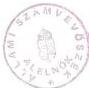

*Állami Számvevőszék*---

# JELENTÉS

**az egészségügyi, rehabilitációs,  
prevenciós, egészségmegőrzési és  
szociálpolitikai társadalmi szervezetek  
költségvetési támogatása igénylésének  
és felhasználásának ellenőrzéséről**

---353.

1997. június

---

A vizsgálat végrehajtásáért felelős:

IV. Vagyonellenőrzési Igazgatóság

Halász Gejza

számvevő igazgató

Az ellenőrzést vezette:

dr. Szávai Tamás

osztályvezető főtanácsos

Az összefoglaló jelentést készítette:

dr. Dotterweich Antal

számvevő tanácsos

Az ellenőrzésben részt vettek:

dr. Dotterweich Antal

számvevő tanácsos

Pálfiné Mészáros Éva

számvevő

---

V-1005-16/1997.

# TARTALOMJEGYZÉK

|  **I. ÖSSZEGZŐ MEGÁLLAPÍTÁSOK, KÖVETKEZTETÉSEK** | **4**  |
| --- | --- |
|  **II. RÉSZLETES MEGÁLLAPÍTÁSOK** | **6**  |
|  **1. A költségvetési támogatás igénylésének és felhasználásának általános áttekintése** | **6**  |
|  **2. A támogatás igénylésének folyamata** | **7**  |
|  2.1. A Magyar Közlönyben közzétett pályázati felhívás követelményrendszere | 7  |
|  2.2. A beérkezett pályázatok áttekintése, az elutasított pályázatok | 9  |
|  2.3. A támogatásban részesített szervezetek áttekintése | 9  |
|  **3. Az előző évi támogatás felhasználása a szervezetek dokumentumai alapján** | **12**  |
|  3.1. A támogatásról való elszámolás kötelezettségének megtörténte az 1995. évről | 12  |
|  3.2. Az 1995. évi terv- és tényadatok összevetése a szervezetek pályázatai, illetve beszámolói alapján | 13  |
|  3.3. Az 1996. évi költségvetési támogatásról való elszámolási kötelezettség teljesítése | 17  |
|  3.4. Az 1996. évi terv- és tényadatok összevetése a szervezetek pályázatai, illetve beszámolói alapján | 17  |
|  **III. JAVASLATOK** | **22**  |

1

---

2

---

# Jelentés az egészségügyi, rehabilitációs, prevenciós, egészségmegőrzési és szociálpolitikai társadalmi szervezetek költségvetési támogatása igénylésének és felhasználásának ellenőrzéséről

Az Országgyűlés elismerve a jelentős társadalmi közérdeket megvalósító szervezetek, illetőleg egyesületek jelentőségét, több év óta költségvetési támogatást nyújt ezen szervezetek működéséhez.

Az ellenőrzés célja a társadalmi szervezetek közül a címben körülírt társadalmi szervezetcsoport részére országgyűlési határozattal juttatott költségvetési támogatás rendszerének áttekintése volt. Az ellenőrzés a támogatási rendszer áttekintése keretében a szervezetek támogatásigénylés céljából benyújtott pályázatait és a költségvetési támogatás felhasználásáról készített beszámolóikat elemezte részletesen.

Az Állami Számvevőszék az 1995. és 1996. évre benyújtott pályázatokat és az e két évben támogatásban részesült szervezetek beszámolóit vizsgálta.

Az 1995. évre az 52/1995. (V. 17.) OGY határozat alapján 107 szervezet részesült összesen 93,993 millió Ft támogatásban, az 1996. évben pedig 116 szervezet kapott összesen 90,650 millió Ft támogatást az 59/1996. (VII. 4.) OGY határozattal.

Az ellenőrzés jogszabályi alapja az Állami Számvevőszékról szóló, többször módosított 1989. évi XXXVIII. törvény 2. §. (5.) bekezdése, mely szerint a társadalmi szervezeteknek juttatott állami költségvetési támogatás felhasználását az ÁSZ ellenőrzi.

Az ellenőrzés alapvetően az Országgyűlés Társadalmi Szervezetek Költségvetési Támogatását Előkészítő Bizottsága által rendelkezésre bocsátott iratok alapján történt. Ezen túlmenően a beküldött adatok megbízhatóságának ellenőrzése céljából 3 társadalmi szervezetnél (Nyugdíjasklubok és Idősek „Életet az éveknek” Országos Szövetsége, Magyar Narkológiai Társaság, Magyar Védőnők Egyesülete) helyszíni mintavételes vizsgálat is történt.

A helyszíni ellenőrzés időszaka 1997. február 4 - április 11. között volt.

3

---

I. ÖSSZEGZŐ MEGÁLLAPÍTÁSOK, KÖVETKEZTETÉSEK

# I. ÖSSZEGZŐ MEGÁLLAPÍTÁSOK, KÖVETKEZTETÉSEK

Az egészségügyi, rehabilitációs, prevenciós, egészségmegőrzési és szociálpolitikai társadalmi szervezetek költségvetési támogatása igénylésére benyújtott pályázatok és a felhasználásról készített beszámolók áttekintése alapján a jelenlegi rendszer neuralgikus pontjai az alábbiakban foglalhatók össze:

Az évente kiírt pályázati felhívások nem kívánják meg konkrét feladatok, tevékenységek, célok megjelölését a szervezetektől. A jelenlegi rendszerben költségvetési támogatás az alapszabály szerinti működés költségeinek azon hányadához igényelhető, amelyet a szervezet saját forrásaiból nem tud fedezni. Ezek: irodák, egyesületi helyiségek fenntartási, működési költségei, a tagsággal való kapcsolattartás költségei, a személyi feltételek biztosítása, a nemzetközi szervezeti tagdíj forint fedezete, közgyűlések és más egyesületi összejövetelek költségei.

A pénzfelhasználás célszerűségének, eredményességének megítéléséhez konkrét programok, feladatok, pontosan körülírt tevékenység előírására lenne szükség oly módon, hogy a szervezet számításokat is készítsen az egyes feladatokhoz igényelt támogatás összegének alátámasztására.

A szervezetek által közölt tervadatok nem reálisak, továbbá hiányzik az igényelt támogatás bontása költségfajta szerint (bér, annak esetleges volta, bérjárulék, beruházás, bérleti díj, egyéb költség, dologi költség) ezért nem biztosított az összehasonlíthatóság a tényadatokkal.

A szervezetek által benyújtott beszámolók szerkezete jelentősen eltér az igényléséhez kért adatoktól, nem vethetők össze a terv- és tényadatok.

A szervezetek számára nincs előírás, hogy a megismert támogatás alapján dolgozzák át írásban irreálisan magas tervadataikat.

Mivel a kapott támogatás nem címzett, nem állapítható meg pontosan a megtakarított költségvetési támogatás összege. Jelenleg a szervezet döntésétől függ, hogy mely forrás felhasználását jelzi teljes körűnek.

Konkrét, költségvetéssel is alátámasztott programok benyújtásának előírása biztosíthatná a lehetőséget a pénzfelhasználás reális megítélésre. Ezáltal megoldható lenne, hogy a tervszámokat nem igazítják a támogatás összegéhez, mivel a konkrét igények alapján ezekre a célokra címzetten kapnák a támogatást, a beszámolás szerkezete pedig azonos lenne a pályázati igény szerkezetével. Ilyen módon megoldódna a fel nem használt költségvetési támogatás kérdése is, mivel a konkrét programok reális, előzetesen ellenőrizhető költségszámítással alátámasztva ezt kizárnák. Felhasználási cél elmaradására pedig elő kellene írni a célra megpályázott támogatási összeg visszafizetését.

4

---

I. ÖSSZEGZŐ MEGÁLLAPÍTÁSOK, KÖVETKEZTETÉSEK

Konkrét programok finanszírozása esetén összezsugorodna a költségvetési támogatás improduktív célú felhasználásának lehetősége, amelynek lehetőségét a jelenlegi pályázati rendszer nem zárja ki. A jelenlegi rendszerben, amikor a pályázat útján elnyert összeg helyiségek fenntartására, működtetésére, kommunikációs költségekre, rendezvényekre, tehát általános költségekre fordítható, és nem konkrét feladatokra, a nem hatékony működtetés adatok alapján nem érhető tetten.

Annak következtében, hogy nem konkrét feladatokra, hanem a működés költségei egy részének finanszírozására fordítják a szervezetek a kapott támogatást nem állapítható meg, hogy szükséges volt-e a pénzfelhasználás tényleges összege.

Néhány véletlenszerűen kiválasztott szervezetnél helyszíni ellenőrzésre is sor került abból a célból, hogy a Bizottsághoz megküldött dokumentumok adatai egyeznek-e a számviteli nyilvántartásokban szereplő adatokkal és egyéb dokumentumokkal, továbbá, hogy a kapott költségvetési támogatás felhasználása hogyan történt az 1995. és 1996. években.

Az Állami Számvevőszék

- összes bevétel;
- összes költség;
- működési költség;
- pénzmaradvány;
- működési támogatás;
- Országgyűléstől kapott támogatás;
- tagdíjbevétel;
- egyéb bevétel;
- kamatbevétel

tényadatoknál talált a szervezeteknél eltérő adatokat a számviteli nyilvántartásoktól.

Egy szervezetnél az állami költségvetési támogatás felhasználásáról nem bizonylatok alapján, hanem arányosítással töltötték ki az adatlap rovatait. Így a tényleges:

- bér;
- bérjárulékok;
- beruházás, beszerzés;
- egyéb költség;
- bérleti díj;
- dologi költségek

adatok nem a valós helyzetet tükrözik. Az előzőek alapján tehát a beküldött adatszolgáltatások egyetlen tényadatát sem lehet megbízhatónak tekinteni.

A számviteli nyilvántartásokban nem válik szét a jelentős tevékenység és a működés költsége azon szervezeteknél, amelyek ilyen célra igényeltek támogatást.

A három szervezetnél a működés kereteit a bevételek alakulása határozta meg; a tervezetthez képest alacsonyabb bevétel esetén a rendelkezésre álló összegből folytatták működésüket. Mindhárom szervezet pénzmaradvánnyal zárta mindkét vizsgált évet.

5

---

II. RÉSZLETES MEGÁLLAPÍTÁSOK

Az ellenőrzött szervezetek a kapott pénzösszeget a működési költség kiegészítésére használták fel, nem készítettek a támogatás tényleges összege ismeretében új terveket, de a gyakorlatban hozzáigazították a kiadásokat a ténylegesen elért bevételekhez.

Az adatok alapján hatékonyság, eredményesség nem állapítható meg. Az általános költségek egy részét finanszírozó állami támogatás az alapszabályban meghatározott célok megvalósítását nem közvetlenül, csak az egyéb források alaptevékenységre fordíthatóságán keresztül biztosítja. Alapszabálytól eltérő célú rendeltetésellenes pénzfelhasználás nem volt.

## II. RÉSZLETES MEGÁLLAPÍTÁSOK

### 1. A KÖLTSÉGVETÉSI TÁMOGATÁS IGÉNYLÉSÉNEK ÉS FELHASZNÁLÁSÁNAK ÁLTALÁNOS ÁTTEKINTÉSE

A társadalmi szervezetek támogatását szolgáló keretösszeget a vizsgált években az állami költségvetésről szóló törvény határozta meg, így 1995-ben 400 millió Ft, 1996-ban 390 millió Ft összeg szétosztására adott lehetőséget az éves költségvetésről szóló törvény.

Az Országgyűlés 74/1994. (XII. 27.) OGY határozatával hozta létre a Társadalmi Szervezetek Költségvetési Támogatását Előkészítő Bizottságot (a továbbiakban: Bizottság). A Bizottság a társadalmi szervezetek támogatására szolgáló keretösszegből való részesedésre minden évben pályázati felhívást tett közzé a Magyar Közlönyben. A pályázati felhívás alapján az összegből részesedni kívánó szervezetek tájékozódhattak a támogatás elnyerésének feltételeiről, az igénylés benyújtásának módjáról és határidejéről.

A Bizottság a költségvetési keretösszeget minden évben tovább bontotta, 1995. és 1996. évben 5 szervezetcsoportot képezve a pályázó szervezetek fő tevékenysége alapján. A szervezetek tevékenységüknek megfelelően önbesorolással a következő csoportok valamelyikébe kerülhettek:

- egészségügyi, rehabilitációs, prevenciós és egészségmegőrzési társadalmi szervezetek;
- oktatási, tudományos, ifjúsági és gyermekvédő társadalmi szervezetek;
- természet- és környezetvédelmi társadalmi szervezetek;
- kulturális és művelődési társadalmi szervezetek;
- más közérdekű társadalmi szervezetek.

Az Állami Számvevőszék az első csoportba tartozó szervezetek költségvetési támogatás igénylését és beszámolóik alapján a pénzfelhasználásukat vizsgálta.

A Bizottság a képzett tevékenységcsoportoknak megfelelően öt albizottságot hozott létre a beérkezett pályázatok elbírálására. A döntéselőkészítés munkáját az albizottságok által felkért szakértők segítették, az 1. albizottság esetében un. algoritmizált szempontrendszert alkalmaztak a beérkezett pályázatok szakértői

6

---

II. RÉSZLETES MEGÁLLAPÍTÁSOK

szintű feldolgozásánál. A szakértők hét szempont mérlegelése alapján tettek javaslatot a támogatási összeg mértékére azon szervezetek esetében, amelyek megfeleltek a pályázati kiírás feltételeinek.

A Bizottság által megítélt összegekről mindkét vizsgált évről országgyűlési határozat született, az 52/1995. (V. 17.) és az 59/1996. (VII. 4.) OGY határozatok a társadalmi szervezetek költségvetési támogatásának elosztásáról. Az Országgyűlés határozata alapján 1995. évben 107, 1996. évben pedig 116 egészségügyi, rehabilitációs, prevenciós és egészségmegőrzési, valamint szociálpolitikai szervezet részesült költségvetési támogatásban, összesen 93,993 millió Ft, illetve 90,650 millió Ft összegben.

A pénz folyósítása a Pénzügyminisztérium útján történt a sikeresen pályázott szervezetek részére, bankátutalás formájában, a számlavezető pénzintézet nevét és a bankszámlaszámot a szervezetek a pályázati adatlapon jelölték meg.

A pénzfelhasználásra és ennek dokumentálásra a társadalmi szervezetekre általánosan érvényes jogszabályok, így különösen a társadalmi szervezetek gazdálkodó tevékenységéről szóló 114/1992. (VII. 23.) Kormányrendelet és a számvitelről szóló, többször módosított 1991. évi XVIII. törvény vonatkozik.

A társadalmi szervezetek gazdálkodó tevékenységéről szóló 114/1992. (VII. 23.) Kormányrendelet csak a céltámogatások elszámolására nézve tartalmaz szabályokat 8. §-ában a következők szerint „A társadalmi szervezet az egyéb bevételei között nyilvántartott, az éves költségvetésről szóló törvény szerint szerződéses jogviszony alapján állami feladatellátás címén kapott céltámogatást, felhasználását, maradványának elszámolását a céltámogatást nyújtó szervezet előírásainak megfelelően végzi”. 1996-tól hasonló rendelkezést tartalmaz az Áht 13/A §. (2.) bekezdése is.

Az OGY határozatok alapján juttatott költségvetési támogatás felhasználásáról a Bizottság írt elő beszámolási kötelezettséget, a számvitelről szóló törvény 94. §. b. pontjában kapott felhatalmazás alapján kiadott kormányrendelet - a társadalmi szervezetek beszámoló-készítésének sajátosságairól - nem tartalmaz előírást erre nézve.

## 2. A TÁMOGATÁS IGÉNYLÉSÉNEK FOLYAMATA

### 2.1. A Magyar Közlönyben közzétett pályázati felhívás követelményrendszere

A Bizottság az 1995. és 1996. évre igényelhető költségvetési támogatásra egyaránt pályázati felhívást tett közzé a Magyar Közlöny 1994. évi 127. illetve az 1995. évi 116. számában.

A pályázati felhívásban rögzítették, hogy milyen feltételek megléte esetén nyújthat be non profit szervezet igényt. A feltételek a két vizsgált évben némiképp eltérő módon fogalmazódtak meg, a módosulás a követelmények szigorítását jelentette.

7

---

II. RÉSZLETES MEGÁLLAPÍTÁSOK

Az 1995. évi felhívás szerint azon társadalmi szervezetek nyújthattak be pályázatot, amelyek:

- bírósági nyilvántartásba vétele 1994. június 30-ig megtörtént;
- székhelye Magyarországon van;
- érvényes alapszabállyal, képviselő szervvel, nyilvántartott tagsággal és létrejöttétől folyamatos tevékenységgel rendelkeznek;
- taglétszámuk legalább 3 megyei közigazgatási terület településeiről vagy a főváros kerületeinek legalább 1/3-ából több mint száz fő;
- tagságuk önkéntes tevékenységét kizárólag országos jelentőségű, közérdekű társadalmi célok érdekében szervezik.

Az 1996. évre vonatkozó pályázati felhívás azt rögzíti továbbá, hogy előnyben részesülnek azok a társadalmi szervezetek, amelyek taglétszáma legalább 500 fő, és legalább öt megyében vagy tizennégy fővárosi kerületben működnek. Ez az előírás mind a taglétszám, mind a működési terület vonatkozásában lényegesen magasabb követelményt támasztott a pályázókkal szemben.

Mindkét évben azonos tartalommal határozta meg a pályázati felhívás a költségvetési előirányzatból nem részesíthetők körét, ezek:

- a munkaadói, a munkavállalói és foglalkozási érdekvédelmi szervezetek, köztestületek, szakmai kamarák;
- azok a társadalmi szervezetek, amelyek más központi költségvetési előirányzatból nevesítetten kapnak támogatást szervezetük működtetéséhez;
- tevékenységük szerint helyi megyei vagy hobbi szervezetek.

A pályázati felhívás mindkét vizsgált évben meghatározta azt is, hogy mire igényelhető költségvetési támogatás, a következőképpen: „az alapszabály szerinti működés költségeinek azon hányadához, amelyet a szervezet saját forrásaiból nem tud fedezni, így különösen:

- irodák, egyesületi helyiségek fenntartási, működtetési költségeihez;
- a tagsággal való kapcsolattartás költségeihez;
- a személyi feltételek biztosításához;
- a nemzetközi szervezeti tagdíj forintfedezetéhez;
- közgyűlések és más egyesületi összejövetelek költségeihez.”

Az igénylések benyújtásához a Bizottság pályázati adatlapot rendszeresített, és előírta a benyújtási határidőt is (1995. február 15. illetve 1996. február 28.). Figyelemmel arra, hogy mindkét évben a pályázati felhívás a megelőző év végén már megjelent, a pályázni kívánó szervezetek részére kellő idő állt rendelkezésre a feltételek megismerésére, és ennek megfelelő tartalmú pályázat benyújtására. Az 1996. évre kiírt pályázat azt is előírta, hogy mellékelni kell a tárgyévi költségvetés és tevékenység tervét, továbbá ha jelentős tevékenységet (rendezvényt, szolgáltatást, kiadványt) akar a tárgyévben megvalósítani ezt mellékletben részletezni kell, az erre vonatkozó költségvetési tervet is elkészítve.

A pályázati felhívás rögzítette, hogy a kiírásnak nem megfelelő pályázatokat érdemi vizsgálat nélkül elutasítják.

8

---

II. RÉSZLETES MEGÁLLAPÍTÁSOK

# 2.2. A beérkezett pályázatok áttekintése, az elutasított pályázatok

A rendelkezésre bocsátott dokumentumok alapján az állapítható meg, hogy 1995. évben az 1. albizottsághoz 189 szervezet pályázata érkezett be, az igényelt összeg 813,230 millió Ft volt, 1996. évben 146 szervezet pályázott, 772,761 millió Ft támogatási igényt jelöltek meg.

A Bizottság 1995. évben 107 szervezetet részesített összesen 93,993 millió Ft támogatásban, 1996-ban pedig 116 szervezetet támogatott 90,650 millió Ft összeggel. Megállapítható tehát, hogy 1995. évben 82 szervezet, 1996. évben pedig 30 szervezet támogatását kellett elutasítani. Az elutasított pályázatok két kategóriába sorolhatók, egyrészt az adatlap vagy mellékletei nélkül, hiányosan vagy határidő után benyújtott, továbbá a pályázati kiírásnak nem megfelelő pályázatok csoportjába, ezeket érdemi vizsgálat nélkül utasították el. A másik kategória a kiírásnak ugyan megfelelt szervezetek, amelyek azonban a rendelkezésre álló összeg korlátozott volta miatt nem részesülhettek támogatásban.

# 2.3. A támogatásban részesített szervezetek áttekintése

A pályázati adatlapok alapján az ellenőrzés áttekintette mindkét évben a Bizottság által támogatásban részesített szervezetek adott évre vonatkozó terv adatait. Az 1995. évi tervadatokat az 1. sz. melléklet, az 1996. évi tervadatokat a 2. sz. melléklet tartalmazza szervezetenkénti bontásban.

# 2.3.1. AZ 1995. ÉVRE VONATKOZÓ ÖSSZESÍTETT TERVADATOK ÁTTEKINTÉSE

Az 1995. évre benyújtott pályázatok alapján az ellenőrzés által összesített tervadatok E Ft-ban:

- összes költség: 1.599.898
mukodesi koltseg: 655.586
- összes bevétel: 1.619.318
sajatero: 293.284
mukodesi tamogatasi igeny: 375.943

Az ellenőrzés megállapítása szerint az összes költség, működési költség és összes bevétel adatok megtervezése során a szervezetek beállították az általuk megkapni óhajtott támogatási összeget. Erre utal, hogy a tényleges bevétel 1.186 millió Ft, tényleges működési költség 448 millió Ft, tényleges összes költség 1.186 millió Ft adat jelentősen elmarad a tervszámoktól, mivel a tényleges működési támogatás az igényelt 376 millió Ft-tal szemben csak 93,993 millió Ft volt.

A saját erőt illetően az ellenőrzés megállapítása szerint a 107 szervezetből 63 szervezet, tehát a szervezetek 59%-a állította be ezen adatot pályázatába. A tervezett saját erő aránya szervezetenként erősen szóródik. Az ellenőrzés megállapítása szerint a saját erő döntő zömében az előző évi pénzmaradványból adódik, nem a várt támogatásokat jelzi ez az adat.

9

---

II. RÉSZLETES MEGÁLLAPÍTÁSOK

Az igényelt működési támogatás jogcímenként a következőképpen oszlik meg E Ft-ban:

|  • tagszervezetek működési költsége: | 73.301  |
| --- | --- |
|  • kommunikációs költségek: | 46.313  |
|  • bérleti díj: | 24.015  |
|  • közüzemi díjak: | 10.521  |
|  • beszerzés: | 47.126  |
|  • bér jellegű kiadások: | 97.324  |
|  • bérjárulékok: | 39.323  |
|  • egyéb működési költség: | 38.020  |
|  **„normál működési költség”:** | **375.943**  |
|  • nemzetközi szerv. tagsági díj: | 5.188  |
|  • tárgyévi jelentős tevékenység, rendezvény, szolgáltatás, kiadvány: | 245.004  |
|  **összes támogatási igény:** | **626.135**  |

A támogatási jogcímekkel összefüggésben rögzíteni szükséges, hogy a megoszlás nem engedi messzemenő következtetések levonását, ebben ugyanis a szervezetek szubjektív döntése nagy szerepet játszhat. Minden jogcím sorhoz tartozik „saját erő” oszlop is, ennek következtében a szervezetek döntésétől függött, hogy valamely jogcímhez kizárólag támogatási igény oszlopot töltenek ki, vagy saját erőt és támogatási igényt is jeleznek, illetve csak saját erőt tüntetnek fel. E tekintetben minden sor esetében minden változat előfordult. A saját erő 293 millió Ft és az igényelt 376 millió Ft támogatás együttes összege 669 millió Ft, ez hozzávetőleg megfelel a működési költség 656 millió Ft összegének. A tervezett saját erő a tervezett működési költség közel fele (45%-a).

Nemzetközi szervezeti tagdíj forintfedezetéhez 29 szervezet igényelte az 5,188 millió Ft-ot, tehát a támogatott szervezetek 27%-a.

Mindössze 26 szervezet nem jelölt meg tárgyévi jelentős tevékenységet, rendezvényt stb. Az is figyelemre méltó, hogy ilyen címen a „normál működési támogatáson” felül 245 millió Ft-ot igényelt, az ilyen támogatásra igényt tartó 81 szervezet. A rendkívüli támogatási igény az összes igényelt 626 millió Ft működési támogatás 39%-a.

### 2.3.2. AZ 1996. ÉVRE VONATKOZÓ TERVADATOK ÁTTEKINTÉSE

Az ellenőrzés által a pályázatok alapján összesített tervadatok E Ft-ban:

|   |  | 1995 = 100  |
| --- | --- | --- |
|  • összes költség: | 2.511.843 | 157,0  |
|  • működési költség: | 884.564 | 134,9  |
|  • összes bevétel: | 2.377.479 | 146,8  |
|  • saját erő | 310.418 | 105,8  |
|  • működési támogatási igény: | 429.223 | 114,2  |

10

---

II. RÉSZLETES MEGÁLLAPÍTÁSOK

Az 1996. évi tervadatokat összevetve az 1995. évi tervszámokkal az állapítható meg, hogy az összes költség növekedési dinamikája a legnagyobb, ettől némileg elmaradt a bevételi terv és a működési költség tervezett növekedése. A működési támogatási igény szerényebb mértékben emelkedett, legalacsonyabban a saját erő növekedését prognosztizálják a szervezetek. Figyelemre méltó azonban, hogy az 1996-ban támogatott 116 szervezet közül mindössze 4 nem tervezett csak saját erőt, ez csupán a szervezetek 3,4%-a, szemben az előző évi 41%-kal. Az egy szervezetre jutó átlagos saját erő összege is emelkedett, az 1995. évi 2,767 millió Ft-ról 3,700 millió Ft-ra, bár az egyes szervezetek közötti szóródás ebben az évben is nagy.

Az összes bevétel, összes költség és a működési költség adatok tervezése során az ellenőrzés megállapítása szerint 1996. évben is számításba vették a szervezetek az elnyerni kívánt költségvetési támogatás összegét.

A működési támogatási igény megoszlása jogcímenként E Ft-ban:

- tagszervezetek működési költsége: 74.833
- kommunikációs költségek: 49.860
- bérleti díj: 28.773
- közüzemi díjak: 16.266
- beruházás: 83.650
- bér jellegű költségek: 93.077
- bérjárulékok: 37.018
- egyéb működési költség: 45.746

„normál működési költség: 429.223

- nemzetközi szervezet tagsági díj: 6.041
- tárgyévi jelentős tevékenység: 235.225

összes támogatási igény: 670.489

Az 1996. évi tervadatok szerkezete az igények bontását illetően közel azonos az 1995. évi jogcímekkel, egy jelentős különbség azonban van, 1995. évben a beszerzéseket kellett megjelölni, míg 1996-ban a beruházásokat. A szervezetek egy része azonosan kezelte a két fogalmat, mindkét évben a gyakorlatban a beruházásra kért összeget jelölték meg, függetlenül az eltérő elnevezéstől. A szervezetek másik része azonban a beszerzés kategórián mást ért mint a beruházáson, a beszerzés ezeknél nem beruházás, hanem pl. étkezési nyersanyagok beszerzése.

Az a körülmény 1996-ban is fennállt, hogy egy jogcímsorhoz két összeg oszlop állt rendelkezésre (igényelt támogatás és saját erő), így ez évben sem lehet következtetéseket levonni az igényelt támogatás jogcímenkénti megoszlásából.

Nemzetközi szervezeti tagdíj forint fedezetéhez 37 szervezet igényelt 6,041 millió Ft-ot. A nemzetközi szervezeti tagsággal rendelkező szervezetek aránya az előző évi 27%-ról 32%-ra emelkedett.

A rendkívüli támogatást nem igénylő szervezetek száma emelkedett, az előző évi 26-tal szemben 41 szervezet csak „normál” működési támogatásra tartott igényt.

11

---

II. RÉSZLETES MEGÁLLAPÍTÁSOK---

### 3. AZ ELŐZŐ ÉVI TÁMOGATÁS FELHASZNÁLÁSA A SZERVEZETEK DOKUMENTUMAI ALAPJÁN

#### 3.1. A támogatásról való elszámolás kötelezettségének megtörténte az 1995. évről

Az 1995. évben támogatásban részesült 107 szervezet közül 52 szervezet az 1994. évben nem kapott támogatást országgyűlési határozat alapján. Támogatásban részesült 55 szervezet, ezek az 1994. évben összesen 61,870 millió Ft támogatást kaptak. Mivel ezen szervezetek 1995. évre is igényeltek támogatást, pályázatukban kivétel nélkül eleget tettek az előző évi támogatásról való elszámolási kötelezettségüknek. Ezen elszámolásokat az ellenőrzés részleteiben nem vizsgálta, miután az 1994. évi pályázatok áttekintése nem képezte részét az ellenőrzési programnak, így összevetési lehetőség nem volt.

Az elszámolási kötelezettséget illetően az 1995. évre megjelent pályázati felhívás kifejezett rendelkezést fogalmazott meg, a következőképpen: „A pályázó az elnyert összeg felhasználásáról e tevékenység befejezését követően, de legkésőbb a következő évi pályázat benyújtásának határidejéig köteles beszámolót és elszámolást készíteni. Amennyiben a pályázó már részesült központi költségvetési támogatásban, úgy az annak felhasználásáról készített beszámolóját és elszámolását az új pályázat benyújtásával egyidejűleg köteles előterjeszteni”.

Az 1995. évben támogatásban részesült szervezetek közül 12 szervezet nem tett eleget az elszámolási kötelezettségnek, ez az összesen 107 szervezet 11%-a, az el nem számolt részükre juttatott támogatás összege 6,740 millió Ft, ez a 93,993 millió Ft összes támogatás 7,2%-a.

Az előző év költségvetési támogatás felhasználásáról készített beszámoló és Bizottságnak történő elszámolás elmulasztásában szerepet játszott a pályázati felhívás idézett részének többféleképpen értelmezhetősége is, ezért az 1996-ra közzétett pályázati felhívás már egyértelműen rögzítette, hogy „A pályázó ... köteles beszámolót és elszámolást készíteni akkor is, ha nem nyújt be új pályázatot”.

Az 1995. évi támogatásról el nem számolt 12 szervezet azon körből került ki, amelyek nem igényeltek 1996. évre költségvetési támogatást. Az elszámolás elmulasztása azonban nem volt általános gyakorlat. Küldtek be elszámolást az 1996. évben nem pályázó szervezetek is. Ez a körülmény a szervezetenkénti eltérő értelmezést jelzi.

A támogatás odaítélésénél a gyakorlatban meghatározó szempont volt az elszámolási kötelezettség teljesítése. Olyan szervezet nem részesült támogatásban, amelyik az előző évi támogatásról nem számolt el. Az 1995. évben támogatásban részesült 107 szervezet közül 1996-ban csak 75 szervezet részesült támogatásban, ezek egy része az elszámolás hiánya vagy nem megfelelő volta miatt került ki a támogatott körből.

---12

---

II. RÉSZLETES MEGÁLLAPÍTÁSOK

Azon szervezetek száma, amelyeknek az 1994, 1995. és 1996. évről is el kell számolniuk, mivel mindhárom évben részesültek költségvetési támogatásban 47, tehát az egyes években támogatásban részesült szervezetek (1994: 94; 1995: 107; 1996: 116) hozzávetőleg fele az évről-évre támogatott szervezet.

### 3.2. Az 1995. évi terv- és tényadatok összevetése a szervezetek pályázatai, illetve beszámolói alapján

Mivel 1995-ben 12 szervezet nem küldött elszámolást a Bizottság részére, ezért szükségessé vált az ellenőrzés részéről az el nem számolt szervezetek tervadatainak kiszűrése az összesen tervadatokból az összehasonlíthatóság érdekében. A 95 elszámolt szervezet tényadatait a 3. sz. melléklet tartalmazza.

A 95 elszámolt szervezet működését jellemző alapvető mutatószámok a következőképpen alakultak E Ft-ban:

|  Megnevezés | Terv | Tény | %  |
| --- | --- | --- | --- |
|  • összes bevétel | 1.493.074 | 1.186.650 | 79,48  |
|  • összes költség | 1.473.754 | 1.185.936 | 80,47  |
|  • működési költség | 570.850 | 448.125 | 78,50  |

Az összes bevétel adattal kapcsolatban jelezni szükséges, hogy ez mind a terv-mind a tényadatok esetében néhány kivételtől eltekintve magában foglalja az előző évi pénzmaradványt is. Mivel mindkét adat tartalmazza a pénzmaradványt, így az elért bevétel alakulására ez a körülmény nem volt befolyással. Az összes bevétel tervhez képest 79,48%-os teljesülésére alapvetően a költségvetési támogatás ténylege összege volt befolyással. A szervezetek az adtok tanúsága szerint a tervezésnél az általuk igényelt támogatás elnyerésével számoltak, ennek figyelembevételével állították be az összbevétel adatot (E Ft-ban):

|  • tervezett összes bevétel: | 1.493.074  |
| --- | --- |
|  igényelt támogatás: | - 561.051  |
|  *támogatás nélküli bevételi terv:* | *932.023*  |
|  • elnyert támogatás: | 87.253  |
|  *korrigált bevételi terv:* | *1.019.276*  |

Az 1.019,276 millió Ft adat alacsonyabb a ténylegesen elért 1.186,650 millió Ft összegnél, a tényleges bevétel ezen összeget 16,4%-kal haladja meg. Ez azt jelzi, hogy a szervezetek az állami költségvetési támogatáson kívüli egyéb bevételei forrásaikat sokkal reálisabban mérik fel és állítják be terveikbe. E források tervezése jellemzően a várható összeg alatt történik.

Az elnyert állami támogatás összesen adata a 95 szervezet esetében 87,253 millió Ft, ez az igényelt támogatás 15,6%-a. Mivel a „túligénylés” gyakorlata több éve jellemző, ez arra utal, hogy a szervezetek a szűkösen rendelkezésre álló támogatásból a reális szükségleteiket is jelentősen meghaladó összeget igényelnek, bízva abban, hogy ilyen formán a valóban szükséges összeget végül is megkapják.

13

---

II. RÉSZLETES MEGÁLLAPÍTÁSOK

Az igények valós szükségleteknél túlzott voltát bizonyítja az is, hogy összességében a szervezetek az évet 394,931 millió Ft pénzmaradvánnyal zárták. Mindössze egy szervezetnek állt fenn negatív pénzmaradványa, tehát tartozása 10 szervezetnek volt 0 összegű pénzmaradványa, a többi szervezet különböző, de pozitív előjelű pénzmaradvánnyal zárta az évet. Az egyes szervezetek pénzügyi helyzetét, a tényleges működésük biztosítottságát csak szervezetenkénti, a Bizottsághoz megküldöttön jóval túlmenő adatkör alapján lehetne reálisan megítélni.

Az összes költség és a működési költség 80,47%-os, illetve 78,50%-os teljesülése ugyancsak a vártnál alacsonyabb kapott támogatással függ össze. A tényleges összes költségek a tényleges bevételek alatt maradtak, az eltérés mindössze 0,06% A fel nem használt 712 E Ft a szervezetek pénzmaradványát növelte.

Az állami támogatás szerepe az összes költségben nem jelentős, a felhasznált 84,644 millió Ft támogatás mindössze az összes költség 7,1%-át finanszírozta. A működési költségben az állami támogatás aránya értelemszerűen magasabb, ebben aránya 18,9%-ot képvisel.

A működési költség teljesülése csak 78,50% arányú, ez némileg alacsonyabb a bevételek és az összköltség teljesülésénél, a három mutató közel azonosan alakult. Az összes költségnél alacsonyabb szinten teljesült működési költség lehet pozitív tendenciák pl. takarékosabb gazdálkodás eredménye is, de annak a következménye is, hogy túltervezték a várható költségeket. Ennek megállapításához is a rendelkezésre állónál tetemesen több adat kellett volna, és szervezetenkénti vizsgálat tárhatná csak fel az ok-okozati összefüggéseket.

A szervezetek által kitöltött pályázati adatlapok alapján nincs lehetőség a tervezett és a tényleges bevételi források támogatócsoportonkénti összevetésére, mivel ilyen bontást csak a tényleges adatok feltüntetésére szolgáló pályázati adatlaprész ír elő. A tényleges bevétel támogatócsoportonkénti megoszlása a következő:

|  Megnevezés | E Ft | %  |
| --- | --- | --- |
|  • Országgyűlés | 87.253 | 7,35  |
|  • Minisztériumok | 31.571 | 2,66  |
|  • Más költségvetési szervek | 64.543 | 5,44  |
|  • Egyéb támogatás | 948.589 | 79,94  |
|  • Vállalkozási bevétel | 49.667 | 4,19  |
|  • Tagdíj | 3.719 | 0,31  |
|  • Kamat | 1.308 | 0,11  |
|  *Összes bevétel* | *1.186.650* | *100,00*  |

A szervezetek által közölt adatok alapján kialakult megoszlást nem lehet pontosnak tekinteni. Az adatlap ugyanis tagdíj és kamat sort nem tartalmaz, ezeket csak a szervezetek által beküldött beszámolók tételes áttanulmányozását követően lehetett kigyűjteni. A beszámolók rendkívül változatosak, szinte szervezetenként különböznek. Sok a számszaki adatot gyakorlatilag nem tartalmazó beszámoló, értelemszerűen ezekben a tagdíj- és kamatbevétel nem szerepel. Az ilyen adatokat tartalmazó beszámolók sem mindig pontos összegeket jelölnek meg. Csak 14 szervezet jelölt meg egyértelműen tagdíjbevételt és 11 adott számot kamatbevételről. A tagdíjbevétel irreálisan alacsony voltára utal, hogy a szervezetek alapszabályai e kérdésről rendelkeznek, vagy kötelező vagy önkéntes fizetést rögzítenek. Az előbbi esetben a tagdíj mértékére is előfordul rendelkezés.

14

---

II. RÉSZLETES MEGÁLLAPÍTÁSOK

Az egyéb bevétel adatot az ellenőrzés kivonással állapította meg, mivel az összes bevételt részletező adatokból ritka kivételtől eltekintve nem állt össze a szervezet által közölt összes bevétel. A szervezetek által a pályázatokhoz mellékelt beszámolók alapján pontosabb kép nem alakítható ki, az egyéb bevétel adat az ellenőrzés megállapítása szerint a nyitó pénzmaradványt általában magában foglalja. Ezen felül általában magánszemélyek és jogi személyek adományait foglalja magában. A magán- és jogi személy adományok egyaránt származnak külföldről és belföldről, szervezetenként különböző mértékben. A külföldi adományok a közölt adatok alapján a karitatív szervezetek esetében jelentősek.

Címzett és céljellegű támogatások a minisztériumnak és a más költségvetési szervek juttatásai esetében fordulnak elő, de e két támogatókör részéről is előfordul általánosságban a működésre történő juttatás. Arányszám, pontos összeg közölt adatok hiányában nem volt megállapítható.

Az adatokat a kitöltéskor elkövetett hibák is torzítják, ha egyértelműen megállapítható volt a helyes adat akkor tudta ezt az ellenőrzés korrigálni. Azonban ha valamely adatsor helytelenül nem tartalmaz adatot, vagy tévedésből pontatlan adatot tartalmaz, és nem állapítható meg a közölt adatoktól a helyes összeg, akkor e hibák is az egyéb bevétel soron csapódnak le, azt torzítják.

Itt szükséges jelezni, hogy az Országgyűlés által e szervezetcsoportnak juttatott összesen 93,993 millió Ft-ról 1995-ben az állapítható meg, hogy:

- nem számolt el 12 szervezet összesen 6,740 millió Ft összegről;
- elszámolt 95 szervezet 87,253 millió Ft-ról;
- a 95 szervezet felhasznált 84,644 millió Ft-ot;
- nem használtak fel 2,609 millió Ft-ot a 95 szervezet esetében.

Az el nem számolt szervezeteknek juttatott költségvetési támogatás hovafordításáról nincs információja az ellenőrzésnek, az elszámolt szervezetek esetében megállapított 2,609 millió Ft fel nem használt támogatás azonban valószínűsíti, hogy az el nem számolt összeg egy része is fel nem használt támogatás.

A költségvetési támogatás fel nem használása is azt jelzi, hogy a szervezetek pontatlanul tervezték meg bevételeiket egyrészt, másrészt pedig, hogy költségeik várható alakulását a reálisnál némiképp magasabban vették számításba. Összességében a tényleges költségvetési támogatás és az egyéb bevételek fedezetet nyújtottak a költségekre. A szervezetek zöme pénzmaradvánnyal zárta az évet, és a költségvetési támogatás egy részére nem volt minden szervezetnek szüksége, ez is a pénzmaradványt növelte.

A fel nem használt költségvetési támogatás visszafizetésére nincs előírás, ezt a szervezet szabad belátása szerint hasznosíthatja, tartós betétként lekötve kamatjövedelmet realizálhat és ezen körben a következő évre is pályázhat költségvetési támogatás érdekében. A megtakarításról számot adott szervezetek pályáztak a következő évben is, mégpedig reális igényeiket jóval meghaladó költségvetési támogatás elnyerése céljából.

Erről a következő táblázatban összefoglalt adatsorok is tanúskodnak az elszámolt szervezetek esetében:

15

---

II. RÉSZLETES MEGÁLLAPÍTÁSOK

|  Megnevezés | Terv (E Ft) | % | Tény (E Ft) | %  |
| --- | --- | --- | --- | --- |
|  bérjellegű kiadások | 89.682 | 15,99 | 14.125 | 16,69  |
|  bérjárulékok | 35.975 | 6,41 | 4.524 | 5,34  |
|  beruházás | - | - | 4.521 | 5,02  |
|  egyéb költség | 29.939 | 5,34 | 3.279 | 3,87  |
|  bérleti díj | 21.677 | 3,86 | 6.578 | 7,77  |
|  tagszervez. támogatása | 68.513 | 12,21 | - | -  |
|  kommunikációs költség | 42.996 | 7,66 | - | -  |
|  közüzemi díjak | 9.271 | 1,65 | - | -  |
|  beszerzés | 44.418 | 7,92 | - | -  |
|  n.közi szervezeti tagdíj | 5.119 | 0,91 | - | -  |
|  tárgyévi jelentős tev. | 213.461 | 38,05 | - | -  |
|  dologi ktg(bérleti díj nélkül) | - | - | 51.887 | 61,31  |
|  **Összesen** | **561.051** | **100,00** | **84.644** | **100,00**  |

Ily módon az igényelt és tényleges költségvetési támogatás nem vethető gyakorlatilag össze.

A megítélést zavaró tényezők közül a legfontosabb az, hogy a szervezetek a megítélt költségvetési támogatás ismeretében nem dolgozták át irreális terveiket. Beszámolóikból nem állapítható meg, hogy mely tervsorok adatát tervezték túl, mely sorok igazodtak végül a ténylegesen elnyert támogatás által teremtett jóval szűkebb keretekhez.

Ugyancsak ellehetetleníti az összehasonlítást, hogy a terv- és tényadatok megoszlási szerkezete jelentősen eltér. A tervadatok tíz csoportba oszlanak meg, a tényadatok hat csoportba, négy sor tartalma azonos mindössze. A tényadatok közül alapvetően a dologi kiadások nem vethetők össze, ennek bontását ugyanis nem írták elő.

Összességében az eltérő nagyságrendű, eltérő szerkezetű és a tervadatok esetében esetleges adattartalmú sorok nem hasonlíthatók össze, nem állapítható meg a rendelkezésre álló adatok alapján, hogy mely tervadatokat állítottak be irreálisan magasan. Nem állapítható meg az sem a tervadatok korrigálásának elmaradása következtében, hogy mely területeken értek el takarékos gazdálkodás révén megtakarítást, pedig a költségvetési támogatás egy részének fel nem használása nemcsak a költségek túltervezéséből, hanem az ésszerűbb pénzfelhasználásból is származhat.

A terv- és tényadatok összevetését nehezíti az is, hogy a költségvetési támogatást a szervezetek nem konkrét programok, feladatok, jól körülírt, definiált tevékenységek megvalósítására kapták, hanem a működési költségek saját forrásaikból nem fedezhető részére. Ennek következtében nincsenek konkrét, költségvetéssel alátámasztott adatok, amelyek elmaradását, csökkent mértékű realizálódását lehetne megállapítani. A működés általában nem mérhető, nincs mérték, norma, irányszám arra, hogy egy szervezet milyen költségek mellett tud működni. A támogatási igények és a költségek túltervezése csak valószínűsíthető az adatok alapján, de konkrétumok hiányában nem érhető tetten, hogy melyik szervezet támogatási igénye túlzott, mely jogcímek azok, amelyek irreálisak, mennyi a tényleges szükséges összeg a működéshez.

16

---

II. RÉSZLETES MEGÁLLAPÍTÁSOK

A rendelkezésre álló adatokból az sem állapítható meg egyértelműen, hogy a költségvetési támogatáson kívüli bevételek is fedezték volna-e a működési költségeket, mivel a szervezetek többségükben, ha pénzmaradványról is adtak számot, a költségvetési támogatás teljes felhasználásról adtak jelzést. Ilyen esetben azonban a szervezetek döntésétől függ, hogy a pénzfelhasználások dokumentumait hogy csoportosítják, mely támogatásrészről mutatják ki, hogy teljes egészében felhasználták, és mely támogatásrész fel nem használása eredményezett megtakarítást.

### 3.3. Az 1996. évi költségvetési támogatásról való elszámolási kötelezettség teljesítése

Az 1996. évben támogatásban részesült 116 szervezet közül 37 szervezet nem kapott támogatást az előző évben, e szervezetek közül 28 tett eleget az elszámolási kötelezettségnek, míg 9 szervezet ezt elmulasztotta. Az 1995. évben is támogatott szervezetek közül 79 szervezet részesült 1996. évben támogatásban. E szervezetek közül 71 szervezet számolt el, 8 szervezet nem tett eleget az elszámolási kötelezettségnek. Összesen a rendelkezésre bocsátott iratok alapján az el nem számolt szervezetek száma 17, ez a 116 szervezet 14,7%-a. Az elszámolási fegyelem nem javult, az előző évben a szervezeteknek csak 11%-a nem adott számot a támogatás felhasználásáról.

Mindez annak ellenére történt, hogy a pályázó akkor is köteles beszámolót és elszámolást készíteni, ha nem nyújt be új pályázatot. Az el nem számolt szervezetek a pályázatot be nem nyújtók közül kerültek ki.

Az el nem számolt támogatás az összesen 90,650 millió Ft támogatás 7,0%-a, az el nem számolt összeg aránya közel azonos az előző évivel (7,2%), összegszerűen azonban alatta marad. Ez is jelzi, hogy az el nem számolt szervezetek általában kisebb összegű támogatást kaptak az átlagos 781,5 E Ft egy szervezetre jutó támogatásnál.

Az el nem számolt szervezeteket az ellenőrzés időszakában az Állami Számvevőszék felszólította, hogy haladéktalanul tegyenek eleget az 59/1996. (VII. 4.) OGY határozat 7. pontjában előírt kötelezettségüknek.

A helyszíni ellenőrzés befejezéséig a felszólításra 7 szervezet küldött pótlólag be elszámolást a Bizottság részére.

### 3.4. Az 1996. évi terv- és tényadatok összevetése a szervezetek pályázatai, illetve beszámolói alapján

Az 1996. évben is szükséges volt a szervezetek tervadatainak korrigálása az összehasonlíthatóság érdekében. A pótlólag beküldött elszámolások következtében az elszámolt szervezetek száma 106-ra növekedett, így a helyszíni ellenőrzés lezárásáig el nem számolt 10 szervezet tervadatait kellett kivenni a 2. sz. melléklet szerinti 1996. évi tervadatok közül. Az elszámolt 106 szervezet tényadatait a 4. sz. melléklet tartalmazza. Jelezni szükséges, hogy a tényadatokat a pályázatot be nem nyújtott szervezetek hiányosan közölték, általában csak az állami költségvetési támogatás felhasználásáról adtak számot. Az egyéb adatokat arányosítással lehetett beállítani.

17

---

II. RÉSZLETES MEGÁLLAPÍTÁSOK

Az elszámolt 106 szervezet működését jellemző alapvető mutatószámok a következők E Ft-ban:

|  Megnevezés | Terv | Tény | %  |
| --- | --- | --- | --- |
|  • összes bevétel: | 2.293.173 | 1.996.039 | 85,73  |
|  • összes költség: | 2.435.016 | 1.438.238 | 59,06  |
|  • működési költség: | 850.187 | 640.066 | 75,29  |

Az összes bevétel 1996. évben is általában magában foglalja az előző évi pénzmaradványt, mind a terv- mind a tényadatok esetében.

Az összes bevétel tervhez képest 85,73%-os teljesülése arra utal, hogy a szervezetek számítottak az általuk igényelt támogatási összeg elnyerésére:

|  • tervezett összes bevétel: | 2.293.173  |
| --- | --- |
|  • igényelt támogatás: | 648.318  |
|  *támogatás nélküli bevételi terv:* | *1.644.855*  |
|  • elnyert támogatás: | 87.710  |
|  *korrigált bevételi terv:* | *1.732.565*  |

A korrigált bevételi tervet 1996. évben 15,21%-kal haladja meg a tényleges bevételt, ami az állami támogatáson kívüli bevételi források kedvezőbb alakulását mutatja.

Az elnyert állami támogatás a 106 szervezet esetében 87,710 millió Ft, amely az igényelt támogatás 13,53%-a, ez az arány az 1995. évben 15,6% volt, ami a túligénylés 1996. évi fokozódásra utal. A rendelkezésre állt, közel azonos összeghez képest nőtt a benyújtott támogatási igény.

Hogy az igények a valós szükségletektől elrugaszkodnak évről-évre ezt az is jelzi, hogy az 1996. évet is pénzmaradvánnyal zárták, összesen a 106 szervezet közölt pénzmaradványa 145,615 millió Ft. Tartozással az adatok szerint nem zárta az évet egy szervezet sem, 11 szervezetnek nem volt pénzmaradványa, a pénzmaradvány összege 1996. évben is szóródik a szervezet között.

Az összes költség a tervezetthez képest 59,06%-ra teljesült, ez eredhet feladat elmaradásból, de a költségek irreálisan magas túltervezéséből is. A túltervezésre utal, hogy az összes költség összesített tervszáma teljesítése meghaladja a bevételi tervadatot, e mellett szerepet játszhatott az adatlapok pontatlan kitöltése is.

A szervezetek által szolgáltatott adatok pontatlan, nem megbízható voltát jelzi, hogy az összes bevétel és az összes költség különbözete 557,801 millió Ft, ez azonban a szolgáltatott 145,615 millió Ft pénzmaradvány adatot jelentősen meghaladja.

Figyelemmel arra, hogy a bevételi adat az előző évi pénzmaradványt általában magában foglalja, a reális pénzmaradványnak az 557,801 millió Ft összeghez közel azonosan kellene jelentkeznie.

18

---

II. RÉSZLETES MEGÁLLAPÍTÁSOK

A működési költségadat 75,29%-os teljesítése is a bevételi terv teljesülése alatt maradt, az eltérés azonban nem olyan mértékű, mint az összes költség esetében.

Az állami támogatás aránya az összes költségben mindössze 6,1%-ot tesz ki, a működési költséghez ugyanezen támogatás aránya 13,7%, értelemszerűen magasabb.

A rendelkezésre álló adatok alapján az ellenőrzés megállapítása szerint a tényleges bevételek támogató csoportonkénti megoszlása a következő:

|  Megnevezés | E FT | %  |
| --- | --- | --- |
|  • Országgyűlés: | 87.710 | 4,33  |
|  • Minisztériumok: | 76.910 | 3,85  |
|  • Más költségvetési szervek: | 253.210 | 12,67  |
|  • Egyéb támogatás: | 1.474.408 | 73,70  |
|  • Vállalkozási bevétel: | 96.437 | 4,83  |
|  • Tagdíj: | 4.807 | 0,24  |
|  • Kamat: | 2.557 | 0,28  |
|  **Összes bevétel:** | **1.996.039** | **100,00**  |

A szervezetek által közölt adatok alapján kialakult megoszlást 1996-ban sem lehet pontosnak tekinteni. Az adatlap nem tartalmaz tagdíj és kamat sort, ezek összegét a szervezetek beszámolóinak áttanulmányozásával lehetett csak kigyűjteni. Igaz erre az évre is, hogy a szervezetek beszámolói a számszaki adatok tekintetében igen heterogének, a számszaki adatot szinte nem tartalmazó beszámolók nem ritkák. Tagdíjat 11, kamatbevételt 7 szervezet tüntetett fel beszámolójában. A tagdíjbevétel közölt összege ez évben is irreálisan alacsony, azon szervezetek sem jelzik minden esetben, amelyek alapszabályában tagdíjfizetést előíró rendelkezés van.

Vállalkozásból származó bevételt 16 szervezet tüntetett fel beszámolójában, szemben az 1995. évi 19 szervezettel. A vállalkozásból származó bevétel nem meghatározó mértékű. Olyan szervezet, amelynek tevékenységében elsődleges lenne a vállalkozás nincs a vizsgált szervezetcsoportban.

Az egyéb bevétel ez évben is az ellenőrzés által megállapított összeg, mivel az összes bevételt részletező adatokból nem lehetett megállapítani a közölt összes bevétel megoszlását.

Az egyéb bevétel ebben az évben is elvben a pénzmaradványt és a magán-, valamint a jogi személyek adományát foglalná magában, de itt csapódnak le a kivonásos módszer következtében a szervezetek adatszolgáltatásban elkövetett hibái is.

A minisztériumok és a más költségvetési szervek által juttatott összegek az 1995. évi 2,66 és 5,44%-hoz képest 1996-ban 3,85 és 12,67%-ot képviselnek a bevételekből. Figyelemmel arra, hogy e két szférából származó összeg esetében nem a működés általában történő támogatás történik, hanem döntően meghatározott célra, címre adják az összegeket, valószínűsíthető, hogy ezek az összegek finanszírozták általában konkrét tevékenységeket, programokat.

19

---

II. RÉSZLETES MEGÁLLAPÍTÁSOK

Az Országgyűlés által a 116 szervezetnek juttatott, összesen 90,650 millió Ft összegről:

- nem számolt el 10 szervezet, összesen 4,190 millió Ft összegről;
- elszámolt 106 szervezet 87,710 millió Ft összegről;
- a 106 szervezet felhasznált 85,125 millió Ft-ot;
- nem használtak fel 2,585 millió Ft-ot az elszámolt szervezetek.

A helyszíni ellenőrzés lezárultáig el nem számolt 10 szervezetnek juttatott költségvetési támogatásról nem volt információ. Az elszámolt szervezeteknél megállapított 2,585 millió Ft fel nem használt támogatás azonban valószínűsíti, hogy az el nem számolt összeg egy része is fel nem használt támogatás.

A költségvetési támogatás fel nem használása is azt jelzi, hogy 1996. évben is pontatlanul tervezték a szervezetek a bevételeket, továbbá a költségek várható alakulását a reálisnál magasabban vették számításba. Összességében a tényleges költségvetési támogatás és az ezen felül realizált egyéb bevételek együttesen fedezetet nyújtottak a költségekre, a költségvetési támogatás egy részére nem volt minden szervezetnek szüksége, a fel nem használt összeg a pénzmaradványt gyarapította. A megtakarítás kis része származhatott racionálisabb gazdálkodásból, de a túltervezést több év távlatában bizonyítják a szervezetek által közölt adatok.

A fel nem használt költségvetési támogatás visszafizetését 1996. évben sem írta elő az országgyűlési határozat. Azt szabályozták, hogy amennyiben a társadalmi szervezet év közben feloszlással, illetőleg megszűnésének megállapításával szűnik meg, a fel nem használt támogatási összeget vissza kell utalnia a Pénzügyminisztérium „Pártok és társadalmi szervezetek támogatása” kiadási számlára. A megtakarított költségvetési támogatást a meg nem szűnt társadalmi szervezet ez évben is szabadon, belátása szerint hasznosíthatta. Tartós betétként lekötve kamatjövedelmet realizálhat, és tiltó rendelkezés hiányában a következő évre is pályázhatott költségvetési támogatás elnyerése érdekében. A megtakarításról számot adott szervezetek pályáztak 1997-ben is költségvetési támogatás elnyerése céljából.

A támogatási igények és a felhasználás jogcímenkénti összevetése:

|  Megnevezés | Terv (E Ft) | Tény (E Ft)  |
| --- | --- | --- |
|  • bérjellegű kiadások: | 91.846 | 21.282  |
|  • bérjárulékok: | 34.670 | 5.437  |
|  • beruházás: | 80.385 | 5.340  |
|  • egyéb költség: | 42.626 | 2.307  |
|  • bérleti díj: | 27.449 | 8.334  |
|  • tagszervezetek támogatása: | 72.103 | -  |
|  • kommunikációs költségek: | 48.089 | -  |
|  • közüzemi díjak: | 16.094 | -  |
|  • n.közi szervezeti tagdíj: | 6.031 | -  |
|  • tárgyévi jelentős tevékenység: | 229.025 | -  |
|  • dologi költség (bérleti díj nélkül): | - | 42.425  |
|  **összesen:** | **648.318** | **85.125**  |

20

---

II. RÉSZLETES MEGÁLLAPÍTÁSOK

A táblázat alapján megállapítható, hogy az igényelt költségvetési támogatás tervezett és a ténylegesen megkapott költségvetési támogatás felhasználása 1996. évben sem vethető össze. Az okok megegyeznek az előző évnél felsoroltakkal, címszavakban a következőkben foglalhatók össze:

- a tervadatok egyes sorainak tartalma esetleges a saját erő soronkénti önkényes megosztása miatt;
- a tényleges támogatás ismeretében nem dolgozták át a szervezetek az irreálisan magas tervadatokat;
- a terv- és a tényadatok szerkezete eltér;
- sem a tervezés, sem a felhasználás nem konkrét feladatokra, programokra történik, hanem a működés költségeire általában;
- nem állapítható meg a ténylegesen megtakarított költségvetési támogatás összege annak következtében, hogy a szervezet döntésétől függ, hogy mely forrás felhasználását jelzi teljes körűnek;
- a tényadatok nem pontosak, a szervezetek egy része nem bizonylatokból gyűjti ki a tényleges felhasználás jogcímenkénti megoszlását, hanem arányosítja a tényleges összes felhasználást jogcímenként.

A tényleges felhasználást illetően fennállnak továbbra is már jelzett hiányosságok:

- nem állapítható meg az adatokból általában, hogy költségvetési támogatás nélkül az egyéb bevételcsoportok fedezték volna-e a működési költségeket;
- nem állapítható meg, hogy reális, szükséges volt-e a pénzfelhasználás tényleges összege, takarékos volt-e a gazdálkodás;
- nem kell visszafizetni a fel nem használt költségvetési támogatás összegét, pályázhat támogatást teljesen fel nem használt szervezet is a következő évben.

Az előzőekben megfogalmazottak elsősorban annak következtében állnak fenn, hogy a szervezetek a költségvetési támogatást általában a működési költségek kiegészítésére kapják, nem konkrét, tervekkel, számításokkal, költségvetéssel alátámasztott feladatokra, célkitűzések megvalósítására.

21

---

III. JAVASLATOK

### III. JAVASLATOK

**Javaslat a Társadalmi Szervezetek Költségvetési Támogatását Előkészítő Bizottságnak:**

1) Célszerű lenne a pályáztatás rendszerének olyan átalakítása, amelynek keretében az igénylő szervezet csak konkrét, számításokkal alátámasztott feladatok, tevékenységek megjelölése esetén juthatna támogatáshoz;

2) A szervezetek beszámolási rendszerének olyan módosítása kívánatos, amely:
- biztosítja a terv- és a tényadatok összehasonlíthatóságát,
- nyomon követhetővé teszi a költségvetési támogatás felhasználását.

Budapest, 1997. június 26.

/Sándor István/
alelnök

**Melléklet: 4 db**

22

---

# 1. sz. melléklet

Készítette: ÁSZ 1997.04.22

1995. évre tervezett adatok

1 oldal

Adatok E Ft-ban

|  Név | 1995-re tervezett |   |   |   | működési támogatási igény |   |   |   |   |   |   |   | összesen | nemz. szerv. tagidj | tervezett jelent. terv. | össz. támog. igény  |
| --- | --- | --- | --- | --- | --- | --- | --- | --- | --- | --- | --- | --- | --- | --- | --- | --- |
|   |  össz. kig. | műk. kig. | össz. bev. | segít. erő | tagszerv. műk. | komn. kig. | bérleti díj | közüzemi díj | beszerzési | bér | köztaher | egyéb  |   |   |   |   |
|  Vak Halárokkantak Országos Szövetsége | 550 | 370 | 550 | 150 |  | 40 | 100 |  | 60 | 120 |  | 90 | 400 |  |  | 400  |
|  Mizsgészköttek Balatonfőnél Egyesülete | 641 | 129 | 641 | 12 | 86 | 14 | 24 | 40 |  | 338 |  | 20 | 520 |  |  | 520  |
|  "Egészséges Elszéglet" Szövetség | 4325 | 2575 | 4325 | 1275 | 1000 | 300 |  |  | 300 |  |  |  | 1600 |  | 600 | 2200  |
|  Nyugdíjasok Közössége | 12908 | 1114 | 13000 | 349 | 45 | 45 |  | 40 | 81 | 480 | 216 | 160 | 1067 |  | 3485 | 4552  |
|  Nyugdíjasok Klubjainak Megyei Jogú Városi Szöv. | 961 | 961 | 961 | 182 | 180 | 120 |  |  | 280 | 84 | 10 |  | 874 |  |  | 874  |
|  Nyugdíjasok Országos Képviselője | 10696 | 6018 | 10696 |  | 2600 | 343 | 550 |  | 100 |  | 463 | 700 | 4766 |  | 4680 | 9436  |
|  Mizsgéstorálóztatott GvÖ-M-5. megyei Egyesülete | 1600 | 1553 | 1777 | 1220 | 30 | 62 | 14 | 10 | 74 | 132 | 43 |  | 365 |  | 76 | 441  |
|  Alkohol Elleni Megyei Egy. és Klubok Orsz. Szöv. | 17653 | 12363 | 17653 | 6873 | 3000 | 500 | 200 | 150 |  | 1000 | 540 |  | 5390 |  | 1950 | 7340  |
|  Álláskeresők Egyesületeinek Bács-K.K. megyei Szövetsége | 7390 | 6730 | 7390 | 140 | 2500 | 390 | 280 |  | 240 | 2000 | 900 | 420 | 6730 |  | 650 | 7390  |
|  Nyugdíjasok Egyesülete | 2540 | 2540 | 2557 | 40 | 1000 | 80 |  | 140 | 540 | 140 |  | 100 | 2000 |  |  | 2000  |
|  Nyugdíjasok Baranya megyei Kanarája | 500 | 280 | 500 |  | 70 | 159 |  |  | 31 |  |  | 20 | 280 |  | 220 | 500  |
|  Országos Dehány/Üzemetes Egyesület | 16860 | 3200 | 16860 | 100 | 650 | 300 | 550 |  | 250 | 400 | 176 | 286 | 2612 |  | 11660 | 14272  |
|  Dinamikus Paskin. és Paskin. Egyesület | 2320 | 600 | 2320 |  |  | 180 |  |  |  | 300 |  |  | 480 |  | 1720 | 2200  |
|  A Kand. Nev. Rendsz. NK Pető A Társaság | 2000 | 50 | 2000 |  | 50 |  |  |  |  | 200 |  |  | 250 |  | 2000 | 2250  |
|  Magyar Gyógytornázatok Társasága | 1026 | 1026 | 1026 |  |  |  |  |  |  |  |  |  |  | 62 | 230 | 282  |
|  Mavi Szegények és Hajléktalanok Orsz. Szövetsége | 6570 | 1250 | 6570 |  | 710 | 40 | 160 | 40 |  |  |  |  | 950 |  | 3820 | 4770  |
|  Cukorbetegek Budapesti Egyesülete | 2545 | 2530 | 2590 |  | 1032 | 304 | 60 | 40 | 77 |  |  |  | 1513 |  | 687 | 2200  |
|  Nyugdíjasok Budapesti Szövetsége | 5950 | 3850 | 5950 | 454 | 1000 | 900 | 600 | 700 | 150 | 280 | 220 |  | 3850 |  | 2100 | 5950  |
|  Márka-Dova Alkoholinamot Öns. E.-Dolina | 2803 | 2803 | 2803 | 200 |  | 100 | 100 |  | 1950 | 384 | 169 |  | 2703 |  | 200 | 2903  |
|  Caritas-Celleciós | 6100 | 5500 | 6100 | 2034 |  | 100 | 40 | 490 | 250 | 900 |  | 460 | 2240 |  | 153 | 2393  |
|  Keresztény Orvosok Mú-i Társasága | 3761 | 3298 | 3761 |  | 100 | 100 |  |  | 1100 |  |  | 150 | 1450 | 65 | 200 | 1715  |
|  Dyslexia Szövetség - Védőszárny Szervezet | 1250 | 700 | 1250 | 500 |  | 250 | 50 |  | 480 |  |  | 120 | 900 |  |  | 900  |
|  Magyar Dentikusok Országos Szövetsége | 5727 | 1492 | 5727 |  |  | 100 | 250 |  | 400 | 50 |  | 300 | 1100 | 35 | 2000 | 3135  |
|  Magyar Orvostankafigatúk Egyesülete | 3691 | 648 | 3591 | 463 | 27 | 528 |  |  |  |  |  | 120 | 675 | 75 | 200 | 950  |
|  Magyar Öbumenikus Szeretetszolgálat | 480000 | 51000 | 480000 | 168000 |  | 1800 |  | 300 | 3500 | 5800 | 2000 | 1000 | 14400 | 1000 | 19500 | 34000  |
|  Egyetlátta Alkoholinamot Ellenes Klub | 1414 | 820 | 1414 | 820 | 450 | 100 | 100 |  | 210 |  |  | 100 | 960 |  | 100 | 1060  |
|  Nagydíttatott Munkaképességűek Országos Egyesülete | 1450 | 1200 | 1550 | 177 |  | 50 | 300 |  | 100 | 840 | 282 | 155 | 1577 |  | 280 | 1857  |
|  Bőenbeni Elői Mentális és Szociális Gondozó Szolgálata | 7693 | 7183 | 7693 |  |  | 150 | 240 | 80 | 920 | 2040 | 581 | 300 | 4311 |  | 350 | 4661  |
|  Egészséges Városok Magyarországi Szövetsége | 1580 | 1450 | 1580 | 565 |  |  |  |  |  | 380 | 170 | 200 | 750 | 50 | 300 | 1100  |
|  Nagytisztázások Országos Egyesülete | 79600 | 24200 | 75600 | 11487 | 8000 | 7000 | 175 | 1200 | 2000 | 2400 | 1000 |  | 21775 | 10 | 14215 | 36000  |
|  Magyar Élelmenői Egyesület | 20000 | 20000 | 20000 | 1200 | 5000 | 1000 | 2000 | 500 | 5000 | 2000 | 500 | 1000 | 17000 |  | 3000 | 20000  |
|  Összesen: | 708004 | 167139 | 709435 | 194241 | 27530 | 15055 | 5793 | 3730 | 18083 | 20066 | 7280 | 5741 | 103278 | 397 | 74386 | 178061  |

EUSTAB.XLS

---

•
•
•
•
•

---

# 1. sz. melléklet

Készítette: ÁSZ 1997.04.22

2. oldal

1995. évre tervezett adatok

Adatok E Ft-ban

|  Név: | 1995-re tervezett |   |   |   | működési támogatási igény |   |   |   |   |   |   |   | összesen | nemz.szervezettség | tervezett jelent. terv. | össz.támog.igény  |
| --- | --- | --- | --- | --- | --- | --- | --- | --- | --- | --- | --- | --- | --- | --- | --- | --- |
|   |  össz.ksg. | műk.ksg. | össz.ben. | segér erő | egszerv.műk | korrem.ksg. | bérkelt díj | közöneml díj | összeres | bér | köznehet | egyéb  |   |   |   |   |
|  Magyar Szív Egyesület | 4176 | 2941 | 4382 | 1000 | 380 | 65 | 156 |  | 588 | 1165 | 355 | 295 | 2006 |  | 1030 | 4028  |
|  Nyugdíjas Klubok és Művek "Örme az Éveknek" Orsz. Szív. | 15500 | 9830 | 15600 |  | 1400 | 1900 | 1300 |  | 800 | 1962 | 915 | 873 | 8150 | 95 | 4688 | 13834  |
|  Vasaberegek Egyesületeinek Országos Szövetsége | 7042 | 5500 | 7100 |  | 1375 | 200 | 100 | 150 |  | 1800 | 640 | 300 | 4365 | 100 | 1035 | 5500  |
|  Magyar Cukorbetegek Országos Szövetsége | 10000 | 6500 | 10000 | 858 | 3600 | 2500 | 160 | 40 |  | 800 | 400 |  | 7500 |  | 3500 | 11000  |
|  "Rák ellen - együtt, egymásán" Jász-N-Sz. megyei Egyesület | 1400 | 1218 | 1540 |  | 90 | 30 | 200 | 60 |  | 480 | 247 | 81 | 1188 |  | 290 | 1578  |
|  Magyar Nemesosra Orvosi Egyesület | 5000 | 1560 | 6100 | 175 | 90 | 30 | 100 | 20 | 100 | 100 | 44 | 40 | 484 | 20 | 1900 | 2404  |
|  Munkavállalók és Kézszereők Egyesületeinek K-Mo-i Regionális Szív. | 6656 | 6656 | 6656 | 3138 | 3518 | 666 | 262 | 65 | 450 | 1124 | 495 | 466 | 7036 |  |  | 7036  |
|  Kiskunsági Mezőgazdasági Szövetség | 16000 | 16000 | 16000 |  |  | 840 |  | 840 | 750 | 1800 | 528 | 722 | 5480 |  |  | 5480  |
|  Vasaberegek Regionális Egyesülete | 680 | 620 | 680 |  | 500 |  |  |  |  |  |  |  | 500 |  |  | 500  |
|  Béka Nyugdíjas Oktatáshoz Csepel Szigeti Biztosítók Egyesülete | 28064 | 20450 | 28160 |  | 300 | 200 | 500 |  | 2760 | 2000 | 1400 | 1000 | 5160 |  | 5000 | 13160  |
|  Szamerlónusok Magyarországi Szövetsége | 13240 | 8142 | 13275 | 1750 | 4200 | 240 | 540 | 360 | 650 | 2220 | 1195 |  | 9408 |  | 1200 | 10608  |
|  "Pápai Párfi" Egészségbevétel Országos Egyesület | 3610 | 2260 | 3610 |  | 850 | 400 | 360 |  |  | 360 |  |  | 2070 | 820 | 1700 | 4805  |
|  Lány Egészségközműködési Emberek, Szervezetek Szövetsége | 2286 | 1938 | 2286 |  | 378 | 219 | 151 | 32 | 76 | 389 | 170 | 44 | 1459 | 10 | 285 | 1754  |
|  Magyar Hercsőfás Egyesület | 4997 | 1851 | 4997 | 20 | 60 | 300 | 286 | 100 | 275 | 200 |  | 340 | 1561 | 50 | 1795 | 3406  |
|  Mezőgazdasági Nyugdíjasok Országos Egyesülete | 2422 | 1072 | 2422 | 4 |  | 150 | 600 | 120 | 220 | 120 | 120 |  | 1320 |  | 1570 | 2900  |
|  Magyarországi PKU Egyesület | 6850 | 6800 | 6900 | 100 |  | 80 |  |  |  |  |  | 3820 | 3900 | 50 | 750 | 4700  |
|  Felnőtt CF Beragok Egyesülete | 3442 | 1145 | 3442 | 581 | 200 | 300 |  |  | 100 |  |  |  | 600 |  | 1581 | 2181  |
|  Magyar K.CO Szövetség | 8905 | 8335 | 8905 | 620 | 3600 | 400 | 264 |  | 155 | 448 | 148 | 2700 | 7715 | 70 | 500 | 8285  |
|  Magyar Narkotógiai Társaság | 19500 | 3500 | 22500 |  |  | 300 | 200 |  |  | 3000 |  |  | 3500 |  | 10000 | 13500  |
|  Johannita Segítő Szolgálat | 9030 | 2830 | 10000 |  | 600 | 400 | 140 | 100 |  | 300 |  | 100 | 1640 |  | 2500 | 4140  |
|  Vasutas Cukorbetegek Egyesülete | 404 | 404 | 404 |  |  | 20 |  |  | 740 |  |  | 340 | 1100 |  | 1100 | 1100  |
|  Utcai Szentáris Segítők Egyesülete | 3599 | 484 | 4983 |  |  |  |  |  | 600 | 1260 | 630 |  | 2490 |  | 100 | 2590  |
|  Kővárosi Baráti Kör | 1845 | 1145 | 2000 | 150 |  | 70 | 145 | 40 |  | 490 | 250 |  | 995 |  |  | 995  |
|  Magyar Lulki Szőzegély Telefonszolgálatok Szövetsége | 2910 | 2310 | 2910 | 120 |  | 50 | 100 |  | 450 | 340 | 170 | 300 | 1410 | 400 | 200 | 2010  |
|  Magyar Kertköz | 60014 | 4000 | 68287 | 29640 |  |  |  |  | 1000 | 7270 | 3177 |  | 11447 | 200 |  | 11647  |
|  Magyar Gyógypedagógusok Egyesülete | 6000 | 5800 | 6700 | 994 |  | 1200 |  |  |  |  |  |  | 1200 |  |  | 1200  |
|  Neműködtetések Nemzetközi Szövetsége Mo-i Egyesülete | 8431 | 4131 | 8431 | 798 |  | 700 | 400 | 280 | 1000 | 1850 | 800 |  | 5030 | 104 | 8250 | 14384  |
|  Magyar Bírótéposztrárádás Társaság | 33940 | 9540 | 33950 | 3000 |  | 700 | 450 |  | 2400 | 2400 | 1440 | 800 | 8190 |  | 15000 | 23190  |
|  Magyar Nyugdíjasok Egyesületeinek Országos Szövetsége | 8950 |  | 8950 | 456 | 1500 | 400 |  | 200 | 250 | 800 | 400 | 800 | 4250 |  | 1250 | 5600  |
|  Csatlátóteknők Egyesülete | 780 | 430 | 780 |  | 100 | 250 |  | 30 |  |  |  | 50 | 430 |  | 300 | 730  |
|  Összesen: | 256973 | 135830 | 313830 | 43492 | 22801 | 12610 | 8414 | 2427 | 13364 | 32479 | 13527 | 13072 | 116694 | 1934 | 65525 | 184153  |

EU10TAB.XLS

---

•
•
•
•
•
•

---

# 1. sz. melléklet

Készítette: ÁSZ 1997.04.22

3. oldal

Adatok E Ft-ban

1995. évre tervezett adatok

|  Név | 1995-re tervezett |   |   |   | működési támogatási igény  |   |   |   |   |   |   |   |   |   |   |   |
| --- | --- | --- | --- | --- | --- | --- | --- | --- | --- | --- | --- | --- | --- | --- | --- | --- |
|   |  össz.Arg. | műk.Arg. | össz.bm. | szült elő | tagszerv.műk. | komm.Arg. | bérleti díj | közüzemi díj | beszerda | bér | köztaher | egyéb | összesen | nemsz.szerv. tagdíj | tervezett jelent. terv. | össz.támog.igény  |
|  Övfejlesztett Szakközpontok Egyesülete | 2800 | 2800 | 2900 |  |  | 700 | 300 |  | 300 | 200 | 130 | 370 | 2000 |  | 500 | 2500  |
|  Belezend Betegek, Boktanak Országos Egyesülete | 6007 | 4307 | 6007 | 1060 | 360 | 360 | 350 | 120 | 800 | 540 | 230 | 240 | 2000 | 49 | 500 | 3545  |
|  Józan élet Egészség és Cselekvéső Országos Szövetség |  |  |  |  | 2200 | 480 |  |  | 780 | 90 | 54 |  | 3804 |  | 6500 | 10104  |
|  Rákbetegek Országos Szövetsége | 25000 | 13209 | 25000 | 1500 | 3000 | 1300 | 1500 | 500 | 650 | 5610 | 2149 |  | 14709 |  | 10291 | 25000  |
|  Magyar Kamilánus Cselekvés Tárassága Egyesület | 2893 | 2893 | 2893 |  | 1820 | 180 | 218 |  | 411 |  |  | 224 | 2851 |  |  | 2851  |
|  Magyar Pszichottsikológiai és Egészségételzeti Társaság | 4453 | 1903 | 4453 | 1013 |  |  |  |  | 640 | 250 |  |  | 890 |  | 1400 | 2290  |
|  Ustrakrakonnek Érdekképvásárlának Országos Egyesülete | 9837 | 2340 | 9837 |  |  | 200 | 100 | 30 | 150 | 1100 | 540 |  | 2120 | 50 | 4490 | 6690  |
|  Női a Nőkárt Együtt az Erőszak Ellen | 11968 | 10848 | 11968 | 3698 |  | 1300 | 260 |  |  | 2316 | 1124 |  | 5000 |  |  | 5000  |
|  Plata, a Mo-I HIV Psztörokat Segítő Egyesület | 5895 | 900 | 5895 | 3200 |  | 275 |  | 200 |  | 325 |  |  | 800 |  | 1000 | 1800  |
|  Liga és Agyi Érbetegségek Ellen | 905 | 655 | 905 |  |  | 30 |  |  | 375 | 100 | 50 | 50 | 605 |  | 200 | 805  |
|  Magyar Mozgáskorlátozottak Sportszövetsége | 6500 | 1700 | 6500 |  |  | 250 |  |  |  | 624 | 264 | 312 | 1450 |  | 400 | 1650  |
|  Magyar Egészségügyi Társaság | 7512 | 2708 | 7512 | 242 |  | 850 |  |  | 450 | 780 | 378 | 250 | 2708 |  | 4804 | 7512  |
|  Munkabiztonsági és Foglalkozásegészségügyi Szövetség | 650 | 390 | 650 |  | 20 | 150 |  |  | 30 |  |  |  | 200 |  |  | 200  |
|  Magyarvédő Társaság | 12065 | 3065 | 12065 |  | 200 | 250 | 125 | 60 | 540 | 490 | 280 | 200 | 2145 |  | 2500 | 5845  |
|  Öyvándéla Gyermekesért Egyesület | 750 | 30 | 750 | 200 |  |  |  |  | 150 |  |  |  | 150 | 20 | 580 | 750  |
|  FÉBÉ Evangélikus Diakonioszt Egyesület | 4000 | 3000 | 4000 |  |  | 150 |  | 600 | 350 | 800 | 500 | 250 | 2650 |  |  | 2650  |
|  Magyar Ápolási Egyesület | 6982 | 5362 | 7730 |  | 600 | 250 | 450 | 200 |  | 1184 |  |  | 2684 | 184 | 1650 | 3498  |
|  Magyar Szociálpszichátmái Társaság | 2500 | 1760 | 2500 | 400 |  | 220 | 420 | 100 | 300 | 220 |  | 300 | 1560 | 19 | 725 | 2304  |
|  Munkanélküliek és Álláskeresők Országos Szövetsége | 10354 | 9208 | 10354 | 260 | 1898 | 560 | 480 |  | 500 | 2300 | 900 | 2470 | 9198 | 52 | 1146 | 10398  |
|  Ustminámmum Alatt Ebb Társasága | 2139 | 1881 | 2139 |  | 431 | 382 | 180 | 48 | 473 | 300 |  | 69 | 1883 |  | 258 | 2141  |
|  Magyar Pszichiátriai Társaság Pszichológénás Egyesület | 1560 | 630 | 1735 | 1712 |  |  |  |  | 260 | 230 | 45 | 65 | 600 |  |  | 600  |
|  Vitális Életvédők és Egészségmegőrzők Egyesülete | 4000 | 2000 | 4000 | 203 |  | 40 | 170 | 54 | 560 | 150 |  | 720 | 1694 |  |  | 1694  |
|  Csecsemőotthonok Országos Szövetsége | 2470 | 180 | 2473 |  |  |  |  |  |  |  |  | 50 | 50 |  | 2290 | 2340  |
|  Magyar Rákellenes Liga | 19571 | 7195 | 19571 | 6504 | 1400 | 456 | 288 | 108 | 780 | 1525 | 693 | 900 | 6150 | 407 | 5310 | 11967  |
|  Tessedik Sámuel Társaság | 10156 | 10156 | 10156 | 700 |  | 280 | 180 | 240 | 2000 | 1520 | 600 | 800 | 5620 |  |  | 5620  |
|  Oltalom Karikativ Egyesület | 20650 | 4845 | 21000 |  |  | 1000 |  |  | 1000 | 490 |  |  | 2490 |  |  | 2490  |
|  Magyar Pszichiátriai Társaság | 6450 | 2380 | 6450 | 2500 | 200 | 200 |  |  | 150 | 400 | 200 |  | 1150 | 20 | 1400 | 2570  |
|  SOS Egyesület a Szemvédőbetegekért | 1714 | 1014 | 2000 |  |  | 640 | 170 | 84 |  | 108 |  |  | 1002 |  | 600 | 1602  |
|  Vasosság és Közlekedési Dolgozók Segélyező és Biztosító Egyesülete | 165868 | 93566 | 166868 |  |  |  |  |  |  |  |  |  |  |  | 10503 | 10503  |
|  Drug Stop Budapest Egyesület | 15000 | 8000 | 15000 | 8000 | 100 | 280 |  |  | 300 | 2807 |  | 513 | 4000 |  | 3770 | 7770  |
|  Mozgássérlőttek Budapesti Egyesülete | 15487 | 10487 | 15487 | 3200 |  | 620 | 200 | 140 |  | 1495 | 734 | 1400 | 4589 |  |  | 4589  |
|  Mánia Szemvédőbetegek Hozzákartozóinak Egyesület | 2000 | 600 | 2000 |  |  | 70 |  | 150 |  | 335 | 220 |  | 775 |  | 1000 | 1775  |
|  Összesen | 289146 | 210012 | 390608 | 32492 | 12319 | 11473 | 5389 | 2634 | 11949 | 26289 | 9091 | 9183 | 88327 | 777 | 61817 | 150921  |

EU11TAB.XLS

---

|  序号 | 名称 | 数量  |
| --- | --- | --- |
|  1 | 2017年1月1日 | 150  |
|  2 | 2017年1月2日 | 150  |
|  3 | 2017年1月3日 | 150  |
|  4 | 2017年1月4日 | 150  |
|  5 | 2017年1月5日 | 150  |
|  6 | 2017年1月6日 | 150  |
|  7 | 2017年1月7日 | 150  |
|  8 | 2017年1月8日 | 150  |
|  9 | 2017年1月9日 | 150  |
|  10 | 2017年1月10日 | 150  |
|  11 | 2017年1月11日 | 150  |
|  12 | 2017年1月12日 | 150  |
|  13 | 2017年1月13日 | 150  |
|  14 | 2017年1月14日 | 150  |
|  15 | 2017年1月15日 | 150  |
|  16 | 2017年1月16日 | 150  |
|  17 | 2017年1月17日 | 150  |
|  18 | 2017年1月18日 | 150  |
|  19 | 2017年1月19日 | 150  |
|  20 | 2017年1月20日 | 150  |
|  21 | 2017年1月21日 | 150  |
|  22 | 2017年1月22日 | 150  |
|  23 | 2017年1月23日 | 150  |
|  24 | 2017年1月24日 | 150  |
|  25 | 2017年1月25日 | 150  |
|  26 | 2017年1月26日 | 150  |
|  27 | 2017年1月27日 | 150  |
|  28 | 2017年1月28日 | 150  |
|  29 | 2017年1月29日 | 150  |
|  30 | 2017年1月30日 | 150  |
|  31 | 2017年1月31日 | 150  |
|  32 | 2017年1月32日 | 150  |
|  33 | 2017年1月33日 | 150  |
|  34 | 2017年1月34日 | 150  |
|  35 | 2017年1月35日 | 150  |
|  36 | 2017年1月36日 | 150  |
|  37 | 2017年1月37日 | 150  |
|  38 | 2017年1月38日 | 150  |
|  39 | 2017年1月39日 | 150  |
|  40 | 2017年1月40日 | 150  |
|  41 | 2017年1月41日 | 150  |
|  42 | 2017年1月42日 | 150  |
|  43 | 2017年1月43日 | 150  |
|  44 | 2017年1月44日 | 150  |
|  45 | 2017年1月45日 | 150  |
|  46 | 2017年1月46日 | 150  |
|  47 | 2017年1月47日 | 150  |
|  48 | 2017年1月48日 | 150  |
|  49 | 2017年1月49日 | 150  |
|  50 | 2017年1月50日 | 150  |
|  51 | 2017年1月51日 | 150  |
|  52 | 2017年1月52日 | 150  |
|  53 | 2017年1月53日 | 150  |
|  54 | 2017年1月54日 | 150  |
|  55 | 2017年1月55日 | 150  |
|  56 | 2017年1月56日 | 150  |
|  57 | 2017年1月57日 | 150  |
|  58 | 2017年1月58日 | 150  |
|  59 | 2017年1月59日 | 150  |
|  60 | 2017年1月60日 | 150  |
|  61 | 2017年1月61日 | 150  |
|  62 | 2017年1月62日 | 150  |
|  63 | 2017年1月63日 | 150  |
|  64 | 2017年1月64日 | 150  |
|  65 | 2017年1月65日 | 150  |
|  66 | 2017年1月66日 | 150  |
|  67 | 2017年1月67日 | 150  |
|  68 | 2017年1月68日 | 150  |
|  69 | 2017年1月69日 | 150  |
|  70 | 2017年1月70日 | 150  |
|  71 | 2017年1月71日 | 150  |
|  72 | 2017年1月72日 | 150  |
|  73 | 2017年1月73日 | 150  |
|  74 | 2017年1月74日 | 150  |
|  75 | 2017年1月75日 | 150  |
|  76 | 2017年1月76日 | 150  |
|  77 | 2017年1月77日 | 150  |
|  78 | 2017年1月78日 | 150  |
|  79 | 2017年1月79日 | 150  |
|  80 | 2017年1月80日 | 150  |
|  81 | 2017年1月81日 | 150  |
|  82 | 2017年1月82日 | 150  |
|  83 | 2017年1月83日 | 150  |
|  84 | 2017年1月84日 | 150  |
|  85 | 2017年1月85日 | 150  |
|  86 | 2017年1月86日 | 150  |
|  87 | 2017年1月87日 | 150  |
|  88 | 2017年1月88日 | 150  |
|  89 | 2017年1月89日 | 150  |
|  90 | 2017年1月90日 | 150  |
|  91 | 2017年1月91日 | 150  |
|  92 | 2017年1月92日 | 150  |
|  93 | 2017年1月93日 | 150  |
|  94 | 2017年1月94日 | 150  |
|  95 | 2017年1月95日 | 150  |
|  96 | 2017年1月96日 | 150  |
|  97 | 2017年1月97日 | 150  |
|  98 | 2017年1月98日 | 150  |
|  99 | 2017年1月99日 | 150  |
|  100 | 2017年1月100日 | 150  |

•
•
•
•

---

4. oldal

Adatok E Ft-ban

Készítette: ÁSZ 1997.04.22

# 1. sz. melléklet

1995. évre tervezett adatok

|  Név | 1995-re tervezett |   |   |   | működési támogatási igény |   |   |   |   |   |   |   | összesen | nemsz.szervezettság | tervezett jelent. tev. | össz.támog.igény  |
| --- | --- | --- | --- | --- | --- | --- | --- | --- | --- | --- | --- | --- | --- | --- | --- | --- |
|   |  össz. kig. | műk. kig. | össz. bev. | segít. erő | tagszerv. műk. | kom. kig. | bérlet díj | közüzemi-díj | összeműs | kér | közbeher | egyéb  |   |   |   |   |
|  Munandíciók és Állástanácsdi Dunajánlás és Városkönyvíró Egyesülete | 4410 | 4410 | 4410 | 144 | 3144 | 140 | 57 | 48 | 25 | 500 | 241 | 100 | 4256 |  |  | 4256  |
|  Magyar Orvostudományi Társaságok és Egyesületek Szövetsége | 54070 | 49070 | 54070 |  | 3780 | 3100 | 4000 | 800 | 1100 | 10560 | 5910 | 1750 | 31000 | 2000 | 3000 | 36000  |
|  Építs Lelki Sáróinak Országos Családi Egyesülete | 810 | 590 | 850 | 150 | 50 | 20 | 60 | 60 | 100 | 60 | 30 | 30 | 410 | 30 | 60 | 500  |
|  Munandíciók és Állástanácsdi Állástanácsdi Egyesülete | 17371 | 17371 | 17371 | 10901 | 1422 | 300 | 108 | 202 |  | 3018 | 1420 |  | 6470 |  |  | 6470  |
|  Nemzetközi Betegesegélyezési Társaság | 6000 | 1600 | 6000 |  |  | 180 | 360 | 120 | 620 | 360 | 190 | 150 | 1960 |  | 6000 | 7960  |
|  Szombathelyi Országos Egyesülete | 824 | 824 | 824 | 584 | 85 |  |  |  | 20 |  |  | 524 | 629 |  |  | 629  |
|  Elvált Apáti Értékvédelmi Egyesülete | 1500 | 1500 | 1500 |  | 300 | 100 | 50 |  | 100 | 100 | 44 | 806 | 1500 |  |  | 1500  |
|  Aerocaritas Egyesület | 79000 | 47000 | 79000 | 4070 |  | 80 | 1000 | 300 | 900 | 180 | 90 | 5000 | 8270 | 50 | 27000 | 35320  |
|  Magyar Védőnök Egyesülete | 24950 | 8500 | 24950 | 2000 | 1000 | 500 | 100 | 50 | 500 | 2440 | 1010 | 700 | 6300 |  | 4500 | 10800  |
|  Szent István Szermet Szolgálata | 900 | 900 | 900 |  | 100 | 80 | 84 | 80 | 120 | 252 | 130 | 54 | 900 |  | 1116 | 2016  |
|  Magyar Transzplanták Kulturális és Sportegyesülete | 7070 | 4070 | 7500 | 180 | 720 | 120 | 600 | 50 |  | 940 | 360 | 780 | 3570 |  | 1300 | 4870  |
|  Akarat GSE | 8000 | 7800 | 8000 | 5000 |  | 1800 |  |  |  |  |  |  | 1800 |  |  | 1800  |
|  Szülők a Hallászárófi Gyermekért Egyesület | 850 | 850 | 850 | 50 | 50 | 30 |  | 20 | 220 | 80 |  | 100 | 500 |  | 300 | 800  |
|  Hallászárófiak Iskolának Országos Egyesülete | 120 | 120 | 120 |  |  | 25 |  |  | 25 |  |  | 30 | 80 |  |  | 80  |
|  Összesen: | 205875 | 143605 | 206345 | 23059 | 10651 | 7175 | 6419 | 1730 | 3730 | 18490 | 9425 | 10024 | 67644 | 2080 | 43276 | 113000  |
|  Összes összesen: | 159989 | 655588 | 1618318 | 293294 | 73301 | 46313 | 24015 | 10521 | 47126 | 97324 | 39323 | 39020 | 375943 | 5188 | 245004 | 626135  |

EU12TAB.XLS

---

•
•
•
•
•

---

# 2. sz.melléklet

Készítette: ÁSZ 1997.04.22

5. oldal

1996. évre tervezett adatok

(1995-ban is kaptak tám-t)

Adatok E Ft-ban

|  Név | össz. kig. | műk. kig. | össz. bev. | esőt erő | tegszerv. műk. | koronunk. kig. | bérleti díj | közüzemi díj | beruházás | bélyét kig. | jávalékok | egyéb | műk. tám. össz | nemzetk. szervez. tagdíj | tervezett jelentős terv. | Össz. tám. igény  |
| --- | --- | --- | --- | --- | --- | --- | --- | --- | --- | --- | --- | --- | --- | --- | --- | --- |
|  Egészséges Városok Magyarországi Szövetsége | 2235 | 1435 | 2235 | 957 |  | 50 |  |  |  | 450 | 200 | 200 | 900 | 80 | 300 | 1280  |
|  Vasaberegek Regionális Szövetsége | 600 | 600 | 720 | 144 | 550 | 50 |  |  |  |  |  |  | 600 |  |  | 600  |
|  Magyarországi Szegények és Hajléktalanok | 22185 | 5685 | 22185 | 2448 | 1200 | 300 | 800 | 200 | 400 | 1680 | 900 | 205 | 5885 |  | 12350 | 18035  |
|  Nyugdíjas Klubok "Össze az éveknek" | 17522 | 9362 | 17552 | 4548 | 1100 | 1200 | 1000 |  | 400 | 1450 | 562 | 650 | 6362 | 60 | 5961 | 12383  |
|  Magyar Rákellenes Liga | 8694 | 3169 | 8694 | 350 | 300 | 210 | 312 | 120 | 350 | 728 | 349 | 450 | 2819 | 515 | 4040 | 7374  |
|  Felnőtt CF bez. | 5250 | 1850 | 5250 | 1658 | 200 | 300 |  |  | 100 |  |  |  | 600 |  | 1414 | 2014  |
|  Magyar Gyógyromászok Társasága | 1658 | 1658 | 1658 | 267 |  |  |  |  |  |  |  | 320 | 320 | 122 |  | 442  |
|  Magyar Nyugdíjas Egyesületének Országos Szövetsége | 8200 | 8900 | 9200 | 3100 | 2440 | 220 | 1100 | 800 |  |  |  |  | 4280 |  | 1740 | 6100  |
|  Vasaberegek Egyesületének Országos Szövetsége | 7215 | 4660 | 7250 | 740 | 1575 | 250 | 150 | 150 |  | 1150 | 440 | 750 | 4465 | 150 | 985 | 5600  |
|  Cukorbetegek Budapesti Egyesülete | 3200 | 3200 | 3000 | 668 |  | 260 |  |  | 180 |  |  | 2420 | 2860 |  |  | 2960  |
|  Alkoholizmus Elleri Magyarországi és ... Klubok | 19329 | 1300 | 19329 | 3543 | 1000 | 800 | 200 |  |  | 500 | 270 |  | 2770 |  | 2230 | 500  |
|  Szent István szervezetvédelmi | 1222 | 1222 | 1352 | 130 | 150 | 150 | 98 | 120 | 350 | 252 | 140 | 54 | 1222 |  |  | 1222  |
|  Magyar Orvostud. Társaság és Egyesületek Szövetsége | 54170 | 39490 | 18000 | 10390 |  | 3000 | 2000 | 1500 | 1500 | 12180 | 5000 | 3000 | 27180 | 2000 | 4848 | 35028  |
|  Teszedik Sámuel | 8940 | 4100 | 8000 | 940 |  | 600 |  | 1000 | 1000 | 1500 | 1000 | 500 | 5600 |  |  | 5600  |
|  Munkanélküliek és Álláskeresők Egyesületének Orsz. Szöv. | 27775 | 14329 | 27005 | 770 | 8600 | 800 | 440 |  | 300 | 3360 | 1009 | 1020 | 15529 | 58 | 1266 | 18852  |
|  Magyar Iko Szöv. | 9138 | 8838 | 9138 | 888 | 4680 | 500 | 264 |  | 440 | 628 | 169 | 2557 | 9238 | 120 | 2800 | 12158  |
|  Nyugdíj Klub-nak M-i jogú városi Szöv. | 698 | 698 | 698 | 115 | 210 | 140 | 140 |  |  | 60 | 28 | 120 | 698 |  |  | 698  |
|  Mi-i PKV Egyesület | 7060 | 100 | 8039 | 873 |  | 50 |  |  |  |  |  | 990 | 1040 | 60 | 3400 | 4500  |
|  Nyugdíjasok Sp-I Szöv. | 6819 | 3769 | 6819 | 511 | 1000 | 1800 | 540 | 130 | 350 | 320 | 140 |  | 4280 |  | 3050 | 7330  |
|  Caritas Collectio | 7792 | 7792 | 7800 | 1170 | 1300 | 80 | 30 | 550 | 160 | 480 |  | 400 | 300 |  | 128 | 3138  |
|  Ohalom Karhadv Egyesület | 25000 | 2200 | 25000 | 2362 | 300 | 600 |  |  | 80 | 800 | 380 |  | 2160 |  | 2500 | 4660  |
|  Munkanélküliek és Álláskeresők Dunaiújvárosi | 6525 | 6321 | 6525 | 93 | 343 | 1535 | 384 | 111 |  | 2830 | 1192 | 130 | 6525 |  |  | 6525  |
|  EGISZ | 970 | 910 | 970 | 34 | 50 | 250 |  |  |  | 120 | 60 |  | 480 | 30 | 50 | 560  |
|  EGYETÉRTÉS Alkoholeltenes Klub | 880 | 700 | 880 | 73 | 280 |  | 120 |  |  |  |  | 300 | 700 |  |  | 700  |
|  Csecsemőorhonok Országos Szövetsége | 2300 | 440 | 2300 | 80 |  | 10 |  |  |  |  |  | 80 | 90 |  | 1450 | 1550  |
|  Magyar Szociálisokhálósi Társaság | 1407 | 1407 | 1407 | 162 |  | 300 |  |  | 400 |  |  | 70 | 770 | 25 | 430 | 1225  |
|  Balatonvi Betegek Rákkantak Országos Egyesülete | 5955 | 3195 | 5955 | 374 | 560 | 260 | 600 | 180 | 400 | 900 | 396 | 100 | 3398 | 35 | 200 | 3631  |
|  Hők a Nőként | 6000 | 4800 | 5000 | 1838 |  | 806 | 290 | 40 | 1613 | 887 | 242 | 122 | 4000 |  |  | 4000  |
|  Magyar Vasfinők Egyesülete | 20700 | 3500 | 20700 | 2600 | 600 | 600 | 200 |  |  | 400 | 200 |  | 2000 |  | 3000 | 5000  |
|  Vitalis Életvédők | 1500 | 700 | 1500 | 157 | 10 | 110 | 180 | 20 | 800 |  | 80 | 300 | 1500 |  | 800 | 2300  |
|  Piass Mi-i HEV | 8500 | 1600 | 8000 | 4300 |  | 300 |  | 300 | 300 | 350 | 150 |  | 1410 |  | 1350 | 2780  |
|  Összesen | 300449 | 147931 | 262171 | 51020 | 26448 | 15531 | 8846 | 5821 | 9033 | 31035 | 12907 | 14738 | 123559 | 3255 | 54300 | 181114  |

EUSTAB.XLS

---

（一）公司董事会对董事会的授权范围

(1) 2017年，公司与上海浦东发展银行股份有限公司签订了《关于使用部分闲置募集资金进行现金管理的协议》。

(1) 2017年，公司与上海浦东发展银行股份有限公司签订了《关于使用部分闲置募集资金进行现金管理的协议》。

(1) 2017年，公司与上海浦东发展银行股份有限公司签订了《关于使用部分闲置募集资金进行现金管理的协议》。

(1) 2017年，公司与上海浦东发展银行股份有限公司签订了《关于使用部分闲置募集资金进行现金管理的协议》。

(1) 2017年，公司与上海浦东发展银行股份有限公司签订了《关于使用部分闲置募集资金进行现金管理的协议》。

(1) 2017年，公司与上海浦东发展银行股份有限公司签订了《关于使用部分闲置募集资金进行现金管理的协议》。

(1) 2017年，公司与上海浦东发展银行股份有限公司签订了《关于使用部分闲置募集资金进行现金管理的协议》。

(1) 2017年，公司与上海浦东发展银行股份有限公司签订了《关于使用部分闲置募集资金进行现金管理的协议》。

(1) 2017年，公司与上海浦东发展银行股份有限公司签订了《关于使用部分闲置募集资金进行现金管理的协议》。

(1) 2017年，公司与上海浦东发展银行股份有限公司签订了《关于使用部分闲置募集资金进行现金管理的协议》。

(1) 2017年，公司与上海浦东发展银行股份有限公司签订了《关于使用部分闲置募集资金进行现金管理的协议》。

(1) 2017年，公司与上海浦东发展银行股份有限公司签订了《关于使用部分闲置募集资金进行现金管理的协议》。

(1) 2017年，公司与上海浦东发展银行股份有限公司签订了《关于使用部分闲置募集资金进行现金管理的协议》。

(1) 2017年，公司与上海浦东发展银行股份有限公司签订了《关于使用部分闲置募集资金进行现金管理的协议》。

(1) 2017年，公司与上海浦东发展银行股份有限公司签订了《关于使用部分闲置募集资金进行现金管理的协议》。

(1) 2017年，公司与上海浦东发展银行股份有限公司签订了《关于使用部分闲置募集资金进行现金管理的协议》。

(1) 2017年，公司与上海浦东发展银行股份有限公司签订了《关于使用部分闲置募集资金进行现金管理的协议》。

(1) 2017年，公司与上海浦东发展银行股份有限公司签订了《关于使用部分闲置募集资金进行现金管理的协议》。

(1) 2017年，公司与上海浦东发展银行股份有限公司签订了《关于使用部分闲置募集资金进行现金管理的协议》。

(1) 2017年，公司与上海浦东发展银行股份有限公司签订了《关于使用部分闲置募集资金进行现金管理的协议》。

(1) 2017年，公司与上海浦东发展银行股份有限公司签订了《关于使用部分闲置募集资金进行现金管理的协议》。

(1) 2017年，公司与上海浦东发展银行股份有限公司签订了《关于使用部分闲置募集资金进行现金管理的协议》。

(1) 2017年，公司与上海浦东发展银行股份有限公司签订了《关于使用部分闲置募集资金进行现金管理的协议》。

(1) 2017年，公司与上海浦东发展银行股份有限公司签订了《关于使用部分闲置募集资金进行现金管理的协议》。

(1) 2017年，公司与上海浦东发展银行股份有限公司签订了《关于使用部分闲置募集资金进行现金管理的协议》。

(1) 2017年，公司与上海浦东发展银行股份有限公司签订了《关于使用部分闲置募集资金进行现金管理的协议》。

(1) 2017年，公司与上海浦东发展银行股份有限公司签订了《关于使用部分闲置募集资金进行现金管理的协议》。

(1) 2017年，公司与上海浦东发展银行股份有限公司签订了《关于使用部分闲置募集资金进行现金管理的协议》。

(1) 2017年，公司与上海浦东发展银行股份有限公司签订了《关于使用部分闲置募集资金进行现金管理的协议》。

(1) 2017年，公司与上海浦东发展银行股份有限公司签订了《关于使用部分闲置募集资金进行现金管理的协议》。

(1) 2017年，公司与上海浦东发展银行股份有限公司签订了《关于使用部分闲置募集资金进行现金管理的协议》。

(1) 2017年，公司与上海浦东发展银行股份有限公司签订了《关于使用部分闲置募集资金进行现金管理的协议》。

(1) 2017年，公司与上海浦东发展银行股份有限公司签订了《关于使用部分闲置募集资金进行现金管理的协议》。

(1) 2017年，公司与上海浦东发展银行股份有限公司签订了《关于使用部分闲置募集资金进行现金管理的协议》。

(1) 2017年，公司与上海浦东发展银行股份有限公司签订了《关于使用部分闲置募集资金进行现金管理的协议》。

(1) 2017年，公司与上海浦东发展银行股份有限公司签订了《关于使用部分闲置募集资金进行现金管理的协议》。

(1) 2017年，公司与上海浦东发展银行股份有限公司签订了《关于使用部分闲置募集资金进行现金管理的协议》。

(1) 2017年，公司与上海浦东发展银行股份有限公司签订了《关于使用部分闲置募集资金进行现金管理的协议》。

(1) 2017年，公司与上海浦东发展银行股份有限公司签订了《关于使用部分闲置募集资金进行现金管理的协议》。

(1) 2017年，公司与上海浦东发展银行股份有限公司签订了《关于使用部分闲置募集资金进行现金管理的协议》。

(1) 2017年，公司与上海浦东发展银行股份有限公司签订了《关于使用部分闲置募集资金进行现金管理的协议》。

(1) 2017年，公司与上海浦东发展银行股份有限公司签订了《关于使用部分闲置募集资金进行现金管理的协议》。

(1) 2017年，公司与上海浦东发展银行股份有限公司签订了《关于使用部分闲置募集资金进行现金管理的协议》。

(1) 2017年，公司与上海浦东发展银行股份有限公司签订了《关于使用部分闲置募集资金进行现金管理的协议》。

(1) 2017年，公司与上海浦东发展银行股份有限公司签订了《关于使用部分闲置募集资金进行现金管理的协议》。

(1) 2017年，公司与上海浦东发展银行股份有限公司签订了《关于使用部分闲置募集资金进行现金管理的协议》。

(1) 2017年，公司与上海浦东发展银行股份有限公司签订了《关于使用部分闲置募集资金进行现金管理的协议》。

(1) 2017年，公司与上海浦东发展银行股份有限公司签订了《关于使用部分闲置募集资金进行现金管理的协议》。

(1) 2017年，公司与上海浦东发展银行股份有限公司签订了《关于使用部分闲置募集资金进行现金管理的协议》。

(1) 2017年，公司与上海浦东发展银行股份有限公司签订了《关于使用部分闲置募集资金进行现金管理的协议》。

(1) 2017年，公司与上海浦东发展银行股份有限公司签订了《关于使用部分闲置募集资金进行现金管理的协议》。

(1) 2017年，公司与上海浦东发展银行股份有限公司签订了《关于使用部分闲置募集资金进行现金管理的协议》。

(1) 2017年，公司与上海浦东发展银行股份有限公司签订了《关于使用部分闲置募集资金进行现金管理的协议》。

(1) 2017年，公司与上海浦东发展银行股份有限公司签订了《关于使用部分闲置募集资金进行现金管理的协议》。

(1) 2017年，公司与上海浦东发展银行股份有限公司签订了《关于使用部分闲置募集资金进行现金管理的协议》。

(1) 2017年，公司与上海浦东发展银行股份有限公司签订了《关于使用部分闲置募集资金进行现金管理的协议》。

(1) 2017年，公司与上海浦东发展银行股份有限公司签订了《关于使用部分闲置募集资金进行现金管理的协议》。

(1) 2017年，公司与上海浦东发展银行股份有限公司签订了《关于使用部分闲置募集资金进行现金管理的协议》。

(1) 2017年，公司与上海浦东发展银行股份有限公司签订了《关于使用部分闲置募集资金进行现金管理的协议》。

(1) 2017年，公司与上海浦东发展银行股份有限公司签订了《关于使用部分闲置募集资金进行现金管理的协议》。

(1) 2017年，公司与上海浦东发展银行股份有限公司签订了《关于使用部分闲置募集资金进行现金管理的协议》。

(1) 2017年，公司与上海浦东发展银行股份有限公司签订了《关于使用部分闲置募集资金进行现金管理的协议》。

(1) 2017年，公司与上海浦东发展银行股份有限公司签订了《关于使用部分闲置募集资金进行现金管理的协议》。

(1) 2017年，公司与上海浦东发展银行股份有限公司签订了《关于使用部分闲置募集资金进行现金管理的协议》。

(1) 2017年，公司与上海浦东发展银行股份有限公司签订了《关于使用部分闲置募集资金进行现金管理的协议》。

(1) 2017年，公司与上海浦东发展银行股份有限公司签订了《关于使用部分闲置募集资金进行现金管理的协议》。

(1) 2017年，公司与上海浦东发展银行股份有限公司签订了《关于使用部分闲置募集资金进行现金管理的协议》。

•

•

•

•

•

•

•

•

•

•

•

C

•

•

•

•

•

•

•

•

•

•

•

•

•

•

•

•

•

•

C

C

•

•

•

•

•

---

# 2. sz. melléklet

Készítette: ÁSZ 1997.04.22

6. oldal

1996. évre tervezett adatok

Adatok E Ft-ban

(1995-ben is kaptak tám-t)

|  Név | össz. kig. | m2k. kig. | össz. bev. | száll. ad. | tagoserv.m2k. | kommunik. kig. | bérlett dft | közönem dft | beruházás | bérlett. kig. | jávalékek | egyéb | m2k. tám. össz. | nemzetk. szervez. tagdft | tervezett jelentős terv | Össz. tám. éprey  |
| --- | --- | --- | --- | --- | --- | --- | --- | --- | --- | --- | --- | --- | --- | --- | --- | --- |
|  Szemanifélecsök Miv I Szöv. | 16500 | 6705 | 18300 | 1700 | 2612 | 410 | 720 | 380 | 775 | 2820 | 967 | 1000 | 6705 |  | 5200 | 14905  |
|  Magyar Szív Egyesület | 6179 | 5164 | 6479 | 1079 | 1202 | 64 | 140 |  | 220 | 680 | 204 |  | 2500 |  | 580 | 3080  |
|  Vasutas Cukorbetegek | 1700 | 700 | 1700 | 250 | 400 | 30 | 100 | 70 | 200 |  |  | 300 | 1100 |  | 270 | 1370  |
|  Magyar Karikárhoz | 2911 | 2911 | 2911 | 51 | 1573 | 280 | 250 |  |  |  |  | 757 | 2880 |  |  | 2880  |
|  Országos Országos Gazmertes Egyesület | 16500 | 3316 | 17700 | 800 | 800 | 300 | 550 | 250 |  | 400 | 186 | 550 | 3016 |  | 14884 | 17700  |
|  Szülik a Halákszkölt gyermekabért | 1200 | 460 | 1250 | 112 |  | 100 |  | 25 | 100 | 180 |  | 445 | 850 |  | 150 | 1000  |
|  Vasutasok és Közt. dolgozók segélyező és bbr. Egy. | 246158 | 147158 | 233700 | 640 |  |  |  |  | 5000 |  |  |  | 6000 |  | 7000 | 12000  |
|  Nyugdíjcsök Egyesülete | 3252 | 2742 | 3252 | 421 | 1280 | 60 | 360 | 80 | 550 |  |  | 180 | 2810 |  |  | 2810  |
|  Magyar Bőrönszecsorácska Társaság | 10600 | 6187 | 10600 | 2500 |  | 300 | 300 | 120 | 1000 | 710 | 217 | 713 | 3380 |  | 2000 | 5380  |
|  Karasztány Orvosok | 8547 | 1547 | 7547 | 1000 | 100 | 100 |  |  | 100 |  |  | 150 | 450 | 50 | 1600 | 2100  |
|  Lánc Egészségkényezközt | 2628 | 1928 | 2450 | 478 | 228 | 201 | 168 | 78 |  | 504 | 130 | 259 | 1664 | 14 | 652 | 2380  |
|  Magyar Hamarília | 5187 | 1290 | 4582 | 1831 | 100 | 200 | 280 | 100 | 200 | 250 |  | 430 | 1660 | 50 | 2742 | 4352  |
|  Magyar Gyógyszabályozók Egyesülete | 6000 | 5800 | 5700 | 884 |  | 600 | 600 |  |  |  |  |  | 1200 |  |  | 1200  |
|  Pécsi Párp | 9550 | 1300 | 7744 | 1806 | 500 | 300 |  |  |  | 600 |  |  | 1400 | 65 | 3800 | 5285  |
|  SOS egy a szenvedélyben. | 2384 | 1230 | 2384 | 581 |  | 600 | 180 | 100 | 600 | 834 | 250 | 150 | 2814 |  | 170 | 2884  |
|  Nagyonművészek Országos Egyesülete | 91000 | 41300 | 51000 | 30800 | 8000 | 5000 | 1000 | 600 | 800 | 1000 | 600 | 2000 | 19000 | 67 | 17120 | 26200  |
|  Márkó Szenvedélybetegek No. Egyesülete | 2338 | 1428 | 2338 | 525 |  | 120 |  |  |  | 588 |  | 740 | 1446 |  |  | 1446  |
|  Akarsz DSE | 9953 | 9953 | 10000 | 1258 |  |  | 2000 |  |  |  |  |  | 2000 |  |  | 2000  |
|  Marha-Dena | 2600 | 1660 | 2500 | 902 |  | 200 | 100 |  | 300 | 200 |  | 850 | 1880 |  | 940 | 2600  |
|  Nyugdíjcsök Országos Képviselője | 8287 | 3387 | 8237 | 287 | 280 | 250 |  |  | 300 | 1232 | 525 | 700 | 3387 |  | 5700 | 9087  |
|  Dinamikor Pestih. és Pestih. Egyesület | 1878 | 990 | 1878 | 300 |  | 180 |  | 60 | 300 | 150 |  |  | 890 | 198 | 690 | 1578  |
|  Nyugdíjcsök Közössége | 10182 | 2625 | 10450 | 298 | 45 | 102 |  | 157 | 250 |  |  | 383 | 1037 | 280 | 540 | 1857  |
|  Nyugdíjcsök Baranya magyar Karikát. | 540 | 425 | 520 | 60 | 293 | 72 |  |  |  |  |  |  | 385 |  | 115 | 480  |
|  Ustárrákonyok Érdekképv. Orsz. Egyesülete | 9580 | 3100 | 8106 | 554 |  | 1830 | 300 | 50 | 150 | 480 | 240 |  | 3050 | 80 | 3400 | 6530  |
|  Bőrönben Dők Mentális és Szec. Gondozó Szolgálat | 2505 | 2425 | 3505 | 1900 |  | 250 | 360 | 195 | 1230 | 720 |  | 400 | 3155 |  |  | 3155  |
|  Johannika | 14500 | 4300 | 12500 | 1653 | 600 | 395 | 100 | 150 |  | 1100 | 612 |  | 2857 |  | 1400 | 4257  |
|  Magyar Cukorbetegek Országos Szövetsége | 10370 | 4970 | 10370 | 1300 | 3100 | 900 | 160 | 160 |  | 500 | 250 |  | 5070 |  | 4100 | 9170  |
|  Cselekedvők Egyesülete | 830 | 380 | 500 | 305 |  | 150 |  | 50 | 180 |  |  |  | 280 |  |  | 280  |
|  Utcai Szociális Segítők Egyesülete | 14780 | 1485 | 14780 | 2424 | 300 | 475 | 163 |  | 330 | 4600 | 3332 |  | 5200 |  | 500 | 9700  |
|  Mezőpontszági Nyugdíjcsök Országos Egyesülete | 4216 | 2560 | 4216 | 1204 |  | 246 |  |  | 220 | 540 | 250 |  | 1230 |  | 1550 | 2906  |
|  Összesen | 530345 | 272606 | 510649 | 58908 | 21592 | 14005 | 7891 | 2623 | 12805 | 18088 | 7653 | 10017 | 94644 | 824 | 75046 | 170514  |

EU87AB.XLS

---

•
•
•
•

---

## 2. sz. melléklet

Készítette: ÁSZ 1997.04.22

7. oldal

### 1996. évre tervezett adatok

Adatok E Ft-ban

(1995-ben is kaptak tám-t)

|  Név | össz.htg. | műk.htg. | össz.bev. | sejét erő | tegszerv.műk. | koronunk.htg. | bérleti díj | időszemi díj | beruházás | bérleti.htg. | jávalékkal | egyéb | műk.tám.össz. | nemzetk.szervez.tagdíj | tervezett jelentős tev. | Össz.tám.igénel  |
| --- | --- | --- | --- | --- | --- | --- | --- | --- | --- | --- | --- | --- | --- | --- | --- | --- |
|  Magyar Transzplantátok | 29397 | 2900 | 31000 | 620 |  | 300 | 285 |  |  | 420 |  |  | 1005 |  | 5000 | 6005  |
|  Dyaloda Védőszárny | 1800 | 1200 | 1800 | 800 |  | 250 | 200 |  | 350 |  |  | 200 | 1000 |  |  | 1000  |
|  Magyar Homsopata | 6003 | 1300 | 6350 | 1100 | 80 | 310 | 360 | 200 |  |  | 80 |  | 1030 | 30 | 2000 | 3080  |
|  Magyarvédő Társaság | 14570 | 2230 | 14500 | 1070 | 400 | 350 | 200 | 920 | 4700 | 480 | 280 | 100 | 7410 |  | 4290 | 11700  |
|  Magyar Pszichofizológiai | 7900 | 7900 | 5500 | 5188 |  | 150 | 85 |  | 80 | 600 |  |  | 915 |  | 1800 | 2715  |
|  Drug STOP | 19477 | 19431 | 12602 | 5875 | 100 | 340 | 300 | 100 | 46 | 3317 | 931 | 900 | 6034 |  | 1759 | 7793  |
|  Józsa Ölet | 3800 | 2200 | 1500 | 1600 | 2200 | 380 | 50 | 125 |  | 60 | 30 | 75 | 2920 |  | 705 | 3625  |
|  Magyar Narkológiai Társaság | 1500 | 200 | 500 | 1000 |  | 200 |  |  |  | 1200 | 100 |  | 1500 |  |  | 1500  |
|  Munkaközösségi és Foglalkoztatási Eő-i Szövetség | 720 | 480 | 700 | 456 | 25 | 100 |  |  |  |  |  | 75 | 200 |  | 250 | 550  |
|  Magyar Lelki Elsősegély | 2900 | 2310 | 2900 | 616 | 200 | 200 | 100 | 50 |  | 340 | 170 | 450 | 1510 | 400 | 800 | 2710  |
|  Magyar Karitász | 34258 | 17181 | 34258 | 21805 |  |  |  |  |  | 1795 | 1678 |  | 3474 | 200 |  | 3674  |
|  Magyar pszichátriai Társaság | 7150 | 4450 | 7150 | 4500 | 200 | 200 |  |  | 700 | 400 | 200 | 100 | 1800 | 100 | 2300 | 4200  |
|  Rákbetegek Országos Szövetsége | 30828 | 18058 | 9038 | 3959 | 1950 | 1400 | 1750 | 680 | 650 | 6106 | 1785 |  | 14321 |  | 7470 | 21791  |
|  Epizódos Ifjúságért | 5150 | 500 | 5267 | 937 | 250 | 450 |  |  | 300 |  |  |  | 1000 |  | 1800 | 2800  |
|  Magyar Diabetikusok | 6021 | 1681 | 2571 | 114 |  | 100 | 250 |  | 400 | 50 |  | 300 | 1100 | 50 | 200 | 3150  |
|  Magyar Epizódegyi Társaság | 8431 | 2590 | 2661 | 770 |  | 950 | 100 |  |  | 1050 | 490 |  | 2580 |  | 2793 | 5383  |
|  Magyar Ökumenikus Szolgálat | 561702 | 106702 | 561702 | 76000 |  | 2552 | 80 | 1700 | 4000 | 6200 | 3270 | 500 | 18302 | 100 | 12360 | 30702  |
|  Nemzetközi Betegsegélyezési Társaság | 15000 | 4500 | 15000 |  |  | 480 | 360 | 180 | 700 | 380 | 200 | 2220 | 4500 |  | 4500 | 9000  |
|  **Összesen** | **756506** | **193823** | **715297** | **126410** | **5205** | **8712** | **4120** | **3955** | **12226** | **22379** | **9194** | **4920** | **70711** | **880** | **49867** | **121458**  |

EU7TAB.XLS

---

•
•
•
•

---

# 2. sz.melléklet

8. oldal

Készítette: ÁSZ 1997.04.22

1996. évre tervezett adatok

(1995-ben nem kaptak tám-d)

Adatok E Ft-ban

|  Név | össz. kig. | műk. kig. | össz. bev. | sejét ért | tagszerv. műk. | onemunk. kig | bérlet díj | közönemű díj | beruházás | bérlet. kig | jávalékok | egyéb | műk. tám. össz. | nemzetk. szervez. tagdíj | tervezett jelentős tev. | Össz. tám. igény  |
| --- | --- | --- | --- | --- | --- | --- | --- | --- | --- | --- | --- | --- | --- | --- | --- | --- |
|  Munkanélküliek és Álláskeresők Egyesülete | 130 | 80 | 130 | 34 | 6 | 30 |  |  |  |  |  |  | 36 |  | 40 | 76  |
|  Baranya megyei Diabortas Szövetség | 780 | 150 | 825 | 107 |  | 88 | 62 |  | 360 |  |  |  | 510 |  |  | 510  |
|  Vasutas Biztosítási Egyesület | 222700 | 89365 | 213600 | 30000 |  |  |  |  | 13000 |  |  | 5500 | 18500 |  |  | 18500  |
|  Magyar Sörösvágyi Társaság | 440 | 40 | 440 | 143 |  |  |  |  |  |  |  |  |  |  | 320 | 320  |
|  Humanitás Bőrmegyebítési és TB ST | 1373 | 1373 | 1373 | 412 | 500 | 95 | 180 | 70 | 24 | 420 | 84 |  | 1373 |  | 250 | 1623  |
|  Magyar Kékkereszt | 32700 | 4700 | 33000 | 9940 | 1200 | 200 |  | 600 | 20000 | 550 | 200 |  | 22750 |  |  | 22750  |
|  "Szolgálat" Közösségi Lítok | 100 | 20 | 100 | 200 |  |  | 10 |  | 80 |  |  |  | 90 |  | 290 | 260  |
|  Vasutas Nyugdíjas Klub Országos Szövetség | 115 | 115 | 115 | 8 | 90 |  |  |  |  |  | 3 |  | 93 |  |  | 93  |
|  Magyar Hadjogosítottak Országos Nemzet Szövetség | 25000 | 25000 | 25000 | 2142 | 6000 | 4600 | 2500 | 2000 | 3000 | 5500 |  | 2000 | 24600 | 400 | 25000 | 60000  |
|  Hadrolókarok, Hatókivegyek, Hadiárok Orsz. Nemzeti Szöv | 5020 | 3520 | 5020 | 1569 | 1800 | 200 | 240 |  | 200 | 360 | 200 | 400 | 3420 | 300 |  | 3720  |
|  Pécsi egymást Segítő Egyesület | 23170 | 4873 | 23170 | 6240 | 1200 | 480 |  | 360 |  | 920 | 883 |  | 3843 |  | 160 | 4023  |
|  Vas megyei AG és AM Klubok Tagjainak Egyesülete | 250 | 250 | 250 |  |  |  |  |  |  |  |  |  |  |  | 250 | 250  |
|  Vall állami gondozottak budaszti Országos Egyesülete | 1500 | 1500 | 1500 |  |  | 250 | 540 |  | 710 |  |  |  | 1800 |  |  | 1500  |
|  Asztmás beteget Országos Szövetsége | 4445 | 3545 | 4445 | 200 | 700 | 100 | 120 | 120 | 400 | 1080 |  | 625 | 3145 | 215 | 900 | 4260  |
|  Szociális Háló Egyesület | 1150 | 707 | 1150 | 16 |  | 128 |  |  |  | 291 | 168 |  | 607 |  |  | 607  |
|  Non-profit Human Szolgáltatók Kamarája | 17557 | 4718 | 16500 | 4914 | 600 | 200 | 400 | 190 | 75 | 1542 | 678 | 485 | 4170 | 30 | 800 | 5000  |
|  Magyar Testveér Bőrömtársaság | 3100 | 2500 | 3100 | 120 | 300 | 500 | 300 |  | 150 | 500 | 200 |  | 1950 | 50 |  | 2000  |
|  Hátrán Bertet Társaság a Homoszociálisokért | 1717 | 671 | 1372 | 345 |  | 220 | 270 | 45 |  |  |  | 33 | 568 |  | 272 | 840  |
|  Magyar Társfakérjogi Munkanélküliség Egyesület | 638 | 474 | 638 | 197 | 192 | 216 | 40 |  | 92 |  |  |  | 540 |  |  | 540  |
|  Hajnali Hajtékpálya Szolgáltatók Tagjainak Országos Kamarája | 5600 | 2010 | 5600 | 5600 |  | 400 | 600 | 200 | 90 | 480 | 240 |  | 2010 |  | 3000 | 5010  |
|  Démos709-vesz. Beszédhibások | 7989 | 899 | 7989 | 480 | 1800 | 593 | 234 | 72 | 1456 | 720 | 1400 | 1300 | 7584 |  |  | 7584  |
|  Munkanélküliek és Álláskeresők budapesti Egyesülete | 7560 | 7560 | 7560 | 6 | 2500 | 800 | 1200 | 500 | 560 | 2000 |  |  | 7560 |  |  | 7560  |
|  Magyarkereszt Munkanélküliségének Országos Egyesülete | 3386 | 1954 | 3386 | 3 |  |  |  |  |  |  |  | 1954 | 1954 |  |  | 1954  |
|  Lég az egyi árbetegségek ellen | 841 | 841 | 841 | 142 |  | 23 |  |  |  | 420 | 176 | 70 | 689 |  |  | 689  |
|  Munkanélküliek és Álláskeresők Kelet-Ma-i Reg. | 7000 | 6810 | 7000 | 2160 | 1400 | 694 | 190 | 160 | 190 | 364 | 182 | 98 | 3268 |  |  | 3268  |
|  Munkanélküliek Egyesületének Érdekvédelmi Szövetsége | 7363 | 5658 | 7363 |  | 2800 | 630 |  |  | 540 | 1060 | 320 | 308 | 5658 |  | 1705 | 7363  |
|  Zöldváltam | 55396 | 21481 | 63535 | 2381 |  | 200 | 300 | 100 | 1800 |  | 700 |  | 3100 |  | 6000 | 8100  |
|  Post Magyar AG és AM Klubok Tagjainak Egyesülete | 2800 | 2800 | 2800 | 400 |  | 405 |  |  |  | 762 |  | 196 | 1365 |  |  | 1365  |
|  Viszta Egyesület | 2172 | 15 | 2174 | 255 |  |  | 200 |  | 1500 |  |  |  | 1700 |  |  | 1700  |
|  Magyar Építésségei 2006 Országos Sportszövetsége | 1380 | 1380 | 1300 | 510 |  |  |  |  |  |  |  | 870 | 870 |  |  | 870  |
|  Köz. Szociális és Menedélygyerlens Egyesület | 15000 | 14000 | 16000 | 1000 | 750 | 220 | 400 | 200 | 4000 | 3380 | 1428 | 1080 | 11438 |  |  | 11438  |
|  Országos Albohateres Közbizottság Péntekház Egyesület | 2405 | 400 | 2405 | 350 |  |  |  | 50 | 850 | 50 | 10 |  | 750 |  | 240 | 1000  |
|  Összesen | 460777 | 199182 | 459681 | 69954 | 20638 | 11262 | 7788 | 4667 | 49886 | 20309 | 6852 | 14821 | 135651 | 995 | 49247 | 188893  |
|  Vasutas Önkéntes Támogatási Alap | 451858 | 62588 | 417773 | 1802 |  |  |  |  |  |  |  |  |  |  | 4760 | 4760  |
|  Add a Kereszt | 1700 | 1000 | 1700 | 459 |  |  |  |  |  | 816 | 254 |  | 1070 |  |  | 1070  |
|  Magyar Pszichodráma Egyesület | 5088 | 3386 | 5086 | 664 | 150 | 100 |  |  | 700 |  |  | 300 | 1250 | 60 | 1500 | 2810  |
|  Magyar Hígárkivékek | 3432 | 2810 | 3432 | 1136 | 100 | 200 | 70 |  |  | 220 | 60 | 650 | 1300 | 10 | 200 | 1510  |
|  Magyar Menedélygyerlens Szövetség | 1850 | 1238 | 1690 | 15 | 500 | 50 | 100 |  |  | 140 | 48 | 200 | 1038 | 17 | 300 | 1360  |
|  Összesen | 463766 | 71022 | 429681 | 4076 | 750 | 350 | 170 |  | 700 | 1176 | 362 | 1150 | 4658 | 87 | 6765 | 11510  |
|  1995-ben nem kaptak összesen | 824543 | 270204 | 889362 | 74030 | 21598 | 11612 | 7956 | 4667 | 49886 | 21575 | 7254 | 16071 | 140209 | 1062 | 56012 | 192403  |
|  1995-ben nem kaptak, és 1995-ben is kaptak ÖSSZESEN | 2511843 | 884964 | 2377478 | 310418 | 74833 | 49860 | 28773 | 16266 | 83659 | 93077 | 37018 | 45746 | 426223 | 6041 | 235226 | 670489  |

EUBTAB.XLS

---

•
•
•
•
•

---

9. oldal

Készítette: ÁSZ 1997.04.22

# 3. sz. melléklet

1995. évi tényadatok

|   | Főbb adatok |   |   |   |   | Összes bevétel megoszlása |   |   |   |   |   | Állami támogatás felhasználása  |   |   |   |   |   |   |
| --- | --- | --- | --- | --- | --- | --- | --- | --- | --- | --- | --- | --- | --- | --- | --- | --- | --- | --- |
|  Név | Össz.átg | Mők.átg | Össz.bav. | Mők.támog. | Pénzméradv. | Országgyűlés | Módsz. | más kívül sz. | Egyéb | Váltob... | Tagdíj. | Kamat | Dologi | Bérleti díj | Méktig | Járulék | Beruh. | Egyé  |
|  Balázsral Betegek Rokbantak Országos Egyesülete | 3056 | 2 776 | 2630 | 200 | 374 | 200 |  |  | 2206 |  | 216 | 6 | 200 |  |  |  |  |   |
|  Józsa Élet Egészség és Csekővédő Országos Szövetség | 2933 | 977 | 1785 | 550 | 1878 | 500 |  |  | 1285 |  |  |  | 500 |  |  |  |  |   |
|  Rákbetegek Országos Szövetsége | 8690 | 5400 | 10623 | 2653 | 3959 | 1700 |  | 953 | 7967 | 403 |  |  | 700 |  | 1000 |  |  |   |
|  Magyar Kamilitánus Csekődök Társasága Egyesület | 241 | 241 | 241 | 200 |  | 200 |  |  | 41 |  |  |  | 200 |  |  |  | Adatok és Ft-ban |   |
|  Magyar Pszichó-Közlógiai és egészségüldéktant Társaság | 2643 | 1881 | 7172 | 6723 | 5188 | 500 |  |  | 6647 | 25 |  |  | 500 |  |  |  |  |   |
|  Ülettérzékenyek Érdekképviseletének Országos Egyesülete | 2457 | 1566 | 2472 | 2150 | 560 | 1450 |  | 500 | 369 | 153 |  |  | 1331 |  |  |  | 119 |   |
|  Nők a Kilikárt Egyesület az erőszak ellen | 3738 | 2980 | 2732 | 2506 | 1838 | 1000 |  |  | 1732 |  |  |  | 200 | 200 | 500 | 250 | 50 |   |
|  Plusa a Magyarországi HIV szoltóvakat Segítő Egyesület | 7854 | 1433 | 8105 | 900 | 1325 | 1250 |  |  | 7855 |  |  |  | 645 |  | 355 | 250 |  |   |
|  Liga az Ágyi Érdekségségek ellen | 149 | 47 | 234 | 200 | 142 | 200 |  |  | 34 |  |  |  | 47 |  |  |  | 101 |   |
|  Magyar Egészségügyi Társaság | 2394 | 1045 | 3164 | 600 | 770 | 600 |  |  | 2564 |  |  |  | 600 |  |  |  |  |   |
|  Munkabiztonsági és foglalkozósegészségügyi Szövetség | 1199 | 540 | 1655 | 340 | 456 | 200 |  |  | 395 | 1060 |  |  | 193 |  |  | 7 |  |   |
|  Mogásvédő Társaság | 3777 | 456 | 1221 | 500 | 1070 | 500 |  |  | 721 |  |  |  | 500 | 114 |  |  |  |   |
|  Győzelés Gyermekakárt Egyesület | 750 | 30 | 750 | 300 |  | 300 |  |  | 450 |  |  |  |  |  |  |  | 300 |   |
|  Magyar Ápolók Egyesület | 1762 | 1462 | 1762 | 300 |  | 300 |  |  | 1462 |  |  |  | 136 | 136 |  |  | 164 |   |
|  Munkanélküliek és Álloskerek Országos Szövetsége | 7370 | 1556 | 7370 | 1708 | 419 | 1500 | 450 | 397 | 5023 |  |  |  | 1030 | 148 | 215 | 161 | 94 |   |
|  Magyar Pszichlátóiné Társaság | 798 | 798 | 1288 | 290 | 182 | 600 |  |  | 688 |  |  |  | 154 |  | 96 |  |  |   |
|  Vitella Sietvédők és Egészségőrzők Egyesülete | 544 | 371 | 701 | 450 | 157 | 450 |  |  | 251 |  |  |  | 259 | 144 | 133 | 58 |  |   |
|  Cserezemőntthonok Országos Szövetsége | 237 | 124 | 271 | 200 | 34 | 200 |  |  |  |  | 66 | 5 | 200 | 30 |  |  |  |   |
|  Magyar Rákeltanás Liga | 5079 | 1410 | 5057 | 1000 | -22 | 1000 |  |  | 4057 |  |  |  | 392 | 160 | 414 | 194 |  |   |
|  Tassadók Sámúsi Társaság | 3854 | 1481 | 4100 | 2000 | 326 | 2000 |  |  | 2100 |  |  |  | 500 |  | 1000 | 500 |  |   |
|  Ohalom Karikátor Egyesület | 22094 | 1876 | 17744 | 3602 | 7362 | 600 | 7902 |  | 9197 |  | 325 |  |  |  | 404 | 196 |  |   |
|  Magyar Pszichlátóiné Társaság | 7065 | 4087 | 7104 | 250 | 39 | 250 |  |  | 6854 |  |  |  | 200 |  |  |  | 50 |   |
|  SOS Egyesület a szenvedélytudományi | 776 | 303 | 1484 | 1189 | 295 | 350 |  | 500 | 634 |  |  |  | 303 |  |  |  | 47 |   |
|  Vasutasok és közlekedési dolgozók segélyező és Biztosító Egyesülete | 154376 | 93214 | 155016 | 1000 | 640 | 1000 |  |  | 154016 |  |  |  |  |  |  |  |  | 1000  |
|  Öreg Szoe Budapest Egyesület | 9453 | 6312 | 8219 | 7770 | 5875 | 2000 | 1000 | 3800 | 1419 |  |  |  | 1069 |  | 899 |  | 32 |   |
|  Mozgássérültek Budapesti Egyesülete | 19903 | 9747 | 14850 | 5844 | 528 | 600 |  | 2988 | 9491 | 971 |  |  | 389 | 34 | 253 | 124 |  |   |
|  Mátrai Szenvedélytudományi hozzászólások Egyesülete | 652 | 603 | 1039 | 500 | 525 | 600 |  |  |  |  |  | 439 | 183 |  | 368 |  | 49 |   |
|  ÖSSZESEN: | 274044 | 144718 | 269789 | 44025 | 343242 | 20250 | 9052 | 10138 | 227058 | 2212 | 607 | 472 | 10431 | 956 | 5637 | 1682 | 542 | 1464  |

EU1TAB.XLS

---

•
•
•
•

---

# 3. sz. melléklet

Készítette: ÁSZ 1997.04.22

10. oldal

1995. évi tényadatok

Adatok E Ft-ban

|  Név | Főbb adatok |   |   |   |   | Összes bevétel megoszlása |   |   |   |   |   |   | Állami támogatás felhasználás  |   |   |   |   |   |
| --- | --- | --- | --- | --- | --- | --- | --- | --- | --- | --- | --- | --- | --- | --- | --- | --- | --- | --- |
|   |  Össz.lng | Mök.lng | Össz.lev. | Mök.démog. | Pénzmaradv. | Országgyűlés | Mintsz. | más krvd sz. | Egyéb | Váltalk. | Topd. | Esmet | Dologi | Balódi dfi | Békfog | Járulék | Bevék. | Egyéb  |
|  Magyar Szív Egyesület | 4828 | 2295 | 4561 | 3484 | 1079 | 1000 |  | 300 | 3261 |  |  |  | 425 | 28 | 399 | 178 |  |   |
|  Nyugdíjas Közök és Időknek Országos Szövetsége | 6496 | 4412 | 9899 | 2247 | 4549 | 1500 |  | 662 | 735 | 7002 |  |  | 1100 | 200 | 400 |  |  |   |
|  Vezetőségek Egyesületének Országos Szövetsége | 7562 | 4734 | 7562 | 2500 | 740 | 3500 | 130 | 350 | 3582 |  |  |  | 2867 | 106 | 130 | 503 |  |   |
|  Magyar Cukarbetegek Országos Szövetsége | 2854 | 2354 | 2500 | 200 | 500 | 2500 |  |  |  |  |  |  | 2000 | 182 | 60 |  |  |   |
|  "Kék ellen, együtt, egymásért" Jász-Nagykun Szolnok M. Egyesület | 200 | 200 | 200 | 200 |  | 200 |  |  |  |  |  |  | 200 | 86 |  |  |  |   |
|  Magyar Nordszázete Orvosi Egyesület | 5220 | 5147 | 5291 | 310 | 1100 | 300 |  |  | 665 | 4326 |  |  | 180 | 98 | 120 |  |  |   |
|  Munkanélküliek és Állókkeresők Egyesületének Kélet-Mo-i Regionális Szöv. | 4000 | 3831 | 4000 | 1000 |  | 1000 |  | 2200 | 800 |  |  |  | 709 | 123 | 157 | 45 | 89 |   |
|  Káthunsági Mezőgazdasági Szövetség | 30154 | 20638 | 29174 | 1540 |  | 1000 |  |  | 28174 |  |  |  | 1000 |  |  |  |  |   |
|  Vezetőségek Regionális Egyesülete | 509 | 120 | 534 | 400 | 144 | 400 |  |  | 134 |  |  |  | 367 |  |  |  |  | 23  |
|  Béke Nyugdíjas | 500 | 425 | 500 | 500 |  | 500 |  |  |  |  |  |  | 210 | 110 | 15 |  | 75 | 200  |
|  Szamarházai Magyarországi Szövetsége | 3537 | 2950 | 4686 | 2000 | 203 | 2000 |  |  | 1800 | 379 | 477 | 32 | 1313 |  |  |  | 687 |   |
|  Pápai Páriz Egészségnyomdói Országos Egyesület | 5513 | 700 | 7319 | 700 | 1806 | 700 | 4690 | 630 | 1299 |  |  |  | 508 |  | 192 |  |  |   |
|  Lánc Egészségkávonvóczi Emberek Szervezetek Szövetsége | 2001 | 1446 | 1951 | 1440 | 478 | 1000 |  | 50 | 489 |  | 412 |  | 723 | 86 | 229 | 28 | 10 |   |
|  Magyar Nemzetiség Egyesület | 3062 | 824 | 3270 | 742 | 1831 | 1000 |  |  | 2270 |  |  |  | 500 | 136 |  |  |  | 500  |
|  Mezőgazdasági Nyugdíjazék Országos Egyesülete | 422 | 341 | 815 | 815 | 1304 | 800 |  |  | 18 |  |  | 100 | 422 |  | 145 |  |  | 233  |
|  Mev-PGY Egyesület | 2398 | 113 | 3723 | 2000 | 873 | 2000 |  | 800 | 782 |  | 129 | 32 | 2000 |  |  |  |  |   |
|  Felnőtt CF Betegek Egyesülete | 1487 | 357 | 3143 | 2100 | 1856 | 2100 |  |  | 1043 |  |  |  | 1102 |  |  |  | 100 |   |
|  Magyar Bus Szövetség | 6185 | 503 | 6402 | 5030 | 688 | 3600 |  |  | 2602 |  |  |  | 3338 | 364 | 280 | 142 |  |   |
|  Magyar Narkotógiai Társaság | 1400 | 1400 | 1200 | 400 |  | 200 |  | 1000 |  |  |  |  | 200 |  |  |  |  |   |
|  Johannita Segítő Szolgálat | 10253 | 1784 | 11906 | 1500 | 1653 | 1500 |  | 1200 | 8206 |  |  |  | 1186 | 21 | 213 | 101 |  |   |
|  Vasutas Cukarbetegek Egyesülete | 556 | 234 | 646 | 590 | 82 | 500 |  |  | 146 |  |  |  | 250 |  |  |  | 150 |   |
|  Utcai Szociális Segítők Egyesülete | 1619 | 500 | 1712 | 800 | 225 | 800 | 700 |  | 212 |  |  |  | 106 |  | 400 | 30 | 593 |   |
|  Kölvárosi Baráti Kár | 1071 | 800 | 1162 | 550 | 91 | 650 |  | 225 | 287 | 100 |  |  | 205 | 72 | 120 | 53 |  |   |
|  Magyar Látki Elsősegítő Telefonszolgálatok Szövetsége | 2043 | 1583 | 2659 | 650 | 618 | 650 |  | 400 | 1608 |  |  |  | 450 |  | 60 |  |  | 150  |
|  Magyar Karitász | 34173 | 28459 | 42505 | 7200 | 8432 | 1500 |  | 3600 | 37505 |  |  |  |  |  | 1000 |  | 500 |   |
|  Magyar Gyógyszertagályzatok Egyesülete | 3578 | 3250 | 3073 | 440 | 954 | 200 | 220 |  | 2 | 2300 | 250 |  | 200 |  |  |  |  |   |
|  Nevelőszoborok Nemzetközi Szövetsége Mo-i Egyesület | 5418 | 3864 | 4301 | 900 | 388 | 300 | 200 |  | 3701 |  |  |  | 300 | 291 |  |  |  | 9  |
|  Magyar Rámforgalomfokú Társaság | 6627 | 6166 | 6662 | 6652 | 25 | 100 |  | 50 | 6602 |  |  |  | 77 |  | 626 | 303 |  |   |
|  Magyar Nyugdíjazék Egyesületének Országos Szövetsége | 6812 | 6240 | 6812 | 2420 |  | 2200 | 120 | 400 | 4082 |  |  |  | 3040 | 720 | 110 | 50 |  |   |
|  Csekközkerítők Egyesülete | 222 | 107 | 534 | 200 | 309 | 200 |  |  | 334 |  |  |  | 107 |  |  |  |  |   |
|  Összesen: | 161396 | 59948 | 178786 | 50170 | 29556 | 34900 | 8060 | 11857 | 110330 | 14107 | 1368 | 184 | 24185 | 2966 | 4846 | 1441 | 2204 | 1115  |

EUZTAB.XLS

---

•
•
•
•

---

# 3. sz. melléklet

Készítette: ÁSZ 1997.04.22

11. oldal

1995. évi tényadatok

Adatok E Ft-ban

|  Név | Főbb adatok |   |   |   |   | Összes bevétel megoszlása |   |   |   |   |   |   | Állami támogatás felhasználása  |   |   |   |   |   |
| --- | --- | --- | --- | --- | --- | --- | --- | --- | --- | --- | --- | --- | --- | --- | --- | --- | --- | --- |
|   |  Össz. kig | Műk. kig | Össz. bev. | Műk. támog. | Pénzmenedv. | Össz. egyelőször | Műk. sz. | más km² sz. | Egyéb | Védel. | Tagdíj. | Ezred | Dolugi | Bérlet díj | Bérleg | Járulék | Bench. | Egyéb  |
|  Vak Hadirokkantak Országos Szövetsége | 270 | 121 | 401 | 220 | 131 | 220 |  |  | 51 |  |  | 130 | 71 | 9 |  |  | 149 |   |
|  Mozgászérületek Balatonfüred Egyesülete | 769 | 703 | 727 | 613 | 440 | 520 |  | 65 | 28 |  |  | 114 | 174 | 27 | 264 | 55 | 66 |   |
|  "Egészséges Községért" Szövetség | 2920 | 356 | 3857 | 500 | 937 | 1300 |  | 1000 | 1250 |  | 30 | 277 | 1300 |  |  |  |  |   |
|  Nyugdíjasok Közössége | 8768 | 2381 | 8873 | 2060 | 279 | 130 |  | 1030 | 6537 | 1176 |  |  | 130 |  |  |  |  |   |
|  Nyugdíjas Klub-nak M. Jogó Városi Szövetsége | 520 | 520 | 635 | 610 | 115 | 350 |  | 260 | 25 |  |  |  | 350 |  |  |  |  |   |
|  Nyugdíjasok Országos Képviselője | 2836 | 2614 | 3123 | 1234 | 287 | 500 |  | 303 | 2320 |  |  |  | 500 |  |  |  |  |   |
|  Mozgáskorlátozottak Győr-M-S. Megyei Egyesülete | 1340 | 1300 | 2138 | 1373 | 798 | 441 |  | 35 | 1662 |  |  |  | 67 | 10 | 227 | 51 | 96 |   |
|  Alkohol Elteli Megyei Egyesület és Klubok Orsz. Szöv. | 7264 | 1340 | 10807 | 1400 | 3543 | 2000 | 3800 | 1000 | 4007 |  |  |  | 1230 |  | 500 | 270 |  |   |
|  Nyugdíjasok Egyesülete | 1576 | 1238 | 1997 | 1087 | 421 | 1000 |  | 280 | 717 |  |  |  | 421 | 79 |  |  |  | 500  |
|  Nyugdíjasok Baranya Megyei Kamarája | 290 | 290 | 310 | 270 | 20 | 200 |  | 70 | 40 |  |  |  | 200 |  |  |  |  |   |
|  Országos Dohányfüzetmentes Egyesület | 2043 | 784 | 2480 | 800 | 1125 | 800 |  | 1100 | 580 |  |  |  | 593 |  | 144 | 63 |  |   |
|  Dinamikus Pszich. és Pszich. Egyesület | 402 | 200 | 400 | 200 | 14 | 200 |  | 200 |  |  |  |  | 200 |  |  |  |  |   |
|  Magyar Gyógytornászok Társasága | 3372 | 3372 | 3488 | 292 | 117 | 292 |  |  | 3197 |  |  |  | 292 |  |  |  |  |   |
|  Magyarországi Szegények és Hálóktalanok Orsz. Szöv. | 830 | 830 | 3217 | 700 | 2446 | 700 |  | 2200 | 207 | 110 |  |  | 392 |  |  |  |  |   |
|  Cukorbetségek Ép-i Egyesülete | 1562 | 606 | 1298 | 530 | 668 | 700 |  | 125 | 376 |  | 97 |  | 200 |  |  |  |  |   |
|  Nyugdíjasok Bp-i Szövetsége | 1219 | 1119 | 1730 | 1200 | 511 | 400 |  |  | 1230 |  |  |  | 319 | 319 |  | 81 |  |   |
|  Márka-Déva Alkoholmentes Önszégélyes Egyesület - | 823 | 457 | 1726 | 1660 | 903 | 1000 |  | 560 | 166 |  |  |  | 825 |  | 306 |  | 175 |   |
|  Carlton-Collectio | 5977 | 4309 | 5977 | 4309 |  | 1500 | 2809 |  | 1668 |  |  |  | 1300 | 20 |  |  | 200 |   |
|  Keresztény Orvosok Mo-i Társasága | 589 | 318 | 682 | 362 | 93 | 300 |  |  | 355 | 27 |  |  | 300 |  |  |  |  |   |
|  Dyslexia Szövetség - Védőszárny Szervezet | 1407 | 980 | 1330 | 900 | 800 | 400 | 300 |  | 630 |  |  |  | 200 | 50 |  |  | 250 |   |
|  Magyar Dietetikusok Országos Szövetsége | 1891 | 541 | 1914 | 200 | 128 | 200 |  |  | 151 | 1272 | 291 |  | 200 |  |  |  |  |   |
|  Magyar Orvostanhaltjáték Egyesülete | 2272 | 927 | 2300 | 504 | 28 | 200 |  |  | 2100 |  |  |  | 200 |  |  |  |  | 200  |
|  Magyar Ökumenikus Szeretetszolgálat | 554244 | 98515 | 554244 | 554244 | 7 | 2000 |  | 15887 | 536357 |  |  |  | 515 |  | 1000 | 485 |  |   |
|  Egyetértés Alkoholizmus Ellenes Klub | 1025 | 672 | 783 | 400 | 73 | 400 |  |  | 383 |  |  |  | 260 |  |  |  | 140 |   |
|  Megváltozott Munkaépességűek Orsz. Egyesülete | 1651 | 300 | 1655 | 300 | 3 | 300 |  | 299 | 1056 |  |  |  | 174 |  | 126 |  |  |   |
|  Börtönben Élők Mentális és Szociális Gondozó Szolgálata | 612 | 432 | 621 | 621 | 9 | 500 |  |  | 121 |  |  |  | 432 |  |  |  | 68 |   |
|  Egészséges Városok Mo-i Szövetsége | 1108 | 714 | 1165 | 800 | 57 | 800 |  |  | 365 |  |  |  | 250 |  | 380 | 170 |  |   |
|  Nagyonalakosok Országos Egyesülete | 43643 | 15788 | 43643 | 14768 | 557 | 7000 |  | 7563 | 29080 |  |  |  | 7000 |  |  |  |  |   |
|  Magyar Életmentő Egyesület | 569 | 569 | 1650 | 1000 | 592 | 1000 |  |  | 550 | 100 |  |  | 569 |  |  |  |  |   |
|  Összesen | 651792 | 142296 | 663172 | 593155 | 15095 | 25353 | 6909 | 31977 | 595309 | 2685 | 532 | 407 | 18671 | 514 | 2947 | 1175 | 1144 | 700  |

EU4TAB.XLS

---

•
•
•
•
•

---

# 3. sz. melléklet

Készítette: ÁSZ 1997.04.22

12. oldal

1995. évi tényadatok

Adatok E Ft-ban

|   | Főbb adatok |   |   |   |   | Összes bevétel megoszlása |   |   |   |   |   |   | Állami támogatás felhasználás  |   |   |   |   |   |
| --- | --- | --- | --- | --- | --- | --- | --- | --- | --- | --- | --- | --- | --- | --- | --- | --- | --- | --- |
|  Név | Össz.lag | MIX.lag | Össz.ban. | MIX.támog. | Perchemekv. | Önközgyűlés | Miskolc | más hrvf.sz. | Egyéb | Vékélt. | Tagdíj | Somol | Összeg | Befekt díj | Árkfeg | Járulék | Bevét. | Egyéb  |
|  Munkanélküliek és Álláskeresők Dunajávróval és Városkörnyéki Egyesülete | 1560 | 1560 | 1604 | 1604 | 93 | 800 |  | 260 | 544 |  |  |  | 533 | 106 | 200 | 67 |  |   |
|  Magyar Önkormányzat Társaságok és Egyesületek Szövetsége | 47700 | 34200 | 20770 | 5300 | 10 | 300 | 8000 |  | 1970 | 13500 |  |  | 300 | 300 |  |  |  |   |
|  Épter telő sérültek Országos Cserélt Egyesülete | 450 | 300 | 468 | 450 | 18 | 900 |  |  | 188 |  |  |  | 300 |  |  |  |  |   |
|  Nemzetközi Betegségügyvédel Társaság | 9052 | 2581 | 6281 | 1600 |  | 1600 |  |  | 388 | 6293 |  |  | 848 |  | 240 | 73 | 141 |   |
|  Magyar Védőnők Egyesülete | 18900 | 2500 | 23171 | 300 | 4574 | 300 | 3300 | 2300 | 5765 | 10370 | 820 | 188 | 300 | 188 |  |  |  |   |
|  Szent István Szeretet Szolgálata | 850 | 850 | 1010 | 750 | 130 | 750 |  |  | 280 |  |  |  | 550 | 70 | 130 |  |  |   |
|  Magyar Transzplantátok Kulturális és Sportegyesülete | 8511 | 8511 | 9133 | 1800 | 820 | 700 |  | 1300 | 6721 | 500 |  |  | 389 |  | 245 | 88 |  |   |
|  Akarat ÖSE | 11183 | 5963 | 9672 | 8301 | -1481 | 1600 | 1000 | 6801 |  |  | 252 | 79 | 1500 | 1500 |  |  |  |   |
|  SzGÁK a Halázaskült Gyermekekért Egyesület | 770 | 850 | 798 | 890 | 112 | 600 | 250 |  | 36 |  |  |  | 280 |  | 80 |  | 220 |   |
|  Összesen: | 98706 | 61165 | 74893 | 21755 | 7038 | 6750 | 9550 | 10561 | 15892 | 30663 | 1212 | 265 | 5078 | 2132 | 895 | 226 | 361 |   |
|  ÖSSZESEN: | 1185938 | 448125 | 1186650 | 710805 | 394931 | 93993 | 31571 | 64543 | 948589 | 49667 | 3719 | 1308 | 58465 | 6578 | 14125 | 4524 | 4291 | 3279  |

EU3TAB.XLS

---

•
•
•
•
•
•
•
•
•
•
•
•
•
•
•
•
•
•
•
•
•
•
•
•
•
•
•
•
•
•
•
•
•
•
•
•
•
•
•
•
•
•
•
•
•
•
•
•
•
•
•
•
•

---

13. oldal

Adatok E Ft-ban

Készítette: ÁSZ 1997.04.22

1996. évi tényadatok

4. sz. melléklet

|  Név | Össz.ksg | Mük.ksg | Össz.bev. | Mük.tévseg. | Pénzmeradv. | Országgyűlés | Módsz. | más bivd ev. | Egyéb | Válkál. | Tagdíj. | Kemet | Dologi | Bérlet díj | Bérktg | Járulék | Baruh. | Egyéb  |
| --- | --- | --- | --- | --- | --- | --- | --- | --- | --- | --- | --- | --- | --- | --- | --- | --- | --- | --- |
|  Munkanélküliek és Álláskurszék Egyesülete | 28 | 28 | 76 | 78 | 48 | 78 |  |  |  |  |  |  | 28 |  |  |  |  |   |
|  Baranya Megyei Dieboltikus Szövetség | 668 | 148 | 784 | 350 | 66 | 200 | 150 |  | 434 |  |  |  | 7 |  |  |  | 193 |   |
|  Vasutas Biztosító Egyesület | 227335 | 71289 | 217925 | 800 |  | 800 |  | 207405 |  | 9720 |  |  |  |  |  |  | 475 | 325  |
|  Magyar Börtönögyi Társaság | 13 | 13 | 340 | 300 | 468 | 300 |  |  | 40 |  |  |  |  |  |  |  |  |   |
|  Humanitális Bőrmegelőzési és Társaság, Belleszk-t Segítő T. | 595 | 595 | 600 | 600 | 5 | 300 | 300 |  |  |  |  |  | 223 | 100 | 76 | 1 |  |   |
|  Magyar Kékkereszt Egyesület | 2088 | 1210 | 12370 | 1650 | 4509 | 1650 |  |  | 10720 |  |  |  | 1210 |  |  |  | 440 |   |
|  Szolgálat Közösségi Lakóvidéki Egyesület | 80 | 70 | 230 | 200 | 300 | 200 |  |  | 20 |  |  |  | 20 |  | 180 |  |  |   |
|  Vasutas Nyugd. Klub Országos Szövetsége | 149 | 148 | 171 | 136 | 22 | 90 |  |  | 81 |  |  |  | 90 |  |  |  |  |   |
|  Magyar Hadjfondozottak Országos Nemzeti Szövetsége | 1134 | 1134 | 1222 | 600 | 88 | 600 | 65 |  | 557 |  |  |  | 227 |  | 372 |  |  |   |
|  Hadlottkartak, Haddovagyak, Haddovák Orsz. Nemzeti Szövetsége | 1064 | 827 | 2443 | 500 | 1379 | 500 |  |  | 1943 |  |  |  | 362 |  | 128 |  |  |   |
|  Pécsi Egyesület Segítő Egyesület | 13276 | 9299 | 14518 | 650 | 1242 | 650 | 800 | 6268 | 5921 | 879 |  |  | 447 |  | 203 |  |  |   |
|  Vas Megyei Alkoholellenes és AM Klubok Tagjainak Egyesülete | 1862 | 635 | 2254 | 200 | 392 | 200 |  |  | 2054 |  |  |  | 200 |  |  |  |  |   |
|  Vak állami gondozottak Budapest Önsegítő Egyesülete | 500 | 500 | 500 | 500 |  | 500 |  |  |  |  |  |  | 500 | 300 |  |  |  |   |
|  Asztmás Beragok Országos Szövetsége | 1829 | 1303 | 2180 | 2141 | 673 | 600 | 700 | 250 | 630 |  |  |  | 426 | 426 |  |  |  | 174  |
|  Non Profit Humán Szolgáltatók Kamarája | 3340 | 3340 | 4400 | 800 | 4100 | 800 | 100 |  | 3500 |  |  |  | 536 |  | 200 | 64 |  |   |
|  Magyar Testvéri Bőrtörtársaság | 2986 | 1696 | 3062 | 850 | 56 | 850 |  |  | 2232 |  |  |  | 450 |  | 300 | 100 |  |   |
|  Házár Baráti Társaság | 782 | 800 | 1127 | 600 | 345 | 250 |  |  | 877 |  |  |  | 250 | 170 |  |  |  |   |
|  Magyar Táplálékkalengés Munkanélküliség Egyesület | 328 | 137 | 410 | 300 | 6 | 300 |  |  | 110 |  |  |  | 150 | 49 | 85 | 10 | 55 |   |
|  Hajszott Vajléktalan Szolgáltatók Tagjainak Orsz. Kamarája | 7515 | 7515 | 13198 | 1500 | 5683 | 1500 |  |  | 11050 |  |  | 648 |  |  |  |  | 1500 |   |
|  Munkanélküliek és Álláskurszék Bp-i Egyesülete | 492 | 492 | 550 | 550 | 8 | 550 |  |  |  |  |  |  | 300 |  | 100 |  | 150 |   |
|  Megváltozott Munkanélküliségű Országos Egyesülete | 420 | 420 | 423 | 400 | 3 | 300 |  |  | 123 |  |  |  | 147 |  | 153 |  |  |   |
|  Légi az egyi érlemegségek ellen | 371 | 42 | 538 | 350 |  | 350 |  |  | 144 |  | 42 |  | 126 |  | 172 | 21 | 31 |   |
|  Munkanélküliek és Álláskurszék Észak-Kelet Mo-i Regionális Egyesülete | 3920 | 3920 | 3900 | 3900 | 0 | 1000 |  | 2900 |  |  |  |  | 655 | 109 | 200 | 145 |  |   |
|  Munkanélküliek Egyesületének Érdekvédelmi Szövetsége | 713 | 713 | 700 | 700 | 12 | 700 |  |  |  |  |  |  | 335 |  |  |  |  |   |
|  Past Megyei AE és AM Klubok Tagjainak Egyesülete | 1020 | 1020 | 1070 | 1070 | 50 | 400 | 200 |  | 470 |  |  |  | 400 |  |  |  |  |   |
|  Vitalut Egyesület | 406 | 203 | 461 | 325 | 55 | 200 |  | 125 | 136 |  |  |  | 200 | 200 |  |  |  |   |
|  Köz Szociális és Mentálhajtás Egyesület | 1411 | 1090 | 1709 | 1445 | 564 | 380 |  | 650 | 679 |  |  |  | 380 | 292 |  |  |  |   |
|  Országos Alkohómentes Klubbizottság Pihenőház Egyesület | 557 | 510 | 1097 | 100 | 510 | 100 |  |  | 997 |  |  |  | 85 |  | 12 | 3 |  |   |

EU13TAB.XLS

---

•
•
•
•

---

# 4. sz. melléklet

Készítette: ÁSZ 1997.04.22

1996. évi tényadatok

14. oldal

Adatok E Ft-ban

|  Név | Főbb adatok |   |   |   |   | Összes bevétel megoszlása |   |   |   |   |   | Állami támogatás felhasználása  |   |   |   |   |   |   |
| --- | --- | --- | --- | --- | --- | --- | --- | --- | --- | --- | --- | --- | --- | --- | --- | --- | --- | --- |
|   |  Össz.ksz | Mik.ksz | Össz.lev. | Mik.idevog. | Feisztenselv. | Övekgyűlés | Mieket. | és Bbr-ksz | Egyéb | Válek. | Tagdíj. | Kamer | Drányi | Státeli díj | Bérkig | Járulék | Benuh. | Egyéb  |
|  Egészséges Városok Magyarországi Szövetsége | 7435 | 955 | 11442 | 800 | 4007 | 800 | 10000 |  | 642 |  |  |  | 325 |  | 325 | 150 |  |   |
|  Magyarországi Szegények és Hajdútiaknok Országos Szövetsége | 11570 | 482 | 14707 | 800 | 2446 | 600 | 300 |  | 13644 |  | 163 |  | 478 |  |  |  | 121 |   |
|  Nyugdíjas Klubok "Összet az éveknek" Orsz. Szövetsége | 11421 | 7448 | 9610 | 4250 | 2738 | 1700 | 500 | 950 | 6460 |  |  |  | 800 | 426 | 700 | 200 |  |   |
|  Magyar Rálaszlovas Lipa | 6506 | 3277 | 6604 | 2200 | 98 | 2200 | 400 | 3574 | 430 |  |  |  | 1024 |  | 814 | 362 |  |   |
|  Felnőtt CF Betegek Egyesülete | 2055 | 337 | 1851 | 1000 | 1354 | 1000 | 200 |  | 122 | 52 |  | 477 | 1000 |  |  |  |  |   |
|  Magyar Gyógytartás Társaság | 2228 | 2228 | 2379 | 400 | 151 | 400 | 300 |  | 185 | 101 | 1359 | 34 | 400 |  |  |  |  |   |
|  Magyar Nyugdíjasok Egyesületeinek Országos Szövetsége | 5850 | 5132 | 6960 | 3900 | 1110 | 2400 | 1700 |  | 2860 |  |  |  | 2340 | 650 | 110 | 50 |  |   |
|  Vasaberegok Egyesületeinek Országos Szövetsége | 7638 | 3132 | 7381 | 2000 | 483 | 2000 | 400 |  | 4455 |  | 126 | 400 | 797 | 124 | 1045 | 158 |  |   |
|  Cukorbetegek Budapesti Egyesülete | 1999 | 576 | 2081 | 671 | 754 | 500 |  |  | 810 |  | 671 |  | 250 |  |  |  |  |   |
|  Alkotokizmus Ellerii Magyar Egyesületek és Klubok Orsz. Szövetsége | 9731 | 1470 | 9735 | 2500 | 4 | 2500 |  |  | 6975 |  | 177 | 83 | 1482 |  | 503 |  | 469 | 66  |
|  Szent István Szervaszszolgálat | 980 | 980 | 1750 | 50 | 77 | 50 |  | 1700 |  |  |  |  | 50 |  |  |  |  |   |
|  Magyar Orvostudományi Társaságok és Egyesületek Szövetsége | 55641 | 44700 | 53250 | 5450 |  | 450 | 5000 |  | 3930 | 43870 |  |  | 450 | 450 |  |  |  |   |
|  Tassadik Sámuel Társaság | 3218 | 2628 | 3221 | 1500 | 160 | 1500 |  |  | 1721 |  |  |  | 300 |  | 800 | 400 |  |   |
|  Munkaralkötlek és Álláskeresők Egyesületeinek Országos Szövetsége | 4368 | 2124 | 4368 | 2000 | 1234 | 2000 | 250 | 1693 | 324 |  |  |  | 1235 | 213 | 439 | 296 |  | 30  |
|  Magyar Ilos Szövetség | 6935 | 6935 | 7072 | 4039 | 137 | 2500 |  | 400 | 4128 |  |  | 46 | 1866 | 215 | 452 | 180 |  |   |
|  Nyugdíjasok Klubjainak Megyei Jogú Városi Szövetsége | 550 | 550 | 575 | 550 | 25 | 200 |  | 160 | 190 |  |  |  | 200 | 60 |  |  |  |   |
|  Magyarországi PKU Egyesület | 4649 | 239 | 5085 | 2655 | 1309 | 1500 | 400 | 405 | 2780 |  |  |  | 1500 |  |  |  |  |   |
|  Nyugdíjasok Budapesti Szövetsége | 2003 | 1422 | 2921 | 750 | 683 | 400 | 1500 |  | 1021 |  |  |  | 400 | 400 |  |  |  |   |
|  Caritas Collokció | 5166 | 5166 | 5174 | 500 |  | 500 |  |  | 4674 |  |  |  | 490 |  |  |  | 10 |   |
|  Oltalom Karikátor Egyesület | 18989 | 10654 | 19700 | 13956 | 2711 | 2100 | 9480 |  | 8120 |  |  |  | 891 |  | 701 | 325 | 183 |   |
|  Munkaralkötlek és Álláskereső Dunajánlás és Városk. Egy. | 3006 | 3006 | 3026 | 2941 | 20 | 339 |  | 900 | 1787 |  |  |  | 120 |  | 140 | 79 |  |   |
|  EGISZ Lelkísérőinek Orsz. Csal. Egyesülete | 500 | 500 | 552 | 500 | 52 | 300 | 200 |  | 52 |  |  |  | 300 |  |  |  |  |   |
|  Csúcseművöthorok Országos Szövetsége | 432 | 453 | 400 | 400 |  | 400 |  |  |  |  |  |  | 400 |  |  |  |  |   |
|  Magyar Szociálpszichiátriai Társaság | 600 | 600 | 700 | 600 | 100 | 200 |  |  | 500 |  |  |  | 150 |  | 50 |  |  |   |
|  Balázsról Betegek Rokkaritak Országos Egyesülete | 904 | 843 | 1130 | 1000 | 96 | 1000 | 130 |  |  |  |  |  | 768 | 249 | 75 |  | 51 |   |
|  Női a Nővári Együtt az Erőszak Ellen | 2602 | 2600 | 3072 | 600 | 470 | 600 | 100 | 400 | 1872 |  |  |  |  |  | 532 | 68 |  |   |
|  Magyar Vásárlók Egyesülete | 29124 | 8424 | 25284 | 1800 | 5312 | 1000 | 3400 |  | 9444 | 11440 |  |  | 260 | 189 | 400 | 200 |  | 140  |
|  Vitális Életvédők Egyesülete | 498 | 218 | 702 | 500 | 204 | 500 |  |  | 202 |  |  |  | 222 | 139 | 74 | 121 |  |   |
|  Plusz Magyarországi HIV pozitívokat Segélyező Egyesület | 4518 | 2067 | 54714 | 1776 | 953 | 1000 | 775 | 1422 | 2273 |  |  |  | 500 |  | 340 | 160 |  |   |

EU14TAB.XLS

---

The image contains no text. The characters 'A', 'B', and 'C' are part of a large, stylized, and fragmented character. According to the guidelines, since there is no actual text content to extract, the OCR result must be empty.

[No text detected]

The image contains no text. The characters 'A', 'B', and 'C' are part of a large, stylized, and fragmented character. According to the guidelines, since there is no actual text content to extract, the OCR result must be empty.

[No text detected]

The image contains no text. The characters 'A', 'B', and 'C' are part of a large, stylized, and fragmented character. According to the guidelines, since there is no actual text content to extract, the OCR result must be empty.

[No text detected]

•
•
•
•

---

# 4. sz. melléklet

Készítette: ÁSZ 1997.04.22

1996. évi tényadatok

15. oldal

Adatok E Ft-ban

|  Név | Össz.lkg | Műk.lng | Össz.ben. | Műk.támog. | Pénzmaradv. | Országyoldal | Művész. | és ktv-t sz | Egyéb | Váltalk. | Tagdíj. | Kemet | Dolcgi | Bérleti díj | Bérktg | Járulék | Bezch. | Egyéb  |
| --- | --- | --- | --- | --- | --- | --- | --- | --- | --- | --- | --- | --- | --- | --- | --- | --- | --- | --- |
|  Szamentánusok Magyarországi Szövetsége | 3228 | 2281 | 3418 | 1951 | 152 | 1000 | 900 |  | 1519 |  |  |  | 604 | 275 | 120 | 76 |  |   |
|  Magyar Szív Egyesület | 1920 | 1572 | 3288 | 1966 | 1368 | 1000 |  | 500 | 1786 |  |  |  | 375 |  | 502 | 123 |  |   |
|  Vasutas Cukorbetegek Egyesülete | 835 | 440 | 895 | 775 | 60 | 425 | 100 | 250 | 60 |  | 60 |  | 225 |  |  |  | 200 |   |
|  Magyar Kamilénus Családok Társasága Egyesület | 306 | 308 | 308 | 250 | 0 | 250 |  |  | 58 |  |  |  | 250 |  |  |  |  |   |
|  Országos Dohányfiatmentes Egyesület | 4741 | 909 | 4080 | 800 | 464 | 800 | 3000 | 280 |  |  |  |  | 985 |  | 144 | 61 |  |   |
|  Szőlős a Hallásairóti Gyermekakárt Egyesület | 1250 | 580 | 1250 | 650 | 140 | 750 | 400 |  | 100 |  |  |  | 112 |  | 119 |  | 128 | 391  |
|  Vasutasok és Köztelkedési Dolgozók/Segélyező Biztosító Egyesülete | 221144 | 127668 | 272610 | 500 | 51466 | 500 |  |  | 250280 | 21830 |  |  |  |  |  |  |  | 500  |
|  Nyugdíjasok Egyesülete | 1944 | 1424 | 3083 | 2104 | 1139 | 600 | 20 |  | 1949 |  | 311 | 203 | 230 | 25 | 58 |  |  | 322  |
|  Magyar Bőrönpástronóciós Társaság | 8240 | 3827 | 8240 | 1000 | 3500 | 1000 |  |  | 7240 |  |  |  | 202 |  | 560 | 238 |  |   |
|  Keresztány Orvosok Me-1 Társasága | 8128 | 310 | 8345 | 250 | 217 | 250 | 400 |  | 7695 |  |  |  | 250 |  |  |  |  |   |
|  Lánc Egészségkárosodotti Emberek Szervezetei Szövetsége | 2171 | 1663 | 2569 | 1568 | 884 | 1500 | 200 | 100 | 769 |  |  |  | 811 |  | 586 | 103 |  |   |
|  Magyar Hamarítás Egyesület | 2009 | 611 | 2532 | 688 | 2151 | 1000 | 150 |  | 1382 |  |  |  | 387 | 193 |  |  |  |   |
|  Pápai Párió Egészségnevelési Orsz. Egyesület | 8542 | 815 | 8144 | 500 | 985 | 500 | 5573 |  | 2071 |  |  |  | 438 |  | 72 |  |  |   |
|  SOS Egy a Szemvédelmetegekért | 1190 | 483 | 1470 | 1089 | 380 | 350 | 350 | 250 | 520 |  |  |  | 350 |  |  |  |  |   |
|  Nagyszaládosok Országos Egyesülete | 44835 | 13413 | 44835 | 10942 | 3078 | 7000 | 4100 |  | 33735 |  |  |  | 3414 | 106 | 1639 | 1308 | 639 |   |
|  Másra Szemvédelmetegek Hozzátartozónak Egyesülete | 1232 | 1232 | 1145 | 600 | 438 | 600 | 150 |  |  |  |  | 395 | 294 |  | 306 |  |  |   |
|  Akarat DSE | 13644 | 10263 | 12988 | 11524 |  | 1800 | 3000 | 6562 | 1486 |  |  |  | 1900 | 1800 |  |  |  |   |
|  Márha Dera Alkoholmentes Örségítő Egyesület | 1140 | 654 | 1425 | 450 | 280 | 450 |  |  | 985 |  |  |  | 413 |  | 37 |  |  |   |
|  Nyugdíjasok Országos Képviselete | 2789 | 2558 | 3314 | 2564 | 525 | 1300 | 200 | 550 | 1264 |  |  |  | 285 |  | 1035 |  |  |   |
|  Dinamikus Pázich. és Pázich. Egyesület | 600 | 230 | 600 | 200 | 10 | 200 |  | 400 |  |  |  |  | 200 |  |  |  |  |   |
|  Nyugdíjasok Közössége | 8995 | 1991 | 9144 | 2037 | 118 | 200 | 816 | 1030 | 7058 |  |  |  | 200 |  |  |  |  |   |
|  Nyugdíjas Baranya Magyar Kamara | 242 | 183 | 320 | 281 | 78 | 250 |  | 30 | 40 |  |  |  | 250 |  |  |  |  |   |
|  Lisztárrákanyok Erd. Országos Egyesülete | 2424 | 632 | 25104 | 1200 | 88 | 1200 | 300 | 100 | 722 | 188 |  |  | 1200 | 140 |  |  |  |   |
|  Bőrönben Bősi Montális és Szodális Gondozó Szolgálat | 750 | 750 | 750 | 750 | 0 | 750 |  |  |  |  |  |  | 520 |  |  |  | 230 |   |
|  Johannita Segítő Szolgálat | 9232 | 4660 | 8713 | 1000 | 1122 | 1000 | 3900 |  | 3813 |  |  |  |  |  | 1000 |  |  |   |
|  Magyar Cukorbetegek Országos Szövetsége | 2854 | 2354 | 2850 | 2850 | 500 | 2850 |  |  |  |  |  |  | 2000 | 220 | 60 |  |  |   |
|  Családalapkök Egyesülete | 1116 | 450 | 1341 | 300 | 225 | 300 |  | 150 | 851 |  |  |  | 300 |  |  |  |  |   |
|  Utcai Szodális Segítők Egyesülete | 4387 | 2380 | 4773 | 3400 | 598 | 1000 | 3600 |  | 173 |  |  |  | 327 | 60 | 288 | 25 | 360 |   |
|  Medigazdasági Nyugdíjasok Országos Egyesülete | 859 | 616 | 1163 | 900 | 1854 | 900 |  | 125 | 138 |  |  |  | 655 |  | 205 |  |  |   |

EU1STAB.XLS

---

•
•
•
•
•

---

# 4. sz. melléklet

Készítette: ÁSZ 1997.04.23

16. oldal

Adatok E Ft-ban

1996. évi tényadatok

|  Név | Össz.htg | Műk.htg | Össz.bev. | Műk.támog. | Pénzmenetv. | Országgyűlés | Módsztt. | más bev. sz. | Egyéb | Váltó | Tagdíj | Kassel | Dolcogi | Bérleti díj | Bérktg | Járulék | Beruh. | Egyéb  |
| --- | --- | --- | --- | --- | --- | --- | --- | --- | --- | --- | --- | --- | --- | --- | --- | --- | --- | --- |
|  Magyar Transzplantátok Kult. és Sportagyszülete | 4500 | 4500 | 16200 | 600 | 4200 | 600 | 7400 | 3500 | 4500 | 200 |  |  | 410 |  | 110 | 80 |  |   |
|  Győzők Védőszárny Szervezet | 1305 | 780 | 1390 | 500 | 600 | 500 | 300 |  | 590 |  |  |  | 470 | 100 |  |  | 30 |   |
|  Magyar Homeopata Orvosi Egyesület | 4420 | 4296 | 8227 | 1295 | 1819 | 400 | 400 |  | 1674 | 2753 |  |  | 400 | 120 |  |  |  |   |
|  Magzatvédő Társaság | 690 | 325 | 888 | 500 | 28 | 500 |  |  | 388 |  |  |  | 500 | 100 |  |  |  |   |
|  Magyar Pszichofizológiai és Eg.Mektori Társaság | 5977 | 4906 | 3661 | 3165 | 2316 | 200 | 200 | 2100 | 665 | 469 | 27 |  | 200 |  |  |  |  |   |
|  OROG STOP Budapest Egyesület | 8346 | 7625 | 4829 | 4308 | 2356 | 600 | 500 | 2000 | 1729 |  |  |  | 360 | 11 | 240 |  |  |   |
|  Józsa Özt. Eg. és Családvédő Országos Szövetség | 2800 | 900 | 1700 | 700 | 1100 | 700 |  | 1000 |  |  |  |  | 700 |  |  |  |  |   |
|  Magyar Narkotógiat Társaság | 500 | 200 | 300 | 200 | 200 | 200 |  |  | 100 |  |  |  | 80 |  | 120 |  |  |   |
|  Munkabiztonsági és Foglalkoztatási Egészségügyi Szövetség | 1290 | 575 | 1722 | 280 | 432 | 200 |  |  | 1002 | 370 | 150 |  | 200 |  |  |  |  |   |
|  Magyar Loki Elsősegély Telefonozógiátat Szövetség | 1980 | 1430 | 2250 | 400 | 680 | 400 | 300 |  | 1550 |  |  |  | 160 |  | 240 |  |  |   |
|  Magyar Karitásc | 35978 | 13466 | 40566 | 7386 | 4608 | 1500 | 500 | 3600 | 34986 |  |  |  |  |  | 1500 |  |  |   |
|  Magyar Pszichifizikai Társaság | 9361 | 3574 | 10668 | 300 | 1390 | 300 |  |  | 7330 | 1194 | 1844 |  | 300 | 90 |  |  |  |   |
|  Rákberapok Országos Szövetsége | 11240 | 8430 | 12900 | 2200 | 1660 | 2200 | 1800 | 1012 | 7658 | 230 |  |  | 550 | 40 | 1650 |  |  |   |
|  Egészséges Ifjúságért Szövetség | 3503 | 1500 | 3713 | 740 | 210 | 300 |  | 350 | 3177 |  | 36 |  | 235 |  |  |  | 65 |   |
|  Magyar Diabetikusok Országos Szövetség | 1713 | 1508 | 3053 | 850 | 340 | 200 |  | 250 | 1478 | 125 |  |  | 200 |  |  |  |  |   |
|  Magyar Egészségügyi Társaság | 4486 | 1442 | 5271 | 600 | 1503 | 200 | 600 |  | 4186 | 285 |  |  | 200 |  |  |  |  |   |
|  Magyar Ökumenikus Szeretetszolgálat | 54847 | 110057 | 541847 | 110057 |  | 1500 |  |  | 540347 |  |  |  | 470 |  | 700 | 330 |  |   |
|  Nemzetközi Betegségügyelői Társaság | 2330 | 1182 | 1500 | 1300 |  | 1300 |  |  | 200 |  |  |  | 1240 | 360 | 60 |  |  |   |
|  Vasodás Önkéntes Társogatók Alap | 447348 | 58048 | 413243 | 250 | 1802 | 250 |  |  | 41013 |  |  |  |  |  |  |  | 250 |   |
|  "Add a kacsd" Alkoholmentes Egyesület | 1339 | 1000 | 1339 | 250 |  | 250 |  |  | 1089 |  |  |  |  |  | 141 |  |  | 109  |
|  Magyar Pszichodráma Egyesület | 3058 | 495 | 3387 | 400 | 1030 | 200 | 200 |  | 144 | 2731 | 5112 |  | 200 |  |  |  |  |   |
|  Magyar Mentálgiánás Szövetség | 636 | 533 | 884 | 600 | 246 | 500 | 100 |  | 284 |  |  |  | 402 |  | 86 |  |  |   |
|  Mindenkorsan | 1438238 | 640066 | 1996039 | 271900 | 145815 | 87710 | 78910 | 253310 | 1474406 | 96437 | 4644 | 2557 | 90759 | 8334 | 21282 | 5437 | 5340 | 2367  |

EU16TAB.XLS

---

LJ000221