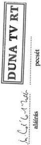
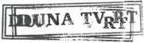
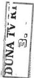
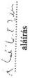
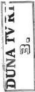
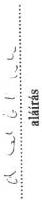

Állami Számverőszék

# JELENTÉS

# A DUNA TELEVÍZIÓ MŰKÖDÉSÉNEK ÉS
GAZDÁLKODÁSÁNAK
ELLENŐRZÉSÉRŐL

357.

1997. május

---

A vizsgálat végrehajtásáért felelős:

A III. Költségvetési Ellenőrzési Igazgatóság

Bihary Zsigmond

számvevő igazgató

Az ellenőrzést vezette:

Matusek István

számvevő főtanácsos

Az összefoglaló jelentés készítésében közreműködött:

Belovai Sándorné

számvevő tanácsos

Bittó Zoltán

számvevő tanácsos

Az ellenőrzésben részt vettek:

Belovai Sándorné

számvevő tanácsos

Bittó Zoltán

számvevő tanácsos

Csóry Györgyné

számvevő tanácsos

Papp Sándor

számvevő tanácsos

Karsai Lászlóné

számvevő

Maklári Valentin

számvevő

Trenovszki István

számvevő

---

# ÁLLAMI SZÁMVEVŐSZÉK

V-18-39/1996-97.

Témaszám: 340.

# JELENTÉS

## a Duna Televízió működésének és gazdálkodásának ellenőrzéséről

A Duna Televízió Részvénytársaság (DTV Rt) pénzügyi-gazdasági ellenőrzése a Kormány korábbi felkérése alapján került be az Állami Számvevőszék 1996. évi ellenőrzési tervébe. Az ellenőrzés indítéka időközben annyiban módosult, hogy a rádiózásról és televíziózásról szóló 1996. évi I. törvény (média törvény) a közmédiákat kivonta a Kormány hatásköréből. A DTV Rt a Kormány által alapított Hungária Televízió Alapítvány (HTVA), ill. az 1048/1994. (VI.27.) Kormányhatározat hatálybalépését követően Közalapítvány (HTVKA) tulajdonát képező egyszemélyes Részvénytársaság, a működéséhez szükséges pénzforrások túlnyomó részét az állami költségvetés folyósította. Működését, finanszírozását - hatálybalépésétől - a média törvény szabályozza. (1996-ban azonban még a korábbi szisztéma szerint finanszírozták a DTV Rt-t.) Az ÁSZ ellenőrzési jogosultsága az Állami Számvevőszékről szóló 1989. évi XXXVIII. tv. 2. paragrafusában és a Polgári Törvénykönyv közalapítványokra vonatkozó 74/G. paragrafusában foglalt előírásokon alapul.

A DTV Rt feladata közszolgálati műsorszolgáltatás, elsősorban a Magyar Köztársaság határain kívül élő magyarság számára. A műsorszolgáltatás segíti a magyar és egyetemes szellemi és kulturális értékek közvetítését, a tárgyilagos Magyarország- és magyarságkép kialakítását Európában és azon kívül, a népek közötti és a nemzetközi kapcsolatok ápolását és erősítését, a magyar kisebbségek identitásának, anyanyelvének, kultúrájának megőrzését.

A DTV Rt Alapító Okiratát 1993. június 19-én tartott Közgyűlésen az egyedüli részvényes elfogadta. A Részvénytársaságot a Cégbíróság 01-10-041306/34. szám alatt bejegyezte.

A Társaság alaptőkéje 1.104.020.000 Ft, ebből készpénz 8.070.000 Ft, apport 1.095.950.000 Ft.

A Társaságnak egy forgalomképtelen, névre szóló részvénye van, amelynek tulajdonosa a Hungária Televízió Közalapítvány.

1

---

A Társaság 1996. évi bevétele 3.876,9 millió Ft, költsége összesen 3.492,1 millió Ft, mérleg szerinti eredménye 384,8 millió Ft. Az 1996. évi állományi zárólétszáma 387 fő, amelyből 370 fő teljes munkaidőben foglalkoztatott munkavállaló.

Az ellenőrzés célja annak megállapítása volt, hogy az állami támogatások felhasználása során miként érvényesültek az alapítói szándékok, mennyiben és milyen eredményességgel törekedtek az állami vagyon megfelelő hasznosítására. Értékelni kellett, hogy a DTV Rt gazdálkodása mennyiben felelt meg a törvényesség, célszerűség és eredményesség követelményeinek.

Az ellenőrzés megállapításai az előre bekért és feldolgozott tanúsítványokra, dokumentációkra, valamint a helyszíni ellenőrzés során nyert tapasztalatokra, továbbá nemzetközi információkra, összehasonlító adatokra támaszkodnak. A közszolgálati televíziózással kapcsolatos nemzetközi információkat a függelék tartalmazza.

Az ellenőrzés az alapítástól kezdve az 1996. évvel záródó időszakot érintette, de ezen belül a hangsúlyt az 1995-96. évekre, valamint az 1997. évi gazdasági célkitűzésekre helyezte.

A helyszíni ellenőrzés 1996. december 20-án zárult le.

# I. Összefoglaló megállapítások, következtetések, javaslatok

A Magyarok III. Világtalálkozóján, 1992. év augusztusában fogalmazódott meg az elhatározás, hogy a határainkon túl élő magyarság és az Európában található szórvány magyarok részére elérhető technikai kivitelezésű (műholdas), színvonalas műsorokat szolgáló televíziót kell létesíteni. Az elképzelés meglepő gyorsasággal valósult meg, a szervezeti kereteket megállapító Kormányhatározat októberben jelent meg és még ugyanebben az évben, decemberben megkezdődtek a kísérleti adások.

Az alapítás gyorsaságában rejlő előkészületi hibák, tisztázatlan feltételek és körülmények előnytelen következményei kevésbé befolyásolják a Hungária Televízió Közalapítvány működését, ellenben máig előnytelenül hatnak a Duna TV Rt tevékenységére, gazdálkodására.

A vizsgált időszak történéseit áttekintve megállapítható, hogy a Duna Televízió Rényvénytársaság (DTV Rt) úgy jött létre, hogy kezdetben hiányoztak a működéséhez szükséges alapvető tárgyi (stúdió, technika, irodák) és személyi feltételek (1993. januárban összesen 8 kezdő bemondó és 5 alkalmazott képezte a teljes létszámot). Nem volt (nem is lehetett) kiérlelt műsorpolitikai elképzelés, nem rendelkeztek számottevő műsortartalékkal.

A DTV Rt a rádiózásról és televíziózásról szóló 1996. évi I. törvény kihirdetéséig - sem feladatait, sem pedig működési feltételeit illetően - nem működött egyértelműen szabályozott környezetben. A HTVA alapító okiratának 1994. VI. 27-i módosításáig alapítványi célként a televízió „nem közszolgálati” jellegét deklarálták. A Kormány által 1992.

2

---

októberében tett konkrét pénzügyi támogatási ígéretének helyébe 1994. júniusától a folyamatos működés feltételeinek nem részletezett kilátásba helyezése lépett.

A média törvény beemelte a DTV Rt-t a közszolgálati műsorszolgáltató szervezetek közé, ami egyidejűleg azzal járt, hogy az intézmény működése társadalmi felügyelet alá került, alapvető jogait és kötelességeit törvény állapítja meg, ugyanakkor tevékenysége ellátása érdekében közpénzeket (üzembentartási díj, költségvetési céltámogatás) vehet igénybe.

A média törvény hatálybalépése az eddigi működés számos ellentmondását, problémáját megoldotta, vagy legalább is megteremtette feloldásuk lehetőségét. A gazdasági társaságokról szóló 1988. évi VI. törvény, valamint a média törvény eltérő szabályozási köréből adódóan azonban továbbra is részben jogértelmezési, részben finanszírozási és gazdálkodási problémák tapasztalhatók, amelyekre megnyugtató, rendszerszerűen működő megoldások még nincsenek.

A részvénytársaság - a DTV Rt esetében - inkább forma, mint tartalmi keret. Finanszírozásának rendszere teljesen azonos volt a költségvetési intézményekével, azzal a lényegtelen különbséggel, hogy a pénzek a HTV(K)A számláján átmentek. A bevételek túlnyomó többségét korábban alkotó költségvetési támogatás (és elvonás) teljesen azonos mechanizmus szerint működött, mint bármely költségvetésből gazdálkodó szervnél. A folyósítás ütemezése és az üzleti terv nem harmonizáltak egymással, annak ellenére sem, hogy az Rt folyamatosan üzleti, likviditási terveket készített az éppen remélt (ígért) támogatások befolyása vagy elmaradása esetére.

A DTV Rt az 1996. évi I. törvény hatálybalépése óta felemás piaci viszonyok között működik. Bevételeinek mintegy 90%-ára nincs ráhatása. Az üzemben tartási díj mértéke, az abból való részesedés aránya független a Részvénytársaság tevékenységének színvonalától, eredményességétől, „piacképességétől”. A díj beszedésének eredményessége más szervezetek szerződéses megállapodásától függ, az előfizetők díjfizetési fegyelméről még közvetett tájékozottsággal sem rendelkezik, a mulasztókkal szemben jogi úton fellépni nem tud. Mindezekkel szemben gazdálkodási kötelmei - a média törvényben meghatározott eltérésekkel - azonosak a gazdasági társaságokról szóló törvényben szabályozott bármely részvénytársaságával.

A DTV Rt működését befolyásoló belső és külső tényezők hatásainak mérlegelése alapján megállapításunk az, hogy a vizsgált szervezet gazdálkodása alapvetően jó, szabályszerű és többnyire célszerű is. A kívánatos irányú továbbfejlesztés belső alapjai megvannak. Ugyanakkor a részvénytársasági forma - figyelemmel arra, hogy az Rt közpénzekkel és közvagyonnal gazdálkodik - az ellenőrzés tapasztalatai szerint nem minősíthető egyértelműen célszerűnek. A jelenleg adott külső feltételrendszer pedig bonyolult kölcsönhatásaival nem segíti eléggé a szervezet alapítási céljainak zavartalan megvalósulását.

Az 1988. évi VI. törvény szerint a tulajdonosi jogok a közgyűlésen, illetve az igazgatósági testületeken keresztül érvényesülnek. Az 1996. évi I. törvény e tekintetben más szabályozást ír elő. Az igazgatóság jogainak az Rt elnökére történő részbeni átruházása számos jogértelmezési és hatásköri vitát szül, amelyek kezeléséhez hiányoznak a tapasztalatok.

3

---

Az alapítás óta juttatott összesen mintegy 10 milliárd Ft-ot kitevő költségvetési támogatás, valamint 2 milliárd Ft-ot megközelítő beruházási célú költségvetési juttatás nem kapcsolódott teljesítménymutatóhoz, feltételhez vagy ösztönzőhöz.

A média törvény megalkotásáig - a közszolgálati médiákra vonatkozó jogalkotási és alkalmazási bizonytalanságok miatt - lényegében szabályozatlan maradt a HTVA és a DTV Rt kapcsolati rendszere, az egymás közti pénzforgalom és elszámolás rendje, s nem alakult ki megfelelő felügyeleti ellenőrzési rendszer sem. Az Alapítványt, később Közalapítványt egyetlen esetben sem ellenőrizte a Pénzügyminisztérium (holott erre az 1048/1994. (VI.27.) Kormányhatározat kötelezte), illetve a fejezetgazda szerepet ellátó Művelődési és Közoktatási Minisztérium. Sajátos helyzetben volt a DTV Rt állami finanszírozási rendszerében a Művelődési és Közoktatási Minisztérium. A Kormány által a HTVKA részére jóváhagyott költségvetési támogatások az MKM fejezet előirányzatai között jelentek meg, de a Minisztériumnak semmilyen jogcíme sem volt a DTV Rt szakmai felügyeletére. A gazdálkodás minőségéről és eredményességéről adatok, információk nem álltak rendelkezésre, és a feladat ellátásához az MKM-en belül megfelelő felkészültségű szakember sem volt. A Minisztériumnak 1995. év végén úgy kellett a DTV Rt „válságmenedzselését” irányítani, hogy sem az Rt Felügyelő Bizottságában, sem a felügyeleti jogokat gyakorló HTVKA Kuratóriumában nem volt képviselete. Az Alapítvány érdemben nem értékelte a Részvénytársaság gazdálkodását az 1996. évi I. törvény hatálybalépéséig. Hasonlóképpen nem érvényesült a korábbi összetételű Felügyelő Bizottság ellenőrző tevékenysége sem. A DTV Rt-nél végzett néhány hatósági ellenőrzés résztvevényességekre irányult.

Az Alapítványt 1993-ban a Miniszterelnöki Hivatal ellenőrizte. Az Alapítványnál, illetve Közalapítványnál 1995-ben végzett ÁSZ ellenőrzés megállapítása szerint a Miniszterelnöki Hivatal vizsgálatának realizálására vonatkozó dokumentum nem került elő, holott a gazdálkodás helyzete miatt belső vizsgálatok indítását, a helyzet tisztázását továbbra is indokolták volna a körülmények.

A Duna TV gazdasági önállóságának kezdete 1993. áprilisától, a tényleges önállóvá válás 1994. évtől, a műsorszerkezet kialakulásától és stabilizálódásától számítható.(Az 1993. évet szinte teljesen egyedi negyedévek, hónapok alkották, amelyeknél a körülmények rendre eltértek egymástól. Az év adatai alkalmatlanok egy bázis év adatainak képzéséhez. Az első, későbbi összehasonlításra alkalmas év 1994.) A DTV Rt menedzsmentje 1993. július 1-jével vehette át a gazdálkodás tényleges irányítását, mert addig az adásokkal kapcsolatos műsorpolitikai döntéseket a Kuratórium, később pedig a Műsortanács hozta meg. Ebben a szakaszban a HTVA és a DTV Rt kiadásai nem különültek el. Kezdetben - a művészeti vezetés hiányában - nem volt gazdaságossági elemzés, nem gazdálkodtak a gyártással, a beszerzéssel és a műsoridővel, ezért egyre esetlegesebbé és áttekinthetetlenebbé vált a műsorszerkesztés.

A menedzsment feladata volt az átgondolt műsorszerkezethez igazodó gyártás, beszerzés irányítása, a dokumentálás és nyilvántartási rendszerek kialakítása, a tevékenységek átfogó megszervezése, számítógépesítése, valamint a székház rekonstrukciójának és a műszaki berendezések beruházásának irányítása. A minden tekintetben újszerű feladatokat a televíziózásban többnyire közvetlen tapasztalatokkal nem rendelkező vezetők, műszaki és gazdasági szakemberek többségében jól oldották meg.

4

---

Már a média törvényt megelőző időszakra is az volt a jellemző, hogy a DTV Rt-nél erőteljes önkorlátozást érvényesítettek a reklámok befogadásában, bizonyos témájú reklámokat egyáltalán nem, egyéb reklámokat csak szigorú feltételekkel vállaltak fel. Az így összeállt műsorszerkezet tudatos megfontolások eredménye volt, amelyet egyaránt motiváltak esztétikai, erkölcsi megfontolások éppúgy, mint a fennálló relatív pénzszűke és kapacitás gondok.

A DTV Rt működése során kialakította saját televíziós arculatát. Az alapításkor előírt feladatok fokozatos megvalósításával értékközvetítő közszolgálati televízióvá vált.

A körülmények rákényszerítették a DTV Rt vezetését arra, hogy a magyar közmédiáknál nem megszokott mértékű szigorú- a valódi részvénytársaságokhoz viszonyítva mégis csak laza - gazdálkodást érvényesítsen, belső normatívákat alkalmazzon, a műsorkészítés költségeit meghatározott keretek között tartsa.

Általában az volt megállapítható, hogy a gazdasági, pénzügyi és számviteli folyamatok zárt és ellenőrzött rendszert alkotnak, az észlelt és feltárt hiányosságok ellenére is. A felelősségi körök kellően elhatároltak, a cég iratai, szerződései, számvitele rendezettek és áttekinthetőek.

A megfelelőnek értékelt belső szabályozás ellenére rendkívül nehezen mondható megalapozott értékítélet a gazdálkodás eredményességéről, a közpénzek felhasználásának célszerűségéről.

A vizsgált időszakban a DTV Rt gazdasági cselekvőképességét több tényező determinálta, így az állami költségvetésből kapható források korlátozottsága és azok igénybevételi lehetőségeinek kötöttségei, a saját bevétel alacsony aránya, a szükséges eszközben és pénztartalékokban meglévő valódi hiányok, majd a média törvényben foglalt gazdasági kihatású korlátok és tilalmak.

A vizsgált időszak teljes terjedelmére jellemző volt a permanensen fennálló forráshiány, amely leginkább a gazdasági évek második felében fenyegetett csődhelyzettel. Az egyensúlyi állapot létrehozása érdekében a DTV Rt vezetése rendszeres lobbizásra, pénzügyi igényeinek igazolására, az adások beszüntetésének víziójával való fenyegetésre kényszerült. A folyamatos alkudozás határozottan kitapinthatóvá teszi, hogy az Rt vezetése tevékenységének nagy hányadát a döntéshozó testületek és személyek meggyőzésére, a pénzforrások megszerzésére volt kénytelen fordítani. Ilyen vonatkozásban a HTVKA Kuratóriuma és az Országos Rádió és Televízió Testület igénybevétele sem elhanyagolható nagyságrendű.

A kezdetektől 1996. év végéig folyamatosan regisztrálható, hogy végül is mindenféle presszió hatására a DTV Rt rendszeresen megkapta az éves működéshez feltétlenül szükséges - és elsőre mindig elutasított - összegeket, csak nem akkor, amikor arra valóban szükség volt. Az 1/a táblázat adatai szerint az éves támogatásokra jóváhagyott összegekből a DTV Rt összesen 1,6 milliárd Ft-tal kapott ténylegesen kevesebbet, az Rt vezetése által szükségesnek tekintett 4,5 milliárd Ft-ot a támogatás mértéke egyetlen évben sem érte el.

5

---

Jó helyzetfelismeréssel mutatott rá egy 1993. évben készült Kormány-előterjesztés arra, hogy „A Hungária Televízió Alapítvány által működtetett Duna TV és a Magyar Televízió a Kormány részéről rendszeres eseti beavatkozást - segítségnyújtást - igényel, melynek elmaradása nyilvánvaló politikai következményekkel járna. Ugyanakkor ezen intézmények gyakorlatilag autonóm módon működnek, a Kormánynak, illetőleg a költségvetésnek a tevékenység folyamatára, szerveződésére, a gazdasági események alakulására semmilyen ráhatása nincs. A nyilvánvaló problémák megelőzésére, illetve felszámolására többször kezdeményezett gazdálkodási, likviditási tervek nem készültek el, a szóban forgó intézmények részéről nincs készség a működésnek, fejlesztésnek a költségvetési és más források által meghatározott keretek között tartására, semmilyen garancia nincs a költségvetési támogatás hatékony felhasználására. Kialakult az utólag „benyújtott számlák” kifizetésének gyakorlata.”

A kormányzati szervek azóta is a tényleges helyzet ismerete nélkül folytatnak pénzügyi kihatású egyeztetéseket a DTV Rt-ről az éves költségvetési tervezés menetében. Az évente ismétlődő, véget nem érő alkufolyamatok, az év végi pótlólagos költségvetési támogatások azzal a veszéllyel járnak, hogy a televízió vezetése végül mentesül a gazdasági korlátok által behatárolt gazdálkodás követelménye alól.

A gazdasági feltételek további rendezetlensége mellett nincs remény minőségi változásokra. Érdemleges változások nélkül 2-3 éven belül gyorsuló vagyonvesztéssel, ismétlődő likviditási gondokkal kell számolni, végső soron csődhelyzet is előállhat. A Kincstári Vagyonkezelő Igazgatóság megbízásából a DTV Rt-nél pénzügyi átvilágítást végző ITAG-ÖKOLEX Gazdasági Tanácsadó és Könyvvizsgáló Részvénytársaság tanulmánya és hatékonysági elemzése ugyancsak egyértelműen alátámasztja azt a megállapítást, hogy a különböző pénzügyi mutatók nem érik el a gazdasági társaságoktól elvárható szintet és a változások iránya kedvezőtlen.

A DTV Rt. a szükséges eszközökkel soha nem volt kellően ellátva, e tekintetben a legkritikusabb elem az adásstúdió hiánya. Az Rt alapítása óta nem rendelkezik forgótőke tartalékkal, ennek képzésére a fennálló gazdálkodási feltételek mellett nincs is számottevő lehetősége. Nem képződik elegendő forrás a fejlesztéshez, karbantartáshoz, felújításhoz, s majd tőke az elhasználódott eszközök cseréjéhez.

Az itt is érvényesülő költségvetési mechanizmus már megkezdte a gazdasági társaságoktól elvárt óvatos és előrelátó gazdálkodási szemlélet fellazítását. Ez tetten érhető abban, hogy 1996-ban nem kellően megalapozott általános béremelést hajtottak végre. A negatív jelenségek sorába illeszthetők a teljesítményekkel nem mindig arányos, vagy nem kellően ellenőrzött megbízási díj kifizetések és a költséggazdálkodás továbbfejlesztésének elmaradása. Ugyanakkor az adás biztonsága szempontjából kulcsfontosságú adásstúdiót - a külső források biztosítása érdekében tett többszöri, sikertelen kezdeményezés mellett - meg sem kísérelték saját erőből létrehozni (pl. forrásátcsoportosítással, beruházások átütemezésével, rangsorolásával).

6

---

További veszélyek hordozója lehet az alapvető koncepciók bizonytalansága. Kezdetben kis létszámú, „megrendelő” televíziós modell volt az elképzelés. A jelenlegi létszámfejlesztés alapját a Kuratórium által 1993-ban elfogadott szervezeti struktúra képezi, amely bizonyos koncepcióváltással járt.

Joggal feltételezhető, hogy a jövőben kedvezőbb pénzügyi helyzetben a gyártási kapacitások nagyobb mértékű fejlesztésére is sor kerülhetne, egy bizonyos idő eltelte után az adózó állampolgárok (TV nézők) két, párhuzamosan kifejlesztett és nem kellően kihasznált gyártó kapacitást finanszírozhatnak. A veszély egyelőre még csak elméleti, mivel a DTV Rt még a szükséges (úgynevezett minimál) kapacitással sem rendelkezik, de a közszolgálati televíziók fejlesztési távlatainál már most gondolni kell valamilyen koordinációra.

Az 1995. év II. félévében finanszírozási bizonytalanságok miatt válságosnak tekintett helyzet állt elő. A kialakult likviditási gondok elhárítását legvégül nem a kidolgozott „válságterv” eredményes végrehajtása eredményezte, hanem a Kormány póttámogatása. Ebből következően a „belső tartalékok feltárása” az 1996. évi gazdálkodásban sem hozott enyhülést.

Az 1996. évi üzleti tervet a Kuratórium 1996. június 27-én 1,2 milliárd Ft-os hiánnyal hagyta jóvá, az 1996. évi I. törvényben a Duna Televízió finanszírozásának rendezésére utaló rendelkezésre, valamint az OGY illetékes bizottságainak állásfoglalásaira alapozva. A Kuratórium ezen döntése megelőzte a költségvetési törvény módosítását és nem vehette figyelembe az ITAG-ÖKOLEX Részvénytársaság még befejezetlen pénzügyi átvilágításának részletes megállapításait és javaslatait sem.

Az 1996. évi költségvetési törvény módosítása szeptemberben rendezte a DTV Rt finanszírozásának problémáját, de az üzemben tartási díjból pótlólagosan járó 1200 millió Ft-ot a DTV Rt csak megkésve, decemberben, illetve 1997. január első napjaiban kapta meg. A késedelem miatt 1996. II. félévében a likviditási gondok állandósultak. A 300 millió Ft likviditási hitel felvétele ellenére 1996. december 31-én is az Rt rövidlejáratú kötelezettségei több mint 2,5-szeresen meghaladták a mobil pénzeszközeinek értékét.

Az 1997. évi előzetes - HTVKA által még jóvá nem hagyott - üzleti terve részletes elemzés nélkül megbízhatóan nem értékelhető. Az ellenőrzés rendelkezésére bocsátott előzetes üzleti tervet átdolgozták, megtárgyalására várhatóan a HTVKA 1997. május 8-i ülésén kerül sor. Így erről a változatról véleményt alkotni nem volt lehetőség.

A továbbiakban a DTV Rt gazdasági kapcsolatainak rendszerét a Hungária Televízió Közalapítvány átalakításáról szóló 19/1996. (III.8.) OGY határozatnak megfelelő tartalmú kapcsolattá kell fejleszteni, amihez a kezdeti lépéseket a HTVKA Kuratóriuma, ill. annak elnöksége megtette. Azonban az eddigi tulajdonosi ellenőrzés és állásfoglalás nem eléggé hatékony, tehát nem elégséges. A Kuratóriumnak mihamarabb abba a helyzetbe kell kerülnie, hogy a DTV Rt működésének eredményességi fokáról, valós nehézségeiről és az indokolt pénzügyi igényeiről megalapozott, szuverén álláspontja legyen a menedzsment javaslatainak, vagy ténykedéseinek minősítése során. Ez az egyik, de nem elégséges feltétel. Az Országos Rádió és Televízió Testület elvi- és

7

---

gyakorlati irányításával, a Közalapítványok Kuratóriumainak hathatós közreműködésével olyan mennyiségi és minőségi mérőszámok rendszerét kellene kialakítani, amelynek teljesítésétől függ a közpénzekhez jutás lehetősége, aminek ismeretében megalapozott üzleti terv készülhet, ami végül elszámoltatható. Egy ilyen rendszer természetesen garantálja az elérhető közpénzek maximumát, s elmaradás esetén az korlátlanul csökkenthető. Megfelelően adaptálhatók a versenyszféra hitelképességének, pénzügyi helyzetének megítélése során alkalmazott gyors és hosszabb távú indikátorok. Egy elvi alapokon álló - esetleg polgári szerződéssel rögzített - finanszírozási rendszer egyaránt kizárja az önkényes elvonások és a megalapozatlan pótigények lehetőségét.

Az ellenőrzés megállapításai alapján javasoljuk

# az Országgyűlésnek

Kérje fel a Kormányt, hogy a korábbi alapítói kötelezettségéből adódóan a HTVKA-t, s rajta keresztül a DTV Rt-t lássa el forgótőkével (a reális forgótőke szükséglet megállapításához támpontokat ad a korábban állami megbízásból elvégzett pénzügyi átvilágítás).

# az Országos Rádió és Televízió Testületnek

1. Tekintse at a gazdasagi tarsasagokrol szlo 1988. evi VI. törveny, valamint a radiozásrol és televíziózsrol szlo 1996. evi I. törveny elterő szabályozási köréból adódo ellentmondásokat és szükség szerint kezdéményezze azok feloldása érdekében a media törveny módosításat.
2. Az MTV Közalapitvany, az MR Közalapitvany és HTV Közalapitvany bevonásával alakítsa ki a kozszolgálati mediák finanszirozasát, penzügyi pályázataik elbirálásat megalapozó minósegi és mennyiségi mérőszámok rendszerét.

# az alapító szerv (HTVKA) Kuratóriumának

1. Maradéktalanul teljesítse a rea ruházott tulajdonosi jogokat és kõtelezettsegeket (az éves gazdalkodásí és penzügyi terv jováhagyása, az Rt gazdalkodásanak Ellenőrzese, az évi adásidó jováhagyása, az Rt elnöke pályázataban foglalt celkitüzesek megvalósításnak folyamatos Ellenőrzese stb).
2. Az MTV 2 eladása után a HTVKA-t megillető összegból (média törveny 131. paragrafus) a DTV Rt szakmailag megalapozott beruházásainak befejezesét indokolt megoldani (az adásbiztonság megteremtése, a színes közvetítokocsi eredeti rendeltetési celjának megfelelo hasznositása stb).

8

---

3. Gondoskodjon arrol, hogy a vegleges éves gazdalkodási terv, a hozza kapcsolódo músorterv és költségtervek igazodjanak a realisan varhato árbevételhez, és az legyen az alapja a költségvetési (cel)támogatas kezdeményezésenek. A gazdalkodási tervben foglalt határidok be nem tartasa, az elvarhato gazdasági fegyelem megsértese eseten meghatározott mertékü szankció érvényesüljön.
4. A DTV Rt elnoke dijazásanak megallapítsa során érvényesítse a gazdalkodás ellenörzese során szerzett tapasztalatait, különös tekintettel az éves gazdalkodási tervek fóbb mutatószámainak teljesülésere. (A szakmai mérlegelés fóbb szempontjai lehetnek: a gazdalkodási terv és a músorterv összhangja, a fejlesztések megvalósulásanak szírvona-la és gazdaságossága, a költségényezők, músorok percarainak, kapacitások kihasználásanak alakulása.)
5. A törvényes muködés érdekében el kell keszítetni a DTV Rt Szervezeti és Múködési Szabályzatát, ill. jóva kell hagyni a kozszolgálati musorszolgáltatási szabályzatot és az archivalás rendjéról szólo szabályzatot.
6. Kiserje figyelemmel es kerje szamon az Allami Szamvevszek megallapitasainak, javaslatainak vegrehajtsat.

# a Duna Televízió Rt elnökének

1. A megfelelonek tartott szervezeti struktura figyelembevetelevel tekintse at a letszamfejlesztési terveket, a meglévo letszam megoszlásat és összetetelet. A távlatosabb fejlesztési elgondolások figyelembevetelevel határozza meg a szükséges letszámot.
2. A gazdalkodási dontéseknél - a gazdalkodásert felelosök bevonásával - az eddigieknél is nagyobb mertékben vegye figyelembe a gazdasági-penzügyi felteteleket.
3. Az Alapíto OkiratbanBiztositott lehetósegekkel elve novelni indokolt a vallkozási beveteleket es azokat realis mertékben kell szerepeltetni az éves gazdalkodási és penzügyi tervekben.
4. Szerezen érvényt az Állami Számvevőszék jelentésében megfogalmazott javaslatok maradéktalan vegrehajtásanak és intezkedjen a feltart hiányosságok megszüntetése erdekében (pl. munkaúgyi szabályzat elfogadása, a szamviteli törveny elóirásainak betartása a leltározás során, a költségnorma rendszer karbantartása stb).

9

---

## II. Részletes megállapítások

### 1. DTV RT MŰKÖDÉSÉNEK TÖRVÉNYESSÉGE, SZABÁLYOZOTTSÁGA, A FELADATOK ÉS A SZERVEZETI RENDSZER ÖSSZHANGJA

#### 1.1. A DTV Rt működésének kezdeti körülményei, jogszabályi háttere, pénzügyi, tárgyi, személyi feltételei

A Magyarok III. Világtalálkozóján, 1992. nyarán fogalmazódott meg az igény a határainkon túl élő 5 milliós magyarság számára szóló önálló, műholdas sugárzású televíziós adás megteremtésére - kulturális önazonosságuk megőrzése érdekében.

E televíziós adás megvalósítására - az 1992. évben már formálódó, de bizonytalan kimenetelű és elfogadású média törvény helyett - kormányhatáskörben került sor. A Duna Televízió Rt (DTV Rt) létrehozása és a Duna Televízió (DTV) működésének megkezdése a Hungária Televízió Alapítvány (HTVA) létrehozásáról szóló 1057/1992. (X.9.) Korm. határozaton és az abban foglalt televízió-műsor sugárzási feladat-meghatározáson alapult.

A HTVA Kuratóriuma 1992. december 14-i ülésén **részvénytársasági formában működtetendő, alapítványi televíziós adás** mellett döntött. Az alapítványi cél mielőbbi megvalósulása érdekében a Kuratórium elnöke már december 28-án adásvételi szerződést kötött a Közművelődési Információs Vállalat vezetőjével, e cég tulajdonában álló és stúdióengedéllyel rendelkező Eurion Rt 10 millió Ft-os névértékű megvásárlásáról. Az Eurion Rt az 1993. január 31-i cégbejegyzés alapján a HTVA tulajdonaként folytatta tevékenységét (1993. április 28-tól **Duna TV-Eurion Kulturális és Kommunikációs Részvénytársaság** néven).

Az alapítói kormányhatározat a működés megkezdéséhez 1992-ben 300 millió Ft-ot, 1993-ban 2 milliárd Ft-ot biztosított. Az 1992. október 10-én kiadott 3430/1992. sz. kormányhatározat pedig a létesítéshez szükséges vagyon megállapításáról, a sugárzás feltételeinek megteremtéséről rendelkezett, meghatározva az egyes tárcák feladatait. A DTV indulási időszakának gyakorlatilag 1993. I. féléve tekinthető, mivel 1992. november 1. és december 23. között a MOVI Alfa Kft bevonásával kísérleti műsorszolgáltatás zajlik, majd 1992. december 24-től indul a televíziós műsoradás.

A televíziós közfeladat ellátására biztosított 1992-1993. évi állami támogatás alapvetően csak a napi 6 órás műsoridő indítására és fenntartására volt elegendő.

A DTV bérelt épületekben, bérelt eszközökkel, gyakorlatilag a tárgyi feltételek - saját stúdiók, irodák, stúdiótechnika stb - teljes hiányában kezdte meg adásait.

A feltételek biztosítását célzó 3430/1992. sz. Kormányhatározattal szemben minimális összegű induló vagyont kapott 185 millió Ft értékben, forgóeszközökkel való ellátása egyáltalán nem történt meg.

10

---

**Az indulás személyi feltételei szintén hiányoztak**, 1993. januárjában mindössze 8 kezdő bemondó és 5 alkalmazott alkotta a HTVA és a DTV személyi állományát. A teljes műszaki, pénzügyi és számviteli tevékenység külső cégek szolgáltatásaiként funkcionált. 1993. áprilisától épült ki a saját önálló gazdasági és műszaki szervezet. Művészeti vezetés hiányában 1993. I. félévében a műsorkészítést a HTVA műsortanácsa irányította. A DTV Rt személyi állományának koncepcionális alapokon nyugvó és a HTVA Kuratóriuma által elfogadott feladatokhoz igazodó kiépítése 1993. július 1-től, az új 3 fős vezetői menedzsment kinevezésével és belépésével indult el igazán.

**Az indulás körülményeinek és a működési feltételek** rendelkezésre állásának értékelésekor utólagosan az állapítható meg, hogy leginkább a határon túli magyarság számára biztosítandó televíziós műsorsugárzás **szellemiségét munkálták ki. A működési feltételek biztosítása terén máig is meglévő hiányosságok vannak.**

A HTVA, illetve 1994. VI. 27-től a HTVKA és a DTV Rt közötti kapcsolatok **jogi szabályozása** az 1993. január és 1996. január közötti időszakban kormányrendeleteken és a DTV Rt 1993. évi Alapító Okiratán alapultak. 1996. február 1-től a rádiózásról és televíziózásról hatályba lépett 1996. évi I. törvény megerősítette és jogilag magasabb szintre helyezte a HTVA és a DTV Rt kapcsolatát. A Kormányrendelettel létrehozott HTVA közalapítvánnyá alakulásáról országgyűlési határozat döntött.

**Mind a kormányzati, mind az országgyűlési szabályozás időszaka alatt a gyakorlatban kialakítottnak és rendezettnek minősíthető a tulajdonos és az Rt közötti kapcsolatok jogi szabályozása.** A HTVA Kuratóriuma számára biztosított alapítói jogosítványok gyakorlása kuratóriumi határozatokban jelentkezett, de leginkább a DTV Rt éves közgyűlésein, annak döntéseiben realizálódott.

Az együttműködést a közgyűlési határozatok tükrözik, melyek az 1994., 1995., 1996-os években egyhangúan, minimális változtatási javaslattal fogadták el a DTV Rt Igazgatósága által készített beszámolókat és üzleti terveket. Így pl az Igazgatóság 1993-as munkájáról szóló jelentést az 1994. május 25-én tartott közgyűlés azzal a minimális kiegészítéssel fogadta el, hogy 'a tervezett összegnek kevesebb, mint a feléből kellett működni.'

A működés kezdeti időszakában (1993. I. félévéig) a HTVA Kuratóriumának erőteljes irányító és döntést hozó munkája érvényesült (a műsorpolitika szellemiségének, tartalmának meghatározásánál, az előírt működési feltételekben, a DTV Rt vezető munkatársainak kiválasztásánál, a főbb gazdasági és műszaki jellegű döntéseknél stb).

**Az új menedzsment megválasztásának időpontjától (1993. július 1.)** új korszak és munkamegosztás bontakozik ki a HTVA és a DTV Rt kapcsolatában és együttműködésében. A kuratóriumi állásfoglalások és közgyűlési határozatok alapulvételével a DTV Rt megfelelő önállósággal alakítja ki szervezetét, létszámát, műsorpolitikáját és dolgozza ki üzleti terveiben fejlesztési elképzeléseit. A gazdálkodási tevékenység súlyponti kérdései és gyakorlati megvalósításai áttevődtek az Rt vezetéséhez.

A média törvény 1996. február 1-i hatályba lépéséig **a két szervezet működésének legkevésbé szabályozott része volt** a közös feladatok megvalósítása **gazdasági-pénzügyi feltételeinek biztosítása és szabályozottsága.**

11

---

A HTVA-t alapító 1057/1992. (X.9.) Korm. határozat 1994-1997. évekre, majd az ezt módosító 1048/1994. (VI.27.) Korm. határozat 1994-től biztosítja a televíziós műsorkészítés folyamatos feltételeit, de arról a Kormány határozatok nem intézkedtek, hogy milyen forrásból, milyen mennyiségi és minőségi mutatókhoz kötötten, mely szervezet, vagy testület által hozott döntés alapján folyósítják a támogatást. Nem került az sem meghatározásra, hogy a HTVA a kapott támogatásokból milyen jogcímen, milyen összeget és milyen feltételekkel köteles átadni a DTV Rt részére.

A fentiekben leírt laza és rendezetlen gazdasági szabályozás alapján alakult ki az a gyakorlat a HTVA és a DTV Rt gazdasági együttműködésében, hogy

a DTV Rt Igazgatosaga es menedzsmentje altal osszeallitott, celtudatosan épitkezü üzleti tervet a HTVA Kuratoriuma különösebb gazdasagi elemzes nélkül elfogadta;
a HTVA szamara megszavazott orszaggyulési penzügyi támogatásokat a HTVA az altala meghatározott muködési kölşegek levonása után a DTV Rtnek átutalta;
a HTVA es a DTV Rt - kényszerüsegból - együttes erövel keresték a további allami forrásokat (s kevésbé foglalkoztak a saját tevekenységból származó bevételi hanyad novelésenek lehetósegeivel).

A HTVKA és a DTV Rt közötti gazdasági együttműködésben minőségi előrelépést jelentenek a média törvényben 1997. január 1-től érvényesülő - de nem elégséges - forrásbiztosítási garanciák, valamint a 19/1996. (III. 8.) OGY határozatban foglalt előírások, miszerint a közalapítványi bevételek között megjelenő DTV Rt-t megillető összegeket a folyósítást követően haladéktalanul köteles a HTVKA a DTV Rt rendelkezésére bocsátani.

A HTVA és a DTV Rt közötti személyes kapcsolatok alapvetően a közös célnak alárendelten, egymást erősítve működtek.

Az 1992. november-decemberi próbasugárzás, valamint az 1993. I. félévi műsorkészítés során a feladatmegoldás és a segítőkészség keretei között - amint azt az Állami Számvevőszék 1995. VII. 13-án kelt, V-6-58/1995. sz., a HTVA ellenőrzéséről szóló vizsgálati jelentése megállapítja - a HTVA olyan műsorkészítést végző gazdálkodó szervezetekkel is kapcsolatba került, melyek nem minden esetben voltak függetlenek a Kuratórium tagjaitól. Ezt a helyzetet az 1993. VII. 1-től működő DTV Rt vezetése kiküszöbölte. A HTVKA 1996. januárig funkcionáló kuratóriuma és a DTV Rt 1993. júliusától működő vezetősége konstruktívan, de nem problémamentesen működött együtt.

Különösen az 1994., 1995. években nem volt zökkenőmentes az együttműködés, amikor pl. a DTV-t érintő kérdésekben a DTV Rt főigazgatóját nem hívták meg a HTVKA Kuratóriumának üléseire, ill. a DTV Rt szerkesztőségi munkatársainak szakmai meghallgatására a DTV Rt vezetőinek tudta és megkérdezése nélkül került sor.

A média törvény hatálybalépése óta működő új kuratórium szoros és konstruktív szakmai, s emberi kapcsolatban áll a DTV vezetésével. Összeférhetetlenségi

12

---

személyi esetek nem állnak fenn. A HTVKA új kuratóriuma megalakulása óta a média törvény által diktált feszített határidők és feladatok kényszerében működött. Jelentős energiát kötött le a DTV Rt törvény szerinti működésének biztosítása (az új összetételű szervezet működésének indítása, működési szabályzatának elkészítése, a DTV Rt elnökének pályáztatása, az Rt Alapító Okiratának módosítása stb).

**A Felügyelő Bizottság** vizsgálat alá vonta a DTV Rt 1996. évi I-III. negyedéves gazdálkodását, amelyet az Elnökség megtárgyalt. A Bizottság 1997. évi munkatervében célul tűzte ki a gazdálkodás kérdéseinek kiemelt vizsgálatát.

Az Rt hiányzó szabályzatainak elkészítésére az Elnökség konkrét határidőket szabott.

## 1.2. Szervezeti felépítés, szervezeti változások és azok igazodása a feladatokhoz

A DTV Rt **szervezeti felépítése** 1995. év közepére alakult ki. A DTV Rt igazgatósága által 1995. áprilisában véglegesített szervezet jellemzője az, hogy az elnök-főigazgató közvetlen irányítása alatt működő egységek kivételével a tevékenységeket 3 fő területre - művészeti, tájékoztatási, műszaki-gazdasági - csoportosította, egy-egy főigazgató-helyettes irányításával.

E szervezeti felépítést vizsgálva megállapítható, hogy a művészeti és tájékoztatási területen kialakított 20 önálló szerkesztőség, az akkori 48 fős belső szerkesztői állományával, túlzottan kisméretű és elkülönült szervezeti egységeket képezett, s szinte egy műsor - egy szerkesztőség alakult ki. **Mindezzel együtt úgy értékelhető, hogy az 1995-re kialakított és működtetett szervezet alapvetően eleget tett az Rt közgyűlése 1993. június 29-i határozatának, mely szerint a szervezeti átalakítások során biztosítani kell, hogy az Rt tevékenysége összhangban legyen a HTVA Alapító Okiratában foglalt célkitűzésekkel.**

A média törvény előírásai alapján választott Rt elnök hatáskörében 1996. júliusában került sor újabb lényegesebb **szervezeti változtatásokra** az elmúlt 3 év működésének tapasztalatai alapján. **E szervezeti változások többsége ésszerű törekvéseket tükröz.**

Az 1996. nyarán átalakított szervezetnek a feladatokhoz igazodóan hiányzó és tartalommal nem kellően megtöltött részét képezi az oktatási és ifjúsági műsorok készítésére hivatott szervezeti egységek felállítása.

A fenti változtatási elképzelések szerint az egyes műsorszerkesztőségek nagyobb szervezeti egységekbe, ún. **műhelyekbe** tömörülnek. Így megszűnhet eddigi egymástól való elszigeteltségük, a szerkesztőségek műsorainak műhelyszintű értékelése hozzájárulhat a műsorszínvonal további emeléséhez, s ez elvezethet a későbbiek során az önálló műhelygazdálkodás megvalósításához. A műhelyek veze-

13

---

tésének kialakítását nehezíti, hogy a jelenleg működő szerkesztőségek élén eddig 10 főszerkesztő állott, s összesen 7 műhely kialakítása szerepel az elfogadott szervezeti változásokban. A vizsgálat lezárásáig a műhely szervezet még véglegesen nem épült ki.

Szintén a rendelkezésre álló személyek és technikai eszközök eddiginél jobb koncentrációját és feladatokhoz való igazodását jelzi a Koordinációs Központ létrehozása, melyhez az eddig más szervezeti egységeknél szolgálatot teljesítő diszpécserek, rendezők és a műsorok készítésében résztvevő műszaki munkatársak (operatőrök, vágók, hangmérnökök, technikusok stb) tartoznak. E változás eredményeként pl. lényegesen csökkent a külső vágókapacitás igénybevétele.

Különvált az eddig közös irányítás alá tartozó gazdasági és műszaki terület. A korábbi főigazgató-helyettesi irányítási szintet két igazgatói szintű vezetés váltotta fel. E változtatást szintén a műsorgyártási feladatokhoz való közvetlenebb igazodás motiválta, de ennek pár hónapos gyakorlati tapasztalatai a leválasztott gazdasági irányítás és az elkülönülő munkamegosztás miatt nem egyértelműen pozitívak. (A DTV Rt elnökének tájékoztatása szerint a helyszíni ellenőrzés befejeződése után - 1997. márciusában - újabb szervezeti korrekciókat hajtottak végre az észlelt hibák kiküszöbölése és a hatékonyabb irányítás céljából.)

A jelenleg kialakított szervezeti rend értékelésekor feltétlenül említést érdemel az is, hogy a művészeti műsorkészítésért felelős alelnök hatáskörében működik a műsorközpont (40 fő), s a tájékoztatási műsorok készítéséért felelős alelnöki területen a koordinációs központ (97 fő). E két központ tevékenysége viszont mindkét műsorgyártási alelnök területét érinti és átfedi.

### 1.3. A működés szabályszerűsége

A DTV RT működése a jogi szabályozás oldaláról alapvetően két időszakra bontható:

Az indulastol az 1996. januarig terjedo idszakban a gazdasagi tarsasagokrol szlo 1988. evi VI., tverenyen (kiegyszitve a HTVA-rol szlo kormanyhatarozat vonatkoztathato rseive) alapult az Rt mukodese. E szabalyozas (kozgyules, Igazgatosag, Felugyelo Bizottsag, konyvvizsgalomukodese) megfeleloen funkcionalt a gyakorlatban, - termeszetesen mas vonatkozo jogszabalyok elirasaival egyutt - (szamviteli tvereny, adotorenyek, szerzoi jogi tvereny stb).
Az 1996. februar 1-tol, a radiózásrol és televíziózásrol szólo 1996. I. törveny hatálybalépésétól terjedo idószak a media törvenynek valo megfeleltés, valamint a media törveny és a társasági törveny rendelkezesei összhangba hozasának és gyakorlati alkalmazásanak idószaka volt, amelynek során a tulajdonos szabályozása részben megfelelo modon (az Igazgatosági funkció megosztása a HTVKA Kuratóriuma és az Rt elnöke között), részben késedelmesen (a DTV Rt Alapíto Okiratának modositása) tett eleget szabályozási kõtelezettsegénék.

14

---

**Alapító Okirattal** (azok jogszabályi változásokon alapuló korszerűsített változataival) a DTV Rt rendelkezett - az előírt közgyűlési (kuratóriumi) elfogadással. **A média törvény hatálybalépését követően az Alapító Okiratot** a tulajdonosi jogokat gyakorló HTVKA-nak - az új Kuratórium létrejöttét követő 60 napon belül - **módosítania kellett volna**.

Bár az ezirányú munkát a Kuratórium a fenti határidőn belül elkezdte, de ennek befejezésére, a cégbírósághoz történt benyújtására csak 1996. szeptember 27-én került sor - tekintettel a média törvényből és a társasági törvényből fakadó összetett jogértelmezési problémákra. A módosított és egységes szerkezetbe foglalt Alapító Okiratot az 1997. évi Magyar Közlöny 3. számában tették közzé.

A DTV Rt működését - tekintettel arra, hogy a gazdasági társaságokról szóló törvény az alapszabályon kívül kötelező jelleggel más szabályzatot nem ír elő, csak „a társaság szervezetére és működésére vonatkozó más okiratok”- ról tesz említést - a média törvény hatályba lépéséig **főigazgatói utasítások szabályozták**. 1995. áprilisa óta a gyakorlatban funkcionáló **Szervezeti és Működési Szabályzat-tervezet a szervezeti rendszer felépítését és működésének minden lényeges elemét szabályozza**.

A kiadott 15 **főigazgatói utasítás** a leglényegesebb belső működési területeket érinti és szabályozza (műsorgyártási folyamat, adás-lebonyolítás, honoráriumrendszer, utalványozási rend, pénz- és értékkezelés, önköltség-számítási szabályzat, számviteli politika stb).

A DTV Rt 1993. június 29-i közgyűlési előterjesztése és az azt megelőző **kuratóriumi állásfoglalás kötelezte az Rt új, megválasztott Igazgatóságát SZMSZ készítésére** és az Igazgatóság megalakításától számított egy hónapon belüli közgyűlési jóváhagyási előterjesztésre. Az SZMSZ elkészítésére - a belső rend, a működési gyakorlat és a szervezeti felépítés kialakulása után - csak 1995. első negyedévében került sor. **Az SZMSZ Kuratórium elé terjesztése ezt követően megtörtént, de elfogadása** - a média törvényre várva - **már nem**.

A jelenlegi belső szabályozási rendszer ugyanakkor **több problémát** is magában hordoz:

a helyszini ellenorzs befejezodesig az SZMSZ-ben nem kerultek rogztresre a musorkesztesi tevekenyseg szakmai szabalyai, nem volt megallapitva a musorkesztok onallosaganak es felelossegenek kore, valamint a munkatarsakra vonatkozo magatartas es osszeferhetetlenseg szabalyai (az Rt elnokenek tajekoztatasa szerint az idokzben elkeszult musorszolgaltatasi szabalyzat rendelkezik a musorkeszto munkatarsak magatartasi es osszeferhetetlensegi szabalyairol);
az SZMSZ-ben es a munkakori leirasokban lazan szabalyozottak - a gazdasagi szakterulet kivetelevel - az egyes munkakorokhoz tartozo munkaido elirasok es az ezekhez kapcsolt munkateljesitmenyek; a munkakori leirasok altalaban nem egyssegesk, nagyvonalu feladat-elirasokat tartalmaznak; a nem kielegito szabalyozas negativumait fokozza a munkaugyi szabalyzat es a Kollektiv Szerzodes hianya (az Rt elnokenek tajekoztatasa szerint a helyszini ellenorzs befejezese utan elkeszult a munkaugyi szabalyzat-tervezete);
- egyes esetekben a szabályozási szintek keverednek, ill. alsóbb szintú szabályozással megváltoztatták a magasabb szintú szabályozást.

15

---

A média törvényben 1996. november 1-i határidővel előírt szabályzatok közül a közszolgáltatási műsorszolgáltatási és az archiválási szabályzat kimunkálása a helyszíni ellenőrzés zárásakor folyamatban volt. Az előzőekben vázolt problémákat azonban csak a média törvény előírásainak megfelelően kialakított új belső szabályozási rendszer küszöböli ki. (Az Rt elnökének tájékoztatása szerint a műsorszolgáltatási szabályzat azóta elkészült, s azt a HTVKA véleményezte.)

# 2. A TERVEZÉS ÉRTÉKELÉSE

A DTV Rt tervezési tevékenysége értékelésekor a gazdasági társaságokról szóló 1988. évi VI. tv. előírásaiból lehetett kiindulni, mely nem tartalmaz kötelező érvényű tervezési követelményeket, a társaságra bízza az üzletpolitika és üzleti terv kialakítását. Az 1996. évi I. törvény a tervezéssel kapcsolatban annyit ír elő, hogy a kuratórium hatáskörébe tartozik az éves gazdálkodási és pénzügyi terv elveinek és fő összegeinek jóváhagyása.

A DTV Rt éves globális terveként felfogható üzleti tervét minden évben elkészítette, s azt az Rt közgyűlése hagyta jóvá.

A DTV Rt-n belül a tervezés - írásbafoglalt szabályok hiányában - alapvetően hagyományokon alapul.

Az 1995. április 3-án kelt tervezet szintű, de már elavult SZMSZ a különböző területek tervezéssel kapcsolatos feladatait, mint egymással össze nem függő tevékenységeket körvonalazza; a köztük levő kapcsolódási, koordinációs kötelezettségek teljességgel hiányoznak. A különböző (üzleti, műsor, fejlesztési, pénzügyi) tervek felelőseinek kijelölése önmagában még nem teszi nyomonkövethetővé a tervezés komplex folyamatát. Az SZMSZ alapján nem világos, hogy milyen tervezési metodika szerint készülnek a különböző tervek, milyen döntési mechanizmus érvényesül, milyen integrálódási folyamat alapján áll össze a DTV Rt komplex terve.

A televíziós tevékenység legfőbb termékének és az Rt üzleti terve alapjának is tekinthető műsor-tervezés alulról induló széles körű javaslati anyagon nyugszik, majd többlépcsős döntés-előkészítési folyamat keretében - a közszolgáltatásig szempontjait szem előtt tartva - elnöki döntéssel kerül véglegesítésre. E műsortervezési és jóváhagyási rend s gyakorlat sincs komplex módon szabályozva.

A műsortervek - a rendelkezésre állt dokumentumok alapján - csak elnagyoltan foglalkoztak a megvalósítás költségeivel. Viszont az elfogadott műsorokhoz adásonkénti percárakat határoz meg a gazdasági vezetés. A rendszeres műsorok esetében évente folyamatos korrekciót alkalmaznak a kötelező percáraknál; az új műsorok percárai nem gyártási normákon, hanem a hasonló jellegű műsorok tapasztalatain, illetve az adott műsor emberi és anyagi igényeiből levont következtetéseken alapulnak.

A feladatok tervezésének folyamatában a DTV Rt eddigi működése során gondot jelentett, hogy a műsortervek és költségvetésük készítése időszakában nem áll az Rt rendelkezésére elegendő és megbízható információ a következő év pénzügyi lehetőségeiről. A műsorszerkezet összeállításakor nem volt szoros összefüggés a tervezett feladatok és a rendelkezésre álló források között. A műsortervek a végleges források megismerésekor módosultak és a forrásokhoz igazodtak.

16

---

A DTV Rt üzleti, gazdálkodási tervét, ezen belül a bevételek és kiadások tervezését alapvetően a feladatorientáltság, a műsorpolitikának való alárendeltség jellemezte. Ezzel egyidőben viszont nem volt biztosított a pénzügyi lehetőségekkel, a bevételi forrásokkal való összhang a tervezés során. Jellemzően a bevételi és kiadási előirányzatokban hiányzó forrásösszegekkel - mint menetközben potenciálisan megszerezhető forrással - számoltak. Az üzleti tervek - mint a jelentésben több helyen kifejtettük - pénzügyi forrásokkal való megalapozása elsősorban külső okokból nem volt eddig megnyugtatóan biztosítva.

A tényszerűséghez hozzátartozik, hogy a tervezés időpontjában a pénzügyi forrásokkal kapcsolatos információk meglehetősen szegényesen álltak rendelkezésre. Az alapító pedig a DTV Rt által a normális működéshez szükségesnek ítélt 4,5 milliárd Ft-nál lényegesen szerényebb mértékben (átlagosan 2,5 milliárd Ft/év) adott támogatást. Az üzleti tervek készítésénél a DTV Rt vezetése rendre figyelembe vette a remélt vagy ígért alapítói támogatásokat is, ami nem csekély kockázatvállalást jelentett a DTV Rt részéről, valamint a terveket így elfogadó tulajdonos HTVKA részéről is. A HTVKA a DTV Rt terveit anélkül támogatta, hogy mélyebb kritikai elemzésekbe bocsátkozott volna.

A DTV Rt 1996. évi üzleti, gazdálkodási és pénzügyi tervének bizonytalanságát jól tükrözi a tervkészítés és a forrásbiztosítás folyamata.

Az év elején hatálybalépett 1996. évi I. törvény 141. paragrafus (7) bekezdés úgy rendelkezett, hogy a Duna Televízió támogatását növelni kell, amelynek forrása a televízió készülékek után fizetendő üzemben tartási díj lehet.

A törvényből a támogatás növelésének mértékére nem lehet következtetni. A HTVKA előző kuratóriuma nem továbbította a kormányzati szervekhez a 4,9 milliárd Ft-os támogatási igényt tartalmazó üzleti tervet. Az Országgyűlés pedig 1996. évre 2,353 milliárd Ft állami támogatást szavazott meg. Az OGY Kulturális Bizottsága és Média Albizottsága időközben további 1,2 milliárd Ft-os támogatást helyezett kilátásba, mellyel a DTV Rt a 3,883 milliárd Ft-os ún. kényszerköltségvetésében számolt, és amit a HTVKA kuratóriuma 1996. június 27-i ülésén elfogadott.

A Kormány 1996. július 24-én kelt határozata úgy foglalt állást, hogy a költségvetési törvény módosítása során a DTV Rt 1996. évi finanszírozását is rendezni kell. A módosítást az Országgyűlés szeptemberben elfogadta, de a televíziós készülékek üzemben tartási díjából járó 1245 millió Ft-ot a DTV Rt csak megkésve, decemberben, illetve 1997. január első napjaiban kapta meg. A késedelem miatt a likviditási gondok 1996. II. félévében a 300 millió Ft likviditási hitel felvétele ellenére állandósultak.

## 2.1. Az 1997. évi üzleti terv megalapozottsága

A helyszíni vizsgálat időpontjában a DTV Rt előzetes, a HTVKA Kuratóriuma által még el nem fogadott üzleti tervében 1997-re 4.056 millió Ft-os - az 1996. évi előirányzathoz képest növekvő - bevételi- és kiadási tervszám szerepelt (a tervezett beruházások nélkül).

17

---

A kiadási terv gyakorlatilag változatlan műsoridővel és mintegy 50 fős létszámnövekedéssel számol, a műsorszórás díjának figyelmen kívül hagyásával együtt. (Ez utóbbit a költségvetés 806,2 millió Ft-os előirányzatként közvetlenül finanszírozza az Antenna Hungária Rt számára.) Az előbbi feltételek alapján a kiadásokat mintegy 1.300 millió Ft-tal magasabb összegben tervezik az 1996. évi előirányzathoz képest. A növekedés alapvetően két költségnemnél: a jogdíjaknál és a saját gyártásnál jelentkezik. A filmjogdíjak összegének emelkedése a műsoridő filmsugárzási részarányának növelésével és a külföldi beszerzési költségek növekedésével indokolható. A saját gyártási költségnél tervezett 28.000.-Ft/perc áras költség a korábbi évek terv - és tényszámai alapján (1995. évi terv: 17.000.-Ft/perc; tény: 15.000.-Ft/perc) nagyon magasnak ítélhető a műsorszerkezet igényesebb és költségesebb összetétel változása mellett is. Az infláció mértékét is figyelembe véve 22.000.-Ft/perc ár lenne reális, ami alapján a tervezetthez képest mintegy 400 millió Ft-tal kevesebb kiadást tekinthetünk indokoltnak.

A bevételi terv - az 1996. év közepén rendelkezésre álló információk alapján - a média törvény szerinti 14%-os üzemben tartási díj-részesedéssel, az MTV 2 eladásából származó koncessziós díj-részesedéssel, az 1996. évi ténnyel azonos nagyságú saját bevételekkel (315 millió Ft) és 1.277 millió Ft-os költségvetési támogatással számolt. A tervvel kapcsolatban észrevételezzük, hogy

nem tartalmaz sajat bevetelnovelest;
a koncesszios dijbol szarmazo bevetelt nem mukodesi kiadasokra, hanem az egetoen szukseges beruhazasra (kozvetitokosci kivaltasa) celszeru forditani;
az üzemben tartasi dijbol szarmazo kozvetett allami tamogatas mellett tovabbra is jelentos osszegu kozvetlen koltsegvetesi tamogatassal szamol.

1997. januárban új helyzet állott elő a DTV Rt 1997. évi finanszírozásában és ennek megfelelően átdolgozták az 1997. évi üzleti tervet. Az ellenőrzés megállapításai ismeretében a saját bevételeiket megemelték (315 millió Ft-ról 364 millió Ft-ra) és a saját gyártású költségeknél 23.000.-Ft-os percárral számolnak.

A Rt elnökének tájékoztatása szerint az új üzleti tervet várhatóan 1997. május 8-án fogja megtárgyalni a HTVKA Kuratóriuma. Ebben 4,4 milliárd Ft-os bevételi és kiadási tervvel számolnak.

Az 1997. évi költségvetési törvény 24%-ra emelte a Duna TV Rt részesedését az üzemben tartási díjból, ami 1,4 milliárd Ft közvetlen díj többletet és 0,9 milliárd Ft szociális okokból felmentettek átalány-többletet eredményezett. (Ez utóbbi összeg a XXI. költségvetési fejezet fejezeti kezelésű előirányzatai között szerepel.) Mindez kiváltja a közvetlen állami támogatás szükségességét és megteremti a koncessziós díjbevétel beruházási célokra fordíthatóságát.

# 3. A GAZDÁLKODÁS FŐBB ELEMEINEK VIZSGÁLATA

A DTV Rt gazdálkodását, költségszintjének alakulását alapvetően a mindenkori költségvetési támogatás, illetve a műsorszerkezet határozta meg. A saját

18

---

bevételek alacsony és változó szintjéből következően a **költségvetéstől érkező támogatások a DTV működése szempontjából a legfontosabb és nélkülözhetetlen forrásnak bizonyultak.** A bevételek pénzügyi ütemezése és a televízió működésének jellegéből adódóan előre nem mindig kiszámítható módon jelentkező kiadások együttesen - **a likviditás fenntartása érdekében - többnyire feszes, időnként provizórikus gazdálkodást eredményeztek.** A zavarokat fokozta az a körülmény is, hogy a DTV Rt a működési kiadások növelését az alapítóval nem mindig egyeztette.

Az állami támogatás ütemezésének rendje forrásonként más és más volt. Ez a négy év gazdálkodásában ellentmondásos helyzetet teremtett. Az átmeneti pénz bőség és a tartós hiány váltakozott. A vizsgált évekre a forráshiány volt a jellemző tendencia. (Az egyes évek likviditási helyzete a 11. sz. táblázatban látható.)

Az éves költségvetési törvényekben foglalt előirányzatokat egyenletes havi ütemezésben folyósították. A kiadási oldalon viszont a működés során egyes költségek előre nem, vagy nehezen meghatározható mértékben jelentkeztek (pl.filmgyártási szolgáltatások, filmjogdíjak költségei).

Ugyanakkor a likviditási gondokat enyhítették az előirányzaton felül egyösszegben folyósított támogatások, valamint az, hogy a sugárzási díj fedezetére havonta átutalt összeget, csak negyedévente kellett rendeltetés szerint felhasználni. A negyedéves fizetési kötelezettség kb. 140 millió Ft, ennek 2/3-ad része (93 millió Ft) állt rendelkezésre átmeneti forrásként.

A pénzgazdálkodási problémák különösen erőteljesen jelentkeztek az 1995. és 1996. években - összefüggésben a működési kiadások betervezett növekedésével, az éves üzleti tervek forráshiányával és az alapítói támogatás egyenetlenségeivel.

**A DTV Rt a kincstári rendszerrel nem állt közvetlen kapcsolatban, ennek ellenére többszörös áttételek útján a rendszer kihat a finanszírozására.**

A költségvetési támogatás, átutalás menete a következő: Kincstár, MKM, HTVK, Ker.Bank, Duna TV Rt (Külkereskedelmi Bank).

A támogatás rendszere nem igazodik a tényleges gazdasági szükséglethez. Sok esetben a DTV Rt kénytelen hiányt tervezni és a kötelezettség-állomány átütemezésével, illetve forgóeszközhitelekkel fedezni a likviditási hiányokat. A 11. számú táblázatból látható, hogy a DTV Rt - rövid periódusokat leszámítva - a mérési időpontokban általában likviditási nehézségekkel állt szemben, s az 1996. december 31-i állapot alig jobb, mint az 1995. év végi. Az azonnali pénzkészlet alig 1/3-át fedezi a rövidlejáratú kötelezettségeknek, miközben a felvett hitelt is kénytelen volt bevonni a finanszírozásba.

A DTV Rt számláit a Kereskedelmi Banknál, újabban pedig a Külkereskedelmi Banknál is vezetett. Az alszámlák az évközi lekötéseket és a Kereskedelmi Bank betéteket tartalmazták.

19

---

A kísérleti adások megkezdésétől (1992. XII. 24. óta) 1996. év végéig 5 szakaszra tagolható a **műsorszerkezet** változása.

**Első szakasz:** 1992. december 24-1993. június 30. Ezt a szakaszt a filmek, az ú.n. „konzervanyagok” és a tájékoztató jellegű műsorok túlsúlya jellemezte (hírszolgálat, műsorajánlat), de már bizonyos saját gyártású műsorok is készültek (Közép-Európai Magazin, Látogatóban, Gazdakör, Dunapart, Kapcsok, vallási műsorok, saját zenei felvételek, népművészeti és néprajzi magazinok).

**Második szakasz:** 1993. július 1 - 1993. december 5. A korábbi műsorszerkezet fenntartása mellett megszűnt 7 korábbi műsor és 9 újabbat indítottak. Először alkalmaztak ún. „műsorrácsot”, amely lehetővé tette az alap-programoknak tekintett műsorok kezdési időpontjának állandósítását és áttekinthetőségét.

**Harmadik szakasz:** 1993. december 6 - 1994. augusztus 21. Új műsorrácsot alkalmaztak, amely figyelembe vette azt a körülményt, hogy az MTV és más televíziók fő műsorideje 20 óra körül csoportosul. Ezért a Duna Televízió a saját fő műsorait korábban, illetve későbbre helyezte el. Megnövelték a műsoridőt, hétköznap 16 órakor, vasárnap 12 órakor kezdődött a műsorszolgáltatás, vége éjfél körüli időpontra került. Megkétszerezték a filmsávot, majd 1994-ben 24 új műsort indítottak.

**Negyedik szakasz:** 1994. augusztus 22- 1996. március 25. Tovább növelték a műsoridőt. Hétvégeken délelőtti műsorok adását kezdték meg, a hétköznapi műsorok kezdési időpontja délután 14 órára helyeződött át. A délelőtti műsort a Képes Krónika című információs jellegű műsorblokk alkotta. A DUNATEXT elnevezésű teletek adást 1994. szeptember hónaptól kezdték meg. A következő évben, 1995-ben további 27 műsort indítottak.

**Ötödik szakasz:** 1996. március 26- A műsoridőt további két órával növelték, ugyanennyivel csökkentették a Képes Krónika műsoridejét. A vásárolt műsorokat egy áttekinthetőbb rendszerben megismétlik. Tartalmasabb délelőtti műsorok adásának finanszírozási akadályai vannak.

### 3.1. Bevételek és kiadások alakulása

A DTV Rt az eddigi 4 éves működésének ideje alatt, 1993. I. negyedévét követően összesen 9,6 milliárd Ft működési és 1,9 milliárd Ft beruházási célú költségvetési támogatást kapott. Saját bevételei 1,1 milliárd Ft-ot tettek ki. Kiadása 11,2 milliárd Ft volt. Összesített üzemi eredménye 0,03 milliárd Ft veszteségben realizálódott.

Az ellenőrzés lezárása után készült el a DTV Rt 1996. évi beszámolója. A mérlegszerinti eredmény megközelíti a 385 millió Ft-ot, amely az eddigi működésének legjobb eredménye. Az eredmény alakulásában nyilvánvalóan közrehatott a készülékhasználati díjból kapott nagyobb arányú részesedés és a költségek visszafogására való törekvés.

20

---

# 3.1.1. BEVÉTELEK ALAKULÁSA

A bevételek alakulását az 1. és 1/a sz. táblázatok szemléltetik.

A rendelkezésre bocsátott állami támogatás forrása a költségvetési törvény valamely fejezetén belül biztosított keret volt. A támogatás a HTVKA címen jelent meg és ez az elmúlt időszakban fejezetet váltott.

1993-94-ben a Miniszterelnöki Hivatal (MH) fejezeten, ezt követően pedig a Művelődési és Közoktatási Minisztérium (MKM) fejezeten belül jelent meg az Országgyűlés által megszavazott támogatás.

A költségvetésből kapott bevételekről megállapítható, hogy azok az eredeti tervszámokhoz képest általában teljesültek (ill. jelentősen túlteljesült 1995-ben). Igaz, a jóváhagyott, ill. rendelkezésre bocsátott összegek rendre elmaradtak a DTV Rt részéről szükségesnek tartottól.

A DTV Rt-nek 1993-ban nem volt még bevételi tervszáma, tényleges támogatása 1.533 millió Ft volt. 1994-ben a költségvetésből a tervezett 2.000 millió Ft-os bevétellel szemben ténylegesen 1.935 millió Ft-ot, 1995-ben 2.040 millió Ft-tal szemben 2.569 millió Ft-ot (529 millió Ft-többlet), 1996-ban 2.353 millió Ft-tal szemben 3.533 millió Ft-ot (1.200 millió Ft többlet) kaptak.

A tervezett és tényleges állami támogatás közötti különbségben az alapító által a közszolgálati televíziós műsorszolgáltatásra nem megalapozottan biztosított forrásfedezete és a műsorszolgáltatást, technikát és szervezetet tudatosan fejlesztő részvénytársaság működési forrásigénye közötti ellentmondás feszül. Az előbb említettek biztosítására irányuló és évenként ismétlődő HTVKA-DTV Rt együttes kezdeményezések folyamatos költségvetési alku-tárgyalásokat eredményeztek és végső soron pótköltségvetési törvényekben vagy kormányhatározatokban megkéssetten, de pozitívan realizálódtak a DTV Rt számára.

A költségvetésből származó többletbevételek forrásaként a pótköltségvetés és/vagy a központi költségvetés általános tartaléka szolgált (1/a táblázat). A pótlólagos forrásokat a kormányzati szervek - így különösen 1995-ben - eléggé ellentmondásosan állapították meg.

Az 1995-ben meghirdetett gazdasági stabilizációt szolgáló 1023/1995. (III.22.) Korm. határozatban megjelent intézkedés kapcsán a DTV Rt költségvetési előirányzatából 430,5 millió Ft-ot a Kormány - az MKM javaslatára - zároltatott. Mivel az említett intézkedés az elvonás körét és mértékét nem következetesen alkalmazta, így a DTV Rt más médiákkal szemben (pl. MTV) indokolás nélkül hátrányos helyzetbe került. A zárolás ellenére az éves tényleges állami támogatás végül is az eredeti előirányzatnál is magasabb lett, mivel már 1995. elején a 2027/1995. (II.2.) Korm. határozat alapján először 300 millió Ft-ot, majd az elvonás kompenzálásaként két kormányhatározattal 200-200 millió Ft támogatást kapott a DTV Rt.. Így az eredetileg az Országgyűlés által jóváhagyott 2.500 millió Ft-os előirányzatot 269,5 millió Ft-tal meghaladó támogatáshoz jutott a társaság.

A 2269/95. (IX.8.) és a 2027/1995. (II.2.) Korm. határozattal juttatott 500 millió Ft-os póttámogatás egyösszegben való átutalása ellentétes volt az államháztartásról szóló 1992. éviXXXVIII. sz. törvény előírásaival. (A Kormányhatározat az alapítvány - a költségvetési törvényben foglalt - előirányzatának emelését engedélyezte. Az ÁHT-ről szóló törvény pedig az előirányzatok időarányos folyósításával havi ütemezésű finanszírozást ír elő.)

21

---

A saját bevételek a költségvetésből származó támogatáshoz képest viszonylag szerény összeget és arányt képviselnek. Az első évben (1993-ban) 2%-ot, 1995-ben 9%-ot, 1996-ban 8%-ot tettek ki a saját bevételek. Ebből a szempontból 1994. év kiugróan magas, 21%-os saját bevételt eredményezett egyszeri, megismételhetetlen okokból (ÁVÜ műsortámogatása, saját vállalkozásban végzett ingatlan átalakítás). A reklámbevétel összege 1996-ban 160,7 millió Ft-ot tett ki. Ezek a mértékek és arányok a gazdálkodás eredményességére csak szerény hatást gyakorolnak. (A bevételek összetételét az 1. számú táblázat részletezi.)

A saját bevételek címén elsősorban a reklámbevételek növelésére van esély, de külső- és belső okokból ennek is korlátai vannak. Korábban a Részvénytársaság maga korlátozta a reklámokra fordítható műsoridőt és tartalmi korlátokat is szabott, jelenleg a média törvény ír elő hasonló feltételeket. A reklámozással foglalkozó cégek a földi sugárzású televíziókat részesítik előnyben és számukra a külföldre irányuló adások negatív tényezőt jelentenek. Optimális esetet feltételezve, minden lehetőséget felhasználva, a reklámbevételek elérhető maximuma 500 millió Ft lehetne. Elérésének nincs realitása.

A reklámbevételek egy része, pénzmozgást nem igénylő barter szerződéssel realizálódott. Többségük pénzügyileg előnyös megállapodás volt.

Ilyen volt pl. az ARAL társasággal 1994-ben kötött szerződés, amely szerint a DTV Rt 3 millió Ft üzemanyag utalvány ellenében reklámozza az ARAL-t.

A HTZ horvát idegenforgalmi céggel, tengerparti üdülési lehetőség ellenében, 1 millió Ft értékű reklámra szóló megállapodást kötöttek.

A MALÉV-vel 1996-ban 1,8 millió Ft értékű barter megállapodás jött létre. Megjegyezzük, hogy - a belső információ áramlás hibái miatt - egyetlen repülőjegy igénybevételére került sor a helyszíni ellenőrzés befejezéséig, ellenben 660 ezer Ft értékben készpénzért vásároltak repülőjegyeket. A helyszíni ellenőrzés lezárása után az Rt elnökétől kapott tájékoztatás szerint 1997. február végéig a DTV Rt a rendelkezésére álló keretet felhasználta.

Az utóbbi időben a barter megállapodások helyett a kölcsönös elszámoláson alapuló megállapodásokat részesítik előnyben.

A DTV Rt tevékenységének bővítése céljából Kolozsvár (Románia) székhellyel elsősorban kulturális és reklám tevékenységre létrehozta a magyar-román tulajdonú Dunareklám Kft-t. A Kft teljes törzstőkéje 20.480.000 lej, melyben a DTV Rt 90%-os tulajdoni résszel rendelkezik (1995-ös áron ez 10.000 USD - kb. 1,5 millió Ft).

### 3.1.2. KIADÁSOK ALAKULÁSA

A kiadások tényszámai mindenkor számottevően eltértek a tervezettől: általában jelentősen túllépték azt, 1994-ben pedig - átgondolatlan tervezés miatt - jelentősen elmaradtak attól.

1994-ben a 3.672 millió Ft tervezett kiadással szemben mindössze 2.526 millió Ft realizálódott. Az ok: eredetileg napi 180 percet kitevő, percenként 25 ezer Ft-os saját gyártást terveztek, amely éves szinten 1.642 millió Ft költséget jelentett volna. Ezzel szemben napi 135 perc saját gyártás valósult meg 16 ezer Ft/perc fajlagos költséggel, így az összes tényleges kiadás 788 millió Ft volt.

1995-ben az előirányzott 2.721 millió Ft-tal szembeni tényszám 3.118 millió Ft, 1996-ban 3.537 millió Ft-tal szemben a tényleges kiadás 3.492 millió Ft.

22

---

A kiadások - költségek és ráfordítások - tervezett és tényleges alakulását a 2; 2/a; 3; 3/a és 3/b. sz. táblázatok mutatják be.

A kiadások növekedése az évek során jelentős mértékű volt, amit a DTV Rt feladatmegvalósítást szem előtt tartó dinamikus fejlesztése idézett elő. Lényegében a létszám és a műsoridő változásához (növekedéséhez) igazodtak a kiadások. A létszám 1993. április 1. és 1996. december 31. között közel négyszeresére, a műsoridő közel kétszeresére növekedett, a költségek nominálisan ugyanezen időszakban mintegy megkétszereződtek (az inflációs hatás kiszűrése nélkül). Bázisul 1994. évet választva, a költségek növekedési indexe mintegy 40%-kal emelkedett.

A kiadások alakulását külső és belső tényezők egyaránt jelentősen befolyásolták. A műsoridő növekedésén túl a műsorszerkezet és előállítás összetevőinek költségkihatása is jelentősen változott. A műsorszerkezetben a saját gyártású műsorok aránya növekedett. A külső gyártási szolgáltatások kiadásai a műsoridő növekedéssel közel azonosan emelkedtek.

A DTV Rt átlagos létszáma az 1993. évi 92 főről 1996-ban 360 főre nőtt, aminek 440 millió Ft a költségnövekedési vonzata. Az állományi dolgozók 1993. évi 112,1 millió Ft-os jövedelmével szemben 1996-ra az összes jövedelem 550,7 millió Ft-ban realizálódott. Ez a közel 4-szeres létszámnövekedéssel szemben 5,5-szörös jövedelem többletet eredményezett. Érzékelhetőbb a változás az 1995-ös és 1996-os évek összevetésénél. Ekkor az átlagos létszámnövekedés 16%, mellyel szemben a jövedelem növekedés 35%-os (144,4 millió Ft) volt. (A kiáramló többletjövedelem a járulék terheket is növeli.)

A külső gyártók által a DTV Rt megrendelésére készített műsorok - alacsony részarányuk miatt - érzékelhető hatást nem gyakoroltak a gyártási költségekre.

A vásárolt műsorokon belül az importált műsorok aránya a kezdeti 14,4%-ról 48%-ra növekedett, amely összetétel-változás jelentős költségnövelő hatással járt (jogdíjak, szinkronizálási költségek, kereskedelmi ráfordítások).

A műsoridő percköltségét csökkentő tényező a műsorismétlések magas aránya.

Az ismétlések időtartama 1996-ban meghaladta az 1000 órát. Az egyes években az ismétlések aránya 25% körül alakult.

Az évenkénti összes kiadás 16-25%-át képezték a műsorsugárzási díjak. E díjfizetés alapjául szolgáló, az Antenna Hungária Rt-vel kötött szerződések (1994. V.2., 1996. X. 29) a szolgáltatás díját - a devizagazdálkodásról szóló 1974. évi I. tvr, ill. az 1995. évi devizáról szóló törvény előírásaival ellentétesen - ECU-ban határozták meg, a tényleges fizetés azonban forintban történt. Mindkét szerződés tartalmaz olyan elemeket, melyek a DTV Rt költségeit indokolatlanul megnövelik. (Az Antenna Hungária Rt részéről számlázási késedelemből fakadó árfolyamkülönbségnek a DTV Rt-re hárítása, a transzponder bérleti díjra is kiterjesztett késedelmi pótlék fizetési kötelezettség.) Indokoltnak tartjuk a szerződéseknek a DTV Rt-re hátrányos kikötéseit módosítani.

A ráfordítások között igen nagy részarányt képvisel a vissza nem igényelhető ÁFA. Az arányosítással le nem vonható ÁFA már 300 millió Ft körüli összeget tett ki 1995-1996-ban.

23

---

A külső gyártású műsorok készítői által alkalmazott ÁFA kulcs több esetben nem az idevonatkozó szabályok szerinti. A DTV Rt eddig eredménytelen lépéseket tett az ilyen gyakorlat megszüntetésére. (Az MTV-nél - az ezirányban kért információ alapján - hasonló probléma áll fenn a vissza nem igényelhető ÁFA témakörben.)

A tevékenységek besorolását tartalmazó SZJ jegyzék a televíziós műsorok készítését, ill. az ezzel kapcsolatos tevékenységet a 12%-os, ill. tárgyi adómentes szolgáltatások közé sorolja. Több esetben ugyanazt a szolgáltatást különböző szolgáltatók más ÁFA kulcs alkalmazásával számlázták. A DTV Rt több esetben kért állásfoglalást a KSH-tól. A hivatal a DTV Rt véleményét igazolta vissza. Az ennek megfelelő számlázási kötelezettségnek a szállítói kör jelentős része továbbra sem tesz eleget.

### 3.2. A létszám és bérgazdálkodás

Az Alapító Okirat munkáltatói jogkörmegosztása, valamint a média törvény idevonatkozó előírásai megfelelően érvényesültek a vizsgált időszakban.

A Részvénytársaság Elnökének megválasztása, a megbízatás egyszeri meghosszabbítása a kuratóriumi ülésen jelenlévők kétharmadának szavazatával történhet.

A Kuratórium Elnöksége létesít a Részvénytársaság Elnökével megbízási jogviszonyt, állapítja meg az Elnök díjazását.

Az Elnök visszahívása, Alelnökei megbízásának, ill. a megbízás visszavonásának megtiltása valamennyi kuratóriumi tag kétharmadának szavazatát igényli.

A Részvénytársaság Elnöke alakítja ki és irányítja a Társaság munkaszervezetét, gyakorolja a munkáltatói jogokat.

A DTV Rt Szervezeti és Működési Szabályzat tervezete szerint a részvénytársaságnál a munkáltatói jogokat az elnök (korábban főigazgató) gyakorolja, aki kizárólagos hatáskörében tartotta és tartja a munkaviszony létesítését, megszüntetését, a munka díjazásának megállapítását, illetve módosítását.

A DTV Rt megalakulásakor a vezetés célkitűzése egy megrendelő típusú, kis létszámú szervezet kialakítása volt. A műsorstruktúra, valamint az adásidő folyamatos növekedése, az új székház üzemeltetésének biztosítása magával hozta a szerkesztői, gyártási állomány, valamint a gazdasági, ügyviteli és kisegítő állomány létszámának növekedését is.

A Részvénytársaság 1993. április 1-jei megalakulásakor a kezdőlétszám 51 fő volt, azóta a létszám folyamatosan növekedett. Az 1993. évi zárólétszám 153 fő volt, 1994-ben 141 fővel, 1995-ben 41 fővel, 1996-ban további 52 fővel nőtt az alkalmazottak száma, 1996. év végére eléri a 387 főt. A következő években tovább tervezik emelni a létszámot, elsődlegesen a szakmai szervezeti egységeknél. A mintegy 450 főre méretezett létszám megfelel a Részvénytársaság Elnöke pályázatában foglalt célkitűzéseknek, de nagyságrendje már nem a kis létszámú megrendelő szervezetre utal.

Ezen belül a stúdiót működtető munkatársak létszáma induláskor 13 fő volt, (1 fő képmérnök, 1 fő videómérnök és 3 fő technikus és 8 fő bemondó). A tágabban értelmezett saját gyártás - a műsorokkal közvetlenül kapcsolatban lévők - állo-

24

---

mányi létszáma, így a főszerkesztők és helyetteseik, a szerkesztők, rendezők, bemondók, adáslebonyolítók, operatőrök és kameramanok, szcenikai, stúdió valamint egyéb műszaki munkatársak és gyártási munkatársak /gyártásvezetők, felvételvezetők, gépkocsivezetők/ 1993.XII.31-i létszáma 101 fő volt. Létszámuk 1995. év végére 205 főre emelkedett, s az összlétszámon belüli arányuk 62 %-ra csökkent. Az 1996. év végi létszám 236 fő volt. A legszembetűnőbb változás a szerkesztők 30 főről 64 főre bővülésénél tapasztalható, amely részben cáfolja a kezdeti, az un. megrendelő típusú televízió - elképzeléseket, s abban a vezetés módosult elképzelése tükröződik: a DTV sajátos arculatának és egy biztonságos televíziós struktúra kialakítása.

A gyártást és adást segítő műszaki munkatársak 1996. évi zárólétszáma 115 fő, amely az 1993. év végi állomány két és félszerese.

A művészeti létszám emelése az Oktatási és Ifjúsági Szerkesztőségen az ilyen jellegű műsorok /távoktatás/ bevezetésével arányosan kívánatos, de a szerkesztőségek túlzott létszámnövelése nem látszik célszerűnek. Szükségesnek látszik az önálló arculat kialakításával párhuzamosan a műhelymunka megvalósítása, finomítása, a döntési szintek és a további létszám növelése nélkül, az esetleges párhuzamosságok ésszerű kiküszöbölése mellett.

A fluktuáció nem magas. Négy év során 442 fő lépett be, és 68 fő lépett ki. A létszám felvétele folyamatos volt, felvételi csúcsidőszakok nem voltak.

A munkatársak felvétele során követett általános alapelv az volt, hogy az újonnan felvettek több munkakör ellátására is alkalmasak legyenek. Ennek megfelelően a képzettségi szint magas. A főállású foglalkoztatottak 36%-a felsőfokú, 59%-a középfokú végzettséggel rendelkezik. (Az állományi létszám alakulását a 7. sz. táblázat mutatja be.)

A felső és középszintű vezetők aránya 5%, ami kifejezetten jónak mondható.

A televíziós szakmai állománycsoportban foglalkoztatottak aránya a legmagasabb (63%), ami megfelel a szervezet jellegének. A gazdasági, pénzügyi és számviteli állománycsoport 32%-ot tesz ki, ami ugyancsak elfogadható.

A létszámgazdálkodás minősítését nehezíti az a körülmény, hogy a média törvény a közszolgálati műsorszolgáltatás feltételeit túl általánosan határozza meg. Nincsenek feladatmutatók, normatív előírások sem a műsoridő hosszára, sem a saját- és vásárolt műsorok arányára. Ezek hiányában bármilyen struktúrájú közszolgálati televízió jónak minősíthető, feltételezve, hogy finanszírozása megoldott.

A kereseteket három fő összetevő határozza meg: az alapbér, a gyártási prémium és a minőségi prémium.

Az állományi dolgozók alapbére átlagosan a keresetek 48-52%-át teszi ki, de a keresethez viszonyított arányok nagy - 35-80%-közötti - szóródást mutatnak állománycsoportonként. (Az egyes állománycsoportok keresetének szerkezetét a 8. számú táblázat mutatja be.)

25

---

**A gyártási prémium** az alapbéren kívül a legjelentősebb kereset-elem, feltételeit meghatározott **televíziós szakmai tevékenységhez** köti a többször módosított és kiegészített Főigazgatói Utasítás. Átlagosan a keresetek 26-34%-át alkotja. Arra is van több példa, hogy a gyártási prémium megközelíti, vagy meghaladja az alapbér összegét. Az így kialakult arányok abban az esetben elfogadhatóak, ha megfelelnek az utasításban meghatározott feltételeknek és tényleges teljesítmény ellenértékéről van szó.

A megvizsgált elszámolások tanúsága szerint 1994-ben 12 főnél, 1995-ben 8 főnél haladta meg a gyártási prémium az alapbér 2-5 szőrösét. Ebből négy személy három évben, 3 személy két évben is előfordul a kiemelkedően magas prémiumban részesülők között. Ugyanekkor arra is van néhány példa, hogy valaki a számára előírt kötelező teljesítményt sem érte el, gyártási prémiumban mégis részesült.

Az Elnök a gyártási prémium kifizetéseknél észlelt visszásságok miatt többször módosította az utasításában foglaltakat, de ezek nem hoztak kielégítő eredményt, ezért új honorárium szabályzat kidolgozását rendelte el.

A számvitel - helytelenül - ugyanezen a jogcímen tartja nyilván az egyéb tevékenységekért, megbízási szerződés alapján kifizetett összegeket is. Ez a gyakorlat torzítja a valódi gyártási célú ráfordításokat.

Például ezen a jogcímen kerül a számvitelben elszámolásra a gazdasági területen dolgozó ügyintézők, ügyviteli alkalmazottak és egyéb nem televíziós szaktevékenységet ellátók nem túlóraként elszámolt többletmunkájának ellenértéke is.

A teljes állomány 44%-a részesül ún. **minőségi prémiumban**, amelynek mértékét a munkaszerződések rögzítik.

A minőségi prémiumnak csak a középvezetők szintjéig vannak külön feltételei. A főigazgató és helyettesei 1993-óta, az igazgatók, középvezetők 1996-óta kapnak személyre szóló prémiumfeladatot. A beosztottak a munkaköri leírásban rögzített feladatok „minőségi” teljesítéséért részesülhetnek prémiumban.

Az átvizsgált okmányok szerint a személyre szóló feladat meghatározások túlnyomó része az általánosságok szintjén mozog, konkrét célfeladatot ritkán írnak elő. **Több feltárt esetben a prémiumot akkor is kifizették, ha a feladat bizonyíthatóan nem készült el.** Más esetben a „minőségi” teljesítés igazolása különösebb kontroll nélkül megtörtént.

A prémium megvonására a vizsgált időszakban ritkán került sor, számuk a tízet sem éri el.

A 9. sz. táblázat adatai szerint az azonos állománycsoporton belül is elég nagy szóródást mutat a kifizetett prémiumok mértéke.

**A minőségi premizálás eddigi gyakorlata nem teljesen felel meg a premizálás általános munkajogi feltételeinek, többnyire bérpótlékként funkcionál.**

A kifizetett **túlórák** az összkeresetek 1%-át sem érték el a vizsgált években.

**Tiszteletdíjban** kinevezésüktől 1996. június 30-ig a Társaság főigazgatója, valamint helyettesei részesültek, igazgatósági tagi minőségükben. Tiszteletdíjban részesültek továbbá az igazgatósági és felügyelő bizottsági tagok. A tiszteletdíjak aránya sem nagyobb a teljes állományt illető összkereset 1%-ánál.

26

---

**Jutalom** címén kifizethető összegek egy főre jutó átlaga 1993-ban 84.000 Ft/fő, 1995-ben 26.000 Ft/fő, 1996-ban 53.000 Ft/fő volt.

Az utóbbi években elsősorban a gazdasági és kisegítő területeken dolgozókat részesítették jutalomban, mivel részükre gyártási prémium nem fizethető. 1996-ban néhány kiemelkedő munkát végzőt részesítettek jutalomban és év végén minden alkalmazásban állónak (aki június 30. előtt már állományban volt) 50.000 Ft/fő bruttó összeget fizettek ki.

**Nívódíjban** azok részesülhetnek, akik folyamatosan kiemelkedő művészi teljesítményt nyújtottak. Az e címen kifizetett összegek a keretekhez viszonyítva nem jelentősek (1%).

A keresetek, 1994. év bázisán számítva 23,3%-kal emelkedtek (9/a. sz. táblázat). Legdinamikusabban a gyártási prémium-kifizetések növekedtek (1,7 szeresre), az alapbérek 84%-kal. A minőségi prémium kifizetések, mintegy 30%-kal emelkedtek. (Az átlagjövedelem alakulása a 9/a sz. táblázatban található, az egyes munkaköri csoportok átlagbérének és átlagjövedelmének az átlagtól való eltéréseit mutatja be a 9/c táblázat.)

A bérek **számfejtésének** és kifizetésének szabályosságát vizsgálva az volt megállapítható, hogy **a számfejtések bizonylatolása, a teljesítmények igazolása nem kielégítő**. A követett gyakorlat nem biztosítja a szabályos, ellenőrizhető elszámolást, s az ahhoz szükséges adatokat. Az alapbizonylatok kitöltésére, használatára vonatkozó **belső szabályozások hiányoznak, melyek sürgős pótlására van szükség**.

A DTV Rt-nél a munkában töltött idő rögzítésére és igazolására szolgáló jelenléti ív állománycsoportonként - mind formáját, mind tartalmát illetően - eltérő.

A gyártási területen használnak egyéni és csoportos jelenléti íveket is, amelyeken vagy csak a "kötelező teljesítés"-t, vagy az összes munkateljesítést is rögzítik. A produkcióhoz kötődő teljesítmény-elszámolás "fizetési rendelkezési összesítő", vagy "egyedi megbízási szerződés" alapján történik. A kötelező teljesítés elválasztásának ellenőrzése a túlmunkától, illetve a más beosztásban (egyidejűleg vagy túlmunkában) végzett munkától a filmes szakmában nagy gyakorlattal rendelkező folyamatba épített ellenőr foglalkoztatását igényli. Ezt az ellenőrzést a bérszámfejtők nem tudják átvállalni. A "kötelező teljesítés" igazolása és vezetői ellenőrzése a hatáskörileg illetékes munkahelyi vezetők feladata, akik azonban a sokszínű beosztásuk miatt objektív okokból nem képesek felülbírálni a dolgozók által rögzített adatokat.

Az Rt elnökének tájékoztatása szerint a helyszíni ellenőrzés befejezése után megjelent gazdasági igazgatói utasítás a jelenléti és elszámolási ívek ellenőrzését is magában foglaló új rendszert léptetett életbe.

**A külső foglalkoztatottak** száma évente, átlagosan 1800-2000 fő, akiket produkció készítésében való közreműködéssel bíznak meg. A külső foglalkoztatottak pontos száma azért nem állapítható meg, mert többségük valamely társas vállalkozás tagja, vagy alkalmazottja. A társaságok többségével írásbeli szerződést nem kötnek.

Az állományon kívüliek részére kifizetett bérjellegű költségek növekvő tendenciájúak (10. számú táblázat), 1996-ban 53%-kal haladták meg az 1993. évi összeget. **A megbízási díjakból és honoráriumokból** valamivel nagyobb arányban (53%) részesedtek az állományban lévők, mint az állományon kívüliek.

27

---

A vállalkozásoknak kifizetett produkciós költségek legnagyobb része is bérmunka jellegű tevékenységek érdekében merült fel (szerkesztő, operatőr, asszisztens, riporter, hangmérnök, rendező, vágó, hangalámondó, feliratozó stb). Az ilyen címen kifizetett összegek nagyságrendje - becslésünk szerint - megközelíti a külső megbízásokét.

Mivel az egyedi megbízási szerződéseken nem tüntetik fel a főállású munkaviszonyra vonatkozó adatokat, a szerződésekből nem állapítható meg, hogy a Magyar Rádiónak, illetve a Magyar Televíziónak hány munkatársát foglalkoztatja a DTV Rt, körülbelül 30 főre becsülhető a számuk.

### 3.3. Eszköz- és vagyongazdálkodás

#### 3.3.1. TÁRGYI ESZKÖZ ELLÁTOTTSÁG

A DTV Rt megalakulásakor ingatlanvagyonnal nem rendelkezett. 1993. XII. 31-én eszközállományának bruttó értéke 196,4 millió Ft volt, melynek 88,3%-át a gépek, berendezések és felszerelések, 10,8%-át a járművek és 0,9%-át az immateriális javak alkották.

Az alapító által a továbbiakban rendelkezésre bocsátott és egyéb forrásokból megvalósuló beruházások és eszközbővülések eredményeként a DTV Rt bruttó eszközvagyona 1996. év végére megtízszereződött, s értéke elérte a 1.954,3 millió Ft-ot. Ezen belül a legnagyobb arányt (58,7%-ot) az 1995. évben könyveibe apportálással bekerült, Bp. I. Mészáros u. 48-54. sz. telephely értéke képviseli (1.120,2 millió Ft). Az összetétel-változás hatására a gépek, berendezések aránya 30,9%-ra csökkent, értéke viszont több mint háromszorosára, 605 millió Ft-ra nőtt. 1996. év végén a járművek 10,6%-os részaránya ugyan az 1993. évi szinten alakult, de értéke több, mint kilencszerese a 3 év előttinek (6. számú táblázat).

A teljes eszközállományból az alaptevékenységhez kapcsolódók aránya 60,5%; a tevékenységet kiszolgálóké 39,5%. Az eszközök összetétele megfelel a Duna TV Rt alaptevékenységének.

A nyilvántartásokban ténylegesen elszámolt értékcsökkenési leírás alapján az 1996. évi átlagos avulási mutató (15%) jónak mondható. A látszólag kedvező mutató mögött több, kedvezőtlen tendencia húzódik meg.

Az átlagot kedvező irányba módosítja az ingatlanok közel 60%-os részaránya és alacsony, 4%-os avultsága. Az elszámolt értékcsökkenési leírás a többi eszközcsoportnál (immateriális javak 31%, gépek, berendezések 34%; járművek 35%) kedvezőtlenebb képet mutat.

A vizsgálati tapasztalatok szerint egyes eszközök értékcsökkenési leírási kulcsa az előírásokhoz képest alacsonyabb mértékben került alkalmazásra, (a 01426-os leltári számú importból beszerzett Vágó computert, 14,5%-os mértékű értékcsökkenéssel számolták el).

Egyes tárgyi eszközöknél - az átlagosnál erőteljesebb igénybevétel miatt - (a kamerák, a közvetítőkocsi, montírozók, valamint a Toyota Hiace, Toyota Corolla mikrobuszok) indokolt lenne a magasabb, teljesítményarányos elszámolás. Ezt támasztja alá az is, hogy az apportként a DTV Rt-be vitt tárgyi eszközök nagy részét a HTVA 1992., 1993-ban vásárolta, használta, de mint alapítvány értékcsökkenést nem számolhatott el utánuk. Különösen igaz

28

---

ez az apportként bevitt gépjárművek esetében. Meg kell azonban jegyezni, hogy ellentmondás is rejlik az értékcsökkenés magasabb mértékű elszámolásában, ugyanis - 1994. évet kivéve - tovább nőtt volna a DTV Rt vesztesége a magasabb költségelszámolás miatt.

Az értékcsökkenés terv és tényadatainak változásai azt tükrözik, hogy a **Duna TV Rt saját forrásai nem hogy a tervszerű bővítést, de a szükséges karbantartást sem képesek kellően finanszírozni.**

Az eszközbeszerzéseket az a körülmény determinálta, hogy nulláról indulva az anyagi erőforrásoknak megfelelő fokozatossággal tudták kiépíteni a gyártási kapacitásukat. A DTV Rt a rendszerszemléletű fejlesztési politikájának, sarokpontjai: a minőség, a költségérzékenység, a panel-szerű építkezés. Azzal, hogy már az ideiglenes stúdióba a Sony által referenciaként átadott stúdiótechnikát alkalmazták, hosszú időre biztosították a magas szintű egységes technológia kialakításának lehetőségét. Ugyanakkor az nem jelent egy zárt rendszert (az amerikai gyártmányú számítógépes montírozóberendezés beilleszthető abba). A Mészáros utca 48-54. technikai épületének kialakítása is célszerűnek mondható, mivel viszonylag alacsony ráfordítással jóval magasabb használati értékű gyártóbázist sikerült létrehozni.

A vizsgálat időpontjában 18 db gépjárműve volt a Részvénytársaságnak. A gépjárművek nagyobb részének beszerzése a HTV(K)A alapítvány és a Toyota cég között kötött szerződés alapján történt. Ebből 12 db, 16.643 ezer Ft értékű gépkocsi 1993. évben, 1 db 2,2 millió Ft értékű Nissan Patrol terepjáró és Mercedes típusú közvetítőkocsi 111,1 millió Ft értékben 1994-ben apportként került a DTV Rt-hez. 5 db gépjármű beszerzése saját forrásból történt. A vásárolt járművekre garancia és szervizkedvezményeket nyújtott az eladó és szerződésben vállalta, hogy 2 év, vagy 100 ezer km után lecseréli gépjárműveket. Forráshiány miatt 1 db Toyota Carina kivételével a cserére nem volt lehetőség, így a visszavételi garancia megszűnt.

A rendelkezésre álló adatok szerint **az alaptevékenységgel kapcsolatos gépek, berendezések, járművek, közvetítőkocsi kihasználtsága szinte teljesnek, esetenként túlterheltnek mondható.**

Az átlagos - 171 óra/hó - munkaidőalappal és nem a folyamatos naptári napos üzemeltetéssel a montírozók munkanapokra vetített óraszáma kétműszakos, a közvetítőkocsira vetített óraszáma pedig 3 műszakos kihasználtságot jelent.

A közvetítőkocsi 2 éves működése 5,5 évnyi elhasználódási időt jelent, vagyis a közvetítőkocsi teljesítményarányos értékcsökkenéssel elszámolva már amortizálódott volna. A Beta és Imix montírozóknál 1,75 évi működést figyelembe véve 3,1 ill. 2,6 évnyi időt kapunk. A 7 db Toyota Hiace gépkocsik azonos számítási mód mellett átlagos kihasználtságuk 1,25-szeres.

Az előzőek alapján megállapítható, hogy a DTV Rt-nek jelentős szabad kapacitása nincs.

A DTV Rt fejlesztésére, a beruházásokra fordított összegek a vizsgált 1993-1996. években összesen 2 milliárd Ft-ot tettek ki (5. sz. táblázat). Ennek meghatározó része (85%-a) - 1,7 milliárd Ft - a HTVA, ill. HTVKA útján érkezett, ebből 1,1 milliárd Ft apportként bevitt eszköz volt.

29

---

Az apport összege biztosította azokat az alapvető beruházási javakat, amelyek a működést elindították, a technikai épületet, ill. a stúdiót és egyéb gyártáshoz szükséges technika kiépítését lehetővé tették. Egyéb, - főleg saját források - a kiszolgáló tevékenységhez szükséges irodai ügyviteli eszközök, immateriális javak, gépjárművek beruházásait fedezték.

A DTV Rt székházának kialakításánál és a rekonstrukciós munkák szerződésbe adásánál érvényesültek a versenyeztetés szabályai.

Az épület-beruházás színvonala a költségtúllépés ellenére - az átfutási idő és a kivitelezés alapján - jónak értékelhető.

A vizsgált dokumentumok alapján megállapítható, hogy a döntéseknél (ár, költség, minőség, határidő, fizetési feltételek, garanciák) figyelembevételénél, ill. a folyamatos ellenőrzéseknél, valamint az utólagos (garanciális) munkák végzésénél egyaránt érvényesült a szakszerűség követelménye.

A felesleges vagyontárgyak értékesítéséből a DTV Rt-nek (1994. és 1995. években) 7,7 millió Ft bevétele származott. A kivezetéskori nettó érték ugyancsak összesen 7,7 millió Ft volt. A vagyon hasznosításából tehát a DTV Rt-nek összességében vesztesége nem származott.

1995. évben került sor 689 ezer Ft értékű selejtezésre, amely az egyösszegben elszámolt saját beszerzésű, valamint apportként kapott 20 ezer Ft alatti elhasználódott tárgyi eszközök selejtezett értékét tartalmazta. A selejtezési és megsemmisítési okmányok az előírásszerű eljárást alátámasztották.

### 3.3.2. FELÚJÍTÁS, KARBANTARTÁS

A felújítási, karbantartási ráfordítások saját fedezetét, valamint az eszközök pótlását a nyereség és amortizáció összegéből kellene biztosítani. A DTV Rt a vizsgált időszakban csak 1994. évben volt nyereséges, így a képződött értékcsökkenéssel együtt ebben az évben biztosíthatta volna a felújítások, karbantartások fedezetét. Ebben az időszakban a DTV Rt saját karbantartó bázist még nem alakított ki, ezért nem is volt szükség az összes képződött forrásra.

A következő időszakban (1995., 1996. években és várhatóan 1997-ben is) nyereségági forrással nem számolhatunk - a képződő értékcsökkenési leírás összege a szűken értelmezett fenntartásra, javításra, karbantartásra még fedezetet biztosít, felújításra, pótlásra már nem.

A számadatok tanúsága szerint az 1993-1995. években képződött (elszámolt) értékcsökkenési leírás 189 millió Ft volt, a fenntartási, karbantartási kiadások 198 millió Ft-os összegével szemben.

Néhány céggel karbantartási szerződést kötöttek (4 db számítógépes IMMIX rendszerre, a Híradó software rendszerére, a Toyota járművekre). Tervezik továbbá, hogy a folyamatos működés érdekében rendelkezésre állási szerződést kötnek a márkaképviselőkkel a közvetítőkocsira, a stúdiókra és a montírozó berendezésekre.

30

---

A karbantartási, felújítási munkálatokat többnyire saját szervezettel végeztetik el.

Saját karbantartási tevékenység részeként az épület karbantartását, kisebb javítását 15 fő, a stúdiótechnika felügyeletét összesen 4 fő látja el. Az 5 fő fűtő a klímaberendezésekkel kapcsolatos fenntartási, karbantartási, üzemeltetési tevékenységet biztosítja.

A telephely kialakításával, a feladatokhoz igazítottan bővülő létszám feltöltésével alakult ki 1995. év végére a véglegest megközelítő technikai szintű karbantartási tevékenység szervezeti rendszere. Ezen időpontig tételes, felelőssel és határidőzéssel ellátott üzemeltetési, megelőző karbantartási tervvel a DTV Rt nem rendelkezett. A szükséges munkákat operatív egyeztetés alapján végezték el. Először 1996. évre készítettek TMK-tervet határidők megjelölésével.

### 3.3.3. ANYAG- ÉS KÉSZLETGAZDÁLKODÁS

A vásárolt anyagok jelentős hányadát a beszerzés évében felhasználják, így nagy raktári készletek nem halmozódnak fel.

A készletek záróállománya 1993. és 1994. évben 1,9 millió Ft értékű volt. Az 1995. év végére a raktári készlet lényegesen megemelkedett, értéke 5,7 millió Ft volt. Az 1996. évi készletérték, mintegy 5,7 millió Ft

Az anyagkészletek növekedését indokolta a gyártási tevékenység szélesedése, valamint az új székház birtokbavételével a karbantartási anyagok raktári készletének bővülése.

Az anyagbeszerzés és készletgazdálkodás rendjét szabályozták, az egyes anyagféleségek vonatkozásában azonban nincs összhang a szabályzat és a gyakorlat között.

Mérlegbeszámolóikban tévesen a készletekre adott előlegek között mutatták ki a szolgáltatásokra adott előlegeket.

A karbantartási anyagok, munkaeszközök, szerszámok, díszletek, irodaszernyomtatvány és egyéb anyagok kezelése, nyilvántartási rendje megfelelő és előírásszerű.

A készletek közül csak a gyártáshoz szükséges üres videokazetták beszerzése esik 1996. febr. 1. óta a Közbeszerzésekről szóló 1995. év XL törvény hatálya alá. A televízió 1996. évi eljárása megfelelt a törvény követelményeinek.

Nem felelt meg a vagyonvédelmi és mérlegvalódiság követelményeinek maradéktalanul a jelmezek, ruhák és az 1995. évi mérlegben kimutatott UMATIC kazetták beszerzése és nyilvántartása.

A jelmeztári készleteket csak 1995. február óta tartják nyilván, az azt megelőzően beszerzett ruhák vagyonvédelme nem biztosított.

Célszerűtlen beszerzésnek minősíthető az 1995. I. 19-i bartermegállapodás keretében vásárolt, az 1995. évi mérlegben szereplő 1.869 ezer Ft értékű 2.079 db UMATIC kazetta. A kazetta a VIDEOTON Kft-től vásárolt és kisorsolásra szánt 50 db televízió készülék árukapcsolásaként került átvételre, felhasználni nem tudják. Az 1995. évi mérlegben - tényleges leltározás nélkül - teljes beszerzési értékén mutatták ki a készletet, holott az év során 1.236 db kazettát értékesítettek. A fennmaradó készlet értékesítésére többször kísérletet tettek, eredmény nélkül.

31

---

Az Rt elnökének a helyszíni ellenőrzés befejezése után adott tájékoztatása szerint a feltárt hiányosságokat rendezték.

A Duna Televíziónál a kazetta-felhasználás és a saját gyártású műsorok archiválásának rendjét a 8/1994-es számú Főigazgatói Utasítás szabályozza. E szabályzatnak megfelelően hozták létre a kazettatárat, ahol a DTV saját műsoranyaga BETA minőségű kazettán megtalálható. **A tárolt adásanyag** számítógép segítségével az adásszerkesztés és adás-lebonyolítás szempontjai szerint került feldolgozásra.

A rádiózásról és televíziózásról szóló 1996. évi I. törvény értelmében a közszolgálati műsorszolgáltatónak a tevékenysége során birtokába került kulturális értékek és történelmi jelentőségű dokumentumok tartós megőrzéséről archívumában kell gondoskodnia. **Az archiválás feltételeit és szabályait, valamint a hasznosítás módját** a műsorszolgáltatást felügyelő **Alapítvány Kuratóriuma az ORTT-vel egyetértésben külön szabályzatban állapítja meg.**

Az Rt elnökének kell a szabályzattervezetet elkészítenie, majd a Kuratórium elé terjesztenie. A szabályzat jóváhagyását a 19/1996. (III. 8.) OGY határozat a Kuratórium feladatkörében rögzítette. Az archiválás szabályaira vonatkozó tervezet elkészítése 1996. decemberében a DTV Rt-nél megkezdődött, de még nem fejeződött be.

A média törvény szerinti **archívum kialakítása** a Koordinációs Központ vezetőjének feladata lett, melynek megkezdésére 2 fővel munkaszerződést kötöttek. A munka a meglévő kb. 30 ezer darabból álló kazettaállomány anyagának pontos - archiválási szempontok szerinti - felmérését célozza, az új szabályzat vélhetően csak a felmérés adatainak csoportosítását fogja érinteni.

**A műsor-tartalék** nagysága a **vásárolt műsorok** vonatkozásában 13 órás napi adásidőt feltételezve 184 teljes adásnapra lenne elegendő (1996. októberi állapot), ami megfelelő nagyságú. A közszolgálati feladatokhoz illeszkedő választék beszerzési lehetőségei (a közeljövőben hatályba lépő archiválási szabályzat segítségével) várhatóan javulni fognak.

Műfaj szerint a legnagyobb arányt a filmdráma képviseli 15%-kal, ezt követi a vígjáték 7%-kal, a történelmi filmek 6%-kal, a rajzfilmek és irodalmi adaptációk 5-5%-kal, a családregények és kultúrtörténeti műsorok 4-4%-kal. A többi műfaj aránya 0,1-3% között mozog.

**Nemzeti megoszlás szerint** (megközelítően 40 ország termékei) a legnagyobb arányban amerikai (21%), francia (13%), magyar (12%), angol (11%), kanadai és olasz (5-5%), valamint német (4%) műsoridő tartalék áll rendelkezésre.

**Műsorszámok szerinti csoportosításban** mesesávban 21%-a, hétköznap este, ill. éjjel a filmek 20%-a, hétvégén délután, este és éjjel 15%-a vetíthető.

**A megkötés nélkül felhasználható műsorokból** (az egyszeri vetítési időt figyelembevéve) a műsoridőtartalék 11 adásnapnak felel meg.

**A saját gyártású filmek** vonatkozásában a műsoridő tartalék összesen 13 adásnapnak megfelelő mennyiségű. A Duna Televízió saját műsorainak döntő hányada híradó és magazinanyag, melyek aktualitásuk miatt korlátlanul nem ismételhetők, rövid időn belüli ismétlésük azonban gazdasági megfontolásokból

32

---

is indokolt. A saját műsortartalék műfaji megoszlásában első helyen a dokumentumfilmek állnak (20%); majd az irodalmi ismeretterjesztő és tájékoztató műsorok következnek 14-14%-kal. A szórakoztató műfaj 10%-ot, a komolyzenei és vallási műsorok 9-9%-ot, néprajzi 5%-ot és egyéb műsorok 3%-ot képviselnek.

### 3.4. Saját műsorok készítése

**A Duna Televízió Rt. műsorsugárzási és gyártási tevékenysége szinte a nulláról indult.** A kísérleti televíziós adás lebonyolításának technikai feltételeit az RT a Közművelődési és Információs Vállalattól történő, videoprodukciók gyártására szolgáló eszközök és helyiségek bérletével kezdte meg.

Technikai induló bázisa egy video utómunkálati stúdió teljes felszereléssel, egy bérelt Mercedes 307. típusú video közvetítőkocsi, irodahelyiségek 2 telefon fővonallal, valamint az épület aulájának felvételi helyiségként történő alkalmazási lehetősége volt.

**Az 1993. I. félévében elfogadott műszaki koncepció** nyomán egy négy fő egységből álló műszaki blokk felépítését célozták meg: felvételi stúdiót, adáslebonyolító stúdió kialakítását, közvetítőkocsi beszerzését és egy montírozó blokk létrehozását. Ennek azonnali megvalósítását az akadályozta meg, hogy az alapító nem tudta rendelkezésre bocsátani a végleges telephelyet és műszaki feltételeket.

**A műszaki koncepció** egységes megvalósításának **alapgondolata** és terve az **elmúlt három évben nem változott**. A források függvényében kialakított Róna utcai ideiglenes stúdió felépítése és az átalakítási munkálatok nyomán 1993-tól az adás lebonyolítását a DTV Rt önállóan végzi.

Egy ideiglenes stúdió, három montírozó került kialakításra. Világítástechnikai eszközök, gépjárműpark, video és irodatechnikai berendezések beszerzése valósult meg első lépésben, összesen 321,3 Millió Ft értékben. Utólag feleslegesnek bizonyult egy végleges technikának helyet biztosító új épületrész terve és engedélyeztetése.

A Mészáros utcai telephely megszerzése tette lehetővé az ideiglenes stúdió feladását és egy korszerűen megtervezett műszaki egység létrehozását. A székház technikai szárnyának építészeti, gépészeti, erősáramú és klimatechnikai előkészítése megvalósult, ezzel a továbbfejlesztés feltételeit megteremtették.

A végleges műszaki bázis átadásával kialakításra került : 4 különböző méretű stúdiótér a hozzá tartozó vezérlőhelyiségekkel, valamint 12 utómunkálati illetve montírozó helyiség. A stúdiók közül jelenleg 3 -at használnak, de saját elektronika nélkül. Az 1994. XI. hóban üzembe helyezett SONY közvetítőkocsi ideiglenes adás- és felvételi stúdióként való használata végül állandósult. A kocsi - szinte - folyamatos használata miatt /délelőtt felvételre, déltől adásra / két és félszer annyit üzemelt, mint egy átlagos, funkciójának megfelelően működő közvetítőkocsi. Saját beszerzésként 4 db szalagos és 4 db non-lineáris montírozó segíti a vágást és az utómunkálatokat.

A fejlesztés további lépéseinek célja: a műszaki alapkoncepció teljes megvalósulása, valamint a belső tartalékok kiaknázása.

33

---

A DTV Rt gyártási feltételeinek fejlesztési terve szervesen összekapcsolódik az adás-lebonyolítás jelenlegi rendszerével, nevezetesen a közvetítőkocsiból történő adással. A biztonságos adás alapvető feltétele, hogy első lépésként elkészüljön egy adáslebonyolító.

Ehhez kapcsolódna a bemondó stúdió, valamint a technikai központ, amely biztosítaná a külső és belső összeköttetéseket. Az adáslebonyolító létrehozása megoldja a biztonságos adást, a bemondó élő bejelentkezését a bemondóstúdióból, az előre rögzített műsor lejátszását pedig a lebonyolítóból. Ebben a fázisban a stúdióadások továbbra is még a közvetítő kocsiból történnek.

A közvetítőkocsi kiváltásához a második lépésben a nagystúdió-vezérlő üzembe helyezése szükséges.

A stúdió vezérlőjének technikai kialakítása úgy történne, hogy a Híradó lebonyolítására is alkalmas legyen. A szakemberek véleménye szerint az adáslebonyolító stúdió és a nagystúdió egyidejű kialakítása a célszerű megoldás. Következő lépés a Híradó stúdió önálló technikai rendszerének kiépítése. Ezzel egy olyan megoldás jönne létre, amelyben a rendszerek egymás korlátozása nélkül szabadon felhasználhatók.

A Koordinációs Központ felállításával csökkenteni lehetett a külső kapacitások igénybevételét.

Megkezdődött az utómunkálatokkal foglalkozó, korábban leggyakrabban foglalkoztatott társaságok folyamatos leépítése. A PILOT KFT 1996. I. félévi 23,8 millió Ft-os forgalma 1996. XI. hóig 14,8 millió. Ft-ra, a HB PACO KFT forgalma 4,6 millió Ft-ról 1 millió Ft-ra visszaesett. A Contur Line 3,8 millió Ft-os forgalma megszűnt.

Továbbra is alkalmazzák a SOLART KFT-t a Gazdakör c. produkció editálási és trükk munkálatainak elvégzésére., valamint a STÚDIÓ 3 KFT-t, amely a felsorolt vállalkozásokkal szemben 20 %-kal alacsonyabb árat érvényesít.

Az utómunkálatok elvégzésére - a kedvezőbb kapacitás kihasználás ellenére - a gyártási struktúra megkívánja bizonyos külső kapacitás igénybevételét. Ennek kiváltására egy bonyolultabb feladatok megoldására is alkalmas utómunka stúdió rendszerbeállítására lenne szükség, amelyben többek között a nagystúdióban készült részfelvételek montírozása is történne.

A DTV Rt műszaki vezetésének véleménye szerint a fentiekben vázolt fejlesztési lépések biztosíthatják a biztonságos televízió műszaki bázisát. A DTV Rt. 1997. évi beruházási tervében 410 millió Ft-ot jelölt meg az adáslebonyolító és a felvételi stúdió felszerelésére, további 120 millió Ft-ot egy un. SNG rendszer létrehozására, amely a közvetítőkocsi jelének saját műholdra történő fellövési lehetőségét biztosítaná.

A középtávú fejlesztési terv szerint a gyártás mennyiségi feltételei mellett főként a gyártási feltételek minőségi feltételeinek javítása a cél. A fejlesztési célkitűzések megvalósításához 1,4 milliárd Ft beruházásra lenne szükség.

A DTV RT. tevékenységét segítő gépkocsiparkból 8 gépkocsi /ebből 7 mikróbusz/ a gyártást szolgálja. Közvetlenül a híradó stábját segíti 2 Toyota Corolla, további 1-1 gépkocsi a filmbeszerzés és a szállítás igényeit elégíti ki. A gyártási tevékenységet kiszolgáló 8 db gépkocsi közül 5 db még 1993. évi, 3 db 1994. évi beszerzésű. Közös jellemzőjük, hogy az átlagosnál

34

---

nagyobb igénybevételnek lettek kitéve: a legkisebb futásteljesítés 107 ezer km., a legtöbb 213 ezer km. A két híradós gépkocsi közül az 1995. évben beszerzett Toyota Corolla 16 ezer km-t, a 3 éves 124 ezer km-t futott. A gyártást kiszolgáló gépkocsipark leterhelt, nagyobb részének cseréjére lenne szükség. Emellett és emiatt jelentős mértékben vesznek igénybe külső kapacitásokat is.

A DTV Rt. - a Képes Krónika információs műsor nélküli - saját gyártása műsor-órában kifejezve 1993. évben 490,7 óra volt, amely 1995. évre két és félszeresére, 1.226,8 órára nőtt, s 1996. évben 1416,5 óra. A saját indítású és belső gyártásban készült műsorok aránya a meghatározó - 90 % körüli - s 10 %-os azoknak a produkcióknak a részaránya, amelyek megrendelésre, külső gyártásban készültek.

Az évek sorrendjében egyre növekvő arányt képviselnek a visszatérő, rendszeres műsorok a saját belső gyártáson belül. 1995. évben valamivel több, mint a fele, az 1996. évi adatok szerint pedig a saját gyártás 66 %-a az ilyen jellegű műsor. Hasonló tendencia tapasztalható a megrendelésre készülő műsoroknál is, a rendszeres műsorok javára.

A gyártás saját vagy külső kivitelezéséről való döntés nem nélkülözheti a precíz költségelszámolást. A DTV Rt. a számviteli törvényben foglaltaknak megfelelően a műsorszolgáltatás érdekében felmerült költségekről elsődleges költségnem elszámolással ad számot Emellett folyamatosan úgy alakította ki számlarendjét, hogy szétválasztásra kerülnek a tevékenység közvetlen és közvetett költségei is.

Az önköltségszámítás rendjét, az elő- és utókalkuláció módját az 1994. december 1.-i önköltség-számítási szabályzatban szabályozták. Ebben a "Produkciós költségek részletezése" című produkciós tükör szerint kell a költségeket számbavenni. A szabályzat szerint az állományi bért is fel kellett osztani. Ez a valóságban nem valósult meg, a gyakorlatban az állományi dolgozók gyártási prémiuma jelent csak meg a produkciók szintjén. A szabályzatot ennek megfelelően, de csak a későbbiek során, 1995. december 20-án módosították.

1993. évtől először szerkesztőségekre vonatkoztatva, majd a rendszeres műsorok költségvetésére alakítottak ki egy folyamatosan korrigált, kötelező percárral szabályozott normatíva rendszert, amely betartása éves szinten kötelező és egyben prémiumfeltételt is jelent.

A műsorok összehasonlíthatósága - jellegük és műfajuk különbözősége miatt - nem egyszerű. Összehasonlításra leginkább a magazinműsorok alkalmasak, miután ezek belső és külső gyártásban is készülnek. Az ilyen típusú műsorok percárai - akár belső, akár külső gyártásban készülnek - számottevő eltérést nem mutatnak.

Az 1996. márciusától érvényes percárak átlaga 14,6 ezer Ft. A kötelezően kialakított percárakkal történik a saját gyártású műsorok több, mint 2/3 részének tervezése, előkalkulációja. A szabott percáras műsorok kategóriájába tartoznak azok a rendszeres műsorok is, amelyeket megrendelésre, külső gyártásban készítenek el. Pl. a Talpalatnyi zöld című műsorra 20 e Ft/perc, a Kapcsok c. műsorra 20 e Ft/perc fordítható, a Kedves c. magazinműsor 25 eFt/perc költségvetéssel tervezhető.

1996. évben 42 állandó műsorból 8 műsor kalkulálható percára 15 e Ft alatti. 15-20 e Ft/perc költséggel tervezhető 24 műsor. 20-25 e Ft/perc ár a gyártási keret 8 produkció esetében. Két műsornál magasabb normatíva érvényesíthető: a Helikon c. műsorra 28 e Ft/perc, a havonta jelentkező mise közvetítésére 33 e Ft/perc. Lényeges eltérés tapasztalható a Képes Krónika információs műsor 727 Ft/perc közvetlen költséggel tervezett és a előzőekben bemutatott műsorok árai között. Ez számszerű bizonyítéka annak, hogy a műsorok - és különösen a saját gyártás - növelése pénz kérdése.

35

---

A gyártási folyamat és a honoráriumrendszer szabályozásának részeként - a 6. sz. főigazgatói utasításban - rögzítették első ízben a saját és tartósan bérelt eszközök belső terheléseinek paramétereit. Az igénybevett technikai szolgáltatások árát az akkori piaci árak szerinti átlagárak alapján alakították ki, amelyek két részből állnak: technikai kölcsönzési díjból és a munkaerő után felszámítható tarifából. A technikai részt érintő tarifák - az utómunka stúdió és a közvetítőkocsi kivételével - az azt követő 2 módosítás során /1994. VI. 28. és 1995. IV. 1./ lényegében nem változtak.

A kezdeti időszakban a belső terhelés normatíváit a külső piaci árakon határozták meg. Ez kezdetben szükségszerű volt, ám a gyártási kapacitás fejlődése folytán a szabályozás elavulttá vált, felülvizsgálatra szorul. A rendszer hiányossága az, hogy a televízió tényleges költségeihez nem volt, és jelenleg sincs köze. A normákat a számviteli adatokra (utókalkulációra) támaszkodó számítások nem támasztják alá jóllehet, a számviteli politika ezt célként kitűzte.

A fajlagos (1 órára jutó) közvetlen költségek - sugárzási költségek nélküliszintje 394 eFt/óra 1996. évben, amely mintegy 2%-kal alacsonyabb az 1994. évinél.

Percköltségre vetítve - az évek sorrendjében - 7,4 eFt/perc ; 6,7 eFt/perc ; 6,6 e Ft/perc és 6,5 eFt/perc volt. A műsorszerkezet összetétel-változása lényegesen befolyásolta - s itt nagyobb szórás is tapasztalható - a belső gyártású műsorok egységnyi közvetlen önköltségét.

A belső gyártású műsoróra 1 egységére jutó - ugyancsak a sugárzási és a Képes Krónika költségei nélküli - közvetlen önköltség a vizsgált évek mindegyikében az átlag közel kétszerese, vagy kétszeresét meghaladta: 1993. évben 934 ezer Ft /15,6 eFt/perc/, 1994. évben 900 ezer Ft /15,0 eFt/perc/, 1995. évben 771 e Ft /12,9 eFt/perc/ és az 1996. évben 819 eFt /13,7 e Ft/perc/.

Az arányok kellően érzékeltetik, hogy a közvetlen önköltség /7. számlaosztály/ szintjén az átlaghoz képest mennyivel drágább a saját gyártás (12. sz. táblázat).

Szembetűnő az eltérés a külső gyártás és a vásárolt műsorok fajlagos önköltségéhez viszonyítva /ezeket további rezsiköltség nem, vagy csak minimálisan terheli/ akkor, ha a belső gyártási tevékenységet az igazgatási költségek és általános költségek és ráfordítások figyelembevételével vizsgáljuk. Az 1 műsorórára jutó igazgatási és általános költségek összege további 136 eFt/óra /1993. év/, 134 eFt/óra /1994.év/ és 173 eFt/óra /1995 év/. Ez a felosztás kedvezőbb , mintha csak a saját gyártásra osztanánk fel a rezsiköltségeket.

A DTV Rt menedzsmentjének kényes és bonyolult feladatát képezi a műsorszerkezet olyan kialakítása és működtetése, amely figyelembe veszi egyfelől a pénzforrások szabta reál-korlátokat, másfelől a színes, változatos, a nézők érdeklődésére számottartó műsorok iránti igényt. A műsorszerkezet fejlődésével a saját gyártású műsorok aránya a kezdeti 20%-ról, közel 30%-ra növekedett. Számottevően növelték a saját gyártású műsorok ismétlését is, 1996-ban átlagosan 74%-át ismételték meg.

36

---

## 3.5. Külső gyártás és gyártási kooperáció

### 3.5.1. KÜLSŐ GYÁRTÁS

A megrendelésre készült műsorórák száma az 1993. évi 50,8 óráról 143 órára emelkedett 1996-ban. Arányuk a saját indítású műsorokon belül 10 és 11 %, lényegében nem változott. Az összes műsoridőnek pedig igen kis hányadát, mindössze 3 %-át képezik. Ennek magyarázatát a saját arculatkialakításon és biztonságos televíziózáson nyugvó saját gyártású televíziós koncepció megvalósítása adja.

**Külső gyártás** a vizsgált évek mindegyikében **létezett, de ez a számviteli nyilvántartásokban csak 1995. évtől különült el.** A külső gyártásban készült produkciókra fordított 1995. évi költségek 109,6 millió Ft-ot jelentettek, az 1996. évi kiadások összege 136 millió Ft-ot tesz ki.

Az egységnyi műsorórára jutó, **külső gyártású műsorok átlagos közvetlen költsége** 1995. évben 914 ezer Ft, 1996-ban 948 ezer Ft volt. (A 12. sz. táblázatból látható, hogy a **külső gyártás drágább a vásárolt műsoroknál, és meghaladja a saját gyártású műsorok közvetlen önköltségét is.**)

A külső gyártási tevékenység kontrollja beépült a vezetői döntések rendszerébe, miután a külső gyártású rendszeres műsoroknak is kötelező percárai vannak.

A produkciók szűrőpróbaszerű vizsgálata szerint az ilyen típusú műsorokra is előkalkulációt készítenek, melynek alapján a gyártást végző társasággal 40 % előleg-fizetés folyósítása mellett megbízási szerződést köt a televízió. A fennmaradó 60 % a kazetta elkészítését követő végszámla alapján kerül kifizetésre.

### 3.5.2. GYÁRTÁSI KOOPERÁCIÓ

A DTV Rt gyártási tevékenységére **a közös gyártású produkciók nem jellemzők.** A Magyar Televízióval kialakult bizonyos mértékű együttműködés, ami a DTV Rt működésének kezdetekor - az MTV ellenállása miatt - még nem létezett.

Az MTV és a DTV Rt kapcsolatát kezdetben a munkatársak 'átdolgozásának' és az archívumhoz történő hozzájutás lehetőségének akadályoztatása jellemezte, ami a televíziós alkotók nyomására fokozatosan oldódott. A két televízió illetékesei között többszöri egyeztetések folytak, amelynek eredményeként az első együttműködési megállapodást 1993.VI.10.-én aláírták. A megállapodást rendszeres időközönként megújítják, illetve néhány ponton módosították. Szabályozták a jogdíj- és szinkronanyag vásárlásokat, a nemzeti ünnepekről készített anyagok kölcsönös cseréjét, az MTV archívum anyagának felhasználási lehetőségét.

Az MTV és a DTV Rt együttműködésének a területei az azonos műsorbeszerzési források esetén érdekegyeztetés, programszerkesztéssel kapcsolatos információcserék; televíziós műsorok közös finanszírozása; hírcsere; sugárzási jogok átengedése; az MTV tulajdonában álló magyar változatok átengedése; műszaki fejlesztési, karbantartási együttműködés.

37

---

Korábbi megállapodás szerint a közös műsorok finanszírozásának során a két televízió 1 : 7 arányban viselte a költségeket. Az MTV vállalta, hogy a nemzeti eseményekről szóló közvetítések átvételekor /pl.központi nemzeti ünnepek alkalmával/ a Duna Televíziónak csak az átadás műszaki költségeit kell fedeznie. Újabban az MTV a közös műsorok finanszírozásában a DTV részarányát 30%-ra szeretné növelni.

Jó az együttműködés a Híradók és a sportszerkesztőségek között is. Néhány kisebb volumenű kooprodukcióra is sor került, azonban az együttműködésben némi feszültséget teremtett a MTV árképzési rendszerének átláthatatlansága, a megállapíthatatlan és összemérhetetlen kooprodukciókba történő beszállás mértéke.

Az MTV-n kívül rendszeres műsorgyártási kapcsolat áll fenn a Kedves c. magazin készítésével kapcsolatban a Telefilm Bt-vel; a Kapcsok c. műsor alkotójával, a DH Film és Reklám Bt-vel / a műsor 1996. IV. hótól belső gyártású lett/. A Dunatáj c. műsor készítésére a STÚDIÓ 3. Filmgyártó és Forgalmazó Kft kap rendszeres megbízást, a Flóra Film Bt a Talpalatnyi zöld c. műsor készítését végzi. Az MTV által készített 2 ifjúsági tévéműsor minősül még rendszeres külső gyártásnak, amelyet az alkotók közreműködésével átalakítva sugároz a DTV.

### 3.6. Vásárolt műsorok

Az arculat kialakításához, a nézettségi szint emeléséhez nélkülözhetetlen műsor-részt képviselnek azok a filmműsorok, amelyek vetítési, ill. sugárzási jogát a DTV egy vagy több adásra vásárolja meg. A vásárolt műsorok aránya 28-37% között alakul.

A műsorvásárlás engedélyezése több lépcsőben, szakaszosan történik. Az egyes szerkesztők által kiállított filmátvételi javaslatokat - a műsorbeszerzés beárazása után - a filmszerkesztőség vezetője és a műsorigazgató véleményezi. A művészeti alelnök által engedélyezett átvételi határozat alapján történhet a szerződéskötés.

A beszerzett műsorórák száma a vizsgált években a rendelkezésre álló pénzügyi lehetőségek függvényében alakult. Az induló évben (1993.) volt a legmagasabb: 1932,3 óra, amely a következő évben 1151 órára csökkent. 1995. évben 1583 órára nőtt, 1996. évben 1592 óra volt.

A beszerzett műsoridő növekvő hányada származott külföldi forgalmazóktól, arányuk 15 %, 31 %, 43 %, és 1996. évben 41%.

### 3.6.1. KÜLFÖLDI VÁSÁRLÁSOK

A külföldi beszerzések fő színterét a külföldi filmvásárok adják. Ilyen, évenként tartott rendszeres vásárok - amelyeken a DTV. illetékes munkatársai is részt vesznek - a Cannes-ban és a Monte Carlóban tartottak. További bemutató és vásárlási lehetőséget jelent a BBC Screening, Nordic Screening és német területen a ZDF-ARDE Messe.

A szerződések vizsgálatának tapasztalata szerint egy átlagos játékfilm satellite jogának megszerzése 1996. évben 1500-2000 USD között mozgott / a korábbi 1200-1700 USD-vel szemben/. A TV játékok percenkénti joga 12,5-15 USD, a dokumentumfilmeké 12 USD, az animációs filmeké 15 USD -be került.

38

---

A vizsgált külföldi szerződések a filmek kétszeri vetítési jogát biztosítják 3 év leforgása alatt. Az átírásra jogosító film vagy kazetta átlag 4-8 hétig áll rendelkezésre. Lényeges eltérések a fizetési feltételekben vannak, melyek kedvezőtlenebb esetben már a szerződés aláírásakor 20-50 % előlegfizetést kötnek ki, de legjobb esetben csak a beérkezett filmanyagot követően kell bizonyos határidőig a jogfizetést teljesíteni.

A vásárolt produkciók joglejáratát kezdetben manuális, 1996. évtől gépi nyilvántartás alapján kísérik figyelemmel.

# 3.6.2. BELFÖLDRŐL BESZERZETT MŰSOROK

A belföldről beszerzett műsorok nagyobb része - régi monopolhelyzetének köszönhetően - a MOKÉP jogeladásából származott. Másik lényeges beszerzési forrás az MTV archívuma. E két forgalmazó adta a belföldön beszerzett produkciók időtartamának 40-60 %-át. Említésre méltó még az MTM Komm. Kft, ZOOM Kft, Voxtrade Kft, Transcoop Kft, Magyar Filmintézet, Budapest Film Rt, mint fő beszerzési forrás.

Még 1992-ben előnyös együttműködési megállapodást írt alá a DTV Rt a MOKÉP Rt-vel, amely lényeges kedvezményeket biztosított a televízió számára.

Az 1992.XI.1-XII.23. között nem számított fel sugárzási díjat a MOKÉP. Csak az átírási, szállítási és ügyintézési költségeket kellett megtéríteni. Kedvezményes sugárzási díjat számolt fel az 1992.XII.24-1993.I.4. között sugárzott filmekre. A további együttműködési megállapodásokban is sikerült kedvezményeket érvényesíteni /pl. a műholdas televíziós jogokkal rendelkező filmeket első helyen bocsátja a MOKÉP a DTV Rt rendelkezésére, további tarifa és árengedmények érvényesítése stb/. Egyedüli kedvezőtlen feltételnek mondható az 1995. évig érvényes megállapodásnak az a kikötése, amely szerint az első sugárzást követő 72 órán belül történő ismétlés új felhasználásnak minősült. Az 1995. I. 1-től érvényes megállapodásban ennél a feltételnél is előrelépés történt, az ismétlési jog 1 hónapra módosult. Változatlan díjat fizetett a DTV Rt a magyar játék- és dokumentumfilmek sugárzási jogának megszerzéséért.

Az egyéb belföldi forgalmazókkal kötött szerződések esetében is érvényesül a szerződött összegért járó, kétszeri lejátszási jog.

A vásárolt műsorok 1 műsorórára jutó közvetlen költsége az 1993. évben 226 ezer Ft/óra /3,8 eFt/perc/ volt, mely összetételének változása folytán 1994. évre 317 ezer Ft/óra /5,3 eFt/perc/ összegre nőtt. Az 1995. évi - műholdas sugárzási költség nélküli - fajlagos mutató 291 ezer Ft/óra /4,9 eFt/perc/, ugyanez az adat 1996-ban 268 eFt /4,5 eFt/perc/ (12. sz. táblázat).

Az önköltségszámítási szabályzat szerint ezek a költségek tartalmazzák a jogokon kívül az esetleges szinkronizálás, feliratozás, vám, valamint a szállítás költségeit is.

A szinkronizálásra a kezdeti évben 36,8 millió Ft-ot költöttek, amely 1994-re kétszeresére, 201 %-ra és 74,3 millió Ft-ra emelkedett. 1995. évben 103,7 millió Ft-ot fizettek ki, az 1996. évi szinkronköltségek 104,0 millió Ft-ot tettek ki. A szinkronköltségek növekedésében tükröződik a saját, közvetlen beszerzés emelkedése.

39

---

# 3.7. Egyéb működési kiadások, költségek

# 3.7.1. A BEL- ÉS KÜLFÖLDI KIKÜLDETÉSEK

A belföldi kiküldetési ráfordítások döntően a saját gyártási tevékenységhez kapcsolódnak: a produkciók szállás- és utazási költségeit foglalják magukba. A DTV Rt belföldi kiküldetés esetén napidíjat nem fizet.

Az 5121. Belföldi utazás, kiküldetés számlán az 1993. évben 870 ezer Ft; 1994. évben 1.122 ezer Ft; 1995. évben 1.326 ezer Ft és 1996. évben 1.455 ezer Ft az elszámolt összköltség.

A külföldi kiküldetések a DTV Rt televíziós feladatai megoldásában lényegesen nagyobb jelentőséggel, s egyben nagyobb költségkihatással bírnak, mint a belföldi kiküldetési megbízások. Arányuk azonban az összes ráfordításnak 1%-a körül alakult. Az igénybevételt legjellemzőbben tükröző külföldi utazási, kiküldetési és szállásköltségek, valamint a valuta és napidíj összege együttesen az 1993-1996. években az évek sorrendjében: 14,2 millió Ft; 28,6 millió Ft; 31 millió Ft és 1996. évben 38,3 millió Ft volt.

Évente 320-330 külföldi kiutaztatásra került sor a megfelelő engedélyezés alapján. Az utazási célok 85-88%-át műsor- és filmkészítés motiválta. A külföldi utak 66-76%-a irányult - a DTV Rt feladat-meghatározásából adódóan - a szomszédos országokba (Románia 32-35%, Szlovákia 20-21%, Szerbia 8-10%). A kiküldött delegációk átlaglétszáma 3-3,6 fő között mozgott és a kint töltött napok száma 3,4 és 5,1 nap közötti átlagértéket mutat évenként.

Az előbbi tényadatok alapvetően a feladatok végrehajtásához igazodó célszerű és a DTV Rt általános pénzügyi helyzetéhez alkalmazkodóan takarékos kiküldetéseket tükröznek.

A DTV Rt vezetése a kiküldetési költségek csökkentése érdekében 1995. és 1996. években saját hatáskörben több esetben korlátozta, ill. csökkentette a kifizetendő valuta napidíjak nagyságát. A nem szomszédos országok területén készített filmeknél és televíziós műsoroknál gyakori költségcsökkentő tényező volt, hogy a szállásköltségeket a meghívó fél vagy a szponzor fizette.

A kiküldetések eredményességét az elkészített produkciók jelzik.

A külföldi kiküldetések elszámolását megfelelő részletességgel szabályozták és végezték, 1996. évtől az elszámolásokhoz igénylik a produkciók költségvetését, ill. egyéb célú utazásoknál az indító dokumentumok csatolását.

A külföldi kiküldetések esetében jellemző volt, hogy a kiküldettek nem lépték túl a részükre engedélyezett költségvetési keretet és valutaellátmányt.

Ez alól kivételt képezett a Xantus János életét bemutató dokumentumfilmhez kapcsolódó, 1994. VIII. 20 - IX. 8. között lebonyolított USA-beli filmforgatás. A „Mexico” címen 1994-ben indult, majd 1995-ben „Explorare” néven elkészült 2 részes, 86 perces produkció előzőekben jelzett 20 napos külföldi forgatása redukált mértékben és tartalommal, 1.348 USD többlettel valósult meg. (E valutatöbbletet az indián rezervátumok forgatási illetéke okozta.)

A DTV Rt 1995-ben Xantus János dokumentumfilm elnevezéssel - a rendezésre váró honorárium-elszámolás helyett - egy újabb 998.400 Ft-os gyártási költségvetést és egy ugyanilyen összegről szóló szerződéstervezetet készített. A szerződés szerinti összeget két részletben kifizették gyártásvezetői és gyártási igazgatói utalványozás alapján. Ezen összegből 417.000 Ft

40

---

képezett jogos gyártási prémiumot. A további összeg a korábbi szerződés tárgykörébe tartozott (mint pl. a romániai forgatás, Budapest-Kolozsvár-Budapest utazások és a montírozás költségei). Mindez elkerülhető lett volna, ha a pénzügyi teljesítéssel foglalkozó szervezeti egységnek is együttesen rendelkezésre álltak volna az elszámolást alátámasztó dokumentumként a szerződések és a gyártási költségvetések.

### 3.7.2. GÉPKOCSIK IGÉNYBEVÉTELE

A DTV Rt feladatainak végrehajtása jelentős és folyamatos gépkocsi igénybevételt tesz szükségessé. Az 1993-as indulási évet követő 1994-96. közötti időszak gépkocsi ráfordítások nagyságrendje 1994. évben 32,5 millió Ft-ot, 1995. évben 45 millió Ft-ot és 1996. X. hóig 32,8 millió Ft-ot jelentettek.

Az intézmény 18 db gépkocsival rendelkezik, melyből 4 db gépkocsit a magasabb vezetők használnak a munkaszerződésükben rögzített megállapodás szerinti személyi használatú gépkocsiként. A rendelkezésre álló további 14 db gépkocsi - közel 100%-os kapacitáskihasználás mellett - korántsem tudja a felmerülő igényeket kielégíteni. Ezt leginkább az tükrözi, hogy az 1996. IX. havi fuvardíjként elszámolt költségek legalább 60%-át a taxiköltségek képezik e főkönyvi számla tételes áttekintése alapján, s ez valószínűsíthető az előző évekre is. A számvitel eddig nem képezett a fuvardíj számlán belül taxiköltség elszámlát, holott ez, a költségtényező nagyságrendjénél fogva indokolt lenne. A taxihasználat 1995-96. években tízmillió Ft-os nagyságrendet meghaladó összeget képviselt. A városi utazásokhoz és kazettaszállításokhoz állandó jelleggel igénybevett taxi-használat indokoltsága megkérdőjelezhető. Jelenleg a gépkocsi szolgálat 3 taxit vesz naponta rendszeresen igénybe a Főtaxival és a Tele5 Taxival kötött bartermegállapodások alapján.

A hivatali gépkocsik üzemeltetési rendje megfelelően szabályozott. A gépkocsi költségek elszámolása szabályszerűen és rendezetten történik.

Az intézményi gépkocsi állomány ráfordításait és célszerű használatát vizsgálva megállapítható, hogy a személyi használatú kocsik fogyasztása és költségráfordítása nőtt.

Különösen az EWJ-298. frsz. gépkocsi 1996. évi kilométer-futása és I-III. negyedévi költségei emelkedtek jelentősen és meghaladják több produkciós gépkocsi teljesítését és ráfordításait. Rendkívül magas az EWJ-298-as gépkocsi 1996. V-VII. havi fogyasztása; IV. 9. és V. 20. között elszámolt városi közlekedés: 8.000 km, V. 21. és VI. 6. között 5.366 km; az üzemanyag-elszámolás könyvelési adatai: V. 21. ARAL kártyás tankolás 21.074 Ft; V. 11. MOL- elszámolás 54.714 Ft; VI. 11. MOL-elszámolás 49.255 Ft; VI. 13. ARAL kártyás tankolás 27.629.-Ft. A fenti időszak alatt ugyanazon a napon - V.3., V. 10., V. 20., V.22., V.24. - mind az ARAL, mind a MOL töltőállomáson is tankolt az EWJ-298. frsz. gépkocsi.

Saját gépkocsi hivatali célú használatát általában gyártási feladatok esetén, kisebb mértékben a kereskedelmi iroda üzleti útjaihoz engedélyezik. Ennek alapján az utak célszerűsége indokolt. Ezt támasztja alá az a szakértői vizsgálat is, amelynek fő megállapítása az, hogy a saját gépkocsi-használat gazdaságilag mind a taxi-igénybevételnél, mind az intézményi gépkocsi beruházásnál előnyösebb.

Mind a gépkocsi-igénybevétel, mind a taxihasználat terén 1996-ban jelentős szabályozási előrelépések és költségcsökkentési intézkedések születtek (taxis barterszerződések, motoros futárszolgálat átalánydíjas szerződése stb). Az Rt elnökének tájékoztatása szerint a gépkocsihasználatot a helyszíni ellenőrzés befejezését követően kiadott gazdasági igazgatói utasítás szabályozza.

41

---

# 3.7.3. SEGÉLYEZÉS

A segélyezés tényleges megvalósítása egy újonnan létesített gazdasági társaságnál kiépítendő szociális juttatási rendszer egyik elemét képezi. Ennek keretében gyermekszületés esetén és közeli hozzátartozó halálakor 30-30.000 Ft-os segélyt, valamint a dolgozók szociális helyzetére való tekintettel, a szülői átlagkereset meghatározott összege alatt, évente egyszer beiskolázási segélyt fizetnek.

A szabályozási rendszer szokásjog alapján működött eddig, az így kialakított gyakorlat a munkaügyi szabályzat-tervezetbe beépítésre került.

# 3.7.4. REPREZENTÁCIÓS KÖLTSÉGEK

A reprezentációs költségek alakulása a DTV Rt létszáma és feladata tükrében - az 1995. évet kivé- ve - elfogadható nagyságrendet mutat.

Az 1995. évi felhasználás tételes vizsgálata során megállapítást nyert, hogy a 4,3 millió Ft-os felhasználásból 2,8 millió Ft - a szokványos reprezentációs kiadásokon túl - a következő jogcímteleteken került könyvelésre és elszámolásra:

1995. január: 1.463.000 Ft értékben 38 db Videoton televízió beszerzése (részben barterüzletként), az 1994. évi szilveszteri műsor határontúli nézői számára szervezett jutalomsorsolás céljára;

1995. december: 316.224 Ft értékben üdülési utalvány saját dolgozók részére;

492.000 Ft értékben fogászati ellátás saját dolgozók részére.

E tételek 1996. évtől az Egyéb adóköteles számlán kerülnek könyvelésre.

1995. december: 261.250 Ft értékben ajándékkönyvek beszerzése;

241.000 Ft értékben ajándéknaptárak vásárlása.

# 3.7.5. MUNKÁLTATÓI LAKÁSTÁMOGATÁS

Munkáltatói lakástámogatásról az 1993-1996. VI. hó közötti időszakban külön írásos szabályozás nem rendelkezett. Ezen időszak alatt a dolgozók maximum 250 ezer Ft-os lakásvásárlási és- építési, 150 ezer Ft-os lakáskorszerűsítési kölcsönben részesülhettek.

Ezen időszak alatt 70 fő összesen 12,7 millió Ft-os támogatásban részesült, amely átlag 181 ezer Ft/fő összegű támogatást jelentett, ami nem tekinthető magasnak.

Az 1996. júliusától életbe lépett lakástámogatási szabályzat és annak gyakorlati alkalmazása kiküszöböli a korábbi időszakban jelentkezett problémák többségét. Ugyanakkor a lakásbizottságnak élnie kellene felhasználás-ellenőrzési jogosítványával és azt 1993. évig visszamenőleg gyakorolnia.

A szabályzat hatályba lépése óta 1996. XI. 30-val bezárólag további 8 fő részesült 2.250 ezer Ft összegű, átlagosan 281 ezer Ft-os lakáskölcsön támogatásban, a szabályzati előírásoknak megfelelően.

42

---

# 4. SZÁMVITELI REND, VAGYONVÉDELEM

# 4.1. A számvitel szabályozottsága

A számvitel kialakított rendje az egyes években megfelelt a jogszabályi követelményeknek.

A számviteli törvény a számlarenden kívül más szabályzat kötelező elkészítéséről - a vizsgált időszakra vonatkozóan - nem rendelkezik.

Ugyanakkor a belső elszámolás számbevétele érdekében szükséges az önköltség-számítási, leltározási, értékelési és egyéb szabályzatok kialakítása, rendszeres felülvizsgálata.

A DTV Rt már indulásától kezdve rendelkezik számviteli politikával, számlarenddel, önköltség-számítási, leltározási és pénzkezelési szabályzattal, ezeket évenként vagy szükség szerint módosította. Eredményét összköltség eljárással állapítja meg.

A számviteli politika azokat az információkat is tartalmazza, amelyeket a számlarendben kellene rögzíteni. A számlarend tulajdonképpen csak számlatükörnek felel meg. Ugyanakkor a számviteli politika - helyesen - tartalmazza a megvásárolt (film) jogok kezelési, számviteli nyilvántartási és elszámolási szabályait.

A mérlegtételeket a változásoknak megfelelő formában értékelték.

Az induláskor átvett számítógépes program elsődleges - költséghely - költségviselő, másodlagos 5-ös módszert követi, ugyanakkor a DTV Rt az összköltség-eljárási módszert (elsődleges 5-ös), a másodlagos 6, 7-es elszámolási módszert alkalmazza. Ez nem okozott számviteli eltérést, azonban a zárási, mérlegkészítési feladatokat nehezítette. 1996. januárjától alkalmazásba vett új program már megfelel a választott eredmény-elszámolás módjának.

A barterral, illetve a HTVKA tulajdonában volt épületen a DTV Rt fővállalkozásában végzett beruházási tevékenységének könyvelési szabályait viszont nem tartalmazta, amelyek folyamatosan (barter) vagy adott időszakban (1994, 1995. III. 9-ig) eltérnek az általános szabályoktól. A beruházás aktiválásának idejére a tulajdonos HTVKA apportálásának eredményeként az épület a DTV Rt tulajdonába került és az üzembehelyezés ennek megfelelően történt.

# 4.2. A beszámoló és mérleg valódisága, a mérleg teljes körűsége.

Az alaptevékenységet képező műsorgyártás eredményét nem sorolták be műfajilag a vizsgált időszakban a szerzői jogvédelemben részesülő szellemi termékek közé. (Adásba került műsorok, produkciók, ezeket hordozó film, video, magnó.)

A szerzői jogról szóló módosított 1969. évi III. törvény (továbbiakban; Szjt) és végrehajtására kiadott többször módosított 9/1969. (X.29.) MM rendelet (továbbiakban: Vhr) tartalmazza a szerzői jogra vonatkozó alapvető szabályokat.

A szabályozás lényege, hogy ha a mű elkészítése a szerző munkaköri kötelezettsége, a munkáltató a munkaviszony alapján a mű felhasználására jogosult. A mű átadása a nyilvános-

43

---

ságra hozatalhoz való hozzájárulásnak minősül és a felhasználás joga átszáll a munkáltatóra. A szabadfelhasználás körébe tartozó haszonkölcsön fogalmából a módosított Szjt kivette a számítógépi programokat és filmalkotásokat és más audiovizuális műveket, valamint a hangfelvételekben foglalt művek példányait. A törvény a tömegtájékoztatási eszközöknek speciális szabad-felhasználási szabályokat állapít meg.

Híradó keretében, valamint a televízió időszerű műsoraiban egyes művek a napi eseményekkel kapcsolatban, az alkalom által indokolt mértékben közölhetők. A Vhr szerint időszerű műsor az a közvetítés, amely az adott időponthoz fűződő, meghatározott eseményről ad tájékoztatást vagy ismertetést és csak ennek keretében, járulékosan használja fel egyes művek kisebb részleteit.

Az Szjt módosítása iktatta be a törvénybe a szerzői joggal szomszédos jogok kategóriáját. E körbe tartozik többek között a televízió-szervezetek, illetve az ezek védelmét szolgáló szabályok. Az Szjt tételesen meghatározza azokat a felhasználásokat, amelyekhez többek között a televízió-szervezet hozzájárulása szükséges (kizárólagos jogok).

A sugárzott műsor vagy vezeték útján nyilvánossághoz átvitt saját műsor annak az évnek a végétől számított 50 évig részesül védelemben, amelyben a sugárzást, illetve átvittelt elvégezték.

# A számviteli törvény 22. paragrafus (3) bekezdése szerint az immateriális javak között kell kimutatni a szerzői jogvédelemben részesülő szoftver termékeket és egyéb szellemi alkotásokat.

22. paragrafus (3) „Az immateriális javak között azokat a nem anyagi eszközöket (vagyoni értékű jog, üzleti, vagy cégérték, szellemi termék, a kísérleti fejlesztés aktivált értéke) kell kimutatni, amelyek közvetlenül és tartósan szolgálják a vállalkozási tevékenységet.” Ugyanezen törvény 31. paragrafusa szerint a befektetett eszközöket beszerzési, ill. előállítási költségeken kell értékelni. A 35. paragrafus részletesen szabályozza a beszerzési költség, illetve ráfordítás tartalmát.

A DTV Rt elnökének véleménye szerint az általuk készített és archiválásra kerülő műsorok döntő többségükben nem tartoznak az immateriális javak körébe.

A DTV Rt - a számviteli törvénnyel nem teljesen összhangban - a szellemi termékek között csak a szoftvert, ill. a vásárolt filmjogokat szerepelteti. A leltár, ill. önköltség-számítási szabályzat ezen termékekre vonatkozóan tartalmaz utasításokat.

A DTV Rt az alaptevékenységét jelentő saját műsorgyártásához készített produkciókat nem tekintette szellemi terméknek (befektetett eszköznek). A nagy értékű egyedi produkciók csupán felhasznált dologi és személyi kiadásként jelentek meg a vizsgált időszakban. A belső szabályzatokból is kimaradt ezen produkciók nyilvántartása, leltározása, egyeztetése is. A hatályos önköltség-számítási szabályzat alkalmassá tehető az egyedi értékeléshez szükséges adatok előállítására. A készülő archiválási szabályzattal kell összekapcsolni a produkciók egyedi értékelését, immateriális javak közötti nyilvántartását, a kapcsolódó belső utasítások, szabályzatok egyidejű kiegészítése mellett. Ehhez szükséges a saját készítésű produkciók műfaji meghatározása és ennek alapján történő besorolása az immateriális javak közé. A besorolás a DTV Rt-én belül megalakított művészeti minősítő testületnek lenne a feladata. A besorolás csak az így hozott döntések alapján történhet.

44

---

A saját belső,- vagy külső gyártásban készült műsorok (ide nem értve a híradó és más, napi események bemutatása céljára szolgáló műsorokat) megfelelnek a Sztj-ben meghatározott szerzői jogvédelem alá eső alkotásnak, illetve a számviteli törvényben foglalt szellemi alkotásnak, melyeket az immateriális javak közé kell sorolni. A számviteli törvény e tekintetben nem ad lehetőséget mérlegelésre. A produkcióknak immateriális javak közé való felvétele azonban azzal a következménnyel jár, hogy értékük után értékcsökkenést kell elszámolni. Az értékcsökkenés elszámolása tovább növeli a DTV egyébként is jellemző forráshiányát. Kétségtelen az is, hogy a televíziós produkciók sajátossága leginkább a művészi alkotásokéval rokon és nem azonos pl. a számítógépi programok, vagy a találmányok avulási tendenciájával. A média törvény e tekintetben - az archiválás kivételével - nem intézkedik és nem ad iránymutatást. A probléma gazdasági kihatásai és a média piac várható megjelenése, kibővülése miatt is indokoltnak tartjuk a törvényszintű rendezést.

Az 1-es, 6-os, 7-es számlaosztály vonatkozásában nem biztosított az évek közötti közvetlen összehasonlíthatóság. Az összehasonlításokhoz segédtáblák készültek. Az aktualizált számlarendben kellett volna megjelenni a segédtáblák fordító tételeinek.

Esetenként hiányos volt a 0-ás számlaosztály vezetése.

Az 1994. IV. 1-én ingyenes használatra, kezelésre átvett Mészáros u. 48-54. sz. ingatlan HTVKA által nyilvántartott értékét a DTV Rt nem tüntette fel a 0-ás számlaosztályban. (1995. III. 9-én mint HTV(K)A apportot a könyvvizsgáló által megállapított értéken már helyesen vették állományba.)

Az átadás-átvételi jegyzőkönyv szerint 1993. I. 1-jén a Magyarok Világszövetségétől térítésmentesen átvett 6 db videokamera + 6 db videorekorder 11369 ezer Ft-os nettó értékét 1993. helyett csak 1994-ben vette állományba a DTV Rt a 0-ás számlacsoportban.

A 3.3.1 pontban már jeleztük, hogy a magas kapacitáskihasználtságú eszközök esetében célszerűbb lenne a lineáris értékcsökkenés helyett a teljesítményarányos értékcsökkenést elszámolni. Ugyancsak észrevételeztük, hogy a többször módosított 1991. évi LXXXVI. tv. 1995. I. 1-től hatályos módosításának megfelelő értékcsökkenési normák kötelező elszámolása helyett alacsonyabb elszámolásokat alkalmaztak több eszköznél (faxok, szolárium).

A számlarendben helyesen bontották meg a beruházásokra (351) és a készletekre adott (352) előleget, azonban tartalmilag az analitika ezt nem támasztja alá.

Keveredik a beruházásra, illetve készletre adott előleg főkönyvi könyvelése. A készletre adott előlegek valójában beruházásra adott előlegek (videotechnikai berendezésekre).

**A mérleg valódisága szempontjából az előző megállapítások jelentős eltérést nem okoztak a szervezet éves beszámolójában.**

**A Leltározási szabályzat** szerint 1993-ban és 1995-ben tételes mennyiségi felvétellel, 1994-ben és 1996-ban pedig a folyamatosan vezetett analitikus és szintetikus nyilvántartások egyeztetésével kellett a tárgyi eszközök leltározását elvégezni. A szúrópróbaszerű ellenőrzésünk során az eszközök és források leltáranalitikáját (mérleg-melléklet), a leltáradatok analitikus (bizonylati) adatainak főkönyvvel való egyezőségét, az eszközök folyamatos meglétét, **a leltározás lebonyolításának szabályszerűségét jónak értékelhetjük, de több kifogásolni való tétellel találkoztunk** az 1995. évi leltározás végrehajtásánál.

45

---

A Kereskedelmi Irodán lévő UMATIC kazetták felmérése 1996. XI. 14-én történt meg. A felmérésből kiderült, hogy 1995. XII. 18-ig a 2079 db (1.869.420 Ft nyilvántartás értékű) kazettából 1236 db-ot (1.110.720 Ft + ÁFA) kiadtak és 1995. XII. 31-én, ill. a vizsgálat idején 843 db 20 perces kazetta volt az Irodán megtalálható. A mérleg leltárral való alátámasztása 1995. évben így nem volt teljes, a mérlegben a készletek között az összes kazetta mennyiség (érték) szerepelt. A számviteli politikában és a leltár szabályzatban előírt értékvesztést 1996. évben ezen készlet értékelésekor mint 1 éven túl nem mozgó készletre el kell számolni.

A 0-ás számlaosztályban nyilvántartott Magyarok Világszövetségétől térítésmentesen átvett videokamerát (eredeti beszerzési ára 949.500 Ft), ill. videorekordert (eredeti beszerzési ára 879.500 Ft) azzal vezették ki, hogy az elhelyezéséről nincs információ.

1992. decemberében szereztek be egy Panasonic videomagnót (nyilvántartási értéke 88.874 Ft), és egy ITT televíziót (nyilvántartási értéke 33.332 Ft), de azokról állománybavételi bizonylat csak 1994. május 29-én készült. Felelőst nem tudtak megállapítani.

Egy SVHS kamerát (nyilvántartási értéke 247.695 Ft), személyes használatba adtak, de az átvevő személy az eszközt bemutatni nem tudta, miközben elismerte, hogy nála van.

Több eszköz (Sony fejhallgató, íróasztal, szekrény, egualiser, Carwer power amplifier) hollétét a bizottság megállapítani, ill. 1 printer elosztó és 2 db terminál meglétét ellenőrizni nem tudta.

A ruhák, jelmezek 1995. II. hótól vannak nyilvántartva, addig csak számlák alapján lehet azonosítani azokat, tehát az 1995. évi leltár nem tükröz valós képet. A ruhák, jelmezek egyrésze olyan, amit már produkciókhoz felhasználni nem lehet (egyszer már költségként elszámolták), viszont leselejtezni sem lehet, így egy megoldás lehetne; az értékesítésük. Addig, amíg komoly állagromlást nem szenvednek a tárolás során.

A bizottság azokban az esetekben sem kezdeményezte a kártérítési felelősség megállapítását, amikor tisztázódott a felelősök személye.

Az 1995. évi leltár kiértékelése a mérlegkészítés előtt: 1996. III. 31-ig megtörtént.

A DTV Rt érvényes számviteli politikája alapján az idegen helyen tárolt saját tulajdonú eszközök, ill. a DTV Rt területén tárolt, használatában lévő idegen eszközök leltározását minden év IV. negyedévében a nyilvántartások kölcsönös egyeztetésével kell elkészíteni. A leltározások, egyeztetések a vizsgált években megtörténtek.

A számviteli törvény változásainak megfelelően helyesen alkalmazta a DTV Rt a céltartalékképzés kiszámítási előírásait, a veszteség elhatárolását, a különböző adótörvények változásait (társasági adó, helyi iparűzési adó, szakképzési hozzájárulás).

### 4.3. A kötelezettségvállalás, kiadmányozás és utalványozás rendje

Az SZMSZ.IV/2-es fejezete határozza meg az írásos utasítások rendszerét. Az utalványozás rendjét Főigazgatói Utasítás szabályozza.

A kötelezettségvállalást, kiadmányozást az SZMSZ-ben meghatározott szervezeti felépítésből következő feladat és hatásköri rendszer írja le.

46

---

A gazdálkodással kapcsolatos dolgozói feladatokat körlevelekben ismerteti a pénzügyi igazgató vagy a gazdasági igazgató.

Ilyen volt például: a tárgyi eszköz áthelyezési bizonylat; anyagi tárgyi eszközök nyilvántartása; az elsődleges 6-7-es könyveléshez szükséges szerkesztőségi költségcsoport költségnem bontások feltüntetése a bizonylatokon (bizonylatok sémája a számviteli politikához csatolva) vagy az egyszerűsített (készpénzes) számlák, és a számlát helyettesítő okmányok, nyugták kötelező tartalmi előírásairól szóló körlevél.

### 4.4. Vagyonnyilvántartás, vagyonvédelem

# **A vagyonnyilvántartás rendszere zártnak és teljesnek minősíthető.**

Az új számítógépes program segítségével (1996. január 1-től) - a változás okmányai alapján - napra pontosan előállítható a módosult állomány.

A régi program a negyedév közi változásokat nem tudta feldolgozni, ezért például a tört időszakra jutó értékcsökkenést, eladás esetén, csak kézi feldolgozással lehetett hozzárendelni az előző negyedéves értékhez, annak érdekében, hogy a tárgyi eszköz halmozott értékcsökkenése megállapítható legyen a kivezetéshez.

A nullára leírt, a 20 ezer Ft alatti, egyösszegben elszámolt tárgyi eszközöket, illetve az apportként kapott kis értékű eszközöket a 0-ás számlaosztályban tartják nyilván, ezzel biztosítva a vagyonvédelem, az eszközök pontos számbavételének követelményét.

# **A vagyonvédelem technikai, szervezeti szabályozottsága a DTV Rt nél jónak értékelhető.**

Az épület őrzését szolgálja a be-kiléptető rendszer, a kamerarendszer és az őrző-védő szolgálat. A technikai anyagok kiadását szigorú, több lépcsős engedélyeztetés, rendszerint a produkciók utáni azonnal visszaviteli kötelezettség jellemzi. Az éjjel-nappali kameraraktári, ill. garázsszolgálat biztosítja a folyamatos működést és az anyagok, gépjárművek szoros nyilvántartását. A produkciók vezetői felelnek az anyagok biztonságáért, a résztvevő gépkocsikért (2 közös gépkocsi kivételével) pedig egy-egy technikus a felelős.

# **A biztosítások rendszere a DTV Rt működésének biztonságát nagymértékben elősegíti.**

A Generali Budapest Biztosító Rt-vel kötött biztosítási szerződések szolgálják az általános vagyonvédelmet és térítik meg a betöréses lopásból, tűz- és egyéb kockázatokból, üvegtörésből eredő esetleges károkat.

A közvetítőkocsikra, kamerákra, ill. a haszon- és személygépjárművekre külön-külön biztosítást kötöttek a Colonia Biztosítóval és az Első Amerikai-Magyar Biztosító Rt-vel. A teljes biztosítási tevékenységet ügynöki szolgáltatás keretében - a DTV Rt nevében - az ERIX Biztosításközvetítő és Tanácsadó Kft látja el. A DTV Rt a biztosítási díjait az ügynök számlája alapján fizeti.

47

---

Az üzembiztonságra való törekvést tükrözi, hogy a közvetítőkocsi, kamerák, gépkocsik esetében minden évben az adott eszköz pótlási értékének módosítása az alapja a következő időszak díjtételének.

A pénzszállítás biztosítását a Külkereskedelmi Bank végzi. Az épületen belüli eszközökért a helyiségleltárban megjelölt személyek a felelősek. A közvetítőkocsi eszközállománya a kijelölt kocsiparancsnok felelőssége alá tartozik. Ugyanakkor a montírozók szobaltár analógiájára kialakított vagyonvédelmi, felelősségi rendszere még nem megoldott.

A vagyonvédelem újszerű, először a DTV Rt-nél alkalmazott célszerű módszere a hologramos kazettacímkézés (doboz és kazetta azonos számmal.)

Megállapítható, hogy a DTV Rt vagyona, vagyonvédelme - a kiadmányozás, utalványozás, ill. a technikai kialakítás egységes rendszere következtében - zárt, ellenőrizhető, nyomonkövethető.

# 5. ELLENŐRZÉSI RENDSZER, BELSŐ ELLENŐRZÉS

# 5.1. Felügyelő Bizottság működése

A gazdasági társaságokról, valamint a rádiózásról és televíziózásról szóló törvények alapján a DTV Rt működésének és gazdálkodásának ellenőrzését a Felügyelő Bizottság (FB) végzi, amelynek irányítása alatt belső ellenőri munkakör vagy szervezet is létrehozható.

Az 1993. január és 1996. május között működő FB ügyrendjét - amely a törvényi előírásokat, a szabályszerű és célszerű működési követelményeket kielégítette - 1994. V. 25-i ülésén fogadta el a DTV Rt közgyűlése. A gyakorlatban a Felügyelő Bizottság viszont a törvényes feladatokat csak részlegesen teljesítette, s a rendelkezésére álló jogosultságokkal kis mértékben élt.

Az FB ezen 3 és fél éves időszak alatt vizsgálati munkatervekkel nem rendelkezett, az írásos dokumentumok szerint mindössze 5 testületi ülést tartott. E testületi ülések az aktuális kérdések megbeszélése jegyében - írásos előterjesztések nélkül - zajlottak, az FB elnök szóbeli tájékoztatásai, egyes esetekben meghívott személyek meghallgatása útján (bérezési témák, közvetítőkocsi ügye, FB iratkezelése stb.) Az FB saját hatáskörében nem végzett a DTV Rt gazdálkodásával, működésével és ügyvezetésével összefüggésben átfogó vizsgálatokat. Felügyeleti tevékenysége keretében az 1993., 1994., 1995. évi közgyűlési beszámolókhoz és az egyes évek üzleti terveihez kapcsoltan készített közgyűlési FB-jelentéseket, kizárólag a benyújtott írásos anyagokhoz fűzött észrevételezések és az elfogadást támogató javaslatok formájában. Mindezt a könyvvizsgálóval történt együttműködés alapján tette, de a gazdálkodás, a működés és az ügyvezetés tevékenységének és problémáinak különösebb mélyreható értékelése nélkül. Az FB-elnöki észrevételezések alapvetően létszám- és bérkérdésekre irányultak (mint pl. a műsorszerkesztők és a bemondók közötti, aránytalannak ítélt bérezési helyzet).

Az 1996. júliusi közgyűlés óta működő FB a média törvényhez igazította ügyrendjét, majd 1996. augusztus 29-i ülésén elfogadta ez évi munkaprogramját. A személyi összetételében is új FB működését a törvényi és ügyrendi előírásoknak megfelelő testületi működés, a munkaprogramba felvett témák vizsgálatát pedig a szakértői szintű munkamegosztás jellemzi.

48

---

Az eddig végzett vizsgálatok - az Rt új alapszabályának véleményezése, az Rt 1996. I-III. negyedévi gazdálkodásának értékelése, az intézményi személygépkocsi használat vizsgálata - alapos, mélyreható értékeléseket tükröznek. 1996. évi programjukat némi feladat- és időeltolódással teljesítették.

A média törvény előírásai alapján az FB programjába vette - az 1997. évre tervezett átfogó gazdálkodási témák vizsgálatán és az Rt könyvvizsgálójával való együttműködésen túl - az RT ellenőrzési rendszerének teljes körű áttekintését, s ezen belül a HTVKA Kuratóriuma Elnöksége, a Kuratórium Ellenőrző Testülete, az Rt Felügyelő Bizottsága és az Rt belső ellenőrzése közötti ésszerű feladat- és munkamegosztás, valamint együttműködés kialakítását, mely eddig nem funkcionált.

# 5.2. Belső ellenőrzés rendje

A DTV Rt belső ellenőrzési rendje működőképes, szervezett és zárt rendszert alkot. Kiépítése szorosan összefüggésbe hozható az Rt belső szervezeti és működési rendjének fokozatos és folyamatos 1993-1994. évi kialakításával. Az Rt külön belső ellenőrzési szabályzattal nem rendelkezik, de az SZMSZ-tervezet, a vezetői munkaköri leírások és a belső ellenőri munkaköri leírás tartalmazzák azokat az ellenőrzési feladatokat és pontokat, melyek működőképessé teszik a rendszert. Függetlenített, főállású belső ellenőrt 1993. november 1-től foglalkoztat a DTV Rt, ún. produkciós ellenőri munkaköri megnevezéssel. Munkaköre és feladata kettős jellegűnek minősíthető: függetlenített és folyamatba épített ellenőri tevékenységnek. Elnöki, illetve korábban főigazgatói irányítás alatt téma- és célvizsgálatokat végez, s emellett figyelemmel kíséri a produkciók gyártási menetét, ellenőrzi a produkciók elszámolásait, honorárium-kifizetéseit. 1996-tól szintén folyamatosan ellenőrzi a gépkocsi-használat és a külföldi kiküldetések elszámolásait.

E kettős jellegű ellenőrzési munkakör nem ellentmondásos, sőt a DTV televíziós műsorkészítési profiljából adódóan ésszerűnek és egyértelműen hasznosnak nevezhető.

A belső ellenőri tevékenység 1996. augusztus 1-je óta történik ellenőrzési terv alapján. Korábban a vezetői témamegbízások, ad-hoc jellegű célvizsgálatok és a rendszeresen ismétlődő produkciós és honorárium ellenőrzések képezték a tevékenység alapját. A cél- és témavizsgálatok aktuális, a DTV ügyvezetését foglalkoztató kérdések vizsgálatára és megválaszolására irányultak.

Pl. 1994-ben: Az Agro TV-vel kötött szerződéstől való elállás; a híradó költségeinek és szerkesztői beosztásainak vizsgálata; kimutatás a DTV saját szabad kameráiról; 1995-ben: elemzés az Antenna Hungária sugárzási díjáról; adásvezető szerkesztők beosztása és bérezése; az 1995. IV. 1-től bevezetett honoráriumrendszer működésének tapasztalatai; 1996-ban: az állandó műsorok belső terhelésének vizsgálata; az 1996. évi magazinműsorok költségkihatása; a gyártásvezetők 1996. VII-VIII. havi jövedelme.

49

---

**A folyamatba épített** produkciós belső ellenőrzési tevékenység kiterjed a saját gyártási produkciók teljes költségelszámolására, a költségvetéssel való összehasonlításra és a honoráriumok tervezet szerinti, illetve a vonatkozó elnöki-főigazgatói utasításokban történt megvalósítására. E folyamatba épített ellenőrzési tevékenység rendkívül fontos szerepet tölt be a DTV Rt működésében, mivel feltárja menet közben a gyártás terén jelentkező anomáliákat, a költségvetési túllépéseket és a teljesítménnyel alá nem támasztott bér- és honorárium-kifizetéseket, s **jellegénél fogva megelőző funkciója van.**

A belső ellenőri tevékenység **megfelelően dokumentált.** Az ellenőrzési megállapítások és a csatolt javaslatok az esetek többségében rövid, tömör formában készített, elnök-főigazgatónak címzett feljegyzésekben, kisebb részben jelentésekben kerülnek rögzítésre. **Az ellenőrzési megállapítások jelentős része a vezetés részéről hasznosítást nyer intézkedés formájában.** Így pl. az adásrendezők, az adáslebonyolítók, valamint a bemondók pontrendszeren alapuló honoráriuma kérdéseiben, mely javaslatokat a főigazgatói értekezlet elfogadta, a gyakorlatban bevezették, csak a honoráriumrendszerről szóló 6. sz. főigazgatói utasítás ezirányú írásbeli módosítása nem történt meg.

**A vezetői ellenőrzés a DTV Rt minden szakterületén összességében megfelelően funkcionál.** Az ezirányú kötelmeket az SZMSZ, a magasabb vezetői és a beosztott vezetői munkaköri leírások egyaránt kielégítően tartalmazzák. Jelen vizsgálat tapasztalatai alapján a gyakorlatban is érvényesül a különböző szinteken a vezetői ellenőrzés. A műsorkészítés területén pl. nem kerül adásba műsor főszerkesztői vagy felelős szerkesztői átnézés és ellenőrzés nélkül. A műsorkészítési területen a munkaidő igazolása a folyamatba épített belső ellenőrzés és a vezetői ellenőrzés kritikus pontja. Célszerű lenne a produkciós ellenőrzés személyi megerősítése, hiszen jelenleg egyetlen hozzáértő ellenőr végzi az állomány több mint felének bérszámfejtéséhez szükséges előzetes egyeztetéseket és ellenőrzéseket.

### 5.3. Külső ellenőrzések

A DTV Rt-nél közel 4 éves fennállása alatt kizárólag hatósági ellenőrzésekre került sor, konkrétan a társadalombiztosítás és a munkaügy területén. A lezajlott vizsgálatok a szabályszerű működést, az előírások betartását állapították meg, minimális hiányosságok mellett.

1994. IV. 19-én a Nyugdíjbiztosítási Igazgatóság a munkaszerződéseket, megbízási szerződéseket, bérkartonokat, tb. egyéni nyilvántartó lapokat ellenőrizte. Az elszámolásokat, levonásokat, bevallásokat teljes mértékben rendben találták.

1994. XI. 10-én a Fővárosi és Pest megyei Egészségbiztosítási Pénztár a betegségi, anyasági és családi pótlék ellátások elszámolását vizsgálata 1993-1994. évekre. A hibajegyzékbe foglalt 14.600-Ft-os ellátási tétel utólagosan kifizetésre került.

50

---

1995. II. 3-án az Országos Munkabiztonsági és Munkaügyi Főfelügyelőség Fővárosi Főfelügyelősége által lefolytatott munkaügyi ellenőrzés rendben találta az 1994. évi szabadság-megállapításokat és a külföldi állampolgárságúak munkavállalási engedélyét. 2 fő munkaköri alkalmassági vizsgálatát a DTV Rt utólagosan pótolta.

Budapest, 1997. május

Melléklet: 64 lap (19 táblázat+függelék)

dr. Nyikos László  
alelnök

Sándor István  
alelnök

51

---

DUNA TV Rt

1. sz. táblázat

a V-18-39/1996-97. sz-hoz

Tanúsítvány
a bevételek alakulásáról

Adatok eFt-ban

|  Megnevezés | 1993. év |   | 1994. év |   | 1995. év |   | 1996. év  |   |
| --- | --- | --- | --- | --- | --- | --- | --- | --- |
|   | Terv | Tény * | Terv | Tény | Terv | Tény | Terv | Tény  |
|  Nettó árbevétel |  | 32.728 | 506.000 | 539.568 | 254.000 | 255.740 | 312.000 | 308.795  |
|  Bérleti díjbevétel |  | 321 | 36.000 | 42.664 | 39.000 | 41.605 | 36.000 | 32.968  |
|  Reklám tev. bevétele |  | 3.194 | 220.000 | 93.843 | 130.000 | 129.610 | 140.000 | 160.717  |
|  Szponzori bevétel |  | 8.562 | 80.000 | 33.060 | 50.000 | 53.152 | 116.000 | 54.322  |
|  Egyéb nettó árbevétel |  | 20.651 | 170.000 | **370.001 | 35.000 | 31.373 | 20.000 | 60.788  |
|  Egyéb bevételek |  | 1.533.603 | 2.000.000 | 1.943.727 | 2.040.000 | 2.579.751 | 3.563.000 | 3.552.542  |
|  Hung. TVA támogatás |  | 1.533.428 | 2.000.000 | 1.935.000 | 2.040.000 | 2.569.500 | 2.353.000 | 2.333.500  |
|  Eszköz ért. bevétele |  | 172 |  | 4.371 |  | 3.331 |  | 1.856  |
|  Céltámogatás |  |  |  | 1.770 |  | 4.141 | 10.000 | 8.224  |
|  Nem részlegyéb bevétel |  | 3 |  | 2.586 |  | 2.779 | 1.200.000 | 1.208.953  |
|  Pénzügyi bevételek |  | 4.046 | 6.000 | 109.675 | 20.000 | 42.776 | 5.000 | 15.161  |
|  Rendkívüli bevételek |  | 59 |  | 3.517 |  | 11.282 |  | 491  |
|  Bevételek összesen: |  | 1.570.436 | 2.512.000 | 2.596.487 | 2.314.000 | 2.889.549 | 3.880.000 | 3.876.989  |

* Tényadatok 1993. április 01- től

** Ebből: - ÁVÜ Gazdasági Szerkesztőség 154.317 ezer Ft

Mezőgazdasági Szerkesztőség 26.702 ezer Ft

- Alvállalkozói bevétel 152.813 ezer Ft

(ÁFI beruházás)

- Közvetített szolgáltatás 31.812 ezer Ft

Budapest, 1997. március 26.

DUNA TV RT
aláírás
pecsét

---

1/a. sz. táblázat

a V-18-39/1996-97. sz-hoz

# KIMUTATÁS

# az Állami költségvetésből származó támogatásokról

|  Jogszabály | Előirányzat ezer Ft | Forrás | Cél | Tényleges összeg eFt | Megjegyzés  |
| --- | --- | --- | --- | --- | --- |
|  1992. év  |   |   |   |   |   |
|  1057/1992.(X.9) Korm. hat.melléklet. 4.a pont. | 300.000 | alapító | a működés beindítása, az alapítvány kezdeti időszakában tör ténő fenntartása. |  | ugyanott rendelkezik: "A támogatás összege 1994. és 1997. között évente az állami költségvetésben kerül meghatározásra."  |
|  Összes forrás: | 300.000 |  |  |  |   |
|  1993. év  |   |   |   |   |   |
|  1057/1992.(X.9.) Korm.hat. a HTVA létrehozásáról melléklete 4.a pont | 2.000.000 | alapító |  |  |   |
|  1993 évi LXXII.tv. az 1993 évi pótköltségvetésről | 860.000 | módosított állami költségvetés | fejezeti célra |  | közvetlenül az ÁFI kapta;1057/1992.K.s z.rszerinti 2.000.000eFt másik része  |
|  1993. évi LXXII tv. az 1993. évi pótköltségvetésről. | 1.140.000 | módosított állami költségvetés |  |  | 1057/1992. K.SZ. rendelet szerinti 2.000.000 eFt másik része  |
|  1062/1993. (IX.9:)Korm. hat. a HTVA támogatásáról | -400.000 |  |  |  | "A Kormány felkéri a HTVA-t, hogy mondjon le a beruházási célra biztosított előirányzat maradványának általa meghatározott részéről..."  |

97.03.14 09:21 DE o:\users\tilda\wmunka\dunatv\1atabl.doc

---

|  1062/1993.(IX.9.) Korm hat.a HTVA támogatásáról | 400.000 | pótelőirányzat a költségvetés ált.tartalékából |  |  |   |
| --- | --- | --- | --- | --- | --- |
|  1070/1993.(XI.3.) Korm. hat a HTVA támogatásáról | 200.000 | a költségvetés általános tartaléka |  |  |   |
|  Összes forrás; | 2.200.000 |  |  | 1.533.428 |   |
|  1994. év |  |  |  |  |   |
|  1048/1994.(VI.27.) Korm hat melléklet 4. pont. |  |  |  |  | az 1057/1992.(X.9.) Korm. hat. mellékletének (fennt idézett) 4.a pontja helyébe a következő lép: "Az alapító 1994-től a folyamatos működés feltételeit biztosítja."  |
|  1993. CXI. tv. az 1994. évi költségvetésről | 1.000.000 | állami költségvetés |  |  |   |
|  1994. évi LXV. tv. az 1994. évi pótköltségvetésről | +1.400.000 | módosított állami költségvetés |  |  |   |
|  1037/1994.(V.17.) Korm .hat a HTVA támogatásról | 40.000 | központi költségvetés ált.tart. | működésének megkezdéséhez szükséges kiadások utólagos kiegyenlítése |  |   |
|  1052/1994.(VI.29.)Korm. hat | -40.000 |  |  |  | az 1037/1994. (V.17.) Korm. ha-ot hatályon kívül helyezi  |
|  Összes forrás: | 2.400.000 |  |  | 1.943.727 |   |
|  1995. év |  |  |  |  |   |
|  1994. évi CIV. tv. az 1995. évi költségvetésről | 2.500.000 | állami költségvetés |  |  |   |
|  1995. évi LXXII.az 1995. évi pótköltségvetésről | -430.500 | állami költségvetés |  |  | a gazdasági stabilizációt szolgáló törvénymódosítás keretében  |
|  2027/1995. (II.2.). | 300.000 | állami költségvetés általános tartaléka |  |  | 200.000 eFt-ot beruházási célra adott át az alapítvány  |

2

---

|  2269/1995.(IX.8.) Korm hat. a HTVA költségvetési támogatásáról | 200.000 | a költségvetési előirányzat megteremtése | a Duna TV működőképességének fenntartása |  |   |
| --- | --- | --- | --- | --- | --- |
|  2381/1995. (XII.7.) | 200.000 | a költségvetés általános tartaléka | a Duna TV működésének fenntartása |  |   |
|  Összes forrás | 2.769.500 |  |  | 2.569.500 | ebből beruházásra: 300.00 eFt, melyből 200.000 eFt-ot tőke-tartalékként, 100.000 eFt-ot ber.sal kapcs..ráford.  |
|  1996. év  |   |   |   |   |   |
|  1995. évi CXXI. tv. az 1996. évi költségvetésről | 2.353.500 | költségvetés | működési célú támogatás |  |   |
|  PM engedély | 300.000 | előirányzat előrehozatal |  |  |   |
|  2104/1996.(V.3.) Korm. hat. a közszolg. rádió és televíziók likviditási helyzetével összefüggő intézkedésekről | 75.000 | központi költségvetés általános tartaléka |  |  | hatályát vesztette az 1056/1996. (V.3O.) Korm. határozattal  |
|  1056/1996. (V.30.) Korm. hat. | 300.000 | előirányzat |  |  | 4 vagy 5 hónapon keresztül 75.000 eFt  |
|   | 375.000 | előrehozása |  |  |   |
|  1996. évi LXXXIII. tv az 1996. évi költségvetés módosításáról | 1.200.000 |  |  |  |   |
|  Összes forrás | 3.553.500 |  |  | 3.553.500 |   |
|  Mindösszesen: | 11.223.000 |  |  | 9.600.155 |   |

3

---

DUNA TV Rt

2. sz. táblázat

a V-18-30/1996-97. sz-hoz

Tanúsítvány

a költségek költségnemenkénti alakulásáról

Adatok eFt-ban

|  Megnevezés | 1993. év | 1994. év | 1995. év | 1996. év  |
| --- | --- | --- | --- | --- |
|  Anyagköltség | 37.630 | 60.839 | 97.231 | 143.865  |
|  Anyagjellegű költség | 61.752 | 83.187 | 116.519 | 131.656  |
|  Alváll. telj. |  | 165.545 | 6.190 | 8.528  |
|  Eladott áruk besz.értéke |  |  |  | 1.407  |
|  Anyagjell. ráf. összesen | 99.382 | 309.571 | 219.940 | 285.455  |
|  Bérköltség | 101.451 | 253.259 | 339.727 | 450.288  |
|  Szem. jell. költség | 90.343 | 162.970 | 204.226 | 255.903  |
|  TB járulék | 45.781 | 111.911 | 151.451 | 191.488  |
|  Szem. jell. ráf. összesen | 237.575 | 528.140 | 695.404 | 897.679  |
|  Értékcsökkenési leírás | 21.408 | 48.364 | 119.288 | 152.015  |
|  Sugárzási költség | 312.470 | 486.792 | 625.474 | 675.660  |
|  Filmjogdíjak | 371.965 | 287.046 | 498.800 | 482.464  |
|  Filmgyártási szolg. | 284.246 | 375.111 | 386.919 | 407.703  |
|  Szinkronizálás | 36.853 | 74.294 | 103.732 | 104.047  |
|  Egyéb költség | 188.390 | 147.818 | 90.523 | 145.751  |
|  Egyéb költség összesen | 1.193.924 | 1.371.061 | 1.705.448 | 1.815.625  |
|  Ráfordítások | 160.041 | 269.078 | 377.782 | 341.376  |
|  - Ebből: ÁFA | 146.322 | 205.263 | 328.952 | 271.681  |

* Tényadatok 1993. április 01- től

aláírás

Budapest, 1997. március 26.

pecsét

---

2/a. sz. táblázat

V -18-37/1996-97. sz-hoz

# A költségek költségnemenkénti alakulása a Duna TV Rt-nél*

(előző év = 100%)

(Adatok %-ban)

|  Megnevezés | 1994. év ** | 1995. év | 1996. év  |
| --- | --- | --- | --- |
|  Anyagköltség | 161,7 | 159,8 | 148,0  |
|  Anyagjellegű költség | 134,7 | 140,1 | 113,0  |
|  Alvállalkozói teljesítmények | - | 3,7 | 137,7  |
|  **Anyagjellegű ráford. összesen** | **311,5** | **71,0** | **129,8**  |
|  Bérköltség | 249,6 | 134,1 | 132,5  |
|  Személyi jellegű költség | 180,4 | 125,3 | 125,3  |
|  TB járulék | 244,4 | 135,3 | 126,4  |
|  **Személyi jell. összes ráford.** | **222,3** | **131,7** | **129,1**  |
|  **Értékcsökkenési leírás** | **225,9** | **246,6** | **127,4**  |
|  Sugárzási költség | 155,8 | 128,5 | 108,0  |
|  Filmjogdíjak | 77,2 | 173,8 | 96,7  |
|  Filmgyártási szolgáltatás | 132,0 | 103,1 | 105,4  |
|  Szinkronizálás | 201,6 | 139,6 | 100,3  |
|  Egyéb költség | 78,5 | 61,2 | 161,0  |
|  **Egyéb költség összesen** | **114,8** | **124,4** | **106,5**  |
|  **Ráfodítások** | **168,1** | **140,4** | **90,4**  |
|  ebből ÁFA | 140,3 | 160,3 | 82,6  |
|  **Összesen:** | **147,3** | **123,4** | **113,5**  |

* A tanúsítvány 2. számú táblázatából számítva; ** Az 1993. évi adatok április 1-től.

97.04.09 03:04 DU o:\users\tilda\wmunka\dunatv\tabl3.doc

---

3. sz. táblázat

a V-18-39/1996-97. sz-hoz

Tanúsítvány

a költségek költséghely- költségviselő szerinti alakulásáról

Adatok eFt-ban

|  Megnevezés | 1993. év | 1994. év | 1995. év | 1996. év  |   |
| --- | --- | --- | --- | --- | --- |
|   |   |   |   |  I. félév Tény |   |
|  Általános Költségek | 57.848 | 95.812 | 117.742 | 87.787 | 173.285  |
|  Belső terhelések |  | - 94.620 | - 162.153 | - 107.724 | - 228.725  |
|  Főigazgatóság | 35.785 | 72.507 | 98.590 | 66.834 | 128.674  |
|  Gyártási Igazgatóság | 24.993 | 39.200 | 37.769 | 20.076 | 23.315  |
|  Műszaki Igazgatóság | 30.963 | 43.034 | 89.852 | 53.834 | 108.492  |
|  Pénzügyi Igazgatóság | 9.094 | 19.424 | 34.962 | 20.567 | 40.223  |
|  Személyügyi Önálló Osztály | 3.282 | 5.919 | 8.425 | 4.608 | 10.443  |
|  Üzemeltetési, fenntartási költségek | 7.635 | 50.495 | 140.810 | 58.865 | 175.442  |
|  Összesen (6. számla.) | 169.600 | 231.771 | 365.997 | 204.847 | 431.149  |
|  Adáslebonyolítás | 206.423 | 182.742 | 209.865 | 92.928 | 221.739  |
|  Alvállalkozói teljesítmények |  | 165.545 | 6.190 | 4.248 | 8.528  |
|  Egyéb saját gyártású műsorok | 2.460 | 35.761 | 50.644 | 15.926 | 46.654  |
|  Filmszerkesztőség | 6.964 | 10.457 | 10.162 | 6.816 | 15.194  |
|  Gazdasági szerkesztőség | 6.366 | 61.735 | 44.964 | 24.404 | 54.324  |
|  Határontúli adások szerkesztősége | 43.712 | 87.306 | 64.315 | 30.358 | 57.969  |
|  Híradó szerkesztőség | 80.652 | 207.871 | 256.090 | 123.559 | 283.313  |
|  Hírmondó szerkesztőség |  | 32.227 | 46.222 | 30.493 | 65.767  |
|  Irodalmi szerkesztőség | 41.989 | 67.944 | 25.055 | 10.725 | 26.220  |
|  Jogdíj értékesítés |  | 266 |  | 98 | 3.208  |
|  Képes Krónika szerkesztősége |  | 29.102 | 72.656 | 53.293 | 117.841  |
|  Képzőművészeti szerkesztőség |  | 5.336 | 13.400 | 6.026 | 15.111  |
|  Kereskedelmi Iroda | 7.375 | 31.014 | 30.720 | 20.597 | 50.903  |
|  Közművelődési műsorok szerk. |  |  | 7.921 | 13.839 | 37.152  |
|  Közönségszolgálat |  | 6.775 | 9.259 | 4.715 | 11.198  |
|  Külső gyártás |  |  | 109.624 | 44.597 | 135.634  |
|  Mezőgazdasági szerkesztőség | 20.661 | 55.204 | 79.428 | 38.614 | 80.259  |
|  Műholdas sugárzás | 312.470 | 495.603 | 611.910 | 318.686 | 692.264  |
|  Műsorbeszerző Iroda | 435.901 | 364.294 | 460.623 | 167.079 | 426.650  |
|  Műsorszerkesztőség | 2.597 | 11.534 | 6.123 | 3.679 | 8.646  |
|  Népművészeti Szerkesztőség |  |  | 855 |  |   |
|  Oktatási műsorok |  | 5.749 | 17.276 | 9.249 | 20.721  |
|  Police szerkesztőség |  |  | 9.080 | 5.195 | 9.468  |

DUNA TV Rt

---

- 2 -

|  Megnevezés | 1993. év | 1994. év | 1995. év | 1996. év  |   |
| --- | --- | --- | --- | --- | --- |
|   |  |  |  | I. félév Tény |   |
|  Sportszerkesztőség | 13.450 | 67.955 | 89.824 | 72.401 | 132.998  |
|  Színházi szerkesztőség | 2.691 | 28.961 | 34.329 | 18.299 | 44.714  |
|  Technikai gyűjtő számla |  |  |  | 8.540 | -  |
|  Tudományos, Ismeretterjesztő műsorok |  | ** 7.241 | 7.975 | 957 | 982  |
|  Tudósítók stúdiója |  | 16.731 | 32.228 | 21.089 | 55.316  |
|  Vallási műsorok szerkesztősége | 7.845 | 9.312 | 21.184 | 24.176 | 54.122  |
|  Zenei szerkesztőség | 55.826 | 38.700 | 46.160 | 21.420 | 46.181  |
|  Szerkesztőségek | 135.306 |  |  |  |   |
|  Összesen (7. számla.) | 1.382.688 | 2.025.365 | 2.374.082 | 1.192.006 | 2.723.076  |

* Tényadatok 1993. április 01- től
** Környezet c. műsor

Budapest, 1997. március 27.

---

3/a. sz. táblázat

a V-18-39/1996-97. sz-hoz.

# Költségviselőkre elszámolt költségek alakulása a Duna TV RT-nél*

(az előző év %-ában)

(Adatok %-ban)

|  Költségviselők | 1994. év | 1995. év | 1996. év  |
| --- | --- | --- | --- |
|  Adáslebonyolítás | 88,5 | 114,8 | 105,7  |
|  Alvállalkozói teljesítmények | - | 3,7 | 137,7  |
|  Egyéb saját gyártású műsorok | 1453,7 | 141,6 | 92,1  |
|  Filmszerkesztőség | 150,2 | 97,2 | 150,0  |
|  Gazdasági szerkesztőség | 969,8 | 72,8 | 120,8  |
|  Határon túli adások szerkesztősége | 199,7 | 73,7 | 90,1  |
|  Híradó szerkesztőség | 257,7 | 123,2 | 110,6  |
|  Hírmondó szerkesztőség | - | 143,4 | 142,3  |
|  Irodalmi szerkesztőség | 161,8 | 36,9 | 104,6  |
|  Jogdíj értékesítés | - | - | -  |
|  Képes Krónika szerkesztősége | - | 249,7 | 162,2  |
|  Képzőművészeti szerkesztőség | - | 251,1 | 112,8  |
|  Kereskedelmi Iroda | 420,5 | 99,1 | 165,7  |
|  Közművelődési műsorok szerkeszt. | - | - | 469,0  |
|  Külső gyártás** | - | - | 123,7  |
|  Mezőgazdasági szerkesztőség | 267,2 | 143,9 | 101,0  |

97.04.09 02:59 DU o:\users\tilda\wmunka\dunatv\tabl5.doc

---

|  Költségviselők | 1994. év | 1995. év | 1996. év  |
| --- | --- | --- | --- |
|  Közönségszolgálat | - | 136,7 | 120,9  |
|  Műholdas sugárzás | 158,6 | 123,5 | 113,1  |
|  Műsorbeszerző Iroda | 83,6 | 126,4 | 92,6  |
|  Műsorszerkesztőség | 444,1 | 53,1 | 141,2  |
|  Népművészeti Szerkesztőség | csak egyetlen évben mutattak ki ilyen ktg-et, nincs mihez hasonlítani  |   |   |
|  Oktatási műsorok | - | 300,5 | 119,9  |
|  Police Szerkesztőség | - | - | 104,2  |
|  Sportszerkesztőség | 505,2 | 132,2 | 148,1  |
|  Színházi szerkesztőség | 1076,2 | 118,5 | 130,3  |
|  Tudományos ismeretterjesztő műs. | - | 110,1 | 12,3  |
|  Tudósítók stúdiója | - | 192,6 | 171,6  |
|  Vallási műsorok szerkesztősége | 118,7 | 227,5 | 255,5  |
|  Zenei szerkesztőség | 69,3 | 119,3 | 100,1  |
|  Szerkesztőségek :1993. évben a szerkesztőségek ktg-ei kerültek itt elszámolásra 135.306 ezer Ft összegben, a későbbiekben nem használták.  |   |   |   |
|  Összesen (7.szlaosztály) | 145,4 | 121,4 | 114,7  |

* A tanúsítvány 3. sz. táblázatából számítva.

** A külső gyártás költségei először 1995. évben került külön kimutatásra.

2

---

3/b.sz. táblázat

a V-18-31/1996-97. sz-hoz

# A költséghelyeken elszámolt költségek változásai

a Duna TV RT-nél*

(előző év %-ában)

(Adatok %-ban)

|  Költséghelyek | 1994. év | 1995. év | 1996. év  |
| --- | --- | --- | --- |
|  Általános költségek | 165,6 | 122,9 | 147,2  |
|  Belső terhelések | - | 171,4 | 141,1  |
|  Főigazgatóság | 202,6 | 136,0 | 130,5  |
|  Gyártási Igazgatóság | 156,8 | 96,3 | 61,7  |
|  Műszaki Igazgatóság | 139,0 | 208,8 | 120,7  |
|  Pénzügyi Igazgatóság | 213,6 | 180,0 | 115,0  |
|  Személyügyi Önálló Osztály | 180,3 | 142,3 | 124,0  |
|  Üzemeltetési, fenntart. ktg. | 661,4 | 278,9 | 124,5  |
|  Összesen: (6. szlaosztály) | 136,7 | 157,9 | 117,8  |
|  6+7 számlaosztály együtt: | 145,4 | 121,4 | 115,1  |

* A tanúsítvány 3. sz. táblázatából számítva.

** Az 1993. évi tényadatok 1993. április 01-től.

97.04.09 03:09 DU o:\users\tilda\wmunka\dunatv\tabl4.doc

---

DUNA TV Rt

4.sz. táblázat

a V-13-39/1996-97.sz

# Tanúsítvány

# a mérleg szerinti eredmény alakulásáról

Adatok ezer Ft- ban

|  Megnevezés | 1993. év | 1994. év | 1995. év | 1996. év  |
| --- | --- | --- | --- | --- |
|  I. Ért. nettó árbevétele | 32.728 | 539.568 | 255.740 | 308.795  |
|  II. Egyéb bevételek | 1.533.603 | 1.943.727 | 2.579.751 | 3.552.542  |
|  III. Aktivált saját telj. ért. |  |  |  |   |
|  IV. Anyagjellegű ráfordítások | 99.382 | 309.571 | 219.940 | 285.456  |
|  V. Személyi jellegű ráfordítások | 237.575 | 528.140 | 695.404 | 897.679  |
|  VI. Értékcsökkenési leírás | 21.408 | 48.364 | 119.288 | 152.015  |
|  VII. Egyéb költségek | 1.193.924 | 1.371.061 | 1.705.448 | 1.815.625  |
|  VIII. Egyéb ráfordítások | 160.041 | 240.416 | 361.628 | 312.326  |
|  A. ÜZEMI (ÜZI.ETI)TEV.ER. | - 145.999 | - 14.257 | - 266.217 | 398.236  |
|  IX. Pénzügyi műveletek bev. | 4.046 | 109.675 | 42.776 | 15.161  |
|  X. Pénzügyi műv. ráford. |  |  | 693 | 12.724  |
|  B. PÉNZÜGYI MŰV. ER. | 4.046 | 109.675 | 42.083 | 2.437  |
|  C. SZOKÁSOS VÁLL. ER. | - 141.953 | 95.418 | - 224.134 | 400.673  |
|  XI. Rendkívüli bevételek | 59 | 3.517 | 11.282 | 491  |
|  XII. Rendkívüli ráfordítások |  | 28.662 | 15.461 | 16.326  |
|  D. RENDKÍVÜLI EREDMÉNY | 59 | - 25.145 | - 4.179 | - 15.835  |
|  E. ADÓZÁS ELŐTTI ER. | - 141.894 | 70.273 | - 228.313 | 384.838  |
|  XIII. Adófizetési kötelezettség | - | 2.902 |  | -  |
|  F. ADÓZOTT EREDMÉNY | - 141.894 | 67.371 | - 228.313 | 384.838  |
|  Osztalék és részesedés | - | - | - |   |
|  G. MÉRLEG SZERINTI EREDMÉNY | - 141.894 | 67.371 | - 228.313 | 384.838  |

Budapest, 1997. március 27.

d. hal. t. 1. 2. 3.

aláírás

pecsét

---

DUNA TV Rt

5. sz. táblázat
e V-18-39/1996-97. sz-hoz

Tanúsítvány

a beruházások alakulásáról

Adatok eFt-ban

|  Beruházások megnevezése | 1993. év * |   |   | 1994. év |   |   | 1995. év |   |   | 1996. év  |   |   |
| --- | --- | --- | --- | --- | --- | --- | --- | --- | --- | --- | --- | --- |
|   |  HTVA tám-ból | Ebből Apport | Egyéb forrásból | HTVA tám-ból | Ebből Apport | Egyéb forrásból | HTVA tám-ból | Ebből Apport | Egyéb forrásból | HTVA tám-ból | Ebből Apport | Egyéb forrásból  |
|  Vagyonértékű jog |  |  |  |  |  |  |  |  | 2.700 |  |  | 317  |
|  Szoftverek | 1.643 | 1.643 | 145 |  |  | 745 |  |  | 5.608 |  |  | 5.732  |
|  Kábeljogok |  |  |  |  |  | 4.257 |  |  | 891 |  |  | 176  |
|  Telek |  |  |  |  |  |  | 86.000 | 86.000 |  |  |  | -  |
|  Épület |  |  |  |  |  |  | 681.405 | 634.000 |  | 352.764 |  |   |
|  Tev. kapcs. berendezés | 151.973 | 151.973 | 1.015 | 51.251 |  |  | 211.188 | 62.363 |  | 22.037 |  | 40.540  |
|  Közvetítőkocsi |  |  |  |  |  | 51.267 | 111.120 | 111.120 | 6.514 |  |  |   |
|  Iroda igazg.berendezés |  |  |  |  |  |  | 3.475 | 3.475 | 26.623 |  |  | 14.825  |
|  Ügyviteltechn. eszk. | 11.587 | 11.587 | 8.830 |  |  | 29.296 | 1.746 | 1.746 | 2.208 |  |  | 511  |
|  Irányítás és Számítás techn. eszk. |  |  |  |  |  |  | 4.538 | 4.538 | 14.520 |  |  | 10.499  |
|  Műalkotások |  |  |  |  |  | 1.233 |  |  |  |  |  |   |
|  Egyéb járművek | 16.643 | 16.643 | 4.605 |  |  | 13.944 | 2.234 | 2.234 | 2.083 |  |  | 6.719  |
|  Kísértékű 20 eFt alatti eszk. | 4.080 | 4.080 | 3.845 |  |  | 9.552 | 2.618 | 2.618 | 13.397 |  |  | 5.818  |
|  Összesen | 185.926 | 185.926 | 18.440 | 51.251 |  | 110.294 | 1.104.324 | 908.094 | 74.544 | 374.801 |  | 85.137  |

* Tényadatok 1993. április 01- től

Budapest, 1997. március 27.

DUNA TV RT
aláírás
pecsét

---

DUNA TV Rt

6. sz. táblázat

a V-18-39/1996-97. sz-hoz

Tanúsítvány

az immateriális javak és tárgyi eszközök állományának alakulásáról 1996. évben

Adatok eFt-ban

|  Megjegyzés |   |   | Immateriális javak | Ingatlanok | Gépek, berend. és felszerelések | Járművek | Összesen  |
| --- | --- | --- | --- | --- | --- | --- | --- |
|  Előző évi záróállomány (tárgyévi és nyitóállomány) |   |   | 15.989,- | 767.405,- | 516.366,- | 200.370,- | 1.500.130,-  |
|  Bruttó | Növev. | Bevezetés, létesítés | 6.224,- | 352.764,- | 90.705,- | 9.263,- | 458.956,-  |
|   |   |  Alaptevékenységhez térítésmentes átvétel |  |  |  |  |   |
|   |   |  Felújítás |  |  |  |  |   |
|   |   |  Egyéb növekedés |  |  |  |  |   |
|   |   |  - Ebből: Apport |  |  |  |  |   |
|   |   |  Összes növekedés | 6.224,- | 352.764,- | 90.705,- | 9.263,- | 458.956,-  |
|   |  Csökk. | Selejtezés, megsemmisülés |  |  | 69 |  | 69,-  |
|   |   |  Térítésmentes átadás |  |  |  |  |   |
|   |   |  Értékesítés |  |  | 1.630,- | 2.543,- | 4.173,-  |
|   |   |  Egyéb csökkenés |  |  | 594,- |  | 594,-  |
|   |   |  Összes csökkenés |  |  | 2.293,- | 2.543,- | 4.836,-  |
|   |  Bruttó érték összesen |   | 22.213,- | 1.120.169,- | 604.779,- | 207.089,- | 1.954.250,-  |
|  Écs. | Előző évi záróállomány (tárgyévi nyitó állomány) |   | 2.684,- | 10.693,- | 110.933,- | 31.756,- | 156.066,-  |
|   |  Növekedés |   | 7.229,- | 18.936,- | 89.058,- | 30.974,- | 146.197,-  |
|   |  Csökkenés |   |  |  | 880,- | 1.012,- | 1.892,-  |
|   |  Értékcsökkenés összesen |   | 9.913,- | 29.629,- | 199.111,- | 61.718,- | 300.371,-  |
|  Eszközök nettó értéke |   |   | 12.300,- | 1.090.540,- | 405.668,- | 145.371,- | 1.653.879,-  |
|  Teljesen (0-ig) leírt eszköz bruttó értéke |   |   |  |  | 5.818,- |  | 5.818,-  |
|  HTVA- tól térítésmentesen átvett |   |   |  |  |  |  |   |

Kérjük elkészíteni 1993., 1994. 1995. és 1996. (Várható) évekre

Budapest, 1997. március 27.

aláírás

aláírás

DUNA TV Rt

---

DUNA TV Rt

# Tanúsítvány

az állományi létszám alakulásáról

7. sz. táblázat
v-18-39/1996-97. sz-hoz

Adatok: fő

|  Megnevezés | * 1992. év |   | 1993. év |   | 1994. év |   | 1995. év |   | 1996. év  |   |
| --- | --- | --- | --- | --- | --- | --- | --- | --- | --- | --- |
|   |  XII. 31-i állományi létszám | tényleges átlag létszám | XII. 31-i állományi létszám | tényleges átlag létszám | XII. 31-i állományi létszám | tényleges átlag létszám | XII. 31-i állományi létszám | tényleges átlag létszám | XII. 31-i állományi létszám | tényleges átlag létszám  |
|  Vezetők (főig., főigh., lg.) | - | - | 6 | 4,4 | 7 | 6,7 | 10 | 10,5 | 8 | 8,9  |
|  Középvezetők | - | - | 7 | 4,8 | 11 | 11,4 | 10 | 9,7 | 12 | 10,7  |
|  Főszerkesztők és h. | - | - | 5 | 3,2 | 11 | 8,0 | 13 | 13,0 | 14 | 13,0  |
|  Szerkesztők | - | - | 30 | 17,9 | 43 | 36,6 | 48 | 42,5 | 64 | 56,7  |
|  Bemondók | - | - | 10 | 8,9 | 10 | 9,0 | 11 | 9,9 | 11 | 11,0  |
|  Megtekintő | - | - | 4 | 2,1 | 8 | 6,2 | 7 | 6,9 | 8 | 7,1  |
|  Operatőrök | - | - | 4 | 1,7 | 5 | 4,8 | 5 | 5,0 | 5 | 5,0  |
|  Kameramanok | - | - | - | - | 5 | 0,8 | 6 | 6,0 | 6 | 6,0  |
|  Adásrendezők | - | - | 3 | 1,8 | 6 | 4,7 | 6 | 6,0 | 6 | 6,0  |
|  Szcenika, egyéb | - | - | - | - | 1 | 0,2 | 6 | 5,0 | 7 | 7,0  |
|  Műszaki m. társak | - | - | 2 | 1,0 | 8 | 4,5 | 13 | 11,5 | 14 | 13,0  |
|  Stúdió műszaki m. társak | - | - | 23 | 13,6 | 45 | 32,7 | 49 | 46,6 | 54 | 51,1  |
|  Gyártási m. társak | - | - | 20 | 12,0 | 36 | 33,0 | 41 | 38,9 | 47 | 44,1  |
|  Gazd. ügyintézők | - | - | 18 | 8,1 | 35 | 26,8 | 36 | 34,0 | 35 | 34,1  |
|  Gazd. ügyviteli m. társak | - | - | 11 | 8,6 | 36 | 26,4 | 44 | 40,5 | 56 | 49,1  |
|  Kisegítő m. társak | - | - | 10 | 3,5 | 27 | 20,5 | 30 | 27,3 | 40 | 37,2  |
|  Összesen: | - | - | 153 | 91,6 | 294 | 232,3 | 335 | 313,3 | 387 | 360  |
|  Ebből: |  |  |  |  |  |  |  |  |  |   |
|  - teljes m.időben fogl. | - | - | 148 | 88,2 | 276 | 220,3 | 319 | 297,3 | 370 | 343,5  |
|  - részmunkaidős | - | - | 2 | 0,7 | 6 | 4,7 | 5 | 5,0 | 5 | 5,0  |
|  - nyugdíjas | - | - | 3 | 2,7 | 12 | 7,3 | 11 | 11,0 | 12 | 11,5  |

* Nem a Duna TV Rt állományi létszáma

Budapest, 1997. március 28.

pecsét

---

DUNA TV Rt

Tanúsítvány

az állományi dolgozók keresetszerkezetének alakulásáról

3. sz. táblázat
a V-18-38/1996-97.sz-h

Adatok ezer Ft-ban

|  Megnevezés | 1995. év |   |   |   |   |   | 1996. évi  |   |   |   |   |   |
| --- | --- | --- | --- | --- | --- | --- | --- | --- | --- | --- | --- | --- |
|   |  Alapbér | Prém. + jut. | * Egyéb bér.jell. kifiz. | Gyárt. pr. | Tiszteletdíj | ** Össz. | Alapbér | Prém. + jut. | * Egyéb bér.jell. kifiz. | Gyárt. pr. | Tiszteletdíj | ** Össz.  |
|  Vezetők (főig., főigh. ig.) | 21.300 | 17.552 | 2.518 | 1.248 | 1.695 | 44.313 | 18.729 | 12.829 | 1.100 | 3.262 | 690 | 36.610  |
|  Középvezetők | 11.284 | 4.167 | 1.863 | 1.434 | - | 18.748 | 16.962 | 7.255 | 933 | 2.089 | - | 27.239  |
|  Főszerkesztők és h. | 14.091 | 4.087 | 821 | 22.531 | - | 41.530 | 15.529 | 6.437 | 763 | 23.477 | - | 46.206  |
|  Szerkesztők | 26.931 | 2.258 | 471 | 27.945 | - | 57.605 | 42.553 | 6.882 | 461 | 46.362 | - | 96.258  |
|  Bemondók | 9.084 | - | 5.006 | 8.121 | - | 22.211 | 11.276 | 1.010 | 411 | 17.480 | - | 30.177  |
|  Megtekintő | 2.714 | 178 | 927 | 440 | - | 4.259 | 2.770 | 461 | 154 | 621 | - | 4.006  |
|  Operatőrök | 4.211 | 180 | 2.384 | 4.724 | 75 | 11.574 | 4.643 | 550 | 216 | 6.661 | 510 | 12.580  |
|  Kameramanok | 2.869 | - | 1.340 | 1.525 | - | 5.734 | 3.480 | 300 | 79 | 3.728 | - | 7.587  |
|  Adásrendezők | 5.040 | - | 829 | 4.661 | - | 10.530 | 6.099 | 550 | 104 | 6.206 | - | 12.959  |
|  Szcenika, egyéb | 2.446 | - | 1.278 | 2.510 | - | 6.234 | 4.208 | 350 | 96 | 7.497 | - | 12.151  |
|  Műszaki m. társak | 6.313 | 877 | 391 | 1.759 | - | 9.340 | 8.148 | 2.031 | 983 | 1.736 | - | 12.898  |
|  Stúdió műszaki m. társak | 24.381 | - | 5.119 | 26.809 | 75 | 56.384 | 31.585 | 8.891 | 1.186 | 30.739 | 150 | 72.551  |
|  Gyártási m. társak | 19.408 | 902 | 4.687 | 28.495 | - | 53.492 | 25.748 | 3.450 | 905 | 40.249 | - | 70.352  |
|  Gazd. ügyintézők | 22.565 | 4.128 | 1.805 | 859 | - | 29.357 | 27.705 | 5.058 | 1.816 | 597 | - | 35.176  |
|  Gazd. ügyviteli m. társak | 17.053 | 2.031 | 332 | 4.209 | - | 23.625 | 26.529 | 3.067 | 781 | 7.704 | - | 38.081  |
|  Kisegítő m. társak | 10.349 | 951 | 1.780 | 209 | - | 13.289 | 16.052 | 3.929 | 3.113 | 556 | - | 23.650  |
|  Összesen: | 200.039 | 37.311 | 31.551 | 137.479 | 1.845 | 408.225 | 262.016 | 63.050 | 13.101 | 198.964 | 1.350 | 538.481  |

* Egyéb bér jellegű kifizetés = kieg. fiz. + gyárt. pótlék + pénz. kez. pótl. + túlóra

** A december 31-én állományban lévő dolgozók keresettömege.

Budapest, 1997. március 28.

DUNA TV Rt
aláírás
pecsét

---

DUNA TV Rt

# Tanúsítvány

az egy főre jutó átlagbér és átlagjövedelem alakulásáról

9. sz. táblázat

a V-13-28/1996-97. sz-hoz

Ft/hó/fő

|  Megnevezés | 1993. év |   | 1994. év |   | 1995. év |   | 1996. év  |   |
| --- | --- | --- | --- | --- | --- | --- | --- | --- |
|   |  Átlagbér+ | Átlagjöv.++ | Átlagbér | Átlagjöv. | Átlagbér | Átlagjöv. | Átlagbér | Átlagjöv.  |
|  Vezetők (főig., főigh. ig.) | 321.249 | 344.517 | 303.441 | 330.960 | 344.753 | 368.608 | 340.188 | 381.355  |
|  Középvezetők | 147.484 | 148.526 | 136.771 | 138.166 | 149.950 | 161.900 | 174.754 | 189.258  |
|  Főszerkesztők és h. | 109.522 | 186.854 | 132.796 | 216.149 | 115.079 | 257.466 | 152.315 | 321.999  |
|  Szerkesztők | 64.490 | 101.578 | 62.297 | 113.072 | 62.033 | 117.239 | 76.519 | 146.689  |
|  Bemondók | 70.082 | 93.775 | 100.332 | 140.052 | 118.620 | 203.510 | 98.959 | 235.444  |
|  Megtekintő | 31.694 | 32.080 | 40.624 | 40.829 | 50.225 | 55.474 | 52.216 | 63.691  |
|  Operatőrök | 61.103 | 185.175 | 108.398 | 184.220 | 113.556 | 193.903 | 92.544 | 214.982  |
|  Kameramanok | - | - | 44.594 | 76.552 | 58.717 | 79.955 | 53.606 | 105.377  |
|  Adásrendezők | 62.309 | 125.035 | 96.928 | 151.918 | 81.515 | 146.252 | 94.083 | 180.638  |
|  Szcenika, egyéb | - | - | 39.394 | 57.269 | 66.368 | 113.213 | 55.437 | 144.729  |
|  Műszaki m. társak | 76.803 | 76.803 | 53.964 | 53.964 | 58.606 | 71.393 | 74.103 | 86.241  |
|  Stúdió műszaki m. társak | 63.792 | 87.359 | 60.371 | 96.178 | 55.048 | 105.470 | 68.781 | 121.397  |
|  Gyártási m. társak | 33.072 | 121.798 | 50.791 | 96.073 | 52.652 | 113.537 | 60.790 | 138.044  |
|  Gazd. ügyintézők | 63.649 | 64.575 | 62.597 | 62.707 | 72.310 | 74.673 | 87.407 | 88.874  |
|  Gazd. ügyviteli m. társak | 42.695 | 42.695 | 39.323 | 46.241 | 42.561 | 52.186 | 54.218 | 68.564  |
|  Kisegítő m. társak | 35.349 | 35.701 | 38.897 | 38.946 | 44.314 | 44.962 | 53.949 | 55.201  |
|  Összesen: | 72.811 | 104.439 | 70.943 | 98.735 | 72.560 | 110.489 | 79.993 | 128.007  |

Átlagbér: x alapbér + jutalom + prémium + gyárt.pótlék + szabadság átl.

Átlagjöv.: xx alapbér + jutalom + prémium + gyárt.pótlék + szabadság átl. + tiszteletdíj + belső megbízás

Budapest, 1997. április 03.

DUNA Rt

---

9/a. számú táblázat

a V-18-3g/1996-97. sz-hoz

# A Duna TV Rt munkatársai átlaglétszámának és
átlagjövedelmeinek alakulása*

|   | Átlaglétszám(fő) | Átlagjövedelem (Ft/hó)  |
| --- | --- | --- |
|  1993. | 91,6 | 104.439.-  |
|  1994. | 232,3 | 98.735.-  |
|  1995. | 313,3 | 110.489.-  |
|  1996. várható | 364,5 | 128.007.-  |

*A tanúsítvány 7. és 9. számú táblázatából számítva.

97.04.09 03:15 DU o:\users\tilda\wmunka\dunatv\tabl6.doc

---

DUNA TV Rt.

9/b. táblázat

a V-18-33/1996-97. sz-hoz

# TANÚSÍTVÁNY

az állományi dolgozók keresetének alakulásáról

|  Kereseti elemek megnevezése | 1993. Mego. (%) |   | 1994. Mego. (%) |   | 1995. Mego. (%) |   | 1996. Mego. (%)  |   |
| --- | --- | --- | --- | --- | --- | --- | --- | --- |
|  Alapbér | 53.382 | 48 | 142.250 | 51 | 200.039 | 49 | 262.016 | 49  |
|  Min. prémium | 14.017 | 12 | 30.047 | 11 | 34.239 | 8 | 38.876 | 7  |
|  Gyárt. prémium | 31.692 | 28 | 73.740 | 26 | 137.479 | 34 | 198.964 | 37  |
|  Túlóra | 4 | - | 457 | - | 1.709 | - | 2.238 | -  |
|  Jutalom | 7.739 | 7 | 16.818 | 6 | 8.273 | 2 | 19.190 | 4  |
|  Nívódíj | - | - | 1.340 | - | 810 | - | 4.984 | 1  |
|  Kieg. fiz. | 4.410 | 4 | 15.290 | 5 | 23.831 | 6 | 10.863 | 2  |
|  Tiszteletdíj | 880 | 1 | 1.800 | 1 | 1.845 | 1 | 1.350 | -  |
|  ÖSSZESEN: | 112.124 | 100 | 281.742 | 100 | 408.225 | 100 | 538.481 | 100  |
|  Átl. áll. létsz. (fő) éves | 91,6 |  | 232,3 |  | 313,3 |  | 360 |   |
|  Átl. alapbér Ft/fő/hó | 48.564 |  | 51.030 |  | 53.208 |  | 60.652 |   |
|  Átl. ker. Ft/fő/hó + | 102.005 |  | 101.070 |  | 108.582 |  | 124.648 |   |

+ Átlagkereset: alapbér + jutalom + gyártási pótlék + szabadság átlag + tiszteletdíj

Budapest, 1997. április 1.

pecsét

---

DUNA TV Rt.

9/c. táblázat

a V-13-39/1996-97. sz-hoz

Az egyes munkaköri csoportok átlagbére és átlagjövedelme

a Duna TV Rt. átlagának %-ában

(adatok %-ban)

|  Megnevezés | Átlagbér |   |   |   | Átlagjövedelem  |   |   |   |
| --- | --- | --- | --- | --- | --- | --- | --- | --- |
|   |  1993. | 1994. | 1995. | 1996. | 1993. | 1994. | 1995. | 1996.  |
|  Vezetők (főig.,főigh.,ig.) | 441,2 | 427,7 | 475,1 | 425,3 | 329,9 | 335,2 | 333,6 | 297,9  |
|  Középvezetők | 202,6 | 192,8 | 206,7 | 218,5 | 142,2 | 139,9 | 146,5 | 147,8  |
|  Főszerkesztők és h. | 150,4 | 187,2 | 158,6 | 190,4 | 178,9 | 218,9 | 233,0 | 251,5  |
|  Szerkesztők | 88,6 | 87,8 | 85,5 | 95,7 | 97,3 | 114,5 | 106,1 | 114,6  |
|  Bemondók | 96,2 | 141,4 | 163,5 | 123,7 | 89,8 | 141,8 | 184,2 | 183,9  |
|  Megtekintő | 43,5 | 57,3 | 69,2 | 65,3 | 30,7 | 41,3 | 50,2 | 49,8  |
|  Operatőrök | 83,9 | 152,8 | 156,5 | 115,7 | 177,3 | 186,6 | 175,5 | 167,9  |
|  Kameramanok | - | 62,9 | 80,9 | 67,0 | - | 77,5 | 72,4 | 82,3  |

---

2

|  Megnevezés | Átlagbér |   |   |   | Átlagjövedelem  |   |   |   |
| --- | --- | --- | --- | --- | --- | --- | --- | --- |
|   |  1993. | 1994. | 1995. | 1996. | 1993. | 1994. | 1995. | 1996.  |
|  Adásrendezők | 85,6 | 136,6 | 112,3 | 117,6 | 119,7 | 153,9 | 132,4 | 141,1  |
|  Szcenika, egyéb | - | 55,5 | 91,5 | 69,3 | - | 58,0 | 102,5 | 113,1  |
|  Műszaki munkatársak | 105,5 | 76,1 | 80,8 | 92,6 | 73,5 | 54,7 | 64,6 | 67,4  |
|  Stúdió műszaki munkatársak | 87,6 | 85,1 | 75,9 | 86,0 | 83,6 | 97,4 | 95,5 | 94,8  |
|  Gyártási munkatársak | 45,4 | 71,6 | 72,6 | 76,0 | 116,6 | 97,3 | 102,8 | 107,8  |
|  Gazdasági ügyintézők | 87,4 | 88,2 | 99,7 | 109,3 | 61,8 | 63,5 | 67,6 | 69,4  |
|  Gazdasági ügyv. munkatársak | 58,6 | 55,4 | 58,7 | 67,8 | 40,9 | 46,8 | 47,2 | 53,4  |
|  Kisegítő munkatársak | 48,5 | 54,8 | 61,1 | 67,4 | 34,2 | 39,4 | 40,7 | 43,1  |
|  Összesen: | 100%= 72.811Ft/hó | 100%= 70.943Ft/hó | 100%= 72.560Ft/hó | 100%= 79.993Ft/hó | 100%= 104.439Ft/hó | 100%= 98.735Ft/hó | 100%= 110.489Ft/hó | 100%= 128.007Ft/hó  |

* A tanúsítvány 9. számú táblázatából számítva.

---

DUNA TV Rt

10. sz. táblázat
e V-13-39/1996-97. sz-hoz

# Tanúsítvány
az állományon kívüli bérek alakulásáról
(állományba nem tartozók)

Adatok eFt-ban

|  Megnevezés | 1993. év * |   | 1994. év |   | 1995. év |   | 1996. év  |   |
| --- | --- | --- | --- | --- | --- | --- | --- | --- |
|   |  Esetek száma | Összeg | Esetek száma | Összeg | Esetek száma | Összeg | Esetek száma | Összeg  |
|  - Tiszteletdíjak | 32 | 1.400 | 72 | 2.210 | 83 | 2.585 | 64 | 2.580  |
|  - Honoráriumok | 2.120 | 53.288 | 5.120 | 77.066 | 4.300 | 70.594 | 3.454 | 77.401  |
|  - Kölcsönzési díjak magánszemélyek részére | 49 | 1.904 | 182 | 3.168 | 425 | 1.432 | 69 | 700  |
|  - Egyéb bérjell. kifiz. | 850 | 13.859 | 1.900 | 20.528 | 2.500 | 24.034 | 1.814 | 27.132  |
|  Összesen | 3.051 | 70.451 | 7.274 | 102.972 | 7.308 | 98.645 | 5.401 | 107.813  |
|  Ebből: TB köteles jöv. | 882 | 15.259 | 1.900 | 20.528 | 2.583 | 26.619 | 1.878 | 29.711  |
|  Nem TB köteles jöv. | 2.169 | 55.192 | 5.374 | 82.444 | 4.725 | 72.026 | 3.523 | 78.102  |

* Tényadatok 1993. április 01-től

Budapest, 1997. március 28.

DUNA TV Rt
(3)
pl.
aláírás
pecsét

---

DUNA TV Rt

11. sz. táblázat
e V-13-38/1996-97. sz-hoz

Tanúsítvány

a pénzügyi és likviditási helyzetről

|  Megnevezés | Adatok ezer Ft-ban  |   |   |   |   |   |   |   |
| --- | --- | --- | --- | --- | --- | --- | --- | --- |
|   |  1993. VI. 30. | 1993. XII. 31. | 1994. VI. 30. | 1994. XII. 31. | 1995. VI. 30. | 1995. XII. 31. | 1996. VI. 30. | 1996. XII. 31.  |
|  1., Rendelkezésre álló pénzeszközök összesen /1a +1b/ | 206.972 | 57.421 | 1.018.525 | 311.900 | 159.090 | 100.101 | 84.722 | 125.300  |
|  Ebből: |  |  |  |  |  |  |  |   |
|  1a: pénztár | 1.762 | 1.961 | 1.254 | 3.378 | 2.754 | 2.082 | 4.589 | 33.880  |
|  1b: bankszámla egyenleg | 205.210 | 55.460 | 1.017.271 | 308.522 | 156.336 | 98.019 | 80.133 | 91.420  |
|  2., Rövid lejáratú kötelezettségek állománya /2a + 2b + 2c + 2d/ | 239.807 | 423.178 | 188.659 | 286.804 | 76.459 | 465.420 | 132.476 | 325.987  |
|  Ebből: |  |  |  |  |  |  |  |   |
|  2a: vevőtől kapott előleg |  |  | 5.127 |  |  |  |  |   |
|  2b: szállítók | 231.806 | 194.676 | 151.132 | 224.368 | 64.286 | 398.859 | 53.892 | 86.637  |
|  2c: egyéb rövid lejáratú kötelezettség | 8.001 | 42.576 | 32.400 | 62.436 | 12.173 | 66.561 | 78.584 | 126.350  |
|  2d: apport |  | 185.926 |  |  |  |  |  |   |
|  2e: rövidlejáratú hitel |  |  |  |  |  |  |  | 113.000  |
|  3., Likviditási ráta (1:[2a+ 2b+ 2c+2e]) %- ban | 86,3 | 24,2 | 539,9 | 108,8 | 208,1 | 21,5 | 64 | 38  |

Budapest, 1997 április 03.

DUNA TV RT
aláírás
pecsét

---

DUNA TV Rt

12. sz. táblázat
a V-18-39/1996-97. sz-hoz

Tanúsítvány

az alaptevékenységet jellemző naturális és fajlagos közvetlen önköltségszintű mutatók alakulásáról

|  Megnevezés | 1993. év | 1994. év | 1995. év | 1996. év  |
| --- | --- | --- | --- | --- |
|  1. Sugárzási idő (óra) = Adásidő | 7816 | 8760 | 8760 | 8760  |
|  2. Adásidő (óra) = Műsoridő (Képes Krónika nélkül) | 2423 | 3741 | 4296 | 4856  |
|  3. Elkészített műsoridő (óra) = Saját gyártás ismétléssel | 500,6 | 1.271,9 | 1798 | 1921,7  |
|  Elkészített műsoridő/adásidő (%) | 20,7 % | 34 % | 41,8 % | 39,6 %  |
|  3/1. Saját gyártású műsorok (óra) Képes Krónika nélkül | 490,7 | 927,1 | 1226,8 | 1416,5  |
|  a.) Belső gyártású műsorok (óra) ebből: | 439,9 | 821,4 | 1106,9 | 1273,5  |
|  - rendszeres műsorok (óra) | 162,2 | 354,3 | 570,4 | 846,7  |
|  - egyedi műsorok (óra) | 125,7 | 239,3 | 291,2 | 169,4  |
|  - hírműsorok (óra) | 152,0 | 227,8 | 245,3 | 257,4  |
|  b.) Megrendelésre, külső gyártásban készült műsorok (óra) ebből: | 50,8 | 105,7 | 119,9 | 143  |
|  - rendszeres | 6,0 | 77,4 | 68,7 | 118,8  |
|  - egyedi | 44,8 | 28,3 | 51,2 | 24,2  |
|  - hírműsorok | - | - | - | -  |
|  Képes Krónika | - | 540 | 1560 | 1128  |
|  3/2. Vásárolt műsorok (óra) | 1.932,3 | 1150,5 | 1583 | 1592  |
|  a.) MOKÉP- től (óra) | 574 | 120,0 | 470,1 | 388  |
|  b.) MTV- től (óra) | 279 | 191,6 | 98,1 | 113  |
|  c.) Egyéb belföldi forgalmazótól (óra) | 785 | 477,5 | 341,8 | 440  |
|  d.) Külföldi forgalmazótól (óra) | 294,3 | 361,4 | 673,0 | 651  |
|  Fajlagos közvetlen költségszintű mutatók - Képes Krónika nélkül | 571 | 534 | 536 | 536  |
|  - Képes Krónika sugárzási költség nélkül | 442 | 401 | 393 | 394  |
|  * Belső gyártású műsorórára jutó közvetlen költség (Ft/óra) |  |  |  |   |
|  Képes Krónika nélkül | 934 | 900 | 771 | 819  |
|  * Külső gyártású műsorórára jutó közvetlen költség (Ft/óra) |  |  | 914 | 948  |
|  * Vásárolt műsorórára jutó közvetlen költség (Ft/óra) | 226 | 317 | 291 | 268  |
|  Képes Krónika nélküli műsoridőre (2.) j. sugárzási költség | 129 | 133 | 143 | 143  |

Budapest, 1997. április 8.

pecsét

---

## Függelék

a V-18-39/1996-97. sz-hoz

# Nemzetközi információk a közszolgálati televíziózásról

A témához kapcsolódó tanulmányokat, elemzéseket nem sikerült felkutatnunk.

A külföldi szakirodalom, a vizsgálat korlátozott idejében elsősorban statisztikai adatok gyűjteménye formájában volt hozzáférhető. Ezek felhasználásával készítettük el a tájékozódást segítő 1.; 2. sz. táblázatokat. A 3. sz. táblázatban a megismert adatok közötti összefüggésekre próbáltunk rávilágítani viszonyszám-rendszerrel. (Az adatok forrását a táblázatokban jelöltük).

## 1. Közszolgálati televíziók Európában

Az 1.sz. táblázatban 32 európai ország közszolgálati televízióinak legfőbb jellemzőit mutatjuk be.

A 32 országból **22-ben egyetlen műsorszolgáltató szervezet** sugároz adást, átlagosan 2,6 csatornán. Közülük mindössze **5 országban** van **egyetlen közszolgálati** országosan fogható nemzeti **csatorna** (Észtország, Litvánia, Norvégia, Izland, Málta). **A többi országban** többnyire **2-3 csatornán** folyik közszolgálati adás.

**10 országban** egynél több országos **közszolgálati társaság** működik. Ezen országok semmilyen tekintetben nem hasonlítanak, így valószínűleg a nemzeti sajátosságok indokolták a több nemzeti közszolgálati társaság létrejöttét. Pl. Belgiumban a francia és a flamand nyelvű közösség kiszolgálására 2 önálló társaság szerveződött. Németországban a tartományok létezése és az ebből fakadó jogi helyzet befolyásolhatta több társaság létrehozását.

Összességében az **országosan fogható közszolgálati TV csatornák száma és az adott ország 'gazdagsága' között nem mu-**

---1

---

**tatható ki összefüggés** (pl. Spanyolországban 6 ilyen csatorna van, míg Norvégiában csak egy).

## 2. A közpénzek szerepe egyes országok közszolgálati televízióinak bevételeiben, összefüggés keresése a GDP-hez viszonyítva

Az 1. pontban említett 32 ország közül 23 országra vonatkozóan sikerült viszonylag megbízható adatokat beszerezni az 1994. évben befolyt előfizetői díjakról, a társaságok összbevételéről, az állami támogatás összegéről, az előfizetők számáról és az adott ország által elért GDP (bruttó nemzeti össztermék) 1991. évi összegéről. Úgy gondoljuk, hogy a bevételek és a GDP közötti 3 év különbség évi 0-2% mértékű GDP növekedés miatt - csak kis mértékben torzítja az arányokat.

Belgium és Nagy-Britanniát a 2. és 3. sz. táblázatban szerepeltetjük, mivel az előfizetői díjakat az RTBN és RTBF, illetve a BBC kapja, így olyan a helyzet ezen országokban, mintha egyetlen országos közszolgálati TV társaság lenne.

A közszolgálati televíziók vizsgálatát nehezíti, hogy **az országok túlnyomó többségében a közszolgálati rádió és televízió műsorszolgáltatást ugyanaz a társaság végzi.** Ez egyrészt azt jelenti, hogy a bevételi és kiadási adatok mindkét tevékenységre együttesen vonatkoznak, azok bontása csak egy-egy ország esetén van meg, másrészt az előfizetői díjat is a két tevékenységre együttesen fordítják. **Így a legtöbb országnál nem a televíziózásra, hanem a televíziózásra és rádiózásra vonatkoznak az adatok, illetve a megállapítások.**

Az adatok áttanulmányozása alapján arra a következtetésre jutottunk, hogy a rádiózás és televíziózás olyan sajátos tevékenység, amelynél a műsor előállítására fordítható **költségek alulról korlátozhatók, felfelé csupán döntés kérdése a költségek növelése.** A műsornak a fogyasztókhoz való továbbítási költsége pedig feltételezhetően a továbbítás módjának és az ellátandó terület nagyságának a függvénye.

Ezt igazolja, hogy a vizsgált országok közül Észtországban pl. 6 millió USD-nak megfelelő éves bevételből, Izlandon 21,4 millió USD-ből, Cipruson 24,8 millió USD-ből lehetett működtetni közszolgálati televíziót, ill. rádiót. A másik véglet a vizsgált országok közül pl. Németország, ahol a két legnézettebb csatorna tulajdonos társaságának összbevétele

---2

---

7120,2 millió USD, a brit BBC bevétele 3.457,7 millió USD, az olasz RAI bevétele 2.450,2 millió USD volt. (A bevételek az összehasonlíthatóság érdekében kerültek átszámításra.)

# **A közszolgálati társaságok összbevétele alapvetően három elemből tevődik össze: az előfizetői díjakból, az állami (költségvetési) támogatásból és a kereskedelmi bevételekből.**

**Előfizetői díj** megállapítása a társadalom teherbíró képességének és a politikai akaratnak, valamint a nemzeti tradíciónak egyaránt függvénye. A vizsgált országok átlagában a GDP 0,187%-a került beszedésre előfizetői díjként 1994-ben (2. sz. táblázat).

Közülük kiemelkedik Németország 0,318%-kal, majd Dánia, Nagy Britannia és Norvégia. A sor másik végén Franciaország pl. csak az átlag felét: 0,086%-ot, Olaszország 0,121%-ot központosít előfizetői díjként a GDP-hez viszonyítva. Vannak országok, pl. Spanyolország, Portugália, Törökország, ahol nincs előírva előfizetői díj.

A vizsgált országok átlagosan a GDP 0,013%-ának megfelelő összegű **állami támogatást** nyújtanak a közszolgálati rádiózás és televíziózás számára. Ez az átlag úgy alakul ki, hogy **egyes országok egyáltalán nem, más országok kisebb arányban nyújtanak támogatást**. Azon országokban, ahol nincs, vagy alacsony az előfizetői díj, természetesen támogatják a közszolgálati rádiózást és televíziózást (pl. Spanyolország, Portugália, Románia, Lengyelország). Meglepő azonban, hogy az előfizetői díj oszlopban is kiemelkedő Nagy-Britannia és Norvégia az átlag kétszeresének megfelelő támogatási aránnyal is élen jár.

Meglepően **magas költségvetési támogatási arányt tapasztalhatunk pl. Ausztráliában**. Az ausztrál kommunikációs és művészeti miniszter felügyelete alatt működő SBS (Special Broadcasting Service) Corporation éves beszámoló jelentéséből (melyet az Ausztrál Állami Számvevőszék auditált 1995. október 6-án) kitűnik, hogy az 1993-94. évi 96.535 ezer AUS dollár összegű működési költségekből a kormányzat fedezett 85.506 ezer AUS dollárt. Az 1994-95. költségvetési évben a 107.103 ezer AUS dollárból 85.112 ezer AUS dollárt biztosított a kormányzat. A két költségvetési ciklusban az állami támogatás 88,6%-ot, majd 79,5%-ot tett ki. A költségek növekedését az tette lehetővé, hogy a kereskedelmi bevételeket jelentősen, 35,6%-kal növelni tudták, egyik évről a másikra.

A SBS rádió és TV társaság jelentős szerepet tölt be a soknemzetiségű Ausztrália kulturális életében. Kiterjedt kereskedelmi kapcsolatokat tart

3

---

fenn az egész világon műsorainak értékesítése és vásárlások útján, valamint részt vesz nemzetközi fesztiválokon. (A beszámoló megtalálható az Országgyűlés Könyvtárában).

A vizsgált országokban **televíziónként 91 USD közpénzt** fordítanak közszolgálati rádiózásra és televíziózásra. /Az EAO (European Audiovisual Observatory) kimutatásaiban az előfizetői díjat és a költségvetési támogatást tekinti közpénznek./ Ezen belül óriási különbségek vannak, a legkisebb összeg 5 USD, a legmagasabb 226 USD. Ebből azt a következtetést lehet levonni, hogy az egyes országokban a döntéshozókat a közpénzek odaítélésénél, nagyságrendjének meghatározásánál nem az ellátandó háztartások száma befolyásolja, hanem más szempontok. A megfigyelésbe bevont országok 1994-ben 14.722,6 millió USD értékben fordítottak közpénzt a rádiózásra és televíziózásra, mely összeg ezen társaságok 21.432,2 millió USD összegű bevételének 68,7%-át (mintegy 2/3-át) tette ki. Ezen belül az átlagot jelentősen meghaladta Svédország, Norvégia (92-92%), Nagy Britannia (84%) Dánia és Izland (77-77%).

**A közpénzeken belül az előfizetői díj dominál 93,5%-os átlagos arányával.**

### 3. Tájékoztató adatok

A 4. és 5. számú táblázatok az adott ország nemzeti valutájában tartalmazzák egyes európai országok közszolgálati társaságainak főbb bevételi és kiadási adatait, valamint az előfizetők számát, az előfizetői díjakat.

A műsoridőből reklámozásra, áruajánlásra fordított idő aránya is 1994. évi adat.

A műsor sugárzásának költségét Magyarországon az 1996. évi I. tv. kiemelten kezeli, ezért ahol volt erre vonatkozó adat, azt feltüntettük. Durva átlagként 10% körülire tehető az összköltséghez viszonyítva, jelentős szórással. Ez azonban többnyire a rádió és televízió együttes sugárzási költségét mutatja.

A bemutatott adatokkal egy 1994. évi állapotot próbáltunk leírni. Azóta eltelt 2 év, ami az egyes országok helyzetében és a technikai fejlődésben egyaránt változásokat hozott.

A televíziózás sajátossága, hogy a **közpénzek koncentrálása a nagy és gazdagabb országok számára lényegesen jobb hely-**

---4

---

**zetet teremt.** Ez kihívást jelent a kisebb országok televíziói, kormányai, döntéshozói számára.

Így pl. az IRIS, az European Audiovisual Observatory hivatalos lapja 1996. május 10-én arról tudósított, hogy a Dán Kormány és majdnem valamennyi parlamenti párt (egy kivételével) megállapodást kötött, ami a rádiózás és televíziózás helyzetét, szerkezetét meghatározza a következő 4 évre. (1994-ben Dániában nem részesült költségvetési támogatásban a két közszolgálati társaság.) **A megállapodás célja, hogy a dán elektronikus médiának és a dán audiovizuális iparnak olyan széles körű lehetőségeket adjanak, amilyet csak lehet, és lehetővé tegyék a média számára, hogy válaszoljon a növekvő külföldi konkurenciára és a technológiai fejlődés által felvetett kihívásokra.** Pl. jelentős összegeket biztosítanak dán filmek gyártására, a helyi TV és rádióállomások teljesítményét megnövelik, támogatják a helyi TV és rádióállomásokat, kísérleti médiaiskolákat finanszírozó alapot hoznak létre. Ezek a változások Dániában 1997. január 1-től (egyes elemei 1998. január 1-től) várhatók. (A cikk nyers fordítását mellékeljük.)

Budapest, 1997. május

---5

---

Függelék, melléklet

a V-18-39/1996-97. sz-hoz

# Dánia: Új megállapodás a rádiózásról és televíziózásról

(Denmark: New broadcasting agreement) Iris, legal observations of the European Audiovisual Observatory = Iris, az Erurópai Audiovizuális Kutatóintézet hivatalos lapja, 1996. 7. száma (14. oldal)

1996. május 10-én a Dán Kormány és majdnem valamennyi parlamenti párt (az egyetlen kivétel: Enhedslisten) megállapodást kötött az adásokról, amely meghatározza a dán rádiózás és televíziózás szerkezetét a következő 4 évre.

A megállapodás célja annak biztosítása, hogy a dán elektronikus médiának és a dán audiovizuális iparnak olyan széles szerkezetet adjanak, amilyet csak lehet, és lehetővé tegyék a média számára, hogy válaszoljon a növekvő külföldi konkurenciára és a technológiai fejlődés által felvetett kihívásokra.

Néhány fontosabb eleme:

- Tekintélyes többletpénzek vannak féretéve dán filmek gyártására a Danmarks Rádio TV (DRTV) és a TV2 társaságnál, összesen 295 millio dán korona összegben;
- A DRTV és a TV2 penzügyi szabadságat meg fogják novelni. A jelenlegi költségvetési korlatokat (melyeket a kulturális miniszter allitott be) el fogják torölni, és a jovöben a reklámbeveteleket, azon kívül részesedését az előfizetői dijakból teljes mertékben a TV2 rendelkezésere bocsatják.

A DRTV rendelkezésére bocsátják az előfizetői díjakból rá eső részt teljes egészében. Azonfelül, a DRTV és TV2 képes lesz leányvállalatot alapítani, vagy kooperációba lépni más társaságokkal, pl. fizető TV-t illetően, és képesek lesznek felajánlani telekommunikációs szolgáltatásaikat.

- A kozszolgálati kötelezettségeket kiterjesztik, hogy magukba foglaják a dán filmgyartókkal és más fuggetlen gyartókkal valo együttmuködést. A kozszolgálati szamlák bemutatása kötelező lesz.
- A kozeljovoben kezdodnek oyan targyalasok, amelyek a TV2-nek mint kozszolgali kotelezetssegekkel biro Kft-nek a felallitasat celozzak meg, igy ujszervezetkent lephet fel 1988. januar 1-tol.

---

- A helyi rádió és Tv állomásoknak korlátozottan joga lesz a hálózathoz hozzáférni, ami eddig nem volt megengedett a törvények szerint. A helyi TV állomásoknak a feltételek szerint legalább egy órát kell helyi híreket sugározni esténként és a nem kereskedelmi állomások bizonyos időpontokban közvetítési időt kapnak.
- A helyi rádióállomások teljesítményét 30 W-ról 160 W-ra emelik és lehetővé válik egy nagyobb földrajzi lefedettség.
- A helyi, nem kereskedelmi tv és rádió állomások évenként 50 millió DKK támogatást kapnak. A támogatást főleg olyan adóból nyerik, amelyeket a kereskedelmi TV adókra vetettek ki, valamint az előfizetői díjakból.
- Kísérleti médiaiskolákra és helyi televíziós és telekommunikációs kísérletekre fordítható két, egyenként 5 millió DKK éves összegű alapot hoznak létre 4 éven keresztül.
- Az előfizetői díjakat évente 3,3%-kal emelik, az árak és jövedelmek emelkedésével azonos mértékben.

A rádiózásról és a televíziózásról szóló törvényt módosító költségvetési törvény tervezetét 1996. őszén terjesztik elő. Az új szabályok a helyi rádiót és tv-t illetően fokozatosan lépnek életbe, ahogy a mostani sugárzási engedélyek lejárnak, hacsak a sugárzók önként nem egyeznek bele a rendszer módosításába annál hamarabb.

A megállapodás azon pontjai, amelyek nem érintik a tv-t vagy más kapcsolódó jogszabályokat, mint pl. a rádióállomások teljesítményének növelése, olyan hamar életbe lépnek, amilyen hamar csak lehet.

Hanne Sonderby

Dánia Kulturális Minisztériuma

(fordította.: Trenovszki István számvevő)

2

---

Függelék, 1. sz. táblázat

a V- 18-35/1996-97. sz-hoz

# Közszolgálati televíziók Európában

(1994. évi állapot szerint)

|  Ország | Műsorszolgáltató szervezet megnevezése | Csatorna megnevezése | Műsorszórás |   | Alapvető fi- nanszírozási források  |
| --- | --- | --- | --- | --- | --- |
|   |   |   |  módja | vételi lehetősége a TV készülékkel rendelkező ház- tart.ások %-ában  |   |
|  Ausztria | Österreichischer Rundfunk | ORF 1 | Földfelszíni + Kábel | 100,0 | Előfizetés + Reklám  |
|   |  " | ORF 2 | " | 100,0  |   |
|   |  " | 9.körzeti adás | " | 100,0  |   |
|  Belgium | BRTN | TV 1 | " | 100,0 | Előfiz+Szponz.  |
|  -Iemand nyelvű | BRTN | TV 2 | " | 100,0 | "  |
|  - francia nyelvű adás | RTBF | RTBF' | " | 95,0 | Előfiz. + Rekl.  |
|   |  RTBF | TELE 21 . | " | 90,0 | "  |
|  -Amerikai Erők Hálózata | AFN (SHAPE) TV station (Németo-ban is működik) | AFN | Földfel- színi |  | Támogatás  |
|  Svájc | SSR-SRG | SFDRS | Földfelsz. +kábel | 100,0 | Előfiz+Rekl  |
|   |  " | TSR | " | 100,0 | "  |
|   |  " | TSI | " | 100,0 | "  |
|   |  " | Schweiz-4 | " | 90,0 | "  |
|  Ciprus | Cy Bc | RIK-1 | Földf,Műh | 99,5 | Előfiz+Reklám  |
|   |  Cy Bc | RIK-2 | Földfelsz. | 99,5 | "  |

97.02.11 10:11 DE o:\users\tilda\wmunka\dunatv\tabl2.doc

---

|  Ország | Műsorszolgáltató szervezet megnevezése | Csatorna megnevezése | Műsorszórás |   | Alapvető fi- nanszírozási források  |
| --- | --- | --- | --- | --- | --- |
|   |   |   |  módja | vételi lehetősége a TV készülékkel rendelkező ház- tart.ások %-ában  |   |
|  Cseh Köztársaság | CT | CT 1 | Földfelsz. | 98,0 | Előfiz+Rekl "  |
|   |  CT | CT2 | " | 74,2  |   |
|  Németország | ARD | ARD 1 | Földf,Mű- hold,Kábel | 100,0 | Előfiz.+Rekl.  |
|   |  ARTE G.E.I.E. | ARTE | Műhold, Kábel | 44,0 | Támogatás  |
|   |  Bayerische Rundfunk | Bayerisches Fernsehen | Földf.,Műh Kábel | 72,0 | Előfiz. +Reklám  |
|   |  Deutsche Welle | Deutsche Welle TV | Műhold | World | Támogatás  |
|   |  Hessinscher Rundfunk | Hessen (H3) | Földf,Műh, Kábel |  | Előfiz+Reklám  |
|   |  Mitteldeutscher Rundfunk und Radio Bremen | mdr-fernsehen | " | 35,0 | "  |
|   |  Norddeutscher Rundfunk und Radio Bremen | N3 | " | 61,0 | "  |
|   |  SR, SDR und SWF | Südwest (SW3) | " | 47,0 | "  |
|   |  Westdeutscher Rundfunk | WDR Fernsehen (West 3) | " | 69,0 | "  |
|   |  ZDF | ZDF | " | 100,0 | "  |
|   |  ZDF (az ORF-fel, SRG-vel és az ARD-vel együttmű- ködve | 3SAT | " | 68,0 | "  |
|   |  regionális közszolgálati csa- tornák: |  |  |  |   |
|   |  Ostdeutscher Rundfunk Brandenburg | Fernsehen Brandenburg | Földf, Ká- bel | 9,0 | "  |
|   |  Rádió Bremen | Rádió Bremen | Földf,Kábel |  |   |

2

---

|  Ország | Műsorszolgáltató szervezet megnevezése | Csatorna megnevezése | Műsorszórás |   | Alapvető fi- nanszírozási források  |
| --- | --- | --- | --- | --- | --- |
|   |   |   |  módja | vételi lehetősége a TV készülékkel rendelkező ház- tart.ások %-ában  |   |
|   | Sender Freies Berlin | B 1 | " | nincs adat 7,0 | Előfiz.+Rekl "  |
|  *Dánia* | Danmarks Rádió | DRTV | " | 100,0 | Előfizetés  |
|   |  TV2/ DANEMARKS | TV-2 | " | 100,0 | Előfiz.+Rekl.  |
|   |  8 TV2 autonóm társaság | 8 regionális TV állomás | Földfelsz.+ kábel | nincs adat | Támogatás  |
|   |  SJONVARP FŐROYA | Sjonvar Főroya | Földf. | nincs adat | Előf,Rekl,Tám  |
|   |  Kalaallit Nunaata Radioata | KNR | " | nincs adat | Rekl, Tám..  |
|  Észtország | Eesti Televisioon | ETV | Földfelsz. | 99,7 | Rekl., Tám.  |
|  Spanyolország | RTVE | TVE-1 | Földfelsz+ Műhold | 99,3 | Reklám  |
|   |  RTVE | LA-2 | " | 99,1 | "  |
|   |  RTVE | Canal Classico | Műhold | 10,0 | "  |
|   |  RTVE | Teledeporte | " | 10,0 | "  |
|   |  RTVE | TVE Internacional | Műh,Kábel | Eu +Amerika | Rekl.,Tám.  |
|   |  RTVE | Hispavision | Műhold | Amerika | Támogatás  |
|   |  15 regionális csatorna TVE |  | Földfelsz. | nincs adat | Reklám  |
|   |  Autonóm közösségek csatornái |  |  |  |   |
|   |  CANAL Sur TV S.A. | CANAL Sur | Földfelsz. | 21,4 | Rekl+Tám.  |
|   |  CCRT | TV 3 | Földf +Műhold | 27,9 | "  |
|   |  CCRT | CANAL 33 | Földfelsz. | 20,8 | "  |
|   | RTVM | Telemadrid | Földfelsz. | 18,8 | Rekl+Tám.  |

3

---

|  Ország | Műsorszolgáltató szervezet megnevezése | Csatorna megnevezése | Műsorszórás |   | Alapvető fi- nanszírozási források  |
| --- | --- | --- | --- | --- | --- |
|   |   |   |  módja | vételi lehetősége a TV készülékkel rendelkező ház- tart.ások %-ában  |   |
|  Spanyolország | RTVV | RTV-Canol 9 | " | 15,7 | "  |
|   |  Television de Galicia S.A. | TVG | " | 8,3 | "  |
|   |  Euskal Telelista | ETB 1 | " | 9,2 | "  |
|   |  " | ETB 2 | " | 9,1 | "  |
|  Finnország | OY Yleisradió AB (YLE) | TV 1 | Földfelsz.+ Kábel | 99,9 | Előfiz+Tám.  |
|   |  " | TV 2 | " | 99,9 | "  |
|   |  A TV1 és TV2 csat. műsora svéd nyelven | FST 1 and 2 | " | 99,0 | "  |
|  Franciaország | ARTE GEIE | ARTE | Földf,Mű- hold,Kábel | 85,0 | Előfiz+Tám.  |
|   |  FRANCE 2 | FRANCE 2 | Földf, Káb. | 100,0 | Előfiz+Rekl.  |
|   |  FRANCE 3 | FRANCE 3 | " | 100,0 | "  |
|   |  FRANCE 2 SAN | France Supervision. | Műhold + Kábel | nincs adat | Előfiz, Tám., Rekl.  |
|   |  Soc.de television du SAVOIR | La Cinquiéme | Földf, Műh Kábel | 85,0 | Előfiz, Tám.  |
|   |  Satellimage TV5 SA | TV 5 Európe | Műhold, Kábel | 30 millió háztartás | "  |
|   |  Helyi adások a nemzeti TV csatornákon: |  |  |  |   |
|   |  FRANCE 3 | 13 regionalis |  |  | nincs adat  |
|   |  FRANCE 3 | 15 helyi adás |  |  | "  |
|   |  RFO | Rfo1,9 állom. |  |  | Előfiz, Rekl.  |
|   |  RFO | " 2,7 állomás |  |  | Előfiz, Rekl.  |
|  Franciaország | Európa és a világ más régiói felé irányított csatornák kö- zül: |  |  |  |   |

4

---

|  Ország | Műsorszolgáltató szervezet megnevezése | Csatorna megnevezése | Műsorszórás |   | Alapvető fi- nanszírozási források  |
| --- | --- | --- | --- | --- | --- |
|   |   |   |  módja | vételi lehetősége a TV készülékkel rendelkező ház- tartások %-ában  |   |
|   | Canal France International | CF 1 | Műhold | 70 országban vehető | Támogatás  |
|  Egyesült Királyság | Nemzeti Csatornák |  |  |  |   |
|   |  BBC | BBC 1 | Földf + Kábel | 100,0 | Előfiz+Tám  |
|   |  BBC | BBC 2 | " | 100,0 | "  |
|   |  Channel 4 Television | Channel 4 / (C4) | " | 100,0 | Reklám  |
|   |  USIA | Worldnet / C-Span | Műhold | nincs adat | Támogatás  |
|   |  Regionális |  |  |  |   |
|   |  BBC | 11 regionális adás | Földf. | nincs adat | nincs adat  |
|   |  S 4 C | S 4 C | Földf + Kábel | Wales területe | Támogatás, Reklám  |
|   |  Külf. orsz. felé sug. adás |  |  |  |   |
|   |  BBC Worldwide | BBC WSTV Arabic | Műhold | Arab országok | PTV  |
|   |  " | BBC World | Műhold + Kábel | Európa | PTV  |
|   |  " | BBC PRIME | " | " | BAS  |
|  Görögország | ERT | ET-1 | Földf+ Műhold | 98,0 | Tám., Rekl.  |
|   |  ERT | ET-2 | Földf. | 98,0 | "  |

5

---

|  Ország | Műsorszolgáltató szervezet megnevezése | Csatorna megnevezése | Műsorszórás |   | Alapvető fi- nanszírozási források  |
| --- | --- | --- | --- | --- | --- |
|   |   |   |  módja | vételi lehetősége a TV készülékkel rendelkező ház- tart.ások %-ában  |   |
|   | ERT | ET-3 | Földf. | 60,0 | "  |
|  Magyarország | Magyar Televízió | MTV 1 | Földf. + Kábel | 100,0 | Előfiz + Rekl  |
|   |  " | MTV 2 | " | 99,0 | "  |
|   |  Duna TV RT | Duna TV | Műhold + Kábel | 48,0 | Tám+Rekl.  |
|  ÍRORSZÁGr | RTE | RTE-1 | Földf, Ká- bel,MMDS | 100,0 | Előfiz,Rekl.  |
|   |  RTE | Network-2 | " | 99,0 | "  |
|   |  RTE | Teilfis Na Gaelilge | " | 99,0 | "  |
|  Olaszország | RAI Radiótelevisione Italiane SpA. | RAI UNO | Földf, Műh,Kábel | 99,6 | Előfiz,Reklám  |
|   |  " | RAI DUE | " | 99,3 | "  |
|   |  " | RAI TRE | Földf,Műh | 98,1 | "  |
|  Litvánia | Lietuvos Radijas ir Televizija | Lietuvos TV (LTV 1) | Földfelsz. | 100,0 | Tám, Reklám  |
|  Luxemburg | A nemzeti csatorna (RTL-Hei Elei) reklámbevételből működik, nem közszolgálati TV.  |   |   |   |   |
|  Lettország | Latvijas Televizija | LTV 1 | Földfelsz. | 95,6 | Tám., Reklám  |
|   |  " | LTV 2 | " | 94,2 | "  |
|   | Nemzeti Közszolgálati csatornák |  |  |  |   |
|   |  Nederlandse Omreop | NED-1 | Földf, Káb. | 100,0 | Előf, Reklám  |
|   |  | NED-2 | " | 100,0 | "  |

6

---

|  Ország | Műsorszolgáltató szervezet megnevezése | Csatorna megnevezése | Műsorszórás |   | Alapvető fi- nanszírozási források  |
| --- | --- | --- | --- | --- | --- |
|   |   |   |  módja | vételi lehetősége a TV készülékkel rendelkező ház- tart.ások %-ában  |   |
|  Hollandia |  | NED-3 | " | 100,0 | "  |
|   |  Társaságok egyesülések adá- sa a nemzeti csatornákon |  |  |  |   |
|   |  Nederlands Christelijke Radió Vereniging (NCRV) | NED-1-en | " | 100,0 | Előf, Rek- lám,tagsági díj  |
|   |  AVRO | NED-1 | " | 100,0 | "  |
|   |  Khatolieke Radio Omreop (KRO) | NED-1 | " | 100,0 | "  |
|   |  Evangelische Omreop (EO) | NED-2 | " | 100,0 | "  |
|   |  Televisie Rádio Omreop Stichting (TROS) | NED-2 | " | 100,0 | "  |
|   |  Vrijzinnig Protestantse (VPRO) | NED-3 | " | 100,0 | "  |
|   |  Vereniging Arbeiders Radio Amateurs (VARA) | NED-3 | " | 100,0 | "  |
|   |  Nevelő szolgálat a nemzeti csatornákon: |  |  |  |   |
|   |  TELEAC | NED-1 | " | 100,0 | "  |
|   |  RVU |  | " | 100,0 | "  |
|   |  Nederlands Onderwijs Televizija (NOT) | NED-1 | " | 100,0 | "  |
|   | Egyéb |  | Földf, Káb. | 100,0 | Előfiz, Rekl, Tagsági díj  |
|   | Vallási szolgálatok |  |  |  |   |
|   | IKON | IKON | Föld, Kábel | 100,0 | "  |

7

---

|  Ország | Műsorszolgáltató szervezet megnevezése | Csatorna megnevezése | Műsorszórás |   | Alapvető fi- nanszírozási források  |
| --- | --- | --- | --- | --- | --- |
|   |   |   |  módja | vételi lehetősége a TV készülékkel rendelkező ház- tart.ások %-ában  |   |
|  Hollandia | Netherslands Israelite Fellowship | HOS | ' | 100,0 | '  |
|   |  Humaistische Omreop Stichting |   | ' | 100,0 | '  |
|   |  Nederlands Muslim Broadcasting Organisation |   | ' | 100,0 | '  |
|   |  Organisation for Hindu Media |   | ' | 100,0 | '  |
|   |  Freethinkers Association |   | ' | 100,0 | '  |
|   |  Politikai Pártok |   | ' | 100,0 | '  |
|   |  Kormány |   | ' | 100,0 | '  |
|   |  114 helyi TV állomás (1995. 3.22.-i állapot) |   | ' | 100,0 | Támogatás  |
|   |  2 regionális TV csatorna |   | ' | 100,0 | '  |
|  Norvégia | Norsk Rikskringkasting | NRK | Földf,Műh, Kábel | 99,0 | Előfizetés.  |
|   |  ' | 6 regionális adás | Földfelsz.+ Kábel |  | '  |
|  Szlovénia | RTV Slovenia | TVS-1 | Földf,Műh MMDS | 99,0 | Előfiz+Rekl.  |
|   |  ' | TVS-2 | ' | 87,0 | Előfiz+Rekl.'  |
|   |  ' | TV Koper Copodistria | Földfelsz., Kábel | 34%;valamint Olaszország- ban is fogható | '  |
|  Szlovákia | Slovenska Televízia | STV 1 | Fölf,Kábel | 95,9 | Tám, Rekl.  |
|   |  ' | STV 2 | ' | 95,1 | '  |
|   | Turkiye Radyo Televizyon Kurumu | TRT 1 | Földf,Műh. Kábel | 98,0 | Reklám  |
|   |  ' | TRT2/TRT- | ' | 96,0 | '  |

8

---

|  Ország | Műsorszolgáltató szervezet megnevezése | Csatorna megnevezése | Műsorszórás |   | Alapvető fi- nanszírozási források  |
| --- | --- | --- | --- | --- | --- |
|   |   |   |  módja | vételi lehetősége a TV készülékkel rendelkező ház- tart.ások %-ában  |   |
|  Törökország | " | GAP | " | 88,0 | "  |
|   |  " | TRT 3 | " | 56,0 | "  |
|   |  " | TRT 4 | " | 12,0 | "  |
|   |  " | TRT 5 | " | Törökország keleti része | "  |
|   |  " | TRT-GAP re- gionális ad. | Földf. |   |   |
|  Portugália | RTP-Radio Televisao Portuguesa SA | Canal 1 | Földfelsz.+ Műhold | 99,0 | Tám. + Rekl.  |
|   |  " | TV 2 | " | 91,0 | "  |
|   |  Regionális adások |  |  |  |   |
|   |  RTP | RTP Maderia | Földfelsz. | 95,0 | "  |
|   |  " | RTP Acores | " | 85,0 | "  |
|   |  Külföldre szóló adás |  |  |  |   |
|   |  RTP | RTP Internacional | Műhold, Kábel | Világ részére | Támogatás  |
|  Bulgária | BNT | K-1 | Földfelsz. | 99,0 | Reklám  |
|   |  BNT | EFIR 2 | " | 79,0 | "  |
|  Izland | Rikisutvarp Sjonvarp | RUV | Földf, Kábel | 100,0 | Előfiz, Rekl  |
|  Málta | Public Broadcasting Services Ltd | Xandir Television | " | nincs adat | "  |
|  Lengyelország | Televizja Polska S.A. | TVP-1 | " | 95,0 | Előfiz, Rekl  |
|   |  " | TVP-2 | " | 91,5 | "  |
|   |  " | TV Polónia | Műhold, Kábel | 21,0 | "  |

9

---

|  Ország | Műsorszolgáltató szervezet megnevezése | Csatorna megnevezése | Műsorszórás |   | Alapvető fi- nanszírozási források  |
| --- | --- | --- | --- | --- | --- |
|   |   |   |  módja | vételi lehetősége a TV készülékkel rendelkező ház- tart.ások %-ában  |   |
|   | " | 11 regionális adás | Földf,Káb.l | 46,0 | "  |
|  Románia | RTVR | TVR-1 | Földfelsz. | 100,0 | Támogatás, Rekl, Előfiz.  |
|   |  TVR-2 | TVR-2 |  | 35,0 | Reklám  |
|  Oroszország | Rossijskoe Teleradio | Rossijskoe Televidenije "Rossija" | Műhold, földfelsz. | 96,1 | Támog. + Rekl  |
|   |  " | Rossijski Universitety | Földfelsz. | 24,0 | Támogatás  |
|   |  Obschestvenoye Rossijskoye Televidniye | ORTV-Chanel 1 | Földf,Műh Kábel | 98,8 | Reklám  |
|   |  " | ORTV Moskva Globajnaja | Műhold | Nemzetközi vé- teli lehetőség |   |
|   |  Nem átfogó lista a regionális adásokról (30 milliót meghaladó po- tenciális nézőszám) |  |  |  |   |
|   |  Moskovsky Kanal | Moskowski Kanal | Földfelsz. | Moszkva és SZt.Pétervár | Tám.ogatás + Reklám  |
|   |  Rossijskoe Teleradio | Kanal 2 | " | nincs adat | "  |
|   |  Rosskoye Video | Kanal 11 | " | St.Pétervár | "  |
|  Svédország | Sveriges Television (SVT) | Kanal1 (SVT1) | Földf,Műh Kábel | 100,0 | Előfizetési díj  |
|   |  " | TV2 (STV-2) | " | " | "  |
|   |  Sveriges Utbildningsradio | UR | Földf,Káb. | " | "  |
|   |  Sveriges Television | A TV-2 csat 11 regionális mű- sort sugároz | " |  | "  |

10

---

|  Ország | Műsorszolgáltató szervezet megnevezése | Csatorna megnevezése | Műsorszórás |   | Alapvető fi- nanszírozási források  |
| --- | --- | --- | --- | --- | --- |
|   |   |   |  módja | vételi lehetősége a TV készülékkel rendelkező ház- tartások %-ában  |   |
|   | Svédországból külföldre irá- nyuló adások: Sveriges Television | TV-4 | Földfelsz. | Finnországban 32% | '  |

Forrás: Statistical yearbook 1996, European Audiovisual Observatory kiadványa, 167-272. oldal.

---11

---

Függelék, 2., sz. táblázat

a V-18-33/1996-97. sz-hoz

Európai országokban közszolgálati televíziózásra, illetve rádiózásra és televíziózásra fordított közpénzek,
a közszolgálati TV társaságok összbevételei, a GDP, valamint a TV-készülékkel rendelkező
(előfizetési díjat fizető) háztartások számának alakulása azon országokban, amelyekben
egyetlen közszolgálati társaság működik*

|  Országok | TV vagy TV+R | Előfizetői díjak '94. évi össz. móUSD | Állami támogatás 1994. évi összege mó USD | Közpénz összesen mó USD | 1991. évi GDP mó USD | TV előfizetők (TV-vel rend. háztart) száma 1000 háztart. | TV (tv és rádió) társ. 1994. évi bevétele mó USD  |
| --- | --- | --- | --- | --- | --- | --- | --- |
|  Ausztria | TV+R | 389,3 | 10,8 | 400,1 | 163.990 | 2.627 | 927,6  |
|  Belgium | TV+R | 395,3 | - | 395,3 | 196.874 | 3.399 | 538,0  |
|  Ciprus | TV+R | 12,9 | 4,5 | 17,4 | 5.743 | 199 | 24,8  |
|  Cseh Köztársaság | TV | 65,3 | 0,9 | 66,2 | 24.308 | 3.255 | 115,3  |
|  Észtország | TV | - | 3,2 | 3,2 | 10.215 | 588 | 6,0  |
|  Finnország | TV+R | 280,5 | 2,2 | 282,7 | 124.541 | 1.882 | 363,4  |
|  Hollandia | TV+R | 526,9 | - | 526,9 | 290.720 | 5.804 | 786,8  |

97.02.11 10:15 DE o:\users\tilda\wmunka\dunatv\tabl11.doc

---

|  Országok | TV vagy TV+R | Előfizetői díjak '94. évi össz. móUSD | Állami támogatás 1994. évi összege mó USD | Közpénz összesen mó USD | 1991. évi GDP mó USD | TV előfizetők (TV-vel rend. háztart) száma 1000 háztart. | TV (tv és rádió) társ. 1994. évi bevétele mó USD  |
| --- | --- | --- | --- | --- | --- | --- | --- |
|  Írország | TV+R | 75,2 | - | 75,2 | 43.593 | 958 | 197,9  |
|  Izland |  | 16,5 | - | 16,5 | 6.490 | 85 | 21,4  |
|  Lengyelország | TV | 128,3 | 15,8 | 144,1 | 77.943 | 9.969 | 347,4  |
|  Nagy-Britannia | TV+R | 2.638,9 | 269,1 | 2.908 | 978.191 | 21.176 | 3.457,7  |
|  Norvégia | TV+R | 284,2 | 22,9 | 307,1 | 105.923 | 1.549 | 333,3  |
|  Olaszország | TV+R | 1.395,4 | 90,7 | 1.486,1 | 1.150.526 | 15.864 | 2.450,2  |
|  Portugália | TV+R | - | 42,8 | 42,8 | 68.614 | 3.128 | 163,4  |
|  Svájc | TV+R | 578,1 | 12,7 | 590,8 | 231.998 | 2.616 | 832,1  |
|  Szlovénia(1993. év) | TV+R | 51,5 | 0,7 | 52,2 | 17.856 | 468 | 73,1  |
|  Törökország | TV+R | - | 1,3 | 1,3 | 150.168 | 6.760 | 168,4  |
|  Összesen: | - | 6.838,3 | 477,6 | 7.315,9 | 3.647.693 | 80.327 | 10.806,8  |

\* A GDP adatok forrása: World Statistics Pocketbook, United Nations, New York 1995, a többi adat a Statistical Yearbook 1996. European Audiovisual Observatory kiadványból származik.

2

---

Függelék, 3. sz. táblázat

a V-18- 39/1996-97. sz-hoz

Európai országokban közszolgálati televíziózásra, illetve rádiózásra és televíziózásra fordított közpénzek és a TV társaságok összbevételeinek alakulása a GDP-hez, valamint a TV-készülékkel rendelkező (előfizetési díjat fizető) háztartások számához viszonyítva* azon országokban, amelyekben közszolgálati társaság működik

|  Országok | TV vagy TV+R | Előfizetői díj/GDP (%) | Állami támogatás/ GDP (%) | Közpénzek/ GDP (%) | GDP/TV háztart.száma USD/házt. | Közpénz/TV háztart.száma USD/házt | TV társaság bev/TV házt. USD/házt.  |
| --- | --- | --- | --- | --- | --- | --- | --- |
|  Ausztria | TV+R | 0,237 | 0,007 | 0,244 | 62.425 | 152 | 353  |
|  Belgium | TV+R | 0,201 | - | 0,201 | 57.921 | 116 | 158  |
|  Ciprus | TV+R | 0,225 | 0,078 | 0,303 | 28.859 | 87 | 125  |
|  Cseh Köztársaság | TV | 0,269 | 0,004 | 0,273 | 7.468 | 20 | 35  |
|  Észtország | TV | - | 0,031 | 0,031 | 17.372 | 5 | 10  |
|  Finnország | TV+R | 0,225 | 0,002 | 0,227 | 66.175 | 150 | 193  |
|  Hollandia | TV+R | 0,181 | - | 0,181 | 50.090 | 91 | 136  |
|  Írország | TV+R | 0,173 | - | 0,173 | 45.504 | 78 | 207  |

97.05.05 10:42 DE o:\users\tilda\wmunka\dunatv\tabl8.doc

---

|  Országok | TV vagy TV+R | Előfizetői díj/GDP (%) | Állami támogatás/ GDP (%) | Közpénzek/ GDP (%) | GDP/TV háztart.száma USD/házt. | Közpénz/TV háztart.száma USD/házt | TV társaság bev/TV házt. USD/házt.  |
| --- | --- | --- | --- | --- | --- | --- | --- |
|  Izland |  | 0,254 | - | 0,254 | 76.352 | 194 | 252  |
|  Lengyelorsz.ág | TV | 0,165 | 0,020 | 0,185 | 7.819 | 14 | 35  |
|  Nagy-Britannia | TV+R | 0,270 | 0,028 | 0,298 | 46.193 | 137 | 163  |
|  Norvégia | TV+R | 0,268 | 0,022 | 0,290 | 68.381 | 198 | 215  |
|  Olaszország | TV+R | 0,121 | 0,008 | 0,129 | 72.524 | 94 | 154  |
|  Portugália | TV+R | - | 0,062 | 0,062 | 21.935 | 14 | 52  |
|  Svájc | TV+R | 0,249 | 0,005 | 0,254 | 88.684 | 226 | 318  |
|  Szlovénia | TV+R | 0,288 | 0,004 | 0,292 | 38.154 | 111 | 156  |
|  Törökország | TV+R | - | 0,001 | 0,001 | 22.214 | 0(0,19) | 25  |
|  Összesen: | - | 0,187 | 0,013 | 0,200 | 45.411 | 91 | 135  |

* A 2. sz. táblázat adatainak felhasználásával készült.

2

---

Függelékek, táblázatok

a V-18-39/1996-97 sz-hoz

# Kimutatás egyes európai országok

# közszolgálati televíziós (rádió és tv) társaságainak

# 1994. évi főbb adatairól*,

(melyek az adott országban egyedül látnak el közszolgálati funkciót)

* A táblázatok adatainak forrása: Statistical Yearbook 1996.

97.05.05 01:38 DU o:\users\tilda\wmunka\dunatv\tabl0.doc

---

Függelék, 4/1. sz. táblázat

a V-18-39/1996-97. sz-hoz

# Ausztria

# ORF-közszolgálati társaság

# bevételeinek alakulása, megoszlása

|  Bevételek | mó ATS | %-ban | A társaság egyedüli közszolgálati tevékenységet ellátó szervezet az országban.  |
| --- | --- | --- | --- |
|  Közpénzek: | 4.569,3 | 43,1 | A műsoridőből: -reklám 2,2% - áruajánlás 3,6%  |
|  - előfizetési díjak | 4.446,2 | 42,0  |   |
|  - költségvetési támogatás (kormányzati) |  |   |   |
|  - egyéb (Külföldi rádió szolgáltatásért) | 123,1 | 1,1  |   |
|  Kereskedelmi bevételek: | 5.134,4 | 48,5 | Előfizetők száma: 2.627 ezer  |
|  - reklám | 4.509,8 | 42,6  |   |
|  - szponzorálás |  |   |   |
|  - programértékesítés | 624,6 | 5,9 | Előfizetési díjak: Rádió:799ATS;TV díj:2.628 ATS; R+TV: 2.798 ATS/év  |
|  - bérleti díjbevétel |  |   |   |
|  Egyéb: | 890,1 | 8,4 | A társaság rádió és TV műsorszolgáltatást végez  |
|  Összes bevétel: | 10.593,8 | 100,0  |   |
|  Összes kiadás*: | 9.494,8 |   |   |

* Az összes kiadás 4,1%-át teszi ki a sugárzási költség.

97.05.05 01:45 DU o:\users\tilda\wmunka\dunatv\ausztria.doc

---

Függelék, 4/2. sz. táblázat

a V-18-39/1996-97 sz-hoz

# Belgium

# Közszolgálati TV társaságok bevételeinek alakulása, megoszlása

# BRTN nemzeti TV és rádiótársaság flamand nyelven

|  Bevételek | mó BEF | %-ban |   |
| --- | --- | --- | --- |
|  Közpénzek: | 7.196,6 | 79,2 | A műsoridőből: - reklám 1,5 % - áruajánlás 4,6 %  |
|  - előfizetési díjak | 7.196,6 | 79,2  |   |
|  - költségvetési támogatás (kormányzati) |  |   |   |
|  Kereskedelmi bevételek: | 1.142,4 | 12,5  |   |
|  - reklám | 934,7 | 10,2 | Előfizetők sz.: 3.399 ezer  |
|  - szponzorálás | 187,8 | 2,1  |   |
|  - programértékesítés | 19,8 | 0,2  |   |
|  - bérleti díjbevétel |  |   |   |
|  - árueladás |  |   |   |
|  - technikai szolgáltatások |  |   |   |
|  - egyéb kereskedelmi bevétel |  |   |   |
|  Egyéb: | 753,3 | 8,3  |   |
|  Összes bevétel: | 9.092,3 | 100 | Előfizetési díjak: 1008 BEF/év/rádió  |
|  Összes kiadás: | 8.999,8 | -  |   |
|   |   |   | A társaság rádió és TV mű-sorszolgáltatást végez  |

97.05.05 01:45 DU o:\users\tilda\wmunka\dunatv\belgium1.doc

---

Függelék 4/3. sz. táblázat

a V-18- 39/1996-97. sz-hoz

# RTBF nemzeti tv és rádió társaság, francia nyelven

|  Bevételek | md BEF | %-ban |   |
| --- | --- | --- | --- |
|  Közpénzek: |  |  | A műsoridőből: - reklám 4,6 % - áruajánlás 6,2 %  |
|  - előfizetési díjak | 6.031,0 | 67,7  |   |
|  - költségvetési támogatás (kormányzati) |  |   |   |
|  Kereskedelmi bevételek: | 2.135,0 | 24,0  |   |
|  - reklám | 1.738,0 | 19,5  |   |
|  - szponzorálás | 357,0 | 4,1  |   |
|  - programértékesítés | 40,0 | 0,4  |   |
|  - bérleti díjbevétel |  |   |   |
|  - árueladás |  |   |   |
|  - technikai szolgáltatások |  |   |   |
|  - egyéb kereskedelmi bevétel |  |   |   |
|  Egyéb: | 742,0 | 8,3  |   |
|  Összes bevétel: | 8.908,0 | 100 | A társaság rádió és TV mű-sorszolgáltatást végez  |

97.05.05 01:44 DU o:\users\tilda\wmunka\dunatv\belgium2.doc

---

Függelék, 4/4. sz. táblázat

a V-18-39/1996-97.sz-hoz

# Cseh Köztársaság

# Cseh közszolgálati TV társaság bevételeinek alakulása, megoszlása

|  Bevételek | mó CSK | %-ban | A társaság egyedüli közszolgálati tevékenységet ellátó szervezet az országban.  |
| --- | --- | --- | --- |
|  Közpénzek: | 1.905,783 | 57,4 | A műsoridőből: - reklám 0,6% - áruajánlás 1,3 % Előfizetők sz.: 3.255 ezer Előfizetési díjak: rádió 240 CSK TV 600 CSK  |
|  - előfizetési díjak | 1.880,831 | 56,6  |   |
|  - egyéb | 24,952 | 0,8  |   |
|  - költségvetési támogatás (kormányzati) |  |   |   |
|  Kereskedelmi bevételek: | 1.209,182 | 36,4 |   |
|  - reklám | 988,941 | 29,8  |   |
|  - szponzorálás | 61,786 | 1,9  |   |
|  - programértékesítés | 17,569 | 0,5  |   |
|  - árueladás | 0,561 | -  |   |
|  - technikai szolgáltatások | 56,869 | 1,7 | A társaság csak TV műsorszolgáltatást végez  |
|  - egyébek | 83,456 | 2,5  |   |
|  Egyéb: | 206,060 | 6,2  |   |
|  Összes bevétel: | 3.321,025 | 100  |   |
|  Összes kiadás* | 3.062,634 |   |   |

* A sugárzási díj az összes kiadásnak 11,2%-a, 343,015 millió CsK.

97.02.11 09:47 DE o:\users\tilda\wmunka\dunatv\csehkozt.doc

---

Függelék, 4/5. sz. táblázat

a V-18-33/1996-1997.sz-hoz

# Finnország

# Oy Yleisradio Ab (YLE)

közszolgálati társaság bevételeinek alakulása, megoszlása

|  Bevételek | mó FIM | %-ban | A társaság egyedüli közszolgálati tevékenységet ellátó szervezet az országban.  |
| --- | --- | --- | --- |
|  Közpénzek: | 1.475,7 | 77,8 | A műsoridőből:  |
|  - támogatás | 11,331 | 0,6  |   |
|  - előfizetési díjak | 1464,369 | 77,2 | - reklám 0,08 %  |
|  - költségvetési támogatás (kormányzati) |  |  | - áruajánlás 4,0 %  |
|  Kereskedelmi bevételek: | 343,568 | 18,1 | Előfizetők sz.: 1.882 ezer  |
|  - reklám | 230,45 | 12,1  |   |
|  - programértékesítés |  |  | Előfizetési díjak:  |
|  - bérleti díjbevétel |  |  | TV: 462 Finn Márka  |
|  - árueladás |  |  | Kábel TV: 822 Finn M  |
|  - szolgáltatások | 113,118 | 6,0  |   |
|  Egyéb: | 77,399 | 4,1 | A társaság (rádió és TV) (csak TV) műsorszolgáltatást végez  |
|  Összes bevétel: | 1.896,667 | 100  |   |
|  Összes kiadás: | 1.918,065 | -  |   |

97.02.11 09:48 DE o:\users\tilda\wmunka\dunatv\finnorsz.doc

---

Függelék, 4/6. sz. táblázat

a V-18- 39 /1996-97.sz-hoz

# Lengyelország

# TVP-közszolgálati TV társaság bevételeinek alakulása, megoszlása

|  Bevételek | md PLZ | %-ban | A társaság egyedüli közszolgálati tevékenységet ellátó szervezet az országban.  |
| --- | --- | --- | --- |
|  Közpénzek: | 3.275,800 | 41,5 | A műsoridőből: - reklám 2,3 % - áruajánlás 3,1 %  |
|  - előfizetési díjak | 2.915,966 | 36,9  |   |
|  - költségvetési támogatás (kormányzati) | 30.366 | 0,4  |   |
|  - egyéb | 329.468 | 4,2  |   |
|  Kereskedelmi bevételek: | 4.284.821 | 54,3 | Előfizetők sz.: 9.969 ezer  |
|  - reklám | 4.012.739 | 50,9  |   |
|  - szponzorálás | 21.491 | 0,3  |   |
|  - programértékesítés | 15.730 | 0,2 | Előfizetési díjak: rádió: 180.000 zl, rádió + Tv: 540.000 zl.  |
|  - bérleti díjbevétel |  |   |   |
|  - árueladás | 232.726 | 2,9  |   |
|  - egyéb kereskedelmi bevétel | 2.135 | -  |   |
|  Egyéb: | 333.479 | 4,2  |   |
|  Összes bevétel: | 7.894.100 | 100 | A társaság TV műsorszolgáltatást végez  |
|  Összes kiadás*: | 5.535.837 |   |   |

* Az összes kiadásból 616.887 millió ZL sugárzási költség, amely 11.1%-ot tesz ki.

97.02.11 09:48 DE o:\users\tilda\wmunka\dunatv\lengyelo.doc

---

Függelék 4/7. sz. táblázat

a V-18-39/1996-97. sz-hoz

# Olaszország

RAI- közszolgálati társaság bevételeinek alakulása, megoszlása

|  Bevételek | md ITL | %-ban | A társaság egyedüli közszolgálati tevékenységet ellátó szervezet az országban.  |
| --- | --- | --- | --- |
|  Közpénzek: | 2.395,6 | 60,7 | A műsoridőből: - reklám 3,6% - áruajánlás 4,0 %  |
|  - előfizetési díjak | 2.249,4 | 56,9  |   |
|  -az állammal kötött megállapodás szerint | 146,2 | 3,8 | Előfizetők sz.: 15.864 ezer  |
|  Kereskedelmi bevételek: | 1.554,2 | 39,3  |   |
|  - reklám | 1.236,6 | 31,3 | Előfizetési díjak: rádió: 3.540 ITL, TV: 156.000 ITL  |
|  - szponzorálás | 125,7 | 3,2  |   |
|  - programértékesítés |  |   |   |
|  - bérleti díjbevétel |  |   |   |
|  - árueladás | 2,4 | 0,1  |   |
|  - technikai szolgáltatások |  |   |   |
|  - egyéb kereskedelmi bevétel | 189,5 | 4,7  |   |
|  Egyéb: |  |   |   |
|  Összes bevétel: | 3.949,8 | 100 | A társaság rádió és TV műsorszolgáltatást végez  |
|  Összes kiadás: | 3.542 |   |   |

97.02.11 09:49 DE o:\users\tilda\wmunka\dunatv\olaszor.doc

---

Függelék, 4/8. sz. táblázat

a V-18-39/1996-97. sz-hoz

# Svájc

# SSR-SRG közszolgálati társaság bevételeinek alakulása, megoszlása

|  Bevételek | mó svájci Fr. | %-ban | A társaság egyedüli közszolgálati tevékenységet ellátó szervezet az országban.  |
| --- | --- | --- | --- |
|  Közpénzek: | 809,445 | 71,0 | A műsoridőből: - reklám 2,9 % - áruajánlás 2,5 %  |
|  - előfizetési díjak | 792,021 | 69,5  |   |
|  - költségvetési támogatás (kormányzati) | 17,424 | 1,5 | Előfizetők száma: 2616 ezer /154FS/rádió,244FS/TV/  |
|  Kereskedelmi bevételek: | 320,649 | 28,1  |   |
|  - reklám | 251,569 | 22,1  |   |
|  - szponzorálás | 21,790 | 1,9  |   |
|  - programértékesítés | 34,474 | 3,0  |   |
|  - bérleti díjbevétel | 12,816 | 1,1 | A társaság rádió és TV műsorszolgáltatást végez  |
|  - egyéb kereskedelmi bevétel |  |   |   |
|  Egyebek: | 9,862 | 0,9  |   |
|  Összes bevétel: | 1.139,956 | 100  |   |
|  Összes kiadás: | 1,065,684 |   |   |

97.02.11 09:50 DE o:\users\tilda\wmunka\dunatv\svajc.doc

---

Függelék, 4/9. sz. táblázat

a V-18-39/1996-97. sz-hoz

# Szlovákia

Slovenska Televízia 1994. évi bevételeinek alakulása, megoszlása

|  Bevételek | mó SKK | %-ban | A társaság egyedüli közszolgálati tevékenységet ellátó szervezet az országban.  |
| --- | --- | --- | --- |
|  Közpénzek: | 740,241 | 54,6 | A műsoridőből: - reklám 3,2% - áruajánlás 1,7%  |
|  - előfizetési díjak | 722,671 | 53,3  |   |
|  - költségvetési támogatás (kormányzati) | 17,57 | 1,3  |   |
|  Kereskedelmi bevételek: | 493,396 | 36,4  |   |
|  - reklám | 425,22 | 31,4  |   |
|  - szponzorálás | 18,052 | 1,3 | Előfizetők száma: 1812 ezer Előfiz.díj: nincs pontos adat  |
|  - programértékesítés | 10,056 | 0,7  |   |
|  - árueladás | 21,563 | 1,6  |   |
|  - egyéb kereskedelmi bevétel | 18,505 | 1,4  |   |
|  Egyebek: | 122,377 | 9,0  |   |
|  Összes bevétel: | 1.356,014 | 100 | A társaság csak TV műsorszolgáltatást végez  |
|  Összes kiadás: | 1.315,935 |   |   |
|  ebből sugárzás: | 207,943 | (15,8%)  |   |

97.02.11 09:51 DE o:\users\tilda\wmunka\dunatv\szlovak.doc

---

Függelék, 4/10.sz. táblázat

a V-18-59/1996-97.sz-hoz

# Szlovénia

# RTV Slovenija közszolgálati társaság bevételeinek alakulása, megoszlása

(1993.)

|  Bevételek | mó SIT | %-ban | A társaság egyedüli közszolgálati tevékenységet ellátó szervezet az országban.  |
| --- | --- | --- | --- |
|  Közpénzek: | 5.910,57 | 62,8 | A műsoridőből:  |
|  - előfizetési díjak | 5.827,92 | 61,9 | - reklám 2,9 %  |
|  - költségvetési támogatás (kormányzati) | 82,65 | 0,9 | - áruajánlás 2,5 %  |
|  Kereskedelmi bevételek: | 2.578,75 | 27,4 |   |
|  - reklám | 1.373,51 | 14,6 |   |
|  - szponzorálás | 999,54 | 10,6 |   |
|  - programértékesítés | 34,474 | 3,0 | Előfizetők száma:468 ezer  |
|  - árueladás | 205,69 | 2,2 | előfiz.díj; 4080 Tolar/rádió  |
|  Egyebek: | 920,16 | 9,8 | 14.840 TOL/R+TV  |
|  Összes bevétel: | 9.409,47 | 100 | A társaság rádió és TV műsorszolgáltatást végez  |
|  Összes kiadás*: | 9.240,67 |  |   |

*Az összes kiadásból a sugárzási ktg 723 SIT, mely 7,8%-ot tesz ki.

97.02.11 09:51 DE o:\users\tilda\wmunka\dunatv\szloven.doc

---

Függelék 4/11. sz. táblázat

a V-18-3/1996-97.sz.-hoz

# Nagy-Britannia

# A BBC közszolgálati társaság bevételeinek alakulása, megoszlása

# (1994/95. költségvetési év)

|  Bevételek | mó GBP | %-ban | A társaság egyedüli közszolgálati tevékenységet ellátó szervezet az országban.  |
| --- | --- | --- | --- |
|  Előfizetési díjak | 1.715,3 | 76,3 | - reklám 0 %  |
|  Kereskedelmi bevételek: | 305,1 | 13,6 | - áruajánlás 3,3 %  |
|  - TV programok értékesítése | 81,1 | 3,6 |   |
|  - könyvek, magazinok publikálása | 117,5 | 5,2 |   |
|  - video, lemez, kazetta értékesítés | 51,2 | 2,3 |   |
|  - műholdas-programok | 31,2 | 1,4 | Előfizetők száma: 21.176 ezer  |
|  - egyéb tevékenységek | 24,1 | 1,1 | Előfiz. díj: 28 GBP  |
|  Nyitott Egyetem, Produkciós Központ | 12,3 | 0,5 | Kábel: 84 GBP  |
|  Egyeb bevételek: | 39,9 | 1,8 |   |
|  "Világ Szolgálat" (költségvetési támogatás) | 174,9 | 7,8 |   |
|  Összesen: | 2.247,5 | 100 | A társaság rádió és TV műsorszolgáltatást végez  |

97.02.11 09:52 DE o:\users\tilda\wmunka\dunatv\nagybrit.doc

---

Függelék, táblázatok

a V-18-3/1996-97. sz-hoz

# Kimutatás egyes európai országok

# közszolgálati televíziós (rádió és tv) társaságainak

# 1994. évi főbb adatairól*,

(melyeken kívül az adott országban kisebb társaságok is ellátnak közszolgálati funkciót)

* A táblázatok adatainak forrása: Statistical Yearbook 1996.

97.02.11 09:37 DE o:\users\tilda\wmunka\dunatv\tabl00.doc

---

Függelék, 5/1. sz. táblázat

a V-18-33/1996-97. sz-hoz

# Spanyolország

# RTVE közszolgálati társaság bevételeinek alakulása, megoszlása

|  Bevételek | mó ESP | %-ban |   |
| --- | --- | --- | --- |
|  Közpénzek: | 26.723 | 25,8 | Előfizetési díj: nincs TV készülékkel rendelkezik: 11.332 ezer háztartás. A társaság rádió és TV mű-sorszolgáltatást végez*  |
|  - előfizetési díjak | - | -  |   |
|  - költségvetési támogatás (kormányzati) | 26.723 | 25,8  |   |
|  Kereskedelmi bevételek: | 75.618 | 73,0  |   |
|  - reklám | 71.166 | 68,7  |   |
|  - árueladás | 237 | 0,2  |   |
|  - programértékesítés | 1.827 | 1,8  |   |
|  - technikai szolgáltatás | 62 | 0,1  |   |
|  - egyéb kereskedelmi bevétel | 2.325 | 2,2  |   |
|  Egyebek: | 1.262 | 1,2  |   |
|  Összes bevétel: | 103.602 | 100  |   |
|  Összes kiadás: | 186.461 |  |   |

* 6 TV csatorna, 15 regionális TV csatorna és rádió műsorok.

97.02.11 09:31 DE o:\users\tilda\wmunka\dunatv\spanyol.doc

---

Függelék 5/2. táblázat

a V-18-35/1996-97.sz-hoz

# Svédország

SVT közszolgálati TV társaság bevételeinek alakulása, megoszlása

|  Bevételek | mó SEK | %-ban |   |
| --- | --- | --- | --- |
|  Közpénzek: | 2.851 | 88,1 | A műsoridőből:  |
|  - előfizetési díjak | 2.851 | 88,1 | - reklám: 0%  |
|  - költségvetési támogatás (kormányzati) | - | - | - áruajánlás: 1,8%  |
|  Kereskedelmi bevételek: | 347 | 10,7 |   |
|  - reklám | - | - | Előfizetők száma: 3.353 ezer  |
|  - árueladás | 164 | 5,0 | Előfizetői díj: 1.440 KR  |
|  - szponzorálás | 183 | 5,7 |   |
|  - programértékesítés | - | - |   |
|  Egyebek: | 38 | 1,2 |   |
|  Összes bevétel: | 3.236 | 100 | A társaság TV műsorszolgáltatást végez  |
|  Összes kiadás: | 3.074 |  |   |

97.02.11 09:32 DE o:\users\tilda\wmunka\dunatv\svedor.doc

---

Függelék 5/3. táblázat

a V-18-39/1996-97.sz-hoz

# Románia

# RTVR közszolgálati társaság bevételeinek alakulása, megoszlása

|  Bevételek | mó ROL | %-ban |   |
| --- | --- | --- | --- |
|  Közpénzek: | 18.260,348 | 64,4 | A műsoridőből:  |
|  - előfizetési díjak | 11.450,242 | 40,4 | - reklám: 1,6%  |
|  - költségvetési támogatás (kormányzati) | 6.810,106 | 24 | - áruajánlás: 0%  |
|  Kereskedelmi bevételek: | 8.009,489 | 28,3 |   |
|  - reklám | 5.903,229 | 20,8 | Előfizetők száma:3.494 ezer  |
|  - árueladás | - | - | Előfiz.díj:2.160 LEI/R, 3.360 LEI/TV  |
|  - szponzorálás | 2.007,929 | 7,1 |   |
|  - programértékesítés | 98,331 | 0,4 |   |
|  Egyebek: | 2.074,174 | 7,3 |   |
|  Összes bevétel: | 28.344,011 | 100 | A társaság rádió és TV műsorszolgáltatást végez  |
|  Összes kiadás: | nincs adat |  |   |

97.02.11 09:33 DE o:\users\tilda\wmunka\dunatv\romania.doc

---

Függelék, 5/4. sz. táblázat

a V-18-33/1996-97. sz-hoz

# Németország

A RD közszolgálati rádió és televízió társaság bevételeinek alakulása

|  Bevételek | mó DM | %-ban | Megjegyzés  |
| --- | --- | --- | --- |
|  Előfizetői díjak | 7.224 | 76,4 | A műsoridőből: - reklám 1,5% - áruajánlás 1,8%.  |
|  - rádió | 3.340 | 35,3  |   |
|  - TV | 3.852 | 40,8  |   |
|  - visszapótlás a hatóságoktól | 32 | 0,3  |   |
|  Reklám (engedélyes) | 653 | 6,9  |   |
|  - rádió | 150 | 1,6  |   |
|  - TV | 315 | 3,3  |   |
|  - egyéb | 188 | 2,0  |   |
|  Reklám (elosztás) | 181 | 1,9  |   |
|  - rádió | 60 | 0,6  |   |
|  - TV | 2 | 0,0  |   |
|  - egyéb | 119 | 1,3  |   |
|  Egyéb bevételek | 1.393 | 14,8  |   |
|  Összes bevétel | 9.452 | 100  |   |
|  Összes kiadás | 9.198 | -  |   |

97.02.11 09:34 DE o:\users\tilda\wmunka\dunatv\nemet1.doc

---

Függelék, 5/5. táblázat

a V-18-39/1996-97.sz-hoz

# Németország

ZDF közszolgálati társaság bevételeinek alakulása, megoszlása

|  Bevételek | mó DM | %-ban |   |
| --- | --- | --- | --- |
|  Közpénzek: | 1.457,786 | 70,0 | A műsoridőből: - reklám: 1,6% - áruajánlás: 1,5%  |
|  - előfizetési díjak | 1,457,786 | 70,0  |   |
|  - költségvetési támogatás (kormányzati) | - | -  |   |
|  Kereskedelmi bevételek: | 399,501 | 19,2  |   |
|  - reklám | 329,018 | 15,8  |   |
|  - árueladás | 8,206 | 0,4  |   |
|  - szponzorálás | 18,78 | 0,9  |   |
|  - programértékesítés | 43,497 | 2,1  |   |
|  - egyéb | - | -  |   |
|  Egyebek: | 225,356 | 10,8  |   |
|  Összes bevétel: | 2.082,643 | 100 | A társaság TV műsorszolgáltatást végez  |
|  Összes kiadás: | 2.307,591 | -  |   |

97.02.11 09:35 DE o:\users\tilda\wmunka\dunatv\nemeto.doc