Állami Számvevőszék

# JELENTÉS

a fogászati ellátás helyzetének és a ráfordított
pénzeszközök felhasználásának vizsgálatáról

358.

1997. május

---

A vizsgálat végrehajtásáért felelős:

V. Önkormányzati és Területi Ellenőrzési Igazgatóság

Dömötör Gyula

számvevő igazgató

Az ellenőrzést vezette:

dr. Sallai Antal

régióvezető főtanácsos

Az összefoglaló jelentést készítette:

Dankó Géza

számvevő tanácsos

Böröcz Imre

számvevő tanácsos

dr. Spilák Antal

számvevő tanácsos

Az ellenőrzésben részt vettek névsorát az 1. sz. melléklet tartalmazza

---

V-1013-146/1996-97. TÉMASZÁM: 335.

# TARTALOMJEGYZÉK

|  **I. ÖSSZEGZŐ MEGÁLLAPÍTÁSOK, KÖVETKEZTETÉSEK, JAVASLATOK** | **5**  |
| --- | --- |
|  **II. RÉSZLETES MEGÁLLAPÍTÁSOK** | **9**  |
|  **1. A fogorvosi ellátás helyzete** | **9**  |
|  1.1. A fogorvosi szolgáltatások igénybevétele | 9  |
|  1.2. A TB által finanszírozott fogorvosi szolgálatok száma, összetétele | 11  |
|  1.3. A magánfogorvosok részvétele az ellátásban | 13  |
|  1.4. A fogászati ellátásra ható főbb tényezők | 14  |
|  **2. A helyi önkormányzatok fogászati ellátással kapcsolatos tevékenysége** | **15**  |
|  2.1. Az önkormányzatok feladatellátási kötelezettsége, az ellátás szervezésében betöltött szerepe | 15  |
|  2.2. Az önkormányzati működtetés jellemzői | 18  |
|  **3. A fogászati ellátás állami irányítása, szabályozása, ellenőrzése** | **20**  |
|  3.1. A fogászati ellátás reformjának előkészítése, a stabilizációs intézkedések hatása | 20  |
|  3.2. Az ellátás jogi szabályozása az alap- és szakellátás, illetve a térítésmentes és térítésköteles tevékenységet illetően | 22  |
|  3.3. Megelőzés, szűrés a fogászati ellátásban | 26  |
|  3.4. Minőségbiztosítás, minőségellenőrzés, szakfelügyelet | 28  |
|  **4. A fogászati ellátás társadalombiztosítási finanszírozása** | **30**  |
|  4.1. A fogászati ellátást szolgáló pénzeszközök a TB költségvetésében 1994-96. években | 30  |
|  4.2. A finanszírozási módszerek és ezek változtatásának hatása | 32  |

1

---

# JELENTÉS

## a fogászati ellátás helyzetének és a ráfordított pénzeszközök felhasználásának vizsgálatáról

A fogbetegségek mutatói tekintetében - korábbi felmérések tanúsága szerint - a 19 országot magában foglaló összehasonlítás alapján Európában a 18. helyen állunk, a fogszuvasodás és a fogágy betegség népbetegségnek számít.

A kedvezőtlen helyzet ellenére az egészségügyi ellátás, és ezen belül különösen a fogászat alulfinanszírozott volt. Az egészségügy részesedése 1994. évben a GDP-ből 5,1%, melynek a 3,2%-át fordították a fogászat finanszírozására. A fejlett európai országokban és az USA-ban az egészségügy 10-12%-os részesedése mellett a fogászatra fordított összeg 8-12%.

A lakosság különböző korcsoportjait érintő felmérések már évekkel ezelőtt is rendkívül kedvezőtlen állapotot jeleztek. A 12 éves korosztály körében a szuvas, tömött és hiányzó fogak átlag értéke 4,5 feletti, míg a fejlett európai országokban ez az érték 1-2 között volt. A 65 éven felüliek fogatlanságának az Egészségügyi Világszervezet ajánlásai szerint 25% alatt kellene lennie, míg ez nálunk 50% feletti.

A lakosság általában nem fordított elegendő figyelmet a fogápolásra, szájhigiénére, az ellátás korábbi teljes ingyenessége torz értékrendet hozott létre, nem vált értékké az ép fogazat megőrzése.

Egy 1989. évi felmérés szerint a lakosság körében évente az indokolt fogmegtartó kezeléseknek (tömés) csupán 16%-a, a fogpótlásoknak 12%-a készült el az állami fogászati ellátásban. A lakossági igény jelenleg is messze elmarad az egészségügyi szempontból indokolt szükséglettől, melynek kielégítésére az állami ellátás a korábban kialakult feltételek mellett nem is lenne képes.

A fogazatára igényes, fizetőképes lakosság jelentős része egyre inkább a magán fogorvosokat kereste fel a zsúfolt, az ingyenes fogpótlások tényleges szükségleteit kielégíteni képtelen és sok esetben alacsonyabb szintű ellátást biztosító állami fogorvosi rendelők helyett. Az alulfinanszírozott fogorvoslás a magánpraxisok kialakításában vált érdekeltté.

Az ellátási kapacitást elsősorban a fogorvosok száma határozta meg, amely évről évre növekedett és 1995-ben már meghaladta az 5 000 főt, a betegellátásban közvetlenül résztvevő aktív fogorvosok száma 4 000 felett volt.

Az egészségügyben az alapellátás 1992. évi és a szakellátás 1993. évi finanszírozási reformja, illetve átszervezése a fogászati ellátást nem érintette. A fogászat finanszírozásának 1994. évre tervezett reformja a TB költségvetésében erre a célra jóváhagyott 1,5 milliárd forint közalkalmazotti bértábla bevezetésére történt átcsoportosítása miatt elmaradt.

---3

---

I. ÖSSZEGZŐ MEGÁLLAPÍTÁSOK, KÖVETKEZTETÉSEK, JAVASLATOK

A reform elképzelések ajánlásaitól eltérően - melyek elsősorban a teljesítmény finanszírozást, megelőzést és a lakosság egészségügyi kultúrájának növelését célozták - az aktív korú népesség körében a sürgősségi ellátás kivételével valamennyi fogorvosi beavatkozásért térítési díj-kötelezettséget vezettek be 1995. július 1-től, egyidejűleg csökkentették a fenntartóknak biztosított TB támogatást.

A fogorvosi ellátásban az ingyenesség, az állami feladatok felülvizsgálata és csökkentése modellértékű lehetett volna az államháztartási reform elképzeléseknek az egészségügy más területein történő kidolgozásához is.

A fogorvosi ellátás finanszírozására fordított pénzeszközök 1994-től évente 5,2-5,5 milliárd forint között változtak a TB költségvetésében, reálértéken csökkenő összeget jelentettek.

Az önkormányzati törvény az önkormányzatok kötelező feladatává tette a lakosság egészségügyi alapellátásáról való gondoskodást, ezen belül a fogorvosi ellátás biztosítását. Az önkormányzatok egy jelentős része a feladat ellátásával egészségügyi intézményt, majd a TB támogatás csökkenését követően vállalkozást bízott meg.

**A vizsgálat célja** volt annak megállapítása, hogy:

- a fogászati ellátás finanszírozásának jogi szabályozása, gyakorlata kellően megalapozott, összehangolt volt-e;
- az intézkedések megfelelő szakmai előkészítést követően kerültek-e kidolgozásra, az ellátóhálózat felülvizsgálatára milyen információkkal, szakmai elképzelésekkel rendelkeztek, hogyan változott ezek eredményeként a fogászat feltételrendszere;
- a feladatellátásra kötelezett települési önkormányzatok milyen szerepet vállaltak a fogászati ellátás megszervezésében, színvonalának javítása érdekében az önkormányzatok közötti együttműködést milyen tendenciák jellemzik;
- a fogorvosi ellátáshoz való hozzáférhetőségben, annak minőségében létrejött különbségek a települések, illetve a lakosság egyes csoportjait tekintve milyen okokra vezethetők vissza, s az alkalmazott finanszírozási módszer ösztönöz-e a hatékonyabb működésre;
- az Állami Népegészségügyi és Tisztiorvosi Szolgálat a szakmai felügyelet gyakorlásával és az egészségügyi ellátással kapcsolatos feladatoknak hogyan képes megfelelni.

Az 1994-96. évekre kiterjedő vizsgálat keretében helyszíni ellenőrzést végeztünk 11 megyei Egészségbiztosítási Pénztárnál (MEP), az Állami Népegészségügyi és Tisztiorvosi Szolgálat (ÁNTSZ) 11 megyei és fővárosi intézeténél, valamint a települési önkormányzatok 2%-ánál (69 önkormányzat, amelyből 3 fővárosi kerület, 26 város, 10 nagyközség és 30 község). Ezen túlmenően tájékozódtunk a Népjóléti Minisztériumnál, az Országos Tisztiorvosi Hivatalnál, az Országos Egészségbizto-

4

---

I. ÖSSZEGZŐ MEGÁLLAPÍTÁSOK, KÖVETKEZTETÉSEK, JAVASLATOK

sítási Pénztárnál (OEP), a Központi Stomatológiai Intézetnél, illetve a Fog és Szájbetegségek Országos Intézetnél.

A vizsgált települési önkormányzatok közigazgatási területén 1 485 ezer fő él, az ország lakosságának 14,2%-a, és az alapellátásban 590 (22,6%), illetve a szakellátásban 285 fő fogorvos (58%) dolgozik. A vizsgálat során a fogászati ellátás helyzetéről 186 fogorvos szolgáltatott információt, az ebből levont következtetéseket, tapasztalatokat függelékben mutatjuk be. Az ellenőrzés által érintett minta főbb jellemzőiben az országos átlagot reprezentálja.

## I. ÖSSZEGZŐ MEGÁLLAPÍTÁSOK, KÖVETKEZTETÉSEK, JAVASLATOK

A lakosság szájegészségi állapota Magyarországon valamennyi mutatót figyelembe véve kedvezőtlen, a **fogszuvasodás és a fogágybetegség** a lakosság csaknem 100%-át érinti, **népbetegségnek számít**.

**A lakosság 1995. közepéig ingyenesen juthatott az állami fogorvosi ellátáshoz**, de a jogosultságot biztosító szabályok nem ösztönöztek a fog- és szájbetegségek kellő időben történő ellátásának igénybevételére, **nem alakították ki a fogazat ápolásában, megőrzésében való érdekeltséget**.

A színvonalas ellátást igénylők - jövedelmüktől függően - a többi egészségügyi szakmához képest hagyományosan nagyszámú fogorvosi magánrendelést keresték fel.

**A fogászati praxisok egészének (közalkalmazotti és privát) alap- és szakellátási tevékenységéről, a fogorvoshoz fordulás gyakoriságáról, az elvégzett beavatkozásokról megfelelő statisztikai és informatikai rendszer hiányában az állami egészségügyi irányításnak (szakfelügyeletnek) igazi áttekintése nincs.**

Ez önmagában is nehezítette a fogászati ellátás és finanszírozás célszerű átalakítását, de emellett a **reformelképzelések teljes kidolgozása és megvalósítása ellen hatott az 1995. évi stabilizációból fakadó gyors átalakítás kényszere, és az éppen ebből eredő problémák 1996. évi sürgős megoldási igénye**.

A változtatások előkészítése hiányos volt; jogharmonizációs, jogértelmezési és végrehajtási problémák is mutatkoztak.

A stabilizációs intézkedések keretében 1995. július 1-től a reformkísérletek ajánlásaitól eltérően - amelyek elsősorban a teljesítményfinanszírozást, megelőzést és a lakosság egészségügyi kultúrájának növelését célozták - **az aktív korú népesség körében a sürgősségi ellátás kivételével valamennyi fogorvosi beavatkozásért térítési díj kötelezettséget állapítottak meg, ezzel egyidejűleg csökkentették a fenntartóknak biztosított TB támogatást**. A lakossági terheket növelte a fogtechnikai termékek, szolgáltatások támogatásának teljes megszüntetése is.

**A változás hatására jelentős bizonytalanság alakult ki a lakosság, a fogorvosok és a fogtechnikusok körében.**

5

---

I. ÖSSZEGZŐ MEGÁLLAPÍTÁSOK, KÖVETKEZTETÉSEK, JAVASLATOK---

**Az igénybe vett fogorvosi szolgáltatások köre kedvezőtlenül változott, nem a szakmai szempontok hanem a szolgáltatások térítésmentessége vagy ára határozta meg a kezelési formákat.**

A lakosság a **térítéskötelezettség bevezetésével** az egyes szolgáltatások díjait pontosan nem ismerte, ezért sok esetben a szolgálatokat sem kereste fel, és a **betegforgalom lényegesen visszaesett.**

**A változások előkészítetlensége és a szakmailag vitatott rendelkezések miatt - a munkaképes lakosság körében - a fogmegtartó tevékenység helyett, a sürgősségi ellátás keretében térítésmentesen végzett foghúzás került előtérbe.**

**A gazdasági stabilizációs intézkedések keretében a fogorvosi ellátás TB támogatásából ténylegesen elvont 0,6 milliárd forint a gyógyító-megelőző ellátások 192 milliárd forintos előirányzatához viszonyítva csekély, ugyanakkor a fogorvosi ellátás 5 milliárd forint támogatását figyelembe véve már jelentős nagyságrend, és az intézkedés a lakosság fogorvoshoz fordulásában, a megelőzésben rendkívül káros folyamatokat indított el.**

Az 1996. évi szabályozás a korábbinál nagyobb hangsúlyt helyez a **megelőzésre**, amelynek hatásaként elérhető, hogy a fogazati állapot alakulásában a **lakosság érdekeltsége is érvényesüljön.** Ezért 1998-tól a rendszeres szűrővizsgálaton való megjelenéshez kötötték a térítésmentességet vagy a részleges térítés mellett igénybe vehető ellátásokat.

A Kormány 3 milliárd forint pótlólagos forrást is biztosított 1996-ra a kialakult feszültségek feloldására, a kedvezményes ellátások szélesítésére és egyes fogtechnikai termékek újra induló támogatására. A támogatási többlettől a fogorvosok a finanszírozási összegek jelentős növelését, a biztosítottak a térítésköteles ellátások jelentős leszűkítését várták, az eredménnyel azonban egyikük sem elégedett.

Rövid távon nem oldódtak fel azok a feszültségek, amelyek a lakosság fogazati állapota által megkívánt ellátási igények, a lakosság többségének anyagi teherviselési képessége között kialakult.

**A fogászat finanszírozása 1995. évet megelőzően nem, azt követően kiszámíthatatlanul gyakran változott.** Először az előző évi bázis alapelőirányzat szolgálattípusonkénti korrekciója alapján határozták meg, majd normatív alapra helyezték a finanszírozást, ez utóbbi országosan egységes elvek szerinti ellátási struktúra kialakítására ösztönzött. Később ezt is pontosították, de a támogatások alapja továbbra sem a teljesítmény, s lényegében nem igazodik a finanszírozott feladathoz sem, hiszen a lakosság korösszetételét sem veszi figyelembe.

**A változtatásokat rendre átmenetinek tekintették, azokat nem előzte meg mélyreható - a változtatás reális pénzügyi hátterére is kiterjedő - helyzetfelmérés, így az 1995. évi rendszer következményeként alulfinanszírozás, az 1996. évi módosítások hatására pedig a térítésmentesen nyújtott szolgáltatások mennyiségéhez viszonyítva relatív túlfinanszírozás alakult ki a fogászati ellátás területén.** (Az egy fogorvosi szolgálatra jutó havi tá-

---6

---

I. ÖSSZEGZŐ MEGÁLLAPÍTÁSOK, KÖVETKEZTETÉSEK, JAVASLATOK

mogatás összege átlagosan 1994. decemberében 123 ezer forint, 1995-ben 85 ezer forint, míg 1996-ban 162 ezer forint.)

# **A finanszírozási rendszer átalakítása során számos probléma adódott.**

A fogorvosi szolgálatok feladat szerinti típusát és a rendelkezésre álló keret mértékéig az egyes szolgálatokra jutó előirányzatok összegét a működtetők sok esetben helytelenül határozták meg. A Megyei Egészségbiztosítási Pénztáraknak a finanszírozási szerződések megkötéséhez kevés idő állt rendelkezésükre és a feladatellátáshoz kapcsolódó szakmai információkkal egyáltalán nem rendelkeztek. Ezért a működtetők által szolgáltatott adatokat érdemi ellenőrzés nélkül elfogadták, amelynek következtében a megkötött szerződések sok pontatlanságot, valótlan adatot tartalmaztak.

A finanszírozási szabályok 1995-ben a működő szolgálatok többségének támogatását csökkentették, esetenként megszüntették, ami így e szolgálatok leépítését vagy számuk csökkentését kényszerítette ki, míg az 1996. évi szabályozás a szolgálatok számának bővítésére ösztönzött. Ez utóbbi ellenére **1996-ban az Egészségbiztosítási Alapnak (E. Alap) az előirányzathoz képest mégis közel 1,8 milliárd forint maradványa keletkezett, mivel a létszámnormatívák alapján szervezhető fogorvosi szolgálatok számától - amely a díjazás alapját képezte - lényegesen elmaradt a ténylegesen működő fogorvosi szolgálatok száma.**

Az összes fogorvosi szolgálat száma az 1994. évi 3.711-hez képest 1996. évre 3.217-re csökkent (86,7%), ezen belül az önkormányzatok által működtetett szolgálatok száma 30%-kal kevesebb, egyrésztük vállalkozásba ment át. Az alapellátás szolgálatai 15,7%-kal, míg a szakellátás szolgálatai 12,5%-kal csökkentek, kismértékben a gyermekfogorvosi szolgálatok és az önállóan finanszírozott röntgen szolgálatok száma növekedett.

A kialakult helyzetet egyrészt a 62/1996. (IV. 26.) Kormányrendelet idézte elő, mivel nem vette figyelembe, **hogy a fogorvosok száma elmarad a szervezhető szolgálatoktól, másrészt a települési önkormányzatok esetenként a normatívában megjelölt létszámot többszörösen meghaladó körzeteket jelöltek ki.**

Néhány önkormányzat az ellátás mennyiségének és minőségének javítása érdekében a közalkalmazott fogorvosok vállalkozóvá válása (funkcionális privatizáció) mellett lehetőséget biztosított valóságos magánosításra, illetve privát szektor megbízására, területi ellátási kötelezettség vállalása mellett.

A fogászati vállalkozások 1996. végén az összes szolgálat 18%-át alkották, alapvetően az alapellátás terén jöttek létre, főleg felnőtt- és vegyes szolgálatok formájában, míg a szakellátás terén csak 19 vállalkozás rendelkezik finanszírozási szerződéssel.

**Az önkormányzatok többsége a fogorvosi alapellátás biztosításával kapcsolatos kötelezettségét teljesítettnek tekinti azzal, hogy a feladatellátással megbízza egészségügyi intézményét vagy a fogorvosi szolgálatot működtető másik önkormányzatot és hozzájárul közvetlen társadalombiztosítási finanszírozásukhoz.**

7

---

1. ÖSSZEGZŐ MEGÁLLAPÍTÁSOK, KÖVETKEZTETÉSEK, JAVASLATOK

A fogászati ellátás tárgyi- személyi feltételei önkormányzatonként rendkívül differenciáltak, függően pénzügyi helyzetüktől, illetve a település földrajzi elhelyezkedésétől. Ez a későbbiekben gátja lehet az önkéntes privatizációnak. Az önkormányzatok a feladatellátás működési és fejlesztési kiadásaihoz forrásokat csak csekély mértékben biztosítottak.

A pénzügyi felhasználások, az anyaggazdálkodás megítélésére, elemzésére az önkormányzatok nem vállalkoztak, így a teljesítések és ráfordítások kapcsolata feltáratlan maradt.

A jogszabályokban előírt ellenőrzési kötelezettségnek - a személyi és tárgyi feltételek hiányában - a MEP-ek sem tudtak megfelelni, így az egészségügyi ellátáshoz általuk folyósított pénzeszközök ellenőrizetlenül kerültek felhasználásra.

A szakfelügyeleti rendszer hatékony működésének feltételei sem biztosítottak, a minőségbiztosítás rendszere gyakorlatilag nem működik, a minőségellenőrzéshez hiányoznak a szakmai standardok.

A helyszíni ellenőrzések tapasztalatai alapján:

1. A helyi önkormányzatoknak tett javaslatok

- a fogászati ellátás helyzetével, szervezésével kapcsolatos kérdések áttekintését, különösen a megelőzés, és a gyermek- és ifjúsági fogászat fejlesztése érdekében szükséges intézkedések kidolgozását;
- a több település lakosságát ellátó fogászati szolgálatoknál a társulásban rejlő lehetőségek kihasználását a működtetés és a fejlesztés tekintetében is;
- a fogászati ellátás korszerűsítése, felszereltségének javítása érdekében a céltámogatási rendszerben meglévő lehetőségek igénybevételét;
- az ellátás javítása érdekében a funkcionális privatizáció elősegítését, valamint a magánvállalkozások (magánorvosok, egészségügyi vállalkozások) bevonását területi ellátási kötelezettséggel a TB által finanszírozott fogászati ellátásba.

2. Javasoljuk a Népjóléti Minisztériumnak, valamint az Országos Egészségbiztosítási Pénztárnak

- az információrendszerből, adatszolgáltatási rendből fakadó problémák megszüntetése érdekében az egészségügyi ellátással összefüggő nyilvántartási és adatfeldolgozási rendszerek összhangjának megteremtését;
- az ellátási kötelezettség szakmailag elfogadható színvonalának biztosítása érdekében a fogászati ellátással összefüggő jogi szabályozás áttekintését, különös tekintettel az egyes ellátási formákat meghatározó fogalmak teljes körű, pontos definiálására;
- a szakfelügyelet, minőségbiztosítás, minőségellenőrzés feltételeinek javítását, illetve kialakítását a szakfelügyelet és az országos intézet minőségbiztosítással, minőségel-

8

---

II. RÉSZLETES MEGÁLLAPÍTÁSOK

lenőrzéssel kapcsolatos funkcióinak erősítésével, és a fogtechnikai laboratóriumokra is kiterjedő szervezett minőségellenőrzéssel;

- a teljesítmény-finanszírozás szakmai és biztosításpolitikai rendszerének mielőbbi részletes szabályozását, ennek bevezetéséhez megfelelő felkészülési időt biztosítva, s megteremtve a teljesítmények ellenőrzéséhez szükséges feltételeket;
- a területi egyenetlenségek megszüntetése érdekében mind az alap-, mind a szakellátásban megfelelő szakmai programok kidolgozását;
- a lakosság szájegészségügyi helyzetének áttekintését követően a gyermek- iskolai és ifjúsági fogászati ellátás fejlesztésére, a következménybetegségek megelőzésére, a fogmegtartó tevékenységre nagyobb súlyt helyező ellátás érdekében egészségpolitikai, szakmapolitikai intézkedések kidolgozását (a fogazat állapotában a biztosítottak érdekeltségét megteremtő módszerek kialakításával egyidejűleg);
- a megelőzés és a szűrővizsgálatok szakmai, szervezési, dokumentációs követelményeinek és feltételeinek a meghatározását, valamint a finanszírozás rendszerébe építését.

## II. RÉSZLETES MEGÁLLAPÍTÁSOK

### 1. A FOGORVOSI ELLÁTÁS HELYZETE

#### 1.1. A fogorvosi szolgáltatások igénybevétele

**A fogorvosi szolgáltatások lakossági igénybevételéről** a KSH, a Központi Stomatológiai Intézet és egyes időszakokra vonatkozóan az OEP is készített összesítéseket, ezek egyrészt egymásnak ellentmondóak és felesleges párhuzamosságot jelentenek, miközben **teljes körűnek tekinthető országos adatok nincsenek**. A vállalkozások, magánorvosi tevékenységek keretében biztosított ellátások adatai nagyrészt ismeretlenek, így **információk gyakorlatilag csak az állami betegellátásról vannak**.

A KSH betegforgalmi statisztikai adatai szerint a fogászati gyógykezelési esetek száma 1990-ben 10,9 millió, 1994-ben 10,3 millió volt, és 1995-ben ez 8,3 millióra esett vissza.

A társadalombiztosítás által finanszírozott szolgálatok 1995. január és szeptember között jelentették teljesítményeiket az OEP felé is, amely szerint az esetszám a kilenc hónap alatt 8,1 millió volt.

A Központi Stomatológiai Intézet szakfelügyelő főorvosok útján összesített adatai szerint a rendeléseken évről évre kevesebb felnőtt jelenik meg, a korábbi évekre jellemző átlagos csökkenés 3,5-szeresével esett vissza a felnőtt betegek forgalma 1995-ben, amikor 6,4 millió esetet regisztráltak.

**Az egészségügyi szolgálatok nyilvántartásának szabályai** - hasonlóan az egészségügyi szolgáltatást nyújtó intézmények minimum feltételeihez - a

9

---

II. RÉSZLETES MEGÁLLAPÍTÁSOK---

113/1996. (VII.23.) **Korm. rendeletben kapott felhatalmazás ellenére** népjóléti miniszteri rendeletben **nem kerültek meghatározásra.**

**Az egészségügy állami felügyeletét ellátó tisztiorvosi szolgálatok nyilvántartási, információs rendszere** a működtetők, a fogorvosok változás-jelentési kötelezettségének mulasztásai és egységes informatikai rendszer hiánya **miatt számos pontatlanságot tartalmaz.**

**Veszprém megyében** a 113/1996. (VII.23.) Korm. rendelet alapján beadott működési engedély kérelmekből derült ki, hogy több olyan egészségügyi szolgálat jött létre, alakult át vagy szűnt meg, melyhez az ÁNTSZ hozzájárulást nem adott, nyilvántartásaiban nem szerepelt.

A KSH 1995. évi adatgyűjtése alapján az állami ellátásban **a száz lakosra jutó fogászati kezelések esetszáma országos átlagban 78,9 volt, amely megyénként igen nagy szóródást mutatott.**

A **fővárosban** több mint 110 a száz lakosra vetített esetszám és átlag felett volt Baranya, Csongrád, Fejér és Pest megyében is. Borsod-Abaúj-Zemplén, Jász-Nagykun-Szolnok és Szabolcs-Szatmár-Bereg megyékben ugyanakkor az arányszám nem érte el az 50-et.

**A fogorvosi ellátások igénybevételét elsősorban a lakosság igényszintje, anyagi teherviselő képessége és az ellátó kapacitás befolyásolta.**

A biztosítottak - elsősorban a munkaképes korú lakosság - számára a térítésmentes ellátások köre 1995. július 1-től jelentősen csökkent. A térítési díj bevezetésének hírére a fogorvoshoz fordulások száma 1995. első felében megnőtt.

A **fővárosban és Pest megyében** a gyógykezelések kétharmadát 1995. első felében végezték el.

A zuglói felnőtt fogászaton az első félévben végezték 1995. évben a tömések 71%-át, a gyökértömések 73%-át.

**Ezt követően a felnőtt lakosság körében a fogászat iránti igény jelentősen visszaesett.** Néhol 50-60%-kal is csökkent a betegforgalom, és kedvezőtlenül változott az igénybevett szolgáltatások szerkezete is, romlott a fogmegtartás, fogelvesztés aránya.

A **fővárosban** a fogeltávolítások száma 1995. évben csaknem 45%-kal emelkedett, aránya az összes betegforgalmon belül az 1994. évi 13%-ról 23%-ra nőtt. Ugyanakkor a fogmegtartó kezelések közül a végleges tömések száma 34%-kal csökkent, aránya pedig 23%-ról 19%-ra változott, a gyökértömések száma 22%-kal csökkent, aránya 4% volt.

**Szabolcs-Szatmár-Bereg megyében** a térítési díj bevezetésének hatására 1996. első felében a betegforgalom csökkenése mellett a végleges tömések száma az 1994. évihez képest csupán 21%, a gyökértöméseké 22%, míg a fogpótláson belül a felhelyezett koronák száma az 1994. évi 24.627-tel szemben 1.042-re csökkent (4,2%).

**Hegyeshalom nagyközségben** 1995. első felében a rendelésen átlagosan 16,6 fő, 1996. első felében 7,5 fő jelent meg. A csökkenés fogtöméseknél 57,2%-os, fogpótlásoknál 91%-os.

**A sürgősségi ellátás körébe tartozó térítésmentes foghúzások száma nőtt, a térítésköteles fogmegtartó beavatkozások aránya és száma csökkent.** Ez utóbbi szolgáltatásokat elsősorban a térítésmentességet élvező nyugdíjasok, 18 éven aluliak, közgyógyellátottak vették igénybe.

---10

---

II. RÉSZLETES MEGÁLLAPÍTÁSOK

A főváros III. kerületét ellátó Szent Margit Kórház és Rendelőintézet fogászati rendelőiben az 1996. I. félévi betegforgalom mindössze 27%-a az előző évinek. A térítési díj köteles beavatkozások aránya 1995. második felében 4%, 1996. évben 8% volt.

A fogpótlás az érintettek számára sok esetben elérhetetlenné vált. A fogtechnikai munkák TB támogatása is megszűnt 1995. szeptemberétől, így egyes betegek számára annak összege már megfizethetetlenné vált. Az ártámogatás 1996. májusától az 1994. évinél szűkebb körben és fix összeggel visszaállításra került, de az orvosi- és fogtechnikai díjak együttes terhét egyre többen már így sem képesek felvállalni.

A fogpótlások technikai költségei esetenként az orvosi munkadíjat elérik vagy meghaladják.

Az aktív korú lakosság egy jellemzőnek tekinthető budapesti fogászaton a protetikai munkák igénybevétele során pl. 1 db műanyag koronáért 3.000 Ft orvosi és 2.000 Ft fogtechnikai díjat fizetett 1996. végén, ugyanakkor porcelánból készített fogpótlásnál az orvosi munkadíj változatlan, a fogtechnikai díj 3.400 Ft. Ennek megfelelően egy 4 fogból álló hídért 20.000 Ft, illetve 25.600 Ft-ot kellett fizetni.

**A hiányos fogazat következményeként évek múlva az egészségügyi rendszer más területeit terhelő másodlagosan kialakuló emésztőrendszeri betegségek gyakoribb kialakulása várható.**

## 1.2. A TB által finanszírozott fogorvosi szolgálatok száma, összetétele

A feladat szerinti szolgálat típusokba történő besorolásra 1995. évben a finanszírozási változások előkészítése keretében került sor a működtetők részéről, ezt megelőzően a szolgálat típustól független volt a finanszírozás, valamint az alap- és szakellátás sem volt külön-külön meghatározva.

A finanszírozott fogorvosi szolgálatokat működtetők számában és összetételében lényeges változások következtek be a vizsgált időszakban. Az önkormányzati, valamint intézményi működtetők számának 36,8%-os csökkenése mellett a vállalkozások megjelenése a működtetők számának 23,4%-os növekedését eredményezte.

**A szolgálatok száma** 494-gyel csökkent (13,3 %), ezen belül az önkormányzatoknál 377-tel, az intézményeknél 642-vel, valamint az egyetemeknél 59-cel, s ezt a vállalkozások által működtetett 574 szolgálat növekedése csak részben tudta kompenzálni.(1. és 2. számú táblázat, illetve 1-3. sz. ábra).

**A szakmai elképzelések és prioritások tisztázása nélkül, elsősorban pénzügyi okokra visszavezethetően végbement struktúra átalakítás hatására a fogászati alapellátásban 1994-96. között a szolgálatok száma 17 %-kal, ezen belül a felnőtt szolgálatoké 38%-kal csökkent.**

**Az alapellátást végző szolgálatokra vetített lakosságszám 1994. évben 3.126 fő volt, amely 1996. végére a szolgálatok számának csökkenése miatt 3.766 főre nőtt.** (1996. június 1-től bevezetett normatív szabályok szerint

11

---

II. RÉSZLETES MEGÁLLAPÍTÁSOK---

felnőtt és vegyes körzetben főállású praxis 3.600 fő, illetve gyermek, iskolai fogászat 1.500 szervezett oktatásban részesülő felett szervezhető, ez alatt arányosan csökkentett munkaidővel.)

A támogatás csökkentés és a közalkalmazott fogorvosok számának csökkenése következtében **egyes fogorvosi szolgálatoknál az ellátandó lakosság számában az átlagostól való eltérés 2-3-szoros**, amely rontja az alapvető szolgáltatásokhoz való hozzájutás esélyét.

**Szombathelyen** a 20 felnőtt fogászati szolgálatból 1996. január 1-től 10-et megszüntettek, a megmaradó szolgálatoknál az ellátandó lakosságszám átlagosan közel 8.000 főre nőtt.

**Pápán** a korábbi 5 vegyes körzetet 3-ra csökkentették, az ellátandó lakosságszám így meghaladja a 11.000 főt fogászati szolgálatonként.

A **főváros XIV. kerületében** az egy felnőtt fogászati szolgálatra jutó lakosságszám 9.115 fő, a III. kerületet ellátó Szent Margit Kórház és Rendelőintézetnél 4.863 fő.

**Győr-Moson-Sopron megyében** a vizsgált önkormányzatoknál az egy fogorvosi szolgálatra jutó lakosságszám 5.859 fő, ezen belül nagy a szóródás. A legkisebb szolgálat 1.921 fő, a legnagyobb 7.100 fő ellátását végzi.

Az ellátás megszervezésének működtetők szerinti jellemzői:

- ■ **Községekben** működő ún. községi fogorvosi szolgálatok 1994-ben a betegforgalom mintegy 30%-át látták el, az országon belül igen egyenetlen területi megoszlásban.

A 2.000 lélekszám alatti településeken (2.367) **többségében nincs helyben fogorvosi rendelő, az csak esetenként 20-30 km utazással érhető el, így ez önmagában is csökkenti a fogorvoshoz fordulást.**

**B.A.Z. megye** 319 községéből csupán 33-ban van helyben fogorvosi alapellátás.

**Szabolcs-Szatmár-Bereg megyében** a települések 61%-ában, 130 településen nem jutnak helyben fogorvosi alapellátáshoz.

**Békés megye** 74 településéből 25-ben nincs helyben fogorvosi ellátás.

- ■ **Városokban** (városkörnyéki településekre is kiterjedően) **a járóbeteg szakorvosi ellátást nyújtó rendelőintézetekben működtek** fogászatok. A fogorvosi munkahelyek száma elmaradt a fogorvosok számától, a fogászati kezelőegységeket, székeket több műszakban, több fogorvos használta. A rendelőintézeti fogászatok a városokban **területileg koncentráltan helyezkedtek el, amely némiképp ellentmond a fogászat alapellátás jellegének.**

A kedvezőtlen rendelőintézeti feltételek sok esetben gátolták az ellátás 'funkcionális' privatizációját, a TB támogatás szűkítése miatt - önkormányzati támogatás hiányában - az egészségügyi intézmények szinte mindenütt csökkentették a közalkalmazott fogorvosok számát.

- ■ **1996. július 1-től** a területi ellátási kötelezettséget vállaló magán fogorvosokkal és egészségügyi vállalkozásokkal **is közvetlenül köthetett finanszírozási szerződést az E. Alap kezelője.** Erre többségében a korábbi

---12

---

II. RÉSZLETES MEGÁLLAPÍTÁSOK

közalkalmazott fogorvosok körében, a rendelők "funkcionális" privatizációját követően került sor. A TB által finanszírozott fogászatok 18%-a vállalkozás keretében, területi ellátási kötelezettséget vállalva végezte tevékenységét 1996. végén. A fizetőképes keresletre alapozódva létrejött magánpraxisok csak néhány városban, viszonylag szűk körben kerültek bevonásra a TB által finanszírozott ellátásba.

# 1.3. A magánfogorvosok részvétele az ellátásban

A vizsgált évekre az állami fogászati kapacitás csökkenése és a vállalkozások, magánpraxisok növekedése jellemző, ez utóbbiak egy része a fizetőképes kereslet által szabályozott kínálatot teremtett.

A magánfogorvosok hagyományosan részt vettek a lakosság fogászati ellátásában, ennek mértéke azonban a lakosság jövedelmi helyzetétől, a fizetőképes kereslettől függően területenként változó.

A fogászati praxisok egészének alap- és szakellátási tevékenységéről, a fogorvoshoz fordulás gyakoriságáról, az elvégzett beavatkozásokról megfelelő statisztikai és informatikai rendszer hiányában az állami egészségügyi irányításnak (szakfelügyeletnek) nincs áttekintése.

A magánfogorvosi ellátásban a lakosság egy része és a külföldiek "fogászati túrizmusa" által támasztott kereslet az elmúlt években mennyiségi és minőségi változásokat is elindított. A jobb minőségű szolgáltatást nyújtó, jobb felszereltségű vállalkozó fogorvosok az országhatár közelében többnyire nem a hazai lakosság igényére alapozzák tevékenységüket.

Sopronban 1996 júliusában 103 fogorvos működött, ebből közalkalmazottként, területi ellátási kötelezettséggel csupán 9 fő.

Szombathelyen, Szentgotthárdon, Bükkön működő 147 fogorvos közül területi ellátási kötelezettséget vállaló 32 fő.

A magánrendelők többségét a főállásuk mellett magánpraxist folytató fogorvosok működtetik, számuk pontos nyilvántartás hiányában csak becsülhető. (A vizsgált megyékben és a fővárosban a közalkalmazott fogorvosok 50-60 %-a, többségében a saját rendelőjében folytat magánpraxist).

A magánpraxis és az E. Alap által finanszírozott fogorvosi tevékenység azonos rendelőben történő gyakorlása a két ellátás ellenőrizhetetlenségéhez vezethet.

Bács-Kiskun megyében a vizsgált területi ellátási kötelezettséget vállaló 9 vállalkozó fogorvos közül 8 egyben magánpraxist is folytat, ebből 4 ugyanabban a rendelőben, és 2-nél a rendelési idő sem volt megkülönböztethető ellátási formánként.

Hegyeshalom nagyközségben bérleti díj fizetése alapján derült fény magánpraxis folytatására. A közalkalmazott fogorvossal 1992 augusztusában az önkormányzati rendelő heti 3 óra rendelés időn túli használatára bérleti szerződést kötöttek 3.600 Ft + ÁFA/hó díj ellenében. A rendelőben a magánrendelés időpontja nincs feltüntetve, a fogorvos a rendelőben magánpraxis folytatására jogosító ÁNTSZ engedéllyel nem rendelkezett.

13

---

II. RÉSZLETES MEGÁLLAPÍTÁSOK

## 1.4. A fogászati ellátásra ható főbb tényezők

Az E. Alapból finanszírozott ellátórendszer által nyújtott fogorvosi szolgáltatások körére, színvonalára, hozzáférhetőségére és jövőbeni helyzetére a helyi önkormányzatok, az állami egészségügyi irányítás és a finanszírozó döntései a vizsgált időszakban többnyire kedvezőtlenül hatottak:

- ■ A feladatellátásra kötelezett települési önkormányzatok az ellátás megszervezésében, a tulajdonost terhelő kötelezettségek teljesítésében (rendelő kialakítása, megfelelő felszerelése stb.) pénzügyi lehetőségeiktől és a helyi prioritásoktól függően eltérő intenzitással vettek részt, a feladatellátás szakmai követelményrendszerének kidolgozatlansága miatt a mulasztás mértéke objektív módon nem állapítható meg.
- ■ Az állami szerveknek, az egészségügy szakmai irányításáért felelős Népjóléti Minisztériumnak az egészségügyi ellátás megváltozott rendszerében elsősorban jogi- és gazdasági eszközökkel kell biztosítania az egészségügyi ellátáshoz való jog érvényesülését.

A gazdasági stabilizációs intézkedések keretében elhatározott megtakarítás elérése érdekében a Népjóléti Minisztérium az egészségügy működtetésére szolgáló pénzeszközöknél - megfelelő szakmai előkészítés és hatásvizsgálat nélkül - a fogorvosi ellátás és finanszírozás átszervezésére tett javaslatot, melynek eredményeként az ellátás és a TB támogatás jelentősen csökkent.

- ■ A fogászati ellátás működtetésére szolgáló TB támogatás a gyógyító megelőző ellátáson belül 1994. évben mindössze 3,2%-ot képviselt, amely 1996. évben 2,9%-ra csökkent. Ez nemzetközi összehasonlításban is, de a fogorvosoknak a nyilvántartott orvosokhoz viszonyított 11,9%-os arányát és a fogorvoslás anyag- és eszközegényességét is figyelembe véve igen alacsony.

A hozzáférhetőséget nagyban befolyásolja, hogy a finanszírozott fogorvosi szolgálatok száma 1996. év végére az 1994. évihez képest közel 500-al csökkent, és a megszervezett szolgálatok száma a lakossági létszámnormatívák alapján szervezhetőnél az alapellátásban 1.712-vel, ezen belül a megelőzés szempontjából kiemelkedő jelentőségű gyermek, iskolai, ifjúsági fogászatoknál 883-al, valamint a szakellátásban 428-al kevesebb.

A szakellátás körébe tartozó szájsebészet, fogszabályozás és parodontológia szolgálatainak száma a létszámnormatívák alapján 630 lehetne, ezzel szemben 1996. decemberében az elméletileg lehetséges szolgálatoknak csak 42,6%-a (269 szolgálat) működött.

Összességében a 2.140 praxis hiánya a TB költségvetése szempontjából kedvező, havi 368 millió forint megtakarítást jelent, 1996. II. félévében a 2,5 milliárd forinttal megemelt fogászati kasszában az előbbi ok miatt közel 1,8 milliárd forint megtakarítás keletkezett.

14

---

II. RÉSZLETES MEGÁLLAPÍTÁSOK

Ez a lakosság rossz szájegészségügyi állapota ismeretében évek múlva jelentkező következmény-betegségek miatt nem minősíthető kedvezőnek.

## 2. A HELYI ÖNKORMÁNYZATOK FOGÁSZATI ELLÁTÁSSAL KAPCSOLATOS TEVÉKENYSÉGE

### 2.1. Az önkormányzatok feladatellátási kötelezettsége, az ellátás szervezésében betöltött szerepe

Az önkormányzati (Ötv.) majd a hatásköri törvény az önkormányzatok kötelezően ellátandó feladatai között határozta meg az egészségügyi alapellátáson belül a fogorvosi ellátás biztosítását. Ez utóbbi 1995. év folyamán megbontásra került alap- és szakellátásra.

**A feladatellátási kötelezettség teljesítése a fogászati rendelővel nem rendelkező települési önkormányzatok többségénél kimerült a finanszírozási szerződés megkötéséhez való hozzájárulásban.**

Az önkormányzatok az Ötv. hatályba lépésekor fennálló helyzettel azonosították a feladatellátási kötelezettséget, amelynek egy részét a korábbiakban nem az adott település szintjén látták el.

**Egyes megyeszékhely városokban, a megyei fenntartású egészségügyi intézménnyel rendelkező városokban a fogászati alapellátást a Megyei Közgyűlés intézménye működtette. A feladat átvétele a finanszírozási változások nyomán felgyorsult, de még nem fejeződött be.**

**Tatabánya** fogászati alap- és szakellátását jelenleg is a megyei fenntartású kórház látja el. A mai napig nincs olyan írásos megállapodás, amely a kórház tulajdonos megyei önkormányzat és a feladatot ellátó egészségügyi intézmény, valamint az Ötv. alapján feladatellátásra kötelezett város önkormányzata közötti együttműködést rögzítené.

A város önkormányzata csak minimális információkkal rendelkezett a lakosság fogászati ellátásának helyzetéről, az abban bekövetkezett változásokról. A TB támogatás 1995. évi csökkentése miatt a működtető kórház megszüntetett fogászati szolgálatokat, megváltoztatta a szolgálatok jellegét. 1996. júliusában a felnőtt szolgálatra jutó lakosságszám 9.336 fő, a vegyes szolgálatoknál 8.105 fő, 1996. decemberére a mutatók tovább romlottak: felnőtt szolgálatoknál 13.395 fő, vegyes szolgálatoknál 11.539 fő.

**Budapesten a fővárosi önkormányzat által fenntartott járóbeteg szakrendelések biztosították az Ötv. hatályba lépésekor a lakosság fogászati alapellátását. A kerületi önkormányzatok többsége az Ötv. alapján 1992-93. évben az egészségügyi alapellátás részeként átvette a fogászatok működtetését is, azonban még ma is jelentős a lakosság alapellátásában a fővárosi valamint országos intézmények által biztosított szolgáltatás.**

A XIV. kerületi önkormányzat 1992. január 1-től vette át az alapellátás részeként a fogászatokat a fővárosi önkormányzattól. A III. kerület lakosságának fogászati alapellátása jelenleg is a fővárosi Szent Margit Kórház-Rendelőintézet fogászati rendelőiben biztosított.

15

---

II. RÉSZLETES MEGÁLLAPÍTÁSOK

A feladatellátás szakmai követelményeinek hiányában az önkormányzatok csak az 1996. évi TB finanszírozás szabályaiból ismerték meg a célszerűnek tartott ellátási normatívákat, és többnyire csak ezt követően kezdtek el változó intenzitással foglalkozni az ellátás szervezésének kérdéseivel.

**Az 1996. júniustól alkalmazott létszám normatívák új fogorvosi szolgálatok kialakítására ösztönöztek, azonban a TB támogatás csökkentésének hatására előző évben megindult folyamatok (közalkalmazott orvosok számának csökkenése, munkahelyek megszűnése, a betegforgalom radikális csökkenése) ezzel ellentétesen hatottak.**

Az 1996. június 1-i hatállyal megkötött finanszírozási szerződések kötelező mellékletét képezte - az OEP leirata alapján - a fogászati ellátásban érintett önkormányzatok között létrejött társulási szerződés. Az Ötv. szerint a képviselő-testület át nem ruházható hatásköre önkormányzati feladat ellátására társulás létrehozása, ahhoz való csatlakozás.

A finanszírozási szerződések megkötésére rendelkezésre álló rövid határidőt a polgármesterek úgy hidalták át, hogy testületi döntés nélkül írták alá a társulási szerződést, vagy ehelyett együttműködési megállapodást kötöttek.

Az alapellátást biztosító fogászatok - néhány nagy várost kivéve - több település lakosságát látják el. Az ellátás szempontjából társult települések önkormányzatai a korábbi években a közös feladat ellátására társulási szerződést általában nem kötöttek, a működtetés támogatásában, az ellátás szervezésében semmilyen módon nem vállaltak részt.

**Gönc székhellyel** 10 település 7.135 fő, Mezőnyárád székhellyel 6 település 8.566 fő ellátására szerveződött fogorvosi szolgálat. Az 1996. évi létszámnormatívák lehetővé tették volna új fogászati szolgálatok szervezését, azonban a fogászat székhelye szerinti önkormányzat ebben nem volt érdekelt, és az ellátásban érintett települések önkormányzatai pedig nem rendelkeztek az új szolgálat kialakításához szükséges fejlesztési forrásokkal.

**A hatásköri törvény a képviselő-testületek hatáskörébe utalta az orvosi körzet területének megállapítását. Az önkormányzatok egy része a fogorvosi szolgálatokat működtető egészségügyi intézményeket hatalmazta fel a feladatellátás átszervezésére vagy a feladat vállalkozás formájában történő ellátására vonatkozó szerződéskötésre anélkül, hogy áttekintette volna a fogorvosi ellátás helyzetét.**

**Balatonfüreden** a képviselő-testület 1995 decemberében a fogorvosi alapellátás veszteségére hivatkozva felhatalmazta a működtető városi rendelőintézet igazgatóját az átszervezésre, melynek végrehajtásáról a testület nem kért és nem is kapott tájékoztatást. A kórház csökkentette a fogorvosi körzetek számát és új körzethatárokat jelölt ki, s ezt a képviselő-testület nem hagyta jóvá.

**Hatvan városban** a fogorvosi ellátás alakításában, a körzethatárok kijelölésében az önkormányzat nem vállalt szerepet, csupán a kórház- rendelőintézetet megbízta a feladat ellátásával, és hozzájárult annak közvetlen TB finanszírozásához.

**Néhány önkormányzat** - elsősorban finanszírozási változások miatt - áttekintette a fogászati ellátás helyzetét, és az **ellátás minőségének a javítása érdekében lehetővé tette magánvállalkozások bevonását is.**

16

---

II. RÉSZLETES MEGÁLLAPÍTÁSOK

**Miskolcon** 1996. júniusi ülésén vitatták meg a fogászati ellátás megváltozott finanszírozási rendszere miatt az ellátás szervezésével kapcsolatos kérdéseket, jelölték ki a körzethatárokat. A területi ellátási kötelezettség szempontjából számoltak a magánfogorvosok, egészségügyi vállalkozások bevonásának lehetőségével is 11 felnőtt és 4 ifjúsági fogászati körzetben. A vállalkozások a jobb felszereltségű magánrendelőikkel, a tárgyi és személyi feltételek vállalásával kapcsolódtak be az ellátásba.

**A magánszféra bevonása a területi ellátási kötelezettségbe** - ezen keresztül a biztosítási alapon járó szolgáltatások minőségének javítása - nem vált általánossá, helyette az **ún. 'funkcionális' privatizációra törekvés volt jellemző váltakozó sikerrel.**

**Kalocsán** 1 szakellátó és 7 alapellátó szolgálatot privatizáltak 1996. III.1-től.

**Kecskeméten** is tervezték a fogászat privatizációját, azonban a fogorvosok a szerződéskötéstől elálltak.

**Jászberény városban** 1996. II. felében a közalkalmazott fogorvosok a kedvezőtlen szerződési feltételek és a csökkenő TB finanszírozás miatt nem kötötték meg a vállalkozási szerződést. 1995. december hóban a város fogászati alapellátásának vállalkozási alapon való biztosítására kiírt pályázat sikertelenül zárult.

**Gönc nagyközségben** a közalkalmazott fogorvos jogviszonyának felmentéssel történő megszüntetését követően a fogorvosi ellátást vállalkozás útján biztosítják. Közös megegyezés hiányában a munkajogi igények kielégítése a fogászat közel egy évi működtetési költségével azonos többletterhet rótt az önkormányzatra.

A vállalkozásokkal kötött szerződésekben **az önkormányzati tulajdonú rendelők épületének és felszerelésének használatát helyi mérlegelésen alapulva térítés mentesen, vagy bérleti díj ellenében biztosították.** Hasonlóan eltérő a megállapodás a rezsi és karbantartási költségek viselése tekintetében is.

**Mindszent városban** a vállalkozóvá vált fogorvosok saját rendelőjük kialakításáig bérleti díjat fizettek a rendelő helyiségének használatáért.

**Újszentistván és Kiszombor települések** fogorvosai térítésmentesen használják az önkormányzat fogorvosi rendelőjét.

**Monostorapátiban** az önkormányzat a vállalkozó fogorvos részére térítésmentesen biztosítja a rendelőt, s a működéssel kapcsolatos kiadásokat (fűtés, világítás, víz- csatornadíj, takarítás) is az önkormányzat viseli.

**Fényeslitkén** a vállalkozóvá vált fogorvos havi 20.000 Ft támogatásban is részesül a rendelő, fogászati egység díjmentes használatán felül.

**Nagykálóban** a fogászati kezelő egységet, eszközöket térítés mentesen, a rendelőt 10 ezer Ft/hó bérleti díjért adták a vállalkozó fogorvosok használatába (ez a közüzemi díjakat és a veszélyes hulladék elszállítását is tartalmazza). A szerződések szerint a fogászati gépek, eszközök javításáról, pótlásáról a használó köteles gondoskodni.

**A megállapodások többnyire nem tartalmazzák a fogászati gépek, eszközök pótlásával kapcsolatos kötelezettségeket,** így a sok esetben elavult eszközök cseréjének, korszerűsítésének kérdésében nagyfokú bizonytalanságot, esetenként törvénysértést tapasztaltunk.

17

---

II. RÉSZLETES MEGÁLLAPÍTÁSOK

**Kalocsán** a városi kórház az önkormányzat felhatalmazása alapján 1993. évben céltámogatásból vásárolt 2 db fogászati egységet adott el a fogorvosoknak, ezzel megsértették az 1992. évi CXXXIX. tv. 9.§ (1) bekezdésében foglalt tilalmat.

A megállapodásokból nem tűnt ki mindig a területi ellátási kötelezettség tartalma, szakmai kérdései (pl. szűrés, prevenció, rendelési idő, helyettesítés stb.).

**Pápán** 3 vegyes fogászati szolgálat működtetésére 1996. június 1-től kötött megállapodást a kórház- szakambulancia 3 betéti társasággal, és a 3 BT részére térítésmentesen biztosítják az 1.sz. rendelőt, melyben egy fogászati kezelőegység található. A rendelési idő naponta 7-18 óráig, pénteken 7-15 óráig a rendelőre s nem a szolgálatokra lett megállapítva. A betegforgalmi nyilvántartás szerint a rendelési napoknak 80%-ában csak két vagy egy fogorvos rendelt, miután a rendelkezésre álló munkahely csak ezt tette lehetővé.

## 2.2. Az önkormányzati működtetés jellemzői

**A fogászati ellátás működtetésének alapvető forrását a TB támogatás képezte**, amelynek 1995. évi csökkentése szükségessé tette, hogy a működtetők kiegészítsék a TB finanszírozást. **Az önkormányzatok szerepvállalása a működtetéssel, fejlesztésekkel kapcsolatosan igen eltérő.** A községi önkormányzatok - mint közvetlen fenntartók - a költségvetés jóváhagyásakor általában rákényszerültek a kiegészítésre, a városi önkormányzatok azonban az egészségügyi intézményeknek csak eseti jelleggel biztosítottak működési támogatást.

**Békés megyében** a vizsgált önkormányzatoknál a működési kiadásokat a községekben 66 - 94,7 %-ban fedezte a TB támogatás, Gyulán még beruházást is hajtottak végre a működési támogatás terhére.

**Tarpán** az 1994. évi TB támogatásból más, nem fogászati célra csoportosítottak át 199 ezer forintot.

**A működési kiadások meghatározó része, 60-80%-a személyi jellegű kiadás. Az ellátás minősége szempontjából meghatározó gyógyszer, vegyszer, fogászati anyag felhasználásnál - amely az összes működési kiadás 8-15%-a - jelentős szóródást tapasztaltunk.**

**Békés megyében** a vizsgált fogorvosoknál az 1 betegre jutó gyógyszer, vegyszer és fogászati anyag felhasználásban 7-8-szoros különbség volt.

**A főváros XIII. kerületében** a fogászati anyag beszerzés 1995. évben a betegforgalom 19%-os csökkenése ellenére háromszorosára nőtt.

A fogászati anyag felhasználásban meglévő különbségek több okra vezethetők vissza:

- eltérő a kezelések, a betegforgalom összetétele, így az anyagigényesség is,
- a felhasznált anyagok közötti minőségi különbségek jelentősek (korszerű tömőanyagok ára 4-5-szöröse a hagyományosénak),
- felhasználási normák és ellenőrzöttség hiánya.

18

---

II. RÉSZLETES MEGÁLLAPÍTÁSOK

Az önkormányzatok (működtetők) megfelelő szakmai felkészültség hiányában a fogászati anyagok beszerzésének indokoltságát, felhasználását nem voltak képesek ellenőrizni.

A beszerzést általában a költségvetési keretekhez és nem a betegforgalom által megkívánt szükséglethez igazították, kevés helyen tapasztaltunk korszerű anyaggazdálkodási módszereket.

A fővárosi Szent Margit Kórház- Rendelőintézet az anyagfelhasználás optimalizálása érdekében anyagszükségleti normatívákat alakított ki. A számítógépes feldolgozásban a különböző beavatkozásokhoz rendelten meghatározták a felhasználható különféle anyagok mennyiségét. Az anyagok megrendelése a betegforgalom és beavatkozások alapján számított anyagmennyiség alapján havonta történik.

A helyszíni ellenőrzések tapasztalatai szerint a fogászati ellátás helyzete átfogóan, önálló napirendként testületi üléseken általában nem szerepelt, de különböző gyakorisággal, évente akár többször is foglalkoztak különböző részkérdések megvitatásával (az ellátás vállalkozásba adása, körzethatárok kijelölése, céltámogatás igénylése stb.).

Szakmai jellegű beszámoltatásra, ellenőrzésre a működtetők részéről sem került sor, mivel ehhez nincsenek meg a szükséges személyi feltételek. Az ellenőrzött településeken egy kivételt találtunk:

Szombathely megyei jogú város Önkormányzata és a megyei ÁNTSZ közötti megállapodás alapján kijelöltek a fogorvosok közül egy városi szakfőorvosi feladatokat ellátó fogorvost, aki az ÁNTSZ által megbízott megyei felügyelő szakfőorvos szakmai irányításával, de a működtető által meghatározott kérdésekre irányulóan végzi munkáját. (Pl. a rendelők gyógyszer-, műszer-, és anyagfelhasználásának ellenőrzése.)

A fogászati ellátást számottevő mennyiségi és minőségi egyenetlenségek jellemzik. A fogorvosi rendelők minimális felszereltségére a szakma által kidolgozott lista nem került jogszabályban megjelentetésre. A lista egyrészt sok korszerű eszközzel bővíthető (lézertechnika, ultrahangos készülékek, fogkő eltávolító stb.), másrészt a jelenleg működő rendelők eszközállománya ehhez képest is hiányos, de nagyobb problémát jelent a fogászati kezelőegységek, gépek avultsága. (A fogászati kezelőegységek átlagéletkora sok esetben meghaladja a 10-15 évet.) A fogászat technikai színvonalának fejlesztését a tulajdonos önkormányzatok pénzügyi lehetősége és a testületek helyi mérlegelése határozza meg.

Szombathely város 1996. évben 3 új komplett fogászati kezelőegység beszerzéséhez 6 millió Ft saját forrást, valamint a munkahelyek átalakításához további 10 millió Ft-ot biztosított.

Szabolcs-Szatmár-Bereg megyében a vizsgált önkormányzatoknál a fogászati kezelőegységek átlag életkora 9 év, a legrégibb és egyben a legkorszerűtlenebb berendezés 18 éves Méhtelken található.

Békés megyében a vizsgált Békéscsaba, Gyula és Szeghalom városi önkormányzatok 1995-96. években pénzügyi támogatást nem nyújtottak a fogászati ellátóhálózat működéséhez, fejlesztéséhez.

19

---

II. RÉSZLETES MEGÁLLAPÍTÁSOK

A főváros által fenntartott alap és szakellátásban a vizsgált időszakban 3 év alatt a fogászati gépek, műszerek beszerzésére összesen 34,5 millió Ft-ot fordítottak (az összes fogászattal kapcsolatos kiadás 2%-a), amelyből 12,4 millió Ft volt a saját forrás, a többi céltámogatás.

Az önkormányzatok egy része a fogászati praxisok közvetlen támogatása helyett a lakosság támogatására helyezte a hangsúlyt. A térítéskötelzettség 1995. évi bevezetését követően néhány önkormányzat képviselő-testülete - bár a jogszabály szerint a térítési díj megállapítás az intézmény vezető hatásköre - úgy foglalt állást, hogy a helyi lakosoktól az egyébként térítésköteles beavatkozásokért sem kérnek térítési díjat.

A Szabolcs-Szatmár-Bereg megyei Gacsály községben a képviselő-testület állásfoglalása szerint a helybeli lakosoknak 1995. július 1-ét követően is ingyenes a fogászati ellátás, míg a nem helybeliek a fogorvos által megállapított díjat kötelesek fizetni. Az így beszedett térítési díj a fogorvosé, miután a rendeléshez szükséges gyógyszereket, vegyszereket, fogászati anyagokat a fogorvos biztosítja, egyrészt főfoglalkozású munkahelyéről, másrészt különböző karitatív szervezetek útján.

Tarnaméra községben a képviselő-testület határozatával a helyi lakosoknak 1995. december 31-ig térítés mentességet biztosított, és ezt támogatással ellentételezte, míg az ellátási területhez tartozó további három település lakosai esetében - önkormányzati hozzájárulás hiányában - a Magyar Orvosi Kamara (MOK) díjtételeit alkalmazták.

# 3. A FOGÁSZATI ELLÁTÁS ÁLLAMI IRÁNYÍTÁSA, SZABÁLYOZÁSA, ELLENŐRZÉSE

# 3.1. A fogászati ellátás reformjának előkészítése, a stabilizációs intézkedések hatása

Az egészségügyben az alapellátás 1992. évi és a szakellátás 1993. évi átszervezése a fogászati ellátást nem érintette, és a tervezett, illetve beígért finanszírozási reform is elmaradt.

A fogászati ellátás átalakítására a fogorvosi szakma által elvégzett modellkísérlet és egy 1994. évi megvalósíthatósági tanulmány fontosabb javaslatai:

- A fogászati ellátás finanszírozási reformját mielőbb megkezdeni, a teljesítményarányos finanszírozás mellett növelni a fogorvosi ellátóhálózat működtetésére rendelkezésre álló összeget.
- Az alulfinanszírozottság miatt a prevenció, a gyermekfogászat, a fogszabályozás, a fogmegtartó tevékenység preferálása, ugyanakkor differenciált támogatás csökkentés a fogpótlások területén. (Szociálpolitikai meggondolásból a kivehető fogpótlások fokozott mértékű támogatása, hídpótlások területén támogatás szűkítés indokolt.)
- A fogorvosi hálózat privatizációjának elindítása, a fogorvoslás munkafeltételeinek javítása, az ellátókör bizonyos kiszélesítése.
- A lakosság és a fogorvos-társadalom felkészítése a változásokra.

20

---

II. RÉSZLETES MEGÁLLAPÍTÁSOK

- Az adatrögzítés, adatszolgáltatás, az elszámolás technikai feltételeinek megszervezése, a teljesítmények ellenőrzése.
- A minőségbiztosítás és minőségellenőrzés kialakítása.

A gazdasági stabilizációval kapcsolatos szigorító intézkedések miatt 1995. év elején csökkentett támogatáshoz kellett - rövid idő alatt - igazítani az ingyenes ellátás terjedelmét. Az intézkedés a megtakarításon túl a szájhigiene elhanyagolása és a fogorvosi szolgáltatások ritka igénybevétele miatti következmények lakosságra hárítását, ezen keresztül a megelőzésben való érdekeltségének növelését is szolgálta.

A fogászati ellátásban az állami feladatok felülvizsgálatára és csökkentésére irányuló elképzelések kidolgozása modellül szolgálhatott volna az államháztartási reform kidolgozásához az egészségügy más területein is. A korábban működő fogászati ellátás rendszerének átalakítása, a feladatok felülvizsgálata gondos előkészítést, szakmai egyeztetést igényelt volna.

A fogászati ellátásban elért eredmények a célkitűzések tükrében:

- A fogászatot érintő 1995. évi stabilizációs intézkedések a tárgyévben 820 millió Ft-os csökkentő hatással számoltak, ténylegesen 607 millió Ft megtakarítás volt kimutatható a fogászati kasszában. A kedvezőtlen tapasztalatok miatt 1996. évben a fogászati kassa és a fogtechnikai támogatás növelésére 3 milliárd Ft került be a TB költségvetésébe.

A TB támogatás előirányzatának növekedése ellenére a lakosság változatlan járulékfizetés mellett kevesebb fogászati ellátást vett igénybe.

- A megelőzést előtérbe helyező lakossági és finanszírozói szemlélet az eltelt rövid idő alatt, a minőségi betegellátást szolgáló teljesítmény-finanszírozás viszont megfelelő előkészítés hiányában nem alakult ki.

Az állami fogászati ellátóhálózat teljesítmény csökkenése, a hatásos egészségügyi felvilágosítás, motiváció hiányában a fogorvoshoz fordulás gyakorisága és a lakosság fogazati állapota által megkívánt ellátási igény között nincs összhang.

A fogorvosi ellátóhálózatban a finanszírozás csökkenése következtében

- jelentős bizonytalanság alakult ki a közalkalmazotti jogviszony megtartásával kapcsolatban, a működtetők az üres fogorvosi állásokat nem töltötték be, vagy a csökkenő támogatásra hivatkozva megszüntették a közalkalmazott fogorvosok jogviszonyát, miközben a TB-vel kötött finanszírozási szerződésekben ez nem tükröződött,
- a finanszírozás korábbi aránytalanságai, a bázisszemléletből adó dó torzulásai felerősödtek,

21

---

II. RÉSZLETES MEGÁLLAPÍTÁSOK

- ■ több önkormányzat területét ellátó szolgálatoknál az önkormányzati támogatás igénye miatt sok esetben elmergesedett a helyzet,
- ■ a korábban közalkalmazott fogorvosok körében a privatizáció a bizonytalan, átmenetinek tekinthető szabályozás és segítő feltételek hiányában csak lassan indult, miközben a fogtechnikusi szakma már teljes mértékben privatizálódott.

### 3.2. Az ellátás jogi szabályozása az alap- és szakellátás, illetve a térítésmentes és térítésköteles tevékenységet illetően

Az egészségügyi ellátást érintő jogszabályok előkészítése, a jogi szabályozás szakmai, szakmapolitikai tartalmának meghatározása a Népjóléti Minisztérium feladata.

A szakmailag kellően át nem gondolt, alapvetően finanszírozási szempontokat figyelembe vevő szabályozás, az egyébként is diszfunkcionálisan működő fogászati ellátás zavarait felerősítette és újabb problémákat szült. A vizsgált két évet gyakran változó, kiszámíthatatlan, átmeneti szabályok jellemezték.

Az alap- és szakellátást első ízben a biztosítottak által térítésmentesen igénybe vehető fogorvosi ellátásokról szóló 1995. júniusában megjelent népjóléti miniszteri rendelet határozta meg. Megfelelő előkészítés hiányában és a finanszírozási változásokkal való összehangolatlansága miatt több ellentmondás keletkezett a szabályozásban.

A 21/1995.(VI.17.) NM rendelet szerint a fogorvosi szakellátás körébe tartoztak az intézményi háttérrel biztosítható ellátási formák, a ráépített szakvizsgával nyújtható szolgáltatások és más, az átlagosnál magasabb szintű felkészültséget igénylő ellátások, amelyeket a rendelet példálózóan sorol fel. (Különösen a szájsebészet, fogszabályozás, onkológia stb, valamint a szakellátás-szintű parodontológiai kezelés, gyermekfogászati kezelés stb).

A felsorolt szakterületek közül csak háromra - szájsebészet, gyermekfogászat, fogszabályozás - szerezhető jelenleg szakvizsga.

A Népjóléti Miniszter rendelete csak a szakellátást definiálja, így az ezen kívüli fogászati ellátásokat tekinthetjük alapellátásnak. A rendelet csak a sürgősségi alapellátást és az erre jogosító állapotokat jelöli meg a térítésmentesség igényelhetősége szempontjából.

A szakellátó intézmények kijelölése területileg aránytalan volt. Ezt igazolja a 10 ezer lakosra jutó finanszírozott szolgálatok számában meglévő különbség is. (4-8. sz. ábra)

Borsod-Abaúj-Zemplén megye fogszabályozásban ellátatlan volt, Hajdú-Bihar megyében 6, Vas, Veszprém, Zala megyékben 4-4, Budapesten 44 fogszabályozó szolgálat ré-

22

---

II. RÉSZLETES MEGÁLLAPÍTÁSOK

szesült TB finanszírozásban 1995 júliusában. A TB által támogatott egyéb szakellátó (szájsebészet, parodontológia stb.) szolgálatok 85%-a a fővárosban, Pest és Hajdú-Bihar megyében volt található.

Az Országgyűlés 1996. július 3-án elfogadta az egészségügyi ellátási kötelezettségről és a területi finanszírozási normatívákról szóló 1996. évi LXIII. törvényt. A törvény és a fogászati ellátásra vonatkozó alacsonyabb szintű jogszabályok között nincs meg a szükséges összhang, mivel a törvény a fogászati alapellátással nem, a szakellátással is csak érintőlegesen foglalkozik.

3.2.1. Fogászati ellátásra a biztosítottak 1995. június végéig ingyenesen voltak jogosultak, a fogtechnikai költségekhez az aktív korúaknak - a "luxus" igényeket kivéve - 50%-os, a nyugdíjasoknak 75%-os társadalombiztosítási támogatás járt.

Az 1995. márciusi stabilizációs intézkedések nyomán - 1995. július 1-től - a fogorvosi beavatkozások jelentős része térítéskötelessé vált. Teljesen megszűnt a fogtechnikai termékek, szolgáltatások támogatása is.

Az ingyenes ellátások körét az 1975. évi II. tv. módosítása, a 89/1990. (V.1.) MT rendeletet módosító 69/1995. (VI.17.) Kormányrendelet és a 21/1995. (VI.17.) NM rendelet határozta meg.

Az 1995. július 1-ét követően megkezdett kezelések közül a meghatározott sürgősségi, fogmegtartó gyermekgyógyászati ellátások, 18 éves korig a fogászati rendellenességek elsődleges megelőzését szolgáló fogszabályozó kezelések, a sorkatonák, az öregségi nyugellátásra jogosító életkort betöltött személyek, a közgyógyellátottak, terhes kismamák meghatározott ellátásai, illetve a miniszter által részletezett szakellátások maradtak ingyenesek.

Az aktív lakosság csak igen korlátozott ellátást kaphatott térítés nélkül, a szabályozás következtében a rokkant-, korengedményes- és korkedvezményes nyugdíjasok kezelése is meghatározóan térítéskötelessé vált.

A biztosítottak (lakosság) számára bizonytalanná, követhetetlenné vált, hogy miért kell és miért nem kell fizetni, ennek eldöntése még a fogorvosok körében is értelmezési problémákat okozott.

A szabályozásban több ellentmondás is mutatkozott, így

- A sorkatonai szolgálatot teljesítők térítésmentesen jogosultak a gyógyászati segédeszközre a honvédelemről szóló törvény szerint, de az ebbe a körbe tartozó fogtechnikai munkák TB támogatásának a megszűnése miatt nem volt összhang a jogszabályok között.
- Az 1975. évi II. törvény végrehajtására kiadott módosított MT rendelet 19/A. § (1) bekezdése olyan jogosultságot fogalmazott meg a népjóléti miniszter számára, amely szűkítette a magasabb szintű jogszabályban foglaltakat.

23

---

II. RÉSZLETES MEGÁLLAPÍTÁSOK

A törvény 18 éves kor alatt az összes fogszabályozó kezelést a térítésmentes kategóriába helyezte, míg az alacsonyabb szintű végrehajtási szabályok ebben a körben szűkítéseket tartalmaztak.

A módosított 1975. évi II. tv. 16/A. § (3) bek. b./ pontja értelmében a 18 éven aluliak térítés nélkül jogosultak fogazati rendellenességeik fogszabályozó kezelésére, valamint 18 éves korig, illetőleg az öregségi nyugdíjkorhatártól a rágófunkció helyreállítására, ide nem értve ezek technikai költségeit.

A törvény végrehajtására kiadott módosított MT rendelet 19/A. § (1) bek. ad./ pontja szerint az ingyenesség az egészségügyi alapellátás keretében 18 éves korig a fogszabályozó kezelés keretében a fogazati rendellenességek elsődleges megelőzését szolgáló kezelésre terjed ki.

Ugyanakkor a biztosítottak által térítésmentesen igénybe vehető fogorvosi ellátásokról szóló NM rendelet 2.sz. mellékletében a gyermek- és ifjúsági fogászat preventív szolgáltatásai között csak a helyfenntartó készítése és a passzív pitvarlemez készítése szerepel. A 3. sz. mellékletében a fogorvosi szakellátások körében pedig a stomatológiai rendellenességek között súlyos arceformitást okozó és a rágás funkcióját akadályozó fogazati rendellenességeket (malokklúsiók) említi a jogalkotó.

3.2.2. A fogászati szolgáltatások területén a 89/1990. (V.1.) MT rendeletet módosító 61/1996. (IV.26.) Korm. rendelet 1996. május 13-tól az ingyenes ellátást szélesítette, illetve a fogmegtartó tevékenység keretében részleges térítést vezetett be, azonban továbbra is maradtak jogszabály értelmezési kérdések.

Minden biztosított számára ingyenes lett a sürgősségi ellátás mellett

- a fogkő eltávolítás és ínybetegségek kezelése,
- a tancellál végzett kezelés vállalása esetén az alap- és szakellátás, a finanszírozási szabályok azonban csak tancélú szakellátásra vonatkozó szerződés kötését tették lehetővé, ugyanakkor normatívát egyikre sem határoztak meg,
- a diagnosztikai vizsgálat és kezelési terv megbeszélése,
- 18 éves korig a teljes körű fogorvosi ellátás,
- frontfogak gyökérkezelése, gyökértömése és fedőtömése, plasztikus töméssel történő kezelés, a kezeléshez szükséges rtg-vizsgálat öregségi nyugellátásra jogosító életkort betöltöttek, rokkantnyugdíjasok, közgyógyellátottak, terhesek és sorkatonai szolgálatot teljesítők részére, (a frontfogak értelmezése gondot okozott),
- életkortól függően 1 vagy 2 alkalommal szűrővizsgálat, státusz rögzítése, felvilágosítás. (A szűrővizsgálatok szervezési, nyilvántartási, szakmai és egyéb követelményei kidolgozatlanok),

A fogmegtartó tevékenység keretében 18 éves kor betöltése után részleges térítés mellett jogosult a lakosság (biztosított)

24

---

II. RÉSZLETES MEGÁLLAPÍTÁSOK

- plasztikus fogtömésre,
- gyökérkezelésre, gyökértömésre, a kezelés során szükséges rtg-vizsgálatra a szakmai előírások szerint (ez utóbbi nem készült el és rtg. vizsgálat ingyenessége vagy térítéskötelezettsége esetenként nem állapítható meg).

A fogszabályozás, a rágóképesség helyreállítása egyes orvosi munkáinak ingyenességét, a technikai költségek támogatását a szabályozás bizonyos feltételek és esetek mellett biztosítja.

Ezek egyes lakossági (biztosított) rétegek számára jelentenek előnyöket, így

- 18 év alatti korosztálynak,
- az öregségi nyugellátásra jogosító életkort betöltötteknek,
- a rokkantnyugdíjasoknak,
- üzemi baleset, foglalkozási megbetegedés miatt ellátandóknak,
- közgyógyellátottaknak.

A korengedményes és korkedvezményes nyugdíjasok ellátására továbbra sem jelentek meg az aktív lakossághoz képest kedvezmények, így nem a jövedelmi helyzethez, hanem az életkorhoz kötött a szociálpolitikai indíttatású kedvezmény.

A számos értelmezési problémát a Népjóléti Minisztérium, az OEP és a szakmai kollégium tárgyalások útján próbálta megoldani, azonban szükségessé vált 3 hónapon belül újabb kormányrendelet kiadása is. A 114/1996. (VII.23.) Korm. rendelet joghézagot is pótolt, tekintettel arra, hogy a 15/1996. (VI. 13.) NM rendelet egy hónappal korábban hatályon kívül helyezte a szakellátásra vonatkozó jogszabályt.

3.2.3. Az alapellátás részét képező fogászati ügyelet szervezésének követelményei, az ügyeleti ellátás szakmai tartalma nem került meghatározásra, az önkormányzatok, működtetők esetenként a néhány órás ügyeletet, a folyamatos hétvégi, illetve éjszakai ügyeletet értették alatta.

Az egészségügy finanszírozási kérdéseiről szóló Korm. rendeletek más-más elnevezést használtak, bizonytalanná téve a működtetőket.

- a 103/1995. (VIII.25.) Korm. rendelet 16.§ (5) bekezdése szerint a rendelési időn túli sürgősségi ellátást nyújtó "fogorvosi szolgálat működtetője... az 1994. évi e feladatra elkülönített alap-előirányzatának 1/12-ére jogosult, amennyiben 1995. július 1-ét megelőzően is folyamatos sürgősségi ügyeleti ellátást nyújtott";
- a 62/1996. (IV.26.) Korm. rendelet 6.§ (4) bekezdésének b./ pontja szerint "a fogászati ügyelet megye-székhelyen illetve megyei jogú városonként szer-

25

---

II. RÉSZLETES MEGÁLLAPÍTÁSOK

vezhető'. Ebben a megfogalmazásban a főváros kimaradt a finanszírozási körből;

- a 114/1996. (VII.23.) Korm.rendelet szerint **hétvégi fogászati ügyelet** megyeszékhelyen, illetve megyei jogú városban, valamint az 1996. április 1. napján működtetett helyeken - a **fővárosban** 6 praxisra szervezhető.

A finanszírozás jelenlegi rendszerét megelőzően megyeszékhelyeken túl több városban is működött - közvetlen TB támogatás nélkül - fogorvosi ügyelet.

**Békés megyében** Békéscsabán kívül Gyulán és Orosházán is volt 1996-ig fogorvosi ügyelet.

Az ügyeleti ellátást ezeken a helyeken 'szabadidő megváltással' honorálták a működtetők. A fogászati anyagot más, TB által finanszírozott szolgálatok terhére biztosították. A jelenlegi finanszírozási rendszerben már egyetlen szolgálat sem hajlandó saját anyagát ügyeleti célra felhasználni. TB támogatás hiányában a megyeszékhely illetve megyei jogú városok kivételével lényegében mindenhol megszűnt az ügyeleti ellátás.

**Mezőkövesd városban** 24 településre kiterjedő szombat délelőttönkénti ügyelet működött a város és városkörnyék fogorvosainak és asszisztenseinek bevonásával 1995. decemberéig. A TB támogatás csökkentése és az önkormányzatok társulástól való elzárkózása miatt ezt követően megszűnt.

Az ügyelet működtetésében a jelenleg alkalmazott finanszírozási rendszer nem teremt érdekeltséget, az ügyeleti szolgálat működési idejére nincs konkrét előírás.

Folyamatos ügyelet esetén az ügyeleti idő heti 108 óra, hétvégi ügyelet esetén 60 óra (amely főállású praxisra megállapított heti rendelési idő 3,6 illetve kétszerese), ténylegesen viszont gyakran ennél kevesebb. A támogatás a hétvégi ügyelet időtartamától függetlenül az alapdíjnak megfelelő összeg, ami emiatt a konkrét rendelési idő szűkítésére ösztönöz.

### 3.3. Megelőzés, szűrés a fogászati ellátásban

A TB finanszírozás 1995. évi szűkítése a megelőzés szempontjából is elsődendő fontosságú gyermekfogászati ellátás ingyenességét nem érintette (kivéve a fogszabályozó készülékek fogtechnikai munkadíját).

Kizárólag gyermek, iskolafogászati ellátást nyújtó praxisok 1995. október 1-től a korábbi bázison alapuló 1994. évi egy havi alapelőirányzat 10%-kal növelt összegére voltak jogosultak, míg a vegyes (gyermek és felnőtt lakosságot is ellátó) praxisok 30%-kal csökkentett támogatásban részesültek.

**Az önálló iskolafogászati ellátás általában városokban működik, amelyek az érintett korcsoport 34%-át látják el csupán, 66%-ukat az ún. vegyes (felnőtt és gyermek) fogászatok. Az ellenőrzés tapasztalatai alapján az általános iskolás korúak rendszeres szűrővizsgálata önálló iskolafogászat esetében általában megoldott, de az óvodás korúak, középiskolás korosztályé nem mindenütt.**

**A települések többségében a vegyes szolgálatok heti egy napon iskolafogászati feladatokat látnak el, azonban a finanszírozási rendszer**

26

---

II. RÉSZLETES MEGÁLLAPÍTÁSOK

**1996. évtől alkalmazott módszere nem ösztönöz a feladat ellátására. A vegyes szolgálatok azonos korrekciós szorzóval számított támogatásban részesülnek mint a felnőtt szolgálatok.**

Gyermek-, iskolai, ifjúsági főállású fogorvosi szolgálat csak a szervezett oktatásban részesülő 18 éven aluliak ellátására szervezhető, így az érintett korosztály egy része számára nincs biztosítva a rendszeres, szervezett szűrővizsgálatokon való részvétel.

**A 18 éven aluliak 1996. évtől kezdve évente kétszeri szűrővizsgálatra jogosultak térítésmentesen, amely a jelenlegi feltételek mellett nem minden érintett számára hozzáférhető.**

**Pápán** a vegyes szolgálatokat működtető vállalkozó fogorvosok az ellátási területükhöz tartozó települések 18 év alatti lakossága körében rendszeres szűrővizsgálatot nem végeztek, csak a rendelésen megjelenteket látták el.

**Mezőnyárádon** a fogorvos külön megállapodás alapján, megbízási díj ellenében látta el az iskolafogászati feladatokat a székhely településen. 1996. augusztusában az önkormányzattal kötött szerződésben a vállalkozóvá vált fogorvos kikötötte, hogy a mezőnyárádi iskolafogászati ellátást az eddigi gyakorlatnak megfelelően végzi, a csatolt 5 település intézményeiben a tanulók szervezett iskolafogászati ellátása nem megoldott.

**Csongrád megyében** a községekben és főként a fogászati alapellátás szempontjából csatolt településeken az iskolafogászat (pl. Tiszasziget) az óvodai szűrővizsgálatok (Kövegy, Nagylak) nem működtek.

**Néhány helyen a korábbi gyermek, iskolai fogászati szolgálatok átszervezésre kerültek, vagy a feltételek ellenére sem működtek:**

**Győr-Moson-Sopron megyében** az önálló gyermek és ifjúsági fogászatokat megszüntették. Kapuvár város gyermek és iskolafogászati rendelésen a szájhigiénés fogászati asszisztens közreműködésével jelentős prevenciós és felvilágosító tevékenységet végeztek, 1996. július 1-től azonban ez megszűnt, s vegyes fogászatok működnek a városban.

**Hatvan városban** a szervezett oktatásban részesülő 2.417 gyermek ellátásához egy felszerelt iskolafogászati rendelő is rendelkezésre áll, azonban 1995. évtől nem működik gyermek, ifjúsági fogászat.

A gyermekek rendszeres fogászati szűrése mellett fontos lenne a megelőzés érdekében dentálhigiénikus alkalmazása. A 114/1996. (VII.23.) Korm. rendelet **magasabb szorzót ír elő azon gyermekfogászatok számára, amelyek dentálhigiénikust alkalmaznak.** A szorzószám különbözetből eredő havi támogatási többlet 26 ezer forint, ez fő állású szakember alkalmazását nem fedezi. Miután hazánkban a **dentálhigiénikus képzés nem megoldott, ezért a magasabb szorzót egyenlőre a finanszírozásban nem lehet alkalmazni.**

**A felnőtt lakosság szűrése az eddigi gyakorlatban megoldatlan volt.** A 61/1996. (V.26.) Korm. rendelet szerint 1998. évtől a fogmegtartó és protetikai szolgáltatásokra - baleset és foglalkozási megbetegedések kivételével - a biztosított térítésmentesen illetve részleges térítés mellett csak akkor jogosult, ha az előző évben szűrővizsgálaton vett részt, és az erről szóló igazolást bemutatja.

27

---

II. RÉSZLETES MEGÁLLAPÍTÁSOK

Az igazolást oktatási intézménybe járó 18 éven aluliak csoportos szűrővizsgálaton történő megjelenéséről a területileg illetékes iskolafogászati szolgálat, míg a 18 éven felüliek esetében a szűrővizsgálatot végző fogorvos adja ki. A szűrővizsgálatok lebonyolításának szakmai, nyilvántartási, dokumentációs kérdései még nem tisztázottak.

Betegforgalmi statisztikák szerint a magyar lakosság fogorvoshoz fordulásának gyakorisága - magánpraxisok betegforgalma nélkül - évente átlagosan 1 volt (1994. évi betegforgalom rendelőintézeti fogászatokon 7.188 ezer fő, községi fogászatoknál 3.195 ezer fő.) A teljes lakosság szűrése 15 perc átlaggal számolva, 52 héten keresztül 50.480 óra heti rendelési idő szükségletet támaszt, a teljes fogászati alapellátásban jelenleg a IB finanszírozási szerződések szerinti heti rendelési idő 75.766 óra. Nyilvánvaló, hogy a kapacitás jelentős részét lekötő szűrés megszervezése, a zsúfoltság, a kampányszerűség elkerülése gondos előkészítést igényelne.

### 3.4. Minőségbiztosítás, minőségellenőrzés, szakfelügyelet

Az ellátás szervezeti, szabályozási, finanszírozási és ellenőrzési rendszereinek összhangját nem sikerült megteremteni. A fogászati szolgálatok működésének, szakmai követelményeinek meghatározása és ellenőrzése elmarad a kívánatostól.

A Népjóléti Minisztérium számára az irányítás eszköze döntően a jogi szabályozás, az ellenőrzésnek az ÁNTSZ szakfelügyeleti rendszerén, az Országos Intézet és az OEP ezirányú munkáján keresztül kell érvényesülnie.

A minőségbiztosítás jelenleg a fogorvosi ellátásban megoldatlan. A bevezetése és alkalmazása nélkül az egészségügyi intézmények, szolgálatok nem tudják biztosítani a betegek optimálist megközelítő ellátását.

- A lakossághoz viszonyított fogorvosszám az európai átlaghoz képest kedvező képet mutat. Magyarországon jelenleg 4 egyetemen 120 fogorvost képeznek évente. A 10.000 lakosra jutó fogorvosok száma 5,0 vagyis 1 fogorvosra jutó lakosságszám 2.000-2.050 fő.

A lakosság szájegészségügyi állapota és ennek jövőbeni alakulása tekintve a képzés jelenlegi szintjét megkívánná az orvosképzés és szakképzés bővítését, elsősorban a szájsebészet és fogszabályozás terén meglévő szakemberhiány miatt.

- A továbbképzés 5 évenként kötelező, kevés a rövid, célirányos továbbképzés. A továbbképző tanfolyamok száma csökkent, a szakorvosképzés, illetve továbbképzés finanszírozásában az állami szerepvállalás tisztázatlan.
- A fogászati szakdolgozóknál munkaerőhiány tapasztalható, kedvezőtlenül magas a szakképzetlenek aránya. Több esetben hiányoznak a fogorvosok munkájának egy részét kiváltani képes, megfelelően képzett szakdolgozók.

28

---

II. RÉSZLETES MEGÁLLAPÍTÁSOK

- Hiányzik a megfelelő **anyagi motiváció, a teljesítményarányos bérezés** a közalkalmazott fogorvosok és szakdolgozók körében. A jelenlegi finanszírozási rendszer nem biztosítja az eltérő teljesítmények differenciált elismerését.
- A jelenleg érvényben lévő **szakmai körlevelek, ajánlások elavultak, korszerűtlenek** és megújításra szorulnak. A szakmai standardok, előírások és szabályok fontos etalont jelentenek az elvárható szintű ellátás biztosításában és az ellenőrzések alapját is képezik.

Folyamatosan készülnek és jóváhagyás alatt állnak a Kollégium által kidolgozásra, illetve korszerűsítésre javasolt standardok, pl: "a rendelői és szakellátás rendelői módszertani irányelvek" a fogművek beépítésére vonatkozó szakvélemény stb.

- Az **orvos-technika** világszerte felgyorsuló fejlődését a szűk anyagi feltételek miatt csak sok éves késéssel tudja a szakma követni. Ezért a magyarországi fogorvosi praxisok döntő többsége - néhány korszerű vállalkozói rendelőt leszámítva - jelentős technikai fejlesztésre szorul.
- A fogászati anyagok, segédanyagok felhasználásának ellenőrzése megoldatlan, ezért bekerülnek olyan anyagok és eszközök is az ellátásba, amelyek egészségre káros hatásúak.

A **szakfelügyeletet** a fogászati ellátásban az **ÁNTSZ a megyei (fővárosi) felügyelő szakfőorvosok útján látja el**, akiket a közalkalmazotti munkaviszonyban álló szakorvosok közül bíztak meg (stomatológus, osztályvezető főorvos) a szakmai kollégiumok véleményének kikérésével a megyei (fővárosi) tisztifőorvosok. (A vizsgált megyékben 1-1 főt, a fővárosban 3 főt.)

A szakfelügyeleti rendszer működésének rövid tapasztalata bebizonyította, hogy az ellátás színvonalának javításában - több tényező miatt - szerepe nem volt jelentős.

- A szakfelügyelő főorvosi hálózat az Országos Népegészségügyi Központ (ONK) irányítása alá került. Az ONK viszont nem kapta meg a hálózat működtetéséhez szükséges eszközrendszert. A szakfelügyelők részére pl. a fővárosban bruttó 10 ezer forint tiszteletdíj került megállapításra, ami az érdekeltséget egyáltalán nem biztosítja és a helyettesítést sem teszi lehetővé.
- A főállású - közalkalmazotti - munkahelyi elfoglaltság következtében a helyszíni ellenőrzés a szolgálatok csak kis hányadára (10-15%), illetve az egyes eljárásokban való részvételre terjed ki (engedélyezési eljárás). A városi rendelők ellenőrzése mellett a megyeszékhelytől 100-120 km-re lévők kisközségi szolgálatok ellenőrzése szinte kivételnek számít. (Pl. Győr-Sopron-Moson megyében 1995-ben 21 helyszíni ellenőrzésre került sor, ugyanakkor a szolgálatok száma 300 volt. Csongrád megyében 17 felügyeleti ellenőrzés és 29 engedélyezési eljárás során történő bejárást végzett a megyei szakfelügyelő).
- Az országos tisztifőorvos ellenőrzések módszereire vonatkozó állásfoglalása nem került kiadásra. A szakfelügyelők kapcsolata az ÁNTSZ-el, az országos

29

---

II. RÉSZLETES MEGÁLLAPÍTÁSOK---

intézetekkel, szakmai kollégiumokkal esetleges, formális és nem kapják meg a munkájukhoz indokoltan szükséges szakmai iránymutatásokat.

**Az OEP és a MEP-ek jogosultak** az 1995. évi LXXIII. tv. alapján a szolgálatok személyi, tárgyi feltételeit és a betegdokumentáció alapján az ellátás igénybevételét **ellenőrizni**, illetve a finanszírozott szolgálatok pénzügyi-gazdasági tevékenységét vizsgálni.

Az OEP 1996. évi ellenőrzései a finanszírozott szolgálatok tényleges meglétére, illetve működésére irányultak, mivel korábban fogorvos nélküli, nem működő szolgálatokat is finanszíroztak.

**A fogorvosi szolgálatok pénzügyi-gazdasági tevékenységét általában nem ellenőrzik és kimondott szakmai fogászati, és protetikai ellenőrzést nem végeznek.** Az ellenőrzés a működtetés finanszírozásánál a beküldött nyomtatványok helyes kitöltésére irányul. A megkötött szerződésekben a minőségi követelményeket nem rögzítik, így azok ellenőrzése sem valósulhat meg. Az OEP által biztosított támogatás jogos, illetve jogtalan igénybevételét érdemben nem ellenőrzik.

A szerződött fogtechnikusok a MEP számára a havi jelentéssel egyidejűleg megküldik a munkalapokat és a vényeket, amelyet tételesen ugyan ellenőriznek, de azokon az ellenőrzés tényét nem jelölik és a bizonylatokat ismételt felhasználásra nem teszik alkalmatlanná. Nem ellenőrzik, hogy a megállapított kihordási időn belül azonos személy más szolgálatnál nem igényelt-e támogatott fogtechnikai munkát. TAJ szám alapján történő ellenőrzést számítógépes nyilvántartás hiányában nem végeznek. A vizsgálatok jelenleg arra terjednek ki, hogy az összesítőkön az OEP által elfogadott támogatás összegét tüntették-e fel, illetve a vényen szereplő munkát rögzítették-e a munkalapon.

**Az ÁNTSZ-ek szakfelügyeleti és az OEP ellenőrző tevékenysége elsősorban a személyi- és tárgyi feltételek hiányában elégtelen, amely szükségessé tenné a fokozott együttműködést és munkamegosztást.**

## 4. A FOGÁSZATI ELLÁTÁS TÁRSADALOMBIZTOSÍTÁSI FINANSZÍROZÁSA

### 4.1. A fogászati ellátást szolgáló pénzeszközök a TB költségvetésében 1994-96. években

**Fogorvosi szolgáltatásra a társadalombiztosítás pénzügyi alapjainak éves költségvetéseiről szóló törvények** - a gyógyító-megelőző ellátás keretében - **évente jelentősen eltérő előirányzatokat biztosítottak. A felhasználás viszont az utóbbi három évben számottevően mégsem változott, sőt az inflációs hatások miatt a tényleges kiadások reálértéke folyamatosan csökkent.**

---30

---

II. RÉSZLETES MEGÁLLAPÍTÁSOK

Az előirányzatok és teljesítések adatai a következők voltak:

|  Év | Előirányzat |   | Teljesítés | %  |
| --- | --- | --- | --- | --- |
|   |  Eredeti | Módosított |   | Telj./Mód.ei.  |
|  1994. | 6.029 | 5.342 | 5.478 | 102,5  |
|  1995. | 4.970 | 5.202 | 5.207 | 100,1  |
|  1996. | 7.080 | 6.556 | 5.555 | 84,7  |

**Az 1994. évi eredeti előirányzatban szerepelt** - a reformintézkedések folytatása címén - **a fogorvosi szolgáltatás teljesítmény finanszírozására szánt 1,5 milliárd Ft, amelyet az egészségügyi dolgozók bérintézkedése (KJT) miatt elvontak**, s ez utóbbira ennek már csak töredékét kapta vissza a fogászati kassza.

A gazdasági stabilizációval kapcsolatos intézkedések nyomán **az 1995. évi TB költségvetésben a fogorvosi szolgáltatásra csökkentett előirányzatot** (amelyből 820 millió Ft volt a tárgyévi hatás) **fogadott el az Országgyűlés. Az ellátásra fordított kiadás a megszorítások miatt így az előző évi szint alatt maradt.**

**A stabilizációs intézkedések hatása 1996-ban a kiadások további mérséklődése lett volna**, ugyanis a színvonalartással megnövelt forrás alig haladta volna meg a 4,5 milliárd Ft-ot.

**Az ellátási és finanszírozási feszültségek miatt azonban a Kormány a fogászati szolgáltatásokra további forrást biztosított**, így a kassza eredeti előirányzata 1996-ban 2,5 milliárd Ft szakmai fejlesztést is tartalmazott.

A felhasználás ugyanakkor messze elmaradt a tervezettől, **a kasszán kimutatott megtakarítás 1.001 millió Ft, de a pótköltségvetésben elvont összeget is figyelembe véve valójában 1.755 millió Ft volt.**

Év közben az eredeti előirányzat színtanartás miatt 7.310 millió Ft-ra emelkedett amit a társadalombiztosítás pénzügyi alapjainak 1996. évi pótköltségvetéséről szóló 1996. évi CXX. törvény (decemberben) 754 millió Ft-tal csökkentett. A pótköltségvetés elfogadásáig rendelkezésre álló forrásnak így ténylegesen közel egynegyede maradt meg.

**A fogászat jelentős pótlólagos forráshoz jutott 1996-ban, de a teljes körű felhasználás elmaradása miatt ténylegesen alig nőtt az állam anyagi teherviselése a korábbi évhez képest.**

A fogászati kasszán kívül - annak összegéhez képest csekély, de **1995-re még néhányszáz millió Ft-ra becsülhető nagyságrendben - más kasszák is finanszíroztak fogorvosi ellátást.** Az egészségügyi intézmények finanszírozásának kasszák szerinti korábbi szétbontásakor **egyes fogászati osztályok (szakambulanciák) a járóbeteg-szakellátásra vagy arra is bontottak előirányzatot**, s ennek megfelelően az alap + teljesítmény szerinti finanszírozás biztosította az ellátás fedezetét. A fogászatra vonatkozó finanszírozási szabályok módosulásával e kör szűkült ugyan, de teljesen nem szűnt meg.

31

---

II. RÉSZLETES MEGÁLLAPÍTÁSOK

1996-ban 23 intézmény fogászati ellátásának finanszírozása szűnt meg különböző időpontoktól más kasszákból, a kalkulált havi támogatásuk az év elején még mintegy 14 millió Ft volt, amely fokozatosan csökkent az év során. Négy intézmény fogorvosi tevékenysége még 1996. végén is más kasszákból finanszírozódott, közel egy millió Ft-os kalkulált havi támogatási összeggel.

**Az egészségbiztosító** a fogorvosi szolgáltatások finanszírozásán túl hagyományosan a **fogtechnikai termékek igénybevételét is támogatta**, s mint gyógyászati segédeszközökre ártámogatást nyújtott. Az ezzel kapcsolatos **kiadások kimutatása azonban csak 1995-től történik meg az OEP-ben**, eszközfunkció szerint elkülönített analitika csak 1995. április hónaptól készül.

Így az **1995. évi kiadás** az első negyedév statisztikai kalkulációjának és az ezt követő időszak tényadatainak összegeként **számítható, s eszerint 1.070 millió Ft volt, amely a gyógyászati segédeszközök összes ártámogatásán belül 10%-ot képviselt.**

**Az ártámogatás 1995. évi megszüntetése több mint egymilliárd Ft kifizetésétől mentesítette volna 1996-ban az E Alapot.**

A szűkebb körű, s fix összegű **támogatás ismételt bevezetése** és az ehhez biztosított 0,5 milliárd Ft az év májusától újból lehetővé tette az **ártámogatások kifizetését.**

A fogpótlásokra, fogszabályozókra **kifizetett támogatás 1996-ban** a gyógyászati segédeszközökön belül 6%-ot képviselt, s jelentős havi növekedés mellett **összesen 398 millió forint volt.**

A fogpótlásokra, fogszabályozókra kifizetett támogatás pl. 1996 júniusában 26,2 millió forint, szeptemberében 56,4 millió forint, decemberében 73,5 millió forint volt.

## 4.2. A finanszírozási módszerek és ezek változtatásának hatása

**A fogászati ellátás TB támogatásában a teljesítményelvű finanszírozás bevezetését** a Kormány 1107/1994. (XI. 23.) sz. határozata, a TB finanszírozás egyes kérdéseiről szóló 46/1994. (IV. 1.) Korm. rendelet, valamint a TB pénzügyi alapjainak 1995. évi költségvetéséről és a természetbeni egészségügyi szolgáltatások finanszírozásának általános szabályairól szóló 1995. évi LXXIII. tv. - 1995. október 1-jén hatályba lépő - rendelkezései is **kilátásba helyezték.**

A fogászati ellátást célzó **TB támogatás alapvetően a feladatfinanszírozás rendszerében, de a vizsgált 1994-96. években 3 féle módszerrel került elosztásra:**

- ■ **a működtetők által kasszákra bontott, évente automatizmusokkal korrigált**, 1995. évtől szolgálattípusokra is szétbontott előirányzaton alapuló **bázisfinanszírozás** (1995. évi alapelőirányzat egy szolgálatra átlagosan 125,1 E Ft volt);

32

---

II. RÉSZLETES MEGÁLLAPÍTÁSOK

- ■ **1995. október 1-től szolgálattípusonként a korábbi alapelőirányzat eltérő mértékű korrekcióján alapuló, összességében 30,9 %-kal csökkenő támogatás az ingyenes fogászati ellátások ezzel egyidejű jelentős szűkítése mellett (egy szolgálatra jutó támogatás 86,5 E Ft-ra csökkent);**
- ■ **1996. június 1-től az ellátás szervezéséhez megszabott létszámnormatívák alapján köthető szerződés alapján egységesen 130 E Ft támogatást alapul véve szolgálattípusonkénti korrekciós tényezők alkalmazásával (egy szolgálatra jutó átlagos díj 162 E Ft-ra nőtt).**

**A működtetők korábban** eltérő elvek és motivációk alapján, s az egészségbiztosító részéről **ellenőrizetlenül kasszára, majd fogorvosi szolgálatokra bontották a havi támogatási előirányzatokat, amelynek következtében óriási szélsőségek mutatkoztak a finanszírozásban. A feszültségeket a stabilizációs intézkedéseket követő, s általában csökkentő korrekciót tartalmazó finanszírozási technika felerősítette.**

Egy-egy szolgálat havi támogatási összege 1995. őszétől rendkívül nagy szóródást mutatott, több helyen csak 10-20 ezer forint volt, ugyanakkor előfordultak félmillió forintnál több havi támogatáshoz jutó praxisok is. Ekkora különbség igazából az eltérő feladatokkal, az eltérő rendelési idővel, s a térítési díjakból várható eltérő nagyságrendű saját bevételekkel sem volt indokolható.

**Jelentős volt a havi támogatási összegek eltérése a közel azonos lakost ellátó szolgálatoknál is, sőt ugyanazon működtető hasonló szolgálatai között is.**

**Nagyigmánd nagyközség** 4.495 főt ellátó vegyes szolgálata 1995. októberétől havonta 54 ezer forintot kapott, míg Tokod nagyközség hasonló adottságú szolgálata ennek több mint kétszeresét.

**Békéscsabán** volt olyan 5.339 lakost ellátó vegyes szolgálat amelynek havi támogatása a 30 %-os csökkentő korrekció után 100 ezer forint volt, ugyanakkor az 5.004 felnőtt lakosságot ellátó felnőtt szolgálaté az 50%-os csökkentés után 273 ezer forint.

A szolgálattípusok megjelölését, alap- és szakellátásba sorolását az egészségbiztosító a finanszírozási jogszabályok megjelenése előtt kérte. A népjóléti miniszter által ezt követően 1995. júniusában, majd decemberben közzétett bővített szakellátó intézményi listában olyanok is szerepeltek, amelyeknek

- ■ nem volt fogászati kasszájuk,
- ■ a járóbetegellátás szabályai szerint - s nem a fogászati kassza terhére - finanszírozták,
- ■ az előirányzatok felosztásakor nem is jelöltek, már leépítették vagy átadták a szakellátási tevékenységet.

**A szakellátásra való kijelölés és a szakellátás finanszírozása sok esetben egymásnak ellentmondóvá vált, kijelölés ellenére sem juthatott minden intézmény szakellátási tevékenységet finanszírozó forráshoz.**

33

---

II. RÉSZLETES MEGÁLLAPÍTÁSOK---

Az első kijelöléskor 5 intézménynek nem volt fogászati kasszája, 6 intézmény a korábbi felméréskor nem is jelölt szakellátó szolgálatot. A bővített lista 23-ra növelte azon intézmények számát, amelyeknek finanszírozási szempontból nem volt szakellátó szolgálatuk.

**A fogászati kassza felosztásakor a különböző ellátásoknak sem orvosegészségügyi szervezési, sem szakmai definíciója nem volt, az alap és szakellátás fogalmát csak az adatszolgáltatás beküldési határidejét követően tisztázták jogszabályban. A kijelölt intézményi körbe be nem került, de szakellátó szolgálatra előirányzatot osztó működtetők e tevékenységükre elestek a további finanszírozástól.**

1995. szeptember 1-től összesen 55 intézmény 180 szakellátóként jelölt szolgálatára szűnt meg a támogatás, amelynek havi támogatás vonzata 22.721 ezer forint.

1996. január 1-től - mivel a kijelölt szakellátó intézmények köre bővült, de a fogszabályozás a fogászati kassza terhére is támogatott lett - a nagyságrend 24 intézménynél, 51 korábban szakellátóként jelölt szolgálatra szűkült, amelynek havi támogatási vonzata 5.996 ezer forint volt.

**A fogorvosi szolgálatot működtetők számára kedvező volt, hogy az új finanszírozási szabályok bevezetése 1995. július 1. helyett - az Egészségbiztosítási Önkormányzat Elnökségének döntése értelmében - csak két hónapos késedelemmel történt.**

A támogatások kiutalása még két hónapig a 70/1995. (VI. 17.) Korm. rendelet előírásaival ellentétesen korábbi összegben történt. Az intézkedés pénzügyi kihatása 349 millió forint kiadási többlet volt, amely csökkentette a stabilizációs intézkedésektől várható megtakarítást.

**A fogászati ellátásban kialakult feszültségek enyhítése érdekében a kormány 2029/1996. (II. 9.) Korm. határozata alapján bővült a TB támogatással igénybe vehető fogászati ellátások köre és ennek érdekében 2,5 milliárd forinttal a fogászati kassza, 0,5 milliárd forinttal a fogtechnikai támogatás nőtt.**

A finanszírozás szabályait tartalmazó 1996. május 26-tól hatályos 62/1996. (IV. 26.) Korm. rendelet a felnőtt és vegyes szolgálatok számára május hóra plusz egy havi finanszírozást biztosított.

A térítésmentes vagy részleges térítés mellett igénybe vehető ellátások körének bővülése 1996. május 13-tól érvényesült, így a szolgálatok számára kiutalt plusz 218,8 millió forint nem igazodott az időarányos feladatnövekedéshez, így célja az új finanszírozási módszerre való áttérés átmeneti problémáinak enyhítése volt.

**Az 1996. június 1-től alkalmazott finanszírozási technika a támogatások korábbi elosztásában lévő feszültségek feloldására törekedett, normatívákkal igyekezett az ellátandó lakosság nagyságához igazodó egységes feltételeket biztosítani, azonos sajátosságú praxisokhoz azonos támogatást hozzárendelni, az eltérő típusú szolgálatok támogatását korrekciós szorzók segítségével reálisabbá tenni.**

**Az április végén megjelent finanszírozási jogszabály ismételten olyan végrehajtási határidőt szabott (június 1.) amelyre az új finanszírozási**

---34

---

II. RÉSZLETES MEGÁLLAPÍTÁSOK

**mellékszerződések megkötése, a szükséges nyilatkozatok, dokumentumok teljes körű biztosítása nem sikerülhetett.**

**Veszprém megyében** a korábbi működtetők közül tízzel még nem sikerült megkötni a finanszírozási szerződést 1996. júniusában.

**Bács-Kiskun megyében** 1996. június végén még 32 önkormányzatot kellett felhívnia a MEP-nek a kellően fel nem szerelt szerződések pótlására, s még július közepén is 20 önkormányzatot érintően a finanszírozási szerződések hiányosak voltak.

Az E alap kezelője **1996. június 1-től csak az érvényes új mellékszerződésekkel rendelkező szolgálatokat finanszírozta**, s így a hőközi pótkiutalások, a visszamenőleges támogatások elkerülhetetlenné váltak. **A jogszabályi előírásokkal összhangban a szerződéses kapcsolatot**, az abban foglalt feltételek betartását általában **formailag megkövetelték**, azonban tartalmilag nem minden esetben ellenőrizték a **MEP-ek**.

A szájsebészet finanszírozási mellékszerződésében egy-egy települést **Kiskunhalas** valamint **Kiskőrös város** is megjelölt ellátási területként, amelyet a MEP nem kifogásolt meg.

**A finanszírozási szerződésekbe olyan kötelezettségek is bekerültek amelyek gyakorlatilag teljesíthetetlenek voltak.**

A vállalkozókkal, magánorvosokkal kötendő szerződések érvényességi kelléke volt - többek között - az ellátás biztosításáért felelős önkormányzat (önkormányzati társulás) nyilatkozata a népjóléti miniszter által 1996. január 1-től szabályozott minimális tárgyi feltételek térítésmentes biztosításáról. Az 1995. évi LXXIII. tv. 11. § (2) bekezdés a) pontjából átvett kitétel azonban - noha az önkormányzatok többsége megadta nyilatkozatát - e szakmai szabályozás hiányában eleve értelmezhetetlen volt.

A szerződések szerint a finanszírozó a támogatást minden hónap 20. napjáig utalja a szolgáltatónak. (A Népjóléti Közlöny 1995. év szeptemberi különszámában korábban közzétett pénzátutalások rendje egyébként a "tárgyhót megelőző hó 20-ig" előírást rögzít.) Ezen kötelezettségét a finanszírozó gyakran csak néhány napos késéssel volt képes teljesíteni, nem egyszer azért is mert a számítógépes adatbázisok manuális egyeztetése, pontosítása jelentős többletfeladatot és időt követelt, s a nettó finanszírozás 1996. évi bevezetésével az előírás fizikailag sem teljesíthető valamennyi működtető vonatkozásában. Az OEP értelmezésében egyébként az utalás a belső utalványlista megküldését jelenti a MEP-ek felé, holott ez nem tekinthető azonosnak a működtetők felé történő folyósítás pénzügyi kategóriájával.

**A felmerült szabályozási problémák miatt egyes korábban működő és finanszírozott szolgálatokra szerződés nem volt köthető, így**

- az egyetemeken és az országos intézetben területi ellátási kötelezettség nélkül az ún. tancélos alap- és szakellátásra ellátási normatíva hiányában,
- az országos fekvőbeteg intézetekben működtetett alap- és szakellátásra, a szájsebészeti osztályokhoz tartozó szakambulanciákra, a HM, BM intézményeiben és a vasút-egészségügyi intézményekben területi ellátási kötelezettség nélkül működtetett alap- és szakellátásra,
- a nem megyeszékhelyen ill. megyei jogú városokban működtetett fogászati ügyeletekre,

35

---

II. RÉSZLETES MEGÁLLAPÍTÁSOK

- a minimum lakosságszám normatívának (1.800 fő) meg nem felelő területi ellátási kötelezettséget vállaló alapellátó szolgálatokra.

A **Békés megyei Hunya község** átmenetileg ellátatlanná vált miután a település lakosságszáma alapján 1996. júniusában az ellátást nyújtó fogorvos - figyelembe véve, hogy a körzetéhez tartozó lakosságszám már egyébként is meghaladta a 3600 főt - nem volt hajlandó szerződést kötni csak miután erre az 1800 fő alatti települések esetében is lehetőség nyílt létszámarányos finanszírozási összeggel.

A feszültségek rendezését csak az 1996. augusztusában megjelent jogszabály módosítás tette lehetővé, de **az előírások csak a szeptember 1-el történő szerződéskötési lehetőségre utaltak**. Emiatt az egyébként folyamatos ellátáshoz 3 hónapig (júniustól augusztus végéig) nem kapcsolódott TB finanszírozás.

Az elsősorban érintett intézmények (HM, BM, MÁV, egyetemek, országos fekvőbeteg intézmények) a kieső finanszírozás - mintegy 86 millió Ft - pótlását kérték az egészségbiztosítótól.

Az Egészségbiztosítási Önkormányzat Elnöksége az 1996. december 6-i határozatában hozzájárult a jogszabályban lehetővé nem tett visszamenőleges finanszírozáshoz.

**Az 1996-ban bevezetett finanszírozási rendszert** - a teljesítményarányos finanszírozás bevezetéséhez szükséges feltételek megteremtéséig - **átmenetinek tekintették**. A korábbi elképzelések szerint a teljesítmény finanszírozás 1997. januárjától indult volna, ennek érdekében **1996. júniusától visszaállították az egészségbiztosító felé történő teljesítményjelentést**.

A teljesítményeket a finanszírozott szolgálatok 1994. júliusa és 1995. szeptembere között már folyamatosan jelentették, nagyrészt kiépült a számítástechnikai feldolgozási rendszer is annak érdekében, hogy az akkori szabályozásban előírt teljesítmény szerinti támogatáselosztás 1995-ben megindulhasson. A stabilizációs intézkedéseket követő finanszírozási szabályok akkor ezt meghiúsították.

A teljesítményjelentések kapcsán a TB a működtetőknek a jelzett időszakban 173 millió forintot folyósított.

A forgalmi adatok mérésének 1995. évi elhagyása kedvezőtlen hatású volt, mert megszűnt az ellátást érintő intézkedések következményeinek központi megfigyelési, elemzési lehetősége, a szolgáltatók kötelezettségeinek teljesítéséről az egészségbiztosító nem kapott így kellő visszaigazolást.

**A forgalmi adatok mérése 1996. második felében azonban még nem volt problémamentes.** Az új fogadó-összesítő program megkésve készült el, az új tevékenységlista kiadása elmaradt.

A szolgálatoknak 1996. novemberében csak a 24%-a továbbította mágneslemezen a forgalmi adatokat, holott 1995-ben már a szolgálatok 70%-a így teljesítette kötelezettségét. Igaz korábban még szolgálatonként havi 5 ezer Ft-ot, míg 1996-ban 2 ezer Ft-ot, de működtetőként legfeljebb 5 ezer forintot kaphatott a korszerű megoldást alkalmazó szolgálat.

A finanszírozott szolgálatok 22%-a, **Budapesten** 43% sem mágneslemezen, sem adatlapon nem szolgáltattott teljesítményadatot még 1996. novemberében. A MEP-ek 1996. július-november között - részben az adatszolgáltatói díj csökkenése miatt is - csupán 1,9 millió forintot folyósítottak a havi adatlemezes adatszolgáltatásért, s ez 3,5%-a csupán az 1994. szeptember- 1995. júniusa között folyósított havi térítésnek.

36

---

II. RÉSZLETES MEGÁLLAPÍTÁSOK

A teljesítmény szerinti finanszírozás egyéb feltételeit sem sikerült az 1997. év eleji bevezetéshez megteremteni, így az ismételten későbbre halasztódott. A TB pénzügyi alapjainak 1997. évi költségvetéséről szóló törvény szerint 1997. július 1-től a fogászati ellátás finanszírozására

- a fogászati alapellátásban az ellátandó lakosság korcsoportos összetétele szerint korrigált fix összeggel és a Népjóléti Miniszter rendeletében meghatározott szolgáltatások tekintetében a nyújtott ellátások teljesítmény-pontértéke,
- a fogászati szakellátásban kormányrendeletben meghatározott fix összeg és a nyújtott ellátások teljesítmény-pontértéke és/vagy az általuk ellátott feladat alapján kerül sor.

A finanszírozás részletkérdéseit tartalmazó alacsonyabb szintű jogszabályok még nem jelentek meg, így a végrehajtásukhoz szükséges felkészülés időtartama ismételten leszűkül, növelve az átmenet nehézségeit.

Budapest, 1997. május

Sándor István
alelnök

37

---

1. sz. melléklet

V-1014/1996-97. sz. vizsgálathoz

# A helyszíni vizsgálatot végezték:

Központi szerveknél és a Fővárosban:

Böröcz Imre számvevő tanácsos

dr. Spilák Antal számvevő tanácsos

Somogyiné dr. Legény Mária számvevő

Bács-Kiskun megye

Békés megye

Borsod-Abaúj-Zemplén megye

Csongrád megye

Győr-Moson-Sopron megye

Heves megye

Jász-Nagykun-Szolnok megye

Komárom-Esztergom megye

Szabolcs-Szatmár-Bereg megye

Vas megye

Veszprém megye

Tréfás Antal számvevő tanácsos

Laki Dóra számvevő

Dankó Géza számvevő tanácsos

Benkéné

dr. Lavner Klára számvevő tanácsos

dr. Lacó Bálintné számvevő tanácsos

Nagy Sándorné számvevő tanácsos

dr. Csapó Anna számvevő tanácsos

Böröcz Imre számvevő tanácsos

Hadházy Sándor számvevő tanácsos

Horváth János számvevő tanácsos

dr. Vasváriné

dr. Rózsa Anikó számvevő tanácsos

---

V-1013/1996-97.

1. számú tábla

# Kimutatás

a finanszírozott fogorvosi szolgálatot működtetők számának,
összetételének és a szolgálataik számának alakulásáról

|  Működtetők | 1994. december |   | 1995. december |   | 1996. december |   | 1996. december : 1994. december  |   |
| --- | --- | --- | --- | --- | --- | --- | --- | --- |
|   |  Működt. száma | Szolg. száma | Működt. száma | Szolg. száma | Működt. száma | Szolg. száma | Működt. száma | Szolg. száma  |
|  Önkormányzatok | 801 | 1 275 | 802 | 1 226 | 587 | 898 | 73,3 | 70,4  |
|  Intézmények | 216 | 2 245 | 224 | 2 149 | 194 | 1 603 | 89,9 | 71,4  |
|  Egyetemek | 4 | 191 | 4 | 191 | 5 | 142 | 125,0 | 74,3  |
|  Vállalkozások |  |  |  |  | 474 | 574 | - | -  |
|  Összesen | 1 021 | 3 711 | 1 030 | 3 566 | 1 260 | 3 217 | 123,4 | 86,7  |

---

V-1013/1996-97.

2. számú tábla

# Kimutatás

az Egészségbiztosítási Alap fogorvosi szolgáltatási kasszájának terhére
finanszírozott fogorvosi szolgálatok számának és összetételének
elemzéséről

Országos adatok

|  Szolgálat típusa | 1994. dec. * | % | 1995. dec. | % | 1996. dec. | % | 1996/1994. %  |
| --- | --- | --- | --- | --- | --- | --- | --- |
|  Gyermek | 369 | 10,0 | 371 | 10,4 | 386 | 12,0 | 104,6  |
|  Felnőtt | 946 | 25,5 | 938 | 26,3 | 585 | 18,2 | 61,8  |
|  Vegyes | 1 886 | 50,8 | 1 872 | 52,5 | 1 690 | 52,5 | 89,6  |
|  Tancélos ** | - | - | - | - | 38 | 1,2 | -  |
|  Alapellátás összesen | 3 201 | 86,3 | 3 181 | 89,2 | 2 699 | 83,9 | 84,3  |
|  Szájsebészet | 131 | 3,5 | 69 | 1,9 | 109 | 3,4 | 83,2  |
|  Fogszabályozás | 101 | 2,7 | 46 | 1,3 | 89 | 2,7 | 88,1  |
|  Paradontológia és egyéb | 184 | 5,0 | 139 | 3,9 | 71 | 2,2 | 38,6  |
|  Tancélos ** | - | - | - | - | 95 | 3,0 | -  |
|  Szakellátás összesen | 416 | 11,2 | 254 | 7,1 | 364 | 11,3 | 87,5  |
|  Önálló röntgen | 75 | 2,0 | 97 | 2,7 | 124 | 3,9 | 165,3  |
|  Ügyeleti szolgálat | 19 | 0,5 | 34 | 1,0 | 30 | 0,9 | 157,9  |
|  Mindösszesen | 3 711 | 100,0 | 3 566 | 100,00 | 3 217 | 100,0 | 86,7  |

* A finanszírozás 1994. évben szolgálat-típustól független volt, az alap- és szakellátás
nem volt külön definiált.

** Csak 1996. évtől vált önálló ellátási és finanszírozási kategóriává

---

V-1013./1996-97.

1. számú ábra

A finanszírozott működtetők száma és megoszlása 1994. decemberében

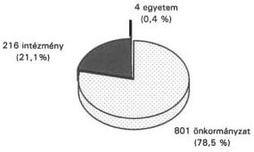

A finanszírozott működtetők száma és megoszlása 1995. decemberében

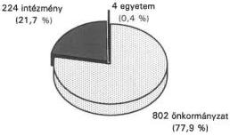

A finanszírozott működtetők száma és megoszlása 1996. decemberében

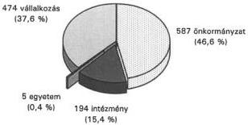

---

V-1013/1996-97.  
2. számú ábra

# **A finanszírozott fogorvosi szolgálatok száma és megoszlása a működtető  
típusa szerint 1994. decemberében**

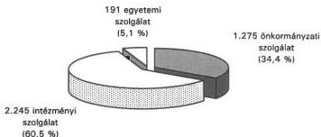

# **A finanszírozott fogorvosi szolgálatok száma és megoszlása a működtető  
típusa szerint 1995. decemberében**

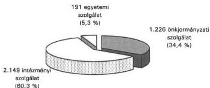

# **A finanszírozott fogorvosi szolgálatok száma és megoszlása a működtető  
típusa szerint 1996. decemberében**

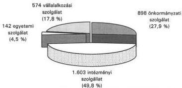

---

V-1013/1996-97.
3. számú ábra

A finanszírozott fogorvosi szolgálatok száma azok típusa szerint

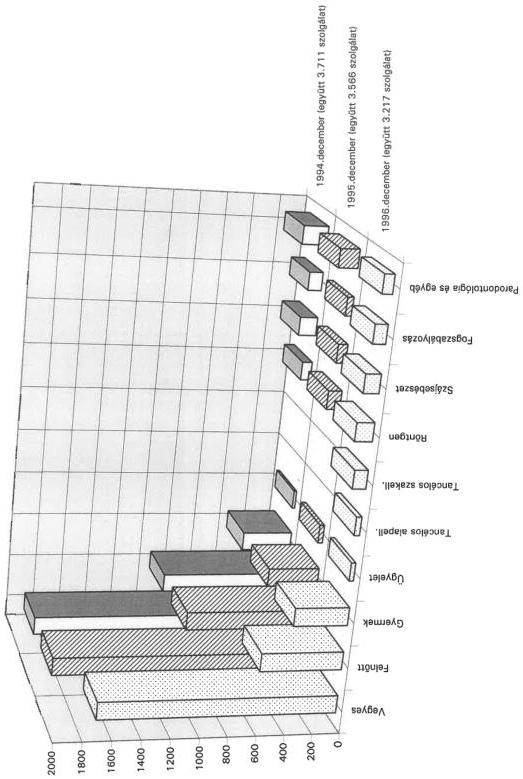

---

V-1013/1996-97.
4. számú ábra

A fogorvosi ellátás havi társadalombiztosítási finanszírozása
(a működtetőket érintő nagyságrend bemutatásával)

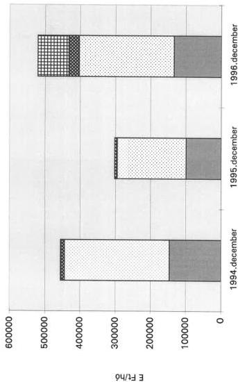

■ Önkormányzatok □ Intézmények ■ Egyetemek ■ Vállalkozások

---

V-1013/1996-97.  
5. számú ábra

# A finanszírozott fogorvosi szogálatok száma megyénként

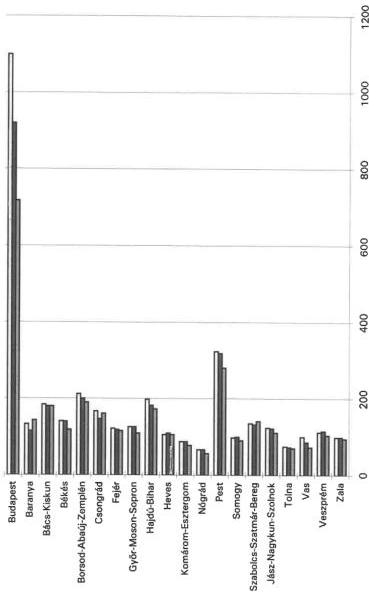

■ 1996.december ■ 1995.december ■ 1994.december

---

V-1013/1996-97.

6. számú ábra

Az egy állandó lakosra jutó havi finanszírozás összege megyénként

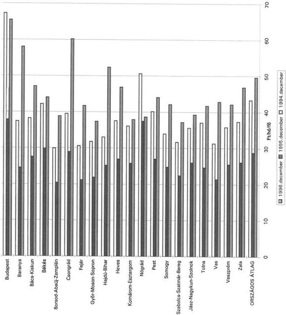

---

V-1013/1996-97.

7. számú ábra

# A tízezer lakosra jutó finanszírozott fogászati szolgálatok száma megyénként

(KHVM /MÁV/ nélkül)

1996. decemberében

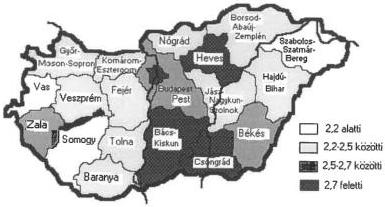

Alapellátást nyújtó szolgálatok száma alapján:

(Együttes átlag: 2,51)

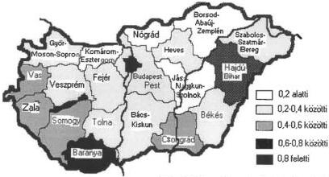

Szakellátást nyújtó szolgálatok száma alapján:

(Együttes átlag: 0,46)

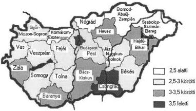

Összes fogászati szolgálatok száma alapján:

(Együttes átlag: 2,97)

---

V-1013/1996-97.

8. számú ábra

A 10 ezer állandó lakosra jutó finanszírozott fogorvosi szolgálatok száma megyénként

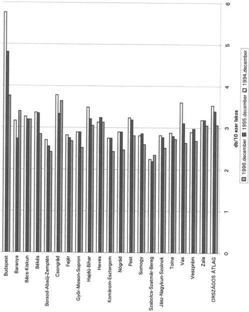

---

## FÜGGELÉK

A fogorvosok körében végzett kérdőíves feldolgozás tapasztalatainak összegzése a fogászati ellátás helyzetéről

A helyszínen vizsgált megyékben - egy erre a célra összeállított kérdőív alapján - felmértük a fogorvosok egy részének véleményét az ellátás helyzetét befolyásoló fontosabb tényezőkről.

Kérdéseink elsősorban a működés feltételeinek, a lakossági ellátás és a finanszírozás szabályainak változásaiból eredő hatásoknak, az ezekkel kapcsolatos fogorvosi véleményeknek, javaslatoknak és az ellenőrzés helyzetének a megismerését célozták.

A megkérdezettek többsége - igaz eltérő tartalommal és minőségben - eleget tett kérésünknek.

A fogorvosok által megadott adatok, információk összegzése egyrészt az ellátás helyzetének komplex megítélését segíti, másrészt a gyakorló fogorvosok esetenként megosztott - szubjektivitástól, az egyéni érdekek motivációitól sem mentes véleményét közvetíti.

Az információkat közlő 186 fogorvosi szolgálat megoszlása a székhely, a működtető és a szolgálat jellege szerint a következő volt:

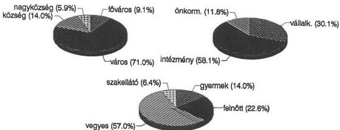

---

- 2 -

A szolgálatok a felmérés időszakában az egészségbiztosítás által finanszírozott praxisok mintegy 6 %-át képviselték, s a magyar lakosság 7,2 %-ának fogorvosi alapellátásáról és mintegy 10 %-ának - különböző szakterületre kiterjedő - fogászati szakellátásáról gondoskodtak.

A reprezentatív mintában az egy szolgálatra eső lakosságszám meghaladta a finanszírozási jogszabályban meghatározott normatívákat a következők szerint:

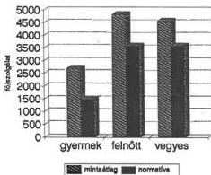

A normatívák heti 30 órás rendelési időre vonatkoznak, ugyanakkor a mintában az átlag csak heti 27 óra volt. Így a normatívához viszonyított túllépés a bemutatottnál is relatíve nagyobb. Előfordultak közel 10 ezer lakos ellátására szervezett alapellátó szolgálatok is.

A szakellátó szolgálatokra eső lakosság többszörösen meghaladta a normatívát (50 ezer lakos/szolgálat), a szakellátáshoz megfelelő képzettséggel és speciális gyakorlattal rendelkező orvosok száma szűk keresztmetszetet jelentett a lakossághoz képest.

Az információt szolgáltatók 1994-ben alapvetően közalkalmazott orvosok voltak, 1996. második felére mintegy 30 % már vállalkozás keretében vállalt ellátási kötelezettséget.

A közalkalmazott orvosok kétharmada munkaviszonya mellett magánpraxist is folytat, zömében magánrendelőjében, de esetenként a közalkalmazotti szolgálat infrastuktúráját bérelve. Néhány orvos a közalkalmazotti státusza mellett magánrendelőjében és az intézményétől meghatározott napokra bérbe vett rendelőben is folytat magántevékenységet.

---

- 3 -

A vállalkozások nagyrészt intézményi illetve önkormányzati rendelőt béreltek, de előfordult az is, hogy ingyenes használati lehetőséget kaptak, vagy magánrendelőjüket használták ellátási tevékenységükhöz.

A fogászati rendelők 56,5 %-át váltott rendelési időben használják a fogorvosok.

Az 1994., az 1995. és az 1996. szeptemberi betegforgalom adatait közlő szolgálatok összesített információi a következőket mutatják:

- A gyermekellátás beavatkozásainak száma 1994. szeptemberében és 1995. szeptemberében közel azonos volt, a csökkenés elenyésző. Az 1996. szeptemberi adatok a korábbi két időszakhoz képest már növekedést mutatnak.

- A felnőtt lakosság körében végzett fogmegtartó tevékenység 1995. szeptemberében a korábbi év hasonló időszakához képest közel felével visszaesett, 1996. szeptemberében már növekedés tapasztalható, de a beavatkozások száma egyharmadával így is kevesebb mint 1994. szeptemberében.

A fogpótlások száma 1994. szeptembere és 1995. szeptembere között egyharmadával csökkent. A szabályozás változásának hatását azonban ez csak részben mutatja, hiszen a korábban megkezdett ellátások sok esetben ekkor fejeződtek be. A fogpótlások száma 1996. szeptemberében az 1995. szeptemberinek is csupán a fele volt.

A foghúzások száma 1995. szeptemberében alacsonyabb volt mint a korábbi év hasonló időszakában, 1996. szeptemberében növekedés mutatkozott, de így is az 1994. szeptemberi szint alatt maradt. A foghúzások aránya viszont a beavatkozásokon belül folyamatosan nőtt.

- A szakellátásba tartozó beavatkozások száma 1995. szeptemberében alacsonyabb volt mint a korábbi év hasonló időszakában, 1996. szeptemberében viszont gyakorlatilag az 1994. szeptemberi szintre emelkedett.

A betegellátásra jutó időt a fogorvosok 88 %-a tartja elegendőnek, a szűrővizsgálatok ellátásához 77 % látja elegendőnek a kapacitást. Néhányan az éppen adott betegforgalom alakulásától tették függővé válaszukat.

---

- 4 -

**A rendelők felszereltségét, korszerűségét a fogorvosok fele nem tartotta megfelelőnek.** Általánosnak tekinthető vélemény, hogy az erkölcsi és fizikai avulást nem követi az elavult gépek cseréje, sok esetben a fogászati egységeket még az 1980-as években szerezték be.

A gépek, műszerek már zömében korszerűtlenek, a sok esetben többműszakos üzemelés miatt is elhasználódtak. Az 1990-es években főként kiegészítő műszerek, felszerelések beszerzésére került sor, új fogászati széket csak néhány szolgálat kapott. A gép-műszer beszerzéshez a központi céltámogatás lehetőségével alig éltek.

Az általános korszerűsítés mellett többen igényelnék a felszereltség javítását ultrahangos készülékekkel, röntgengépekkel, fogkőeltávolítóval, sterilizálóval, amalgánkeverővel és egyéb speciális új műszerekkel.

**A szolgálatok több mint fele nem rendelkezik számítógéppel, így jelentős a manuális adminisztráció.**

A számítógéppel rendelkezők a betegnyilvántartásra, az adatszolgáltatási kötelezettségeik teljesítésére használják azokat. Több esetben a szolgálat ugyan nem rendelkezik számítógéppel, de a kórházi informatika a teljesítményadatokat feldolgozza.

A szolgálatok 55 %-a így mágneslemezen szolgáltatott adatokat 1994. és 1995. között a MEP-ek részére.

**A fogorvosok 77 %-a tartja a fogászati anyagokkal való ellátottságát jónak, bár problémát esetenként ők is jeleztek.**

A legjellemzőbb kritika, hogy anyagellátásuk akadozó, rendszertelen, az anyagok alacsony minőségűek, korszerűtlenek és esetenként lejártak. Többen jelezték az áremelkedés, a kényszerű takarékosság kedvezőtlen hatásait.

**A térítésköteles ellátásokért beszedett díjak 1995. második felében és 1996. első félévében összességében a kiadások 10 %-át sem fedezték.** A térítéses ellátást is biztosító szolgálatoknál az egy-egy félév alatt beszedett díjak nagysága igen jelentős szóródást mutatott, előfordult néhány ezer Ft-os, de félmillió Ft-ot meghaladó bevétel is. A szolgálatok esetenként térítésmentesen nyújtották szolgáltatásaikat.

**A szolgálatok felénél számla ellenében készpénzes fizetést fogadtak el, 35 % a postai csekkes befizetést alkalmazta.**

---

- 5 -

Előfordult közvetlen intézményi házipénztárba történő befizetés előírása is, és néhány helyen a díjbeszedés több módozatát is alkalmaztak a konkrét esetektől függően.

A díj megfizetését a szolgálatok egyharmada a kezelés előtt kéri, valamivel több helyen a kezelés után követelik meg.

Gyakran előfordul, hogy mindkét megoldást párhuzamosan alkalmazzák.

A térítési díjakat a legtöbb esetben a működtető intézmény vagy az önkormányzat állapította meg, s néhány helyen maga az orvos döntötte el a díjak mértékét.

A fogorvosok többsége nem ismerte a szolgálatára eső részletes pénzforgalmi adatokat, mivel a működtetők (pl. rendelőintézet, kórház) nem mutatják ki külön-külön azokat. A felmérés kapcsán a hiányzó adatokat a működtetők – esetenként több szolgálatra összevontan – a legtöbb esetben biztosították. Az összegzett adatok azt mutatták, hogy az egészségbiztosítás rendszeréből kapott támogatás 1995. első felében még a kiadások 94 %-át fedezte, 1995. második félévében és 1996. első félévében ez az arány 78-80 % volt.

A fogászati ellátás kiadásainak fedezetét a TB támogatás mellett már kis mértékben az önkormányzati támogatások illetve az egészségügyi intézményeken belüli átcsoportosítások, és csekély mértékben a térítésköteles ellátások után befolyt bevételek biztosították.

A fogorvosok az önkormányzatoktól elsősorban az ellátás anyagi támogatását, vagy annak növelését, a gépek-műszerek cseréjében, korszerűsítésében való közreműködést, a felszereltség javítását várják. Emellett a privatizáció segítésének, a számítógéppel való ellátás biztosításának, a fogorvosok erkölcsi támogatásának, az egzisztenciális biztonság megteremtésének az igénye is megfogalmazódott.

Arra a kérdésre, hogy a finanszírozási rendszert milyen módon lenne célszerű változtatni a fogorvosok sok hasonló, de esetenként merőben ellentétes válaszokat adtak.

A legjellemzőbb vélemények a következők voltak:

A finanszírozás legyen

- bázis + teljesítmény illetve alapdíj + teljesítmény szerinti,

---

- 6 -

- a kártyapénzhez illetve a háziorvosi finanszírozáshoz hasonló,
- létszám-, lakosságarányos,
- a német modell szerinti,
- a teljesítményt és a minőséget is figyelembe vevő,
- a prevenciót támogató,
- inflációkövető,
- a privatizációt jobban ösztönző,
- a fogmegtartó tevékenységekre teljeskörű,
- bevételi érdekeltséget teremtő,
- a szabad orvosválasztási lehetőséget biztosító.

Ezek mellett többek véleménye, hogy

- ne intézmény, hanem közvetlenül a praxis kapjon támogatást azért, hogy a pénz ne kerüljön be a kórházi "nagykalapba",
- valósuljon meg a teljes magánosítás,
- a szájsebészet kerüljön a járóbeteg szakellátásba.

A szolgálatok több mint háromnegyedénél nem volt MEP vizsgálat 1994. és 1996. között. Ahol vizsgálatra került sor, ott elsősorban az adminisztráció vezetését, a finanszírozáshoz szükséges feltételeket ellenőrizték.

Az ÁNTSZ-ek által megbízott felügyelő szakfőorvosok az elmúlt közel három évben a szolgálatok felénél tartottak ellenőrzést, döntően az általános szakmai követelmények érvényesülését, a felszereltséget, a betegforgalmat, az adminisztrációs tevékenységet, az esetleges panaszok megalapozottságát vizsgálták. Több fogorvos az ellenőrzést folyamatosnak jelezte, hiszen a stomatológus főorvos egyben munkahelyi felettese.