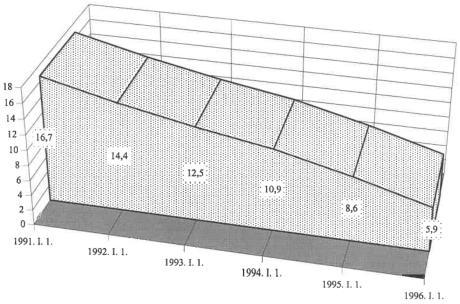
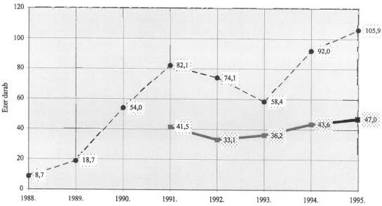
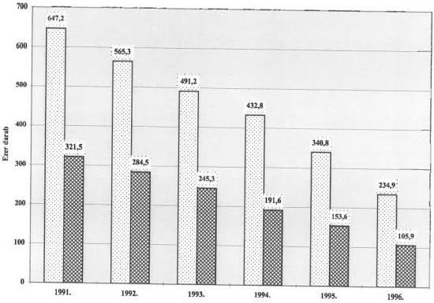
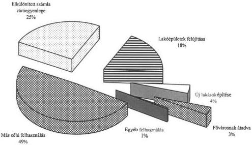

Állami Számvevőszék

# JELENTÉS

a helyi önkormányzatok lakás- és nem lakás célját szolgáló ingatlanvagyonával való gazdálkodásának ellenőrzéséről

359.

1997. június

---

A vizsgálat végrehajtásáért felelős:
V. Önkormányzati és Területi Ellenőrzési Igazgatóság

Dömötör Gyula
számvevő igazgató

Az ellenőrzést vezette:

Farkas László
régióvezető főtanácsos

Az összefoglaló jelentést készítette:

Farkas László
régióvezető főtanácsos

dr. Hegedűs György
számvevő tanácsos

Gerencsér Ferenc
számvevő tanácsos

dr. Szirota István
nyugdíjas számvevő

közreműködésével.

Az ellenőrzésben részt vettek:

A résztvevők névsorát az 1. sz. melléklet tartalmazza.

---

V-1014-108/1996-97. TÉMASZÁM: 338.

# TARTALOMJEGYZÉK

# I. ÖSSZEGZŐ MEGÁLLAPÍTÁSOK, KÖVETKEZTETÉSEK, JAVASLATOK 4

# II. RÉSZLETES MEGÁLLAPÍTÁSOK 8

1. A vagyon tulajdonbavételének, kezelésének és elidegenítésének szabályozottsága 8

2. Az önkormányzati tulajdon kialakítása 12

3. A lakás- és nem lakás célú ingatlanvagyonnal való gazdálkodás gyakorlata 13

3.1. Értékesítés 13

3.2. Bérbeadás és lakásfenntartás 18

3.3. A hasznosításból származó bevételekkel való elszámolás gyakorlata 21

4. A lakásértékesítésből származó bevételek felhasználása 24

1

---

# JELENTÉS

## a helyi önkormányzatok lakás- és nem lakás célját szolgáló ingatlanvagyonával való gazdálkodásának ellenőrzési tapasztalatairól

A helyi önkormányzatokról szóló 1990. évi LXV. tv. (továbbiakban: ÖTV) 92. §. (1) bekezdése alapján a helyi önkormányzatok gazdálkodását az Állami Számvevőszék ellenőrzi.

A törvényi felhatalmazásnak megfelelően az Állami Számvevőszék 1996. évi munkaterve szerint ellenőriztük a helyi önkormányzatok lakás- és helyiséggazdálkodási tevékenységét.

Az ÖTV, valamint az egyes állami tulajdonban lévő vagyontárgyak önkormányzatok tulajdonba adásáról szóló 1991. évi XXXIII. tv. (továbbiakban: VT) alapján jelentős értékű lakás- és nem lakás céljára szolgáló helyiség vagyon került az önkormányzatok tulajdonába. Ezek nyilvántartási és adatszolgáltatási rendjét a 147/1992. (XI. 6.) Korm. rendelet, a lakások és helyiségek bérletére, valamint az elidegenítésükre vonatkozó szabályokat az 1993. évi LXXVIII. tv. (továbbiakban: LTV) tartalmazza.

**Az ellenőrzés célja:** annak megállapítása, hogy

- ■ a helyi önkormányzatok milyen szempontok alapján döntöttek a tulajdonukba kapott lakások és helyiségek további hasznosításáról;
- ■ az önkormányzatok hogyan tettek eleget a lakás- és helyiséggazdálkodásra vonatkozó előírásoknak, így különösen az önkormányzati rendeletalkotási kötelezettségüknek, a 147/1992. (XI. 6.) Korm. sz. rendelet alapján megfelelően felfektették-e az ingatlanvagyon katasztert, a lakásértékesítésből befolyt összegeket elkülönítetten kezelik-e és biztosított-e a lakáscélú felhasználásuk;
- ■ a lakás- és helyiséggazdálkodással összefüggő változásokhoz igazodva az önkormányzatok milyen szervezeti formában látják el az ezirányú feladataikat;
- ■ az önkormányzati tulajdonú helyiségek bérbe adását milyen elvek alapján szabályozták, a bérleti díjak hogyan alakultak és milyen a hatásuk az önkormányzatok gazdálkodására.

3

---

I. ÖSSZEGZŐ MEGÁLLAPÍTÁSOK, KÖVETKEZTETÉSEK, JAVASLATOK---

### Vizsgált időszak: 1991 - 1995. évek

A helyi önkormányzatok lakás- és nem lakás céljára szolgáló ingatlanvagyonnal való gazdálkodásának ellenőrzése keretében a fővárosban és 15 megyében 48 települési önkormányzatnál végeztünk vizsgálatot. A fővárosban 6 kerületnél, a megyékben 19 megyei jogú városnál és 23 városnál volt helyszíni ellenőrzés. A kiválasztásnál a legfontosabb szempont az volt, hogy az összlakás állományon belül az önkormányzati (volt tanácsi) tulajdonú lakások aránya minél magasabb legyen.

Az ország összes lakásának állománya 1991. január 1-jén 3 879 ezer db volt, melyből az önkormányzati tulajdonú lakások részaránya 16,7%-ot képviselt. A vizsgálati időszak végére, az elidegenítések következtében az összlakás állományon belül az önkormányzati tulajdon 1991-hez képest a harmadára csökkent.

A vizsgált önkormányzatok területén 1991. január 1-jén 1.087 ezer db, az összlakás állomány mintegy 30%-a volt. Az ellenőrzés az önkormányzati tulajdonú lakások közel 50%-ára terjedt ki.

Az ellenőrzés keretében az önkormányzatok által rendelkezésre bocsátott, továbbá a KSH különböző - a témát érintő - adatszolgáltatásaiból gyűjtött információkat használtuk fel.

## I. ÖSSZEGZŐ MEGÁLLAPÍTÁSOK, KÖVETKEZTETÉSEK, JAVASLATOK

Az ÖTV hatályba lépésével egyidejűleg a törvény erejénél fogva, valamint a későbbiekben a Vagyonátadó Bizottságok (továbbiakban: VÁB) közreműködésével a helyi önkormányzatok tulajdonába jelentős lakásvagyon és nem lakás céljára szolgáló helyiségvagyon került.

A lakás- és helyiségvagyon önkormányzati működtetését nehezítette, hogy a jogi szabályozás, a jogalkalmazás és a joggyakorlat összhangja nem volt zavartalan. A központi jogalkotás késlekedése hibákkal párosult, a legfontosabb jogszabályt, az LTV-t az Alkotmánybíróság (továbbiakban: AB) több ízben megváltoztatta és sok esetben semmisítette meg az egyedi önkormányzati rendeleti szabályozást is.

A kormányzati szervek gyakorlati munkát segítő leiratai ellentmondásokat tartalmaztak és előfordult, hogy ellentétben álltak a törvényi szabályozással is. A vizsgálati megállapítások tükrözik a helyi önkormányzatok eltérő gyakorlatát.

A helyzetet jól szemlélteti, hogy az ÖTV, illetve az AB által kötelezőnek tartott lakásgazdálkodást a kormányzati állásfoglalás és az annak megfelelő

---4

---

I. ÖSSZEGZŐ MEGÁLLAPÍTÁSOK, KÖVETKEZTETÉSEK, JAVASLATOK

joggyakorlat nem tekinti és minősíti kötelezően ellátandó önkormányzati feladatnak.

**Számos esetben állapította meg a helyszíni ellenőrzés, hogy az önkormányzatok lakásgazdálkodási tevékenységének szabályozása és gyakorlata ellentétes a törvényi előírásokkal.**

A lakásvagyon számviteli nyilvántartásba vétele késett, szervezeti változások miatt több éven át rendezetlen volt. A nyilvántartott pénzügyi érték nem reális, a vagyon nagyságának (változásának) megítélésére alkalmatlan (a gyakorlatban ezért nem is kapott jelentősebb szerepet, a testületi zárszámadási előterjesztésekben nem szerepel a törvényben előírt vagyonleltár).

Sokszor fordult elő, hogy a helyi jogalkotás nem vette figyelembe azt, hogy - ÖTV 16. § /1/ bekezdése alapján - az önkormányzatok arra kaptak rendeletalkotási felhatalmazást, hogy a törvény által megjelölt körön belül éljenek a jogi szabályozás lehetőségével.

Többször tapasztaltuk, hogy a rendeletalkotás az LTV-nél szélesebb körben is szabályozott, illetőleg más esetekben mulasztásos törvénysértést követtek el az önkormányzatok azzal, hogy nem szabályozták a törvényben előírt feladatokat.

A lakásértékesítés bevételeinek törvényben meghatározott módon és célra történő felhasználásában különösen sok törvénysértést észlelt az ellenőrzés. **A vizsgált 48 települési önkormányzat közül maradéktalanul egy sem felelt meg az LTV által támasztott követelményeknek.**

Az elkülönített számla kezelésének két jellemző csoportja különböztethető meg:

- az ellenőrzött önkormányzatok egy része nem nyitotta meg az elkülönített számlát, holott **1994. március 31-től** kötelező volt a lakásértékesítésből származó bevételek elkülönített számlára történő helyezése;
- sok önkormányzat a számlára befolyt összeget, vagy annak egy részét a törvényben meghatározottaktól eltérő célra - elsősorban működtetési, likviditási zavarainak kiküszöbölésére - fordította, illetőleg vállalkozásba fektette. Az is előfordult, hogy kedvező kamatozású lekötésbe helyeztek át pénzeket.

Az ingatlanvagyon értékesítésekor a tényleges eladási ár és a forgalmi érték közötti különbség jelentős, ennek következtében nagymértékű - **mintegy 70%-os** - vagyonvesztés következett be, a vételárként befolyt készpénz és kárpótlási jegyek összértéke, valamint a lakások lakottságot is figyelembe vevő forgalmi érték eltérése miatt. Ennek, valamint a törvénytől eltérő szabálytalan felhasználásnak a következménye az, hogy a bevételek elégtelenek, illetőleg nem teljesítik a törvényben meghatározott célt, azaz nem szolgálnak a lakásállomány fenntartására, felújítására, új lakás építésére.

5

---

I. ÖSSZEGZŐ MEGÁLLAPÍTÁSOK, KÖVETKEZTETÉSEK, JAVASLATOK

A nagy volumenű értékesítés következtében döntően az alacsonyabb komfortfokozatú, vagy az enélküli lakások maradtak önkormányzati tulajdonban. Ennek is következménye, hogy az előírt lakbérek éves összege, az ebből származó lakbérbevétel mérséklődik. Ezt a tendenciát fokozza, hogy a lakbérhátralékok éves volumene viszont nő.

Az elidegenítésből származó bevételeket jelentősen csökkentették az értékesítést bonyolító szervezetek magas költségei (díjai). Ennek mértéke számos esetben meghaladta a 20-30%-ot.

A szabályozás hiányosságaiból és a bevételek felhasználási gyakorlatából az következik, hogy az elidegenítésből származó bevételeknek a törvényben meghatározott célra történő felhasználása kismértékű, e bevételek a lakáságazat gondjainak megoldása szempontjából gyakorlatilag elvesznek. A vizsgált önkormányzatoknál 1995. évben az elkülönítésre kötelezett bevételeknek mindössze 27%-át fordították a törvény által meghatározott célokra.

Az ellenőrzött önkormányzatok nagyobbik hányada elfogadta a vizsgálati jelentések megállapításait és saját hatáskörben intézkedtek a hibák kijavításáról. Közülük 17-en tettek észrevételt a vizsgálati jelentésben foglaltakra. Egy részük tudomásul veszi és megköszöni az ellenőrzés javaslatait, illetve beszámol a tett intézkedésekről.

A felelősség kérdését tartalmazó 8 jelentésre adott magyarázat viszont jórészt vitatja a felelősséget felvető megállapításokat, a számvevői következtetések, javaslatok jogosságát és helyességét.

**Ezek szinte kizárólag az LTV 62. §-ának értelmezésével és magyarázatával foglalkoznak.** Elsősorban a joghézagra, pontatlan jogi szabályozásra, valamint likviditási gondjaikra hivatkoznak.

**A tapasztalt hiányosságok felszámolására a helyszíni jelentésekben az érintett önkormányzatok számára szóló javaslatok arra vonatkoztak, hogy:**

- vizsgálják felül saját rendeleteiket abból a szempontból, hogy azok mennyiben felelnek meg az időközben végrehajtott törvényi módosításoknak, AB döntéseknek.
- Az indokolt módosításokat kezdeményezzék a képviselő-testületeknél, a szabályozástól eltérő gyakorlatot szüntessék meg, alakítsák ki annak feltételeit, hogy azok ne ismétlődhessenek,
- biztosítsák a lakás- és helyiségvagyonnal kapcsolatos főkönyvi és analitikus nyilvántartások összhangját, azok folyamatos vezetését és teljességét,
- megfelelő előkészítés után a képviselő-testületek összefoglalóan tekintsék át a lakás- és helyiségvagyon privatizációjának tapasztalatait, az ennek következtében előállt helyzetből adódó további teendőket,

6

---

I. ÖSSZEGZŐ MEGÁLLAPÍTÁSOK, KÖVETKEZTETÉSEK, JAVASLATOK

- pontosítsák a lakásértékesítés lebonyolításával megbízott vállalkozásokkal kötött szerződéseket, az elszámolásokat újólag tekintsék át, a mutatkozó eltéréseket rendezzék. Biztosítsák, hogy azok elszámolási, átutalási kötelezettségeiknek tegyenek eleget, az önkormányzatnál pedig ezeknek a számviteli előírásokkal összhangban történő rögzítése rendszeresen megtörténjen,
- a lakástörvény előírásainak megfelelően biztosítsák, hogy az értékesítésből származott bevételek elkülönített számlára kerüljenek, azokat csak a törvény által megengedett célokra használják fel. Készítsenek intézkedési tervet a céltól eltérően felhasznált összegek visszapótlásának ütemezésére, ezeket kötelezettségként számadásaikban tartsák nyilván,
- törvény értelmezéséből eredően a lakásértékesítés ellenértékeként 1995. január 1. után átvett kárpótlási jegyek értékesítéséből, vagy egyéb módon történő hasznosításából származó bevételeket, azok hozadékait is az elkülönített számlára kell elhelyezni, ennek érvényesítésére megfelelő szankciót kell kialakítani,
- alakítsák ki annak szervezeti rendszerét, hogy a lakás- és helyiségvagyon kezelésével megbízott gazdasági társaságok fenntartási, felújítási teljesítéséről betartásáról a testületeket rendszeresen tájékoztassák, az eddigieknél hatékonyabban érvényesüljenek az önkormányzat tulajdonosi jogosítványai.

**Az ellenőrzés tapasztalatai alapján szükségesnek tartjuk különböző intézkedések elrendelését és megtételét.**

**Az Állami Számvevőszék javasolja a Belügyminisztériumnak, hogy:**

- a fővárosi, megyei közigazgatási hivatalokat hívja fel, hogy a lakásgazdálkodást érintő helyi önkormányzati döntések törvényességi vizsgálata során fordítsanak fokozott figyelmet a törvény előírásai és az alkotmánybírósági döntések betartására. Rendelje el, hogy a hivatalok az érintett önkormányzatok hatályos rendeleteit vizsgálják felül és kezdeményezzék a törvényi szabályozástól eltérő rendelkezések visszavonását;
- az ellenőrzéssel nem érintett, de a vizsgálat témakörében érdekelt önkormányzatoknál (Pénzügyi Bizottságainál) **szorgalmazza hasonló jellegű vizsgálatok lefolytatását az ÁSZ által tett javaslatok fokozott szem előtt tartásával;**
- az önkormányzatok egyedi ügyeiben **az AB határozatban (60/1992. (XI. 17.) foglaltak szerint járjanak el, mivel a jogal-**

7

---

II. RÉSZLETES MEGÁLLAPÍTÁSOK

kotásról szóló 1987. évi XI.törvény garanciális szabályainak mellőzésével hozott minisztériumi informális jogi iránymutatások alkotmányellenesek;

- a jogszabályok hatályosulásának figyelemmel kísérési kötelezettsége alapján kezdeményezze az LTV 62. §-a törvényi szabályozásának, módosításának szükségességét, az ellenőrzött önkormányzatok egyike sem hajtotta végre maradéktalanul a törvényi rendelkezéseket és fölmerült az egységes jogértelmezés problémája.

Az LTV 64. §-ban megfogalmazott jogkövetkezmények elégtelenek abból a szempontból, hogy késztessék az önkormányzatokat a 62. §-ban kötelező törvényi előírások betartására;

- vizsgálják felül a törvényi határidőre (1996. XII. 31.) való tekintettel a kényszerbérletek felszámolásának helyzetét, ugyanis a vizsgálat tapasztalatai szerint időarányosan is alacsony az e célra felhasznált pénzeszközök nagysága.

Az Állami Számvevőszék javasolja a Pénzügyminisztériumnak, hogy:

- tekintse át az önkormányzatok lakásfelújítási és lakásépítési pénzeszközei bővítésének lehetőségét. Az ellenőrzés megállapításai szerint ugyanis az LTV 62. §-ának jogszerű alkalmazása esetén is kevés pénz képződik az önkormányzatoknál, amelyekből meg kell valósítaniuk lakásgazdálkodási feladataikat.

Az Állami Számvevőszék kezdeményezi az ellenőrzött önkormányzatoknál (Pénzügyi Bizottságainál), hogy az önkormányzatok részére megfogalmazott javaslatok végrehajtását ellenőrzéseik során fokozottan kísérjék figyelemmel.

## II. RÉSZLETES MEGÁLLAPÍTÁSOK

1. A VAGYON TULAJDONBAVÉTELÉNEK, KEZELÉSÉNEK ÉS ELIDEGENÍTÉSÉNEK SZABÁLYOZOTTSÁGA

A települési önkormányzatok feladatainak meghatározását az ÖTV (kihirdetve 1990. augusztus 14-én, hatályba lépett 1990. szeptember 30-án) és a VT (kihirdetve 1991. augusztus 2-án, hatályba lépett 1991. szeptember 1-én) fogalmazta meg.

8

---

II. RÉSZLETES MEGÁLLAPÍTÁSOK

Az ÖTV alapján a törvény erejénél fogva, valamint a későbbiekben a VÁB-ok közreműködésével a települési önkormányzatok tulajdonába jelentős lakásvagyon és nem lakás céljára szolgáló helyiség vagyon került.

A lakások és helyiségek bérletére, valamint az elidegenítéséről rendelkező törvény (LTV) - melyet 1992. III. 31-ig kellett volna az Országgyűlés elé beterjeszteni - csupán 1994. január 1-jével lépett hatályba.

Az alaptörvények szabályozási ellentmondásai egyaránt megmutatkoztak az önkormányzati feladatellátás értelmezésében, a tulajdonosi jogok gyakorlásában és az elidegenítésből származó bevételek jogszerű felhasználásában.

A szabályozás késedelme viszont az önkormányzatok gazdálkodására volt hatással és gyengítette a törvényalkotói szándék érvényesítését.

Az önkormányzati kötelező feladatellátás különféle értelmezése az ÖTV eltérő tartalmi megfogalmazásából fakad.

Az ÖTV 8. § (4) bekezdése felsorolásában a kötelező feladatok között nem nevesíti a lakásgazdálkodást. Az önkormányzatok számára azonban valójában az ÖTV 8. § (1) bekezdése is kötelező feladatot állapít meg, amikor úgy fogalmaz, hogy az önkormányzat különös feladata - többek között - a lakásgazdálkodás.

Erre mutat rá az AB az LTV-t módosító 64/1993. (XII. 22.) AB. hat. VI. pontja indokolásában: "A helyi önkormányzatok közszolgáltatási feladatokat látnak el, ezek keretében az ÖTV 8. § (1) bekezdése a lakásgazdálkodást kifejezetten ilyen feladatként írja elő. Ezen túlmenően az LTV előírása az önkormányzatokra nem egyszerűen csak mint tulajdonosokra, hanem egyúttal mint alkotmányos közhatalmi szervekre is vonatkoznak, amelyek számára az LTV kötelező feladatkört és hatáskört létesít".

Siófok város esetében a lakásgazdálkodás nem kötelező jellegű minősítésében szerepe van a BM állásfoglalásának is, amely szerint a lakásgazdálkodás nem kötelezően ellátandó feladat.

A kettős értelmezhetőség miatt az önkormányzatok a lakásgazdálkodást általában nem minősítik kötelező feladatnak és ez a feladatellátás szabályozásában is megmutatkozik.

A kötelező feladatellátás eltérő értelmezéséből következik, hogy az erre szolgáló vagyon törzsvagyonba helyezésének kötelezettsége (ÖTV 79 § (1) bek.) sem teljesül a gyakorlatban minden esetben. Ebből következik, hogy az értékesíthető állomány bővül, viszont a feladat ellátásához szükséges vagyon nincs biztosítva.

Az AB (1018/H1994.) határozatában felhívja a figyelmet arra, hogy nem csupán az ÖTV 79. § (2) bekezdésében felsorolt forgalomképtelen és korlátozottan forgalomképes vagyon tartozik a törzsvagyon körébe, hanem: "továbbá minden olyan ingatlan és ingó dolog tartozik, amelyet a helyi önkormányzat annak nyilvánít".

9

---

II. RÉSZLETES MEGÁLLAPÍTÁSOK

Tehát az ÖTV tételes felsorolásán túlmenően is lehet vagyont törzsvagyonba helyezni. Mivel a kötelező feladat ellátásához törzsvagyonra van szükség, ezért ebben az esetben a törzsvagyonba helyezés nem csak joga, hanem kötelessége is az önkormányzatnak. Természetesen az önkormányzat jogosítványa annak eldöntése, hogy a kötelező feladatot milyen mértékben és módon látja el (ÖTV 8 § /2/ bekezdése).

A szabályozás értelmezési problémáit mutatja, hogy az AB tevékenységével szinte jogalkotóvá lépett elő, az AB a 64/1993. (XII. 22.) és az 57/1994. (XI. 17.) számú határozataival az LTV egyes rendelkezéseit, azok alkotmányellenessége miatt, megsemmisítette. A megsemmisítő határozatok indokolásai a helyes és egységes jogértelmezést és jogalkalmazást segítették.

A lakásgazdálkodást érintő jogszabályok megváltoztatásán túlmenően számos indítvány érkezett az AB-hoz az egyedi önkormányzati rendeletek, rendelkezések megsemmisítésére is.

Az AB a Magyar Közlönyben 81 db - lakással és lakásgazdálkodással foglalkozó - határozatot tett közzé a vizsgált időszakban. Ugyanezen tárgykörben hozott egyedi végzések, határozatok száma 139 db, amely az előbbi határozatokat is tartalmazza. Több esetben helyet adva a kezdeményezéseknek, a törvényességi észrevételt, kifogást tartalmazó indítványok alapján az AB megsemmisítette a támadott rendelkezéseket.

Az ellenőrzés több esetben észlelte és kifogásolta azokat a törvénysértő rendeleti szabályozásokat, amelyekhez hasonlókat az AB megsemmisített és a Magyar Közlönyben közzétett.

Szinte valamennyi vizsgált önkormányzat rosszul szabályozta a lakbértámogatást. Általános gyakorlattá vált, hogy az önkormányzatok a lakásfenntartási támogatáson belül kezelték a lakbérek támogatását (a szociális törvény 38. §-a szerint), holott az AB több határozatában - pl. a 78/1995.(XII.21.) számú - felhívta a figyelmet a jogcímek különbözőségére és a külön - külön szabályozás kötelezettségére.

A kifogásolt és megsemmisített rendelkezések közül az ellenőrzés maga is tapasztalta- többek között - az **igénylési letét alkalmazását (Kaposvár), a lakbérek inflációs rátával történt emelését (Eger), a lakbér megállapodásos megállapítását (Siófok) a maximált ár helyett.**

A központi jogi szabályozás gyakori és jelentős változása mellett a **kormányzati szervek jogértelmező állásfoglalásai** tovább fokozták a bizonytalanságot, a zavart és a törvényi szabályozástól eltérő megoldásokra ösztönöztek.

Az ellenőrzés az LTV 62. §-ával kapcsolatos minisztériumi (BM) állásfoglalásoknál tapasztalt a törvényi szöveggel ellentétes és saját magának is ellentmondó jogértelmezést, amellyel az önkormányzatok - esetenként az összefüggésekből kiragadva - (utólagosan is) igazolva látják gyakorlatukat.

A BM 5-490/1996. számú leirat szerint: 'A konkrétan felvetett kérdés tekintetében tehát mód van arra is, hogy az önkormányzat az elidegenítés bevételeből használt

10

---

II. RÉSZLETES MEGÁLLAPÍTÁSOK

lakásokat **vásároljon**. A BM 302-3254/1995. sz. leirata az ezzel ellentétben a következő értelmezést adja: 'Ebből adódóan **nincs mód arra, hogy az említett bevételekből** az önkormányzat- **lakásépítés helyett - lakások vásárlását finanszírozza**'. Ez az állásfoglalás azonban a **törvényi jogcímeket tágítja**: és az elidegenítésből származó bevételek az önkormányzati lakások építésén túlmenően - helyi támogatás keretében - **a magánszemélyek által történő lakásépítés támogatására is felhasználhatók**'.

A leirat magyarázata tehát lehetőséget ad arra, hogy az LTV 62 §-ával ellentétben ne az önkormányzat építsen lakásokat, hanem magánszemélyek és ehhez nyújtson támogatást az önkormányzat a lakásértékesítési bevételeiből.

A Belügyminisztériumnak a Belügyi Közlönyben (1996. évi 15. szám) és az Önkormányzati Tájékoztatóban (1996. évi 10-es, 11-12-es szám) közzétett módszertani ajánlása a lakások elidegenítéséből származó bevételek felhasználási lehetőségeit magyarázva 'felpuhította' a LTV 62. § (3) bekezdésében meghatározott célokat.

Az LTV felhasználási jogcímeire vonatkozó 57/1994. (XI.17.) AB sz. határozat II. 3. pontja egyértelműen kimondja, hogy a törvény: '**e bevételeket kizárólag a (3) bekezdésben meghatározott célokra (felújításra és azzal együtt végzett korszerűsítésre, továbbá új lakás építésére, valamint kényszerbérletek felszámolására) engedi felhasználni**'.

Meg kell jegyezni, az AB a 60/1992.(XI.17.) számú határozatában megállapította, hogy a jogalkotásról szóló 1987. évi XI. törvény garanciális szabályainak mellőzésével hozott **minisztériumi és egyéb központi állami szervektől származó, jogi iránymutatást tartalmazó leiratok, körlevelek, útmutatók, iránymutatások, állásfoglalások és egyéb informális jogértelmezések kiadása és az ezekkel való irányítás gyakorlata alkotmányellenes**.

A törvény azt is előírja, hogy az elidegenítésből származó bevételt az önkormányzat a számláját vezető **pénzintézetnél elkülönített számlán köteles elhelyezni**.

**Az ellenőrzés a LTV 62. § értelmezésével, illetőleg az ennek alapján folytatott jogalkalmazással kapcsolatban rendkívüli megosztottságot, egymástól eltérő különféle gyakorlatot tapasztalt az önkormányzatoknál. Egy részük nem nyitott elkülönített számlát, más részük a törvényben meghatározott céltól eltérően használta fel bevételeit. Összességében megállapítható, hogy egyetlen vizsgált önkormányzat sem tett maradéktalanul eleget valamennyi törvényi előírásnak.**

Az értékesítés szempontjából meghatározó jelentőségű **vételi jog** jogintézményét **hasonló értelmezési zavarok jellemzik, amelyet szintén az AB határozat igyekezett egyértelművé tenni**.

Az AB 57/1994. (XI. 17.) számú határozatában részletezi, hogy a vételi jog a lakásoknak kizárólag arra a körére alapítható, amelyben az önkormányzat a VT alapján és az abban meghatározott teherrel szerzett tulajdont. Az ÖTV 107. § (2) bekezdésével átadott lakásokra azonban ilyen - a tulajdonátadással egyidejű - terhelést nem állapított meg a törvényhozó, ezért azokra az LTV utólagosan, vagy visszamenőlegesen semmilyen terhet, így vételi jogot sem alapíthatott alkotmányosan.

11

---

II. RÉSZLETES MEGÁLLAPÍTÁSOK

Egyébként is az önkormányzatok egy része már az LTV hatályba lépés előtt elidegenítette lakásállományának jelentős részét a 32/1969. (IX. 30.) Korm. sz. rendelet alapján.

## 2. AZ ÖNKORMÁNYZATI TULAJDON KIALAKÍTÁSA

A lakás- és helyiségvagyon tulajdonbavételének lebonyolítását a vizsgált önkormányzatoknál bizonyos kettősség jellemezte.

Az önkormányzati képviselő-testületek a törvény adta lehetőségekkel élve általában gyors és hatékony intézkedéseket tettek a tulajdonba vehető kör feltérképezésére, a testületi döntések előkészítésére, meghozatalára, az ehhez kapcsolódó adminisztrációs feladatok végrehajtására. A tulajdonosváltozás az ingatlan-nyilvántartáson történő átvezetését még megfelelő figyelem kísérte.

Ennél lényegesen kevesebb gondot fordítottak az önkormányzatok képviselő-testületei, és az adminisztrációs feladatokat ellátó apparátusok arra, hogy a tulajdonukba került lakás- és helyiségvagyon **naturálisan és értékben** a számviteli nyilvántartásokba és a vagyonkataszterbe bekerüljön.

**Ma szinte lehetetlen megállapítani, hogy 1991-92. években milyen értékű vagyon került az állam tulajdonából az önkormányzatok tulajdonába, mivel a változások időbeli, értékbeli rögzítése a számviteli nyilvántartásokban nem történt meg.**

Az ingatlanvagyon nyilvántartás jelentőségét, a változások vezetését, a gazdálkodás fontosságát az is aláhúzza, hogy az össz lakásvagyon nagysága kb. 6000 MdFt volt. (Ez az 1993. évi becsült összeg, az akkori éves GDP-nek kb. hatszorosa. „Előterjesztés a lakáspolitikai koncepcióról” 1996. január 1.).

Az ellenőrzés elvétve találkozott olyan esettel, hogy 1991-92. években a tulajdonba került lakás- és helyiségvagyon értékét az önkormányzat éves mérlege tartalmazta volna. A rendezésre 1994-95. években került sor az akkori állapotra vonatkozóan. Ez azonban az időközben lezajlott változásokat (pl. elidegenítés) nem tükrözi. A fenti gyakorlat következtében a **vizsgált önkormányzatok sorozatosan megsértették a számviteli törvénynek a mérlegek teljességére és valódiságára vonatkozó kötelezettségét.** A nyilvántartás problémáin alapvetően nem változtatott a 147/1992. (XI. 6.) Kormányrendelettel bevezetett ingatlanvagyon kataszter sem. Ennek egyik oka, hogy a kataszter értéken általában csak az épületet tartja nyilván, a benne lévő lakásokat és helyiségeket viszont csak naturálisan, így azok egyedi értéke nem, vagy csak arányosítással állapítható meg.

A vizsgált önkormányzatok némelyike a Kormányrendeletben **előírt határidőket nem tartotta be.** Az önkormányzatoknál az ingatlanvagyon kataszter a helyszíni ellenőrzés befejezéséig nem készült el. (**Pécs, Csongrád, Szentes, Miskolc**), holott a határidő 1994. június 30. volt. Néhány önkormányzat ennek a kötelezettségének 4-5 hónapos késedelemmel tett eleget (**Debrecen, Siklós**).

12

---

II. RÉSZLETES MEGÁLLAPÍTÁSOK

A fentiekben jelzett nyilvántartási és számviteli problémák ellenére az ellenőrzött körben az önkormányzati lakás- és helyiségállományról viszonylag elfogadható adatokat az ingatlan-fenntartási, üzemeltetési feladatokat ellátó, zömében az önkormányzatok által alapított gazdasági társaságok tudtak szolgáltatni. A lakás- és helyiségvagyonban bekövetkezett változásokat ezekről, valamint a KSH adatgyűjtési rendszeréből szerzett országos adatok alapján lehet érzékeltetni.

A KSH adatai szerint 1990. év végén, tehát az önkormányzatok megalakulásának időpontjában 647,2 ezer állami bérlakásnak váltak jogutódlás folytán kezelőivé, majd a későbbiekben tulajdonosává. Az ellenőrzött önkormányzatoknál a tulajdonba került lakások száma 322 ezer db volt.

**(Az ország, valamint a vizsgált önkormányzatok lakásállományának alakulását az 1. számú táblázat, valamint az 1. sz. ábra mutatja).**

**A helyiségvagyon** tulajdonbavétele a lakásokhoz hasonlóan, lényegében azzal egyidőben és együttesen lefolytatott eljárások keretében történt meg. Ennek egyenes következménye, hogy a számviteli és egyéb nyilvántartásokba való felvételüknél is előfordultak mindazok a problémák, amelyek a lakásvagyon esetében tapasztalhatók voltak.

A számbavétel hiányosságait szemlélteti, hogy pl. a fővárosi **IV., és XV.** kerületi önkormányzatok esetében nincs olyan dokumentum, melyből a tulajdonba került helyiségek száma, alapterülete megállapítható lenne. A két kerületi önkormányzat adatai nélkül a vizsgált önkormányzatok tulajdonába több mint 35 ezer nem lakás célú helyiség került.

### 3. A LAKÁS- ÉS NEM LAKÁS CÉLÚ INGATLANVAGYONNAL VALÓ GAZDÁLKODÁS GYAKORLATA

#### 3.1. Értékesítés

A lakások és helyiségek bérletére, valamint az elidegenítésükre vonatkozó, többször módosított LTV előírta, hogy minden 20 db-nál több bérlakással rendelkező önkormányzatnak a lakások elidegenítésének szabályaira rendeletet kell alkotnia és 1994. március 31-ig hatályba léptetnie.

Az előírást szabályozó 1994. évi XVIII. törvényt 1994. március 25-én hirdették ki. Ahhoz, hogy egy önkormányzati rendelet-tervezet döntésre a testületek elé kerüljön lényegesen több idő kell, mint amennyi a törvény kihirdetése és hatályba léptetése között rendelkezésre állt.

Az ellenőrzött önkormányzatok többsége - **alapvetően időhiány miatt** - néhány hónapos késéssel hozta meg szabályrendeleteit.

A helyi rendeletek azonban esetenként nem voltak egyértelműek, nem tisztázták, hogy az adott területen mely lakások értékesíthetők vételi és melyek elővásárlási jog alapján. Amíg a vételi jog azonnali vásárlási lehetőséget

13

---

II. RÉSZLETES MEGÁLLAPÍTÁSOK

jelent, addig elővásárlási jogával a jogosult (bérlő) csak akkor élhet, ha a tulajdonos önkormányzat értékesíteni kívánja a bérlakást. Gyakran előfordult, hogy olyan lakások is értékesíthetővé váltak, melyekre a vételi, illetve elővásárlási jog nem állt fent (üres és jogcím nélküli használók által lakott lakások). A helyi rendeletalkotás bizonytalanságához hozzájárult az is, hogy a lakástörvény egyes szabályait nehezen értelmezték. Az önkormányzatok többsége ezt a kérdést megkerülve a feltétlenül megtartandó, tehát a nem értékesíthető lakások körét határozta meg.

Az LTV-ben szabályozott vételi jog biztosítása **értékesítési- vásárlási** (gazdasági- pszichés) **kényszer** helyzetet okozott. Ez azonban a tulajdonhoz jutást alapvetően szabályozó két (ÖTV, VT) törvény alkalmazásánál eltérően érvényesült.

Az LTV. 45 §-ában szabályozza, hogy kit illet meg, a 46. § (1) bek. pedig azt rögzíti, hogy mely esetekben nem áll fenn a vételi jog.

Ezen jogi előírásokból vezethető le, hogy azokban a vitatott esetekben, ahol VÁB döntéssel szerezték meg az önkormányzatok a lakások tulajdonjogát, fennállt a vételi jog.

Az önkormányzatok a lakás- és helyiségvagyon többségéhez a VÁB-ok eljárásának keretében jutottak, mivel azokat korábban a tanácsok által alapított ingatlankezelő szervezetek kezelték, hasznosították.

A jogi szabályozásból következik, hogy azokban az esetekben, amikor vételi jogot kizáró - nagyon szűk körű - feltétel nem állt fent, a lakástörvény megjelenését követően az önkormányzatok többsége értékesítési kényszerhelyzetbe került.

Hangsúlyozni szükséges, hogy ez a törvényi kényszer csak 1993. év végétől állt fent, ez is csak az értékesítés tényére nem pedig a vételár, vagy az abból adható kedvezmények mértékére terjedt ki.

A vizsgálati időszakban az értékesítés üteme nem volt egyenletes és érzékelhető e folyamatban a jogszabályi környezet változása.

Az **országban** 1991-95. között 413 ezer lakást értékesítettek; Az önkormányzatiság első évében a megelőző időszakhoz képest az értékesítést megélénkült, viszont 1992-93. években az önkormányzatok várakozó álláspontja (amit a készülő, elidegenítést szabályozó rendeletek híre váltott ki) miatt az elidegenítés megtorpant.

Az LTV, illetve ennek keretei között elfogadott helyi rendeletek hatására az értékesítés 1994-95. években jelentősen felgyorsult. Ebben a két évben 198 ezer db lakás került önkormányzati tulajdonból magántulajdonba. Ez azt jelenti, hogy ebben az időszakban az értékesített lakásállomány 47%-a cserélt tulajdonost.

**A vizsgált önkormányzatoknál** tapasztalt tendenciák összességében az országoshoz hasonlóak. A reprezentáción belül azonban egymástól eltérő jelenségek tapasztalhatók, ezek okaira általánosítható magyarázatot az ellenőrzés nem talált.

A vizsgált 48 önkormányzat öt év alatt összesen 201 316 db lakást értékesített, ami az állomány 62%-a. Az elidegenítés 1991. évhez képest 1992-93. években csökkent, majd 1994-95. években jelentősen növekedett.

14

---

II. RÉSZLETES MEGÁLLAPÍTÁSOK

Az eladott lakásoknak összességében több mint fele, a kerületi önkormányzatoknál 60%, az LTV hatálybalépése előtt került a bérlők tulajdonába. Az V. kerületben átlagot meghaladóan 73%-os volt az értékesítés.

Az átlagosnál nagyobb arányú volt 1991-93. években az értékesítés a megyeszékhelyek közül Pécsett, Kaposváron, Miskolcon, Székesfehérvárott, Tatabányán és Salgótarjánban.

Ugyanakkor néhány megyeszékhelyen (Békéscsaba, Kecskemét, Győr, Eger, Szolnok, Zalaegerszeg) minimális számban idegenítették el a lakásokat.

A vizsgált körben viszonylag csekélyebb lakásállománnyal rendelkező városok egy részénél 1991-93. években lakást nem értékesítettek. (Mohács, Siklós, Orosháza, Csongrád, Csorna, Gyöngyös, Lőrinci, Jászberény). Előfordult ennek ellenkezője is, ugyanis több városban erre az időszakra esett az elidegenítés többsége. (Komló 75%, Tiszaújváros 75%, Dunaújváros 86%, Mór 98%, Siófok 59%). (Az értékesített önkormányzati lakások országos, valamint a vizsgált önkormányzatokra vonatkozó adatait a 2. sz. tábla, a 2. sz. ábra, illetve a 3. sz. tábla és a 3. sz. ábra mutatja).

Az értékesítést és a vásárlást az önkormányzatok és a lakosság részéről több tényező motiválta:

- Az önkormányzatok arra gondoltak, hogy az értékesítéssel megszabadulhatnak a felújítás, korszerűsítés lebonyolítási és anyagi terheitől és azonnali bevételhez jutnak;
- A magántulajdonba adás folyamatát 1994. évtől meghatározta az új lakástörvény által intézményesített vételi jog, amellyel a bentlakó bérlők alanyi jogon vásárlási lehetőséget kaptak. A vásárlási kényszer és a bizonyos szempontból kedvező vételár alapján jelentkező lakossági igény a helyi képviselő-testületektől döntéseket, intézkedéseket sürgetett. A vásárlók a vételi szándék kifejezésekor általában nem mérlegelték, hogy a lakásállomány a rossz műszaki állapot miatt felújításra szorul. Ma már látható, hogy a fenntartásra sincs fedezet az azokat megvásárló tulajdonossá vált bérlők egyrészénél.

A testületi döntések alapján hozott rendeletek azt mutatják, hogy a lakásgazdálkodást nem tekintették kötelező feladatnak, a gazdálkodás követelményének nem tulajdonítottak kellő fontosságot az eladási ár megállapítása során.

A lakástörvény keretei között alkotott, az értékesítést szabályozó rendeletek szerint a lakások eladási árát - amennyiben azt a jogosult vásárolta meg - annak forgalmi értéke alapján kellett meghatározni. Ez azonban a korábbi évek kialakult gyakorlatát nem változtatta meg, mindössze pontosították, világosabbá tették a forgalmi érték kialakításának szempontjait. (Pl. az épület településen belüli fekvése, műszaki állapota, komfortfokozata, stb). A törvényben meghatározott értékesítési elveken túl, a helyi sajátosságok érvényesítésére az önkormányzatok egy része nem vállalkozott.

15

---

II. RÉSZLETES MEGÁLLAPÍTÁSOK

A lakások vételárát, amennyiben a vásárlásra jogosult azt egy összegben egyenlítette ki a vizsgált önkormányzatok általában a lakottságot is figyelembe véve a forgalmi érték 50%-ában határozták meg. Tapasztalható ettől alacsonyabb (20%-a alatt maradt az V., X., XIV., XV. kerületeknél, valamint Dombóvár, Szekszárd esetében), és magasabb arány is (Békéscsaba 60%, Hódmezővásárhely 58%, Martfű 69 %).

Az önkormányzati rendeletekben a bérlő kérésére kötelezővé tett 25 évig tartó részletfizetési kedvezményt - meghatározott mértékű kamat megfizetése mellett - biztosították. Ezen túlmenően szabályozták a vételár hátralék lejárat előtti megfizetése esetén adható engedmények feltételeit, mértékeit, a kamatmentesség lehetőségeit.

Az önkormányzati rendeletekben általában szabályozták az elidegenítés lebonyolításához szükséges ügyviteli feladatok végrehajtási határidőit is, az ajánlati kötöttséget és az adás-vételi szerződés megkötésének idejét, amelyeket 30-90 napban határoztak meg.

A vételár megállapítására, az adható engedményekre vonatkozó szabályokat az önkormányzatok többször módosították. A módosítások az esetek döntő többségében azt a célt szolgálták, hogy a bérlők minél kedvezőbb fizetési feltételek mellett váljanak vásárlóvá, minél többen a vételár egyösszegű befizetését vállalják, ezáltal az önkormányzat minél előbb jusson bevételhez.

Ez a törekvés még azoknál az önkormányzatoknál is érzékelhető, ahol a bevételeket az előírásoknak megfelelően kezelték. Fokozott mértékben ott jelentkezett, ahol a befolyt vételárat működési célokra, napi likviditási gondok megoldására fordították.

Az engedmények következménye, hogy a lakások vételára 1994-95. években lényegesen a forgalmi érték alatt maradt, az elért bevétel a lehetségesnél alacsonyabb.

Országosan 1991-95. között értékesített lakások forgalmi értéke 512 Mrd Ft-ot, míg eladási ára 137 Mrd Ft-ot tett ki. Ez azt jelenti, hogy a vételárban a forgalmi értéknek csupán 27%-a térült meg.

A vizsgált 48 önkormányzat esetében az értékesített lakások forgalmi értéke 1991-95. években 213 745 millió forint, míg az eladási ára 57 901 millió forint volt, ami azt jelenti, hogy a tényleges eladási ár a forgalmi értéknek csupán 27%-a, s a számok még nem is tartalmazzák a vételár törlesztés különféle - az önkormányzatok által rendeletben szabályozott - kedvezményes módozatait.

Az ilyen alacsony áron történt értékesítés alapvetően az adott kedvezmények miatt előnyös volt a vevők számára, ugyanakkor önkormányzatoknál jelentős vagyonvesztés következett be, ennek mértéke 70%-ra tehető.

16

---

II. RÉSZLETES MEGÁLLAPÍTÁSOK

Az értékesítés következtében döntően az alacsonyabb komfortfokozatú, vagy az enélküli lakások maradtak önkormányzati tulajdonban. Az 1994. I. 1-jei és az 1996. I. 1-jei önkormányzati tulajdont minőségi szempontból összevetve megállapítható, hogy az értékesítés következtében az összkomfortos és komfortos lakások aránya 3-4%-ra csökkent, míg a komfort nélkülieké ugyanennyivel nőtt. Utóbbiak bérlőinek többsége alacsony jövedelemmel rendelkezik, fizető képességükkel, esetenként készségükkel is problémák érzékelhetők, bár ezen lakások díja a legalacsonyabb. Ezek komfortfokozatának emelése további díjfizetési gondokkal járhatna. Ez is indokolta volna, hogy az önkormányzatok a lakbérek megállapításával egyidőben kidolgozzák és rendeletben szabályozzák a lakbértámogatás feltételeit, folyósításának módját.

A tulajdonba került **helyiség vagyon** hasznosítási lehetőségeként a lakáshoz hasonlóan az értékesítés és a bérletbeadás mutatkozott. A hasznosítás módjáról a képviselő-testületeknek a lakástörvény előírásai alapján rendeletben kellett intézkedniük. A vizsgált önkormányzatok ezen kötelezettségüknek önálló rendeletben, vagy a lakásokra vonatkozó rendeletek elkülönített részében tettek eleget.

Jellemző általános szabályként fogalmazták meg, hogy értékesítésre csak versenytárgyalás (licitálás) alapján kerülhet sor, az induló árat ingatlanbecsléssel kell megalapozni.

**Országosan** az önkormányzati tulajdonú nem lakás célú helyiségek száma 1991-95. évek között mintegy 27%-kal csökkent, elsősorban értékesítés következtében.

A vizsgált önkormányzatoknál ez az arány országos átlag alatti; alig 20%-os. A vizsgálati időszak alatt összesen 7581 db nem lakás célú helyiséget értékesítettek, melynek 60%-át, 1994-95. években adták el, így 189 453 m² terület cserélt tulajdonost. Az értékesítés elsősorban a kisebb alapterületű helyiségekre, garázsokra, valamint a lakóépületekben lévő tárolókra, pincékre terjedt ki. Ezen utóbbiak eladásában szerepe volt annak a törekvésnek, hogy a lehetőség szerint csökkenjen a vegyes tulajdonú épületek száma. Az öt év alatt elért bevétel mindössze 2.231 millió Ft-ot tett ki.

A vizsgált önkormányzatok közül néhány (**Pécs, Kecskemét, Debrecen, Szekszárd**) város önkormányzata törvénysértő módon a gazdasági társaságba történő apportálásban látta a vagyon hasznosításának lehetőségét. A hasznosítás módjának megválasztását befolyásolta az is, hogy a helyiségek bérleti joga 1989-90. években az előprivatizáció keretében értékesítésre került, s ez az elidegenítés gátjává vált.

Azokban az esetekben, amikor az értékesítésre kijelölt helyiség bérlőjét elővásárlási jog illette meg, a vevőt különböző arányú (**20-40%-os**) **vételár engedmény** illette meg. **Kedvezményezett volt az egyösszegű befizetés**, előfordult, hogy ez vásárlási feltétel volt, de néhány helyen engedélyeztek **részletfizetést is**.

Az értékesítés technikai lebonyolítása az esetek többségében a lakások elidegenítését is végző kezelő szervezetek feladata volt.

17

---

II. RÉSZLETES MEGÁLLAPÍTÁSOK

(Az önkormányzatok tulajdonába került nem lakás célját szolgáló helyiségekkel kapcsolatos jellemző adatokat a 4. sz táblázat tartalmazza.)

### 3.2. Bérbeadás és lakásfenntartás

Az önkormányzatok képviselő-testületei a tulajdonukat képező lakás és helyiségvagyon üzemeltetési, fenntartási feladataival általában 100%-os, vagy többségi önkormányzati tulajdonú gazdasági társaságokat bíztak meg. A vizsgált körben előfordult ettől eltérő megoldás is, amikor e célra költségvetési szerveket hoztak létre (Nagykanizsa, Szekszárd).

A társaságok alapító tőkéjét döntően az apportált tárgyi eszközök képezték, a pénzbeli hozzájárulás alacsony összege tőkeszegénységgel járt, amely később rendszerint működési zavarokat okozott. A bérlakásokkal kapcsolatban felmerült üzemeltetési, fenntartási és felújítási költségek fedezetéül az átengedett lakbérek és főleg a helyiségbérleti díjak szolgáltak.

Az önkormányzatok képviselő-testületei rövid időn belül szembesültek azzal a korábban már ismert ténnyel, hogy a karcsúsítással járó szervezeti változások ellenére sem nyújtanak a lakbérek fedezetet a bérlemény szolgáltatás költségeire.

A lakbérek növelésére 1994. június 30-ig az LTV nem adott lehetőséget. A lakbéremelés tilalmára vonatkozó határidőt a vizsgált önkormányzatok - egy-két kivételtől eltekintve betartották.

Szolnok Megyei Jogú Város Önkormányzata 1993. májusában lakóövezettől és komfortfokozattól függően 160% és 304% közötti lakbéremelést hajtott végre. Emiatt a bérlők bírósághoz fordultak, I. és II. fokon pert nyertek. Amennyiben a Legfelsőbb Bíróság is helybenhagyja az ítéleteket, kamatok nélkül több mint 43 millió forintot kell a bérlők részére visszatéríteni. Szegeden ugyancsak 1993. évben 50-100% közötti lakbéremelés történt, melyet a bérlők nem kifogásoltak.

A lakbérek emelésére döntően 1995-96. évben került sor, a vizsgált városok 20 százalékában azonban csak 1996. évben.

Mohács városban viszont a helyszíni ellenőrzésig az önkormányzat fennállása óta lakbéremelés nem volt.

Néhány városban az első emelést évente újabbak követték, melynek következtében a korábbi bér a három-négyszeresére emelkedett, de előfordult ötszörös emelkedés is.

Évente emelték a lakbért Szentes, Dunaújváros, Sopron, Tatabánya, Komárom, Kaposvár városokban. 3-4 szeres lakbéremelést hajtottak végre Pécs, Siklós, Szarvas, Sopron, Csorna, Szolnok, Jászberény önkormányzatoknál.

Több önkormányzatnál a lakbérek megállapításánál eltértek a korábbi általános mértékű emelési gyakorlattól. A települést különböző lakbérövezet-

18

---

II. RÉSZLETES MEGÁLLAPÍTÁSOK

be sorolták, ez a komfortfokozat, az épület műszaki állapota mellett különböző mértékben befolyásolta a megállapított alapdíjat.

A lakbérek tekintetében a fővárosi kerületek gyakorlata a többi településekétől eltérő.

**A vizsgált kerületek** 1991-94. években lakbért nem emeltek. Az 1994. évben módosított önkormányzati törvény a fővárosi önkormányzat feladat- és hatásköreként írta elő a lakbérövezeteket, és a lakbér-megállapítás elveinek kialakítását. (Ötv. 63/A. § b.). A kerületi önkormányzatoknak meg kellett várniuk ezt a szabályozást, mely 1996. január 1-jén lépett hatályba. A fővárosi rendelet az évenkénti lakbéremelés mértékét 150%-ban maximalizálta. A vizsgált kerületi önkormányzatok 1996-ban a szabályok adta keretek között emelték a lakbéreket.

A vizsgált önkormányzatok többségénél erre **önálló rendeletet nem hoztak, ennek következtében jelenleg is mulasztásban megnyilvánuló törvénysértést követnek el.**

A vizsgált 48 önkormányzatnál a bérlet útján hasznosított lakások száma 1991-től - a lakás-elidegenítés következtében - fokozatosan csökkent 1995. év végére. 1991-ben 264 ezer lakást, míg 1995-ben 60%-kal kevesebbet, csupán 104 ezer lakást adtak bérbe. Az előírt lakbérek éves összege ennek következtében folyamatosan mérséklődött, azonban a befolyt lakbérek is csökkentek, s így a hátralék növekedésének tendenciája erősödött fel. Az előírt lakbérekből 1991-ben mintegy 8%, míg 1995. évben már 27% nem folyt be. A lakbérhátralékos bérlők száma 1991-ben 44 ezer fő, (a bérlők 20%-a) 1995-ben 43 ezer fő volt (a bérlők 40%-a). Bérleti díj tartozás miatt 1991-ben 1195 db szerződést mondtak fel az önkormányzatok, 1995-ben már 1879 nem fizető bérlő szerződését bontották fel.

Magas a kintlevőségek aránya **1995. évben: Bp. XV. ker. 30%, Pécs 31%, Kecskemét 36%, Szarvas 32%, Miskolc 52%, Hódmezővásárhely 35%, Dunaújváros 24%, Mór 40%, Debrecen 20%, Eger 35%, Gyöngyös 26%, Tatabánya 29%, Komárom 44%, Esztergom 86%, Salgótarján 47%, Siófok 60%, Szekszárd 55%, Zalaegerszeg 38%.**

**(A bérlet útján hasznosított önkormányzati lakások jellemző adatait az 5. sz. táblázat tartalmazza.)**

A kintlevőségek felszámolására az önkormányzatok különböző intézkedéseket tettek, bírósági ítéletek (határozatok) születtek. A kilakoltatással, mint legvégső lehetőséggel azonban - emberieségi, esetenként társadalom politikai megfontolásból - elvétve éltek. (Viszonylag nagyobb számban 1993. évtől kezdődően évente 60-70 esetben kilakoltatást **Tatabányán** rendeltek el).

**A nem lakás célú ingatlanok hasznosításának** módja jellemzően a **bérbeadás**. Különösen az értékesebb, városközpontokban lévő, vagy főút-

19

---

II. RÉSZLETES MEGÁLLAPÍTÁSOK

vonalak melletti helyiségeket szánták erre, mivel ez a forma a feladatellátáshoz évente újratermelődő bevételeket biztosít.

A bevételek növelése érdekében az önkormányzatok többsége a vizsgált időszakban rendszeresen emelte a bérleti díjakat. A törvény előírásai szerint helyiségek esetében a bérleti **díjakat nem, hanem csak azok megállapításának eljárási rendjét kell önkormányzati rendeletben megállapítani.** Ezt néhány önkormányzatnál nem vették figyelembe, a díjtarifákat is tételesen meghatározták.

A díj megállapításának eljárási rendjét **Kaposvárott** határozatban szabályozták, a fővárosi **X. kerületi** önkormányzat, valamint **Győr, Debrecen, Esztergom** városok önkormányzatai a díjtarifákat tételesen állapította meg.

A díjemelésre vonatkozó döntések végrehajtását nehezítette, hogy a testületek ugyan formálisan tudomásul vették a lakástörvény azon előírásait, hogy a felek a helyiségbér mértékében szabadon állapodnak meg, ennek gyakorlati érvényesülését azonban csak nehezen fogadták el.

A díjak emelésével a bérlők egy része nem értett egyet, az erre vonatkozó szerződésmódosítást nem fogadta el, így az emelt bérleti díj megállapítását a bíróságoktól kellett kérni.

Az ellenőrzés tapasztalata, hogy túlterheltség következtében a bírósági döntések esetenként 2-3 évig is elhúzódnak.

A megemelt bérleti díjakat csak újbóli bérbeadás esetén lehetett érvényesíteni.

Ezt az önkormányzatok többsége egyébként úgy szabályozta, hogy üresen álló, illetve megüresedett helyiséget csak nyilvános versenytárgyalás (licitálás) alapján lehet bér beadni.

Az önkormányzati érdekérvényesítés nehézségei ellenére a bérleti díjak csaknem mindenütt emelkedtek. A vizsgált időszak végére az 1 m²-re megállapított díj több mint 60%-kal emelkedett 1991-hez képest, majdnem ugyanilyen arányban növekedett a beszedett bérleti díj is. A lakásokhoz hasonlóan ezen a területen is emelkedtek a hátralékok, bár azok növekedési üteme lényegesen alacsonyabb. A befizetés elmulasztásának vannak szankcionálási lehetőségei. A hátralékok többsége a felszámolás, illetve csődeljárás alatt álló gazdasági társaságoknál mutatkozik.

Az önkormányzatok szabályozták a helyiség bérleti jogának átruházását, albérletbe adását, igyekeztek megteremteni annak garanciális feltételeit, hogy bérleti jog átruházásából, albérletbe adásából származó 'haszonból' az önkormányzat is részesedjék, ezért a hozzájárulást (melynek megtagadását törvény nem, illetve csak bizonyos esetekben teszi lehetővé) anyagi feltételekhez kötötték. Az előírások betartásának ellenőrzési rendszere azonban nem alakult ki, **tulajdonosi ellenőrzés** elvétve fordult elő.

20

---

II. RÉSZLETES MEGÁLLAPÍTÁSOK

A helyiségek üzemeltetési, fenntartási feladataival a lakásokhoz hasonlóan döntően az önkormányzati alapítású gazdasági társaságokat bízták meg. Kivétel - elenyésző mértékben - azon helyiségek esetében fordult elő, amelyek intézményhez kapcsolódnak, vagy kifejezetten önkormányzati feladatot látnak el.

**A bevételek alakulásáról** az alapítók legfeljebb a társaságok beszámoltatásakor, vagy a felügyelő bizottságokba delegált képviselőktől kaptak tájékoztatást.

Néhány önkormányzat (**Békéscsaba, Nagykanizsa, Zalaegerszeg**) 1995-96. években a gazdasági társaság részére befizetési kötelezettséget írt elő. Ezt arra alapozták, hogy a bérbe adott lakások száma az értékesítés következtében jelentősen lecsökkent, így mérséklődnek a bérleményszolgáltatási feladatok, illetve ennek költségei. Ennek ellentmond azonban az, hogy az el nem adott lakások esetében az önkormányzatok társasházi tulajdonosokká váltak, a közös költségeket, felújítási hányadot a társasházi közösség részére akkor is ki kell fizetniük, ha a lakás bérlője a bérleti díjat, a közüzemi költségeket nem egyenlíti ki. Különösen ott okoz ez nagyobb problémát, ahol az önkormányzat a kialakult vegyes tulajdonon belül többségi tulajdonos maradt, vagy pedig elvállalta a közös képviselet ellátását.

A kieső lakbérek várhatóan továbbra is igényelni fogják a helyiségbérleti díjakból történő kompenzációt. A vizsgálat során végzett felmérések szerint a helyiségbérleti díjak a költségvetési működési bevételhez viszonyítva 1,5-6,0 százalékos arányt képviselnek.

### 3.3. A hasznosításból származó bevételekkel való elszámolás gyakorlata

A vizsgált önkormányzatok többsége az értékesítés lebonyolításával 1991-92-ben a volt tanácsi alapítású ingatlankezelő vállalatokat, ezt követően gazdasági társaságokat bízott meg. Ezen társaságok többségét a megbízó önkormányzatok alapították. Ez is magyarázata annak, hogy az önkormányzatok többsége az értékesítés lebonyolítására nem írt ki pályázatot, illetve hirdetett versenytárgyalást. A lebonyolításért fizetett díj, amely magába foglalta az elidegenítés előkészítésének, a földrészlet megosztásának, a társasházi alapító okiratok előkészítésének, a forgalmi érték becslésnek és az értékesítés egyéb költségeit, rendkívül eltérő mértékű volt.

Az 1991-95. évek során a 48 önkormányzatnál ténylegesen befolyt lakásértékesítési bevétel 37.228 millió forint volt, az elidegenítés költségei 4.232 millió forintot jelentettek, amely az átvett kárpótlási jegyek értékével együtt a bevétel 11,4%-át tette ki.

**(A vizsgált önkormányzatok lakásértékesítéséből származó bevételeinek alakulását, és az értékesítés költségeit a 6. sz táblázat tartalmazza).**

21

---

II. RÉSZLETES MEGÁLLAPÍTÁSOK

Az elidegenítés költségei a **külső megbízottak esetén magasak**, míg az önkormányzatok ha maguk végezték (ez a kisebb önkormányzatoknál fordult elő), vagy versenytárgyalás keretében adták vállalkozásba, akkor a bevételt általában az átlagosnál alacsonyabb költségek terhelték.

A legalacsonyabb mértékek - 4-10% - a kisebb lakásállománnyal rendelkező városoknál fordultak elő, míg a főváros egyes kerületeiben az értékesítés költségei meghaladták a 20-30%-ot (**II., IV., XIV. kerület**). Hasonlóak ehhez egyes városok ráfordítási arányai: **Makó 22%, Szolnok 24%, Komárom 26%, Nagykanizsa 22%**.

Az önkormányzatok többsége az értékesítés lebonyolítását végző szervezetekkel történő elszámolások során **folyamatosan megsértette a bruttó elszámolás elvét**.

**A bruttó elszámolás elve** a számviteli törvény értelmében azt a követelményt tartalmazza, hogy a bevételek és a költségek (ráfordítások), ill. a követelések és a kötelezettségek egymással szemben nem számolhatók el. Megbízotton keresztül történő lakásértékesítés esetén a helyes eljárás az, hogy a lebonyolítást végző vállalkozás feladása alapján az önkormányzatnál a teljes bevételt le kell könyvelni, a lebonyolítás kiszámlázott díját kiadásként kell elszámolni.

A felújításra szánt összegekre előirányzatot kell képezni és az előírásoknak megfelelően könyvelni.

A lebonyolítást végzők -egy-két esettől eltekintve - az őket illető, előre megállapodott díjakat az önkormányzatoknak nem számlázták ki, azt a bevételekből visszatartották, csak a különbözetet utalták az önkormányzat részére. Előfordult hogy a lakóház felújításra engedélyezett összeget is visszatartották.

A folytatott gyakorlat azzal a következménnyel járt, hogy az önkormányzatok könyveiből nem vagy rendkívül nehézkesen **állapítható meg, hogy a lakásprivatizációból milyen összegű bevételhez jutottak, a bevételek elérése milyen ráfordításokat igényelt**.

**Megalapozottan vélelmezhető, hogy az ezen időszakban képződött bevételek nem a lakáságazat gondjainak enyhítését szolgálták. Ez azért is probléma, mert ezen időszak alatt bonyolították le az értékesítés több mint felét, amely döntően a jobb minőségű lakásokat érintette.**

A tisztánlátást nehezíti az is, hogy a **vételár hátralékokból fennálló követeléseket** az esetek többségében csak a lebonyolítással megbízott szervezetek tartják nyilván, **az önkormányzati mérlegekben nem mutatják ki**, annak mértékéről megbízható információ nem áll rendelkezésre.

A vizsgált önkormányzatok némelyikénél végzett ilyen jellegű számítások azt mutatják, hogy **a kintlévőségek eladási árhoz viszonyított aránya 35-50% között mozog**, amely tételszámában sem jelentéktelen.

22

---

II. RÉSZLETES MEGÁLLAPÍTÁSOK

Figyelembe véve a lakások 1991-95. évi értékesítési átlagárát (KSH szerint ez országosan 433 ezer forint) a 10%-os egyösszegű befizetési kötelezettséget, a 25 évi törlesztési időt, az egy évben tőkében fizetendő részlet csaknem 16 ezer forint. Tekintettel a várható inflációra, a nyilvántartás, adminisztráció költségeire, megkérdőjelezhető, hogy a bevételek fedezik-e a törlesztési idő utolsó éveiben felmerülő költségeket.

Az elidegenítésből származó bevételekkel a törvényi előírásokkal összhangban az önkormányzatok szabadon gazdálkodhatnak.

A vizsgált területen a bevételekkel való gazdálkodás számos formája volt tapasztalható.

Az önkormányzatok egy részénél a bevételek a kezelőnél maradtak, azok a költségvetési gazdálkodásban nem jelentek meg. (XIV., XV. kerületi önkormányzat, Miskolc).

Az esetek többségében a felhalmozási célú bevételeket növelték, de felhasználásuk működési célokra történt. Elvétve fordult elő olyan szabályozás, hogy az értékesítés bevétele csak vagyongyarapítási célokat szolgálhat (Békéscsaba), vagy azokat elkülönítetten kell kezelni, hasznosításukra tőkeképzési funkciót kell keresni (Dunaújváros), illetve csak a megmaradó helyiségek felújítására, komfortosítására fordíthatók (Esztergom).

A vizsgált önkormányzatok az értékesítésből 2.2 milliárd Ft bevételre tettek szert. Ugyanezen időszak alatt a befolyt bérleti díj 17,3 milliárd Ft-ot tett ki, amely részben igazolja azt a felfogást, hogy hasznosításként a bérbeadás gyakorlatát folytassák.

A lakások elidegenítését szabályozó helyi rendeletek intézkedtek a kárpótlásról szóló 1991. évi XXV. törvény azon előírására is, mely szerint a kárpótolt személy kárpótlási jegyét az állam tulajdonából az önkormányzat tulajdonába ingyenes került lakás értékesítése során azt fizetőeszközként névértéken jogosult felhasználni.

Az ezzel kapcsolatos helyi szabályozások rendkívül változatosak. Egyes önkormányzatok csak az alanyi jogon szerzett, míg mások a házastárs, az egyenes ági leszármazott kárpótlási jegyét is általában korlátozás nélkül elfogadták.

A vételárba általában a kamatokkal növelt értéken történt a beszámítás.

Azonban előfordult ettől eltérő törvényt sértő megoldás is.

Komárom városi önkormányzat rendelete szerint, amennyiben a lakás vételárat a vevő egyösszegben kiegyenlítette, úgy a vételár 50 százalékáig a saját jogon szerzett kárpótlási jegy címletértéken volt elfogadható.

A törvény szerint a kárpótlási jegy névértéke a mindenkori kamattal növelt címletér-

23

---

II. RÉSZLETES MEGÁLLAPÍTÁSOK

téknek felel meg, tehát annak a vételárba történő beszámítási arányára, értékére az önkormányzat nem volt jogosult eltérő szabályokat alkalmazni.

A lakásukat megvásárlók éltek a törvény, illetve az önkormányzati rendeletek által biztosított lehetőséggel. Ennek következtében a vizsgált önkormányzatok 1991-95. években a lakás ellenértékbe beszámítva 4 milliárd forint értékű kárpótlási jegyet vettek át. Ennek hasznosítási módját azonban sem a lakástörvény, sem az önkormányzati rendeletek nem szabályozták.

**A kárpótlási jegyek névértéken történő kötelező elfogadása, majd azok folyamatos értékvesztése önmagában is rontotta az esélyt, hogy annak hozadéka vagy értékesítése a lakásgazdálkodás céljaihoz forrást jelentsen.**

Ezt még fokozta az általános gyakorlat, hogy az önkormányzatok igyekeztek azokat hasznosítani mégpedig névérték alatti értékesítéssel, részvények, más típusú értékpapírok vásárlásával, esetenként épületek, tárgyi eszközök vételárának részbeni vagy teljes kiegyenlítésével. Az ezen a címen felhasznált kárpótlási jegyek értéke mintegy 2 milliárd Ft-ra tehető.

**A tapasztalatok azt mutatják az önkormányzatok többsége nem is tervezte, hogy a hasznosított kárpótlási jegyek ellenértékét az elkülönített számlára visszapótolja.**

Ritka kivétel **Zalaegerszeg** megyei jogú város önkormányzatának a gyakorlata, hogy a kárpótlási jegyek értékét azok más értékpapír vásárlására történő hasznosítását követően tőzsdei árfolyamon a költségvetési számláról megtéríti. Azonban így is több mint 80%-os forráskiesés keletkezett.

**Megalapozottan vélelmezhető, hogy a kárpótlási jegyek értékéből a lakáságazat részesedni, nem vagy csak minimális mértékben fog.**

#### 4. A LAKÁSÉRTÉKESÍTÉSBŐL SZÁRMAZÓ BEVÉTELEK FELHASZNÁLÁSA

Arra vonatkozó szabályokat, hogy az értékesítés bevételeiből mely költségek vonhatók le, a fennmaradó összeget hogyan kell elkülöníteni, az milyen célokra fordítható az 1993. évben elfogadott LTV határozta meg. Ezt megelőzően ezeket a kérdéseket a 32/69. (IX. 30.) Korm. sz. rendelet végrehajtása tárgyában intézkedő 16/69. (IX. 30.) ÉVM-MÉM-PM. együttes rendelet szabályozta.

A többszöri alkotmánybírósági, parlamenti módosítás után kialakult és jelenleg hatályos törvény ide vonatkozó előírása azt célozza, hogy az értékesítés költségeinek levonása után fennmaradó bevétel az önkormányzati tulajdonban maradt lakásállomány mennyiségi bővítését, minőségének javítását szolgálja. Ennek biztosítása érdekében tételesen meghatározta, hogy 1995. január 1. után keletkezett bevételek milyen célokra fordíthatók, a pénzmozgások figyelemmel kísérésének biztosítása érdekében **előírta az**

24

---

II. RÉSZLETES MEGÁLLAPÍTÁSOK

### elkülönített számlán történő számbavételt.

A külön számlán történő kezelés előírását az a törvényalkotói szándék vezérelte, hogy ezek a bevételek a többi bevételtől jól elkülöníthetők, felhasználásuk pedig nyomon követhető legyen.

**A 48 önkormányzatnál tartott helyszíni ellenőrzés azt tapasztalta, hogy ezeknek az előírásoknak maradéktalanul csak elvétve tettek eleget.**

A helyszíni ellenőrzés lefolytatásáig 8 önkormányzat, (Budapest, IV. kerülete, Pécs, Hódmezővásárhely, Makó, Mór, Sopron, Eger, Dombóvár) az elkülönített számla megnyitására nem is intézkedett.

Több önkormányzatnál a számlát csak 1995. évben vagy 1996. év elején nyitották meg (Siklós, Székesfehérvár, Esztergom, Szécsény, Bátonyterenye, Siófok, Szekszárd, Bonyhád).

**Kecskeméten és Szegeden** az elkülönített számla a bevételek gyűjtésére szolgált. Az utóbbi önkormányzatnál az egyenlegeket rendszeresen, az előbbinél év végén átutalták a költségvetési számlára.

**Nagykanizsán** a lakásértékesítés bevételeit, kiadásait a költségvetési számlán pénzforgalmilag átfutatták, a számla egyenlegét (maradványt) visszavezették a költségvetési számlára.

**Az ellenőrzött körben az elkülönítendő bevételek csaknem 60%-át (3 Mrd Ft-ot) nem könyvelték elkülönített számlára. Ez az arány 1995-ben módosult, de még így is meghaladta a 40%-ot (3,2 Mrd Ft).**

**Azok az önkormányzatok, amelyek a törvényben előírt határidő ellenére az elkülönített számla megnyitására csak 1995-96. években intézkedtek, vagy azt nem használták, ott a lakásértékesítésből a költségek levonása után képződött 6,2 Mrd Ft bevétel a lakáságazat számára gyakorlatilag elveszett, azt az éves költségvetés felemésztette.**

A lakástörvény az 1995. január 1. után, a költségek levonása után fennmaradó bevételekre felhasználási kötelemeket szabott meg. Azokat csak önkormányzati tulajdonú lakások építésére, felújítására, valamint kényszerbérletek felszámolására lehet fordítani.

**Ezt a törvényi előírást az ellenőrzött önkormányzatok csak részben, illetve egyáltalán nem tartották be.**

**A vizsgált önkormányzatoknál 1995. évben az elkülönítésre kötelezett bevétel összesen 8,2 Mrd Ft-ot tett ki.**

**Ebből összesen 2,1 Mrd Ft-ot (27%) használtak fel a vizsgált önkormányzatok a törvény által meghatározott célokra.**

25

---

II. RÉSZLETES MEGÁLLAPÍTÁSOK---

Meg kell jegyezni, hogy bár a törvény nem intézkedik erre vonatkozóan, az önkormányzatok egy része a bevételek egy részét, mint szabad pénzeszközt, tartósan lekötötte. Ezek a lekötött eszközök is szerepelnek a számlamaradványban.

**Felújításra** ( az engedélyezett célok közül) 1995. évben az önkormányzatok összesen **1,3 Mrd Ft-ot** fordítottak, mely a felhasznált összeg nem egészen 62%-a.

Az önkormányzatok a felújítások lebonyolításával alapvetően az általuk alapított gazdasági társaságokat, mint üzemeltetői, hasznosítási feladatokat ellátókat bízták meg.

A felújítási tevékenység azonban kellően nem szervezett. A vizsgált körben elvétve fordult elő, hogy a lebonyolítást végző társaságok az üzleti terveikben, vagy attól függetlenül címlistát készítettek és ezeket a képviselő-testületek megtárgyalták, jóváhagyták volna.

A végrehajtás ellenőrzése, az arról történő beszámoltatás gyakorlatilag nem megoldott. Nincs arra vonatkozóan garancia rendszer kialakítva, hogy karbantartási munkákat ne végezzenek és ne számoljanak el felújítás címén. Hasonló a helyzet azokban az esetekben is, amikor olyan épület rekonstrukciójára kerül sor, melyben lakás és nem lakás célú helyiségek egyaránt helyet kapnak.

**Új lakás építésére** az 1995. évben felhasznált összeg 16%-át fordították.

Ebből következik, hogy az önkormányzatok tulajdonában lévő bérlakásállomány bővítésére alig van lehetőség, a szociális rászorultság esetén kielégíthetetlen igényekkel állnak szemben az önkormányzatok. A vizsgált önkormányzatoknál tapasztalható volt, hogy egyesek kísérletet tettek e probléma megoldására, (pl. volt laktanyák, munkásszállók megvétele és bérlakássá történő átalakításával).

Új lakások építésére a következő önkormányzatok fordítottak a nettó bevételükből számottevő pénzeszközt: **Mohács 30%, Kaposvár 16%, Bonyhád 26%, Szolnok 10%, Győr 10%, Székesfehérvár 10%, Miskolc 10%, Orosháza 25%.**

Egyedenként vizsgálva megállapítható, hogy az átadott lakások átlagos beruházási költsége 3,6-5,0 millió Ft között mozgott. Figyelembe véve a korábban már említett értékesítési átlagárakat, nagy általánosságban az a következtetés vonható le, hogy egy új lakás létesítéséhez 10-12 db értékesített lakás vételárára lenne szükség.

Ezek a körülmények azt is előrevetítik, hogy az újratermelődő, szociálisan indokolt lakásigények kielégítésére a jelenlegi finanszírozási rendszer esélyt sem ad.

**Kényszerbérletek felszámolására** a ráfordítás 2%-os volt, ennek többsége is a fővárosi kerületi önkormányzatoknál jelentkezett.

Az elkülönített számlákon év végi **maradványként** a bevétel 33%-át tartották nyilván.

**Az elidegenítésből származó bevételek felhasználását más oldalról a törvény úgy szabályozta**, (63. § /1/ bekezdése) hogy a kerületi önkormányzatoknak az elidegenítés költségeivel csökkentett bevételeinek 50%-át a fővárosi közgyűlés elkülönített számlájára kellett befizetni.

---26

---

II. RÉSZLETES MEGÁLLAPÍTÁSOK

A törvény eredetileg ezt a kötelezettséget az 1994. március 31. után keletkezett bevételekre írta elő. Az Alkotmánybíróság az 57/1994. (XI. 17.) sz. határozatában az előírás alkalmazását 1994. december 31-ig megtiltotta.

A törvény előírta, hogy a fővárosi önkormányzathoz befolyt bevételek csak pályázat útján a kerületi önkormányzati tulajdonú lakások felújítására használhatók fel. A juttatás feltételeit, a pályázati eljárás rendjét a fővárosi közgyűlésnek rendeletben kell meghatároznia.

Az összesen 6 kerületi önkormányzatnál tartott vizsgálat azt tapasztalta, hogy a fővárosi közgyűlés a szabályozási kötelezettségének 1994-95. években eleget tett. Ezek szerint a Fővárosi Városrehabilitációs keretből 1996. április 30-ig csak azok a kerületi önkormányzatok pályázhattak, amelyek többek között a lakásprivatizációból származó, a főváros illető bevételt 1995. december 31-ig az elkülönített számlára utalták.

Az átutalási kötelezettségének a vizsgált kerületi önkormányzatok közül 4 tett eleget 446 millió Ft összegben. (20%)

**A IV. és a XV.** kerületi önkormányzat ezt elmulasztotta. Meg kell jegyezni, hogy a **XV.** kerület esetében az elkülönítendő bevétel összegét, ebből a fővárost megillető részt nem is állapították meg.

Nehezen minősíthető az a körülmény is, hogy az átutalás elmulasztását a főváros részéről sem kifogásolták, ill. észrevételezték.

**Az 1995. évben befolyt és felhasználási kötöttséggel terhelt bevételek 40%-át, összességében 3,4 Mrd forintot nem a törvényben előírt célokra használtak fel.**

A más célú felhasználás kiugróan magas arányai a következő önkormányzatoknál fordultak elő:

**Pécs 44%, Kecskemét 54%, Orosháza 60%, Miskolc 53%, Tiszaújváros 86%, Szeged 83%, Szentes 36%, Csongrád 42%, Székesfehérvár 30%, Dunaújváros 83%, Szolnok 75%, Esztergom 83%, Salgótarján 62%, Bátonyterenye 76%, Kaposvár 50%, Siófok 95%, Nagykanizsa 84%.**

A felhasználásra vonatkozó döntéseket a képviselő-testületek hozták, esetenként a költségvetési rendeletekben, illetve önálló előterjesztés keretében. Meg kell jegyezni, hogy a testületi jegyzőkönyvekben megfogalmazott döntések törvényességi vizsgálata során azokkal kapcsolatban az illetékes fővárosi és megyei közigazgatási hivatalok észrevételt nem tettek, kifogást nem emeltek.

**(A lakásértékesítésből származó bevételek felhasználását a 7. sz. táblázat, illetve a 7. sz. ábra tartalmazza.)**

A céltól eltérő felhasználás többségének jogcíme csak körülményesen nevesíthető, a lakásellátással még közvetett kapcsolatba sem hozható működtetési, felhalmozási célokat szolgált.

Néhány önkormányzatnál olyan jellegű kifizetéseket eszközöltek, melyekre ugyan a lakástörvény a bevételek felhasználását nem teszi lehetővé, de az közvetlen kapcsolatban van lakásgazdálkodási, lakásellátási feladatokkal. Ide tartozónak tekinthető az első lakáshoz jutók helyi támogatása, vállalkozók által épített új lakások, vagy éppen magánosok által eladásra felkínált lakások vásárlása és ezekből szociálisan rászorulók lakásigényének ki-

27

---

II. RÉSZLETES MEGÁLLAPÍTÁSOK

elégítése. Hasonló jellegű az a néhány önkormányzat által elkezdett gyakorlat, hogy házhelyek kialakításához terület-előkészítési munkálatokat indítottak, azzal a szándékkal, hogy azokat támogatási céllal azoknak a fiatal házasoknak adják, akik lakásproblémájukat építéssel vállalják megoldani. Az új lakások építésétől, a meglévők tervszerű felújításának indításától való idegenkedést a magas költségekkel indokolják, nevezetesen, hogy így még a minimális igények sem elégíthetők ki.

Budapest, 1997. június

alelnök

28

---

# 1. sz. melléklet

# a V-1014/1996-97. sz. jelentéshez

# A helyszíni vizsgálatot végezték:

# Baranya megye

dr. Ernst László számvevő tanácsos

Maczekó Károly számvevő tanácsos

# Bács-Kiskun megye

dr. Boda Sándor számvevő tanácsos (Csongrád megye)

# Békés megye

Hirka Mihály számvevő tanácsos

# Borsod-Abaúj-Zemplén megye

dr. Takács András számvevő tanácsos

# Csongrád megye

dr. Boda Sándor számvevő tanácsos

# Fejér megye

Czifra Erzsébet számvevő

Ébner Vilmosné számvevő tanácsos

# Győr-Moson-Sopron megye

dr. Szeli Tibor számvevő tanácsos

# Heves megye

Hevesi Kornél számvevő tanácsos

# Jász-Nagykun-Szolnok megye

Csomán Mihály számvevő tanácsos

# Komárom-Esztergom megye

György Árpád számvevő

# Nógrád megye

Huszár Sándorné számvevő tanácsos

Zeke József számvevő tanácsos

# Somogy megye

dr. Hegedűs György számvevő tanácsos

# Tolna megye

Csekei Gyula számvevő tanácsos

# Zala megye

Gerencsér Ferenc számvevő tanácsos

# Főváros

Nagy Józsefné számvevő tanácsos

Turnheimné Lakos Zsuzsa számvevő tanácsos

Szabó Gabriella számvevő

dr. Szirota István számvevő

---

1.számú táblázat

V-1014/1996-97. sz. vizsgálathoz

# Magyarország lakásállományának alakulása

Ezer db

|  Időpont | Összlakás állomány száma | ebből: bérlakásállomány  |   |
| --- | --- | --- | --- |
|   |  | száma | aránya  |
|  1991. I. 1. | 3878,9 | 647,2 | 16,7  |
|  1992. I. 1. | 3917,0 | 565,3 | 14,4  |
|  1993. I. 1. | 3938,6 | 491,2 | 12,5  |
|  1994. I. 1. | 3954,9 | 432,8 | 10,9  |
|  1995. I. 1. | 3970,8 | 340,8 | 8,6  |
|  1996. I. 1. | 3989,1 | 234,9 | 5,9  |

Adatforrás: KSH

---

V-1014/1996-97.

1. számú ábra

# A bérlakás-állomány aránya az ország összlakás-állományában
(%)

---

2. sz. tábla

a V-1014/1196-97. sz. vizsgálathoz

# Az értékesített önkormányzati lakások alakulása

ezer db

|  Év | Összesen | ebből: | Budapest  |
| --- | --- | --- | --- |
|  1988. | 8,7 |  | 1,6  |
|  1989. | 18,7 |  | 5,6  |
|  1990. | 54,0 |  | 22,2  |
|  1991. | 82,1 |  | 47,0  |
|  1992. | 74,1 |  | 47,3  |
|  1993. | 58,4 |  | 40,1  |
|  1994. | 92,0 |  | 61,0  |
|  1995. | 105,9 |  | 42,6  |
|  Összesen: | 493,9 |  | 267,4  |

Adatforrás: KSH

---

V-1014./1996-97.

2. számú ábra

# Az önkormányzati bérlakások eladása 1988-1995. évek között

Ország összesen Vizsgálat önkormányzatok (1991-1995.)

---

3. sz. tábla

a V-1014/1996-97. sz. vizsgálathoz

# A vizsgált önkormányzatok lakás értékesítési adatai

# a./ A tulajdonban lévő lakások állománya

|  1991. I. 1. | db | 321 523  |
| --- | --- | --- |
|  1992. I. 1. | db | 284 705  |
|  1993. I. 1. | db | 245 318  |
|  1994. I. 1. | db | 191 641  |
|  1995. I. 1. | db | 153 594  |
|  1996. I. 1. | db | 105 862  |

# b./ Értékesített lakások száma

|  1991. | db | 41 470  |
| --- | --- | --- |
|  1992. | db | 33 067  |
|  1993. | db | 36 194  |
|  1994. | db | 43 611  |
|  1995. | db | 46 974  |

# c./ 1991-95 években eladott lakások

|  - forgalmi értéke | millió Ft | 213 745  |
| --- | --- | --- |
|  - eladási ára | millió Ft | 57 901  |
|  - eladási ár aránya | % | 27,08  |

Adatforrás: Az önkormányzatok 1. sz. tanúsítványa

---

V-1014/1996-97.

3. számú ábra

# Az önkormányzati bérlakás-állomány alakulás az év elején

év elején

Országosan Vizsgált önkormányzatok

---

4. számú táblázat

a V-1014/1996-97. sz. vizsgálathoz

|  Az önkormányzatok tulajdonába került nem lakás célját szolgáló helyiségek hasznosítása  |   |   |   |   |   |   |
| --- | --- | --- | --- | --- | --- | --- |
|  |   |   |   |   |   |   |
|  |   |   |   |   |   |   |
|  |   |   |   |   |   |   |
|  Megnevezés | Mérték egység | 1991.év | 1992.év | 1993.év | 1994.év | 1995.év  |
|  A tulajdonba került helyiségek száma az év vége | db | 32 070 | 34 989 | 33 621 | 31 662 | 28 245  |
|  Értékesített helyiségek száma | db | 1 320 | 721 | 882 | 2 140 | 2 518  |
|  Értékesítésből befolyt bevétel | MFt | 101,2 | 135,1 | 342,3 | 715,2 | 937,5  |
|  Bérbeadás útján hasznosított helyiségek száma | db | 28 744 | 28 404 | 26 846 | 24 137 | 24 979  |
|  Megállapított éves bérleti díj | MFt | 3 622,0 | 4 138,5 | 4 516,6 | 5 392,7 | 5 698,6  |
|  1 m2-re vetített átlagos éves bérleti díj | EFt | 1,87 | 2,19 | 2,48 | 3,19 | 3,05  |
|  Befolyt éves bérleti díj | MFt | 2 729,3 | 2 998,9 | 3 294,0 | 3 980,7 | 4 295,6  |
|  |   |   |   |   |   |   |
|  |   |   |   |   |   |   |
|  Adatforrás: | Az önkormányzatok 6.sz. tanúsítványa  |   |   |   |   |   |

---

5. sz. táblázat
a V-1014/1996-97. sz. vizsgálathoz

A bérlet útján hasznosított önkormányzati lakások

|  Megnevezés | Mértékegység | 1991. év | 1992. év | 1993. év | 1994. év | 1995. év  |
| --- | --- | --- | --- | --- | --- | --- |
|  1. Bérlet útján hasznosított lakások száma az év végén | db | 263757 | 227363 | 198769 | 154265 | 104272  |
|  2. Üresen álló lakások száma az év végén | db | 2779 | 2679 | 2323 | 2172 | 2040  |
|  ebből: lebontásra tervezett | db | 1624 | 1667 | 1521 | 1406 | 941  |
|  3. Előírt lakbérek éves összege | MFt | 3001,4 | 2855,1 | 2608 | 2448,3 | 2063,8  |
|  4. Befolyt lakbérek összege | MFt | 2886,9 | 2719,6 | 2417,9 | 2191,7 | 1891,6  |
|  5. Hátralék összege az év végén | MFt | 240,2 | 321,5 | 376,4 | 451,6 | 555,9  |
|  6. Lakbérhátralékkal rendelkező bérlők száma az év végén | fő | 44062 | 49388 | 53219 | 47076 | 43225  |
|  7. Bérleti díj nem fizetése miatt felmondott szerződések száma | db | 1195 | 1722 | 2326 | 2001 | 1879  |

Adatforrás: az önkormányzatok 5. sz. tanúsítványa

---

6. sz. tábla

a V-1014/1996-97. sz. vizsgálathoz

A vizsgált önkormányzatok lakásértékesítésből befolyt bevételei

Adatok: millió Ft-ban

|   | Megnevezés | 1991. I. 1. - 1994. III. 31. | 1994. IV- XII. hó | 1995. év | 1994. III. 1- 1995- XII. 31. | 1991 -1995. együtt  |
| --- | --- | --- | --- | --- | --- | --- |
|  1. | Folyó évi bevétel | 17 039,4 | 6 044,4 | 9675,2 | 15719,6 | 32 759,0  |
|  2. | Kárpótlási jegy | 1 573,4 | 737,2 | 1628,4 | 2365,6 | 3939,0  |
|  3. | Kamat, jutalék bevétel | 176,0 | 130,4 | 223,2 | 353,6 | 529,6  |
|  4. | Értékesítés bevétele összesen | 18 788,8 | 6 912,0 | 11 526,8 | 18 438,8 | 37 227,6  |
|  5. | Értékesítés költségei összesen | 1 549,4 | 986,4 | 1 695,7 | 2 682,1 | 4 231,5  |
|  6. | Értékesítés nettó bev. millió Ft-ban | 15 666,0 | 5 188,4 | 8 202,7 | 13 391,1 | 29 057,1  |
|  7. | Elkülönített számlára utalt összeg | - | 2 122,1 | 4 757,7 | 6 879,8 | 6 879,8  |

---

7. sz. tábla

a V-1014/1996-97. sz. vizsgálathoz

A lakásértékesítésből befolyt bevételek felhasználása

Adatok: millió Ft-ban

|  Megnevezés | 1994. IV. 1-XII. 31. | 1995. | Összesen év  |
| --- | --- | --- | --- |
|  Értékesítés nettó bevétele | 5 188,4 | 8 202,7 | 13 391,1  |
|  Felhasználás összesen a tvr-ben megengedett célokra | 1 344,5 | 2 073,6 | 3 418,1  |
|  ebből: - felújításra | 1 160,7 | 1 247,1 | 2 407,8  |
|  - új lakások építésére | 171,3 | 326,3 | 497,6  |
|  - kényszerbérlet felszámolására | 0,2 | 46,0 | 46,2  |
|  - fővárosnak átadva | - | 445,8 | 445,8  |
|  A bevételek és a felhasználás különbözete | 3 843,9 | 6 129,1 | 9 973,0  |
|  Elkülönített számla záróegyenlege | 663,4 | 2 723,0 | 3 386,4  |
|  Eltérés (más célú felhaszn.) | 3 180,5 | 3 406,1 | 6 586,6  |

---

V-1014./1996-97.

7. számú ábra

# A lakásétesítésből

# 1994. IV.1. - 1995. XII.31. között befolyt bevételek felhasználásának megoszlása

