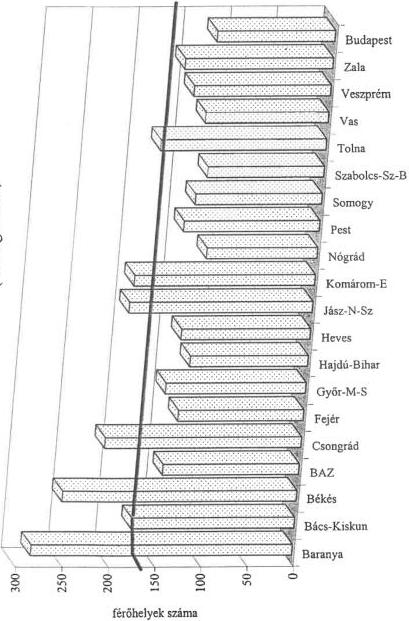
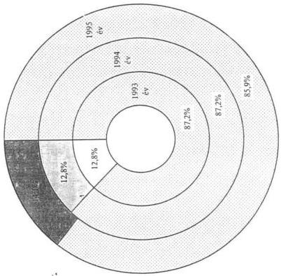

Állami Számvevőszék

# JELENTÉS

a tartós szociális ellátást nyújtó
intézmények helyzetének és
finanszírozásának vizsgálati
tapasztalatairól

363.

1997. JÚLIUS

---

A vizsgálat végrehajtásáért felelős:
az ÁSZ V. Önkorm. és Területi Ellenőrzési Igazgatósága:

Dömötör Gyula
számvevő igazgató

A vizsgálatot vezette:

Dr. Felleg Zsoltné
régióvezető főtanácsos

A vizsgálatot végezték:

Berényi Magdolna
számvevő tanácsos

Gordos László
számvevő tanácsos

Köcse Istvánné
számvevő tanácsos

Az ellenőrzésben részt vettek névsorát az 1. sz. melléklet tartalmazza.

---

V-1006-148/1996-97. TSZ: 318

# TARTALOMJEGYZÉK

|  **I. ÖSSZEGZŐ MEGÁLLAPÍTÁSOK, KÖVETKEZTETÉSEK** | **4**  |
| --- | --- |
|  **II. JAVASLATOK** | **7**  |
|  **III. RÉSZLETES MEGÁLLAPÍTÁSOK** | **9**  |
|  **1. A szociális intézményi ellátások irányítása** | **9**  |
|  1.1. Az ellátórendszer szakmai szabályozása | 9  |
|  1.2. A pénzügyi támogatási rendszer hatása az ellátórendszerre | 11  |
|  **2. Tartós bentlakásos szociális intézményi ellátás helyzete** | **15**  |
|  2.1. Az ellátó rendszer főbb jellemzői | 15  |
|  2.2. Az önkormányzati feladatellátás pénzügyi lehetőségei | 17  |
|  2.3. A működés feltételrendszere | 20  |
|  2.4. Az ellátás körülményei | 23  |
|  2.5. A gondozási munka jellemzői | 25  |
|  2.6. Az intézményi ellátás színvonala | 28  |
|  **3. A nem állami intézményi ellátás jellemzői** | **32**  |

1

---

1. 2017年1月1日，公司与上海浦东发展银行股份有限公司签订了《关于使用部分闲置募集资金进行现金管理的协议》。

---

# Jelentés

# a tartós szociális ellátást nyújtó intézmények helyzetének és finanszírozásának vizsgálati tapasztalatairól

Az elmúlt években lezajlott társadalmi és gazdasági folyamatok hatására a lakosság egyes rétegeinek életkörülményeiben - szociális helyzetében, egészségügyi állapotában - jelentős változások következtek be. A lakosság egészségi állapotának általános romlása, a népesség elöregedésével is összefüggő szociális és egészségügyi problémák szaporodása, valamint a deviancia terjedése miatt növekszik azoknak a száma, akikről a társadalomnak valamilyen formában gondoskodni kell. E jelenségek következményeként a szociális ellátás, és azon belül a tartós gondozást nyújtó, különféle szakosított intézmények iránti igények is növekednek.

A társadalom gondoskodása különösen felértékelődött abban a körben, ahol a megfelelő családi háttér hiánya, illetve az egyéni élethelyzetek alakulása miatt az elemi feltételek sem adottak. Ezzel együtt minden társadalom alapvető értékmérője, hogy a munkában megfáradt, megromlott egészségű, idős és beteg tagjai számára milyen mértékű szociális és egészségügyi ellátást nyújt, gondoskodik-e arról, hogy életük "utolsó szakasza" nyugodt, kiegyensúlyozott legyen. A Kormány szociálpolitikai programja meghatározó elemként fogalmazta meg az ellátások hatékonyságának fokozását, a szociálisan hátrányos helyzetű egyének, családok létfeltételeinek védelmét. (1.108/1994.(XII. 2.) számú Kormányhatározat)

A szociális ellátások biztosítása az állam központi szervei és a helyi önkormányzatok feladatkörébe tartozik. A feladatellátás két fő területre, alapellátásra és szakosított ellátásra tagozódik.

A helyi önkormányzatokról szóló 1990. évi LXV. törvény (a továbbiakban: ÖTV.) a lakosság szociális alapellátását a települési önkormányzatok, az egyes szakosított ellátások megszervezését, valamint e tevékenység területi összehangolását pedig a megyei, fővárosi önkormányzatok feladatkörébe utalta. A szociális igazgatásról és a szociális ellátásokról rendelkező 1993. évi III. törvény (a továbbiakban: SZTV.) az önkormányzati feladat- és hatásköröket konkrétabban fogalmazta meg, továbbá a vizsgált témát érintően rögzítette a szakosított ellátások formáit, szervezetét, a jogosultság feltételeit és az igénybevétel általános szabályait.

Az ÖTV és az SZTV előírásai alapján a települési önkormányzat a felnőttek számára a személyes gondoskodást nyújtó alapellátás körében étkeztetésre, házi segítségnyújtásra és családsegítésre kötelezett, de feladatkörébe tartozik - lakosságszámhoz kötötten - a szakosított szociális ellátásokhoz sorolt nappali és átmeneti intézmények létreho-

3

---

I. ÖSSZEGZŐ MEGÁLLAPÍTÁSOK, KÖVETKEZTETÉSEK

zása és működtetése is. A megyei és fővárosi önkormányzatoknak ugyancsak a személyes gondoskodás részét képező, de tartós ápolást, gondozást nyújtó, valamint a rehabilitációs intézményhálózat kialakításáról, működtetéséről kell gondoskodnia.

A számvevőszék 1993-ban lefolytatott ellenőrzése a személyes gondoskodás formái közül a - települési önkormányzatok feladatkörébe utalt - felnőttek nappali és átmeneti szociális ellátásának helyzetét tekintette át. Ennek folytatásaként az 1996. évben végzett vizsgálat a megyei önkormányzatok kötelező feladataként meghatározott, tartós gondozást nyújtó szakosított szociális ellátás területére irányult.

A felnőtt korosztályból tartós, bentlakásos intézményi ellátásban évente 50-54 ezer fő részesült, amely az összlakosságon belül 0,5%-ot, a 60 éven felüliekhez képest több mint 2%-ot jelentett. Gondozásuk, ápolásuk éves szinten mintegy 15 milliárd forintba került.

Az ellenőrzés az 1993-1995. éveket érintően a Népjóléti Minisztériumra, a fővárosi és 12 megyei-, valamint 40 települési önkormányzatra, továbbá azok felnőttek számára tartós, bentlakásos szociális ellátást nyújtó 66 intézményére terjedt ki. Az intézmények közül 44 egység fővárosi, illetve megyei-, 22 pedig települési önkormányzat fenntartásában működik. A vizsgált települési önkormányzatok közül 20 tartós ellátást nyújtó szociális intézményt nem tart fenn. Ott a megelőzést szolgáló- és a beutaló tevékenység ellenőrzésére került sor. Az ellátás átfogó megítélése érdekében további 11 nem állami fenntartású, de állami támogatást igénybe vevő intézménynél folytattunk vizsgálatot.

Az ellenőrzés célja: annak megállapítása volt, hogy

- a tartós gondozást biztosító felnőtt szociális intézményi ellátásnak milyen feltételrendszere alakult ki az elmúlt időszakban;
- az önkormányzatok által működtetett intézményhálózat mennyiben képes a jogos igények kielégítését biztosítani;
- hogyan hasznosultak azok a központi és önkormányzati erőforrások, amelyek a felnőtt korúak intézményes ellátására rendelkezésre álltak.

# I. ÖSSZEGZŐ MEGÁLLAPÍTÁSOK, KÖVETKEZTETÉSEK

Az önkormányzatok által fenntartott - jórészt a korábbi évtizedekben létesült - tartós ellátást nyújtó intézményhálózat a növekvő számú ellátásra szoruló befogadására, valamint a magasabb szintű ellátás

4

---

I. ÖSSZEGZŐ MEGÁLLAPÍTÁSOK, KÖVETKEZTETÉSEK

jogszabályokban megfogalmazott **követelményei kielégítésére** összességében **nem alkalmas**. Az ellátási igények bővüléséhez és azok módosulásához a férőhelyfejlesztés sem ütemében, sem szerkezetét tekintve nem tudott kellően igazodni. Mindezek következtében az intézményekbe beutalt - de férőhely hiányában tényleges elhelyezést nem nyert - **várakozók száma folyamatosan növekedett**.

Az ellenőrzött időszakban került sor a szociális igazgatásról és ellátásokról szóló **1993. évi III. törvény** megalkotására, amely - a kötelező szociális ellátási formák megfogalmazásával, az ellátásra kötelezettek és az arra jogosultak körének meghatározásával - hibái ellenére is jelentős **előrelépést jelentett** az önkormányzati és hatásköri törvényekben már korábban rögzített **szakmai feladatok értelmezésében**.

A törvény megjelenését követően a szociális ágazatot, ezen belül a tartós gondozást nyújtó intézmény-hálózatot is érintő jogalkotói tevékenység felgyorsult. Hatása elsősorban a törvény végrehajtását segítő kormány- és tárca- szintű rendeleti szabályozásban jelentkezett, de gyakran a korábbi előírások pontosításában, egyértelműbb megfogalmazásában is megmutatkozott. Mindezek következtében a feladatok - az elvárások szintjén - egyértelműbbé váltak, ugyanakkor több tekintetben **nem sikerült a szabályozásba azokat a garanciális elemeket beépíteni, amelyek a feladatot ellátó - de különösen annak ellátására kötelezett - önkormányzatok számára azok teljesítésének feltételeit megteremtenék**.

A tartós gondozási feladatokat kötelezően végző, valamint azt önkéntes alapon vállaló önkormányzatok, továbbá a nem állami szervezetek közötti együttműködésre, a **tevékenység területi összehangolására** a jogszabályok elvárásokat fogalmaznak meg, azonban az - a szükséges hatáskörök nélkül, megfelelő információs rendszer hiányában - **a gyakorlatban nem működik**. Az együttműködés alapjait megteremtő információk hiánya miatt a feladatellátásra kötelezett megyei önkormányzatok az igények megismerésére és jövőbeni megbecsülésére sem képesek, ami a fejlesztési célok reális meghatározását nehezíti.

Az állam a **szociális törvényben**, valamint annak végrehajtására **kiadott** rendeletekben az **ellátási feltételek megteremtését** meghatározott határidőkhöz kötötte. Ezeknek a határidőknek a teljesítése azonban a megvalósításukhoz szükséges - elsősorban **anyagi - feltételek biztosítása nélkül nem lehetséges**. A **központi költségvetésből nyújtott források**, valamint a feladatot ellátó önkormányzatok e célra fordítható pénzeszközei az egyébként jogos elvárások megvalósítására **nem elegendőek**. A fejlesztési célra rendelkezésre álló önkormányzati keretek a cél- és címzett támogatással, valamint a szociálpolitikai programok keretében nyújtott központi forrásokkal kiegészítve az igények növekedési mértékétől jelentősen elmaradó ütemű férőhelybővítést tettek lehetővé. Mindezek

5

---

I. ÖSSZEGZŐ MEGÁLLAPÍTÁSOK, KÖVETKEZTETÉSEK

következtében jelenleg is korszerűtlen, a szakmai jogszabályok által meghatározott követelményeket biztosítani nem képes intézményhálózatban történik a gondozottak ellátása. Az utóbbi években épült intézmények többségében már az 'emelt szintű ellátás' feltételei biztosítottak, azok igénybevétele azonban a rászorultak egy jelentős része számára - anyagi feltételek hiányában - nem elérhető.

**Az önkormányzatok többségének pénzügyi helyzete** a vizsgált időszakban **romlott**. Különösen nehéz helyzetbe kerültek a tartós ellátásra kötelezett megyei önkormányzatok, amelyek pénzügyi pozíciója szinte kizárólag a törvényalkotók szándékától függ. Miután a központi költségvetés az intézményi gondozáshoz nyújtott normatív hozzájárulás reálértékét sem garantálta, e feladatok ellátásának színvonalában szükségszerűen visszaesés következett be. Mindinkább érzékelhető, hogy a '**teljes körű ellátás**' elve a **gyakorlatban egyre kevésbé, vagy csak a gondozottak mind jelentősebb anyagi hozzájárulása esetén érvényesül**.

Általános tapasztalat, hogy a **szociális törvényben előírt személyes gondoskodás egyes elemei** /nappali - átmeneti - tartós intézményi ellátás/ a gyakorlatban **alig épülnek egymásra**. A **települési önkormányzatok** a lakóhelyükön, családi körben élők számára **helyben nyújtható szolgáltatásokat nem mindig biztosítják**. Erre utal, hogy jelentős számban olyan emberek tartós intézményi elhelyezésére intézkedtek, akik a beutalást megelőző időszakban lakóhelyükön szociális ellátásban nem részesültek. Egyértelmű, hogy a települések anyagilag nem érdekeltek az ellátás helyi megteremtésében, amennyiben az egy beutaló határozat meghozatalával kiváltható. A kevésbé költséges és az állampolgár szempontjából is kedvezőbb családi körben történő gondozás helyett a tartós ellátást nyújtó intézménybe történő **megalapozatlan beutalások** az állam, illetve a feladatot ellátó megyei önkormányzat számára **nem elhanyagolható nagyságrendű többletráfordítást okoznak**.

A **nem állami szervezetek számára** a szociális feladatok ellátásába való bekapcsolódást a 113/1989. (XI.15.) sz. MT rendelet alapozta meg. Mivel az igények teljes kielégítésére az ellátásra kötelezett önkormányzatok nem voltak és jelenleg sem képesek, ennek a lehetőségnek a megteremtése ilyen megfontolásból is indokolt volt. Ezzel élve évről-évre növekedett a tartós szociális gondozási feladatot vállaló szervezetek és az általuk gondozottak száma. A **szabályozás** mind a szakmai elvárások megfogalmazásában, mind a finanszírozás feltételei tekintetében évenként változó, de tendenciájában az önkormányzati rendszerhez közelítő, a **szektorsemlegesség érvényesítésére törekvő elveket követett**. Ennek következtében a nem állami szervezetek számára - annak sajátosságait figyelmen kívül hagyva - az önkormányzatok részére biztosított hozzájárulással azonos nagyságrendű fajlagos támogatást folyósítottak. A **differenciálatlan pénzügyi támogatási rendszer** - alapvetően az intézményi jogviszony el-

6

---

II. JAVASLATOK

térő jellege miatt - társadalmi igazságtalanságot eredményezett. Míg az önkormányzati intézményekbe a települési önkormányzatok - rászorultság alapján hozott - határozatát követően kerülhetnek az állampolgárok, addig nem állami ellátásnál a fenntartó és kérelmező közötti megállapodás a meghatározó. Ez utóbbi esetben a rászorultság - elsősorban anyagi szempontból - valójában nem is értelmezhető, hiszen a többségében emelt szintű ellátást nyújtó intézménybe kerüléshez, az egyszeri hozzájárulás nem csekély mértékű anyagi fedezetével kell rendelkezni és a térítési díjak is magasak. Mindezek mellett a nem állami szervek a nehezebb fajsúlyú, bonyolultabb és ezért sokkal költségesebb ún. speciális ellátásokra (pszichiátriai betegek, fogyatékosok) általában nem vállalkoznak, azok - jórészt azonos mértékű központi támogatás mellett - az önkormányzatokra maradnak. Az "egyszerűbb" gondozást viszont az érintettek jelentős anyagi tehervállalása mellett nyújtják. Ugyanakkor gondozottjaik tartós, illetve végleges ellátására vonatkozó kötelezettségük nem garantált és végeredményében a megyei önkormányzatokra áthárítható.

## II. JAVASLATOK

A helyszíni ellenőrzések során az érintett önkormányzatok és azok intézményei számára számos - helyi szinten megvalósítható - javaslatot fogalmaztunk meg.

- Felhívtuk a testületek figyelmét az intézményes ellátás helyzetének, az igények és a lehetőségek alakulásának áttekintésére, továbbá arra, hogy a települések fordítsanak nagyobb gondot a megelőzésre, az alap-, illetve helyi szakosított ellátási feladatok hatékonyabb teljesítésére,
- a megyei önkormányzatok számára javasoltuk, hogy dolgozzák ki a korszerűbb és a megváltozott szükségletekhez jobban illeszkedő ellátó rendszer kialakításának feltételeit,
- a fenntartó önkormányzatok a források elosztásánál törekedjenek a szakmai igények és a pénzügyi lehetőségek összehangolására, kapjon nagyobb hangsúlyt az előírt feltételek és ellátási színvonal megtartása, megteremtése,
- az intézmények vonatkozásában a pénzügyi-gazdálkodási fegyelem javítására, a gondozotti vagyonkezelés, őrzés szabályszerű, biztonságos megszervezésére, az intézményi működés és ellátás rendszerének konkrét, jogszabályokkal szinkronban történő szabályozására és annak következetes betartására hívtuk fel a figyelmet.

Az ellenőrzés tapasztalatai alapján szükséges a felnőttek tartós bentlakásos intézményes ellátása helyzetének újragondolása és tartalmi megújítása.

7

---

II. JAVASLATOK

Ennek érdekében a Kormány egy olyan szakosított intézmény-rendszer kialakításának feltételeit teremtse meg, amely

- számol az állami és önkormányzati feladatokat átvállaló nem állami szerveknek a szociális gondozásban való fokozódó szerepvállalásával úgy, hogy azok tevékenységének sajátosságait a szakmai követelmények, a költségvetési támogatások meghatározása során egyaránt tekintetbe veszi;
- az e terület fejlesztésére rendelkezésre álló központi erőforrások jelentős részét elsősorban az ellátási felelősséget viselő megyei önkormányzatok számára biztosítja

A Népjóléti Minisztérium - együttműködve a Belügyminisztériummal és a Pénzügyminisztériummal - intézkedjen, hogy a szociális törvényben megfogalmazott szakmai előírások határidőre teljesüljenek. Ezek érdekében szükséges

- a meglévő intézményhálózat korszerűsítéséhez és bővítéséhez szükséges pénzügyi források (cél- címzett támogatás, szakmai programok) biztosítása, alapvetően a feladatellátásra kötelezett megyei önkormányzatok számára;
- a megyei és települési önkormányzatok tartós gondozást biztosító intézményei működéséhez nyújtott normatív hozzájárulás értékének felülvizsgálata és a reális szükségletekhez való igazítása. Ennek során az egészségügyi rendszer átalakításának e szakterületet érintő hatását is figyelembe véve elsősorban a pszichiátriai betegeket ellátó intézmények normatívájának emelése indokolt;
- a megyei önkormányzatok jogszabályokban megfogalmazott koordinációs feladatai ellátásának feltételeit megteremteni. Ehhez a hatáskörök telepítése mellett a pénzügyi és szakmai információs rendszert is célszerű átalakítani;
- a közigazgatási hivatalok számára az évek során oda telepített szociális szakfeladatok ellátásának feltételeit biztosítani. A tartós, bentlakásos intézmények működésének, illetve az általuk nyújtott ellátás 1997. január 1.-től előírt engedélyezési- és rendszeres ellenőrzési kötelezettségének teljesítéséhez a humán erőforrásokat és a feladat volumenéhez igazodó pénzügyi eszközöket hozzá kell rendelni;
- a tartós, bentlakásos intézményi ellátás iránti igények részleges kiváltása céljából a települési önkormányzatok helyi gondozó tevékenységének javítását szolgáló intézkedéseket kell tenni. Anyagi ösztönzőknek a támogatási rendszerbe történő beépítésével indokolt érdekeltté tenni a településeket a helyben történő gondozás biztosításában, a családsegítés, házi segítségnyújtás és a nappali ellátás kiszélesítésében. A

8

---

III. RÉSZLETES MEGÁLLAPÍTÁSOK

tartós, bentlakásos intézményekbe történő **beutalásoknál** a döntések megalapozottsága javuljon, a **rászorultság elve mindinkább érvényesüljön**.

### A Népjóléti Minisztérium

- ■ a szakmai feladatellátás egységesebb megteremtése érdekében **intézkedjen** az azok végrehajtását segítő **szakmai tájékoztatók, módszertani segédletek kiadására és terjesztésére**,
- ■ az intézményi gondozásban részesülők személyiségi jogainak védelme, egységesebb ellátásuk biztosítása érdekében dolgozza ki a **gondozotti pénz- és vagyonkezelés** intézményen belüli nyilvántartási rendszerét. Pontosítsa az intézeti **élelmezés, gyógyszer- és textília ellátás jelenleg érvényes szakmai szabályait**.

## III. RÉSZLETES MEGÁLLAPÍTÁSOK

### 1. A SZOCIÁLIS INTÉZMÉNYI ELLÁTÁSOK IRÁNYÍTÁSA

#### 1.1. Az ellátórendszer szakmai szabályozása

A szociálpolitika legfőbb irányító szerve a Népjóléti Minisztérium, amelynek az ágazat irányítására, összehangolására és szervezésére vonatkozó feladatait a 49/1990. (IX. 15.) Korm. számú rendelet határozza meg.

A felsőszintű irányítás egész ellátó rendszert determináló eszköze a szakirányú ágazati jogalkotás, amely - a törvények és kormányrendeletek előkészítése, a miniszteri rendeleti szabályozás útján - alapvető hatást gyakorol a szociális ellátás, ezen belül a felnőttek tartós bentlakásos intézményi ellátásának körülményeire.

Bár a feladatokat meghatározó kormányrendelet az önkormányzatok megalakulásával szinte egyidőben megjelent, a megváltozott társadalmi-gazdasági körülmények által indokolt törvényi szabályozás jelentős késedelemmel, 1993. évben lépett hatályba. A hosszas előkészítés ellenére reális helyzetelemzésre és hatásvizsgálatokra épülő minisztériumi szintű koncepció nem készült. Így a szociális ellátórendszer feltételeit és működési szabályait meghatározó 1993. évi III. törvény - korszerű szemlélete mellett - az időközben kialakult viszonyokra kevésbé adaptálható szabályozást is tartalmazott. Végrehajthatóságát több területen nehezítette, hogy az önkormányzatiságnak a korábbi

9

---

III. RÉSZLETES MEGÁLLAPÍTÁSOK

**rendszertől eltérő sajátosságait, valamint a fenntartói kör bővüléséből fakadó új típusú problémákat nem vette figyelembe.**

Az ÖTV és a SZTV a megyei önkormányzatok kötelező feladataként határozza meg a felnőttek tartós, bentlakásos szociális intézményi ellátását, de lehetővé teszi, hogy az ellátásba települési önkormányzatok, illetve más nem állami szervezetek is bekapcsolódjanak. Az **önállóan gazdálkodó** és egymással alá-fölérendeltségi viszonyban nem álló **önkormányzatok és más szervezetek együttműködésére** a törvények ugyan lehetőséget biztosítottak, de annak végrehajtási **feltételeit nem teremtették meg.**

Az önkormányzati rendszer megalakulásával a **megyei önkormányzatok elveszítették** a szociális intézmények irányítása, a beutalások kezelése, összehangolása terén korábban fennálló **meghatározó pozíciójukat**. Mellérendeltségi helyzetükben a szociális ellátások összehangolására irányuló - egyébként kötelező - tevékenységük tárgyalásos, illetve megállapodásos alapokra került, és ezáltal instabillá vált. A nagyszámú, különböző gazdasági helyzetű és számos vonatkozásban eltérő érdekeltségű önkormányzattal, illetve nem állami szervezetekkel a megegyezés esélye minimálisra csökkent és emiatt szinte teljes egészében a koordináció is ellehetetlenült. Végeredményben a szociális gondozási munkát kötelezően ellátó, valamint abba önkéntes alapon bekapcsolódó testületek és szervezetek munkájának összeghangolására, **szakmai koordinációjára** a jogszabályokban deklarált elvárásokon túl a **megyei önkormányzatok valós jogosítványokat nem kaptak.**

A vizsgált időszakban - különösen 1996. évben - felgyorsult jogalkotó tevékenységet a szociális törvény gyakorlati végrehajtása során jelentkező gondok megoldásának, valamint az egységesebb ellátási feltételek megteremtésének igénye motiválta. E mellett egyre erőteljesebb törekvés mutatkozott az állami és önkormányzati szférán kívül eső civil szervezeteknek az intézményes ellátásba való bevonására is.

Az ellenőrzés időszakában a **közigazgatási hivatalokhoz mind több szakmai feladatot telepítettek.**

A 113/1989. (XI. 15.) MT rendelet értelmében a hivatal gondoskodik a nem állami szociális intézmény működésének engedélyezéséről.

A 71/1992. (IV. 21.) sz. Korm. rendelettel módosított 22/1992. (I. 28.) sz. Korm. rendelet az önkormányzatok által fenntartott szociális intézmények működésére vonatkozó szakmai követelmények betartásának ellenőrzésére adott felhatalmazást.

**1997. I. 1-től** a 161/1996. (XI. 7.) sz. Korm. rendelet értelmében **valamennyi szociális intézmény** tevékenységének meghatározott rendszerességű **szakmai ellenőrzésére**, a már meglévő, valamint az új intézmények **működési engedélyének kiadására is felhatalmazást kaptak.** Mindezek mellett a nem állami szociális intézmények normatív

10

---

III. RÉSZLETES MEGÁLLAPÍTÁSOK

támogatásának folyósítása, a jogosultság feltételeinek elbírálása is hatáskörükbe került. Sajnálatos, hogy az **elvárások megfogalmazásával egyidejűleg nem került sor a végrehajtáshoz szükséges anyagi erőforrások biztosítására.**

A **népjóléti miniszter** az SZTV felhatalmazása alapján 1994. évben a 2/1994. /I. 30./ NM rendelet kiadásával **szabályozta** a személyes gondoskodást nyújtó **intézmények szakmai feladatait és működésük feltételeit.** E jogszabálynak az ellátás színvonalára való hatása - számos feltétel hiánya miatt - az indokoltnál kisebb.

A már működő intézményeknél az elhelyezési körülmények tekintetében a jogszabály - a realitásokhoz igazodva, helyesen - nem is határoz meg a jelenlegitől eltérő feltételeket. Ebből következik, hogy **hosszabb távon számolni kell** a kulturált **ellátás feltételeit** - adottságainál fogva - **biztosítani** egyre **kevésbé képes intézmények további működésével.** Az alapvető gond azonban az, hogy az ellátást végző megyei és települési önkormányzati intézmények, valamint a nem állami szervezetek az egyes feladatok végrehajtásában magukra maradtak. A **népjóléti tárca** a szakmai elvárások értelmezéséhez, a megyei önkormányzatok többségénél - az egységesebb ellátás feltételeinek megteremtésére - létrehozott módszertani csoportok tevékenységének kialakításához **kellő szakmai támogatást, módszertani segítséget nem adott.** Az évek során egyre több szociális hatáskörrel és jogosítvánnyal felruházott közigazgatási hivatalok pedig, amelyek a tárca által megfogalmazott elvárások közvetítői lehettek volna - a korábban már jelzett okok miatt - sem a feladatok végrehajtásának ellenőrzésében, sem a szakmai irányítást ellátó tárca informálásában nem tudtak érdemi szerepet vállalni.

## 1.2. A pénzügyi támogatási rendszer hatása az ellátórendszerre

Az állam a személyes gondoskodás körébe tartozó önkormányzati és nem állami intézmények működési kiadásaihoz és fejlesztéseihez egyaránt hozzájárul. A költségvetési hozzájárulás jogcímeit és mértékét az éves költségvetési törvények a fejezetek költségvetésében határozzák meg.

A **működési kiadásokhoz** történő költségvetési **támogatás forrása** a települési és megyei önkormányzatok részére a Belügyminisztérium fejezetnél, a nem állami intézményfenntartók számára pedig a népjóléti tárcánál elkülönített előirányzatként rendelkezésre álló **normatív állami hozzájárulás. Az intézményhálózat fejlesztéseit** a kizárólag önkormányzatokat érintő **cél- és címzett támogatások** kötött felhasználású keretei, valamint a fejezeti kezelésű **szakmai programok** szektorsemleges felhasználású **keretösszegei szolgálják.**

11

---

III. RÉSZLETES MEGÁLLAPÍTÁSOK

Az önkormányzatok által fenntartott tartós bentlakásos szociális ellátást biztosító intézmények működtetéséhez szükséges források döntő többségét a **normatív állami hozzájárulások** jelentik.

1995. évben az önkormányzatok 8.297 millió forint, míg a nem állami intézmények 976 millió forint összegű támogatásban részesültek.

Az intézmények ellátottjaira igényelhető normatíva az ápoló-gondozó otthoni ellátások esetében 1993-1995. közötti időszakban nem növekedett, ezért az inflációs hatásokat figyelembe véve reálértéke fokozatosan csökkent. Az önkormányzatok normatív támogatása 1992. és 1993. évek között még 22,2%-kal, 1993. és 1994. évek között azonban mindössze 1,6%-kal, 1994. és 1995. évek között pedig csupán 12,3%-kal emelkedett. A **reálértékét tekintve csökkenő mértékű állami hozzájárulás az intézmények kiadásainak egyre kisebb hányadára nyújtott fedezetet.**

A **nem állami fenntartású intézmények működtetéséhez az állam** az éves költségvetési törvényekben meghatározott - az **önkormányzati feladatokhoz nyújtott támogatás mértékével azonos nagyságrendű - anyagi segítséget nyújtott.** E támogatásban humán szolgáltatást biztosító személyek és szervezetek (egyházak, társadalmi szervezetek, alapítványok, közalapítványok, közhasznú társaságok, magánszemélyek) részesülhettek, társas vállalkozások azonban nem.

A szociális törvény 1996. évi módosítása (1996. évi CXXVIII. tv.) meghatározott feltételek megléte esetén 1998. évtől lehetővé teszi a társas vállalkozások költségvetési támogatását is.

Az éves költségvetési **törvények a támogatás igénybevételét** gyakran **változó, formálisnak tűnő**, a nem állami szféra működésének sajátosságait figyelembe nem vevő **feltételekhez kötötték.**

**1995. évben** a normatív állami hozzájárulás folyósításának a költségvetési törvényben meghatározott feltételrendszere szakmailag vitatható volt és a gyakorlatban számos problémát vetett fel. A hozzájárulás folyósításának feltétele a nem állami intézmény és az önkormányzat között a 'feladat átadására' vonatkozó megállapodás volt. Az önkormányzatok nem voltak érdekeltek e megállapodás megkötésében és semmi nem is kötelezte őket arra. Számos esetben megtagadták, illetve késedelmesen kötötték meg azt, amely tartalmát tekintve egyébként is formális volt.

**1996. évben** a költségvetési törvény - az előző évek előírásait megváltoztatva - a folyósítás feltételével a működési engedélyezési jogkört gyakorló szerv (közigazgatási hivatal) igazolásának beszerzését írta elő. A közigazgatási hivatalok e feladatok ellátására nem voltak felkészülve, ennek következtében annak csak késedelmesen és nem megfelelő színvonalon tettek eleget.

A támogatás feltételeit szabályozó költségvetési törvények késői megjelenése, a megyei önkormányzatoknak a megállapodás megkötésében való érdekeltségének hiánya, valamint a közigazgatási hivataloknak a feladat ellátására való felkészületlensége egyaránt közrejátszott abban, hogy a támogatási szerződések megkötéséhez szükséges dokumentumok év elején

12

---

III. RÉSZLETES MEGÁLLAPÍTÁSOK

többnyire nem álltak a tárca rendelkezésére. A **Népjóléti Minisztérium** azonban - **az ellátást elsődlegesnek tekintve** - ez esetben is **folyamatosan biztosította az intézmények működéséhez szükséges támogatást**.

A szociális intézményi ellátás fejlesztésének szektorsemleges forrását képezi az állami költségvetésben évről-évre a népjóléti tárca rendelkezésére álló, a tárca által meghatározott **célokra felhasználható pénzkeret**. A minisztérium a szociális ellátások fejlesztésére rendelkezésre álló szakmai keretet a szociális törvény hatályba lépését követően annak végrehajtásának támogatására kívánta felhasználni. A **pályázati pénzek** 1993-ban és 1994-ben a szociális alapellátások kiépítését, **1995. óta a szakellátások fejlesztését segítik**.

A szociálpolitikai pályázati rendszert az 1993. évi számvevőszéki ellenőrzés is érintette. Annak a fejlesztésekben, a fejlesztési irányok orientálásában betöltött szerepe hangsúlyozásával egyidejűleg több hiányosságra is felhívta a figyelmet és javaslatokat is megfogalmazott. A **minisztérium** az utóbbi három évben több **intézkedést tett a pályázati rendszer hatékonyabb működtetésére**.

A miniszter 1996. január 1-i hatállyal szabályozta 'a fejezet költségvetésének tervezésével, beszámolójának összeállításával, valamint az évközi gazdálkodással és ellenőrzéssel összefüggő kötelezettségek, jogosítványok rendjét'. Meghatározta a támogatási szerződések kötelező tartalmi elemeit, köztük a kedvezményezett részéről történő elszámolási kötelezettség előírásait, valamint a tárca ellenőrzési jogának deklarálását és szankciókat is rögzített.

A pályázatokon elnyerhető költségvetési támogatás forrás-kiegészítésül szolgál annak érdekében, hogy a pályázók saját meglévő forrásaikat is mobilizálják a tervezett program megvalósításához. A pályázati kiírásokban minimálisan 50% saját forrás meglétet határozták meg. A pályázatok feldolgozására, elbírálására, annak nyilvánosságra hozatalára, stb. ütemtervet készítettek. A pályázatokat elbíráló szakértői bizottságokban a minisztérium munkatársai mellett - az objektivitás és szektorsemlegesség mind teljesebb biztosítása céljából - különféle területeken dolgozó szakemberek is helyet kaptak.

A szociális alapellátás, valamint a kríziskezelést szolgáló egyes szociális ellátási formák fejlesztésére **1994-ben** meghirdetett szakmai program lehetőséget nyújtott olyan bentlakásos intézményi szakellátás-fejlesztés megpályázására, amelynél egyidejűleg az alapellátás körébe tartozó szociális ellátás fejlesztésére is sor került. Az intézményi szakellátás fejlesztését is magában foglaló, **komplex feladatellátást szolgáló igénylés** csupán 38 db volt. A szakértői bizottságok e pályázatok **közül mindössze négy kérelmet ítéltek támogatásra érdemesnek és ehhez 7,6 millió forintot biztosítottak**.

A tárca költségvetése **1995-ben** 500 millió forintot biztosított a szociális szakellátások fejlesztésére. A beérkezett pályázatok közül a tartós, bentlakásos, intézmények fejlesztését célzó pályázatok száma 313 db volt. **Támogatást 101 pályázó kapott összesen 252,8 millió forint összegben. A pályázatok többsége férőhely-fejlesztésre vonatkozott**, ezen belül viszonylag **magas volt azoknak a kistelepüléseknek a száma, akik saját lakosaik számára tartós bentlakásos intézményt kívántak létrehozni**. Az elbírálásnál a fé-

13

---

III. RÉSZLETES MEGÁLLAPÍTÁSOK

rőhelybővítések mellett előnyt élveztek az ápoló intézmények rehabilitációs intézménnyé történő átalakítását célzó, illetve a kórházi ágystruktúra változásával összefüggő pályázatok.

A tárca a személyes gondoskodást nyújtó szociális szakellátások fejlesztésére **1996-ban** 600 millió forintot különített el. A beérkezett **pályázatok közül 294 db az időskorúak, pszichiátriai- és szenvedélybetegek, valamint a fogyatékosok tartós bentlakásos intézményeinek férőhelyfejlesztésére**, valamint rehabilitációs tevékenységhez szükséges tárgyi feltételek javítására vállalkozott. A minisztérium **109 pályázati cél megvalósításához 395 millió forintos támogatást biztosított** elsősorban azoknak, akik a kórházi ágyak számának csökkenésével összefüggő férőhely-fejlesztésre, ápolási részlegek kialakítására igényelték a támogatást.

**A vizsgált időszak egészére** jellemző, hogy **a rendelkezésre álló keretösszeg az igényekhez viszonyítva elenyésző** és a támogatás mértéke és nagyságrendje is alacsony. Egy pályázatot 1994-ben 1,9 millió forinttal, 1995-ben 2,5 millió forinttal, 1996-ban 3,6 millió forinttal tudtak átlagosan támogatni.

A Minisztérium a nyertes pályázókkal a támogatott cél megvalósítására vonatkozó, garanciákat is tartalmazó támogatási szerződéseket megkötötte. A pályázati támogatások felhasználásának helyszíni ellenőrzésére - a személyi feltételek hiánya miatt - csak szűrőpróbaszerűen került sor. A megvalósult beruházásokat az intézmény átadásakor ellenőrzik, ezekről azonban írásos dokumentumot nem tudtak bemutatni.

A számvevőszéki ellenőrzés során véletlenszerű kiválasztással **8 db 1995. évi pályázat iratanyagát tekintettük át**. Az ellenőrzött pályázatok segítségével történt intézményi férőhelyfejlesztések mindegyike időközben befejeződött. A pályázók a támogatási összeggel elszámoltak. A **pályázatok alaki és tartalmi elemei** - egy kivételével - **megfeleltek a pályázati kiírásban foglaltaknak**.

A személyes gondoskodást nyújtó szociális ellátórendszer fejlesztését a **cél- és címzett támogatások** keretösszegei is segítik. A tartós bentlakást nyújtó szociális intézmények férőhelyeinek fejlesztéséhez igényelhető cél- és címzett támogatások kizárólag az önkormányzati szférában használhatók fel.

A 'szociális otthoni férőhelyfejlesztés' támogatása 1993-ban és az azt megelőző időszakban céltámogatás keretében történt. **1994. évtől** a szociális célú beruházások a címzett támogatási körbe kerültek, ezzel a **szakterület támogatási lehetőségei erőteljesen beszűkültek**. 1994. és 1995. években mindössze egyetlen - 700 millió forinttal támogatott - pályázat került címzett támogatási körbe. Az önkormányzatok 1996. évi indításra tervezve 70 db pályázatot nyújtottak be 9.369 millió forint támogatási igénynyel. A pályázatok megfelelő szakmai színvonala ellenére az **1996. évi XLVI. törvény mindössze öt pályázat támogatását tartalmazza 1.619 millió forint összegben**. Ez az igényelt támogatás alig 17%-át teszi ki.

14

---

III. RÉSZLETES MEGÁLLAPÍTÁSOK

Összességében megállapítható, hogy az önkormányzati körben felhasználható címzett támogatások keretei, valamint a szociálpolitikai programokra igényelhető fejezeti rendelkezésű összegek a vizsgált időszakban jelentősen elmaradtak a bejelentett igényektől. Számottevő férőhelyfejlesztésekre lehetőséget nem nyújtottak. Az önkormányzatok saját pénzügyi forrásainak szűkülése és az e célra biztosított szerény nagyságrendű állami források együttes hatására az intézményi férőhelyszám alig növekedett.

A megszűnő férőhelyeket is figyelembe vevő nettó férőhelyszám az 1994. és 1995. években az önkormányzati és nem állami fenntartású idősek otthonaiban együttesen is mindössze 3.346-al, a fogyatékosok (és szenvedélybetegek) otthonaiban 469-el nőtt, míg a pszichiátriai betegek otthonaiban 202 férőhelyszám-csökkenés (!) következett be.

Az igényeknek a kapacitások bővülésénél nagyobb mértékű növekedése következtében mindhárom intézménytípus esetében jelentősen nőtt az elhelyezésre, s még erőteljesebben az egy évnél hosszabb ideje elhelyezésre várakozók száma. A tartós bentlakásos intézményi elhelyezésre 1995. év végén várakozó 8.420 főt, illetve 1 fő elhelyezéséhez minimálisan szükséges 6 m² lakószobai területet figyelembe véve - s az NM által kimunkált fajlagos költségekkel (150 E Ft/m²) számolva - az igények teljes körű kielégítéséhez 1995. évi árszinten 7.578 millió forint fejlesztési célú pénzeszközre lenne szükség. A fejlesztések vizsgált időszakban megvalósult ütemét, illetve a várakozók teljes körű elhelyezésének költségvonzatát tekintve egyértelmű, hogy a vizsgálat körébe tartozó kötelező ellátási formák feltételeinek megteremtésére a szociális törvényben előírt, 1999. XII. 31.-i határidő nem tartható.

## 2. TARTÓS BENTLAKÁSOS SZOCIÁLIS INTÉZMÉNYI ELLÁTÁS HELYZETE

### 2.1. Az ellátó rendszer főbb jellemzői

A demográfiai adatok szerint Magyarország fokozatosan csökkenő lakónépességén belül a 60 éven felüliek és azzal együtt a szociális ellátásra szoruló felnőttek száma, aránya egyre növekszik. A felnőttek tartós bentlakásos szociális ellátására az országban 55.149 férőhely áll rendelkezésre, amelynek döntő része ápolást, gondozást nyújtó (47.961 db, 86,97%), kisebb hányada pedig rehabilitációs intézményekben van. Az ápolást, gondozást biztosító férőhelyek között a legnagyobb volument az időskorúak otthona képezi (65,3%). A mindössze 7.188 rehabilitációs férőhely mintegy 80%-a fogyatékosok otthonában található, míg a többi a pszichiátriai-, és a szenvedélybetegek, valamint az egyéb rehabilitációs intézmények között oszlik meg.

Az intézménytípusok szerinti ellátottság megyénként jelentős eltéréseket mutat, és az elmúlt években megváltozott igények ösz-

15

---

III. RÉSZLETES MEGÁLLAPÍTÁSOK

**szetételével több esetben nincs szinkronban.** A tanácsrendszerből örökölt struktúra változtatására elsősorban **az önkormányzatok pénzügyi lehetőségeinek csökkenése** következtében alig kerülhetett sor, de a központi támogatási rendszer sem a reális szükségletek alapján kezelte ezt a területet. Jelentős szerepe volt ugyanakkor annak is, hogy a feladatellátás törvényi címzettjei általában **nem rendelkeznek** teljes körű és **megalapozott információkkal** ahhoz, hogy a módosítás szükségességét időben felismerjék és megvalósítására intézkedhessenek.

**Az ápolást, gondozást nyújtó, valamint a rehabilitációs intézmények között** országosan és megyénként is **jelentős aránytalanságok tapasztalhatók.**

Az alkoholizmus, a drogok terjedése, a pszichés megbetegedések számának növekedése ellenére **az ország 14 megyéjében a pszichiátriai-, 11-ben a szenvedély- betegek számára nincs rehabilitációs otthon, egy megyében pedig nem működik pszichiátriai betegek ápolására, gondozására hivatott otthon.** Helyenként aránytalanul kevés, vagy egyáltalán nem áll rendelkezésre fogyatékosokat ápoló, illetve rehabilitációjukat végző intézmény.

A több évtized során kialakult és nagyrészt stabilizálódott **intézményi struktúra a rászorultak igényeihez csak nagyon lassan képes igazodni. A megyei önkormányzatok romló pénzügyi helyzetükben a növekvő és összetételében is alapvetően megváltozott követelményekkel nem tudnak lépést tartani.**

A vizsgált körben pl. az 1995. évben **végrehajtott férőhelyfejlesztéseknek csak mintegy 20%-a valósult meg** a feladatellátásra kötelezett **megyei önkormányzatoknál.**

Mindezek által társadalmi és gazdasági szempontból egyaránt **szükségszerű volt, hogy az állami (önkormányzati) szféra mellett a felnőttek tartós bentlakásos szociális ellátásába a civil szervezetek is bekapcsolódhattak**, amelyek főként az 'emelt szintű' ellátások területén hiánypótló szerepet töltenek be. A lakosság jelentős mértékben differenciálódott jövedelmi viszonyai között ma már az egyedül maradt, önellátásra képtelen, vagy csak a magányból menekülő emberek egy része képes és hajlandó is az átlagosat meghaladó szintű elhelyezés, gondozás, a nyugodtabb öregkor érdekében nagyobb anyagi áldozat vállalására. **A fenntartói körben elindult strukturális átalakulás** következtében 1995-ben **az országban meglévő összes férőhelynek már csak 86%-a működött önkormányzati fenntartásban.**

Míg az egyházi és civil szervezetek tulajdonában álló intézmények férőhelyszáma 1993-ról 1995-re 17,6%-kal emelkedett, addig az önkormányzatoknál ez a növekedés mindössze 5,7%. A **tartós bentlakásos intézményi ellátást kötelező feladatként ellátó fővárosi és megyei önkormányzatok csupán 1,9%-kal bővítették az intézményi férőhelyek számát.**

Az önkormányzati intézmények **fenntartók szerinti összetételét vizsgálva figyelemre méltó, hogy a feladatellátásban, elenyésző mér-**

16

---

III. RÉSZLETES MEGÁLLAPÍTÁSOK

tékben ugyan (0,6%), de összességében **növekedett a települési önkormányzatok önkéntes vállaláson alapuló részvétele**, míg csökkent az intézményi ellátás törvényi címzettjeinek, a megyéknek a részesedése. A megyék és települések közötti arány 1995 évben 64,6%-35,4% közötti arányban oszlott meg.

**A települések erőteljesebb feladatvállalása** annak ellenére következett be, hogy több - főként működtetési problémával küzdő - települési intézményt megyei kezelésbe adtak át. Ez elsősorban a városoknál volt jellemző. Ezzel szemben a községek fokozott mértékben léptek be a felnőttek tartós szociális ellátásába. A két településtípusnál végbement ellentétes irányú változások végeredménye az önkéntes feladatellátás szerepének egyértelmű növekedése. (P1; 2)

A tartós, bentlakásos **intézményi ellátás lakóhelyen történő biztosításának** vitathatatlan **előnye, hogy a gondozásba vont, többségében időskorú embereket nem kell kiszakítani a megszokott környezetükből**. Ezáltal kisebb az esélye a családi, rokoni, baráti kapcsolataik lazulásának, megszakadásának, amelyek így problémamentesen és egyszerűbben fenntarthatók, mint a távoli intézményekben történő elhelyezéssel. Sokkal kisebb a mentális károsodás veszélye és a pszichés eredetű betegségek előfordulásának lehetősége is, amelyek - főként idős korban - már nehezebben kezelhetők. Ugyanakkor a szociális ellátások adott településen meglévő különböző formáinak egymásra építésével, az egymást kiegészítő-, segítő funkciók alkalmazásával a gondozás is hatékonyabban biztosítható.

**A vizsgált időszak tendenciaszerű jelensége** a tartós bentlakásos **intézményi ellátásra igényt tartók számának jelentős növekedése**. **A férőhelyek számának szerény mértékű (7,2%-os) bővülése az igények növekedésével nem tudott lépést tartani, ezért az elhelyezés lehetőségei romlottak, a várakozási idő növekedett.**

Valamennyi vizsgált évben számottevő volt az intézményi elhelyezésre várakozó (1993-ban 5.373 fő, 1994-ben 7.289 fő, 1995-ben 8.420 fő), ezen belül is növekvő tendenciájú a legalább egy éve várakozók aránya, amely az ellenőrzött évek sorrendjében: 20,2% - 21,6% - 29,7% volt.

## 2.2. Az önkormányzati feladatellátás pénzügyi lehetőségei

Az önkormányzati bevételek jelentős részét - több mint kétharmadát - az állami támogatások és hozzájárulások, az átengedett adók és a TB alapoktól kapott pénzeszközök alkotják. Emiatt döntő jelentősége van annak, hogy a központi költségvetés az egyes önkormányzati feladatok ellátásához milyen nagyságrendű támogatást biztosít és azok az egyes gazdálkodási években mennyire képesek az inflációs hatások ellensúlyozására, reálértékük megőrzésére.

17

---

III. RÉSZLETES MEGÁLLAPÍTÁSOK

**Az önkormányzatok bevételei** az 1993-1995. közötti időszakban csupán **38%-kal**, az infláció mértékénél alacsonyabb arányban **növekedtek**. A szerény mértékű **bevétel-növekedés az állami támogatások átlagosnál alacsonyabb mértéke mellett, a saját bevételi lehetőségek fokozottabb feltárásával valósult meg.** (P.3)

A **megyei önkormányzatok** saját bevétel-növelési lehetőségeik tekintetében még a települési önkormányzatoknál is **kedvezőtlenebb pozícióban vannak**. Nem rendelkeznek helyi adókivetési jogosultsággal, az illetékbevételek nagyságára pedig hatást nem tudnak gyakorolni. Mindezek következtében a széleskörű feladatok ellátásához szükséges **intézményhálózat fenntartása és legalább a korábban elért színvonalon való működtetése - csökkenő reálértékű normatív támogatás mellett - a megyei önkormányzatok jelentős részénél nem, vagy csak pótlólagos források bevonásával volt megvalósítható.** (ÖNHIKI támogatás igénybevétele, hitelfelvétel stb.). (P.4)

A vizsgált önkormányzatok intézményei az éves költségvetések előkészítése során reális szükségleteik felmérésére számításokat nem, vagy csak néhány esetben végeztek. Többnyire a lehetőségekből kiindulva készültek el az intézményi költségvetések, amelyek a működéshez szükséges előirányzatokat csak részben tartalmazták. (P.5)

Az intézményi költségvetések végrehajtására a fenntartók különböző gazdálkodást szigorító intézkedéseket (kézi vezérlés a pénzügyi finanszírozásban, előirányzatok zárolása, létszám-felvételi stop stb.) hoztak. Gyakran került sor évközi előirányzat-módosításra, melynek során intézményi bérmegtakarításokat csoportosítottak át dologi kiadásokra. (P. 6)

**Az önkormányzatok**, alapvetően pénzügyi gondjaik növekedése miatt, **az intézményi ellátásokat az elért színvonalon nem tudták tartani**. A vizsgált körben összességében a bentlakásos szociális intézmények száma nem csökkent, ennek ellenére az **önkormányzati kiadásokon belül egyre kisebb részarányt képviselnek az e feladatra fordított pénzeszközök**.

A vizsgált körben a tartós bentlakásos szociális intézmények kiadásai 1993. évben az önkormányzati kiadások 4,5%-át tették ki. Ez a részarány 1995. évre 3,9%-ra csökkent.

A tartós ellátást biztosító, bentlakásos **intézmények folyó bevételeinek legjelentősebb bevételi forrása az intézményi ellátás díja**. Az intézményi ellátásért fizetendő térítési díjat a fenntartó állapítja meg, melynek alapja a 29/1993. (II.17.) Korm. sz. rendeletben meghatározott szűkített önköltség (1996. évtől önköltség) volt. Az intézményi térítési díjak összege általában alatta marad a rendelet szerint megállapítható felső határnak, így a rendeleti előírás az önkormányzati intézmények esetében nem jelent valós korlátot. A díjemelés rendeleti lehetőségei kihasználásának az ellátottak, illetve a fizetésre kötelezettek jövedelmi, vagyoni helyzete szab gátat.

18

---

III. RÉSZLETES MEGÁLLAPÍTÁSOK

Mindezek ellenére is a **vizsgált önkormányzatok** tartós, bentlakásos intézményeiben gondozottak után beszedett **térítési díjak összege** 1993-1995. évek közötti időszakban **68%-kal emelkedett, de az így is a kiadásoknak csak negyed részére nyújtott fedezetet.**

1995. évben az ellátottak 90%-a volt térítési díjra kötelezett és átlagosan 7.511 forint havi díjat fizettek. (Legmagasabb térítési díjat - 8.630 forintot - a Veszprém megyei ellátottaknak kellett fizetniük.) Az egy ellátottra jutó átlagos térítési díj a működési kiadások 23%-át fedezte.

A tartós, bentlakásos intézmények bevételeinek meghatározó része a **felügyeleti szervtől kapott támogatás.** A vizsgált önkormányzatok adatai alapján megállapítható, hogy a fenntartók a feladatellátáshoz igényelhető normatív hozzájárulás összegét meghaladó mértékű támogatást nyújtanak intézményeik működtetéséhez. Ennek oka, hogy a **normatív támogatások összege még az intézményi bevételekkel együttesen sem fedezi a szükséges kiadásokat.**

A vizsgált önkormányzatok tartós bentlakásos intézményei bevételeinek több mint 70%-a támogatás, átvett pénzeszköz, melynek meghatározó része (közel 90%-a) a felügyeleti szervtől kapott támogatás. A felügyeleti szervtől kapott támogatás növekedésének üteme a vizsgált körben 1993-1995. évek közötti időszakban átlagosan 21,2% volt. A növekedés üteme közel sem éri el a vizsgált évek inflációjának mértékét.

A tartós, bentlakásos intézmények többsége - alapvetően pénzügyi-gazdasági helyzete miatt - az ellátás szakmai színvonalának emelésére, esetenként megőrzésére sem volt képes. **Az intézményi kiadások növekedése az 1993-1995. közötti években a vizsgált körben 24,4%-os volt, ami egyértelmű reálérték-csökkenést mutat és többnyire alatta marad a fenntartó önkormányzat által teljesített összes kiadás növekedési ütemének is.** (Az önkormányzati kiadások átlagos növekedése ugyanezen időszakban, 45,9% volt a vizsgált körben).

**Az önkormányzatok a bentlakásos intézmények fejlesztésére évről-évre kisebb nagyságrendű és részarányát tekintve is csökkenő mértékű összeget fordítottak.** Míg 1993. évben az ellenőrzött önkormányzatok e területet érintő fejlesztési kiadásai 1.419 millió forintot tettek ki, 1995. évben intézményeik fejlesztésére az önkormányzatok már csak 1.132 millió forintot tudtak költeni. Ennek következtében az **intézményi ellátás kiadásain belül a fejlesztés 1993. évi 20%-os részaránya 1995. évben 12,8%-ra csökkent.**

A többnyire fenntartók által bonyolított fejlesztések mellett az intézményi költségvetésekben a néhány férőhelyfejlesztést, rekonstrukciót kivéve csak a halaszthatatlan beruházások megvalósítására (elavult, meghibásodott eszközök, gépek cseréje) és a működést akadályozó hibák elhárítására terveztek pénzeszközöket. Az intézményi felújítások túlnyomó részben az üzemeltetés biztonságát szolgálták. (P. 7)

19

---

III. RÉSZLETES MEGÁLLAPÍTÁSOK

A tartós bentlakásos intézmények **kiadásainak** döntő hányada **működési célokat szolgál**. A vizsgált intézményi körben egy **ellátottra átlagosan a 287 - 372 ezer forint jutott** az 1993., illetve 1995. évben. Ezen belül meghatározó a személyi juttatás és annak járulékai, amelyek a működési kiadások 60%-át teszik ki.

A **személyi juttatásokra fordított kiadások** az infláció növekedésénél kisebb arányban emelkedtek. A foglalkoztatottak alacsony átlagkeresete a szakképzettség szintjével is összefüggésbe hozható, de arra alapvetően a fenntartó önkormányzat pénzügyi kondíciója van hatással.

Az intézményi **folyó kiadások döntő részét a gondozottak élelmezésére fordított kiadások képezik**, emellett nagyon alacsony összeg jut egyéb, a szakellátás szempontjából alapvető jelentőségű készletek beszerzésére. Az élelmiszer kiadások növekedésének átlagos mértéke (56,3%) az árváltozások hatását alig ellensúlyozza. Az átlagos érték mögött jelentős szóródás tapasztalható.

A vizsgálatba bevont önkormányzatok közül a **megyei önkormányzatok intézményeinél a legkisebb mértékű az élelmezési kiadások növekedése (27,1%)**.

A **gyógyszer, vegyszer, gyógyászati segédeszközökre fordított kiadások a vizsgált időszakban az árváltozások hatására dinamikusan (124,6%-kal) emelkedtek, ennek ellenére készletbeszerzésen belüli arányuk nem éri el a 3%-ot sem**. A folyó kiadások mintegy 10%-át a **szolgáltatásokra fordított** pénzeszközök teszik ki. A szolgáltatások kiadásai átlagosan 53,3%-kal emelkedtek az 1993-1995. években. Mivel a szolgáltatások döntő része az intézmények működtetéséhez elengedhetetlenül szükséges (villany, gáz stb.), ezért e **kiadásokban a piaci árváltozások hatása szükségszerűen megjelenik**.

### 2.3. A működés feltételrendszere

A felnőttek bentlakásos intézményi ellátásához szükséges **helyi feltételek megteremtése a fenntartó önkormányzatok feladata**, amelyben a képviselőtestületek és szerveik a törvényi keretek között, de önállóan kialakított munkamegosztás szerint vesznek részt. Az ezzel kapcsolatos önkormányzati szabályozás a vizsgált esetek döntő részében rendelkezésre áll. Általános tapasztalat, hogy **az alapvető kérdések eldöntését a képviselőtestületek maguknak tartották fenn**, a bizottságokra és a tisztségviselőkre főként **az operatív jellegű hatáskörök gyakorlását ruházták át**.

A **személyes gondoskodást nyújtó ellátásokról**, azok igénybevételéről, valamint a fizetendő térítési díjakról **az érintett települési és megyei önkormányzatok rendeleti szabályozásban intézkedtek**, amelyek módosítását a szociális törvény és az időközben megjelenő egyéb

20

---

III. RÉSZLETES MEGÁLLAPÍTÁSOK

jogszabályok alapján, általában az előírt időben elvégezték. Azok **tartalma azonban néhány esetben hiányos, a törvényi előírásoknak és a helyi sajátosságoknak teljes körűen nem felel meg.**

**Az önkormányzatok jogalkotási tevékenységét és annak színvonalát alapvetően befolyásolta a vonatkozó törvény gyakori módosítása, a végrehajtási rendelet késői megjelenése, a nem kellően egyértelmű központi előírások** nehézkes értelmezése. A képviselőtestületek és a bizottságok idejének nagy részét a jogszabályok értelmezése és helyi szintre való adaptálása kötötte le. **Az intézményhálózat helyzetének, a feladatellátás feltételrendszerének átfogó értékelésével és annak alapján konstruktív, távlati feladat-meghatározással alig találkozott az ellenőrzés.** Ebben a megyék egyre jobban ellehetetlenülő pénzügyi helyzete játszott alapvető szerepet, hiszen fejlesztési lehetőség nélkül ellátási színvonalat javító, hatékonyságot növelő intézkedések alig képzelhetők el. **Néhány testület koncepcióban, vagy egyedi határozatban megfogalmazta az ellátó rendszer átalakításának szükségességét, a megváltozott követelményekhez és igényekhez jobban igazodó struktúra kialakítására vonatkozó elképzeléseit.** A kitűzött célok megvalósításának alapkellékeit (reális információs bázis, anyagi fedezet) azonban nem, vagy csak részben tudták megteremteni.

**Az intézmények működési feltételeinek meghatározó tényezője a szakmai és pénzügyi irányítás, ellenőrzés,** amelyben jelentős szerepe van annak, hogy az önkormányzati hivatalok milyen szervezeti keretek között dolgoznak és milyen személyi adottságokkal rendelkeznek. **A szakmai felügyeletet** más-más elnevezésű szervezeti egységen belül, de az intézményhálózat volumenéhez képest **általában kis létszámú munkaerővel végzik** (1-2 fő). A szakképesítés és a szakmai gyakorlat ugyan az esetek többségében megfelelő, ám az a túlzott leterheltség miatt kellően nem tud hasznosulni, amelynek káros hatása a testületi döntések előkészítésében és a szakmai ellenőrzés, segítségnyújtás elégtelenségében mutatkozik meg. Az érdemi felülvizsgálat elmaradása miatt fordulnak elő jóváhagyás nélküli és a képviselőtestület vagy a bizottság által jóváhagyott, de tartalmában hiányos és a vonatkozó jogszabályok előírásainak nem megfelelő intézményi szabályzatok.

**A felügyeleti jellegű ellenőrzésnek** a gazdálkodás tekintetében az előbbinél többnyire **kedvezőbb feltételrendszere alakult ki.** Gyakori, hogy a hivatal valamely (pénzügyi-közgazdasági, stb.) osztályán külön ellenőrzési csoport működik, amely valamennyi - köztük a szociális - intézmény 2 évenkénti gyakoriságú pénzügyi-gazdasági vizsgálatát szakszerűen végzi. Megállapításaikkal, javaslataikkal az esetek nagy részében kellő segítséget nyújtanak a gazdasági feladatok ellátásához, a szabályszerűség biztosításához, és indokolt esetben a személyes felelősség érvényesítését is kezdeményezik.

21

---

III. RÉSZLETES MEGÁLLAPÍTÁSOK

**A szociális intézmények szakmai munkájának külső ellenőrzését a 22/1992.(I. 28.) Korm. számú rendelet a köztársasági megbízottak feladatkörébe utalta**, amelyet ma már a jogutód megyei közigazgatási hivataloknak kell ellátniuk, jóllehet ahhoz sem a személyi, sem pedig a tárgyi feltételeket nem biztosították számukra. Alapvetően a szükséges feltételek hiányával hozható összefüggésbe, hogy a **szakosított szociális intézményi ellátás törvényességi kontrollja nem, vagy csak részlegesen**, néhol formálisan **működött**, holott ellenőrzéseik rendszeressé és teljes körűvé tételével jelentősen hozzájárulhattak volna az ellátás szakmai színvonalának növeléséhez és az esetleges jogsérelmek megelőzéséhez, megszüntetéséhez.

**A megyei önkormányzatok a szakosított szociális szolgáltatások területi összehangolására** vonatkozó törvényi kötelezettségüknek nem, vagy csak részben, mindössze a saját intézmények vonatkozásában tudnak eleget tenni. Ennek oka, hogy valamennyi egyéb intézményfenntartó szerv önálló, tevékenységébe a megyei önkormányzatnak beavatkozási lehetősége nincs, és az ahhoz szükséges hatáskörrel és információkkal nem is rendelkezik. A megye egészére vonatkozó adatokhoz, legfeljebb a KSH-tól, utólag és térítés ellenében juthatna hozzá, amely a folyamatosság hiányában érdemi intézkedésekre lehetőséget nem nyújt. Ezért **általános gyakorlat, hogy a megyék a saját intézményeik szabad férőhelyeinek alakulásáról rendszeresen** (többnyire havonta) **kapnak adatokat** és csak nagyon ritkán, főként eseti jelleggel fordul elő, hogy más fenntartói körre információval rendelkeznek. **Így a megyék egészére kiterjedő területi összehangoló tevékenység a gyakorlatban általában nem működik.**(P. 8)

**A módszertani feladatok a megyei önkormányzatokhoz telepített hatáskörök egyik legkritikusabb, a végrehajtást illetően legsokszínűbb területe.** Annak ellenére, hogy azt már az 1991. évi XX. törvény kötelezővé tette, az érintett önkormányzatok egy része csak jóval később, vagy egyáltalán nem jelölte ki az ilyen tevékenység ellátására hivatott intézményt. Helyenként **'nem találtak' a feladatra alkalmas szervezetet**, máshol a **kijelölés megtörtént, de az csak formális intézkedés volt és a működése nem biztosított.** Néhány megyében rendszeresen ugyan, de mindössze egyes szakterületek vonatkozásában, jórészt a kisebb-nagyobb időszakonként ismétlődő szakmai tanácskozások, egységes jogértelmezést és - alkalmazást segítő konzultációk szervezésével valósul meg. **A 2/1994.(I. 30.) NM rendelet 4. §-ában meghatározott valamennyi feladat ellátása azonban egyetlen ellenőrzött szervezetnél sem volt biztosított. Mindezek hátterében egyrészt a jogi szabályozás hiányosságai, másrészt a szükséges személyi és tárgyi feltételek, végeredményében pedig az anyagi források és az egyértelmű szakmai elvárások hiánya húzódik meg.** (P. 9)

22

---

III. RÉSZLETES MEGÁLLAPÍTÁSOK

Az e feladatra kijelölt időskorúak otthonaiban **általában nem áll rendelkezésre az a megfelelően kvalifikált munkaerő**, amely a szakellátás valamennyi területén kellő szakképesítéssel és jártassággal rendelkezik ahhoz, hogy **a speciális problémák kezelésében is megbízható szakmai véleményt**, ajánlásokat adjon, ellenőrzést végezzen, segítse a tudományos kutatómunka eredményeinek terjesztését, alkalmazását, stb. Másrészt e többletfeladatok ellátásához sem központi, sem helyi forrásokat nem biztosítottak, ezért teljeskörűen a pénzügyi feltételek sem adottak.

## 2.4. Az ellátás körülményei

**Az önkormányzatok létrejötte óta az intézményi alapító okiratok kiadására**, tartalmi követelményeire számos központi előírás született. Ennek eredményeként csaknem valamennyi ellenőrzött önkormányzat a szakosított szociális ellátást nyújtó intézményének feladatait, tevékenységi körét, gazdálkodási jogkörét meghatározta. A **megyei önkormányzatok intézményei önálló gazdálkodási jogkörrel bírnak. A települési önkormányzatok viszont** a felnőttek szakosított szociális ellátását gyakran az alap és/vagy egyéb szakosított ellátással integrálták. Így a vizsgált egységeket **helyenként sem önálló, sem pedig részben önálló gazdálkodási jogkörrel nem ruházták fel**. Ezeknél a mindössze 'szakfeladatként' kezelt intézményi ellátásoknál a szakszerűség sérülhet a közvetlen szakmai irányítás és önállóság biztosításának hiánya miatt.

**Az intézmények működését az alapító okiratban foglaltak részletezésére hivatott szervezeti és működési szabályzatok alapozzák meg**, amelyek valamennyi ellenőrzött szervezetnél elkészültek. A jogszabályi előírásokkal és a helyi sajátosságokkal való összhang szempontjából változatos képet mutatnak, minthogy akad köztük magas színvonalú, de hiányos, formális, kellően nem egyértelmű és az intézmény viszonyaira egyáltalán nem adaptált is. Nagy részük azonban megfelel a követelményeknek.

**Az intézményi házirendekben** a 2/1994.(I.30.) NM rendelet előírásai szerinti feladatköröket szabályozták. Megfogalmazásuknál egyes esetekben átvették a jogszabály szerinti szövegezést, amely a konkrétság hiányát eredményezte azokon a területeken, ahol a központi szabályozás sem egyértelmű (pl. ruházati-, gyógyszerellátás, stb). Máshol előfordult, hogy a rendeletben kiemelt témakörök nem teljes körűen, vagy a központi előírásokkal ellentétes tartalommal jelentek meg az intézmények házirendjében.

**Az ellátás tárgyi és személyi feltételeinek követelményeit** szintén a 2/1994.(I. 30.) NM rendelet határozta meg, amelynek az előírásait teljes körűen csak az új intézmények létesítésénél kell és lehet figyelembe venni. Ennek oka, hogy a **már működő intézmények többségében** - az épületek adottságai miatt - a **jogszabályi előírások szerinti feltételek nem teremthetők meg**.

23

---

III. RÉSZLETES MEGÁLLAPÍTÁSOK

**Számos intézmény régi kastélyban, gazdasági épületben került elhelyezésre**, amelyek eleve nem szociális otthoni ellátás céljára és nem a mai elvárásoknak megfelelően épültek, így funkciójuknak több tekintetben nem felelnek meg. Jóllehet azóta különböző átalakítások, korszerűsítések történtek, de a tárgyi adottságok korlátai és az önkormányzatok egyre szűkülő anyagi lehetőségei miatt, azok csak részleges eredményekkel jártak.

**Az épületállomány esetenként műszakilag is leromlott**, felújításra, átalakításra szorul. Előfordul, hogy a folyamatos fűtés nem biztosított, ezért a lakószobák a téli időszakban hidegek, valamint a szigetelés hiánya és a beázások miatt emberi tartózkodásra szinte alkalmatlanok. A személyi felvonóval nem rendelkező emeletes épületekben **az akadálymentes közlekedést** a gondozottak állapotának 'megfelelő szinten' történő elhelyezésével igyekeznek biztosítani. **Az elhelyezés körülményeit, a komfortosságot az alkalmazott építészeti megoldások alapvetően befolyásolják**, ezáltal a feladatellátás színvonalára hatnak. (P. 10)

A régebben létesített intézményekben a közösségi élet megszervezésére alkalmas helyiségek (nappali, társalgó, könyvtár, foglalkoztató) gyakran hiányoznak, a higiénés ellátáshoz szükséges helyiségek (fürdőszoba, wc) nem az előírások szerinti számban állnak rendelkezésre. **A lakószobák túlzsúfoltak, az egy ellátottra előírt 6-8 m² több helyen nem biztosított.** Egy-egy szobában a megengedett maximum 4 fővel szemben gyakran 5-10, helyenként 12-14 fő lakik.

Az épületek adottságaiból és az ellátás jellegéből eredően **a lakószoba egyben hálószoba is**, amelyekben nem ritkán a régi típusú, helyenként vasból készült, emeletes ágyakat és székeket, fotelokat, továbbá asztalt is elhelyeztek. Megfelelő közösségi helyiségek hiányában gyakran nappali tartózkodásra, a betegek elhelyezésére, sőt helyenként orvosi vizsgálatra is a lakószobák szolgálnak. Így **az egyébként is szűkös élettér zsúfoltságát a többfunkciós használat tovább növeli.** Ilyen feltételek mellett **a házaspárok és élettársak elhelyezésére nem mindenhol tudnak külön lakószobát biztosítani.** (P. 11)

**Az önkormányzati intézményekben a működtetéshez szükséges berendezések, felszerelések a rendeltetésüknek többnyire megfelelőek**, de állapotuk nem mindig kielégítő, sokszor csak a legelemibb feltételeket biztosítják. Az elhelyezési körülményeket, a zsúfoltság mellett a szegényes, kopott, elavult bútorzat, helyenként csőtörések és burkolatfeltörés stb. nyomai rontják. Emellett az intézmények szükséges időközönkénti belső festésére, mázolására egyre ritkábban kerül sor.

Sok intézményben **a zsúfolt elhelyezési lehetőségek között is gondot fordítanak a lakószobák és a közösségi helyiségek otthonossá tételére**, amelyben különös szerepe van a gondozottak egyéni kezdeményezésének, a behozott személyes tárgyaknak. Ezáltal mind a lakó-, mind a közösségi helyiségekben különböző egyénileg, vagy közösen készített díszítőelemek, képek, hímzett, szőtt, varrott kelmék, barkácsolt tárgyak is megtalálhatók.

24

---

III. RÉSZLETES MEGÁLLAPÍTÁSOK

Nem ritkán az ellátottak által nevelt, ápolt növények teszik meghittebbé az egyébként lehangoló belső tereket, teraszokat és a külső környezetet, ami rendkívül hasznos a foglalkoztatás és szabad idő eltöltése szempontjából is.

**Az ellátottak gondozását, ápolását** az egyes intézmények típusától függően **eltérő összetételű személyi állomány** biztosítja. **Az ápoló, gondozó személyzet mellett** a teljes ellátás érdekében **szükség van különböző szakorvosokra, szociális, mentálhigiénés szakemberekre, foglalkoztatás-vezetőkre, pszichológusokra** is. A személyes gondoskodás formáinak szakmai létszám-irányszámait, valamint a képesítési előírásokat a 2/1994.(I.30.) NM rendelet mellékleteiben határozták meg. Az abban foglaltakhoz képest a létszámellátottság és a szakmai összetétel az esetek többségében még nem biztosított, bár a képesítési előírásoknak való megfelelésre a rendelet 99. §. (1) bekezdésében 5 éves határidőt szabtak, amely csak 1999-ben jár le.

**Az ország tartós bentlakásos és átmeneti elhelyezést nyújtó intézményeiben 1995. évben összesen 27.367 főt foglalkoztattak**, akik 61.279 fő ápolását, gondozását végezték (foglalkoztatotti adatok kizárólag tartós ellátást nyújtó intézményi körre nem álltak rendelkezésre). A megyénkénti jelentős szóródás mellett egy foglalkoztatottra átlagosan mintegy 2 fő ellátott jutott. **Az alkalmazottak 51,2%-a ápoló-gondozó munkakörben dolgozott**, amelynek az összesített adatok alapján 65,5 %-a szakképzett.

A vonatkozó miniszteri rendelet előírásai szerint ezt az arányt 1999-ig 80 %-ra kell növelni. Az intézmények többsége szakmai tanfolyamok helyi, vagy társintézménnyel közös szervezésével igyekszik dolgozói szakmai felkészültségét javítani. Számos pozitív példa mutatja a vezetés ez irányú törekvéseit, jóllehet annak eredményessége a jelentős fluktuáció mellett előre nem nagyon látható. A kedvezőtlen munkaerőhelyzet és béradottságok miatt ma még nem ítélhető meg, hogy a képesítési előírásoknak rendeletben foglalt szintjét az adott határidő lejártáig hogyan tudják elérni.

**Az ellátottakról való gondoskodás** a szakmai állomány mellett **nem elhanyagolható létszámú kiszolgáló személyzet alkalmazását is igényli**, hiszen a működtetés feladatai, az épületek üzemeltetése, a karbantartás, a kisegítő üzemek szervezése (sertéshízlalás, élelmezés, kertészeti tevékenység, mosoda, stb.) - még az ellátottak egy részének foglalkoztatása esetén is - azt szükségessé teszi. A nem közvetlen ápolást, gondozást végző intézményi dolgozók száma és aránya ezért jelentős nagyságrendet képvisel (országosan 48,8%).

## 2.5. A gondozási munka jellemzői

**A jelenlegi szociális ellátó rendszer egyik alapvető hibája, hogy elemei nem épülnek egymásra. A beutaltak egyre nagyobb arányban kerülnek szakosított szociális intézményben elhelyezésre anélkül, hogy azt megelőzően személyes gondoskodásban részesültek volna.** (Az elhelyezést nyerteknek 1994-ben: 68 %-a, 1995-

25

---

III. RÉSZLETES MEGÁLLAPÍTÁSOK

ben: 68,8 %-a!). Mindezek a települési önkormányzatok tevékenységét minősítik, hiszen az ápolás, gondozás az esetek jelentős részében - állapotuk rosszabbodásának kezdeti szakaszában - még intézményi ellátás igénybevétele nélkül családi, otthoni környezetben is megoldható.

Az alapellátási körbe tartozó házi segítségnyújtás, nappali ellátás elmaradása alapján vélelmezhető, hogy olyan gondozásra szorulók is bekerülnek a tartós ápolást biztosító intézményekbe, akiknek - legalább egy ideig még - otthoni környezetben, alacsonyabb fajlagos költségek mellett is biztosítható lenne az ellátása.

A szakosított intézményi ellátás indokolatlan igénybevétele nem elhanyagolható mértékű többletterhet jelent a társadalom számára is.

Az egy ellátottra fordított működési költség 1995-ben:

- az alapellátásban: 45.216 Ft/év,
- a nappali ellátásban: 104.304 Ft/év,
- a tartós bentlakásos és átmeneti elhelyezést nyújtó intézményes ellátásban: 324.312 Ft/év.

Az egyes bentlakásos intézményekbe történő beutalás a települési önkormányzatok hatásköre, akik az országos és megyei adatok szerint kérelmet általában nem utasítanak el. A szükséges dokumentumok kitöltése után a beutaló határozat meghozatala szinte akadálytalanul történik, amelynek oka az is, hogy a döntéshozók valójában nem érdekeltek abban, hogy a probléma rendezésére más megoldást találjanak. (P. 12)

Az önkormányzati döntéseket, azok indokoltságát senki nem vizsgálhatja felül, az elhelyezésről a beutaló határozatban megjelölt intézmény vezetőjének kell gondoskodnia, aki - a sürgős jelzésű esetek kivételével - a dokumentumok érkezési sorrendjében köteles a felvételt biztosítani.

E tekintetben nem járt eredménnyel egyes fenntartó megyei önkormányzatok törekvése sem, akik a beutalás sajátos, a törvényi előírásoktól eltérő rendszerében az elhelyezéshez szükséges dokumentációkat saját hivatalukhoz irányították. Felülvizsgálati tevékenységükkel ugyanis mindössze a formai hibák megszüntetésére volt lehetőségük, miután a beutalás indokoltságának megítéléséhez szükséges reális információk a beküldött anyagokból nem állapíthatók meg, és a helyi döntések befolyásolására egyébként sem rendelkeznek hatáskörrel. Intézkedésükkel viszont - koordináció címén - az intézményvezetők törvényben biztosított hatáskörét elvonták és annak gyakorlására hallgatólagosan a hivatali apparátust hatalmazták fel.

A szakosított intézményrendszerbe beutaltak az intézményi elhelyezésre - a kapacitás korlátai miatt - egyre hosszabb ideig kénytelenek várakozni. A várakozás időszakában a legtöbb intézmény nem tud rendszeres kapcsolatot kiépíteni jövendő lakójával (előgondozás). Erre a megyei önkormányzatoknál - alapvetően az intézmény és a beutalt lakhelye közötti távolság miatt - kevés lehetőség kínálkozik A települési önkormányzatok saját intéz-

26

---

III. RÉSZLETES MEGÁLLAPÍTÁSOK

**ményeinél** - elsősorban a szociális feladatellátás integrációjából adódóan - az **viszonylag jól megoldott**, hiszen a lehetőségei is sokkal nagyobbak azáltal, hogy a gondozott helyben lakik, valamint az időskorúak klubja, a házi gondozás, a szociális étkeztetés is az adott településen működik. Így a beutalt gondozásba vétele hivatali kezdeményezéssel is történhet és eredményesebb lehet, mint a nagy távolságról érkező megyei intézményi alkalmazott esetenkénti 'látogatása'.(P.13)

**A tartós, bentlakásos intézményekben élő felnőtt korú ellátottak nagy része még ma is a 60 éven felüli korosztályból kerül ki**, de nem elhanyagolható azoknak a száma sem, akik már fiatalabb korban a szakosított ellátás különböző formáinak igénybevételére kényszerülnek. **A megfelelő típusú intézmények hiányának következménye**, hogy számos szenvedélybeteg, testi fogyatékos az időskorúak otthonaiban él. Esetükben a részleges vagy teljes gyógyulásra, esetleg az intézményből való kikerülésre kisebb az esély, hiszen ezek az intézmények speciális ápolási feladatok ellátására nincsenek felkészülve. A beutalások döntő része ezért végleges.

Sajátos probléma, hogy a **fiatalokat is ápoló pszichiátriai otthonokban 1996. december 31-ig nem volt felső szintű szakmai jogszabály** a betegként 'kezelt' **gondozottak** időszakos kötelező **felülvizsgálatára**, így az intézmény végleges elhagyására való esélyük is minimális volt. Külön gond, hogy az esetleg 'gyógyultnak nyilvánított' ellátottaknak alig marad lehetősége az otthonok elhagyására, ha addigra már 'semmijük' sincs és a családjuk nem fogadja vissza őket. Kiépített törvényi garanciák, segítő szervezetek a 'civil életbe' való visszakerülés elősegítésére jelenleg még nem állnak rendelkezésre.

**Általános tapasztalat, hogy** - különösen az időskorú otthonokban - **egyre több a megromlott egészségi állapotú gondozott**, akik sokszor többféle betegségben szenvednek. A leggyakrabban a szív- és érrendszeri, majd a neurológiai- és pszichiátriai betegségeket diagnosztizálják. Mindezek mellett növekvő számban vannak jelen az alkoholos, az emésztőszervi és a diabeteses betegek. A halmazott egészségügyi problémák miatt jelentős részarányt képviselnek a fekvőbetegek, akik fokozott ápolást, odafigyelést, gyógyszerezést igényelnek. (P. 14)

**A szociális szférában újabb gondokat jelez az egészségügyi reform hatása**, amelynek következményeit nagyrészt a bentlakásos intézmények lesznek kénytelenek kezelni. A megszüntetett 'elfekvő osztályok' miatt a kórházi ellátásból kiszorultak többsége - nem ritkán sürgős beutalóval - egyenesen a kórházi osztályról kerül a szakosított szociális intézményekbe. Így a szociális intézményben elhelyezettek egészségügyi helyzetének további romlása, a **fekvőbetegek számának, arányának növekedése várható. A szociális intézmények a rájuk zúduló** - ezen belül különösen az egészségügyi jellegű - **feladatok kezelésére nincsenek felkészülve**. Személyi és tárgyi feltételeik az intézmények alapfunkciójának teljesítéséhez sem mindig elegendőek, az egészségügyi ellátás tekintetében pedig a kórházinál lényegesen rosszabbak.

27

---

III. RÉSZLETES MEGÁLLAPÍTÁSOK

A társadalombiztosítás pl. a rehabilitációs pszichiátriai osztályokon kezelteket magasabb támogatásban részesíti, mint a szociális szféra hasonló intézményét a fenntartó (Lásd: Ombudsman jelentése!).

## 2.6. Az intézményi ellátás színvonala

**A szakosított szociális intézmények** gondozottjai részére törvényi szinten előírt **teljes ellátási kötelezettség** a gyakorlatban - alapvetően az anyagi feltételek hiánya miatt - **csak részlegesen teljesül**.

**Az étkeztetésben az egészséges táplálkozás követelményeire, a gondozottak összetételéhez igazodó tápanyagtartalom biztosítására már szinte sehol sem tudnak megfelelő gondot fordítani.** Bár számos intézményben folyik sertéshízlalás, növénytermesztés, amelyek eleve csökkentik az élelmezési kiadásokat (főként ott, ahol azt nagyrészt az ellátottak maguk végzik), ám így is az alacsony élelmezési normák miatt a hangsúly egyre inkább a megfelelő számú étkezésre és szükséges mennyiségre helyeződik, míg a **minőség háttérbe szorul**.

Bár az intézményi készletbeszerzések döntő részét az élelmiszerre fordított kiadások képezik, az egy ellátottra jutó napi felhasználás rendkívül alacsony, a vizsgált körben csupán 110-159 forint között alakult.

**A kisegítő üzemi tevékenységekből elérhető** relatív **megtakarítás negatív következménye** az életkori sajátosságoknak nem megfelelő összetételű étrend, amelyben jellemző a **túlzott zsírfogyasztás**, a 'nehéz' ételek és kevés a zöldség, gyümölcs, stb. aránya. **Az orvos által előírt diéta** viszont a **legtöbb helyen még kellő hangsúlyt kap**, amely egyrészt nélkülözhetetlen egyes betegségek gyógyításában, de a gondozottak életkorához igazodó intézeti étkeztetéssel, a táplálkozás-egészségügyi előírások általános érvényesítésével annak szükségessége mérsékelhető, sok esetben megelőzhető lenne. (P.15)

**Az intézményi ellátás neuralgikus területe a gondozotti és az intézeti textília**, amelynél leginkább érzékelhető a pénzügyi helyzet romlása. Egyre több az olyan önkormányzati intézmény, ahol a **korábbi készleteket szinte teljesen felélték és azok pótlására anyagi eszközöket az utóbbi években alig, vagy egyáltalán nem fordíthattak**. Így ma már a személyi higiéné biztosításához előírt ágynemű, a tisztálkodáshoz, valamint az inkontinens betegek ellátásához szükséges anyagok, eszközök kellő mennyiségben nem állnak rendelkezésre. Az **ellátottsági szint a jogszabályban előírt mértéket szinte sehol sem éri el**.

Sajnálatos módon hasonló **tendencia tapasztalható az egyéni ruházat estében is**. Ezen a területen mind a jogszabály, mind a házirendek előírásai annyira általánosak, hogy azokból egyes intézmények **ellátási kötelezettségének mértéke nem is állapítható meg**. Tényként rögzíthető viszont, hogy a nyilvántartások adatai szerint sem a

28

---

III. RÉSZLETES MEGÁLLAPÍTÁSOK

fehérnemű, sem a felsőruházat tekintetében az ellátottak létszámának, illetve az évszaknak megfelelő intézeti készlet nem áll rendelkezésre. **A lehetőségek és a szükségletek közötti összhang hiányát mutatja**, hogy azok beszerzésében is egyre inkább az **ellátottak anyagi tehervállalására alapoznak**. (P. 16)

**Az otthonban élők egészségügyi ellátását általában szerződéssel foglalkoztatott orvosok biztosítják.** A háziorvosok munkáját a társadalombiztosítás mellett a fenntartó önkormányzatok is megfizetik, annak fejében szolgáltatásaikat döntően az intézményekben és nem a háziorvosi rendelőkben nyújtják és munkaidőben a 'sürgős eseteket' is ellátják. Az egyes intézmények éjszaka és munkaszüneti napokon jórészt az adott területen működő készenléti, ügyeleti rendszert veszik igénybe.

**A lakók gyógyszer szükségletének biztosítása minden intézménynél fokozódó gondot jelent** egyrészt az egészségi állapot romlása, másrészt az gyógyszerárak jelentős emelkedése miatt. Így annak **anyagi terhei** - más területekhez hasonlóan - **egyre nagyobb mértékben a gondozottakra, illetve azok hozzátartozóira tevődnek át.** A vegyes, intézményi és gondozotti forrásból megvalósuló gyógyszerezés **áttekinthetetlenné, ellenőrizhetetlenné teszi az ellátottak gyógyszerfogyasztását.** (A saját beszerzések bemutatásának, leadásának előírása pedig személyiségi jogokat érinthet, jóllehet az intézmény a felhasználás egyéni nyilvántartási kötelezettségének enélkül nem tud eleget tenni).

A vizsgált körben a gyógyszer, vegyszer és gyógyászati segédeszközökre fordított kiadások készletbeszerzésen belüli aránya nem éri el a 3%-ot, az egy ellátottra jutó éves összege pedig mindössze 4-9 ezer forint között alakult.

**A takarékosság terjedő formája a drágább gyógyszerek olcsóbbal való helyettesítése, amely esetleg valós megtakarítást nem is eredményez**, hiszen növelheti a gyógyulás időtartamát és csökkentheti annak hatékonyságát is. Helyenként mind több gondozott számára igyekeznek 'kijárni' a közgyógyellátásra való jogosultságot, amelynek általánossá tétele némileg javíthatná az egyébként ellehetetlenülő és egyre bonyolódó helyzetet. (P.17)

A bentlakásos intézmények feladatkörébe tartozó **mentálhigiénés ellátás keretében személyre szabott bánásmódot, a szabadidő kulturált eltöltésének feltételeit, pszichoterápiás foglalkoztatást, valamint a családi- és társadalmi kapcsolatok fenntartásának feltételeit kell biztosítani.** (P. 18)

A mentálhigiénés ellátásnak a speciális ápolást, gondozási feladatokat ellátó intézményekben van különös jelentősége. Ezekben az intézményekben a feladat jellege és az anyagi eszközök szűkössége miatt a megfelelő szakemberek hiánya okozza a legfőbb gondot.

29

---

III. RÉSZLETES MEGÁLLAPÍTÁSOK

Az önkormányzati szférában kialakult 'nagyintézményes' struktúra általában nem kedvez az egyénre szabott bánásmód kialakulásának. Ennek ellensúlyozására a **lakókat kisebb (5-10 fős) egységekbe szervezik, informális csoportokat hoznak** létre. Ennek egyre több helyen kialakulóban lévő, vagy már évek óta működő formája az un. családmódell, amely a kisebb közösségekben a családi kapcsolatokhoz közelítő intimitás, bensőséges légkör megteremtésével igyekszik pótolni mindazt, amit az otthonukból kiszakított ellátottak elveszítettek. **Optimális esetben a kisebb, családiasabb közösség a lakók számára biztonságot jelenthet**, mert jobban érezhetik, hogy tartoznak valahova és egymáshoz is nagyobb bizalommal fordulhatnak.

**A szabadidő kulturált eltöltésének feltételeit alapvetően az épületek építészeti adottságai determinálják.** Jellemző, hogy még a szükséges közösségi helyiségek hiánya esetén is igyekeznek különféle programok szervezésével az időtöltés hasznos és igényelt módját biztosítani. Ezek között a felolvasás, a szakkörök, az irodalmi félórák, a zenehallgatás, a kirándulások, üdülések és készségfejlesztő foglalkozások széles skálája megtalálható. A TV-nézés a közkedvelt programok közé tartozik.

**Általános, hogy a hitgyakorlás lehetőségeit intézményen belül biztosítják**, amely különösen fontos az idős, beteg emberek kiegyensúlyozott pszichés állapotának megőrzéséhez.

**A belső hangulat és a harmonikus légkör kialakításának általános színterei** a névnapokról, a családi ünnepekről való rendszeres megemlékezések mellett az alkalmi jellegű vetélkedők és egyéb rendezvények (locsoló bál, szüreti bál, stb.). A megyén belüli társintézmények lakóinak fogadása, az egymás rendezvényein való részvétel számos lehetőséget nyújt külső kapcsolatok felvételére, szereplésre, de a saját műsorral való készülés hosszabb időre rendszeres és hasznos elfoglaltságot biztosít a lakóknak.

**Az ellátotti foglalkoztatás részben szervezett fizikai munkát, másrészt kedvtelésből végzett barkácsolást, kézimunkázást foglal magában.**

**A rendszeres tevékenységnek** a foglalkoztatható állapotban lévők számára a fizikai képesség megtartása, fejlesztése, a hasznosság tudatának erősítése, a sikerélmény biztosítása érdekében nem elhanyagolható jelentősége van. Ezen belül általában **az önellátással kapcsolatos mindennapi teendők dominálnak**, amelyek saját maguk és környezetük rendben tartását jelentik. A fogyatékosok körében a rendszeres sportolásnak is meghatározó szerepe van, amelyre az ellátásukra szakosodott intézményekben nagy hangsúlyt fektetnek. **Eredményei** helyenként **a különböző versenyeken való részvételben, elért helyezésekben is megmutatkoznak.**

30

---

III. RÉSZLETES MEGÁLLAPÍTÁSOK

**A rendszeres foglalkoztatás több szempontból hasznos formája az ellátottak 'házkörüli' munkákba és a kisegítő üzemek tevékenységébe** (konyha, mosoda, varroda, sertéshízlalás, növénytermesztés) **való bevonása**, amelyekért a teljesítmény arányában, de sajnálatos módon egyre csökkenő mértékben, jutalmat fizetnek. **Néhány helyen még működik az ipari jellegű rendszeres intézeti foglalkoztatás is**, de köre az elmúlt években jelentősen szűkült, miután egyre kevesebb gazdálkodó szervezet tud olyan munkát biztosítani, amely az otthonlakók által elvégezhető. Ugyancsak nem jellemző a vizsgált körben a gondozottak munkaviszony vagy más jogviszony keretében történő külső foglalkoztatása, annak lehetőségei szinte teljesen megszűntek. (P. 19)

**A kedvtelésből végzett barkácsolás, kézimunkázás** - főként a téli időszakban - sokrétű tevékenységet és ezáltal széleskörű lehetőséget biztosít a foglalkoztatásra (hímzés, szövés, ajándékok készítése, tollfosztás, ágseprű készítés, stb). Helyenként **a gondozottak alkotásaiból kiállítást rendeztek, amelyen a társintézmények lakói is bemutathatták munkájuk produktumait.**

Az intézményi elhelyezéssel **több gondozott családi kötelékei, társadalmi kapcsolatai meglazultak, esetenként megszakadtak**, amelyek lehetséges helyreállítása nem kis feladatot jelent, és sikeressége nagyban befolyásolja az otthonlakók közérzetét, akik igénylik a szeretetet és vágyódnak elhagyott környezetük, családjuk után. A kapcsolatok újraélesztésének, ápolásának különböző formái a levelezéstől, a telefonálási lehetőség biztosításán keresztül, a látogatások kezdeményezéséig, helyenként a hozzátartozók részvételével szervezett összejövetelekig terjed. Ide tartozik a szabadság, kimenő is, amelyet a házirendi szabályozás keretei között, de általában az igényeknek megfelelően biztosítanak.

**Az intézményi alapfeladatokon kívül nyújtott szolgáltatásokat**, azok igénybevételének feltételeit, a fizetendő díjak mértékét és módját az esetek többségében **a házirend tartalmazza. A térítésköteles szolgáltatások köre** az intézmények anyagi helyzetének **romlásával egyre szélesedik.** Míg korábban többnyire 'ingyen' biztosították a különböző kulturális programokon (színház, mozilátogatás), kirándulásokon, üdüléseken való részvételt, addig ma már a felmerülő költségeket szinte teljes egészében (egyes helyeken a kísérő személyzetre eső részt is!) a gondozottak viselik. **Térítésmentesen általában csak a személyi higiénés ellátás részét képező, rendszeres hajmosást, borotválást és körömápolást végzik**, de a 'frizura' készítéséért már fizetni kell. Ehhez és a személyes szükségletekhez tartozó napi beszerzésekhez intézeten belüli fodrászüzlet, illetve büfé üzemeltetésével járulnak hozzá, amelyek többnyire az általánosnál olcsóbb árakkal, szerződéses formában működnek. (P. 20)

31

---

III. RÉSZLETES MEGÁLLAPÍTÁSOK

**A gondozotti érték- és vagyonmegőrzés, pénzkezelés módjáról**, a készpénzbetétek letéti kezeléséről, valamint a zsebpénzellátás rendszeréről az intézmények a pénzkezelési és házipénztári **szabályzatokban rendelkeztek**. A helyi szabályozásban foglaltak betartása az esetek többségében a kellő mértékű vagyonvédelem biztosítását lehetővé teszi. Sajnálatos módon **egyes intézményeknél sem a szabályozás, sem a kialakított gyakorlat nem felel meg a követelményeknek**. A gondozotti pénzek különböző - szakmailag elismerésre méltó - programokra és a teljes ellátás részét képező (textília, tisztálkodási anyagok, eszközök, gyógyszerek, stb.) anyagok, eszközök beszerzésére történő igénybevétele, dokumentálása és elszámolása helyenként számos szabálytalanság révén valósul meg. A jogszabályban előírt mértékű **költőpénzt** nem mindenhol biztosították, vagy csak formálisan nyújtották, mert annak **terhére még az érintett felhatalmazása nélkül is számoltak el** ruházati, üdülési, kirándulási **költségeket**.

**Az ellátotti költőpénzek** intézeten belüli **kezelése meglehetősen bonyolult**, különösen a cselekvőképességet korlátozó és kizáró gondnokság alatt állók tekintetében. A visszaélések lehetőségének kizárása csak részletes szabályozással, jól szervezett, áttekinthető és ellenőrizhető elszámolási, nyilvántartási rendszer működtetésével lenne biztosítható, ami nem minden intézményben valósul meg. (P. 21)

### 3. A NEM ÁLLAMI INTÉZMÉNYI ELLÁTÁS JELLEMZŐI

Az ellenőrzés időszakában a nem állami fenntartású intézmények férőhelyei dinamikusan növekedtek. Míg 1993-1994. közötti időszakban - az önkormányzatihoz hasonlóan - csupán 3%-kal bővültek a férőhelyek, addig 1994. évről 1995. évre már 14%-os a változás. A növekedés következtében **a nem állami fenntartású tartós, bentlakásos intézmények férőhelyeinek aránya 1995. évben már elérte a 14%-ot**.

Az ellenőrzés során 11 nem állami, tartós szociális intézményi ellátást biztosító szervezet tevékenységét vizsgáltuk meg. Az ellenőrzött szervezetek többsége közhasznú társasági formában, alapítványként, vagy egyéni vállalkozásként működik, s a számvevőszéki reprezentációban mindössze két egyházi (de nem rendi) fenntartású intézmény szerepel. A fenntartók szerinti arányok nem tükrözik az ellátásban országosan meglévő szerepvállalási arányokat, mely szerint az 1995. évi **nem állami** felnőtt, tartós bentlakásos **szociális intézményi férőhelyszám** (7.754 fh.) **59%-a egyházi fenntartású**.

A kiválasztott intézmények döntő többsége kizárólagosan időskorúakat lát el. Egyetlen, alapítványi formában működő, de egyházi fenntartású intézmény vegyes profilú, ahol az idősek mellett állami gondoskodásban részesülő kiskorúakat, valamint önálló életvitelre képtelen nagykorúakat is ellátnak, egy másik intézmény pedig szenvedélybetegek rehabilitációját végzi.

Az ellenőrzött intézmények - az egyetlen ápoló-otthon jellegű, 250 főt ellátó intézménytől eltekintve - viszonylag kis létszámú gondozott ellátására alkalmas, családias (15-50 férőhelyes) egységek.

32

---

III. RÉSZLETES MEGÁLLAPÍTÁSOK

Az **elhelyezés** és az ellátás **körülményei** változóak, de az **önkormányzatok által biztosított átlagos elhelyezési lehetőségeket meghaladják**. A lakószobák és a közösségi helyiségek méretei, a tisztálkodási lehetőségek az intézmények többségében megfelelnek a jogszabályi előírásoknak. Három intézményben azonban a lakószobák alapterülete nem éri el a jogszabályban meghatározott mértéket.

Az intézmények többsége sok tekintetben a jogszabályi előírásoktól eltérő gyakorlatot folytatva végzi tevékenységét. **Jellemző a szabályozottság részleges, esetenként teljes hiánya.** A meglévő szabályzatok többsége is szakszerűtlen, hiányos. Házirendet nem készített valamennyi intézmény. Az elkészített házirendek pedig gyakran nem tartalmazzák a jogszabályban előírt lényeges elemeket (érték- és vagyonmegőrzéssel kapcsolatos eljárási rend, az alapfeladatok körébe nem tartozó programok, szolgáltatások térítési díja stb.). Az intézményfenntartók többsége - azt formálisnak s a meglévő gondozott-fenntartó kapcsolatot attól függetlenül is jónak ítélve - nem teremtette meg az ellátottak érdekvédelmét szolgáló fórum működésének feltételeit. (P. 22)

Az **éves költségvetési törvények ezen intézmények fenntartóinak költségvetési támogatására** - az önkormányzati intézményekre vonatkozó szakmai előírások mellett - **évenként változó**, esetenként a nem állami szféra működésére jellemző sajátosságokat figyelmen kívül hagyó **feltételeket írtak elő**. A különböző gazdálkodási formában működő szervezetek, vállalkozások köre a támogatásra való jogosultság tekintetében ugyancsak évente változott. Ennek következtében a törvényi előírás szerint adott évben állami hozzájáruláshoz nem jutható **vállalkozások, szervezetek a mindenkori éves költségvetési törvény változó feltételeihez 'igazították' a gazdálkodási formát**. Az átalakulások lényegét tekintve formálisnak tekinthetők, hiszen az ellátást ténylegesen biztosító nem állami szervezet - áttételeken keresztül de - végeredményben hozzájutott az állami támogatás összegéhez. (P. 23)

1995. évben a költségvetési törvény a nem állami intézményfenntartók számára a **normatív hozzájárulás** megállapításának és **kiutalásának egyik feltételül a megyei önkormányzatokkal való** - a feladat átadására vonatkozó - **szerződés megkötését szabta**. A **megállapodások** aláírására általában sor került az önkormányzatok és a nem állami szféra intézményi fenntartói között, azok azonban **nem tekinthetők érdemi együttműködésnek**, hanem **csupán a pénzügyi támogatás igénybevételének jogszerűségét voltak hivatottak alátámasztani**. Ennek a feltételnek az előírása hibás elképzelésen alapult. A **különböző** gazdálkodási formában, más pénzügyi lehetőségek között működő, az ellátási kötelezettség tekintetében is más **lehetőségekkel rendelkező fenntartók között érdemi együttműködésre** csak szűk körben, feladatátadásra pedig - az eltérő érdekek és irányultság miatt - **alapvetően nincs** is

33

---

III. RÉSZLETES MEGÁLLAPÍTÁSOK

**mód.** Az **állami támogatásra való jogosultságot** nem ezeknek a megállapodásoknak a meglététől, hanem **attól kellett volna függővé tenni, hogy a nyújtott szolgáltatás valós** - az állam által támogatni kívánt - **igényeket elégít-e ki.**

Az ellenőrzött nem állami intézmények többsége **nem tartotta be a térítési díjak** megállapításának **szabályaira vonatkozó** 29/1993. sz. **Kormányrendelet előírásait.** Nem az önköltség (korábban szűkített önköltség) figyelembevételével, hanem annál **magasabb összegben határozták meg a térítési díjakat**, és olyan esetben is kértek a gondozottaktól egyszeri hozzájárulást amikor az a jogszabályi előírások alapján nem volt indokolt. A kormányrendelet az átlagot jóval meghaladó minőségű elhelyezési körülmények és szolgáltatások nyújtása esetén ad lehetőséget az egyszeri hozzájárulás (vagy a személyi térítési díjpótlék) beszedésére. Ezen intézmények szolgáltatásai azonban többségében átlagosak, lényegében azonosak az önkormányzati intézmények által biztosított ellátások színvonalával. A térítésmentes ellátások, szolgáltatások köre pedig - a gondozott jó anyagi helyzetére alapozva - gyakran nem éri el az önkormányzati intézményekben biztosított szolgáltatások, ellátások mértékét sem. (P.24)

A térítési díjrendelet előírásait megszegő szervezeteket nem illetné meg a normatív hozzájárulás. Ennek ellenére valamennyi ellenőrzött szervezet igényelte és - a jogosultság vizsgálatának hiányában - meg is kapta a támogatást.

A térítési díjrendelet betartásáról a támogatási szerződéseket megkötő és a hozzájárulást folyósító minisztériumnak nem volt lehetősége meggyőződni. A közigazgatási hivatalok számára az 1996. évi költségvetésről szóló törvény a térítési díjrendelet betartásának ellenőrzésére vonatkozó feladatokat már meghatározott, az 1997. évtől hatályba lépő 161/1996. (XI.7.) Korm. sz. rendelet pedig további széleskörű ellenőrzési jogosultságot és hatásköröket biztosított, azok ellátásához azonban a szükséges anyagi erőforrásokat mindeideig nem rendelték hozzá.

**A nem állami intézményfenntartók** az önkormányzati támogatással azonos összegű normatív hozzájárulás, valamint a magasabb összegű gondozói térítés együttes összegét is figyelembe véve a feladatot kötelezően ellátó - kevésbé tehetős anyagiakkal rendelkező polgárokat is gondozó, ezért szükségszerűen **alacsonyabb térítési díjbevételt realizáló - megyei önkormányzatokhoz viszonyítva kedvezőbb pénzügyi helyzetbe kerültek.**

Az önkormányzati és magánszféra között az intézményi jogviszony keletkezése és annak tartalma tekintetében is jelentős különbség van. Míg az **önkormányzati intézményekbe kerülést** a települési önkormányzatok által **'rászorultság' alapján hozott határozat alapozza meg**, addig a **nem állami intézményi ellátás a fenntartó és a kérelmező által kötött szerződés alapján jön létre.** Ebből következik, hogy a 'rászorultság' a két ellátotti kör tekintetében nem azonos mértékű, hiszen

34

---

III. RÉSZLETES MEGÁLLAPÍTÁSOK

az anyagi rászorultság csak az önkormányzati körben gondozottakra vonatkoztatható. Mindezek alapján megállapítható, hogy a finanszírozás egységes rendszere a rászorultság elvét sérti.

Budapest, 1997. július hó

Sándor István
alelnök

35

---

(1)  \( \frac{1}{2} \)  (2)  \( \frac{1}{2} \)  (3)  \( \frac{1}{2} \)  (4)  \( \frac{1}{2} \)  (5)  \( \frac{1}{2} \)  (6)  \( \frac{1}{2} \)  (7)  \( \frac{1}{2} \)  (8)  \( \frac{1}{2} \)  (9)  \( \frac{1}{2} \)  (10)

。

。

。

。

---

# 1. sz. melléklet  
a V-1006/1996-97. sz. jelentéshez

# **A vizsgálatot végezték:**

# **Baranya megye:**

Dr. Nagy Ágnes számvevő tanácsos

# **Bács-Kiskun megye:**

Domján Jenő számvevő tanácsos

# **Borsod-Abaúj-Zemplén megye:**

Kocsis István számvevő tanácsos

# **Csongrád megye:**

Csiszárné Dr. Kosik Mária számvevő tanácsos

# **Győr-Moson-Sopron megye:**

Berényi Magdolna számvevő tanácsos

Fátrayné Zsebedics Katalin számvevő tanácsos

# **Fejér megye:**

Huberné Kuncsik Zsuzsa számvevő tanácsos

# **Főváros:**

Gordos László számvevő tanácsos

Dr. Magyar György számvevő tanácsos

Tímár József számvevő tanácsos

# **Jász-Nagykun-Szolnok megye:**

Dr. Mezeiné Imréné számvevő tanácsos

# **Szabolcs-Szatmár-Bereg megye:**

Szabó Zoltán számvevő

# **Tolna megye:**

Major Lászlóné számvevő

# **Vas megye:**

Kántor Ilona számvevő

# **Veszprém megye:**

Komlosiné Bogár Éva számvevő

Szikszainé Király Mária számvevő

# **Zala:**

Köcse Istvánné számvevő tanácsos

---

1

1

1

1

---

2. sz. melléklet
a V-1006/1996-97. sz. jelentéshez

# PÉLDATÁR

# a tartós szociális ellátást nyújtó intézmények helyzetének és finanszírozásának vizsgálati összefoglaló jelentéséhez

# 1. TARTÓS, BENTLAKÁSOS SZOCIÁLIS INTÉZMÉNYEK ÁTADÁSA

Baranya megyeben a vizsgalatot megelozoen két intezmény került at a megyehez varosi önkormányzati fenntartásból. Mohács Varosi Önkormányzat atada a Szederkényi Szociális Otthont 1992. december 31-i idoponttal és a Szigetvár Varosi Önkormányzat atada a Szigetvár-Turbékpusztai Foglalkoztató Intézetet 1991. szeptember 1-i idoponttal. A vizsgalt idoszakban két további intezmény atadásat kezdéményezték a siklós és a mohácsi varosi önkormányzatok, azonban megegyezés hiányaban nem kerültek at a megyehez.
A Borsod-Abauj-Zemplen Megyei Onkormanyzatnak 1990-ben nem volt szocialis intezmene. Az intezmenyhalozat donto resze 1991-ben kerult a megyei onkormanyzat fenntartasaba.
Györ-Moson-Sopron megyében az önkormányzati törvény hatálybalépésekor nem volt megyei fenntartásu szociális intézmény. A szakositott ellatasokat a telepúlesi önkormányzatokBiztositották. Jelenleg megyei fenntartásban 5 szociális intézmény muködik, de az intézmények átadasanak folyamata meg nem zarult le. Sopron Megyei Jogú Város Önkormányzata a Nagylózson muködó szociális otthonat kivanta megyei kezelésbe adni. Az Ötv. 115. § (5) bekezdese alapján azonban a megye elzárkózzott az atvételtól.

# 2. KÖZSÉGI TARTÓS, BENTLAKÁSOS INTÉZMÉNYEK LÉTREHOZÁSA

Fabiansbestyen (Csongrad megye) kozseg a 40/1991. (IX.8.) Kt. sz. hatarozataval alapitott 21 ferhelyes gondozohazat 1993. januar 1-tol (13/1993. (III.4.) Kt. sz. hat.) szocialis otthonkent mukdteti.
Csakvar kozseg (Fejer megye) onkormanyzata 1991. ev febuarjaban hatarozott arrol, hogy a korabbi evek beruhazasakent letesult gondozasi kozpont bovitesevel - tetoter-beepitesevel - 10 ferhelyes szocialis otthont alakitanak ki,

---

melyhez céltámogatást is igényelnek. (12/1991. (II.17.) Kt. sz. hat.) A mintegy 3,5 millió forint összköltségű beruházás megvalósításához 50%-os mértékű céltámogatást nyertek el. Az idősek otthona 9 férőhellyel 1992. április 1-től működik. (26/1992. (III.19.) Kt. sz. hat.)

- ■ **Besenyszög** Községi Önkormányzat (Jász-Nagykun-Szolnok megye) az eredetileg 1990-ben létesült 12 fős szállást biztosító idősek klubját minősítette át - az 1993. évi III. tv. hatályba lépése után - idősek otthonává.
- ■ **Tiszaszentimre** Községi Önkormányzat (Jász-Nagykun-Szolnok megye) az önként vállalt feladatként működtetett 50 férőhelyes idősek otthona a korábbi szállást biztosító intézmény átminősítésével jött létre, majd céltámogatási pályázatból nyert támogatással a meglévő kastély épületen jelentős átalakítási és bővítési munkákat végeztek el.

### 3. ÖNKORMÁNYZATI BEVÉTELEK NÖVELÉSE

- ■ **A Csongrád Megyei Közgyűlés** a megvalósított fejlesztések eredményeképpen két olyan szociális otthont hozott létre, ahol az ellátás és a szolgáltatás szintje maximálisan megfelel a jogszabályi előírásoknak. Csongrádon az apartmanház az átlagot jóval meghaladó minőségű elhelyezési lehetőséget biztosít. A céltámogatással megvalósított új épületekben az ellátottaknak egyszeri hozzájárulást kell fizetni, melynek mértéke intézményenként és komfortfokozatonként eltérő (egyszemélyes lakrészek 450 ezer forint, kétszemélyes lakrészek 700 ezer forint, egy-két személyes szobák 100-150 ezer forint). Az egyszeri hozzájárulás az önkormányzat költségvetési elszámolási számlájára kerül befizetésre, bekerül az önkormányzat költségvetésébe.

### 4. ÖNKORMÁNYZATI HITELFELVÉTELEK

- ■ **A Szabolcs-Szatmár-Bereg Megyei Önkormányzat** pénzügyi helyzete 1993 évben még viszonylag stabil volt, de az akkor elkezdett fejlesztések kihatása 1994-1995 évre már jelentős feszültségek forrásává vált.

A mérki szociális otthon céltámogatása igérvényes körbe került, az első évben csak 10 millió forintot biztosított a központi költségvetés. Az önkormányzat beruházásai következtében (Győretek Szociális Otthon 160 fh, Mérk Szociális Otthon 160 fh) hitelfelvételre kényszerült 1995 évben 100 millió forint ÖNHIKI támogatásban is részesült.

- ■ **A Győr-Moson-Sopron Megyei Önkormányzatnál** a vizsgált évek mindegyikében a költségvetés készítése során hitelfelvétellel számoltak és az 1993-as év kivételével - a tervezettnél kisebb mértékben - igénybe is vették. A költségvetési hiány fedezetére 1994 évben 127 millió forint, míg 1995 évben 78 millió forint célhitelt és 48 millió forint folyószámla-hitelt vettek fel.
- ■ Az intézményátvételek következtében folyamatosan romlott a **Veszprém Megyei Önkormányzat** pénzügyi helyzete. A problémák 1994 évben jelentkeztek, de az igazi csúcs 1995. évre tehető. Ennek következtében 1995 évben

2

---

44,7 millió forint ÖNHIKI támogatásban részesült. A Megyei Önkormányzat fenntartása alá tartozó kórház rekonstrukciójának befejezéséhez az önkormányzatnak 140 millió forint beruházási célú hitelt kellett felvenni.

- ■ **A Jász-Nagykun-Szolnok Megyei Önkormányzat** 1993-1995 években kérelmet nyújtott be az önhibáján kívül hátrányos helyzetben lévő önkormányzatok megsegítését célzó állami támogatás elnyerésére. Az igényelt összeget (26,2 millió forint, 50 millió forint, 44,7 millió forint) mindhárom évben megkapta.
- ■ **A Vas Megyei Közgyűlés** a vizsgált időszakban valamennyi éves költségvetését pénzügyi hiánnyal hagyta jóvá. A hiány nagyságrendje az eredeti előirányzatok 2 és 5,1%-a között változott. 1993 évben folyószámla hitelt és a 13. havi illetmény kifizetéséhez, valamint az intézményi hiányok rendezéséhez 50 millió forint rövidlejáratú hitelt kellett igénybe venniük.
- ■ **A Zala Megyei Önkormányzat** gazdálkodásának kiegyensúlyozottsága csak 1993 évben érvényesült, és 1994 évtől már finanszírozási, likviditási gondok jelentkeztek. A költségvetés egyensúlyát minden évben hitel tervezésével tudták csak biztosítani, amelynek mértéke az 1994 és 1995 évben teljesített bevételek 6,4 illetve 2%-át képezte.

## 5. INTÉZMÉNYI KÖLTSÉGVETÉSEK KIALAKÍTÁSA

- ■ **Vas megyében** minden évben a fő hangsúly a működtetésen volt, de az ellátás színvonalában a színterpartást nem tudták biztosítani. Tervezéskor a működési kiadások nem tartalmaztak sem dologi, sem bérautomatizmust, sem ÁFA kompenzációt. 1994 évben hasonló volt a helyzet. A bérek a közalkalmazotti törvény bevezetése miatt növekedtek, a dologi előirányzatok az 1993. évi tervszinten maradtak. Az intézmények dologi előirányzatukat alultervezték, emiatt egyes tételek előirányzata már az első félévben felhasználásra került.
- ■ **Ajka városban** (Veszprém megye) az intézményi költségvetések előkészítése során végeztek ugyan szükségleteket megalapozó számításokat, de ezeket a képviselőtestület nem fogadta el minden esetben. A költségvetési egyensúly megteremtése érdekében több alkalommal is "fűnyíró elv" alapján kerültek csökkentésre az intézményi előirányzatok.
- ■ **Tokaj város** önkormányzata (BAZ megye) az 1996. évet, kivéve a költségvetés készítést, az intézményi igények bekérésével kezdte. Ennek figyelembevétele az előző évi tényleges felhasználás és az önkormányzat lehetőségei által behatárolt keretek között mozgott. 1994 évtől a bérautomatizmusok megszűnésével a közalkalmazotti törvény által előírt besorolási szintet és központilag fedezett illetmény emelkedést vette figyelembe az önkormányzat a személyi juttatások tervezésénél. A dologi kiadásoknál az élelmiszer és a közműdíjak emelkedését kompenzálta némileg az önkormányzat saját forrásból, de készletbeszerzésre és a karbantartási munkákra jutó előirányzatok csökkentek.
- ■ **Madaras községben** a szociális otthon kiadásait a polgármesteri hivatal

3

---

tartja nyilván. Az intézmény működési kiadásait az önkormányzat határozta meg a bázis év előirányzata és teljesítése alapján. Az intézmény vezetője nyilatkozott a költségvetés készítést megelőzően arról, hogy milyen eszköz, berendezés, felszerelés igényük van. Az előirányzatok kialakításához számítások nem készültek.

- ■ **Jánoshalma város** (Bács-Kiskun megye) szociális intézményének költségvetését az előző év tapasztalatai alapján a GAMESZ dolgozta ki. Az intézmény a bevételek és a szakmai követelmények pénzeszköz igényének kimunkálásában vett részt.

## 6. ÉVKÖZI SZIGORÍTÓ INTÉZKEDÉSEK

- ■ **A Veszprém Megyei Önkormányzat** a sorozatos intézményátvételek és a felvett 140 millió forint beruházási hitel következményeként az 1995. évi költségvetését válságkezelésre készítette el. Az eladósodás enyhítése érdekében a költségvetési intézmények körében már a költségvetés jóváhagyása idején 10,8%-os költségvetési csökkentésre került sor.
- ■ **Mosonmagyaróvár város** önkormányzata (Győr-Moson-Sopron megye) pénzügyi-gazdasági helyzete a kiegyensúlyozott 1993-as évhez képest romlott. 1994 és 1995 évben finanszírozási gondokkal küzdöttek, melynek okai a bevételek egy részének kiesése, a megkezdett nagyberuházások továbbvitele. Az önkormányzat pénzügyi-gazdasági helyzetének romlása hatással volt az intézmények helyzetére is. Testületi döntés alapján került sor 1995 évben az intézményi költségvetések 1%-os előirányzat csökkentésére, a működési kiadásoknál szigorító intézkedésekre. Az intézmények 1994 évtől kezdődően fejlesztési, felújítási előirányzatot költségvetésükben nem tervezhettek, azokat utólag - anyagi lehetőségei függvényében - biztosította az önkormányzat.
- ■ **Sátoraljaújhely város** (BAZ megye) gazdálkodásában a legszigorúbb takarékossági elveket érvényesítette. Ennek biztosítására a gazdálkodás során operatív intézkedéseket tettek, melyek elsősorban az intézményi kötelezettségvállalások rendjét és a dologi kiadásokat érintő támogatási előirányzatok finanszírozását érintették. Ennek lényege, hogy az intézményi megrendeléseket előzetes jóváhagyáshoz kötötték, így a dologi kiadásokhoz szükséges támogatások csak az intézmény által benyújtott és jóváhagyott szállítói tartozások erejéig kerültek biztosításra.
- ■ **A Vas Megyei Közgyűlés** a nehéz pénzügyi helyzet miatt a megüresedett álláshelyekre bevezette a létszámfelvételi zárlatot, azaz betöltésüket engedélyhez kötötte.
- ■ A Megyei Önkormányzatnak az 1995. évi költségvetési hiányt (212 millió forint) csak részben sikerült a felvett 60 millió forint likviditási hitellel és a kapott 115 millió forint központi támogatással kiváltani. A fennmaradó hiány halmazódott, működési zavarokat okozott. A közgyűlés az intézményi támogatásból zárolt 44.792 ezer forintot. A zárolás valamennyi szociális intézményt érintette, fedezete nagyrészt bérmaradvány volt.

4

---

A Zala Megyei Onkormanyzat a kiadasi szukseglet es a penzugyi forrasok kozotti osszhang felbomlasa, majd annak allandosulasa miatt - potlologos forras bevonasa mellett - az intezmenyi mukodtetes felteteleit minimalis szintre mersekeltek, valamint a sajat eros fejlesztsek et felujitasokat jelentosen visszafogtak.
A Győr-Moson-Sopron Megyei Önkormányzat által fenntartott szociális ellatástBiztositó intezményekben általánossá valt, hogy az intezmények többletbeveteleit, illetve bermegtakarításokat csoportositottak át dologi kiadások fedezetére. Az intezményeknel 1995 évben összesen 720 ezer forint, 1996 évben már 3.259 ezer forint bermegtakarítást csoportositottak át.

# 7. INTÉZMÉNYI FEJLESZTÉSEK, FELÚJÍTÁSOK

Borsod-Abauj-Zemplén megyében az edelenyi szociális intézmény rekonstrukciója és 50 ferőhellyel történő bővítese mellett, foleg 1993 és 1994 években elósorban az intézmények tetőszerkezeteinek, vizes helyiségeinek, konyhainak korszerúsését illetve a gázfelhasználás lehetősegeit probálták megvalósítani.
Mosonmagyaróvar (Győr-Moson-Sopron megye) varos által fenntartott idősek otthonában a szakfeladaton elszámolt kiadások szerint a felhalmozásí és tokejellegü kiadások aránya 1993 évben 12%, 1994-1995 években 2-2,6%, volumenében 1993 évról 1995 évre 68%-kal csökkent. A csökkenés oka, hogy a fenntartó önkormányzat - penzügyi helyzetének romlása miatt - kizárólag a muködéshez feltétlenül szükséges beszerzeseket engedélyezte. A képviselőtestület dontese alapján 1994 évól kezdódoen az intézmények fejlesztési, felujitásí elöirányzatot a költségvetésükben nem tervezhettek, azokat utolag - anyagi lehetősegei fuggvényében -biztosította az önkormányzat.
A Veszprém Megyei Önkormányzat egyes esetekben a beruházások lebonyolításat a kozgyulés hivatalában oldották meg, mig más esetekben az intézményeknek átadták. A Megyei Önkormányzat által lebonyolított fejlesztések koze az intézmények fütésenek korszerúsitése és a külsovati Idösek Otthona celtamogatásból megvalósuló feröhely-fejlesztés potmunkái sorolhatók. Intézményi lebonyolítással zajlott 1993-ban Dákán a melegvīztároló és gázkan cseréje, Pápakovácsiban a mikrobusz vásárlása, Lesencetomajon az elhasznalódott marogeppark kicserelése,néhány konyhai gép potlása.

# 8. A SZOCIÁLIS TEVÉKENYSÉG TERÜLETI ÖSSZEHANGOLÁSA

A Jász-Nagykun-Szolnok Megyei Közgyűlés a középtávú programjának megalapozása érdekében tájékozódott a települési önkormányzatok helyi szükségleteken nyugvó ápolási, gondozási, fejlesztési elképzeléseiről. A felmérés során a 77 települési önkormányzat döntő része érdemi információt közölt és mindössze 3 település nem tájékoztatta a megyét. Az intézményellátottsági elemzések és a települési önkormányzati szándékok egyértelműen jelezték, hogy a megyei önkormányzatnak elsősorban a fogyatékosok, a pszichiátriai és a szenvedélybetegek ellátása irá-

5

---

nyába forduló szervezeti intézkedéseket kell a középtávú programjának középpontjába állítani.

## 9. MÓDSZERTANI FELADATOK

- ■ **Néhány megyében a módszertani feladatok ellátására intézményt nem jelöltek ki (pl. Borsod-Abaúj-Zemplén, Fejér megye. Bács-Kiskun megyében) a módszertani intézmény kijelölése ugyan megtörtént, de működtetése nem volt biztosított.**
- ■ **A Fővárosi Önkormányzat Közgyűlése** ugyancsak kijelölte a módszertani feladatokat ellátó szociális intézményt és formálisan létrehozták az un. módszertani csoportot is. Sem az intézmény, sem a **csoport működésének feltételei** azonban **nem teszik lehetővé a szakminisztériumi rendeletben megfogalmazott feladatok, elvárások megfelelő teljesítését**, különös tekintettel a színvonalas és követésre méltó ápolási, gondozási, foglalkoztatási módszerek kialakítására és bemutatására.
- ■ **A Zala Megyei Önkormányzat Közgyűlése** az 1991. évi XX. tv. 134. §. a.) pontjában előírt kötelezettségének teljesítéseként a megyei módszertani feladatok ellátására 1996. március 8-i hatállyal jelölte ki a Zalaegerszegi Idősek Otthonát (20/1996.(III.8.) KGY. sz. határozat). Feladatkörébe azonban az ellátással kapcsolatos teendőket nem sorolta be, mindössze az intézmény elnevezésének "Módszertani Otthon" megnevezéssel történő kiegészítéséről rendelkezett. Emellett a **végrehajtáshoz szükséges létszám- és pénzügyi források biztosítására nem intézkedtek**. Így a 2/1994.(I. 30.) NM rendelet 4. §. (2) bekezdésében meghatározott **feladatok ellátásának** sem a személyi, sem pedig a tárgyi **feltételeit nem biztosították**.
- ■ **Csongrád megye** a módszertani feladatokra kijelölt intézetében **évente szakmai tanácskozásokat szervez** a települések intézményei és az önkormányzatok szociálpolitikai feladatot ellátó munkatársai részére.

## 10. AZ INTÉZMÉNYI ELLÁTOTTAK ELHELYEZÉSI KÖRÜLMÉNYEI

- ■ **A Baranya Megyei Önkormányzat Szederkényi Idősek Otthonában** a gondozás négy különálló épületben történik. A többségében a múlt század közepén épült, és korábban családi ház, istálló, italbolt és nővérszállás funkciókat betöltő **létesítmények nem felelnek meg a szociális otthoni építési szabványok előírásainak**. Az intézmény 1951. óta idősek otthonaként funkcionál, a jelenlegi elhelyezési körülmények a fokozatos átalakítások eredményeként jöttek létre. **Az épületek több tekintetben is felújításra szorulnak**. Az emeletes gondozotti pavilon **22 éve nem volt felújítva**, a lapostető szigetelését a további állagromlás mielőbbi megakadályozása érdekében sürgősen el kellene végezni. Rendkívül **elavult a vízvezetékrendszer**, melyet a gyakori csőtörések jeleznek. Az un. régi **gondozotti épület belülről siralmas látványt nyújt**. A folyo-

6

---

sók sötétek, a közlekedést könnyítő eszközök nincsenek, a feltöredezett burkolóanyagok miatt csak balesetveszélyesen lehet közlekedni. A szobák falainak rendkívüli lepusztult állapotát és egyenetlenségét korábban műanyag lambériával próbálták elfedni, azonban azok illesztése a sarkoknál nem történt meg, több helyen letöredeztek. A nyílászárók rendkívül elavultak, több éve mázolva nem voltak.

A megye Turbékpusztai Értelmi Fogyatékosok Rehabilitációs Intézményében az épületek nemcsak a hatályos építészeti szabványelőírásoknak nem felelnek meg, hanem összességében hosszabb idejű emberi tartózkodásra is alkalmatlanok. A lakószobák zsúfoltak, sötétek, összhatásukban döbbenetesen siralmas látványt nyújtanak.

Borsod-Abauj-Zemplén megyében az intézményhálozat muködésenek attekintese soran a fenntartó zsúfoltsagot, a komfortossag esetenkénti hiányat, az épuletek lelakottsagát, a rendszeres festés, felujitás elmaradasat allapitotta meg.
A Tokaj Variosi Onkormanyzat Egyesitett Szocialis Intezmemyben az epuletek adottsagai az ellatas szinvonalara negativan hatnak. (A lakok 2 turnusban ebédelnek, életterük kici.) A szukos elhelyezés suk konfliktus okozója. A szobák zsúfoltak és lelakottak. Csak a legszükségesebb tárgyi feltetelekkel rendelkeznek.
Veszprém Megyében - a külsovati intézmény kivételével - valamennyi megyei fenntartásu otthon egyeb cét szolgálo épuletekból lett kialakítva (kastélyok, banyaszlakások, egyházi ingatlanok). Emiatt - altalában a régi kastélyépuletekben - az elhelyezés kedvezötlenebb, ami egyrészt az épitészeti megoldásból (nagy, egymásba nyílo szobák), masrészt allagromlásból (föleg a szigetelés hianya) adódk.

A Vas Megyei Önkormányzat Táplánszentkereszti Idősek Otthonában az épület mellékhelyiségei leromlott állapotúak, a férfi fürdő fala csőtörés következtében beázott, az egyik wc szellőzését úgy oldották meg, hogy a mennyezeten lyukat vágtak. A tél folyamán a nagymennyiségű hó miatt az ereszcsatorna meghajlott, az ott felgyűlt csapadéktól a felső társalgó és a mellette lévő szoba beázott. A különböző megelőzési munkák ellenére az épület szigetelése nem megfelelő, több helyen belülről mállik a fal.

# 11. AZ INTÉZMÉNYI ELLÁTÁS TÁRGYI FELTÉTELEI

A Baranya Megyei Önkormányzat Szederkényi Időskorúak Otthonában a közösségi rendezvények megtartására csak egy kisebb társalgó szoba és az ebédlők állnak rendelkezésre. Külön foglalkoztató helyiség és tornaszoba nincs. A társalgóban könyvek vannak, az szolgál könyvtári célokat is.

A megye Turbékpusztai Értelmi Fogyatékosok Intézményében az előírásoknál kevesebb számban - mintegy 50 %-ban - találhatók wc-k és fürdők. Szigetvár-Turbékpusztán mindössze egy női és 3 férfi wc, míg

7

---

Molványhíd-pusztán 3 női és egy férfi wc van. Mindkét részlegben egy-egy fürdőszoba található, melyben a folyamatos melegvíz sem biztosított, ugyanis a fatüzelésű kazánokba csak délutánonként gyújtanak be. A berendezés is szegényes, különösen a házilagosan gyártott emeletes vaságyak keltenek rossz benyomást. Néhány szobában a zsúfoltság miatt asztal és székek sem találhatók, így a gondozottak élettére a lakószobában mindössze az ágyuk területére korlátozódik.

- ■ A Vas Megyei Önkormányzat Sajtoskál Pszichiátriai Betegek Otthona pavilon épületében a lakók részére a zsúfolt szobákban vaságyakat helyeztek el. Ezért az ágyneműt nappal is az ágyakon tárolják, amely - bár pléddel letakarják - rendetlenség hatását kelti.

A megye Táplánszentkereszti Idősek Otthonában a földszinti szobákban vaságyak, az emeleten heverők állnak rendelkezésre. Az elhasználódott ágyterítők és a felújításra szoruló padozat miatt a lakószobák általános képe kopott.

# 12. A BEUTALÁSOK MEGALAPOZOTTSÁGA

- ■ A Baranya Megyei Önkormányzat Turbékpusztai Értelmi Fogyatékosok Rehabilitációs Intézményébe történt beutalások során a vonatkozó jogszabályi előírások betartása több területen sem biztosított. A szociális törvény 112. §. (1) bekezdése szerint "A rehabilitációs intézménybe való beutalás időtartama nem haladhatja meg az öt évet", ennek ellenére 105 fő több mint öt éve az intézményben van, köztük olyanok, akik már mintegy 30 éve kerültek be. A beutalások meghosszabbítása terén nem érvényesülnek a szociális törvény 113. §-ában foglalt előírások.

Sajátos megoldással a Mohácsi Leánynevelő Intézet megszüntetésekor került be 11 fő 20 év körüli volt állami gondozott fiatal, akiknek a 18. életévük beöltését követően nem volt hova menniük, önálló életvitelre gyakorlatilag képtelenek lennének. Közülük öt fő esetében a rehabilitációs intézménybe való elhelyezés indokolt, hat fő azonban úgy került a Molványhíd-pusztai részlegbe, hogy a beutaló határozat, továbbá az előírt szakvélemények hiányoztak.

- ■ A Borsod-Abaúj-Zemplén Megyei Önkormányzat Ormos-bányai Idősek Otthonában a kiköltözöttek számának emelkedése figyelhető meg, akik általában a volt lakóhelyükre, illetve otthonukba távoztak. Ez egyrészt azzal magyarázható, hogy az önkormányzat a fél kérelmére hozza meg a beutaló határozatot, ami sok esetben az idős ember családon belüli apró sérelme és kérelme alapján történik. Néhány hónap elteltével a családdal kibékül és visszaköltözik. Elutasított kérelemmel nem is lehet találkozni az önkormányzatoknál.
- ■ Győr-Moson-Sopron megyében a beutaltak, illetve az elhelyezettek anyagi és szociális helyzetének megismerését alapvetően nem a beutaló határozathoz csatolt kérelem és adatlap biztosítja, ahhoz az intézmé-

8

---

nyeknek további "kutató-munkát" kell végezni.

- ■ **A szociális helyzetre vonatkozóan** általában **idős, beteg, önmagát ellátni nem tudó** embert jelölnek meg, speciális intézménytípus esetén a szakorvosi véleményre, illetve a pálya- és munkaalkalmassági véleményre hivatkoznak. **Az anyagi helyzetnél** szinte kizárólag a nyugdíjat, illetve rokkantsági nyugdíjat járadékot, emelt összegű családi pótlékot jelzik.

### 13. AZ ELŐGONDOZÁSI RENDSZER MŰKÖDÉSE

- ■ **Baranya megyében** a megyei önkormányzat **illetékes ügyintézői döntik el** a férőhely kijelölésével egyidejűleg, **hogy az elhelyezésről előgondozással vagy sürgősen kell az intézménynek gondoskodnia**, azonban valójában **előgondozási tevékenységet nem folytatnak**.
- ■ **A Borsod-Abaúj-Zemplén Megyei Önkormányzat Bodrog-keresztúri Idősek Otthonában a beutaltak előgondozási rendszere nem működik** személyi és pénzügyi lehetőségek hiányában. Az elhelyezettek állapotáról, szociális körülményeiről csak a kérelem-adatlapból informálódnak, illetve ha kétségeik vannak, a polgármesteri hivatal szociálpolitikai munkatársával veszik fel a kapcsolatot.
- ■ **A Sátoraljaújhelyi Városi Önkormányzat Egyesített Szociális Intézményében** lévő idősek otthonában a **beutaltak előgondozási rendszere csak a székhely város vonatkozásában működik**.

### 14. A GONDOZOTTAK KORÖSSZETÉTELE, EGÉSZSÉGI ÁLLAPOTA

- ■ **A Baranya Megyei Önkormányzat Szederkényi Időskorúak Otthonában** a gondozottak átlagéletkora 70 év. Az utóbbi években új jelenség a nyugdíj korhatár alatti életkorúak számának növekedése.

A 100 férőhelyes intézményben a helyszíni vizsgálat időpontjában **mindössze 12 fő nem volt rendszeres gyógyszerfogyasztó**, míg többen is **halmozottan különböző betegségekben szenvedtek**:

|  szív- és érrendszeri | 70 fő  |
| --- | --- |
|  idegrendszeri | 33 fő  |
|  mozgásszervi | 23 fő  |
|  emésztőszervi | 17 fő  |
|  légzőszervi | 11 fő  |
|  látószervi | 6 fő  |
|  májkárosodás | 7 fő  |
|  cukorbetegség | 5 fő  |
|  TENNA betét használó | 21 fő.  |

- ■ **A Tokaj Városi Önkormányzat** által fenntartott **Idősek Otthonában** a lakók több mint 20 %-a 60 éven aluli. A gondozottak **egészségi állapotá-**

9

---

nak jellemzője a krónikus betegségek megléte, mely sok esetben halmozottan fordul elő. Az intézményben egyre több az ágyhoz kötött, teljes ellátást igénylő. Az összesen 200 főből 1994. évben 107 fő, 1995. évben 117 fő magatehetetlen.

# 15. A GONDOZOTTAK ÉLELMEZÉSE

A Baranya Megyei Onkormanyzat Szederkenyi Idoskoruak Otthona napi haromszori etkezest nyujt, melybol az ebéd mindig meleg, a reggelis é altalaban a vacsora is hideg. Szukség eseten, orvosi rendelvenyre kūlón diétas etkezestBiztositanak, melyrol azonban nyilvantartast nem gezetnek, annak összetetelet sem lehetett megallapitani. Az etlapon a diétas etkezesek nem szerepelnek.
A Zala Megyei Kozgyulés Idosek Otthonában (modszertani otthon) az élemzési anyagokat nagyrészt különbozó beszerzesekból, kisebb hanyadát (3-6%) sajat termelésbólBiztositják. A serteshizlalás és a vágasi tevekenység hatasa az élemiszer-felhasznalások összeteteleben érzekelheto. A kétser 10 napos idszakra kimunkalt adatok szerint a husból, husfeleségekból az elóirt minimumot joval meghalado, mig zöldsegfeléból az alatti mennyisegek hasznaltak fel.
A Veszprém Megyei Önkormányzat irányítása alá tartozó szociális otthonban az elmúlt idószakban - a pénzeszközok folyamatos szukulése miatt - lényegesen romlott az élemezés szinvonala. Csökkent a fogyasztott tej menynisége, Sokkal gyakrabban van tésztá, ritkább a husfogyasztás, alig kerül gyümölcs és sütemény az asztalra. Az élemezési raktár keszletei mindössze 2 napra elegendőek.
A Bajai Varosi Onkormanyzat (Bacs-Kiskun megye) Pszichiatriai Betegek Otthonaban a gondozttak egeszegi allapotatol fuggoen a specialis eteleket (pepes, liszterekeny dieta, epebetegek, cukorbetegek dietaja)Biztositottak. Emellett a korosztalyi gerontologiai szempontokat figylembe vevo elemezest nem tuttak megvalositani.
A Győr-Moson-Sopron Megyei Önkormányzat Jobaházi Idősek Otthona éves átlagban 110-130 db-os sertésallomány tartásávalBiztositja saját és a Pásztori Felnöttkoru Fogyatékosok Otthona sertéshús-ellatásat. Emellett a megtermelt zöldseg és gyümölcsfélék nagy részet konzerválták, illetve mélyhütötték. Energia és tapanyagtartalomra vonatkozo szamításokat rend-szeresen nem végeznek. A cukorbetegek résźére napi ötszörí etkezest, továbbá az orvos által elóirt diétat a szükséges esetekbenbiztositják. Az egyes specialis betegsegtipusok szerinti taplalkozásikovetelmenyek nem érvényesülnek, azokra a konyha kapacitása nem elegendő.

# 16. A GONDOZOTTAK RUHÁZATTAL ÉS TEXTÍLIÁVAL VALÓ ELLÁTÁSA

A Sátoraljaújhelyi Városi Önkormányzat Egyesített Szociális intézményében (BAZ megye) a költségvetés szűkössége miatt gondozotti ruhá-

10

---

zatot, textíliát már évek óta nem terveznek. A bekerülő idős emberek 98 %-ban saját ruházatukat használják.

- ■ **A Veszprém Megyei Önkormányzat Dákai Pszichiátriai és Értelmi Fogyatékosok Otthonában a gondozottak ruházattal, illetve textíliával való ellátására az intézménynek nincs költségvetési pénzeszköze.** Ezért a vizsgálat éveiben általánossá vált, hogy az intézmény az ellátottak saját pénzeszközeit használja fel az alsó- és felsőruházat, az ágynemű, a tisztálkodószerek, az élelmezéshez nélkülözhetetlen gyümölcs, sütemény megvásárlásához. Az intézmény költségvetési pénzeszközeiből nem tudja biztosítani a 2/1994.(I.30.) NM sz. rendeletben előírt kötelezettségét. Raktárai szinte teljesen üresek. A ruházati raktár gyakorlatilag csak a munkaruhákat és néhány ellátotti bakancsot tartalmaz.
- ■ **A Baranya Megyei Közgyűlés** Helesfai Értelmi Fogyatékosok, Pszichiátriai és Szenvedélybetegek Otthonának intézményi ruházat és textília vonatkozásában csak használt készlete van. Hiány mutatkozik hálóruha, cipő és nadrágok tekintetében. Hasonlóan kedvezőtlen a helyzet az intézmény textíliával való ellátása terén. Az előírt ágynemű mennyiségnek alig több mint 20%-a, a törülközőknek mintegy 75%-a biztosított.
- ■ **A Zala Megyei Önkormányzati Közgyűlés** Pszichiátriai Betegek Otthonában az elmúlt három évben ellátott alsó és felsőruházatot intézményi forrásból nem szereztek be, ágyneműt mindössze 1996 évben és csak 4.560 forint értékben vásároltak. Az intézeti raktár állománya - a helyszíni ellenőrzés során kapott információ szerint - nagyrészt az 1985. évi feltöltésből származik és folyamatosan apad. A gondozottankénti 5 váltás ágynemű és tisztálkodást segítő textília nem áll rendelkezésre.
- ■ **Kecskemét Megyei Jogú Város** "Platán" Otthona ellátott ruházatra 1993 évben 206,3 ezer forint, 1994 évben 346,1 ezer forint és 1995 évben 187,8 ezer forint kiadást eszközölt. Intézményi szinten az egy főre jutó fajlagos kiadás 1993 évben 845 forint, 1994 évben 1.407 forint és 1995 évben 770 forintot tett ki. A felhasznált összegek minimális lehetőséget teremtettek intézeti ruházat beszerzésére, így nem tudták a 2/1994. (I.30.) NM sz. rendeletben megfogalmazott színvonalat biztosítani.
- ■ **A Szabolcs-Szatmár-Bereg Megyei Önkormányzat** Idősek Szociális Otthonában az ellátottak ruházatának beszerzése igen rapszodikus, 1994 évben nem történt vásárlás, 1995 évben 13.472 forint értékben, melynek fajlagos mutatója 156 Ft/fő. 1996 évben a vizsgálat időpontjáig 122 ezer forintot fordítottak e célra.
- ■ **A Fővárosi Önkormányzat** Pszichiátriai Betegek Otthonában a gondozottak textíliával való ellátása igen szerény mértékű. Ágyneműből, törülközőből, fehérneműből, hálóingból, pizsamából csak 1-2 váltás áll rendelkezésre. Negyedévente végzik el a selejtezést és pótolják a legszükségesebb textíliákat.

11

---

## 17. A GONDOZOTTAK GYÓGYSZER ELLÁTÁSA

- ■ **A Baranya Megyei Önkormányzat Turbékpusztai Értelmi Fogyatékosok Intézményében** a házirend 1996. február 28-i módosítása szerint a megemelkedett gyógyszerárakra tekintettel az **intézmény nem vállalja fel a gyógyszerkiadásokat**. A gyógyszereket a **gondozott saját keresetéből vásárolja meg**. Törekedni kell arra, hogy **elsősorban közgyógyellátására felírható gyógyszereket fogyasszanak** a gondozottak. A gyógyászati segédeszközök megvásárlása (szemüveg, hallókészülék, gyógycipő) ugyancsak gondozotti keresetből történik. A kötszer, injekciós tük és fecskendők beszerzése továbbra is az intézmény költségvetését terhelik.
- ■ **A Borsod-Abaúj-Zemplén Megyei Önkormányzat Ormos-bányai Idősek Otthonában egyéni igény alapján az intézet megbízott orvosa külön felírja a gondozott által kért gyógyszert, melyet a gondozott fizet**. Egyébként az **orvos által is szükségesnek ítélt** gyógyszereket havonta történő megrendeléssel szerzi be az intézet, és térítésmentesen biztosítja a gondozottnak. Az intézetben orvosi rendelő van és annak felszereltsége megfelel az alaptevékenység szerinti igényeknek.
- ■ **Csongrád Megyei Önkormányzat** által fenntartott Ópusztaszeri Pszichiátriai Otthonban a gondozottak gyógyszerellátottsága megfelelő volt. A pszichiátriai gyógyszerek többsége térítési díj nélkül kiváltható és emellett a lakók közül 117 fő rendelkezik közgyógyellátási igazolvánnyal, melyet a helyi települési önkormányzat nyújt részükre. Fentiek ellenére a gyógyszerre fordított összeg növekvő tendenciát mutat, 1993 évben 828 ezer forint, 1995 évben már 1.019 ezer forint volt a felhasználás.
- ■ **A Győr-Moson-Sopron Megyei Önkormányzat** Idősek Otthonában a gyógyászati segédeszközöket az intézmény biztosítja. A szükséges gyógyszereket 1994 évben még teljes egészében intézményi forrásból finanszírozták. 1995 évben a gondozottak által fizetett gyógyszerek mennyisége még jelentéktelen volt, 1996 évben azonban már egyre több esetben fordult elő. 1996 év szeptemberében 17 fő 7.456 forintot fizetett gyógyszerért.
- ■ **Szekszárd Megyei Jogú Város Önkormányzata** Szociális Központja Dr. Kelemen József Idősek Otthonában 3 év alatt 146%-kal (549 ezer forinttal) nőttek a gyógyszerkiadások, ugyanis 70 gondozottból 68 fő halmozottan gyógyszerszedő.
- ■ **A Baja Városi Önkormányzat Időskorúak Otthonában (Bács-Kiskun megye)** a különböző **gyógyászati segédeszközök közül a legszükségesebbeket tudják biztosítani**, de azokat is csak napi kompromisszumok vállalásával. A **lakók** belátják az intézmény szűkös anyagi helyzetét, pénztelenségét, és emiatt - **ők vagy hozzátartozóik - a felmerült költségekhez hozzájárulnak** (például: szemüveg, fogsor, mankó, szoba-wc, stb.). Több esetben az elhunytak után megmaradt segédeszközt (pl. tolókocsit) az intézménynek ajándékozták.

12

---

## 18. A GONDOZOTTAK MENTÁLHIGIÉNÉS ELLÁTÁSA

- ■ **A Baranya Megyei Önkormányzat Turbékpusztai Értelmi Fogyatékosok Intézetében** különösen nagy súlyt fektetnek **a sport versenyekre való felkészítésre**. Molványhíd-pusztán 1996. februárja óta létrehoztak egy kondicionáló termet, valamint Szigetvár-Turbékpusztára szereztek be kondicionáló gépeket, de a kondicionáló terem még nincs kialakítva. A kastélyosdombói és a mozszófi hasonló intézménnyel közösen tartottak sportrendezvényeket. **Szép sikereket értek el** a Zánkán megrendezett **ping-pong EB-n**, a Genfben megtartott **fogyatékosok olimpiáján**, ahol 5 díjat nyertek.
- ■ **A Mosonmagyaróvári Városi Önkormányzat Máriakálnoki Idősek Otthonában a mentálhigiénés feladatok ellátására külön szakembert** pénzügyi lehetőségek (bér, létszám) hiányában **nem alkalmaznak**. A családi kapcsolatok ápolásához a szükséges segítséget a gondozottaknak biztosítják (telefon, levelezés). A szabadidő kulturált eltöltéséhez a TV, video, rádió, sajtó, könyvtár áll rendelkezésre.
- ■ **A Tokaj Városi Önkormányzat 200 fős Időskorúakat Gondozó Egyesített Szociális Intézményében mentálhigiénés csoport nem működik**, pedig szükség lenne rá. (A 2/1994.(I.30.) NM rendelet 100 férőhely felett mentálhigiénés csoport működését írja elő.) A lakók vegyes összetétele miatt sok a deviáns, az alkoholista és más súlyos problémákkal küszködő kliens.

## 19. A GONDOZOTTAK FOGLALKOZTATÁSA

- ■ **A Baranya Megyei Önkormányzat Turbékpusztai Értelmi Fogyatékosok Intézetének** házirendje szerint **a gondozottak kötelesek munkát végezni**. Munkaszerződéses munkaviszony keretében a Fővárosi Kefe és Seprűgyártó Vállalat a Molványhíd-pusztai részleg gondozottjait foglalkoztatja, míg a Fővárosi Kézműipari Vállalat "Zsanett" Leányvállalata a turbékpusztai gondozottakat alkalmazza **szőnyegszövés, tollfosztás és drótmentési munkálatok** elvégzésére.
- ■ Heti beosztással a gondozottak **részt vesznek mezőgazdasági jellegű munkában, állatgondozásban** és az intézményen belüli munkák elvégzésében is. Így 3 fő takarításra, 4 fő tálalásra és ebédlő takarítására, 3 fő konyhai segítő munkákra, 5-6 fő kertgondozásra, illetve állatgondozási munkákra van beosztva.
- ■ **A Bonyhád Városi Önkormányzat (Tolna Megye) Fogyatékosok Otthonában** a munkavégzésre képes **ellátottak foglalkoztatását** egyrészt **a mosodában, konyhában, valamint a mezőgazdasági tevékenységet folytató gazdaságban** biztosítják.
- ■ **A Fővárosi Önkormányzat Tompai Pszichiátriai Betegek Otthonában lépcsősen differenciált foglalkoztatás történik**, amely egy rövid

13

---

időtartamú házkörüli kisegítő tevékenységgel indul, majd egy szoktató 4 órás kerti-udvari munkával folytatódik. Ez bővül egyszerű stereotip munkatevékenységgel, amely irányítás mellett kiscsoportban zajlik. Végül a gondozott bekapcsolódik az ipari jellegű foglalkoztatásba, amelyet az otthon egy papíripari Rt-vel szerződés alapján lát el.

# 20. AZ INTÉZMÉNYI KÜLÖN SZOLGÁLTATÁSOK KÖRE ÉS TÉRÍTÉSE

- A Baranya Megyei Önkormányzat Turbékpusztai Értelmi Fogyatékosok Intézményében a belső szabályozás szerint csak a közegészségügyi és a szokványos esztétikai elvárások mértékéig biztosítják a haj és körömápolást.

Frizurakészítésre, manikűrözésre, pedikűrözésre az intézménybe térítésmentesen nincs lehetőség. Az intézményen kívüli kulturális és szabadidős programokon a részvétel önköltséges, kivételt képeznek a sportrendezvények, melyekre eddig mindig támogatást kaptak.

- A Zala Megyei Önkormányzat Bázakerettyei Pszichiátriai Betegek otthonában a gondozottak részére az alapfeladatokon kívül nyújtott szolgáltatások rendjét, az igénybevétel feltételeit, a fizetendő díjak mértékét, a térítés módját nem szabályozták.

A kirándulások, kulturális programok, üdülések felmerült költségeit azonban teljes egészében a gondozotti zsebpénzek terhére, a résztvevők arányában számolják el beleértve a kísérő személyzetet érintő kiadásokat is. A napi kiadásokat a gondozotti zsebpénzből felvett előlegből, helyben fizetik.

Az alkalmanként felmerült költségekről szabályszerű összesítést nem készítenek, a különböző szolgáltatások csatolt számláin (szállítás, étkezés, belépőjegyek, gyümölcs, szállás, stb.) a teljesítés igazolása rendre elmarad. A kifizetések érvényesítése, ellenjegyzése sorozatosan nem történik meg.

# 21. A GONDOZOTTAK VAGYONÁNAK ŐRZÉSE, KEZELÉSE

A Baranya Megyei Onkormanyzat Turbekpusztai Ertelmi Fogatekosok Intezmeneben a hazirend II/3. pontja az ertek- es vagyonmegorzs szabalyait a hatalyos jogszabalyi elorasokkal ellentetelesen szabalyozza, ugyanis annak elorasai szerint "Egyeni ertektargyakatCsak oylan ertelmi fogatekos hozhat be az intezmeneby,aki kepes megorizni esBiztonsagosan kezelni", "Ertektargyak megorzsere az intezmene targyi es szemelyi feltelek hijan nem vallalkozhat".
A Borsod-Abauj-Zemplen Megyei Onkormanyzat Borsod-Ivankai Pszichiatriai Betegek Otthonaban a megfelelo helyi szabalyozas ellene a gondozottak penzból 250 ezer forintot - likviditasi nehézsegek miatt - szabálytalanul az intézmény gazdalkodáshoz hasznaltak fel.
Zala Megyeben a Megyei Onkormanyzat Bazakerettyei Pszichiatriai

14

---

**Betegek Otthonában a zsebpénzellátás rendszere, és gyakorlata** amellett, hogy a jogszabályban előírt mértéket rendszeresen nem biztosították, a szigorú, irányított takarékosságra épül. Ugyanakkor a heti kétszeri kifizetések bizonylatainak tartalmából nem állapítható meg az adott hónapra járó, és az időközben már kifizetett, illetve fennmaradó összeg. Így azt a gondozott nem ismeri, jóllehet az **elért "megtakarításokat" - dokumentált felhatalmazás nélkül - a gondozottak ruházatára, tisztálkodási szerek vásárlása, üdülések, kirándulások és különböző kulturális programok finanszírozására használja fel az intézmény.** Bár a beszerzésekről név szerinti számlát csatol, amelyen a gondozott részére történő átadást dokumentálják, **a gyakorlat összességében ellenőrizetlen és szabálytalannak minősül.**

## 22. A NEM ÁLLAMI ELLÁTÁS SZABÁLYOZOTTSÁGÁNAK HIÁNYOSSÁGAI

- Az egyéni vállalkozó által **Győrújbarát településen** 1994. óta működtetett, időskorúakat ellátó **Nyugdíjas házban** szabályzatokat nem készítettek. Szervezeti és működési szabályzatuk sincs. A gondozási napokról pontos nyilvántartást nem vezetnek. Nem tudták az ellenőrzésnek bemutatni a normatív állami hozzájárulás igénylésének, elszámolásának iratanyagát, mert állításuk szerint azt csak egyetlen példányban készítették, amelyet a Népjóléti Minisztériumhoz benyújtottak.

Az intézmény házirendje nem tartalmazza a gondozottak pénzletéteinek kezelésével kapcsolatos szabályokat, az alapfeladatok körébe nem tartozó, azt meghaladó programok és szolgáltatások térítési díjait, az érdekvédelemmel összefüggő rendelkezéseket.

- Az 1991. óta Komlón szenvedélybetegek rehabilitációját végző **Leo Amici Alapítvány** szervezeti és működési szabályzata a működésre vonatkozó szabályozásokat nem tartalmaz. Ilyen jellegű meghatározások a nehezen áttekinthető kezelési-gondozási programban találhatók. Az alapítványnál a normatív állami hozzájárulás igénylésének alapját képező gondozási napok egyértelműen nem határozhatók meg, miután alapnyilvántartásként nem a 29/1993. sz. kormányrendelet 3. sz. mellékletében előírt térítési díj nyilvántartási törzslapot, hanem a rendelet 1. sz. mellékletében a házi segítségnyújtásban részesülők nyilvántartására előírt gondozási naplót használják. Az intézmény kezelési-gondozási programjának részét alkotó házirend a 2/1994. sz. NM rendeletben előírtak jelentős részét - köztük a gondozottak érdekvédelmével kapcsolatos kérdéseket - nem szabályozza.
- A vizsgálat időszakáig a Jánoshalma város önkormányzata által 1996. év elején az egyesített szociális intézmények egyik részlegéből alakított **Pelikán Szociális és Egészségügyi Szolgáltató Kht** az SZMSZ-en kívül egyéb szabályzattal még nem rendelkezett.
- Az 1991-ben Budapesten betéti társaságként alapított, s 1995. óta **Kht**-ként működő **Aranykereszt Ápoló Kórház és Otthon** házirendje nem tartalmazza a 2/1994. sz. NM rendeletben kötelezően előírt szabályozások közül az

15

---

intézmény alapfeladatainak körébe nem tartozó, azt meghaladó program, szolgáltatás térítési díjait, a bevihető személyes használati tárgyak körét, az érték- és vagyonmegőrzésre (esetlegesen) átvett tárgyak átvételének és kiadásának előírásait stb. Nem rögzít továbbá - a szociális törvény 99.§-ában foglalt előírásoktól eltérően - semmilyen kitételt az ellátottak panasztételi lehetőségeire.

- Az 1993-ban betéti társaságként alakult, s 1994. óta egyéni vállalkozó orvos által (1996. március óta Budapesten) működtetett, időskorúakat ellátó **Empátia Gondozóház és Idősek Otthonának** házipénztári- és pénzkezelési szabályzata nem rendelkezik a gondozotti letétekről.

## 23. GAZDÁLKODÁSI FORMÁK VÁLTOZTATÁSA (NEM ÁLLAMI INTÉZMÉNYEK)

- Az **Aranykereszt Kht** 1993-ban betéti társaságként, 1994-ben korlátozott felelősségű társaságként nem volt jogosult normatív állami hozzájárulás igénybevételére. Az NM 1993-ban a tiltó törvényi rendelkezések, továbbá a működés személyi és dologi feltételeinek meglétére vonatkozóan ugyancsak előírt fenntartói nyilatkozat hiánya ellenére befogadta a bt ez irányú igénybenyújtását és folyósította részére a normatív állami hozzájárulást, amelyet viszont 1994-ben már nem tett meg.

A törvényi tiltást az időközben Kft-vé alakult Társaság úgy hídalta át, hogy 1994. január 24-én, január 1-ei visszamenőleges hatállyal a Társaság tagjai (tulajdonosai) és ápoltjai létrehozták az **Aranykereszt Családsegítő Egyesületet**. Az Egyesület, mint társadalmi szervezet, jogosult volt normatív állami hozzájárulást igénybe venni. Az Egyesület és a Kft. 1994. január 24-én, 1994. február 1-től december 31-ig hatályos együttműködési szerződést kötöttek, melyben a 'Kft. szakmai felkészültségével és gazdasági hátterével kötelezettséget vállal, hogy a rendelkezésre álló eszközeit, ingatlan-bérleteit térítés ellenében az Egyesület céljai megvalósításának szolgálatába' állítja, ugyanakkor az Egyesület saját tagjai részére 'magas színvonalú gondozást és ápolást' biztosít. Az 'Egyesület kötelezi magát, hogy az ápolás díját az...Aranykereszt Kft'-nek megtéríti.

Az NM 1994. március 24-én az Egyesülettel kötötte meg a normatív állami támogatás folyósítására vonatkozó szerződést, melynek a költségvetési törvényben előírt feltételei csak részben álltak fenn. Az 1995. évi költségvetési törvény első ízben állapított meg normatív állami hozzájárulást a közhasznú társaságok részére is. Így az 1995. január 1-én átalakulással létrejött Aranykereszt Kht. jogosulttá vált normatív állami hozzájárulás igénybevételére.

- A **Sirály Egészségügyi és Szociális szolgáltató Kht tulajdonosai** a normatív állami hozzájárulás igénybevételi lehetőségének mindenkori biztosítása céljából változtatták a vállalkozási formákat. 1994-ben és 1995-ben a **kft a COTEX alapítvány közbeiktatásával jutott a támogatáshoz**. Amikor 1996-ban a közigazgatási hivatal a költségvetési törvényben előírt igazolást azon a címen tagadta meg, hogy a működési engedélyt korábban a kft részére, s nem az alapítványnak adta ki, a tulajdonosok (március 11-i cégbírósági

16

---

bejegyzéssel) január 1-ei visszamenőleges érvénnyel a **kft-t Kht-vá alakították át**. Ezt követően az igazolást a közigazgatási hivatal kiadta.

## 24. TÉRÍTÉSI DÍJAK HELYTELEN MEGÁLLAPÍTÁSA (NEM ÁLLAMI INTÉZMÉNYEK)

- ■ **Az Aranykereszt Kht-nál** vizsgált időszak egészére vonatkozóan megállapítható, hogy a bevételek nagyobb hányadát alkotó intézményi ellátás díjának, valamint az egyszeri hozzájárulás összegének megállapítása a Kht-nál nem szabályozott. A Társaság nem tudott az ellenőrzés számára bemutatni olyan dokumentumot, amely a különféle ellátási díjak meghatározásának elveit, illetve számítási módját tartalmazza. Az intézményi térítési díj, személyi térítési díj-kategóriákat a Társaság nem különböztet meg, minthogy díjmerésként nem alkalmaz.

A *térítési díj* minden évben meghaladta a szűkített önköltségnek a működő férőhelyekre vetített egy napi értékét. A díjak megállapításánál figyelmen kívül hagyták a szociális törvény és a 29/1993. NM. sz. rendelet 20. §-ában foglalt előírásokat, továbbá nem tartották be az NM-mel a szociális közfeladat ellátására és normatív állami hozzájárulás folyósítására évenként kötött szerződésekben vállalt ez irányú kötelezettségeiket

- ■ Az 1995. óta Vasegerszegen magánszemély által működtetett **Gergye Kht-nál** a **térítési díjak** megállapításakor a szűkített önköltség meghatározását nem végezték el. A **közigazgatási hivatal** az 1996. évi igazolás kiadásakor e **körülményt nem vizsgálta**.

A Kht az átlagot jóval meghaladó minőségű elhelyezési körülményekre való tekintettel beszedett - 800-1000 ezer forint közötti összegű - egyszeri hozzájárulás időarányos visszafizetésének helyi szabályozásában 1995-ben még négy évben, 1996-ban azonban már csupán egy évben határozták meg a szerződés okafogyottá válása eseteire az egyszeri hozzájárulás Kht részéről történő időarányos visszafizetési kötelezettségét.

- ■ A metodista egyház által Kaposszekcsőn fenntartott, alapítványi működtetésű, vegyes profilú (idősek otthona, önálló életvitelre képtelen nagykorúakat, valamint állami gondoskodás alatt álló kiskorúakat ellátó) **Márta-Mária Otthon** az időskorúaknál **jogszabálysértő gyakorlatot folytatva** az ellátottak mindenkori nyugdíjának 75%-ában (de maximálisan 13.500 forintban) **határozta meg a térítési díjat**.
- ■ Az átlagot jóval meghaladó minőségű elhelyezési körülményeket és csupán átlagos minőségű szolgáltatásokat nyújtva, az egy szobában elhelyezett ágyak számától függően 250-500 ezer forint közötti egyszeri hozzájárulásokat határoznak meg. Az egyszeri igénybevételi díj és a térítési díjak között - a jogszabály előírásoktól eltérően - nincs összefüggés.

17

---

1
2
3
4
5
6
7
8
9
10
11
12
13
14
15
16
17
18
19
20
21
22
23
24
25
26
27
28
29
30
31
32
33
34
35
36
37
38
39
40
41
42
43
44
45
46
47
48
49
50
51
52
53
54
55
56
57
58
59
60
61
62
63
64
65
66
67
68
69
70
71
72
73
74
75
76
77
78
79
80
81
82
83
84
85
86
87
88
89
90
91
92
93
94
95
96
97
98
99
100

---

3. sz. melléklet a
V-1006/1996-97. sz. jelentéshez

Tartós, bentlakásos intézmények férőhelyeinek száma

az intézmények típusa szerint

megyénként, 1995 évben

(Országos adat)

|  Terület | Ápolást-gondozást nyújtó intézmények |   |   |   |   | Rehabilitációs intézmények |   |   |   |   | Mind-össze-sen  |
| --- | --- | --- | --- | --- | --- | --- | --- | --- | --- | --- | --- |
|   |  Idős-korúak | Pszic-hiátriai betegek | Fogyatéko-sok | Egyéb | Együtt | Pszic-hiátriai betegek | Fogyatéko-sok | Szenvedélybetegek | Egyéb | Együtt  |   |
|  Baranya | 2200 | 160 | 340 | 100 | 2800 | 0 | 494 | 38 | 0 | 532 | 3332  |
|  Bács-Kiskun | 1896 | 380 | 434 | 119 | 2829 | 0 | 300 | 19 | 0 | 319 | 3148  |
|  Békés | 2188 | 269 | 585 | 0 | 3042 | 0 | 225 | 18 | 0 | 243 | 3285  |
|  Borsod-Abaúj-Zemplén | 2031 | 725 | 757 | 30 | 3543 | 0 | 35 | 50 | 168 | 253 | 3796  |
|  Csongrád | 1848 | 102 | 320 | 0 | 2270 | 310 | 352 | 7 | 0 | 669 | 2939  |
|  Fejér | 971 | 139 | 457 | 0 | 1567 | 0 | 300 | 10 | 0 | 310 | 1877  |
|  Győr-Moson-Sopron | 1210 | 490 | 282 | 0 | 1982 | 0 | 50 | 0 | 0 | 50 | 2032  |
|  Hajdú-Bihar | 1227 | 740 | 337 | 0 | 2304 | 50 | 300 | 0 | 147 | 497 | 2801  |
|  Heves | 971 | 300 | 420 | 20 | 1711 | 0 | 114 | 0 | 0 | 114 | 1825  |
|  Jász-Nagykun-Szolnok | 1665 | 295 | 621 | 75 | 2656 | 0 | 155 | 0 | 0 | 155 | 2811  |
|  Komárom-Esztergom | 1059 | 100 | 115 | 17 | 1291 | 100 | 345 | 0 | 0 | 445 | 1736  |
|  Nógrád | 543 | 0 | 50 | 0 | 593 | 175 | 554 | 50 | 3 | 782 | 1375  |
|  Pest | 2483 | 145 | 1043 | 223 | 3894 | 250 | 540 | 12 | 0 | 802 | 4696  |
|  Somogy | 929 | 250 | 360 | 0 | 1539 | 0 | 67 | 0 | 0 | 67 | 1606  |
|  Szabolcs-Szatmár-Bereg | 1226 | 370 | 759 | 33 | 2388 | 0 | 340 | 0 | 0 | 340 | 2728  |
|  Tolna | 865 | 120 | 335 | 0 | 1320 | 0 | 370 | 0 | 0 | 370 | 1690  |
|  Vas | 715 | 150 | 390 | 0 | 1255 | 0 | 0 | 0 | 0 | 0 | 1255  |
|  Veszprém | 990 | 307 | 314 | 0 | 1611 | 0 | 0 | 0 | 0 | 0 | 1611  |
|  Zala | 977 | 260 | 174 | 0 | 1411 | 0 | 265 | 0 | 0 | 265 | 1676  |
|  Budapest | 5325 | 1235 | 1395 | 0 | 7955 | 0 | 940 | 35 | 0 | 975 | 8930  |
|  Összesen | 31319 | 6537 | 9488 | 617 | 47961 | 885 | 5746 | 239 | 318 | 7188 | 55149  |

---

1. 2. 3. 4. 5. 6. 7. 8. 9. 10. 11. 12. 13. 14. 15. 16. 17. 18. 19. 20. 21. 22. 23. 24. 25. 26. 27. 28. 29. 30. 31. 32. 33. 34. 35. 36. 37. 38. 39. 40. 41. 42. 43. 44. 45. 46. 47. 48. 49. 50. 51. 52. 53. 54. 55. 56. 57. 58. 59. 60. 61. 62. 63. 64. 65. 66. 67. 68. 69. 70. 71. 72. 73. 74. 75. 76. 77. 78. 79. 80. 81. 82. 83. 84. 85. 86. 87. 88. 89. 90. 91. 92. 93. 94. 95. 96. 97. 98. 99.

[Non-Text]

[Non-Text]

[Non-Text]

[Non-Text]

[Non-Text]

[Non-Text]

[Non-Text]

[Non-Text]

[Non-Text]

[Non-Text]

[Non-Text]

[Non-Text]

[Non-Text]

[Non-Text]

[Non-Text]

[Non-Text]

[Non-Text]

[Non-Text]

[Non-Text]

[Non-Text]

[Non-Text]

[Non-Text]

[Non-Text]

[Non-Text]

[Non-Text]

[Non-Text]

[Non-Text]

[Non-Text]

[Non-Text]

[Non-Text]

[Non-Text]

[Non-Text]

[Non-Text]

[Non-Text]

[Non-Text]

[Non-Text]

[Non-Text]

[Non-Text]

[Non-Text]

[Non-Text]

[Non-Text]

[Non-Text]

[Non-Text]

[Non-Text]

[Non-Text]

[Non-Text]

[Non-Text]

[Non-Text]

[Non-Text]

[Non-Text]

[Non-Text]

[Non-Text]

[Non-Text]

[Non-Text]

[Non-Text]

[Non-Text]

[Non-Text]

[Non-Text]

[Non-Text]

[Non-Text]

[Non-Text]

[Non-Text]

[Non-Text]

[Non-Text]

[Non-Text]

[Non-Text]

[Non-Text]

[Non-Text]

[Non-Text]

[Non-Text]

[Non-Text]

[Non-Text]

[Non-Text]

[Non-Text]

[Non-Text]

[Non-Text]

[Non-Text]

[Non-Text]

[Non-Text]

[Non-Text]

[Non-Text]

[Non-Text]

[Non-Text]

[Non-Text]

[Non-Text]

[Non-Text]

[Non-Text]

[Non-Text]

[Non-Text]

[Non-Text]

[Non-Text]

[Non-Text]

[Non-Text]

[Non-Text]

[Non-Text]

[Non-Text]

[Non-Text]

[Non-Text]

[Non-Text]

[Non-Text]

[Non-Text]

[Non-Text]

[Non-Text]

[Non-Text]

[Non-Text]

[Non-Text]

[Non-Text]

[Non-Text]

[Non-Text]

[Non-Text]

[Non-Text]

[Non-Text]

[Non-Text]

[Non-Text]

[Non-Text]

[Non-Text]

[Non-Text]

[Non-Text]

[Non-Text]

[Non-Text]

[Non-Text]

[Non-Text]

[Non-Text]

[Non-Text]

[Non-Text]

[Non-Text]

[Non-Text]

[Non-Text]

[Non-Text]

[Non-Text]

[Non-Text]

[Non-Text]

[Non-Text]

[Non-Text]

[Non-Text]

[Non-Text]

[Non-Text]

[Non-Text]

[Non-Text]

[Non-Text]

[Non-Text]

[Non-Text]

[Non-Text]

[Non-Text]

[Non-Text]

[Non-Text]

[Non-Text]

[Non-Text]

[Non-Text]

[Non-Text]

[Non-Text]

[Non-Text]

[Non-Text]

[Non-Text]

[Non-Text]

[Non-Text]

[Non-Text]

[Non-Text]

[Non-Text]

[Non-Text]

[Non-Text]

[Non-Text]

[Non-Text]

[Non-Text]

[Non-Text]

[Non-Text]

[Non-Text]

[Non-Text]

[Non-Text]

[Non-Text]

[Non-Text]

[Non-Text]

[Non-Text]

[Non-Text]

[Non-Text]

[Non-Text]

[Non-Text]

[Non-Text]

[Non-Text]

[Non-Text]

[Non-Text]

[Non-Text]

[Non-Text]

[Non-Text]

[Non-Text]

[Non-Text]

[Non-Text]

[Non-Text]

[Non-Text]

[Non-Text]

[Non-Text]

[Non-Text]

[Non-Text]

[Non-Text]

[Non-Text]

[Non-Text]

[Non-Text]

[Non-Text]

[Non-Text]

[Non-Text]

[Non-Text]

[Non-Text]

[Non-Text]

[Non-Text]

[Non-Text]

[Non-Text]

[Non-Text]

[Non-Text]

[Non-Text]

[Non-Text]

[Non-Text]

[Non-Text]

[Non-Text]

[Non-Text]

[Non-Text]

[Non-Text]

[Non-Text]

[Non-Text]

[Non-Text]

[Non-Text]

[Non-Text]

[Non-Text]

[Non-Text]

[Non-Text]

[Non-Text]

[Non-Text]

[Non-Text]

[Non-Text]

[Non-Text]

[Non-Text]

[Non-Text]

[Non-Text]

[Non-Text]

[Non-Text]

[Non-Text]

[Non-Text]

[Non-Text]

[Non-Text]

[Non-Text]

[Non-Text]

[Non-Text]

[Non-Text]

[Non-Text]

[Non-Text]

[Non-Text]

[Non-Text]

[Non-Text]

[Non-Text]

[Non-Text]

[Non-Text]

[Non-Text]

[Non-Text]

[Non-Text]

[Non-Text]

[Non-Text]

[Non-Text]

[Non-Text]

[Non-Text]

[Non-Text]

[Non-Text]

[Non-Text]

[Non-Text]

[Non-Text]

[Non-Text]

[Non-Text]

[Non-Text]

[Non-Text]

[Non-Text]

[Non-Text]

[Non-Text]

[Non-Text]

[Non-Text]

[Non-Text]

[Non-Text]

[Non-Text]

[Non-Text]

[Non-Text]

[Non-Text]

[Non-Text]

[Non-Text]

[Non-Text]

[Non-Text]

[Non-Text]

[Non-Text]

[Non-Text]

[Non-Text]

[Non-Text]

[Non-Text]

[Non-Text]

[Non-Text]

[Non-Text]

[Non-Text]

[Non-Text]

[Non-Text]

[Non-Text]

[Non-Text]

[Non-Text]

[Non-Text]

[Non-Text]

[Non-Text]

[Non-Text]

[Non-Text]

[Non-Text]

[Non-Text]

[Non-Text]

[Non-Text]

[Non-Text]

[Non-Text]

[Non-Text]

[Non-Text]

[Non-Text]

[Non-Text]

[Non-Text]

[Non-Text]

[Non-Text]

[Non-Text]

[Non-Text]

[Non-Text]

[Non-Text]

[Non-Text]

[Non-Text]

[Non-Text]

[Non-Text]

[Non-Text]

[Non-Text]

[Non-Text]

[Non-Text]

[Non-Text]

[Non-Text]

[Non-Text]

[Non-Text]

[Non-Text]

[Non-Text]

[Non-Text]

[Non-Text]

[Non-Text]

[Non-Text]

[Non-Text]

[Non-Text]

[Non-Text]

[Non-Text]

[Non-Text]

[Non-Text]

[Non-Text]

[Non-Text]

[Non-Text]

[Non-Text]

[Non-Text]

[Non-Text]

[Non-Text]

[Non-Text]

[Non-Text]

[Non-Text][{"box_2d": [947, 284, 964, 734], "label": "aside_text], "[{"box_2d": [947, 284, 964, 734],

---

4. sz. melléklet a

V-1006/1996-97. sz. jelentéshez

10000 60 éven felüli lakosra
jutó időskorú otthoni férőhelyek száma

(Országos adat)

átlag
(158)

---

The image contains no text. The horizontal lines are stylistic or background elements and must be ignored according to the rules. Therefore, the correct OCR output is an empty string.

(No text to output)

---

5. sz. melléklet a
V-1006/1996-97. sz. jelentéshez

A tartós bentlakásos intézmények férőhelyszáma a fenntartók

összevont csoportja szerint

(Országos adat)

|  Fenntartó | Férőhelyek száma |   |   |   |   |   | Változás %-a 1995/93  |
| --- | --- | --- | --- | --- | --- | --- | --- |
|   |  1993 |   | 1994 |   | 1995  |   |   |
|   |  db | % | db | % | db | %  |   |
|  Önkormányzati | 44851 | 87,2 | 46338 | 87,2 | 47395 | 85,9 | 105,7  |
|  Ebből: - fővárosi és megyei | 28987 | 56,3 | 30219 | 56,9 | 30623 | 55,5 | 105,6  |
|  - települési | 15864 | 30,8 | 16119 | 30,3 | 16772 | 30,4 | 105,7  |
|  Nem önkormányzati | 6596 | 12,8 | 6802 | 12,8 | 7754 | 14,1 | 117,6  |
|  Ebből: - egyházi szerv | 4049 | 7,9 | 4137 | 7,8 | 4609 | 8,4 | 113,8  |
|  - alapítvány | 2008 | 3,9 | 1997 | 3,8 | 2328 | 4,2 | 115,9  |
|  - magánvállalkozás | 539 | 1,0 | 668 | 1,3 | 817 | 1,5 | 151,6  |
|  Összesen | 51447 | 100,0 | 53140 | 100,0 | 55149 | 100,0 | 107,2  |

---

[{"box_2d": [234, 260, 734, 879], "label": "list", "caption": "1. 2017年1月1日，公司与上海浦东发展银行股份有限公司签订了《关于使用部分闲置募集资金进行现金管理的协议》。\n1. 2017年1月1日，公司与上海浦东发展银行股份有限公司签订了《关于使用部分闲置募集资金进行现金管理的协议》。\n1. 2017年1月1日，公司与上海浦东发展银行股份有限公司签订了《关于使用部分闲置募集资金进行现金管理的协议》。\n1. 2017年1月1日，公司与上海浦东发展银行股份有限公司签订了《关于使用部分闲置募集资金进行现金管理的协议》。\n1. 2017年1月1日，公司与上海浦东发展银行股份有限公司签订了《关于使用部分闲置募集资金进行现金管理的协议》。\n1. 2017年1月1日，公司与上海浦东发展银行股份有限公司签订了《关于使用部分闲置募集资金进行现金管理的协议》。\n1. 2017年1月1日，公司与上海浦东发展银行股份有限公司签订了《关于使用部分闲置募集资金进行现金管理的协议》。\n1. 2017年1月1日，公司与上海浦东发展银行股份有限公司签订了《关于使用部分闲置募集资金进行现金管理的协议》。\n1. 2017年1月1日，公司与上海浦东发展银行股份有限公司签订了《关于使用部分闲置募集资金进行现金管理的协议》。\n1. 2017年1月1日，公司与上海浦东发展银行股份有限公司签订了《关于使用部分闲置募集资金进行现金管理的协议》。\n1. 2017年1月1日，公司与上海浦东发展银行股份有限公司签订了《关于使用部分闲置募集资金进行现金管理的协议》。\n1. 2017年1月1日，公司与上海浦东发展银行股份有限公司签订了《关于使用部分闲置募集资金进行现金管理的协议》。\n1. 2017年1月1日，公司与上海浦东发展银行股份有限公司签订了《关于使用部分闲置募集资金进行现金管理的协议》。\n1. 2017年1月1日，公司与上海浦东发展银行股份有限公司签订了《关于使用部分闲置募集资金进行现金管理的协议》。\n1. 2017年1月1日，公司与上海浦东发展银行股份有限公司签订了《关于使用部分闲置募集资金进行现金管理的协议》。\n1. 2017年1月1日，公司与上海浦东发展银行股份有限公司签订了《关于使用部分闲置募集资金进行现金管理的协议》。\n1. 2017年1月1日，公司与上海浦东发展银行股份有限公司签订了《关于使用部分闲置募集资金进行现金管理的协议》。\n1. 2017年1月1日，公司与上海浦东发展银行股份有限公司签订了《关于使用部分闲置募集资金进行现金管理的协议》。\n1. 2017年1月1日，公司与上海浦东发展银行股份有限公司签订了《关于使用部分闲置募集资金进行现金管理的协议》。\n1. 2017年1月1日，公司与上海浦东发展银行股份有限公司签订了《关于使用部分闲置募集资金进行现金管理的协议》。\n1. 2017年1月1日，公司与上海浦东发展银行股份有限公司签订了《关于使用部分闲置募集资金进行现金管理的协议》。\n1. 2017年1月1日，公司与上海浦东发展银行股份有限公司签订了《关于使用部分闲置募集资金进行现金管理的协议》。\n1. 2017年1月1日，公司与上海浦东发展银行股份有限公司签订了《关于使用部分闲置募集资金进行现金管理的协议》。\n1. 2017年1月1日，公司与上海浦东发展银行股份有限公司签订了《关于使用部分闲置募集资金进行现金管理的协议》。\n1. 2017年1月1日，公司与上海浦东发展银行股份有限公司签订了《关于使用部分闲置募集资金进行现金管理的协议》。\n1. 2017年1月1日，公司与上海浦东发展银行股份有限公司签订了《关于使用部分闲置募集资金进行现金管理的协议》。\n1. 2017年1月1日，公司与上海浦东发展银行股份有限公司签订了《关于使用部分闲置募集资金进行现金管理的协议》。\n1. 2017年1月1日，公司与上海浦东发展银行股份有限公司签订了《关于使用部分闲置募集资金进行现金管理的协议》。\n1. 2017年1月1日，公司与上海浦东发展银行股份有限公司签订了《关于使用部分闲置募集资金进行现金管理的协议》。\n1. 2017年1月1日，公司与上海浦东发展银行股份有限公司签订了《关于使用部分闲置募集资金进行现金管理的协议》。\n1. 2017年1月1日，公司与上海浦东发展银行股份有限公司签订了《关于使用部分闲置募集资金进行现金管理的协议》。\n1. 2017年1月1日，公司与上海浦东发展银行股份有限公司签订了《关于使用部分闲置募集资金进行现金管理的协议》。\n1. 2017年1月1日，公司与上海浦东发展银行股份有限公司签订了《关于使用部分闲置募集资金进行现金管理的协议》。\n1. 2017年1月1日，公司与上海浦东发展银行股份有限公司签订了《关于使用部分闲置募集资金进行现金管理的协议》。\n1. 2017年1月1日，公司与上海浦东发展银行股份有限公司签订了《关于使用部分闲置募集资金进行现金管理的协议》。\n1. 2017年1月1日，公司与上海浦东发展银行股份有限公司签订了《关于使用部分闲置募集资金进行现金管理的协议》。\n1. 2017年1月1日，公司与上海浦东发展银行股份有限公司签订了《关于使用部分闲置募集资金进行现金管理的协议》。\n1. 2017年1月1日，公司与上海浦东发展银行股份有限公司签订了《关于使用部分闲置募集资金进行现金管理的协议》。\n1. 2017年1月1日，公司与上海浦东发展银行股份有限公司签订了《关于使用部分闲置募集资金进行现金管理的协议》。\n1. 2017年1月1日，公司与上海浦东发展银行股份有限公司签订了《关于使用部分闲置募集资金进行现金管理的协议》。\n1. 2017年1月1日，公司与上海浦东发展银行股份有限公司签订了《关于使用部分闲置募集资金进行现金管理的协议》。\n1. 2017年1月1日，公司与上海浦东发展银行股份有限公司签订了《关于使用部分闲置募集资金进行现金管理的协议》。\n1. 2017年1月1日，公司与上海浦东发展银行股份有限公司签订了《关于使用部分闲置募集资金进行现金管理的协议》。\n1. 2017年1月1日，公司与上海浦东发展银行股份有限公司签订了《关于使用部分闲置募集资金进行现金管理的协议》。\n1. 2017年1月1日，公司与上海浦东发展银行股份有限公司签订了《关于使用部分闲置募集资金进行现金管理的协议》。\n1. 2017年1月1日，公司与上海浦东发展银行股份有限公司签订了《关于使用部分闲置募集资金进行现金管理的协议》。\n1. 2017年1月1日，公司与上海浦东发展银行股份有限公司签订了《关于使用部分闲置募集资金进行现金管理的协议》。\n1. 2017年1月1日，公司与上海浦东发展银行股份有限公司签订了《关于使用部分闲置募集资金进行现金管理的协议》。\n1. 2017年1月1日，公司与上海浦东发展银行股份有限公司签订了《关于使用部分闲置募集资金进行现金管理的协议》。\n1. 2017年1月1日，公司与上海浦东发展银行股份有限公司签订了《关于使用部分闲置募集资金进行现金管理的协议》。\n1. 2017年1月1日，公司与上海浦东发展银行股份有限公司签订了《关于使用部分闲置募集资金进行现金管理的协议》。\n1. 2017年1月1日，公司与上海浦东发展银行股份有限公司签订了《关于使用部分闲置募集资金进行现金管理的协议》。\n1. 2017年1月1日，公司与上海浦东发展银行股份有限公司签订了《关于使用部分闲置募集资金进行现金管理的协议》。\n1. 2017年1月1日，公司与上海浦东发展银行股份有限公司签订了《关于使用部分闲置募集资金进行现金管理的协议》。\n1. 2017年1月1日，公司与上海浦东发展银行股份有限公司签订了《关于使用部分闲置募集资金进行现金管理的协议》。\n1. 2017年1月1日，公司与上海浦东发展银行股份有限公司签订了《关于使用部分闲置募集资金进行现金管理的协议》。\n1. 2017年1月1日，公司与上海浦东发展银行股份有限公司签订了《关于使用部分闲置募集资金进行现金管理的协议》。\n1. 2017年1月1日，公司与上海浦东发展银行股份有限公司签订了《关于使用部分闲置募集资金进行现金管理的协议》。\n1. 2017年1月1日，公司与上海浦东发展银行股份有限公司签订了《关于使用部分闲置募集资金进行现金管理的协议》。\n1. 2017年1月1日，公司与上海浦东发展银行股份有限公司签订了《关于使用部分闲置募集资金进行现金管理的协议》。\n1. 2017年1月1日，公司与上海浦东发展银行股份有限公司签订了《关于使用部分闲置募集资金进行现金管理的协议》。\n1. 2017年1月1日，公司与上海浦东发展银行股份有限公司签订了《关于使用部分闲置募集资金进行现金管理的协议》。\n1. 2017年1月1日，公司与上海浦东发展银行股份有限公司签订了《关于使用部分闲置募集资金进行现金管理的协议》。\n1. 2017年1月1日，公司与上海浦东发展银行股份有限公司签订了《关于使用部分闲置募集资金进行现金管理的协议》。\n1. 2017年1月1日，公司与上海浦东发展银行股份有限公司签订了《关于使用部分闲置募集资金进行现金管理的协议》。\n1. 2017年1月1日，公司与上海浦东发展银行股份有限公司签订了《关于使用部分闲置募集资金进行现金管理的协议》。\n1. 2017年1月1日，公司与上海浦东发展银行股份有限公司签订了《关于使用部分闲置募集资金进行现金管理的协议》。\n1. 2017年1月1日，公司与上海浦东发展银行股份有限公司签订了《关于使用部分闲置募集资金进行现金管理的协议》。\n1. 2017年1月1日，公司与上海浦东发展银行股份有限公司签订了《关于使用部分闲置募集资金进行现金管理的协议》。\n1. 2017年1月1日，公司与上海浦东发展银行股份有限公司签订了《关于使用部分闲置募集资金进行现金管理的协议》。\n1. 2017年1月1日，公司与上海浦东发展银行股份有限公司签订了《关于使用部分闲置募集资金进行现金管理的协议》。\n1. 2017年1月1日，公司与上海浦东发展银行股份有限公司签订了《关于使用部分闲置募集资金进行现金管理的协议》。\n1. 2017年1月1日，公司与上海浦东发展银行股份有限公司签订了《关于使用部分闲置募集资金进行现金管理的协议》。\n1. 2017年1月1日，公司与上海浦东发展银行股份有限公司签订了《关于使用部分闲置募集资金进行现金管理的协议》。\n1. 2017年1月1日，公司与上海浦东发展银行股份有限公司签订了《关于使用部分闲置募集资金进行现金管理的协议》。\n1. 2017年1月1日，公司与上海浦东发展银行股份有限公司签订了《关于使用部分闲置募集资金进行现金管理的协议》。\n1. 2017年1月1日，公司与上海浦东发展银行股份有限公司签订了《关于使用部分闲置募集资金进行现金管理的协议》。\n1. 2017年1月1日，公司与上海浦东发展银行股份有限公司签订了《关于使用部分闲置募集资金进行现金管理的协议》。\n1. 2017年1月1日，公司与上海浦东发展银行股份有限公司签订了《关于使用部分闲置募集资金进行现金管理的协议》。\n1. 2017年1月1日，公司与上海浦东发展银行股份有限公司签订了《关于使用部分闲置募集资金进行现金管理的协议》。\n1. 2017年1月1日，公司与上海浦东发展银行股份有限公司签订了《关于使用部分闲置募集资金进行现金管理的协议》。\n1. 2017年1月1日，公司与上海浦东发展银行股份有限公司签订了《关于使用部分闲置募集资金进行现金管理的协议》。\n1. 2017年1月1日，公司与上海浦东发展银行股份有限公司签订了《关于使用部分闲置募集资金进行现金管理的协议》。\n1. 2017年1月1日，公司与上海浦东发展银行股份有限公司签订了《关于使用部分闲置募集资金进行现金管理的协议》。\n1. 2017年1月1日，公司与上海浦东发展银行股份有限公司签订了《关于使用部分闲置募集资金进行现金管理的协议》。\n1. 2017年1月1日，公司与上海浦东发展银行股份有限公司签订了《关于使用部分闲置募集资金进行现金管理的协议》。\n1. 2017年1月1日，公司与上海浦东发展银行股份有限公司签订了《关于使用部分闲置募集资金进行现金管理的协议》。\n1. 2017年1月1日，公司与上海浦东发展银行股份有限公司签订了《关于使用部分闲置募集资金进行现金管理的协议》。\n1. 2017年1月1日，公司与上海浦东发展银行股份有限公司签订了《关于使用部分闲置募集资金进行现金管理的协议》。\n1. 2017年1月1日，公司与上海浦东发展银行股份有限公司签订了《关于使用部分闲置募集资金进行现金管理的协议》。\n1. 2017年1月1日，公司与上海浦东发展银行股份有限公司签订了《关于使用部分闲置募集资金进行现金管理的协议》。\n1. 2017年1月1日，公司与上海浦东发展银行股份有限公司签订了《关于使用部分闲置募集资金进行现金管理的协议》。\n1. 2017年1月1日，公司与上海浦东发展银行股份有限公司签订了《关于使用部分闲置募集资金进行现金管理的协议》。\n1. 2017年1月1日，公司与上海浦东发展银行股份有限公司签订了《关于使用部分闲置募集资金进行现金管理的协议》。\n1. 2017年1月1日，公司与上海浦东发展银行股份有限公司签订了《关于使用部分闲置募集资金进行现金管理的协议》。\n1. 2017年1月1日，公司与上海浦东发展银行股份有限公司签订了《关于使用部分闲置募集资金进行现金管理的协议》。\n1. 2017年1月1日，公司与上海浦东发展银行股份有限公司签订了《关于使用部分闲置募集资金进行现金管理的协议》。\n1. 2017年1月1日，公司与上海浦东发展银行股份有限公司签订了《关于使用部分闲置募集资金进行现金管理的协议》。\n1. 2017年1月1日，公司与上海浦东发展银行股份有限公司签订了《关于使用部分闲置募集资金进行现金管理的协议》。\n1. 2017年1月1日，公司与上海浦东发展银行股份有限公司签订了《关于使用部分闲置募集资金进行现金管理的协议》。\n1. 2017年1月1日，公司与上海浦东发展银行股份有限公司签订了《关于使用部分闲置募集资金进行现金管理的协议》。\n1. 2017年1月1日，公司与上海浦东发展银行股份有限公司签订了《关于使用部分闲置募集资金进行现金管理的协议》。\n1. 2017年1月1日，公司与上海浦东发展银行股份有限公司签订了《关于使用部分闲置募集资金进行现金管理的协议》。\n1. 2017年1月1日，公司与上海浦东发展银行股份有限公司签订了《关于使用部分闲置募集资金进行现金管理的协议》。\n1. 2017年1月1日，公司与上海浦东发展银行股份有限公司签订了《关于使用部分闲置募集资金进行现金管理的协议》。\n1. 2017年1月1日，公司与上海浦东发展银行股份有限公司签订了《关于使用部分闲置募集资金进行现金管理的协议》。\n1. 2017年1月1日，公司与上海浦东发展银行股份有限公司签订了《关于使用部分闲置募集资金进行现金管理的协议》。\n1. 2017年1月1日，公司与上海浦东发展银行股份有限公司签订了《关于使用部分闲置募集资金进行现金管理的协议》。\n1. 2017年1月1日，公司与上海浦东发展银行股份有限公司签订了《关于使用部分闲置募集资金进行现金管理的协议》。\n1. 2017年1月1日，公司与上海浦东发展银行股份有限公司签订了《关于使用部分闲置募集资金进行现金管理的协议》。\n1. 2017年1月1日，公司与上海浦东发展银行股份有限公司签订了《关于使用部分闲置募集资金进行现金管理的协议》。\n1. 2017年1月1日，公司与上海浦东发展银行股份有限公司签订了《关于使用部分闲置募集资金进行现金管理的协议》。\n1. 2017年1月1日，公司与上海浦东发展银行股份有限公司签订了《关于使用部分闲置募集资金进行现金管理的协议》。\n1. 2017年1月1日，公司与上海浦东发展银行股份有限公司签订了《关于使用部分闲置募集资金进行现金管理的协议》。\n1. 2017年1月1日，公司与上海浦东发展银行股份有限公司签订了《关于使用部分闲置募集资金进行现金管理的协议》。\n1. 2017年1月1日，公司与上海浦东发展银行股份有限公司签订了《关于使用部分闲置募集资金进行现金管理的协议》。\n1. 2017年1月1日，公司与上海浦东发展银行股份有限公司签订了《关于使用部分闲置募集资金进行现金管理的协议》。\n1. 2017年1月1日，公司与上海浦东发展银行股份有限公司签订了《关于使用部分闲置募集资金进行现金管理的协议》。\n1. 2017年1月1日，公司与上海浦东发展银行股份有限公司签订了《关于使用部分闲置募集资金进行现金管理的协议》。\n1. 2017年1月1日，公司与上海浦东发展银行股份有限公司签订了《关于使用部分闲置募集资金进行现金管理的协议》。\n1. 2017年1月1日，公司与上海浦东发展银行股份有限公司签订了《关于使用部分闲置募集资金进行现金管理的协议》。\n1. 2017年1月1日，公司与上海浦东发展银行股份有限公司签订了《关于使用部分闲置募集资金进行现金管理的协议》。\n1. 2017年1月1日，公司与上海浦东发展银行股份有限公司签订了《关于使用部分闲置募集资金进行现金管理的协议》。\n1. 2017年1月1日，公司与上海浦东发展银行股份有限公司签订了《关于使用部分闲置募集资金进行现金管理的协议》。\n1. 2017年1月1日，公司与上海浦东发展银行股份有限公司签订了《关于使用部分闲置募集资金进行现金管理的协议》。\n1. 2017年1月1日，公司与上海浦东发展银行股份有限公司签订了《关于使用部分闲置募集资金进行现金管理的协议》。\n1. 2017年1月1日，公司与上海浦东发展银行股份有限公司签订了《关于使用部分闲置募集资金进行现金管理的协议》。\n1. 2017年1月1日，公司与上海浦东发展银行股份有限公司签订了《关于使用部分闲置募集资金进行现金管理的协议》。\n1. 2017年1月1日，公司与上海浦东发展银行股份有限公司签订了《关于使用部分闲置募集资金进行现金管理的协议》。\n1. 2017年1月1日，公司与上海浦东发展银行股份有限公司签订了《关于使用部分闲置募集资金进行现金管理的协议》。\n1. 2017年1月1日，公司与上海浦东发展银行股份有限公司签订了《关于使用部分闲置募集资金进行现金管理的协议》。\n1. 2017年1月1日，公司与上海浦东发展银行股份有限公司签订了《关于使用部分闲置募集资金进行现金管理的协议》。\n1. 2017年1月1日，公司与上海浦东发展银行股份有限公司签订了《关于使用部分闲置募集资金进行现金管理的协议》。\n1. 2017年1月1日，公司与上海浦东发展银行股份有限公司签订了《关于使用部分闲置募集资金进行现金管理的协议》。\n1. 2017年1月1日，公司与上海浦东发展银行股份有限公司签订了《关于使用部分闲置募集资金进行现金管理的协议》。\n1. 2017年1月1日，公司与上海浦东发展银行股份有限公司签订了《关于使用部分闲置募集资金进行现金管理的协议》。\n1. 2017年1月1日，公司与上海浦东发展银行股份有限公司签订了《关于使用部分闲置募集资金进行现金管理的协议》。\n1. 2017年1月1日，公司与上海浦东发展银行股份有限公司签订了《关于使用部分闲置募集资金进行现金管理的协议》。\n1. 2017年1月1日，公司与上海浦东发展银行股份有限公司签订了《关于使用部分闲置募集资金进行现金管理的协议》。\n1. 2017年1月1日，公司与上海浦东发展银行股份有限公司签订了《关于使用部分闲置募集资金进行现金管理的协议》。\n1. 2017年1月1日，公司与上海浦东发展银行股份有限公司签订了《关于使用部分闲置募集资金进行现金管理的协议》。\n1. 2017年1月1日，公司与上海浦东发展银行股份有限公司签订了《关于使用部分闲置募集资金进行现金管理的协议》。\n1. 2017年1月1日，公司与上海浦东发展银行股份有限公司签订了《关于使用部分闲置募集资金进行现金管理的协议》。\n1. 2017年1月1日，公司与上海浦东发展银行股份有限公司签订了《关于使用部分闲置募集资金进行现金管理的协议》。\n1. 2017年1月1日，公司与上海浦东发展银行股份有限公司签订了《关于使用部分闲置募集资金进行现金管理的协议》。\n1. 2017年1月1日，公司与上海浦东发展银行股份有限公司签订了《关于使用部分闲置募集资金进行现金管理的协议》。\n1. 2017年1月1日，公司与上海浦东发展银行股份有限公司签订了《关于使用部分闲置募集资金进行现金管理的协议》。\n1. 2017年1月1日，公司与上海浦东发展银行股份有限公司签订了《关于使用部分闲置募集资金进行现金管理的协议》。\n1. 2017年1月1日，公司与上海浦东发展银行股份有限公司签订了《关于使用部分闲置募集资金进行现金管理的协议》。\n1. 2017年1月1日，公司与上海浦东发展银行股份有限公司签订了《关于使用部分闲置募集资金进行现金管理的协议》。\n1. 2017年1月1日，公司与上海浦东发展银行股份有限公司签订了《关于使用部分闲置募集资金进行现金管理的协议》。\n1. 2017年1月1日，公司与上海浦东发展银行股份有限公司签订了《关于使用部分闲置募集资金进行现金管理的协议》。\n1. 2017年1月1日，公司与上海浦东发展银行股份有限公司签订了《关于使用部分闲置募集资金进行现金管理的协议》。\n1. 2017年1月1日，公司与上海浦东发展银行股份有限公司签订了《关于使用部分闲置募集资金进行现金管理的协议》。\n1. 2017年1月1日，公司与上海浦东发展银行股份有限公司签订了《关于使用部分闲置募集资金进行现金管理的协议》。\n1. 2017年1月1日，公司与上海浦东发展银行股份有限公司签订了《关于使用部分闲置募集资金进行现金管理的协议》。\n1. 2017年1月1日，公司与上海浦东发展银行股份有限公司签订了《关于使用部分闲置募集资金进行现金管理的协议》。\n1. 2017年1月1日，公司与上海浦东发展银行股份有限公司签订了《关于使用部分闲置募集资金进行现金管理的协议》。\n1. 2017年1月1日，公司与上海浦东发展银行股份有限公司签订了《关于使用部分闲置募集资金进行现金管理的协议》。\n1. 2017年1月1日，公司与上海浦东发展银行股份有限公司签订了《关于使用部分闲置募集资金进行现金管理的协议》。\n1. 2017年1月1日，公司与上海浦东发展银行股份有限公司签订了《关于使用部分闲置募集资金进行现金管理的协议》。\n1. 2017年1月1日，公司与上海浦东发展银行股份有限公司签订了《关于使用部分闲置募集资金进行现金管理的协议》。\n1. 2017年1月1日，公司与上海浦东发展银行股份有限公司签订了《关于使用部分闲置募集资金进行现金管理的协议》。\n1. 2017年1月1日，公司与上海浦东发展银行股份有限公司签订了《关于使用部分闲置募集资金进行现金管理的协议》。\n1. 2017年1月1日，公司与上海浦东发展银行股份有限公司签订了《关于使用部分闲置募集资金进行现金管理的协议》。\n1. 2017年1月1日，公司与上海浦东发展银行股份有限公司签订了《关于使用部分闲置募集资金进行现金管理的协议》。\n1. 2017年1月1日，公司与上海浦东发展银行股份有限公司签订了《关于使用部分闲置募集资金进行现金管理的协议》。\n1. 2017年1月1日，公司与上海浦东发展银行股份有限公司签订了《关于使用部分闲置募集资金进行现金管理的协议》。\n1. 2017年1月1日，公司与上海浦东发展银行股份有限公司签订了《关于使用部分闲置募集资金进行现金管理的协议》。\n1. 2017年1月1日，公司与上海浦东发展银行股份有限公司签订了《关于使用部分闲置募集资金进行现金管理的协议》。\n1. 2017年1月1日，公司与上海浦东发展银行股份有限公司签订了《关于使用部分闲置募集资金进行现金管理的协议》。\n1. 2017年1月1日，公司与上海浦东发展银行股份有限公司签订了《关于使用部分闲置募集资金进行现金管理的协议》。\n1. 2017年1月1日，公司与上海浦东发展银行股份有限公司签订了《关于使用部分闲置募集资金进行现金管理的协议》。\n1. 2017年1月1日，公司与上海浦东发展银行股份有限公司签订了《关于使用部分闲置募集资金进行现金管理的协议》。\n1. 2017年1月1日，公司与上海浦东发展银行股份有限公司签订了《关于使用部分闲置募集资金进行现金管理的协议》。\n1. 2017年1月1日，公司与上海浦东发展银行股份有限公司签订了《关于使用部分闲置募集资金进行现金管理的协议》。\n1. 2017年1月1日，公司与上海浦东发展银行股份有限公司签订了《关于使用部分闲置募集资金进行现金管理的协议》。\n1. 2017年1月1日，公司与上海浦东发展银行股份有限公司签订了《关于使用部分闲置募集资金进行现金管理的协议》。\n1. 2017年1月1日，公司与上海浦东发展银行股份有限公司签订了《关于使用部分闲置募集资金进行现金管理的协议》。\n1. 2017年1月1日，公司与上海浦东发展银行股份有限公司签订了《关于使用部分闲置募集资金进行现金管理的协议》。\n1. 2017年1月1日，公司与上海浦东发展银行股份有限公司签订了《关于使用部分闲置募集资金进行现金管理的协议》。\n1. 2017年1月1日，公司与上海浦东发展银行股份有限公司签订了《关于使用部分闲置募集资金进行现金管理的协议》。\n1. 2017年1月1日，公司与上海浦东发展银行股份有限公司签订了《关于使用部分闲置募集资金进行现金管理的协议》。\n1. 2017年1月1日，公司与上海浦东发展银行股份有限公司签订了《关于使用部分闲置募集资金进行现金管理的协议》。\n1. 2017年1月1日，公司与上海浦东发展银行股份有限公司签订了《关于使用部分闲置募集资金进行现金管理的协议》。\n1. 2017年1月1日，公司与上海浦东发展银行股份有限公司签订了《关于使用部分闲置募集资金进行现金管理的协议》。\n1. 2017年1月1日，公司与上海浦东发展银行股份有限公司签订了《关于使用部分闲置募集资金进行现金管理的协议》。\n1. 2017年1月1日，公司与上海浦东发展银行股份有限公司签订了《关于使用部分闲置募集资金进行现金管理的协议》。\n1. 2017年1月1日，公司与上海浦东发展银行股份有限公司签订了《关于使用部分闲置募集资金进行现金管理的协议》。\n1. 2017年1月1日，公司与上海浦东发展银行股份有限公司签订了《关于使用部分闲置募集资金进行现金管理的协议》。\n1. 2017年1月1日，公司与上海浦东发展银行股份有限公司签订了《关于使用部分闲置募集资金进行现金管理的协议》。\n1. 2017年1月1日，公司与上海浦东发展银行股份有限公司签订了《关于使用部分闲置募集资金进行现金管理的协议》。\n1. 2017年1月1日，公司与上海浦东发展银行股份有限公司签订了《关于使用部分闲置募集资金进行现金管理的协议》。\n1. 2017年1月1日，公司与上海浦东发展银行股份有限公司签订了《关于使用部分闲置募集资金进行现金管理的协议》。\n1. 2017年1月1日，公司与上海浦东发展银行股份有限公司签订了《关于使用部分闲置募集资金进行现金管理的协议》。\n1. 2017年1月1日，公司与上海浦东发展银行股份有限公司签订了《关于使用部分闲置募集资金进行现金管理的协议》。\n1. 2017年1月1日，公司与上海浦东发展银行股份有限公司签订了《关于使用部分闲置募集资金进行现金管理的协议》。\n1. 2017年1月1日，公司与上海浦东发展银行股份有限公司签订了《关于使用部分闲置募集资金进行现金管理的协议》。\n1. 2017年1月1日，公司与上海浦东发展银行股份有限公司签订了《关于使用部分闲置募集资金进行现金管理的协议》。\n1. 2017年1月1日，公司与上海浦东发展银行股份有限公司签订了《关于使用部分闲置募集资金进行现金管理的协议》。\n1. 2017年1月1日，公司与上海浦东发展银行股份有限公司签订了《关于使用部分闲置募集资金进行现金管理的协议》。\n1. 2017年1月1日，公司与上海浦东发展银行股份有限公司签订了《关于使用部分闲置募集资金进行现金管理的协议》。\n1. 2017年1月1日，公司与上海浦东发展银行股份有限公司签订了《关于使用部分闲置募集资金进行现金管理的协议》。\n1. 2017年1月1日，公司与上海浦东发展银行股份有限公司签订了《关于使用部分闲置募集资金进行现金管理的协议》。\n1. 2017年1月1日，公司与上海浦东发展银行股份有限公司签订了《关于使用部分闲置募集资金进行现金管理的协议》。\n1. 2017年1月1日，公司与上海浦东发展银行股份有限公司签订了《关于使用部分闲置募集资金进行现金管理的协议》。\n1. 2017年1月1日，公司与上海浦东发展银行股份有限公司签订了《关于使用部分闲置募集资金进行现金管理的协议》。\n1. 2017年1月1日，公司与上海浦东发展银行股份有限公司签订了《关于使用部分闲置募集资金进行现金管理的协议》。\n1. 2017年1月1日，公司与上海浦东发展银行股份有限公司签订了《关于使用部分闲置募集资金进行现金管理的协议》。\n1. 2017年1月1日，公司与上海浦东发展银行股份有限公司签订了《关于使用部分闲置募集资金进行现金管理的协议》。\n1. 2017年1月1日，公司与上海浦东发展银行股份有限公司签订了《关于使用部分闲置募集资金进行现金管理的协议》。\n1. 2017年1月1日，公司与上海浦东发展银行股份有限公司签订了《关于使用部分闲置募集资金进行现金管理的协议》。\n1. 2017年1月1日，公司与上海浦东发展银行股份有限公司签订了《关于使用部分闲置募集资金进行现金管理的协议》。\n1. 2017年1月1日，公司与上海浦东发展银行股份有限公司签订了《关于使用部分闲置募集资金进行现金管理的协议》。\n1. 2017年1月1日，公司与上海浦东发展银行股份有限公司签订了《关于使用部分闲置募集资金进行现金管理的协议》。\n1. 2017年1月1日，公司与上海浦东发展银行股份有限公司签订了《关于使用部分闲置募集资金进行现金管理的协议》。\n1. 2017年1月1日，公司与上海浦东发展银行股份有限公司签订了《关于使用部分闲置募集资金进行现金管理的协议》。\n1. 2017年1月1日，公司与上海浦东发展银行股份有限公司签订了《关于使用部分闲置募集资金进行现金管理的协议》。\n1. 2017年1月1日，公司与上海浦东发展银行股份有限公司签订了《关于使用部分闲置募集资金进行现金管理的协议》。\n1. 2017年1月1日，公司与上海浦东发展银行股份有限公司签订了《关于使用部分闲置募集资金进行现金管理的协议》。\n1. 2017年1月1日，公司与上海浦东发展银行股份有限公司签订了《关于使用部分闲置募集资金进行现金管理的协议》。\n1. 2017年1月1日，公司与上海浦东发展银行股份有限公司签订了《关于使用部分闲置募集资金进行现金管理的协议》。\n1. 2017年1月1日，公司与上海浦东发展银行股份有限公司签订了《关于使用部分闲置募集资金进行现金管理的协议》。\n1. 2017年1月1日，公司与上海浦东发展银行股份有限公司签订了《关于使用部分闲置募集资金进行现金管理的协议》。\n1. 2017年1月1日，公司与上海浦东发展银行股份有限公司签订了《关于使用部分闲置募集资金进行现金管理的协议》。\n1. 2017年1月1日，公司与上海浦东发展银行股份有限公司签订了《关于使用部分闲置募集资金进行现金管理的协议》。\n1. 2017年1月1日，公司与上海浦东发展银行股份有限公司签订了《关于使用部分闲置募集资金进行现金管理的协议》。\n1. 2017年1月1日，公司与上海浦东发展银行股份有限公司签订了《关于使用部分闲置募集资金进行现金管理的协议》。\n1. 2017年1月1日，公司与上海浦东发展银行股份有限公司签订了《关于使用部分闲置募集资金进行现金管理的协议》。\n1. 2017年1月1日，公司与上海浦东发展银行股份有限公司签订了《关于使用部分闲置募集资金进行现金管理的协议》。\n1. 2017年1月1日，公司与上海浦东发展银行股份有限公司签订了《关于使用部分闲置募集资金进行现金管理的协议》。\n1. 2017年1月1日，公司与上海浦东发展银行股份有限公司签订了《关于使用部分闲置募集资金进行现金管理的协议》。\n1. 2017年1月1日，公司与上海浦东发展银行股份有限公司签订了《关于使用部分闲置募集资金进行现金管理的协议》。\n1. 2017年1月1日，公司与上海浦东发展银行股份有限公司签订了《关于使用部分闲置募集资金进行现金管理的协议》。\n1. 2017年1月1日，公司与上海浦东发展银行股份有限公司签订了《关于使用部分闲置募集资金进行现金管理的协议》。\n1. 2017年1月1日，公司与上海浦东发展银行股份有限公司签订了《关于使用部分闲置募集资金进行现金管理的协议》。\n1. 2017年1月1日，公司与上海浦东发展银行股份有限公司签订了《关于使用部分闲置募集资金进行现金管理的协议》。\n1. 2017年1月1日，公司与上海浦东发展银行股份有限公司签订了《关于使用部分闲置募集资金进行现金管理的协议》。\n1. 2017年1月1日，公司与上海浦东发展银行股份有限公司签订了《关于使用部分闲置募集资金进行现金管理的协议》。\n1. 2017年1月1日，公司与上海浦东发展银行股份有限公司签订了《关于使用部分闲置募集资金进行现金管理的协议》。\n1. 2017年1月1日，公司与上海浦东发展银行股份有限公司签订了《关于使用部分闲置募集资金进行现金管理的协议》。\n1. 2017年1月1日，公司与上海浦东发展银行股份有限公司签订了《关于使用部分闲置募集资金进行现金管理的协议》。\n1. 2017年1月1日，公司与上海浦东发展银行股份有限公司签订了《关于使用部分闲置募集资金进行现金管理的协议》。\n1. 2017年1月1日，公司与上海浦东发展银行股份有限公司签订了《关于使用部分闲置募集资金进行现金管理的协议》。\n1. 2017年1月1日，公司与上海浦东发展银行股份有限公司签订了《关于使用部分闲置募集资金进行现金管理的协议》。\n1. 2017年1月1日，公司与上海浦东发展银行股份有限公司签订了《关于使用部分闲置募集资金进行现金管理的协议》。\n1. 2017年1月1日，公司与上海浦东发展银行股份有限公司签订了《关于使用部分闲置募集资金进行现金管理的协议》。\n1. 2017年1月1日，公司与上海浦东发展银行股份有限公司签订了《关于使用部分闲置募集资金进行现金管理的协议》。\n1. 2017年1月1日，公司与上海浦东发展银行股份有限公司签订了《关于使用部分闲置募集资金进行现金管理的协议》。\n1. 2017年1月1日，公司与上海浦东发展银行股份有限公司签订了《关于使用部分闲置募集资金进行现金管理的协议》。\n1. 2017年1月1日，公司与上海浦东发展银行股份有限公司签订了《关于使用部分闲置募集资金进行现金管理的协议》。\n1. 2017年1月1日，公司与上海浦东发展银行股份有限公司签订了《关于使用部分闲置募集资金进行现金管理的协议》。\n1. 2017年1月1日，公司与上海浦东发展银行股份有限公司签订了《关于使用部分闲置募集资金进行现金管理的协议》。\n1. 2017年1月1日，公司与上海浦东发展银行股份有限公司签订了《关于使用部分闲置募集资金进行现金管理的协议》。\n1. 2017年1月1日，公司与上海浦东发展银行股份有限公司签订了《关于使用部分闲置募集资金进行现金管理的协议》。\n1. 2017年1月1日，公司与上海浦东发展银行股份有限公司签订了《关于使用部分闲置募集资金进行现金管理的协议》。\n1. 2017年1月1日，公司与上海浦东发展银行股份有限公司签订了《关于使用部分闲置募集资金进行现金管理的协议》。\n1. 2017年1月1日，公司与上海浦东发展银行股份有限公司签订了《关于使用部分闲置募集资金进行现金管理的协议》。\n1. 2017年1月1日，公司与上海浦东发展银行股份有限公司签订了《关于使用部分闲置募集资金进行现金管理的协议》。\n1. 2017年1月1日，公司与上海浦东发展银行股份有限公司签订了《关于使用部分闲置募集资金进行现金管理的协议》。\n1. 2017年1月1日，公司与上海浦东发展银行股份有限公司签订了《关于使用部分闲置募集资金进行现金管理的协议》。\n1. 2017年1月1日，公司与上海浦东发展银行股份有限公司签订了《关于使用部分闲置募集资金进行现金管理的协议》。\n1. 2017年1月1日，公司与上海浦东发展银行股份有限公司签订了《关于使用部分闲置募集资金进行现金管理的协议》。\n1. 2017年1月1日，公司与上海浦东发展银行股份有限公司签订了《关于使用部分闲置募集资金进行现金管理的协议》。\n1. 2017年1月1日，公司与上海浦东发展银行股份有限公司签订了《关于使用部分闲置募集资金进行现金管理的协议》。\n1. 2017年1月1日，公司与上海浦东发展银行股份有限公司签订了《关于使用部分闲置募集资金进行现金管理的协议》。\n1. 2017年1月1日，公司与上海浦东发展银行股份有限公司签订了《关于使用部分闲置募集资金进行现金管理的协议》。\n1. 2017年1月1日，公司与上海浦东发展银行股份有限公司签订了《关于使用部分闲置募集资金进行现金管理的协议》。\n1. 2017年1月1日，公司与上海浦东发展银行股份有限公司签订了《关于使用部分闲置募集资金进行现金管理的协议》。\n1. 2017年1月1日，公司与上海浦东发展银行股份有限公司签订了《关于使用部分闲置募集资金进行现金管理的协议》。\n1. 2017年1月1日，公司与上海浦东发展银行股份有限公司签订了《关于使用部分闲置募集资金进行现金管理的协议》。\n1. 2017年1月1日，公司与上海浦东发展银行股份有限公司签订了《关于使用部分闲置募集资金进行现金管理的协议》。\n1. 2017年1月1日，公司与上海浦东发展银行股份有限公司签订了《关于使用部分闲置募集资金进行现金管理的协议》。\n1. 2017年1月1日，公司与上海浦东发展银行股份有限公司签订了《关于使用部分闲置募集资金进行现金管理的协议》。\n1. 2017年1月1日，公司与上海浦东发展银行股份有限公司签订了《关于使用部分闲置募集资金进行现金管理的协议》。\n1. 2017年1月1日，公司与上海浦东发展银行股份有限公司签订了《关于使用部分闲置募集资金进行现金管理的协议》。\n1. 2017年1月1日，公司与上海浦东发展银行股份有限公司签订了《关于使用部分闲置募集资金进行现金管理的协议》。\n1. 2017年1月1日，公司与上海浦东发展银行股份有限公司签订了《关于使用部分闲置募集资金进行现金管理的协议》。\n1. 2017年1月1日，公司与上海浦东发展银行股份有限公司签订了《关于使用部分闲置募集资金进行现金管理的协议》。\n1. 2017年1月1日，公司与上海浦东发展银行股份有限公司签订了《关于使用部分闲置募集资金进行现金管理的协议》。\n1. 2017年1月1日，公司与上海浦东发展银行股份有限公司签订了《关于使用部分闲置募集资金进行现金管理的协议》。\n1. 2017年1月1日，公司与上海浦东发展银行股份有限公司签订了《关于使用部分闲置募集资金进行现金管理的协议》。\n1. 2017年1月1日，公司与上海浦东发展银行股份有限公司签订了《关于使用部分闲置募集资金进行现金管理的协议》。\n1. 2017年1月1日，公司与上海浦东发展银行股份有限公司签订了《关于使用部分闲置募集资金进行现金管理的协议》。\n1. 2017年1月1日，公司与上海浦东发展银行股份有限公司签订了《关于使用部分闲置募集资金进行现金管理的协议》。\n1. 2017年1月1日，公司与上海浦东发展银行股份有限公司签订了《关于使用部分闲置募集资金进行现金管理的协议》。\n1. 2017年1月1日，公司与上海浦东发展银行股份有限公司签订了《关于使用部分闲置募集资金进行现金管理的协议》。\n1. 2017年1月1日，公司与上海浦东发展银行股份有限公司签订了《关于使用部分闲置募集资金进行现金管理的协议》。\n1. 2017年1月1日，公司与上海浦东发展银行股份有限公司签订了《关于使用部分闲置募集资金进行现金管理的协议》。\n1. 2017年1月1日，公司与上海浦东发展银行股份有限公司签订了《关于使用部分闲置募集资金进行现金管理的协议》。\n1. 2017年1月1日，公司与上海浦东发展银行股份有限公司签订了《关于使用部分闲置募集资金进行现金管理的协议》。\n1. 2017年1月1日，公司与上海浦东发展银行股份有限公司签订了《关于使用部分闲置募集资金进行现金管理的协议》。\n1. 2017年1月1日，公司与上海浦东发展银行股份有限公司签订了《关于使用部分闲置募集资金进行现金管理的协议》。\n1. 2017年1月1日，公司与上海浦东发展银行股份有限公司签订了《关于使用部分闲置募集资金进行现金管理的协议》。\n1. 2017年1月1日，公司与上海浦东发展银行股份有限公司签订了《关于使用部分闲置募集资金进行现金管理的协议》。\n1. 2017年1月1日，公司与上海浦东发展银行股份有限公司签订了《关于使用部分闲置募集资金进行现金管理的协议》。\n1. 2017年1月1日，公司与上海浦东发展银行股份有限公司签订了《关于使用部分闲置募集资金进行现金管理的协议》。\n1. 2017年1月1日，公司与上海浦东发展银行股份有限公司签订了《关于使用部分闲置募集资金进行现金管理的协议》。\n1. 2017年1月1日，公司与上海浦东发展银行股份有限公司签订了《关于使用部分闲置募集资金进行现金管理的协议》。\n1. 2017年1月1日，公司与上海浦东发展银行股份有限公司签订了《关于使用部分闲置募集资金进行现金管理的协议》。\n1. 2017年1月1日，公司与上海浦东发展银行股份有限公司签订了《关于使用部分闲置募集资金进行现金管理的协议》。\n1. 2017年1月1日，公司与上海浦东发展银行股份有限公司签订了《关于使用部分闲置募集资金进行现金管理的协议》。\n1. 2017年1月1日，公司与上海浦东发展银行股份有限公司签订了《关于使用部分闲置募集资金进行现金管理的协议》。\n1. 2017年1月1日，公司与上海浦东发展银行股份有限公司签订了《关于使用部分闲置募集资金进行现金管理的协议》。\n1. 2017年1月1日，公司与上海浦东发展银行股份有限公司签订了《关于使用部分闲置募集资金进行现金管理的协议》。\n1. 2017年1月1日，公司与上海浦东发展银行股份有限公司签订了《关于使用部分闲置募集资金进行现金管理的协议》。\n1. 2017年1月1日，公司与上海浦东发展银行股份有限公司签订了《关于使用部分闲置募集资金进行现金管理的协议》。\n1. 2017年1月1日，公司与上海浦东发展银行股份有限公司签订了《关于使用部分闲置募集资金进行现金管理的协议》。\n1. 2017年1月1日，公司与上海浦东发展银行股份有限公司签订了《关于使用部分闲置募集资金进行现金管理的协议》。\n1. 2017年1月1日，公司与上海浦东发展银行股份有限公司签订了《关于使用部分闲置募集资金进行现金管理的协议》。\n1. 2017年1月1日，公司与上海浦东发展银行股份有限公司签订了《关于使用部分闲置募集资金进行现金管理的协议》。\n1. 2017年1月1日，公司与上海浦东发展银行股份有限公司签订了《关于使用部分闲置募集资金进行现金管理的协议》。\n1. 2017年1月1日，公司与上海浦东发展银行股份有限公司签订了《关于使用部分闲置募集资金进行现金管理的协议》。\n1. 2017年1月1日，公司与上海浦东发展银行股份有限公司签订了《关于使用部分闲置募集资金进行现金管理的协议》。\n1. 2017年1月1日，公司与上海浦东发展银行股份有限公司签订了《关于使用部分闲置募集资金进行现金管理的协议》。\n1. 2017年1月1日，公司与上海浦东发展银行股份有限公司签订了《关于使用部分闲置募集资金进行现金管理的协议》。\n1. 2017年1月1日，公司与上海浦东发展银行股份有限公司签订了《关于使用部分闲置募集资金进行现金管理的协议》。\n1. 2017年1月1日，公司与上海浦东发展银行股份有限公司签订了《关于使用部分闲置募集资金进行现金管理的协议》。\n1. 2017年1月1日，公司与上海浦东发展银行股份有限公司签订了《关于使用部分闲置募集资金进行现金管理的协议》。\n1. 2017年1月1日，公司与上海浦东发展银行股份有限公司签订了《关于使用部分闲置募集资金进行现金管理的协议》。\n1. 2017年1月1日，公司与上海浦东发展银行股份有限公司签订了《关于使用部分闲置募集资金进行现金管理的协议》。\n1. 2017年1月1日，公司与上海浦东发展银行股份有限公司签订了《关于使用部分闲置募集资金进行现金管理的协议》。\n1. 2017年1月1日，公司与上海浦东发展银行股份有限公司签订了《关于使用部分闲置募集资金进行现金管理的协议》。\n1. 2017年1月1日，公司与上海浦东发展银行股份有限公司签订了《关于使用部分闲置募集资金进行现金管理的协议》。\n1. 2017年1月1日，公司与上海浦东发展银行股份有限公司签订了《关于使用部分闲置募集资金进行现金管理的协议》。\n1. 2017年1月1日，公司与上海浦东发展银行股份有限公司签订了《关于使用部分闲置募集资金进行现金管理的协议》。\n1. 2017年1月1日，公司与上海浦东发展银行股份有限公司签订了《关于使用部分闲置募集资金进行现金管理的协议》。\n1. 2017年1月1日，公司与上海浦东发展银行股份有限公司签订了《关于使用部分闲置募集资金进行现金管理的协议》。\n1. 2017年1月1日，公司与上海浦东发展银行股份有限公司签订了《关于使用部分闲置募集资金进行现金管理的协议》。\n1. 2017年1月1日，公司与上海浦东发展银行股份有限公司签订了《关于使用部分闲置募集资金进行现金管理的协议》。\n1. 2017年1月1日，公司与上海浦东发展银行股份有限公司签订了《关于使用部分闲置募集资金进行现金管理的协议》。\n1. 2017年1月1日，公司与上海浦东发展银行股份有限公司签订了《关于使用部分闲置募集资金进行现金管理的协议》。\n1. 2017年1月1日，公司与上海浦东发展银行股份有限公司签订了《关于使用部分闲置募集资金进行现金管理的协议》。\n1. 2017年1月1日，公司与上海浦东发展银行股份有限公司签订了《关于使用部分闲置募集资金进行现金管理的协议》。\n1. 2017年1月1日，公司与上海浦东发展银行股份有限公司签订了《关于使用部分闲置募集资金进行现金管理的协议》。\n1. 2017年1月1

---

6. sz. melléklet a
V-1006/1996-97. sz. jelentéshez

A tartós bentlakásos intézmények férőhelyszáma a fenntartók összevont csoportja szerint
(Országos adat)

---

•
•
•

---

7. sz. melléklet a

V-1006/1996-97. sz. jelentéshez

# Az épületek jelenlegi és eredeti rendeltetés szerinti százalékos megoszlása intézménytípusonként

(1993. évi országos adat)

|  Megnevezés | I n t é z m é n y t í p u s o k  |   |   |   |
| --- | --- | --- | --- | --- |
|   |  Idősek Otthona | Pszichiátriai betegek Otthona | Fogyatékos felnőttek Otthona | Szenvedély- betegek Otthona  |
|  Jelenlegi funkcióra épült | 30,5 | 20,9 | 22,6 | 7,1  |
|  Eredeti funkciója más: | 69,5 | 79,1 | 77,4 | 92,9  |
|  – kastély | 9,3 | 18,2 | 29,3 | 10,7  |
|  – templom | 10,4 | 4,5 | 2,3 | 3,6  |
|  – oktatási, eü. intézmény | 8,1 | 3,6 | 6,8 | 3,6  |
|  – óvoda | 4,1 | 0 | 1,5 | 7,1  |
|  – laktanya | 3,1 | 1,8 | 7,5 | 0  |
|  – munkásszálló | 4,1 | 5,5 | 0,7 | 3,6  |
|  – ipari, mg. célú | 2,2 | 11,8 | 5,3 | 7,1  |
|  – lakóház | 18,7 | 16,4 | 15,0 | 46,5  |
|  – egyéb | 9,5 | 17,3 | 9,0 | 10,7  |
|  Összesen | 100,0 | 100,0 | 100,0 | 100,0  |

---

•

•

•

•

---

8. sz. melléklet a

V-1006/1996-97. sz. jelentéshez

# Lakószobák számának megoszlása az elhelyezett ágyak száma szerint intézménytípusonként

(1993. évi országos adat)

|  Megnevezés | I n t é z m é n y t í p u s o k  |   |   |   |   |   |   |   |   |   |
| --- | --- | --- | --- | --- | --- | --- | --- | --- | --- | --- |
|   |  Idősek Otthona |   | Pszichiátriai betegek Otthona |   | Fogyatékos felnőttek Otthona |   | Szenvedély-betegek Otthona |   | Összesen  |   |
|   |  db | % | db | % | db | % | db | % | db | %  |
|  Szobák száma | 9339 | 100 | 1731 | 100 | 1664 | 100 | 178 | 100 | 12912 | 100  |
|  Appartman  |   |   |   |   |   |   |   |   |   |   |
|  - 1 ágyas | 262 | 2,8 | 0 | 0 | 0 | 0 | 0 | 0 | 262 | 2,0  |
|  - 2 ágyas | 241 | 2,6 | 0 | 0 | 17 | 1,0 | 0 | 0 | 258 | 2,0  |
|  Fürdőszobás  |   |   |   |   |   |   |   |   |   |   |
|  - 1 ágyas | 373 | 4,0 | 1 | 0,1 | 0 | 0 | 0 | 0 | 374 | 2,9  |
|  - 2 ágyas | 414 | 4,4 | 46 | 2,6 | 3 | 0,2 | 1 | 0,6 | 464 | 3,6  |
|  - 3-6 ágyas | 156 | 1,7 | 0 | 0 | 18 | 1,1 | 8 | 5,1 | 182 | 1,4  |
|  Fürdőszoba nélküli  |   |   |   |   |   |   |   |   |   |   |
|  - 1 ágyas | 879 | 9,4 | 43 | 2,5 | 20 | 1,2 | 11 | 6,2 | 953 | 7,4  |
|  - 2 ágyas | 2652 | 28,4 | 236 | 13,6 | 352 | 21,2 | 49 | 27,5 | 3289 | 25,5  |
|  - 3-4 ágyas | 3037 | 32,5 | 507 | 29,8 | 580 | 34,8 | 73 | 41,0 | 4197 | 32,5  |
|  - 5-9 ágyas | 1215 | 13,0 | 815 | 47,1 | 596 | 35,8 | 36 | 20,2 | 2662 | 20,6  |
|  - 10 ágyas | 110 | 1,2 | 83 | 4,8 | 78 | 4,7 | 0 | 0 | 271 | 2,1  |

---

•

•

•

•

---

9. sz. melléklet a
V-1006/1996-97. sz. jelentéshez

Feladatmutatóhoz kötött normatív támogatások aránya
a vizsgált intézmények működési kiadásaihoz
településcsoportonként (%)
(Vizsgálat adata)

|  Megnevezés | 1993 | 1994 | 1995 | Változás %-a 1995/93  |
| --- | --- | --- | --- | --- |
|  Főváros | 61,0 | 56,9 | 47,4 | 77,7  |
|  Megyei önk. | 93,3 | 86,7 | 75,0 | 80,4  |
|  Megyei j.városok | 58,6 | 50,2 | 44,3 | 75,6  |
|  Városok | 73,7 | 63,7 | 63,4 | 86,0  |
|  Nagyközségek | 45,2 | 30,4 | 51,2 | 113,3  |
|  Községek | 59,2 | 66,1 | 58,7 | 99,2  |
|  Vizsgált összesen | 79,8 | 73,7 | 63,6 | 79,7  |

---

[Non-Text]

[Non-Text]

[Non-Text]

[Non-Text]

[Non-Text]

[Non-Text]

[Non-Text]

[Non-Text]

[Non-Text]

[Non-Text]

[Non-Text]

[Non-Text]

[Non-Text]

[Non-Text]

[Non-Text]

[Non-Text]

[Non-Text]

[Non-Text]

[Non-Text]

[Non-Text]

[Non-Text]

[Non-Text]

[Non-Text]

1. 2017年1月1日至2018年1月1日（含）的公司股票交易均价为4.56元/股，与前一交易日收盘价相比，涨幅为-0.97%。

[Non-Text]

1. 2017年1月1日至2018年1月1日（含）的公司股票交易均价为4.56元/股，与前一交易日收盘价相比，涨幅为-0.97%。

[Non-Text]

[Non-Text]

[Non-Text]

[Non-Text]

[Non-Text]

[Non-Text]

[Non-Text]

[Non-Text]

1. 2017年1月1日至2018年1月1日（含）的公司股票交易均价为4.56元/股，与前一交易日收盘价相比，涨幅为-0.97%。

1. 2017年1月1日至2018年1月1日（含）的公司股票交易均价为4.56元/股，与前一交易日收盘价相比，涨幅为-0.97%。

1. 2017年1月1日至2018年1月1日（含）的公司股票交易均价为4.56元/股，与前一交易日收盘价相比，涨幅为-0.97%。

[Non-Text]

[Non-Text]

[Non-Text]

[Non-Text]

[Non-Text]

[Non-Text]

[Non-Text]

[Non-Text]

[Non-Text]

1. 2017年1月1日至2018年1月1日（含）的公司股票交易均价为4.56元/股，与前一交易日收盘价相比，涨幅为-0.97%。

[Non-Text]

[Non-Text]

1. 2017年1月1日至2018年1月1日（含）的公司股票交易均价为4.56元/股，与前一交易日收盘价相比，涨幅为-0.97%。

---

10. sz. melléklet a

V-1006/1996-97. sz. jelentéshez

# Egy ellátottra jutó tartós bentlakásos intézményi kiadások
alakulása a vizsgált önkormányzatoknál
településcsoportonként (E Ft)

(Vizsgálat adata)

|  Megnevezés | 1993 | 1994 | 1995  |
| --- | --- | --- | --- |
|  Főváros | 327 | 375 | 498  |
|  Megyei önk. | 278 | 305 | 334  |
|  Megyei j.városok | 296 | 365 | 421  |
|  Városok | 275 | 337 | 381  |
|  Községek | 295 | 379 | 330  |
|  Vizsgált összesen | 287 | 326 | 372  |

---

LJ006234