*Állami Számvevőszék*---

# JELENTÉS

**az önkormányzatoknak az ÁPV Rt-től járó  
- a belterületi föld értékének megfelelő -  
vagyonrészesedések átadási körülményeinek  
vizsgálatáról**

---365.

1997. május

---

A vizsgálat végrehajtásáért felelős:

Dömötör Gyula
igazgató

Az ellenőrzést vezette:

Bamberger Mária
régióvezető főtanácsos

Az összefoglaló jelentést készítette:

Tornai József és dr. Tóth Annamária
tanácsosok

Az ellenőrzésben részt vettek:

Benczik Lászlóné

Czifra Erzsébet

Csomán Mihály

dr. Ernst László

Ébner Vilmosné

Gerencsér Ferenc

Horváth János

Horváth József

Huberné Kuncsik Zsuzsa

Németh Gábor

dr. Spilák Antal

Szabó Tamás

Szilágyi Sándor

dr. Szirota István

dr. Telkes Imre

Tímár József

Tormáné Ivánfi Irén

Tréfás Antal

Turnheimné Lakos Zsuzsa

Vécsey László

Zsigmondné Preller Zsuzsa

---

V-1021-120/1996-97

# TARTALOMJEGYZÉK

BEVEZETÉS ... 3

I. ÖSSZEGZŐ MEGÁLLAPÍTÁSOK, KÖVETKEZTETÉSEK ÉS JAVASLA-
TOK... 5

II. RÉSZLETES MEGÁLLAPÍTÁSOK ... 13

1. AZ ÁTALAKULÓ VÁLLALATOKBÓL A HELYI ÖNKORMÁNYZATOKAT MEGILLETŐ
BELTERÜLETI FÖLDÉRTÉK JÁRANDÓSÁGÁT MEGHATÁROZÓ JOGSZABÁLYI ELŐÍRÁSOK ÉS
ÖSSZEFÜGGÉSÜK AZ ÁLLAMHÁZTARTÁSI ALRENDSZEREKKEL... 13

1.1.A jogszabalyi kornyezet alakulasa. 13
1.2.A jogszabalyok kozgazdasagi osszefuggesie 14

2. A VÁLLALATI ÁTALAKULÁSOKAT KÖVETŐ IDŐSZAKBAN AZ ÖNKORMÁNYZATOKAT
MEGILLETŐ VAGYONI RÉSZESEDÉSEK KIADÁSA ÉS ÁTVÉTELE ... 15

2.1.Az APV Rt.gyakorlata 15
2.2. A részények, üzletrészek átvételével, nyilvántartásával, hasznosításával összefüggő tapasztalatok a vizsgált önkormányzatoknál. 16

3. AZ ÖNKORMÁNYZATOKAT MEGILLETŐ RÉSZESEDÉSEK MEGHATÁROZÁSA, AZ
IGÉNYEK ÉRVÉNYESÍTÉSE... 18

3.1.Az igenyek meghatarozasa 18
3.2.A kovetelések birosagi uton valo ervenyesitese 20

3.2.1. PEREK INDITASA, A KERESETEK TARTALMA 20
3.2.2.A PEREK EREDMENYEI 22
3.2.3.A PEREK SZUNETELTETESE-MEGALLAPODASOK KOTESE 23
3.2.4.A JOGEROS ITELETEK TELJESITESE 24
3.2.5. PERKÖLTSEGEK ES ÜGYVEDI MUNKADIJAK 25

4. KÜLSŐ KÖZVETÍTŐK MEGBÍZÁSA... 26

4.1.A,sikeres"kulso megbizottak alkalmazasa 26
4.2.A megbizások szabályszerüsege 27
4.3.A szerzodesek ertekelese 29

4.3.1.A SzerzODESEK TARTALMA 29
4.3.2.A SzerzODESEK TELJESITESE 31

5. AZ ÖNKORMÁNYZATOK ÉS AZ ÁPV RT. KÖZÖTTI MEGÁLLAPODÁSOK ... 33

5.1.A megallapodasok megkoteselek folyamata 34
5.2.A megallapodasok megkoteselek szabalszerisege 35

5.2.1. SZABALYSZERUSEG AZ APV RT. OLDALAROL 35
5.2.2. SZABALYSZERUSEG AZ ONKORMANYZATOK OLDALAROL 37

5.3. A megállapodások eredményei... 38

1

---

2

---

# BEVEZETÉS

Az Állami Privatizációs és Vagyonkezelő Részvénytársaságnál végzett éves számvevőszéki ellenőrzés során - az időközben felszínre került információk következtében - különös hangsúlyt kapott az 1989. évi XIII. törvény 21.§-ának rendelkezése alapján teljesítendő kötelezettségek vizsgálata. A kérdés megítéléséhez az Állami Számvevőszék 20 helyi önkormányzattól kért adatszolgáltatást. A beérkezett adatok nem biztosítottak elégséges információt a vagyonátadás körülményeinek megítéléséhez. Ezért, valamint az Államháztartási törvényben és az Önkormányzati törvényben rögzített ellenőrzési jogosultság alapján, egységes program szerint rendelte el az Állami Számvevőszék illetékes alelnöke a 20 önkormányzat célvizsgálatát.

A vizsgálat csak az 1989. évi XIII. törvény alapján átalakuló társaságok vagyonmérlegében szereplő belterületi földek értéke után járó vagyonrészesedések ellenőrzésére terjedt ki. Ezt azért fontos a bevezetésben hangsúlyozni, mert egyrészt az Állami Számvevőszék erre kötelezte el magát, másrészt a médiából megismert „belterületi földek értéke utáni önkormányzati járandóság” ennél szélesebb kört ölel fel.

Az ellenőrzés célja: annak megállapítása volt, hogy az önkormányzatok

- milyen intezkedeseket tettek a törvenyileg jaró vagyonrészesedeseik felmerésere és összegszerú szambavételere;
- felméréseik eredményei egyezok voltak-e az allami vagyonkezelő szervezetek által vallalatonként meghatározott értékekkel, az elterésekre vonatkozoan bejentéték-e igényeiket a vagyonkezelő szervezetekhez és bejentéseik milyen eredményekkel jártak;
- a vitás ügyekben fordultak-e bírosághoz, a peres eljárások milyen nagyságrendú költségekkel és eredménnyel jártak, illetve a perbeadások elmaradásainak milyen okai voltak;
- mely esetekben vettek igenybe külso kozvetitoket (tanácsadókat) vagyonrészesedeseik megszerzese celjából, kik voltak ezek, alkalmazásuk körulményei szabályszerünek minősithetők-e a közbeszerzesekról szólo 1995. évi XL. törveny, ill. a helyi önkormányzati rendeletek, határozatok alapján, a részükre kifizetett (illetőleg meg eddig kifizetetlen) összegek hogyan kerültek meghatározásra.

3

---

BEVEZETÉS

Az ÁPV Rt adatai szerint az önkormányzatokkal kötött megállapodások keretében 1996-ban 22 milliárd Ft értékű vagyonátadás történt, amelynek 85%-a készpénzben, 15% körüli arányban pedig részvényátadásban teljesült. Így a vizsgálatra kijelölt 20 önkormányzat (lásd 1 sz. melléklet) a teljes belterületi föld érték járandóságnak több mint 40%-át képviselte. Azon önkormányzatok közül, - amelyek 1996-ban közvetítők közreműködésével kötöttek megállapodást az ÁPV Rt.-vel - a vizsgált körbe 18 önkormányzatot úgy választottunk, hogy legyen közöttük kisebb és nagyobb, kevés ill. sok társaságban érintett önkormányzat is. Balatonföldvár és Dunaújváros önkormányzatai pedig az eredményesen befejezett peres eljárásaik miatt kerültek kiválasztásra. Ebben a jelentésben a 20 helyi önkormányzattól beérkezett dokumentumokból, ugyanezen önkormányzatoknál felvett helyszíni jelentésekből, a fővárosi, az ajkai és a balatonfenyvesi önkormányzatok átfogó vizsgálatából, az ÁPV Rt.-nél folytatott számvevőszéki vizsgálatból és az ÁPV Rt. Felügyelő Bizottságának a témával összefüggő vizsgálati jelentéséből leszűrhető tapasztalatok is szerepelnek.

A vizsgálatok lefolytatását befolyásolta, hogy az önkormányzatoknál fellelhető dokumentáció több esetben hiányos volt. A 6-7 évre visszamenő iratok előkeresése gondot okozott. A vizsgálat eredményes lefolytatásához szükséges dokumentumok egy része a megbízottaknál volt, és a helyszíni vizsgálatok ideje alatt vagy nem, vagy csak jelentős késedelemmel kerültek elő. Az ÁPV Rt.-nek 1997. áprilisára sem sikerült ellenőrzött adatbázist létrehozni az 1989. évi XIII. törvény előírásai alapján a helyi önkormányzatokat megillető belterületi földek után járó üzletrészekről(részvényekről).

4

---

I. ÖSSZEGZŐ MEGÁLLAPÍTÁSOK, KÖVETKEZTETÉSEK ÉS JAVASLATOK

# I. ÖSSZEGZŐ MEGÁLLAPÍTÁSOK, KÖVETKEZTETÉSEK ÉS JAVASLATOK

A jelentés bemutatja, hogy milyen következményekkel járt a gyakorlatban az, hogy az állami tulajdonost képviselő vagyonkezelő szervezetek a gazdálkodó szervezetek és gazdasági társaságok átalakulásáról szóló 1989. évi XIII. törvény egy rendelkezését tévesen értelmezték, nem tartották be az előírásokat.

A gazdálkodó szervezetek és gazdasági társaságok átalakulásáról szóló 1989. évi XIII. törvény 21.§.(2) bekezdése értelmében az átalakuló állami vállalatok vagyonmérlegében szereplő belterületi föld értékének megfelelő üzletrész (részvény) a föld fekvése szerinti helyi önkormányzatot illeti meg.

A törvény nem fogalmazta meg a végrehajtás szabályait. A vizsgálat tapasztalatai szerint kezdetben az érintett gazdasági társaságok, majd az államigazgatási irányítású vállalatok esetében az ÁVÜ volt a feladat tényleges végrehajtója. A törvény - vizsgált szakaszának - végrehajtásáért de jure felelős nem lévén, de fakto felelős az állami vagyonkezelő szervezet lett, egy olyan szervezet, amelyik a központi költségvetési érdeket képviselve ellenérdekelt volt az önkormányzatokkal szemben. 1992-től minden, korábbi átalakulással érintett állami vagyonrész kezelője az ÁV Rt. lett, így hozzá kerültek az addig ki nem adott önkormányzati tulajdonú vagyonrészek is.

Az ÁVÜ, az ÁV Rt., majd a közös jogutód ÁPV Rt.(a továbbiakban állami vagyonkezelő) a "megfelelő" kifejezést közgazdasági, mérlegelméleti megközelítéssel úgy értelmezte, hogy a teljes belterületi földértéket, mint a teljes vagyon egyik elemét, a többi vagyonrészhez hasonlóan terhelik az átalakult vállalatok kötelezettségei. Ezért a kiadandó részvények értéke kisebb, mint az átalakulási vagyonmérlegben szereplő teljes belterületi földérték. A vagyonkezelő azon az állásponton volt, hogy amennyiben nem ezt az elvet követnék, akkor az állami tulajdonrészt a jogosnál nagyobb kötelezettség terhelné, az önkormányzati tulajdont pedig egyáltalán nem érintenék a társaság tartozásai. Az érvelést az országgyűlés 1992-ben elfogadta, és az ezen idő után átalakult vállalatok esetében a belterületi föld érték után járó önkormányzatokat megillető társasági részesedést az 1992. évi LIV. törvény e számítási mód szerint határozta meg. Ez azonban nem változtatta meg a szóban forgó törvény hatályát és a bírósági ítéletekből is egyértelmű, hogy az alkalmazott módszer törvénysértő volt.

5

---

1. ÖSSZEGZŐ MEGÁLLAPÍTÁSOK, KÖVETKEZTETÉSEK ÉS JAVASLATOK

Az átalakulás első két évében több társaság esetében a belterületi föld teljes értékével egyezően történt az üzletrész (részvény) kiadás. Majd az állami vagyonkezelő jogértelmezése alapján arányosítással, vagyis csökkentett értékben adták ki a részvény (üzletrész) mennyiségeket. E vagyonátadások is sok esetben késve, néhányszor az átalakulást több évvel követve valósultak meg, de arra is volt példa, hogy csak az 1996-ban az ismert közvetítők által lebonyolított megállapodások keretében kerítettek erre sort, illetve ismertették el az átvételt. Ki nem adott üzletrészeket (részvényeket), olyanokat, amelyeket csökkentett mértékben sem adtak még ki, jelen vizsgálat is jelzett.

Az át nem adott vagyonrészek kezelője az 1992. évi LIV. törvény alapján az állami vagyonkezelő lett, ezért a mulasztásos törvénysértés az állami vagyonkezelőt terheli. További törvénysértés volt, hogy 1995-től az állami vagyonkezelő a privatizációs folyamat előtérbe helyezésével az önkormányzati tulajdont képező részvényeket azok beleegyezése nélkül is értékesítette. Az ellenérték a központi költségvetés bevételét növelte.

A vizsgált önkormányzatok egy része a részesedések átadását követően azonnal nem tett eleget a számviteli törvényben szereplő előírásoknak. Nem minden tulajdonrészt és nem az adott évben, hanem késve vettek nyilvántartásba, szerepeltették az éves mérlegben. Általános kifogás volt, hogy az egyes befektetett pénzügyi eszközökről (az átvett részvények annak minősülnek) az egyedi analitikus nyilvántartásokat nem vezették megfelelően.

A vizsgálatok megállapították, hogy a teljes belterületi földértékek alapján járó vagyoni követeléseiket az önkormányzatok kezdetben egyáltalán nem ismerték, a későbbiekben pedig bár a legtöbb helyen komoly erőfeszítéseket tettek, csak igen nehezen jutottak hozzá a megfelelő információkhoz. A legegyszerűbbnek tűnő megoldást, hogy magánál az átalakult vállalatnál (ahol esetleg már résztulajdonosok is voltak) tájékozódjanak, csak elvétve választották. Ritkán vették igénybe a cégbíróságokat is, bár a letétbe helyezett dokumentumokból a szükséges adatok nem minden esetben voltak kinyerhetők, az állami vagyonkezelő pedig általában elzárkózott az adatok közlésétől.

Az önkormányzati önállóság, a tulajdonosi jog gyakorlása az igények(követelések) pontos ismeretét feltételezi. A vizsgálati tapasztalatok szerint pontos, megalapozott nyilvántartással még 1996 végén is csak néhány önkormányzat rendelkezett. A törvény szerint járó követeléseiket évek során maguknak az önkormányzatoknak kellett felmérniük. Ezt döntő többségében külső megbízásokkal, külön díjazással oldották meg. A külső megbízott cégek felmérései sem voltak minden esetben a törvényi előírásoknak megfelelőek, főként nem voltak minden jogos követelést magába

6

---

I. ÖSSZEGZŐ MEGÁLLAPÍTÁSOK, KÖVETKEZTETÉSEK ÉS JAVASLATOK

foglaló adatállományok. Ezzel összefüggésben, valamint az állami vagyonkezelő nem megfelelő nyilvántartása és privatizációban érdekelt magatartása miatt is, az önkormányzatok az ismertté vált, megalapozott követeléseiket sem tudták érvényesíteni 1995. végéig. A külső közreműködők igénybevétele elkerülhető lett volna, ha az átalakulással egyidejűleg az önkormányzatok megkapják a megfelelő tájékoztatást, és kiadják részesedésüket.

Az önkormányzatok részére az 1992-1995. közötti időszakban ismert követeléseik érvényesítésére a peres eljárások kezdeményezése jelentett lehetőséget. 1992-1993-tól kezdve indultak perek és 1993-ban már első fokú ítéletek is születtek, jogerőre emelkedett bírósági ítéletek pedig már 1994-ben voltak. Ezek az önkormányzati igények jogosságát elismerték, vagyis a belterületi földek értékével azonos névértékű üzletrészben (részvényben) határozták meg az átadandó vagyont.

A bírósági ítéletek végrehajtására az állami vagyonkezelő csak jelentős késedelemmel intézkedett. A vizsgálat talált nem teljesített ítéletet, és volt egy 2 1/2 évet meghaladó idő alatt realizált ügy is.

Az ÁPV Rt. csak 1995. végén jutott arra az elhatározásra, hogy az önkormányzatok törvény szerinti járandóságát kiadja. A privatizációért felelős miniszter 1996. február végén levélben fordult az önkormányzatokhoz, hogy szüneteltessék pereiket, az önkormányzati igényeket teljesíteni fogják az ÁPV Rt. közvetítőjének közreműködésével. A bírósági ügyeket ezért az önkormányzatok 1996-ban általában fél évig szüneteltették, majd a nem teljesített igények esetében egyes perek újraéledtek, így még a vizsgálat időszakában is jelentős volt a befejezetlen eljárások száma, miután 1996 őszén újabb perek is indultak.

A törvényi előírás téves értelmezése, a végrehajtás elhúzódása, az önkormányzatok részesedéseinek értékesítése a tartozások összegét, készpénz igényét jelentősen megemelte. Az ÁPV Rt. 1996. évi pénzügyi tervének összeállításakor ezt 36-99 milliárd Ft közötti összegre becsülte. Az eltérést a kamatszámítások különbsége (évi 20%, ill. jegybanki alapkamat kétszerese) okozza.

Az ÁPV Rt.-vel szembeni jogos követeléseik érvényesítésére 18 vizsgált önkormányzat, illetve azok képviselői 1995-96-ban elfogadták a közvetítők igénybevételét és a lényegét tekintve alkunak tekinthető megegyezést választották. A vizsgált körben kezdetben a Vektor Rt. játszott szerepet, 1996. nyarától a Horus Rt. is. A helyi önkormányzatok egymás közötti informálódása, valamint a Vektor Rt. erőteljes "piaci" munkája következtében

7

---

I. ÖSSZEGZŐ MEGÁLLAPÍTÁSOK, KÖVETKEZTETÉSEK ÉS JAVASLATOK

általános volt a vélekedés, hogy az ÁPV Rt-től csak rajtuk keresztül lehet megszerezni a vagyoni követeléseiket. A vizsgálati tapasztalatok azt igazolják, hogy következtetésük helyesnek bizonyult.

Az ÁPV Rt. igazgatóságának döntése alapján a megállapodásokat közvetítők beiktatásával kötötték és teljesítették. Az ÁPV Rt. igazgatóságának 1996. január 9-i ülésén elhangzott kijelentése "az önkormányzatokat szinte teljes körűen átfogja ez a Vektor nevű társaság" a vizsgált körben nem volt bizonyítható. Sok esetben ügyvédek, ügyvédi irodák is kaptak megbízást közvetítésre, de közbenjárásukra az ÁPV Rt nem teljesített. A Vektor Rt. és az önkormányzatok közötti megbízási szerződések többségét - a vizsgált körben - az igazgatósági ülést követő időpont után kötötték.

Az önkormányzatok a megbízási szerződéseik megkötése során nem mindig tartották be saját belső szabályaikat, rendeleteiket, pedig a közvetítői sikerdíjak különböző nagyságrendekben, de komoly összegű, több milliós kötelezettségvállalásokat jelentettek. Emellett külső cégek részére felhatalmazásokat adtak jelentős vagyon megszerzésére. A szervezeti és működési szabályzatok és a helyi vagyonrendeletek az ilyen jogokat általában testületi hatáskörbe vonták, így néhány önkormányzat polgármestere a szerződések megkötésével túllépte hatáskörét. A megbízások egy részét utólag a testületek jóváhagyták.

A megbízási szerződések többnyire általános felhatalmazásokat tartalmaztak. Kezdetben a felméréseket fix összegű díj ellenében vállalták, később a fix összegű díjazás elmaradt. A vagyonnövekedésre vetített sikerdíj kulcsok erősen szóródtak (4-15%), mértékükre a vizsgálat elfogadható magyarázatot nem talált. A sikerdíj mértékek a megítélt perköltségekkel összehasonlítva túlzottak, különösen, hogy ezek törvényi kötelezettség teljesítésére vonatkoztak.

A megbízott Vektor Rt. a felhatalmazás nélkül levont díjakról kellően részletezett számlát általában nem adott, gyakran semmilyen számlát nem küldött. Esetenként csak többszöri önkormányzati reklamációra intézkedett. (Ezzel a magatartással az önkormányzatnál jogszabálysértő állapotot okozott). Az önkormányzatok tiltakozása ellenére a Vektor Bróker Rt. közreműködésével és a KELER Rt-hez irányított ÁPV Rt teljesítéssel lehetővé vált, hogy az önkormányzatot illető összegek a jogosult beleegyezése nélkül más bankokhoz is átkerültek.

Az ÁPV Rt. és az önkormányzatok közötti megállapodásokban a Ptk 4.§.-a szerint az állami vagyonkezelő és az önkormányzatok közötti egyezség (alku) eredményeit kellett volna rögzíteni. A vizsgálat tapasztalataiból

8

---

I. ÖSSZEGZŐ MEGÁLLAPÍTÁSOK, KÖVETKEZTETÉSEK ÉS JAVASLATOK

megállapítható, hogy azokat nem alku eredményeképpen és nem a felek akaratából kötötték. Az önkormányzatok azért, hogy a vagyonkezelő által jogellenesen birtokolt törvény szerinti tulajdonukhoz hozzájussanak, mindennemű, a tulajdonhoz kapcsolódó jogosultságokról és a megtámadási jogukról is, - bár nem az Államháztartási Törvényben meghatározott, önkormányzati rendeletben szabályozott módon, - de lemondtak.

A vizsgálati tapasztalatok szerint sem az önkormányzatok, sem az ÁPV Rt. a megállapodások aláírásakor érdemi alku pozícióba nem került. Az önkormányzatok választása abban állt: vagy elfogadják a megállapodásokban szereplő feltételeket, vagy bizonytalan időre lemondanak törvényi járandóságukról. Az ÁPV Rt. érdekeinek képviselői az önkormányzatoknál nem jelentkeztek, közvetlen tárgyalásokat nem folytattak. A "szaktanácsadó" cégek pedig - a tapasztalatok szerint - szintén nem az önkormányzatok járulékos követeléseinek (osztalék, kamat stb.) érvényesítésére, hanem a törvény szerint járó követelések megszerzésére tettek ajánlatot. Az önkormányzatok névértéken felüli követeléseinek meghatározása ezzel a közvetítő (valamint az ÁPV Rt. által megbízott tanácsadó) kompetenciájába került, aminek kihatásáról csak utólag értesítették a megállapodást aláíró polgármestereket ill. önkormányzati testületeket. Nevezetesen akkor, amikor a két közvetítő már megegyezett.

Az ÁPV Rt. Felügyelő Bizottságának következtetése szerint „Tocsik Márta szerepe annyi volt, hogy a Vektor Rt által az önkormányzatokkal előkészített megállapodás - tervezeteket az ÁPV Rt-hez eljuttassa”. A két következtetés összevetése egyben azt is jelentheti, hogy az önkormányzatok megbízásával rendelkező Vektor Rt. készítette a megállapodás tervezeteket, és önmagában képviselte az ÁPV Rt-t és az önkormányzatokat, főképpen saját üzleti érdekeit. Ezt a következtetést erősíti meg az önkormányzatok és az ÁPV Rt. megállapodás azon kitétele, mely teljesítendő számlaként a Vektor Bróker Rt KELER Rt-nél vezetett számláját tüntette fel, miközben ilyen fizetési feltételt egyetlen önkormányzat sem igényelt, sőt több önkormányzat dokumentáltan kifogásolta.

Az önkormányzatok és az ÁPV Rt. közvetítőjének együttműködésére dokumentumot nem talált az ellenőrzés. Az ÁPV Rt a saját közvetítőjével kötött szerződését semmisnek nyilvánította. Az ÁPV Rt. és az önkormányzatok közötti megállapodások érvényességét az 1996. decemberében hozott kormányhatározat nem érintette. Az Állami Számvevőszék véleménye szerint megegyezésre az egyes önkormányzatok eltérő "járulékos" követeléseinek (árfolyamok, kamatok stb.) egyeztetése miatt egyes esetekben szükség lehetett volna szakértőkre, az alkufolyamat üzleti alapra helyezésére és közbeik-

9

---

I. ÖSSZEGZŐ MEGÁLLAPÍTÁSOK, KÖVETKEZTETÉSEK ÉS JAVASLATOK

tatott közvetítőkre azonban nem.

A helyi önkormányzatok nem ismerhették, hogy járandóságuknak van-e fedezete. Azt sem tudták, hogy üzletrészüket(részvényüket) értékesítették, így kártérítési igényük, de egyéb járulékos követeléseik meghatározásával is csak elvétve foglalkoztak. A közvetítők ajánlatukkal jelentős összegű készpénzt "hoztak" az önkormányzatoknak. Az ÁPV Rt közvetítők beiktatásával 18,5 milliárd Ft-ot fizetett ki., amelyből - a sikerdíjak átlagát tekintve a vizsgált önkormányzatok adataiból következő becsléssel - kb. 10%, azaz 1,8 md Ft került a Vektor Rt. érdekeltségi körébe. A közvetítői jutalék nem állt arányban a munka mértékével, illetve annak szakmai színvonalával, valószínűleg ezért nevezték el sikerdíjnak. A további összefüggések feltárása meghaladja az Állami Számvevőszék kompetenciáját.

A helyszíni vizsgálatokról készített jelentéseket az ORFK Bűnüldözési Igazgatóságának - munkakapcsolat formájában -1997. január végén átadtuk.

Az ÁPV Rt. és az önkormányzatok között kötött megállapodások érvényességének jogi értelmezése vitatott. Az önkormányzatoknak az állami vagyonkezelővel szembeni igénye ugyanis nem kötelmi, hanem dologi jellegű, ennek megfelelően jogellenes volt az a magatartás, amikor a tulajdon átadása helyett egy szerződéshez, és ebben jogról való lemondáshoz kötötte az ÁPV Rt. az önkormányzati tulajdont képező vagyontárgy kiadását, illetve a már értékesített vagyontárgy ellenértékének átutalását. Ezzel a szerződéssel az 1989. évi XIII. törvény 21. és 23. §.-ában leírt kötelezettségét megkerülve a jogellenes magatartásából származó mulasztásának következményeit az önkormányzatokra hárította.

Összességében az, hogy az állami tulajdonost képviselő állami vagyonkezelő szervezetek a gazdálkodó szervezetek és gazdasági társaságok átalakulásáról szóló 1989. évi XIII. törvény 21. §-át nem tartották be, az államháztartás központi és önkormányzati alrendszere között ellentétes irányú forrásátcsoportosítást eredményezett, miközben a közvetítői díjak kifizetése miatt mindkét alrendszert jelentős veszteség érte.

Az ellenőrzés megállapításai és a levont következtetések alapján az Állami Számvevőszék nem fogadja el az ÁPV Rt. vezérigazgatójának azon érvelését, mely szerint a témára vonatkozó adatbázis 70 %-ban épül alapbizonylatokkal alátámasztott adatokra, és ezen nem tud változtatni.

10

---

I. ÖSSZEGZŐ MEGÁLLAPÍTÁSOK, KÖVETKEZTETÉSEK ÉS JAVASLATOK

Az Állami Számvevőszék mindezek figyelembevételével felkéri

a Legfőbb Ügyészt

vizsgálja meg az ÁPV Rt. és az önkormányzatok közötti megállapodásokat (szerződéseket), és foglaljon állást azok törvényességét illetően, mivel e megállapodásokban az önkormányzati tulajdon kiadását az ÁPV Rt. egyoldalú joglemondásokhoz kötötte annak érdekében, hogy mentesüljön az 1989. évi XIII. törvényben előírt - a jogelődjei által is előidézett - kötelezettségek megszegésének anyagi következményeitől.

Javasolja a

Kormánynak, hogy

1. az ÁPV Rt. közvetítőjének (dr.Tocsik Márta) és a Vektor(HORUS)Rt közreműködésével az önkormányzatok és az ÁPV Rt. között kötött megállapodások is kerüljenek felülvizsgálatra. Ezek a megállapodások ugyanis olyan szerződéseken alapulnak, amelyek közül egyet a legfőbb ügyész megtámadott és az ÁPV Rt. felmondott, illetve amelyekben a szolgáltatás és az ellenszolgáltatás aránytalanságát állapította meg a vizsgálat. Ennek érdekében módosítsa az - 1989. évi XIII. törvény 21.§-a végrehajtásának az önkormányzatok jogait tiszteletben tartó rendezése érdekében született - 1125/1996. (XII. 19.) számú határozata 6. pontját, a határozat hatályát terjessze ki az 1996. évi megállapodásokban érintett vagyonátadásokra is.
2. a határozatban foglalt 1997. június 30.-i határidő elteltével számoltassa be az ÁPV Rt.-t felügyelő tárca nélküli minisztert és adjon tájékoztatást a kormányhatározat végrehajtásáról, valamint arról, hogy az alapbizonylatok és adatok hiánya mennyiben befolyásolta a teljesítést.
3. vizsgáltassa meg, hogy az ÁPV Rt.-nek, illetve jogelődjeinek munkatársai közül kit(kiket) terhel felelősség abban, hogy az ÁPV Rt. teljes körűen nem rendelkezik a törvény végrehajtásához nélkülözhetetlen adatok bizonylataival (a társaságok átalakulási mérlegének alátámasztását szolgáló vagyonleltárral).

11

---

I. ÖSSZEGZŐ MEGÁLLAPÍTÁSOK, KÖVETKEZTETÉSEK ÉS JAVASLATOK

az ÁPV Rt. vezérigazgatójának

1. a kormány álláspontját figyelembe véve - a kormányhatározatban foglaltaknak megfelelően - rendezze az önkormányzatoknak eddig kiadott tulajdonához kapcsolódó jogosultságokat (névérték-különbözet, költség, kamat, osztalék), függetlenül attól, hogy az önkormányzatok arról az 1996. évi megállapodásokban lemondtak;
2. intézkedjen annak érdekében, hogy az 1989. évi XIII. törvény 21.§-a végrehajtásához nélkülözhetetlen valós, megbízható, ellenőrizhető adatok bizonylatai (a társaságok átalakulási mérlegének alátámasztását szolgáló vagyonleltárak adatai) alapján történjen meg a vagyonkiadás.
3. intézkedjen, hogy az 1997. évi vagyonkiadási eljárásában a kormányhatározat 1. pontjában meghatározott határidőig az abban előírt mértékű összegek átutalásra kerüljenek az önkormányzatok számláira.

Az Állami Számvevőszék ajánlja

az önkormányzati szövetségeknek

hívják fel az önkormányzatok figyelmét

1. a gazdasági társaságokból származó vagyonnal való felelős gazdálkodás alapját képező - a számviteli törvény követelményeinek megfelelő - nyilvántartások szükségességére és a hiteles adatok mérlegben történő szerepeltetésének fontosságára;
2. az ÁPV Rt. és az önkormányzatok által kötött megállapodások bíróság előtti megtámadásának, a kártérítési igény érvényesítésének jogi lehetőségére;
3. az önkormányzatok és a közvetítő szervezetek közötti szerződések megtámadhatóságára, különös tekintettel az un. sikerdíjak mértékére, a szolgáltatás és ellenszolgáltatás aránytalanságára, és a sikerdíjak visszakövetelésének lehetőségére.

12

---

II. RÉSZLETES MEGÁLLAPÍTÁSOK

## II. RÉSZLETES MEGÁLLAPÍTÁSOK

### 1. AZ ÁTALAKULÓ VÁLLALATOKBÓL A HELYI ÖNKORMÁNYZATOKAT MEGILLETŐ BELTERÜLETI FÖLDÉRTÉK JÁRANDÓSÁGÁT MEGHATÁROZÓ JOGSZABÁLYI ELŐÍRÁSOK ÉS ÖSSZEFÜGGÉSÜK AZ ÁLLAMHÁZTARTÁSI ALRENDSZEREKKEL

#### 1.1. A jogszabályi környezet alakulása

Az 1989. évi XIII. törvény 21.§-a határozta meg, hogy „az átalakuló vállalat vagyonmérlegében szereplő belterületi föld értékének megfelelő üzletrész(részvény) a föld fekvése szerinti önkormányzatot illeti meg.” A törvény 1989. július 1. - 1992. augusztus 26. között volt hatályban és ezalatt összesen hat (a 21.§-t két) alkalommal módosították.

1989. VII. 1-1990. IX. 17-ig a hatályos szöveg még helyi tanácsot tartalmaz, és csak a vállalati tanács és a dolgozók közgyűlése(küldöttgyűlése) általános vezetésével működő állami vállalatból átalakuló gazdasági társaságra vonatkozott. 1991. IX. 1-én lépett életbe az a változás, amely a főváros és a fővárosi kerületek közötti osztozkodást (50-50%-ban) írta elő. Végül az 1989. évi XIII. törvényt 1992. VIII. 26-án helyezte hatályon kívül az 1992. évi LV. törvény. Ezzel egyidejűleg az 1992. évi LIV. törvény szabályai szerint (az állami vagyonkezelő által alkalmazott számításnak megfelelően) kell az önkormányzatoknak a belterületi föld értékét kiadni.

A végrehajtásra direkt szabályozás nem volt. Csak a törvény - más összefüggésű - előírásaiból következik, hogy maga a megalakult társaság volt köteles a részvények, illetve az üzletrészek kiadására.

A 23.§. (1) bekezdéséből olvasható ki az a törvényalkotói szándék, hogy a feladat az átalakult szervezeté: „...állami vállalatból alakult gazdasági társaság az előző szabályok szerint külső vállalkozókhoz, az állami vagyonkezelő szervezethez, illetőleg a helyi tanácshoz nem került vagyonrésznek megfelelő üzletrészeket (részvényeket) legfeljebb három évig magánál tarthatja...” Az 1989. évi XIII. törvény megalkotásakor a 79. §. (1) bekezdésében azt rögzítették, hogy az „állami vagyonkezelő szervezetekről szóló törvény hatálybalépéséig e szervezetek jogait az állami vállalatok tekintetében az alapító szervek, illetve a Minisztertanács által e feladatra kijelölt szervezetek gyakorolják”.

Az Állami Vagyonügynökségről és a hozzá tartozó vagyon kezeléséről és hasznosításáról szóló 1990. évi VII. törvény 1990. március 1-én lépett hatályba. Ennek egyetlen szakasza sem rendelkezett az önkormányzatokat megillető belterületi földérték után járó üzletrészek (részvények) sorsáról, ugyanakkor a 7.§. szabályaival az államigazgatási felügyelet alatt állt

13

---

II. RÉSZLETES MEGÁLLAPÍTÁSOK

vállalat, tröszt és egyéb állami gazdálkodó szerv átalakulása esetében a vagyon teljes összegét (így a tanácsokat illetőeket is) Vagyonügynökséghez rendelte.

A Vagyonügynökséghez tartoznak a gazdasági társasággá átalakult állami vállalatok és egyéb állami gazdálkodó szervek vagyonából „az államigazgatási felügyelet alatt állt vállalat, tröszt és egyéb állami gazdálkodó szerv esetében valamennyi – külső vállalkozók tulajdonába nem került – üzletrész és részvény:” és a vállalati tanács és a dolgozók közgyűlése (küldöttgyűlése) általános vezetésével működött állami vállalat esetében a törzstökéből (alaptökéből) a vagyonmérlegben szereplő vállalati vagyonra eső rész húsz százalékának megfelelő üzletrész (részvény), illetőleg a megállapodás [Át. 17. § (3) bekezdés] szerinti hányad, továbbá azok az üzletrészek (részvények) – az értékesítés jogát nem érintve –, amelyeket a gazdasági társaság az Át. 23. §-ának (1) bekezdése alapján értékesítés céljából magánál tarthat;

A belterületi föld értékének megállapításával összefüggésben csak az 1991. szeptember 1-ei törvénymódosítás írt elő tájékoztatási kötelezettséget és vélemény eltérést jelző lehetőséget az önkormányzatok részére. A véleményeltérés rendezéséről jogszabály nem rendelkezett.

Egyes állami tulajdonban lévő vagyontárgyak önkormányzatok tulajdonába adásáról szóló 1991. évi XXXIII. törvény új 15/A. §-t iktatott az 1989. évi XIII. törvénybe. Az (1) bekezdés szerint az „átalakuló állami vállalat köteles ..., a „...belterületi föld értékéről a föld fekvése szerint illetékes települési, fővárosban a kerületi önkormányzatot tájékoztatni”, a (2) bekezdés szerint pedig az önkormányzat „a föld értékével kapcsolatos véleményét a tájékoztatás kézhezvételétől számított 30 napon belül közölheti az illetékes állami vagyonkezelő szervezettel”.

A helyi önkormányzatok az 1990. évi LXV. törvény alapján 1990. év utolsó negyedévében alakultak meg, és ezt követően alakultak át a tanácsi hivatalok polgármesteri hivatalokká. E törvény 107. §-a nevesítette az önkormányzati tulajdont, mint az önkormányzati vagyon részét.

A vagyongazdálkodásra, annak nyilvántartására vonatkozó törvények (Államháztartási, Számviteli) csak ezt követően 1991-1992-ben léptek hatályba.

## 1.2. A jogszabályok közgazdasági összefüggései

Az átalakulási törvény megalkotásának idején a jogalkotói szándék a túlzott centralizáció megszüntetése, a helyi szervezetek önállóságának megteremtése volt. A törvényjavaslat indoklása így érvelt: „Ez a rendelkezés a helyi önkormányzati tulajdon erősítésére hivatott”.

14

---

II. RÉSZLETES MEGÁLLAPÍTÁSOK

Az Állami Vagyonügynökség, az Állami Privatizációs Rt., az Állami Privatizációs és Vagyonkezelő Rt. (a továbbiakban állami vagyonkezelő) létrejöttüktől 1996 elejéig több-kevesebb következetességgel a központi költségvetés érdeke alapján, az állami vagyon és bevétel védelme címén közgazdasági megfontolásból vitatta a szóban forgó törvényi előírást.(Részletesen az ÁSZ 350. sz. jelentés 5.3. pontja foglalkozik a kérdéssel.)

A vizsgálat rendelkezésére álló dokumentumokból nem állapítható meg, hogy a törvényalkotó tudatában volt-e annak, hogy ez az előírás az államháztartási alrendszerek között forrásátcsoportosítást eredményezhet az önkormányzati tulajdonos javára. Mindenesetre az 1992. évi LIV. törvény megváltoztatta a törvényi előírást, az önkormányzati tulajdonos kedvezményezett helyzetét.

A törvény végrehajtása az államháztartás alrendszerei között, különösen az adósságokkal terhelt vállalatok átalakulása kapcsán, jelentős forrás átcsoportosítást eredményezett volna az önkormányzati tulajdonos javára. Erre azonban a végrehajtás elmulasztása, illetve részleges teljesítése miatt csak elvétve került sor. A törvény végrehajtása ma már akadályba ütközik, mert az állami vagyonkezelő értékesítette a törvény által az önkormányzatok tulajdonát képező üzletrészeket (részvényeket). (Lásd. Legfelsőbb Bíróság BH 1992. 653.) A korábbi évek privatizációs bevétele a központi költségvetésbe beépült, így a törvény végrehajtásához szükséges pénzforrás ma már csak a központi költségvetésből teremthető elő.

# 2. A VÁLLALATI ÁTALAKULÁSOKAT KÖVETŐ IDŐSZAKBAN AZ ÖNKORMÁNYZATOKAT MEGILLETŐ VAGYONI RÉSZESEDÉSEK KIADÁSA ÉS ÁTVÉTELE

# 2.1. Az ÁPV Rt. gyakorlata

Az állami vagyonkezelő a megalakulását követő időszakban nem alakított ki egységes eljárást. A belterületi föld értékének megfelelő üzletrész (részvény) kiadásával kapcsolatban a vizsgálat tapasztalatai szerint 1991-ben egyes társaságok esetében a teljes értéknek megfelelő részesedést adták ki, és csökkenő mértékben, de még 1992-ben is így kapták meg járandóságukat egyes önkormányzatok(pl. Győr, Szentendre). Később általánossá vált, hogy a társaságok tőkéjéből kiadandó önkormányzati üzletrész (részvény) értékének meghatározásakor a csökkentő képlet

(a belterületi föld értéke / vagyonmérleg főösszege) • jegyzett tőke

15

---

II. RÉSZLETES MEGÁLLAPÍTÁSOK---

szerinti számítási módot alkalmazták. Így a teljes belterületi földértéknél lényegesen kisebb vagyonrész kiadását határozták meg.

A föld értékével összefüggő önkormányzati megkeresésekre adott állami vagyonkezelői válaszok alapján sem lehet egységes gyakorlatra következtetni. Egyes esetekben elfogadták (különösen az időben érkezett reklamációknál) a véleményeltérést, és módosították a vagyonmérleg értékét, más esetekben - ez volt a gyakoribb - nem válaszoltak, ezáltal félreértések és peres eljárások sorozatát indították el.

Debrecen Megyei Jogú Város önkormányzata a gazdasági társaságok vagyonértékeléseit több esetben nem fogadta el. Az 1993. június 14-én indított 10 céget érintő per ezen vitatott értékkülönbözetekre irányult. (Ítéletek eddig még nem születtek.) A közgyűlés egyik 1992. évi határozata értelmében csak a saját vagyonértékelő által végzett becslési érték 90%-ának elérése esetén fogadták el azt.

Győr városa az 1991. évi átalakulások időszakában esetenként egy-egy átalakulást illetően tárgyalásokat tudott kezdeményezni az ÁVÜ illetékeseivel a vagyonértékelés felülvizsgálatára és két esetben (Oxigén és Dissousgyár, valamint Amfora Rt) sikerült is a vagyonértékelés eredményét megváltoztatni.

Gárdony önkormányzata kezdetben a tudomására jutott átalakulások vagyonértékeléseit kifogásolta az 'irreálisan alacsonyan megállapított' telekárak miatt.

A fővárosi IX. kerület önkormányzata részben ügyvéd megbízásával, részben saját erőből 115 cégre vonatkozó tételes felmérést végeztetett el. A teleknagyságok és fajlagos árak alapján kiszámított telekértékekkel határozták meg az önkormányzat belterületi földek iránti igényét.

A vagyonmérleg szerinti értéket több vizsgált önkormányzat is vitatta. A Legfelső Bíróság Gf VII. 30281. sz. 1993. évi ítélete ezekre a vitákra azzal tett pontot, hogy az 'egyeztetésen túl a módosított jogszabály nem biztosított további jogokat az önkormányzatok részére'. Tehát a vagyonértékelést nem lehet vitatni. Ezt azért indokolt kiemelni, mert a 'köztudatban' a 'képlet szerinti csökkentett vagyonkiadás', valamint magának az ingatlan értékelés eredményének a vitatása gyakran keveredik, összemosódik.

## 2.2. A részvények, üzletrészek átvételével, nyilvántartásával, hasznosításával összefüggő tapasztalatok a vizsgált önkormányzatoknál

Az önkormányzatoknak járó részvények (üzletrészek) kiadását, a gyakorlatban az egyes társaságok hajtották végre. Ugyancsak innen szereztek tudomást, általában igen hiányosan az önkormányzatok magának

---16

---

II. RÉSZLETES MEGÁLLAPÍTÁSOK

az átalakulásnak a tényéről is. Néhányszor az átalakulást végrehajtó szakértő cég adott valamilyen tájékoztatást. E mellett esetenként az átalakulási vagyonmérlegben rögzített ingatlan értékelésről is tájékoztatást, információkat kaptak. Sok esetben az átalakulást követően kaptak a vagyonmérlegről tájékoztatást az önkormányzatok, így a véleményezési jogukkal már nem élhettek.

**Az önkormányzatok a részvényeket (üzletrészeket) több évre elhúzva, vontatottan, az átalakulás időpontjától** (a törvény szerint 1992. augusztus volt az utolsó időszak) **jóval lemaradva**, vagyis késve és **nem is mindenütt teljes körűen kapták meg**. 1992-től kezdődően folyamatosan és még 1996-ban (!) is sor került ilyen „csökkentett” módon meghatározott részvénycsomagok átadására. Arra is van példa, hogy az un. tanácsadói közvetítéssel megkötött 1996. évi megállapodásokban rögzítették ezt a kötelezettséget (pl. a főváros XVI. kerületi önkormányzata TVK részvényeit és az OTP részvények ellenértékét a július, augusztusi megállapodás keretében rögzítették).

A II. kerület 21,8 millió Ft értékű OTP részvényét még az 1996. évi ÁPV Rt. megállapodás idején sem kapta meg; a IX. kerület több társasági részesedését összesen 36,2 millió Ft értékben még nem vehette át. Balatonföldvár a Kispesti Textilgyár esetében nem kapott csökkentett értékű részvényt sem. Előfordult, hogy az önkormányzatokkal kötött megállapodásokban olyan, korábbi évekbeli csökkentett értékű részvényi kiadás is szerepelt, amelyek kiadása nem történt meg (Debrecen, Főváros II. kerület, Kecskemét). A kecskeméti polgármester kivételével a megállapodás aláírásakor ezt nem kifogásolták.

Jellemző tapasztalat volt több esetben, **hogy az önkormányzatok és az ÁPV Rt. nyilvántartásainak összehasonlításánál az adatok nem egyeztek meg egymással.**

A tényleges részvénykiadásokat le lehetett ellenőrizni, így egyértelmű itt az ÁPV Rt. hibája (pl. II. kerület, XVI. kerület egyes részvényei). Gyakori hiba volt, hogy a főváros - kerület közötti 1/2-1/2 megosztásnál. az ÁPV Rt. az átalakulás időpontját figyelmen kívül hagyta.

Az ÁPV Rt. nyilvántartásban nem regisztrált részvényi kiadás történt pl. Szolnok esetében (Itt több társasági részesedés adatának helyessége vitatható ).

A helyszíni ellenőrzés során feltárt jelentős eltérések, az önkormányzatoknál folytatott korábbi ellenőrzési tapasztalatok (lásd. függelék) az ÁPV Rt. nyilvántartás teljes körű felülvizsgálatának szükségességét támasztja alá, különös tekintettel arra, hogy az érinti az 1996. évi egyezség tételeit, valamint a további járandóságokat is.

17

---

II. RÉSZLETES MEGÁLLAPÍTÁSOK

Az önkormányzatoknak a szóban forgó törvény alapján kapott üzletrészeiről(részvényeiről) elkülönített nyilvántartást nem kellett vezetniük. Az éves mérlegbe a vizsgált önkormányzatok kisebb hányada az átvett részvényeket (üzletrészeket) nem teljes körűen, esetenként pedig csak egy-két éves késéssel rögzítette. A számviteli törvény alapján kötelező egyedi analitikus nyilvántartásokat sem vezették mindenütt. A mérleg valódiság, az egyedi analitika, valamint a mérleg leltárral való alátámasztás követelményeinek az 1995. évi beszámolóban a vizsgált részesedések vonatkozásában a 20 önkormányzatból 15 önkormányzat tett eleget.

Az analitikus nyilvántartás hiánya (és emiatt ezt a tételt a mérlegben sem szerepeltették) is közrejátszott egy súlyos visszaélésben. A vizsgálatunk során derült ki, hogy egy Kft. üzletrész 1994. szeptemberi értékesítését követően az ellenértéket nem számolták el, a vételárat nem fizette be az egyik munkatárs. Az érintett önkormányzat a feljelentést megtette.

Az állami vagyonkezelőtől, illetve az átalakult társaságtól megkapott részesedéseket 1992-ig az önkormányzatok többsége nem vitatta. Tudomásul vette a kialakult gyakorlatot és szükségletei szerint vagy megtartotta, vagy értékesítette azokat. A legtöbb önkormányzat a megállapított földérték kifogásolásáig, a vagyonértékelések felülvizsgálatának közléséig jutott el. Győr Város Önkormányzatánál folytatott helyszíni vizsgálat ugyanakkor jelzi, hogy "1992-ben, a megyei jogú városok szövetségéhez csatlakozva, felismerte és közölte teljes belterületi földértékek utáni igényét" az állami vagyonkezelővel. A válasz nem ismert, az azonban igen, hogy 1992-ben az állami vagyonkezelő gyakorlatának (képlet alkalmazása) megfelelően változott a törvény szövege.

# 3. AZ ÖNKORMÁNYZATOKAT MEGILLETŐ RÉSZESEDÉSEK MEGHATÁROZÁSA, AZ IGÉNYEK ÉRVÉNYESÍTÉSE

# 3.1. Az igények meghatározása

A vizsgálat azt tapasztalta, hogy egyetlen vizsgált önkormányzat sem tudta megvalósítani a törvény alapján járó vagyonrészek teljes körű felmérését, még a témában kezdeményező önkormányzatok is kudarcot vallottak, követeléseiket csak részlegesen tudták megismerni.

Győr Megyei Jogú Városnál folytatott helyszíni vizsgálati jelentés érzékelteti pontosan a helyzetet. „Az önkormányzat követeléseit nem tudta... közölni, mivel
– nem rendelkezett ehhez kellően pontos és hiteles információkkal minden átalakulást illetően, s elhúzódott ezeknek a megszerzése is,
– az ÁVÜ elzárkózott a probléma átfogó, minden átalakulásra kiterjedő, rendszerszemléletű kezelésétől, s legfeljebb esetenként, egy-egy átalakulást

18

---

II. RÉSZLETES MEGÁLLAPÍTÁSOK

illetően volt hajlandó tárgyalásra, egyezség kötésre (nagy szerepe volt ebben annak is, hogy az ÁVÜ-ben melyik ügyintéző volt az ügy felelőse),

- nem voltak olyan tapasztalatok, ismeretek az önkormányzat birtokában a jogalkalmazást, jogértelmezést illetően, melyekkel hatásosabban és határozottabban tudott volna érdekei védelmében, az ÁVÜ-vel szemben egyenlő partnerként fellépni.”...

A húsz vizsgált önkormányzatból a belterületi föld értékek alapján járó követelésekről társaságonként, értékadatot tartalmazva 1996. decemberében három (Balatonföldvár, Szentendre és a főváros IX. kerülete) önkormányzat rendelkezett - nyilatkozatuk szerint teljes körű - értékadatot is tartalmazó nyilvántartással.

Balatonföldvár Önkormányzatának polgármestere a korábbi években közigazgatási területen az átalakuló vállalatok vagyoni ügyeivel is foglalkozott. Így élhetett korábban megszerzett szakmai ismereteivel. 1992. januárjában levélben kereste meg a helyi adónyilvántartásban szereplő vállalatokat, információt kérve átalakulási szándékukról és felhívta figyelmüket az 1989. évi XIII. törvény szerinti átalakulással kapcsolatos tájékoztatási kötelezettségükre.

További hét önkormányzat esetében voltak különböző kimutatások a követelésekről. Előfordult, hogy éppen a helyszíni vizsgálat ideje alatt, azzal összefüggésben készítettek kimutatást, vagy a számvevők igyekeztek a dokumentumokból a jogos igényekre következtetni, azokat listába foglalni. (Pl. Debrecen, Szolnok, II., XIII., XVI. kerület). **Az önkormányzatok felénél a vizsgálatot megelőzően nyilvántartás egyáltalán nem volt.**

A vizsgálatnak nem volt feladata az adathelyesség ellenőrzése, de a különböző forrásokból rendelkezésre álló adatok közötti jelentős nagyságú eltérés jelzését itt is szükségesnek ítéljük.

Pl. A főváros IX. kerületi önkormányzata összesen 115 társasági részesedést 'tárt fel'. A belterületi földek teljes értéke összesen 4,4 milliárd Ft. Az ÁPV Rt. vizsgálathoz adott kimutatása ugyanakkor 55 céget és kb. 2,2 milliárd Ft belterületi földértéket tartalmaz.

Miután az állami vagyonkezelő nem rendelkezett (még ma sem rendelkezik) ellenőrzött, megbízható adatbázissal, így tőlük nem kaphattak információt az önkormányzatok

A jogos igény érvényesítésének az az alapvető feltétele, hogy a saját követeléseiket ismerjék az önkormányzatok. Ezért próbálták felmérni társasági járandóságukat. A követelések pontosítása nagy feladat volt, egy-egy nagyobb önkormányzatnál 50-100, vagy még ennél is több társaság

19

---

II. RÉSZLETES MEGÁLLAPÍTÁSOK---

adatait kellett felkutatni. Néhányan külső szakértőket bíztak meg a feladattal. Kizárólag saját munkatársaival Balatonföldvár, Győr, Székesfehérvár, bizonyos részben Kecskemét, a főváros IX. és XVI. kerületi önkormányzata hajtotta végre ezt a felmérést. Hat önkormányzat (főváros XIII., XIV. kerület, Gárdony, Keszthely, Pécs, Sárvár) felmérést nem végzett.

A megbízásokat 1991-től folyamatosan, de főként 1995 végén, majd 1996-ban adták ki az önkormányzatok. 1991-92-ben az I. és II. kerületi (később a fővárosi és több más kerületi) önkormányzatok kérték fel az 1000. Ügyvédi irodát az említett feladatra és ekkor kezdett foglalkozni ezzel a kérdéssel Debrecen Város önkormányzata is (magán ügyvédet bíztak meg). 1995-96-ban a leggyakrabban foglalkoztatott cég a Vektor Rt. volt. (A megbízások értékelését lásd részletesen a 4. pontban)

A vagyoni részesedések iránti igényeiket dokumentáltan, a helyszíni vizsgálat szerint teljes körűen a balatonföldvári, a szentendrei, részlegesen a debreceni, a kecskeméti, a főváros XIV., XVI. kerületi önkormányzatok jelentették be az állami vagyonkezelőnek, ill. az átalakult társaságoknak. Előfordult az is, hogy a bejelentésre hivatkoztak az önkormányzatok, de az dokumentumokkal nem volt alátámasztható.

Az érdekeiket érvényesíteni kívánó önkormányzatok számára nyilvánvalóvá vált, hogy érdekérvényesítésre a peres út az egyetlen lehetőség. Balatonföldvár ebből a szempontból egyedi, mert az önkormányzat 5 cég kivételével valamennyi igényét peres úton érvényesítette.

### 3.2. A követelések bírósági úton való érvényesítése

A vizsgált önkormányzatoknak több mint a fele (13) indított pert a belterületi földek értéke után járó további társasági részesedéseik megszerzése érdekében az állami vagyonkezelővel szemben. Ebből 11 önkormányzat pereinek iratanyagával ismerkedhettek meg a vizsgálók. Az összesített adatokat az 2. sz. melléklet tartalmazza.

A vizsgált önkormányzatok mintegy 40%-a nem jutott el addig, hogy biztos felmérések birtokában kilátásba helyezze a peres eljárás megindítását, (pl. Sárvár, Gárdony, Keszthely, Bp.XVII.,) mások csupán fontolgatták azt (Szolnok, Szentendre).

#### 3.2.1. PEREK INDÍTÁSA, A KERESETEK TARTALMA

A vizsgált körben az első pert 1992-ben a II. ker. indította a Monimpex átalakulásával kapcsolatos követelésére. 1993-ban Balatonföldvár,

---20

---

II. RÉSZLETES MEGÁLLAPÍTÁSOK

Dunaújváros, Debrecen és a XIV. ker. Önkormányzata kezdeményezett peres eljárást. Még ebben az évben megszületett néhány I. fokú ítélet, amelyek kedvezőek voltak az önkormányzatok számára. Ezek alapján sorra perelte követeléseit Balatonföldvár önkormányzata és újabb pert indított a XIV. ker. is. E perekben az önkormányzatokat magánügyvédek és ügyvédi irodák képviselték.

A Főváros és néhány kerületi önkormányzat megbízását az 1000. sz. Ügyvédi Iroda szerezte meg és folyamatosan indított bírósági eljárásokat. Az ügyvédi iroda általában összefogta az önkormányzatokat, amikor egy-egy cég részvényeit követelve beadta keresetét a bírósághoz, de előfordult az is, hogy ugyanarra a részvénytársasági részvényre többször perelte az állami vagyonkezelőt. Így pl. az Antenna Hungária Rt-t érintően külön per indult a XVI. ker. és külön per a II., VI., XII. ker. igényére.

Zugló önkormányzata megbízásából egy magánügyvéd 1993 áprilisában indít pert a Siemens Kft-t érintően. A per tárgya egy 1992. júniusában kötött szerződéses kötelezettség teljesítésének ÁVÜ általi elutasítása, a perérték viszont a belterületi föld értéke (+20% kamat). A fenti per megnyerését követően, 1995. augusztusában a HungarHotels részvényeire is indított pert.

Balatonföldvár Önkormányzata 1993. januárjában indította az első polgári peres eljárását az ÁVÜ ellen, három cég átalakulása folytán igényelt részvények tulajdonjogának megállapítására, decemberben egy, 1994-ben még két cég részvénytöbbleteiért, végül 1995-ben a MATÁV Rt részvényeit is kérte a bíróságtól.

Dunaújváros önkormányzata ugyancsak 1993. februárjában igényelte a Dunaferr Rt részvényeit.

Debrecen megyei jogú város önkormányzata közgyűlésének döntésére helybeli ügyvéd 1993. júniusában 10 céget érintően, döntően az érték-különbözet megállapítás miatt indított pert.

1995-ben született jogerős ítéletek tapasztalatai alapján újabb pereket kezdeményeztek és további önkormányzatok is.

Győrben helyi ügyvéd 1995. novemberében az OTP, MATÁV Rt majd decemberben még 5 céget érintően indított eljárást. Székesfehérvár önkormányzata nevében a Vektor Rt által kijelölt budapesti ügyvédi iroda nyújt be kereseteket a Fővárosi Bírósághoz, 1995. októberében szintén az OTP és MATÁV Rt majd később további 15 társaság részvényeire.

1995 júliusát követően Pécs és Kecskemét Önkormányzata is indított pereket. A perekről a vizsgált önkormányzat dokumentációval nem rendelkezett, mivel a Vektor Rt tartott fel magának jogot, hogy az általa meghatározott jogi képviselő lássa el a peres képviseletet. Az időközben történő megegyezés miatt a perre vonatkozó iratok nem kerültek az önkormányzatokhoz.

21

---

II. RÉSZLETES MEGÁLLAPÍTÁSOK

Az ÁPV Rt 1996. januárjában a Vektor Rt közvetítésével megkezdte az önkormányzatokkal a megállapodások megkötését, elsősorban az OTP Rt és a MATÁV Rt részvények kifizetésére. Ugyanekkor (január és március között) az 1000 sz. Ügyvédi Iroda még pereket kezdeményezett a XV. kerületi önkormányzat képviseletében az ERŐKAR Rt., a főváros és a XV. ker. önkormányzat megbízásából a CEREOL Rt. és 1996. márciusában az OTP Rt részvényeiért a fővárosi és tíz kerületi önkormányzat nevében.

A zavaros helyzetet mutatja, hogy az Iroda olyan esetekben is a belterületi földérték fele-fele arányában történő megosztását kérte a főváros és a kerületek számára a keresetekben, amikor az átalakulás 1991. szeptember 1., az 1991. évi XXXIII. tv. hatálybalépése előtt történt. Ennek oka feltehetőleg az volt, hogy a kereset benyújtását megelőzően 1996. február 2-án(!) az ÁPV Rt írásos tájékoztatást adott a jogi képviselőnek, hogy "képlet" alapján és a fővárosi önkormányzattal felezve követelheti az OTP Rt-ből a tulajdonrészt. Ez ellentétes volt a jogszabállyal, illetve az ÁPV Rt igazgatóságának döntésével is. Ugyanebben az időben (1996. februárjában) az ÁPV Rt már nem ilyen elvek szerint, hanem jogilag helyesen kötötte a megállapodásokat. ( pl. a IX., XIII., XVII. kerületi önkormányzatokkal.)

A kereseti kérelmek, annak megállapítására irányultak, hogy az 1989. évi XIII. tv. 21. § (2) bek. szerint az átalakulási vagyonmérlegben szereplő belterületi föld teljes értékének részvény, üzletrész tulajdonosa az önkormányzat. Kivételt képez Debrecen Önkormányzata, ahol a vagyonmérlegben szereplő belterületi föld értékét vitatták. A vizsgálatban rendelkezésünkre bocsátott keresetekből, ítéletekből azt állapítottuk meg, hogy az önkormányzatok nem kérték az elmaradt osztalékot, illetve annak késedelmi kamatát.

# 3.2.2. A PEREK EREDMÉNYEI

Az önkormányzatok az állami vagyonkezelővel szemben minden pert megnyertek. A vizsgálat során beszerzett ítéletek következetesek a jogszabály értelmezésében, nevezetesen abban, hogy a belterületi föld értéke minden körülmények között megilleti az önkormányzatot, ennek megfelelően kötelezték az állami vagyonkezelőt a részvény kiadására, indokolták azt is, hogy a "képlet" alkalmazását a törvény szövege nem támasztja alá. 1995-ben a Legfelsőbb Bíróság kiadta a 258. sz. állásfoglalását is, amely egységes eligazítást adott a bíróságoknak és a jogi képviselőknek is.

A Legfelsőbb Bíróság által hozott jogerős ítélet a vizsgált körben 1994. március 28-án (főváros XIV. kerület, Siemens) és április 14.-én (Balatonföldvár, Mélyépítő), valamint 1995. március 16-án (Dunaújváros Dunaferr) ügyében született.

22

---

II. RÉSZLETES MEGÁLLAPÍTÁSOK

Kamat megállapításra és ennek megfizetésére a bíróság azokban az esetekben kötelezte az állami vagyonkezelőt, amikor a per során megállapította, hogy a részvények értékesítésre kerültek.

Ezt a körülményt a vagyonkezelő némely perben elhallgatta (MATÁV Rt, EGIS Rt, Antenna Hungária Rt), emiatt a bíróság olyan ítéletet is hozott, hogy ki kell adni azt a részvényt amivel a valóságban már az állami vagyonkezelő nem rendelkezett.

A II. ker. Önkormányzat Antenna Hungária perében ismertté vált az eladás körülménye - bírói kérdésre az alperes elismerte - az ítéletben a bíróság a részvényeket névértéken váltatta meg az alperessel, az átalakulástól számított, a mindenkori jegybanki alapkamat kétszeres szorzatának megfelelő kamatfizetési kötelezettséggel.

# 3.2.3. A PEREK SZÜNETELTETÉSE - MEGÁLLAPODÁSOK KÖTÉSE

A Legfelsőbb Bíróság ítéletei az állami vagyonkezelő álláspontját csak a nagy értékű dunaújvárosi per ítélethirdetését követően változtatta meg. 1995 decemberében jutott arra az elhatározásra, hogy az önkormányzatokkal a követeléseikre megállapodást köt. 1996. február végén dr. Suchman Tamás miniszter az önkormányzatokhoz írt levelében kérte a perek szüneteltetését és általános egyezségi ajánlatot fogalmazott, megjelölve az ÁPV. Rt. megbízott közvetítőjének nevét. Ezt követően a vizsgált körben a főváros I., II., IX., XV. kerületei, valamint Kecskemét, Győr, Székesfehérvár önkormányzata a pereket szüneteltette. A per szüneteltetése alatt konkrét egyezségi ajánlatot az ÁPV Rt. nem tett az önkormányzatoknak.

Közvetítők közreműködésével megállapodás megkötésére került sor az I. kerületi önkormányzattal az Állami Nyomda Rt, a II., a IX., a XV. kerületi önkormányzattal az OTP Rt, a XV. ker. önkormányzattal az Erőkar és a Cereol Rt részvényeire. Megállapodás született továbbá Székesfehérvár önkormányzatának folyamatban lévő 17 ügyéből 15 társaság részvényeire, Kecskeméten az OTP és MATÁV Rt-ből igényelt részvények készpénzben történő kifizetésére.

Nem történt egyezség a II. kerületi önkormányzat 4 ügyében, illetve Győr megyei jogú városnál 7 ügyben. Ezekre a társasági részesedésekre az önkormányzatok nem kötöttek szerződéseket a VEKTOR Rt.-vel.

Peren kívüli megállapodások megkötésére azokban az ügyekben került sor, ahol erre a Vektor Rt kapott megbízást. (Tárgyalási és egyezségi pozícióba került 1996. augusztusában a Horus Rt is) Az ÁPV Rt sem az önkormányzatokkal, sem a per vitelére megbízott jogi képviselőkkel nem egyezkedett. Az ÁPV Rt. közvetítője és az önkormányzatok sikeres közvetítői közötti egyezkedések az önkormányzatok előtt ismeretlenek,

23

---

II. RÉSZLETES MEGÁLLAPÍTÁSOK

ilyen dokumentumokat a vizsgálat sem tárt fel.

Az önkormányzatok 1996. szeptemberében a szünetelőben lévő perek folytatását kérték.

# 3.2.4. A JOGERŐS ÍTÉLETEK TELJESÍTÉSE

A vizsgált ügyekben a jogerős ítéletekre, a bíróság által megszabott határidőre az állami vagyonkezelő nem teljesített.

A II. kerületi önkormányzat képviselője az 1996 január 5-én hozott és fellebbezés híján jogerőssé vált ítéletre 1996. szeptember 13-án inkasszóval hívta le a megítélt összeget.

Balatonföldvár önkormányzata minden perét megnyerte(a perek értéke 242,5 millió Ft volt), az ítélet után azonban hosszú hónapokat, illetve éveket is kellett várnia (22, 31 hó), három ítéletre a vizsgálatig sem teljesítettek. A MATÁV Rt részvényeit az ítélet szerint 1995. áprilisában kellett volna kiadni. Az ÁPV Rt a teljesítést sürgető önkormányzati levelekre nem válaszolt. A részvények feltehetőleg már nem voltak birtokában. A teljesítést a privatizációs minisztertől is kérte az önkormányzat, végül a polgármester a miniszterelnöknél tett panaszt. A "teljesítésre" a miniszterelnöki levél után 1996. február 26-án, az ismert megállapodási formanyomtatványon került sor, amelyben az önkormányzat "lemondott" a perköltségről és minden egyéb követelésről (pl. az osztalékról is, holott a MATÁV osztalékot fizetett, az önkormányzat pedig a megnyert per után azt követelhette volna).

A főváros XVI. kerületének önkormányzata három megnyert társasági részesedése közül 1996. márciusa óta egyet a vizsgálat időszakáig sem adtak ki, másik két részvénykövetelést pedig a közvetítői alkufolyamat keretében érvényesítettek. az ítéletet követő közel fél év elteltével. A XVI. kerületi önkormányzat polgármestere az ítéletben foglaltak végrehajtását úgy oldotta meg, hogy - miután a peres képviseletet ellátó 1000. sz. Ügyvédi Iroda és az önkormányzat sikertelenül tárgyalt a teljesítés érdekében az alperesi pozícióban lévő ÁPV Rt-vel - a megállapodás aláírásának napján meghatalmazta a közvetítéssel a Vektor Rt-t. Az ítélet végrehajtásaként a Vektor Rt "megállapodást hozott" az Antenna Hungária és az EGIS Rt. esetében 7,5%-os+ÁFA sikerdíjért. A sablon szövegű megállapodásban, természetesen az önkormányzat lemondott a megítélt perköltségről és "bármilyen jogcímen előterjeszthető megtámadási jogáról". Az ÁPV Rt a bíróságot nem tájékoztatta, hogy az Egis részvényeket eladták. Emiatt a bírósági kötelezettség végrehajtásra nem is volt alkalmas. A Vektor Rt közvetítésével az ÁPV Rt 1996. augusztusában 740%-os árfolyamon váltotta meg az EGIS részvényeket.

Bírósági ítélet után 1995. november 17-i szerződéssel az ÁPV Rt a névérték 120%-án "visszavásárolta" a II. kerületi önkormányzattól a Hungária Szálloda Rt részvényeit, Székesfehérvár Önkormányzatától pedig ugyancsak azt 1995. november 20-i szerződéssel a névérték 180%-os árfolyamán. A II. kerületi

24

---

II. RÉSZLETES MEGÁLLAPÍTÁSOK

eljárásban az 1000. sz. Ügyvédi Iroda volt a képviselő, a másik szerződést a Vektor Rt közreműködésével kötötték. (A szerződéseket három napos eltéréssel kötötték!)

Még a precedens értékű dunaújvárosi per esetében is adós maradt az ÁPV Rt 275.000 Ft-értékű részvénnyel.

# 3.2.5. PERKÖLTSÉGEK ÉS ÜGYVÉDI MUNKADÍJAK

Az önkormányzatok képviseletét ellátó ügyvédi irodák megbízási szerződéseikben a perérték 1-3%-a között állapították meg a munkadíjat, II. fokú eljárás esetén esetleg ennél magasabb, peren kívül egyezség viszont igen alacsony díjat jelent (0,5% körül).

Ettől eltért Győr, ahol egy ügyben 5%-ot kért a jogi képviselő, viszont az csak a per lezárása utáni időpontban vált esedékessé.

A megállapodások a fizetési feltételeket általában úgy tartalmazták, hogy bizonyos összeget a szerződés kötéskor fizettek az önkormányzatok. Az ügyvédi munkadíj megfizetésére a bíróság a pervesztes felet, az állami vagyonkezelőt kötelezte. Az így megállapított ügyvédi munkadíj a 12/1991. (IX.29.) IM. sz. rend. által meghatározott mérték - a perérték 5%-a - alatt volt.

Ilyen címen Debrecen a vizsgálat lezárásáig 300 ezer Ft-ot, , Zugló 2316 ezer Ft-ot folyósított a jogi képviselőnek, Balatonföldvár önkormányzata pedig a lezárt perek után összesen 2530 ezer Ft-ot.

Dunaújváros önkormányzata a folyamatban lévő perben 330 ezer Ft-ot, a Dunaferr ügyben pedig 4.479 ezer Ft-ot fizetett az Irodának, mert a megállapodás szerint 1%-os díjból 20 millió Ft-ot bírósági ítélet szerint az ÁPV Rt-nek kellett viselnie. Itt a perérték 2 milliárd Ft feletti összeg volt a Legfelsőbb Bíróság kifejtette, hogy a magas perérték önmagában nem igényel ténylegesen több ügyvédi tevékenységet, magasabb színvonalú munkát, nagyobb időráfordítást, mint a kisebb perértékű ügy, ezért az ügyvédi munkadíjat a három fokú perképviseletre 1% alatt állapította meg.

Az 1000. sz. Ügyvédi Iroda díjazásának nagysága az I. kerületi önkormányzatnál a perérték 4 és 6%-a (I. illetve II. fok), a XVI. kerületben 5 és 7,5% a. A II. kerületben a megszerzett többlet 8%-a. Miután eredményesen lezárt ügy a vizsgált önkormányzatok közül a II. kerületnél volt (2 db) sikerdíj címen 652,5 ezer Ft-ot, illetve 5.988 ezer Ft-ot számolt fel az iroda. A II. kerületi önkormányzat e mellett társaságonként egyszeri 40 ezer Ft szakértői díjat fizetett, valamint egyik esetben a megítélt perköltség (ügyvédi munkadíj) 50 %-át az ÁPV Rt.-től átvállalta és a sikerdíj kifizetése mellett az 1000. sz. Irodának átutalta(!). Az iroda a hozzá befolyt perköltséget is megtartotta.

Az önkormányzatokat (és az ÁPV Rt.-t) a peres eljárásokban nem terhelte

25

---

II. RÉSZLETES MEGÁLLAPÍTÁSOK

perköltség, illetékmentességben részesültek.

A bíróság sikerdíjat nem ítélt meg.

# 4. KÜLSŐ KÖZVETÍTŐK MEGBÍZÁSA

Az ÁPV Rt-vel szembeni igényérvényesítés - a törvény szerinti járandóság megszerzése - külső szakértői megbízások útján való végrehajtása 1995. végén indult és 1996. augusztusáig bezárólag tartó folyamat volt. A vizsgált önkormányzatokra vonatkozó fontosabb információkat az összefoglaló jelentés 3., 4. és 5. sz. melléklete tartalmazza. Ez egyrészt az időbeli megoszlást, másrészt a feladat végrehajtására felkért két cég szerepét, súlyát, valamint érdekeltségükre, a sikerdíj elszámolásra utaló tájékoztatást is ad. A vizsgált önkormányzatok tekintetében a Horus Rt kizárólag a fővárosban és szűk körben tevékenykedett, a XIII. kerületi önkormányzat a Horus Rt. mellett a Vektor Rt-nek is adott megbízást. A Vektor Rt-nek domináns és a "sikeres" közvetítői megbízást tekintve szinte kizárólagos szerepe volt.

# 4.1. A „sikeres” külső megbízottak alkalmazása

Az önkormányzatoknak általában a közvetítők tettek ajánlatot. Egyrészt esetenként portfolió-kezelési pályázatok nyertesei voltak, vagy befektetési megbízásokat teljesítettek, másrészt a polgármesterek és a testületek tagjai a sajtóból, illetve más önkormányzatok kedvező tapasztalataiból szereztek tudomást a Vektor Rt-ről. A szerződéskötések időpontjai mutatják, hogy a megyei jogú városokkal kötötték az első szerződéseket, majd a főváros kerületei és egyéb városok következtek. A megbízások megkötésének folyamatáról csak egyes testületi dokumentumokból, illetve a helyszíni vizsgálat során tett megjegyzésből lehet következtetni arra, hogy a megbízottak "offenzív" üzletpolitikája - az ÁPV Rt. magatartása következtében - eleve "sikerre volt ítélve".

Sárvár vezető tisztségviselői - naprakész nyilvántartásuk birtokában - örültek, hogy a "szorult gazdasági helyzetben" a Vektor Rt-vel - amelynek a megyei sajtóban is jó híre volt a Körmend város önkormányzat számára kiharcolt mintegy 250 millió Ft járandóság után - szerződést köthetnek. A kórház és gimnázium rekonstrukciókhoz, valamint a csatornaépítéshez "nagyon jól jött" a később megszerzett 284 millió Ft, ráadásul alkudozni sem kellett. A Vektor Rt. "tálcán hozta" a megállapodást.

A főváros XIV. kerülete esetében a megbízott ügyvéd az önkormányzat igényeit 1996. március 19-i levelében bejelentette a privatizációs miniszter februári körlevelében ÁPV Rt. megbízottként megjelölt dr. Tocsik Mártának. Erre

26

---

II. RÉSZLETES MEGÁLLAPÍTÁSOK

visszajelzés nem érkezett.(Ez megtörtént a II. kerületben is.) A XIV. kerületi önkormányzat a Horus Rt-vel 1996. augusztus 1-én kötött szerződést. Ezt megelőzően két ügyvédet, illetve irodát is megbízott az önkormányzat az ÁPV Rt-vel való megegyezésre. Ezek először "társügyintézés" formájában egymással együttműködtek, majd - feltételezhetően sikertelenségük miatt - mindketten visszaléptek a Horus Rt. javára. Az ügyvédi megbízást közös akarattal, a Horus Rt. kérésére közös nyilatkozat formájában szüntették meg. (A Horus Rt-vel egyébként, pályáztatás alapján már 1996. március 11-én szerződést kötöttek porfolió kezelésre).

A XV. kerületi önkormányzat az 1996. augusztusában portfolió vagyonkezelésre és peresítésre adott megbízatást a Horus Rt-nek. Ez alapján végzett az közvetítői munkát. Az ÁPV Rt-vel néhány nap eltéréssel 6 társasági részesedésre kötöttek megállapodást. Az ÁPV Rt. által felajánlott 352 millió Ft értékű vagyonátadás azonban csupán a fele volt annak, amit az önkormányzat igényelt. A Horus Rt. vezetője az ajánlat elfogadását a következők alapján "tanácsolta" a testületnek. „A szerződés kötésre holnap kerülne sor és augusztus 15-ig fizetnie kellene az ÁPV Rt-nek”. „Csak a névértékre született bírósági döntés, arra nem, hogy bármilyen elmaradt hasznot, kamatot, egyéb követelést ki kell-e fizetni”.(1996.08.08. testületi ülés jegyzőkönyve).” A megállapodást hosszas vita után fogadták el.

A XVI. kerületben a VEKTOR Rt. 1996. tavaszán ajánlkozott arra, hogy az ÁPV Rt.-től megszerzi az önkormányzati járandóságokat. A testületet a VEKTOR Rt írásban tájékoztatta januári teljesítési eredményeiről, valamint az április 9.-i testület ülésén Lovas Tamás néhány furcsa, továbbá a helyszíni vizsgálatok által nem igazolt kijelentést tett: "Nem vagyunk drágábbak, mint bármely más ajánlkozó, csak mi tudjuk azt az eljárási módot, hogy milyen tárgyalási konstrukcióban lehet az Önkormányzat részére ezt a vagyonelemet eredményesebben behajtani.": "Cégünk ennek a 75 önkormányzatnak a nevében dolgozik harmadik éve az ÁPV Rt. ellen" (1993-ban a vizsgált körben egy megbízási szerződés sem volt.1); " "A Balatonföldvári önkormányzat, amely 1993-ban kezdte el a MATÁV átalakulását perelni. 9 hónapja döntött a Legfelsőbb bíróság a részvények kiadása ügyében és nekik is bennünket kellett megbízni február végén, hogy a korábban a Legfelsőbb Bíróság által kiadásra ítélt részvényeket hajtsuk be az ÁPV Rt.-től" (Ilyen megbízást az önkormányzat nem adott!). Mindezek ismeretében is a testület által felhatalmazott önkormányzati bizottság úgy döntött, hogy az 1000. Ügyvédi Iroda megbízását nem vonja vissza, a VEKTOR Rt.-vel csak további cégek vonatkozásában köt szerződést. A polgármester 1996. augusztus 5.-én a VEKTOR Rt. által hozott ÁPV Rt. megállapodás aláírásával egyidejűleg adott meghatalmazást a VEKTOR Rt.-nek, hogy az OTP, az EGIS, az ANTENNA HUNGÁRIA és a MATÁV Rt. ügyében az önkormányzatot képviseljék, hiszen az 1000. Iroda ígérete ellenére sem teljesített.

# 4.2. A megbízások szabályszerűsége

A közvetítő cégek önkormányzatok által történő megbízásait a közbeszerzésekről szóló 1995. évi XL. törvény, valamint a polgármesterek jog- és hatáskörét szabályozó önkormányzati rendeletek előírásaival

27

---

II. RÉSZLETES MEGÁLLAPÍTÁSOK

összevetve is vizsgáltuk. Ez utóbbiak: a rendelettel megalkotott szervezeti és működési szabályzatok, amelyek a polgármester, a képviselő-testületek bizottságainak, valamint a kizárólag testületi hatáskörbe tartozó döntési, vállalási jogkörök megosztását szabályozzák, a másik az önkormányzat vagyonáról és a vagyontárgyak feletti tulajdonosi jogok gyakorlásáról szóló rendeletek (összefoglalóan vagyonrendeletek). A megkötött szerződések egyrészt az önkormányzati vagyont érintő felhatalmazást tartalmaznak egy külső fél részére ("mérje fel és járjon el" az állami vagyonkezelőnél a törvény szerint önkormányzatot megillető társasági részesedések, megszerzése érdekében), másrészt a sikeres tevékenység utáni díjazás összegszerűen is jelentős kötelezettségvállalást jelent.

A közbeszerzési törvény 1995. november 1-én lépett hatályba. Az, hogy e szerződések a törvény hatálya alá tartoztak-e vitatott volt.

A Budapest Főváros XVI. kerületi önkormányzata ellen hivatalból indult eljárásban megállapította a Döntőbizottság, hogy a Vektor Rt.-nek adott 1996. augusztus 5-i megbízásakor a közbeszerzési eljárás jogtalan mellőzésével vett igénybe szolgáltatást az önkormányzat és ezzel megsértette a közbeszerzésekről szóló 1995. XI. törvény 2. § /1/ bekezdését, és 1 millió Ft bírsággal sújtotta. A döntés ellen az önkormányzat bírósághoz fordult.

Tekintettel arra, hogy az Állami Számvevőszék a helyszíni vizsgálatokat 1996. decemberben indította és a törvényben megfogalmazott szankcionálásra csak a szerződéskötést követő 60 napon belül van lehetőség, a helyszíni vizsgálati jelentésekben csak a véleményét rögzítette, törvényértelmezési kérdésekbe nem bonyolódott. Az e szempontból érintett 18 vizsgált önkormányzat közül mindössze Debrecen, Kecskemét Vektor Rt. szerződése, Pécs, Székesfehérvár, Szolnok szerződései, valamint a XIII. kerület egyik szerződése (Horus Rt.) nem esnek bele abba a körbe, ahol a Közbeszerzési törvény előírásait, - versenyeztetési eljárás, pályáztatás, - nem sértették meg.

A megkötött szerződéseket senki nem kifogásolta vizsgálatunkig és nem is jelentette be az előírt határidőn belül a Közbeszerzések Tanácsának. Az önkormányzatok általában nem voltak tudatában annak, hogy ezek a szerződéskötések a Közbeszerzési törvény hatálya alá tartoznak. Volt olyan vélemény is, amely szerint a törvény alapján járó vagyonrészek megszerzésében való közreműködés nem minősíthető szolgáltatásnak. Egy másképpen megfogalmazott vélemény szerint ez jogi (ügyvédi) tevékenységeknek fogható fel, amely a bizalmi elv miatt nem tartozhat a törvény hatálya alá.

A közvetítői szerződést kötött 18 önkormányzat közül a belső rendeletek előírásai alapján jogszerűnek tekinthető megbízások születtek 9 önkormányzatnál (Gárdony, Győr, Keszthely, Sárvár, Szolnok, I. ker., II.

28

---

II. RÉSZLETES MEGÁLLAPÍTÁSOK

ker., XV. ker., XVII. ker.). A polgármesterek vagy a rendeletben biztosított jogkörüknek megfelelően, vagy a testülettől, az adott bizottságtól kapott előzetes felhatalmazás szerint jártak el, betartva a jog- és hatásköri belső szabályokat. Kilenc önkormányzatnál tárt fel a vizsgálat hatáskör túllépést. Utólag került testület elé Debrecen, Szolnok és a XVI. kerület önkormányzatával kötött közvetítői szerződés. Nem került testület elé Kecskemét, Székesfehérvár, a IX., XIII., XIV., kerületi önkormányzatok közvetítői szerződése.

Pécs város polgármestere az önkormányzat többségi tulajdonában lévő vagyonkezelő részvénytársaságának adott felhatalmazást, hogy az önkormányzat nevében eljárjon. Az Rt. kötött szerződést a Vektor Rt-vel. Ezzel a vagyonrendeletben biztosított jogkörét túllépve, 1 millió Ft-nál nagyobb vagyon megszerzésére adott felhatalmazást, a jogszabályi előírások megsértése ebben a vonatkozásban a kapcsolódó kötelezettségvállalással valósult meg.

### 4.3. A szerződések értékelése

#### 4.3.1. A SZERZŐDÉSEK TARTALMA

A megbízási szerződések a megbízottak feladatait általános jelleggel tartalmazzák. Kiterjedtek mindazon önkormányzati követelésekre, amelyek esetében rögzítették, hogy az Állami Vagyonkezelő Rt nem a hatályos törvények szerint (tehát nem csak az 1989. évi XIII. törvény) határozta meg az üzletrészek (részvények) önkormányzati tulajdoni hányadát. A megbízatások lényege, hogy a megbízott tárja fel azon eseteket, amelyben az önkormányzat követelést támaszthat az ÁPV Rt-vel szemben, ennek összegszerűségét munkálja ki és járjon el a megszerzés érdekében. A szerződések döntően hasonló szövegezésű, hasonló feltételeket tartalmazó sablon megállapodások voltak. Egyes esetekben portfólió kezelésére is vállalkoztak. Egységesek abban, hogy 'az önkormányzati jogos igények érvényesítésének a képviseletére szóló' felhatalmazásokat fogalmaztak meg. A szerződések szerint az önkormányzatok átadnak minden rendelkezésükre álló dokumentumot és felhatalmazást adnak arra, hogy a társaságoknál és szükség esetén perben az önkormányzatok nevében a megbízott vagy az általa kijelölt jogi képviselő eljárjon.

A megbízási szerződések létesítésekor az alapköveteléseket (névérték), csak néhány konkrét társaság esetében, a további követelések összegét egyáltalán nem rögzítették. Azt sem tartalmazza egyetlen megbízási szerződés sem, hogy részvények hiányában a készpénzre való átszámításhoz milyen járulékos követeléseket vesznek számba. A késedelmi kamat, osztalék, annak kamatai, ügyvédi, szakértői vagy egyéb költségek, a részvényárfolyam számítás meghatározására, még az elvek, számítási

29

---

II. RÉSZLETES MEGÁLLAPÍTÁSOK

módok szintjén sem került sor az önkormányzatoknál.

A szerződések egy része nem tartalmazott az érvényességre határidőt, néhány esetben határozatlan időre kötötték azokat, az önkormányzatok egy harmadik részénél pedig 3 éves időtartamra. Így egyes önkormányzatok és a Vektor Rt. közötti szerződések egy része a vizsgálat időszakában is érvényben volt.

A különböző önkormányzatokkal kötött szerződésekben jelentősebb eltérés a javadalmazásban van. Ez egyes esetekben az erős önkormányzati akarat érvényesülését mutatja. A fizetséget sikerdíjban határozták meg, a teljesített követelések "vagyonnövekménynek" 4- és 15%-ában. Miután a követelések összege a legtöbb szerződésben nem szerepelt, azt sem lehetett tudni, hogy megvan e a részvény, vagy már eladták, így a sikerdíj összege is rejtve maradt. Néhány önkormányzat esetében a feltárási munkáért egyszeri fix összeget is kért a Vektor Rt.

A Vektor Rt 1995. évben Székesfehérvár önkormányzatával portfolió-kezelésére kötött szerződést. Ebben a szerződésben a vállalt feladatok között olyan is szerepel, amit a megbízási szerződés is tartalmaz, felmérés, tanácsadás, igényérvényesítés, képviselet az átalakult vállalatok körében stb. Díjazás: a kettős figyelemmel kísérést számítva és a tanácsadásért havi fix 35 ezer Ft + ÁFA.

A megbízások sikeres teljesítése után járó díjazásra vonatkozó összesített adatok a 6. sz. mellékletben szerepelnek. A sikerdíj számítás alapjában két fő csoport különböztethető meg. Az egyik, amikor "a részvénymennyiség" emelkedése után fizetnek, a másik, amikor a készpénzben történő teljesítéseknél a sikeres közreműködés révén a készpénz mennyisége is, az érték is nő, és az érték után számolnak el díjat. Vagyis ahol árfolyam emelkedést is elszámoltak, ott a sikerdíj is emelt összegben járt. A részvénymennyiség növekedés utáni sikerdíj mértékeknél a nagyobb kulcsok dominálnak, itt kisebb a szóródás (10-15%).

Legalacsonyabb díjtételt a győri (4%), legmagasabbat a debreceni és a szolnoki önkormányzat (15%) fogadott el. A Horus Rt. százalékos díj-tételei alacsonyabbak voltak a Vektor Rt kulcsainál.

Néhány önkormányzat (I., II., XIII., XVI. ker., Győr) csupán meghatározott társaságból származó részvény megszerzésére bízta meg a Vektor Rt-t. Ezek a szerződések 1996-ban születtek, amikor az ÁPV Rt már megkezdte a részvények kiadását, kifizetését. A sikerdíj ezekben a szerződésekben ugyanolyan magas (7,5-12%), mintha "kutatás, feltárás és tárgyalások" előzték volna meg az ÁPV Rt-hez való továbbítást.

A Vektor Rt. és az Önkormányzatok között megkötött szerződésekben

30

---

II. RÉSZLETES MEGÁLLAPÍTÁSOK

általában nem szerepelt az alvállalkozó igénybevételének lehetősége. (I., IX., XIII., Sárvár, Gárdony, Szolnok, Keszthely, Pécs, Győr, Kecskemét).

Néhány szerződés tartalmazza azt, hogy a megbízott a megbízás teljesítéséhez jogosult alvállalkozót igénybe venni (II., XVII. ker., Székesfehérvár, Debrecen).

A székesfehérvár önkormányzattal a portfolió kezelésére kötött szerződésben 1995 X. 16. a megbízott ezt egyértelműen megfogalmazta a „megbízott...fenntartja magának a jogot, hogy alvállalkozót bízzon meg. Ezen vállalkozó kizárólag a Vektor Bróker Rt. lehet”.

Debrecen önkormányzatával kötött szerződés szövegében (2.4) szerepel az a lehetőség, hogy a megbízó a megbízott írásbeli hozzájárulásával értékpapír-forgalmazó céget bevonjon. Erre 1995. dec. 19-i szerződéssel sor került a Vektor Bróker három cég vonatkozásában végez közvetítői és portfoliókezelési tevékenységet.

A megbízási szerződésekben nem esik szó arról, hogy a Vektor Rt az ÁPV Rt teljesítésénél igénybe veszi a Vektor Bróker Rt-t, illetve annak a KELER Rt-nél vezetett számláját. A megbízási szerződésben azt rögzítették, hogy a megbízott díját az általa küldött számla alapján fizetik ki.

A szerződések alapján készített megállapodások tartalmát megismerve néhány önkormányzat ragaszkodott a szerződés-kiegészítéshez. Ennek megfelelően 3 önkormányzat (Szentendre, Kecskemét, IX. ker.) „feljegyzés” formájában módosította a megbízói szerződést és bevonta a teljesítésbe a Vektor Bróker Rt-t.

A szerződés-kiegészítés (melynél három esetben "feljegyzés" formulát alkalmaztak), egyik lényeges eleme, hogy "tőzsdepiaci, ügynöki, értékpapír elemzési, felmérési stb." tevékenység végzése címén a közvetítői feladatok után járó díjat megbontották, általában 60-40%-os arányban, illetve a készpénzes teljesítés határidejét rögzítették, mivel a megbízási szerződések a teljesítésre határidőt nem rögzítettek.

# 4.3.2. A SZERZŐDÉSEK TELJESÍTÉSE

A vizsgálatra kijelölt 18 önkormányzat esetében az állami vagyonkezelővel megkötött megállapodásokkal a megbízói szerződések egy - a vizsgált - része teljesült. (lásd 5. pont)

A felmérések azon esetekben viszonylag egyszerűen elvégezhetőek voltak, amikor az átalakuló társaságok közölték a belterületi föld értékét és az ebből származtatott önkormányzati üzletrész értékét az önkormányzatokkal. Voltak azonban olyan esetek, amikor az önkormányzattal e belterületi föld

31

---

II. RÉSZLETES MEGÁLLAPÍTÁSOK

értékeket nem, vagy pontatlanul közölték, illetve csak azt közölték, hogy mennyi az önkormányzat részére kiadandó üzletrész, vagy részvény. Ezekben az esetekben a megbízott közvetítő más információs forrásokból szerzett, vagy igyekezett olyan adatokat szerezni, amivel a követelés jogosságát támasztotta alá. Ahol viszont a közvetítő nem tudott konkrét adatok birtokába jutni, ott további információk szükségessége címén halasztották az önkormányzati igényérvényesítést.

A megállapodásokból adódóan a készpénz a Vektor Bróker Rt. számláján, illetve egyes bankokon keresztül - a megbízásért járó sikerdíj levonása után - érkezett az önkormányzatokhoz annak ellenére, hogy kötelezettséget a Vektor Rt. vállalt és a sikerdíj - ahol a Vektor Bróker Rt.-t nem vonták be a teljesítésbe - a Vektor Rt.-t illette meg.

Pl. Kereskedelmi Bank Rt.-tól az I. és IX. ker. önkormányzatot illető összesen 1.452.319 ezer Ft, a MTB Rt.-tól az I., II., és IX. ker. önkormányzatot illető 546.736 ezer Ft érkezett.

A tényleges teljesítési időpontok az ÁPV Rt megállapodásban szereplő időpontokhoz képest kedvezőtlenül alakultak. A legtöbb helyen 12, 15 napos késések voltak, de akadt itt is kirívó példa.

Debrecen város követelése esetében egy 6 millió Ft-os tétel 100 nap múlva, 322 millió Ft 21 nap múlva érkezett meg.

Az önkormányzatoknak emiatt a megoldás miatt valójában kamatbevétel kiesésük volt, amit azonban a teljesítési határidők ismeretének hiánya miatt nem lehet pontosan meghatározni.

A II. kerületi önkormányzatnak - a helyszíni vizsgálati jelentésében rögzített számítások szerint napi 685 E Ft volt a kamatvesztesége 480 millió Ft követelés késedelmes teljesítése miatt.

Az hogy a Vektor Bróker Rt-nek keletkezett-e jogtalan jövedelme - kompetencia hiányában -, nem képezhette a vizsgálat tárgyát.

A részvények kiadásában a közvetítők csak 1996. első félévében működtek közre. A későbbi megállapodások közül csak a készpénzesek teljesültek.

A Vektor Rt. a sikerdíjakról elszámolást és számlát nem mindig készített a pénzügyi teljesítéssel egyidőben. Többszöri sürgetés után, több hónapos késéssel kaptak számlákat az önkormányzatok, legtöbbször azonban elszámolás nélkül, így a számlázás helyességének ellenőrzését sem mindig tudták elvégezni (ez különösen ott kifogásolható, ahol több "ütemben" történtek a megegyezések).

32

---

II. RÉSZLETES MEGÁLLAPÍTÁSOK

A helyzetet jellemzi a debreceni vizsgálati jelentés erre vonatkozó része.

A Vektor Rt. nem adott számlát az 1996. október 8-i keltezésű aláírás és bélyegző nélküli faxon közölt elszámolás szerinti 25.291 ezer Ft + 6.323 ezer Ft ÁFA összegekről, a Vektor Bróker Rt. szintén ezen a faxon szereplő 16.860 ezer Ft-os összegről (ez utóbbi szolgáltatásról nincs megbízási szerződés sem), a számlaadási kötelezettségének a Vektor Rt tehát csak az első három megállapodás szerinti cégek esetében tett eleget, az utolsó (23 egyedi szerződés) ütemnél nem. A Vektor Rt. a maximális 2%-os mértékig felszámítható költségeit bizonylatok adása nélkül teljes mértékben áthárította az önkormányzatra. Az áthárítás jogtalan volt, miután a szerződés a 2%-ot nem átalányként, hanem a költségelszámolás maximumaként határozta meg.

Részletes elszámolást nem kapott Ajka, Gárdony, Győr és Székesfehérvár, elszámolást és számlát a júliusi szerződés után csak október 1-én az I. kerület, Kecskemét a hibás elszámolást vitatta a vizsgálat időszakában eredmény nélkül stb.

A számlaadási kötelezettség elmulasztása, vagy hibás teljesítése az önkormányzatok számviteli elszámolását nehezítette. A számlákat az önkormányzatok több esetben nem fogadták el, mert az nem felelt meg a számla kötelező tartalmára vonatkozó törvényi előírásoknak. A számlák és a kapcsolódó bizonylatok beszerzése és számviteli rendezése a helyszíni vizsgálat időszakában folyamatban voltak.

A sikerdíj-tételek jelzett kritikája mellett a vizsgálati tapasztalatok összegzésekor, adatok helyszíni összegzésekor az is kitűnt, hogy az önkormányzatok egy részénél a Vektor Rt. az ÁPV Rt. megállapodásokat követő elszámolásaiban nem a szerződésnek megfelelően számolta ki a jutalékot, emiatt túlszámlázások is történtek.

Vitatható az elszámolásokban az is, hogy ahol a szerződés sikerdíj alapjául részvénymennyiség növekményt írta elő, de a teljesítés növelt árfolyamon, készpénzben történt, ott a vetítési alap miért a készpénzösszeg.

5.

# AZ ÖNKORMÁNYZATOK ÉS AZ ÁPV RT. KÖZÖTTI MEGÁLLAPODÁSOK

Az önkormányzatok az átalakulási törvény szerint, az átalakulás pillanatában tulajdont szereztek a belterületi föld értékének megfelelő értékű vagyontárgyra (üzletrész, részvény). Ehhez a tulajdonoz alapvető jogosultságokat biztosít a Ptk. nevezetesen a birtoklás, a használat és a rendelkezés jogát. Ezekkel a jogokkal azokban az esetekben nem élhettek az önkormányzatok, amelyekben a részesedések nem kerültek átadásra, az állami vagyonkezelő az önkormányzatokat megillető vagyont magánál tartotta. E vagyon egy részét a privatizáció során az ÁPV Rt. mint a sajátját adta el. Az ÁPV Rt. hogy a jogszerűtlen magatartásainak következményeit el-

33

---

II. RÉSZLETES MEGÁLLAPÍTÁSOK

hárítsa, az átalakulási törvény előírása szerinti vagyon (tulajdon) átadás helyett, a jogszabály megkerülésével egy szerződéshez (megállapodáshoz) és ebben joglemondáshoz kötötte az önkormányzati tulajdon kiadását. A megállapodásokat 1995-96.-ban kötötték.

A vizsgálat során a megállapodások megkötésének rendezőelvére nem derült fény. Nem tapasztaltuk azt sem, hogy egy társaságot érintő valamennyi önkormányzati követelésre, de azt sem, hogy egy önkormányzat összes követelésére kötöttek volna megállapodást. Ugyanakkor az egy, Balatonföldvár MATÁV részesedést érintő megállapodás kivételével mindegyiket a Vektor Rt., illetve néhányat 1996 nyarán a Horus Rt közreműködésével kötöttek.

### 5.1. A megállapodások megkötésének folyamata

A megállapodásokat minden vizsgált önkormányzatnál a megbízott közvetítő cégek (Vektor Rt., Horus Rt) vitték aláírásra a polgármesterekhez. A helyszíni vizsgálatok egyértelműsítették, hogy az egyezségkötés feltételeibe a polgármestereknek általában nem volt beleszólásuk. Vagy elfogadták az ÁPV Rt. közvetítő útján megkapott ajánlatát, vagy kiestek a rendezés 1996. évi üteméből.

A vizsgált körben csak a IX. kerületi önkormányzat polgármestere tájékoztatott arról, hogy az OTP részvények esetében az önkormányzat többletbevételére vonatkozó igényét két hét alatt érvényesítette a Vektor Rt. képviselője. Az OTP részvényeit minden vizsgált önkormányzatnál azonos névértéken szerepeltették a megállapodásokban.

A polgármesterek az előkészítő tárgyalásokon nem vettek részt, sőt többségükben nem is találkoztak sem az ÁPV Rt. vezetőivel, sem munkatársaival. Ez alól - a vizsgált körben - kivétel Gárdony, XIII. ker. és Szentendre ahol a pénzügyi teljesítés technikáját kifogásolták, illetve a főváros XVI. kerülete, ahol a találkozóról részletesebb információt nem sikerült szerezni. Megjegyzendő, hogy Pécs városát a vagyonkezelésre alapított részvénytársaság illetékese képviselte az előkészítés során. Olyan tapasztalat is volt, hogy a későbbiekben a megállapodások ÁPV Rt. által aláírt példányai nem kerültek vissza az önkormányzatokhoz és a teljesítések hivatalos dokumentumok nélkül történtek meg, illetve azok nem voltak ellenőrizhetőek.

Pl. I. kerület OTP, Állami Nyomda; XIII. kerület 1996. augusztusi összesen 8 db, XV. ker. 6 db, XIV. ker. 12 db, Debrecen 23 db megállapodás; Győr Soproni Sörgyár részvényei.

34

---

II. RÉSZLETES MEGÁLLAPÍTÁSOK

# 5.2. A megállapodások megkötésének szabályszerűsége

# 5.2.1. SZABÁLYSZERŰSÉG AZ ÁPV RT. OLDALÁRÓL

A megállapodások magukon hordozzák mindazon hibákat, amelyek az ÁPV Rt. téves(5. pontban foglalt) helyzetmegítéléséből következnek.

A megállapodások szövege az önkormányzatok kizárásával készült, a közvetítők útján jutott el aláírásra az érdekelt önkormányzathoz.

A megállapodási mintákat az ÁPV Rt. igazgatósága 1996. január 17-i ülése elé terjesztették, de az érdemben nem foglalkozott velük.

A három féle tervezet közül kettőben az ÁPV Rt. vállalta a részvények kiadását, illetve az osztaléknak valamint az osztalék évi 30%-os kamatának megfizetését, amennyiben a részvények a privatizáció során értékesítették, a névértéken történő kifizetést és annak évi 30%-os kamatterhét. Ebben a konstrukcióban az ÁPV Rt. magára nézve megmagyarázhatatlan kötelezettséget rótt azon osztalék jellegű kifizetések és kamatterheik felvállalásával, amiket az állami vagyonkezelő a társaságból fel sem vett.

A harmadik tervezetben az ÁPV Rt. nem vállalt mást mint a részvények kiadását mindennemű járulékos kötelezettség nélkül. Az igazgatóság ülése elé terjesztett szerződéstervezetek a természetbeni teljesítésre az „önkormányzatok nevében eljáró Vektor Rt.”-t, míg a készpénz teljesítésére a Vektor Bróker Rt-nek a KELER Rt-nél vezetett számláját jelölték meg, amikor erre megbízásokat az önkormányzatok még nem adtak.

A gyakorlatban alkalmazott megállapodások, más szövegezésűek az 1996. januári un. első körben történő teljesítéskor, mint a későbbiek során alkalmazott kétféle típus. A megállapodások az ÁPV Rt. ellen folytatott peres eljárásokban született ítéletére épültek. Utalnak arra, hogy az ÁPV Rt. tévesen értelmezte az 1989. évi XIII. tv. 21. § (2) bekezdést, emiatt az önkormányzat igényét a Fővárosi Bíróságnál érvényesítette, illetve, hogy eddig minden bírósági ítéletben I. II. fokon és a felülvizsgálati szakaszban is az önkormányzatok javára született döntés, ezért az önkormányzat további igényét - amit Ft összegben is jelez - elismeri. Ezt az elismerést később megismétli.

Az ÁPV Rt ilyen megállapodásokat kötött januárban egységesen, tekintet nélkül arra, hogy indított-e az önkormányzat pert vagy nem. (pl. nem volt per Szolnok, I., XIII. ker.) A második körben 1996. júniusban módosult a hivatkozás, az ÁPV Rt téves értelmezése mellett számos bírósági ítéletre hivatkozik, amelyben "az igény jogosságát igazolja" szöveggel ismeri el az önkormányzatnak a feltüntetett társaságból eredő, további Ft-ban jelzett részvény (üzletrész) igényét.

A megállapodásban vállalja a tartozás kiadását, kifizetését. A különböző

35

---

II. RÉSZLETES MEGÁLLAPÍTÁSOK

megállapodás típusok között különbség, hogy a járandóságot készpénzben, részvényben teljesíti-e, és kamatfizetést vállal-e az ÁPV Rt.

A megállapodásban az önkormányzatnak négyszer kell lemondania különféle jogáról, illetve különböző anyagi követeléséről (2.2, 2.3., 3.3. vagy 3.4. és 5.1. pontokban).

A szerződés a teljesítés idejéről és az átutalásról az ÁPV Rt. igazgatóságának bemutatott tervezet szerint intézkedik, vagyis készpénz esetén a Vektor Bróker Rt. KELER Rt-nél vezetett számlájára kell teljesíteni.

Emlékeztetni kell arra, hogy az önkormányzatok többsége jogi kapcsolatban ezzel a Vektor Bróker Rt-vel nem volt. A késedelmes teljesítés esetén az önkormányzatok nem számíthattak fel késedelmi kamatot. A két szerződő fél közé tehát egy harmadik is, többnyire kényszerűen bekerült, ráadásul milliárdos nagyságrendű összegek mozgásáról volt szó.

A szövegében és szerkesztésében zavaros megállapodás több helyen pontatlan és hibás.

- A szerzódes nem tartalmazza egyösszegben az átalakult társaság vagyonmérlegében szereplö, konyvvizsgáló altal hitelesitett belterületi fold ertékét, aminek rendezését kell, hogy a megallapodások szolgálják,
- privatizació miatti részvenykiadási akadályt nem az APV Rt jalenti ki, hanem a felek allapitják meg,
- egyes az OTP Rt-t érinto megallapodásokban az APV Rt. fél évre kamat kifizétest vallal, ennek jogcime, indoka ismeretlen, mas esetekben ilyen kõtelezettseget nem vallal, de magasabb arfolyamon fizet,
- a megallapodásra a magyar jogot kôtik ki, ami Magyarországon, magyar felek közöttt, magyarországi vagyonra természetes volna, konkrét jogszabályt ugyanakkor nem jalol, ami szükségesebb lenne.

A szerződést az önkormányzatok több-kevesebb vita után aláírták, mert azon téves feltevésben voltak, hogy ez az egyetlen mód és alkalom a vagyonhoz való hozzájutáshoz. Ezt erősítette meg az ÁPV Rt. elzárkózó magatartása a korábbi igénybejelentés és reklamációk során, valamint az a körülmény, hogy a megállapodással kapcsolatos kifogásokat sem a közvetítő cégek, sem az ÁPV Rt. nem hallgatta meg, illetve lehetőséget sem adott az észrevételek megtételére.

Mivel az önkormányzatok a kész megállapodást kapták meg, ez a

36

---

II. RÉSZLETES MEGÁLLAPÍTÁSOK

körülmény azt igazolja, hogy a szerződés nélkülözte a Polgári Törvénykönyvről szóló 1959. évi IV. törvény 4. § (1) bekezdésében foglaltakat. „A polgári jogok gyakorlása és a kötelezettségek teljesítése során a felek a jóhiszeműség és a tisztesség követelményeinek megfelelően, kölcsönösen együttműködve kötelesek eljárni”, valamint ellentétes az 1989. évi XIII. törvénnyel is, amely minden feltétel nélkül állapítja meg az önkormányzat jogosultságát. A belterületi föld teljes értéke tehát a törvény erejénél fogva járt az önkormányzatok részére. A megállapodás az állami vagyonkezelő mulasztásából eredő jogos önkormányzati igények átadásától való elzárkózás eszköze volt, amit önkormányzati joglemondással kívánt megoldani. Az önkormányzatoknak a vagyon kiadása ellenében le kellett mondaniuk minden nemű egyéb követeléseikről, a perköltségről és bármely jogcímen előterjeszthető megtámadási jogról, még arról is, amely esetleg utólag megtámadási határidőt nyitna, le kellett mondaniuk továbbá arról, hogy a törvényes követelésük saját bankszámlájukra érkezzen, azt a vagyonkezelő kizárólag a közvetítő által megjelölt Vektor Bróker Rt. számlájára utalja. Ez a vagyonkezelői döntés nem csak az önkormányzati vagyontárgy feletti rendelkezés jogától fosztotta meg a tulajdonosokat, hanem rájuk kényszerítette a közvetítő cég(ek) bevonását is.

#### 5.2.2. SZABÁLYSZERŰSÉG AZ ÖNKORMÁNYZATOK OLDALÁRÓL

Az államháztartásról szóló 1992. évi XXXVIII. tv. 108 § (2) bekezdése szerint az államháztartás alrendszereihez kapcsolódó vagyont ingyenesen átruházni, továbbá „az államháztartás alrendszereinek követeléseiről lemondani csak törvényben, a helyi önkormányzat rendeletében meghatározott módon és esetekben lehet”. Ennek megfelelően ellenőriztük, hogy a megállapodások megkötése során az önkormányzatok betartották-e a szervezeti és működési szabályzatukban, a vagyonrendeletükben foglaltakat.

Az önkormányzatok az ÁPV Rt-vel kötött megállapodásaikban a részvények névértéken számított követeléseiken túlmenően – néhány társaság részvényeinek árfolyam többletét leszámítva – egyéb (késedelmi kamatok, osztalékok, ügyvédi költségek, stb.) igényeiket nem érvényesítették. Elfogadták, hogy sem „a részvények értékével, sem más jogcímmel összefüggésben követelést” nem támaszthatnak az ÁPV Rt-vel szemben. Eszerint a vagyonrészekhez kapcsolódó további követeléseikről lemondtak.

Az önkormányzatok a követelésekről való lemondás eseteit vagy egyáltalán nem, vagy nem egyértelműen szabályozták a vagyonrendeleteikben. Vagyonrendelet sem készült minden önkormányzatnál. A belső szabályozások általában testületi hatáskörbe utalják az önkormányzati

37

---

II. RÉSZLETES MEGÁLLAPÍTÁSOK

vagyonszerzés eseteit. Egy szűkebb körben a polgármester, vagy egyes bizottságok jogkörét értékhatárhoz kötötték

A helyszíni vizsgálat tapasztalatai szerint az egyes megállapodásokban foglalt vagyon értékének, a szerződési feltételeknek, a követelésekről történő lemondásnak a megismerése és elfogadása céljából az aláírást megelőzően a 18 vizsgált önkormányzatból csak 2 esetben kerültek a képviselő testület (közgyűlés) elé a megállapodások. A többi önkormányzatnál egyes testületek ugyan foglalkoztak a szerződésekkel, de a legtöbb esetben döntésre jogosult képviselő testületek (közgyűlések) csak a teljesítési határidőt követően kaptak tájékoztatást és hoztak határozatot azok elfogadásáról, így az egyezségkötésnél valójában nem voltak döntési helyzetben. Az utólagos elfogadásnál szerepet játszott, hogy a képviselők többsége „talált pénz”-nek minősítette a megállapodás alapján kifizetett összeget, és nem törvény által előírt járandóságnak.

A megállapodásokkal a vizsgált önkormányzatok többsége olyan önkormányzati követelésekről mondott le, amelyeket meg sem fogalmaztak. Ezért vitatják, hogy ez a tevékenységük ellentétes lenne az Államháztartási törvény fent nevesített szakaszával.

# 5.3. A megállapodások eredményei

A 19 önkormányzat ÁPV Rt-vel kötött szerződéseiről a mellékletek számszerű tájékoztatást nyújtanak. 5.896 millió Ft névértékű részvény ellenében, a vagyonátadás elvállalt értéke az árfolyam többleteket is figyelembe véve 9.778 millió Ft, a tényleges átadás 9.116 millió Ft volt.

Az állami számvevőszéki vizsgálatnak nem volt feladata, hogy az önkormányzatok és az ÁPV Rt. közötti megállapodások értékadataiban állást foglaljon, ennek megfelelően azt sem ítélhette meg, hogy a megállapodások elfogadása "jó", vagy "rossz" üzlet volt az önkormányzatoknak, illetve a központi költségvetésnek.

Az árfolyam értéket tartalmazó tényleges vagyon 1,66-szorosa a névértéken számítottnak. A készpénzzel megváltott részesedések (OTP, Matáv, Pick, Egis, Danubius stb.) teljesítésnél ez az arány 1,96. Ez is mutatja, hogy ezek voltak az "értékesebb" részvények. Az OTP esetében - 6 önkormányzatot kivéve, ahol 120% és fél évre 30%-os éves késedelmi kamattal számította be az ÁPV Rt a részvényeket - 192%-os, a Matáv részvényeknél egységesen 220%, az EGIS 347%, 640% és 740%; míg a Pick (Szentendre) részvények 1120%-os árfolyamon szerepeltek a szerződésekben.

38

---

II. RÉSZLETES MEGÁLLAPÍTÁSOK

A vizsgált körben a megállapodások összes értékén belül 78,5%-ot tett ki a készpénzben, 21,5%-ot a részvényben történő teljesítés. A tényleges részvénykiadás nem történt meg teljes mértékben. ezért az arány 85,1-14,9 %-ra módosult.

Pl. Ajkán, a IX., a XIII., a XIV., a XV., a XVI., a XVII., kerületben, Debrecenben, Gárdonyban, Kecskeméten... a megállapodást követően sem kapták meg egyes társaságok részvényeit.

Az ÁPV Rt. saját kimutatása szerint is a megállapodásokban vállalt kötelezettségét csak részben teljesítette. Összesen 650 millió Ft értékű részvényt nem kaptak meg az önkormányzatok, ami a teljes kötelezettségnek 31%-a (a győri Rába részvények, amiket kiadott a ÁPV Rt. egyedül csaknem 1 milliárd Ft-ot tettek ki. E nélkül az előbbi arány sokkal kedvezőtlenebb, 58%).

A megállapodásokban szereplő egyes követelések alapadatainak (névérték) az ÁPV Rt.-nél és az önkormányzatoknál lévő összehasonlítás eredményét a 4. sz. melléklet tartalmazza. Az értékelés célja az volt, hogy a megkötött szerződések adatainak megbízhatóságáról a két szerződő fél információinak összevetésével képet lehessen kapni. A táblázat az értékek eltéréseit mutatja. Az ÁPV Rt nyilvántartási adatállományának felülvizsgálata a helyszíni vizsgálatok megkezdésekor, és a vizsgálat lezárásakor is még folyamatban volt, mivel annak helyességével kapcsolatban a tanácsadói ügy kipattanását követően kétségek merültek fel. A kétségeket az ellenőrzés beigazolta, mert eltérések ugyan várhatóak voltak, de az eltérések nagyobbak voltak a reméltnél. A különbségek egy része azt is jelzi, hogy az önkormányzatoknak mindemellett kifizettek (kiadtak) olyan részvényeket is, amiket az ÁPV Rt nem tartott nyilván tartozásként.

A melléklet mutatja, hogy a 18 önkormányzat közül 17 esetében más az ÁPV Rt. által 1996. októberében nyilvántartott és a megállapodásba bekerült társasági részesedések értéke, az egyetlen kivétel Szentendre. Ez arra utal, hogy a szerződés legfontosabb részének tekinthető "érték" - adatokat az ÁPV Rt. nem ellenőrizte le a saját nyilvántartása alapján. Vagyis ellenőrzés nélkül elfogadták a tanácsadó közvetítők (Vektor, vagy a saját tanácsadó) által közölt részvény névértékeket. Az ellenőrzés mindenképpen szükséges lett volna, még akkor is, ha a jelentős különbségek tisztázásának idő igénye miatt 1996-ban alacsonyabb összegű teljesítés történt volna.

Lényegesen kisebb az eltérés a névértékben meghatározott önkormányzati igények és a megállapodásokba bekerült részesedések összege között. (Az

39

---

II. RÉSZLETES MEGÁLLAPÍTÁSOK

adategybeesések a táblázatban ezt jól kifejezik).

Az önkormányzatok szempontjából a megállapodások eredménye kétes. A megállapodások megkötésével gazdaságilag kedvezőbb, de jogilag kiszolgáltatott helyzetbe kerültek az önkormányzatok. Azt lehet „eredménynek” tekinteni, hogy törvényi járandóságuk egy része teljesült. A készpénzes kifizetéseknél az értékes társaságok esetében veszteséget, a rosszul működőeknél pedig nyereséget könyvelhettek el. (Ez nem volt jellemző). Az alku során olyan kötelezettségeket vállaltak, amelyek az állami vagyonkezelő teljesítése esetén fel sem merült volna, tehát feleslegesek voltak.

pl. Az I. kerület lemondott 99.043 ezer Ft osztalék és kamat kifizetéséről, a Vektor-nak 136.850 ezer Ft-ot fizetett. A XV. kerületnél ugyanezek a számok: 350.748 ezer Ft ill. 38.777 ezer Ft. Balatonfenyves önkormányzata a sikerdíj mellett, ahhoz hasonlítva még 2%-ot a polgármester részére szavazott meg jutalomként.

Budapest, 1997. május

Sándor István  
alelnök{
  "label": "",
  "top_left": [
    0.7195196035036554,
    0.7896969696969697
  ],
  "bottom_right": [
    0.8695294117647059,
    0.8896969696969697
  ]
}

40

---

1. sz. melléklet

az Állami Számvevőszék

V-1021-94/1996-97. sz.

vizsgálatához

# A vizsgált önkormányzatok és az ÁPV Rt. között 1996-ban kötött megállapodások értékadatai

|  Önkormányzatok | ÁPV Rt. megállapodás értékadatai (millió Ft) |   | érték/ névérték %-ban | Átadásra került |   | megálla- podás/ átadás %-ban  |
| --- | --- | --- | --- | --- | --- | --- |
|   |  név- értéke | értéke |   | kész- pénz | rész- vény  |   |
|  1. | 2. | 3. | 3/2. | 5. | 6. | (5+6)/3  |
|  Balatonföldvár | 14,8 | 32,5 | 219,6% | 32,5 | 0 | 100,0%  |
|  Budapest I. kerület | 497,4 | 1368,9 | 275,2% | 1368,9 | 0 | 100,0%  |
|  Budapest II. kerület | 250,5 | 480,9 | 192,0% | 480,9 | 0 | 100,0%  |
|  Budapest IX. kerület | 730,0 | 946,6 | 129,7% | 753,0 | 159,1 | 96,4%  |
|  Budapest XIII. kerület | 260,4 | 330,0 | 126,7% | 223,8 | 58,6 | 85,6%  |
|  Budapest XIV. kerület | 286,9 | 548,7 | 191,3% | 531,1 | 0 | 96,8%  |
|  Budapest XV. kerület | 350,2 | 352,0 | 100,5% | 344,7 | 0 | 97,9%  |
|  Budapest XVI. kerület | 202,5 | 1152,0 | 568,9% | 1148,3 | 0 | 99,7%  |
|  Budapest XVII. kerület | 176,9 | 274,1 | 154,9% | 203,3 | 0,5 | 74,4%  |
|  Debrecen | 487,0 | 808,2 | 166,0% | 656,9 | 39,8 | 86,2%  |
|  Dunaújváros | - | - | - | - | - | -  |
|  Győr | 997,0 | 1086,6 | 109,0% | 110,6 | 976 | 100,0%  |
|  Gárdony | 55,2 | 94,8 | 171,7% | 78,9 | 3,4 | 86,8%  |
|  Kecskemét | 272,5 | 307,5 | 112,8% | 125,8 | 82,7 | 67,8%  |
|  Keszthely | 166,9 | 414,7 | 248,5% | 405,1 | 0 | 97,7%  |
|  Pécs | 530,9 | 716,2 | 134,9% | 621,7 | 2,1 | 87,1%  |
|  Sárvár | 187,6 | 330,0 | 175,9% | 283,6 | 0 | 85,9%  |
|  Székesfehérvár | 207,0 | 234,4 | 113,2% | 136,8 | 38,4 | 74,7%  |
|  Szentendre | 21,9 | 80,4 | 367,1% | 75,0 | 0 | 93,3%  |
|  Szolnok | 201,2 | 220,0 | 109,3% | 174,6 | 0 | 79,4%  |
|  Vizsgált összesen | 5896,8 | 9778,5 | 165,8% | 7755,5 | 1360,6 | 93,2%  |
|  ÁPV Rt. összesen |  |  |  | 18499,0 | 3539,1 |   |

---

2. sz. melléklet

az Állami Számvevőszék

V-1021/1996-97. sz.

vizsgálatához

# A vizsgált önkormányzatoknál ismert perbevont követelések adatai

|  Az érintett önkormányzatok (db)* | 11  |
| --- | --- |
|  A perbevont követelések (ügyek) száma(db) | 52  |
|  Összes értéke (millió Ft)** | 4016,1  |
|  Az ÁPV Rt nyilvántartás szerinti járandóság %-ában | 46,5  |
|  Az érintett önkormányzatok esetében ugyanezen arányok szélső értékei %-ban | 15-100  |
|  Jogerős ítéletek száma(db) | 13  |
|  Ezen ügyek perértéke (millió Ft)** | 2895,4  |
|  Peren kívüli megegyezések száma(db) | 19  |
|  Ezek értéke (millió Ft) | 561  |
|  Lezáratlan ügyek értéke (millió Ft) | 559  |

*a XVI. kerületi adatok nem teljesek

**A Dunaferr Rt megnyert per értéke: 2,3 milliárd Ft.

---

3.sz. melléklet
az Állami Számvevőszék
V-1021/1996-97. sz.
vizsgálatához

A megállapodások létesítésére kötött megbízások összefoglaló adatai

|  Önkormányzat | A közvetítő, a szerződő fél neve | A megbízás tárgya | A megbízás időpontja | Díj |   | Érvényességi határidő | A kifizetett díj ÁFÁ-val (millió Ft)  |
| --- | --- | --- | --- | --- | --- | --- | --- |
|   |   |   |   |  fix (ezerFt) | %  |   |   |
|  Budapest I. kerület | VEKTOR Rt. | általános | 1996.07.19. | - | 8 | 3 év |   |
|  Budapest I. kerület | VEKTOR Rt. | Danubius | 1996.05.10. | - | 8 | nincs jelölve | 136,9  |
|  Budapest II. kerület | VEKTOR Rt. | OTP | 1996.03.08. | - | 12 | 180nap |   |
|  Budapest II. kerület | VEKTOR BRÓKER Rt. | nyilatkozat a netto átutalás vállalásáról | 1996.06.10. | - | - | nincs jelölve | 63,7  |
|  Budapest IX. kerület | VEKTOR Rt. | általános | 1995.12.20. | - | 12 | 3 év |   |
|  Budapest IX. kerület | VEKTOR és VEKTOR BRÓKER Rt. | feljegyzés a díjmegosztásra | 1996.01.08. | - | 35-65 ill. 40-60 | nincs jelölve | 104,6  |
|  Budapest XIII. kerület | VEKTOR Rt. | MATÁV, OTP, EGIS, PANNONIA | 1995.12.20. | - | 10 | nincs jelölve |   |
|  Budapest XIII. kerület | VEKTOR Rt. | ujabb 5 cég | 1996.02.07. | - | 10 | nincs jelölve |   |
|  Budapest XIII. kerület | HORUS Rt. | 25 cég | 1996.02.12. | - | 6,5 | teljesítésig |   |
|  Budapest XIII. kerület | VEKTOR Rt. | Angyalföldi Közért | 1996.02.13. | - | 7 | nincs jelölve | 24,4  |
|  Budapest XIV. kerület | HORUS Rt. | általános | 1996.08.01. | - | 9 | 30 nap | 59,7  |
|  Budapest XV. kerület | HORUS Rt. | portfoliókezelés + ált alános | 1996.08.02. | - | 9 | 3 év | 38,8  |
|  Budapest XVI. kerület* | VEKTOR Rt. | 7 cég | 1996.05.03. | - | 7,5 | 100 nap | 107,6  |

1. oldal

---

3.sz. melléklet
az Állami Számvevőszék
V-1021/1996-97. sz.
vizsgálatához

A megállapodások létesítésére kötött megbízások összefoglaló adatai

|  Budapest XVII. kerület | VEKTOR Rt. | általános | 1996.04.02. | - | 8 | 3 év | 20,3  |
| --- | --- | --- | --- | --- | --- | --- | --- |
|  Debrecen | VEKTOR Rt. | általános | 1995.10.20. | tételes ktgelsz. max 2% | 15 | 3 év |   |
|  Debrecen | VEKTOR BRÓKER Rt. | 3 cég miatt módosítás | 1995.12.19. | 24.332 | - | nincs jelölve |   |
|  Debrecen | VEKTOR Rt. | 3 cég miatti módosítás | 1996.01.15. | - | 9,05 | nincs jelölve | 129,3  |
|  Gárdony | VEKTOR Rt. | általános szerződés - | 1996.03.11. | - | 12 | 3 év |   |
|  Gárdony | VEKTOR Rt. | kiegészítés a netto átutalásról | 1996.06.14. | - | - | 3 nap | 12,7  |
|  Győr | VEKTOR Rt. | RÁBA | 1995.11.30. | - | 4 | nincs jelölve |   |
|  Győr | VEKTOR Rt. | Soproni Sörgyár | 1996.01.15. | - | 10 | nincs jelölve | 10,9  |
|  Kecskemét | VEKTOR Rt. | általános | 1995.08.10. | 150 | 13 | 3 év |   |
|  Kecskemét | VEKTOR és VEKTOR BRÓKER Rt. | feljegyzés a díjmegosztásra | 1995.12.11. | - | 35-65 ill. 40-60 | nincs jelölve | 19,0  |
|  Keszthely | VEKTOR Rt. | általános | 1996.03.06. | - | 12 | 3 év | 55,9  |
|  Pécs | VEKTOR Rt. | felmérés, megszerzés | 1995.07.27. | 400 | 13,5 | 3 év | 104,9  |
|  Sárvár | VEKTOR Rt. | általános | 1996.02.08. | - | 12 | 3 év | 37,4  |
|  Székesfehérvár | VEKTOR Rt. | általános | 1995.05.15. | 1.350 | 15 | 3 év |   |
|  Székesfehérvár | VEKTOR Rt. | portfóliókezelés + me gszerzés | 1995.10.26. | 35/hó | - | 3 év | 23,7  |
|  Szentendre | VEKTOR és VEKTOR BRÓKER Rt. | feljegyzés a díjmegosztásra | 1996.02.28. | - | 40-60 | nincs jelölve |   |
|  Szentendre | VEKTOR Rt. | általános | 1996.03.05. | - | 8 | 3 év | 6,9  |
|  Szolnok | VEKTOR Rt. | általános | 1995.09.12. | 100 | 15 | 3 év | 25,7  |
|  Összesen |  |  |  |  |  |  | 982,4  |

* 4 cégre szerződés nem készült

2. oldal

---

4.sz. melléklet

az Állami Számvevőszék

V-1021-1996-97. sz.

vizsgálatához

# Az ÁPV Rt.-vel kötött önkormányzati megállapodások

# névértékadatainak összehasonlítása

Érték:millió Ft-ban

|  Önkormányzatok | Belterületi föld értéke utáni járandóság  |   |   |
| --- | --- | --- | --- |
|   |  önkormányzat igénye | ÁPV Rt. nyilvántartása | megállapodás szerinti  |
|  Budapest I. kerület | 497,4 | 496,2 | 497,4  |
|  Budapest II. kerület | 250,5 | 228,7 | 250,5  |
|  Budapest IX. kerület | 728,7 | 1066,1 | 730,0  |
|  Budapest XIII. kerület | 308,6 | 424,7 | 260,4  |
|  Budapest XIV. kerület | 255,5 | 557,5 | 286,9  |
|  Budapest XV. kerület | 352,0 | 35,9 | 350,2  |
|  Budapest XVI. kerület | 202,5 | 407,1 | 202,5  |
|  Budapest XVII. kerület | 176,9 | 283,7 | 176,9  |
|  Debrecen | 499,4 | 454,6 | 487,0  |
|  Győr | 997,0 | 981,0 | 997,0  |
|  Gárdony | 57,2 | 20,8 | 55,2  |
|  Kecskemét | 315,7 | 170,2 | 272,5  |
|  Keszthely | 228,8 | 26,0 | 166,9  |
|  Pécs | 530,9 | 410,8 | 530,9  |
|  Sárvár | 187,6 | 84,1 | 187,6  |
|  Székesfehérvár | 207,0 | 169,5 | 207,0  |
|  Szentendre | 21,9 | 21,4 | 21,9  |
|  Szolnok | 202,6 | 77,3 | 201,2  |
|  Összesen | 6020,2 | 5915,6 | 5882,0  |

---

Függelék
az Állami Számvevőszék
V-1021/1996-97. sz. vizsgálatához

Az Állami Számvevőszék 1993. januárjában az önkormányzatok tulajdonába került vagyontárgyak megszerzésével, nyilvántartásával és gazdálkodásával kapcsolatos tapasztalatokról szóló jelentésében mutatott rá arra, hogy "a nem tanácsi alapítású állami vállalatok értékesítéséről, gazdasági társasággá alakításáról az önkormányzatok 1989-92. között az ÁVÜ-től csak esetlegesen, nem rendszerezetten, az esemény bekövetkezte után eltérő módon és időben kaptak tájékoztatást.

A jelentés javasolta

a belügyminiszternek, hogy

- "az eddigi gyakorlatnak megfelelően kísérje figyelemmel az önkormányzatok vagyonát érintő jogszabályok gyakorlati hasznosulását,"...
- "ösztönözze - a vagyonkataszter elkészítésére vonatkozó rendelethez hasonlóan - az önkormányzati vagyon még hátralévő átadásának (különös tekintettel a műemlékileg védett, a természetvédelmi területek és a víziközművek) meggyorsítását,"

a privatizációs miniszternek

- "szerezzen érvényt annak, hogy az Állami Vagyügynökség a vállalati átalakulásokkal és a privatizációval kapcsolatos információkat a törvényekben előírt időben és módon biztosítsa az önkormányzatok számára."

Az akkori vizsgálat nem terjedt ki a vagyonhoz jutás körülményeire, így a jelentésekben sem jelent meg az állami vagyonkezelő gyakorlata, az arányosítás. A privatizációs miniszter 1993. január 18-i válaszleveléből mai fejjel már kiolvasható, hogy a probléma ismert volt.

"Jelentésük alapján kezdeményezni fogom, hogy javuljon a vagyonkezelő szervezetek és az önkormányzatok közötti in-

---

formációcsere. Azonban látnunk kell, hogy az **objektív jellegű, viszonylagos ellenérdekeltség mellett az eltérő vagyonértékelési elvek-eljárások is a viták alapjául szolgálnak.** Ezért **kezdeményezni fogom**, hogy tárgykörben - **rendszeres munkaformák kialakításával - szorosabb együttműködés alakuljon ki**, legyen átláthatóbb az önkormányzatok számára a vagyonkezelő szervezetek döntési eljárása, értékrendje és vagyonértékelési eljárása.

Az ÁVÜ ügyvezető igazgatója így válaszolt:

'Nem kétséges, hogy az ÁVÜ és az önkormányzatok együttműködésében **voltak problémák**, de az ÁVÜ igyekszik mindent megtenni ezek elhárítása és az eredménye együttműködés érdekében'.

Ezt követően a levél rögzíti, hogy csak az 1991. évi XXXIII tv. tartalmazza az 1989. évi XIII. tv-nek azt a módosítását, amely az önkormányzatok értesítési kötelezettségét írja elő. 'E szabály csak 1991. szeptember 1-től hatályos, tény, hogy ez előtt az önkormányzatok csak véletlenszerűen szerezhettek tudomást a területükön működő vállalatok átalakulásáról.

Az Állami Számvevőszéknél 1994. júniusi az önkormányzatok vagyonhasznosítási vállalkozási tevékenységének vizsgálata ismételten jelezte, hogy

'az önkormányzat ennek mértékéről' (mármint az átalakult vállalatok belterületi földérték részesedésének értékéről) 'pontos információval nem rendelkeznek. Ez részben annak is betudható, hogy ... az ÁVÜ és az ÁV Rt. a jelenlegi ellenőrzésünk során sem tudott teljes körű tájékoztatást adni az önkormányzatok részére járó - az átalakulással létrejött gazdasági társaságokban meglévő - részesedések mértékéről'.

---2

---

A MAGYAR KÖZTÁRSASÁG
TÁRCA NÉLKÜLI MINISZTERE

1. Dömötör G. Úr.
V. 00
Sábor
Barbaros v. P. Fekete
any Gr.

Állami Számvevőszék

Sándor István alelnök Úr

Budapest

ÁLLAMI SZÁMVEVŐSZÉK
Érkezett: 1997-05-30
Iktatószám: 1-1021-121/97
Módosítás: 4tza

Tárgy: Észrevételek az Állami Számvevőszék által az önkormányzatoknak az ÁPV Rt-től járó
- a belterületi föld értékének megfelelő - vagyonrészesedések átadási körülményeinek
vizsgálatáról készített jelentés tervezet módosított intézkedési javaslataihoz

Tisztelt Alelnök Úr!

Köszönettel vettem kézhez a hozzám az 1997. május 12. napján lefolytatott
megbeszélésünknek megfelelően eljuttatott, tárgyi vizsgálati jelentéshez kapcsolódó
módosított intézkedési javaslatokat. Ugyancsak köszönetemet fejezem ki azért a lehetőségért,
hogy az egyeztetett és módosított intézkedési javaslatok vonatkozásában véleményemet
ismételten módomban áll kifejteni.

Tekintettel arra, hogy magával a jelentés tervezettel kapcsolatos általános észrevételeimet
korábban szóban és írásban már megtettem, így ehelyütt ezen elvi kérdésekre nem kívánok
ismételten, részleteiben kitérni. A jelen átiratomban álláspontomat csupán a jelentés
tervezethez fűzött, a Kormányhoz címzett módosított intézkedési javaslatok vonatkozásában
összegzem az alábbiak szerint.

ad. 1. A javaslat 1. pontja tényként állapítja meg, hogy az ÁPV Rt. az önkormányzatok
között létrejött megállapodások olyan megállapodásokon alapulnak (Tocsik Márta / ÁPV Rt.
illetve Vektor (Horus) Rt. / ÁPV Rt. ) amelyekben a szolgáltatás- ellenszolgáltatás
aránytalanságát állapította meg a vizsgálat. Itt pontosító jelleggel megjegyzem, hogy a
Fővárosi Bíróság előtt 8.P. 28.101/96. szám alatt folyamatban lévő, a Legfőbb Ügyészség
felperes által indított, szerződés érvénytelenségére irányuló per jelenlegi szakaszáig a bíróság
hasonló megállapítást nem tett. Nem is tehetett, mivel e pernek nem tárgya az a szerződés-
csomag, amelyet - a közvetítők beiktatásával - az ÁPV Rt. és az önkormányzatok a vagyon
kiadására 1996. évben kötöttek. Ennek megfelelően a hivatkozott per eredménye nem érinti a
kérdéses megállapodások érvényességét, melyeket, mint az ÁPV Rt. és az önkormányzatok
közötti jogviszony tárgyát, önállóan, a perbeli megbízási jogviszonytól függetlenül kell
elbírálni.

---

Itt megismétlem az ÁPV Rt. korábbi véleményében már előadott azon észrevételt, mely szerint - tényként elfogadva, hogy az önkormányzatok ipso iure, az átalakulás pillanatában tulajdont szereztek a belterületi föld értékének megfelelő vagyontárgyra, azaz a vagyon kiadásának pillanatáig ilyen értékű dologi várománnyal rendelkeztek - nem lehet elvitatni azt sem, hogy a várományos jogosult az őt illető várománnyal rendelkezni, s arra megállapodást kötni, melyre a Ptk. kötelmi jogi szabályai az irányadók.

Ehhez kapcsolódóan ismételten hangsúlyoznom kell, hogy két fél érvényesen megkötött szerződésen alapuló kötelmi jogviszonyába kormány határozattal beavatkozni nem lehet.

Az ÁPV Rt. - mint a Magyar Állam által egyszemélyes tulajdonát képező részvénytársaság - természetesen köteles végrehajtani a határozat javasolt módosításában foglalt utasítást, nevezetesen tehát, hogy felülvizsgálja a kérdéses, 1996. évben kötött megállapodásokat, azonban a kormány határozat a jogforrási hierarchia rendje szerint sem az önkormányzatokra, sem pedig a bíróságra nem bír kötelező erővel.

A fentiek alapján az 1. pontban foglalt azon javaslat, mely szerint a Kormány a 1125/1996. (XII.19.) sz. határozata 6. pontját terjessze ki az 1996. évben kötött megállapodásokkal érintett vagyonátadásokra is, jogilag úgy értelmezhető, hogy az ÁPV Rt. tegyen meg mindent annak érdekében, hogy az önkormányzatok hozzájussanak törvényes járandóságukhoz, így minden olyan esetben, ahol nyilvántartásai a korábbi vagyonátadásokhoz képest eltérést mutatnak, kezdeményezze az önkormányzattal a szerződés módosítását. (E kezdeményezés feltehetően minden olyan esetben eredményes lesz, ahol az ÁPV Rt. kevesebbet teljesített a jogos járandóságnál, ám kétséges a siker azon megállapodásoknál, ahol - akár az alapjárandóság, akár a járulékok tekintetében - az önkormányzatok javára történt többlet teljesítés.) Megjegyzem, hogy az utóbbi esetekre a Jelentés nem tér ki - arra az alapra helyezkedve, hogy összességében az önkormányzatokat érte egyoldalú hátrány - le kell szögezni azonban, hogy az ÁPV Rt-nek igen szűk jogi lehetősége mutatkozik az esetleges "túlfizetés" visszakövetelésére.

ad.2. Az e pontban foglalt intézkedési javaslattal elvben egyetértek, az a jelenleg hatályban lévő 1125/1996. (XII.19.) Korm. határozattal összhangban van.

ad. 3. Az ÁPV Rt-nél, illetve jogelődeinél alkalmazott munkatársak személyes felelősségének vizsgálatára irányuló javaslattal kapcsolatban ellenvetésem természetesen nincs, megjegyzem azonban, hogy - jóllehet, a Munka Törvénykönyve, továbbá a munkaszerződések alapján valamennyi korábbi, illetve jelenlegi tranzakciós, illetve nyilvántartási területen dolgozó munkatárs felelőssége fennáll az alapbizonylatok hiányáért - álláspontom szerint az 1989. évi XIII. tv. hatályba lépése óta eltelt időre és a többszöri szervezeti átalakulásra - és ezzel együttjáró iratmozgásra - tekintettel szinte lehetetlen felkutatni a valódi felelősöket, mely a vizsgálat kimenetelét, eredményét kétségessé teszi.

---

Tisztelt Alelnök Úr!

Kérem, hogy szíveskedjék figyelembe venni a fentiekben kifejtett észrevételeimet is.

Köszönettel venném azt is, ha jelentésében a teljesség igénye miatt említés történne arról is, hogy a vagyonátadás folyamata rendben halad, és az APV Rt. teljes állománya igen komoly erőfeszítéseket tesz annak érdekében, hogy a Kormány határozatában megjelölt határidőre azt lezárja.

Budapest, 1997. május 27.

Üdvözlettel

Dr. Csiha Audit

privatizációért felelő társa nélküli miniszter

---

LEGFŐBB ÜGYÉSZ

VLÜ. 985/1997/I-II.

164/Eu/97

1. Döntőfák 4
v.22.

Bamboros st. folyamat
asszony! Sándor

Hiv.szám: V-1021-91/1996-97.

SÁNDOR ISTVÁN úrnak
alelnök

ÁLLAMI SZÁMVEVŐSZÉK

Budapest

|  ÁLLAMI SZÁMVEVŐSZÉK 1997-05-22  |
| --- |
|  Érkezett:...  |
|  Iktatószám: V-1021-110/96  |
|  Melléklet:...  |

# Tisztelt Alelnök Úr!

Köszönettel megkaptam az önkormányzatoknak az ÁPV Rt-től járó, a belterületi földek értékének megfelelő vagyonrészesedések átadási körülményeinek számvevőszéki vizsgálatáról észrevételezés végett megküldött jelentés-tervezetet.

A jelentés-tervezet 19 önkormányzat és a Vektor Rt. között létrejött szerződések és a vagyonátadás közgazdasági összefüggéseit elemzi. A konkrét szerződések ismeretének hiányában a tervezet érdemi megállapításait sem megerősíteni, sem jogszabályi alapon cáfolni nem tudom.

Az ügyészség hivatalból eljárása során a magánjogi és közigazgatási jogi tevékenység keretében nem kérheti be a szerződő felektől a Számvevőszék által vizsgált megállapodásokat, mert erre nincs törvényes felhatalmazása. Nincs azonban akadálya annak, hogy a jelentés-tervezet véglegesítése után, az elnöki értekezlet által jóváhagyott jelentés és annak valamennyi melléklete alapján az ügyészség részletesen áttekintse a megállapodásokat, s megvizsgálja, történt-e ügyészi intézkedés alapjául szolgáló törvénysértés.

---

2

A vizsgálattal érintett önkormányzatok és a Vektor Rt. észrevételei alapján véglegesített jelentés és annak valamennyi melléklete kézhezvétele után lesz az ügyészség abban a helyzetben, hogy a magánjogi igények tekintetében véleményt tudjon kialakítani.

A büntetőjogi szempontból vizsgálandó kérdés az, hogy megállapítható-e bűncselekmény gyanúja azért, mert az ÁPV Rt. halogató, teljesítést elodázó, csak a közvetítőkkel kapcsolatot felvevő magatartása miatt az önkormányzatok közvetítők igénybevételére kényszerültek, ami nagyösszegű sikerdíj kifizetését eredményezte, illetve azért, mert a késedelmes fizetés jelentős kamatterhet hárított az ÁPV Rt-re és ezen keresztül az állami költségvetésre. Ez utóbbiak alapján felmerülhet a Btk. 320.§-ba ütköző hanyag kezelés gyanúja, aminek megalapozásához azonban további ismeretekre lenne szükség. Így például csak hozzávetőleges adatok vannak arra nézve, hogy az önkormányzatok által kifizetett sikerdíj mennyiben jelent vagyoni hátrányt a perköltséghez képest, az áthárítható-e az ÁPV Rt-re, illetve, hogy a késedelmes teljesítés miatti kifizetett kamat vagyoni hátrány-e azt figyelembe véve, hogy a ki nem fizetett pénzeket az ÁPV Rt. vagy az állami költségvetés időlegesen felhasználta.

A jelentés-tervezet szerint az Állami Számvevőszék a szerződések törvényességének ügyészi vizsgálatát fogja kezdeményezni. Amennyiben ennek a vizsgálatnak a lefolytatására sor kerül, annak eredményét is figyelembe véve lehet állást foglalni a büntető eljárás esetleges megindítása kérdésében.

Budapest, 1997. május hó 20.

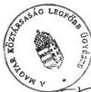

Üdvözlettel:

(Dr. Györgyi Kálmán)

---

ÁLLAMI
PRIVATIZÁCIÓS ÉS
VAGYONKEZELŐ RT.

1133 BUDAPEST, POZSONYI ÚT 56. LEVÉLCÍM: 1399 BUDAPEST, PF. 708
TEL: 269-8600, FAX: 149-5745 TELEX: 20-2892

Állami Számvevőszék

Sándor István alelnök Úr

Budapest

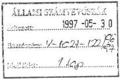

L. Dimólin Gy. ú.
V. 30.
Sándor
Pérezszer ctr.
Aftonics
any
81

Tárgy: Észrevételek az Állami Számvevőszék által az önkormányzatoknak az ÁPV Rt-től járó
- a belterületi föld értékének megfelelő - vagyonrészesedések átadási körülményeinek
vizsgálatáról készítette jelentés tervezet módosított intézkedési javaslataihoz

Tisztelt Alelnök Úr!

Köszönettel vettem kézhez a tárgyi vizsgálati jelentéshez kapcsolódó módosított intézkedési
javaslatokat.

Tekintettel arra, hogy az ÁPV Rt. a jelentés tervezettel kapcsolatos általános észrevételeit
korábban írásban, illetve az 1997. május 12. napján lefolytatott szakmai egyeztetésen szóban
már megtette, így ehelyütt csupán az intézkedési javaslatok személyemet - mint az ÁPV Rt.
vezérigazgatóját - érintő részével kapcsolatban kívánok élni az ismételt véleményezés
lehetőségével.

ad. 1. A Kormány álláspontját figyelembe véve - a 1125/1996. (XII.19.) sz. Kormány
határozat 6. pontjának módosítása esetén - természetesen az ÁPV Rt. kész arra, hogy
felülvizsgálja az 1996. évben - közvetítő igénybevétele mellett - kötött megállapodásokat.

Az első lépéseket az ÁPV Rt. már megtette azzal, hogy folyamatban van az ebben az
időszakban kötött, de még nem teljesített megállapodások teljeskörű felülvizsgálata. A közeli
jövőben kerül az Igazgatóság elé az az előterjesztés, amely lényegét tekintve arra irányul,
hogy az ÁPV Rt. e megállapodásokban foglalt vagyonkiadást csak abban az esetben teljesítse,
ha kétséget kizáróan bizonyítható, hogy a kiadandó vagyon mértéke, valamint annak járulékai
megegyeznek a jelenlegi - ellenőrzött adatokon alapuló - nyilvántartással. Minden más -
ettől eltérő - esetben a szerződés módosítását kezdeményezi az ÁPV Rt. (Amint azt a
korábbiakban már részletesen kifejtettük, az ÁPV Rt-nek e kezdeményezésen túlmenően más
jogi út nem áll rendelkezésére, mivel a felekre nézve kötelező, érvényes, de még nem
teljesített megállapodások csak a felek közös, egybehangzó akaratnyilvánításával
módosíthatók.)

---

Természetesen az ÁPV Rt. annak érdekében, hogy az önkormányzatok hozzájussanak törvényes járandóságukhoz, a felek kölcsönös jogról való lemondását figyelmen kívül hagyva automatikusan felajánlhatja a teljesítést mindazon esetben, ahol az önkormányzatok korábban a törvényes mértéknél kevesebb vagyont kaptak. Minden más esetben azonban - ahol esetlegesen többlet teljesítés mutatkozik a nyilvántartásokhoz képest - a szerződő önkormányzat akár perrel is követelheti a szerződésnek megfelelő teljesítést.

Tekintettel arra, hogy az ÁPV Rt. jelenlegi kimutatásai alapján több esetben ilyenre is volt példa a korábbiakban, így a Javaslat vonatkozó részét, azaz az 1996. évben kötött megállapodások általános felülvizsgálatát és a jogosultságok rendezését csak úgy tudjuk értelmezni, hogy az egységesen történjen meg mind az alulteljesítés, mind a többlet teljesítés vonatkozásában.

Itt általános jelleggel, ismételten megjegyzem, hogy - a szerződés megtámadásának jogáról való lemondástól függetlenül, annak figyelmen kívül hagyása esetén is - egy, a felek között érvényesen létrejött megállapodás csupán a Ptk. 234.§ alapján semmisség, illetve a 236.§ eseteiben és címén támadható meg, ha a megtámadás törvényes feltételei egyébként fennállnak. E ténynek különös jelentősége az 1996. évben kötött és teljesített megállapodások esetében van, ahol az ÁPV Rt-nek szinte alig van lehetősége érvényt szerezni az általa esetlegesen "túlfizetett" járandóság visszakövetelése iránti igényének.

ad. 2. Az ÁPV Rt. apparátusa folyamatos erőfeszítéseket tett és tesz annak érdekében, hogy az 1989. évi XIII. tv-ben foglalt vagyonkiadási kötelezettsége végrehajtásához az adatokat - ha eddig nem állt rendelkezésre - beszerezze, pontosítsa, illetve felülvizsgálja.

Ennek keretében első lépésként az érintett társaságot kereste meg az ÁPV Rt. az átalakulási dokumentáció (vagyonértékelés, vagyonmérleg) beszerzése iránt, majd ennek eredménytelensége esetén az illetékes cégbírósághoz fordul kérelemmel a dokumentáció vonatkozó részének rendelkezésre bocsátása céljából. (Itt megjegyzem, hogy sajnálatos módon gyakran tapasztalható, hogy a cégbíróságon sem lelhető fel az adott társaság átalakuláskori, hiteles vagyonmérlege, illetve vagyonértékelése, mivel az átalakulások korai szakaszában a cégbíróság ezek hiányában is bejegyezte az átalakulás tényét.) Folyamatos egyeztetés történik az önkormányzatokkal is az adatok összevetése, pontosítása körében. Minden esetben érvényesítjük azt a törekvést, hogy az adatok beszerzése érdekében tett egyes lépések dokumentumokkal alátámaszthatók és igazolhatók legyenek.

ad. 3. A javaslatban foglalt figyelem felhívásnak az ÁPV Rt. eleget tett. Az Igazgatóság 1997. május 28-i ülésén határozatot hozott arról, hogy a jelenleg folyamatban lévő vagyonátadások során az önkormányzatokkal kötendő megállapodásokból elhagyni rendeli a joglemondásra vonatkozó fejezetet. Az önkormányzatok részére már megküldött megállapodások tekintetében sajtóközlemény nyilvánosságra hozatalát rendelte el, melyben arról tájékoztatjuk az érintett önkormányzatot, hogy a joglemondásnak az ÁPV Rt. nem kíván érvényt szerezni.

---

Kérem, hogy az általam előadott fenti észrevételeket is szíveskedjék elfogadni és figyelembe venni.

Budapest, 1997. május 27.

Tisztelettel
Dr. Szabó Pál
vezérigazgató

---

Állami Privatizációs és Vagyonkezelő Rt.
Igazgatósága

Az 1989. évi XIII. tv. alapján az önkormányzatokat a belterületi földek után megillető
társasági vagyon kiadásának elvei és rendje tárgyában hozott 94/1997.(II.5.) sz. Ig. határozat
módosítása tárgyban hozott

# 467/1997 (V.28.) sz. határozat

Az APV Rt. Igazgatósága megtárgyalta az 1989. évi XIII. tv. alapján az önkormányzatokat a
belterületi földek után megillető társasági vagyon kiadásának elvei és rendje tárgyában hozott
94/1997.(II.5.) sz. Ig. határozat módosítására irányuló előterjesztést. Egyetértve az
előterjesztésben foglaltakkal az alábbi határozatot hozta:

1./A 94/1997. (II.5.) sz. Igazgatósági határozat 8. pontja az alábbiak szerint módosul:

Az Igazgatóság tudomásul veszi, hogy az APV Rt. az önkormányzati járandóságok kiadását az
alábbiak szerint módosított 107/1997. (II.3.) sz. ÜVÉ határozatban foglalt eljárási rend és a
68/1997. (I.27.) sz. ÜVÉ határozatban foglalt ütemezés szerint teljesíti.

Az Igazgatóság a 107/1997. (II.3.) sz. ÜVÉ határozat 4/b. pontjának 2. bekezdését az alábbiak
szerint módosítja:

"Ha az önkormányzat a fenti határidő alatt a megállapodást nem írja alá vagy nem válaszol, a
tranzakciós ügyvezető igazgató csak a készpénz bírósági letétben történő elhelyezése iránt
intézkedhet."

2./ Az Igazgatóság a 107/1997. (II.3.) sz. ÜV. határozat 4. sz. mellékletét képező minta
megállapodás 4.2. pontjának a joglemondásról szóló utolsó mondatát hatályon kívül helyezi.

3./ Az Igazgatóság a sajtó útján értesíti az önkormányzatokat, hogy az APV Rt. által már
kiküldött megállapodás tervezetek 4.2. pontjának utolsó mondatában foglalt megtámadási
jogról való lemondásnak nem kíván érvényt szerezni.

Felelős: Vezérigazgató / Tranzakciós vezérigazgató-h. / Funkcionális vezérigazgató-h.
Határidő: 1997. május 30.

Budapest, 1997. május 28.

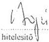

elnök

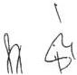

---

BELÜGYMINISZTER

Szám: 301-875/1997

1. Rövide G. M.
V.2. Láma
Bendeges Váci felcsőves any!
Sh

Hiv.sz.: V-1021-91/1996-97.

SÁNDOR ISTVÁN ÚRNAK
alelnök
Állami Számvevőszék

BUDAPEST

ÁLLAMI SZÁMVEVŐSZÉK
Érkezett: 1997-05-13
Iktatószám: V-1021-97/96
Melléklet:

Tisztelt Alelnök Úr!

"Az önkormányzatoknak az ÁPV Rt-től járó vagyonrészesedések átadási körülményeinek vizsgálatáról" címmel megküldött jelentés tervezetét köszönettel vettem, s azzal kapcsolatban a következő észrevételeket teszem:

A korábban - V-1021-83/1996-97. számon - megküldött és a jelen anyag áttanulmányozása alapján örömmel észleltem, hogy a Belügyminisztérium észrevételeinek nagy részét beépítették a tervezetbe, illetőleg kiiktatták a zavaró elemeket.

Változatlanul fenntartom azonban az aggályomat amiatt, hogy a vizsgálat csupán az 1989. évi XIII. tv. 21. §-ának a végrehajtását vette célba. Ez ugyanis bizonytalanná teszi az összegszerűségekre vonatkozó következtetések értékelését.

Ugyancsak fenntartom, hogy a belügyminiszter - megfelelő - adatok és az azok nyilvántartásához, feldolgozásához szükséges személyzet hiányában - felelősséggel nem vállalhatja az önkormányzatokat az 1989. évi XIII. tv. 21. §-a alapján megillető tulajdonok rendezésének figyelemmel kísérését."

Ennek reális lehetősége kizárólag abban az esetben lenne, ha az ÁPV Rt. rendelkezne pontos kimutatással, s arról, valamint a bekövetkező változásokról rendszeresen tájékoztatást adna - illetőleg betekintést engedne irataiba. Ez azonban szükségtelenül megnövelné az ÁPV Rt. munkáját, de felveti a hatáskörelvonás gyanúját is. A belügyminiszternek ugyanis nem tartozik a feladatai közé az ÁPV Rt. ellenőrzése. Ugyanakkor arra sincs lehetőségem, hogy

---

2

az önkormányzatokat kötelezzem adatszolgáltatásra olyan ügyben, amely önállóságukat sértheti.

Ismételten felhívom a figyelmet arra, hogy az 1125/1996.(XII.19.) Kormányhatározat 1. pontja részletesen tartalmazza, hogy milyen fizetési kötelezettség terheli az ÁPV Rt-t abban az esetben, ha rendelkezésre állanak az önkormányzatokat megillető részvények(üzletrészek), illetőleg ha időközben elidegenítették azokat. Emiatt nem látom szükségét újabb határozat meghozatalának, annál is inkább, mert attól nem várható az ügy gyorsabb lezárása.

Az anyag szöveges része is tartalmazza, de a mellékletekből is kitűnik, hogy jelentős eltérések mutatkoznak az ÁPV Rt által nyilvántartott és az önkormányzatok által igényelt összegek között, ebből következőleg a "behajtásra" irányuló szerződések legbizonytalanabb eleme éppen a lényege, azaz mennyit kell az ÁPV Rt-nek kifizetnie.

E megállapítás szükségszerűen felveti azt a kérdést, hogy mi a pontatlanság oka, s terhel-e valakit felelősség emiatt az ÁPV Rt-nél.

Remélve, hogy a korábbi és jelenlegi észrevételek hatékonyan segítik a vizsgálat lezárását, kérem a végleges Jelentés megküldését.

Budapest, 1997. május " 8 ".

Üdvözlettel:

---

# BUDAVÁRI ÖNKORMÁNYZAT

Krisztinaváros, Tabán-Gellérthegy, Vár, Víziváros

POLGÁRMESTER

IV-226/2/1997.

ÁLLAMI SZÁMVEVŐSZÉK

Érkezett: 1997-05-28

Iktatószám: V-1021-116/96/97

Melléklet: ...

Állami Számvevőszék
Fővárosi Régió

Budapest
Bécsi u. 5.
1052

Az Állami Számvevőszék által az önkormányzatoknak az ÁPV Rt-től járó - a belterületi föld értékének megfelelő - vagyonrészesedések átadási körülményeinek vizsgálatáról készített jelentéstervezetet olvasva tapasztaltam, hogy a vizsgálat megállapításai általában alátámasztják, az önkormányzatok lépéshátrányban cselekedtek az őket megillető vagyon megszerzése érdekében. Helyesnek bizonyult azon következtetésük is, hogy e vagyont az ÁPV Rt-től csak szakértői cég közreműködésével lehet megszerezni. Az önkormányzatok "hátrányos helyzete" abból is fakadt, hogy vagyoni követeléseik mértékének meghatározásához nem, vagy csak nehézségek árán jutottak információkhoz.

A jelentés-tervezetben az I. kerületet is érintő megállapításokkal egyetértek.

A hiányosságok megszüntetésére az ÁSZ V-1021-2/1996. számú vizsgálati jelentésében foglalt megállapítások kapcsán a szükséges intézkedéseket megtettem.

Budapest, 1997. május 21.

1013 Budapest, I. Krisztina krt. 61/a

Telefon/fax: 156-5336, 156-6857

---

BUDAPEST II. KERÜLETI ÖNKORMÁNYZAT
POLGÁRMESTERI HIVATAL
Vagyonhasznosítási és Nyilvántartási Iroda

Budapest, Mechwart liget 1.
Postacím: 1277 Budapest, Postahok 23.

Ügyiratszám: Va-505/97
Tárgy: észrevételek és megjegyzések a
355-ös témaszámú jelentés-
tervezettel kapcsolatban
Telefon: 212-5701
Hiv.szám: V-1021-91/1996-97.

Állami Számvevőszék
V. Önkormányzati és Területi Ellenőrzési Igazgatóság

Dömötör Gyula Számvevő-igazgató Úr részére

Tisztelt Igazgató Úr!

|  **ÁLLAMI SZÁMVEVŐSZÉK**  |   |
| --- | --- |
|  Érkezett: | 1997-05-29  |
|  Iktatószám: | V-1021-112-1996-97  |
|  Melléklet: | S.lap  |

Mellékelten megküldöm a tárgyban jelzett jelentéstervezettel kapcsolatos
észrevételeinket szíves felhasználásra.

Budapest, 1997. május 27.

Tisztelettel:

Csomor Sándor
irodavezető

---

# MEGJEGYZÉSEK ÉS ÉSZREVÉTELEK

az ÁLLAMI SZÁMVEVŐSZÉK által a "Jelentés-tervezet az önkormányzatoknak az ÁPV Rt-től járó - a belterületi föld értékének megfelelő - vagyonrészesedések átadási körülményeinek vizsgálatáról" címmel készített anyaghoz

Az Állami Számvevőszék (a továbbiakban: ÁSZ) 1997. áprilisára készítette el vizsgálati jelentését az önkormányzatoknak az 1989. évi XIII. törvény alapján járó vagyon tárgyában. Az említett vizsgálati anyag alapján az ÁSZ 20 önkormányzatnál tartott célvizsgálatot a vagyonkiadás körülményeinek tisztázása céljából.

A vizsgálat alapvető megállapítása, ami az önkormányzatoknál feltárt és megemlített hibákat okozza, az hogy nem vagyonátadás ment végbe a törvény alapján, hanem szerződéshez és ebben jogokról való lemondáshoz kötötte a tulajdon kiadását, néhány esetben pedig törvénysértő módon értékesítette az önkormányzat vagyonát, melynek ellenértékét utalta át.

A "Jelentés-tervezet"-ben is feltárt ÁPV Rt által elkövetett mulasztások:

1./ Önkormányzati részvények kiadása több évre elhúzva, még a közvetítők bevonásával történt megállapodás esetén sem volt orvosolható.

2./ Az önkormányzatoknál fellelhető és kifogásolható nyilvántartások a jelentés szerint is az ÁPV Rt hiányos adatszolgáltatásán alapszik, ezzel megsértve a számviteli előírásokat és a mérlegvalódiság elvét.

(Az "E"-hitelek nyilvántartása a mai napon is lehetetlen, kizárólag az átutalási megbízások tartalma szerint igen kifogásolható módon vezethető.)

A II. ker. esetében a jelentés 4. számú mellékletében látható, hogy az ÁPV Rt által elismert és az Önkormányzat igénye között negatív különbség van. Az Önkormányzat a közvetítők bevonását elkerülhetetlennek tartotta, hiszen nem egy elismert igényt, hanem annál magasabb követelést támasztott. Nyilvánvaló, hogy a közvetítők díjazása is ehhez a sajnálatos tényhez kellett, hogy alkalmazkodjon.

3./ A jelentés 3.2.5. pontjában kifogásolt ÁPV Rt-perköltség visszatérítése ügyében az 1000. sz. Ügyvédi Irodát megkerestük.

4./ A jelentés 4.2. pontjában az önkormányzatnak felrótt közbeszerzési törvény megsértése az ÁPV Rt által létrehozott jogsértő helyzet eredménye. A vagyonátadás, azaz a törvény alapján az önkormányzatokat megillető "várományi jog" realizálása szerződéskötés (és ehhez igénybe vett szolgáltató közvetítők) nélkül kellett volna, hogy megvalósuljon.

---

5./ A jelentés 5.2.2. pontjában kifogásolt kérdésben a II. kerületi Önkormányzat polgármestere vétlen, mert az 1996. június 21-én aláírt Megállapodást úgy kell tekintenünk, mint a Vektor Rt-vel kötött "Vállalkozási szerződés" teljesítését, ezért tekintettel a teljesítés sikerére, az önkormányzat részéről külön felhatalmazás nélkül is aláírható (elfogadható) volt.

6./ Az ÁSZ-jelentéssel kapcsolatban a legkomolyabb problémát abban érezzük, hogy a megkötött szerződéseket a jelenlegi körülmények között jelenlegi információszinten vizsgálja, nem pedig a szerződéskötések időpontjában rendelkezésre álló információk alapján.

A vizsgálat nem veszi figyelembe azt a mérhetetlen, lenéző arroganciát, amit az ÁPV Rt - annak jogelődje az ÁVÜ - tanúsított 1990 és 1997 között az adott kérdésben az önkormányzatok felé.

Miért nem vizsgálta 1992 és 1996 között, amikor az 1989. évi XIII. törvényt az ÁPV Rt. illetve jogelődjei nem hajtották végre?

Budapest, 1997. május 28.

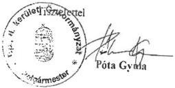

TOTAL P.04

---

# FERENCVÁROSI ÖNKORMÁNYZAT
POLGÁRMESTERE

Állami Számvevőszék

Dömötör Gyula részére
Számvevő Igazgató úr

Budapest
Apáczai Csere János u. 10.
1052

ÁLLAMI SZÁMVEVŐSZÉK
Érkezett: 1997-05-12
Eltérítések: V-1021-94/96
Melléklet:

427/4/97
Borsalapok váró általa
az asszony
GL-

Tisztelt Dömötör Úr!

Az önkormányzatoknak az ÁPV Rt-től járó vagyonrészesedések átadási körülményeinek ellenőrzéséről készített jelentés tervezethez a következő megjegyzéseket teszem.

1. Nem tartom teljesen helytállónak az 5.1 pont azon állítását, hogy az egyezségkötés feltételeibe a polgármestereknek nem volt beleszólásuk. A IX. kerület polgármestereként kifogást tettem az OTP részvényről szóló megállapodásról, amit a Vektor Rt. képviselője kb. 2 hét alatt érvényesíteni - azaz az önkormányzatnak többletbevételt szerezni - tudott.

2. Nem értek egyet az 5.3 pont azon megállapításával, mely szerint az ÁSZ-nek nem feladata megítélni, hogy a megállapodások elfogadása a központi költségvetés számára jó üzlet volt-e. Természetesen nagyon nehéz megítélni - még a tőzsdei forgalomban részt vevő cégek esetében is - a részvény helyett pénzben kapott juttatás mértékét, de ha az eljárás minden esetben a névértékből való kiindulás volt, akkor ez az állam számára biztos, hogy jelentett túlfizetést is. (Például, a felszámolás alatt lévő cégek esetében.)

Elképzelhető ezért egy olyan helyzet is, hogy míg az önkormányzatoknál az elmaradt hasznok, kamatok és a kifizetett közvetítői díjak összege meghaladja a névérték számításba vétele miatti többlet bevételt, ugyanez az egyenleg az állam számára is negatív. Tehát mind az állam, mind az önkormányzatok rosszul jártak, a közvetítők mégis magas összegekhez jutottak.

A jelentés tervezettel egyebekben egyetértek, alapos munkának tartom.

Budapest, 1997. május 05.

Tisztelettel:
Dr. Gegesy Ferenc
polgármester

---

# BUDAPEST FŐVÁROS XIII. KERÜLET
POLGÁRMESTERE

ÁLLAMI SZÁMVEVŐSZÉK
Érkezett: 1997-05-15
Iktatószám: U-1021-101/91
Melléklet:

IV/50/560/97. Bérkever dr.
Főváros any!

Állami Számvevőszék
Dömötör Gyula
számvevő-igazgató

Budapest

Ki vizsgálta a közlekedés. A
Pénzesítőket vezette fizetnénk
ha képesen alapul el.
S-

# Tisztelt Dömötör Úr!

Köszönettel kézhezvettem az Állami Számvevőszék jelentés-tervezetét az önkormányzatoknak az ÁPV Rt-től járó - a belterületi föld értékének megfelelő - vagyonrészesedések átadási körülményeinek vizsgálatáról készült anyagot. Kérésének megfelelően észrevételeimről az alábbiakban tájékoztatom.

A tervezet összegző megállapításaival, következtetéseivel, javaslataival döntően egyetértek, különösen a megállapítások azon részleteivel, melyekből kitűnik, hogy az önkormányzatok lépéshátrányban cselekedtek, nem jutottak, nem juthattak pontos információkhoz és ezáltal méltatlan, kiszolgáltatott helyzetbe kerültek. E kérdésben a számvevőszéki vizsgálat során tett megjegyzéseimet nem kívánom ismételni, ezek Tisztelt Igazgató Úr előtt ismertek.

Rendkívül sajnálatos, hogy az önkormányzatok az ÁPV Rt-vel kényszerű alkuba bocsátkoztak, az ilyetén történt megállapodások jogszerűsége megkérdőjelezhető. A jelentés jól tükrözi azt a társadalmi, gazdasági, politikai légkört, állapotot, amely kényszerpályára sodorta az önkormányzatokat. Egyetértek a jelentés szerkezetével, példálózó megállapításaival.

Az anyag II. részletes megállapítások fejezete 19. oldalán a XIII. kerület összefüggésében ellentmondást vélünk felfedezni a nyilvántartásaink meglétét illetően a negyedik és nyolcadik bekezdés között.

A 33. oldal 5. pontjában foglalt megállapítással azonosulok, hiszen az önkormányzatok az átalakulás pillanatában tulajdont szereztek és a jogállamiságra nem jellemző módon egy állami szerv nem teljesítette jogszabályi kötelezettségét.

Polgármesteri Hivatal 1139 Budapest, Béke tér 1. Telefon: 270-1266

---

2

A 37. oldal 5.2.2. ponthoz "szabályszerűség az önkormányzatok oldaláról" című alfejezeti rész zárójelben lévő megállapítása - miszerint a XIII. kerületben a polgármester 75 millió Ft értékhatárig dönthet - tárgyi tévedésen alapul, ugyanis a XIII. kerületi Önkormányzat Képviselő-testületének Szervezeti- és Működési Szabályzata a Tulajdonosi Bizottság hatáskörét állapítja meg 75 millió Ft-os értékhatárig az önkormányzati tulajdon tekintetében. Kérem a végleges anyagban e megállapítást tényszerűen korrigálni.

Hasonlóan tévedés a már említett alpont 38. oldalán lévő megállapítás arra vonatkozóan, hogy a XIII. kerületben a belterületi földek tekintetében testületi döntés nem született. A számvevői tételes vizsgálat e tekintetben más tényeket rögzít, hiszen a Képviselő-testület Tulajdonosi Bizottsága az ÁPV Rt-vel kötött szerződések megfelelő szakaszában többször állást foglalt, majd a Képviselő-testület is tájékoztatást kapott és a Számvevőszék vizsgálatáról, annak megállapításairól a Képviselő-testület tudomással bír, döntött a hiányosságok felszámolására tett intézkedés-sorozatról. Tévedés az is, hogy a közvetítői szerződés nem került Testület elé.

Tisztelt Dömötör Úr!

Még egyszer köszönöm, hogy lehetőséget kaptam a jelentés-tervezet áttanulmányozására és kérem, amennyiben jobbító megjegyzéseimmel egyetért, hasson oda, hogy a végleges jelentésben tényszerű megállapítások szerepeljenek.

Budapest, 1997. május 7.

Tisztelettel

Dr. Tóth József

---

BUDAPEST-ZUGLÓ
POLGÁRMESTERE

1145 Budapest, Pétervárad utca 2.

ÁLLAMI SZÁMVEVŐSZÉK

Érkezett: 1997-05-27

Iktatószám: V-1021-113/96

Melléklet:

# ÁLLAMI SZÁMVEVŐSZÉK

Budapest, Apáczai Csere János utca 10.
1052

Barátyolult, fő-
tanács anny!
SSc

Tisztelt Dömötör Gyula Számvevő Igazgató úr!

Megkaptam az önkormányzatoknak az ÁPV Rt-től járó vagyonrészesedések
átadási körülményeinek ellenőrzéséről készített jelentés tervezetet, az anyagot
áttanulmányoztuk, és észrevételt nem teszünk.

Budapest, 1997. május 20.

Dr. Kutalikné dr. Kardos Zsuzsanna
polgármester

---

# BUDAPEST FŐVÁROS XV. KERÜLET ÖNKORMÁNYZATA

Országgyűlési
képviselő

Bodapest
Vörös Kft.

1153 Budapest XV., Bocskai u. 1-3. • Postacím: 1061 Pf. 46.

Telefon: 307-6479 • Fax: 307-7360

**Állami Számvevőszék**
**Dömötör Gyula úr részére**

Budapest
Pf. 432.
1393

Üisz.: 12/ 2./97.

|  **ÁLLAMI SZÁMVEVŐSZÉK**  |   |
| --- | --- |
|  Érkezett: | 1997 -05- 15  |
|  Iktatószám: | V-1021-102/97  |
|  Melléklet: |   |

Tisztelt Dömötör Úr!

Köszönettel vettem "Az önkormányzatoknak az ÁPV Rt.-től járó vagyonrészesedések átadási körülményeinek vizsgálatáról" készített jelentés tervezetet. A vizsgálati anyag számos olyan megállapítást tartalmaz, amelyet a jövőben - saját érdekeink képviseletét szem előtt tartva - jól tudunk hasznosítani.

A további sikeres együttműködésben bízva,

Budapest, 1997. május 8.

Tisztelettel:

Hajdu László
polgármester{
  "label": "",
  "top_left": [
    0.6399034532633233,
    0.7896969696969697
  ],
  "bottom_right": [
    0.8,
    0.8297450789450789451
  ]
}

---

# BUDAPEST FŐVÁROS XVI. KER. ÖNKORMÁNYZAT
POLGÁRMESTER

Berkopar Cím-főváros

25-

* ÁRPÁDFÖLD * CINKOTA * MÁTYÁSFÖLD * RÁKOSSZENTMIHÁLY * SASHALOM *

1163 Budapest XVI. Havashalom u. 43. Tel.: 404-48-88/102, 404-19-09 Fax: 403-14-28 E-mail: xviker1@ibm.net

Dömötör Gyula úr
részére
Állami Számvevőszék
Számvevő Igazgató

Budapest

ÁLLAMI SZÁMVEVŐSZÉK
Érkezett: 1997-05-12
Iktatószám: V-1021-95/96
Melléklet:

Tisztelt Igazgató Úr !

Köszönettel megkaptam "az önkormányzatoknak az ÁPV Rt-től járó vagyon-részesedések átadási körülményeinek" ellenőrzéséről készített jelentés tervezetét.

A tervezettel kapcsolatos észrevételeim:

Tévedés vagy hibás adat, amely a XVI. kerületi Önkormányzat szerepének megítélését érdemileg befolyásolná, az anyagban nincs. A jelentés tárgyilagos, tényekkel alátámasztott megállapításokat tartalmaz.

A 2. sz. mellékletben szereplő táblázat kevés információt közöl számomra, ezért nem teljesen érthető, így arra sem tudok reagálni, hogy a XVI. kerület adatai miért nem teljesek.

Egyéb apróbb észrevételek:

17. oldal apró betű; javaslom kiegészíteni:

...melyek kiadására mindezideig nem került sor, (Debrecen, Főváros II. és XVI. ker., Kecskemét).

A XVI. ker. megjelölését a TVK részvényei miatt lehet itt feltüntetni, hiszen az eredeti ígéret évek óta él, de a részvényt nem kaptuk meg.

19. oldal, utolsó sor:

bizonyos részben Kecskemét és a főváros IX. és XVI. kerületi Önkormányzata.

24. oldal, lap közepén; javasolt szövegmódosítás:

...miután a peres képviseletet ellátó 1000 sz. Ügyvédi Iroda sikertelenül tárgyalt a teljesítés érdekében az alperesi pozícióban levő ÁPV Rt-vel, a megállapodás aláírásának napján meghatalmazta a közvetítéssel a Vektor RT-t - más átalakulási követelések érvényesítése mellett - a perben szereplő Antenna Hungária Rt. és EGIS Rt (összesen 141 millió Ft névértékű) követelés megszerzésére.

---

Az ítélet végrehajtásaként a Vektor Rt. "megállapodást" hozott, az EGIS ügyében részvény helyett 1.034 millió készpénz, az Antenna Hungária Rt-nél pedig 1.060 eFt értékű részvény formájában 7,5 %+ÁFA sikerdíjért.

30 oldal:

Néhány önkormányzat (I., II., XIII., XVI. ker. Győr) ...(7,5-12 %).

Végleges jelentésük elkészítésénél kérem fentiek szíves figyelembe vételét.

Budapest, 1997. május 6.

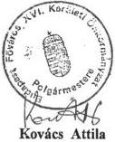

Tisztelettel:

---

Budapest Főváros XVII. kerület

POLGÁRMESTERE

Budapest XVII.Pesti út 165.

Levélcím:1656.Bp.Pf.1. Telefon:257-5326 Fax:256-0661

APV.WPS

Ikt.sz.: I-202/58/1997.

Dömötör Gyula

számvevő-igazgató úr

részére

Állami Számvevőszék

B u d a p e s t

ÁLLAMI SZÁMVEVŐSZÉK

Érkezett: 1997-05-28

Iktatószám: V-1021-118/98

Melléklet:

# Tisztelt Igazgató Úr!

A részemre eljuttatott "az önkormányzatoknak az ÁPV Rt-től járó - a belterületi föld értékének megfelelő - vagyonrészesedések átadási körülményeinek vizsgálatáról" szóló jelentés tervezetet megköszönöm.

Az anyagot személy szerint jónak tartom és úgy gondolom, hogy az a hiányosan megvalósult vagyonátadás további folyamatát is segíti.

A dokumentációban foglaltakat áttanulmányozva megállapítottuk, hogy annak észrevételezése érdemben a Képviselő-testület hatásköre lenne. Bármilyen önkormányzati állásfoglaláshoz testületi döntésre lett volna szükség. Sajnos az Önök által - az észrevételek megtételére - megadott rövid határidő idő nem tette lehetővé az előterjesztés elkészítését és a Képviselő-testület elé terjesztését, így észrevételeket nem tudtunk tenni.

Budapest, 1997. május 21.

Tisztelettel:

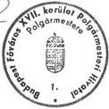

---

BALATONFÖLDVÁR

POLGÁRMESTERETŐL

ÁLLAMI SZÁMVEVŐSZÉK

Érkezett: 1997-05-23

Iktatószám: V-1021-111/96-97

Melléklet: -

Barbarger-díjas fotóváros
arany

Ügyiratszám: 975-2/1997.

Tárgy: Észrevételek a 355. Témaszámú ÁSZ
jelentés-tervezethez

Hiv.sz.: V-1020-91/1996-97

Állami Számvevőszék

Budapest

Pf.:432

1393

Fenti hivatkozott számú jelentés-tervezet kapcsán Balatonföldvár város önkormányzat
képviseletében az alábbi észrevételeket teszem:

Az I. fejezet összegző megállapításai lényegében időrendi felsorolást tartalmaznak az 1992-től
a vizsgálat időpontjáig az 1989. évi XIII. tv. 21.§ (2) bekezdésében foglaltak végrehajtása
illetőleg annak elmulasztása kapcsán tett önkormányzati, ÁPV Rt és jogelődjei valamint az
esetleges közvetítők által tett intézkedésekről. A konkrét tények felsorolásából eredő
következtetések többségével egyet értünk azonban megjegyezni kívánjuk, hogy esetenként az
általánosítás eltúlzott: pl: tényként közli, hogy ... az ÁPV Rt-vel szembeni jogos követeléseik
érvényesítésére a vizsgált önkormányzatok, illetve azok képviselői 1995-96-ban elfogadták a
közvetítők igénybevételét... / jelentés-tervezet 7. oldal 6. bekezdés / Balatonföldvár Város
Önkormányzata 1995-96-ban sem vett igénybe közvetítőt, nem bízott meg ilyen szervezetet
igényeinek képviseletével - feltételezzük, hogy volt más önkormányzat is, mely visszautasította
a közvetítői tevékenységet -, így jelen esetben a megfogalmazás pontosítását javasoljuk olyan
formában, hogy a vizsgált önkormányzatok egyrésze, vagy esetlegesen nagyrésze elfogadta
közvetítők igénybevételét.

Ugyancsak általánosító az a megállapítás, hogy ... az egyes önkormányzatok eltérő „járulékos
„követeléseinek (árfolyamok, kamatok stb.) egyeztetése miatt szükség lett volna,
közbeiktatott közvetítőkre... / 9.oldal / hiszen a tv. szerinti teljesítés ezt eleve kizárta volna,
amennyiben viszont a 95-96-s megállapodásokra gondolunk, bármely önkormányzati
polgármester, jegyző vagy jogtanácsos és feltehetően az ÁPV Rt. munkatársai is a közvetítők
által elkészített megállapodás-tervezeteknél különbet megfogalmazhatott volna, azonban az
önkormányzati oldalról remény sem mutatkozott arra, hogy eltérő megállapodás aláírásra
kerülhet - gondoljunk csak a az 1989. évi XIII. tv. hatálybalépése óta eltelt időtartamra -.

---

- 2 -

Azt, hogy közvetítő igénybevétele szükséges csak feltételes módban célszerű megfogalmazni vagyis esetenként szükség lehetett volna közvetítő igénybevételére. Úgy ítéljük meg azonban, hogy az ÁPV Rt. és az Önkormányzatok között nem közvetítőkre, legfeljebb egyes kérdések tekintetében ( pl.: a már hivatkozott árfolyam ) szakértők igénybevételére lehetett volna szükség.

A javaslatok körében az ÁPV Rt. vezérigazgatója felé megfogalmazott 1. pontban foglaltakat a kellő konkretizálás nélkül kivitelezhetetlennek tartjuk ( pl. a névérték mely időpontban kerüljön figyelembevételre).

Csak az egyes megállapodás konkrét vizsgálata döntheti el, hogy adott esetben történt-e jogról lemondás :

hiszen egyes szerzódések esetében a névérteknél magasabb összegen kottetek a szerzódések, s előfordult, hogy az önkormányzat kedvezöbb feltételekkel tudott megallapodást kôtni, mintha névérteken törtent volna az önkormányzat kielégítese figyelembe vexe a fizetett osztalekot és annak kamatait egyarant,
esetenkent az atalakult gazdalkod szervezetnel semmifele nyereseg nem termelodott, osztalek fizetesere ( es ennek megfeleloen annak kamataira ) nem kerult sor.
az atalakulo vallalatok egyrésze nem részvenytársasag lett, igy osztalek sincs.

Mindezekre tekintettel célszerűbb látszik annak kezdeményezése, hogy a Kormány 1125/1996. (XII.19.) Korm.sz. határozatát kiegészítve az abban megfogalmazott elveket kiterjeszti a határozat 6./ pontjában hivatkozott megállapodásokra is, azonban ésszerűtlen azon megállapodások semmissé nyilvánítására törekedni, amelyekben az Önkormányzatok - megítélésük szerint - kedvező feltételekkel kötötték meg a szerződést az ÁPV Rt-vel.

A jelentés-tervezet II. fejezetében foglalt részletes megállapítások körében az 1./ 2./ fejezetekben foglaltakkal egyetértünk. A 3./ 1. pontban foglaltak kapcsán megjegyezni kívánjuk, hogy a jelentés-tervezetből úgy tűnik az önkormányzatok nem tettek meg mindent igényeik meghatározása érdekében. A gyakorlat azonban azt mutatta, hogy az e témában kifejtett erőfeszítések gyakorta nem vezettek eredményhez. Az átalakuló vállalat vagyonmérlegének elkészítésében közreműködő „ értékbecslők „ helyszíni ismeretek és helyi ingatlanforgalmi értékek teljes hiányában, gyakorta egymást követő időpontban más-más értékadattal szerepeltették a belterületi földek értékét. Az ÁVÜ nem adott információt, az átalakuló vállalatok vezetői pedig arra hivatkozással, hogy a privatizáció még nem fejeződött be újból az ÁVÜ-höz irányították az önkormányzatokat. Bonyolította a helyzetet a kaotikus jogi szabályozás. Előfordulhatott, hogy ugyanazon vállalat átalakulása kapcsán egyes ingatlanok kérdésében VÁB eljárás folyt az 1991. évi XXXIII. tv. alapján, további ingatlanok tekintetében az 1989. évi XIII. tv. szerint ületrész ( részvény ) kiadása történt vagy peres eljárás kezdődött, megint más ingatlan tekintetében pedig az előprivatizációs törvényben foglaltak voltak irányadók.

---

- 3 -

A 3./2.1. pont tartalmazza miszerint az önkormányzatok nem kérték az elmaradt osztalékot, illetve annak késedelmi kamatát a peres eljárások során. Nem terjedt ki a vizsgálat azonban arra, hogy miért nem irányult az önkormányzatok kérelme erre. A gyakorlatban a perek során nyilvánvalóvá vált, hogy az adott átalakuló vállalat, milyen vagyoni viszonyokkal rendelkezik. Mint arra az általános résznél is hivatkoztunk az esetek nagyobb részében a cégnél osztalék fizetésére nem került sor vagy mert veszteséges volt az adott gazdálkodó szervezet vagy mert nyereséget visszaforgatta. Előfordult, hogy a perben megítélt üzletrész ( részvény ) a bírósági eljárás befejezését követően átadásra került, azonban már „ semmit sem ért „ mert az adott gazdálkodó szervezet időközben felszámolásra került.

A 3./2.4. pontban foglalt „ Jogerős ítéletek teljesítése „ alcímben szereplő megállapításokhoz a következő megjegyzést fűzzük: kétségtelen, hogy az önkormányzatok és az ÁPV Rt. közötti megállapodások alapján előfordult, hogy az önkormányzat úgymond „lemondott” a perköltségről és egyéb követelésekről ( pl. osztalék ) azonban a megállapodás ennek ellenére kedvezőbb feltételekkel köttettek, mint az 1125/1996. (XII.19.) Korm. hat. 1/b. pontjában foglalt feltételek ( pl: a szerződés-kötéskori érték és nem a névérték figyelembe vételével.

Végül az ÁPV Rt. és az önkormányzatok között létrejött megállapodásokat érintően megjegyezzük, hogy kétségtelen miszerint az Önkormányzatok kiszolgáltatott helyzetben kötötték a megállapodásokat, ennek ellenére nem mondható ki, hogy valamennyi szerződés esetében jogról való lemondásról beszélhetünk, illetőleg, hogy az önkormányzatok képviselő-testülete ne ismerte volna a megállapodás tartalmát, annak aláírása előtt. Figyelemmel arra, hogy a megállapodások megkötése során nem került sor 100 %-ban közvetítő igénybevételére, így a megállapodások egyrészénél felesleges kötelezettségvállalásra sem került sor.

Balatonföldvár, 1997. május 21.

Berkes László
polgármester

---

# Debrecen Megyei Jogú Város Polgármestere

4024 Debrecen, Piac u. 20.

Telefon: (52) *411-400, 414-560, 410-809 • Fax: (52) 417-901

ÁLLAMI SZÁMVEVŐSZÉK
Érkezett: 1997-05-15
Iktatószám: V-1021-98/96
Melléklet:

Dömötör Gyula Úrnak
az Állami Számvevőszék Számvevő-Igazgatójának

Budapest
Apáczai Csere János u. 10.

Tisztelt Számvevő-Igazgató Úr!

Az Állami Számvevőszék V. Önkormányzati és Területi Ellenőrzési Igazgatóság V-1021-85/1996-97. számú véleményezésre megküldött jelentés-tervezetét megkaptam.

Abból kiindulva, hogy az egyes önkormányzatok a Tisztelt Számvevőszéknek a belterületi föld érték átadási körülményei vizsgálatával kapcsolatos részjelentéseit külön-külön megkapták, s annak idején véleményezték, a Megyei Jogú Városok Szövetsége elnökeként a saját véleményünk megfogalmazásán túl felvállaltam az összefoglaló jelentés-tervezet együttes véleményezésének koordinálását is. Ennek megfelelően a kért véleményét az alábbi részletezéssel teszem meg:

1. A Tisztelt Számvevőszék V-1021-2/1996. sz. vizsgálati jelentését, az erre adott észrevételt, s ezekkel összefüggő további leveleket folyamatosan Debrecen Megyei Jogú Város Közgyűlése elé terjesztettem. A testület a jelentésre adott magyarázó és intézkedéseket tartalmazó levélváltások tartalmát megismerte és azokat tudomásul vette. Ennek alapján a Számvevőszék most megküldött összefoglaló jelentés tervezetének a város önkormányzatát érintő részeit, mivel azok összhangban vannak a korábbi anyaggal tudomásul veszem, s ezekre további észrevételt nem teszek.
2. Az általam megkeresett, s a közös nyilatkozathoz csatlakozó önkormányzatok véleményét az alábbiak szerint tolmácsolom:

Az érintett önkormányzatok köszönettel fogadták a jelentés-tervezet azon megállapításait, amelyek az egyes önkormányzatoknál előfordult hiányosságon túl tételesen feltárták, s kimutatták az önkormányzatokat megillető vagyonrészesedések átadásával kapcsolatos valós összefüggéseket, mindenekelőtt az állami szervek, s ezen belül is különösen a közreműködő állami vagyonkezelő szervek sorozatos mulasztásait, törvényszegéseit.

---

- 2 -

Ezek közül is ki kell emelni azokat a megállapításokat, melyek szerint

- az önkormányzatok dologi varományosai voltak az átalakult allami vallalatok belterületi földérétének, s ezt egészen 1995. végéig nem tudák érvényesiteni,
- az allami, s ezen belul is az allami vagyonkezelo szervek mulasztasban megnyilvanult törvenyszegesek sorozatat kovettek el a vagyon vissata-tartasaval,
- az onkormányzatok lépéshátrányban cselekedtek az öket megillető vagyon megszerzese érdekében, s helyesnek bizonyult azon következtétésük, hogy e vagyont az APV Rt-tólCsak a szakertői cégeken keresztül lehet megszerezni /Ezt erősítette meg a privatizációs miniszter hozzájuk intezett levele is./
- az onkormányzatok a vagyoni kovetelések mertékenek meghatározásá-hoz nem, vagyCsak igen nehezen jutottak informácihoz.

Az önkormányzatoknak az a megítélése, hogy az államháztartás egyik alrendszereként éveken át folytatott hiábavaló törvényes lépéseikben az állam más szervezetrendszereitől nem kaptak megfelelő segítséget, sőt a törvény ereje feloldódott az állami vagyonkezelő szervek által vélt ellenérdekűségben. A jogállamiság fél évtizeden át súlyos csorbát szenvedett a Parlament törvényhozó akaratával szembehelyezkedő alárendelt állami szervek intézkedései által. Az önkormányzatok problémáját ismerték az országgyűlési képviselők, ismert volt a mindenkori kormány előtt, a privatizációs miniszter előtt, jelzéseket tettek az ügyben az önkormányzatok oldalán az önkormányzati szövetségek, az Állami Számvevőszék is, ennek ellenére az ügy végkifejletéig elmaradt az állami intézkedés-sorozat.

Az az elvárás az önkormányzatok részéről, hogy az ebből leszűrhető tanulságot - a jogállamiság érvényesülése érdekében - a helyi önkormányzatoknál végbement elemzés, intézkedéssorozat után az érintett állami szervek körében is fokozottabban kell érvényesíteni.

Ebben az önkormányzatok a jövőben is számítanak az országgyűlés ellenőrző szerve, az Állami Számvevőszék rendelkezésére álló eszközrendszerre is.

---

- 3 -

A jelentés-tervezetben, annak összefoglaló részében, s a részletes megállapításoknál is kiemelésre került az, hogy az államháztartás két alrendszere / a központi költségvetés és az önkormányzatok/ között a törvényben meghatározott vagyonátadáshoz képest ellentétes irányú forrásátcsoportosítás ment végbe.

Értelmezésünk szerint ez a gyakorlatban azt jelentette, hogy a központi költségvetésbe csoportosították át azt a vagyonrészt, amelyet éveken át nem kaptak meg az önkormányzatok, s ennek megfelelően oda került az elmaradt osztalék is, miközben a kamatot sem fizették meg az Önkormányzatoknak.

Ezt megfelelően alátámasztja az a tény, hogy mintegy 40 milliárd forint értékű vagyont szándékozik az ÁPV.Rt. a közeljövőben kiadni az Önkormányzatoknak. Ugyanakkor nem osztható a Tisztelt Számvevőszék azon megállapítása, hogy az ÁPV. Rt. és az Önkormányzatok között létrejött vagyonátadási megállapodások minden esetben, s egyértelműen vagyonról való lemondást tartalmaznak. Ellentmond ennek a jelentés-tervezet 5.3. pontjában kiemelt értékelési módszerük és vizsgálati megállapításuk:

"Az Állami Számvevőszéknek nem feladata, hogy az önkormányzatok és az ÁPV Rt. közötti megállapodások értékadataiban állást foglaljon, ennek megfelelően azt sem ítélheti meg, hogy a megállapodás elfogadása "jó", vagy "rossz" üzlet volt az önkormányzatoknak, illetve a központi költségvetésnek."

Ezzel összefüggésben a véleményt nyilvánító önkormányzatok úgy ítélik meg, hogy a megállapodásokban az önkormányzatok részéről ténylegesen nem valósult meg a vagyonról való lemondás. Annak a ténynek a számvevőszéki elismerése, hogy ugyan az ÁPV Rt. közbejöttével, de az államháztartás alrendszerei közötti vagyonmozgásról van szó, maga után kell vonja az államháztartási törvény 109. §-ának alkalmazását is. E törvény kritériumai szerinti vagyonról való lemondások nem valósultak meg. /Konkrét összegű lemondás, ennek jogosítottja, az elfogadó nyilatkozat hiányzott/. Különösen igaz ez azzal az összefoglaló számvevőszéki megállapítással együtt, hogy az előbbi előírásoknak a vagyonról való lemondás tekintetében egyetlen megállapodás sem felelt meg.

Más vonatkozásban vitatható az ÁPV Rt-vel kötött megállapodások kötelmi jogi jellege is. Az önkormányzatok tulajdoni igénye, a vállalatok átalakulásával megnyílt. Ebből a dologi jogi várományosi szerepből a megállapodások megkötésével, mint átadás-átvételi megállapodással nem keletkezhetett kötelmi jogi jogviszony. Ellentmond ennek az a tény is, hogy az ezévi költségvetési törvény 7. §-hoz fűzött indokolás szorgalmazza, s jelenleg is gyakorlatban alkalmazzák a megállapodásos módszert.

---

- 4 -

/Jelenleg mintegy 6-7000 megállapodás van előkészítés alatt./ Az állami szándék nem irányulhat több ezer polgári jogi szerződés megkötésére a dologi jogi igény teljesítése során.

Amennyiben tehát sem az államháztartási törvény, sem pedig a Polgári Törvénykönyv szerinti vagyonról való lemondások jogi szempontból nem valósultak meg, úgy a vagyonátadási megállapodások semmissé nyilvánításának kezdeményezését sem tartjuk célszerűnek.

A fenti vélemények kifejtése után az önkormányzatok közös javaslatát az alábbiak szerint teszem meg.

- Helyeseljük, s egyértelműen támogatjuk a Tisztelt Számvevőszék azon kezdeményezését, melyszerint haladéktalanul kapjanak teljeskörű, pontos tájékoztatást az önkormányzatok a még ki nem adott földérték hiteles adatairól, a vagyonkiadás határidejéről, a teljesítés lehetséges formáiról. Erre a Kormány határozatban kötelezze az ÁPV Rt-t.

- A kormány szükség esetén a költségvetési törvény módosítására tegyen előterjesztést annak érdekében, hogy az önkormányzatok még ebben a költségvetési évben megkapják valamennyi járandóságukat, beleértve az osztalékot és kamatot is.

- Javasoljuk, hogy az ÁPV Rt-vel korábban megkötött vagyonátadási megállapodások egyoldalú joglemondásra alapított ügyészi vizsgálata helyett a Tisztelt Számvevőszék kezdeményezze az 1125/1996. /XII.19./ Kormányhatározat 6. pontjának kiegészítését azzal, hogy e határozat hatálya kiterjed az ÁPV Rt. és az önkormányzatok között korábban létrejött megállapodásokra is.

Ezzel a kiegészítéssel az önkormányzatok elérnék, hogy megkapják mindazt a vagyonrészt, amely a megállapodásokon túl megilleti őket, továbbá hozzájuthatnának az esetlegesen ki nem adott osztalékhoz, az elmaradt kamatokhoz.

Ez megfelelne annak az elvárásnak is, amit a Belügyminiszter Úr irányításával létrejött bizottság "Tájékoztató az önkormányzatokat érintő és megillető belterületi földingatlanok kiadásáról" szóló anyag /1996. nov.4./ a 11. oldal első bekezdésében tartalmaz: "Indokolt visszatérni azokra az önkormányzatokra is, amelyek megállapodást kötöttek, lemondtak a kamatkövetelésről. Az önkormányzati igények teljesítése csak azonos elvek szerint történhet, tehát ezeknek az önkormányzatoknak is ki kell fizetni a többit megillető kamatokat. /Nem hivatkoz/ha/tunk arra, hogy lemondott, s nem kerülhetnek hátrányosabb helyzetbe, mert megállapodtak/".

---

- 5 -

Ez a jogi megoldás viheti legközelebb, leggyorsabban, további jogi vita nélkül valamennyi ügyet a végső megoldáshoz, ahhoz hogy mielőbb az önkormányzatok birtokába kerüljön, s a helyi társadalom, végső soron a társadalom egésze számára felhasználásra kerüljön a törvény által 1989-ben erre rendelt vagyonrész.

Debrecen, 1997. május 8.

Tisztelettel:

Dr. Hevesy József
polgármester

---

Bérletlen várás folyamatára
emr. G.

# DUNAÚJVÁROS POLGÁRMESTERE

2400 Dunaújváros, Városháza tér 1.

Szám: 9743-4 /1997.

Ügyintéző: Silye Attila

Tel/fax: (25) 410-601

Telefon: (25) 410-525

Telex: 29-275

Telefax: (25) 410-404

Hiv.szám: V-1021-91/1996-97.

**Állami Számvevőszék**
**V. Önkormányzati és Területi**
**Ellenőrzési Igazgatóság**

BUDAPEST, V.

Apáczai Csere János út 10.

1052

**ÁLLAMI SZÁMVEVŐSZÉK**

Érkezett: 1997-05-27

Iktatószám: V-1021-114/96

Melléklet:

**Tárgy: Jelentéstervezet véleményezése**

**Tisztelt Cím!**

Hivatalos használatra, véleményezés céljából megküldték számunkra az önkormányzatoknak az ÁPV Rt.-től járó - a belterületi föld értékének megfelelő - vagyonrészesedések átadási körülményeinek vizsgálatáról szóló jelentéstervezetet. A jelentéstervezet átolvasása után a következő véleményünk alakult ki:

Mint Önök előtt is ismert, a dunaújvárosi önkormányzat az ÁPV Rt. (ÁVÜ, továbbiakban: szervezet) eljárásával kapcsolatban a belterületi föld értékének megfelelő üzletrész (részvény) kiadására vonatkozóan többször egyet nem értését fejezte ki. Hosszas egyeztetések eredményeképpen az önkormányzatunk a bírósági eljárás mellett döntött amiatt, hogy a szervezet a belterületi földérték után véleményünk szerint megillető üzletrészre vonatkozóan nem mutatott hajlandóságot a megegyezésre, illetve nem ismerte el a járandóságunkat. Mint azt a bírósági ítéletek is bizonyítják, az akkori véleményünk helytálló volt. Mivel a szervezet részéről semmilyen konszenzusos megoldás kialakulása nem látszott, illetve a Dunaújváros Önkormányzata belterületén található átalakult vállalatok átalakulási vagyonmérlegeit nem egy esetben nem kaptuk meg, szükségesnek láttuk külső szakértő megbízását a tényleges adatok felderítésére, illetve a járandóságunk bírói úton történő behajtására.

A hivatal saját szervezete - lehetőségeihez mérten - ezen időszak alatt mindent elkövetett a megfelelő adatok beszerzése érdekében. Mint azt a jelentéstervezet is tartalmazza, az adatok összegyűjtésében sok gátló tényező állt fenn, mely tényezők leküzdését önerőből nem tudtuk megvalósítani. A megbízási szerződésünk értelmében végeredményben eredményre vezetett a külső szakértők (ügyvédi iroda) megbízása.

Dr. Suchman Tamás, a privatizációért felelős miniszter úr 1996-ban eljuttatott levelével kapcsolatban a következő megállapítást teszem: A Miniszter úr egyértelműen megjelölte az egyezségi ajánlatot közvetítő személyt, így számunkra nem maradt más választás, mint hogy dr. Tocsik Mártát keressük fel e témakörben. Tájékoztatom Önöket, hogy több-

---

2

szóri próbálkozásunk ellenére sem jött létre a személyes kapcsolat, így egyezségi megállapodást nem tudtunk kötni, s problémáink továbbra is fennálltak.

A Vektor Rt.-vel kapcsolatban - mivel önkormányzatunk nem került üzleti viszonyba az Rt.-vel - érdemi információt, illetve tapasztalat alapján leszűrhető véleményt nem tudunk nyújtani.

Önkormányzatunk képviselő-testületének határozott álláspontja, hogy a külső megbízásra szükség volt, továbbá a megbízás számunkra kedvező eredménnyel zárult. Így fel sem merült, s a továbbiakban sem fog napirendre kerülni a megbízás felülvizsgálata. Határozott álláspontunk az, hogy a kialakult helyzetért kizárólag az ÁVÜ, illetve jogutódja, az ÁPV Rt. felelős. Nem tudjuk elfogadni az állami szervezetek eljárását, mely gyakorlatot egészen „Tocsik-ügy” kipattanásáig folytattak. Ezen véleményünk megerősítését azóta több helyen is tapasztaltuk.

Az Önök által elkészített jelentéstervezetben többször foglalkoznak a Vektor Rt.-vel, illetve az érdekeltségi körébe tartozó társaságokkal. A társaságok véleményünk szerint csupán azt a helyzetet használták ki, hogy a szervezetek nem nyújtottak kellő információt az önkormányzatok részére, továbbá mereven elzárkóztak az önkormányzatok igényeinek kielégítéséről. A Vektor Rt. is megkereste önkormányzatunkat, de ez időben már szerződéses viszonyban álltunk az általunk kiválasztott ügyvédi irodával, így ajánlatukat nem tudtuk elfogadni. Nem kizárt azonban azt, hogy amennyiben az előző jogviszonyunk nem állt volna fenn, jobb megoldás hiányában mi is kértük volna a segítségüket. A Vektor Rt. működése során - ami a jelentéstervezetben is szerepel - felderítette az önkormányzatok által vélhetően követelhető járandóságokat, s ezen követelések kielégítésére törekedett. Tudomásunk szerint a Vektor Rt. az ismert problémával felkereste az önkormányzatokat, s tájékoztatta őket arról, hogy ezen követelések léteznek. Több önkormányzat nem is ismerte, s nem is volt tudatában annak, hogy egyáltalán a belterületi földértékek után nem a megfelelő járandóságot kapták meg. Mindezek alapján a Vektor Rt. ajánlatát - miután a követelés-ismertetés megtörtént - véleményünk szerint az önkormányzatok bizonyos fajta kényszerből fogadták el.

Az Önök jelentéstervezetével kapcsolatban az előbbiekben leírt véleményezést tudom adni szíves felhasználás céljából.

Dunaújváros, 1997. május 21.

Tisztelettel:

---

# GÁRDONY VÁROS POLGÁRMESTERE

2483 Gárdony, Szabadság u. 20-22.

22/355-060, fax: 22/355-375

Szám: 2067-4/1997.

Hiv.sz.: V-1021-91/1996-97.

Témaszám: 355

Állami Számvevőszék

V. Önkormányzati és Területi Ellenőrzési Igazgatóság

Dömötör Gyula igazgató

Budapest

Ef. 482.

1898

ÁLLAMI SZÁMVEVŐSZÉK

Érkezett: 1997-05-16

Iktatószám: V-1021-107/96

Melléklet:

Tisztelt Igazgató Úr!

A jelentés-tervezetben foglaltakkal egyetértek.

Gárdony, 1997. május 12.

Tisztelettel:

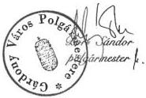

---

GYŐR MEGYEI JOGÚ VÁROS POLGÁRMESTERÉTŐL
Polgármesteri Hivatal

Győr, Városház tér 1. ☎: (96) 311-175
☎9002 Győr Pf. 169 Fax: (96) 317-180

Bacilepos M. A. for
L. város any. 82-

ÁLLAMI SZÁMVEVŐSZÉK
Számvevő-igazgató
Dömötör Gyula úr

ÁLLAMI SZÁMVEVŐSZÉK
1997-05-19
Érkezett:
Iktatószám: V-1021-100/92
Melléklet:

BUDAPEST
Apáczai Csere János u. 10.
1052

Tisztelt Dömötör Úr!

Az "önkormányzatoknak az ÁPV Rt-től járó vagyonrészesedések átadásának körülményeinek" ellenőrzéséhez készült jelentéshez észrevételünket az alábbiakban adjuk meg:

- Az önkormányzatok szabályszerűsége c. fejezetben Győr városra vonatkozó megállapítást kiegészítjük azzal, hogy a Közgyűlés Gazdasági Bizottsága állást foglalt a megállapodás aláírása előtt és a Közgyűlés utólagosan tudomásul vette az abban foglaltakat.

A továbbiakban tájékoztatjuk, hogy az Önkormányzat részére a RÁBA Rt részvény követelés teljesítésén túl ezen részvények után járó osztalék kifizetésre és a "B" típusú részvények kiadásra kerültek.

Az Önkormányzat a RÁBA Rt részvény jogos követelés teljesítésének közvetítői díját a VEKTOR Rt részére nem fizette ki, mert a megállapodásban kikötött részvény mennyiséget a munkával aránytalannak ítélte.

- A Soproni Sörgyár Rt győri belterületi földértéke 26.800.000.- Ft összeggel szerepel az átalakulási vagyonmérlegben, az ÁVÜ által kiadott részvények értéke 8.397.000.- Ft, a fennmaradó 18.403.000.- Ft névértékű kiadásra nem került részvény ellenértékeként a VEKTOR Pénzügyi és Befektetési Tanácsadó Rt a sikerdíj levonása után 97.926.000.- Ft-ot utalt át az Önkormányzat számlájára. Az ÁPV Rt és az Önkormányzat között megállapodás nem jött létre, és a pénzügyi teljesítéssel egyidőben sem később a közvetítő nem küldött számlát, vagy elszámolást. Az átutalt összeg tartalmazta ebben az esetben a tulajdonhoz kapcsolódó jogokat (kamat és osztalék) az Önkormányzat számára.

Győr, 1997. május 8.

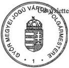

---

KECSKEMÉT MEGYEI JOGÚ VÁROS
POLGÁRMESTERE

41.661-2/1997.

ÁLLAMI SZÁMVEVŐSZÉK
Érkezett: 1997. 05. 27.
Iktatószám: V-1021-MS 96
Melléklet:

Tréfás Antal úr
Állami Számvevőszék
Önkormányzati és Területi Ellenőrzési
Igazgatóság Bács-Kiskun Megyei Kirendeltsége

Kecskemét
Deák F. tér 3.

Tisztelt Tanácsos Úr!

Kecskemét Megyei Jogú Város Önkormányzatánál lefolytatott
"Az önkormányzatoknak az ÁPV Rt-től járó vagyonrészesedések
átadási körülményei" tárgyú vizsgálatról küldött jelenté-
sére az alábbi észrevételt teszem az abban felsorolt ja-
vaslatokra reagálva:

1) Az 1989. évi XIII. törvény alapján átalakult vállalatok
vonatkozásában az önkormányzatot a belterületi földérték
alapján megillető tulajdonrész követelés kimunkálása még
jelenleg is tart. 1997. évben e témában újabb igényeket
nyújtottunk be az ÁPV Rt felé, és az Rt részéről megjelölt
ügyintézővel folyamatosan történik az egyeztetés.

A képviselőtestületnek csak a teljes követelés ismeretében
és az ÁPV Rt-vel való egyeztetést követően kívánunk beszá-
molni.

2) A polgármester és a jegyző együttes szabályzatban ren-
delkeztek a kötelezettségvállalás, utalványozás, ellen-
jegyzés és érvényesítés rendjéről, amely 1996. november
25-én lépett hatályba. Ebben az önkormányzatokról, az ál-
lamháztartásról, a költségvetési szervek tervezésének,
gazdálkodásának, beszámolásának rendjéről szóló jogsza-
bályok előírásai alapján a pénzgazdálkodás következő ope-
ratív folyamatai kerültek részletezésre, úgy mint:

- kötelezettségvállalás, ellenjegyzés,
- érvényesítés,
- utalványozás és ellenjegyzés,
- kiadások teljesítése, bevételek beszedése,
- bankszámlák és a házipénztár kezelése.

jegy-tit

---

- 2 -

A Polgármesteri Hivatal ügyrendjében az irodák közötti munkamegosztás keretében a vagyongazdálkodási iroda feladataként került rögzítésre a keletkező valamennyi szerződés és megállapodás jogi felülvizsgálatának elvégzése.

A törvényesség betartása érdekében a fent leírt kötelezettségek betartását fokozottan ellenőriztetni fogom a belső ellenőrzés keretében.

Jegyzői utasítás kiadása van folyamatban a munkakör átadás-átvétel szabályozásáról, hogy az ügyek intézésének folyamatosságát biztosítani lehessen. Ennek maradéktalan betartásáért az irodavezetők lesznek felelősek.

A szabálytalanul megkötött – de az önkormányzat számára egyértelműen pozitív eredménnyel járó – Vektor Rt-féle megállapodás és az ezzel kapcsolatos szerződések ügye öt alkalommal (1996. október 16., november 13., december 18., valamint 1997. január 15. és május 14.) szerepelt a közgyűlés napirendjén, ahol végül is a Bács-Kiskun Megyei Közigazgatási Hivatal jelzéseit, az ÁSZ vizsgálati jelentésében foglaltakat, valamint a külön bizottság által előterjesztett anyagot figyelembe véve, a szükséges konzekvenciákat levonva, nyugvópontra került az ügy, melyet a város közgyűlése a mellékelten megküldött 505/1997. (V.14.) KH. sz. határozattal zárt le.

Összefoglalva: az ÁSZ vizsgálat jelentésében szereplő javaslatokkal – melyek a további törvényes működés feltételeinek biztosítására vonatkoznak – egyetértek, a szükséges intézkedések megtételét elrendeltem, illetve azok folyamatban vannak.

Kérem a jelentésre adott észrevételeim elfogadását.

Kecskemét, 1997. május 22.

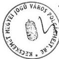

Tisztelettel:

Katona László /

jegy-tit

---

KECSKEMÉT MEGYEI JOGÚ VÁROS
KÖZGYŰLÉSE

41.779-2/1997.

# K I V O N A T

Kecskemét Megyei Jogú Város Közgyűlése
1997. május 14-én megtartott zárt ülésének
jegyzőkönyvéből

505/1997. (V.14.) KH. sz. határozat
A Közgyűlés és a VEKTOR Rt., valamint
az ÁPV Rt. között létrejött szerződé-
sek jogszerűségének kivizsgálása, va-
lamint annak megállapítása, hogy tör-
tént-e vagyonvesztés

A Közgyűlés megtárgyalta a VEKTOR RT.-VEL ÉS AZ ÁPV RT.-VEL
KÖTÖTT MEGÁLLAPODÁSOKAT VIZSGÁLÓ BIZOTTSÁG 19.278-16/1997.
számú előterjesztését, és az alábbi határozatot hozta:

1.) A Közgyűlés megállapítja, hogy- az Állami Számvevőszék
országos jelentés-tervezetét is figyelembe véve -
Kecskemét Megyei Jogú Város Önkormányzata az ÁPV
Rt.-től való privatizációs kintlevőségek megszerzéséhez
indokoltan vett igénybe közvetítő céget (VEKTOR Rt.).

2.) A Közgyűlés - mint a polgármester, alpolgármester és a
jegyző munkáltatói jogkörének gyakorlója - megállapít-
ja, hogy a határozatban felsorolt szerződések megkötése
és az abban foglaltak végrehajtása kapcsán a tisztség-
viselők: Katona László polgármester, Farkas Zoltán al-
polgármester, valamint dr. Peredi Katalin jegyző nem
követtek el sajátos köztisztviselői, illetőleg köz-
tisztviselői jogviszonyukból eredően olyan vétkes köte-
lezettségszegést, amely miatt indokolt lenne ellenük
fegyelmi eljárás megindítása.

3.) A Közgyűlés utólagosan tudomásul veszi a VEKTOR
Rt.-vel, valamint az ÁPV Rt.-vel kötött alábbi szerző-
déseket, melyek az
- OTP Rt.,
- MATÁV Rt.,
- BÁCSBER Kft.,
- East end West Kft.,
- BÁCSTERV Kft.,
- Aranypók Rt.,
- DÉLRŐVIKÖT Rt.,

user 1c-13

---

PÉCS MEGYEI JOGÚ VÁROS
POLGÁRMESTERE

ÁLLAMI SZÁMVEVŐSZÉK
Érkezett: 1997-05-16
Iktatószám: V-1021-106/97
Melléklet:

Szám: I. 1199-8/1997.

Tárgy: ÁPV Rt-től járó vagyonré-
szesedés átadásával kap-
csolatos vizsgálat

Állami Számvevőszék
Dömötör Gyula számvevő igazgató

Budapest

Tisztelt Igazgató Úr!

A tárgyban megjelölt jelentés-tervezettel kapcsolatban az alábbi észrevételt teszem:

A jelentés-tervezet 29. oldalán tett megállapítás szerint a polgármester a vagyonren-
deletben biztosított jogkörét túllépve, 1 millió Ft-nál nagyobb vagyon megszerzésére
adott felhatalmazást, a jogszabályi előírások megsértése ebben a vonatkozásban a
kapcsolódó kötelezettségvállalással valósult meg.

Álláspontom szerint ez a megállapítás nem megalapozott.

A dr. Ernst László számvevő tanácsos által készített vizsgálati anyag 7-8. oldalán is
szerepel, hogy az önkormányzat közgyűlése a 440/1992. (XII. 10.) számú közgyűlési
határozatban felhatalmazott a belterületi föld értékére vonatkozó nyilatkozattételi jog
gyakorlására. Álláspontom szerint ez a felhatalmazás a korábban megtett nyilatkoza-
taim felülvizsgálatának a lehetőségét és az ezzel kapcsolatos intézkedések - megbí-
zások - megtételét is magában foglalta. Az adott megbízás, az azonnali intézkedés
elkerülhetetlen volt, mert annak hiányában az önkormányzatot vagyonvesztés érte
volna.

Mindezek miatt az eredeti vizsgálati anyag szövegkörnyezetéből kiragadott, példa-
ként felhozott sommás megállapítást megalapozatlannak tartjuk.

Pécs, 1997. május 12.

H-7621 PÉCS • Széchenyi tér 1. • Postacím: H-7601 Pécs • Pf. 58.
Telefon: +36 (72) 213-222*, 212-057 • Fax: +36 (72) 212-049

---

SZENTENDRE VÁROS POLGÁRMESTERE
Szentendre, Városház tér 3.
2000

Berkyer János Káros anyj.
SG

ÁLLAMI SZÁMVEVŐSZÉK
Érkezett: 1997-05-16
Iktatószám: V-1021-105/99
Melléklet:

Szám: 358-8/1997.

Állami Számvevőszék

Dömötör Gyula
számvevő igazgató
részére

1393 Budapest

Pf. 432

# Tisztelt Igazgató Úr !

Az önkormányzatoknak az ÁPV Rt.-től járó belterületi föld értékének megfelelő vagyonrészesedések átadási körülményeiről végzett Állami Számvevőszék vizsgálati anyagát, jelentéstervezetét áttanulmányoztuk, tudomásul vettük.

A jelentésből egy körülményt szeretnék kiemelni, melyet az ÁSZ vizsgálati tapasztalatai is igazoltak. Mégpedig azt, hogy az önkormányzatok azon vélekedése, miszerint vagyoni követeléseiket a VEKTOR Rt-n (illetve más közvetítőkön) keresztül lehet megszerezni helyesnek bizonyult. A vizsgált időszakban ugyanis az állami vagyonkezelő szervezet - ÁPV Rt. igazgatóságának döntése alapján - az önkormányzatokkal kizárólag a közvetítők beiktatásával kötött és hajtott végre megállapodásokat. Ezért véleményem szerint az önkormányzatunk tulajdonában ily módon esetlegesen keletkezett kár nem eredeztethető önkormányzatunk esetleges mulasztásából.

Tájékoztatom, hogy Szentendre Város Képviselő-testülete döntése alapján pályázat kiírást és eredményhirdetést követően ügyvédi munkaközösséget bíztunk meg a városi vonatkozású önkormányzatunknak esetleg még igényként érvényesíthető vagyonrészesedések kimunkálásával. E megbízáson belül igényt tartunk a VEKTOR Rt-nek kifizetett sikerdíjak visszakövetelésére, mert véleményünk szerint a VEKTOR Rt. által végzett elemző munkák díját önkormányzatunk megelőlegezte a Privatizációs Rt-nek.

Az önkormányzatunknál az ügyben tartott ÁSZ vizsgálat befejezésekor alkalmunk lett volna észrevételeket tenni. Ezzel a lehetőséggel azért nem éltünk, mert a vizsgálat megállapításait korrektnek tartottuk. Sem a helyi vizsgálatról készült jelentés, sem az átfogó jelentéstervezet Szentendre Város Önkormányzatát jogszabálysértés, vagy mulasztás miatt nem marasztalja el, viszont bizonyos szempontból segítségünkre lehet az ÁPV Rt-vel szembeni igények érvényesítésekor.

Szentendre, 1997. május 15.

---

Székesfehérvár Megyei Jogú Város
Polgármestere
Székesfehérvár, Városház tér 1-2. Telefon: 22/311-148 Fax: 22/316-569
e-mail: szfvphiv@mail.datatrans.hu

Szám: 130.108-6/1997.

Állami Számvevőszék
Dömötör Gyula Úr
Számvevő- Igazgató

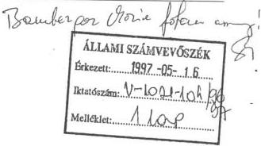

Budapest

Apáczai Csere János u. 10.
1052.

Tisztelt Számvevő-Igazgató Úr!

Jelentés tervezetét az önkormányzatoknak az ÁPV Rt-től járó - a belterületi föld
értékének megfelelő - vagyonrészesedések átadási körülményeinek vizsgálatáról
köszönettel megkaptam.

Székesfehérvár Megyei Jogú Város Önkormányzatára vonatkozó hivatkozások és
adatok valósak.

Több önkormányzat kezdeményezéséhez csatlakozva a jelentésről a mellékelt
véleményt magam is elfogadom.

Székesfehérvár, 1997. május 12.

Tisztelettel:

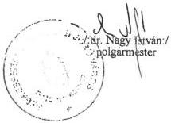

---

# V É L E M É N Y

az Állami Számvevőszéknek az Önkormányzatok részére az ÁPV Rt-től járó Vagyonrészesedések átadási körülményei vizsgálatáról szóló "jelentés-tervezetéről"

A jelentés tervezetben értékelhető az, hogy az ÁSZ több fordulatban elismeri

- az önkormányzatok dologi varományosai voltak az átalakult allami vallalotok belterületi földérétének, s ezt egészen 1995. végéig nem tudták érvényesiteni,
- az allam mulasztásban megnyilvánult törvenyszegések sorozatát kovette el a vagyon vissatzartásával,
- az onkormányzatok lépéshátrányban cselekedtek az öket megillető vagyon megszerzese érdekében, s helyesnek bizonyult azon következtétésük, hogy e vagyont az APV Rt-tólCsak a szakertoi cégeken keresztül lehet megszerezni /Ezt erősítette meg a privatizációs miniszter hozzájuk intezett levele is./
- az onkormányzatok a vagyoni kovetelések mertékenek meghatározásához nem, vagyCsak igen nehezen jutottak informácihoz,

Ilyen előzmények után is azonban nehezen érthető az a számvevőszéki kezdeményezés, amely ügyészi törvényességi vizsgálatot indítványoz az APV Rt. és az önkormányzatok közötti megállapodásokat illetően:

- nem minded önkormányzattal megkötott megállapodás nélkūlozte az elózetes testületi felhatalmazást,
- nem minded megallapodás tartalmaz tenylegesen is valamely vagyonról való lemondást.

Az egyes megállapodások tételes megvizsgálása után derülhet ki az, hogy az érintett önkormányzat vesztett-e vagyont vagy sem. Ha nincs vagyonvesztés, úgy nincs vagyonról való lemondás sem.

---

- 2 -

Az ÁSZ összefoglaló megállapítása kimondta:

azzal hogy az 1989. évi XIII. Tv. 21. §-át nem tartották be /tehát nem adták ki az önkormányzatoknak az őket megillető vagyont/, ez "az államháztartás központi és önkormányzati alrendszere között ellentétes irányú forrás átcsoportosítást eredményezett..."

Az előbbi megállapítás gyakorlatilag azt mondja ki, hogy a központi költségvetés bevételét növelte az a vagyonrész (osztalék, kamat), amely az önkormányzatok joglemondása folytán az államnak visszamaradt. Tehát ezek is a központi költségvetésnek, mint az államháztartás egyik alrendszerének javára jelentettek arányeltolódást.

Ha tehát az ÁSz elismeri a jelentésben, hogy ugyan az ÁPV Rt. mint vagyonkezelő közbejöttével, de ténylegesen a központi költségvetés, mint az államháztartás alrendszere javára történtek meg a vagyonról való lemondások, úgy ehhez szükséges volt az 1992. évi XXXVIII. Tv. /államháztartási törvény/ 109. §-a szerinti elfogadó nyilatkozatok. E jogszabályhely szerint ha a vagyonról az államháztartás alrendszerei javára lemondtak, ezt a lemondásban megnevezett állami szervezet, vagyonkezelő elfogadhatja.

Vizsgálható tehát, hogy volt-e ezekben a szerződésekben, megállapodásokban kifejezetten vagyonról való lemondás, ha igen, volt-e a lemondásban-megnevezett állami szervezet, vagyonkezelő, amely javára ezek történtek, s volt-e a lemondás elfogadásáról kifejezett megnyilatkozás.

Ismerve az ÁPV.Rt. és az önkormányzatok közötti megállapodások sablonszövegét, megállapítható, hogy ezek nem feleltek meg az előbbi vagyonlemondási kritériumoknak. Nem állapítható meg a megállapodásokból többek között az, hogy milyen nagyságú vagyonról volt lemondás - ha volt egyáltalán -, kinek a javára történtek ezek, s hogy az Áh. Tv-ben meghatározott arra jogosult szerv elfogadta volna-e ezeket a lemondásokat.Ezek után nincs más teendő, minthogy a Kormány arról hozzon egy döntést, hogy az 1125/1996. /XII.19./ Kormányhatározat hatálya kiterjed a határozat 6./ pontjában szereplő megállapodásokra is.

---

- 3 -

A kormányhatározat ezen kiegészítése feloldaná azt az állapotot, amely az ÁSZ által vitatott, szerinte vagyonról való lemondást tartalmazó megállapodások megkötésével előállt. Tehát ha az állam kiadná mindazt a vagyonrészt, vagy ellenértéket az önkormányzatoknak amely a megállapodásokban foglalt értékeken felül még jár, akkor szó sincs a továbbiakban vagyonról való lemondásról, s így érvénytelen megállapodásokról sem. Ez megfelelne annak az elvárásnak is, amit a Belügyminiszter Úr irányításával létrejött bizottság 'Tájékoztató az önkormányzatokat érintő és megillető belterületi földingatlanok kiadásáról' szóló anyag /1996. nov.4./ a 11. oldal első bekezdésében tartalmaz: ' Indokolt visszatérni azokra az önkormányzatokra is, amelyek megállapodást kötöttek, lemondtak a kamatkövetelésről. Az önkormányzati igények teljesítése csak azonos elvek szerint történhet, tehát ezeknek az önkormányzatoknak is ki kell fizetni a többit megillető kamatokat. /Nem hivatkoz/ha/tunk arra, hogy lemondott, s nem kerülhetnek hátrányosabb helyzetbe, mert megállapodtak/'.

Végeredményben pedig az ÁSZ kezdeményezése a Kormány és a Legfőbb Ügyész irányában (a szerződések törvényességének vitatása, s ennek esetleges jogkövetkezményei) ugyanahhoz az eredményhez vezet, mint az, ha a Kormány kiegészíti a fentiek szerint az elmúlt év decemberében hozott határozatát. Mindkét megoldás szerint pótlólagos állami forrásokra van szükség, s az önkormányzatok megkaphatják teljeskörűen vagyonukat. A különbség abban van, s ez a legfontosabb, hogy a semmissé nyilvánítás valamennyi érintett önkormányzatnál, településen tovább lebegteti az ügyet, a helyi társadalom valós problémái helyett politikai síkra viszi el a kérdést. Nem lehet ma Magyarországon egyetlen állami szervnek sem érdeke az ország és a helyi társadalmak békéjének veszélyeztetése, egy lecsillapult ügy újra való felmelegítése akkor, amikor van jogilag járható megoldás.

---

V-1021-123/1996-97.

**Dr. Csiha Judit** asszony,
privatizációért felelő tárca nélküli miniszter

**Budapest**

Tisztelt **Miniszter** Asszony!

Az önkormányzatoknak az ÁPV Rt-től járó - a belterületi föld értékének megfelelő - vagyonrészesedések átadási körülményeinek vizsgálatáról készített jelentés javaslataihoz tett észrevételeit megköszönöm.

Észrevétele alapján a javaslatok 1. pontját pontosítottuk. A szolgáltatás és ellenszolgáltatás aránytalanságát az Ász vizsgálati jelentése valójában csak a vizsgált önkormányzatok és VEKTOR Rt. közötti szerződések esetében vetette fel, az ÁPV Rt. és Dr. Tocsik Márta közötti szerződéssel összefüggésben az aránytalanságok ismereteink szerint a felügyelőbizottsági, valamint a KEI vizsgálat vetette fel. Az aránytalanság megállapítása pedig természetesen az eljáró bíróságok feladata.

A javaslatok 3. pontjának módosítását nem tartom indokoltnak, véleményét tiszteletben tartva, úgy ítélem meg, hogy a vizsgálat elrendelésében a kormánynak kell állást foglalnia.

Budapest, 1997. június 2.

Tisztelettel

Sándor István

---

V-1021-124/1996-97.

Állami Privatizációs és Vagyonkezelő Rt.

Dr. Szabó Pál úr,

vezérigazgató

Budapest

Tisztelt Vezérigazgató Úr!

Az önkormányzatoknak az ÁPV Rt-től járó - a belterületi föld értékének megfelelő - vagyonrészesedések átadási körülményeinek vizsgálatáról készített jelentés javaslataihoz tett észrevételeit megköszönöm.

Úgy vélem az Állami Számvevőszék és az ÁPV Rt-nek sem lehet más érdeke, minthogy az önkormányzatok immáron 5-8 év elteltével hozzájussanak az 1989. évi XIII. tv. 21. paragrafusban biztosított vagyonukhoz.

Örömömre szolgál, hogy ennek érdekében a megállapodásokból elhagyják az önkormányzatok joglemondására vonatkozó fejezetet. Ismételten szeretném azonban jelezni, hogy megítélésünk szerint csak a kártérítés mértéke lehet a megállapodás tárgya, a vagyonkezelőnek a felajánlott összeget akkor is át kell utalni a károsult önkormányzat számlájára - és nem bírói letétre teljesíteni, és ennek költségét az önkormányzatra hárítani - ha a felajánlott összeget az önkormányzat kevésnek találja és a megállapodást annak 4.1 és 4.2 pontjában rögzítettek miatt nem írja alá.

Fentiek figyelembevételével határoztuk meg végső javaslatunkat.

Budapest, 1997. június 2.

Tisztelettel

Sándor István