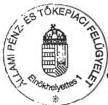
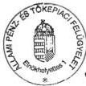
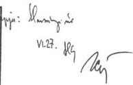
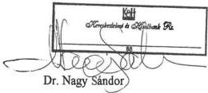
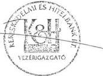
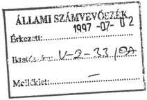
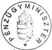
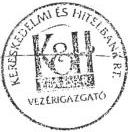

Állami Számverőszék

# JELENTÉS

a Kereskedelmi és Hitelbank Rt. vizsgálatáról

366.

1997. AUGUSZTUS

---

A vizsgálat végrehajtásáért felelős:

az ÁSZ IV. Vagyonellenőrzési Igazgatósága:

Halász Gejza

számvevő igazgató

A vizsgálatot vezette:

Harsányi Sándor

osztályvezető főtanácsos

A vizsgálatot végezték:

Dr. Borisz József

számvevő tanácsos

Lőrinc Alajos

számvevő tanácsos

Makkai Mária

számvevő tanácsos

Németh Béláné

számvevő tanácsos

Dr. Ocskovszky Jánosné

számvevő tanácsos

Rundik János

számvevő tanácsos

Dr. Szöllősi Géza

számvevő tanácsos

Szakértők:

Barát Stefánia

Botos Katalin

---

# TARTALOMJEGYZÉK

Oldal

I. BEVEZETÉS 1

II. ÖSSZEFOGLALÓ MEGÁLLAPÍTÁSOK KÖVETKEZTETÉSEK, AJÁNLÁSOK 3

1.Osszefoglalo megallapitasok 3
1.1.A befektetésként kimutatott ertekpapirok es részesedesek alakulasa 3
1.2.Kovetelsek allomanya,fedezettsege,kockazati celtartalek 6
1.3.Banki forrasok alakulasa 7
1.4. Szabalyozottsag, belso ellenorzs 10
2.Kovetkeztetesek 11
3.Ajanlasok 13

III. RÉSZLETES MEGÁLLAPÍTÁSOK 14

1.A befektetésként kimutatott ertekpapirok es részesedesek alakulasa 14
1.1. Vallalkozásokban levő részesedések 14
1.2.A bank es tarsasagai kozotti uzleti kapcsolat 16
1.3.Kovetelés ertekesitesek 19
1.4.Belso es kapcsolodohitelek 21
1.5. Befektetési celu ertekpapirok 22
1.6.Immaterialis javak es targyi eszkozok 23
2.Kovetelsek allomanya,fedezettsege,kockazati celtartalek 24
2.1.Kovetelsek allomanyanak alakulasa 24
2.2.Adsminosites 27

---

2.3. Fedezetértékelés 29
2.4. Kockázati céltartalék 30
3. Banki források alakulása 31
3.1. A bank tőkehelyzete 31
3.2. A bank forrásainak helyzete, összetételének alakulása 32
3.2.1. Éven belüli kötelezettségek 33
3.2.2. Éven túli kötelezettségek 34
3.3. A bank likviditásának helyzete 34
3.4. A bank eredményének alakulása 35
3.5. A konszolidációs szerződés 37.
4. Szabályozottság, belső ellenőrzés 39
4.1. Szabályozottság 39
4.2. A belső ellenőrzés működése 43

2

---

Állami Számvevőszék
V-2-41/1997.
Témaszám: 360.

# J E L E N T É S

a Kereskedelmi és Hitelbank Rt. vizsgálatáról

# I.

# B E V E Z E T É S

Az Állami Számvevőszék az 1989. évi XXXVIII. törvényben kapott felhatalmazása alapján ellenőrizte a Kereskedelmi és Hitelbank Rt. (továbbiakban KHB Rt.) tevékenységét.

Az ellenőrzés célja a bank vagyoni helyzetének, eszközei alakulásának, azok tartalékkal történő fedezettségének vizsgálata volt, valamint annak megállapítása, hogy a bank működése, tevékenysége megfelel-e a törvényi előírásoknak, belső szabályzatoknak, illetve a bank szabályzatai megfelelően közvetítik-e a biztonságos és jövedelmező működés követelményeit.

Az ellenőrzés alapvető céljának megfelelően a vizsgálat kiterjedt a befektetésként kimutatott értékpapírok és részesedések, az immateriális javak és tárgyi eszközök alakulására, a követelésállományra és annak fedezettségére, továbbá a kockázati céltartalékokra. Átfogta a banki források alakulását, valamint a pénzintézet belső ellenőrzési rendszerét. Nem volt a vizsgálat célja a bank egész tevékenységének ellenőrzése.

---

Az ellenőrzött időszak 1996. év és 1997. első negyedéve, illetve ahol szükséges volt - pl. hitelügylet - ott az adott gazdasági esemény keletkezésének időpontjától számított időszak.

A vizsgálat 42 adósra terjedt ki. Ez 63,4 milliárd Ft követelésállományt reprezentált és a banki állomány közel 35 %-át jelentette.

A Kereskedelmi és Hitelbank Rt.-t a vizsgálat ideje alatt a következők jellemezték.

A Kereskedelmi és Hitelbank Rt. tevékenységét részvénytársasági formában 1987. január elsején kezdte meg. A pénzintézeti rendszer részvénytársasági formában működő pénzintézeteinek száma 1996-ban meghaladta a 40-et. Ezen belül a KHB RT. Rt. az első 6 nagybank között szerepel. 1996. január 1-vel a bank egyesült a 100 %-os tulajdonában lévő Ibusz Bank Rt.-vel.

A bank országos fiókhálózattal rendelkezik, fiókjainak száma 1996. december 31-én 153 volt. Teljes munkaidőben foglalkoztatott statisztikai létszáma 4.020 fő volt. Jogi személyek, jogi személyiség nélküli gazdasági társaságok és magánszemélyek részére a bank teljeskörű kereskedelmi banki szolgáltatásokat nyújt. Tulajdonai között szerepel befektetési bank, értékpapírforgalmazó, ingatlanforgalmazó, valamint lízingtevékenységet végző társaság. Továbbá mintegy 60 egyéb társaságban bír részesedéssel.

Fő tulajdonosa, közel 90 %-os aránnyal a Magyar Állam.

Mérlegfőösszegét és fiókhálózatát tekintve a második-harmadik helyen áll a bankok között. A bank az elmúlt három évben tevékenységét pozitív eredménnyel zárta. Ennek révén a pénzintézeti törvény által előírt általános tartalékot 1996. év végére teljes mértékben megképezte. A bank 1996. évi adózott eredménye 2.661 millió Ft; konszolidációt követően pedig 2.396 millió Ft volt.

2

---

A "Jelentés" sajátossága, hogy a vizsgálat megállapításait megalapozó részleteket számos esetben nem lehet bemutatni a nyilvános jelentésben, mert az bank- vagy üzleti titkot képez. Arra vonatkozóan, hogy mit lehet és mit nem nyilvánosságra hozni a Kereskedelmi és Hitelbank Rt. hivatalos nyilatkozatát tekintette az Állami Számvevőszék irányadónak.

A helyszíni vizsgálat lezárása után - az éves rendes közgyűlés jóváhagyásával - a bank az EBRD-vel 30 millió USD értékben alárendelt kölcsöntőke nyújtására szerződést kötött. Az EBRD opciós jogot kapott, hogy az alárendelt kölcsöntőkét részvényre konvertálhassa, így a privatizáció előtt tulajdonosi lehetőséghez jutott.

# II.

# ÖSSZEFOGLALÓ MEGÁLLAPÍTÁSOK, KÖVETKEZTETÉSEK, AJÁNLÁSOK

# 1. Összefoglaló megállapítások

# 1.1. A befektetésként kimutatott értékpapírok és részesedések alakulása

A KHB Rt. befektetésként nyilvántartott társaságainak száma 63 db, amelyeknél a bank közvetlenül tulajdonos és 39 társaságban közvetett - döntően többségi - tulajdoni hányaddal rendelkezik. A bank közvetlen érdekeltségébe tartozó társaságok közül - melyek 1996. december 31-i mérleg szerinti bruttó értéke 13,9 milliárd Ft - 10 % alatti kisebbségi hányadú tulajdonosi részesedése 35 db társaságban van.

A közvetlen tulajdonú társaságokból 32, mintegy 3,4 milliárd Ft értékben már 1994. január 1-jén is a bank befektetései között szerepelt. Ezen befektetések állománya 1996. év végére közel kétszeresére nőtt és az ezekhez kapcsolódó céltartalék képzési

3

---

kötelezettség szintén 2,3 szeresére növekedett ugyanezen időszak alatt. Ez azt jelenti, hogy ezen befektetések minősítése romlott az elmúlt 3 évben.

A bank 1994. január 1. és 1996. december 31-e között a befektetésekkel közel 50 milliárd Ft forgalmat bonyolított le, ez 166 db beszerzést és 231 db értékesítést jelentett. Így az 1994. január 1-jén meglévő 104 társaság 1996. december 31-re 63-ra csökkent. Az értékesítések nagyobb hányada banki érdekeltségi körön kívülre történt.

A bank 1996-ban az üzleti, a kombinált és a veszteség mérséklő befektetések között szereplő társaságaival hitelezési kapcsolatban állt. Ez az összeg mintegy 20 milliárd Ft, amely az összes ügyfelekkel szembeni követelésállománynak több mint 10 %-a.

A kombinált befektetések azt a célt szolgálták, hogy a bank mint résztulajdonos tudja figyelemmel kísérni az általa nyújtott hitelek felhasználását.

A bank befektetései között, 30 %-os arányt képviselnek a banküzemi és üzletviteli befektetések. Ezen befektetések 23 társaságot érintenek, amelyből 10 egyértelműen a banki működést segíti, de a többi társaságnál párhuzamosan végzett tevékenységek is megjelennek.

A veszteségmérséklő befektetések kategóriájában a bank jelentős forgalmat bonyolított le 3 év alatt. Eredményeként az 1994. január 1-jei 1,7 milliárd Ft céltartalék szükséglet 1996. év végére szinte eltűnt, mert 44 millió Ft-ra csökkent. Ugyanebben a kategóriában 1996. év végén 6 társaság szerepelt. Ebből 3 a bankhoz hiteltőkekonverzió révén került. A banknál nem jellemző a követelések tőkévé való átváltása, azaz a kényszerbefektetés.

---4

---

A bank a közvetlen érdekeltségi körébe tartozó társaságai közül 40-ben rendelkezik ellenőrzési lehetőséggel a vezető tisztségviselőkön keresztül.

A bank és társaságok közötti üzleti kapcsolatok terén a követelések értékesítése a legjelentősebb. Az értékesített követelések 61 %-át a bank közvetlen érdekeltségi körébe tartozó társaságok vásárolták meg. Azt, hogy végül is az eladott követelések milyen arányban kerültek ki a bank közvetlen és közvetett tulajdonában álló társaságoktól, csak az azoknál lefolytatott tételes vizsgálat mutathatná ki.

A követelések értékesítésének névértékre és vételárra vonatkozó - a bank auditált beszámolója és az analitikus nyilvántartás szerinti adatai nem egyeznek meg, a nyilvántartások nem zártak, nincsenek összhangban.

A törvényi szabályozás egyértelműen meghatározza a belső és kapcsolódó hitelnek minősülő kihelyezések körét. A bank könyvvizsgálója által hitelesített éves beszámolók szerint a bank a kapcsolódó hitelekre vonatkozó korlátot az elmúlt 3 évben rendre, közel tízszeresére túllépte.

A befektetett eszközökön belül a kötvények és más tőkearányosan jövedelmező értékpapírok állománya a meghatározó, 1996-ban elérte a befektetett eszközök 65 %-át. Az értékpapírok auditált mérleg szerinti bontása nem állítható össze az analitikus nyilvántartásból. A befektetési célú kötvények döntő többsége állampapír. A bank befektetett pénzügyi eszközei között kimutatott értékpapírok 1996. évi hozama a bank eredményét kedvezően befolyásolta.

A bank tárgyi eszközeinek 94 %-a a pénzintézeti tevékenységhez kapcsolódik. A nem banküzemi célt szolgáló ingatlanok értéke jóval alatta marad a pénzintézeti törvény által megengedett mértéknek. A bank jelentősebb beruházást 1996-ban nem valósított meg.

5

---

Az immateriális javakat és tárgyi eszközöket 1994. december 31-i állapot szerint a bank külső szakértő céggel értékeltette. Ezt az értékelést a mai állapotra nem lehet kivetíteni.

# 1.2. Követelések állománya, fedezettsége, kockázati céltartalék

A bank követeléseinek állománya 1996. december 31-én 10,4 %-kal kevesebb volt a nyitóállománynál. A követelés állomány csökkenése, csökkenő pénzintézeti követelés és az ügyfelekkel szembeni és az egyéb követelés növekedése eredőjeként jött létre. A bankközi hitelezői pozíció 70 %-os csökkenését csak részben tudta kompenzálni ügyfelei kibővült hitelezésével.

Az éven belüli és az éven túli követelésállomány aránya 72 : 28-ról 68 : 32-re változott 1996. év végére. Ez a módosulás nem jelentős. Jelentősen módosult azonban a Ft és devizahitelek aránya az utóbbiak javára. A vállalkozói szférában 20 %-ról 40 %-ra nőtt a devizahitel arány és az egy évvel korábbihoz képest az éven belüli devizahitel állomány megduplázódott, az éven túli pedig több mint ötszörösére nőtt. A devizahitelek háromnegyede elsősorban az élelmiszeripart finanszírozta. A KHB RT. Rt. ügyfelekkel szembeni követeléseinek szakmánkénti összetételében hagyományosan az agrár- és élelmiszergazdaság képviseli a legnagyobb arányt.

A bank vállalkozókkal szembeni tőke, kamat és függő követeléseiben az 1 milliárd Ft feletti méretűek az egy évvel korábbihoz képest megduplázódtak, azaz 1996-ban megnövekedett a koncentráció. A bank nem tudta maradéktalanul betartani az egy hitelfelvevőre, illetve adóscsoportra előírt felső korlátot.

A bank hitelállományában jelentős hányadot képviselnek a kiemelt ügyfelekkel szembeni követelések. Az éven belüli forint hitel esetén a 3,3 %-ot kitevő ügyfélkör az összbanki hitel 30 %-át, az éven túli forint hitel esetén 1,6 %-ot kitevő ügyfélkör az összbanki hitel 27 %-át vette fel.

6

---

Az adósminősítés szerint 1996. december 31-én problémamentesnek minősült az ügyfelek 51,1 és megfigyelendőnek 35,7 %-a. Az átlag alatti, kétes és rossz minősítésű adósok aránya 13,2 % volt. Az adósminősítés alkalmazott rendszere megfelel az előírt tételes szakmai követelményeknek. A minősítést előkészítő szervezet betartja a konkrét szabályzati előírásokat.

Az 1994-ben kidolgozott és bevezetett fedezetértékelési módszer hatékonysága megfelelő. Az 1996. évi adatok azt mutatják, hogy az esetek döntő többségében biztosítja a hitelezési kockázat minél pontosabb megállapítását, folyamatában kezeli a fedezetek értékváltozásának hatását kockázatra, illetve az ezzel összefüggő tartalékképzésre. A biztosítékok szabályzatban előírt ellenőrzését elvégzik, amit a belső ellenőrzés visszatérően vizsgált.

A kockázati céltartalék képzésnél a kettős szabályozás - adósminősítés, fedezetértékelés - eredőjét veszik figyelembe, melynek eredményeként a kockázati céltartalék képzése megfelelő. A tőke-, függő-, és kamatkövetelések 1996. év végi állományának korrigált biztosítékokkal fedezett összegére képzett céltartalék elegendő biztonságot nyújt. A korrigált biztosítékokkal nem fedezett követelésállományból a céltartalékképzés aránya az Állami Bankfelügyelet előírásainak megfelelt. A hitelezési tevékenység egyedi kockázatára képzett céltartalékképzési kötelezettség kedvezően hatott a bank mérlegszerinti eredményének alakulására.

### 1.3. Banki források alakulása

A banknál a tőkemegfelelési mutató 1996. december 31-én 8,92 %-os volt. Ez csak kis mértékben haladja meg a kötelező szintet. A szavatolótőke csupán 2 milliárd Ft-os csökkenés esetén is a tőkemegfelelési mutató a minimális biztonságot nyújtó 8 % alá süllyedhet.

---7

---

A bank 1996. december 31-i forrásállománya 360 milliárd Ft volt. A források között alacsony a saját tőkeállománya - 4,7 % - így az üzleti expanzió lehetősége törvényi korlátokba ütközik és nincs lehetősége kihasználni a 153 fiók nyújtotta piaci helyzet előnyeit sem.

A bank kötelezettségeinek záróállománya a nyitóállományhoz képest 12,5 %-kal növekedett, összetételében változatlanul az éven belüli kötelezettségek a meghatározók, amelyek részaránya 84 %.

Az éven belüli kötelezettségek között a vállalkozói betétek állománya a várakozásokkal szemben növekedett. Ebben az üzletágban az előirányzatok csökkenéssel számoltak és a bank félve a forráskiesés volumenétől a betétek kiesését értékpapír kibocsátásával kívánta ellensúlyozni. Ez a szerkezetváltás a kamatrés szűkülését eredményezte. A jegybankkal és pénzintézetekkel szembeni éven belüli kötelezettségek záróállománya azt mutatja, hogy a pénzpiaci források felhasználása minimális volt, aktív repoforrások felvételére néhány esetben került sor.

Az éven túli kötelezettségek záróállománya 4,8 milliárd Ft-tal alacsonyabb lett mint a nyitóállomány, ebből a jegybank és a bankközi éven túli kötelezettségek állománya a jelentős.

A KHB Rt. helyzete az IBUSZ Bankkal történt egyesülés után megváltozott, forrásbőség és stabil likviditás volt a jellemző. Mérlegfőösszege az 1996. évi 321,5 milliárd Ft nyitóállományról év végére 360 milliárd Ft-ra emelkedett. Az éven belüli forint betétállomány folyamatosan nőtt, miközben az év végi állomány a korábbi évektől eltérően csak kis mértékben csökkent. Ez a bank fokozott aktivitását jelentette.

A bank 1996. évi adózás előtti eredménye 3,2, adózott eredménye pedig 2,6 milliárd Ft lett. Ez utóbbi az előző évit 40 %-kal haladta meg. A bank eredményessége a

---8

---

portfolió kezeléssel kapcsolatos közvetlen bevételekhez és a céltartalék felszabadításához kötődött. A pénzintézeti tevékenység ráfordításai az 1995. évi tényköltségeket 18 %-kal haladták meg, amely elmaradt az infláció ütemétől.

A bank forrásai helyzetének összevetése az előirányzatokkal - a bank eredményessége mellett is - jelzi, hogy a tulajdonosok által jóváhagyott üzletpolitikától az éves pénzügyi gazdálkodási terv jelentősen eltér.

A Pénzügyminisztérium - mint a tulajdonosi jogok gyakorlója - és a bank közötti kapcsolatot alapvetően az 1993. december 27-én megkötött Konszolidációs Szerződés határozta meg. A szerződés számos feladatot fogalmazott meg a bank részére, általános elvárásokat és a bank átvilágítása során tapasztalt és azokhoz kapcsolódó speciális feladatokat. A feladatok teljesítéséről a bank vezetősége 1995. szeptember 7-én megtartott igazgatósági ülésen számolt be. Ezen, a konszolidációs programot mint stratégiát felülbírálták és módosították, ugyanakkor teljesítettnek ítélték a konkrét szervezeti és fejlesztési és egyéb feladatok végrehajtását. A végrehajtáshoz kapcsolódó vélemény nem tartalmazta a Pénzügyminisztériumnak mint szerződő és feladatellenőrző félnek az állásfoglalását, a teljesítés elfogadását.

1995. december 22-én a konszolidációs szerződést a felek módosították, melyet a bank 1995. december 21-i rendkívüli közgyűlése jóváhagyott. A módosítás célja a bank pozíciójának, egyenletes javítása, vagyongyarapítás, eredményjavítás és mindezek által az eredményes privatizáció végrehajtása, amelyek a szerződésben foglalt célok megvalósítását szolgálják. A szerződésmódosítás egyik lényegi pontja az éves üzleti-pénzügyi terv elkészítése volt. Ezt a tulajdonosi jogok gyakorlója írásban nem véleményezte, de az igazgatósági ülésen a PM képviselője elfogadta.

Az üzleti-pénzügyi tervtől való eltéréseket - melyről a konszolidációs szerződés szerint a banknak negyedéves beszámolási kötelezettsége van - szöveges beszámolóval

9

---

kiegészítve a bank nem jelentette a Pénzügyminisztériumnak és az nem is igényelte azt.

### 1.4. Szabályozottság, belső ellenőrzés

Az igazgatóság 1994 augusztusában hagyta jóvá a kiemelt banki tevékenységeket szabályozó belső dokumentumokat, így a hitelezési, betétkezelési kézikönyvet, a befektetési, az adósminősítési, a fedezetértékelési, a kintlévőségek és mérlegen kívül vállalt kötelezettségek minősítési és céltartalékképzési szabályzatát.

Az ehhez kapcsolódó egyéb szabályzatokkal együtt a belső szabályozási rendszer a szakmai területeket átfogja, rendszeresen karbantartott, a különböző döntési szinteket meghatározza. A bank belső szabályzatainak kidolgozottsága, szakmai színvonala megfelel a hatályos törvényi és felügyeleti rendelkezéseknek, követi a jogszabályi változásokat, az üzletpolitikai megfontolásokat. Támogatja a szervezeti egységek közötti munkamegosztást. A banki tevékenységek alapinformációi elégségesek a hitelezési tevékenység kapcsán érvényesítendő banki követelések vizsgálatához, a bank biztonságos működéséhez.

A bankfiókokat rendszeresen minősítik, vizsgálják aktivitásukat, a kihelyezett hitelek összetételét, minősítését, az ahhoz kapcsolódó céltartalékképzési kötelezettségek alakulását. A minősítésnél támaszkodnak a belső ellenőrzés megállapításaira is.

A belső ellenőrzés szervezetét, feladatát a pénzintézeti törvény alapján határozták meg és az a Felügyelő Bizottság szakmai irányítása alatt áll. Munkájukat a stratégiai terv, valamint az éves ellenőrzési terv alapján végzik. Vizsgálataik a belső szabályzatoknak való megfelelésre, a szabályzatok hiányosságaira való figyelemfelhívásra, a törvényességre, a biztonságra és a célszerűségre irányulnak. Negyedévenként rendszeresen ellenőrzik a Magyar Nemzeti Bank és az Állami Bankfelügyelet részére adott jelentéseket és adatszolgáltatásokat. Folyamatosan figyelemmel kísérik a veze-

---10

---

tői és a munkafolyamatba épített ellenőrzést. A vizsgálati jelentések tömörek és szakszerűek és a jelentősebb hibák felszámolására javaslati részt tartalmaznak. A jelentéseket az illetékes szakterületek vezetőivel elfogadtatják, a Felügyelő Bizottság a jelentéseket ülésein megtárgyalja.

## 2. Következtetések

A bank érdekeltségi körébe összesen 102 társaság tartozik. Ebből 63 társaságnál közvetlenül tulajdonos, melyek közül 32 társaság már 1994. január elsején is a tulajdonában volt. Ezek nem elég hatékony értékesítése miatt a kapcsolódó kockázati céltartalékképzési kötelezettség 1996. év végén kimutatott növekedése megterhelte a bank eredményét.

A bank a befektetések értékesítésével nagy forgalmat bonyolított le, melynek eredményeként három év alatt közel 1,9 milliárd Ft árfolyamnyereséget ért el. A befektetési portfólió csökkentése valós portfólió tisztítás volt. Ez és a lebonyolított nagy forgalom után megmaradó új befektetések állománya együttesen úgy javította a befektetési portfólió összetételét, hogy az 1994. év végi 4,8 milliárd Ft-os kockázati céltartalékképzés 1996. december 31-re 1,3 milliárd Ft-ra csökkent.

A bank a közvetlenül, illetve közvetve hozzátartozó társaságainál befolyását alapvetően a tulajdonosi pozíció felhasználásával, illetve az adott társaságban a vezető tisztségviselőkön keresztül tudja biztosítani. Az a stratégia, hogy azon társaságoknak ad hitelt, ahol vagy meghatározó tulajdoni hányada van, vagy a vezető tisztségviselőket a bank delegálja, a nyújtott hitelek megtérülésének egyik biztosítéka.

Az elmúlt 3 évben a bank előtérbe helyezte a követelések értékesítését. Ezek nagy részét az érdekeltségi körébe tartozó társaságok vásárolták meg. Az összes követelésértékesítés hatása, hogy a bizonytalan követelésre megképzett kockázati céltartalékot is figyelembevéve, a bank közel 3,8 milliárd Ft eredményt ért el.

---11

---

A befektetett eszközökön belül a befektetési célú kötvények döntő többsége állampapír. Ez a tény jelzi, hogy a bank aktivitását nem a forráshiány befolyásolta elsődlegesen, hanem a hitelkihelyezés korlátai.

A bank követelésállománya 1996. december 31-én kevesebb volt a nyitóállománynál. A változás markáns vonása az, hogy mind a hiteldöntéseknél, mind a kintlévőségek adósonkénti méreténél, szakmai és területi összetételénél koncentrációs tendencia bontakozott ki. Ez ugyan egybe esett a bank üzletpolitikai célkitűzéseivel, de egyben megnövelte a kockázatot.

A hitelezési tevékenység minőségét jelzi, hogy az átlag alatti, kétes és rossz minősítésű adósok aránya 13,2 %. Az adósminősítési rendszer, a fedezetértékelés módszere ezek alkalmazása és ellenőrzése együtt a kockázati céltartalékképzés alkalmazásával megfelelő biztonságot nyújtott a banknak és egyben javította eredményességét is.

A bank szabályozottsága megfelel a pénzintézeti törvény és az Állami Bankfelügyelet előírásainak. Átfogja a bank minden területét, szakmai színvonala, a szabályozott területek rendszeres karbantartása, az előírások betartásának ellenőrzése jó alapot ad a bank biztonságos működéséhez. A belső ellenőrzési szervezet munkája hatékony.

A bank 1996. évi eredménye döntően nem a klasszikus pénzintézeti tevékenységből (hitelezésből), tehát a hitel és betéti kamatok különbözőségéből, hanem a portfólió tisztításból, illetve az ehhez kötődő kockázati céltartalék felszabadításából keletkezett. Ez potenciálisan kedvező induló helyzete lehet a jövőbeni gazdálkodásnak. A bank helyzetét az is befolyásolja, hogy a közvetlen és közvetett tulajdonú befektetései mennyi jövedelemtartalékot rejtenek. Ezt alapvetően az is meghatározza, hogy e társaságok részére eladott követelések közül, mennyi van még a társaságoknál és azok piaci értéke hogyan viszonyul a nyilvántartási értékhez.

---12

---

Összességében a bank tőkeellátottsága, a 8 %-os határon mozgó szavatoló tőke és a források közötti 4,7 %-os saját tőke állomány együttesen és egyértelműen korlátozza az üzleti expanzió lehetőségét, miközben a bank egyéb adottságai, üzlethálózat, belső szabályozottság biztonsága, ügyfélköre, a problémamentes adósok magas aránya egy gyorsabb és biztonságos fejlődés előfeltételeként lényegébe véve adottak.

# 3. Ajánlások

# A Pénzügyminisztériumnak:

mint szerződő fél és tulajdonos tekintse át a módosított konszolidációs szerződés végrehajtásának helyzetét és követelje meg negyedévenként a banktól azt a beszámolót, amely az üzleti tervtől való eltéréseket mutatja be.

# A Kereskedelmi és Hitelbank Rt. Igazgatóságának:

mérje fel, hogy az eladott követelések milyen arányban kerültek ki végérvényesen a bank közvetlen és közvetett tulajdonosi köréből,

készítsessen befektetéseiről értékbecslést a piaci érték meghatározásához,

mérje fel, hogy a banküzemi célú befektetéseinél mely társaságok látnak el párhuzamos tevékenységeket és a költségmérséklés érdekében szükséges intézkedéseket tegye meg,

végeztesse el az immateriális javak és tárgyi eszközök értékelését, hogy a bank vagyoni helyzetéről mind reálisabb képet lehessen alkotni,

13

---

tegyen intézkedéseket, hogy biztosítani lehessen a hitelesített beszámolóban szereplő adatok egyezőségét az ugyanarra az időpontra vonatkozó analitikus adatokkal,

vizsgálja meg az egységes és hatékony számítógépes integrált információ rendszer teljes kiépítésének idő és erőforrásigényét és lehetőségeinek megfelelő szükséges intézkedéseket tegye meg.

# III.

# RÉSZLETES MEGÁLLAPÍTÁSOK

# 1. A befektetésként kimutatott értékpapírok és részesedések alakulása

# 1.1. Vállalkozásokban lévő részesedések

A KHB RT. Rt. befektetései közül a konszolidációba bevont, a társult vállalkozásokban, valamint az egyéb pénzügyi befektetéseiben szerzett részesedéseinek értéke 1996. december 31-én mérleg szerint bruttó értéken 13,9 milliárd Ft, nettó értéken 12,7 milliárd Ft volt.

A bank közvetlenül 63 társaságban tulajdonos. A tulajdoni hányad nyilvántartás szerinti értéke 12.474 millió Ft, amely névértéken 12.859 millió Ft.

Ezen túlmenően a bank további 39 társaságban rendelkezik közvetett - döntően többségi - tulajdoni hányaddal.

A bank közvetlen érdekeltségébe tartozó 63 társaságban tulajdoni arányokat tekintve a megoszlás a következő:

14

---

100 %-os tulajdoni hányad 9 db

50.1 % feletti (többségi) hányad 5 db

10-50 % közötti (befolyásolási) hányad 14 db

10 % alatti (kisebbségi) hányad
társaságban van. 35 db

Az 1996. december 31-én meglévő 63 db társaság közül 30 alapítással, 30 rész-
vény, illetve üzletrész vásárlással, 3 pedig kényszerbefektetésként, - a bank kockáza-
tának csökkentése érdekében - került a bank befektetései közé. A társaságokból 32
db - 3.408 millió Ft értékben - már 1994. január 1-jén a bank befektetései kö-
zött szerepelt. Ezen befektetések minősítése szerinti céltartalékot - 204 millió Ft-ot a
bank az 1993. évi bankkonszolidáció során, mint tőkeemelést megkapta. Ugyanezen
befektetések 1996. év végi állománya jelentősen megnövekedett, 6.220 millió Ft-ra,
közel kétszeresére nőtt. Ezen befektetések minősítése alapján képzett kockázati cél-
tartalék összege is növekedett 672 millió Ft-ra. Öt olyan befektetés szerepel ezek kö-
zött, melyek minősítése 1994. évet követően romlott, ebből egy rossz minősítésűvé,
3 kétes és egy pedig külön figyelendő minősítésűvé vált, így a céltartalék képzési
kötelezettség 468 millió Ft-tal növekedett. Összességében ezen befektetések minő-
sítése romlott az elmúlt három évben. Ebből a körből célszerű lett volna több
befektetés értékesítése.

A bank 1994. január 1. és 1996 december 31. között a befektetésekkel közel 50 mil-
liárd Ft forgalmat bonyolított le. Beszerzése ezen időszak alatt 24,3 milliárd Ft,
értékesítése 25,5 milliárd Ft volt. A lebonyolított forgalom darabszáma is jelentős,
166 db beszerzés, 231 db értékesítés. Mindezek következtében a bank közvetlen tu-
lajdoni érdekeltsége az 1994. január 1-jén meglévő 104 társaságról 1996 december
31-ére 63 társaságra csökkent.

A bank érdekeltségi körén belül 5.085 millió Ft bruttó értékű befektetést adott el
4.089 millió Ft -ért. Az értékesítések nagyobb hányada banki érdekeltségi körön ki-

15

---

vülre történt 20.457 millió Ft bekerülési értékben, 16.457 millió Ft vételáron. Az értékesítések megoszlása azt tükrözi, hogy a befektetési portfólió csökkentése valós portfólió tisztítás volt. Az érdekeltségi körön kívüli értékesítés - a felszabaduló céltartalékkal együtt - a bank számára 1.879 millió nyereséget jelentett a 3 év alatt.

A bank befektetéseinek minősítése alapján képzett kockázati céltartalék 1994. év végén 4,8 milliárd Ft volt. 1996. december 31-én a szükséges, illetve megképzett céltartalék 1,3 milliárd Ft-ra csökkent. Ez a csökkenés annak ellenére bekövetkezett, hogy a már előzőekben részletezett, 1994 óta meglévő befektetések minősítése romlott. Mindez azt jelenti, hogy a lebonyolított nagy forgalom után megmaradó új befektetések állománya lényegesen javította a befektetési portfólió összetételét.

1997 első negyedévében a bank befektetései közül 7 társaságot értékesített, melyek nyilvántartás szerinti értéke 765 millió Ft volt, eladási ára pedig 866 millió Ft. A befektetések csökkenése következtében 51 millió Ft céltartalék felszabadult. Ugyanakkor 1 társaságban tőkét emelt a bank és további 2 társaság részvényeit növelte, és egy új társaságban szerzett tulajdont. Ez a növekedés 365 millió Ft névértékű - 320 millió Ft beszerzési értékű - befektetés növekedést jelent. 1997. március 31-én a bank közvetlen befektetései 59 társaságnál 12.030 millió Ft-ot jelentenek.

A KHB Rt. befektetései után - a társaságok 1996. évi tevékenységük eredménye alapján - várhatóan 137 millió Ft osztalék bevételhez jut.

# 1.2. A bank és társaságai közötti üzleti kapcsolat

A bank érdekeltségei a következő főbb csoportokra tagozódnak:

16

---

- uzleti befektetesek, a kockazattal korrigalt hozam maximalizalasa erdekében, tisztan befektetési szempontok alapjan - 11 tarsasag;
- kombinált befektetések, melyeknél a hozam a jarulekos nyereséggel együtt (kamat, jutalek) kell hogy elérje a kivant mertéket - 16 társaság;
- banküzemi és üzletviteli befektetések, melyek a banküzem muködését segítik - 23 társaság;
- bankcsoport befektetesek, melyek a bankcsoport bovitésere irányultak, - 7 tarsasag;
- veszteség merséklo befektetések - 6 társaság.

A bank 1996-ban az üzleti, a kombinált és a veszteség mérséklő befektetések között szereplő társaságaival állt hitelezési kapcsolatban. Az 1996. december 31-én fennálló követelésállomány az összes ügyfelekkel szembeni követelésállomány több mint 10 %-a és a következőképp oszlott meg:

|  - üzleti befektetések társaságaival szemben | 4,6 milliárd Ft  |
| --- | --- |
|  - kombinált befektetések társaságaival szemben | 13,4 milliárd Ft  |
|  - veszteségmérséklő befektetések társaságaival szemben | 1,9 milliárd Ft  |
|  Összesen: | 19,9 milliárd Ft  |

A kombinált befektetések körébe tartozó társaságoknál egy-két kivétellel a 10 % alatti tulajdoni hányad a jellemző. Ez a bank tudatos befektetési politikájának megfelelő törekvés eredménye, mivel azt a célt szolgálja, hogy az általa nyújtott hitelek ellenőrzését, mint résztulajdonos is figyelemmel tudja kísérni. Ezért a kapcsolódó hite-

17

---

lek túlnyomó többsége ezen társaságokat érinti, így a társaságoktól származó hozam elsősorban a kamat és jutalék bevételekből ered.

A bank befektetései között a legnagyobb arányt a banküzemi és üzletviteli befektetések képviselik. Ebben szerepe van az IBUSZ Bank Rt. beolvadásának is, mivel az általa létesített társaságok között is volt ilyen célú befektetés. E kategóriában a bank befektetése az összes befektetés 30 %-a. E körben a bank 100 %-os, illetve többségi tulajdoni részesedése a jellemző. Ezen befektetések (23 társaság) közül 10 társaság egyértelműen a banki működést segíti elő (pl. Giro Rt., Hitelgarancia Rt., Brókerház, Swift stb). A többi társaság esetében kérdéses, hogy valamennyire szükség van-e, tekintettel arra, hogy több cég végez hasonló tevékenységet. A bank már 1996. évben is törekedett arra, hogy befektetéseit csökkentse. Folyamatban van az értékesítendő befektetések felmérése. A párhuzamos tevékenységek megszüntetése a közeledő privatizációra tekintettel kiemelkedően fontos.

A veszteségmérséklő befektetések száma 1996. év végén 6 db volt (547 millió Ft). Az 1994. évi 18 db-hoz képest, melynek értéke közel 3,0 milliárd Ft volt, számottevő a csökkenés. E kategóriában az elmúlt három évben a bank jelentős forgalmat bonyolított le, beszerzést 6,6 milliárd Ft, értékesítést 9,0 milliárd Ft értékben. Ennek megfelelően az 1994 január 1-jei 1,7 milliárd Ft céltartalék szükséglet 1996. év végére 44 millió Ft-ra csökkent.

A veszteségmérséklő kategóriában 1996. év végén szereplő 6 társaság közül 3 társaság került a bankhoz eredetileg hitel-tőke konverzió révén. Mindhárom hitel-tőke konverzió, - melyből 2 adóskonszolidáció során 1994-ben - névértéken történt, tehát a bank számára veszteséget nem okozott. A másik 3 társaság közül egy követelés eladás ellenértékeként került a bankhoz, kettő pedig eredetileg üzleti befektetés volt és megváltozott gazdasági helyzete miatt sorolták át ebbe a kategóriába. Összességében tehát a banknál nem jellemző a követelések tőkévé való átváltása, azaz a kényszerbefektetés.

18

---

A bank a közvetlen érdekeltségi körébe tartozó társaságai közül vezető tisztségviselőkön keresztül 40 társaságban rendelkezik ellenőrzési lehetőséggel. A bank tehát tulajdonosi jogait és érdekeit a tisztségviselők útján gyakorolja és emellett rendszeres controlling adatszolgáltatással ellenőrzi cégei tevékenységét.

# 1.3. Követelés értékesítések

A bank és társaságai közötti üzleti kapcsolat a követelések értékesítése terén a legjelentősebb.

A bank analitikus nyilvántartásában szereplő adatai szerint 1994. január 1. és 1996. december 31. között az alábbi értékű követelésállományt értékesítette:

ezer Ft-ban

|  Vevő | Követelés névértéke | Vételár | %  |
| --- | --- | --- | --- |
|  Kvantum Bank Rt. | 14.597.316 | 2.491.278 | 17,1  |
|  Upkvark Kft | 10.111.144 | 2.455.326 | 24,3  |
|  Immo-Bill Rt. | 1.560.266 | 941.860 | 60,4  |
|  Egyéb szervezetek | 16.728.926 | 6.354.318 | 38,0  |
|  Összesen: | 42.997.652 | 12.242.782 | 28,5  |

A bank auditált beszámolói szerint a 3 év alatt 42.169.465 ezer Ft névértékű követelést 12.201.749 ezer Ft vételár ellenében értékesített. A két adat közötti eltérésre adott banki magyarázat nyilvántartási hibát tárt fel. A banknál az egyes követelésekre vonatkozó valamennyi adat nem egy helyre koncentrálódik, hanem megoszlik a fiókok és a központ több szervezeti egysége között. Ez okozza azt, hogy egyeztetés hiányában a nyilvántartások nem zártak, nincsenek összhangban. Mindez azonban nem mentesíti a bankot az alól, hogy a hitelesített beszámolóban szereplő adatok egyezőségét az ugyanarra az időpontra vonatkozó analitikus nyilvántartásban lévő adatokkal bármikor biztosítani tudja.

19

---

Az értékesített követelések 61 %-át a bank közvetlen érdekeltségi körébe tartozó társaságok - Kvantum Invesment Bank Rt., Upkvark Kft., Immo-Bill Kft. - vásárolták meg.

A bank a társaságok részére a követeléseket adásvételi, illetve engedményezési szerződés keretében ruházta át. A bank érdekeltségi körébe tartozó társaságok közül a Kvantum Bank Rt.-nek eladott követelések egy részénél hozamrészesedést is kikötött. 1996-ban azonban már ezt nem alkalmazta, mert a korábbi nettó ár helyett magasabb vételárat állapított meg.

Az Upkvark Kft-vel kötött szerződések esetében a bank hozamrészesedést nem írt elő. 1994. és 1995-ben a Kft. a megvásárolt követelések egy részét a Kvantum Bank Rt-nek tovább értékesítette, egy részét pedig kezelésébe adta. A fennmaradó hányadot lényegében 1995 év végére eladta, vagy behajtotta. Ugyanakkor év végén átvett a Kvantum Bank Rt-től és a KHB Rt.-tól további 2 követelést. 1996-ban további követelést is vásárolt, mintegy 29 %-os árfolyamon amelyeknek közel felét értékesítette.

Az Immo-Bill Rt. részére a bank azokat a követeléseket értékesíti, melyek mögött a fedezet ingatlan. 1995-96-ban ilyen követelést adott el összességében 60 %-os árfolyamon.

A bank érdekeltségi körébe tartozó mindhárom társaság esetében a KHB Rt. a szerződés szerinti vételár kiegyenlítésénél halasztott fizetés engedélyezésével is élt.

A bank az elmúlt 3 év alatt értékesített bizonytalan követelései után az azokra megképzett kockázati céltartalékot figyelembevéve, mintegy 3.791 millió Ft eredményt realizált.

20

---

1997. I. negyedévében a bank az Upkvart Kft., a Kvantum Bank Rt. és egyéb szervezeteken kívül a KH Agrion Kft. és a Proinv Kft. részére is értékesített bizonytalan követeléseket. Az eredményre gyakorolt hatás, figyelemmel a megképzett céltartalékra is nyereség volt.

Célszerű lenne ha a bank felmérné, hogy az eladott követelések milyen arányban kerültek ki végérvényesen a bank közvetlen és közvetett tulajdonosi köréből. Ez csak az érintett társaságok követelés értékesítésének teljeskörű átvilágításával lenne megvalósítható. Ennek eredményeképpen lehetne megállapítani azt, hogy a bank portfólió tisztítása összességében mennyire és milyen eredménnyel jelentett valós tisztítást. Mindaddig ugyanis, amíg a problémás követelések a bank "holdudvarában" maradnak közvetlenül vagy közvetetten veszteség forrást jelenthetnek a bank számára.

### 1.4. Belső és kapcsolódó hitelek

A pénzintézeti törvény és az új hitelintézeti törvény is egyértelműen (1991. évi LXIX. törvény 40, 41. §-a és az 1996. évi CXII. törvény 60-61. §-a) meghatározza a belső és kapcsolódó hitelnek minősülő kihelyezések körét. A törvény egyben azt is meghatározza, hogy mennyi lehet az e körben nyújtott hitelek felső határa. A bank a könyvvizsgálója által hitelesített éves beszámolói szerint a kapcsolódó hitelekre vonatkozó korlátot az elmúlt három évben rendre közel tízszeresével túllépte.

A pénzintézeti törvény betartásának ellenőrzése, illetve az előírt feltételek be nem tartásának szankcionálása a bankfelügyelet kompetenciája. A bank a felügyelet korábbi (1994-es) határozatában foglalt felszólítás és a későbbi megbeszélések alapján évente beszámolt azokról az intézkedésekről, melyeket annak érdekében tett, hogy a törvény előírásainak megfeleljen. A bank törekvései csak részben valósultak meg, mivel üzletpolitikai okokból a legnagyobb ügyfeleinek további hitelezése, valamint irányításukban való részvétele (igazgatóság, FB) miatt, egyrészt növekedett a hitelállomány, másrészt bővült az e körbe tartozó vállalkozások száma. A felügyelet a beszámoltatáson túl más szankcióval (pl. pénzbüntetés) nem élt.

21

---

Az 1997. január 1-től hatályos új hitelintézeti törvény szerint már nem számít kapcsolódó hitelezésnek az, ha a bank a bankcsoporthoz tartozó társaságok számára nyújt hitelt, vagy vállal értük kötelezettséget, továbbá az sem, ha olyan társaságért vállal kockázatot, ahol a bank igazgatósági, felügyelő bizottsági tagjai, illetve a bank vezető tisztviselői közül valaki igazgatósági, vagy felügyelő bizottsági tisztséget tölt be.

A személyi kapcsolat, illetve a vállalkozásban betöltött tisztségek miatt az 1996. évi közvetett hitelállományon belül 41 % az a hányad, amely kapcsolódó hitelnek minősül, a többi a részesedések miatt áll fenn.

A bank 1997. március 31-ig e körből értékesített 2 társaságot, ezzel csökkent ez a hitelállomány. További csökkenés várható amiatt, hogy a bank egy 100 %-os tulajdonában lévő társaságának közeljövőben történő értékesítése miatt négy további társaság hitelállománya is megszűnik kapcsolódó hitelként.

A pénzintézet részéről érthető és racionális törekvés az, hogy hitelei jelentős hányadát olyan társaságokhoz helyezi ki, illetve ajánlja, amelyeknél vagy tulajdonos, vagy képviselteti magát a cég vezetésében. Ezáltal ugyanis egyrészt terelni tudja hiteleit a jobb adósminősítésű kategóriába tartozó társaságok felé, másrészt a jobb gazdasági rálátással és befolyással a társaság működésére a hitel megtérülésére, így a bank jövedelmezőségére is hatni tud. Mindez azonban azzal is járna az érintett társaságok többi részvényese számára, hogy a társaságok részvényei leértékelődhetnek az eladósodottsággal arányosan. Ennek hatása azonban csak abban az esetben csapódik le, ha a társaságokat értékesítik.

### 1.5. Befektetési célú értékpapírok

A KHB Rt. 1996. évi beszámolója szerint a befektetett eszközökön belül a kötvények és más tőkearányosan jövedelmező értékpapírok állománya a befektetett eszközök 65,3 %-a.

22

---

Az értékpapírok auditált mérleg szerinti bontása nem egyezik az analitikus nyilvántartással.

A befektetési célú kötvények döntő többsége állampapír. Ezek nagyobb hányada (90 %) 2000 után lejáró változó kamatozású államkötvény. Az államkötvények jelentős része az 1992-1994. évi konszolidációval került a bankhoz. A változó kamat általában a 6, vagy 9 hónapos lejáratú diszkont kincstárjegyek átlagos hozamához igazodik. A más szervek által kibocsátott értékpapírok hozama az előbbieknél lényegesen alacsonyabb és az is fele-fele arányban fix vagy változó kamatozású. A változó kamat általában a mindenkori jegybanki alapkamat 75 %-a.

A bank befektetett pénzügyi eszközei között kimutatott értékpapírok 1996. évi hozama a bank eredményét kedvezően befolyásolta.

# 1.6. Immateriális javak és tárgyi eszközök

A bank immateriális javainak állománya 1996. december 31-én 3.197 millió Ft, tárgyi eszközeinek állománya pedig 12.689 millió Ft volt.

Tárgyi eszközeinek 94 %-a a pénzintézeti tevékenységhez kapcsolódik. A pénzintézeti és nem pénzintézeti tevékenység ingatlanai, összes tárgyi eszközeinek 57,3 %-a, 23 %-a pedig gépek, berendezések és járművek.

A bank tárgyi eszközeinek állománya 1997. január 1-jével jelentősen megnövekedett a Székház Rt. és az Öt csillag Kft. beolvadása miatt.

A tárgyi eszközök között a nem banküzemi célt szolgáló ingatlanok értéke a pénzintézeti törvény által megengedett mértéknek mintegy 6 %-a.

23

---

A bank jelentősebb beruházást nem valósított meg 1996-ban, beruházásai főleg a tárgyi eszközök bővítését, bérlemények felújítását, illetve számítástechnikai eszközök telepítését jelentik.

A központi székház beruházást nem közvetlenül a bank, hanem egyik társasága, a Székház Rt. végezte. Az épület a cég beolvadásával került a bank tulajdonába 1997. január 1-jével.

**A bank kiterjedt fiókhálózattal rendelkezik, telephelyei jelentős arányban bérleményekben helyezkednek el.** 1996. évben a bank ezen ingatlanok miatt fizetett bérleti díjának közel 76 %-a a budapesti bérlemények miatt merült fel.

A bank 1996. január 1-jével az Ibusz Bank Rt. fúziójával összefüggésben az épületeket és berendezéseket átértékelte.

**Az immateriális javakat és tárgyi eszközöket 1995-ben, az 1994. december 31-i állapot szerint a bank külső szakértő céggel értékeltette.** Az azóta eltelt idő, valamint a piaci viszonyok alakulása miatt ezt az értékelést a mai állapotokra nem lehet kivetíteni. Ez indokolttá teszi a bank tárgyi eszközeinek és immateriális javainak szakértői értékbecslését annak érdekében, hogy a bank jelenlegi vagyonának minél reálisabb értéke megállapítható legyen.

## 2. Követelések állománya, fedezettsége, kockázati céltartalék

### 2.1. Követelések állományának alakulása

A bank követeléseinek állománya 1996. december 31-én az auditált mérleg szerint 185,9 milliárd Ft volt, 10,4 %-kal kevesebb az év eleji nyitóállománynál. A záró állomány 13 %-a pénzintézetekkel, 79 %-a ügyfelekkel szemben állt fenn, 8 % pedig egyéb követelés volt. Ezek az arányok jelentősen változtak az év elejei nyitóállományhoz képest. A követelés állomány 12 %-os csökkenése úgy következett be,

---24

---

hogy csökkenő pénzintézeti követelés mellett az ügyfelekkel szembeni és az egyéb követelés nőtt. A bank 1996. év eleji bankközi hitelezői pozíciója év végére 70 %-kal mérséklődött, amit csak fele részben tudott kompenzálni ügyfelei kibővült hitelezésével.

Az éven belüli és az éven túli követelés állomány aránya 72 : 28-ról 68 : 32-re változott az év végére. A nem túl jelentős módosulás oka, hogy az ügyfelekkel szembeni követelés állomány növekedésének nagyobb hányada - mintegy 70 %-a - éven belüli volt, arányában részben kompenzálta a pénzintézetekkel szembeni rövidlejáratú hitelek csökkenését.

Az 1996. évi kihelyezések jelentősen módosították a forint- és devizahitelek arányát az utóbbiak javára. A vállalkozói szféra tartozásában egyötödéről közel 40 %-ra növekedett a devizahitelek aránya. Az egy évvel korábbihoz képest az éven belüli devizahitel állomány megduplázódott, az éven túli több mint ötszörösére nőtt. A devizahitelek háromnegyede a feldolgozó ipart, ezen belül elsősorban az élelmiszeripart finanszírozza, ahol a növekedés a rövidlejáratú devizahiteleknél következett be, szoros összefüggésben a gabonafelvásárlásokkal, illetve a konzervipari zöldséggyümölcs felvásárlásokkal.

Az ügyfelekkel szembeni 1996. év végi követelésállomány 4 %-a jutott a magánszemélyekre, 6 %-a központi költségvetési szervekre, döntő hányada, 90 %-a a társaságok, szövetkezetek, kisvállalkozók együttes részesedése.

A KHB Rt. ügyfelekkel szembeni 1996. december 31-ki követeléseinek szakmánkénti összetételében hagyományosan az agrár és élelmiszergazdaság képviseli a legnagyobb arányt, mintegy fele a teljes állománynak, de jelentős, milliárdos kihelyezések vannak még a kereskedelem, közúti közlekedés, idegenforgalom és vendéglátás ágazatokban. **A bank üzletpolitikája a kialakult ágazati arányok megtartását célozta meg.**

---25

---

A bank hálózati egységeinek száma 1996. december 31-én 153 db volt, amiből 73 foglalkozik a vállalkozások hitelügyleteivel, a többi lakossági bankszolgáltatásokat lát el.

1996-ban megnövekedett a koncentráció. A bank vállalkozókkal szembeni tőke, kamat és függő követeléseiben az 1 milliárd Ft feletti méretűek az egy évvel korábbihoz képest megduplázódtak. A nagyobb adósoknak a száma is közel kétszeresére változott, így az átlagos hitelnagyság lényegesen nem módosult ebben a körben, de a súlya megnőtt. Így jelentősen növekedett a banki kockázat.

Az adósok száma 1996. év folyamán közel 10 %-kal csökkent a kintlevőség 43 %-os növekedése mellett. Miután az adós szám csökkenés a kis adósokat érintette, a kihelyezés a közepes és nagyobb adósoknál bővült.

Az Állami Bankfelügyelet részére készített negyedéves jelentésekben bemutatott szavatolótőkét elfogadva megállapítható, hogy 1996. évben a banki kockázatvállalás nagysága az első félévben 6, a harmadik negyedév végén 10, az év végén 12 adósnál haladta meg a szavatolótőke 15 %-át. Ezek nem mindegyike minősül nagyhitelnek. A nagyhitelek száma negyedévenként 4, 4, 9, illetve 10 volt, együttes összegük messze nem merítette ki a szavatolótőke nyolcszorosának limitjét az év végére annak 35 % körüli hányadát érték el.

A bank nem tudta maradéktalanul betartani az egy hitelfelvevőre, illetve adóscsoportra előírt - a szavatolótőke 25 %-ában meghatározott - felső korlátot (1991. évi LXIX. törvény 38. § [3] bekezdés) az I. félévben 1, a III. negyedév végén 2, az év végén pedig 3 adós, illetve adóscsoport esetében. Az intézkedésre az Állami Bankfelügyelet jogosult. Intézkedést tartalmazó dokumentum nem állt rendelkezésre.

A bank hitelállományában jelentős hányadot képviselnek a kiemelt ügyfelekkel szembeni követelések.

---26

---

1996. december 31-én - az éven belüli Ft hitel esetén a 3,3 %-ot kitevő ügyfélkör az összbanki hitel 30 %-át, az éven belüli deviza hitel esetén a 28,57 %-ot kitevő ügyfélkör pedig az összbanki hitel 40,4 %-át vette fel. Az éven túli Ft hitel esetén 1,6 %-ot kitevő ügyfélkör az összbanki hitel 27 %-át, az éven túli deviza hitel esetén a 8,5 %-ot kitevő ügyfélkör pedig az összbanki hitel 7,3 %-át vette fel.

A kiemelt cégek banknál bonyolított számlaforgalma az összbanki számlaforgalom mintegy 41 %-át képviseli. E kör - amely darabszámra a teljes banki ügyfélállomány alig 2,5 %-át képviseli - biztosította a bank bruttó árbevételének 38 %-át.

Ezen ügyfélkört az összbanki átlagos kondíciótól eltérően preferálja a bank.

Mind a hiteldöntéseknél, mind a kintlevőségek adósonkénti méretében, szakmai és területi összetételében koncentrációs tendencia bontakozott ki 1996-ban. Ez nem spontán folyamat volt, a bank üzletpolitikai célkitűzéseivel egybe esett. E folyamat látványosan az év második felében indult meg.

# 2.2. Adósminősítés

Az adóminősítés kategóriái szerint az ügyfelek 51,1 %-a problémamentesnek, 35,7 %-a megfigyelendőnek minősült 1996. december 31-én. Az átlag alatti, kétes és rossz minősítésű adósok aránya 13,2 % volt. 1996. év végére az előző évihez képest az ügyfelek száma 10 %-kal csökkent, ezen belül a problémamentes ügyfelek száma gyakorlatilag változatlan, arányuk 50 % fölé emelkedett. A megfigyelendő körre jutott a csökkenés háromötöde; az átlag alatti, kétes és rossz minősítésű adósok száma negyedével csökkent.

A kintlevőségek állománya 1996. év végén 43 %-kal haladta meg az egy évvel korábbit, az ügyfelek minősítése szerinti összetétele jelentősen módosult. A probléma-

27

---

mentes ügyfelek állománya több mint kétszerese az előző év véginek, a megfigyelendőké egyharmadával növekedett, míg a rossz minősítésűeké harmadára csökkent.

Összességében a bank kintlevőségeinek állománya az adósminősítés szempontjából nézve kedvezően változott mind az ügyfelek számát, mind az állomány összetételét tekintve. **A problémás ügyfelekre jutó arányok csökkentek.**

Az adósminősítési rendszer az adósokat az Egységes Adósminősítési Rendszer (továbbiakban EMR) keretében az ügyfélről nyerhető információkból számított pontszámok alapján kockázati kategóriákba sorolja. Az EMR a bank minősített partnereivel szemben 1996. december 31-én fennálló követelésállomány négyötödének adósait sorolta be a kategóriák valamelyikébe.

Az EMR rendszer a jogi személyiségű társaságok minősítésére terjed ki. A kisvállalkozókat külön pontozásos rendszer alapján minősítik. A sajátosságok miatt az EMR-ben nem illeszthető speciális ügyfelek, ügyletek finanszírozása a bank döntési rendszere szerint a Központi Cenzura Bizottság hatáskörébe tartozik.

Az adósminősítést - az EMR által nem kezelt körben - sokszor korrigálta központilag a bank. Így besorolta a problémamentes körbe azon adósokat, ahol az ügylet mögött - az ügyfél vagyoni és jogi helyzetétől független -, a teljes összeg megtérülését biztosító fedezet volt. Ezek mögött állami garancia, óvadék, közraktári jegyen alapuló hitelezés állt. A központi döntéssel, alapos cégelemzés alapján minősítették a devizakülföldi vagy zöldmezős projektet megvalósító, bankgarancia fedezetű hitelt felvett adósokat. Az MRP szervezet és leányvállalat ügyfeleket az anya cég minősítési csoportjába sorolták be. A bankfiókok minősítéseinek felülvizsgálata során a felszámolás alatt lévő adósokat átsorolták a rossz kategóriába.

Az adósminősítés alkalmazott rendszere megfelel az előírt tételes szakmai követelményeknek.

---28

---

# 2.3. Fedezetértékelés

A. Kockázatmentes fedezet (biztosítékok)

- Személyi biztosítékok:

=Állami garancia
=Állami-kormányzati alapítványok garanciá
= Bankgarancia Treasury (fizetoképesség menedzselés) minösítese szerint.

- Dologi biztosíték:

= Ft, deviza ovadek
= Bevalthatónak minösített ovadékba helyezett ertékpapir.

B. Kockázatos biztosítékok

- Egyszeru kezesseg.
- Engedményezés, határidós árutozsdei kötjegyen alapuló vételár engedményezés, vételi jog, illetve opció.
- Zálogjogok (jelzálogjog, keretbiztositéki-, bankhiteltBiztositó-, kézi-, kozrak-tárjegyi zálogjogok).

Az aktív ügyletek biztosítéka szükséges mértékének megállapítása során az első lépés a hitel döntési szakaszban az ügyfél minősítése, ettől függ a megkövetelt biztosíték mértéke. A biztosítékot korrigált értéken veszik figyelembe. A korrekció mértéke a biztosíték értékének, mobilizálhatóságának és hozzáférhetőségének függvénye.

Az 1994-ben kidolgozott és bevezetett fedezetértékelési módszer hatékonysága megfelelő. Az 1996. évi adatok azt mutatják, hogy az esetek döntő többségében az alkalmazott módszer biztosítja a hitelezési kockázat minél pontosabb megállapítását, folyamatában kezeli a fedezetek értékváltozásának hatását a kockázatra, illetve az ezzel összefüggő tartalékképzésre.

29

---

Az alkalmazott módszer eddigi sikeréhez az is hozzájárult, hogy kidolgozására egy országos csődhullám utáni állapotban került sor, a bank biztonságos működtetésére való erőteljes törekvés motiválta a helyenként túlbiztosításra való törekvést.

A biztosítékok szabályzatban előírt ellenőrzését általában elvégzik, amit a belső ellenőrzés visszatérően vizsgál.

Az ingatlan fedezetek esetében a banknak mérlegelnie érdemes, hogy a szabályzatban előírt - a problémamentes és megfigyelendő adósoknál évenkénti, az átlag alatti, kétes és rossz minősítésűeknél negyedévenkénti - vagyonértékelést elvégeztesse-e. A visszatérő vagyonértékelés költségeit ugyanis az ügyfélre - ha meg kívánja tartani - rendszeresen nem háríthatja át, így azt a banknak kell viselni.

### 2.3. Kockázati céltartalék

A céltartalékképzés gyakorlata óvatos. Ezt igazolja, hogy a leírandó veszteségek mögött rendelkezésre állt a megképzett kockázati céltartalék.

A kintlevőségek és mérlegen kívüli ún. függő kötelezettségek miatt képzendő kockázati céltartalék összege 1996. év végére a nyitó állományhoz képest 40 %-kal csökkent. Ez több tényező együttes hatásának az eredménye. Az év során felerősödött a bank aktív tevékenysége. A portfólió bővülése a vállalkozókkal szembeni körben mind a tőkeköveteléseknél, mind a függő kötelezettségeknél az állomány belső struktúrájának javulásával párosult, azaz a kihelyezések és kötelezettségvállalások növekedésének jelentős része a problémamentes adósokra összpontosult.

A problémamentes kör minősítése megalapozott. Az 1 milliárd Ft-ot meghaladó kockázatú portfólió adósainak 65 %-ának vizsgálatánál a céltartalékképzésére egyetlen kifogás sem merült fel.

---30

---

A bank eredményes válságkezelő tevékenysége is jelentősen hatott a céltartalék állományára. Egy nagy adós tartozásának a tulajdoni ügyek rendezésével kapcsolatos átsorolhatósága a rossz minősítésű állományból a megfigyelt kategóriába önmagában véve jelentős céltartalék felszabadítását eredményezte.

Folytatódott a hitelportfolió tisztítás. Főként a bank tulajdonában lévő társaságoknak adtak el rossz minősítésű követeléseket. Az értékesítéssel a követelésre megképzett jelentős nagyságú céltartalék került ki az állományból.

A tőke-, függő-, és kamatkövetelések 1996. év végi állományának korrigált biztosítékokkal fedezett összegére képzett céltartalék megfelelő biztonságot nyújt. A korrigált biztosítékokkal nem fedezett követelés állományból a céltartalék képzés aránya a Állami Bankfelügyelet előírásainak megfelelő.

Összességében a céltartalékképzésnek módszere és technikája megfelelő. A hitelezési tevékenység egyedi kockázatára képzett céltartalék képzési kötelezettség kedvezően hatott a bank mérlegszerinti eredményének alakulására.

### 3. A banki források alakulása

### 3.1. A bank tőkehelyzete

A bank biztonságos működését a szavatoló tőke megfelelő szintje garantálja. A PIT szerint a szavatoló tőkének meg kell haladnia a korrigált mérlegfőösszeg 8 %-át. A banknál a tőkemegfelelési mutató 8,92-%-os, ez csak kis mértékben haladja meg a kötelező szintet.

31

---

A KHB Rt.-nél a szavatoló tőke elemei a következők:

|  Saját tőke: | 16.939 millió Ft  |
| --- | --- |
|  Ebből a jegyzett tőke: | 10.381 millió Ft  |
|  87,7 %-ban a tulajdonosi jogokat PM gyakorolja |   |
|  Alapvető tőke: | 15.760 millió Ft  |
|  Járulékos tőke: | 5.572 millió Ft  |
|  (alárendelt kölcsöntőke) |   |
|  Szavatoló tőke | 21.332 millió Ft  |
|  Korrigált szavatolótőke | 18.297 millió Ft  |
|  (pénzintézeti befektetésekkel korrigált) |   |
|  Súlyozott eszközérték | 205.053 millió Ft  |
|  Tőkemegfelelési mutató 8, 92 % |   |

A bank biztonságos működése érdekében ezért feltétlenül szükséges, hogy a bank tőkeemelés útján jelentősen stabilizálni tudja a szavatoló tőkéjét, ugyanis csupán 2 milliárd Ft-os csökkenés esetén a minimális biztonságot nyújtó 8 % alá süllyed a tőkemegfelelési mutatót.

### 3.2. A bank forrásainak helyzete, összetételének alakulása

A bank 1996. XII. 31-ei forrásállománya 360 milliárd Ft volt.

A források között alacsony a saját tőke állománya, - 4,7 % - így az üzleti expanzió törvényi korlátokba ütközik, nincs lehetősége kihasználni méreteit, - 153 fiókkal rendelkezik, - s így piaci helyzete előnyeit sem.

A bank kötelezettségeinek záróállománya 330.786 millió Ft. Ez a nyitóállományhoz viszonyítva 12,5 %-os növekedést mutat, de összetételében változatlanul az éven belüli kötelezettségek a meghatározóak 79,7 %-os részaránnyal.

A bank előirányzataiban az éven túli kötelezettségek arányának növelését tűzte ki célul, ez 1996-ban nem valósult meg. A hosszú távú kötelezettségek év végi állományának aránya 23,5 %-ról 20,3 %-ra csökkent.

32

---

# 3.2.1. Éven belüli kötelezettségek

A bankügyletekkel szembeni rövid lejáratú követelések 88 %-a három hónapon belüli lejáratú, ezért különös figyelmet igényel e betétállománynál az árazás megfelelő és vonzó alakítása.

A KHB Rt. a lakosság felé a lakossági bankszámla szolgáltatást nyújtja, amelynél betétekötési és folyószámla hitel igénybevétele is lehetséges, valamint a K and H betétszámla szolgáltatást, amely az év első felében csak a volt IBUSZ fiókokban állt az ügyfelek rendelkezésére.

A lakossági forintbetétek év végi állománya egy év alatt négyszeresére emelkedett.

A vállalkozói Ft betétek állománya a nyitóállományhoz képest 8,3 %-kal emelkedett. A vállalkozói Ft betétgyűjtés a vártnál jobb lett hiszen ebben az üzletágban az előirányzatokban csökkenéssel számoltak. Ebből a feltételezésből kiindulva a bank - félve a forráskiesés volumenétől -, a várható vállalkozói Ft betétek kiesését az értékpapír kibocsátásával kívánta ellensúlyozni.

A szerkezetváltás miatt a kamatrés szűkült, mert a vállalkozói Ft betétek átlagos kamata 15,1 % és az érték-papírforgalmazás kamatlába pedig 23 %-os volt.

Az értékpapírforrások növekedése 11 % volt és az átlagos állomány is 12.386 millió Ft-tal haladta meg az előző évit.

A devizaforrások záróállománya 4,6 %-kal haladta meg a nyitóállományt. Ez, figyelembevéve a forintleértékelést, devizában reálértéken csökkenést jelent. A megtakarítások csökkenésében a forint magasabb és a devizabetét csökkenő kamatai játszottak szerepet.

33

---

1996. év folyamán az év végéig a nagy betétektől való függőség folyamatosan csökkent. A nagy egyedi betéteknél a rövid lejáratú lekötött betétek a legnagyobb arányt képviselik, ennek részesedése azonban fokozatosan csökkent; II. negyedév végére 81 %-ra, III. negyedév végére 69 %-ra, IV. negyedév végére 68 %-ra.

A jegybankkal és pénzintézetekkel szembeni éven belüli kötelezettségek záróállománya azt mutatja, hogy a pénzpiaci források felhasználása minimális volt, aktív repoforrások felvételére néhány esetben és csak akkor került sor 2-3 milliárd Ft-os értékben, ha ez arbitrage célok érdekében történt.

# 3.2.2. Éven túli kötelezettségek

Az éven túli kötelezettségek az előirányzatokhoz viszonyítva csökkentek, a záróállomány 4,8 milliárd Ft-tal alacsonyabb mint a nyitóállomány. Ebből a jegybanki és bankközi éven túli kötelezettségek állománya a jelentős.

Az alárendelt kölcsöntőke értéke 6,2 milliárd Ft, az 1996. év során nem változott, a jogszabályi előírások miatt azonban a lejáró kötvényeket a szavatoló tőkében csak 60 %-ban kell figyelembevenni, így ott az alárendelt kölcsöntőke értéke 5,6 milliárd Ft.

# 3.3. A bank likviditásának helyzete

A KHB Rt. likviditási helyzete az 1996. I. 1-jén végrehajtott IBUSZ Bankkal történt egyesülés után jelentősen megváltozott. Forrásbőség és a stabil likviditás jellemezte. Mérlegfőösszege az 1996 évi nyitóállományhoz viszonyítva - 321,5 milliárd Ft - 1996. XII. 31-ére 360 milliárd Ft-ra emelkedett.

Az általános kamatcsökkentés által megalapozott és a mérlegfőösszeg növekedésében megjelent fokozott aktivitást azt okozta, hogy az éven belüli forint betétállo-

34

---

mány az év folyamán folyamatosan nőtt, az év végi állomány a korábbi évektől eltérően csekély mértékben csökkent úgy, hogy az elszámolási betétszámlák az első negyedévi csökkenést követően folyamatosan emelkedtek, és év végére meghaladták a nyitóállományt.

Az éven belüli devizabetét állomány reálértéke (csúszó leértékelést figyelembe véve) csökkent. A kamatcsökkentés és a díjak emelése sem ösztönözte az ügyfeleket betét elhelyezésre.

Az éven belüli saját kibocsátású értékpapírok állománya az első félévben és III. negyedévben is nőtt.

### 3.4. A bank eredményének alakulása

A bank 1996 évi adózás előtti eredménye 3.222 millió Ft volt, a nyereségadó levonásával pedig az adózott eredmény 2.661 millió Ft. az előző évi 2.157 millió Ft-os (adózott 1.899 millió Ft) nyereséget 40 %-kal haladta meg.

A bank 1996. évben folyamatosan csökkenő kamatláb mellett realizálta eszközeinek hozamát és forrásainak kamatköltségeit.

#### Az eredmény összetevőinek alakulása érték: millió Ft-ban

|  Pénzintézeti bevétel |   |
| --- | --- |
|  Kamatrés: | 19,371  |
|  Osztalék | 111  |
|  **Összesen:** | **19,482**  |
|  Pénzintézeti ráfordítás: |   |
|   | 15,903  |
|  Pénzintézeti eredmény | 3,560  |
|  **Egyéb pénzintézeti eredmény** | **- 1,776**  |
|  **Pénzintézeti eredmény összesen:** | **1,803**  |
|  Nem pénzintézeti eredmény | 2,538  |
|  egyéb tevékenység eredménye | - 710  |
|  rendkívüli eredmény | -409  |
|  **eredmény összesen** | **3,222**  |

35

---

Az eredményességet értékelve megállapítható, hogy - a bank bár eredményes évet zárt a 3,2 milliárd Ft-os nyereségével - azt nem az alaptevékenysége, pénzintézeti tevékenysége révén realizálta döntően, hanem a portfólió kezeléssel kapcsolatos közvetlen (értékesítés) bevételek és a céltartalék felszabadításával érte el, amely bár számvitelileg nem pénzintézeti tevékenység, de a pénzintézet hitelezési tevékenységének, összetételének javulása okozta.

A kamatrés mértéke 4,74 %-os volt, amelyet jelentős mértékben növelt a discont kincstárjegy forgalmazás eredménye és a fedezeti összegből mintegy 17 %-ot képvisel.

A pénzintézeti tevékenység ráfordításai összesen - 15.903 millió Ft-ot tettek ki a bank előirányzatához viszonyítva - 15.264 millió Ft. - némileg meghaladták azt (az eltérést a többlet bérleti díj kifizetése és selejtezés okozta) és az 1995 évi tényköltségeket 18 %-kal - az infláción belül - növelték.

Az általános költségek arányain belül kimagasló az egyéb költségek magas aránya, 33,8 %-kal, amely a legnagyobb lakossági banknál is csak 15-18 %-ot tesz ki.

Az egyéb pénzintézeti tevékenység veszteséges volt. Ebben jelentős tétel az értékpapírforgalmazás vesztesége.

Az értékpapírforrások bővítése visszahatott az eredményre, csökkentette az 1996. évi jövedelmezőséget.

A devizakereskedelem eredménye az előző évihez képest rendkívül alacsony szintű volt.

36

---

A nem pénzintézeti tevékenység eredménye 2.538 millió Ft. nyereség volt, ebből 2.192 millió Ft a követelés értékesítés bevétele, amelynek nilvántartási értékét az egyéb ráfordítások között szerepeltették.

Az egyéb bevételek és ráfordítások, valamint a rendkívüli eredmény egyenlege veszteség.

Az 1996. évi eredmény összetételét értékelve megállapítható, hogy a hitelezési veszteség a követelés értékesítés, a befektetések értékesítése, a kockázati céltartalék felszabadítás együttesen 3.371 millió Ft nyereséget eredményeztek, így az alapvető, pénzintézeti tevékenység - az adók beszámításával - 149 millió Ft veszteséget termelt.

A bank 1996. évi tényleges adatai azt jelzik, hogy a pénzügyi gazdálkodási tervben elképzeltekhez képest nagyok az eltérések. Így pl. a pénzintézeti nyereséget - amely veszteség lett - 3 milliárd Ft-ra irányozták elő. Ugyanakkor az 1996-ban lezajlott bankegyesülés, az üzleti aktivitás, valamint a banki gazdálkodás tartalékainak mozgósítása lehetővé tette az előirányzott nyereség elérését.

A bank forrásai helyzetének összevetése az előirányzatokkal azt jelzi, hogy a tulajdonosok által jóváhagyott üzletpolitikától az éves pénzügyi-gazdálkodási terv jelentősen eltér.

### 3.5. A konszolidációs szerződés

A Pénzügyminisztérium - mint a tulajdonosi jogok gyakorlója - és a bank közötti kapcsolatot alapvetően meghatározta az 1993. december 27-én létrejött konszolidációs szerződés, amelyet a Bank Igazgatósága és a Magyar Állam nevében eljáró pénzügyminiszter kötött meg.

37

---

A szerződéssel együtt a Magyar Állam 33,4 milliárd Ft névértékű konszolidációs kötvény apportálásával megemelte a bank jegyzett tőkéjét, majd 1994. májusában 5 milliárd Ft-os tőkeemelésre került sor, amelyet 1994. decemberében 4,7 milliárd Ft-os alárendelt kölcsöntőke nyújtása követett.

A konszolidációs szerződés számos feladatot fogalmazott meg a bank részére, általános elvárásokat (amelyek minden konszolidációba került bank esetében megfogalmazódtak) és a bank átvilágítása során tapasztalt és az azokhoz kapcsolódó speciális feladatokat is előírtak.

A feladatok teljesítéséről a bank vezetősége az 1995. szeptember 7-én megtartott igazgatósági ülésen számolt be. Összességében úgy értékelték, hogy a bank a Konszolidációs Programját mint stratégiát felülbírálta, módosította és teljesítette a konkrét szervezeti, fejlesztési és egyéb feladatokat.

**Az előterjesztés, illetve a végrehajtáshoz kapcsolódó vélemény azonban nem tartalmazza a Pénzügyminisztérium - mint szerződő és feladatellenőrző fél - állásfoglalását, és a Konszolidációs Program teljesítésének elfogadását.**

1995. XII. 22-én a konszolidációs szerződést a felek módosították, amelyet a bank december 21-i rendkívüli közgyűlése hagyott jóvá. A módosítás célja: a bank pozíciójának egyenletes javítása, vagyongyarapítás, eredményjavítás, s mindezek által az eredményes privatizáció végrehajtása, amelyek az eredeti szerződésben foglalt célok teljes mértékű, megvalósítását szolgálják.

A szerződésmódosítás egyik lényegi pontja az éves üzleti - pénzügyi terv elkészítése, hiszen ennek teljesítéséről a PM negyedéves tájékoztatási kötelezettséget ír elő, ezt a tervtől való elmaradás indoklásával kérte előterjeszteni.

---38

---

Az 1996 évi üzleti - pénzügyi tervet a tulajdonosi jogok gyakorlója írásban nem véleményezte, de azt az igazgatósági ülésen a PM képviselője elfogadta.

Az üzleti tervtől való eltéréseket - amelyről negyedéves beszámolási kötelezettsége van a banknak a konszolidációs szerződés szerint - szöveges beszámolóval kiegészítve a bank nem jelentette a PM-nek és az nem is igényelte azt.

## 4. Szabályozottság, belső ellenőrzés

### 4.1. Szabályozottság

A pénzintézeti tevékenységről szóló 1991. évi LXIX. törvény előírja, hogy a pénzintézet tevékenysége megalapozottsága, áttekinthetősége, a kockázatok felmérése és belső ellenőrzése érdekében a szükséges belső szabályzatokat köteles kidolgozni, alkalmazni és azokat a Bankfelügyelet részére - külön kérésre - bemutatni. A törvény külön rendelkezik az üzletszabályzat elkészítésének követelményéről, amelyet a betét és hitelnyújtás feltételeként szab meg (51. §), a hitelezési tevékenységhez kapcsolódó szükséges szabályzatokról (38/A §), a nagyhitelekre vonatkozó kérelmek elbírálásának (38. § (5) bek.), a belső hitelek nyújtásának (40. § (4) bek.) szabályzatba foglalásáról.

Törvényi felhatalmazás alapján az Állami Bankfelügyelet rendelkezett (4/1993. (PK 16.) a pénzintézetek kintlevőségei, befektetései és vállalt kötelezettségei minősítéséről, amelyben előírta az adósminősítési, fedezetértékelési, hitelezési, befektetési, minősítési és céltartalékképzési szabályzatok főbb tartalmi követelményei mellett azok elfogadási fórumaként az Igazgatóságot.

Az Igazgatóság 1994. augusztus 2-án tárgyalta és hagyta jóvá a kiemelt banki tevékenységeket szabályzó belső dokumentumokat. Ezek a következők:

---39

---

- Hitelezési kézikönyv,
- Betétkezelési kézikönyv,
- Befektetési szabályzat,
- Adósminősítési szabályzat,
- Fedezetértékelési szabályzat,
- Kintlevőségek és mérlegen kívül vállalt kötelezettségek minősítése,
- Kintlevőségek és mérlegen kívül vállalat kötelezettségek céltartalék-képzési szabályzata.

A hivatkozott jogszabályokban nem nevesített egyéb szabályzatokat is értékelve megállapítható, hogy a belső szabályozási rendszer a szakmai területeket átfogja, rendszeresen karbantartott, a különböző döntési szinteket meghatározza.

A belső szabályzatok számának növekedését - 1996-ban - szükségessé tette a más bankkal való összeolvadás, de hozzájárult ehhez az állami szinten tapasztalható növekvő kodifikációs gyakorlat is, amely számos törvény, rendelkezés újként való megjelenését és módosítását eredményezte. E részből a bankot érintő változások a belső szabályzati munkában megjelentek.

A bank belső szabályzatainak kidolgozottsága, szakmai színvonala megfelel a hatályos törvényi és felügyeleti rendelkezéseknek, követi a jogszabályi változásokat, az üzletpolitikai megfontolásokat, támogatja a szervezeti egységek közötti munkamegosztást. A banki tevékenység alapinformációi elégségesek a hitelezési tevékenység kapcsán érvényesítendő banki követelmények vizsgálatához, a bank biztonságos üzleti működéséhez.

A bankfiókokat rendszeresen minősítik, vizsgálják aktivitásukat, a kihelyezett hitelek összetételét, minősítését, az ahhoz kapcsolódó céltartalék képzési kötelezettségek alakulását. A minősítés szempontjai közül nem hiányzik a belső ellenőrzés megállapításainak figyelembevétele sem.

40

---

A bank az üzleti szempontból különösen fontos ügyfelei számára kedvezményes kondíciókkal kialakított szolgáltatáscsomag igénybevételét teszi lehetővé, amelyek csak a vállalkozói ügyfelekre vonatkoznak. Az e kört érintő preferenciák a nyilvános kondíciós listában szerepelnek.

A bank vezetősége határozza meg a kiemelt ügyfélkörbe sorolás feltételeit, ugyanakkor időszakonként ugyanez a fórum dönt az ügyfelek tételes besorolási jegyzékéről is. A kiemelt ügyfélkörrel kapcsolatos szabályozást egyrészt a Vezetői Bizottság, másrészt az Eszköz-Forrás Bizottság 1995. február 22-ki határozata alapján kiadott utasítások tartalmazták.

**Az adósminősítési rendszer** jól kidolgozott, működőképes.

Az auditor a - Price Watherhouse - rendszert minősítette és alkalmasnak tekintette arra, hogy általa kiszűrhetők legyenek a hitelképtelen adósok.

A minősítési rendszer objektív és szubjektív módon minősíthető adatbázisra épül. Az előbbi 65 pontot az utóbbi 35 pontot összesen 100 megszerezhető pontot biztosít az adósok minősítéséhez. A szubjektív tényezők alapján szerezhető pontszámok aránya - bár a BAF előírása 50 %-ban jelöli meg - relatíve egyes esetekben így is magas és kompenzációs lehetőséget biztosít az egyes döntési szintek számára az objektív adatok alapján szerezhető pontszámokkal szemben. Ezáltal a szubjektív tényezők miatt a minősítés eredménye az adós magasabb kategóriába való helyezését lehetővé teszi. Mindemellett a minősítési rendszer a bank biztonságos működése szempontjából megfelelően kezeli és pontozza az ügyfeleket, az általános rendszerbe megnyugtatóan nem illeszthető ügyfelek kezelését szabályozott döntési szinten látják el.

A minősítési rendszer széles körre kiterjedő adatszolgáltatásra épül, biztosítva a minősítéshez szükséges összefüggések megítélését. A rendszer biztosítja a közvetlen beavatkozás lehetőségét is az egyes alsóbb, illetve felsőszintű döntési fórumokon is.

---41

---

A rendszer megfelel, mind a Pit., mind az Állami Bankfelügyelet rendelkezéseiben előírt szakmai követelményeknek. [Ezt az auditor is megerősítette éves vizsgálati jelentésében].

A hitelbiztosítékok értékelésének módszertanát kézikönyvben foglalták össze, amely a hatályos jogi szabályozásra épül és megfelelően ismerteti a biztosítékok értékelésével, alkalmazásával összefüggő banki tapasztalatokat is.

Az egyes ügyletek biztosítékait - az ügylet fennállása alatt - rendszeresen kell ellenőrizni. Az ellenőrzés az elfogadhatóság feltételeire, a fedezetek meglétére és értékére, valamint az ügyfélkockázat változására irányul. Az egyes biztosíték típusok ellenőrzésének szabályozott rendje van.

A minősítési és céltartalékképzési szabályzata a kintlevőségek és mérlegen kívül vállalt kötelezettségek tekintetében külön meghatározza a minősítés alapelveit és szempontjait, a szükséges adatok körét, felvitelét és feldolgozását az erre a célra kidolgozott számítógépes programban.

A minősítési eljárás gondozása, a szükséges adatok hálózattól való összegyűjtése, a minősítések elvégzése, a céltartalék megállapítása a kockázatkezelési szakterület feladata. A szabályzat megengedi a szakterületnek egyedi vizsgálat és mérlegelés alapján indokolt esetben a szabályzatban rögzített algoritmus szerinti minősítéstől eltérő besorolás megállapítását. A nagyobb kockázatú, az EMR-ben valamilyen okból nem kezelhető ügyfeleket - végső soron a céltartalék számítása során - központi döntéssel, alapos cégelemzés alapján minősítik, ami nem csak az adós besorolására, hanem a fedezetek, biztosítékok minősítésére is kiterjed.

42

---

# 4.2. A belső ellenőrzés működése

A belső ellenőrzés szervezetét, feladatát a Pít. alapján határozták meg, a Felügyelő Bizottság szakmai irányítása alatt áll és ez a tényleges tevékenységükben is jelentkezik.

Munkájukat a stratégiai terv (amely a 2 éves előremutató vizsgálatok összessége) valamint - az éves aktuális feladatokra való felkészülésre - az éves ellenőrzési terv - alapján végzik (a munkaterv időszükségleti terve a váratlan feladatokra is ad időigényt).

Vizsgálataik a belső szabályzatoknak való megfelelésre vagy a szabályzatok hiányosságaira való figyelemfelhívásra, a törvényességre a biztonságra és a célszerűségre irányulnak, és jó színvonalú vizsgálati program alapján készülnek el.

Az éves ellenőrzési tervben a rendszeres és témavizsgálatok mellett kiemelt jelentőségű még az MNB és az Állami Bankfelügyelet részére adott jelentések és adatszolgáltatások tartalmi helyességének és teljességének negyedévi ellenőrzése és a kiadásra kerülő belső utasítások véleményezése.

A belső ellenőrzés szakterület szervezetének feladatai közé tartozik továbbá a bankmunka minden területére kiterjedően a vezetői és munkafolyamatba épített ellenőrzés folyamatos figyelemmel kísérése, a bankfiókok személyi állományába tartozó bankellenőrök munkájának szakmai segítése.

# Rendszeres vizsgálataik

A kereskedelmi banki tevékenységet ellátó bankfiókok vizsgálata a hitelezések és egyéb aktív ügyletek ellenőrzése; ezt a témát 1996. I. félévben 39, II. félévben 20 bankfióknál ellenőrizték, a pénz és értékkezelést 115 bankfióknál, és a devizaszámlavezetést 40 fióknál vizsgálták meg.

43

---

**Témavizsgálataikat** előre kijelölve jó színvonalon, erős kritikai észrevételekkel készítik el. **A vizsgálati jelentések** tömörek, szakszerűek és a jelentősebb hibák felszámolására megfelelő javaslattételi részt tartalmaznak.

A jelentéseket az illetékes szakterület vezetőivel elfogadtatják. A Felügyelő Bizottságot folyamatosan tájékoztatják az elkészült jelentésekről és a Felügyelő Bizottság a jelentéseket szokásos ülésein megtárgyalja. A belső ellenőrzési szakterület negyedévenként tájékoztatót készít a Felügyelő Bizottság részére az időszakban elvégzett vizsgálatok tapasztalatairól, amely összegzi a vizsgálatok megállapításait.

1996. VII. I-jétől a **vezetői információs rendszerbe is beépült** a negyedéves összegező **belső ellenőri jelentés**, amely a vizsgálatba bevont egységenként az **egységek pontszám szerinti, ügyletenkénti, minősítésével** tartalmazza a vizsgálatok összefoglalásait, az ellenőrzések nevét és főbb eseményeit és megállapításait, a főbb hiányosságokat és az intézkedési javaslatokat is, amelyeket már a vezérigazgató jóváhagyott. Így azok számonkérhetők, teljesítésüket a Belső ellenőrzés szervezete figyelemmel kíséri.

Hiányosság volt, hogy a Szervezeti és Működési Szabályzat nem tartalmazta a Pít.-ben a 7/a. §. (5) bekezdésében rögzített előírást, miszerint a belső ellenőrzés jelentéseit mind a Felügyelő Bizottság, mind az Igazgatóság részére köteles megküldeni. Az 1996. X. 24-ki igazgatósági ülésen tárgyalták a belső ellenőrzés helyzetét és határozat született arról, hogy az ellenőrzésekről készült összefoglaló jelentést az igazgatósági tagok és egyes további szakterület vezetői is kapják meg.

A belső ellenőrzés egyik kiemelkedő feladata a vizsgálati tapasztalatok alapján feltárt hibák kijavítása, hiszen ezért dolgozik a Banknál mintegy 30 fő revizori gárda és 61 fő fiók ellenőr, együttesen tehát összesen 91 fő; végzettségük, szakismeretük, gyakorlati idejük az átadott kimutatás és az ellenőri jelentések színvonala alapján jó.

---44

---

A belső ellenőrzés vezetője a könyvvizsgáló céggel évente együttműködési megállapodást köt, amelyben rögzítik azokat a szakterületeket, ahol az éves zárlati munkák során igénybeveszik a belső ellenőröket, azok szakmai és helyi tapasztalatait, ismereteit.

Összességében a belső ellenőrzés szakterülete szervezetten, jól végzi a munkáját.

Budapest, 1997. augusztus "13".

(Sándor István)
alelnok

45

---

ÁLLAMI SZÁMVEVŐSZÉK

# MELLÉKLETEK

V-2-41/1997. SZ. JELENTÉSHEZ

97.08.06 10:22 DE o:\users\keti\wmunka\khbjlml.doc

---

1. Állami Penz-és Tókepiaci Felügyelet észrevétele (1997. junius 3.)
2. Állami Penz-és Tókpiaci Felügyelet észrevétele (1997. junius 27.)
3. Állami Privatizációs es Vagyonkezelő Rt. észrevétele (1997.junius 13.)
4. Kereskedelmi es Hitelbank Rt. banki allasfogalasa (1997. junius 26.)
5. Állami Privatizációs es Vagyonkezelő Rt. észrevétele (1997. junius 28.)
6. Penzügyminisztérium észrevétele (1997. július 9.)
7. Kereskedelmi es Hitelbank Rt. levele (1997. julius 17.)
8. Price Waterhouse - Fuggetlen konyvvizsgaloi jelentese (1997. marcius 10.)
9. Kereskedelmi es Hitelbank Rt. titkositas feloldasarol (1997. julius 28.)
10. ASZ levele dr. Kovacs Arpad urnak, az APV Rt. Igazgatosaga elnokenek (1997. augusztus 5.)

2

---

Állami Pénz- és Tőkepiaci Felügyelet 1. sz. melléklet

ELNÖKHELYETTES

Kollár 205/82/97.

Kajja: Kanyas és
V.2.85

Állami Számvevőszék

ikt: BF - 7577/1997

üi.: Horváth László

Sándor István úr

Alelnök

Budapest

Tisztelt Alelnök Úr!

|  ÁLLAMI SZÁMVEVŐSZÉK  |
| --- |
|  Érkezett: 1997-06-09  |
|  Iktatószám: V-2-29/97  |
|  Melléklet:  |

Az Állami Számvevőszék által a Kereskedelmi és Hitelbank Rt-nél lefolytatott vizsgálat megállapításairól szóló jelentés-tervezetet összességében alaposnak és tartalmilag helytállónak értékelem. A Felügyeletet közvetlenül érintő, illetőleg a felügyeleti tevékenységhez közvetlenül kapcsolódó megállapításokhoz a következő észrevételeink vannak:

A K&H Banknál az elmúlt években a Bankfelügyelet átfogó helyszíni diagnosztikai vizsgálatot még nem tartott. A bank rendszeres adatszolgáltatásai, valamint egyéb adatok és információk elemzése alapján azonban a Felügyelet előtt ismertek a Kereskedelmi és Hitelbank Rt - jelentésben is említett - limitsértései.

A Felügyelet a limitsértések - bírság kiszabásával történő - szankcionálásának lehetőségével a Kereskedelmi és Hitelbank Rt-nél sem kívánt élni, hanem egyéb más hitelintézetekhez hasonlóan, más jellegű intézkedésekkel kívánta elősegíteni a hitelintézet biztonságosabb működését.

A felügyeleti intézkedésre ajánlott megállapítások mellett ismert előttünk az a tény is, hogy a Bank 1996. évi eredménye a nagyarányú portfólió tisztításnak köszönhető és nem a szorosan vett banktevékenységből származik. A Felügyelet a Bank folyamatban lévő privatizációjának lezárását követően is megkülönböztetett figyelmet fog fordítani az Önök jelentésében is vázolt hiányosságok megszüntetése érdekében teendő banki intézkedések megvalósulására, valamint arra, hogy a megnövekedett aktivitási lehetőségek mellett a hitelintézet mennyiben tartja be a prudens működés feltételeit.

Tájékoztatni kívánom, hogy jelenleg a Felügyelet a Banknál külső szakértővel átfogó helyszíni vizsgálatot végeztet, ennek lezárása legkésőbb július-augusztus végéig történhet meg.

---

- 2 -

Az Önök által észrevételezett jelenségek közül többet, nevezetesen az

- eszközök átértékelése, a
- befektetési portfolióban rejlő kockázatok, a
- számítógépes információs rendszer, illetve a nyilvántartás hiányosságai, és a
- követelések el-/átadása a bank által tulajdonolt vállalkozásokhoz, illetve ezen vállalkozások egymás közötti, hasonló ügyletei,

vizsgálatunk előzetes megállapításai is érintik.

Jelezni kívánom, hogy a Bank saját portfoliójában végzett portfolió tisztítás hatása megjelenik a Bank konszolidált mérlegében és a konszolidált alapú felügyeleti stratégia alapján e hatásnak a Felügyelet kiemelt fontosságot tulajdonít.

A Felügyelet vizsgálata természetesen csak érintőlegesen ( az eszközminőséghez kapcsolódóan ) foglalkozott a hitel-, bank-, és adóskonszolidációval kapcsolatos kérdésekkel. Így a konszolidációs szerződés teljesítésének helyzetére vonatkozó megállapításaik részletesebb kifejtése pontosabb helyzetkép kialakítását tenné lehetővé a Felügyelet számára.

Kérem észrevételeink figyelembevételét s azt, hogy végleges vizsgálati jelentésük egy példányát a Felügyelet részére megküldeni szíveskedjék.

Budapest, 1997. június 03.

Üdvözlettel:

Dr. Nyers Rezső

---

Állami Pénz- és Tőkepiaci Felügyelet

254/26/97

2. sz. melléklet

ELNÖKHELYETTES

Kémény Gámbá 97.
w.2. László

Állami Számvevőszék

ikt: BF - 1125/1997

üi.: Horváth László

Sándor István úr

Alelnök

Budapest

ÁLLAMI SZÁMVEVŐSZÉK

Érkezett: 1997 -08- 06

Iktatószám: V-2-43/97

Melléklet:

Tisztelt Alelnök Úr!

Az Állami Számvevőszék által a Kereskedelmi és Hitelbank Rt-nél lefolytatott vizsgálat megállapításairól szóló jelentés-tervezetet megkaptam.

V-2-32/1997. sz. levelében foglaltaknak megfelelően a Felügyeletet közvetlenül érintő, illetőleg a felügyeleti tevékenységhez közvetlenül kapcsolódó megállapításokra vonatkozó észrevételeink, melyek 1996. június 03-i keltű - Önhöz címzett levelemben - vannak felsorolva, fenntartásával a jelentést helytállónak értékelem.

Budapest, 1997. június 27.

Üdvözlettel:

Dr. Nyers Rezső

---

336/14/97.

3/2/APV Rt./97.
3. sz. melléklet

ÁLLAMI
PRIVATIZÁCIÓS ÉS
VAGYONKEZELŐ RT.

Kopja: Állami V. 10. leg

06.19

1133 BUDAPEST, POZSONYI ÚT 56. LEVÉLCÍM: 1399 BUDAPEST, PF. 708
TEL.: 269-8600, FAX: 149-5745 TELEX: 20-2892

dr.Halász Gejza úr
számvevő igazgató
Állami Számvevőszék

1393. Budapest
Pf. 432.

Lajos: Kémet
NO!

97.06.20

Budapest, 1997. június 13.

|  ÁLLAMI SZÁMVEVŐSZÉK  |   |
| --- | --- |
|  Érkezett: | 1997-06-19  |
|  Iktatószám: | U-2-31/97  |
|  Melléklet: | —  |

Tisztelt Számvevő Igazgató Úr!

Az Állami Számvevőszék által a Kereskedelmi és Hitelbank Rt. vizsgálatáról szóló jelentés-tervezettel kapcsolatosan az alábbi észrevételeket tesszük:

Az ÁPV Rt. általánosságban egyetért a jelentés-tervezet megállapításaival, megítélésünk szerint a tervezet reális és pontos képet ad a K&H Bank helyzetéről. A konszolidációs szerződéssel kapcsolatos felvetés a Pénzügyminisztérium hatáskörébe tartozó kérdés, a konszolidált bankok vagyonkezelésére és értékesítésére vonatkozó, 1996. május 23-án létrejött Vagyonkezelési és Értékesítési Szerződés értelmében ezen feladatok továbbra is a Pénzügyminisztériumot terhelik, az ÁPV Rt.-re ebből kifolyólag kötelezettség nem hárul.

Az ÁPV Rt. mind az Igazgatósági részvételén keresztül, mind a vagyonkezelés körében folyamatosan támogatta és sürgette a Bank portfóliójának tisztítását, ezen belül kiemelt hangsúlyt fektetve a befektetések értékesítésére. Megítélésünk szerint a kereskedelmi banki funkciótól idegen a nem banküzemi célú befektetések állományának tartós növelése, ilyen tranzakcióra csak kényszerhelyzetben, pénzügyi jellegű befektetésként kerülhet sor. A Bank vezetése ezen véleményünket elfogadva velünk összhangban tevékenykedett e területen. Egyetértünk azzal, és a Bank Igazgatóságában betöltött képviseletünkön keresztül fel kívánjuk vetni a tervezet azon javaslatát, hogy az eladott követelések tekintetében készüljön egyértelmű kimutatás arról, hogy mely követelések kerültek ki végérvényesen a Bank tulajdonosi köréből, és melyek jelentenek potenciális kockázatot. Jelenlegi ismereteink szerint e kör szűkebb az Önök által jelzett kockázatnál, de a privatizáció során a portfólióval kapcsolatosan mindenféle garanciaigényt kizártunk.

A jelentés talán legfontosabb megállapítása, hogy a Bank üzleti expanziójának legnagyobb korlátját nem az ügyfélkör, a piaci részesedés vagy a termékhiány jelenti, hanem a biztonságos és prudens működéshez szükséges tőke háttér. Ezt világosan jelzi a szavatoló tőke és a saját tőke 4,7 %-os hányadosa. Éppen ennek feloldása érdekében olyan privatizációs stratégiát fogalmaztunk meg, amelynek eredményeképpen mind a Bank jegyzett, mind a Bank saját tőkéje közel kétszeresére emelkedhet, és az ázsíróval történő tőkeemelés következtében a K&H Bank tőkestruktúrája lényegesen kedvezőbb képet mutat. Hasonlóképpen egybecseng a jelentés-tervezet megállapításaival az a törekvésünk, hogy a privatizáció során olyan befektetőt találjunk, amely a Bank informatikai hátterét feltétlenül erősíti, és az évek óta húzódó

---

problémákat megoldhatja. Határozott véleményünk, hogy a jelenleg zajló privatizáció alkalmas arra, hogy a jelentésben foglalt tőke és technológiai problémákat teljes mértékben orvosolja.

Nem értünk egyet a jelentés-tervezet azon megállapításával, miszerint a Bank üzletpolitikája elnagyolt, annak végrehajtása nem kellően ellenőrizhető. Megítélésünk szerint a tulajdonosok által elfogadott üzletpolitikai irányelvek és üzleti tervszámok kellően számonkérhetőek, és alkalmasak arra, hogy a Bank és a menedzsment teljesítményét mérhetővé tegyük. A privatizáció révén ezen a területen is jelentős fejlődést érhetünk el azonban azáltal, hogy a pályázaton résztvevő befektetők számára egy konkrét és számonkérhető üzleti terv benyújtását írtuk elő, amelynek elbírálásával világos képet nyerhetünk a K&H Bank Rt. jövőbeni működéséről.

Üdvözlettel,

---

K&H BANK

4. sz. melléklet

Kereskedelmi és Hitelbank Rt.

Banküzem Igazgatóság
vezérigazgató-helyettes

|  ÁLLAMI SZÁMVEVŐSZÉK TITKOS ÜGYKEZELÉS  |
| --- |
|  Érkezett: 1997 -07- 0 2  |
|  Lapok és mellékl. száma: 1  |
|  TÜK szám: 010/6/97  |

Állami Számvevőszék

Halász Gejza úr
számvevő igazgató
részére

Budapest

Tisztelt Számvevő Igazgató Úr!

Csatoltan megküldjük a 010-5/1197. sz. vizsgálatról készült Jelentéssel kapcsolatos banki
állásfoglalást.

Kérjük, hogy a Jelentés, az Alelnök úr által aláírt példányát szíveskedjen részünkre
mihamarabb visszaküldeni.

Budapest, 1997. június 26.

Kérem a mellékelt
Jelentést a Tük-ban
nyilvántartani

Bp 1997.07.02

---

Az mell. az ÁSZ TÍV. 010/6/97

Kereskedelmi és Hitelbank Rt.
VEZÉRIGAZGATÓ

" ÜZLETI ÉS BANKTITOK "
464/ ÜBT / 1997
1 számú példány
Érvényessége: 1 év!

# A KERESKEDELMI ÉS HITELBANK Rt.

állásfoglalása az Állami Számvevőszék 010-5/1997. számú Jelentéséről

Az Állami Számvevőszék 1997. január 10. és 1997. május 26-a között vizsgálatot folytatott a Kereskedelmi és Hitelbank Rt-nél, valamint az érdekeltségi körébe tartozó vállalkozásoknál.

Az ellenőrzés célja a Bank vagyoni helyzetének, eszközei alakulásának, azok tartalékokkal történő fedezettségének vizsgálata volt, valamint annak megállapítása, hogy a Bank működése megfelel-e a törvényi előírásoknak, belső szabályzatoknak illetve, hogy a Bank szabályzatai megfelelően közvetítik-e a biztonságos és jövedelmező működés követelményeit.

A Bank vezetése a vizsgálatról készült Jelentést megkapta és ahhoz a következőkben részletezett észrevételeket kívánja fűzni.

A Bank a vizsgálatot szakszerűnek és korrektnek, a Jelentést pedig egészében tárgyszerűnek tartotta. Örömmel vette tudomásul, hogy a Jelentés alapvetően jónak ítéli meg a Bank szabályozottságát, hitelezési eljárásait, tevékenységét, megfelelőnek minősíti a Bank kockázati céltartalékképzését, valamint belső ellenőrzési rendszerének szakmai színvonalát. Megállapítja továbbá, hogy az adósminősítési rendszer megfelelő biztonságot nyújt a Banknak és a portfólió tisztítás valóságos és sikeres volt és a Bank számára jelentős nyereséget hozott.

Ugyanakkor a Jelentés néhány kritikus pontot is megjelöl.

Ezek az alábbiak:

- a nagyhitelre, valamint a kapcsoló hitele vonatkozó limitek tullépese,
- a kovetelésétekesitéssel, valamint az allampapirokkal kapcsolatos nyilvantartások nem kello zártsága, az egységes és hatékony integrál' információs rendszer hianya, kiépítésenek idó- és erőforrás igénye,

1051 BODAFEST, VIGÁDO TÉR 1.
TELEFON: 266 9801, 266 9802 FAX: 266 9805

---

2

- a problémás befektetések aránya, a befektetési portfolio tiszítás gyorsasága, a befektetések piaci értéke,
- a bankcsoporton beluli tarsasagok tevekenységében megmutatkozó párhuzamosságok,
- a bankcsoporton beluli kovetelésétekesités és az abban rejlo lehetséges veszteség,
- az immaterialis javak és tárgyi eszközök vagyonétekelésenek elavulása és az úraértekelés szükségessége,
- az ügyfelköveteléseken belül a koncentrácios kockázat novekedese,
- a Bank tókemegfelelési mutatójának a nagysága és a szavatoló tóke nagysága, emelésenek szükségessége,
- az alapvető pénzintézeti tevekenység jovedelmezősege.

Alapvetően elfogadva az ÁSZ megállapításait, az összefüggések teljesebb megvilágítása érdekében a megjelölt kritikus pontokhoz a Bank a következő megjegyzéseket, kiegészítéseket teszi:

1.) A nagyhitelre, valamint a kapcsolódó hitelre vonatkozó limitek túllépése

A szabályozási limiteknek való megfelelés részben a vetítési alap, azaz a szavatoló tőke nagyságától, annak számítási módszertanától, részben a korlátozás alá eső banki kockázatok számítási módszerétől függ.

A Bank szavatolótőkéjének nagyságát 1996. december év végéig alapvetően a bankkonszolidáció során végrehajtott feltőkésítés és - az általános tartalék fokozatos feltöltése miatt - az 1995 - 1996. években keletkezett adózott eredmény nagysága befolyásolta. A bankkonszolidáció során a Bank feltőkésítése a nemzetközi sztenderdek szerinti minimum szintre történt, azaz, hogy a Bank az 1994. évvégi állapotban elérje a 8%-os tőkemegfelelési mutatót. A szabályozási limiteknek való megfelelés a feltőkésítés nagyságának meghatározásánál nem volt szempont, a szükséges feltőkésítés nagysága csak az 1993. végén megváltoztatott szabályozás alapján szükséges kockázati céltartalékok teljes mértékű megképzéséhez és a 8%-os tőkemegfelelési mutató szintjének eléréséhez kapcsolódott. Sajnos, a Bank a konszolidáció után közvetlenül sem tudta maradéktalanul

---

3

betartani a szabályozási limiteket, mivel a tőkeemelés nem volt olyan mértékű, hogy a Bank a meglévő eszközállományával és függő kötelezettségeivel meg tudjon felelni minden előírt szabályozási limitnek.

1997-ben a limitszámítás alapjául szolgáló szavatoló tőke szempontjából két ellentétes hatás jelentkezett a Banknál. Egyrészt, a szavatoló tőke meghatározását a hitelintézeti törvény a korábbiakhoz képest megszigorította, ami különösen azoknak a bankoknak a számára jelent nagy változást, amelyek bankcsoporttal rendelkeznek, továbbá azok számára, amelyek bizonyos - a korábbiakhoz képest részben változott - szabályozási limiteket túllépnek. A szavatoló tőke meghatározásának módszertani változása a Bankot kedvezőtlenül érintette. Másrészt viszont, a privatizációs folyamat első lépéseként megtörtént 30 millió USD alárendelt kölcsöntőke nyújtás a banki szavatoló tőke nagyságát az alárendelt kölcsöntőkének megfelelő összeggel megnövelte.

A kapcsolódó hitelekre vonatkozóan az 1996. év végéig érvényben lévő pénzintézeti törvény igen szigorú követelményt szabott. Ez részben a szavatoló tőkéhez viszonyított arány nagyságában, részben az e körbe tartozó kockázatok tág fogalmi meghatározásában öltött testet. Az 1997. év elejétől hatályos hitelintézeti törvény a kapcsolódó kockázatvállalás fogalmi kategóriáját szűkítette, a limitnek a szavatoló tőke százalékos nagyságában kifejezett mértékét emelte. Ennek a hatása a Bank számára is kedvező elmozdulást jelentett. A hitelintézeti törvény ugyanakkor a kapcsolódó kockázatvállalási limittúllépés kockázati hatását semlegesítette, illetve áthárította a tőkemegfelelési mutatóra, oly módon, hogy a túllépés összegét a hitelintézetnek szavatoló tőkével kell fedeznie, s a tőkemegfelelési mutató számításánál az ily módon csökkentett szavatoló tőkét kell figyelembe venni.

A Banknak a jelenlegi szabályozás szerint kapcsolódó kockázatvállalása néhány nagy társaságot érint, amelyek többségénél veszteségminimalizálási eljárás kapcsán, a pénzügyi reorganizáció érdekében került közvetlenül vagy közvetve tulajdonosi pozícióba. A pénzügyi reorganizáció érdekében végrehajtott befektetéseket a Bank hosszú távon nem szándékozik megtartani, ezért az ilyen jellegű kockázatvállalás a befektetés értékesítésével kikerül a kapcsolódó kockázatvállalás köréből.

---

4

A hitelintézeti törvény által a szigorított limiteknek való maradéktalan megfelelés követelménye különösen fontossá teszi azt, hogy a Bank tőkeereje a privatizációval növekedjék.

2.) A követelésértékesítéssel, valamint az állampapírokkal kapcsolatos nyilvántartások nem kellő zártsága, az egységes és hatékony integrált információs rendszer hiánya, kiépítésének idő- és erőforrás igénye

A nyilvántartások nem kellő zártsága összefügg az integrált informatikai rendszer hiányával. Míg az integrált informatikai rendszerrel rendelkező külföldi tulajdonú bankok egy műveletet csak egyszer visznek be a rendszerükbe, amely azután automatikusan képez analitikát, szintetikus kimutatást, jelentést, stb., addig az integrált informatikai rendszer hiánya azt eredményezi, hogy egy üzleti eseményt több informatikai rendszerben is nyilván kell tartani. A többszöri felvételezés miközben megnöveli a munkaerő ráfordítást, megnöveli az emberi tévedések miatti eltérések lehetőségét is. Az analitikák közötti egyezőségek megteremtését, a nem-egyezőségek kiszűrését a Bank folyamatos manuális ellenőrzési munkával igyekszik biztosítani. Az ellenőrzési munka természetesen mindig a legfrissebb analitikák közötti nem egyezőségek kiszűrésére törekszik, s a visszamenőleges manuális egyeztetés esetenként késedelmesen történik meg.

Az integrált informatikai rendszer létrehozása igen bonyolult, több évet igénylő feladat. Az integrált rendszer megvalósításának a Bank folyamatos működése mellett párhuzamosan kell folynia. Felismerve, hogy nem lehet egy működő bankban egyik napról a másikra lecserélni az informatikai rendszert, a Bank olyan stratégiát dolgozott ki, amely előbb az ügyfelek részére fontos területeken, majd a belső adminisztrációban integrálja a rendszereket. A fejlesztésekkel a Bank jelentősen előrehaladt, az üzleti tevékenység egy részénél megvalósul az "egy tranzakció - egy felvételezés" elve. Még mindig előfordul azonban az analitika és a főkönyv közötti olyan eltérés, amelyet azután kézimunkával történő egyeztetéssel kell megszüntetni. A helyzetet nehezíti a létszámcsökkentés miatti munkaintenzitás fokozódása az adminisztratív munkakörökben.

---

5

3.) A problémás befektetések aránya, a befektetési portfolió tisztítás gyorsasága, a befektetések piaci értéke

A Banknak már 1996-ban megfogalmazott célkitűzése volt a befektetési portfolió értékesítési folyamatának felgyorsítása, és ez a cél 1997-re is érvényes. A Bank azonban tudatában van annak, hogy a gyors likvidálás, a kényszerértékesítés tényleges értéken aluli eladási árat eredményezhet. Ezért a befektetési portfolió értékesítésének felgyorsításával egyenrangú célkitűzés a befektetések megfelelő, reális piaci áron történő értékesítése, és a megfelelő vételi ajánlat kivárása. A befektetések kvázi piaci értékének a meghatározására a Bank a befektetési szabályzat szerint a befektetéseit rendszeresen minősíti és szükség esetén céltartalékot képez rá. A befektetések céltartalékolásának megfelelőségét az auditor évente megvizsgálja. Egyes befektetések esetében az eladást megelőzően - ha arra szükség volt - a Bank már eddigiekben is élt az értékbecslés lehetőségével.

4.) A bankcsoporton belüli társaságok tevékenységében megmutatkozó párhuzamosságok

A Bank célkitűzése a bankcsoporti struktúra olyan irányú átalakítása, hogy a felépítés egyszerűbb, átláthatóbb legyen, ugyanakkor a bankcsoport egésze átfogja az univerzális banki tevékenységhez szükséges tevékenységek teljes körét (beleértve a veszteségminimalizálási tevékenységet) és a struktúra hosszabb távon költségmegtakarítást eredményezzen. Ez a folyamat már az IBUSZ Bank Rt., majd a Székház Rt. és az Öt Csillag Kft. beolvasztásával megindult, s a cél a folyamat további folytatása.

5.) A bankcsoporton belüli követelésértékesítés és az abban rejlő lehetséges veszteség

A Bank vezetésének meggyőződése az, hogy a Bank nemcsak anyabanki, hanem bankcsoporti szinten is megfelelő céltartalékokkal rendelkezik a lehetséges jövőbeni veszteségek fedezésére. A nettó ár feletti bankcsoporton belüli követelés-eladások esetében a döntéskor az anyabank figyelembe vette a leányvállalat eszközeiben rejlő tartalékokat, illetve egyedi minősítés szerint szükség esetén bankcsoporti szinten céltartalékolta a kérdéses állományt.

---

6

6.) Az immateriális javak és tárgyi eszközök vagyonértékelésének elavulása és az újraértékelés szükségessége

Az IBUSZ Bankkal történt egyesülés kapcsán a korábban készült vagyonértékeléseket Magyarországon elismert könyvvizsgáló cég, az Ernst and Young aktualizálta, és szükségesnek látott megállapításaik hatását az 1996. évi nyitó vagyonmérleg megfelelően tükrözi. A számviteli törvényben megfogalmazott alapelvek a könyvvizsgáló cég vagyonértékelő munkája révén biztosítottá váltak. A közeljövőben elkészül a Deloitte and Touche könyvvizsgáló cég üzleti értékelése, amely a Bank értékét különböző módszerekkel - köztük az eszközök piaci értékén alapuló módszerrel - közelíti meg.

7.) Az ügyfélköveteléseken belül a koncentrációs kockázat növekedése

1996-ban a Bank hitelezési célkitűzése volt a nagy, erős piaci pozícióval rendelkező ügyfelek irányában a hitelezési tevékenység aktivizálása. Ez részben új ügyfelek szerzésében, részben a már meglévő banki ügyfeleknél a hitelállomány emelkedésében nyilvánult meg. Ez a folyamat természetesen a koncentrációs kockázat növekedésével párosult, de a jelenlegi koncentrációs kockázat mértéke a hitelpolitikai célkitűzésekben foglaltaknak megfelelt, hiszen a stabil piaci pozícióval rendelkező cégek hitelezése kisebb kockázatot rejt magában, mint a kis tőkeerejű, gyenge piaci pozícióval rendelkező társaságoké.

8.) A Bank tőkemegfelelési mutatójának a nagysága és a szavatoló tőke nagysága, emelésének szükségessége

A bankkonszolidáció során a Bank feltőkésítése a 8%-os tőkemegfelelési mutató szintjéig történt. A szavatoló tőke nagysága az utóbbi időben korlátozó tényezőként hatott a banki aktivitás növelésére, és a hitelintézeti törvény bevezetésével ez a korlátozó hatás erősödött. Az EBRD alárendelt kölcsöntőke nyújtás ugyan a szavatoló tőkét növelte, de a piaci pozíciók megtartása, erősítése a szavatoló tőke további növelését teszi szükségessé. A tőkemegfelelési mutató nagyságának értékelésekor mindenképpen szükséges figyelembe

---

7

venni azt, hogy a 8% a nemzetközi szabályozási harmonizációban elfogadott minimum követelmény, de az alacsonyabb mutató önmagában nem jelent csődközeli helyzetet, csak a növekvő kockázatot jelzi, amelynek okait, elemeit mélyebb elemzéssel kell feltárni.

# 9.) Az alapvető pénzintézeti tevékenység jövedelmezősége

Az alapvető pénzintézeti tevékenység jövedelmezőségének mértékét befolyásolja az, hogy pontosan milyen tételeket fed e fogalom értelmezése. A számviteli eredménykimutatás szempontjából az eredménykimutatás szerint a pénzintézeti tevékenység eredménye 1996-ban nyereséget mutatott. Ugyanakkor a banki belső módszer külön is vizsgál egy olyan eredménypozíciót, amely a céltartalék változás, értékesítési árbevétel és veszteségleírás együttes hatása nélküli "működési eredmény" pozíciót mutatja, ami az elmúlt évben szerény veszteséget mutatott. A számadatok értékelésekor azonban figyelembe kell venni, hogy 1996-ban az IBUSZ Bankkal történt egyesülés, továbbá a létszámleépítés miatt olyan egyszeri költségek merültek fel nagy összegben, amelyek hosszabb távon nem jelentkeznek. Ugyanakkor a céltartalékváltozás, értékesítési árbevétel, veszteségleírás közös pozitív banki eredményhatása csupán annyit jelent, hogy a korábbi időszakban az óvatosság elve alapján a kedvezőtlen megtérülés miatt céltartalékképzésre került sor, az intézkedések eredményeként azonban a tényleges veszteség a vártnál kisebb lett, s a korábbi ráfordítás ellentételezéseként utólag bevétel keletkezik.

* * *

A vizsgálat során többször szóba került a Bank ágazati politikája és a jelentés is megemlíti, hogy hiteleink jelentős része a mezőgazdaság és az élelmiszeripar finanszírozását szolgálja. Ugyanakkor úgy ítéljük meg, hogy a Bank ágazati politikája egyáltalán nem passzív. Mi az ágazati arányoknak nem a megtartását, hanem más irányú terjeszkedés révén közvetetten bekövetkező módosulását célozzuk meg.

---

8

Bankunk hagyományosan nagy szerepet játszott a mezőgazdaságban és az élelmiszeriparban. Évek során sok tapasztalat halmozódott fel és olyan szakembergárda alakult ki, amelyre támaszkodva kellő biztonsággal fel tudjuk mérni a kockázatainkat ezen a területen.

Azt tapasztaljuk, hogy az ágazatnak szüksége van egy megbízható nagybankra, amely szemben a kisbankokkal hosszú távra tud gondolkodni és stabil stratégiai partnerként tud viselkedni.

Annak elismerésével, hogy a vizsgálat jelentősen hozzájárult saját magunkról kialakított kép reálissá tételéhez és a hibáink jobb felismeréséhez, jelen levelünkhöz csatoljuk intézkedési tervünket, kérve véleményünk elfogadását.

Budapest, 1997. június 26.

Erős János

---

# INTÉZKEDÉSI TERV

az Állami Számvevőszék ajánlásainak végrehajtására

1./ Újabb jelentés készítése az Állami Pénz- és Tőkepiaci Felügyeletnek, amelyben a várható tőkeemelés hatásának bemutatása mellett beszámolunk a jelenleg még be nem tartott mutatók területén végrehajtandó intézkedéseinkre, megjelölve a kívánatos helyzet elérésének időpontját.

Felelős: Terv és Controlling Szakterület
Határidő: 1997. augusztus 1.

2./ Rendszeres negyedévi jelentés kidolgozása, amelyben a Pénzügyminisztériumot tájékoztatjuk részint a konszolidációs szerződés végrehajtásának állásáról, részint az üzleti és gazdálkodási tervünk teljesítéséről.

Felelős: Terv és Controlling Szakterület
Határidő: 1997. szeptember 1.

3./ Új jelentés készítése az Igazgatóság részére a közvetlen vagy közvetett tulajdonosi körben lévő problémás követelések értékbecslésén alapuló nagyságáról és megszüntetésük módjáról.

Felelős: Banki Érdekeltségek Szakterület
Határidő: 1997. augusztus 1.

4./ Újabb jelentés készítése az Igazgatóság részére a banküzemi befektetések tevékenységéről és a párhuzamos tevékenységek felszámolásának módjáról.

Felelős: Banki Érdekeltségek Szakterület
Határidő: 1997. szeptember 1.

---

5./ A Colliers International által készített teljes vagyonleltár /amelyet a BOIG rendelt meg 1997. március 31-i állapotról/ megvásárlása, vagy amennyiben az kedvezőbb, tenderen kiválasztott vagyonértékelővel való elkészíttetése.

**Felelős:** Banküzem Igazatóság

**Határidő:** 1997. szeptember 1.

6./ Az analitikai adatok egyeztetését és az egyezőség megteremtését minden hónap 10. napjáig el kell érni.

**Felelős:** Pénzügyi és Számviteli Szakterület

**Határidő:** Folyamatos

7./ Az Információ-Technológiai Stratégiai tervet az integrált adatfeldolgozás teljes befejezésével bezárólag át kell dolgozni, megjelölve az erőforrás szükségletet is.

**Felelős:** Számítástechnikai Szakterület

**Határidő:** 1997. szeptember 1.

8./ A Szervezeti és Működési Szabályzat Belső Ellenőrzési Szakterületre vonatkozó előírásait ki kell egészíteni azzal, hogy a belső ellenőrzés jelentéseit mind a Felügyelő Bizottság, mind az Igazgatóság részére köteles megküldeni.

**Felelős:** Banküzemfejlesztési és Szervezési Szakt.

**Határidő:** 1997. augusztus 1.

---

5. sz. melléklet

8/2/APV Rt/97

ÁLLAMI
PRIVATIZÁCIÓS ÉS
VAGYONKEZELŐ RT.

Lásza Honkyi S. ov. jötn. ú. l.

1133 BUDAPEST, POZSONYI ÚT 56. LEVÉLCÍM: 1399 BUDAPEST. PF.: 708

TEL.: 269-8600. FAX: 149-5745 TELEX: 20-2892

07.02. 1997
Lyi 07.04.

Halász Gejza

számvevő igazgató úr részére

Állami Számvevőszék

Tisztelt Számvevő-Igazgató Úr!

A Kereskedelmi és Hitelbank Rt. vizsgálatáról szóló jelentéssel kapcsolatosan az alábbi álláspontomról tájékoztatom:

Fenntartva a jelentés előző tervezetéhez fűzött véleményünket, szeretném hangsúlyozni, hogy a K&H Bank Rt. üzleti expanziójának érdemi akadályát jelentő tőkehiányt már ez évben orvosolni tudjuk a privatizáció révén, mivel mintegy 11-14 Mrd Ft tőkeemelést írtunk elő a befektetők számára, ezáltal a bank tevékenységének bővítését lehetővé tévő feltételek megteremtődnek.

Megítélésünk szerint a jelentés a K&H Bank Rt. jelenlegi helyzetét, illetve a konszolidációt követő időszakot a valóságnak megfelelően írja le, és a Bank gondos és alapos megvizsgálását mutatja.

Budapest, 1997. június 28.

Üdvözlettel:

Dr. Szabó Pál
vezérigazgató

---

6. sz. melléklet

265/Éh/97

T-11h-/H-NP/97.

# Pénzügyminisztérium

L. Kehány E. Jp.

Sándor István úr

alelnök

Állami Számvevőszék

Budapest

VII. 10.

Sándor

ÁLLAMI SZÁMVEVŐSZÉK

Érkezett: 1997. 07. 10.

Iktatószám: V-2-35/97

Melléklet:

Tisztelt Alelnök Úr!

Köszönettel vettem a Kereskedelmi és Hitelbank Rt. vizsgálatáról készült jelentését.

07.10

A Pénzügyminisztérium számára megfogalmazott ajánlást, amely egyben az eddigi gyakorlat kritikája is, elfogadom, sajnos nem volt kellő kapacitás a Minisztériumban arra, hogy a bankok helyzetének elmélyült elemzését megvalósítsa. Emlékeztetnem kell ugyanakkor arra, hogy a konszolidációs szerződésből fakadó adatszolgáltatási, beszámolási kötelezettségek a privatizáció aktusával befejeződnek a Bank számára.

A Bank bizonyára sokat hasznosít majd a vizsgálat megállapításaiból. Úgy ítélem meg ugyanakkor, hogy némelyik ajánlás a folyamatban lévő privatizáció fényében - az ajánlatok beérkezésének határideje július 10. - némelyik a lehetséges stratégiai befektető által elvégzett vizsgálat (due diligence) nyomán feltehetőleg már nem időszerű (pl. befektetések értékbecslése, immateriális javak és tárgyi eszközök értékelése, integrált számítástechnikai rendszerrel kapcsolatos vizsgálatok).

Kérem, hogy észrevételeimet az jelentés véglegesítése során figyelembe venni szíveskedjenek.

Budapest, 1997. július 3."

Üdvözlettel:

Dr. Medgyessy Péter

1051 Budapest, József Nádor tér 2-4. Postacím: 1369 Budapest, Pf.: 481 Telefon.: 118-2066 Fax: 1182-570 Telex: 20-2763

---

K&H
BANK

Kereskedelmi és Hitelbank Rt.
VEZERIGAZGATÓ

24.7.1.

25/1/97.
7. sz. melléklet

|  **ÁLLAMI SZÁMVEVŐSZÉK**  |   |
| --- | --- |
|  Érkezett: | 1997 -07- 21  |
|  Iktatószám: | 1-2-3-4  |
|  Melléklet: |   |

Sándor István
Alelnök
Állami Számvevőszék

Budapest, 1997. július 17.

L. Kemény E. 7.
VII.18. Sándor

L. Harsányi úr!
07.22

Tisztelt Alelnök úr!

A Kereskedelmi és Hitelbank Rt. privatizációjára kiírt pályázat az ÁPV Rt. Igazgatóságának döntésével sikeresen lezárult. A kétfordulós privatizációs tender győztesévé az ÁPV Rt. Igazgatósága a belga Kredietbank és az ír Irish Life konzorciumot nyilvánította.

A privatizáció révén bankunknak olyan új, jelentős európai pénzügyi csoport lesz a stratégiai partnere, amely elsődleges célul tűzte ki, hogy a Kereskedelmi és Hitelbankot nem csak Magyarország, hanem a közép-kelet európai régió piacvezető, univerzális bankjává fejleszti.

Engedje meg Alelnök úr, hogy ezúton mondjak köszönetet Önnek és munkatársainak, azért hogy a bankunkban folytattot vizsgálat során, amely egybeesett a stratégiai befektetők átvilágítási tevékenységével, a lehető legnagyobb körültekintéssel és alapossággal jártak el. Meggyőződésem hogy az Önök vizsgálatának korrekt és gyors lebonyolítása is nagyban hozzájárult a privatizáció sikeréhez.

Munkájukhoz további sikereket kívánván

maradok tisztelettel:

Erős János

1051 BUDAPEST, VIGÁDO TÉRA
TELEFON: 266 9801, 266 9802 FAX: 266 9805

---

Price Waterhouse Budapest
Rumbach Center
Rumbach 5. u. 21.
H-1075 Budapest
HUNGARY

Telefax: (36-1) 269-6936

Price Waterhouse

8. sz. melléklet

A Kereskedelmi és Hitelbank Rt. részvényesei és Igazgatósága számára

# FÜGGETLEN KÖNYVVIZSGÁLÓI JELENTÉS

Elvégeztük a Kereskedelmi és Hitelbank Rt. (a "Bank") 1996. december 31-i konszolidált mérlegének és az 1996. évre vonatkozó konszolidált eredménykimutatásának - melyben az eszközök és források egyező végösszege 363.900.465 eFt, a mérleg szerinti eredmény 445.880 eFt nyereség -, valamint cash-flow kimutatásának és kiegészítő mellékletének (továbbiakban, a mérleg, az eredmény-, és cash flow kimutatás és a kiegészítő melléklet együtt: pénzügyi kimutatás) vizsgálatát, melyeket a Bank 1996. évi konszolidált éves beszámolója tartalmaz. A konszolidált éves beszámoló elkészítése az ügyvezetés feladata. A mi feladatunk a konszolidált pénzügyi kimutatás hitelesítése könyvvizsgálatunk alapján, valamint annak megítélése, hogy a konszolidált üzleti jelentésben közölt számviteli információk összhangban vannak-e a konszolidált pénzügyi kimutatásban foglaltakkal. A vizsgált éves beszámoló a soronkövetkező éves közgyűlésen történő jóváhagyás céljából készült, s mint ilyen nem tartalmazza a közgyűlésen hozandó döntések esetleges hatásait.

A könyvvizsgálatot a Nemzetközi Könyvvizsgálati Szabványok és Magyarországon a könyvvizsgálatra vonatkozó érvényes törvények és egyéb jogszabályok alapján hajtottuk végre. A fenti szabványok értelmében a könyvvizsgálat tervezése és elvégzése révén kellő bizonyosságot kell szereznünk arról, hogy a pénzügyi kimutatás nem tartalmaz jelentős mértékű tévedéseket. A könyvvizsgálat magában foglalja a pénzügyi kimutatás tényszámait alátámasztó bizonylatok mintavételes vizsgálatát. Emellett tartalmazza az alkalmazott számviteli alapelvek és az ügyvezetés lényegesebb becsléseinek, valamint a pénzügyi kimutatás értékelését. A konszolidált üzleti jelentéssel kapcsolatos munkánk a fent említett területre korlátozódott és nem tartalmaz egyéb, a Bank nem auditált számviteli nyilvántartásaiból levezetett információk áttekintését. Meggyőződésünk, hogy munkánk megfelelő alapot nyújt a független könyvvizsgálói jelentés megadásához.

Részletes könyvvizsgálati terv alapján együttműködésre kértük fel azon leányvállalati könyvvizsgálókat, ahol nem mi magunk végeztük az egyedi könyvvizsgálatot, annak érdekében, hogy a konszolidálásba bevont leányvállalatok (amelyek együttesen az összesített mérlegfőösszeg 7,5%-át képviselték,) hogyan vették figyelembe az összevont (konszolidált) éves beszámoló készítésének rájuk vonatkozó előírásait. Részletes nyilatkozatokkal rendelkezünk ezen könyvvizsgálók által elvégzett vizsgálatok terjedelméről, és az összevont (konszolidált) beszámoló összállításához szükséges további vizsgálataink terjedelmét ezek alapján állítottuk össze.

Véleményünk szerint a konszolidált éves beszámolót a számviteli törvényben és az általános számviteli elvekben foglaltak szerint állították össze. A konszolidált éves beszámoló a konszolidációba bevont vállalatok együttes vagyoni, pénzügyi és jövedelmi helyzetéről megbízható és valós képet ad, és azzal a konszolidált üzleti jelentés összhangban van.

Budapest, 1997. március 10.

Bontovics Károly
Bejegyzett könyvvizsgáló
KI-0052/92/IX.

Michael Birch, OBE
Üzlettárs
Price Waterhouse Budapest Kft.
KE-0012/95/I.

---

K&H BANK

Kereskedelmi és Hitelbank Pzt.

VEZÉRIGAZGATÓ

9. sz. melléklet

# ÁLLAMI SZÁMVEVŐSZÉK

Halász Gejza
számvevő igazgató úr

Budapest

ÁLLAMI SZÁMVEVŐSZÉK

Érkezett: 1997-08-04

Iktatószám: V-2-h2/07

Melléklet: 1 db

Tisztelt Számvevő Igazgató Úr!

Hivatkozással szóbeli megbeszéléseinkre ezúton tájékoztatom, hogy az Önök által 010.5/1997. sz. alatt készített Jelentésüket, valamint az arra 464/ÜBT/1997. számunkon adott Állásfoglalásunkat megvizsgáltuk és megállapítottuk, hogy azokban az 1997. január 1-én hatályba lépett CXII tv.-nek / A hitelintézetekről és a pénzügyi vállalkozásokról / 49. § és az 50. §-ban / VII. fejezet Üzleti titok banktitok / foglalt rendelkezésekbe ütköző megállapítást, tényt, információt, adatot nem tartalmaz.

Egyúttal jelen levelemhez csatolom az Önök által kért Konszolidált éves beszámoló 1996. december 31. Price Waterhouse által aláírt példányát.

Budapest, 1997. július 28.

Erős János

1051 BUDAPEST, VIGÁDO TERÜ

TELEFON: 266 9801 266 9802 FAX: 266 9805

---

10. sz. melléklet

V-2-38/1997.

**DR. KOVÁCS ÁRPÁD úr**

Állami Privatizációs és Vagyonkezelő Rt.
Igazgatósága elnöke

B U D A P E S T

*Tisztelt Elnök Úr!*

Az Állami Számvevőszék a Kereskedelmi és Hitelbank Rt. vizsgálatáról szóló jelentése nyilvánosságra hozatalának kérésével kapcsolatban - tekintettel arra, hogy a Bank privatizációjának első szakasza lezárult, valamint figyelembe véve, hogy a Bank vezetése a jelentés tartalmára vonatkozóan nyilatkozott arról, hogy az üzleti és banktitkot nem tartalmaz - tájékoztatjuk, hogy időközben az Ön által megjelölt érvek okafogyottá váltak. Ezért kérjük annak szíves tudomásulvételét, hogy a jelentés publicitásának nincs akadálya.

Budapest, 1997. augusztus „5”.

Tisztelettel

Halász Gejza

---

IV. Vagyonellenőrzési Igazgatóság

IV/C. Privatizációs és Vagyonkezelő Ellenőrzési Osztály

# FELJEGYZÉS

Dr. Lévai János számvevő igazgató úr részére

A "Jelentés a Kereskedelmi és Hitelbank Rt. vizsgálatáról" című V-4-41/1997. sz. kéziratot ellenőriztem, aláírható, közreadható.

Budapest, 1997. augusztus " 7 ".

Dr. Ocskovszki Jánosné
számvevő tanácsos

97.08.07 08:12 DE o:\users\keti\wmunka\khbfl.doc