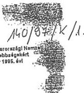
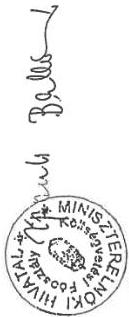

Allami Számverőszék

# JELENTÉS

a Magyarországi Nemzeti és Etnikai
Kisebbségekért Közalapítvány
pénzügyi-gazdasági ellenőrzéséről

373.

1997. JÚNIUS

---

# A vizsgálat végrehajtásáért felelős:
III. Költségvetési Ellenőrzési Igazgatóság

Bihary Zsigmond
számvevő igazgató

Az ellenőrzést vezette:

Balázs Andrásné
számvevő főtanácsos

Az ellenőrzésben részt vett:

dr. Solymár Károlyné
külső munkatárs

---

Állami Számvevőszék  
V-10-16/1997.  
Témaszám: 377

# J E L E N T É S

## a Magyarországi Nemzeti és Etnikai Kisebbségekért Közalapítvány

### pénzügyi-gazdasági ellenőrzéséről

A nemzeti és etnikai kisebbségek jogairól szóló 1995. évi VI. törvénnyel módosított 1993. évi LXXVII. törvény 55. § (3)-(4) bekezdése úgy rendelkezett, hogy a hazai kisebbségek önazonosságának megőrzését, hagyományai gondozását, átörökítését, az anyanyelv ápolását, fejlesztését, szellemi és tárgyi emlékeik fennmaradását, a kisebbségi létből fakadó kulturális és politikai hátrányok mérséklését szolgáló tevékenységek támogatása céljából közalapítványt kell létrehozni.

A Kormány által alapított Magyarországi Nemzeti és Etnikai Kisebbségekért Alapítvány kuratóriuma az alapítvány vagyonát felajánlotta a közalapítvány létesítésére. A felajánlást a Kormány a 2187/1995. (VII.4.) Korm. határozattal elfogadta.

A Magyarországi Nemzeti és Etnikai Kisebbségekért Közalapítvány (MNEKK) célja a fenti törvényben meghatározottak ösztönzése, segítése és sokoldalú támogatása.

A közalapítvány támogatási tevékenysége részét képezi a kisebbségi célok állami finanszírozási rendszerének.

**Az Országgyűlés 19/1997. (III.19.) OGY határozatában felkérte az Állami Számvevőszéket, hogy a Magyarországi Nemzeti és Etnikai Kisebbségekért Közalapítvány pénzügyi-gazdasági tevékenységét törvényességi és célszerűségi szempontból vizsgálja meg.**

Az Állami Számvevőszék 1995-ben - a fejezetek és intézményeik által az alapítványoknak juttatott állami pénzek és vagyon felhasználásának, működtetésének ellenőrzése keretében - ellenőrizte a (köz)alapítványt 1990. évi létrehozásától 1994. évvel bezárólag (Állami Számvevőszék 306. sz. jelentése 2. sz. függelék II. fejezet). Az ellenőrzés összefoglaló megállapítása sze-

---

rint: „... az alapító okirat szükséges módosításának elmaradása, ebből következően a Felügyelő Bizottság, valamint az alapítvány gazdálkodásának teljes körű szabályozottságát biztosító SZMSZ hiánya együttesen eredményezték a gazdálkodási szabálytalanságokat, a pénzügyi, számviteli, bizonylati fegyelem megsértését”.

Az ellenőrzés során arra kerestünk választ, hogy

- a közalapítvánnyá történő átalakulás és működés jogi, szervezeti feltételei hogyan alakultak;
- a közalapítvány gazdálkodása, könyvvezetése szabályos-e;
- a közalapítványnak juttatott központi költségvetési támogatást rendeltetésszerűen, törvényesen és célszerűen használták-e fel;
- az Állami Számvevőszéknek a jogelőd alapítványnál 1995. évben végzett ellenőrzését követően a feltárt hiányosságok megszüntetésére intézkedtek-e.

**Az ellenőrzés 1995. január 1. - 1997. április 30. közötti időszakra terjedt ki.**

A helyszíni ellenőrzésre a közalapítvány székhelyén, Budapesten került sor. Az ellenőrzött szervezettől tanúsítványok formájában bekért adatokat a jelentés összeállítása során feldolgoztuk és hasznosítottuk.

## **I. ÖSSZEGZŐ MEGÁLLAPÍTÁSOK, KÖVETKEZTETÉSEK, JAVASLATOK**

Az ellenőrzés megállapításai szerint a **közalapítvány megalakításának előkészítése nem volt kellően átgondolt, az eredeti alapító okiratban szereplő egyes előírások hibásnak, illetve végrehajthatatlannak bizonyultak.** Az induló vagyon meghatározása pontatlan volt, nem tartalmazta a jogelőd alapítvány által felajánlott vagyonrészt. A megalakulás elhúzódása miatt az induló vagyon terhére kifizetések történtek, de ezzel az összeggel a bejegyzés előtt álló közalapítvány induló vagyonát nem csökkentették.

**A közalapítvány a helyszíni ellenőrzés idején a már módosított alapító okiratnak megfelelően működik, létrehozása - a kezdeti**

2

---

nehézségek megoldása után - célszerűnek és hasznosnak bizonyult.

A közalapítvány a hasonló nevű alapítvány jogutódja lett. Az átalakulás folyamata, a közalapítvány működésének megkezdése az alapító okirat késedelmes jóváhagyása miatt jelentős mértékben elhúzódott. A jogelőd alapítvány kuratóriuma már 1994. novemberében feloszlott és 1995. októberéig - a közalapítvány kuratóriumának megalakulásáig - az alapítvány nem működött, pályázatokat nem írtak ki. Az eredeti alapító okiratot nem hirdették ki, hamarosan megkezdődött a módosítási javaslat kidolgozása. Mindez hátrányosan befolyásolta a közalapítvány jogszerű és tervszerű működését.

Az alapító okirat az alapítvány céljait a törvényi feladatból következő általános célrendszerre építve konkrétabban, de prioritások, illetve felhasználási arányok előírása nélkül határozta meg. Ennek hiánya elsősorban a kisebbségi lapoknak adható támogatás és a közalapítvány többi, hasonlóan fontos célja megvalósításához adható támogatások meghatározásában, a megfelelő arányok kialakításában okoz nehézséget a kuratóriumnak.

Az alapító okirat nem tartalmaz összeférhetetlenségi szabályokat a kuratóriumi tagokkal és a kuratórium működésével kapcsolatban. A gyakorlatban gondot okoz, hogy a kuratórium nem köztisztviselő tagjai delegáló szervezetük révén közvetlenül érdekeltek egyes támogatások odaítélésében, az így keletkező esetleges összeférhetetlenséget a kuratórium az érintettek ellenállása miatt saját hatáskörében nem tudta szabályozni. Célszerű lenne, ha erre vonatkozóan kötelező eljárást maga az alapító okirat tartalmazna.

A közalapítvány kuratóriumát a kisebbségi törvényben meghatározott módon és összetételben alakították meg. Összetételében a delegáló szervezetek részéről történt lemondások, visszahívások következtében nyolc kuratóriumi tag személye változott 1996. év folyamán. A személyi változások - elhúzódásuk miatt - a kuratórium folyamatos munkáját, a döntések meghozatalát akadályozták.

Tevékenységéről az alapítónak eddig még nem számolt be, erre vonatkozó határidőt sem a hatályos jogszabályok, sem az alapító okirat nem tartalmaz.

A kuratórium elkészítette a szervezeti és működési szabályzatát (SZMSZ), mely tartalmazza a módosított alapító okirat szerint a belső szabályozási jogkörébe utalt feladatok részletszabályait, és felöleli a teljes feladatkört.

3

---

A közalapítvány tulajdonába került és a működtetés során változó vagyon megőrzésének, működtetésének és gyarapításának kereteit szabályozó **vagyonkezelési szabályzatot** a kuratórium megkésve, **csak 1997. márciusában hagyta jóvá, az SZMSZ mellékleteként**. A rendelkezésre álló vagyonból - **célszerűen és helyesen - törzsvagyon különítettek el**. A törzsvagyon fokozatos növelését a kuratórium mindaddig tervezi, míg annak kamata nem fedezi a közalapítvány működési költségét.

Az alapító okirat szerint a kuratórium üléseit szükség szerint, de évente legalább négyszer tartja. Megalakulásuk óta **1997. áprilisával bezárólag 27 ülést tartottak**. Az ülések ilyen mértékű gyakoriságát az alapítvány működésének szüneteltetése alatti kérelmek felhalmozódása, majd a működés lehetőség szerinti gyors beindításához szükséges intézkedések sorozata indokolta. A kuratórium üléseiről készített emlékeztetők, jegyzőkönyvek, a hozott határozatok nyilvántartása megfelelő.

A közalapítvány kuratóriumának munkáját öt tagú **felügyelő bizottság** (FEB) ellenőrzi. A felügyelő bizottság **1996. évben** ellenőrzési feladatkörében **ellenőrzést nem folytatott**. Csak 1997. márciusában készítette el az ügyrendjét. A bizottság összetétele 1996. októberében megváltozott, három tag személyében történt változás. 1997. áprilisa óta betöltetlen az elnöki funkció.

A kuratóriumi **döntések előkészítése, végrehajtásának megszervezése** és a közalapítvány **gazdálkodásának** az SZMSZ-ben és a vagyonkezelési szabályzatban meghatározott módon történő **felelős irányítása, a pályázatok kiírása, az értékelés lebonyolítása, a nyertes pályázók elszámoltatása a közalapítvány munkaszervezetének, az irodának a feladata**. Az iroda munkáját a kuratórium által kinevezett **igazgató** irányítja. Az iroda működése megfelel a közalapítvány belső szabályzatainak.

A közalapítvány a kuratórium által **jóváhagyott költségvetés** alapján működik. 1996-ban a központi költségvetésből a Miniszterelnökség fejezet fejezeti kezelésű előirányzataiból 389 millió Ft, 1997-ben 395 millió Ft támogatást kapott.

Az előző évi pénzmaradvány és a befektetések hozama figyelembe vételével 1996-ban 631,7 millió Ft kiadási előirányzatot terveztek.

1997. évre 424 millió Ft támogatás kiosztását tervezi a kuratórium, ami az 1996. évi támogatási lehetőségnél kevesebb. Ennek oka, hogy a kuratórium 1995-ben - működése megkezdésének elhúzódása miatt - nem tudta felhasználni a kapott költségvetési támogatás jelentős részét, és az így keletkezett pénzmaradvány az 1996. évi támogatási lehetőségeket növelte.

---4

---

A közalapítvány kuratóriuma, illetve elnöke eddigi működése során a központi költségvetési támogatás elnyerésére - a támogatás nagyságrendjét illetően - érdemi ráhatást nem tudott gyakorolni. Ezt a közalapítvány részéről részben objektív körülmények - rövid időtartamú működés -, részben a megalapozott és számítási anyaggal kellően alátámasztott javaslatok hiánya magyarázza. Ilyen igényt azonban ez idáig nem is támasztottak a közalapítvánnyal szemben.

A MNEKK által támogatott célok más közalapítványok, ill. a Művelődési és Közoktatási Minisztérium (MKM) támogatási célrendszerében is szerepelnek. Az MKM kezdeményezésére 1996. évben már megkísérelték a támogatott célok és a kedvezményezettek körének összehangolását.

A MNEKK pályázati rendszere az általános identitást őrző programokra, a közép- és felsőfokú oktatásban tanulók ösztöndíjazására, valamint az országos terjesztésű kisebbségi lapok támogatására irányul. A pályázatok elbírálására és lebonyolítására kidolgozott szempontok szerint szociális és foglalkoztatási programokat a MNEKK nem támogatott, mivel ilyen célokat az alapító okirat nem jelölt meg, továbbá a kisebbségi önkormányzatok működési költségeihez nem járult hozzá. 1996-ban a kisebbségi törvényben nem taxált kisebbségek támogatására - mely az alapító okirat szerint nem képezi a közalapítvány feladatát - a kuratórium 4 millió Ft-ot hagyott jóvá. 1997-ben már csak a kisebbségi törvényben taxált kisebbségek kaptak a közalapítványtól támogatást. Körültekintően megszervezték a pályázatok lebonyolítását, a döntések előkészítését, nyilvántartását, a kedvezményezettek elszámoltatását.

A kuratórium eddigi működése során a támogatások odaítélésénél kiemelt figyelmet fordított a roma - mint a legnagyobb lélekszámú hazai - kisebbség megkülönböztetett támogatására.

A támogatási szerződéseket körültekintően állították össze, figyelemmel voltak a tartalmi és pénzügyi elszámoltatás követelményeire, meghatározták a szerződésszegés eseteit és szankcióit is.

Az elszámolások egy része kétséges volt, jellemzően a gyermek - ifjúsági táboroknál a kapott összeg jelentős részét „vendéglátási” kiadások finanszírozására fordították.

A kuratórium 1995. évtől fokozatosan finomította, pontosította az ösztöndíj adományozás feltételeit.

A közalapítvány megerősítette a cigánytanulók ösztöndíj támogatásának elsődlegességét, de az ösztöndíj adományozást - a jogelőd alapítvánnyal szemben - kiterjesztette a nemzeti oktatási program szerint tanuló egyéb kisebbségi tanulókra is. Prioritást kapott a

5

---

**felsőfokú oktatás**, ezen belül a pedagógus, óvónő, szociális munkás, jogi, államigazgatási főiskola, romonológia szakokon tanulók kaptak elsőbbséget.

Az országos terjesztésű kisebbségi lapok megjelenése mind a kisebbségek, mind a Kormány által deklarált érdek. A **Regionális és Kisebbségi Nyelvek Európai Kartája** 1995. évi aláírásával **Magyarország vállalta**, hogy lehetővé teszi egy, a **kisebbségek anyanyelvét használó sajtóorgánum létesítését, fenntartását**. A Magyar Köztársaság a vállalását hat nyelvre (horvát, német, román, szerb, szlovák és szlovén) terjesztette ki. A kisebbségi írott sajtó megjelentetéséhez szükséges **pénzügyi alap a MNEKK-be** épült be, a közalapítvány az **egyetlen olyan költségvetési forrás**, amely **nevesíti a kisebbségi sajtónak adott támogatást**.

A közalapítvány kuratóriuma **1995-ben 11 kisebbség 14 lapjának 142,2 millió Ft** (a roma kisebbség esetében 4 lap támogatását fogadta el), **1996-ban 19 lapnak 165,5 millió Ft**, **1997-ben 15 lapnak 170 millió Ft támogatást biztosított**.

**A pályázókkal támogatási szerződést kötöttek. A pénzben kifejezhető szerződésszegések** kategóriájába sorolták a **terjedelmi és a gyakorisági követelmények** megszegését, valamint az **alacsonyabb példányszámban** való megjelentetést. Ilyen okok miatt zártak ki 3 lapot az 1997. évi támogatásból.

Az 1997. évre rendelkezésre álló összeg az előző évinél mintegy 150 millió Ft-tal kevesebb (az 1996. évi pénzügyi lehetőséget az 1995. évi pénzmaradvány növelte meg), így a **céltámogatások adományozása a maradvány elv alapján határolódott be** (működési költség - ösztöndíjak - laptámogatás). **Elsősorban a laptámogatás összege és ennek növelése osztja meg a kuratóriumot, és képezi feszültség forrását**, mivel a közalapítvány részére biztosított költségvetési támogatás mellett a nagy arányú laptámogatás a közalapítvány egyéb feladatainak ellátását veszélyezteti. **A kisebbségek képviselői a laptámogatást alapvető prioritásnak tekintik a kisebbségi kulturális támogatáson belül**. A lapok támogatásának szabályos felhasználása, a támogatási struktúra kialakítása, a lapok kisebbségi politikát szolgáló belső tartalmának megítélése céljából átfogó hatáselemzéssel szükséges az eddigi lapkiadás és terjesztés helyzetét áttekinteni.

**Az Állami Számvevőszék a jogelőd alapítványnál 1995. évben ellenőrzést végzett. A feltárt és a közalapítvány tevékenységére is áthúzódó érvényű hiányosságokat többségében felszámolták.**

6

---

# Javaslatok

# a Kormánynak

A közalapítvány alapító okiratának módosításánál

- határozza meg a kuratóriumi tagokkal és a kuratórium működésével kapcsolatos összeférhetetlenségi szabályokat;
- írja elő a kuratórium és a felügyelő bizottság beszámolásának konkrét határidejét.

# a Magyarországi Nemzeti és Etnikai Kisebbségekért Közalapítvány Kuratóriumának

1. Tekintse át az eddigi támogatási elveket és azok gyakorlati érvényesülését annak érdekében, hogy a központi költségvetés tervezésének menetében érvényesíteni tudja a közalapítvány részére meghatározott célok és a szükséges források összhangját. A támogatásra vonatkozó pénzügyi igényt megalapozó számításokkal támassza alá.
2. Az összehangolt finanszírozás érdekében kezdeményezzen koordinációt a nemzeti és etnikai kisebbségek támogatásában résztvevő szervezetek között.
3. Készíttessen átfogó értékelést a pályázati úton elnyerhető, és jelentős részarányt képviselő országos terjesztésű kisebbségi lapok belső tartalmát, célorientáltságát, terjesztését, eladási árát stb. illetően, és ennek eredményét, konzekvenciáit érvényesítse a támogatási szerződésekben. A támogatás elszámoltatása terjedjen ki a célnak megfelelő felhasználás ellenőrzésére is.
4. Gondoskodjon arról, hogy a pályázatokhoz csatolandó számítási anyagok (költségvetés stb.), illetve a teljesítések elszámolásának forma - nyomtatványai megalapozott információkat adjanak a támogatási igényről, valamint a szakmai és pénzügyi teljesítésről. A céltámogatásban részesült, kétséges tartalmú elszámolásokat benyújtó kedvezményezetteket lehetőség szerint a helyszínen is ellenőrizzék.
5. Intézkedjen, hogy a közalapítvány pénzügyi, számviteli adminisztrációját végző gazdasági társaság a számviteli rendszert tegye alkalmassá az alapító okiratban megjelölt valamennyi cél támogatási és pénzügyi teljesítési adatainak nyilvántartására.

7

---

6. Vizsgáltassa felül a jogelőd alapítvány záró pénzkészletéről készített elszámolást, tárja fel az eltérések okait, és ennek eredményétől függően tegye meg a szükséges intézkedéseket.

## II. RÉSZLETES MEGÁLLAPÍTÁSOK

### 1. A közalapítvánnyá történő átalakulás

A közalapítvány a hasonló nevű alapítvány jogutódja lett. Az átalakulás folyamata, a **közalapítvány működésének megkezdése** azonban jelentős mértékben **elhúzódott**. A jogelőd alapítvány kuratóriuma már **1994. novemberében feloszlott és 1995. októberéig - a közalapítvány** kuratóriumának létrejöttéig - az alapítvány **nem működött**, nem volt legitim döntéshozó szerve, pályázati kiírások nem születtek.

A közalapítvány létrehozásáról, a **vagyonfelajánlás elfogadásáról, a Nemzeti és Etnikai Kisebbségi Hivatal közreműködésével készített alapító okirat jóváhagyásáról** a Kormány csak 1995. júliusában döntött a **2187/1995. (VII.4.) határozatával**. A közalapítvány bírósági nyilvántartásba vételével kapcsolatban az alapító nevében a Nemzeti és Etnikai Kisebbségi Hivatal elnökének, az alapító okirat kihirdetéséről a Miniszterelnöki Hivatal (MeH) közigazgatási államtitkárának kellett gondoskodnia. Az eredeti alapító okiratot nem hirdették ki. A közalapítványnak csak a módosított alapító okirata került kihirdetésre, a Magyar Közlöny 1996. évi 123. számában.

A **bírósági nyilvántartásba vétel** szintén **elhúzódott**, a Fővárosi Bíróság 6 Pk 62357/5. számú bejegyzésével csak **1995. szeptember 15-én történt meg**.

A kuratórium alakuló ülésére 1995. október 11-én került sor.

Az **1995. évi költségvetésről szóló törvény** a MNEKK részére **470 millió Ft költségvetési támogatást irányzott elő**. A közalapítvány létrehozásáról szóló Korm. határozat már az indulásnál módosította ezt az összeget, és **70 millió Ft-ot** a BM fejezetbe, a **kisebbségi önkormányzatok működésének általános támogatására csoportosított át**. Így a **közalapítvány induló vagyona** az alapító okirat szerint **400 millió Ft lett**, és folyósításának szabályozására az alapító okirat a MeH közigazgatási államtitkárát hatalmazta fel. Az induló vagyonból **1995. végéig csak 310,2 millió Ft-ot** utaltak a közalapítvány számlájára, mivel a MeH

8

---

1995. március és szeptember között a **közalapítványnak jóváhagyott induló vagyon terhére használt fel 89,8 millió Ft-ot** a kisebbségi országos sajtó támogatásokra (1. sz. melléklet).

Az 1995. évi VI. törvény 4. § (2) bekezdése szerint a nemzeti és etnikai kisebbségek jogairól szóló 1993. évi LXXVII. törvénnyel érintett - folyamatos ellátást igénylő - kisebbségi célú tevékenységek pénzügyi támogatását a közalapítvány bírósági nyilvántartásba vételéig a közalapítvány javára elkülönített költségvetési forrásból - kell biztosítani.

Ezt a döntést a támogatandó célok finanszírozásának sürgőssége és szükségessége motiválta, mert a közalapítvány a bírósági bejegyzés elhúzódása miatt még nem volt jogi személy, és így a kuratórium nem dönthetett.

**A közalapítvány induló vagyona a helyszíni ellenőrzés időpontjában is rendezetlen volt.** Az alapító okiratban megjelölt vagyont a MeH felhasználása miatt csak a bírósági nyilvántartásba vételt megelőzően lehetett volna módosítani, a Ptk. 74/A. § (3) bekezdése szerint ugyanis az alapító a nyilvántartásba vétel után az alapítványt nem vonhatja vissza.

Az alapító okirat a **közalapítvány vagyonát** - más tényezők következtében is - **pontatlanul tartalmazza.**

A közalapítvánnyá történő átalakítás során a jogelőd alapítványnál **számviteli zárlat nem készült**, a közalapítvány a jogelőd alapítvány nyilvántartásainak továbbvezetésével folytatta nyilvántartásait. A közalapítvány alapító okiratában az induló vagyonban a **jogelőd alapítvány felajánlott vagyona** sem nevesítve, sem konkrét összegben **nem szerepel.**

Nem tisztázott egyértelműen például az alapítványtól átvett pénzeszközök pontos összege.

Az alapítvány pénzügyi-számviteli adminisztrációját intéző Kurátor Kft. a kuratórium elnökének 1995. december hó 11-i levelében arról adott tájékoztatást, hogy az alapítványnak 1.173.346 Ft tartozása van, 1995. december 8.-ig beérkezett 76.626.440 Ft bevétel, amelyből 27.553.212 Ft került kifizetésre. Az egyszámlán 49.045.834 Ft van, amelyből 800.000 Ft SMARAGD Pénztárjegyben lekötött. Az elszámolás bevétel - kiadás - egyenleg adatai között nincs számszaki összhang, az eltérés okait a helyszíni ellenőrzés befejezéséig nem tisztázták.

9

---

**Az alapító okirat az alapítvány céljait** a törvényi feladatból következő általános célrendszerre építve **konkrétabban határozta meg, de a célok között nem határozott meg prioritásokat.**

**Az alapító okirat** meghatározta a vagyon felhasználásának módját, a gazdálkodás követendő gyakorlatát, a közalapítvány szervezetét és működését is (kuratórium, titkári iroda, felügyelő bizottság működése).

Részben a működés menetében, részben az 1996. áprilisi főügyészégi vizsgálat megállapításai kapcsán azonban felszínre kerültek az alapítói okirat szabályozásának gyakorlati hiányosságai, így **megkezdődtek** az alapító okirat **módosítását célzó** munkálatok.

Az alapító okirat módosítási javaslatát részben az alapítvány címében, a kuratóriumi tagok személyében bekövetkezett változások, terminológiai értelmezések, **döntően azonban a gazdálkodást**, az alapítvány **működését** alapvetően **befolyásoló döntési mechanizmusok, arány változások indokolták.** Az egyik legfontosabb változás a **kétharmados többséggel meghozható döntések körének kibővítése volt.**

Az eredeti alapító okirat e kategóriába csak az SZMSZ és a vagyonkezelési szabályzat elfogadását sorolta. A módosítás minősített többséget írt elő a célok között felsorolt feladatok végrehajtásához felhasználható pénzeszközök mértékéről és a felosztási módjáról, valamint a felosztható tárgyévi költségvetési támogatás éves szinten 25%-ot meghaladó mértékű támogatásról való döntésre.

Az eredeti alapító okirat szabályai szerint a kuratóriumi tag akadályoztatása esetén meghatalmazott útján gondoskodhatott a helyettesítésről. A módosítási javaslat szerint a kuratóriumban döntési jogosultsága csak a **delegáló szervezet** által választott vagy kijelölt személynek van, a helyettesítő csak meghívottként (szavazati jog nélkül) vehet részt.

Az alapítvány működési költségére eredetileg az induló vagyon legfeljebb 4%-a volt felhasználható. A módosítás ezt a **Kuratórium által javasolt** összegre, **de az éves támogatás legfeljebb 7%-ára** változtatta.

A 2306/1996. (XI.13.) Korm. határozat **elfogadta az alapító okirat fenti módosításait. Problémát jelent a közalapítvány működésében az alapítói döntések hosszú átfutási ideje.**

---10

---

## 2. A közalapítvány belső szabályozottsága

Az 1995. október 11-én megalakult kuratórium két fő feladat-esoport legsürgősebb teendőit párhuzamosan kezdte meg, egyrészt a működés, másrészt az alapítványi célokban megjelölt támogatások odaítéléséhez szükséges szakmai döntés előkészítését, szabályozását.

A közalapítvány eredeti alapító okirata alapján kidolgozták az SZMSZ-t is, amely azonban az alapító okirathoz hasonlóan jelentős változtatásokat igényelt. Az új SZMSZ tartalmazza az alapító okiratban a belső szabályozási jogkörbe utalt feladatok részletszabályait, és felöleli a teljes feladatkört:

- a közalapítvány önálló képviseletére való jogosultságot,
- a kuratóriumi és felügyelő bizottsági tagok költségtérítésének módját, mértékét,
- a kuratórium működésének, szervezeti, hatásköri és gazdálkodási rendjének gyakorlatát,
- a kuratóriumi ülések dokumentumait, határozatai hitelesítésére vonatkozó előírásokat,
- a kuratórium elnökének feladatait,
- a közalapítványi iroda és igazgatója éves pénzügyi tervben meghatározott kereteken belüli feladatait,
- a pályáztatások részletes rendjét, kihirdetési, döntés-előkészítési, kezelési szabályait, a szerződéskötésben és a pénzügyi elszámoltatás rendjében a kuratórium és az iroda feladat- és hatáskörét.

A pénzügyi, számviteli és munkaügyi feladatokat határozatlan időtartamú megbízási szerződés alapján a Kurátor Alap- és Alapítvány Kezelő Kft. végzi.

A pénzügyi szolgáltatás keretében a Kft. által végzendő feladatok:

- a kuratóriumi döntések alapján a támogatások pénzügyi átutalásának lebonyolítása,
- havi és éves pénzügyi kimutatás készítése,
- az ideiglenesen szabad pénzeszközök megbízás útján történő lekötése.

11

---

A számviteli munka keretében a Kft. által végzendő feladatok:

- a vagyon és a vagyonváltozások számviteli nyilvántartása,
- a gazdasági események adatainak könyvelése,
- a mérlegbeszámoló, adóbevallások elkészítése, elszámolása.

A könyvelés 1996-tól a jogszabályi előírásoknak megfelelően kettős könyvviteli rendszerben, a Kft. alapítványi könyvelési programja alapján történik.

A munkaügyi szolgáltatások keretében a Kft. által végzendő feladatok:

- teljes körű munkaügyi-, és TB adatszolgáltatás, bérszámfejtés, adó és TB járulék feladás, éves adóigazolások elkészítése.

A szerződés tartalmazza a bankszámlák feletti rendelkezési és utalványozási jogosultak nevét (kuratóriumi elnök, irodaigazgató), a megbízó és a megbízott határidős kötelezettségeit (a munka elvégzéséhez szükséges alapadatok biztosítása és azok teljesítésének átfutási ideje).

A közalapítvány tulajdonába került és a működtetés során változó vagyon megőrzésének, működtetésének és gyarapításának kereteit az 1997. március 27-én jóváhagyott, az SZMSZ mellékletét képező vagyonkezelési szabályzat rögzíti.

A szabályzat a rendelkezésre álló vagyonból törzsvagyont különít el 10 millió Ft nagyságrendben. A törzsvagyont évente a költségvetésből juttatott támogatásból 10 millió Ft-tal kell növelni mindaddig, míg annak kamata nem fedezi a közalapítvány működési költségét. A határ elérése után a törzsvagyon hozadéka szolgál a működési költség fedezetéül.

A vagyon kezelője és a tulajdonosi jogok kizárólagos birtokosa a kuratórium.

A vagyonkezelési szabályzat előírja, hogy a közalapítvány csak az állam által garantált értékpapírokba fektethet be, a közalapítvány kötelezettségeinek veszélyeztetése nélkül. Vállalkozói tevékenységben nem vehet részt, hitelt nem adhat és nem vehet fel. A szabályzat meghatározza az igazgatóság vagyonkezelési és gazdálkodási feladatát, a kuratórium által lefektetett gazdálkodási elvek alapján.

12

---

A támogatások folyósításáról az iroda gondoskodik, a szabályos felhasználást elszámolások bekérésével köteles ellenőrizni. A szerződésszegésből származó visszafizetéseket köteles beszedni.

A közalapítványi iroda 2/1996. számú igazgatói utasításával 1996. októberében elkészítette az **Iratkezelési Szabályzatot**.

A szabályzat meghatározza a közalapítványhoz érkező iratok érkeztetési, iktatási, kezelési és selejtezési előírásait. Az általános rendben elkülönül a pályázatok iktatási, iratforgalmi rendje, megőrzési idejük az általános 2 évvel szemben 5 év.

Az iroda rendelkezik **számviteli politikával, leltár- és házipénztár szabályzattal**, illetve az elnöki keret felhasználásával kapcsolatos szabályzattal.

### **3. A közalapítvány működésének, gazdálkodásának rendje**

#### **3.1. A kuratórium működése**

A közalapítvány 25, majd 26 főre bővített kuratóriumának tagjai delegálás útján kapták megbízatásukat.

##### **A kuratórium tagja**

- a kisebbségi országos önkormányzatok közgyűlése által megválasztott egy-egy képviselő,
- az Országgyűlésben képviselőcsoporttal rendelkező pártok által kijelölt egy-egy személy,
- a belügy-, a külügy-, és a művelődési és közoktatási miniszter, a Gyermek és Ifjúsági Koordinációs Tanács és az MTA elnöke által kijelölt egy-egy személy.

**A kuratórium elnöke** a Nemzeti Etnikai Kisebbségi Hivatal mindenkori vezetője.

**A tagok a kisebbségi törvényben meghatározott módon és összetételben kerültek a közalapítvány kuratóriumába.**

Az alapító okirat nem tartalmaz a kuratóriumi tagokkal és a kuratórium működésével kapcsolatban összeférhetetlenségi szabályokat. A gyakorlatban az egyes döntési folyamatokban azonban felvetődtek összeférhetetlenségi problémák, ugyanis a kisebbségi önkormányzatok sza-

13

---

vazati jogú kurátorral képviseltetik magukat a kuratóriumban, ugyanakkor a közalapítvány pályázatainak résztvevői, támogatásainak kedvezményezettjei is. Az elnök és az iroda javaslata alapján kísérlet történt ennek az ellentmondásnak a feloldására - pályázó önkormányzat kuratóriumi tagja érintettség miatt ne legyen szavazatra jogosult -, de a javaslat nem kapta meg a kuratórium 2/3-os többségét.

A kuratórium kizárólagos jogkörébe tartozik a közalapítványt érintő minden lényeges döntés:

- az SZMSZ és a vagyonkezelési szabályzat elfogadása, módosítása,
- az igazgató kinevezése, felmentése,
- a gazdálkodási elvek meghatározása,
- a munkaterv, az éves gazdálkodási terv, a költségvetés, éves beszámoló elfogadása, jóváhagyása,
- támogatások, ösztöndíjak odaítélése,
- szakértői bizottságok létrehozása,
- könyvvizsgáló megbízása.

A kuratórium összetételében a delegáló szervezetek részéről lemondások, visszahívások következtében nyolc kuratóriumi tag személyében történt változás 1996. év folyamán. A személyi változások - elhúzódásuk miatt - a kuratórium folyamatos munkáját, a döntések meghozatalát időszakonként akadályozták.

Az alapító okirat szerint a kuratórium üléseit szükség szerint, de évente legalább négyszer tartja. Megalakulásuk óta 1997. áprilisával bezárólag 27 ülést tartottak (1995:4; 1996:17; 1997:6.) Az ülések ilyen mértékű gyakoriságát az alapítvány működésének szüneteltetése alatti kérelmek felhalmozódása, majd a működés lehetőség szerinti gyors beindítására vonatkozó intézkedések sorozata indokolta.

A nagyszámú pályázat elbírálására vonatkozó döntési mechanizmus racionalizálása érdekében a kuratóriumi tagokból létrehozott munkacsoportok alakítják ki a pályázatok sorrendjét a kuratóriumi döntés előkészítéséhez.

Az ülésekről szó szerinti jegyzőkönyvek készülnek, amely alapján az iroda készíti el a határozatokat is tartalmazó emlékeztetőket a kurátorok

14

---

részére. Ezek tartalmi és formai szempontból megfelelőek. A kuratórium határozatait számozott nyilvántartási rendben dokumentálják.

### 3.2. A felügyelő bizottság működése

A közalapítvány kuratóriumának munkáját 5 tagú felügyelő bizottság (FEB) ellenőrzi. A bizottság összetétele 1996. októberében megváltozott (az elnök és a pénzügyminisztérium delegáltján kívül a többi tag személyében történt változás).

Az alapító okirat előírásának megfelelően a FEB 1997. március 5-én elkészítette az ügyrendjét.

A FEB feladata, hogy a közalapítvány működéséről készült éves könyvvizsgálói jelentés figyelembe vételével vizsgálja a közalapítvány működését, célvizsgálatot folytasson, ha a célok megvalósulásának veszélyeztettsége fennáll, vagy ha az alapító, illetve a kuratórium erre felkéri. Évente köteles beszámolni az alapítónak.

A FEB 1996. évben a felsorolt ellenőrzési feladatkörökben ellenőrzést nem folytatott.

A kuratórium elnökének felkérésére véleményt nyilvánítottak az országos terjesztésű kisebbségi lapok támogatási rendszeréről. Ebben az odaítélés nagyságrendjére vonatkozóan úgy foglaltak állást, hogy az az alapító okirati kritériumok szerint nem kifogásolható, ugyanakkor a támogatás felhasználásának időszakos ellenőrzésére hívták fel a figyelmet. 1997. évben véleményezték az SZMSZ-t és az 1995. évre vonatkozó, 1997. március 14-én elkészült könyvvizsgálói jelentés megállapításait.

A FEB elnöke 1997. áprilisában lemondott tisztségéről, az elnöki funkció jelenleg betöltetlen. Az alapító okirat szerint a FEB elnökének kijelölésére a Kormány nemzeti és etnikai ügyek felügyeletével megbízott tisztségviselője jogosult.

### 3.3. A közalapítványi iroda működése

A közalapítványi iroda a kuratórium munkáját segítő, ügyintéző, titkársági, pénzügyi, gazdálkodási feladatokat ellátó szervezeti egység.

Feladata a kuratóriumi döntések előkészítése, végrehajtásának megszervezése és a közalapítvány gazdálkodásának - az SZMSZ-ben és a vagyonkezelési szabályzatban meghatározott módon - a felelős irányítása. Munkáját a kuratórium által kinevezett igazgató irányítja.

15

---

Az iroda munkáját 1995. novemberétől a kuratórium által pályázat útján kinevezett titkár vezetésével kezdte meg, minden infrastrukturális háttér nélkül. 1996. márciusától az iroda vezetését - három hónapos próbaidővel, majd ezt követő véglegesítéssel - új vezető vette át, azóta az iroda aktív munkatársainak száma 7 főre nőtt.

Az iroda a kuratóriumi ülések lebonyolításán, a munkaszervezet működtetésén túl végzi a pályázatok nyilvántartását, a nyertes pályázókkal megköti a szerződéseket. Jelenleg egyik fő feladata az elszámolás elveinek kialakítása, és a pályázók elszámoltatása. Folyamatosan végzik a nyertes pályázók szöveges beszámoltatását, a számlák egybevetését a szerződésekkel és az eredeti pályázatokkal, és szereznek többnyire sikerrel érvényt a cél nem teljesítése esetén az adott támogatás visszafizettetésének. Ehhez minden rendelkezésre álló törvényes eszközt igénybe vesznek.

Az iroda olyan számítógépes nyilvántartási rendszert működtet, amely lehetővé teszi a pályázatok adatbázis-kezelőben való nyilvántartását, a határidők figyelemmel kísérését, a mulasztások differenciált szankcionálását.

Az iroda igazgatója a kuratóriumi ülések tanácskozási jogú állandó résztvevője.

### 3.4. A közalapítvány gazdálkodása

A közalapítvány 1996. évi költségvetését az 1996. március 7-i kuratóriumi ülés hagyta jóvá.

1996. január 1-én a közalapítvány vagyona 242,7 millió Ft volt. Az 1996. évi költségvetési törvény 389 millió Ft költségvetési támogatást hagyott jóvá a közalapítványnak, így az év során 631,7 millió Ft-tal gazdálkodhattak az előzetes számítások szerint.

A rendelkezésre álló forrásokból a kuratórium a költségvetési terv alapján pályázati támogatásra 575,7 millió Ft-ot tervezett felosztani: 165,1 millió Ft-ot országos terjesztésű kisebbségi lapokra, 410,6 millió Ft-ot az egyéb pályázati célokra. Pályázati céltartalékra 30 millió Ft-ot különítettek el.

A közalapítvány működési költségeire a költségvetési terv az alapító okiratban meghatározott 4%-os mértéket, azaz 16 millió Ft-ot irányzott elő, a pályázati céltartalékkal együtt 40 millió Ft tartalékot 3 hónapos lejáratú értékpapírba fektettek, a kuratórium jóváhagyásával.

A közalapítvány - az előző évi pénzmaradványon felül - 1996. évben ténylegesen 422,7 millió Ft bevételt realizált.

---16

---

Ebből 389 millió Ft volt a költségvetési támogatás, 33,5 millió Ft a pénzügyi műveletek bevétele, 200 ezer Ft az egyéb bevétel volt.

**Közalapítványi célokra 590,9 millió Ft - pályázati úton odaítélt - támogatást használtak fel.**

A Kurátor Kft. által vezetett számviteli nyilvántartás a kiadásokat nem az alapítványi célrendszerben meghatározott részletességgel tartja nyilván. A főkönyvi kivonat csak 'támogatás magánszemélyeknek', 'támogatás intézményeknek' és 'ösztöndíjak' csoportosítást alkalmaz.

A pénzeszközök alapítványi célok szerinti részletezésben történő felhasználásának áttekintésére - az odaítélt támogatás alapján - az iroda által vezetett belső nyilvántartások adnak lehetőséget. E szerint országos terjesztésű lapok támogatására 165,5 millió Ft-ot, 1995. évben kiírt és 1996. évben aktualizált céltámogatásokra 127,9 millió Ft-ot, 1996. évben kiírt céltámogatásokra 246,4 millió Ft-ot, ösztöndíjakra 46 millió Ft-ot és az elnöki keretből 5,1 millió Ft-ot utaltak ki.

A közalapítvány működési költsége 1996. évben - a beszerzéseket is beleértve - 24,3 millió Ft volt. 1996. novemberében a működési költség mintegy 22 millió Ft volt, így ez időpontig a kuratórium mintegy 6 millió Ft-tal lépte túl a hatályos alapító okirat szerint engedélyezett 16 millió Ft-os mértéket.

A kuratórium csak 1995. októberében kezdte el működését, ezért az 1995. évi támogatás felhasználásának jelentős része 1996. évre húzódott át, az 1996. évi működési költségeket is megnövelve. Az engedélyezett költségkeret maradéktalan betartását - az alapító okirat módosításának elhúzódása miatt - csak a tevékenység felfüggesztésével lehetett volna elkerülni. Mindez magyarázza a kuratórium eljárását, de nem mentesíti az alól, hogy az alapító okirat rendelkezéseinek betartása kötelező.

A működési költség 7 %-os mértékre növelése hatályba lépésének időpontját a módosított alapító okirat nem jelölte meg, így éves szinten a működési költség az engedélyezett keretek között maradt.

Az összes kiadás 34% -át - 7,5 millió Ft-ot - a kifizetett bér és TB járulék tette ki. Az irodahelyiségért kifizetett bérleti díj 2 millió Ft volt, az összes működési költség 9 %-a. Az év folyamán 1,2 millió Ft-ot tett ki a posta és a telefonköltség. (Az ösztöndíjak kifizetése havonta történt, zömében postai átutalással. 1257 ösztöndíjas volt, egy átutalás postai költsége 95 Ft.)

17

---

Az ún. egyéb költség tette ki az összes költség 30%-át, 6,6 millió Ft-ot. Ebben bennfoglaltatik a Kurátor Kft. 2,5 millió Ft-os megbízási díja (az 1995. IV. negyedévi díjat is ebben az évben egyenlítette ki az iroda). A kiírt pályázatok két országos napilapban történő meghirdetését az SZMSZ írja elő. Az 1996. március és július hónapban a Népszabadságban és a Magyar Hírlapban megjelentetett hirdetések díja 1,5 millió Ft volt. A kuratóriumi üléseken hivatásos gyorsírók készítették a szó szerinti jegyzőkönyveket, ezek díja 300 ezer Ft volt.

Megközelítőleg 2,2 millió Ft értékben történtek beszerzések, 3 db számítógép vásárlásra 1,5 millió Ft, pályázati nyilvántartási programra 350 ezer Ft, az új irodába költözés miatt berendezésre 200 ezer Ft került felhasználásra.

**1996. dec. 31-én** a közalapítvány számláján 10,3 millió Ft, a pénztárban 21 ezer Ft volt. Az értékpapírok beszerzési áron számolt értéke 37,4 millió Ft volt. A közalapítvány 1996. év végén 730 ezer Ft - áthúzódó - elszámolt, de még pénzügyileg nem rendezett tartozással rendelkezett (SZJA, TB).

**Az 1997. évi költségvetést** az 1997. február 20-i kuratóriumi ülés tárgyalta és fogadta el. **395 millió Ft központi költségvetési támogatással**, az 1996. évi pénzmaradvánnyal, a pénzlekötések és visszakövetelések kamataiból 22 millió Ft-tal, a Gyermek és Ifjúsági Koordinációs Tanács 1 millió Ft-os felajánlásával, **összességében 461,5 millió Ft bevétellel számoltak**.

#### **A főbb kiadási előirányzatok:**

- a **működés költségeire** az éves központi költségvetési támogatás 7%-át, **27,6 millió Ft-ot** hagyott jóvá a kuratórium, amelyből 4,6 millió Ft-ot tartalékként kezelnek,
- az 1996/97. tanév II. félévére **42 millió Ft ösztöndíj fizetési kötelezettség volt, ezt az összeget tartalékba helyezték**,
- 1997-ben **pályázati úton 370 millió Ft-ot terveznek kiosztani**:
  - az 1997/98-as tanév I. félévi **ösztöndíjra 28 millió Ft-ot**,
  - elnöki keretre **3 millió Ft-ot**,
  - általános pályázati tartalékra 22 millió Ft-ot,

18

---

- 1997. évi kuratóriumi döntést igénylő felosztható keretre 317 millió Ft-ot.

**A közalapítvány az alapítónak eddig még nem számolt be a tevékenységéről.**

A beszámolót a kuratórium 1997. március 27-i ülésén elfogadta, de a Kormány még nem tárgyalta.

A közalapítvány a MeH politikai államtitkárának 807/97/1 sz. levelében jelezte beszámolási készségét, aki azt az alapító okirattal összhangban az 1996. évi mérlegről készült könyvvizsgálói jelentés, illetve a felügyelő bizottság véleményének megléte után tartotta megfelelőnek.

A közalapítvány könyvelését a Kurátor Kft. végzi és a jogszabály szerint az eredmény-kimutatást és a mérleget könyvvizsgálónak kell auditálni. Az 1995. évi mérleg auditálása jelentős késéssel történt meg, az alapító okirat módosításának elhúzódására és pénzügyi nehézségekre hivatkozva. A kuratórium 1997. január 16-i ülésén hozott döntést az 1995. évi és az 1996. évi könyvvizsgálói megbízásról, a szerződést február hónapban kötötték meg.

#### **4. A közalapítványnak adott központi támogatás rendeltetésszerű törvényes, célszerű felhasználása**

##### **4.1. Az alapító okiratban megfogalmazott közalapítványi célok teljesítése**

A pályázati rendszer fő csoportjai az úgynevezett céltámogatások, az általános identitást őrző programok, a közép- és felsőfokú oktatásban tanulók ösztöndíjazása, valamint az országos terjesztésű kisebbségi lapok támogatása. Az 1996-os évben pályázati úton, illetve elnöki keretből megvalósuló pályázatokra - 1995. évben kiírt célpályázatokra 127,9 millió Ft, 1996. év tavaszán kiírt célpályázatokra 246,4 millió Ft, 1995/96. tanév ösztöndíjaira 18,0 millió Ft, 1996/97. tanév I. félévére (dec. 31-ig) 28,0 millió Ft, kuratóriumi elnöki keretből 5,1 millió Ft, kisebbségi laptámogatásra 165,5 millió Ft - összesen 590,9 millió Ft-ot ítéltek oda.

A kuratórium az alapító okiratban meghatározott célokat túlhaladóan támogatta a pályázati rendszer keretében 1995-1996 években a kisebbségi törvényben el nem ismert kisebbségeket, 1995-ben 550 ezer Ft, 1996-ban 3,3 millió Ft összegben. A helyte-

19

---

len gyakorlatra a FEB hívta fel a kuratórium figyelmét. Ezt követően 1997. februárja óta csak a kisebbségi törvényben taxált kisebbségek kapnak a MNEKK-től támogatást.

# 4.1.1. Az 1995. évben kiírt célpályázatok

Az 1995. november 15-i kuratóriumi ülés általános pályázat kiírásáról döntött, amelynek beérkezési határidejét 1995. december hó 20-ában állapította meg.

Az 1995-ös általános pályázatok kiírása még nem tematikus egységek szerint történt. A kiírás pályázati felhívásból és pályázati útmutatóból állt, s mivel a kiírás 1995-re szólt, olyan programokat is támogatott, amelyhez utófinanszírozást kértek.

A benyújtandó pályázathoz kérték a lezajlott program részletes leírását (esetleg fényképes illusztrációt), a program tételes költségvetését, a költségek számlákkal való alátámasztását, a kért összeg megjelölését, esetleg annak a forrásnak a megjelölését, amelyből a programot finanszírozni tudták.

Kidolgozásra kerültek a pályázatok elbírálási és lebonyolítási szempontjai:

- szociális és foglalkoztatási programokat a MNEKK nem támogatott,
- a kisebbségi önkormányzatok muködési költségeihez nem jarult hozza,
- támogatta a kisebbségi törvenyben el nem ismert kisebbségeket is,
- al - kuratoriumokat hozott létre a pályázatok attekintésere, javaslattételei joggal (a fóugyészégi vizsgálat kifogása alapján ezek késöbb munkabizottságok lettek),
- támogatási szerzódés-tervezetét keszítétt a titkárság,
- a támogatástCsak a szerzódés megkötese utan folyositot-ták.

A kiírásra a 13 taxált és 1 nem taxált kisebbség részéről 1.261 pályázat érkezett, amelyből 774 db nyertes pályázat született, a támogatás összege 127,9 millió Ft volt.

A megítélt támogatások közel 70%-a három felhasználási területhez kötődött: hagyományőrzés céljaira 54 millió Ft,

20

---

oktatási programhoz 22 millió Ft, kiadói tevékenység támogatására 13 millió Ft.

A megítélt támogatási összeg 30%-át a cigány, 19%-át a német, 16%-át a szlovák kisebbségek által benyújtott pályázatok nyerték el.

Az egy pályázatra adott legkisebb összeg 15 ezer Ft, a legnagyobb összeg 2 millió Ft volt.

#### **4.1.2. Az 1996. tavaszán kiírt célpályázatok**

**Az 1996. áprilisig beérkező céltámogatásokra a kiírás már tematikus egységek szerinti felbontásban történt, konkrétan pályázható célokat határoztak meg:**

- - anyanyelvi színházi tevékenység támogatása,
- - a kisebbségi nyelvet oktatók és egyéb művelődési területen dolgozó szakemberek támogatása,
- - kisebbségi kiadói tevékenység, irodalom terjesztés, kisebbségi nyelven megjelent irodalmi alkotások, műfordítások támogatása,
- - könyvtár, közgyűjtemény, műemlékvédelem,
- - kisebbségi kutatás,
- - kisebbségi közéleti szakemberek szakmai és anyanyelvi képzésének támogatása,
- - kisebbségi média,
- - nemzetközi kapcsolatok,
- - regionális és országos gyermek- és ifjúsági rendezvények, versenyek, vetélkedők,
- - kisebbségi hitélet,
- - kisebbségi írott sajtó.

**Az általános pályázati felhívás tematikája:**

- a kisebbségi közösségek hagyományápoló és identitást őrző tevékenységének,

---21

---

- a kisebbségi közösségek közötti kapcsolatot elősegítő rendezvényeknek,
- a többségi társadalommal való kapcsolat erősítését elősegítő rendezvényeknek

a támogatása volt.

A pályázati kiírás pontosan megjelölte az elérendő célt.

A pályázati kiírásra 2.358 pályázat érkezett, mintegy 1,2 milliárd Ft összegre. Az elfogadott pályázatok száma 1.243 db volt, 246,4 millió Ft támogatási összeggel.

Az elutasított pályázatok mintegy harmada forráshiány miatt kapott elutasítást, kétharmaduk a kiírásban szereplő feltételeknek nem felelt meg (pl. beadott pályázatok 16%-a a kiírásban nem szereplő témára pályázott, 13%-a nem adott be programot, 14%-a nem vagy hiányos kalkulációt készített, 10%-a nem csatolt szakmai referenciát).

A támogatások mintegy 65%-a négy programra irányult. Közel 40%-a úgynevezett közösségi programokat - hagyományőrzés, gyermek-, ifjúsági táborok -, 12-12%-uk oktatást, illetve kiadói tevékenységet támogatott. Az elfogadott pályázatok megítélt összegének 44%-a a cigány, 13%-a a német, 13%-a az interetnikus kisebbségek céljait szolgálta. Az egy pályázatra adott legkisebb összeg 20 ezer Ft, a legnagyobb összeg 2,5 millió Ft volt.

A támogatási szerződések az általános adatokon kívül tartalmazták a támogatási összeget, a pénzügyi elszámolás időpontját és azzal egyidejűleg a tevékenység teljesítésének írásbeli összefoglalását. A kuratórium előírta, hogy a készültség fokáról bármikor tájékoztatást és szükség esetén pénzügyi rész - elszámolást kérhet.

Meghatározták a szerződésszegés eseteit: célok, programok egyoldalú megváltoztatása, a kitűzött határidők elmulasztása, nem megfelelő mennyiségű, minőségű teljesítés. Szerződésszegés esetén a pályázó két évig kizárja magát a pályázati lehetőségből.

A szerződés 1997. évben pontosításra került a mennyiségi és minőségi paramétereket illetően, továbbá a szerződések mellékleteként elszámolási útmutató került kiadásra.

Az elszámolással kapcsolatban sok problémája volt a közalapítványnak, figyelmetlenség vagy a kellő szakszerűség hiánya miatt több kétséges számlát csatoltak a beszámolókhoz a pályázók. Általános tapasztalat, hogy az úgynevezett közösségi programoknál, gyermek-, ifjúsági tá-

22

---

boroknál a kapott összeg jelentős részét „vendéglátási” kiadások finanszírozására fordították.

# Az elszámolások típus-hibái:

- nem vették figyelembe a pályázat tartalmát, a pályázati költségvetést, más programot valósítottak meg, mint amit a kuratórium támogatni kívánt,
- nem küldtek írásos beszámolót, vagy alapvető információkat sem tartalmazó beszámolók érkeztek,.
- hiányoztak a tételes pénzügyi elszámoláshoz a számla-másolatok,
- beküldött számla-másolat nem illett a programhoz.

A két program kapcsán száz pályázót köteleztek visszafizetésre 8,3 millió Ft értékben. Ebből 4,7 millió Ft visszafizetése történt meg (71 pályázó). Négy millió Ft megmaradt a megszüntetett támogatásokból és ugyanebben a célcsoportban újraosztható lesz.

# 4.1.3. Az 1995/96-os tanév ösztöndíj támogatása

Az 1995/1996-os tanév I. félévére a kiírás nélkül beérkezett ösztöndíj pályázatokról a kuratórium 1995. november 15-i ülésén döntött, amelyben meghatározta, hogy a középfokú oktatás keretében résztvevő tanulók havi 5 ezer Ft, a felsőfokú oktatásban résztvevők havi 7 ezer Ft ösztöndíjban részesülhetnek. A jogosultságot az iskolalátogatási igazolás, és a családi körülmények alapján határozták meg. Az 1995/1996-os tanév II. félévére a jogosultságot az iskolalátogatási igazolással, a félévi bukás nélküliséggel, a megengedett hiányzásnál nem nagyobb kimaradásokkal kellett igazolni. Aki ezeknek megfelelt, valamint az első félévben is támogatott volt, részesülhetett a továbbiakban is ösztöndíjban.

Az 1995/1996-os tanévben a közalapítvány 434 középfokú oktatásban tanuló diákot részesített ösztöndíj támogatásban. Ebből 171 fő az I. és II. félévben is részesült ösztöndíjban, 263 fő csak az I. félévben.

Az első félévben 10,9 millió Ft, a második félévben 4,3 millió Ft került felhasználásra, összesen 15,2 millió Ft.

Az 1995/1996-os tanévben felsőfokú oktatási intézményben tanuló diákok köréből 61 részesült ösztöndíjban. Ebből 38 fő az I. és II. félévben is, míg 23 fő csak az I. félévben. Az I. félévben 2,2 millió Ft, a II. félévben 1,3 millió Ft, összesen 3,5 millió Ft került felosztásra.

23

---

Az évközbeni lemondások következtében a kiutalt összeg **összességében 18 millió Ft volt.**

Az ösztöndíjban részesülőkkel a közalapítvány szerződést kötött, amelyben a tanulók kötelezték magukat, hogy a féléves tanulmányi eredményről igazolást - hiteles másolatot - nyújtanak be. Fontos feltétel, hogy más támogatótól ösztöndíjat nem fogadhatnak el. A támogatási körből való kiesés legfőbb okai: a szerződést nem küldte vissza, abbahagyta a tanulást, hamisított bizonyítványt küldött be, megbukott vagy nem fejezte be a félévet.

Az ösztöndíj folyósítás kapcsán 30 főt köteleztek visszafizetésre, mintegy fél millió Ft összegben, a visszafizetést teljesítők száma 7 fő volt 133 ezer Ft összegben.

#### **4.1.4. Az 1996/1997-es tanév ösztöndíj támogatása**

Az 1996/1997-es tanév ösztöndíj pályázatok **koncepciójáról az 1996. június 20-i** kuratóriumi ülés hozott döntést. A **koncepció a támogatottak körét bővítette**, és az ösztöndíj jogosultság feltételeit az oktatásban való részvételen és a szociális körülményeken túlmenően **más feltételekhez is kötötte.**

A jogelőd alapítvány működése alatt csak a cigány tanulók részesültek ösztöndíjban, a közalapítvány ezt kiterjesztette a nemzeti oktatási program szerint tanuló egyéb kisebbségi tanulókra is, középfokú oktatás esetén akkor, ha tanulmányi átlaguk eléri a 3,8 -et.

**A közalapítvány megerősítette a cigánytanulók ösztöndíj támogatásának prioritását.**

**Prioritást kapott a felsőfokú oktatás**, ezen belül a pedagógus, óvónő, szociális munkás, jogi, államigazgatási főiskola, romonológia szakokon tanulók kaptak elsőbbséget.

A kuratórium az 1996/1997. évi ösztöndíjakra 70 millió Ft-ot szavazott meg.

A szeptember 30-ra beérkezett **pályázatok száma 2.173 db volt**, megközelítőleg 50-50% -ban oszlott meg a felső és középfokú tanintézetek tanulói között. A pályázatok 50%-a cigány tanulók részéről érkezett. Az **elfogadott pályázatok száma 1.257 db, 900 fő - 72% - középfokú, 357 fő - 28% - felsőfokú** iskolatípusban tanuló fiatal számára. A nyertes középfokú ösztöndíj pályázatok 75%-a cigány tanuló, ez az arány a felsőfokú oktatásban részesülőknél 31%. Az elutasított felsőfokú tanulmányi ösztöndíj pályázatok mintegy 60%-a forráshiány miatt került elutasításra, így nem érvényesült az a kuratóriumi elv, hogy a felsőfokú oktatás kiemelt támogatást élvezzen.

24

---

#### 4.1.5. A kuratóriumi elnöki keret felhasználása

A közalapítvány alapító okirata lehetővé teszi, hogy a kuratórium elnöke a kuratórium utólagos tájékoztatásával a közalapítvány céljaival összhangban 1996. novemberéig éves szinten értékhatár nélkül, ezt követően - a módosított alapító okiratnak megfelelően - évente 3 millió Ft keretösszeg felhasználásáról döntsön. **A kuratórium működése óta az elnöki keretből 36 pályázónak 5,1 millió Ft kiutalása történt meg.** A legmagasabb összeg 400 ezer Ft, a legalacsonyabb 12 ezer Ft volt. A kuratórium elnöke döntéseinél betartotta a két ülés között az alapító okiratban limitált értékhatárokat, a támogatott szervezetek között azonban - a közalapítvány céljait meghaladóan - a kisebbségi törvényben nem taxált kisebbségeket is támogatott.

**A közalapítványi célnak megfelelően** kapott támogatást pl. a sátoraljaújhelyi Cigány Hagyományőrző Egyesület 400 ezer Ft, Bibó Szakkollégium Egyesület (Interetnikus) 300 ezer Ft, a magyarországi Lengyel Katolikusok Szent Adalbert Egyesülete 150 ezer Ft összegben.

**A közalapítvány céljait túlhaladóan** kapott támogatást Maimonidész: zsidó filozófia c. könyv megjelentetése 150 ezer Ft, a Zsidó Művészetek Háza Pécs 200 ezer Ft, az African Center Budapest 219 ezer Ft, a cseh Bohémia bál és folyóirat 244,6 ezer Ft összegben.

A kuratórium elnöke beszámolt a kuratóriumnak az elnöki keret felhasználásáról, melynek során a kuratórium kötelezte az elnököt a támogatások kiutalásának, illetve az irodát a kiutalás előtt az ellenjegyzések meglétének ellenőrzésére. A helyszíni - szűrőpróbaszerű - ellenőrzés nem talált kurátori ellenjegyzés nélkül kiutalt elnöki támogatást.

#### 4.1.6. Országos kisebbségi lapok támogatása

Az országos terjesztésű kisebbségi lapok megjelenése mind a kisebbségek, mind a Kormány által deklarált érdek. A **Regionális és Kisebbségi Nyelvek Európai Kartája** 1995. évi aláírásával **Magyarország vállalta**, hogy lehetővé teszi egy, a **kisebbségek anyanyelvét használó sajtó-orgánum létesítését, fenntartását.** A Magyar Köztársaság a vállalását hat nyelvre (horvát, német, román, szerb, szlovák és szlovén) terjesztette ki.

A kisebbségi írott sajtó megjelentetéséhez szükséges **pénzügyi alap a MNEKK**-ba épült be, a közalapítvány az **egyetlen olyan költségvetési forrás**, amely **nevesíti a kisebbségi sajtónak adott támogatást.**

25

---

A kisebbségi lapok támogatásának új rendszere 1995. évtől került a közalapítvány költségvetésébe és kuratóriumának döntési kompetenciájába. A Nemzeti Etnikai Kisebbségi Hivatal akkori elnöke 1995. szeptember 15-én írt levelében felkérte a kisebbségi lapok főszerkesztőit lapjuk költségvetési és működési kereteinek ismertetésére (a lap jellege, a megjelenés gyakorisága, oldalszám, méret, nyomtatott-, eladott példányszám, előfizetők száma, a szerkesztőség gazdálkodása: támogatás, eladás bevételei, kiadói hozzájárulás, kiadások, a szerkesztőség működési feltételei).

A közalapítvány kuratóriuma 1995. október 25-én jóváhagyta 11 kisebbség 14 lapjának 142,2 millió Ft-os 1995. évi támogatását. (A roma kisebbség esetében 4 lap támogatását fogadták el.)

Az 1995. évi támogatás 42%-kal volt magasabb, mint az előző évben folyósított támogatási összeg (egyes lapok támogatása több, mint kétszeresére emelkedett). A döntés összefüggésbe hozható az ez évben ratifikált nemzetközi vállalásokkal, valamint a magasabb támogatás a kisebbségi lapszerkesztőségek jobb infrastruktúrájának kialakításához kívánt fedezetet biztosítani.

Az 1996. évi laptámogatások elveiről, a pályázat rendjéről, a pályázat feltételeinek kidolgozásáról, a vállalt kötelezettségek teljesítésének ellenőrzéséről az 1995. november 15-i kuratóriumi ülés döntött. A kuratórium - tagjaiból - sajtóbizottságot hozott létre.

A laptámogatási pályázat kiírásának és elbírálásának elvei a következők voltak:

- a kiadott adatlap szerinti teljes adatszolgáltatás,
- a szerkesztőség és kiadó együttes pályázóként való megjelenése,
- taxált nemzetiségenként egy-egy lapot támogat a közalapítvány,
- roma lapok esetén kuratóriumi döntés határozza meg a támogatásban részesülő lapot,
- a finanszírozás szakértői modell számítás alapján történik, figyelemmel a hasonló magyar lapokra,
- költségkalkuláció határozza meg a támogatás egyes elemeit, amely tartalmazza a megjelenés gyakoriságát, a példányszámot, a méretet, a papír minőségét, az illusztráltsági fokot, jelleget, az előfizetők számát, a szer-

26

---

kesztés személyi, infrastrukturális, nyomda- és terjesztési költségét,

- a kuratórium a finanszírozási elveket és összegeket határozza meg, a megjelenés gyakorisága, formátum, papírminőség, példányszám a kisebbség döntési kompetenciájába tartozik,

- az adatok valódiságát és a támogatás felhasználását ellenőrzik.

Az odaítélést elbíráló 1996. február 29-i kuratóriumi ülés az albizottság által előterjesztett javaslatot vitatta meg. 1996. évre 27 lap támogatására érkezett pályázat. Az elbírálásnál az albizottság minden pályázattal foglalkozott, javaslatánál az „egy kisebbség- egy lap biztosítása” elvét és a szakértő által kalkulált nyomda költségeket vette figyelembe.

A kisebbségi lapoknak adandó támogatás a kuratórium egyik legnagyobb vitát kiváltó és a kuratóriumot megosztó döntések közé tartozik.

A kért támogatás összege 287,5 millió Ft volt. Ezen belül pl. a pályázók által kalkulált nyomda költség 96 millió Ft, a szakértő által kalkulált 71 millió Ft volt. A kuratórium döntése alapján 19 lap kapott összesen 165,5 millió Ft támogatást (2. sz. melléklet).

Az 1995. évben támogatott lapok közül forráshiány miatt négy lap - a Barátság, a Bem Híradó, a Cesta Pravda Zivot és a Cigányfúró - nem részesült támogatásban.

A kuratórium külön tárgyalta a kisebbségi lapok, külön a cigány lapok támogatási összegét.

A kisebbségi lapoknál a kuratórium 12 igen, 4 nem és 1 tartózkodás mellett, a cigány lapoknál 9 igen, 4 nem, 4 tartózkodás mellett elfogadta a 2. számú mellékletben ismertetett támogatásokat.

Már ezen a kuratóriumi ülésen felmerült az az igény, hogy a következő évre ki kell dolgozni egy olyan - szerkesztőségi költségekre vonatkozó - modell - rendszert, amellyel a beérkező pályázatokban szereplő igényeket objektívebb módon lehet megítélni.

A pályázatot elnyert lapok támogatási szerződésében a támogatás felhasználásának követelményrendszere konkrét formában került meghatározásra, amely előírja a pályázók vállalásait:

---27

---

- támogatási idő alatti megjelentetés gyakorisága, példányszáma, terjedelme, nyelve, terjesztési módja, formátuma,
- minden lapszámban a támogató közalapítvány nevének feltüntetése, a megjelenő lapok közalapítványnak történő megküldése,
- pályázó pénzügyi elszámolási kötelezettségeit, a szerződésszegés eseteit,
- az 1997. május - december közötti időszakra kötött szerződések már nem engedélyezték, hogy a támogatásból felhalmozási, reprezentációs és oktatási kiadásokat finanszírozzanak a kedvezményezettek.

A közalapítvány szerződéses kötelezettségei a támogatás folyósítás ütemezésére, a szerződés felbontására, nem teljesítés esetén a támogatás visszakövetelésére vonatkoztak.

A közalapítványi iroda kidolgozta a sajtó pályázatok elszámolási metodikáját, a visszakövetelés számítási módjait.

A pénzben kifejezhető szerződésszegések kategóriájába sorolták a terjedelmi és a gyakorisági követelmények megszegését, valamint az alacsonyabb példányszámban való megjelentetést.

Ennek alapján 11 szerződőnél 6,8 millió Ft visszafizetési kötelezettséget írtak elő, amelyből 2,6 millió Ft 1996-ban visszafizetésre került. Az 1996-ban támogatott Kethero Dom, Cigány Hírlap, Rom-Som lapoknál olyan mértékű hiányosságok merültek fel a megjelent lapszámokat, ezek vállalt gyakoriságát és terjedelmét illetően, hogy a kuratórium e lapokat az 1997. évi támogatásokból kizárta.

Több lap figyelmeztető levelet kapott a lapszámok közalapítványnak való megküldésének elmulasztása, az elszámolási határidő késedelme, a közalapítvány, mint laptámogató lapban történő feltüntetésének elmulasztása miatt. Az érintett lapoknál a visszakövetelés mértékeként meghatározott összeget az 1997. I. negyedévi támogatásból levonták.

Az ellenőrzés véleménye szerint célszerű lenne, ha a támogatás elszámoltatása kiterjedne a célnak megfelelő felhasználás ellenőrzésére is, és alapvetően a más célra történt felhasználás járna a visszatérítés szankciójával.

#### 4.2. A közalapítvány kuratóriumának 1997. évi döntései

A kuratórium az 1997. évi támogatási keret felosztásánál és kiírásánál a tematikus egységek között preferencia sorrendet állapított meg. A preferá-

28

---

landó célok között jelölte meg a közéleti szakember képzést, a kisebbségi témájú kutatást és a könyvtár fejlesztést. Ennek alapján - több menetben történő tárgyalás után - az 1997. május 6-i kuratóriumi ülés elfogadta a támogatási keretek felosztási tervét: céltámogatásokra 159 millió Ft, elnöki keretre 3 millió Ft, ösztöndíjakra 70 millió Ft, laptámogatásra 170 millió Ft, tartalékra 22 millió Ft, összesen 424 millió Ft.

Az 1997. évre rendelkezésre álló összeg az előző évinél mintegy 150 millió Ft-tal kevesebb, így a céltámogatások lehetőségei a maradvány elv alapján határolódtak be (működési költség - ösztöndíjak - laptámogatás).

Az 1996. évi támogatási lehetőségek magasabb összegét az 1995. évi pénzmaradvány okozta.

4.2.1. Döntés született az 1997. február 19-i pályázat kiírásról, amely konkrétságát és az elbírálási szempontokat illetően az objektivitás irányában fejlődött.

A céltámogatás keretében támogatott témák:

- gyermek-, ifjúsági- és oktatási programok, kisebbségi életmód táborok,
- kisebbségi közéleti szakember képzés,
- kisebbségi anyanyelvi regionális média,
- kisebbségi témájú kutatás,
- kisebbségi kiadói tevékenység, irodalom terjesztés, műfordítás,
- hivatásos és amatőr kisebbségi anyanyelvi színházi tevékenység,
- kisebbségi hitélet,
- kisebbségi könyvtár, közgyűjtemény, kisebbségi képzőművészek alkotó tevékenységének támogatása.

Változtatást jelentett a pályáztatás rendjében, hogy egységenként szétbontva 1997. március 20. - október 1. között, más-más határidővel, illetve folyamatosan lehet beküldeni a pályázatokat.

A kiírt pályázatoknál egységes elvként és elbírálási szempontként kezelik és előnyben részesítik a hosszabb távú, tematikus és koncepcionálisan átgondolt programokat, kiemelten kezelik az anyanyelv jelenlétének súlyát. A közösségi rendezvényeknél új szempont az idei kiírásban a maximá-

29

---

**lisan adható támogatások nagyságának közzététele.** Az adható támogatás mértéke attól függ, hogy nemzetközi, országos, regionális illetve helyi rendezvényre kérik-e a támogatást.

Az általános szempont - rendszerben előírták annak megjelölését, hogy a pályázónak milyen egyéb forrás áll rendelkezésre, eligazítást adtak a kiírással, a költségvetéssel kapcsolatos tudnivalókról. A pályázónak az adatlapon kötelezettséget kell vállalni a kapott támogatások maradéktalan elszámolására.

**4.2.2. Kiírásra kerültek az 1997/98-as tanévre vonatkozó ösztöndíj pályázatok** mind a középfokú, mind a felsőfokú oktatási intézmények tanulói részére.

Az ez évi pályázati kiírás az előző évi feltételekhez képest szigorításokat, illetve nagyobb teljesítmény - követelményt fogalmazott meg. A középfokú tanintézetben tanuló cigány diákok részére pályázati feltételként került meghatározásra a 3-as tanulmányi átlag és az 1996/97-es tanév elégtelen osztályzat nélküli lezárása.

A nemzeti etnikai kisebbséghez tartozó közép- és felsőfokú tanintézményben tanulóknál a kisebbségi önkormányzat, kulturális szervezet vagy más kisebbségi közösség írásbeli ajánlata is szükséges.

**4.2.3. Az 1997. évi országos terjesztésű kisebbségi laptámogatásra vonatkozóan 1997. február 13-án** kuratóriumi határozat született arról, hogy a közalapítvány 1997-ben is támogatja azokat a lapokat, amelyek 1996-ban támogatásban részesültek, kivéve a már említett három lapot, amelyeknél az elszámolással kapcsolatban hiányosságok merültek fel.

Az 1997. évi további finanszírozás elveinek kidolgozására a kuratórium szakértő bizottságot hozott létre a kuratóriumi tagokból, melynek munkájában két külső szakértő is részt vett. A javaslatnak ki kellett térni az egyes lapok által kért támogatás és a valós költség arányára, rá kellett mutatni a megtakarítás lehetőségeire, ki kellett számolni, hogy az adott lap előállítása piaci áron mennyibe kerül.

A két külső szakértő szakvéleménye a terjesztés, nyomdai költségek vizsgálatára terjedt ki. Megállapításaik lényege, hogy a lapok többsége terjesztési problémákkal küzd. Terjesztési stratégiájuk a postai terjesztéstől az ingyenes juttatásig terjed. Az értékesítés aránya 1,15% (ingyenes - 45,5% között). A kisebbségi lapokat átlagban a kisebbségi lakosság 10%-a olvassa.

---30

---

A nyomda-műveleti szempontból készített szakvélemény műszaki elavultságot állapított meg több lapnál.

A szakértők javasolták, hogy

- a közalapítvány hozzon létre közös adatbázist a kisebbségi média párhuzamos finanszírozásának kiszűrésére (az MKM támogatja a Neue Zeitung-ot, az Amaro Drom-ot és a Phralipe-t);
- vezessenek be kettős árat;
- szüntessék meg az ingyenes lapok támogatását;
- legyen piacorientált a finanszírozás;
- a minőségileg nem megfelelő lapoknál támogatási feltételként írják elő a minőség javítását.

A kuratóriumi tagokból alakult sajtóbizottság szerint a példányszám e lapoknál alacsony, ezért csak gazdasági megfontolások alapján nem jelenhetnek meg. Fontosnak ítélték továbbá, hogy nemzetiségenként egy lapot, a roma kisebbségnél legalább kettőt teljes körűen finanszírozzon a közalapítvány.

Jelenleg feszültség forrása a laptámogatás összege és ennek növelése, mivel a közalapítvány részére biztosított költségvetési támogatás szükségé miatt ilyen arányú laptámogatás a közalapítvány egyéb feladatainak ellátását veszélyezteti. A kisebbségek képviselőinek többsége azonban a laptámogatást alapvető prioritásnak tekinti a kisebbségi kulturális támogatáson belül.

Kidolgozásra került az egyes lapok teljes költsége (3. sz. melléklet).

A lapok támogatásának szabályos felhasználása, a támogatási struktúra kialakítása, a lapok kisebbségi politikát szolgáló belső tartalmának megítélése céljából átfogó hatáselemzéssel szükséges az eddigi lapkiadás és terjesztés helyzetét áttekinteni. A kuratórium 1997. február 13-i határozata szerint erre pályázatot kell kiírni.

### 4.3. A közalapítványi támogatási igényének előkészítése

A közalapítvány eddigi működése során a központi költségvetési támogatás elnyerésére, a támogatás nagyságrendjére érdemi ráhatást - részben objektív körülmények következtében - még nem tudott gyakorolni.

Az 1996. évi költségvetési előkészítő munkák a kuratórium megalakulásának idején már lezárultak. Az 1997. évi költségvetés előkészítésének idején

31

---

a kuratórium elnöke folytatott tárgyalásokat a Pénzügyminisztérium illetékesével, de ekkor a közalapítvány működésének tapasztalatai még csak részben körvonalazódtak, nem volt mód szintetizálni, tényekkel alátámasztani és megfelelő érvanyagot felsorakoztatni a költségvetési támogatási igény megalapozására.

##### **5. Az Állami Számvevőszéknek a jogelőd alapítványnál 1995. évben végzett ellenőrzését követően tett intézkedések**

Az ellenőrzés a jogelőd alapítványnál több hiányosságot állapított meg az alapítvány szabályozottságában, gazdálkodásában, amelyeket lényegében felszámoltak.

Az ügyvezető titkár jog- és feladatkörét az alapító okirat, az SZMSZ és a vagyonkezelési szabályzat határozta meg (ez a funkció a MNEKK-ben már nincs).

A bankszámlák feletti rendelkezést a belső szabályzatok és a Kurátor Kft.-vel megkötött megbízási szerződés tartalmazza.

A vagyonleltár felvételét az 1996. december 31-i állapotnak megfelelően a közalapítványnál elvégezték.

A Budapest Székesfőváros Könyvesháza Alapítvány részére 1993-ban adott nem alapítványi célokat szolgáló 7 millió Ft kamatmentes kölcsön visszafizetésére még nem került sor. A közalapítványnak 1996. közepén a kölcsön visszafizetésére tett intézkedései nem vezettek eredményre, az alapítvány fizetésképtelen. Jelenleg bírósági szakaszban van a behajtás, amely a bírósági ügymenet ismeretében várhatóan elhúzódik.

Budapest, 1997. június

Melléklet: 6 lap

dr. Nyikos László  
alelnökSándor István  
alelnök

32

---

MINISZTERELNÖKI HIVATAL
Költségvetési Főosztály

Ikt.sz.IX- [1] 1997.

1. számú melléklet

Tárgy: a Magyarországi Nemzeti
és Etnikai Kisebbségekért
Közalapítvány 1995. évi
támogatása

Dr. Hegyesiné Orsós Éva részére,
címzetes államtitkár

Nemzeti és Etnikai Kisebbségi
Hivatal

HELY BEN

|  Nemzeti és Etnikai Kisebbségi Hivatal  |   |
| --- | --- |
|  ÜGYIRATSZÁM: | 90/11/91.  |
|  ÉRKEZÉSI IDŐ: | 1991. 05. 08.  |
|  TÁRGY | HWEKK 1990. év  |
|   | Budapesti  |
|  REFERENS |   |

Tisztelt Elnök Aszony!

Kérésüknek megfelelően mellékelten megküldöm a Magyarországi Nemzeti
és Etnikai Kisebbségekért Közalapítvány 1995. évi támogatásának terhére
teljesített kifizetésekről készített kimutatást.

Budapest, 1997. május 7.

Üdvözlettel

Prosits László
főosztályvezető

---

S

---

A Magyarországi Nemzeti és Etnikai Kisebbségekért Közalapítvány 1995. évi támogatásának terhére a Miniszterelnökség fejezesi költségvetési számlájáról teljesített kifizetések

|  Támogatás címzettel | Kiválás összege heti honzában |   |   |   |   |   |   |   |   |   |   |   | Összesen  |
| --- | --- | --- | --- | --- | --- | --- | --- | --- | --- | --- | --- | --- | --- |
|   |  I. | II. | III. | IV. | V. | VI. | VII. | VIII. | IX. | X. | XI. | XII.  |   |
|  Cég, és Lép, Cb, (Menn Zoltán, András Nagy) | 2 675 000 | 2 675 000 | 2 675 000 | 2 675 000 | 2 675 000 | 2 675 000 | 2 675 000 | 2 675 000 | 2 675 000 | 2 675 000 | 2 675 000 |  | 29 425 000  |
|  Nyomás, Bátor, Koll, Iskola | 90 000 | 90 000 | 90 000 | 90 000 | 90 000 | 90 000 | 90 000 | 90 000 | 90 000 | 90 000 | 90 000 |  | 990 000  |
|  Nyomás, Bátor, Koll, Iskola | 1 100 000 | 1 100 000 | 1 100 000 | 1 100 000 | 1 100 000 | 1 100 000 | 1 100 000 | 1 100 000 | 1 100 000 | 1 100 000 | 1 100 000 |  | 12 100 000  |
|  Nyomás, Bátor, Koll, Iskola | 550 000 | 550 000 | 550 000 | 550 000 | 550 000 | 550 000 | 550 000 | 550 000 | 550 000 | 550 000 | 550 000 |  | 6 050 000  |
|  Nyomás, Bátor, Koll, Iskola | 1 085 000 | 1 085 000 | 1 085 000 | 1 085 000 | 1 085 000 | 1 085 000 | 1 085 000 | 1 085 000 | 1 085 000 | 1 085 000 | 1 085 000 |  | 11 935 000  |
|  Nyomás, Bátor, Koll, Iskola | 1 115 000 | 1 115 000 | 1 115 000 | 1 115 000 | 1 115 000 | 1 115 000 | 1 115 000 | 1 115 000 | 1 115 000 | 1 115 000 | 1 115 000 |  | 12 265 000  |
|  Nyomás, Bátor, Koll, Iskola | 535 000 | 535 000 | 535 000 | 535 000 | 535 000 | 535 000 | 535 000 | 535 000 | 535 000 | 535 000 | 535 000 |  | 5 885 000  |
|  Nyomás, Bátor, Koll, Iskola | 240 000 | 240 000 | 240 000 | 240 000 | 240 000 | 240 000 | 240 000 | 240 000 | 240 000 | 240 000 | 240 000 |  | 1 920 000  |
|  Nyomás, Bátor, Koll, Iskola | 330 000 | 330 000 | 330 000 | 330 000 | 330 000 | 330 000 | 330 000 | 330 000 | 330 000 | 330 000 | 330 000 |  | 3 630 000  |
|  Nyomás, Bátor, Koll, Iskola | 500 000 | 500 000 | 500 000 | 500 000 | 500 000 | 500 000 | 500 000 | 500 000 | 500 000 | 500 000 | 500 000 |  | 5 500 000  |
|  Nyomás, Bátor, Koll, Iskola |  |  | 150 000 |  |  |  |  |  |  |  |  |  | 150 000  |
|  Nyomás, Bátor, Koll, Iskola |  |  |  |  | 3 000 000 |  |  |  |  |  |  |  | 9 000 000  |
|  Nyomás, Bátor, Koll, Iskola |  |  |  |  |  |  |  |  |  |  | 4 000 000 | 297 150 000 | 301 150 000  |
|  Nyomás, Bátor, Koll, Iskola |  |  |  |  |  |  |  |  |  |  | 11 980 000 | 297 150 000 | 400 000 000  |
|  1995. évi támogatás összesen | 8 220 000 | 8 220 000 | 8 370 000 | 8 220 000 | 17 220 000 | 8 220 000 | 8 220 000 | 8 220 000 | 7 980 000 | 7 980 000 | 11 980 000 | 297 150 000 |   |

---

1

1

1

1

1

1

---

|  Magazin Polinij | lengyel | 12.800 | 6.000 | 47 | 130 | havi  |
| --- | --- | --- | --- | --- | --- | --- |
|  Neue Zeitung | német | 23.600 | 20.500 | 87 | 100 | heti  |
|  Noi | román | 15.900 | 15.000 | 94 | 78 | heti  |
|  Phralipe | roma | 2.500 | 2.500 | 32 | 83 | havi  |
|  Porabje | szlovén | 8.000 | 6.600 | 82 | 100 | két heti  |
|  Rom Som | cigány | 13.200 | 3.000 | 23 | 600 |   |
|  Ruszinszky | ruszin | 9.100 | 3.500 | 38 | 175 | két heti  |
|  Szombat |  | 3.000 | 1.000 | 33 | 250 |   |
|  Szrepszke Narodne | szerb | 20.700 | 19.000 | 92 | 92 | heti  |
|   |  |  | 165.500 |  |  |   |

---

|  序号 | 名称 | 数量  |
| --- | --- | --- |
|  1 | 2017年1月1日 | 150  |
|  2 | 2017年1月2日 | 150  |
|  3 | 2017年1月3日 | 150  |
|  4 | 2017年1月4日 | 150  |
|  5 | 2017年1月5日 | 150  |
|  6 | 2017年1月6日 | 150  |
|  7 | 2017年1月7日 | 150  |
|  8 | 2017年1月8日 | 150  |
|  9 | 2017年1月9日 | 150  |
|  10 | 2017年1月10日 | 150  |
|  11 | 2017年1月11日 | 150  |
|  12 | 2017年1月12日 | 150  |
|  13 | 2017年1月13日 | 150  |
|  14 | 2017年1月14日 | 150  |
|  15 | 2017年1月15日 | 150  |
|  16 | 2017年1月16日 | 150  |
|  17 | 2017年1月17日 | 150  |
|  18 | 2017年1月18日 | 150  |
|  19 | 2017年1月19日 | 150  |
|  20 | 2017年1月20日 | 150  |
|  21 | 2017年1月21日 | 150  |
|  22 | 2017年1月22日 | 150  |
|  23 | 2017年1月23日 | 150  |
|  24 | 2017年1月24日 | 150  |
|  25 | 2017年1月25日 | 150  |
|  26 | 2017年1月26日 | 150  |
|  27 | 2017年1月27日 | 150  |
|  28 | 2017年1月28日 | 150  |
|  29 | 2017年1月29日 | 150  |
|  30 | 2017年1月30日 | 150  |
|  31 | 2017年1月31日 | 150  |
|  32 | 2017年1月32日 | 150  |
|  33 | 2017年1月33日 | 150  |
|  34 | 2017年1月34日 | 150  |
|  35 | 2017年1月35日 | 150  |
|  36 | 2017年1月36日 | 150  |
|  37 | 2017年1月37日 | 150  |
|  38 | 2017年1月38日 | 150  |
|  39 | 2017年1月39日 | 150  |
|  40 | 2017年1月40日 | 150  |
|  41 | 2017年1月41日 | 150  |
|  42 | 2017年1月42日 | 150  |
|  43 | 2017年1月43日 | 150  |
|  44 | 2017年1月44日 | 150  |
|  45 | 2017年1月45日 | 150  |
|  46 | 2017年1月46日 | 150  |
|  47 | 2017年1月47日 | 150  |
|  48 | 2017年1月48日 | 150  |
|  49 | 2017年1月49日 | 150  |
|  50 | 2017年1月50日 | 150  |
|  51 | 2017年1月51日 | 150  |
|  52 | 2017年1月52日 | 150  |
|  53 | 2017年1月53日 | 150  |
|  54 | 2017年1月54日 | 150  |
|  55 | 2017年1月55日 | 150  |
|  56 | 2017年1月56日 | 150  |
|  57 | 2017年1月57日 | 150  |
|  58 | 2017年1月58日 | 150  |
|  59 | 2017年1月59日 | 150  |
|  60 | 2017年1月60日 | 150  |
|  61 | 2017年1月61日 | 150  |
|  62 | 2017年1月62日 | 150  |
|  63 | 2017年1月63日 | 150  |
|  64 | 2017年1月64日 | 150  |
|  65 | 2017年1月65日 | 150  |
|  66 | 2017年1月66日 | 150  |
|  67 | 2017年1月67日 | 150  |
|  68 | 2017年1月68日 | 150  |
|  69 | 2017年1月69日 | 150  |
|  70 | 2017年1月70日 | 150  |
|  71 | 2017年1月71日 | 150  |
|  72 | 2017年1月72日 | 150  |
|  73 | 2017年1月73日 | 150  |
|  74 | 2017年1月74日 | 150  |
|  75 | 2017年1月75日 | 150  |
|  76 | 2017年1月76日 | 150  |
|  77 | 2017年1月77日 | 150  |
|  78 | 2017年1月78日 | 150  |
|  79 | 2017年1月79日 | 150  |
|  80 | 2017年1月80日 | 150  |
|  81 | 2017年1月81日 | 150  |
|  82 | 2017年1月82日 | 150  |
|  83 | 2017年1月83日 | 150  |
|  84 | 2017年1月84日 | 150  |
|  85 | 2017年1月85日 | 150  |
|  86 | 2017年1月86日 | 150  |
|  87 | 2017年1月87日 | 150  |
|  88 | 2017年1月88日 | 150  |
|  89 | 2017年1月89日 | 150  |
|  90 | 2017年1月90日 | 150  |
|  91 | 2017年1月91日 | 150  |
|  92 | 2017年1月92日 | 150  |
|  93 | 2017年1月93日 | 150  |
|  94 | 2017年1月94日 | 150  |
|  95 | 2017年1月95日 | 150  |
|  96 | 2017年1月96日 | 150  |
|  97 | 2017年1月97日 | 150  |
|  98 | 2017年1月98日 | 150  |
|  99 | 2017年1月99日 | 150  |
|  100 | 2017年1月100日 | 150  |

---

# 2. számú melléklet

# 1996. évi laptámogatások .

|  A lap neve | Nemzetisége | 1996. évre kért tám. E Ft | 1996. évre kapott tám. E Ft | kapott kért % | 96/95 % | megjelenik  |
| --- | --- | --- | --- | --- | --- | --- |
|  Amaro Drom | cigány | 9.000 | 2.500 | 28 | 37 | havi  |
|  Ararat |  | 10.300 | 7.900 | 77 | 104 | két heti  |
|  Cigány hírlap | cigány | 13.000 | 9.000 | 69 | 180 |   |
|  Gramada | bolgár | 4.900 | 3.500 | 71 | 100 | havi  |
|  Haemus | bolgár | 6.400 | 4.500 | 70 | 150 | 4/év  |
|  Hrvatshi Glasnik | horvát | 25.700 | 20.500 | 80 | 103 | heti  |
|  Kafenelo | roma | 7.000 | 4.500 | 64 | 72 | 4/év  |
|  Katheró Drom | cigány | 11.000 | 5.500 | 50 | 92 | 4/év  |
|  Ludové Novininy | szlovák | 26.100 | 20.500 | 78 | 99 | heti  |
|  Lugó Drom | cigány | 18.000 | 10.000 | 55 | 107 | havi  |

---

•
•
•
•
•
•
•
•
•
•
•
•
•
•
•
•
•
•

---

### 3. számú melléklet

#### Az 1997. évi laptámogatás adatai

(Szakértői vélemények, bizottsági javaslatok és döntések)

|  A lap neve | Nyomtatott példány | Eladott példány | Bizottság összes ktg. E Ft | ált. kidolg. kért tám. E Ft | Döntés alapja tény. tám. E Ft | Megjelenik  |
| --- | --- | --- | --- | --- | --- | --- |
|  Ludove Noviny | 1.700 | 1.200 | 26.680 | 27.960 | 21.770 | heti  |
|  Krvatski Glasnik | 1.300 | 800 | 26.320 | 27.300 | 21.770 | heti  |
|  Noi | 700 | 660 | 16.940 | 21.600 | 15.500 | heti  |
|  Srpske N. N. | 2.000 | 1.500 | 27.580 | 28.600 | 22.000 | heti  |
|  Neue Zeitung | 2.500 | 2.170 | 30.830 | 29.500 | 24.470 | heti  |
|  Ararát | 2.000 | - | 8.890 | 9.910 | 7.130 | két heti  |
|  Porabje | 1.150 | 1.130 | 8.040 | 8.000 | 6.450 | két heti  |
|  Ruszinsz- kyj Zsivot | 500 | 403 | 5.370 | 4.500 | 4.300 | havi  |
|  Magazin Polonijni | 2.000 | 370 | 11.420 | 13.700 | 9.160 | havi  |
|  Amaro Drom | 2.000 | 1.304 | 11.640 | 10.500 | 9.240 | havi  |
|  Lungo Drom | 4.000 | 1.500 | 12.940 | 19.920 | 10.380 | havi  |

---

1

1

1

1

1

1

1

1

1

1

1

1

1

1

1

1

1

1

1

1

1

1

1

1

1

1

1

1

1

1

1

1

1

---

|  Phralipe | 700 | 371 | 8.840 | 5.300 | 5.300 | havi  |
| --- | --- | --- | --- | --- | --- | --- |
|  Hromada | 500 | - | 6.240 | 4.940 | 3.760 | havi  |
|  Kafeneio | 1.000 | 700 | 4.570 | 6.100 | 4.000 | 4/év  |
|  Haemus | 500 | 175 | 5.510 | 6.000 | 4.500 | 4/év  |
|   |  |  | 211.810 | 223.830 | 170.000 |   |

---

1. 2017年1月1日，公司与上海浦东发展银行股份有限公司签订了《关于使用部分闲置募集资金进行现金管理的协议》。