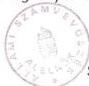

Állami Számverőszék

# JELENTÉS

a Országos Örmény Önkormányzat
pénzügyi-gazdasági
tevékenységének vizsgálati
tapasztalatairól

377

1997. JÚNIUS

---

A vizsgálat végrehajtásáért felelős:
az V. Önkormányzati és Területi Ellenőrzési Igazgatóság:

Dömötör Gyula
számvevő igazgató

A vizsgálatot vezette:

Dr. Felleg Zsoltné
régióvezető főtanácsos

A vizsgálatot végezte:

Fancsali Mária
számvevő tanácsos

Kalmár Ferencné
számvevő tanácsos

---

V-1008-53/1997. TSZ.:371

# TARTALOMJEGYZÉK

|  **I. RÉSZLETES MEGÁLLAPÍTÁSOK** | **4**  |
| --- | --- |
|  **1. A feladatellátás szervezettsége, szabályozottsága** | **4**  |
|  **2. Az önkormányzat működésének, a gazdálkodás rendjének szabályszerűsége.** | **5**  |
|  **3. Beszámolási kötelezettség teljesítése, a költségvetés készítése és végrehajtása.** | **7**  |
|  **II. ÖSSZEGZŐ MEGÁLLAPÍTÁSOK, KÖVETKEZTETÉSEK** | **10**  |
|  **III. JAVASLATOK** | **10**  |

1

---

.

---

## Jelentés az Országos Örmény Önkormányzat pénzügyi-gazdasági tevékenységének ellenőrzéséről

Az Országos Örmény Önkormányzat ellenőrzésére az Országgyűlés 20/1997. (III. 19.) OGY. sz. határozata alapján az Állami Számvevőszék V-1008/1997. sz. vizsgálati programjának szempontjai szerint került sor.

**Az ellenőrzés célja:** annak megállapítása, hogy

- az országos kisebbségi önkormányzat működési feltételrendszere hogyan alakult a vizsgált időszakban,
- a gazdálkodás szervezettsége, szabályozottsága mennyiben felel meg a vonatkozó jogszabályi követelményeknek,
- a feladatellátás során hogyan hasznosultak a központi költségvetésből származó erőforrások,
- mennyire biztosított a gazdálkodás, a pénzeszközök felhasználásának törvényessége és szabályszerűsége, a számviteli törvény és a vonatkozó kormányrendeletek előírásainak betartása.

**A vizsgált időszak:** 1996. január 1 - 1997. március 31.

**A helyszíni vizsgálat időpontja:** 1997. április

A helyszíni vizsgálati jelentésre az önkormányzat észrevételt nem tett.

3

---

I. RÉSZLETES MEGÁLLAPÍTÁSOK

# I. RÉSZLETES MEGÁLLAPÍTÁSOK

# 1. A FELADATELLÁTÁS SZERVEZETTSÉGE, SZABÁLYOZOTTSÁGA

Magyarországon 17 örmény önkormányzat működik. Ezek.

- Országos Örmény Önkormányzat,
- Fővárosi Örmény Önkormányzat,
- helyi önkormányzatok a fővárosban: II., III., V., VI., XI., XII., XIII., XIV., és XXI. kerületi,
- helyi önkormányzatok vidéken: Debrecen, Dorog, Nyíregyháza, Székesfehérvár, Szigethalom, Veszprém.

Az önkormányzatok mellett további 4 szervezet szolgálja működésével az országban élő örmény kisebbség identitásának megőrzését és fennmaradását. Ezek a következők:

- Az Örmény Katolikus Egyházközösség,
- Az Örmény Kultúráért Alapítvány,
- ARMENIA Népe Kulturális Egyesület,
- ARMENIA Magyar-Örmény Baráti Társaság.

Az Országos Örmény Önkormányzat kezdeményezésére a felsorolt önkormányzatok és kisebbségi szervezetek 1996. augusztus 1-én aláírtak egy "Szándéknyilatkozat"-ot.

Ebben megállapodtak arról, hogy az örmény nemzetiség kultúrájának érdekében, az örmény identitástudat fenntartása és óvása céljából egymással együttműködnek. Segítik nemcsak saját szerveik munkáját, hanem az örmények minél hatékonyabb magyarországi együttműködését és összefogását is.

A nyilatkozat egyes paragrafusaiban részletesen meghatározták az együttműködés tartalmát, úgymint:

- kölcsönös tájékoztatás,
- a kisebbség érvényesülése érdekében a részükre biztosított jogokkal való vissza nem élés,
- az elszigetelt csoportokban történő működéstől való tartózkodás,

4

---

I. RÉSZLETES MEGÁLLAPÍTÁSOK

- ■ közös érdek és jogérvényesítés,
- ■ a külföldi fellépési lehetőségek, utak, konferenciák és az óhazával való kapcsolattatás kiemelt kezelése.

Az Országos Örmény Önkormányzat az 1996. június 18-i ülésén a 14/1996. sz. határozatával megalkotta a Szervezeti és Működési Szabályzatát.

Az SzMSz bevezető rendelkezéseiben rögzítették az önkormányzat elnevezését, székhelyét, hivatalos nyelvét és a képviselők jogállását. A II-es fejezet az önkormányzati jelképekkel foglalkozik. A III-as fejezetben szabályozták a testület működésének rendjét, a tisztségviselők és a bizottságok jogállását.

A III-as fejezetben részletesen meghatározták az egyes önkormányzati szervek feladat- és hatáskörét, valamint döntési jogköreit.

A közgyűlés nem élt hatáskör átruházási jogával.

A költségvetés, zárszámadás és vagyonleltár elfogadásáról, valamint a törzsvagyon meghatározásáról az SzMSz III-as fejezet 1.2. pontjában rendelkeztek. Ennek során betartották a törvényi előírásokat, mivel ezeket a feladatokat a közgyűlés át nem ruházható hatáskörei között nevesítették.

A nemzeti és etnikai kisebbségek jogairól szóló törvényben meghatározott feladatok ellátására a következő szervezeti háttérrel rendelkeznek:

Az önkormányzat legfőbb szerve a 17 fős közgyűlés, amely 1 fő elnököt választott.

Működik továbbá 4 állandó bizottság ezek:

- Pénzügyi, tulajdonosi és vagyongazdálkodási bizottság (5 fő)
- Oktatási bizottság (3 fő)
- Nemzetközi kapcsolatok bizottsága (5 fő)
- Kulturális és média bizottság (5 fő)

Főtitkárt az elnök nem nevezett ki. Hivatalt, illetve intézményt nem alapítottak. Foglalkoztatnak viszont 1 fő főfoglalkozású irodavezetőt, 1 fő főfoglalkozású titkárt.

# 2. AZ ÖNKORMÁNYZAT MŰKÖDÉSÉNEK, A GAZDÁLKODÁS RENDJÉNEK SZABÁLYSZERŰSÉGE.

Az Országos Örmény Önkormányzat - végleges elhelyezésére szolgáló székházként - a Budapest, IX. ker. Soroksári út 1-5. sz. alatti "Duna-ház" 3. emelet 2. számú irodahelyiséget választotta, illetve fogadta el.

E helyiségre vonatkozó ingatlan adásvételi szerződést a CÉHEK HÁZA Kft mint eladó és a Kincstári Vagyoni Igazgatóság mint vevő 1997. február 24-én kötötte meg.

Ezzel egyidejűleg a Kincstári Vagyoni Igazgatóság - szintén 1997. február 24-i dátummal - "Ingyenes Használati Megállapodás"-t írt alá az önkormányzattal.

A megállapodásban részletesen szabályozták a használat módját, az átadó és a használó jogait és kötelezettségeit.

5

---

I. RÉSZLETES MEGÁLLAPÍTÁSOK

Az 1993. évi LXXVII. tv. 63. § (4) bekezdésben az állam - egyszeri vagyonjuttatásként - 15 millió forintot biztosított az önkormányzat működési költségeinek fedezéséhez.

Ezt az értéket az önkormányzat az - ÁPV Rt Igazgatósága 293/1996. (IV.24.) sz. határozatának megfelelően - MOL Rt részvények formájában kapta meg.

A részvényvagyon átadásáról szóló megállapodást 1996. november 6-án írták alá. A megállapodás alapján - 1996. december 19-én - 8.813 ezer forint névértékű, 15.000 ezer forint árfolyamértéket képviselő részvény került az önkormányzat tulajdonába. A részvények letéti kezelésével a CODEX Rt-ot bízták meg.

A közgyűlés 1997. január 24-i ülésén úgy határozott, hogy az összes MOL részvényét eladja. A 3/1997. (01.24.) sz. Országos Örmény önkormányzati határozat alapján részvényeiket 29.767 ezer forintért értékesítették úgy, hogy a CIB Értékpapír Rt-tól Diszkont Kincstárjegyeket vásároltak. A részvények után osztalék jogcímű bevétel az önkormányzatnál nem jelent meg.

Pénzügyi és számviteli tevékenységük ellátására 1995. V. 1-től szerződést kötöttek egy vállalkozóval, aki a feladatot 1996. december 31-ig látta el. (Vállalási díja havi 20 ezer forint + ÁFA)

1997. január 1-től egy éves időtartamra - új szerződést kötöttek egy másik vállalkozóval, mely szerint az

- elvégzi az önkormányzat könyvelését és a számviteli nyilvántartások naprakész vezetését,
- összeállítja az adó és TB bevallásokat is, vezeti az ezekkel kapcsolatos nyilvántartásokat,
- elkészíti az év végi zárlati munkákat.

Megbízottnak fenti tevékenységéért havi 33.000 Ft díjat fizetnek.

Az önkormányzatnál a gazdálkodási folyamat teljes körűen nem szabályozott. Az előző évi ÁSZ vizsgálat megállapításaihoz képest viszont számottevő előrelépést jelent, hogy már rendelkeznek az alábbi szabályzatokkal:

- Számlatükör,
- Pénzkezelési Szabályzat,
- Pénztár Szabályzat,
- Selejtezési Szabályzat.

A felsorolt szabályzatok azonban nincsenek minden vonatkozásban összhangban a jogszabályi előírásokkal. Nincs kidolgozva a számlarend azon része, amelyik az alkalmazott számlák tartalmát nevesíti, továbbá nincs rögzítve a főkönyvi számlák és az analitikus nyilvántartások kapcsolata. Ugyancsak hiányzik a számviteli politikával kapcsolatos döntések meghatározása is. Nem rendelkeznek Leltározási Szabályzattal, Pénzkezelési Szabályzat pedig nincs felszerelve a szükséges mellékletekkel (pl. felelősségi nyilatkozat).

A gazdálkodási jogkörök gyakorlása - kötelezettségvállalás, érvényesítés, utalványozás, ellenjegyzés - csak részben szabályozott. Írásban, névreszólóan, a vonatkozó törvényi előírásoknak megfelelően csak az utalványozási jogosultságot rögzítették.

6

---

I. RÉSZLETES MEGÁLLAPÍTÁSOK

Kötelezettségvállalásra vonatkozó szabályzattal rendelkeznek ugyan, de ebben nem határozták meg egyértelműen a kötelezettségvállalási jogosultságot. Az érvényesítés és ellenjegyzés nincs szabályozva.

Az önkormányzat - a vizsgált időszakban - nem végzett vállalkozási tevékenységet és nem vett részt vállalkozásban.

Az 1997. február 28-i és az 1997. március 24-i ülésükön döntöttek az "ARMÉNIA Holding" Kft létrehozásáról. A Kft hiteles társasági szerződése 1997. március 31-ig nem készült el.

# 3. BESZÁMOLÁSI KÖTELEZETTSÉG TELJESÍTÉSE, A KÖLTSÉGVETÉS KÉSZÍTÉSE ÉS VÉGREHAJTÁSA.

Az önkormányzat a pénzügyi folyamatok számviteli regisztrálására a kettős könyvvitel rendszerét választotta. A jogszabályi előírások alapján számára ez nem kötelező mivel nem végez vállalkozási tevékenységet.

Az önkormányzat eleget tett az 1995. évi beszámolási kötelezettségének. Elkészítette egyszerűsített éves beszámolóját.

Az eszközök leltározásának elvégzését írásban nem rögzítették, így az egyes mérlegsorok leltárral nincsenek alátámasztva. A vonatkozó bizonylatok tételes ellenőrzése során viszont megállapítottuk, hogy a mérlegben szereplő adatok a valóságnak megfelelnek.

Az önkormányzat 1995. évi zárszámadása nem került a Közgyűlés elé, a képviselő-testület nem tárgyalta.

Az Országos Örmény Önkormányzat 1996. évi költségvetését a Közgyűlés elnöke és a Pénzügyi, tulajdonosi és vagyongazdálkodási bizottság elnöke közösen terjesztette a testület elé, amelyet az a 22/1996. (VII.26.) számú határozatával fogadott el.

A költségvetés elfogadása során alkalmazott gyakorlat megfelelt az SzMSz szerinti szabályozásnak.

A jóváhagyott 1996. évi költségvetésben 7.132 ezer forint bevételt, 2.250 ezer forint személyi és 4.882 ezer forint dologi kiadást terveztek.

Az 1996. évi - ténylegesen befolyt - bevételek az alábbiak szerint alakultak:

|  ■ Ararát újság támogatása a Magyarországi Nemzeti és Etnikai Kisebbségekért Közalapítványtól | 8 660 ezer forint  |
| --- | --- |
|  ■ Költségvetési támogatás | 7 000 ezer forint  |
|  ■ Jereváni útra befiz.részvételi díjak | 5 318 ezer forint  |
|  ■ Pályázatok bevétele | 3 518 ezer forint  |
|  oktatásra, könyvre a Művelődési és Közoktatási Minisztériumtól | 2 164 ezer forint  |
|  oktatás, könyv, szótár, múzeum céljára a M.N.K. Közalapítványtól | 1 354 ezer forint  |
|  ■ Velencei út bevétele | 858 ezer forint  |
|  ■ Egyéb támogatás | 88 ezer forint  |
|  ■ Kamat | 75 ezer forint  |
|  ■ Egyéb bevétel (könyvértékesítés) | 61 ezer forint  |

7

---

I. RÉSZLETES MEGÁLLAPÍTÁSOK

|  ■ Tárgyévi bevétel összesen: | 25 575 ezer forint  |
| --- | --- |
|  ■ 1995. évi maradvány: | 132 ezer forint  |
|  **Bevételek összesen:** | **25 707 ezer forint**  |

A bevételi források megoszlása a következő:

|  ■ költségvetési támogatás | 7 000 ezer forint | 27,3%  |
| --- | --- | --- |
|  ■ közalapítványi támogatás | 8 660 ezer forint | 33,7%  |
|  ■ pályázatok | 3 518 ezer forint | 13,7%  |
|  ■ külföldi utak részvételi díja | 6 173 ezer forint | 24,0%  |
|  ■ egyéb támogatás | 88 ezer forint | 0,3%  |
|  ■ kamat | 75 ezer forint | 0,3%  |
|  ■ egyéb bevétel | 61 ezer forint | 0,2%  |
|  ■ 1995. évi maradvány | 132 ezer forint | 0,5%  |
|  **Összesen:** | **25 707 ezer forint** | **100,0%**  |

**Zárszámadást 1996. évre nem készítettek.** A testület - a 17/1992. (III.24.) sz. határozatával - egy részvénytársasággal végeztetett **átvilágítás alapján született összesítő táblázatot fogadta el éves beszámolóként.** Ennek a szerkezete nem azonos a költségvetésével. A kiadásokat - az alkalmazott könyvvezetési rendszer miatt - költséghelyenként (az egyes feladatokhoz tartozóan) nem, csak költségnemenként (költség fajtánként) tudták összesíteni.

Az egyes főkönyvi számlákon rögzített adatok alapján megállapítottuk, hogy a **rendelkezésre álló pénzeszközöket, az**

- ■ önkormányzat működtetésére,
- ■ ARARÁT újság kiadására,
- ■ oktatásra, (gyermek és felnőtt nyelvoktatás)
- ■ hagyományőrző, valamint kulturális eseményekre, (Örmény karácsony és húsvét, ápr. 24. örmény népirtás emléknapja, örmény koncertsorozat, 1948-49-es szabadságharc örmény hőseiről megemlékezés)
- ■ kapcsolattartás, illetve felvétel célját szolgáló külföldi és belföldi utazásokra, (jereváni és velencei utazás)
- ■ támogatásra (erdélyi folyóirat, XI. kerületi és a Veszprémi helyi kisebbségi önkormányzat.)

fordították.

Az Önkormányzat által tervezett feladatok az alábbiak szerint teljesültek:

|  Feladat | Tervezett ráfordítás | Tényleges | E Ft  |
| --- | --- | --- | --- |
|   |   |   |  Teljesítés %  |
|  Ararát újság | -- | 7 053 | --  |
|  Oktatás | 450 | 95 | 21,1  |
|  Rendezvények | 400 | 1 062 | 265,5  |
|  Kapcsolattartás | 912 | 8 983 | 985,0  |
|  (utazások) összesen: |  | 17 193 |   |
|  támogatás |  | 320 | --  |
|  Működtetés | 5 370 | 7 413 | 138,  |
|  ■ személyi | 3 510 | 2 302 | 65,6  |

8

---

I. RÉSZLETES MEGÁLLAPÍTÁSOK

|  ■ TB | 220 | 232 | 105,5  |
| --- | --- | --- | --- |
|  ■ dologi | 1 640 | 4.879 | 297,5  |
|  **Mindösszesen:** | **7 132** | **24 926** | **349,5**  |

A tervezett és tényleges kiadások jelentős eltérése részben annak is következménye, hogy évközben előirányzat módosításokat nem hajtottak végre.

Az **1997. évi költségvetésüket** már kidolgozták, de a tervezetet **a testület az ellenőrzés befejezéséig még nem hagyta jóvá**. A tervezetben 10.582 ezer forint bevételt, 3.315 ezer forint személyi, 6.759 ezer forint dologi kiadást és 508 ezer forint tartalékot irányoztak elő.

A bevételek között lényegében csak a már jóváhagyott költségvetési támogatással számoltak. Ez az összeg pedig csak az önkormányzat takarékos működtetéséhez szükséges személyi és dologi kiadásokra nyújt fedezetet. Erre is csak úgy, hogy tiszteletdíjban már csak az elnök részesül; a bizottsági elnökök és tagok nem.

Az **önkormányzat teljes körű számviteli rendszerét nem dolgozták ki**, az analitikus nyilvántartások körét nem határozták meg.

Az 1996. évi május és november havi könyvelési alapbizonylatok tételes ellenőrzése során megállapítottuk, hogy az utalványozás szabályosan történt. Ellenjegyzésre viszont egyetlen esetben sem került sor.

Az alapbizonylatok felszereltsége és tárolása jellemzően szintén szabályszerű és ellenőrzésre alkalmas. A havi forgalmak döntő többségét kitevő pénztári kifizetések bizonylatainál egy-egy esetben előfordult, hogy a számlán a teljesítés, illetve az átvétel nem került igazolásra.

A készpénzkezeléshez kapcsolódó szigorú számadású nyomtatványok nyilvántartását, folyamatosan vezetik, a pénztár-ellenőrzést rendszeresen elvégzik.

A **bizonylati rend és okmányfegyelem terén összességében** - az előző vizsgált időszakhoz képest - **jelentős javulás tapasztalható**.

A **kötelezettségvállalások pénzügyi fedezete biztosított volt**, az önkormányzatnak likviditási gondja nem keletkezett.

A pályázatokon elnyert, illetve támogatásként kapott pénzeszközöket a megjelölt célra költötték. A szabadon felhasználható pénzeket a nemzeti és etnikai kisebbségek jogairól szóló törvényben és a SzMSz-ben meghatározott feladatok ellátására fordították. Jól megfontolt, ügyes pénzügyi befektetés eredményeként a 15.000 ezer forintos MOL részvényeikért 29.767 ezer forint értékű Diszkont Kincstárjegyet vásároltak.

Összességében **gazdálkodásuk során érvényesült a takarékosság és a célszerűség**.

Az ellenőrzést nehezítette, hogy a testületi határozatok nem egyértelműek, lényeges, a döntéshez kapcsolódó tartalmi elemeket nem tartalmaznak. (Pl.: összegek megjelölése, azonos témában többlépcsős, szétaprózott döntések, stb.)

Az **önkormányzat ellenőrzési szabályzattal nem rendelkezik**. Ellenőrzésre való utalást az SzMSz III. fejezetében a tisztségviselők és a bizottságok - különösen a Pénzügyi, tulajdonosi és vagyongazdálkodási bizottság- hatásköreinél fogalmaztak meg.

A Pénzügyi, tulajdonosi és vagyongazdálkodási bizottság 1996. július 2-án tartotta alakuló ülését. Az 1. sz. jegyzőkönyv szerint ezen a tevékenységi reszortok felosztására került sor. Második ülésükre 1996. július 10-én került sor, amelyen a 2. sz. jegyzőkönyv szerint az 1996. évi költségvetés tervezetét és az előző ÁSZ vizsgá-

9

---

II. ÖSSZEGZŐ MEGÁLLAPÍTÁSOK, KÖVETKEZTETÉSEK

lat jelentését tárgyalták meg. További - bizottsági ülésről, illetve tevékenységről szóló - dokumentációt nem tudtak az ellenőrzés rendelkezésére bocsátani. A bizottság -a vizsgált időszakban - dokumentált ellenőrzést nem végzett.

## II. ÖSSZEGZŐ MEGÁLLAPÍTÁSOK, KÖVETKEZTETÉSEK

Az Országos Örmény Önkormányzat működési feltételrendszere kedvezőbb mint korábban volt, kapcsolatrendszere a helyi kisebbségi önkormányzatokkal, egyéb szervezetekkel folyamatosan bővült.

A végleges székház birtokbavétele a közelmúltban megtörtént, a vagyonjuttatás is megvalósult, a vagyonhasznosítással kapcsolatos testületi döntés törvényes volt. (Hatását a gazdálkodás biztonságára csak távlatokban lehet értékelni).

Az új székház berendezését az önkormányzat a gazdálkodás biztonságának veszélyeztetése nélkül nem tudja beszerezni az ahhoz szükséges források hiányában. A gazdálkodás szabályozottsága, törvényessége a még meglévő hiányosságok ellenére sokat javult a korábbi vizsgálat óta eltelt időszakban.

### III. JAVASLATOK

Az önkormányzat a jelentést soron következő ülésén tárgyalja meg, az alábbi javaslatainkra tegyen intézkedéseket:

1. A működéssel, az operatív gazdálkodással összefüggő szabályzatokat aktualizálják, a hiányosságokat pótolják, annak érdekében, hogy azok a mindenkori jogszabályi előírásoknak, a működés sajátosságainak egyaránt megfeleljenek. (Pl. SzMSz, leltározási, selejtezési, ellenőrzési, bizonylati szabályzat, gazdálkodási jogkörök gyakorlása.)
2. Szervezzék meg az ellenőrzési rendszerüket, s biztosítsák annak a belső szabályozottságnak megfelelő hatékony működését.
3. Szerezzenek érvényt a többször módosított 1991. évi XVIII. tv. 42. § /1/ bekezdésében előírtaknak, az éves beszámoló mérlegének adatait leltárral támassák alá.
4. A számviteli bizonylatok feleljenek meg a többször módosított 1991. évi XVIII. tv. 85. § /1/ bekezdésében foglalt alaki és tartalmi követelményeknek
5. Fordítsanak nagyobb gondot a testületi határozatok szövegezésére, hogy azok egyértelműek legyenek és tartalmazzanak minden, a végrehajtáshoz szükséges információt.

Budapest, 1997. június

Sándor István

10

---

Országos Örmény Kisebbségi önkormányzat

1. sz. melléklet

# KIMUTATÁS

az 1995. - 1997. évi költségvetés tervezett és teljesített bevételeiről

ezer Ft-ban

|  Fsz. | Megnevezés | 1995. évi |   |   | 1996. évi |   |   | 1997. évi terv  |
| --- | --- | --- | --- | --- | --- | --- | --- | --- |
|   |   |  terv | tény | teljesítés % | terv | tény | teljesítés %  |   |
|  1. | Költségvetési támogatás | 6500 | 6500 | 100,0 | 7000 | 7000 | 100,0 | 10000  |
|  2. | Szervezetek, alapítványok támogatása Ebből: - belföldiek - külföldiek |  | 850 850 |  |  | 12178 12178 |  |   |
|  3. | Saját bevételek Ebből: - vállalkozás hozadéka |  | 185 |  |  | 61 |  |   |
|  4. | Települési, megyei önkormányzat támogatása | 1300 | 2923 | 224,8 |  |  |  |   |
|  5. | Magánszemélyek támogatása Ebből: - belföldiek - külföldiek |  |  |  |  | 6261 6261 |  |   |
|  6. | Egyéb bevétel Ebből: - 1995. évi maradvány * - 1996. évi maradvány * |  | 29 |  | 132 132 | 207 132 | 156,8 100,0 | 582 74  |
|  **Bevételek összesen:** |   | **7800** | **10487** | **134,4** | **7132** | **25707** | **360,4** | **10582**  |

Tájékoztató adatok

eFt

eFt

1995. XII. 31. zárópénzkészlet

1996. XII. 31. zárópénzkészlet

Megjegyzés:

* ténylegesen felhasználható pénzmaradvány

---

2. sz. melléklet

Országos Örmény Kisebbségi önkormányzat

# KIMUTATÁS

az 1995. - 1997. évi költségvetés tervezett és teljesített kiadásairól

| Fsz. | Megnevezés | 1995. évi | 1996. évi | 1997. évi terv |
| --- | --- | --- | --- | --- |
| terv | tény | teljesítés % | terv | tény | teljesítés % |
| 1. | Működési, fenntartási kiadások | 7310 | 6851 | 93,7 | 7132 | 7413 | 103,9 | 10074 |
| Ebből: - személyi kiadások | 3060 | 969 | 31,7 | 3510 | 2302 | 65,6 | 2923 |
| - TB. járulék |  | 183 |  | 220 | 232 | 105,5 | 392 |
| - dologi kiadások | 4250 | 5699 | 134,1 | 3402 | 4879 | 143,4 | 6759 |
| 2. | Felhalmozási és tőkejellegű kiadások | 250 | 2287 | 914,8 |  |  |  |  |
| 3. | Támogatások |  |  |  |  | 320 |  |  |
| Ebből: - helyi kisebbségi önkormányzatok támogatása |  |  |  |  |  |  |  |  |
| - országos szövetségek támogatása |  |  |  |  |  |  |  |  |
| - kulturális, sport, egyéb rendezvények támogatása |  |  |  |  | 320 |  |  |  |
| 4. | Egyéb kiadás | 240 | 1213 |  |  | 17193 |  | 508 |
| Kiadások összesen: | 7800 | 10351 | 132,7 | 7132 | 24926 | 349,5 | 10582 |