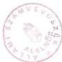

*Állami Számvevőszék*---

# JELENTÉS

**a Magyarországi Horvátok Országos  
Önkormányzata pénzügyi-gazdasági  
tevékenységének vizsgálati  
tapasztalatairól**

---381

1997. JÚNIUS

---

A vizsgálat végrehajtásáért felelős:
az V. Önkormányzati és Területi Ellenőrzési Igazgatóság:

Dömötör Gyula
számvevő igazgató

A vizsgálatot vezette:

Dr. Felleg Zsoltné
régióvezető főtanácsos

A vizsgálatot végezte:

Benczik Lászlóné
számvevő tanácsos

Gordos László
számvevő tanácsos

---

V-1008-50/1997. TSZ.: 371

# TARTALOMJEGYZÉK

|  **I. RÉSZLETES MEGÁLLAPÍTÁSOK** | **4**  |
| --- | --- |
|  **1. A feladatellátás szervezettsége, szabályozottsága** | **4**  |
|  **2. Az Önkormányzat működésének, a gazdálkodás rendjének szabályszerűsége.** | **5**  |
|  **3. A beszámolási kötelezettség teljesítése, a költségvetés készítése és végrehajtása.** | **7**  |
|  **II. ÖSSZEGZŐ MEGÁLLAPÍTÁSOK, KÖVETKEZTETÉSEK** | **11**  |
|  **III. JAVASLATOK** | **11**  |

1

---

1

---

## Jelentés a Magyarországi Horvátok Országos Önkormányzata pénzügyi-gazdasági tevékenységének ellenőrzéséről.

A Magyarországi Horvátok Országos Önkormányzata ellenőrzésére az Országgyűlés 20/1997. (III.19.) OGY sz. határozata alapján az Állami Számvevőszék V-1008/1997. sz. vizsgálati programjának szempontjai szerint került sor.

**Az ellenőrzés célja:** annak megállapítása, hogy

- az országos kisebbségi önkormányzat működési feltételrendszere hogyan alakult a vizsgált időszakban,
- a gazdálkodás szervezettsége, szabályozottsága mennyiben felel meg a vonatkozó jogszabályi követelményeknek,
- a feladatellátás során hogyan hasznosultak a központi költségvetésből származó erőforrások,
- mennyire biztosított a gazdálkodás, a pénzeszközök felhasználásának törvényessége és szabályszerűsége, a számviteli törvény és a vonatkozó kormányrendeletek előírásainak betartása.

**A vizsgált időszak:** 1996. I. 1 - 1997. III. 31.

**A helyszíni vizsgálat időpontja:** 1997. április hó

Az önkormányzat elnökének észrevétele alapján a jelentés pontosításra került.

3

---

I. RÉSZLETES MEGÁLLAPÍTÁSOK

# I. RÉSZLETES MEGÁLLAPÍTÁSOK

## 1. A FELADATELLÁTÁS SZERVEZETTSÉGE, SZABÁLYOZOTTSÁGA

A Magyarországi Horvátok Országos Önkormányzata (a továbbiakban: Önkormányzat) a Magyarországi Horvátok Szövetségével való szoros kapcsolata révén, megalakulása óta rendelkezik információkkal a Magyarországon élő horvátokról. **Magyarország hét megyéjében** (Bács-Kiskun, Baranya, Zala, Somogy, Pest, Győr-Sopron-Moson) **kb. 70 településen szétszórtan**, mintegy 90 ezer horvát anyanyelvű, illetve nemzetiségű lakos él. A magyarországi horvátokat a nagy területi szétszórtság mellett etnikai és tájnyelvi sokszínűség (gradistyei, muramenti, drávamenti, bunyevác, sokác, bosnyák, rác és dalmát horvátok) is jellemzi.

Az **Önkormányzat kapcsolata a hat régióban elhelyezkedő helyi kisebbségi önkormányzatokkal** (57 önkormányzat) egyfelől a csaknem teljes körű (50 fős) közgyűlési képviselet révén, másrészt a regionális elvek szerint is tevékenykedő alelnökök (ill. az elnök, vagy az ügyvezető titkár) konkrét ügyek kapcsán történő személyes, gyakran a helyszínen történő intézkedései, segítségnyújtása folytán **rendszeres**.

**Együttműködési szerződéses kapcsolatban** állnak a **Horvát Kutatóintézettel, a Horvát Színházzal**, továbbá **több horvát oktatási intézettel**.

Az Önkormányzat - magyar nyelvre is lefordított - **Alapszabálya** (SzMSz-e) a nemzetiségi és etnikai kisebbségek jogairól szóló 1993. évi LXXVII. tv. (a továbbiakban: Nek törvény) alapján határozza meg az önkormányzati jogosítványokat. Az 1995. szeptember 23-i közgyűlésen elfogadott SzMSz **nem határozza meg az önkormányzat feladatait, és valamennyi hatáskörét, rendelkezik azonban a szervezeti felépítésről, a közgyűlés, a bizottságok, az elnök, alelnökök, ügyvezető titkár**, valamint a **képviselők jogairól és kötelezettségeiről, az át nem ruházható közgyűlési hatáskörökről, a Közgyűlés Hivataláról**, az Önkormányzat **gazdálkodásáról**, valamint a közgyűlés tagjainak költségtérítéséről.

Az Önkormányzat **legfőbb szerve a közgyűlés**, amely a jogosítványok és hatáskörök teljes körével rendelkezik.

A közgyűlés a megalakulás időszakában **nyolc bizottságot** hozott létre, köztük a Pénzügyi- és Ellenőrző Bizottságot és a Gazdasági Bizottságot. A bizottságok körét 1996-ban a 'Horvát médiák munkájának felügyelete' bizottsággal bővítették. Az SzMSz a bizottságok konkrét feladataira, belső működésük szabályaira előírásokat nem tartalmaz, azok meghatározását a bizottságok hatáskörébe utalja. Előírja azonban a bizottsági ülésekről a jegyzőkönyv készítési kötelezettséget.

A választott, főállású elnök képviseli az önkormányzatot. Felügyeli a Közgyűlés Hivatalának működését. A **három alelnök** segíti az elnök munkáját, helyettesíti az elnököt, regionális felosztással kapcsolatot tart a helyi kisebbségi önkormányzatokkal. A kinevezett, **főállású ügyvezető titkár vezeti a Hivatalt**, az elnök javaslatára szervezi az apparátus munkáját.

4

---

I. RÉSZLETES MEGÁLLAPÍTÁSOK

Az SzMSz a testület, a bizottságok, illetve a választott tisztségviselők közötti munkamegosztás módjára vonatkozóan meghatározásokat nem tartalmaz.

Az eredeti SzMSz meghatározta, hogy a közgyűlés tagjait havonta, az önkormányzati feladatok ellátásával kapcsolatos, külön el nem számolható költségekért, külön közgyűlési határozattal megállapított tiszteletdíj illeti meg, melyet előre be nem jelentett, továbbá igazolatlan távollét esetén csökkenteni kell. Az SzMSz 1997. március 22-i módosításakor a közgyűlés a tiszteletdíjra vonatkozó - s már 1996-ban határozattal hatályon kívül helyezett - előírásokat felváltotta a költségtérítést tartalmazó szabályokkal. A maximálisan igénybevehető éves keretösszeget beépítették az SzMSz-be.

A költségtérítésre vonatkozó - s már 1996-tól hatályos - előírások értelmében a megállapított keretösszegen felül az alelnökök és a bizottsági elnökök jogosultak még havonta a saját telefonszámlájuk 40%-ának mértékéig, de legfeljebb 4.000 forint értékhatárig telefonköltség - számla ellenében történő - elszámolására.

Az SzMSz a **közgyűlés át nem ruházható hatásköreinek** sorában nevesíti a **költségvetés** meghatározását, a **zárszámadás** elfogadását, az önkormányzati **törzsvagyoni körre**, továbbá az **önkormányzati vagyon elidegenítésére, megterhelésére** vonatkozó döntéseket. Ezek **tartalmi kérdéseiről nem rendelkezik**. Előírást tartalmaz viszont arra vonatkozóan, hogy az éves költségvetésről és zárszámadásról szóló előterjesztés és határozat-tervezet csak a közgyűlés bizottságainak előzetes állásfoglalásával terjeszthető a közgyűlés elé.

Az Önkormányzat Nek. törvényben meghatározott és a működésével, a döntések előkészítésével és végrehajtásával kapcsolatos szakmai, valamint ügyviteli feladatok ellátására létrehozott, **jogi személyiséggel nem rendelkező Hivatalt** hozott létre. **Intézményt** az ellenőrzés időpontjáig **nem alapított**.

## 2. AZ ÖNKORMÁNYZAT MŰKÖDÉSÉNEK, A GAZDÁLKODÁS RENDJÉNEK SZABÁLYSZERŰSÉGE.

**Az Önkormányzat** megalakulásától a jelen számvevőszéki ellenőrzés kezdeti időszakáig a Magyarországi Horvátok Szövetsége által a Főváros VI. kerületének önkormányzatától **bérelt helyiségekben, a Szövetség bútorait és berendezési tárgyait használva, szűkös körülmények között** folytatta tevékenységet.

A Nek. tv. 62. §. (2.) bekezdésében, valamint a kisebbségi önkormányzatok költségvetésének, gazdálkodásának, vagyonjuttatásának egyes kérdéseiről intézkedő 20/1995. (III.3.) sz. Kormányrendelet 3. §-ában foglaltak szerinti **ingatlan átadás-átvételére** - másfél-, illetve két évvel a hivatkozott jogszabályok megjelenését követően - **1997. március 20-án került sor**. E hosszú átfutási idő az érintettek jó szándéka és konstruktív együttműködése ellenére következett be.

Az 1995-ben felkutatott; **Budapest, VIII. Bíró Lajos u.24. sz. alatti háromszintes lakóház** az Önkormányzat mellett a **Fővárosi Horvát Önkormányzat elhelyezését is szolgálja**.

Az önkormányzat(ok) igényeit figyelembe vett felújítást követően **1997. március**

5

---

I. RÉSZLETES MEGÁLLAPÍTÁSOK

**11-én kötötték meg** a Kincstári Vagyoni Igazgatóság Budapest-Pest megyei Kirendeltségével az épületre vonatkozó **ingyenes használati megállapodást**.

Az Önkormányzat f. év **április 1-je óta már az új székhelyén** végzi munkáját. A helyiségek **bútorokkal** és egyéb **berendezési tárgyakkal** való ellátottsága jelenleg még **nem megfelelő**. A folyamatos munkavégzésükhöz elengedhetetlen legszükségesebb bútorokat 1996. évi pénzmaradványuk terhére vásárolták meg, miután az e célt szolgáló pénzügyi támogatásra vonatkozóan többször is benyújtott igényüket a Nemzeti és Etnikai Kisebbségi Hivatal válasz nélkül hagyta. Konszolidált munkakörülményeik megteremtését szolgáló további bútorok és berendezések biztosítása érdekében az anyaországtól is kérnek támogatást.

A Nek. törvény 63. §. (4.) bekezdésében rögzített, az Önkormányzatot megillető **30.000 ezer forint összegű egyszeri vagyonjuttatás jelentős késéssel megtörtént**.

A Miniszterelnöki Hivatal politikai államtitkárának előzetes tájékoztatást szolgáló 1996. június 14-én kelt levelét követően az Állami Privatizációs és Vagyonkezelő Rt (a továbbiakban: ÁPV Rt) 1996. augusztus 21-én kelt levelében tájékoztatta az Önkormányzatot, miszerint az ÁPV Rt Igazgatósága 1996. április 24-én hozott határozatában hozzájárult ahhoz, hogy a hatáskörébe tartozó vagyon felett az állam tulajdonosi jogait gyakorló ÁPV Rt a tulajdonában lévő **MOL Rt részvényekből 30.000 ezer forint árfolyamértékű részvénycsomagot** a Magyarországi Horvát Országos Önkormányzatnak ellenérték nélkül ajánljon fel. Egyidejűleg aláírás céljából megküldték a részvények átadásáról szóló megállapodást-tervezetet. A megállapodás-tervezet rögzíti, hogy a MOL Rt-ben lévő törzsrészvényekből **17.626 ezer forint névértékű részvényhányad** kerül ellenérték nélkül átruházásra, az igazgatóság döntést megelőző hónap forgalommal súlyozott tőzsdei átlagárának (a névértékre vetítve 170,2%) figyelembevételével. A megállapodás aláírására 1996. december 27-én került sor az értékpapírokat letéti kezelésre és megőrzésre átadták a CODEX Értéktár és Értékpapír Részvénytársaságnak.

**A gazdálkodás bonyolítását az Önkormányzat Hivatala intézi.** A Hivatalban foglalkoztatottak száma - az ügyvezető titkáron felül - 8 fő. A gazdálkodással összefüggő feladatokat egy mérlegképes pénzügyi előadó és egy pénzügyi előadó végzi. Három szakreferens látja el a közgyűlés és a bizottságok számára, illetve az egyéb országos jellegű adminisztrációs feladatokat. További 1-1 fő - gondnok és takarítónő - áll alkalmazásban. A személyi feltételek megfelelőek, az alaptevékenységgel összefüggő, érdemi feladatot ellátó alkalmazottak felső-, illetve középfokú végzettséggel rendelkeznek.

Az Önkormányzat a gazdálkodással kapcsolatos feladatok ellátásához **számítástechnikai hátérrel nem rendelkezik**.

Az SzMSz-ében nevesített hivatali **Ügyrend nem készült el**. A Közgyűlés Hivatalának 1996-ban elkészített, ügyrendként kezelt SzMSz-e ugyanakkor a működés során ellátandó feladatokat munkakörönként körvonalazottan, a megfelelő, aktuális jogszabályi hivatkozások nélkül tartalmazza.

Az 1995-ben elkészített - és magyarul (is) rendelkezésre álló - számlarendet, számlatükröt, valamint az ügyrend-javaslatot az 1995-ben lefolytatott számvevő-

6

---

I. RÉSZLETES MEGÁLLAPÍTÁSOK

széki vizsgálat kritikai észrevételekkel illette és javasolta azok átdolgozását.

**A közgyűlés a korábbi számvevőszéki vizsgálat jelentését megtárgyalta és azt a 97/2/1996.sz. határozatával elfogadta. A határozat a javaslatok nyomán teendő intézkedésekre nem tér ki, a hivatkozott szabályzatok pontosítása, kiegészítése sem történt meg.**

A gazdálkodással összefüggő testületi határozatok, a kapcsolódó előterjesztések egy része csak horvát nyelven állt rendelkezésre, ezért a döntéseket minősíteni nem tudtuk. A határozatok a szavazatarányt és a határozat számát minden esetben rögzítik, azonban a költségvetések és az azok teljesítéséről készülő beszámolók főösszegeit nem tartalmazzák.

**Az önkormányzat által követett gyakorlat nem biztosítja teljeskörűen a Számvevőszék ellenőrzési kötelezettségének** - Nek. törvény 57. §.-ában előírt - **teljesítését**. (A gazdálkodás célszerűsége, eredményessége nehezen minősíthető nyelvismeret, illetőleg hiteles fordítás hiányában).

A gazdálkodási folyamatok, s különösen a számviteli kérdéseket rendező szabályzatok hiányosságait részben a gazdálkodásra vonatkozó, jelenleg sem konzisztens rendszert alkotó jogszabályok körével, azok értelmezésével kapcsolatos bizonytalanság eredményezi.

**A gazdálkodási jogkörök egy részét a házipénztár kezelési szabályzat rögzíti.** Az utalványozást az elnök látja el. Távollétében nincs utalványozó, ami a folyamatos gazdálkodás szabályszerűségét nem biztosítja. A pénztárellenőri feladatokat az ügyvezető titkár végzi. A szabályzat hiányossága, hogy azt csak beosztásra, és nem személyre (névre) szólóan határozza meg.

A gazdálkodási jogkörök gyakorlását **teljeskörűen nem szabályozták.**

Az Önkormányzat ezideig alapfeladatán túlmenően vállalkozási tevékenységet nem folytatott, s vállalkozásban sem vettek részt.

### 3. A BESZÁMOLÁSI KÖTELEZETTSÉG TELJESÍTÉSE, A KÖLTSÉGVETÉS KÉSZÍTÉSE ÉS VÉGREHAJTÁSA.

A pénzügyi folyamatok **számviteli regisztrálására a kettős könyvvitelt választották**, melyre a jogszabályi előírások alapján megvan a lehetőség. A számviteli elszámolás manuális (kézi) módszerrel történik, melynek ellátását saját gazdálkodó szervezete végzi.

**Az 1995. évi beszámolási kötelezettségének az Önkormányzat eleget tett.** Az év utolsó napján egyszerűsített éves beszámolót készített, mely mérlegből és eredmény-kimutatásból áll.

Az 1995. december 31-i mérleget - melynek végösszege 10.723 Ezer forint - az egyes főkönyvi számlákhoz kapcsolódó konkrét zárlati munkák elvégzését követően a főkönyvi kivonat alapján állították össze.

A mérleg eszközök és források sorait év végén külön **leltárral nem támasztot-**

7

---

I. RÉSZLETES MEGÁLLAPÍTÁSOK

**ták alá**, de a mérlegtételek az ellenőrzés megállapításai alapján a **valóságnak megfelelnek**.

Az Önkormányzat **1995. évi zárszámadását elkészítette**, azt a **Pénzügyi Bizottság megtárgyalta, elfogadásra javasolta**.

A beszámolót a **közgyűlés 1996. június 8-án tárgyalta**, és 87/2/1996. sz. határozatával **egyhangúlag fogadta el**. A pénzmaradvány felhasználásáról az 1996. évi költségvetés elfogadásakor döntött a testület.

Az 1995. évi bevételeiket az 1. sz., a kiadásokat a 2. sz. mellékletben mutatjuk be.

A beszámolóban a dologi kiadásokat kiadásnemenként, a pályázati pénzeket a pályázható megnevezésével és az elnyert, valamint az év végéig felhasznált összeg feltüntetésével mutatták ki.

Az 1996. évi költségvetés összeállításakor a bevételeket a már ismert támogatásokat (központi, pályázati), egyéb bevételeket és a pénzmaradványt figyelembe véve tervezték. A kiadások tervezése során mérlegelték a működés szükségletét, a korábbi kötelezettségek pénzigényét.

#### Tervezett bevételek:

|   | E Ft | %  |
| --- | --- | --- |
|  1995. évi pénzmaradvány | 10 327 | 24,4  |
|  1996.évi központi támogatás | 27 000 | 63,7  |
|  Tervezett pályázati összeg | 3 450 | 8,1  |
|  Egyéb bevétel | 1 600 | 3,8  |
|  **Összesen:** | **42 377** | **100,0**  |

A rendelkezésre álló forrásokból elsősorban a működés személyi és tárgyi feltételeinek megteremtését vették figyelembe.

A kiadásokon belül - a személyi kiadásokban - biztosították az alkalmazottak bérjellegű kiadásait, az ezekhez kapcsolódó járulékokat, a testület tagjainak költségtérítését. A kiadásaik között a helyi kisebbségi önkormányzatok rendezvényeinek támogatására szánt összegeket és a fenntartással, működéssel járó dologi kiadásaikat is részletezték. 5 millió forintot nem tervezett kiadásokra tartalékoltak, mely az egyéb kiadások között jelenik meg.

**A költségvetés tervezetét a Pénzügyi Ellenőrző Bizottság és a Gazdasági Bizottság egyaránt véleményezték és megtárgyalásra megküldték az Önkormányzat más bizottságainak.** A bizottsági elnökök ülésén a költségvetés tervezetét megtárgyalták és a **közgyűlésnek elfogadásra javasolták**.

Az **1996. évi költségvetést a testület** 91/2/96. sz. határozatával **1996. június 8-án elfogadta**.

A közgyűlés ugyan ezen a napon 78/1/96. sz. határozatában **döntött az 1995. évi pénzmaradvány felhasználásáról**. A testület egy Opel Astra típusú személygépkocsit és az új székház minimális berendezésére 5 millió forintot megszá-

8

---

I. RÉSZLETES MEGÁLLAPÍTÁSOK

vazott.

Az Önkormányzat 1996. évi feladatai ellátására az előzőekben már ismertetett bevételeken túl pályázat útján elnyert összegekkel rendelkezett.

**Pályáztató**

A Magyarországi Nemzeti és Etnikai Kisebbségekért
Közalapítvány
Művelődési és Közoktatási Minisztérium
Országos Közoktatási Intézet

**Összesen:**

**Összeg**

5 210 ezer forint
1.950 ezer forint
50 ezer forint

**7 210 ezer forint**

Így - a fentiek figyelembevételével - a ténylegesen rendelkezésre álló források 12%-kal meghaladták az eredeti előirányzatot. Tényleges bevételeik összetétele, megoszlása a következőképpen alakult:

**Bevételek**

|   | **e. Ft** | **%**  |
| --- | --- | --- |
|  1996. évi költségvetési támogatás | 27 000 | 56,9  |
|  Szervezetek, alapítványok támogatása (belföldi) | 7.210 | 15,2  |
|  Egyéb bevétel támogatása | 2 964 | 6,2  |
|  1995. évi pénzmaradvány | 10 327 | 21,7  |

**Összesen:**

**47 501 100,0**

Bevételein belül a költségvetési támogatás részaránya 56,9%, mely havonkénti ütemezéssel jelent meg az Önkormányzat számláján.

A Közalapítványtól, a Művelődési és Közoktatási Minisztériumtól, Országos Közoktatási Intézettől kapott pályázati összegek április hónapban és azt követően az év második felében kerültek átutalásra a részükre.

A céltámogatásokat pályázat alapján a szerződésekben rögzített feltételek mellett nyújtották a pályáztató szervek. **A szerződésekben előírt szakmai és pénzügyi elszámolási kötelezettségüknek eleget tettek.** A támogatás felhasználásáról elkülönített nyilvántartást vezetnek.

Az 1996. évi 7.210 ezer forint támogatásokból 5.577 ezer forint került felhasználásra, 1997. évre áthúzódott 1.633 ezer forint.

Az Önkormányzat tevékenysége maradványaként 1995. év végén 10.327 ezer forintot mutatott ki. A vizsgálat megállapítása szerint ez az összeg a december 31-i zárópénzkészlete, amit állammal szembeni befizetési kötelezettség terhel. Így a **szabad pénzmaradványa csak 9.517 ezer forint.**

A rendelkezésre álló pénzeszközöket a céltámogatáson kívül, (mivel azokat konkrét feladathoz rendelték) elsősorban a szervezet (2. sz. mellékletben kimutatott) működési kiadásainak fedezetére fordították.

**A kiadásokra tervezett összeg 82%-a került felhasználásra.** Az összes kiadás kétharmada (67,8%) működési kiadás volt, melyből a személyi kiadásra

9

---

I. RÉSZLETES MEGÁLLAPÍTÁSOK---

(járulékkal együtt) 13.498 + 2.568 ezer forintot használtak fel.

A **dologi kiadásokra** 7.641 ezer forintot fordítottak, ezen belül a legjelentősebb összegeket az üzemeltetés és a szolgáltatások díjaira (7,8%) és a postai távközlési díjakra (3,0%) fizettek ki.

**Felhalmozási kiadásokra** 5.540 ezer forintot irányoztak elő, melyből személygépkocsit és egyéb irodaeszközöket (számítógép, mobil telefon és fényképező gép) vásároltak. Horvát lakta települések önkormányzatainak rendezvényeit 843 ezer forinttal támogatták. Országos Kulturális programok támogatására az előirányzott 1.000 ezer forint közel kétszeresét költötték.

Az egyéb kiadások soron jelenik meg a pályázati pénzekből felhasznált összeg.

1996. évben a **költségvetést** a dologi kiadásoknál a tartalékalap terhére két alkalommal, összesen 1.870 ezer forinttal **módosította a közgyűlés**.

Az Önkormányzat közgyűlése 1997. évi költségvetését a Pénzügyi Ellenőrző Bizottság és a Gazdasági Bizottság javaslatai alapján - **1997. március 22-én - az 1996. évi zárszámadással egyidőben tárgyalta és fogadta el, melynek szerkezete megegyezik az 1996. évivel**.

Az 1997. évi előirányzatokat az 1996. évi tényszámok ismeretében, 13.241 ezer forint pénzkészlete és nem a tényleges pénzmaradványa figyelembevételével, továbbá az 1997. évi 32.000 ezer forint költségvetési támogatással és egyéb bevételeivel is számolva alakította ki. A bevételi és kiadási előirányzatokat - 45.741 ezer forint - az 1. és 2. sz. melléklet tartalmazza.

Az Önkormányzat a **költségvetéséből döntően a működési kiadásait finanszírozza**. A helyi kisebbségi önkormányzatok támogatására 2.000 ezer forintot, eszközbeszerzésre - új székház berendezéseire - 5.500 ezer forintot kíván fordítani.

A költségvetésben az 1997. évi TB jogszabályok változásából adódó költségnövekedés a személyi kiadásait nem érintette, mivel tiszteletdíjak helyett a közgyűlés tagjai részére költségtérítést fizet.

Az 1997. évi költségvetés további részleteiről, belső tartalmáról nem rendelkezünk információval.

Az Önkormányzat egészére vonatkozó gazdálkodási szabályzatot nem készítettek, ugyanakkor **rendelkeztek a gazdálkodás egyes részterületeit lefedő szabályzatokkal**, (Számlarend, Számlatükör, Pénzkezelési Szabályzat), **de ezek aktualizálása elmaradt**.

Az 1995-ben elkészített Számlarend felépítésében, tartalmában sem felel meg a Sztv. követelményeinek, a számviteli politika nincs írásban rögzítve.

A főkönyvi könyvelés alátámasztását szolgáló **számviteli analitika rendszerét sem alakították ki teljes körűen**. A leltározással és selejtezéssel kapcsolatos szabályozás is nagyvonalú, kiegészítésre szorul. A házipénztár kezelésének szabályzatát is néhány helyen pontosítani szükséges.

**A pénzkezelés rendjének szabályozása úgyszintén kiegészítésre szorul.**

A bizonylati és okmányfegyelem betartását az 1996. május és november havi

---10

---

II. ÖSSZEGZŐ MEGÁLLAPÍTÁSOK, KÖVETKEZTETÉSEK

könyvelési bizonylatok tételes felülvizsgálatával ellenőriztük. Tapasztalataink szerint az előfordult hibák nagy része szabályozatlanságra és az ellenőrzések elmaradására vezethető vissza. Általános hiányosság, hogy elmaradt a bevételek beszedése és a kiadások teljesítése előtti előzetes - jogosultságra, fedezet meglétére, az előírt alaki követelmények betartására irányuló - ellenőrzés.

Az Önkormányzat **kötelezettségvállalásairól nyilvántartást nem vezet.** 1996. év elején azonban jelentős pénzmaradvánnyal rendelkezett, így a **kötelezettségvállalások fedezete év kezdetétől biztosított volt.**

1996-ban jármű és irodatechnikai eszközök beszerzésére 2.600 ezer forintot fordítottak.

1995-ben 3 millió forint három hónapra lekötött pénzbefektetése volt.

Az Önkormányzat - Alapszabálya szerint - létrehozta a **Pénzügyi Ellenőrzési Bizottságot, tevékenységét, feladat- és hatáskörét azonban nem határozta meg.** A Bizottság részéről a gazdálkodás átfogó ellenőrzésére nem került sor. Ezt az ellenőrzés részére bemutatott 1997. évi munkatervükben sem tervezték.

Ellenőrzéseik az operatív munkavégzés során valósultak meg, melyeket nem dokumentáltak.

## II. ÖSSZEGZŐ MEGÁLLAPÍTÁSOK, KÖVETKEZTETÉSEK

A Magyarországi Horvátok Országos Önkormányzatának működési feltételrendszere a legutóbbi időszakban kedvezően változott. Az Önkormányzat végleges elhelyezését szolgáló irodaingatlan átvételére a jelenlegi ellenőrzés időszakának kezdetén sor került. A részleges bebútorozást az Önkormányzat saját erőből oldotta meg. A vagyonjuttatás is megtörtént.

Feladatellátás, ezen belül a gazdálkodás feltételrendszerét biztosították.

A gazdálkodás szabályozottsága, különösen a számviteli szabályozottság hiányos, ez a jogszabályi rendezetlenséggel is összefügg.

## III. JAVASLATOK

Az Önkormányzat a jelentést a soron következő ülésén tárgyalja meg, s az alábbi javaslatainkra tegyen intézkedéseket:

1. A működéssel, az operatív gazdálkodással összefüggő szabályzatokat aktualizálják, a hiányosságokat pótolják annak érdekében, hogy azok a mindenkori jogszabályi előírá-

11

---

III. JAVASLATOK

soknak, a működés sajátosságainak egyaránt megfeleljenek. (SzMSz , Számlarend, leltározás, selejtezés, bizonylati rend, gazdálkodási jogkörök gyakorlása stb.)

2. Szervezzék meg az ellenőrzési rendszerüket, szabályozzák az ahhoz kapcsolódó tevékenységet a feladatok, hatás- és jogkörök, gyakoriság, stb. egyértelmű meghatározásával, s biztosítsák annak hatékony működését.
3. A gazdálkodással összefüggő testületi határozatokban a legfontosabb tartalmi elemeket - kiemelten a költségvetés, a beszámoló főösszegei, tartalék, zárópénzkészlet, felhasználható maradvány, stb. - is rögzítsék a törvényes működés, a végrehajtás számonkérhetősége érdekében.
4. A számvitelről szóló 1991. évi XVIII. tv. 12. §. (2) bekezdése előírja, hogy a könyvvezetés csak magyar nyelven történhet.
A számviteli regisztráció alapját képező egyéb dokumentációkat (pl. jegyzőkönyvek, testületi előterjesztések, határozatok, belső szabályzatok, utasítások, stb.) magyar nyelven is készítsék el, biztosítva ezzel az ellenőrzés (számvevőszéki) hitelességével, teljes körűségével szemben támasztott követelmények teljesülését is.

Budapest, 1997. június

Sándor István

12

---

Országos Horvát Kisebbségi önkormányzat

1. sz. melléklet

# KIMUTATÁS

az 1995. - 1997. évi költségvetés tervezett és teljesített bevételeiről

ezer Ft-ban

|  Fsz. | Megnevezés | 1995. évi |   |   | 1996. évi |   |   | 1997. évi terv  |
| --- | --- | --- | --- | --- | --- | --- | --- | --- |
|   |   |  terv | tény | teljesítés % | terv | tény | teljesítés %  |   |
|  1. | Költségvetési támogatás | 19200 | 19200 | 100,0 | 27000 | 27000 | 100,0 | 32000  |
|  2. | Szervezetek, alapítványok támogatása | 850 | 850 | 100,0 | 3450 | 7210 | 209,0 |   |
|   |  Ebből: - belföldiek - külföldiek | 850 | 850 | 100,0 | 3450 | 7210 | 209,0 |   |
|  3. | Saját bevételek |  |  |  |  |  |  |   |
|   | Ebből: - vállalkozás hozadéka |  |  |  |  |  |  |   |
|  4. | Települési, megyei önkormányzat támogatása |  |  |  |  |  |  |   |
|  5. | Magánszemélyek támogatása |  |  |  |  |  |  |   |
|   | Ebből: - belföldiek - külföldiek |  |  |  |  |  |  |   |
|  6. | Egyéb bevétel | 300 | 545 | 181,7 | 11927 | 13291 | 111,4 | 13741  |
|   | Ebből: - 1995. évi maradvány * |  |  |  | 9517 | 9517 | 100 |   |
|   | - 1996. évi maradvány * |  |  |  |  |  |  | 10899  |
|  **Bevételek összesen:** |   | **20350** | **20595** | **101,2** | **42377** | **47501** | **112,1** | **45741**  |

Tájékoztató adatok

1995. XII. 31. zárópénzkészlet 10327 eFt

1996. XII. 31. zárópénzkészlet 13241 eFt

Megjegyzés:

* ténylegesen felhasználható pénzmaradvány

---

Országos Horvát Kisebbségi önkormányzat

2. sz. melléklet

# KIMUTATÁS

az 1995. - 1997. évi költségvetés tervezett és teljesített kiadásairól

|  Fsz. | Megnevezés | 1995. évi |   |   | 1996. évi |   |   | 1997. évi terv  |
| --- | --- | --- | --- | --- | --- | --- | --- | --- |
|   |   |  terv | tény | teljesítés % | terv | tény | teljesítés %  |   |
|  1. | **Működési, fenntartási kiadások** | 13946 | 11019 | 79,0 | 25222 | 23707 | 94,0 | 35769  |
|   | Ebből: - személyi kiadások | 6632 | 5481 | 82,6 | 14872 | 13498 | 90,8 | 20092  |
|   | - TB. járulék | 2867 | 2301 | 80,3 | 2467 | 2568 | 104,1 | 4661  |
|   | - dologi kiadások | 4447 | 3237 | 72,8 | 7883 | 7641 | 96,9 | 11016  |
|  2. | **Felhalmozási és tőkejellegű kiadások** |  |  |  | 5540 | 2618 | 47,3 | 5500  |
|  3. | **Támogatások** | 500 | 59 | 11,8 | 3100 | 2820 | 91,0 | 2000  |
|   | Ebből: - helyi kisebbségi önkormányzatok támogatása |  |  |  | 2100 | 843 | 40,1 |   |
|   | - országos szövetségek támogatása |  |  |  |  |  |  |   |
|   | - kulturális, sport, egyéb rendezvények támogatása | 500 | 59 | 11,8 | 1000 | 1977 | 197,7 | 2000  |
|  4. | **Egyéb kiadás** | 5904 |  |  | 8515 | 5577 | 65,5 | 2472  |
|   | **Kiadások összesen:** | **20350** | **11078** | **54,4** | **42377** | **34722** | **81,9** | **45741**  |