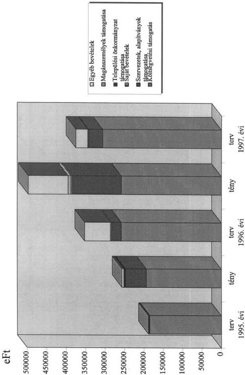
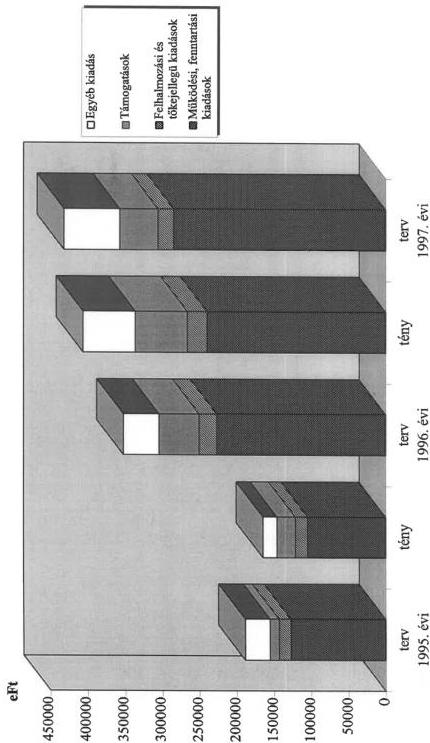
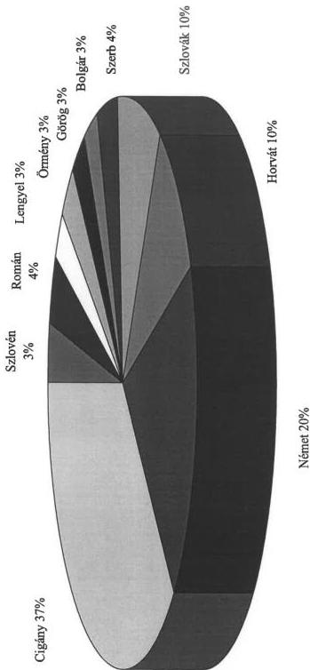
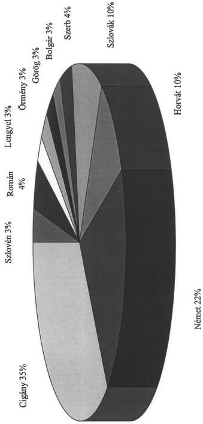
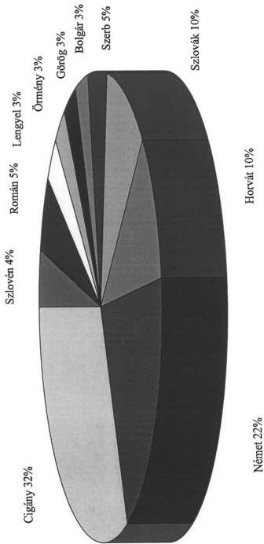
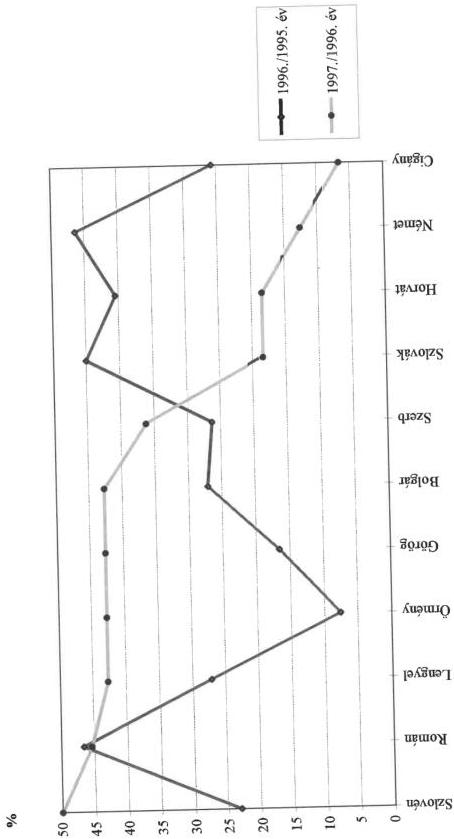

Állami Számvevőszék

# JELENTÉS

a Szerb Országos Önkormányzat
pénzügyi-gazdasági
vékenységének vizsgálati
hasztalatairól

384

1997. JÚNIUS

---

A vizsgálat végrehajtásáért felelős:
az V. Önkormányzati és Területi Ellenőrzési Igazgatóság:

Dömötör Gyula
számvevő igazgató

A vizsgálatot vezette:

Dr. Felleg Zsoltné
régióvezető főtanácsos

A vizsgálatot végezte:

Benczik Lászlóné
számvevő tanácsos

Gordos László
számvevő tanácsos

---

V-1008-55/1997 TSZ: 371

# TARTALOMJEGYZÉK

|  **I. RÉSZLETES MEGÁLLAPÍTÁSOK** | **4**  |
| --- | --- |
|  1. A feladatellátás szervezettsége, szabályozottsága | 4  |
|  2. Az Önkormányzat működésének, a gazdálkodás rendjének szabályszerűsége. | 6  |
|  3. A beszámolási kötelezettség teljesítése, a költségvetés készítése és végrehajtása. | 9  |
|  **II. ÖSSZEGZŐ MEGÁLLAPÍTÁSOK, KÖVETKEZTETÉSEK** | **14**  |
|  **III. JAVASLATOK** | **14**  |

1

---

The Ground Truth image displays a single, solid horizontal line. According to Rule 2 (UNDERSCORE & LINE RULES), this is a stylistic or background line, not a placeholder underscore. Therefore, the OCR result must ignore it and output nothing or only meaningful text. The provided OCR content is "____", which consists of four underscores. This is an incorrect interpretation of the line as a placeholder, violating the rule that stylistic lines must be ignored. The OCR has hallucinated underscores where none should exist based on the GT's visual context. Hence, the OCR result is inconsistent with the Ground Truth.

[Non-Text]

•

•

[Non-Text]

[Non-Text]

[Non-Text]

[Non-Text]

[Non-Text]

[Non-Text]

[Non-Text]

[Non-Text]

[Non-Text]

[Non-Text]

[Non-Text]

The Ground Truth image displays a single, solid horizontal line. According to Rule 2 (UNDERSCORE & LINE RULES), this is a stylistic or background line, not a placeholder underscore. Therefore, the OCR result must ignore it and output nothing or only meaningful text. The provided OCR content is "____", which consists of four underscores. This is an incorrect interpretation of the line as a placeholder, violating the rule that stylistic lines must be ignored. The OCR has hallucinated underscores where none should exist based on the GT's visual context. Hence, the OCR result is inconsistent with the Ground Truth.

[Non-Text]

[Non-Text]

[Non-Text]

[Non-Text]

[Non-Text]

[Non-Text]

[Non-Text]

[Non-Text]

[Non-Text]

[Non-Text]

[Non-Text]

The Ground Truth image displays a single, solid horizontal line. According to Rule 2 (UNDERSCORE & LINE RULES), this is a stylistic or background line, not a placeholder underscore. Therefore, the OCR result must ignore it and output nothing or only meaningful text. The provided OCR content is "____", which consists of four underscores. This is an incorrect interpretation of the line as a placeholder, violating the rule that stylistic lines must be ignored. The OCR has hallucinated underscores where none should exist based on the GT's visual context. Hence, the OCR result is inconsistent with the Ground Truth.

[Non-Text]

[Non-Text]

[Non-Text]

[Non-Text]

[Non-Text]

[Non-Text]

[Non-Text]

[Non-Text]

The Ground Truth image displays a single, solid horizontal line. According to Rule 2 (UNDERSCORE & LINE RULES), this is a stylistic or background line, not a placeholder underscore. Therefore, the OCR result must ignore it and output nothing or only meaningful text. The provided OCR content is "____", which consists of four underscores. This is an incorrect interpretation of the line as a placeholder, violating the rule that stylistic lines must be ignored. The OCR has hallucinated underscores where none should exist based on the GT's visual context. Hence, the OCR result is inconsistent with the Ground Truth.

[Non-Text]

[Non-Text]

[Non-Text]

[Non-Text]

[Non-Text]

[Non-Text]

[Non-Text]

[Non-Text]

[Non-Text]

[Non-Text]

[Non-Text]

[Non-Text]

[Non-Text]

---

## Jelentés a Szerb Országos Önkormányzat pénzügyi-gazdasági tevékenységének ellenőrzéséről.

A Szerb Országos Önkormányzat ellenőrzésére az Országgyűlés 20/1997. (III. 19.) OGY. sz. határozata alapján az Állami Számvevőszék V-1008/1997. sz. vizsgálati programjának szempontjai szerint került sor.

**Az ellenőrzés célja:** annak megállapítása, hogy

- az országos kisebbségi önkormányzat működési feltételrendszere hogyan alakult a vizsgált időszakban,
- a gazdálkodás szervezettsége, szabályozottsága mennyiben felel meg a vonatkozó jogszabályi követelményeknek,
- a feladatellátás során hogyan hasznosultak a központi költségvetésből származó erőforrások,
- mennyire biztosított a gazdálkodás, a pénzeszközök felhasználásának törvényessége és szabályszerűsége, a számviteli törvény és a vonatkozó kormányrendeletek előírásainak betartása.

**A vizsgált időszak:** 1996. I.1.- 1997. III.31.

**A helyszíni vizsgálat időpontja:** 1997. április hó

Az önkormányzat elnökének észrevétele alapján a jelentés pontosításra került.

3

---

I. RÉSZLETES MEGÁLLAPÍTÁSOK

# I. RÉSZLETES MEGÁLLAPÍTÁSOK

## 1. A FELADATELLÁTÁS SZERVEZETTSÉGE, SZABÁLYOZOTTSÁGA

A Szerb Országos Önkormányzat (továbbiakban: Önkormányzat) és a helyi szerb önkormányzatok, valamint civil szféra között semmilyen jogi kapcsolat nem áll fenn. Az önkormányzat határozatai ebben az irányban semmilyen kötelező erővel nem bírnak, minthogy ezek finanszírozása is más csatornákon történik. Az Önkormányzat nem rendelkezik olyan hatáskörökkel, jogkörökkel, melyek alapján a képviselt kisebbségi közösség felé önkormányzatként jelenhetne meg. A civil szférával és a helyi kisebbségi önkormányzatokkal az együttműködés kizárólag az önkéntesség alapján valósult meg.

**Az Önkormányzat rendszeres és folyamatos kapcsolatot tart fenn a 19 helyi szerb önkormányzattal, a szerb társadalmi szervezetekkel, egyesületekkel, oktatási és más intézményekkel, a Szerb Ortodox Egyház Budai Püspökségével és szervezeteivel.**

A helyi szerb önkormányzatokkal, társadalmi szervezetekkel és intézményekkel kialakított **együttműködés során tájékoztatást** nyújtanak részükre különféle lehetőségekről, pályázatokról, éves programjaikat egyeztetik. Továbbá **jogi és egyéb szakmai tanácsadás**, több önkormányzat tevékenységének **koordinálása, közös rendezvények szervezése**, illetve az ebben való közreműködés, politikai segítség, lobbizás, közvetítés, szervezés különféle helyi ügyek elintézésében, (pl. szerb oktatás bevezetésében az adott településen stb.) a különféle anyagok véleményeztetése, a nyelvi és szakmai továbbképzés előkészítése a helyi kisebbségi önkormányzatok képviselőinek, országos felmérések végzése az oktatás, a folklór szervezetek és a könyvtárak terén, adminisztratív és infrastrukturális segítség a budapesti és környékbeli szervezeteknek, intézményeknek alkotják meghatározóan az Önkormányzat támogató együttműködési területeit.

A fentiek mellett **az Önkormányzat jelentős számú rendezvényt** (1996-ban mintegy 20-at) maga szervez. Az elmúlt időszakban tevékenységének jelentős része az elemi működési feltételek megteremtésére; a saját székhelyük kialakítására, illetve a helyi szerb önkormányzatok székhelyeinek kialakításában való közreműködésre, az ehhez szükséges pénzeszközök különféle módon (pályáztak, lobbizás) való megszerzésére irányult.

A kultúra terén fontos szerepet vállaltak az anyanyelvű könyvbeszerzésben, az iskolák taneszköz-ellátásában. Könyvtárat hoztak létre az országos önkormányzat hivatala mellett, szervezik a könyvkiadást, terjesztést.

Igen jelentős az Önkormányzat érdekvédelmi, érdekképviseleti és kisebbségpolitikai tevékenysége. **Folyamatos az együttműködés más kisebbségek szervezeteivel és önkormányzataival.**

**Az Önkormányzat Alapszabálya (Statútuma)** - amelynek a szabályozottság számvevőszéki megítéléséhez elengedhetetlenül szükséges fejezeteit az ellenőrzés

4

---

I. RÉSZLETES MEGÁLLAPÍTÁSOK

időszakában fordították le magyar nyelvre és amely tagoltságát tekintve **Szervezeti és Működési Szabályzatnak felel meg** - a nemzetiségi és etnikai kisebbségek jogairól szóló 1993. évi LXXVII. tv. (a továbbiakban: Nek.tv.) alapján határozza meg az önkormányzati jogosítványokat. A Nek. törvény az országos kisebbségi önkormányzatok számára kötelező feladatokat nem határoz meg, így az **Alapszabály** elérendő célokat, illetve a jogok gyakorlásából fakadó feladatokat rögzít. **Rendelkezik** továbbá a **szervezeti felépítésről, a hatáskörökről, a képviselőtestület**, valamint az **elnökség működésének szabályairól**, továbbá a **pénzügyi-gazdálkodási** tevékenységről.

Az Önkormányzat **legfőbb szerve a közgyűlés**, amely a jogosítványok és hatáskörök teljes körével rendelkezik. A törvényi előírásoknak megfelelően az Alapszabály a közgyűlés kizárólagos, át nem ruházható hatáskörében nevesíti a költségvetés és zárszámadás elfogadását, a törzsvagyon körének megállapítását, a vagyonnal való rendelkezést, intézmények alapítását, szerződések megkötését (ratifikálását), továbbá a vállalkozói tevékenység folytatására vonatkozó döntéseket.

Az ellenőrzött időszakban csupán az Alapszabályban is meghatározott **Ellenőrző (Felügyelő) Bizottság működött állandó bizottságként**. Amellett időszakosan ad hoc bizottságokat működtettek. Az **1997. április 12-i közgyűlésen létrehozták az Oktatási-, valamint a Kulturális Bizottságot**. Az Ellenőrző Bizottság feladatát képezi a tisztségviselők, az elnökség, a bizottságok gazdasági-pénzügyi tevékenységének, működésének törvényességi- és az Alapszabály szerinti belső ellenőrzése. Kiemelt feladata az éves beszámoló, a költségvetés és a zárszámadás javaslatának véleményezése.

A közgyűlés ülései közötti időszakban a folyamatos működést biztosító legfőbb testület a 11 tagú elnökség, amely a közgyűlés által átruházott hatáskörökben, beszámolási kötelezettség mellett későbbi, testületi jóváhagyástól függő (előzetes) döntéseket hozhat.

A választott, főállású elnök képviseli az Önkormányzatot. A közgyűlés, illetve az elnökség által átruházott hatáskörökben döntéseket hoz. Vezeti az elnökség, valamint a három regionális alelnök munkáját és irányítja az önkormányzat hivatalát.

Az önkormányzat eddigi működésének tapasztalatai alapján szükségesnek tartják a Statútum továbbfejlesztését.

A közgyűlés a választott testületek és a tisztségviselők döntéseinek előkészítésével és végrehajtásával összefüggő adminisztratív feladatok, valamint a gazdasági-pénzügyi tevékenység ellátására még **1995-ben létrehozta az önkormányzat hivatalát**, s amellett **könyvtárát** is. Ezek **nem rendelkeznek külön jogi személyiséggel**.

Az önkormányzat keretein belül működő **hivatal szervezeti felépítését a közgyűlés jóváhagyta** a működés rendjének szabályozása azonban még csak tervezetként áll rendelkezésre. A hivatal dolgozói részletes - és aláírásukkal átvett - munkaköri leírások alapján végzik munkájukat.

Az Alapszabály a Nek. törvényben az országos Önkormányzatok feladat- és ha-

5

---

I. RÉSZLETES MEGÁLLAPÍTÁSOK

táskörére meghatározott kompetenciát alapul véve rögzíti a szerb oktatási, kulturális és tudományos intézmények alapításához való jogot. Ezideig **saját intézmény alapítására nem került sor**. Az Önkormányzat elkészítette az általa alapítandó, illetve átveendő oktatási, kulturális, művészeti, tudományos, tömegtájékoztatási és népjóléti intézmények elvi listájának tervezetét, több intézménnyel megbeszéléseket kezdeményezett ebben az irányban.

A kulturális-oktatási öngazgatás megvalósításának, az intézményhálózat megalakításának jelenleg **több** olyan **akadálya** is megfogalmazható, amelyek még a komolyabb gondolkodás, cselekvés megkezdését is gátolják ezen a területen. Így **megoldatlan** az országos kisebbségi **önkormányzatok intézményeinek finanszírozása, a finanszírozás szabályozása**.

## 2. AZ ÖNKORMÁNYZAT MŰKÖDÉSÉNEK, A GAZDÁLKODÁS RENDJÉNEK SZABÁLYSZERŰSÉGE.

Az **Önkormányzat** még az ellenőrzés időszakában is a Szerb Demokratikus Szövetség (továbbiakban; Szövetség) által bérelt, a velük közösen használt helyiségekben, (Bp. VI. Nagymező u.49.), a **Szövetség bútorait és berendezési tárgyait használva, nehéz körülmények között végzi munkáját**.

A Nek. tv. 62. §. (2) bekezdésében, valamint a kisebbségi önkormányzatok költségvetésének, gazdálkodásának, vagyonjuttatásának egyes kérdéseiről intézkedő 20/1995. (III.3.) sz. Kormányrendelet 3. §-ában foglaltak szerinti **ingatlan átadás-átvételére** - másfél-, illetve két évvel a hivatkozott jogszabályok megjelenését követően - **1997. április 8-án** (59 kivitelezési hiba, 30 napon belüli kijavítására vonatkozó önkormányzati észrevétel záradékával) **került sor**. E hosszú átfutási idő az érintettek jó szándéka és (egy átmeneti rövid időszaktól eltekintve) a felek konstruktív együttműködése ellenére következett be.

Az ingatlan tényleges használatbavételének időpontja a kivitelezői hibák kijavításának időtartama mellett annak is függvénye, hogy az új irodaingatlan berendezése, eszközökkel történő felszerelése miként valósul meg. Az **Önkormányzatnak bútorai nincsenek**, s ezévben **források** is csak **rendkívül korlátozottan**, a szükségletekhez képest csak igen alacsony szinten **állnak ilyen célra rendelkezésre**. A tárgyévi - kisebbségi kompenzációs keretből történt átcsoportosítással megemelt - kisebbségi intervenciós keretből való egyszeri támogatás érdekében felvették a kapcsolatot a keret felett rendelkezési jogot gyakorló tárcaközi bizottsággal. Konkrét igényüket ezideig nem nyújtották be. Árajánlatok alapján új irodahelyiségeik teljes bebútorozásához (300 m² : tanácsterem, irodák) 6-8 millió forintra, az irodatechnika beszerzéséhez, illetve a teljes irodai infrastruktúra kialakításához (pl. helyi telefonközpont és hálózat kialakítása) további mintegy 7 millió forintra lenne szükségük. Székhelyük berendezésén és felszerelésén felül feladataik ellátásához elengedhetetlenül szükségesnek tartják egy gépkocsi beszerzését is. Mindezeket az állami támogatottságuk jelenlegi szintjén kigazdálkodni nem képesek.

A Nek törvény 63. §. (4) bekezdésében rögzített, az Önkormányzatot megillető **15.000 ezer forint összegű egyszeri vagyonjuttatás folyamatban van**.

6

---

I. RÉSZLETES MEGÁLLAPÍTÁSOK

Az Állami Privatizációs és Vagyonkezelő Rt (a továbbiakban: ÁPV Rt) 1996. augusztus 21-én kelt levelében tájékoztatta az Önkormányzatot, miszerint az ÁPV Rt Igazgatósága 1996. április 24-én hozott határozatában hozzájárult ahhoz, hogy a hatáskörébe tartozó vagyon felett az állam tulajdonosi jogait gyakorló ÁPV Rt a tulajdonában lévő MOL Rt részvényekből **15.000 ezer forint árfolyamértékű részvénycsomagot** a Szerb Országos Önkormányzatnak ellenérték nélkül ajánljon fel. Egyidejűleg aláírás céljából megküldték a részvények átadásáról szóló megállapodás-tervezetet. A megállapodás-tervezet rögzíti, hogy a **MOL Rt-ben** lévő törzsrészvényekből **8.813 ezer forint névértékű részvényhányad** kerül ellenérték nélkül átruházásra, az igazgatósági döntést megelőző hónap forgalommal súlyozott tőzsdei átlagárának ( a névértékre vetítve 170,2%) figyelembevételével.

Az Önkormányzat október 2-án kelt válaszában a javaslat további tanulmányozására való hivatkozással, egyidejűleg több elvi és konkrét kérdést felvetve zárkózott el a megállapodás-tervezet akkori aláírásától.

Az Önkormányzat levelében felhívta az ÁPV Rt figyelmét, hogy 'a kormányzat és az országos kisebbségi önkormányzatok között ezideig nem született megállapodás az egyszeri vagyonjuttatásról (sem a juttatandó vagyon konkrét formájáról, sem módjáról, sem a vonatkozó jogszabály egyeztetett értelmezéséről)'. Rögzítették, hogy 'a felajánlott vagyon mértéke egyáltalán nincs összhangban a vagyonjuttatásnak a vonatkozó jogszabályban feltüntetett céljával, ami összefügg az országos önkormányzatok finanszírozásának továbbra is nyitott kérdéseivel. A továbbiakban számukra kedvezőtlennek ítélték az átruházásnál figyelembe vett 170,2%-os részvényárfolyamot. Hiányolták a vagyonjuttatás alapjául szolgáló kormánydöntésre való hivatkozást. Feleslegesnek ítélték ugyanakkor a vagyonjuttatás céljának a szerződésben való megjelenítését.

Az ÁPV Rt 1996. december 16-i, valamint 1997. március 6-i leveleiben - hangsúlyozva, hogy a vagyonjuttatás valamennyi feltétele megteremtődött - sürgette a megállapodás-tervezet aláírását. Az Önkormányzat 1996. október 2-i észrevételeire nem reflektáltak. Kilátásba helyezték ugyanakkor, hogy amennyiben a cégszerűen aláírt szerződéstervezetet postafordultával nem kapják kézhez, ez esetben a Szerb Országos Önkormányzatot megillető részvényeket haladéktalanul bírósági letétbe helyezik, s ennek költségét az Önkormányzatra hárítják.

Az Önkormányzat Elnöke 1997. március 18-i válaszában egyfelől utalt a korábbi levelében felvetett problémák változatlan fennállására, egyidejűleg arról tájékoztatta az ÁPV Rt-t, hogy az április első felében megtartásra kerülő közgyűlés felhatalmazásától függően kerülhet sor a megállapodás aláírására.

Az Önkormányzat **közgyűlése a megállapodás aláírására vonatkozó felhatalmazást 1997. április 12.-i ülésén** azzal a **kikötéssel adta meg**, hogy az elnök folytasson egyeztetéseket az ÁPV Rt képviselőivel, annak érdekében, hogy a megállapodás szövegezése minél kedvezőbb legyen az önkormányzat számára. A határozat **indoklása** részletesen **tartalmazza az önkormányzatnak** a vagyonjuttatás törvényi szabályozásával kapcsolatos fenntartásait, illetve kifogásait.

Az Önkormányzat gazdálkodásával összefüggő **számviteli feladatokat** a megalakulás óta mindvégig havi 30 ezer forint + ÁFA ellenértékkel - az **önkormányzat számítógépét használva - Kft végzi**. A Kft szerb nemzetiségű ve-

7

---

I. RÉSZLETES MEGÁLLAPÍTÁSOK

zetője - egyéb jogviszonyt mellőzve - ellátja az Önkormányzat pénzügyi vezetői teendőit is.

**A kedvezőtlen tárgyi feltételek mellett a személyi feltételek sem megfelelőek.** Az Önkormányzatnál (az elnökön kívül) hárman főfoglalkozásban, hárman részmunkaidőben látják el feladataikat, míg a könyvtáros nyugdíjasként dolgozik. A nyolc fő közül öten felsőfokú, hárman középfokú végzettséggel rendelkeznek. A hivatal öt fős, a hivatalvezetői és a gazdasági vezetői munkakörök nincsenek betöltve, csak részmunkaidős titkárt foglalkoztatnak. Nincsenek szakreferensek.

A helyi szerb önkormányzatok és közösségek szórt elhelyezkedése miatt **szükségük lenne regionális alközpontokra** is. Azok tárgyi és személyi feltételeinek megteremtésére pénzügyi eszközeik nincsenek. Vonatkozó támogatási igényüket már többször jelezték.

A gazdálkodás folyamatát, annak részterületeit érintő szabályzatokkal a megalakulást követő időszak óta rendelkeznek. A magyarra is lefordított gazdasági ügyrendet, pénzkezelési szabályzatot, bizonylati szabályzatot, leltározási szabályzatot, már az **1995. évben lefolytatott számvevőszéki vizsgálat** is alapvetően szakszerűnek minősítette. **Néhány szabályzat esetében azonban pontosításokat, kiegészítéseket tartott szükségesnek.**

A jelenlegi ellenőrzés során az Önkormányzat bemutatta a számlarend, a bizonylati, valamint a leltározási szabályzatok előző vizsgálatot követően javított, 1996. I. 1-től hatályos kiegészítéseit. A kiegészítések a **korábban észrevételezett hibákat csak részben korrigálják.** Hiányosságuk továbbá, hogy nem tartalmaznak egyértelmű utalást a szabályzatok pontosítására, kiegészítésére vonatkozóan. Nem derül ki azokból, hogy a módosított szöveg az érintett szabályzat mely pontjának helyébe lép, illetve mely pontja egészül ki a módosítással.

Az önkormányzat az ellenőrzés számára nem mutatott be a korábbi számvevőszéki vizsgálat jelentésének közgyűlési megtárgyalására készített előterjesztést, illetve közgyűlési határozatot.

Az Önkormányzat (az ellenőrzés külön kérésére lefordított) gazdálkodással összefüggő testületi határozatainak többsége nem alkalmas a vonatkozó döntések számvevőszéki minősítésére. A határozatok a vonatkozó főösszegeket sem tartalmazzák, a pénzügyi konzekvenciákkal járó határozatok előterjesztései csak anyanyelven készülnek. Az ellenőrzés részére átadott pénzügyi-gazdasági határozatok nincsenek számozva, csupán a közgyűlés dátuma alapján azonosíthatók. **Az Önkormányzat által követett gyakorlat nem biztosítja teljeskörűen a Számvevőszék ellenőrzési kötelezettségének** - a Nek. törvény 57. §.-ában előírt - **teljesítését.**

A gazdálkodási folyamatokat, s különösen a számviteli kérdéseket rendező szabályzatok hiányosságainak jelentős hányadát a gazdálkodásukra vonatkozó, jelenleg sem konzisztens rendszert alkotó jogszabályok körével, azok értelmezésével kapcsolatos bizonytalanságuk eredményezi.

**A gazdálkodási jogkörök gyakorlására vonatkozó szabályozásokat a gazdasági ügyrend, a kötelezettségvállalási-, továbbá a bizonylati**

8

---

I. RÉSZLETES MEGÁLLAPÍTÁSOK

**szabályzat egyaránt tartalmaznak.** E szabályzatok helyenként **átfedik egymást**, illetve esetenként **nincsenek** egymással minden tekintetben **szinkronban**. Oldalszámozásuk hiányzik. Kötelezettségvállalásra és utalványozásra - az esetenkénti írásban történő átruházások kivételével - az elnök jogosult. A kötelezettségvállalási szabályzatból nem tűnik ki egyértelműen, hogy az átruházott hatáskörben kötelezettséget vállaló személy jogosultsága az elnökség, vagy az elnök által megjelölt értékhatárig terjed. Az 'ellenjegyzés' szabályozása, az önkormányzat kis létszámára tekintettel ellentmondásos. A kötelezettségvállalási szabályzat értelmében minden kötelezettségvállalást ellenjegyezni köteles a gazdasági vezető. A gazdasági vezetői teendőket heti két nap Önkormányzatnál töltött munkaidőben ellátó, számviteli Gazdasági Szolgáltató Kft-vezető az ellenjegyzések folyamatosságát biztosítani nem képes. Ezért a gazdasági ügyrend, átruházott hatáskörben lehetővé teszi a gazdasági vezető által kijelölt pénzügyi szakképesítésű személy ellenjegyzését is. Ez a gyakorlatban nem működik.

Az Önkormányzat ezideig alapfeladatain túlmenően vállalkozási tevékenységet nem folytatott, s vállalkozásban sem vettek részt.

### 3. A BESZÁMOLÁSI KÖTELEZETTSÉG TELJESÍTÉSE, A KÖLTSÉGVETÉS KÉSZÍTÉSE ÉS VÉGREHAJTÁSA.

Az Önkormányzat beszámoló készítési és könyvvezetési kötelezettségének **kettős könyvvitel** vezetésével tesz eleget.

A számviteli elszámolás, feldolgozás számítógéppel, a SIGMA CONTO számítógépes programmal történik.

**Az Önkormányzat Hivatala 1995. évi beszámolási kötelezettségének eleget tett.**

A jogszabályi előírások alapján egyszerűsített beszámolójának keretében elkészítette az 1995. december. 31-ei mérleget, melynek végösszege 6.139 ezer forint.

Az egyes főkönyvi számlákhoz kapcsolódó konkrét zárlati munkák elvégzését követően (éves értékcsökkenés megállapítása, adóhatósággal, társadalombiztosítással való elszámolások, 'eredmény' kimutatása) a mérleget a főkönyvi kivonatok alapján állították össze.

Az 1995. dec. 31-ei mérleg adattartalommal bíró sorait **leltárral alátámasztották**.

Az Önkormányzat közgyűlése az **1995. évi költségvetés végrehajtásáról szóló beszámolót a 1996. május 11-én tárgyalta és elfogadta**. (A vizsgált időszak tervezett és tényleges bevételeit az 1. sz. melléklet, kiadásait a 2. sz. melléklet tartalmazza.)

9

---

I. RÉSZLETES MEGÁLLAPÍTÁSOK

Az 1995. évi beszámoló adattartalma a következő:

|   | Terv | Tény | Telj. %  |
| --- | --- | --- | --- |
|  **Bevételek** | 8.700 | 8.935 | 102,7  |
|  **Kiadások** |  |  |   |
|  ■ hivatali működés | 4.040 | 1.880 |   |
|  ■ politikai tevékenység (elnök) | 997 | 640 |   |
|  ■ kulturális | 1.122 | 851 |   |
|  ■ oktatásügy | 652 | 151 |   |
|  ■ nemzetközi kapcs. | 400 | 143 |   |
|  ■ elnökségi tiszteletdíj | 691 | 658 |   |
|  ■ felhalmozási kiadás | 798 | 46 |   |
|  **Kiadások összesen:** | **8.700** | **4.369** | **50,2**  |

Az Önkormányzat 1995. áprilisában alakult. Bevételének csaknem egészét a Parlament által jóváhagyott támogatás tette ki, melynek első részlete csak augusztusban érkezett. A hivatal működését 1995. szeptember 1-vel kezdte meg, 1995. évi pénzügyi tervét szeptember 30-án hagyta jóvá a közgyűlés. A közgyűlés részéről felmerült igény szerint a kiadásaikat a fentiekben felsoroltak szerint tevékenységenként is részletezték. Ez a bontás tovább tagolódik költségnemek szerint.

Az **összkiadás 50%-os teljesítése csak látszólagosan kedvező**, a jelentős **év végi maradványt áthúzódó kötelezettségvállalás terhelte** (1.528 ezer forint). A működés megkezdésének évében a székhely hiányában a rezsiköltségek jóval a tervezett alatt maradtak, ugyanakkor a finanszírozás törvényi rendezetlensége miatt a likviditást biztosító, óvatos gazdálkodás került előtérbe.

Az év végi pénzmaradvány biztosította a gazdálkodás folyamatos átmenetét a következő évre.

A költségvetés szerkezeti rendjét helyi szinten nem szabályozták.

Az 1996. évi költségvetési tervezetet a gazdasági vezető állította össze a költségvetési törvényből ismert központi támogatás, 1995. évi pénzmaradvány és egyéb bevétel figyelembevételével. Ennek alapján az **1996. évi tervezett bevételek főösszege 17.593 ezer forint**, melynek 62,5 %-a központi támogatás (11.000 ezer forint), 34,7%-a 1995. évi pénzmaradvány (6.093 ezer forint) és 2,8%-át saját bevételek alkotják.

A tervezett bevételeket a megfelelő feladatokra tervezték az alábbi kiadási bontásban:

|  **Feladatok** | **ezer forint** | **Megoszl.%**  |
| --- | --- | --- |
|  ■ Hivatali működés | 5.633 | 32,0  |
|  ■ Politikai tevékenység | 1.903 | 10,8  |
|  ■ Kulturális tev. | 6.660 | 37,9  |
|  ■ Oktatásügy | 1.117 | 6,3  |
|  ■ Nemzetközi kapcs | 200 | 1,1  |
|  ■ Elnökségi tagok tiszteletdíja: | 1.080 | 6,1-  |
|  ■ Felhalmozási kiadás | 1.000 | 5,8  |
|  **Összesen:** | **17.593** | **100,0**  |

10

---

I. RÉSZLETES MEGÁLLAPÍTÁSOK

Az egyes tevékenységi körökön belül meghatározták a munkatársak bérjellegű kiadásait és annak járulékait. Az éves munkaterv alapján megtervezték a kulturális, oktatási programok dologi kiadásait. A **hivatal működési és fenntartási költségeit az 1995. évi tapasztalati számok alapján tervezték.**

Az **1996. évi költségvetését a testület 1996. május 11-i ülésén** - az elnökség és az Ellenőrző Bizottság véleményét is figyelembe véve - **fogadta el.** Ezzel eleget tettek az Alapszabályban megfogalmazott követelményeknek, miszerint a költségvetés elfogadása a közgyűlés kizárólagos hatásköre.

Az 1995. és 1996. évi költségvetés nagyságrendje, a bevételek évenkénti alakulása azt tükrözte, hogy a központi támogatás a működés megkezdésének évéhez viszonyítva abszolút mértékben ugyan nőtt, egy hónapra vetítve azonban alacsonyabb, reálértékben még kevesebb volt. Felvállalt feladataik, illetve folyamatosan növekvő működési költségeik teljesítését ugyanakkor a központi támogatáson kívül 1996-ban egyéb - támogatás, pénzmaradvány - bevételek is kiegészítették.

Az Önkormányzat 1996. évi feladatai ellátására a már előzőekben ismertetett tervezett bevételein túl központi szervektől pályázatok útján elnyert céltámogatással (5.238 ezer forint) és magánszemélyektől kapott támogatással (674 ezer forint) is rendelkezett.

Így a fentiek figyelembevételével a ténylegesen rendelkezésre álló források 34%-kal meghaladták az eredeti előirányzatot, melyet a közgyűlés nem módosított.

Tényleges bevételeik összetétele, megoszlása a következőképpen alakult:

|  Bevételek | ezer forint | Megoszl.%  |
| --- | --- | --- |
|  ■ Költségvetési támogatás | 11.000 | 46,8  |
|  ■ Szervezet, alapítványok tám. | 5.238 | 22,3  |
|  ■ Saját bevétel | 482 | 2,1  |
|  ■ Magánszemélyek tám. | 674 | 2,9  |
|  ■ Egyéb bev.(pénzmaradv.) | 6.093 | 25,9  |
|  **Bevételek összesen:** | **23.487** | **100,0**  |

A ténylegesen realizált bevételeiken belül a költségvetési támogatás részaránya 46,8%-ra csökkent, mely működési kiadásaiknak csak részbeni fedezetét szolgálta.

**A támogatás éves összege az 1996. évi módosított költségvetési törvényben került meghatározásra.** (1996. június 4-től hatályos). A támogatást havonta utalta a Kincstár és az megjelent az Önkormányzat számláján. **Likviditási gondjaik nem voltak.** A magánszemélyek adománya 1996. január hóban érkezett, amely a pénztáron keresztül bevételezésre került.

A pályázati pénzek 1996. év második felében folytak be az Önkormányzat egyszámlájára.

A céltámogatásokat pályázat alapján a szerződésekben rögzített feltételek mellett

11

---

I. RÉSZLETES MEGÁLLAPÍTÁSOK

kapták. Az elnyert támogatás az igényelt 20.312 ezer forint összeg mindössze 25,8%-át (5.238 ezer forint) tette ki.

A céltámogatásokra vonatkozó szerződésekben előírt szakmai és pénzügyi elszámolási kötelezettségüknek eleget tettek, a támogatás felhasználásáról elkülönített nyilvántartást vezetnek.

Az 1996. évi támogatásokból (5.237.750 Ft), összesen 2.968.450 Ft felhasználása 1997. évre húzódott át.

Egyéb bevételek címén kimutatott 6.093 ezer forint pénzmaradvány az Önkormányzat pénzkészlete és nem a szabad pénzmaradvány.

A rendelkezésre álló 1996. évi forrásokból megoldásra kerülő főbb feladatok:

- önkormányzat működtetése,
- a kultúra terén - anyanyelvű könyvbeszerzés, iskolák taneszköz ellátása, könyvtár létrehozása, könyvkiadás és terjesztés, rendezvények, ünnepek szervezése,
- a szerb oktatásügy, érdekvédelem terén kifejtett tevékenység,
- anyaországi kapcsolatok ápolása stb.

Az 1996. évben működési, fenntartási tervezett és teljesített kiadásaik alakulását a 2. sz. mellékletben mutatjuk be.

Az Önkormányzat kimutatott összes teljesített kiadása (15.566 ezer forint) az előirányzottnál alacsonyabb szinten (88%) teljesült, és ezen belül a működésre felhasznált kiadásoké is (87%).

A személyi kiadásoknál az előirányzathoz képesti teljesítés nem értékelhető, mivel a pályázati úton elnyert pénzekből is előfordult olyan személyi kifizetés, ami tervszinten még nem jelentkezett. Ugyanilyen okokból a TB járulék, dologi és egyéb kiadásaik előirányzathoz való viszonyítása sem reális.

Az azonban megállapítható, hogy az összes kiadás 53,6%-a személyi kiadás és ahhoz kapcsolódó közteher.

Tevékenységenként a tervezett és tényleges kiadásaik alakulása az 1996. évi zárszámadás szerint a következő:

|  Tevékenységi kiadások | Terv | Tény | %  |
| --- | --- | --- | --- |
|  Hivatali működés | 5.633 | 5.407 | 95,9  |
|  Politikai tev. | 1.903 | 1.888 | 99,2  |
|  Kulturális tev. | 6.660 | 4.412 | 66,2  |
|  Oktatásügy | 1.117 | 1.514 | 135,5  |
|  Nemzetközi kapcs. | 200 | 15 | 7,5  |
|  Elnökségi tiszt.díj | 1.080 | 1.080 | 100,0  |
|  Felhalmozási kiad. | 1.000 | 1.250 | 125,0  |
|  **Összesen:** | **17.593** | **15.566** | **88%**  |

12

---

I. RÉSZLETES MEGÁLLAPÍTÁSOK

A nemzetközi kapcsolatokra tervezett kiadásaik nem a vártnak megfelelően alakultak, így az ezzel kapcsolatos előirányzataik sem teljesültek. Az oktatásügy feladatainál a jelentősebb túlteljesítés a dologi kiadásaikban jelentkezik (iskolabusz évközi beindítása).

Az Önkormányzat **1997. évi költségvetését a közgyűlés 1997. április 12-én** az 1996. évi zárszámadással egyidőben - **tárgyalta és elfogadta**.

Az 1997. évi előirányzatokat az 1996. évi tényszámok ismeretében, a 6.985 ezer forint pénzmaradványa figyelembevételével, továbbá az 1997. évi költségvetési (15.000 ezer forint) és egyéb támogatásokkal is számolva alakították ki. Bevételi és kiadási előirányzatokat - 23.565 ezer forint - a 1. és 2. sz. melléklet tartalmazza.

A ténylegesen felhasználható maradvány az áthúzódó kötelezettségek, (794 ezer forint) a feladatokkal lekötött pályázati pénzeszközök maradványát (2968 ezer forint) tekintve értelmezhető reálisan.

A tervezett kiadásokat a feladatoknak megfelelően a szükségletek szerint, a pénzmaradványt átcsoportosítva alakították ki, amelyet az 1996. évihez hasonló módon feladatra is lebontottak, illetve megállapítottak.

A kulturális és oktatási feladataikhoz rendelt kiadásoknál számoltak a korábban TB járulék mentes tiszteletdíjak költségeinek növekedésével.

Az 1997. évi költségvetés további részleteiről, belső tartalmáról nem rendelkezünk információval.

Az **Önkormányzat a gazdálkodására vonatkozó legfontosabb szabályzatokat elkészítette**. Ezen szabályzatok - mint a jelentés előző fejezete erre már utalt - **minősége több vonatkozásban kifogásolható**. Az 1995-ben elkészített és az Önkormányzat könyvvezetésére vonatkozó számlarend a kiegészítésekkel együtt sem felel meg, felépítésében, tatalmában a Sztv. követelményeinek.

A főkönyvi könyvelés alátámasztását szolgáló **számviteli analitika teljes körű rendszerét nem alakították ki, a belső szabályzataik előírásait sem minden esetben tartották be**, ugyanakkor a pénzügyi bizonylati rend szabályozása is ellentmondásos.

A bizonylati és okmányfegyelem betartását az 1996. május és november havi könyvelési bizonylatok tételes felülvizsgálatával ellenőriztük.

Az ellenőrzött pénztárbizonylatokat csak az utalványozó írta alá, a kapcsolódó alapdokumentumok is több esetben hiányosak voltak. (Az Sztv. 85 § (1) bekezdés c. pontja rendelkezik a gazdasági műveleteket rögzítő bizonylatok aláírási kötelezettségeiről).

Az Önkormányzat **1996. év** elején pénzmaradvánnyal rendelkezett így a **kötelezettségvállalásaik fedezete év kezdetétől biztosított volt**. A rendelkezésre álló forrásaikból felhalmozási kiadásaikra 1 millió forintot fordítottak, melyből az önkormányzat 3 számítógépet és számítógépes programot, valamint 2 db

13

---

II. ÖSSZEGZŐ MEGÁLLAPÍTÁSOK, KÖVETKEZTETÉSEK

mobil telefont vásárolt, melyek a vidéki alelnökök munkáját segítik. Pénzügyi befektetéseik nem voltak.

Az Önkormányzat - Alapszabálya szerint - létrehozta a Felügyelő Bizottságot, tevékenységét, feladatát meghatározta. A bizottság feladatellátásáról készített dokumentumot a számvevőszéki ellenőrzés részére az Önkormányzat nem mutatott be.

## II. ÖSSZEGZŐ MEGÁLLAPÍTÁSOK, KÖVETKEZTETÉSEK

A Szerb Országos Önkormányzat működési feltételrendszere a két számvevőszéki ellenőrzés közötti időszakban gyakorlatilag nem változott. Az önkormányzat végleges elhelyezését szolgáló irodaingatlan átvételére a jelenlegi ellenőrzés időszakának kezdetén sor került, a használatbavétel azonban a bútorozottság és egyéb eszközökkel történő felszereltség hiányában még nem történt meg. A vagyonjuttatás elfogadására a közgyűlés az ellenőrzés időszakában adta meg az elnöknek a felhatalmazást.

A gazdálkodás hiányos szabályozottsága összefügg a jogszabályi rendezetlenséggel, az elégtelen létszámellátottság pedig a finanszírozási rendszerrel.

A feladatellátás, ezen belül a gazdálkodás feltételrendszerét biztosították. Az előfordult szabályozási hézagok nem okoztak működési zavart. A feltárt hiányosságok megfelelő intézkedéssel, illetve azok végrehajtásával megszüntethetők.

Az ellenőrzés lefolytatásához szükséges dokumentumok jelentős része csak anyanyelven állt rendelkezésre, ez a tény az önkormányzat vezetőinek és munkatársainak támogató együttműködése ellenére nehezítette az ellenőrzési feladatok elvégzését.

## III. JAVASLATOK

Az önkormányzat a jelentést a soron következő ülésén tárgyalja meg, s az alábbi javaslatainkra tegyen intézkedéseket:

1. A működéssel, az operatív gazdálkodással összefüggő szabályzatokat aktualizálják, a hiányosságokat pótolják annak érdekében, hogy azok a mindenkori jogszabályi előírásoknak, a működés sajátosságainak egyaránt megfeleljenek. (SZMSZ, Számlarend, leltározás, selejtezés, bizonylati rend, gazdálkodási jogkörök gyakorlása, stb.)
2. Szervezzék meg az ellenőrzési rendszerüket, szabályozzák az ahhoz kapcsolódó tevékenységet a feladatok, hatás- és jogkörök, gyakoriság, stb. egyértelmű meghatározásával, s biztosítsák annak hatékony működtetését.
3. A gazdálkodással összefüggő testületi határozatokban a legfontosabb tartalmi elemeket - kiemelten a költségvetés, a beszámoló főösszegei, tartalék, zárópénzkészlet, fel-

14

---

III. JAVASLATOK

használható maradvány, stb. - is rögzítsék a törvényes működés, a végrehajtás számonkérhetősége érdekében.

4. A számvitelről szóló 1991. évi XVIII. tv. 12. §. (2) bekezdése előírja, hogy a könyvvezetés csak magyar nyelven történhet.
A számviteli regisztráció alapját képező egyéb dokumentációkat (pl. jegyzőkönyvek, testületi előterjesztések, határozatok, belső szabályzatok, utasítások, stb.) magyar nyelven is készítsék el biztosítva ezzel az ellenőrzés (számvevőszéki) hitelességével, teljeskörűségével szemben támasztott követelmények teljesülését is.

Budapest, 1997. június

Sándor István

15

---

1. sz. melléklet

Országos Szerb Kisebbségi önkormányzat

# KIMUTATÁS

az 1995. - 1997. évi költségvetés tervezett és teljesített bevételeiről

ezer Ft-ban

|  Fsz. | Megnevezés | 1995. évi |   |   | 1996. évi |   |   | 1997. évi terv  |
| --- | --- | --- | --- | --- | --- | --- | --- | --- |
|   |   |  terv | tény | teljesítés % | terv | tény | teljesítés %  |   |
|  1. | Költségvetési támogatás | 8700 | 8700 | 100,0 | 11000 | 11000 | 100,0 | 15000  |
|  2. | Szervezetek, alapítványok támogatása Ebből: - belföldiek - külföldiek |  | 165 165 |  |  | 5238 5238 |  | 1380 1380  |
|  3. | Saját bevételek Ebből: - vállalkozás hozadéka |  | 70 |  | 500 | 482 |  | 200  |
|  4. | Települési, megyei önkormányzat támogatása |  |  |  |  |  |  |   |
|  5. | Magánszemélyek támogatása Ebből: - belföldiek - külföldiek |  |  |  |  | 674 674 |  |   |
|  6. | Egyéb bevétel Ebből: - 1995. évi maradvány * - 1996. évi maradvány * |  |  |  | 6093 4565 | 6093 4565 | 100,0 100,0 | 6985 3223  |
|  **Bevételek összesen:** |   | **8700** | **8935** | **102,7** | **17593** | **23487** | **133,5** | **23565**  |

Tájékoztató adatok

1995. XII. 31. zárópénzkészlet 6093 eFt

1996. XII. 31. zárópénzkészlet 6985 eFt

Megjegyzés:

* ténylegesen felhasználható pénzmaradvány

---

2. sz. melléklet

Országos Szerb Kisebbségi önkormányzat

# KIMUTATÁS

az 1995. - 1997. évi költségvetés tervezett és teljesített kiadásairól

| Fsz. | Megnevezés | 1995. évi | 1996. évi | 1997. évi terv |
| --- | --- | --- | --- | --- |
| terv | tény | teljesítés % | terv | tény | teljesítés % |
| 1. | Működési, fenntartási kiadások | 7902 | 4113 | 52,1 | 15395 | 13381 | 86,9 | 20391 |
| Ebből: - személyi kiadások | 3040 | 2433 | 80,0 | 7721 | 6596 | 85,4 | 8513 |
| - TB. járulék | 1337 | 908 | 67,9 | 1905 | 1754 | 92,1 | 3159 |
| - dologi kiadások | 3525 | 772 | 21,9 | 5769 | 5031 | 87,2 | 8719 |
| 2. | Felhalmozási és tőkejellegű kiadások | 798 | 46 | 5,8 | 1000 | 1250 | 125,0 | 651 |
| 3. | Támogatások |  |  |  |  |  |  |  |
| Ebből: - helyi kisebbségi önkormányzatok támogatása |  |  |  |  |  |  |  |  |
| - országos szövetségek támogatása |  |  |  |  |  |  |  |  |
| - kulturális, sport, egyéb rendezvények támogatása |  |  |  |  |  |  |  |  |
| 4. | Egyéb kiadás |  | 211 |  | 1198 | 935 | 78,0 | 2523 |
| **Kiadások összesen:** | 8700 | 4370 | 50,2 | 17593 | 15566 | 88,5 | 23565 |

---

Állami Számvevőszék

V-1008/1997. Tsz.: 371

Aelnök

## Összefoglaló értékelés, következtetések javaslatok

A nemzeti és etnikai kisebbségek jogairól szóló 1993. évi LXXVII. törvény (továbbiakban Nek tv.) rendelkezett az országos kisebbségi önkormányzatok létrehozásáról, azok feladat- és hatásköreiről.

1995. év tavaszán a jogszabályi előírásoknak megfelelően 11 országos kisebbségi önkormányzat alakult, s még abban az évben megkezdte működését. Az Országgyűlés Emberi jogi kisebbségi és vallásügyi bizottsága elnökének kezdeményezésére az országos kisebbségi önkormányzatok gazdálkodását 1995. decemberében vizsgálta az Állami Számvevőszék.

Az 1995. évben lefolytatott helyszíni vizsgálatok már rámutattak arra, hogy az országos kisebbségi önkormányzatok működésének feltételrendszere teljeskörűen nem biztosított, a gazdálkodás szervezettsége, szabályozottsága hiányos, a gazdálkodás során több esetben megsértették a számviteli jogszabályok előírásait.

A feltárt hibák, hiányosságok megszüntetésére irányuló javaslatokat az egyedi vizsgálati jelentések tartalmazták, ugyanakkor az általánosítható tapasztalatok alapján az Országgyűlés Emberi jogi kisebbségi és vallásügyi bizottsága valamint a Kormány részére felsőszintű intézkedést igénylő javaslatokat fogalmaztunk meg.

Ebben az évben parlamenti határozat alapján, terven felüli témavizsgálat keretében ismételten ellenőriztük az országos kisebbségi önkormányzatok pénzügyi-gazdasági tevékenységét. Az 1997. április-május hónapban lefolytatott helyszíni vizsgálatok általánosítható tapasztalata, hogy az önkormányzatok gazdálkodásának szervezettsége, szabályozottsága javult az előző vizsgálat óta eltelt időszakban, de a hibák, hiányosságok egy része továbbra is fennáll.

A felsőszintű intézkedési javaslatok nem realizálódtak, az országos kisebbségi önkormányzatok feladatellátásához szükséges finanszírozási garanciák, a pénzügyi gazdálkodásukra vonatkozó jogszabályok konzisztenciája továbbra sem biztosított, működési feltételeik a megalakulásukat követő két év elmúltával sem rendezettek.

### I. Az országos kisebbségi önkormányzatok működésének, gazdálkodásának jogi környezete

A nemzeti és etnikai kisebbségek jogairól szóló 1993. évi LXXVII. törvényben az Országgyűlés kinyilvánította, hogy a nemzeti és etnikai önazonossághoz való jogot az egyetemes emberi jogok részének tekinti, a nemzeti és etnikai kisebbségek sajátos

---

egyéni és közösségi jogai alapvető szabadságjogok, amelyeket tiszteletben tart, és mindezeknek a Magyar Köztársaság érvényt szerez.

A Magyar Köztársaság területén élő, magyar állampolgárságú nemzeti és etnikai kisebbségek nyelve, tárgyi és szellemi kultúrája, történelmi hagyományai, valamint a kisebbségi létükkel összefüggő más sajátosságaik egyéni és közösségi önazonosságuk része.

A Nek. tv. 21. §-a rendelkezett arról, hogy az egyes kisebbségek a törvényi keretek között kisebbségi települési, helyi kisebbségi, valamint országos kisebbségi önkormányzatokat hozhatnak létre.

Az országos önkormányzat a törvényben deklaráltan ellátja az általa képviselt kisebbség érdekeinek országos, valamint területi (regionális, megyei) képviseletét és védelmét, kulturális autonómiája megteremtése érdekében intézményeket is létrehozhat, működtethet.

Az országos kisebbségi önkormányzatok döntési jogosítványait, feladat- és hatásköreit a törvény 37-39.§-ai főbb vonalakban meghatározzák, de ezek többnyire lehetőségként és nem kötelezettségként fogalmazódtak meg.

Az országos önkormányzatok jogállása még ma sem tisztázott, bírósági bejegyzésük nem történt meg - a Fővárosi Bíróság az erre irányuló kérelmet elutasította - ugyanakkor az államháztartási információs rendszernek sem részei ezek a szervezetek.

A Nek. tv. a gazdálkodási rend meghatározását a Kormány hatáskörébe utalta. A Kormány 20/1995. /III.3./ sz. rendelete az országos önkormányzatok gazdálkodására rendkívül tágan értelmezhető szabályokat írt elő azáltal, hogy a társadalmi szervezetek gazdálkodására vonatkozó előírások alkalmazását határozta meg.

Ezen jogszabályok (114/1992. /VII.23./ sz. Kormányrendelet, a 8/1996. /I.24./ Kormányrendelet) nem tartalmaznak az önkormányzatok sajátos működéséhez igazodó szabályokat, nem adnak kellő eligazítást sem a konkrét gazdálkodási, sem a könyvvezetési kérdésekben.

Az előírt jogszabályi keretek között a 11 országos önkormányzat gazdálkodási rendje nem egységes - ezt a gyakorlat is bizonyítja - a számviteli rend, a készítendő beszámoló nem tükrözi a feladatellátásból fakadó sajátosságokat.

Miközben az országos önkormányzatok önállóan döntenek többek között szervezetükről, működési rendjükről, költségvetésükről, zárszámadásukról, vagyonleltáruk megállapításáról, törzsvagyonuk köréről stb. (Nek. tv. 37. § a, b, c. pont) e feladatok ellátásának módját még keretjelleggel sem rendezi semmilyen jogi előírás. (Pl. költségvetés, zárszámadás sajátosságokat tükröző szerkezeti rendje, elkészítési határideje, jóváhagyás folyamata, információs rendszere stb.) Éves beszámolójuk nem illeszkedik az államháztartás információs rendszerébe.

Az országos önkormányzatok feladataik ellátására hivatalt hozhatnak létre, intézményt alapíthatnak, működtethetnek, de ezek költségvetési szervként való funkcionálása csak lehetőség és nem kötelezettség. A Nek. tv. 49. § /2/ bekezdése utal arra, hogy az intéz-

2

---

mények működtetéséhez az önkormányzat "költségvetési támogatást igényelhet", de jogszabály nem rendezi ennek működési mechanizmusát, és nem biztosítja a feladatellátás finanszírozásának hosszabb távú garanciáit. Ma egyetlen országos önkormányzat önálló gazdasági szervezete sem működik költségvetési intézményként, ez az egyéb feladatellátás terén sem jellemző.

A Nek. tv. 59§-a rendelkezett az önkormányzatok székházhoz juttatásáról, amelyet a megalakulást követő 3 hónapon belül kellett volna megoldani. Ez a folyamat azonban mindezideig nem zárult le. A vizsgálati tapasztalatok szerint az önkormányzatok tevékenységére, szabályszerű működésére kedvezőtlenül hatott, hogy nem volt biztosított az ahhoz szükséges tárgyi, technikai feltétel. (Székház, berendezés, felszerelés, stb.)

Általános problémaként merült fel, hogy a székházjuttatással egyidőben nem került sor azok berendezéséhez szükséges alapvető eszközbeszerzések fedezetének biztosítására. Az önkormányzatok többségének e célra nincsenek tartalékai.

A Nek. tv. 63. § /4/ bekezdés a működési költségeik biztosítására összesen 300 millió Ft egyszeri vagyonjuttatást rendelt el a 13 országos kisebbségi önkormányzat számára - közülük kettő nem alakult meg - teljesítési határidő megjelölése nélkül. A vagyonjuttatás jelentős késedelemmel csak ez év elején valósult meg, módszere, formája sok vitát okozott az érintettek körében.

Az ÁPV Rt Igazgatósága 1996. április 24-én hozott 293/1996. /IV.24./ sz. határozatában döntöttek arról, hogy a törvényi kötelezettségnek MOL Rt részvények átruházásával, árfolyamértékeken tesznek eleget. A döntésről a Miniszterelnöki Hivatal politikai államtitkára 1996. júniusában, az ÁPV Rt vezetése augusztus 21-én levélben értesítette az önkormányzatok elnökeit.

A döntés-előkészítésbe, a vagyonátruházási megállapodás-tervezet tartalmi szövegezésébe nem vonták be az érintetteket, emiatt hosszas egyeztetési folyamat indult el a felek között.

A vagyonjuttatás konkrét formájáról az 1996. november 5-től hatályos 1996. évi LXXVIII. tv. 7. §-a rendelkezett, melyet a valóságos döntés hónapokkal megelőzött. A részvényátruházás mára már lezajlott, hozadéka legkorábban 1998. évben jelentkezik. Ez a tény nyilvánvalóvá teszi, hogy az eredeti törvényalkotói szándékkal ellentétben az egyszeri vagyonjuttatás, annak hozama nem fedezi a működési költségeket. (A vagyon "felélése" is csak átmenetileg oldaná meg az ellátandó feladatok finanszírozását.)

Az országos önkormányzatok a törvény által előírt feladataikat alapvetően állami pénzeszközökből látják el. A törvény más forrásokat is meghatároz, de azok részaránya elenyésző az összbevételeken belül (Külföldi szervezetek által juttatott támogatás a németek kivételével nem jellemző.) A központi költségvetés az országos önkormányzatok működéséhez évente meghatározott összeggel járult hozzá. 1995. és 1996. években az önkormányzatonkénti támogatás összege jóval később került meghatározásra mint az éves költségvetési törvény elfogadása, ennek ellenére a finanszírozás folyamatos volt. Az 1997. évi költségvetési törvény már elfogadásakor tartalmazta az egyes önkormányzatok támogatásának mértékét.

3

---

A jelenleg hatályos jogszabályok nem rendelkeznek arról, hogy a törvényben biztosított támogatás konkrétan milyen tevékenység finanszírozására nyújt fedezetet (működési költségek összetevői), **nem megoldott a számosságát tekintve nagyobb kisebbségek** (pl. német, cigány) **megyei** (regionális) **irodáinak fenntartási fedezete sem**.

**A kisebbségi célú tevékenységek állami támogatása többcsatornás finanszírozási rendszer keretében működik.** A Kormány által létrehozott **közalapítványok** különböző programok, rendezvények támogatását segítik, ugyanilyen célt szolgálnak a Művelődési és Közoktatási Minisztérium, valamint az egyéb szervezetek által kiírt **pályázatok** is. Az önkormányzatok a Nek. tv-ben meghatározott feladataikat akkor tudják teljesíteni jó színvonalon, ha sikeresen pályáznak a pótlólagos források elnyerésére. Ennek oka, hogy a Parlament által biztosított **költségvetési támogatás többnyire csak a működtetési kiadásokra** (az apparátus, a gazdasági szervezet működése, rezsi költség, stb.) **elegendő**, egyéb feladatellátás pótlólagos forrás hiányában alig lenne tervezhető.

Az országos önkormányzatoknál a **nyelvhasználati jog értelmezése nem egységes**. Ennek alapvető oka, hogy a Nek. tv. VII. Nyelvhasználat fejezete a **nyelvhasználattal kapcsolatos sajátos jogokat és kötelezettségeket csak a helyi kisebbségi önkormányzatokra határoz meg, az országos önkormányzatokra azonban nem**. Néhány önkormányzat a testület működésével összefüggő dokumentumokat (jegyzőkönyvek, határozatok, gazdasági témájú előterjesztések, stb.) csak anyanyelvén készíti el, emiatt a vizsgálat lefolytatása nehézségekbe ütközött. (Az érintett önkormányzatok az ellenőrzést segítendő a szükséges fordításokat a helyszíni ellenőrzés időszakában elvégezték, de azt nem tekintik feladatuknak).

Bár megítélésünk szerint a számvitelről szóló 1991. évi XVIII. tv. 12. § /2/ bekezdésben foglaltak tágabb értelmezéseként - amely a könyvvezetés magyar nyelvű előírásait tartalmazza - a vizsgált szervezettől elvárható, hogy az ellenőrzés hitelességének, teljeskörűségének biztosítása érdekében a pénzügyi bizonylatokhoz kapcsolódó dokumentumok álljanak rendelkezésre magyar nyelven is, ezzel együtt szükség van a Nek tv-ben a helyi kisebbségi önkormányzati szabályozással összhangban álló elvárások egyértelmű meghatározására, rendezésére.

## II. A helyszíni ellenőrzés főbb tapasztalatai

### 1. A feladatellátás szervezettsége, szabályozottsága

1995. február 19. és április 9-e között 11 országos kisebbségi önkormányzat alakult. A Nek. tv. szerint 13-53 fő közötti közgyűlési képviselőt választhattak. Jelenleg négy önkormányzat testülete maximális, kettő pedig a minimális képviselői létszámmal működik.

Az országos kisebbségi önkormányzatok többsége rendelkezik ismeretekkel a Magyarországon élő azonos nemzetiségű kisebbségek létszámáról. Egyes nemzeti kisebbségek viszonylag jól körülhatárolható területen élnek, míg döntő többségük elhelyezkedésére a nagy területi szétszórtság jellemző (pl. horvátok, cigányok, németek). Életkörülményeik

4

---

egyértelmű megítéléséhez a rendelkezésükre álló információk nem elegendőek. Ezért két önkormányzat jövőbeni feladatai célirányosabb meghatározása érdekében 1996-ban kérdőíves felméréssel tett kísérletet az adott kisebbség helyzetének, gondjainak megismerésére. A felmérések eredményeinek feldolgozása folyamatban van.

Az országos és a helyi kisebbségi önkormányzatok kapcsolatát jogi normák nem szabályozzák, az együttműködés kizárólag az önkéntesség alapján valósul meg. Az országos és a helyi kisebbségi önkormányzatok közötti kapcsolattartás szoros, többnyire az országos kisebbségi önkormányzat tagjai egyben a helyi önkormányzatok tagjai is.

A területileg szétszórtan elhelyezkedő kisebbségi önkormányzatokkal a kapcsolattartást az országos önkormányzatok megyei szövetségek, megyei regionális irodák létrehozásával szervezték meg. Az irodák, a helyi kisebbségi önkormányzatok és az országos kisebbségi önkormányzat között biztosítják az információáramlást, közvetlenül segítik a helyi szervezetek munkáját, az országos és a helyi szint között összekötő kapocs szerepét töltik be. Jellemző, hogy a megyei irodák vezetői egyúttal közgyűlési képviselők is, személyük garancia a helyi és az országos érdekek összehangolására.

Az országos önkormányzatok közötti együttműködés folyamatos fejlesztése érdekében "kisebbségi kerek asztalt" hoztak létre, mely az ellenőrzés során szerzett információk szerint jelenleg már alig működik.

A Nemzeti és Etnikai Kisebbségi Hivatallal napi munkakapcsolatot alakítottak ki, az együttműködés fejlődő. Az önkormányzatok ugyanakkor a gazdálkodás szervezése és a költségvetési támogatás kérdésében szorosabb szakmai együttműködés kialakítását igénylik.

Az Országgyűlés Emberi jogi, kisebbségi és vallásügyi bizottságával az önkormányzatok a jogalkotás, költségvetési támogatás, valamint egyéb, a kisebbségek alapvető kérdéseit érintő ügyekben működnek együtt.

Az országos kisebbségi önkormányzatok tevékenységében kiemelt szerepet tölt be az anyaország kultúrájának, történelmi hagyományainak ápolása, terjesztése, amit elsősorban civil szervezetekkel való szoros együttműködés keretein belül valósítanak meg. Kölcsönösen tájékoztatást nyújtanak egymásnak programjaikról, rendezvényeikről.

Az országos kisebbségi önkormányzatoknak megalakulásukat követően fontos feladatot jelentett a működésük szabályait rögzítő Szervezeti és Működési Szabályzat (SZMSZ) elkészítése. Valamennyi önkormányzat elkészítette SzMSz-ét. Az SzMSz-ek tartalma önkormányzatonként igen eltérő, főként az önkormányzatok hatáskörét, szervezetét (közgyűlés, elnökség, bizottságok, hivatal, tisztségviselők) rögzítik. A gazdálkodással, a vagyongazdálkodás szabályaival többnyire tömören - a hatályos törvényi hely idézésével - foglalkoznak. Az önkormányzat gazdálkodási tevékenységéhez kapcsolódó konkrét feladat - felelősség- és hatásköröket - a helyi sajátosságokhoz igazodóan - többnyire teljeskörűen nem rögzítik. Szinte valamennyi önkormányzat szabályozása szerint az SZMSZ mellékletét képezi a közgyűlés feladat- és hatásköre, az elnökségre, a bizottságokra, a tisztségviselőkre átruházott hatáskörök jegyzéke. Tapasztalatunk, hogy ezek a mellékletek az önkormányzatok jelentős részénél az ellenőrzés időpontjáig nem készültek el.

Az SzMSz-ek kivétel nélkül a közgyűlés kizárólagos, át nem ruházható hatásköreként nevesítik a költségvetés, a zárszámadás elfogadását, a törzsvagyon körének

5

---

megállapítását, a vagyonnal való rendelkezést, intézmények alapítását. Az SzMSz-ek és a belső szabályzatok viszont az önkormányzatok döntő többségénél a költségvetés, a zárszámadás a vagyonleltár készítésére vonatkozó részletes szabályozást nem tartalmaznak, azok szerkezeti felépítését, elkészítési határidejét nem határozták meg. Egyetlen önkormányzatnál sem került sor a törzsvagyoni kör kialakítására.

A közgyűlések feladataik szakszerű és pontos ellátása érdekében bizottságokat hoztak létre. A pénzügyi ellenőrzési bizottságot valamennyi önkormányzatnál megalakították. A bizottságok feladat- és hatáskörét esetenként egyáltalán nem, illetve csak általánosan határozták meg. Mindezek következtében a vizsgált önkormányzatok jelentős részénél a közgyűlés és szervei közötti munkamegosztás nem tekinthető kellően szabályozottnak. Nem állapították meg egyértelműen a döntési jogköröket, és az azokhoz kapcsolódó felelősség gyakran nem tisztázott.

A közgyűlés a választott tisztségviselők és a bizottságok döntéseinek előkészítésével és végrehajtásával összefüggő adminisztratív, valamint a pénzügyi - gazdasági feladatok részleges, illetve teljes körű ellátására 8 önkormányzat döntött hivatal, iroda felállításáról. Ebből az ellenőrzés időszakában 7 működött, a lengyel kisebbségi önkormányzat irodája a végleges elhelyezés megoldatlansága miatt nem jött létre. A hivatalok döntő többsége nem intézményként működik, hanem az önkormányzatok szakmai, pénzügyi, gazdasági munkaszervezeteként, jogi személyiséggel nem rendelkeznek. Gazdálkodásukra a társadalmi szervezetekre vonatkozó szabályok az irányadók. A hivatalok létszámellátottsága rendkívül változó, 1-8 fő között mozog.

Azon önkormányzatok, ahol hivatal működtetéséről döntés nem született, egy-egy alkalmazottal látják el az ügyviteli feladatokat.

Az önkormányzatok oktatási, kulturális, egészségügyi, szociális feladatok ellátására intézményeket kevés esetben alapítottak. Két önkormányzat összesen 3 intézményt, 2 alapítványt és 1 egyesületet hozott létre.

A kisebbségi intézmények létrehozása szinte valamennyi önkormányzat távlati tervében szerepel, de alapításukra csak a finanszírozási gondok megoldását követően kerülhet sor. A bizonytalan pénzügyi feltételek miatt ugyanis hosszabb távon nincs garancia a nemzetiségi intézmények működtetésére.

# 2. Az önkormányzatok működésének, a gazdálkodás rendjének szabályszerűsége

Az országos kisebbségi önkormányzatok megalakulásukat követően minimális tárgyi feltételekkel rendelkeztek. Nagyrészük bérelt ingatlanban és annak berendezési, felszerelési tárgyait használva, szűkös körülmények között folytatta, illetve folytatja még jelenleg is tevékenységét.

Az 1993. évi LXXVII. tv. 59. és 62. §-ai szerint az országos kisebbségi önkormányzatok működési feltételeit 150-300 m² hasznos alapterületű ingatlan rendelkezésre bocsátásával kell megteremteni. A törvény adta lehetőségek keretein belül a Kormány döntésének megfelelően a Kincstári Vagyoni Igazgatóság megvásárolta valamennyi önkormányzat számára a székház elhelyezésére kiválasztott ingatlanokat. A vizsgálat tapasztalatai szerint a székházjuttatás jelentős késéssel valósult meg, és még jelenleg sem tekinthető befejezettnek.

6

---

Az önkormányzatok által igényelt ingatlanok szinte kivétel nélkül felújítást, átalakítást követően váltak, illetve válnak alkalmassá a feladatok ellátására, a működés feltételeinek folyamatos biztosítására. Jelenleg 3 székház felújítása folyamatban van és 3 felújítása még meg sem kezdődött. A két vidéki székhelyű - román és szlovén - országos önkormányzat fővárosi kirendeltségének elhelyezési gondjai megoldódtak. A felújítást követően az ingatlanok birtokba adása megtörtént. A székház berendezésével, felszerelésével kapcsolatos legszükségesebb eszközöket az önkormányzatok elsősorban az alakulásuk évében keletkezett pénzmaradványból szerezték be. A teljes berendezésre azonban nem rendelkeznek fedezettel. Többségük e probléma pénzügyi rendezéséhez segítséget kért és várt a NEKH-től, ezideig eredménytelenül.

A nemzeti és etnikai kisebbségek jogairól szóló 1993. évi LXXVII. tv. 63. § /4/ bekezdése önkormányzatonként differenciáltan 15-60 millió Ft egyszeri vagyonjuttatást állapított meg. A törvényben előírtak gyakorlati végrehajtására csak 3 év elteltével került sor. A vagyonjuttatáshoz kapcsolódó egyeztetési folyamat eredményeként az önkormányzatok egyéb választási lehetőségek hiányában úgy határoztak, hogy az egyszeri vagyonjuttatás ellenértékeként az igazgatóság döntését megelőző hónap súlyozott tőzsdei átlagárának - 170,2 % - megfelelően elfogadják a MOL részvényeket. A részvény-vagyon átadásáról szóló megállapodást 1996. november - 1997. április közötti időszakban írták alá az önkormányzatok. A megállapodásban az ÁPV Rt, mint átadó kikötötte, hogy az 1996. évi osztaléknak a szerződés aláírásának időpontjáig járó időarányos részére igényt tart. Következésképp az önkormányzatok döntő többsége 1996. évben nem részesült osztalékban, és a részvények hozadékára tulajdonképpen még további egy évet kell várniuk.

A részvényeket a vizsgálat befejezéséig 9 önkormányzat vette át, nem élt átvételi jogával a bolgár és a szerb önkormányzat. Az Örmény Országos Önkormányzat az átvételt követően értékesítette az értékpapírokat, ellenértékükön diszkont kincstárjegyet vásárolt. Nyolc országos önkormányzat a részvényvagyon megtartásáról és letétbe helyezéséről döntött.

A gazdálkodás teljes körű bonyolítását öt önkormányzat saját hivatali apparátusával oldja meg. A könyvvezetést többnyire manuálisan végzik, számítástechnikai háttérrel nem rendelkeznek. A gazdálkodással foglalkozók létszáma minimális, a gazdasági vezetők és csoportvezetők általában felsőfokú, a beosztott ügyintézők középfokú végzettséggel rendelkeznek. Hat önkormányzat könyvvezetési és beszámoló készítési kötelezettségének külső szakértők (egyéni és társasvállalkozások) megbízásával tesz eleget.

A hivatal pénzügyi-gazdasági tevékenysége ügymenetének teljes körű szabályozása az önkormányzatok kis részénél történt meg. Előfordul, hogy nem rendelkeznek ügyrenddel, az operatív gazdálkodással kapcsolatos szabályokkal (házipénztári pénzkezelési, leltározási, selejtezési, bizonylati szabályzat, számlarend). A gazdálkodási tevékenység szabályszerű folytatásához elkészített belső szabályzatok jelentős része is kiegészítésre, módosításra és aktualizálásra szorul. A gazdálkodási, a számviteli kérdéseket rendező szabályzatok hiányosságait részben az önkormányzatok gazdálkodására vonatkozó - jelenleg sem konzisztens rendszert alkotó - jogszabályok, azok értelmezésével kapcsolatos bizonytalanság idézik elő.

7

---

A gazdálkodás biztonságát és törvényességét szolgáló **kötelezettségvállalás, utalványozás, ellenjegyzés és érvényesítés** rendjét külön szabályzatokban, illetve egyedi testületi határozatokban foglalták össze. **Az országos kisebbségi önkormányzatok közel felénél e hatáskörök szabályozása nem teljes körű és nem személyre szóló.** Ez esetben is a központi szabályozás hiányosságai eredményeztek értelmezési problémákat. A költségvetési szervek pénzgazdálkodására vonatkozó szabályokat esetükben kategorikusan nem lehet alkalmazni, viszont a számvitelről szóló többször módosított 1991. évi XVIII. tv. 85. §-a /1/ bekezdés c./ pontjában foglaltakat kötelező jelleggel érvényesíteni kell. /Utalványozó, rendelkezést végrehajtó, ellenőr./

### 3. A beszámolási kötelezettség teljesítése, a költségvetés készítése és végrehajtása

**Az országos kisebbségi önkormányzatoknak - a 20/1995. /III.3./ Kormányrendelet előírásai figyelembevételével - a társadalmi szervezetekre vonatkozó szabályok szerint kellett a gazdálkodásukat megszervezni.** Következésképpen beszámoló-készítési kötelezettségüknek is e szervekre érvényes szabályok alapján kell eleget tenniük.

Az országos kisebbségi önkormányzatok pénzügyi-gazdasági folyamataik nyilvántartását a hatályos számviteli előírások szerint egyszeres, illetve kettős könyvvitel alkalmazásával végezhetik. **Megalakulásukat követően 9 önkormányzat a kettős, 2 az egyszeres könyvvitelt választotta.** 1996-ban 1 önkormányzat a kettős könyvvitelről - szabálytalanul megsértve a többször módosított 1991. évi XVIII. tv. 12 § /3/ bekezdésében foglaltakat - áttért az egyszeres könyvvezetésre.

Számviteli rendszerük, gazdálkodási szabályaik kialakításánál az önkormányzatok kizárólag magukra számíthattak, megfelelő előzmények, hasznosítható tapasztalatok hiánya következtében az egyébként sem egyértelmű jogi szabályozást többféleképpen értelmezték. Ennek következménye, hogy néhány önkormányzat könyvvezetési rendszere az általános vállalkozói számvitelre épült.

Az önkormányzatok - egy kivételtől eltekintve - eleget tettek a beszámolási és könyvvezetési kötelezettségükről szóló 157/1992. /XII.4./ , illetve a 8/1996. /I.24./ Kormányrendelet előírásainak, 1996. május 31-éig elkészítették az 1995. évi egyszerűsített éves beszámolójukat, illetve egyszerűsített mérlegüket. Az Országos Cigány Kisebbségi Önkormányzat 1995. évi egyszerűsített éves beszámolóját a könyvelést végző Bt. a hivatal vezetőjének, valamint az Állami Számvevőszék számvevő tanácsosainak írásos megkeresésére csak 1997. május 12-én készítette el.

Az önkormányzatok döntő többsége 1995. XII. 31-i mérlegét a zárlati munkák elvégzését követően elkészített főkönyvi kivonat alapján állította össze. **Jellemző hiányosság, hogy a mérlegben kimutatott eszközök és források értékét leltárral nem támasztották alá.** Az ellenőrzés tapasztalatai alapján az analitikus nyilvántartások és az egyes mérlegsorok közötti egyezőség biztosított. Ezek alapján a beszámoló az önkormányzatok vagyoni és pénzügyi helyzetéről valós képet nyújt.

**Az 1995. évi költségvetés végrehajtásáról szóló beszámolót az országos kisebbségi önkormányzatok közgyűlése - az örmények kivételével - megtárgyalta és jóváhagy-**

8

---

ta. Az előterjesztések a közgyűlések információigényétől függően változatos formában és adattartalommal készültek. Az önkormányzatok többsége a költségvetés teljesítésének pénzforgalmi szemléletű bemutatását tartotta fontosnak. A zárszámadásban többnyire a bevételeket forrásonként, a kiadásokat kiadásnemenként, költségnemenként, illetőleg tevékenységenként, a pályázaton elnyert támogatásokat célonként és az év végéig felhasznált összeg feltüntetésével mutatták be.

Általános tapasztalat, hogy az önkormányzatok a gazdálkodási folyamatok számszaki bemutatása mellett nem fordítottak kellő figyelmet arra, hogy azok alátámasztására szöveges értékelést, elemzést is adjanak a közgyűlés számára. Ugyanez jellemző az 1996. évi és az 1997. évi költségvetésről készült előterjesztésekre is. Néhány önkormányzat az 1995. évi pénzmaradványát nem, illetve helytelenül a pénzeszközök év végi állományával azonos összegben állapította meg, nem vette figyelembe a pénzmaradvány korrekciós tételeit. (Például követelések, kötelezettségek állománya stb.) Az ellenőrzött önkormányzatok döntő része a zárszámadási előterjesztéseket nem a költségvetéssel azonos szerkezetben készítette el. Erre vonatkozólag központi előírás ugyan nincs, de a tervezett és a tényleges adatok összehasonlíthatósága így nem volt biztosított.

A közgyűlés által jóváhagyott zárszámadásokban szereplő adatok nem minden esetben egyeztek meg az önkormányzat könyveiben rögzítettekkel. Az eltérések alapvető oka, hogy a központi szabályozás szintjén nem teremtették meg a könyvvezetés és a költségvetés végrehajtásáról készült zárszámadás tartalmi összhangját. Előfordult, hogy a zárszámadást, illetve a költségvetést megállapító határozatok a bevételi és kiadási főösszegeket, illetve a maradvány nagyságrendjét nem tartalmazták.

Az 1996. és 1997. évi költségvetés összeállításánál az országos kisebbségi önkormányzatok mindegyike biztosította a bevételek és kiadások összhangját.

Az 1996. évi költségvetés elkészítése és testületi jóváhagyása elhúzódott, az önkormányzatok döntő többsége a költségvetésről 1996. május és június hónapokban határozatilag döntött. A Magyarországi Németek Országos Önkormányzata lényegesen később, csak 1996. október végén tárgyalta meg tárgyévi költségvetését és határozott annak elfogadásáról. A költségvetés jóváhagyásánál tapasztalható késedelem alapvető oka, hogy az 1996. évi költségvetésről szóló törvény egyösszegben - 258.100 ezer forintban - határozta meg az országos kisebbségi önkormányzatok 1996. évi támogatását és az önkormányzatok csak a költségvetési törvény módosítását - mely rendelkezett a támogatás felosztásáról - követően szereztek tudomást a támogatás konkrét összegéről.

A 11 országos kisebbségi önkormányzat 1996. évre összesen 352.681 ezer forint bevételt tervezett, mely 37,5 %-kal meghaladta az előző évi tényadatot. Az összbevétel jelentős hányadát, 73,2 %-át a központi költségvetési támogatás alkotja. Az összbevételből a szervezetek, alapítványok támogatása 7,1 %-ot, a saját bevételek 0,9 %-ot, az egyéb bevételek 18,8 %-ot képviselnek.

A szervezetek, alapítványok által nyújtott támogatásból realizálható bevételek és a saját bevételek tervezésénél az önkormányzatok jelentős részénél az óvatosság volt jellemző. A tervszámok kialakításánál általában csak a biztos bevételekkel számoltak. A saját be-

9

---

vételek körében elsősorban kiadványaik (újság, folyóirat stb.) értékesítéséből realizálható bevételeket tervezték.

Az áthúzódó feladatok bevételi és kiadási szükségletét az önkormányzatok kis hányada fogalmazta meg az éves költségvetésben, annak ellenére, hogy ezek reális tervezéséhez minden információ rendelkezésre állt. Ezzel magyarázható, hogy a viszonylag magas 94.428 ezer forintos zárópénzkészlet kis hányada jelenik meg a következő év költségvetésében.

A költségvetés kiadásainak megtervezéséhez az önkormányzatok még széles körű tapasztalattal nem rendelkeztek, hiszen a székházak fenntartásának költségeit csak prognosztizálni tudták. A költségvetés kiadásainak tervezésénél kiemelt hangsúlyt kapott a működés feltételeinek megteremtése. A felhalmozási és tőkejellegű kiadások körében a hiányzó tárgyi felszerelésekre irányoztak elő pénzeszköz-felhasználást. Jellemző, hogy a kiadási előirányzatokon belül tartalékkal csak néhány önkormányzat számolt.

A tervezett kiadásokon belül 64,3 %-ot a működési, fenntartási kiadások 6,8 %-ot a felhalmozási és tőkejellegű kiadások, 15,3 %-ot a támogatások, 13,6 %-ot az egyéb kiadások képviselnek. Az egyéb kiadásokon belül minimális, az összelőirányzat 1,4 %-a a tartalék.

Az 1996. évi bevételek teljesítése az eredeti tervet 40,9 %-kal meghaladja. A költségvetési támogatás a tervezettnek megfelelően realizálódott. A költségvetési támogatás havi rendszerességgel érkezett meg az önkormányzatok bankszámlájára. Annak ellenére, hogy a támogatás felosztásáról a döntés későn született, a finanszírozás folyamatos volt.

A tervhez viszonyítva kedvezően alakult az alapítványok, szervezetek támogatásából származó bevétel nagysága. Az önkormányzatok széles körben éltek pályázati lehetőségekkel, ezek eredményeként a belföldi és az anyaországi szervezetektől részesültek - természetesen felhasználási kötöttségek mellett - támogatásban.

A szakmai feladatok ellátásához az önkormányzatok sikeresen pályáztak a Művelődési és Közoktatási Minisztérium, a Nemzeti és Etnikai Kisebbségekért Alapítvány, az Országos Közoktatási Intézet által kiírt pályázatokon.

Az önkormányzatok részére nyújtott költségvetési támogatás összege az egyéb bevételekkel kiegészítve alapvetően fedezetet nyújtott 1996. évre tervezett feladataik ellátásához.

A működési, fenntartási kiadások 1996. évi teljesítése 105,9 %-os. A kiadások között biztosították a testület tagjainak tiszteletdíját, költségtérítését, az alkalmazottak bérét, az ezekhez kapcsolódó járulékokat, valamint a működéssel, fenntartással kapcsolatos dologi kiadásokat.

A személyi kiadások teljesítése 88,9%. A testületi tagok, a választott tisztségviselők díjazása rendkívül változatos. Egyes önkormányzatok tiszteletdíjat, míg mások költségtérítést, költségkereteket határoztak meg a tagok részére. Néhány esetben az önkormányzat választott tisztségviselői főfoglalkozású alkalmazottak és munkabérben részesülnek. A személyi kiadások után a TB-járulék fizetési kötelezettségüknek az önkormányzatok eleget tettek.

10

---

A működési kiadások 45,9 %-át a dologi kiadások teszik ki, részarányuk az előző évekhez képest mintegy 10 %-os emelkedést mutat. Ennek keretében biztosították az önkormányzati hivatal, a testületek működési költségeit, bérleti díjakat, kis értékű tárgyi eszközbeszerzéseket stb.

A felhalmozási és tőkejellegű kiadások az összkiadásokból mindössze 6,6 %-ot képviselnek és 111,4%-ra teljesültek. Összesen 26,6 millió forintot használt fel a 11 országos kisebbségi önkormányzat a működéshez szükséges tárgyi eszközök - telefax, számítógép, bútorok stb. - és személygépkocsik beszerzésére.

A támogatások tényadata 29,5 %-kal haladja meg az eredeti tervet. A támogatások között meghatározó arányt képvisel a kulturális, sport és egyéb rendezvények (50,5 %) és a helyi kisebbségi önkormányzatok (29,8 %) támogatása.

A helyi kisebbségi önkormányzatoknak átadott 20.784 ezer forint többnyire az általuk fenntartott nemzetiségi intézmények felszerelésének bővítését, az anyanyelvű foglalkozások támogatását, az anyaországi intézményekkel való együttműködés feltételeinek megteremtését, illetve rendezvények támogatását szolgálta. Az országos kisebbségi önkormányzatok, szervezetek, szövetségek, egyesületek nemzetiségi kultúra ápolásával, hagyományőrző rendezvényekkel kapcsolatos kiadásaihoz anyagilag hozzájárultak. Nemzetiségi, egyházi ingatlanok, műemlékek felújítását is támogatták.

Az egyéb kiadások döntő többsége szakmai feladatellátáshoz (újság, folyóirat kiadás, oktatási, közművelődési feladatok, történelmi konferenciák, szociológiai, filozófiai kutatások finanszírozása) kapcsolódik.

Az 1997. évi költségvetés összeállítására már jelentősebb tapasztalatok birtokában, kedvezőbb feltételek között került sor. A költségvetés legfontosabb forrásáról - a költségvetési támogatás mértékéről - az 1997. évi költségvetésről szóló 1996. CXXIV. tv. 1. sz. mellékletéből értesültek. Így a költségvetési tervezetek időben elkészülhettek, megalapozva a tárgyévi gazdálkodást. Az önkormányzatok döntő többsége az 1997. évi költségvetését az első negyedévben megállapította.

Az országos kisebbségi önkormányzatok 1997. évi költségvetésének összvolumene 22,5 %-kal haladja meg az előző évi eredeti előirányzatot. A költségvetés bevételi forrásai között 1997. évben is a költségvetési támogatásnak van meghatározó szerepe (70,9 %-os arányt képvisel az összbevételből). A támogatás nagyságrendje az 1996. évihez képet 18,6 %-kal nőtt és 306.200 ezer forintot tesz ki.

Az 1997. évi költségvetés kiadásait általában az előző évi tényadatokból kiindulva, a tényleges lehetőségek figyelembevételével tervezték. A tervezett kiadásoknál a működési, fenntartási előirányzatok javára tapasztalható arányeltolódás, mely alapvetően az alábbi tényezőkkel függ össze:

- a testületi tagok, választott tisztségviselők tiszteletdíjai, költségtérítései, az alkalmazottak munkabére emelkedett,
- jelentős többletkiadást eredményezett a tiszteletdíjak 39 %-os mértékű TB-járulék kötelezettsége, melyet 1997. január 1-től fizetniük kell,

11

---

- az országos székház működési kiadásaival az önkormányzatok egy része már egész évben számol.

Az önkormányzatok döntő többsége a gazdálkodásra vonatkozó legfontosabb szabályzatokat elkészítette. Ezen szabályzatok - mint az előzőekben erre már utaltunk - minősége több ponton kifogásolható. Az 1996. május és november havi bizonylatok felülvizsgálata során tapasztaltuk, hogy a belső szabályzataik előírásainak sem szereznek teljes körűen érvényt a gyakorlatban.

A bizonylati anyagok ellenőrzése kapcsán feltárt hiányosságok a következők voltak:

- a pénztári kifizetéseknél előfordul, hogy a pénz átvételének tényét az átvevő aláírásával nem igazolta,
- a szolgáltatási számlákon a munka elvégzését, az azonnali felhasználású anyagok átvételét, a felhasználás célját nem minden esetben igazolták,
- esetenként hiányzik az érvényesítő, ellenjegyző, utalványozó aláírása a bizonylatokról,
- egy pénztárbizonylaton több, azonos tartalmú számla (pl. kiküldetési költség) kifizetését teljesítik,
- előlegfelvételről analitikus nyilvántartást nem vezetnek, az elszámolási határidőt túllépik,
- előfordult, hogy az utalványozó, vagy az ellenjegyző önmaga számára gyakorolta e jogkörét.

Az országos kisebbségi önkormányzatoknál még nem teljes körű az ellenőrzés rendszere. Az önkormányzatok döntő többsége a Pénzügyi Ellenőrző Bizottság létrehozásával kívánt e kötelezettségének eleget tenni. Ellenőrzési tevékenységük többnyire a költségvetés és a zárszámadási előterjesztések véleményezésében nyilvánul meg. A gazdálkodás egyes részterületeit önálló ellenőrzés keretében ritkán vizsgálták.

### III. Összefoglalás, következtetések, javaslatok

Összességében megállapítható, hogy a rendelkezésre álló források egyre nagyobb hányadát köti le az önkormányzatok folyamatos működési szükséglete. Az önkormányzatok által vállalt feladatok, illetve a folyamatosan növekvő működési szükségletek kielégítését ugyanakkor a központi támogatáson kívüli egyéb - pályázati pénzeszközök, pályázati pénzmaradvány - bevételek tették lehetővé. A tartalék aránya folyamatosan csökken, így a váratlan kiadások fedezete csak részben, vagy egyáltalán nem biztosított.

Az éves költségvetés végrehajtása során a kötelezettségvállalások pénzügyi fedezete biztosított volt. Az önkormányzatok gazdálkodását a folyamatosság jellemezte, likviditási gondok nem akadályozták a kiadások határidőben történő teljesítését. Pozitívumként kell értékelni, hogy az önkormányzatok pénzügyi-gazdasági tevékenységüket kisebb-nagyobb hibákkal ugyan, de a biztonságos gazdálkodás elve figyelembevételével végezték.

A gazdálkodás során általában érvényesült a takarékossági és ésszerűségi követelmény. Tapasztalataink alapján megállapítható, hogy a pénzügyi és számviteli hiányos-

12

---

ságok döntő többsége a nem egyértelmű jogi szabályozásra és az ellenőrzési rendszer nem eléggé hatékony működésére vezethető vissza.

**Az önkormányzatok működési kiadásai a székházak birtokba vételét követően várhatóan növekednek, ezért az 1996. évi költségvetés teljesítési adatai semmiképpen sem képezhetik a következő évek költségvetési támogatásának alapját.**

Az országos kisebbségi önkormányzatok egyedi vizsgálati jelentéseiben megfogalmazott helyi szintű intézkedések megtételén túl **az Állami Számvevőszék a következőket javasolja a Kormánynak:**

- **Kerüljön sor** az Országos Kisebbségi Önkormányzatok jogi státusára, működésére, gazdálkodására vonatkozó - **jelenleg nem konzisztens - szabályozás felülvizsgálatára** és módosítására. Tekintettel arra, hogy ezen szervezetek döntő mértékben állami támogatásból gazdálkodnak, ezért indokolt őket a költségvetési szervek gazdálkodási szabályait alkalmazva az államháztartás rendszerébe bekapcsolni.
- **Határozzák meg** az évenkénti költségvetési törvényben biztosított működési hozzájárulás mértékének megállapításánál figyelembe veendő **finanszírozási elveket**. Az elvek kialakításánál vegyék figyelembe az egyes önkormányzatok sajátos helyzetét - például megyei /regionális/ szervezet működtetése - az elvárható minimális szintű feladatellátás finanszírozási igényét.
- Dolgozzák ki az **önkormányzati intézmények** alapításához, fenntartásához, működtetéséhez szükséges kritériumrendszert, döntési mechanizmust. Ezeknek való megfelelés esetén törvényi garanciákkal biztosítsák a vállalt feladatok ellátásának pénzügyi fedezetét.
- **A nyelvhasználat** - országos kisebbségi önkormányzatokra vonatkozó - **sajátos szabályait** a Nek. tv. VII. Nyelvhasználat fejezetében **indokolt meghatározni**. Ennek során az önkormányzatok identitásának tiszteletben tartása mellett, a gazdálkodás ellenőrzésének nyelvi feltételei megteremtésére is figyelemmel kell lenni.
- Mérjék fel az országos kisebbségi önkormányzatok székházjuttatása vonzataként az **ingatlanok berendezésével**, felszerelésével, eszközellátásával **kapcsolatosan** méltányolható **igényeket**, s a zavartalan működés érdekében biztosítsanak ehhez pótlólagos forrásokat.

Budapest, 1997. június " "

Sándor István{
  "label": "",
  "top_left": [
    0.7195196039215962,
    0.7848484848484849
  ],
  "bottom_right": [
    0.8695254781371628,
    0.8945945945945946
  ]
}

13

---

# ÖSSZESÍTETT KIMUTATÁS

az Országos Kisebbségi önkormányzatok

tervezett és teljesített bevételeiről

(1995 - 1997)

1. sz. melléklet

ezer Ft-ban

|  Fsz. | Megnevezés | 1995. évi |   |   | 1996. évi |   |   | 1997. évi terv  |
| --- | --- | --- | --- | --- | --- | --- | --- | --- |
|   |   |  terv | tény | teljesítés % | terv | tény | teljesítés %  |   |
|  1. | Költségvetési támogatás | 185000 | 193800 | 104,8 | 258100 | 258100 | 100,0 | 306200  |
|  2. | Szervezetek, alapítványok támogatása | 1700 | 53667 | 3156,9 | 25073 | 126063 | 502,8 | 36525  |
|   |  Ebből: - belföldiek | 1700 | 35424 | 2083,8 | 23318 | 80350 | 344,6 | 31471  |
|   |  - külföldiek |  | 18243 |  | 1755 | 45713 | 2604,7 | 5054  |
|  3. | Saját bevételek |  | 1326 |  | 3060 | 3220 | 105,2 | 2135  |
|   |  Ebből: - vállalkozás hozadéka |  | 1071 |  | 1750 | 1790 | 102,3 | 1235  |
|  4. | Települési, megyei önkormányzat támogatása | 1300 | 2923 | 224,8 |  | 358 |  |   |
|  5. | Magánszemélyek támogatása |  |  |  |  | 7425 |  |   |
|   |  Ebből: - belföldiek |  |  |  |  | 7231 |  |   |
|   |  - külföldiek |  |  |  |  | 194 |  |   |
|  6. | Egyéb bevétel | 840 | 4787 | 569,9 | 66448 | 101764 | 153,1 | 87131  |
|   |  Ebből: - 1995. évi maradvány * |  |  |  | 39527 | 76088 | 192,5 |   |
|   |  - 1996. évi maradvány * |  |  |  |  |  |  | 68854  |
|  **Bevételek mindösszesen:** |   | **188840** | **256503** | **135,8** | **352681** | **496930** | **140,9** | **431991**  |

Tájékoztató adatok

1995. XII. 31. zárópénzkészlet 94428 eFt

1996. XII. 31. zárópénzkészlet 94519 eFt

Megjegyzés:

* ténylegesen felhasználható pénzmaradvány

---

2. sz. melléklet

# ÖSSZESÍTETT KIMUTATÁS

az országos kisebbségi önkormányzatok tervezett és teljesített kiadásairól

(1995-1997)

|  Fsz. | Megnevezés | 1995. évi |   |   | 1996. évi |   |   | 1997. évi terv  |
| --- | --- | --- | --- | --- | --- | --- | --- | --- |
|   |   |  terv | tény | teljesítés % | terv | tény | teljesítés %  |   |
|  1. | Működési, fenntartási kiadások | 127671 | 104987 | 82,2 | 226949 | 240267 | 105,9 | 285076  |
|   |  Ebből: - személyi kiadások | 50714 | 54743 | 107,9 | 120994 | 107537 | 88,9 | 145501  |
|   |  - TB. járulék | 17562 | 12500 | 71,2 | 23707 | 22423 | 94,6 | 41663  |
|   |  - dologi kiadások | 59395 | 37744 | 63,5 | 77248 | 110307 | 142,8 | 97912  |
|  2. | Felhalmozási és tőkejellegű kiadások | 15848 | 16629 | 104,9 | 23929 | 26648 | 111,4 | 21292  |
|  3. | Támogatások | 12002 | 24694 | 205,7 | 53997 | 69950 | 129,5 | 51207  |
|   |  Ebből: - helyi kisebbségi önkormányzatok támogatása | 1587 | 6747 | 425,1 | 4300 | 20784 | 483,3 | 1390  |
|   |  - országos szövetségek támogatása |  |  |  |  | 3211 |  |   |
|   |  - kulturális, sport, egyéb rendezvények támogatása | 2115 | 12287 | 580,9 | 8489 | 35185 | 414,5 | 12617  |
|  4. | Egyéb kiadás | 33319 | 18693 | 56,1 | 47806 | 69719 | 145,8 | 74416  |
|  Kiadások mindösszesen: |   | 188840 | 165003 | 87,4 | 352681 | 406584 | 115,3 | 431991  |

---

3. sz. melléklet

# Országos Kisebbségi Önkormányzatok tervezett és tényleges bevételeinek alakulása
(1995-1997)

---

# Az Országos Kisebbségi Önkormányzatok tervezett és tényleges kiadásainak
(költségeinek) alakulása
(1995-1997)

4. sz. melléklet

---

5. sz. melléklet

# Országos Kisebbségi Önkormányzatok költségvetési támogatásának megoszlása
(1995. évben 193800 eFt)

---

6. sz. melléklet

Az Országos Kisebbségi Önkormányzatok költségvetési támogatásának megoszlása
(1996. évben 258100 eFt)

---

7. sz. melléklet

# **Az Országos Kisebbségi Önkormányzatok költségvetési támogatásának megoszlása**
**(1997. évben 306200 eFt)**

---

8. sz. melléklet

# Az Országos Kisebbségi Önkormányzatok költségvetési támogatásának növekedési üteme (1996.-1997.)

