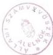
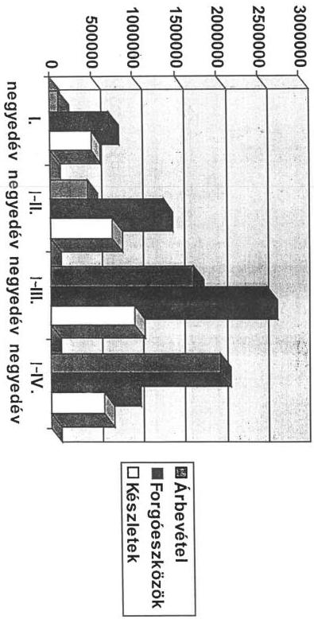
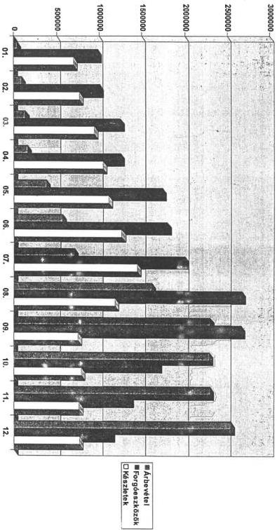
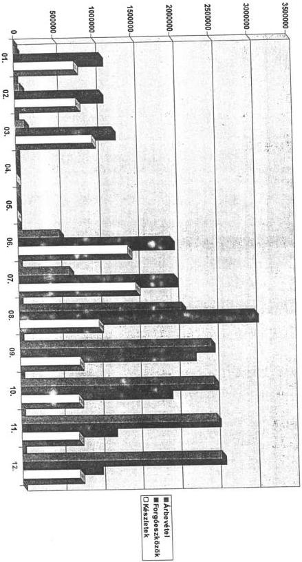

Állami Számvevőszék

V-2-61/96

Végleges

# JELENTÉS

A NEMZETI TANKÖNYVKIADÓ RÉSZVÉNYTÁRSASÁG
1994-1996. ÉVI GAZDÁLKODÁSÁRÓL

385.

1997. augusztus

---

A vizsgálat végrehajtásáért felelős:

Halász Gejza

számvevő igazgató

Az ellenőrzést vezette:

Dr. Kovácsné dr. Pósfay Zsuzsanna

osztályvezető főtanácsos

Az ellenőrzésben részt vettek:

Rideg Margit

számvevő tanácsos

Lázárné Ozorai Mária

külső szakértő

SÓLYOM LÁSZLÓ

számvevő tanácsos

---

# TARTALOMJEGYZÉK

BEVEZETÉS 1

I. ÖSSZEFOGLALÓ MEGÁLLAPÍTÁSOK, KÖVETKEZTETÉSEK, AJÁNLÁSOK 3

1. ÖSSZEFOGLALÓ MEGÁLLAPÍTÁSOK 3

1.1. A részvénytársasággá alakulás és a törvényes működés 3

1.2. Az Rt. gazdálkodása az állami vagyonnal, az állami vagyon változása 5

1.3. Piaci helyzet 6

1.4. A tankönyvkiadás jövedelmezősége 7

1.5. A társaság pénzügyi helyzete 10

2. KÖVETKEZTETÉSEK 11

3. AJÁNLÁSOK 13

II. RÉSZLETES MEGÁLLAPÍTÁSOK 15

1. Az állami vállalat átalakulása részvénytársasággá és a törvényes működés 15

1.1 Átalakulás részvénytársasággá 15

1.1.1. A belső szabályzatok 16

1.2 A belső ellenőrzés működése 17

1.2.1. A Felügyelő Bizottság működése 17

1.2.2. A belső ellenőrzés 18

1.2.3. A folyamatba épített és vezetői ellenőrzés 19

1.3. A szerződéses kapcsolatokból keletkezett károk és veszteségek 19

97.07.18 10:53 DE o:\users\sipos\wmunka\ntktartj.doc

---

2. Az Rt. gazdalkodasa az allami vagyonnal 21
2.1 Az Rt. vagyonanak valtozasa 21
2.1.1 A vagyongyarapodás uteme, forrása 21
2.1.2. A tulajdonos osztalekpolitika, vagyonkezelo munkaja 22
2.1.3.A vagyongyarapodás megjelenési formái 24
2.1.3.1. Ingatlanvasarlas es - felujitas, szamitogepes halozat kiépitése 25
2.1.3.2. Részesedesek gazdasági társaságokban 26
2.1.3.3. Befektetés vagyoni erteku jogba 30
2.2.A tankonyvkiadas jovedelmezsege 30
2.2.1 A tankönyvárak és a nyomdai árak összefüggese 30
2.2.2.A koltseg - es artervezes problemai 33
2.2.3. Szabad arak jogszerusege a tankonyvpiacon 36
2.2.4.A tarsasag jovedelmi helyzete, jovedelmezsegi mutatoi 38
2.2.5. A bevételt noveló allami támogatas szerepe, felhasználasa 39
2.2.6.A tarsasag tervezett jovedelmezsege 1997.evben 42
2.3 A tarsasag penzügyi helyzetének valtozása 43
2.3.1.A penzügyi gazdalkodás körülmenyei 43
2.3.2.A hitel felvetel es hitelkepesseg alakulasa 46
2.3.3.A penzügyi tervezés, elemzés, az üzleti terv és az éves beszámoló 48
2.3.4.A vagyoni es penzügyi helyzet alakulasa 49
2.3.5.Piaci helyzet 52
3.A Kozbeszerzsrol szoló 1995. évi XL. törvenyben foglaltak Ellenörzese 54
4.A kozszolgálati feladat teljesítese 55

2

---

V-2-61/ 1996/1997.

Témaszám: 311.

# JELENTÉS

# A NEMZETI TANKÖNYVKIADÓ RÉSZVÉNYTÁRSASÁG

# 1994-1996. ÉVI GAZDÁLKODÁSÁRÓL

# BEVEZETÉS

Az Állami Számvevőszék az 1989. évi XXXVIII. törvény 2. §-ának (6) bekezdésében foglaltak alapján megvizsgálta, hogy a Nemzeti Tankönyvkiadó Részvénytársaság (NTK Rt.) az átalakuláskor, majd az 1994-1996. években működése során betartotta-e a vonatkozó törvényeket, a közszolgálatra rendelt állami vagyonnal célszerűen és eredményesen gazdálkodott-e, a folyó működéshez nyújtott közvetlen és közvetett állami támogatásokat jogszerűen használta-e fel. A vizsgálat kiterjedt az Rt. által nyújtott szolgáltatások színvonalára is.

Az Állami Számvevőszék figyelemmel kísérte az állami tulajdonban lévő részvénytársaság részleges privatizációjának előkészítését 1997. I. félévében, amely a tartósan állami tulajdonban maradó 50 % + 1 szavazat feletti részvények értékesítésére irányul. A téma azért jelentős, mert a tankönyvkiadás a közoktatásra kötelezett tanulók széles körét érintő kulturális és pénzügyi hatásokkal jár. A Kiadó az állam vagyonával, kormánygaranciás hitellel, valamint az állami megrendelésekre közvetlen állami támogatás felhasználásával teljesítette eddig közszolgálati jellegű tevékenységét.

Magyarországon az általános tankötelezettséget törvény írja elő, következésképpen jelentős piachoz jut az a befektető, aki a NTK Rt. részvényeit megveszi. A tankönyv speciális árucikk: a tanuló használja, a szülő fizet érte, de a tanár választja ki és rendeli meg nagy tételben. Ily módon az iskola - megrendelőként - döntő szerephez jut az országos tankönyvlistára felvett tankönyvek eladási versenyében.

1

---

A NTK Rt. meghatározó szerepet tölt be a közoktatási tankönyvellátásban. A Kiadó a magyar pedagógus értelmiség szakmailag elismert személyiségeiből nívós szerzői csoportot alakított ki az elmúlt évek alatt, amely jelentős érték a cég működése szempontjából. A Kiadónak stratégiai szerepe van a tankönyvrendszer Nemzeti Alaptantervnek (NAT) megfelelő átalakításában is. A Nemzeti Alaptanterv bevezetését a közoktatásba 1998. évben írja elő a törvény. A tanügyi reform keretében számos új tankönyvet szükséges megírni és kiadni.

A Kiadó privatizációja során megfelelő garanciákat kell biztosítani a rendezett tankönyvellátás fenntartása érdekében. Garantáltan jó színvonalon, technikailag jobb minőségű, nagyobb választékú, az új tankönyvi koncepciónak megfelelő tankönyvekre van szükség. A magyar tankönyvkiadás versenypiac lett az elmúlt hét év alatt. A versenyfeltételek meghatározása érdekében, továbbá a kutatások, fejlesztések célirányos finanszírozásában szükség van egy - az állam által motiválható - jelentős piaci szereplőre. Ezt a szerepet ez ideig a Nemzeti Tankönyvkiadó Rt. töltötte be.

Az NTK Rt. teljes egészében állami tulajdonban áll és a 2091/1996. (IV. 11.) kormányhatározat értelmében a nemzetgazdaság működőképessége szempontjából jelentős társaságnak minősül. Az állam tulajdonában lévő vállalkozói vagyon értékesítéséről szóló - 1997. évi IV. törvénnyel módosított - 1995. évi XXXIX. tv. melléklete az NTK Rt.-ben a tartós állami tulajdon részarányát 50 % + 1 szavazatban határozta meg. A hivatkozott kormányhatározat előírta, hogy a privatizációért felelős tárca nélküli miniszter a Kormány részére is nyújtson be előterjesztést a társaság privatizációs koncepciójáról. A privatizációért felelős tárca nélküli miniszter 1997 májusában elkészítette az Rt. privatizációjára vonatkozó koncepció tervezetét.

Állami Számvevőszék helyszíni ellenőrzése a NTK Rt.-nél 1996. szeptember 1-jén kezdődött és 1997. április 30-án fejeződött be.

A helyszíni vizsgálat során az Állami Számvevőszék megismerte az Állami Privatizációs és Vagyonkezelő Rt.-nek (ÁPV Rt.) a Kiadóra vonatkozó határozatait, kikérte a Művelődési és Közoktatási Minisztérium (MKM), valamint a Pénzügyminisztérium (PM) szakvéleményét.

2

---

# I.

# ÖSSZEFOGLALÓ MEGÁLLAPÍTÁSOK, KÖVETKEZTETÉSEK, AJÁNLÁSOK

# 1. ÖSSZEFOGLALÓ MEGÁLLAPÍTÁSOK

# 1.1. A részvénytársasággá alakulás és a törvényes működés

A Nemzeti Tankönyvkiadó Rt.-t (továbbiakban: NTK Rt.) az ÁV Rt. alapította 1993. július 1-i hatállyal. Cégbírósági bejegyzése 1994. június 14-én történt meg. Az NTK Rt. induló alaptőkéje 303 millió Ft, a mérleg főösszeg 1.086 millió Ft, az 1993. I. félévi eredmény 41 millió Ft, a létszáma 186 fő volt.

Részvénytársasággá vagyonának átértékelése nélkül - a tartósan állami tulajdonban maradó vállalkozói vagyon kezeléséről és hasznosításáról szóló 1992. évi LIII. törvény V. fejezetében foglaltak szerint - alakult át. Az induló tőke saját tőkerésze 347 641 ezer Ft, ebből a jegyzett tőke 303 150 ezer Ft volt.

A Társaság jelenleg 100 %-ban állami tulajdonban van. Az 1995. évi XXXIX. törvény szerint a társaság vagyonának 50 % + 1 szavazat nagyságú része tartós állami tulajdonban marad.

Gyártási tevékenysége a közismereti tankönyvek, tanulást segítő kiadványok, útmutatók, segédkönyvek, egyetemi és főiskolai jegyzetek, valamint tankönyvek, nyelvkönyvek és nyelvi anyagok, nemzetiségi könyvek létrehozására terjed ki. Tevékenységi körébe tartozik még a kiskereskedelmi és külkereskedelmi tevékenység, valamint szálláshely-szolgáltatás.

3

---

A belső szabályzatok elkészültek és a hivatkozott törvényeknek megfelelnek, a törvényi változásoknak és a gazdálkodásban bekövetkezett változásoknak megfelelő aktualizálásuk folyamatban van. E munkában figyelembe veszik a jelen számvevőszéki vizsgálat megállapításait is. A jogi normák betartását, érvényesülését a belső ellenőrzés, az Rt. Felügyelő Bizottsága és a könyvvizsgáló ellenőrzi.

A belső szabályzatok betartatása a vezetői és a munkafolyamatba épített ellenőrzés részét képezi.

A közbeszerzésről szóló 1995. évi XL. törvény (továbbiakban Kbt.) a részvénytársaságokat mint önálló piaci szereplőket nem tekinti a törvény alanyának. Az 1. § d) bekezdése azonban olyan megszorítást tartalmaz, amely szerint a törvény alkalmazandó az állami támogatásban részesített szervezetre a támogatásból megvalósuló beszerzései tekintetében, illetve arra a szervezetre, amelynek fizetési kötelezettségeiért a Kormány az államháztartásról szóló törvény alapján kezességet vállalt.

Az NTK Rt. 1996. év során 1,3 milliárd Ft termelési hitelt vett igénybe kormánygaranciával és 154 millió Ft állami támogatást használt fel a kispéldányszámú speciális tankönyvek előállításához.

A Kbt. alkalmazására a törvény hatályba lépése (1995. november 1.) óta nem került sor, mivel

- a Penzügyminisztérium a kormánygarancia vallalása során ilyen kõtelezettseget nem irt elö,
a Mulevledesi es Kozoktatasi Minisztierium altal megkottt tamogatasi szerzodesek ilyen kotelezetsget nem tartalmaznak.

A törvény alkalmazása a tankönyvek megrendelési és gyártási sajátossága miatt körültekintést igényel, mert egyrészt

4

---

- szuk félev all rendelkezésre ahhoz, hogy a tankönyveket szeptemberig legyártsák és az iskolákba eljuttatassák és ha ezt az időszakot versenyeztétési eljárassal rovidítik, akkor a szeptemberi tankönyvellátás kerülhet veszélybe; masrészt
- a tankönyv-elöallitásnak tobb olyan eleme van, amely kizárja, illetve megneheziti a Kbt. alkalmazását (pl. a tankönyvirás szerői jogvédelem alá eső tevékenség, amely nem tartozik a törvény hatálya alá, az azonos nyomdatechnikával készülő könyvek megrendelési volumene gyakran nem éri el az 5 millio Ft-os minimális összeghatárt).

A társaság szerződéses kötelezettségeinek rendre eleget tesz és korrekt üzleti partner. Kockázatos ügylet volt a tankönyvterjesztés újjászervezése. 1994. évben 12 millió Ft-ot, 1995. évben 70 millió Ft-ot, 1996. évben 17 millió Ft-ot könyveltek el veszteségként. Ennek több olyan - az 1991-1993. évekből származó - tétele volt, amely elkerülhető, illetve a károkozóra áthárítható lett volna.

# 1.2. Az Rt. gazdálkodása az állami vagyonnal, az állami vagyon változása

Az NTK Rt. saját vagyona a vizsgált időszakban kiemelkedő mértékben gyarapodott. 1993. július 1-jén - a részvénytársasággá alakulás időpontjában - az 1,1 milliárd Ft-os eszközállományának 34,8 %-át fedezte saját vagyon, 1996. végén az 1,5 milliárd Ft-ra nőtt eszközállomány mögött már 76,3 %-ban állt saját vagyon.

A saját vagyon növekedése mellett az NTK Rt. a tulajdonosnak jelentős osztalékot is fizetett. Az alaptőke - arányos osztalék 1994-ben 37 %, 1995-ben 29 %, 1996-ban 29 % volt.

Az átalakulás után 3 és fél év alatt az NTK Rt. saját vagyona 787 millió Ft-tal gyarapodott. A növekedés csaknem teljes egészében saját erőből - a mérleg szerinti eredményből - valósult meg. Közvetlenül a vagyonát (tőketartalékát) növelő támogatásban ez idő alatt egyszer részesült a társaság. 1993. II. félévben 54,8 millió Ft beruházási,

5

---

felújítási célú támogatást kapott az MKM-től a tankönyvkiadás támogatására előirányzott összegből.

Az 1995-ös gazdasági év után az ÁPV Rt.-nek osztalékot fizető összesen 47 cég között a 9. helyen állt. A vagyonkezelés a tulajdonos részéről formális volt a társaságnál:

- A vizsgalt években az osztalékelvonásnak nem voltak a menedzsmenttel tobb évre szolóan egyeztetett, megalapozott elvei.
- A tulajdonos a vizsgalt években nem foglalkozott kiemelten a cég gazdalkodásával, üzletpolitikájával, varhato privatizációjával.
- A tulajdonos nem vitatta a nyeresegtervek realitasat, holott 1993-ban hatszor annyi adozás elotti nyeresége lettuce a cegnek, mint amennyit tervezett. 1994-ben és 1995-ben a tervhez mert tobblet egyarant \(63\%\), 1996-ban marCsak \(1\%\).
1996 nyaran indoklas nélkūl cserét le a tulajdonos 2 igazgatosági tagot, holott az elso igazgatoság megbizatása az átalakulástól az 1996-os gazdasági évet lezáró kozgyulésig szólt.

Az NTK Rt. befektetései néhány esetben veszteséggel jártak. A gazdasági társaságokban való részvétel legnagyobb vesztesége a Libros Kft.-nél keletkezett a vagyongazdálkodás hibái miatt. Az irodaház beruházás megvalósításánál, valamint a számítógépes ügyviteli hálózat kialakításánál szervezési, gazdálkodási hibákat követtek el.

### 1.3. Piaci helyzet

Az NTK Rt. a közoktatási tankönyvek kiadása területén meghatározó szerepet játszik, piaci részesedése 48-50 %-ra tehető. Tevékenységét élesedő piaci verseny és szűkülő piaci kereslet körülményei között látja el. Ennek nyomán piaci részaránya az elmúlt években csökkent, de vezető helyét megtartotta. (A tankönyvek iskolai értékesítésének darabszáma 1994. évben 11 millió db, 1995. évben 9,1 millió db, 1996. évben 7,8 millió db volt.)

A tankönyveladási piacon 5-6 jelentősebb versenytársa van.

6

---

Jelenleg a tankönyvpiac folyamatosan szűkül a folyamatosan csökkenő gyermeklétszám és amiatt, hogy terjed a használt tankönyvek felhasználása és egyes rétegek kevesebb tankönyvet vásárolnak mint a korábbi években.

A piaci körülmények létrejöttével a kiadó is létrehozta marketing-részlegét. Kialakította azokat a marketing módszereket, amelyeket a jelenlegi piaci körülmények között eredményesen alkalmaz. Nagy figyelmet fordít a tankönyvek minőségének biztosítására, és emellett szolgáltatásait is fejleszti. A minőségbiztosító és marketing munka is hozzájárult ahhoz, hogy árbevételét az 1993. évi 1.059 millió Ft-ról, 1996. évre 2.611 millió Ft-ra növelte.

Az NTK Rt. elért piaci pozícióinak megőrzésére törekszik. Tovább folytatja az elmúlt években megkezdett piaci munkát: erősíti referencia-hálózatát, bővíti kapcsolatait a referencia-iskolákkal, növeli a terjesztők és a tanárok jutalékát.

Fejlesztéseiben többlábon állásra törekszik, ennek érdekében új üzletágként ún. tanévhez nem kötött árukinálattal bővíti tevékenységét pl. térkép, távoktatás, multimédia. Ezzel egyidejűleg tovább bővíti részesedését a terjesztő vállalatokban. A Társaság megkezdte a felkészülést a Nemzeti Alaptanterv bevezetésére.

Az 1997. évi gyártásra idejében felkészültek. A nyomdákkal megkötötték a szerződéseket. Gondot jelentett azonban, hogy 1997 áprilisában még nem volt döntés a termelést finanszírozó hitelek kormánygaranciája és a kispéldányszámú tankönyvek támogatása ügyében. A késedelem veszteséget okozhat.

# 1.4. A tankönyvkiadás jövedelmezőségének alakulása

Az NTK Rt. vagyongyarapodásának forrása a jövedelmező gazdálkodás. Fontosabb jövedelmezőségi mutatói az alábbiak szerint alakultak. Az adózás előtti nyereség a nettó árbevétel %-ában 1994. évben 22,2 %, 1995. évben 15,2 % és 1996. évben 14 % volt.

7

---

A tankönyvkiadás jövedelmezőségét a vizsgált időszakban több tényező befolyásolta.

- Az 1991. augusztus 9-én hozott 2004/1991. (VIII. 9.) kormányhatározattal a tankönyvgyártás és támogatási rendszere gyökeresen megváltozott. A tankönyv szabad árassá vált. Tudatos fejlesztés eredményeként kialakult a tankönyvpiac, ennek nyomán gyors ütemben bővült a tankönyvgyártók száma és a tankönyvkínálat.
- A piaci áron értékesített tankönyvek megvásárlását támogató költségvetési juttatást az iskolafenntartó kapja. A speciális tankönyvek kivételével megszűnt a tankönyvkiadók közvetlen ártámogatása.
- Az oktatáshoz szükséges tankönyveket a szaktanár választja ki a kiadók kínálatából.
- A piaci viszonyok és ezen belül a költségek inflációs növekedése árfelhajtó hatással volt a tankönyvek árára, amelytől a szülőket csak csekély mértékben tudta megvédeni az újonnan kialakított támogatási rendszer és a piaci kínálat növekedése.

A vizsgált időszakban kiszámíthatatlan módon emelkedtek a papírárak. Kiszámíthatóbb, de emelkedő volt a nyomdai szolgáltatások ára és a honoráriumok is követték az inflációs folyamatokat.

A bizonytalansági tényezők és a tankönyvvé nyilvánítás, tankönyvtámogatás, valamint az iskolai tankönyvellátás rendjéről szóló 1/1994. (II. 3.) MKM rendelet egészségtelen módon elszakítja az értékesítési reálfolyamatokat az ármegállapítás időszakától, a kiadókat óvatosságra készteti és arra ösztönzi, hogy a kiszámíthatatlan veszteségekre tartalékot képezzenek az árakban, aminek árfelhajtó hatása van.

A Kiadó közvetlen állami költségvetési támogatást kap a nemzetiségi tanulók és a különböző fogyatékosok képzését ellátó közoktatási intézményben használt tankönyvekre, mert az évente szükséges alacsony példányszám miatt a támogatás nélküli piaci ár lényegesen meghaladná az egyéb közoktatási intézményekben használt, hasonló jellegű, nagypéldányszámban szükséges közismereti tárgyak oktatását segítő tankönyvek árát.

8

---

Az MKM keretében működő Tankönyv- és Taneszköziroda - a 2004/1991. (VIII. 9.) kormányhatározat felhatalmazása értelmében- támogatásban részesíti azokat a kiadókat akik kis példányszámú közismereti tankönyv előállítására vállalkoznak.

Az elmúlt években a NTK Rt. szerződést kötött az MKM Tankönyv- és Taneszközirodájával és 1993. évben 186 millió Ft, 1994. évben 164 millió Ft, 1995. évben 297 millió Ft és 1996. évben 39 millió Ft eladási árcsökkentő támogatást kapott a speciális tankönyvek előállításához és értékesítéséhez.

Az államháztartásról szóló 1996. évi CXXI. törvénnyel módosított 1992. évi XXXVIII. törvény értelmében a MKM 1997. évben kincstári finanszírozási körbe került és finanszírozási rendszere átalakult, a 208/1996. (XII. 23.) kormányrendelet előírása szerint program-finanszírozási rendszerre tért át. A finanszírozás ellenőrzött módon, számla alapján történik. Tehát a támogatási szerződések előkészítésénél az MKM-nek és az NTK Rt.-nek egyaránt figyelembe kell venni a megváltozott támogatási feltételeket és az abból következő teendőket.

Az 1997. évi jövedelmezőségi tendenciákat áttekintve megállapítható, hogy a Kiadó az értékesítési volumen csökkenése mellett összes árbevételének 1996. évi szinten tartásával számol. Ezt főként a tankönyvárak beépített 15 %-os emelésével biztosítja. Az áremelésnek ez a mértéke nem kompenzálja a termék előállításnál megjelenő 19-20 %-os inflációs költségnövekedést. A különbséget hatékonyságot javító (költségcsökkentés, piaci munka, termékösszetétel-változás) intézkedésekkel ellensúlyozza.

A vázolt tendenciák eredőjeként az 1997. évi várható nyereség mintegy 100 millió Ft-tal elmarad az előző évitől. A Kiadó 1997. évi terve 250 millió Ft adózás előtti nyereség elérésével számol.

9

---

# 1.5. A társaság pénzügyi helyzetének alakulása

A tankönyvgyártás készleteiben igen nagy részarányt képvisel a készárú, mert a tankönyvkiadás sajátosságaiból adódóan több évre előre gyártott tankönyvek is vannak, a biztonságos ellátás érdekében minden tankönyvnél 5-10 %-os tartalékot gyártanak. A kiadónak piaci érdeke fűződik a biztonságos ellátáshoz, valamint ahhoz, hogy az igénynövekedéshez tudjon alkalmazkodni.

A ciklus kiegyenlítésére a Kiadónak nincsenek pénzügyi forrásai, ezért jelentős, a vagyonát meghaladó mértékű, éven belüli rövidlejáratú hitellel kell hogy finanszírozza termelését. A Kiadó hitelszükséglete évről-évre növekedett az árbevétel felfutásának ütemében. 1994. évben 852 millió Ft, 1995. évben 1.040 millió Ft és 1996. évben 1.300 millió Ft volt az igénybevett, állami garanciával biztosított hitel.

Az elmúlt években a bankok hitelezési gyakorlata nem tette lehetővé az ügyfelek vagyonának mértékét meghaladó hitel kibocsátását, ezért a Kormány - a tankönyvellátás biztosítása érdekében - határozatot hozott a közismereti tankönyvgyártáshoz szükséges kereskedelmi hitelek fedezetéül állami hitelgarancia nyújtásáról.

A kormánygaranciával támogatott hitelek igénylésének koordinálását a Tankönyves Vállalkozók Testülete végzi és tesz javaslatot a hitelkeret elosztására a Pénzügyminisztériumnak. A NTK Rt. a hitelkeretet rendeltetésének megfelelően vette igénybe.

A Kiadó kellő gondossággal járt el a hitelek igénybevételénél, minden évben mintegy 10 banktól kért ajánlatot és választotta ki a számára legkedvezőbb, legalacsonyabb kamatozású hitelkonstrukciókat.

A pénzügyi helyzetet jellemző hatékonysági mutatók 1994-1996. években egy kivétellel kedvezően alakultak.

10

---

Kedvezőnek minősíthető és javuló :

- a likviditási rata, az általános likviditási mutató,
- a vevóallomány áfutási ideje,
- a szállítóallomány áfutási ideje,
- vevó - szállító arány,
- a tókeellátottsági mutató,
- a saját tőke növekedési mutató.

Kedvező, de ingadozó vagy romló tendenciájú:

- a dinamikus likviditási rata,
- hosszú távú likviditási rata,
- tokearányos eredmény,
- eszközhatékonysági mutató,
- arbevétel-arányos eredmény.

Ez utóbbi kategóriában a mutatók az elvárható módon alakultak, a tőke- és eszközhatékonyság meghaladja a banki alapkamatot.

A likviditási gyorsráta az egyetlen mutató, amely kedvezőtlennek minősíthető. Ennek oka, hogy a Kiadó a kis példányszámú tankönyvekre kapott támogatást a kötelezettségek között mutatja ki mindaddig, míg el nem számol vele.

## 2. KÖVETKEZTETÉSEK

A Nemzeti Tankönyvkiadó Rt. a részvénytársasággá alakulást követően erőteljes fejlődésnek indult, jól alkalmazkodik a piaci körülményekhez. A Kiadónak a tankönyvgyártásban hagyományai vannak, termékei jó minőségűek. Az állam vagyonát az induló vagyon többszörösére gyarapította. Hosszútávon is profitot tud termelni.

11

---

Az NTK Rt. tőkeösszetétele 1996. december 31-én:

|  jegyzett tőke | 303 millió Ft  |
| --- | --- |
|  tőketartalék | 128 millió Ft  |
|  eredménytartalék | 548 millió Ft  |
|  mérleg szerinti nyereség | 186 millió Ft  |
|  saját tőke | 1.165 millió Ft  |

Tőkearányos üzemi eredménye 44,5 %-os, eszközhatékonysági mutatója 35,5 %-os, ez jelentősen meghaladja a banki alapkamat mértékét és jó befektetésnek minősül.

A Kiadó korrekt üzleti partner. Hitelképességét a vizsgált időszakban megőrizte, kötelezettségeinek eleget tett. Kialakult piaci kapcsolatai vannak és a tankönyvpiac jelentős hányadát tudja magáénak.

A befektetés kockázatai közé tartozik a mintegy 500 millió Ft-ra tehető forgótőke hiány, amely folyamatos hitelszükségletet hoz létre, a kamatok pedig profitcsökkentő tényezők. Kockázatot jelentenek még a gyorsan fejlődő versenytársak, a társaság költségérzékenységének fejletlensége és a támogatási rendszer változásai.

A privatizáció módozatainál a következők ajánlhatók a döntéshozók figyelmébe:

Az üzletrész még a kisebbségi részvényes számára is jó befektetésnek minősül, bár nem kockázatmentes és a forgótőkehiány további investíciót igényel. Ezért a részvények eladási árfolyama széles tartományban ingadozhat.

A Kiadó megfelelő feltételek mellett hosszabb távon is nyereséges lehet. Nyereségéből osztalék nyerhető, a szükséges fejlesztések pénzügyi kereteinek biztosítása után. Következésképpen a privatizációs ár alsó határa az elkövetkező két évi elérhető osztalék 200 %-a lehet. A felső határa az Ernst és Young Kft. legújabb üzletértékelése - az 1997. március 31-i állapot - szerint az NTK Rt. részvényeinek árfolyama a jegyzett tőkére vetítve 537 %. Ezen a mértéken nem változtat, ha a kisebbségi részvénypakettet értékesítik. Az említett szakvélemény az állam (ÁPV Rt.) többségi tulajdonában lévő részvénycsomag jelenlegi árfolyamát azaz a Kiadó "valós piaci értékét" 1,6 milliárd Ft-ban határozta meg.

12

---

• A támogatási szerződés megkötésénél készüljön fel a pénzügyi megvalósulási idő meghosszabbodására. A munkák szakaszolásával, részszámlázási konstrukció kialakításával előzze meg a likviditási zavarokat.

Az ellenőrzés rendszerének továbbfejlesztése érdekében a támogatási szerződés rögzítse az MKM helyszíni ellenőrzési jogát, és írja elő a kötelezően vezetendő és megőrzendő nyilvántartásokat főként azért, hogy az eladási árak jelenleginél megalapozottabb ellenőrzését biztosítsa.

# Az ÁPV Rt. Igazgatóságának:

A gazdálkodás tartalékai kimerülőben vannak, ezért a jövőben - mint tulajdonos - fordítson nagyobb figyelmet:

- a költségnövekedés visszaszorítására, a belső tartalékokat feltáró közgazdasági elemzésekre,
- a műszaki- gazdasági tervező munka továbbfejlesztésére és
- a jogi érdekérvényesítés erősítésére a veszteségek elkerülése vagy minimalizálása érdekében.

# A Nemzeti Tankönyvkiadó Rt. Igazgatóságának:

- Vizsgáltassa meg tételesen az NTK Rt. eddigi kötelezettségvállalásainak célszerűségét és a gazdasági társaságokban való részvételének eredményességét.

14

---

Az NTK Rt. az 1995. évi XXXIX. törvény 7-8. §-a alapján tartósan állami tulajdonban maradó, a nemzetgazdaság működőképessége szempontjából fontos vállalkozás. Erre figyelemmel mérlegelni kell azt, hogy a Kiadó képes nyereségesen működni kiegyensúlyozott gazdasági feltételek között. Az állami tulajdonosnak osztalékot biztosíthat, illetve annak visszahagyása esetén a cég forgótőke hiánya mérsékelhető.

A privatizációt követő helyzet kockázatai:

- Aktív befektető esetén az állami képviselet feltehetően nem képes olyan erős érdekérvényesítő képességgel befolyásolni a cég működését, mint a közvetlenül pénzügyileg érdekelt befektető. Az előbbi képleten az sem segít, ha a privatizálandó részvénycsomag több befektető között oszlik meg, mert a kisebbségi részvényesek a közös érdekek mentén konzorcionálódhatnak.
- A vázolt helyzet rövidtávú érdekeket megtestesítő tőkekivonással járhat. Szakmai és pénzügyi befektető esetén egyaránt a - ma még jó színvonalú - tankönyvgyártás a rövid távú profitérdekek áldozata lehet veszélyeztetve a tankönyvgyártás minőségét.
- A szakmai befektető monopolhelyzetet teremthet a tankönyvpiacon. Ez felerősítheti - a már jelenleg is érzékelhető - árfelhajtó hatást és ezen keresztül az iskoláztatás terheit növeli a szülőknél.

### 3. AJÁNLÁSOK

#### A Művelődési és Közoktatási Minisztériumnak:

- A tankönyv-támogatási projekt kialakításánál vegye figyelembe, hogy az új tankönyvek kifejlesztésének az a szakasza, amely a szerző szellemi munkájához kötődik, oktatásfejlesztési tevékenység, mert az oktatás módszertani továbbfejlesztését szolgálja. A költségvetésben e tevékenységek között célszerű szerepeltetni.

13

---

# II.

# RÉSZLETES MEGÁLLAPÍTÁSOK

# 1. Az állami vállalat átalakulása részvénytársasággá és a törvényes működés

# 1.1. Átalakulás részvénytársasággá

A Nemzeti Tankönyvkiadó Rt.-t 1993. július 1-i hatállyal alapította a Magyar Állam tulajdonosi jogának gyakorlója, az Állami Vagyonkezelő és Privatizációs Rt. Jogelődje az állami Peregrinus Könyvkiadó Vállalat volt. A céget a Cégbíróság 1994. június 17-én jegyezte be: Cg. 01-10-042493 cégbírósági számon.

A Cégbíróság bejegyzés előtt a következő hiánypótlásokat kérte a cég akkor jogi képviselője útján: a saját tőke összetevőinek részletezését az átalakulási koncepcióhoz, az 1992. december 31-i vagyonleltárt, az Alapító Okirat tervezetét, a szociális és foglalkoztatási tervet, nyilatkozatot a tevékenységgel kapcsolatos környezetszennyezésről.

A cégbíróság a bejegyzést megelőzően az átalakulás lebonyolításával kapcsolatban észrevételt nem tett.

Azok a vállalatok, amelyek az átalakulást követően 100 %-ban állami tulajdonban voltak - ilyen volt a NTK Rt. is - az 1992. évi LIII. törvény 27. §-ában előírtak alapján, könyv szerinti vagyonértékkel alakulhattak át.

A Bonitas Kft. két vagyonértékelést és átalakulási vagyonmérleget készített: az elsőt 1993. január 1-i, a másodikat 1993. július 1-i fordulónappal. Az előzetes vagyonértékelés az átalakulási vagyonmérleg főösszegét és valamennyi részösszegét - a saját tőke részösszegein kívül - változatlanul hagyta. Ez ma már nem egyezik meg a Tár-

15

---

saság reális piaci értékével, ezért a tulajdonosi jogokat gyakorló ÁPV Rt. 1996. év végén újabb megbízást adott egy nemzetközi könyvvizsgáló cégnek a jelenlegi tényleges vagyonérték megállapítására.

A részvénytársaság alapító okirata megfelel a gazdasági társaságokról szóló 1988. évi többször módosított VI. törvény előírásainak. Az alapító ÁV Rt. vezérigazgatója írta alá, ügyvéd ellenjegyezte, a cégbíróság elfogadta. A vagyonmérleg és a nem pénzbeli alapítói hozzájárulás (az apportlista) az okirat csatolt melléklete.

Az alapító okirat, a törvényi előírásoknak megfelelően rendelkezik a fontosabb jogosítványokról és tevékenységekről: a részvényesek jogairól és kötelezettségeiről, a részvénykönyvről, a részvények kibocsátásáról, a részvények átruházásáról, a részvényekhez fűződő jogokról és kötelezettségekről, a részvényekhez fűződő jogok megváltoztatásáról, a közgyűlésről (helyesebb volna az alapítóról, ill. utódjáról), az alaptőke felemeléséről, leszállításáról, az osztalék kifizetéséről, a részvényesek közötti jogviták intézéséről.

### 1.1.1. A belső szabályzatok

A Társaságnál a működés és gazdálkodás fontosabb területeinek belső szabályzata elkészült az elmúlt években. Ezek közül megnyugtatóan szabályozott, naprakészen karbantartott a kollektív szerződés, az irattározási és iratkezelési szabályzat, a számítástechnikai, adatvédelmi szabályzat, pénzkezelési szabályzat és a selejtezési szabályzat.

A belső szabályzatok egy része korszerűsítésre, kiegészítésre szorult. Konkrét hiányosságok voltak a számviteli rendben és hiányzott az önköltség-számítási szabályzat. A szabályzatok korszerűsítésének és kiegészítésének szükségességét a NTK Rt. menedzsmentje is felismerte és szervező szakembert bízott meg a szabályzatok felülvizsgálatával és a korszerűsítés elvégzésével. A felülvizsgálat eredményei a következőkben összegezhetők:

16

---

A Szervezeti és Működési Szabályzat (SZMSZ) 1994-ben készült el. A szervezeti egységek működését csak általánosságban szabályozza. Az azóta bekövetkezett szervezeti módosítások külön vezérigazgatói utasítással léptek életbe. A továbbfejlesztés során egyfelől kidolgozzák az egyes szakterületek részletes feladat- és hatáskörét, másfelől a döntési hatáskörök bemutatására táblázat készül.

A képviseleti és aláírási jogok szabályozása az SZMSZ-ben szerepel. Ennek korszerűsítése, részletes, névre szóló kidolgozása folyamatban van.

Az újonnan hatályos jogszabályok alapján aktualizálásra vár a rendészeti szabályzat, a tűzvédelmi szabályzat, a munkavédelmi szabályzat és a leltározási szabályzat.

Az 1996. évi selejtezési szabályzat szerinti részletes indoklás hiányzik a jegyzőkönyvekből és a nyomdáknál tárolt papír selejtezéséről a helyszíni jegyzőkönyvet a selejtezési jegyzőkönyvhöz nem mellékelték.

### 1.2 A belső ellenőrzés működése

#### 1.2.1. A Felügyelő Bizottság működése

A Felügyelő Bizottság (továbbiakban: FB) a Társaság legfelső ellenőrzési szerve. Ülésein számos, a gazdálkodás fontosabb területét érintő témával foglalkozott eddigi működése során.

Első ülés 1994. február 3-án volt. Az FB az év során rendszeresen ülésezett: a munka megindításával kapcsolatos kérdésekről, a megtörtént átalakulásról, az ezt követő vagyoni helyzetről az 1993. évi gazdálkodásról, az 1994/95. tanévben a tankönyvellátásra felkészülésről számoltatták be a menedzsmentet. Foglalkoztak a privatizáció előkészítésének koncepciójával, az árképzési gyakorlat fejlesztésének szükségességével, a selejtezési gyakorlat hiányosságaival, az 1994. évi gazdálkodással.

17

---

1995-ben már a cég szabályozottságának helyzetével foglalkoztak. Bemutatták az FB-nek a készíttetett marketing-vizsgálat eredményeit, foglalkoztak a privatizációs stratégiával. Beszámoltatták az ügyvezetést a befektetésekről, fejlesztésekről.

Az FB figyelme 1996-ban a piacszerzésre és a költséggazdálkodásra irányult. A belső ellenőr jelentése alapján tájékozódott a székházberuházásról és a többletköltségek indoklásáról. Értékelte a marketing-munka hatékonyságát, hasznosítását, a könyvkészletek alakulását, valamint az új Nemzeti Alaptantervhez kapcsolódó tennivalókat, továbbá az aktuális gazdasági kérdéseket. A privatizáció lehetőségeivel ismétlődően foglalkoztak.

Az FB éves munkatervek alapján látta el a felsorolt feladatokat. Az FB tevékenysége a Társaság működésének lényeges területeit átfogta. A Felügyelő Bizottság tevékenysége megfelelő ügyrendje 1. pont (2) bekezdésében foglaltaknak, mely szerint:

„... ellenőrzi a társaság ügyvezetését, ügymenetét, a jogszabályokban, az alapító okiratban foglaltak betartását, a közgyűlési határozatok végrehajtását, ... vizsgálja a társaság gazdálkodását, az ügymenet szabályozottságát”.

### 1.2.2. A belső ellenőrzés

A belső ellenőrzést egy fő nyugdíjas revizor, részmunkaidőben látja el. Tevékenységét a vezérigazgató által előírt és a Felügyelő Bizottság által jóváhagyott féléves munkatervek alapján végzi. Az ellenőrzött témákról készített jegyzőkönyveket a belső ellenőr a vezérigazgatónak nyújtja be. A Felügyelő Bizottság félévenként kéri a belső ellenőr rövid összefoglaló jelentését, amelyet megtárgyal és elfogadásáról dönt. Ez az eljárás eltér a gazdasági társaságokról szóló 1988. évi .VI. törvény 295. § (2) bekezdése előírásaitól.

A belső ellenőr jó felkészültségű, gyakorlott szakember. A Felügyelő Bizottság javaslatára a Társaság vezetése a belső ellenőr megállapításait intézkedések kiadásával hasznosítja. Ennek nyomán intézkedés történt a belső szabályzatok kiegészí-

---18

---

tésére és a jelenleg folyamatban lévő felülvizsgálatára, a rezsi költségekkel kapcsolatos takarékossági intézkedésekre, az önelszámoló egységek kialakítására, társadalombiztosítási járulék ellenőr beállítására, a szerződések határozottabb érvényesítésére stb.

### 1.2.3. A munkafolyamatba épített és a vezetői ellenőrzés

A munkafolyamatba épített és a vezetői ellenőrzés hagyományos eszközökkel folyik. A munkaköri leírások részletesen meghatározzák a feladatokat és jogköröket, a vezetői ellenőrzés két legfontosabb eszköze a beszámoltatás és az aláírási, ellenjegyzési jog gyakorlása.

A beszámoltatás rendszeres munkaértekezleten és időnként írásos beszámolók készíttetésével történik, az aláírási és ellenjegyzési jog gyakorlása a bizonylatok, kimenő írásos anyagok és a teljesítések tételes ellenőrzését biztosítják. Az aláírási, érvényesítési és ellenjegyzési jogok szabályozottak. A szabályokat betartják.

A vezetői és munkafolyamatba épített ellenőrzés jelenlegi eszköztára képes biztosítani a megfelelő működést. A szabályzatok folyamatban lévő fejlesztése ezt a funkciót erősítheti.

### 1.3. A szerződéses kapcsolatokból keletkezett károk és veszteségek

Veszteségként lekönyvelt tételek és összegek a következők voltak a vizsgált időszakban:

ezer Ft-ban

|  Veszteségfajta | 1994. év | 1995. év | 1996. év  |
| --- | --- | --- | --- |
|  Hitelezési veszteség | 10.153 | 52.480 | 867  |
|  Káreseményekkel kapcs. veszteségek | 3 | 35 | -  |
|  Bírságok | 1.403 | 9.869 | 257  |
|  Késedelmi kamatok | 100 | 1.709 | 599  |
|  Késedelmi pótlékok, adóbírság | 501 | 6.061 | 14.023  |
|  Ajándékkönyvek utáni ÁFA | - | 368 | 1.825  |
|  Összesen: | 12.160 | 70.522 | 17.571  |

19

---

Ezen összegekből a főbb témák a következők: Az Almanach Könyvkereskedelmi Vállalkozás 1994 óta behajthatatlanná vált 3,8 millió Ft tartozása, dél-magyarországi Piért 36,8 millió Ft-os tartozása (a céget felszámolták és a felszámoló szerint 0 %-os kielégítési szint várható), az APEH 9,8 millió Ft-os bírsága, amelyet a bíróság első fokon 8,1 millió Ft-ra csökkentett.

Az 1994. évi Perfector Kft. elleni 5,7 millió Ft kétszeres kifizetése miatti követelés miatt felelősségre vonás nem történt. A céget felszámolják, felszámoló még a volt ügyvezetést sem találta meg.

A selejtezési károk is szerződéses kötelezettségekből származtak.

1996. évben a készleteket megvizsgálva a Kiadó 1,1 millió db, 43 millió Ft értékű könyvkészlet selejtezéséről döntött. Így az 1996. évi induló készlet darabszáma az éves termelést és értékesítést is figyelembe véve 7,8 millió db-ról 5,8 millió db-ra csökkent. A csökkenés összege relatíve alacsony a volumenhez képest, mert a selejtezett kiadványok nyilvántartási ára lényegesen alacsonyabb, mint a megmaradó kiadványoké.

A selejtezés nem mindenben felelt meg a célszerű gazdálkodás követelményeinek. A 13/1996. sz. selejtezési jegyzőkönyv alapján 4,3 millió Ft papír selejtezésére is sor került. A dokumentum tanúsága szerint a jegyzőkönyvet az NTK Rt. Szobránc u. 6-8. központi iroda helyiségében vették fel. A selejtezési határozat a különféle nyomdákban elhelyezett selejtezendő papírokra vonatkozik, amelyeket a Társaság feltehetően korábban vásárolt a könyvgyártás alapanyagaként. A jegyzőkönyvhöz mellékelték az érintett nyomdák leveleit, amelyben megrongálódás stb. miatt selejtezendőnek ítélik a náluk tárolt papírt.

A selejtezési jegyzőkönyvhöz nem mellékelték:

- a helyszini selejtezési jegyzokonyvet és a nyomdai helyszini leltart,
- a selejtezés okait, valamint a felelosséget vizsgaló dokumentumot,
- a hasznosithatosagot vizsgaló dokumentumot.

20

---

Indoklás nélkül korszerűtlennek, használhatatlannak minősítettek:

130 ezer Ft megsargult, olcsoaras tankonyvet 14/1996. sz. selejtezesi jegyzokonyv, valamint
33,7 millio Ft erteku orosz, angol, francia, olasz spanyol nyelvkonyvet, valamint szerb, horvat, szloven, roman, nemet nemzetisegi konyvet. A konyveket zuzdara elokeszitettek. Nincs nyoma, hogy a hasznositas lehetoseget vizsgaltak volna.

Az eljárás nincs összhangban a Társaság selejtezési szabályzatával.

# 2. Az Rt. gazdálkodása az állami vagyonnal

# 2.1 Az Rt. vagyonának változása

Az NTK Rt. saját vagyona a vizsgált időszakban kiemelkedő mértékben gyarapodott. 1993. július 1-jén - a részvénytársasággá alakulás időpontjában - az 1,1 milliárd Ft-os eszközállomány 34,8 %-át fedezte saját vagyon, 1996. végére az eszközállomány 1,5 milliárd Ft-ra nőtt, amelyből 79,7 % volt a saját vagyon.

Az NTK Rt. a tulajdonosnak jelentős osztalékot fizetett a saját vagyon növekedése mellett. Az alaptőke (részvénytőke) - arányos osztalék 1994-ben 37 %, 1995-ben 29 %, 1996-ban 29 % volt.

# 2.1.1. A vagyongyarapodás üteme, forrása

millió Ft-ban

|  Megnevezés | 1993. VII. 1. | 1993. XII. 31. | 1994. XII. 31. | 1995. XII. 31. | 1996. XII. 31.  |
| --- | --- | --- | --- | --- | --- |
|  Jegyzett tőke | 303 | 303 | 303 | 303 | 303  |
|  Tőketartalék | 75 | 125 | 129 | 129 | 129  |
|  Eredménytartalék | - | - | 201 | 364 | 548  |
|  Mérleg szerinti eredmény | - | 206 | 163 | 185 | 185  |
|  Saját tőke összesen | 378 | 634 | 796 | 981 | 1.165  |
|  Az alapítónak fizetett osztalék | - | - | 109 | 88 | 88  |

21

---

Az átalakulás után 3 és fél év alatt az NTK Rt. saját vagyona 787 millió Ft-tal gyarapodott, tehát több mint háromszorosára növekedett. A növekedés csaknem teljes egészében saját erőből - a mérleg szerinti eredményből - valósult meg. Közvetlenül a vagyonát (tőketartalékát) növelő támogatásban ez idő alatt egyszer részesült a társaság. 1993. II. félévben 54,8 millió Ft beruházási, felújítási célú támogatást kapott az Művelődési és Közoktatási Minisztériumtól a tankönyvkiadás támogatására előirányzott összegből.

### 2.1.2. A tulajdonos osztalékpolitikája, vagyonkezelő munkája

Az ÁV Rt., illetve az ÁPV Rt. 1993-1995. évekről szóló éves beszámolói alapján megállapítható, hogy a kultúra-portfolióba tartozó cégek között az NTK Rt. mindhárom évben kiugróan magas adózott eredményt ért el összegét tekintve, valamint az árbevételhez és a saját tőkéhez viszonyítva is.

Az 1993-as gazdasági év adózott eredményéből az NTK Rt.-nek nem kellett osztalékot fizetnie. Helyette az ÁV Rt. „engedélyt adott” a kiadónak 30 millió Ft értékű részvény jegyzéséhez a Szegedi Nyomda privatizációjában. A privatizációban való részvételt és a részvényjegyzésen túl a vele járó egyéb kötelezettségvállalást (pl. évi 200 millió Ft értékű rendelés garantálását) a kiadó saját szempontjából ésszerűtlennek tartotta. A privatizációra végül is a nyomda csődje miatt nem került sor, a 30 millió Ft a kiadó saját vagyonában maradt.

1994. évi adózott eredményből az osztalékfizetésben a kulturális portfólióból az első helyen az NTK Rt. állt 108,8 millió Ft-tal.

Az 1995-ös gazdasági év után az ÁPV Rt.-nek osztalékot fizető összesen 47 cég között is előkelő helyet foglalt el az NTK Rt. A 15 Ft-tól 1,8 milliárd Ft-ig terjedő osztalékskálán a legnagyobb osztalékkal kezdődő nagyságrendben a 9. helyen állt.

Az egymást váltó állami tulajdonosok (ÁV Rt., ÁPV Rt.) részéről formális volt a vagyonkezelés az NTK Rt. esetében.

---22

---

A vizsgált években az NTK Rt.-nél az osztalékelvonásnak nem voltak a menedzsmenttel több évre szólóan egyeztetett, megalapozott elvei. Első közelítésben a tulajdonos az adózott eredmény 50 %-át tervezte elvonni, de egyezkedésre minden évben lehetőséget adott. A tényleges osztalék végül is az adózott eredmény 30-40 %-át tette ki. A nyereség-elvonási alkuban a kiadó részéről csak a beruházási, a befektetési tervek pénzügyi finanszírozásának szükséglete merült fel érvként, a likvid forgóeszközök állománya növelésének igénye nem.

Az NTK Rt. gyakran hangsúlyozott közszolgálati szerepe ellenére - vélhetően a stabil és jelentős jövedelemtermelésének biztonságában - a tulajdonos a vizsgált években nem foglalkozott kiemelten a cég gazdálkodásával, üzletpolitikájával, várható privatizációjával. A tulajdonosnál évente változott a kultúra (humán infrastruktúra) - portfolió ügyvezetőjének személye, a cég igazgatóságában pedig 3 és fél év alatt háromszor cserélődött a tulajdonos képviseletét ellátó személy. A megalapozott nyereség-elvonási politika hiányán túl a vezérigazgató részére kitűzött prémiumfeladatok is arról tanúskodnak, hogy a tulajdonos nem ismerte kellően a társaság teljesítőképességét, problémáit (pl. a költség- és ártervezés gondjait).

Az igazgatóság és az FB 1994. február 3-án tartott közös ülésén az ÁV Rt. képviselője javasolta, hogy „...a 80 %-os prémiumhoz az alaptőke 10 %-át elérő nyereség legyen a feltétel”. A jegyzőkönyvből nem derül ki, hogy adózás előtti vagy adózott nyereségről van szó. Az NTK Rt. alaptőkéje 303 millió Ft, ennek 10 %-a 30 millió Ft. Az igazgatóság tagjai elfogadták a javaslatot, annak ellenére, hogy a cég 1994. januárjában készített üzleti terve jelzi: „...az már most látszik, hogy a korábban jelzett 258 millió Ft-os adózatlan eredmény várhatóan 400 millióra fog emelkedni”.

Az 1995-1996. gazdasági évekre a prémiumfeladatok kitűzése már a tárgyévi eredménytervek figyelembe vételével történt, az azokban szereplő adózott, illetve adózás előtti nyereségek elfogadásával.

23

---

A tulajdonos nem vitatta a nyereségtervek realitását, holott 1993-ban hatszor annyi adózás előtti nyeresége lett a cégnek mint amennyit tervezett. 1994-ben és 1995-ben a tervhez mért többlet egyaránt 63 %, 1996-ban már csak 1 %.

A vagyonkezelés formalitására utal az is például, hogy 1996 nyarán indoklás nélkül cserélt le a tulajdonos 2 igazgatósági tagot, holott az első igazgatóság megbízatása az átalakulástól az 1996-os gazdasági évet lezáró közgyűlésig szólt.

# 2.1.3. A vagyongyarapodás megjelenési formái

A tankönyvkiadás a hagyományos munkamegosztásban (a nyomdai munkákat megrendelésre a nyomdák végzik) alapvetően szellemi tevékenység, amely különösebb tárgyi eszközöket - ingatlanokat, műszaki berendezéseket, járműveket stb. -, befektetéseket nem igényel.

A kiadó az átalakulását követő évtől - a tankönyvellátás finanszírozási rendszerének megváltozásától - kényszerült állami támogatás nélkül a saját eszközeivel gazdálkodni, bár erre már egy évvel korábban készült a szabadpiaci tankönyvárak megállapításával.

Az átalakuláskor, illetve a tankönyvellátás finanszírozási rendszerének megváltoztatásakor a kiadó külön forgóeszköz-feltöltésben nem részesült, azonban a vártnál nagyobb nyereségei ennek kompenzálására lehetőséget adtak. 1993-ban pl. 120 millió Ft adózás előtti extra nyeresége keletkezett a kiadónak abból, hogy a régi - állami támogatással gyártott - könyvkészleteit szabadpiaci áron értékesítette. Az MKM forgóeszköz-feltöltésre a Kiadónál hagyta ezt a jövedelmet.

Az NTK Rt. saját vagyonának 787 millió Ft-os növekményéből 374 millió Ft a befektetett eszközök - vagyoni értékű jogok, ingatlanok, részesedések gazdasági társaságokban - állományát gyarapította, a készletekre 333 millió Ft jutott.

24

---

A jövedelem-felhalmozásnak e formái a tankönyvkiadás fajlagos költségeit növe-lik (nagyobb termelési hitelre van szükség, amely után jelentős kamatot kell fi-zetni, nagyobb az értékcsökkenési leírás, stb.).

# 2.1.3.1. Ingatlanvásárlás és - felújítás, számítógépes hálózat kiépítése

A társaság két legnagyobb értékű beruházása a székház és a számítógépes hálózat kiépítése volt. E célra három és fél év alatt összesen 305 millió Ft-ot költött, ebből a székház 269 millió Ft-ot, a hálózat 36 millió Ft-ot tett ki.

A kiadó 1992. végéig az MKM épületében működött összesen 1231 m² irodahe-lyiségben és 95 m² raktárhelyiségben. Ezt követően 1994 novemberéig máshol bérelt irodát, miközben 1993. II. félévben 9500 m² területű két épületet vásárolt 110 millió Ft-ért jövendő saját székházának megteremtéséhez.

A két épület közül a nagyobbat (5000 m²) gyors ütemben felújította, 159 millió Ft-ot költve rá. További 40 millió Ft kiadást jelentett az épület irodáinak, étter-mének, konyhájának, stb. berendezése. A minden igényt kielégítő kultúrált mun-kahely 40-50 ezer Ft/m²-es létesítési költsége alacsonynak mondható a beruházási árak ismeretében.

A társaság belső ellenőre vizsgálta a székházépítés műszaki és pénzügyi megva-lósítását. A jelentésében megállapította, hogy a tervezői, kivitelezői munkákra pl. a kiadó nem írt ki pályázatot. A tervezést és kivitelezést azonos cég végezte, és az általa benyújtott költségvetést a kiadó nem vizsgáltatta felül műszaki szakértővel. A szerződéskötésbe jogi képviselőjét nem vonta be a Kiadó, pedig általa elkerül-hető lett volna néhány előnytelen kikötés.

A számítógépes ügyviteli hálózatának kialakítására 1993-96-ban összesen 36 millió Ft-ot költött a cég. E beruházást csak egyszer - 1994 áprilisában - vizsgálta meg a belső ellenőr. Megállapítása szerint 1993-ban úgy kezdték el a gépvásárlásokat, hogy nem volt a hálózatfejlesztésnek írásban összefoglalt, kidolgozott koncepciója,

25

---

megvalósítási ütemterve és kalkulációja a várható költségekről. Csak igénylisták és listákat jóváhagyó emlékeztetők készültek.

### 2.1.3.2. Részesedések gazdasági társaságokban

|   | Alapítás éve | 1993. július 1. |   | 1994. december 31. |   | 1996. december 31.  |   |
| --- | --- | --- | --- | --- | --- | --- | --- |
|   |   |  Millió Ft | % | Millió Ft | % | Millió Ft | %  |
|  *Szó-Kincs-Tár Nyelvisk. Kft.* | 1989. | 0,69 | 100,0 | 0,69 | 100,0 | - | -  |
|  *Magyar Macmillan Könyvkiadó Kft.* | 1991. | 6,50 | 46,4 | 6,50 | 46,4 | 6,50 | 46,4  |
|  **LIBROS Könyvterj. és Forg. Kft.** | **1992.** | **0,49** | **49,0** | **4,95** | **55,0** | **49,45** (-29,7 értékvesztés) | **49,0**  |
|  *LOMBARD Könyvház Kft.* | 1993. | 5,00 | 50,0 | 5,00 | 50,0 | 5,00 | 50,0  |
|  *TÉKA Könyvért és Könyvkiadó Kft.* | 1993. | - | - | 0,50 | 0,5 | - | -  |
|  *Pannon Klett Könyvkiadó Kft.* | 1994. | - | - | 2,90 | 29,0 | - | -  |
|  *GOLDPLAST Kft.* | 1996. | - | - | - | - | 4,68 | 46,0  |
|  *KODEX'96 Kft.* | 1996. | - | - | - | - | 1,25 | 50,0  |
|  *Kaposvári Nyomdász Kiadó Kft.* | 1996. | - | - | - | - | 10,93 | 36,5  |
|  *Somogyi Nyomdász Kiadó Kft.* | 1996. | - | - | - | - | 0,58 | 29,0  |
|  **Összesen** |  | **12,68** | **-** | **20,54** | **-** | **78,39** | **-**  |
|  *Az összes befektetett eszköz %-ában* |  | 12,6 |  | 5,8 |  | 15,6 |   |
|  *A saját tőke %-ában* |  | 3,4 |  | 2,6 |  | 6,7 |   |

26

---

A részesedések közvetlenül a székházépítés után következnek a szabad pénzeszközök befektetésében. Az 1993. évi 12,7 millió Ft-ról 1996. évre 78,4 millió Ft-ra növekedett a részesedések könyv szerinti értéke az értékvesztés elszámolása előtt.

A rendkívül dinamikus növekedés ellenére e befektetések osztalékban kifejezett üzleti haszna csekély. A társaságok alapításának elsődleges célja nem is az osztalékszerzés volt, hanem az, hogy a kiadó befolyásolási, irányítási, ellenőrzési lehetőségekre tegyen szert saját tevékenysége folytatása, kiszélesítése érdekében. Az inkább szakmai célú befektetések azonban nem valósították meg a kiadó célját függetlenül attól, hogy a társaságok a jelenlegi vezetés alapította (pl. Pannon Klett), vagy örökölte (Szó-Kincs-Tár, Magyar Macmillan).

A társaságok alapításánál csak a könyvterjesztést végző cégek esetében volt némi befektetési kényszer. 1991-ben a két nagy állami könyvterjesztő cég - amelyek pontos munkamegosztásban a tankönyvterjesztést is végezték - megszűnt. A Tankönyvkiadó Vállalatnak meg kellett találnia a módját annak, hogy tankönyvei eljussanak a tanulókhoz. Amelyik országrészben PIÉRT Kft. nem tudta megfelelően ellátni a könyvterjesztési feladatot, ott a Tankönyvkiadó új kft.-t alapított (Győrben a LIBROS Kft.-t, Szegeden a LOMBARD Kft.-t).

Az 1993-1994. gazdasági évek után csak e két kft. fizetett osztalékot az NTK-nak. A LOMBARD mindkét évben 2,5-2,5 millió Ft-ot, azaz a befektetett tőke után 50-50 %-ot. A LIBROS 1993. év után 1,9 millió Ft-ot, az 1994. év után 10,9 millió Ft-ot.

Az 1995-ös gazdasági év után egyetlen cégtől sem kapott osztalékot a kiadó. Az 1995-ös évet a LIBROS - 60 millió Ft-os - veszteséggel zárta. Emiatt saját tőkéje 91,9 millió Ft-ról - amelynek a társasági szerződés szerint akkor még csak 28,3 %-a (26 millió Ft) volt az NTK Rt. tulajdona - 32,1 millió Ft-ra csökkent. A LIBROS Kft. 1996. évre vonatkozó prognózisa szerint a tőkecsökkenés folytatódott, 1996. végén saját tőkéje kb. 13 millió Ft. Az NTK Rt. 1996-ban - július 1-ig

---27

---

a tényleges pénzátutalásokat is lebonyolítva - üzletrész-vásárlás, törzstőke-emelés révén tulajdonrészét a korábbi 26 millió Ft-ról 49,45 millió Ft-ra (a törzstőke 49 %-ára) növelte a LIBROS Kft.-ben, amelyet 6,4 millió Ft híján gyakorlatilag el is veszített. Az NTK Rt. 1996. évi mérlegében a LIBROS Kft. már 29,7 millió Ft-tal csökkentett értékben szerepel. Az NTK Rt. menedzsmentje úgy ítélte meg, hogy az Rt.-nek érdeke fűződik a LIBROS teljes csődjének elkerüléséhez az észak-dunántúli tankönyv-terjesztési tevékenység fenntartása miatt.

A számvevőszéki vizsgálat a LIBROS-befektetés folyamatát áttekintve az alábbi főbb hiányosságokat, illetve problémákat tárta fel:

- A menedzsment 1995-96-ban az igazgatóság által elfogadott üzleti tervektől eltérően és az Alapító Okirat vonatkozó előírásait be nem tartva növelte részesedését a Kft.-ben.

Az 1995-ös üzleti tervben a LIBROS Kft. tőkeemelésére 10-12 millió Ft volt előirányozva. Ezzel szemben a tényleges tőkeemelés az NTK Rt. részéről 21,05 millió Ft volt, amiből 10,9 millió Ft osztalék-visszaforgatás, 8,5 millió Ft 1995. évi átutalás, 1,65 millió Ft 1996. évi átutalás volt.

Az 1996. évi üzleti tervben a LIBROS Kft. tőkeemelésére nincs tervezett összeg. Ezzel szemben a tényleges tőkeemelés 23,45 millió Ft volt.

- Az Alapitó Okirat szerint a részesedes noveléshez 10-20 millio Ft kozott az Igazgatoság, 20 millio Ft felett - 2 év azonos befekteteit egybe számítva - a kozgyulés jováhagyása szükséges. Ilyet az NTK menedzsmentje nem tudott felmutatni.
- Az Igazgatosag es az FB tobbször kert, illetve kapott informaciot a kiado részesedeseiról, de igazgatosagi üles onallo napirendi pontjakent elso izbenCsak 1996. oktober 30-an szerepelt ez a tema.

28

---

Az ekkor beterjesztett 1996. március 27-i állapotot tükröző adatok már elavultak és félrevezetőek voltak, hiszen az NTK Rt. részesedése a LIBROS-ban 1996. júliusától már nem 24,35 millió Ft (26 %), hanem 49,45 millió Ft (49 %). A beszámolóban nincs szó a LIBROS 1995. évi 60 millió Ft-os veszteségéről, és annak következményeiről sem. Az Igazgatóság újabb, részletesebb kimutatást kért egy későbbi időpontra, azonban háromnegyedév után sem derült ki a LIBROS befektetés tényleges nagysága, viszont láthatóvá váltak gazdálkodásának súlyos problémái. Ez utóbbiakkal kapcsolatban a jelenlévőknek nem volt kérdése.

Az élő és a megszűnt befektetések miatti tőkeváltozások a következők voltak az 1993. július 1. és 1996. december 31. közötti időszakban (millió Ft-ban).

|  Megnevezés | Befektetés | + Eladás (El.) + Osztalék (Oszt.) + Értéknöv. (ÉN.) - Értékveszt. (ÉV.) | Tőkeváltozás 1996. dec. 31.ig.  |
| --- | --- | --- | --- |
|  **A.) Megszűnt befektetések** |  |  |   |
|  Szó-Kincs-Tár | 0,69 | - 0,69 (ÉV.) | - 0,69  |
|  Magyar Macmillan | 6,50 | + 8,17 (El.) | + 1,67  |
|  TÉKA | 0,50 | + 0,15 (El.) | - 0,35  |
|  Pannon Klett | 2,90 | + 4,35 (El.) | + 1,45  |
|  **A.) Összesen** | **10,59** | **11,98...** | **+ 1,39**  |
|  **B.) Élő befektetések** |  |  |   |
|  **1. Terjesztők** |  |  |   |
|  Libros Kft. | 49,45 | + 1,9 (Oszt.93.) + 10,9 (Oszt.94.) - 29,7 (ÉV.96.) | - 16,90  |
|  Lombard Kft. | 5,00 | + 2,5 (Oszt.93.) + 2,5 (Oszt.94.) + 10,18 (ÉN.) | + 15,18  |
|  Goldplast Kft. | 4,68 | + 4,81 (ÉN.) | + 4,81  |
|  KÓDEX '96 Kft. | 1,25 | + 12,14 (ÉN.) | + 12,14  |
|  **B. 1. összesen** | **60,38** | **+ 15,23** | **+ 15,23**  |
|  **2. Nyomdák** |  |  |   |
|  Kaposvári Nyomda | 0,58 | - | -  |
|  Somogyi Nyomda | 10,93 | + 34,33 (ÉN.) | + 34,33  |
|  **B. 2. összesen** | **11,51** | **+ 34,33 (ÉN.)** | **+ 34,33**  |
|  **B. Összesen** | **71,89** | **+ 49,56** | **+ 49,56**  |
|  **Mindösszesen** | **82,48** | **-** | **+ 50,95**  |

29

---

### 2.1.3.3. Befektetés vagyoni értékű jogba

1996. december 3-án kelt „Megállapodás” szerint az NTK Rt. 37 millió Ft értékben (a LIBROS Kft.-vel szembeni követeléseinek beszámításával) atlaszok terjesztési jogát vette át 10 évre szólóan a LIBROS Kft.-ben társtulajdonos kft-től, amely maga is megállapodásban kapta e jogot az atlaszok előállítójától. A terjesztési jog az atlaszok előállításának finanszírozási kötelezettségével jár együtt, amelynek terheiről, hasznairól a helyszíni vizsgálat idején még nem voltak adatok.

## 2.2. A tankönyvkiadás jövedelmezősége

### 2.2.1. A tankönyvárak, a nyomdai árak összefüggése

A tankönyvek szabad árformába tartoznak. A tankönyvek önköltségét befolyásoló főbb költségtételek azonban mindenképpen meghatározóak.

Az NTK Rt. gazdálkodásának neuralgikus területe a költség-, ár- és nyereségtervezés. A kiadó menedzsmentje szinte minden évben magyarázkodni kényszerült a tulajdonos előtt a realizált nyereségét illetően, mivel az jelentősen meghaladta az üzleti tervben elfogadott összeget.

Az Rt. tervezett, illetve tényleges adózás előtti nyereségét mutatja be az alábbi táblázat.

millió Ft-ban

|   | 1993. év | 1994. év | 1995. év | 1996. év  |
| --- | --- | --- | --- | --- |
|  Tervezett | 63 | 258 (később: 400) | 214 | 362  |
|  Tényleges | 384 | 420 | 349 | 366  |

A közvéleményt minden iskolakezdés előtt foglalkoztatta a tankönyvárak emelkedése. Az 1993/94-es tanévtől szabad árassá váltak a tankönyvek és közülük a tanár választhatta ki a megfelelőt, de a szülőnek kellett azt kifizetnie. A tankönyv-

30

---

vásárlás állami támogatása (tanuló fejkvóta) ezekben az években alig változott (670-860-900 Ft/tanuló) és nem követte a tankönyvárak átlagos emelkedését.

A Művelődési és Közoktatási Minisztérium évente összeállította és napilapban közzétette tankönyvcsomag-ár modelljeit annak szemléltetésére, hogy mennyibe került volna az általános iskola, a gimnázium adott évfolyamán a legolcsóbb, illetve a legdrágább tankönyvcsomag.

A különböző árfekvésű közismereti tankönyvekből összeállított tankönyvcsomag-árak változását szemléltetik az alábbi táblázatok:

# Általános iskola, tanévenként

|   | 1993/94. év | 1994/95. év |   | 1995/96. év |   | 1996/97. év  |   |
| --- | --- | --- | --- | --- | --- | --- | --- |
|   |  Ft | Ft | % | Ft | % | Ft | %  |
|  Minimum-áras tankönyvcsomagok 1-10. oszt. összesen | 5 381 | 17 198 | 319,6 | 19 919 | 115,8 | 28 047 | 140,8  |
|  Maximum-áras tankönyvcsomagok 1-10. oszt. összesen | 14 987 | 38 680 | 258,1 | 35 431 | 91,6 | 46 881 | 132,3  |
|  Számtani átlag | 10 084 | 27 989 | 274,3 | 27 675 | 99,1 | 37 464 | 135,4  |

% = az előző tanévhez viszonyított változás %-a.

# Gimnázium, tanévenként

|   | 1993/94. év | 1994/95. év |   | 1995/96. év |   | 1996/97. év  |   |
| --- | --- | --- | --- | --- | --- | --- | --- |
|   |  Ft | Ft. | % | Ft | % | Ft | %  |
|  Minimum-áras tankönyvcsomagok I-IV. oszt. összesen | 4 110 | 11 226 | 273,1 | 12 688 | 113,0 | 16 095 | 126,9  |
|  Maximum-áras tankönyvcsomagok I-IV. oszt. összesen | 15 143 | 28 468 | 188,0 | 20 565 | 72,2 | 25 916 | 126,0  |
|  Számtani átlag | 9 627 | 19 847 | 206,2 | 16 627 | 83,4 | 21 006 | 126,3  |

% = az előző tanévhez viszonyított változás %-a.

31

---

Az NTK Rt. közoktatási tankönyveinek árindexei, valamint részesedése a tankönyvforgalomból ezekben az években saját számításai, becslései szerint - az alábbiak voltak:

%-ban

|  Tanév | Árindex | Részesedés a tankönyv-forgalomból  |
| --- | --- | --- |
|  1992/93. | - | 93  |
|  1993/94. | 217* | 82  |
|  1994/95. | 238* | 70-75  |
|  1995/96. | 126 | 50-60  |
|  1996/97. | 137 | 48-50  |

* Átlagárból számított adat az értékesítési terv alapján. Az 1993/94. tanévben tanulói térítési díjra, az 1994/95. tanévben fogyasztói árra vonatkozó adat.

A három táblázat adatai alátámasztják azt, hogy az NTK-nak csak az 1994/95-ös tanévben volt a 238 %-os árindex mellett is - piaci súlyánál fogva - ármérséklő szerepe. Az ezt követő tanévekben tankönyveinek ára jobban nőtt az átlagnál. (Az 1994/95-ös tanévet jellemző kiugróan magas %-ok viszonyítási alapja az 1993/94-es tanévben 40 % állami támogatással csökkentett piaci ár volt. Ha a támogatástól eltekintenénk - azaz a támogatás nélküli piaci árakat viszonyítanánk a következő évi eleve támogatásmentes piaci árakhoz - , akkor e százalékok alacsonyabbá válnának. Az NTK Rt. esetében pl. az 1994/95. tanévi 238 %-os árindex kb. 142,5 %-ra módosulna. (A következő évek árindexeihez hasonlítva azonban továbbra is a legmagasabbak maradnának.)

Az NTK Rt. Felügyelő Bizottsága egyik tagjának 1994. októberben írt tanulmányában olvasható: a Tankönyves Vállalkozók Testületének elnöke nem annyira a kiadói önköltség, a ráfordítások növekedésével, mint inkább a kezdő piac eredendően árfelverő természetével magyarázza a tankönyvárakat. A tankönyvárak növelésének közismert indoka a nyomdaköltségek, ezen belül is a papírköltségek rendkívüli mértékű emelkedése.

32

---

A kiadó papírköltségei és tankönyvárai változásának összehasonlítása és árképzésének sémája, időszaka alapján bizonyos, hogy az adott évi papírár-indexekből nem vezethetők le a tankönyvár-indexek.

Az NTK által ténylegesen felhasznált papírok súlyozott átlagára ugyanis

|  1993-ban | 68,12 Ft/kg,  |
| --- | --- |
|  1994-ben | 72,99 Ft/kg (növekedés: 7,1 %),  |
|  1995-ben | 119,69 Ft/kg (növekedés: 64,0 %),  |
|  1996-ban | 166,50 Ft/kg (növekedés: 39,1 %) volt.  |

A papírköltség a tankönyv-előállítás összes közvetlen költségének (nyomdai műveleti költség + papírköltség + honorárium) - amely az árképzés kiinduló vetítési alapja - 40-50 %-a. A teljes tankönyvárnak pedig rosszabb esetben is csak kb. 25 %-a. (Pl. 64 %-os papírár-növekedés változatlan feltételek mellett 16-32 % tankönyv-áremelkedést indukálna, ha az árkalkuláció időszakában ismert lenne, és ha az árak közvetlenül a tényleges költségekre épülnének.)

### 2.2.2. A költség - és ártervezés problémái

Az ármegállapítás időszakában csak becsülni lehet a következő évi papírárakat.

A tankönyvvé nyilvánítás, a tankönyvtámogatás, valamint az iskolai tankönyvellátás rendjéről szóló 1/1994. (II. 3.) MKM rendelet értelmében ugyanis csak azok a könyvek kerülhetnek fel egy adott tanév tankönyvlistájára, amelyeket a tanévet megelőző év augusztus 31-ig jóváhagytak, elfogadtak tartalmilag és árát megállapították. (Például az 1995/96-os tanévre készítendő könyvek árát már 1994. augusztusában meg kellett állapítania a kiadónak. 1994-ben a papírárak gyakorlatilag stagnáltak.)

A tankönyvár megállapításakor a közvetlen költségek közé tartoznak még a papírköltségen kívül a nyomdai műveleti költségek és a honoráriumok is. E két utóbbi költség tervezése nagyobb biztonsággal lehetséges mint a papíré.

---33

---

A nyomdai műveleti árak növekedése 1993. évről 1994. évre 42 %, 1995-ben 14,1 %, 1996-ban 27 % volt.

A honoráriumköltségek 1995-ben 78,4 %-kal, 1996-ban 31,4 %-kal voltak magasabbak az előző évihez képest.

A papír-, a műveleti és a honoráriumköltség 1995-ben 40,7 %-os árnövekedést indokolt volna a kiadó szerint, szemben a 26 %-os tényleges árnövekedéssel.

A közvetlen költségek 1 példány tankönyvre eső összegét befolyásolja az adott könyvből gyártott példányszám is. Ennek tervezése a tankönyvár megállapításának időszakában ugyancsak nehéz, hiszen az ártervezés után csak fél évvel rendelik meg a tankönyveket.

Az 1-1 tankönyvből az NTK Rt.-nél gyártható példányszám a piac szélesedésével - azaz ugyanannak a korosztálynak ugyanarra a tantárgyára hány kiadó kínál tankönyvet - egyre csökken.

Az NTK-ban a tankönyvek gyártási átlagpéldányszáma (egyetemi jegyzetek nélkül)

1992-ben 35 819,

1993-ban 22 976,

1994-ben 17 350,

1995-ben 11 591 darab volt.

A tankönyvárnak a közvetlen költségen kívül további alkotó elemei is vannak.

E költségek az NTK-nál %-os kulcs útján kerülnek az árba. Így pl.

- a rezsikoltség a kozvetlen költségek %-aban,
- az elvarhato nyereség a kozvetlen költségek és a rezsi együttes összegénék %-aban,
- a normativ fejlesztési fedezet ugyancsak a kozvetlen költségek és a rezsi együttes összegénék %-aban,

34

---

- a leülepedési tartalék (amely az eladhatatlan tankönyvek leírásához nyújt részben vagy egészben fedezetet) a kiadói értékesítési ár %-a,
- a terjesztői költségek fedezetét biztosító árrés az áfa nélküli fogyasztói ár %-a,
- a tankönyvet terhelő áfa a felsorolt árelemek együttes összegének 12 %-a.

A közvetett költségek közül a rezsiköltségek súlya a vizsgált években jelentősen változott. A rezsi tartalmazza ugyanis a rövid lejáratú gyártási hitelek kamatát is, melynek összege a tankönyvellátás állami támogatási rendjének megváltozásával nagymértékben megnőtt.

|  E hitelkamat | 1993-ban | 18,3 millió Ft  |
| --- | --- | --- |
|   |  1994-ben | 102,9 millió Ft  |
|   |  1995-ben | 191,1 millió Ft  |
|   |  1996-ban | 143,1 millió Ft volt.  |

A fentiek szerint képzett tankönyvár többszöröse a közvetlen költségnek. A tankönyvárakat első helyen a tervezett költségek határozzák meg.

Ha a közvetlen költségeket az említett tervezési nehézségek közepette a később ismertté vált tényleges költségeknél lényegesen magasabbra tervezik, akkor automatikusan magasabb a többi árképző elem többségének összege is: a nyereség, a leülepedési tartalék, a normatív fejlesztési rész, az árrés összege és az államnak fizetendő áfa összege is.

Ha a tényleges közvetlen költség alacsonyabb a tervezettnél, akkor a különbség a kiadó hasznát növeli, és nem csökken automatikusan a többi magas alapra állított költségelem fedezete. Minden fázisban extrajövedelem keletkezik. A vásárlón kívül mindenki jól jár.

Az NTK Rt.-nél az ártervezés leggyengébb pontja a nyomdaköltség-tervezés. A valóság évről-évre azt igazolja, hogy az árkalkuláció során magasra becsülik a várható nyomdai árnövekedést. Ennek egyik jelentős oka, hogy a kiadó nem meri

35

---

kockáztatni nyereségességét. A másik jelentős oka pedig, hogy a tankönyvvé nyilvánítás, a tankönyvtámogatás, valamint az iskolai tankönyvellátás rendjéről szóló 1/1994. (II. 3.) MKM rendelet túlságosan elszakítja egymástól az árajánlat-adás és a tényleges termelés idejét.

E rendelet szerint a tanévet megelőző év augusztus 31-ével a tankönyvjegyzékre való felkerülés lehetősége lezárul, mert az MKM-nek november 30-ig el kell készíteni és közzé kell tenni tankönyvjegyzéket. A gyakorlatban ezeket az előírásokat az MKM nem képes betartani, valamint a tankönyvjegyzékeket sem tudja a maga szabta határidőre elkészíteni és közzé tenni. Az 1997/98. tanévre szóló tankönyvjegyzék pl. csak 1997. január közepén került az iskolákba.

Az NTK Rt. ártervezésének voltak a belső kooperáció gyengeségeiből eredő hibái is, ezeket a cég belső ellenőre már 1994. novemberében feltárta, a hibák kijavítása megtörtént.

Ugyanez nem mondható el az MKM ügykezeléséről. Bár közismert a tankönyvárak alakulásának társadalmi jelentősége, az 1/1994. (II. 3.) MKM rendelet módosítása 3 évi tapasztalat után sem történt meg.

### 2.2.3. Szabad árak jogszerűsége a tankönyvpiacon

Az 1991/92. tanévben a tankönyvek még hatósági áras termékek voltak. Legmagasabb árukat a művelődési és közoktatási miniszter állapította meg. A tankönyvek több mint 90 %-át a Tankönyvkiadó Vállalat adta ki. Ha a hatósági ár nem fedezte az előállítás költségét, az állami költségvetésből termelési árkiegészítést kapott a vállalat. A hatósági tankönyvárak megállapításánál a szülők teherbíró képességét, a gyermeknevelés terheit maximálisan figyelembe vették.

Az 1991. augusztus 9-én született 2004/1991.(HT. 4.) kormányhatározattal kezdetét vette a tankönyvek ár- és támogatási rendszerének gyökeres megváltozása. Nevezetesen:

36

---

• 1992. január 1-jétől valamennyi tankönyv és jegyzet szabad árassá vált.
• 1994. január 1-jétől a pedagógust munkakörével összefüggésben megilleti a jog, hogy a szakmai munkaközösség véleményének meghallgatásával megválassza a közoktatás közismereti tantárgyainak oktatásához szükséges tankönyveket, tanulmányi segédleteket az egyre gyarapodó kínálatból (a közoktatásról szóló 1993. évi LXXIX. tv. 19. § (2) b. pont.).
• 1994/95. tanévtől a piaci áron forgalomba kerülő tankönyvek megvásárlását támogató költségvetési juttatást az iskolafenntartó kapja más célra fel nem használható támogatásként - a tanulói létszám alapján számítva (a közoktatásról szóló 1993. évi LXXIX. tv. 118. § (5) bek.).
• A támogatás mértékéről a 2004/1991. (VIII. 9.) kormányhatározat az alábbiakat írja elő: jogszabályban kell meghatározni „...azt a felső összeghatárt, amelyet a tankönyvekért a szülőtől - évfolyamonként - kérni lehet”.

Ez utóbbi határozati pont gyakorlatba való átültetését jelentette volna a tankönyvvé nyilvánítás, a tankönyvtámogatás, valamint az iskolai tankönyvellátás rendjéről szóló 1/1994. (II. 3.) MKM rendelet 4. § (3) bekezdése: „A művelődési és közoktatási miniszter minden évben meghatározza azt a legmagasabb beszerzési árat, amely felett a könyvet már nem lehet tankönyvvé nyilvánítani”.

Ezt az árat első és egyben az utolsó alkalommal 700,- Ft-ban határozta meg és tette közzé 1994. május 11-én a miniszter. 1966 nyarán az MKM Ellenőrzési Főosztálya kifogásolta ezt a megoldást, mivel a tankönyv nem hatósági áras termék, az MKM-nek nincs joga az árkorlátozáshoz. 1997/98-as tanévtől az árkorlátozást nem alkalmazzák.

Az 1/1994. (II. 3.) MKM rendelet 4. § (3) bekezdése tehát nem alkalmas a 2004/1991. (VIII. 9.) kormányhatározat megvalósítására, mert - törvénnyel ellentétesen - rendelkezik az árak mérsékléséről és nem arról szól, mint amit a kormányhatározat előírt.

Az egy tanulóra jutó tankönyvvásárlási támogatás nem tekinthető védelemnek az árak gyors növekedése ellen. Összege évről-évre alig változik (1994-ben 670,- Ft, 1995-ben 860 Ft, 1996-ban 900 Ft volt).

37

---

## 2.2.4. A társaság jövedelmi helyzete, jövedelmezőségi mutatói

|   | 1994. év M Ft. | 1995. év M Ft | 1996. év M Ft  |
| --- | --- | --- | --- |
|  Az értékesítés nettó árbevétele | 1 894 | 2 303 | 2 611  |
|  Ebből: tankönyv | 1 381 | 1 697 | 1 918  |
|  Egyéb bevételek | 152 | 216 | 124  |
|  Az értékesítés közvetlen költségei | 894 | 1 185 | 1 425  |
|  Ebből: tankönyv | 578 | 876 | 1 034  |
|  Az értékesítés közvetett költségei | 542 | 703 | 722  |
|  Egyéb ráfordítások | 88 | 106 | 68  |
|  Üzleti tevékenység nyeresége | 522 | 525 | 520  |
|  Pénzügyi műveletek bevételei | 14 | 27 | 33  |
|  Pénzügyi műveletek ráfordításai | 103 | 191 | 181  |
|  Pénzügyi műveletek vesztesége | - 89 | - 164 | - 148  |
|  Rendkívüli veszteség | - 12 | - 12 | - 6  |
|  Adózás előtti nyereség | 420 | 349 | 366  |
|  Adófizetési kötelezettség | 148 | 76 | 92  |
|  Osztalék | 109 | 88 | 88  |
|  Mérleg szerinti eredmény | 163 | 185 | 186  |
|  Adózás előtti nyereség a nettó árbevétel %-ában | 22,2 | 15,2 | 14,0  |
|  Adózás előtti nyereség az összes eszköz %-ában | 32,2 | 22,6 | 25,0  |
|  Adózás előtti nyereség a saját tőke %-ában | 52,8 | 35,6 | 31,4  |

Bár az NTK vezérigazgatója szerint az 1995/96. tanévben nem emelték a szükséges mértékben tankönyveik árát, a szükségesnél kisebb mértékűnek tartott tankönyvár-emelés az 1995-ös gazdálkodási évben nem hozta nehéz helyzetbe a kiadót. Jövedelmei stagnáltak vagy csökkentek, jövedelmezőségi, hatékonysági mutatói romlottak ugyan, de ha számításba vesszük, hogy 10 %-kal kevesebb mennyiségű tankönyv értékesítésével érte el ezt az eredményt, akkor az adatok kedvezőbb képet mutatnak. 1996-ban az értékesített tankönyv mennyisége tovább csökkent 10-15 %-kal.

Az eredményt befolyásoló tényezők közül az áralakuláson kívül a közvetett (értékesítési, igazgatási, egyéb általános) költségek növekedésének okait vizsgáltuk. Ennek során kiderült, hogy bár a fenti táblázatban közölt adatok az éves be-

38

---

számolók eredmény-kimutatásának adataival megegyeznek, közvetlen összevetésüknek nincs értelme.

Az egyik évről a másikra ugyanis megváltozott néhány költség elszámolásának helye. 1994-ben még a közvetlen költségek között szereplő adatok 1995-ben valamivel több mint 100 millió Ft-tal nagyobbnak mutatják a közvetett költségeket.

Az adattartalmak változását sem számlarend, sem kiegészítő melléklet nem említi.

### 2.2.5. A kispéldányszámú tankönyvek árát csökkentő állami támogatás szerepe, felhasználása

A közoktatás közismereti tankönyveinek piaci viszonyok között történő előállítása és forgalmazása mellett, a tankönyvellátás folyamatosságának biztosítása érdekében, a 2004/1991. (VIII. 9.) kormányhatározat szerint az MKM feladata: „A tankönyv piac kibontakozásának és megszilárdításának időszakára költségvetésében célelőirányzatot különítsen el. Ebből fedezhetők a kiadóknak kiírt pályázatok, támogathatók az egyes tankönyvekkel, valamint az oktatást közvetlenül segítő kiadványokkal kapcsolatos kiadások. A célelőirányzat felhasználásának rendjét úgy kell szabályozni, hogy annak esetleges év végi maradványa a következő évre átvihető legyen.”

A kiadói támogatások jelentős részét a NTK Rt. kapta meg. A támogatások folyósítása és felhasználása a következők szerint alakult:

adatok : e Ft-ban

|  Megnevezés | 1993. | 1994. | 1995. | 1996.  |
| --- | --- | --- | --- | --- |
|   |  év  |   |   |   |
|  Nyitó állomány | - | 177 834 | 128 318 | 277 043  |
|  Kapott támogatás | 185 973 | 164 204 | 297 012 | 39 026  |
|  Éves felhasználás | 8 139 | 213 720 | 148 287 | 154 528  |
|  Záró egyenleg | 177 834 | 128 318 | 277 043 | 161 541  |

39

---

A támogatást 1993-ban termelési támogatásként, 1994. évtől kezdődően fejlesztési támogatásként kapták a finanszírozótól.

A fejlesztési támogatás két részből állt:

a tankonyv kifejlesztésenek költsége,
a fejlesztés nélkūli önköltség és az MKM által megállapított tanulói ár különsege.

Az egy tanévre jóváhagyott tankönyvek körére tételes kalkuláció készült, amely a következő elemeket tartalmazta:

1. Szerzöi honorárium
2. Grafikai honorarium
3. Nyomdai mveleti koltsegek a film (montirung) keszitessel bezarolag
4. Közvetlen fejlesztési költségek (1+2+3)
5. Kiadoi altalanos koltseg
6. Fejlesztési költségek összesen (4+5)
7. Nyomdai mveleti ktg.
8. Nyomdai anyag ktg.
9. Közvetlen gyartasi ktg. (7+8)
10. Kiadoi altalanos ktg.
11. Terjesztesi ktg.
12. Kiadoi elvarhato nyereseg
13. II. Fejlesztés nélkūli önköltség összesen (9+10+11+12)

A kalkuláció többvariációs példányszám-tervezetre készült. A szükséges példányszámot az MKM Tankönyv- és Taneszközirodája határozta meg - az iskolák bejelentett igényei alapján- és ennek megfelelően állapította meg a támogatási szükségletet, amelyet szerződésben rögzítettek.

40

---

A szerződés megkötésének időpontjában a „tankönyvvé nyilvánítás” már megtörtént (csak ilyen könyvek kerülhetnek a támogatandó tankönyvek listájára), ezért az MKM a tankönyvekre előleget folyósított.

A Kiadó az átutalt támogatásról a következő módon volt köteles elszámolni:

A tankönyveken az utolsó munkafázist a nyomdák végzik. A nyomdáktól az átvételt igazoló szállítólevél és a késztermék raktári bevételezéséről szóló bizonylat az elszámolás alapja. Ezeket a Minisztériumnak folyamatosan benyújtották annak dokumentálására, hogy a tankönyv elkészült a szerződésben megállapított példányszámban és összetételben.

A értékesítés ellenőrzése - közvetetten - az iskolákon keresztül történt. Az iskolák a Minisztériumnak jelezték, ha nem kapták meg az általuk igényelt speciális tankönyveket és ez esetben a Kiadónak kellett igazolni a szerződés teljesítését.

Az ismertetett folyamat minden szakaszában automatikus ellenőrző pontok voltak beépítve. A tankönyvvé nyilvánítás procedúrája a megfelelő minőséget biztosította. A raktári bevételezés bizonylatai a könyvek elkészülését igazolták, az iskolák jelzései pedig a szerződés szerinti értékesítést voltak hivatottak ellenőrizni. Az értékesítési árak ellenőrzésére vonatkozóan a szerződés csak annyit kötött ki, hogy „a Kiadó a korábban támogatott tankönyvek árát csak a raktározási költséggel emelheti meg a további értékesítés során”. Ez a kikötés az eladási árak és esetleges árkülönbségek elszámolásának alátámasztására nem alkalmas.

Az MKM belső ellenőrzése 1996. évben vizsgálta a közismereti tankönyvellátás helyzetét. E vizsgálat keretében kifogásolta, hogy az MKM nem él megfelelően ellenőrzési jogával a Kiadói támogatásokkal kapcsolatos elszámoltatásoknál. Kifogásolta továbbá, hogy a helyszíni ellenőrzés jogát, a kapcsolódó dokumentumok megőrzésének kötelezettségét a támogatási szerződések nem tartalmazzák.

41

---

Az ÁSZ vizsgálat a támogatások elszámolásával kapcsolatban hiányosságot nem talált, azonban célszerűnek tartja a támogatásokkal kapcsolatos szerződések kiegészítését a helyszíni ellenőrzés jogosítványaival és a kötelezően vezetendő és megőrzendő nyilvántartások előírásával, főként azért, hogy az eladási árak jelenleginél megalapozottabb ellenőrzését biztosítsa.

A Kiadó számviteli nyilvántartásaiban a kis példányszámú tankönyvek támogatási összege a kötelezettségek között van nyilvántartva egészen az értékesítésig. Az értékesítés példányszámával arányos fejlesztési támogatást árbevételként számolják el. A kettő különbsége jelenik meg az év végi záregyenlegben. Ez a kötelezettségként nyilvántartott támogatás torzítja a Társaság likviditási gyorsráta mutatóját.

Az államháztartásról szóló 1996. évi CXXI. törvénnyel módosított 1992. évi XXXVIII. törvény értelmében a MKM 1997. évben kincstári finanszírozási körbe került és finanszírozási rendszere átalakult, a 208/1996. (XII. 23.) kormányrendelet előírása szerint program finanszírozási rendszerre tért át. A finanszírozási projektek kialakítása az ÁSZ vizsgálatakor már folyamatban volt. A rendszer várhatóan megváltoztatja a kis példányszámú tankönyvek finanszírozási rendszerét is. Arra kell felkészülni, hogy a pénzügyi megvalósulás időszaka - különösen a rendszerbeindítás első időszakában - meghosszabbodik. A finanszírozás ellenőrzött módon, számla alapján történik. Tehát a támogatási szerződések előkészítésénél az MKM-nek és az NTK Rt.-nek egyaránt figyelembe kell venni a megváltozott támogatási feltételeket és az abból következő teendőket.

# 2.2.6. A társaság tervezett jövedelmezősége 1997. évben

Az 1997. évi jövedelmezőségi tendenciákat áttekintve megállapítható, hogy a Kiadó, az értékesítési volumen csökkenése mellett összes árbevételének 1996. évi szinten tartásával számol. Ezt főként a tankönyvárakba beépített 15 %-os áremeléssel biztosítja. Az áremelésnek ez a mértéke nem kompenzálja a termék-

42

---

előállításnál megjelenő, a szállítóktól begyűrűző 19-20 %-os áremelést. A különbséget hatékonyságot javító (költségcsökkentés, piaci munka, termékösszetétel-változás) intézkedésekkel ellensúlyozza.

A vázolt tendenciák eredőjeként az 1997. évi várható nyereség mintegy 100 millió Ft-tal elmarad az előző évitől. A Társaság 1997. évi tervszámítási anyagában 250 millió Ft adózás előtti nyereség elérésével számol.

# 2.3 A társaság pénzügyi helyzetének változása

# 2.3.1. A pénzügyi gazdálkodás körülményei

A tankönyvgyártás és -eladás ciklikus tevékenység, részben az elkészülés átfutási idejéhez, részben a felhasználó iskolák igényeihez igazodik. Év elejétől folyamatosan halmozódnak a költségek és bevétellel csak szeptember-október hónaptól lehet számolni. A ciklus kiegyenlítésére a Kiadó nem rendelkezik elegendő forgótőkével, ezért éven belüli rövid lejáratú hitellel finanszírozza termelését.

A Kiadó alaptevékenysége a nemzeti oktatáshoz szükséges tankönyvek, jegyzetek, szakkönyvek előállítása. Ez a készletgazdálkodás szempontjából is speciális feladatokat jelent és az előző években a készletek jelentős felhalmozódásához is vezetett.

A készletek és forgóeszközök alakulását az árbevétel összehasonlításában az 1995. és 1996. években érzékelhető a termelési sajátosságokat is magán viselő periodicitás:

A forgóeszközök szintje a 8. és 9. hónapokban érte el a csúcsot 1995. évben. 1996. évben a 9. hónapban már elkezdődött a forgóeszköz-szint csökkenése. Az árbevétel az év elejétől rendkívül alacsony volt, a 8. hónaptól erőteljes növekedésbe kezdett, de 1995. évben csak a 10. hónaptól, 1996. évben pedig a 9. hónaptól haladta meg a forgóeszköz-lekötés mértékét. A 10. hónaptól az árbevétel már

43

---

jelentősen meghaladta a forgóeszköz-szükséglet mértékét, ezért mód nyílt a hitelek visszafizetésére.

A forgóeszköz-gazdálkodás az elmúlt két évben javuló tendenciát mutatott. 1995. évhez viszonyítva 1996. évben csökkent a Kiadó forgóeszköz-lekötése és az árbevétel realizálása is meggyorsult.

A készletvolumen nagyságát alapvetően a következő tényezők alakítják:

- A tankönyvek gyártási példányszámát az iskolai megrendelések határozzák meg. Ez folyó év februárjában állapítható meg. A pótmegrendelések miatt, cc. 5-10 %-os tartalékot gyárt a Kiadó. (A pótmegrendelések elhanyagolása piacvesztéssel járna.)
- Az éves értékesítés lezárásakor mintegy 10%-os visszáru keletkezik.
- Az alacsony példányszámú tankönyveknél mérlegelni kell az optimális sorozatnagyságot. (1 példány bekerülési költsége többszörösére növekedhet az alacsony példányszám miatt.) Az optimális sorozatnagyság többéves előregyártást tesz szükségessé.
- A tankönyvek tartalmi avulása és az új igények (pl. NAT) miatt cc. 50-80 új tankönyvet jelentetnek meg évente. Ebből 30-40 féle csak ún. tankönyvvárományos, amelyet a tanároknak bemutatásra adnak ki.
- Készletérték-növekedést okozott az elmúlt években a költségek és az árak növekedése is.

A forgóeszközök között jelentős volumenű a követelések állománya. Évközben a forgóeszközökkel azonos periodicitást mutat. 1996. évben a vevők fizetési teljesítésének meggyorsítását sikerült elérni ösztönző terjesztői jutalékokkal. A fizetések meggyorsítása az év végi vevőállományt is csökkentette, az 1995. évi 198 millió Ft 1996. év végére 100 millió Ft-ra mérséklődött.

44

---

A Kiadó szükséges forgótőkét csak az állam készfizető kezesség vállalása mellett tudta megszerezni.

A Kormány első ízben 1993. évben a 3185/1993. (V. 22.) kormányhatározattal intézkedett a közismereti tankönyvgyártáshoz szükséges kereskedelmi kamatozású hitel fedezetéül állami hitelgarancia biztosításáról. Azt követően minden évben jelentős keret állt rendelkezésre a közismereti tankönyveket gyártó cégek hiteleinek állami garanciájára.

adatok: millió Ft-ban

|  Év | Összes garancia | ebből: NTK Rt. részesedés  |
| --- | --- | --- |
|  1993 | 1.000 | 450  |
|  1994 | 1.200 | 852  |
|  1995 | 2.600 | 1.200  |
|  1996 | 3.000 | 1.500  |

A hitelből több cég részesedett és közöttük legjelentősebb a NTK Rt. volt.

A kormánygaranciával támogatott hitelek igénylésének koordinálását a Tankönyves Vállalkozók Testülete végzi és tesz javaslatot a kormánygaranciával jóváhagyott hitelkeret elosztására a Pénzügyminisztériumnak.

A Kormány nevében eljáró Pénzügyminisztérium a kormánygarancia odaítélésénél előírta, hogy a bankoktól bekért ajánlatok mérlegelésével a legkedvezőbb kondíciójú hitelek igénybevételére törekedjenek. A Társaság ezért minden évben mintegy 10 banktól kért ajánlatot és választotta ki a számára legkedvezőbb hitelkonstrukciókat.

A Társaság - mint az látható - növekvő mértékben vett hiteleket igénybe. E mellett a kiadott művek száma és példányszáma egyaránt csökken.

45

---

A jelenség oka az inflációban és a szűkülő piaci lehetőségekben kereshető, amelyben belső okok is közrejátszhatnak. A Társaság éves beszámolójának kiegészítő melléklete mellőzi ezen pénzügyi folyamatok bemutatását.

A követelések és kötelezettségek elemzése, a vagyongazdálkodás és a pénzügyi folyamatok értékelése a dokumentumokból nem látszik megnyugtatónak. Emiatt az Állami Számvevőszék a vizsgálat során szükségesnek tartotta azokat az elemzéseket elvégezteni, amelyek nagy része hiányzik a Társaság üzleti jelentéséből.

### 2.3.2. A hitelfelvétel és a hitelképesség alakulása a vizsgált időszakban

A vállalkozás a hitelképességét a vizsgált időszakban megőrizte. Növekvő mértékben vett igénybe külső forrásokat tevékenységéhez, azonban mindvégig képes volt fizetési kötelezettségeinek határidőre eleget tenni.

A pénzforgalmi adatok szerint az Rt. 1994. évben 852 milliót, 1995. évben 1 040 millió Ft és 1996-ban 1 300 millió Ft hitelt vett igénybe, amelyeket csekély kivételtől eltekintve a felvétel évében, 1. hó végéig vissza is fizetett. 1995. évben 497 ezer Ft, 1996. évben 272 ezer Ft váltótartozása is keletkezett, amelyeket kifizetett az elmúlt években.

A hiteleket kormánygaranciával támogatott hitelként folyósították. A hitelképességet a folyósító bankok nem, vagy csak részben vizsgálták, mert a kormánygarancia számukra elegendő biztosítékot jelentett a hitel visszafizetésére.

A kormánygarancia jogszabályi hátterét a következők adták:

*Az 1996. évi költségvetéséről szóló 1995. évi CXXI. törvény a kezességvállalásról a következőket rögzíti: 39. § (1) Az Országgyűlés felhatalmazza a Kormányt, hogy a központi költségvetés terhére egyedi állami kezességet vállaljon olyan esetekben, amikor azt nemzeti érdek – különösen a külső és belső gazdasági-pénzügyi egyensúlyviszonyok – szükségessé teszi.*

---46

---

Az államháztartásról szóló 1992. évi XXXVIII. tv. 33. § (1) Az Országgyűlés felhatalmazza a Kormányt, hogy a központi költségvetés terhére, a költségvetési törvényben meghatározott mértéken belül, meghatározott célokra, egyedi esetben kezességet vállaljon.

(2) Az Országgyűlés a törvényen alapuló és az (1) bekezdés szerint vállalt kezességek alapján várható fizetési kötelezettségek (a kezességi szerződésből eredő fizetési igények beváltásának) fedezetére a költségvetési törvényben előirányzatot hagy jóvá.

42 § (2) A Kormány a kezességvállalásról szóló határozatában a kezesség körülményeinek figyelembevételével, beváltásának valószínűségére tekintettel rendelkezik arról, hogy a kezesség útján szerzett pénzeszközökből végrehajtott beszerzésekre a közbeszerzésekről szóló törvény szabályait kell-e alkalmazni.

A Kormány 2010/1996. (I. 24.) határozatával – a felsorolt törvények felhatalmazása alapján – állást foglalt az 1996. évi tankönyvellátáshoz szükséges kereskedelmi kamatú, összesen 3 000 millió Ft összegű hitel és járulékai visszafizetésének állami készfizető kezességvállalása ügyében. Ezzel egyidejűleg felhívta a művelődési és közoktatási minisztert, hogy a pénzügyminiszterrel együttműködve – különös tekintettel a közbeszerzési törvényre – készítsen előterjesztést a tankönyvellátás helyzetéről és a tankönyvpiac ügyéről. A határidő 1996. május 31. volt. Az előterjesztés elkészült, és az 1996. július 17-i közigazgatási államtitkári értekezleten a PM államtitkára közölte, hogy 1997-ben sem kívánják a közbeszerzési törvényt alkalmazni a tankönyvkiadók esetében.

A döntés vélhető oka, hogy a PM nem látta kockázatosnak a kormánygarancia vállalását, mert az eddigi tapasztalatok szerint az NTK Rt. képes volt határidőre visszafizetni hiteleit. Az ÁSZ vizsgálat tapasztalatai is azt mutatják, hogy a Társaság a vizsgált időszakban hitelképességét megőrizte, eredményesen gazdálkodik, fizetési kötelezettségeinek folyamatosan eleget tesz, vagyonát gyarapítja.

A gazdálkodás hatékonysági mutatói is javulnak, bár vannak még tartalékok a költség- és készletgazdálkodásban, a pénzügyi tervezésben. Vizsgálandó azonban, hogy ezen hiányosságok felszámolását mennyiben képes a közbeszerzési törvény alkalmazása elősegíteni.

---47

---

Időközben megjelent a 151/1996. (X. 1.) kormányrendelet az állam által vállalt kezesség előkészítésének és a kezesség beváltásának eljárási rendjéről. A rendelet 1996. X. 1-től hatályos, így a rendelkezéseket az 1997. évben vállalandó állami kezesség megvalósítása során lehet alkalmazni.

### 2.3.3. A Társaság pénzügyi tervezése, elemző munkája. Az üzleti terv és az éves beszámoló vizsgálata

A vállalkozás tervező munkája sokat fejlődött a vizsgált időszakban. A tervező munka középpontjában a bevételek és költségek tervezése áll. Ezeket havi bontásban tervezik, így jól követhető a likviditási helyzet alakulása is, amely a hiteligény kidolgozásához szolgáltat információkat.

A terveket megalapozzák a nyomdai szerződések, a megrendelések és a raktárkészlet összehasonlítása, előkalkuláció a készülő könyvekről, az előző évi közvetett költségek, beruházási terv, bérterv, megrendelések, bolti bevételek.

Az 1996. évi tervezésről megállapítható, hogy az üzleti terv kitér a legfontosabb szakmai (tankönyvfejlesztési), kiadási, kereskedelmi feladatok bemutatására, a termelési és értékesítési feladatokra, a bevételek, a költségek és a nyereség tervezésére. Röviden foglalkozik a készletgazdálkodással, a beruházásokkal és az eredménytervvel.

Gazdálkodására vonatkozó elemzéseiből hiányzik az üzleti tervből az eszközök és források alakulásának bemutatása, a vagyonváltozás, a készletek, a követelések és a kötelezettségek változásának értékelése. A finanszírozási tervről ugyan készült háttér anyag, de annak bemutatása hiányzik az üzleti tervből.

Hiányzik továbbá az eredményre ható egyes tényezők változásának bemutatása, úgy mint az ár-, volumen- és összetétel-változás hatásainak értékelése, a támoga-

---48

---

tás nagyságrendjének és eredményre gyakorolt hatásának bemutatása, valamint a hatékonysági mutatók kidolgozása és egyes tényezőinek értékelése.

A leírt hiányosságból következik, hogy az éves beszámoló mellékletének szöveges értékelése nem támaszkodhat a felsoroltak tervszámainak tényekkel való összehasonlítására, az eltérések okainak bemutatására és a hatékonysági mutatók változásának részletes elemzésére. Ebből adódóan a Társaság tervező, elemző munkája a tartalékok feltárására csak részben alkalmas, továbbfejlesztésre szorul.

Hasonló hiányosságok fedezhetők fel az 1997. évi tervezésben is.

### 2.3.4. A vagyoni és pénzügyi helyzet alakulása

A Kiadó vagyonkimutatása szerint vagyona - az alapítói tőke változatlansága mellett - dinamikusan tovább növekszik. A növekedés forrása a nyereséges gazdálkodás, valamint az, hogy az előző évi mérleg szerinti eredményét a Társaság eredmény tartalékba helyezi. Ennek következtében az 1.165 millió Ft saját tőkéből 1996-ban már 548 millió Ft az eredmény tartalék összege. A forrásokon belül a saját források aránya 1994/95. éveket tekintve 61 %-ról 63 %-ra, 1996. évben pedig várhatóan 76 %-ra növekszik.

A vállalkozás eszközeinek főbb arányait az alábbiak szemléltetik:

|  Megnevezés | 1994. tény % | 1995. tény % | 1996. várh. %  |
| --- | --- | --- | --- |
|  Befektetett eszközök aránya | 26 | 26 | 30  |
|  Forgóeszközök aránya | 73 | 74 | 70  |

A nagymértékű forgóeszköz-lekötés mintegy felét a készletek teszik ki. 200 millió Ft körüli nagyságrendet tesz ki az év végi vevőállomány, amelynek mintegy fele 1995. évben 90 napon túli, kétes kinnlevőség volt. A vevőállomány számviteli törvény szerinti értékelése 1995. év végén megtörtént és 14,2 millió Ft céltartalékot képeztek a kétes kinnlevőségekre.

49

---

A szeptemberi státusz tanúsága szerint a belföldi vevőállomány még 542 millió Ft. Ez érthető a tankönyveladások periodicitása miatt. Év végére a vevőállomány nem haladja meg a szokásos nagyságrendet.

A készletgazdálkodás javítására az elmúlt időszakban számos intézkedés született. Ennek volt része a készletgazdálkodás javítására tett 1996. évi intézkedés sorozat is, amelynek nyomán mintegy 43 millió Ft értékű készlet selejtezésre került sor.

A tevékenység finanszírozási forrásai között csökkenő tendenciát mutat a kötelezettségek aránya. Az 1994-95. évek 35 %-os arányáról, 22 %-ra csökkent 1996-ban.

A Kiadó könyveiben a szállítók állománya nem jelentős, 90 napos lejárt fizetési kötelezettsége nem volt a vizsgált időszakban. Fizetőképességét megőrizte. A szeptember végi státuszadatok szerint ugyan még 1.073 Ft kötelezettsége volt, de közben lejárt hiteleit visszafizette és szállítói tartozásait folyamatosan kiegyenlíti. Az egyéb kötelezettségek között tartja számon a kis példányszámú tankönyvekre kapott támogatást 1995-ben 57 millió Ft összegben, 1996. évben pedig 86 millió Ft összegben.

A Kiadó 1996. évben olyan érdekeltségi rendszert alakított ki, hogy az eladott könyvek utáni bevételek gyorsabban realizálódnak. Ebből a tervezettnél korábban visszafizethette hiteleinek egy részét, illetve készpénzének egy részét kamatozó betétbe helyezte 1-1 hónapra. Így a kamatbevételből a hitelekből származó kamat veszteségeit csökkenteni tudta. 1996. évben 147 millió Ft kamatkiadással számol és a betéti kamatok bevétele 22 millió Ft.

A pénzügyi helyzetet jellemző, nemzetközi normák szerint összeállított hatékonysági mutatók alakulását 1994-1996. években az alábbi táblázat mutatja be. A mutatók a vizsgált időszakban egy kivétellel kedvezően alakultak.

50

---

|  Megnevezés (dec. 31-i állapot) | 1994. év | 1995. év | 1996. év | 1997. év várh.  |
| --- | --- | --- | --- | --- |
|  promt likviditási ráta | 0,1 | 0,3 | 0,7 | 0,7  |
|  likviditási gyorsráta | 87,3 | 83,5 | 123,8 | 134,2  |
|  likviditási ráta | 261,1 | 249,5 | 480,5 | 487,3  |
|  általános likviditási mutató | 205,2 | 213,5 | 343,3 | 382,4  |
|  a vevőállomány átfutási ideje | 11,9 | 9,8 | 5,6 | 5,0  |
|  szállító áll. átfutási ideje | 8,4 | 3,8 | 1,3 | 1,3  |
|  vevő-szállító arány | 2,8 | 4,2 | 8,0 | 7,3  |
|  dinamikus likviditási ráta | 146,8 | 118,1 | 261,2 | 200,0  |
|  hosszú távú likviditási ráta | 112,4 | 98,6 | 181,0 | 152,0  |
|  Tőke ellátottsági mutató | 60,9 | 64,2 | 80,1 | 82,7  |
|  sajáttőke növekedési mutató | 2,6 | 3,2 | 3,8 | 4,2  |
|  Tőkearányos üzemi eredmény | 65,4 | 53,5 | 44,5 | 29,4  |
|  eszköz hatékonysági mutató | 39,9 | 34,1 | 35,5 | 24,2  |
|  árbevétel arányos eredmény | 27,5 | 22,8 | 19,9 | 15,5  |

Kedvezőnek minősíthető és javuló:

\(\Rightarrow\) a likviditasi rata, az altalanos likviditasi mutato,
\(\Rightarrow\) a vevoallomany atfutasi ideje,
\(\Rightarrow\) a szallitóallomány atfutasi ideje,
\(\Rightarrow\) a vevó - szállító arány,
\(\Rightarrow\) a tokeellatottsagi mutato,
\(\Rightarrow\) a sajat toke novekedési mutató,

Kedvező, de ingadozó, vagy romló tendenciájú :

\(\Rightarrow\) a dinamikus likviditasi rata,
\(\Rightarrow\) a hosszú távú likviditási rata,
\(\Rightarrow\) a tokearányos eredmény,
\(\Rightarrow\) az eszkozhatékonysági mutató,
\(\Rightarrow\) az arbevétel-arányos eredmény.

Ez utóbbi kategóriában a mutatók az elvárható hozamot mutatják. A tőke- és eszközhatékonyság meghaladja a banki alapkamatot.

A likviditási gyorsráta az egyetlen mutató, amely kedvezőtlennek minősíthető. Ennek oka, hogy a Társaság a kis példányszámú tankönyvekre kapott támogatást a kötelezettségek között mutatja ki, mindaddig, míg el nem számol vele.

51

---

# 2.3.5. Piaci helyzet

Az NTK a közoktatási tankönyvek kiadása területén a legnagyobb kiadó. Piaci részesedése ma már 48-50 %-ra tehető. Tevékenységét élesedő piaci verseny és szűkülő piaci kereslet körülményei között látja el. Ennek nyomán piaci részaránya az elmúlt években csökkent, de vezető helyét megtartotta. (A tankönyvek iskolai értékesítésének darabszáma 1994. évben 11 millió db, 1995 évben 9,1 millió db, 1996 évben 7,8 millió db volt.)

A tankönyveladási piacon 5-6 jelentősebb konkurense van. Ezek közül legnagyobb az Apáczai Kiadó és Könyvterjesztő Kft., amely agresszív piaci munkával az általános iskolai tankönyv-értékesítés mintegy felét megszerezte. A középiskolák és a felsőoktatás tankönyvellátásában is részesedése van.

A kiadó létrehozta saját marketing-részlegét, kialakítva azokat a marketing módszereket, amelyeket jelenleg is eredményesen alkalmaz. Nagy figyelmet fordít a tankönyvek minőségének biztosítására, de emellett szolgáltatásait is fejleszti.

A piaci módszerek közül kiemelendő a megyei referencia hálózat kialakítása, a 41 referencia iskolával kötött szerződés az ország egész területéről, tankönyvismertetők és -bemutató rendezvények szervezése, terjesztő hálózat szállítási szolgáltatásainak megteremtése, tankönyvkatalógus kiadása stb.

A minőségbiztosító és marketingmunka fejlesztése révén, a szűkülő piacokon is megőrizte vezető helyét. Árbevételét az 1993. évi 860 millió Ft-ról, 1996. évre 2.472 millió Ft-ra növelte.

Az NTK Rt. a tankönyv gyártási tevékenységéhez az alábbi főbb területeken vesz igénybe közreműködőket.

Az NTK Rt. tevékenységéhez tankönyvszerzőkkel köt szerződést. A tankönyvírás szerzői jogvédelem alá eső tevékenység, így az erre vonatkozó jogszabályok sze-

52

---

rint kell a szerződéseket megkötni. A szerző meghatározott időre - 2-4 évre - adja át a kiadás jogát a NTK Rt.-nek. A szerzőknek meghatározó szerepe van a tankönyvek minőségének biztosításában, megtartásukhoz üzleti érdek kapcsolódik, ezért a szerzői honoráriumok növelése elkerülhetetlen volt az elmúlt években.

Az NTK Rt. megrendeléseinek másik nagy területe a nyomdai megrendelések. A tankönyvek nyomdai megrendelésénél figyelembe kell venni a tankönyvminőség technológia igényét és a megrendelés sorozatnagyságát. Az NTK Rt.-nek több éves kialakult nyomdai kapcsolatai vannak. Ismeri a partnernyomdák gyártókapacitását, technológiai felkészültségét és megbízhatóságát.

Az elmúlt 1-2 évben papírbeszerzéssel is foglalkozott. Az általa rendelt tankönyvekhez szállította a papírt a nyomdákhoz, ami jelentős költség-megtakarítást eredményezett.

1997. évben a tankönyveladási piac kiszámíthatóbbá vált. Kialakult a nagyobb kiadók mezőnye és egyfajta specializálódás tapasztalható a konkurenseknél. Az 1997. évi rendelésállomány azt mutatja, hogy a piac az elmúlt évekhez hasonlóan tovább szűkül. A közoktatási, a gyógypedagógiai és a nemzetiségi tankönyvekre 7.3 millió db iskolai megrendelés érkezett be, ez 13 %-kal alacsonyabb az előző és azonos időszaki megrendeléseknél és 7 %-kal alacsonyabb, mint az előző évi tényleges értékesítés.

A megrendelések csökkenését több tényező okozza. Kevesebb iskolás korú gyermek van, növekszik a használt tankönyvek forgalmazása és néhány tantárgynál (pl. ének, rajz) költségkímélés okán mellőzik a tankönyvvásárlást az iskolák. Ezen túl mintegy 6-7 %-ra tehető a NTK Rt. piacvesztése a versenytársak egyes területeken való megerősödése révén.

A vázolt helyzetben az NTK Rt. elért piaci pozícióinak megőrzésére törekszik. Tovább folytatja az elmúlt években megkezdett piaci munkát: erősíti referenshálózatát, bővíti kapcsolatait a referensiskolákkal, növeli a terjesztőknek és a taná-

53

---

roknak adandó terjesztői jutalékot, érdekeltté téve őket az árbevétel mielőbbi elérésében.

Fejlesztéseiben többlábon állásra törekszik, ennek érdekében új üzletágként ún. tanévhez nem kötött árukinálattal bővíti tevékenységét (pl. térkép, szótár, távoktatás, multimédia). Ezzel egyidejűleg tovább bővíti részesedését a terjesztő vállalatokban. A Társaság megkezdte a Nemzeti Alaptanterv bevezetésre való felkészülést.

Az 1997. évi gyártásra való felkészülés idejében megtörtént. A nyomdákkal megkötött szerződések vannak. Gondot jelentett, hogy 1997 áprilisában még nem volt döntés a termelést finanszírozó hitelek kormánygaranciája és a kis példányszámú tankönyvek támogatása ügyében. Ennek további késedelme veszteséget okozott.

### 3. A közbeszerzésről szóló 1995. évi XL. törvényben foglaltak ellenőrzése

A közbeszerzésről szóló 1995. évi XL. törvény (továbbiakban Kbt.) a részvénytársaságokat, mint önálló piaci szereplőket nem tekinti a törvény alanyának. Az 1 §. d) bekezdése azonban olyan megszorítást tartalmaz, amely szerint a törvény alkalmazandó az állami támogatásban részesített szervezetre a támogatásból megvalósuló beszerzései tekintetében, illetve arra a szervezetre, amelynek fizetési kötelezettségeiért a Kormány az államháztartásról szóló törvény alapján kezességet vállalt.

Az NTK Rt. 1996. év során 1,3 milliárd Ft termelési hitelt vett igénybe kormánygaranciával és 154 millió Ft állami támogatást használt fel a kis példányszámú speciális tankönyvek előállításához.

A vizsgálat során megállapítást nyert, hogy a Kbt. alkalmazására, a törvény hatálybalépése (1995. nov. 1.) óta nem került sor. Ennek okai a következők:

---54

---

- A Kormány nevében eljáró Pénzügyminisztérium, a kormánygarancia vallalása során ilyen kõtelezettseget nem irt elő.
- Az MKM által megkötött támogatási szerzódések ilyen kõtelezettseget nem tartalmaznak.
- A támogatas nagyobbik hanyadat szerzoi jogvedelem ala eso tevekenységre folyositjak (tankonyviras es a kiadoi jog meghatarozott ideju atvetele), amelyre a Kbt. 9 §. (2) bek. b. pontja szerint ez a törveny nem vonatkozik. A támogatas tobbi része a papir beszerzes es a nyomdai szolgaltatas.
- A papirbeszerzes éves mennyisege a kis peldanyszámú tankönyveknél nem éri el a törvenyben elóirt 10 millio Ft-os összeghatart. A nyomdai szolgaltatas igenybevetele az egyetlen olyan elem, amely a törveny hatálya alá vonhato, amennyiben a teljes évi megrendelést egy megrendelésnek tekintjuk. Itt azonban gondot jelent, hogy a kis peldanyszámú tankönyvek specialis nyomdai eljárast igenyelnek. A kiadónak tobb éves kialakult üzleti kapcsolatai vannak ezekkel a specialis igenyeket is kielégítő nyomdákkal. Az egy-egy specialis kivitelezésre is képes nyomdánál a megrendelések éves szinten nem érik el a Kbt. szolgaltatasokra elóirt 5 millio Ft-os összeghatárát.

Változik a helyzet, amennyiben a pénzügyminiszter a kormánygaranciás hitelek folyósításának feltételeként előírja a Kbt. alkalmazását a NTK Rt. teljes tevékenységére. Ez esetben a nyomdai megrendelések és a papírbeszerzések teljes egészében a törvény hatálya alá kerülnek. Az előírás azonban már 1997. évre nem alkalmazható az átállás időigénye miatt.

# 4. A közszolgálati feladat teljesítése

A rendszerváltást követően megkezdődött a tankönyvkiadás piaci viszonyokra való átállítása. A tankönyv- és jegyzetkiadás támogatási rendjének megváltozása a tan-

55

---

könyvek kiadásának folyamatát (a tankönyvgyártást) piaci alapokra helyezte. A tankönyvellátás közfeladati jellegét a jogszabályok csak közvetetten határozzák meg. A közoktatásról szóló 1993. évi LXXIX. törvény határozza meg elsősorban a feladat jellegét, oly módon, hogy úgy osztja ki a tanítás tartalmával kapcsolatos állami és fenntartói feladatokat, hogy azokból megállapítható, hogy a tanítás és tanulás eszközeiről való gondoskodás az állam és a fenntartó (pl. iskolafenntartó) feladata.

Ehhez a feladathoz igazodik a támogatási rendszer is, amely alapvetően két pillérre támaszkodik: a tanulók fejkvóta szerinti normatív támogatására, amely az önkormányzatokon keresztül valósul meg és ettől az évtől kezdve átkerült a Belügyminisztérium költségvetésébe, valamint a kis példányszámú speciális tankönyvek kiadóinak támogatására jóváhagyott speciális tankönyvek árkiegészítésének formájában. Ezt az eszköztárat egészíti ki átmenetileg a kiadók által felvett hitelek kormánygaranciával történő megsegítése, amely alapvetően a kiadók tőkeszegénysége, forgóalaphiánya miatt vált szükségessé.

A előbbiek értelmében a NTK Rt. feladatai között sem szerepel a tankönyvellátásért való felelősség. Az alapító okirat „csupán” a tevékenységi jegyzékben felsoroltak hatékony, nyereséges megvalósítását írja elő.

Budapest, 1997. augusztus "24".

VIII. 15.

Sándor István
alelnök

56

---

# MELLÉKLET

a V-2-61/1996/1997. sz. Jelentéshez

00.00.00 00:00 DE dokumentum2

---

A forgóeszközök és az árbevétel alakulása 1994-ben

---

A forgóeszközök és az árbevétel alakulása 1995-ben

---

A forgóeszközök és az árbevétel alakulása 1996-ban

