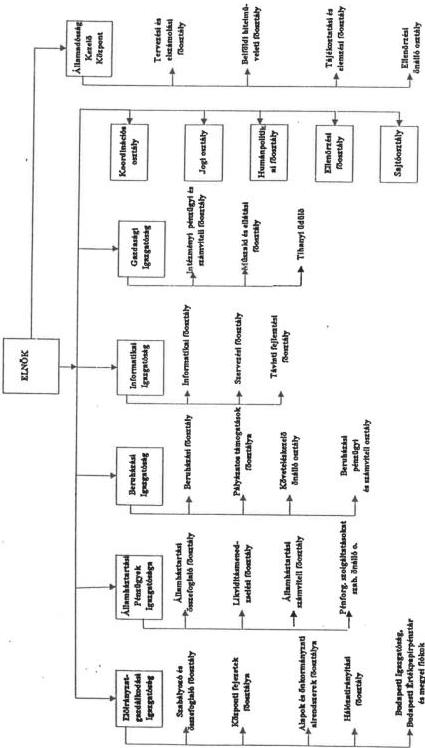
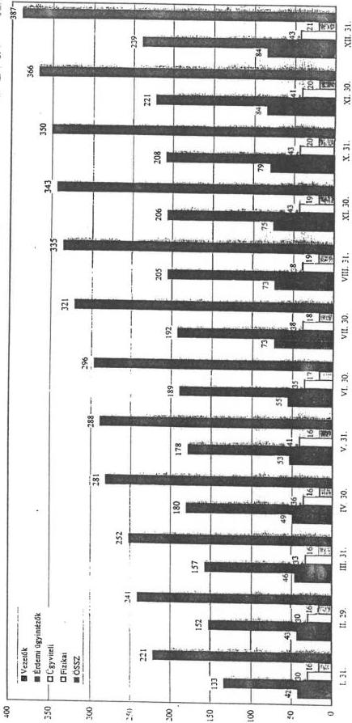

Állami Számvevőszék

# JELENTÉS

A Magyar Államkincstár
létrehozásának és működésének
pénzügyi-gazdasági
ellenőrzéséről

386.

1997. augusztus

---

A vizsgálat végrehajtásáért felelős:

III. Költségvetési Ellenőrzési Igazgatóság

Bihary Zsigmond

számvevő-igazgató

Az ellenőrzést vezette:

Horváth Sándor

számvevő-főtanácsos

Az ellenőrzésben részt vettek:

Bodonyi Miklós

számvevő-tanácsos

Csontosné Kiss Margit

számvevő

Deák Tamásné

számvevő-tanácsos

Eötvös Magdolna

számvevő

Fogarasi Miklós

számvevő-tanácsos

Hegedűsné Erdélyi Piroska

számvevő-tanácsos

Norczen Győzőné

számvevő

dr. Sipos Dóra

számvevő

Varga Balázs

külső szakértő

Vargáné Loch Márta

külső szakértő

---

V-23/1996-97.

# TARTALOMJEGYZÉK

|  **I. ÖSSZEFOGLALÓ MEGÁLLAPÍTÁSOK, KÖVETKEZTETÉSEK ÉS JAVASLATOK** | **3**  |
| --- | --- |
|  **II. RÉSZLETES MEGÁLLAPÍTÁSOK** | **12**  |
|  ***A/ Magyar Államkincstár létrehozása, szakmai tevékenysége*** | **12**  |
|  **1. A Kincstár és a kincstári rendszer létrehozása** | **12**  |
|  1.1 A Kincstár létrehozásának előzményei | 12  |
|  1.2 A Kincstár felállításához a jogelőd szervezetek által nyújtott segítség | 13  |
|  1.3 Az államháztartási reform 1995. évi pénzeszközeinek felhasználása | 15  |
|  1.4 A kincstári rendszerre történő átállás | 16  |
|  **2. A feladatellátás szabályozása, -feltételei** | **19**  |
|  2.1 A szervezet és működésének szabályozása | 19  |
|  2.1.1 Jogszabályi háttér | 19  |
|  2.1.2 Alapító okirat | 23  |
|  2.1.3 A Kincstár szervezetének és működésének szabályozása | 24  |
|  2.2 A Kincstár szervezetének kialakítása | 26  |
|  2.3 A létszám szakmai összetétele | 27  |
|  **3. A költségvetési előirányzatok kincstári nyilvántartása, kezelése és a finanszírozás rendszere** | **28**  |
|  3.1 Központi költségvetési szervek előirányzatainak kincstári kezelése, nyilvántartása és finanszírozási rendszere | 28  |
|  3.1.1 Pénzmaradvány elszámolás | 31  |
|  3.1.2 Letéti- és célszámolási számlák | 31  |
|  3.1.3 Költségvetési szervek devizaszámlái | 32  |
|  3.1.4 Fejezeti kezelésű előirányzatok | 33  |
|  3.2 Nemzetgazdasági előirányzatok nyilvántartása | 34  |
|  3.3 A kincstári finanszírozás egyes sajátos feladatai | 34  |
|  3.3.1 Az elkülönített állami pénzalapok finanszírozása | 34  |
|  3.3.2 Társadalombiztosítás finanszírozása | 35  |
|  3.4 A kincstári kettős könyvvezetés és beszámoló rendszer kialakítása | 36  |
|  3.5 A likviditás tervezéséhez készített pénzforgalmi előrejelzések, az 1996. évi likviditásmenedzselés | 37  |
|  **4. A központi beruházások finanszírozása** | **39**  |
|  **5. Kiegészítő tevékenység** | **41**  |
|  5.1 A címzett- és céltámogatások | 41  |
|  5.2 A pályázatos támogatások | 42  |
|  5.3 Közalapítvány kezelés | 46  |
|  **6. A kincstári adatszolgáltatás** | **47**  |
|  6.1 Vezetői információk | 48  |
|  6.2 Adatszolgáltatás a kincstári ügyfelek részére | 49  |
|  **7. Az 1996. évi zárszámadás kincstári előkészítése** | **51**  |

---

V-23-1996-97

|  **8. A kincstári informatikai rendszer** | **51**  |
| --- | --- |
|  8.1 Az információs rendszer jellemzői | 52  |
|  8.2 A rendszer technikai feltételei | 52  |
|  8.3 A számlavezető és előirányzat-kezelő rendszerek | 53  |
|  8.4 Egyéb feldolgozások | 54  |
|  8.6 Adatbiztonság, működési biztonság | 55  |
|  8.6 Az informatikai rendszer továbbfejlesztése | 55  |
|  **9. A kincstári rendszer működésének eredményei** | **57**  |
|  **B/A Kincstár működésének pénzügyi-, személyi- és tárgyi feltételei, a költségvetési gazdálkodás** | **58**  |
|  **1. Az előirányzatok tervezése, módosítása** | **58**  |
|  1.1 A költségvetés tervezése | 58  |
|  1.2 Az előirányzatok módosítása | 59  |
|  **2. A költségvetés végrehajtása** | **60**  |
|  2.1 A kiadások alakulása | 60  |
|  2.1.1 Létszám- és bérgazdálkodás, személyi juttatások | 60  |
|  2.1.2 Dologi kiadások | 61  |
|  2.2 A bevételek alakulása | 61  |
|  2.3 A pénzmaradvány és felhasználása | 62  |
|  **3. Eszközgazdálkodás** | **62**  |
|  3.1 Nyitó leltár- átvett vagyontárgyak | 62  |
|  3.2 A Kincstár közbeszerzései | 63  |
|  3.3 A beruházási keret felhasználása | 63  |
|  **4. Számviteli és bizonylati rend** | **64**  |
|  4.1 A gazdálkodás szabályozottsága | 64  |
|  4.2 A számviteli rend | 64  |
|  **5. A Kincstár elhelyezési körülményei** | **65**  |
|  **6. Felügyeleti és belső ellenőrzés** | **66**  |
|  6.1 A Pénzügyminisztérium ellenőrző tevékenysége | 67  |
|  6.2 A függetlenített belső ellenőrzés | 67  |
|  6.3 A vezetői és a munkafolyamatba épített ellenőrzés | 67  |
|  6.4 Egyes szakmai feladatok ellenőrzése | 68  |

---

**ÁLLAMI SZÁMVEVŐSZÉK**

**V-23-36/1996-97.**

**Témaszám: 348**

## *JELENTÉS*

### **a Magyar Államkincstár létrehozásának és működésének pénzügyi-gazdasági ellenőrzéséről**

A nyolcvanas évek végétől több alkalommal is felmerült a költségvetési szervek pénzellátási, a kiadások előzetes finanszírozási rendjének megváltoztatása. A központi költségvetés hiánya az 1990-es évek elején drasztikusan emelkedett, ami felerősítette az új típusú pénzellátásra való áttérés igényét. Megalakulása óta az Állami Számvevőszék is folyamatosan jelezte a finanszírozási rendszer anomáliáit és szorgalmazta annak gyökeres átalakítását. Megvalósítása azonban késett, részben a költségvetési szervek ellenállása miatt hiúsult meg. (A kincstári finanszírozás rendszerében ugyanis az intézmények jellemzően előirányzatokkal és nem pénzeszközökkel gazdálkodnak.)

A központi költségvetési szervek új típusú pénzellátását megtestesítő Magyar Államkincstár az 1128/1994. (XII.30.) és a 2189/1995. (VII.4.) Korm. határozatokban megjelölt feladatok végrehajtása eredményeként jött létre 1995. november 1-jével. Tevékenységét és ügyfélkörét jogszabályok (Áht., kormány- és pénzügyminiszteri rendeletek) rögzítették.

**A Kincstár szolgáltató jellegű, speciális pénzügyi tevékenységet ellátó intézmény.** Alaptevékenysége a költségvetés végrehajtásában a finanszírozás, a pénzforgalom, az elszámolások, az államadósság (likviditás menedzselés), valamint az állam által vállalt garanciák és az általa nyújtott hitelek nyilvántartása, kezelése, a kötelezettségek teljesítése, az információgyűjtés és információ szolgáltatás. **Feladatai 1997-re** - a bankszámla vezetési tevékenységi körébe tartozók bővülésével, a kötelezettségvállalások nyilvántartásával, a finanszírozásba bevont fejezeti kezelésű előirányzatokkal kapcsolatos teendők ellátásával, a bérek utáni közterhek központosított befizetésével és a készpénzkímélő fizetési mód szé-

---

lesebb körű elterjesztése érdekében az „intézményi kártya” bevezetésével - növekednek.

A Magyar Államkincstár a PM felügyelete alatt működő, önállóan gazdálkodó központi költségvetési szerv. Szakmai tevékenységét - az 1996-ban elkezdett és 1997-ben is folytatott szervezet-építés eredményeként - az 5 központi igazgatósága, valamint igazgatósági szervezetbe nem tartozó főosztályok, osztályok, illetve területi fiókhálózata útján látja el. Önálló igazgatósága a kincstári körbe tartozó fővárosi számlatulajdonosok kincstári feladatait ellátó fiók, a Budapesti Igazgatóság, valamint az Értékpapírpénztár is. Az államadósság kezelésében, a központi költségvetés likviditásának alakulásában korábban kiemelt szerepet játszó ÁKK önálló jogi személyiségű, részben önálló költségvetési szervként a Kincstár szervezetébe tartozik.

Az intézmény 1995-ben 60, 1996-ban 795,6 M Ft költségvetési támogatásban részesült. Az 1997. évre előirányzott költségvetési támogatás 4488,7 M Ft. A foglalkoztatottak létszáma 1997. január 1-jén 772 fő, az immateriális javak és tárgyi eszközök bruttó értéke 1996. december 31-én 1,7 Mrd Ft volt. Ugyanezen időszakban az ÁFI és az MNB együttesen működési kiadásokra 1, felújításra és beruházásra több, mint 2 Mrd Ft-ot fizetett ki a Kincstár helyett.

# Az ellenőrzés célja

- a Magyar Államkincstár létrehozására irányuló előkészítő munka célszerűségének és eredményességének;
- a szervezet felépítésének és működésének, a rendelkezésre álló személyi-, tárgyi- és pénzügyi feltételek és a jogszabályokban előírt feladatok összhangjának;
- a szakmai feladatellátás törvényességének, célszerűségének és eredményességének, valamint
- az intézmény gazdálkodásában a törvényességi, célszerűségi és eredményességi követelmények érvényesülésének

értékelése, és ezen keresztül a Magyar Államkincstár eredményes működésének segítése volt.

Az ellenőrzés a Magyar Államkincstár (Kincstár) központjára, megyei fiókhálózatára, az Államadósság Kezelő Központ (ÁKK) intézménybe integrálására, valamint a Kincstár létrehozásában közreműködő szervezetekre (Pénzügyminisztérium, Magyar Nemzeti Bank, Állami Fejlesztési Intézet Rt.) terjedt ki.

Helyszíni ellenőrzés keretében 3 fejezetnél és 8 intézménynél tájékozódtunk a kincstári finanszírozásra való áttérés tapasztalatairól és e mellett 315 költségvetési szervtől kérdőíves formában szereztünk információkat.

Ellenőrzésünk az 1995-1996. évek szakmai tevékenységét, a működés 1997. első hónapjainak tapasztalatait, valamint az 1995-1996. évek gazdálkodását értékelte.

2

---

# I. Összefoglaló megállapítások, következtetések és javaslatok

A központi költségvetési szervek és az elkülönített állami pénzalapok kincstári rendszerű finanszírozása átláthatóbbá teszi azok gazdálkodását és a központi költségvetés pénzeszközeinek kímélésével javítja annak likviditási helyzetét. A közpénzek felhasználásánál javítja, és egyes esetekben garantálja azok törvényességét, a jogszabályokkal való összhangját. A központi költségvetés zárszámadásánál - várhatóan először az 1997. évi zárszámadásnál - gyors, pontos adatokat szolgáltat a tényleges teljesítésről. Adatszolgáltatásával, prognózisok készítésével és elemzéseivel lehetőséget biztosít az éves költségvetési előirányzatok megalapozottabb tervezéséhez.

A Magyar Államkincstár létrehozásával, a kincstári rendszer kialakításával megszűnt az intézményi pénzgazdálkodás, helyette előirányzatgazdálkodás került bevezetésre. Ebből következően - az intézményi devizaszámlák kivételével - minden intézményi bankszámla megszűnt és megnyitásra került az MNB által vezetett Kincstári Egységes Számla (KESZ). A költségvetés valamennyi pénzmozgása ezen a számlán valósul meg, ide érkeznek a költségvetést illető bevételek és erről a számláról teljesítik a kiadásokat.

A Kincstárban kialakításra kerül egy olyan könyvelő rendszer, ami a pénzforgalom figyelemmel kísérése és bonyolítása mellett nyilvántartja az intézmények költségvetési előirányzatait is. A rendszer 1996-ban még nem működött teljes zártsággal, de az 1997. évi továbbfejlesztés lehetővé teszi - a kettős fedezetvizsgálat megvalósulásával - az előirányzatokat meghaladó teljesítések elkerülését.

A kialakított információs rendszer napi, heti, illetve havi gyakorisággal szolgáltatja mind a kincstári körbe tartozó ügyfelek, mind az érdekelt vezetők, döntéshozók részére a költségvetési gazdálkodással kapcsolatos adatokat.

Megvalósult az intézmények utólagos finanszírozása, ezzel 1996. január 1-től intézményesen is megszűnt az intézményi pénzgazdálkodás és azon ellentmondásos helyzet, hogy miközben a központi költségvetésnek folyamatosan likviditási gondjai voltak, a költségvetési intézmények a költségvetésből származó szabad pénzeszközökkel rendelkeztek, amit esetenként szabálytalanul hasznosítottak.

Alapvetően változott az önkormányzatok finanszírozási rendszere is. Az önkormányzatokat megillető normatív támogatás és átengedett SZJA bevételből a bérek utáni közterhek levonásra kerültek (nettó finanszírozás), ezeket az ösz-

3

---

szegeket az illetékes (APEH, TB és Munkaerőpiaci Alap) előirányzati számlákon egyidejűleg jóváírják.

A Kincstárba integrálódott Államadósságkezelő Központ bocsátja ki a költségvetési hiány finanszírozását szolgáló állampapírokat, gondozza az állampapírpiacot és kiépítette az elsődleges értékpapírforgalmazói rendszert is. Ezáltal átláthatóvá, biztonságossá és takarékosabbá vált a költségvetési hiány finanszírozása, ami a központi költségvetés likviditására - 1996-ban a korábbi években tapasztaltnál - is kedvező hatással volt.

A kincstári rendszer létrehozására rendkívül kevés idő állt rendelkezésre. Erre is visszavezethetően késtek több esetben a szükséges jogszabályok (Áht., végrehajtási kormányrendeletek). A munka eredményességét igazolja, hogy - a tapasztalt és jelentésünkben részletezett hiányosságok ellenére - a Kincstár 1996. január 1-jétől ténylegesen működött, alapvető feladatait ellátta. Ezzel a pénzügyi reform egyik döntő fontosságú lépése valósult meg.

A kincstári rendszer bonyolult struktúra - az államháztartás egészére való - kiterjesztése, fejlesztése többéves folyamat, amely összehangolt kormányzati munkát és a végrehajtás szempontjából kellő időben meghozott döntéseket igényel. Ez a rendszer kialakítása során nem minden esetben valósult meg, így a kincstári rendszer létrehozását, 1996. évi működését számos - részben elkerülhető - probléma nehezítette.

# 1. A Magyar Államkincstár, a kincstári rendszer létrehozása

A Kincstár létrehozásának gondolata már egy évtizede foglalkoztatta a mindenkori pénzügyi kormányzatot. A megvalósítását célzó előkészítő munka azonban csak a 2189/1995. (VII.4.) Korm. határozat alapján (1995. augusztus 15-től miniszteri biztos irányításával) vált konkréttá. Az előkészítésre rendelkezésre álló idő kevésnek bizonyult ahhoz, hogy a szervezet az indulástól kezdve teljes körűen ellássa az Áht-ben és a kormányhatározatban rögzített feladatait. Ezért azokat - az ÁFI Rt-től átvettek kivételével - a létszám és a szervezet folyamatos felvételével, illetve kiépítésével fokozatosan tudták megoldani.

A Kincstár feladatai folyamatosan, a személyi és tárgyi feltételekkel csak részben összhangban bővültek. A Kincstárhoz került 1996. április 1-jétől az államadósság kezelésében kiemelt jelentéséggel bíró szervezet, az ÁKK, mint részben önálló jogkörű szervezeti egység is. A kincstári rendszer a kormányhatározatban és az Áht-ben rögzített feladatait - várhatóan - 1997. január 1-től látja el teljes körűen.

A Kincstár az ÁFI Rt. bázisán, az Áht. 123/A. § rendelkezései alapján jött létre. Az ÁFI-tól és az MNB-től - a feladatokkal együtt - a dolgozókat is átvette. Az átcsoportosított dolgozók esetében törvény garantálja (indokoltan) a korábbi

4

---

személyi alapbért, illetve az MNB-től átvett dolgozók esetében az egyéb jövedelemtényezőket is. A kincstári dolgozók jelentős jövedelem-differenciálódása miatt is - a törvény által lehetővé tett eltérő (köztisztviselői és közalkalmazotti) besorolás lehetőségével élve - a szervezetet a közalkalmazottakról szóló törvény hatálya alá rendelték.

**A vizsgált időszakban nem volt jelentős a fluktuáció**, döntően rendelkeztek a feladatellátáshoz szükséges megfelelő szakmai összetételű munkaerő-állománnyal, a betöltetlen álláshelyek száma (1996. XII. 31-én) az engedélyezett létszámhoz mérten nem volt számottevő. **Az alkalmazottak állami iskolai végzettség szerinti megoszlása kedvezően alakult.** A magasan kvalifikált szakemberek aránya megfelelő.

**A jogelőd szervezetek által nyújtott segítség** (MNB informatikai bázisa, az ÁFI és az MNB jelentős összegű kifizetései, eszközei) **nélkül nem lett volna működőképes a Kincstár.** Az előbbiekből is következően - a folyamatos és zökkenőmentes működés érdekében - **a Kincstár létrehozását jobban elő kellett volna készíteni.**

**A kincstári rendszerre történő átállást nem előzte meg a kincstári ügyfelek előzetes, alapos felkészítése. Későn** - mind 1995-ben, mind 1996-ban -, december második felében, illetve utolsó napjaiban **jelentek meg a kincstári rendszert szabályozó, továbbfejlesztését célzó törvények** (Áht., költségvetési törvények), valamint az ezek végrehajtását meghatározó **kormányrendeletek**, így nem teljesültek a jogalkotásról szóló 1987. évi XI. tv. 12. § (3) bekezdésében foglaltak (ami szerint a jogszabály hatálybalépésének időpontját - ebből következően elfogadásának, közzétételének időpontját is - úgy kell meghatározni, hogy kellő idő maradjon a jogszabály alkalmazására való felkészülésre). A Kincstár, a fejezetek és az intézmények jelentős többletmunkájára volt szükség ahhoz, hogy biztosítani tudják a viszonylag zavartalan működést.

## 2. A Kincstár szakmai feladatai

**A Magyar Államkincstár az Áht-ban és a végrehajtására kiadott kormányrendeletekben foglalt szakmai feladatainak igyekezett minél teljesebb körben eleget tenni.** A feladat ellátásához, a kincstári rendszer kialakításához rendelkezésre álló idő azonban nem tette lehetővé a feladatok maradéktalan teljesítését.

A jogszabályi előírásokkal összhangban alakították ki a központi fejezetek előirányzat-kezelési, nyilvántartási és finanszírozási rendszerét. Az intézmények kiemelt előirányzatonkénti fedezetvizsgálatát 1996-ban nem tudták megvalósítani.

**A kincstári elszámolás gyenge pontját jelenti a** - nemzetközi gyakorlatban is ismert és alkalmazott - **tranzakciós kódok használata. A kincstári rendszer működésének biztosítását szolgáló kódrendszer korlátai**, valamint

5

---

**használatának pontatlanságai nehezítették az elszámolásokat.** (Az érintett intézmények nem voltak érdekeltek az egyeztetésben, az eltérések kiküszöbölésében.) **Nem sikerült megfelelően megoldani a kódok valódiságának ellenőrzését. Nagymértékű volt a jóváíráskor nem azonosítható bevétel,** ami alapvetően a postai befizetések részletes feldolgozásának nehézségéből adódott.

**A rendszer nem kezelte az átfutó, függő és kiegyenlítő kiadások és bevételek regisztrálását. A rendszerbeli hiányosságokból következően 1996-ban a kincstári jelentések és az intézmények számviteli adatai eltértek egymástól.** Hasonló problémák voltak az elkülönített állami pénzalapok pénzforgalmának feldolgozásánál is.

Mind 1995-ben, mind 1996-ban felmerült a tranzakciós kódokat helyettesítő (kiemelt előirányzati alszámlavezetés) nyilvántartási rendszer kialakításának igénye és lehetősége. Az alternatívaként figyelembe vett megoldás sem jelentette volna a tranzakciós kódok alkalmazásánál tapasztalt hiányosságok (előre nem ismert kiadású, típusú készpénzfelvételek; függő, átfutó, kiegyenlítő kiadások; elkülönített állami pénzalapok és fejezeti kezelésű előirányzatok kezelése stb.) maradéktalan kiszűrését.

**Az államháztartás egyes területeinek (TB-alapok és MTA költségvetési szervei) kincstári körbe vonása 1996-ban csak a pénzforgalmi számlák vezetésére terjedt ki. A TB-alapok 1997. évi kincstári finanszírozása 'köztes'** (a bankszámla-vezetés és a kincstári alanyiság közötti) állapotnak felel meg, és a pénzügyi alapok kiadásainak és bevételeinek részletesebb számbavételét, megfigyelését teszi csak lehetővé. **A MTA költségvetési szerveinek kincstári finanszírozását** - a törvényi (Áht.) rendelkezéssel azonos kormányzati célok, de ennek ellentmondó jogszabályi rendelkezés (210/1996. (XII.23.) Korm. rendelet) következtében - **nem valósították meg.**

**A kincstári kettős könyvvezetés és beszámoló rendszer** kialakítása és bevezetése **nem teljesült az előírt határidőre. Nem biztosították 1996-ban egységes zárt rendszerben a mindenkori KESZ egyenleg és a kincstári ügyfelek számlaegyenlegei közötti egyezőséget,** az eltérések kimunkálását - az úton lévő tételek számbavételével - év közben folyamatosan nem végezték el, arra csak az éves zárást követően került sor. Fokozatosan alakították ki a kincstári információszolgáltatás rendszerét. **A feladatelmaradás, illetve a részleges teljesítés** - az érintett szervezeti egységeknél - **elsősorban arra vezethető vissza, hogy 1996-ban még nem voltak teljes körűen biztosítottak a feladatellátás feltételei,** mivel a törvény által előírt feladatok ellátásához az intézmény szervezetének kialakítása, a feladatmegosztás, az informatikai háttér teljes körű biztosítása, az elhelyezési körülmények stb. az év során (gyors ütemben) folyamatosan kerültek kialakításra.

**A beruházási tevékenység finanszírozását** - mint az ÁFI Rt-től a szervezettel együtt átvett tevékenységet - döntően az ÁFI Rt. működése alatt szabályozták. Ebből következően az - egyes részletek tekintetében - elavult. Néhány szabályzatot még nem adtak ki. **A feladat nagysága, tömegszerűsége és a rendelkezés-**

6

---

re álló idő rövidsége, továbbá a joghézagok, illetve a jogszabály-értelmezési problémák egyaránt nehezítették a feladat ellátását.

**Elhúzódott a központi beruházások finanszírozási szerződéseinek megkötése**, gondot jelentett az agrártámogatások pályázatainak felülvizsgálatát követő nagyszámú, rövid idő alatti szerződéskötés. Az új támogatások (TFC, TEKI) esetében a csak 1996. júliusában megjelent jogszabályok nem voltak értelmezési problémától mentesek, ami a finanszírozási szerződések megkötését is késeltette. A megyei területfejlesztési tanácsokkal való együttműködés szabályozást igényel, felügyeletük megoldatlansága miatt nem volt meg a feltétele az egységes eljárásnak.

**Esetenként nem volt kielégítő a támogatást 'felügyelő' fejezetek által a Kincstár részére adott információ gyakorisága**, illetve **gyorsasága** (címzett vagy céltámogatásban részesült önkormányzatok esetében). Ennek következtében a Kincstár indokolatlanul is folyósított támogatást, amit később korrigálnia kellett. Előfordult, hogy az érintett fejezet (KTM) több hónapig nem reagált a Kincstár szerződés-visszavonási javaslatára, és a notórius tartozókkal kapcsolatos eljárás tovább húzódott.

**A kincstári adatszolgáltatási kötelezettséget szabályozó kormányrendelet csak annak** keretszabályait adta meg, **konkrét formája, tartalma nem került rögzítésre**. A kezdeti problémákat követően az adatszolgáltatás 1996. második negyedévében stabilizálódott, így sor kerülhetett az információs táblák körének, tartalmának meghatározására. Az adatszolgáltatásokat általában időben teljesítették, de egyes esetekben az nem volt folyamatos.

A központi költségvetés végrehajtásáért felelős **pénzügyminisztériumi és kincstári vezetők részére készített rendszeres adatfeldolgozás a költségvetési folyamatok vezetői szintű értékelésére alkalmas volt**, egyes részleteit tekintve azonban hitelessége kétségesnek bizonyult. A központi költségvetés heti, havi gyakorisággal összeállított mérlege - a KESZ pénzforgalmi és számított egyenlege közötti eltérés és az egyeztetés lehetőségének elmulasztása ellenére - a folyamatok áttekintésére, nyomon követésére alkalmas volt.

**A kincstári körbe tartozó számlatulajdonosok részére** (kincstári számláik napi kiadási és bevételi forgalmáról számlakivonat, később a költségvetési előirányzatokról és azok módosításáról) adott adatok a pénzügyi teljesítéseknél eltértek a költségvetési szervek számviteli adataitól. A kincstári ügyfelek rendelkezésére bocsátott számlakivonat 1997-ben - várhatóan - már tartalmazza a napi forgalomról készített tételes listát.

**A Kincstár által 1996-ban készített időszakos számszaki és szöveges elemzések, értékelések csak tájékoztatást nyújtottak, mivel a közölt adatok nem minden esetben tükrözték reálisan a folyamatokat.**

**A kincstári rendszer** - kialakításának időpontjából, körülményeiből, működésének 1996. évi nehézségeiből következően - **még nem volt felkészülve arra, hogy a központi költségvetés zárszámadásához a tényleges felhasználás ismeretében megfelelő adatokat biztosítson.**

7

---

**A Kincstár informatikai rendszere a jogszabályokban előírt feladatok többségét teljesítette, de valamennyi 1996-ra előírt követelménynek - a magas színvonalú szakmai fejlesztő munka ellenére - nem tudott eleget tenni. A fejlesztések nyomon követhetőségét nehezítette a dokumentálatlanság.**

**A kincstári rendszer előkészítése során egységes, integrált információs rendszer megvalósításának módja nem fogalmazódott meg.** A döntés meghozatalakor nem számoltak a hosszú távon biztonságosan működő rendszer kialakításának időszükségletével.

**Az előkészítés hiányosságára és az időzavarra utal a tranzakciós kódok bevezetése is. Az információs rendszerekkel szemben támasztható általános követelmények közül a teljes körűség és megbízhatóság garanciái a rendszer egészére nem vonatkoztak.**

**A Kincstár információs rendszerének egyes elkülönült** (pl. a kormányzati beruházások finanszírozása, egyes állami követelések nyilvántartása) **elemei általában megbízhatóan látták el feladatukat.** Hatékonyságukat csökkentette az integráltság, a kincstári adatfeldolgozás rendszerbe illesztésének hiánya.

**A rendszer technikai feltételei, adatbiztonsága, az adatok és programok archiválása kielégíti az elvárható kritériumokat. Az adatvédelem szempontjából a kincstári rendszer eléri egy banki informatikai rendszer szintjét.**

**Az informatikai rendszer 1997. évi fejlesztése várhatóan minőségi változást eredményez az adatfeldolgozásban.** Az év kezdetén éles üzemben elindított, de néhány nap után leállított rendszer visszatérést jelent az 1995. évi elképzelésekhez, kudarca szintén az előkészítés hiányosságaival, szervezetlenségével függött össze.

**A kincstári rendszer eredményei a rendszer továbbfejlesztését, működési körének bővítését indokolják.** A fejlesztések eredményeként a működés magában hordozza annak lehetőségét, hogy a központi költségvetés 1997. évi zárszámadásához, illetve az 1999. évi költségvetés tervezéséhez megbízható, korrekt adatokat, a költségvetési reálfolyamatokon alapuló, megalapozott prognózisokat biztosítson. Az elért eredmények elismerése mellett azonban meg kell említeni, hogy a költségvetési folyamatok átfogó reformja, mindenek előtt a költségvetés tervezésének új alapokra helyezése, továbbra is várat magára.

---8

---

### 3. A Kincstár, mint intézmény gazdálkodása

A Magyar Államkincstár, mint költségvetési intézmény gazdálkodását egyes területeken (előirányzatok meghatározása, szabályzatok kidolgozása stb.) hátrányosan befolyásolták az intézmény létrehozásának körülményei, a megfelelő bázis hiánya. A tapasztalt hiányosságok döntő többsége is ezekre a tényezőkre vezethetők vissza.

A Kincstár költségvetési előirányzatainak meghatározása az ellenőrzött időszakban - a feladatoknak a jogelőd szervezetektől való átvételének üteme, köre ismeretének hiányából fakadóan is - nehézségekbe ütközött, megalapozottsága, realitása több előirányzat esetében kétségesnek bizonyult. Az előirányzatok megalapozottsága a tervezés során elkövetett egyes hibák következtében tovább romlott.

A személyi juttatások és a dologi kiadások 1996. évi tervezésénél bázisadatok nem álltak rendelkezésre. A PM tervezési köriratában foglaltakkal ellentétesen - a személyi juttatások előirányzatának meghatározásánál - jelentős többlet kifizetéseket (betegszabadságra jutó átlagkereset, 5 havi jutalom stb.) terveztek.

A költségvetési gazdálkodás során a felhasználás általában a jogszabályi előírásokkal összhangban valósult meg, de néhány esetben (pl. pénzeszköz átadás, GIRO-nak fizetett csatlakozási díj elszámolása) ellentétes volt a jogszabályi előírásokkal.

A gazdálkodás szabályozottsága általában kielégítő volt, de a számlarend törvényi előírástól eltérő kidolgozása (1997. január, a megalapítást követő 90 nap helyett) a számviteli törvény megsértését eredményezte (Sztv. 79. §).

A Kincstár 1996. január 1-jén immateriális javakkal és tárgyi eszközökkel nem rendelkezett, ezért nyitó leltár nem készült.

A Kincstár elhelyezési körülményei nem kellően körültekintő államigazgatási döntések következtében alakultak ki. A Központ végleges elhelyezése megoldatlan, az MNB-től átvett vidéki fiókhálózat épületeinek tulajdoni és használati viszonyai, a működés körülményei és színvonala jelentősen eltérnek.

Az 1996. évi költségvetési törvény a Kincstár részére központi beruházási keretet nem tartalmazott. Az információs háttér fejlesztésére a pénzügyi fedezetet a 2350/1996. (XII.17.) Korm. határozat teremtette meg. A beruházás megvalósítása során - a rendelkezésre álló igen rövid idő alatt - figyelmen kívül hagyták az 1996. évben hatályos 157/1995. (XII.26.) Korm. rendelet számos előírását (pl. a beruházási alapokmány nem tartalmazta a beruházás összköltségét).

9

---

Mindezek alapján a Magyar Államkincstár eredményes működése érdekében - a jelentésben részletezett megállapítások hasznosításra ajánlása mellett - a következőket javasoljuk:

# a Kormánynak

1. Vizsgáltassa felül a Bp. V. Deák F. u. 5. sz. alatti, volt ÁFI Rt. székház elidegenítésének jog- és célszerűségét, a kincstári ingatlanvagyon áttekintésével keressen megoldást a Magyar Államkincstár központjának végleges elhelyezésére.
2. A 210/1996. (XII. 23.) Korm. rendelet módosításával szerezzen érvényt az Áht. azon előírásának, hogy az MTA mint köztestület nem gazdasági társasági formában működtetett szervei kincstári körbe tartozzanak.
3. A Kormány kérje fel a Pénzügyminisztériumot a feltárt hiányosságok felszámolása érdekében feladatterv készítésére és a jogi szabályozás ellentmondásainak (a vállalkozói szférából a költségvetési körbe kerülő, illetve fordított irányú vagyonmozgás értékcsökkenési leírása elszámolása, a közbeszerzés és a költségvetési gazdálkodás stb.) feloldását célzó javaslatok kidolgozására.

# a Pénzügyminisztériumnak

1. Kezdeményezze az 54/1995. (IV.12.) Korm. rendelet módosítását a térítésmentes eszközátadások értékcsökkenésének elszámolása érdekében.
2. Terjessze ki a 17/1993. (VI. 18.) PM rendelet hatályát a Kincstárra, ennek során vegye figyelembe a Kincstár speciális helyzetét.
3. Szabályozza az állami forgóalap időszakos finanszírozását fokozatosan felváltó KESZ napi finanszírozási (az optimális méretű, minimális szükségletű KESZ rendszerét), aktív likviditásmenedzselési rendjét.
4. Szabályozza a bevételi és kiadási prognózisok készítésének elveit és módszertanát, a likviditás tervezéséhez készített pénzforgalmi előrejelzések rendszerét, valamint gondoskodjon a prognózisokhoz kapcsolódó, többszintű felelősségi rendszer kialakításáról.
5. Gondoskodjon az államháztartás és alrendszereinek fő bevételi és kiadási jogcímeit tartalmazó pénzforgalmi mérleg adattartalmának egyértelmű, pontos meghatározásáról (a központi beruházások pénzmaradványának számbavétele, a pénzforgalmi műveletek pontos megfogalmazása stb.).
6. Módosítsa a Kincstár Alapító okiratát, nevesítse benne a jelenleg vállalkozási tevékenységként szereplő, alaptevékenységet kiegészítő tevékenységeket.

10

---

7. Gondoskodjon az előző évi előirányzat-maradványok (így a beruházási előirányzatmaradványok) jogszabály által rögzített időpontban való jóváhagyásáról.

8. Az államháztartás információs rendszerének egyik meghatározó tényezőjévé vált kincstári informatika fejlesztése és működtetése felett gyakoroljon szorosabb felügyeletet. Ennek keretében:

- fogalmazza meg elvárásait, követelményeit a rendszer kialakítására és jellemzőire vonatkozóan;

- vegye figyelembe a rendszerek kifejlesztésének időszükségleteit;

- győződjön meg arról, hogy a rendszer fejlesztése elfogadott, a koncepcionális célokat tartalmazó tervek alapján és azoknak megfelelően történik-e;

- ellenőrizze az informatikai rendszer mindenkori állapotára, a működtetést és az alkalmazást biztosító programokra, azok módosítására vonatkozó dokumentáció hiánytalan elkészülését;

- a helyszínen is részletesen tájékozódjon a rendszer előírásszerű működéséről, üzemeltetéséről.

9. Intézkedjen, hogy az előirányzatok tervezése során, a fejezeti költségvetésben számszerűsített fejezeti kezelésű előirányzatok - az Áht. 20. § (7) bekezdésében foglaltak érvényesülése érdekében - a felhasználó intézmény felett felügyeletet gyakorló fejezet (pl. 1996-ban a Pénzügyminisztérium fejezet igazgatási címén belül, a fejezeti kezelésű speciális előirányzatok között, az önkormányzati adók feldolgozására előirányzott összeg a Belügyminisztérium fejezet) kiadásai között jelenjenek meg.

10. Rendszeresen tekintse át a Kincstár felállításának és működésének, valamint a kincstári rendszer 1996. évi működésének és eddigi fejlesztésének tapasztalatai alapján a Magyar Államkincstár részére a jelentés 2. számú mellékletében megfogalmazott javaslatok megvalósítását. A kincstári rendszer 1997. évi továbbfejlesztése során hasznosítsa azokat.

11

---

## II. Részletes megállapítások

### A. Magyar Államkincstár létrehozása, szakmai tevékenysége

#### 1. A Kincstár és a kincstári rendszer létrehozása

##### 1.1 A Kincstár létrehozásának előzményei

A Kincstár létrehozásának gondolata már az 1980-as években is foglalkoztatta a pénzügyi szakembereket. Megvalósításával, működésével kapcsolatosan több elképzelés is napvilágot látott. A létrehozására vonatkozó igény 1994-ben ismételten megfogalmazódott. A 1128/1994. (XII.30.) Korm. határozat az államháztartási reform koordinálására Államháztartási Reform Bizottságot hozott létre, amelynek több miniszter is tagja volt. A titkársági teendők ellátására 1995-ben a Pénzügyminisztériumban az Államháztartási Reform Titkárságot állították fel, amelynek feladatai közé tartozott - többek között - a Kincstár létrehozásának előkészítése is.

A szakmai feladatellátás koncepciójának kidolgozására a Pénzügyminisztérium fejezet költségvetésében különítettek el pénzeszközöket. A feladat végrehajtásának személyi feltételeiről a pénzügyminiszter rendelkezett.

Miniszteri biztost nevezett ki 1995. augusztus 15-i hatállyal - a helyettes államtitkárokra vonatkozó feltételekkel - a kincstári szervezet megalakulásáig, 1995. december 31-ig, a PM állományában. A miniszteri biztossal együttműködve, szakmai irányításával részt vett a munkában a PM Államháztartási Reform Bizottság vezetője, a Kincstár Informatikai Projekt Iroda vezetője, az ÁFI Rt. elnök-vezérigazgatója, valamint az ÁKK vezetője. A szakértői teendők ellátására 1995. október 10-én a PM-ben határozatlan időre főosztályvezetőt neveztek ki, akit november 1-jei hatállyal áthelyeztek a Kincstár állományába.

A Magyar Államkincstár 1995. november 1-jével való létrehozására az államháztartás pénzügyi reformjáról szóló 2189/1995. (VII.4.) Korm. határozat adott iránymutatást, de az abban előírt feladatok nem minden esetben és a határozatban rögzített határidőre teljesültek.

Elmaradt az APEH-SZTADI és az ÁSZSZ Rt. eszközei és személyi állománya integrálhatóságának vizsgálata elmaradt. A két szervezetből a Kincstárhoz nem kerültek át sem az eszközök, sem a személyi állomány. A PM véleménye szerint a két szervezet integrálására azért nem került sor, mivel a Kincstár kialakításra kerülő struktúrája azt nem tette szükségessé.

Nem teljesült a kormányhatározatban rögzített határidőre az MNB megyei igazgatóságainak a Kincstár területi hálózatává való átalakítása, valamint a fegyveres erők, a rendvédelmi szervek és a titkosszolgálati szervezetek sajátosságaihoz igazodó külön szabályozás. A hazai igényeknek és a nemzetközi szabályoknak megfelelő, az államháztartásban egységesen érvényesíthető funkcionális osztályozási rend sem készült el.

12

---

## 1.2 A Kincstár felállításához a jogelőd szervezetek által nyújtott segítség

**A szervezet létrehozásához a jogelőd szervezetek jelentős segítséget nyújtottak. Az ÁFI** - a Kincstár elnöke részére készített feljegyzés szerint - 1995. évben **343,4 M Ft-ot fizetett ki kincstári célokra**, amelyet a Kincstár Ellenőrzési Főosztálya ellenőrzött. **Az ÁFI 1996. január és február hónapokban további összegeket is kifizetett** a Kincstár helyett, az összes kiadás **1.163,9 M Ft-ot tett ki** (ekkor vásárolták meg a Kincstár részére a Széchenyi utcai épületet).

**Az ÁFI könyveiben szereplő vagyont** - a Kincstári Vagyoni Igazgatóság közbeiktatásával - **könyvjóváírással adták át a Kincstárnak.**

A PM szervezetéből a Kincstárhoz került egységek (az Állami Költségvetési Főosztály Államháztartási Osztálya, valamint az Államadósság Kezelő Központ) eszközeinek egy része (összesen 6,3 M Ft értékben) is átadásra kerültek. Az átadásról utólag, 1997. január hó folyamán készültek jegyzőkönyvek.

Jelentős szerepet játszott **a kincstári rendszer felállításának** segítésében az MNB. Az ezzel kapcsolatos feladatokat rögzítő **szerződések aláírására a Kincstár és az MNB között** 1996. első felében **nem került sor, bár annak tervezetét az MNB elkészítette.** A Kincstár feladataival csak az 1995. október 5-én az MNB alelnöke és a Kincstár megszervezésével megbízott miniszteri biztos által aláírt, az MNB által készített 'Ajánlat a Pénzügyminisztériumnak' elnevezésű egyezség foglalkozott.

Az ajánlat jelentős része az 1996. január 1-től indítandó kincstári informatikai rendszer kialakítását és megvalósítását taglalta. Az ajánlat 5.1. pontja szerint 'megvalósításáról a Kincstár (PM) és az MNB kötelezettségeit és felelősségét egyértelműen rögzítő szerződést köt az MNB és a Kincstár'.

**Az MNB** az ajánlat alapján **teljesítette** a költségvetési szervek részére a **vállalt feladatait.**

Az MNB-nél a kincstári feladatok 1996. január 1-től való ellátására és a feladatok átadására elnöki és alelnöki utasításokat adtak ki, amelyekben rendelkeztek - többek között - az ideiglenes kincstári nyilvántartás vezetéséről, a kincstári számlák kezeléséről, valamint az állampapír forgalmazással kapcsolatos feladatok átadásáról.

**A Kincstár és az MNB között a személyi feltételek biztosítására két részmegállapodás született.** Az első megállapodás (1996. március 29.) az MNB-től a Kincstárhoz, az ÁKK szervezetébe átkerülő dolgozókkal, a második az MNB-ben dolgozók 1996. július 1-től 1996. december 31-ig Kincstárhoz történő kirendelésével foglalkozott. Ezen időponttól a számlavezetéssel foglalkozó dolgozókat rendelték ki, míg az értékpapír-forgalmazással és nyilvántartással foglalkozó dolgozók kirendelésére 1996. november 1-jével került sor.

**A Magyar Államkincstár és a Magyar Nemzeti Bank közötti megállapodást** a feladatok, a vagyon és a személyi állomány átadás-átvételéről, vala-

13

---

mint az 1997. évi együttműködésről a Kincstár elnöke, az MNB alelnöke és a pénzügyminiszter **1996. október hónapban írta alá.**

A megállapodás az 1996. szeptember 30-a utáni feladatokat rögzítette. Az átmeneti időszakra - az előzőekben már említett - ajánlat és a személyi állománnyal kapcsolatos két részmegállapodás adott iránymutatást.

**Az intézmény létrehozásával kapcsolatos 1995. évi és 1996. évi kiadások egy részét az MNB fizette ki a Kincstár helyett.** Az MNB kimutatásai szerint a kincstári működéssel kapcsolatban 1995-ben 95 M Ft-ot, 1996-ban 581 M Ft-ot fizettek ki.

**Az MNB adatai** - a Kincstár felállításához nyújtott kiadások adatai között - csak az egyértelműen **elhatárolható, közvetlenül felmerült kiadásokat** (a bérköltségnél pl. csak az 1996. július 1-je utáni béreket) **tartalmazzák**, így nem szerepelnek azok, amelyeket az MNB központja fizetett ki. Ezek elkülönítését ugyanis a főkönyvi adatok között nem valósították meg. A megyei fiókok üzemeltetési költségei sem szerepelnek a kimutatás adatai között, azokat az MNB saját üzemeltetési költségeként számolta el (az adott időszak alatt az épületben a kincstári tevékenység mellett az MNB feladatait is ellátják), az MNB központja által beszerzett nyomtatványok és irodaszerek adataival együtt.

**A Kincstár 1997. évi fiókhálózatának kialakításához az MNB-től dolgozókat, eszközöket és épületeket** - utóbbiakat könyvjóváírással, a Kincstári Vagyoni Igazgatóság bevonásával - **vett át.**

**Az MNB-Kincstár megállapodásban rögzítettek szerint valósult meg az eszközök térítésmentes átadás-átvétele.** Az egyeztetés során alakult ki azon vagyontárgyak köre, amelyek végül a Kincstárhoz kerültek.

Az MNB a vagyontárgyakat - a székházakat is beleértve - tételes leltárakkal alátámasztva, könyvszerinti értéken (1.449,3 M Ft) adta át 1996. októberében. Az épületek, a befejezetlen beruházások, a központi készletek átadás-átvételét az MNB és a Kincstár központjának munkatársai végezték. Külön átadás-átvétel során rendezték - a bankbiztonsági szempontokat is figyelembe véve - az értéktári területek átadás-átvételét.

A Kincstár és az MNB munkatársai 1996. év folyamán a feladatellátás, az épület átadások és a személyi ügyek során felmerült problémák rendezéséről folyamatosan konzultáltak. Az MNB-nél tartott megbeszélésekről emlékeztetők készültek.

Az egyeztetések során alakult ki, hogy mely megyei fiókok kerülnek át a Kincstárhoz, és mely fiókoknál kerül sor közös üzemeltetésre. A Kincstár - a közös használatban álló fiókoknál - az üzemeltetési kiadások arányos részét téríti meg az MNB-nek. Bérleti díj felszámítására - 1996. október 31-én a pénzügyminiszter által az MNB elnökének írt levél szerint - nem kerül sor.

A budapesti Kincstári Igazgatóság helyzete várhatóan csak akkor oldódik meg, ha a Váci út 71. szám alatt lévő helyiség felújítását befejezik, addig azonban az MNB épületében dolgoznak továbbra is a kincstári munkatársak.

**A Kincstárhoz kerültek az állampapír-forgalmazással kapcsolatos feladatok is, ezeknek az átadására 1996. október 28-tól** került sor. Ennek ered-

14

---

ményeként az állampapír-forgalmazással kapcsolatos tevékenységet 1996. november 1-től már a Magyar Államkincstár végezte.

Az átvett eszközök értékével megnőtt a Kincstár eszközeinek - az MNB által átadott új raktári készletek kivételével - értéke. Az MNB-től átvett készleteket a Kincstár csak mennyiségben rendezte, értékben (beszerzési ár hiányának indokolásával) nem szerepeltette, ami ellentétes az 54/1996. (IV.12.) Korm. rendelet 13. §-ában foglaltakkal.

Az átadott eszközök után az MNB - a számviteli törvény által biztosított lehetőséggel élve - az 1996-os átadási időpontig elszámolta az értékcsökkenést. (A megyei kirendeltségek épületei és eszközei után október 31-ig, míg a központból átadott eszközök után decemberig.) Az átvett eszközök után a Kincstár az 1996. december 31-én állományában lévő eszközök után számolta el az értékcsökkenést, így az eszközök döntő többségénél kétszeres értékcsökkenés elszámolására került sor.

Az értékcsökkenés Kincstár általi elszámolását az 54/1996. (IV.12.) Korm. rendelet 22. § (2) bekezdése tette lehetővé, amely szerint az értékcsökkenést évente egyszer, év végén a december 31-én állományban lévő eszközök után kell elszámolni.

Az értékcsökkenések kétszeres elszámolásának elkerülése érdekében a kormányrendelet módosítása, kiegészítése indokolt. A Kincstárnak az értékcsökkenés kétszeres elszámolása elkerülése érdekében körültekintőbben kellett volna eljárnia, az MNB-től be kellett volna kérnie az értékcsökkenés elszámolásához a szükséges adatokat.

### 1.3 Az államháztartási reform 1995. évi pénzeszközeinek felhasználása

Az államháztartási reformmal összefüggő rendszerfejlesztési munkákra, az önkormányzati adatok feldolgozására és a kincstár kiadásaira a költségvetési törvény 700 M Ft-ot hagyott jóvá a Pénzügyminisztérium fejezet igazgatás címénél, a fejezeti kezelésű speciális előirányzatok között. A fejezeti kezelésű előirányzat módosított előirányzata 640 M Ft-tal szerepel az igazgatás cím 1995. évi beszámolójában.

Az eltérés oka, hogy a Kincstár feladatainak ellátására a fejezet év közben 60 M Ft-ot csoportosított át, így az a fejezet 10. címén a Magyar Államkincstár cím alatt jelent meg. (Az átcsoportosított összeg a Kincstár indulásával kapcsolatos kiadások fedezetét képezte.)

A fejezeti kezelésű speciális előirányzatból 1995. évben 372,9 M Ft-ot használtak fel. Ennek egy része, 164,1 M Ft a PM igazgatás dologi kiadásait fedezte. Az igazgatás cím az 1995. évi költségvetés összeállítása során - a költségvetési törvény mellékletét képező fejezeti szöveges indoklásban - már jelezte, hogy a dologi kiadásoknak nincs meg a fedezete, és ezt a fejezeti kezelésű speciális előirányzatból egészíti ki.

15

---

Az államháztartási reformmal kapcsolatos 1995. évi kiadás (170,8 M Ft) részét képezte a személyi juttatásokra, az Államháztartási Reform Titkárság munkatársainak és külső személyeknek kifizetett megbízási és szerzői díjak (14,2 M Ft), azok társadalombiztosítási járuléka (4,1 M Ft), a dologi kiadásokra kifizetett (96,9 M Ft), valamint a Lánchíd Irodaház részére, működési célú céleszköz átadásként elszámolt, külföldi szakértők által használt irodák bérleti díja és a különböző számítástechnikai, felhalmozási célú kiadások összege.

Az előirányzat terhére számolták el az önkormányzatokkal kapcsolatban felmerült 29,3 M Ft kifizetést. Ennek döntő többségét az önkormányzatok részére vásárolt nyomtatványok és ennek ÁFÁ-ja tette ki. (Többek között a PM fizeti az önkormányzatok helyett a költségvetési beszámoló nyomtatványok beszerzésének kiadásait.)

A fejezeti kezelésű speciális előirányzatból 1995-ben 267,1 M Ft-ot nem használtak fel, így ez az 1995. évi pénzmaradvány részét képezte. A pénzmaradványból az 1996. szeptember 25-i fejezeti jóváhagyást követően 180,8 M Ft-ot nem használtak fel 1996. évben.

A felhasználatlan maradvány jelentős részét 155,5 M Ft-ot az Államháztartási Reform Célkerete tette ki, ezen belül a dologi kiadások 145,7 M Ft-os maradványa jelentős, amelyből 48,3 M Ft kötelezettséggel terhelt, míg a fennmaradó részére tendert írtak ki.

Az 1995. évi 700 M Ft fejezeti kezelésű speciális előirányzatból 1995-ben és 1996-ban összesen 223,4 M Ft-ot költöttek el az államháztartási reformmal kapcsolatban és 60 M Ft-ot a Kincstár működése érdekében az intézményhez csoportosítottak át. Az elszámolt kiadások aránya csak közel 40 %-ot tesz ki a fejezeti kezelésű speciális előirányzaton belül.

## 1.4 A kincstári rendszerre történő átállás

**A kincstári rendszer bevezetését a kincstári ügyfelek előzetes, oktatással járó alapos szakmai felkészítése nem előzte meg.** A Kincstár létrehozását és működésének feltételeit, feladatait meghatározó **jogszabályok késői elfogadása** - a jogalkotásról szóló 1987. évi XI. tv. 12. § (3) bekezdésében foglalt követelmények teljesítésének elmaradása miatt - **korlátozta a felkészülés lehetőségeit.**

A fejezeteknél és költségvetési intézményeknél folytatott helyszíni ellenőrzésünk, valamint a kiküldött kérdőívek értékelése alapján, a jogszabály-tervezetek véleményezésére és a felkészülésre rendelkezésre álló idő rendkívül kevés volt.

A PM a tervezeteket véleményezésre valamennyi fejezet részére megküldte. A rendelkezésre álló rövid idő miatt azonban nem kerülhetett sor a fejezetek részéről azok intézményi körben való terítésére, a vélemények szélesebb körű összegyűjtésére és értékelésére.

A jogszabály-tervezetek szélesebb intézményi körben való véleményezésre megküldése - a közigazgatás általános rendje szerint - korábban sem volt gyakorlat (bár egyes kiemelt intézmények esetében, más jogszabályoknál ez megtörtént). A

16

---

kincstári rendszer esetében, annak kiemelt jelentőségére és hatására tekintettel, indokolt lett volna.

A fejezeti és intézményi tapasztalatok megismerésére kérdőívet állítottunk össze. Ebben kértük a kincstári rendszer előkészítésével, bevezetésével, 1996. évi működésével és 1997. évi továbbfejlesztésével kapcsolatos vélemények jelzését. A kérdőívek feldolgozása (315 db) és az egyes kérdésekre adott értékelhető válaszok - az e témában végzett helyszíni ellenőrzés tapasztalatait - megerősítették, mélyítették.

A kérdőívre adott értékelhető válaszok döntő többsége (197) nem kapta meg a fejezettől véleményezésre a tervezeteket. Általános tapasztalat, hogy a véleményalkotásra adott idő a szükségesnél kevesebb volt. A megküldött észrevételek jellemzően (74) a tervezetekben nem hasznosultak. A hasznosulás csak konkrétan egy-egy fejezethez kapcsolódó felvetett észrevételnél volt tapasztalható.

Negatívan értékelte a kérdőívet beküldők döntő többsége (188) a kormányrendeletek megjelenésének időpontját. Kedvező tapasztalat ugyanakkor, hogy a fejezetek döntő többsége a kincstári rendszer bevezetésével kapcsolatban a Kincstár által készített írásos tájékoztatót eljuttatta (215) az intézményekhez.

A Kincstári rendszer működtetéséhez rendelkezésre álló felkészülési idő személyi feltételeinek megvalósítását (219), tárgyi feltételeinek biztosítását (230) a válaszadók túlnyomó többsége negatívan értékelte.

Megoszlottak a válaszok (igen 39, nem 75, részben 183) a Kincstár által tartott felkészítésről, annak a feladatellátás megvalósításában betöltött hasznosulásáról. A fejezetek részéről az intézményeknek tartott felkészítésről megosztott (igen 157, nem 143) volt az érintettek véleménye.

Egyértelműen negatívan értékelték a kincstári rendszer működtetéséhez tartott továbbképzés 1996. évi időpontját (168), míg az 1997. évi felkészítés időpontjáról - bár arra már 1996-ban sor került - megoszlottak (igen 132, nem 107) a vélemények.

A kincstári rendszer működtetéséhez a Kincstár által rendelkezésre bocsátott dokumentumokat a válaszadók döntő többsége (223) csak részben tartotta megfelelőnek a feladatellátáshoz.

Az ügyfelek körében az ismeretek széles körű terjesztését - szervezett továbbképzések keretében - az átállást követően (1996. április-május hónapokban) valósították meg. **Az áttérés viszonylagos zökkenőmentességét és a működés zavartalanságát a kincstári körbe tartozó fejezetek és intézmények jelentős többletmunkájával tudták biztosítani.**

A központi költségvetési fejezetek és intézmények részére 1995. december 18-án kiadott, a Magyar Államkincstár előirányzat kezelési és pénzátutalási mechanizmusáról szóló tájékoztatót eljuttatták minden kincstári körbe tartozó számlatulajdonosnak. Szakmai gyakorlati felkészítést azonban, időhiány miatt, mindössze egy alkalommal - az 1995. december 22-én megrendezett konzultáció keretében - a fejezeti szakemberek részére biztosítottak. Ezt követően január, február hónapokban egyéni szervezésben, meghívásos konzultációkat tartottak, melyek szervezettsége, gyakorisága, területi lefedettsége nem volt kielégítő.

17

---

**A gyakorlati munkát segítette a 2500 példányszámban** 1996. februárjában **kiadott részletes szakkiadvány**. A későbbiekben - az 1996. március 27-29-i előadássorozaton - mintegy 100 fős (kincstári és fejezeti szakemberekből álló) oktatógárdát képeztek ki. Ezt követően 1996. áprilistól-június végéig a kiképzett oktatók közreműködésével, a Perfekt Rt. szervezésében a kincstári finanszírozás elméleti és részletes gyakorlati ismeretéről oktatás sorozatot tartottak, amelyen 900 fő költségvetéssel foglalkozó dolgozó vett részt.

Helyszíni ellenőrzési tapasztalataink szerint gondot jelentett, hogy a kincstári rendszer működtetéséhez kialakított kódszámok nem fedték le teljes körűen a gazdasági eseményeket (átfutó, függő, kiegyenlítő kiadások és bevételek stb.). Az 1996. évi új szabályok szerint - a kincstári rendszer működéséből következően - megszűnt az intézmények saját hatáskörű előirányzatmódosításának lehetősége, ami hátrányosan befolyásolta a finanszírozás átfutási idejét.

Tapasztaltuk, hogy a rendszer nem vett figyelembe egyes fejezeti sajátosságokat (pl. szakmai programok finanszírozásánál). A fejezeti kezelésű előirányzatok megnyitásánál is érvényesülő havi egyenletes finanszírozás - a keretnyitások módosítási lehetőségei ellenére - nehezítette a feladatok rugalmas ellátását.

A kincstári rendszer bevezetése és működése során felmerült problémák áthidalását, megoldását a Kincstárral kialakult munkakapcsolat (személyes konzultációkon, illetve telefonkapcsolaton keresztül) részben kompenzálta.

A válaszadók döntő többsége (151) hátrányosnak értékelte a fejezeti kezelésű előirányzatok általános szabályok szerinti megnyitását a feladatellátásban. Ugyanakkor a finanszírozás folyamatának átfutási idejét - a minden hó 15-ig szóló előirányzatmódosítás esetén (106), előrehozás esetén (96) egyaránt - megfelelőnek értékelték.

A Kincstár által szolgáltatott évközi adatok, információk intézményi hasznosulását a válaszadók döntő többsége (188) értékelte részben megfelelőnek.

A kincstári rendszer munkatöbbletét a válaszadók egyértelműen kinyilvánították. Az egyeztetési feladatok miatti többletterhelést (302), a saját hatáskörű előirányzat-módosítás megszüntetése miatti többletadminisztrációt (261) és az analitikus nyilvántartások vezetése miatti munkatöbbletet (226) egyaránt megerősítették.

A kincstári rendszer - működéséből következően - az 1996. évi költségvetés tervezéséhez adatokat nem biztosíthatott, az 1996. évi zárszámadáshoz adott adatok pedig csak korrekciókkal voltak alkalmazhatók.

**Az 1997. évi változásokra való szakmai felkészítés jelentősen javult** az előző évhez képest. A Kincstár előirányzat-kezelési és finanszírozási rendszerében 1997. január 1-jével tervezett változásokról szóló tájékoztatót 1996. novemberében adták ki és a fejezeteken keresztül juttatták el minden kincstári ügyfélhez.

A tájékoztatót megfelelő részletességgel dolgozták ki, kiegészítve a feladatváltozáshoz kapcsolódó gyakorlati példatárral. A felügyeleti szervek és a Perfekt Rt. szervezésében 1996. októberétől folyamatos szakmai továbbképzéseket tartottak, amelyeken 1996. október -1997. február között mintegy 1500 fő költségvetési szakember vett részt.

18

---

A kincstári rendszer 1997. évi továbbfejlesztéséhez készített jogszabálytervezetek - az előző évihez hasonlóan ismételten - későn kerültek véleményezésre a fejezetekhez. Így azok döntően nem tudták az intézmények véleményét kikérni. Ahol erre mégis mód nyílt - az általános megítélés szerint - azok hasznosultak.

A válaszadók döntő többsége (205) nem kapta meg a tervezeteket véleményezésre. Azok a szervezetek, ahol a jogszabálytervezetek rendelkezésre álltak, a véleményezésre adott időt többségében (64) kevésnek ítélték.

A kérdőívet értékelhető módon kitöltők véleménye megoszlott (igen 16, nem 33, részben 48) a megküldött észrevételek hasznosulásáról. A kincstár működésének 1997. évi továbbfejlesztéséhez kiadott kormányrendeletek időpontját - vélelmezhetően az 1996. évi működés tapasztalatai alapján - többségében kedvezőnek ítélték (igen 163, nem 130).

A kincstári rendszer továbbfejlesztése érdekében szükséges információk egy része (a pénzforgalmi műveletek nélküli korrekciós tételek, a bruttó finanszírozási rendszer bevezetése, a jogszabályi előírások gyakorlattal való összhangja) kedvező, míg a felkészülésre rendelkezésre álló idő kedvezőtlen volt a válaszadók többsége szerint.

A költségvetési előirányzatok és teljesítések kincstári nyilvántartásához szükséges intézkedésekről (igen 113, nem 127), valamint a főkönyvi számlák és a tranzakciós kódok összhangjáról (igen 140, nem 144) megoszlottak a vélemények.

Az intézményi kötelezettségvállalások bejelentése, nyilvántartása és kincstári visszajelzésének zökkenőmentességét döntően kedvezőtlennek (128) ítélték.

## 2. A feladatellátás szabályozása, -feltételei

### 2.1 A szervezet és működésének szabályozása

**A kincstári rendszer létrehozásáról, működéséről, a feladatellátás személyi-, tárgyi és pénzügyi feltételeiről különböző szintű jogszabályok rendelkeztek.** Az intézmény - feladatai mind teljesebb körű ellátása érdekében - belső szabályzataiban rendelkezett.

A jogalkotói munka erőltetett üteme, a rendelkezésre álló idő és kapacitás elégtelenségére is visszavezethetően, egyes esetekben ellentmondásos jogi helyzet és gyakorlat alakult ki.

#### 2.1.1 A jogszabályi háttér

Az államháztartás pénzügyi rendszerének reformjáról szóló 2189/1995. (VII. 4.) Korm. határozata alapján 1995. év második felében kezdődött meg és erőltetett ütemben folyt a kincstári rendszer létrehozásának előkészítése.

A Kincstár kialakításával kapcsolatos 1995. augusztus 1-je előtt elkészült jogszabálytervezeteket a Pénzügyminisztériumban dolgozták ki. A Kincstár létre-

19

---

hozásával kapcsolatos tanulmányt készített a PM megbízásából a Magyar Tudományos Akadémia egyik szervezete is. A szakmai koncepció kialakításánál figyelembe vették, mint jogelőd szervezetek az MNB, az ÁFI Rt. elképzeléseit is.

A szervezet feladatait az Áht. 1996. január 1-jei módosítása (az Áht. 18/A-D. §-ai a Kincstárról és feladatairól szóló törvényszöveg), valamint az ennek végrehajtására kiadott kormányrendeletek, és PM rendelet szabályozták.

A Kincstár működésének szabályozásáról szóló Áht. módosítást az Országgyűlés az 1995. november 28-i ülésnapján fogadta el és a törvény 1995. december 13-án jelent meg a Magyar Közlönyben. A törvény végrehajtására a kormányrendeleteket 1995. december 26-án, a PM rendeletet 1995. december 29-én, a költségvetési szervek számvitelére vonatkozó kormányrendeletet 1996. április 6-án fogadták el.

A kincstári könyvvezetéssel és beszámolással kapcsolatos kormányrendelet kihirdetési időpontja 1996. június 4. volt, bár elkészítésének a határideje - a kormányhatározat szerint - 1995. szeptember 30-a volt.

A pénzügyminiszter a törvényjavaslat benyújtásával egyidejűleg 1995. november 1-jei hatállyal megalapította a Magyar Államkincstárat, amely a Pénzügyminisztérium (PM) felügyelete alatt önállóan gazdálkodó központi költségvetési szerv, dolgozói közalkalmazottak, feladatait központja és megyei fiókhálózata útján látja el.

A törvény értelmében a Kincstár szolgáltató jellegű, speciális pénzügyi tevékenységet ellátó intézmény. Alaptevékenysége a költségvetés végrehajtásában a finanszírozás, a pénzforgalom és az elszámolások, a készpénz, deficit és az államadósság gazdálkodás, az állam által vállalt garanciák és az általa nyújtott hitelek nyilvántartása és kezelése, a kötelezettségek teljesítése, az információgyűjtés és információ szolgáltatás.

A Kincstár az ÁFI Rt. bázisán jött létre. Az Áht. 1996. január 1-jével hatályba lévő 123/A. § rendelkezései lehetőséget teremtettek arra, hogy az ÁFI Rt. egyszemélyes tulajdonosa - a Magyar Állam - az általános szabályoktól eltérő módon szüntesse meg az ÁFI Rt-t.

**Jogi problémát jelentett, hogy az ÁFI Rt. a - többször módosított - 1992. évi XXII. tv., a Munka Törvénykönyve hatálya alá tartozó gazdálkodási formában működött. A Kincstár költségvetési szerv, amelynek munkavégzési viszonyaira a közalkalmazottak jogállásáról szóló - többször módosított - 1992. évi XXXIII. tv. előírásait kell alkalmazni.** A jogszabályok nem teszik lehetővé a két törvény hatálya alá tartozó munkavállalóknál az áthelyezéssel való munkajogviszony változtatást.

Az ÁFI Rt. Humánerőforrás-gazdálkodási Önálló Osztály az ÁFI Rt. megszüntetésével kapcsolatos munkajogi kérdésekben a szakértők javaslatai mellett a PM-től is kért állásfoglalást és a gyakorlati megvalósítás során ezt tartotta irányadónak.

A PM állásfoglalás szerint az ilyen típusú átalakulás jogintézménye nem szabályozott közvetlen módon a magyar jogban, ezért jogszerűen csak úgy látják megoldhatónak a folyamatot, hogy minden egyes ÁFI Rt-vel fennálló jogviszony esetén írásban a munkavállalót nyilatkoztatták arról, hogy kívánja-e a

20

---

Kincstárral a közalkalmazotti jogviszony létesítését, az Áht. módosításban foglalt feltételek mellett.

A PM állásfoglalásban javasolt eljárással problémamentesen valósult meg az ÁFI Rt. dolgozóinak nyilatkoztatása és igenlő válasz esetén az ÁFI Rt-nél a munkaviszony közös megegyezéssel való megszüntetése.

A jogelőd szervezetektől átvett dolgozók jelentős, az államigazgatásban általános jövedelmi viszonyokat meghaladó jövedelemtényezői is befolyásolták azt a döntést, amely alapján a szervezetet a törvények adta választási lehetőséggel élve a köztisztviselői, illetve közalkalmazotti jogviszony közül az utóbbi hatálya alá tartozónak rendelték.

**A Kincstár megalakulásával a közalkalmazottak jogállásáról szóló törvénynek a pénzügyminiszter ágazati irányítása alá tartozó szerveknél történő végrehajtására kiadott 17/1993. (VI.18.) PM rendeletet - a PM Pénzügyi és Humánpolitikai Főosztálya és a Kincstár többszöri kezdeményezése ellenére - nem módosították, hatályát nem terjesztették ki a Kincstárra.**

A Kincstár közalkalmazotti szabályzata - átmeneti jelleggel - 1995. december 1-jén lépett életbe, a mellékletében felsorolt munkakörök betöltéséhez a 17/1993. (VI.18.) PM rendelet szerinti képesítési előírások figyelembe vételét írta elő. A 10/1997. sz. Elnöki utasítással megjelent közalkalmazotti szabályzat 1997. március. 24-től hatályos.

**A Kincstár - az Áht. 18/A. § (2) bekezdésében foglaltak szerint - a pénzügyminiszter szakmai, törvényességi és költségvetési felügyelete alatt áll.** A szakmai felügyeletet (a Kincstár SZMSZ-e szerint, amelyet a pénzügyminiszter hagyott jóvá) a PM illetékes szakfőosztályai véleményének figyelembe vételével, helyettes államtitkár látja el.

Az Áht. a Kincstárat központi költségvetési szervként határozza meg amely - a központi költségvetés fejezeti rendje szerint - a Pénzügyminisztérium fejezetébe tartozó önálló költségvetési cím. A PM belső szabályozása szerint mint intézmény, az éves költségvetés készítése, a gazdálkodás, a költségvetési beszámoló felülvizsgálata szempontjából a PM közigazgatási államtitkárához tartozó Pénzügyi és Humánpolitikai Főosztály gyakorolja a felügyeletet.

Az államháztartás pénzügyi rendszerének reformjáról szóló 2189/1995. (VII.4.) Korm. határozatot módosító és kiegészítő 2189/1996. (VII. 16.) Korm. határozat a **kincstári rendszer továbbfejlesztésének** 1997. évi feladatainál több, a kincstári rendszerbe tartozó szervezetek körét, a költségvetési gazdálkodást, a működés finanszírozását érintő feladatot rögzített.

A kormányhatározat előírta, hogy a kincstári kör terjedjen ki az MTA nem gazdasági társasági formában működtetett szerveire, valamint hogy a társadalombiztosítás pénzügyi alapjait kezelő szervezetek finanszírozását a kincstári körre vonatkozó szabályok szerint kell végezni. Többletfeladatként határozta meg a kötelezettség-vállalások bejelentésének nyilvántartását, a bérek utáni közterhek befizetésének központosított kezelését, a fejezeti kezelésű előirányzatok közül a projekt finanszírozásba bevontakkal kapcsolatos teendők ellátását.

A pénzforgalom mérséklése érdekében rögzítette, hogy a kincstári körbe tartozó intézmények kiadásait elsősorban átutalással kell teljesíteni. Az átutalással

21

---

nem teljesíthető kifizetéseket az 1997-ben bevezetendő "intézményi kártya" felhasználásával kell minél szélesebb körben teljesíteni. Az intézményi kártya bevezetésével kapcsolatos feladatok határideje eredetileg 1996. október 31. volt, de 1997. január 1-jével való bevezetése nem valósult meg. Annak határidejét a 2346/1996. (XII. 11.) Korm. határozat - az eredeti határidő betartásának ellehetetlenülése miatt - 1997. június 30-ra módosította.

Az MTA intézményeinek a központi költségvetéshez (és így a kincstári rendszerhez) való sajátos, 1996. évi kapcsolódásáról - a gazdálkodási szabályok, a központi adatszolgáltatás, a könyvvezetés és a beszámoló jelentések összeállítása - az Áht. 18/C. § (6) bekezdése alapján az MTA és a Magyar Államkincstár, a Pénzügyminisztérium egyetértésével, megállapodást kötött.

A megállapodás (1995. december 21.) alapján látta el a Kincstár - megbízásként - 1996. január 1-jétől a dokumentumban rögzített feladatokat.

A Magyar Tudományos Akadémia mint köztestület nem gazdasági társasági formában működő szervei kincstári finanszírozásának szabályozása ellentmondásos, nem jutottak érvényre a 2189/1996. (VII.16.) Korm. határozat 1. pontjában foglaltak, valamint az Áht. 1997. évre vonatkozó előírásai.

Az Áht. 124. § (2) bekezdés d/ pontjában foglalt felhatalmazás alapján az MTA mint köztestület nem gazdasági társasági formában működtetett szerveit a 158/1995. (XII. 26.) Korm. rendeletet módosító 210/1996. (XII. 23.) Korm. rendelet (MK. 117. sz., 1996. december 23.) 2. § (7) bekezdése kincstári körön kívülinek minősíti. Ez ellentétes az Áht-nak az 1996. évi CXXI. törvénnyel megállapított, 1997-re hatályos 18/B. § (5) bekezdés b/ pontjában foglaltakkal, amely szerint ezek a szervek 1997. január 1-jétől a kincstári körbe tartoznak.

A 210/1996. (XII. 23.) Korm. rendelet záró rendelkezése (21. §) rögzíti, hogy az MTA, mint köztestület nem gazdasági társaságként működtetett szervei költségvetése tervezése, pénzellátása, előirányzat-felhasználása, kincstári gazdálkodása és nyilvántartása sajátosságainak megfelelő szervezeti és eljárási rendjére vonatkozó, a kincstári rendszer általános szabályaitól eltérő részletes szabályait meghatározó külön, e kérdést rendező kormányrendeletben foglalt eltérésekkel kell alkalmazni. E rendelet hatályba lépéséig az 1996-ban hatályos rendelkezések szerint kell eljárni.

Az MTA intézményeire vonatkozó sajátos szabályokról a Kormány nem rendelkezett, a 2373/1996. (XII.20.) Korm. határozat alapján a Kormányelőterjesztés benyújtásának határideje 1997. január 31. volt.

A Kincstár - a közbeszerzési eljárásban - a közbeszerzésekről szóló 1995. évi XI. tv. 51. §-ában szabályozott, az ajánlatok felbontásánál, valamint a 61. §-ban szabályozott, az ajánlatok elbírálására vonatkozó döntés nyilvános kihirdetésénél csak meghívás esetén vehet részt. A törvény szerint a meghívandó körre vonatkozó külön jogszabály 1997. február végéig még nem jelent meg.

A helyes jogértelmezés érdekében a Közbeszerzések Tanácsa 5 esetben adott ki ajánlást.

22

---

Az egymás után megjelenő 2211/1996. (VII.24.) Korm. határozat, majd az 1996. október 1-je óta hatályos 125/1996. (VII. 24.) és a 126/1996. (VII. 24.) Korm. rendeletek, valamint a 240/1996. (XII. 27.) és 241/1996. (XII. 27.) Korm. rendeletek betartása érdekében a Kincstár jelentős erőfeszítéseket tett.

Az Áht. 1996. évi módosítása szerint a Kincstár - további feladatként - 1997. január 1-től bankszámla-vezetési tevékenységet végez a megyei és regionális területfejlesztési tanácsok és ezek munkaszervezetei, az Országos Rádió és Televízió Testület, a Műsorszolgáltatási Alap, továbbá az Országgyűlés és a Kormány által alapított közalapítványok részére.

**Az 1997. évre vonatkozó jogszabályváltozások** - az előző évhez hasonlóan - **ismételten késve jelentek meg.** Az Áht. módosításán túlmenően a végrehajtására kiadott 156-159/1995. (12. 26.) Korm. rendeletek, valamint a Magyar Államkincstár pénzügyi szolgáltatásainak teljesítéséről szóló PM rendelet is módosult.

Az Áht. módosítása 1996. december 21-én, ennek végrehajtására vonatkozó kormányrendeletek 1996. december 23-án, míg a Magyar Államkincstárban teljesítendő pénzügyi szolgáltatásokról szóló, a 31/1995. (XII. 29.) PM rendeletet módosító 42/1996. (XII.28.) PM rendelet 1996. XII.28-án jelent meg.

**A PM főosztályaival a Kincstár adott szervezeti egységei, az egyes jogszabálytervezetek kialakításánál** (1995-ben és 1996-ban egyaránt), **valamint munkájuk során folyamatosan konzultáltak**, véleményüket figyelembe vették. Az adott főosztályok és a kincstári szervezeti egységek között az egyes jogszabálytervezetek kidolgozásával kapcsolatban munkamegosztás alakult ki.

### 2.1.2 Az Alapító okirat

Az Alapító okirat szerint november 1-jével a Kincstár működésének előkészítésére költségvetési szervet hoztak létre, amely az Áht. szerinti feladatait 1996. január 1-jével látja majd el. Az alapító okirat a feladatokat, mint a potenciális feladatokat rögzíti, azaz amelyekre a Kincstárnak fel kell készülnie.

**A pénzügyminiszter által 1995. november 1-jével létrehozott Magyar Államkincstár** feladatait meghatározó Áht. módosítása a Magyar Közlöny 1995. december 13-ai számában megjelent. Az Áht. módosítás sokkal konkrétabban és bővebben határozza meg azokat, mivel a Kincstár feladatai időközben tisztázódtak.

A tényleges működés megkezdését követően 1996-ban **módosítani kellett volna az Alapító okiratot** annak érdekében, hogy valamennyi feladat szerepeljen benne.

Az Alapító okirat nem tartalmazza, hogy a Kincstár végzi a központi beruházások valamint az állami döntéssel érintett egyéb beruházások pénzügyi lebonyolítását, valamint az önkormányzatok nettó finanszírozásából adódó kötelezettségek teljesítését.

23

---

A Kincstár - helyszíni ellenőrzésünk befejezetését követő - tájékoztatása szerint az alapító okirat módosítására a szakmai feladatok, a szervezet folyamatos változása miatt nem került sor.

**Az Alapító okirat szerint a Kincstár feladatait központja és a mellékletben felsorolt területi szervei útján látja el. Sem a PM-ben, sem pedig a Kincstárban nem volt fellelhető olyan melléklet, amely a területi szervek felsorolását tartalmazza.**

A Kincstár alapító okiratát 1996. április 1-jével csak az ÁKK-nak a kincstári szervezetbe történő integrálása miatt módosították. Az ÁKK rendelkezik külön Alapító okirattal is, amely a szervezetre vonatkozóan részletesebb feladat meghatározást tartalmaz.

Az átmeneti időszakra - 1996. január 1.-1996. április 1. között - a felügyeleti, a döntési és az aláírási jogkör változása miatt az ÁKK elkészítette az alapító okiratának módosítását, azonban ennek a pénzügyminiszter által aláírt példánya az ÁKK-nál nem állt rendelkezésre.

Az ÁKK önálló jogi személyiségű, előirányzatok feletti rendelkezési jogosultság szempontjából részjogkörű, részben önálló költségvetési szerv. A Kincstár költségvetése magában foglalja az ÁKK költségvetési előirányzatait is.

### 2.1.3 A Kincstár szervezetének és működésének szabályozása

**A Kincstár SZMSZ-ét 1996. szeptember 30-án fogadta el a pénzügyminiszter.** Ebből nem derül ki, hogy mely szervezetek irányítása tartozik az elnök és melyek az elnökhelyettesek közvetlen hatáskörébe. Ugyancsak problémát okoz, hogy nem derül ki az egyes szervezeti egységek közti kapcsolatok (adatszolgáltatás módja, ideje, visszacsatolás stb.) rendje és csak részben, hogy szakmai irányítás szempontjából melyik egységekhez tartoznak az adott osztályok.

**A Kincstár szervezeti felépítését tartalmazó (SZMSZ 2. sz.) függelékből nem derül ki, hogy a Kincstárnak két elnökhelyettese van, ezt csak a Szervezeti és Működési Szabályzat 7. oldala tartalmazza.**

**A Kincstár szervezeti egységeinek SZMSZ szerinti felsorolásából hiányzik a Tihanyi üdülő, mint szervezeti egység.** Az üdülőt csak a Gazdasági Igazgatóság feladatainak részletes felsorolása, valamint a szervezetről készült szervezeti ábra tartalmazza. Az SZMSZ-ben nem rendezett az üdülő státusza, de nem szerepelnek az SZMSZ-ben a **Budapesti Igazgatóság feladatai** sem.

A Magyar Államkincstár szervezeti felépítését az **1. sz. melléklet** tartalmazza.

A Kincstár Szervezeti és Működési Szabályzata bizonyos ponton ellentmondásban van az Alapító okirattal. Az ÁFI jogutódlásából eredő vállalkozási tevékenységet az SZMSZ - helyesen - kiegészítő tevékenységként szerepelteti.

A Kincstár főkönyvi kivonata szerint a Kincstárnak nincs vállalkozási tevékenysége az - a Kincstár Beruházási Igazgatósága által, külön megállapodás alapján - a Környezetvédelmi és Területfejlesztési Minisztérium, a Belügyi-

24

---

nisztérium és a Földművelődésügyi Minisztérium részére végzett pályázatos támogatásokkal kapcsolatos feladatellátásként jelenik meg. A Kincstárnak ezt a tevékenységet - az SZMSZ-szel összhangban kiegészítő tevékenységeként kellene elszámolnia. (Mérlegelés tárgyát képezheti a támogatással fedezett alaptevékenységeként való elszámolás is, de ebben az esetben módosítani kell az SZMSZ-t.)

**A Kincstár Alapító okiratai és SZMSZ-e szerint a Kincstár mellett működő testület a Kincstári Tanács és a Kincstári Koordinációs Bizottság.** A két testület kincstári szervezeten belüli helyét és kapcsolódási pontjait az SZMSZ függelékében lévő szervezeti ábra nem tartalmazza.

A Kincstári Tanács a PM, az MNB és a Kincstár vezetőinek döntéshozatali fóruma, amelynek elnöke a PM közigazgatási államtitkára. A Kincstári Tanács Szabályzatát 1996. áprilisában hagyta jóvá a pénzügyminiszter.

A Kincstári Tanács hatásköre, döntési jogköre kiterjed többek között az ÁKK által készített finanszírozási stratégia megtárgyalására, elfogadására, a pénzügyminiszterhez történő benyújtásra, valamint a Kincstár működésének értékelésére, a továbbfejlesztésre vonatkozó javaslatok megtárgyalására.

A Kincstári Tanács üléseiről emlékeztetők készültek, amelyek szerint az ülések döntő többségének programja az államadósság finanszírozásával kapcsolatos problémákra és a Kincstár szempontjából kiemelt jelentőségű feladatokra terjedt ki.

**A Kincstári Koordinációs Bizottság, amelynek létrehozását az Alapító okirat írta elő, a vizsgálat időpontjáig nem jött létre, bár munkájára szükség lett volna.**

A Koordinációs Bizottság feladata a szakmai feladatellátás eredményessége növelése érdekében a Kincstár és a kincstári körbe tartozó intézmények együttműködésének rendszeres áttekintése és a Kincstár által nyújtott szolgáltatások színvonalának értékelése.

A hálózati egységek - a központ által elkészített minta ügyrendben leírtak figyelembe vételével - az ellenőrzés időszakában ideiglenes ügyrenddel rendelkeztek. A végleges ügyrend kidolgozása folyamatban volt. Azonos volt a helyzet az országos adatösszesítéseket végző két kiemelt jelentőségű hálózati egységnél, a Budapesti Igazgatóság és a Budapesti Értékpapírpénztárnál.

Több szabályzattal is rendelkezik a szervezet, azonban ezek köre nem tekinthető teljesnek. Ennek oka, hogy a szervezet kialakítása folyamatosan valósult, illetve valósul meg, így az MNB vidéki szervezeti egységeinek egy része (kincstári fiókként) csak 1997. január 1-től kerültek át. A szabályzatok kidolgozásának körét, tartalmát hátrányosan befolyásolta a rendelkezésre álló rövid idő.

A Kincstár és az ÁKK között nem szabályozták a gazdálkodási hatásköröket, bár a 156/1995. (XII.26.) Korm.rendelet 8.§ (6). bekezdése értelmében ezt a felügyeleti szervnek rendeznie kellett volna. Nem szabályozott a Kincstár és az ÁKK közti munkamegosztás és felelősségvállalás, valamint az előirányzatok feletti jogosultság szerinti besorolás sem.

A 156/1995. (XII. 26.) Korm. rendelet 8. § (6) bekezdés b. pontjában megjelölt szabályozásra az iránymutatást a 8. § (7.) bekezdése adja meg. E szerint ren-

25

---

dezni kell az ÁKK és a Kincstár közti előirányzatok feletti jogosultságokat is. A Kincstár módosított alapító okirata is előírta, hogy megállapodást kell kötni a Kincstár és az ÁKK között (ez a megállapodás a helyszíni ellenőrzés időpontjáig nem született meg).

## 2.2 A Kincstár szervezetének kialakítása

**A kincstári rendszer működése 1996. január 1-jével csak részlegesen valósult meg.** A költségvetési szervek számlavezetését az MNB kirendelt munkatársai végezték (az MNB PM-nek szóló ajánlata alapján). A Kincstárnak az ÁFI Rt-nél végzett tevékenységek folytatása is feladata, amelyet a volt apparátus átvételével a Kincstár eredményesen valósított meg. A Kincstár szervezetét a feladatokhoz igazodva folyamatosan építette és töltötte fel a létszámot 1996-ban, így az elvárásoknak megfelelő szervezet 1997. január 1-től kezdte meg működését.

A Kincstár központja 5 igazgatóság és igazgatósági szervezetbe nem tartozó főosztályok és osztályok útján látja el feladatait. Az 5 igazgatóság a feladatai elvégzéséhez tovább tagolódik főosztályokra és osztályokra.

A szervezet a vizsgált időszak alatt átalakítás alatt állt, ami a feladatok bővülő körével és az ezek ellátásához igazodó struktúra kiépítésével hozható összefüggésbe.

A részjogkörrel rendelkező részben önálló költségvetési szervként működő Államadósság Kezelő Központ (ÁKK) önálló jogi személyiséggel rendelkező szervezet, felügyeletét - az 1996. április 1-jével módosított alapító okirata alapján - a Kincstár elnöke látja el.

**Az ÁKK speciális helyzetben van** a kincstári rendszeren belül. **Önálló jogi személyiségét** és az előirányzatok feletti részben önálló rendelkezési jogát **szakmai** tevékenységének **önállósága** indokolja.

Speciális helyzete jut abban is kifejezésre, hogy az SZMSZ-ét a pénzügyminiszter írja alá, vezetőjét a Kincstár elnökének javaslatára szintén a pénzügyminiszter nevezi ki.

Az ellenőrzés időszakában az ÁKK nem rendelkezett jóváhagyott SZMSZ-szel. A Kincstár tájékoztatása szerint az ÁKK Szervezeti és Működési Szabályzatát a pénzügyminiszter - helyszíni ellenőrzésünket követően - 1997. március 11-én jóváhagyta.

A Kincstár alapító okirata szerint megállapodást kell kötni a Kincstár és az ÁKK között, amire a helyszíni ellenőrzés befejezéséig nem került sor.

Az ÁKK feladatai közé tartozik, hogy az államadósság finanszírozására éves stratégiát készít, amelyet a Kincstár elnöke a Kincstári Tanácshoz nyújt be, annak megtárgyalását követően a Kincstári Tanács elnöke beterjeszti jóváhagyásra a pénzügyminiszterhez. Az államadósság finanszírozási stratégiáját a pénzügyminiszter aláírását megelőzően több döntési, javaslattevő fórumon is megtárgyalják.

Kiemelt feladatai közé tartozik a napi likviditási tervek elkészítése, amit a Kincstárnak az elsődleges finanszírozási igény előrejelzéséért felelős részlegével

26

---

együttműködve készítenek el. Feladatai közé tartozik az éves és a középtávú finanszírozási tervek kidolgozása.

Az ÁKK-hoz tartozik az értékpapírpénztárak hálózati forgalmazásával kapcsolatos szakmai irányítás is. Az ÁKK részére szolgáltatja az országos összesített adatokat a napi értékpapír forgalmazásról a Budapesti Értékpapírpénztár. Ennek a adatszolgáltatásnak papíron tesz eleget, mivel a két számítástechnikai rendszer között nincs meg a lemezes adatszolgáltatás lehetősége.

**Bővült 1996. április 1-től az ÁKK tevékenységi köre: eddig az állampapírok elsődleges és másodlagos forgalmazásához kapcsolódó feladatokat - a létszámmal együtt - átvette az MNB-től. Ezáltal egységesebb lett a szervezet.**

## 2.3 A létszám szakmai összetétele

**A Kincstár a megfelelő szakmai összetételű munkaerő-állománnyal döntően rendelkezett**, mivel a vezetők (elnök, alelnökök, megyei fiókok vezetői stb.) és a szakmai tevékenységet ellátó ügyintézők kiválasztására pályázati úton, illetve a jogelőd szervezetek - korábban is e tevékenységet ellátó, így szakmailag felkészült - dolgozóinak átvételével került sor.

**A betöltetlen álláshelyek száma** 1996. december 31-én az engedélyezett létszámhoz mérten **nem volt számottevő**. A Kincstár 1996. évi létszámnövekedésének havonkénti alakulását a **3. sz. melléklet** tartalmazza.

Az 1996. december 31-én betöltetlen 13 álláshely részbeni indoka, hogy nem sikerült teljes egészében megfelelő és a számlavezetésben, banktechnikában, számvitelben jártas szakembert felvenniük.

**Az alkalmazottak** állami iskolai **végzettség szerinti megoszlása kedvezően alakult**. A magasan kvalifikált szakemberek aránya megfelelő. A foglalkoztatottak 94 %-a (361 fő) szellemi, 6 %-a (23 fő) fizikai dolgozó.

1996. december 31-én a 384 fő közalkalmazotti állomány (26,4 %-a) 102 fő kiemelt közalkalmazotti osztályba sorolt egyetemi végzettségű dolgozó (kb. 45,3 %-uk két diplomás). A felső közalkalmazotti osztályba soroltak, az összlétszám 35,1 %-a (136 fő) főiskolai vagy középiskolai és felsősökú szakirányú képzettséggel, közülük 57 fő két diplomával rendelkezik.

A közép közalkalmazotti osztályba sorolt 167 fő (43,2%) létszámból 140 fő középiskolai végzettséggel, 27 fő alapfokú végzettséggel és középfokú szakmai tanfolyami végzettséggel rendelkezik. Az alsó közalkalmazotti osztályba soroltak száma - a legfeljebb általános iskolai végzettséget igénylő munkakörökben - 6 fő.

**Jelentős a nyelvtudással rendelkezők aránya**, a középfokú- és felsőfokú nyelvvizsga a jellemző.

Az 1996. december 31-i állományi létszámból 57 fő, a dolgozók 14,4 %-a nyelvvizsgával rendelkezett, közülük 2 fő három, 15 fő két nyelvet beszél. Az

27

---

idegen nyelvtudással bíróknak együttesen 30 felsőfokú és 42 középfokú nyelvvizsgája van.

A Humánpolitikai Főosztály a dolgozók felvételénél a nyelvvizsgát tanúsító eredeti okirat alapján állapította meg a nyelvpótlékra való jogosultságot. A bizonyítványok hitelességének vizsgálata az Idegennyelvű Továbbképző Intézetnél nem történt meg, így célszerű annak pótlása.

**A Kincstár támogatja a dolgozók továbbképzését**, minden esetben tanulmányi szerződést kötött, 1996. január 1-jétől november 15-ig 3 fő egyetemi, 4 fő másoddiplomás, 11 fő főiskolai, 16 fő szaktanfolyami, 4 fő középiskolai képzésének teljes költségét és 20 fő nyelvtanfolyami oktatási díjának az 50 %-át átvállalta (összesen 58 fő, az összes létszám 16 %-a). Év közben szakirányú konferenciákon, továbbképzéseken kb. 240 fő vett részt.

A Kincstár és az ÁKK dolgozói közül 51 fő vett részt külföldi tanulmányúton, ahol a francia, amerikai, izraeli és angol kincstár rendszerét, tapasztalatait tanulmányozták.

### 3. A költségvetési előirányzatok kincstári nyilvántartása, kezelése és a finanszírozás rendszere

#### 3.1 Központi költségvetési szervek előirányzatainak kincstári kezelése, nyilvántartása és finanszírozási rendszere

**A Kincstár a költségvetéssel rendelkező ügyfelek éves előirányzatait** 1996-ban, a költségvetési törvénynek megfelelő részletezettségben (az APEH-SZTADI adatrögzítése alapján) **nyilvántartásba vette. A kiemelt előirányzatokat érintő** országgyűlési, Kormány vagy fejezeti hatáskörben végrehajtott **előirányzat-módosításokról** a fejezetek **tájékoztatták a Kincstárt**.

A hatályos szabályozás mind a többletbevételek, mind a maradvány felhasználását a felügyeleti szerv előirányzat módosításához kötötte. A gyakorlat feszültségeket okozott mind a kincstári finanszírozásban, mind az intézményi gazdálkodásban, késleltette az előirányzat módosítások naprakészségét.

**A kincstári rendszer (1996. évi) hiányosságaként értékelhető, hogy a Kincstár csak egyszeri fedezetvizsgálatot végzett, az előirányzat meglétét a megbízások teljesítése előtt kiemelt előirányzatonként nem vizsgálta. Így a kiemelt előirányzatot meghaladó felhasználást a beérkező módosítások azonnali átvezetésével sem tudta a Kincstár megakadályozni.**

A Kincstár azt vizsgálta az átutalási megbízások teljesítése során, hogy a fedezet a költségvetési szerv előirányzat-felhasználási keret számláján rendelkezésre áll-e. Azt, hogy egyes kiemelt előirányzatonként is létezett-e a fedezet a Kincstár nem vizsgálta, a kiemelt előirányzatonként vezetett teljesítési adatok alapján utólag regisztrálta és a havi jelentésekben jelezte az esetleges túllépést. Az Áht. 18/B. § (1) bekezdésben rögzített alapfeladatok közül 1996-ban az előirányzati fedezetvizsgálat nem valósult meg.

28

---

A költségvetési szervek gazdálkodására vonatkozó rendelkezések (Áht. 93.§) előírják, hogy a költségvetési szerv a jóváhagyott előirányzatokon belül köteles gazdálkodni, az előirányzatokon felüli többletbevételét kizárólag az előirányzat módosítása után használhatja fel.

**A törvényi előírás teljesülését segíti elő** a kincstári rendszerben **1997-ben bevezetendő kettős fedezetvizsgálat**, mely a megbízások teljesítése előtt likviditás és kiemelt előirányzatonkénti fedezet vizsgálatot is biztosít.

A gazdálkodási szabályok 1997. évi változásai lehetővé teszik intézményi saját hatáskörben az előirányzat módosítását a többletbevételek terhére, valamint az áthúzódó kötelezettséggel terhelt maradványok esetében. A szabályozás biztosítja az előirányzatok gyorsabb és rugalmasabb módosítását. Az 1996. évi, a fejezetek részéről ügyfelenkénti havi összevontan teljesített adatszolgáltatást 1997-ben az egyedi előirányzat módosítási adatszolgáltatás váltja fel.

**A benyújtott előirányzat módosításokat** 1996-ban a Kincstárnál **nyilvántartásba vették, ennek függvényében állapították meg a havi keretleosztásokat** az intézmények előirányzat felhasználási számláira. A kincstári költségvetéssel rendelkező (elsődleges) ügyfelek részére a keretek kiutalása a rögzített határidőkre teljesült. A kincstári költségvetéssel nem rendelkező, „másodlagos” ügyfelek részére az elsődleges kincstári ügyfél leutalásával történt a keretnyitás, ami időbeli eltéréssel járt.

Különösen gondot okozott ez például a Honvédelmi Minisztérium fejezetnél, ahol a tárca többszintű irányítási rendszere minden szinten gazdálkodási jogkört is jelent, így az elsődleges ügyfélkör mellett egyéb másod- és harmadlagos ügyfélkör is fennáll. Sajátos megoldásként a HM tárca részére az előirányzat felhasználási keretek kiutalását - a bérkifizetés zavartalansága érdekében - az általános rendtől eltérően, 3 munkanappal korábban indították.

**A havi keretnyitások a fejezeti előirányzat felhasználási keret elosztási számlák közbeiktatásával történtek.** Az elosztási számlákra gazdálkodási szempontból valójában nincs szükség, csupán a fejezetek egyes információs igényének kielégítésére szolgált. Ezen számlák alkalmazása bonyolítja ugyan a folyamatot, de a kincstári körön belüli on-line kapcsolatrendszer miatt nem késleltette az intézményi keretnyitásokat.

**A keretnyitásokat időarányosan biztosították, ettől eltérő finanszírozást a PM előzetes engedélyével hajtottak végre. Előfordult, hogy az előrehozások jóváhagyásának elhúzódása feszültségeket okozott.** Az előrehozások visszapótlásának megfigyelése (különösen nem időarányos visszapótlás mellett) nehézséget okozott, mivel a számítástechnikai rendszerben nem különböztették meg az előrehozást a tényleges leutalástól. Ezért ennek folyamatos nyomonkövethetősége csak kézi kigyűjtéssel volt megoldható.

**A költségvetési szervek bevételeit az előirányzat felhasználási keretszámlákon fogadták, a jóváírást követően a tranzakciós kód szerinti bevételi jogcímre nyilvántartásba vették. Amennyiben a tranzakciós kód nem szerepelt a bizonylaton, a jóváírást nem azonosítható bevételként**

29

---

**tartották nyilván. A bevételek további azonosításáról az intézményeknek rendező listák elkészítésével kellett gondoskodniuk.** A rendező listák feldolgozása csak a következő havi teljesítési adatokban érvényesült, az időbeli eltolódás eltérést okozott a bevételi jogcímek szerint nyilvántartott teljesítési adatoknál az intézmények és a Kincstár között. A rendező **listák elkészítése jelentős többletmunkát rótt a költségvetési szervekre.**

**A postai készpénzátutalási megbízásoknál 1996-ban nehézséget okozott a tranzakciós kód vesztése.** A Posta az átutalások feldolgozása során ugyanis nem „kezelte” a tranzakciós kódokat, így a bevételi jogcímek megjelölése elmaradt. **Ezeket a tételeket a Kincstár nem azonosítható bevételként kezelte** és a jogcím szerinti azonosításokat az intézmények egy hónap eltolódással végezhették el, ami az egyeztetési folyamatokat nagymértékben megnehezítette.

**Az intézmények a jóváírások azonosítására,** vagy a téves kódolás miatti jogcímek közötti átvezetésére **1997-ben folyamatosan intézkedhetnek, így a teljesítési adatok közötti időbeli eltolódások elvileg elkerülhetőek lesznek.** Azáltal, hogy az azonosítatlan bevételt 1997-ben csak a rendezést követően vonják be a kettős fedezetvizsgálatba, a bevezetendő rendszer megköveteli a jóváírások mielőbbi azonosítását.

**A központi költségvetési szervek kiadásait a kincstári ügyfelek által benyújtott átutalási megbízások alapján teljesítették.** Az előirányzatfelhasználási keret számla terhére teljesített **kifizetéseket a KTK rendszernek megfelelő részletezettségben tartották nyilván. A kiemelt kiadási előirányzatok teljes körű és naprakész nyomonkövethetőségét a rendszer 1996-ban nem biztosította.** Elszámolási nehézségek adódtak részben a kódhasználat pontatlanságai miatt, részben a kódrendszer korlátai miatt. Fokozta a problémákat, hogy **a tranzakciós kódok ellenőrzését a területi fiókokban, automatikus ellenőrzési pontok teljes körű beépítésével nem oldották meg.** A rendszer pénzforgalmi műveletek nélküli, helyesbítő tételeket nem fogadott el. A hibás kódolás miatti, nem azonosítható kiadásokat, hasonlóan a bevételeknél követett eljárással, a következő hónapban rendező listán korrigálhatták. **A rendszer a nettósított pénzforgalmi teljesítés mellett a bruttó - kiemelt előirányzatonkénti - elszámolást nem tudta biztosítani.**

**A kincstári rendszer hiányosságai következtében a kincstári nyilvántartásokban szereplő kiadási adatok** (a devizaszámlák rendszerből való kihagyása, a függő-, átfutó- és kiegyenlítő kiadási tételek elszámolásának elmaradása miatt) **folyamatosan eltértek az intézmények adataitól.** A kincstári és az intézményi nyilvántartások közötti **egyeztetések az eltérések kimutatására többletfeladatot róttak a költségvetési szervekre.**

A bérkifizetések a számviteli elszámolásokban elsődlegesen átfutó kiadásként jelennek meg, majd az átutalások teljesítése után számolhatók el kiadásként. A kincstári rendszerben az ilyen kiadásokat csak utólagos korrekcióval lehetett kimutatni. Hasonló problémák adódtak a készpénzfelvétel és készpénzes kiadások - az érintett jogcímeken - elszámolásánál.

30

---

**A jelzett problémák kiküszöbölésére 1997-ben módosították az előző évben alkalmazott kódrendszert.** A gazdasági események teljesebb körben való feltérképezésére **technikai kódokat alakítottak ki.** Az elszámolandó, illetve rendezendő tételek kezelésére függő bevételi, illetve kiadási kódokat határoztak meg, külön a tárgyévi tételekre és külön az előző évi maradványhoz kapcsolódóan.

**A kiegészítő szelvény alkalmazásával lehetővé válik** a több kiemelt előirányzatot érintő egyösszegű számla kiegyenlítésével, **a jogcímek KTK szerinti elkülönítése**, a nettósított pénzforgalmi elszámolás mellett **a bruttó elszámolás** jogcímek szerinti feltüntetése, továbbá a pénzforgalmi művelet nélküli korrekciók átvezetése, **de nem helyettesíti** - az eredetileg elképzelt és megvalósításában 1997-ben is elmaradt - **főkönyvi számlák szerinti nyilvántartást.**

### 3.1.1 Pénzmaradvány elszámolás

**Az intézmények 1996-ban rendelkeztek elkülönített maradvány elszámolási számlával.** A számlára az intézményi bankszámlák 1995. év végi egyenlegét vezették át, ami nem egyezett meg az év végi pénzmaradvány összegével. A számlán nem különült el a függő, átfutó, kiegyenlítő tételek rendezése az átvezetésektől, így a jóváhagyott pénzmaradvány nem volt kimutatható, felhasználása nem volt megfigyelhető.

**Az intézményi elkülönített maradvány elszámolási számlákat 1996. november 30-án szüntették meg**, az egyenleget az előirányzat felhasználási keret számlára vezették át. **Ekkor végezték el** - utólag, a tényleges felhasználástól időben lényegesen később - **a kapcsolódó előirányzat módosításokat, ami** (a Kincstár vétlensége mellett, a rendszer hibájának kihasználásával a fejezetek és intézményeik magatartásából következően, valamint a PM szükséges döntésének elhúzódása miatt) **az Áht. 93. §-ában, valamint a 98. §-ában foglalt előírásokat sértette.**

**A Kincstár a maradványok kezelésénél az 1996. évi költségvetési törvénynek megfelelően járt el**, mivel a törvény 48. § (4-5) bekezdései lehetőséget biztosítottak az átfutó, függő tételek kezelésére, az áthúzódó kötelezettséggel terhelt kifizetésekre. A kifizetések előirányzati rendezését akadályozta az elkülönített maradvány-elszámolási számla, mivel **a Kincstár az átvezetés előtt** - rendszerbeli okokból - **nem tudta kezelni a pénzmaradvány számláról teljesített, átfutó stb. tételekhez kapcsolódó módosításokat.**

### 3.1.2 Letéti- és célelszámolási számlák

**A központi költségvetési szervek 1996-ban a Kincstárnál vezetett letéti- és célelszámolási forintszámlával is rendelkezhettek.** A gazdálkodási jogszabályok értelmében a számlák forgalmáról költségvetési körön kívül kellett elszá-

31

---

molni, így a számlák kezeléséhez a számlatulajdonosok részéről nem kapcsolódott tranzakciós kód közlési kötelezettség.

**Az intézményeknél azonban nem volt egységes a gyakorlat, mivel előfordult a tranzakciós kódok használata. Előfordult, hogy a jogszabályi előírástól eltérően az éves költségvetés részét képező bevételi és kiadási forgalmat valósítottak meg a célelszámolási számlán.** A szabálytalan gyakorlatra felhívták a fejezetek figyelmét, kérve a számlák forgalmának felülvizsgálatát, a szükség szerinti intézkedések megtételét (pl. NM, FM, MKM fejezeteknél).

A célelszámolási forintszámla az Áht., valamint a 159/1995. (XII.26.) Kormányrendelet 10. § (3) bekezdés d. pontja értelmében kizárólag a pénzben érkezett külföldi segélyek és adományok forintban történő fogadására és abból kiadások teljesítésére használható, amennyiben az adományozó feltételként írja elő az elkülönített kezelést.

A jogszabályi rendelkezések értelmében a célelszámolási forintszámla forgalmát 1997-től költségvetési körön belül kell elszámolni. A számlán lebonyolódó pénzügyi műveletekre is kiterjed a tranzakciós kód közlési kötelezettség.

### 3.1.3 Költségvetési szervek devizaszámlái

Az Áht. előírásai (18/C. § (9) bekezdése) szerint a kincstári körbe tartozók, valamint a (6) bekezdésben nevesített szervezetek devizaszámláit 1996-ban az MNB vezeti. **A törvényi előírás** - az MNB tartózkodó magatartása és a költségvetési szervek jogszabálysértése következtében - **csak részlegesen teljesült**, mivel a számlákat részben az MNB, részben kereskedelmi bankok vezették. **Ugyanakkor a törvény nem rendelkezett a devizaszámlák kincstári elszámolási körbe tartozásáról.** A Kincstár - a felmérés alapján - kezdeményezte az Áht. módosítását, amely az 1996. évi CXXI. törvény jóváhagyásával megvalósult.

A Kincstár 1996. I. negyedévében végzett és 1996. május 16-án közreadott felmérése szerint az intézmények devizaszámláinak mindössze 18 %-át kezelte az MNB.

**Hasonlóan az előző évhez 1997-ben sem vezeti a Kincstár a devizaszámlákat.** Változás a számviteli előírásokban van, a 209/1996. (XII.23.) Korm. rendelet a devizaszámla forgalmának költségvetési körön belüli elszámolását írja elő. **A devizaszámlához kapcsolódó műveletek** - a számlák kereskedelmi banki vezetése és az adatszolgáltatás időbeli elhúzódása miatt - **továbbra is eltérést jelenthetnek** az intézmények könyvelési adatai és a kincstári nyilvántartások között.

A költségvetési szervek devizaszámlájuk forgalmáról kötelesek a kiegészítő szelvény alkalmazásával - forintban terhelésként és jóváírásként azonos összeggel a megfelelő kiemelt jogcímet megjelölve - adatokat szolgáltatni a Kincstár részére.

32

---

# 3.1.4 Fejezeti kezelésű előirányzatok

A költségvetési szervek 1996-ban a fejezeti kezelésű előirányzatokat és a fejezeti kezelésű speciális előirányzatokat a 159/1995. (XII.26.) Korm. rendelet 19. § (5) bekezdése szerint teljesítésarányosan, előirányzat-felhasználási terv vagy előirányzat-módosítás útján vehették igénybe. A finanszírozás gyakorlatilag a fejezetek által Kincstárhoz benyújtott negyedéves finanszírozási tervek alapján valósult meg. Amennyiben a felhasználás a havi időarányos mértéket meghaladta, a Pénzügyminisztérium engedélyét kérték az előrehozáshoz, amely esetenként késleltette a finanszírozást.

A jogi szabályozás nem biztosította a teljesítéshez kötött finanszírozást, lehetővé tette a finanszírozás igénybevételét feladatelmaradás esetén is, nem zárta ki az előirányzatnak a jóváhagyott céltól eltérő felhasználását.

A felsorolt hiányosságokat hivatott megszüntetni az 1997-ben bevezetendő feladatfinanszírozás a projekt jellegű fejezeti kezelésű előirányzatoknál. A program-finanszírozás részletes szabályait, valamint a finanszírozásba bevont előirányzatok körét a 208/1996. (XII.23.) Korm. rendeletben határozták meg.

A Kincstár az előirányzat finanszírozását a fejezet által benyújtott projektokmány alapján végzi. Tényleges kifizetés csak az okmányban rögzített feladatra, a teljesítés igazolása után történhet, így az intézmény költségvetésében a tényleges teljesítéssel együtt jelenik meg az előirányzat átcsoportosítás.

Az új elszámolási rend alapján - a felhasználás folyamatának kincstári ellenőrzésével - nyomonkövethetőbb lesz a fejezeti kezelésű előirányzatok tényleges felhasználása.

# 3.2 Nemzetgazdasági előirányzatok nyilvántartása

A kincstári rendszer kialakításának kezdeti stádiumában - az előirányzat-gazdálkodás rendszerén belül - figyelmen kívül maradt a nem fejezeti és nem költségvetési intézményekhez (nemzetgazdasági számlákhoz) kapcsolódó előirányzatok kezelése. A hiányosságra a féléves működés tapasztalatai hívták fel a figyelmet, amikor a nemzetgazdasági és tartalék előirányzatok nyilvántartásának feladatával a Szabályozó és Összefoglaló Főosztályt bízták meg.

Az 1996. augusztus 29-én elfogadott intézkedési terv alapján a módosításokat visszamenőleg átvezették a Kincstár előirányzat-nyilvántartó rendszerén és az érintett szervezeti egységekkel a szükséges egyeztetéseket elvégezték. Az egyeztetések meglétét, a további havi egyeztetéseket belső feljegyzésben, vagy jegyzőkönyvben nem dokumentálták, így ennek hitelessége megkérdőjelezhető.

A helyszíni ellenőrzés (befejezésének) időpontjában a PM társosztályával való egyeztetések még folyamatban voltak.

33

---

**Nem történt meg** - bár megvalósítására az igény felmerült - **a zártrendszerű, egységes előirányzat-gazdálkodás belső eljárási rendszerének teljes körű szabályozása**, a feladat és hatáskörök pontos meghatározása, egymástól való elhatárolása. Az előirányzat nyilvántartási rendszer 1996-ban nem fogta át a költségvetési törvény teljes szerkezetét.

**A rendszer zártságának biztosítása érdekében szükséges a központi költségvetési szervek** - központi beruházáson felüli - **támogatási előirányzatának** (a központi beruházások előirányzat felhasználási keretéhez hasonlóan) **megnyitása**. A központi költségvetésben - annak mellékleteként - a rendszer zártsága érdekében szükséges lenne a kiadási és bevételi előirányzatokon túlmenően a támogatás előirányzatát is számszerűsíteni. Ennek megvalósítását az Állami Számvevőszék évek óta szorgalmazza.

### 3.3 A kincstári finanszírozás egyes sajátos feladatai

#### 3.3.1 Az elkülönített állami pénzalapok finanszírozása

**Az elkülönített állami pénzalapok** (alapok) **kincstári finanszírozási**, a működésükhöz kapcsolódó pénzforgalom lebonyolításának **rendjét** - mivel az alapok, illetve az alapkezelő szervezetek kincstári alanyok - az Áht.-ban, az 1996. évi költségvetésről szóló **törvényben, valamint** az ezek végrehajtására kiadott **kormányrendeletekben határozták meg**.

**A Kincstár** - a központi költségvetési szerveknél alkalmazott gyakorlathoz hasonlóan - **az alapoknál is előirányzat felhasználási keret típusú számlát vezetett**, kivéve a Munkaerő Piaci Alapot, amelynek 1996-ban megállapodás alapján történt a számlavezetése, illetve 1996. július 1-ig (elsősorban a bevételek fogadása érdekében) a pénzforgalmi bankszámlavezetése. Az alapok 1996-ban elkülönített pénzmaradvány számlával is rendelkeztek. Figyelembevéve gazdálkodásuk sajátosságait, **a kincstári finanszírozásuk eltér a központi költségvetési szervek finanszírozásától**.

**Az alapok finanszírozása** a pénzügyminiszter által jóváhagyott éves finanszírozási terv negyedéves bontása alapján történik, **kiadásaik átmenetileg** - hitel nyújtásával - **megelőlegezhetők** a központi költségvetés terhére.

Az Útalap részére átmenetileg folyósítottak 1996-ban likviditási hitelt, amely a Kormány törvényi felhatalmazása alapján a 1028/1996. (IV. 12.) Korm. határozatnak megfelelően valósult meg.

**A Kincstár az alapok bevételeit és kiadásait a tranzakciós kódok alkalmazásával tartja nyilván.** A tranzakciós kódok **kialakításánál az alap költségvetésében szereplő kiadási és bevételi jogcímeket vették figyelembe, ezért alaponként eltérnek egymástól**. A kódrendszer alkalmazásának 1996. évi korlátai - a központi költségvetési szerveknél tapasztaltakhoz hasonlóan - az alapoknál is nehézségeket okoztak.

34

---

A KTK rendszer nem terjedt ki minden gazdasági eseményre, nem alakították ki teljes körűen a korrekciókkal kapcsolatos kódokat. Nem biztosította az intézmények közötti halmazódások kiszűrését, például a Vízügyi Megyei és Központi Hivatalok egymás közötti műveleteiből adódóan. A nem azonosítható bevételek és kiadások nagy volumene megnehezítette a nyilvántartások közötti egyeztetést.

A hiányosságok megszüntetésére 1997-ben bővítették az előző évben alkalmazott kódrendszert, technikai kódokat vezettek be a korrekciók elvégzésére és a halmazódások kiszűrésére. Az 1997-ben bevezetendő kettős fedezetvizsgálat az alapoknál továbbra sem valósul meg.

### 3.3.2 Társadalombiztosítás finanszírozása

**A társadalombiztosítási alapok (TB) pénzforgalmi számláit, valamint - a nemzetgazdasági számlakörön belül - az alapok megelőlegezési hitelszámláit (az Áht. előírásai szerint) 1996-ban a Kincstár vezette, ezzel lényegében megoldották a TB likviditásmenedzselését.**

A kamatmentes hitel mértékét a jogszabályi rendelkezések 1996-ban a Nyugdíjbiztosítási Alapnál 24 Mrd Ft, az Egészségbiztosítási Alap részére 30 Mrd Ft összeghatárra állapították meg. A hitel igénybevétele előzetesen benyújtott megfelelő bontású pénzellátási terv alapján történt, azonban a tényleges igénybevétel a limittől jelentősen eltért.

**A TB számlastruktúráját úgy alakították ki, hogy az 1996. évi pénzforgalmi számlák helyett funkcionális (bevételi-kiadási) számlákat nyitottak.** A Megyei- és Országos Egészségbiztosítási Pénztárak (MEP-OEP) számlái a külső szervezetek számára bevételi számlák maradtak és kiadási csoportonként (pl.: gyógyító-megelőző ellátások, egyéb természetbeni ellátások) ellátási kiadási számlákat nyitottak.

A bevételek a TB lebonyolítási számláira kerültek, ami az ellátási és működési kiadások fedezetét biztosította.

A lebonyolítási számla egyenlege kapcsolódik a megelőlegezési hitelszámlához és így a KESZ-hez. A rendszer bevezetése nagyobb rálátást biztosít a TB kiadásainak és bevételeinek évközi alakulására, lehetővé teszi az ellátási kiadási számlák jogcímenkénti (KTK szerinti) megfigyelését.

**A társadalombiztosítási költségvetési szervek (OEP és ONYP intézményei) kincstári finanszírozásuk érdekében - a jóváhagyott éves költségvetésük alapján - negyedéves és azon belül havi finanszírozási tervet kötelesek készíteni.** A havi előirányzat felhasználási keret leutalása a terv alapján történik. A Kincstár a fizetési megbízások teljesítésénél (a T97-es informatikai rendszer bevezetését követően) likviditási és kiemelt fedezetvizsgálatot végez.

Az eredeti elképzelésekkel összhangban 1997. januárjában az előirányzat felhasználási keretek - a beküldött tervek alapján - leosztásra kerültek, az előirányzat felhasználási keretszámlák működni kezdtek.

35

---

### 3.4 A kincstári kettős könyvvezetés és beszámoló rendszer kialakítása

**A Kormány**, a 2189/1995. (VII.4.) Korm. határozatában 1995. szeptember 30-i határidővel, a **pénzügyminiszter feladatává tette az államszámvitel** rendszerének **kidolgozását**. Ezt követően, jelentős időbeli eltolódással, a Kincstár könyvvezetési és beszámolási kötelezettségéről szóló 79/1996. (VI.4.) Korm. rendeletben **definiálták az államháztartási pénzügyek főkönyvi könyvelésének általános kereteit**.

A kincstári könyvvezetési és beszámolási kötelezettség az államháztartás alrendszereinek - a kincstári egységes számlán teljesülő - pénzforgalmi elszámolásaira, a kincstári körbe bevont központi költségvetési szervek és elkülönített állami pénzalapok kincstáron keresztül lebonyolódó pénzforgalom nélküli elszámolásaira, valamint a nemzetgazdasági elszámolásokra terjed ki.

**A kormányrendelet értelmében a kincstári kettős könyvvezetést** - 1996. év közepétől való részleges alkalmazását követően - **teljes körűen 1997. január 1-től kellett volna bevezetni**. Ennek érdekében - a 11. § (1) bekezdésében foglaltak szerint - a kincstári rendszer számlarendjét legkésőbb 1996. október 31-ig - az Állami Számvevőszék véleményének figyelembevételével - kellett kialakítani és a pénzügyminiszterrel jóváhagyatni.

A Kormányrendelet 14. § (5) bekezdése rögzíti, hogy „a könyvvezetési feladatok teljesítéséről a pénzügyminisztert első alkalommal 1996. július végén, majd negyedévenként tájékoztatni kell”.

**A Kincstárnál a Kormányrendelet előírásainak - objektív okokból - nem tudtak eleget tenni**, a rögzített **határidőre a számlarend nem készült el**. A könyvvezetés fokozatos bevezetése 1996-ban nem történt meg - bár a pénzügyminisztérium illetékes főosztályainak képviselői a feladat megvalósításában részt vettek, így annak megvalósulásáról naprakész információkkal rendelkeztek -, hivatalos formában a feladat elmaradásáról a pénzügyminisztert nem tájékoztatták. A helyszíni ellenőrzés befejezésekor a főkönyvi könyvvezetés rendszerének kialakítása folyamatban volt, az 1997. évi pénzforgalmi adatok számítógépes feldolgozását még nem kezdték meg. Megkezdték a KESZ számlakivonatainak kézi kontírozását és a pénzforgalmi műveletek könyvelési szabálybázisában történő műveletek kijelölését.

**Az államszámvitel rendszerének kialakítása** objektív okok miatt késik, mivel az előzmény nélküli (csupán pénzforgalmi nyilvántartások megléte) **kincstári számvitel könyvvezetésének bevezetése gondos előkészítő munkát igényelt**.

A kincstári kettős könyvvezetés rendszerének kialakítására, 1996. első felében (megelőzve a Kormányrendelet megjelenését) munkabizottságot hoztak létre, amelyben a kincstári pénzforgalom főbb csoportjait képező szervezetek képviselői vettek részt. A főkönyvi rendszer kiépítése a kincstári munkafolyamatok részletes felmérését, logikai rendbe foglalását, a nemzetgazdasági és intézményi számlák forgalmának pontos meghatározását igényelte.

36

---

A bizottsági munka eredményeként megtörtént a pénzforgalmi tranzakció típusok tételes felmérése és rögzítése, az alapjául szolgáló jogforrás megjelölésével, hozzárendelve a jelenleg lebonyolításra szolgáló pénzforgalmi számlát. Megtörtént az egyes tranzakciók kettős könyvvezetés rendszerében vezetendő főkönyvi számláinak megjelölése.

Szakmai kapacitás hiányában a jelentős számviteli-szervezési munka elvégzésével, a rendszer végső kialakításával - közbeszerzési eljárás keretében - az Ernst and Young céget bízták meg. A kincstári rendszer számviteli politikáját és számlarendjét (ideértve a követendő számviteli eljárások szabályozását) tervezeti szinten elkészítették, véglegesítését indokoltan a főkönyvi informatikai rendszer tesztelésének eredményétől tették függővé. A tesztelést korlátozta a T97-es informatikai rendszer bevezetésének elmaradása.

**A számlarend véglegesítéséhez szükséges a 79/1996. (VI.4.) Korm. rendeletben rögzített számlarend - tükör módosítása, kiegészítése, amelyet a Kincstár a Pénzügyminisztériumnál kezdeményezett.**

Az igényelt módosítások a számlatükör egyes számlákkal való kiegészítését (pl. 177 hosszú lejáratú bankbetétek számla, 33 pénztárak és bankbetétek számlái), a meglevő számlák alábontását (Hitelfelvételek forintban, vagy devizában), vagy a számlák elnevezésének változtatását (pl: 2815 egyéni adósok - egyéb adósok) célozták meg.

A módosítást indokolja továbbá az 1997. évi költségvetési törvény 1996. évitől eltérő szerkezete. A kormányrendelet az 1996. évi költségvetési törvény szerkezetére épült, ezért szükséges az új jogcímek megjelölése a számlarendben.

### **3.5 A likviditás tervezéséhez készített pénzforgalmi előrejelzések, az 1996. évi likviditásmenedzselés**

A központi költségvetés finanszírozási szükségletének meghatározásához - a likviditás tervezéséhez - a részletes pénzforgalmi előrejelzések elkészítése az Államháztartási Összefoglaló Főosztály, ezen belül a Nemzetgazdasági Számlakezelő Osztály feladata. Az ÁKK a költségvetés éves és középtávú finanszírozási tervét és folyamatos aktualizálását készíti el.

**A feladatellátást** - jelentőségére és az ebből fakadó felelősségre is tekintettel - **megfelelő szabályozással nem támasztották alá, a pénzforgalmi előrejelzések szabályozott mechanizmusát nem alakították ki.** A prognózis elvi módszertani alapjait (ajánlott szempontok, érvényesítendő követelmények stb.) nem határozták meg. Nincs egységes dokumentált metodika, amely beilleszthető a nemzetgazdasági elszámolások rendszerébe.

Az előrejelzések elkészítéséhez **nem szabályozták az érintett belső szervezetek** - Központi Fejezetek Főosztálya, Alapok és Önkormányzati alrendszerek főosztálya, Beruházási Igazgatóság - **közötti közreműködést** (a szükséges részletezettségű és rendszerességű információk rendelkezésre bocsátása), így a prognózisok megbízhatósága az e feladatot elvégző munkatárs hozzáértésének, szakmai tapasztalatának függvénye.

37

---

**A központi költségvetés egyenlegének előrejelzésénél figyelembe vették az éves költségvetés előirányzatainak várható időszakos teljesítését, a költségvetést érintő jogszabályi rendelkezéseket, valamint az előző időszakra vonatkozó teljesítési adatokat.**

**A nemzetgazdasági számlák kezelői (APEH, VPOP), valamint a finanszírozási szükségletet jelentősen befolyásolható TB-alapok hiányos, vagy nem minden esetben helytálló információ szolgáltatásai nehezítették a reális finanszírozási szükséglet meghatározását.**

Az APEH adatszolgáltatásai 1996-ban folyamatosan (dekádonként) rendelkezésre álltak, de a prognosztizált adatok nem minden esetben bizonyultak reálisnak. A várható vámbevételekről a VPOP-tól előrejelzéseket nem kaptak.

Az adósságtörlesztés várható teljesítési adatai az osztály nyilvántartásai, valamint az ÁKK információszolgáltatása alapján prognosztizálhatóak voltak. A központi beruházások teljesítésének előrejelzésében közreműködött a Beruházási Igazgatóság. A TB-alapok megelőlegezési hitelgyűjét az alapok által benyújtott napi bontású pénzellátási terv előzte meg, azonban az igénybevétel folyamatosan eltért a pénzellátási tervtől.

**A fejezetek kiadásának ütemezésére a KESZ bevezetésével nem készültek finanszírozási tervek, így a számukra és az intézményi kör számára megnyitott előirányzatok várható felhasználását (előrehozásokat) előzetesen nem ismerték.** Nem álltak rendelkezésre információk a bevételek várható teljesítéséről sem.

**A központi költségvetési szervek bevételei és kiadásai egyaránt jelentősen meghaladták az előirányzatokat és a prognosztizált adatokat.** A hiányosságok megszüntetését részben szolgálja az 1997-ben bevezetésre kerülő intézményi kötelezettségvállalások és bevételi előírások nyilvántartása.

A kincstári körbe tartozó költségvetési szerveknek 1997-től tényleges, illetve várható kötelezettségvállalásaik és bevételi előírások alapján negyedévenként előirányzat-teljesítési tervet kell a Kincstárhoz benyújtani. A tervek feldolgozása segíti a likviditásmenedzselést, a KESZ kifizetéseinek és bevételeinek pontosabb prognosztizálását. Bevezetésre került a közbeszerzési törvény hatálya alá tartozó beszerzéseknél a kötelezettségvállalások egyedi bejelentése és nyilvántartása.

**A pénzforgalmi előrejelzések megbízhatósága - a kedvezőtlenül ható tényezők ellenére - nem okozott különösebb problémát, mivel a KESZ pénzállományának majdnem egész évben folyamatosan magas szintje bő likviditást biztosított.** Így valójában nem tűnt fel a központi költségvetés biztosításához szükséges munkafolyamatok, eljárási rend részletes szabályozásának hiánya. A tevékenység ellátására létrehozott Likviditásmenedzselési Főosztály operatív beavatkozására nem volt szükség, amit az eredetileg 2-ről 1 főre csökkent szervezet egyébként sem tudott volna megvalósítani.

Az előbbiekből következően a feladatnak nem az SZMSZ-ben foglaltaknak megfelelően tettek eleget. A pénzeszközök állományának napi kontrollja, ezen belül a KESZ egyeztetése - az érintett szervezeti egység vezetőjének véleménye szerint - a

38

---

01-es fiók feladata volt. A BINÁR 2 számlavezető rendszer rendelkezik ugyanis a KESZ-tükörszámlák vezetésének funkciójával, ami az ezek állományával való egyeztetés a KESZ - kivonat szerinti - kontrollját tette lehetővé.

**Az eredeti elképzelésekkel ellentétben az állami forgóalap időszakos finanszírozási rendszerét fokozatosan felváltó KESZ napi finanszírozási rendje, aktív likviditásmenedzselése, valamint az optimális méretű - minimálisan szükséges nagyságrendű - KESZ állomány-rendszerének kialakítása nem valósult meg.**

A számlák terhére adott tételek - a jelenlegi rendszer szerint - KESZ-ről való finanszírozása a beadás napján automatikusan valósul meg. Az aktív likviditásmenedzselés feltételezi azon lehetőségek feltárását, amelyek a kifizetések jogi lehetőségek határán belül legoptimálisabb teljesítési időpontját eredményeznek és a Kincstár KESZ-en diszponáló menedzsere (kincstári sáfár) mozgásterét képeznek.

#### **4. A központi beruházások finanszírozása**

A központi beruházások pénzügyi finanszírozását - amelyet a 138/1993. (X.12.) Korm. rendelet alapján kiadott belső ügyviteli eljárási utasításnak megfelelően korábban az ÁFI Rt. látott el, 1996-tól a Kincstár SZMSZ-e a Kincstár Beruházási Főosztályának hatáskörébe utalta.

**Az ÁFI Rt. által kiadott és idejétmúlt ügyviteli eljárási utasítás volt érvényben 1996-ban.** A hivatkozott rendeletet (az 1997. évre a 218/1996. (XII.23.) Korm. rendelettel módosított) 157/1995. (XII.26.) Korm. rendelet váltotta fel. A belső szabályzatot ezért a hatályos előírásoknak megfelelően aktualizálni kell.

Az ÁFI Rt-vel kötött finanszírozási és bankszámlaszerződés helyébe a 157/1995. (XII. 26.) Korm. rendelet előírásai alapján összeállított finanszírozási szerződés lépett, ennek kialakítása és jóváhagyása 1996. áprilisáig elhúzódott. A beruházókkal a szerződések megkötése - a több mint ezer folyamatban lévő beruházásra - csak júliusban fejeződött be.

**A részletesen ellenőrzött beruházásoknál** (011711358 és 011712347 sz.) az 1996. július 19-én kötött **finanszírozási szerződés alapjául** az 1996. február 15-én kelt **módosított beruházási alapokmány szolgált, mert a beruházó ezt küldte meg a 157/1995.** (XII. 26.) Korm. rendeletben előírt **finanszírozási alapokmány helyett.**

Valószínűsíthetően ez nem egyedi eset volt, és a beruházók egy része finanszírozási alapokmány helyett még a régi űrlapot, a módosított beruházási alapokmányt nyújtotta be 1996. március 31-ig a Kincstárnak.

**A Kincstár szerepe a jogszabályokban - a közbeszerzési törvény hatálya alá tartozó beruházásoknál - nem került megnyugtató módon rögzítésre.**

A finanszírozási szerződés alapján a beruházóknak a közbeszerzési törvény hatálya alá tartozó beszerzések esetében meg kell küldeniük a Kincstár Beruhá-

39

---

zási Igazgatósága részére az ajánlati felhívást, az eljárás eredményéről szóló tájékoztatót, valamint a nyertes pályázatot. A nyertes pályázat, mint a finanszírozáshoz szükséges dokumentum, megküldésének kötelezettségét, bár indokolt lenne - a kapcsolódó mellékleteivel - a 157/1995. (XII. 26.) Korm. rendelet nem tartalmazza.

**A Kincstár a közbeszerzési eljárás elmaradása (mellőzése) esetén nem tagadhatja meg az egyébként szabályosan benyújtott megbízás pénzügyi teljesítését, de nem értesíti a tényről a Közbeszerzések Tanácsát sem.**

A Pénzügyminisztérium 1996. február 22-én (az 1996. évi költségvetésről szóló 1995. évi CXXI. tv. 48. §-a alapján) kérte a Kincstárt egyes kormányhatározattal engedélyezett 1996. évi befejezési határidejű beruházások folyamatos - a maradvány elszámolást megelőző - finanszírozásának biztosítására a központi beruházások pénzmaradványa terhére. Ezen beruházások esetében így vált lehetővé a pénzmaradvány felhasználás.

A Kormány jóváhagyása - a központi költségvetési fejezetek javaslata és a pénzügyminiszter előterjesztése alapján - a 1996. január 1-jén a Kincstári Egységes Számlára helyezett 1995. évi pénzmaradványokból, a központi beruházások (2.387,4 M Ft) pénzmaradványának felhasználásáról csak decemberben, a 2349/1996. (XII. 17.) Korm. határozattal történt meg.

A Kormány késői intézkedése következtében valószínűsíthető, hogy nem kerülnek betartásra az érintett beruházások befejezési határidői, csúsznak a pénzügyi teljesítések, ebből következően a maradvány egy része nem kerül felhasználásra. Ez különösen vonatkozik a határozatban új jogcímekként megjelenő felhasználási lehetőségekre.

**A központi beruházások költségvetési előirányzatainak, illetve ezek felhasználásának nyilvántartási, illetve adatszolgáltatási rendszere az ügyviteli eljárási utasításban, az érintett jogszabályok - a mindenkori költségvetési törvény, az államháztartási törvény és végrehajtási rendeletei - előírásaira figyelemmel került meghatározásra.**

A Kincstár az intézményi felhalmozási kiadások között megtervezett beruházások pénzügyi lebonyolítását 1996. évben nem végezte.

**A külföldi hitelből finanszírozott beruházások pénzügyi lebonyolítását a Kincstár Beruházási Főosztálya a nemzetközi megállapodások, valamint a finanszírozási szerződések alapján végzi.** Mivel a beruházások költségvetési támogatásban is részesülnek, így alkalmazza a központi beruházások költségvetési előirányzatainak megtervezéséről és az ezek felhasználásával megvalósuló beruházási kiadások finanszírozási rendjéről szóló, a 218/1996. (XII.23.) Korm. rendelettel módosított 157/1995. (XII.26.) Korm. rendelet előírásait.

**A vizsgált időszakban a Kincstár az 1994. évben az ÁFI Rt elnökvezérigazgatója által kiadott ügyviteli eljárási utasítás alapján kidolgozott számítógépes programot alkalmazta. Az utasítás nem került aktualizálásra, így elavult.**

Egy világbanki hitelből finanszírozott és költségvetési támogatással kiegészített beruházási célprogram elszámolási folyamatát ellenőriztük. A

40

---

finanszírozás 1994-ben kezdődött, a beruházásra 1996-ban még nem állt fenn törlesztési kötelezettség.

A Magyar Köztársaság és a Nemzetközi Újjáépítési és Fejlesztési Bank közötti kölcsön-megállapodás alapján a külföldi hitelnyújtás feltételeit további szerződések (PM, MNB, beruházó, ÁFI Rt közöttiek) rögzítették.

A magyar állam az ÁFI Rt-t - díj ellenében - bízta meg a beruházás pénzügyi lebonyolításával, a hitelezői jogok gyakorlásával azzal, hogy tartsa nyilván a kölcsön igénybevett eszközeit devizában, USD-ben, Ft-ban, alakítsa ki a kölcsönegyezmény előírásainak megfelelő számviteli nyilvántartási és ellenőrzési rendet, a beruházótól nyert információkat az MNB-nek nyújtsa a szerződésben rögzített adattartalommal és gyakorisággal stb.

**A Kincstár** ezeket, **mint alaptevékenységi feladatot térítésmentesen látja el, de a megbízási szerződést nem módosították.** Nem készült olyan dokumentum sem, amely azt tartalmazta volna, hogy az ÁFI Rt., mint megbízott helyébe a Kincstár lép.

**A Kincstár nyilvántartásai** - alapokmány, beruházásonként a megállapodások főbb adatai, folyószámla, negyedévenkénti tételes tájékoztató a kifizetésekről stb. - **biztosítják szerződésenként a naprakész információkat.**

Az MNB részére a negyedévenkénti statisztikai adatszolgáltatást - amelyet a Világbank ír elő a kölcsönfelvevőknek - az első negyedévre nem, azt követően azonban már teljesítette.

A megbízási szerződés tartalmazza a beruházó szerződéses kötelezettsége teljesítésének ellenőrzését, de 1996-ban a Kincstár részéről helyszíni ellenőrzésre nem került sor.

## 5. Kiegészítő tevékenység

Az 1996. október 14-én kiadott SZMSZ **alapján a Kincstár, alaptevékenységéhez kapcsolódó kiegészítő feladatként, a pályázatok útján elnyert támogatásokkal összefüggő teendőket lát el** a Belügyminisztérium (BM), a Földművelésügyi Minisztérium (FM), a Környezetvédelmi és Területfejlesztési Minisztérium (KTM), valamint a Honvédelmi Minisztérium (HM) Hadigondozottak Közalapítványa számára.

### 5.1 Az önkormányzati címzett- és céltámogatások

**A Kincstár a BM megbízásából megállapodás alapján látja el a címzett- és céltámogatások folyósítását.**

Az 1996. január 12-én kötött és azóta két ízben meghosszabbított megállapodás lényegében azokat a feladatokat tartalmazza, amelyeket a helyi önkormányzatok címzett- és céltámogatási rendszeréről szóló 1994. évi LXVIII. törvénnyel módosított 1992. évi LXXXIX. törvény, valamint e támogatások igénybejelentési, döntéselőkészítési és elszámolási rendjéről szóló 175/1994.

41

---

(XII.24.) Korm. rendelettel módosított 46/1993. (III. 17.) Korm. rendelet az ÁFI Rt. feladatául jelölt meg.

A megállapodás szerint a Kincstár - az ÁFI Rt. korábbi gyakorlatának megfelelően - az önkormányzatokkal érvényben lévő szerződések alapján a hozzá érkező támogatási igényeket utalványozásra átadja a BM-nek, majd a törvényben és a finanszírozási szerződésben foglaltak szerint teljesíti a kifizetéseket, valamint a tényleges folyósításról részletezett visszaigazolást ad.

A 159/1995. (XII.26.) Korm. rendelet 27. §-a értelmében az önkormányzatnak, ha a címzett vagy céltámogatásban részesített feladat megvalósításától eláll, haladéktalanul értesítenie kell a TÁKISZ-t, ezt követően az előirányzatmódosításról a BM-nek kell - a Kincstár egyedejű értesítése mellett - intézkedni. **A változásokról azonban a Kincstár nem rendelkezett naprakész információval** (így olyan tétele is folyósított, amitől az önkormányzat már korábban elállt, és ezt utóbb korrigálni kellett), mivel a BM évente csak kétszer nyújt tájékoztatást. **Indokolt a változásokat gyakrabban követő** - pl. havi rendszerességű - **értesítés és ennek megállapodásba foglalása.**

Címzett támogatás esetén a Kincstár, céltámogatás esetén az önkormányzat számlavezető bankja köt finanszírozási szerződést az önkormányzattal, a hivatkozott törvény 17. §-a értelmében.

**A címzett támogatásra vonatkozó finanszírozási mintaszerződés alapján megkötött konkrét szerződésben, mivel erre jogszabályi előírás nincs, a támogatott kötelezi magát, hogy a közbeszerzési eljárásról a jegyzőkönyv és a megkötött szerződés megküldésével tájékoztatja a Kincstárt.**

**A Kincstár közbeszerzési eljárásban, a közbeszerzésekről szóló törvény előírásai alapján, csak meghívás esetén vehet részt. Az ebből fakadó, esetenként visszatérő problémákra a Kincstár nem talált megoldást, erre felhatalmazása és eszközrendszere nincs.**

Az Állami Számvevőszék ellenőrzi az címzett és céltámogatások felhasználásának jogszerűségét. **A tapasztalt és esetenként visszatérő problémákra** - a saját forrásra vonatkozó kötelezettségvállalás formális volta, a teljesítés tartalmi ellenőrzésének, a céltól eltérő és pazarló felhasználás kiszűrésének megoldatlansága stb. - **a Kincstár sem talált megoldást, erre felhatalmazása és eszközrendszere sincs.**

**Az Állami Számvevőszék 1996-ban** a címzett - és céltámogatások felhasználása jogszerűségének ellenőrzéséről készített jelentésében **már javasolta a BM-nek a támogatási rendszer feltételei, eljárási követelményei jogi szabályozásának pontosítását**, a hatékonyabb működtetés és ellenőrizhetőség érdekében.

## 5.2 A pályázatos támogatások

**A Kincstár** Pályázatos Támogatások Főosztálya **közreműködik a Céltámogatási Kiegészítő Keretből adható támogatások lebonyolításában.** A pályázati döntések előkészítésével kapcsolatos feladatokat látja el, majd gondoskodik -

42

---

az OTP Rt. számlavezető fiókján keresztül - a támogatás összegének az önkormányzatok részére történő átutalásáról.

A Céltámogatási Kiegészítő Keretből adható támogatást az 5/1995. (I. 26.) Korm. rendelettel módosított 59/1993. (IV.9.) Korm. rendelet szabályozta, meghatározva a KTM, a TÁKISZ-ok, a Tárcaközi Bizottság, valamint az ÁFI jogkörét és feladatait.

**A Kincstár és az érintett szervezetek** - a jogszabály előírásai alapján - **a kapcsolatrendszert**, az egymásnak nyújtandó információk körét és idejét külön **megállapodásban nem rögzítették**.

A rendelet előírásai szerint - mivel a jóváhagyott támogatás a céltámogatással egyidejűleg használható fel - a beruházó önkormányzatnak a támogatásra, megegyezően a céltámogatással, finanszírozási szerződést kell kötnie a számlavezető bankjával. A Kincstár, az ÁFI Rt-nek az OTP Rt-vel 1994-ben kötött megállapodását 1995-ben megújítva, e pénzintézetre bízta az önkormányzatok finanszírozását, mivel a támogatottak - lévén többnyire kistelepülések - mindegyikének az OTP Rt. vezeti a számláját.

**A Területfejlesztési Alaptól átvett feladatok célelőirányzatából nyújtott pályázati rendszerű támogatás 1996. évi szabályait** a területfejlesztésről és a területrendezésről szóló 1996. évi XXI. tv. alapján a 107/1996. (VII.16.) Korm. rendelet tartalmazza.

A rendelet a Kincstár feladatául jelöli meg - a KTM utalványozása alapján - a támogatási összeg folyósítását, továbbá a KTM megbízása alapján a támogatási szerződésben foglaltak ellenőrzésében való részvételt.

**A KTM és az ÁFI Rt. közötti megbízási szerződés helyébe** 1996. januárban **Emlékeztető lépett**, amelyben rögzítették a Területfejlesztési Alapból, illetve annak jogelődeiből megítélt támogatások folyamatban lévő ügyeinek rendezését, vitelét.

**A KTM a Kincstárral**, mint 1996. július 9-i ajánlati felhívásának nyertes pályázójával, **csak novemberben kötött** - október 1-jei visszamenőleges hatályú - **megbízási szerződést**. A KTM, a Kincstár, valamint a - költségvetési előirányzat-csoport pénzügyi és számviteli feladatait ellátó, 1996. IV. negyedévében már tevékenykedő - Kertai és Társa Kft. együttműködését rögzítő **ügyviteli szabályzat nem készült el, bár az a megbízási szerződés értelmében annak mellékletét képezi**.

Az ellátandó feladat lényegesen több, mint amit a kormányrendelet előír a Kincstár részére, de ennek ellenére nem valósult meg a tevékenység eljárási utasításának kiadása.

**A Kincstár igyekezett eleget tenni** a pályázati kiírásokkal, a döntés-előkészítéssel, a támogatási szerződések előkészítésével, adatszolgáltatásával kapcsolatban **ráháruló teendőinek**. **A Kincstár és a megyei fejlesztési tanácsok között nincs megállapodás**, bár tevékenységük szorosan összefügg,

43

---

egymásra épül. Problémát jelentett, hogy 1996-ban a hivatkozott törvény nem rendezte szervezeti hovatartozásukat.

A megyei területfejlesztési tanácsok beszámolási kötelezettsége (KTM részére) valamint gazdálkodásuk ellenőrzése (Állami Számvevőszék által) 1997. évre már szabályozásra került az Áht-ban, illetve - a területfejlesztésről és a területrendezésről szóló 1996. évi XXI. törvényt módosító - 1996. évi CXXI. tv. 57. §-ában.

**A KTM kérésére a Kincstár 1997. február 4-én még nem tudta teljes körűen szolgáltatni az 1996. évben kötött, finanszírozásra alkalmas szerződések adatait. A rendelkezésére álló adatállomány - a kapcsolat szabályozatlanságából eredően - annak függvénye, hogy a megyei fejlesztési tanács mikor küldi el a megkötött szerződéseket.**

A Kincstár 1997. február 4-i összesített nyilvántartása szerint a megyei fejlesztési tanácsok részére biztosított 1996. évi 4,7 Mrd Ft támogatási keretből 3,2 Mrd Ft volt szerződéssel lekötve, amelyből csak 120 M Ft a visszterhes támogatás.

A szerződések többségét az év utolsó időszakában kötötték meg, így a Kincstár épphogy megkezdte - a KTM utalványozása alapján - a támogatások folyósítását. 1996. december 23-ig 22 szerződésre mindössze 153 M Ft-ot folyósított a „Területfejlesztési Alaptól átvett feladatok” számláról.

**Az 1996. előtt kötött támogatási szerződések nyilvántartását és az ehhez kapcsolódó feladatokat** (adatszolgáltatás KTM részére, adós felszólítása, jogi képviselet ellátása peres ügyben stb.) a KTM megbízásából **a Kincstár látja el.** A szerződések módosítása a KTM jogköre, a megbízási szerződésben meghatározott esetekben pedig a Kincstárra ruházta át e jogkört.

A visszterhes támogatások nyilvántartási rendszere döntően a megszűnt Területfejlesztési Alapból nyújtott támogatásokra vonatkozó adatokat (tőketartozás, tőkehátralék, késedelmi kamat, stb.) tartalmazza. **A hátralékos ügyfeleknél az eljárás elhúzódása tapasztalható, amely sérti a költségvetés érdekeit.**

**A Kincstár a negyedévenként kiküldött számlakivonatban felszólította a nem fizetőket a tartozások kiegyenlítésére. A már hosszú ideje - esetenként több éve - tartozóknál a KTM részére 1996. októberben elküldött levelében javasolta a szervezetekkel megkötött szerződés visszavonását. 1997. február 24-ig a KTM még nem adott választ, ezáltal a végrehajtási eljárás megindítását késleltette.**

Visszavont támogatás esetén is előfordult az eljárás indokolatlan késedelme. Egy ügyfél támogatási szerződését a KTM 1996. júliusban visszavonta, azonban a bank az azonnali beszedési megbízást - a Kincstár megbízásából - csak 1997. február 5-én nyújtotta be.

**Kedvező, hogy az 1996. évben megkötött szerződéseknél a jogi érvényesítés feltételei a korábbinál jobban biztosítottak, mivel a szerződések kötelező mellékletét képezik a kormányrendelet szerinti esetekben a jelzálog szerződések, valamint a bankgarancia és az azonnali beszedési megbízásra való felhatalmazás is.**

44

---

Az önkormányzatok területi kiegyenlítést szolgáló fejlesztési célú támogatását a területfejlesztésről és a területrendezésről szóló 1996. évi XXI., tv. 27. § (1) bek. g/ pontjában kapott felhatalmazás alapján, a 195/1996. (XII.19.) Korm. rendelettel módosított 108/1996. (VII.16.) Korm. rendelet szabályozza. A jogszabály tisztázásra váró kérdést tartalmaz.

A támogatási rendszer alig féléves működése során már felmerült megoldásra váró kérdés a rendeletben szereplő, értelmezési problémát jelentő közműtársulás elnevezés tisztázása az érintett fejezetek (KTM, BM, IM, IKM) szintjén 1997. február végén még tartott. Ez az érintett önkormányzatokkal kötendő szerződést és így a támogatás folyósítását késlelteti.

A támogatásoknál a rendeletben kifejezésre jutott kettős „felügyelet” (BM, KTM) miatt egyértelműen nem tisztázott az egyes fejezetek jogköre, továbbá a támogatási formánál is gondot okoz a megyei fejlesztési tanácsok szervezeti hovatartozásának szabályozatlansága.

A támogatással kapcsolatos feladatok ellátásában a BM, a KTM, a Kincstár, a megyei területfejlesztési tanácsok egyaránt érintettek. Munkakapcsolatukat, egymással szembeni információszolgáltatási kötelezettségüket stb. megállapodásban rögzíteni mégis elmulasztották. Nem került kiadásra a Kincstárnál e tevékenység belső szabályozása.

A Kincstár fiókhálózatával a megyei területfejlesztési tanácsok igényei szerint vett részt a támogatási szerződésminta kialakításában, valamint e szerződések aláírásra való előkészítésében. A megyei fejlesztési tanácsok által 1996. december 23-ig megkötött szerződések alapján a BM fejezetnél előirányzott 5 Mrd Ft-os támogatási keretből mindössze 571 M Ft vissza nem térítendő tőkejuttatást finanszírozott.

A Kincstár Pályázatos Támogatások Főosztály Mezőgazdasági osztálya látja el a pályázati rendszerű agrártámogatásokkal kapcsolatban az FM által rábízott feladatokat.

A tevékenységet 1995. év végéig az ÁFI Rt. látta el, az ügyviteli eljárási utasítás is 1994. augusztusában készült. Új utasítás 1997. február végéig nem került kiadásra.

A Kincstár feladatát az FM-mel 1996. márciusában aláírt megbízási szerződés tartalmazza, amely az ÁFI Rt-vel kötött korábbi szerződés helyébe lépett.

A megbízási szerződést a földművelésügyi alapoktól átvett feladatok 1996. évi költségvetési támogatásáról szóló 7/1996. (II. 21.) FM rendelettel módosított 44/1995. (XII.29.) FM rendelet előírásaira is figyelemmel kötötték.

A Kincstár a feladatait térítésmentesen látja el, mivel a megbízóval kötött megállapodásban az FM hozzájárult, hogy a Magyar Köztársaság 1996. évi költségvetéséről szóló törvényjavaslat 1. sz. mellékletének XV. fejezet 10/2/11/8. Támogatások folyósításával kapcsolatos kiadások előirányzatából 91 M Ft átcsoportosításra kerüljön a XVII. fejezet 12. címhez. Az átcsoportosítás az 1996. évi költségvetési törvényben megtörtént.

A pályázati felhívás meghirdetése, a pályázatok elbírálása, valamint a kifizetést engedélyező irat kiállítása az FM jogköre volt, amelyek alapján kötötte

45

---

**meg a Kincstár a szerződéseket** (1996-ban kizárólag vissztehermentes támogatás nyújtására került sor).

A pályázókkal kötött támogatási szerződéshez támogatásfajtánkénti részletes tájékoztatót, a támogatottak számláját vezető pénzintézetekkel kötött megbízási szerződések mellé a támogatások felhasználásának ellenőrzésére szolgáló útmutatót csatolt.

Az 1996. évi határozatok alapján mintegy 4000 támogatási szerződést kötött (ezek közel 10 %-a meghiúsult) és 19 kereskedelmi bankkal, illetve mintegy 200 takarékszövetkezettel állt szerződéses kapcsolatban. A pályázatok felülvizsgálata miatt szűk idő állt rendelkezésre a nagyszámú szerződéskötésre.

**A szerződések tartalmazzák** az FM rendelet 19. § (2) bekezdés szerinti a **jogtalan igénybevétel esetén a támogatás**, illetve **kamattámogatás arányos része késedelmi kamattal terhelt visszafizetésének kötelmét**. A **szankciók érvényesítésére azonban** (mivel az FM rendelet sem tartalmaz erre vonatkozó előírást pl. biztosíték, jelzálog kikötését), **csak az azonnali beszedési megbízásra való felhatalmazás áll rendelkezésre, aminek az eredményessége** - a tapasztalati adatok szerint - **csekély**.

**A támogatási szerződések módosításánál** (a törlesztések aszálykár miatti átütemezése, a befejezési határidő, illetve a műszaki tartalom miatti módosítás stb.) szabályszerűen csak az FM (módosító ill. visszavonó) határozata kiadását követően kerülhet sor. A **Kincstár 1996-ban** ennek **megfelelően járt el**.

A visszterhes támogatások nyilvántartási rendszerét az ÁFI Rt. alakította ki a korábbi években. Az 1996-ban még élő visszterhes szerződések adatairól (törlesztés, elmaradás) a megbízási szerződés szerinti gyakorisággal szolgáltatott adatot a Kincstár.

Felszólító leveleket küldtek ki 1996-ban azoknak a támogatottaknak, akiknek beruházása befejeződött és felhívták a figyelmüket a beszámolási (a beruházás üzembe helyezését követő 60 napon belüli) kötelezettségre és az esetleges mulasztás szankciójára. Késedelmi pótlék kirovására nem került sor.

### 5.3 Közalapítvány kezelés

**A Kormány** a hadigondozásról szóló 1994. évi XLV. törvény 25. § (3) bekezdése alapján a hadigondozattakról való állami, alanyi jogú gondoskodás, valamint a jogosultak ellátása és a kedvezmények realizálása, a hadirokkantak egészségügyi segédeszközökkel való ellátásának érdekében az 1116/1994. (XII. 9.) Korm. **határozattal hozta létre a Hadigondozottak Közalapítványát**.

**A Közalapítvány működésével kapcsolatos igazgatási és gazdálkodási feladatokat** - jutalék ellenében - **a Kincstár látja el**.

A tevékenységet 1995. évben az ÁFI Rt. végezte, majd 1996. január 1-jei fordulónappal a Közalapítvány adatbázisát, szerződéseket, elszámolásokat, okmányokat tételes jegyzőkönyvvel átadta a Kincstárnak. A Közalapítvány 1996. január 30-án megkötötte a Kincstárral a megbízási szerződést.

46

---

**A Kincstár a Közalapítvány szabad pénzeszközeit likvid állampapírokba fektette, hozama a Közalapítvány számláján került előírásra. Eljárása szabályszerű volt.**

A befektetés az ÁFI Bróker Értékpapír-forgalmazó és Befektetési Rt-vel kötött megállapodás alapján történt. **Az értékpapírok - a letéti igazolások szerint - a KELER Rt-nél vannak letétben.**

Az 1996. december 31-i értékpapírleltár szerint 3 Mrd Ft névértékű, éven túli lejáratú állampapírral rendelkezett a Közalapítvány. A megbízási szerződés 6. pontját módosítani szükséges, mivel az az átmenetileg szabad pénzeszközök rövid lejáratú likvid állampapírokba fektetéséről rendelkezik.

**A szabad pénzeszközök magas állományában meghatározó szerepet játszik a hadigondozotti törvény - költségtöbbletet jelentő - módosításának az elhúzódása.**

**Késedelmet szenved az Egészségbiztosítási Alappal a térítési díjra vonatkozó szerződés megkötése. Az esedékes, de megállapodás hiányában el nem számolt költség egyfelől a Közalapítvány pénzmaradványát, másfelől az Alap hiányát növelte.**

A hadigondozásról szóló 1994. évi XLV. törvény 25. §-a, illetve a végrehajtásáról szóló 113/1994. (VIII.31.) Korm. rendelet 13. §-a rendelkezik arról, hogy a Közalapítvány a gyógyászati segédeszköz-ellátás költségeit az Egészségbiztosítási Alap részére külön megállapodás alapján megtéríti. A megállapodás 1997. februárjában még csak tervezet szintjén volt, jóllehet a Kincstár - mint a Közalapítvány kezelő szerve - illetve képviselője, 1996. és 1997. év folyamán is szorgalmazta ennek megkötését.

A Közalapítvány 1996. évi költségtervében az Országos Egészségbiztosítási Pénztár részére visszatérítendő gyógyászati ellátások és gyógyászati segédeszközök költsége címén (1994. szeptembertől 1996. decemberig tartó időszakra) 650 M Ft szerepel, ebből 1996. évben kiadásként semmi nem realizálódott.

## 6. A kincstári adatszolgáltatás

**A kincstári adatszolgáltatási kötelezettséget az államháztartás pénzügyi információs rendszerét szabályozó 158/1995. (XII.26.) Korm. rendelet tartalmazta. A rendelet az adatszolgáltatás keretszabályait biztosította, nem határozta meg annak konkrét formáját.**

A rendelkezés lényegében a havi költségvetési és pénzügyi jelentés elkészítésére, a KESZ állományának napi jelentésére és a kincstári beszámolókra vonatkozott, így a Kincstár információszolgáltatási rendszerét a gyakorlati tapasztalatok alapján folyamatosan alakították ki.

**Az adatszolgáltatás a második negyedévben stabilizálódott, így 1996. júniusában belső kiadványban rögzíthették a Kincstárban készülő információs táblák körét, azok tartalmi meghatározásával.**

47

---

Az adatszolgáltatás kialakításánál a PM-el egyeztettek, az észrevételeket, kéréseket figyelembe vették, a módosításokat elvégezték és ezek eredményeként egészítette ki a 158/1995. (XII.26.) Korm. rendelet általános szabályozását a 42/1996. (XII.28.) PM rendelet.

**A Pénzügyminisztérium részére az adatszolgáltatásokat 1996-ban, a kezdeti nehézségek elhárítása után, időben teljesítették, de az Állami Számvevőszék információellátása 1996-ban még nem volt folyamatos.**

## 6.1 Vezetői információk

**A központi költségvetés végrehajtásáért felelős pénzügyminisztériumi és kincstári vezetők részére rendszeres adatfeldolgozás készült.** Ez a Kincstár által vezetett nemzetgazdasági, intézményi és egyéb számlák bevételi és kiadási pénzforgalmát, valamint azok egyenlegét mutató napi jelentésből és a költségvetés szerkezeti rendjének megfelelő mérlegből áll.

**Az adatfeldolgozás azonos bázisra támaszkodott, ezért megbízhatósága is hasonló volt. A költségvetési folyamatok vezetői szintű értékelésére az adatok alkalmasak voltak, egyes részleteiket tekintve azonban hitelességük kétségesnek bizonyult.**

A kincstári ügyfelek számláin és a nemzetgazdasági számlákon teljesített pénzforgalmat tartalmazó **napi számlakivonatok, illetve** az ezekkel tartalmilag azonos, de bizonyos összesítéseket is tartalmazó **napi jelentések adatai többnyire megegyeztek. Előfordultak olyan időszakok, amikor** egyes (pl. adóbevételi) számláknál **ez az egyezőség nem állt fenn.**

**Ezek a jelenségek elsősorban arra voltak visszavezethetők, hogy nem történt meg az adatfeldolgozás zártságának ellenőrzése, a kincstár által vezetett (ügyfél) számlák összesített egyenlegének (az ún. „számított KESZ” állományának) és az MNB által vezetett kincstári egyszámla mindenkori összegének egyeztetése.**

**A KESZ pénzforgalmi és számított egyenlege közötti szükségszerű eltérések okait adatszerűen folyamatosan nem gyűjtötték, így az egyeztetések lehetősége sem volt biztosított.**

A kincstári ügyfelek államháztartáson kívüli (külső köri) pénzmozgásai a kincstári számlájukat és a KESZ pénzállományát - különösen kifizetéseknél - eltérő napon érintették. A kincstári számlákról leemelt átutalások - a GIRO elszámolási rendjéből következően - a KESZ pénzkészletét csak a következő napon (hétvégén 3 nap múlva) csökkentették. Ilyen „úton lévő pénzek” a bevételek egy részénél is előfordultak. Egyes postán érkező bevételek és KELER elszámolások esetén az átfutási idő még hosszabb is volt.

A kétféle KESZ egyenleg egyeztetése az úton lévő pénz folyamatos külön gyűjtését és rendezését indokolta volna. Az eltérések figyelemmel kísérése ugyan igényként felmerült, de konkrét intézkedések ennek megvalósítására nem születtek. Az 1996. évi eltérés kimunkálását a BINÁR-rendszerben vezetett számlák alapján az éves zárást követően februárban végezték el az úton lévő tételek

48

---

számbavételével. Az így elkészített (egyszerű) mérleg 28.606 E Ft eszköztöbbletet mutatott. Az eltérés okának tisztázására utasították az illetékes szervezeti egységet.

A hiányosságot a kettős könyvvezetés 1997. évi bevezetése várhatóan megszünteti.

A központi költségvetés rendszerint heti, havi gyakorisággal összeállított mérlege a folyamatok áttekintésére, nyomon követésére alkalmas volt. A források és felhasználások alakulásának elemzését zavarta, hogy év közben többször is változott a központi költségvetési szervek és a fejezetekbe integrált elkülönített állami pénzalapok, valamint a központi beruházások 1996. évi pénzmaradványának számbavétele, mérlegben való megjelenítése.

Az Államháztartási Pénzügyek Igazgatósága készíti el a kincstári egységes tájékoztatót. A kincstári tájékoztató számszaki adatai részben azonosak más (Előirányzatgazdálkodási Igazgatóságtól) adatszolgáltatás tábláival, ezért az átfedések kiküszöbölésére (a felhasználó mindkét esetben a PM) szükséges az információszolgáltatás összehangolása, egységes koordinált rendszerének kialakítása.

A kincstári tájékoztató beillesztése a kincstári információszolgáltatás rendszerébe nem valósult meg. Az érintett szervezeti egységeknek a tájékoztató összeállításához való adatszolgáltatásának időpontját, módját belső szabályozással nem támasztották alá (előfordult, hogy a késedelmes információáramlás miatt a tájékoztató aktualitását vesztette).

Megnyugtató, hogy a kincstári rendszer bevezetésével objektíve megszűnt a beruházási maradványoknál - zárszámadási jelentéseinkben visszatérően kifogásolt - a pótkezelés alkalmazása. Ugyanakkor nem hozott előrelépést az egyes nemzetgazdasági számláknál, a központi költségvetésben az ezeknek megfelelő bevételi és kiadási jogcímek tartalmi pontosításánál. A számlákon végezhető pénzforgalmi műveletek körének és időzítésének - jellemzően - általános megfogalmazása továbbra sem zárja ki a költségvetési jogcímek belső tartalmának évek között eltérő értelmezését.

## 6.2 Adatszolgáltatás a kincstári ügyfelek részére

A kincstári körbe tartozó számlatulajdonosok 1996-ban kezdetben a kincstári számláik napi kiadási és bevételi forgalmáról számlakivonatot, a későbbiekben - a külön adatszolgáltatás keretében - a költségvetési előirányzatokról, azok módosításáról, valamint azok teljesítéséről folyamatosan adatokat kaptak. A határidőhöz képest (a tárgyhónapot követő 10-ig) a kezdeti időszakban előfordultak késedelmes teljesítések.

A jelentések az előirányzati és teljesítési adatokat kiemelt előirányzatonként - KTK részletezettségben - tartalmazták. A nem azonosítható bevételekről és kiadásokról tételes elszámolásokat küldtek, azokat a költségvetési szerveknek rendező listákon kellett azonosítaniuk. A rendező listákat 10 nap múlva kellett a Kincstárhoz benyújtani, így a következő havi jelentésben szerepelhettek a javított adatok.

49

---

**A pénzügyi teljesítéseknél a kincstári adatok és a költségvetési szervek számviteli adatai között 1996-ban nem volt egyezőség. Eltérést okozott, hogy a kincstári tranzakciós kódok rendszere nem terjedt ki minden gazdasági eseményre, a rendező listák utólagos feldolgozása időbeli eltolódással járt. A Kincstári jelentések pontatlanságához nagy mértékben hozzájárult az is, hogy a költségvetési intézmények nem minden esetben végezték el a rendezetlen tételek tisztázását, nem küldték be naprakészen a javító listákat.**

Az előirányzati fedezetvizsgálat hiányából adódóan, az azonosítatlan tételek rendezéséhez nem fűződött intézményi érdek. A Kincstár nem rendelkezett olyan eszközökkel, amelyekkel megkövetelhette volna az intézményi korrekciók naprakész elvégzését.

A Szabályozó és Összefoglaló Főosztály az Előirányzatgazdálkodási Igazgatóság társfőosztályainak adatszolgáltatása alapján **időszakos számszaki és szöveges elemzéseket végzett. Az értékelések tájékoztatást nyújtottak a költségvetési fejezetek és intézményeik, az elkülönített állami pénzalapok, a TB-alapok előirányzatairól és azok pénzügyi teljesítéséről, valamint az önkormányzatok finanszírozásáról.** Azonban a közölt adatok nem minden esetben tükrözték hűen a reális folyamatokat, ami az évközi értékelések megbízhatóságát negatív módon befolyásolta.

A fejezetek bevételei és kiadásai kiemelt előirányzatonkénti teljesítési adatai eltértek az intézmények nyilvántartási adataitól. Az azonosítatlan tételek folyamatosan magas aránya (pl: 1996. félévkor a kiadásoknál 10-66%, a bevételeknél átlagosan 50%) nem tette lehetővé a jogcímenkénti teljesítések valós kimutatását.

Az önálló maradványszámlák forgalmának adatai nem a pénzmaradványok valós felhasználását mutatták.

Az elkülönített állami pénzalapoknál a nem azonosítható tételek magas arányán túl, a teljesítési adatok megbízhatóságát rontották a szervezetek közötti halmozódások. 1996-ban a Kincstár a TB-alapok pénzforgalmi számlavezetését végezte, így a kiadások és bevételek megfigyelésénél az alapok adatszolgáltatására támaszkodhatott, ami hiányos és késedelmes (1 hónap eltéréssel) volt.

A kincstári rendszer 1997. évi továbbfejlesztése - többek között - a kincstári jelentések és a költségvetési szervek számviteli adatai közötti eltérést hivatott megszüntetni. Korszerűsödik a kincstári ügyfelek részére történő adatszolgáltatás rendszere is.

**A kincstári ügyfelek rendelkezésére bocsátott számlakivonat 1997-ben - a T97-es informatikai rendszer bevezetését követően - várhatóan már tartalmazza a napi forgalomról készített tételes listát.** A bevezetett kiegészítő szelvények alkalmazásával lehetővé válik az azonosítatlan tételek mielőbbi rendezése.

A kincstári nyilvántartási rend 1997. évi fejlesztése nem jelenti az intézményi nyilvántartási feladatok átvételét, a kincstári nyilvántartás továbbra sem váltja fel az intézmények elemi költségvetés szintű pénzforgalmi könyvelését.

50

---

## 7. Az 1996. évi zárszámadás kincstári előkészítése

A Magyar Államkincstár könyvvezetési és beszámolási kötelezettségéről szóló 79/1996. (VI.4.) Korm. rendelet 5. §-a szerint „az Áht. 18/B. §-ának (1) bekezdésében előírt zárszámadás előkészítésével kapcsolatos feladat teljesítése e rendelet 3. §-ában foglaltak összeállításával valósul meg”.

A rendelet 3. §-ában a kincstári éves beszámoló részeit definiálták, a központi költségvetés finanszírozási mérlege, a nemzetgazdasági elszámolások könyvviteli mérlege és a hozzátartozó kiegészítő mellékletekként.

A Kincstár SZMSZ-ének 3.8.1 pontja szerint az Államháztartási Összefoglaló Főosztály feladata a zárszámadáshoz szükséges dokumentumok adattartalmának, valamint az információs adatbázis kialakításának szabályozása.

A Kincstár Nemzetgazdasági Számlakezelő Osztálya - a központi költségvetés 1996. évi zárszámadásához a Pénzügyminisztériumtól kapott feladatterv teljesítésére - elkészítette a szervezetre háruló feladatok körét. Az előterjesztést az 1997. február 5-i vezetői értekezlet tárgyalta meg.

**A kincstári rendszer 1996-ban még nem volt felkészülve arra, hogy a központi költségvetés zárszámadásához - az Országgyűlés által jóváhagyott előirányzatok teljesítésénél - a tényleges felhasználás ismeretében „ütköző” adatokat biztosítson.**

Az 1997. évre tervezett feladatok megvalósítását, valamint a kettős könyvvezetés bevezetését követően potenciálisan már meg van a lehetősége annak, hogy első alkalommal az 1997. évi zárszámadáshoz rendelkezésre álljanak 1998-ban a szükséges adatok.

## 8. A kincstári informatikai rendszer

**A Kincstár információs rendszere az Áht-ban és az ennek végrehajtására kiadott jogszabályokban részletezett feladatok többségét teljesítette, de valamennyi elvárásnak nem tudott eleget tenni.**

**A Kincstár részére fejlesztett informatikai rendszerekre a magas színvonalú szakmai munka jellemző, ez azonban nem párosult a fejlesztési folyamatokhoz szükséges - a fejlesztések nyomonkövethetőségét biztosító - teljes körű dokumentáltsággal.**

Az informatika szinte minden területén problémát jelentett, hogy a Kincstár kialakításának folyamatában a döntések megszületését követően a kellő mélységű tervezésre nem állt rendelkezésre elegendő idő.

---51

---

## 8.1 Az információs rendszer jellemzői

A Kincstár informatikai rendszerét - feladatából következően - két, egymástól funkcionálisan jól elkülöníthető részre lehet bontani. Az egyik feladatkör az előirányzati és pénzforgalmi műveletek végrehajtása, az adatok nyilvántartása, a másik az elemi adatokból kinyerhető információk megfelelő csoportosítása, közlése.

A Kincstár működésének első évében egységes információs rendszerről nem beszélhetünk, annak kialakítása csak a jövőre vonatkozó elképzelések szintjén fogalmazódik meg. Az egységes rendszer hiánya arra vezethető vissza, hogy a Kincstár létrehozását informatikai szempontból nem kielégítően készítették elő.

A kincstári rendszer előkészítése során a legfontosabb adatfeldolgozási és szolgáltatási feladatokat lefedő egységes, integrált rendszer megvalósításának módja nem fogalmazódott meg. Nem követhető nyomon döntéshozói szinten annak felismerése, hogy a kincstári feladatokat ellátó intézménynek jól kialakított, ügyvitelében és informatikai rendszerében átgondolt koncepció alapján kell működnie. Nem számoltak a hosszabb távon biztonságosan működő rendszer létrehozásának reális időszükségletével sem.

Az előkészítési folyamat eredményeként kialakított, 1996-ban működtetett kincstári informatika a hiányos, kiforratlan, de azonos filozófiára épülő rendszertervtől is alapjaiban eltért.

Az előkészítés hiányosságára és az ebből is következő időzavarra utal az ún. kincstári tranzakciós kódok bevezetése is. Ennek alkalmazásával a kincstári rendszer létrehozásának egyik legfontosabb célja, az intézmények gazdálkodásának kiemelt előirányzat szintű kontrollja, az előirányzati fedezet túllépésének megakadályozását biztosító eljárások alkalmazása 1996-ban meghiúsult.

Az információs rendszerekkel szemben támasztható általános követelmények közül - az ellenőrzött időszakban - a feldolgozás naprakészsége volt egyedül biztosított. A teljes körűség és megbízhatóság garanciái, bár több fontos területen fellelhetők voltak és érvényesültek, a rendszer egészére nem vonatkoztak.

## 8.2 A rendszer technikai feltételei

A Kincstár hardware bázisa az eszközök összetételét tekintve heterogén, de a feladatok biztonságos elvégzéséhez illeszkedő eszközökből áll. Az adatátvitelhez szükséges eszközpark is az 1996. év végén beszerzésre került. Így megvalósult az on-line kapcsolat a Kincstár központja és a fió-

52

---

**kok között.** Kedvező, hogy helyszíni ellenőrzésünk során **adatátviteli hibából eredő problémával nem találkoztunk.**

**Az adatbiztonságot is számottevően javító, kedvező megoldás a központi számítógépet és a „külvilágot” elválasztó ún. „tűzfal” számítógép üzemeltetése. Az adatvédelem egyik legkorszerűbb eszköze a Kincstár központjában alkalmazott és az éles rendszer hibájának esetére tartott háttérgép.**

A Kormány a Kincstár informatikai rendszerének korszerűsítéséhez szükséges pénzügyi erőforrások jelentős részét világbanki hitel felvételével kívánja biztosítani. A hitelfelvétel előkészítése (a rendszerek megtervezése és elkészítésének ütemezése stb.) megfelelő volt.

### **8.3 A számlavezető és előirányzat-kezelő rendszerek**

A fejezeti és az intézményi előirányzatok szükséges módosításának végrehajtásában, a költségvetés teljesítésének helyzetére vonatkozó aktuális adatok szolgáltatásában a **kincstári rendszer előrelépést hozott.**

**Az információs rendszer létrehozásánál a kincstári alanyok pénzügyi tranzakcióinak biztonságos lebonyolítása és megbízható nyilvántartása - az adott körülmények között - indokoltan élvezett prioritást. A rendszer indulásától kezdve biztosította a pénzügyi teljesítések kincstári ügyfelek közötti - pénzmozgással nem járó - átvezetését, valamint a külső köri GIRO kapcsolatokat. Ezzel teljesítette a kincstári rendszer bevezetésének egyik sarkalatos célját, az államháztartás pénzszükségletének csökkentését.**

Az 1996. évi szabályozási környezetnek megfelelően - az első negyedévben jelentkező kezdeti problémákat követően - az informatikai rendszer elvégezte a költségvetési támogatások átutalását helyettesítő előirányzat átvezetéseket, a kincstári körbe tartozók számláin történő jóváírásukat. A saját bevételek - 1996. évi tapasztalatok szerint - időarányosnál folyamatosan nagyobb arányú teljesítése a KESZ finanszírozási igényének további mérséklését eredményezte.

Az államháztartás finanszírozási és információs rendjében alapvető változást jelentő **kincstári rendszer a gazdálkodási fegyelem erősítésében és az adatszolgáltatás megbízhatóságában elmaradt a vele szemben támasztható követelményektől.** Ez elsősorban a tranzakciós kódok alkalmazásának módjára vezethető vissza.

A költségvetés teljesítésének kiemelt előirányzatok szerinti gyűjtését és kimutatását biztosító **tranzakciós kódrendszer** az adatszolgáltatási és -feldolgozási problémák mellett 1996-ban **szabályozási okok következtében is pontatlanságot idézett elő.**

**Az eltérő fejlesztési irányt képviselő számlavezető és előirányzat-kezelő rendszerek egymás melletti üzemeltetése játszott közre abban is, hogy**

53

---

hiányoztak az informatikai rendszer teljes körűségének és megbízhatóságának rendszerszerű garanciái, ellenőrzési lehetőségei.

A GIRO tagjainál (jellemzően a pénzintézeteknél) természetesnek tekintett eltérések okait vizsgálták ugyan, a főösszegek (sarokszámok) egyeztetésének végrehajthatóságára azonban nem tettek intézkedéseket.

Ellenőrzésünk idején nem volt garancia arra, hogy a KESZ egyenlege az eddig eltelt időben mindenkor azonos volt - az úton lévő pénzekkel is kalkulálva - a kincstári ügyfelek számlaegyenlegeinek összegével.

Az egyezőség vizsgálat rendszerszerű, automatizálható megoldását az információs rendszer egészét átfogó kincstári számviteli rend kialakítása és ennek keretében a főkönyvi számlák vezetése biztosíthatta volna. Ez a jogszabályi kötelezettség ellenére, az aktuális határidők elmúltát követően sem valósult még meg. A Kincstár vezetőinek óvatossága e tekintetben méltányolható.

### 8.4 Egyéb feldolgozások

A számlavezetés és előirányzat-kezelés végrehajtásán kívül a Kincstár feladatkörébe tartozó finanszírozási, nyilvántartási és adatszolgáltatási kötelezettségek teljesítésére különféle, elkülönült informatikai rendszereket alkalmaztak.

A Kincstár információs rendszerének ezek az elkülönült elemei általában megbízhatóan látták el feladatukat. Hatékonyságukat csökkentette az integráltság, a kincstári adatfeldolgozási rendszerbe illesztés hiánya. Külső kapcsolataikban is külön bizonylati és adatszolgáltatási rendet igényeltek, amely többnyire növelte a kincstári ügyfelek adminisztrációs kötelezettségeit. Az információs rendszer 1995. évi előkészítési hiányosságaira tekintettel azonban e hátrányok nem haladták meg az esetleges integrációs kísérletek lehetséges bizonytalanságait.

A T97 informatikai rendszer 1996. évi fejlesztéséből ugyanakkor hiányzik az elkülönült alkalmazások bevonása és - írásos koncepció hiányában - nem látni a jövőre vonatkozó terveket sem. A jelenleg periférikusan kezelt rendszerek szerves részét képezik az államháztartás előirányzat-gazdálkodási és finanszírozási rendjének, ezért tartós különállásuk nem indokolt.

### 8.5 Adatbiztonság, működési biztonság

A Kincstár információs rendszerének adatbiztonsága az adatok tartalmának - technikai értelemben vett - valódisága és az adatok hozzáférési jogosultsága, illetéktelenektől való elzártsága szempontból kielégíti az elvárható kritériumokat.

54

---

Az adatrögzítés a lényeges pontokon kettős, egymástól független rögzítést, azaz egy elsődleges rögzítést, majd a lényeges adatok terén egy független kontrollrögzítést jelent, ami a rögzített adatok tartalma szempontjából megfelelő biztonságot nyújt. Ezen kívül az adatscsoportok kontrollösszegre vagy bizonyos tételekre ellenőrzötten kerülnek a rendszerbe.

Az adatbiztonság fontos tényezője az adatátviteli vonalak megbízhatósága is. A Kincstár által használt vonalak zártsága vizsgálataink alapján megfelel egy ilyen rendszerrel szemben napjainkban támasztható követelményeknek (bérelt vonalak, titkosítás).

Az adatvédelem szempontjából a Kincstár eléri egy banki informatikai rendszer szintjét. Az adatokhoz való hozzáférés szabályozott, és meghatározott a különböző adatokhoz való hozzáférések köre.

Az adatok, tágabb értelemben az egész rendszer védelméhez tartozik az adatok archiválási rendje. A vizsgálat eredményei alapján az adatok és a programok biztonságos archiválása megoldott.

### 8.6 Az informatikai rendszer továbbfejlesztése

Az informatikai rendszer 1997. évi fejlesztése várhatóan minőségi változást eredményez az adatfeldolgozásban. Az előirányzat-kezelés, számlavezetés és adatszolgáltatás feladatait a T97 névre keresztelt új adatbázis-kezelő és felhasználói programcsomag egységes rendszerben valósítja meg.

Az év kezdetén éles üzemben elindított, de néhány nap után leállított rendszer az ellenőrzés által megismerhető dokumentumok, leírások szerint filozófiájában visszatérést jelent az eredeti, 1995-ös elképzelésekhez. Az államháztartás gazdálkodási szabályaihoz jobban igazodó megoldások átláthatóbbá, követhetőbbé teszik működését. A kincstári körbe tartozó szervezetek adatszolgáltatásának kibővítésével és a tranzakciós kódrendszer átalakításával várhatóan megteremti a kincstári és az intézményi pénzügyi nyilvántartások, beszámolók számszaki egyezőségét.

Az előző évhez képest több lényeges feladattal (kettős fedezetvizsgálat, kötelezettség-vállalás nyilvántartás, államszámvitel vezetése) is kiegészített feladatkör ellátását a rövid és értékelhetetlen működés miatt nem volt módunk megismerni.

Az adatbázis kezelésében, a fiókhálózattal való on-line kapcsolataiban és más megoldásaiban is korszerűnek számító új rendszer év eleji beindításának sikertelenségében többnyire az 1996-ban működő informatikai rendszer hiányosságait is előidéző okok játszottak meghatározó szerepet. Ezek a kitűzött célok és a folyamatosan változó igények, valamint a rendelkezésre álló idő nem kielégítő összhangjával, a fejlesztő munkák szervezetlenségével, koordinációs zavaraival, a szükséges döntések elhúzódásával függtek össze.

55

---

**A fejlesztési munkák koordinációs zavarai nem függetlenek attól, hogy a Kincstár szervezete a terveknek megfelelően az ÁFI, az MNB és a PM bázisán jött létre. Az Informatikai Igazgatóságot - személyi állományát tekintve** - gyakorlatilag az ÁFI szakmai apparátusából hozták létre. Ez a **heterogén** összetétel komoly informatikai problémát hord magában (a mai napig), mert a különböző 'stílusú' egységek együtt dolgozása - a kincstári és a banki szemlélet különbözősége miatt - nehezen tud kialakulni. Az összehangolódás gátja volt az SZMSZ késői megjelenése is.

**Az informatikai rendszer 1997-re készült fejlesztése, illetve január 1-jei bevezetésének kudarca** szorosan **összefügg azzal, hogy a rendszer fejlesztésére nem hoztak létre** egy olyan **team-et**, amelyben a kincstári szervezeti egységek - mint megrendelők, illetve felhasználók - részt vettek volna.

**A munkacsoport létrehozására a Szervezési Főosztály 1996. júliusában, a Projekt 97 címet viselő előterjesztésében tett kísérletet.** Az új, komplex informatikai rendszer kialakításához a Kincstár egészére vonatkozóan a feladatok ütemezése, nevesítése **a javasolt formában elfogadást nyert, megvalósítása** azonban **eltérő módon történt.**

Az előterjesztés részletesen tartalmazta a Kincstár új informatikai rendszerének fejlesztésével kapcsolatos részfeladatokat határidőkkel és felelősökkel, a fejlesztői és felhasználói oldalról is.

**A csapatmunka hiányosságát pótolhatta volna, ha működik a felhasználó és az informatika közötti láncszem, az ügyvitelszervezés.** Az Ügyvitelszervezési Osztály a Szervezési Főosztály részeként működik ugyan, de tevékenységi köre 1996-ban (az SZMSZ ellenére) csak az Informatikai Igazgatóság területére terjedt ki. **A három fős osztály kapacitása a Kincstár teljes ügyviteli rendszerének kidolgozására nem is lett volna elégséges.**

Túlzott magabiztosságnak kell tekinteni, hogy **az elkészült, de a folyamatos változtatások miatt nem véglegesített számítástechnikai programok, illetve a rendszer egészének működését** a januári éles üzemben indítást megelőzően **nem kellően tesztelték**, párhuzamos feldolgozást sem végeztek. Az 1996 decemberében végrehajtott tesztek nem zajlottak hibamentesen, így gyakorlatilag **nem álltak fenn a január 2-i indítás számítástechnikai feltételei.**

**A T97 rendszerre történő áttérés sikertelensége a számlavezetés és előirányzat-kezelés területén nem okozott súlyos zavarokat**, az 1997-re jogszabályokban előírt és a Kincstár által meghirdetett változásokat azonban későbbi időpontra halasztotta. Az átállással összefüggésben - ismereteink szerint - a központi költségvetést érte anyagi (kamat) veszteség.

A Magyar Államkincstár informatikai rendszere helyszíni ellenőrzésének részletes megállapításait az **1. sz. Függelék** tartalmazza.

56

---

## 9. A kincstári rendszer működésének eredményei

**A Magyar Államkincstár létrehozásának indokai között hangsúlyozottan szerepeltek a központi költségvetés hiányából fakadó likviditási problémák és a központi költségvetés egyes alrendszereinek (a fejezetek és intézményeik) korszerűtlen gazdálkodása.** A pénzellátás gyakorlata (a kiadások előzetes finanszírozása) lehetővé tette, hogy a központi költségvetés alrendszereiben a hiány és a gazdálkodási szabályok biztosította lehetőségek következtében a többlet együttesen jelent meg. Mindezek nem számszerűsítetten ugyan, de köztudottan többlet terhet jelentettek a központi költségvetésnek.

**A kincstári rendszerből adódóan a központi költségvetésben jelentkező megtakarítást** - a rendszer létrehozásának, illetve működésének időszakában - nagyságrendekkel **eltérő mértékben számszerűsítették.** Ebben az is közrejátszott, hogy az eredeti elképzelések szerint a kincstári rendszerhez tartoztak volna a helyi önkormányzatok számlái is.

A kincstári rendszer teljes körű - a 2189/1995. (VII.4.) Korm. határozat az önkormányzatok és intézményeik kincstári finanszírozásának és számlavezetésének követelményét, elképzelését tartalmazta - kiépítése esetén az államháztartás megtakarításának összegét 150-200 Mrd Ft között prognosztizálták.

Az önkormányzati szféra kincstári elszámoláshoz kapcsolódásban bekövetkezett koncepcióváltás, valamint a központi költségvetési szervek és az elkülönített állami pénzalapok budapesti számlaegyenlegeinek - az 1994-1995. években egyre növekvő hányadú - állami forgóalapokra való visszacsatolása következtében is, a rendszer működésének megtakarítása határát már csak 50 Mrd Ft körüli összegben jelölték meg.

A Magyar Államkincstárban - helyszíni ellenőrzésünket követően - kidolgozott munkaanyag szerint a kincstári rendszer az államháztartás részére ténylegesen mintegy 7,0 Mrd Ft megtakarítást eredményezett.

A megtakarítás számszerű kimunkálását érdemben befolyásolja az a tény, hogy egyes jogelőd szervezetek (MNB) által nyújtott természetbeni és a létrehozás költségeinek pénzbeli kifizetése útján adott támogatás - a költségek szervezeten belüli elhatárolásának hiányából következően - nem számszerűsíthető.

Nem hagyhatók figyelmen kívül azok az összegek sem, amelyeket a kincstári rendszer teljes kiépítése, az elhelyezés végleges megoldása stb. érdekében az elkövetkezendő években még fordítani kívánnak.

A kincstári rendszer központi költségvetés likviditására gyakorolt hatásának számszerűsítésénél a reális megítéléshez figyelembe kell venni, hogy az előző években - a forgóalap likviditásának biztosítása érdekében - az MNB 80 %-os mértékig figyelembe vette a teljes költségvetési szféra (kivéve a vidéki költségvetési szerveket és az ÁPV Rt.), számlaegyenlegeinek visszacsatolásánál az azokon lévő összegeket.

**A kincstári rendszer** a központi költségvetés tehermentesítésén, likviditásának javításán, készpénzkímélő hatásán túl segíti a költségvetési gazdálkodásban a törvényességi követelmények mind teljesebb érvényesülését. Az előirányzatokkal való gazdálkodás, illetve az előirányzatokat meghaladó kifizetéseket megakadá-

57

---

lyozó ellenőrzési rendszer működése ugyanis minimalizálja a szabálytalan gazdálkodás lehetőségét.

**A kincstári rendszer** 1997. évi továbbfejlesztésének (elsősorban a programfinanszírozás bevezetése), illetve az 1996. évre meghatározott, de döntően objektív okokból elmaradt feladatok megvalósításának 1997. évi - helyszíni ellenőrzésünk idején tapasztalt, illetve azt követően tudomásunkra jutott információk szerinti - **eredményei a rendszer továbbfejlesztését, működési körének bővítését indokolják.**

**A fejlesztések eredményeként a működés már most magában hordozza annak lehetőségét, hogy a központi költségvetés 1997. évi zárszámadásához** először 1998-ban, illetve a költségvetés tervezéséhez részlegesen 1997-ben, teljes körűen 1998-ban **megbízható, korrekt adatokat, a reálfolyamatokon alapuló, megalapozott prognózisokat biztosítson.**

## **B. A Kincstár működésének pénzügyi-, személyi- és tárgyi feltételei, a költségvetési gazdálkodás**

### **1. Az előirányzatok tervezése, módosítása**

**A költségvetési előirányzatok meghatározása** az ellenőrzött időszakban - a tervezés alapjául szolgáló bázis hiányában - **nehézségekbe ütközött**, amelyet tovább motivált az ellátandó feladatok időpontjának, körének folyamatos változása.

**Az előirányzatok tervezését hátrányosan befolyásolta, hogy a jogszabályok alapján ellátandó feladatok jogelőd szervezetektől való átvételének üteme** (köre és időpontja) **időben nem került meghatározásra.** Az előbbiekből is következően nem volt mód a feladatok ellátásához a működési kiadásokon belül elsősorban a személyi juttatások (a szükséges létszám felvételének és költségkihatásainak), a dologi, valamint a felhalmozási előirányzatok pontos meghatározására.

#### **1.1 A költségvetés tervezése**

**Az 1995. november 1-jével alapított Magyar Államkincstár 1995. évi működéséhez, gazdálkodásához** a Magyar Köztársaság 1995. évi költségvetéséről szóló - az 1995. évi pótköltségvetési törvény által is jóváhagyott - 1994. évi CIV. törvényben **a Pénzügyminisztérium fejezet igazgatási címén belül a fejezeti kezelésű speciális támogatások között** (egyéb feladatok mellett) a kincstári rendszer kialakítására **jóváhagyott 700,0 M Ft előirányzatból csoportosítottak át 60,0 M Ft-ot.**

**Bizonytalanságot jelentett az 1996. évi költségvetési előirányzatok** - a „0” bázisú tervezés módszerével való - **meghatározásánál, hogy az Áht. mó-**

58

---

dosítása és a Kincstárra vonatkozó kormányrendeletek elfogadása, így a **kincstári feladatok meghatározása lényegesen később történt meg, mint a Kincstár előirányzatainak tervezése.**

**A kiadási előirányzatokat alapvetően** a PM által kiadott éves költségvetési **tervezési irányelveknek megfelelően határozták meg.** A tervezés során a számszaki és tartalmi levezetések általában megfeleltek a tervezési utasítás előírásainak, de a **személyi juttatások tervezésénél több, az** utasítással és a hatályos jogszabályi **előírásokkal összhangban nem álló** kiadást (jutalom összege, szabadságra jutó átlagkereset stb.) **számszerűsítettek.**

**A dologi előirányzatokat** - az objektív bizonytalansági tényezők következtében - **általában alacsonyan tervezték, így év közben** azok finanszírozásában **komoly feszültségek keletkeztek.** Ezek feloldására az előirányzatok között átcsoportosítottak.

**Az intézményi felhalmozási kiadások között** 1996-ra - az ellátandó feladatok ismeretének részleges hiánya miatt - **rendkívül szerény összeget** (100,0 M Ft-ot) terveztek. A Kincstár részére **központi beruházási keretet nem terveztek.**

**A Kincstár 1997. évi költségvetési előirányzatai megalapozottságát is hátrányosan befolyásolták** - mint ezt a Magyar Köztársaság 1997. évi költségvetéséről készített ÁSZ vélemény is tartalmazta - **a létrehozás és működés körülményei, a feladatok meghatározásának késői időpontja.**

**A személyi juttatások előirányzatát** (a jogelőd szervezetek közül 1996-ban az MNB-től átvett létszám figyelembe vételével) 860 fő engedélyezett létszám alapján - **a sajátosságokból következően differenciáltan - határozták meg.**

Külön tervezték a Kincstár központja, az ÁKK dolgozói és az MNB-től átvett (fiókokban) dolgozók előirányzatait. **A tervezés során** hibás számítás, illetve helytelen adatközlés miatt az **előirányzatot az indokoltnál magasabb összegben számszerűsítették.**

Az ellenőrzött időszak költségvetési előirányzatai alakulásának részletes adatait a **4-6. sz. mellékletek** tartalmazzák.

## 1.2 Az előirányzatok módosítása

**Az intézményi kezdeményezésű, felügyeleti hatáskörű előirányzat-módosítások többnyire indokoltak voltak, mértékük azonban esetenként jelentősen eltért a reális szükségletektől.**

**A Kincstár 1996. évi, az 1995. évi CXXI. törvénnyel jóváhagyott 630,0 M Ft-os személyi juttatás előirányzata az évközi módosítások következtében összességében 0,3 %-kal, 628,4 M Ft-ra csökkent.**

59

---

**A dologi előirányzatokat év közben 104,7 %-kal kellett növelni.**

**Az intézmény 1996. évi eredeti bevételi előirányzata** a felügyeleti szervi (Kormány) csökkentés és jogelőd szervezetek (MNB) pénzátadásának ellenkező hatásának - az intézményi egyéb bevételek jelentős növekedése, de nem számottevő kihatása mellett - eredőjeként **jelentős mértékben módosult.**

## **2. A költségvetés végrehajtása**

### **2.1 A kiadások alakulása**

**Az intézmény 1995. évi és 1996. évi tényleges kiadásai** - ellenkező előjellel - jelentősen eltértek az eredetileg, illetve a módosítással meghatározott előirányzatoktól.

#### **2.1.1 Létszám- és bérgazdálkodás, személyi juttatások**

**Az intézmény létszáma a kincstári rendszer kiépülése ütemének és a jogelőd szervezetek közreműködésének megfelelően növekedett.**

**A Kincstárnál** a vizsgált időszakban - alapvetően a magas átlagjövedelem miatt - **nem volt jelentős a munkaerőmozgás, a fluktuáció.**

**A munkaerőmozgásban** (be- és kilépésben egyaránt) 1996-ban **meghatározóak az érdemi ügyintézői munkakörbe tartozók voltak.** A folyamatos feladatbővülés ellátása érdekében a belépők száma 198 fő, a tényleges átlaglétszám 64,5 %-a volt.

**A Kincstár alkalmazottainak jövedelmi viszonyai a közszolgálatban kialakult bérekhez viszonyítva magasabban alakultak.**

**A foglalkoztatottak többsége a banki szférából** (ÁFI Rt., MNB) és az ÁKK átszervezése miatt **került a Kincstárhoz**, ahol az illetmények korábban is - indokoltan - magasabbak voltak, mint az államigazgatásban a köztisztviselői törvény hatálya alá tartozók esetében. A probléma úgy rendeződött, hogy a Kincstárt, illetve dolgozóit a közalkalmazotti törvény hatálya alá sorolták.

**A Kincstár dolgozóinak** - a közalkalmazotti törvényben garantált minimális illetményhez (alapbér és bérpótlék együtt) viszonyított **átlagos beállási szintje jelentősen** (280-385 % között) **szóródott.**

**A Kincstárhoz 1996. április 1-jétől került az ÁKK**, mint részben önálló jogkörű szervezeti egység. **Az ÁKK Kincstárhoz kerülése miatt a szervezeten belül** - a részben önálló jogkör ellenére - **az ÁKK-nál dolgozók magasabb illetménye miatt** (az intézmény feladatainak sajátosságából következően tevékenysége a kereskedelmi banki, brókeri feladatokhoz áll közelebb, annak kockázati tényezői nélkül) **bérfeszültség alakult ki.** Az eltérő jövedelmi viszonyok feloldására, az

60

---

intézmény egységes bérgazdálkodási rendszerének kialakítására a Kincstár még nem talált megoldást.

Az intézmény a rendszeres személyi juttatásokon felül jelentős összegeket fordított jutalmazásra. Támogatta - a szakmai munka színvonalának emelése érdekében - a dolgozók továbbtanulását (136 esetben mintegy 245 fő). Ezen túlmenően természetbeni juttatásként formaruhára, étkezési hozzájárulásra, üdülési támogatásra és közlekedési költségtérítésre fizettek ki jelentős összeget.

A személyi juttatások alakulásának részletes adatait a **14 -17. sz. mellékletek** tartalmazzák.

## 2.1.2 Dologi kiadások

**Az 1995. évre előirányzott dologi kiadások csak töredékükben teljesültek.**

A 21,0 M Ft összegben előirányzott kiadások terhére csak a munkavállalók közlekedési hozzájárulásaként adott bérletek ÁFÁ-ját (0,4 M Ft) számolták el.

**A bizonytalansági tényezők miatt alacsony összegben tervezett dologi kiadások 1996. évi teljesítése meghaladta a módosított előirányzatot.** A 7,7 M Ft összegű, 1,6 %-os mértékű túllépéssel az intézmény nem vette figyelembe az Áht. - kiemelt előirányzatok túllépését tiltó - 93. §. (1) bekezdésében foglalt előírásait. A túllépés elsősorban a Budapest Bank részére fizetett bérleti díj decemberi rendezésével van összefüggésben.

**A dologi előirányzatok felhasználása ugyanakkor több esetben** (pl. postai költségek, a munkáltató által fizetett személyi jövedelemadó) **jelentősen elmaradt az eredetileg előirányzott összegtől.**

A kiadási előirányzatok módosításának és teljesítésének részletes adatait a **7-9. sz. mellékletek** tartalmazzák.

## 2.2 A bevételek alakulása

**Az intézmény 1996-ra intézményi egyéb bevételként tervezett 154,0 M Ft eredeti előirányzata** - az évközi 229,7 M Ft-ra való módosítás ellenére - 181,7 M Ft összegben **teljesült. A bevétel** - az egyéb források szerény szerepe mellett - **alapvetően a kiegészítő tevékenységeként ellátott** (pl. pályázatos támogatásokkal, közalapítvány-kezeléssel kapcsolatos) **feladatok díja.**

**Az intézmény 1996-ban a bevételek meghatározott köre után esedékes befizetéseit** maradéktalanul, de **egy esetben** - a július hónapban esedékes kötelezettségek esetében - **késedelmesen teljesítette.** Így az intézmény **megsértette**

61

---

**az 1996. évi költségvetésről szóló 1995. évi CXXI. törvény 16. §. (3) bekezdésében előírtakat.**

Az intézmény bevételei költségvetési előirányzatának, módosításának és teljesítésének alakulását részletesen a **10 -12. sz. mellékletek** tartalmazzák.

## **2.3 A pénzmaradvány és felhasználása**

**Az intézmény 60 M Ft összegű, 1995. évi költségvetési előirányzatából 54,8 M Ft pénzmaradvány képződött. A jelentős mértékű pénzmaradvány a tervezett létszámfelvétel eredetileg elképzelt ütemezésétől való eltérés, valamint a jogelőd szervezetek (PM, MNB, ÁFI Rt.) működéssel kapcsolatos, jelentős összegű kifizetései következtében alakult ki.** (Az 1995. évi pénzmaradvány részletes adatait a **13. sz. melléklet** tartalmazza.)

**Az intézmény 1996. évi (665 M Ft-ot meghaladó) maradványa rendkívül magasnak, a módosított éves előirányzat közel egyharmadának felel meg.**

**A maradvány elszámolása, illetve kimutatása több vonatkozásban nem felel meg a valódiság és szabályszerűség követelményeinek.** Az intézmény önrevíziós tételként állította be a TB járulék támogatásarányos jutalmazásra fordítható maradványon felüli részt és tévesen (kötelezettségvállalással terhelt maradvány helyett) a december hónap után, a bevételek meghatározott körét érintő, 1997. januárjában fizetendő összeget. Az előirányzatmaradvány alakulása és a pénzmaradvány elszámolás között sincs egyezőség.

Az intézmény tévesen mutatta ki a társadalmi szervezetnek (PM SC részére) nyújtott támogatást és nem a költségvetési törvény címrendjének megfelelően számolták el a GIRO-hoz való csatlakozás díjának összegét.

## **3. Eszközgazdálkodás**

### **3.1 Nyitó leltár, átvett vagyontárgyak**

**A Kincstár** - mivel a kincstári rendszer kiépülésének folyamata miatt a jogelőd szervezetek még saját szervezetük keretein belül látták el a feladatokat és az alapító sem intézkedett - **1996. január 1-jén immateriális javakkal és tárgyi eszközökkel nem rendelkezett, ezért nyitó leltár összeállítására sem került sor.**

**A jogelőd szervezetektől 1996 év közben - térítés nélkül** - 123,6 M Ft immateriális eszköz, 2.296,1 M Ft ingatlan, 841,1 M Ft gép, berendezés és felszerelés, valamint 21,9 M Ft jármű **átvételére került sor, összesen 3.282,7 M Ft bruttó értéken.**

62

---

A Kincstár eszközállománya alakulásának adatait a **18. sz.**, a tárgyi eszközök felújításának, karbantartásának adatait a **19. sz. melléklet** tartalmazza.

### 3.2 A Kincstár közbeszerzései

A Kincstár előkészítése kapcsán az ÁFI Rt. és MNB által megvalósult beszerzések nem tartoztak a közbeszerzésről szóló 1995. évi XL. tv. hatálya alá.

1996. augusztus 1-jétől felvételre került 1 fő közbeszerzési főmunkatárs, a megnövekedett feladatok ellátáshoz azonban 1-2 fő jogász és érdemi ügyintéző felvétele is indokolt lenne.

Az 1996. október 29-én elkészült Közbeszerzési Szabályzat a 8/1997. sz. elnöki utasítással jóváhagyásra került és 1997. február 15-től hatályos.

**A Kincstár** papír-, író és irodaszer, számítástechnikai segédanyagok, valamint nyomtatványok szállítására **kiírt közbeszerzési eljárás teljes folyamatát mintavétellel ellenőriztük**. A vizsgált esetekben az eljárás **megfelelt az előírásoknak**.

### 3.3 A beruházási keret felhasználása

Az 1996. évi költségvetési törvény a Kincstár részére központi beruházási keretet nem tartalmazott. A 2350/1996. (XII. 17.) **Korm. határozat** az információs háttér fejlesztésére - a Pénzügyminisztérium fejezetnél, fejezeti kezelésű előirányzatok között, Beruházási célprogramok alcímen jóváhagyott kiemelt (2.) előirányzata terhére - **81 M Ft-ot biztosított a Kincstár részére**, mely összegből kifizetésként 77,3 M Ft került (ÁFÁ-val) elszámolásra, **a maradvány 3,7 M Ft volt**.

**A központi beruházás lebonyolítása során figyelmen kívül hagyták az 1996. évben hatályos 157/1995. (XII. 26.) Korm. rendelet számos előírását.**

A beruházási finanszírozási alapokmányt szabálytalanul csak a 2350/1996. (XII.17.) Korm. határozatban engedélyezett összegről állították ki. Az alapokmány nem tartalmazza a beruházás összköltségét, de a tényleges szerződéses kötelezettség összegét sem.

Nincs összhang a költségvetési szervek gazdálkodásáról szóló jogszabályok és a közbeszerzésekről szóló - a világbanki hitelből megvalósuló beruházásokra vonatkozó - törvény egyes rendelkezései között. A gazdálkodás előírásszerű vitele, ellenőrizhetősége és számonkérhetősége érdekében szükséges az ellentmondás haladéktalan rendezése.

A felhalmozási kiadások és a beruházás részletes adatait a **20-21. sz. mellékletek** tartalmazzák.

---63

---

## 4. Számviteli és bizonylati rend

### 4.1 A gazdálkodás szabályozottsága

**A Kincstár** - az intézmény gazdálkodásának, működésének a jogszabályokkal összhangban való megvalósítása érdekében - 1996-ban több belső utasítást, szabályzatot adott ki (pénzkezelési, a házipénztár forgalmával kapcsolatos elszámolások rendjének, ellenőrzési, leltározási stb.) elnöki utasítás formájában.

**Az intézmény működésében egyes területek szabályozása** (számviteli rend, ÁKK feladatainak, jogainak SZMSZ-ben való rögzítése) az előírt határidőktől jelentős mértékben késett, bár ez a munkavégzést nem befolyásolta hátrányosan.

### 4.2 A számviteli rend

**A Kincstár** 1996-ban nem rendelkezett jóváhagyott számlarenddel, csak számlatükörrel, ezzel megsértették a számvitelről szóló - többször módosított 1991. évi XVIII. tv. 79. §-ában, valamint a 179/1991. (XII.30.) Korm. rendelet 36. §-ában, az ezt felváltó 54/1996. (IV. 12.) Korm. rendeletben foglalt előírásokat. Az alkalmazott számlatükör a folyamatos, az előírásoknak megfelelő főkönyvi könyvelést biztosította.

A számviteli politika meghatározásának elmaradására is visszavezethető, hogy a "0" számlaosztályban a nyilvántartási számlákat nem nyitották meg. Ezzel megsértették a 179/1991. (XII. 30.) Korm. rendeletet (9. sz. melléklete), valamint - a megnyitás hiányából következően - az átvezetés elmulasztásával az 54/1996. (IV. 12.) Korm. rendeletet.

Az 1/1997. Elnöki utasítással kiadott és 1997. január 1-jei hatályú számlarend 1997. január 9-i keltezésű.

**Az intézmény valamennyi tevékenységét** (az üdültetés kivételével) egyetlen szakfeladaton, a "Máshova nem sorolható szervek tevékenysége" (751296) tervezi és számolja el.

Az Alapító okirat lehetőséget ad a vállalkozási tevékenység ellátására, de az intézmény alaptevékenységként és az alaptevékenységet kiegészítő egyéb tevékenységként kezeli feladatait. A jobb áttekinthetőség érdekében indokolt lenne egyes jól körülhatárolható, fizikailag is elkülönült tevékenységek (pl. ÁKK) számvitelben való (7. számlaosztályban), önálló szakfeladati elszámolása.

**A rendkívüli kiadások** külön főkönyvi számlán történő elszámolását az 54/1996. (IV. 12.) Korm. rendelet 9. sz. mellékletének (a számlaosztály tartalmára vonatkozó előírásai) 11. pontja rögzíti. Ezt a rendelkezést az intéz-

64

---

**mény nem vette figyelembe**, pedig a felügyeleti szerv 1996. évben több egyszeri jellegű előirányzat-módosítást hagyott jóvá.

**A számviteli feldolgozás gyakorlata többnyire biztosítja a számviteli alapelvek érvényesülését.** A főkönyvi számlákhoz azonban tartalmukban nem kapcsolódnak a megfelelő vevőkövetelések és szállítói kötelezettségek analitikus nyilvántartásai. A nyilvántartásokból nem állapítható meg a két legfontosabb időpont, a számla kelte és a fizetés esedékessége.

**A helytelen vevőnyilvántartás miatt néhány vevőt az intézmény nem szólított fel a tartozás rendezésére.** Ennek is tulajdonítható, hogy azok tartozásukat több hónapos késedelem után sem egyenlítették ki.

A Magyar Államkincstár - helyszíni ellenőrzésünket követő - tájékoztatása szerint az 1996. december 31-én kimutatott kintlévőségei 1997. első negyedévében befolytak.

A főkönyvi kivonat, az analitikus nyilvántartások és a mérleg sorainak egyeztetése alapján megállapítható, hogy **az intézmény tévesen alkalmazta a kerekítési szabályokat.**

A mérleg csak elegendő dokumentáció, hiteles bizonylatok megléte esetén adhat valós képet a vagyon állapotáról. A beszámoló vizsgálatának a befektetett eszközök ellenőrzésével kapcsolatos tapasztalataik alapján megállapítható, hogy **az intézménynél nem állnak teljes körűen és megnyugtató módon rendelkezésre a mennyiségi számbavétellel készült leltárak**, amelyekkel a mérleg bizonylati alátámasztása biztosítható.

Az intézmény 1996. évi leltározási utasítása szerint a hiány-többletek kimunkálását 1997. január 10-ig kellett elvégezni. Ez a feladat - tekintettel a nagy tételszámú eszközök számbavételére - nem készült el, így a leltár kiértékelése nem történhetett meg. A mérleget - a számviteli törvény 42. §. (1) bekezdésében, illetve az 54/1996. (IV.12.) Korm. rendelet 25. §-ában foglalt előírásokat megsértve - leltárral nem támasztották alá.

**A befektetett eszközök részletező nyilvántartásai néhány esetben a vagyonvédelmi követelményeknek sem felelnek meg.**

## 5. A Kincstár elhelyezési körülményei

**A Kincstár jelenlegi elhelyezési körülményei nem körültekintő államigazgatási döntés következtében alakult ki.** Eredetileg a döntéshozók abból a feltételezésből indultak ki, hogy a Kincstár központja véglegesen a Budapest, V. Deák F. u. 5. sz. alatti épületben biztosított, míg a budapesti fiókok - a 01-es fiókot kivéve - az MNB Hold utcai épületében maradnak, az MNB vidéki fiókhálózatának személyi állományát és a fiókok üzemeltetését a Kincstár veszi át.

65

---

**A Kincstár központjának végleges elhelyezése megoldatlan**, az 1998. nyarán esedékes kiköltözés a jelenleg bérelt épületből - különösen az erőltetett ütemű számítástechnikai fejlesztések következtében kialakított - számítástechnikai hálózat esetleges áttelepítése több száz millió Ft-os többletkiadást jelenthet.

A jelenlegi elhelyezési problémák döntően 1995 és 1996. I.-II. havi - az ÁFI Rt. megszüntetéséhez kötődő - tulajdonosi döntések következményeként alakultak ki.

**A Központi szervezet** a BB tulajdonát képező Bp. V. Deák F. u. 5. sz. alatti volt ÁFI épület kb. 5600 nm hasznos alapterülete után **1996. évben kb. 152 M Ft bérleti díjat fizetett. A bérleti díjkedvezmény 1997. évre lejárt, a jelenlegi bérleti díj kb. 200 M Ft.** Az épületben - a folyamatos létszámfejlesztés miatt - az elhelyezés már csak zsúfoltság árán oldható meg, a kedvezőtlen szobaméretek miatt az ügyintézők 30-40 %-a 4-5 fős szobába kényszerül.

Az előzményeket is figyelembe véve - a költöztetés és technikai áttelepítés magas költségvonzata miatt is - a Kincstári Központ végleges elhelyezése érdekében mielőbbi döntés szükséges.

Az 1996. július 1-jén létrehozott vidéki fiókhálózat épületeinek tulajdoni és használati viszonyai - az 1997. január 1-jei épület és eszközállomány MNB-től való átvételt követően - kétféleképpen alakultak.

**Tíz megyében** - ahol az MNB megyei igazgatóság tevékenysége megszűnt - **az MNB tulajdonát képező ingatlanok** tulajdonjogáról lemondott a Magyar Állam javára és térítésmentes tulajdonátadás címen, az KVI közbeiktatásával, az ingatlanok **a Kincstár kezelésébe kerültek.**

**Nyolc megyében** - ahol MNB területi igazgatóságok megmaradtak - **a kincstári fiók bérlőként használja a működéséhez szükséges területeket.**

A Kincstár költségvetési gazdálkodása helyszíni ellenőrzésének tapasztalatait részletesen a **2. sz. Függelék** tartalmazza.

## 6. Felügyeleti és belső ellenőrzés

**A Kincstárnál** a munkatervben rögzített, illetve eseti felkérésen alapuló **belső és külső ellenőrzési feladatokat az Ellenőrzési Főosztály** - ezen belül két önálló szervezeti egység, a Belső Ellenőrzési Osztály és a Külső Ellenőrzési Osztály - látja el.

**Az Ellenőrzési Főosztály feladatait az SZMSZ-ben és az Ellenőrzési Szabályzatban meghatározottak alapján végzi.** Az ezekben meghatározott feladatok összhangban vannak a költségvetési szervek **belső ellenőrzéséről szóló 96/1987. (XII.30.) PM rendeletben előírtakkal.**

66

---

## 6.1 A Pénzügyminisztérium ellenőrző tevékenysége

A PM, mint a Kincstár felügyeletét ellátó szervezet 1996-ban nem tartott ellenőrzést, a kétévenkénti felügyeleti ellenőrzés még nem volt aktuális. A fejezet, mint felügyeleti szerv ellenőrző tevékenysége (a vezetői, illetve adatszolgáltatás útján érvényesülő) főként szóbeli formában érvényesült.

Szakmai ellenőrzés - a rendszeres személyes kapcsolattartás és konzultációkon túlmenően - a fejezet részéről a Kincstárnál a zárszámadás, valamint a költségvetési javaslat készítése kapcsán valósult meg.

## 6.2 A függetlenített belső ellenőrzés

A Kincstár központjában a függetlenített belső ellenőrzés főosztályi keretben működik. A hálózati egységeknél az Igazgató közvetlen irányítása alatt működik belső ellenőr. Ennek teljes körű kialakítására - várhatóan - 1997-ben kerül sor. A megyei fiókok belső ellenőrzésének szakmai irányítását a Kincstár Ellenőrzési Főosztálya - a Hálózatirányítási Főosztállyal együttműködve - látja el.

A Kincstárnál az ellenőrzés feladatait - a 96/1987. (XII. 30.) PM rendelet 10. § (5) bekezdésében foglaltaktól eltérően, az új, a feladatokkal összhangban folyamatosan fejlődő szervezetre tekintettel - 1996-ban féléves munkatervben határozták meg. A racionálisabb munkaszervezés érdekében 1997-re is féléves munkatervet készítettek.

Az Ellenőrzési Szabályzat a kiemelt szakmai tevékenységeknél - lehetőség szerint - évenkénti ellenőrzést ír elő. Az Ellenőrzési Főosztály 1996-ban több, a Belső Ellenőrzési Osztály tíz vizsgálatot végzett, amelyből több alkalommal a gazdálkodást, két esetben a Kincstár szakmai tevékenységét ellenőrizték.

A vizsgálatok során szerzett tapasztalatok a kiadásra kerülő szabályzatok, utasítások véleményezése során hasznosultak. A javaslatok tartalmazták a hibák megszüntetése érdekében a kiadott utasítások esetleges módosításait, valamint egyes tevékenységek szabályozásának szükségességére hívják fel a figyelmet.

Az Ellenőrzési Főosztály az 1996. I. és II. félévi tevékenységéről beszámolót készített a Kincstár elnökének. A beszámolót vezetői értekezleten nem tárgyalták meg, az egyes vizsgálatoknál az Ellenőrzési Főosztály megállapításairól, az Elnök és az érintett szervezeti egység vezetőjének részvételével tartottak megbeszélést.

## 6.3 A vezetői és a munkafolyamatba épített ellenőrzés

Az Ellenőrzési Szabályzat a vezetői és a munkafolyamatba épített ellenőrzés területét, eszközeit, formáit, míg a vezetői ellenőrzési kötelezettséget a munkaköri leírások tartalmazzák. A munkafolyamatba épített ellenőrzés megszervezése a Kincstár szervezeti egységeinek kialakításával, a feladatok meghatározásával egyidejűleg történt.

67

---

**Az ellenőrzések során megállapították, hogy a munkafolyamatba épített ellenőrzés** - a feladatok változásához igazodó szervezeti módosulásokra is visszavezethetően - **nem működik kielégítően**. Megszervezéséhez a Főosztály módszereket javasolt és szempontokat határozott meg.

**A Kincstár valamennyi fiókja belső ellenőrzési rendszerének működtetéséhez** 1997. február hónapban, a Kincstár ellenőrzési szabályzata (a 20/1996. sz. Elnöki utasítás) alapján **módszertani útmutatót adtak ki**. Az átlagosan 19-25 főt foglalkoztató **fiókoknál**, ahol állampapír forgalmazással, számlakezeléssel és pályázatos támogatással foglalkoznak, **az útmutatóban előírt ellenőrzési tevékenység indokolttá teszi** minden esetben **belső ellenőr foglalkoztatását**.

#### **6.4 Egyes szakmai feladatok ellenőrzése**

**A Kincstár a pályázatos támogatásokkal összefüggő ellenőrzési feladatokat** - felkérés alapján - a Földművelésügyi Minisztériummal (FM), valamint a Környezetvédelmi és Területfejlesztési Minisztériummal (KTM) hatályos **megállapodásban rögzített szabályok szerint végezte**.

A Magyar Államkincstár ellenőrzési rendszerének működésére vonatkozó részletes megállapításokat a **2. sz. Függelék** tartalmazza.

Budapest, 1997. augusztus

**Melléklet: 21 db**

**Függelék: 2 db**

Dr. Nyikos László  
alelnök

Sándor István  
alelnök

68

---

## **MELLÉKLETEK**

**A Magyar Államkincstár létrehozásának és működésének**
**pénzügyi-gazdasági ellenőrzéséről szóló jelentéshez**

**1997. augusztus**

---

1

1

1

1

[Non-Text]

---

# MELLÉKLETEK

|  Sorszám | MEGNEVEZÉS  |
| --- | --- |
|  1. sz. | A Magyar Államkincstár szervezete  |
|  2. sz. | A Magyar Államkincstár létrehozásának és működésének pénzügyi-gazdasági ellenőrzése tapasztalatai alapján az intézmény eredményes működése érdekében javasolt intézkedések  |
|  3. sz | A létszámnövekedés havi üteme 1996-ban  |
|  4. sz. | Tanúsítvány a költségvetési előirányzatok alakulásáról 1995.  |
|  5. sz. | Tanúsítvány a költségvetési előirányzatok alakulásáról 1996.  |
|  6. sz. | Tanúsítvány a költségvetési előirányzatok alakulásáról 1997.  |
|  7. sz. | Tanúsítvány a kiadások alakulásáról kiemelt előirányzatonként  |
|  8. sz. | Tanúsítvány a kiadások alakulásáról 1995.  |
|  9. sz. | Tanúsítvány a kiadások alakulásáról 1996.  |
|  10. sz. | Tanúsítvány a bevételek alakulásáról 1995 - 1997.  |
|  11. sz. | Tanúsítvány a bevételek alakulásáról (előirányzatok változása) 1995.  |
|  12. sz. | Tanúsítvány a bevételek alakulásáról (előirányzatok változása) 1996.  |
|  13. sz. | Tanúsítvány a pénzmaradvány alakulásáról és felhasználásáról 1995.  |
|  14. sz. | Tanúsítvány az egy főre jutó átlagbér és átlagjövedelem alakulásáról 1995-1996.  |
|  15. sz. | Tanúsítvány a személyi juttatások előirányzatának alakulásáról 1995-1997.  |
|  16. sz. | Tanúsítvány a személyi juttatások alakulásáról 1996-1997.  |
|  17. sz. | Tanúsítvány a kifizetett éves jutalom összegéről, forrásonkénti bontásban 1995-1996.  |
|  18. sz. | Tanúsítvány az immateriális javak és tárgyi eszközök állományának alakulásáról 1996.  |
|  19. sz. | Tanúsítvány a tárgyi eszközök felújításáról, karbantartásáról 1995-1997.  |
|  20. sz. | Tanúsítvány a felhalmozási kiadások alakulásáról 1995-1997.  |
|  21. sz. | Tanúsítvány a beruházások alakulásáról 1995-1997.  |

---

|  序号 | 名称 | 数量  |
| --- | --- | --- |
|  1 | 2017年1月1日 | 150  |
|  2 | 2017年1月2日 | 150  |
|  3 | 2017年1月3日 | 150  |
|  4 | 2017年1月4日 | 150  |
|  5 | 2017年1月5日 | 150  |
|  6 | 2017年1月6日 | 150  |
|  7 | 2017年1月7日 | 150  |
|  8 | 2017年1月8日 | 150  |
|  9 | 2017年1月9日 | 150  |
|  10 | 2017年1月10日 | 150  |
|  11 | 2017年1月11日 | 150  |
|  12 | 2017年1月12日 | 150  |
|  13 | 2017年1月13日 | 150  |
|  14 | 2017年1月14日 | 150  |
|  15 | 2017年1月15日 | 150  |
|  16 | 2017年1月16日 | 150  |
|  17 | 2017年1月17日 | 150  |
|  18 | 2017年1月18日 | 150  |
|  19 | 2017年1月19日 | 150  |
|  20 | 2017年1月20日 | 150  |
|  21 | 2017年1月21日 | 150  |
|  22 | 2017年1月22日 | 150  |
|  23 | 2017年1月23日 | 150  |
|  24 | 2017年1月24日 | 150  |
|  25 | 2017年1月25日 | 150  |
|  26 | 2017年1月26日 | 150  |
|  27 | 2017年1月27日 | 150  |
|  28 | 2017年1月28日 | 150  |
|  29 | 2017年1月29日 | 150  |
|  30 | 2017年1月30日 | 150  |
|  31 | 2017年1月31日 | 150  |
|  32 | 2017年1月32日 | 150  |
|  33 | 2017年1月33日 | 150  |
|  34 | 2017年1月34日 | 150  |
|  35 | 2017年1月35日 | 150  |
|  36 | 2017年1月36日 | 150  |
|  37 | 2017年1月37日 | 150  |
|  38 | 2017年1月38日 | 150  |
|  39 | 2017年1月39日 | 150  |
|  40 | 2017年1月40日 | 150  |
|  41 | 2017年1月41日 | 150  |
|  42 | 2017年1月42日 | 150  |
|  43 | 2017年1月43日 | 150  |
|  44 | 2017年1月44日 | 150  |
|  45 | 2017年1月45日 | 150  |
|  46 | 2017年1月46日 | 150  |
|  47 | 2017年1月47日 | 150  |
|  48 | 2017年1月48日 | 150  |
|  49 | 2017年1月49日 | 150  |
|  50 | 2017年1月50日 | 150  |
|  51 | 2017年1月51日 | 150  |
|  52 | 2017年1月52日 | 150  |
|  53 | 2017年1月53日 | 150  |
|  54 | 2017年1月54日 | 150  |
|  55 | 2017年1月55日 | 150  |
|  56 | 2017年1月56日 | 150  |
|  57 | 2017年1月57日 | 150  |
|  58 | 2017年1月58日 | 150  |
|  59 | 2017年1月59日 | 150  |
|  60 | 2017年1月60日 | 150  |
|  61 | 2017年1月61日 | 150  |
|  62 | 2017年1月62日 | 150  |
|  63 | 2017年1月63日 | 150  |
|  64 | 2017年1月64日 | 150  |
|  65 | 2017年1月65日 | 150  |
|  66 | 2017年1月66日 | 150  |
|  67 | 2017年1月67日 | 150  |
|  68 | 2017年1月68日 | 150  |
|  69 | 2017年1月69日 | 150  |
|  70 | 2017年1月70日 | 150  |
|  71 | 2017年1月71日 | 150  |
|  72 | 2017年1月72日 | 150  |
|  73 | 2017年1月73日 | 150  |
|  74 | 2017年1月74日 | 150  |
|  75 | 2017年1月75日 | 150  |
|  76 | 2017年1月76日 | 150  |
|  77 | 2017年1月77日 | 150  |
|  78 | 2017年1月78日 | 150  |
|  79 | 2017年1月79日 | 150  |
|  80 | 2017年1月80日 | 150  |
|  81 | 2017年1月81日 | 150  |
|  82 | 2017年1月82日 | 150  |
|  83 | 2017年1月83日 | 150  |
|  84 | 2017年1月84日 | 150  |
|  85 | 2017年1月85日 | 150  |
|  86 | 2017年1月86日 | 150  |
|  87 | 2017年1月87日 | 150  |
|  88 | 2017年1月88日 | 150  |
|  89 | 2017年1月89日 | 150  |
|  90 | 2017年1月90日 | 150  |
|  91 | 2017年1月91日 | 150  |
|  92 | 2017年1月92日 | 150  |
|  93 | 2017年1月93日 | 150  |
|  94 | 2017年1月94日 | 150  |
|  95 | 2017年1月95日 | 150  |
|  96 | 2017年1月96日 | 150  |
|  97 | 2017年1月97日 | 150  |
|  98 | 2017年1月98日 | 150  |
|  99 | 2017年1月99日 | 150  |
|  100 | 2017年1月100日 | 150  |

---

1. sz. Melléklet

# A MAGYAR ÁLLAMKINCSTÁR SZERVEZETE

Magyar Államkincstár

SZMSZ

1996. augusztus

---

(1) 2017年1月1日

(1)  \( \frac{1}{2} \)  (2)  \( \frac{1}{2} \)  (3)  \( \frac{1}{2} \)  (4)  \( \frac{1}{2} \)  (5)  \( \frac{1}{2} \)  (6)  \( \frac{1}{2} \)  (7)  \( \frac{1}{2} \)  (8)  \( \frac{1}{2} \)  (9)  \( \frac{1}{2} \)  (10)

(1) 2017年1月1日，公司与上海浦东发展银行股份有限公司签订了《关于使用部分闲置募集资金进行现金管理的协议》。

(1) 2017年1月1日至2018年1月1日，公司与关联方累计发生的交易金额为人民币4,000万元。

(1) 2017年1月1日至2018年1月1日，公司与关联方累计发生的交易金额为人民币4,000万元。

(1) 2017年1月1日至2018年1月1日，公司与关联方累计发生的交易金额为人民币4,000万元。

(1) 2017年1月1日至2018年1月1日，公司与关联方累计发生的交易金额为人民币4,000万元。

(1) 2017年1月1日至2018年1月1日，公司与关联方累计发生的交易金额为人民币4,000万元。

(1) 2017年1月1日至2018年1月1日，公司与关联方累计发生的交易金额为人民币4,000万元。

(1) 2017年1月1日至2018年1月1日，公司与关联方累计发生的交易金额为人民币4,000万元。

(1) 2017年1月1日至2018年1月1日，公司与关联方累计发生的交易金额为人民币4,000万元。

(1) 2017年1月1日至2018年1月1日，公司与关联方累计发生的交易金额为人民币4,000万元。

(1) 2017年1月1日至2018年1月1日，公司与关联方累计发生的交易金额为人民币4,000万元。

(1) 2017年1月1日至2018年1月1日，公司与关联方累计发生的交易金额为人民币4,000万元。

(1) 2017年1月1日至2018年1月1日，公司与关联方累计发生的交易金额为人民币4,000万元。

(1) 2017年1月1日至2018年1月1日，公司与关联方累计发生的交易金额为人民币4,000万元。

(1) 2017年1月1日至2018年1月1日，公司与关联方累计发生的交易金额为人民币4,000万元。

(1) 2017年1月1日至2018年1月1日，公司与关联方累计发生的交易金额为人民币4,000万元。

---

2. sz. Melléklet

# A Magyar Államkincstár létrehozásának és működésének pénzügyi-gazdasági ellenőrzése tapasztalatai alapján az intézmény eredményes működése érdekében javasolt intézkedések

1. A központi fejezetek és intézmények, az elkülönített állami pénzalapok kincstári rendszerére vonatkozó szabályozás maradéktalan betartása érdekében fejlessze a gazdálkodási jogszabály teljes körű érvényesítése érdekében a kincstári előirányzat-kezelési, nyilvántartási és finanszírozási rendszerét, ennek eredményeként biztosítsa, hogy 1997-ben az előirányzat-nyilvántartás a költségvetési törvény teljes szerkezetét zárt rendszerét fogja át, valamint a kötelezettségvállalások és a negyedéves előirányzat-felhasználási tervek nyilvántartása és feldolgozása nyújtson alapot a prognóziskészítéshez.

2. Az államháztartás pénzügyi folyamatai kincstári feladatainak továbbfejlesztése során:
- tegyen lépéseket az államszámvitel rendszerének kialakítására, a kincstári számlarend véglegesítésére, a kettős könyvvezetés mielőbbi elindítására, az elmaradt feladatok pótlására;
- biztosítsa a mindenkori eszköz és forrás közötti egyezőséget;
- készítse el a központi költségvetés napi likviditásának biztosításához szükséges munkafolyamatok belső eljárási rendjét;
- szabályozza a prognózisok készítéséhez az érintett belső szervezetek közreműködési rendjét;
- fejlessze tovább a döntéshozók részére adott kincstári adatszolgáltatást, alakítsa ki az átfedések kiküszöbölésére az információszolgáltatás összehangolását, egységes rendszerét.

3. Tegyen intézkedéseket a közbeszerzési eljárás alapján megvalósult beszerzések és szolgáltatások jogszabályban (157/1995. (XII. 26.) Korm. rendelet) előírt adatszolgáltatás érintett szervezetek részéről való teljes körű teljesítésére.

4. Alakítsa ki és írásban rögzítse az információs rendszer koncepcióját. Ebben törekedjen - a jelenleg különálló alkalmazások beillesztésével - a rendszer integráltságának teljes körűvé tételére.

---

5. A rendszerfejlesztői tevékenység keretében, hasznosítva az elmúlt időszak - részben kedvezőtlen - tapasztalatait:- - a fejlesztői feladatok tervezésénél és ütemezésénél fokozottabb körültekintéssel járjon el a végrehajtás reális időszükségletének meghatározásában, megfelelő lehetőséget biztosítva az új alkalmazások bevezetés előtti tesztelésére, illetve párhuzamos feldolgozások végzésére;
- - helyezzen nagyobb súlyt a rendszer szintű ügyvitel- és folyamatszervezési funkció ellátására, a szakmai szervezeti egységekkel való kommunikáció, együttműködés javítására;
- - a korszerű rendszerfejlesztési eljárásokat alkalmazva tegye gyakorlatát az egyes fejlesztési fázisokat követő elemzéseket, értékeléseket, felhasználva azok eredményeit;
- - folyamatosan gondoskodjon a szükséges dokumentáció elkészítéséről.6. Az egyszerűbb és kevésbé költséges alkalmazás érdekében, valamint rendszertechnikai okokból vegye fontolóra a tranzakciós kódok helyett a kiemelt előirányzatonkénti alszámla vezetés jövőbeni bevezetését.7. Mielőbb gondoskodjon arról, hogy az információs rendszer zártságának és az adatfeldolgozás megbízhatóságának garanciái, az aggregált adatok egyezőségi követelményei folyamatosan, ellenőrzött módon biztosítottak legyenek.8. Készítse el az Áht. előírásaival összhangban álló Alapító okirat módosításának tervezetét és ennek keretében:- - a hatályos jogszabályoknak megfelelően készítse el, illetve aktualizálja belső utasításait;
- - rendezze az ÁKK jogkörének megfelelően az előirányzatok feletti rendelkezési jogosultságokat;
- - hozza létre a Kincstári Koordinációs Tanácsot;
- - intézkedjen az SZMSZ módosításáról és az alapító okirattal való összhang megteremtéséről.

---2

---

9. Gondoskodjon a kétszeres értékcsökkenés elszámolásának rendezéséről és az MNB-től térítésmentesen átvett készletek mérlegben történő számbavételéről.
10. Végezzé el az előirányzat-maradvány kötelezettségvállalással terhelt jogcímeinek konkrétabb bemutatását és az önrevíziós tételek hatályos kormányrendeletek előírásainak megfelelő elszámolását.
11. Az éves költségvetési előirányzatok kidolgozásánál követelje meg a megalapozott tervszámok kidolgozását.
12. A nyelvvizsgát tanúsító bizonyítványok hitelességének ellenőrzését végeztesse el az Idegennyelvű Továbbképző Intézettel.
13. Törekedjen az intézmény egységes - az eltérő feladatokat ellátó szervezetek, illetve szervezeti egységek felelősségi és munkaköri feladatait tükröző, a különbségek okait és mértékét meghatározó - bérgazdálkodási rendszer kialakítására.
14. Végezzé el a leltározás összesítéssel és kiértékeléssel kapcsolatos feladatainak záros határidőn belüli befejezését az MNB-től és az ÁKK-tól átvett eszközök értékének pontosításával.
15. Intézkedjen a kincstár, mint intézmény által megvalósított központi beruházásoknál a jogszabályi előírások maradéktalan betartásával.
16. Haladéktalanul oldja meg a vagyonvédelmet elősegítő nyilvántartások előírásszerű vezetését, a szükséges bizonylatok felfektetését (egyedi nyilvántartó lap, állománybavételi bizonylat).
17. Haladéktalanul kezdje meg - a közbeszerzési törvény előírásainak figyelembevételével - a Kincstár fővárosi igazgatóságának elhelyezése érdekében a Váci úti épület felújítási munkáit. Forrásai célszerű felhasználásával törekedjen a hálózati fiókok saját tulajdonú ingatlanokban való mielőbbi elhelyezésére.
18. A hálózati fiókok belső ellenőrei részére - az egységes szemlélet és eljárás kialakítása érdekében - rendszeresen (félévenként) szervezzenek továbbképzést.
19. A feladatok bővülésével, változásával egyidejűleg fordítsanak nagyobb figyelmet a munkafolyamatba épített ellenőrzés hézagmentes kiépítésére.

3

---

20. Tegyen lépéseket az ellenőrzési tapasztalatok realizálásának megerősítésére, a megtett intézkedések Ellenőrzési Főosztályhoz történő visszajelzésére. Rendszeres időközönként (félévenként) vezetői értekezleten tárgyalják meg az ellenőrzési tapasztalatokat.

4

---

3. sz. Melléklet

Magyar Államkincstár

A létszámnövekedés havi üteme 1996-ban

fő

|  Állománycsoport | I. 31. | II. 29. | III. 31. | IV. 30. | V. 31. | VI. 30. | VII. 30. | VIII. 31. | XI. 30. | X. 31. | XI. 30. | XII. 31.  |
| --- | --- | --- | --- | --- | --- | --- | --- | --- | --- | --- | --- | --- |
|  Vezetők | 42 | 43 | 46 | 49 | 53 | 55 | 73 | 73 | 75 | 79 | 84 | 84  |
|  Érdemi ügyintézők | 133 | 152 | 157 | 180 | 178 | 189 | 192 | 205 | 206 | 208 | 221 | 239  |
|  Ügyviteli | 30 | 30 | 33 | 36 | 41 | 35 | 38 | 38 | 43 | 43 | 41 | 43  |
|  Fizikai | 16 | 16 | 16 | 16 | 16 | 17 | 18 | 19 | 19 | 20 | 20 | 21  |
|  ÖSSZ | 221 | 241 | 252 | 281 | 288 | 296 | 321 | 335 | 343 | 350 | 366 | 387  |

---

|  序号 | 名称 | 数量  |
| --- | --- | --- |
|  1 | 2017年1月1日 | 150  |
|  2 | 2017年1月2日 | 150  |
|  3 | 2017年1月3日 | 150  |
|  4 | 2017年1月4日 | 150  |
|  5 | 2017年1月5日 | 150  |
|  6 | 2017年1月6日 | 150  |
|  7 | 2017年1月7日 | 150  |
|  8 | 2017年1月8日 | 150  |
|  9 | 2017年1月9日 | 150  |
|  10 | 2017年1月10日 | 150  |
|  11 | 2017年1月11日 | 150  |
|  12 | 2017年1月12日 | 150  |
|  13 | 2017年1月13日 | 150  |
|  14 | 2017年1月14日 | 150  |
|  15 | 2017年1月15日 | 150  |
|  16 | 2017年1月16日 | 150  |
|  17 | 2017年1月17日 | 150  |
|  18 | 2017年1月18日 | 150  |
|  19 | 2017年1月19日 | 150  |
|  20 | 2017年1月20日 | 150  |
|  21 | 2017年1月21日 | 150  |
|  22 | 2017年1月22日 | 150  |
|  23 | 2017年1月23日 | 150  |
|  24 | 2017年1月24日 | 150  |
|  25 | 2017年1月25日 | 150  |
|  26 | 2017年1月26日 | 150  |
|  27 | 2017年1月27日 | 150  |
|  28 | 2017年1月28日 | 150  |
|  29 | 2017年1月29日 | 150  |
|  30 | 2017年1月30日 | 150  |
|  31 | 2017年1月31日 | 150  |
|  32 | 2017年1月32日 | 150  |
|  33 | 2017年1月33日 | 150  |
|  34 | 2017年1月34日 | 150  |
|  35 | 2017年1月35日 | 150  |
|  36 | 2017年1月36日 | 150  |
|  37 | 2017年1月37日 | 150  |
|  38 | 2017年1月38日 | 150  |
|  39 | 2017年1月39日 | 150  |
|  40 | 2017年1月40日 | 150  |
|  41 | 2017年1月41日 | 150  |
|  42 | 2017年1月42日 | 150  |
|  43 | 2017年1月43日 | 150  |
|  44 | 2017年1月44日 | 150  |
|  45 | 2017年1月45日 | 150  |
|  46 | 2017年1月46日 | 150  |
|  47 | 2017年1月47日 | 150  |
|  48 | 2017年1月48日 | 150  |
|  49 | 2017年1月49日 | 150  |
|  50 | 2017年1月50日 | 150  |
|  51 | 2017年1月51日 | 150  |
|  52 | 2017年1月52日 | 150  |
|  53 | 2017年1月53日 | 150  |
|  54 | 2017年1月54日 | 150  |
|  55 | 2017年1月55日 | 150  |
|  56 | 2017年1月56日 | 150  |
|  57 | 2017年1月57日 | 150  |
|  58 | 2017年1月58日 | 150  |
|  59 | 2017年1月59日 | 150  |
|  60 | 2017年1月60日 | 150  |
|  61 | 2017年1月61日 | 150  |
|  62 | 2017年1月62日 | 150  |
|  63 | 2017年1月63日 | 150  |
|  64 | 2017年1月64日 | 150  |
|  65 | 2017年1月65日 | 150  |
|  66 | 2017年1月66日 | 150  |
|  67 | 2017年1月67日 | 150  |
|  68 | 2017年1月68日 | 150  |
|  69 | 2017年1月69日 | 150  |
|  70 | 2017年1月70日 | 150  |
|  71 | 2017年1月71日 | 150  |
|  72 | 2017年1月72日 | 150  |
|  73 | 2017年1月73日 | 150  |
|  74 | 2017年1月74日 | 150  |
|  75 | 2017年1月75日 | 150  |
|  76 | 2017年1月76日 | 150  |
|  77 | 2017年1月77日 | 150  |
|  78 | 2017年1月78日 | 150  |
|  79 | 2017年1月79日 | 150  |
|  80 | 2017年1月80日 | 150  |
|  81 | 2017年1月81日 | 150  |
|  82 | 2017年1月82日 | 150  |
|  83 | 2017年1月83日 | 150  |
|  84 | 2017年1月84日 | 150  |
|  85 | 2017年1月85日 | 150  |
|  86 | 2017年1月86日 | 150  |
|  87 | 2017年1月87日 | 150  |
|  88 | 2017年1月88日 | 150  |
|  89 | 2017年1月89日 | 150  |
|  90 | 2017年1月90日 | 150  |
|  91 | 2017年1月91日 | 150  |
|  92 | 2017年1月92日 | 150  |
|  93 | 2017年1月93日 | 150  |
|  94 | 2017年1月94日 | 150  |
|  95 | 2017年1月95日 | 150  |
|  96 | 2017年1月96日 | 150  |
|  97 | 2017年1月97日 | 150  |
|  98 | 2017年1月98日 | 150  |
|  99 | 2017年1月99日 | 150  |
|  100 | 2017年1月100日 | 150  |

---

4. sz. Melléklet

Pénzügyminisztérium (Magyar Államkincstár)

1995.

(fejezet, cím)

# Tan ú sítvány
a költségvetési előirányzatok alakulásáról

Adatok M Ft-ban

|  Megnevezés | 1. | 2. | 3. | 4. | 5. | 6. | 7. | 8. | 9. | 10.  |
| --- | --- | --- | --- | --- | --- | --- | --- | --- | --- | --- |
|   |  Személyi juttatás | TE járulék | Dologi kiadás | Egyéb kiadás | Intézményi beruházások | Felújítások | Egyéb központi beruh. | Kiadások összesen | Saját bevételek | Támogatás  |
|  1. Előző évi eredeti előirányzat | - | - | - | - | - | - | - | - | - | -  |
|  2. Szerkezeti változó | 22,0 | 8,0 | 21,0 | 9,0 |  |  |  | 60,0 |  | 60,0  |
|  3. Bázis előirányzat (1+2) | 22,0 | 8,0 | 21,0 | 9,0 |  |  |  | 60,0 |  | 60,0  |
|  4. Szintrehozás |  |  |  |  |  |  |  |  |  |   |
|  5. Összesen (3+4) | 22,0 | 8,0 | 21,0 | 9,0 |  |  |  | 60,0 |  | 60,0  |
|  6. Automatizmus |  |  |  |  |  |  |  |  |  |   |
|  7. Alap előirányzat (5+6) |  |  |  |  |  |  |  |  |  |   |
|  8. Fejlesztési többlet |  |  |  |  |  |  |  |  |  |   |
|  9. Áves előirányzat |  |  |  |  |  |  |  |  |  |   |
|  10. Ávközi módosítás |  |  |  |  |  |  |  |  |  |   |
|  a/ Országgyűlés |  |  |  |  |  |  |  |  |  |   |
|  b/ Kormány |  |  |  |  |  |  |  |  |  |   |
|  c/ felügyeleti |  |  |  |  |  |  |  |  |  |   |
|  d/ saját hatáskör |  |  |  |  |  |  |  |  |  |   |
|  1. Módosított előirányzat (9+1) | 22,0 | 8,0 | 21,0 | 9,0 |  |  |  | 60,0 |  | 60,0  |
|  2. Teljesítés | 4,5 | 0,3 | 0,4 |  |  |  |  | 5,2 |  | 60,0  |

A tanúsítvány: 1995. - 1996. és 1997. évekre vonatkozóan külön-külön kérjük kitölteni. Értelemszerűen az 1997. évi adatok közt a teljesítés nem kell feltüntetni.

(aláírás, pecsét)

7. március 7.
Bérlet 1996.

---

|  序号 | 名称 | 数量  |
| --- | --- | --- |
|  1 | 2017年1月1日 | 150  |
|  2 | 2017年1月2日 | 150  |
|  3 | 2017年1月3日 | 150  |
|  4 | 2017年1月4日 | 150  |
|  5 | 2017年1月5日 | 150  |
|  6 | 2017年1月6日 | 150  |
|  7 | 2017年1月7日 | 150  |
|  8 | 2017年1月8日 | 150  |
|  9 | 2017年1月9日 | 150  |
|  10 | 2017年1月10日 | 150  |
|  11 | 2017年1月11日 | 150  |
|  12 | 2017年1月12日 | 150  |
|  13 | 2017年1月13日 | 150  |
|  14 | 2017年1月14日 | 150  |
|  15 | 2017年1月15日 | 150  |
|  16 | 2017年1月16日 | 150  |
|  17 | 2017年1月17日 | 150  |
|  18 | 2017年1月18日 | 150  |
|  19 | 2017年1月19日 | 150  |
|  20 | 2017年1月20日 | 150  |
|  21 | 2017年1月21日 | 150  |
|  22 | 2017年1月22日 | 150  |
|  23 | 2017年1月23日 | 150  |
|  24 | 2017年1月24日 | 150  |
|  25 | 2017年1月25日 | 150  |
|  26 | 2017年1月26日 | 150  |
|  27 | 2017年1月27日 | 150  |
|  28 | 2017年1月28日 | 150  |
|  29 | 2017年1月29日 | 150  |
|  30 | 2017年1月30日 | 150  |
|  31 | 2017年1月31日 | 150  |
|  32 | 2017年1月32日 | 150  |
|  33 | 2017年1月33日 | 150  |
|  34 | 2017年1月34日 | 150  |
|  35 | 2017年1月35日 | 150  |
|  36 | 2017年1月36日 | 150  |
|  37 | 2017年1月37日 | 150  |
|  38 | 2017年1月38日 | 150  |
|  39 | 2017年1月39日 | 150  |
|  40 | 2017年1月40日 | 150  |
|  41 | 2017年1月41日 | 150  |
|  42 | 2017年1月42日 | 150  |
|  43 | 2017年1月43日 | 150  |
|  44 | 2017年1月44日 | 150  |
|  45 | 2017年1月45日 | 150  |
|  46 | 2017年1月46日 | 150  |
|  47 | 2017年1月47日 | 150  |
|  48 | 2017年1月48日 | 150  |
|  49 | 2017年1月49日 | 150  |
|  50 | 2017年1月50日 | 150  |
|  51 | 2017年1月51日 | 150  |
|  52 | 2017年1月52日 | 150  |
|  53 | 2017年1月53日 | 150  |
|  54 | 2017年1月54日 | 150  |
|  55 | 2017年1月55日 | 150  |
|  56 | 2017年1月56日 | 150  |
|  57 | 2017年1月57日 | 150  |
|  58 | 2017年1月58日 | 150  |
|  59 | 2017年1月59日 | 150  |
|  60 | 2017年1月60日 | 150  |
|  61 | 2017年1月61日 | 150  |
|  62 | 2017年1月62日 | 150  |
|  63 | 2017年1月63日 | 150  |
|  64 | 2017年1月64日 | 150  |
|  65 | 2017年1月65日 | 150  |
|  66 | 2017年1月66日 | 150  |
|  67 | 2017年1月67日 | 150  |
|  68 | 2017年1月68日 | 150  |
|  69 | 2017年1月69日 | 150  |
|  70 | 2017年1月70日 | 150  |
|  71 | 2017年1月71日 | 150  |
|  72 | 2017年1月72日 | 150  |
|  73 | 2017年1月73日 | 150  |
|  74 | 2017年1月74日 | 150  |
|  75 | 2017年1月75日 | 150  |
|  76 | 2017年1月76日 | 150  |
|  77 | 2017年1月77日 | 150  |
|  78 | 2017年1月78日 | 150  |
|  79 | 2017年1月79日 | 150  |
|  80 | 2017年1月80日 | 150  |
|  81 | 2017年1月81日 | 150  |
|  82 | 2017年1月82日 | 150  |
|  83 | 2017年1月83日 | 150  |
|  84 | 2017年1月84日 | 150  |
|  85 | 2017年1月85日 | 150  |
|  86 | 2017年1月86日 | 150  |
|  87 | 2017年1月87日 | 150  |
|  88 | 2017年1月88日 | 150  |
|  89 | 2017年1月89日 | 150  |
|  90 | 2017年1月90日 | 150  |
|  91 | 2017年1月91日 | 150  |
|  92 | 2017年1月92日 | 150  |
|  93 | 2017年1月93日 | 150  |
|  94 | 2017年1月94日 | 150  |
|  95 | 2017年1月95日 | 150  |
|  96 | 2017年1月96日 | 150  |
|  97 | 2017年1月97日 | 150  |
|  98 | 2017年1月98日 | 150  |
|  99 | 2017年1月99日 | 150  |
|  100 | 2017年1月100日 | 150  |

---

Pénzügyminisztérium (Magyar Államkincstár)

1996

(fejezet, cím)

# Tanúsítvány
a költségvetési előirányzatok alakulásáról

Adatok M Ft-ban

|  Megnevezés | 1. | 2. | 3. | 4. | 5. | 6. | 7. | 8. | 9. | 10.  |
| --- | --- | --- | --- | --- | --- | --- | --- | --- | --- | --- |
|   |  Személyi juttatás | TB járulék | Dologi kiadás | Egyéb kiadás | Intézményi beruházások | Felújítások | Egyéb központi beruh. | Kiadások összesen | Saját bevételek | Támogatás  |
|  1. Előző évi eredeti előirányzat |  |  |  |  |  |  |  |  |  |   |
|  2. Szerkezeti változat |  |  |  |  |  |  |  |  |  |   |
|  3. Bázis előirányzat (1+2) | 22,0 | 8,0 | 21,0 | 9,0 |  |  |  | 60,0 |  | 60,0  |
|  4. Szintrehozás | 2,2 | 0,9 |  |  |  |  |  | 3,1 |  | 3,1  |
|  5. Összesen (3+4) | 24,2 | 8,9 | 21,0 | 9,0 |  |  |  | 63,1 |  | 63,1  |
|  6. Automatizmus | 0 | 0 |  |  |  |  |  | 0 |  | 0  |
|  7. Alap előirányzat (5+6) | 24,2 | 8,9 | 21,0 | 9,0 |  |  |  | 63,1 |  | 63,1  |
|  8. Fejlesztési többlet | 605,8 | 268,1 | 217,0 | -9,0 | 100,0 |  |  | 1181,9 | 154,0 | 1027,9  |
|  9. Éves előirányzat | 630,0 | 277,0 | 238,0 | 0 | 100,0 |  |  | 1245,0 | 154,0 | 1091,0  |
|  10. Árközi módosítás | -1,6 | -11,4 | 249,3 | 25,2 | 596,1 |  | 81,0 | 938,6 | 1234,0 | -295,4  |
|  a/ Országgyűlés |  |  |  |  |  |  |  |  |  |   |
|  b/ Kormány | +58,9 | +15,0 | 64,7 |  | -515,0 |  | 81,0 | -295,4 |  | -295,4  |
|  c/ felügyeleti | -60,5 | -26,4 | 184,6 | 25,2 | +1111,1 |  |  | 1234,0 | 1234,0 |   |
|  d/ saját hatáskörű |  |  |  |  |  |  |  |  |  |   |
|  1. Módosított előirányzat (9+1) | 62884 | 265,6 | 487,3 | 25,2 | 696,1 |  | 81,0 | 2183,6 | 1388,0 | 795,6  |
|  2. Teljesítés | 56087 | 217,6 | 495,1 | 21,3 | 146,1 |  | 77,3 | 1518,1 | 1384,4 | 795,6  |

A tanúsítványt 1995. - 1996. és 1997. évekre vonatkozóan külön-külön kérjük kitölteni, értelemszerűen az 1997. évi adatok közt a teljesítés nem kell feltüntetni.

Budapest 1008. március 7.

5. sz. Melléklet

---

1. 2017年1月1日

[Non-Text]

1. 2017年1月1日，公司与上海浦东发展银行股份有限公司签订了《关于使用部分闲置募集资金进行现金管理的协议》。

[Non-Text]

[Non-Text]

[Non-Text]

[Non-Text]

[Non-Text]

[Non-Text]

[Non-Text]

[Non-Text]

[Non-Text]

[Non-Text]

[Non-Text]

[Non-Text]

[Non-Text]

[Non-Text]

[Non-Text]

[Non-Text]

[Non-Text]

[Non-Text]

[Non-Text]

[Non-Text]

[Non-Text]

[Non-Text]

[Non-Text]

[Non-Text]

[Non-Text]

[Non-Text]

[Non-Text]

[Non-Text]

[Non-Text]

[Non-Text]

[Non-Text]

[Non-Text]

[Non-Text]

[Non-Text]

[Non-Text]

[Non-Text]

[Non-Text]

[Non-Text]

[Non-Text]

[Non-Text]

[Non-Text]

[Non-Text]

[Non-Text]

[Non-Text]

[Non-Text]

1. 2017年1月1日

[Non-Text]

[Non-Text]

[Non-Text]

[Non-Text]

[Non-Text]

[Non-Text]

[Non-Text]

[Non-Text]

[Non-Text]

[Non-Text]

[Non-Text]

[Non-Text]

[Non-Text]

[Non-Text]

[Non-Text]

[Non-Text]

[Non-Text]

---

6. sz. Melléklet

(fejezet, cím)

# Tan ú sítvány
a költségvetési előirányzatok alakulásáról

Adatok M Ft-ban

|  Megnevezés | 1. | 2. | 3. | 4. | 5. | 6. | 7. | 8. | 9. | 10.  |
| --- | --- | --- | --- | --- | --- | --- | --- | --- | --- | --- |
|   |  Személyi juttatás | TB járulék | Dologi kiadás | Egyéb kiadás | Intézményi beruházások | Felújítások | Egyéb központi beruh. | Kiadások összesen | Saját bevételek | Támogatás  |
|  1. Előző évi eredeti előirányzat | 630,0 | 277,0 | 238,0 |  | 100,0 |  |  | 1245,0 | 154,0 | 1091,0  |
|  2. Szerkezeti változá | 69,5 | 27,7 | 69,2 |  | 35,0 |  |  | 201,4 |  | 201,4  |
|  3. Bázis előirányzat (1+2) | 699,5 | 304,7 | 307,2 |  | 135,0 |  |  | 1446,4 | 154,0 | 1292,4  |
|  4. Szintrehozás | 29,0 | 11,3 |  |  |  |  |  | 40,3 |  | 40,3  |
|  5. Összesen (3+4) | 728,5 | 316,0 | 307,2 |  | 135,0 |  |  | 1486,7 | 154,0 | 1332,7  |
|  6. Automatizmus | 0 | 0 |  |  |  |  |  |  |  |   |
|  7. Alap előirányzat (5+6) | 728,5 | 316,0 | 307,2 |  | 135,0 |  |  | 1486,7 | 154,0 | 1332,7  |
|  8. Fejlesztési többlet | 1010,1 | 362,0 | 1082,7 | 7,8 | 218,1 | 75,0 | 428,0 | 3183,7 | 27,7 | 3156,0  |
|  9. Áves előirányz. | 1738,6 | 678,0 | 1389,9 | 7,8 | 353,1 | 75,0 | 428,0 | 4670,4 | 181,7 | 4488,7  |
|  10. Árközi módosítás |  |  |  |  |  |  |  |  |  |   |
|  a/ Országgyűlés |  |  |  |  |  |  |  |  |  |   |
|  b/ Kormány |  |  |  |  |  |  |  |  |  |   |
|  c/ felügyeleti |  |  |  |  |  |  |  |  |  |   |
|  d/ saját hatáskörű |  |  |  |  |  |  |  |  |  |   |
|  11. Módosított előirányzat (9+1) |  |  |  |  |  |  |  |  |  |   |
|  12. Teljesítés |  |  |  |  |  |  |  |  |  |   |

A tanúsítvány 1995, 1996 és 1997. évekre vonatkozóan külön-külön kérjük kitölteni. Értelemszerűen az 1997. évi adatok közt a teljesítés nem kell feltüntetni.

(aláírás, pecsét)

Rovinczi 1998. 7. március 7.

---

|  序号 | 名称 | 数量  |
| --- | --- | --- |
|  1 | 2017年1月1日 | 150  |
|  2 | 2017年1月2日 | 150  |
|  3 | 2017年1月3日 | 150  |
|  4 | 2017年1月4日 | 150  |
|  5 | 2017年1月5日 | 150  |
|  6 | 2017年1月6日 | 150  |
|  7 | 2017年1月7日 | 150  |
|  8 | 2017年1月8日 | 150  |
|  9 | 2017年1月9日 | 150  |
|  10 | 2017年1月10日 | 150  |
|  11 | 2017年1月11日 | 150  |
|  12 | 2017年1月12日 | 150  |
|  13 | 2017年1月13日 | 150  |
|  14 | 2017年1月14日 | 150  |
|  15 | 2017年1月15日 | 150  |
|  16 | 2017年1月16日 | 150  |
|  17 | 2017年1月17日 | 150  |
|  18 | 2017年1月18日 | 150  |
|  19 | 2017年1月19日 | 150  |
|  20 | 2017年1月20日 | 150  |
|  21 | 2017年1月21日 | 150  |
|  22 | 2017年1月22日 | 150  |
|  23 | 2017年1月23日 | 150  |
|  24 | 2017年1月24日 | 150  |
|  25 | 2017年1月25日 | 150  |
|  26 | 2017年1月26日 | 150  |
|  27 | 2017年1月27日 | 150  |
|  28 | 2017年1月28日 | 150  |
|  29 | 2017年1月29日 | 150  |
|  30 | 2017年1月30日 | 150  |
|  31 | 2017年1月31日 | 150  |
|  32 | 2017年1月32日 | 150  |
|  33 | 2017年1月33日 | 150  |
|  34 | 2017年1月34日 | 150  |
|  35 | 2017年1月35日 | 150  |
|  36 | 2017年1月36日 | 150  |
|  37 | 2017年1月37日 | 150  |
|  38 | 2017年1月38日 | 150  |
|  39 | 2017年1月39日 | 150  |
|  40 | 2017年1月40日 | 150  |
|  41 | 2017年1月41日 | 150  |
|  42 | 2017年1月42日 | 150  |
|  43 | 2017年1月43日 | 150  |
|  44 | 2017年1月44日 | 150  |
|  45 | 2017年1月45日 | 150  |
|  46 | 2017年1月46日 | 150  |
|  47 | 2017年1月47日 | 150  |
|  48 | 2017年1月48日 | 150  |
|  49 | 2017年1月49日 | 150  |
|  50 | 2017年1月50日 | 150  |
|  51 | 2017年1月51日 | 150  |
|  52 | 2017年1月52日 | 150  |
|  53 | 2017年1月53日 | 150  |
|  54 | 2017年1月54日 | 150  |
|  55 | 2017年1月55日 | 150  |
|  56 | 2017年1月56日 | 150  |
|  57 | 2017年1月57日 | 150  |
|  58 | 2017年1月58日 | 150  |
|  59 | 2017年1月59日 | 150  |
|  60 | 2017年1月60日 | 150  |
|  61 | 2017年1月61日 | 150  |
|  62 | 2017年1月62日 | 150  |
|  63 | 2017年1月63日 | 150  |
|  64 | 2017年1月64日 | 150  |
|  65 | 2017年1月65日 | 150  |
|  66 | 2017年1月66日 | 150  |
|  67 | 2017年1月67日 | 150  |
|  68 | 2017年1月68日 | 150  |
|  69 | 2017年1月69日 | 150  |
|  70 | 2017年1月70日 | 150  |
|  71 | 2017年1月71日 | 150  |
|  72 | 2017年1月72日 | 150  |
|  73 | 2017年1月73日 | 150  |
|  74 | 2017年1月74日 | 150  |
|  75 | 2017年1月75日 | 150  |
|  76 | 2017年1月76日 | 150  |
|  77 | 2017年1月77日 | 150  |
|  78 | 2017年1月78日 | 150  |
|  79 | 2017年1月79日 | 150  |
|  80 | 2017年1月80日 | 150  |
|  81 | 2017年1月81日 | 150  |
|  82 | 2017年1月82日 | 150  |
|  83 | 2017年1月83日 | 150  |
|  84 | 2017年1月84日 | 150  |
|  85 | 2017年1月85日 | 150  |
|  86 | 2017年1月86日 | 150  |
|  87 | 2017年1月87日 | 150  |
|  88 | 2017年1月88日 | 150  |
|  89 | 2017年1月89日 | 150  |
|  90 | 2017年1月90日 | 150  |
|  91 | 2017年1月91日 | 150  |
|  92 | 2017年1月92日 | 150  |
|  93 | 2017年1月93日 | 150  |
|  94 | 2017年1月94日 | 150  |
|  95 | 2017年1月95日 | 150  |
|  96 | 2017年1月96日 | 150  |
|  97 | 2017年1月97日 | 150  |
|  98 | 2017年1月98日 | 150  |
|  99 | 2017年1月99日 | 150  |
|  100 | 2017年1月100日 | 150  |

---

7. sz. Melléklet

Pénzügyminisztérium (Magyar Államkincstár)

(fejezet, cím)

# Tanúsítvány

A kiadások alakulásáról kiemelt előirányzatonként

Adatok M Ft-ban

|  Megnevezés | 1995. év |   | 1996. év |   |   | 1997. év  |
| --- | --- | --- | --- | --- | --- | --- |
|   |  Módosított előir. | Teljesítés | Eredeti előir. | Módosított előir. | Teljesítés | Eredeti előirányzat  |
|  1. Személyi juttatás | 22,0 | 4,5 | 630,0 | 628,4 | 560,7 | 1738,6  |
|  2. TB járulék | 8,0 | 0,3 | 277,0 | 265,6 | 217,6 | 678,0  |
|  3. Dologi kiadások | 21,0 | 0,4 | 238,0 | 487,3 | 495,1 | 1389,9  |
|  4. Pénzeszköz-átadás | 9,0 |  |  | 25,2 | 21,3 | 7,8  |
|  5. Felújítás |  |  |  |  |  | 75,0  |
|  6. Felhalmozási kiadás |  |  | 100,0 | 777,1 | 223,4 | 781,1  |
|  7. Rövid lejáratú értékpapír kiadás |  |  |  | - | - |   |
|  Pénzforgalmi kiadások | 60,0 | 5,2 | 1245,0 | 2183,6 | 1518,1 | 4670,4  |
|  Pénzforgalom nélküli kiadás |  |  |  |  |  |   |
|  Függő, átfutó, kiegyenl. kiad. |  | 0,8 |  |  | 46,1 |   |
|  Kiadások összesen: | 60,0 | 6,0 | 1245,0 | 2183,6 | 1564,2 | 4670,4  |

Budapest, 1996. március 7.

---

1. 2017年1月1日

---

8. sz. Melléklet

Pénzügyminisztérium (Magyar Államkincstár)
(fejezet, cím)

# TANÚSÍTVÁNY
a kiadások alakulásáról

Adatok M Ft-ban

|  Sor-szám | Megnevezés | 1995. évi előirányzat változás  |   |   |   |   |   |   |   |   |   |
| --- | --- | --- | --- | --- | --- | --- | --- | --- | --- | --- | --- |
|   |   |  Eredet előir. | Irányítószervi |   |   | Saját hatáskörben |   |   | Módosítás össz. | Módosított előir. | Teljesítés  |
|   |   |   |  OGY | Kormány | Felügy. szerv | Többlet bevétel | Pénzmar. ványból | Egyéb  |   |   |   |
|  1. | Személyi juttatás |  |  |  | 22,0 |  |  |  |  | 22,0 | 4,5  |
|  2. | TB járulék |  |  |  | 8,0 |  |  |  |  | 8,0 | 0,3  |
|  3. | Dologi kiadás |  |  |  | 21,0 |  |  |  |  | 21,0 | 0,4  |
|  4. | Pénzeszköz-átadás |  |  |  | 9,0 |  |  |  |  | 9,0 |   |
|  5. | Felújítás |  |  |  |  |  |  |  |  |  |   |
|  6. | Felhalmozás |  |  |  |  |  |  |  |  |  |   |
|  7. | Rövid lejár. ért.p.kiad. |  |  |  |  |  |  |  |  |  |   |
|  8. | Pénzforgalmi kiadások |  |  |  | 60,0 |  |  |  |  | 60,0 | 5,2  |
|  9. | Pénzforgalom nél. kiad. |  |  |  |  |  |  |  |  |  |   |
|  10. | Kiadások összesen: (kiegy., függő, átf.nél.) |  |  |  | 60,0 |  |  |  |  | 60,0 | 5,2  |

az 1995. és 1996. évekre kérjük kitölteni

Budapest, 1996. 7. március 7.

---

1

1

1

1

---

Pénzügyminisztérium (Magyar Államkincstár)

(fejezet, cím)

# TANÚSÍTVÁNY
a kiadások alakulásáról

Adatok M Ft-ban

|  Sor-szám | Megnevezés | 1995. évi előirányzat változás  |   |   |   |   |   |   |   |   |   |
| --- | --- | --- | --- | --- | --- | --- | --- | --- | --- | --- | --- |
|   |   |  Eredet előir. | Irányítószervi |   |   | Saját hatáskörben |   |   | Módosítás össz. | Módosított előir. | Teljesítés  |
|   |   |   |  OGY | Kormány | Felügy. szerv | Többlet bevétel | Pénzmar. ványból | Egyéb  |   |   |   |
|  1. | Személyi juttatás | 630,0 |  | 58,9 | -60,5 |  |  |  | -1,6 | 628,4 | 560,7  |
|  2. | TB járulék | 277,0 |  | 15,0 | -26,4 |  |  |  | -11,4 | 265,6 | 217,6  |
|  3. | Dologi kiadás | 238,0 |  | 64,7 | 184,6 |  |  |  | 249,3 | 487,3 | 495,1  |
|  4. | Pénzeszköz-átadás |  |  |  | 25,2 |  |  |  | 25,2 | 25,2 | 21,3  |
|  5. | Felújítás |  |  |  |  |  |  |  |  |  |   |
|  6. | Felhalmozás | 100,0 |  | -434,0 | 1111,1 |  |  |  | 677,1 | 777,1 | 223,4  |
|  7. | Rövid lejár. ért.p.kiad. |  |  |  | - |  |  |  |  |  |   |
|  8. | Pénzforgalmi kiadások |  |  |  |  |  |  |  |  |  |   |
|  9. | Pénzforgalom nél. kiad. |  |  |  |  |  |  |  |  |  |   |
|  10. | Kiadások összesen: (kiegy, függő, átf.nél.) | 1245,0 |  | -295,4 | 1234,0 |  |  |  | 938,6 | 2183,6 | 1518,1  |

az 1995. és 1996. évekre kérjük kitölteni

Budapest, 1996. 7. március 7.

(aláírás, pecsét)

9. sz. Melléklet

---

1

1

1

1

---

10. sz. Melléklet

Pénzügyminisztérium (Magyar Államkincstár)

(fejezet, cím)

# Tanúsítvány
a bevételek alakulásáról

Adatok M Ft-ban

|  Megnevezés | 1995. év |   | 1996. év |   | 1997. év Eredeti előirányzat  |
| --- | --- | --- | --- | --- | --- |
|   |  Módosított előirányzat | Teljesítés | Eredeti | Módosított  |   |
|   |   |   |  előirányzat  |   |   |
|  1. Alaptevékenység bevétele |  |  |  |  |   |
|  2. Intézményi egyéb bevétel * |  |  | 154,0 | 229,7 | 181,7  |
|  3. Felh. és tőke jellegű bev. |  |  |  | 1,2 |   |
|  4. Felügyeleti szervi támogatás | 60,0 | 60,0 | 1091,0 | 795,6 | 4488,7  |
|  5. Átvett pénzeszköz |  |  |  | 1102,3 |   |
|  6. Rövid lejáratú értékpapír b |  |  |  |  |   |
|  Pénzforgalmi bevételek | 60,0 | 60,0 | 1245,0 | 2128,8 | 4670,4  |
|  7. Pénzforgalom nélküli bevét |  |  |  | 54,8 |   |
|  Függő, átfutó, kiegyenlítő b |  |  |  | - |   |
|  BEVÉTELEK ÖSSZESEN | 60,0 | 60,0 | 1245,0 | 2128,8 | 4670,4  |

* Intézményi egyéb bevétel: valamennyi külön fel nem sorolt bevételt magában foglalja
Budapest, 1996. március 7.

(aláírás, pécsi)

---

1. 2017年1月1日，公司与上海浦东发展银行股份有限公司签订了《最高额保证合同》，约定为

|  项目名称 | 项目内容 | 备注  |
| --- | --- | --- |
|  项目名称 | 项目名称 | 项目名称  |
|  项目名称 | 项目名称 | 项目名称  |
|  项目名称 | 项目名称 | 项目名称  |
|  项目名称 | 项目名称 | 项目名称  |
|  项目名称 | 项目名称 | 项目名称  |
|  项目名称 | 项目名称 | 项目名称  |
|  项目名称 | 项目名称 | 项目名称  |
|  项目名称 | 项目名称 | 项目名称  |
|  项目名称 | 项目名称 | 项目名称  |

---

Pénzügyminisztérium (Magyar Államkincstár)

(fejezet, cím)

# TANÚSÍTVÁNY

a bevételek alakulásáról

Adatok M Ft-ban

|  Sor-szám | Megnevezés | 1995. évi előirányzat változás  |   |   |   |   |   |   |   |   |   |
| --- | --- | --- | --- | --- | --- | --- | --- | --- | --- | --- | --- |
|   |   |  Eredet előir. | Irányítószervi |   |   | Saját hatáskörben |   |   | Módosítás össz. | Módosított előir. | Teljesítés  |
|   |   |   |  OGY | Kormány | Felügy. szerv | Többlet bevétel | Pénzmaradv. | Egyéb tartalék  |   |   |   |
|  1. | Alaptevékenység bevétele |  |  |  |  |  |  |  |  |  |   |
|  2. | Intézményi egyéb bevétel * |  |  |  |  |  |  |  |  |  |   |
|  3. | Felhalm. és tőke jell. bev. |  |  |  |  |  |  |  |  |  |   |
|  4. | Felügyeleti szervi tám. | - |  |  | 60,0 |  |  |  | 60,0 | 60,0 | 60,0  |
|  5. | Átvett pénzeszköz |  |  |  |  |  |  |  |  |  |   |
|  6. | Rövid lejáratú ért. p.bevétel |  |  |  |  |  |  |  |  |  |   |
|  7. | Bevétel összesen (kiegyenlítő, függő, átf. bev. nélkül.) | - |  |  | 60,0 |  |  |  | 60,0 | 60,0 | 60,0  |

Az 1995. és 1996. évekre kérjük kitölteni

* valamennyi külön fel nem sorolt bevételt magában foglalja

Budapest, 1996. március 7.

11. sz. Melléklet

---

|  序号 | 名称 | 数量  |
| --- | --- | --- |
|  1 | 2017年1月1日 | 150  |
|  2 | 2017年1月2日 | 150  |
|  3 | 2017年1月3日 | 150  |
|  4 | 2017年1月4日 | 150  |
|  5 | 2017年1月5日 | 150  |
|  6 | 2017年1月6日 | 150  |
|  7 | 2017年1月7日 | 150  |
|  8 | 2017年1月8日 | 150  |
|  9 | 2017年1月9日 | 150  |
|  10 | 2017年1月10日 | 150  |
|  11 | 2017年1月11日 | 150  |
|  12 | 2017年1月12日 | 150  |
|  13 | 2017年1月13日 | 150  |
|  14 | 2017年1月14日 | 150  |
|  15 | 2017年1月15日 | 150  |
|  16 | 2017年1月16日 | 150  |
|  17 | 2017年1月17日 | 150  |
|  18 | 2017年1月18日 | 150  |
|  19 | 2017年1月19日 | 150  |
|  20 | 2017年1月20日 | 150  |
|  21 | 2017年1月21日 | 150  |
|  22 | 2017年1月22日 | 150  |
|  23 | 2017年1月23日 | 150  |
|  24 | 2017年1月24日 | 150  |
|  25 | 2017年1月25日 | 150  |
|  26 | 2017年1月26日 | 150  |
|  27 | 2017年1月27日 | 150  |
|  28 | 2017年1月28日 | 150  |
|  29 | 2017年1月29日 | 150  |
|  30 | 2017年1月30日 | 150  |
|  31 | 2017年1月31日 | 150  |
|  32 | 2017年1月32日 | 150  |
|  33 | 2017年1月33日 | 150  |
|  34 | 2017年1月34日 | 150  |
|  35 | 2017年1月35日 | 150  |
|  36 | 2017年1月36日 | 150  |
|  37 | 2017年1月37日 | 150  |
|  38 | 2017年1月38日 | 150  |
|  39 | 2017年1月39日 | 150  |
|  40 | 2017年1月40日 | 150  |
|  41 | 2017年1月41日 | 150  |
|  42 | 2017年1月42日 | 150  |
|  43 | 2017年1月43日 | 150  |
|  44 | 2017年1月44日 | 150  |
|  45 | 2017年1月45日 | 150  |
|  46 | 2017年1月46日 | 150  |
|  47 | 2017年1月47日 | 150  |
|  48 | 2017年1月48日 | 150  |
|  49 | 2017年1月49日 | 150  |
|  50 | 2017年1月50日 | 150  |
|  51 | 2017年1月51日 | 150  |
|  52 | 2017年1月52日 | 150  |
|  53 | 2017年1月53日 | 150  |
|  54 | 2017年1月54日 | 150  |
|  55 | 2017年1月55日 | 150  |
|  56 | 2017年1月56日 | 150  |
|  57 | 2017年1月57日 | 150  |
|  58 | 2017年1月58日 | 150  |
|  59 | 2017年1月59日 | 150  |
|  60 | 2017年1月60日 | 150  |
|  61 | 2017年1月61日 | 150  |
|  62 | 2017年1月62日 | 150  |
|  63 | 2017年1月63日 | 150  |
|  64 | 2017年1月64日 | 150  |
|  65 | 2017年1月65日 | 150  |
|  66 | 2017年1月66日 | 150  |
|  67 | 2017年1月67日 | 150  |
|  68 | 2017年1月68日 | 150  |
|  69 | 2017年1月69日 | 150  |
|  70 | 2017年1月70日 | 150  |
|  71 | 2017年1月71日 | 150  |
|  72 | 2017年1月72日 | 150  |
|  73 | 2017年1月73日 | 150  |
|  74 | 2017年1月74日 | 150  |
|  75 | 2017年1月75日 | 150  |
|  76 | 2017年1月76日 | 150  |
|  77 | 2017年1月77日 | 150  |
|  78 | 2017年1月78日 | 150  |
|  79 | 2017年1月79日 | 150  |
|  80 | 2017年1月80日 | 150  |
|  81 | 2017年1月81日 | 150  |
|  82 | 2017年1月82日 | 150  |
|  83 | 2017年1月83日 | 150  |
|  84 | 2017年1月84日 | 150  |
|  85 | 2017年1月85日 | 150  |
|  86 | 2017年1月86日 | 150  |
|  87 | 2017年1月87日 | 150  |
|  88 | 2017年1月88日 | 150  |
|  89 | 2017年1月89日 | 150  |
|  90 | 2017年1月90日 | 150  |
|  91 | 2017年1月91日 | 150  |
|  92 | 2017年1月92日 | 150  |
|  93 | 2017年1月93日 | 150  |
|  94 | 2017年1月94日 | 150  |
|  95 | 2017年1月95日 | 150  |
|  96 | 2017年1月96日 | 150  |
|  97 | 2017年1月97日 | 150  |
|  98 | 2017年1月98日 | 150  |
|  99 | 2017年1月99日 | 150  |
|  100 | 2017年1月100日 | 150  |

---

Pénzügyminisztérium (Magyar Államkincstár)

(fejezet, cím)

# TANÚSÍTVÁNY

a bevételek alakulásáról

Adatok M Ft-ban

|  Sor-szám | Megnevezés | 1995. évi előirányzat változás  |   |   |   |   |   |   |   |   |   |
| --- | --- | --- | --- | --- | --- | --- | --- | --- | --- | --- | --- |
|   |   |  Eredet előir. | Irányítószervi |   |   | Saját hatáskörben |   |   | Módosítás össz. | Módosított előir. | Teljesítés  |
|   |   |   |  OGY | Kormány | Felügy. szerv | Többlet bevétel | Pénzmaradv. | Egyéb tartalék  |   |   |   |
|  1. | Alaptevékenység bevétele |  |  |  |  |  |  |  |  |  |   |
|  2. | Intézményi egyéb bevétel * | 154,0 |  |  | 130,5 |  |  |  | 130,5 | 284,5 | 280,9  |
|  3. | Felhalm. és tőke jell. bev. |  |  |  | 1,2 |  |  |  | 1,2 | 1,2 | 1,2  |
|  4. | Felügyeleti szervi tám. | 1091,0 |  | -295,4 |  |  |  |  | -295,4 | 795,6 | 795,6  |
|  5. | Átvett pénzeszköz |  |  |  | 1102,3 |  |  |  | 1102,3 | 1102,3 | 1102,3  |
|  6. | Rövid lejáratú ért. p.bevétel |  |  |  |  |  |  |  |  |  |   |
|  7. | Bevétel összesen (kiegyenlítő, függő, átf. bev. nélkül.) | 1245,0 |  | -295,4 | 1234,0 |  |  |  | 938,6 | 2183,6 | 2180,0  |

Az 1995. és 1996. évekre kérjük kitölteni

* valamennyi külön fel nem sorolt bevételt magában foglalja

Budapest, 1996. március 7.

(aláírás, pecsét)

12. sz. Melléklet

---

1. 2017年1月1日

1. 2017年1月1日

1. 2017年1月1日

1. 2017年1月1日

1. 2017年1月1日

1. 2017年1月1日

[Non-Text]

|  序号 | 名称 | 数量  |
| --- | --- | --- |
|  1 | 2017年1月1日 | 150  |
|  2 | 2017年1月2日 | 150  |
|  3 | 2017年1月3日 | 150  |
|  4 | 2017年1月4日 | 150  |
|  5 | 2017年1月5日 | 150  |
|  6 | 2017年1月6日 | 150  |
|  7 | 2017年1月7日 | 150  |
|  8 | 2017年1月8日 | 150  |
|  9 | 2017年1月9日 | 150  |
|  10 | 2017年1月10日 | 150  |
|  11 | 2017年1月11日 | 150  |
|  12 | 2017年1月12日 | 150  |
|  13 | 2017年1月13日 | 150  |
|  14 | 2017年1月14日 | 150  |
|  15 | 2017年1月15日 | 150  |
|  16 | 2017年1月16日 | 150  |
|  17 | 2017年1月17日 | 150  |
|  18 | 2017年1月18日 | 150  |
|  19 | 2017年1月19日 | 150  |
|  20 | 2017年1月20日 | 150  |
|  21 | 2017年1月21日 | 150  |
|  22 | 2017年1月22日 | 150  |
|  23 | 2017年1月23日 | 150  |
|  24 | 2017年1月24日 | 150  |
|  25 | 2017年1月25日 | 150  |
|  26 | 2017年1月26日 | 150  |
|  27 | 2017年1月27日 | 150  |
|  28 | 2017年1月28日 | 150  |
|  29 | 2017年1月29日 | 150  |
|  30 | 2017年1月30日 | 150  |
|  31 | 2017年1月31日 | 150  |
|  32 | 2017年1月32日 | 150  |
|  33 | 2017年1月33日 | 150  |
|  34 | 2017年1月34日 | 150  |
|  35 | 2017年1月35日 | 150  |
|  36 | 2017年1月36日 | 150  |
|  37 | 2017年1月37日 | 150  |
|  38 | 2017年1月38日 | 150  |
|  39 | 2017年1月39日 | 150  |
|  40 | 2017年1月40日 | 150  |
|  41 | 2017年1月41日 | 150  |
|  42 | 2017年1月42日 | 150  |
|  43 | 2017年1月43日 | 150  |
|  44 | 2017年1月44日 | 150  |
|  45 | 2017年1月45日 | 150  |
|  46 | 2017年1月46日 | 150  |
|  47 | 2017年1月47日 | 150  |
|  48 | 2017年1月48日 | 150  |
|  49 | 2017年1月49日 | 150  |
|  50 | 2017年1月50日 | 150  |
|  51 | 2017年1月51日 | 150  |
|  52 | 2017年1月52日 | 150  |
|  53 | 2017年1月53日 | 150  |
|  54 | 2017年1月54日 | 150  |
|  55 | 2017年1月55日 | 150  |
|  56 | 2017年1月56日 | 150  |
|  57 | 2017年1月57日 | 150  |
|  58 | 2017年1月58日 | 150  |
|  59 | 2017年1月59日 | 150  |
|  60 | 2017年1月60日 | 150  |
|  61 | 2017年1月61日 | 150  |
|  62 | 2017年1月62日 | 150  |
|  63 | 2017年1月63日 | 150  |
|  64 | 2017年1月64日 | 150  |
|  65 | 2017年1月65日 | 150  |
|  66 | 2017年1月66日 | 150  |
|  67 | 2017年1月67日 | 150  |
|  68 | 2017年1月68日 | 150  |
|  69 | 2017年1月69日 | 150  |
|  70 | 2017年1月70日 | 150  |
|  71 | 2017年1月71日 | 150  |
|  72 | 2017年1月72日 | 150  |
|  73 | 2017年1月73日 | 150  |
|  74 | 2017年1月74日 | 150  |
|  75 | 2017年1月75日 | 150  |
|  76 | 2017年1月76日 | 150  |
|  77 | 2017年1月77日 | 150  |
|  78 | 2017年1月78日 | 150  |
|  79 | 2017年1月79日 | 150  |
|  80 | 2017年1月80日 | 150  |
|  81 | 2017年1月81日 | 150  |
|  82 | 2017年1月82日 | 150  |
|  83 | 2017年1月83日 | 150  |
|  84 | 2017年1月84日 | 150  |
|  85 | 2017年1月85日 | 150  |
|  86 | 2017年1月86日 | 150  |
|  87 | 2017年1月87日 | 150  |
|  88 | 2017年1月88日 | 150  |
|  89 | 2017年1月89日 | 150  |
|  90 | 2017年1月90日 | 150  |
|  91 | 2017年1月91日 | 150  |
|  92 | 2017年1月92日 | 150  |
|  93 | 2017年1月93日 | 150  |
|  94 | 2017年1月94日 | 150  |
|  95 | 2017年1月95日 | 150  |
|  96 | 2017年1月96日 | 150  |
|  97 | 2017年1月97日 | 150  |
|  98 | 2017年1月98日 | 150  |
|  99 | 2017年1月99日 | 150  |
|  100 | 2017年1月100日 | 150  |

1

1

1

1

---

13. sz. Melléklet

Pénzügyminisztérium (Magyar Államkincstár)

(fejezet, cím)

# Tanúsítvány

a pénzmaradvány alakulásáról és felhasználásáról

E Ft-ban

|  Megnevezés | 1995  |
| --- | --- |
|  Keletkezett pénzmaradvány | 54.837  |
|  Elvonás miatti költségvetési befizetési kötelezettség |   |
|  Jóváhagyott pénzmaradvány | 54.837  |
|  Beszámolási időszakban felhasznált pénzmaradvány |   |
|  - jutalmazás | 17.517  |
|  - egyéb személyi juttatásra | -  |
|  - TB járulék | 7.705  |
|  - dologi kiadásra | 4.370  |
|  - beruházásra |   |
|  - felújításra |   |
|  - egyéb | 21.320  |
|  Tárgyévi pénzmaradvány ebből: |   |
|  - bevételi többlet |   |
|  - kiadási megtakarítás | 54.837  |

Budapest, 1996. 7. március 7.

(aláírás, pecsét)

---

1. 2017年1月1日

---

14. sz. Melléklet

Pénzügyminisztérium (Magyar Államkincstár)

(fejezet, cím)

# Tanúsítvány

az egy főre jutó átlagbér és átlagjövedelem alakulásáról

Ft/hó/fő

|  Állománycsoport | 1995. év |   | 1996. év  |   |
| --- | --- | --- | --- | --- |
|   |  Átlagbér | Átlagjöv. | Átlagbér | Átlagjöv.  |
|  Vezetők | 267.000 | 267.000 | 199.900 | 278.786  |
|  Érdemi ügyintézők |  |  | 94.307 | 145.073  |
|  Ügyviteli alkalmazottak |  |  | 71.260 | 81.162  |
|  Fizikai alkalmazottak |  |  | 54.238 | 73.227  |
|  ÖSSZESEN | 267.000 | 267.000 | 89.815 | 131.129  |

Budapest, 1996. 7. március 7.

(aláírás, pecsét)

---

|  序号 | 名称 | 数量  |
| --- | --- | --- |
|  1 | 2017年1月1日 | 150  |
|  2 | 2017年1月2日 | 150  |
|  3 | 2017年1月3日 | 150  |
|  4 | 2017年1月4日 | 150  |
|  5 | 2017年1月5日 | 150  |
|  6 | 2017年1月6日 | 150  |
|  7 | 2017年1月7日 | 150  |
|  8 | 2017年1月8日 | 150  |
|  9 | 2017年1月9日 | 150  |
|  10 | 2017年1月10日 | 150  |
|  11 | 2017年1月11日 | 150  |
|  12 | 2017年1月12日 | 150  |
|  13 | 2017年1月13日 | 150  |
|  14 | 2017年1月14日 | 150  |
|  15 | 2017年1月15日 | 150  |
|  16 | 2017年1月16日 | 150  |
|  17 | 2017年1月17日 | 150  |
|  18 | 2017年1月18日 | 150  |
|  19 | 2017年1月19日 | 150  |
|  20 | 2017年1月20日 | 150  |
|  21 | 2017年1月21日 | 150  |
|  22 | 2017年1月22日 | 150  |
|  23 | 2017年1月23日 | 150  |
|  24 | 2017年1月24日 | 150  |
|  25 | 2017年1月25日 | 150  |
|  26 | 2017年1月26日 | 150  |
|  27 | 2017年1月27日 | 150  |
|  28 | 2017年1月28日 | 150  |
|  29 | 2017年1月29日 | 150  |
|  30 | 2017年1月30日 | 150  |
|  31 | 2017年1月31日 | 150  |
|  32 | 2017年1月32日 | 150  |
|  33 | 2017年1月33日 | 150  |
|  34 | 2017年1月34日 | 150  |
|  35 | 2017年1月35日 | 150  |
|  36 | 2017年1月36日 | 150  |
|  37 | 2017年1月37日 | 150  |
|  38 | 2017年1月38日 | 150  |
|  39 | 2017年1月39日 | 150  |
|  40 | 2017年1月40日 | 150  |
|  41 | 2017年1月41日 | 150  |
|  42 | 2017年1月42日 | 150  |
|  43 | 2017年1月43日 | 150  |
|  44 | 2017年1月44日 | 150  |
|  45 | 2017年1月45日 | 150  |
|  46 | 2017年1月46日 | 150  |
|  47 | 2017年1月47日 | 150  |
|  48 | 2017年1月48日 | 150  |
|  49 | 2017年1月49日 | 150  |
|  50 | 2017年1月50日 | 150  |
|  51 | 2017年1月51日 | 150  |
|  52 | 2017年1月52日 | 150  |
|  53 | 2017年1月53日 | 150  |
|  54 | 2017年1月54日 | 150  |
|  55 | 2017年1月55日 | 150  |
|  56 | 2017年1月56日 | 150  |
|  57 | 2017年1月57日 | 150  |
|  58 | 2017年1月58日 | 150  |
|  59 | 2017年1月59日 | 150  |
|  60 | 2017年1月60日 | 150  |
|  61 | 2017年1月61日 | 150  |
|  62 | 2017年1月62日 | 150  |
|  63 | 2017年1月63日 | 150  |
|  64 | 2017年1月64日 | 150  |
|  65 | 2017年1月65日 | 150  |
|  66 | 2017年1月66日 | 150  |
|  67 | 2017年1月67日 | 150  |
|  68 | 2017年1月68日 | 150  |
|  69 | 2017年1月69日 | 150  |
|  70 | 2017年1月70日 | 150  |
|  71 | 2017年1月71日 | 150  |
|  72 | 2017年1月72日 | 150  |
|  73 | 2017年1月73日 | 150  |
|  74 | 2017年1月74日 | 150  |
|  75 | 2017年1月75日 | 150  |
|  76 | 2017年1月76日 | 150  |
|  77 | 2017年1月77日 | 150  |
|  78 | 2017年1月78日 | 150  |
|  79 | 2017年1月79日 | 150  |
|  80 | 2017年1月80日 | 150  |
|  81 | 2017年1月81日 | 150  |
|  82 | 2017年1月82日 | 150  |
|  83 | 2017年1月83日 | 150  |
|  84 | 2017年1月84日 | 150  |
|  85 | 2017年1月85日 | 150  |
|  86 | 2017年1月86日 | 150  |
|  87 | 2017年1月87日 | 150  |
|  88 | 2017年1月88日 | 150  |
|  89 | 2017年1月89日 | 150  |
|  90 | 2017年1月90日 | 150  |
|  91 | 2017年1月91日 | 150  |
|  92 | 2017年1月92日 | 150  |
|  93 | 2017年1月93日 | 150  |
|  94 | 2017年1月94日 | 150  |
|  95 | 2017年1月95日 | 150  |
|  96 | 2017年1月96日 | 150  |
|  97 | 2017年1月97日 | 150  |
|  98 | 2017年1月98日 | 150  |
|  99 | 2017年1月99日 | 150  |
|  100 | 2017年1月100日 | 150  |

---

15. sz. Melléklet

Pénzügyminisztérium (Magyar Államkincstár)

(fejezet, cím)

# Tanúsítvány

a személyi juttatások előirányzatának alakulásáról

|  Megnevezés | 1995. év Személyi juttatás | 1996. év Személyi juttatás | 1997. év Személyi juttatás  |
| --- | --- | --- | --- |
|  1. Előző évi eredeti előirányzat | - |  | 630,0  |
|  2. Szerkezeti változás | 22,0 |  | 69,5  |
|  3. Bázis előirányzat (1+2) | 22,0 | 22,0 | 699,5  |
|  4. Szintrehozás | - | 2,2 | 29,0  |
|  5. Alap előirányzat (3+4) | 22,0 | 24,2 | 728,5  |
|  6. Fejlesztési többlet | - | 605,8 | 1010,1  |
|  7. Éves előirányzat | 22,0 | 630,0 | 1738,6  |
|  8. Ávközi módosítás | - | -1,6 |   |
|  a/ Országgyűlés |  | - |   |
|  b/ Kormány |  | +58,9 |   |
|  c/ felügyeleti |  | -60,5 |   |
|  d/ saját hatáskörű |  | - |   |
|  9. Módosított előirányzat (7+8) | 22,0 | 628,4 |   |
|  10. Teljesítés | 4,5 | 560,7 |   |

(aláírás, pecsét)

Budapest, 1996. 7. március 7.

---

1. 2017年1月1日

---

16. sz. Melléklet

Pénzügyminisztérium (Magyar Államkincstár)

(Fejezet, cím)

# Tanúsítvány

a személyi juttatások alakulásáról

Adatok M Ft-ban

|  Megnevezés | 1996. év |   |   | 1997. év eredeti előirányzat  |
| --- | --- | --- | --- | --- |
|   |  eredeti előirányzat | módosított előirányzat | teljesítés  |   |
|  1. Rendszeres sz. jutt. össz. | 371,8 | 383,5 | 330,9 | 1120,4  |
|  Ebből: |  |  |  |   |
|  - alapilletmény | 310,5 | 323,2 | 302,8 | 948,6  |
|  - pótlékok | 28,4 | 27,2 | 23,3 | 79,2  |
|  - egyéb juttatás |  |  |  |   |
|  - 13. havi illetmény | 32,9 | 33,1 | 4,8 | 92,6  |
|  2. Nem rendszeres sz. jutt. | 258,2 | 244,9 | 229,8 | 618,2  |
|  Ebből: |  |  |  |   |
|  - jutalom | 130,0 | 154,9 | 141,0 | 332,8  |
|  - túllóra | 7,6 | 4,5 | 3,9 | 27,1  |
|  - biztosítási díjak | 15,0 | 7,8 | 7,8 | 50,6  |
|  - jubileumi jutalom | 7,2 | 5,5 | 5,5 | 8,4  |
|  - ruházati ktg. | 24,0 | 13,6 | 13,6 | 39,1  |
|  - étkezési hozzájárulás | 13,7 | 10,9 | 10,9 | 30,0  |
|  - üdülési hozzájárulás | 8,3 | 8,9 | 9,3 | 29,4  |
|  - közlekedési ktg.tér. | 10,5 | 13,5 | 13,6 | 29,4  |
|  - nyugdíjas fogl.jutt. (1) | 6,2 | 6,3 | 6,3 | 16,9  |
|  - állományba nem tart. jutt. (2) | 7,9 | 4,9 | 4,9 | 14,5  |
|  3. Személyi juttatás összesen: | 630,0 | 628,4 | 600,7 | 1738,6  |

Budapest, 1996. március 7.

---

1. 2. 3. 4. 5. 6. 7. 8. 9. 10. 11. 12. 13. 14. 15. 16. 17. 18. 19. 20. 21. 22. 23. 24. 25. 26. 27. 28. 29. 30. 31. 32. 33. 34. 35. 36. 37. 38. 39. 40. 41. 42. 43. 44. 45. 46. 47. 48. 49. 50. 51. 52. 53. 54. 55. 56. 57. 58. 59. 60. 61. 62. 63. 64. 65. 66. 67. 68. 69. 70. 71. 72. 73. 74. 75. 76. 77. 78. 79. 80. 81. 82. 83. 84. 85. 86. 87. 88. 89. 90. 91. 92. 93. 94. 95. 96. 97. 98. 99.

“

，

，

，

---

Pénzügyminisztérium (Magyar Államkincstár)

(fejezet, cím)

# Tanúsítvány

a kifizetett éves jutalom összegéről
forrásonkénti bontásban

|  Források megnevezése | 1995. év | 1996. év  |
| --- | --- | --- |
|  Eredeti előirányzat | - | 123.484  |
|  alaptévékenységgel kapcs. bevétel | - | -  |
|  Előző évi személyi juttatás maradv. | - | 17.517  |
|  Tárgyévi személyi juttatás maradv. | - | -  |
|  ÖSSZESEN: | - | 141.001  |

MARADVÁNY
Budapest, 1996. 7. március 7.

(aláírás, pecsét)

MÓDOSÍTOTT

154.865

-

-

-

141.001

13.864

17. sz. Melléklet

---

•

•

•

•

•

---

18. sz. Melléklet

2. sz. (megyei nyitó állomány)

(fejezet, cím)

# Tanúsítvány

az immateriális javak és tárgyi eszközök állományának alakulásáról 1996. évben

Adatok E Ft-ban

| Megnevezés | Immateriális javak | Ingatlanok | Gépek, berendezések és felszerelések | Járművek | Összesen |
| --- | --- | --- | --- | --- | --- |
| Előző évi zárdállomány (tárgyévi nyitóállomány) |  |  |  |  |  |
| Bruttó | Növekedés | Beszerzés, létesítés | 47.267 | 2.859 | 111.623 | 7.284 |
| Alaptevékenységhez térítésmentes átvétel | 123.599 | 2.296.128 | 841.094 | 21.850 |
| Felújítás |  |  |  | 21.850 |
| Egyéb növekedés |  |  |  |  |
| Összes növekedés | 170.866 | 2.298.987 | 952.717 | 29.134 |
| Csökkenés | Selejtezés, megsemmisülés |  |  | 543 |  | 3.451.704 |
| Térítésmentes átadás |  | 850.000 | 701 |  | 543 |
| Értékesítés |  |  |  | 1.000 | 850.701 |
| Egyéb csökkenés |  |  | 599 |  | 1.000 |
| Összes csökkenés |  | 850.000 | 1.843 | 1.000 | 599 |
| Bruttó érték összesen | 170.866 | 1.448.987 | 950.874 | 1.000 | 852.843 |
| Érték csökkenés | Előző évi zárdállomány (tárgyévi nyitó állomány) |  |  |  | 28.134 | 2.598.861 |
| Növekedés | 87.479 | 165.751 | 584.189 | 10.800 | 848.219 |
| Csökkenés |  |  | 1.490 | 875 | 2.365 |
| Értékcsökkenés összesen | 87.479 | 165.751 | 582.699 | 9.925 | 845.854 |
| Eszközök nettó értéke | 83.387 | 1.283.236 | 368.175 | 18.209 | 1.753.007 |
| Teljesen (0-ig) leírt eszköz bruttó értéke | 10.554 | - | 137.632 | 50 | 148.236 |

Az 1995. 1996. évekre

Budapest, 1996. március 7.

---

|  序号 | 名称 | 数量  |
| --- | --- | --- |
|  1 | 2017年1月1日 | 150  |
|  2 | 2017年1月2日 | 150  |
|  3 | 2017年1月3日 | 150  |
|  4 | 2017年1月4日 | 150  |
|  5 | 2017年1月5日 | 150  |
|  6 | 2017年1月6日 | 150  |
|  7 | 2017年1月7日 | 150  |
|  8 | 2017年1月8日 | 150  |
|  9 | 2017年1月9日 | 150  |
|  10 | 2017年1月10日 | 150  |
|  11 | 2017年1月11日 | 150  |
|  12 | 2017年1月12日 | 150  |
|  13 | 2017年1月13日 | 150  |
|  14 | 2017年1月14日 | 150  |
|  15 | 2017年1月15日 | 150  |
|  16 | 2017年1月16日 | 150  |
|  17 | 2017年1月17日 | 150  |
|  18 | 2017年1月18日 | 150  |
|  19 | 2017年1月19日 | 150  |
|  20 | 2017年1月20日 | 150  |
|  21 | 2017年1月21日 | 150  |
|  22 | 2017年1月22日 | 150  |
|  23 | 2017年1月23日 | 150  |
|  24 | 2017年1月24日 | 150  |
|  25 | 2017年1月25日 | 150  |
|  26 | 2017年1月26日 | 150  |
|  27 | 2017年1月27日 | 150  |
|  28 | 2017年1月28日 | 150  |
|  29 | 2017年1月29日 | 150  |
|  30 | 2017年1月30日 | 150  |
|  31 | 2017年1月31日 | 150  |
|  32 | 2017年1月32日 | 150  |
|  33 | 2017年1月33日 | 150  |
|  34 | 2017年1月34日 | 150  |
|  35 | 2017年1月35日 | 150  |
|  36 | 2017年1月36日 | 150  |
|  37 | 2017年1月37日 | 150  |
|  38 | 2017年1月38日 | 150  |
|  39 | 2017年1月39日 | 150  |
|  40 | 2017年1月40日 | 150  |
|  41 | 2017年1月41日 | 150  |
|  42 | 2017年1月42日 | 150  |
|  43 | 2017年1月43日 | 150  |
|  44 | 2017年1月44日 | 150  |
|  45 | 2017年1月45日 | 150  |
|  46 | 2017年1月46日 | 150  |
|  47 | 2017年1月47日 | 150  |
|  48 | 2017年1月48日 | 150  |
|  49 | 2017年1月49日 | 150  |
|  50 | 2017年1月50日 | 150  |
|  51 | 2017年1月51日 | 150  |
|  52 | 2017年1月52日 | 150  |
|  53 | 2017年1月53日 | 150  |
|  54 | 2017年1月54日 | 150  |
|  55 | 2017年1月55日 | 150  |
|  56 | 2017年1月56日 | 150  |
|  57 | 2017年1月57日 | 150  |
|  58 | 2017年1月58日 | 150  |
|  59 | 2017年1月59日 | 150  |
|  60 | 2017年1月60日 | 150  |
|  61 | 2017年1月61日 | 150  |
|  62 | 2017年1月62日 | 150  |
|  63 | 2017年1月63日 | 150  |
|  64 | 2017年1月64日 | 150  |
|  65 | 2017年1月65日 | 150  |
|  66 | 2017年1月66日 | 150  |
|  67 | 2017年1月67日 | 150  |
|  68 | 2017年1月68日 | 150  |
|  69 | 2017年1月69日 | 150  |
|  70 | 2017年1月70日 | 150  |
|  71 | 2017年1月71日 | 150  |
|  72 | 2017年1月72日 | 150  |
|  73 | 2017年1月73日 | 150  |
|  74 | 2017年1月74日 | 150  |
|  75 | 2017年1月75日 | 150  |
|  76 | 2017年1月76日 | 150  |
|  77 | 2017年1月77日 | 150  |
|  78 | 2017年1月78日 | 150  |
|  79 | 2017年1月79日 | 150  |
|  80 | 2017年1月80日 | 150  |
|  81 | 2017年1月81日 | 150  |
|  82 | 2017年1月82日 | 150  |
|  83 | 2017年1月83日 | 150  |
|  84 | 2017年1月84日 | 150  |
|  85 | 2017年1月85日 | 150  |
|  86 | 2017年1月86日 | 150  |
|  87 | 2017年1月87日 | 150  |
|  88 | 2017年1月88日 | 150  |
|  89 | 2017年1月89日 | 150  |
|  90 | 2017年1月90日 | 150  |
|  91 | 2017年1月91日 | 150  |
|  92 | 2017年1月92日 | 150  |
|  93 | 2017年1月93日 | 150  |
|  94 | 2017年1月94日 | 150  |
|  95 | 2017年1月95日 | 150  |
|  96 | 2017年1月96日 | 150  |
|  97 | 2017年1月97日 | 150  |
|  98 | 2017年1月98日 | 150  |
|  99 | 2017年1月99日 | 150  |
|  100 | 2017年1月100日 | 150  |

---

19. sz. Melléklet

Pénzügyminisztérium (Magyar Államkincstár)

(fejezet, cím)

# Tanúsítvány

Tárgyi eszköz felújítás, karbantartás

Adatok E Ft-ban

|  Megnevezés | 1995. |   |   | 1996. |   |   | 1997.  |
| --- | --- | --- | --- | --- | --- | --- | --- |
|   |  eredeti előir. | módosított előir. | teljesítés | eredeti előir. | módosított előir. | teljesítés | eredeti előir.  |
|  Felújítási tevékenység |  |  |  |  |  |  |   |
|  - épület |  |  |  |  |  |  | 46.000  |
|  - gép, berendezés |  |  |  |  |  |  | 12.000  |
|  - jármű |  |  |  |  |  |  | 2.000  |
|  **ÖSSZESEN:** |  |  |  |  |  |  | **60.000 + 15.000 ÁFA**  |
|  Nagyértékű tárgyi eszk. karbantartása |  |  |  |  |  |  |   |
|  - épület |  |  |  | 6.532 | 6.532 | 5.621 | 40.000  |
|  - gép, berendezés |  |  |  | 2.500 | 2.500 | 545 | 7.900  |
|  - jármű |  |  |  | 2.000 | 4.000 | 2.204 | 6.900  |
|  **ÖSSZESEN:** |  |  |  | **11.032** | **13.032** | **8.370** | **54.800**  |

Budapest, 1996. 7. március 7.

(aláírás, pecsét)

---

|  序号 | 名称 | 数量  |
| --- | --- | --- |
|  1 | 2017年1月1日 | 150  |
|  2 | 2017年1月2日 | 150  |
|  3 | 2017年1月3日 | 150  |
|  4 | 2017年1月4日 | 150  |
|  5 | 2017年1月5日 | 150  |
|  6 | 2017年1月6日 | 150  |
|  7 | 2017年1月7日 | 150  |
|  8 | 2017年1月8日 | 150  |
|  9 | 2017年1月9日 | 150  |
|  10 | 2017年1月10日 | 150  |
|  11 | 2017年1月11日 | 150  |
|  12 | 2017年1月12日 | 150  |
|  13 | 2017年1月13日 | 150  |
|  14 | 2017年1月14日 | 150  |
|  15 | 2017年1月15日 | 150  |
|  16 | 2017年1月16日 | 150  |
|  17 | 2017年1月17日 | 150  |
|  18 | 2017年1月18日 | 150  |
|  19 | 2017年1月19日 | 150  |
|  20 | 2017年1月20日 | 150  |
|  21 | 2017年1月21日 | 150  |
|  22 | 2017年1月22日 | 150  |
|  23 | 2017年1月23日 | 150  |
|  24 | 2017年1月24日 | 150  |
|  25 | 2017年1月25日 | 150  |
|  26 | 2017年1月26日 | 150  |
|  27 | 2017年1月27日 | 150  |
|  28 | 2017年1月28日 | 150  |
|  29 | 2017年1月29日 | 150  |
|  30 | 2017年1月30日 | 150  |
|  31 | 2017年1月31日 | 150  |
|  32 | 2017年1月32日 | 150  |
|  33 | 2017年1月33日 | 150  |
|  34 | 2017年1月34日 | 150  |
|  35 | 2017年1月35日 | 150  |
|  36 | 2017年1月36日 | 150  |
|  37 | 2017年1月37日 | 150  |
|  38 | 2017年1月38日 | 150  |
|  39 | 2017年1月39日 | 150  |
|  40 | 2017年1月40日 | 150  |
|  41 | 2017年1月41日 | 150  |
|  42 | 2017年1月42日 | 150  |
|  43 | 2017年1月43日 | 150  |
|  44 | 2017年1月44日 | 150  |
|  45 | 2017年1月45日 | 150  |
|  46 | 2017年1月46日 | 150  |
|  47 | 2017年1月47日 | 150  |
|  48 | 2017年1月48日 | 150  |
|  49 | 2017年1月49日 | 150  |
|  50 | 2017年1月50日 | 150  |
|  51 | 2017年1月51日 | 150  |
|  52 | 2017年1月52日 | 150  |
|  53 | 2017年1月53日 | 150  |
|  54 | 2017年1月54日 | 150  |
|  55 | 2017年1月55日 | 150  |
|  56 | 2017年1月56日 | 150  |
|  57 | 2017年1月57日 | 150  |
|  58 | 2017年1月58日 | 150  |
|  59 | 2017年1月59日 | 150  |
|  60 | 2017年1月60日 | 150  |
|  61 | 2017年1月61日 | 150  |
|  62 | 2017年1月62日 | 150  |
|  63 | 2017年1月63日 | 150  |
|  64 | 2017年1月64日 | 150  |
|  65 | 2017年1月65日 | 150  |
|  66 | 2017年1月66日 | 150  |
|  67 | 2017年1月67日 | 150  |
|  68 | 2017年1月68日 | 150  |
|  69 | 2017年1月69日 | 150  |
|  70 | 2017年1月70日 | 150  |
|  71 | 2017年1月71日 | 150  |
|  72 | 2017年1月72日 | 150  |
|  73 | 2017年1月73日 | 150  |
|  74 | 2017年1月74日 | 150  |
|  75 | 2017年1月75日 | 150  |
|  76 | 2017年1月76日 | 150  |
|  77 | 2017年1月77日 | 150  |
|  78 | 2017年1月78日 | 150  |
|  79 | 2017年1月79日 | 150  |
|  80 | 2017年1月80日 | 150  |
|  81 | 2017年1月81日 | 150  |
|  82 | 2017年1月82日 | 150  |
|  83 | 2017年1月83日 | 150  |
|  84 | 2017年1月84日 | 150  |
|  85 | 2017年1月85日 | 150  |
|  86 | 2017年1月86日 | 150  |
|  87 | 2017年1月87日 | 150  |
|  88 | 2017年1月88日 | 150  |
|  89 | 2017年1月89日 | 150  |
|  90 | 2017年1月90日 | 150  |
|  91 | 2017年1月91日 | 150  |
|  92 | 2017年1月92日 | 150  |
|  93 | 2017年1月93日 | 150  |
|  94 | 2017年1月94日 | 150  |
|  95 | 2017年1月95日 | 150  |
|  96 | 2017年1月96日 | 150  |
|  97 | 2017年1月97日 | 150  |
|  98 | 2017年1月98日 | 150  |
|  99 | 2017年1月99日 | 150  |
|  100 | 2017年1月100日 | 150  |

---

20. sz. Melléklet

(fejezet, cím)

# Tanúsítvány

Felhalmozási kiadások

Adatok E Ft-ban (ÁFA-val)

|  Megnevezés | 1995. |   |   | 1996. |   |   | 1997.  |
| --- | --- | --- | --- | --- | --- | --- | --- |
|   |  eredeti | módosított | teljesítés | eredeti | módosított | teljesítés | Eredeti előir.  |
|  Ingatlanok |  |  |  |  | 552.861 | 3.574 | 5.375  |
|  Gépek, berendezések |  |  |  | 76.875 | 158.922 | 151.649 | 595.437  |
|  Járművek |  |  |  | 13.125 | 13.125 | 9.104 | 25.000  |
|  Összesen: |  |  |  | 90.000 | 724.908 | 164.327 | 625.812  |

Budapest, 1996. 7. március 7.

(aláírás, pecsét)

---

[Non-Text]

[Non-Text]

[Non-Text]

[Non-Text]

[Non-Text]

[Non-Text]

[Non-Text]

[Non-Text]

[Non-Text]

[Non-Text]

[Non-Text]

[Non-Text]

[Non-Text]

[Non-Text]

[Non-Text]

•

[Non-Text]

[Non-Text]

[Non-Text]

[Non-Text]

[Non-Text]

[Non-Text]

[Non-Text]

[Non-Text]

[Non-Text]

[Non-Text]

[Non-Text]

[Non-Text]

[Non-Text]

[Non-Text]

[Non-Text]

[Non-Text]

[Non-Text]

[Non-Text]

[Non-Text]

[Non-Text]

[Non-Text]

[Non-Text]

[Non-Text]

[Non-Text]

[Non-Text]

[Non-Text]

[Non-Text]

[Non-Text]

[Non-Text]

[Non-Text]

[Non-Text]

[Non-Text]

[Non-Text]

[Non-Text]

---

21. sz. Melléklet

Pénzügyminisztérium (Magyar Államkincstár)

(fejezet, cím)

# Tanúsítvány

Beruházásról

Adatok E Ft-ban

|  Megnevezés | 1995. |   | 1996. |   | 1997.  |   |
| --- | --- | --- | --- | --- | --- | --- |
|   |  Kormány- zati | Saját | Kormány- zati | Saját | Kormány- zati | Saját  |
|  Eredeti előirányzatok |  |  |  | 100,0 |  |   |
|  Kp-i ktgv-i támogatás |  |  |  | 100,0 | 428,0 | 353,1  |
|  Egyéb forrás |  |  |  |  |  |   |
|  Össz. eredeti előir. |  |  |  | 100,0 | 428,0 | 353,1  |
|  Módosítások: |  |  |  |  |  |   |
|  Kp-i ktgv-i támogatás |  |  | 81,0 | -515,0 |  |   |
|  Átvett pénzeszköz |  |  |  | 1100,0 |  |   |
|  Egyéb forrás |  |  |  | 11,1 |  |   |
|  Módosítás összesen |  |  |  |  |  |   |
|  Össz. módosított előir. |  |  | 81,0 | 696,1 |  |   |
|  Teljesítés ÁFA nélkül |  |  | 52,1 | 116,9 |  |   |
|  Teljesítés ÁFA-val |  |  | 77,3 | 146,1 |  |   |

Budapest, 1996. 7. március 7.

(aláírás, pecsét)

---

1

1

1

1

---

# 1. számú FÜGGELÉK

A Magyar Államkincstár informatikai rendszere

1997. augusztus

---

1. 2017年1月1日

1. 2017年，公司与上海浦东发展银行股份有限公司签订了《关于使用部分闲置募集资金进行现金管理的协议》。

(1)  \( \frac{1}{2} \)  (2)  \( \frac{1}{2} \)  (3)

---

# **ÁLLAMI SZÁMVEVŐSZÉK**  
**V-23-36/1996-97.**

# A Magyar Államkincstár informatikai rendszere

**A kincstári rendszer létrehozásának alapmotívuma az államháztartás finanszírozási szükségletének csökkentése mellett** a pénzügyi folyamatokra, **az** egyes alrendszerek mindenkori pozíciójára vonatkozó **információs igények naprakész, megbízható kielégítése volt.** Az információs rendszer a pénzügyi jellegű szolgáltatások teljesítéséhez kapcsolódó feladatok mellett az államháztartás gazdálkodási szabályainak érvényesítésében is szerepet kapott. Szükségszerűen módosultak a kincstári alanyok információ-szolgáltatási kötelezettségei és igényei, jellemzően növelve adminisztratív terheiket.

**A Kincstár információs rendszere** az államháztartási törvényben és más hatályos jogszabályokban meghatározott **feladatok többségét teljesítette.** Az államháztartási alrendszerek költségvetéseinek végrehajtásával kapcsolatos bevételi és kiadási pénzforgalom lebonyolítását, illetve a kincstári ügyfelek számlái közötti átvezetések végrehajtását folyamatosan, az előirányzatok karbantartását némi időbeli csúszást követően végrehajtotta. Az 1996. év közepére körvonalazódott adatszolgáltatási kötelezettségeinek is rendben meg tudott felelni.

**Minden elvárásnak** azonban **nem volt képes eleget tenni.** Az előirányzati fedezetvizsgálat pl. a költségvetési törvény szerinti kiemelt előirányzat szinten nem valósult meg, aminek azonban nem csak informatikai okai voltak.

Az államkincstár létrehozása gondolatának megfogalmazásakor már igényként jelentkezett a gördülő tervezés támogatása, azonban - a rendszeres információs táblákon kívül - a jövőbeni tervező, elemző rendszertől elvárt követelményeket pontosan meghatározó írásos anyag még nem készült.

**A Kincstár részére fejlesztett rendszerekre jellemző a magas színvonalú szakmai munka,** amely azonban nem párosul a fejlesztési folyamatokhoz szükséges feladat-kiírási, szervezési, ütemezési feladatok hasonló színvonalú dokumentáltságával. Mind az 1995-ös, mind pedig az 1996-os fejlesztések során nyomon követhető a fejlesztések **dokumentáltságának hiányos volta.**

---

**Az informatika szinte minden területén is további problémát jelent, hogy a Kincstár kialakításának folyamatában a döntések megszületése után nem volt elegendő idő a kellő mélységű tervezésre.** Itt meg kell említeni, hogy nem elvárható az, hogy döntéshozók a döntéseiket kellő előkészítés nélkül hozzák, de tudomásul kell venni **minden szinten**, hogy egy informatikai rendszer kialakításának, illetve módosításának is megvan a 'technológiai ideje'.

A Kincstár helyszíni ellenőrzésünk idején sem rendelkezett még véglegesnek tekinthető, teljes körű informatikai rendszerrel, így megállapításaink elsősorban a fejlesztési folyamatok, illetve az átmenetinek szánt eddigi rendszer működésének értékelésére vonatkoznak.

## 1. Az információs rendszer jellemzői

**A Kincstár informatikai rendszerét feladatából következően két, egymástól funkcionálisan jól elkülöníthető részre lehet bontani, ami azonban informatikai, rendszertechnikai szempontból nem jelent kötelező jelleggel önálló rendszereket jelentsen. Az egyik feladatkör az előirányzati és pénzforgalmi műveletek végrehajtása és az adatok nyilvántartása, a másik az elemi adatokból kinyerhető információk megfelelő csoportosítása, közlése** (az előzőekkel kapcsolatos vezetői információkat szolgáltató rendszerek).

A Kincstár szempontjából az első feladatkör magvát az előirányzatok és a kincstári alanyok folyószámláinak kezelése képezi, a másik feladatkör alapja pedig az előirányzat-gazdálkodással, a költségvetés teljesítésével kapcsolatos napi és egyéb jelentések készítése. Az előirányzat- és számlakezelésen kívül a Kincstár feladatai között szereplő néhány egyéb feladat (államadósság kezelése, projektfinanszírozás stb.) pénzforgalmának lebonyolítása is az első, míg az innen származó információk rendszerezése, illetve leválogatása a második pontban említett feladatkörhöz tartozik.

A Kincstár működésének első évében **egységes információs rendszerről nem beszélhetünk** és annak kialakítása csak a jövőre vonatkozó elképzelések szintjén fogalmazódik meg. Ez arra vezethető vissza, hogy **a Kincstár létrehozását informatikai szempontból nem kielégítően készítették elő.** A Kormány 1995 közepén hozott döntését nem előzte meg - a kormányzati szervek részéről - részletes informatikai tervezés és koncepció alkotás, a döntést követően pedig már nem volt elegendő idő egy hosszú távon működő, integrált rendszer kifejlesztésére. A hiányos előkészítésben a kincstári rend szabályozásának elhúzódása és bizonytalanságai is szerepet játszottak.

Az egyes kincstári feladatok ellátásához csak részben fejlesztettek ki új informatikai (al)rendszereket. A kincstári informatika gerincét - helyszíni ellenőrzésünk lezárásáig - a Magyar Nemzeti Bank (MNB) adaptált BINÁR2 számlavezető, valamint az 1995-ben újonnan fejlesztett előirányzat-kezelő (TSH) és az adatszolgáltatást biztosító lekérdező (T96) programcsomagok hármas rendszere alkotta. Ezeket egészítették ki az Állami Fejlesztési Intézet Rt. (ÁFI) korábban működő, alapjaiban nem módosított, eltérő elvek szerint és megoldásokkal kialakított rendszerei.

2

---

A Kincstár 1996-ban üzemelő rendszereinek előkészítését tulajdonképpen két szakaszra lehet bontani. Az első szakasznak tekinthető a Kincstár létrehozásának gondolatával közel egy időben induló és az államháztartás pénzügyi rendszerének reformjáról szóló 2189/1985. (VII.4.) Korm. határozat megszületéséig tartó időszak tevékenysége, a második pedig a határozat megjelenésétől az 1996. január 1-jei indulásig tartott. Megítélésünk szerint az előkészítési folyamat több szempontból sem volt egységes.

A kincstár működésének definiálásával az ÁFI Rt-ben már egy 1994 végén készült szakértői leírás foglalkozott, majd az ÁFI az 1995 tavaszi közgyűlésén hivatalosan is feladatul kapta a kincstári informatikai rendszer kidolgozását. Ezek eredményeként 1995 májusában szakmai találkozót tartottak, amelyen már egy működő számítógépes modell került bemutatásra. A modell alapját már - megfelelő - referenciahellyel rendelkező rendszerek alkották. Ez a bemutatott modell ideológiájában - megítélésünk szerint - közelebb állt a Kincstár kitűzött feladataihoz, mint az 1996 januárjára megvalósított gyakorlat.

Az előkészítési folyamat - a fellelhető dokumentumok alapján - a pénzügyminisztériumi Kincstár Informatikai Projekt Iroda 1995 június-júliusi felállítását követően megszakadt. A további elképzelések gyakorlatilag egyáltalán nem támaszkodtak az addigi, az ÁFI-ban már elvégzett fejlesztési tevékenységre.

**A Kincstár** legfontosabb adatfeldolgozási és **-szolgáltatási feladatait lefedő egységes, integrált rendszer megvalósításának módja** ebben a szakaszban **nem fogalmazódott meg**. A Pénzügyminisztériumban összeállított rendszerterv a pénzügyi tranzakciók lebonyolítására és a költségvetési előirányzat-gazdálkodás műveleteire összpontosított, figyelmen kívül hagyva a beruházás-finanszírozás, az állami követelések és kezességvállalások nyilvántartásának, a főkönyvi és analitikus könyvelés, valamint más fontos feladatok számítástechnikai támogatását.

Az 1995. évi fejlesztési folyamatokban **nem követhető nyomon döntéshozói szinten annak felismerése, hogy a kincstári feladatokat ellátó intézménynek** egy jól kialakított, ügyvitelében és informatikai rendszerében **átgondolt koncepció alapján kell működnie**. Nem tapasztaltuk azt sem, hogy egy hosszabb távon biztonságosan működő rendszer létrehozásának **reális időszükségletével** tisztában lettek volna.

Az előkészítési folyamat, majd a rendszer felügyeletének átgondolatlanságát mutatja pl., hogy a Kincstár Informatikai Projekt Iroda a munkatervében nem is említette a meghívottak között a kincstári informatika kialakításával korábban megbízott ÁFI Rt. munkatársait. Ugyanítsa utal az említett iroda utód nélküli megszüntetése is.

Az előkészítési folyamat eredményeképpen létrejött, **1996-ban működtetett kincstári informatika a hiányos, kiforratlan**, de - a költségvetési gazdálkodás sajátosságainak megfelelően az előirányzatok és teljesítésük kezelését középpontba helyező, - azonos filozófiára épülő **rendszertervtől is alapjaiban eltért**.

3

---

A pénzügyminisztériumi Kincstár Informatikai Projekt Iroda által - az MNB munkatársainak közreműködésével - összeállított rendszerterv utolsó változata 1995 augusztusában készült el. A számítástechnikai fejlesztésre irányuló zártkörű pályázat kiírására csak ezt követően, szeptember hónapban került sor. A pályázaton indult hat résztvevő közül egyedül az INTEGRA pályázatát értékelték kedvezően. A számítástechnikai céggel a szerződést október folyamán meg is kötötték, de - a pályázattól eltérően - nem a rendszerfejlesztési munkák teljes körére.

Az informatikai rendszer kialakítását köztes megoldásként az MNB pályázaton kívül, - a Kincstár létrehozásáért felelős miniszteri biztos felkérésére - 1995 szeptember közepén benyújtott ajánlata alapján, az INTEGRA és az ÁFI számítástechnikai szakemberei által kidolgozott (TSH, T96) rendszerekkel kiegészítve hajtották végre. A döntéshozók - két és fél, három hónappal a kincstári rendszer bevezetésének egyre közelibbé váló határidejére tekintettel, szűkítve az eredetileg megfogalmazott elvárásokat - a pénzforgalom és bankszámlavezetés biztonságos lebonyolítása mellett foglaltak állást.

Meghatározó szempontot jelentett, hogy a Pénzügyminisztérium a pénzforgalom zavartalanságát az MNB számlavezető programcsomagjának alkalmazásával látta biztosíthatónak.

A jegybanki BINÁR2 számlavezető programcsomag kincstári adaptációját és az INTEGRA-ÁFI fejlesztésű TSH előirányzat-kezelő, valamint T96 lekérdező rendszerek kialakítását és véglegesítését a szabályozórendszer és a szükséges paraméterek, alapadatok meghatározásának rendszeres késedelme hátráltatta. Még november végén is hiányoztak a rendszer működőképessége szempontjából alapvető fontosságú elemek

További **előkészítési hiányosságra utal** az úgynevezett kincstári **tranzakciós kódok bevezetése is**. A kincstári rendszer létrehozásának egyik legfontosabb célja, az intézmények gazdálkodásának kiemelt előirányzat szintű kontrollja, az előirányzati fedezet túllépésének megakadályozását biztosító eljárások alkalmazása 1996-ban meghiúsult.

Semmilyen előzetes anyagban nem található utalás arra, hogy a kiemelt előirányzatok szerinti nyilvántartás, illetve gazdálkodás eszköze egy önálló, új kód legyen, továbbá semmilyen informatikai szakmai szempont nem szól az ellen, hogy az intézmények számláit kiemelt előirányzatok szerint alszámlákra bontsák.

**A kiemelt előirányzatok szerinti számlabontás, mint kézenfekvő megoldás, alapvetően leegyszerűsítette volna a kettős fedezetvizsgálatot, ami azonban az 1996. év folyamán hiányzott.**

A rendszer minden intézménynél lényegében egy folyószámlát kezelt, így csak egyszeres fedezetvizsgálat történt. Ennek hatására az előirányzatokat utólagosan feldolgozó T96 rendszerben a felhasználások meghaladhatták a kiemelt előirányzatok aktuális összegeit.

**A kompromisszumos megoldás ugyanakkor gátat is jelentett a rendszer összehangolása, a későbbi gyorsabb továbblépés, a változó igényekhez való rugalmasabb alkalmazkodás szempontjából.** A számlavezető és az

4

---

előirányzat-kezelő rendszerek közvetlen adatcserére pl. nem voltak felkészítve, így egységes rendszerré való fejlesztésük sem volt megoldható. Hasonló nehézségek jelentkeztek az MNB-től átvett számítástechnikai rendszerek esetében is.

Az MNB, illetve átvételüket követően a Kincstár megyei fiókjaiban alkalmazott számlavezető rendszer (a BINÁR helyi megfelelője) a fiókok autonóm működését támogatta, amely koncepcionálisan nem volt összeegyeztethető a centralizált kincstári adatfeldolgozásokkal.

**Az információs rendszerekkel szemben támasztható általános követelmények közül a vizsgált időszakban a feldolgozás naprakészsége volt biztosítottnak tekinthető. A teljes körűség és megbízhatóság garanciái, bár több fontos területen fellelhetők voltak és érvényesültek, a rendszer egészére nem vonatkoztak.** Meg kell azt is jegyeznünk, hogy a Kincstár információs rendszerével szemben nem fogalmazták meg ezeket az alapvető követelményeket. Ilyen jellegű elvárás még utalásszerűen sem található pl. az 1995 augusztusi rendszertervben.

**Az informatikai rendszerek 1995-ös, majd ezeknek a későbbiekben tárgyalt 1996-os fejlesztésére egyaránt jellemző, hogy a koncepcionális szintű döntések jegyzőkönyvezetlen munkaértekezleteken születtek.** A fejlesztési célok, irányok és megoldások - tapasztalataink szerint - beépültek ugyan a jól felkészült szakembergárda rutinján alapuló gyakorlati végrehajtásba, **írásos formában csak igen hézagosan ismerhetők meg.**

A meglévő dokumentációkban sok esetben nem válik el a szervezési dokumentáció, a rendszertervtől. A rendelkezésünkre álló dokumentációk dátuma többnyire 1996 október-november, és csak a részrendszerekre vonatkoznak. Ellenőrzésünk számára nem voltak elérhetők (néhány munkaanyagtól eltekintve) a teljes integrált rendszerre vonatkozó dokumentumok.

**A rendszerfejlesztési munkák ütemezésére, végrehajtására, az egyes fázisok értékelésére vonatkozó írásos dokumentumok szintén csak nyomokban fedezhetők fel.** A feszített munkatempóval indokolt dokumentálatlanságban megítélésünk szerint a hagyományok és a követelmények hiányának is szerepe lehetett. Bár jelen esetben nem a dokumentáltság hiánya okozta a kialakult problémákat, azonban az ilyen volumenű és frekventáltságú területen ez a gyakorlat rendkívül veszélyes, mivel a megvalósulás túlságosan nagy mértékben kötődik a fejlesztők személyéhez.

**Az informatikai rendszerrel szembeni követelményeit a Pénzügyminisztérium sem fogalmazta meg.** Az 1995. évi előkészítésen túlmenően **felügyeletet nem gyakorolt** a Kincstár számítástechnikai rendszerének működtetésére és fejlesztésére irányulóan. A minisztériumi Kincstár Informatikai Projekt Iroda 1995. év végi megszüntetését követően **erre szakmai apparátussal nem is rendelkezik.** Az információs rendszerrel, mint az adatfeldolgozás és -szolgáltatás megrendelője áll kapcsolatban.

5

---

Lényeges problémákat jelentett a kincstári **rendszer szintű** ügyvitel- és folyamat-szervezési **funkció hiányosságai** is. Az ügyviteli és adatfeldolgozási rendszer egységesítési feladatainak folyamatos teljesítése mellett ennek működése számos kommunikációs zavart háríthatott volna el a szakmai területeken dolgozó munkatársak és az informatikai szakember között.

## 2. A rendszer technikai feltételei

**A Kincstár hardware bázisa** az eszközök összetételét tekintve **heterogén, de a feladatok biztonságos elvégzéséhez illeszkedő eszközökből áll.**

A Kincstár hardware állományának teljes körű minősítésére a vizsgálati időszakban nem volt mód, mivel az eszközállomány beszerzése még nem zárult le, a teljes integrált rendszer kialakításához még további beszerzések szükségesek.

Az adatbázisok, illetve a kialakítás alatt álló közös adatbázis a Kincstár központjában elhelyezett adatbázis szerveren fut, míg a fiókhálózat PC alapú lokális hálózatokat alkalmaz. **Ez az architektúra biztosítja a központi adatok megfelelő védelmét, lehetővé teszi a megbízható vezetői információs rendszer kiépítését, ugyanakkor a végponti (fiók) szinten is biztosítja a megfelelő flexibilitást.**

Szintén a hardware eszközök körébe tartozik az adatátvitelhez szükséges eszközpark. A Kincstár esetén ez is az **1996. év végén** beszerzésre került. Ezzel **megvalósult az on-line kapcsolat a Kincstár központ és a fiókok között**, amelyet vizsgálatunk idején vettek használatba. Helyszíni ellenőrzésünk során semmilyen, **adatátviteli hibából eredő problémával nem találkoztunk.**

**Az adatbiztonságot** is számottevően **javító, kedvező megoldásként értékeljük** a központi számítógépet és a 'külvilágot' elválasztó úgynevezett **'tűzfal' számítógép üzemeltetését**. A Kincstár központban alkalmazott és az éles rendszer hibája esetére tartott **háttérgép az adatvédelem egyik legkorszerűbb eszköze.**

A Kincstár informatikai rendszerének korszerűsítéséhez szükséges pénzügyi erőforrások jelentős részét a Kormány **világbanki hitel** felvételével kívánja biztosítani. Összességében a hitelfelvétel **előkészítése megfelelő volt.**

A Világbank és a Pénzügyminisztérium, illetve a Kincstár szakemberei által lefolytatott többszöri egyeztetések során főbb vonalaiban körvonalazták a Kincstár integrált informatikai rendszerét, amely négy fő részrendszert tartalmaz: Költségvetés előkészítés, Kincstári működés, Adósságkezelés és Pénzügyi Management Információs Rendszere.

A világbanki hitel előkészítésével kapcsolatos anyagok kiterjednek a rendszerek megtervezésének és elkészítésének ütemezésére.

A világbanki hitellel kapcsolatos dokumentumokban természetesen csak egy

6

---

előkészítő anyagnak megfelelő részletességgel kerültek leírásra az említett rész-rendszerek funkciói, valamint a rendszerek készítésének becsült költségei.

Említésre méltó például az 1995 május 16-án kelt 'Aide-mémoire' ütemezése, amelyik a Kincstár részleges informatikai rendszerének 1996. január 1-i elindítását a konkrét fejlesztési tevékenység azonnali (1995. május 22-i) kezdése mellett látta biztosítottnak.

A Világbankkal kötött megállapodás lényegi részét képezi az informatikai rendszerhez szükséges hardware környezet megteremtése. A megállapodás fontos előzménye volt, hogy a Kincstár már az 1996. évben hozzájuthatott a világbanki hitelhez kapcsolódó Japán segélyhez. A világbanki hitel megkötésének lehetősége megteremtette a fiókok és a Kincstár központ közötti on-line adatkapcsolathoz szükséges eszközök beszerzését és az országos hálózat kiépítését.

A meghívásos tender kiírása, elbírálása az érvényben levő szabályoknak megfelelően 1996 őszén megtörtént. A hálózat kiépítése - az 1996. december 20-i átadás-átvételi jegyzőkönyvvel dokumentálva - határidőre valósult meg.

**A Világbank szakemberei áttekintették a Kincstárban 1996-ban működő informatikai rendszereket, és az integrált rendszer folyamatban levő fejlesztését. Véleményükből kitűnik, hogy a fejlesztési folyamatot kockázatosnak értékelték, és felhívták a figyelmet az alapos előkészítési folyamat és ütemezésének fontosságára.**

### 3. A számlavezető és előirányzat-kezelő rendszerek

A fejezeti és az intézményi előirányzatok szükséges módosításának végrehajtásában, a költségvetés teljesítésének helyzetére vonatkozó aktuális adatok szolgáltatásában a **kincstári rendszer előrelépést hozott.**

Az információs rendszer létrehozásánál a kincstári alanyok **pénzügyi tranzakcióinak biztonságos lebonyolítása** és megbízható nyilvántartása - az adott körülmények között - **indokoltan élvezett prioritást.** A rendszer indulásától kezdve biztosította a pénzügyi teljesítések kincstári ügyfelek közötti - pénzmozgással nem járó - átvezetését, valamint a külső köri GIRO kapcsolatokat. Ezzel teljesítette a kincstári rendszer bevezetésének egyik sarkalatos célját, az államháztartás pénzszükségletének csökkentését.

Az 1996. évi szabályozási környezetnek megfelelően - az első negyedévben jelentkező kezdeti problémákat követően - az informatikai rendszer elvégezte a költségvetési támogatások átutalását helyettesítő előirányzat átvezetéseket, a kincstári körbe tartozók számláin történő jóváírásukat. A saját bevételek - 1996. évi tapasztalatok szerint - időarányosnál folyamatosan nagyobb arányú teljesítése a KESZ finanszírozási igényének további mérséklését eredményezte. A részben ennek is köszönhetően folyamatosan magas szinten álló KESZ egyenleg nem igényelte az aktív likviditás-menedzselést.

7

---

A Kincstár számára adaptált számlavezető rendszer eredetileg rendelkezett az aktív likviditás-menedzselést biztosító un. sáfár funkcióval. A külső köri átutalások szelektálását, részleges visszatartását lehetővé tevő megoldás alkalmazását azonban a Kincstár nem igényelte, illetve nem is alkalmazta.

Az államháztartás finanszírozási és információs rendjében lényeges változást hozó **kincstári rendszer a gazdálkodási fegyelem erősítésében és az adatszolgáltatás megbízhatóságában elmaradt a vele szemben támasztható követelményektől.** Ez tapasztalataink szerint elsősorban a tranzakciós kódok alkalmazásának módjára vezethető vissza.

**Rendszertechnikai okokból nem volt indokolható, hogy a költségvetési törvényben meghatározott kiemelt előirányzatok és teljesítésük nyilvántartására a számlavezetés logikájának megfelelő alszámla bontás helyett külön kódrendszert alkalmazzanak.** Jellegénél fogva ugyanis pontatlanságot engedett a rendszerben, akadályát képezte a kettős fedezetvizsgálatnak.

A számlavezető rendszer adaptálására vonatkozó MNB ajánlatban és a későbbi egyeztetések során is a kiemelt előirányzatonkénti számlavezetés megvalósítása szerepelt. A Kincstár létrehozásáért felelős miniszteri biztos 1995 november közepén (!) jelentette be, hogy a Kincstár addig tervezett működési elvei közül a kiadások előirányzat-típus szerinti preventív korlátozása (a kettős fedezetvizsgálat) 1996. január 1-től megvalósíthatatlan, mert megoldhatatlan feladatok elé állítaná a Kincstár működésének szabályozóit és alanyait. Ezért a Kincstár egyszerűsíteni kívánja az eljárási rendet, következképpen módosítani kívánja az MNB-ben működtetendő ideiglenes kincstári nyilvántartási rendszerrel szemben támasztott követelményeit.

A kincstári körbe tartozók számára a tranzakciós kódok alkalmazása kötelező volt a bevételek és kiadások kiemelt előirányzatonkénti elszámolhatósága miatt. Pontatlanságuk azonban nem járt hátrányos következménnyel, így kijavításukhoz nem fűződött operatív intézményi érdek. A kódok pontosításának, vagy hiányuk pótlásának időbeli elhúzódása sem okozott gondot, mert likviditási helyzetük alakulása, az adatok megbízhatósága szempontjából az időtényezőnek nem volt szerepe.

Adatrögzítési többletként jelentkezett, hogy a tranzakciós kódok külön - potenciális hibaforrást jelentő - rögzítést igényeltek (a pénzforgalmi bizonylatok közlemény rovatából).

Alszámlák alkalmazása mellett a kódok a 24 számjegyű számlaszámba beépülve mind a számlavezető, mind az előirányzat-nyilvántartó rendszer számára kezelhetők lettek volna. A bevételeket tekintve - különösen a postán keresztül továbbított készpénzes befizetéseket - a jelentős arányú azonosítatlan tétel vélhető többsége fel sem merült volna. (Külön megállapodás alapján a Posta 1996 végétől mágneses adathordozón rögzíti a feltüntetett kódokat is, de ezért díjat számít fel.)

A költségvetés teljesítésének kiemelt előirányzatok szerinti gyűjtését és kimutatását biztosító **tranzakciós kódrendszer** az adatszolgáltatási és -feldolgozási problémák mellett 1996-ban **szabályozási okok következtében is pontatlanságot idézett elő.** A függő, átfutó és kiegyenlítő kiadások és bevételek kódolhatóságának - elvi megfontolásokból történt - kizárása a gyakorlatban indo-

8

---

koltan felmerülő esetek valós elszámolását is megakadályozta. A más, alkalmazható kódokkal jelölt ilyen tranzakciók így a kiemelt előirányzatok teljesítési adatait torzították. Az anomáliát, tekintettel a kettős fedezetvizsgálat szigorú szabályaira a kódrendszer 1997. évi módosításával szüntették meg.

Az eltérő fejlesztési irányt képviselő számlavezető és előirányzat-kezelő rendszerek egymás melletti üzemeltetése játszott közre abban is, hogy hiányoztak az informatikai rendszer teljes körűségének és megbízhatóságának rendszerszerű garanciái, ellenőrzési lehetőségei.

A kincstári ügyfelek számláinak összesített egyenlege elvileg azonos a Kincstár MNB-nél vezetett számlájának (KESZ) mindenkori egyenlegével. Azzal azonban, hogy a Kincstár a GIRO elszámolási rendszerének részese lett, ez az azonosság csak akkor áll fenn, ha az elszámolás alatt (úton lévő) összegeket és az un. értéknapos átutalásokat a terheléseknél, esetenként a jóváírásoknál is figyelembe veszik. (A külső köri átutalások a kincstári ügyfelek számláin az adatrögzítés napján terhelésre kerülnek, a KESZ egyenlegét viszont - a GIRO egy napos átfutása miatt - csak a következő napon, illetőleg a megadott értéknapon csökkentik.)

**A GIRO tagjainál** (jellemzően a pénzintézeteknél) **természetesnek tekintett eltérések okait vizsgálták ugyan, a főösszegek** (sarokszámok) **egyeztetésének végrehajthatóságára** azonban **nem tettek intézkedéseket. Az egyezőség fennállásának** - próbaszerűen kiválasztott 1-2 napra vonatkozó - **vizsgálatától ellenőrzésünk kérése ellenére elzárkóztak**. Nem adtak meggyőző magyarázatot arra, hogy a BINÁR2 főkönyvi rendszerét miért nem alkalmazták a kötelező egyezőségek ellenőrzésére.

A BINÁR2 ismertetője és jegybanki szakértők szerint a számlavezető rendszer alapszolgáltatásai közé tartozik a napi forgalmi adatokból főkönyvi feladás készítése. A könyvelési programban az úton lévő összegek is külön gyűjtésre kerülnek, az eltérések számszerűsítve állnak rendelkezésre. A jegybank sajátos, más pénzintézettől eltérő számviteli rendjére is tekintettel, e szolgáltatás kincstári hasznosíthatóságát elvi okok nem zárták ki.

**Ellenőrzésünk idején nem volt garancia arra, hogy a KESZ egyenlege az eddig eltelt időben mindenkor azonos volt** - az úton lévő pénzekkel is kalkulálva - **a kincstári ügyfelek számlaegyenlegeinek összegével**. Olyan esetekkel is találkoztunk, amelyek a számlavezető rendszer és a kincstári adatszolgáltatás eltérését mutatták. Az esetek egyúttal az **adatfeldolgozás zártságának hiányosságaira** is rávilágítottak.

Év közben és az év végi zárás keretében is előfordult, hogy egyes adóbevételi számlák napi számlakivonatán és a kincstári adatszolgáltatás kiemelt fontosságú dokumentumán, a **napi jelentésen** millió, illetve tízezer Ft-os nagyságrendű **különbségek mutatkoztak**. Az esetek megítéléséhez tartozik, hogy a napi jelentéseket ugyanannak a BINÁR2 számlavezető rendszernek a napi zárlati adataiból állították össze, amely a számlakivonatok pénzügyi tranzakciós adatait szolgáltatja.

9

---

Mint megállapítható volt, az eltéréseket a tranzakciós adatoknak a BINÁR2 napi zárását követő korrekciója okozta, amely a számlakivonatokon megjelent, a napi jelentéshez összesített adatokban viszont nem.

Az eltérések **hosszabb időn keresztül** jelentkeztek és csak az adatok manuális összehasonlítása alkalmával váltak ismertté. Kijavításuk a szabályrendszert megkerülve, dokumentális alátámasztás nélkül történt.

Részben tekinthető csak megnyugtatónak, hogy a kincstári ügymenet a GIRO-n keresztüli pénzforgalmat (banki átutalásokat, postai készpénzfizetéseket stb.) ellenőrzés alatt tartotta, így a kincstári körön kívüli tranzakcióknál nem veszhettek el tételek.

Az egyezőség vizsgálat rendszerszerű, automatizálható megoldását az információs rendszer egészét átfogó **kincstári számviteli rend kialakítása és** ennek keretében **a főkönyvi számlák vezetése** biztosíthatta volna. Ez a jogszabályi kötelezettség ellenére, az aktuális határidők elmúltát követően **sem valósult még meg. A Kincstár vezetőinek óvatossága** e tekintetben **méltányolható**. Az előzmények nélküli államszámviteli rend kialakítását, az összeállított számlarend tervezet véglegesítését, illetve a számvitel vezetését a T97 informatikai rendszerben folytatandó tesztek eredményétől, az esetleg szükségessé váló módosítások átvezetésétől indokoltan tették függővé.

A Magyar Államkincstár könyvvezetési és beszámolási kötelezettségéről szóló 79/1996. (VI. 4.) Korm. rendelet a számlarend pénzügyminiszteri jóváhagyására határidőként 1996. október 30-át, teljes körű alkalmazására 1997. január 1-jét jelölte meg. A PM szakértőivel egyeztetve készített, de még nem véglegesített tervezet összeállítása során váltak ismertté olyan szabályozási hiányosságok is, amelyek a kormányrendelet módosítását, kiegészítését igénylik.

Véglegesített számlarend tervezet hiányában nem volt mód arra, hogy a helyszíni ellenőrzésünk keretében, illetve tapasztalatai alapján alakítsuk ki véleményünket a számvevőszéki ellenjegyzés megalapozásához.

#### 4. Egyéb feldolgozások

A számlavezetés és előirányzat-kezelés végrehajtásán kívül a Kincstár feladatkörébe tartozó **finanszírozási, nyilvántartási és adatszolgáltatási kötelezettségek teljesítésére** különféle, **elkülönült informatikai rendszereket alkalmaztak**. Az eltérő fejlettségi színvonalat képviselő rendszereket részleges adatszerék lebonyolítására felkészítették, de on-line kapcsolatban nem álltak egymással. A feladatok tartalmában bekövetkező változások végrehajtására sem minden esetben fordítottak figyelmet.

A kormányzati beruházások finanszírozására, egyes állami követelések nyilvántartására és - három minisztérium (BM, FM, KTM) megbízásából - pályázatos támogatási rendszerek működtetésére az ÁFI korábban kialakított számítástechnikai alkalmazásait jelentősebb fejlesztések nélkül vették át, illetve üzemeltették.

10

---

Az állam követeléseinek nyilvántartását és behajtását támogató számítástechnikai rendszer színvonalas szolgáltatást nyújt az alkalmazók számára. A Kincstár létrehozását követően azonban - az Áht. 1995. évi módosítása nyomán - szükséges lett volna a korábban refinanszírozási hitellel fedezett visszterhes juttatásokkal összefüggő nyilvántartásokat az állami követelések teljes körére kiterjeszteni.

Az államadósság kezelését és nyilvántartását támogató számítástechnikai rendszerről nem is beszélhetünk, mert az ÁKK erre a célra - mint korábban is - Excel táblázatkezelő programot használ. Az állampapírok forgalmazásáról és állományáról, az adósságszolgálathoz kapcsolódó pénzügyi tranzakciókról manuálisan készített főkönyvi feladások készülnek. Külön problémát jelent, hogy az állampapír forgalmazás adatai az elszámolóházi (KELER) adatszolgáltatás átfutási ideje és az értéknapos elszámolási rendszer miatt közvetlenül nem egyeztethetők a számlavezető rendszer adataival. Egyeztetéseket ezen a területen sem végeztek.

**A Kincstár információs rendszerének** ezek az elkülönült elemei általában megbízhatóan látták el feladatukat. **Hatékonyságukat viszont csökkentette az integráltság, a kincstári adatfeldolgozási rendszerbe illesztés hiánya.** Külső kapcsolataikban is külön bizonylati és adatszolgáltatási rendet igényeltek, amely többnyire növelte a kincstári ügyfelek adminisztrációs kötelezettségeit. Az információs rendszer 1995. évi előkészítési hiányosságaira tekintettel azonban úgy ítéljük meg, hogy e hátrányok nem haladták meg az esetleges integrációs kísérletek lehetséges bizonytalanságait.

**A T97 informatikai rendszer** 1996. évi fejlesztéséből ugyanakkor már **hiányoljuk az elkülönült alkalmazások bevonását és** - írásos koncepció hiányában - **nem látni a jövőre vonatkozó terveket sem.** A jelenleg periférikusan kezelt rendszerek szerves részét képezik az államháztartás előirányzatgazdálkodási és finanszírozási rendjének, ezért tartós különállásuk nem indokolt.

## 5. Adatbiztonság, működési biztonság

**A Kincstár információs rendszerének adatbiztonsága** az adatok tartalmának - technikai értelemben vett - valódisága és az adatok hozzáférési jogosultsága, illetéktelenektől való elzártsága szempontból **kielégíti az elvárható kritériumokat.** Tudomásul kell azonban venni, hogy ez a védelem korlátozott, világviszonylatban sem tudták sehol megoldani a teljes körű adatvédelmet, így ennek a területnek a szinten tartása kiemelkedő fontosságú.

**Az adatrögzítés** a lényeges pontokon kettős, egymástól független rögzítést, azaz egy elsődleges rögzítést, majd a lényeges adatok terén egy független kontrollrögzítést jelent, ami **a rögzített adatok tartalma szempontjából megfelelő biztonságot nyújt.** Ezen kívül az adatsopotok kontrollösszegre vagy bizonyos tételekre ellenőrzötten kerülnek a rendszerbe.

Az adatok megbízhatóságának biztosításához még szükséges lenne egy, a képzett adatok körén végzett utólagos kontroll, azaz a rendszernek önmagán belül vizsgálnia kellene az egyezőségeket. Ez teljes körűen nem valósult és nem is

11

---

valósulhatott meg, tekintettel az államszámvitel hiányára. Az elmúlt évben naponta ellenőrzésre került a fióknaplók és a BINÁR2 egyezősége, ez azonban nem tudta kezelni az úton levő, illetve az értéknapos tételeket. Információink szerint a T97 rendszer alakításánál az egyezőségi feltételek már megfogalmazásra kerültek.

Az adatbiztonság fontos tényezője az **adatátviteli vonalak** megbízhatósága is. **A Kincstár által használt vonalak zártsága** vizsgálataink alapján **megfelel** egy ilyen rendszerrel szemben napjainkban **támasztható követelményeknek** (bérelt vonalak, titkosítás). Semmilyen - az átvitel fizikai megvalósításából eredő - adatvesztésnek sem találtuk nyomát. Meg kell jegyezni azonban, hogy az 1996. év során alkalmazott T96, TSH, BINÁR2 rendszerek közötti kapcsolat megvalósítása hordozható mágneses adathordozókon (floppyn) történt, ami számítástechnikai szempontból mindenképpen elkerülendő és elkerülhető lett volna.

**Az adatvédelem szempontjából a Kincstár eléri egy banki informatikai rendszer szintjét.** Az adatokhoz való hozzáférés szabályozott, és meghatározott a különböző adatokhoz való hozzáférések köre.

A nem kellően előkészített rendszer azonban itt is vetett fel problémát, ugyanis 1996 elején nem valósult meg például a fegyveres testületi adatok feldolgozásának elkülönítése. A vizsgálat idejére ezek a kérdések megoldódtak.

A különböző rendszereknél a hozzáférés kielégítő módon szabályozott, és a lényeges pontokon megfelelő gondot fordítanak arra, hogy a személyhez rendelt védelmi kódok, azaz 'password'-ök, rendszeres időközönként megváltoztatásra kerüljenek. Ezek alapján szükség esetén meghatározható, hogy egy adott rendszert ki mikor használt. Ez a megoldás alkalmas arra, hogy a lehető legjobban biztosítsa egyrésről az illetéktelen hozzáféréssel szembeni védelmet, másrésről pedig azt, hogy a felelősség érvényesítése adott esetben ne legyen elkerülhető.

**Az adatok, tágabb értelemben az egész rendszer védelméhez tartozik még az adatok archiválási rendje.** A vizsgálat eredményei alapján az **adatok és a programok biztonságos archiválása megoldott.**

Az adatok és a programok visszaállításához szükséges másolati példányokat rendszeres időközönként mágneses adathordozón tárolják, a fontosabb adatokról másolati példányok készülnek CD lemezre is. Ez utóbbi másolat a legkorszerűbb, de a vonatkozó szabványok szerint még nem elfogadott archiválási eszköz. Használata azonban a szabványok szerinti mágneses adathordozók mellett messzemenően támogatandó.

A rendszerek működési biztonságát is több tényező befolyásolja. A géppark megfelelő karbantartása központilag megoldott volt, illetve a fiókhálózat gépeinek 1997. évi karbantartására vonatkozó szerződések előkészületben voltak. A rendszerek biztonságos működését szavatolja a súlyponti fontosságú központi gépek háttérgépeinek biztosítása is.

Mind az adat, mind pedig a működtetés biztonsága szempontjából fontos, hogy **a Kincstár rendelkezik megfelelően kidolgozott katasztrófatervvel.**

12

---

Az 1997-ben bevezetésre kerülő rendszer alapvetően különbözik a megelőzőtől. Az 1996. év során a tranzakciók a fiókokban kerültek gyűjtésre és csak naponta egy alkalommal, összesítve kerültek felküldésre, az új rendszer viszont azonnali (on-line) kapcsolatot biztosít a fiókok és a központi adatbázis között. Mivel a vizsgálat lezárulásáig nem indult el az új rendszer, ezért az adatbázishoz on-line módon hozzáférő helyi alkalmazásokról, az esetleges problémákról nem állt módunkban tapasztalatokat szerezni.

## 6. Az informatikai rendszer továbbfejlesztése

**Az informatikai rendszer 1997. évi fejlesztése várhatóan minőségi változást eredményez** az adatfeldolgozásban. Az előirányzat-kezelés, számlavezetés és adatszolgáltatás feladatait a 197 névre keresztelt új adatbázis-kezelő és felhasználói programcsomag egységes rendszerben valósítja meg.

**Az év kezdetén éles üzemben elindított, de** néhány nap után **leállított rendszer** az ellenőrzés által megismerhető dokumentumok, leírások szerint filozófiájában **visszatérést jelent az eredeti, 1995-ös elképzelésekhez.** Az államháztartás gazdálkodási szabályaihoz jobban igazodó megoldások átláthatóbbá, követhetőbbé teszik működését. A kincstári körbe tartozó szervezetek adatszolgáltatásának kibővítésével és a tranzakciós kódrendszer átalakításával várhatóan megteremti a kincstári és az intézményi pénzügyi nyilvántartások, beszámolók számszaki egyezőségét.

Az előző évhez képest több lényeges feladattal (kettős fedezetvizsgálat, kötelezettség-vállalás nyilvántartás, államszámvitel vezetése) is kiegészített feladatkör ellátását a rövid és értékelhetetlen működés miatt nem volt módunk megismerni.

Az adatbázis kezelésében, a fiókhálózattal való on-line kapcsolataiban és más megoldásaiban is **korszerűnek számító új rendszer év eleji beindításának sikertelenségében többnyire az 1996-ban működő informatikai rendszer hiányosságait is előidéző okok játszottak meghatározó szerepet.** Ezek a kitűzött célok és a folyamatosan változó igények, valamint a rendelkezésre álló idő nem kielégítő összhangjával, a fejlesztő munkák szervezetlenségével, koordinációs zavaraival, a szükséges döntések elhúzódásával függtek össze.

A rendszerfejlesztési célok megfelelő időben történő megfogalmazása esetében azok kivitelezésére - az informatika 1996. évi működtetése mellett - elegendő idő állt volna rendelkezésre. **A kincstári körre, az államháztartási alrendszerek gazdálkodására és finanszírozására vonatkozó jogszabályok módosításának, az információs igények meghatározásának ütemezését azonban nem hangolták össze a rendszerfejlesztési munkák időszükségletével.** Olyan alapvető kérdések tisztázása is az év utolsó napjaira maradt, mint pl. a társadalombiztosítás 1997. évi finanszírozásának módja (a kettős fedezetvizsgálat alkalmazása).

A Kincstár elnökének 1996. júliusi intézkedésére megkezdődött fejlesztés irányát alapjaiban érintette, hogy - a júliusi intézkedéssel ellentétben - a kiemelt

13

---

előirányzatonkénti alszámlavezetési rendszer kidolgozása helyett fenntartották a tranzakciós kódok alkalmazását. Erre a Kincstár elnöke 1996 októberi előterjesztésében tett javaslatot, amelyet a Kincstári Tanács elfogadott. A kódok ismertségére és begyakorlottságára alapozott döntés a fejlesztés késői fázisában született, feleslegessé téve az addigi munkák nem kis részét.

Ennek a döntésnek semmilyen informatikai indoka, illetve szükségessége nem volt. Tekintettel arra, hogy az 1996. év az informatikai rendszer oldaláról **deklaráltan** ideiglenes volt (beleértve a tranzakciós kódokat is), nem volt indokolt a feladat lényegétől eltérő, kényszermegoldásként született kód megtartása.

Informatikai oldalról egy kódolás korrekt használata mindig nehézségekbe ütközik. Egy kód használatának fegyelme hosszabb távon is mindig lényegesen rosszabb, mint például egy folyószámla számé. Ráadásul ez a döntés azt is jelenti, hogy a tranzakciós kódok esetleges későbbi elhagyása a Kincstár informatikai rendszerének újabb alapvető átdolgozását teszi szükségessé.

**A fejlesztési munkák koordinációs zavarai nem függetlenek attól, hogy a Kincstár** szervezete a terveknek megfelelően az ÁFI, az MNB és a PM bázisán jött létre. Az **Informatikai Igazgatóságot - személyi állományát tekintve** - gyakorlatilag az ÁFI szakmai apparátusából hozták létre. Ez a **heterogén** összetétel komoly informatikai problémát hord magában (a mai napig), mert a különböző 'stílusú' egységek együtt dolgozása - a kincstári és a banki szemlélet különbözősége miatt - nehezen tud kialakulni. Az összehangolódás gátja volt az SZMSZ késői megjelenése is.

**Az informatikai rendszer 1997-re** készült fejlesztése, illetve **január 1-jei bevezetésének kudarca** szorosan **összefügg azzal, hogy a rendszer fejlesztésére nem hoztak létre** egy olyan **team-et, amelyben a kincstári szervezeti egységek** - mint megrendelők, illetve felhasználók - **részt vettek volna**.

Ilyen volumenű rendszer kialakítása (nem csak mennyiségi paramétereiben, de a magas szakmai és biztonsági követelmények tekintetében is) elképzelhetetlen a felhasználói oldal folyamatos, aktív közreműködése nélkül. Feltétlenül szükség lett volna - lehetőleg már a Kincstár indulásakor, de legkésőbb 1996 második félévére - létrehozni egy belső munkacsoportot a szervezeti egységek részéről kijelölt állandó felelősökkel. Ennek hiányában nem is jöhetett létre a vizsgálat által keresett teljes körű feladat-meghatározás.

**A munkacsoport létrehozására a Szervezési Főosztály** 1996. júliusában, a Projekt 97 címet viselő **előterjesztésében tett kísérletet**. Az új, komplex informatikai rendszer kialakításához a Kincstár egészére vonatkozóan a feladatok ütemezése, nevesítése **a javasolt formában elfogadást nyert, megvalósítása** azonban **eltérő módon történt**.

Az előterjesztés részletesen tartalmazta a Kincstár új informatikai rendszerének fejlesztésével kapcsolatos részfeladatokat határidőkkel és felelősökkel, a fejlesztői és felhasználói oldalról is. Információink szerint az anyag tartalmát a Kincstár elnöke jóváhagyta, a munkacsoport így általunk ismeretlen okokból nem állt össze. Ennek valószínűsíthető egyik oka, hogy a bevont szervezeti egységek számára jelentős plusz munkát, valamint lényegesen nagyobb felelősséget jelentett volna a részvételnek ez a formája.

14

---

A fejlesztésért felelős kincstári csoport munkáját részben kiváltotta az a gyakorlat, hogy az Informatikai Igazgatóság folyamatosan kiadta véleményezésre az elkészült szervezési dokumentációkat. Az ellenőrzés rendelkezésére álló iratok alapján a véleményezések néhány kivétellel megszülettek. A kivételek esetén nem kideríthető, hogy ezeket a rövid határidő (4-5 nap) indokolta-e, avagy az, hogy a leírtakkal a véleményezők egyetértettek. Az együttműködésnek ilyen formája azonban hatékonyságában messze elmaradt a szükségestől, illetve elvárhatótól.

**A csapatmunka hiányosságát pótolhatta volna, ha működik a felhasználó és az informatika közötti láncszem, az ügyvitelszervezés.** Az Ügyvitelszervezési Osztály a Szervezési Főosztály részeként működik ugyan, de tevékenységi köre 1996-ban (az SZMSZ ellenére) csak az Informatikai Igazgatóság területére terjedt ki. A három fős osztály kapacitása a Kincstár teljes ügyviteli rendszerének kidolgozására nem is lett volna elégséges.

Általánosságban is megállapítható, hogy az 1996. évi fejlesztési és működési problémák nagy része automatikusan megoldódhatott volna, ha az informatikai rendszer fejlesztésében az egész szervezet aktívan részt vesz egy munkacsoporton keresztül.

**Túlzott magabiztosságnak kell tekinteni, hogy az elkészült, de a folyamatos változtatások miatt nem véglegesített számítástechnikai programok, illetve a rendszer egészének működését a januári éles üzemben indítást megelőzően nem kellően tesztelték, párhuzamos feldolgozást sem végeztek.** Az 1996 decemberében végrehajtott tesztek nem zajlottak hibamentesen, így gyakorlatilag **nem álltak fenn a január 2-i indítás számítástechnikai feltételei.**

Figyelembe véve, hogy a T97 egy alapvetően új rendszer és többségében nem az 1996-ban használt rendszerek továbbfejlesztése (bár pl. a TSH rendszer moduljait tartalmazza), továbbá azt, hogy egy eddig nem használt, ugyanakkor igen összetett szabálybázis alapján dolgozik, feltétlenül szükséges lett volna valamilyen párhuzamos üzem végzése.

Példa nélkül áll, hogy ilyen jelentőségű és bonyolultsági szintű rendszer új változatának bevezetését (a tesztelés után) ne kövesse a két rendszer bizonyos ideig tartó párhuzamos használata. Ez még azokban az esetekben is általános gyakorlat, ahol - a kincstári rendszerhez hasonlóan - nem teljes egyezőségről van szó (természetesen a szükséges többleterőforrások biztosítása mellett).

A tesztelésnek csak egyik hibája volt a párhuzamosság teljes hiánya. Legalább ekkora problémát jelentett, hogy a tesztelés mindössze két napra korlátozódott és nem történt meg a rendszer minden funkciójának kipróbálása. A fiókok teszteléssel kapcsolatos visszajelzéséből az derül ki, hogy több alapvető funkciót nem tudtak kipróbálni, a munkájuk eredményét nem tudták áttekinteni. Az általuk jelzett problémák általában felszíni jellegűek voltak, javításuk programozás-technikailag egyszerű feladatot jelentett. A hibák folyamatos jelentkezése - véleményünk szerint - nem tette lehetővé a rendszer tényleges működőképességének megítélését. Egy ilyen összetett rendszernél feltétlen szükség lett volna a fiókok helyszíni tesztelésére is, ahogy ez a T97 rendszer februári ismételt elindításánál később már meg is történt.

15

---

Az éles üzemben is jelentkező rögzítési és feldolgozási problémák az alkalmazói programok tömeges, ezért követhetetlenné váló módosításai tették szükségessé. A rendszer olymértékben elvesztette belső konzisztenciáját, hogy összeomlása elkerülhetetlen volt.

**A T97 rendszerre történő áttérés sikertelensége a számlavezetés és előirányzat-kezelés területén nem okozott súlyos zavarokat**, az 1997-re jogszabályokban előírt és a Kincstár által meghirdetett változásokat azonban későbbi időpontra halasztotta. Az átállással összefüggésben - ismereteink szerint - a központi költségvetést érte anyagi veszteség.

A néhány nap után gyakorlatilag áttekinthetetlenné vált helyzetet a - katasztrófa esetére fenntartott - korábbi rendszerek visszaállításával szüntették meg. A Kincstár ügyfelei elsősorban azt érzékelték, hogy - a bizonylatok megismételt feldolgozása miatt - késnek a számlakivonatok, illetve elmaradnak az 1997-re meghirdetett változások.

Az átállási problémák elhárítására irányuló feszített programozói munkavégzés közben - figyelmetlenségből - a január 3-i külső köri átutalások kétszer kerültek elküldésre a GIRO elszámolási rendszerbe. A 4,3 Mrd Ft összegű átutalások nagyobb részét az MNB és az érintett kereskedelmi bankok néhány napon belül visszautalták, de még január 15-én is közel 300 M Ft várt rendezésre. A téves kifizetések a KESZ mindenkori egyenlege után fizetett jegybanki kamatokat csökkentették.

**A T97 rendszer egyes részeinek újbóli** - helyszíni ellenőrzésünk lezárásakor is még tartó - **fejlesztését a korábbinál körültekintőbben végezték**. A rendszer ismételt elindításához számos alkalmazói program - dokumentálatlan módosításuk miatti - újraírása is szükségessé vált. A kincstári fiókonként végzett teszteléseket fokozatosan, párhuzamos feldolgozásokkal együtt folytatták, az eredményeket azonban már nem volt módunk megismerni.

Budapest, 1997. augusztus

---16

---

## 2. számú FÜGGELÉK

### A Magyar Államkincstár gazdálkodása

1997. augusztus

---

1. 2017年1月1日

The following table provides the information in a specific format:

1. 2017年1月1日

(1)  \( \frac{1}{2} \)  (2)  \( \frac{1}{2} \)  (3)  \( \frac{1}{2} \)  (4)  \( \frac{1}{2} \)  (5)  \( \frac{1}{2} \)  (6)  \( \frac{1}{2} \)  (7)  \( \frac{1}{2} \)  (8)  \( \frac{1}{2} \)  (9)  \( \frac{1}{2} \)  (10)

---

# **ÁLLAMI SZÁMVEVŐSZÉK**  
**V-23-36/1996-97.**

# A Magyar Államkincstár gazdálkodása

## 1. Az előirányzatok tervezése, módosítása

Az 1995. évi, illetve az 1996. évi költségvetési előirányzatok meghatározása - a tervezés alapjául szolgáló bázis hiányában - **nehézségekbe ütközött**, amelyet tovább motivált az ellátandó feladatok időpontjának, körének folyamatos változása. **Az előirányzatok tervezését hátrányosan befolyásolta, hogy a jogszabályok alapján ellátandó feladatok jogelőd szervezetektől való átvételének üteme** (köre és időpontja) **időben nem került meghatározásra**. Az előbbiekből is következően nem volt mód a feladatok ellátásához a működési kiadásokon belül elsősorban a személyi juttatások (a szükséges létszám felvételének és költségkihatásainak) a dologi, valamint a felhalmozási előirányzatok pontos meghatározására.

### 1.1 A költségvetés tervezése

Az 1995. november 1-jével alapított Magyar Államkincstár 1995. évi működéséhez, gazdálkodásához a Magyar Köztársaság 1995. évi költségvetéséről szóló - az 1995. évi pótköltségvetési törvény által is jóváhagyott - 1994. évi CIV. törvényben, **a Pénzügyminisztérium fejezet igazgatási címén belül a fejezeti kezelésű speciális támogatások között** (egyéb feladatok mellett) a kincstári rendszer kialakítására **jóváhagyott 700,0 M Ft előirányzatból csoportosítottak át 60,0 M Ft-ot**.

A Kincstár 1995. évi kiadási/támogatási előirányzatán belül 30,0 M Ft volt a személyi juttatásokra és annak közterheire, 21,0 M Ft a dologi kiadásokra és 9,0 M Ft az egyéb kiadásokra megállapított összeg.

**Az intézmény** - létrehozásának időpontjából és az 1995. évi feladataiból következően - **saját bevételekkel nem számolt**.

**A kincstári rendszer létrehozásához, a Kincstár működéséhez szükséges előkészítő feladatok elvégzésében és a költségek finanszírozásában a PM, az**

---

**MNB és - pénzügyminiszteri utasítás alapján - az ÁFI Rt. is jelentős részt vállalt.**

A Kincstár létrehozásával kapcsolatban az MNB az 1995. és az 1996. években 1,77 Mrd Ft-ot fizetett ki (ebből 1,1 Mrd Ft pénzeszköz-átadás a Váci úti épület vásárlásával és felújításával kapcsolatos), valamint az 1996. októberében kötött megállapodás alapján 1,4 Mrd Ft vagyont adott át 1996. december 31-ig.

Az ÁFI Rt-nek a Kincstár előkészítésével kapcsolatos kiadásai 1,5 Mrd Ft-ot tettek ki, amelyből 1995-ben 343,4 M Ft-ot, 1996-ban - február végéig - 1,2 Mrd Ft-ot számoltak el.

**Bizonytalanságot jelentett az 1996. évi költségvetési előirányzatok - a „0” bázisú tervezés módszerével való - meghatározásánál, hogy az Áht. módosítása és a Kincstárra vonatkozó kormányrendeletek elfogadása, így a kincstári feladatok meghatározása lényegesen később történt meg, mint a Kincstár előirányzatainak tervezése.**

A miniszteri biztos által irányított tervezés az intézmény költségvetését 2,6 Mrd Ft kiadási előirányzatban javasolta megállapítani. A PM, a felülvizsgálat után az előirányzatot 1 Mrd Ft-ra csökkentette. Az intézmény éves előirányzata az Országgyűlés Költségvetési és Pénzügyi Bizottságának módosító indítványa alapján végül 1.245 M Ft-ban került meghatározásra, melyből a költségvetési támogatás összege 1.091 M Ft a működési bevétel 154 M Ft volt.

**A kiadási előirányzatokat alapvetően a PM által kiadott éves költségvetési tervezési irányelveknek megfelelően határozták meg. A tervezés során a számszaki és tartalmi levezetések általában megfeleltek a tervezési utasítás előírásainak, de a személyi juttatások tervezésénél több, az utasítással és a hatályos jogszabályi előírásokkal összhangban nem álló kiadás számszerűsítésére került sor.**

A személyi juttatások tervezése során figyelembe kellett venni a Kincstár banki feladatokhoz hasonló - bár annak kockázati tényezőit nélkülöző - tevékenységét. Ennek megfelelően, a döntően bankoktól (elsősorban az ÁFI Rt-től és az MNB-től) átvett munkavállalóknak a köztisztviselők, illetve közalkalmazottak jövedelmét jelentősen meghaladó juttatásai determinálták az előirányzat összegét. Az előirányzat azonban az indokoltnál magasabb jövedelemtényezők számszerűsítésével került kialakításra.

**Az intézménynél a tervezési köriratban meghatározottnál nagyobb mértékű jutalmat terveztek.**

A PM által a költségvetési fejezetek 1996. évi költségvetési javaslatainak kidolgozásához készített köriratában - az 1995. évi köriratra hivatkozással - előirányzatként a rendszeres személyi juttatásként megtervezett előirányzat után maximum 1 % jutalomkeretet tervezhettek.

**A PM tervezési köriratában foglaltakkal ellentétesen 1996-ra olyan többlet kifizetéseket is megterveztek, mint a szabadságra jutó átlagkereset, amelyet a Munka Törvénykönyvének 1995. évi módosítása során töröltek. Kifogásolható a betegszabadságra jutó átlagkeresetek kifizetésének külön megtervezése és a közel 5 havi tervezett jutalom összege is. A betegszabadságra jutó átlagkereset**

2

---

fedezetét a tervezett alapilletmények és illetménykiegészítések maradványa képezte, ezért a kétszeres tervezés indokolatlan volt.

**A dologi előirányzatokat** - az objektív bizonytalansági tényezők következtében - **általában alacsonyan tervezték, így év közben** azok finanszírozásában **komoly feszültségek keletkeztek**. Ezek feloldására az előirányzatok közötti átcsoportosításra került sor.

A dologi előirányzatok reálisabb tervezéséhez pontos ismeretekre lett volna szükség a jogelőd szervezetek által fizetendő kiadások körére, összegére, a fiókhálózat kialakításának ütemezésére, a bérleti díjak várható alakulására is.

**Az intézményi felhalmozási kiadások között 1996-ra** - az ellátandó feladatok ismeretének részleges hiányából - **rendkívül szerény összeget** (100,0 M Ft-ot) terveztek. A Kincstár részére **központi beruházási keret előirányzására nem került sor**.

Az előirányzat meghatározásánál motiváló volt az, hogy a kincstári rendszer működése, az MNB, illetve az ÁFI Rt. informatikai és eszközbázisán indult el, az év közbeni fejlesztések, a rendszer kiépítése, valamint az 1997. évi feladatellátás azonban kikényszerítette - a jogelőd szervezetek anyagi hozzájárulásán és az intézmény előirányzatai közötti belső átcsoportosításon túlmenően - központi beruházási előirányzat meghatározását.

**A Kincstár 1997. évi költségvetési előirányzatai megalapozottságát is hátrányosan befolyásolták** - mint ezt a Magyar Köztársaság 1997. évi költségvetéséről készített ÁSZ vélemény is tartalmazta - **a létrehozás és működés körülményei, a feladatok meghatározásának késői időpontja**.

**A személyi juttatások előirányzatát** (a jogelőd szervezetek közül 1996-ban az MNB-től átvett létszám figyelembe vételével) 860 fő engedélyezett létszám alapján - **a sajátosságokból következően differenciáltan - határozták meg**.

Külön tervezték a Kincstár központja, az ÁKK dolgozói és az MNB-től átvett (fiókokban) dolgozók előirányzatait. **A tervezés során** hibás számítás, illetve helytelen adatközlés miatt az **előirányzatot az indokoltnál magasabb összegben számszerűsítették**.

A Kincstár központjánál az 1996. július havi, 1 főre jutó alapilletmény átlaga képezte a költségvetés tervezésénél az alapilletményt. Az így számított alapilletmény magasabb az 1996. évi költségvetés 1 főre jutó havi eredeti előirányzatánál, mivel a július havi személyenkénti átlagos alapilletményt növelték az 1996. szeptember 1-jén megvalósított 19,5 %-os bérfejlesztéssel.

Az ÁKK-nál az 1996. évi 9 havi alapilletményt számolták át éves szintre, figyelembe véve 5 fő létszámfejlesztést és az 1997. évi 17 %-os tervezett béremelést. Az előbbi adatok együttesen adták az ÁKK 1997. évi személyi juttatása alapilletményének összegét.

Az MNB-től átvett fiókhálózati dolgozóknál az MNB által közölt illetményadatokat vették figyelembe. Ezek az adatok már tartalmazták a fizetett pótlékok összegét, amelyeket 1997-re alapilletményként vettek számításba. A pótlékok egy részét azonban a tervezés során az illetménypótlékok között is szerepeltet-

3

---

ték, így ezek a személyi juttatások 1997. évi előirányzataiban kétszeresen szerepeltek (havi 1.371,8 E Ft).

**A személyi juttatások tervezése során a jutalom összegét, valamint a munkaadókat terhelő járulékokat a tervezési körirattól eltérő mértékben és összegben határozták meg.**

Az alkalmazottak részére - bár az 1997. évi tervezési körirat nem tartalmazott tiltást - 3 havi jutalom összegét tervezték. Az 1995. évi tervezési körirat - amelynek előírásait az 1996. évi költségvetés kialakítása során is érvényesíteni kellett - a jutalom előirányzatként tervezhető mértéket a rendszeres személyi juttatás 1 %-ában határozta meg.

A munkaadókat terhelő járulékok összegét - a PM tervezési köriratban előírt 42,2 %-os mértéket túllépve - 5.216,0 E Ft-tal magasabb összegben számszerűsítették.

Az 1997. évi előirányzatok meghatározása során, a rendszeres és nem rendszeres személyi juttatások szétválasztását a jogszabályi előírásokkal összhangban valósították meg.

**A dologi kiadások 1997. évi meghatározásánál - az előző évihez hasonlóan - nagyfokú bizonytalanságot jelentett a kincstári rendszer megvalósítása időbeli ütemezésének, az ellátandó feladatok körének hiánya.**

A tervezés időpontjában még nem volt ismert az MNB-től átvételre kerülő fiókok köre, műszaki állapota, a működtetéshez szükséges berendezések, felszerelések mennyisége. A működés költségeinek meghatározását hátrányosan befolyásolta, hogy a megyei fiókok működtetéséhez szükséges költségek - a bekért adatok alapján, az MNB központi elszámolásából következően - nem voltak pontosan meghatározhatók.

Bizonytalan volt a dologi kiadások jelentős részét kitevő - a Kincstár központja elhelyezését szolgáló - ingatlan bérleti díjának összege is (a vidéki fiókoknál, a Kincstár és az MNB között, a PM iránymutatása alapján nem terveztek bérleti díj fizetését).

A dologi kiadások tervezésénél egyes előirányzatokat ( pl. irodaszer) létszámarányosan határoztak meg. A kiadások döntő többsége azonban ilyen egyszerűsített módszerrel nem volt meghatározható. A kiadások növekedési üteménél - tartalék figyelembevételével - 1 Mrd Ft, bázisévhez viszonyított emelkedéssel számoltak.

**Az intézményi felújítási és felhalmozási előirányzatok - összesen 856,1 M Ft - összege a szükséges feladatok ellátásához (valószínűsíthetően) nem lesz elegendő.**

A felújításként előirányzott 75,0 M Ft a fiókhálózat és a központ épületének felújítási kiadásait tartalmazza.

A felhalmozási kiadások (781,1 M Ft) között tárgyi eszköz és szoftver beszerzéseket terveztek a kincstári rendszer részére, valamint a fiókhálózatnak 8 db személygépkocsi beszerzését irányozták elő.

4

---

A felhalmozási kiadások között szerepeltették a világbanki hitelből megvalósításra kerülő informatikai hálózatbővítés központi elvonásainak (vám, vámpótlék, ÁFA stb.) pénzügyi fedezetét.

Az ellenőrzött időszak költségvetési előirányzatai alakulásának részletes adatait a jelentés 4-6. sz. mellékletei tartalmazzák.

## 1.2 Az előirányzatok módosítása

Az intézményi kezdeményezésű, felügyeleti hatáskörű előirányzat-módosítások többnyire indokoltak voltak, mértékük azonban esetenként jelentősen eltért a reális szükségletektől.

A Kincstár 1996. évi, az 1995. évi CXXI. törvénnyel jóváhagyott 630,0 M Ft-os személyi juttatás előirányzata az évközi módosítások következtében összességében 0,3 %-kal 628,4 M Ft-ra csökkent.

A személyi juttatások eredeti előirányzata a többszöri módosítások következtében kismértékben csökkent. A dologi előirányzatok javára történt 80,4 M Ft összegű átcsoportosítás és a 10,5 M Ft összegű zárolás ellenére azonban a teljesítés mindössze 89,2 % volt.

A személyi juttatás megtakarításából és TB vonzataiból finanszírozták 1996. decemberében a világbanki hitel megelőlegezéseként a router hálózat beruházás nettó értékét, 48,7 M Ft-ot. A „retroaktív finanszírozás” címen történő kifizetés engedélyezésével kapcsolatos dokumentumok nem álltak az ellenőrzés rendelkezésére, számviteli elszámolására aktív pénzügyi elszámolásként került sor.

A dologi előirányzatokat a végül szükségessé váló mértéknél alacsonyabb összegben tervezték, így év közben 104,7 %-kal kellett növelni az eredeti (238 M Ft-os) előirányzatot. A legnagyobb bizonytalansági tényező az MNB részlegek átvételenek időpontja volt.

A feladatváltozás, az intézményi kezdeményezésű fejezeti hatáskörű átcsoportosítás, valamint a többletbevételek által biztosított fedezet figyelembe vételével az előirányzat 487,3 M Ft-ra módosult, de még így sem bizonyult elégségesnek a dologi kiadások finanszírozásához.

Az adósságkezelési és finanszírozási feladatoknak (az ÁKK feladatainak és szervezetének részben önálló költségvetési szervként) a Kincstárhoz való átcsoportosításakor a 2112/1996. (V.16.) Korm. határozat a személyi juttatásra 68,5 M Ft, TB járulékra 27,3 M Ft, dologi kiadásra 69,2 M Ft és intézményi beruházásra 35 M Ft (összesen 200 M Ft) összegű kiemelt előirányzatot biztosított.

Az ÁKK 1996. évi - a kincstári rendszer részeként való - működéséhez rendelkezésre bocsátott összegből a Kincstár elnöke, mint a szervezet felett felügyeletet gyakorló az ÁKK által a PM közigazgatási államtitkárához benyújtott irányszámait hagyta jóvá. Így a szervezet a kormányhatározatban jóváhagyott működési előirányzatok közül a személyi juttatások és azok TB járuléka előirányzatával, valamint a dologi kiadások egy részével (57 %) rendelkezett. A működési kiadások 29,3 M Ft összegű előirányzata feletti felhasználás jogát a Kincstár saját hatáskörébe vonta.

5

---

**Az intézmény 1996. évi eredeti bevételi előirányzata** a felügyeleti szervi (Kormány) csökkentés és jogelőd szervezetek (MNB) pénzátadásának ellenkező hatásának - az intézményi egyéb bevételek jelentős növekedése, de nem számottevő kihatása mellett - eredőjeként **jelentős mértékben módosult**.

A Kormány a támogatás összegét év közben 295,4 M Ft-tal csökkentette. A bevételek - eredeti előirányzathoz viszonyított - mintegy 22 %-os túlteljesítésében azonban az MNB által (épületvásárlásra és felújításra) átadott 1,1 Mrd Ft volt döntő kihatással.

## 2. A költségvetés végrehajtása

### 2.1 A kiadások alakulása

**Az intézmény 1995. évi és 1996. évi tényleges kiadásai** - ellenkező előjellel - **jelentősen eltértek az eredetileg, illetve a módosítással meghatározott előirányzatoktól**.

A mindössze két havi - 1995. évi - gazdálkodás során működés feltételeihez átcsoportosított 60,0 M Ft-ból 5,2 M Ft-ot használtak fel, amelynek döntő többségét (4,5 M Ft-ot) a személyi juttatás tette ki.

Az 1995. évi összes felhasználáson belül a személyi juttatások előirányzata terhére számolták el a kincstári állományba tartozók bérén túlmenően a rendszer létrehozásában közreműködők megbízási díjait, valamint közlekedési költségtérítését.

A kincstári rendszer létrehozásában jelentős anyagi terhet vállaló jogelőd szervezetek saját költségeik között számolták el a feladatok ellátásának kiadásait.

#### 2.1.1 Létszám- és bérgazdálkodás, személyi juttatások

**A Kincstár alap- és kiegészítő feladatait** elnök, elnökhelyettes, igazgatóságok, valamint igazgatósági szervezetbe nem tartozó főosztályok, osztályok és területi fiókhálózata tevékenységén keresztül látja el. Az intézmény **létszáma a kincstári rendszer kiépülése ütemének és a jogelőd szervezetek közreműködésének megfelelően növekedett**.

**A kormányzati döntést követően** a Kincstár létrehozására 1995. augusztus 15-ével vették fel a Pénzügyminisztériumba a miniszteri biztost. A Kincstár működésének előkészítésével foglalkozó **szervezet létszámának feltöltése 1995. november 1-jével kezdődött el**, a tényleges kincstári tevékenység 1996. január 1-jén, az ÁFI-tól áthelyezett dolgozókkal együtt 211 fővel indult meg.

Az MNB dolgozói közül 36 fő került átvételre, és az 1996. évi további létszámfelvétel - a PM és az ÁFI Rt. dolgozóinak átvétele mellett - döntően minisztériumoktól, költségvetési szervektől és bankoktól történt. Így alakult ki az 1996. december 31-i 380 fős teljes munkaidős záró létszám.

6

---

Az MNB fiókhálózat átvételével kapcsolatos egyeztetések alapján olyan megállapodás született, hogy 1996. július 1-jével a szervezet és az ügyvitel átvétele mellett a dolgozók 1996. december 31-ig az MNB állományi létszámában maradnak, de munkavégzésre kirendelésre kerülnek a Kincstárhoz. A személyi kiadásokat és a fiókok üzemeltetési költségeit év végéig az MNB fedezte.

A Kincstár az MNB kirendelt dolgozóit munkajogi állományba 1997. január 1-jével vette át, így a nyitó létszám 772 főre emelkedett.

A Kincstár tényleges 1996. évi átlaglétszáma 307 fő volt, amelynek 20,5 %-át (63 fő) a vezetők, 61,2 %-át (188 fő) az érdemi ügyintézők, 12,4 %-át (38 fő) az ügyviteli alkalmazottak és 5,9 %-át (18 fő) a fizikai alkalmazottak állományába tartozó dolgozók tették ki.

Az intézmény 1996. december 31-i záró létszáma 387 fő volt, amelyből a Kincstár központjában 300 fő, a fiókoknál 57 fő és az ÁKK-nál 30 fő dolgozott.

A Kincstár létszámnövekedésének 1996. évi adatait részletesen a jelentés **3. sz. melléklete** tartalmazza.

**A Kincstárnál a vizsgált időszakban - alapvetően a magas átlagjövedelem miatt - nem volt jelentős a munkaerőmozgás, a fluktuáció.**

**A munkaerőmozgásban** (be- és kilépésben egyaránt) 1996-ban **meghatározóak az érdemi ügyintézői munkakörbe tartozók voltak**. A folyamatos feladatbővülés ellátása érdekében a belépők száma 198 fő, a tényleges átlaglétszám 64,5 %-a volt.

A belépők száma és az éves átlaglétszámhoz viszonyított aránya munkaköri csoportonként az érdemi ügyintézőknél a legmagasabb 120 fő (39,1%) a vezetőknél 37 fő (12 %). A belépő vezetők közül 18 fő a vidéki fiókigazgatói létszám, 8 fő az ÁKK vezetői létszáma, míg 18 fő a Kincstár központjában szervezet-fejlesztés, feladatbővüléssel összefüggésben kerül felvételre.

A belépő ügyviteli alkalmazottak száma 35 fő (11,4%), a fizikai dolgozóknál 6 fő (2 %) volt.

A kilépések - 1996-ban 25 fő, a tényleges átlaglétszám 8,1 %-a - okai elsősorban anyagi természetűek voltak. A nagy szakmai gyakorlattal és speciális pénzügyi és számítástechnikai ismeretekkel rendelkező dolgozók bankokba távoztak.

**A Kincstár alkalmazottainak jövedelmi viszonyai a közszolgálatban kialakult bérekhez viszonyítva magasabban alakultak.**

A közalkalmazotti törvény rendelkezései az illetményrendszer tekintetében rugalmasabbak a köztisztviselők jogállásáról szóló törvénynél, mivel csak a garantált minimális illetményeket határozzák meg.

**A foglalkoztatottak többsége a banki szférából** (ÁFI Rt., MNB) és az ÁKK átszervezése miatt **került a Kincstárhoz**, ahol az illetmények korábban is magasabbak voltak, mint az államigazgatásban a köztisztviselői törvény hatálya alá tartozók esetében. A közalkalmazotti törvény hatálya alá besorolt **kincstári dolgozók egy részénél törvényi garanciák biztosítására került sor**.

7

---

Az ÁFI Rt-től átvett dolgozók esetében az Áht. 123/A. § (9) pontja alapján az átvett személyek alapilletménye az ÁFI Rt-vel fennállt munkaviszony alapján járó személyi alapbérnél kevesebb nem lehet,

Az MNB-től történt feladat-átcsoportosítás következtében átkerült dolgozóknál - az 1996. LXXVIII. törvénnyel kiegészített - Áht. 123/A. § (11) és (12) pontjai alapján az átkerült dolgozók személyi alapilletményének és pótlékának együttes összege az MNB-nél fennállt munkaviszony alapján folyósított személyi alapbérnél, címpótléknál és értékkezelési pótléknál kevesebb nem lehet.

**A Kincstárhoz 1996. április 1-jétől került az ÁKK**, mint részben önálló jogkörű szervezeti egység. **Az ÁKK Kincstárhoz** kerülése miatt a szervezeten belül - a részben önálló jogkör ellenére - **az ÁKK-nál dolgozók magasabb illetménye miatt** (az intézmény feladatait sajátosságából következően tevékenysége a kereskedelmi banki, brókeri feladatokhoz áll közelebb, annak kockázati tényezői nélkül, dolgozóit a PM igazgatásától, részben az MNB-től vették át a szervezet megalakulásakor) **bérfeszültség alakult ki**. Az eltérő jövedelmi viszonyok **feloldására**, az intézmény egységes bérgazdálkodási rendszerének kialakítására **a Kincstár még nem talált megoldást**.

A kincstári dolgozók és az ÁKK dolgozói között, különösen a vezetőknél és az ügyviteli alkalmazottaknál jelentős a különbség az átlagos bérbeállási szint tekintetében.

A Kincstárnál a rendszeres személyi juttatásokon belül az alapilletmény tette ki a legnagyobb hányadot (91,5%). Az illetmény tovább fennmaradó része pótlék és a 13. havi illetmény összege.

A nem rendszeres személyi juttatások az összes személyi kifizetés 39 %-át tette ki. A 244,1 M Ft-os eredeti előirányzat 233,7 M Ft-ra csökkent. A tényleges felhasználás a módosított előirányzat 93,5 %-a 218,6 M Ft.

**A Kincstár** (ÁKK nélkül) 1996. szeptember 30-i állapot szerint ténylegesen dolgozó létszáma 314 fő volt. A közalkalmazottak jogállásáról szóló 1992. évi XXXIII. törvény 5. fejezet (előmeneteli és illetményrendszeréről) alapján a garantált minimális illetmény (alapbér, pótlék együtt) 11,9 M Ft összegéhez viszonyítva a tényleges bér 33,4 M Ft, az **átlagosan 280 %-os beállási szintnek felelt meg**.

A beállási szintek közül a vezetők (335 %) képviselik a legmagasabbat, a fizikai alkalmazottak (263 %), az érdemi ügyintézők (254 %) és az ügyviteli alkalmazottak (236 %) előtt.

Az **ÁKK** ténylegesen dolgozó létszáma - azonos időpontban - 29 fő volt. A törvény által garantált minimális illetmény 1,2 M Ft-tal szemben a tényleges bért (4,5 M Ft), **átlagosan 385 %-os beállási szintet** tapasztaltunk.

Az ÁKK dolgozóinál a vezetők 475 %-os, az ügyviteli alkalmazottak 356 %-os, az érdemi ügyintézők 323 %-os beállási szinten álltak.

**Feszültséget okoz, hogy a pályakezdők bére** - azonos iskolai végzettség esetén - **jelentősen eltér** a Kincstárnál (40-45 E Ft) és a hozzá tartozó ÁKK-nál (70-75 E Ft).

8

---

Az ÁKK-nál 1995-ben szerzett diplomával kiemelt szakértői besorolásban 195,4 E Ft/hó illetmény is előfordul. A középiskolai végzettségű tőzsdei szakvizsgával és középfokú nyelvvizsgával rendelkező dolgozó hasonló nagyságú fizetést kap - az azonos szolgálati idővel rendelkező - egyetemi diplomás két felsőfokú nyelvvizsgával rendelkező dolgozóval, stb.

# **Az ÁKK, mint önálló munkáltató nem szabályozta az egyes munkakörökhöz előírt iskolai végzettség és képesítési feltételek esetén adható bértételek mértékét.**

A Kincstár egészénél 1996. évben az egy főre jutó havi átlagbér, amely a rendszeres személyi juttatások teljes összegét tartalmazza (alapilletmény, pótlékok és 13. havi illetmény összegét) együttesen 89.815 Ft.

Az egy főre jutó havi átlagbér a vezetőknél 199.900 Ft-ot, az érdemi ügyintézőknél (az előadóktól a csoportvezetőkig, a kiemelt szakértők) 94.307 Ft-ot az ügyviteli dolgozóknál 71.260 Ft-ot, a fizikai dolgozóknál 54.238 Ft-ot tett ki.

A Kincstár egészére számított egy főre jutó havi átlagjövedelem 131.129 Ft volt. Az átlagos alapbérnél 46 %-kal magasabb jövedelem a kifizetett jutalom, jubileumi jutalom, túlóra-díj, műszakpótlék és az egyéb nem rendszeres személyi juttatások következménye.

Az egy főre jutó havi átlagjövedelem a vezetőknél 278.786 Ft, az érdemi ügyintézőknél 145.073 Ft, az ügyviteli alkalmazottaknál 81.162 Ft, míg a fizikai dolgozóknál 73.227 Ft volt.

**Az intézmény a rendszeres személyi juttatás 35 %-át (130 M Ft-ot) állította be jutalmazásra, ami év közben 40,4 %-ra módosult, de ez is túllépésre került, így a tényleges teljesítés a rendszeres személyi juttatások 42,6 %-a volt. Az eredeti előirányzat szerint több mint 4 havi jutalmat terveztek és 5 havi illetményt meghaladó jutalmat fizettek ki átlagosan.**

A jutalomkeret mértékének és az elosztás alapelveinek meghatározásával az igazgatóságok, önálló főosztályok és osztályok vezetőinek javaslata alapján a **dolgozók differenciáltan 3-4,5 havi jutalomban részesültek.**

A **vezetők** - az elnök és a vezetői értekezleten együttesen megállapított és meghatározott teljesítmény elbírálása alapján - **differenciáltan 4-5,5 havi jutalmat** kaptak.

1996. december 27-én 89 fő összesen 9,9 M Ft rendkívüli elnöki jutalom forrása a rendszeres személyi juttatásoknál jelentkező megtakarítás.

A munkavégzéshez kapcsolódó nem rendszeres személyi juttatásként 3,9 M Ft túlóradíj, 0,3 M Ft helyettesítési díj és 1,4 M Ft a Kincstártól kilépő dolgozók részére szabadságmegváltásra járó távolléti díj, illetve felmentési időszakra járó átlagkereset került kifizetésre.

A foglalkoztatottak sajátos juttatásai között a biztosítási díjak (7,8 M Ft), a jubileumi jutalom (5,5 M Ft), a betegszabadság idejére fizetett díj (4,6 M Ft), a továbbtanulók támogatása (2,6 M Ft) és a napidíj (1,6 M Ft) kifizetései a jelentősebbek.

9

---

**Jubileumi jutalomra** 5,5 M Ft-ot fizettek ki, 17 fő részére (ebből 8 fő 25 éves 2,2 M Ft, 8 fő 30 éves 2,9 M Ft és 1 fő 40 éves 0,4 M Ft jutalomban részesült).

**Továbbtanulók támogatására** 1996. évben **2,6 M Ft került elszámolásra** a nem rendszeres személyi juttatások között. A Humánpolitikai Főosztály kimutatása szerint **136 esetben mintegy 240 fő vett részt olyan szakmai továbbképzésen, rendezvényen, amely a szakmai munka színvonalának emelését segítette elő.**

A továbbtanulók száma 38 fő, a Kincstár a teljes tandíjköltséget átvállalta, így a tényleges költség (ÁKK nélkül) 4,5 M Ft volt. Kifogásolható, hogy kirívóan magas 734,9 E Ft-os tanulmányi szerződést is kötöttek.

A Kincstár kiemelt szakértői besorolású dolgozója egy Svájci székhelyű hároméves posztgraduális pénzügyi-banki szakiskola második éves hallgatójaként - az oktatás évente három hetes intenzív képzés formájában történik - tanulmányi szerződés keretében a második évi tandíj és útiköltség térítésben részesült.

A dolgozó - 1996. augusztus 19. - szeptember 6-i tanfolyam elvégzése után - távozott a Kincstártól. Tanulmányi költségeit új munkahelye a HYPO Bank 1996. október hónapban átvállalta ugyan, de fizetési kötelezettségét nem teljesítette és behajtásáról nem intézkedtek.

A Kincstár - helyszíni ellenőrzésünket követő - tájékoztatása szerint az összeg 1997-ben befolyt.

Az önálló oktatási kerettel rendelkező ÁKK 1,1 M Ft-os tanulmányi költségei nagy összegű tanulmányi tartozásokat (pl. 148,4 E Ft és 309 E Ft) is tartalmaznak.

A személyi juttatáson belül **természetbeni juttatásként formaruha juttatásra** 13,6 M Ft-ot, **étkezési hozzájárulásra** 10,9 M Ft-ot fizettek. **Üdülési támogatásként** összesen 8,9 M Ft-ot használtak fel, 24 E Ft évi egyszeri pénzbeli üdülési hozzájárulás és a Tihanyi üdülőbe beutaltak részére 50 %-os kedvezményes üdültetési támogatás formájában. A két támogatási forma kizárta egymást vagy az egyiket, vagy a másikat lehetett igénybe venni. **Közlekedési költségtérítésre** 13,6 M Ft került kifizetésre (50 %-os vasúti igazolvány, továbbá Budapest területére és a telephelyeken BKV és megyei bérlettérítés formájában). **A fenti juttatások forrása minden esetben költségvetési támogatás.**

**A Kincstár valamennyi főfoglalkozású közalkalmazottjára kiterjedően, az 1993. évi XCVI. törvény rendelkezéseit figyelembe véve önkéntes kölcsönös biztosító pénztárba való belépésük esetén rendszeres pénzbeli munkáltatói támogatást - hozzájárulást - nyújt, melynek forrása költségvetési támogatás. Munkáltatói hozzájárulásként 1996-ban 7,8 M Ft-ot fizettek ki.**

Az 1996. június 19-től hatályos 14/1996. sz. és a módosításáról szóló - 1996. július 18-tól hatályos - 14-1/1996. sz. elnöki utasítások szabályozzák a Kincstár közalkalmazottainak önkéntes kölcsönös biztosító pénztárba való belépése esetén a munkáltatói hozzájárulás mértékét és feltételeit.

10

---

A munkáltatói hozzájárulás egységes mértéke a havi illetmény 3,8 %-a, kivéve a nyugdíjkorhatárt öt évnél rövidebb idővel megközelítő közalkalmazottak, akik részére a Kincstár 3,8 % helyett 5 % munkáltatói hozzájárulást nyújt, amennyiben a jogosultság egyéb feltételei fennállnak.

A munkáltatói hozzájárulásban részesülő közalkalmazottaknak vállalnia kell, hogy a választott nyugdíjpénztár szabályzatának megfelelően minimális tagdíj összegből önrészt vállal és azt önrészt, a munkáltatói hozzájáruláson felül rendszeresen befizeti a nyugdíjpénztárba.

A Kincstár a közszolgálatban állók önkéntes kölcsönös biztosító pénztári tagságának támogatásáról szóló 103/1996. (VII.16.) Korm. rendelet 4. § (1) bekezdése alapján két ütemben nyert el támogatási összeget, 1996. X. 15-én 153 fő pénztártag után 940.644 Ft-ot és 1996. december 10-én 1.340.264.- Ft-ot.

A személyi juttatások alakulásának részletes adatait vizsgált időszakban a jelentés **14-17. sz. mellékletei** tartalmazzák.

## 2.1.2 Dologi kiadások

### Az 1995. évre előirányzott dologi kiadások csak töredékükben teljesültek.

A 21,0 M Ft összegben előirányzott dologi kiadások terhére csak a munkavállalók közlekedési hozzájárulásaként biztosított - személyi juttatások költségei között elszámolt - bérletek ÁFÁ-ját (0,4 M Ft) számolták el.

Aktív pénzügyi elszámolásként számolták el a munkavállalók december havi járandóságát (0,8 M Ft).

**A bizonytalansági tényezők miatt alacsony összegben tervezett dologi kiadások 1996. évi teljesítése meghaladta a módosított előirányzatot.** A 7,7 M Ft összegű, 1,6 %-os mértékű túllépéssel az intézmény nem vette figyelembe az Áht. - kiemelt előirányzatok túllépését tiltó - 93. §. (1) bekezdésében foglalt előírásait. A túllépés elsősorban a Budapest Bank részére fizetett bérleti díj decemberi rendezésével van összefüggésben.

Az írószer és egyéb irodaszerek felhasználása négyszerese az eredeti, két és félszerese a módosított előirányzatnak.

A bérleti és lízingdíj előirányzatok a Budapest Banknak fizetendő bérleti díjak miatt alakultak a tervezettől eltérően. Az eredeti előirányzat 4 M Ft, a módosított előirányzat 115,6 M Ft, a felhasználás 138,6 M Ft volt.

A bútor és textília beszerzés eredeti előirányzata sem számolt a várható igényekkel és az árváltozással. Az eredeti előirányzat 0,6 M Ft, a módosított 3,6 M Ft, a teljesítés 8,7 M Ft volt.

**A dologi előirányzatok felhasználása ugyanakkor több esetben** (pl. postai költségek, a munkáltató által fizetett személyi jövedelemadó) **jelentősen elmaradt az eredetileg előirányzott összegtől.** Ez a kincstári rendszer kiépítésének, az intézmény működése feltételeinek - eredeti elképzelésektől eltérő - alaku-

11

---

lására, valamint a jogelőd szervezetek által teljesített (a tervezés időpontjában nem ismert és így nem számszerűsíthető) kiadások költségcsökkentő hatására is visszavezethető.

A kiadási előirányzatok módosításának és teljesítésének részletes adatait a jelentés **7-9. sz. mellékletei** tartalmazzák.

## 2.2 A bevételek alakulása

**Az intézmény** 1996-ra, intézményi **egyéb bevételként tervezett** 154,0 M Ft **eredeti előirányzata** - az évközi 229,7 M Ft-ra való módosítás ellenére - 181,7 M Ft összegben **teljesült**. **A bevétel** - az egyéb források szerény szerepe mellett - **alapvetően a kiegészítő tevékenységként ellátott** (pl. pályázatos támogatásokkal, közalapítvány-kezeléssel kapcsolatos) **feladatok díja**.

**Az intézmény** 1996-ban **a bevételek** meghatározott **köre után esedékes befizetéseit** maradéktalanul, de **egy esetben** - a július hónapban esedékes kötelezettségek esetében - **késedelmesen teljesítette**. Így az intézmény **megsértette az 1996. évi költségvetésről szóló** 1995. évi CXXI. **törvény** 16. §. (3) bekezdésében **előírtakat**.

Az intézmény bevételei költségvetési előirányzatának, módosításának és teljesítésének ellenőrzött időszakbeli alakulását részletesen a jelentés **10-12. sz. mellékletei** tartalmazzák.

## 2.3 A pénzmaradvány és felhasználása

**Az intézmény 60 M Ft összegű, 1995. évi költségvetési előirányzatából 54,8 M Ft pénzmaradvány képződött. A jelentős mértékű pénzmaradvány** a tervezett létszámfelvétel eredetileg elképzelt ütemezésétől való eltérés, valamint **a jogelőd szervezetek** (PM, MNB, ÁFI Rt.) **működéssel kapcsolatos**, jelentős összegű **kifizetései következtében alakult ki**.

A PM, az intézmény 1995. évi pénzmaradványának felülvizsgálatát, jóváhagyását a 137/1993. (X.12.) Korm. rendeletben előírt határidőre nem készítette el.

A fejezet a pénzmaradványt teljes (54,8 M Ft) összegben - ezen belül kiemelt előirányzat maradványként 17,5 M Ft személyi juttatás maradványt - jóváhagyta.

A kötelezettségvállalással terhelt pénzmaradvány 29,6 M Ft, amelyről jogcímenkénti kimutatás állt rendelkezésre. A kötelezettségvállalással nem terhelt pénzmaradvány 25,2 M Ft, teljes egészében a személyi juttatás és annak járulék vonzata.

Az 1995. évi pénzmaradvány alakulásáról és felhasználásáról a részletes adatokat a jelentés **13 sz. melléklete** tartalmazza.

---12

---

Az intézmény 1996. évi (665 M Ft-ot meghaladó) maradványa rendkívül magasnak, a módosított éves előirányzat közel egyharmadának felel meg. A maradvány túlnyomó része az MNB-től átvett, felhalmozási és felújítási célokat - az MNB fővárosi székházából a Kincstár Budapesti Igazgatóságának és a Budapesti Értékpapírpénztár együttes elhelyezését szolgáló Váci út. 71. sz. alatti épület megvásárlását és az 1997. június 30-i használatbavételt lehetővé tevő felújítást - szolgáló 1,1 Mrd Ft felének felhasználatlanságából adódott.

A maradvány elszámolása, illetve kimutatása több vonatkozásban nem felel meg a valódiság és szabályszerűség követelményeinek.

A Kincstárnál épületfelújításra pénzmaradványként az MNB-től átvett összegből 550 M Ft-nak kellene rendelkezésre állnia. Az intézmény maradvány-kimutatása, miután abból év közben - rendeltetéstől eltérően - 800 E Ft összegű, az eredeti céltól eltérő felhasználás történt, a teljes összeget nem tartalmazza. Ez egyúttal a 156/1995. (XII.26.) Korm. rendelet 42. §. (3) b. pontjának figyelmen kívül hagyását is jelentette.

A PM 5244/96. PHF számon, egyszeri jelleggel hagyta jóvá az MNB-től átvett 1100 M Ft felhalmozási célú előirányzat módosítást. Az intézmény a fenti összeget beszámolójában - tévesen - rendes bevételként tüntette fel. (A rendes és a rendkívüli bevételek, kiadások pénzforgalmi előirányzatát és teljesítését rögzítő 96. űrlap nem az Áht. 16. §. (3) bekezdésére szerint mutatja ki a felhalmozási célra átvett pénzeszközöket.)

Az intézmény az 1996. évi maradvány megállapításánál nem vette figyelembe a költségvetési szervek tervezésének, gazdálkodásának beszámolási rendszeréről szóló 156/1995. (XII.26.) Korm. rendelet 42. § (3) bekezdésének c. pontját, mivel önrevíziós tételként nem állította be a TB járulék támogatásarányos jutalmazásra fordítható maradványán felüli részét (számításaink szerint 8,9 M Ft-ot).

Az ellenőrzésünk részére átadott dokumentumok (december 12-i jutalom feladása (V/P1/96.) és a 224. sz. banki lovonat) szerint a jutalom utáni TB járulékot december 18-án emelték le 30.243.600 Ft összegben, így azt kötelezettségvállalással terhelt előirányzatmaradványként nem lehet figyelembe venni.

Ugyanakkor a december hónap után a bevételek meghatározott körét érintő, 1997. januárban fizetendő összeget - tévesen - önrevíziós tételként szerepeltették, kötelezettségvállalással terhelt maradvány helyett. A kötelezettségvállalással terhelt maradvány jogcímenkénti kimutatásával az intézmény nem rendelkezett.

Az előirányzat maradvány alakulása (42. űrlap) és a pénzmaradvány elszámolás (a beszámoló 1. sz. melléklete) között sincs egyezőség. Az eltérés 3.925 E Ft, feltehetően az előző évi pénzmaradvány kétszeres beállításával kapcsolatos.

A személyi juttatások és azok TB járulékainak maradványa sem a módosított előirányzatok és a velük szemben elszámolt teljesítések különbségét mutatja. A

13

---

tényleges előirányzat-maradvány 115,6 M Ft volt, 11,7 M Ft-tal több az intézmény által kimutatottnál.

**Az intézmény tévesen működési célú pénzeszköz-átadás** egyéb szervezeteknek **tételen mutatta ki a társadalmi szervezetnek** - PM SC részére - **nyújtott támogatást** (120 E Ft).

A PM, a költségvetési szervek részletes költségvetési előirányzatainak összeállításáról szóló Tájékoztatójának előírásai szerint a 04-es űrlap 21. sorában kell szerepeltetni a társadalmi szervezeteknek (szakszervezetek, kamarák, egyesületek, egyesületek szövetsége stb.) átadott pénzeszközöket.

**Nem: az 1996. évi költségvetésről szóló 1995 évi CXXI. törvény címrendjének megfelelően számolták el a GIRO-nak kifizetett egyszeri csatlakozás díj összegét** (9 M Ft).

Az 1996. évi költségvetési törvény nem az intézmény költségvetésében (XVII. fejezet 12. cím), hanem az Egyéb költségvetési kiadások között (XVII. fejezet 17. cím, 1. vegyes kiadások alcímen) nyújtott fedezetet, többek között a GIRO Elszámolási Rt. részéről nyújtott szolgáltatások és kötelezettségek ellentételezésére.

Az intézmény pénzforgalmi beszámolójának 4. űrlapján, a vállalkozások felhalmozási célú támogatása tételen szerepel az Rt-nek fizetett összeg.

### 3. Eszközgazdálkodás

#### 3.1 Nyitó leltár, átvett vagyontárgyak

**A Kincstár** - mivel a kincstári rendszer kiépülésének folyamata miatt a jogelőd szervezetek még saját szervezetük keretein belül látták el a feladatokat és az alapító sem intézkedett - **1996. január 1-jén immateriális javakkal és tárgyi eszközökkel nem rendelkezett, ezért nyitó leltár összeállítására sem került sor.**

**A jogelőd szervezetektől 1996 év közben - térítés nélkül** - 123,6 M Ft immateriális eszköz, 2.296,1 M Ft ingatlan, 841,1 M Ft gép, berendezés és felszerelés, valamint 21,9 M Ft jármű **átvételére került sor, összesen 3.282,7 M Ft bruttó értéken.**

Az ÁFI Rt. 1996. február 29-én szűnt meg. Forgatókönyv készült 1996. február 20-án a megszűnő ÁFI Rt. jogutódjaként kijelölt - a Magyar Állam képviseletében, a pénzügyminiszter átruházott jogkörében eljáró - Kincstár és a KVI közötti átadás-átvételi eljárásra.

Meghatározták a átadás-átvétellel kapcsolatos rendező elveket a pénzkészlet, a követelések és tartozások, az állampapírok, részvények és üzletrészek, tárgyi eszközök és ingatlanok bérleti jogok tekintetében.

14

---

A megállapodást az ÁFI Rt. elnök vezérigazgatója a Kincstár megbízott miniszteri biztosa és a KVI vezetője írta alá. A tényleges átadásról átadás-átvételi jegyzőkönyv készült.

Az ÁFI Rt. 1996. február 26-i eszközállományának bruttó értéke 610,2 M Ft volt, amely összeg nem tartalmazta az ÁFI volt dolgozói által nettó értéken megvásárolt személygépkocsi, bútorok és egyéb tárgyi eszközök 4,5 M Ft-os bruttó értékét.

Az 1996. február 29-én készített jegyzőkönyv tételesen tartalmazza azokat a vagyonelemeket, amelyek átadás-átvétele 1996. február 23-28. között ténylegesen megtörtént.

A Kincstár 568,2 M Ft bruttó értékű átvétel során 91,2 M Ft immateriális javakat, 47,2 M Ft értékben épületet, építményt, 3,4 M Ft idegen tulajdonú pénzintézeti tevékenységet szolgáló épületet, 323,4 M Ft tárgyi eszközt, 10,7 M Ft vidéki fiókok tárgyi eszközeit, 92,3 M Ft értékben a Tihanyi üdülő ingatlan és tárgyi eszközeit vette át.

A Kincstár 41,2 M Ft értékű tárgyi eszköz és bérleti jog átvételéről lemondott, ezt a KVI vette át az ÁFI Rt-től.

Az ÁKK Kincstárhoz való átkerülésekor a tárgyi eszközök és ingatlantartozékok mennyiségi felvétele és leltár szerinti átvétele megtörtént.

Az MNB - az 1996. október havi megállapodásban foglaltak szerint - az átadásra kijelölt ingatlanokat és egyéb vagyontárgyakat tételes leltárral alátámasztva, átadás-átvételi jegyzőkönyvekkel dokumentálva, könyv szerint értéken 1996. december 31-ig átadta a Kincstárnak.

Az átadott értékekből 1,2 Mrd (nettó értéken) központi átadás, ebből az ingatlanok értéke 1,2 Mrd Ft, a tárgyi eszközök 24,1 M Ft, a szoftverek 13,5 M Ft, a készletek 18,0 M Ft, a befejezetlen beruházások 6,9 M Ft és a telefon egyszeri belépésének díja 2,6 M Ft volt.

A megyé részére történő átadás nettó értéke 200,1 M Ft, amelyből a tárgyi eszközök értéke 195,1 M Ft, a szoftverek 2,1 M Ft és készletek értéke 2,8 M Ft volt.

A Kincstár eszközállománya alakulásának adatait a jelentés **18. sz. melléklete**, a tárgyi eszközök felújításának, karbantartásának adatait a **19. sz. melléklet** tartalmazza.

### 3.2 A Kincstár közbeszerzései

A Kincstár előkészítése kapcsán az ÁFI Rt. és MNB által megvalósult beszerzések nem tartoztak a közbeszerzésről szóló 1995. évi XL. tv. hatálya alá.

1996. augusztus 1-jétől felvételre került 1 fő közbeszerzési főmunkatárs, a megnövekedett feladatok ellátáshoz azonban 1-2 fő jogász és érdemi ügyintéző felvétele is indokolt lenne.

15

---

Az 1996. október 29-én elkészült Közbeszerzési Szabályzat a 8/1997. sz. elnöki utasítással jóváhagyásra került és 1997. február 15-től hatályos.

1996-ban 11 eljárás lefolytatására került sor, melyből 2 db nyílt eljárás 1.518.333 E Ft értékben, 1 db meghívásos eljárás 21.000 E Ft szerződött összegre és 8 db tárgyalásos eljárás 228.108 E Ft szerződött összegre.

1996. december 31-én 1 tárgyalásos, gyorsított eljárás volt folyamatban, szolgáltatási szerződés megkötése érdekében.

Az 1996-ban lefolytatott eljárásokból 2 db árubeszerzési és 9 db szolgáltatási szerződés volt, egy esetben pedig eredménytelen volt, mivel felhívásra nem érkezett ajánlat. Közbeszerzési döntőbizottsági eljárásra 1 alkalommal került sor.

**A Kincstár** papír-, író és irodaszer, számítástechnikai segédanyagok, valamint nyomtatványok szállítására **kiírt közbeszerzési eljárás teljes folyamata mintavétellel kiválasztott esetekben** került ellenőrzésre. A vizsgált esetekben az eljárás lefolytatása **az előírásoknak megfelelően történt.**

### 3.3 A beruházási keret felhasználása

Az 1996. évi költségvetési törvény a Kincstár részére központi beruházási keretet nem tartalmazott. A 2350/1996. (XII. 17.) Korm. határozat az információs háttér fejlesztésére - a Pénzügyminisztérium fejezetnél, fejezeti kezelésű előirányzatok között, Beruházási célprogramok alcímen jóváhagyott kiemelt (2.) előirányzata terhére - **81 M Ft-ot biztosított a Kincstár részére**, mely összegből kifizetésként 77,3 M Ft került (ÁFÁ-val) elszámolásra, **a maradvány 3,7 M Ft volt.**

**A központi beruházás lebonyolítása során figyelmen kívül hagyták az 1996. évben hatályos 157/1995. (XII.26.) Korm. rendelet számos előírását.**

A beruházási finanszírozási alapokmányt szabálytalanul csak a 2350/1996. (XII.17.) Korm. határozatban engedélyezett összegről állították ki. Az alapokmány nem tartalmazza a beruházás összköltségét, de a tényleges szerződéses kötelezettség összegét sem.

Az 1996. december 19-én kelt 11-1346/TV/1996. számú elnöki levél alapján „a világbanki hitelből retroaktív finanszírozással megvalósuló” országos router hálózat beruházásának nettó értéke 48,7 M Ft, amelyet aktív kiadásként számoltak el.

Elnöki levél alapján 17,5 M Ft vám és ÁFA kiadást az egyéb központi beruházási keret terhére fizettek ki, figyelmen kívül hagyva a 157/1995. (XII.26.) Korm. rendelet 9. § (3) bekezdésében foglaltakat. A költségvetési gazdálkodási szabályok és a közbeszerzésekről szóló 1995. évi XL. törvény egyes rendelkezései (6. § c) pont) nincsenek összhangban.

A Világbank, mint nemzetközi szervezet a vele kötendő hitelszerződés aláírását megelőzően is lehetővé teszi - ha az érintett szervezet a pénzügyi forrásokkal rendelkezik - a beszerzések megkezdését. Ez a költségvetési intézmények egy részénél az általános költségvetési gazdálkodási szabályokkal összhangban nem álló át-

16

---

csoportosításokra, elszámolásokra, majd a hitel megnyitását követően szabad rendelkezésű visszapótlásra ad lehetőséget.

A világbanki és a költségvetési gazdálkodási szabályozás összhangjának megteremtése haladéktalanul szükséges.

A Kincstár szervezeti egységei közötti munkamegosztás és a szűk időkorlátok miatti munkaterhelési problémákra utal, hogy a helyszíni vizsgálat befejezéséig a Kincstár Beruházási Igazgatóságának nem küldték meg (7. § (2) bekezdés alapján) a közbeszerzési eljárással kapcsolatos anyagokat a központi keret terhére bonyolított beruházások vonatkozásában (ajánlatkérő felhívást, az eredményről szóló jegyzőkönyvek, valamint a nyertes pályázatot).

A felhalmozási kiadások és a beruházás részletes adatait a jelentés **20-21. sz. mellékletei** tartalmazzák.

## 4. Számviteli és bizonylati rend

### 4.1 A gazdálkodás szabályozottsága

**A Kincstár** - az intézmény gazdálkodásának, működésének a jogszabályokkal összhangban való megvalósítása érdekében - **1996-ban több belső utasítást, szabályzatot adott ki** elnöki utasítás formájában.

Szabályozásra került a formaruha ellátás, a pénzkezelés és a házipénztár készpénzforgalmával kapcsolatos elszámolások rendje, az önkéntes kölcsönös biztosítópénztárak munkáltatói hozzájárulása, az ellenőrzés, a leltározás, a kötelezettségvállalás stb.

Helyszíni ellenőrzésünk idején még ideiglenes szabályozás volt hatályban az iratkezelésre, a titokvédelemre, a munkavédelemre. A Közalkalmazotti Szabályzat érintettekkel való egyeztetése megtörtént, véglegesítésére ellenőrzésünket követően került sor. Az intézmény szervezeti egységek közötti egyeztetését a tűzvédelmi és a közbeszerzési szabályzatnál ellenőrzésünk ideje alatt végezték.

**Az intézmény működésében egyes területek szabályozása** az előírt határidőktől **jelentős mértékben késett**, bár ez a munkavégzést nem befolyásolta hátrányosan.

A számviteli törvény előírásai szerint újonnan alakuló gazdálkodó - így a Kincstár is - számviteli politikáját rögzítő számlarendet a megalapítását követő 90 napon belül köteles elkészíteni. Az intézmény e törvényi kötelezettségének nem tett eleget, bár számlatükör kidolgozására sor került.

Az ÁKK 1996. április 1-jei Kincstárhoz kerülését az Alapító okirat módosítása rögzítette. A részjogkörű, részben önálló költségvetési szervnek besorolt szervezeti egység feladatainak, valamint jogainak SZMSZ-ben való rögzítésére - annak módosításával - azonban helyszíni ellenőrzésünk befejezéséig nem került sor.

17

---

## 4.2 A számviteli rend

A Kincstár 1996-ban nem rendelkezett jóváhagyott számlarenddel, csak számlatükörrel, ezzel megsértették a számvitelről szóló - többször módosított 1991. évi XVIII. tv. 79. §-ában, valamint a 179/1991. (XII.30.) Korm. rendelet 36. §-ában, az ezt felváltó 54/1996. (IV. 12.) Korm. rendeletben foglalt előírásokat. Az alkalmazott számlatükör a folyamatos, az előírásoknak megfelelő főkönyvi könyvelést biztosította.

A számviteli politika meghatározásának elmaradására is visszavezethető, hogy a "0" számlaosztályban a nyilvántartási számlákat nem nyitották meg. Ezzel megsértették a 179/1991. (XII. 30.) Korm. rendeletet (9. sz. melléklete), valamint - a megnyitás hiányából következően - az átvezetés elmulasztásával az 54/1996. (IV. 12.) Korm. rendeletet.

Az 1/1997. Elnöki utasítással kiadott és 1997. január 1-jei hatályú számlarend 1997. január 9-i keltezésű.

A számlarend jól áttekinthető, megfelelően részletezett, melynek segítségével a számviteli rendszer kielégítően biztosítja a döntésekhez szükséges információkat. Kellő mélységű betekintést azonban akkor nyújtana a gazdálkodásnak, ha a KSH jelzőszámokhoz (TEAOR-hoz), illetve a Szolgáltatási Jegyzékhez közelítene a jelenlegi szakfeladatrend. (Az államháztartásban egységesen érvényesíthető osztályozási rend kidolgozási határidejét a 2189/1995. (VII.4.) Korm. határozat 8. pontja 1995. június 30.-ában határozta meg. a pénzügyminiszter gondozásában.)

Az intézmény valamennyi tevékenységét (az üdültetés kivételével) egyetlen szakfeladaton, a "Máshova nem sorolható szervek tevékenysége" (751296) tervezi és számolja el.

Az Alapító okirat lehetőséget ad a vállalkozási tevékenység ellátására, de az intézmény alaptevékenységként és az alaptevékenységet kiegészítő egyéb tevékenységként kezeli feladatait. A jobb áttekinthetőség érdekében indokolt lenne egyes jól körülhatárolható, fizikailag is elkülönült tevékenységek (pl. ÁKK) számvitelben való (7. számlaosztályban), önálló szakfeladati elszámolása.

A rendkívüli kiadások külön főkönyvi számlán történő elszámolását az 54/1996. (IV. 12.) Korm. rendelet 9. sz. mellékletének (a számlaosztály tartalmára vonatkozó előírásai) 11. pontja rögzíti. Ezt a rendelkezést az intézmény nem vette figyelembe, pedig a felügyeleti szerv 1996. évben több egyszeri jellegű előirányzat-módosítást hagyott jóvá.

A számviteli feldolgozás gyakorlata többnyire biztosítja a számviteli alapelvek érvényesülését. A főkönyvi számlákhoz azonban tartalmukban nem kapcsolódnak a megfelelő vevőkövetelések és szállítói kötelezettségek analitikus nyilvántartásai. A nyilvántartásokból nem állapítható meg a két legfontosabb időpont, a számla kelte és a fizetés esedékessége.

18

---

**A helytelen vevőnyilvántartás miatt néhány vevőt az intézmény nem szólított fel a tartozás rendezésére.** Ennek is tulajdonítható, hogy azok tartozásukat több hónapos késedelem után sem egyenlítették ki.

Az adósok december 31-i számla leltára szerint (amely már megfelel a vevő analitika és egyben az ÁFA nyilvántartás követelményeinek is) az Ócsai Önkormányzat október 29-e óta 135 E Ft-tal, a Berettyóújfalui Önkormányzat 548,5 E Ft-tal október 25-e óta tartozik az intézménynek. Az utóbbi összeg a helyszíni ellenőrzésünk befejezéséig nem került kifizetésre.

A Magyar Államkincstár - helyszíni ellenőrzésünket követő - tájékoztatása szerint az 1996. december 31-én kimutatott kintlévőségei 1997. első negyedévében befolytak.

A főkönyvi kivonat, az analitikus nyilvántartások és a mérleg sorainak egyeztetése alapján megállapítható, hogy **az intézmény tévesen alkalmazta a kerekítési szabályokat.**

A mérleg főösszege 2.448.830 ezer Ft, a főkönyvi kivonat szerint a pontos összeg 2.448.830.688,89 Ft.

A saját tőke esetében az eltérés a kerekítési szabályok helytelen alkalmazását is meghaladó mértékű volt. A mérleg szerint a saját tőke - 31.307.562 E Ft, a főkönyvi kivonaton viszont -31.307.560.927,11 Ft.

A negatív előjelű saját tőke az ÁFI Rt. 200 M USA dollár névértékű, 10 éves lejáratú kötvény kibocsátásával összefüggő kötelezettségének jogutódlásával kapcsolatos.

**A törlesztések elszámolása** a PM Egyéb pénzügyi lebonyolítások letéti számlán történt. A kötvény kibocsátásával kapcsolatos tranzakciók **Nemzetközi elszámolások fejezeten belüli kezelése indokolt.**

A mérleg csak elegendő dokumentáció, hiteles bizonylatok megléte esetén adhat valós képet a vagyon állapotáról. A beszámoló vizsgálatának a befektetett eszközök ellenőrzésével kapcsolatos tapasztalataik alapján megállapítható, hogy **az intézménynél nem állnak teljes körűen és megnyugtató módon rendelkezésre a mennyiségi számbavétellel készült leltárak**, amelyekkel a mérleg bizonylati alátámasztása biztosítható.

A PM-től, az ÁFI-tól, az MNB-től és az ÁKK-tól térítésmentesen átvett eszközöket tételes leltárral, az átadó könyveiben nyilvántartott értéken adták át. Az adatok azonban a többszöri egyeztetés ellenére sem pontosak. Az ÁKK esetében pl. a gépek, berendezések és felszerelések nettó értéke 6.133.860 Ft, az ÁKK főkönyvi kivonata szerint 5.084.400 Ft volt. Az ellenőrzés részére átadott kimutatás ugyanakkor 5.780.727 Ft-ot regisztrál (353.133 Ft visszáru figyelembe vételével).

Az MNB részéről 18.045.752,20 nyilvántartási értéken történt térítés nélküli új készlet átadást az intézmény mérlege nem tartalmazza, pedig az 54/1996. (IV.12.) Korm. rendelet. 21. § (2) bekezdése csak a használt készletek térítésmentes árvételére vonatkozóan rögzíti az érték nélküli nyilvántartást.

Amennyiben az átadott belső ügykezelési nyomtatványok raktárba kerülnek, a

19

---

számviteli törvény értelmében az átadó könyveiben nyilvántartott értéken kell a mérlegbe beállítani. Abban az esetben, ha a készletet dokumentáltan használatra átveszik, „0” értéken kerül nyilvántartásra. A használatba adás bizonylatait azonban nem bocsátották az ellenőrzésünk rendelkezésére.

A Kincstár Leltározási Szabályzata (21/1996. sz. Elnöki utasítás) 1996. november 14-én került kiadásra. Az 1996. év végéig a szoba leltárakat felfektették, a leltár egyeztetése, kiértékelése a helyszíni ellenőrzésünk ideje alatt folyamatban volt.

1996. december 31-én a Kincstárnál immateriális javak állományának bruttó értéke 170,9 M Ft, az ingatlanoké 1.455,9 M Ft, a gépek, berendezések és felszereléseké 943,9 M Ft, a járműveké 28,1 M Ft volt.

A használhatósági fok - az értékcsökkenés és a kor miatt - az immateriális javak vonatkozásában 48,8 %, az ingatlanoknál 88,6 %, a gépek, berendezések és felszereléseknél 38,2 %, a járműveknél 64,7 %.

Az intézmény 1996. évi leltározási utasítása szerint a hiány-többletek kimunkálását 1997. január 10-ig kellett elvégezni. Ez a feladat - tekintettel a nagy tételszámú eszközök számbavételére - nem készült el, így a leltár kiértékelése nem történhetett meg. A mérleget - a számviteli törvény 42. §. (1) bekezdésében, illetve az 54/1996. (IV.12.) Korm. rendelet 25. §-ában foglalt előírásokat megsértve - leltárral nem támasztották alá.

A tárgyi eszközök fizikai elhasználódása miatt a karbantartási kiadások emelkedése várható. A „0” értékre leírt gépek, berendezések és felszerelések bruttó értéke 137,6 M Ft.

**Az intézmény** - az ÁFI-tól átvett eszközök kivételével - **a befektetett eszközök egyedi nyilvántartó lapjával nem rendelkezik**, ami ellentétes a 179/1991. (XII. 30.) Korm. rendelet, illetve az 54/1996. (IV.12.) Korm. rendelet 9. sz. mellékletének a számlaosztály tartalmára vonatkozó előírásai 1/j pontjával.

Az MNB-től, a PM-től átvett eszközök részletező nyilvántartása várhatóan 1997. májusában készül el.

**A befektetett eszközök részletező nyilvántartásai néhány esetben a vagyonvédelmi követelményeknek sem felelnek meg.**

A tihanyi üdülő nyilvántartó lapja pl. az azonosításhoz szükséges legfontosabb adatokat nem tartalmazza. Nincs feltüntetve a Tulajdoni lap száma, vagy a Helyrajzi szám, de a műszaki alapadatok is hiányoznak. Az épület állománybavételi bizonylata sem állt rendelkezésre.

Az eszközök közül HP LaserJet 4 Si MX + lapadagoló és vezérlő gyártója, gyári száma az egyedi nyilvántartó lapon nem szerepel, a VW Passat személygépkocsi nyilvántartó lapján az azonosításhoz szükséges forgalmi rendszám, alvázszám, motorszám nem került feltüntetésre.

## 5. A Kincstár elhelyezési körülményei

**A Kincstár jelenlegi elhelyezési körülményei nem körültekintő államigazgatási döntés következtében alakult ki.** Eredetileg a döntéshozók abból

20

---

a feltételezésből indultak ki, hogy a Kincstár központja véglegesen a Budapest, V. Deák F. u. 5. sz. alatti épületben biztosított, míg a budapesti fiókok - a 01-es fiókot kivéve - az MNB Hold utcai épületében maradnak, az MNB vidéki fiókhálózatának személyi állományát és a fiókok üzemeltetését a Kincstár veszi át.

**A Kincstár központjának végleges elhelyezése megoldatlan**, az 1998. nyarán esedékes kiköltözés a jelenleg bérelt épületből - különösen az erőltetett ütemű számítástechnikai fejlesztések következtében kialakított - számítástechnikai hálózat esetleges áttelepítése több száz millió Ft-os többletkiadást jelenthet.

A jelenlegi elhelyezési problémák döntően 1995 és 1996. I.-II. havi - az ÁFI Rt. megszüntetéséhez kötődő - tulajdonosi döntések következményeként alakult ki.

A **pénzügyminiszter** 1995. február 20-án tulajdonosi **döntést** hozott arról, hogy az ÁFI Rt. a Budapest Bank Rt. (BB Rt.) alaptőke emeléséhez a Bp. V. Deák F. u. 5. szám alatti székházépülete apportálásával járuljon hozzá. Az ingatlan apportjának értékét a BB Rt. könyvvizsgálójának befogadó érték megállapítása szerint 2,8 Mrd Ft volt, amelynek ellenértékeként a BB Rt. 100 %-os névértéken jegyzett részvényt adott át az ÁFI Rt. részére.

A miniszter utasítása szerint az ÁFI Rt. a BB Rt. **részvényeinek** - a privatizáció keretében történő - **értékesítéséből származó bevételből gondoskodjék székházának pótlásáról** a BB Rt-vel kötött megállapodásnak megfelelően a Bp. V. Széchényi rkp. 6. sz. ingatlan megvásárlásával. Ezért a **részvények értékesítéséből származó bevétel az ÁFI Rt-nél marad, nem vonható el.**

Az ÁFI Rt. megszűnéséről az 1992. évi XXXVIII. (Áht.) törvényi módosításról rendelkező 1995. CV. törvény 123/A. §-a rendelkezett, a megszűnés napja 1996. február 29-e volt. Az ÁFI 1996. február 26-án megtartott évi rendes közgyűlésén tájékoztató hangzott el a székház apportálása - és az 1995. december 12., illetve azt módosító 1996. januári BB Rt. részvényeinek PM részéről történő megvásárlására - megállapodások teljesítésének helyzetéről. Ismertették a Kincstár előkészítése érdekében felmerült költségek viselésére vonatkozó 1995-ben keletkezett, valamint az 1996. január 10. és február 19-i tulajdonosi döntéseket.

**Dokumentumok hiányában ellenőrzésünk idején nem volt megállapítható, hogy a tulajdonosi döntés meghozatala idején** - az 1128/1994. (XII. 30.) Korm. határozattal létrehozott Államháztartási Reform Bizottság (amely létrehozásának határideje 1995. január 15-e, elnöke a pénzügyminiszter volt) működésének kezdeti időszakában **felmerült-e a Magyar Államkincstár elhelyezésének kérdése.** A döntés megítéléséhez tartozik, hogy az ingatlan kereskedelmi banki (takarékpénztári) céllal és tőkéből épült és - államosításáig - e feladatokat látott el.

A közgyűlési 6/1996. sz. határozatban - az Alapító (PM) az 1995. február 3-án és 20-án kelt döntéseivel összhangban - jóváhagyta az ÁFI Rt. tulajdonában szerepelt BB részvények megvásárlására irányuló 1995. december 12-én kelt szerződést és annak módosításait, az **1996. február 19-i tulajdonosi döntés alapján** a BB Rt. tulajdonában lévő Bp. V. Széchényi rkp. 6. - Akadémia u. 12. sz. alatt lévő ingatlan egyéb forrás terhére **850 M Ft +ÁFA forgalmi értéken történő megvásárlását.**

21

---

**Az ÁFI 1996. február 29-i záró mérlege tartalmazza a PM-mel szembeni követelést 2,8 Mrd Ft-ot az ÁFI Rt. portfóliójából névértéken értékesített BB részvények vételárát a megvásárolt Széchényi rakparti épület pedig a tárgyi eszközökkel együtt - a KVI-n keresztül - került átadásra.**

A BB Rt. és az ÁFI Rt. 1995. február 20-án együttműködési megállapodást írt alá, melyben a BB Rt kötelezettséget vállalt arra, hogy az ÁFI Rt. a Deák F. téri épületben, az általa elfoglalt területen - külön megkötött bérleti szerződés alapján - biztosítja az ÁFI Rt. elhelyezését (a korábban BB Rt. részére biztosított feltételek alapján) amíg az ÁFI Rt. át nem költözik a BB Rt-től megvásárolandó Széchényi rakparti épületbe, vállalva az átköltöztetés (a kiépülő számítástechnikai hálózat) költségeit is.

A BB Rt. privatizációja és az ÁFI Rt. megszűnése új helyzetet teremtett. A Kincstár a korábbi szerződés módosítása alapján birtokba vette az épületet, de a szerződések többszöri módosításával számára a feltételek romlottak. A bérleti díj jelentősen emelkedett és az 1996. december 12-én aláírt szerződés alapján 1998. július 1-jéig érvényes. A szerződés 2x3 hónapos időtartamra hosszabbítható meg, ezt követően a Kincstárnak el kell hagyja az épületet.

A bérleti jogviszony megszűnésekor a Kincstár sem cserehelyiségre, sem kártalanításra nem tarthat igényt, ide értve a használatbavételi díj összegére vonatkozó követelést is.

**A Központi szervezet a BB tulajdonát képező Bp. V. Deák F. u. 5. sz. alatti volt ÁFI épület kb. 5600 nm hasznos alapterülete után 1996. évben kb. 152 M Ft bérleti díjat fizetett. A bérleti díjkedvezmény 1997. évre lejárt, a jelenlegi bérleti díj kb. 200 M Ft. Az épületben - a folyamatos létszámfejlesztés miatt - az elhelyezés már csak zsúfoltság árán oldható meg, a kedvezőtlen szobaméretek miatt az ügyintézők 30-40 %-a 4-5 fős szobába kényszerül.**

Különösen zsúfolt a Humánpolitikai Főosztály, ahol az ügyfelekkel való tárgyalásra nincs lehetőség. Az 1997. évi fejlesztési feladatok létszámszükséglete az épületben megfelelően már nem helyezhető el, 2 főosztály elhelyezését a Vörösmarty téri Vigadó irodaházban bérelt helyiségben tervezik átmenetileg megoldani.

**A Széchényi rakparti épület vagyonkezelői jogát a Kincstár 1996. július 23-án kapta meg. Az épület a dolgozók elhelyezését ugyan biztosította volna, de az épület igen rossz műszaki állapota miatt kb. másfél éves felújításra lett volna szükség, amelyhez a kb. 1,4 Mrd Ft fedezet nem állt a Kincstár rendelkezésére, ezért a vagyonkezelő jogról a Kincstár lemondott. A pénzügyminiszter 1996. október 31-i rendelkezése alapján a KVI a Kincstártól a vagyonkezelő jogot visszavonta, egyidejűleg az APEH részére térítésmentesen vagyonkezelésbe adta.**

Felmerült a Bp. V. Nádor u. 21. sz. alatti OTP épület bérbevétele, azonban a rendelkezésre álló hasznos irodaterület megnyugtató végleges elhelyezést nem biztosítaná.

Az előzményeket is figyelembe véve - a költöztetés és technikai áttelepítés magas költségvonzata miatt is - a Kincstári Központ végleges elhelyezése érdekében mielőbbi döntés szükséges.

22

---

Az 1996. július 1-jén létrehozott vidéki fiókhálózat épületeinek tulajdoni és használati viszonyai - az 1997. január 1-jei épület és eszközállomány MNB-től való átvételt követően - kétféleképpen alakultak.

**Tíz megyében** - ahol az MNB megyei igazgatóság tevékenysége megszűnt - **az MNB tulajdonát képező ingatlanok** tulajdonjogáról lemondott a Magyar Állam javára és térítésmentes tulajdonátadás címen, az KVI közbeiktatásával, az ingatlanok **a Kincstár kezelésébe kerültek**.

Az MNB által átadott épületek az 1990. évek elején kerültek az MNB tulajdonába, korábban állami tulajdonban voltak.

A Kincstár vállalta, hogy a Jegybank esetleges irodai és trezor területi igényeit bérleti díj nélkül kielégíti.

A PM egyetértett azzal az elképzeléssel is, hogy az átvett ingatlanállomány cserealapot képezhet a Kincstár központi elhelyezési problémáinak „költségvetés kímélő” megoldásához.

**Nyolc megyében** - ahol MNB területi igazgatóságok megmaradtak - **a kincstári fiók bérlőként használja a működéséhez szükséges területeket**.

A pénzügyminiszter az MNB elnökénél kezdeményezte, hogy a bérleti szerződések határozatlan időre és bérleti díj nélkül kerüljön megkötésre, a Kincstár az üzemeltetés költségeit viselje. A helyszíni ellenőrzés befejezésekor a bérleti szerződések megkötése folyamatban volt.

A Kincstár budapesti és Pest megyei feladatokat ellátó igazgatóságának elhelyezése - kényszer megoldásként - jelenleg a Hold utcai épületben van. Az elköltözést jelentősen nehezíti, hogy a készpénzellátást, a számlavezetést és az értékpapírkereskedelem feladatait együttesen kell elhelyezni.

A Kincstár Budapesti Igazgatóságának és a Budapesti Értékpapír-pénztárnak az MNB központi épületéből - bankbiztonsági problémák megoldása és a Hold utcai műemléki felújítások megkezdése miatt - az 1997. I. félévében várható kiköltöztetése érdekében, a 2369/1996. (XII. 20.) Korm. határozat alapján, a Kincstár, a BM és az MNB megállapodásának megfelelően, a BM átadta a Bp. XIII. Váci út 71. sz. alatti (korábban az Alkotmánybíróságnak kiutalt) épületet.

## 6. Felügyeleti és belső ellenőrzés

**A Kincstárnál** a munkatervben rögzített, illetve eseti felkérésen alapuló **belső és külső ellenőrzési feladatokat az Ellenőrzési Főosztály** - ezen belül két önálló szervezeti egység, a Belső Ellenőrzési Osztály és a Külső Ellenőrzési Osztály - látja el.

**Az Ellenőrzési Főosztály feladatait az SZMSZ-ben és az Ellenőrzési Szabályzatban meghatározottak alapján végzi.** Az ezekben meghatározott feladatok összhangban vannak a költségvetési szervek **belső ellenőrzéséről szóló 96/1987. (XII.30.) PM rendeletben előírtakkal**.

23

---

## 6.1 A Pénzügyminisztérium ellenőrző tevékenysége

A PM, mint a Kincstár felügyeletét ellátó szervezet 1996-ban nem tartott ellenőrzést, a kétévenkénti felügyeleti ellenőrzés még nem volt aktuális. A fejezet, mint felügyeleti szerv ellenőrző tevékenysége (a vezetői, illetve adatszolgáltatás útján érvényesülő) főként szóbeli formában érvényesült.

Szakmai ellenőrzés - a rendszeres személyes kapcsolattartás és konzultációkon túlmenően - a fejezet részéről a Kincstárnál a zárszámadás, valamint a költségvetési javaslat készítése kapcsán valósult meg.

A PM-nél 1996-ban a Pénzügyi és Humánpolitikai Főosztály hatáskörébe tartozott a Kincstár ellenőrzése, 1997. március 1-től főosztályi szervezet keretében, közvetlen államtitkári irányítással látják el a feladatot.

## 6.2 A függetlenített belső ellenőrzés

A Kincstár központjában a függetlenített belső ellenőrzés főosztályi keretben működik. A hálózati egységeknél az Igazgató közvetlen irányítása alatt működik belső ellenőr. Ennek teljes körű kialakítására - várhatóan - 1997-ben kerül sor. A megyei fiókok belső ellenőrzésének szakmai irányítását a Kincstár Ellenőrzési Főosztálya - a Hálózatirányítási Főosztállyal együttműködve - látja el.

A Kincstárnál az ellenőrzés feladatait - a 96/1987. (XII. 30.) PM rendelet 10. § (5) bekezdésében foglaltaktól eltérően, az új, a feladatokkal összhangban folyamatosan fejlődő szervezetre tekintettel - 1996-ban féléves munkatervben határozták meg. A racionálisabb munkaszervezés érdekében 1997-re is féléves munkaterv került összeállításra.

Az Ellenőrzési Szabályzat a kiemelt szakmai tevékenységeknél - lehetőség szerint - évenkénti ellenőrzést ír elő. Az Ellenőrzési Főosztály 1996-ban több, ezen belül a Belső Ellenőrzési Osztály tíz vizsgálatot végzett, amelyből több alkalommal a gazdálkodást, két esetben a Kincstár szakmai tevékenységét ellenőrizték.

Az Előirányzatgazdálkodási Igazgatóság visszajelzése szerint a Budapesti Igazgatóságon, a Jász-Nagykun-Szolnok Megyei, valamint a Vas Megyei Fióknál végzett ellenőrzés tapasztalatai és a jelentésekben foglalt javaslatok 1997. év során kerülnek végrehajtásra.

A megyei fiókok átvilágításának tapasztalatai alapján minden fiókra intézkedési terv készült a követelmények és feltételek szinkronba hozására. A terv készítésénél az Ellenőrzési Főosztály javaslatait is figyelembe veszik, a javaslat alapján végrehajtandó feladatokról azonban ütemterv nem készült.

A Hálózatirányítási Főosztály megyei igazgatók részére tartott értekezletein a hálózati egységeket is érintő ellenőrzési témák esetében az Ellenőrzési Főosztály is részt vesz. Az 1996. decemberében tartott értekezletei: az Ellenőrzési Főosztály vezetője beszámolt az FM-mel közösen végzett ellenőrzésekről, a számlavezetéssel kapcsolatos tapasztalatokról és egyéb ellenőrzési témákról.

24

---

**A vizsgálatok során szerzett tapasztalatok a kiadásra kerülő szabályzatok, utasítások véleményezése során hasznosultak.** A javaslatok tartalmazták a hibák megszüntetése érdekében a kiadott utasítások esetleges módosításait, valamint egyes tevékenységek szabályozásának szükségességére hívják fel a figyelmet.

**Az Ellenőrzési Főosztály az 1996. I. és II. félévi tevékenységéről beszámolót készített a Kincstár elnökének. A beszámolót vezetői értekezleten nem tárgyalták meg, az egyes vizsgálatoknál az Ellenőrzési Főosztály megállapításairól, az Elnök és az érintett szervezeti egység vezetőjének részvételével tartottak megbeszélést.**

Az ellenőrzések során feltárt hiányosságok kijavítására tett intézkedéseket az Ellenőrzési Főosztály 1997-ben utóvizsgálatok keretében kívánja ellenőrizni.

### **6.3 A vezetői és a munkafolyamatba épített ellenőrzés**

Az Ellenőrzési Szabályzat a vezetői és a munkafolyamatba épített ellenőrzés területét, eszközeit, formáit, míg a vezetői ellenőrzési kötelezettséget a munkaköri leírások tartalmazzák. **A munkafolyamatba épített ellenőrzés megszervezése a Kincstár szervezeti egységeinek kialakításával a feladatok meghatározásával egyidejűleg történt.**

A Főosztály programjában több vizsgálatnak (a társadalombiztosítási szabályok, rendelkezések betartásának, a saját tulajdonú gépkocsik és hivatali gépjárművek használatával összefüggő költségek alakulásának és nyilvántartásának, a hálózat számlavezetési tevékenységének ellenőrzése stb.) is témája volt a munkafolyamatba épített ellenőrzés funkcionálása.

**Az ellenőrzések során megállapították, hogy a munkafolyamatba épített ellenőrzés** - a feladatok változásához igazodó szervezeti módosulásokra is visszavezethetően - **nem működik kielégítően.** Megszervezéséhez a Főosztály módszereket javasolt és szempontokat határozott meg.

**A Kincstár valamennyi fiókja belső ellenőrzési rendszerének működtetéséhez 1997. február hónapban módszertani útmutató került kiadásra, amely a 20/1996. sz. Elnöki utasítás, a Kincstár ellenőrzési szabályzata alapján készült. Az átlagosan 19-25 főt foglalkoztató fiókoknál, ahol állampapír forgalmazással, számlakezeléssel és pályázatos támogatással foglalkoznak, az útmutatóban előírt ellenőrzési tevékenység indokolttá teszi minden fióknál belső ellenőr foglalkoztatását.**

### **6.4 Egyes szakmai feladatok ellenőrzése**

**A Kincstár a pályázatos támogatásokkal összefüggő ellenőrzési feladatokat** - felkérés alapján - a Földművelésügyi Minisztériummal (FM), valamint a Környezetvédelmi és Területfejlesztési Minisztériummal (KTM) hatályos **megállapodásban rögzített szabályok szerint végezte.**

25

---

A Kincstár, az FM-mel 1995. november 30-án kötött keretmegállapodás, illetve az 1996. márciusában aláírt, a folyó évi feladatokat rögzítő szerződés alapján vesz részt az agrárberuházások ellenőrzésében.

Az FM 1996. szeptember 18-án kezdeményezte az ellenőrzések végrehajtását. A helyszíni ellenőrzéseket az FM Közgazdasági és Területfejlesztési Főosztálya - a megyei FM hivatalok - a Kincstár Ellenőrzési Főosztálya a megyei fiókok revizorai közösen végezték. Az FM kijelölése alapján 687 támogatással megvalósuló beruházás ellenőrzésére került sor.

Az ellenőrzés 45.797 E Ft jogtalanul igénybevett támogatás visszafizetésére tett javaslatot. Megállapításaikat további intézkedés céljából megküldték a Minisztérium részére. A vizsgálat tapasztalatairól 1996. november 20-án részletes beszámoló készült a Kincstár vezetése részére.

A Területfejlesztési Alapból támogatott beruházások előzetes, közbenső és megvalósulás utáni ellenőrzését a Főosztály 1996-ban a KTM és a Kincstár jogelődje (ÁFI Rt) között megkötött megbízási szerződés előírásainak megfelelően végezte.

A Pályázatos Támogatások Főosztályának **felkérésére 1996-ban az Ellenőrzési Főosztály 374 - a Területfejlesztési Alapból támogatott - beruházást vizsgált.**

Az ellenőrzés kiterjedt a pályázatok megalapozottságának vizsgálatára a szerződés kötés előtt, a folyamatban lévő, valamint a befejezett beruházások műszaki és pénzügyi elszámolására. A vizsgálatok alapján 24.402 ezer Ft támogatás visszavonását javasolták.

**A központi beruházások ellenőrzési feladatait a Beruházási Igazgatóság és az Ellenőrzési Főosztály megosztva látja el.** A Beruházási Igazgatóság Beruházási Főosztálya a finanszírozási folyamatba építve végez ellenőrzést.

Amennyiben a pénzügyi lebonyolítás során hibát, hiányosságot észlelnek, helyszíni ellenőrzést kérnek az Ellenőrzési Főosztálytól. Az 1996. év második felében az Ellenőrzési Főosztály a Beruházási Igazgatóság javaslata alapján ellenőrizték egyes központi beruházásokat.

Budapest, 1997. augusztus

---26

---

1. 2. 3. 4. 5. 6. 7. 8. 9. 10. 11. 12. 13. 14. 15. 16. 17. 18. 19. 20. 21. 22. 23. 24. 25. 26. 27. 28. 29. 30. 31. 32. 33. 34. 35. 36. 37. 38. 39. 40. 41. 42. 43. 44. 45. 46. 47. 48. 49. 50. 51. 52. 53. 54. 55. 56. 57. 58. 59. 60. 61. 62. 63. 64. 65. 66. 67. 68. 69. 70. 71. 72. 73. 74. 75. 76. 77. 78. 79. 80. 81. 82. 83. 84. 85. 86. 87. 88. 89. 90. 91. 92. 93. 94. 95. 96. 97. 98. 99.

---

1

1