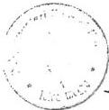
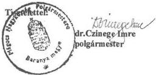
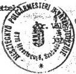
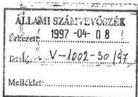
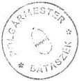
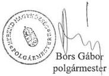
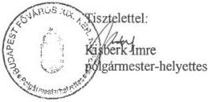
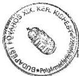

Állami Számvevőszék

# JELENTÉS

a helyi önkormányzatok által igényelhető 1996. évi központosított előirányzatok felhasználásának ellenőrzéséről

389

1997. augusztus

---

A vizsgálat végrehajtásáért felelős:

V. Önkormányzati és Területi Ellenőrzési Igazgatóság
Dömötör Gyula

igazgató

Az ellenőrzést vezette:

Németh Péterné

régióvezető főtanácsos

Az összefoglaló jelentést készítette:

Németh Péterné

régióvezető főtanácsos

Turnheimné Lakos Zsuzsa

számvevő tanácsos

Dr. Klapcsik László

számvevő tanácsos

közreműködésével

Az ellenőrzésben részt vettek:

A résztvevők névsorát az 1. sz. melléklet tartalmazza

---

V-1002-110/1997. TÉMASZÁM: 359

# TARTALOMJEGYZÉK

|  **I. ÖSSZEGZŐ MEGÁLLAPÍTÁSOK, KÖVETKEZTETÉSEK** | **4**  |
| --- | --- |
|  **II. JAVASLATOK** | **8**  |
|  **III. RÉSZLETES MEGÁLLAPÍTÁSOK** | **9**  |
|  **1. A központosított előirányzatok tervezése, évközi változása és felhasználása** | **9**  |
|  **2. Az önkormányzatok által igénybe vett támogatások** | **13**  |
|  2.1. Közműfejlesztési támogatás | 14  |
|  2.2. Nevelési segély kiegészítése | 16  |
|  2.3. Gyermeknevelési támogatás | 18  |
|  2.4. Az egyes közoktatási feladatok támogatása | 21  |
|  2.4.1. INTÉZMÉNYFENNTARTÓ TÁRSULÁSOK TÁMOGATÁSA | 22  |
|  2.4.2. ISKOLABUSZ VÁSÁRLÁSÁNAK TÁMOGATÁSA | 24  |
|  2.4.3. PEDAGÓGUS-LÉTSZÁMCSÖKKENTÉSHEZ KAPCSOLÓDÓ TÁMOGATÁS | 26  |
|  2.5. Tartalék előirányzat | 28  |
|  2.6. Bérpolitikai intézkedések | 29  |
|  2.6.1. A KÖZALKALMAZOTTI JOGVISZONYBAN TÖLTÖTT IDŐ 1996. JANUÁR 1-JEI ÚJBÓLI MEGÁLLAPÍTÁSÁVAL ÖSSZEFÜGGŐ TÖBBLETTÁMOGATÁS | 29  |
|  2.6.2. A KÖZALKALMAZOTTAK ELŐMENETELI ÉS ILLETMÉNYRENDSZERÉNEK 1996. FEBRUÁR 1-JEI MÓDOSÍTÁSÁVAL ÖSSZEFÜGGŐ TÖBBLETKIADÁS | 30  |
|  2.6.3. A KÖZALKALMAZOTTAK 1996. JANUÁR 1-JÉTŐL ÉRVÉNYES MINIMÁLBÉRÉHEZ KAPCSOLÓDÓ TÁMOGATÁS | 31  |
|  2.6.4. A KÖZALKALMAZOTTAK ELŐMENETELI ÉS ILLETMÉNYRENDSZERÉNEK 1996. SZEPTEMBER 1-JEI MÓDOSÍTÁSÁVAL ÖSSZEFÜGGŐ TÖBBLETKIADÁS TÁMOGATÁSA | 31  |
|  2.6.5. EGYSZERI KERESET-KIEGÉSZÍTÉSEK | 32  |
|  2.6.6. A KÖZTISZTVISELŐI ILLETMÉNYALAP 1996. JANUÁR 1-JEI EMELÉSÉVEL ÖSSZEFÜGGŐ TÖBBLETKIADÁS | 33  |
|  2.6.7. AZ ÖNKORMÁNYZATOK LÉTSZÁMCSÖKKENTÉSI DÖNTÉSEIHEZ KAPCSOLÓDÓ TÁMOGATÁS | 33  |
|  2.7. A lakossági tüzelőolaj felhasználás kiadásaihoz kapcsolódó hozzájárulás | 34  |

1

---

  *

---

## Jelentés a helyi önkormányzatok által igényelhető 1996. évi központosított előirányzatok felhasználásának ellenőrzéséről

Az Országgyűlés az 1996. évi központi költségvetésből a helyi önkormányzatok által ellátandó, a törvény 5. számú mellékletében felsorolt feladatokra 18 jogcímen 49 528,1 millió Ft központosított előirányzatot állapított meg. A támogatást az önkormányzatok – a lakossági tüzelőolaj felhasználás kiadásaihoz kapcsolódó hozzájárulás kivételével – felhasználási kötöttséggel vehették igénybe, a törvény által meghatározott feltételek mellett.

A központosított előirányzatok közül az ellenőrzés kiterjedt:

- a magánszemélyek jövedelemadójában közműfejlesztésre megállapított kedvezmények megszüntetésének ellentételezésére;
- a nevelési segély kiegészítésére;
- a gyermeknevelési támogatásra,
- az egyes közoktatási feladatok támogatására;
- a közoktatási célokra előirányzott tartalékra;
- a bérpolitikai intézkedésre előirányzott összeg igénybevételére;
- a lakossági tüzelőolaj felhasználás kiadásaihoz kapcsolódó hozzájárulás felhasználására.

Az ellenőrzés körébe vont jogcímeken juttatott támogatások, hozzájárulások az eredeti központosított előirányzatok 87,7%-át, a felhasználásnak pedig 88,7%-át képezik.

Az ellenőrzés célja annak megállapítása volt, hogy

- a központi költségvetésből a különböző feladatokra elkülönített előirányzatok felhasználása hogyan alakult, mennyiben elégítették ki a jelentkező igényeket;
- a támogatási igények benyújtásánál, a támogatások odaítélésénél, felhasználásánál és elszámolásánál betartották-e a vonatkozó törvényi előírásokat;
- a támogatási rendszer működésének eredményessége, célszerűsége hogyan értékelhető.

Helyszíni ellenőrzést tartottunk a Pénzügy-, a Belügy-, a Népjóléti, a Művelődési és Közoktatási Minisztériumban, továbbá az ország 15 megyéjében és a fővárosban, összesen 91 önkormányzatnál, valamint a TÁKISZoknál. A helyszíni vizsgálat az ellenőrzés tárgyát képező módosított központosított előirányzatok 7,2%-át érintette. (2. sz. melléklet)

3

---

I. ÖSSZEGZŐ MEGÁLLAPÍTÁSOK, KÖVETKEZTETÉSEK

# 1. ÖSSZEGZŐ MEGÁLLAPÍTÁSOK, KÖVETKEZTETÉSEK

Az önkormányzatok normatív forrásszabályozását kiegészítő **központosított előirányzatok** - bár évenként eltérő számban és tartalomban - az önkormányzati **szabályozás állandó elemét képezik**.

Az ÁSz már az 1994. évi előirányzatok vizsgálata során megállapította, hogy a szabályozás bevezetésétől eltelt időszakban a központosított előirányzatok szerepe lényegesen módosult, felértékelődött, az előirányzatok száma és mértéke többszörösére emelkedett. A támogatási formák sokfélesége a kapcsolódó - esetenként nem egyértelmű és hiányos - jogszabályok egész sorának alkalmazási szintű ismeretét igényelte, amely feladatnak az önkormányzatok többsége nem tudott eleget tenni.

Az adott feladatokra juttatott **kiegészítő források** az önkormányzatok működéséhez **szükségesek voltak**. Az elosztás, a felhasználás és az elszámolás hiányosságai azonban egyértelműen bizonyították, hogy az elaprózott támogatási rendszerben juttatott állami források **felhasználásának hatékonysága, célszerűsége nem kellően biztosítható**.

A központosított előirányzatok csökkentésére és a szabályozás pontosítására, egyértelműbbé tételére vonatkozó javaslatainkkal a Pénzügyminisztérium egyetértett, ez azonban 1995-ben már nem érvényesülhetett.

A négy évi folyamatos növekedést követően azonban 1995-ről-1996-ra (24-ről 18-ra) mérséklődött az előirányzatok száma, de az eredetileg előirányzott összeg másfélszeres lett. E növekedés az előirányzatok szerkezeti változása mellett következett be. Míg 1995-ben a munkanélküli jövedelempótló támogatás 50%-át központosított előirányzatból fedezték, addig 1996-ra ennek fedezetét a Munkaerőpiaci Alapban teremtették meg. Az összességében jelentős előirányzat-növekedés a bérpolitikai előirányzat következménye, amely a módosított központosított előirányzatok 35%-át, a tényleges teljesítésnek pedig 55%-át tette ki 1996-ban.

Átfogó reformok hiányában azonban **a támogatási rendszer változatlanul elaprózott és bonyolult**. A központosított előirányzatok többsége pontosan nem tervezhető, mivel egyrészt a várható igények többnyire számos előre nem kiszámítható körülménytől függnek és nem egy meglévő adatbázisból nyerhetők, másrészt a finanszírozás szakmai követelményei többnyire csak a költségvetési törvény elfogadását követően konkretizálódnak.

A költségvetési források szűkössége, valamint az elosztási mechanizmus jelenlegi gyakorlata következtében a központosított előirányzatok, mint kiegészítő források nem képesek maradéktalanul betölteni eredeti funkciójukat, amit az önkormányzati törvény tulajdonít e forrásoknak, azaz az átlagtól eltérő egyedi helyzeteket érdemben nem kezelik.

A központosított előirányzatok igénybevételének feltételeit rendkívül heterogén jogszabályi és pályázati háttér írja elő, melyek belső konzisztenciája

4

---

I. ÖSSZEGZŐ MEGÁLLAPÍTÁSOK, KÖVETKEZTETÉSEK

nem mindig biztosított. Részben ennek, részben pedig információs problémáknak tudható be, hogy a támogatások igénylésénél, felhasználásánál a törvényességben és a szabályszerűségben lényeges előrelépés nem tapasztalható.

Az igénybe vett támogatásokkal kapcsolatos **elszámolás teljeskörűsége nem biztosított**. A költségvetési beszámolóban a függő, kifizetésre nem került tételeket is felhasznált összegként mutatják ki az önkormányzatok. Miután mindig a tárgyévre kapott összeget kell elszámolni, az előző évi függő tételekkel való elszámolás elmarad.

Évek óta csökkenő tendenciát mutat a **közműfejlesztési támogatás** igénybevétele. Ez részben a helyi fejlesztési források csökkenésével, részben pedig a jogszabályi korlátokkal magyarázható. A lakossági közműbefizetések támogatását szabályozó 89/1991. (VII.12.) sz. Kormányrendelet megalkotása óta tartalmában szinte semmit sem változott. Annak ellenére, hogy a jogszabály viszonylag hosszú ideje hatályos, tartalmaz ezideig sem pontosított – már a korábbi évek vizsgálatai során is felvetett – megfogalmazásokat, amit az önkormányzatok nem egységesen értelmeznek. Az ellenőrzés a rendelet szövegszerű értelmezéséből következően csak az épülő szakaszra történő befizetésekhez kapcsolódó támogatást minősítette jogosnak.

1996-ban utoljára pályázhattak az önkormányzatok az előző évi feltételek mellett a kiskorúak rendszeres **nevelési segélyezéséhez** biztosított többletforrás elnyerésére. A rendelkezésre álló összeg negyedik éve változatlan volt, miközben – ha az önkormányzati források behatároltsága miatt mérsékelten is – a támogatás iránti igény növekedett. Az elnyerhető támogatás összegének bizonytalansága, a jogszabályi és pályázati feltételek, valamint az elszámolás ellentmondásossága miatt e támogatási forma nem tudott elég hatékony lenni, mivel nem feltétlenül azok az önkormányzatok jutottak támogatáshoz, amelyek leginkább rászorultak volna.

A **gyermeknevelési támogatás** szerepe nőtt az elmúlt évek során. Igénybevételének feltételei az egyéb családi támogatásokhoz közelítettek, a változó szabályokat azonban az önkormányzatok nem mindig tudták megfelelően alkalmazni.

Az egyes **közoktatási feladatokhoz** a költségvetési törvény támogatandó célokként a közoktatás racionálisabb szervezése érdekében létrehozandó intézményfenntartói társulások kialakítását, az e társulásokhoz szükséges tárgyi feltételek megteremtését és az 1996-97-es tanévi helyi közoktatásszervezési döntésekhez kapcsolódó létszám-csökkentések miatti kötelezettségeket nevezte meg, melyek csak részben teljesültek.

**A pályázó társulások jó része csak formálisan volt új:** az eddig is közösen működtetett intézmény tárgyi feltételeit javító többletforrás reményében szerződéses formában rögzítették az együttműködés kereteit, de esetenként már meglévő társulások is megújították szerződésüket a támogatás megszerzése érdekében. A döntést előkészítő szakértők nem egyforma szigorral ítélték meg a pályázatokat – ezek egy részéből nem is derült ki az

5

---

I. ÖSSZEGZŐ MEGÁLLAPÍTÁSOK, KÖVETKEZTETÉSEK

igényjogosultság hiánya –, s a tárcaközi bizottság néhány kivételtől eltekintve minden igényt teljesített.

**Nem volt elég körültekintő az iskolabusz pályázat lebonyolítása.**

A pályázók nagy száma és a célra rendelkezésre álló forrás behatároltsága miatt a támogatási elvek és mértékek menetközbeni alakítása a szűkös forrással rendelkező önkormányzatokat nehéz helyzetbe hozta. A központilag történő beszerzés lehetőségéről csak igen későn döntöttek, a támogatottak ezért egy év késedelemmel juthatnak az iskolabuszhoz.

**A létszámcsökkentések anyagi terheihez való hozzájárulást nem volt szerencsés pályázati rendszerben megoldani.** Az iratanyagok áttanulmányozását követően mérlegelés nélkül kaphatták meg a pályázók a támogatást.

A hosszas döntési mechanizmus kiküszöbölésével rövidülhetett volna a kifizetésekig eltelt idő.

Megoldatlan az önkormányzatok közoktatási feladatokra nyújtott támogatással való elszámoltatása. A korszerű oktatási eszközök beszerzése – ami sok esetben nyelvi- vagy számítástechnikai laboratórium kialakítását jelentette –, vagy az intézményátszervezés technikai feltételeinek megteremtése általában 1996. végéig nem volt megoldható, mint ahogy a buszbeszerzésre is legfeljebb kötelezettséget vállaltak ezen időpontig az önkormányzatok.

Az 1996-ra tervezett egyes **bérpolitikai intézkedések** fedezetének központosított előirányzatként történő elkülönítését az indokolta, hogy a közalkalmazotti törvény módosítása elhúzódott, az illetményrendszer változás kihatását más szabályozókba, normatívákba nem lehetett beépíteni. Az önkormányzati szabályozórendszer többéves problémája a közalkalmazotti és köztisztviselői réteg béremeléséhez történő központi hozzájárulás juttatásának módja. A normatívákba történő beépítés során nem oldható meg az önkormányzat által ténylegesen foglalkoztatottak valós bérhelyzetét figyelembe vevő differenciálás és a célra történő felhasználás sem biztosítható. Az 1996-ban is központosított előirányzatként juttatott támogatás megfelelt ezeknek a feltételeknek, ugyanakkor – a jogszabályok többszöri széles kört érintő változása és a több ütemben folytatott érdekegyeztetés következtében rengeteg adatszolgáltatást követelt – ami számos hibalehetőséget jelentett – az önkormányzatoktól és TÁKISZ-októl egyaránt.

A lakossági **tüzelőolaj** felhasználás kiadásaihoz kapcsolódó **hozzájárulás** központi elosztásának alapjául szolgáló **adatok** sem 1995. évben, sem 1996. évben **nem tükrözték a valóságnak megfelelően a tüzelőolajjal fűtő háztartások számát.** 1996-ban a rendelkezésre álló támogatás elosztását megalapozó adatszolgáltatás nem volt megbízható, az adatlapok valóságtartalma sokszor megkérdőjelezhető, így az igényelt és megkapott támogatások nem a valós helyzethez igazodtak, mértékük jelentősen meghaladta a jogos igényeket. **A támogatás felhasználási kötöttség nélküli törvényi lehetősége és a miniszteri rendeleteknek a felhasználásra vonatkozó előírásai komoly értelmezési zavart okoztak** a vizsgált önkormányzatok körében. Az önkormányzatok jelentős része a támogatást – azon túlmenően, hogy a jelentkező jogos igénylő-

6

---

I. ÖSSZEGZŐ MEGÁLLAPÍTÁSOK, KÖVETKEZTETÉSEK

ket támogatta - nem az eredeti célnak megfelelően használta fel. Forráshiány pótlására, iskola építésre, intézmények gáz-beruházására, települési gázhálózat finanszírozására, szociális segélyekre fordították, illetve tervezik felhasználni a támogatás jelentős részét.

Helyenként a vártnál alacsonyabb mértékű támogatás, valamint a más irányú felhasználás óriási felháborodást váltott ki és ellentétet szült az önkormányzatok és az állampolgárok között.

**Összességében** megállapítható, hogy a **szétaprózottság és a többlet-adminisztráció ellenére** a központosított támogatások kialakított rendszerében juttatott többletforrások jelentős mértékben **enyhítik az önkormányzatoknál felhalmozódott szociális feszültségeket** és - eltekintve néhány önkormányzat kirívó támogatási gyakorlatától - lakossági közérzet javító szerepük vitathatatlan.

**1997-re tovább módosult** az önkormányzatoknak nyújtott **hozzájárulások, támogatások rendszere**. A központosított előirányzatok száma - az oktatási célú feladatok jogcímeinek növekedése következtében - ismét nőtt, értékben azonban az 1996. évi igen magas teljesítéshez képest 31%-os a csökkenés.

Az 1997. évi költségvetés már nem tartalmaz a nevelési segély kiegészítésére szolgáló központosított előirányzatot. A helyszíni vizsgálatok befejeződését követően az országgyűlés elfogadta a gyermekvédelmi törvényt, amely normatív alapon szabályozza a kiskorúak szociális ellátását, s ezért feltehetően segíteni fogja a központi források célszerűbb felhasználását.

A központosított előirányzatok köréből a normatív állami hozzájárulások körébe került a tüzelőolaj-felhasználáshoz kapcsolódó hozzájárulás, valamint az illetményemelésekhez kapcsoló bérpolitikai előirányzat is, ami az önkormányzatok számára szabadabb felhasználási lehetőséget, egyben nagyobb döntési felelősséget is jelent. 1997-ben a közoktatási törvény módosításának következtében az 1996-ban e célra felhasznált összeg közel háromszorosát - 11,5 milliárd Ft-ot, a központosított előirányzatok 31,4%-át - biztosítja 6 jogcímen a költségvetés oktatási feladatokra.

**A központosított előirányzatok**, illetve az önkormányzati támogatások fentiekben is **vázolt szerkezeti módosulásai** időszakról-időszakra **jól mutatják a támogatandó célok súlyának, fontosságának a változását**, de egyben a **szabályozórendszer kiforratlanságát, az igények és lehetőségek összhangjának megteremtésére irányuló törekvést is tükrözik**.

7

---

II. JAVASLATOK

## II. JAVASLATOK

1. A **Kormány** intézkedjék, hogy vizsgálják felül és pontosítsák a közműfejlesztések támogatásáról szóló 89/1991. (VII.12.) sz. Kormányrendeletet. Megfontolandó a támogatás kiterjesztése a már meglévő közműre való utólagos rácsatlakozás esetére is.

2. A **Pénzügyminisztérium**:

- a pénzügyi szabályozórendszer átfogó reformja keretében mérsékelje az önkormányzatok támogatási rendszerének az elaprózottságát, csökkentse a központosított előirányzatok számát és erősítse a források elosztásának a normativitását,
- a költségvetési törvényben - a támogatások elosztásáért felelős minisztériumok számára előírt kötelezettségekkel - biztosítsák, hogy a támogatásokat az önkormányzatok időben megkapják és azt az adott évben felhasználhassák,
- biztosítsa, hogy az igénylés vagy pályázat útján juttatott támogatások megfelelően nyomonkövethetőek legyenek az önkormányzatok költségvetési beszámolóiban, s a pályázati úton juttatott támogatások pénzügyi lebonyolítását hozza összhangba az államháztartás információs rendszerével,
- az 1998. évi költségvetési törvényjavaslat előkészítése során az ÁSz által feltárt jogosulatlan igénybevételhez kapcsolódó késedelmi kamatfizetési kötelezettség keletkezésének napjaként a 211/1996. (XII. 23.) sz. Kormányrendelet 36. §-ában szereplő határidőt jelölje meg - a közműfejlesztési támogatás kivételével - a központosított előirányzatok esetében is,
- a zárszámadás keretében gondoskodjon a helyszíni vizsgálat által feltárt, - a 6. sz. és 6/a. sz. mellékletben felsorolt - jogtalanul igénybe vett központosított támogatás visszafizettetéséről. A közműfejlesztési támogatás jogtalan igénybevételének napját a 6.b melléklet tartalmazza.

3. A **Népjóléti Minisztérium** szakmai iránymutatással tegye egyértelművé a szociális törvényből és végrehajtási rendeleteiből fakadó, helyileg szabályozandó kérdéseket, valamint a nyilvántartással, elszámolással kapcsolatos kötelező teendőket.

4. A **Művelődési és Közoktatási Minisztérium** biztosítsa a pályázati rendszerben juttatott támogatások hatékonyságát a pontosan meghatározott és az elbírálás során következetesen betartott pályázati feltételekkel, az elszámoltatás módszerének, formájának és határidejének, a visszafizetés rendjének a kidolgozásával.

8

---

III. RÉSZLETES MEGÁLLAPÍTÁSOK

### III. RÉSZLETES MEGÁLLAPÍTÁSOK

#### 1. A KÖZPONTOSÍTOTT ELŐIRÁNYZATOK TERVEZÉSE, ÉVKÖZI VÁLTOZÁSA ÉS FELHASZNÁLÁSA

A Pénzügyminisztérium szakmailag indokolt törekvése, hogy a meghatározott célra juttatott központosított előirányzatok köre és szerepe szűküljön, ugyanakkor az éves költségvetési törvények vitája során az előterjesztéshez képest újabb, vagy bővebb tartalmú, többcélú előirányzatok kialakításáról döntenek a jogalkotók.

A költségvetési törvény megalkotásának utolsó szakaszában beiktatott, illetve az évközi módosítások esetén azonban **nem mindig biztosítható a szabályozás konzisztenciája, de az előirányzatok kialakításához és felosztásához sem állnak megbízható adatok rendelkezésre.**

- Az 1996. évi költségvetésben másodszor biztosítottak többletforrást egyes **közoktatási feladatok** támogatására. Az előző évi 1,2 milliárd Ft-os támogatási keretet eredetileg 2 milliárd Ft-ra kívánták bővíteni, ezzel ösztönözve a racionálisabb oktatásszervezés érdekében a kistelepülések társulását. A költségvetési törvény az előterjesztéshez képest további 5 milliárd Ft-ot biztosított e központosított előirányzatra, megtoldva annak tartalmát a helyi közoktatás-szervezési döntésekhez kapcsolódóan szükségessé váló létszámcsökkentések miatti munkáltatói kötelezettségek teljesítésével. Ez utóbbi feladat nagyságáról, anyagi kihatásáról előzetes becslések nem állhattak rendelkezésre.
- Közoktatási célokra 6 milliárd Ft **tartalék-előirányzat** szerepelt a központosított előirányzatok között, melyet elsősorban az 1996-ban jelentősen módosuló oktatási normatívákhoz történő szükség szerinti átcsoportosítások fedezetére biztosított a költségvetés.
- Az elmúlt években az önkormányzati közalkalmazottak és köztisztviselők **illetményemelését** különböző mértékben támogatta a költségvetés. A közalkalmazotti illetményrendszer változásával, a köztisztviselői alapilletmények emelkedésével összefüggő többletkiadások fedezetére 1996-ban 15 milliárd Ft-os központosított előirányzat állt rendelkezésre.
- Az 1996. évi költségvetési törvényjavaslat eredetileg nem tartalmazott előirányzatot a lakossági tüzelőolaj (**HTO**) **felhasználás kiadásaihoz** kapcsolódóan. A költségvetési törvény azonban 7 milliárd Ft-ot biztosít már e célra. 1995. év végén a felhasználás adatai még nem voltak ismertek, ebből következően a támogatás mértéke csak előzetes prognosztizációra alapozódhatott.

A vizsgálat körébe vont 1996. évi előirányzatok egy része az elmúlt évek

9

---

III. RÉSZLETES MEGÁLLAPÍTÁSOK

során tartalmában nem változott jelentősen, ennek ellenére a tapasztalati adatokat, tendenciákat nem vették figyelembe a tervezésnél.

- A közműfejlesztési támogatásra harmadik éve 4 milliárd Ft-ot irányzott elő a költségvetés, miközben az előirányzat igénybevétele csökkenő tendenciát mutat.
- Nem változott a nevelési segély kiegészítésére tervezett előirányzat sem, annak ellenére, hogy az a jelentkező igényeknek csak 36-49%-ára nyújtott az elmúlt években fedezetet.
- Az 1995. évi módosított előirányzatnak megfelelő támogatási keretet terveztek csak 1996-ra gyermeknevelési támogatásra, holott e támogatási forma iránti igény évről-évre dinamikusan növekszik.

A költségvetési törvény 45. § (2) bekezdése 1996-ban is felhatalmazta a kormányt a központosított előirányzatok közötti átcsoportosításra, a (3) bekezdés pedig az oktatási normatívák és a tartalék-előirányzat közötti átcsoportosításra. E lehetőségek kimerítését követően a 18 előirányzat közül 6 esetben a teljesülés külön módosítás nélküli eltérhetett az előirányzattól (a vizsgált körben a közműfejlesztési-, a gyermeknevelési-, valamint a bérpolitikai intézkedések támogatása).

Az előirányzatok közötti átcsoportosításról mindössze egyszer döntött a kormány. A közműfejlesztési támogatásról 392 ezer Ft-ot csoportosítottak át a határátkelőhelyek fenntartásához. Nem éltek az átcsoportosítás lehetőségével a gyermeknevelési támogatás esetében, holott ennek felhasználása már májusban elérte az éves előirányzat összegét. A bérpolitikai intézkedéseket szolgáló központosított előirányzat növeléséről pusztán azért döntött a kormány, mivel az önkormányzati körben hozott – nem pedagógusokat érintő – létszámcsökkentési döntésekhez eredetileg a Miniszterelnökség költségvetési fejezet céltartalékában teremtett fedezetet a költségvetés. A 865,7 millió Ft előirányzat-átcsoportosításról december végén született döntés.

A Költségvetési Intézmények Érdekegyeztető Tanácsával (KIÉT) történt megállapodásokat követően az országgyűlés a központosított előirányzatok igénybevételi feltételeit tartalmazó előírásait módosította, a támogatási keretet azonban nem, noha a KIÉT-tel 9,1 milliárd Ft többlettámogatás elosztásáról állapodott meg a kormány. A támogatási összeg változatlanul hagyása helyett – bár a bérpolitikai előirányzat a költségvetési törvény szerint módosítás nélkül is túlléphető volt – a kormánynak fel kellett volna tárnia azokat a 45 § (2) bekezdése szerinti lehetőségeket, amelyek előirányzati oldalról is fedezetet teremtettek volna a kifizetéseknek, mivel a parlamenti döntések időpontjában ezen előirányzatot az eredeti célnak megfelelően már elosztották.

10

---

III. RÉSZLETES MEGÁLLAPÍTÁSOK

A Kormány december 20-án - vagyis olyan időpontban, amikor az önkormányzatok már az egész évi normatív hozzájárulást ténylegesen megkapták - döntött a tartalék előirányzatból a normatívákra átcsoportosítandó 3.984,8 millió Ft-ról. (Megjegyzendő, hogy a normatív állami hozzájárulásokat önkormányzatonként tartalmazó 9/1996. (II.27.) sz. PM-BM együttes rendelet és a költségvetési törvény normatíva előirányzatainak különbözete csak 3.947,4 millió Ft).

Az **1996. évi felhasználás** összességében 52 882 millió Ft-ot, a módosított előirányzatok 115,7%-át teszi ki. Ezen belül a vizsgált előirányzatok 46 884 millió Ft-os felhasználása 118,4%-ot jelent.(3. sz. melléklet)

- ■ Az előző évi 43,6%-os felhasználást követően a közműfejlesztési hozzájárulás közel változatlan módosított előirányzatának mindössze 32,4%-ára volt szükség 1996-ban, a maradvány 2,7 milliárd Ft.
- ■ A gyermeknevelési támogatás felhasználása 4 milliárd Ft-tal magasabb az előirányzatnál, annak 2,5-szerese, de az előző évi felhasználást is közel 23%-kal meghaladja.
- ■ A pályázati úton a közoktatási feladatok támogatására igénybe vehető módosított előirányzat 55,7%-a került felhasználásra, a maradvány 2,8 milliárd Ft.
- ■ A tartalék-előirányzat 2 milliárd Ft-ra történő módosítását követően a felhasználásáról csak decemberben döntött a kormány. A közoktatási törvény 1996. szeptemberben hatályba lépett módosításának előírása alapján a pedagógusok óraszám emelésével összefüggő illetményemelésről, valamint a pedagógusok átképzéséről döntöttek. Az utóbbira szánt 1,6 milliárd Ft felhasználására azonban 1996-ban nem került sor, az – a döntés ellenére 1997-re át nem vihető – maradványt képez.
- ■ A bérpolitikai intézkedések 15,9 milliárd Ft-os módosított előirányzatához 26,3 milliárd Ft, közel 166%-os felhasználás kapcsolódik. Az eredeti előirányzat tartalmának megfelelő felhasználás 16,1 milliárd Ft, a KIÉT-tel történt októberi és decemberi megállapodások alapján 9,3 milliárdot fizettek ki, míg az előirányzatra átcsoportosított 0,9 milliárd Ft-ot használták fel a létszámcsökkentésekhez kapcsolódóan.
- ■ A HTO felhasználáshoz kapcsolódó hozzájárulás teljes összegét normatív módon, az önkormányzatok előzetes adatszolgáltatása alapján osztották szét. A 28,1 millió Ft-os, 4%-os maradvány onnan adódik, hogy az eredetileg téves, vagy valótlan adatot szolgáltató önkormányzatok egy része visszafizette a jogtalanul igénybe vett támogatást

A központosított előirányzatok terhére megállapított **támogatásokat a**

11

---

III. RÉSZLETES MEGÁLLAPÍTÁSOK

# **Belügyminisztérium (BM) utalványozza és tartja nyilván, folyósításáról 1996-tól a Kincstár gondoskodik és tájékoztatja a Pénzügyminisztériumot (PM).**

Nem oldódott meg 1996-ban sem az az ellentmondás, hogy az önkormányzatok egy része eleget tett ugyan azon kötelezettségének, mely szerint ha nem a megjelölt feladatra, vagy a törvényben előírtat meghaladó mértékben vett igénybe támogatást, akkor azt visszafizette, ugyanakkor az előirányzat módosítását nem kérte, illetve fordítva: csak az előirányzat-módosítást kérte, de befizetési kötelezettségének nem tett eleget. Ebből adódik, hogy a PM által nyilvántartott pénzforgalom eltér az előirányzatok BM által kimutatott összegétől.

Az 1997. évi költségvetési törvény 22.§ (5) bekezdése már egyértelműbben fogalmaz, amikor a tévesen, jogtalanul igénybe vett támogatás visszafizetését, valamint az előirányzat-módosítás kezdeményezésének kötelezettségét is előírja az önkormányzatoknak. Ebből adódóan **1997-től már elvárható, hogy az előirányzatokkal kapcsolatos intézkedések szinkronba kerüljenek a tényleges pénzforgalommal.**

Itt kell szólni az 1996. évi költségvetési törvény 22. § (6) bekezdése b/ pontjának előírásáról, mely szerint az ÁSZ által feltárt és az Országgyűlés által jóváhagyott visszafizetési kötelezettséghez kapcsolódó késedelmi kamat-fizetési kötelezettség keletkezésének napja a törvény 20. § (1) bekezdésében szereplő támogatások – ezek közé tartoznak a központosított előirányzatok – esetében a jogtalan igénybevétel napja.

A központosított előirányzatok igénybevételének szabályai, valamint a felhasználás többéves ellenőrzési tapasztalatai alapján megállapítható, hogy ezen előírás változtatás nélkül a vizsgált központosított előirányzatoknál nem alkalmazható. Az előirányzatok sokfélesége, ezen belül az egyes előirányzatok különböző – estenként az egyszeri igénylés alapján havi – rendszerességgel történő folyósítása, vagy más előirányzatoknál annak problémája, hogy a jogtalan igénybevétel ténye csak az éves beszámoló elkészítésekor állapítható meg, nem teszi lehetővé minden esetben a jogtalan igénybevétel napjának egyértelmű megállapítását. Ennek alapján – a közműfejlesztési hozzájárulás kivételével – **a jogtalan igénybevétel napját a normatív állami hozzájáruláshoz hasonlóan a 211/1996. (XII.23.) sz. Kormányrendelet 36. §-ában megjelölt határidőben célszerű megjelölni.**

Az elmúlt évek hasonló vizsgálatai során már felvetődött, hogy az önkormányzati **beszámoló részeként** nemcsak a központosított előirányzatok pénzforgalmi bevételét, hanem **az előirányzatok tényleges felhasználását is be kellene mutatni.** Jelen vizsgálatunk tapasztalatai megerősítik ennek szükségességét. Az önkormányzatok egy része a felhasználás szabályait tartalmazó jogszabályok, pályázati kiírások előírásait figyelmen kívül hagyja, s az adott célra kapott támogatási összeget, vagy annak maradványát más célra használja fel. A beszámolóban meg kell teremteni annak a lehetőségét, hogy az önkormányzat pénzforgalmi szemléletben bemutassa a központosított előirányzatok célra történő **tényleges tárgy-**

12

---

III. RÉSZLETES MEGÁLLAPÍTÁSOK

**évi felhasználását, a következő évre jogosan átvihető, valamint a visszafizetendő maradványát is.** A tényleges felhasználással történő elszámolás arra ösztönözné az önkormányzatokat, hogy a beszámoló készítése során áttekintsék a felhasználási kötöttséggel juttatott előirányzatok igénybevételének jogszerűségét.

A beszámoló készítésének jelenlegi rendszere a cél- és címzett támogatáson kívül nem kéri az önkormányzatok tételes elszámoltatását a célozottan juttatott pénzeszközökkel. Ez alól kivételt csak a nevelési segély kiegészítésére pályázati úton juttatott előirányzat képez, melynek felhasználásáról a Népjóléti Minisztérium elszámolást kért.

**Külön elszámolást lenne célszerű kérni** az önkormányzatoktól a pályázat útján a **közoktatási feladatokra** 1995-ben és 1996-ban juttatott előirányzat felhasználásáról, mivel a december 31-ig történő tényleges felhasználásra az esetek többségében nem volt mód.

A kapott előirányzatok maradványát a 4. sz. melléklet mutatja be.

## 2. AZ ÖNKORMÁNYZATOK ÁLTAL IGÉNYBE VETT TÁMOGATÁSOK

1996. évben a központi költségvetésben rendelkezésre álló központosított előirányzatok igénybevétele – az előirányzatok jelentősen megnövekedett száma, a hozzájuk kapcsolódó sokféle jogszabály miatt – rendkívül nagy terhet rótt az önkormányzatokra. A szűkös pályázati és esetenként felhasználási, elszámolási határidők egy-egy újabb lehetőséget teremtettek a nem megfelelően értelmezett jogszabályok, kitöltési útmutatók alapján történő helytelen adatszolgáltatásra, pontatlan elszámolásra.

A helyszíni vizsgálat tapasztalata, hogy az önkormányzatok **igyekezetük ellenére sem mindig tartották be a jogszabályi előírásokat.** A **helytelen jogszabályi értelmezés** nem feltétlenül a kisközségi önkormányzatokra igaz. Viszonylag sok hiba mutatkozott olyan önkormányzat elszámolásaiban között is, ahol megfelelő létszámú és felkészültségű munkaerőt foglalkoztattak. Itt a hibák forrása elsősorban **szervezési, információ cserére vonatkozó kérdésekben** keresendő.

Az önkormányzatok **a központosított előirányzatokat a TÁKISZ-okon keresztül igényelhették.** A TÁKISZ-ok számára a különböző jogszabályi előírások többnyire az igények összesítését és továbbítását határozták meg feladatul.

Az 1996-os költségvetési évben kapható központosított támogatások szétaprózottsága, igénylési gyakorisága, valamint a támogatási összegek nagysága is egyértelművé tette, hogy a támogatási igények szabályszerűségi szempontból végzett felülvizsgálatára a szükséges központi kapacitások nem állnak rendelkezésre. A kérelmek érdemi felülvizsgálata indokolta, hogy már menet közben, azaz a pályázatok begyűjtése és összesítése folyamatába is beépüljenek bizonyos kontroll mechanizmusok, természetesen azzal az igénnyel, hogy azok az önkormányzati jogokat nem csorbíthatják. **A TÁKISZ-ok számára** az érintett minisztériumok több esetben

13

---

III. RÉSZLETES MEGÁLLAPÍTÁSOK

olyan **ellenőrzési, felülvizsgálati feladatokat határoztak meg**, amelyek azt célozták, hogy a központi szervek megalapozottabb és szabályszerűbb döntéseket hozhassanak.

A pontatlan vagy nem kellően konkrét pályázati kiírások alapján, **a nem minden feltételnek megfelelő pályázatok kiszűrésére a TÁKISZ-ok nem voltak jogosultak**, legfeljebb megkérhették az önkormányzatokat az indokoltnak tűnő módosítások azonban a hiányos pályázatokat is továbbítaniuk kellett.

**A központi szervek** – feltehetően a nem teljesen konszenzuson és törvényi felhatalmazáson alapuló feladat-meghatározások miatt, hiszen azok burkoltan ellenőrzést igényeltek volna az önkormányzatoknál, amire a kormányzati szervek az önkormányzati törvény szerint nem jogosultak – **nem kérték számon a TÁKISZ-októl**, hogy milyen tartalommal és megalapozottsággal végezték el **a felülvizsgálatokat**.

Nehezítette a TÁKISZ-ok feladatellátását az a körülmény is, hogy a feladatok volumenét központilag nem megfelelően mérték fel. Az irreálisan rövid határidőkön belül a feltorlódott rendkívüli munkaleterheltségnek köszönhetően, **a szakmai felülvizsgálatok többnyire csak formai szempontú ellenőrzésekre korlátozódtak**.

A vizsgált körben igénybevett központosított előirányzatokat az 5. sz. melléklet tartalmazza.

## 2.1. Közműfejlesztési támogatás

A magánszemélyek jövedelemadójában közműfejlesztésre megállapított kedvezmények megszüntetésének ellentételezése a 89/1991. (VII.12.) Kormányrendelet alapján volt lehetséges a lakosság anyagi hozzájárulásával kivitelezett víz-, gázhálózat-, útépítés esetében. Az elmúlt időszakhoz hasonlóan, arányaiban legjelentősebb a céltámogatással megvalósított, illetve folyamatban lévő víz- és csatornaépítéshez fizetett lakossági hozzájárulás után visszaigényelt közműfejlesztési támogatás. A támogatások kisebbik része az elektromos hálózathoz, valamint gázépítéshez kapcsolódik.

A központosított támogatások felhasználását szabályozó törvények, rendeletek közül a 89/1991. (VII.12.) sz. Kormányrendelet megalkotása óta tartalmában szinte semmit sem változott annak ellenére, hogy tartalmaz olyan, már a korábbi évek vizsgálatai során is felvetett megfogalmazásokat, amit az önkormányzatok nem egységesen értelmeznek, ebből adódóan előfordult jogtalan igénybevétel is.

A közműfejlesztési támogatás visszaigénylésénél **tapasztalt főbb hiányosságok**:

- A kormányrendelet 1. § (1) bekezdése új közműre vonatkozó megfogalmazását számos önkormányzat tévesen értelmezte, mert **olyan lakossági befizetések után is vettek igénybe állami támogatást**,

14

---

III. RÉSZLETES MEGÁLLAPÍTÁSOK

**melyeket** már hosszú évek óta kiépített közműhöz történő **rácsatlakozás után teljesítettek**. Ehhez a közmű vállalatoknál tapasztalható értelmezési probléma - a kapacitásnövelés és a kapacitáskihasználás növelésének keverése - is hozzájárult. (Pl. Bélapátfalva, Andocs, Bátaszék, Decs, Ecséd, Gyöngyös, Gyöngyöshalász, Harc, Hatvan, Kál, Kapuvár, Komárom, Kisújszállás, Magyarnádor, Nyárlőrinc, Kiskőrös, Őriszentpéter, Rózsaszentmárton, Szajol, Tanakajd, Törökszentmiklós, Vasszécseny, Vasvár, Zagyvaszántó, Balatonboglár)

- Az önkormányzatok többsége a közműfejlesztési akciók meghirdetésekor - igénybejelentés nélküli - automatikus visszaigénylést és kifizetést ígért a lakosságnak. (Pl. Herecsény, Makó, Mágocs, Tanakajd, Törökszentmiklós, Töttös, Vasszécsény, Vasvár)

Ez érthető az **önkormányzatok által lebonyolított közműberuházásoknál**, hiszen ennek pénzügyi folyamatai (lakossági befizetések, hiteltörlesztések, esetenként a beruházási költségek) az önkormányzatok számviteli nyilvántartásaiban megtalálhatók. Ezért a visszatérítendő összegekről szóló **igazolásokat** ezen esetekben az önkormányzatok többsége **nem is állította ki** és a támogatás visszaigényléséhez **nem kérték** a magánszemélyek **igénybejelentését sem**. (Pl. Alattyán, Ecséd, Jászalsószentgyögy, Levél, Magyarnádor)

- Problémás a lakossági **építőközösségek, társulások által lebonyolított**, azok elkülönített számláira történő befizetések után visszaigényelt közműfejlesztési támogatás ellenőrzése. Ezek a társulások az ellenőrzés időpontjában gyakran már nem léteznek (a beruházás megvalósulásával megszűnnek) és az önkormányzatoknál legfeljebb egy befizetési lista található, amely alapján a központosított támogatást visszaigénylik. A lakossági **befizetésekről szóló igazolások az esetek többségében nem feleltek meg a kormányrendeletben megfogalmazottaknak**, így az önkormányzatok **nem tudták és nem is ellenőrizték, hogy jogszerűen végzik-e a visszaigénylést**.

A benyújtott igazolások a befizetett és nem a visszaigényelhető összeget tartalmazzák pl. Apátfalva, Bábolna, Kocs, Komárom, Pécsudvard esetében.

A támogatási kérelmek jogosságának felülvizsgálatát mellőzték pl. Apátfalva, Bátaszék, Decs, Magyarnádor, Szajol önkormányzatoknál, s arra is volt példa, hogy nem tudtak az ellenőrzés számára semmilyen dokumentumot bemutatni a támogatás visszaigénylésével kapcsolatban. (Pl. Herend)

- Az önkormányzatok azt sem vizsgálják, hogy a magánszemély a közműépítés költségeit jövedelemadója, vállalkozási nyereségadója, helyi adója keretében elszámolta-e, s ezért előfordult, hogy olyan befizetés után fizettek ki támogatást, melyet már a helyi adózásban érvényesítettek (Pl. Töttös)
- A vállalkozókat általában kiszűrték a támogatottak közül, de volt ezzel ellentétes gyakorlat is. (Pl. Bakonyjákó, Kisújszállás)

15

---

III. RÉSZLETES MEGÁLLAPÍTÁSOK

- ■ A támogatás pénzügyi lebonyolítása során előfordult nettó módon való elszámolás is, amikor a magánszeméllyel csak a fizetendő összeg 85%-át fizettették be. (Pl. Jászladány, Nyárlőrinc, Sümeg)
- ■ Egyes önkormányzatok nem a tényleges befizetések alapján igényelték meg a támogatást, (pl. Herecsény, Herend) vagy a befizetést követő visszafizetések miatti támogatás-visszatérülésekkel nem csökkentették az igénylést. (Pl. Vasvár)
- ■ Az egyes negyedévekhez tartozó igénylés alapján kapott és kifizetett összegek éven belül esetenként nem voltak szinkronban. Évközi megelőlegezett támogatás-kifizetések is előfordultak. (Pl. Ecséd, Bugyi, Gyöngyös, Komárom, Főváros XII. kerület, Pécsudvard)
- ■ **Az állami támogatás megérkezése és kifizetése között sok esetben 15 napnál több idő telt el.** Ennek oka általában az, hogy az önkormányzatot terhelő postaköltségek mérséklése érdekében megvárják, míg személyesen jelentkezik a magánszemély pénzéért, vagy a hozzájárulást részletekben fizetőknél több részlet után együttesen utalják át a támogatást. (Pl. Alattyán, Bakonyjákó, Budapest XII. kerület, Dunabogdány, Herend, Jászalsószentgyörgy, Kál, Kapuvár, Kisújszállás, Komárom, Magyarnádor, Mágocs, Őriszentpéter, Sárisáp, Sümeg, Szajol, Törökszentmiklós, Tápiószentmárton, Tiszacsécs, Vasvár, Vasszécsény) **Előfordult, hogy az önkormányzatok a visszaigényelt összeget nem fizette ki a magánszemélyek részére.** (Pl. Herecsény, Nagycsécs)

## 2.2. Nevelési segély kiegészítése

Az önkormányzatok által kiskorúak rendszeres segélyezésére fordított források kiegészítésére – negyedik éve változatlanul – 1850 ezer Ft központosított előirányzatot biztosított 1996-ban is a központi költségvetés, melyet pályázati úton lehetett igénybe venni.

**A költségvetési törvény, valamint a pályázati kiírás szövegezése nem volt összhangban a szociális törvény** – e szempontból nem eléggé egyértelműen definiált – **fogalmaival.** Ebből adódóan az önkormányzatok helyi rendeletei is sok esetben összemossák az átmeneti és a rendszeres támogatás fogalmát. Rendszeres támogatásként jelölnek meg eseti segélyezési formákat, ugyanakkor rendszeresen nyújtott támogatást átmenetiként definiálnak. Ez azt eredményezi, hogy a pályázatokban megjelenő rendszeres támogatásra biztosított saját forrás, mint **pályázati alap igen eltérő tartalmú** – a törvény szellemével sokszor összhangba nem hozható – **felhasználási előirányzatokat takart.**

A Vas megyei **Csempeszkopács** szociális rendelete nem szabályozza a rendszeres nevelési segély juttatásának feltételeit, csak esetenként adható átmeneti segélyekről rendelkezik.

Bács-Kiskun megyében **Bócsa** község szociális rendelete az évente egy alkalommal adott be-

16

---

III. RÉSZLETES MEGÁLLAPÍTÁSOK

iskolázási segélyt is rendszeres támogatásnak minősítette.

Sem a szociális törvény, sem az önkormányzatok költségvetés-készítését és beszámolási rendszerét meghatározó kormányrendeletek alapján **nem kötelező a kiskorúak segélyezésére szánt összeget elkülönítetten kezelni**. Ezért sok esetben nem dokumentált és így nem állapítható meg, hogy a pályázatban rendszeres nevelési segélyként feltüntetett összegről született-e valóban testületi döntés.

A költségvetést megalapozó számítások és a benyújtott pályázat összevetéséből többször megállapítható volt, hogy

- a ténylegesen tervezett saját forrásnál nagyobb összeget tüntettek fel a pályázatban, hogy megfeleljenek a minimálisan szükséges saját forrás előírásának,
- nem a rendszeres támogatásra tervezett összeget, hanem minden, kiskorúak segélyezésére szánt saját forrást összevontan szerepeltettek a pályázatban, a minél nagyobb támogatás elnyerése érdekében.

A nógrádi Jobbágyi község képviselő-testülete a rendszeres pénzbeli juttatásokat együttesen határozta meg. A költségvetést megalapozó számításokból látható, hogy a kiskorúak rendszeres nevelési segélyezésére szánt összeg nem éri el a pályázati minimum-követelményt. Pályázatukban mégis ezt meghaladó összeg szerepelt külön testületi jóváhagyás nélkül.

A határidőre benyújtott, formailag a pályázati feltételeknek megfelelő pályázatok száma 2852 volt, 2,4%-kal több, mint 1995-ben. Ennél nagyobb, közel 17%-os növekedést mutat a pályázatokban feltüntetett 4,4 milliárd Ft támogatási igény, ami részben a saját forrás növekedésének, részben a – szociális rászorultságot kifejező – szorzó átlagos (0,70-ről 0,74-re) emelkedésének következménye. Az igényelt támogatás 42,2%-ára volt elegendő az 1850 ezer Ft-os előirányzat, melyből – a 42%-ra kerekített támogatási arány következtében – 10,9 millió Ft szükségtelen nagyságrendű tartalék képződött.

Az 1996. évi pályázat is **előírta az elszámolási kötelezettséget**. Az ÁSZ előző évi vizsgálata már felhívta a figyelmet arra, hogy **az elszámolási nyomtatvány nem megfelelően szolgálja a jogtalanul igénybe vett támogatás kimutatását**, az elszámoltatás azonban most sem volt a pályázat szellemével összhangban.

A fentiekben már említett központi, helyi szabályozási és elszámoltatási hiányosságok következtében a helyszíni ellenőrzés a **kiskorúak segélyezésének igen eltérő gyakorlatával, sok esetben** pedig a támogatás **jogtalan igénybevételével** találkozott.

- A kapott támogatást **elsősorban átmeneti segélyezésre**, valamint a gyermekélelmezési költségek – helyenként rendszeres, de általában átmeneti segélyezésnek minősített – átvállalására fordították. Az étkezési kiadásokhoz történő hozzájárulást – annak helyi minősítésétől függetlenül – az ellenőrzés mindenütt elfogadta rendszeres támogatási for-

17

---

III. RÉSZLETES MEGÁLLAPÍTÁSOK

maként.

- ■ Változatlanul **keveredik** az önkormányzatok kimutatásaiban a kollégiumi étkezéshez, valamint a három- és többgyermekes családoknak **normatív alapon** – s ezért a normatív állami hozzájárulás terhére – **finanszírozott** élelmezési díjmeréskés és a központosított előirányzat terhére elszámolható egyéb étkezési támogatás.
- ■ Több önkormányzat **egyszeri beiskolázási segélyezésre** fordította a támogatást, esetenként szociális helyzettől függetlenül, differenciálás nélkül minden iskolába járó tanulónak – vagy évfolyamonként – azonos összeget juttatva., amit aztán RNS-ként számoltak el. (Pl. Tolna megye: Decs, Harc Bács-Kiskun megye: Bócsa, Győr, Vámosszabadi)

A 91 ellenőrzött önkormányzat közül 88 igényelt és kapott nevelési segély kiegészítésére támogatást, melynek 24%-ánál, 21 önkormányzatnál állapított meg a vizsgálat szabálytalan igénybevételt. 10 önkormányzatnál a saját forrásból RNS-re fordított összeg nem érte el a pályázati minimumot, 11 pedig a csökkentett saját forrás igénybevételével arányosan jogosult a támogatásra, illetve a támogatásnak maradványa volt. Az összes visszafizetendő támogatás 3,4 millió Ft, az ellenőrzött önkormányzatok által igénybe vett központosított előirányzat 4,1%-a.

### 2.3. Gyermeknevelési támogatás

E támogatási formával a legalább 3 gyermeket nevelő – az előírt biztosítási idővel rendelkező – anyák igen széles rétege tud élni, mivel a szociális törvény a folyósítást viszonylag magas nettó jövedelemszintig lehetővé teszi. A munkaerő-foglalkoztatási lehetőségek nem javultak az elmúlt években, így folyamatosan emelkedő tendenciát mutat a gyermeknevelési támogatást (gyet) igénybe vevők száma.

Az évek óta állandó igénybevételi feltételek, az önkormányzati eljárást előíró szabályok, nyilvántartási feladatok ellenére a **helyszíni vizsgálat változatlanul tárt fel hiányosságokat, jogtalan igénybevételt.**

- ■ Az önkormányzatok sokirányú szociális feladatellátása szétparcellázott, a nyilvántartást sokszor kézzel, támogatási formánként külön-külön vezetik, s azok nem áttekinthetőek, de ha van is számítógépes nyilvántartás, az sem feltétlenül naprakész és teljeskörű. (Pl. Akasztó, Bogádmindszent, Hegyszentmárton) Kisebb településeken, ahol alacsony a támogatottak száma – arra való hivatkozással, hogy személyesen ismerik a támogatottakat –, előfordul, hogy nem vezetnek nyilvántartást, vagy az csak egy kockás papírra leírt névsor. (Pl. Andocs, Balatonboglár, Vámosszabadi, Bársonyos)
- ■ A jogosultság alapdokumentumai több esetben hiányosak, így az ellenőrzés számára nem volt bizonyított, hogy a támogatás feltételei

18

---

III. RÉSZLETES MEGÁLLAPÍTÁSOK

fennálltak. (Pl. Bakonyjákó, Herend, Vámosszabadi)

- ■ Még mindig sok településen elmulasztják a jogosultság évenkénti felülvizsgálatát (pl. Gyöngyös), esetenként pedig a személyi anyagokban a más támogatási kérelmekhez benyújtott, de a felülvizsgálathoz önmagában nem elegendő jövedelemigazolások meglétét felülvizsgálatnak tekintik. (Pl. Levél, Gyöngyöshalász, Herend)
- ■ A támogatási feltételekben bekövetkezett változás esetén nem minden esetben szüntették meg, vagy nem a jogosulatlanná válás kezdő időpontjától szüntették meg a támogatást. Előfordult, hogy helytelenül határozták meg a visszafizetendő összeget, s nem tettek lépéseket annak érdekében, hogy a jogtalanul felvett összeget az önkormányzati hivatal visszakapja. (Pl. Szécsény, Mágocs, Zagyvarékas, Kecel, Alattyán, Jászalsószentgyögy)

Az ellenőrzés által megállapított **jogtalan igénybevétel** általában a fentiekben részletezett **nyilvántartási, felülvizsgálati, visszafizettetési hiányosságok következménye** (pl. Őriszentpéter, Hegyszentmárton), de az igénylési nyomtatványok pontatlan kitöltése, a **belső egyeztetés és ellenőrzés hiánya** is hasonló eredményre vezetett. (Pl. Nagybajom, Mosdós, Gyöngyös, Sümeg)

Az egyes szociális ellátások folyósításának és elszámolásának szabályait **1997. január 1-től** módosító 223/1996. (XII.26.) sz. kormányrendelet értelmében **csak** az igénybe vevő által **ténylegesen visszafizetett összeggel kell csökkenteni** az önkormányzati **támogatásigénylést**. Ez azonban azt eredményezheti, hogy **a központi költségvetést fogja terhelni** olyan jogtalanul kifizetett támogatás is, ami a hivatali dolgozók figyelmetlen feladatellátásának vagy kényelmességének következtében lett kifizetve, vagy ezek miatt nem térült vissza.

Az 1996. évi támogatás igénybevételének vizsgálatakor – az előző évekhez hasonlóan – jogtalannak ítéltük a leigényelt támogatás azon részét, melyvel – a gyet-re jogosulatlanná vált állampolgár visszafizetési kötelezettsége és a TB-nek átutalt járulék mértékéig – az önkormányzatnak csökkentenie kellett volna igénylését. (Pl. Kisújszállás, Kecel, Cserhátsurány)

A szociális törvény szerint újabb gyermek születése esetén – ha egyébként a gyet folyósításának feltételei fennállnak – nem szüntethető meg az ellátás. A családi pótlékról és a családok támogatásáról szóló törvény szerint nem jár gyermekgondozási segély (gyes) annak, aki rendszeres pénzellátásban – ilyen a gyet is – részesül.

A gyet is, gyes is azonos összegű, mindkettő folyósításának időtartama szolgálati időnek minősül. Előbbit a települési önkormányzat, utóbbit az Egészségbiztosítási Pénztár folyósítja, a nyugdíjjárulék viszont mindkettő után a Nyugdíjbiztosítási Igazgatósághoz kerül. Amennyiben az igénylő nem tesz eleget bejelentési kötelezettségének, nem kizárt a kettős támoga-

19

---

III. RÉSZLETES MEGÁLLAPÍTÁSOK

tás igénybevétele.

1996. április 15-ével változtak a gyet igénybevételének a szabályai:

- ■ a jogosultság jövedelemhatára lejjebb került, azonos lett a gyes-nél figyelembe vehető értékhatárral,
- ■ a gyermek általános iskolai tanulmányainak megkezdéséig - legfeljebb 8 éves korig - vehető igénybe,
- ■ a munkaerőpiaci realitásokat figyelembe véve megszűnt a 180 napos biztosítási idő, mint feltétel.

Mindez azonban csak az 1996. április 15-ét követően születettekre vonatkozik, akik a gyet-hez szükséges alsó korhatárt 1999-ben töltik be, a biztosítási idő meglététől azonban a miniszter már ezt megelőzően is eltekinthet.

Vizsgálati tapasztalataink azt mutatják, hogy a népjóléti miniszter már 1995-ben is több esetben eltekintett a 180 nap biztosítási idő meglététől, bár ekkor még törvényi felhatalmazása nem volt erre és 1996-ban is minden ilyen esetben megállapította a gyet-re való jogosultságot. (Pl. Hosszúpereszteg, Vasvár, Gyöngyös, Hatvan, Tápiószentmárton)

**A jogszabályváltozás hatálybalépését rosszul értelmezve** több önkormányzat az 1996. április 15-ét követően benyújtott támogatási igénynél **nem dokumentálta a 180 napos biztosítási idő meglétét**, s nem kérte azt sem, hogy a miniszter állapítsa meg a jogosultságot. (Pl. Kiskőrös, Lakitelek, Akasztó, Nyárlőrinc)

Az önkormányzatok 1995. II. félévétől – a folyósítás szabályait módosító 3/1996. (I.15.) Kormányrendelettel 1996. februárjától megteremtve ennek jogi hátterét is, – **a kifizetés hónapjában már megkaphatják a támogatást**, így azt legfeljebb két hétre kell megelőlegezniük. A forráshiányos, **rossz anyagi helyzetben lévő önkormányzatok esetében** e rövid idejű előfinanszírozás is kisebb **gondot okoz** (pl. Borsodnádasd). Egyes önkormányzatoknál tovább rövidítették ezért a megelőlegezés időszakát és a kormányrendelet előírásától eltérően, a hónap 5-ét követően fizették ki a támogatást (pl. Nyírád, Herend, Sümeg). Ugyanakkor az önkormányzatok egy része továbbra is – rendszeresen, vagy esetenként – a kifizetést követő hónapban, vagy több hónapra összevontan igényelte vissza a támogatást. (Pl. Kecel, Budaörs, Mesztegnyő, Mosdós, Komárom, Sárisáp, Ózdfalu).

1997-től a költségvetési törvény lehetővé tette, hogy a kifizetendő támogatáshoz – éven belüli elszámolási kötelezettséggel – az önkormányzatok előleget vehessenek igénybe.

20

---

III. RÉSZLETES MEGÁLLAPÍTÁSOK

## 2.4. Az egyes közoktatási feladatok támogatása

A 7 milliárd Ft-os előirányzat igénybevételének feltételeit a költségvetési törvény értelmében 1997. január 31-ig kellett megjelentetni, a pályázati kiírás azonban csak március elején jelent meg. Ezt követően az adatfeldolgozással, a számítógépes program és az adatlapok elkészítésével megbízott Pest Megyei TÁKISZ-nál vehették át az önkormányzatok a pályázat benyújtásához összeállított igénybejelentő lapokat.

**Általánosságban** megállapítható, hogy **a pályázati kiírásban foglaltak összhangban** voltak a **törvényi előírásokkal** és az igénybejelentő lapok a pályázatra épültek. **Kivételt** ez alól **az iskolabuszok** esetében tett a pályázat, mivel azt nem egyértelműen a létrehozott társulás tárgyi feltételeként kezelte, hanem attól függetlenül. A pályázat elbírálása során azt az igényt, mellyel társulás működését szolgálná a autóbusz, csak előnyben kívánták részesíteni. A pályázat lehetőséget teremtett az előző évi autóbusz pályázatok megerősítésére is.

Az előkészítő munkával júliusban bízták meg a szakértőket. A döntésre hivatott Tárcaközi Bizottság alakuló ülését szeptember 9-én tartotta: vezetőjét és két tagját az MKM, további egy-egy tagját pedig a PM, a MüM, illetve a BM delegálta. Ezen első ülés időpontja két témában a pályázatban megjelölt elbírálási határidőnél későbbi volt, ezért a döntések is elhúzódtak.

A Tárcaközi Bizottság a létszámcsökkentésekkel kapcsolatos pályázatok I. üteméről szeptember 16-án, a társulások pályázatairól pedig egy héttel később döntött. Az érintett minisztériumok helyettes államtitkárainak állásfoglalását követően, október 15-én kérték fel a BM-et, intézkedjen az odaítélt támogatások átutalásáról, amire október 22-én, a bizottsági döntésnél egy hónappal később került sor.

A létszámcsökkentési pályázatok II. ütemére szeptember 30-i, a III. ütemére pedig november 15-i elbírálási határidőt tűztek ki, de a tárcaközi bizottság vonatkozó döntéseire ténylegesen november 5-én és november 12-én, a buszpályázat elbírálására pedig csak ezt követően, november 15-én került sor.

A Tárcaközi Bizottság összességében 3 518,2 millió Ft támogatást ítélt oda a pályázó önkormányzatoknak. A jogos igények kielégíthetők voltak a költségvetési törvény módosítása során 700 millió Ft-al csökkentett módosított előirányzatból is:

- a társulások kialakításához, valamint az autóbuszok beszerzéséhez – az eredetileg e célra szánt előirányzatnál 11,4%-kal többet – 2 228,9 millió Ft-ot,
- a létszámleépítéssel kapcsolatos kiadásokhoz pedig – a vártnál lényegesen kisebb mértékű és anyagi vonzatú létszámcsökkentés miatti mérsékelt igénynek köszönhetően mindössze – 1 289,2 millió Ft-ot

biztosítottak.

21

---

III. RÉSZLETES MEGÁLLAPÍTÁSOK

### 2.4.1. INTÉZMÉNYFENNTARTÓ TÁRSULÁSOK TÁMOGATÁSA

Az 1996. első öt hónapjában létrehozott közoktatási intézményfenntartó társulások gesztor önkormányzatai nyújthatták be a pályázatot a társulásban részt vevő valamennyi önkormányzat polgármesterének aláírásával ellátva, mellékelve a – feladatellátás, finanszírozás és intézményi költségvetés megállapításának kérdéseire kitérő – társulási szerződést, valamint az ezzel összhangban álló intézményi alapító okiratot.

A pályázati kiírás szerint a társulási szerződésnek ki kellett térnie arra is, hogy az új szervezeti keretek milyen kapacitás-kihasználás változást, megtakarítást eredményeznek és milyen szakmai színvonalemelkedés várható a feladat ellátásában. A pályázatban **a racionálisabb feladatellátást** biztosító szervezeti megoldást, az elérhető megtakarítást kellett bemutatni. A vizsgálat tapasztalatai azt mutatják, hogy mind a pályázók, mind az elbírálók részéről **a kelleténél kisebb súlyt fektettek ezen kiemelten fontos kérdésekre**. Ennek következménye az, hogy **formális társulások sora részesülhetett támogatásban**.

A szakvéleményekbe való szűrőpróbaszerű betekintés, valamint a tárcaközi bizottság elé terjesztett – a szakértői véleményt is tartalmazó – országos pályázati listák áttekintése alapján tehető **főbb megállapítások**:

- Egyes szakértők feltüntették ugyan szakvéleményükben, hogy az adott települések eddig is közösen tartották fenn az intézményt, illetve jelezték, hogy a szervezeti változtatásra és a megtakarításokra vonatkozó kérdésekre nem érkezett válasz, ennek ellenére teljes költségtérítéssel támogatandónak ítélték a pályázók eszközbeszerzési igényét. (Pl. Baranya, Csongrád, Vas megye több pályázata.)

**Cserhátsurány** és Herencsény községek az intézményfenntartó társulásként működtetett körzeti általános iskolához integrálták az óvodákat, és 1996. május 31-ével új társulási szerződést kötöttek. Ugyanakkor iskolai eszközök beszerzésére nyújtották be a pályázatot.

**Magyarnádor**, Tevel, Sümeg társulásaival változás nem következett be a feladatellátásban, eddig is közös fenntartásúak voltak az intézmények, Bakonyjákó esetében pedig a társult települések közös tulajdona is az iskola és az óvoda. A pályázat révén egyébként indokolt eszközbeszerzésekhez jutottak forráshoz az önkormányzatok.

- Több pályázatnál észrevételezték a szakértők, hogy az alapító okirat nincs aktualizálva, nem tükrözi a társulás létrejöttét, vagy a társulási megállapodás még nem érvényes egy hiányzó testületi döntés miatt, mégis – feltételesen, esetenként feltétel nélkül – támogatták a pályázatot (Pl. Baranya, Borsod, Jász-Nagykun-Szolnok, Nógrád, Szabolcs, Vas, Veszprém egyes pályázatai).

**Jászladány** támogatási kérelme nem felelt meg a pályázati kiírás feltételeinek, mivel a társulás nem jött létre. Az 1996. január 19-i megállapodás csak együttműködési szándékot fejez ki, de a társulásra nem utal. Azt a polgármesterek ugyan aláírták, de a testületek nem erősítették meg, a csatolt alapító okirat pedig 1993. évi keltezésű.

**Hosszúpereszteg** társulási megállapodása nem tér ki arra, hogy az új szervezeti keretek milyen kapacitás-kihasználás változást eredményeznek, az alapító okiratot csak

22

---

III. RÉSZLETES MEGÁLLAPÍTÁSOK

Hosszúpereszteg fogadta el, s az nem tartalmazza a társulás létét.

- Sem a szakértők, sem a tárcaközi bizottság nem vizsgálta, hogy a társulás ténylegesen 1996-ban jött-e létre, s a társult önkormányzatok valamelyike nem kapott-e 1995-ben is már ilyen címen támogatást.

1996-ban több olyan – 500 főnél nagyobb – település adott be pályázatot, amely már 1995-ben megállapodást kötött kistelepülésekkel intézményfenntartó társulásra. Akkor az 500 fő alatti kistelepülések pályáztak – sikerrel – az oktatott létszám alapján normatív módon juttatott támogatásért. 1996-ban a nagyobb települések is eredményesen pályáztak, eszközigényükhöz megkapták a kért összeget.

**A Baranya megyei Mágocs** község 1995. áprilisában kötött a Mágocson lévő közös tulajdonú általános iskola működtetésére megállapodást az 500 fő alatti Alsómocsolád, Mekényes és Nagyhajmás községekkel. **1995-ben** Alsómocsolád nyújtotta be pályázatát, melyre **3,7 millió Ft-ot kaptak**. A pénzből az iskola kazánját kellett volna felújítani, ám a kistelepülések ezt elvetették – s arra való hivatkozással, hogy a működési kiadásokhoz már tanulólétszám-arányosan hozzájárultak, s az elnyert támogatást a működéshez kapták –, a támogatást létszámarányosan felosztották. Mágocs ezt követően **1995. november 1-gyel kilépett** a társulásból, – bár ezt a megállapodás szerint csak a tanév végével tehette volna, – s az intézmény alapító okiratát is úgy változtatta meg 1995. december 20-ával, hogy az a mágocsi polgármesteri hivatal felügyelete alatt áll, működési területe pedig a négy fent megnevezett község.

Az **1996.** évi pályázat-benyújtási határidő előtt két nappal, **május 28-án** – anélkül, hogy az előző évi társulás megszűnt volna, vagy bármely szervezeti változás történt volna – a négy önkormányzat **ismét társulási szerződést kötött**, s a gesztor Mágocs **2,1 millió Ft-os eszközigényt nyújtott be**. Ehhez az 1995. decemberi – a szerződéssel összhangba nem hozott – alapító okiratot mellékelték. **A szakvélemény** jelzi ugyan, hogy az iskola korábban is körzeti iskolaként működött, a társulási szerződésből pedig látható, hogy közös tulajdonú is az intézmény. Az értékelő lap arra is **kiter, hogy az alapító okirat nem megfelelő**, s az igénylőlapon a **megtakarításra** vonatkozó adat **nincs** kitöltve, az eszközigényt túlozottnak, s ezért csak részben támogatandónak – de támogatandónak! – javasolta. Mágocs az igényelt támogatás teljes összegét megkapta!

**Somogy megyében Mesztegnyő** 1.023 ezer Ft-ot igényelt és kapott a társulás eszközigényére. A társulási **megállapodást 1995-ben kötötték meg** (ezt mellékelték a pályázathoz), amikor a három társult 500 fő alatti lakosú település már részesült támogatásban.

Egy átfogó pénzügyi-gazdasági ellenőrzés vizsgálta **Veszprémvarsány** gazdálkodását. Ennek során megállapítást nyert, hogy az önkormányzatnak az intézményfenntartó társuláshoz igényelt támogatási kérelme valótlan adatot tartalmazott. **A társulást már 1995-ben létrehozták** – a társult Sikátor község pályázata alapján részesült is ekkor támogatásban –, 1996-ban csupán kibővült a társulás egy újabb taggal. Ennek ellenére a meglévő társulásra történő utalás nélkül új társulási szerződést írtak alá 1996. januárjában.

A felsorolt példák jelzik, hogy esetenként sem a pályázók, sem az elbírálók nem tartották be a költségvetési törvény és a pályázati kiírás feltételeit, melyekkel a települések társulását kívánták ösztönözni, s nem egyszerűen többletforrást biztosítani az egyébként is már közösen fenntartott intézmények számára.

**Ezen önkormányzatok** pályázata nem felelt meg a pályázati feltételeknek, s így **jogtalanul részesültek támogatásban**.

A benyújtott 144 pályázatból mindössze 12-t utasított el a bizottság, mert 1996. előtti társulási szerződéssel pályáztak, vagy hiányzott a szerződés, illetve a társult önkormányzatok polgármestereinek aláírása. A 417 önkormányzatot érintő 132 támogatott pályázatból 4 kapott igényéhez ké-

23

---

III. RÉSZLETES MEGÁLLAPÍTÁSOK

pest csökkentett összeget, mivel eredetileg nemcsak szakmai felszerelésekhez kértek támogatást. **130 pályázatra** 354,4 millió Ft, társulásoként **átlagosan 2,7 millió Ft eszközbeszerzési támogatást kaptak a pályázók.**

Az összességében kifizetett 645,8 millió Ft-ból 291,4 millió Ft-ot – annak ellenére, hogy a szakértő azt irreálisan magasnak találta – **Makó** város két pályázatára nyújtották, ahol az eddig is a környező településekről bejáró általános- és középiskolás diákokat fogadó iskolák átszervezésébe kezdtek.

A támogatás október 28-án érkezett meg az önkormányzat számlájára, melyből **290 millió Ft-ot** november 4-én egy hónapra, majd január 2-án további három hónapra **lekötöttek az OTP-nél.** A felhasználás egyelőre várat magára, mivel a pályázat benyújtását követően fogadta el az önkormányzat a hatékonyabb feladatellátás koncepcióját, mely alapján az oktatási intézmények átszervezésének határideje 1997. július 1.

#### 2.4.2. ISKOLABUSZ VÁSÁRLÁSÁNAK TÁMOGATÁSA

A költségvetési törvény az iskolabusz-beszerzést mint a társulások tárgyi feltételeinek megteremtéséhez szükséges támogatást nevesítette. Ezzel szemben **a pályázati kiírásban a társulástól független külön pályázati lehetőségként szerepelt** az iskolabusz beszerzés támogatása.

A közoktatási feladataikat részben vagy egészben legalább 5 km távolságban lévő településen teljesítő önkormányzatok kérhettek támogatást.

Az elmúlt évi vizsgálatunk során már kifogásoltuk, hogy 1996-ban nem központilag kívánják a szállítók versenyeztetését megoldani, holott a nagyobb tétel megrendelésével kedvezőbb szállítási feltételeket lehetne elérni, mint egyedileg. Az ezt követően összeállított 1996. évi igénybejelentő lapon – bár a pályázati kiírás erre még nem utalt – már lehetőséget teremtettek arra, hogy az igénylők csatlakozzanak a központilag indítandó közbeszerzési eljáráshoz.

A társulásokra és a buszbeszerzésre rendelkezésre álló 2 milliárd Ft-ból a buszokra fennmaradt összeg 1,4 milliárd Ft-ot tett ki, melyre 1,9 milliárd Ft támogatási igényt nyújtottak be. A pályázatokban feltüntetett egyidejűleg szállítandó gyermeklétszám, a tervezett menettávolság, esetleg több járat megszervezhetőségének figyelembevételével kategorizálták az igényeket, így lehetővé vált a normatív módon való döntés. Különböző hazai gyártó és forgalmazó cégektől kértek tájékoztatást az egyes kategóriákba sorolt méretű buszok áráról, s ezek legalacsonyabb összegei alapján négy támogatási nagyságrendet állapítottak meg:

- 14 fős busz 5,0 millió Ft,
- 20 fős busz 8,0 millió Ft,
- 42 fős busz 12,5 millió Ft,

kb. 70 fős busz 19,2 millió Ft.

A megjelölt összegek az első két kategóriában – tehát éppen azoknál, melyek a kötelező közbeszerzési eljárás értékhatára alatt vannak – alacso-

24

---

III. RÉSZLETES MEGÁLLAPÍTÁSOK

nyabbak az 1995-ben központilag beszerzett hasonló méretű buszok árainál.

A normatívan juttatott támogatás esetenként kedvező volt a pályázónak, mivel az általa igényeltnél magasabb összeget kapott, ami extra tartozékok beszerzését is lehetővé tette, (pl. Cserhátsurány) vagy maradvány keletkezett (pl. Olaszliszka). Más esetekben - ha nem éltek a központi beszerzés lehetőségével - szükségmegoldások születtek: Ózdfalu például a kapott 5 millió Ft-ból egy VW Transporter tehergépjármű átalakítását rendelte meg.

A döntés elveiről a pénz átutalásával együtt nem tájékoztatták az önkormányzatokat, ugyanakkor felajánlották a BM Központi Beszerzési Irodájának (BM-KBI) segítségét a busz beszerzéséhez.

Az igényeltnél sok esetben lényegesen alacsonyabb támogatási összeg miatt több olyan önkormányzat is adott megbízást a BM-KBI-nek, amely a közbeszerzési értékhatár alatti összegű támogatást kapott, de saját előzetes információja alapján az nem lett volna elegendő a szükséges méretű busz megvásárlásához.

A vizsgált körben 16 önkormányzat jutott busztámogatáshoz. A támogatottak fele 5, illetve 8 millió Ft-ot kapott, ebből négy önkormányzat: Vámosszabadi, Bélapátfalva, Zagyvaszántó és Jászladány - abban bízva, hogy a központi beszerzéssel olyan kedvező árat fognak elérni, ami nem teszi szükségessé a támogatás saját forrással való kiegészítését - adott megbízást a BM-KBI-nek közbeszerzési eljárásra.

A pályázati kiírás ugyan nem határozta meg a támogatási mértéket és nem vállalt kötelezettséget a kért buszok árának 100%-os támogatására, ennek azonban egy utólagos tájékoztató levélben történő megfogalmazása – azt követően, hogy 1995-ben az önkormányzatok a kijelölt típusú busz teljes árát kapták meg, s az 1996-os pályázatban semmi sem utalt előzetesen arra sem, hogy önrészt is kellene vállalniuk a beszerzésből – különösen **a rosszabb anyagi helyzetű, egyedül pályázó önkormányzatokat hozta nehéz helyzetbe.**

Az összesen 301 önkormányzatot érintő 152 pályázatból végül 297 önkormányzat 145 pályázatára kapott támogatást 1576,8 millió Ft összegben. Nem kaphattak támogatást olyan önkormányzatok, melyek saját közigazgatási határukon belül kívánták a buszt intézményeik közötti szállításra használni, - ez alól csak a fogyatékosok szállítása lehetett kivétel. Azon pályázókat is elutasították, ahol megfelelő tömegközlekedés volt, illetve az igen alacsony létszám nem indokolta busz beszerzését.

A döntést tartalmazó listát a Pest megyei TÁKISZ dolgozta fel, ezt követően azonban tételesen **nem vetették egybe az eredeti és a** támogatás kifizetésének alapját képező **feldolgozott listát. Így** fordulhatott elő, hogy a tárcaközi bizottság által **megítélt** 1583,2 millió Ft **támogatásnál** – két adat téves bevitele következtében – **6,4 millió Ft-tal kevesebbet fizettek ki.**

A 145 buszból 75 esetében adtak megbízást a határidőként kitűzött 1997.

25

---

III. RÉSZLETES MEGÁLLAPÍTÁSOK

január közepéig a BM-KBI által lebonyolítandó versenyeztetésre. A vizsgálat rendelkezésére bocsátott dokumentáció-tervezet alapján lefolytatandó versenyeztetés, az ott ismertetett keretszerződési feltételek alapján valószínűsíthető, hogy a BM-KBI által lebonyolítandó beszerzés során nem fognak megismétlődni az 1995. évi buszpályázat kapcsán az árajánlatok, szerződéskötések, illetve a szállítási határidő kapcsán felvetett problémák. Az ajánlati dokumentáció február közepére készült el, a felhívás pedig a március 12-i Közbeszerzési Értesítőben jelent meg.

Kérdés azonban, hogy a benyújtási határidőtől számított közel 15, a döntéstől pedig 9 hónap elteltével a támogatási összegek elegendők lesznek-e még az eredetileg kategorizált méretű buszok beszerzésére.

A tervezett augusztus 31-i szállítási határidőt követően – hasonlóan a másik két közoktatási pályázathoz – **indokolt az elszámoltatás** mind a központilag, mind pedig az egyénileg beszerzett buszok esetében.

### 2.4.3. PEDAGÓGUS-LÉTSZÁMCSÖKKENTÉSHEZ KAPCSOLÓDÓ TÁMOGATÁS

A helyi közoktatás-szervezési döntésekhez kapcsolódó létszámcsökkentések miatt felmerülő végkielégítés és korengedményes nyugdíjazás kiadásaihoz az eredeti elképzeléstől eltérően három ütemben igényelhettek az önkormányzatok támogatást.

Az igénybejelentéshez csatolniuk kellett a képviselő-testület által elfogadott racionalizálási programot, az érdekegyeztetés és a munkáltatói intézkedés dokumentumait, valamint testületi döntést az intézkedéshez kapcsolódó pénzügyi kötelezettségekre és arra vonatkozóan, hogy a racionalizálással felszabaduló személyi és dologi előirányzatokat a közoktatási intézményi körtől nem vonják el.

Az I. ütemben június 1-ig beadott pályázatok szakértői áttekintését követően a tárcaközi bizottság ellenőrzési szempontokat adott az előkészítő bizottságnak a benyújtott pályázatok ismételt felülvizsgálatához. Erre azért volt szükség, mivel sok esetben nem pedagógus létszámleépítéshez, már 1995-ben megszüntetett munkaviszonyhoz is kértek támogatást, valamint a munkáltatói intézkedések dokumentumai is hiányosak voltak.

A közel 40%-ban hibás, hiányos pályázatok adatpótlaltatásait, javíttatását követően dönthetett csak a tárcaközi bizottság a támogatás első üteméről.

A három ütemben összesen 441 pályázatot nyújtottak be, melyek közül a pályázati feltételeknek meg nem felelő volta miatt, vagy azért, mert többszöri felszólításra sem pótolta a hiányzó dokumentumokat, 8 pályázatot kellett elutasítani. A támogatott 433 pályázatban 2 659 pedagógus korengedményes nyugdíjazásához, vagy végkielégítéséhez az összesen igényelt 1 316,2 millió Ft-tal szemben 1 289,2 millió Ft-tal járultak hozzá. A támogatás minden esetben a jogszerűen igényelt végkielégítéshez, korengedményes nyugdíjazáshoz szükséges összeg egésze volt.

A létszámcsökkentés Szabolcs-Szatmár és Csongrád megyékben volt a legjelentősebb. E két megyében összesen 635 pedagógust érintett a létszámcsökkentés, az országos leépítés 24%-át.

26

---

III. RÉSZLETES MEGÁLLAPÍTÁSOK

A fővárosból 243 főt, de Baranya, Borsod, Hajdú-Bihar, Heves megyékből is megyénként 150-190 főt építettek le.

A támogatás átutalását követően néhány esetben az önkormányzatok jelezték, hogy az időközben ismertté vált információk miatt az igényeltnél kisebb támogatásra van szükségük. (Pl. korengedményes nyugdíj helyett rokkantnyugdíjat állapítottak meg, vagy a TB az előzetesen számítottól eltérő összeget állapított meg). Az önkormányzatok összességében 9,4 millió Ft-tal kérték a BM-től a közoktatási feladatokhoz juttatott központosított előirányzatuk csökkentését, melyből az MKM-nek 4,5 millió Ft-ot jeleztek.

A Békés megyei Tarhos eredeti pályázatát októberben, a III. ütemben – mivel ekkor még nem kapta meg a támogatást – megismételte

A III. ütem pályázati igényeinek értékelése során nem derült ki, hogy az I. ütemben az önkormányzat már megkapta a támogatást, így kétszeresen ítélték meg az igényelt 255,1 ezer Ft-ot. A tévedést az önkormányzat jelezte a MKM-nek.

A vizsgált körben az igénybe vett támogatást **nem mindenhol fizették ki 1996-ban**, mivel több esetben a tanév második felében, 1997-ben vált az esedékessé. (Pl: főváros XIX. kerület, Kiskőrös, Gyöngyös)

**Olyan pályázat is részesült támogatásban**, melyből kiderült, hogy **a racionalizálás már a tanévkezdést megelőzően befejeződött**. A létszámcsökkentéseket már 1995. augusztusától hajtották végre, ám azok 1996. évet terhelő kifizetéseihez a támogatást megkapta az önkormányzat. (Pl: Kapuvár)

A racionalizálási programok megalapozottságát és a pályázati igény jogosságát megkérdőjelezik azok a létszámcsökkentési döntések, melyek következtében tanév közben váltak meg olyan pedagógusoktól, akik egyébként még 1996-ban elérték a nyugdíjra jogosító életkort (pl. Kapuvár, Bátaszék), vagy ahol a pedagógust korengedményes nyugdíjazását követően szerződéssel ismét alkalmazták (pl: Bakonyjákó).

A pályázatok benyújtását követően vált ismertté sok esetben a ténylegesen kifizetendő összeg, így mindazon esetekben, **amikor** a Nyugdíjfolyósító Igazgatóságnak **átutalandó összeg nem érte el a támogatás összegét**, az önkormányzatokat **visszafizetési kötelezettség** terheli (pl: Kiskőrös, Kapuvár, Mesztegnyő, Bakonyjákó, Kőszeg).

Összefoglalóan megállapítható, hogy a közoktatási feladatok támogatására biztosított, 6,3 milliárd Ft-ra módosított központosított előirányzat a 3 pályázati témából 2 esetben fedezetet nyújtott a felmerülő igények kielégítésére.

A pályázatok elbírálása – annak ellenére, hogy 1996-ban szakértőket is foglalkoztatott az MKM saját költségvetése terhére, melynek költségét előzetesen közel 10 millió Ft-ra becsülte – nem minden esetben volt következetes és jelentősen elhúzódott. Ez utóbbi jórészt az igen időigényes háromlépcsős döntés következménye – szakértői előkészítés és javaslat, tárcaközi bizottság döntése, majd ennek levelezés útján való jóváhagyatása a helyettes államtitkárokkal –, amit az adatrögzítés, az előirányzat biztosításának és kifizetésének ideje tövőbb növelt.

27

---

III. RÉSZLETES MEGÁLLAPÍTÁSOK

## 2.5. Tartalék előirányzat

**A közoktatási törvény** 1996. júliusában elfogadott, szeptember 1-től hatályos **módosítása** megváltoztatta az intézmények működési feltételeit. Törvényi szinten **meghatározta a pedagógusok kötelező óraszámát**, egyes munkakörökben megemelve azt. A fenntartók dönthettek arról, hogy a megemelt óraszámot a törvény által biztosított három időpont közül mikortól alkalmazzák.

Az óraszámemelés következtében a létszámgondokkal küzdő intézményeknél a túlórák, vagy a megbízási szerződéssel való foglalkoztatás mérséklésére, egyéb esetben pedig létszámcsökkentési döntésekre van szükség.

A létszámcsökkentési döntésekhez kapcsolódó kötelezettségekhez (végkielégítés, korengedményes nyugdíjazás) 1996-ban az egyes közoktatási feladatok támogatására szolgáló előirányzat biztosított fedezetet.

E támogatási forma igénybevételének feltétele volt a pályázó önkormányzat testületének döntése arról, hogy a létszámcsökkentés révén felszabaduló személyi juttatások előirányzatát a közoktatási intézményi körtől nem vonják el, így az részben vagy egészben fedezetet nyújthatott az óraszámemeléshez kapcsolódó illetményemelésre. Amennyiben az óraszámemelés a túlórák, vagy szerződések csökkentésével járt, úgy a felszabaduló bérből szintén biztosítható lett volna az illetményemelés fedezete.

Mindezek ellenére a módosított közoktatási törvény – a költségvetési törvény kiegészítéseként – arra hatalmazta fel a kormányt, hogy a központosított előirányzatok között tartalékra betervezett 6 milliárd Ft-ból 2 milliárd Ft-ot pedagógusok átképzésére, illetve a kötelező óraszámok 1996. szeptember 1-től történő emelésével összefüggő illetményemelésre fordítson.

A kormányhatározat - az MKM előterjesztése alapján - a 2 milliárd Ft-ból az 1996. évi óraszámemelés 3 havi fedezetét biztosító, összesen 408 millió Ft felhasználását követően megmaradó 1 592 millió Ft-ot a pedagógusok 1997. évi átképzésére kívánta tartalékolni. A központi költségvetés a központosított előirányzatoknak csak tárgyévi felhasználását teszi lehetővé, így e célra az 1997. évi költségvetésnek kellett volna forrást biztosítania, ám abban a további óraszám-emelési döntésekre előirányzott összeg nem szerepel, az állásukat veszítő pedagógusok átképzésére pedig legfeljebb a továbbképzési, átképzési 3,4 milliárd Ft-os központosított előirányzat 10%-a használható fel.

A vizsgált körben az önkormányzatok harmada, 30 önkormányzat vett igénybe támogatást az 1996. szeptember 1-jétől felemelt kötelező óraszám többletbér-vonzatához. Ebből 13 önkormányzat pedagógusok létszámleépítéséről is döntött, s ehhez is igénybevett támogatást.

A tartalék előirányzat igénylése során is előfordult, hogy az önkormányzatok jogtalanul jutottak támogatáshoz, vagy a lehetséges támogatásnál kisebb összeget vettek igénybe.

A Vas megyei **Hosszúpereszteg** a nem szaktanítást végző pedagógusok óraszám-emelését mutatta ki, holott a közoktatási törvény nem változtatta kötelező óraszámukat.

A négy fő tanító jogszabály szerinti heti óraszáma eddig is 21 óra volt, így az ennél kevesebb

28

---

III. RÉSZLETES MEGÁLLAPÍTÁSOK

órához viszonyított arányos illetményemelés támogatás-vonzata nem illeti meg az önkormányzatot.

A Nógrád megyei **Szécsény** város a felmérő lapon a 'lehet' F kategóriások tényleges illetményeként a kötelező kategória szerinti illetményt mutatta ki. Ebből adódóan a valós igénynél kisebb támogatást kapott az önkormányzat.

**Cserhátsurány** iskolájában az egyik pedagógus illetményemelését nem a közalkalmazotti törvény szerint adható, hanem a tényleges illetményére számolták, s így a jogosnál több támogatást igényeltek.

## 2.6. Bérpolitikai intézkedések

1996-ban még - a közalkalmazotti törvény módosításának elhúzódása miatt - az illetményrendszer változás hatásai nem voltak a normatívákba beépíthetők, így a bérpolitikai intézkedések fedezetére szolgáló 15 milliárd Ft-ot központosított előirányzatként biztosította a költségvetés.

A **köztisztviselői** illetményalap az év első napjától változott, a **közalkalmazottak** 1996. év során **öt alkalommal** voltak érintettek bérintézkedéssel. Ezekre szolgált az eredeti 15 milliárd Ft-os előirányzat, melyekhez ténylegesen 16,1 milliárd Ft-ot használtak fel.

Az **egyszeri kereset-kiegészítést** - a KIÉT-tel történt októberi és decemberi megállapodásokat követően - november végén és december közepén kapták meg a közalkalmazottak, melyekhez összesen 9,1 milliárd Ft-ra volt szükség.

A **minimálbér** emelése miatti többletkiadások mindössze 191 millió Ft-ot igényeltek, annak ellenére, hogy a felmérésére vonatkozó központi intézkedés készítésénél nem vették figyelembe, hogy főleg a - Munkaerőpiaci Alapból is támogatott - közhasznú foglalkoztatás, illetve a rövid, határozott idejű foglalkoztatások esetén alkalmaztak az önkormányzatok a minimálbérnél alacsonyabb bértételt.

A nem pedagógusokat érintő **létszámcsökkentési** döntések fedezetére szolgáló 866 millió Ft fejezetek közötti átcsoportosítást követően állt rendelkezésre.

A bérpolitikai intézkedések végrehajtásával kapcsolatos támogatások igénylését, felhasználását a TÁKISZ-ok által kiadott munkalisták, adatlapok, pályázatok, útmutatások alapján végezték el az önkormányzatok. A TÁKISZ-ok által megküldött munkalistákat felülvizsgálták, indokolt esetben aktualizálták. A TÁKISZ-ok a módosításokat csak azok írásos indokolása, illetve az alapbizonylatok megküldése alapján fogadták el. A munkalisták módosítása - a bérpolitikai intézkedésekhez kapcsolódó támogatások pontos meghatározásán túlmenően - alkalmas volt a TÁKISZ-ok nyilvántartásainak aktualizálására is.

### 2.6.1. A KÖZALKALMAZOTTI JOGVISZONYBAN TÖLTÖTT IDŐ 1996. JANUÁR 1-JEI ÚJBÓLI MEGÁLLAPÍTÁSÁVAL ÖSSZEFÜGGŐ TÖBBLETTÁMOGATÁS

A közalkalmazotti jogviszonyban töltött idő számításának változása miatti

29

---

III. RÉSZLETES MEGÁLLAPÍTÁSOK

többletkiadás felmérésére volt a legszűkebb határidő megállapítva. Ennél azonban már (elvileg) végrehajtott személyi átsorolások alapján kellett az adatszolgáltatást, igényfelmérést elkészíteni.

Tapasztalható volt azonban, hogy több önkormányzatnál - sértve a munkajogi előírásokat - nem készítettek szolgálati időbeszámítási határozatot, csak átsorolást (pl. Gyöngyös, Gyöngyöshalász), s azt sem adta le az önkormányzati intézmény a II. 1-i bérintézkedés munkalistájának készítése előtt a központi bérszámfejtéshez. Ebből adódóan, illetve az egyéb kötelező átsorolások visszamenőleges kiadása miatt a munkalisták nem lehettek helyesek.

**Jobbágyi** község bölcsődéjében 3 főt érintett a jogviszony beszámítás változás, 3 személyt a kötelező előre sorolás. Az átsorolásokat májusban adták ki, így ezen személyekre a központi bérszámfejtés adatbázisa nem lehetett pontos. Másik két személynél az átsoroláson betűjellel jelzett fizetési fokozat és a kulcsszám nem egyezett.

**Vasváron** számítási hiba következtében helytelenül állapították meg a munkaviszonyt.

### 2.6.2. A KÖZALKALMAZOTTAK ELŐMENETELI ÉS ILLETMÉNYRENDSZERÉNEK 1996. FEBRUÁR 1-JEI MÓDOSÍTÁSÁVAL ÖSSZEFÜGGŐ TÖBBLETKIADÁS

A többletkiadások megállapításával kapcsolatos számításokat az önkormányzatok az intézményeik bevonásával együttesen végezték el. Általában elmondható, hogy a számítások megfelelőek voltak, az illetmény és az illetménypótlékok miatti többletbér éves összegének kiszámításánál helyesen 10 havi kihatást vettek figyelembe és figyelembe vették a közalkalmazottak jogállásáról szóló 1992. évi XXXIII. törvény módosításának 25. § (5)-(9) bekezdésében foglaltakat a 'G' és az 'F' fizetési kategóriába sorolást illetően. Az illetménypótlékoknál helyesen csak az alsó határ szerint számított pótlék különbözetekkel számoltak. Ennek ellenére szabálytalanságokat is tárt fel az ellenőrzés.

**Szécsény** városban az Óvoda és Bölcsőde 1 személy esetében nem a tényleges I. 31-i illetményéhez viszonyította a KJT szerinti II. 1-i illetményt, így többlettámogatási igényt mutatott ki. Az általános iskola 1 fő esetében a II. 1-ével végrehajtott munkaidő növelésből keletkező bérkülönbözetet is kimutatta támogatási igényként és mindezek következtében az önkormányzat 80,4 ezer Ft állami támogatást jogtalanul vett igénybe.

**Herencsény** önkormányzat óvodájában két személynél helytelenül állapították meg a fizetési fokozat. A helyes fizetési fokozat alkalmazása esetén az önkormányzatot 29 ezer Ft-tal több támogatás illette volna meg.

**Bársonyos** község egy esetben a távollévő dolgozót helyettesítő közalkalmazott részére is igényelt és kapott támogatást. A jogosulatlanul igénybe vett támogatás összege 36 ezer Ft.

**Hosszúperesztegen** az általános iskola igazgatója intézményének dolgozóit, jó munkájuk elismeréseként eggyel magasabb fizetési fokozatba sorolta. A várakozási idő 1 évvel történő csökkentése miatt, 1996. évben 4 dolgozó magasabb fizetési fokozatba történő besorolása következtében az önkormányzat 55 746 Ft jogosulatlan támogatást vett igénybe.

**Vasváron** a már említett számítási hiba hatásaként e körben is találkozott eltéréssel az ellenőrzés. A különbségként jelentkező 1 500 Ft/hó éves szinten 22 005 Ft jogosulatlan többlettámogatást eredményezett.

**Csempeszkopácson** az önkormányzat összességében a korábbi munkaviszonyok figyelmen

30

---

III. RÉSZLETES MEGÁLLAPÍTÁSOK

kívül hagyása miatt 115. 378 Ft többlettámogatás igénybevételétől esett el.

**Sümegen** a vezetői pótlékkal kapcsolatos többlet-bérigényt jogtalanul igényelte az önkormányzat.

**Nyírádon** a magasabb vezető állású dolgozók kulcsszáma nem a hatályos jogszabályi előírásoknak megfelelően került megállapításra, valamint a TÁKISZ 1996. január 9-i levelének félreértelmezése miatt a dolgozók bérének változásáról átsorolásokat nem készítettek. A TÁKISZ részére egy kimutatást készítettek az új bérekről és a munkabérváltozás időpontjáról, aminek alapján az új bérek számfejtése megtörtént.

### 2.6.3. A KÖZALKALMAZOTTAK 1996. JANUÁR 1-JÉTŐL ÉRVÉNYES MINIMÁLBÉRÉHEZ KAPCSOLÓDÓ TÁMOGATÁS

A közalkalmazotti illetményrendszer módosításával összefüggő felmérés részeként került sor a 15/1996. (I. 31.) sz. Kormányrendelettel 1996. február 1-től 14 500 Ft-ra megemelt minimálbér miatt felmerülő többletkiadások támogatásának felmérésére. Ez elsősorban a közhasznú foglalkoztatottakat érintette, akik után a Munkaerőpiaci Alapból is kaphatnak támogatást az önkormányzatok, de ez nem volt kizáró feltétel a központosított előirányzat igénybevételénél.

**Nógrád** megyében három önkormányzat a határozott idejű foglalkoztatásra tekintettel két havi többletkiadást mutatott ki. A TÁKISZ az összesítés során az APEH-SZTADI által készített rögzítő és feldolgozó program követelményének teljesítése érdekében az igénylőlapon előírt számszaki összefüggés szerint javította, javíttatta az igénylőlapot és 10 havi többletkiadást számoltatott.

**Magyarnádor** önkormányzata a közhasznú foglalkoztatottak után kapott támogatást az érintetteknek nem fizette ki.

### 2.6.4. A KÖZALKALMAZOTTAK ELŐMENETELI ÉS ILLETMÉNYRENDSZERÉNEK 1996. SZEPTEMBER 1-JEI MÓDOSÍTÁSÁVAL ÖSSZEFÜGGŐ TÖBBLETKIADÁS TÁMOGATÁSA

Ennek kapcsán a közalkalmazottak jogállásáról szóló 1992. évi XXXIII. törvényt módosító 1996. évi XXVIII. törvény 31. §-a (2) illetve (5) bekezdése módosítja mind a fizetési osztályok és a fizetési fokozatok szerint garantált havi illetményeket, mind a pótlékalapot. E törvény mellékletének II. pontja szerint mind a fizetési osztály, mind a fizetési fokozatok növekedtek, továbbá a pótlékalap 9 350 Ft-ról 9 800 Ft-ra emelkedett 1996. szeptember 1-jétől. A többletkiadások kiszámítása, az állami támogatás igénylése általában előírás szerint történt, ugyanakkor szabálytalanságok, hibák is előfordultak.

**Hosszúperesztegen** a helyszíni vizsgálat a közalkalmazottak 1996. február 1-i bérfejlesztése során talált hiányosságok hatásaként e támogatásnál összesen további 13.203 Ft jogosulatlan állami támogatás igénybevétel történt.

**Vasváron**, a munkaviszony beszámításnál már tapasztalt összeadási hiba további 6.380 Ft jogosulatlan többlettámogatást eredményezett.

**Sümegen** a Gondozási Központ napi 2 órában foglalkoztatott könyvelőjét a polgármester 1996. július 16-tól 1996. december 31-ig megbízta a gazdasági vezetői teendők ellátásával. A részmunkaidőre is a vezetői pótlék 100%-os összege került megállapításra. Így az illetménypótlék miatti többlet-bérigényt jogtalannak minősítette a vizsgálat.

**Herenden** a képviselőtestület az 1996. évi költségvetésben a közalkalmazottak 10%-os bér-

31

---

III. RÉSZLETES MEGÁLLAPÍTÁSOK

fejlesztésének fedezetét hagyta jóvá. Az iskola igazgatója - mint munkáltató - a bérfejlesztést csak 1996. szeptember 1-től a központi bérfejlesztést követően hajtotta végre. Az önkormányzat által biztosított bérfejlesztés 4 havi összegét üdülési hozzájárulásként, 2 havi összegét pedig egyszeri jutalomként, illetve nyugdíjpénztári befizetésként kapták meg a dolgozók. Ezt az intézkedést egyértelműen az motiválta, hogy az 1996. szeptember 1-i központi bérfejlesztésből a dolgozók minél nagyobb arányban részesedjenek.

**Nyírádon** az Általános Iskola igazgatóját 1996. augusztus 1-től D7 kategóriából lehetséges F7 kategóriába sorolták át. Nevezett dolgozó egy főiskolai végzettséggel rendelkezett, így nem felelt meg az „F” kategória feltételeinek.

A IX. 1-i bérintézkedés felmérésében helyenként tapasztalható volt, hogy a megszüntetett álláshelyeken felmondási idejüket töltő közalkalmazottak után is igényelték az illetménykülönbözetet, amire jogalapként az érintett személy közalkalmazotti jogviszonyának fennállását tekintették. Előfordult, hogy ugyanazon településen (pl. Jobbágyi községben) e kérdésben nem jártak el egységesen. Az iskola és az óvoda a munkalistáról lehúzta a felmentési idejüket töltő pedagógusok adatait, a nem pedagógus közalkalmazottak után - akik szintén felmentési idejüket töltötték - igényelték az illetménykülönbözetet.

### 2.6.5. EGYSZERI KERESET-KIEGÉSZÍTÉSEK

A BM-PM-MM-NM 1996. novemberében - **az októberi KIÉT megállapodás alapján** - a Magyar Köztársaság 1996. évi költségvetéséről szóló 1995. évi CXXI. törvény 23. §-a figyelembevételével együttesen 'Útmutató' kiadásával intézkedett az egyszeri bérpolitikai támogatással kapcsolatos igény felmérésről és a támogatás kiutalásáról. Az önkormányzatok egyszeri támogatási összeghez jutottak, mégpedig **a közalkalmazottak részére** (beleértve a szociális feladaton foglalkoztatottakat is) **8 769 Ft/fő, a szociális feladaton foglalkoztatottak külön egyszeri kereset-kiegészítésére pedig egységesen további 14 401 Ft/fő.**

A helyszíni vizsgálat alapján megállapítható volt, hogy a fenti összegeket az önkormányzatok még a múlt év november végéig kiutalták az intézményeik részére, a képviselő-testületek döntéseinek megfelelően általában létszámarányosan, differenciálás nélkül. Az intézmények részéről azonban már nem minden esetben történt meg az átlag szerinti felhasználás.

**A KIÉT 1996. december 10-i megállapodása alapján a közoktatásban, közművelődésben, közgyűjteményi és művészeti területen foglalkoztatott közalkalmazottak számára** az októberi átlagos statisztikai állomány létszám alapján **további 8 085 Ft/fő** egyszeri kereset-kiegészítést biztosított a költségvetés.

Az egyszeri kereset-kiegészítések esetében az önkormányzatokat nem terhelték adatszolgáltatási kötelezettséggel, hanem a TÁKISZ-oknál nyilvántartott létszámadatok alapján osztották fel a támogatást.

**Jobbágyi** községben a bölcsőde megszüntetése miatt felmondási idejét töltő közalkalmazottak részére is kifizették egységesen a 23 197 Ft bruttó kereset-kiegészítést, ugyanakkor az isko-

32

---

III. RÉSZLETES MEGÁLLAPÍTÁSOK

lánál a megszüntetett álláshelyeken lévőknek nem adtak a kereset-kiegészítésből.

**Ózdfalu és Bogádmindszent** községek polgármesteri hivatalainak feladatkörét körjegyzőségben látják el, ahol azonban csak hiányosan lelhetők fel a szükséges dokumentumok. Az egyszeri kereset-kiegészítést a községek részére nem a tényleges közalkalmazotti létszám alapján vették igénybe.

**Hosszúperesztegen** a szociális ágazatban foglalkoztatott dolgozók számára rendelkezésre bocsátott bruttó 23 197 Ft/fő (8 796 Ft +14 401 Ft), összesen 68 061 Ft állami támogatással szemben csak bruttó 8 568 Ft/fő, összesen 25 138 ft állami támogatás került felhasználásra, a különbözetet a többi közalkalmazott között osztották fel.

**Őriszentpéteren** az Ellátó Szervezetnél foglalkoztatott 14 fő összesen 151 946 Ft kereset-kiegészítésben részesült úgy, hogy minden dolgozó egyformán bruttó 10. 853 Ft-ot kapott. Gyakorlatilag az intézménynél szociális szakfeladaton tevékenykedő 2 fő összesen ezzel az intézkedéssel csak bruttó 21 706 Ft-hoz jutott, miközben számukra a fenti központi döntések bruttó 46 394 Ft-ot biztosítottak.

**Bélapátfalva és Kál** nagyközségek önkormányzata a szociális ágazatban foglalkoztatottak számára csak a többlet 14 ezer Ft-os támogatást fizette ki, s a közalkalmazotti juttatást a többi foglalkoztatott között osztotta fel.

**Decs** nagyközségben a nem önálló intézményeknél alkalmazott 6 fő november havi kereset-kiegészítésére a képviselő-testület - a munkáltatót terhelő járulékok nélkül - összesen 67 200 Ft-ot biztosított, ez az összeg tartalmazta a szociális ágazatban foglalkoztatott 1 főt megillető 14 400 Ft külön juttatást is. A központi útmutatóban foglaltaktól eltérően e forrás terhére az Országos Egészségbiztosítási Pénztár finanszírozási körébe tartozó 4 fő közalkalmazott részére is fizettek egyszeri kereset-kiegészítést, összesen 25 000 Ft összegben. Ezen intézkedés miatt a Faluházban alkalmazottak kereset-kiegészítése átlagosan 7 400 Ft, az Idősek Klubja dolgozójáé 5 400 Ft volt. Az ellenőrzés megállapításaira tett írásos észrevételében a polgármester jelezte azt, hogy a 25 ezer Ft-ot 1997. március 31-éig pótlólag kifizetik az érintett dolgozók részére.

Adminisztrációs hiba miatt a jogosnál 3 629 ezer Ft-tal nagyobb összeget utaltak át a **XII. kerületi** önkormányzatnak, amit azonban 1997. januárjában vissza is fizettek.

## 2.6.6. A KÖZTISZTVISELŐI ILLETMÉNYALAP 1996. JANUÁR 1-JEI EMELÉSÉVEL ÖSSZEFÜGGŐ TÖBBLETKIADÁS

1996. január 1-től az illetményalap 18 ezer Ft-ról 20 ezer Ft-ra emelkedett. A bérpolitikai intézkedésekre rendelkezésre álló előirányzatból a növekmény felére kérhettek támogatást az önkormányzatok.

**Szécsény** városnál a létszám helytelen számbavétele miatt tárt fel az ellenőrzés jogtalan támogatást.

**Herenden** két köztisztviselő 1995. december 31-i bére a munkalistán rosszul volt feltüntetve. Az önkormányzat a bérek összegét a munkalistán változatlanul hagyta és nem javította ki a dolgozók tényleges besorolásának megfelelően. Így 1 900 Ft havi illetményt és járulékait jogtalanul igényelt az önkormányzat a központosított támogatásból.

## 2.6.7. AZ ÖNKORMÁNYZATOK LÉTSZÁMCSÖKKENTÉSI DÖNTÉSEIHEZ KAPCSOLÓDÓ TÁMOGATÁS

Az önkormányzati feladatok racionálisabb ellátása érdekében az ellenőrzött önkormányzatok közül háromnál került sor az egyéb (nem pedagógus) közalkalmazottakat, ill. köztisztviselőket érintő létszámcsökkentésre, melynek során a központi támogatáshoz előírt feltételeket teljesítették.

33

---

III. RÉSZLETES MEGÁLLAPÍTÁSOK

Mindenütt képviselő-testületi döntés alapján intézkedtek a létszámcsökkenésről, amelyhez általában megelőlegezték a szükséges pénzügyi fedezetet, és kötelezettséget vállalt a képviselő-testület, hogy a felszabaduló előirányzatokat az intézményektől nem vonja el, a megmaradt dolgozók keresetnövelésére fordítja.

Jogtalanul igénybevett támogatást **Jászladány** nagyközség esetében állapítottunk meg 175 ezer Ft összegben. Az önkormányzat nem megfelelően állapította meg az érintett dolgozó részére járó végkielégítés összegét. Ily módon az önkormányzat 3 havi illetmény (123 ezer Ft) és járulékainak (52,2 ezer Ft) megfelelő összeget jogtalanul igényelt meg a központosított előirányzatból.

## 2.7. A lakossági tüzelőolaj felhasználás kiadásaihoz kapcsolódó hozzájárulás

1992-ben több milliárd Ft-os bevételkiesést okozott a központi költségvetésnek, hogy közlekedési és mezőgazdasági célokra is széles körben – fogyasztási- és egyéb adótételeket nem tartalmazó – háztartási tüzelőolajat (HTO) használtak gázolaj vagy tüzelőolaj helyett. A visszaélések megszüntetése, ugyanakkor a HTO-t lakásfűtésre használók anyagi terhei növelésének elkerülése érdekében vezették be az 1993/94. évi fűtési szezontól a HTO utalványra történő értékesítését. A HTO felhasználási engedélyt és az utalványokat – az igénylők által benyújtott kérelmek valóságtartalmának ellenőrzése nélkül – a vámhivatalok adták ki. Az 1994/95. évi fűtési szezonban is utalvány alapján lehetett HTO-t vásárolni, ám ekkorra már nyilvánvalóvá vált, hogy ez sem megoldás, s a termék ára helyett a célra történő felhasználást kellene támogatni. Az 1995. évi gazdasági stabilizációs intézkedések nyomán ezért a kedvezményes utalványt megszüntették és a háztartási tüzelőolaj árába is beépült a fogyasztási adó, ami az ezzel fűtők anyagi terheinek jelentős növekedését eredményezte.

Az **1995. évi** pótköltségvetés az önkormányzatok számára juttatott **5 milliárd Ft-os szociális célú hozzájárulással** elsősorban a megnövekedett szociális feladatokra volt tekintettel, ezért lehetővé tették, hogy a HTO-t felhasználó háztartások fűtési, illetve fűtéskorszerűsítési támogatásán kívül egyéb fűtési költségek enyhítésére, valamint a munkanélküli jövedelempótló támogatásban részesülők közhasznú foglalkoztatásának – más forrásból nem fedezett – költségeire is felhasználhassák az önkormányzatok a támogatást.

Az **1996. március 31-ig felhasználható központosított előirányzattal 1996. május 30-ig kellett** az önkormányzatoknak **elszámolniuk**. Az önkormányzati elszámolások országos összesítéséből kiderül, hogy míg egyes önkormányzatok a támogatásból 85 millió Ft-ot nem használtak fel, s így visszafizettek, addig mások összesen 92 millió Ft saját forrással egészítették ki a kapott támogatást.

Az összes **felhasználás** 23%-át tette ki a fűtéskorszerűsítésre, **42%-át** pedig a **HTO költségekre adott támogatás**, az 5 milliárd Ft-nak több mint egyharmadát pedig egyéb fűtési költségekhez és közhasznú foglalkoz-

34

---

III. RÉSZLETES MEGÁLLAPÍTÁSOK

tatáshoz használták fel az önkormányzatok.

A vizsgált 91 önkormányzatból mindössze 17 használta fel a támogatást teljes egészében a HTO-val fűtő háztartások fűtési, vagy fűtéskorszerűsítési támogatásra, átlagosan pedig - az országos 65%-os átlaggal szemben - a támogatás 70%-át használták e célra a vizsgált önkormányzatok. A fennmaradó részt elsősorban az egyéb fűtési módot alkalmazók támogatására, míg a Szabolcsban, Nógrádban, Vas megyében vizsgált önkormányzatoknál inkább a jövedelempótló támogatásra jogosultak közhasznú foglalkoztatásának más forrásból nem fedezett költségeire fordították.

A HTO fűtési-korszerűsítési támogatásban részesülő háztartások 12%-a 10 ezer Ft alatti támogatást, 51%-a 10 és 20 ezer Ft közötti támogatást kapott. A vizsgált önkormányzatok negyede 20-60 ezer Ft közötti támogatást nyújtott az érintett családok 37%-ának.

Az önkormányzati elszámolások ellenőrzése alapján megállapítható, hogy az azokban szerepeltetett adatok általában megegyeztek a felhasználást dokumentáló nyilvántartások adataival, de hiányosságok is tapasztalhatók voltak:

Az osszes felhasznalas megegyezett ugyan a kapott tamogatasi osszeggel, de annak felhasznalasi celonkenti osszetetele, a tamogatott csaladok szama hibas volt. (Pl. Kapuvár, Hegyeshalom, Hosszuperszteg, Vámosszabadi, Nyirad).
1996. marcius 31-én meg ki nem fizetett összeget az elszamolásban felhasznalásként mutatott ki Sümeg, Jobbágyi, Ecséd, Gyöngyöshalász és a XIX. kerület önkormányzata.
Tevesen a támogatas 1995. december 31-i maradványát mutatta ki visszafizetendő összegként az 1995. évi beszámoló kiegészítő mellekletében Jobbágyi, az 1996. majusi elszamolásban pedig a XII. kerület. Az elöbbi - tevedését felismerve - a PM-tól kerte a visszafizétés meltányosságból valo elengedését, utóbbi azonban vissza is fizette az 1996. marcius 31-i maradványnal 5,4 millio Ft-tal nagyobb összeget.
Összesen 16 önkormányzat nem használta fel a vizsgált körból 1996. marcius 31-ig a támogatást, ebból azonbanCsak 8 mutatta ki a tenyleges maradványt majusi elszamolásaban. A maradványt saját elszamolása vagy a helyszíni Ellenőrzés alapján tobbséguk visszafizette. (A meg visszafizetendő hozzájárulást a 6/a. sz. melleklet tartalmazza).

A fűtőolaj termelői árának és fogyasztási adótartalmának folyamatos emelkedése következtében a HTO ára 1995. év végére közel megháromszorozódott 1994. decemberi árához képest. Ezért az 1996. évi költségvetési törvényben biztosított központosított előirányzatok közé is bekerült a lakossági tüzelőolaj felhasználás kiadásaihoz kapcsolódó hozzájárulás 7 milliárd Ft-os támogatási kerettel. Az 1995. évi támogatás felhasználása ekkor még nem volt ismert, így az önkormányzatok által szolgáltatott adatokkal kívánták megalapozni az elosztást.

Az 1996. évi költségvetési törvényben a HTO támogatásra vonatkozó

35

---

III. RÉSZLETES MEGÁLLAPÍTÁSOK

**szabályok** – mint arra már előző évi jelentésünkben is felhívtuk a figyelmet – **ellentmondást tartalmaznak**. Az önkormányzati forrásszabályozás rendszerében a központosított előirányzatokat célhoz kapcsoltan, ezért felhasználási kötöttséggel nyújtja a központi költségvetés. **Az 1996. évi költségvetési törvény** – központosított előirányzatokat tartalmazó – 5. számú melléklete célként a lakossági tüzelőolaj felhasználás kiadásaihoz kapcsolódó hozzájárulást jelöli meg, melyhez a támogatást az állandó lakosok tüzelőolaj-fogyasztási igényének arányában kapják meg az önkormányzatok. Ennek megfelelően az **különösen a tüzelőolajjal fűtő háztartások támogatására** és az olajfűtésről **más fűtési módra áttérők** egyszeri jellegű **segítésére használható fel**. A támogatás felhasználásáról az önkormányzat saját hatáskörben dönthetett.

Ezen szabályokat ugyanakkor **fellazítja a törvény** 20. § (1) bekezdés b/ pontja **azzal**, hogy az **előirányzatot kiveszi a felhasználási kötöttség köréből**. Felhasználási kötöttség nélkül az önkormányzatok a normatív állami hozzájárulásokat kapják, melyeknél azonban az önkormányzat által történő igénybevétel jogossága hitelesen dokumentált, tehát ellenőrizhető. Ha ennek feltételei hiányoznak – mint a HTO támogatás esetében is, hiszen a tüzelőolajjal fűtő háztartásokról az önkormányzatoknak nem kell vezetni jogszabály által előírt nyilvántartást, – indokolt lenne, hogy a céllal adott pénzeszköz felhasználása a törvényalkotó szándékával egybeessen. Azzal, hogy a törvényalkotók a felhasználási kötöttséget – a felhasználásról történő **tételes elszámolási kötelezettséget – nem írták elő**, gyakorlatilag **lehetővé tették** e támogatásnak **az eredeti céltól eltérő felhasználását** is.

Ennek következtében a törvény végrehajtását szabályozó **4/1996.** (II.16.) NM-PM-BM-IKM együttes **rendelet** további ellentmondások forrásává vált. Azzal, hogy a támogatás HTO kiegészítésre és fűtés-átalakításra való felhasználását nevesítette és szociális rászorultság helyett alanyi jogosultságot írt elő, **a költségvetési törvényhez képest korlátozta az önkormányzatok** törvényben biztosított **döntési jogát**. Normatív módon – a tüzelőolajat felhasználó háztartások száma alapján – osztotta el az önkormányzatok között a központi hozzájárulás összegét. A felhasznált alapadatokat az önkormányzatok szolgáltatták. Az adatszolgáltatásra igen rövid idő állt rendelkezésre, így az nem segítette az elosztás megalapozottságát.

A kitöltési útmutató szerint figyelembe kellett venni a VPOP 1994/95. évi tüzelőolaj-utalvány adatait, valamint az abban nem szereplő, de HTO-val fűtő háztartásokat is. Az adatlaphoz felmérő lapot is kaptak az önkormányzatok annak érdekében, hogy egyedileg felmérhessék a tüzelőolajjal fűtő háztartásokat.

A fentiekben már szó volt arról, hogy az önbevallást követően, ellenőrzés nélkül adta ki a VPOP a HTO utalványokat, így az önkormányzatok számára szolgáltatott adatok nem voltak megbízhatóak. Ennek ellenére sok esetben az önkormányzatok az adatszolgáltatást – felülvizsgálat nélkül – erre alapozták. (Pl. Tevel, Hosszúpereszteg, Decs, Harc, Jászladány). Nem vették figyelembe azt sem, hogy a VPOP adatok sokszor elavultak időközben, hiszen – éppen az 1995. évi központosított előirányzat segítségével – a

36

---

III. RÉSZLETES MEGÁLLAPÍTÁSOK

dráguló HTO fűtést sokan váltották fel más tüzelési móddal. A HTO-val fűtő háztartásokat ténylegesen felmérő önkormányzatok adatai így gyakran eltértek a meglévő adatoktól. Például:

|  Település | HTO-val fűtő háztartások száma  |   |
| --- | --- | --- |
|   |  VPOP szerint | Önkormányzat felmérése szerint  |
|  Nagybajom | 20 | 3  |
|  Balatonboglár | 107 | 62  |
|  Őriszentpéter | 33 | 12  |
|  Tanakajd | 11 | 3  |

Az adatszolgáltatást megalapozó felmérő lapokat többször ki sem töltötték az önkormányzatok (pl. Kapuvár, Lébény, Szécsény, Jobbágyi, Hosszúpereszteg), vagy ha kitöltötték is, azt nem a helyszínen tapasztaltak alapján, hanem emlékezetből, a rendelkezésre álló információkra alapozva tették (pl. Vámosszabadi).

Mindebből következik, hogy a 7 milliárd Ft-os előirányzat felosztása – részben a bázisadatok bizonytalansága, részben pedig az önkormányzati adatszolgáltatás különböző okokra visszavezethető felületessége miatt – nem tükrözhette hűen a ténylegesen tüzelőolajjal fűtő háztartások települési eloszlását.

A Népjóléti Minisztériumhoz és az Állami Számvevőszékhez eljuttatott kérdések, panaszok, valamint jelen vizsgálatunk helyszíni tapasztalatai is a szabályozás ellentmondásosságát bizonyítják. Az értelmezési problémák megoldása érdekében több önkormányzat kérdéseivel, az állampolgárok sokasága pedig panaszával a Népjóléti Minisztériumhoz fordult. A legtöbb problémát a négy miniszter rendeletében meghatározott – az önkormányzatok közötti elosztás módját szolgáló, s az önkormányzatok számára a helyi elosztáshoz csupán irányadó – támogatási mértékek jelentették. A panaszosok úgy értelmezték a rendelet mellékletét, hogy számukra az ott meghatározott összegek járnak, s az önkormányzatok jogtalanul fizetnek annál alacsonyabb támogatást. Ugyanakkor azok az önkormányzatok, amelyek helyileg nem szabályozták a támogatás módját és mértékét, vagy csak a szociálisan rászorultaknak – és nem minden alanyi jogosult igénylőnek – fizettek, valóban nem tettek eleget a rendelet előírásainak.

Több önkormányzatnak gondot okozott a jogosultság feltételeinek meghatározása, illetve a helyi támogatási szabályok megalkotása, mivel úgy gondolták, hogy az 1995. évi népjóléti miniszteri rendeletek szabályai még 1996-ban is érvényesek.

A vizsgált körben a központi szabályozás változásának és ellentmondásainak következtében a helyi szabályozás bizonytalansága és sokfélesége volt tapasztalható.

Az önkormányzatok jelentős része nem alkotott 1996-ra helyi szabályokat, s ezért a támogatás elosztásánál

- egyedi – bizottsági, vagy testületi – döntéseket hoztak, (pl. Berkesd, Ellend, Mesztegnyő, Kaposmérő), vagy
- az 1995. évi gyakorlat szerint továbbra is a helyi szociális rendelet át-

37

---

III. RÉSZLETES MEGÁLLAPÍTÁSOK

meneti segélyezésre vonatkozó előírásait alkalmazták (pl. Mosdós, Vasszécseny, Tiszakerecseny), vagy

- a 4/1996.(II.16.) NM-PM-BM-IKM rendeletben alkalmazott és az önkormányzatok számára javasolt normatív összeget biztosították az igénylőknek. (Pl. Hegyeshalom, Komárom, Hatvan, Mónosbél, XII. kerület, Nyárlőrinc, Bugyi, Jászalsószentgyörgy).

Ez azonban nem zárta ki, hogy – csakúgy, mint a támogatás felhasználásának helyi szabályaira rendeletet alkotó önkormányzati testületek esetében – ezen önkormányzatok is a központosított előirányzatot a miniszterek együttes rendeletében nevesített felhasználási területen kívül más célokra is fordítsák.

A támogatás kifizetését sok helyen környezettanulmány előzte meg, s az önkormányzatok széles köre írt elő elszámolási kötelezettséget (pl. Akasztó, Andocs, Nagycsécs, Herend, Hosszúpereszteg), esetenként pedig utólag ellenőrizték a felhasználást (pl. Komárom, XII. kerület).

**Tevel** rendeletében a támogatás feltételével szabta a folyósítandó összeg kétszereséről szóló HTO-vásárlási számla bemutatását. Ez éppen a nehezebb anyagi helyzetűek kizárását eredményezte a támogatásból: 16 személy ugyanis nem tudta megelőlegezni, s ezért igénybe venni a jóváhagyott támogatást.

Különbözőképpen támogatták az önkormányzatok a HTO-val fűtő távhőszolgáltatók által ellátott háztartásokat.

**Vasváron** az ilyen lakásban lakók támogatási igényt nem nyújthattak be, a távhőszolgáltató áremelési kérelmét pedig nem engedélyezték, hanem számára 2,9 millió Ft önkormányzati támogatást biztosítottak.

**Nyírádon** a lakótelepi lakások légköbméterének arányában 35-50 ezer Ft-os támogatást írtak alá a lakókkal, mely összeg 3/4-ét fűtési díj-emelkedés címszóval írtak jóvá az egyéni számlákon. Az 1,7 millió Ft-os összeg 33%-os áremelésnek felel meg. A fűtőmű bevételi előírását egyben úgy emelték meg, hogy a távhőszolgáltatás díjait meghatározó helyi rendeletet nem módosították. A támogatásként elszámolt összeg negyedét hátralék-csökkentésre, vagy tárgyévi befizetésként számolták el, túlfizetés esetén az ennek megfelelő összeget kifizették a támogatottaknak.

A fűtési mód átalakításához nyújtott támogatást több helyen összekötötték a közműfejlesztési hozzájárulás után igényelhető támogatással. (Pl. Alattyán, Jászladány, Mágocs)

**Érsekcsanádon** a folyamatban lévő gázberuházáshoz portánként fizetendő 60 ezer Ft-ból 10 ezer Ft-ot a tüzelőolaj-támogatási keret terhére számoltak el.

**Mesztegnyőn** a képviselő-testület határozata alapján a teljes összeget a gázberuházásra közműfejlesztési hozzájárulást befizetők között osztották el, függetlenül attól, hogy HTO-val fűtöttek-e egyébként.

Félreértve a 4/1996. rendeletet, több önkormányzat – a rendeletre hivatkozva – mindössze 14 ezer Ft-os támogatást biztosított a fűtéskorszerűsítésre (pl. Jászalsószentgyörgy, Mezőcsát, Hegyeshalom, Levél).

Összességében a vizsgált önkormányzatok fele – a HTO fűtési és korszerűsítési támogatásban részesült háztartások 42%-ának – átlagosan 20 ezer Ft-ot el nem érő támogatást biztosított. Közel ugyanennyi családnak nyújtott

38

---

III. RÉSZLETES MEGÁLLAPÍTÁSOK

20-30 ezer Ft közötti segítséget az önkormányzatok 26%-a. Átlagosan 30 ezer Ft feletti támogatást a vizsgált önkormányzatok 24%-a fizetett a támogatott családok 17%-ának.

A helyszíni ellenőrzéssel érintett önkormányzatok közül 1996-ban is mindössze 17 használta fel teljes egészében a támogatást az eredeti célnak megfelelően, ebből mindkét évben csak 6 település fordította a HTO fűtés, illetve annak más fűtési móddal való felváltásának támogatására maradéktalanul az előirányzatot. Ezen önkormányzatok között volt olyan, amelyik saját rendelete, vagy döntései alapján (pl. Alattyán, Mesztegnyő), s volt olyan is, amelyik a 4/1996.sz. együttes rendelet alapján járt el (pl. Hatvan).

A vizsgált önkormányzatok átlagosan a támogatás közel 3/4-ét fizették ki az eredeti célhoz kapcsolódóan, (44%-át HTO-ra, 31%-át fűtéskorszerűsítésre) - melyhez egy részük saját forrással is hozzájárult (pl. XII. kerület, Hatvan, Budaörs) - 20%-át egyéb feladatokra költötték, ugyanakkor átlagosan 6%-ot nem használtak fel december 31-ig.

Hat önkormányzat egyáltalán nem költött HTO-hoz kapcsolódó támogatásra

Szabolcs megyében a decemberi adatszolgáltatás idején már befejezéséhez közeledtek a gázberuházások. A vizsgált önkormányzatok még igényeltek támogatást, amit azonban már nem az eredeti célra fordítottak:

Máriapócs családonként 1 ezer Ft karácsonyi természetbeni szociális juttatásra fordította a 628 ezer Ft-os támogatást.

Tiszakerecseny lakásfenntartási támogatásként fizette ki a kapott 212 ezer Ft-ot.

Porcsalmán nem döntöttek a más irányú felhasználásról, a 224 ezer Ft-os HTO-támogatást visszafizették.

Az előirányzat eredeti céltól eltérő felhasználását az elszámolási kötöttség feloldása mellett az önkormányzatok által szolgáltatott - esetenként megalapozatlan, vagy valótlan - adatok alapján jogalap nélkül juttatott központi forrás, illetve az alanyi jogosultaknak nyújtott méltánytalanul alacsony támogatási összeg kifizetése tette lehetővé.

Az egyéb irányú felhasználási célok között:

- 1996-ban is jellemző volt, hogy a támogatást a közhasznú foglalkoztatással kapcsolatos önkormányzati kiadások fedezetére, (pl. Akasztó, Pécsudvard, Borsodnádasd, Apátfalva, Kisújszállás, Sárisáp, Szécsény), valamint az egyéb fűtési költségek mérséklésére (pl. Kaposmérő, Nyírtelek, Rákóczifalva, Herencsény) fordították.

- Több önkormányzat különböző – csak részben a lakásfenntartással kapcsolatos – szociális kiadásokat fedezett a támogatás egy részéből (pl. Gyöngyös, Kisújszállás, Komárom, Decs).

- Olaszliszka, Jászladány, Sárisáp, Szécsény a település gázhálózatának fejlesztésére, a beruházás önkormányzatot terhelő kiadásaira, Bársonyos iskolaépítésre, Dunabogdány a csatornaépítés számláinak kifizetésére, Ecséd és Rózsaszentmárton az önkormányzat forráshiányának

39

---

III. RÉSZLETES MEGÁLLAPÍTÁSOK

fedezetére fordította a támogatás jelentős részét.

Ezen önkormányzatoknak részben az adatszolgáltatása nem volt megalapozott (VPOP adatok átvétele felmérés nélkül pl. Jászladány, Szécsény), amire esetenként abból is következtetni lehet, hogy az adatszolgáltatásban megjelöltnél sokkal kevesebb család kapott HTO támogatást (pl. Borsodnádasd, Sárisáp, Bársonyos).

Ezen kívül – vagy e mellett – azonban az eredeti célra juttatott támogatás családonkénti igen alacsony szintje is fedezetet teremtett az egyéb kiadásokhoz.

Jászladányban 16,4 ezer Ft, Ecséden 7,2 ezer Ft, Borsodnádasdon 5,9 ezer Ft HTO-támogatást kapott átlagosan egy háztartás.

Olyan önkormányzatoknál is tapasztalható volt az elaprózott, kisösszegű támogatás, ahol az adatszolgáltatásban jelöltnél lényegesen több család igényelt és kapott támogatást. (Pl. Kiskőrös, Érsekcsanád, Mezőcsát, Mesztegnyő)

Az eredeti adatfelmérés alapján kapott támogatás az előző évi előirányzathoz, illetve – az alanyi jogosultság előírása miatt – az igénylők számának növekedéséhez viszonyítva az önkormányzatok egy részénél kevésnek bizonyult.

A négy miniszter rendeletében – tekintettel a normatív igénybevételi lehetőségre, valamint nem kizárva az önkormányzati adatszolgáltatásban a tévedés lehetőségét sem – a központosított előirányzat 3%-át, 214 millió Ft-ot tartalékoltak a június közepéig benyújtható pótigényekre. Erre azoknak az önkormányzatoknak volt lehetőségük, amelyek 1996. első négy hónapjában több családot részesítettek HTO támogatásban, mint ahányat az 1995/96-os fűtési szezonra vonatkozó – az 1996. évi támogatást megalapozó – adatszolgáltatásban jelentettek. A pótigénylést benyújtó 204 önkormányzat összességében – az eredetileg jelentettnél több tagú és másfélszer annyi háztartásra – közel 1,6-szeres támogatásra vált jogosulttá, melyre azonban a tartalékolt összeg nem volt elegendő.

A vizsgált körben 10 önkormányzat nyújtott be pótigényt. Ezek megalapozottsága az ellenőrzés számára nem mindig volt bizonyított, tendenciájuk megfelelt az országos számok által tükrözöttnek.

A XII. kerület eredeti adatszolgáltatásában még 20%-ot sem ért el a 3 fő feletti háztartások száma. A pótigénylésben 47%-kal növelték a háztartások számát. A növekmény 2/3-át jelezték 3 fő feletti háztartásként.

A pótigény esetenként nem felelt meg az ennek benyújtásáról is rendelkező 4/1996. sz. rendeletben megjelölt feltételeknek, mégsem volt jogtalannak minősíthető az így juttatott többlettámogatás.

Veszkény nem az 1996. első négy hónapjában támogatott családok figyelembevételével töltötte ki a pótigénylés adatlapját, hanem az eredeti adatszolgáltatás hibáit küszöbölte ki a

40

---

III. RÉSZLETES MEGÁLLAPÍTÁSOK

ténylegesen HTO-val fűtök időközben ismertté vált adatai alapján.

Az első félév során néhány önkormányzat – felismerve, hogy eredeti, téves adatszolgáltatása miatt jogosulatlanul jutott jelentős többletforráshoz – módosította adatszolgáltatását, melynek alapján a Népjóléti Minisztérium elvégezte az adott településeknek megállapított hozzájárulás összegének korrekcióját, a Belügyminisztérium pedig az önkormányzati előirányzatok módosítását.

A Heves megyei TÁKISZ júliusban összesítve küldte meg a megye 8 önkormányzatának előirányzat-módosítási kérelmét, melynek alapján az eredetileg számított 31,3 millió Ft központi hozzájárulás helyett annak alig 42%-a, 13,1 millió Ft járt az érintetteknek. (Ezen önkormányzatok közül azonban Sarud a későbbiekben ismét kérte az egyszer már csökkentett előirányzata 3,3 millió Ft-os növelését a Belügyminisztériumtól, mint jogosan járó támogatást.)

Az I. félévben zárolt előirányzatok összegével megnövelt tartalék 235 millió Ft-ot tett ki, amiből – a 4/1996. (II.16.) együttes rendelet előírásának megfelelően – arányosan a pótigények 50%-át elégítették ki. A négy miniszternek a tartalékkeret elosztását szabályozó rendelete – az alaprendeletben megjelölt szeptember 10-e helyett – november 19-én jelent meg, így a pótigényt benyújtó önkormányzatok december elején juthattak csak hozzá az utolsó részlethez.

Az ellenőrzött önkormányzatok 35%-ánál volt kimutatható összesen 35,5 millió Ft maradvány 1996. december 31-ével, ami jórészt az ellentmondásos szabályozás következménye. Igaz, hogy a támogatás az év utolsó napjáig volt felhasználható, ami a maradvány visszafizetési kötelezettségét kell, hogy jelentse, ugyanakkor – a felhasználási kötöttség feloldásával – lehetővé vált az eredeti céltól eltérő felhasználás, illetve kötelezettségvállalás az e forrás terhére a későbbiekben kifizetendő összegekre.

Mindezek figyelembevételével jelen vizsgálatunk során nem tekintettük jogtalan igénybevételnek

- a decemberben juttatott pótelőirányzat-maradványt,
- azon 1997. év eleji kifizetéseket, melyekre dokumentáltan még 1996-ban vállaltak kötelezettséget, valamint
- a maradvány azon részeit, melyek későbbi felhasználásáról – akár megjelölve a konkrét célra szánt összeget, akár csak a felhasználási területet – a helyileg szokásos módon 1996. XII. 31-ig döntés született.

Azon önkormányzatok esetében azonban, ahol – akár azért, mert nem voltak tisztában a maradvány más célú felhasználásának lehetőségével, akár azért, mert nem jártak el kellő körültekintéssel – nem döntöttek a maradvány sorsáról, javasoljuk annak visszafizettetését a központi költségvetésbe.

Ennek alapján 17 önkormányzat 13,3 millió Ft-os támogatás-maradványa fizetendő vissza, melyből 8 önkormányzat 4,2 millió Ft-ot az éves beszámolóhoz kapcsolódóan már visszafizetett.

Az önkormányzatok tételes elszámoltatásának elmaradása miatt nem számszerűsíthető, hogy a tüzelőolaj árrobbanása miatt politikai-

41

---

III. RÉSZLETES MEGÁLLAPÍTÁSOK

lag és szociálisan is indokolt támogatás milyen mértékben tudta elérni célját. A vizsgálat alapján érzékelhető, hogy a meglévő szociális feszültségek miatt helyenként visszatetszést keltett az alanyi jogú támogatás, és erős volt az igény az elosztás során a szociális szempontok előtérbe helyezésére. Ezt segítette az önkormányzatoknak a más célú felhasználásra, illetve a maradvány sorsára vonatkozó döntési lehetősége, amivel közel 70%-uk élt is.

1997-ben a szociális normatívába építette be a költségvetési törvény az 1996. évi HTO támogatásra biztosított keret 81,4%-át kitevő 5,7 milliárd Ft-ot. Az elosztás az 1996-ra az önkormányzatok által jelentett, HTO-ra igényjogosultként megjelölt háztartásszám arányában történt. Ebből adódóan jogosan gondolhatták az önkormányzatok, hogy az 1996-ban juttatott HTO támogatás 81,4%-át kapják meg 1997-ben. Annak következtében azonban, hogy a szociális normatíva három, külön-külön és együttesen is értékhatárokhoz kötött – népességszám alapján igénybe vehető – „részfejkvóta” összegeként határozták meg, torzítva tartalmazza a települések tüzelőolaj támogatási igényét. Ezen elosztási mód az alacsony HTO felhasználású önkormányzatokat előnyösebb, míg a magas HTO felhasználású településeket hátrányosabb helyzetbe hozta az 1996. évben ténylegesen juttatott hozzájáruláshoz képest.

Az elosztás évről-évre változó rendszere, a támogatandó cél pontos definiálásának hiánya miatt nem egyértelmű a jogalkotói szándék:

- A szociális helyzettől függetlenül a tüzelőolajjal fűtők minden rétege támogatandó, s így e hozzájárulás kvázi adó-visszatérítésként definiálható, (megjegyzendő, hogy ez esetben nem kellene a szociális normatívába beépíteni, s így nem is a Népjóléti Minisztérium feladata a támogatási rendszer működtetése), vagy
- szociális helyzettől függően az e fűtési módot korszerűbbre felváltani nem tudó háztartások célzott támogatására – s ily módon e támogatási rendszer konzerválására – szolgál.

Amíg ezt nem tisztázzák a jogalkotók, addig az sem határozható meg, hogy milyen felméréssel, hogyan alapozható meg a támogatáshoz ténylegesen szükséges központi forrás. Ezt követően dolgozhatják ki a szakértők a reálisan figyelembe vehető adatbázist és a támogatáshoz szükséges forrásokat.

Az elmúlt időszak HTO forgalmi adatai visszaigazolják, hogy az utalványok megszüntetése helyes lépés volt. Azt követően, hogy a fűtőolaj ára azonos lett a gázolajéval, a HTO fogyasztás az 1994/95. évi fűtési szezonban felhasznált – még utalvánnyal igénybe vehető – mennyiségnek havi átlagban mindössze 1%-ára zsugorodott. Ezzel párhuzamosan jelentősen megnőtt a gázolaj-felhasználás: az utalványok megszüntét követő hónaptól az addigi átlagos felhasználás kétszeresére nőtt a gázolaj forgalma, s e szinten stabilizálódott. Ezen adatok arra engednek következtetni, hogy a gázolajat felhasználók igen széles rétege vette igénybe a lakásfűtési célhoz 58%-kal olcsóbban juttatott HTO-t ettől eltérő – die-

42

---

III. RÉSZLETES MEGÁLLAPÍTÁSOK

seljárművek, mezőgazdasági kisgépek, fóliasátrak fűtése stb. – **célra**. Egy átlagos méretű lakás fűtési szezononként közel 2000 l – 1997. évi árakon számolva havonta kb. 40 ezer Ft-os költségű – HTO felhasználást igényel. Ennek terheit már a jobb anyagi körülmények között, olajkazánfűtésű családi házban élők sem vállalják és korszerűbb fűtési módra tértek/térnek át.

Az igen **nehéz körülmények között élő** és valóban tüzelőolajjal fűtő háztartások **fűtéskorszerűsítésének segítésére vagy az olajfűtés költségeinek részbeni átvállalására** a helyi viszonyokat a legjobban ismerő **önkormányzatok tudják a leghatékonyabb megoldást megtalálni**. Ehhez az 1997. évi szociális normatívába beépített 5,7 milliárd Ft többszörösen is elegendő a forgalmi adatok alakulását figyelembe véve. Mindezek alapján, tekintettel arra, hogy az önkormányzatok a támogatást az elmúlt években szociális alapon osztották el és jelentős mértékben egyéb célokra fordították, nem indokolt az e címen - a szociális normatíva részeként - juttatott forrás elkülönítése és felhasználási kötelezettség, illetve szempontok előírása sem.

Az 1996. évi központosított előirányzatok vizsgálatával érintett 91 önkormányzat mellett az 1996. évi normatív állami hozzájárulások ellenőrzése során további 81 önkormányzatnál tekintették át a számvevők az 1996. évi HTO támogatáshoz szolgáltatott alapadatokat, valamint az ennek alapján juttatott 1996. és 1997. évi támogatási összeget (7. sz. melléklet).

A normatív állami hozzájárulások ellenőrzése során a HTO támogatás szempontjából is vizsgált 81 önkormányzat adatszolgáltatása az alapvizsgálat 91 településéhez hasonló volt. Közel 40%-uk felmérés nélkül, vagy csak a VPOP adatokra alapozva nyújtotta be 1996. évi támogatási igényét. Az 1996. évi támogatást - a BM-nek szolgáltatott információs lapok szerint - negyed részük fordította kizárólag az eredeti célra: HTO támogatásra, illetve korszerűsítésre, 15%-uk viszont csak egyéb célra használta azt. Összességében a támogatás 27%-át fordították egyéb irányú felhasználásra, s a maradvány 3%.

Áttekintve az 1995-97. évekre juttatott támogatás alakulását, jól érzékelhető az elosztási mód változása. 1997-ben a szűk határok között mozgó kvóta az 1995. évi - elsősorban szociáli s alapú - elosztási módhoz hasonló támogatás-elosztást eredményezett. A vizsgált települések közel 70%-a jutott 1996-ban jelentős többlettámogatáshoz, 1997-ben pedig a további 30%-ot kitevő - 1996-ban csökkenő támogatásban részesült - önkormányzatok támogatása emelkedett meg.

Budapest, 1997. augusztus

Sándor István alelnök

43

---

1. sz. melléklet a

V-1002/1997. sz. Jelentéshez

# A helyszíni vizsgálatokat végezték:

Baranya megye:

dr. Nagy Ágnes számvevő tanácsos

Remeczki László számvevő tanácsos

Bács-Kiskun megye:

Nagy János számvevő tanácsos

Tréfás Antal számvevő tanácsos

Borsod-Abaúj-Zemplén megye:

Kerezsi Pál számvevő

Csongrád megye:

dr. Klapcsik László számvevő tanácsos

Győr-Moson-Sopron megye:

dr. Szeli Tibor számvevő tanácsos

Heves megye:

Nagy Sándorné számvevő tanácsos

dr. Tóth András számvevő tanácsos

Jász-Nagykun-Szolnok megye:

Csomán Mihály számvevő tanácsos

Mezei Imréné számvevő tanácsos

Komárom-Esztergom megye:

György Árpád számvevő

Nógrád megye:

Zeke József számvevő tanácsos

Somogy megye:

Zsigmondné Preller Zsuzsanna számvevő

Szabolcs-Szatmár-Bereg megye:

Szabó Zoltán számvevő

Tolna megye

Péntek László számvevő tanácsos

Vas megye:

Kántor Ilona számvevő tanácsos

Veszprém megye:

dr. Vasváriné dr. Rózsa Anikó számvevő tanácsos

Főváros és Pest megye:

Nagy Józsefné számvevő tanácsos

Somogyiné dr. Legény Mária számvevő

dr. Telkes Imre számvevő

Timár József számvevő tanácsos

Turnheimné Lakos Zsuzsa számvevő tanácsos

---

2. számú melléklet

a V-1002/97.sz. vizsgálathoz

A központosított előirányzatok igénybevétele a vizsgált körben

millió Ft

|  Megnevezés | Módosított előirányzat | Teljesítés | Ebből a vizsgált kör kapott | Aránya %  |   |
| --- | --- | --- | --- | --- | --- |
|   |   |   |   |  módosított előir.-hoz | az össz. telj.-hez  |
|  Közműfejlesztési támogatás | 3999,6 | 1294,5 | 75,4 | 1,9 | 5,8  |
|  Nevelési segély kiegészítés | 1850,0 | 1839,8 | 83,0 | 4,5 | 4,5  |
|  Gyermeknevelési támogatás | 2580,1 | 6573,2 | 335,9 | 13,0 | 5,1  |
|  Egyes közoktatási feladatok támogatása | 6300,0 | 3511,7 | 567,6 | 9,0 | 16,2  |
|  Tartalék közoktatási célra | 2015,2 | 408,3 | 16,6 | 0,8 | 4,1  |
|  Bérpolitikai intézkedések | 15865,7 | 26284,2 | 1148,8 | 7,2 | 4,4  |
|  A tüzelőolaj felhaszn.kiadásaihoz kapcs. tám.(HTO) | 7000,0 | 6971,0 | 613,3 | 8,8 | 8,8  |
|  **Vizsgált központosított előirányzatok összesen** | **39610,6** | **46883,6** | **2840,6** | **7,2** | **6,1**  |

---

3. számú melléklet

a V-1002/97.sz. vizsgálathoz

A központosított előirányzatok felhasználása 1996-ban

|  Megnevezés | Eredeti előirányzat | Módosított előirányzat | Teljesítés | Eltérés | Teljesítés %  |
| --- | --- | --- | --- | --- | --- |
|  Központosított előirányzatok összesen | 49528,1 | 45709,0 | 52882,1 | 7173,1 | 115,7  |
|  Ebből vizsgált központosított előirányzat | 43430,1 | 39610,6 | 46883,6 | 7273,0 | 118,4  |
|  Közműfejlesztési támogatás | 4000,0 | 3999,6 | 1294,5 | -2705,1 | 32,4  |
|  Nevelési segély kiegészítés | 1850,0 | 1850,0 | 1839,8 | -10,2 | 99,4  |
|  Gyermeknevelési támogatás | 2580,1 | 2580,1 | 6573,2 | 3993,1 | 254,8  |
|  Egyes közoktatási feladatok támogatása | 7000,0 | 6300,0 | 3511,7 | -2788,3 | 55,7  |
|  Tartalék közoktatási célra | 6000,0 | 2015,2 | 408,3 | -1606,9 | 20,3  |
|  Bérpolitikai intézkedések | 15000,0 | 15865,7 | 26284,2 | 10418,5 | 165,7  |
|  A tüzelőolaj felhaszn.kiadásaihoz kapcs. támogatás | 7000,0 | 7000,0 | 6971,9 | -28,1 | 99,6  |
|  A vizsgált kör aránya % | 87,7 | 86,7 | 88,7 |  |   |

---

4. számú melléklet
a V-1002/97.sz. vizsgálathoz

Az ellenőrzött 1996. évi központosított előirányzatok igénybevétele
és felhasználása a vizsgált önkormányzatoknál

|  Megnevezés | támogatás |   | Maradvány | Jogtalan felhasználás  |
| --- | --- | --- | --- | --- |
|   |  Kapott | Felhasznált  |   |   |
|  Közműfejlesztési támogatás | 75385 | 66904 | 8481 | 3398  |
|  Nevelési segély kiegészítés | 82971 | 82233 | 738 | 3428  |
|  Gyermeknevelési támogatás | 335899 | 335266 | 633 | 1001  |
|  Egyes közoktatási feladatok támogatása | 567607 | 76309 | 491298 | 4025  |
|  Tartalék közoktatási célra | 16620 | 16620 |  | 61  |
|  Bérpolitikai intézkedések | 1148743 | 1142441 | 6302 | 4223  |
|  A tüzelőolaj felhaszn.kladásaihoz kapcs. támogatás | 613326 | 577793 | 35533 | 9589  |
|  Összesen | 2840551 | 2297566 | 542985 | 25725  |

---

5. számú melléklet

a V-1002/97.sz. vizsgálathoz

Az ellenőrzött központosított előirányzatok
igénybevétele 1996. évben

ezer Ft

|  Sor-szám | Település | Közműfejl. támogatás | Nev.segély kiegészítés | Gyerm.nev. támogatás | Közokt.-i feladatok tám. | Bérpol.int. +tartalék | HTO támogatás | Összesen  |
| --- | --- | --- | --- | --- | --- | --- | --- | --- |
|  1 | Kecel | 183 | 2041 | 9343 |  | 11949 | 50078 | 73594  |
|  2 | Kiskőrös | 2292 | 1596 | 8066 | 3564 | 41355 | 8078 | 64951  |
|  3 | Lakitelek |  | 851 | 4421 |  | 7453 | 1616 | 14341  |
|  4 | Solt |  | 546 | 4320 |  | 11169 | 28000 | 44035  |
|  5 | Akasztó |  | 541 | 2364 |  | 4419 | 14306 | 21630  |
|  6 | Bócsa | 1449 | 420 | 2231 |  | 2926 | 1940 | 8966  |
|  7 | Érsekcsanád | 2871 | 441 | 3651 |  | 4375 | 7902 | 19240  |
|  8 | Nyárlőrinc | 259 | 343 | 2465 |  | 4155 | 1494 | 8716  |
|  9 | Szalkszentmárton |  | 300 | 3380 |  | 4520 | 6908 | 15108  |
|  10 | Berkesd |  | 171 | 882 |  | 2250 | 714 | 4017  |
|  11 | Bogádmindszent |  | 998 | 557 |  | 2829 | 1364 | 5748  |
|  12 | Ellend |  | 69 | 69 |  | 11 | 388 | 537  |
|  13 | Hegyszentmárton |  | 1251 | 356 | 19200 | 103 | 2336 | 23246  |
|  14 | Mágocs | 5115 | 273 | 1748 | 2137 | 6877 | 6642 | 22792  |
|  15 | Ózdfalu |  | 615 | 260 | 5000 | 28 | 868 | 6771  |
|  16 | Pécsudvard | 40 | 72 | 496 |  | 69 | 1360 | 2037  |
|  17 | Sásd |  | 889 | 1327 | 6538 | 12904 | 4362 | 26020  |
|  18 | Töttös | 131 |  | 285 | 14093 | 810 | 634 | 15953  |

1. oldal

---

5. számú melléklet

a V-1002/97.sz. vizsgálathoz

Az ellenőrzött központosított előirányzatok
igénybevétele 1996. évben

ezer Ft

|  Sor-szám | Település | Közműfejl. támogatás | Nev.segély kiegészítés | Gyerm.nev. támogatás | Közokt.-i feladatok.tám. | Bérpol.int. +tartalék | HTO támogatás | Összesen  |
| --- | --- | --- | --- | --- | --- | --- | --- | --- |
|  19 | Borsodnádasd | 51 | 1071 | 3115 | 513 | 5745 | 2026 | 12521  |
|  20 | Mezőcsát | 812 | 3222 | 10382 |  | 16187 | 10330 | 40933  |
|  21 | Nagycsécs | 97 | 179 | 885 |  | 787 | 624 | 2572  |
|  22 | Olaszliszka | 1692 | 527 | 2307 | 5000 | 3604 | 2890 | 16020  |
|  23 | XII. Kerület | 711 | 6384 | 12944 |  | 115598 | 3792 | 139429  |
|  24 | XIX. Kerület | 492 | 11130 | 20995 | 7637 | 102057 | 8508 | 150819  |
|  25 | Apátfalva | 15 | 399 | 2308 | 6984 | 8876 | 14204 | 32786  |
|  26 | Forráskút | 575 | 442 | 3153 |  | 2960 | 7750 | 14880  |
|  27 | Makó | 608 | 1911 | 13196 | 306854 | 71452 | 6462 | 400483  |
|  28 | Pusztamérges | 1227 | 270 | 1163 |  | 2855 | 2068 | 7583  |
|  29 | Hegyeshalom | 959 |  | 2111 |  | 6377 | 7282 | 16729  |
|  30 | Kapuvár | 1635 | 781 | 3517 | 452 | 23900 | 30782 | 61067  |
|  31 | Levél | 64 | 108 | 1324 |  | 2783 | 6116 | 10395  |
|  32 | Vámosszabadi | 326 | 56 | 707 | 8000 | 688 | 658 | 10435  |
|  33 | Veszkény | 294 | 38 | 427 |  | 878 | 1447 | 3084  |
|  34 | Bélapátfalva | 90 | 203 | 2289 | 8000 | 6725 | 164 | 17471  |
|  35 | Bükkszentmárton | 63 | 60 | 36 |  |  | 376 | 535  |
|  36 | Ecséd | 248 | 257 | 1353 | 348 | 5766 | 3826 | 11798  |
|  37 | Gyöngyös | 1460 | 3218 | 19034 | 21400 | 110476 | 7106 | 162694  |
|  38 | Gyöngyöshalász | 117 |  | 1683 | 391 | 3688 | 992 | 6871  |
|  39 | Hatvan | 53 | 1863 | 14327 | 11159 | 62597 | 17852 | 107851  |
|  40 | Kál | 26 | 340 | 3322 |  | 4195 | 350 | 8233  |
|  41 | Mónosbél |  | 16 |  |  |  | 90 | 106  |
|  42 | Rózsaszentmárton | 105 | 89 | 957 |  | 2671 | 2414 | 6236  |
|  43 | Zagyvaszántó | 10 | 303 | 959 | 8000 | 3381 | 1302 | 13955  |

2.oldal

---

5. számú melléklet
a V-1002/97.sz. vizsgálathoz

Az ellenőrzött központosított előirányzatok
igénybevétele 1996. évben

|  Sor-szám | Település | Közműfejl. támogatás | Nev.segély kiegészítés | Gyerm.nev. támogatás | Közokt.-i feladatok tám | Bérpol.int. +tartalék | HTO támogatás | Összesen  |
| --- | --- | --- | --- | --- | --- | --- | --- | --- |
|  44 | Alattyán | 1247 | 298 | 2018 |  | 3136 | 13320 | 20019  |
|  45 | Jászladány | 3903 | 966 | 10441 | 5532 | 9922 | 33637 | 64401  |
|  46 | Jászalsószentgyörgy | 1456 | 452 | 3135 | 210 | 6020 | 13000 | 24273  |
|  47 | Kisújszállás | 397 | 2037 | 17685 |  | 41074 | 4424 | 65617  |
|  48 | Rákóczifalva |  | 388 | 3881 |  | 8064 | 3490 | 15823  |
|  49 | Szajol | 525 | 315 | 3356 |  | 7717 | 2360 | 14273  |
|  50 | Törökszentmiklós | 768 | 5040 | 22041 |  | 63869 | 12734 | 104452  |
|  51 | Zagyvarékas | 88 | 406 | 4497 |  | 5687 | 3838 | 14516  |
|  52 | Bábolna | 406 | 552 | 2174 |  | 7526 | 684 | 11342  |
|  53 | Bársonyos | 245 | 399 | 576 |  | 3918 | 1500 | 6638  |
|  54 | Kocs | 1154 | 225 | 1752 |  | 3950 | 5740 | 12821  |
|  55 | Komárom | 3113 | 4704 | 8814 | 605 | 63943 | 105956 | 187135  |
|  56 | Sárisáp | 1610 | 679 | 3091 |  | 6203 | 11608 | 23191  |
|  57 | Cserhátsurány | 164 | 444 | 769 | 13137 | 2599 | 984 | 18097  |
|  58 | Herencsény | 82 | 217 | 332 |  | 610 | 694 | 1935  |
|  59 | Jobbágyi | 90 | 106 | 1678 | 682 | 6577 | 8358 | 17491  |
|  60 | Magyarnándor | 97 | 275 | 823 | 3808 | 3386 | 1474 | 9863  |
|  61 | Szécsény | 2847 | 882 | 2649 | 714 | 22606 | 11234 | 40932  |
|  62 | Budaörs | 2769 | 4589 | 10351 |  | 40769 | 5739 | 64217  |
|  63 | Bugyi | 1513 | 970 | 3636 | 12500 | 7171 | 4626 | 30416  |
|  64 | Dunabogdány | 7654 | 157 | 1515 |  | 5579 | 11806 | 26711  |
|  65 | Tahitótfalu | 8587 | 290 | 2672 | 2620 | 4600 | 18838 | 37607  |
|  66 | Tápiószentmárton | 1133 | 857 | 5611 | 12500 | 9325 | 7352 | 36778  |

3.oldal

---

5. számú melléklet
a V-1002/97.sz. vizsgálathoz

Az ellenőrzött központosított előirányzatok
igénybevétele 1996. évben

ezer Ft

|  Sor-szám | Település | Közműfejl. támogatás | Nev.segély kiegészítés | Gyerm.nev. támogatás | Közokt.-i feladatok tám | Bérpol.int +tartalék | HTO támogatás | Összesen  |
| --- | --- | --- | --- | --- | --- | --- | --- | --- |
|  67 | Andocs |  | 110 | 834 | 8000 | 2206 | 2402 | 13552  |
|  68 | Balatonboglár | 488 | 252 | 1536 | 20608 | 24660 | 2328 | 49872  |
|  69 | Kaposmérő |  | 221 | 1017 | 5416 | 4504 | 302 | 11460  |
|  70 | Mesztegnyő |  | 363 | 1016 | 1506 | 4502 | 628 | 8015  |
|  71 | Mosdós |  | 83 | 1146 |  | 351 | 998 | 2578  |
|  72 | Nagybajom |  | 544 | 5100 |  | 11964 | 108 | 17716  |
|  73 | Máriapócs | 126 | 494 | 4431 |  | 4087 | 628 | 9766  |
|  74 | Nyírtelek | 194 | 1349 | 5288 | 1004 | 13799 | 3204 | 24838  |
|  75 | Porcsalma |  | 1340 | 2463 |  | 6725 | 224 | 10752  |
|  76 | Tiszacsécse | 16 | 531 | 498 |  | 143 | 295 | 1483  |
|  77 | Tiszakerecseny | 193 | 504 | 1209 | 14044 | 1909 | 212 | 18071  |
|  78 | Bátaszék | 589 | 2167 | 6563 | 2589 | 18926 | 5824 | 36658  |
|  79 | Decs | 352 | 764 | 4577 | 149 | 5272 | 4532 | 15646  |
|  80 | Harc | 77 | 173 | 919 |  | 1282 | 1096 | 3547  |
|  81 | Tevel |  | 315 | 1222 | 1209 | 4051 | 6640 | 13437  |
|  82 | Csempeszkopács |  | 55 | 142 |  | 607 | 170 | 974  |
|  83 | Hosszúpereszteg |  | 57 | 1079 | 627 | 2127 | 816 | 4706  |
|  84 | Őriszentpéter | 27 | 102 | 956 |  | 4284 | 490 | 5859  |
|  85 | Tanakajd | 215 | 100 | 202 |  | 37 | 48 | 602  |
|  86 | Vasvár | 6995 | 1446 | 4257 |  | 12636 | 11192 | 36526  |
|  87 | Vasszécseny | 425 | 97 | 945 |  | 3012 | 102 | 4581  |
|  88 | Bakonyjákó | 847 | 144 | 776 | 3379 | 2299 | 622 | 8067  |
|  89 | Herend | 158 | 277 | 722 |  | 3606 | 212 | 4975  |
|  90 | Nyírád |  | 137 | 1490 |  | 3129 | 3660 | 8416  |
|  91 | Sümeg | 765 | 1814 | 5299 | 21498 | 12546 | 4796 | 46718  |
|   | Mindösszesen | 75385 | 82971 | 335899 | 567607 | 1165363 | 613326 | 2840551  |

4. oldal

---

6. számú melléklet

a V-1002/97.sz. vizsgálathoz

Jogtalanul igénybevett központosított előirányzatok

1996.évben

|  Település | Közműfejl. támogat. | Nev.segély kiegészít. | Gyerm.nev. támogatás | Közokt.-i feladat tám | Bérpol.int. +tartalék | HTO támogat. | Összesen | Összesenből:  |   |
| --- | --- | --- | --- | --- | --- | --- | --- | --- | --- |
|   |   |   |   |   |   |   |   |  vissza- fizette | pénzügyileg nem rendezett  |
|  Bács-Kiskun megye |  |  |  |  |  |  |  |  |   |
|  Dunavecse * |  | 384 |  |  |  |  | 384 | 384 |   |
|  Kalocsa * |  | 966 |  |  |  |  | 966 | 966 |   |
|  Kecel |  |  | 89 |  |  |  | 89 | 89 |   |
|  Kiskőrös |  |  |  | 105 |  |  | 105 |  | 105  |
|  Bócsa |  | 420 |  |  |  |  | 420 | 420 |   |
|  Nyárlőrinc | 21 |  |  |  |  |  | 21 |  | 21  |
|  Szalkszentmárton |  | 77 |  |  |  |  | 77 | 77 |   |
|  Baranya megye |  |  |  |  |  |  |  |  |   |
|  Berkesd |  | 133 |  |  |  | 2 | 135 |  | 135  |
|  Bogádmindszent |  |  |  |  | 34 |  | 34 |  | 34  |
|  Ellend |  | 69 |  |  |  |  | 69 |  | 69  |
|  Gilvánfa * |  |  | 178 |  |  |  | 178 |  | 178  |
|  Hegyszentmárton |  |  | 12 |  |  |  | 12 |  | 12  |
|  Mágocs |  |  | 12 | 2137 |  |  | 2149 |  | 2149  |
|  Ozdfalu |  |  |  |  | 13 |  | 13 |  | 13  |
|  Töttös | 131 |  |  |  |  | 142 | 273 |  | 273  |
|  Borsod - Abaúj-Zemplén megye |  |  |  |  |  |  |  |  |   |
|  Nagycsécs | 36 |  |  |  |  | 2 | 38 | 38 |   |
|  Olaszliszka |  |  |  | 80 |  |  | 80 |  | 80  |

* Zárászámadás és átfogó vizsgálatok kapcsán feltárt

1. oldal

---

6. számú melléklet

a V-1002/97.sz. vizsgálathoz

Jogtalanul igénybevett központosított előirányzatok
1996.évben

|  Település | Közműfejl. támogat. | Nev.segély kiegészít. | Gyerm.nev. támogatás | Közokt.-i feladat tám. | Bérpol.int. +tartalék | HTO támogat. | Összesen | Összesenből:  |   |
| --- | --- | --- | --- | --- | --- | --- | --- | --- | --- |
|   |   |   |   |   |   |   |   |  vissza- fizette | pénzügyileg nem rendezett  |
|  Budapest |  |  |  |  |  |  |  |  |   |
|  XII. Kerület |  | 780 |  |  | 3629 |  | 4409 | 4409 |   |
|  XIX. Kerület |  |  |  |  |  | 862 | 862 |  | 862  |
|  Csongrád |  |  |  |  |  |  |  |  |   |
|  Makó |  | 15 |  |  |  |  | 15 | 15 |   |
|  Győr-Moson-Sopron megye |  |  |  |  |  |  |  |  |   |
|  Kapuvár | 3 | 197 |  | 6 |  |  | 206 |  | 206  |
|  Levél |  |  |  |  |  | 2840 | 2840 |  | 2840  |
|  Vámosszabadi |  | 56 |  |  |  |  | 56 |  | 56  |
|  Heves megye |  |  |  |  |  |  |  |  |   |
|  Bélapátfalva | 85 |  |  |  |  |  | 85 | 85 |   |
|  Ecséd | 172 | 257 |  |  |  |  | 429 | 429 |   |
|  Gyöngyös | 608 |  | 84 |  |  |  | 692 |  | 692  |
|  Gyöngyöshalász | 117 |  |  |  |  |  | 117 |  | 117  |
|  Hatvan | 53 |  |  |  |  |  | 53 |  | 53  |
|  Kál | 26 |  |  |  |  |  | 26 | 26 |   |
|  Mónosbél |  | 4 |  |  |  | 2 | 6 | 6 |   |
|  Rózsaszentmárton | 105 |  |  |  |  |  | 105 | 105 |   |
|  Zagyvaszántó | 8 |  |  |  |  |  | 8 |  | 8  |

2. oldal

---

6. számú melléklet

a V-1002/97.sz. vizsgálathoz

Jogtalanul igénybevett központosított előirányzatok
1996.évben

|  Település | Közműfejl. támogat. | Nev.segély kiegészít. | Gyerm.nev. támogatás | Közokt.-i feladat tám | Bérpol.int. +tartalék | HTO támogat. | Összesen | Összesenből:  |   |
| --- | --- | --- | --- | --- | --- | --- | --- | --- | --- |
|   |   |   |   |   |   |   |   |  vissza- fizette | pénzügyileg nem rendezett  |
|  ezer Ft  |   |   |   |   |   |   |   |   |   |
|  **Jász-Nagykun Szolnok megye**  |   |   |   |   |   |   |   |   |   |
|  Jászladány |  |  |  | 532 | 175 |  | 707 | 707 |   |
|  Jászalsószentgyörgy |  |  | 12 |  |  |  | 12 |  | 12  |
|  Kisújszállás | 47 |  | 82 |  |  |  | 129 | 129 |   |
|  Szajol | 157 |  |  |  |  |  | 157 | 157 |   |
|  Törökszentmiklós | 71 |  |  |  |  | 43 | 114 | 114 |   |
|  Zagyvarékas |  |  | 94 |  |  |  | 94 | 94 |   |
|  **Komárom- Esztergom megye**  |   |   |   |   |   |   |   |   |   |
|  Bársonyos |  |  |  |  | 36 |  | 36 | 36 |   |
|  Komárom | 965 |  |  |  |  |  | 965 | 965 |   |
|  Sárisáp |  | 279 |  |  |  |  | 279 | 279 |   |
|  **Nógrád megye**  |   |   |   |   |   |   |   |   |   |
|  Cserhátsurány |  | 16 | 11 |  | 1 |  | 28 | 28 |   |
|  Jobbágyi |  | 106 |  |  | 4 |  | 110 | 110 |   |
|  Szécsény |  |  | 24 |  | 109 |  | 133 | 133 |   |
|  **Pest megye**  |   |   |   |   |   |   |   |   |   |
|  Bugyi |  |  |  |  |  | 1678 | 1678 | 1678 |   |
|  Tahitótfalu |  |  |  |  |  | 1804 | 1804 | 1804 |   |
|  **Somogy megye**  |   |   |   |   |   |   |   |   |   |
|  Balatonboglár | 18 |  |  |  |  | 653 | 671 |  | 671  |

3. oldal

---

6. számú melléklet

a V-1002/97.sz. vizsgálathoz

Jogtalanul igénybevett központosított előirányzatok

1996.évben

|  Település | Közműfejl. támogat. | Nev.segély kiegészít. | Gyerm.nev. támogatás | Közokt.-i feledat tám. | Bérpol.int. +tartalék | HTO támogat. | Összesen | Összesenből:  |   |
| --- | --- | --- | --- | --- | --- | --- | --- | --- | --- |
|   |   |   |   |   |   |   |   |  vissza- fizette | pénzügyileg nem rendezett  |
|  Mesztegnyő |  | 363 |  | 1091 |  |  | 1454 |  | 1454  |
|  Nagybajom |  |  | 432 |  |  | 14 | 446 | 432 | 14  |
|  Mosdós |  |  | 138 |  |  |  | 138 | 138 |   |
|  Szabolcs Szatmár Bereg megye |  |  |  |  |  |  |  |  |   |
|  Porcsalma |  |  |  |  |  | 224 | 224 | 224 |   |
|  Tolna megye |  |  |  |  |  |  |  |  |   |
|  Bátaszék | 478 | 135 |  |  |  |  | 613 | 135 | 478  |
|  Decs | 82 |  |  |  |  |  | 82 |  | 82  |
|  Harc | 39 |  |  |  |  | 892 | 931 |  | 931  |
|  Vas megye |  |  |  |  |  |  |  |  |   |
|  Csempeszkopács |  | 55 |  |  |  |  | 55 | 55 |   |
|  Hosszúpereszteg |  |  |  |  | 129 |  | 129 | 129 |   |
|  Kőszeg * |  |  |  | 4203 |  |  | 4203 |  | 4203  |
|  Őriszentpéter | 14 |  | 5 |  |  |  | 19 | 19 |   |
|  Tanakajd | 26 | 100 |  |  |  |  | 126 | 126 |   |
|  Vasvár | 16 |  |  |  | 55 |  | 71 | 71 |   |
|  Vasszécseny | 58 | 97 |  |  |  |  | 155 | 155 |   |
|  Veszprém megye |  |  |  |  |  |  |  |  |   |
|  Bakonyjákó | 14 | 144 |  | 74 |  | 240 | 472 | 472 |   |
|  Herend | 48 |  |  |  | 43 | 191 | 282 | 282 |   |
|  Nyírád |  | 7 |  |  | 7 |  | 14 | 14 |   |
|  Sümeg |  | 118 | 6 |  | 49 |  | 173 | 173 |   |
|  Veszprémvarsány * |  |  |  | 2075 |  |  | 2075 | 2075 |   |
|  Mindösszesen | 3398 | 4778 | 1179 | 10303 | 4284 | 9589 | 33531 | 17783 | 15748  |

* Zárszámadás és átfogó vizsgálatok kapcsán feltárt

4. oldal

---

6/a sz. melléklet

a V-1002/97. sz. vizsgálathoz

# 1995. évi HTO-támogatás

Adatok: ezer Ft-ban

|  Település | 1996. III. 31-i maradvány, illetve jogtalan igénybevétel  |   |   |
| --- | --- | --- | --- |
|   |   | Ebből:  |   |
|   |   |  visszafizette | pénzügyileg nem rendezett  |
|  Mezőcsát | 1 | 1 |   |
|  XII.kerület | 4 673 | 10 075 |   |
|  XIX. kerület | 5 353 |  | 5 353  |
|  Veszkény | 19 |  | 19  |
|  Ecséd | 587 | 587 |   |
|  Gyöngyös | 1 938 | 1 938 |   |
|  Gyöngyöshalász | 100 |  | 100  |
|  Jászalsószentgyörgy | 3 | 3 |   |
|  Bársonyos | 19 | 19 |   |
|  Komárom | 4 783 | 4 783 |   |
|  Cserhátsurány | 57 | 57 |   |
|  Jobbágyi | 529 |  | 529  |
|  Magyarnándor | 42 | 42 |   |
|  Budaörs | 1 | 1 |   |
|  Tiszacsécse | 6 |  | 6  |
|  Sümeg | 101 | 101 |   |
|  Összesen: | 18 212 | 17 607 | 6 007  |

---

6/b. sz.melléklet

a V-1002/1997. sz. vizsgálathoz

# Az 1996. évben jogtalanul igénybe vett közműfejlesztési támogatás az igénybevétel napja szerint:

Adatok: ezer Ft-ban

|  Település | I. 11. | IV. 11. | VII. 11. | X. 11. | Összesen  |
| --- | --- | --- | --- | --- | --- |

A jogtalanul igénybe vett összeget visszafizetettek:

|  Nagycsés |  |  |  | 36 | 36  |
| --- | --- | --- | --- | --- | --- |
|  Bélapátfalva | 52 |  | 33 |  | 85  |
|  Ecséd | 33 | 54 | 22 | 63 | 172  |
|  Kál | 26 |  |  |  | 26  |
|  Rózsaszentmárton |  |  | 60 | 45 | 105  |
|  Kisújszállás | 18 |  |  | 29 | 47  |
|  Szajol | 12 |  | 110 | 35 | 157  |
|  Törökszentmiklós |  |  |  | 71 | 71  |
|  Komárom | 326 | 338 |  | 301 | 965  |
|  Őriszentpéter |  |  | 14 |  | 14  |
|  Tanakajd | 26 |  |  |  | 26  |
|  Vasvár | 4 |  |  | 12 | 16  |
|  Vasszécseny | 49 |  | 9 |  | 58  |
|  Bakonyjákó |  |  |  | 14 | 14  |
|  Herend | 10 |  | 38 |  | 48  |
|  Összesen: | 556 | 392 | 286 | 606 | 1 840  |

Pénzügyileg nem rendezettek:

|  Nyárlőrinc | 17 |  |  | 4 | 21  |
| --- | --- | --- | --- | --- | --- |
|  Töttös | 29 |  |  | 102 | 131  |
|  Kapuvár | 3 |  |  |  | 3  |
|  Gyöngyös | 245 | 363 |  |  | 608  |
|  Gyöngyöshalász | 45 | 18 | 36 | 18 | 117  |
|  Hatvan | 9 | 12 |  | 32 | 53  |
|  Zagyvaszántó | 8 |  |  |  | 8  |
|  Balatonboglár |  |  |  | 18 | 18  |
|  Bátaszék | 140 |  | 177 | 161 | 478  |
|  Decs |  |  |  | 82 | 82  |
|  Harc | 20 |  |  | 19 | 39  |
|  Összesen: | 516 | 393 | 213 | 436 | 1 558  |

---

7. sz.melléklet

a V-1002/1997. sz.vizsgálathoz

# A központosított előirányzat vizsgálattal érintett önkormányzatok HTO támogatásának alakulása

|  Sor-szám | Önkormányzat | Kapott támogatás ezer Ft |   |   | Index % |   |   | Eltérés 1997 - 1996  |
| --- | --- | --- | --- | --- | --- | --- | --- | --- |
|   |   |  1 995 | 1 996 | 1 997 | 1996/1995 | 1997/1996 | 1997/1995  |   |
|  1 | Komárom | 30 827 | 105 956 | 16 401 | 343,7 | 15,5 | 53,2 | - 89 555  |
|  2 | Kecel | 13 720 | 50 078 | 7 796 | 365,0 | 15,6 | 56,8 | - 42 282  |
|  3 | Jászladány | 8 389 | 33 637 | 5 086 | 401,0 | 15,1 | 60,6 | - 28 551  |
|  4 | Solt | 8 884 | 28 000 | 6 085 | 315,2 | 21,7 | 68,5 | - 21 915  |
|  5 | Kapuvár | 10 979 | 30 782 | 9 363 | 280,4 | 30,4 | 85,3 | - 21 419  |
|  6 | Tahitóthfalu | 7 032 | 18 838 | 3 223 | 267,9 | 17,1 | 45,8 | - 15 615  |
|  7 | Alattyán | 2 759 | 13 320 | 1 708 | 482,8 | 12,8 | 61,9 | - 11 612  |
|  8 | Apátfalva | 5 234 | 14 204 | 2 989 | 271,4 | 21,0 | 57,1 | - 11 215  |
|  9 | Akasztó | 4 302 | 14 306 | 3 104 | 332,5 | 21,7 | 72,2 | - 11 202  |
|  10 | Jászalsószentgyörgy | 5 095 | 13 000 | 3 263 | 255,2 | 25,1 | 64,0 | - 9 737  |
|  11 | Dunabogdány | 4 207 | 11 806 | 2 286 | 280,6 | 19,4 | 54,3 | - 9 520  |
|  12 | Sárisáp | 3 266 | 11 608 | 3 199 | 355,4 | 27,6 | 97,9 | - 8 409  |
|  13 | Vasvár | 3 088 | 11 192 | 4 006 | 362,4 | 35,8 | 129,7 | - 7 186  |
|  14 | Jobbágyi | 2 424 | 8 358 | 1 831 | 344,8 | 21,9 | 75,5 | - 6 527  |
|  15 | Forráskút | 1 520 | 7 750 | 1 803 | 509,9 | 23,3 | 118,6 | - 5 947  |
|  16 | Szécsény | 5 359 | 11 234 | 5 688 | 209,6 | 50,6 | 106,1 | - 5 546  |
|  17 | Érsekcsanád | 2 161 | 7 902 | 2 393 | 365,7 | 30,3 | 110,7 | - 5 509  |
|  18 | Tevel | 1 764 | 6 640 | 1 385 | 376,4 | 20,9 | 78,5 | - 5 255  |
|  19 | Levél | 1 908 | 6 116 | 1 368 | 320,5 | 22,4 | 71,7 | - 4 748  |
|  20 | Mezőcsát | 3 978 | 10 330 | 5 723 | 259,7 | 55,4 | 143,9 | - 4 607  |
|  21 | Szalkszentmárton | 2 009 | 6 908 | 2 505 | 343,8 | 36,3 | 124,7 | - 4 403  |
|  22 | Mágocs | 4 658 | 6 642 | 2 296 | 142,6 | 34,6 | 49,3 | - 4 346  |
|  23 | Hegyeshalom | 3 991 | 7 282 | 3 080 | 182,5 | 42,3 | 77,2 | - 4 202  |
|  24 | Kocs | 1 688 | 5 740 | 2 220 | 340,0 | 38,7 | 131,5 | - 3 520  |
|  25 | Tápiószentmárton | 4 496 | 7 352 | 4 414 | 163,5 | 60,0 | 98,2 | - 2 938  |
|  26 | Hatvan | 7 298 | 17 852 | 15 210 | 244,6 | 85,2 | 208,4 | - 2 642  |
|  27 | Nyírád | 1 030 | 3 660 | 1 600 | 355,3 | 43,7 | 155,3 | - 2 060  |
|  28 | Hegyszentmárton | 513 | 2 336 | 422 | 455,3 | 18,1 | 82,2 | - 1 914  |
|  29 | Törökszentmiklós | 13 044 | 12 734 | 11 227 | 97,6 | 88,2 | 86,1 | - 1 507  |
|  30 | Andocs | 394 | 2 402 | 1 004 | 609,6 | 41,8 | 254,8 | - 1 398  |
|  31 | Sásd | 2 491 | 4 362 | 3 073 | 175,1 | 70,4 | 123,4 | - 1 289  |
|  32 | Olaszliszka | 1 099 | 2 890 | 1 605 | 263,0 | 55,5 | 146,0 | - 1 285  |
|  33 | Bátaszék | 4 568 | 5 824 | 4 665 | 127,5 | 80,1 | 102,1 | - 1 159  |
|  34 | Decs | 3 108 | 4 532 | 3 490 | 145,8 | 77,0 | 112,3 | - 1 042  |
|  35 | Sümeg | 5 126 | 4 796 | 3 767 | 93,6 | 78,5 | 73,5 | - 1 029  |
|  36 | Ecséd | 1 677 | 3 826 | 2 807 | 228,1 | 73,4 | 167,4 | - 1 019  |
|  37 | Zagyvarékas | 1 701 | 3 838 | 2 830 | 225,6 | 73,7 | 166,4 | - 1 008  |
|  38 | Pusztamérges | 589 | 2 068 | 1 063 | 351,1 | 51,4 | 180,5 | - 1 005  |
|  39 | Bogádmindszent | 453 | 1 364 | 374 | 301,1 | 27,4 | 82,6 | - 990  |
|  40 | Kiskőrös | 23 691 | 8 078 | 7 139 | 34,1 | 88,4 | 30,1 | - 939  |
|  41 | Bugyi | 6 635 | 4 626 | 3 710 | 69,7 | 80,2 | 55,9 | - 916  |
|  42 | Pécsudvard | 484 | 1 360 | 505 | 281,0 | 37,1 | 104,3 | - 855  |
|  43 | Bársonyos | 547 | 1 500 | 718 | 274,2 | 47,9 | 131,3 | - 782  |
|  44 | Ózdfalu | 171 | 868 | 150 | 507,6 | 17,3 | 87,7 | - 718  |
|  45 | Veszkény | 600 | 1 447 | 798 | 241,2 | 55,1 | 133,0 | - 649  |
|  46 | Rákóczifalva | 3 552 | 3 490 | 2 863 | 98,3 | 82,0 | 80,6 | - 627  |
|  47 | Rózsaszentmárton | 1 774 | 2 414 | 1 798 | 136,1 | 74,5 | 101,4 | - 616  |
|  48 | Harc | 472 | 1 096 | 625 | 232,2 | 57,0 | 132,4 | - 471  |
|  49 | Bócsa | 2 510 | 1 940 | 1 476 | 77,3 | 76,1 | 58,8 | - 464  |
|  50 | Magyarnándor | 600 | 1 474 | 1 054 | 245,7 | 71,5 | 175,7 | - 420  |
|  51 | Nyárlőrinc | 1 148 | 1 494 | 1 149 | 130,1 | 76,9 | 100,1 | - 345  |
|  52 | Cserhátsurány | 299 | 984 | 663 | 329,1 | 67,4 | 221,7 | - 321  |
|  53 | Szajol | 2 179 | 2 360 | 2 076 | 108,3 | 88,0 | 95,3 | - 284  |
|  54 | Mosdós | 268 | 998 | 755 | 372,4 | 75,7 | 281,7 | - 243  |

1. oldal

---

|  Sor-szám | Önkormányzat | Kapott támogatás ezer Ft |   |   | Index % |   |   | Eltérés 1997 - 1996  |
| --- | --- | --- | --- | --- | --- | --- | --- | --- |
|   |   |  1 995 | 1 996 | 1 997 | 1996/1995 | 1997/1996 | 1997/1995  |   |
|  55 | Borsodnádasd | 2 017 | 2 026 | 1 804 | 100,4 | 89,0 | 89,4 | - 222  |
|  56 | Herencsény | 398 | 694 | 482 | 174,4 | 69,5 | 121,1 | - 212  |
|  57 | Zagyvaszántó | 622 | 1 302 | 1 119 | 209,5 | 85,9 | 180,0 | - 183  |
|  58 | Hosszúpereszteg | 275 | 816 | 633 | 296,7 | 77,6 | 230,2 | - 183  |
|  59 | Vámosszabadi | 744 | 658 | 483 | 88,4 | 73,4 | 64,9 | - 175  |
|  60 | Ellend | 168 | 388 | 214 | 231,0 | 55,2 | 127,4 | - 174  |
|  61 | Bakonyjákó | 202 | 622 | 451 | 307,9 | 72,5 | 223,3 | - 171  |
|  62 | Töttös | 418 | 634 | 482 | 151,7 | 76,0 | 115,3 | - 152  |
|  63 | Tiszacsécse | 103 | 295 | 181 | 286,4 | 61,4 | 175,7 | - 114  |
|  64 | Nagycsécs | 519 | 624 | 513 | 120,2 | 82,2 | 98,8 | - 111  |
|  65 | Berkesd | 985 | 714 | 633 | 72,5 | 88,7 | 64,3 | - 81  |
|  66 | Bükkszentmárton | 124 | 376 | 331 | 303,2 | 88,0 | 266,9 | - 45  |
|  67 | Csempeszkopács | 75 | 170 | 134 | 226,7 | 78,8 | 178,7 | - 36  |
|  68 | Nyírtelek | 2 107 | 3 204 | 3 203 | 152,1 | 100,0 | 152,0 | - 1  |
|  69 | Mesztegnyő | 416 | 628 | 687 | 151,0 | 109,4 | 165,1 | 59  |
|  70 | Mónorbél | 451 | 90 | 189 | 20,0 | 210,0 | 41,9 | 99  |
|  71 | Őriszentpéter | 538 | 490 | 600 | 91,1 | 122,4 | 111,5 | 110  |
|  72 | Gyöngyöshalász | 1 204 | 992 | 1 207 | 82,4 | 121,7 | 100,2 | 215  |
|  73 | Tanakajd | 185 | 48 | 309 | 25,9 | 643,8 | 167,0 | 261  |
|  74 | Tiszakerecseny | 362 | 212 | 505 | 58,6 | 238,2 | 139,5 | 293  |
|  75 | Máriapócs | 1 137 | 628 | 1 022 | 55,2 | 162,7 | 89,9 | 394  |
|  76 | Lakitelek | 1 371 | 1 616 | 2 073 | 117,9 | 128,3 | 151,2 | 457  |
|  77 | Vasszécseny | 333 | 102 | 586 | 30,6 | 574,5 | 176,0 | 484  |
|  78 | Balatonboglár | 1 671 | 2 328 | 2 841 | 139,3 | 122,0 | 170,0 | 513  |
|  79 | Kaposmérő | 694 | 302 | 1 163 | 43,5 | 385,1 | 167,6 | 861  |
|  80 | Bábolna | 1 786 | 684 | 1 731 | 38,3 | 253,1 | 96,9 | 1 047  |
|  81 | Pocsalma | 964 | 224 | 1 320 | 23,2 | 589,3 | 136,9 | 1 096  |
|  82 | Kál | 1 111 | 350 | 1 669 | 31,5 | 476,9 | 150,2 | 1 319  |
|  83 | Herend | 870 | 212 | 1 533 | 24,4 | 723,1 | 176,2 | 1 321  |
|  84 | Bélapátfalva | 999 | 164 | 1 598 | 16,4 | 974,4 | 160,0 | 1 434  |
|  85 | Nagybajom | 1 009 | 108 | 1 563 | 10,7 | 1 447,2 | 154,9 | 1 455  |
|  86 | Kisújszállás | 6 951 | 4 424 | 6 166 | 63,6 | 139,4 | 88,7 | 1 742  |
|  87 | Budaörs | 12 956 | 5 739 | 9 844 | 44,3 | 171,5 | 76,0 | 4 105  |
|  88 | Makó | 12 196 | 6 462 | 12 344 | 53,0 | 191,0 | 101,2 | 5 882  |
|  89 | Gyöngyös | 18 039 | 7 106 | 16 214 | 39,4 | 228,2 | 89,9 | 9 108  |
|  90 | XIX. Kerület | 18 396 | 8 508 | 31 386 | 46,2 | 368,9 | 170,6 | 22 878  |
|  91 | XII. Kerület | 17 885 | 3 792 | 31 322 | 21,2 | 826,0 | 175,1 | 27 530  |
|  **Összesen:** |   | **342 040** | **613 326** | **320 366** | **179,3** | **52,2** | **93,7** | **292 960**  |

2. oldal

---

# A normatíva vizsgálattal érintett önkormányzatok HTO támogatásának alakulása

|  Sor-szám | Önkormányzat | Kapott támogatás ezer Ft |   |   | Index % |   |   | Eltérés 1997 - 1996  |
| --- | --- | --- | --- | --- | --- | --- | --- | --- |
|   |   |  1 995 | 1 996 | 1 997 | 1996/1995 | 1997/1996 | 1997/95  |   |
|  1 | XXII.kerület | 25 264,0 | 60 178 | 43 194 | 238,2 | 71,8 | 171,0 | - 16 984,0  |
|  2 | Záhony | 2 261,0 | 12 076 | 4 205 | 534,1 | 34,8 | 186,0 | - 7 871,0  |
|  3 | Rajka | 2 488,0 | 6 992 | 2 252 | 281,0 | 32,2 | 90,5 | - 4 740,0  |
|  4 | Markaz | 2 188,0 | 6 146 | 1 589 | 280,9 | 25,9 | 72,6 | - 4 557,0  |
|  5 | Miske | 3 497,0 | 5 946 | 1 638 | 170,0 | 27,5 | 46,8 | - 4 308,0  |
|  6 | Kismaros | 2 440,0 | 5 582 | 1 352 | 228,8 | 24,2 | 55,4 | - 4 230,0  |
|  7 | Kisnána | 943,0 | 3 612 | 1 017 | 383,0 | 28,2 | 107,8 | - 2 595,0  |
|  8 | Aporka | 953,0 | 3 314 | 860 | 347,7 | 26,0 | 90,2 | - 2 454,0  |
|  9 | Mezőtárkány | 1 117,0 | 3 526 | 1 388 | 315,7 | 39,4 | 124,3 | - 2 138,0  |
|  10 | Jásztelek | 1 641,0 | 3 488 | 1 415 | 212,6 | 40,6 | 86,2 | - 2 073,0  |
|  11 | Dunakiliti | 1 436,0 | 3 400 | 1 454 | 236,8 | 42,8 | 101,3 | - 1 946,0  |
|  12 | Szakadát | 372,0 | 1 863 | 323 | 500,8 | 17,3 | 86,8 | - 1 540,0  |
|  13 | Örménykut | 541,0 | 1 984 | 507 | 366,7 | 25,6 | 93,8 | - 1 476,6  |
|  14 | Atány | 1 263,0 | 2 842 | 1 429 | 225,0 | 50,3 | 113,1 | - 1 413,0  |
|  15 | Bezenye | 1 228,0 | 2 652 | 1 370 | 216,0 | 51,7 | 111,6 | - 1 282,0  |
|  16 | Dunasziget | 931,0 | 2 316 | 1 268 | 248,8 | 54,7 | 136,2 | - 1 048,0  |
|  17 | Semjénháza | 215,0 | 1 480 | 604 | 688,4 | 40,8 | 280,9 | - 876,0  |
|  18 | Turricse | 235,0 | 1 438 | 587 | 611,9 | 40,8 | 249,8 | - 851,0  |
|  19 | Újpetre | 699,0 | 1 692 | 927 | 242,1 | 54,8 | 132,5 | - 765,5  |
|  20 | Kunbaracs | 334,0 | 1 288 | 535 | 385,6 | 41,5 | 160,1 | - 753,4  |
|  21 | Orgovány | 3 168,0 | 3 544 | 2 802 | 111,9 | 79,1 | 88,4 | - 742,3  |
|  22 | Dusnok | 3 878,0 | 3 398 | 2 658 | 87,6 | 78,2 | 68,5 | - 740,0  |
|  23 | Dunaegyháza | 901,0 | 1 990 | 1 285 | 220,9 | 64,5 | 142,6 | - 705,5  |
|  24 | Kömlő | 1 556,0 | 2 322 | 1 641 | 149,2 | 70,7 | 105,5 | - 681,0  |
|  25 | Zsámbok | 982,0 | 2 492 | 1 892 | 253,8 | 75,9 | 192,7 | - 600,0  |
|  26 | Sárkeresztúr | 2 434,0 | 1 868 | 1 325 | 76,7 | 70,9 | 54,4 | - 543,2  |
|  27 | Szabadkígyós | 849,0 | 2 310 | 1 780 | 272,1 | 77,0 | 209,6 | - 530,2  |
|  28 | Nagymágocs | 1 040,0 | 3 268 | 2 808 | 314,2 | 85,9 | 270,0 | - 460,3  |
|  29 | Csátalja | 2 854,0 | 1 894 | 1 470 | 66,4 | 77,6 | 51,5 | - 424,0  |
|  30 | Köveskál | 303,0 | 786 | 384 | 259,4 | 48,9 | 126,7 | - 402,0  |
|  31 | Závod | 248,0 | 632 | 309 | 254,8 | 48,9 | 124,6 | - 323,0  |
|  32 | Soltszentimre | 779,0 | 1 276 | 963 | 163,8 | 75,4 | 123,6 | - 313,5  |
|  33 | Domoszló | 2 159,0 | 2 145 | 1 833 | 99,4 | 85,5 | 84,9 | - 312,0  |
|  34 | Kübekháza | 991,0 | 1 082 | 783 | 109,2 | 72,3 | 79,0 | - 299,4  |
|  35 | Gödre | 550,0 | 990 | 694 | 180,0 | 70,1 | 126,2 | - 296,0  |
|  36 | Győrvár | 350,0 | 900 | 604 | 257,1 | 67,1 | 172,6 | - 296,0  |
|  37 | Pácsony | 188,0 | 586 | 303 | 311,7 | 51,7 | 161,2 | - 283,0  |
|  38 | Szigetcsép | 1 116,0 | 1 736 | 1 478 | 155,6 | 85,1 | 132,4 | - 258,0  |
|  39 | Pusztakovácsi | 281,0 | 646 | 422 | 229,9 | 65,3 | 150,2 | - 224,0  |
|  40 | Bihartorda | 630,0 | 1 074 | 870 | 170,5 | 81,0 | 138,1 | - 204,0  |
|  41 | Szentdomonkos | 190,0 | 714 | 518 | 375,8 | 72,5 | 272,6 | - 196,0  |
|  42 | Hencida | 423,0 | 816 | 632 | 192,9 | 77,5 | 149,4 | - 184,0  |
|  43 | Nikla | 248,0 | 878 | 706 | 354,0 | 80,4 | 284,7 | - 172,0  |
|  44 | Tarnalelesz | 624,0 | 1 628 | 1 480 | 260,9 | 90,9 | 237,2 | - 148,0  |
|  45 | Csaholc | 170,0 | 538 | 391 | 316,5 | 72,7 | 230,0 | - 147,0  |
|  46 | Olaszfa | 311,0 | 490 | 361 | 157,6 | 73,7 | 116,1 | - 129,0  |
|  47 | Gáborján | 491,0 | 726 | 602 | 147,9 | 82,9 | 122,5 | - 124,4  |
|  48 | Telekes | 195,0 | 412 | 301 | 211,3 | 73,1 | 154,4 | - 111,0  |
|  49 | Dorogháza | 432,0 | 830 | 723 | 192,1 | 87,1 | 167,4 | - 107,0  |
|  50 | Alsószölnök | 128,0 | 290 | 211 | 226,6 | 72,8 | 164,8 | - 79,0  |
|  51 | Balatonhenye | 59,0 | 200 | 151 | 339,0 | 75,5 | 255,9 | - 49,0  |
|  52 | Hajmáskér | 2 887,0 | 980 | 953 | 33,9 | 97,2 | 33,0 | - 27,0  |
|  53 | Mihályfa | 158,0 | 427 | 401 | 270,3 | 93,9 | 253,8 | - 26,0  |
|  54 | Szemere | 132,0 | 206 | 186 | 156,1 | 90,1 | 140,6 | - 20,4  |

3. oldal

---

|  Sor-szám | Önkormányzat | Kapott támogatás ezer Ft |   |   | Index % |   |   | Eltérés 1997 - 1996  |
| --- | --- | --- | --- | --- | --- | --- | --- | --- |
|   |   |  1 995 | 1 996 | 1 997 | 1996/1995 | 1997/1996 | 1997/95  |   |
|  55 | Majosháza | 1 206,0 | 514 | 497 | 42,6 | 96,7 | 41,2 | 17,0  |
|  56 | Zalaistvánd | 123,0 | 194 | 203 | 157,7 | 104,6 | 165,0 | 9,0  |
|  57 | Szirák | 417,0 | 502 | 557 | 120,4 | 111,0 | 133,6 | 55,0  |
|  58 | Karád | 597,0 | 864 | 923 | 144,7 | 106,8 | 154,5 | 58,5  |
|  59 | Liszó | 148,0 | 96 | 214 | 64,9 | 222,9 | 144,6 | 118,0  |
|  60 | Apátistvánfalva | 124,0 | 84 | 205 | 67,7 | 244,0 | 165,3 | 121,0  |
|  61 | Bodony | 283,0 | 308 | 434 | 108,8 | 140,9 | 153,4 | 126,0  |
|  62 | Viss | 285,0 | 236 | 369 | 82,8 | 156,3 | 129,4 | 132,9  |
|  63 | Szakonyfalu | 130,0 | 42 | 186 | 32,3 | 442,9 | 143,1 | 144,0  |
|  64 | Farmos | 2 449,0 | 1 422 | 1 570 | 58,1 | 110,4 | 64,1 | 148,0  |
|  65 | Felsőszölnök | 227,0 | 108 | 342 | 47,6 | 316,7 | 150,7 | 234,0  |
|  66 | Répáshuta | 165,0 | 30 | 277 | 18,2 | 924,0 | 168,0 | 247,2  |
|  67 | Zalaszentiván | 269,0 | 114 | 446 | 42,4 | 391,2 | 165,8 | 332,0  |
|  68 | Vértesacsa | 523,0 | 460 | 803 | 88,0 | 174,6 | 153,5 | 343,0  |
|  69 | Hernád | 911,0 | 1 118 | 1 519 | 122,7 | 135,9 | 166,7 | 401,0  |
|  70 | Kecskéd | 1 146,0 | 460 | 868 | 40,1 | 188,7 | 75,7 | 408,0  |
|  71 | Álmosd | 539,0 | 418 | 835 | 77,6 | 199,8 | 154,9 | 417,0  |
|  72 | Szentkirályszabadja | 1 094,0 | 406 | 838 | 37,1 | 206,4 | 76,6 | 432,0  |
|  73 | Szuhogy | 347,0 | 102 | 565 | 29,4 | 554,3 | 162,9 | 463,4  |
|  74 | Bükkszenterzsébet | 379,0 | 30 | 581 | 7,9 | 1 936,7 | 153,3 | 551,0  |
|  75 | Mátraderecske | 722,0 | 556 | 1 137 | 77,0 | 204,5 | 157,5 | 581,0  |
|  76 | Sajólád | 2 109,0 | 702 | 1 291 | 33,3 | 184,0 | 61,2 | 589,4  |
|  77 | Baj | 2 031,0 | 508 | 1 135 | 25,0 | 223,4 | 55,9 | 627,0  |
|  78 | Poliscsév | 999,0 | 370 | 1 064 | 37,0 | 287,6 | 106,5 | 694,0  |
|  79 | Felsőpakony | 1 144,0 | 302 | 1 136 | 26,4 | 376,2 | 99,3 | 834,0  |
|  80 | Erdőtelek | 1 802,0 | 717 | 1 635 | 39,8 | 228,0 | 90,7 | 918,0  |
|  81 | Kemecse | 1 479,0 | 1 216 | 2 243 | 82,2 | 184,5 | 151,7 | 1 027,0  |
|   | Összesen: | 103 399,0 | 187 768 | 123 704 | 181,6 | 65,9 | 119,6 | 64 064,3  |

4. oldal

---

|  Sor-szám | Önkormányzat | Kapott támogatás ezer Ft |   |   | Index % |   |   | Eltérés 1997 - 1996  |
| --- | --- | --- | --- | --- | --- | --- | --- | --- |
|   |   |  1 995 | 1 996 | 1 997 | 1996/1995 | 1997/1996 | 1997/95  |   |
|  56 | Zalaistvánd | 123,0 | 194 | 203 | 157,7 | 104,6 | 165,0 | 9,0  |
|  57 | Szirák | 417,0 | 502 | 557 | 120,4 | 111,0 | 133,6 | 55,0  |
|  58 | Karád | 597,0 | 864 | 923 | 144,7 | 106,8 | 154,5 | 58,5  |
|  59 | Liszó | 148,0 | 96 | 214 | 64,9 | 222,9 | 144,6 | 118,0  |
|  60 | Apátistvánfalva | 124,0 | 84 | 205 | 67,7 | 244,0 | 165,3 | 121,0  |
|  61 | Bodony | 283,0 | 308 | 434 | 108,8 | 140,9 | 153,4 | 126,0  |
|  62 | Viss | 285,0 | 236 | 369 | 82,8 | 156,3 | 129,4 | 132,9  |
|  63 | Szakonyfalu | 130,0 | 42 | 186 | 32,3 | 442,9 | 143,1 | 144,0  |
|  64 | Farmos | 2 449,0 | 1 422 | 1 570 | 58,1 | 110,4 | 64,1 | 148,0  |
|  65 | Felsőszölnök | 227,0 | 108 | 342 | 47,6 | 316,7 | 150,7 | 234,0  |
|  66 | Répáshuta | 165,0 | 30 | 277 | 18,2 | 924,0 | 168,0 | 247,2  |
|  67 | Zalaszentiván | 269,0 | 114 | 446 | 42,4 | 391,2 | 165,8 | 332,0  |
|  68 | Vértesacsa | 523,0 | 460 | 803 | 88,0 | 174,6 | 153,5 | 343,0  |
|  69 | Hernád | 911,0 | 1 118 | 1 519 | 122,7 | 135,9 | 166,7 | 401,0  |
|  70 | Kecskéd | 1 146,0 | 460 | 868 | 40,1 | 188,7 | 75,7 | 408,0  |
|  71 | Álmosd | 539,0 | 418 | 835 | 77,6 | 199,8 | 154,9 | 417,0  |
|  72 | Szentkirályszabadja | 1 094,0 | 406 | 838 | 37,1 | 206,4 | 76,6 | 432,0  |
|  73 | Szuhogy | 347,0 | 102 | 565 | 29,4 | 554,3 | 162,9 | 463,4  |
|  74 | Bükkszenterzsébet | 379,0 | 30 | 581 | 7,9 | 1 936,7 | 153,3 | 551,0  |
|  75 | Mátraderecske | 722,0 | 556 | 1 137 | 77,0 | 204,5 | 157,5 | 581,0  |
|  76 | Sajólád | 2 109,0 | 702 | 1 291 | 33,3 | 184,0 | 61,2 | 589,4  |
|  77 | Baj | 2 031,0 | 508 | 1 135 | 25,0 | 223,4 | 55,9 | 627,0  |
|  78 | Filiscsév | 999,0 | 370 | 1 064 | 37,0 | 287,6 | 106,5 | 694,0  |
|  79 | Felsőpakony | 1 144,0 | 302 | 1 136 | 26,4 | 376,2 | 99,3 | 834,0  |
|  80 | Erdőtelek | 1 802,0 | 717 | 1 635 | 39,8 | 228,0 | 90,7 | 918,0  |
|  81 | Kemecse | 1 479,0 | 1 216 | 2 243 | 82,2 | 184,5 | 151,7 | 1 027,0  |
|   |  | 103 399,0 | 187 768 | 123 704 | 181,6 | 65,9 | 119,6 | - 64 064,3  |

4.

---

Polgármester
7172 Harc, Fő utca 59.

ÁLLAMI SZÁMVEVŐSZÉK

ÉRKEZETT: 1997-03-04

IKTATÓSZÁM: V-1002-29/97

MELLÉKLET: 2 lapba

Szám: 165-2/1997.

Tárgy: Észrevétel megküldése
Hiv.sz.: V-1002-2/1997-3.

Állami Számvevőszék
Önkormányzati és Területi
Ellenőrzési Igazgatóság
Tolna Megyei Kirendeltsége

Szekszárd
Mártírok tere 11-13.

Az 1997. február hóban önkormányzatunknál megtartott számvevőszéki
ellenőrzéssel kapcsolatban Tisztelt Cím által megküldött jelentés
alapján a 39.000,- Ft közművelkészítési támogatás jogtalan igénybe-
vételét elismerem.
Egyidejűleg intézkedtem a fenti összeg visszafizetéséről.

Mellékelten megküldöm - a HTO-támogatással kapcsolatosan - a kép-
viselő-testület 1997. január 23-i üléséről készült jegyzőkönyvi
kivonatot, mely az 1996. november havi ülés jegyzőkönyvéből admi-
nisztrációs hiba miatt kimaradt.
Megjegyezni kívánom, hogy az elutasítást nyert HTO-kérelmező 1997.
február hónapban lakásába a gázfütést beszereltette.

Harc, 1997. február 27.

Tisztelettel:

polgármester

---

5

Horváth János elmondja, hogy a novemberi ülésen döntött a Képviselő-testület abban, hogy a háztartási tüzelőolajjal fűtők támogatására kapott állami támogatás felhasználása miként történjen. A határozathozatal azonban adminisztratív hibából a novemberi jegyzőkönyvből kimaradt. Elmondja, hogy a széles körű közhirré tétel ellenére a háztartási tüzelőolajjal fűtők támogatására kapott központi támogatás felhasználásra nem került. A közhirré tétel ellenére csupán Farkas György és Grénus Istvánné adott be kérelmet. A kérelmek tárgyában a testület már döntött. Az összes állami támogatás maradvány 1.096.000,- Ft. Azt javasolja, hogy ezen összegből a nagycsaládosok segélyezésére kerüljön 200.000,- Ft felhasználásra, a kulturház gázfűtésének kiépítésére költségvetés szerint 376.000,- Ft, a további igények kielégítésére, illetve szociális célokra 520.000,- Ft kerüljön tartalékba.

Szabó József elmondja, hogy ingyen senki ne kapjon se az államtól, se az önkormányzattól egy fillért sem. Legyen szigorú a szociális bizottság, mert sokan kapnak segélyt és a kocsmában kötnek ki. Elmondja azt is, hogy köztartozását mindenki fizesse meg, akinek köztartozása van ne kapjon semmiféle támogatást a községtől.

Renczes József egyetért azzal, hogy 200.000,- Ft kerüljön szociális célokra felhasználásra a nagycsaládosok és a gyermeküket egyedül nevelők segélyezésére. A tüzelőolaj vonatkozásában megjegyzi, hogy akik kérelmeztek támogatást, azoknak is ott van a gázcsonk, lehetőségük lenne arra, hogy gázzal fűtsenek.

Füzi Jánosné elmondja, hogy a faluban senki nem fűt olajjal, mivel 150 Ft egy liter.

Horváth János elmondja, hogy a jogállamisággal összeegyeztethetetlen az, hogy akinek köztartozása van, az ne kapjon támogatást. Sajnos az a tapasztalat, hogy azt kell támogatni, aki egyéb tartozásait sem fizeti. A köztartozások vonatkozásában a letiltások folyamatosan történnek. Bár van egy réteg, ahol a letiltás sem vezet eredményre. Ezt már tapasztaltuk a szemétszállítási díj behajtásánál is. Megjegyzi továbbá, hogy a nem fizetés a lakosság igen kis rétegére vonatkozik.

Ismerteti a határozati javaslatot:

A képviselő-testület 8 szavazattal Ø ellenében az alábbi határozatot hozza:

---

6

4/1997. /I. 23./ Kt. határozat

Tárgy: HTO állami támogatás felhasználása

A Képviselő-testület elhatározza, hogy a háztartási tüzelőolajjal fűtők támogatására megállapított állami támogatásból származó 1.096.000,- Ft pénzmaradványból 200.000,- Ft-ot segélyezési célokra, 376.000,- Ft-ot a kulturház gázfütésének kielégítésére, míg a fennmaradó 520.000,- Ft-ot további fűtési igények kielégítésére, valamint szociális célokra használja fel.

Utasítja a polgármestert, hogy a felhasználásról a határozatnak megfelelően gondoskodjon.

Felelős: Polgármester

Határidő: 1997. március 31.

---

V-1002-65/1997.

Horváth János úr,

Harc Önkormányzat polgármestere

Harc

Tisztelt Horváth Úr!

A számvevőszéki jelentés megállapításaira 165-2/1997. számon tett észrevételével kapcsolatban az alábbiakról tájékoztatom.

Az 1997. január 23-i képviselőtestületi ülésről szóló - nem hitelesített - jegyzőkönyvi kivonat alapján nem állapítható meg, hogy a testület 1996. novemberében milyen döntést hozott a tüzelőolaj-felhasználás kiadásaihoz kapcsolódó központi hozzájárulás felhasználásáról, és az konkrétan milyen okból maradt ki a jegyzőkönyvből. Ezen mulasztás miatt a tüzelőolajat fűtési célra használó háztartások az 1996. évben nem részesülhettek az e célra biztosított támogatásból.

A helyszíni ellenőrzés kapcsán 1997. február 4-én adott írásos nyilatkozatuk szerint a támogatás maradványáról (902 ezer Ft-ról) az 1997. évi költségvetési rendeletben döntenek, ennek ellentmond, hogy a 4/1997. (I.23.) KT határozatban a támogatás teljes összegének felosztásáról rendelkeztek. Ez utóbbi határozat az ellenőrzés időpontjában írásos formában nem állt rendelkezésre.

Kérem, hogy az Ön által elismert - 39 ezer Ft összegű - visszafizetési kötelezettség teljesítését követően az azt igazoló bizonylat másolatát az Állami Számvevőszékhez megküldeni szíveskedjék.

Budapest, 1997. április 16.

Tisztelettel

Németh Péterné  
főtanácsos

---

P O L G Á R M E S T E R

H A R C

Sz.165-2/97.

ÁLLAMI SZÁMVEVŐSZÉK

Budapest

Apáczai Csere János u. 10.

1052

Fenti számra hivatkozással ismételten kinyilvánítom, hogy Önkormányzatunk a háztartási tüzelőolaj támogatás felhasználása során igazságosan és a közjó elvárásainak megfelelően járt el.

Nem mi tehetünk arról, hogy a vonatkozó jogszabály "életidegen".

Mellékelten megküldöm az átutalás másolatát a visszafizetési kötelezettség tárgyában.

Harc, 1997. április 24.

ÁLLAMI SZÁMVEVŐSZÉK
Érkezett: 1997-04-28
Iktatószám: V-1002-77/97
Melléklet:

Tárgy: ÁSZ vizsgálatára észrevétel

Ikt.sz. 165-2/97.

Hiv.sz. V-1002-65/1997.

---

V-1002-106/1997.

Horváth János úr,
Harc Önkormányzat polgármestere

Harc

Tisztelt Polgármester Úr!

Az Állami Számvevőszék elnöksége 1997. július 14-én megtárgyalta az 1996. évi központosított előirányzatok felhasználásának ellenőrzéséről készült országos jelentést.

A jelentés alapján elfogadta, hogy azon önkormányzatok esetében, ahol 1996. december 31-ig nem vállaltak kötelezettséget az 1997. év eleji tüzelőolaj támogatás kifizetésekre, vagy nem döntöttek a helyben szokásos módon a maradvány későbbi felhasználásáról, a maradvány összege nem illeti meg az önkormányzatokat, azaz annak visszafizettetésére teszünk javaslatot. A 4/1996. (II.16.) NM-PM-BM-IKM e.r. ugyanis egyértelmű abban, hogy az előirányzat terhére támogatás csak 1996. december 31-ig. állapítható meg és fizethető ki.

A fentiek alapján Önöknél a helyszíni jelentésben kimutatott és nem vitatott maradvány 892 ezer Ft.

Budapest, 1997. július 22.

Tisztelettel

---

V-1002-1/16/1997-02-28/BHK.

Mágocs Nagyközség
Polgármesterétől

Ikt.sz.: 453 /1997.

Állami Számvevőszék
Önkormányzati és Területi
Ellenőrzési Igazgatóság
Bm-i Kirendeltsége
Remeczki László Urnak

P é c s

Széchényi u. 9.

Tisztelt Remeczki Ur !

A mágocsi Polgármesteri Hivatalnál " A helyi Önkormányzatok által igényelhető 1996.évi központosított előirányzatok felhasználása témában 1997. február 12-18 között végzett vizsgálatokról készült jelentésben foglaltakra az alábbi észrevételeket tesszük ":

1./ Az I/1-hez: A közműfejlesztési támogatás visszafizetését a szokásos módon szerveztük: a visszafizetés időpontját előzetesen több napon át hirdettük, a visszafizetésre is több nap állt rendelkezésre. Azokat a jogosultakat, akik ezen időszak alatt nem vették fel a támogatást, külön is kiértesítettük. Ennek ellenére is maradvány képződött, mert a jogosultak nem jelentkeztek, a kifizettendő összeg elkülönítve a pénztárban maradt. A maradványt az Önkormányzat más célra nem használta, a kifizetés elmaradása kizárólag a jogosultak magatartásának következménye.

2./ Az I/3-hoz: A jogalap nélkül kifizetett 11.952.-Ft gyermeknevelési támogatás visszafizetéséről a mai napon intézkedtünk.

3./ Az I/4-hez: Az egyes közoktatási feladatok támogatása címén a vizsgálat szerint jogalap nélkül kapott 2.149ezer Ft-tal kapcsolatosan a következőket tartjuk szükségesnek megjegyezni: a mágocsi Önkormányzat jogszerűen élt az azonnali kilépés lehetőségével, emiatt azonban okafogyottá vált a társulás tekintve, hogy az iskola helye szerinti önkormányzat lépett ki. A pályázat elbírálása kapcsán sem érkezett kifogás, hiánypótlás, a megkapott összeget pedig a pályázatnak megfelelő célokra bocsátottuk, abból semmiféle máscélu felhasználást nem engedélyeztünk.

A vizsgálat megállapítását tudomásul veszük és a társulás tagjaival történő egyeztetés után megtesszük a szükséges intézkedést.

A vizsgálat megállapítását összességében köszönettel vettük, a vizsgált területek tekintetében jó utmutatóul szolgál a törvényesség betartására, helyes gyakorlat kialakítására.

M á g o c s , 1997. február 26.

---

V-1002-62/1997.

Dr. Czinege Imre úr,

Mágocs Nagyközség Önkormányzat

polgármestere

Mágocs

Tisztelt Czinege Úr!

Az Állami Számvevőszék Önöknél témavizsgálat keretében vizsgálta "A helyi önkormányzatok által igényelhető 1996. évi központosított előirányzatok felhasználását". A vizsgálat megállapításaira Ön a záradékban rögzített határidőn belül észrevételt tett.

Az észrevételét áttanulmányozva megállapítottam, hogy olyan érdemi vagy dokumentumokkal alátámasztott észrevételt nem tett, amely alapján a jelentésben rögzített megállapításainkat módosítanunk kellene. A tett észrevételeihez az alábbi megjegyzéseket szeretném fűzni.

A vizsgálat megállapítása szerint a Mágocsi Polgármesteri Hivatal minden esetben hivatalból kezdeményezte a közműfejlesztési támogatás leigénylését. Megítélésem szerint a Polgármesteri Hivatal követett el mulasztást, amikor nem intézkedett, hogy a leigényelt közműfejlesztési támogatás a vonatkozó kormányrendeletben előírt határidőn belül kifizetésre kerüljön vagy postai feladással eljusson a jogosulthoz.

Tudomásul veszem, hogy a jogalap nélkül igénybevett 11.952 Ft gyermeknevelési támogatás visszafizetéséről intézkedett.

A vizsgálat során nem vizsgáltuk és nem is volt feladatunk eldönteni, hogy az önkormányzat jogszerűen élt-e 1995. november 1-vel az iskolafenntartó társulásból való kilépéssel. Azon észrevételét, mely szerint a társulás a mágocsi önkormányzat, mint az iskola helye szerinti önkormányzat társulásból történő kilépésével oka fogyottá vált, nem tudom elfogadni. A közös intézmény működtetésére 1995. április 11-én kötött megállapodás 9. pontja szerint felmondani csak az iskolai év végére lehetett, vagyis 1996. június 30-ra. A megállapodás szerint a felmondást kellett a tanév végét megelőző év december 31-ig a megállapodó felekkel közölni. Az 1995. április 11-én kötött szerződés még nem tartal-

---

mazott olyan megszorítást, mint a jelenlegi, vagyis az iskolafenntartó társulás megszűnik, ha a gesztor önkormányzat a társulásból kilép.

A fenti megállapodás szerint a társulás jogszerűen csak 1996. június 30-án szűnt volna meg, amennyiben a társulásban résztvevő önkormányzatok is kilépnek a társulásból. A társulásban résztvevő többi önkormányzat az iskolafenntartó társulásból viszont nem lépett ki, ilyen döntést nem hoztak.

Az iskolafenntartó társulás 1995. április 11-én azzal a céllal alakult meg, hogy pályázhassanak a központosított állami támogatásra. Az akkori pályázatuk kedvezően került elbírálásra, így az alsómocsoládi 1.170 ezer Ft, a mekényesi 990 ezer Ft és a nagyhajmási önkormányzat 1.530 ezer Ft állami támogatást kapott. Amennyiben azt nem használták a társulás céljaira, úgy a 3,7 millió Ft volt jogtalan. Tekintettel arra, hogy az iskolafenntartó társulás ténylegesen már 1995. évben megalakult, ezért az önkormányzat 1996. évi pályázata nem felelt meg az 1996. évi pályázati kiírás feltételeinek, így a 2.137 ezer Ft igénybevétele minősíthető jogtalannak. Az 1996. évben az "egyes közoktatási feladatok támogatása"-ra megjelent pályázati kiírás szerint csak azok az önkormányzatok pályázhattak, amelyek 1996. január 1-je után, de legkésőbb 1996. június 1-jéig intézményfenntartó társulást hoztak létre.

Kérem Polgármester urat, hogy az észrevételében ígért, a társulás tagjaival történő egyeztetés eredményét és a tett konkrét intézkedését, továbbá a jogalap nélkül igénybevett gyermeknevelési támogatás visszafizetéséről szóló banki átutalási megbízást fénymásolatban szíveskedjék az Állami Számvevőszék Baranya megyei Kirendeltségének megküldeni.

Budapest, 1997. április 16.

Tisztelettel

Németh Péterné  
főtanácsos

2

---

ÖNKORMÁNYZAT POLGÁRMESTERE
MESZTEGNYŐ, SZABADSÁG TÉR 6.
8716. Telefon: 85/329-147.
Telefax: 85/329-308.
==========================

Ügyiratszám: I. 157/1997.

Tárgy: ÁSZI vizsgálati jelentés
észrevételezése

Hiv.szám: V-1002-21/1997.

Témaszám: 359.

Melléklet: 1 db

Állami Számvevőszék

Somogy Megyei Kirendeltsége

K A P O S V Á R

==============

Fő u. 37-39.

7400.

Tisztelt Cím !

Mesztegnyő Önkormányzatnál 1997. február 20-26 között végzett
vizsgálati jelentésre, - melyet Zsigmondné Preller Zsuzsa szám-
vevő folytatott le, a helyi önkormányzatok által igényelhető
1996. évi központosított előirányzatok felhasználásának tárgyában, -
az 1989. évi XXXVIII. törvény 25. §. /1/ bekezdésében biztosítot-
tak szerint az alábbi észrevételezést teszem:

1./ A vizsgálat a nevelési segély kiegészítésére kapott 363.000,-
Ft jogtalan igénybevételét állapította meg, mivel a kapott
pénzösszeget egyszeri juttatás formájában nyújtotta a kiskorú-
ak támogatására beiskolázási és tankönyvsegély címen, a szo-
ciális helyzet vizsgálata nélkül, mely nem tekinthető rendsze-
res segélyezésnek, és így az összeg visszafizetésére kötelezi
az önkormányzatot.

- Az észrevételt tudomásul veszem, és a visszafizetésre a
szükséges intézkedést megtettem.

Az önkormányzat szociális rendeletének módosítása folyamat-
van, melynek során bővíteni fogja a képviselőtestület a
rendszeres nevelési segély fogalomkörét.

2./ A gyermeknevelési támogatás felhasználására és visszaigény-
lésének módjára tett észrevételt elfogadom, és intézkedtem a
támogatások kifizetése, és visszaigénylés nagyobb összhang-
jának megteremtésére.

./.

ÁLLAMI SZÁMVEVŐSZÉK

Érkezett:...1997...04...26...

Iktatószám: V-1002-79/97

Melléklet:...

---

- 2 -

3./ Egyéb közoktatási feladatok támogatása cím alatt a vizsgálat szerint az önkormányzat intézményfenntartó társulásra benyújtott pályázata, - melyen elbírálás után 1.023.000 Ft támogatásban részesültünk, - nem felelt meg a művelődési és közoktatási miniszter által az 1996. évi Magyar Közlöny 18. számában megjelentetett pályázati kiírási feltételének, mely szerint Mesztegnyő, Kelevíz, Gadány és Hosszúvíz Önkormányzatok Polgármesterei az intézmény közös működtetésére 1995. május 19.-én már megállapodást írtak alá,- és a pályázati kiírás szerint csak azon önkormányzatok pályázhattak, ahol az intézményfenntartó társulás 1996. január 1-je után, de legkésőbb 1996. július 1-ig jött létre.

A vizsgálat megállapítása szerint az 1995. május 19.-én aláírott megállapodás tartalmában egyenértékűnek tekinthető a társulással. -

Megjegyzem, hogy jogi formájában ezen megállapodás viszont nem tekinthető társulásnak, mert a társulás önálló jogi személy, és ezért került sor az 1996. május 9.-én megtartott együttes ülésen az intézményfenntartó társulás megalakítására a 23/1996. /V.9./ számú határozattal.

A pályázatot a pályázati kiírásban leírtaknak megfelelően állítottuk össze, és nyújtottuk be a megadott határidőre.

Pályázatunkat a tárcaközi bizottság bírálta el, és önkormányzatunk a megítélt összeget jóhiszeműen vette fel, és köszönettel vette tudomásul, és a pályázatban megjelölt célra fogja felhasználni.

A pedagógus létszámcsökkentésre igényelt és kifizetett támogatás közötti 68.000 Ft maradvány visszafizetési kötelezettségét tudomásulveszem, és a visszafizetésre szintén megtettem a szükséges intézkedésemet.

4./ A lakossági tüzelőolaj felhasználás kiadásaihoz kapcsolódó hozzájárulás 1996. évi összegének elosztásánál történő képviselőtestületi döntést ellentétesnek minősíti a vizsgálat a 4/1996. /II.16./ NM-PM-BN-IKM. együttes rendelet előírásaival.

A kapott támogatás egészét ugyanis a képviselőtestület fűtéskorszerűsítés címén azon családok között osztotta fel, /261 család/ akik a gáz bevezetése kapcsán a közműfejlesztési hozzájárulást befizették.

Kövesdi Tibor Mesztegnyő, Vörösmarty u. 44. szám alatti lakos,- akinek bejelentésére történt a vizsgálat,- kifogásolta, hogy a képviselőtestület elutasította kérelmét tüzelőolajjal történő költségtérítésére, és fűtéskorszerűsítés támogatására, - a Kaposvári Városi Bíróságtól közigazgatási határozat bírósági felülvizsgálatát is kérte.

A felülvizsgálatra nyilatkozatot küldtem mellékleteivel a Városi Bírósághoz, melynek másolatát észrevételemhez csatolom.

A tárgyalásra 1997. március 6.-án került sor, melyet kértük távollétünkben megtartani, és melynek eredményét még nem ismerjük. A bíróság ítéletének kézhezvétele után a képviselőtestület dönt Kövesdi Tibor kérelmét illetően.

A vizsgálati jelentés többi részében foglaltakkal egyetértek, és tisztelettel megköszönöm a vizsgálatot végző Zsigmondné Preller Zsuzsa számvevő munkáját!

Mesztegnyő, 1997. március 19.

Tisztelettel:

Berkes László  
polgármester

---

MESZTEGNŐ ÖNKORMÁNZAT

POLGÁRMESTERI HIVATAL JEGYZŐJE

8716. Mesztegnyő, Szabadság tér 6.

Telefon: 85/329-147. Fax.: 329-308.

Ügyirartszám: I. 189/1997.

Tárgy: Közigazgatási határozat bírósági felülvizsgálata

Hiv.sz: K. 20.229/1997-1.

Mell.: iratosanő

KAPOSVÁRI VÁROSI BÍRÓSÁG

7400. KAPOSVÁR

Bajcsy-Zs.u. 3.

PF.: 116.

Tisztelt Városi Bíróság!

Az 1997. január 30.-én kézhezvett fenti számú bírósági végzésre való hivatkozással,
- melyben Kövesdi Tibor Mesztegnyő, Vörösmarty M.u. 44. szám alatti lakos, felperes, -
Mesztegnyő önkormányzat alperes ellen közigazgatási határozat bírósági felülvizsgálata
iránt indított pert, - az alábbiakat nyilatkozom:

1./Kovesti Tibor 1995. szeptember 22.-en adta be eloször kěrelmét HIO felhasznalás táno-gatára. Ugyben keletkezett: 1995. és 1996. évi intezkedéseimet és testületi hatá-rozatokat attanulmnyozásra tisztelettel megkildom.
2./Csatolom tovabba Napjoliti Miniszter 41/1995.(XI.9.) NM. szanr rendeletet a gaz-dasagi stabilizaciis intezkedesekhez kapsoledszocialis oulu hozjarulasnak a te-lepulesi onkormanyzatok kozotti elosztasarol es az elszanolas rendjarol szole 31/1995. (IX.12.) NM. rendelet mdositasarol.

E rendelet szerint az átmeneti segélyre vonatkozó eljárási szabályokat kell
alkalmazni, tehát a jövedelmi viszonyokat figyelembe kell venni a támogatások
odaitélésénél.

3./ Megküldöm a 41/1996. (II.16.) NM-EM-EM- IM együttes rendeletet a lakossági tüzelőolaj
felhasználásának kiadásaihoz kapcsolódó hozzájárulásnak a települési önkormányzatok
közötti elosztásáról és a támogatás lakossági igénybevételének jogosultsági feltétele-
iről.

---

- 2 -

Megjegyezni kívánom, hogy ezen együttes rendeletet a 41/1995. (XI.9.) NM rendelet nem helyezte hatályon kívül; - tehát a jövedelmi viszonyokat továbbra is vizsgálni kell.

4./ Külden továbbra Mésztegnyő Önkormányzat 15/1995. (XI.16.) számú szociális rendeletének kivonatát az átmeneti segélyek szabályozására vonatkozóan.

5./ Mésztegnyő Önkormányzat Képviselőtestületének 1996. november 28.-én megtartott rendkívüli testületi ülésére a Képviselőtestületnek tájékoztatót adtam írásban a jogosultsági feltételekről, mely tájékoztatómat is tisztelettel megküldöm.

6./ A képviselőtestület a 88/1996. (XII.12.) Önkormányzat számú határozatával döntött a tüzelőolaj felhasználás kiadásaihoz adott központi pénzügyi felhasználására vonatkozóan, mely határozat kivonatát is megküldöm a perben történő felhasználására. Az érintett lakosságot a testületi döntésről a helyben szokásos módon tájékoztattuk.

Megjegyezni kívánom, hogy Kövesdi Tibor miután a 88/1996. (XII.12.) sz. Önkormányzati határozatról tudomást szerzett, a gázprogramba való belépési szándéknyilatkozatát hivatalomból visszakérte, majd kis idő elteltével a gázbekötés költségét a helyi Takarékszövetkezetnél befizette.

Településünkön az Önkormányzat a földgázprogramot mindenképpen meg szándékozik valósítani, így az egyéb Önkormányzati kedvezményekben kívül a képviselőtestület a fűtéskorszerűsítés megvalósításához használta fel az erre a célra biztosított pénzügyeget.

Egyébként a Képviselőtestület Navezett kérelmének elbírálása során és a központilag biztosított költség felhasználását illetően úgy járt el, ahogy az általában elvárható.

Fenti nyilatkozatom és a becsatolt iratanyag alapján Tisztelettel kérem, hogy Kövesdi Tibor közigazgatási határozat bírósági felülvizsgálata iránt indított keresetét utasítsa el.

M e s z t e g n y ő, 1997. február 6.

Tisztelettel

---

V-1002-107/1997.

Benkes László úr,
Mesztegnyő Önkormányzat polgármestere
Mesztegnyő

Tisztelt Polgármester Úr!

Az Állami Számvevőszék 1997. VII. 14-én megtárgyalta az 1996. évi központosított előirányzatok felhasználásának ellenőrzéséről készült országos jelentést.

A jelentés alapján elfogadta, hogy azon iskolafenntartó társulások, amelyek 1995-ben részesültek támogatásban, 1996-ban - függetlenül attól, hogy ezek jogi formában rendezetek voltak-e - jogosan nem igényelhettek támogatást.

Mindezek alapján az Ön által nem vitatott egyéb tételek mellett az 1.023 ezer Ft támogatás visszavonását is kezdeményeztük.

Budapest, 1997. július 22.

Tisztelettel

Németh Péterné  
főtanácsos

---

Decs nagyközség Polgármesterétől
7144 Decs, Fő utca 23.
Tel/Fax: 74/495-069.

Szám: 474/1997.

Tárgy: ÁSZ ellenőrzésre észrevétel
megtétele

Hiv.szám: V-1002-2/97-5.
Melléklet:

Állami Számvevőszék
Önkormányzati és Területi Ellenőrzési Igazgatóság
Tolna megyei Kirendeltsége

S z e k s z á r d

Az 1997. február 28-án kelt Állami Számvevőszéki jelentésre az "Állami Számvevőszékről" szóló 1989. évi XXXVIII. tv. 25. §-ának (1) bekezdése alapján az alábbi észrevételt teszem:

1.) Közműfejlesztési támogatás

A közműfejlesztési támogatás ÁSZ által jogtalannak minősített 82.000,- Ft igénybevételét vitatjuk. Álláspontunk szerint az Önkormányzat a hivatkozott 89/1991. (VII.12) Korm. számú rendelet szerint járt el. Attól, hogy egy szakaszt már korábban átadtak, azaz a beruházás elkészült, még a további rácsatlakozások is növelik a beruházás mértékét, hiszen az egyrészt csak közterületen valósul meg, másrészt az állampolgárok kizárólag ezt fizetik ki a hozzájárulásuk során. Az ÁSZ véleményének elfogadása a lakosság esélyegyenlőségének elvét is csorbitaná.

Tekintettel arra, hogy nemcsak Önkormányzatunk, hanem a gázszolgáltató is ezen a véleményen van, megítélésünk szerint ezen ÁSZ véleményt feléjük is közvetíteni kellene. Az állampolgárokat ugyanis a támogatás visszatérítésének a jogosságáról tájékoztatják és ezek után a kifizetés megtagadása rendkívül önkormányzat ellenes hangulatot teremthet a települése.

---

## 2.) Bérpolitikai intézkedések

A vizsgálat megállapítását elfogadjuk, az abban rögzített 25 ezer Ft összeget 1997. március 31-ig az érintetteknek kifizetjük. Meg kívánjuk jegyezni, hogy Önkormányzatunk jóhiszeműen járt el, hiszen a TB által finanszírozott közalkalmazottak, mindig minden juttatásból kimaradtak.

D e c s, 1997. március 06.

Nagy Zoltán  
polgármester

---

V-1002-66/1997.

Nagy Zoltán úr,

Decs Önkormányzat polgármestere

Decs

Tisztelt Nagy Úr!

A számvevőszéki jelentésre 474/1997. számon tett írásos észrevételével kapcsolatban az alábbiakról tájékoztatom.

A 89/1991. (VII.12.) Korm. rendeletben foglaltak szerint a magánszemély akkor jogosult az általa befizetett közműfejlesztési támogatás 15%-ának visszatérítésére, ha új közmű építéséhez, illetve a meglévő közmű kapacitásnövelése érdekében annak bővítéséhez járult hozzá. A meglévő közműre történt utólagos rácsatlakozások esetében a gázhálózat kapacitása nem növekedett, emiatt az Ön által kifogásolt megállapítás megváltoztatását nem tartom indokoltnak.

A közalkalmazottak egyszeri bérpolitikai támogatásának felhasználásával kapcsolatos megállapítás alapján tervezett intézkedésüket tudomásul veszem.

Budapest, 1997. április 16.

Tisztelettel

Németh Péterné  
főtanácsos

---

ÁLLAMI SZÁMVEVŐSZÉK
1997-04-08
Célvezett: V-1002-31/97
Melléklet: 1

# BÁTASZÉK VÁROS POLGÁRMESTERE

Szám: 02-775/1997.

Állami Számvevőszék Tolna megyei Kirendeltsége

Szekszárd.

Tárgy: Észrevétel a Bátaszék Város Önkormányzatánál tartott állami számvevőszéki vizsgálat megállapításaira.

Mell: 1 db DDGÁZ igazolás

Az Állami Számvevőszék Tolna megyei Kirendeltsége ellenőrzést tartott Bátaszék Város Önkormányzatánál, a helyi önkormányzatok által igényelhető 1996. évi központosított előirányzatok felhasználásával kapcsolatban.

Bátaszék Város Önkormányzat Képviselőtestülete 1997. február 26-i ülésén megvitatta a jelentésben foglaltakat, és a következő észrevételeit fogalmazta meg:

1./ A gyermeknevelési támogatás, az egyes közoktatási feladatok támogatása, a lakossági tüzelőolaj felhasználás kiadásaihoz kapcsolódó hozzájárulás és a bérpolitikai intézkedések címszó alatt leírt ellenőrzési tapasztalatokat tudomásul veszi.

2./ A nevelési segély kiegészítése során végzett ellenőrzés megállapításait tudomásul veszi, a visszafizetési kötelezettség jogosságát elismeri, a jelentésben megfogalmazott 135.000.-Ft visszafizetéséről gondoskodik.

3./ A közműfejlesztési támogatás ellenőrzése során tett megállapításokkal nem ért egyet, az igénybevétel jogtalanságára tett megállapítást vitatja.

A 3./ pontban megfogalmazott észrevételekkel kapcsolatos indokaink a következők:

Az 1994. évi XLI. tv. 17 § /1/ bek. alapján a megépült gázelosztó rendszert csak gázszolgáltató üzemeltethet. 1995. óta településünkön az üzemeltetést a DDGÁZ Rt. Tolna megyei Igazgatósága végzi.

Az üzemeltetés nagyon sok tevékenységet foglal magába, többek között hálózatfejlesztési hozzájárulás beszedését és a visszaigénylésre jogosító igazolás kiadását is.

Az üzemeltetőnek igénybejelentéskor felelősségteljesen el kell döntenie, hogy a módosított 89/1991./VII.12./ Korm.sz. rendelet alapján az igény megfelel-e a jogszabályban foglaltaknak, és ezek után felelősségteljesen adhatja ki az igazolást az önkormányzatoknak.

7140 BÁTASZÉK, SZABADSÁG U. 4. PF. 5 • TELEFON: 06-74/491-958 • FAX: 06-74/493-774

---

A már fent említett Korm.rendelet 3 § /2/ bek-ben foglaltaknak megfelelően a települési önkormányzatok az igazolás alapján igénylik vissza a központi költségvetésből.

Úgy gondoljuk, hogy ebben a kérdésben több szempont alapján is helytelen az önkormányzatot elmarasztalni és visszafizetési kötelezettséget előírni:

1./ Az üzemeltetőnek az általa kezelt rendszer ismeretében és a vonatkozó jogszabály szellemében kell az igazolást kiadnia.

Ha az igazolás nem megfelelő, akkor nem Bátaszék Város Önkormányzatát kell felelősségre vonni, hiszen téves információ alapján járt el.

2./ A fent említett Korm.rendelet magában foglalja, hogy az önkormányzat igazolás alapján téríti vissza a meghatározott összeget. Tehát nem saját hatáskörben dönt a jogosság felől, hiszen ezt a rendszer üzemeltetőjének kell megtenni.

Úgy véljük, hogy ebben az esetben az önkormányzat közvetítő szerepet tölt be a lakosság és az üzemeltető között, így teljes felelősség az igazolás hitelességét figyelembevéve az üzemeltetőt terheli.

Mindezek figyelembevételével az ellenőrzés közműfejlesztési támogatásra vonatkozó részét az önkormányzat nem fogadja el, a visszafizetés jogosságát vitatja.

Kérem hogy a fentiek alapján álláspontjukat megváltoztatni szíveskedjenek.

Bátaszék, 1997. március 6.

Bognár Jenő
polgármester

---

Dél-dunántúli Gázszolgáltató Részvénytársaság, Tolna megyei Üzemigazgatóság
7101 Szekszárd, Széchenyi út 41., Pf.: 113
Telefon: (74) 412-811 Telex: 14-253 Telefax: (74) 411-678

ut. Pénzügyi imája

02.10

970210

28-2

Tisztelt

# **POLGÁRMESTERI HIVATAL**

Székhelyén

Iktatószám:

Ügyintéző:

Levél kelte:

21-6-50 /97.

Szűcs S. /SJ.

1997. február 05.

Tárgy: Hálózatfejlesztési hozzájárulás befizetése.

Igazoljuk, hogy a mellékletben felsoroltak a hálózatfejlesztési hozzájárulást a DDGÁZ Rt. számlájára befizették.

Kérjük az Önkormányzat illetékes előadóját, hogy a 89/1991. (VII.1.) Korm. rendelet alapján a 15 %-os visszaigénylést a befizetők részére névreszólóan megtenni szíveskedjenek.

Melléklet: 1 db. kimutatás.

1 db Kimutatást átvettem: Mária

1997.02.12.

Irattár

Kerényi István

eladási kirendeltségvezető
DÉLDUNÁNTÚLI GÁZSZOGÁLTATÓ
RÉSZVÉNYTÁRSASÁG
Eladási Kirendeltség
Szekszárd

---

V-1002-67/1997.

Bognár Jenő úr,

Bátaszék Önkormányzat polgármestere

Bátaszék

Tisztelt Bognár Úr!

A számvevőszéki jelentésre 02-775/1997. számon tett írásos észrevételével kapcsolatban az alábbiakról tájékoztatom.

Egyetértek Önnel abban, hogy a közműfejlesztési támogatásra jogosító igazolást kiadó szervezet felelős a vonatkozó jogszabályi előírások betartásáért, ugyanakkor megítélésem szerint ez nem mentesíti a támogatást igénybe vevő önkormányzatot azon kötelezettsége alól, hogy a hozzá benyújtott igények jogosságát - a rendelkezésre álló információk felhasználásával - felülvizsgálja. Csak ily módon biztosítható ugyanis, hogy jogtalan igénybe vétel ne forduljon elő. Az Állami Számvevőszék által kifogásolt támogatások esetében a jogtalan igénybevétel ténye változatlanul fennáll, függetlenül attól, hogy az kinek a hibájából következett be.

Kérem, hogy a nevelési segély kiegészítését célzó támogatás maradványának visszafizetését követően, az azt igazoló bizonylat(ok) hitelesített másolatát az Állami Számvevőszék részére megküldeni szíveskedjék.

Budapest, 1997. április 16.

Tisztelettel

Németh Péterné  
főtanácsos

---

HEREND

HEREND NAGYKÖZSÉG POLGÁRMESTERE

8440 HEREND, Kossuth Lajos u. 97.

Telefon/fax: 88/361-187

Ikt.sz.: 221-2/97

Tárgy:

Herend Nagyközség Önkormányzatánál 1997.03.06. -án készült vizsgálati jelentés észrevételezése.

Hiv. sz:

Állami Számvevőszék

Veszprém Megyei Kirendeltsége

8200 Veszprém

Megyeház tér 5.

ÁLLAMI SZÁMVEVŐSZÉK

Érkezett: 1997 -04 - 1 D

Iktatószám: V-1002-48/97

Melléklet:

Tisztelt Címzett!

A tárgyi Állami Számvevőszéki vizsgálat főbb megállapításaival egyetértünk, a feltárt hiányosságokat megszüntetjük és a jövőben a jogszabályi előírásoknak megfelelően végezzük munkánkat.

A jogtalan központosított támogatási igénybevételt visszafizetjük.

Kérem a Tisztelt Állami Számvevőszék Veszprém Megyei Kirendeltségét, hogy a mellékelt ügyintézői észrevételeket vizsgálja felül és a visszafizetési kötelezettséget állapítsa meg.

Mellékelem továbbá az 1996. évi önkormányzati költségvetési beszámoló 33. hitelesített űrlap - másolatát.

Kérem észrevételeink elfogadását és szíves intézését.

Herend, 1997.márc. 18.

Tisztelettel:

---

V-1002-63/1997.

**Bors Gábor úr,**

Herend Önkormányzat polgármestere

**Herend**

Tisztelt **Bors Úr!**

A központi előirányzatok felhasználásának ellenőrzéséről készült vizsgálati jelentés észrevételével kapcsolatban az alábbiakról tájékoztatom.

A lakossági tüzelőolaj felhasználás kiadásaihoz az önkormányzat 1995. és 1996. évben is részesült központosított támogatásban. Az 1995. évi támogatást 1996. március 31-ig, az 1996. évi támogatási összeget pedig 1996. december 31-ig lehetett a jogi szabályozás értelmében felhasználni.

Az önkormányzat 1996. évben a HTO felhasználás kiadásainak támogatására a főkönyvi könyvelés adatai szerint 192 ezer Ft-ot használt fel, azonban ebből csak 21 ezer Ft került kifizetésre az 1996. évi központosított támogatás terhére. A különbség 1996. március 31-ig került felhasználásra az 1995. évi HTO támogatás terhére, amelyet az önkormányzat az 1996. május 10-én készített elszámolásában ki is mutatott.

Így az 1996. évi támogatási keretből (212 ezer Ft) csak 21 ezer Ft került felhasználásra és az önkormányzatnak 1996. december 31-én 191 ezer Ft maradványa volt a központosított támogatás összegéből, ami megegyezik a vizsgálat által megállapított összeggel.

A rendszeres nevelési segély kifizetésekről vezetett analitikus és a főkönyvi nyilvántartás összege között az ellenőrzés időpontjában 3 ezer Ft eltérés volt. A két nyilvántartás egyezőségét az ellenőrzés ideje alatt az önkormányzat nem tudta bizonyítani.

---

Tekintettel arra, hogy az önkormányzat észrevétele olyan megállapítást nem tartalmaz, ami a vizsgálati jelentés módosítását igényelné, ezért kérem tájékoztatásom szíves tudomásul vételét.

Budapest, 1997. április 16.

Tisztelettel

Németh Péterné  
főtanácsos

2

---

Budapest, Főváros XIX. kerület Kispest Polgármesteri Hivatal
1701. Budapest, XIX., Városház tér 18. /Fax: 282-9664

Ikt.sz.: 2/08/97

Állami Számvevőszék
Fővárosi Régió

Budapest
Pf. 87.
1364.

ÁLLAMI SZÁMVEVŐSZÉK
Érkezett: 1997-04-08
Iktatószám: V-1002-h6/97
Melléklet:

# Észrevételezés a XIX.ker. Önkormányzat
által igényelt 1996. évi központosított
előirányzatok felhasználásának ellenőrzéséről
készült vizsgálati jelentésre

Az ellenőrzés megállapításaival alapvetően egyetértek, kiegészítésre szorul a 3.5.
a lakossági tüzelőolaj felhasználás kiadásaihoz kapcsolódó hozzájárulás
megállapításairól szóló fejezet.

A Polgármesteri Hivatal az elszámolást, a FÁKISZ által megadott adatlapon
teljesítette. A FÁKISZ felé az elszámolást 1996. májusában kellett megküldeni,
így azon már a ténylegesen kifizetett 18.397 eFt szerepel, így az elszámolási
adatlap megküldését a Polgármesteri Hivatal határidőben teljesítette, az
elszámolásról készült adatlap nem tartalmazta, illetve nem kérte a kifizetési
időpontok megjelölését, csak a felhasználás célját és összegét.

Tekintettel arra, hogy a kifizetés a jogszabályban meghatározott célra és a
képviselő-testület döntésének megfelelően történt, így az nem minősíthető
szabálytalan kifizetésnek.

A visszafizetés a önkormányzat 1997. évi gazdálkodását meglehetősen
megnehezítené, hiszen a költségvetésben a kiadások teljesítéséhez 106.372 eFt
működési hitel feltétele van tervezve.

Kérem az észrevételés szíves elfogadását.

Budapest, 1997. március 21.

---

V-1002-70/1997.

Kisberk Imre úr,

Budapest XIX. kerület Kispest Önkormányzat
polgármester helyettese

Budapest

Tisztelt Kisberk Úr!

A kerületi önkormányzat által 1996-ban igényelt és felhasznált központosított előirányzatokkal kapcsolatos vizsgálati jelentésünk megállapításai között a 3.5. pontban a lakossági tüzelőolaj felhasználás esetében kifogásoltuk, hogy az 1995. évi 18.396,8 ezer Ft-os keretből 5.353 ezer Ft kifizetésére a 41/1995. (XI.9.) NM sz. rendelet 3. § (3) bekezdésében előírt határidőn túl került sor.

Az 5.353 ezer Ft a munkanélküliek jövedelempótló támogatására jogosult személyek közhasznú foglalkoztatásáról a képviselőtestület jóval az elszámolási határidőn (1996. március 31.) túl, április 26-án döntött, a pénzösszeget az önkormányzat 1996. április 22-én utalta az OMEGA Alapítvány számára.

A Polgármesteri Hivatal a FÁKISZ-hoz benyújtott elszámolásánál nem vette figyelembe a fenti rendelet előírásait, ezért az Állami Számvevőszék a jelentésben foglalt megállapításait a továbbiakban is fenntartja.

Budapest, 1997. április 16.

Tisztelettel

Németh Péterné  
főtanácsos

---

140/Éku/97

Budapest, Főváros XIX. kerület Kispest Polgármesteri Hivatal
☎ 1701. Budapest, XIX., Városház tér 18. ☎/Fax: 282-9664

221/1997.

Állami Számvevőszék
Számvevőszék Elnöke részére

Budapest,
Apáczai Csere János u. 10.

1052.

Tisztelt Elnök Úr!

ÁLLAMI SZÁMVEVŐSZÉK
Érkezett: 1997-05-07
Iktatószám: V-1002-84/96
Melléklet:

1997. márciusában az Állami Számvevőszék vizsgálatot végzett a XIX. ker. Önkormányzat által igényelt 1996. évi központosított előirányzatok felhasználásának ellenőrzéséről. A vizsgálat megállapítása szerint a lakossági tüzelőolaj felhasználás kiadásaihoz kapcsolódó hozzájárulás összegéből 5.353 eFt kifizetésére - a munkanélküliek jövedelempótló támogatására jogosultak közhasznú foglalkoztatására fordított összeg - a 41/1995. (XI. 19.) NM rendelet 3. §. (3) bekezdésében előírt határidőn túl került sor. Tehát az összeg felhasználása a jogszabályban előírt célra került felhasználásra, de 22 napos határidő csúszással. Ennek oka az volt, hogy az összeg az Omega Alapítványhoz került átutalásra, és az alapítványi átutalásokhoz képviselő-testületi döntés szükséges.

Ezért kérem szíveskedjen hozzájárulni a fentiek és az alábbi indokolás alapján rendkívüli méltányosságból ahhoz, hogy ezt az összeget önkormányzatunknak a Költségvetésbe ne kelljen befizetni.

Tekintettel arra, hogy e összeget önkormányzatunk a Költségvetésből 1995. évben kapta, és azt már az adott célra felhasználta a jelenlegi költségvetési helyzet függvényében, amikor az 1997. évi költségvetésben 106.372 eFt működési célú hitelfelvétel szerepel, ez a visszafizetés súlyos gazdálkodási nehézséget okozna, hiszen a szociális feladatok ellátása igen nagy próbatétel az önkormányzatunk számára, mivel egyre több a jogosultak, rászorultak száma. Az energiaárak jelentős és folyamatos emelkedése, valamint a munkanélküliek számának növekedése, illetőleg ezen családok elcsúszásának megelőzése egyre

---

2

fokozódó terhet ró a köztemetések bonyolítása, a díjhátralékok kiegyenlítéséhez nyújtott hozzájárulás, valamint a közgyógyellátási igazolványra nem kiadható gyógyszerek és gyógyászati segédeszközök beszerzéséhez folyósított segély.

Óriási problémát jelent a fűtési költségek csökkentésére megállapítandó lakásfenntartási támogatás fedezetének megteremtése. Míg az 1995-96-os esztendőkben a háztartási tüzelőolajjal fűtők és a takarékosabb fűtési módra áttérést vállalók támogatására a központi költségvetés biztosított fedezetet, ez évben saját erőből kell e feladatot megoldani. Ez csak szigorú, takarékos gazdálkodással oldható meg.

Sajnálatos tény, hogy 1997-ben pályázat utján nem nyílik lehetőség sem a rendszeres nevelési segély, sem a lakásfenntartási támogatás előirányzatainak kiegészítésére.

Amennyiben a visszautalandó összeggel csökkenteni kell a költségvetési előirányzat összegét, az átmeneti segély és a lakásfenntartási támogatás szinte teljesen ellehetetlenül kerületünkben.

Méltányos elbírálásában bízva!

B u d a p e s t, 1997. április 30.

Tisztelettel:

Kisberk Imre
polgármesterhelyettes

---

V-1002-91/1997.

**Kisberk Imre úr,**
Budapest Főváros XIX. ker.
polgármesterhelyettes

**Budapest**

Tisztelt **Kisberk Úr!**

Az Állami Számvevőszék elnökéhez címzett levelére tájékoztatom, hogy az 1995 évi HTO támogatással kapcsolatos visszafizetési kötelezettségből nem tudunk eltekinteni. A központosított előirányzatokat a meghatározott feladatokra jellemzően az adott költségvetési évben kell felhasználni. 1995-ben a HTO támogatásnál kivételesen 1996. március 31-ig volt lehetőség, így az 1996. április 22-i átutalás már nem vehető figyelembe.

Tájékoztatom, hogy 1997-ben a háztartási tüzelőolajjal fűtők támogatására szánt összeget a szociális normatívába építették be. Így az önkormányzat e címen 31.386 ezer Ft támogatásban részesült (lásd a Fővárosi Közgyűlés 4/1997. febr. 14-i rendeletének 2. sz. melléklete, 68.827x456 Ft/fő).

Budapest, 1997. május 30.

Tisztelettel

Dömötör Gyula

Nej!