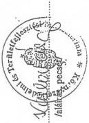
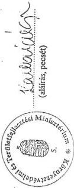

Állami Számvevőszék

# JELENTÉS

a Környezetvédelmi és Területfejlesztési
Minisztérium fejezet működésének
pénzügyi-gazdasági ellenőrzéséről

390.

1997. augusztus

---

A vizsgálat végrehajtásáért felelős:

III. Költségvetési Ellenőrzési Igazgatóság

Bihary Zsigmond

számvevő igazgató

Az ellenőrzést vezette:

Hegedűsné dr. Müllern Veronika

számvevő főtanácsos

Az ellenőrzésben részt vettek:

dr. Boda Sándor

számvevő tanácsos

dr. Burján Margit

számvevő tanácsos

Czunyi Lajos

számvevő tanácsos

dr. Erőss Aladár

külső szakértő

Fátrainé Zsebedics Katalin

számvevő tanácsos

dr. Gyuk József

számvevő tanácsos

Hirka Mihály

számvevő tanácsos

Komlósiné Bogár Éva

számvevő

---

Kozák György

számvevő tanácsos

Maczekó Károly

számvevő tanácsos

Makláry Ferencné

számvevő tanácsos

dr. Mihály Sándor

számvevő tanácsos

Robák Ferencné

számvevő

Simon Ákosné

számvevő tanácsos

Szijártó Károly

számvevő tanácsos

Szűcs Zoltán

számvevő tanácsos

Varga Szabolcs

számvevő

---

# TARTALOMJEGYZÉK

# I. ÖSSZEFOGLALÓ MEGÁLLAPÍTÁSOK, KÖVETKEZTETÉSEK, JAVASLATOK ... 3

# II. RÉSZLETES MEGÁLLAPÍTÁSOK ... 12

1. A KÖRNYEZETVÉDELMI ÉS TERÜLETFEJLESZTÉSI MINISZTÉRIUM FEJEZET FELADATAINAK, SZERVEZETÉNEK, LÉTSZÁMÁNAK, VALAMINT A MŰKÖDÉS SZABÁLYOZOTTSÁGÁNAK ÉRTÉKELÉSE ... 12

1.1. A fejezet és intézményei működésének szabályozottsága ... 12

1.1.1.A szakmai feladatok jogi szabalyozottsaga 12
1.1.2.A gazdalkodás belso szabályozottsága 13

1.2. A minisztérium szervezete ... 16

1.2.1. Szakmai feladatok 17
1.2.2.Funkcionalis feladatok 19

1.3. Az intézmények szervezete ... 20

1.3.1.A Kornyezetvedelmi Fofelugyeloseg 21
1.3.2.Az Orszagos Muemlekvedelmi Hivatal 22
1.3.3.Az Orszagos Meteorologiai Szolgalat 23
1.3.4.A Kornyezetgazdalkodasi Intezet 24

1.4. A köztisztviselői és a közalkalmazotti létszám alakulása ... 25

2. A KÖLTSÉGVETÉSI ELŐIRÁNYZATOK TERVEZÉSE, AZ ELŐIRÁNYZATOK MÓDOSÍTÁSA ... 27

2.1.A fejezeti es az intezmenyi koltsegvetes tervezese 27
2.2.A fejezeti es intezmenyi eloranyzatok modositasa 32

3. A FEJEZETI ÉS AZ INTÉZMÉNYI KÖLTSÉGVETÉSEK VÉGREHAJTÁSA ... 34

3.1.A penzellatas gyakorlata, a Kincstari rendszerre valo atallas 34
3.2.Szemelyi juttatas eloiranyzatanak felhasznalasa 35

3.2.1. Rendszeres szemelyi juttatasok 35
3.2.2.Nem rendszeres szemelyi juttatasok 37

3.3. Eszközgazdálkodás, a felhalmozás és tőke jellegű előirányzatok felhasználása ... 41

3.3.1.Az OMvH muemlekhelyreallitasi feladataai 43
3.3.2.A laboratoriumok kialakitasa, bovitese, muszerellatottsaga... 45
3.3.3.A szamitastechnikai eszkozfejlesztés koordinálasa 48
3.3.4.A kozbeszerzesi torveny vegrehajtasa 48
3.3.5.A joléti célokat szolgálo ingatlanok kihasználtsága 50

3.4. Fejezeti kezelésű előirányzatok ... 51

3.4.1. Védett természeti területek védettségi szintjének helyreallitasa..52
3.4.2. Grassalkovich Kiralyi Kastely Kozalapitvany tamogatasa 53
3.4.3. Inter Phare program 54
3.4.4. "Alfold program" 55
3.4.5.Kornyezeti karelharitas 56

---

3.4.6. „Duna vizpólással kapcsolatos monitoringrendszer", és a „Szigetközi téség kárainak mér séklése" 57
3.4.7. Területfejlesztési céleloirányzat (TFC) 59
3.4.7.1.A decentralizalt TFC palyazatok 60
3.4.7.2.A KTM kozvetlen dontesi hataskorebe utalt teruletfejlesztesi feladatok. 61
3.5.A minisztérium es a felugyelete ala tartozó intézmények részvetele gazdasági tarsasagokban 61
3.5.1.A minisztérium gazdalkod szervezetei 62
3.5.2. Az OMvH altal alapitott gazdasagi tarsasagok altal alapitott szervezetek mukodese 63
3.5.2.1.A Pannon Kastey Rt.mukodese 63
3.5.2.2.A leanyvallalat mukodese 64
3.5.2.3.A kft-k mukodese 64
3.5.2.4. Az OMvH szabálytalan támogatása a csódbe jutott kft-knek 67
3.5.3.A természetvédelmi területi szervek által alapitott gazdasági társaságok muködése 68
4.SZAMVITELI REND,BIZONYLATI FEGYELEM 69
4.1.A fejezet es intezmeneyinek szamviteli rendje 69
4.2.A teruletfejlesztesi celloiranyzat szamviteli es bizonylati rendje...70
4.3.A Kincstari rendszer mukodesi tapasztalatai a koltsegvetesi szervek szamviteli munkajaban 71
5. ELLENORZESI TEVKENYSEG 72
5.1.A felugyeleti ellenorzs 72
5.2.Az intezmenyi belso ellenorzs mukodese 74
6.A FEJEZETNEL KORABBAN VEGZETT ELLENORZESEK UTOVIZSGALATANAK TAPASZTALATAI 75

2

---

Állami Számvevőszék

V-17-47/1996-97.

Témaszám: 339.

# JELENTÉS

# a Környezetvédelmi és Területfejlesztési Minisztérium
fejezet működésének pénzügyi-gazdasági
ellenőrzéséről

A környezet- és a természetvédelem, a területfejlesztés és az épí-
tésügy államigazgatási irányítása, szakmai felügyelete a Környezetvé-
delmi és Területfejlesztési Minisztérium (KTM) feladata. A fejezet
1995-96-ban 8 címen 21,1 Mrd Ft-tal gazdálkodott. Ezen belül közvet-
lenül környezetvédelemre 4,1 Mrd Ft-ot, természetvédelemre 2,5 Mrd Ft-ot és
területfejlesztésre 4,5 Mrd Ft-ot használtak fel. Ezek az ágazati szakmai fel-
adatok csak mintegy 40-50%-ban tartoznak a minisztérium hatáskörébe,
mivel más kormányzati szerveknek, önkormányzatoknak, illetve államház-
tartáson kívüli szerveknek (pl. kamaráknak, szakmai szervezeteknek) is van
ezirányú feladata. A minisztérium feladatait 3053 fővel (1996. évi költ-
ségvetési létszám) látta el, melynek mintegy 90%-a köztisztviselő volt.

A fejezet 36 intézmény felett gyakorol felügyeletet, ezek többsége te-
rületi, kisebb része országos hatáskörű (Országos Meteorológiai Szolgálat,
Országos Műemlékvédelmi Hivatal) intézmény. A minisztérium és intézmé-
yei 21 gazdasági társaságban vesznek részt, a társaságokba bevitt
alapítói vagyon 1,6 Mrd Ft.

Az ember gazdasági tevékenységével növekvő ütemben használja fel a kör-
yezeti elemeket. Ennek következményeként folyamatosan nő a környezet-
be kibocsátott szennyező anyagok mennyisége. A környezetvédelem felada-
ta, hogy ezt a folyamatot lassítsa, megállítsa, hasson a környezet állapotá-
nak romlása ellen, járuljon hozzá a jelen és a jövő nemzedék életminősé-
gének javításához.

A környezetvédelem alapvetően a környezeti elemek - a levegő, a
víz (felszín alatti és feletti), a föld - védelmét jelenti, ezzel egyidejűleg
felöleli a települések (beleértve az épített környezet, a természet-
és a tájvédelmet is) hulladékgazdálkodását, zaj- és rezgésvédel-
mét, valamint a környezet biztonságát. Széleskörű feladatai miatt a

---

GDP újraelosztásából egyre nagyobb hányadot igényel. A közvetlen környezetvédelmi fejlesztések kiadásai a 90-es évek közepén a GDP 1%-át jelentették. Előrejelzések szerint ez az arány folyamatosan nő, 2000-2002 között elérheti az 1,7%-ot. (Ennek közel felét a vízvédelemre, negyedét a levegőtisztaság-védelemre, egyhetedét hulladék-ártalmatlanításra fordítanák.) A fejlett ipari országok a GDP 1,5-2%-át költik környezetvédelmi kiadásokra, beleértve a köz- és magánkiadásokat, illetve a háztartások ráfordításait is. (Megjegyezzük, hogy az egyes országok mutatói nem minden esetben azonos tartalmúak.)

Hazánkban a 90-es években a gazdasági szerkezet átalakulásával javult néhány környezeti állapotjellemző (pl. széndioxid-kibocsátás, egy-egy ipari régió összkibocsátása). Ez a javulás jórészt a termelőtevékenység visszaesésével magyarázható. A környezet állapota azonban hosszabb időt tekintve folyamatosan romlik. A lakosság 52%-a él olyan településen, ahol a levegő szennyezett, illetve mérsékelten szennyezett. A termelési és települési hulladék fajlagos és abszolút értéke nemzetközi összehasonlításban is magas. (Évente 100-110 M m³ hulladék keletkezik, melyből 20 M m³ a kezelt folyékony települési hulladék), a csatorna ellátottság csak 58%-os, jó színvonalú viszont a vezetékes ivóvíz ellátás, 97%-os.

A területfejlesztés az országra, illetve térségeire kiterjedően a társadalmi, gazdasági és területi feladatok figyelemmel kísérését, értékelését, a beavatkozási irányok meghatározását, átfogó fejlesztési célok, koncepciók és a szükséges intézkedések meghatározását, összehangolását és megvalósítását jelenti.

Magyarországon 1992-95. között 3,1 E Mrd Ft-ot fordítottak beruházásra, a GDP egyötödét. A beruházások közel fele közvetlenül vagy közvetve kapcsolatban volt területfejlesztési célokkal, melyeknek háromnegyede közkiadásként jelent meg. Ezek elsősorban alap infrastrukturális feladatokat, a termelő tevékenységet, illetve a humán erőforrás fejlesztéseket támogatták.

A fejezet ellenőrzésére átfogó jelleggel első alkalommal került sor és kiterjedt korábbi ÁSZ ellenőrzések utóellenőrzésére is.

Ellenőrzésünk során arra kerestünk választ, hogy:

- a fejezet szervezete, működési mechanizmusa, költségvetési előirányzata összhangban volt-e a szakmai feladatokkal, segítette-e azok hatékony és eredményes ellátását;

2

---

- a központi igazgatás szabályozottsága, szervezettsége milyen színvonalon biztosította a felügyelő és irányító tevékenységet;

- a költségvetési gazdálkodás során hogyan érvényesült a törvényesség, célszerűség és az eredményesség szempontja;

- milyen eredménnyel hasznosította a fejezet az ÁSZ eddigi ellenőrzéseinek (a „Központi Környezetvédelmi Alap” és a „Műemlékvédelem” pénzügyi - gazdasági ellenőrzése, ill. a „Környezet-, természetvédelmi és a vízügyi szervek szétválasztásának” célellenőrzése) megállapításait.

Ellenőrzésünk alapvetően az 1995-96. évekre terjedt ki (a folyamatok áttekintése érdekében esetenként korábbi időszakra is). Helyszíni ellenőrzést (szúrópróba jelleggel) a minisztériumban, 22 intézménynél, illetve kapcsolódó jelleggel 11 gazdálkodó szervezetnél és egyéb szerveknél végeztünk (1. sz. melléklet). Az utóellenőrzések megállapításait az 1., 3., és 4. sz. függelékben, a területfejlesztési célelőirányzat ellenőrzésének részletes tapasztalatait a 2. sz. függelékben részletezzük.

# I. ÖSSZEFOGLALÓ MEGÁLLAPÍTÁSOK, KÖVETKEZTETÉSEK, JAVASLATOK

A kormányzati munkamegosztásban a környezet- és természetvédelem, a területfejlesztés és az építésügy államigazgatási felügyeletét a KTM látja el. Az Alkotmány kimondja, hogy a „Magyar Köztársaság elismeri és érvényesíti mindenki jogát az egészséges környezethez”. A környezetvédelem komplex fogalom, ezért feltételezi az egyes szakterületek magas szintű szabályozását. Hasonlóan indokolt a területfejlesztés törvényi szabályozása is. A minisztérium munkáját meghatározó törvények közül az előző két évben az Országgyűlés elfogadta a környezetre, a természetvédelemre és a területfejlesztésre vonatkozókat, várhatóan csak 1997-ben kerül sor az „Épített környezet alakításáról és védelméről”, valamint a „Műemléki környezetre” vonatkozó törvényekre (ez utóbbi szakterületet még egy 1964. évi törvény szabályozza). A törvényalkotás elhúzódása a tárca jogalkotási programjában is késedelmet okozott, amit befolyásolt a kapcsolódó - több tárcát is érintő - szakterületekkel való összhang igénye és az EU normák figyelembevételének követelménye.

3

---

A minisztérium és az intézményei rendelkeznek a működés, a gazdálkodás belső szabályzataival, ezek azonban nem mindig teljes körűek, illetve a meglévők egy része aktualizálásra, pontosításra szorul. Kedvező viszont, hogy elkészült a közbeszerzési szabályzat, holott erre jogszabály nem kötelezte a minisztériumot. A folyamatos szervezeti átalakítás miatt előfordult, hogy az SZMSZ-ek évek óta csak „tervezet” szintűek (pl: KGI, OMSZ). Kifogásoltuk, hogy a gazdálkodás belső rendjének szabályozása - számviteli politika, számlarend, leltározás, pénzkezelés, készletgazdálkodás, belső ellenőrzés - az intézmények többségénél hiányos volt, nem biztosította megfelelően az aktuális jogi szabályozással, a kincstári rendszerrel való összhangot. Ezek a hiányosságok kedvezőtlenül hatottak az operatív gazdálkodásra, a vagyon nyilvántartásra, illetve a mérlegek valódiságára is.

A minisztérium központi szervezete a miniszter statutumában rögzített feladatokat tükrözi. Az igazgatás szervezetén belül elkülönül a szakmai és a funkcionális feladatok ellátása. A szakmai területek (3 Hivatal és a Stratégiai Iroda) viszonylagos stabilitása mellett a funkcionális egységek számának és rangjának emelkedése volt jellemző. Ez a folyamat - amely már a 90-es évek elején elkezdődött - 1996 végére azt eredményezte, hogy a minisztérium központi szervezetében a szervezeti egységek száma és a vezetők aránya megduplázódott (ezzel együtt felére csökkent a szervezeti egységek átlaglétszáma), ami a túlhierarchizálódás irányába mutat. Ugyanakkor az intézmények száma, szervezete, jog- és hatásköre az igazgatáshoz képest viszonylagos stabilitást mutat.

A Környezetvédelmi Főfelügyelőség (KFF), mint középirányító szerv a jogszabályban rögzített feladatainak csak részben tudott eleget tenni (pl: elmaradt az éves munkatervek, költségvetések felülvizsgálata), ami az intézmény egyre csökkenő létszámával is összefüggésben volt. Indokolt áttekinteni az intézmény jelenlegi működését és azt jogállásának megfelelően szabályozni.

Az OMvH szervezete a vizsgált időszakban érdemben nem változott, miközben feladatai nőttek. Csak formálisan működik a Tulajdonosi osztály annak ellenére, hogy 14 gazdasági társaságban tulajdonos a hivatal. (Összes befektetése: 134 M Ft.) A gazdasági társaságok többsége veszteséges (egy leányvállalat és 8 kft), egy része pedig felszámolás alatt áll (egy Rt. és 4 kft.). A hivatal a vizsgált időszakban nem gyakorolta megfelelően a társasági törvényben előírt tulajdonosi jogkörét (pl. Rt. felszámolásánál, személycserék végrehajtásánál, kft-k felszámolásának kezdeményezésekor). A csődbe ment társaságok „megmentése” érde-

4

---

kében **szabálytalan pénzkifizetéseket is teljesített** (nagyösszegű, 10,6 M Ft készpénzt fizetett ki; ÁFA, SZJA tartozás, egyéb követelés kifizetését vállalta át 16 M Ft összegben). Ezen túl az egyik kft-je által létrehozott új kft. alapításához **szabálytalanul hitelt is nyújtott** (4 M Ft). Az OMvH kft-inek működése a megalakulásuktól (1992) kezdődően a költségvetésnek már 100 M Ft vagyonvesztést (befektetett tőke) és 210 M Ft bevételkiesést (APEH, TB, OMvH követelése) okozott.

Az OMvH a felszámolásra kerülő kft-k kieső feladatainak pótlására **a működő kft-knél reorganizáció keretében tőkeemelést és adósságrendezést kívánt végrehajtani. Ennek fedezeteként (200 M Ft összegben) 9 állami tulajdonú ingatlan értékesítését jelölte meg.** A reorganizáció kereteit meghatározó előterjesztést a szervezetek átvilágítása és a működtetés jövőbeli lehetőségeinek bemutatása előzte meg, azonban az előterjesztés teljesebb lett volna, ha a tárgyban készült tanulmányt a KTM a Kormány elé terjeszti a döntéshozatalhoz.

**A tulajdonosi jogkör nem megfelelő gyakorlása, a szabálytalan pénzkifizetések, a belső ellenőrzés elmulasztása miatt felvetjük az OMvH vezetőinek felelősségét.**

A **Környezetgazdálkodási Intézet (KGI)** - mint háttérintézmény - megalakulása óta (1989.) pénzügyi gondokkal küzdött, jelentős volt az állammal szembeni tartozása (1995 végén már 98 M Ft), ezért a miniszteri értekezlet - kellő megalapozás nélkül - 1995 szeptemberében az intézmény átalakításáról döntött, ami egyben szervezeti és létszám „karcsúsítást” is jelentett volna. Minderre azonban nem került sor, sőt új szervezeti egységekkel kibővülve (melyek eddig az igazgatás struktúrájához tartoztak), forrásait megemelve továbbra is költségvetési intézményként működik.

Az **államigazgatási reform keretében** - az 1027/1996. (IV.3.) Kormányhat. alapján - **a területi szervek** (KÖFE-k, természetvédelmi igazgatóságok, területi főépítési irodák) **átalakítását tervezik.** Az ellenőrzés befejezéséig (1997. február) azonban **nem született konkrét intézkedés.** A KÖFE-khez tartozó laboratóriumok működésének felülvizsgálatát is tervbe vették. Az átvilágítást segítené, ha kormányzati közreműködéssel valamennyi - hasonló profilú laboratóriumot működtető - fejezetnél ezt elvégeznék és a párhuzamos tevékenységeket megszüntetnék.

A **fejezetnek** az ellenőrzött időszakban (1995-96) **likviditási gondja nem volt, ami összefügg a kincstári rendszerre való átállással is**, illetve az előirányzat-felhasználási keret bevezetésével. Az **előirányzatok tervezésénél** csak részben sikerült teljesíteni a tervezési körirat elvárásait, így pl. a fejezeti kezelésű előirányzatok egy részének intézményhez telepíté-

5

---

sét, az eredeti előirányzat és a teljesítések közelítését (ez utóbbiban az év közben jelentkező többletfeladatok is közrejátszottak). **Az intézmények bevételeiket jelentősen alultervezték** - ezen belül az alaptevékenységgel összefüggő bevételeket is - **ami nehezítette a kiegyensúlyozott gazdálkodást. A tervezésnél jelentkező gondok** és a 156/1995. (XII.26.) Korm. rendelet (amely a többletbevételekből történő - intézményi hatáskörű - átcsoportosítást fejezeti szintre helyezte) **következménye a nagy volumenű évközi előirányzat-módosítás**, melyekről - különösen 1996-ban - meglehetősen későn (33%-áról december végén) döntöttek. Így előfordult, hogy a módosításra már csak a pénz felhasználása után került sor.

**1996-ban az előirányzat- módosítások 18,9%-át a Központi Környezetvédelmi Alapból (KKA) fedezték.** Az Alap működését szabályozó törvény a felhasználás jogcímeit igen tágan (pl. közcélú környezetvédelmi feladatok) határozza meg. Ezért a **KKA-ból átadott pénzeszközök a konkrét célfeladatok mellett az intézmények működési kiadásait is finanszírozták.** Ezek a források - melyeknek költségvetési támogatást pótló szerepük is volt - már beépültek az intézmények kiadásaiba, ami ösztönzi az évenként megújuló forrás-átvételt.

(Megjegyezzük, hogy **ez a jelenség nem egyedi**, több - elkülönített állami pénzalappal rendelkező - fejezetnél is tapasztalható.)

A fejezetnél dolgozó **köztisztviselők költségvetési létszáma 8,8%-kal csökkent**, alapilletményükben a Ktv előírásai miatt nem volt lényeges eltérés. Ezzel szemben a közalkalmazotti törvény hatálya alá tartozó **KGI-nél igen kedvező volt a rendszeres személyi juttatások nagysága** (az illetmények 1996-ban 60-150%-kal meghaladták az előírt minimumot), viszont indokolatlan különbségeket tapasztaltunk az alkalmazottak illetményeinél. **A legjelentősebb növekedés** - köztisztviselőknél és közalkalmazottaknál egyaránt - **a jutalmaknál volt** (két év alatt 80%). Az intézményeknél jelentős szórást mutatott a jutalmak és a költségtérítések összege.

A fejezet **eszközellátottsága** az ellenőrzött időszakban **javult**, nőtt a gépek, berendezések, felszerelések állománya. 1996-ban a fejlesztések eredményeként a **laboratóriumok műszerállományának értéke több, mint duplájára emelkedett.** Gondot jelentett viszont, hogy a **laboratóriumok építése, átalakítása esetenként** (a székesfehérvári és a miskolci KÖFE-nél, illetve a KGI Referencia Laboratóriumánál) **igen elhúzódott, ami jelentős többletköltséget okozott.** A fejezet saját kezelésében lévő és bérelt **üdülőkkel** is rendelkezett. Míg a bérelt üdülők kihasználtsága megfelelő volt, addig a saját kezelésben lévő üdülőknél igen alacsony volt az igénybevétel ( 1996 -ban 22% )

6

---

Az **OMvH műemlékvédelemre 2,1 Mrd Ft-tal rendelkezett** (1996-ban mintegy 600 műemlék rekonstrukciója, felújítása folyt). **A dologi kiadások terhére nyújtott támogatások szakmai hasznosulása az utólagos kifizetések rendszerének bevezetésével javult.** Ugyanakkor több hiányosságot tapasztaltunk a jelentős volumenű felújítási munkák előkészítésében (pl. az 1996. évi műszaki feladattervet az utolsó negyedévben hagyták jóvá, a beruházási alapokmányok több esetben nem voltak kellően megalapozottak, a tervezői, kivitelezői szerződésekben a minőségi, garanciális követelményeket, esetenként a szakmai tartalmat nem határozták meg pontosan). **Elmaradt a felújítási, rekonstrukciós feladatok lebonyolításának és a pályáztatások rendjének meghatározása, az átfogó műszaki-pénzügyi ellenőrzések sem voltak jellemzőek.** Nem jelölték ki az állagvédelemre, felújításra vonatkozó prioritásokat. (Megjegyezzük, hogy ez utóbbi igényli a műemlékállomány átfogó felülvizsgálatát is.) Az ellenőrzött időszakban három nagy egyházi épület (Szent István Bazilika, Pannonhalmi Apátság, Dohány utcai Zsinagóga) rekonstrukciója is folyamatban volt. A kivitelezések több éve (Bazilikánál 14 éve, az Apátságnál több mint 10 éve) húzódnak. Az államháztartás a költségeknek mintegy 90%-át - több csatornán keresztül - finanszírozta, ami megnehezítette a beruházások teljes költségigényének az átláthatóságát, a felhasznált állami pénzek ellenőrzését, hatékonyságának nyomonkövetését.

A fejezet 1995-96-ban **kiemelt szakmai célokra 8 Mrd Ft fejezeti kezelésű előirányzattal rendelkezett.** A „**védett természeti területek védettségi szintjének helyreállítására**” a vonatkozó törvény az érintett földterületek állami tulajdonba vételét írja elő. Tervek szerint 1996-2001 között **260 ezer hektár földterület megvásárlásával számolnak, ami becslések szerint 6-8 Mrd Ft-ba kerül**, ebből 1996-97-ben 1,1 Mrd Ft-ot biztosítottak (1996-ban 500 M Ft-ot használtak fel, 28 ezer hektár felvásárlására). A volt tulajdonosok - döntően mezőgazdasági szövetkezetek - az állami felvásárlással 70 E Ft - 51,8 M Ft közötti összeghez jutottak. **Gondot jelent, hogy a földvásárlással egyidejűleg nem készült felmérés a fenntartás várható költségeiről, azok fedezetéről.** Ez utóbbiak hiányában félő, hogy az állami tulajdonba kerülő földterületek állapota romlani fog.

Az „**Alföld program**”-ot Kormányhatározat alapján 1996-ban 100 M Ft-tal finanszírozták. A program kezdete 1991-re nyúlik vissza. **Az eltelt időszakban még csak ismeretszerzés, előkészítés folyt**, az így összegyűjtött ismeretek megalapozhatják a térség fejlődését eredményező konkrét intézkedéseket.

**A Területfejlesztési Alap**, mint elkülönített állami pénzalap 1996. január 1-jével **megszűnt.** A megmaradt pénzeszközök, követelések **bekerültek**

7

---

a KTM fejezetbe, mint fejezeti kezelésű előirányzat (10,5 Mrd Ft összegben). Ezzel egyidejűleg a források felhasználásának szabályai is alapvetően megváltoztak. Az eddigi kizárólagos minisztériumi döntés mellett (50-50%-ban) a területi szintű decentralizált döntések - az elmaradt, munkanélküliséggel sújtott térségek fejlesztésére, ipari szerkezet-átalakítására - is teret kaptak. Ezeket a pénzeszközöket a megyei területfejlesztési tanácsok használják fel, melyek működése, a pályázati rendszer szabályozása még nem teljes körű. A decentralizált előirányzatokból (4,5 Mrd Ft) év végéig minimális (363 M Ft) volt a felhasználás, mivel a szükséges jogszabályok csak év közepén jelentek meg, a pályázati felhívásokra pedig csak ezt követően kerülhetett sor. A benyújtott pályázatok is hiányosak voltak, ami az elbírálást lassította.

A minisztérium által végzett felügyeleti ellenőrzés - annak ellenére, hogy jó színvonalú jelentéseket készítettek - fejezeti szinten nem volt kellően hatékony. A tevékenységet ellátó főosztály - alacsony létszáma (4 fő, a kétévenként ellenőrzendő intézmények száma 36), valamint az éves ellenőrzési tervben nem szereplő, a minisztérium vezetése által előírt soron kívüli ellenőrzések miatt - az intézmények körében nem tudott eleget tenni a jogszabályban előírt kétévenkénti ellenőrzési kötelezettségének.

Az intézmények túlnyomó részénél a belső ellenőrzési rendszer nem működött kielégítően. Elsősorban a munkafolyamatba épített ellenőrzés hiányosságaival találkoztunk. Fokozatosan csökkent a függetlenített belső ellenőrzés szerepe, súlya, miután a létszámleépítés gyakran ezt a státuszt érintette.

A fejezetnél három korábbi ellenőrzés utóellenőrzését is elvégeztük. A javaslatok és a megállapítások figyelembevételével a minisztériumban intézkedési tervek készültek (kivétel a „műemlékvédelemről” szóló jelentés). Az ezekben meghatározott feladatokat jórészt végrehajtották. A tervezett intézkedések közül viszont pl. a KKA kezeléséről és felhasználásáról szóló miniszteri rendeleteknek csak egy részét adták ki (a hiányzó jogszabályok elkészítése folyamatban van). Nem került sor a műemléki állomány felmérésére, ezek nyilvántartásának rendezésére, nem szüntették meg teljes körűen a környezetvédelem és a vízgazdálkodás feladat- és hatáskörének párhuzamosságait sem.

8

---

Az ellenőrzés megállapításai alapján javasoljuk:

# **a Kormánynak**

1. Vizsgalja meg az 1027/1996. (IV. 3.), illetve a 1100/1996. (X.2.) Korm. hat. vegrehajtsat es dontson - a tovabbi feladatok idoszerusegenek figyelembevetelevel - az el nem vegzett intezmenyi atszervezesek utemezeserol.
2. Intézkedjen a fejezeteknél levő - hasonlo profilu - laboratoriumok feladatainak átvilágításáról, a párhuzamos tevekenységek megszüntetéséról.
3. Tekintse at az egyházi épuletek rekonstrukcióját, és fontolja meg, hogy indokolt-e a finanszirozást továbbra is tobbcsatornás rendszerben, vagyCsak egy finanszirozó szerven keresztül muködtetni.

# **a miniszternek:**

1. Statutumának megfeleloen határozza meg a Környezetvédelmi Fofelügyelóség szerepét (feladatát, szervezetét, letszámát) és muködését.
2. Szabályozza a KKA-ról szólo törvenyben rögzített forrásfelhasználás jogcimeinek konkrét tartalmát, illetve százalekos arányban határozza meg az erre fordithato forrásokat.
3. Utasitsa az intezmenyeket a hianyz szabalyzataik elkeszitésere, a meglevok felulvizsgalatara, a vonatkozo jogszabalyokkal valo osszhang megteremtesere, gondoskodjon az ehhez szukseges fejezeti szintu egysges szakmai iranymutatas kiadasarol.
4. Intézkedjen az OMvH szervezetén belül:

- a gazdasági társaságokra vonatkozó tulajdonosi jogkör ellatásáról;
- a Visegrádi kft. részére nyújtott 4 M Ft költségvetési forrás visszatérítéséról;
- az érintett gezetők felelosségrevonásáról a gazdasági társaságokkal kapcsolatos tulajdonosi jogkör nem megfelelo gyakorlása, a szabálytalan penzügyi kifizét sék és a belso Ellenőrzés emulasztása miatt.

9

---

5. A költségvetési előirányzatok kialakításánál illetve végrehajtásánál:

- érvényesítse az éves költségvetési irányelvek, a költségvetési köriratok követelményeit, fordítson figyelmet a költségvetési javaslatban tervezett feladatok végrehajtására;
- követelje meg az intézményi költségvetésekben a saját és vállalkozási bevételek reális számbavételét;
- törekedjen az állagmegóvási szükséglettel összhangban álló előirányzatok kialakítására, a megfelelő műszaki-gazdasági előkészítésére.

6. Vizsgáltassa meg:

- a különféle költségtérítések kifizetését, törekedjen az intézmények közötti jelentős különbségek mérséklésére;
- a Környezetgazdálkodási Intézeten belül az alkalmazottak illetményét annak érdekében, hogy a személyi juttatásoknál tapasztalható indokolatlan különbségek csökkenjenek.

7. Intézkedjen a műemlékvédelem hatékonyságának növelése érdekében:

- a műemlékállomány felülvizsgálatáról, ezzel összhangban új műemléki nyilvántartás és regiszter (jegyzék) kialakításáról;
- az állagvédelemre, felújításra, helyreállításra, hasznosításra vonatkozó prioritások kijelöléséről.
- a műemléki beruházások, felújítások szervezeti és lebonyolítási rendjének kialakításáról.

8. Törekedjen a fejezeti kezelésű előirányzatokból:

- a „védett természeti területek védettségi szintjének növelése” érdekében felvásárlásra kerülő földterületek várható kezelési, fenntartási költségigényének felméréséről és a szükséges költségvetési fedezet megteremtéséről;
- az „Alföld program” keretében készített felmérések, megfigyelések, tanulmányok, elemzések stb. összegzéséről annak érdekében, hogy mielőbb megkezdődhessen a konkrét feladatok meghatározása, illetve végrehajtása;
- az intézményi hatáskörben felhasznált források intézményi költségvetésben való megtervezéséről.

10

---

1. 9. Kezdeményezze a decentralizált területfejlesztési célelőirányzat felhasználásával kapcsolatban:
   - - az Országos Területfejlesztési Koncepció mielőbbi elfogadását, segítve ezzel a megyei és az országos koncepciók összhangját;
   - - az Országos Területfejlesztési Központ ügyrendjének meghatározását;
   - - a megyei területfejlesztési tanácsok működésének részletes szabályozását, az ehhez szükséges feltételek megteremtését, a tanácsok által lebonyolított pályázati rendszer átfogó szabályozását.
2. 10. Gondoskodjon a KTM kezelésében lévő területfejlesztési forrásokból pályázat keretében támogatott beruházások rendszeres ellenőrzéséről.
3. 11. Vizsgáltassa meg a KTM felügyelete alá tartozó költségvetési szervek saját kezelésű üdülőinek működési feltételeit, az alacsony kihasználtság okát, intézkedjen a megfelelő hasznosításról, értékesítésről.
4. 12. Követelje meg a mérlegvalódiság érvényesítését, az intézményi mérlegek leltárral való alátámasztását.
5. 13. Gondoskodjon arról, hogy a felügyeleti ellenőrzést végző szervezet létszáma összhangban legyen a feladatokkal (pl. az intézmények kétévenkénti ellenőrzéséhez), továbbá kezdeményezze és segítse az intézményeknél a belső ellenőrzési rendszer kialakítását, annak eredményes működését.
6. 14. Kísérje figyelemmel és kérje számon az ÁSZ megállapításainak, javaslatainak maradéktalan végrehajtását és intézkedjen a feltárt hiányosságok megszüntetéséről.
7. 15. Kérje számon az utóellenőrzés keretében ellenőrzött költségvetési szervek intézkedési terveinek végrehajtását. Intézkedési terv hiányában szorgalmazza a korábbi ÁSZ ellenőrzésben megfogalmazott javaslatok teljesítését.

---11

---

## II. RÉSZLETES MEGÁLLAPÍTÁSOK

### 1. A Környezetvédelmi és Területfejlesztési Minisztérium fejezet feladatainak, szervezetének, létszámának, valamint a működés szabályozottságának értékelése

#### 1.1. A fejezet és intézményei működésének szabályozottsága

##### 1.1.1. A szakmai feladatok jogi szabályozottsága

**Az Alkotmány** 18. §-ában kimondja, hogy a „Magyar Köztársaság elismeri és érvényesíti mindenki jogát az egészséges környezethez”. Ez a magas szinten megfogalmazott jogosultság szükségessé teszi, hogy a környezet valamennyi alkotóelemének „használatát” és védelmét” ugyancsak magas szintű jogszabály rögzítse. A Kormány rövid- és középtávú környezetvédelmi intézkedési tervében szereplő jogszabályok kidolgozása döntően az 1993-94-es évekre esik. Ennek megfelelően 1993 végére elkészültek a „környezetvédelemről”, a „természet védelméről” és a „területfejlesztésről” szóló törvénytervezetek, megkezdődtek a tárcaközi és a társadalmi szintű egyeztetések. A törvények hatálybalépése azonban elhúzódott, a környezetvédelem esetében 1995 végére, a másik két törvény esetében 1996 közepére.

Az „Épített környezet alakítására és védelmére”, illetve a „Műemléki környezetre” vonatkozó törvény-tervezetek 1993-ban elkészültek, de csak 1997-ben tárgyalja azokat az Országgyűlés. A feladat sürgető, mivel e két terület átfogó szabályozására utoljára 1964-ben került sor (1964. évi III. törvényben).

**A tárca jogalkotási programjához képest is tapasztalható elmaradás.** A rendeletek egy része a tárcaegyeztetések, más része a törvényben foglalt feltételek hiánya miatt késik.

Pl. a Területfejlesztési törvény végrehajtását nehezíti, hogy hiányzik a térségek besorolása, a végrehajtás eljárási rendje, az adatközlés szabályozása. (Az 1996. évi XXI. tv. alapján 6 Kormányrendelet került kiadásra.) A Miniszterelnöki Hivatal közigazgatási államtitkárának tájékoztatása szerint időközben a területfejlesztés aktuális feladatainak megoldásához szükséges előterjesztések egy része a Kormány által elfogadásra, más részük pedig a közigazgatási államtitkári értekezletre benyújtásra került.

A kapcsolódó szakmai területekkel való összhang és az EU normákhoz történő folyamatos közeledés miatt már a közeljövőben várható a hatályos

12

---

jogszabályok módosítása (pl. KKA működését szabályozó törvény az új építési törvény elfogadásával változik), illetve újak megalkotására (pl. a vegyi anyagok kezelése, hulladékgazdálkodás, katasztrófa megelőzése, elhárítása) is sor kerülhet. Ezt a munkát segítheti a tárca közreműködésével kidolgozott **Nemzeti Környezetvédelmi Program**, melyet a Kormány 1996-ban terjesztett az Országgyűlés elé, a vita jelenleg is folyik.

**A minisztérium szakmai feladatait a miniszter feladat- és hatásköréről szóló Kormányrendelet határozza meg.** Az ágazati szakmai feladatok egy része nemcsak e tárca hatáskörébe tartozik, hanem más kormányzati szerveket is érint (becslések szerint a feladatok 40-50%-a), ezért az érintett tárcákkal szükséges a folyamatos koordinálás. A feladatellátásban jelentős szerepük van az önkormányzatoknak, illetve államigazgatáson kívül a kamaráknak, szakmai szervezeteknek (pl. Országos Környezetvédelmi Tanács) is.

Az **erdővagyonvédelem** tekintetében a Földművelésügyi, az **ásványvagyonvédelem** és az **építőipar** tekintetében az Ipari, Kereskedelmi és Idegenforgalmi, a **településfejlesztés** kérdéseiben a Belügy-, **vízügyekben** a Közlekedési, Hírközlési és Vízügyi, a **levegőtisztaság-védelem** átfedései miatt a Népjóléti Minisztériummal szükséges az együttműködés. A **közös szerepvállalás** esetenként a **párhuzamos feladatellátást sem zárja ki, így pl az NM-mel, a KHVM-mel.** Az utóbbi két minisztérium esetében a vizek megismeréséhez szükséges mérések végzésében, az adatok gyűjtésében, feldolgozásában, szolgáltatásában, a vizek állapotának értékelésében, a vizek védelmében, az engedélyezési eljárásokban, a vízbázisvédelemben, a vizek igénybevételében jelentkezik párhuzamosság. Az átfedéseket a „Környezetvédelemről” és a „Vízgazdálkodásról” szóló törvények sem szüntették meg teljeskörűen.

### 1.1.2. A gazdálkodás belső szabályozottsága

A minisztérium és az intézmények **rendelkeznek a működés és gazdálkodás belső szabályzataival.** Ezek azonban nem mindig teljeskörűek, nincsenek összhangban a változó jogszabályokkal.

**Kedvezőtlenül hatott a működés szabályozására az intézmények egy részénél tapasztalható folyamatos átszervezés**, emiatt az SZMSZ-ek, ügyrendek is „tervezet” szintűek.

---13

---

**A KTM igazgatásánál folyamatos volt a szervezet-átalakítás, 1993., 1995. és 1996-ban kerültek kiadásra az SZMSZ-ek. Az 1996. évi is az „ideiglenes” jelzőt viselte, ami jelzi, hogy a folyamat még nem zárult le. Ennek következménye, hogy az ügyrendek sem véglegesek. A KGI működését sem szabályozza végleges SZMSZ, ami ugyancsak az átszervezés következménye.**

**Az OMSZ rendelkezik ugyan érvényes SZMSZ-szel, ez azonban nincs összhangban a tényleges szervezettel.** Az SZMSZ jóval tagoltabb, kétszeres létszámú szervezetre készült. Azóta szervezeti egységek szűntek meg, általános elnökhelyettes sincs. Az új SZMSZ tervezetét a miniszter nem fogadta el, elrendelte viszont a közigazgatási államtitkár útján annak felülvizsgálatát, határidő megjelölése nélkül.

A szervezeti átalakulás, „karcsúsítás” a bevételi források jelentős szűkülésével van összefüggésben. A biztosítók ugyanis nem finanszírozták a rakétás jégesőelhárítást, a keleti piacokról származó olcsóbb eszközök beszerzési nehézségei pedig kikényszerítették az automatizálást. A tulajdonviszonyok átalakulásával csökkentek a speciális szolgáltatások (agráripari meteorológia stb.) iránti igények.

**A Környezetvédelmi Főfelügyelőség SZMSZ-ét a tárca nem fogadta el, 1993. óta tervezet** formában áll rendelkezésre. Eszerint a főfelügyelőség a minisztérium Környezetvédelmi Hivatalától független, a közigazgatási államtitkár irányítása alá tartozó szervezet, melynek feladatai jól elkülöníthetők a hivataltól. Jelenlegi működése azonban ezzel a szabályozással nincs összhangban (pl. a Környezetvédelem területi szerveinek szakmai és költségvetési irányítása).

**A gazdálkodás belső rendjének** - számlarend, számviteli politika, számlatükör, leltározás, selejtezés, pénzkezelés - **szabályozásában több hiányosságot is tapasztaltunk**, ami azzal is összefüggésbe hozható, hogy a KTM nem adott a szabályozórendszer változásakor az intézményi belső szabályozás kialakítására egységes iránymutatást. A minisztériumnál és a felügyelete alá tartozó intézményeknél a 179/1991. (XII.30.) Korm. rendelet és a Számviteli törvény hatályba lépése óta **nincs kialakult, megalapozott számviteli politika**, aminek a hiánya különösen 1996. évben kifogásolható. A kincstári rendszerre való átállás, valamint az ezzel összefüggésben kiadott 54/1996. (IV.12.) Kormányrendelet - amely a költségvetés alapján gazdálkodó szervek beszámolási és könyvvezetési kötelezettségéről szól - ugyanis alapvetően megváltoztatta a költségvetési szervek gazdálkodási rendjét és információs rendszerét.

---14

---

A KTM tájékoztatása szerint a helyszíni ellenőrzés befejezését követően az egységes számviteli politika elveit kialakították.

Az átállást követően nem történt meg a számlarendekben a szükséges változások átvezetése, nem teljeskörűen készültek el az új számlatükrök. **A könyveléshez a számlakijelölések a számítógépes program törzsadattárára épültek.**

Így fordulhatott elő az **OMvH-nál**, hogy a számlatükről olyan számlákat is tartalmazott, amelyeket az intézmény nem is használhat (pl. 27. Állatok; 631. Egészségügyi egységek kiadásai; Önkormányzatok bevételei, stb.).

Az intézmények egy részénél a **főkönyvi számlák és az analitikus nyilvántartások kapcsolatát sem szabályozták** (OMSZ, Felső-Tiszavidéki, Tiszántúli Környezetvédelmi Felügyelőség, Aggteleki Nemzeti Park).

A minisztérium gazdálkodó szervezete 1994-95. években nem rendelkezett számlarenddel (csak számlatükről), ezt 1996-ban sem készítette el, a METODIKA Kft. kiadványát használják. A számlatükről a jogszabályi előírással nem volt teljeskörűen összhangban. (A „0” számlaosztályt a főkönyvi kivonat nem tartalmazza.)

**A leltározási, selejtezési, pénzkezelési és a felesleges vagyontárgyak hasznosítására vonatkozó szabályzatokat** a minisztérium és az intézmények elkészítették. Ezek azonban többségében **elavultak**, aktualizálásuk elmaradt.

OMvH 1985-ben, Nyugat-Dunántúli, Tiszántúli KÖFE-k, Aggteleki, Hortobágyi Nemzeti Park Igazgatósága 1991-92-ben készítették el a szabályzatokat, azóta nem történt meg az aktualizálásuk.

**A kötelezettségvállalás, érvényesítés, ellenjegyzés, utalványozási jogkörök néhány kivétellel jól szabályozottak**, a pénzforgalom lebonyolításában azonban nem mindig eszerint jártak el (pl: OMvH).

Nyugat-Dunántúli KÖFE: utalványozás, ellenjegyzés helyett a teljesítés szakmai igazolását végzi.

---15

---

**A készletgazdálkodás szabályzatát** az intézmények általában **nem készítették el**. Ennek rendjét a számviteli előírások, a munkaköri leírások és belső utasítások, ezeken kívül döntően a gyakorlat alakította ki.

A minisztérium és az intézmények 1996. évben kezdtek hozzá a készletgazdálkodás rendjének kialakításához, a szabályzat azonban 1996. októberében csak a minisztériumban került kiadásra (a „Gazdálkodási Szabályzat”-nak része a készletgazdálkodás rendje).

**A felügyeleti ellenőrzés szabályzatát csak 1996. novemberében adták ki** (ezt megelőzően ilyennel nem rendelkeztek). Ennek hatálya kiterjed a KTM felügyelete alá tartozó valamennyi költségvetési intézmény és elkülönített állami pénzalap átfogó gazdasági és pénzügyi ellenőrzésére. **Kifogásolható, hogy így nem feladatuk** az intézmények által alapított **gazdasági társaságok** (21 társaság, bevitt alapító vagyon: 1,6 Mrd Ft) **működésének minősítése, nem törekedtek az ellenőrzés teljeskörűségére**, zárt rendszerének megteremtésére. (Ellenőrzésünk során az intézmények és a társaságok kapcsolatrendszerében számos működési zavart és szabálytalan pénzügytechnikai gyakorlatot találtunk.)

Az intézmények **belső ellenőrzésének szabályozása hiányos** (pl. Nyugat-Dunántúli KÖFE, Aggteleki NPI). A KTM Gazdálkodó Szervezeténél és az AMRK-nál nem készítettek belső ellenőrzési szabályzatot.

## 1.2. A minisztérium szervezete

A tárca jelenlegi szervezete folyamatos átalakulások eredményeként jött létre, melyre hatással volt a hagyományokkal rendelkező szakágazatok intézményrendszere (természetvédelem, víz, építésügy) és a fejlett országok példája is. A **minisztérium megalakulása óta** (1987. december) **hét nagyobb változáson ment keresztül**. Eközben háromszor megváltozott a szakmai feladatrendszere és háromszor „cserélték ki a névtáblát”.

Névváltoztatást is jelentett az 1987-ben megalakult Környezet- és Vízgazdálkodási Minisztérium (az Országos Vízügyi Hivatal és az Országos Környezet- és Természetvédelmi Hivatal összevonásával jött létre). Mindössze néhány hónapig működött a Környezetvédelmi Minisztérium (1990-ben), majd még ugyanebben az évben megalakult a Környezetvédelmi és Területfejlesztési Minisztérium.

---16

---

**Közigazgatási elméletek** szerint az egyes szakterületek kormányzaton belüli „helyével” kapcsolatban **két** szélsőséges **nézet** alakult ki. Az **egyik** szerint valamennyi feladat egy minisztériumhoz telepíthető. Az „erőforrás-gazdálkodási minisztérium” ellátná az összes környezeti elem használatának szabályozását, kontrollját. A **másik** véglet szerint nincs szükség a környezetvédelem minisztériumi szintű képviseletére, a feladatot a környezeti elemeket felhasználó tárcákhoz kell telepíteni. Mindkét esetben felmerül a hatásköri probléma: a környezeti elem használója egyben a védelmét ellátó is. Ezt az összeférhetetlenséget oldja az Európa Tanácsnak a környezetvédelmi törvény megalkotására vonatkozó ajánlása, melyben megoldásként a „használó” minisztérium szervezetébe magas rangú környezetvédelmi szakembereket telepítenének az adott minisztertől független státuszban.

**Nemzetközi viszonylatban eltérő megoldásokat lehet találni. Hollandiában** a környezetvédelem gazdája a Környezetvédelmi, Építésügyi és Területfejlesztési Minisztérium. Független testületként működik a Környezeti Hatásvizsgálati Tanács javaslattevő feladattal és a Környezetvédelem Központi Tanácsa, mely a javaslattevésen túl a környezet állapotát is vizsgálja. **Franciaországban** a terület- és városfejlesztés, a környezetvédelem, az építésügy (beleértve a lakásügyet is) feladatai más-más minisztérium hatáskörébe tartoznak.

### 1.2.1. Szakmai feladatok

**A szakmai feladatok szabályozása, irányítása a minisztérium igazgatásának** (központi intézményének) **a feladata**. Szervezeten belül a **miniszter** közvetlenül irányítja a Sajtóirodát (1993-ban Tájékoztatási Iroda, 1995-ben Sajtóosztály, 1996-ban Sajtó Önálló Osztály). A **politikai államtitkárhoz** nem tartozik szervezeti egység (más tárcáknál a Parlamenti Titkárságot vezeti; pl: IKIM, KM, KHVM).

A közigazgatási államtitkár közvetlen irányítása alatt a **minisztérium igazgatásának szervezete** - a helyszíni ellenőrzés befejezésekor - **Hivatalokból** (3), **Irodákból** (2), valamint **főosztályokból és önálló osztályokból állt**. Szervezeten belül **elkülönült a szakmai és a funkcionális** feladatok ellátása.

17

---

A vizsgált időszakban a **szakmai szervezetek viszonylagos stabilitása volt a jellemző**. A feladatokat elsősorban hivatali rendszerben (környezetvédelmi, természetvédelmi, valamint területfejlesztési és építésügyi) illetve stratégiai kérdésekben a **Stratégiai Iroda közreműködésével látták el**.

A **hivatalok önállóságának kérdése** már a megalakuláskor felmerült. **Két elképzelés alakult ki:** vagy mindegyik hivatal beépül a minisztériumi szervezetbe, vagy mindegyik önállóan működik. Ez utóbbi esetben a minisztérium húsz-negyven fős irányító testület lehetett volna, esetleges közös adminisztrációs tevékenység átvállalásával negyven-hatvan fős. **A megvalósítás a két szélsőség között történt**, 3 hivatal minisztériumi integrálásával és egy önállóságával. (Az OMvH a minisztérium igazgatásától független, önálló költségvetési intézmény.)

A környezetvédelemmel kapcsolatos szabályozási, irányítási feladatokat a **Környezetvédelmi Hivatal** végzi, amely a szakmai egységek közül - úgy felépítését, mint vezetőit illetően - a **leggyakrabban változó szervezet**. Működésében nem voltak teljeskörűen szabályozva a hatásköri kérdések. Szakmai kérdésekben a Stratégiai Irodával, a területi szervek irányításával kapcsolatban a Környezetvédelmi Főfelügyelőséggel voltak tisztázatlan hatásköri kérdései. (Ezért előfordult, hogy szakmai kérdésekben hol az egyik, hol a másik szervezetet keresték meg a területi szervek.)

A **Területfejlesztési és az Építésügyi Hivatalt** 1995-ben - a minisztériumi statutumból eredő feladataik változatlansága mellett (szakmai indoklás nélkül) - összevonták, ezzel egyidejűleg létszámukat 30%-kal csökkentették. A két hivatalhoz korábban tartozó főosztályok feladatai elkülönülten továbbra is fennmaradtak, noha közülük kettőt összevontak. Így a **két hivatalt szakmai szempontból összegezték**, érdemi átalakítás nélkül.

A **Természetvédelmi Hivatalnak** a hagyományos szakmai feladatai mellett kiemelt feladatai vannak a nemzetközi szervezetekben is (tevékenységük jelentős része nemzetközileg elfogadott normákra, szabályokra épül). A természetvédelem feladatairól, szervezeti rendszeréről, a természetvédelmi szervek szerepéről, működési feltételeiről **1995-ben körültekintő funkcióelemzés készült**, ennek eredményét már a központi létszámcsökkentésnél is figyelembe vették. A funkcióelemzésre építve további integrációs lehetőségekre is mód nyílik.

---18

---

### 1.2.2. Funkcionális feladatok

A **funkcionális feladatokat egy iroda** és az államtitkár közvetlen irányítása alá tartozó **8 főosztály, illetve önálló osztály végzi**.

A vizsgált időszakban - a szakmai szervezetek viszonylagos stabilitása mellett - **a funkcionális egységek száma és rangja** (osztály - önálló osztály - főosztály) **gyakran változott** (folyamatosan emelkedett).

**Az igazgatás szervezetén belül a főosztályok és önálló osztályok**, valamint az osztályok **száma 1988-hoz képest megduplázódott** (1996-ban 36 volt). Ennek következtében (az alig változó létszám mellett) **a vezetők aránya 18%-ról 31%-ra emelkedett, a főosztályok átlagos létszáma 15,4 főről 7 főre, az osztályoké 7,1 főről 3,9 főre csökkent. Ez a folyamat a túlhierarchizálódás irányába mutat.** Megjegyezzük, hogy a jelenség részben a köztisztviselői törvény hatásának is betudható. A szakképzett munkaerő megtartása - a versenyszféra jövedelemszintjével szemben - elsősorban keresetnöveléssel lehetséges. A magasabb illetmény magasabb beosztást feltételez, a vezetői beosztáshoz viszont irányított szervezet szükséges, ami a szervezeti egységek számának növekedését eredményezi.

**A miniszter az 5/1995. (K.É. Ért. 1996.) utasítással a közigazgatási államtitkárnak átadta a fejezet felügyeletét ellátó szerv funkcionális jogait. Ezzel is összefügg a közigazgatási államtitkár közvetlen irányítása alá vont egységek számának jelentős mértékű növekedése.**

**1993-ban** a közigazgatási államtitkár **közvetlen irányítása** alá 3 főosztály és 1 önálló osztály tartozott. (Helyettes államtitkáron keresztül 4 hivatalt irányított.) **1995-ben** már 3 önálló osztályt és 2 irodát irányított közvetlenül (4 szakmai szervezetet helyettes államtitkáron keresztül). **1996-ban** 4 önálló osztály, 3 főosztály, a „Budavári Dísz tér - Szent György tér Helyreállítása Ideiglenes Titkárság” és 1 iroda közvetlen irányítása mellett 3 Hivatalt és 1 irodát „közvetetten” (helyettes államtitkáron keresztül) irányított.

A minisztérium szervezetében **sajátosan jelennek meg a hatósági ügyintézés** feladatai. Míg a **környezetvédelem és a természetvédelem területén tárcán belül látják el az első-, és másodfokú jogkört, sőt a**

19

---

**minisztérium központi szervezetében** (igazgatásban) **másodfokú hatósági jogkört is gyakorolnak**, addig az **építésügyi kérdésekben nincs hatósági jogköre a minisztériumnak**. (A korszerűsített államigazgatás - a központi elképzelések szerint - a minisztériumban egyedi hatósági ügyeket csak kivételes esetben intéz.)

**Környezetvédelmi** kérdésekben már az 1/1990. évi (XI.13.) KTM rendelet is elsőfokú hatósági jogköröket telepített a Környezetvédelmi Főfelügyelőséghez, mint középírányító szervhez. Ez a jogkör 1996-ban a veszélyes hulladékokról szóló kormányrendelettel tovább szélesedett. Ezekben a másodfokot a minisztérium gyakorolja.

**Természetvédelem** esetében a Természetvédelmi Hivatal - mint a minisztérium szervezeti egysége - gyakorolja a másodfokú hatósági jogkört (pl. 1996-ban 146 hatósági és 132 szakhatósági ügyet intézett).

**Építésügy** területén elsőfokon az önkormányzatok jegyzői döntenek (több, mint 3000), mivel a KTM-hez tartozó területi főépítész nem végez hatósági tevékenységet. A készülő építési törvény módosítani kíván ezen a gyakorlaton. Így kb. 150 városi jegyzőt bízna meg az elsőfokú feladatokkal, míg a másodfokot a megyei közigazgatási hivatal látná el.

Az önkormányzatokhoz telepített feladatok mellett 1997-től a kamarák is hatósági jogkört kaptak. A tervezés, a szakértői tevékenység és a műszaki ellenőrzés területén a Magyar Építész Kamara és a Magyar Mérnöki Kamara területi kamarái az elsőfokú, míg az országos kamarák a másodfokú hatósági jogkört gyakorolják.

### 1.3. Az intézmények szervezete

A **minisztérium** - környezet-, természetvédelem, építésügy - **feladatait területi szervei közreműködésével látja el**. Emellett két országos hatáskörű intézménnyel (Országos Meteorológiai Szolgálat (OMSZ)), Országos Műemlékvédelmi Hivatal(OMvH)), egy középírányító szervvel (Környezetvédelmi Főfelügyelőség) és egy háttérintézménnyel (Környezetgazdálkodási Intézet) is rendelkezik.

**1996-ban** 8 címen 36 intézmény működött. Területi szervei voltak: **12 Környezetvédelmi Felügyelőség (KÖFE)**, **6**

20

---

# **Nemzeti Park Igazgatóság (NPI), 3 Természetvédelmi Igazgatóság (TVI) és 8 Területi Főépítészeti Iroda**  
(ez utóbbiakat az építészet területi feladatainak ellátására 1992-ben hozták létre).

Az intézmények feladataikat nagyfokú önállósággal végzik. **Szervezetük, hierarchiájuk, jog- és hatáskörük az utóbbi 3-4 évben alapvetően nem változott.**

Az államigazgatási szervek reformja keretében **határozat született a területi intézményi rendszer átalakításáról is.** A konkrét végrehajtást az 1027/1996. (IV.3.) és az 1100/1996. (X.3.) Kormányhatározat a **minisztérium hatáskörébe utalta. Az ellenőrzés befejezéséig nem történt a korszerűsítésre vonatkozó konkrét lépés.** Az elhúzódó döntés bizonytalanságot és többletmunkát okozott az érintett szervezeteknél (pl. KÖFE-k, természetvédelmi igazgatóságok, területi főépítészeti irodák).

A Miniszterelnöki Hivatal közigazgatási államtitkárának tájékoztatása szerint időközben a KTM benyújtotta tárcaegyeztetésre a területi szervek korszerűsítésére vonatkozó tervezetet.

### 1.3.1. A Környezetvédelmi Főfelügyelőség

A környezetvédelmi feladatok ellátása sajátosan alakult a tárcánál. **A minisztérium irányító munkájában középírányító szervként a Környezetvédelmi Főfelügyelőség is részt vesz. A főfelügyelőség és a területi szervek kapcsolata nem mindig felel meg a jogszabályi előírásoknak,** ami a középírányító szerv szűkös létszámellátottságával is összefügg (1994-ben 24 fővel, 1996-ban 18 fővel dolgoztak).

A főfelügyelőség vezetőjének feladatai között szerepel a KÖFE-k éves költségvetésének megállapítása. 1993. óta a főfelügyelőség - szakember hiányában - nem tud eleget tenni ennek a feladatnak, így ezeket a minisztérium Környezetvédelmi Hivatala végzi, szemben az 1/1990. (XI.13.) KTM rendelet előírásaival.

Létszámhiány miatt pl. a jogkörükbe tartozó hatósági eljárások elvégzésének időtartama is megnőtt, emiatt nem tudják ellenőrizni az alárendelt intézmények hatósági tevékenységét sem.

Az 1/1990. (XI.13.) KTM rendelet szerint a KÖFE-k szakmai felügyeletét a Főfelügyelőség látja el. Ezzel szemben 1995-

---21

---

ben pl. a vezetői jutalmak kifizetését - az intézmény vezetőjének bevonásával - a környezetvédelmi helyettes államtitkár engedélyezte.

**A főfelügyelőség** - jelenlegi gazdálkodása, személyügyi-, informatikai feladatai - elhelyezése alapján úgy tűnik, mintha a minisztérium egy főosztálya lenne. **A főfelügyelőség szervezeti felépítését, működési rendjét indokolt a minisztérium vezetésének áttekinteni és azt újra szabályozni, figyelembe véve az intézmény középírányító szerepét.** (A KTM közigazgatási államtitkárának tájékoztatása szerint a Környezetvédelmi Főfelügyelőség statutumának rendeleti szintű újraszabályozása - a helyszíni ellenőrzés befejezését követően - előkészületben van. A rendelettervezet tárca egyeztetése megtörtént.)

### 1.3.2. Az Országos Műemlékvédelmi Hivatal

Az építésügy speciális feladatát, a műemlékvédelmet az **Országos Műemlékvédelmi Hivatal** látja el. Szervezetén belül önálló jogi személyiségű Műemlékfelügyeleti Igazgatóság működik, melynek munkáját hat területi műemléki építésfelügyeleti és ügyfélszolgálati iroda segíti, a Műemlékek Állami Gondnoksága (MÁG), az Állami Műemlékhelyreállítási és Restaurátor Központ (ÁMRK) közreműködésével.

Az OMvH szervezete érdemben nem módosult a vizsgált időszakban annak ellenére, hogy feladatai jelentősen nőttek. Központi intézkedésre létszáma közel 50 fővel csökkent.

A létszámcsökkentés a gépkocsivezetők, a portások körében, illetve a gondnokság területén volt a legnagyobb. A kiadások azonban intézményi szinten nem csökkentek ezzel arányban, ugyanis az eddig állományukban lévő gépkocsivezetőket, portásokat az OMvH kft-éi alkalmazzák, munkájukat a hivatal szolgáltatásként veszi igénybe. (Éves kiadása 1996-ban kb. 29 M Ft volt.)

**Ellentmondás van a hivatal hatósági munkájában. A hivatal gyakorolja az elsőfokú műemlékvédelmi hatósági jogkört, a hivatal elnöke pedig a másodfokút.** Nyilvánvaló, hogy ugyanaz a szervezet látja el mindkét feladatot. Remélhető, hogy az új törvényi szabályozás feloldja ezt a sajátos helyzetet.

A hivatal a megnövekedett hatósági feladatai miatt 1996-ban 18 fő létszámfejlesztést kapott, ezt azonban a fejezet

---22

---

nem engedte „feltölteni”, ehelyett a létszámbővítésre rendelkezésre álló keretből a kereseteket növelték.

Az OMvH szervezetében **csak egy fővel működött a Tulajdonosi Osztály**, amelynek feladata lett volna a hivatal által alapított egy Rt., egy leányvállalat és 12 kft. tevékenységének figyelemmel kísérése, segítése. Megjegyezzük, hogy az osztály létrehozását létszámgondok is nehezítették. **Az osztály létszámhiánya** is hozzájárult ahhoz, hogy a kft-k többségénél vagyonvesztés következett be, az apportként bevitt állami tulajdon nem hasznosult.

A szakmai feladatok ellátásában lévő gondokra a Hivatal tevékenységét átvilágító funkcióelemzés is rámutatott, eszerint „az ÁMRK és a MÁG számos olyan feladatot is ellátnak, amelyeket a hivatalnak saját magának (megfelelő szakképzettséggel és létszámmal kiegészülve) kellene ellátnia, vagy külső szakemberektől megrendelnie (pl. beruházási, bonyolítási feladatok).

### 1.3.3. Az Országos Meteorológiai Szolgálat

Az **Országos Meteorológiai Szolgálat** több, mint 100 éves múlttal rendelkezik. Tevékenysége a minisztérium egyetlen szakterületéhez sem kötődik. Az intézmény jelentős mennyiségű adatot szolgáltat a HM, FM, KHVM felé, ennél kevesebb a KTM információigénye.

Felügyeletét eddig különféle minisztériumok (pl. FM, HM) és országos hatáskörű szervek látták el. A tudományos munka elismerését jelentette az MTA, majd az OMFB elnökének felügyelete. A KTM 1988-tól felügyeli az intézményt, statutuma a 12/1992. (IV.23.) KTM rendeletben került meghatározásra, mely szerint az OMSZ a környezetvédelmi és a területfejlesztési miniszter irányítása alatt álló központi költségvetési szerv.

**Történtek kísérletek** a felügyelet rendezésére, illetve **a jelenlegi működést meghatározó jogszabály** (KTM rendelet) **magasabb szintre emelésére** (a többi szakterület feladatait törvénnyel szabályozták). A Meteorológiai Világszervezet (WMO) tagságával kapcsolatban is rendezetlen a jogi háttér. Végleges döntés azonban nem született, sőt egy 1995. évi **KTM utasítással a Hivatal gazdálkodásának felügyelete a közigazgatási államtitkárhoz került.**

---23

---

A WMO az ENSZ szakosított szervezete, melynek Magyarország 1951. óta tagja. A tagságot igazoló ratifikációs okmányt azonban a hazai jogrendszerbe „nem cikkelyezték be”. (Nem született jogszabály, amely a tagságunk tényét rögzítené.)

A bevételi források csökkentésével párhuzamosan bekövetkező szervezetátalakítás során **1995-ben lényegesen csökkentették a vezetői szinteket**, a vezetők számát. **Megerősítették a saját bevételek növelése érdekében a Kereskedelmi és Szolgáltató Irodát. Kedvezőtlen, hogy forrás hiányában a meteorológiai alapkutatás gyakorlatilag megszűnt.** Ezért jelenleg átveszik, alkalmazzák a fejlettebb országok kutatási eredményeit, de félő, hogy néhány év múlva már erre sem lesznek képesek.

### 1.3.4. A Környezetgazdálkodási Intézet

A minisztérium klasszikus háttérintézménye a **Környezetgazdálkodási Intézet**. Alaptevékenysége: a kormányzati munkát megalapozó döntéselőkészítő, a hatósági munkát segítő informatikai, mérési és kutatásfejlesztési feladatok ellátása.

**Nemzetközi viszonylatban a hatósági munkát segítő feladatokat különböző működési formában látják el.** Az Amerikai Egyesült Államokban és Németországban költségvetési típusú működési formában. Az USA-ban a döntéselőkészítési, kormányzati és hatósági munkát a minisztériumban végzik, Németországban különálló intézményben. Európában találunk példát az állami ellenőrző, illetve hatósági feladatok egy részének gazdasági társasági formában (Svájc), alapítványi keretek közötti (Hollandia) ellátására is.

**Az intézmény szinte megalapításától (1989. év) kezdve pénzügyi gondokkal küzdött.** A minisztérium ismerte a problémákat, felügyeleti ellenőrzés keretében megvizsgálta működését, de felelősséget nem állapított meg. (1995. végére 98 M Ft tartozása volt.)

A KGI rendelésállományának átlagosan 40-50%-a - tehát jelentős hányada - KTM megrendelésekből származott, állami feladatokra kb. 25-30 M Ft költségvetési támogatást kapott. Megjegyezzük, hogy a gazdálkodási nehézségek ellenére 1995-ig az átlaglétszámot érdemben nem csökkentet-

24

---

ték (1991-94. között kb. 10%-kal) és a bérezési lehetőségek sem voltak kedvezőtlenek.

A pénzügyi gondok megoldására az 1995. szeptemberi **miniszteri értekezlet az intézmény átalakításáról - kellő megalapozás nélkül - döntött. A tervezett átszervezésre azonban nem került sor.**

A miniszter **1996. januárban** levélben értesítette a főigazgatót, hogy a KGI átszervezésével kapcsolatos korábbi miniszteri, államtitkári döntések - „figyelemmel a minisztérium és a háttérintézmény együttműködésének más formában történő megvalósítására, hatályukat vesztik”. Továbbá arról tájékoztatott, hogy meghatározott közcélú környezetvédelmi feladatok elvégzését 1996-ban várhatóan 238 M Ft-tal támogatja. A KKA-val kapcsolatos intézeti feladatok elvégzésére - a KKA terhére - 37 M Ft felhasználását biztosítja.

A KGI tehát - költségvetési intézményként - a megnövekedett feladatok miatt a korábbinál lényegesen nagyobb összegű KTM finanszírozással működik tovább.

Az intézmény 1994-ben a fejezettől és a KKA-tól 31,9 M Ft-ot, 1995-ben 79 M Ft-ot, míg 1996-ban 763 M Ft-ot kapott.

**A szervezetet 1996. I. félévében** - a megváltozott feladatokhoz igazodóan - **módosították. Kiemelt szerepet kapott** - közvetlenül a főigazgatóhoz kapcsolódóan - a Jogi Kodifikációs Programiroda, **a KKA Kezelő Szervezet. Az utóbbi feladatait eddig a minisztérium szervezetén belül látták el.**

#### **1.4. A köztisztviselői és a közalkalmazotti létszám alakulása**

A KTM fejezet **költségvetési létszáma 1994-ről (3323 fő) 1996-ra (3053 fő) 8,8%-kal csökkent** (ugyanezen időszak alatt az „átlagos statisztikai állományi” létszám 3200 főről 2845-re, azaz 11,1%-kal mérséklődött). **Az alkalmazottak kb. 85%-a köztisztviselő.**

Az ellenőrzött időszak (1995-96.) alatt a **köztisztviselők költségvetési létszáma 2785-ről 2590-re csökkent, ami a kormányzati intézkedésekkel is összefüggésben volt. Pozitívan értékelhető, hogy a létszámcsökkentésnél nem a „fűnyíró elv” érvényesült**, a területi szerveknél összességében kisebb volt a leépítés, mint a minisztérium igazgatásánál. Az intézményeknél is sor került létszámcsökkentésre. **A leépítés**

25

---

**legkevésbé a vezetőket érintette** (14 fő), ezen túl 174 ügyintézői, 85 ügykezelői, 139 fizikai álláshelyre vonatkozott.

Legnagyobb arányú felmentés - több mint 28%-os (75 fő) - a műemlékvédelem területén volt. Ezt követte a KTM igazgatás 19,6%-os (85 fő), és az OMSZ 15,9%-os (60 fő) leépítése. A környezet- és természetvédelem területi szerveinél 10%, a főépítési irodáknál 13,5%-os volt a csökkentés.

**A leépítés költségvetési forrásból összesen 168 M Ft többletkiadást jelentett, ebből intézményi saját forrás 56,1 M Ft volt. A várhatóan felszabaduló forrást 55,2 M Ft-ra becsülték.**

A létszámcsökkentés legnagyobb arányban felmondással, azaz végkielégítéssel járt (270 fő), ezen túl 33 üres álláshelyet zároltak, 26 főt korengedménnyel nyugdíjaztak, 43 dolgozó érte el a nyugdíjkorhatárt, 34 főnek megszűnt a határozott idejű munkaviszonya.

A környezetvédelmi törvény többletfeladatai miatt **az 1996. évi költségvetési törvény alapján 158 fő létszámnövelésre kapott lehetőséget a tárca.** Ugyanerre az évre a Költségvetési Intézmények Érdekegyeztető Tanácsával kötött megállapodás **az intézményeknél 19,5%-os illetménynövekedést írt elő. Ennek forrása a költségvetésben csak részben állt rendelkezésre.**

A fedezet megteremtésére - a betöltött álláshelyek megszüntetése helyett - a közigazgatási államtitkár 1996. februárjában a **fejlesztési többletlétszám egy részét zárolta, így teremtették meg a keresetnövelés fedezetét.** (Az engedélyezett létszám így csak 48 fővel nőtt, ami egyben azt is jelenti, hogy a többletfeladatokat magasabb jövedelem mellett a tervezettnél kisebb létszámmal látták el.)

Megjegyezzük, hogy az 1996. évi létszámbővítési lehetőség már az 1995. évi létszámleépítések II. ütemében ismert volt. **Célszerű lett volna kormányzati szinten összehangolni a létszámleépítést és -bővítést, a végkielégítések, felmondási illetmények egy részét meg lehetett volna takarítani.**

---26

---

## 2. A költségvetési előirányzatok tervezése, az előirányzatok módosítása

A fejezet szakmai feladatainak ellátására **1995-96-ban összesen 21,1 Mrd Ft-tal rendelkezett. A kiadási előirányzatok 1994. évhez viszonyítva 1996-ban csaknem megduplázódtak, miközben a költségvetési támogatás összege 1996-ban háromszorosára nőtt (11,9 Mrd Ft lett).** Ebben jelentős szerepe volt annak, hogy a Területfejlesztési Alap 4,8 Mrd Ft előirányzattal - az államháztartás másik alrendszeréből - bekerült a fejezet szerkezetébe.

### 2.1. A fejezeti és az intézményi költségvetés tervezése

A költségvetések összeállításához a PM által kiadott köriratok a feladatok és a források reálisabb számbavételére, a feladatok felülvizsgálatára hívták fel a figyelmet. Rögzítették, hogy a bérpolitikai intézkedések kivételével a kiadások növelésére csak a saját bevételek emelésével lehet fedezetet teremteni. Elvárásként fogalmazódott meg, hogy csökkenjen az évközi előirányzat-módosítás.

**A minisztériumnál az intézmény-átszervezés, a feladatok felülvizsgálata nem érte el a kívánt eredményt, mert tényleges változások nem következtek be. A tervezés előkészítési szakaszában az intézmények átszervezésére, összevonására irányuló szándékok érzékelhetőek voltak, de a feladatok érdemi felülvizsgálata elmaradt.**

A Környezetgazdálkodási Intézet bevételeinek csupán töredéke (1,5%) származott költségvetési támogatásból, ennek ellenére - bár évről-évre a költségvetésből való „kiválását” tervezték - a fejezetnél maradt költségvetési címként.

A vizsgált időszakban a tervezésnél érdemben nem számoltak a természetvédelmi és a környezetvédelmi területi szervek átalakításával, regionális intézmények kialakításával, holott már 1995-ben voltak ilyen elképzelések, amik 1996. év közben felerősödtek.

Megjegyezzük, hogy **kormányzati szinten sem született döntés a fejezetek (KTM-KHVM, KTM-FM) feladat- és hatásköri átfedéseinek megszüntetésére**, a laboratóriumok működésének felülvizsgálatára, tevékenységük összehangolására.

---27

---

**A tervezésnél csak részben érvényesítették azt a követelményt, hogy a fejezeti kezelésű előirányzatokat intézményekhez telepítsék, vagy vonják össze.**

A fejezeti kezelésű előirányzatok száma az 1995. évi 14-ről 1996-ra 25-re nőtt, míg a források 1,1 Mrd Ft-ról 6,9 Mrd Ft-ra emelkedtek. Így pl. a Referencia Labor „kiadását” a KGI-hez lehetett volna telepíteni. Össze lehetett volna vonni az „Alföld időszerű környezetvédelmi feladatok” és az ún. „Alföld program” előirányzatait.

**A bevételeknél nem teljesült a tervezési köriratnak az az elvárása, hogy az előirányzatok és a teljesítések különbsége mérséklődjön.**

Míg az eltérés 1995-ben 0,9 Mrd Ft volt, 1996-ban már meghaladta az 1,9 Mrd Ft-ot. (Megjegyezzük, hogy a TEFA átvett feladatai miatt a növekedés összesen 8,1 Mrd Ft volt.)

**A bevételek alultervezésének egyenes következménye volt a kiadások visszafogott tervezése is, ami év közben (a befolyt bevételekkel párhuzamosan) a kiadási előirányzatok módosítását jelentette. Így nem teljesült a tervezési körirat azon elvárása sem, hogy a kiadások teljesítése az eredeti előirányzatoknak megfeleljen. (Az eredeti előirányzatok és teljesítések közötti eltérések 1994-hez képest 1996-ban csökkentek, de még így is 1,5 Mrd Ft-ot jelentettek.)**

Az irányelvek szerint csak a központi bérintézkedések fedezeteként biztosítható a költségvetési támogatás. **A fejezetnél a vizsgált időszakban a személyi juttatásokat a ktv. és a kjt. által kötelezően előírt mértékben emelték. Saját forrás átcsoportosításával a dologi kiadások terhére 1995-ben került sor (a tervezési irányelvekkel összhangban), mivel a költségvetési támogatás nem fedezte az illetmények 100%-os beállásához szükséges fedezetet.**

A fejezetnél 1995-ben a személyi juttatások emelésére a dologi kiadások előirányzatát 16%-kal (307 M Ft) csökkentették, a személyi juttatások szintrehozásához, a 100%-os beállási szint eléréséhez a köztisztviselők illetményalapját 231 M Ft-tal, a közalkalmazottakét 14,4 M Ft-tal emelték a dologi kiadások terhére. A dologi előirányzatok „visszapótlására” elsősorban az átvett pénzeszközök szolgáltak.

A költségvetés tervezését a központi költségvetés tervezéséhez kiadott szempontok figyelembevételével hajtották végre.

28

---

**A központi költségvetés tervezési gyakorlata, módszertana a vizsgált időszakban igen sok információ, adat kimunkálását, összesítését követelte meg.** Több esetben a táblázatok értelmezése, az adatok kitöltése is gondot okozott, menetközben pontosításra is szükség volt. **Megállapítható, hogy a nagytömegű adatgyűjtés nem segítette elő a tervezés átláthatóságát, a költségvetési előirányzatok feladatarányos kialakítását.**

A tervezés időszakában előfordult, hogy az irányelvek is módosultak, új szempontokat kellett érvényesíteni az előirányzatok kialakításánál, ami jelentős változásokkal és többletmunkával járt.

A tervezési táblák, adatlapok, illetve a körirat szempontjai sem voltak mindig szinkronban (teljesítési, várható adatok, eredeti előirányzat azonos viszonyítási alapként szerepelt).

A különböző címeken történő elkülönítés elfedte az azonos jellegű feladatokhoz ténylegesen előirányzott forrásokat.

A fejezetnél mindez azzal járt, hogy a költségvetési előirányzatok levezetésének adatai, a tervezési adatlapok megfelelő sorai, a költségvetésben jóváhagyott előirányzatok között nem volt mindig egyezőség, a változások okai is nehezen voltak követhetőek.

A fejezeti és az intézményi előirányzatok levezetését a PM által kiadott tervezési űrlapok, táblázatok kitöltésével kellett végrehajtani.

A fejezeti előirányzatok között az előre nem látható kiadások fedezetére a „fejezeti tartalék” szolgált. **Nagyságrendjénél fogva nem tudta funkcióját teljesíteni.** Míg 1994-ben 19,4 M Ft, addig 1995-1996-ban 0,4 M Ft előirányzatot szerepeltettek. (Az előirányzatokat működési kiadások fedezetére csoportosították át a KTM igazgatáshoz, illetve az Északdunántúli Főépítész Irodához). Az előzőekhez képest **1997-re igen jelentős összegű - 121,2 M Ft - tartalékot képeztek.** A fejezeti tartalék aránya a kiadási főösszeghez képest jelentősen változott és 1996-ban nagyságrendekkel elmaradt (1%) a költségvetés általános tartalékától (0,5%).

A fejezet költségvetésében **minden évben támogattak alapítványokat.**

**1994-ben** 4 alapítványra 25,6 M Ft-ot, **1995-ben** 4 közalapítványra 172 M Ft-ot, **1996-ban** ugyancsak 3 közala-

29

---

pítványra és 1 alapítványra 389 M Ft-ot, míg 1997-ben 1 közalapítvány és 1 alapítvány „támogatására” 175 M Ft-ot fordítanak.

Az alapítványok kormányhatározatok alapján jöttek létre. Közülük legnagyobb támogatást mindhárom évben (összes előirányzat 90%-át) a Grassalkovich-Kastély Alapítvány (1997-től közalapítvány) kapta a kastély rekonstrukciós munkáira.

Az elmaradt térségeket (BAZ, Szabolcs-Szatmár-Bereg megyék) 1996-ig több alapítvány is támogatta. Mivel ezt a funkciót a megyei fejlesztési tanácsok átvették, ezek a közalapítványok megszűntek.

Az **intézmények** a vizsgált időszakban **jelentős nagyságrendű** (1994-ben 940 M Ft, 1996-ban 1061 M Ft). - **saját bevétellel** (3. sz. melléklet 1-3. sorai együttesen) **rendelkeztek** A saját bevételeket **a költségvetés készítésekor** - bár csökkenő mértékben - **alultervezték** (1994-ben 65%-kal, 1996-ban 31%-kal). Az **alaptevékenységhez kapcsolódó bevételek teljesítése az eredeti előirányzathoz képest** - 1994-96. között - 35%-ról 14%-ra **csökkent**, azonban az intézményeknél **jelentős a szóródás**.

Az alultervezés **1995-ben** elsősorban az OMvH-nál volt jellemző, ahol a bevételek teljesítése csaknem 12-szerese volt az eredetinek, a KÖFE-knél 81%-kal, az OMSZ-nél 73%-kal haladta meg az eredeti előirányzatot.

**1996-ban** az eredeti előirányzathoz képest a KTM igazgatásnál a teljesítés 12-szeres, az OMvH-nál 135%-os, az OMSZ-nél 78%-os, a természetvédelmi szerveknél 46%-os, a környezetvédelmi szerveknél pedig 80%-os volt .

Az „**intézményi egyéb bevételeknél**” is **tapasztaltunk alultervezést**. Míg fejezeti szinten az **1994. évi** eredeti előirányzat **231 M Ft** volt, addig **1996-ra** már csak **159 M Ft**-ot terveztek. Az **1994. évi teljesítés az eredeti előirányzat** kétszerese volt, míg az **1995. évi közel 60%-kal haladta meg a tervezettet**. Az **1996. évi teljesítés pedig 151%-kal volt nagyobb az eredeti előirányzatnál**. Az egyéb bevételek növekedése - különösen 1996-ban - összefüggésben volt a vállalkozási, illetve az ehhez kapcsolódó ÁFA bevételekkel (1996-ban a vállalkozási bevétel teljesítése 111%-kal volt magasabb az eredeti előirányzatnál.) Növekményt tapasztaltunk a bérleti díjaknál is, míg 1995-ben 48%-kal, 1996-ban 58%-kal volt nagyobb a teljesített bevétel a tervezettnél. Bár eseti jellegű, de évenként visszatérő forrás volt a kötbér és az úgynevezett „egyéb bevétel”,

---30

---

ezek 1995-ben a tervezett 11 M Ft-tal szemben 32 M Ft-ra, 1996-ban pedig 10 M Ft-ról 46 M Ft-ra nőtt.

1995-ben az OMvH-nál 11 M Ft tényleges bevétellel szemben 1 M Ft-ot terveztek. A KTM igazgatásnál 1,7 M Ft eredeti előirányzattal szemben 26 M Ft tényleges bevétel volt.

1996-ban a KTM igazgatásnál 3-szoros, az OMvH-nál 30-szoros, az OMSZ-nél és a KGI-nél 2,5-szeres volt az eredeti előirányzathoz képest a teljesítés.

**Indokolt, hogy a fejezet nagyobb gondot fordítson az intézményi saját bevételek kimunkálására, tervezésére, mivel az „alultervezés” módszere nehezítette a kiegyensúlyozott gazdálkodást.**

A KTM véleménye szerint a költségvetési tervezés egyik sajátossága, hogy a különböző szintű (a Pénzügyminisztériummal, majd a Kormány ülésén történő) egyeztetések alapján kialakított fejezeti sarokszámok legfontosabb része a támogatási főösszeg. Az intézményi előirányzatok kimunkálása annak alapján történik (visszatervezés), tehát a saját bevételek alakítása a tervezés szintjén nincs kihatással az egyes intézmények támogatási főösszegére. Mindebből az következik, hogy a bevételek esetleges „alultervezésében” nincs érdekeltsége a költségvetési szerveknek, illetve nem befolyásolja gazdálkodásuk kiegyensúlyozottságát.

**Az intézmények az éves szakmai feladatok ellátásához összességében rendelkeztek a szükséges forrásokkal, a működőképesség fenntartását pénzügyi nehézségek nem akadályozták. Ezzel együtt viszont mód lenne a saját források további növelésére is, ehhez azonban még további pénzügyi források is szükségesek lennének.**

A Duna-Dráva NPI kezelésébe került a Mohácsi Történelmi Emlékhely és az Abaligeti barlang, ami rekonstrukcióra szorul, költségigényük 15 M Ft, illetve 6 M Ft.

A Budapesti Természetvédelmi Igazgatóság kezelésében van a Pálvölgyi és a Szemlőhegyi barlang, melyek szintén felújításra szorulnak, a fedezetigény: 20-20 M Ft.

**A vizsgált időszakban a fejezet önfenntartó képessége csak lassan növekedett** (saját forrás 13%-kal) - ami a szakmai munka jellegével is összefügg - **miközben jelentősen nőtt a költségvetési támogatás**

31

---

**(196,2%-kal), illetve az alapoktól átvett pénzeszköz** (1091%-kal, azaz 225 M Ft-ról 2445 M Ft-ra), ez utóbbiban a megszűnt TEFA 988,6 M Ft maradványa is közrejátszott.

## 2.2. A fejezeti és intézményi előirányzatok módosítása

Fejezeti szinten az előirányzat-módosítás ellentmondásos volt. **Miközben a módosítások** összege 1994-ről 1995-re **28%-kal csökkent**, addig 1996-ra - a TEFA források fejezethez kerülésével - **8-szorosára nőtt**. Ezzel együtt - főként 1996-ban - az **előirányzat-módosítások darabszáma jelentősen** (több mint 500-ra) **emelkedett**. (Miközben a költségvetési irányelvek csökkenést fogalmaztak meg, a 156/1996. (XII.26.) Kormányrendelettel az intézményi előirányzat-módosítások fejezeti hatáskörbe kerültek.) Ezen belül nőtt a saját hatáskörben - elsősorban a többletbevételekből - engedélyezett átcsoportosítások száma (ami a bevételek alultervezését is jelzi).

**Az 1996. évi nagyvolumenű előirányzat-módosítás összefügg azzal, hogy a fejezet jelentős összeget vett át a Központi Környezetvédelmi Alapból, és más alapokból. A KKA-ból átvett pénzeszközökkel** az intézmények költségvetési forrásai 1994-96. között összesen 2,2 Mrd Ft-tal növekedtek. Míg **1994-ben 225 M Ft-ot**, addig **1996-ban már több mint 1,5 Mrd Ft-ot vettek át működési célú kiadásra** (személyi juttatás, TB, dologi) **és szakmai programok** (pl. vízminőségi kárelhárítás, kármentesítés, Balaton partjának takarítása) **fedezetére**.

Legnagyobb összegű 1996. évi működési célú átcsoportosítás a „KTM igazgatás” címnél volt a KKA Titkárság és a KKA kezelésében közreműködők támogatására. Az előirányzat átcsoportosítást végző Közgazdasági és Költségvetési Főosztály kapcsolódó ügyirataiból nem derül ki, hogy az átcsoportosítást kezdeményezők a személyi juttatás (22,4 M Ft), a TB járulék (9,6 M Ft) és a dologi kiadások (114,7 M Ft) emelését részletesen megindokolták volna.

Ugyancsak működési célra csoportosítottak át a Körös vidéki KÖFE-hez 0,9 M Ft-ot, a Tiszántúli KÖFE-hez 1 M Ft-ot, Bükki NPI-hez 1,2 M Ft-ot, a Közép-Dunántúli KÖFE-hez 2,6 M Ft-ot, a Fertőhansági NPI-hez 0,4 M Ft-ot, az OMSZ-hez 2 M Ft-ot, a Dél-Dunántúli KÖFE-hez 27,7 M Ft-ot.

**A KKA működését szabályozó 1992. évi LXXXIII. törvény** (illetve annak módosításai) konkrétan nem szól a területi szervek működési célú átvételi lehetőségéről. A **források felhasználásának jogcímeit** viszont

32

---

(pl. közcélú környezetvédelmi feladatok finanszírozása) **meglehetősen tágan határozza meg, ami lehetőséget ad az intézmények működési célú kiadásainak finanszírozására is.** Ezért a fejezet más forrás hiányában - jellemzően az 1997. évi költségvetésben - a személyi juttatás egy részét a dologi előirányzat terhére növelte, a dologi kiadások visszapótlására pedig a KKA-ból történt átcsoportosítás. Ezek a források beépültek az intézmények folyó kiadásaiba, ami öngerjesztő módon igényli az évenkénti átcsoportosításokat. Így **rendszeressé válhat, hogy az Alap pótolja a központi költségvetés támogatásának hiányát.**

Ez a folyamat nem egyedi az elkülönített állami pénzalapokkal rendelkező fejezeteknél, amelyeknél ugyancsak megvan a törekvés az Alapok költségvetési támogatást pótló szerepének növelésére. Kormányzati szinten még nem történt kezdeményezés a fejezeteknél jelentkező azonos típusú gondok felülvizsgálatára, illetve megoldására.

Az **előirányzat-módosítások** különösen **1996-ban jellemzőek**, - ami a 156/1995. (XII.26.) Kormányrendelettel is összefüggött - **egy részük késve történt, jóváhagyásukra a pénzfelhasználást követően került sor.** Az 1996. évi módosítások mintegy **negyede augusztus közepéig, harmada decemberben történt.**

Az OMvH - utólag - 1997. január 2-i levelében kért 10 M Ft összegű előirányzat-módosítást előző évre, melyet a KTM 1997. január 3-án hagyott jóvá. (Fedezet az 1995. évi pénzmaradvány volt.)

Az OMSZ részére beruházás címén (országos mérőhálózat fejlesztés, 16 automata meteorológiai állomás egyéb beruházása) a 2349/1996. (XII.17.) Kormányhatározat 25 M Ft-ot hagyott jóvá (fedezete az 1995. évi pénzmaradvány volt). Az előirányzat-módosításra 1996. december 27-én került sor, de a pénzfelhasználás már előtte megtörtént.

Az intézmények **vállalkozási tevékenysége** a vizsgált időszakban **szűkült**, csökkent az abból származó bevétel, illetve eredmény, így az nem volt meghatározó az intézmények bevételeiben.

Míg 1994-ben 208 M Ft bevételt realizáltak, addig 1996-ban már csak 66,9 M Ft-ot. Az eredmény 38 M Ft-ról 16,1 M Ft-ra esett vissza, ami a ráfordítások növekedésével, illetve a megrendelések csökkenésével volt összefüggésben. Ezzel egyide-

---33

---

jűleg csökkent az alaptevékenységbe visszaforgatható összeg is.

### 3. A fejezeti és az intézményi költségvetések végrehajtása

#### 3.1. A pénzellátás gyakorlata, a Kincstári rendszerre való átállás

A vizsgált időszakban a **költségvetési szervek finanszírozása a Kincstár létrejöttével** (1996-tól) **alapvetően megváltozott**, amihez az **intézmények** - kellő felkészítés után - **jól alkalmazkodtak**. Az új rendszer szabályozottá, követhetővé tette a költségvetési pénzeszközök felhasználását. Az előirányzat-felhasználási keret bevezetésével likviditási gondok nem léphettek fel, az időarányost meghaladó támogatás előrehozása is csak engedéllyel történhet.

A havi előirányzat-felhasználási keret korrekciójához, az időarányostól eltérő felhasználáshoz a PM engedélyét kellett kérni, amit minden esetben megkaptak. (1996-ban összesen 5 alkalommal kértek módosítást.) Megjegyezzük, hogy a PM részéről az engedélyezés formális, jelentős többletmunkával jár úgy a kérelmet benyújtó fejezetnek, mint a PM-nek.

A december havi **előirányzat-felhasználási keret egyeztetéséről** a 159/1995. (XII.26.) Kormányrendelet intézkedett. **A jogszabályban rögzített eljárás túl óvatos, körülményes volt, emellett formálisnak is tekinthető.** Az előírt egyeztetés a PM, a Kincstár és a KTM között nem történt meg (ami az előírások be nem tartását jelenti), de az évvégi zárást az egyeztetés elmaradása nem zavarta.

Megoldás lehetne a decemberi előirányzati keret megnyitására, ha megállapítanák az éves- és a novemberig felhasznált keret közötti különbözetet és ezt a „maradék összeg”-et finanszíroznák decemberben.

#### A fejezet 1995-ben két központi letéti számlával rendelkezett, 1996-ban nem volt ilyen számlája.

A 232-90161-3515 számú számlán 1995-ben mindössze egy tétel szerepelt (1,1 M Ft összegben), ami tévesen (a „KTM igazgatás” címet érintette) érkezett a számlára egy amerikai-magyar projekt részére, az összeget tovább utalták.

A 232-90202-0392 számú letéti számlán a nyitóegyenleg 42,6 M Ft volt. Bevételként két tétel szerepelt: 28,7 M Ft, (a kármentesített létesítmények és a KVSZ által történő értékesí-

34

---

téséből származó bevétel 10%-a), és a KKA-ból 26,2 M Ft kárfelszámolásra. A kiadások összege 97,5 M Ft volt, amely **kárfelszámolással összefüggő feladatokat finanszírozott**. Így a számlán **célfeladatokhoz kapcsolódó pénzmozgások voltak, azaz nem költségvetésen kívüli pénzeszközt kezeltek rajta**. A számla 1996. I. 1-jével egyenleg nélkül megszűnt, mivel a volt szovjet csapatok okozta környezeti károk felszámolását a KVSZ átvette.

### 3.2. Személyi juttatás előirányzatának felhasználása

A fejezetnél **1995-96-ban 4.925 M Ft-ot fizettek ki személyi juttatásra**. A személyi juttatásokra felhasználható előirányzatot 1996-ban közel 73 millió Ft-tal növelte a fejezeti kezelésű előirányzatokból az intézményeknél elvégzett feladatokra átadott forrás (1995-ben 16,9, 1996-ban 72,7 M Ft). A feladatokat jórészt a KÖFE-k végezték. A többletforrásokat döntően jutalmazásra, illetve megbízási díjként fizették ki.

Két intézmény (KGI, OMSZ) kivételével viszonylag alacsony a saját bevételek aránya, a jogszabályban rögzített juttatásokon felül behatárolt az intézmények mozgástere.

#### 3.2.1. Rendszeres személyi juttatások

A **rendszeres személyi juttatásokra** kifizetett illetmények nagyságát befolyásolta, hogy a dolgozók csaknem 90%-a köztisztviselő. (A közalkalmazottak száma nem éri el a 390 főt.) A köztisztviselői törvény előírásai miatt az alapilletményekben az intézmények között nincs kiugró eltérés.

**A rendszeres személyi juttatások fejezeti átlaga 1994-ben 38,6, 1996-ban 60,3 E Ft/fő/hó volt.** A legalacsonyabb mindkét évben a természetvédelmi területi szerveknél, míg a legmagasabb a KTM igazgatásnál volt, a különbség mintegy 60%.

Vezetők esetében 1995-ben KTM igazgatásnál: 119,1; OMSZ-nél: 119,4; TVI 96,8; KÖFE-knél 98,8 E Ft/fő/hó. Ügyintézőknél 1996-ban: KTM igazgatásnál: 65,5; OMSZ-nél 63,0; TVI-nél 52,5; KÖFE-nél 56,5 E Ft/fő/hó.

A **közalkalmazotti törvény** hatálya alá tartozó intézmények közül a KGI-nél fizetett rendszeres személyi juttatások nagysága igen kedvező volt, a dolgozók a kötelező illetménynél lényegesen magasabb juttatásban része-

35

---

sültek (1996-ban 60-150%-kal haladták meg a törvényben előírt minimumot).

A KGI vezetők rendszeres személyi juttatása (94,7 E Ft/fő/hó) 1994-ben jelentősen meghaladta a KTM igazgatás vezetőinek juttatásait (78,3 E Ft/fő/hó). 1996-ban az ügyintézők bére 20%-kal volt nagyobb, mint pl. a természetvédelmi intézményeknél. (Megjegyezzük, hogy az összehasonlított intézmények a köztisztviselői törvény hatálya alá tartoznak.)

**A KGI-nél lévő alkalmazottak illetménye ellentmondásos és vitatható volt**, különösen 1996-tól, amikor új szervezeti egységek (pl. KKA kezelő szervezet, PHARE Iroda) kerültek az intézményi struktúrába.

A KKA kezelő szervezet igazgatójának illetménye magasabb, mint a KGI főigazgatójáé. A PHARE Programirányító Iroda részmunkaidős (napi 5 óra) vezetőjének illetménye 50 E Ft-tal, a projekt menedzserek illetménye 10-20 E Ft-tal haladta meg a főigazgatót.

A „Környezeti Elemek” szakértői irodában a felsőfokú végzettségű dolgozók illetménye alacsonyabb, mint a KKA kezelő szervezet középfokú végzettségű gazdasági ügyintézőié.

A Jogi Kodifikációs Programiroda vezetőjét - aki nyugdíjas - 200 E Ft/hó megbízási díjjal foglalkoztatták folyamatosan, ez a díjazás is magasabb, mint a főigazgató illetménye.

Számottevően differenciálja a köztisztviselők rendszeres személyi juttatásait - a köztisztviselői törvény alapján - a **pótlékok és a kiegészítő juttatások** nagysága. Ezek emelkedtek legnagyobb mértékben 1995-ről 1996-ra (45%-kal), melynek meghatározó hányada a **vezetői pótlék** és a felsőfokú végzettségűek **illetménypótléka** volt.

Fejezeti szinten a pótlékok aránya a rendszeres személyi juttatásokon belül 10,4-ről 13,4%-ra emelkedett. A KTM igazgatásnál ez az arány 14,2%-ról 23%-ra növekedett, míg a természetvédelmi területi szerveknél 9,2-ról 10,6%-ra.

Az intézmények többsége az engedélyezett mértékben nyelvpótlékot, gépkocsivezetői pótlékot fizet. **Kifogásolható, hogy környezetvédelmi területi szerveknél meghatározott munkakörben (pl. labor) a dolgozók részére nem fizetnek veszélyességi pótlékot holott a jogszabály ezt lehetővé teszi. Egy-egy intézménytől eltekintve - fedezethiány miatt - a pótlék kifizetésére nincs mód.** A hátrányos helyzet feloldására **fejezeti kezdeményezés, intézkedés szükséges.**

36

---

Az intézmények - pénzügyi lehetőségeik függvényében - **élték a ±20%-os differenciálás lehetőségével**. Elsősorban az **új munkatársak kaptak a** besorolási illetménynél **alacsonyabb összeget**.

A +20%-os eltérést jelentősen meghaladta pl. az OMvH néhány dolgozójának (jellemzően a számviteli, ügyviteli területen) személyi illetménye (50.600 helyett 77.000 Ft, 47.150 helyett 77.000, 50.600 helyett 70.000 Ft).

**Feszültségeket tapasztaltunk az ügyviteli dolgozók illetményében** függetlenül attól, hogy a köztisztviselői vagy a közalkalmazotti törvény hatálya alá tartoztak. A **titkárnők nagy részét ügyintézői**, a vezetők titkárnőit **ügykezelő osztályvezető besorolásban foglalkoztatják**.

A KTM igazgatásban a felső vezetők mellett 14 titkárnő „ügykezelő osztályvezetői” besorolásban, míg további 24 titkárnő - középiskolai végzettséggel - ügyintézői besorolásban dolgozik.

A területi szerveknél is gyakorlat a titkárnők ügyintézőként való besorolása.

**Az elmúlt években a legkisebb arányban az ügykezelők juttatása emelkedett.** A **fizikai dolgozók** illetménye differenciált, 33-43 E Ft/fő/hó volt. **Foglalkoztatásuk, besorolásuk sok esetben nehezen illeszkedik a köztisztviselői törvény előírásaihoz**.

A legalacsonyabb havi átlagilletményt a természetvédelmi területi szerveknél kapnak, itt azonban a munka sajátosságai miatt lovászok, juhászok is köztisztviselőként dolgoznak.

Megoldatlan - főleg a KÖFE-knél - az ügyeleti díjak, a túlórák kifizetése, mivel a szabadidő kiadása - a létszámhiány miatt - legtöbb esetben nem lehetséges.

### 3.2.2. Nem rendszeres személyi juttatások

A **nem rendszeres személyi juttatások** fejezeti szinten mintegy 18%-kal (1995-ben 478, 1996-ban 562 M Ft volt), ezen belül az állományban lévő dolgozók részére kifizetett juttatások 11,5%-kal (390-ről 435 M Ft-ra) növekedtek.

---37

---

**Legszembetűnőbb változás a jutalmazásra fordított összegnél volt, ahol több mint 80%-os az emelkedés** (115,2-ről 210,5 M Ft-ra). A jutalom átlagösszege fejezeti szinten 74 E Ft/fő/év volt, az egyes címek között azonban igen nagy volt a különbség.

KTM igazgatásnál 116,3; OMSZ-nél 101,5; KÖFE-knél 82,3; a TVI-nél 31,6 E Ft/fő/év jutalmat fizettek 1996-ban.

**Rendkívül nagy a szóródás a jutalomkifizetésben az egyes területi szervek között. A Természetvédelmi Igazgatóságok közül 3 intézmény 1996-ban nem fizetett jutalmat fedezet hiányában.**

Ezek a Bükki, Hortobágyi NPI, Veszprémi TVI voltak (közülük 2 az előző évben sem fizetett). A többi igazgatóság 23-66 E Ft/fő/év jutalmat adott dolgozóinak.

**A környezetvédelmi területi szervek** jutalmazási lehetőségeit erősen befolyásolta saját bevételük alakulása. 1996-ban **2 intézmény nem fizetett jutalmat** (Alsó-Dunavölgyi, Közép-Dunavölgyi) a többinek 20-199 E Ft/fő/év jutalmazási lehetősége volt. Ellenőrzésünk során sajátos megoldásokkal is találkoztunk.

**A Felső-Tiszavidéki KÖFE-nél** 1995-ben a hivatalvezetés és az érdekképviseleti szerv között létrejött megállapodás értelmében a személyi juttatásokra tervezett előirányzat terhére bérmegtakarításból 1.541 E Ft, TB járulék terhére 406 E Ft átadásra került az érdekképviseleti szervnek. Ez az összeg az érdekképviselet tagjai között bérarányosan (átlag 35 E Ft/fő), segélyként került kifizetésre. A többi dolgozó ugyancsak bérmegtakarításból 1.118 E Ft jutalmat kapott (átlag 30 E Ft/fő). Megjegyezzük, hogy a „segélyként” és „jutalomként” kifizetett összegek fajlagosan csaknem megegyeztek.

**A Közép-Dunavölgyi (KDV) KÖFE 1994-1995. évi jutalom kifizetéseiben több szabálytalanság történt.** A Területi Főépítési Irodával kötött szerződésben - amelyet minden esetben csak a KÖFE gazdasági vezetője írt alá - meghatározták az Iroda részére végzett gazdasági, ügyviteli feladatokért kifizetésre kerülő térítést. (Az Irodák részben önálló költségvetési szervek, a gazdálkodási feladatokat - a területi főépítészekről szóló 21/1992. (XII.4.) KTM rendelet alapján - a KÖFE-k végzik. Arról nem szól a rendelet, hogy térítés ellenében vagy sem. A kialakult gyakorlat szerint a KÖFE-k - átadott pénzeszközként - 30-70 E Ft összegben kap-

38

---

nak „térítést”. ) A szerződésben meghatározott bérkiadást a KDV KÖFE teljes egészében céljutalomként fizette ki a gazdasági területen dolgozók részére (havi 40-45-50 E Ft-ot). A kifizetést - szabálytalanul saját maga részére is - a gazdasági vezető engedélyezte. A Főépítész Irodával kötött szerződésben nem határozták meg az átutalások időpontját, azok több esetben több hónapos késéssel érkeztek meg, ennek ellenére a céljutalmat kifizették a KÖFE dolgozói részére. Két esetben a Főépítészeti Iroda vezetőjének levele alapján, melyben az állt, hogy a „gazdasági, ügyviteli feladatok korrekt és gördülékeny ellátásáért, - a köztünk lévő megállapodásban szereplő összegen túlmenően - 100.000 Ft jutalom átutalását „engedélyezem””, szabálytalanul átutaltak összesen 200 E Ft-ot. A szabálytalanságokat a belső ellenőrzés feltárta, a felügyelőség a gazdasági vezető köztisztviselői munkaviszonyát megszüntette. Hasonló szabálytalanságok 1996-ban már nem tapasztalhatók.

Ugyancsak a KDV KÖFE 1994-ben **biztosítást kötött**, s fizette a biztosítási díjat 15 fő - túlnyomórészt vezető állásban levő, hosszú időt az intézménynél töltött - dolgozója után. A díjat 1995-ben már nem tudták fizetni, így visszavásárolták a kötvényt. A visszavásárlási összeget - átlagosan 40 E Ft-ot - a dolgozók részére jutalomként kifizették, 631 E Ft összegben.

A **költségtérítések** közül a **ruházati költségtérítésre** kifizetett összeg 13%-kal emelkedett (1995-ben 37,4, 1996-ban 42,7 M Ft volt). Az intézmények kisebbik része a törvény által lehetővé tett legmagasabb összeget fizette, miközben a többség nem tudott, - vagy csak a lehetségesnél alacsonyabb összegben - ruházati költségtérítést fizetni (pl. Aggteleki, Hortobágyi Nemzeti Parkok).

**Üdülési költségtérítést** az intézmények többsége nem fizetett. **Étkezési hozzájárulást** minden intézmény - 1.200 Ft-os bónt - juttatott. **Közlekedési költségtérítést** differenciáltan fizetnek, több intézmény helyi közlekedési bérletet is térített, de a legtöbb csak a bejáró dolgozók kötelező részét téríti.

**A rendszeres személyi juttatásoknál fennálló - sokszor indokolatlan - eltéréseket tovább növeli a jutalmazásban és a költségtérítésben fennálló különbség. Legnagyobb hátrányban a természetvédelmi területi szervek vannak.** (A KTM közigazgatási államtitkárá-

39

---

nak tájékoztatása szerint - a helyszíni ellenőrzés befejezését követően - a költségtérítésben fennálló indokolatlan különbségeket mérsékelték.)

**A fejezetnél számottevően emelkedett a külső megbízási díjak összege.** 1995-ben 63,8, 1996-ban 110,8 Ft volt, ebből a KTM igazgatás 9,4, a KGI 55,4 M Ft külső megbízási díjat fizetett ki 1996-ban.

A **KGI-nél** 1995-ben 7,3, 1996-ban 55,4 M Ft külső megbízási díjat fizettek ki. A megbízásos jogviszonynál többször előfordult, hogy a megbízási szerződés dátuma megegyezett a teljesítés, kifizetés dátumával, vagy a teljesítést nem igazolta az arra jogosult. (Az intézmény vezetője szerint ez azért történhetett meg, mert a korábbi szóbeli megállapodásokat a teljesítéskor foglalták írásba.)

Az **OMvH** 1995-96-ban 31,3 M Ft megbízási díjat fizetett ki. A külső megbízásokat szabályszerűen fizették ki, pl. fordításra, takarításra.

Indokolatlan volt azonban az adminisztratív munkát végző (pl. gépíró) dolgozók megbízásos jogviszonyban való foglalkoztatása, mert a munkaköri leírásukat kellett volna módosítani. **Szabálytalan, illetve összeférhetetlen volt három dolgozó** (közöttük egy főosztályvezető) **folyamatos megbízási szerződése, mivel ugyanazt a feladatot a MÁG-on belül létesítményfelelősi munkakörben is ellátták. A főosztályvezető esetében az összeférhetetlenség is megállapítható volt**, mivel a szerződésben kijelölt munkára főállásban ellenőrzési kötelezettsége volt. A szabálytalan foglalkoztatást a felügyeleti ellenőrzés is kifogásolta, így 1996-ban a párhuzamos munkavégzésre már nem fizettek megbízási díjat. Ehelyett túlnyomórészt a felügyeleti ellenőrzés által is kifogásolt dolgozóknak illetve feladatokra havi rendszerességgel 3-20 ezer forint összegben céljutalmat fizettek, ami a munkabér kiegészítését jelentette.

---40

---

### 3.3. Eszközgazdálkodás, a felhalmozás és tőke jellegű előirányzatok felhasználása

Hazánk nemzeti vagyonát - ezen belül a kincstári vagyont - gyarapítják a természetvédelmi területek (a védett területek nagysága mintegy 732 ezer hektár), és a műemlékek (számuk több mint 10 ezerre tehető). Értékbecslésükre nemzetgazdasági szinten nincs kidolgozott módszer.

A fejezet mérlegeiben a tárgyi eszközök és immateriális javak állományának bruttó értéke 1994-96. között 53%-kal nőtt (1996-ban 7,5 Mrd Ft volt). A nettó érték növekménye is hasonló mértékű (51%-os) volt, vagyis az eszközök „avultsági szintje” alig változott.

A tárgyi eszközökön belül a vizsgált időszakban javult a gépek, berendezések és felszerelések kor szerinti összetétele: csökkent az öt éven felüliek aránya az 1-5 év közöttiek javára. A járművek átlagéletkora viszont növekedett, amit az öt éven felüli átlagéletkorú eszközök aránynövekedése okozott.

A fejezet az 1995-96. években felhalmozási és tőke jellegű kiadásokra 7,4 Mrd Ft eredeti, illetve 15 Mrd Ft módosított előirányzattal rendelkezett. (A többletlehetőségek elsősorban pénzmaradványból, fejezeti kezelésű előirányzatból, illetve KKA-ból származtak.) A kormányzati beruházások 1995. évi pénzmaradványából 464,2 M Ft-ot a 2349/1996. (XII.17.) Korm. határozat biztosított, ezen belül 25 M Ft-ot KTM igazgatásnak, 283,3 M Ft-ot OMvH-nak, 25 M Ft-ot az OMSZ-nak, 127,9 M Ft-ot céltámogatási kiegészítő keretként és 3 M Ft-ot a Budai Vár, Szent György tér környékének rendezésére. Gondot jelentett, hogy a döntés csak igen későn, december közepén született meg, ami nehezítette a pályázati kiírást.

Kedvező volt, hogy az intézmények többsége hosszabb távra szóló fejlesztési elképzeléssel rendelkezett.

Az OMSZ már 1994-ben meghatározta az 1997-98. év fejlesztési prioritásait. Az előrelátó tervezés összefügg azzal is, hogy pl. 1995-ben tárgyi eszköz beszerzésre mintegy 10 féle külső forrással rendelkeztek.

Az intézmények készletgazdálkodására jellemző volt az átgondolt tervezés és gazdálkodás, túlzott mértékű, illetve elfekvő készletek nem halmozódtak fel. A vizsgált időszakban készletbeszerzésre 698,4 M Ft-ot fordítottak. A minisztérium és az intézményei rendelkeztek a mű-

41

---

**ködéshez szükséges készletféleségekkel.** A környezetvédelmi felügyelőségek laboranyag ellátottsága a rendkívüli helyzeteket (környezeti károk, soron kívüli mérések) is kezelni tudta.

A készletgazdálkodás jellege alapvetően az intézmények szakmai tevékenységéhez kapcsolódik. Nem rendelkeztek anyagraktárakkal, ezek kialakítását sem a tevékenység jellege, sem a mennyiségek nem indokolták. Raktárgazdálkodás csak a minisztériumban, az OMvH-nál és az OMSZ-nél volt.

Az OMvH-nál a szabályozatlan anyagigénylés miatt az anyagkiadás napi feladattá vált. Az így keletkezett nagy mennyiségű bizonylat indokolatlan többletfeladatot és költséget ró az intézményre. A raktári és az analitikus nyilvántartás összhangja is csak 1996-tól valósult meg.

A fejezetnél a **vagyontárgyak értékesítéséből** 1995-ben 22 M Ft bevétel keletkezett, 1996-ban 13,5 M Ft. (A bevétel 27%-a, illetve 40%-a ingatlan, 65%-a, illetve 31%-a jármű, a többi gép, berendezés értékesítéséből származott.)

**Az értékesítésből származó többletforrásokat felújításra, felhalmozásra fordították.** Az ingatlanok eladásából származó bevétel felét - a jogszabályi előírással összhangban - a központi költségvetésbe befizették. (A legnagyobb összeget az OMSZ fizette be.)

Az **eszközök felújítására** 1995-96-ban 188,5 M Ft-ot fordítottak, az intézmények mintegy 460 M Ft-os igényével szemben. **Így az csak a legszükségesebb feladatok ellátását, életveszély elhárítását biztosította.** A fejezet és az intézmények a szűkös lehetőségeket látva 1996-ban jelentősen (több mint háromszorosára) megemelték az eredeti előirányzatot.

Felújításra 1995-ben 53 M Ft előirányzattal rendelkeztek, amit 92%-ban felhasználtak. 1996-ban a 43,5 M Ft eredeti előirányzat 141 M Ft-ra módosult, a felhasználás 99,5%-os volt. Az utóbbiakhoz a többletforrásokat intézményi beruházási előirányzatból, saját bevételi többletből teremtették meg.

Az ellenőrzött években intézményenként **az eredeti előirányzat és a teljesítés lényegesen eltért, ezért megfontolt gazdálkodásról, a felújítások megalapozott előkészítéséről nem beszélhetünk.**

---42

---

A **KTM Igazgatásnál** 1996-ban az eredeti előirányzat 3 M Ft volt, ezt 41 M Ft-tal megemelték. A **KGI-nek nem volt** eredeti előirányzata, év közben 13 M Ft pótelőirányzatot kapott.

Az **OMvH-nál** 1995-ben 2 M Ft volt a felújítás eredeti előirányzata (22 épület állagmegóvására), év közben saját forrásból 6,6 M Ft-ot csoportosítottak át. 1996-ban ez utóbbi forrásból 38 M Ft-tal emelték meg az eredeti előirányzatot.

### 3.3.1. Az OMvH műemlékhelyreállítási feladatai

Az **OMvH műemlékhelyreállítási és fenntartási ráfordítása** 1994-ben 721,6; 1995-ben 894,2 M Ft volt (1. sz. függelék). **1996-ban jelentősen növekedett a kormányzati hatáskörű beruházási források összege**, módosított előirányzata 1.199,5 M Ft volt, melytől a felhasználás jelentősen elmaradt (897,2 M Ft). Ezen túlmenően - más fejezetek (MKM), önkormányzatok, alapok (KKA, IFA) további összegekkel is segítették az állagvédelmi, felújítási munkákat. (Megjegyezzük, hogy az államháztartáson kívüli - pl. vállalkozói, egyházi, magán- ráfordításokról összesített adatok nem állnak rendelkezésre.)

Nincs teljesen pontos műemléki kataszter, így csak becsülni lehet, hogy a mintegy 10300 műemlék 34-35%-a önkormányzati, 29%-a egyházi, 30%-a magán-, vagy társasági, a további mintegy 6%-a állami tulajdonban van.

Az OMvH a rendelkezésre álló forrásokból 1996-ban mintegy 600 műemlék felújítását, rekonstrukcióját fedezte, illetve járult hozzá a kiviteli költségekhez. A források 15%-át saját lebonyolításban, mintegy 5%-át saját kivitelezésben, a fennmaradó kb. 80%-ot támogatás formájában használta fel a műemlékek felújítására.

A beruházások előkészítése, a források felhasználásának ellenőrzése során a következőket állapítottuk meg:

- **A kormányzati beruházások eredeti költségvetési igénye nem fogadható el teljes mértékben**, ami külső és belső egyeztetési problémákra, a szűkös forráslehetőségekre, a szakmai tartalom rendezetlenségére vezethető vissza, ennek következménye a gyakori okmánymódosítás (pl. tuzséri kastély alapokmány tervezete, Várkert bazár alapokmány módosítása). A finanszírozási alapokmányok jóváhagyása - amit a KTM Közgazdasági Főosztálya végez - csak az engedélyezett keretek átvezetésére irányul, a szakmai, műszaki tartalmat nem vizsgálja, az az OMvH kompetenciája.

43

---

- Az 1996. évi jelentős összegű (közel 500 M Ft) kormányzati előirányzat módosítások későn történtek, ezért ezt a forrást az adott évben csak részben, s általában a már folyamatban lévő, „túlszerződött” (pl. egyházi) beruházásoknál tudták felhasználni (Dohány utcai Zsinagóga, Szent István Bazilika). Kifogásoltuk, hogy a „rendkívüli támogatási döntések előkészítése - az OMvH véleménye szerint is - nagy gyorsasággal, nem kellő dokumentáltsággal történt”. Az igényeket az OMvH érdemben nem tudta teljeskörűen felülvizsgálni (Pannonhalma, Dohány utcai Zsinagóga). Az év végén kiállított okmányokat az idő szűke, illetve az előkészítetlen műszaki tartalom miatt sok esetben módosítani kellett.

- Az OMvH éves terveiben kevés a műszaki tervvel megfelelően előkészített, engedélyezett munkák aránya, még a szakmailag és funkcionálisan összefüggő feladatokra sem jellemző az együtemű tervezés (pl. egyes tetőszerkezet cserék), ami az évenkénti kivitelezések teljesítésére is negatívan hat. (Az 1996-ra vonatkozó éves intézményi feladatterv októberig aláírás nélküli munkaanyagként funkcionált.) Az állagvédelmi, felújítási tervek jellemzően csak az épületegyüttesek egy-egy részletére terjednek ki, a megkezdett, majd rövidebb, hosszabb időre abbahagyott munkák az újrakezdéskor nemcsak újbóli felvonulási költségekkel, hanem új kutatásokkal, tervekkel, szakvéleményekkel járnak, növelve a költségeket. Gondot jelent, hogy a jelentős forrásigényű OMvH (MÁG) lebonyolítású kastély felújítások gyakorlatilag csak az állami költségvetés terhére folynak tőkeerős partnerek hiányában (pl. Nádasdladány, Fehérvárcsurgó, Fáy kastély).

- Nem volt jellemző az OMvH lebonyolításában végzett műemlékvédelmi feladatok nyílt versenyeztetése. A jelentősebb volumenű munkáknál - időhiányra hivatkozva - általában a meghívásos, tárgyalásos eljárást alkalmazták.

- A műszaki tervezési, illetve kivitelezési szerződésekben a minőségi, illetve garanciális követelmények nem voltak mindig egyértelműek. A bontási, selejtezési jegyzőkönyvek többnyire hiányoztak. Az építési naplók a kivitelező létszámra és összetételre nem mindig utaltak (pl. Tuzsér, kastély; Fáy, Fáy kastély, Bajna kastély, Dohány utcai Zsinagóga). Az előleg kifizetések száma és értéke csökkent, de az OMvH dologi keret terhére, saját kft-vel végeztetett, néhány kényszerhelyreállítási, fenntartási munkánál - a költség 30-50%-ig - továbbra is tapasztalható volt (pl. Kőszeg bálház, Kaposvár telep).

- A vizsgált időszakban az OMvH valamennyi jelentős egyházi beruházás esetében megbízási keretszerződésekkel átadta a beruházá-

44

---

sok lebonyolítását és a költségvetési források feletti rendelkezési jogot az egyházaknak. Az OMvH a szerződésben évenkénti beszámoló készítési kötelezettséget írt elő, kikötötte továbbá, hogy egyes munkarészek befejezésekor a végzett munkát, az átadott keret felhasználását ellenőrizni fogja. Átfogó műszaki-pénzügyi ellenőrzésekre a vizsgált időszakban nem került sor. Esetenként a műemléki munkák koordinálásában az OMvH szakemberei is részt vettek.

A jelentős egyházi épületek rekonstrukcióját döntően - mintegy 90-95%-ban - állami forrásokból finanszírozták. A Dohány utcai Zsinagóga felújítására 6 év alatt állami forrásból összesen 1.135 M Ft-ot biztosítottak. A Szent István Bazilikára 14 év alatt 1.550 M Ft-ot költségvetési és kb. 180-190 M Ft-ot egyéb forrásból fordítottak. A Pannonhalmi Apátság felújítása 1979-ben kezdődött, ehhez 1996. végéig az állami költségvetés több, mint 1.300 M Ft-ot biztosított.

Az OMvH ellenőrzése a „támogatásként” felhasznált pénzeszközöknek kb. csak harmadára terjedt ki. (A benyújtott számlák pénzügyi ellenőrzése megtörtént, de a műszaki tartalmat nem vizsgálták.)

### 3.3.2. A laboratóriumok kialakítása, bővítése, műszerellátottsága

A KÖFE-khez tartozó laboratóriumok kialakítása, bővítése több éve folyamatban van.

A Székesfehérvári KÖFÉ-nél a laboratóriumok bővítése és átalakítása 1993-96. között két ütemben folyt, a beruházás 83,2 M Ft-ba került. (Ennek 57%-a KKA forrás volt.)

A kivitelezésre benyújtott pályázatokat számítógéppel összesítették, ebből, illetve a KÖFE által átadott dokumentumokból nem lehetett megállapítani, hogy a nyertes pályázatot milyen indokok alapján fogadták el.

A II. ütem átadás-átvétele 1996. novemberben történt, végleges üzembehelyezésére, aktiválására 1997. február végéig nem került sor, mivel a **szellőző, elszívó rendszer nem megfelelően működött**. Ugyanakkor a kivitelezőnek a szerződés szerinti teljes összeget kifizették. (A kft közben csődbe ment.) Szakértői vélemény szerint a hiba tervezési hiányosságból adódik.

---45

---

**A Miskolci KÖFE** a laboratórium beruházásával az addig több telephelyen működő laboratórium centralizálását, az igazgatósági dolgozók jobb elhelyezését szerette volna elérni. Az eredeti engedélyokirat 1991. július hónapban készült, ebben a befejezést 1992. végére jelölték meg. A tényleges műszaki átadás-átvételre csak 1995. elején került sor, üzembehelyezése és aktiválása - hatósági engedély hiányában - 1996. végéig nem történt meg.

**A beruházás költsége** eredetileg 101 M Ft volt, 8 módosítás, illetve aktualizálás után **a bekerülési összeg több, mint kétszeresére, 210 M Ft-ra növekedett**. A többletet zömében KKA forrásból fedezték, így a tervezett 90 M Ft-tal szemben 200 M Ft átadására került sor. A többletet az építési költségek emelkedése okozta, ami az eredeti tervtől eltérő laborelhelyezéssel és az elhúzódó tervezéssel, illetve pályáztatással függ össze. A pótmunkák miatt is emelkedtek a költségek több, mint 15 M Ft-tal (pl. a beépített bútorok gyártójának szerkezetváltására hivatkozással közel 6 M Ft-tal, tervezői hibából, hiányos megrendelői adatszolgáltatásból mintegy 4 M Ft-tal). Az épület vásárlására fordított összeg is meghaladta a tervezettet (6,5 M Ft-tal).

**A KGI Referencia laboratóriumának beruházására** 1993-ban két beruházási program is készült (46, illetve 67 M Ft összegben).

A Phare program keretében levegőtisztaság-védelmi hálózat felszerelésére hazánk közel 8 M ECU értékben műszereket kap, ha központi ún. Referencia Laboratóriumot épít.

A beruházási alapokmányokat csak 1995 augusztus végén hagyták jóvá 45 M Ft összegben. Tervek szerint a beruházást még ez év végén be kellett volna fejezni. Erre azonban csak 1996. március végén került sor 7 M Ft többletköltséggel, melyet a pótmunkák, a meglévő épület bontása során felmerült gondok, valamint az időközben bekövetkezett inflációs hatás okozták. A Phare program keretében biztosított felszerelések egy részét még nem szállították le.

**A KÖFE-k laboratóriumainak helyzetével, fejlesztésével 1992. óta több alkalommal foglalkozott a minisztérium.** Az utolsó vizsgálat (az ellenőrzött időszakban) - miniszteri utasításra - 1996 januárjában készült el.

Műszerfejlesztési és szervezeti jellegű elképzeléseket egyaránt tartalmazott: a 12 laboratórium alapfeladatellátásának azonos szintre hozása; a regionális (7) laborató-

46

---

riumok kiemelt fejlesztése a speciális feladatok ellátására; a laboratóriumok számának felére (12-ről 6-ra) csökkentésével közel 1 Mrd Ft megtakarítás elérése; a műszerkihasználás 37,5%-ról 75%-ra való emelése. (A KTM tájékoztatása szerint - a helyszíni ellenőrzést követően - 1997. áprilisában úgy döntöttek, hogy a 12 laboratóriumot differenciáltan fejlesztik, a laboratóriumok felügyeletét Laboratóriumi Felügyeleti Bizottság látná el. A Bizottság a társtárcák, háttérintézmények, egyetemek, társadalmi szervezetek képviselőiből állna.)

Az alap-, és speciális feladatok ellátásához szükséges műszerek fejlesztéseire - a hiányzó műszerek felmérésére alapozva - műszerfejlesztési munkacsoportot hoztak létre.

A munkacsoport a 3 M ECU támogatás felhasználásáról döntött: a 12 laboratórium alapfelszerelési műszerezettségének szintrehozása; a regionális feladatokat, méréseket ellátó laboratóriumok műszerigényének kielégítése. A fejlesztésekre hazai és külföldi felekkel 8 szerződést kötöttek, és év végéig 2,7 M ECU-t használtak fel.

A külföldi források mellett beruházásra és felújításra a központi költségvetésből és a KKA-ból is biztosítottak fedezetet. 1996-ban a beruházási igény 83,6 M Ft, a felújítási igény 68,5 M Ft volt, ebből a költségvetés a beruházáshoz 50 M Ft támogatást nyújtott, a hiányzó beruházási (33,6 M Ft) és felújítási (68,5 M Ft) összeget a KKA-ból csoportosították át.

**A fejlesztések eredményeként a laboratóriumok műszerállományának nettó értéke 1996-ban több, mint duplájára emelkedett** (470 M Ft-ról 1.010 M Ft-ra). A laboratóriumok átszervezése, összevonása érdekében még nem tettek lépéseket.

A tárcáknál (FM, NM, KHVM) meglévő hasonló profilú laboratóriumok párhuzamos tevékenységének megszüntetése, a kapcsolódó források koncentrált felhasználása, a rendszer komplex áttekintése, korszerűsítése természetesen kormányzati közreműködést és döntést igényel. Így a tárca várakozó álláspontja elfogadható.

---47

---

### 3.3.3. A számítástechnikai eszközfejlesztés koordinálása

A központi államigazgatási szervek informatikai fejlesztésének koordinálását az 1039/1993. (V.21.) Kormányhatározat szabályozza. Ennek megfelelően a KTM is kialakította 1994-95-re vonatkozóan programját. 1996-ban azonban nem készült informatikai fejlesztési terv, az elmaradás okaként a területi szervek átszervezését, illetve a KTM tervezett költözését jelölték meg. A feladatok ellátására Környezeti Informatikai Főosztály jött létre, amely a Stratégiai Iroda egyik főosztályaként működik.

A stratégiai tervvel összhangban 1994-ben a központi szerveknek számítógépeket vettek, számítógépes munkahelyeket alakítottak ki, 4,6 M Ft KKA és 8,5 M Ft kormányzati beruházásból. A KTM saját költségvetéséből e célra 1995-ben nem volt felhasználás, viszont Phare program keretében 900 E ECU támogatást kapott. (A program átfogó környezetvédelmi rendszer kialakítását, a rendszer működtetését és - hosszabb távon - az EU rendszerébe történő bekapcsolását segíti.) Intézményi beruházás keretében 1996-ban 14,2 M Ft-ot használtak fel, amit 68,5 M Ft központi beruházás is kiegészített.

Az 1993. évi kormányhatározat szerint 1993 végéig el kellett készíteni a központi, a területi közigazgatási szervek és a helyi önkormányzatok informatikai kapcsolatrendszerét, erre azonban nem került sor. A miniszteri értekezlet 1995-ben megtárgyalta az információs rendszer kialakításának helyzetét.

Az előterjesztés érdemben nem lépett túl az eddigieken, mivel csak megállapította, hogy „... a KTM és a megyei önkormányzatok elemi érdeke egy közös informatikai stratégia kialakítása ...”.

A környezetvédelemről szóló törvény (1995. évi LIII. törvény) előírja, hogy az információszolgáltatási és beszámolási kötelezettség feltételrendszerét a törvény hatályba lépését követően ki kell alakítani. A feladat végrehajtása elkezdődött, de még nem fejeződött be (1997. február végi állapot).

### 3.3.4. A közbeszerzési törvény végrehajtása

A KTM a közbeszerzésről szóló 1995. évi XL tv. szerinti feladatokat az 1996 augusztusában kiadott közbeszerzési szabályzatban (2/1996. sz. közigazgatási államtitkári intézkedés) határozta meg, figyelemmel a

48

---

125/1996. (VII.24.), illetve 126/1996. (VII.24.) sz. kormányrendeletekben foglaltakra. (Megjegyezzük, hogy az érvényes jogszabályok nem kötelezték a tárcát belső szabályok kidolgozására.) A központosított beszerzések várhatóan csökkentik a ráfordításokat és tervszerűbbé teszik az előirányzatok felhasználását.

A központosított közbeszerzésekről szóló 125/1996. (VII.24.) Kormányrendelet módosítása az üzemanyag-beszerzési előírást csak az 1997. április 1. utáni ajánlatkérésekre vonatkoztatta, mivel a központosított beszerző szervezetek megalakítása és a normatíva alkotás elhúzódott.

A közigazgatási államtitkári **intézkedés néhány pontja átfedést**, illetve a gyakorlat számára **nem egyértelmű megfogalmazást tartalmaz**. A belső szabályozás szerint **a minisztériumnak 1996. december 1-jéig a Kormány elé kellett volna terjesztenie a fejezeti szinten kiemelt termékek állami normatívájára vonatkozó javaslatot. Erre azonban nem került sor**, arra hivatkozva, hogy a törvény végrehajtási rendeletének kiadását követően készíthető el a tárca javaslata.

**A közbeszerzési törvény végrehajtását 22 intézmény szabályozta** (új szabályzat, körlevél, egyéb), **14 intézménynél azonban erre nem került sor**.

A KTM igazgatás költségvetése terhére kiírt közbeszerzési eljárások (ajánlattételi felhívástól az eljárás eredményéről való tájékoztatásig) a szabályozásnak megfelelően történtek; az értékhatárt el nem érő beszerzéseket a takarékossági szempontok szem előtt tartásával hajtották végre; a MEH-el közösen kiírt közbeszerzések (épületfelújítás, gépkocsi, számítógép, üzemanyagkártyás tankolás) a törvényben és az egyéb jogszabályokban előírt feltételeknek megfeleltek.

**A dologi kiadásokból** 957,1 M Ft-ot használtak fel közbeszerzési eljárás keretében (37 szerződést kötöttek).

Ebből meghatározó a szakmai tevékenységgel összefüggő **speciális kiadások** összege 938 M Ft-tal (23 szerződéssel). A szerződések értékéből az 1996. évi fizetési kötelezettség 110 M Ft volt.

**A felújítási, felhalmozási** kiadásoknál a közbeszerzési eljárás keretében végzett beszerzések összege 339,4 M Ft (35 szerződéssel) volt. Ebből az 1996. évi fizetési kötelezettség 75,5 M Ft.

---49

---

A közbeszerzési eljárás szerint nyílt, illetve tárgyalásos eljárást folytattak.

1995-ben nyílt eljárással 1 esetben (építési beruházás), 1996-ban 8-8 nyílt, illetve tárgyalásos eljárással végeztek közbeszerzést, összesen 1.076,8 M Ft értékben. Árubeszerzésre 11, szolgáltatásra 14, építési beruházásra 17 szerződést kötöttek. A szerződött összegekből 1996. végén 2 szolgáltatási és 1 építési beruházás volt folyamatban.

Központosított közbeszerzési eljárással számítógép és szoftverbeszerzésre 10 alkalommal, személygépkocsi beszerzésre 2 alkalommal került sor.

Az intézmények saját hatáskörben a 125/1996. (VII.24.) sz. kormányrendelet alapján 1996-ban 25,4 M Ft értékben végeztek beszerzéseket. Szabadkézi vétellel 48 esetben 128,6 M Ft értékben történt vásárlás.

A MEH közreműködésével kiírt pályázatokban a közbeszerzési eljárások elsősorban gépjármű- és számítógép beszerzésre terjedtek ki.

# 3.3.5. A jóléti célokat szolgáló ingatlanok kihasználtsága

A fejezethez tartozó intézmények kezelésében lévő üdülők száma 1994-ről 1996-ra - egy üdülő átminősítésével - 10-ről 9-re csökkent, az összes férőhelyek száma viszont 132-ről 135-re emelkedett.

Az ingatlanok átlagos kihasználtsága igen alacsony, az 1994. évi 29%-os kihasználtság 1996-ra még tovább csökkent, alig haladta meg a 22%-ot. A legmagasabb kihasználtság 1995-ben 65,4%, 1996-ban 74,5%, a legalacsonyabb 1,8%, illetve 5,4% volt.

Az üdülők közül 1 volt állandó üzemeltetésű, a többit idény jelleggel használták. Az igénybevevők száma az 1995. évi 564 főről 1996-ban 422 főre csökkent, ebből a saját dolgozók és családtagjaik aránya 68%, illetve 77% volt. A fenntartási kiadások 3,2 M Ft-ról 2,6 M Ft-ra, a bevételek pedig 1 M Ft-ról 0,7 M Ft-ra csökkentek; a bevételek a fenntartási költségeknek 1995-ben 33%-át, 1996-ban 20%-át fedezték. Az ingatlanok felszereltsége, ellátottsági szintje javult (a gépek, felszerelések értéke 64%-kal nőtt).

A fejezet két intézménye 1994-ben (Zamárdi) és 1996-ban (Balatonkenese) üdülőket bérelt. Ezekért összesen 0,8 M Ft-ot fizetett.

50

---

Az 1994. évi bérleményben 12 szoba volt 22 férőhellyel és az üdülő teljes kapacitással üzemelt (kapacitás maximum 1800 nap, tényleges igénybevétel is 1800 nap). Az 1996-ban bérelt üdülő 3 szobás volt, 8 férőhellyel, a lehetséges üdülési napokat ugyancsak teljeskörűen igénybe vették.

A bérelt ingatlanok 100%-os kihasználtsága azt bizonyítja, hogy a minisztériumban igény volt a szolgáltatásra. Ugyanakkor célszerűtlen ilyen mértékben saját üdülőt fenntartani, mindez ráirányítja a vezetés figyelmét arra, hogy a saját kezelésben lévő üdülők fenntartását tekintse át, és az alacsony kihasználtsággal működőket értékesítse.

Az intézmények kezelésében 4 vendégház van, kihasználtságuk 65%-ról 88%-ra nőtt. Az igénybevevők száma az 1995. évi 192 főről 1996-ban 249 főre emelkedett, ebből a KTM dolgozók aránya 62%-ról 58%-ra, az egyéb belföldiek aránya (kutatók, oktatásban résztvevők) 30%-ról 34%-ra változott, a külföldi kutatók aránya változatlan volt (8%).

A területi szervek, intézmények kezelésében igen nagy számban vannak vendégszobák. Ezek egy része az intézmények épületében van azzal a céllal, hogy a területi értekezletek, konferenciák, külföldi vendégek, kutatók elhelyezését biztosítsák. Míg 1994-ben 70, addig 1996-ban 79 vendégszobával rendelkeztek (1996-ban 219 férőhellyel).

A KÖFE-k épületében 4 szobát 13 férőhellyel, a Természetvédelmi Igazgatóságoknál és a Nemzeti Parkoknál 31 szobát 96 férőhellyel üzemeltettek.

A vendégszobák kihasználtsága - jellegéből adódóan - alacsony, 1996-ban 15% volt.

Az összes vendég 1/3-át a KTM dolgozói adták, jelentős volt a külföldi kutatók, oktatásban résztvevők aránya (57-59%) és növekedett a külföldi vendégeké is (8, illetve 9%).

### 3.4. Fejezeti kezelésű előirányzatok

A KTM a vizsgált időszakban kiemelt szakmai célokra 8 Mrd Ft fejezeti kezelésű előirányzattal rendelkezett.

51

---

# 3.4.1. Védett természeti területek védettségi szintjének helyreállítása

Az 1995. évi XCIII. törvény hatálya azokra a védett és fokozottan védett, valamint a védelemre tervezett természeti területekre terjed ki, amelyeket a mezőgazdasági szövetkezet közös használatában álló földterület részeként törvény alapján

- a részarány-földtulajdonosok földjének kiadása, valamint a tagok és alkalmazottak földhöz juttatása, továbbá a kárpótlási árverés céljából földalapokba elkülönítettek, vagy
- az eložokben meghatározott földalapokba - a védettségre tekintettel - nem jelöltek ki.

A törvény a védett és védelemre tervezett területek megóvásának alapvető feltételét ezen területek állami tulajdonba vételében jelöli meg. A tulajdonjogot az állam kisajátítással (felvásárlással) tervezi megszerezni.

A törvényhez 6 évre (1996-2001) szóló terv kapcsolódik, melynek keretében 260 ezer hektár különböző földterület (rét, legelő, nádas, szántó, stb) kerül állami tulajdonba, 73%-ban szövetkezeti, 27%-ban magántulajdonosoktól. Ez a jelenleg védelem alatt álló területek (704 hektár) 37%-át jelenti. A terv megvalósítása becslések szerint - az inflációs hatásoktól eltekintve - kb. 6-8 Mrd Ft költségvetési kiadást igényel.

Hiányoljuk, hogy nem készült felmérés az állami tulajdonba kerülő területek várható fenntartási költségeiről, illetve azok forrásairól.

A védett természeti területek védettségi szintjének helyreállítása, illetve növelése komplex folyamat, melynek igen fontos, de nem elégséges feltétele az állami tulajdonba vétel. A fenntartáshoz szükséges pénzforrások nélkül fennáll ugyanis annak a veszélye, hogy káros környezeti hatások érik a területeket.

Megjegyezzük, hogy a természetvédelmi szervezetek pénz hiányában már az előző években is csak korlátozottan tudták szakmai feladataikat ellátni.

A területek kisajátítására a költségvetés 1996. évre 500 M Ft előirányzatot biztosított. (Az 1997. évi költségvetés e célra 600 M Ft-ot tartalmaz, így - terv szerint - a hátralevő 4 évben még kb. 5-7 Mrd Ft-ot kellene földvásárlásra fordítani.) A vásárlással 28 ezer hektár került állami tulaj-

52

---

donba, ezenkívül további 2 ezer hektárral bővült a természetvédelmi szervezetek kezelésében lévő területek nagysága.

Az előirányzott összegből 7 M Ft a kisajátítást lebonyolító szervezetek költségeit fedezte, a többi 493 M Ft-ot földvásárlásra fordították.

**Kizárólag mezőgazdasági szövetkezetektől** (összesen 57) **vásároltak földeket. A területek 17.500 Ft/hektár átlagáron kerültek állami tulajdonba.** Az alacsony átlagár jelzi a földterület összetételét (71%-a gyep, 11%-a erdő, 9%-a szántó, 4%-a művelésből kivett terület, 5%-a egyéb nádas, kert, szőlő, stb).

**A szövetkezetek átlagosan 8,6 M Ft-hoz jutottak** a - jövedelmező mezőgazdasági gazdálkodásra jórészt alkalmatlan - területek után. Az átlag mögött **nagy a szóródás.** A két szélső érték: **70 E Ft, illetve 51,8 M Ft.** A földvásárlási akcióban valamennyi nemzeti park és természetvédelmi igazgatóság részt vett.

A felvásárlás döntően a törvény 1. § (1) bek. b) pontjában megjelölt, földalapokba be nem sorolt földingatlanokból történt. A felvásárlási akció sikere nagyrészt annak tulajdonítható, hogy **a szövetkezeteknek is érdeke fűződött ahhoz, hogy földalapokba nem igényelt, számukra gazdasági hasznot nem igérő területektől anyagi előnyt jelentő eladással megszabaduljanak.**

A felvásárlást a kormánybiztos irányítása és felügyelete alatt a területi elven szervezett természetvédelmi szervezetek (nemzeti parkok, igazgatóságok) végzik.

**Az egyes ügyletek dokumentáltsága megfelelőnek minősíthető.**

### 3.4.2. Grassalkovich Királyi Kastély Közalapítvány támogatása

A gödöllői Grassalkovich Kastély több éve folyamatban lévő helyreállítására a KTM fejezeti kezelésű előirányzata **1995. évre 150 M Ft, 1996. évre 370 M Ft volt.** A rekonstrukcióra szánt összegeket az alapítványon keresztül juttatták el a Gödöllői Királyi Közhasznú Társasághoz (kht), melyet helyreállítási és működtetési célra hoztak létre. (A kht 1994-95. években veszteséggel zárt).

A költségvetési források felhasználását 1995-ben ellenőrizte az Állami Számvevőszék. Több szabálytalanságra, a gazdálkodással kapcsolatos hiá-

53

---

nyosságra hívta fel a figyelmet. Többek között arra, hogy a helyreállítás költségei között **aránytalanul magasak a lebonyolítás járulékos költségei** a kivitelezés - ún. produktív - költségeivel szemben. Ezzel összefüggésben áttekintettük a KTM által biztosított 1996. évi 370 M Ft-os előirányzat felhasználását, a jelentősebb kifizetések alapját képező számlákat és azok alapbizonylatait. Megállapítottuk, hogy 1996-ban beruházásra 629 M Ft-ot fordítottak, ami jelentősen meghaladja a fenti előirányzatot. A támogatás rekonstrukciós munkákra nyújtott fedezetet.

Az átvizsgált számlákon a teljesítményeket igazolták (főépítész, a mérnöki iroda illetékese). A vonatkozó **szerződések és a számlák összhangja általában biztosított volt.**

A kht vezetősége - az ÁSZ korábbi megállapítását is figyelembe véve - arra az elhatározásra jutott, hogy a jövőben saját szervezetén belül végzi el azokat a beruházás-szervezési munkákat, melyeket korábban megbízási szerződés alapján külső mérnöki irodával végeztetett. (Ez utóbbi szervezet 1996-ban 43 M Ft-ot vett fel a kht-től e címen.) A saját szervezet létrehozásával ezen összeg jelentős része várhatóan megtakarítható lesz.

### 3.4.3. Inter Phare program

A program célja - az Európai Unióhoz való csatlakozás jegyében - az országhatárokon átnyúló sokoldalú gazdasági, kulturális, turisztikai, stb. együttműködésen alapuló régiók kialakítása. Elsősorban három dunántúli megye (Győr-Sopron-Moson, Vas és Zala), valamint Ausztria keleti tartománya (Burgerland) és Bécs európai színvonalú kapcsolatrendszerének megteremtésére irányul. Fedezetét az **1995 szeptemberében** megítélt, **5 évre ütemezett 35 M ECU** (Phare) támogatás, valamint az ehhez kapcsolódó hazai központi és helyi erőforrások (összes kiadás 25%-a) képezik.

A hazai forrásokat az éves költségvetéshez kapcsolódó hagyományos finanszírozással juttatják el a felhasználókhoz. A projekt jellege, **több éves időhorizontja** viszont **indokolná a programköltségvetéshez igazodó finanszírozási módszer alkalmazását.**

Az eddig jóváhagyott 47 projekt 18 millió ECU támogatással a korábbi - esetenként az általánosságok szintjén megjelölt - támogatási célokkal szemben több **konkrét létesítmény** (ipari park, Ro-Ro kikötő, útkerékpárút-építés, veszélyes hulladék-égető, nemzeti parkok stb.) **megvalósítására ad lehetőséget.**

---54

---

A KTM 1996. májusában a feladat lebonyolítására (a Környezetgazdálkodási Intézeten belül) létrehozta a **CBC INTER PHARE Programirodát**, amely jelenleg 8 fővel működik. **A fejezet 1996. évi költségvetésében 200 M Ft szerepel a program támogatására.** A tárgyévben ebből csak a Programiroda kialakítására, működtetésére történt felhasználás (előirányzat 35 M Ft). Az iroda csak májusban kezdte meg a működését, ezért **jelentős megtakarítás keletkezett a működési költségeknél.** Ez azonban **nem realizálódott, mert az Iroda személygépkocsi beszerzése - központi intézkedés alapján - a tervezettnél többbe került**, mivel drágább gépkocsik beszerzésére kényszerültek (Opel helyett Volkswagen gépkocsik). A 4,6 M Ft többletkiadás fedezetének átcsoportosításához a KTM hozzájárult.

### 3.4.4. „Alföld program”

A program előzményei a 90-es évek elejére nyúlnak vissza, amikor nyilvánvalóvá vált, hogy az ország ezen térsége különböző természeti folyamatok, emberi beavatkozások következményeként maradandó károkat szenvedett. A beavatkozás mind a mezőgazdasági termelés, mind a környezetvédelem szempontjából indokolttá vált. **A feladatok finanszírozására egy 1995. évi kormányhatározat 100 M Ft-ot biztosított** (a fejezet költségvetésében e célra további 75 M Ft „időszerű környezetvédelmi feladatok” címen szerepel).

Az agrárpotenciál megőrzésére, valamint a természet védelmére irányuló munkálatokra már 1991-ben is született egy kormányhatározat. A feladatokat korábban az MTA szakintézete koordinálta. Az előkészítés időszakában a problémakör megismerésére, a fejlesztési koncepció megalapozására 12 kötetnyi tanulmány készült. Ezt követően a feladat támogatottsága csökkent és csak 1995-ben egy újabb kormányhatározat alapján kezdett ismét növekedni.

**A program még 1996-ban is az ismeretszerzés, az előkészítés stádiumában volt. A megjelölt célok (agrárpotenciál növelése, hatékony környezet- és természetvédelem, kiegyensúlyozott vízháztartás, stb.) megvalósulását elősegítő konkrét intézkedések alig történtek.**

Főbb programpontok voltak:

„a térség információs alrendszereinek összekapcsolása”;

„a tervezéshez szükséges digitalizált térképhez „alapanyag” biztosítása”;

---55

---

„termálvíz-hasznosítás lehetőségeinek feltárása”;
„a Duna-Tisza-közi hátság vízpótlásának cselekvési programja”;
„a homokhátság vízpótlása érdekében készített hatástanulmány kiértékelése, útmutató kidolgozása és közreadása”.

A feladat végrehajtásának sikere sok közreműködő (köztük 8 minisztérium) együttes, jól koordinált tevékenységétől függ. Célszerű lenne az eddigi munkák révén felhalmozódott ismeretanyag, információtömeg áttekintése annak érdekében, hogy ezek alapján a konkrét fejlesztések mielőbb eredményesen megvalósulhassanak.

A költségvetésben előirányzott összeget - egy kisebb áthúzódó tétel kivételével - felhasználták. A kiadások közel 40%-át a programban résztvevő szervezeteknek (MÁFI, VITUKI, Egyetemek, MTA) fizették ki, 45%-át a KTM saját intézményei (KÖFE-k, NPI-k) kapták (7,4 M Ft-tal növelhette a személyi juttatásaikat), míg 15%-át külső közreműködők munkájának fedezetére a KTM Pénzügyi és Számviteli Főosztályához csoportosították át dologi kiadás címén.

### 3.4.5. Környezeti kárelhárítás

A fejezeti kezelésű előirányzatok között környezeti kárelhárításra 1995. évre 33,3 M Ft, 1996. évre 50 M Ft szerepelt.

Ebből finanszírozták a tárgyévben vagy korábban keletkezett, de az adott évben felderített környezeti károk felszámolását. Pl. 1994-ben a Kecelen fellelt káros anyagok átmeneti tárolására szolgáló vasúti tartálykocsik bérleti díját (1,4 M Ft) a BORSODCHEM számlája alapján, Pereszteg község határában a több éve tárolt és már oszlásnak indult 2000 tonna tevébe kezelését (0,4 M Ft).

Megjegyezzük, hogy a környezetszennyezés költségeit elvileg a káresemények előidézőinek kellene viselni. Ez az elv azonban csak ritkán érvényesíthető, mert a károkozó sok esetben ismeretlen, az ismertek nagy része pedig fizetésképtelen.

Az előirányzatokat ténylegesen - számla alapján - a területileg illetékes intézmények használták fel.

56

---

Az intézményi elszámolásokat a Környezetvédelmi Főfelügyelőség rendszeresen felülvizsgálja és javaslatot tesz a kifizetésre. A Főfelügyelőség a benyújtott elszámolásokat minden esetben rendbenlévőnek találta.

**A Kiskunsági Nemzeti Park bocsai** körzetében 1993. augusztus 18-24. között **tűzvész pusztított**. Ennek során **1800 hektár természetvédelmi terület károsodott**. A **helyreállításra** (380 hektár) - a Kiskunsági NPI javaslata alapján - **20,3 M Ft-ot hagyott jóvá a KTM**.

Ebből jelentős összeget (kb. 7 M Ft-ot) eszközlétesítésre, beszerzésre fordítottak, így pl. terepjáró gépkocsira, traktorra, motoros fűrészre, tűzoltó felszerelésre, tárcsára, rádiótelefonrendszerre, illetve tűzvédelmi tornyok létesítésére.

A pénzfelhasználásból kitűnik, hogy **a rendelkezésre álló összeg jó részét nem a kárelhárításra, hanem különböző eszközök beszerzésére használták fel**. Ezek ugyan kárelhárítással összefüggésbe hozhatók, de célszerűbb lett volna a fedezetet az éves költségvetés keretén belül az intézményi beruházások között megtervezni.

### **3.4.6. „Duna vízpótlással kapcsolatos monitoringrendszer”, és a „Szigetközi térség kárainak mérséklése”**

A Bős-Nagymarosi vízlépcsőrendszerrel kapcsolatos károk megismerésére, azok mérséklésére 1995-ben öt címen 110,3 M Ft, 1996-ban három címen 178,7 M Ft előirányzat volt. A felhasználási célok, illetve a feladatot végrehajtók köre (tudományos intézetek, saját intézmények) nagyrészt hasonló.

Kiemelt szakmai célok voltak: a „Szigetközi károk mérséklése”, „Duna monitoring”, „Hágai jogvita környezeti, ökológiai megalapozása”, „Monitoring rendszer üzemeltetése”.

A költségvetési forrásokat elsősorban a területileg illetékes **Észak-Dunántúli Környezetvédelmi Felügyelőségnél használták fel**. Az intézmény **1995-ben 38,9 M Ft-ot kapott 2 jogcímre** (Duna-monitoring, Szigetközi kármérséklés) a fejezeti kezelésű előirányzatból, amit 11,3 M Ft-tal a saját költségvetéséből kiegészített (összesen 49,9 M Ft). Az előirányzatok 57%-át személyi jellegű kifizetésekre és TB járulékra, 28%-át dologi kiadásra, 15%-át felhalmozásra fordították.

**1996-ban 2 jogcímen** (Duna Monitoring, Szigetközi károk mérséklése) történt felhasználás **59,4 M Ft összegben**. Ennek 47%-át személyi kifizeté-

---57

---

sekre és társadalombiztosítási járulékra, 44%-át dologi kiadásokra, 9%-át pedig felhalmozásra költötték.

A dologi kiadásokat elsősorban gépkocsik üzemeltetésére, vegyszerre, műszerbeszerzésre, karbantartáshoz szükséges alkatrészek vásárlására, számítógépek üzemeltetésére fordították, illetve alvállalkozókat is foglalkoztattak.

A felhalmozási kiadásokból szivattyúkat, hajómotort, számítógépeket, személygépkocsikat javítottak, vásároltak, mérőkocsit alakítottak át.

A KTM a feladatok átadásakor előírta, hogy az e célra biztosított **pénzeszközöket elkülönítetten kell kezelni**. A felügyelőség a fejezeti kezelésű pénzeszközöket elkülönített „munkaszámokon” tartja nyilván, de **számviteli rendszere a többletfeladatokat ugyanúgy kezeli, mint az alapfeladatokat**. (A kiadás-felosztás módszere megegyezik.) Így az általános kiadások felosztásánál a **KTM által előírt többletfeladatokra olyan kifizetések is „rákerülnek”, amelyek nem kapcsolódnak a feladatokhoz**.

A „Duna Monitoring” 1996. évi 16 M Ft előirányzatánál betegszabadság díjazása, utazási költségtérítés, külföldi napidíj, étkezési hozzájárulás, jóléti célra igénybevett szolgáltatás.

**Ennek következménye, hogy a kiemelt feladatok tényleges kiadásai pontosan nem állapíthatók meg.**

A KTM 1996-tól a pénzeszközök átadásával **támogatási megállapodást kötött a felügyelőséggel**, egyben elszámolási kötelezettséget is előírt.

A kiemelt előirányzatok szerinti bontást a minisztérium a felügyelőség javaslata alapján fogadta el és engedélyezte az előirányzat-módosításokat.

A felügyelőség 1995. és 1996. évben **nagyrészt saját szakembereit foglalkoztatta** a feladatok elvégzésére. A dolgozók díjazása jutalom (1995.), illetve egyéb munkavégzéshez kapcsolódó juttatás (1996.) formájában valósult meg.

**Nem történt meg dolgozónként a feladatok konkrét megjelölése, így az elszámoltatásokra nem volt lehetőség teljeskörűen.**

---58

---

A felügyelőség 1996. novemberében a „Szigetköz monitoring működtetésére” támogatási megállapodást kötött - visszamenőlegesen - tíz dolgozójával.

A megállapodásokat 1996. december 17-én kötötték meg, a munkavégzés idejét visszamenőleg 1996. november 1. - december 20. közötti időszakban rögzítették. A díjazások 1996. december 20-án kerültek kifizetésre, 631 E Ft (+269 E Ft TB) összegben.

### 3.4.7. Területfejlesztési célelőirányzat (TFC)

**A Területfejlesztési Alap 1996. január 1-től megszűnt, mint elkülönített állami pénzalap és beépült a fejezeti kezelésű előirányzatok közé (2. sz. függelék).** 1996. évre 10,5 Mrd Ft állt rendelkezésre, ezzel szemben a pénzügyi teljesítés 4,2 Mrd Ft volt.

Hosszú előkészítés után **1996. június 5-én lépett hatályba a területfejlesztésről és területrendezésről szóló 1996. évi XXI. törvény, mely döntött az országos és térségi feladatok ellátásáról intézményrendszer kialakításáról, megállapította az alapvető szabályokat.** A Kormány a hatáskörébe utalt feladatok közül a területfejlesztési célelőirányzat, a területi kiegyenlítést szolgáló fejlesztési célú támogatások 1996. évi részletes szabályai és a támogatások megyék közötti elosztását rendeletileg szabályozta (107-108-109/1996. (VII.16.) Korm. rendelet). A törvény ezek mellett számos jogszabályalkotási igényt fogalmazott meg a Kormány és a tárca részére. A kormánydöntést igénylő szabályozások egy része 1996. végén előkészítési vagy előterjesztett stádiumban volt (pl. térségek besorolása és a kiemelt térségek behatárolása), illetve egyes jogszabályok 1996. december utolsó napjaiban kerültek kiadásra (pl. 189/1996. (XII.17.), 193/1996. (XII.19.) Korm. rendeletek).

Az **új szabályozás** megszüntette az eddig kizárólagos minisztériumi (központi) döntési rendszert, ehelyett a **területfejlesztési forrásokat 50-50%-ban megosztotta a minisztérium és a megyék között.**

Nem született meg az Országgyűlési határozat az **Országos Területfejlesztési Koncepcióról**, a területfejlesztési támogatások decentralizálási elveiről, 1997. évre húzódott át a térségek besorolásáról és a kiemelt térségek behatárolásáról, az információs rendszer és a kötelező adatközlés rendjéről szóló rendeletek kiadása.

---59

---

A terület- és településfejlesztésre **vonatkozó országos átfogó tervek, programok még nem készültek el.** A többi tárca által összeállított rész-programok és fejlesztési célok összehangolása folyamatban van.

### 3.4.7.1. A decentralizált TFC pályázatok

**A decentralizált TFC pályázat keretében a társadalmi-gazdasági szempontból elmaradott, jelentős munkanélküliséggel sújtott vidék fejlesztésére, ipari szerkezet-átalakításra lehetett pályázatot benyújtani.**

**Kifogásolható, hogy a bevezetésre kerülő pályázati rendszer nem volt megfelelően előkészítve, a pályázati feltételek nem voltak kellően kidolgozva, ami a rövid felkészülési időre és a felkészítési programok hiányára is visszavezethető.**

A pályázatok tartalmi, formai követelményeit rögzítették, de nem került megfogalmazásra, hogy az elfogadott pályázatok esetén a támogatási szerződés megkötéséhez (finanszírozásához) a nyilatkozatokat, illetve ígérvényeket követően milyen közbeszerzési eljárást kell lefolytatni, illetve kiviteli- és hitelszerződést megkötni. Ezért a döntést követően a támogatási szerződések megkötése, illetve a támogatások tényleges folyósítása elhúzódott.

A pályázatok kidolgozására rendelkezésre álló másfél hónap nem biztosította megalapozott pályázatok ekészítését. Ezért a tartalmi és formai hiányosságokkal beérkezett pályázatok száma igen magas volt.

**A Megyei Területfejlesztési Tanácsok (MTT) a pályázatokra vonatkozó döntéseket többnyire 1996. október elején hozták meg.** A támogatási szerződések aláírására több megyében csak 1996. utolsó napjaiban került sor.

**Mindezek következtében a TFC-ből az 1996. évi 4.584,2 M Ft decentralizált előirányzattal szemben - 680 db szerződésre - a pénzügyi teljesítés csak 363 M Ft volt.**

---60

---

### 3.4.7.2. A KTM közvetlen döntési hatáskörébe utalt területfejlesztési feladatok

A KTM közvetlen döntési körébe utalt átfogó területfejlesztési feladatok döntően az infrastrukturális fejlesztésekhez és a munkahelyteremtő beruházásokhoz kapcsolódtak, illetve nyújtottak támogatást.

Az 1996. évi központi döntésre felhasználható keret 5,7 Mrd Ft, ebből a pénzügyi teljesítés mintegy 4 Mrd Ft volt. Az elfogadott pályázatok 2/3-a infrastrukturális fejlesztésekhez, 1/3-a munkahelyteremtő-, illetve megtartó beruházásokhoz nyújtott állami segítséget.

Az infrastrukturális beruházások Borsod-Abaúj, Szabolcs-Szatmár-Bereg, Hajdú-Bihar megyéket érintették, a támogatás a projektek létrehozására megalakult jórészt gázfejlesztő társaságokba való tőkebefektetések, illetve gázfejlesztési támogatások formájában realizálódott.

A foglalkoztatási célú támogatások közvetlen hatása a munkanélküliség nagyságához és a befektetett pénzeszközökhöz képest szerénynek minősíthető, 1991-96. között mintegy 950 munkahelyteremtő-megtartó beruházás megvalósítását segítette elő.

Az elnyert támogatások felhasználása az általuk elérni kívánt célokat csak részben szolgálta, mivel a beruházások kivitelezése a tervezett ütemezéséhez képest jelentősen lelassult. Az infrastrukturális beruházásoknál a pályázók a vállalt saját forrást sem tudták maradéktalanul biztosítani. A munkahelyteremtő beruházásoknál pedig a létszámfeltöltés üteme elmaradt a vállaltaktól, ez esetben a piaci lehetőségeket sem mérték fel megalapozottan.

A beruházások megvalósításának ellenőrzése során feltárt - a pályázati követelményektől eltérő - hiányosságok esetében a tárca élt a támogatás megvonási lehetőségével. (Az állami pénzeszközök megtérülési aránya a tapasztalatok szerint mintegy 50%-os.)

### 3.5. A minisztérium és a felügyelete alá tartozó intézmények részvétele gazdasági társaságokban

A minisztérium és a felügyelete alá tartozó intézmények 21 gazdasági társaságban vesznek részt. Ezek társasági formakénti megoszlása: köz-

61

---

hasznú társaság (5), részvénytársaság (1), kft (14) leányvállalat (1). A társaságokba **bevitt alapítói vagyon összesen 1587 M Ft.** Ebből 766 M Ft vagyonrészhez a Hortobágyi Állami Gazdaság átalakulásával - a privatizáció után állami tulajdonban maradó természetvédelemhez kapcsolódó vagyonnal összefüggésben - jutott a minisztérium.

A minisztérium és az intézmények - OMvH és Kiskunsági NPI - a **társaságokat** az Áht. előírásaival összhangban **kormányengedéllyel alapították.** A társaságokban megjelenő **tulajdoni hányad aránya** igen eltérő, **11 társaságban 100%-os, míg 10 társaságban 3-38%-os.**

**A társaságokban a tulajdonosi jogkör gyakorlása az OMvH kivételével megfelelő volt,** a minisztérium és a Kiskunsági NPI folyamatosan figyelemmel kísérte a társaságok működését, gazdálkodását. Helyesen alakították ki, illetve formálták a társaságok üzletpolitikáját. Ez a gazdálkodási tevékenység eredményességében is megmutatkozott.

**Az OMvH által alapított nyolc építési kivitelezési kft-nél és egy leányvállalatnál kialakult csődhelyzet, a 210 M Ft felhalmozott adósság, a saját tőke (100 M Ft) elvesztése visszavezethető a tulajdonosi jogkör gyakorlásának hiányosságaira, a megalapozatlan, esetenként szabálytalan tulajdonosi döntésekre is.**

### 3.5.1. A minisztérium gazdálkodó szervezetei

**A minisztérium öt közhasznú társaságban** 1.462 M Ft értékű induló vagyonnal rendelkezett, a társaságokat 1993. és 1994. években alapították, kormányhatározattal.

A társaságok közül a Környezetbarát Termék és a Hortobágyi Természetvédelmi és Génmegőrző kht-kben 100%-os, míg a Gödöllői Királyi Kastély, a Várpalota és Régiója Környezetvédelmi, az Ópusztaszeri Nemzeti és Történeti Emlékpark kht-ben 38-38, illetve 3%-os tulajdoni hányaddal rendelkezik.

**A KTM a társaságokban a tulajdonosi jogkörből adódó feladatokat megfelelően gyakorolta,** a minisztérium vezetése folyamatosan figyelemmel kíséri a társaságok működését, gazdálkodását, a stratégiai célkitűzések a vezetői értekezletek döntései alapján határozatok formájában kerültek kiadásra.

---62

---

A kht-k közül a „Környezetbarát Termék” a „Várpalota és Régiója” és az „Ópusztaszeri Nemzeti és Történeti Emlékpark” kht-k eredményesen működtek.

A „Hortobágyi Természetvédelmi és Génmegőrző kht. 1994-ben alakult 766 M Ft saját tőkével, ez évben és 1995-ben 205 M Ft veszteséggel zárt, ami vagyonvesztéssel is járt. Ez a kedvezőtlen folyamat 1996. évben megállt, a gazdasági évet már 5 M Ft nyereséggel zárta.

A Gödöllői Királyi Kastély kht-t 1994-ben alapították 1,8 Mrd Ft alapítói vagyonnal. Azóta 1994-95. években 35 M Ft vesztesége volt. (Az 1996. évi mérlegadatok a vizsgálat befejezéséig nem álltak rendelkezésre.)

### 3.5.2. Az OMvH által alapított gazdasági társaságok által alapított szervezetek működése

Az OMvH (jogelődje az OMF) egy részvénytársaságban (Pannon Kastély Rt.), egy leányvállalatban (Antikart) és tizenkét kft-ben tulajdonos. **Tulajdoni hányada a részvénytársaságban 36%-os, a leányvállalatban 100%-os, a tizenkét kft-ből nyolcban 100%-os, míg négy kft-ben nem érte el a 9%-ot.** (Az OMF összes befektetése 134 M Ft volt.)

#### 3.5.2.1. A Pannon Kastély Rt. működése

Az Rt-t 1989. augusztus 1-jével alapította az Állami Biztosító, a Műemlékvédelmi Felügyelőség (9 M Ft pénzbetéttel) és a „Surján” Völgye Mgtsz 25 M Ft alapítói vagyonnal. **Tevékenysége (műemléki épület vásárlása, felújítása, értékesítése)** - ingatlan becslés, forgalmazás - **az OMF alapító okiratában előírt feladataitól idegen volt, az Rt-ben való részvétele indokolatlan volt.**

Az Rt. 1989. és 1992. közötti időben mindössze a Csombárdi Kúria felújítását és értékesítését volt képes lebonyolítani.

Az Rt. működési nehézségei (tőkehiány), a tagok között kiéleződött együttműködési problémák miatt az alapítók egy **1993. márciusi közgyűlési határozattal a társaság jogutód nélküli megszüntetése mellett döntöttek.** (Végelszámolónak a „Surján” Völgye Mgtsz dolgozóját nevezték ki.)

---63

---

Az OMF már 1990. évtől kezdődően tulajdonosi érdekeit a kisebbségi szavazati aránya és a többi tulajdonostárs együttműködési készségének hiánya miatt nem tudta érvényesíteni. Ez vonatkozott a műemlékvédelmi szakmai munkára (kúria felújítás) és az Rt. gazdálkodási tevékenységére is.

Az Rt. vagyonából - annak ellenére, hogy az veszteségesen gazdálkodott - az Rt. igazgatója közgyűlési határozat nélkül 1992. június 1-jével 9 M Ft törzsbetéttel két magánszeméllyel egy új kft-t hozott létre. Az ügyvezető igazgató hatásköri túllépésének következménye nem volt.

Az Rt. elleni felszámolási eljárásról 1996. novemberben döntött a bíróság. A társasággal szemben 127 M Ft követelést nyújtottak be, de a vagyona ennél kisebb, ezért az OMvH társaságba befektetett tőkéje, (9 M Ft) elveszett.

Az OMvH vezetése a végelszámolási folyamatot nem kísérte figyelemmel, és mint tulajdonos két évig nem tájékozódott a végelszámolás helyzetéről. A társasággal szemben benyújtott 127 M Ft követelésállományról és ennek összetételéről tudomása sincs.

### 3.5.2.2. A leányvállalat működése

Az ANTIKART Országos Műemléki Felügyelőség Szakrestaurálási és Szakipari Leányvállalatot 1985-ben hozták létre 20 M Ft alapítói vagyonnal.

A leányvállalatnál speciális asztalos és fémipari munkákat végeznek. A leányvállalat alaptevékenysége egy évben sem volt nyereséges. Saját vagyona 1995. év végére 5 M Ft-ra lecsökkent, a felhalmozott tartozása 1996. év végén mintegy 32 M Ft volt, melyet önerőből nem tud rendezni (az alapító kezesként felel a kötelezettségekért). A leányvállalat helyzetét rendező döntés még nem született.

### 3.5.2.3. A kft-k működése

Az OMvH 8 kft-ben 100%-os tulajdonos, négy kft-ben résztulajdonos. Azoknak a kft-knek, amelyekben az OMvH résztulajdonosként vesz részt (5,5 - 8,8% közötti arányban) pénzügyi eredménye a „0” szaldó körül szóródik, fizetőképességüket folyamatosan megőrizték. Várható - a tulajdonostársak kezdeményezésére - a végelszámolással való megszűnés.

64

---

Az OMvH nyolc építési kivitelezési kft-ben 100%-os tulajdoni hányaddal rendelkezik. Ezeket a társaságokat - az OMvH szervezetéről leválasztott építési kirendeltségekből - 1991. július 1-jével hozták létre.

Az OMF a kft-k alapításakor nem rendelkezett a Kormány engedélyével, ezzel megsértette a 4/1991. (II.13.) PM rendelet 42. § (3) bekezdésében foglaltakat. A Kormány csak 1992 júliusában engedélyezte (titkos határozatával) a társaságok alapítását annak ellenére, hogy az OMF a társaságok gazdaságos, rentábilis működési lehetőségeit elemző hatásvizsgálatot nem készített. A kormányzat 99 M Ft alapítói vagyonról döntött.

Az apportban megtestesülő termelő gépek állapota korszerűtlen, elhasználódott volt (értékük 69 M Ft).

A tevékenység gyakorlásához a forgóeszköz ellátottság mértéke igen alacsony volt (a jegyzett tőke 30%-a, másfél havi bért + TB-t fedezett, egyhavi árbevétel nagyságát sem érte el, holott 3-4 havinak megfelelő forgótőke lett volna indokolt).

A kft-k négy éves (1992-1996) működési tapasztalata alapján levonható az a következtetés, hogy az alapító által megfogalmazott célok nem teljesültek. (Erőforrások gazdaságos működtetése, szakembergárda megtartása.) A Visegrádi és a Soproni kft kivételével - ezek folyamatosan kiemelt műemléki rekonstrukción dolgoztak - hat társaságnál várható a felszámolás. Ezek jelentős veszteséget (197 M Ft) és adósságot (210 M Ft) halmoztak fel, saját tőkéjüket elvesztették.

A speciális szakember-állományt sem sikerült megtartani. A fizikai létszám az 1992. évi 425 főről 1996. évre 264 főre csökkent, a speciális szakemberek száma már elenyésző, társaságonként néhány fő. A nem fizikai állomány is 35%-kal csökkent 98 főről 64 főre.

A társaságok működésében kialakult csődhelyzet az alapításkor előre látható volt. Mindez visszavezethető a működési feltételek megteremtésének elégtelenségére (tőkehiány, piackutatás elmaradása), költségeket nem fedező, alacsony szintű munkaellátottságra, a szükséges alapítói beavatkozások elmaradására (pl. tőkeemelés, felszámolás vagy jogutód nélküli megszüntetés, tulajdonosi ellenőrzés hiányossága). Nem segítette a működést a 2-3 megye területét átfogó elaprózott szervezetek létrehozása sem.

65

---

**Az OMvH a társasági törvényben kötelezően előírt tulajdonosi hatásköröket késve, nem megfelelően gyakorolta** (1996. június 10-i feljegyzésben írták elő a hiányosságok megszüntetését).

Az OMvH nem rendelkezett a társaságok mérlegbeszámolóival. A társaságok 1993. és 1994. évi mérlegeit a tulajdonos nem hagyta jóvá. A határozatok könyvét a cégek nem, vagy hiányosan vezették.

A társaságok ügyvezetése sem bizonyult minden esetben alkalmasnak az irányítási feladatok ellátására. A szükséges személycseréket a tulajdonos igen későn, 1995 végén illetve csak 1996 évben hajtotta végre.

**A minisztérium vezetői értekezlete** először csak 1996. januárjában tárgyalta meg a kft-knél kialakult helyzetet, **döntése alapján az OMvH 1996. júliusra elkészítette a társaságok átvilágítását.** A jelentés megerősítette, hogy a **hat kft felszámolása elkerülhetetlen, ennek ellenére az OMvH csak 1996. december, illetve 1997. január hónapban indította meg a felszámolási eljárásokat.**

**Az OMvH vezetését felelősség terheli a tulajdonosi jogkör nem megfelelő gyakorlása miatt.**

Az OMvH a felszámolásra kerülő kft-k miatt az **ellátatlan feladatok pótlására javasolta** a KTM-nek, hogy reorganizáció útján olyan szervezeteket hozzanak létre, melyek képesek ellátni a műemlékhelyreállítás speciális feladatait. A tervezet szerint a visegrádi és a soproni kft-k további működésével számoltak, bár ez utóbbi 1996. végén 5 M Ft veszteséget ért el. Az „új” szervezeteket **reorganizációval, tőkeemeléssel tervezte működtetni, aminek fedezetét állami tulajdonú ingatlanok értékesítése biztosította volna.** A KTM vezetése az OMvH javaslatát a **Kormány elé terjesztette, így ez az ajánlás érvényesült a Kormány 2278/1996. (X.18.) számú határozatában is.**

**A kft-k működése 1992-től kezdődően az államháztartásnak már 100 M Ft-os vagyonvesztést (befektetett tőke elvesztése) és 210 M Ft bevételkiesést okozott (a TB, APEH, OMvH), a felhalmozott adósságok kiegyenlítésére pedig nincs vagyoni fedezet. Mindez arra hívja fel a figyelmet, hogy a 200 M Ft-os állami investíciót kezdeményező kormány-előterjesztéshez csatolni kellett volna az átvilágításról szóló részletes tanulmányt. A várható 200 M Ft-os**

66

---

állami investíció megtérülése, illetve eredményes hasznosulása körültekintőbb döntést igényelt volna.

### 3.5.2.4. Az OMvH szabálytalan támogatása a csődbe jutott kft-knek

Az OMvH a kft-k részére a rekonstrukciós munkálatok finanszírozására **rendszeresen biztosított gazdálkodási előleget**. A kiutalás és az elszámolás - a Szegedi kft kivételével - a bankszámlák közötti pénzmozgással bonyolódott.

Az OMvH, mint a Szegedi kft alapítója és 100%-os tulajdonosa **1995. január 16. és június 12-e közötti időszakban 6 esetben** (1995. január 16. - 1.300 E Ft, február 2.: 3.000 E Ft, március 8.: 2.450 E Ft, április 4.: 2.700 E Ft, május 4.: 200 E Ft, június 12.: 1.000 E Ft) **összesen 10.650 E Ft-ot fizetett ki a házipénztárból szabálytalanul, csak a közgazdasági főosztályvezető engedélyével cél megjelölés, elszámolási határidő előírása és ellenjegyzés nélkül**. A pénz kft-be történő érkeztetésének visszaigazolását nem követelték meg. **Az ilyen nagyösszegű készpénz folyósítása indokolatlan, a visszaélés lehetőségét teremti meg**.

Megjegyezzük, hogy a kft felszámolási eljárására vonatkozó kérelmet 1995. május 12-én elindították. Ezidőben OMvH felé fennálló tartozása 5,7 M Ft volt.

**A Szegedi Kft ügyvezető igazgatójának megbízottja 1995. április 21-én 405 E Ft készpénzt vett fel az OMvH házipénztárából - a kifizetést szintén a közgazdasági főosztályvezető engedélyezte, jogcím megjelölés nélkül - melynek elszámolására 1997. március 24-ig nem került sor.**

A Műemlék Szakmai Koordináló Egyesülés által szervezett program megtartásához **1995. május 24-én a Szegedi kft. ügyvezető igazgatója** - aki egyben az Egyesülés igazgatója is - **400.000 Ft készpénzt vett fel**. Az egyesülés a készpénz bevételezéséről nyugtát állított ki, felhasználási jogcímként szállásdíj, étkezési és utazási költség finanszírozását jelölték meg. A költségek megtérítését az EU vállalta, ezért az elszámolási határidőnek a megtérülési időpontot tüntették fel. **Az előleg visszafizetésére és elszámolására nem került sor**, hanem az OMvH szabálytalanul, belső bizonylat nélkül, a függő kiadásokról végleges kiadásként „tagdíj” jogcímre számolta el a folyósított előleget.

---67

---

Az OMvH a székesfehérvári és pécsi kft-k esetében - a felszámolási eljárások elkerülése érdekében - szabálytalanul, közvetlenül a költségvetéséből finanszírozta a szállítói és az APEH követeléseket 1995-ben.

A székesfehérvári kft-vel szemben a Bazalt Bt részéről benyújtott 1,3 M Ft peresített követelését a kft helyett az OMvH 1995. november 17-én kiegyenlítette.

A pécsi kft. ÁFA és SZJA tartozását 1995. augusztus 15. és november 23-a közötti időben folyamatosan finanszírozta, a kifizetett összeg 2,9 M Ft volt.

A Visegrádi Kft. 4 M Ft törzstőkével megalapította az Alföldi Kft-t. Az új társaság létrehozásához pénzeszközzel nem rendelkezett, így ennek fedezetét - szabálytalanul 4 éves futamidejű kamatmentes kölcsönnel - az OMvH biztosította. (A hitelezés pénzintézeti tevékenység.) A visegrádi kft. részére folyósított szabálytalan kölcsönnel az OMvH az Áht 94. § (4) bekezdésében foglaltakat sértette meg.

Összefoglalva megállapítható, hogy az OMvH szabálytalan pénzügyi gyakorlatával, a nagy összegű készpénz kiutalásokkal hozzájárult a banki kontroll kijátszásához, a hitelezőkkel szembeni követelések érvényesítésének megakadályozásához (a szegedi kft köztartozása 49 M Ft).

A pécsi és székesfehérvári kft-k szabálytalan, közvetlen költségvetési támogatásának - mindkét kft. felszámolás alatt áll 1996. augusztus, illetve 1996. december óta - megtérülésére nincs esély.

A szabálytalan pénzügyi elszámolásokért és a vezetői ellenőrzés elmulasztásáért felelősség terheli az OMvH vezetését.

### 3.5.3. A természetvédelmi területi szervek által alapított gazdasági társaságok működése

A Kiskunsági NPI két kft-ben összesen 840 E Ft törzsbetéttel rendelkezik, ez 33, illetve 16%-os tulajdoni hányadot jelent. A kft-k tevékenységi köre szorosan kapcsolódik a környezet- és természetvédelemmel összefüggő állami alapfeladatokhoz. Mindkét kft. nyereségesen gazdálkodik, és 1995. évben még 200 E Ft osztalékot is fizetett.

68

---

## 4. Számviteli rend, bizonylati fegyelem

### 4.1. A fejezet és intézményeinek számviteli rendje

**Az intézmények egy részénél a számviteli munkában nem mindig érvényesült a mérlegvalódiság követelménye.** Mindez összefügg a szabályozottság hiányosságaival, szabálytalan könyveléssel, a főkönyvi könyvelést nem megfelelően megalapozó analitikus nyilvántartásokkal, valamint azzal, hogy elmaradt a mérlegek szabályszerű leltárral való alátámasztása. Ennek következménye, hogy a fejezeti szintű összesített mérlegadatok sem tükrözik az eszközök és források valós értékét.

**A számlarend hiányára**, illetve a meglévők tartalmi hiányosságaira vezethetők vissza a könyvelési munka területén előfordult pontatlanságok, esetenként elemi hibák.

Az **OMvH-nál** az 1994. évi zárómérleg összeállításánál a tőkeváltozást helytelenül átvezették az induló tőkeszámlára. A bevételek 1995. évi összesített előirányzata és teljesítése űrlapon a főösszeg helyes, azonban a részadatoknál összeadási hiba van.

A restaurálási munkák költségeit nem analitikus nyilvántartásban gyűjtötték, hanem helytelenül a főkönyvi számlák sokaságát nyitották meg.

Az **ÁMRK-nál** nem a Számviteli Törvény előírásai szerint könyvelték az anyagok készletváltozását, évközben a készletszámlán helytelenül folyamatosan könyveltek, holott csak az év végi állományváltozást lehetett volna regisztrálni.

A **Hortobágyi Nemzeti Parknál** nem rendelkeztek raktárral, így év végén a készletszámlára helytelenül könyveltek és szerepeltették az adatokat a mérlegben.

**A mérlegek valódiságát alátámasztó leltárakban, valamint a főkönyvi számlák tartalmának helyességét igazoló analitikus nyilvántartásokban a mérlegvalódiság, mint alapelvi követelmény számos esetben nem érvényesült.**

A **KTM-nél** 1994. évben csak részegységi leltárak készültek, az intézményi szintű kiértékelés elmaradt. 1995-ben az anyagkészlet mérlegtétel leltárral nem volt alátámasztva.

---69

---

Az **OMvH-nál** 1994-ben a befektetett eszközökről részletező nyilvántartást nem vezettek, az anyagkészletről analitika nem készült, így a raktári és analitikus könyvelési adatok egyeztetése nem volt biztosított. A vevőkről és a szállítókról folyószámla-kivonat nem készült. Az 1995. évi mérlegben szereplő tárgyi eszköz leltárral nem volt alátámasztva. A **MÁG-nál** 1994-1995. években ugyancsak hiányzott a mérleg leltárral való alátámasztása.

Az **Aggteleki NPI-nél** a mérlegvalódiság 1992. év óta ellenőrizhetetlen. (A mérleg leltárral nincs alátámasztva.) Több esetben az eszközökről mennyiségi leltárfelvétel készült, de ezek nyilvántartással való összevetése, a leltárkiértékelés nem történt meg. A kialakított nyilvántartási rend átdolgozása is szükséges, ugyanis a jelenlegi rendszer nem teremti meg az adatok összevetésének lehetőségét.

Az **Alsó-Tiszavidéki KÖFE-nél** az 1995. évi mérlegvalódiságot leltár nem erősítette meg. A tárgyi eszközöknél leltár nem támasztotta alá a mérlegben elszámolt értéket. Az amortizáció elszámolásában jelentkező eltéréseket utólag korrigálták.

Az **Országos Meteorológiai Szolgálatnál** 1995. évben a tárgyi eszköz analitikus nyilvántartásában az eszközök nem voltak mindig beazonosíthatóak (gyári szám, üzembehelyezés időpontja stb.).

A pénzmaradvány elszámolása az ellenőrzési körbe vont intézményeknél az előírásoknak megfelelő volt, a befizetési kötelezettségeknek az intézmények eleget tettek.

### 4.2. A területfejlesztési célelőirányzat számviteli és bizonylati rendje

A **TEFA 1996-tól bekerült a fejezet költségvetésébe** (fejezeti kezelésű célelőirányzatként), ezt megelőzően elkülönített állami pénzalapként működött. A megváltozott feladatnak megfelelően időben elkészítették a szükséges szabályzatokat, kivételt képez a számlatükör, ami csak 1996. július végére lett kész.

Az „átállás” alapvető feltétele volt az **Alap 1995. évi mérlegének szabályszerű elkészítése**.

---70

---

Az Alap 1995. évi mérleg-főösszege 6.263.311 M Ft. Az Alap immateriális javakkal és tárgyi eszközökkel nem rendelkezett.

Az Alap az **1995-ös költségvetési évben** mutatta ki először a mérlegében teljeskörűen a követeléseit, először állapította meg valósan a vagyoni helyzetet. (Az 1994. évi mérlegnek még több tétele hibás volt, a mérlege nem volt valós.)

Az 1996. évre áthúzódó **követelésállomány** 1,4 Mrd Ft volt (ebből az ÁPV Rt. tartozása 1 Mrd Ft).

1994-től a privatizációs bevételből még át nem utalt összeget a 2199/1996. (VII.24.) Korm. határozat, illetve a Magyar Köztársaság 1996. évi költségvetéséről szóló 1995. évi CXXI. tv. módosításáról szóló 1996. évi LXXVIII. tv. törölte.

Az 1996. évi adósállomány 4,5 Mrd Ft volt. Ebből 2,2 Mrd Ft kintlevőség megtérülése a felszámolás és végelszámolási eljárások miatt bizonytalan.

A követeléseket folyamatosan figyelemmel kísérik, a pénzeszközök „behajtása” érdekében a szükséges intézkedéseket megteszik (pl. fizetési felszólítás, fizetési meghagyás, felszámolási eljárás kezdeményezése, bírósági eljárások).

Az Alap 1996. évre vonatkozó **elkötelezettsége 2,5 Mrd Ft**. Figyelembe véve, hogy ez évre 10,5 Mrd Ft a tervezett bevétele a tárgyévi kötelezettségvállalásra, a szabad pénzeszközök aránya 76% volt.

A TFC könyvelését 1996. évben a Kincstár folyamatosan végezte. A KTM 1996. júliusában pályázatot írt ki a TFC pénzügyi és számviteli feladatainak elvégzésére. A megbízási szerződés megkötésére 1996. október 1-jei hatállyal került sor a pályázatot elnyert vállalkozással.

### 4.3. A Kincstári rendszer működési tapasztalatai a költségvetési szervek számviteli munkájában

A **kincstári rendszer** 1996. január 1-jétől történő **bevezetése** - az utólagos finanszírozással az államháztartás pénzügyi helyzetére gyakorolt pozitív hatása mellett - a fejezetnél és az intézményeknél **nem volt zökkenőmentes**. Ennek okai elsősorban arra vezethetők vissza, hogy az új rendszerhez a **jogszabályok igen későn**, 1995 végén **jelentek meg, így nem volt megfelelő felkészülési idő** sem a dolgozók részére, sem a számítógépes adatfeldolgozó rendszer átalakítására.

71

---

A kincstári rendszer működtetésében a fejezetnél a **legtöbb problémát a tranzakciós kódok nem teljeskörű kialakítása jelentette.**

A **rendszer** 1996-ban **nem tudta kezelni** a költségvetési gazdálkodásban rendszeresen felmerülő **pénzforgalom nélküli, függő, átfutó pénzügyi műveleteket.**

A **kincstár által szolgáltatott évközi és év végi számszaki információk** (pl. nettó pénzforgalom, függő-átfutó, pénzforgalom nélküli tételek, TB járulékok nettó átfutása) **igen szűkkörűek** és túlzottan szintetizáltak voltak ahhoz, hogy megfelelő mélységű, részletezettségű információt nyújtsanak a fejezet vagy az intézmények gazdálkodásához, zárszámadásához.

A 42/1996. (XII.28.) PM rendelet már előrelépést jelent a pénzforgalom nélküli korrekciós jellegű megbízások befogadásában, a bruttó finanszírozási rendszer bevezetésében, a bevételek kezelésében.

Mindezek következménye, hogy az intézményi nyilvántartások és a Kincstár által havonta megküldött kimutatások egyezősége nem volt biztosított. Az intézményeknél jelentős **többletfeladatot jelentett**, hogy a bevételi bizonylatokon feltüntetett tranzakciós kódok ellenére is **sok volt az azonosítatlan tétel.**

A kincstári rendszer **1997. évi továbbfejlesztésére** vonatkozó jogszabálytervezetet a Pénzügyminisztérium igen későn küldte meg észrevételezésre a fejezetnek. Mindössze két nap állt rendelkezésre a véleményezésre. Ez a rövid határidő nem biztosította, hogy a minisztérium kikérje és hasznosíthassa az intézmények tapasztalatait.

## 5. Ellenőrzési tevékenység

### 5.1. A felügyeleti ellenőrzés

A vizsgált időszakban (1994-1996) a felügyeleti ellenőrzést az Ellenőrzési Önálló Osztály végezte. **Létszámellátottságuk évek óta nem biztosította a minisztérium felügyelete alá tartozó intézmények rendeletben előírt két évenkénti ellenőrzését**, így egy-egy ellenőrzés alkalmával három év gazdálkodási tevékenységét kellett minősíteni. **Kifogá-**

---72

---

**solható**, hogy az 1990-es évektől jelzett **revizori létszámhiány enyhítésére érdemi intézkedés nem történt**.

Az Önálló Osztály létszáma (1995-1996-ban) 4 fő volt, ebből 2 főfoglalkozású és 2 részmunkaidős revizor. A külső szakértő bevonására évenként mintegy 1 M Ft-os pénzügyi keretet biztosítottak, de ez sem tette lehetővé az elmaradt ellenőrzések pótlását. (A KTM közigazgatási államtitkárának tájékoztatása szerint 1997. évtől a szükséges szintre emelték a felügyeleti ellenőrzést végző szervezet létszámát.)

Az Önálló Osztály **munkáját éves munkaterv alapján végezte**, melyet a minisztérium közigazgatási államtitkára hagyott jóvá. Az átfogó ellenőrzések mellett rendszeresen végeznek cél- és átfogó témavizsgálatokat is. **Az éves ellenőrzési tervben kitűzött feladatokat azonban csak részben hajtották végre**. A KTM felső vezetése minden évben a munkatervtől eltérő vizsgálatokkal is megbízta az ellenőrzési apparátust, amely elvonta az egyébként is szűk kapacitást a tervezett feladatoktól.

Az 1995. évi kötelező költségvetési ellenőrzési feladatok közül hat, 1996. évben pedig egy intézménynél maradt el az ellenőrzés: három Területi Főépítési Iroda, három KÖFE, egy Nemzeti Park. Az 1995. évről áthúzódó Felső Tiszavidéki KÖFE ellenőrzésére sem került sor.

Az ellenőrzésekről készített **jelentések jó szakmai színvonalúak voltak**, minősítették az intézmények gazdálkodási tevékenységét, a megfogalmazott javaslatok alkalmasak voltak a hiányosságok felszámolására.

**Az intézmények minden esetben készítettek intézkedési tervet a hiányosságok megszüntetésére, de ezek felszámolása nem történt meg teljeskörűen.**

**Az elvégzett felügyeleti ellenőrzés tapasztalatairól évenként összefoglaló jelentés készült**, melyet a vezetői értekezlet rendszeresen megtárgyalt.

Évek óta visszatérő probléma a bevételi előirányzatok megalapozatlan kialakítása (alultervezése), a gazdálkodás szabályozásának hiányosságai, és a mérlegvalódiság szabályának megsértése.

---73

---

## 5.2. Az intézményi belső ellenőrzés működése

**Az intézmények túlnyomó részénél a belső ellenőrzés szerepe, súlya folyamatosan csökkent, főként a függetlenített belső ellenőrzés hiánya, felszámolása kifogásolható.** Ez is hozzájárult ahhoz, hogy nőtt a fejezeti, illetve külső ellenőrzések által feltárt szabálytalanságok száma. Gondot okoz az is, hogy ellenőrzés hiányában a vezetés a gazdálkodási folyamatokról nem jut időben teljeskörű hiteles információkhoz.

**Indokolt, hogy a minisztériumi vezetés fokozott segítséget nyújtson az intézményi belső ellenőrzési szervezet kialakításához, megfelelő működéséhez.**

**Az intézmények közül csak néhánynál, elsősorban a területi szerveknél működik függetlenített belső ellenőr** (36 intézmény közül csak 2-nél van teljes munkaidős, 4-nél részmunkaidős, illetve külső megbízásos jogviszonyú). Tapasztalataink szerint a kötelező létszámleépítés miatt gyakran a belső ellenőri státuszokat szüntették meg.

Az esetenként csak rövid időre foglalkoztatott belső ellenőrök a létszám- és a bérgazdálkodást (a besorolások jogszerűségét, a minősítéseket), a selejtezési, leltározási munkák szabályszerűségét, a pénzmaradvány elszámolását, az előlegek nyilvántartását, az eszközgazdálkodást vizsgálták. Ennek során jelentősebb hibákat nem tártak fel.

**Az Észak-Dunántúli KÖFE-nél** a függetlenített belső ellenőr 1995-96-ban is rendelkezett éves ütemtervvel, de a tervezett hat témából csak hármat ellenőrzött. A jegyzőkönyvek csupán adatrögzítésből álltak, elemzéseket, értékeléseket, javaslatokat nem tartalmaztak.

**Az OMvH-nál** a műszaki végzettségű belső ellenőr csak a beruházásokat ellenőrizte. Ez is hozzájárult ahhoz, hogy a pénzkezelés, a bérgazdálkodás és a számvitel területén igen sok hiányosság tapasztalható.

Súlyos szabálytalanságokat tárt fel a belső ellenőrzés (külső megbízott végezte) a **Közép-Dunántúli KÖFE-nél**. A gazdasági vezetés ezt követően kicserélődött, a feltárt hiányosságokat igyekeztek felszámolni.

**A munkafolyamatba épített ellenőrzés konkrét feladatait az intézmények többségénél nem rögzítették a munkaköri leírások-**

74

---

**ban.** Az is előfordult, hogy említést sem tettek róla, vagy csak szűkszavúan, elnagyoltan rögzítették azt. Más esetekben a gyakorlat eltért az előírásoktól.

Az **OMvH-nál** szabályozták ugyan az utalványozás, érvényesítés rendjét, ez azonban a gyakorlatban nem működött jogszabályszerűen, ezzel is összefüggött az indokolatlan és nagymértékű készpénz kifizetés.

A **Közép-Dunántúli TVI-nél** a munkafolyamatba épített ellenőrzés követelményét a munkaköri leírásokban rögzítették, de az ellenőrzés konkrét feladatait nem határozták meg.

A **Nyugat-Dunántúli KÖFE-nél** az utalványozás és érvényesítés nem különült el, a szabályozás és a gyakorlat nem volt összhangban.

A **Felső-Tiszavidéki KÖFE-nél** nem működött a munkafolyamatba épített ellenőrzés. Ennek következménye, hogy a kiadások teljesítését megalapozó bizonylatokon nem volt megfelelő az utalványozás, ellenjegyzés, érvényesítés.

## **6. A fejezetnél korábban végzett ellenőrzések utóvizsgálatának tapasztalatai**

Az ÁSZ 1991. és 1995. évek között a minisztériumban - az éves zárszámadások és költségvetési javaslatok ellenőrzésén kívül - **három vizsgálatot tartott.**

A „Műemlékvédelem pénzügyi-gazdasági ellenőrzése”; a „Környezet-, természetvédelmi és vízügyi szervek szétválasztásának célvizsgálata”; a „Központi Környezetvédelmi Alap pénzügyi-gazdasági ellenőrzése”.

Az alapvizsgálatokról szóló ÁSZ jelentésben foglalt hiányosságok megszüntetésére a tárca **két esetben készített intézkedési tervet.** A műemlékvédelemnél feltárt hiányosságok megszüntetésére a KTM-nél nem, hanem az OMvH-nál készítettek intézkedési tervet.

Az utóvizsgálatok részletes megállapításait az 1., 3., 4. sz. függelékek tartalmazzák. Általános tapasztalatunk szerint **javaslatainkat csak részben valósították meg.**

---75

---

Ha késéssel is, de **előrelépés történt a szabályozás területén**, sor került a szükséges jogszabályok módosítására, illetve megalkotására.

Az **Országgyűlés 1995-96-ban elfogadta a környezetvédelmi-, a vízgazdálkodási és a természetvédelmi törvényt. Megalkottak néhány, a törvényekhez kapcsolódó jogszabályt** (pl. 152/1995. (XII.12.) Korm. rendelet a környezeti hatásvizsgálat elvégzéséhez kötött tevékenységek köréről és ezzel kapcsolatos hatósági eljárás részletes szabályairól, a 72/1996. (V.22.) Korm. rendelet a vízgazdálkodási hatósági jogkör gyakorlásáról).

Jelentős késéssel ugyan, de **benyújtották** az Országgyűlésnek a **műemlékvédelmi törvényjavaslatot** is. A **Nemzeti Környezetvédelmi Programot** és megvalósításának általános tervét a **Kormány elfogadta** és az Országgyűlés elé terjesztette.

A minisztérium a **KKA** elszámolási rendjének javítása érdekében 1995-ben intézkedett a pénzügyi és számviteli rendszer megszervezéséről, ennek keretében elkészült a számviteli politika. Az **1995. és az 1996. évi** könyvvizsgálat megállapítása szerint az Alap **beszámolója hiteles volt**.

A javasolt szervezeti változások közül **megtörtént az OMF átszervezése, létrejött az ÁMRK** és a **MÁG**, a kivitelező részlegeket kft-ké alakították. Rendeződtek a környezet-, természetvédelmi és vízügyi szervek szétválasztásának vitás kérdései (vagyon-létszámmegosztás).

Az intézkedési tervekből **nem valósultak meg olyan feladatok, amelyek javíthatták volna az irányítás szervezettségét, a gazdálkodási, illetve a pénzügyi elszámolási fegyelmet**.

A környezetvédelem és vízgazdálkodás **feladat- és hatásköri vitáit** a törvények sem rendezték megnyugtatóan.

**Nem készült el a KKA kezelésének és felhasználásának szabályairól szóló miniszteri rendelet.** (A szóban forgó rendelet 1997. július 5-i Magyar Közlönyben megjelent.) A KKA működését szabályozó 1992. évi LXXXIII. tv., illetve annak módosításai meglehetősen tágan határozzák meg a források felhasználásának jogcímeit, amely továbbra is lehetőséget ad az intézmények működési célú kiadásainak finanszírozására. Az utólagos intézkedések sem biztosították a rendelkezési céltól eltérő, illetve a több éve lekötött és a szerződés ütemétől elmaradó beruházások, valamint a meghiúsult beruházásokra folyósított támogatások pénzeszközeinek maradéktalan visszatérülését.

---76

---

**Alig érzékelhető érdemi változás a műemléki állomány felmérésében, a műemléki nyilvántartás rendszerének kialakításában.**
Az utóellenőrzés során ismételten felülvizsgált mintegy 40 kastély, kúria sorsa továbbra sem megnyugtató. Tulajdonjogi rendezetlenségek mellett inkább romló, mint javuló műszaki állapot és igen alacsony hasznosítás a jellemző.

Budapest, 1997. augusztus

**Melléklet:** 19 lap

dr. Nyikos László  
alelnök

Sándor István  
alelnök

77

---

## 1. sz. melléklet

### **a KTM pénzügyi-gazdasági ellenőrzéséhez kapcsolódó helyszínek**

|  Környezetvédelmi és Területfejlesztési Minisztérium Igazgatása | KTM  |
| --- | --- |
|  Környezetvédelmi Főfelügyelőség | KFF  |
|  Országos Műemlékvédelmi Hivatal | OMvH  |
|  Műemlékek Állami Gondnoksága | MÁG  |
|  Állami Műemlékhelyreállítási- és Restaurálási Központ | ÁMRK  |
|  Országos Meteorológiai Szolgálat | OMSZ  |
|  Környezetgazdálkodási Intézet | KGI  |
|  Bükki Nemzeti Park Igazgatóság | NPI  |
|  Duna-Dráva Nemzeti Park Igazgatóság | NPI  |
|  Fertő-Hansági Nemzeti Park Igazgatóság | NPI  |
|  Hortobágyi Nemzeti Park Igazgatóság | NPI  |
|  Kiskunsági Nemzeti Park Igazgatóság | NPI  |
|  Budapesti Természetvédelmi Igazgatóság | TVI  |
|  Közép-dunántúli Természetvédelmi Igazgatóság | TVI  |
|  Körös-Maros Vidéki Természetvédelmi Igazgatóság | TVI  |
|  Alsó-Tiszavidéki Környezetvédelmi Felügyelőség | KÖFE  |
|  Dél-dunántúli Környezetvédelmi Felügyelőség | KÖFE  |
|  Észak-dunántúli Környezetvédelmi Felügyelőség | KÖFE  |
|  Felső-Tiszavidéki Környezetvédelmi Felügyelőség | KÖFE  |

---

Közép-Dunavölgyi Környezetvédelmi Felügyelőség KÖFE

Nyugat-dunántúli Környezetvédelmi Felügyelőség KÖFE

Tiszántúli Környezetvédelmi Felügyelőség KÖFE

Magyar Államkincstár

Grassalkovich Kastély KHT

Környezetvédelmi Kft.

Vajai Zöldség-Gyümölcs Kft, Vaja

Csenger Mezőgazdasági Szövetkezet

Hosszúhetényi Önkormányzat

„Fürdő” Kft., Pécs

„Mőbiusz” Húsipari Rt.

Győr-Moson-Sopron megyei Területfejlesztési Tanács

Veszprém megyei Területfejlesztési Tanács

Csongrád megyei Területfejlesztési Tanács

2

---

XX. Környezetvédelmi és Területfejlesztési Minisztérium

Fejezeti összesítő

2. sz. melléklet

# Tanúsítvány

a kiadások alakulásáról kiemelt előirányzatonként

Adatok: ezer forintban

|  Megnevezés | 1994. év |   |   | 1995. év |   |   | 1996. év  |   |   |
| --- | --- | --- | --- | --- | --- | --- | --- | --- | --- |
|   |  Eredeti | Mód. | Teljesítés | Eredeti | Mód. | Teljesítés | Eredeti | Mód. | Teljesítés  |
|   |  előirányzat |   |   | előirányzat |   |   | előirányzat  |   |   |
|  1.* Személyi juttatások:(Béralap) | 1 493 800 | 1 707 421 | 1 654 559 | 2 177 400 | 2 293 892 | 2 255 105 | 2 333 000 | 2 762 807 | 2 669 931  |
|  2. TB járulék | 655 600 | 765 257 | 749 081 | 882 000 | 937 313 | 888 227 | 960 000 | 1 116 443 | 1 109 440  |
|  3. Dologi kiadások | 1 771 255 | 2 217 416 | 2 123 585 | 1 816 600 | 2 678 220 | 2 593 914 | 2 680 800 | 3 707 658 | 3 387 804  |
|  4. Pénzeszköz-átadás működési | 308 195 | 662 806 | 654 270 | 322 440 | 297 683 | 243 315 | 487 700 | 1 170 848 | 1 125 339  |
|  felhalmozási | 500 | 186 276 | 186 536 | 2 360 | 27 484 | 27 074 | 4 033 300 | 9 032 732 | 2 839 941  |
|  5. Felújítás | 73 400 | 70 976 | 67 486 | 44 000 | 52 836 | 48 663 | 43 500 | 140 627 | 139 901  |
|  6. Felhalmozás ** | 34 350 | 320 972 | 311 626 | 81 200 | 406 036 | 373 490 | 2 182 200 | 4 179 068 | 3 288 656  |
|  7. Fejezeti kez. speciális kiadások | 0 | 0 | 0 | 234 900 | 3 471 | 0 | 290 100 | 0 | 0  |
|  8. Rövid lejáratú értékpapír kiadás | 0 | 0 | 277 261 | 0 | 0 | 8 014 | 0 | 0 | 0  |
|  Pénzforgalmi kiadások | 4 337 100 | 5 931 124 | 6 024 404 | 5 560 900 | 6 696 935 | 6 437 802 | 13 010 600 | 22 110 183 | 14 561 012  |
|  Pénzforgalom nélküli kiadás | 26 400 | 0 | 29 734 | 400 | 0 | 12 567 | 400 | 0 | 12 113  |
|  Függő, átfutó, kiegyenl. kiad. | 0 | 0 | 1 876 | 0 | 0 | 34 222 | 0 | 0 | 7 543  |
|  Kiadások összesen: | 4 363 500 | 5 931 124 | 6 056 014 | 5 561 300 | 6 696 935 | 6 484 591 | 13 011 000 | 22 110 183 | 14 580 668  |

* Megjegyzés: 1994. évre béralap, 1995. és 1996. évre személyi juttatások kiemelt előirányzataként értelmezendő
** 1996-tól a kormányzati beruházási kiadásokat is tartalmazzák

Budapest, 1997. április 8.

---

3. sz. melléklet

XX. Környezetvédelmi és Területfejlesztési Minisztérium
Fejezeti összesítő

# Tanúsítvány
a bevételek alakulásáról

Adatok: ezer forintban

|  Megnevezés | 1994. év |   |   | 1995. év |   |   | 1996. év  |   |   |
| --- | --- | --- | --- | --- | --- | --- | --- | --- | --- |
|   |  Ered. | Mód. | Telj. | Ered. | Mód. | Telj. | Ered. | Mód. | Telj.  |
|   |  előirányzat |   |   | előirányzat |   |   | előirányzat  |   |   |
|  1. Alapítévékenységhez kapcsolódó, támogatás értékű bevétel | 338 155 | 459 397 | 458 263 | 514 357 | 684 774 | 587 232 | 568 627 | 673 495 | 647 391  |
|  2. Intézményi egyéb bevétel * | 230 765 | 461 796 | 461 986 | 213 215 | 340 606 | 339 364 | 159 273 | 346 165 | 399 729  |
|  3. Felh. és tőke jellegű bev. | 1 080 | 17 120 | 19 884 | 24 092 | 22 820 | 23 850 | 80 000 | 14 684 | 14 000  |
|  4. Felügy-i szervi támogatás | 3 781 100 | 4 254 832 | 4 246 566 | 4 770 100 | 4 811 787 | 4 811 787 | 11 903 000 | 12 324 265 | 11 651 580  |
|  5. Átvett pénzeszköz | 12 400 | 518 686 | 521 000 | 39 536 | 657 014 | 711 893 | 300 100 | 8 509 412 | 8 401 783  |
|  - ebből alapoktól átvett támogatás | 12 000 | 224 172 | 224 710 | 9 000 | 443 374 | 500 455 | 57 700 | 2 414 277 | 2 444 760  |
|  6. Rövid lejáratú értékpapír bev. | 0 | 0 | 273 258 | 0 | 4 003 | 12 017 | 0 | 0 | 0  |
|  Pénzforgalmi bevételek | 4 363 500 | 5 711 831 | 5 980 957 | 5 561 300 | 6 521 004 | 6 486 143 | 13 011 000 | 21 868 021 | 21 114 483  |
|  7. Pénzforgalom nélküli bevétel | - | 219 293 | 249 027 | - | 175 931 | 188 498 | - | 242 162 | 250 640  |
|  Függő, átfutó, kegyenlítő bev-ek. | - | 0 | -23 559 | - | 0 | -5 186 | - | 0 | 44 692  |
|  Bevételek összesen | 4 363 500 | 5 931 124 | 6 206 425 | 5 561 300 | 6 696 935 | 6 609 455 | 13 011 000 | 22 110 483 | 21 409 815  |

* Intézményi egyéb bevétel: valamennyi külön fel nem sorolt bevételt magában foglalja!

Budapest, 1997. április 8.

(aláírás, pecsét)

---

XX. Környezetvédelmi és Területfejlesztési Minisztérium
Fejezeti összesítő

4. sz. melléklet

# Tanúsítvány

a statisztikai állományi létszám alakulásáról

|  Megnevezés | 1994. év |   | 1995. év |   | 1996. év  |   |   |
| --- | --- | --- | --- | --- | --- | --- | --- |
|   |  költségv. létszám | Átl. stat, átl. létsz. | költségv. létszám | Átl. stat, átl. létsz. | költségv. létszám | Átl. stat, átl. létsz. | záró létsz. XII. 31-én  |
|  Vezetők | 353 | 345 | 362 | 352 | 359 | 376 | 384  |
|  Ügyintézők | 1 991 | 1 936 | 1 965 | 1 860 | 1 994 | 1 814 | 1 916  |
|  Ügyviteli alkalmazottak | 416 | 390 | 383 | 342 | 338 | 307 | 323  |
|  Fizikai alkalmazottak | 563 | 529 | 513 | 416 | 362 | 348 | 351  |
|  Összesen: | 3 323 | 3 200 | 3 223 | 2 970 | 3 053 | 2 845 | 2 974  |
|  Összesenből: |  |  |  |  |  |  |   |
|  - teljes munkaidőben foglalkoztatott | 3 118 | 2 997 | 3 112 | 2 841 | 2 936 | 2 714 | 2 836  |
|  - részmunkaidős | 63 | 64 | 70 | 70 | 72 | 85 | 76  |
|  - nyugdíjas | 142 | 139 | 41 | 59 | 45 | 48 | 62  |

Budapest, 1997. április 14.

---

1. sz. függelék
a V-17-47/1996-97. sz. jelentéshez

# A műemlékvédelem utóellenőrzésének, valamint
az Országos Műemlékvédelmi Hivatal műemléki ráfordításai
ellenőrzésének megállapításai

1. Az utóellenőrzés megállapításai

Az ÁSZ 1991-ben végzett ellenőrzése alapján több javaslatot tett a megállapított hibák, hiányosságok megszüntetésére, ezek a Kormány, a KTM és az OMF (illetve jogutódja az OMvH) hatáskörében igényeltek intézkedéseket. Az utóellenőrzés az intézkedési tervek tartalmát és végrehajtását értékelte.

A rendelkezésre álló dokumentumok és információk alapján megállapítható, hogy az OMvH-n belüli feladatokra igen, a KTM, illetve Kormány hatáskörébe tartozó teendőkre nem készült intézkedési terv.

Nem történt intézkedés a Kormány hatáskörébe tartozó - törvény előkészítést megalapozó - műemlék-politika és koncepció kidolgozására, nem gyorsult fel a műemlékvédelmi törvény előkészítése, azt csak 1996. végén terjesztették a Parlament elé.

A Kormányzati Ellenőrzési Iroda elnökének kérésére a KTM közigazgatási államtitkára 1993. szeptember 30-án küldött tájékoztatót az ÁSZ javaslatainak végrehajtásáról, ezek között arról, hogy megtörtént:

- az OMF átszervezése OMvH-vá (viszont az első- és másodfokú hatósági jogkör továbbra is a hivatalnál maradt),
- az ÁMRK és a MÁG kivált az OMvH-ból, s a kivitelező részlegek kft-vé alakultak;
- a műemlékvédelemről szóló törvény hatálybalépéséig az állami tulajdonban tartandó műemlékek körét (403 db) a 83/1992. (V.14.) Korm. rendeletben szabályozták. Majd az 51/1995. (V.10.) Korm. rendelet ezt a kört szűkítette (275 db-ra).

---

**A KEI-nek írt tájékoztató nem tett említést a Kormány hatáskörébe tartozó javaslatok megvalósításáról, a KTM hatáskörébe tartozó javaslatok közül pedig a hatósági feladatok jogi, szervezeti feltételeinek, a célszerűbb és hatékonyabb támogatási és ellenőrzési rendszernek a kialakításáról.**

A 2248/1995. (VIII. 31.) Korm. határozat az állam tulajdonában maradó, védett műemléki és természeti értékek gondozásának megoldására tűzött ki határidőket, amelyek közül kevés teljesült 1996. végéig.

**A KTM 1994. I. félévében** felügyeleti ellenőrzést végzett az intézménynél és **több területen változatlanul fennálló problémákat rögzített**, amelyek arra utaltak, hogy az ÁSZ által 1991-ben kifogásolt hiányosságok döntően még 1994-ben is fennálltak (pénzeszközök dekoncentrált felhasználása, költségvetési előirányzatok megalapozatlan felhasználása, éves beszámolók valódiságának hiánya, módosítások dokumentálatlansága, főkönyv és analitika eltérése, belső ellenőrzés problémái stb). Továbbra is hiányos az OMvH saját ingatlan nyilvántartása. A beruházási feladatok előkészítésében kevés előrehaladás volt. A kivitelezésekkel kapcsolatos bizonylatolás még nem volt megfelelő. Általában hiányoztak a jelentősebb felújítási munkák. **Lényegesebb változások** valójában **csak 1995-től tapasztalhatók.**

A KTM 1995-ben felügyeleti utóvizsgálatot rendelt el. Az OMvH elnöke (nyilatkozatban) megerősítette, hogy 'szabályozott, kiegyensúlyozott működésről az ÁSZ vizsgálatot követően sem lehet beszélni, a szabályozó változások folyamatossága volt jellemző, mely végül vezetési válságba torkollott és vezetőváltáshoz vezetett' (1995-ben).

### 1.1. Műemlékjegyzék, műemléki nyilvántartás helyzete

Az ÁSZ korábbi ellenőrzése e téren több hiányosságot állapított meg (pl. védetté nyilvánítás, minősítés kritériumainak tisztázatlanságai, a törlések, a felvételek ellentmondásosságai, a naprakészség, a dokumentáltság problémái).

A törléseket és védetté nyilvánításokat KTM-MKM együttes rendeletben azóta (65, illetve 300 db) szabályozta, közzétette.

A védett emlékek megfelelő számbavételét, nyilvántartását a KTM nem vizsgálta.

---2

---

A műemlékként **nyilvántartott létesítmények száma 1996. elején 10278 db volt.** (Ez az ország kb. 4 millió épített objektumának 0,3%-a.) Közülük kb. 28% egyházi-, 26% lakó-, 15% középület, 18% „népi” (táj)ház, 3% rom és 10% egyéb (szobor, síremlék stb.).

**Nem megoldott az újonnan védetté vált objektumokkal kapcsolatos dokumentációk „begyűjtésének” és központi tárolásának rendje. A fotótár 1993-94-re javasolt „áttekintése” és hiánypótlása is elmaradt.**

A műemléki jegyzék revízióját és új jegyzék kiadását 1992-ben - egy éves átfutásra - tervezték, azonban ezt még 1996. végén sem sikerült kiadni (a helyszíni ellenőrzés befejezésekor a véglegesítés folyamatban volt) a részletes műemléki felülvizsgálatot 1996. végén csak Heves megyére készítették el.

Jelentős a lemaradás a budapesti (döntően eklektikus) épületállomány elbírálásában, felvételében. Az adatszolgáltatás a települések jelentős részéről esetleges.

## **1.2. Az OMvH kezelésében lévő állami tulajdonú ingatlanok nyilvántartási hiányosságai**

Az ÁSZ korábbi ellenőrzése megállapította, hogy a **hivatal kezelésében lévő** ingatlanok felmérése, az azokkal kapcsolatos adatszolgáltatás és nyilvántartás nem megfelelő, erre vonatkozóan javaslatot is tett. Az OMvH Intézkedési Tervében 1992. július 31-re határidőzték az ÁSZ javaslatok megvalósítását, de a nyilvántartás hibás, hiányos volt az utóellenőrzés idején is.

**Az utóellenőrzés változatlanul a számviteli és a kataszteri nyilvántartás, az adatszolgáltatás számos hiányosságát állapította meg formai és tartalmi téren egyaránt** (pl. nyilvántartásba vétel elmaradása, hibás telek-méretek, eltérő vagy hiányzó kataszteri és számviteli adatok, a szerencsi telephelyet idegen telekre építették 14,1 M Ft-ért, melynek ma sem kezelője a hivatal, a beruházás nincs aktiválva).

Az ingatlannyilvántartás hibái a **belső és a felügyeleti ellenőrzések hiányosságára is utalnak.**

Az OMvH ingatlanok **kihasználásának felmérését** 1992. közepére határidőzték, de csak 1996-ban kezdték meg.

---3

---

### 1.3. Néhány korábban ellenőrzött műemlék helyzete

Az utóellenőrzés során részletesebben vizsgáltuk annak a mintegy 40 kastélynak, kúriának és néhány egyéb műemléknek a helyzetét, amelyeknél a korábbi ÁSZ ellenőrzés hiányosságokat tárt fel.

Megállapítottuk, hogy az eseti tulajdonjogi rendezetlenségek mellett **inkább romló, mint javuló műszaki állapot és igen alacsony hasznosítás** (a kastélyok, kúriák esetében kb. 25-30%-os) jellemző az építményekre.

OMvH szakbizottsági becslés szerint a védett kastélyállományból a használaton kívüliek száma az utóbbi 15-16 évben 50%-kal nőtt, elsősorban egyes költségvetési intézmények kiköltözése, TSZ-ek tönkremenetele miatt.

A korábban helyreállítottak közül **kielégítő, közepes, vagy jó állapotú**, hasznosított létesítményeket **kis számban lehetett találni** (pl. Szentgotthárd, Magtár Színház).

Az **új magántulajdonosok, kft-k, alapítványok több esetben** - forráshiányra hivatkozva - **árulják az olcsón megszerzett, de felújításra váró üres ingatlanokat**.

**Edde-Alsóbogát puszta, Festetich kastély**, melyre a volt kezelő állami gazdaság állami támogatással 25 M Ft-ot költött az 1980-as évek végén.

**Némelyik** - korábban vizsgált - **létesítmény ráfordítás, védelem hiányában folyamatosan pusztul** (pl. Tura, Schlossberger kastély; Gávavencsellő, Bacskay Kúria; Bicske, mauzóleum).

Másutt **rövid lejáratú** (meghosszabbítható) **használatba adással próbálkoznak**.

A 20 éve üresen álló **Lovasberény**, Cziráky kastélyra a KVI 1996. végén kötött 1 évre szóló ideiglenes vagyonkezelési szerződést az e célra alakult Cziráky alapítvánnyal a tatarozás biztosítására.

**Szirmabesenyő, Szirmay Kastély** a XVIII. sz-ban épült barokk stílusban, de később többször átépítették. Az épület állagának romlása miatt az ÉMI szakvélemény 1979-ben

---4

---

bontását javasolta, a hivatal azonban a kastély „védelme” mellett döntött, s 1988-95 között kb. 18 M Ft-ot költött rá, de az épület tető nélkül maradt. A tulajdonos önkormányzat nem fordított a kastélyra, (miközben a futballpályává alakított volt kastélykert mellett milliós értékű öltözőt épített). A padozat, lépcsőzetek, nyílászárók teljesen hiányoznak, vakolat nincs, a falak jó része újra készült, de a födémmel együtt több helyen kifagyott.

1995-ben a kastély állagvédelmére 24 M Ft-ot terveztek, majd módosítás után 1996-ban 5-, s 1997-99. között további 70 M Ft-ot. 1996-ban az előirányzatot a tervek aktualizálására, program készítésére, „téliesítésre” csaknem felhasználták, de a födémet továbbra sem védték le. Célszerűnek tartjuk a műemléki helyreállítás pénzügyi-műszaki szükségességének felülvizsgálatát.

Tállya, Postaház kivitelezését több éve abbahagyták. A tető egy kis része készült el, egy másik darabon a koszorú, a többi romos. Lakhatatlan, a kaput is ellopták. Utoljára (1992-ben) kutatására viszont 3,4 M Ft-ot költött a hivatal.

A kékedi Melczer kastély már 6 éve berendezett, használható állapotú, azonban folyamatos hasznosítása elmaradt.

Az OMvH kényszer-helyreállítások elvégzésére, a kötelezett költségének megelőlegezésére, 12 létesítmény helyreállítására 1995-ben 20-, 1996-ban 30 M Ft-ot használt fel (pl. Kőszeg, Schneller u. 2. „bálház”, 12 M Ft; Pátyod, volt Madarassy kúria 9,8 M Ft).

A (kényszer) ráfordítások megtérülése gyakran bizonytalan, mert a tulajdonos szervezet időközben megszűnt (pl. Tolmácsi kastély 2,5 M Ft, Hegymagasi kastély 0,9M Ft).

# 1.4. Múzeumi célú "(táj)ház" program, "népi" házak

A nyilvántartott kb. 1.800 "népi" műemlékből 217 épület karbantartására először 1996. évben adtak programszerűen támogatást (a program előkészítése 1994-95-ben folyt) miniszteri döntés alapján, s az MKM-mel egyeztetve. A KTM karbantartásra 30 M Ft-ot, az MKM működési célra 23 M Ft hagyott jóvá.

Az OMvH támogatási „ígérvényei” 217 épület állagvédelmére, karbantartására kerültek jóváhagyásra, s végül kb. 200 épületre átlag 150 E Ft-

5

---

**ot költöttek**, egy-egy épületre 20-1.400 E Ft között (Szegvár, Szélmalom - Szarvas, Szárazmalom). Az elígért, de **fel nem használt keretet újraosztották**. Ezek a támogatások az ún. rendszeres („meszelési”) támogatások (4-6 E Ft/db/év) értékét többszörösen felülmúlták.

A **program** keretében támogatott létesítmények között **több** olyan **épület** található, amelynek leromlott állapotára, hasznosításának helyzetére az **1991. évi ÁSZ ellenőrzés kitért**.

A 31 db utóvizsgálatba vont épület közül 12 érintett volt a programban, s közülük nem egy egyéb támogatásban is részesült. Az építmények helyreállítása folyamatban volt vagy van jelenleg is (pl Kővágóörs, Petőfi u. 18., volt Kernács-ház; Békés, Kispince u. 44. alatti ún. „gazdaház”, amelyet nem tájháznak, hanem vendégháznak terveznek).

A 31 volt népi lakóépületből (12 magántulajdonú, 3 állami, 1 idegenforgalmi, s 50%-a a helyi vagy a megyei önkormányzaté.) 13-nak az állaga jó, a többiek jobbára még kielégítőek. **A leginkább leromlott állapotú önkormányzati, illetve állami tulajdonú létesítményeket támogatták, vagy hozták rendbe elsősorban.**

Pozitív változást tapasztaltunk a **Fertőrákos, Fő u. 152.** sz., volt Zollner-ház állapotában. A korábban kirívóan elhanyagolt állapotú ingatlant az önkormányzat és az OMvH támogatása mellett a Messerschmidt alapítvány segítségével 1996-ra helyreállították. Berendezése, „belakása” 1997-ben várható múzeum és szolgálati lakás céljára. (Az OMvH ráfordítás - 1995-ben - 9,7 M Ft-ot tett ki.)

**Hollókő, Kossuth u. 89.**, megyei tulajdonú, Idegenforgalmi hivatali „kezelésű” épület állapota igen rossz, a kezelő nem megfelelően tartotta karban. Kisebb tetőjavításra az OMvH 1995-ben 200 E Ft-ot biztosított, s felújítási tervdokumentációt készített.

**Dabas, Biksza u. 493.** alatti épület korábbi vizsgálatunk idején összedőlés előtt állt, s 1994-ben törölték a műemlékjegyzékből.

---6

---

**Több esetben** a hasznosítás elmaradása is összefügg a létesítmények elhanyagolt állapotával (Hollókő, Kossuth u. 89.; Somogyszob, Luther u. 24.; Köröshegy, Petőfi u. 92.).

A **tájház-program** és az egyéb helyreállításra biztosított támogatás esetében is az ún. „**igérvényrendszerű**” **támogatást** alakította ki az OMvH, mely kizárólag a műemléki hatóság által határozatban engedélyezett munkákra használható fel. A támogatottnak elszámolási kötelezettsége van, műszaki ellenőr igazolása mellett.

## 2. A műemléki ráfordítások előkészítésének, felhasználásának főbb tapasztalatai

### 2.1. Az OMvH műemlék-helyreállítási és fenntartási ráfordításai

A hivatal e célra **1994-ben 721,6, 1995-ben 894,2 M Ft-ot** fordított. **1996-ban** az eredeti előirányzat **700 M Ft, a módosított 1.147,6 M Ft volt**. Az OMvH mellett jelentősebb összegeket biztosított az MKM, és a KVI, ezen kívül önkormányzatok és elkülönített állami pénzalapok (KKA, IFA) is segítették az állagvédelmi, felújítási munkákat. (Összesített adatok a költségvetési és az egyéb - pl. vállalkozói, egyházi, külföldi segítség - ráfordításokról nem állnak rendelkezésre.)

A KVI 1994-96. között 0,5 Mrd Ft nagyságrendben fordított az általa kezelt több mint 300 műemlék-ingatlanra. A jelentős egyházi-épület rekonstrukciókat javarészt nem a KTM, hanem MKM forrásokból támogatták (pl. Pannonhalma, Budapest, Dohány utcai Zsinagóga, s újabban a Budapesti Szent István Bazilikát is, stb.).

Az 1996. évi 447,6 M Ft **előirányzat-módosítás** (növekedés) döntő hányada **kormányzati hatáskörben** következett be, s lényegében az „egyéb beruházások” forrásait emelte.

A módosító kormánydöntések **olyan későn születtek meg, hogy a források felhasználásra gyakorlatilag alig jutott idő** (pl. 2349/1996. (XII.17.) Kormányhatározat, illetve 2350/1996. (XII.17.) Kormányhatározat), azokat általában már folyamatban lévő beruházásoknál tudták 1996-ban felhasználni (összesen kb. 192 M Ft, 48%).

Az OMvH szerint a rendkívüli támogatási döntések előkészítése „nagy gyorsasággal történt” és a „folyamatnak a jobb

---7

---

dokumentáltságát, mindenre kiterjedő írásbeliségét annak rapiditása nem minden esetben tette lehetővé”.

**Az év végén készült és formálisan 1996-ra határidőzött okmányok sorra módosítást igényelnek a késői döntés mellett esetenként tartalmi hibák miatt is.**

Pl. a Szt. István Bazilika helyreállítására biztosított 132 M Ft pótigény műszaki tartalma 70%-ban nem volt megfelelően előkészítve.

A műemléki egyéb (kormányzati) beruházások **eredeti** (éves) **költségvetési forrásigénye nem volt mindig megalapozott**, ami belső és külső egyeztetési problémákra, a szakmai tartalom rendezetlenségére vezethető vissza, s menetközbeni okmány módosításokat igényelt (pl. Tuzsér, Lónyai kastély; Szirmabesenyő, Szirmay kastély; Várkert bazár).

A **Várkert bazár** helyreállítás (előkészítésének) eredeti alapokmánya 1996. május 24-i keltű. A módosítást - „életveszély-elhárítás” címén 20 M Ft-ot - a fejezet korábbi pénzmaradványa terhére augusztus 14-én engedélyezte a KTM. Az OMvH 3 hónappal később jelezte, hogy az új okmánytervezet még nem készült el és javaslatot tett más célú felhasználására, amit azonban a KTM nem engedélyezett. A tényleges életveszély-elhárítási feladatokra 1996. december 18-án kötöttek szerződést év végi kivitelezéssel, a teljesítés azonban elmaradt.

Az érvényes okmányok sokszor még nem tükrözik a helyreállítások reálisan becsült összegét (pl. **Fűzérradványi kastély** engedély okmánya 206 M Ft, a programjavaslat 716,6 M Ft, a **fehérvárcsurgói kastély** komplex programjának költségigénye 5-szöröse az érvényes okmányösszegnek).

**A finanszírozási alapokmányokat a KTM (a Közgazdasági és Költségvetési Főosztály) hagyja jóvá. A felülvizsgálat csak az engedélyezett pénzügyi keretekkel való „összevetést” jelenti, a szakmai tartalomra nem terjed ki** (arra a főosztálynak nincs szakembere). A műemléki helyreállítások egyre növekvő összköltséggel előterjesztett okmánytervezeteit látva a Főosztály 1996. áprilisában szakmai ellenjegyzési kéréssel fordult a területfejlesztés és építés ügyeit felügyelő helyettes államtitkárhoz, amit az jogosultság hiányára hivatkozva hárított el.

---8

---

A **Fűzérradvány Károlyi kastély** beruházási alapokmányához - az OMvH előterjesztésében - „**kezelői feladatra**” **12,2 M Ft-ot** állítottak be, amit a KTM elfogadott, majd később korrigálták).

Mivel az 1997. évi költségvetési törvény a műemlékek védelmére fordítható költségvetési juttatások előirányzatait jelentősen (1996-hoz képest többszörösen) megemelte, továbbá a KKA-ból is 1 Mrd Ft-ot meghaladó forrás átvételre kerül sor, az állagvédelem, a **felújítások, helyreállítások előkészítésében jelentős változtatásokra van szükség**.

A **lebonyolítási feladatok**, illetve **műszaki ellenőrzések** ellátásában különféle gyakorlat érvényesült az utóbbi években.

1992-ben az OMvH jogelőd központi kivitelezési osztálya és a „feladatfinanszírozási keret” állagvédelmi, felújítási, lebonyolítási, műszaki ellenőrzési feladatai is átkerültek a MÁG apparátusába. A MÁG kezelésű, illetve üzemeltetésű 5 kastély lebonyolítói feladatait annak Gondnoksági Osztálya végzi.

A MÁG mellett a kormányzati és az OMvH források terhére végzett **műemléki munkák „koordinálásában” az OMvH egyes szakemberei is részt vettek**. Pl. Zsámbék, templomrom esetében, a Grassalkovich kastély tűzkár helyreállításnál. Ezeket a feladatokat az erre (is) fenntartott szervezetre, a MÁG-ra hagyhatták volna, mivel a MÁG-nál erre megfelelő munkakörök kerültek kialakításra.

2 főnek 20, illetve 30 E Ft/hó összeget fizettek „közgazdasági-jogi koordinációs tevékenység szervezése, irányítása címén Pannonhalma Bencés Apátság rekonstrukciója befejezéséhez” 1994. VIII. 1-től 1995. végéig, ami beruházási okmányok elkészítésében, engedélyeztetésében merült ki. Majd 1996-ban egy kft-vel kötöttek szerződést úgy, hogy név szerint kijelölték egyikőjüket, miszerint „általa köteles ellátni” a kft a feladatot (havi 135,5 E Ft-ért).

Az OMvH költségvetése terhére végzett feladatok **versenyeztetésére** általában nem került sor. Az egyházi létesítmények rekonstrukcióinak KTM támogatása esetén nem volt pályáztatás a vizsgált 2 évben.

---9

---

A **budapesti, Dohány u. Zsinagóga** kivitelezésére a rekonstrukció indításakor tartottak pályáztatást, s a nyertes jogfolytonosan végezte később is a munkát; **Pannonhalmán** saját, e célra létrehozott szervezet a generálkivitelező több év óta. A **Budapest Szent István Bazilika** tervezői, építési, restaurálási feladatait 3 céggel, külön végeztetik évek óta.

A **MÁG lebonyolítású** (kastély) **felújításokra** a meghívásos, illetve tárgyalásos eljárás volt a jellemző, nyílt pályáztatást egy előminősítési eljárásnál tapasztaltunk. A MÁG hivatkozása szerint minden esetben igen rövid volt a rendelkezésre álló idő.

Az éves költségvetési törvényt (keret jóváhagyást) követően **az okmányok előterjesztése, jóváhagyása elhúzódik**.

A **Fáj, Fáy-kastély** lebonyolítási szerződését az OMvH és a MÁG már hónapokkal az alapokmányok jóváhagyása előtt, de arra hivatkozással írta alá.

A **Fertődi kastély** 1996. évi - tárgyalásos eljárásra szóló - pályázati felhívására 4 jelentkezés volt, de csak 1 pályázat érkezett. 18 M Ft-ban betervezett „halaszthatatlan munkák” jelentős része nem valósult meg, de az előirányzat felhasználásra került.

Gondot jelent a helyreállítások döntő részében a **hasznosítási program hiánya**. A megkezdett, majd rövidebb-hoszabb ideig abbahagyott munkák az újrakezdéskor nemcsak újbóli „felvonulási” költséggel járnak, hanem új kutatásokkal, tervekkel, szakvéleményekkel is.

**Fáj, Fáy kastély kiviteli tervei** több mint 10 éve szociális otthon céljaira készültek, s ráköltöttek 1990-ig kb. 20,5 M Ft-ot főként megyei forrásból. Majd - kivitelezés közben - az akkori kezelő (megyei tanács) elállt a tervtől. Ezután 1991-95. között további 14,5 M F-ot fordított rá az OMvH, főként a tetőrekonstrukció befejezésére.

Az 1996. február 28-i „programjavaslat” szerint a legszükségesebb munkák elvégzéséhez, a legkedvezőbb hasznosítási (bérbeadási) pozíció eléréséhez becsülhetően 100 M Ft-ra, a helyreállításhoz becslések szerint 350 M Ft-ra lenne szükség. Egy fél évvel későbbi MÁG becslés 500 M Ft-tal számol. Az engedélyokmány az 1996-99. közötti munkákra 124 M Ft-ot

---10

---

tartalmaz. Komoly érdeklődő még nincs. A magtárat megvették 1 M Ft-ért, most tervezik védetté nyilvánítani. A kastélyhasznosítás csak ezzel a kiegészítéssel együtt lehetséges (2 m-re fekszik a kastély É-i szárnyától).

A **MÁG kezelésébe** került (4 db) kastélyhoz **készült részletesebb programjavaslat**, költségbecslés, majd hasznosítási program 1995-96-ban (Füzérradvány, Nádasdladány, Fehérvárcsurgó, Fáy). Párhuzamosan a partnerkeresés is megindult, de 1996. végéig a felújításban is résztvevő, **tőkeerős hasznosítókat még nem találtak**.

A **Füzérradványi** kastélyra egy értékelhető pályázati anyag érkezett egy ilyen célra alakult kft részéről. Megfelelő pénzügyi garanciák hiányában a pályázatot eredménytelennek nyilvánították, s „közvetlen” tárgyalásokat kezdtek, amelyek a vizsgálat befejezéséig még nem zárultak le.

**Nádasdladány** és Fehérvárcsurgó kastélyok hasznosítására a tulajdonos családok leszármazottaival állnak kapcsolatban, akik nem magánszemélyként, hanem alapítványok újtán kívánnak közreműködni. Előbbire a „hasznosítási és együttműködési megállapodás”-t 1994-ben megkötötték 99 év használati időtartamra, de az átadás-átvétel nem teljesült. Az alapítvány nem tudta igazolni „az átvétel utáni, 1 évre elegendő fenntartási, illetve állagmegóvás megkezdéséhez szükséges pénzeszköz meglétét”. Átutalás nem történt 1996. végéig.

## 2.2. Néhány egyéb megállapítás

A műszaki **tervezési szerződésekben** a határidő be nem tartása **miatt kártérítési igények nem szerepelnek**, a minőségi előírások be nem tartásának szankciói és a garanciális feltételek sem egyértelműek.

Kifogásolható, hogy **bontási és selejtezési jegyzőkönyvek** esetenként nem készülnek vagy nem szabályosak (pl. Fehérvárcsurgói kastély).

**Építési naplók** a jelentősebb (kormányzati) munkáknál rendszerint készültek, de sok esetben nem tükrözik megfelelően az elvégzett munkát, nem igazolják a műbizonylatok, alkalmassági engedélyek, minőségi tanúsítványok bemutatásának tényét. Olyan eset is előfordult, hogy az egyébként több évig megőrzendő dokumentum az „átadási hajrák közepette elkallódott” (Bajna kastély gombamentesítés 6,8 M Ft).

---11

---

Az egyházi rekonstrukciók közül - jó minőségben - nagyrészt már befejezett (átadott) a **Dohány u. Zsinagóga** rekonstrukció összes állami támogatása 1.135 M Ft-ot tett ki az 1991-96-os években. Ennek 9%-át biztosította az OMvH (1995-96-ban 100 M Ft). A többit az MKM fedezte. Ezen túl az e célra létrehozott alapítvány és az egyház együtt további 27,6 M Ft-tal járult hozzá. A kifizetések átalányárasan történtek, 10% tartalékkeret beépítése mellett.

A **Budapest, Szent István Bazilika** felújítási munkálatai **14 év óta folynak** és 1996. évig - a Plébánia Hivatal műszaki vezetőjétől kapott tájékoztató jellegű kimutatások szerint - mintegy 1.550 M Ft költségvetési összeget fordítottak rá (a vonatkozó számlák zömmel az idők folyamán többször változó lebonyolítóknál vannak). Ezt még kiegészítették a Bazilika „saját” forrásai kb. 180-190 M Ft értékben. A BUVÁTI Rt. „Hasznosítási tanulmányterve” alapján a **hátralévő feladatokat 1996. januári árszinten bruttó 6,4 Mrd Ft-ra becsülték**. Az éves műszaki programot a Bazilika készíti el a lebonyolítóval közösen.

**Az OMvH a jelentős egyházi beruházásoknál a „Megbízási keretszerződés”-sel átadta a beruházások lebonyolítását és a források feletti rendelkezési jogot.**

Az MKM a rekonstrukciókra fordítható összegeket átutalta az egyháznak. A támogatottak évente rövid számszaki beszámolót készítettek, MKM, KTM, illetve OMvH általi revízió azonban nem volt.

Budapest, 1997. augusztus

---12

---

2. sz. függelék  
a V-17-47/1996-97. sz. jelentéshez

# A Területfejlesztési Célelőirányzat (TFC) ellenőrzésének tapasztalatai

A Területfejlesztési Alap 1996. január 1-től megszűnt, mint elkülönített állami pénzalap és beépült a KTM fejezeti kezelésű ágazati előirányzatai közé.

Hosszú előkészítés után **1996. június 5-én lépett hatályba a területfejlesztésről és területrendezésről szóló 1996. évi XXI. törvény**, amely az országos és térségi feladatok ellátását, alapvető szabályainak megállapítását és intézményrendszerének kialakítását célozta.

Az **új szabályozás** megszüntette az eddigi minisztériumi (központi) döntési rendszert, és ehelyett a **területfejlesztési forrásokat (50-50%-ban) megosztotta a minisztérium és a megyék között**.

A Kormány a hatáskörébe utalt feladatok közül a területfejlesztési célelőirányzat, a területi kiegyenlítést szolgáló fejlesztési célú támogatások 1996. évi részletes szabályait és a támogatások megyék közötti elosztását rendeletileg szabályozta (107-108-109/1996. (VII.16.) Kormányrendelet). A törvény ezek mellett számos jogszabályalkotási követelményt fogalmazott meg a Kormány és a KTM számára, azonban ezek késői megjelenése miatt még 1996. végén több kormánydöntést igénylő szabályozás előkészítési vagy előterjesztett stádiumban volt, illetve egyes jogszabályok 1996. december közepén kerültek kiadásra.

A törvényi kötelezettség ellenére **nem született meg az országgyűlési határozat az Országos Területfejlesztési Koncepcióról**, a területfejlesztési támogatások és decentralizáció elveiről.

A térségek besorolásáról, a kiemelt térségek lehatárolásáról, az információs rendszer és a kötelező adatközlés rendjéről szóló rendeletek kiadása áthúzódott az 1997. évre.

## 1. A megyék döntési körébe utalt területfejlesztési előirányzatok felhasználása

A törvényi szabályozásnak megfelelően az **előírt határidőben minden megyében létrejöttek a megyei Területfejlesztési Tanácsok (MTT)**.

---

Az MTT-k jellemzően 15-17 fővel alakultak. A Szervezeti és Működési Szabályzatot - Veszprém és Szabolcs megye kivételével - már az alakuló ülésen elfogadták.

A tanácsok működésének szabályozása 1996-ban nem készült el teljeskörűen. Hiányzott az ügyrend, a pályázati rendszer és a költségvetési gazdálkodás szabályozása.

A KTM az 1996. októberben létrehozott Országos Területfejlesztési Központ útján látta el a térségi koordinációs feladatokat.

Az OTK szervezetének feladataira, a KTM-en belül betöltött szerepére és a Területfejlesztési Főosztály megváltozott tevékenységére vonatkozó összehangolt szabályozás 1996. év végéig nem készült el.

Az MTT-k működési költségeinek finanszírozásához a Kormány 1996. évben 92 M Ft-ot biztosított, ezt egészítette ki a Tanács tagjainak pénzügyi hozzájárulása.

A decentralizált TFC pályázati rendszer kormány általi szabályozása társadalmi-gazdasági szempontból elmaradott, jelentős munkanélküliséggel sújtott ipari szerkezet-átalakítási, vidékfejlesztési célokhoz engedélyezte a pályázatok benyújtását.

A 107/1996. (VII.16.) Korm. rendelet a TFC terhére finanszírozható célokat 8 csoportba sorolta. Ezeken belül az MTT-k dönthettek a helyi prioritásokról, melyeket a pályázati felhívásokban is közzé tettek.

A pályázati felhívások a helyi sajtóban 1996. július közepén megjelentek. A felkészülési idő rövidségére és a felkészülési programok hiányára vezethető vissza hogy:

- a pályázatok tartalmi, formai követelményeit rögzítették, de nem került megfogalmazásra, hogy az elfogadott pályázatok esetén a támogatási szerződés megkötéséhez (finanszírozásához) a nyilatkozatokat, illetve ígérvényeket követően milyen közbeszerzési eljárást kell lefolytatni, milyen kiviteli- és hitelszerződést kell megkötni. Ezért a döntést követően a támogatási szerződések megkötése, illetve a támogatások tényleges folyósítása elhúzódott.
- nem volt egységesen szabályozva a jelzáloggal, vagyonértékeléssel kapcsolatos követelményrendszer;
- a pályázatok befogadását általában nem előzte meg a formai kellékek megfelelő ellenőrzése.

2

---

Az MTT-k a prioritások körét - a megyei sajátosságokra hivatkozással - 3-7 pontban határozták meg (pl. Csongrád, Győr-Moson-Sopron, illetve BAZ). Jellemzően a munkahelyteremtő (megtartó) és az infrastruktúrális fejlesztések kerültek a meghirdetett fontossági sorrend elejére. A rendelkezésre bocsájtott forrás összetételének megosztására általában nem került sor.

Ez alól kivétel Győr-Moson-Sopron megye, ahol 3 prioritási kört határoztak meg, azok %-os arányával együtt: 1. Humán erőforrás-fejlesztés, 20%, 2. Gazdaságfejlesztés kiemelten a kis- és középvállalkozásokra 30%, 3. Térségi infrastruktúra beruházás 40%. (Ezen kívül 10% tartalékkal számoltak.)

# **A pályázatok benyújtásának határidejét a jelentkezők általában betartották. Az előírt feltételeknek azonban a pályázatok döntő része nem felelt meg.**

A pályázatok kidolgozására - a felhívás megjelenését követően - másfél hónap állt rendelkezésre. Ez az idő nem biztosította a megalapozott pályázatok elkészítését. Ezért a **formai, illetve tartalmi** hiányosságokkal beérkezett pályázatok száma igen magas volt. A megyéknél a hiánypótlásra való felszólítás, a pályázókkal való személyes egyeztetés és nem az elutasítás volt a jellemző.

A pályázók 39%-a az önkormányzatok és társulásaik, 32%-a gazdasági társaság (főként kft) és 29%-a egyéb (pl. egyéni vállalkozó, költségvetési intézmény) volt.

A beérkezett **TFC pályázók közel fele (49%) nem a kedvezményezett térségi beruházáshoz kért támogatást**, (amit a rendelet nem tiltott, pl. ha az „kedvezményezett térség fejlődését is szolgálja”).

**Győr-Moson-Sopron megyében** a célelőirányzat terhére 36 pályázat érkezett, ebből csak kettő (0,6%) volt a jogszabály szerint kedvezményezett térségből származó. A megyei területfejlesztési koncepció alapján ezzel szemben 22 pályázót soroltak az elmaradott térségbe tartozók közé. **Vas megyében** a 43 db TFC pályázatból 8 db (14%) érkezett kedvezményezett térségből, 35 db egyéb területről. **Veszprémben** a kedvezményezett (Sümeg) körzetből az összes db-számnak csak 14%-a (5 db) származott. **Békés megyében** a prioritások között szerepelt, hogy „minél szélesebb kör részesüljön támogatásban”.

**Az MTT-k a pályázatokra vonatkozó döntéseket többnyire 1996. október elején hozták meg.**

3

---

**A KTM által megbízott Magyar Államkincstár helyi fiókjai több helyütt** - egymástól eltérő mértékben - **közreműködtek a szakértői munkában** (pl. Békésben csak a vállalkozóktól beérkezett pályázatok egyedi szakértői véleményét; Nógrádban, Zalában hasonló körből érkező munkahelyteremtő pályázatoknál a megtérülési ráta számítógépes ellenőrzését végezték; Baranyában, Szabolcsban, Veszprém- és BAZ megyében teljesebb körben segítették az értékelést).

Néhány megyében az MTT-k nem tartottak igényt a döntést megelőző kincstári közreműködésre, előzetes felülvizsgálatra (pl. Fejér-, Heves-, Somogy-, Tolna-, Vas megye).

**A pályázatok jóváhagyását követő - Kincstár általi - ellenőrzés helyenként sok hiányosságot tárt fel** (pl. hiányzott a kiviteli szerződés, saját forrás igazolása elmaradt, hitelszerződés-, zálogfelajánlás nem volt csatolva).

Külön említésre érdemes, hogy a fejlesztési költséget terhelő, vissza nem igényelhető ÁFÁ-t, a kétféle területfejlesztési előirányzat közül, a **TEKI-nél (melynek pénzeszközeit a BM kezeli) a teljes előirányzatban** (és a támogatási igényben) szerepeltethették a pályázók (lényegében önkormányzatok), a TFC terhére benyújtott igényekben nem. Ezt a problémát a TFC támogatásra jelentkezőknél jelentős részben a döntést követően igyekeztek rendezni, ami terhelően érintette a pályázó önkormányzatokat, illetve közülük azokat, amelyek pályázatát a TEKI-ből a TFC támogatási körébe emelték át. (A TFC előírásai egyébként is szigorúbbak voltak.)

A pályázatok jó része a „saját forrás” pénzintézeti dokumentálása nélkül kapott pozitív elbírálást. A saját forrás elkülönítését a kormányrendeletek nem tették kötelezővé. Több önkormányzat esetén így megkérdőjelezhető a saját erő valós megléte, különösen ha egy önkormányzat több pályázatot is benyújtott, illetve a fejlesztések nagy összegűek voltak.

**A támogatási szerződések aláírására több megyében csak 1996. év utolsó napjaiban került sor. Ezek következtében a TFC-ből az 1996. évi 4.584,2 M Ft decentralizált előirányzattal szemben** - mely szerződésállománnyal lekötött - **a pénzügyi teljesítés csak 363 M Ft volt.**

---4

---

## 2. A KTM közvetlen döntési körébe utalt területfejlesztési előirányzatok felhasználása

Az **1996. évi** törvényi változás hatására a TFC éves előirányzatából (10,4 Mrd Ft) **központi döntésre felhasználható kerete 5,7 Mrd Ft volt, ebből 4,041 M Ft volt a tényleges kifizetés**, mely a rendelkezésre álló keret 80%-a.

A KTM minden évben **infrastrukturális és munkahelyteremtő beruházásokra - támogatási célzattal - pályázati felhívást** tett közzé, amelyhez az ÁFI útmutatót és segédletet adott ki.

A pályázati kiírások megfeleltek a törvényi és kormányrendeletek előírásainak. Az önkormányzatok, jogi és magánszemélyek pályázatának befogadása egész évben folyamatos volt, a támogatások odaítéléséről évenként 3-5 alkalommal döntöttek.

A TEFA-ból nyújtott támogatások **95%-a vissza nem térítendő**, igen kis része pedig visszterhes, illetve kamattámogatás volt.

Esetenként az egyes beruházások finanszírozásánál (a beruházás különböző szakaszaiban) több támogatási forma együttesen is érvényesült. Pl. Vajai Zöldség-gyümölcs Kft. gyümölcs sűrítményt előállító üzem létesítésére 58-42%-ban részesült visszatérítendő, illetve vissza nem térítendő támogatásban.

A pályázatok tartalmi és formai követelményeinek értékelése - a döntés-előkészítés összeállítása - az ÁFI (Kincstár) feladatát képezte. A tárcaközi bizottság javaslata alapján a döntést a KTM minisztere hozza meg.

**Az elfogadott pályázatok keretében döntően - kétharmadrészt - infrastrukturális fejlesztésekhez** (az önkormányzatok és magánszemélyek által létrehozott fejlesztő társaságok beruházásaihoz), illetve **munkahelyteremtő/megtartó beruházásokhoz adtak állami segítséget**.

A KTM a pályázókkal való szerződéskötésekkel, a nyilvántartás vezetésével és a beruházások megvalósításának ellenőrzésével az ÁFI-t, későbbiekben a Kincstárt - szerződéses formában - bízta meg.

Kifogásolható, hogy a támogatásokról vezetett **nyilvántartás adatai nem mindig felelnek meg a tényleges helyzetnek**. Ez visszavezethető a támogatást igénybevevők elszámolásának pontatlanságára, illetve a szerződésektől eltérő megvalósításra.

---5

---

A MATÁV Debreceni Igazgatóságának a telefonhálózat fejlesztésére kötött szerződésében szereplő összes és a tényleges költség eltért egymástól, a fejlesztés megvalósításáról készült beszámolóban azonban a szerződéskori bekerülési költséget vették figyelembe.

**A szerződéskötések elmaradásának, illetve elhúzódásának okai a saját forrás hiányára, a hitel kérelem hosszú átfutási idejére, a versenytárgyalások elhúzódására vezethetők vissza.**

Az 1994-1995. években megítélt támogatások szerződéskötésre váró állománya 835 M Ft volt, melyből már 1995-ben esedékes lett volna 299 M Ft kifizetése, de esetenként 1996. év végéig a szerződéskötésre sem került sor. Pl.: KE-KI Kft. Salgótarján 50,8 M Ft, Nagykorpád önkormányzat 19 M Ft, Ormányságfejlesztő társaság 26,9 M Ft.

Az 1996. évi döntések száma az alacsony központi szabad keret miatt minimális volt. Húsz pályázóval kötöttek szerződést 660 M Ft értékben.

**A legjelentősebb infrastrukturális beruházások támogatására a KTM az e célra létrehozott projekt társaságokba tőkét fektetett be. A társaságokban való részvétel kormánydöntés alapján valósult meg.** Ez 1995. és 1996. években Borsod, Szabolcs, Hajdú megyék gázberuházásának elősegítésére és Záhony térség gazdasági övezet létrehozására irányult, összege 2,74 Mrd Ft volt, ezen kívül a bihari térség gázberuházásának megvalósításához 1,2 Mrd Ft hitelfelvételhez kezességet is vállaltak.

A fejlesztő társaságokban **a KTM tőkerészesedése 30-40%-os**, többségi tulajdonnal az önkormányzatok rendelkeztek.

A gázellátó rendszerek kiépítésének támogatásánál a vissza nem térítendő folyósítási forma volt a jellemző. A projekt megvalósításának ráfordításai között igen nagy a szóródás. Viszonylag kedvezőbb helyzetben a kisebb kiterjedésű gázfejlesztő közösségek vannak. Előfordult, hogy az önkormányzatok a befejezett beruházást az üzemeltetőnek a teljes beruházási költség 30-40%-áért adták el, de 15%-os eladási árat is találtunk (pl. Nőtincs és térsége gázfejlesztés).

A **Zemplén-Abaúj** gázfejlesztési program 100 önkormányzat részvételével indult. A beruházás tervezett összege 4.377,9 M Ft volt, melyből a TEFA 1.313,4 M Ft-ot vállalt és teljesített, a MOL Rt. 200 M Ft-ot fizetett. Az önkormányzatok a fennmaradó költséghányad finanszírozását nem tudják maradéktalanul teljesíteni. A beruházás várhatóan szű-

6

---

kített programban valósul meg, mivel forrás hiányában az önkormányzatok 10%-a már kilépett a társaságból.

A Bihari Közmű Kft-ben a KTM az 1 Mrd Ft-os kötelezettségét teljesítette, a 41 település az 1.075 M Ft helyett csak 842 M Ft-ot. A beruházást úgy tudták megvalósítani, hogy a kivitelezésében közreműködő két Kft. a 234 M Ft kieső forrást a társaságba törzstőkeként befektette.

A beruházás 1995. végére befejeződött, a kiépített leágazó vezetékekre a bekapcsolt fogyasztók száma csak mintegy 50%-os. A kivitelezési költség a tervezethez képest (3.271,6 M Ft) 427 M Ft-tal magasabb lett. A költségnövekedést az aktiválásig fizetett hitelkamat (238,6 M Ft), a nem tervezett lebonyolítási díj (20 M Ft) és a pótmunkák (180 M Ft) eredményezték. A társaság jelentős likviditási problémákkal küzd, tartozásait sem a fővállalkozó felé (37,8 M Ft), sem pedig a bank felé nem tudta határidőben teljesíteni.

A foglalkoztatási célú TEFA támogatások közvetlen hatása a munkanélküliség nagyságához mérten szerény, (tervszinten mintegy 20 ezer fő), azonban ez sem kizárólagosan TEFA forrásból, hanem ezen kívül több állami támogatásból valósulhat meg.

Az ÁFI (Kincstár) 1995-1996. évben munkaterv szerint 722 ellenőrzést végzett, ezzel 9,5 Mrd Ft támogatási összeg felülvizsgálatára került sor. Az ellenőrzések mintegy 75%-a befejezett, 10%-a folyamatban lévő beruházások felülvizsgálatára irányult. Szerződéskötést megelőző ellenőrzés minimális (5%) volt. (A KTM közigazgatási államtitkárának tájékoztatása szerint a pályázatok rendszeres ellenőrzéséhez szükséges intézményrendszer kiépítése megtörtént.)

Az ellenőrzések általános tapasztalatai:

- A munkahelyteremtő beruházásoknál a létszámfeltöltés üteme nem volt megfelelő, elmaradt a vállaltaktól. Ez főként a beruházások elhúzódásával, az értékesítési, piaci lehetőségek nem kellő felmérésével, illetve ezek hiányával függött össze. A beruházások egy részét a vállalkozók 5 éven belül elidegenítik, illetve bérbe adják, közben sokszor a foglalkoztatás szünetel, vagy az üzem véglegesen bezár.
- Vontatott a zálogszerződésben vállalt kötelezettségek teljesítése, esetleg bejegyzése.
- Az önkormányzatoknak gondot okoz az infrastrukturális fejlesztésekhez a „saját forrás” biztosítása, a megvalósult fejlesztések üzemeltetése. A (TEFA) források megtérülése az eddigi tapasztalatok szerint nagyon bizonytalan.

7

---

Az ellenőrzések alapján **1994-96-ban visszavont, s 1996. végéig le nem zárt támogatások száma 33 db volt.**

**A visszavonások kizárólag munkahelyteremtő/megtartó beruházással függtek össze.** A 33 szerződésből az 1996. december 31-i kintlevőség mintegy 343,5 M Ft, melynek 36%-a (124,5 M Ft) tőke-, 64%-a (219 M Ft) kamattartozás.

**A tőketartozások** ilyen címen esetenként az 5-12 M Ft-ot, az elmaradt **visszafizetés** miatti **kamatok a 8-23 M Ft-ot is elérik, a behajtásra sokszor kevés remény van. Mindez összefügg a menetközbeni, a kifizetéseket megelőző ellenőrzések** elmaradásával is.

Egy **budapesti magánszeméllyel** 1992. áprilisában kötöttek szerződést (Tiszadobon száraztészta üzem és pékség létesítésére és 36 fő tartós foglalkoztatására) 12.315 E Ft vissza nem térítendő támogatás mellett. Az ÁFI munkatársai többszöri próbálkozás ellenére - utólag - sem a pénzügyi elszámoltatást, sem a foglalkoztatás ellenőrzését nem tudták elvégezni, mert 1993. májustól az üzemben nem folyik munkavégzés. A Tárcaközi Bizottság 1994. októberében döntött a támogatás - kamattal növelt - összegének visszavonásáról. Az első felszólító levélre befizetés, visszajelzés nem történt, a második levél a „címzett ismeretlen helyre költözött” megjegyzéssel érkezett vissza, s az illetőt a BM központi nyilvántartásában sem tudták azonosítani. A tőke mellett a kamattartozás 1996. végén már 24,6 M Ft volt (tőkével együtt közel 40,4 M Ft).

Egy kft. **Csengeren**, bérelt területen fémtömegcikk és alkatrész gyártó üzemre 1992. végén 8.630 E Ft területfejlesztési támogatást kapott, 9 db ún. hosszúautomatára kötött zálogszerződés mellett. A vállalt 25 fő helyett 1993-ban csak 19 főt foglalkoztatott, az 1995. évben tervezett utóellenőrzést már nem tudták lefolytatni, mert időközben bezárt az üzem. A kft. a szerződésben rögzített címen nem található, a kft. tagok címe is ismeretlen. Az 1996. végéig számított kamat közel 17,5 M Ft (az össztartozás így több mint 26 M Ft).

Hasonló a helyzet - egyebek mellett - egy **baktalórántházi** száraztészta gyártó üzem támogatásánál is, melynél a támogatást visszavonó levél dátuma 1995. szeptember 22. A TEFÁ-ból kifizetett összeg 5.067 E Ft volt, az 1996. végéig felhalmozódott kamatigény 9.356 E Ft.

Egy **váci** vállalkozóval 1992 közepén 11 M Ft vissza nem térítendő támogatásra szóló megállapodást kötöttek, mely-

8

---

ből 8.794 E Ft összeg átutalásra került. A támogatott 1992. végére Diósjenőn vegyesbolt, vendégfogadó és műhely építését ígérte, 27 fő foglalkoztatása mellett. Az ÁFI 1994. májusi feljelentése szerint a vállalkozó „olyan számlák után vett fel jogtalanul 6.074,9 E Ft támogatást, amelyekben feltüntetett tárgyi eszközöket nem vásárolta meg és mely számlákat nem egyenlítette ki”. A vállalkozó 1993-ban 2 db olyan 10-10 M Ft-os váltót kínált fel a fizetési felszólítást követően, amelyek fedezetlenek voltak, folyószámlája a szerződésben megjelölt banknál már 3,5 éve megszűnt. Az esedékes kamatkövetelés több mint 18 M Ft.

**Jogerős bírósági döntés alapján 1996. végén indultak meg az első végrehajtási eljárások, a vizsgálat lezárásáig még eredmény nélkül.** A támogatások hatékonyságának javítása, illetve a nem teljesítők támogatásának megszüntetése, a jogtalan kifizetések számának csökkentése érdekében az elő- és a menetközbeni vizsgálatok gyakoriságának növelésére lenne szükség.

Budapest, 1997. augusztus

---9

---

3. sz. függelék
a V-17-47/1996-97. sz. jelentéshez

# A környezet, természetvédelmi és a vízügyi szervezetek
szétválasztása utóellenőrzésének megállapításai

Az ÁSZ 1992-ben ellenőrizte a környezet-, természetvédelmi és vízügyi szervezetek szétválasztásának körülményeit. A KTM az ellenőrzés megállapításait és javaslatait elfogadta, s 1992 júniusában részletes, (határidőzött, a feladatellátásért felelősöket tartalmazó) Intézkedési Tervet (IT) készített, melyet megküldött az ÁSZ elnökének.

Megtett jelentősebb intézkedések és eredmények:

- A vízügyi, illetve környezetvédelmi jogalkotás előkészítésének összehangolására, az államigazgatási feladat- és hatáskörök vitatott kérdéseinek elhatárolására a KTM és a KHVM közös bizottságot hozott létre (még 1992-ben);
- A vízminőségi adatforgalom rendjében és a vízminőségi kárelhárítás ügyében megállapodást kötött a két tárca;
- A területi szervek közötti vitás kérdések (vagyon, létszám, költségvetési vonzat) a közigazgatási államtitkárok irányításával rendeződtek. Ezen belül a megállapodásokban foglalt vagyonmegosztások, átadásátvételek és azoknak a könyvviteli nyilvántartásokban való átvezetései általában megtörténtek. Az eredeti megállapodásokhoz képest utólagosan kifogásolt ügyek is - a KÖFE-k javára - még 1992/1993-ban lezárultak.
- A minisztériumok közötti vitás vagyoni kérdésekről a 3339/1992. Korm. határozat rendelkezett. Rendezetlen kérdés még az utóvizsgálat idején is a KHVM 15 M Ft értékben benyújtott igénye a KTM felé, amely a KTM kezelésében lévő Szentendre, Ady E. u. 9-11. sz. alatti ingatlannal kapcsolatos. Megjegyezzük, hogy a 2325/1995. (X.24.) Korm. határozat 7. pontja szól arról, hogy a KTM minisztere "gondoskodjon a KHVM-mel szemben fennálló elszámolási kötelezettség mielőbbi rendezéséről".

---

- **1995-96-ban - az Országgyűlés elfogadta a környezetvédelmi-, a vízgazdálkodási-, majd a természetvédelmi törvényt** (1995. évi LIII. tv., illetve LVII. tv., 1996. évi LIII. tv.).

Ezekhez kapcsolódóan mindkét tárcánál megkezdődött az alacsonyabb szintű jogszabályok kidolgozása, (pl. 152/1995. (XII.12.) Korm. r. a környezeti hatásvizsgálat elvégzéséhez kötött tevékenységek köréről és ezzel kapcsolatos hatósági eljárás részletes szabályairól; 72/1996. (V.22.) Korm. r. a vízgazdálkodási hatósági jogkör gyakorlásáról).

További megoldást igénylő feladatok:

- **Az IT-ben foglaltak végrehajtásának áttekintésére, minősítésére, lezárására a minisztériumban nem került sor.** Az intézkedési terv végrehajtásáról nem tájékoztatták a ÁSZ-t.

- Az 1991-92. évi céllenőrzés óta eltelt időszakban állami forrásokból (KKA, TEFA, VA, KHVM költségvetés TEKI stb.) is támogatott (pl. szennyvíztisztító) beruházások ellenőrzésével kapcsolatban szerzett tapasztalataink arra utalnak, hogy a szétválást követően a hatósági jogkörök megosztása **nem javította megfelelően** a szakmai - műszaki színvonalat (pl. a vízminőségi kérdésekben). Tapasztalható volt: alkalmazási engedéllyel nem rendelkező műszaki megoldások, gazdaságtalan, túlméretezett önkormányzati pályázatok elfogadása, támogatása; a működőképesség problémái; az 'egyedi' - jogszabálytól eltérő - határérték - meghatározások gyakorisága; az üzemelés ellenőrzésének ritkasága, az 'önbevallás' előírásának esetleges hiánya stb.

- Az IT-ben rögzített, - a hatósági feladatok egyszerűsítését, a közvetlen ügyintézést elősegítő - szabályozások, keretfeltételek kidolgozására, ezek kiadására kevés példát lehetett találni.

Még nem teljeskörűen adták ki a vízháztartás, a vízminőség, a felszíni és felszín alatti vizek védelmével, azok ellenőrzésével összefüggő környezetvédelmi jogszabályokat. (A KÖFE-k általi eljárások még az utóvizsgálat idején is esetenként 10-15 éves, több tekintetben elavult OVH rendelkezéseken alapulnak.)

- A KÖFE-k laboratóriumainak akkreditálása (K+F forrásokból) megtörtént, ugyanakkor az eszközeik kihasználása messze (átlag 40-50%-kal) elmaradt az optimálistól (erre egy 1996. évi KTM tanulmány is rámutatott), amellett, hogy a KÖFE-k növekvő laboreszköz-kapacitásukat - az

---2

---

állami alapfeladatok ellátása mellett - jelentős részben használják külső megrendelés alapján 'bérmérésekre' is. Az összes laboratóriumi vizsgálatok száma 1995-ben (a Környezetvédelmi Főfelügyelőség által megadott adatok szerint) 30.764 volt. Ebből 8.077 (26%) vizsgálatot megrendelésre végeztek. Ezen belül - az 1900 levegőtisztaság-védelmi mérésből 805 (42%), a 3055 felszín alatti víz vizsgálatból 1488 (49%), a 4164 hulladék (talaj) mérésből 3127 (75%) volt a külső megrendelés alapján végzett munka.

- A Kormány 1105/1995. (XI.1.) Kormányhatározata elfogadta a területi államigazgatási szervek reformjának fő irányait. A KTM tanulmányokat készített, melyekben a meghirdetett cél teljesítési lehetőségeit vizsgáltatta. Értékelésre került ezen belül a vízügyi-környezetvédelmi hatósági - szakhatósági átfedések kérdése, a KTM területi szervei és az önkormányzatok, illetve a megyei közigazgatási hivatalok feladat - hatásköri megosztás lehetősége a víz, a levegő és a zaj-rezgésvédelem területére. A KTM érintett területi szerveinek esetleges összevonása, s a laborok számának, sorsának, hovatartozásának kérdése lezáratlan volt az ellenőrzés befejezésekor.

Budapest, 1997. augusztus

---3

---

4. sz. függelék
a V-17-47/1996-97. sz. jelentéshez

# A Központi Környezetvédelmi Alap
utóellenőrzésének megállapításai

A Központi Környezetvédelmi Alap pénzügyi - gazdasági ellenőrzését az ÁSZ 1995-ben végezte. A KKA szabályszerű és hatékony működése érdekében több javaslattal élt a Kormány, illetve a Környezetvédelmi és Területfejlesztési Minisztérium felé. A KTM részletes intézkedési tervet készített a Kormány és a tárca hatáskörét érintő javaslatok érvényesítésére, melyek nagyrészt határidőre végrehajtásra is kerültek.

Pozitívan értékelhető, hogy az Országgyűlés Környezetvédelmi Albizottsága folyamatosan beszámoltatta a tárca vezetését a lejárt határidejű feladatok teljesítéséről.

A Kormány hatáskörébe tartozó intézkedések közül a környezetvédelem és természetvédelem általános szabályairól szóló törvények 1995. és 1996. évben elkészültek. A Nemzeti Környezetvédelmi Programot és megvalósításának általános tervét a Kormány elfogadta és az Országgyűlés elé terjesztette.

A tárca hatáskörébe tartozó szabályozási feladatok közül:

- még nem kerültek teljeskörűen kiadásra a Központi Környezetvédelmi Alap kezelésének és felhasználásának szabályairól szóló miniszteri rendeleteket (a rendelet a Magyar Közlöny 1997. június 5-i számában közzétették);
- nem készült el a pályázati rendszer feltételrendszerének rendeleti szintű szabályozása;
- nem történt előrelépés a fejezeti költségvetéshez tartozó kiadások Alapból való finanszírozási gyakorlatának megszüntetésében.

A minisztérium az Alap 1995. szeptemberében intézkedett a pénzügyi és számviteli rendszer megszervezéséről, melynek keretében december végére elkészült a Számvitel-politikát meghatározó Szabályzat. Ez megfelel a számviteli törvény előírásainak és az Alap speciális szabályainak, illetve a kapcsolódó törvények és rendeletek előírásainak.

---

A szabályozás eredményeként a számviteli rend a jogszabályoknak megfelelő. Az 1995. évi könyvvizsgálat eredménye szerint az **1995. évi beszámoló az Alap vagyoni és pénzügyi helyzetéről megbízható és valós képet ad.**

A támogatások analitikus feldolgozási rendje a tárcaközi bizottság döntéseinek nyilvántartásba vételétől a támogatások lezárásáig zárt rendszert alkot, amely szerződésenként biztosítja a megfelelő információkat, mind a főkönyvi elszámolás, mind a döntés-előkészítés, illetve végrehajtás fázisában. Javult a leltározási munka és a követelések minősítésének rendje. Ennek eredményeként az eszközök és források állománya valós értéket tartalmazott.

Könyvvizsgálati minősítés szerint az 1996. évi beszámoló is hiteles képes adott a gazdálkodásról.

Az utóellenőrzés során áttekintettük a korábban kifogásolt jelentősebb támogatásokat. **Általánosságban megállapítható, hogy az utólagos intézkedések nem biztosították a rendeltetési céltól eltérő, a több éve lekötött - és a szerződés ütemétől elmaradó - beruházások, illetve a meghiúsult beruházásokra folyósított támogatások maradéktalan visszatérülését.**

- A **SUPERGÁZ AUTÓ-HÍD Rt**-vel kötött szerződést módosították, a földgáztöltő állomások létesítésére megítélt 300 M Ft támogatást visszavonták, a PB kutakra maradt 10 M Ft-ból 4 M Ft-ot utaltak át a cég részére (4 kút), a 6 M Ft maradvány visszavonása folyamatban van.
- Az **AUTÓ-HÍD Rt.** támogatással CNG töltőállomást létesített. Az állomás nem működik. A visszafizetés határideje 1997. XII. 31. Az alap kezelője soron kívül ellenőrzést végez.
- A **HUNGAROLADA Kft.** katalizátorok felszerelésére 40 M Ft támogatást kapott. Ebből mindössze 40 E Ft-ot használt fel, a visszavonás folyamatban van.
- A **Közlekedéstudományi Intézet Rt.** információs bázis létesítésére 13,8 M Ft támogatást kapott. A beruházás befejeződött. A lezárás előtti vizsgálat folyamatban van.
- A **BIOMED Kft.** részére 60 M Ft támogatást ítéltek meg kórházi veszélyes hulladékok égetésére alkalmas égetőmű építésére. Ebből 53,3 M Ft-ot használtak fel. A beruházás nem valósult meg, visszafizetés nem történt, a cég felszá-

2

---

molás alatt áll. A KTM igénybejelentéssel élt, a felszámolási folyamat még nem fejeződött be.

- A COMMER AUTÓHAUS Kft gumiabroncs hasznosító létesítésére kapott 40 M Ft támogatást. A beruházás nem valósult meg. A támogatást 1996. végéig kellett volna visszafizetni. Eddig mindössze 4,1 M Ft visszafizetésére került sor. (A kapott információ szerint a KTM hozzájárulását adta ahhoz, hogy a jelzáloggal terhelt üzemcsarnokot a Kft. bérbe adhassa és az adós a bérleti díjból törlessze le adósságát.)

- A Tiszamenti Mgtsz. (Sarrod) szalmabrikett (biobrikett) előállítására alkalmas üzem létesítéséhez kért és kapott 10,9 M Ft támogatást. A beruházás több szempontból megalapozatlan volt, a termékre nem volt kereslet. A támogatásból vizsgálatunk idejéig csak jelentéktelen összeg térült vissza.

- A pécsi székhelyű RECO Kft. bőrhulladék hasznosítására kapott 5,7 M Ft támogatást. A beruházás nem valósult meg, a kapott összeget más célra használta fel a cég, melynek felszámolása folyamatban van.

Budapest, 1997. augusztus

3