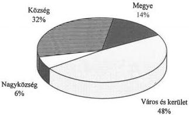

Állami Számverőszék

# JELENTÉS

az önkormányzatok 1996.évi normatív
állami hozzájárulása igénybevételének
és elszámolásának ellenőrzési
tapasztalatairól

391.

1997.szeptember

---

A vizsgálat végrehajtásáért felelős:
V. Önkormányzati és Területi Ellenőrzési Igazgatóság

Dömötör Gyula
számvevő igazgató

Az ellenőrzést vezette:

Dr. Saly Ferenc
régióvezető főtanácsos

Az összefoglaló jelentést készítette:

Dr. Saly Ferenc
régióvezető főtanácsos

Müller Ildikó
számvevő tanácsos

Dr. Nagy Ágnes
számvevő tanácsos

Somogyiné dr. Legény Mária
számvevő

Az ellenőrzést végzők névsorát az 1.számú melléklet tartalmazza

---

V-1004-69./1997. TÉMASZÁM: 365

# TARTALOMJEGYZÉK

Jelentés a helyi önkormányzatok 1996. évi normatív állami hozzájárulása igénybevételének és elszámolásának ellenőrzési tapasztalatairól 3

I. Összegző megállapítások, következtetések, javaslatok 4

II. Részletes megállapítások 8

1.A kozponti szervek tevekenysége 8
2. A normativ állami hozzájárulások igénybevételének és elszámolásanak helyessége az önkormányzatoknál 16

Mellékletek

1

---

# Jelentés
a helyi önkormányzatok 1996. évi normatív
állami hozzájárulása igénybevételének és
elszámolásának ellenőrzési tapasztalatairól

Az Állami Számvevőszék az államháztartásról szóló 1992. évi XXXVIII. törvényben foglalt előírások alapján, az 1996. évi zárszámadási törvényjavaslathoz kapcsolódóan ellenőrizte az 1995. évi CXXI. törvényben a helyi önkormányzatok részére 1996. évre nyújtott normatív állami hozzájárulások tervezésének és elszámolásának törvényességét, szabályszerűségét.

A vizsgálat célja: annak megállapítása volt, hogy

a normativ allami hozzajárulas tervezese osszhangban volt-e a koltsegvetesi törveny 3. szamu melleketeben foglalt elorasokkal;
az onkormanyzatok intezmeneyiknel az elszamolast megelozoen ellenoriztek e a koltsegvetesi törveny 3. szamu melleketeben megelott alapokmanyok megletet, adatainak helytallosagat;
a törvényi elóirásoknak megfelelo volt-e a normativ allami hozzájárulások igénybevelete és elszamolása.

A tételes helyszíni ellenőrzés az ország önkormányzatainak 11%-ára, 350 önkormányzatra (2 megyei, 2 fővárosi kerületi, 22 városi, 21 nagyközségi, 303 községi) és az önkormányzatok irányítása alá tartozó, a különböző jogcímeken a mutatókkal érintett 1096 intézményre terjedt ki. (Lásd 2. számú melléklet) Az ellenőrzésbe vont, az ország településszerkezetét reprezentáló önkormányzati körben az önkormányzatokhoz tartozó valamennyi feladatmutatóval érintett intézménynél tételes, minden normatíva jogcímre kiterjedő vizsgálatot végeztek számvevőink. Az ellenőrzések során szerzett tapasztalatok lehetőséget nyújtottak általánosítható következtetések levonására is.

Az ellenőrzésbe bevont önkormányzatok feladatmutatókhoz és mutatószámokhoz kötötten együtt 20,7 milliárd Ft normatív állami hozzájárulásban részesültek. Ez az összeg az ország összes önkormányzata részére ilyen címen a költségvetési törvényben juttatott – és a Kormány hatáskörében módosított – 231,7 milliárd Ft 8,9%-a. (Lásd 2/a és 3. számú melléklet)

3

---

I. ÖSSZEGZŐ MEGÁLLAPÍTÁSOK, KÖVETKEZTETÉSEK, JAVASLATOK

# I. ÖSSZEGZŐ MEGÁLLAPÍTÁSOK, KÖVETKEZTETÉSEK, JAVASLATOK

A normatív állami hozzájárulások előirányzatát 1996-ban is – csakúgy, mint az azt megelőző években – a Magyar Köztársaság költségvetésének adott évi helyzete határozta meg. Ennek megfelelően 1996-ra az Országgyűlés az 1995. évi, – a korábbi bérpolitikai intézkedésekhez adott 28,1 milliárd Ft-ot nem tartalmazó – előirányzathoz képest 11,4%-kal nagyobb összeget, 228,2 milliárd Ft-ot hagyott jóvá, amely az év folyamán 231,7 milliárd Ft-ra módosult. (Az eredeti előirányzat a Kormány döntése alapján évközben 4,0 milliárd Ft-tal növekedett, az önkormányzatok lemondása miatt, majd az önkormányzati körön kívüli feladatátadás következtében pedig 0,5 milliárd Ft-tal csökkent.) Az inflációs hatásokat figyelembe véve megállapítható, hogy a normatív állami hozzájárulások reálértéke a vizsgált évben is csökkent, így az évek óta felhalmozódott feszültségek szükséges mértékű enyhítését nem tette lehetővé.

Az 1996. évi normatív állami hozzájárulások szerkezetében jelentős változások következtek be. A többször módosított közoktatási törvényben megfogalmazott – a közoktatás finanszírozására vonatkozóan elfogadott – előírások miatt az oktatási-nevelési feladatokhoz kapcsolódó normatív állami hozzájárulás együttes összege az 1995. évi 94,4 milliárd Ft-ról 134,9 milliárd Ft-ra 40,5 milliárd Ft-tal növekedett. Ennek fedezetét részben a hozzájárulások együttes összegének 11,4%-os (23,4 milliárd Ft-os) növekedése, részben az un. „alanyi jogon” járó hozzájárulások 17,4%-os, (15,7 milliárd Ft-os) csökkentése, illetve a Kormány által a központosított előirányzatok tartalékából átcsoportosított 3,9 milliárd Ft biztosította. Ezek a forrásai a szociális intézményi, a gyermek- és ifjúságvédelmi feladatokhoz rendelt 2,6 milliárd Ft-os többletnek is.

Az Állami Számvevőszék több éve folyamatosan kifogásolta, hogy a normatív állami hozzájárulások jogcímeinek száma indokolatlanul növekedett és azok nem tükrözik az állam feladatvállalásának mértékét. A kezdeti 12 jogcím helyett ugyanis 1995-ben már 27 jogcímen lehetett igénybe venni a hozzájárulásokat. A finanszírozási rendszer új hozzájárulási jogcímek, kiegészítő támogatások beépítésével egyre inkább a „feladatfinanszírozás” irányába tolódott és erősödött a hozzájárulások forrás-kiegészítő szerepe.

A túldifferenciált rendszer helyett szükséges lenne visszatérni és kevesebb számú, homogénebb tartalmú jogcímkörhöz.

A normatív állami hozzájárulások jogcímeinek száma 1996. évben 14-re csökkent ugyan, azonban a jogcímeken belül kialakított un. „kódokhoz” rendelt fajlagos összegek száma megsokszorozódott. Az előírt feltételek megléte esetén az önkormányzatok 249 kód alapján vehették igénybe az őket megillető hozzájárulást, amelyből a közoktatási kódok száma 238. (Lásd 6. számú melléklet)

Az 1996. évi finanszírozási rendszer bonyolultsága miatt várható problémákat az Állami Számvevőszék már az előző évi ellenőrzésről készült jelentésben jelezte. Felhívta a figyelmet az elszámoláshoz szükséges nyilvántartások rendszerének részletes szabályozására, mert e nélkül az önkormányzatok ez irányú feladataikat nem lesznek képesek szabályszerűen ellátni.

4

---

I. ÖSSZEGZŐ MEGÁLLAPÍTÁSOK, KÖVETKEZTETÉSEK, JAVASLATOK

**A központi szervek 1996. évben nem teremtették meg a feladatok ellátásával összefüggő teljesítmény-követelményeket, az igényjogosultság feltételei és az intézményi alapokmányok adattartalma közötti összhangot.** Nincs szinkronban a szakmai statisztikák adattartalma a költségvetési szempontú adatgyűjtéssel, a költségvetési beszámolók feladatmutatói pedig az ágazati-szakmai statisztikák adatgyűjtésével.

A nyilvántartási rendszer szabályozatlansága mellett az 1996. évi költségvetési törvény 3. számú mellékletének szövege több helyen nem volt pontos. A pontatlan, vagy nem egyértelmű megfogalmazás akadályozta az egységes értelmezést. **A korábbi években alkalmazott számbavételi módszer előírása elmaradt és az elmúlt években következetesen szigorúbbá váló előírások helyébe hiányos** – a számonkérhetőséget is akadályozó – **szabályozás lépett.** Ezért az Állami Számvevőszék az éves költségvetési beszámolók benyújtási határidejét megelőzően is megkereste az érintett tárcákat, de azok a jogszabályok módosítására nem láttak lehetőséget és az Alkotmánybíróság 60/1992. AB számú határozatára hivatkozva un. „szakmai állásfoglalást” sem adtak ki.

**A vázolt anomáliák miatt a finanszírozási rendszer bevezetése óta tendenciájában folyamatosan javuló igénylési és elszámolási gyakorlat megtorpant.** (Lásd 5/a. számú melléklet) Az önkormányzatok saját elszámolásánál a hibaszázalék – plusz és mínusz eltérések aránya a normatív állami hozzájárulások teljes összegéhez – 4,8% volt, több mint ötszöröse az 1995. évinek. Ebben szerepet játszott, hogy év közben a közoktatási törvény szigorító intézkedései olyan időpontban váltak ismertté, amikor már nem volt mód a lemondásokra. Az Állami Számvevőszék által **vizsgált önkormányzatoknál az elszámolást követően a hibaszázalék 1,8% volt, az 1995. évi 1,5%-kal szemben.**

**A közoktatásban a finanszírozás hatályosságára vonatkozó előírások 1993-96. év között több alkalommal változtak és nem alakult ki a szükséges összhang a közoktatási és a költségvetési törvény között.** Vizsgálati tapasztalataink szerint – ellentétben a tárcák véleményével – a finanszírozás jogalapja, az igénylés megalapozása, elszámolása bonyolultabbá és időigényesebbé vált. Ezt támasztja alá, hogy az elszámolásra fordított idő az előző évhez képest az intézményeknél, önkormányzatoknál egyaránt 2–2,5-szeresére növekedett és hasonló mértékben nőtt az ellenőrzés lefolytatásához szükséges időtartam is.

**Az önkormányzatok elszámolása számos hibával terhelt.** Továbbra is jellemző a szabályozás bonyolultságából és hiányosságából adódó hibákon túl a jogszabályok nem kellő ismerete, félremagyarázása, az elszámolást végzők gyakorlatlansága, az adatszolgáltatás pontatlansága.

**Az önkormányzatok döntő többsége továbbra sem tett eleget a helyi önkormányzatokról szóló 1990. évi LXV. törvény 92. § (2) bekezdésében, illetve az 1991. évi XX. törvény 140. § 1. e) és h) pontjaiban foglalt ellenőrzési kötelezettségének.** Az önkormányzatok többsége nem győződött meg az intézmények által közölt adatok valódiságáról, a bizonylatok meglétéről, a szükséges nyilvántartások vezetéséről, holott az ellenőrzés fontosságára az elmúlt években a központi szervek és az Állami Számvevőszék is több esetben – egyre nyomatékosabban – felhívta a figyelmet. Az önkormányzati értesítőben információt kaptak az önkormányzatok a mulasztást elkövető jegyzők felelőssé-

5

---

I. ÖSSZEGZŐ MEGÁLLAPÍTÁSOK, KÖVETKEZTETÉSEK, JAVASLATOK

gének felvetéséről is. A vizsgálatba vont önkormányzatok ennek ellenére intézményeik mindössze 20,1%-át ellenőrizték dokumentáltan és csak 36-nál tártak fel eltérést, egyenlegében 13,8 millió Ft visszafizetési kötelezettséggel.

A nem megfelelő törvényi szabályozás, az intézmények pontatlan adatszolgáltatása, az önkormányzati ellenőrzések elmaradása együttesen oda vezettek, hogy az önkormányzatok 1996. évi elszámolását követő helyszíni ellenőrzésünk során – normatívánkénti számbavétel mellett – 215.946,6 ezer Ft jogosulatlan igénybevételt és 169,627,3 ezer Ft önkormányzatokat megillető normatív állami hozzájárulást állapítottunk meg. Tekintettel arra, hogy ezek az eltérések esetenként egy-egy önkormányzatnál semlegesítik egymást a vizsgált önkormányzatoknak a központi költségvetésbe 66.291.881 Ft-ot kell visszafizetniük, illetve a költségvetésből részükre pótlólagosan 19.972.623 Ft-ot kell kiutalni. (Lásd 8., 8/a, 9. és 10. számú melléklet)

A korábbi évekhez hasonlóan a hibás elszámolások miatt sérelmet szenvedett a teljesség és valódiság számviteli alapelv. A hibás, nem ellenőrzött adatszolgáltatás miatt a költségvetési beszámolók nem mutatnak valós képet.

Az előző évek ellenőrzései alapján tett javaslataink hasznosulását elemezve megállapítható, hogy bár néhány egyedi ügy kapcsán felvetett szabályozásbeli pontatlanságot a központi szervek kiküszöböltek, több alapvető kérdésben nem sikerült előrelépést elérniük:

az agazati szakmai statisztkák, a költségvetési finanszirozási szempontok és a költségvetési beszámolók feladatmutatói továbbra sincsenek összhangban;
a finanszirozasi rendszer tovabbra sem tukrozi az allam tehervallalasanak merteket, felteteleit, bar el kell ismerni, hogy a modositott kozokatasi törveny az agazati törvenyek koreben egyedulallo koltsegvetesi garanciakat tartalmaz;
nem törtent elorelepés a tervezés, elszamolás és ellenorzs rendszerének össehangolt szabályozásaban;
nem valosult meg az onkormanyzatok normativ allami hozzajárulasokkal kapcsolatos ellenorzési kotelezettsegenek konkrétabb elorasa;
nem csokkent, hanem rendkivuli mertekben megnovekedett a normativak jogcimeinek szama, ami a rendszert bonyolultabba, attekinthetetlenebbe tete.

Mindezeket figyelembe véve az Állami Számvevőszék javasolja az Országgyűlésnek, hogy

1. az 1996. évi zárszámadási törvény elfogadása során hagyja jóvá a jelentés 8. számú mellékletében részletezettek szerint az önkormányzatok által a központi költségvetésbe visszafizetendő 66.291.881 Ft-os, illetve az önkormányzatoknak a költségvetésből pótlólagosan kiutalandó 19.972.623 Ft-os összeget;

6

---

I. ÖSSZEGZŐ MEGÁLLAPÍTÁSOK, KÖVETKEZTETÉSEK, JAVASLATOK

2. fontolja meg, hogy azoknál az önkormányzatoknál, amelyek az évközi közoktatási törveny-módosítás miatt nem tudtak lemondani az addig érvényes jogszabályok alapján igényelt normativ állami hozzájárulásokrál és ezert un. „büntető" kamatot kell fizetniük, tegyék lehetővé ennek törlését.;
3. hatalmazza fel a belugyminisztert, hogy az erintett tarcak bevonasaval kozos BM-PM rendeletben irja elo a normativ allami hozzajarulasok tervezesenek, elszamolasanak részletes szabalyait.

Az Állami Számvevőszék fontosnak ítéli, hogy a belügyminiszter és a pénzügyminiszter az érintett tárcák bevonásával az államháztartási reform keretei között

1. kezdemenyeze a normativ finanszirozasi rendszer mukodesenek teljes felulvizsgalatat;
2. hozza összhangba a finanszírozási szempontokat a szakmai statisztkai adatszolgáltatással és a költségvetési informácios rendszerrel.

# A művelődési és közoktatási miniszter

1. biztositsa, hogy a 11/1994. (VI.8.) MKM rendeletben eloirt kotelezto tanugyigazgatasi nyilvantartasok beszerezhetok legyenek es tartalmuk legyen alkalmas a finanszirozasi kovetelmenyekhez szukseges adatszolgaltatashoz;
2. az 1998. évi költségvetési törvenyjavaslat elokésztésekor kezdeményezze az értelmezési vitákra alapot ado jogcímek tartalmának, igénylésük, elszámolásuk követelményeinek pontosítását, egyertelmübbe tetelet.

7

---

II. RÉSZLETES MEGÁLLAPÍTÁSOK

## II. RÉSZLETES MEGÁLLAPÍTÁSOK

### 1. A KÖZPONTI SZERVEK TEVÉKENYSÉGE

**Az 1996. évi költségvetési törvény előkészítése hasonló elvek és módszerek szerint történt mint a korábbi években.** A normatív állami hozzájárulások jogcímeihez kapcsolódó támogatás mértékének alapvető korlátja a központi költségvetésben erre a célra meghatározott főösszeg volt.

**A tervezés időszakában négy kormányhatározat volt kiemelt fontosságú.**

A Kormány 1023/1995. (III.22.) sz. határozata szerint a közoktatás – feladatokkal összehangolt – finanszírozási rendszerét úgy kellett átalakítani, hogy a központi költségvetésben a normatív állami hozzájárulások összege ne növekedjen. Az érintett tárcáknak fel kellett mérni a közoktatási intézményhálózat hatékonyságát, ezen belül az intézmény-működtetés és -alapítás szakmai és tárgyi feltételeit; a közoktatási rendszer szerkezetét és azzal összefüggésben az állami feladatvállalás mértékét. Végül 1995. júniusáig kellett javaslatot tenniük a tárcáknak a közoktatási-, a szakképzési-, a közalkalmazotti-, az önkormányzati törvény, valamint az azokhoz kapcsolódó végrehajtási rendeletek fentieket megalapozó módosítására.

A Kormány 2200/1995. (VII.13.) számú határozata kötelezte a tárcákat az új – álláshelyszámmal arányos, szakmai képzést és speciális oktatást preferáló – közoktatás finanszírozási rendszer 1996. augusztus 1-től való bevezethetőségének vizsgálatára.

Az újabb, 2219/1995. (VIII.4.) számú Kormányhatározat már előírta a közoktatás új finanszírozási rendszere paramétereinek beépítését az 1996. évi költségvetési törvénybe, majd a Kormány arról döntött [2273/1995. (IX.8.) számú határozat], hogy a normatívan számított álláshelyek szerinti személyi juttatások forrása mindenütt központi költségvetési hozzájárulás, amelyen túl speciális területeken a hozzájárulásnak a dologi kiadások egy részét is fedeznie kell.

Az 1995. július 13-i Kormánydöntéssel összhangban beépült volna a költségvetési törvénybe egy un. 3/a számú melléklet a pedagógus álláshely szerinti finanszírozásra 1996. szeptember 1-től december 31-ig terjedő átmeneti időszakra. **A közoktatási feladatellátáshoz szükséges pedagógus álláshely szerinti finanszírozást az érintett négy tárca (PM, BM, MKM, MM) 1995. október 3-ig egységesen támogatta.**

Ezt követően a **Művelődési és Közoktatási Minisztérium a közoktatás finanszírozására új**, a tárcákkal előzetesen nem egyeztetett és a korábbiakkal összhangban nem álló **javaslatot terjesztett elő a Kormány számára. A tervezet elvetette a 3/a számú melléklet alapján történő finanszírozást és alapjaiban a korábbi 3. számú mellékletre épülő, tanuló (ellátott) létszám szerinti közoktatás finanszírozást javasolt.** (Az 1996. évi költségvetési törvényjavaslat új, MKM által előterjesztett 3. számú mellékletének véleményezésére az Állami Számvevőszéknek nem volt lehetősége.)

**A javaslat nem felelt meg a korábban elfogadott kormányhatározatokban kijelölt céloknak és nem volt csatlakoztatható a költségvetési**

8

---

II. RÉSZLETES MEGÁLLAPÍTÁSOK

**törvényjavaslat addig elkészült részeihez. A két minisztérium között alapvető nézetkülönbség volt abban is, hogy a közoktatás új finanszírozási rendszere mikortól vezethető be.**

A Pénzügyminisztérium az MKM előterjesztéssel kapcsolatban rámutatott, hogy az nem biztosítja az akkor hatályos közoktatási törvény 118. §-ában vállalt kötelezettség teljesítését (a központi költségvetési hozzájárulásnak kell fedezetet biztosítania a közoktatásban dolgozó pedagógusok és egyéb közalkalmazottak pótlékaira és azok járulékaira) és hogy az MKM javaslatának elfogadása esetén a „szakmai követelmények finanszírozási feltételként való megjelenítése nélkül működne a finanszírozási rendszer”.

Végül a **Kormány egy rendkívüli ülésén fogadta el a költségvetési törvényjavaslat új 3. számú mellékletét a közoktatás finanszírozásáról**, amely változott tartalmú mutatószám-felmérést tett szükségessé. Erre már csak 1996. január közepétől kerülhetett sor és a felmérés alkalmával váltak nyilvánvalóvá a szabályozásbeli hiányosságok is.

Az érintett tárcák a közoktatási törvény módosítását elválaszthatónak találták a tárgyévi költségvetési finanszírozástól, abból kiindulva, hogy a költségvetési törvény jogszerűen fogalmazhat meg költségvetési szempontú támogatási paramétereket. **Az 1996. évi költségvetési törvény és az év folyamán elfogadott – 1996. szeptember 1-től hatályos – közoktatási törvény azonban a közoktatási normatívák igénybe vételét meghatározó feltételek tekintetében nincs összhangban.** Nem vették figyelembe az érintett tárcák az Alkotmánybíróságnak egy egyedi ügy kapcsán hozott, de lényegét tekintve e területre is érvényes 57/1994. (XI.17.) AB. sz. határozatát, amely szerint „... az állam a költségvetési év tartama alatt ellentételezés nélkül az önkormányzatokra nézve hátrányos módon ne változtassa meg az önkormányzati költségvetések forrásszerkezetét.”, amit ez esetben a közoktatási törvény szeptember 1-i hatályú módosításai tartalmaznak.

**A Művelődési és Közoktatási Minisztérium – a korábbi évekhez hasonlóan – 1996-ban sem rendelkezett olyan tényadatokon alapuló költségfelméréssel, elemzéssel, amely megnyugtató módon támasztotta volna alá a „normatíva” jogcímeknél meghatározott igényelhető összegeket.** Az un. alábontást (a kódszámok rendkívül nagy száma) az egyes részfeladathoz kapcsolódva a neveltek, oktatottak létszáma alapján az „alapnormatíva” összegéből visszaszámítással határozták meg.

**Az 1996. évi költségvetési törvényben a normatív állami hozzájárulásokra vonatkozó szabályozást a központi szervek az Állami Számvevőszék korábbi észrevételeit, javaslatait is figyelembe véve pontosították.**

- ■ Módosult „a hajléktalanok átmeneti szállásai” jogcímre vonatkozó előírás, részben az igénybevételnél figyelembe veendő jogszabály-pontosítás, részben a feladat intézményi alapító okiratban, illetve működési engedélyben történő szerepeltetése miatt;
- ■ változtak a „gyermek- és ifjúságvédelmi feladatok” ellátására biztosított normatívánál a nagykorúak ellátására vonatkozó jogosultsági feltételek;
- ■ kikerült a szabályozásból a költségvetési törvényben felsorolt helyeken tartózkodásra vonatkozóan a folyamatosságot megkövetelő feltétel és helyébe lé-

9

---

II. RÉSZLETES MEGÁLLAPÍTÁSOK

pett, hogy a korábban állami gondoskodás alatt álló, 24 év alatti személy részére ellátást – szállást és étkezést – biztosítsanak;

- míg az 1995. évi költségvetési törvényben a jogosultság feltétele az volt, hogy a volt állami gondozott „keresete a mindenkori legnagyobb összegű saját jogú nyugdíjminimumot” ne érje el, addig az új szabályozás szerint akkor lesz jogosult, ha a havi jövedelme a minimálbért nem éri el.

**Pontosítva és egyértelműen határoztak meg több kiegészítő szabályt, így pl.**

- csak az első szakma megszerzését biztosító képzés után vehető igénybe a normatív állami hozzájárulás,
- a speciális szakiskolában a fogyatékos tanulók szakképzéséhez minden esetben igényelhető normatív állami hozzájárulás;
- a tanulói jogviszony szünetelése esetén – a képzési kötelezettségben részt vevőket kivéve – nem igényelhető normatív állami hozzájárulás;
- szabályozták az igénybevétellel és az elszámolással kapcsolatos eljárást az önkormányzati feladatátadásnál.

**A pontosítások ellenére az 1996. évi költségvetési törvény számos – a közoktatás finanszírozás változásával összefüggő – félreérthető, ellentmondásos előírást tartalmaz és nincs mindenütt összhangban a közoktatási törvénnyel sem.**

- **Alapvető problémát okozott, hogy az önkormányzatok által jogszerűen használható szakmai programok és oktatási-nevelési tervek köre nem volt egyértelmű.** Nem lehetett megállapítani, hogy kik, hány esetben, milyen felhatalmazással és tartalommal adtak ki a Művelődési és Közoktatási Minisztérium nevében – a normatív finanszírozásban egyik alapvető jogosultsági feltételként meghatározott – engedélyeket.

**A művelődési és közoktatási miniszter 1993. előtt az oktatásról szóló 1985. évi törvény felhatalmazása alapján adhatott ki nevelési-oktatási terveket, illetőleg engedélyezhette egyedi megoldások, kísérletek bevezetését.** E jogosítványa 1993-ban a közoktatási törvény hatálybalépését követően megszűnt.

**A közoktatásról szóló 1993. évi LXXIX. törvény 124. §-a (6) bekezdésének a) pontjában foglaltak szerint a nevelési-oktatási intézmények addig az időpontig, ameddig a Nemzeti Alaptanterv nem kötelező, a korábban kiadott nevelési-oktatási terveket pedagógiai programként, illetve helyi tantervként szabadon alkalmazhatják.**

**Az 1996. évi költségvetési törvény előírása** szerint a „nemzetiségi, etnikai kisebbségi és a két tanítási nyelvű oktatáshoz” biztosított állami hozzájárulás igénybevételének feltétele, hogy az oktatás és nevelés a művelődési és

10

---

II. RÉSZLETES MEGÁLLAPÍTÁSOK

közoktatási miniszter által jóváhagyott, illetőleg kiadott nevelési-oktatási terv alapján történjen.

A korábbi években nem készültek el a cigány kisebbségi, illetve a zenei oktatás kivételével az alapfokú művészetoktatáshoz szükséges tantervek. Ezek hiányában az önkormányzatok – a közoktatási törvény felhatalmazása alapján – egyedi engedélyeket próbáltak beszerezni, vagy a már korábban kiadott programokat vették át más önkormányzattól.

A vizsgált önkormányzatok közül többen is a Budapest, XXII. kerületi Önkormányzathoz tartozó Nádasdy Kálmán Művészeti Iskola által – minisztériumi elvi engedély alapján – alkalmazott programot vették át. Végleges engedélyt az iskola mind a mai napig nem kapott, így tehát ez az iskola sem és a vizsgált körből további öt intézmény– amelyek ezt a programot átvéve oktatnak immár évek óta, – sem felel meg a finanszírozási feltételeknek. Az iskola igazgatója levélben fordult a minisztériumhoz, ahonnan június végéig még nem kapott választ. Az Állami Számvevőszéknek adott tájékoztatásban a minisztérium, elismerve „nem egyértelmű intézkedéseit” nem tartotta indokoltnak az érintettektől normatív állami hozzájárulások elvonását.

Minisztériumi jóváhagyás nélkül – helyi készítésű program alapján – működik az ellenőrzött önkormányzatok intézményei közül négy zeneiskola (Dunapataj, Iharosberény, Heves, Mátraderecske).

Az etnikai kisebbségi neveléshez és oktatáshoz a vizsgált önkormányzatok közül 193 vett igénybe kiegészítő hozzájárulást túlnyomó részt cigány származású gyermekek, tanulók heti 4-10 órában történő un. felzárkóztató neveléséhez, oktatásához. A 193 önkormányzat 54%-a kérte és kapta meg 1996-ban saját készítésű programjaihoz a minisztérium Kisebbségi Főosztály Cigány Oktatási és Közművelődési Osztály Cigányoktatási referense „jóváhagyását”.

■ Több pontban hiányzott a költségvetési törvény előírásainak és az 1996. nyarán elfogadott, 1996. szeptember 1-től hatályba léptetett közoktatási törvénymódosításnak az összhangja. A szakmai törvény a finanszírozás tekintetében nem tartalmazott átmeneti szabályokat, holott a finanszírozást érintően több szigorító rendelkezést is megfogalmazott.

Az alapfokú művészetoktatásban részt vevők esetében a költségvetési törvény (3.számú melléklet 21. m) pont) a tanítási év első napjáig huszonkettedik életévüket betöltő tanulókat zárja ki az igényjogosultak köréből, míg a közoktatási törvény 1996. szeptember 1-től hatályos szabályozása a hat év alatti életkorúakat is kizárja (1. számú melléklet második rész).

Az óvodai nevelésben részesülők után az önkormányzatok a költségvetési törvény (3. számú melléklet 10. a) pont) szerint abban az esetben vehetnek igénybe 100%-os hozzájárulást, amennyiben a gyermek a nevelési év átlagában legalább napi öt órában igényli az óvodai ellátást. A közoktatási törvény 1. számú mellékletének szabályozása szerint a nevelési év átlagában heti harminc (napi hat) órára kell a gyermeknek (szülőnek) igényelnie az ellátást ahhoz, hogy az önkormányzat jogosult legyen a 100%-os hozzájárulásra.

A közoktatási törvény 1996. szeptember 1-től hatályos módosítása szerint a nemzeti- és etnikai kisebbséghez tartozók óvodai nevelését, iskolai oktatását és két tanítási nyelvű oktatását támogató „kiegészítő szakmai normatíva” más célra fel nem használható. A szabályozás sem a költségvetési törvény 19. §-a, sem az önkormányzati törvény 84. §-a előírásával nincs összhangban. Ez utóbbi jogszabály szerint a normatív költségvetési hozzájárulás közvetlenül, felhasználására vonatkozó kötöttség nélkül illeti meg az önkormányzatokat. A költségvetési törvény idézett szakasza „a közoktatás kiemelkedő fontosságának érvényesítésére” hívja fel 1996-ra a helyi önkormányzatok figyelmét.

11

---

II. RÉSZLETES MEGÁLLAPÍTÁSOK

- ■ Érthetetlen módon **1996. évben** a „nemzetiségi, etnikai kisebbségi és két tanítási nyelvű oktatáshoz” igénybe vehető „normatíva” korábbi szigorú jogosultsági feltételét lazították. **Kimaradt a szabályozásból az addig előírt, a teljesítést valamilyen formában ellenőrizhetővé tevő jogszabályi feltétel, amely szerint meghatározott óraszámban kellett biztosítani az oktatást.**
- ■ **Nem tartalmazza az 1996. évi költségvetési törvény a normatív állami hozzájárulás igénybevételéhez az ellátottak és oktatottak létszámának kiszámítási módját.** Korábban ez a közoktatási statisztikákra épülő, a költségvetési törvényben előírt un. 8/12, illetve 4/12-es arányú átlagszámításon alapult. A nevelési (oktatási) év és a költségvetési év közötti kapcsolatot a szabályozás nem teremtette meg. (A központi szervek adatkérése alapján az önkormányzatok a korábbi átlagszámítási módszerrel terveztek, illetve számoltak el, ezért ezt a gyakorlatot az Állami Számvevőszék elfogadta.)
- ■ Nehezítette az értelmezést a **költségvetési törvény 3. számú melléklete 10. Óvodai nevelés, általános iskolai nevelés és oktatás, alapfokú művészetoktatás** jogcím a) pontjában szereplő megfogalmazás. A jogcím tartalmi **leírásában a jogosultság feltételének megfogalmazása kétféle formában fordul elő.** A „nevelési év átlagában... igényli” és a „veszi igénybe” fogalmazás más-más tartalmú. Míg ez utóbbi egy folyamatosan vezetett, a tényleges igénybevételt alátámasztó nyilvántartást feltételez, az előbbihez az év elején beszerzett szülői szándéknyilatkozat is elég lenne. Ez viszont nem jelenti azt, hogy a gyermek részt vesz az év során a foglalkozásokon. A „nevelési év átlagában” törvényi előírás – anélkül, hogy az átlagszámítás módját is szabályoznák – többféle értelmezést kaphat. A jogosultsági előírás pontatlansága bizonytalanságot okozott a tervezés és elszámolás, illetve az ellenőrzés során is.
- ■ **Évek óta nem tartalmazott kizáró feltételt a szabályozás a fogyatékos gyermekek, tanulók etnikai nevelésének, oktatásának finanszírozására.** Az 1996. évi költségvetési törvény 3. számú mellékletének 13. Speciális oktatás és nevelés jogcíme szerint a nemzetiségi, etnikai oktatásban részt vevő fogyatékos tanulók után is megilleti az önkormányzatokat a normatív állami hozzájárulás. E témában szakmai körökben sem egységes az álláspont a képzés tartalmát illetően (felzárkóztatás? tehetséggondozás?). Álláspontunk szerint ez a kiegészítő állami hozzájárulás az etnikai fogyatékos tanulók oktatásához indokolatlan, mert esetükben a felzárkóztatás, vagy a tehetséggondozás tartalmilag nem értelmezhető.

A költségvetési törvény 3. számú mellékletében a 13. Speciális oktatás és nevelés jogcím b) és d) pontjainak szabályozása pontatlanságot is tartalmaz. Ez utóbbi nem tette lehetővé a fogyatékos gyermekek nemzetiségi, etnikai óvodai neveléséhez kiegészítő normatív állami hozzájárulás igénybevételét. Erre csupán a tervezéshez, illetve a beszámoló készítéséhez kiadott segédletek adtak lehetőséget.

12

---

II. RÉSZLETES MEGÁLLAPÍTÁSOK

- Az 1996. évi költségvetési törvény 3. számú mellékletének 10 e) és j), 11. c), illetve 12. c) és f) pontjai alapján a közös fenntartásban működő óvodák és iskolák jogosultak kiegészítő hozzájárulás igénybevételére. E törvényi helyek nem írják elő, hogy a támogatást abban az esetben vehetik igénybe az önkormányzatok, ha az önkormányzati törvény (Ötv.) 43. §-a szerinti intézményirányító társulást működtetnek. Az idézett törvényi helyre a költségvetési törvény csupán a 3. számú melléklete kiegészítő szabályaiban utal, ám itt a hozzájárulás igénybevételének technikai kérdéseit fogalmazza meg. (A közös fenntartás szabályozása az 1997. évi költségvetési törvényben már szigorú és egyértelmű.)

A közös fenntartással függ össze egy technikai probléma, amely azonban felesleges többletmunkát okozott a tervezés és elszámolás során úgy az önkormányzatoknak, mint az adatfeldolgozóknak. Ugyanis a közös fenntartású intézmények esetén a normatív állami hozzájárulás fajlagos összegei azonosak az óvodai és iskolai nevelésben, illetve oktatásban részt vevők után függetlenül attól, hogy helyben lakók, a közös fenntartásban részt vevő önkormányzatok területéről, vagy azon kívüli területről járnak be. Az önkormányzatoknak a három típusú létszámot a hozzátartozó azonos fajlagos összeggel három különböző kódszámon kellett szerepeltetniük a tervezés és beszámolás során. Az adat információ-tartalma nem áll arányban a többletráfordítással és csupán a hibalehetőséget növelte.

- Sérelmes a megyei önkormányzatokra a költségvetési törvényben [3. számú melléklet 11. b) és 12. e) pont] a „bejáró” tanulók létszámának megkülönböztető finanszírozása, attól függően, hogy települési, vagy megyei önkormányzatról van szó. Az önkormányzati törvény 6. §-a alapján a megyei és a települési önkormányzatok viszonya mellérendelt, azonos állami feladatért azonos támogatás illeti meg őket. (Az 1997. évi költségvetési törvény megszüntette e diszkriminatív szabályozást.)

Az 1996. évi költségvetési törvény 3.számú mellékletében szereplő, félreérthető, nem egyértelmű előírások miatt még a vizsgálat megkezdése előtt levélben fordultunk a művelődési és közoktatási miniszterhez. Az 1997. március 10-én kelt – a belügyminiszterrel és a pénzügyminiszterrel egyeztetett – válasz azonban nem tisztázta a felvetett kérdéseket. (Lásd 11. számú melléklet)

Az előzőekben részletezett szabályozásbeli hiányosságok, illetve ellentmondások egy részét feloldotta az 1996. évivel azonos közoktatás-finanszírozási elveket tartalmazó 1997. évi költségvetési törvény, illetve az ebben szereplő közoktatási törvény-módosítás.

- A Nemzeti Alaptanterv bevezetéséig a Művelődési és Közoktatási Minisztérium jóváhagyhat a nemzeti etnikai kisebbséghez tartozók óvodai neveléséhez, iskolai oktatásához nevelési, nevelési-oktatási terveket. Ezzel számonkérhetővé válik a költségvetési támogatásra való jogosultság;
- az 1997. évi költségvetési törvény ismét tartalmazza a cigány kisebbséghez tartozók esetén a miniszter által kiadott, vagy jóváhagyott oktatási program megvalósításának feltételeként a meghatározott óraszámú oktatást;

13

---

II. RÉSZLETES MEGÁLLAPÍTÁSOK

- az 1997-es költségvetési törvény ismét a korábbi évek gyakorlata szerint szabályozta a közoktatási célú normatív hozzájárulás megállapításánál és az elszámolásánál alkalmazandó – a közoktatási statisztikákon alapuló – átlagszámítás módját.

A költségvetési törvény finanszírozási előírásai a közoktatás-finanszírozás tekintetében 1997-től már nem alkalmazhatók önállóan, mert számos kérdésben az ágazati szabályozás, a közoktatási törvény ad előírást a tervezők, illetve végrehajtók számára és ezt kell alkalmazniuk az ellenőröknek is. A központi szervek jobbító szándéka ellenére több pontatlanság változatlanul fennmaradt a szabályozásban.

A közoktatási törvény 1. számú mellékletének második része a 100, vagy 50%-os jogosultságra vonatkozóan az "igényli", illetve „veszi igénybe" megfogalmazást használja, így továbbra sem egyértelmű az óvodai ellátottak után járó hozzájárulás igénybevételi feltételének szabályozása. A jogosultsági előírás pontatlansága – meghatározott tartalmú nyilvántartás vezetésének kötelezővé tétele nélkül – 1997-ben is bizonytalanságot okozhat az elszámolás, illetve ellenőrzés során.

Változatlanul problémát okoz 1997-ben is az óvodai hozzájárulás igénybevételi feltételeként előírt „a nevelési év átlagában" törvényi kitétel betartása az átlagszámítás módjának szabályozása nélkül, mert ezt sem a költségvetési törvény, sem a közoktatási törvény nem tartalmazza.

A költségvetési törvény írja elő, hogy a közoktatási célú hozzájárulásokkal való elszámolás a közoktatási statisztikai adatokra épül, azonban a közoktatási statisztika adattartalma nincs mindenütt összhangban a finanszírozási szempontokkal és esetenként a közoktatási törvénnyel sem. Így pl.

- az 1996. október 15-ei állapotot tükröző óvodai statisztikában a 4. Óvodai gyermeklétszám című tábla 14. sorában a „napi 5 óránál rövidebb időre veszi igénybe az óvodát" szöveg szerepel., holott az 1996. szeptember 1-től hatályos szakmai törvény már napi hat (heti 30) órát ír elő, a teljes összegű, illetve az 50%-os jogosultság feltételéül. Ugyanitt, a 4. Óvodai gyermeklétszám tábla 1. sorában szerepeltetendők a három évnél fiatalabb gyermekek is, pedig a közoktatási törvény 65. §-a szerint az óvodába a gyermek harmadik életévének betöltése után vehető fel;
- a nappali rendszerű iskolai oktatásban saját döntésük alapján magántanulók, térítési díjat fizetők és vendégtanulók után a normatív hozzájárulás egyharmadára jogosult az intézményt fenntartó önkormányzat. A vendégtanuló fogalmát a közoktatási törvény értelmező rendelkezései nem tartalmazzák és pl. az általános iskolai közoktatási statisztika adatgyűjtése nem terjed ki sem a vendégtanulókra, sem pedig a saját döntésük alapján magántanulókra;
- a közoktatási törvény értelmében az alapfokú művészetoktatás intézményeiben azt a tanulót lehet figyelembe venni, aki hatodik életévét elérte. A törvény 31. §-a szerint az alapfokú művészetoktatás előképző, alapfokú és továbbképző évfolyamokon történik. A közoktatási statisztika (1996. október 1-ei állapotot tükröz) 5. Tanulók száma tanszakonként című táblája 40. Előképző sorában kell szerepeltetni – a kitöltési utasítás szerint – a kis-előképző, óvó-

14

---

II. RÉSZLETES MEGÁLLAPÍTÁSOK

nők számára tartott előképző, zeneóvoda, dalosjáték foglalkozásokon részt vevők létszámát is. Az idézett törvényi hely, illetve a közoktatási törvény a statisztikában szerepeltetett képzési formákat nem tartalmazza, így az a törvénnyel ellentétes.

# **Ellenőrzéseink során az önkormányzatok felvetettek néhány olyan problémát, amely működésüket finanszírozási szempontból érinti.**

Sérelmezik az önkormányzatok, hogy a nappali szociális intézményi ellátásnál az osztószám 314. Ez ugyanis hátrányos az 5 napos nyitvatartással üzemelő intézmények esetében és különösen a kisebb településeknél okoz finanszírozási gondokat.

Az óvodai felvételi korhatár szabályozása kedvezőtlenül érinti az olyan településeket, ahol gazdaságossági szempontokból nincs bölcsőde, ugyanakkor az óvodák kihasználatlanok. A 3 év alatti gyermekeket a közoktatási törvény előírása szerint nem lehet az óvodába felvenni miközben erre igény lenne, az óvodák pedig egyedi elbírálás alapján fogadnák a gyermekeket.

**Az 1997. évi költségvetési törvényi szabályozás bizonyos szempontból egyszerűbbnek, értelmezhetőbbnek tekinthető**, mint az 1996. évi, azonban az új közoktatási törvény feladat-meghatározásával összhangban **új típusú normatív állami hozzájárulások is igényelhetők, így a szabályozás differenciálódására irányuló folyamat a „feladatfinanszírozás” irányába tovább folytatódott.** Pl: az iskolai, a kollégiumi diákönkormányzat működéséhez, az iskolai sportkörre, az iskolai könyvtárra, az informatikai oktatás megszervezéséhez, az intézményi étkezésben részt vevőkre, a napközis foglalkozásra, óvodai-, iskolai- és kollégiumi szék működéséhez kapcsolódik költségvetési támogatás.

Kikerült a normatív állami hozzájárulások köréből a **„nemzetiségi, etnikai és két tanítási nyelvű oktatásra”** vonatkozó támogatás, amely évek óta egyik neuralgikus pontja volt a szabályozásnak. A feladat támogatottsága megmaradt, azonban 1997. január 1-től a támogatás egyértelmű igénybevételi feltételekkel, **felhasználási kötöttséggel** az un. központosított támogatások körében igényelhető.

A fentiekben vázolt problémák, anomáliák mellett és ellenére el kell ismerni, hogy **a hatályos közoktatási törvény az ágazati törvények körében egyedülálló költségvetési garanciákat tartalmaz és az állami szerepvállalás tekintetében is a korábbinál egyértelműbb rendszert körvonalaz.** Ennek kedvező hatásai csak az oktatás szerkezeti átalakulását követően hosszabb távon lesznek értékelhetőek. Megfontolandó azonban, hogy a szakmai-ágazati törvények hatálybalépését követően a finanszírozással összefüggő követelményeket a költségvetési törvények tartalmazzák és a jogalkalmazó önkormányzatoknak – akik megfelelő szakemberekkel továbbra sem mindenütt rendelkeznek – ne kelljen különböző jogszabályok együttes olvasata alapján végezni e bonyolult tevékenységet.

15

---

II. RÉSZLETES MEGÁLLAPÍTÁSOK

## 2. A NORMATÍV ÁLLAMI HOZZÁJÁRULÁSOK IGÉNYBEVÉTELÉNEK ÉS ELSZÁMOLÁSÁNAK HELYESSÉGE AZ ÖNKORMÁNYZATOKNÁL

A központi szervek tevékenységéből adódó pontatlan jogszabályi előírásokon, a korábbi évek szigorúbb követelményeinek fellazításán, a rendkívül bonyolulttá vált jogcímrendszeren túl **az elszámolási hiányosságokhoz ismét jelentős mértékben járult hozzá, hogy az önkormányzatok munkatársai most sem ismerték megfelelően a törvényekben foglaltakat. Az önkormányzatok elszámolásaiban továbbra is fellelhetők voltak a törvényi előírások be nem tartására visszavezethető hibák.**

Az APEH-SZTADI adatai szerint az önkormányzatoknak 1996. évi elszámolásuk alapján országos szinten együtt 5.764 millió Ft befizetési kötelezettsége keletkezett, míg az őket megillető pótlólagos állami hozzájárulás 5.292 millió Ft. Az előbbiek a hozzájárulások 2,5%-át, az utóbbiak 2,3%-át teszik ki. Az állami költségvetést egyenlegében megillető visszafizetési kötelezettség 471 millió Ft (0,2%). A hibaszázalék (4,8%) – a plusz és mínusz eltérések a normatív állami hozzájárulások teljes összegéhez viszonyítva – több mint ötszöröse az 1995. évi 0,9%-nak. (Lásd 4. és 5. számú melléklet)

Az önkormányzatok elszámolását követően az Állami Számvevőszék által végzett helyszíni ellenőrzések összesített adatai szerint a hozzájárulások 1,0%-át (215,9 millió Ft-ot) vettek jogosulatlanul igénybe az önkormányzatok, ugyanakkor a részükre még járó hozzájárulás 0,8% (169,6 millió Ft). **Az állami költségvetést egyenlegében megillető visszafizetési kötelezettség 0,2% (46,3 millió Ft), amelynek aránya az előző évek elszámolásaival összehasonlítva romló tendenciát mutat. A visszafizetési kötelezettség az 1994. évihez képest közel megháromszorozódott, az 1995. évihez viszonyítva pedig majdnem kétszeres.**

Az ellenőrzött 350 önkormányzat közül 260-nál (74,3%) mutatkozott eltérés. (Lásd 7. számú melléklet) Ebből 185 önkormányzatnak visszafizetési kötelezettsége keletkezett, 75 önkormányzatot pedig további állami hozzájárulás illet meg.

**Az önkormányzatok többsége továbbra sem tett eleget** a helyi önkormányzatokról szóló 1990. évi LXV. törvény 92. § (2) bekezdésében, illetve az 1991. évi XX. törvény 140. § 1.e) és h) pontjában megfogalmazott **ellenőrzési kötelezettségének**. Nem győződtek meg a mutatószámok valódiságáról, az előírt bizonylatok, az igénylés alapját képező dokumentumok meglétéről, tartalmuknak a követelményekkel való összhangjáról.

A vizsgált önkormányzatok — 12 önkormányzat kivételével — az 1996. évi normatív állami hozzájárulások igényléséhez és elszámolásához intézményeik részére semmiféle kiegészítő segédletet nem adtak. Ez azzal járt, hogy a magukra hagyott intézmények — amelyek csak közvetve érdekeltek a hozzájárulásokban — objektív és szubjektív okokra egyaránt visszavezethetően (jogértelmezés, szakmai ismeret, szakemberhiány) nem fordítottak kellő gondot a szükséges alapdokumentumok helyes kitöltésére, tartalmuk jogszabályokkal való egyeztetésére.

A helyszíni ellenőrzéseink során a **korábbi évek szigorú és következetes ellenőrzési szempontjait az 1996. évi elszámolások helyességének felülvizsgálatánál nem tudtuk maradéktalanul érvényesíteni.** Különösen érzékelhető volt ez három területen: az etnikai képzésnél, az alapfokú művészeti ok-

16

---

II. RÉSZLETES MEGÁLLAPÍTÁSOK

tatásnál, a közös fenntartás tényének megfelelő dokumentumokkal való alátámasztásánál. Ezen normatívák igénybevétele jogszerűségének megítéléséhez a költségvetési törvény elégtelen szabályozást tartalmazott, illetve az év közben hatályba lépett új közoktatási törvény a költségvetési törvény előírásain túlmenő, szigorúbb rendelkezéseket írt elő, így hiányzott a jogbiztonságot nyújtó összhang a törvények között.

Az Alkotmánybíróság már idézett határozatát elfogadva a számvevőszéki ellenőrzések során a jelenlegi jogszabályok alapján nem tisztázható kérdésekben nem javasoltunk elvonást. Az önkormányzatok hátrányára nem érvényesítettük az 1996. év közben hatályba lépett módosított közoktatási törvény azon előírásait, amelyek a tervezési, illetve az állami hozzájárulások lemondási határidejét követően váltak ismertté. Minden esetben vizsgáltuk azonban az igénybevételnél a jogosultságra vonatkozó egyéb feltételek teljesítését. Pl. az etnikai kiegészítő normatív hozzájárulás igénybevétele esetén a foglalkozási napló vezetését; az alapfokú művészet-oktatási intézményeknél a költségvetési törvény által előírt foglalkozásokon való részvétel dokumentáltságát.

A nemzetiségi, etnikai és kéttannyelvű oktatás, illetve az alapfokú művészeti oktatás kiegészítő normatívánál pl. a 310 ilyen címen igénylést megalapozó intézmény közül 92 nem rendelkezett a minisztérium által jóváhagyott, vagy un. „követő programmal” és a tevékenységét ennek hiányában végezte. Az előírt alapdokumentumok hiánya miatt a vizsgált önkormányzatoktól további 72,4 millió Ft-ot lehetett volna elvonni (ebből a nemzetiségi, etnikai kiegészítő hozzájárulás 15,7 millió Ft-ot, az alapfokú művészetoktatás pedig 56,7 millió Ft-). Az elvonásra azonban a törvényi előírások teljesíthetőségének hiányában nem tettünk javaslatot.

Továbbra is jellemző, hogy az önkormányzatok egyaránt tévednek előnyükre és hátrányukra is. Az eltérések nagysága mindkét irányban jelentős és miközben az önkormányzatok egy része forráshiánnyal küzd, mégsem fordítanak megfelelően gondot a jogszerűen igénybe vehető támogatások tervezésére.

Az ellenőrzött önkormányzatok kétharmadánál még mindig a jogszabályismeret hiánya miatt tapasztaltunk eltéréseket. Az intézmények nem ismerik pl. a módosított 11/1994. (VI.8.) MKM számú rendeletben kötelezően előírt tanügyi nyilvántartásokat, illetve nem tudják, hogy milyen hitelt érdemlő dokumentumokkal kell alátámasztaniuk az önkormányzatok elszámolásaiban figyelembe vehető tényleges létszámadatokat.

Az 1996. évi elszámolás során a kódszámok alkalmazása – ott ahol azokhoz azonos összegű támogatások kapcsolódtak – is sok pontatlanságot okozott.

Változatlanul jellemző volt, a pontatlan elszámolás olyan önkormányzatoknál is, amelyeknél joggal el lehet várni a szakismeretet, felkészültséget és a jogszabályokkal összhangban álló tevékenységet.

Győr megyei jogú város Önkormányzatánál 6,9 millió Ft többletigénybevételt állapítottunk meg, amely 22,7 millió Ft-os többlet-hozzájárulás és 29,6 millió Ft visszafizetési kötelezettség egyenlege. A többlet-hozzájárulást előidéző legfőbb ok, hogy a szakközépiskolai oktatásnál 162 fő átlaglétszám után nem számolta el az önkormányzat az alap-hozzájárulást, csupán a kéttannyelvű oktatásban részesülők kiegészítő hozzájárulását. A visszafizetési kötelezettségnél a fő ok, hogy a kollégiumi ellátás jogcímhez tartozó állami hozzájárulás igénybevételénél az önkormányzat számolt 85 fővel, a kollégiumban ellátott főiskolás létszámmal, illetve a létszámba beszámította az állami gondoskodásban részesülőket is. Az általános iskolai neve-

17

---

II. RÉSZLETES MEGÁLLAPÍTÁSOK

lés és oktatás jogcímnél javasolt elvonás oka az volt, hogy a bejárók között szerepeltette a város az állandó népességszámába tartozó tanulók létszámát is stb.

**Pápa** város Önkormányzatától elvonásra javasolunk 8,9 millió Ft-os normatív állami hozzájárulást, amely a vizsgált körben összesen visszafizetésre javasolt hozzájárulás 13%-a. A város az 1995/96-os tanévben olyan tanulók (40 fő) után is igénybe vett etnikai kiegészítő támogatást, akikkel nem foglalkoztak külön; szakértői és rehabilitációs bizottsági véleménynyel nem rendelkező, nem fogyatékos tanulók után is a magasabb összegű állami hozzájárulást igényelték (1995/96-os tanévben 68 fő, 1996/97-es tanévben 48 fő után); pontatlanul vették számításba a bejárók létszámát (elvonás 11 fő után); ténylegesen ellátást igénybe nem vevő, 3 év alatti és állami gondoskodásban részesülő gyermekek után is igénybe vett a város támogatást (elvonás 47 fő után) stb.

**Jászberény** városi Önkormányzat részére 4,4 millió Ft többlethozzájárulást állapítottunk meg. Az önkormányzat 36 fő szakközépiskolai és 22 fő gimnáziumi tanuló létszámát figyelmen kívül hagyta elszámolásaiban.

**Tiszafüred** város Önkormányzata esetében 3,9 millió Ft a visszafizetési kötelezettség. Az önkormányzat a szakmunkások tanműhelyben oktatott létszámát 80 fővel magasabban állapította meg a ténylegesnél, illetve a szakmunkások elméleti oktatásában részt vevők számánál.

**Tiszabó** község Önkormányzata visszafizetési kötelezettsége az ellenőrzés alapján 2,1 millió Ft. Az általános iskola 1-6 évfolyamán tanulók létszáma az elszámolásban 27 fővel több a ténylegesnél. Az önkormányzat tévesen a szakiskolai tanulók létszámát is ide számította.

### Az önkormányzatoknál tapasztalt jellemző elszámolási és egyéb hiányosságok, hibák a következők voltak:

- a nappali szociális intézményi ellátásnál nem a naponta összesített tagok alapján számoltak el. Több helyen nem volt megbízható tagnyilvántartás, az ideiglenes távollévőket nem tartották nyilván, így azt sem lehetett megállapítani, hogy a harminc napon túl hiányzó tagokat a nyilvántartásból törölték-e. Hitelt érdemlő egyéb dokumentumok hiányában csak az étkezést igénybe vevő tagokat lehetett elfogadni a tényleges gondozotti átlaglétszám kiszámításánál. Előfordult, hogy nem létező intézmény ellátottjai után is igényeltek támogatást.

**Ráckeresztúr** község Önkormányzata 46 fő ellátott után úgy vette igénybe az állami hozzájárulást, hogy a nappali szociális intézmény 1996. évben már nem működött.

- az intézmények alapító okiratainak tartalmi hiányosságai miatt azokból a ténylegesen ellátott feladatokat nem lehetett egyértelműen megállapítani, vagy azokat nem is tartalmazta az alapító okirat;

**Záhony és Örménykút** önkormányzatok nevelési, oktatási intézményeinek alapító okirata nem tartalmazta a nemzetiségi, etnikai kisebbségi feladatokat.

- A közös finanszírozásra vonatkozó megállapodások elégtelen tartalmúak voltak, a közös finanszírozás ténye és az alapító okirat nem állt összhangban egymással. Bár az önkormányzatok kötöttek megállapodást a közös finanszírozásra, azonban nem módosították sem intézményeik alapító okiratát, sem a törzskönyvi bejegyzést;

18

---

II. RÉSZLETES MEGÁLLAPÍTÁSOK

- az óvodai statisztikai létszámba olyan gyermeket is beszámítottak, akik nem részesültek óvodai ellátásban és óvodáskorúnál fiatalabb gyermek után is igényeltek normatív állami hozzájárulást;
- a fogyatékos gyermekek neveléséhez, oktatásához kapcsolódó hozzájárulás igénybevételénél szakértői bizottsági szakvéleménnyel nem rendelkező gyermekekkel, tanulókkal is számoltak;
- előfordult, hogy az önkormányzatok a tervezett adatokkal azonosan számoltak el;
- esetenként nem a népességszámnak megfelelő kódszám került az önkormányzatok elszámolásaiba (önkormányzati beszámoló 31-es űrlap);
- a zárszámadás alapját képező adatbázissal történő összehasonlítás során került felszínre – és általánosan jellemző volt – a TÁKISZ-ok tevékenységét érintő hiba. A TÁKISZ-ok az adatok géprevitelekor nem vezetik át az önkormányzati beszámolók 31-es űrlapján az általuk végzett módosításokat, így azokról sem az önkormányzatoknak, sem pedig a 31-es űrlap birtokában ellenőrzést végzőknek nincs tudomása.
- Néhány esetben a TÁKISZ más normatívához tartozó kód-soron és kódszámon rögzített, mint ahogy azt az önkormányzat a beszámolójában tette.

Budapest, 1997. szeptember

Sándor István  
alelnök{
  "label": "",
  "top_left": [
    0.7195196039215196,
    0.7896969696969696
  ],
  "bottom_right": [
    0.8695294117647059,
    0.8896969696969696
  ]
}

19

---

# Mellékletek jegyzéke:

|  1. számú melléklet | A helyszíni vizsgálatot végezték  |
| --- | --- |
|  2. számú melléklet | Összesítés a vizsgált önkormányzatokról településtípusonként  |
|  2/a. számú melléklet | A vizsgált önkormányzatok tervezett normatív állami hozzájárulása településtípusonként  |
|  3. számú melléklet | A vizsgált önkormányzatok felsorolása és az 1996. évre tervezett normatív állami hozzájárulások értéke  |
|  4. számú melléklet | Az 1996. évre tervezett normatív állami hozzájárulás megyénkénti részletezése (TÁKISZ adatok alapján)  |
|  5. számú melléklet | Kimutatás a normatív állami hozzájárulás önkormányzati elszámolásának országos adatairól 1990-1996. év között  |
|  5/a. számú melléklet | Kimutatás a vizsgált önkormányzatok körében a saját elszámolásukhoz viszonyított, ÁSZ vizsgálat által feltárt eltérésekről (1990-1996. év között)  |
|  6. számú melléklet | A feladatmutatókhoz, mutatószámokhoz kötött normatív állami hozzájárulások jogcímei és kódszámai  |
|  7. számú melléklet | Kimutatás a vizsgált és az elszámolási eltérést mutató önkormányzatok számának alakulásáról  |
|  8. számú melléklet | Kimutatás az 1996. évi normatív állami hozzájárulás igénybevételénél tapasztalt eltérésekről vizsgált önkormányzatonként  |
|  8/a. számú melléklet | Kimutatás az 1996. évi normatív állami hozzájárulás igénybevételénél megyénként tapasztalt eltérésekről  |
|  9. számú melléklet | Kimutatás az 1996. évi normatív állami hozzájárulás jogcímenkénti igénybevételénél tapasztalt eltérésekről  |
|  10. számú melléklet | Kimutatás a vizsgált önkormányzatok 1996. évi normatív állami hozzájárulásának jogcímenkénti igénybevételénél tapasztalt eltérésekről (megyénként)  |
|  11. számú melléklet | Művelődési és közoktatási miniszter 40530/97/XIV. számú, 1997. március 10.én kelt levele  |

---

V-1004/1997. sz. vizsgálati jelentés

1.számú melléklete

# A HELYSZÍNI VIZSGÁLATOT VÉGEZTÉK:

# Baranya megye:

Dr. Koronics Károlyné számvevő tanácsos

Dr. Nagy Ágnes számvevő tanácsos

Remeczki László számvevő tanácsos (zárszámadás keretében)

# Bács-Kiskun megye:

Dr. Botta Tibor számvevő tanácsos

Domján Jenő számvevő tanácsos

Nagy János számvevő tanácsos

# Békés megye:

Kollár Lászlóné számvevő tanácsos

Hirka Mihály számvevő tanácsos

# Borsod-Abaúj-Zemplén megye:

Kerezsi Pál számvevő

Kocsis István számvevő tanácsos

dr. Takács András számvevő tanácsos

# Csongrád megye:

Benkéné dr. Lavner Klára számvevő tanácsos

# Fejér megye:

Czifra Erzsébet számvevő

Ébner Vilmosné számvevő tanácsos (zárszámadás keretében)

Horváth József számvevő tanácsos (átfogó vizsgálat keretében)

# Győr-Moson-Sopron megye:

Fátrainé Zsebedics Katain számvevő

Kalmár István számvevő tanácsos

Dr. Szeli Tibor számvevő tanácsos

# Hajdú-Bihar megye:

Kóródi József számvevő tanácsos

Kozák György számvevő tanácsos (zárszámadás keretében)

Pálfi András számvevő

# Heves megye:

Hevesi Kornél számvevő

Maróti Sándor számvevő tanácsos

---

# **Jász-Nagykun-Szolnok megye**

Csomán Mihály számvevő tanácsos

Dr. Csapó Anna számvevő tanácsos

# **Komárom-Esztergom megye:**

Ambrus Lajos számvevő tanácsos

# **Nógrád megye:**

Huszár Sándorné számvevő tanácsos

# **Pest megye és Főváros:**

Fancsali Mária számvevő

Dr. Magyar György számvevő tanácsos

Müller Ildikó számvevő tanácsos

Dr.Spilák Antal számvevő tanácsos

Somogyiné dr. Legény Mária számvevő

Szabó Gabriella számvevő

Szabó Tamás számvevő

Dr. Telkes Imre számvevő

# **Somogy megye:**

Dr. Hegedűs György számvevő tanácsos

Huszti István számvevő tanácsos

Zsigmondné Preller Zsuzsa számvevő

# **Szabolcs-Szatmár-Bereg megye:**

Hadházy Sándor számvevő tanácsos

Kenéz Sándor számvevő tanácsos

# **Tolna megye:**

Major Lászlóné számvevő

# **Vas megye:**

Dr. Gyuk József számvevő tanácsos

Horváth János számvevő tanácsos

# **Veszprém megye:**

Dr.Vasváriné dr.Rózsa Anikó számvevő tanácsos

Komlósiné Bogár Éva számvevő

# **Zala megye:**

Csuti Lajos számvevő

Köcse Istvánné számvevő tanácsos

Gerencsér Ferenc számvevő tanácsos

2

---

A V-1004/1997. sz. vizsgálati jelentés

2. számú melléklete

# Összesítés

# a vizsgált önkormányzatokról településtípusonként

|  Sor-szám | Megnevezés | Megyei (főváros) | Városi és kerületi | Nagy- községi | Községi | Összesen | Vizsgált önkormányzati intézmények száma  |
| --- | --- | --- | --- | --- | --- | --- | --- |
|   |   |  önkormányzat  |   |   |   |   |   |
|  1 | Budapest | - | 2 | - | - | 2 | 57  |
|  2 | Baranya megye | - | 2 | - | 16 | 18 | 45  |
|  3 | Bács-Kiskun megye | - | 3 | 5 | 13 | 21 | 65  |
|  4 | Békés megye | - | 1 | 2 | 10 | 13 | 28  |
|  5 | Borsod-Abaúj-Zemplén megye | 1 | - | - | 29 | 30 | 105  |
|  6 | Csongrád megye | - | 1 | 2 | 7 | 10 | 33  |
|  7 | Fejér megye | - | 1 | 1 | 7 | 9 | 27  |
|  8 | Győr-Moson-Sopron megye | - | 1 | 1 | 15 | 17 | 125  |
|  9 | Hajdú-Bihar megye | - | 2 | 3 | 14 | 19 | 50  |
|  10 | Heves megye | - | 2 | - | 20 | 22 | 59  |
|  11 | Komárom-Esztergom megye | - | 1 | - | 4 | 5 | 18  |
|  12 | Nógrád megye | - | 1 | 1 | 14 | 16 | 42  |
|  13 | Pest megye | - | - | - | 20 | 20 | 62  |
|  14 | Somogy megye | - | 1 | - | 24 | 25 | 116  |
|  15 | Szabolcs-Szatmár-Bereg megye | - | 1 | 4 | 13 | 18 | 36  |
|  16 | Jász-Nagykun-Szolnok megye | - | 2 | - | 5 | 7 | 38  |
|  17 | Tolna megye | - | 1 | - | 10 | 11 | 14  |
|  18 | Vas megye | 1 | - | 1 | 19 | 21 | 50  |
|  19 | Veszprém megye | - | 1 | 1 | 22 | 24 | 52  |
|  20 | Zala | - | 1 | - | 41 | 42 | 74  |
|   | **Országos összesen:** | **2** | **24** | **21** | **303** | **350** | **1 096**  |

---

A V-1004/1997. sz.vizsgálati jelentés

2/a. számú melléklete

# A vizsgált önkormányzatok tervezett
normatív állami hozzájárulása
településtípusonként

|  Darab | Megnevezés | Normatív állami hozzájárulás  |
| --- | --- | --- |
|  2 | Megyei önkormányzat | 2 895 708 885 Ft  |
|  24 | Városi és kerületi önkormányzat | 9 980 295 763 Ft  |
|  21 | Nagyközségi önkormányzat | 1 220 729 830 Ft  |
|  303 | Községi önkormányzat | 6 573 527 741 Ft  |
|  350 | Mindösszesen | 20 670 262 219 Ft  |

Normatív állami hozzájárulás településtípusonkénti megoszlása %-ban

---

A V-1004/1997.sz.vizsgálati jelentés

3. számú melléklete

# A vizsgált önkormányzatok felsorolása és az 1996. évre tervezett normatív állami hozzájárulás értéke

Adatok: Ft-ban

|  Sor-szám | BM | KSH | Önkormányzat megnevezése | Normatív állami hozzájárulás  |
| --- | --- | --- | --- | --- |
|   |  kód  |   |   |   |
|  **Budapest Főváros**  |   |   |   |   |
|  1 | 3 | 0110214 | XXII.kerület | 442 978 830  |
|  2 | 3 | 0134139 | XXIII. kerület | 179 788 420  |
|   |  |  | **Budapest összesen** | **622 767 250**  |
|  **Baranya megye**  |   |   |   |   |
|  1 | 5 | 0205403 | Babarc | 19 238 258  |
|  2 | 5 | 0228918 | Egerág | 27 085 711  |
|  3 | 5 | 0218333 | Gilvánfa | 10 949 414  |
|  4 | 5 | 0233233 | Gödre | 21 177 218  |
|  5 | 5 | 0230438 | Görcsöny | 31 448 009  |
|  6 | 5 | 0218315 | Gyód | 6 619 927  |
|  7 | 5 | 0207126 | Hetvehely | 16 001 228  |
|  8 | 5 | 0233330 | Lánycsók | 51 449 272  |
|  9 | 5 | 0224624 | Lovászhetény | 4 664 956  |
|  10 | 5 | 0233923 | Mánfa | 9 312 278  |
|  11 | 5 | 0218555 | Olasz | 21 939 161  |
|  12 | 5 | 0216115 | Pellérd | 26 563 859  |
|  13 | 3 | 0210825 | Pécsvárad | 83 502 985  |
|  14 | 5 | 0217242 | Pogány | 10 755 402  |
|  15 | 3 | 0232160 | Sásd | 81 507 213  |
|  16 | 5 | 0205607 | Szederkény | 37 051 857  |
|  17 | 5 | 0206062 | Újpetre | 34 717 681  |
|  18 | 5 | 0215848 | Zengővárkony | 6 558 118  |
|   |  |  | **Baranya megye összesen** | **500 542 547**  |
|  **Bács-Kiskun megye**  |   |   |   |   |
|  1 | 3 | 0310719 | Bácsalmás | 171 505 148  |
|  2 | 4 | 0310180 | Bácsbokod | 49 569 965  |
|  3 | 5 | 0327234 | Bácsborsód | 19 558 836  |
|  4 | 5 | 0303656 | Bátmonostor | 27 479 874  |
|  5 | 5 | 0311961 | Bátya | 39 152 808  |
|  6 | 5 | 0310472 | Császártöltés | 44 784 277  |
|  7 | 5 | 0326471 | Csátalja | 30 044 380  |
|  8 | 5 | 0316373 | Csávoly | 33 767 231  |
|  9 | 5 | 0321069 | Dunaegyháza | 27 743 644  |
|  10 | 4 | 0307861 | Dunapataj | 63 475 932  |
|  11 | 5 | 0311606 | Dunaszentbenedek | 16 171 358  |
|  12 | 5 | 0304109 | Dusnok | 61 913 710  |
|  13 | 4 | 0318458 | Harta | 69 785 099  |
|  14 | 4 | 0321999 | Izsák | 91 035 366  |
|  15 | 3 | 0319789 | Kecel | 140 024 429  |
|  16 | 5 | 0307728 | Kunbaracs | 11 168 005  |
|  17 | 5 | 0330632 | Miske | 32 943 730  |
|  18 | 5 | 0316939 | Orgovány | 55 113 016  |
|  19 | 5 | 0318218 | Soltszentimre | 29 929 105  |
|  20 | 3 | 0325061 | Szabadszállás | 91 174 434  |
|  21 | 4 | 0328486 | Tompa | 68 021 144  |
|   |  |  | **Bács-Kiskun megye összesen** | **1 174 361 491**  |

1. oldal

---

|  Sor-szám | BM | KSH | Önkormányzat megnevezése | Normatív állami hozzájárulás  |
| --- | --- | --- | --- | --- |
|   |  köd  |   |   |   |
|  **Békés megye**  |   |   |   |   |
|  1 | 4 | 0424031 | Dombegyház | 54 799 071  |
|  2 | 5 | 0417394 | Geszt | 18 329 225  |
|  3 | 5 | 0424794 | Kardos | 15 163 853  |
|  4 | 5 | 0418838 | Kisdombegyház | 9 749 073  |
|  5 | 4 | 0410287 | Kondoros | 83 114 584  |
|  6 | 5 | 0412900 | Köröstarcsa | 46 771 186  |
|  7 | 5 | 0416045 | Kunágota | 54 991 902  |
|  8 | 5 | 0411536 | Magyardombegyház | 5 667 068  |
|  9 | 3 | 0419628 | Mezőberény | 268 179 896  |
|  10 | 5 | 0427438 | Örménykút | 10 381 973  |
|  11 | 5 | 0419594 | Pusztaottlaka | 9 940 150  |
|  12 | 5 | 0431325 | Szabadkígyós | 42 959 611  |
|  13 | 5 | 0412681 | Telekgerendás | 28 609 884  |
|   |  |  | **Békés megye összesen** | **648 657 476**  |
|  **Borsod-Abaúj-Zemplén megye**  |   |   |   |   |
|  1 | 1 | 0500000 | Borsod-Abaúj-Zemplén megye | 2 073 935 431  |
|  2 | 5 | 0520482 | Alsóberecki | 19 292 326  |
|  3 | 5 | 0503771 | Arnót | 49 799 402  |
|  4 | 5 | 0521953 | Bánréve | 28 516 306  |
|  5 | 5 | 0526356 | Berzék | 13 901 465  |
|  6 | 5 | 0525195 | Bogács | 35 741 374  |
|  7 | 5 | 0514474 | Boldogkőváralja | 31 379 182  |
|  8 | 5 | 0530669 | Borsodbóta | 23 267 120  |
|  9 | 5 | 0508022 | Bükkszentkereszt | 22 844 481  |
|  10 | 5 | 0504686 | Dédestapolcsány | 32 166 913  |
|  11 | 5 | 0506655 | Hejóbába | 33 298 063  |
|  12 | 5 | 0530137 | Hercegkút | 13 582 608  |
|  13 | 5 | 0525672 | Hídvégardó | 23 615 305  |
|  14 | 5 | 0531167 | Hollóháza | 21 736 697  |
|  15 | 5 | 0521218 | Karcsa | 46 674 465  |
|  16 | 5 | 0512034 | Kelemér | 11 665 703  |
|  17 | 5 | 0505458 | Kenézlő | 34 365 426  |
|  18 | 5 | 0519600 | Makkoshotyka | 23 923 922  |
|  19 | 5 | 0505582 | Nagycsécs | 11 614 298  |
|  20 | 5 | 0531778 | Olaszliszka | 39 194 100  |
|  21 | 5 | 0521272 | Prügy | 56 952 896  |
|  22 | 5 | 0531884 | Répáshuta | 11 042 239  |
|  23 | 5 | 0526949 | Sajókeresztúr | 25 139 756  |
|  24 | 5 | 0527173 | Sajólád | 69 644 883  |
|  25 | 5 | 0509830 | Szemere | 15 721 996  |
|  26 | 5 | 0527456 | Szendrőlád | 39 776 036  |
|  27 | 5 | 0524606 | Szuhogy | 21 946 807  |
|  28 | 5 | 0528787 | Taktakenéz | 25 039 003  |
|  29 | 5 | 0513976 | Tiszakarád | 60 140 599  |
|  30 | 5 | 0505096 | Viss | 15 819 020  |
|   |  |  | **Borsod-Abaúj-Zemplén megye összesen** | **2 931 737 822**  |
|  **Csongrád megye**  |   |   |   |   |
|  1 | 5 | 0619062 | Árpádhalom | 12 686 467  |
|  2 | 5 | 0624077 | Deszk | 41 167 047  |
|  3 | 5 | 0619974 | Fábiánsebestény | 37 603 458  |
|  4 | 5 | 0618999 | Ferencszállás | 8 259 325  |
|  5 | 3 | 0631024 | Kistelek | 175 818 902  |
|  6 | 4 | 0626666 | Kiszombor | 65 637 530  |

2. oldal

---

|  Sor-szám | BM | KSH | Önkormányzat megnevezése | Normatív állami hozzájárulás  |
| --- | --- | --- | --- | --- |
|   |  köd  |   |   |   |
|  7 | 5 | 0608253 | Klárafalva | 7 193 393  |
|  8 | 5 | 0614410 | Küberháza | 25 473 755  |
|  9 | 5 | 0625733 | Mártely | 21 312 626  |
|  10 | 4 | 0617233 | Nagymágocs | 44 997 788  |
|   |  |  | **Csongrád megye összesen** | **440 150 291**  |
|  **Fejér megye**  |   |   |   |   |
|  1 | 5 | 0715176 | Alcsútdoboz | 26 330 434  |
|  2 | 4 | 0718254 | Bodajk | 75 520 018  |
|  3 | 5 | 0728990 | Kisláng | 46 432 870  |
|  4 | 5 | 0725715 | Moha | 5 057 197  |
|  5 | 3 | 0718485 | Mór | 255 740 022  |
|  6 | 5 | 0702015 | Ráckeresztúr | 42 997 893  |
|  7 | 5 | 0725344 | Sárkeresztúr | 49 101 861  |
|  8 | 5 | 0702459 | Vajta | 20 336 949  |
|  9 | 5 | 0702750 | Vértesacsa | 35 343 500  |
|   |  |  | **Fejér megye összesen** | **556 860 744**  |
|  **Győr-Moson-Sopron megye**  |   |   |   |   |
|  1 | 5 | 0829805 | Bezenye | 26 725 286  |
|  2 | 5 | 0833950 | Bőny | 39 667 011  |
|  3 | 5 | 0813505 | Csikvánd | 6 881 956  |
|  4 | 5 | 0821917 | Dör | 10 691 521  |
|  5 | 5 | 0827739 | Dunakiliti | 35 209 700  |
|  6 | 5 | 0810454 | Dunasziget | 24 030 450  |
|  7 | 2 | 0825584 | Győr | 2 946 223 942  |
|  8 | 5 | 0807649 | Harka | 19 491 771  |
|  9 | 5 | 0813912 | Magyarkeresztúr | 6 745 913  |
|  10 | 5 | 0821980 | Mihályi | 20 119 194  |
|  11 | 5 | 0823481 | Pásztori | 4 953 942  |
|  12 | 5 | 0826587 | Rajka | 45 660 386  |
|  13 | 5 | 0804792 | Rábacsanak | 11 772 890  |
|  14 | 4 | 0808536 | Szany | 21 474 755  |
|  15 | 5 | 0815714 | Szárföld | 11 757 186  |
|  16 | 5 | 0818412 | Várbalog | 10 756 834  |
|  17 | 5 | 0825797 | Vitnyéd | 20 255 511  |
|   |  |  | **Győr-Moson-Sopron megye összesen** | **3 262 418 248**  |
|  **Hajdú-Bihar megye**  |   |   |   |   |
|  1 | 5 | 0927641 | Álmosd | 34 484 601  |
|  2 | 5 | 0918467 | Berekböszörmény | 39 247 868  |
|  3 | 5 | 0929887 | Bihartorda | 18 944 662  |
|  4 | 5 | 0914137 | Bojt | 17 388 275  |
|  5 | 5 | 0914678 | Darvas | 15 891 317  |
|  6 | 4 | 0903258 | Földes | 81 320 053  |
|  7 | 5 | 0918175 | Gáborján | 16 714 709  |
|  8 | 5 | 0926170 | Hajdúbagos | 34 556 860  |
|  9 | 3 | 0910393 | Hajdúhadház | 295 033 544  |
|  10 | 5 | 0917473 | Hajdúszovát | 57 951 612  |
|  11 | 5 | 0929391 | Hencida | 27 063 436  |
|  12 | 5 | 0915477 | Kismarja | 26 465 780  |
|  13 | 5 | 0925964 | Konyár | 35 005 763  |
|  14 | 5 | 0931130 | Körösszakál | 19 709 424  |
|  15 | 3 | 0923117 | Polgár | 171 716 078  |
|  16 | 5 | 0926116 | Sáp | 22 477 881  |
|  17 | 4 | 0923940 | Sárrétudvari | 65 279 928  |
|  18 | 5 | 0920419 | Újléta | 22 508 212  |

3. oldal

---

|  Sor-szám | BM | KSH | Önkormányzat megnevezése | Normatív állami hozzájárulás  |
| --- | --- | --- | --- | --- |
|   |  köd  |   |   |   |
|  19 | 4 | 0904817 | Zsáka | 36 942 682  |
|   |  |  | **Hajdú-Bihar megye összesen** | **1 038 702 685**  |
|  **Heves megye**  |   |   |   |   |
|  1 | 5 | 1006503 | Átány | 34 421 639  |
|  2 | 5 | 1004400 | Bekölce | 11 232 673  |
|  3 | 5 | 1022354 | Boconjád | 24 144 563  |
|  4 | 5 | 1014933 | Bodony | 10 816 795  |
|  5 | 5 | 1010621 | Bükkszenterzsébet | 18 342 688  |
|  6 | 5 | 1007515 | Domoszló | 33 344 984  |
|  7 | 5 | 1024235 | Erdőtelek | 65 744 746  |
|  8 | 5 | 1020118 | Erk | 17 112 229  |
|  9 | 3 | 1014526 | Heves | 282 645 100  |
|  10 | 5 | 1012502 | Kisnána | 20 455 222  |
|  11 | 5 | 1014535 | Kömlő | 44 056 886  |
|  12 | 5 | 1016540 | Markaz | 28 226 794  |
|  13 | 5 | 1014872 | Mátraderecske | 43 591 847  |
|  14 | 5 | 1029045 | Mátraszentimre | 15 594 889  |
|  15 | 5 | 1031662 | Mezőtárkány | 31 133 501  |
|  16 | 5 | 1031282 | Mikófalva | 16 966 947  |
|  17 | 5 | 1020215 | Parádsasvár | 6 657 364  |
|  18 | 3 | 1012070 | Pétervására | 57 144 099  |
|  19 | 5 | 1013231 | Szentdomonkos | 8 393 755  |
|  20 | 5 | 1013240 | Tarnalelesz | 57 817 691  |
|  21 | 5 | 1014128 | Tarnaörs | 36 981 945  |
|  22 | 5 | 1003513 | Visznek | 17 832 891  |
|   |  |  | **Heves megye összesen** | **882 659 248**  |
|  **Komárom-Esztergom megye**  |   |   |   |   |
|  1 | 5 | 1129212 | Baj | 41 962 863  |
|  2 | 5 | 1129355 | Bajót | 32 515 798  |
|  3 | 5 | 1104525 | Kecskéd | 32 804 728  |
|  4 | 3 | 1115352 | Nyergesújfalu | 130 083 076  |
|  5 | 5 | 1121874 | Piliscsév | 38 961 774  |
|   |  |  | **Komárom-Esztergom megye összesen** | **276 328 239**  |
|  **Nógrád megye**  |   |   |   |   |
|  1 | 5 | 1222594 | Cserhátsurány | 23 117 945  |
|  2 | 5 | 1212511 | Dejtár | 25 395 414  |
|  3 | 5 | 1224439 | Dorogháza | 27 059 506  |
|  4 | 5 | 1221795 | Erdőtarcsa | 7 650 121  |
|  5 | 5 | 1224323 | Felsőpetény | 10 632 043  |
|  6 | 5 | 1205324 | Herencsény | 10 277 524  |
|  7 | 5 | 1213204 | Hont | 11 527 060  |
|  8 | 5 | 1228389 | Kazár | 37 513 370  |
|  9 | 5 | 1208642 | Kálló | 35 632 781  |
|  10 | 5 | 1220075 | Mátramindszent | 17 099 119  |
|  11 | 5 | 1229425 | Nőtincs | 28 032 464  |
|  12 | 5 | 1219318 | Osagárd | 5 064 159  |
|  13 | 3 | 1207409 | Pásztó | 211 565 861  |
|  14 | 5 | 1211590 | Piliny | 11 473 970  |
|  15 | 4 | 1212195 | Romhány | 47 809 130  |
|  16 | 5 | 1221634 | Szirák | 24 688 737  |
|   |  |  | **Nógrád megye összesen** | **534 539 204**  |
|  **Pest megye**  |   |   |   |   |
|  1 | 5 | 1310108 | Aporka | 15 339 833  |
|  2 | 5 | 1309131 | Bag | 56 086 766  |

4. oldal

---

|  Sor-szám | BM | KSH | Önkormányzat megnevezése | Normatív állami hozzájárulás  |
| --- | --- | --- | --- | --- |
|   |  köd  |   |   |   |
|  3 | 5 | 1318777 | Bernecebarát | 18 785 916  |
|  4 | 5 | 1320640 | Ceglédbercel | 66 960 780  |
|  5 | 5 | 1318397 | Dány | 64 948 395  |
|  6 | 5 | 1309973 | Délegyháza | 28 653 138  |
|  7 | 5 | 1309122 | Farmos | 49 629 000  |
|  8 | 5 | 1306035 | Felsőpakony | 37 366 291  |
|  9 | 5 | 1313295 | Galgagyörk | 19 452 524  |
|  10 | 5 | 1319503 | Galgahévíz | 36 961 555  |
|  11 | 5 | 1309849 | Hernád | 48 723 302  |
|  12 | 5 | 1332106 | Inárcs | 53 234 049  |
|  13 | 5 | 1332230 | Kakucs | 36 979 744  |
|  14 | 5 | 1333738 | Kismaros | 27 968 376  |
|  15 | 5 | 1331361 | Kóka | 60 124 863  |
|  16 | 5 | 1310755 | Majosháza | 16 861 885  |
|  17 | 5 | 1328185 | Perbál | 34 989 926  |
|  18 | 5 | 1321388 | Püspökhatvan | 28 352 451  |
|  19 | 5 | 1307870 | Szigetcsép | 42 709 430  |
|  20 | 5 | 1322035 | Zsámbok | 33 916 085  |
|   |  |  | **Pest megye összesen** | **778 044 309**  |
|  **Somogy megye**  |   |   |   |   |
|  1 | 5 | 1430474 | Babócsa | 45 277 604  |
|  2 | 5 | 1421324 | Balatonszentgyörgy | 34 449 639  |
|  3 | 5 | 1416470 | Balatonújlak | 6 511 279  |
|  4 | 5 | 1406451 | Gamás | 18 889 426  |
|  5 | 5 | 1430960 | Gyékényes | 19 528 858  |
|  6 | 5 | 1408837 | Háromfa | 18 569 320  |
|  7 | 5 | 1406211 | Hollád | 5 753 695  |
|  8 | 5 | 1419619 | Iharos | 7 186 053  |
|  9 | 5 | 1427784 | Iharosberény | 35 554 678  |
|  10 | 2 | 1420473 | Kaposvár | 1 819 331 703  |
|  11 | 5 | 1405263 | Karád | 35 191 001  |
|  12 | 5 | 1434193 | Kaszó | 3 914 237  |
|  13 | 5 | 1409858 | Komlósd | 4 608 120  |
|  14 | 5 | 1411040 | Lakócsa | 19 003 288  |
|  15 | 5 | 1410959 | Nikla | 21 895 000  |
|  16 | 5 | 1419770 | Osztopán | 20 549 780  |
|  17 | 5 | 1434041 | Pálmajor | 7 547 786  |
|  18 | 5 | 1427553 | Pogányszentpéter | 8 864 964  |
|  19 | 5 | 1411828 | Porrog | 5 937 564  |
|  20 | 5 | 1413930 | Porrogszentkirály | 5 691 850  |
|  21 | 5 | 1419026 | Pusztakovácsi | 16 055 138  |
|  22 | 5 | 1420622 | Rinyaújlak | 6 419 326  |
|  23 | 5 | 1428723 | Somogysárd | 28 263 501  |
|  24 | 5 | 1416735 | Tarany | 22 104 165  |
|  25 | 5 | 1409645 | Vörs | 7 699 198  |
|   |  |  | **Somogy megye összesen** | **2 224 797 173**  |
|  **Szabolcs-Szatmár-Bereg megye**  |   |   |   |   |
|  1 | 5 | 1520677 | Beregsurány | 17 451 757  |
|  2 | 5 | 1512928 | Csaholc | 19 150 811  |
|  3 | 5 | 1526851 | Csengerújfalu | 19 137 739  |
|  4 | 5 | 1532328 | Encsencs | 46 286 919  |
|  5 | 5 | 1518528 | Eperjeske | 21 767 397  |
|  6 | 5 | 1510791 | Fülesd | 7 664 026  |
|  7 | 4 | 1519992 | Kemecse | 87 842 178  |

5. oldal

---

|  Sor-szám | BM | KSH | Önkormányzat megnevezése | Normatív állami hozzájárulás  |
| --- | --- | --- | --- | --- |
|   |  köd  |   |   |   |
|  8 | 5 | 1514359 | Kékcse | 37 106 490  |
|  9 | 4 | 1516665 | Kölcse | 42 875 642  |
|  10 | 5 | 1529984 | Magosliget | 7 875 913  |
|  11 | 5 | 1531750 | Milota | 24 430 374  |
|  12 | 4 | 1531769 | Ököritófülpös | 47 488 753  |
|  13 | 5 | 1523889 | Sonkád | 11 582 888  |
|  14 | 5 | 1522017 | Szamosbecs | 7 231 659  |
|  15 | 5 | 1529911 | Tákos | 6 545 814  |
|  16 | 4 | 1517817 | Tiszabecs | 34 275 953  |
|  17 | 5 | 1508998 | Turricse | 15 302 873  |
|  18 | 3 | 1516203 | Záhony | 102 047 873  |
|   |  |  | **Szabolcs-Szatmár-Bereg megye összesen** | **556 065 059**  |
|  **Jász-Nagykun-Szolnok megye**  |   |   |   |   |
|  1 | 5 | 1613170 | Csépa | 43 349 855  |
|  2 | 3 | 1618209 | Jászberény | 561 746 294  |
|  3 | 5 | 1623135 | Jásztelek | 28 216 914  |
|  4 | 5 | 1621689 | Nagyiván | 23 634 062  |
|  5 | 5 | 1610773 | Tiszabő | 61 020 121  |
|  6 | 5 | 1616230 | Tiszaderzs | 29 419 156  |
|  7 | 3 | 1629726 | Tiszafüred | 361 406 096  |
|   |  |  | **Jász-Nagykun-Szolnok megye összesen** | **1 108 792 498**  |
|  **Tolna megye**  |   |   |   |   |
|  1 | 5 | 1714818 | Bonyhádvarasd | 7 892 056  |
|  2 | 5 | 1711688 | Diósberény | 6 002 855  |
|  3 | 5 | 1708448 | Értény | 9 952 618  |
|  4 | 5 | 1726727 | Grábóc | 5 254 235  |
|  5 | 5 | 1727766 | Kisszékely | 6 957 570  |
|  6 | 5 | 1721184 | Koppányszántó | 6 757 397  |
|  7 | 5 | 1733349 | Möcsény | 5 470 282  |
|  8 | 5 | 1702796 | Nak | 9 366 484  |
|  9 | 3 | 1720783 | Simontornya | 115 395 793  |
|  10 | 5 | 1715316 | Szakadát | 4 786 580  |
|  11 | 5 | 1714304 | Závod | 5 557 082  |
|   |  |  | **Tolna megye összesen** | **183 392 952**  |
|  **Vas megye**  |   |   |   |   |
|  1 | 1 | 1800000 | Vas megye | 821 773 454  |
|  2 | 5 | 1822549 | Alsószölnök | 5 815 854  |
|  3 | 5 | 1808873 | Apátistvánfalva | 9 013 406  |
|  4 | 5 | 1817020 | Bajánsenye | 18 789 529  |
|  5 | 5 | 1805102 | Balogunyom | 16 918 414  |
|  6 | 5 | 1813587 | Felsőcsatár | 20 943 147  |
|  7 | 5 | 1823287 | Felsőszölnök | 14 687 116  |
|  8 | 5 | 1809724 | Győrvár | 18 459 694  |
|  9 | 5 | 1832188 | Hegyfalu | 14 257 108  |
|  10 | 5 | 1831680 | Ivánc | 9 939 450  |
|  11 | 5 | 1802042 | Narda | 6 050 162  |
|  12 | 5 | 1817367 | Nárai | 11 972 603  |
|  13 | 5 | 1819743 | Olaszfa | 13 514 035  |
|  14 | 4 | 1810630 | Őriszentpéter | 28 470 321  |
|  15 | 5 | 1807162 | Pácsony | 5 871 028  |
|  16 | 5 | 1820367 | Pornoapáti | 5 562 585  |
|  17 | 5 | 1820932 | Szakonyfalu | 7 540 126  |
|  18 | 5 | 1821254 | Szentpéterfa | 19 737 345  |
|  19 | 5 | 1829568 | Telekes | 10 860 526  |

6. oldal

---

|  Sor- szám | BM | KSH | Önkormányzat megnevezése | Normatív állami hozzájárulás  |
| --- | --- | --- | --- | --- |
|   |  köd  |   |   |   |
|  20 | 5 | 1830702 | Vaskeresztes | 5 045 363  |
|  21 | 5 | 1803142 | Vönöck | 16 716 882  |
|   |  |  | **Vas megye összesen** | **1 081 938 148**  |
|  **Veszprém megye**  |   |   |   |   |
|  1 | 5 | 1931307 | Adorjánháza | 6 798 147  |
|  2 | 5 | 1903072 | Balatoncsicsó | 12 620 301  |
|  3 | 4 | 1902219 | Balatonfüzfő | 60 993 938  |
|  4 | 5 | 1903638 | Balatonhenye | 3 536 177  |
|  5 | 5 | 1932814 | Csögle | 23 381 652  |
|  6 | 5 | 1929470 | Döbrönte | 3 880 824  |
|  7 | 5 | 1933871 | Egeralja | 5 888 774  |
|  8 | 5 | 1912742 | Ganna | 6 281 713  |
|  9 | 5 | 1915361 | Hajmáskér | 32 028 158  |
|  10 | 5 | 1920756 | Hidegkút | 5 385 642  |
|  11 | 5 | 1927818 | Homokbödöge | 11 833 512  |
|  12 | 5 | 1917437 | Jásd | 15 294 763  |
|  13 | 5 | 1930173 | Kislőd | 24 011 985  |
|  14 | 5 | 1925858 | Köveskál | 13 578 429  |
|  15 | 5 | 1904534 | Mindszentkálla | 7 679 162  |
|  16 | 5 | 1925201 | Nagytevel | 8 253 986  |
|  17 | 5 | 1919196 | Nagyvázsony | 47 333 078  |
|  18 | 5 | 1926514 | Olaszfalu | 21 038 464  |
|  19 | 3 | 1931945 | Pápa | 891 818 576  |
|  20 | 5 | 1903568 | Szentantalfa | 7 226 622  |
|  21 | 5 | 1907092 | Szentbékkálla | 3 980 629  |
|  22 | 5 | 1916267 | Szentkirályszabadja | 29 606 972  |
|  23 | 5 | 1917321 | Taliándörögd | 8 706 676  |
|  24 | 5 | 1902714 | Tótvázsony | 26 488 151  |
|   |  |  | **Veszprém megye összesen** | **1 277 646 331**  |
|  **Zala megye**  |   |   |   |   |
|  1 | 5 | 2004738 | Bak | 30 134 973  |
|  2 | 5 | 2027447 | Barlahida | 3 680 518  |
|  3 | 5 | 2018360 | Becsvölgye | 21 342 709  |
|  4 | 5 | 2012830 | Bezeréd | 4 161 158  |
|  5 | 5 | 2010056 | Borsfa | 17 451 928  |
|  6 | 5 | 2019929 | Bókaháza | 5 324 041  |
|  7 | 5 | 2020613 | Bucsuszentlászló | 21 238 807  |
|  8 | 5 | 2007986 | Bucsuta | 4 946 064  |
|  9 | 5 | 2031149 | Csonkahegyhát | 15 944 429  |
|  10 | 5 | 2033428 | Egervár | 26 213 361  |
|  11 | 5 | 2020039 | Gétye | 3 864 994  |
|  12 | 5 | 2021379 | Kisbucsa | 5 001 496  |
|  13 | 5 | 2009812 | Kisgörbő | 12 972 008  |
|  14 | 3 | 2012575 | Lenti | 143 917 449  |
|  15 | 5 | 2025025 | Liszó | 7 196 089  |
|  16 | 5 | 2002130 | Mihályfa | 17 192 277  |
|  17 | 5 | 2020589 | Nagykapornak | 27 040 549  |
|  18 | 5 | 2022178 | Nagykutas | 7 450 014  |
|  19 | 5 | 2028468 | Nagypáli | 4 291 547  |
|  20 | 5 | 2032665 | Nemesnép | 3 321 376  |
|  21 | 5 | 2018023 | Nemesrádó | 5 305 662  |
|  22 | 5 | 2025609 | Nemssándorháza | 4 447 732  |
|  23 | 5 | 2025478 | Oltárc | 5 316 859  |
|  24 | 5 | 2024271 | Pakod | 19 295 333  |

7. oldal

---

|  Sor-szám | BM | KSH | Önkormányzat megnevezése | Normatív állami hozzájárulás  |
| --- | --- | --- | --- | --- |
|   |  köd  |   |   |   |
|  25 | 5 | 2030757 | Petrivente | 6 327 810  |
|  26 | 5 | 2016850 | Pórszombat | 4 928 413  |
|  27 | 5 | 2006530 | Pusztamagyaród | 20 751 060  |
|  28 | 5 | 2026639 | Pusztaszentlászló | 12 765 949  |
|  29 | 5 | 2017118 | Resznek | 8 222 191  |
|  30 | 5 | 2031592 | Rédics | 23 385 515  |
|  31 | 5 | 2008101 | Sárhida | 9 504 586  |
|  32 | 5 | 2030997 | Semjénháza | 9 522 354  |
|  33 | 5 | 2008615 | Szentliszló | 5 567 154  |
|  34 | 5 | 2004969 | Tormafölde | 6 301 757  |
|  35 | 5 | 2014322 | Vaspör | 8 031 112  |
|  36 | 5 | 2002529 | Várfölde | 4 245 068  |
|  37 | 5 | 2023834 | Zalaháshágy | 6 880 433  |
|  38 | 5 | 2012496 | Zalaistvánd | 6 219 577  |
|  39 | 5 | 2033136 | Zalaszentgyörgy | 5 316 754  |
|  40 | 5 | 2002608 | Zalaszentiván | 24 108 341  |
|  41 | 5 | 2018096 | Zalaszentjakab | 5 915 398  |
|  42 | 5 | 2013301 | Zalaszentlőrinc | 4 815 659  |
|   |  |  | Zala megye összesen | 589 860 504  |
|   | 348 |  | Megyék összesen | 20 047 494 969  |
|   | 350 |  | Országos összesen | 20 670 262 219  |

8. oldal

---

A V-1004/1997.sz.vizsgálati jelentés

4. számú melléklete

Az 1996. évre tervezett normatív állami hozzájárulás megyénkénti részletezése
(TÁKISZ adatok alapján)

Adatok: Ft-ban

|  Megnevezés | Normatív állami hozzájárulás * | Eltérés a jóváhagyottól |   | Egyenleg | Egyenleg a normatív állami hozzájárulás %-ában  |
| --- | --- | --- | --- | --- | --- |
|   |   |  Többlet- igénybevétel | Járandóság  |   |   |
|  Budapest | 36 642 056 994 | 1 166 511 677 | 823 121 830 | - 343 389 847 | - 0,9  |
|  Baranya megye | 10 145 047 359 | 295 750 783 | 293 853 213 | - 1 897 570 | - 0,0  |
|  Bács-Kiskun megye | 11 810 058 678 | 317 622 851 | 336 982 161 | 19 359 310 | 0,2  |
|  Békés megye | 9 687 307 866 | 235 544 927 | 140 601 152 | - 94 943 775 | - 1,0  |
|  Borsod-Abaúj-Zemplén megye | 19 500 845 857 | 337 768 666 | 239 704 557 | - 98 064 109 | - 0,5  |
|  Csongrád megye | 9 511 720 765 | 366 001 126 | 283 737 609 | - 82 263 517 | - 0,9  |
|  Fejér megye | 9 461 889 424 | 177 990 787 | 106 034 165 | - 71 956 622 | - 0,8  |
|  Győr-Moson-Sopron megye | 9 177 299 147 | 171 716 005 | 162 553 667 | - 9 162 338 | - 0,1  |
|  Hajdú-Bihar megye | 13 290 127 777 | 338 394 828 | 339 441 914 | 1 047 086 | 0,0  |
|  Heves megye | 7 589 650 824 | 153 262 042 | 148 731 142 | - 4 530 900 | - 0,1  |
|  Komárom-Esztergom megye | 7 062 800 068 | 172 166 801 | 152 006 013 | - 20 160 788 | - 0,3  |
|  Nógrád megye | 5 531 984 696 | 116 518 316 | 100 561 058 | - 15 957 258 | - 0,3  |
|  Pest megye | 18 456 852 481 | 426 747 192 | 282 824 289 | - 143 922 903 | - 0,8  |
|  Somogy megye | 8 905 305 607 | 224 054 036 | 430 241 880 | 206 187 844 | 2,3  |
|  Szabolcs-Szatmár-Bereg megye | 15 612 329 564 | 269 262 186 | 195 195 847 | - 74 066 339 | - 0,5  |
|  Jász-Nagykun-Szolnok megye | 10 329 389 351 | 275 392 100 | 243 110 663 | - 32 281 437 | - 0,3  |
|  Tolna megye | 6 224 722 649 | 168 590 971 | 130 818 901 | - 37 772 070 | - 0,6  |
|  Vas megye | 6 398 695 166 | 177 885 338 | 212 457 048 | 34 571 710 | 0,5  |
|  Veszprém megye | 8 909 432 657 | 263 675 556 | 383 118 179 | 119 442 623 | 1,3  |
|  Zala megye | 7 454 303 610 | 109 024 416 | 287 386 237 | 178 361 821 | 2,4  |
|  Országos összesen: | 231 701 820 540 | 5 763 880 604 | 5 292 481 525 | - 471 399 079 | - 0,2  |

* 1996. évi módosított előirányzat

---

A V 1004/1997. sz.vizsgálati jelentés

5. számú melléklete

# K i m u t a t á s

# a normatív állami hozzájárulás önkormányzati elszámolásának országos adatairól 1990-1996. év között

Adatok: millió Ft-ban

|  Év | Tervezett normatív állami hozzájárulás | Önkormányzati elszámolás szerint |   |   | Egyenleg a norm. áll. hozzájárulás %-ában  |
| --- | --- | --- | --- | --- | --- |
|   |   |  Többlet-igénybevétel | Járandóság | Egyenleg  |   |
|  1990. | 80 087 | 2 296,00 | 798,10 | - 1 707,90 | 2,24%  |
|  1991. | 148 527 | 1 792,40 | 292,50 | - 1 499,90 | 1,01%  |
|  1992. | 170 314 | 1 387,20 | 606,40 | - 780,90 | 0,46%  |
|  1993. | 207 782 | 971,40 | 786,50 | - 184,90 | 0,09%  |
|  1994. | 210 828 | 1 194,70 | 710,30 | - 484,40 | 0,23%  |
|  1995.* | 204 821 | 1 379,20 | 517,00 | 862,20 | 0,41%  |
|  1996. | 231 701 | 5 764,00 | 5 292,00 | 472,00 | 0,20%  |

* A korábbi bérpolitikai intézkedések 1995. évi előirányzata nélkül

---

A V 1004/1997. sz.vizsgálati jelentés

5/a. számú melléklete

# K i m u t a t á s

a vizsgált önkormányzatok körében a saját elszámolásukhoz viszonyított,
ÁSZ vizsgálat által feltárt eltérésekről
(1990-1996. év között)

Adatok: millió Ft-ban

|  Év | Vizsgált önkormányzatok norm. áll. hozzájár. | ÁSZ vizsgálat szerint |   |   | Egyenleg a norm. áll. hozzá- járulás %-ában  |
| --- | --- | --- | --- | --- | --- |
|   |   |  Többlet- igénybevétel | Járandóság | Egyenleg  |   |
|  1990. |  | - 608,30 | 209,20 | - 399,10 |   |
|  1991. | 48 924 | - 215,10 | 66,00 | - 149,20 | -0,30%  |
|  1992. | 50 705 | - 155,20 | 35,90 | - 119,30 | -0,23%  |
|  1993. | 77 895 | - 311,40 | 97,00 | - 214,40 | -0,28%  |
|  1994. | 160 150 | - 462,60 | 326,50 | - 136,10 | -0,08%  |
|  1995. * | 66 783 | - 480,50 | 400,60 | - 79,90 | -0,12%  |
|  1996. | 20 670 | - 66,29 | 19,97 | - 46,32 | -0,22%  |

* A korábbi bérpolitikai intézkedések 1995. évi előirányzata nélkül

---

A V-1004/1997. sz. vizsgálati jelentés

6. számú melléklete

A feladatmutatókhoz, mutatószámokhoz kötött normatív állami hozzájárulások jogcímei és kódszámai

|  Kiemelt | Sor-szám | Megnevezés | Fajlagos Ft | Kód | Fajlagos Ft | Kód  |
| --- | --- | --- | --- | --- | --- | --- |
|  3 | 6 | Üdülőhelyi feladatok | 2 |  |  | 103000  |
|  5 | 7 | Gyermek- és ifjúságvédelem | 270 000 |  |  | 205000  |
|  6 | 8 | Bentlakásos és átmeneti elhelyezést nyújtó intézményi ellátás | 202 000 |  |  | 206000  |
|  7 | 9 | Nappali szociális intézményi ellátás | 36 200 |  |  | 207000  |
|  8 | 10 | Hajléktalanok átmeneti intézményei | 87 000 |  |  | 208000  |
|  9 | 11 | Fogyatékosok ápoló-gondozó otthoni és gyógypedagógiai intézeti ellátás | 289 500 |  |  | 209000  |
|  **Közoktatás**  |   |   |   |   |   |   |
|  **Önkormányzat** 1995. I.1. áll.nép-e (fő) 3000 alatti  |   |   |   |   |   |   |
|  **Önkormányzat** 1995. I.1. áll.nép-e (fő) 3000 és több  |   |   |   |   |   |   |
|  10 | 1 | Óvoda | Közös fenntartású | Legalább napi 5 órában ellátott nem fogyatékos gyermek | helyben lakó | 67 500  |
|   | 2 |  |  |  | nem helyben lakó (1) | 67 500  |
|   | 3 |  |  |  | nem helyben lakó(2) | 67 500  |
|   | 4 |  |  |  | helyben lakó | 67 500  |
|   | 5 |  |  | Napi 5 óra alatt ellátott nem fogyatékos gyermek | helyben lakó | 33 750  |
|   | 6 |  |  | (a kötelező iskola-előkészítő foglalkozás miatt beírtakkal együtt) | nem helyben lakó (1) | 33 750  |
|   | 7 |  |  |  | nem helyben lakó(2) | 33 750  |
|   | 8 |  |  | Fogyatékos gyermek (normál csoportban) | nem helyben lakó(2) | 96 800  |
|   | 9 |  |  | Nemzetiségi, etnikai kiegészítés | nem fogyatékos | 8 100  |
|   | 10 | Óvoda | Nem közös fenntartású | Legalább napi 5 órában ellátott nem fogyatékos gyermek | fogyatékos | 18 900  |
|   | 11 |  |  |  | helyben lakó | 59 400  |
|   | 12 |  |  |  | nem helyben lakó (1) | -  |
|   | 13 |  |  |  | nem helyben lakó(2) | 64 800  |
|   | 14 |  |  | Napi 5 óra alatt ellátott nem fogyatékos gyermek | helyben lakó | 29 700  |
|   | 15 |  |  | (a kötelező iskola-előkészítő foglalkozás miatt beírtakkal együtt) | nem helyben lakó (1) | -  |
|   | 16 |  |  |  | nem helyben lakó(2) | 32 400  |
|   | 17 |  |  | Fogyatékos gyermek (normál csoportban) | nem helyben lakó(2) | 96 800  |
|   | 18 |  |  | Nemzetiségi, etnikai kiegészítés | nem fogyatékos | 8 100  |
|   | 19 | Általános iskola | Közös fenntartású | Nappali nem fogyatékos tanuló 1-6 évf. | fogyatékos | 18 900  |
|   | 20 |  |  |  | helyben lakó | 70 875  |
|   | 21 |  |  |  | nem helyben lakó (1) | 70 875  |
|   | 22 |  |  |  | nem helyben lakó(2) | 70 875  |
|   | 23 |  |  | Nappali nem fogyatékos tanuló 7-8. évf. | helyben lakó | 74 520  |
|   | 24 |  |  |  | nem helyben lakó (1) | 74 520  |
|   | 25 |  |  |  | nem helyben lakó(2) | 74 520  |
|   | 26 |  |  | Nappali fogyatékos tanuló 1-8.évf.(normál osztályban) | nem helyben lakó(2) | 96 800  |
|   |  |  |  | Nappali nem fogyatékos tanuló 9-10.évf. | helyben lakó | 77 760  |

1. oldal

---

[{"box_2d": [107, 48, 884, 912], "label": "table", "caption": "<table><tr><th>Kiemelt</th><th>Sor-szám</th><th colspan=\"3\">Megnevezés</th><th>Fajlagos Ft</th><th>Kód</th><th>Fajlagos Ft</th><th>Kód</th></tr><tr><td>27</td><td></td><td></td><td></td><td></td><td>77 760</td><td>321091</td><td>74 520</td><td>321092</td></tr><tr><td>28</td><td></td><td></td><td></td><td></td><td>77 760</td><td>321101</td><td>74 520</td><td>321102</td></tr><tr><td>29</td><td></td><td></td><td></td><td></td><td>96 800</td><td>321111</td><td>96 800</td><td>321112</td></tr><tr><td>30</td><td></td><td></td><td></td><td></td><td>18 900</td><td>321121</td><td>18 900</td><td>321122</td></tr><tr><td>31</td><td></td><td></td><td></td><td></td><td>18 900</td><td>321131</td><td>18 900</td><td>321132</td></tr><tr><td>32</td><td></td><td></td><td></td><td></td><td>16 200</td><td>321141</td><td>16 200</td><td>321142</td></tr><tr><td>33</td><td></td><td></td><td></td><td></td><td>96 800</td><td>321151</td><td>96 800</td><td>321152</td></tr><tr><td>34</td><td></td><td></td><td></td><td></td><td>21 600</td><td>321161</td><td>21 600</td><td>321162</td></tr><tr><td>35</td><td>Általános iskola</td><td>Nem közös fenntartású</td><td></td><td></td><td>62 370</td><td>322011</td><td>56 700</td><td>322012</td></tr><tr><td>36</td><td></td><td></td><td></td><td></td><td>-</td><td>322021</td><td>-</td><td>322022</td></tr><tr><td>37</td><td></td><td></td><td></td><td></td><td>68 040</td><td>322031</td><td>62 370</td><td>322032</td></tr><tr><td>38</td><td></td><td></td><td></td><td></td><td>65 205</td><td>322041</td><td>62 100</td><td>322042</td></tr><tr><td>39</td><td></td><td></td><td></td><td></td><td>-</td><td>322051</td><td>-</td><td>322052</td></tr><tr><td>40</td><td></td><td></td><td></td><td></td><td>71 415</td><td>322061</td><td>68 310</td><td>322062</td></tr><tr><td>41</td><td></td><td></td><td></td><td></td><td>96 800</td><td>322071</td><td>96 800</td><td>322072</td></tr><tr><td>42</td><td></td><td></td><td></td><td></td><td>68 040</td><td>322081</td><td>64 800</td><td>322082</td></tr><tr><td>43</td><td></td><td></td><td></td><td></td><td>-</td><td>322091</td><td>-</td><td>322092</td></tr><tr><td>44</td><td></td><td></td><td></td><td></td><td>74 520</td><td>322101</td><td>71 280</td><td>322102</td></tr><tr><td>45</td><td></td><td></td><td></td><td></td><td>96 800</td><td>322111</td><td>96 800</td><td>322112</td></tr><tr><td>46</td><td></td><td></td><td></td><td></td><td>18 900</td><td>322121</td><td>18 900</td><td>322122</td></tr><tr><td>47</td><td></td><td></td><td></td><td></td><td>18 900</td><td>322131</td><td>18 900</td><td>322132</td></tr><tr><td>48</td><td></td><td></td><td></td><td></td><td>16 200</td><td>322141</td><td>16 200</td><td>322142</td></tr><tr><td>49</td><td></td><td></td><td></td><td></td><td>96 800</td><td>322151</td><td>96 800</td><td>322152</td></tr><tr><td>50</td><td></td><td></td><td></td><td></td><td>21 600</td><td>322161</td><td>21 600</td><td>322162</td></tr><tr><td>51</td><td>Művészetoktatás</td><td></td><td></td><td></td><td>35 100</td><td></td><td></td><td>330010</td></tr><tr><td>52</td><td></td><td></td><td></td><td></td><td>17 550</td><td></td><td></td><td>330020</td></tr><tr><td></td><td></td><td></td><td></td><td></td><td>xxxxxxxxx</td><td></td><td></td><td>3</td></tr><tr><td>11</td><td>53</td><td>Gimnázium</td><td>Közös fenntartású</td><td></td><td>84 762</td><td></td><td></td><td>411010</td></tr><tr><td></td><td>54</td><td></td><td></td><td></td><td>84 762</td><td></td><td></td><td>411020</td></tr><tr><td></td><td>55</td><td></td><td></td><td></td><td>84 762</td><td></td><td></td><td>411030</td></tr><tr><td></td><td>56</td><td></td><td></td><td></td><td>74 166</td><td></td><td></td><td>411040</td></tr><tr><td></td><td>57</td><td></td><td></td><td></td><td>74 166</td><td></td><td></td><td>411050</td></tr><tr><td></td><td>58</td><td></td><td></td><td></td><td>74 166</td><td></td><td></td><td>411060</td></tr><tr><td></td><td>59</td><td></td><td></td><td></td><td>84 762</td><td></td><td></td><td>411070</td></tr><tr><td></td><td>60</td><td></td><td></td><td></td><td>84 762</td><td></td><td></td><td>411080</td></tr><tr><td></td><td>61</td><td></td><td></td><td></td><td>84 762</td><td></td><td></td><td>411090</td></tr><tr><td></td><td>62</td><td></td><td></td><td></td><td>96 800</td><td></td><td></td><td>411100</td></tr><tr><td></td><td>63</td><td></td><td></td><td></td><td>25 800</td><td></td><td></td><td>411110</td></tr><tr><td></td><td>64</td><td></td><td></td><td></td><td>18 900</td><td></td><td></td><td>411120</td></tr><tr><td></td><td>65</td><td></td><td></td><td></td><td>25 800</td><td></td><td></td><td>411130</td></tr><tr><td></td><td>66</td><td></td><td></td><td></td><td>96 800</td><td></td><td></td><td>411140</td></tr><tr><td></td><td>67</td><td></td><td></td><td></td><td>30 100</td><td></td><td></td><td>411150</td></tr><tr><td></td><td>68</td><td>Gimnázium</td><td>Nem közös fenntartású</td><td></td><td>75 680</td><td></td><td></td><td>412010</td></tr><tr><td></td><td>69</td><td></td><td></td><td></td><td>-</td><td></td><td></td><td>412020</td></tr><tr><td></td><td>70</td><td></td><td></td><td></td><td>83 248</td><td></td><td></td><td>412030</td></tr><tr><td></td><td>71</td><td></td><td></td><td></td><td>66 220</td><td></td><td></td><td>412040</td></tr><tr><td></td><td>72</td><td></td><td></td><td></td><td>-</td><td></td><td></td><td>412050</td></tr></table><tr><td></td><td></td><td></td><td></td><td></td><td>10. jogolm összesen</td><td></td><td></td><td></td></tr><tr><td></td><td></td><td></td><td></td><td></td><td>xxxxxxxxx</td><td></td><td></td><td></td></tr><tr><td></td><td></td><td></td><td></td><td></td><td>Nappali nem fogyatékos tanuló (csak a két tanítási nyelvű gimnáziumok \"0\" osztályában)</td><td>helyben lakó</td><td>84 762</td><td></td></tr><tr><td></td><td></td><td></td><td></td><td></td><td>nem helyben lakó (1)</td><td>84 762</td><td></td><td></td></tr><tr><td></td><td></td><td></td><td></td><td></td><td>nem helyben lakó(2)</td><td>84 762</td><td></td><td></td></tr><tr><td></td><td></td><td></td><td></td><td></td><td>helyben lakó</td><td>74 166</td><td></td><td></td></tr><tr><td></td><td></td><td></td><td></td><td></td><td>nem helyben lakó (1)</td><td>74 166</td><td></td><td></td></tr><tr><td></td><td></td><td></td><td></td><td></td><td>nem helyben lakó(2)</td><td>74 166</td><td></td><td></td></tr><tr><td></td><td></td><td></td><td></td><td></td><td>helyben lakó</td><td>84 762</td><td></td><td></td></tr><tr><td></td><td></td><td></td><td></td><td></td><td>nem helyben lakó (1)</td><td>84 762</td><td></td><td></td></tr><tr><td></td><td></td><td></td><td></td><td></td><td>nem helyben lakó(2)</td><td>84 762</td><td></td><td></td></tr><tr><td></td><td></td><td></td><td></td><td></td><td>Nappali fogyatékos tanuló (normál osztályban)</td><td>96 800</td><td></td><td></td></tr><tr><td></td><td></td><td></td><td></td><td></td><td>Nemzetiségi, etnikai, két tanítási nyelvű kiegészítés</td><td>25 800</td><td></td><td></td></tr><tr><td></td><td></td><td></td><td></td><td></td><td>nem fogyatékos</td><td>18 900</td><td></td><td></td></tr><tr><td></td><td></td><td></td><td></td><td></td><td>fogyatékos</td><td>25 800</td><td></td><td></td></tr><tr><td></td><td></td><td></td><td></td><td></td><td>nem fogyatékos</td><td>96 800</td><td></td><td></td></tr><tr><td></td><td></td><td></td><td></td><td></td><td>fogyatékos</td><td>30 100</td><td></td><td></td></tr><tr><td></td><td></td><td></td><td></td><td></td><td>helyben lakó</td><td>75 680</td><td></td><td></td></tr><tr><td></td><td></td><td></td><td></td><td></td><td>nem helyben lakó (1)</td><td>-</td><td></td><td></td></tr><tr><td></td><td></td><td></td><td></td><td></td><td>nem helyben lakó(2)</td><td>83 248</td><td></td><td></td></tr><tr><td></td><td></td><td></td><td></td><td></td><td>helyben lakó</td><td>66 220</td><td></td><td></td></tr><tr><td></td><td></td><td></td><td></td><td></td><td>nem helyben lakó (1)</td><td>-</td><td></td><td></td></tr></table><tr><td></td><td></td><td></td><td></td><td></td><td></td><td></td><td></td><td>412050</td></tr></table><tr><td></td><td></td><td></td><td></td><td></td><td></td><td></td><td></td><td>412050</td></tr></table><tr><td></td><td></td><td></td><td></td><td></td><td></td><td></td><td></td><td>412050</td></tr></table><tr><td></td><td></td><td></td><td></td><td></td><td></td><td></td><td></td><td>412050</td></tr></table><table><tr><td></td><td></td><td></td><td></td><td></td><td></td><td></td><td></td><td>412050</td></tr></table><tr><td></td><td></td><td></td><td></td><td></td><td></td><td></td><td></td><td>412050</td></tr></table><table><tr><td></td><td></td><td></td><td></td><td></td><td></td><td></td><td></td><td>412050</td></tr></table><table><tr><td></td><td></td><td></td><td></td><td></td><td></td><td></td><td></td><td>412050</td></tr></table><table><tr><td></td><td></td><td></td><td></td><td></td><td></td><td></td><td></td><td>412050</td></tr></table><table><tr><td></td><td></td><td></td><td></td><td></td><td></td><td></td><td></td><td>412050</td></tr></table><table><tr><td></td><td></td><td></td><td></td><td></td><td></td><td></td><td></td><td>412050</td></tr></table><table><tr><td></td><td></td><td></td><td></td><td></td><td></td><td></td><td></td><td>412050</td></tr></table><table><tr><td></td><td></td><td></td><td></td><td></td><td></td><td></td><td></td><td>412050</td></tr></table><table><tr><td></td><td></td><td></td><td></td><td></td><td></td><td></td><td></td><td>412050</td></tr></table><table><tr><td></td><td></td><td></td><td></td><td></td><td></td><td></td><td></td><td>412050</td></tr></table><table><tr><td></td><td></td><td></td><td></td><td></td><td></td><td></td><td></td><td>412050</td></tr></table><table><tr><td></td><td></td><td></td><td></td><td></td><td></td><td></td><td></td><td>412050</td></tr></table><table><tr><td></td><td></td><td></td><td></td><td></td><td></td><td></td><td></td><td>412050</td></tr></table><table><tr><td></td><td></td><td></td><td></td><td></td><td></td><td></td><td></td><td>412050</td></tr></table><table><tr><td></td><td></td><td></td><td></td><td></td><td></td><td></td><td></td><td>412050</td></tr></table><table><tr><td></td><td></td><td></td><td></td><td></td><td></td><td></td><td></td><td>412050</td></tr></table><table><tr><td></td><td></td><td></td><td></td><td></td><td></td><td></td><td></td><td>412050</td></tr></table><table><tr><td></td><td></td><td></td><td></td><td></td><td></td><td></td><td></td><td>412050</td></tr></table><table><tr><td></td><td></td><td></td><td></td><td></td><td></td><td></td><td></td><td>412050</td></tr></table><table><tr><td></td><td></td><td></td><td></td><td></td><td></td><td></td><td></td><td>412050</td></tr></table><table><tr><td></td><td></td><td></td><td></td><td></td><td></td><td></td><td></td><td>412050</td></tr></table><table><tr><td></td><td></td><td></td><td></td><td></td><td></td><td></td><td></td><td>412050</td></tr></table><table><tr><td></td><td></td><td></td><td></td><td></td><td></td><td></td><td></td><td>412050</td></tr></table><table><tr><td></td><td></td><td></td><td></td><td></td><td></td><td></td><td></td><td>412050</td></tr></table><table><tr><td></td><td></td><td></td><td></td><td></td><td></td><td></td><td></td><td>412050</td></tr></table><table><tr><td></td><td></td><td></td><td></td><td></td><td></td><td></td><td></td><td>412050</td></tr></table><table><tr><td></td><td></td><td></td><td></td><td></td><td></td><td></td><td></td><td>412050</td></tr></table><table><tr><td></td><td></td><td></td><td></td><td></td><td></td><td></td><td></td><td>412050</td></tr></table><table><tr><td></td><td></td><td></td><td></td><td></td><td></td><td></td><td></td><td>412050</td></tr></table><table><tr><td></td><td></td><td></td><td></td><td></td><td></td><td></td><td></td><td>412050</td></tr></table><table><tr><td></td><td></td><td></td><td></td><td></td><td></td><td></td><td></td><td>412050</td></tr></table><table><tr><td></td><td></td><td></td><td></td><td></td><td></td><td></td><td></td><td>412050</td></tr></table><table><tr><td></td><td></td><td></td><td></td><td></td><td></td><td></td><td></td><td>412050</td></tr></table><table><tr><td></td><td></td><td></td><td></td><td></td><td></td><td></td><td></td><td>412050</td></tr></table><table><tr><td></td><td></td><td></td><td></td><td></td><td></td><td></td><td></td><td>412050</td></tr></table><table><tr><td></td><td></td><td></td><td></td><td></td><td></td><td></td><td></td><td>412050</td></tr></table><table><tr><td></td><td></td><td></td><td></td><td></td><td></td><td></td><td></td><td>412050</td></tr></table><table><tr><td></td><td></td><td></td><td></td><td></td><td></td><td></td><td></td><td>412050</td></tr></table><table><tr><td></td><td></td><td></td><td></td><td></td><td></td><td></td><td></td><td>412050</td></tr></table><table><tr><td></td><td></td><td></td><td></td><td></td><td></td><td></td><td></td><td>412050</td></tr></table><table><tr><td></td><td></td><td></td><td></td><td></td><td></td><td></td><td></td><td>412050</td></tr></table><table><tr><td></td><td></td><td></td><td></td><td></td><td></td><td></td><td></td><td>412050</td></tr></table><table><tr><td></td><td></td><td></td><td></td><td></td><td></td><td></td><td></td><td>412050</td></tr></table><table><tr><td></td><td></td><td></td><td></td><td></td><td></td><td></td><td></td><td>412050</td></tr></table><table><tr><td></td><td></td><td></td><td></td><td></td><td></td><td></td><td></td><td>412050</td></tr></table><table><tr><td></td><td></td><td></td><td></td><td></td><td></td><td></td><td></td><td>412050</td></tr></table><table><tr><td></td><td></td><td></td><td></td><td></td><td></td><td></td><td></td><td>412050</td></tr></table><table><tr><td></td><td></td><td></td><td></td><td></td><td></td><td></td><td></td><td>412050</td></tr></table><table><tr><td></td><td></td><td></td><td></td><td></td><td></td><td></td><td></td><td>412050</td></tr></table><table><tr><td></td><td></td><td></td><td></td><td></td><td></td><td></td><td></td><td>412050</td></tr></table><table><tr><td></td><td></td><td></td><td></td><td></td><td></td><td></td><td></td><td>412050</td></tr></table><table><tr><td></td><td></td><td></td><td></td><td></td><td></td><td></td><td></td><td>412050</td></tr></table><table><tr><td></td><td></td><td></td><td></td><td></td><td></td><td></td><td></td><td>412050</td></tr></table><table><tr><td></td><td></td><td></td><td></td><td></td><td></td><td></td><td></td><td>412050</td></tr></table><table><tr><td></td><td></td><td></td><td></td><td></td><td></td><td></td><td></td><td>412050</td></tr></table><table><tr><td></td><td></td><td></td><td></td><td></td><td></td><td></td><td></td><td>412050</td></tr></table><table><tr><td></td><td></td><td></td><td></td><td></td><td></td><td></td><td></td><td>412050</td></tr></table><table><tr><td></td><td></td><td></td><td></td><td></td><td></td><td></td><td></td><td>412050</td></tr></table><table><tr><td></td><td></td><td></td><td></td><td></td><td></td><td></td><td></td><td>412050</td></tr></table><table><tr><td></td><td></td><td></td><td></td><td></td><td></td><td></td><td></td><td>412050</td></tr></table><table><tr><td></td><td></td><td></td><td></td><td></td><td></td><td></td><td></td><td>412050</td></tr></table><table><tr><td></td><td></td><td></td><td></td><td></td><td></td><td></td><td></td><td>412050</td></tr></table><table><tr><td></td><td></td><td></td><td></td><td></td><td></td><td></td><td></td><td>412050</td></tr></table><table><tr><td></td><td></td><td></td><td></td><td></td><td></td><td></td><td></td><td>412050</td></tr></table><table><tr><td></td><td></td><td></td><td></td><td></td><td></td><td></td><td></td><td>412050</td></tr></table><table><tr><td></td><td></td><td></td><td></td><td></td><td></td><td></td><td></td><td>412050</td></tr></table><table><tr><td></td><td></td><td></td><td></td><td></td><td></td><td></td><td></td><td>412050</td></tr></table><table><tr><td></td><td></td><td></td><td></td><td></td><td></td><td></td><td></td><td>412050</td></tr></table><table><tr><td></td><td></td><td></td><td></td><td></td><td></td><td></td><td></td><td>412050</td></tr></table><table><tr><td></td><td></td><td></td><td></td><td></td><td></td><td></td><td></td><td>412050</td></tr></table><table><tr><td></td><td></td><td></td><td></td><td></td><td></td><td></td><td></td><td>412050</td></tr></table><table><tr><td></td><td></td><td></td><td></td><td></td><td></td><td></td><td></td><td>412050</td></tr></table><table><tr><td></td><td></td><td></td><td></td><td></td><td></td><td></td><td></td><td>412050</td></tr></table><table><tr><td></td><td></td><td></td><td></td><td></td><td></td><td></td><td></td><td>412050</td></tr></table><table><tr><td></td><td></td><td></td><td></td><td></td><td></td><td></td><td></td><td>412050</td></tr></table><table><tr><td></td><td></td><td></td><td></td><td></td><td></td><td></td><td></td><td>412050</td></tr></table><table><tr><td></td><td></td><td></td><td></td><td></td><td></td><td></td><td></td><td>412050</td></tr></table><table><tr><td></td><td></td><td></td><td></td><td></td><td></td><td></td><td></td><td>412050</td></tr></table><table><tr><td></td><td></td><td></td><td></td><td></td><td></td><td></td><td></td><td>412050</td></tr></table><table><tr><td></td><td></td><td></td><td></td><td></td><td></td><td></td><td></td><td>412050</td></tr></table><table><tr><td></td><td></td><td></td><td></td><td></td><td></td><td></td><td></td><td>412050</td></tr></table><table><tr><td></td><td></td><td></td><td></td><td></td><td></td><td></td><td></td><td>412050</td></tr></table><table><tr><td></td><td></td><td></td><td></td><td></td><td></td><td></td><td></td><td>412050</td></tr></table><table><tr><td></td><td></td><td></td><td></td><td></td><td></td><td></td><td></td><td>412050</td></tr></table><table><tr><td></td><td></td><td></td><td></td><td></td><td></td><td></td><td></td><td>412050</td></tr></table><table><tr><td></td><td></td><td></td><td></td><td></td><td></td><td></td><td></td><td>412050</td></tr></table><table><tr><td></td><td></td><td></td><td></td><td></td><td></td><td></td><td></td><td>412050</td></tr></table><table><tr><td></td><td></td><td></td><td></td><td></td><td></td><td></td><td></td><td>412050</td></tr></table><table><tr><td></td><td></td><td></td><td></td><td></td><td></td><td></td><td></td><td>412050</td></tr></table><table><tr><td></td><td></td><td></td><td></td><td></td><td></td><td></td><td></td><td>412050</td></tr></table><table><tr><td></td><td></td><td></td><td></td><td></td><td></td><td></td><td></td><td>412050</td></tr></table><table><tr><td></td><td></td><td></td><td></td><td></td><td></td><td></td><td></td><td>412050</td></tr></table><table><tr><td></td><td></td><td></td><td></td><td></td><td></td><td></td><td></td><td>412050</td></tr></table><table><tr><td></td><td></td><td></td><td></td><td></td><td></td><td></td><td></td><td>412050</td></tr></table><table><tr><td></td><td></td><td></td><td></td><td></td><td></td><td></td><td></td><td>412050</td></tr></table><table><tr><td></td><td></td><td></td><td></td><td></td><td></td><td></td><td></td><td>412050</td></tr></table><table><tr><td></td><td></td><td></td><td></td><td></td><td></td><td></td><td></td><td>412050</td></tr></table><table><tr><td></td><td></td><td></td><td></td><td></td><td></td><td></td><td></td><td>412050</td></tr></table><table><tr><td></td><td></td><td></td><td></td><td></td><td></td><td></td><td></td><td>412050</td></tr></table><table><tr><td></td><td></td><td></td><td></td><td></td><td></td><td></td><td></td><td>412050</td></tr></table><table><tr><td></td><td></td><td></td><td></td><td></td><td></td><td></td><td></td><td>412050</td></tr></table><table><tr><td></td><td></td><td></td><td></td><td></td><td></td><td></td><td></td><td>412050</td></tr></table><table><tr><td></td><td></td><td></td><td></td><td></td><td></td><td></td><td></td><td>412050</td></tr></table><table><tr><td></td><td></td><td></td><td></td><td></td><td></td><td></td><td></td><td>412050</td></tr></table><table><tr><td></td><td></td><td></td><td></td><td></td><td></td><td></td><td></td><td>412050</td></tr></table><table><tr><td></td><td></td><td></td><td></td><td></td><td></td><td></td><td></td><td>412050</td></tr></table><table><tr><td></td><td></td><td></td><td></td><td></td><td></td><td></td><td></td><td>412050</td></tr></table><table><tr><td></td><td></td><td></td><td></td><td></td><td></td><td></td><td></td><td>412050</td></tr></table><table><tr><td></td><td></td><td></td><td></td><td></td><td></td><td></td><td></td><td>412050</td></tr></table><table><tr><td></td><td></td><td></td><td></td><td></td><td></td><td></td><td></td><td>412050</td></tr></table><table><tr><td></td><td></td><td></td><td></td><td></td><td></td><td></td><td></td><td>412050</td></tr></table><table><tr><td></td><td></td><td></td><td></td><td></td><td></td><td></td><td></td><td>412050</td></tr></table><table><tr><td></td><td></td><td></td><td></td><td></td><td></td><td></td><td></td><td>412050</td></tr></table><table><tr><td></td><td></td><td></td><td></td><td></td><td></td><td></td><td></td><td>412050</td></tr></table><table><tr><td></td><td></td><td></td><td></td><td></td><td></td><td></td><td></td><td>412050</td></tr></table><table><tr><td></td><td></td><td></td><td></td><td></td><td></td><td></td><td></td><td>412050</td></tr></table><table><tr><td></td><td></td><td></td><td></td><td></td><td></td><td></td><td></td><td>412050</td></tr></table><table><tr><td></td><td></td><td></td><td></td><td></td><td></td><td></td><td></td><td>412050</td></tr></table><table><tr><td></td><td></td><td></td><td></td><td></td><td></td><td></td><td></td><td>412050</td></tr></table><table><tr><td></td><td></td><td></td><td></td><td></td><td></td><td></td><td></td><td>412050</td></tr></table><table><tr><td></td><td></td><td></td><td></td><td></td><td></td><td></td><td></td><td>412050</td></tr></table><table><tr><td></td><td></td><td></td><td></td><td></td><td></td><td></td><td></td><td>412050</td></tr></table><table><tr><td></td><td></td><td></td><td></td><td></td><td></td><td></td><td></td><td>412050</td></tr></table><table><tr><td></td><td></td><td></td><td></td><td></td><td></td><td></td><td></td><td>412050</td></tr></table><table><tr><td></td><td></td><td></td><td></td><td></td><td></td><td></td><td></td><td>412050</td></tr></table><table><tr><td></td><td></td><td></td><td></td><td></td><td></td><td></td><td></td><td>412050</td></tr></table><table><tr><td></td><td></td><td></td><td></td><td></td><td></td><td></td><td></td><td>412050</td></tr></table><table><tr><td></td><td></td><td></td><td></td><td></td><td></td><td></td><td></td><td>412050</td></tr></table><table><tr><td></td><td></td><td></td><td></td><td></td><td></td><td></td><td></td><td>412050</td></tr></table></table><table><tr><td></td><td></td><td></td><td></td><td></td><td></td><td></td><td></td><td>412050</td></tr></table></table><table><tr><td></td><td></td><td></td><td></td><td></td><td></td><td></td><td></td><td>412050</td></tr></table><table><tr><td></td><td></td><td></td><td></td><td></td><td></td><td></td><td></td><td>412050</td></tr></table><table><tr><td></td><td></td><td></td><td></td><td></td><td></td><td></td><td></td><td>412050</td></tr></table><table><tr><td></td><td></td><td></td><td></td><td></td><td></td><td></td><td></td><td>412050</td></tr></table><table><tr><td></td><td></td><td></td><td></td><td></td><td></td><td></td><td></td><td>412050</td></tr></table><table><tr><td></td><td></td><td></td><td></td><td></td><td></td><td></td><td></td><td>412050</td></tr></table><table><tr><td></td><td></td><td></td><td></td><td></td><td></td><td></td><td></td><td>412050</td></tr></table><table><tr><td></td><td></td><td></td><td></td><td></td><td></td><td></td><td></td><td>412050</td></tr></table><table><tr><td></td><td></td><td></td><td></td><td></td><td></td><td></td><td></td><td>412050</td></tr></table></table><table><tr><td></td><td></td><td></td><td></td><td></td><td></td><td></td><td></td><td>412050</td></tr></table></table><table><tr><td></td><td></td><td></td><td></td><td></td><td></td><td></td><td></td><td>412050</td></tr></table></table><table><tr><td></td><td></td><td></td><td></td><td></td><td></td><td></td><td></td><td>412050</td></tr></table></table><table><tr><td></td><td></td><td></td><td></td><td></td><td></td><td></td><td></td><td>412050</td></tr></table></table><table><tr><td></td><td></td><td></td><td></td><td></td><td></td><td></td><td></td><td>412050</td></tr></table></table><table><tr><td></td><td></td><td></td><td></td><td></td><td></td><td></td><td></td><td>412050</td></tr></table></table><table><tr><td></td><td></td><td></td><td></td><td></td><td></td><td></td><td></td><td>412050</td></tr></table></table><table><tr><td></td><td></td><td></td><td></td><td></td><td></td><td></td><td></td><td>412050</td></tr></table></table><table><tr><td></td><td></td><td></td><td></td><td></td><td></td><td></td><td></td><td>412050</td></tr></table></table><table><tr><td></td><td></td><td></td><td></td><td></td><td></td><td></td><td></td><td>412050</td></tr></table></table><table><tr><td></td><td></td><td></td><td></td><td></td><td></td><td></td><td></td><td>412050</td></tr></table></table><table><tr><td></td><td></td><td></td><td></td><td></td><td></td><td></td><td></td><td>412050</td></tr></table></table><table><tr><td></td><td></td><td></td><td></td><td></td><td></td><td></td><td></td><td>412050</td></tr></table></table><table><tr><td></td><td></td><td></td><td></td><td></td><td></td><td></td><td></td><td>412050</td></tr></table></table><table><tr><td></td><td></td><td></td><td></td><td></td><td></td><td></td><td></td><td>412050</td></tr></table></table><table><tr><td></td><td></td><td></td><td></td><td></td><td></td><td></td><td></td><td>412050</td></tr></table></table><table><tr><td></td><td></td><td></td><td></td><td></td><td></td><td></td><td></td><td>412050</td></tr></table></table><table><tr><td></td><td></td><td></td><td></td><td></td><td></td><td></td><td></td><td>412050</td></tr></table></table><table><tr><td></td><td></td><td></td><td></td><td></td><td></td><td></td><td></td><td></td><td></td></tr></table></table><table><tr><td></td><td></td><td></td><td></td><td></td><td></td><td></td><td></td><td></td><td></td></tr></table></table><table><tr><td></td><td></td><td></td><td></td><td></td><td></td><td></td><td></td><td></td><td></td></tr></table></table><table><tr><td></td><td></td><td></td><td></td><td></td><td></td><td></td><td></td><td></td><td></td></tr></table><table><tr><td></td><td></td><td></td><td></td><td></td><td></td><td></td><td></td><td></td><td></td></tr></table><table><tr><td></td><td></td><td></td><td></td><td></td><td></td><td></td><td></td><td></td><td></td></tr></table><table><tr><td></td><td></td><td></td><td></td><td></td><td></td><td></td><td></td><td></td><td></td></tr></table><table><tr><td></td><td></td><td></td><td></td><td></td><td></td><td></td><td></td><td></td><td></td></tr></table><table><tr><td></td><td></td><td></td><td></td><td></td><td></td><td></td><td></td><td></td><td></td></tr></table><table><tr><td></td><td></td><td></td><td></td><td></td><td></td><td></td><td></td><td></td><td></td></tr></table><table><tr><td></td><td></td><td></td><td></td><td></td><td></td><td></td><td></td><td></td><td></td></tr></table><table><tr><td></td><td></td><td></td><td></td><td></td><td></td><td></td><td></td><td></td><td></td></tr></table><table><tr><td></td><td></td><td></td><td></td><td></td><td></td><td></td><td></td><td></td><td></td></tr></table><table><tr><td></td><td></td><td></td><td></td><td></td><td></td><td></td><td></td><td></td><td></td></tr></table><table><tr><td></td><td></td><td></td><td></td><td></td><td></td><td></td><td></td><td></td><td></td></tr></table><table><tr><td></td><td></td><td></td><td></td><td></td><td></td><td></td><td></td><td></td><td></td></tr></table><table><tr><td></td><td></td><td></td><td></td><td></td><td></td><td></td><td></td><td></td><td></td></tr></table><table><tr><td></td><td></td><td></td><td></td><td></td><td></td><td></td><td></td><td></td><td></td></tr></table><table><tr><td></td><td></td><td></td><td></td><td></td><td></td><td></td><td></td><td></td><td></td></tr></table><table><tr><td></td><td></td><td></td><td></td><td></td><td></td><td></td><td></td><td></td><td></td></tr></table><table><tr><td></td><td></td><td></td><td></td><td></td><td></td><td></td><td></td><td></td><td></td></tr></table><table><tr><td></td><td></td><td></td><td></td><td></td><td></td><td></td><td></td><td></td><td></td></tr></table><table><tr><td></td><td></td><td></td><td></td><td></td><td></td><td></td><td></td><td></td><td></td></tr></table><table><tr><td></td><td></td><td></td><td></td><td></td><td></td><td></td><td></td><td></td><td></td></tr></table><table><tr><td></td><td></td><td></td><td></td><td></td><td></td><td></td><td></td><td></td><td></td></tr></table><table><tr><td></td><td></td><td></td><td></td><td></td><td></td><td></td><td></td><td></td><td></td></tr></table><table><tr><td></td><td></td><td></td><td></td><td></td><td></td><td></td><td></td><td></td><td></td></tr></table><table><tr><td></td><td></td><td></td><td></td><td></td><td></td><td></td><td></td><td></td><td></td></tr></table><table><tr><td></td><td></td><td></td><td></td><td></td><td></td><td></td><td></td><td></td><td></td></tr></table><tr><td></td><td></td><td></td><td></td><td></td><td></td><td></td><td></td><td></td><td></td></tr></table><tr></td><td></td><td></td><td></td><td></td><td></td><td></td><td></td><td></td><td></td></tr></table><tr></td><td></td><td></td><td></td><td></td><td></td><td></td><td></td><td></td><td></td></tr></table><tr></td><td></td><td></td><td></td><td></td><td></td><td></td><td></td><td></td><td></td></tr></table></table><table><tr><td></td><td></td><td></td><td></td><td></td><td></td><td></td><td></td><td></td><td></td></tr></table><tr><td></td><td></td><td></td><td></td><td></td><td></td><td></td><td></td><td></td><td></td></tr></table><tr><td></td><td></td><td></td><td></td><td></td><td></td><td></td><td></td><td></td><td></td></tr></table><tr><td></td><td></td><td></td><td></td><td></td><td></td><td></td><td></td><td></td><td></td></tr></table><tr><td></td><td></td><td></td><td></td><td></td><td></td><td></td><td></td><td></td><td></td></tr></table><tr><td></td><td></td><td></td><td></td><td></td><td></td><td></td><td></td><td></td><td></td></tr></table><tr><td></td><td></td><td></td><td></td><td></td><td></td><td></td><td></td><td></td><td></td></tr></table><tr><td></td><td></td><td></td><td></td><td></td><td></td><td></td><td></td><td></td><td></td></tr></table><tr><td></td><td></td><td></td><td></td><td></td><td></td><td></td><td></td><td></td><td></td></tr></table><tr><td></td><td></td><td></td><td></td><td></td><td></td><td></td><td></td><td></td><td></td></tr></table><tr><td></td><td></td

---

|  Kiemelt | Sor-szám | Megnevezés |   |   | Fajlagos Ft | Kód | Fajlagos Ft | Kód  |
| --- | --- | --- | --- | --- | --- | --- | --- | --- |
|  73 |  |  |  |  | nem helyben lakó(2) | 72 842 |  | 412060  |
|  74 |  |  |  |  | helyben lakó | 75 680 |  | 412070  |
|  75 |  |  |  |  | nem helyben lakó (1) | - |  | 412080  |
|  76 |  |  |  |  | nem helyben lakó(2) | 83 248 |  | 412090  |
|  77 |  |  |  |  |  | 96 800 |  | 412100  |
|  78 |  |  |  |  |  | 25 800 |  | 412110  |
|  79 |  |  |  |  |  | 18 900 |  | 412120  |
|  80 |  |  |  |  |  | 25 800 |  | 412130  |
|  81 |  |  |  |  |  | 96 800 |  | 412140  |
|  82 |  |  |  |  |  | 30 100 |  | 412150  |
|  83 | Szakközépiskola | Közös fenntartású |  |  | helyben lakó | 74 166 |  | 421010  |
|  84 |  |  |  |  | nem helyben lakó (1) | 74 166 |  | 421020  |
|  85 |  |  |  |  | nem helyben lakó(2) | 74 166 |  | 421030  |
|  86 |  |  |  |  | helyben lakó | 91 177 |  | 421040  |
|  87 |  |  |  |  | nem helyben lakó (1) | 91 177 |  | 421050  |
|  88 |  |  |  |  | nem helyben lakó(2) | 91 177 |  | 421060  |
|  89 |  |  |  |  | nem helyben lakó | 99 760 |  | 421070  |
|  90 |  |  |  |  | nem helyben lakó (1) | 99 760 |  | 421080  |
|  91 |  |  |  |  | nem helyben lakó(2) | 99 760 |  | 421090  |
|  92 |  |  |  |  |  | 96 800 |  | 421100  |
|  93 |  |  |  |  | nem fogyatékos | 25 800 |  | 421110  |
|  94 |  |  |  |  | fogyatékos | 18 900 |  | 421120  |
|  95 |  |  |  |  | nem fogyatékos | 25 800 |  | 421130  |
|  96 |  |  |  |  | fogyatékos | 96 800 |  | 421140  |
|  97 |  |  |  |  |  | 30 100 |  | 421150  |
|  98 | Szakközépiskola | Nem közös fenntartású |  |  | helyben lakó | 66 220 |  | 422010  |
|  99 |  |  |  |  | nem helyben lakó (1) | - |  | 422020  |
|  100 |  |  |  |  | nem helyben lakó(2) | 72 842 |  | 422030  |
|  101 |  |  |  |  | helyben lakó | 79 980 |  | 422040  |
|  102 |  |  |  |  | nem helyben lakó (1) | - |  | 422050  |
|  103 |  |  |  |  | nem helyben lakó(2) | 89 578 |  | 422060  |
|  104 |  |  |  |  | nem helyben lakó | 86 000 |  | 422070  |
|  105 |  |  |  |  | nem helyben lakó (1) | - |  | 422080  |
|  106 |  |  |  |  | nem helyben lakó(2) | 98 040 |  | 422090  |
|  107 |  |  |  |  |  | 96 800 |  | 422100  |
|  108 |  |  |  |  | nem fogyatékos | 25 800 |  | 422110  |
|  109 |  |  |  |  | fogyatékos | 18 900 |  | 422120  |
|  110 |  |  |  |  | nem fogyatékos | 25 800 |  | 422130  |
|  111 |  |  |  |  | fogyatékos | 96 800 |  | 422140  |
|  112 |  |  |  |  |  | 30 100 |  | 422150  |
|   |  | 11. jogcím összesen |  |  | 11. jogcím összesen |  |  |   |
|  113 | Szakiskola | Közös fenntartású |  |  | *** |  |  | 4  |
|  114 |  |  |  |  | helyben lakó | 57 456 |  | 511010  |
|  115 |  |  |  |  | nem helyben lakó (1) | 57 456 |  | 511020  |
|  116 |  |  |  |  | nem helyben lakó(2) | 57 456 |  | 511030  |
|  117 |  |  |  |  | nem fogyatékos | 63 504 |  | 511040  |
|  118 |  |  |  |  | nem helyben lakó (1) | 63 504 |  | 511050  |
|   |  |  |  |  | nem helyben lakó(2) | 63 504 |  | 511060  |

3. oldal

---

|  Kiemelt | Sor-szám | Megnevezés |   | Fajlagos Ft | Kód | Fajlagos Ft | Kód  |
| --- | --- | --- | --- | --- | --- | --- | --- |
|  119 |  |  | Fogyatékos tanuló (normál osztályban) | 96 800 |  |  | 511070  |
|  120 |  |  | Nemzetiségi, etnikai, két tanítási nyelvű kiegészítés | 18 900 |  |  | 511080  |
|  121 |  |  |  | fogyatékos | 18 900 |  | 511090  |
|  122 |  |  | Magántanuló | 16 200 |  |  | 511100  |
|  123 |  |  |  | fogyatékos | 96 800 |  | 511110  |
|  124 |  |  | Önkormányzati iskolai tanműhelyi oktatásban részt vevő | 17 334 |  |  | 511120  |
|  125 |  |  | (E három sort csak az egyéb szakiskolák tölthetik ki!) | 17 334 |  |  | 511130  |
|  126 |  |  |  | nem helyben lakó (1) | 17 334 |  | 511140  |
|  127 | Szakiskola | Nem közös fenntartású | Nem fogyatékos tanuló elméleti oktatás 9-10. évf. | 51 300 |  |  | 512010  |
|  128 |  |  |  | nem helyben lakó (1) |  |  | 512020  |
|  129 |  |  |  | nem helyben lakó (2) | 56 430 |  | 512030  |
|  130 |  |  | Nem fogyatékos tanuló elméleti oktatás 11. évf. | 56 700 |  |  | 512040  |
|  131 |  |  |  | nem helyben lakó (1) |  |  | 512050  |
|  132 |  |  |  | nem helyben lakó (2) | 62 370 |  | 512060  |
|  133 |  |  | Fogyatékos tanuló (normál osztályban) | 96 800 |  |  | 512070  |
|  134 |  |  | Nemzetiségi, etnikai, két tanítási nyelvű kiegészítés | 18 900 |  |  | 512080  |
|  135 |  |  |  | fogyatékos | 18 900 |  | 512090  |
|  136 |  |  | Magántanuló | 16 200 |  |  | 512100  |
|  137 |  |  |  | fogyatékos | 96 800 |  | 512110  |
|  138 |  |  |  | helyben lakó | 16 200 |  | 512120  |
|  139 |  |  |  | nem helyben lakó (1) |  |  | 512130  |
|  140 |  |  |  | nem helyben lakó (2) | 17 010 |  | 512140  |
|  141 | Szakmunkás | Közös fenntartású | Általános iskolai végzettségű | 51 408 |  |  | 521010  |
|  142 |  |  | nem fogyatékos tanuló elméleti oktatás 9-10. évf. | 51 408 |  |  | 521020  |
|  143 |  |  |  | nem helyben lakó (1) | 51 408 |  | 521030  |
|  144 |  |  | Általános iskolai végzettségű | 51 408 |  |  | 521040  |
|  145 |  |  | nem fogyatékos tanuló elméleti oktatás 11. évf. | 54 432 |  |  | 521050  |
|  146 |  |  |  | nem helyben lakó (1) | 54 432 |  | 521060  |
|  147 |  |  | Középiskolai végzettségű nem fogyatékos tanuló elméleti oktatás | 54 432 |  |  | 521070  |
|  148 |  |  |  | nem helyben lakó (1) | 60 480 |  | 521080  |
|  149 |  |  |  | nem helyben lakó (2) | 60 480 |  | 521090  |
|  150 |  |  | Fogyatékos tanuló (normál osztályban) | 96 800 |  |  | 521100  |
|  151 |  |  | Nemzetiségi, etnikai, két tanítási nyelvű kiegészítés | 18 900 |  |  | 521110  |
|  152 |  |  |  | fogyatékos | 18 900 |  | 521120  |
|  153 |  |  | Magántanuló | 16 200 |  |  | 521130  |
|  154 |  |  |  | fogyatékos | 96 800 |  | 521140  |
|  155 |  |  | Önkormányzati iskolai tanműhelyi oktatásban részt vevő | 55 404 |  |  | 521150  |
|  156 |  |  |  | nem helyben lakó (1) | 55 404 |  | 521160  |
|  157 |  |  |  | nem helyben lakó (2) | 55 404 |  | 521170  |
|  158 | Szakmunkás | Nem közös fenntartású | Általános iskolai végzettségű | 45 900 |  |  | 522010  |
|  159 |  |  | nem fogyatékos tanuló elméleti oktatás 9-10. évf. | 50 490 |  |  | 522020  |
|  160 |  |  |  | nem helyben lakó (1) | 50 490 |  | 522030  |
|  161 |  |  | Általános iskolai végzettségű | 48 600 |  |  | 522040  |
|  162 |  |  | nem fogyatékos tanuló elméleti oktatás 11. évf. | 53 460 |  |  | 522050  |
|  163 |  |  |  | nem helyben lakó (1) | 53 460 |  | 522060  |
|  164 |  |  | Középiskolai végzettségű nem fogyatékos tanuló elméleti oktatás | 54 000 |  |  | 522070  |
|  165 |  |  |  | nem helyben lakó (1) |  |  | 522080  |

4. oldal

---

|  Kiemelt | Sor-szám | Megnevezés | Fajlagos Ft | Kód | Fajlagos Ft | Kód  |
| --- | --- | --- | --- | --- | --- | --- |
|  166 |  |  | nem helyben lakó(2) | 61 560 |  | 522090  |
|  167 |  |  | Fogyatékos tanuló (normál osztályban) | 96 800 |  | 522100  |
|  168 |  |  | Nemzetiségi,etnikai, két tanítási nyelvű kiegészítés | 18 900 |  | 522110  |
|  169 |  |  |  | 18 900 |  | 522120  |
|  170 |  |  | Magántanuló | 16 200 |  | 522130  |
|  171 |  |  |  | 96 800 |  | 522140  |
|  172 |  |  | Önkormányzati iskolai tanműhelyi oktatásban részt vevő | 48 600 |  | 522150  |
|  173 |  |  |  | 54 432 |  | 522160  |
|  174 |  |  |  |  |  | 522170  |
|   |  |  | 12. jogcím összesen |  |  | 5  |
|  13 | 175 | Speciális nevelés,oktatás | A diákotthonban (kollégiumban) elhelyezett gyermekek, tanulók összesen (externátust igénybe vevők nélkül) | 123 200 |  | 600000  |
|   | 176 |  | Externátust igénybe vevő gimnazista | 123 200 |  | 641100  |
|   | 177 |  | nem közös fenntartású intézményben | 123 200 |  | 641200  |
|   | 178 |  | Externátust igénybe vevő gimnazista | 123 200 |  | 642100  |
|   | 179 |  | közös fenntartású intézményben | 123 200 |  | 642220  |
|   | 180 |  | Externátust igénybe vevő szakközépiskola | 123 200 |  | 651100  |
|   | 181 |  | nem közös fenntartású intézményben | 123 200 |  | 651200  |
|   | 182 | Fogyatékos iskola | Externátust igénybe vevő szakközépiskola | 96 800 |  | 631000  |
|   | 183 |  | közös fenntartású intézményben | 96 800 |  | 632000  |
|   | 184 |  | Externátust igénybe vevő szakmunkástanuló | 96 800 |  | 640000  |
|   | 185 |  | nem közös fenntartású intézményben | 18 900 |  | 650000  |
|   | 186 |  | Externátust igénybe vevő szakmunkástanuló | 96 800 |  | 663000  |
|   | 187 |  | Általános iskolások | 96 800 |  | 664000  |
|   | 188 | Képzési kötelezettség | Nemzetiségi,etnikai, két tanítási nyelvű kiegészítés | 96 800 |  | 670000  |
|   |  |  | Magántanuló |  |  |   |
|   |  |  |  | ált.iskolások |  |   |
|   |  |  |  | középfokú iskolások |  |   |
|   |  |  | Képzési kötelezettséget teljesítő 5-18 évesek száma |  |  | 6  |
|   |  |  | 13. jogcím összesen |  |  |   |

A 3000-nél kevesebb, illetve a 3000 és több lakosú település szerinti megbontás csak az óvodára és az általános iskolára vonatkozik.

nem helyben lakó (1) = bejáró a közös fenntartásban részt vevő önkormányzatok területéről

nem helyben lakó (2) = bejáró a közös fenntartásban részt vevő önkormányzatokon kívüli területekről

5. oldal

---

A V-1004/1997. sz. vizsgálati jelentés

7. számú melléklete

# K i m u t a t á s

# a vizsgált és az elszámolási eltérést mutató önkormányzatok számának alakulásáról

|  Sor-szám | Megnevezés | Vizsgált önkormányzatok száma | ÁSZ vizsgálat során elszámolási eltérést mutató önk-ok száma | %  |
| --- | --- | --- | --- | --- |
|   | 1. | 2. | 3. | 3. : 2.  |
|  01 | Budapest | 2 | 2 | 100,00  |
|  02 | Baranya megye | 18 | 13 | 72,22  |
|  03 | Bács-Kiskun megye | 21 | 19 | 90,48  |
|  04 | Békés megye | 13 | 10 | 76,92  |
|  05 | Borsod-Abauj-Zemplén megye | 30 | 21 | 70,00  |
|  06 | Csongrád megye | 10 | 6 | 60,00  |
|  07 | Fejér megye | 9 | 7 | 77,78  |
|  08 | Győr-Moson-Sopron megye | 17 | 14 | 82,35  |
|  09 | Hajdú-Bihar megye | 19 | 17 | 89,47  |
|  10 | Heves megye | 22 | 14 | 63,64  |
|  11 | Komárom-Esztergom megye | 5 | 4 | 80,00  |
|  12 | Nógrád megye | 16 | 13 | 81,25  |
|  13 | Pest megye | 20 | 16 | 80,00  |
|  14 | Somogy megye | 25 | 14 | 56,00  |
|  15 | Szabolcs-Szatmár-Bereg megye | 18 | 16 | 88,89  |
|  16 | Jász-Nagykun-Szolnok megye | 7 | 7 | 100,00  |
|  17 | Tolna megye | 11 | 7 | 63,64  |
|  18 | Vas megye | 21 | 14 | 66,67  |
|  19 | Veszprém megye | 24 | 15 | 62,50  |
|  20 | Zala megye | 42 | 31 | 73,81  |
|  Országos összesen: |   | 350 | 260 | 74,29  |

---

A V-1004/1997. sz. vizsgálati jelentés

8. számú melléklete

# Kimutatás

# az 1996. évi normatív állami hozzájárulás igénybevételénél tapasztalt eltérésekről vizsgált önkormányzatonként

Adatok: Ft-ban

|  Sor-szám | BM kód | KSH kód | Önkormányzat megnevezése | A normatívák alapján |   | Egyenlegében  |   |
| --- | --- | --- | --- | --- | --- | --- | --- |
|   |   |   |   |  Visszafizetésre vonatkozó javaslat | Többlethozzájárulásra vonatkozó javaslat | Önkormányzat által visszafizetendő | Többlethozzájárulás illeti meg az önkormányzatokat  |
|  **Budapest Főváros**  |   |   |   |   |   |   |   |
|  1 | 3 | 0110214 | XXII.kerület | 9 914 618 | 10 779 000 | - | 864 382  |
|  2 | 3 | 0134139 | XXIII. kerület | 1 444 500 | 877 100 | 567 400 | -  |
|  **Budapest összesen** |   |   |   | **11 359 118** | **11 656 100** | **567 400** | **864 382**  |
|  **Baranya megye**  |   |   |   |   |   |   |   |
|  1 | 5 | 0205403 | Babarc | 232 875 | 540 220 | - | 307 345  |
|  2 | 5 | 0228918 | Egerág | 264 475 | - | 264 475 | -  |
|  3 | 5 | 0218333 | Gitvánfa | 1 066 500 | - | 1 066 500 | -  |
|  4 | 5 | 0233233 | Gödre | 137 970 | 140 400 | - | 2 430  |
|  5 | 5 | 0230438 | Görcsöny | 142 020 | 235 175 | - | 93 155  |
|  6 | 5 | 0218315 | Gyód | 59 400 | 127 170 | - | 67 770  |
|  7 | 5 | 0233330 | Lánycsók | 1 571 795 | 195 210 | 1 376 585 | -  |
|  8 | 5 | 0218555 | Olasz | 962 145 | 802 170 | 159 975 | -  |
|  9 | 5 | 0216115 | Pellérd | 693 090 | 456 840 | 236 250 | -  |
|  10 | 3 | 0210825 | Pécsvárad | - | 724 | - | 724  |
|  11 | 3 | 0232160 | Sásd | 1 153 580 | 1 060 830 | 92 750 | -  |
|  12 | 5 | 0205607 | Szederkény | 754 515 | 168 750 | 585 765 | -  |
|  13 | 5 | 0206062 | Újpetre | 354 645 | 451 445 | - | 96 800  |
|  **Baranya megye összesen** |   |   |   | **7 393 010** | **4 178 934** | **3 782 300** | **568 224**  |
|  **Bács-Kiskun megye**  |   |   |   |   |   |   |   |
|  1 | 3 | 0310719 | Bácsalmás | 1 989 800 | 1 715 922 | 273 878 | -  |
|  2 | 4 | 0310180 | Bácsbokod | 2 432 700 | 4 598 100 | - | 2 165 400  |
|  3 | 5 | 0327234 | Bácsborsód | 59 400 | - | 59 400 | -  |
|  4 | 5 | 0311961 | Bátya | 181 170 | 97 200 | 83 970 | -  |
|  5 | 5 | 0310472 | Császártöltés | 326 700 | 181 000 | 145 700 | -  |
|  6 | 5 | 0326471 | Csátalja | 730 350 | 1 365 295 | - | 634 945  |
|  7 | 5 | 0316373 | Csávoly | 405 000 | 772 200 | - | 367 200  |
|  8 | 5 | 0321069 | Dunaegyháza | 270 000 | - | 270 000 | -  |
|  9 | 4 | 0307861 | Dunapataj | 62 100 | 54 000 | 8 100 | -  |
|  10 | 5 | 0311606 | Dunaszentbenedek | 1 544 400 | 712 800 | 831 600 | -  |
|  11 | 5 | 0304109 | Dusnok | 504 900 | 534 600 | - | 29 700  |
|  12 | 4 | 0318458 | Harta | 666 250 | 438 615 | 227 635 | -  |
|  13 | 4 | 0321999 | Izsák | 1 445 800 | 201 710 | 1 244 090 | -  |
|  14 | 3 | 0319789 | Kecel | 486 410 | 575 100 | - | 88 690  |
|  15 | 5 | 0307728 | Kunbaracs | 62 370 | 65 205 | - | 2 835  |
|  16 | 5 | 0330632 | Miske | 4 621 455 | 4 237 245 | 384 210 | -  |
|  17 | 5 | 0316939 | Orgovány | 1 484 500 | 406 350 | 1 078 150 | -  |
|  18 | 5 | 0318218 | Soltszentimre | 252 315 | 321 840 | - | 69 525  |
|  19 | 3 | 0325061 | Szabadszállás | 575 100 | 351 970 | 223 130 | -  |
|  **Bács-Kiskun megye összesen** |   |   |   | **18 100 720** | **16 629 152** | **4 829 863** | **3 358 295**  |
|  **Békés megye**  |   |   |   |   |   |   |   |
|  1 | 5 | 0417394 | Geszt | 356 400 | - | 356 400 | -  |
|  2 | 5 | 0424794 | Kardos | 270 000 | - | 270 000 | -  |
|  3 | 4 | 0410287 | Kondoros | 1 148 715 | 473 715 | 675 000 | -  |
|  4 | 5 | 0412900 | Köröstarcsa | 178 200 | 108 600 | 69 600 | -  |
|  5 | 5 | 0416045 | Kunágota | 253 400 | 183 470 | 69 930 | -  |

1. oldal

---

|  Sor-szám | BM kód | KSH kód | Önkormányzat megnevezése | A normatívák alapján |   | Egyenlegében  |   |
| --- | --- | --- | --- | --- | --- | --- | --- |
|   |   |   |   |  Visszafizetésre vonatkozó javaslat | Többlethozzájárulásra vonatkozó javaslat | Önkormányzat által visszafizetendő | Többlethozzájárulás illeti meg az önkormányzatokat  |
|  6 | 3 | 0419628 | Mezőberény | 117 200 | 123 200 | - | 6 000  |
|  7 | 5 | 0427438 | Örménykút | 67 500 | 29 700 | 37 800 | -  |
|  8 | 5 | 0419594 | Pusztaottlaka | 67 500 | - | 67 500 | -  |
|  9 | 5 | 0431325 | Szabadkígyós | 1 223 100 | 634 905 | 588 195 | -  |
|  10 | 5 | 0412681 | Telekgerendás | 237 600 | - | 237 600 | -  |
|  **Békés megye összesen** |   |   |   | **4 065 010** | **1 698 985** | **2 372 025** | **6 000**  |
|  **Borsod-Abaúj-Zemplén megye**  |   |   |   |   |   |   |   |
|  1 | 5 | 0520482 | Alsóberecki | 161 730 | 569 430 | - | 407 700  |
|  2 | 5 | 0503771 | Arnót | 18 900 | - | 18 900 | -  |
|  3 | 5 | 0521953 | Bánréve | 235 170 | 130 275 | 104 895 | -  |
|  4 | 5 | 0525195 | Bogács | 336 825 | 249 480 | 87 345 | -  |
|  5 | 5 | 0514474 | Boldogkőváralja | 74 520 | 179 550 | - | 105 030  |
|  6 | 5 | 0508022 | Bükkszentkereszt | 199 805 | 67 500 | 132 305 | -  |
|  7 | 5 | 0506655 | Hejőbába | 68 040 | - | 68 040 | -  |
|  8 | 5 | 0530137 | Hercegkút | 67 500 | - | 67 500 | -  |
|  9 | 5 | 0525672 | Hídvégardó | 70 875 | 278 275 | - | 207 400  |
|  10 | 5 | 0531167 | Hollóháza | 127 170 | - | 127 170 | -  |
|  11 | 5 | 0521218 | Karcsa | 851 600 | 873 450 | - | 21 850  |
|  12 | 5 | 0512034 | Kelemér | 118 800 | - | 118 800 | -  |
|  13 | 5 | 0505458 | Kenézlő | - | 70 875 | - | 70 875  |
|  14 | 5 | 0531778 | Olaszliszka | 143 100 | - | 143 100 | -  |
|  15 | 5 | 0531884 | Répáshuta | - | 67 500 | - | 67 500  |
|  16 | 5 | 0527173 | Sajólád | 8 100 | 116 100 | - | 108 000  |
|  17 | 5 | 0509830 | Szemere | 539 685 | 201 825 | 337 860 | -  |
|  18 | 5 | 0527456 | Szendrőlád | 2 832 165 | 3 694 700 | - | 862 535  |
|  19 | 5 | 0524606 | Szuhogy | 59 400 | - | 59 400 | -  |
|  20 | 5 | 0528787 | Taktakenéz | 159 705 | 192 240 | - | 32 535  |
|  21 | 5 | 0505096 | Viss | 121 770 | 8 100 | 113 670 | -  |
|  **Borsod-Abaúj-Zemplén megye összesen** |   |   |   | **6 194 860** | **6 699 300** | **1 378 985** | **1 883 425**  |
|  **Csongrád megye**  |   |   |   |   |   |   |   |
|  1 | 5 | 0619062 | Árpádhalom | 456 515 | 204 255 | 252 260 | -  |
|  2 | 5 | 0624077 | Deszk | 124 200 | 351 540 | - | 227 340  |
|  3 | 5 | 0619974 | Fábiánsebestény | 133 785 | 133 245 | 540 | -  |
|  4 | 3 | 0631024 | Kistelek | 367 430 | 834 922 | - | 467 492  |
|  5 | 4 | 0626666 | Kiszombor | - | 27 000 | - | 27 000  |
|  6 | 5 | 0625733 | Mártely | 534 600 | 1 128 600 | - | 594 000  |
|  **Csongrád megye összesen** |   |   |   | **1 616 530** | **2 679 562** | **252 800** | **1 315 832**  |
|  **Fejér megye**  |   |   |   |   |   |   |   |
|  1 | 5 | 0715176 | Alcsútdoboz | 118 800 | - | 118 800 | -  |
|  2 | 4 | 0718254 | Bodajk | 1 470 420 | 1 500 970 | - | 30 550  |
|  3 | 5 | 0728990 | Kisláng | 121 770 | 16 200 | 105 570 | -  |
|  4 | 5 | 0702015 | Ráckeresztúr | 1 665 200 | - | 1 665 200 | -  |
|  5 | 5 | 0725344 | Sárkeresztúr | 389 880 | 103 005 | 286 875 | -  |
|  6 | 5 | 0702459 | Vajta | 236 100 | 226 670 | 9 430 | -  |
|  7 | 5 | 0702750 | Vértesacsa | 240 440 | 65 205 | 175 235 | -  |
|  **Fejér megye összesen** |   |   |   | **4 242 610** | **1 912 050** | **2 361 110** | **30 550**  |
|  **Győr-Moson-Sopron megye**  |   |   |   |   |   |   |   |
|  1 | 5 | 0833950 | Bőny | 602 910 | 161 600 | 441 310 | -  |
|  2 | 5 | 0813505 | Csikvánd | - | 59 400 | - | 59 400  |
|  3 | 5 | 0821917 | Dör | 8 100 | - | 8 100 | -  |
|  4 | 5 | 0827739 | Dunakiliti | 422 145 | 104 625 | 317 520 | -  |
|  5 | 5 | 0810454 | Dunasziget | 307 337 | - | 307 337 | -  |
|  6 | 2 | 0825584 | Győr | 29 627 630 | 22 723 606 | 6 904 024 | -  |
|  7 | 5 | 0807649 | Harka | 317 520 | 346 950 | - | 29 430  |
|  8 | 5 | 0813912 | Magyarkeresztúr | 144 800 | - | 144 800 | -  |
|  9 | 5 | 0821980 | Mihályi | 124 200 | 59 400 | 64 800 | -  |
|  10 | 5 | 0823481 | Pásztori | 59 400 | 29 700 | 29 700 | -  |
|  11 | 5 | 0826587 | Rajka | 162 005 | - | 162 005 | -  |

2. oldal

---

|  Sor-szám | BM kód | KSH kód | Önkormányzat megnevezése | A normatívák alapján |   | Egyenlegében  |   |
| --- | --- | --- | --- | --- | --- | --- | --- |
|   |   |   |   |  Visszafizetésre vonatkozó javaslat | Többlethozzájárulásra vonatkozó javaslat | Önkormányzat által visszafizetendő | Többlethozzájárulás illeti meg az önkormányzatokat  |
|  12 | 5 | 0804792 | Rábacsanak | 326 395 | 59 400 | 266 995 | -  |
|  13 | 5 | 0815714 | Szárföld | 62 370 | - | 62 370 | -  |
|  14 | 5 | 0818412 | Várbalog | 118 800 | - | 118 800 | -  |
|  **Győr-Moson-Sopron megye összesen** |   |   |   | **32 283 612** | **23 544 681** | **8 827 761** | **88 830**  |
|  **Hajdú-Bihar megye**  |   |   |   |   |   |   |   |
|  1 | 5 | 0927641 | Álmosd | 84 105 | 36 200 | 47 905 | -  |
|  2 | 5 | 0918467 | Berekböszörmény | 36 200 | - | 36 200 | -  |
|  3 | 5 | 0914137 | Bojt | - | 294 300 | - | 294 300  |
|  4 | 5 | 0914678 | Darvas | 144 800 | 37 800 | 107 000 | -  |
|  5 | 4 | 0903258 | Földes | 197 100 | 35 100 | 162 000 | -  |
|  6 | 5 | 0918175 | Gáborján | 108 600 | 24 300 | 84 300 | -  |
|  7 | 5 | 0926170 | Hajdúbagos | 302 400 | 181 000 | 121 400 | -  |
|  8 | 3 | 0910393 | Hajdúhadház | 6 282 900 | 3 777 300 | 2 505 600 | -  |
|  9 | 5 | 0917473 | Hajdúszovát | - | 727 000 | - | 727 000  |
|  10 | 5 | 0929391 | Hencida | 359 640 | 151 900 | 207 740 | -  |
|  11 | 5 | 0915477 | Kismarja | - | 351 810 | - | 351 810  |
|  12 | 5 | 0925964 | Konyár | 292 740 | 78 300 | 214 440 | -  |
|  13 | 5 | 0931130 | Korosszakál | - | 36 200 | - | 36 200  |
|  14 | 3 | 0923117 | Polgár | 270 000 | 56 430 | 213 570 | -  |
|  15 | 5 | 0926116 | Sáp | 365 175 | 118 800 | 246 375 | -  |
|  16 | 4 | 0923940 | Sárrétudvari | 189 000 | 172 800 | 16 200 | -  |
|  17 | 5 | 0920419 | Újleta | 289 580 | 78 300 | 211 280 | -  |
|  **Hajdú-Bihar megye összesen** |   |   |   | **8 922 240** | **6 157 540** | **4 174 010** | **1 409 310**  |
|  **Heves megye**  |   |   |   |   |   |   |   |
|  1 | 5 | 1006503 | Átány | 217 200 | - | 217 200 | -  |
|  2 | 5 | 1004400 | Bekölce | 72 400 | 116 100 | - | 43 700  |
|  3 | 5 | 1010621 | Bükkszenterzsébet | 221 400 | - | 221 400 | -  |
|  4 | 5 | 1007515 | Domoszló | 760 425 | 671 220 | 89 205 | -  |
|  5 | 5 | 1024235 | Erdőtelek | 283 500 | 224 370 | 59 130 | -  |
|  6 | 3 | 1014526 | Heves | 1 730 052 | 700 920 | 1 029 132 | -  |
|  7 | 5 | 1012502 | Kisnána | - | 260 975 | - | 260 975  |
|  8 | 5 | 1014535 | Kömlő | 138 105 | - | 138 105 | -  |
|  9 | 5 | 1016540 | Markaz | 16 200 | 181 000 | - | 164 800  |
|  10 | 5 | 1031662 | Mezőtárkány | 59 400 | 120 305 | - | 60 905  |
|  11 | 5 | 1031282 | Mikófalva | 71 415 | 65 205 | 6 210 | -  |
|  12 | 3 | 1012070 | Pétervására | 130 275 | 110 720 | 19 555 | -  |
|  13 | 5 | 1013240 | Tarnalelesz | - | 72 400 | - | 72 400  |
|  14 | 5 | 1014128 | Tarnaörs | 187 110 | - | 187 110 | -  |
|  **Heves megye összesen** |   |   |   | **3 887 482** | **2 523 215** | **1 967 047** | **602 780**  |
|  **Komárom-Esztergom megye**  |   |   |   |   |   |   |   |
|  1 | 5 | 1129355 | Bajót | 372 600 | 310 000 | 62 600 | -  |
|  2 | 5 | 1104525 | Kecskéd | 84 105 | - | 84 105 | -  |
|  3 | 3 | 1115352 | Nyergesújfalu | 1 001 700 | 18 900 | 982 800 | -  |
|  4 | 5 | 1121874 | Piliscsév | 270 000 | - | 270 000 | -  |
|  **Komárom-Esztergom megye összesen** |   |   |   | **1 728 405** | **328 900** | **1 399 505** | **-**  |
|  **Nógrád megye**  |   |   |   |   |   |   |   |
|  1 | 5 | 1222594 | Cserhátsurány | 3 188 700 | 2 747 925 | 440 775 | -  |
|  2 | 5 | 1212511 | Dejtár | 187 110 | 59 400 | 127 710 | -  |
|  3 | 5 | 1224439 | Dorogháza | - | 72 400 | - | 72 400  |
|  4 | 5 | 1224323 | Felsőgetény | 194 400 | - | 194 400 | -  |
|  5 | 5 | 1205324 | Herencsény | 475 200 | - | 475 200 | -  |
|  6 | 5 | 1213204 | Hont | 497 880 | 18 900 | 478 980 | -  |
|  7 | 5 | 1228389 | Kazár | 416 630 | 271 755 | 144 875 | -  |
|  8 | 5 | 1208642 | Kálló | 827 550 | 196 020 | 631 530 | -  |
|  9 | 5 | 1220075 | Mátramindszent | 198 315 | 105 840 | 92 475 | -  |
|  10 | 5 | 1229425 | Nőtincs | 872 370 | 1 315 250 | - | 442 880  |
|  11 | 3 | 1207409 | Pásztó | 1 155 226 | 378 602 | 776 624 | -  |
|  12 | 4 | 1212195 | Romhány | 227 210 | 136 080 | 91 130 | -  |

3. oldal

---

|  Sor-szám | BM kód | KSH kód | Önkormányzat megnevezése | A normatívák alapján |   | Egyenlegében  |   |
| --- | --- | --- | --- | --- | --- | --- | --- |
|   |   |   |   |  Visszafizetésre vonatkozó javaslat | Többlethozzájárulásra vonatkozó javaslat | Önkormányzat által visszafizetendő | Többlethozzájárulás illeti meg az önkormányzatokat  |
|  13 | 5 | 1221634 | Szirák | 1 450 570 | 498 420 | 952 150 | -  |
|  **Nógrád megye összesen** |   |   |   | **9 691 161** | **5 800 592** | **4 405 849** | **515 280**  |
|  **Pest megye**  |   |   |   |   |   |   |   |
|  1 | 5 | 1309131 | Bag | 1 128 510 | 942 840 | 185 670 | -  |
|  2 | 5 | 1320640 | Ceglédbercel | 526 500 | 237 600 | 288 900 | -  |
|  3 | 5 | 1318397 | Dány | 1 136 300 | 957 150 | 179 150 | -  |
|  4 | 5 | 1309973 | Délegyháza | 178 200 | - | 178 200 | -  |
|  5 | 5 | 1309122 | Farmos | 124 740 | 136 620 | - | 11 880  |
|  6 | 5 | 1306035 | Felsőpakony | 1 642 605 | 1 161 600 | 481 005 | -  |
|  7 | 5 | 1313295 | Galgagyörk | 719 685 | 139 455 | 580 230 | -  |
|  8 | 5 | 1319503 | Galgahévíz | 483 840 | 353 160 | 130 680 | -  |
|  9 | 5 | 1309849 | Hernád | 1 046 100 | 127 170 | 918 930 | -  |
|  10 | 5 | 1332106 | Inárcs | 799 200 | 703 890 | 95 310 | -  |
|  11 | 5 | 1333738 | Kismaros | 1 006 290 | 505 575 | 500 715 | -  |
|  12 | 5 | 1331361 | Kóka | 409 600 | 170 100 | 239 500 | -  |
|  13 | 5 | 1328185 | Perbál | 459 540 | 576 990 | - | 117 450  |
|  14 | 5 | 1321388 | Püspökhatvan | 124 740 | 191 700 | - | 66 960  |
|  15 | 5 | 1307870 | Szigetcsép | 796 500 | 1 205 955 | - | 409 455  |
|  16 | 5 | 1322035 | Zsámbok | 246 375 | 139 455 | 106 920 | -  |
|  **Pest megye összesen** |   |   |   | **10 828 725** | **7 549 260** | **3 885 210** | **605 745**  |
|  **Somogy megye**  |   |   |   |   |   |   |   |
|  1 | 5 | 1430474 | Babócsa | 253 400 | - | 253 400 | -  |
|  2 | 5 | 1421324 | Balatonszentgyörgy | - | 108 175 | - | 108 175  |
|  3 | 5 | 1406451 | Gamás | 599 940 | 146 610 | 453 330 | -  |
|  4 | 5 | 1430960 | Gyékényes | 376 920 | 350 865 | 26 055 | -  |
|  5 | 5 | 1408837 | Háromfa | - | 72 400 | - | 72 400  |
|  6 | 5 | 1419619 | Iharos | 59 400 | 89 100 | - | 29 700  |
|  7 | 5 | 1427784 | Iharosberény | 96 800 | 565 920 | - | 469 120  |
|  8 | 2 | 1420473 | Kaposvár | 42 466 132 | 42 218 952 | 247 180 | -  |
|  9 | 5 | 1405263 | Karád | 561 195 | 325 800 | 235 395 | -  |
|  10 | 5 | 1409858 | Komlósd | 181 000 | - | 181 000 | -  |
|  11 | 5 | 1427553 | Pogányszentpéter | 62 370 | 72 900 | - | 10 530  |
|  12 | 5 | 1411828 | Porrog | - | 67 500 | - | 67 500  |
|  13 | 5 | 1428723 | Somogysárd | 70 875 | 477 900 | - | 407 025  |
|  14 | 5 | 1416735 | Tarany | 59 400 | 8 100 | 51 300 | -  |
|  **Somogy megye összesen** |   |   |   | **45 003 702** | **44 720 492** | **1 447 660** | **1 164 450**  |
|  **Szabolcs-Szatmár-Bereg megye**  |   |   |   |   |   |   |   |
|  1 | 5 | 1520677 | Beregsurány | 149 100 | 118 800 | 30 300 | -  |
|  2 | 5 | 1512928 | Csaholc | - | 145 395 | - | 145 395  |
|  3 | 5 | 1526851 | Csengerújfalu | 133 000 | - | 133 000 | -  |
|  4 | 5 | 1532328 | Encsencs | 255 150 | 215 600 | 39 550 | -  |
|  5 | 5 | 1518528 | Eperjeske | 130 410 | 40 500 | 89 910 | -  |
|  6 | 4 | 1519992 | Kemecse | 149 200 | 110 700 | 38 500 | -  |
|  7 | 5 | 1514359 | Kékcse | 354 785 | 156 200 | 198 585 | -  |
|  8 | 4 | 1516665 | Kölcse | 201 150 | - | 201 150 | -  |
|  9 | 5 | 1529984 | Magosliget | 345 600 | 270 000 | 75 600 | -  |
|  10 | 5 | 1531750 | Milota | 391 310 | 290 400 | 100 910 | -  |
|  11 | 4 | 1531769 | Ököritőfülpös | 3 834 820 | 3 088 400 | 746 420 | -  |
|  12 | 5 | 1523889 | Sonkád | 108 600 | - | 108 600 | -  |
|  13 | 5 | 1522017 | Szamosbecs | 124 740 | - | 124 740 | -  |
|  14 | 4 | 1517817 | Tiszabecs | 59 400 | 36 200 | 23 200 | -  |
|  15 | 5 | 1508998 | Turricse | 59 400 | - | 59 400 | -  |
|  16 | 3 | 1516203 | Záhony | - | 208 035 | - | 208 035  |
|  **Szabolcs-Szatmár-Bereg megye összesen** |   |   |   | **6 296 665** | **4 680 230** | **1 969 865** | **353 430**  |
|  **Jász-Nagykun-Szolnok megye**  |   |   |   |   |   |   |   |
|  1 | 5 | 1613170 | Csépa | 1 114 985 | 153 900 | 961 085 | -  |
|  2 | 3 | 1618209 | Jászberény | 1 133 540 | 5 504 826 | - | 4 371 286  |
|  3 | 5 | 1623135 | Jásztelek | 513 135 | 237 600 | 275 535 | -  |

4. oldal

---

|  Sor-szám | BM kód | KSH kód | Önkormányzat megnevezése | A normatívák alapján |   | Egyenlegében  |   |
| --- | --- | --- | --- | --- | --- | --- | --- |
|   |   |   |   |  Visszafizetésre vonatkozó javaslat | Többlethozzájárulásra vonatkozó javaslat | Önkormányzat által vissza-fizetendő | Többlethozzájárulás illeti meg az önkormányzatokat  |
|  4 | 5 | 1621689 | Nagyiván | 127 440 | 140 940 | - | 13 500  |
|  5 | 5 | 1610773 | Tiszabő | 3 027 890 | 898 310 | 2 129 580 | -  |
|  6 | 5 | 1616230 | Tiszaderzs | - | 550 800 | - | 550 800  |
|  7 | 3 | 1629726 | Tiszafüred | 5 034 420 | 1 136 110 | 3 898 310 | -  |
|  **Jász-Nagykun-Szolnok megye összesen** |   |   |   | **10 951 410** | **8 622 486** | **7 264 510** | **4 935 586**  |
|  **Tolna megye**  |   |   |   |   |   |   |   |
|  1 | 5 | 1714818 | Bonyhádvarasd | 81 270 | - | 81 270 | -  |
|  2 | 5 | 1711688 | Diósberény | 185 900 | 118 800 | 67 100 | -  |
|  3 | 5 | 1708448 | Értény | - | 59 400 | - | 59 400  |
|  4 | 5 | 1726727 | Grábóc | 178 200 | - | 178 200 | -  |
|  5 | 5 | 1733349 | Mócsény | 237 600 | 96 800 | 140 800 | -  |
|  6 | 3 | 1720783 | Simontornya | 2 022 364 | 1 163 160 | 859 204 | -  |
|  7 | 5 | 1714304 | Závod | 59 400 | - | 59 400 | -  |
|  **Tolna megye összesen** |   |   |   | **2 764 734** | **1 438 160** | **1 385 974** | **59 400**  |
|  **Vas megye**  |   |   |   |   |   |   |   |
|  1 | 5 | 1817020 | Bajánsenye | 252 990 | 189 675 | 63 315 | -  |
|  2 | 5 | 1813587 | Felsőcsatár | 293 895 | 257 175 | 36 720 | -  |
|  3 | 5 | 1832188 | Hegyfalu | 901 160 | 645 165 | 255 995 | -  |
|  4 | 5 | 1831680 | Ivánc | 59 400 | - | 59 400 | -  |
|  5 | 5 | 1802042 | Narda | - | 72 900 | - | 72 900  |
|  6 | 5 | 1817367 | Nárai | 181 170 | 148 500 | 32 670 | -  |
|  7 | 5 | 1819743 | Olaszfa | - | 141 750 | - | 141 750  |
|  8 | 4 | 1810630 | Óriszentpéter | 200 880 | 302 940 | - | 102 060  |
|  9 | 5 | 1807162 | Pácsony | 59 400 | - | 59 400 | -  |
|  10 | 5 | 1820367 | Pornoapáti | 202 500 | 101 250 | 101 250 | -  |
|  11 | 5 | 1821254 | Szentpéterfa | 115 700 | 84 105 | 31 595 | -  |
|  12 | 5 | 1829568 | Telekes | - | 194 400 | - | 194 400  |
|  13 | 5 | 1830702 | Vaskeresztes | 126 900 | 29 700 | 97 200 | -  |
|  14 | 5 | 1803142 | Vönöck | 223 560 | 283 500 | - | 59 940  |
|  **Vas megye összesen** |   |   |   | **2 897 680** | **2 731 185** | **737 545** | **571 050**  |
|  **Veszprém megye**  |   |   |   |   |   |   |   |
|  1 | 5 | 1931307 | Adorjánháza | - | 70 875 | - | 70 875  |
|  2 | 5 | 1903072 | Balatoncsicsó | 359 640 | 254 340 | 105 300 | -  |
|  3 | 4 | 1902219 | Balatonfűzfő | 560 790 | 421 200 | 139 590 | -  |
|  4 | 5 | 1915361 | Hajmáskér | 617 895 | 145 395 | 472 500 | -  |
|  5 | 5 | 1927818 | Homokbödöge | 616 950 | 179 475 | 437 475 | -  |
|  6 | 5 | 1930173 | Kislőd | 86 400 | - | 86 400 | -  |
|  7 | 5 | 1925858 | Köveskál | 67 500 | 163 774 | - | 96 274  |
|  8 | 5 | 1904534 | Mindszentkálla | - | 72 400 | - | 72 400  |
|  9 | 5 | 1919196 | Nagyvázsony | 217 625 | 1 126 360 | - | 908 735  |
|  10 | 5 | 1926514 | Olaszfalu | 130 275 | - | 130 275 | -  |
|  11 | 3 | 1931945 | Pápa | 15 997 336 | 7 102 326 | 8 895 010 | -  |
|  12 | 5 | 1907092 | Szentbékkálla | - | 72 400 | - | 72 400  |
|  13 | 5 | 1916267 | Szentkirályszabadja | 721 185 | 154 445 | 566 740 | -  |
|  14 | 5 | 1917321 | Taliándörögd | 7 912 | - | 7 912 | -  |
|  15 | 5 | 1902714 | Tótvázsony | 918 815 | 763 695 | 155 120 | -  |
|  **Veszprém megye összesen** |   |   |   | **20 373 198** | **10 597 560** | **10 996 322** | **1 220 684**  |
|  **Zala megye**  |   |   |   |   |   |   |   |
|  1 | 5 | 2004738 | Bak | 287 145 | 251 370 | 35 775 | -  |
|  2 | 5 | 2027447 | Barlahida | 36 200 | - | 36 200 | -  |
|  3 | 5 | 2018360 | Becsvölgye | 304 020 | - | 304 020 | -  |
|  4 | 5 | 2012830 | Bezeréd | - | 36 200 | - | 36 200  |
|  5 | 5 | 2010056 | Borsfa | 365 005 | 136 215 | 228 790 | -  |
|  6 | 5 | 2020613 | Bucsuszentlászló | 320 240 | 250 020 | 70 220 | -  |
|  7 | 5 | 2007986 | Bucsuta | 36 200 | - | 36 200 | -  |
|  8 | 5 | 2031149 | Csonkahegyhát | 138 375 | 74 520 | 63 855 | -  |
|  9 | 5 | 2033428 | Egervár | 1 428 975 | 1 275 345 | 153 630 | -  |
|  10 | 5 | 2020039 | Gétye | 36 200 | - | 36 200 | -  |

5. oldal

---

|  Sor-szám | BM kód | KSH kód | Önkormányzat megnevezése | A normatívák alapján |   | Egyenlegében  |   |
| --- | --- | --- | --- | --- | --- | --- | --- |
|   |   |   |   |  Visszafizetésre vonatkozó javaslat | Többlethozzájárulásra vonatkozó javaslat | Önkormányzat által visszafizetendő | Többlethozzájárulás illeti meg az önkormányzatokat  |
|  11 | 5 | 2009812 | Kisgörbő | - | 135 000 | - | 135 000  |
|  12 | 5 | 2002130 | Mihályfa | 74 520 | - | 74 520 | -  |
|  13 | 5 | 2032665 | Nemesnép | 2 120 | - | 2 120 | -  |
|  14 | 5 | 2025609 | Nemssándorháza | 72 400 | - | 72 400 | -  |
|  15 | 5 | 2025478 | Oltárc | 144 800 | - | 144 800 | -  |
|  16 | 5 | 2024271 | Pakod | 1 009 800 | 1 005 000 | 4 800 | -  |
|  17 | 5 | 2016850 | Pórszombat | - | 59 400 | - | 59 400  |
|  18 | 5 | 2006530 | Pusztamagyaród | 481 140 | 216 540 | 264 600 | -  |
|  19 | 5 | 2026639 | Pusztaszentlászló | - | 72 400 | - | 72 400  |
|  20 | 5 | 2008101 | Sárhida | 18 900 | - | 18 900 | -  |
|  21 | 5 | 2030997 | Semjénháza | 137 700 | - | 137 700 | -  |
|  22 | 5 | 2008615 | Szentliszló | 36 200 | - | 36 200 | -  |
|  23 | 5 | 2004969 | Tormafölde | 124 200 | - | 124 200 | -  |
|  24 | 5 | 2014322 | Vaspör | 896 270 | 947 300 | - | 51 030  |
|  25 | 5 | 2002529 | Várfölde | 144 800 | - | 144 800 | -  |
|  26 | 5 | 2023834 | Zalaháshágy | 696 600 | 675 000 | 21 600 | -  |
|  27 | 5 | 2012496 | Zalaistvánd | 36 200 | - | 36 200 | -  |
|  28 | 5 | 2033136 | Zalaszentgyörgy | 118 800 | - | 118 800 | -  |
|  29 | 5 | 2002608 | Zalaszentiván | 280 125 | 219 915 | 60 210 | -  |
|  30 | 5 | 2018096 | Zalaszentjakab | 59 400 | - | 59 400 | -  |
|  31 | 5 | 2013301 | Zalaszentlőrinc | 59 400 | 124 740 | - | 65 340  |
|  Zala megye összesen |   |   |   | 7 345 735 | 5 478 965 | 2 286 140 | 419 370  |
|  260 |  |  | Országos összesen | 215 946 607 | 169 627 349 | 66 291 881 | 19 972 623  |

6. oldal

---

A V-1004/1997. sz. vizsgálati jelentés

8/a. számú melléklete

# Kimutatás

az 1996. évi normatív állami hozzájárulás igénybevételénél

megyénként tapasztalt eltérésekről

Adatok: Ft-ban

|  Sor-szám | Megnevezés | Normatívák alapján |   | Egyenlegében |   | Elszámolás az állami költségvetéssel  |
| --- | --- | --- | --- | --- | --- | --- |
|   |   |  Visszafizetésre vonatkozó javaslat | Többlethozzájárulásra vonatkozó javaslat | Önkormányzat által visszafizetendő | Többlethozzájárulás illeti meg az önkormányzatokat  |   |
|  1 | Budapest | 11 359 118 | 11 656 100 | 567 400 | 864 382 | 296 982  |
|  2 | Baranya megye | 7 393 010 | 4 178 934 | 3 782 300 | 568 224 | - 3 214 076  |
|  3 | Bács-Kiskun megye | 18 100 720 | 16 629 152 | 4 829 863 | 3 358 295 | - 1 471 568  |
|  4 | Békés megye | 4 065 010 | 1 698 985 | 2 372 025 | 6 000 | - 2 366 025  |
|  5 | Borsod-Abaúj-Zemplén megye | 6 194 860 | 6 699 300 | 1 378 985 | 1 883 425 | 504 440  |
|  6 | Csongrád megye | 1 616 530 | 2 679 562 | 252 800 | 1 315 832 | 1 063 032  |
|  7 | Fejér megye | 4 242 610 | 1 912 050 | 2 361 110 | 30 550 | - 2 330 560  |
|  8 | Győr-Moson-Sopron megye | 32 283 612 | 23 544 681 | 8 827 761 | 88 830 | - 8 738 931  |
|  9 | Hajdú-Bihar megye | 8 922 240 | 6 157 540 | 4 174 010 | 1 409 310 | - 2 764 700  |
|  10 | Heves megye | 3 887 482 | 2 523 215 | 1 967 047 | 602 780 | - 1 364 267  |
|  11 | Komárom-Esztergom megye | 1 728 405 | 328 900 | 1 399 505 | - | - 1 399 505  |
|  12 | Nógrád megye | 9 691 161 | 5 800 592 | 4 405 849 | 515 280 | - 3 890 569  |
|  13 | Pest megye | 10 828 725 | 7 549 260 | 3 885 210 | 605 745 | - 3 279 465  |
|  14 | Somogy megye | 45 003 702 | 44 720 492 | 1 447 660 | 1 164 450 | - 283 210  |
|  15 | Szabolcs-Szatmár-Bereg megye | 6 296 665 | 4 680 230 | 1 969 865 | 353 430 | - 1 616 435  |
|  16 | Jász-Nagykun-Szolnok megye | 10 951 410 | 8 622 486 | 7 264 510 | 4 935 586 | - 2 328 924  |
|  17 | Tolna megye | 2 764 734 | 1 438 160 | 1 385 974 | 59 400 | - 1 326 574  |
|  18 | Vas megye | 2 897 680 | 2 731 185 | 737 545 | 571 050 | - 166 495  |
|  19 | Veszprém megye | 20 373 198 | 10 597 560 | 10 996 322 | 1 220 684 | - 9 775 638  |
|  20 | Zala megye | 7 345 735 | 5 478 965 | 2 286 140 | 419 370 | - 1 866 770  |
|   | Országos összesen: | 215 946 607 | 169 627 349 | 66 291 881 | 19 972 623 | - 46 319 258  |

---

V-1004/1997. sz. vizsgálati jelentés

9. számú melléklete

# Kimutatás

az 1996. évi normatív állami hozzájárulás jogcímenkénti igénybevételénél tapasztalt eltérésekről

Adatok: Ft-ban

|  Kiemelt elirányzat | Sor- szám | Megnevezés | Kód | Többlet- igénybevétel | Járandóság | Egyenleg  |
| --- | --- | --- | --- | --- | --- | --- |
|  3 | 6 | Üdülőhelyi feladatok | 103000 | 630 564 | 1 163 958 | 533 394  |
|  5 | 7 | Gyermek- és ifjúságvédelem | 205000 | - | - | -  |
|  6 | 8 | Bentlakásos és átmeneti elhelyezést nyújtó intézményi ellátás | 206000 | 404 000 | - | 404 000  |
|  7 | 9 | Nappali szociális intézményi ellátás | 207000 | 7 457 200 | 4 814 600 | 2 642 600  |
|  8 | 10 | Hajléktalanok átmeneti intézményei | 208000 | 2 349 000 | - | 2 349 000  |
|  9 | 11 | Fogyatékosok ápoló-gondozó otthoni és gyógypedagógiai intézeti ellátás | 209000 | - | - | -  |
|  10 | 1 | Óvoda Közös fenntartású Legalább napi 5 órában ellátott nem fogyatékos gyermek helyben lakó | 311011 | 1 957 500 | 1 620 000 | 337 500  |
|   | 1 | Óvoda Közös fenntartású Legalább napi 5 órában ellátott nem fogyatékos gyermek helyben lakó | 311012 | - | 683 100 | 683 100  |
|   | 2 | Óvoda Közös fenntartású nem helyben lakó (1) | 311021 | 1 485 000 | 742 500 | 742 500  |
|   | 2 | Óvoda Közös fenntartású nem helyben lakó (1) | 311022 | - | - | -  |
|   | 3 | Óvoda Közös fenntartású nem helyben lakó(2) | 311031 | - | 270 000 | 270 000  |
|   | 3 | Óvoda Közös fenntartású nem helyben lakó(2) | 311032 | - | 186 300 | 186 300  |
|   | 4 | Óvoda Közös fenntartású Napi 5 óra alatt ellátott nem fogyatékos gyermek helyben lakó | 311041 | 67 500 | 236 250 | 168 750  |
|   | 4 | Óvoda Közös fenntartású Napi 5 óra alatt ellátott nem fogyatékos gyermek helyben lakó | 311042 | - | 31 050 | 31 050  |
|   | 5 | Óvoda Közös fenntartású (a kötelező iskola-előkészítő foglalkozás miatt beírtakkal együtt) nem helyben lakó (1) | 311051 | - | 67 500 | 67 500  |
|   | 5 | Óvoda Közös fenntartású (a kötelező iskola-előkészítő foglalkozás miatt beírtakkal együtt) nem helyben lakó (1) | 311052 | 31 050 | - | 31 050  |
|   | 7 | Óvoda Közös fenntartású Fogyatékos gyermek (normál csoportban) | 311071 | 96 800 | 96 800 | -  |
|   | 7 | Óvoda Közös fenntartású Fogyatékos gyermek (normál csoportban) | 311072 | 193 600 | - | 193 600  |
|   | 8 | Óvoda Közös fenntartású Nemzetiségi, etnikai kiegészítés nem fogyatékos | 311081 | 129 600 | 81 000 | 48 600  |
|   | 8 | Óvoda Közös fenntartású Nemzetiségi, etnikai kiegészítés nem fogyatékos | 311082 | 24 300 | - | 24 300  |
|   | 9 | Óvoda Közös fenntartású fogyatékos | 311091 | - | - | -  |
|   | 9 | Óvoda Közös fenntartású fogyatékos | 311092 | 37 800 | - | 37 800  |
|   | 10 | Óvoda Nem közös fenntartású Legalább napi 5 órában ellátott nem fogyatékos gyermek helyben lakó | 312011 | 15 265 800 | 6 415 200 | 8 850 600  |
|   | 10 | Óvoda Nem közös fenntartású Legalább napi 5 órában ellátott nem fogyatékos gyermek helyben lakó | 312012 | 12 312 000 | 11 880 000 | 432 000  |
|   | 12 | Óvoda Nem közös fenntartású nem helyben lakó(2) | 312031 | 1 166 400 | 1 296 000 | 129 600  |
|   | 12 | Óvoda Nem közös fenntartású nem helyben lakó(2) | 312032 | 59 400 | 1 485 000 | 1 425 600  |
|   | 13 | Óvoda Nem közös fenntartású Napi 5 óra alatt ellátott nem fogyatékos gyermek helyben lakó | 312041 | 1 811 700 | 2 108 700 | 297 000  |
|   | 13 | Óvoda Nem közös fenntartású Napi 5 óra alatt ellátott nem fogyatékos gyermek helyben lakó | 312042 | 3 051 000 | 2 241 000 | 810 000  |
|   | 15 | Óvoda Nem közös fenntartású nem helyben lakó(2) | 312061 | - | 64 800 | 64 800  |
|   | 15 | Óvoda Nem közös fenntartású nem helyben lakó(2) | 312062 | 59 400 | - | 59 400  |
|   | 16 | Óvoda Nem közös fenntartású Fogyatékos gyermek (normál csoportban) | 312071 | 484 000 | 290 400 | 193 600  |
|   | 16 | Óvoda Nem közös fenntartású Fogyatékos gyermek (normál csoportban) | 312072 | 1 258 400 | 1 064 800 | 193 600  |
|   | 17 | Óvoda Nem közös fenntartású Nemzetiségi, etnikai kiegészítés nem fogyatékos | 312081 | 801 900 | 785 700 | 16 200  |
|   | 17 | Óvoda Nem közös fenntartású Nemzetiségi, etnikai kiegészítés nem fogyatékos | 312082 | 105 300 | 243 000 | 137 700  |
|   | 18 | Óvoda Nem közös fenntartású fogyatékos | 312091 | 56 700 | - | 56 700  |
|   | 18 | Óvoda Nem közös fenntartású fogyatékos | 312092 | 37 800 | 18 900 | 18 900  |

1. oldal

---

|  Kiemelt elirányzat | Sor- szám | Megnevezés |  |  | Kód | Többlet- igénybevétel | Járandóság | Egyenleg  |   |
| --- | --- | --- | --- | --- | --- | --- | --- | --- | --- |
|   | 18 | Általános iskola | Közs fenntartású | Nappali nem fogyatékos tanuló 1-6 évf. | helyben lakó | 321011 | 3 685 500 | 5 528 250 | 1 842 750  |
|   |  19 | Általános iskola | Közs fenntartású | Nappali nem fogyatékos tanuló 1-6 évf. | helyben lakó | 321012 | 195 615 | 456 435 | 280 820  |
|   |  20 | Általános iskola | Közs fenntartású |  | nem helyben lakó (1) | 321021 | 2 764 125 | 4 606 875 | 1 842 750  |
|   |  20 | Általános iskola | Közs fenntartású |  | nem helyben lakó (1) | 321022 | 65 205 | 130 410 | 65 205  |
|   |  21 | Általános iskola | Közs fenntartású |  | nem helyben lakó(2) | 321031 | 637 875 | 567 000 | 70 875  |
|   |  21 | Általános iskola | Közs fenntartású |  | nem helyben lakó(2) | 321032 | 130 410 | 65 205 | 65 205  |
|   |  22 | Általános iskola | Közs fenntartású | Nappali nem fogyatékos tanuló 7-8. évf. | helyben lakó | 321041 | 4 396 680 | 1 192 320 | 3 204 360  |
|   |  22 | Általános iskola | Közs fenntartású | Nappali nem fogyatékos tanuló 7-8. évf. | helyben lakó | 321042 |  | 214 245 | 214 245  |
|   |  23 | Általános iskola | Közs fenntartású |  | nem helyben lakó (1) | 321051 | 1 490 400 | 2 831 760 | 1 341 360  |
|   |  23 | Általános iskola | Közs fenntartású |  | nem helyben lakó (1) | 321052 |  |  |   |
|   |  24 | Általános iskola | Közs fenntartású |  | nem helyben lakó(2) | 321061 | 596 160 | 298 080 | 298 080  |
|   |  24 | Általános iskola | Közs fenntartású |  | nem helyben lakó(2) | 321062 | 71 415 |  | 71 415  |
|   |  25 | Általános iskola | Közs fenntartású | Nappali fogyatékos tanuló 1-8.évf.(normál osztályban) |  | 321071 | 871 200 | 2 710 400 | 1 839 200  |
|   |  25 | Általános iskola | Közs fenntartású | Nappali fogyatékos tanuló 1-8.évf.(normál osztályban) |  | 321072 | 290 400 |  | 290 400  |
|   |  30 | Általános iskola | Közs fenntartású | Nemzetiségi,etnikai, két tanítási nyelvű kiegészítés nappali | nem fogyatékos | 321121 | 567 000 | 737 100 | 170 100  |
|   |  30 | Általános iskola | Közs fenntartású | Nemzetiségi,etnikai, két tanítási nyelvű kiegészítés nappali | nem fogyatékos | 321122 | 340 200 | 56 700 | 283 500  |
|   |  31 | Általános iskola | Közs fenntartású |  | fogyatékos | 321131 |  | 378 000 | 378 000  |
|   |  31 | Általános iskola | Közs fenntartású |  | fogyatékos | 321132 | 56 700 |  | 56 700  |
|   |  32 | Általános iskola | Közs fenntartású | Nappali magántanuló | nem fogyatékos | 321141 | 16 200 | 162 000 | 145 900  |
|   |  32 | Általános iskola | Közs fenntartású | Nappali magántanuló | nem fogyatékos | 321142 |  |  |   |
|   |  33 | Általános iskola | Közs fenntartású |  | fogyatékos | 321151 | 96 800 |  | 96 800  |
|   |  35 | Általános iskola | Nem közös fenntartású | Nappali nem fogyatékos tanuló 1-6. évf. | helyben lakó | 322011 | 12 224 520 | 2 245 320 | 9 979 200  |
|   |  35 | Általános iskola | Nem közös fenntartású | Nappali nem fogyatékos tanuló 1-6. évf. | helyben lakó | 322012 | 8 164 800 | 2 778 300 | 5 386 500  |
|   |  37 | Általános iskola | Nem közös fenntartású |  | nem helyben lakó(2) | 322031 | 2 041 200 | 2 653 560 | 612 360  |
|   |  37 | Általános iskola | Nem közös fenntartású |  | nem helyben lakó(2) | 322032 | 4 989 600 | 4 116 420 | 873 180  |
|   |  38 | Általános iskola | Nem közös fenntartású | Nappali nem fogyatékos tanuló 7-8. évf. | helyben lakó | 322041 | 5 151 195 | 1 760 535 | 3 390 660  |
|   |  38 | Általános iskola | Nem közös fenntartású | Nappali nem fogyatékos tanuló 7-8. évf. | helyben lakó | 322042 | 3 539 700 | 4 098 600 | 558 900  |
|   |  40 | Általános iskola | Nem közös fenntartású |  | nem helyben lakó(2) | 322061 | 1 071 225 | 1 571 130 | 499 905  |
|   |  40 | Általános iskola | Nem közös fenntartású |  | nem helyben lakó(2) | 322062 | 3 757 050 | 1 502 820 | 2 254 230  |
|   |  41 | Általános iskola | Nem közös fenntartású | Nappali fogyatékos tanuló 1-8.évf.(normál osztályban) |  | 322071 | 580 800 | 1 548 800 | 968 000  |
|   |  41 | Általános iskola | Nem közös fenntartású | Nappali fogyatékos tanuló 1-8.évf.(normál osztályban) |  | 322072 | 2 129 600 |  | 2 129 600  |
|   |  42 | Általános iskola | Nem közös fenntartású | Nappali nem fogyatékos tanuló 9-10. évf. | helyben lakó | 322081 |  | 68 040 | 68 040  |
|   |  42 | Általános iskola | Nem közös fenntartású | Nappali nem fogyatékos tanuló 9-10. évf. | helyben lakó | 322082 |  |  |   |
|   |  44 | Általános iskola | Nem közös fenntartású |  | nem helyben lakó(2) | 322102 |  |  |   |
|   |  45 | Általános iskola | Nem közös fenntartású | Nappali fogyatékos tanuló 9-10. évf. |  | 322111 | 193 600 |  | 193 600  |
|   |  46 | Általános iskola | Nem közös fenntartású | Nemzetiségi,etnikai, két tanítási nyelvű kiegészítés nappali | nem fogyatékos | 322121 | 2 286 900 | 907 200 | 1 379 700  |
|   |  46 | Általános iskola | Nem közös fenntartású | Nemzetiségi,etnikai, két tanítási nyelvű kiegészítés nappali | nem fogyatékos | 322122 | 2 362 500 | 1 341 900 | 1 020 600  |
|   |  47 | Általános iskola | Nem közös fenntartású |  | fogyatékos | 322131 | 18 900 | 56 700 | 37 800  |
|   |  47 | Általános iskola | Nem közös fenntartású |  | fogyatékos | 322132 | 18 900 |  | 18 900  |
|   |  48 | Általános iskola | Nem közös fenntartású | Nappali magántanuló | nem fogyatékos | 322141 | 64 800 | 405 000 | 340 200  |
|   |  48 | Általános iskola | Nem közös fenntartású | Nappali magántanuló | nem fogyatékos | 322142 | 81 000 | 793 800 | 712 800  |
|   |  49 | Általános iskola | Nem közös fenntartású |  | fogyatékos | 322151 |  | 96 800 | 96 800  |
|   |  49 | Általános iskola | Nem közös fenntartású |  | fogyatékos | 322152 | 193 600 |  | 193 600  |
|   |  50 | Általános iskola | Nem közös fenntartású | Esti levelező |  | 322161 | 194 400 |  | 194 400  |
|   |  50 | Általános iskola | Nem közös fenntartású | Esti levelező |  | 322162 | 151 200 | 1 144 800 | 993 600  |
|   |  51 | Művészetoktatás |  | Alapfokú művészetoktatásban legalább heti négy foglalkozáson részt vevő tanuló |  | 330010 | 10 284 300 | 1 158 300 | 9 126 000  |
|   |  52 | Művészetoktatás |  | Alapfokú művészetoktatásban heti kettő-három foglalkozáson részt vevő tanuló |  | 330020 | 4 492 800 | 6 388 200 | 1 895 400  |
|   |  68 | Gimnázium | Nem közös fenntartású | Nappali nem fogyatékos tanuló | helyben lakó | 412010 |  |  |   |
|   |  70 | Gimnázium | Nem közös fenntartású |  | nem helyben lakó(2) | 412030 |  |  |   |
|   |  71 | Gimnázium | Nem közös fenntartású | Nappali nem fogyatékos tanuló 9-10. évf. | helyben lakó | 412040 | 2 847 460 | 927 080 | 1 920 380  |
|  73 | Gimnázium | Nem közös fenntartású |  | nem helyben lakó(2) | 412060 | 364 210 | 3 205 048 | 2 840 838  |   |

2. oldal

---

| Kiemelt elirányzat | Sor- szám | Megnevezés |  |  | Kód | Többször igénybevétel | Járandóság | Egyenleg |
| --- | --- | --- | --- | --- | --- | --- | --- | --- |
|  | 74 | Gimnázium | Nem közös fenntartású | Nappali nem fogyatékos tanuló 11-12. évf. | helyben lakó | 412070 | 2 497 440 | 832 480 | 1 664 960 |
| 76 | Gimnázium | Nem közös fenntartású |  | nem helyben lakó(2) | 412090 | 1 082 224 | 2 913 680 | 1 831 456 |
| 77 | Gimnázium | Nem közös fenntartású | Nappali fogyatékos tanuló (normál osztályban) |  | 412100 |  | 96 800 | 96 800 |
| 78 | Gimnázium | Nem közös fenntartású | Nemzetiségi, etnikai két tanítási nyelvű kiegészítés | nem fogyatékos | 412110 |  |  |  |
| 80 | Gimnázium | Nem közös fenntartású | Nappali magántanuló | nem fogyatékos | 412130 |  |  |  |
| 82 | Gimnázium | Nem közös fenntartású | Eti-levelező |  | 412150 |  | 331 100 | 331 100 |
| 98 | Szakközépiskola | Nem közös fenntartású | Nappali nem fogyatékos tanuló 9-10. évf. | helyben lakó | 422010 | 12 383 140 | 2 251 480 | 10 131 660 |
| 100 | Szakközépiskola | Nem közös fenntartású |  | nem helyben lakó(2) | 422030 | 946 946 | 13 985 664 | 13 038 718 |
| 101 | Szakközépiskola | Nem közös fenntartású | Nappali nem fogyatékos tanuló 11-13. évf. | helyben lakó | 422040 | 12 716 820 | 7 358 160 | 5 358 660 |
| 103 | Szakközépiskola | Nem közös fenntartású | részt vevők vehetők figyelembe | nem helyben lakó(2) | 422060 | 627 046 | 19 975 894 | 19 348 848 |
| 104 | Szakközépiskola | Nem közös fenntartású | Erettségi után államilag elismert első szakképesítésre történő | helyben lakó | 422070 | 1 290 000 | 2 322 000 | 1 032 000 |
| 106 | Szakközépiskola | Nem közös fenntartású |  | nem helyben lakó(2) | 422090 | 1 764 720 | 490 200 | 1 274 520 |
| 107 | Szakközépiskola | Nem közös fenntartású | Nappali fogyatékos tanuló (normál osztályban) |  | 422100 |  |  |  |
| 108 | Szakközépiskola | Nem közös fenntartású | Nemzetiségi, etnikai, két tanítási nyelvű kiegészítés | nem fogyatékos | 422110 |  |  |  |
| 110 | Szakközépiskola | Nem közös fenntartású | Nappali magántanuló | nem fogyatékos | 422130 | 51 800 |  | 51 800 |
| 112 | Szakközépiskola | Nem közös fenntartású | Eti-levelező |  | 422150 |  | 4 846 100 | 4 846 100 |
| 12 | 127 | Szakiskola | Nem közös fenntartású | Nem fogyatékos tanuló elméleti oktatás 9-10. évf. | helyben lakó | 512010 | 974 700 | 307 800 | 666 900 |
| 129 | Szakiskola | Nem közös fenntartású |  | nem helyben lakó(2) | 512030 | 395 010 | 620 730 | 225 720 |
| 130 | Szakiskola | Nem közös fenntartású | Nem fogyatékos tanuló elméleti oktatás 11.évf. | helyben lakó | 512040 | 170 100 |  | 170 100 |
| 132 | Szakiskola | Nem közös fenntartású |  | nem helyben lakó(2) | 512060 | 498 960 |  | 498 960 |
| 133 | Szakiskola | Nem közös fenntartású | Fogyatékos tanuló (normál osztályban) |  | 512070 |  |  |  |
| 134 | Szakiskola | Nem közös fenntartású | Nemzetiségi, etnikai, két tanítási nyelvű kiegészítés | nem fogyatékos | 512080 | 189 000 |  | 189 000 |
| 135 | Szakiskola | Nem közös fenntartású |  | fogyatékos | 512090 |  |  |  |
| 136 | Szakiskola | Nem közös fenntartású | Magántanuló | nem fogyatékos | 512100 | 32 400 |  | 32 400 |
| 138 | Szakiskola | Nem közös fenntartású |  | helyben lakó | 512120 | 405 000 | 275 400 | 129 600 |
| 140 | Szakiskola | Nem közös fenntartású |  | nem helyben lakó(2) | 512140 | 238 140 | 85 050 | 153 090 |
| 158 | Szakmunkás | Nem közös fenntartású | Általános iskolai végzettségű | helyben lakó | 522010 | 3 580 200 | 963 900 | 2 616 300 |
| 160 | Szakmunkás | Nem közös fenntartású |  | nem helyben lakó(2) | 522030 | 1 060 290 | 4 039 200 | 2 978 910 |
| 161 | Szakmunkás | Nem közös fenntartású | Általános iskolai végzettségű | helyben lakó | 522040 | 1 701 000 | 486 000 | 1 215 000 |
| 163 | Szakmunkás | Nem közös fenntartású |  | nem helyben lakó(2) | 522060 | 534 600 | 1 710 720 | 1 176 120 |
| 164 | Szakmunkás | Nem közös fenntartású | Kőfőépiskolai végzettségű nem fogyatékos tanuló elméleti oktatás | helyben lakó | 522070 | 270 000 |  | 270 000 |
| 166 | Szakmunkás | Nem közös fenntartású |  | nem helyben lakó(2) | 522090 | 184 680 | 246 240 | 61 560 |
| 167 | Szakmunkás | Nem közös fenntartású | Fogyatékos tanuló (normál osztályban) |  | 522100 | 968 000 |  | 968 000 |
| 168 | Szakmunkás | Nem közös fenntartású | Nemzetiségi, etnikai, két tanítási nyelvű kiegészítés | nem fogyatékos | 522110 |  | 94 500 | 94 500 |
| 170 | Szakmunkás | Nem közös fenntartású | Magántanuló | nem fogyatékos | 522130 |  |  |  |
| 172 | Szakmunkás | Nem közös fenntartású | Önkormányzati iskolai tanulóhelyi oktatásban részt vevő | helyben lakó | 522150 | 680 400 | 194 400 | 486 000 |
| 174 | Szakmunkás | Nem közös fenntartású |  | nem helyben lakó(2) | 522170 | 5 497 632 | 272 160 | 5 225 472 |
| 13 | 175 | Speciális nevelés, oktatás |  | A diákotthonban (kollégiumban) elhelyezett gyermekek, tanulók összesen (externátust igénybe vevők nélkül) |  | 600000 | 12 196 800 | 246 400 | 11 950 400 |
| 176 | Speciális nevelés, oktatás |  | Externátust igénybe vevő gimnazista nem közös fenntartású intézményben |  | 641100 | 985 600 |  | 985 600 |
| 178 | Speciális nevelés, oktatás |  | Externátust igénybe vevő szakközépiskola nem közös fenntartású intézményben |  | 642100 |  |  |  |
| 182 | Fogyatékos iskola |  | Óvodások |  | 631000 | 871 200 | 290 400 | 580 800 |
| 183 | Fogyatékos iskola |  | Általános iskolások |  | 632000 | 11 616 000 | 6 972 800 | 4 743 200 |
| 184 | Fogyatékos iskola |  | Nemzetiségi, etnikai, két tanítási nyelvű kiegészítés |  | 640000 | 3 388 000 |  | 3 388 000 |
| 185 | Fogyatékos iskola |  | Magántanuló |  | 650000 | 661 500 | 831 600 | 170 100 |
| 186 | Fogyatékos iskola |  |  | ált.iskolások | 663000 | 677 600 | 96 800 | 580 800 |
| 188 | Képzési kötelezettség |  | Képzési kötelezettséget teljesítő 5-18 évesek száma |  | 670000 |  |  |  |
| Összesen: | 215 946 607 | 169 627 349 | 46 319 258 |

3. oldal

---

V-1004/1997. sz. vizsgálati jelentős
10. számú melléklem

Kismutató

a vizsgált önkormányzatok 1996. évi normatív állami kezelőjáróhatnál jegyziomakáról igénybevételéről
tapasztalt eltérősekről (Megyékként)

Adatok: Ft-ban

|  Idő | Budapest | Budapest megye | Bán-Kiskun megye | Békés megye | Borsodó u. 2. megye | Csangoló megye | Fejér megye | Győr u. 5. megye | Hajdú-Bihar megye | Hava megye | Kossuth u. 6. megye | Nagyal megye | Pest megye | Semegy megye | Stadion d. 8. a megye | Van Negyben Stadová megye | Tólas megye | Vas megye | Veszprém megye | Zala megye | Talvakor igénybevétele | Hesedtség | Egyesleg  |
| --- | --- | --- | --- | --- | --- | --- | --- | --- | --- | --- | --- | --- | --- | --- | --- | --- | --- | --- | --- | --- | --- | --- | --- |
|  100000 | 0 | 724 | 0 | 0 | 0 | 0 | 0 | 4632 | 0 | 0 | 0 | -416000 | 0 | 5100 | 0 | 0 | 0 | 0 | 1154370 | -2120 | 630560 | 1183590 | 633590  |
|  200000 | 0 | 0 | 0 | 0 | 0 | 0 | 0 | 0 | 0 | 0 | 0 | 0 | 0 | 0 | 0 | 0 | 0 | 0 | 0 | 0 | 0 | 0 | 0  |
|  200000 | 0 | 0 | 0 | 0 | 0 | 0 | 0 | 0 | 0 | 0 | 0 | 0 | 0 | 0 | 0 | 0 | 0 | 200000 | 0 | -200000 | 0 | 404000 | -404000  |
|  200000 | 144800 | -72500 | 575200 | -151000 | -108800 | -144800 | -1582400 | 470600 | -72400 | -362000 | -72400 | -144800 | -217000 | 1656000 | -398200 | 641200 | 0 | 0 | -353400 | -643000 | 7497200 | 4814800 | -3643800  |
|  200000 | 0 | 0 | 0 | 0 | 0 | 0 | 0 | 0 | 0 | 0 | 0 | 0 | 0 | 2096000 | 0 | 0 | 0 | 0 | -391000 | 0 | 2348000 | 0 | 2348000  |
|  200000 | 0 | 0 | 0 | 0 | 0 | 0 | 0 | 0 | 0 | 0 | 0 | 0 | 0 | 0 | 0 | 0 | 0 | 0 | 0 | 0 | 0 | 0 | 0  |
|  200000 | 0 | 0 | 0 | 0 | 0 | 0 | 0 | 0 | 0 | 0 | 0 | 0 | 0 | 0 | 0 | 0 | 0 | 0 | 0 | 0 | 0 | 0 | 0  |
|  210011 | 0 | -242600 | 0 | 0 | 0 | 0 | 0 | -130000 | 0 | 0 | 0 | -67600 | 0 | 0 | 67600 | 0 | 0 | 0 | 840000 | 1050000 | 1957600 | 1820000 | -337600  |
|  210012 | 0 | 358800 | 134200 | 0 | 0 | 0 | 0 | 0 | 0 | 0 | 0 | 0 | 0 | 0 | 0 | 0 | 0 | 0 | 0 | 0 | 0 | 1883100 | 883100  |
|  210021 | 0 | 0 | 0 | 0 | 130000 | 0 | 0 | 0 | 0 | -202600 | 0 | -202600 | 0 | 67600 | 357600 | 0 | 0 | 0 | -135000 | 0 | 67600 | 1480000 | 742600  |
|  210022 | 0 | 0 | 0 | 0 | 0 | 0 | 0 | 0 | 0 | 0 | 0 | 0 | 0 | 0 | 0 | 0 | 0 | 0 | 0 | 0 | 0 | 0 | 0  |
|  210023 | 0 | 67600 | 0 | 0 | 0 | 0 | 0 | 0 | 0 | 0 | 0 | 0 | 0 | 0 | 0 | 0 | 0 | 0 | 0 | 0 | 202600 | 0 | 270000  |
|  210032 | 0 | 198300 | 0 | 0 | 0 | 0 | 0 | 0 | 0 | 0 | 0 | 0 | 0 | 0 | 0 | 0 | 0 | 0 | 0 | 0 | 0 | 1583300 | 1583300  |
|  210041 | 0 | 101200 | 0 | 0 | 0 | 0 | 0 | 33700 | 0 | 0 | 0 | 0 | 0 | 0 | 0 | 0 | 0 | 33700 | -33700 | 33700 | 67600 | 2362800 | 1587700  |
|  210042 | 0 | 31000 | 0 | 0 | 0 | 0 | 0 | 0 | 0 | 0 | 0 | 0 | 0 | 0 | 0 | 0 | 0 | 0 | 0 | 0 | 0 | 31000 | 31000  |
|  210051 | 0 | 0 | 0 | 0 | 0 | 0 | 0 | 0 | 0 | 0 | 0 | 0 | 0 | 0 | 0 | 0 | 0 | 33700 | 0 | 33700 | 0 | 67600 | 67600  |
|  210062 | 0 | -31000 | 0 | 0 | 0 | 0 | 0 | 0 | 0 | 0 | 0 | 0 | 0 | 0 | 0 | 0 | 0 | 0 | 0 | 0 | 0 | 31000 | 31000  |
|  210071 | 0 | 96800 | 0 | 0 | 0 | 0 | 0 | 0 | 0 | 0 | 0 | 0 | 0 | 0 | 0 | 0 | 0 | 0 | 96800 | 0 | 96800 | 96800 | 96800  |
|  210072 | 0 | 0 | 183000 | 0 | 0 | 0 | 0 | 0 | 0 | 0 | 0 | 0 | 0 | 0 | 0 | 0 | 0 | 0 | 0 | 0 | 183000 | 0 | 183000  |
|  210081 | 0 | -68700 | 0 | 0 | 0 | 0 | 0 | 0 | 0 | 0 | 0 | -16200 | 0 | 81000 | -8100 | 0 | 0 | 0 | 0 | -48600 | 129600 | 81000 | -48600  |
|  210082 | 0 | -24300 | 0 | 0 | 0 | 0 | 0 | 0 | 0 | 0 | 0 | 0 | 0 | 0 | 0 | 0 | 0 | 0 | 0 | 0 | 0 | 24300 | 24300  |
|  210091 | 0 | 0 | 0 | 0 | 0 | 0 | 0 | 0 | 0 | 0 | 0 | 0 | 0 | 0 | 0 | 0 | 0 | 0 | 0 | 0 | 0 | 0 | 0  |
|  210092 | 0 | 0 | -37600 | 0 | 0 | 0 | 0 | 0 | 0 | 0 | 0 | 0 | 0 | 0 | 0 | 0 | 0 | 0 | 0 | 0 | 37600 | 0 | 37600  |
|  210011 | 0 | -272000 | 1425000 | -1541400 | -118800 | 1058200 | -176200 | -415800 | -415800 | -297000 | -297000 | -1009200 | -1683200 | -452400 | 56400 | 358400 | 297000 | 176200 | -415800 | -1544400 | 10268000 | 6412200 | -6803600  |
|  310212 | 4210000 | 0 | -2760000 | -918000 | 0 | -1632400 | -2180000 | -270200 | -162000 | -540000 | -270200 | -1002000 | -1020000 | -1020000 | 0 | 64000 | 162000 | 0 | -2658000 | 0 | 1357200 | 11850000 | 432000  |
|  310231 | 0 | 583200 | 1238600 | 0 | -44800 | 64800 | 0 | 0 | 0 | 0 | 0 | -259200 | 298200 | 64800 | 0 | 0 | 0 | 1238600 | 0 | -618400 | 1168400 | 1296000 | 129600  |
|  310232 | 853400 | 0 | 0 | 0 | 0 | 0 | 0 | 0 | 0 | 0 | 0 | 104400 | 1118800 | 176200 | 0 | 0 | 0 | 0 | 0 | 0 | 184200 | 1420000 | 1420000  |
|  310241 | 0 | -29700 | 594200 | 176200 | 0 | -204400 | 0 | -89100 | 148500 | -29700 | -118800 | -29700 | 0 | 0 | 0 | 118800 | -89100 | 176200 | 0 | 0 | 184200 | 1420000 | 1420000  |
|  310242 | 1350000 | 0 | -2548000 | 188000 | 0 | 27000 | 0 | 27000 | 0 | 0 | -297000 | 0 | 387000 | 0 | 0 | 0 | 188000 | 0 | 0 | 0 | 3081000 | 2241000 | -410000  |
|  310261 | 0 | 0 | 64800 | 0 | 0 | 0 | 0 | 0 | 0 | 0 | 0 | 0 | 0 | 0 | 0 | 0 | 0 | 0 | 0 | 0 | 0 | 64800 | 64800  |
|  310262 | -29700 | 0 | -29700 | 0 | 0 | 0 | 0 | 0 | 0 | 0 | 0 | 0 | 0 | 0 | 0 | 0 | 0 | 0 | 0 | 0 | 0 | 59400 | 59400  |
|  310271 | 0 | 0 | 0 | 0 | -86800 | 0 | 96800 | -95800 | 0 | 0 | 0 | -96800 | 0 | 0 | 0 | 135600 | 0 | 0 | 0 | 0 | 464000 | 1004800 | -193600  |
|  310272 | 96800 | 0 | 0 | 0 | 0 | 0 | 0 | 96800 | 0 | 0 | 0 | 0 | 0 | 2744000 | 0 | 0 | 0 | 0 | 0 | -284200 | 0 | 1265600 | 1064800  |
|  310281 | 0 | -224000 | -18200 | -48800 | 0 | 0 | -18200 | -8100 | 162000 | -8100 | -18200 | -18200 | -82400 | 121600 | -18200 | 358200 | 0 | 24300 | -8100 | -137700 | 601800 | 765700 | -18200  |
|  310282 | 0 | 0 | -8100 | 18200 | 0 | 0 | 0 | 0 | 8100 | 0 | -58700 | 0 | 176200 | 0 | 0 | 0 | 0 | 0 | 0 | 0 | 105300 | 243000 | -137700  |
|  310291 | 0 | 0 | 0 | 0 | -18800 | 0 | 0 | 0 | 0 | 0 | 0 | 0 | 0 | 0 | 0 | -37600 | 0 | 0 | 0 | 0 | 56700 | 56700 | -58700  |
|  310292 | 0 | 0 | 0 | 0 | 0 | 0 | 0 | -37600 | 0 | 0 | -18800 | 0 | 0 | 0 | 0 | 0 | 0 | 0 | 0 | 0 | 31600 | 18800 | -18800  |
|  321011 | 0 | 70875 | 2440425 | 70875 | 476700 | 0 | 0 | -354375 | 0 | 0 | 0 | -2093375 | 0 | 1417800 | -70875 | 0 | 0 | 496125 | 567000 | 70875 | 3645500 | 6628360 | 1842750  |
|  321013 | 0 | 199515 | 1956515 | 199515 | 0 | 0 | 0 | 0 | 0 | 0 | 0 | 0 | 0 | 0 | 86205 | 0 | 0 | 0 | 0 | 0 | 199515 | 459435 | 290025  |
|  321021 | 0 | -939125 | 253200 | -70875 | 364375 | 0 | 0 | 0 | 0 | -70875 | 0 | 1913625 | 0 | 0 | 0 | 0 | 0 | 0 | 0 | 0 | 165255 | 2054125 | 65255  |
|  321022 | 0 | -46325 | 0 | 130410 | 0 | 0 | 0 | 0 | 0 | 0 | 0 | 0 | 0 | 0 | 0 | 0 | 0 | 0 | 0 | 0 | 45325 | 1354115 | 65255  |
|  321031 | 0 | -214925 | 0 | 0 | 70875 | 0 | 0 | 0 | 0 | 0 | 0 | -354375 | 0 | 0 | 0 | 0 | 0 | 0 | 0 | 0 | 30875 | 547875 | 567000  |
|  321032 | 0 | -134415 | 0 | 68205 | 0 | 0 | 0 | 0 | 0 | 0 | 0 | 0 | 0 | 0 | 0 | 0 | 0 | 0 | 0 | 0 | 130415 | 68205 | 68205  |
|  321041 | 0 | -296080 | 470680 | 74520 | 470680 | 0 | 0 | 223560 | 0 | 0 | 0 | -1490440 | 0 | 0 | 373560 | 0 | 0 | 223560 | 1490440 | 421840 | 4395660 | 1193320 | 3204280  |
|  321042 | 0 | 71415 | 0 | 0 | 0 | 0 | 0 | 0 | 0 | 0 | 0 | 0 | 0 | 0 | 143820 | 0 | 0 | 0 | 0 | 0 | 0 | 214240 | 214240  |
|  321051 | 0 | -273800 | 143040 | -74520 | 223560 | 0 | 0 | 140040 | 0 | 74520 | 0 | 1937520 | 0 | 74520 | 0 | 0 | 0 | 447125 | 74520 | 299690 | 1440400 | 3531760 | 1341360  |
|  321052 | 0 | 0 | 0 | 0 | 0 | 0 | 0 | 0 | 0 | 0 | 0 | 0 | 0 | 0 | 0 | 0 | 0 | 0 | 0 | 0 | 0 | 0 | 0  |
|  321061 | 0 | 148040 | 0 | 0 | 0 | 0 | 0 | 0 | 0 | 0 | 0 | -447120 | 0 | 0 | 0 | 0 | 0 | 148040 | 0 | -148040 | 898100 | 2398000 | 2398000  |
|  321062 | 0 | -71415 | 0 | 0 | 0 | 0 | 0 | 0 | 0 | 0 | 0 | 0 | 0 | 0 | 0 | 0 | 0 | 0 | 0 | 0 | 71415 | 0 | -71415  |
|  321071 | 0 | 193800 | 0 | 0 | 0 | 0 | 0 | 0 | 0 | 0 | 0 | 0 | 0 | 0 | 2715400 | 0 | 0 | 477500 | 0 | 0 | 8713200 | 2715400 | 1976200  |
|  321072 | 0 | 0 | 290400 | 0 | 0 | 0 | 0 | 0 | 0 | 0 | 0 | 0 | 0 | 0 | 0 | 0 | 0 | 0 | 0 | 0 | 390400 | 0 | -290400  |
|  321121 | 0 | -113400 | 0 | 0 | 113400 | 0 | 0 | 0 | 0 | 0 | 0 | -115800 | 0 | 567000 | 0 | 0 | 0 | 0 | 0 | -15000 | 340200 | 587000 | 727100  |
|  321122 | 0 | -240200 | 56700 | 0 | 0 | 0 | 0 | 0 | 0 | 0 | 0 | 0 | 0 | 0 | 0 | 0 | 0 | 0 | 0 | 0 | 340200 | 56700 | -283600  |
|  321131 | 0 | 0 | 0 | 0 | 0 | 0 | 0 | 0 | 0 | 0 | 0 | 0 | 0 | 0 | 0 | 0 | 0 | 0 | 0 | 0 | 0 | 376000 | 376000  |
|  321132 | 0 | 0 | 56700 | 0 | 0 | 0 | 0 | 0 | 0 | 0 | 0 | 0 | 0 | 0 | 0 | 0 | 0 | 0 | 0 | 0 | 56700 | 56700 | -56700  |
|  321141 | 0 | 0 | 0 | 0 | 0 | 0 | 0 | 0 | 0 | 0 | 0 | 0 | 0 | 0 | 0 | 0 | 0 | 0 | 0 | 0 | 56700 | 56700 | -56700  |
|  321142 | 0 | 0 | 0 | 0 | 0 | 0 | 0 | 0 | 0 | 0 | 0 | 0 | 0 | 0 | 0 | 0 | 0 | 0 | 0 | 0 | 56700 | 56700 | -56700  |
|  321161 | 0 | 0 | 0 | 0 | 0 | 0 | 0 | 0 | 0 | 0 | 0 | 0 | 0 | 0 | 0 | 0 | 0 | 0 | 0 | -88800 | 0 | 96800 | 0  |
|  322011 | 0 | -422700 | -2681515 | -248480 | 997820 | -249480 | -374320 | -249480 | 187110 | 548480 | 0 | -745640 | -3613620 | -8232480 | -493980 | 1003720 | 62370 | 63370 | -62370 | -62370 | 1323430 | 3344320 | -3974200  |
|  322012 | -1360800 | 0 | 0 | 0 | 1701020 | -342800 | -1920000 | -56700 | -629700 | 0 | 0 | 0 | -463600 | -2164800 | 0 | 610200 | 340200 | 0 | 0 | 0 | 1154800 | 3716200 | 5268500  |
|  322031 | 0 | -204120 | 68040 | 272180 | 88040 | 138820 | 0 | 204120 | 0 | 204120 | 0 | 0 | 0 | 0 | 0 | 68040 | 0 | 0 | 0 | -138800 | 68040 | 272180 | 3343300  |
|  322032 | 0 | -93800 | 63370 | 62370 | 0 | 124740 | 62370 | -2164320 | 0 | -374320 | 0 | 62370 | 3742320 | 1123960 | 0 | 499980 | -439590 | 0 | 0 | -231320 | 0 | 4698800 | 4118420  |
|  322043 | 0 | -93800 | 63370 | 62370 | 0 | 124740 | 62370 | -2164320 | 0 | -374320 | 0 | 62370 | 3742320 | 1123960 | 0 | 499980 | -439590 | 0 | 0 | -231320 | 0 | 4698800 | 4118420  |
|  322044 | 0 | -93800 | 63370 | 62370 | 0 | 124740 | 62370 | -2164320 | 0 | -374320 | 0 | 62370 | 3742320 | 1123960 | 0 | 499980 | -439590 | 0 | 0 | -231320 | 0 | 4698800 | 4118420  |

|  322042 | 607300 | 0 | 134200 | 0 | 0 | 138320 | 62100 | 3647500 | 62100 | 1068300 | 0 | 1124200 | 2712600 | 2093700 | 0 | 138300 | 42100 | 0 | 0 | 0 | 3639700 | 4098800 | 5051300 | 1760500  |
| --- | --- | --- | --- | --- | --- | --- | --- | --- | --- | --- | --- | --- | --- | --- | --- | --- | --- | --- | --- | --- | --- | --- | --- | --- |
|  322042 | 0 | -71415 | -714132 | -214240 | -143830 | 0 | 0 | 143830 | 0 | -71415 | 0 | -367075 | 3742360 | 2093800 | 0 | 0 | 0 | 0 | 0 | -714132 | 428480 | 1071320 | 1511120 | 4398000  |
|  322042 | -204800 | 0 | -1358520 | 0 | 0 | 0 | -1358520 | -2937530 | 0 | -1358520 | 0 | 0 | 3415000 | 2732440 | 0 | 1358520 | 130820 | 0 | 0 | -1358520 | 0 | 3787200 | 1802800 | 4264320  |

1. szám

---

|  Year | 1 | 2 | 3 | 4 | 5 | 6 | 7 | 8 | 9 | 10 | 11 | 12 | 13 | 14 | 15 | 16 | 17 | 18 | 19 | 20 | 21 | 22 | 23 | 24 | 25 | 26 | 27 | 28 | 29 | 30 | 31 | 32 | 33 | 34 | 35 | 36 | 37 | 38 | 39 | 40 | 41 | 42 | 43 | 44 | 45 | 46 | 47 | 48 | 49 | 50 | 51 | 52 | 53 | 54 | 55 | 56 | 57 | 58 | 59 | 60 | 61 | 62 | 63 | 64 | 65 | 66 | 67 | 68 | 69 | 70 | 71 | 72 | 73 | 74 | 75 | 76 | 77 | 78 | 79 | 80 | 81 | 82 | 83 | 84 | 85 | 86 | 87 | 88 | 89 | 90 | 91 | 92 | 93 | 94 | 95 | 96 | 97 | 98 | 99 | 100 | 101 | 102 | 103 | 104 | 105 | 106 | 107 | 108 | 109 | 110 | 111 | 112 | 113 | 114 | 115 | 116 | 117 | 118 | 119 | 120 | 121 | 122 | 123 | 124 | 125 | 126 | 127 | 128 | 129 | 130 | 131 | 132 | 133 | 134 | 135 | 136 | 137 | 138 | 139 | 140 | 141 | 142 | 143 | 144 | 145 | 146 | 147 | 148 | 149 | 150 | 151 | 152 | 153 | 154 | 155 | 156 | 157 | 158 | 159 | 160 | 161 | 162 | 163 | 164 | 165 | 166 | 167 | 168 | 169 | 170 | 171 | 172 | 173 | 174 | 175 | 176 | 177 | 178 | 179 | 180 | 181 | 182 | 183 | 184 | 185 | 186 | 187 | 188 | 189 | 190 | 191 | 192 | 193 | 194 | 195 | 196 | 197 | 198 | 199 | 200 | 201 | 202 | 203 | 204 | 205 | 206 | 207 | 208 | 209 | 210 | 211 | 212 | 213 | 214 | 215 | 216 | 217 | 218 | 219 | 220 | 221 | 222 | 223 | 224 | 225 | 226 | 227 | 228 | 229 | 230 | 231 | 232 | 233 | 234 | 235 | 236 | 237 | 238 | 239 | 240 | 241 | 242 | 243 | 244 | 245 | 246 | 247 | 248 | 249 | 250 | 251 | 252 | 253 | 254 | 255 | 256 | 257 | 258 | 259 | 260 | 261 | 262 | 263 | 264 | 265 | 266 | 267 | 268 | 269 | 270 | 271 | 272 | 273 | 274 | 275 | 276 | 277 | 278 | 279 | 280 | 281 | 282 | 283 | 284 | 285 | 286 | 287 | 288 | 289 | 290 | 291 | 292 | 293 | 294 | 295 | 296 | 297 | 298 | 299 | 300 | 301 | 302 | 303 | 304 | 305 | 306 | 307 | 308 | 309 | 310 | 311 | 312 | 313 | 314 | 315 | 316 | 317 | 318 | 319 | 320 | 321 | 322 | 323 | 324 | 325 | 326 | 327 | 328 | 329 | 330 | 331 | 332 | 333 | 334 | 335 | 336 | 337 | 338 | 339 | 340 | 341 | 342 | 343 | 344 | 345 | 346 | 347 | 348 | 349 | 350 | 351 | 352 | 353 | 354 | 355 | 356 | 357 | 358 | 359 | 360 | 361 | 362 | 363 | 364 | 365 | 366 | 367 | 368 | 369 | 370 | 371 | 372 | 373 | 374 | 375 | 376 | 377 | 378 | 379 | 380 | 381 | 382 | 383 | 384 | 385 | 386 | 387 | 388 | 389 | 390 | 391 | 392 | 393 | 394 | 395 | 396 | 397 | 398 | 399 | 400 | 401 | 402 | 403 | 404 | 405 | 406 | 407 | 408 | 409 | 410 | 411 | 412 | 413 | 414 | 415 | 416 | 417 | 418 | 419 | 420 | 421 | 422 | 423 | 424 | 425 | 426 | 427 | 428 | 429 | 430 | 431 | 432 | 433 | 434 | 435 | 436 | 437 | 438 | 439 | 440 | 441 | 442 | 443 | 444 | 445 | 446 | 447 | 448 | 449 | 450 | 451 | 452 | 453 | 454 | 455 | 456 | 457 | 458 | 459 | 460 | 461 | 462 | 463 | 464 | 465 | 466 | 467 | 468 | 469 | 470 | 471 | 472 | 473 | 474 | 475 | 476 | 477 | 478 | 479 | 480 | 481 | 482 | 483 | 484 | 485 | 486 | 487 | 488 | 489 | 490 | 491 | 492 | 493 | 494 | 495 | 496 | 497 | 498 | 499 | 500 | 501 | 502 | 503 | 504 | 505 | 506 | 507 | 508 | 509 | 510 | 511 | 512 | 513 | 514 | 515 | 516 | 517 | 518 | 519 | 520 | 521 | 522 | 523 | 524 | 525 | 526 | 527 | 528 | 529 | 530 | 531 | 532 | 533 | 534 | 535 | 536 | 537 | 538 | 539 | 540 | 541 | 542 | 543 | 544 | 545 | 546 | 547 | 548 | 549 | 550 | 551 | 552 | 553 | 554 | 555 | 556 | 557 | 558 | 559 | 560 | 561 | 562 | 563 | 564 | 565 | 566 | 567 | 568 | 569 | 570 | 571 | 572 | 573 | 574 | 575 | 576 | 577 | 578 | 579 | 580 | 581 | 582 | 583 | 584 | 585 | 586 | 587 | 588 | 589 | 590 | 591 | 592 | 593 | 594 | 595 | 596 | 597 | 598 | 599 | 600 | 601 | 602 | 603 | 604 | 605 | 606 | 607 | 608 | 609 | 610 | 611 | 612 | 613 | 614 | 615 | 616 | 617 | 618 | 619 | 620 | 621 | 622 | 623 | 624 | 625 | 626 | 627 | 628 | 629 | 630 | 631 | 632 | 633 | 634 | 635 | 636 | 637 | 638 | 639 | 640 | 641 | 642 | 643 | 644 | 645 | 646 | 647 | 648 | 649 | 650 | 651 | 652 | 653 | 654 | 655 | 656 | 657 | 658 | 659 | 660 | 661 | 662 | 663 | 664 | 665 | 666 | 667 | 668 | 669 | 670 | 671 | 672 | 673 | 674 | 675 | 676 | 677 | 678 | 679 | 680 | 681 | 682 | 683 | 684 | 685 | 686 | 687 | 688 | 689 | 690 | 691 | 692 | 693 | 694 | 695 | 696 | 697 | 698 | 699 | 700 | 701 | 702 | 703 | 704 | 705 | 706 | 707 | 708 | 709 | 710 | 711 | 712 | 713 | 714 | 715 | 716 | 717 | 718 | 719 | 720 | 721 | 722 | 723 | 724 | 725 | 726 | 727 | 728 | 729 | 730 | 731 | 732 | 733 | 734 | 735 | 736 | 737 | 738 | 739 | 740 | 741 | 742 | 743 | 744 | 745 | 746 | 747 | 748 | 749 | 750 | 751 | 752 | 753 | 754 | 755 | 756 | 757 | 758 | 759 | 760 | 761 | 762 | 763 | 764 | 765 | 766 | 767 | 768 | 769 | 770 | 771 | 772 | 773 | 774 | 775 | 776 | 777 | 778 | 779 | 780 | 781 | 782 | 783 | 784 | 785 | 786 | 787 | 788 | 789 | 790 | 791 | 792 | 793 | 794 | 795 | 796 | 797 | 798 | 799 | 800 | 801 | 802 | 803 | 804 | 805 | 806 | 807 | 808 | 809 | 810 | 811 | 812 | 813 | 814 | 815 | 816 | 817 | 818 | 819 | 820 | 821 | 822 | 823 | 824 | 825 | 826 | 827 | 828 | 829 | 830 | 831 | 832 | 833 | 834 | 835 | 836 | 837 | 838 | 839 | 840 | 841 | 842 | 843 | 844 | 845 | 846 | 847 | 848 | 849 | 850 | 851 | 852 | 853 | 854 | 855 | 856 | 857 | 858 | 859 | 860 | 861 | 862 | 863 | 864 | 865 | 866 | 867 | 868 | 869 | 870 | 871 | 872 | 873 | 874 | 875 | 876 | 877 | 878 | 879 | 880 | 881 | 882 | 883 | 884 | 885 | 886 | 887 | 888 | 889 | 890 | 891 | 892 | 893 | 894 | 895 | 896 | 897 | 898 | 899 | 900 | 901 | 902 | 903 | 904 | 905 | 906 | 907 | 908 | 909 | 910 | 911 | 912 | 913 | 914 | 915 | 916 | 917 | 918 | 919 | 920 | 921 | 922 | 923 | 924 | 925 | 926 | 927 | 928 | 929 | 930 | 931 | 932 | 933 | 934 | 935 | 936 | 937 | 938 | 939 | 940 | 941 | 942 | 943 | 944 | 945 | 946 | 947 | 948 | 949 | 950 | 951 | 952 | 953 | 954 | 955 | 956 | 957 | 958 | 959 | 960 | 961 | 962 | 963 | 964 | 965 | 966 | 967 | 968 | 969 | 970 | 971 | 972 | 973 | 974 | 975 | 976 | 977 | 978 | 979 | 980 | 981 | 982 | 983 | 984 | 985 | 986 | 987 | 988 | 989 | 990 | 991 | 992 | 993 | 994 | 995 | 996 | 997 | 998 | 999 | 1000  |
| --- | --- | --- | --- | --- | --- | --- | --- | --- | --- | --- | --- | --- | --- | --- | --- | --- | --- | --- | --- | --- | --- | --- | --- | --- | --- | --- | --- | --- | --- | --- | --- | --- | --- | --- | --- | --- | --- | --- | --- | --- | --- | --- | --- | --- | --- | --- | --- | --- | --- | --- | --- | --- | --- | --- | --- | --- | --- | --- | --- | --- | --- | --- | --- | --- | --- | --- | --- | --- | --- | --- | --- | --- | --- | --- | --- | --- | --- | --- | --- | --- | --- | --- | --- | --- | --- | --- | --- | --- | --- | --- | --- | --- | --- | --- | --- | --- | --- | --- | --- | --- | --- | --- | --- | --- | --- | --- | --- | --- | --- | --- | --- | --- | --- | --- | --- | --- | --- | --- | --- | --- | --- | --- | --- | --- | --- | --- | --- | --- | --- | --- | --- | --- | --- | --- | --- | --- | --- | --- | --- | --- | --- | --- | --- | --- | --- | --- | --- | --- | --- | --- | --- | --- | --- | --- | --- | --- | --- | --- | --- | --- | --- | --- | --- | --- | --- | --- | --- | --- | --- | --- | --- | --- | --- | --- | --- | --- | --- | --- | --- | --- | --- | --- | --- | --- | --- | --- | --- | --- | --- | --- | --- | --- | --- | --- | --- | --- | --- | --- | --- | --- | --- | --- | --- | --- | --- | --- | --- | --- | --- | --- | --- | --- | --- | --- | --- | --- | --- | --- | --- | --- | --- | --- | --- | --- | --- | --- | --- | --- | --- | --- | --- | --- | --- | --- | --- | --- | --- | --- | --- | --- | --- | --- | --- | --- | --- | --- | --- | --- | --- | --- | --- | --- | --- | --- | --- | --- | --- | --- | --- | --- | --- | --- | --- | --- | --- | --- | --- | --- | --- | --- | --- | --- | --- | --- | --- | --- | --- | --- | --- | --- | --- | --- | --- | --- | --- | --- | --- | --- | --- | --- | --- | --- | --- | --- | --- | --- | --- | --- | --- | --- | --- | --- | --- | --- | --- | --- | --- | --- | --- | --- | --- | --- | --- | --- | --- | --- | --- | --- | --- | --- | --- | --- | --- | --- | --- | --- | --- | --- | --- | --- | --- | --- | --- | --- | --- | --- | --- | --- | --- | --- | --- | --- | --- | --- | --- | --- | --- | --- | --- | --- | --- | --- | --- | --- | --- | --- | --- | --- | --- | --- | --- | --- | --- | --- | --- | --- | --- | --- | --- | --- | --- | --- | --- | --- | --- | --- | --- | --- | --- | --- | --- | --- | --- | --- | --- | --- | --- | --- | --- | --- | --- | --- | --- | --- | --- | --- | --- | --- | --- | --- | --- | --- | --- | --- | --- | --- | --- | --- | --- | --- | --- | --- | --- | --- | --- | --- | --- | --- | --- | --- | --- | --- | --- | --- | --- | --- | --- | --- | --- | --- | --- | --- | --- | --- | --- | --- | --- | --- | --- | --- | --- | --- | --- | --- | --- | --- | --- | --- | --- | --- | --- | --- | --- | --- | --- | --- | --- | --- | --- | --- | --- | --- | --- | --- | --- | --- | --- | --- | --- | --- | --- | --- | --- | --- | --- | --- | --- | --- | --- | --- | --- | --- | --- | --- | --- | --- | --- | --- | --- | --- | --- | --- | --- | --- | --- | --- | --- | --- | --- | --- | --- | --- | --- | --- | --- | --- | --- | --- | --- | --- | --- | --- | --- | --- | --- | --- | --- | --- | --- | --- | --- | --- | --- | --- | --- | --- | --- | --- | --- | --- | --- | --- | --- | --- | --- | --- | --- | --- | --- | --- | --- | --- | --- | --- | --- | --- | --- | --- | --- | --- | --- | --- | --- | --- | --- | --- | --- | --- | --- | --- | --- | --- | --- | --- | --- | --- | --- | --- | --- | --- | --- | --- | --- | --- | --- | --- | --- | --- | --- | --- | --- | --- | --- | --- | --- | --- | --- | --- | --- | --- | --- | --- | --- | --- | --- | --- | --- | --- | --- | --- | --- | --- | --- | --- | --- | --- | --- | --- | --- | --- | --- | --- | --- | --- | --- | --- | --- | --- | --- | --- | --- | --- | --- | --- | --- | --- | --- | --- | --- | --- | --- | --- | --- | --- | --- | --- | --- | --- | --- | --- | --- | --- | --- | --- | --- | --- | --- | --- | --- | --- | --- | --- | --- | --- | --- | --- | --- | --- | --- | --- | --- | --- | --- | --- | --- | --- | --- | --- | --- | --- | --- | --- | --- | --- | --- | --- | --- | --- | --- | --- | --- | --- | --- | --- | --- | --- | --- | --- | --- | --- | --- | --- | --- | --- | --- | --- | --- | --- | --- | --- | --- | --- | --- | --- | --- | --- | --- | --- | --- | --- | --- | --- | --- | --- | --- | --- | --- | --- | --- | --- | --- | --- | --- | --- | --- | --- | --- | --- | --- | --- | --- | --- | --- | --- | --- | --- | --- | --- | --- | --- | --- | --- | --- | --- | --- | --- | --- | --- | --- | --- | --- | --- | --- | --- | --- | --- | --- | --- | --- | --- | --- | --- | --- | --- | --- | --- | --- | --- | --- | --- | --- | --- | --- | --- | --- | --- | --- | --- | --- | --- | --- | --- | --- | --- | --- | --- | --- | --- | --- | --- | --- | --- | --- | --- | --- | --- | --- | --- | --- | --- | --- | --- | --- | --- | --- | --- | --- | --- | --- | --- | --- | --- | --- | --- | --- | --- | --- | --- | --- | --- | --- | --- | --- | --- | --- | --- | --- | --- | --- | --- | --- | --- | --- | --- | --- | --- | --- | --- | --- | --- | --- | --- | --- | --- | --- | --- | --- | --- | --- | --- | --- | --- | --- | --- | --- | --- | --- | --- | --- | --- | --- | --- | --- | --- | --- | --- | --- | --- | --- | --- | --- | --- | --- | --- | --- | --- | --- | --- | --- | --- | --- | --- | --- | --- | --- | --- | --- | --- | --- | --- | --- | --- | --- | --- | --- | --- | --- | --- | --- | --- | --- | --- | --- | --- | --- | --- | --- | --- | --- | --- | --- | --- | --- | --- | --- | --- | --- | --- | --- | --- | --- | --- | --- | --- | --- | --- | --- | --- | --- | --- | --- | --- | --- | --- | --- | --- | --- | --- | --- | --- | --- | --- | --- | --- | --- | --- | --- | --- | --- | --- | --- | --- | --- | --- | --- | --- | --- | --- | --- | --- | --- | --- | --- | --- | --- | --- | --- | --- | --- | --- | --- | --- | --- | --- | --- | --- | --- | --- | --- | --- | --- | --- | --- | --- | --- | --- | --- | --- | --- | --- | --- | --- | --- | --- | --- | --- | --- | --- | --- | --- |

Page 2