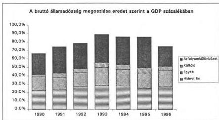
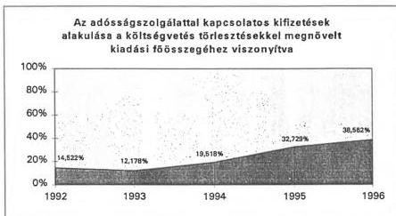
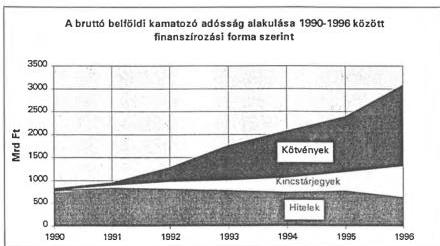
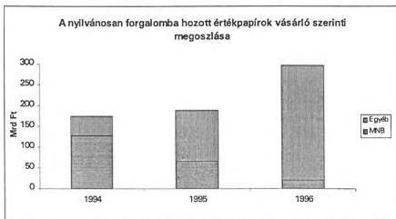
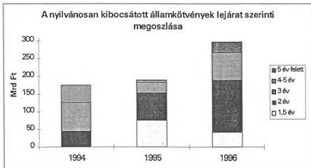

Állami Számverőszék

T/4770/1.

# JELENTÉS

a Magyar Köztársaság 1996. évi
költségvetése végrehajtásának
ellenőrzéséről

1. sz. füzet

A megállapítások összegezése és javaslatok

393.

1997. augusztus

---

•

-

•

-

---

A-365-9/97

# Összefoglaló megállapítások

Az Állami Számvevőszék ellenőrizte a Magyar Köztársaság 1996. évi költségvetésének végrehajtásáról készített elszámolást.

A zárszámadási törvényjavaslat ellenőrzésére, a kiadások törvényességi és szabályszerűségi vizsgálatára, jelentés készítésére két hónap áll az ÁSZ rendelkezésére. A kéthónapos vizsgálati időszak ezúttal sem volt biztosítva. A Kormány részére benyújtott előterjesztést július 15-én, a végleges, az Országgyűlés részére benyújtandó előterjesztést pedig a jelentés véglegesítéséig, augusztus 26-ig sem kapta meg az ÁSZ. (Az Áht. 53. §-a szerint a Kormány „a zárszámadásról szóló törvényjavaslatot az Országgyűlés elé történő terjesztést megelőzően két hónappal benyújtja az Állami Számvevőszéknek.”) Ily módon a Kormány, nem pedig az Országgyűlés számára benyújtott zárszámadási törvényjavaslat vizsgálatát végeztük el.

Az Országgyűlés költségvetési joga a zárszámadási joggal alkot egységet. A törvényhozás ez utóbbi révén gyakorolja a végrehajtó hatalmat ellenőrző funkcióját. A zárszámadás feladata, hogy a költségvetési előirányzatokat összehasonlítsa a ténylegesen befolyt bevételekkel és a teljesített kiadásokkal. Az összehasonlítás magában foglalja a zárszámadási dokumentumok, valamint a bevételek és kifizetések nyilvántartásainak, a gazdálkodási jogszabályok betartásának helyszíni ellenőrzését. Ennek alapján értékelhető az államháztartás vitelének törvényessége és szabályszerűsége, minősíthetők a gazdálkodás eredményei, hiányosságai, s mindezek alapján ítélhető meg a Kormány felelőssége az éves költségvetés végrehajtásáért.

**A zárszámadási törvény megalkotásával az Országgyűlés elfogadja a költségvetés végrehajtásáért felelősök elszámolásait a feladatok teljesítéséről, tudomásul veszi az előirányzatoktól való eltéréseket, illetve azok indokolását.** Ehhez a zárszámadásban a Kormánynak számot kell adnia arról:

- hogyan alakultak azok az előirányzatok, melyek teljesítését közvetlen kormányzati intézkedéssel nem lehet befolyásolni (értékelni kell a jóváhagyott előirányzatoktól való el-

---

téréseket abból a szempontból, hogy azok előre nem tervezhető események vagy a tervezés hiányosságai miatt következtek-e be);

- hogyan éltek a költségvetés végrehajtása során azokkal a törvényi felhatalmazásokkal, melyek a költségvetésben szereplő összegek módosítására, az előirányzattól való eltérésre adtak lehetőséget.

Az Állami Számvevőszék ellenőrzése a következőkre terjedt ki:

- a zárszámadási törvényjavaslat normaszövege teljeskörűen és helyesen tartalmazza-e mindazokat a rendelkezéseket, amelyek a költségvetési év lezárásához szükségesek;
- a tényleges teljesítés az 1996. évi költségvetéstől mely előirányzatoknál tér el, a benyújtott dokumentum számszaki adatai pontosak, valódiak, áttekinthetőek-e;
- az államháztartás gazdálkodására vonatkozó törvényeket, szabályokat a Kormány, a miniszterek, valamint a költségvetés végrehajtásában részt vevő szervezetek betartották-e.

Az ellenőrzés az alábbi módszerrel történt:

- a fejezeteknél, néhány költségvetési szervnél és helyi önkormányzatnál a pénzügyi beszámolókban közölt adatok valódiságának, a gazdálkodás szabályszerűségének helyszíni ellenőrzésével;
- a zárszámadási dokumentum adatainak ellenőrzésével,
- a központi költségvetési szervekre és a helyi önkormányzatokra vonatkozó adatoknak a pénzügyi beszámolók adataival történő összehasonlításával;
- az 1996. évi költségvetés végrehajtását érintő vizsgálati jelentéseink felhasználásával.

Az ÁSZ megalakulása óta folyamatosan jelzi a finanszírozási, a költségvetési szabályozási és gazdálkodási rendszer hiányosságait, és szorgalmazza a pénzügyi rendszer korszerűsítését. A Magyar Államkincstár működésével kapcsolatban külön jelentésben adunk részletes tájékoztatást. Itt is jelezzük azonban, hogy a zárszámadással összefüggésben 1996-ban nem teljesültek a Kincstárral kapcsolatos egyes várakozások. A kincstári információszolgáltatás a pénzügyi kormányzat szerint sem tökéletesen alkalmas még arra, hogy az éves gazdálkodásról szóló elszámolás bázisát képezze. Az 1996. évi zárszámadásról benyújtott dokumentáció ugyanakkor az intézményi beszámolók adatait tartalmazó APEH-SZTADI összesítésekre is csak részben

2

---

épül. Ellenőrizhető dokumentumok a zárszámadás teljességét és valódiságát ezért teljeskörűen nem támasztják alá.

Az ÁSZ zárszámadási jelentései évek óta felhívják a figyelmet a beszámolási rendszer problémáira. Az 1996. évi zárszámadáshoz az alábbi főbb megállapításokat tesszük:

- Az ÁSZ a törvény által előírt határidőre ismét nem kapta kézhez a zárszámadási törvényjavaslatot.
- Az állam vállalkozói vagyonára vonatkozó beszámolót a törvényes határidőig a Kormány ismét nem nyújtotta be (az 1995. évi beszámolót csak 1997 áprilisában nyújtotta be, de az Országgyűlés azt nem tárgyalta meg; a privatizációs szervezet 1993. és 1994. évi gazdálkodásáról nem nyújtottak be kormány-beszámolót). Ez nehezíti annak vizsgálatát, hogy a központi költségvetésben felhasznált privatizációs bevételek miért nem egyeznek a törvényjavaslat szerint az év során beérkezett bevételekkel. A törvényjavaslat nem mutatja be a privatizációs bevétel összetételét sem.
- A zárszámadási dokumentumokban nem érvényesül a folytonosság elve. A költségvetési tételek csoportosítását jelentő költségvetési címrend, a kiemelt előirányzatok tartalma, megjelenítése évről-évre változik.
- A költségvetési mérleg egyes tételeinek tartalma nem pontosan definiált és dokumentált, emiatt az egyes tételek összetevői rendszeresen módosulnak.
- Az államháztartás alrendszereinek vagyonkimutatását a mérlegrendszer nem tartalmazza teljeskörűen (nincs nyilvántartási rend, aminek alapján a vagyonelemek változása a valóságnak megfelelően, mennyiségben is követhető volna).
- A zárszámadási törvényjavaslat mellékleteiben a módosított előirányzat nem szerepel. Az eredeti előirányzat és a teljesítési adatok összevetése egyes esetekben megtévesztő, ami megnehezíti az elszámoltatást.
- A teljesség, a valódiság és az összemérhetőség megítélésénél meghatározó jelentőségű a módosított előirányzat, mert a gazdálkodás során a költségvetési egyensúly a módosított előirányzatok által biztosítható. Az összeméréshez, a ténylegesen keletkező megtakarítások és többletbevételek megállapításához a teljesítést mindig a módosított előirányzathoz kell viszonyítani.

3

---

- Az 1. és 2. számú mellékletekben egyes tételeknél előirányzatot meghaladó teljesítések szerepelnek, amelyekről nem lehet megállapítani, hogy előirányzat-túllépésről van-e szó, vagy az előirányzat összegét megnövelték és a módosított előirányzathoz igazodva, jogszerűen használtak fel többet, mint az eredeti előirányzat.
- Az előirányzat-maradványokról nem minden esetben állapítható meg, hogy a maradvány áthúzódó kötelezettség, a feladat meghiúsulása, esetleg takarékosság miatt keletkezett-e.
- A céljellegű előirányzatok teljesítése a jelenlegi beszámolási rendszerben nem látható. A célok, feladatok teljesítéséről nem kap információt az Országgyűlés (az 1. számú mellékletben a célfeladatokra jóváhagyott előirányzat „teljesítés” oszlopában – néhány fejezet kivételével – nem szerepel adat, mert az előirányzatok beolvadnak az intézmények, önkormányzatok költségvetésébe, ezért a cél szerinti felhasználás nem követhető nyomon).
- Az államháztartás mérlegrendszerének kidolgozására vonatkozóan az Áht-ban előírt feladatait a Kormány nem teljesíti.
  - A mérlegekben nem szerepelnek azonosíthatóan a módosított előirányzatok, ezért az Országgyűlés által megállapított összegek módosítása, szabályszerűsége nem értékelhető.
  - Nem dolgozták ki a központi költségvetés bevételeinek és kiadásainak zárt rendszerű, kettős könyvviteli elven alapuló - a kötelezettségeket és az államot megillető bevételeket is tartalmazó - könyvvezetési és beszámolási rendjét.
  - A törvényjavaslat nem mutatja be a kiadás-finanszírozás mérlegeit az előírt bontásban.
- Az Áht. a Kincstár feladatául írja elő, hogy gondoskodjon a kincstári egységes számla napi likviditásáról. Arra azonban a törvény nem ad felhatalmazást, hogy – bármely megfontolásból – a kincstári egységes számlán huzamosan és az idő előrehaladtával folyamatosan növekvő többlet pénzeszköz legyen. A Kincstár százmilliárdos nagyságrendű állampapír-kibocsátással finanszírozta túl a számlát.
- Több mint kétszáz költségvetési intézmény az összesen tervezett 0,3 Mrd forinttal szemben 2,9 Mrd forint kamatbevételhez jutott olyan helyzetbe, amikor a Kincstár az intézmények számára nem fizet kamatot. A beszámolási rendszer fogyatékossága, hogy ennek okára a zárszámadási törvényjavaslat nem ad magyarázatot.

4

---

- A fejezetek többsége nem tett eleget annak – az Áht. végrehajtására kiadott – kormányrendeletnek, amely szerint meg kell vizsgálni a pénzfelhasználás és a szakmai feladatellátás összhangját és színvonalát. Az együttes pénzügyi és szakmai értékelés elmaradása a zárszámadás során megnehezíti az értékelő munkát, és a gazdálkodás során képződött pénzmaradvány megítélését is nehezíti.
- Az 1996. évi költségvetésről szóló törvény a korábbi elkülönített állami pénzalapok döntő többségének feladatait és előirányzatait a fejezeti kezelésű előirányzatokba integrálta. Az alapok végelszámolás és – egy részük – hiteles zárómérleg nélkül szűntek meg, ezért nem lehet pontosan tudni, hogy megszűnésükkor mekkora vagyonnal rendelkeztek, milyen követeléseket és kötelezettségeket hagytak hátra.
- Az ÁSZ által vizsgált, többnyire a kistelepüléseken működő helyi önkormányzatok költségvetési beszámolóinak több mint kétharmada nem felelt meg az előírt tartalmi követelményeknek. A nagyobb településeken végzett könyvvizsgálati jelentések tartalmukat és terjedelmüket tekintve szembetűnő különbözőséget mutatnak.
- A kincstári rendszer bevezetése előnyösen hatott a zárszámadási adatok valódiságának javítására. A Kincstárban vezetett számlák 1996. évi összesített egyenlegében ezzel együtt is 28,6 millió forint eltérés mutatkozik.

5

---

# Javaslatok

## I. Az Országgyűlésnek

1. A végrehajtás ellenőrizhetősége érdekében az Országgyűlés hozzon határozatot az 1996. évi zárszámadási törvényjavaslattal összefüggésben megtett számvevőszéki javaslatokról.

### A zárszámadási törvényjavaslat normaszövegének korrekciója

Az alábbi *helyesbítéseket* az Országgyűlés Számvevőszéki bizottságának módosító indítványaival javasoljuk realizálni. (Az indítványokat az ÁSZ előkészíti).

2. A zárszámadási törvényjavaslat 7. § (3) bekezdésében szereplő összegeket és a (4) bekezdésben előírt kamatfizetési kötelezettségeket – a helyi önkormányzatokat meg nem illető normatív állami hozzájárulás befizetéséhez kapcsolódó javaslattal összefüggésben – módosítani szükséges.

3. A helyi önkormányzatokat meg nem illető normatív állami hozzájárulás befizetéséhez a 7. § (5) bekezdésében a normaszöveg teljessé tételéhez a szövegjavaslatunk a következő:

„A (3) bekezdés a) pontjában meghatározott visszafizetési kötelezettségből 66,3 millió forintot, a b) pontban meghatározott, a központi költségvetést terhelő kiegészítésből 19,9 millió forintot – figyelemmel az Állami Számvevőszéknek az Áht. 121. §-ának (3) bekezdése szerinti vizsgálatára – a PM-BM. R. önkormányzatok szerint részletezi.”

4. A helyi önkormányzatok által jogtalanul igénybe vett támogatások visszafizetési kötelezettségével kapcsolatban a 7. § (6) bekezdésére szövegjavaslatunk a következő:

„... szerinti vizsgálatára – 278,0 millió forint jogtalanul igénybe vett cél- és címzett támogatás visszafizetési kötelezettség és további 51,7 millió forint összegű jogtalanul igénybe vett központosított támogatás visszafizetése terheli.”

5. A törvényjavaslat 7. § (6) bekezdésének további kiegészítését javasoljuk:

---6

---

A helyi önkormányzatok címzett és céltámogatási rendszeréről szóló 1992. évi LXXXIX. törvény 14. §-a alapján 484,1 millió forint a céltámogatási és a céltámogatási kiegészítő keret kötelező lemondás elmaradása miatti előirányzat. Ennek visszavonásáról – a BM nyilvántartása és az időközi lemondások alapján – intézkedni kell.

# *A zárszámadási törvényjavaslat kiegészítése*

A zárszámadási törvényjavaslathoz – a hatályos törvényi előírásokkal összhangban – az alábbi *kiegészítéseket* javasoljuk (a módosító indítványokat és a szükséges kiegészítéseket a PM készítse elő).

6. Mivel a törvényjavaslat nem rögzíti a központi költségvetés beruházási maradványának összegét, a normaszöveg kiegészítése indokolt lenne a maradvány összegével.

7. A törvényjavaslat 1. és 2. számú, valamint 11. számú (mérleg) mellékleteit ki kell egészíteni az 1995. évi tényadatokkal, továbbá az Országgyűlés által az 1996. évi LXXVIII. törvényben jóváhagyott módosított előirányzatokkal.

8. A törvényjavaslat mellékleteként – az Áht. 108/A § (6) bekezdése előírását teljesítendő – kiegészítésképpen be kell mutatni a kétessé vált külföldi követeléseket.

9. A törvényjavaslat az Áht. 116. §-ában előírt mérlegek egy részét nem mutatja be. A zárszámadási törvényjavaslatot ki kell egészíteni – a hivatkozott paragrafus 2. és 9. pontjának megfelelően – a költségvetési hiány finanszírozásának előírt bontású mérlegeivel, továbbá a többéves kihatással járó döntések számszerűsítésével.

10. A törvényjavaslatot az 1996. január 1-jei hatállyal megszűnt elkülönített állami pénzalapokra vonatkozó végelszámolással ki kell egészíteni.

11. A törvényjavaslat a 11. számú (mérleg) melléklet „a központi költségvetési szervek 1996. évi folyó előirányzat-maradványa” sorának levezetését, belső tartalmát is mutassa be.

7

---

## II. A Kormánynak

12. A zárszámadás ellenőrzéséhez szükséges információk rendszeres késedelme, az évek óta nem teljesített törvényi kötelezettség miatt a zárszámadás megtárgyalásának parlamenti ütemezését meg kell vizsgálni. Az államháztartási törvényben reálisan teljesíthető határidőket kell rögzíteni, összehangolva a központi költségvetés, a társadalombiztosítási alapok, valamint az ÁPV Rt. beszámolójának előterjesztését.

13. Mivel a pénzügyi kormányzat az Áht. 124. §-ában – különféle szabályozási feladatok kormányrendeletekben való rögzítésére – kapott felhatalmazásainak csak részben tett eleget, indokolt az elmaradt feladatok mielőbbi teljesítése.

14. A megszűnt állami pénzalapoktól átvett feladatok ellátásához szükséges bevételek körét a fejezetekért felelős minisztereknek – az 1996. évi költségvetési törvény 69. § (3) bekezdése szerint – a Pénzügyminisztériummal egyetértésben 1996. február 1-jéig kellett volna szabályozniuk. Az elmaradt rendeleteket mielőbb alkossák meg.

15. Szükséges lenne magasrendű jogszabályban rögzíteni, hogy az MNB – monetáris politikában betöltött szerepéből fakadó – költségeit ki és milyen mértékben viselje. A Kincstár csak évenkénti törvényi felhatalmazás alapján vállalhassa át a monetáris politika költségeit.

16. Az államháztartási rendszer keretében módosítani szükséges a helyi önkormányzatok szabályozórendszerét. A szabályozórendszer
- hosszabb időszakra érvényes elemekből épüljön fel;
- finanszírozási rendszere tükrözze az állam tehervállalásának mértékét, feltételeit;
- mérsékelje a támogatási rendszer elaprózottságát;
- valamennyi önkormányzat számára biztosítsa a kötelező alapszolgáltatások pénzügyi feltételeit;
- erősítse a szabályozórendszer ösztönző elemeit a társulások, a közösen megvalósítható fejlesztések érdekében;
- a támogatások elosztásánál vegye figyelembe a település és a térség infrastrukturális ellátottsági színvonalát.

8

---

17. Mielőbb döntést kell hozni a kincstári rendszer önkormányzatokra történő kiterjesztéséről (ennek elvetése estén a közkönyvelői irodák létesítéséről).

18. Elő kell készíteni azon fejezetek alapító okiratának tervezetét és országgyűlési határozattal való jóváhagyását, amelyeknél a fejezetek feladatait, működését és gazdálkodását szabályozó szakmai törvények nem elégítik ki az egyéb jogszabályokban (Áht., kormányrendeletek) előírt követelményeket.

19. Intézkedni kell arról, hogy a jogszabályok – a jogalkotásról szóló 1987. évi XI. tv. 12. § (3) bekezdésében foglaltaknak megfelelően – kellő időben megszülessenek.

20. Módosítani kell az Áht. végrehajtására kiadott 156/1995. (XII.26.) Korm. rendelet 40. §-át. Meg kell határozni (a költségvetési szervek beszámolójának felügyeleti szervi felülvizsgálata során) a feladatok szakmai teljesítése értékelésének és dokumentálásának módját, gyakoriságát.

21. Szabályozni kell az év közben megszűnő fejezetek beszámolókészítésének (feladatellátásuk számszaki és szöveges értékelésének), a költségvetési gazdálkodásból történő kivezetésének, költségvetési előirányzatai további sorsának rendjét.

22. A kormányzati ellenőrzés eszközeivel a Kormány kérje számon a fejezetektől az előirányzatok felhasználásának belső szabályozását és annak folyamatos érvényesítését.

23. Az általános tartalék átcsoportosítására irányuló döntéseinél a Kormány fordítson fokozott figyelmet a támogatási igények szakmai és számszaki megalapozottságára, az átcsoportosítások formai követelményeinek biztosítására (pl. címrendi megjelölés, a pénzellátás ütemezése, a támogatás egyszeri vagy tartós jellegének meghatározása). Döntései meghozatalánál vegye figyelembe a pénzügyi megvalósíthatóság időigényét.

24. A Kormány gondoskodjon a nemzetközi elszámolások körébe vont külföldi segélyek (japán segély, PHARE stb.) államháztartásban való szerepeltetése feltételeinek megteremtéséről, a szükséges információs rendszer kiépítéséről.

25. A Kormány szerezzen érvényt a kezességvállalások döntési kritériumainak, valamint a beszámolási kötelezettségre vonatkozó törvényi előírásoknak (Áht. 42. §).

9

---

### III. A Pénzügyminiszternek

Alábbi javaslataink közül többet a korábbi években is megtettünk, de szükséges ismételt felvetésük.

26. A központi költségvetésre vonatkozóan olyan, zárt rendszerű beszámolási rendszert kell kialakítani, ami megfelel a számviteli elveknek.

27. Az államháztartás mérlegrendszere legyen alkalmas arra, hogy a hitelfelvétel és a törlesztés, a rendes és a rendkívüli bevételek és kiadások alakulása, hatásuk a költségvetés pozíciójára értékelhető legyen, valamint képes legyen bemutatni az állami feladatok finanszírozására vonatkozó információkat.

28. Az államháztartás alrendszereinek vagyonát a mérlegrendszerben teljeskörűen ki kell mutatni. Olyan nyilvántartási rendet kell kialakítani, aminek alapján a vagyonelemek változása a valóságnak megfelelően, természetes mértékegységben is követhető.

29. Biztosítani kell a zárszámadási adatok valódiságát, ellenőrizhetőségét. Gondoskodni kell arról, hogy a beszámológarnitúra csak olyan adatokat tartalmazzon, amelyekre szükség van. (A követelmények meghatározásánál figyelembe kell venni, hogy nem minden gazdálkodó szerv képes bonyolult elszámolási, beszámolási rendszer működtetésére.)

30. A zárszámadási törvényjavaslat szöveges fejezeti indokolásainak egységes és pontos elkészítéséhez – a zárszámadási köriratban megfogalmazott beszámolási szempontokat űrlapszerűen rögzítő – segédletet lenne célszerű készíteni, és kiadni a következő évi zárszámadáshoz.

31. A PM készítse el az év közben megszűnő (átalakuló) költségvetési fejezetek beszámoló-készítéséről, előirányzataik további sorsáról szóló kormányrendelet tervezetét. Ehhez kapcsolódva szabályozza a beszámolók fogadásának, feldolgozásának és a zárszámadásban való szerepeltetésének rendjét.

32. A költségvetési törvényjavaslatban olyan normaszöveget alakítson ki, amelyben az eredeti előirányzatot meghaladó többletbevételeknél – az előirányzat-módosítás határidején túl – a

10

---

befizetési kötelezettség teljesítésének határidejét is meghatározzák.

33. Az éves költségvetés teljesítését jelentő gazdasági eredmények és a zárszámadás közötti összhang érdekében kezdeményezni kell olyan számlavezetési és elszámolási konstrukció jogi szabályozását, amely biztosítja egyes (pl. a külföldi segélyek elkülönített elszámolására szolgáló) nemzetgazdasági számlák év végi maradványának következő évi felhasználhatóságát.

34. Megfelelő elszámolási rendszer bevezetésével gondoskodni kell arról, hogy a központi költségvetés terhére nyújtott kölcsönöket (hiteleket) és azok visszatérüléseit az Áht. 8. § (2) bekezdésében foglaltak szerint kiadásként és bevételként – teljes összegükben – elszámolják.

35. Szüntesse meg a PM a – korábbi években is tapasztalt és ellenőrzéseink által kifogásolt – törvényi előírásokkal (Áht.) ellentétes letéti pénzkezelési gyakorlatot.

36. Gondoskodjon a technikai fejezetekkel összefüggő (Belföldi államadósság, Nemzetközi elszámolások és Költségvetés törlesztései és hitelfelvételei technikai fejezetek) elszámolási és nyilvántartási rendszerek kialakításáról, működtetéséről, továbbá az ehhez kapcsolódó hatáskör és felelősség érvényesítéséről.

11

---

#### IV. A fejezeteket felügyelő szervek vezetőinek

37. Haladéktalanul vizsgálják felül az intézmények alapító okiratait, pótolják a hiányzókat, illetve a gazdálkodási gyakorlatnak megfelelően – a jogszabályi előírásokkal összhangban – rögzítsék a gazdálkodási tevékenységet.

38. Vizsgálják felül az intézmények működésére, gazdálkodására vonatkozó szabályzatokat. Intézkedjenek a hiányzó szabályzatok pótlásáról, az elavultak hatályos jogszabályi előírásokkal való aktualizálásáról. Ennek keretében

- az intézményi SZMSZ-ekben tüntessék fel a vállalkozási tevékenység lehetőségét, módját;
- a számviteli rendben (számlarend, számla-tükör) különítsék el a vállalkozási tevékenység elszámolását, határozzák meg a nyilvántartások, költséghatárolások korrekt módját;
- a beszámoló (mérleg) alátámasztása érdekében aktualizálják a leltározási szabályzatokat, követeljék meg a leltározás – a költségvetés érdekeinek maradéktalan védelme érdekében – végrehajtását, illetve a kapcsolódó nyilvántartások pontos, naprakész vezetését;
- aktualizálják a szabályszerű gazdálkodás érdekében elengedhetetlen belső szabályzatokat (kötelezettségvállalás, ellenjegyzés, érvényesítés, utalványozás, pénzkezelés stb.) és ellenőrizzék azok maradéktalan betartását.

39. Követeljék meg a vevőkövetelések nyilvántartásának naprakész vezetését, a megállapított fizetési határidőn belül nem fizető adósokkal szembeni fellépést. Érvényesítsék a szállítókkal szemben a számlák tartalmi követelményeire vonatkozó szabályokat.

40. Ellenőrizzék az előirányzat-módosítások hatásköri előírásokkal való összhangját, biztosítsák a módosítások és az ezekről készített adatlapok tartalmának egyezőségét.

41. Írják elő a központi költségvetés általános, illetve valamely céltartalékából (pl. bérpolitikai keret) adott, valamint a fejezeti kezelésű előirányzatokból nyújtott támogatások felhaszná-

12

---

lásának részletes beszámoló (számszaki és szakmai szöveges értékelés) készítésének kötelezettségét. A feladatellátás megvalósulását ellenőrizzék.

42. Alakítsák ki a beszámoló számszaki és szöveges értékelésének fejezeti rendjét, biztosítsák az ehhez szükséges feltételeket. Az érdemi felülvizsgálat során – az állami feladatok ellátására szolgáló előirányzatokkal, létszámmal és vagyonnal való számszerű és hatékony gazdálkodás követelményének (Áht.) érvényesítése alapján – határozzák meg az intézmények előirányzat-maradványának reális összegét. A feladatelmaradásból származó előirányzat-elvonásról intézkedjenek.

43. Gondoskodjanak arról, hogy az éves költségvetési törvényjavaslatok fejezeti indokolásai – a törvényhozói munka megalapozottságának javítása, a kitűzött célok teljesítésének ellenőrizhetősége érdekében – a szükséges részletezettséggel tartalmazzák a fejezeti kezelésű előirányzatok között tervezett ágazati, szakmai programok által elérni kívánt célok meghatározását. Térjenek ki a feladat teljesítéséhez meghatározható mennyiségi és minőségi mutatókra.

44. Az éves költségvetési előirányzatok tervezése során érvényesítsék az Áht. azon előírását, hogy az előirányzatokat a feladatot ellátó fejezeteknél tervezzék.

45. Gondoskodjanak arról, hogy a meghatározott célt szolgáló bevételeket a jogszabályi előírásoknak megfelelően, az adott feladatok érdekében használják fel. Ezt év közben és a zárszámadás (beszámoló) során ellenőrizzék.

46. Intézkedjenek, hogy az alkalmazottak térítései elszámolásánál – a bruttó elszámolás elvének következetes betartásával – ne kerüljön sor „térítményezés” alkalmazására.

47. Intézkedjenek a korábban fejezeti felügyelet alá tartozó, de a fejezeti kezelésű előirányzatokba integrált elkülönített állami pénzalapok részesedéseinek, értékpapír-állományának, pénzeszközeinek és egyéb követeléseinek jogszabályi előírásokkal összhangban való rendezéséről.

48. A költségvetési ellenőrzés keretében és az éves beszámolók felülvizsgálata során fordítsanak fokozott figyelmet a költségvetési szervek függő, átfutó, kiegyenlítő elszámolásainak vezetésére. Intézkedjenek a meglévő tisztázatlan tételek felülvizsgá-

13

---

latáról, a számviteli szabályok érvényesítéséről a gazdálkodási és zárszámadási adatok valódiságának biztosítása érdekében.

49. Gondoskodjanak arról, hogy a felügyeletük alá tartozó költségvetési szervek a jogszabályokban előírt befizetési kötelezettségeiknek határidőben és megfelelő összegben eleget tegyenek.

Budapest, 1997. augusztus 26.

Sándor István  
alelnök

Nyikos László  
alelnök

14

---

1

1

---

1

1

1

1

---

*Állami Számvevőszék*---

Együtt kezelendő a T/4770/1-gyel.

# JELENTÉS

## a Magyar Köztársaság 1996. évi költségvetése végrehajtásának ellenőrzéséről

2. sz. füzet

**A zárszámadási dokumentum törvényességi és számszaki ellenőrzése**

---393.

1997. augusztus

---

A vizsgálat végrehajtásáért felelős:

VI. Elemző, Módszertani és Informatikai Igazgatóság

dr. Nagy Zoltán

számvevő igazgató

Az ellenőrzést vezette:

Bakonyi Sándorné

számvevő igazgatóhelyettes

Az ellenőrzésben részt vettek:

Horváthné Menyhárt Erika

számvevő tanácsos

Bojtos Rózsa

számvevő tanácsos

Göller Géza

számvevő

dr. Somorjai Zsoltné

számvevő

Bálint Józsefné

főelőadó

Tóth Attila

külső szakértő

---

## Rövidítések jegyzéke

|  APEH- | — | Adó- és Pénzügyi Ellenőrzési Hivatal Számítástechnikai és  |
| --- | --- | --- |
|  SZTADI | — | Adóelszámoltatási Intézet  |
|  ÁFI Rt. | — | Állami Fejlesztési Intézet Rt.  |
|  Áht. | — | Államháztartási törvény  |
|  APEH | — | Adó- és Pénzügyi Ellenőrzési Hivatal  |
|  ÁPV Rt. | — | Állami Privatizációs és Vagyonkezelő Részvénytársaság  |
|  ÁSZ | — | Állami Számvevőszék  |
|  EB Rt. | — | Magyar Exporthitel Biztosító Rt.  |
|  Eximbank | — | Magyar Export-Import Bank Rt.  |
|  FEFA | — | Felzárkózás az Európai Felsőoktatáshoz Alap  |
|  FM | — | Földművelésügyi Minisztérium  |
|  GDP | — | bruttó hazai termék (General Domestic Product)  |
|  KESZ | — | Kincstári Egységes Számla  |
|  KMŰFA | — | Központi Műszaki Fejlesztési Alap  |
|  KTM | — | Környezetvédelmi és Területfejlesztési Minisztérium  |
|  MÁK | — | Magyar Államkincstár  |
|  MÁV Rt. | — | Magyar Államvasutak Részvénytársaság  |
|  MEH | — | Miniszterelnöki Hivatal  |
|  MHB Rt. | — | Magyar Hitelbank Rt.  |
|  MKM | — | Művelődési és Közoktatási Minisztérium  |
|  MNB | — | Magyar Nemzeti Bank  |
|  NM | — | Népjóléti Minisztérium  |
|  OTKA | — | Országos Tudományos Kutatási Alap  |
|  PM | — | Pénzügyminisztérium  |
|  Ptk. | — | Polgári Törvénykönyv  |
|  TB | — | Társadalombiztosítás  |

---

1

1

---

# TARTALOMJEGYZÉK

# 1. A MAGYAR KÖZTÁRSASÁG 1996. ÉVI KÖLTSÉGVETÉSÉRŐL SZÓLÓ 1995. ÉVI CXXI. TÖRVÉNY VÉGREHAJTÁSA ... 3

1.1. A ZÁRSZÁMADÁSI TÖRVÉNYJAVASLATHOZ KAPCSOLÓDÓ MEGÁLLAPÍTÁSOK... 3

1.1.1.A TÖRVÉNYJAVASLAT MODOSITÁSÁT,ILLETVE KIEGESZITÉSÉT IGENYLÖ ESZREVÉTELEK 3
1.1.2. TÖRVÉNYI KÖTELEZETTSEGEK TELJESITÉSEK ELMULASZTÁSA 6
1.1.3.AZ AM. HATALYANAK FELPUGGESZTESE 7
1.1.4.A FEJEZETI INDOKOLASOKKAL KAPCSOLATBAN TETT MEGALLAPITASOK 8

1.2. A TÖRVÉNYJAVASLAT TELJESSÉGE ÉS VALÓDISÁGA ... 9

# 2. AZ ÁLLAMHÁZTARTÁSI ALRENDSZEREK GAZDÁLKODÁSA, MŰKÖDÉSE ... 12

2.1. A KÖZPONTI KÖLTSÉGVETÉS ... 12

2.1.1.AZ ALLAMI KEZESSEGVALLALASOK 12
2.1.2. ALTALANOSTARTALEK 14
2.1.3.CELTARTALEK 15
2.1.4.KORMANYZATI RENDKIVULI KIADASOK 15
2.1.5.KORMANYZATI BERUHAZASOK 16
2.1.6.A BELFOLDI ALLAMADOSSAG ALAKULASA 17
2.1.7.A PRIVATIZACIOS BEVETELEK ES AZOK FELHASZNALASA 23
2.1.8.KOZPONTIKOLTSEGVETESI SZERVEK 26

2.2. AZ ELKÜLÖNÍTETT ÁLLAMI PÉNZALAPOK ... 32

2.3. A HELYI ÖNKORMÁNYZATOK ... 35

2.3.1.A GAZDALKODAS ALTALANOSTAPASZTALATAI 35
2.3.2.A HELYI ONKORMANYZATOK KOLTSEGVETESI BESZAMOLOINAK VALODISAGA 35

2.4. A TÁRSADALOMBIZTOSÍTÁS ÉS A KÖZPONTI KÖLTSÉGVETÉS KAPCSOLATA ... 38

2.4.1.A TARSADALOMBIZTOSITAS KOLTSEGVETESENEK VEGREHAJTASA 38
2.4.2.AZ ALAPOK TERVEZETT ES KIALAKULT PENZUGYI POZICIOJA 38
2.4.3.A TARSADALOMBIZTOSITAS ES A KOZPONTI KOLTSEGVETES PENZUGYI KAPCSOLATA 39
2.4.4.AZ ALAPOK MUKODOKEPESSEGE ES LIKVIDITASA 39
2.4.5.A TARSADALOMBIZTOSITAS KINTLEVOSSEGE 40

# 3. TÁRSADALMI ÖNSZERVEZŐDÉSEK, ALAPÍTVÁNYOK TÁMOGATÁSA... 41

1

---

4

---

# 1. A MAGYAR KÖZTÁRSASÁG 1996. ÉVI KÖLTSÉGVETÉSÉRŐL SZÓLÓ 1995. ÉVI CXXI. TÖRVÉNY VÉGREHAJTÁSA

# 1.1. A zárszámadási törvényjavaslathoz kapcsolódó megállapítások

A Pénzügyminisztérium tájékoztatta az Állami Számvevőszéket, hogy az 1996. évi zárszámadási törvényjavaslat végleges változatának elkészítése során figyelembe veszik e jelentés számos megállapítását.

# 1.1.1. A TÖRVÉNYJAVASLAT MÓDOSÍTÁSÁT, ILLETVE KIEGÉSZÍTÉSÉT IGÉNYLŐ ÉSZREVÉTELEK

# A KÖLTSÉGVETÉSI HIÁNY ÉS ANNAK FINANSZÍROZÁSA

A zárszámadási törvényjavaslat 1. §-a 77.086,8 millió forint többletet említ. Ezzel ellentmondásban van a 4. §, ami hiányra hivatkozik. Nem világos, hogy pozitív egyenleg mellett miért volt szükség hiányfinanszírozásra. A valódi ok az, hogy a központi költségvetés a privatizációs bevételeket egész évben külön kezelte, hiszen azokat az 1996. évi költségvetési törvény 8. § (5) bekezdése szerint adósságtörlesztésre kellett fordítani. A privatizációs bevételek nélkül a költségvetés 130,4 milliárd forint hiányt mutat, amit a 4. § által említett államkötvény- és kincstárjegy-kibocsátással finanszíroztak.

# A HELYI ÖNKORMÁNYZATOK NORMATÍV ÁLLAMI HOZZÁJÁRULÁSÁNAK ELSZÁMOLÁSA

A törvényjavaslat 7. § (5) bekezdése tartalmazza a helyi önkormányzatok normatív állami hozzájárulásának elszámolásait felülvizsgáló számvevőszéki ellenőrzés által megállapított összegeket. A normaszöveg teljessé tételéhez a normaszövegbe illesztendő összegek a következők:

- visszafizetési kötelezettség: 66,3 millió forint,
- központi költségvetést terhelő kiegészítés: 19,9 millió forint.

A fentiekkel összefüggésben módosítani szükséges a 7. § (3) bekezdésében szereplő összegeket és a (4) bekezdésben szereplő kamatfizetési kötelezettséget is, mivel a javaslatban szereplő összegek csak az önkormányzatok elszámolásait tartalmazzák.

# JOGTALANUL IGÉNYBE VETT HELYI ÖNKORMÁNYZATI TÁMOGATÁSOK

A zárszámadási törvényjavaslat 7. § (6) bekezdése a helyi önkormányzatok által jogtalanul igénybe vett cél-, címzett és központosított támogatások visszafizetési kötele-

3

---

zettségéről rendelkezik. Az ÁSZ által végzett vizsgálatok alapján a törvényjavaslat normaszövegébe illesztendő összegek a következők:

- 278,0 millió forint jogtalanul igénybe vett cél- és címzett,
- 51,7 millió forint jogtalanul igénybe vett központosított támogatás.

A fentieken kívül az 1992. évi LXXXIX. tv. 14. §-a alapján kötelező lemondások elmaradása miatt 484,1 millió forint céltámogatási előirányzat és céltámogatási kiegészítő keret megvonásáról illetve csökkentéséről kell intézkedni a normaszövegben.

# A TB ALAPOK HIÁNYRENDEZÉSE ÉS JÁRULÉKTARTOZÁSOK ÁTVÁLLALÁSA

A törvényjavaslat 19. §-a a társadalombiztosítási alapok hiányának rendezésével foglalkozik. A normaszöveg nem említi a rendezés módját (a hiány elengedése a kincstári egységes számlán fennálló hitelállománnyal szemben történik-e), valamint az elengedés időpontját.

A zárszámadási javaslat 20. §-ában – mintegy összefüggésben a hiányrendezéssel – a MÁV Rt., a Mecsekurán Kft. és a Rendőrség járuléktartozását vállalja magára a Magyar Állam. Az érintett szervezetek tartozása csak annak pénzforgalmi rendezése után törölhető a folyószámláról, ennek módjáról azonban a törvényjavaslat nem rendelkezik. Tőketartozás elengedésére – az 1975. évi II. törvény 114. §-a alapján – jelenleg nincs törvényes lehetőség. Hasonló igények felmerülésének veszélye miatt nem célszerű, hogy a zárszámadási törvény felmentést adjon a hivatkozott törvényhely alól.

# A KÖZPONTI KÖLTSÉGVETÉS BERUHÁZÁSI MARADVÁNYÁNAK ELSZÁMOLÁSA

Nem számszerűsíti a törvényjavaslat a központi költségvetés beruházási maradványának összegét, és nem rögzíti, hogy abból 1997-ben mennyi használható fel. A javaslat egyes mellékleteiben és szöveges indokolásában más-más adatok szerepelnek.

# AZ 1997. ÉVI KÖLTSÉGVETÉSI TÖRVÉNY MÓDOSÍTÁSA

A zárszámadási törvényjavaslat 21. § (4) bekezdésében szereplő, az 1997. évi költségvetési törvény módosítására irányuló javaslat a hibás hivatkozások és szövegezés miatt értelmezhetetlen.

Törvényi előírás nincs arra nézve, hogy milyen keretek között módosítható a költségvetési törvény, de célszerű lenne ezt külön törvényben megtenni.

# A MAGYAR EXPORT-IMPORT BANK ÉS A MAGYAR EXPORTHITEL BIZTOSÍTÓ RÉSZÉRE NYÚJTOTT ÁLLAMI TŐKEJUTTATÁS ELSZÁMOLÁSA

A törvényjavaslat 12. §-ában a Magyar Export-Import Bank Részvénytársaság és a Magyar Exporthitel Biztosító Részvénytársaság részére értékpapír formájában nyújtott 3.000 millió forint tőkejuttatásnál nincs megjelölve, hogy abból milyen arányban részesedtek az egyes intézmények (ezt a hiányosságot a törvényjavaslat indokolása sem pótolja).

4

---

# A MAGYAR ÁLLAMKINCSTÁR ÁLTAL AZ ÁFI RT-TŐL ÁTVETT KÖVETELÉSÁLLOMÁNY

A törvényjavaslat nem indokolja meg, hogy a 15. § (2) bekezdésének e) pontjában említett 1.429,2 millió forint követelésállományt miért kezelte külön az ÁFI Rt. Ugyanezen paragrafus (3) bekezdésében nincs rögzítve, hogy az egyes fogalmak – pl. mozgójáradék – alatt mi értendő.

## ADÓSSÁGTÖRLESZTÉS

A törvényjavaslat *2. számú mellékletében* csak a külföldi hitelfelvételek szerepelnek, a belföldi állampapírkibocsátás, illetve hitelfelvétel nem. Az *1. számú mellékletben* a törlesztések között viszont szerepel a belföldi adósságtörlesztés. Ez nem következetes, és nem felel meg a számviteli törvény teljesség alapelvének sem.

## A KÖLTSÉGVETÉSI TÖRVÉNY ÉS A ZÁRSZÁMADÁSI TÖRVÉNYJAVASLAT NORMASZÖVEGÉNEK MEGFELELTETÉSE

A zárszámadási törvények normaszövege általában kevesebb szakaszból áll, mint a költségvetést meghatározó törvényeké. (A zárszámadási javaslat a beszámolást 29 – viszonylag rövid – paragrafusban tartalmazza, míg az 1996. évi költségvetésről rendelkező törvény 119 sokbekezdéses paragrafusban rendelkezik a költségvetési évről.) Az eltérés részben érthető, hiszen a költségvetési törvény részét képezik a költségvetési előirányzatokat megalapozó rendelkezések és törvénymódosítások is.

A költségvetési törvény normaszövegének előírásai nem jelentik azok automatikus teljesülését. Jogszabályi előírás a zárszámadási törvényjavaslat szöveges részének tartalmára és előtérjesztésére nézve nincs (pl. az 1996. évi zárszámadási törvényjavaslat az **1997. évi költségvetési törvény módosítását** is tartalmazza). A költségvetési törvény normaszövegben szereplő rendelkezéseiről a zárszámadási törvényjavaslat különféleképpen számol be (1. táblázat).

Azokat a költségvetési normaszövegben található előírásokat, amikről a zárszámadási javaslat szöveges része beszámol, nem tüntettük fel, továbbá azokat sem, amelyek értelemszerűen nem kell, hogy szerepeljenek a törvényjavaslat normaszövegében.

1. táblázat

### A zárszámadási javaslat beszámolási módozatai az 1996. évi költségvetési törvény normaszövegében történt előírásokról

|  A költségvetési törvény normaszövegében megfogalmazott rendelkezések | Zárszámadási törvényjavaslat  |
| --- | --- |
|  a költségvetés tartalék előirányzatai | indokolásban, mellékletekben, egyéb jogszabályokban  |
|  az állam vagyonával és a felhalmozásokkal kapcsolatos rendelkezések | indokolásban, mellékletekben, egyéb beszámolóban  |
|  állami kezességvállalás és kezesi helytállás | indokolásban, mellékletekben  |
|  az előirányzat-módosítások hatáskörei | mellékletekben, egyéb jogszabályokban  |

Forrás: az 1996. évi költségvetési törvény és zárszámadási törvényjavaslat

5

---

Az 1. táblázatban bemutatott témakörökkel kapcsolatban az előterjesztés elszámol ugyan (különféle helyeken), de célszerű lett volna végrehajtásuk megjelenítése a törvényjavaslat normaszövegében is.

### 1.1.2. TÖRVÉNYI KÖTELEZETTSÉGEK TELJESÍTÉSÉNEK ELMULASZTÁSA

# HIÁNYZÓ MÉRLEGEK

A zárszámadási törvényjavaslat nem tartalmazza az Áht. 116. §-a 2. és 9. pontja szerinti mérlegeket, nem mutatja be:

- a költségvetési hiány finanszírozásának mérlegeit az előírt bontásban;
- a többéves kihatással járó döntések számszerűsítését.

Ezek hiányában nem követhetők pontosan nyomon a normaszöveg egyes előírásai, azok hatása (hiány vagy többlet; tartozás-elengedések; hitel-átvállalások).

# A KÖZPONTI KÖLTSÉGVETÉS MÉRLEGÉBŐL HIÁNYZÓ ADATSOROK

Az Áht. 115. §-a szerint "a mérlegeknek a zárszámadáskor a vonatkozó év terv- és tény-, illetve az előző év tényadatait kell tartalmazniuk". A központi költségvetés végrehajtását bemutató 11. számú mellékletben (mérlegben) az előző, 1995. évi tényadatok nem jelennek meg.

# AZ EREDETI ELŐIRÁNYZAT MINŐSÍTÉSE

Az 1996. évi LXXVIII. törvény módosította az 1996. évi költségvetésről szóló 1995. évi CXXI. törvényt, és ennek keretében több melléklet (köztük a kiadásokat és bevételeket címenként bemutató 1. és 2. számú melléklet és a központi költségvetés mérlege is) módosult. A törvényjavaslat 1. és 2. számú melléklet és a 11. számú mérleg melléklet „1996. évi előirányzat” oszlopában az eredeti előirányzatként az 1995. évi CXXI. törvény szerinti adatok szerepelnek. A tervadatok az 1996. évi LXXVIII. törvényben jóváhagyott 1996. évi előirányzatokat nem tartalmazzák. Mindez lehetetlenné teszi a teljesítési adatok közvetlen összevetését az előirányzatokkal, lényegesen megnehezíti a gazdálkodás szabályszerűségének vizsgálatát és a hiteles tájékoztatás követelményét is sérti.

# AZ ÁLLAMI VAGYON KIMUTATÁSA

Hiányossága a törvényjavaslatnak, hogy az Áht. 116. § 8. pontjának előírása ellenére nem tartalmaz összesítő kimutatást az állami vagyonról. Hiányzik az állami követelések összesítése is. Egy – a követeléseket azok minősítésével tartalmazó – összegzés lehetővé tenné a tényleges nettó államadósság megállapítását. Emellett továbbra sem szerepel a törvényjavaslatban a tartósan és ideiglenesen állami tulajdonban lévő vállalkozói vagyon kimutatása, amire az Állami Számvevőszék jelentései már a korábbi években több alkalommal felhívták a figyelmet.

6

---

# A KÜLFÖLDI KÖVETELÉSEKKEL VALÓ ELSZÁMOLÁS

A zárszámadási törvényjavaslat nem tesz eleget az Áht. 108/A § (6) bekezdésében foglaltaknak (zárszámadáskor külön is be kell mutatni a külföldi követelések között a kétessé vált követeléseket). A törvényjavaslat mellékletéből hiányzik a kétessé vált követelések bemutatása.

# AZ ÁHT. 124. §-ÁBAN ELŐÍRT EGYES FELADATOK ELMULASZTÁSA

Az Áht. 124. §-ában a Kormány és a pénzügyminiszter felhatalmazást kapott különféle feladatok rendeletben való szabályozására. E feladataiknak csak részben tettek eleget. (Hiányoznak pl.: a vagyonnyilvántartás részletes szabályozása az államháztartás alrendszereiben, az alrendszerekből nyújtott támogatásokkal kapcsolatos számadási kötelezettség szabályozása, az államháztartás osztályozási rendjének és az Áht. 116. §-ában említett mérlegek összeállításának részletes szabályai, a készpénzkímélő fizetési eszközök bevezetésének és alkalmazásának a kincstári körre vonatkozó szabályai, az államháztartás alrendszereinek felajánlott külföldi segélyek és adományok és ezek felhasználásának információs rendszere, a költségvetési ellenőrzésről szóló 121. § (4)–(6) bekezdésében foglalt ellenőrzések szabályai.)

# A MEGSZŰNT ELKÜLÖNÍTETT ÁLLAMI PÉNZALAPOKTÓL ÁTVETT FELADATOK ELLÁTÁSÁHOZ SZÜKSÉGES BEVÉTELEK FORRÁSÁNAK MEGHATÁROZÁSA

Az 1996. évi költségvetési törvény 69. § (3) bekezdése alapján a megszűnt alapoktól átvett feladatokkal kapcsolatos, a feladatellátáshoz szükséges bevételek forrásául szolgáló díjak körét a fejezetekért felelős minisztereknek, a pénzügyminisztériummal egyetértésben 1996. február 1-ig rendeletben kellett volna szabályozniuk. E törvényi kötelezettségnek a fejezetekért felelős minisztériumok – a Földművelésügyi Minisztériumot kivéve – nem tettek eleget, a rendeleteket 1996. február 1-ig nem alkották meg.

# 1.1.3. AZ Áht. HATÁLYÁNAK FELFÜGGESZTÉSE

A zárszámadási törvényjavaslat 28. §-a értelmében a törvényjavaslat néhány paragrafusára nem kell alkalmazni az Áht. 14. §-ának rendelkezéseit. A hivatkozott 14. § (1) bekezdése kimondja: „Az államháztartás alrendszerei hiányának államadósságot növelő rendezését, továbbá tartozásokat átvállalni, elengedni, visszatérítendő támogatást vissza nem térítendő támogatássá átalakítani, illetve bármely más módon államadósságot növelő újabb kötelezettséget vállalni kizárólag a költségvetésük útján, előirányzattal megtervezve lehet.”

A törvényjavaslatnak az Áht. hatálya alól kivont paragrafusai a következő tartozások elengedését, átvállalását tartalmazzák:

- a Bős-Nagymarosi Vízlépcső rendszer nagyberuházással összefüggő járadéktartozás elengedését;
- a gazdasági kamarák megelőlegezett tőketartozásai kamatainak elengedését, ha a tőkét 1997. december 31-ig megfizetik;

7

---

- a törvényjavaslat 20. §-ában a társadalombiztosítás központi költségvetéssel szemben még fennálló tartozásainak elengedését, továbbá a MÁV Rt., a Mecsekurán Kft. és a Rendőrség járuléktartozásainak a Magyar Államra való engedményezését;
- a MÁV Rt.– kereskedelmi bankoktól felvett – hiteleinek és azok kamatainak átvállalását.

Nem először fordul elő a hivatkozott Áht szakasz alóli kivételezés. Az 1997. évi költségvetési törvény hasonló módon vonta ki két paragrafusát az Áht. hatálya alól. A központi költségvetés az előző évek során többször vállalt költségvetésen kívüli – hiányt ugyan nem növelő – kötelezettséget az államadósság terhére. A kötelezettségvállalást követő költségvetési években azonban ennek hatása megegyezik a hiány növelésével, hiszen ezek a tételek akkor jelentenek valós kiadásokat. A törvényalkotó szándéka – az Áht. e paragrafusának beiktatásával – éppen az ilyen kötelezettségvállalások elkerülése volt.

### 1.1.4. A FEJEZETI INDOKOLÁSOKKAL KAPCSOLATBAN TETT MEGÁLLAPÍTÁSOK

Amint azt a PM az 1996. évi zárszámadási törvényjavaslat előkészítését szolgáló fejezeti köriratában közzétette, a törvényjavaslathoz szöveges fejezeti indokolást kell készíteni. Ebben röviden áttekintést kellett adni a fejezet feladatellátásáról a köriratban meghatározott szempontok szerint. A fejezetek túlnyomórészt betartották a körirat útmutatásait, de a korábbi évekhez hasonlóan most is találhatók hiányosságok:

- a fejezetek szöveges indokolásaikban különféle mélységben tértek ki a köriratban megadott témakörök bemutatására (viszonylag kevés a tájékoztatás a rendes és rendkívüli előirányzat szerinti megkülönböztetés bevezetésének hatásáról, az intézmény-felülvizsgálatok eredményeiről, a befizetési kötelezettségek teljesítéséről, a kiadási megtakarítások összetételéről);
- egy adott fejezet szöveges indokolásán belül is előfordul, hogy a különféle címek kidolgozása nem azonos színvonalú;
- nem minden fejezet alkalmazott a szöveges értékelést alátámasztandó részletező és kiegészítő táblázatokat.

**A fejezetek tevékenységéről átfogó és pontosabb képet adhatna egy, a beszámolási szempontokat űrlapszerűen rögzítő, szöveges indokolás.** Így kitöltési kényszer adódna azon szempontokra is, amelyek nem merültek fel a költségvetési évben az adott fejezetnél. **A jövőben követelményként kellene a fejezetek elé állítani a fejezeti indokolások lényeges informatív elemekre összpontosító elkészítését.**

8

---

## 1.2. A törvényjavaslat teljessége és valódisága

### A TÖRVÉNYJAVASLAT MELLÉKLETEINEK SZÁMSZAKI EGYEZŐSÉGE

A mérleg és az 1., 2. számú melléklet azonosítható adatai megegyeznek egymással. **Nem egyeztethető viszont egyik mellékletből sem a „központi költségvetési szervek folyó előirányzat-maradványa” elnevezéssel megjelölt, a kiadási oldalon szereplő adatsor.** A zárszámadási törvénytervezet nem tartalmaz olyan számszaki levezetést vagy szöveges indokolást amely ennek az összegnek a valódiságát és hitelességét egyértelműen igazolná.

A költségvetési előirányzatok teljesítését, a törvényi előírások betartását az előterjesztés általános indokolásából valamint annak mellékleteiből is ellenőrizte az ÁSZ. **A törvényjavaslat mellékletében szereplő összegek és az általános indokolás szöveges részében illetve táblázataiban feltüntetett adatok több esetben nem egyezőek.** (Pl. a „kormányzati rendkívüli kiadások” cím kiadásai összevetése a mérleg, az 1. számú melléklet és az általános indokolás tételes elszámolása között.)

Az intézmények beszámolóit tartalmazó APEH-SZTADI összesítés adataival az azonosítás több esetben lehetetlen, illetve az abban szereplő összegek és a törvényjavaslat indokolásában olvasható adatok sokszor csak megközelítően egyeznek.

### RENDES ÉS RENDKÍVÜLI ELŐIRÁNYZATOK

Az Áht. 16. §-a szerint meg kell különböztetni a rendes és rendkívüli előirányzatokat. A zárszámadási törvényjavaslat 1. §-ában a központi költségvetés főösszegét, 2. §-ában a fejezetek, címek, alcímek kiadási és bevételi előirányzatainak teljesítését (1. és 2. számú mellékletek), a 14. §-ában a központi költségvetés mérlegét (11. számú melléklet) hagyja jóvá az Országgyűlés. Az 1. és 2. számú mellékletben szereplő előirányzati és teljesítési adatok – az Áht. előírásának megfelelően – rendes és rendkívüli előirányzat bontásban készültek. **A mérleg adatai ezt a bontást nem tartalmazzák, ami a két melléklet egyeztetését megnehezíti.**

A zárszámadási törvényjavaslat 1. és 2. számú melléklete a Működési költségvetést rendes, a Felhalmozási kiadásokat rendkívüli, a Fejezeti kezelésű speciális előirányzatokat pedig rendes és rendkívüli előirányzatként is szerepelteti. Az alábbi táblázatban felsorolt előirányzatoknál a költségvetési törvénytől eltérő megkülönböztetés szerepel:

9

---

2. táblázat

# **A rendes és rendkívüli előirányzatok eltérései a költségvetési törvény és végrehajtása között**

|  Fejezet/cím/ alcím | Neve | 1995. évi CXXI. tv. |   | 1996. évi teljesítés  |   |
| --- | --- | --- | --- | --- | --- |
|   |   |  rendes | rendkívüli | rendes | rendkívüli  |
|  millió Ft  |   |   |   |   |   |
|  **KIADÁS**  |   |   |   |   |   |
|  XV.10.11.1. | Mezőgazdasági alaptevékenységek beruházásai | 18.574,2 |  |  | 17.444,5  |
|  XXXII.1.3.1. | MÁV pénzügyi szanálása miatti adósságtörlesztés |  | 28.046,9 | 30.827,2 |   |
|  **BEVÉTEL**  |   |   |   |   |   |
|  XV.10.2.12.1. | Visszatérítési kötelezettséggel adott támogatások tárgyévi megtérülése | 1.976,5 |  |  | 2.523,8  |
|  XVII.22.1. | Vegyes bevételek | 3.000,0 | 10.700,0 |  | 25.544,6  |
|  XVII.23.3.4. | Útalap |  | 4.700,0 | 4.699,8 |   |

Forrás: az 1996. évi költségvetési törvény és végrehajtásáról készült törvényjavaslat

Az ÁSZ korábbi zárszámadási jelentéseiben már javasolta, hogy **ki kell alakítani a rendes és rendkívüli előirányzatok egységes, minden fejezetre érvényes besorolási módját.** A zárszámadási törvényjavaslat 1. számú mellékletében ez az egységesség még mindig nem lelhető fel. A rendes kiadási előirányzatok között még mindig szerepelnek beruházások, rekonstrukciós kiadások, program támogatások, alapítványi támogatások, kártérítés, árellentételezés.

# **AZ ÁLLAMI VAGYON HASZNOSÍTÁSÁBÓL, ÉRTÉKESÍTÉSÉBŐL SZÁRMAZÓ BEVÉTELEK**

A módosított 1996. évi költségvetési törvény 9. § (1) bekezdése szerint „*A Kincstári Vagyoni Igazgatóság kezelésében lévő állami vagyon hasznosításából, értékesítéséből származó bevételekből összesen 350 millió forint összegben teljesíthetők a vagyonkezeléssel (őrzéssel), hasznosítással, értékesítéssel, továbbá a kincstári vagyonkataszter elkészítésével kapcsolatos – más forrásból nem fedezhető – kiadások. A bevétel további hányada a központi költségvetés központosított bevételét képezi.*” A zárszámadási törvényjavaslat indokolása részletesen beszámol a kincstári vagyonkezeléssel és hasznosítással kapcsolatos (a központi költségvetést megillető) bevételekről. Az indokolás szerint 1996-ban ezen a címen 1.229,1 M Ft bevétel realizálódott, ebből 1.051,1 M Ft készpénzben. A befolyt összegből – központi költségvetésnek elszámolt bevételként – az általános és fejezeti indokolásban egyaránt 604,7 M Ft van feltüntetve. A törvényjavaslat 2. számú mellékletében a kincstári vagyonkezeléssel és hasznosítással kapcsolatos, a központi költségvetést megillető bevételek (XVII. PM fejezet 9. cím 5. alcím) 1996. évi teljesítési adata az indokolástól eltérően 292,0 M Ft. Az elszámolás más adatai sem egyeztethetők a mellékletekből. Így a költségvetési törvény előírásának betartása a bevételek jogszabálynak megfelelő elszámolása a törvényjavaslatból nem ellenőrizhető.

10

---

# HELYI ÖNKORMÁNYZATOK CÉL- ÉS CÍMZETT TÁMOGATÁSI MARADVÁNYA

A törvényjavaslat 8. § (7) bekezdése rögzíti a helyi önkormányzatok címzett- és céltámogatási maradványának összegét. Helyszíni ellenőrzésünk a Kincstárnál a maradvány összegét 0,4 millió forinttal eltérő összegben állapította meg. (A maradvány és a teljesítés összege eltér a javaslat *5/a számú mellékletében*, és az azt részletező mellékletek adataiban, valamint az általános indokolás 222. oldalán lévő két bekezdésben szereplő összeg között is. A részletező táblák összesített adatai visszaigazolják a MÁK-nál szereplő maradvány összegét. A 216,1 millió forint „visszafizetett”, maradványt növelő összeg indokolás nélkül nem értelmezhető, hiszen a cél- és címzett támogatások lemondása, visszafizetése a költségvetési törvény előírása szerint nem növeli a támogatási keretet, illetve maradványt.)

## AZ 1995. ÉVI ZÁRSZÁMADÁSI TÖRVÉNY ELŐÍRÁSÁNAK TELJESÍTÉSE

A törvényjavaslat 9. §-a megállapítja, hogy a helyi önkormányzatok az 1995. évi zárszámadási törvényben előírt befizetési kötelezettségből 1.519,4 millió forintot és annak kamatait befizették a központi költségvetésbe. Ezt az ÁSZ helyszíni ellenőrzése – az előző évekhez hasonlóan – nem tudta visszaigazolni. **A Kincstár működésével sem valósult meg – a bankszámlákhoz kapcsolódóan – az önkormányzati befizetési kötelezettségek teljesítésének** folyamatos figyelemmel kísérése. A bankszámlákon nem különítették el az 1994. és 1995. évi zárszámadáshoz kapcsolódó befizetéseket sem. **Így a törvényjavaslatban, a Kincstárnál és az önkormányzati összesített beszámolókban más-más adat szerepel.** (A rendszer továbbfejlesztése folyamatban van, ennek eredménye az 1997. évi zárszámadás során várhatóan megjelenik.)

---11

---

## 2. AZ ÁLLAMHÁZTARTÁSI ALRENDSZEREK GAZDÁLKODÁSA, MŰKÖDÉSE

A Magyar Államkincstár 1996. évben kezdte meg működését, ami jelentős változást okozott a költségvetési szervek finanszírozásában. Az új szabályozás szerint a kincstári finanszírozásnak számos előnye van.

- A központi költségvetési szervek és az elkülönített állami pénzalapok esetében (az indulásnál ugyanis csak ezek tartoztak a kincstári körbe) átláthatóbbá teszi a gazdálkodást.
- Az önálló bankszámlák megszűnésével, a kincstári egyszámla bevezetésével, a központi költségvetés pénzeszközeinek kímélésével javítja a likviditási helyzetet.
- Csökken a finanszírozáshoz szükséges pénz mennyisége.
- Javítja és egyes esetekben garantálja a közpénzek felhasználásának törvényességét, a jogszabályokkal való összhangját.
- Gyors és pontos adatokat szolgáltat a költségvetés tényleges helyzetéről.
- Adatszolgáltatásával, elemzéseivel lehetőséget biztosít az éves költségvetési előirányzatok megalapozottabb tervezéséhez.

A rendszer működési hiányosságaiból adódóan – ahogy erre az előterjesztő is utal a benyújtott anyagban – a kincstári rendszer még nem teljeskörűen alkalmas arra, hogy a központi költségvetés zárszámadásához a tényleges felhasználásnak megfelelő adatokat biztosítson. A kincstár működésének tapasztalatairól külön jelentést készít az Állami Számvevőszék.

### 2.1. A központi költségvetés

#### 2.1.1. AZ ÁLLAMI KEZESSÉGVÁLLALÁSOK

A Kormány az Áht. 124. § (2) bekezdés e) pontja alapján 1996-ban elkészítette az állam által – jogszabályban vagy szerződésben – vállalt kezesi garanciák előkészítésének és beváltásának eljárásrendjét. Az erről szóló 151/1996. Korm. rendelet 1996. októberében lépett életbe. Az egyedi kezességvállalásokhoz kapcsolódóan kötelezően benyújtandó előterjesztés – a korábbiakhoz képest – sokkal szélesebb körű tájékoztatást ad a Kormány részére a döntések meghozatalához.

A törvényjavaslat a költségvetési törvény vonatkozó – módosított – szakaszai szerinti bontásban bemutatja az 1996-ban állami garanciákkal kapcsolatos kormányhatározatokat. Az általános indokolásban tételesen beszámol a kezességérvényesítési és megtérülési folyamatokról és az állomány alakulásáról.

##### 2.1.1.1. A kezességvállalásokból eredő kötelezettségek keretei

Az 1996. évi költségvetési törvény 39. § (2) bekezdésében a kiadási főösszeg 2%-ában korlátozta a költségvetési évben újonnan elvállalható egyedi garanciák együttes értékét. A törvény módosítása következtében a keretösszeg 41,7 Mrd Ft-ról 42,3 Mrd Ft-ra emelkedett. Kihasználására 33,5 Mrd Ft mértékig került sor. A központi költségvetést ezen kívül más egyéb jogcímeken – összegszerűen korlátozott, illetve korlátozás nélküli módon – vállalt garanciák is terhelhetik.

12

---

• A megállapított mérték felett vállalható garancia az energiahordozók importjára és biztonsági készletezésére. (Kezesség-érvényesítésre eddig még nem került sor.)
• Az EB Rt. és az Eximbank megalakulása óta a tevékenységi körükbe eső garanciák keretösszegeit külön szabályozzák a költségvetési törvények, noha ezen intézmények garanciaügyletéért is a Kormány – a központi költségvetés terhére – készfizető kezesként felel.
• A módosított 1996. évi költségvetési törvény ezeken felül a 41. és a 41/A §-aiban meghatározott esetekre – nemzetközi pénzintézetekkel kötött hitelszerződések esetén, légvédelmi rendszerek és a Ferihegyi repülőtér fejlesztésére – korlátozás nélkül engedélyezi a garanciák megadását.

A következő táblázat bemutatja az 1996. évi költségvetési törvény 39. § (2) bekezdésében előírt 2%-os keretösszeg alá eső garanciákat.

3. táblázat

# Az 1996. évi költségvetési garanciakeret alá tartozó vállalások:

|  Korm. hat. száma | A garancia célja | millió Ft  |   |
| --- | --- | --- | --- |
|   |   |  A garancia összege | A garancia típusa  |
|  2010/1996. (I.24) | 1996. évi tankönyvellátáshoz szükséges hitel | 3.000 | készfizető  |
|  2065/1996. (III.20.) | Magyar Hitel Bank privatizációs célú konszolidációja | 11.000 | készfizető  |
|  2137/1996. (VI.4.) | Mezőbank Rt. tőkehelyzetének rendezése | 5.500 | készfizető  |
|  2153/1996. (VI.19) | Nemzetközi Büntetőjogi Kongresszus megrendezése | 16,8 | egyszerű  |
|  2316/1996. (XI.28.) | gabonatermelők éven belüli hitele | 14.000 | egyszerű  |
|  Mindösszesen: |  | 33.516,8 |   |

Forrás: a garanciákról döntő 1996. évi kormányhatározatok

A garanciák jelentős része készfizető kezesség. Az Áht. 33. § (3) bekezdése értelmében a Kormány csak kivételesen indokolt esetben vállalhat készfizető kezességet.

Az Áht. 42. § (1) bekezdése előírja, hogy a nyilvános határozatban többek között rögzíteni kell a garancia indokát, típusát és a típus megválasztásának indokát. E törvényi rendelkezések nem érvényesültek maradéktalanul a kormányhatározatokban. A garanciavállalás indokát többnyire annak célja helyettesíti, és sokszor a garancia típusának megválasztására vonatkozó indokok sem szerepelnek a Kormányhatározatokban.

# 2.1.1.2. Az 1996-ban beváltott garanciák elszámolása

Az eredeti 1996. évi költségvetési törvény az állami kezességek beváltására – a XVII. PM fejezet 18. cím négy alcímén – összesen 9 Mrd Ft előirányzatot tartalmazott. Az EB Rt. általi biztosítási tevékenységből adódó fizetési kötelezettség alcímének 4 Mrd

13

---

Ft-os előirányzata – a központi költségvetési szervek 1996. évi előirányzatainak a 2283/1996. Korm. határozatban meghirdetett csökkentése alapján – 1 Mrd Ft-tal csökkent. A törvényjavaslat *1. számú melléklete* módosított előirányzat hiányában az eredeti – magasabb – előirányzatot tartalmazza a hivatkozott címen és alcímen. A csökkenésről csak az indokolási részben szól a törvényjavaslat.

**1996-ban az állam által különféle jogcímen fizetett helytállásoknál magasabb összeg folyt be a garanciavállalások megtérüléseiből.** (Ezért szerepelnek negatív számok a törvényjavaslat kiadásokat bemutató *1. számú melléklete* XVII. PM fejezet 18. cím egyes alcímein.) **A megtérülésekkel csökkentett kiadások bemutatása sérti a bruttó elszámolás elvét.** A javaslat általános indokolása bemutatja ugyan alcímenként a megtérüléseket, de az így keletkezett bevételek elszámolásának a törvény részét képező *2. számú mellékletben* is meg kellene jelenni. A leírtakból következik, hogy a központi költségvetés mérlegét bemutató *11. számú melléklet* is negatív előjelű számot tartalmaz a kiadási oldalon. Új elem a kezességvállalásokkal összefüggésben a kezességvállalási díj. A garanciavállalás jelenlegi eljárásrendjének értelmében a Kormány kezességvállalási díjat határozhat meg a garancia megadásakor. Az ebből származó bevétel – 167,9 M Ft – 1996-ban az *Egyéb bevételek* között jelenik meg a mérlegben.

Különleges az 1996-os költségvetési év abból a szempontból, hogy az állammal szembeni kezesség-érvényesítések és a garanciák megtérüléséből adódó pénzmozgás egyenlege pozitív. (Az elmúlt években kevesebb volt a megtérülés, mint az állam ezirányú kifizetései.)

### 2.1.2. ÁLTALÁNOS TARTALÉK

A törvényjavaslat általános indokolása bemutatja az általános tartalék időarányos elosztását, valamint főbb jogcímek szerinti felhasználását. Külön táblázatban részletezi, fejezeti csoportosításban, a felhasználásról szóló kormányhatározatokat.

Az államháztartási törvény 25. és 26. §-ai rendelkeznek az **általános tartalék** képzéséről és felhasználásának módjáról. Az Áht. 26. § (1) bekezdése alapján „*Az általános tartalék előirányzata nem lehet több, mint a központi költségvetés kiadási főösszegének 2%-a és nem lehet kevesebb, mint annak 0,5%-a.*”

Az 1995. évi CXXI. törvény általános tartalék címen 10.450 M Ft-ot irányzott elő, ami a kiadási főösszeg 0,5%-a. A költségvetést módosító 1996. évi LXXVIII. törvény által meghatározott 15.764 M Ft a kiadási főösszeg 0,7%-a. **Az általános tartalék képzése tehát a törvényi előírásoknak megfelel.** Szociális és egészségügyi kiadásokra (42%), IFOR kártérítési és műszaki kontingens költségei (17%), valamint a médiák támogatására (8%) használták fel.

Az általános tartalék felhasználásáról szóló kormányhatározatok tartalmazzák a támogatási többletek célját, költségvetési címét, valamint a támogatási igények megalapozottságát alátámasztó részletes indokolást is. Az adatlapok minden esetben tartalmazták a támogatás forrását és a megemelt előirányzatot is. Hiányosság, hogy a kormányhatározatok többsége nem tesz eleget a 158/1995. (XII.26.) Korm. rende-

14

---

letben foglalt előírásoknak azzal, hogy nem jelöli meg az előirányzat-módosítások érvényességi időtartalmát (egyszeri jellegű, vagy a költségvetésbe beépülő támogatás).

### 2.1.3. CÉLTARTALÉK

Az 1995. évi CXXI. törvény 6. § (2) bekezdése szerint **bérpolitikai intézkedésre** 14.873 M Ft-ot kellett képezni. Az előirányzat kormányhatározat, költségvetési törvényt módosító intézkedések hatására 19.944 M Ft-ra emelkedett a következők szerint:

5. táblázat

#### Bérpolitikai intézkedések kerete

|   | millió forint  |
| --- | --- |
|  1995. évi CXXI. tv. (VII. fejezet 10. cím Tartalékok, 2. alcím Céltartalék, 1. kiemelt előirányzat-csoport) (**eredeti előirányzat**) | 14.873  |
|  1996. évi LXXVIII. tv. (VII. fejezet 10. cím Tartalékok, 2. alcím Céltartalék, 1. kiemelt előirányzat-csoport) (**módosított előirányzat**) | 15.873  |
|  2096/1996. (IV.23.) Korm. hat. az 1996. évben megvalósuló létszámcsökkentések egyszeri többletkiadásainak fedezetére szolgáló céltartalék képzéséről és felhasználásának módjáról (**előirányzat-növekmény**) | 4.071  |
|  **Keret:** | **19.944**  |

Az előterjesztés teljesítésként 14,9 Mrd Ft-ról és maradványként 5 Mrd Ft-ról számol el.

Az ÁSZ-hoz megküldött előirányzat-módosítási űrlapok alapján csak 8,7 Mrd Ft-nyi módosítás követhető nyomon. Ez is jelzi, hogy nem volt teljeskörű a 158/1995 Korm. rendelet 20. § (2) bekezdésében meghatározott adatszolgáltatás.

### 2.1.4. KORMÁNYZATI RENDKÍVÜLI KIADÁSOK

Az 1996. évi módosított költségvetési törvény 7. § (2) bekezdése a) - g) pontokban tételesen meghatározza azokat az előirányzatokat, amelyek a törvény *1. számú mellékletében* jóváhagyott rendkívüli kiadások közül kormányzati rendkívüli kiadásnak minősülnek.

A *11. számú melléklet* (mérleg) és az *1. számú melléklet* nincs összhangban a törvényi előírással mivel kormányzati rendkívüli kiadásként a 7. §-ban felsoroltakon kívül több tételt tartalmaz (VII. MEH fejezet 11. cím 8. alcím Közszolgálatban állók Önkéntes Kölcsönös Biztosító Pénztárai szervezetének támogatása, XVIII. MKM fejezet 12. cím 3. alcím Lágymányosi egyetemi fejlesztések).

Az előterjesztés az általános indokolásban tételesen beszámol a rendkívüli kiadások teljesítéséről. Az itt feltüntetett jogcímek, azok módosított előirányzatai és teljesítési adatai viszont eltérést mutatnak a költségvetési törvény és a zárszámadási törvényjavaslat *1. számú mellékletének* adataihoz viszonyítva.

15

---

## 2.1.5. KORMÁNYZATI BERUHÁZÁSOK

**A zárszámadás az általános indokolási részben eleget tesz a jogszabályokban foglalt elszámolási kötelezettségnek.** A kiemelt jelentőségű központi beruházások mellett név szerint mutatja be a beruházási célprogramokat és az egyéb központi beruházásokat is.

Az adatok súlyozás nélkül sorolják fel fejezetenként a beruházási témákat. Egymás mellett jelenik meg például a bútor, a járművásárlás, a szoftver fejlesztés és a soproni kórház rekonstrukciója. Az egyes témák iránt érdeklődőknek ez jó tájékoztatásul szolgálhat, de tekintve az adatok tömegét, nem tartjuk célszerűnek az általános kötetben való szerepeltetést. **A részletes és sok információt tartalmazó táblázatok adatai nem egyeznek meg más helyen megjelenő, a beruházásokra vonatkozó adatokkal.** Így pl. a beruházási fajták szerint csoportosított teljesítési adatok nem egyeznek meg a központi beruházások címen a 285-től a 294. oldalig megjelenő összesítő kimutatás adataival. A beruházásokra fordított összeget tekintve az eltérés meghaladja a 8 Mrd Ft-ot, a módosított előirányzatnál közel 8 Mrd Ft az eltérés. A támogatásokat tekintve az eltérés meghaladja a 700 M Ft-ot, a módosított előirányzatoknál pedig több, mint 500 M Ft.

Nincs meg az egyezőség a központi beruházások általános indokolásánál (177-178. oldal szöveges rész) és a 285-295-ig terjedő táblázatokba foglalt adatok között sem. Egyedül a központi beruházások költségvetési fedezete (67.201 M Ft) egyezősége áll fenn. A 177. és a 178. oldalon hivatkozás történik a 7. számú táblázatra, amely a benyújtott dokumentumban nem lelhető fel.

A szöveges indokolás 178. oldala beruházási maradványként 3.647 M Ft-ot szerepeltet, ugyanez a 294. oldalon 4.183,8 M Ft, a kiemelt jelentőségű beruházások, a beruházási célprogramok, valamint az egyéb beruházások részletező táblázatai adatainak összegzése alapján pedig 3.427,8 M Ft. Így az, hogy valójában mekkora a maradvány és az Országgyűlés mely összegű beruházási maradványt fog jóváhagyni, az előterjesztésből nem állapítható meg.

A törvényjavaslat 1. számú melléklet XIII. fejezet kiemelt jelentőségű beruházásai között szerepel az Esztergomi Mária-Valéria híd építése. A 294. oldalon a kiemelt jelentőségű beruházások részletező táblázat felsorolásából ez kimaradt, összegében azonban szerepel. A Fővárosi Önkormányzat Lágymányosi Duna-híd beruházása (678,6 M Ft) a részletező táblázatban beruházási célprogramként jelenik meg, a törvényjavaslat 1. számú mellékletében viszont kiemelt jelentőségű beruházások között szerepel a XVII. PM fejezeténél.

A törvényjavaslat indokolásának táblázati részében (285-294. oldal) jelennek meg a kormányzati beruházások módosított adatai. **Több címen a módosított előirányzatot meghaladó teljesítési összeg szerepel, ami a gazdálkodási szabályok megsértését jelenti.** (Pl. XV. FM fejezet: Központi igazgatása; Erdészeti szakigazgatási intézmények; Földhivatalok, Földmérési és Távérzékelési Intézet; Mezőgazdasági minősítés és törzstenyészet-fenntartás intézményei; Agrárkutató intézetek; XX. KTM fejezet: Természetvédelmi területi szervek.) A szabálysértés ténye a törvényjavaslat 1. számú mellékletéből nem állapítható meg, tekintve, hogy a törvénymellékletben a módosított előirányzat nem jelenik meg.

16

---

Az előirányzat-gazdálkodás alapvető elvének további megsértését jelentette az a körülmény, hogy a központi beruházások 1995. évi pénzmaradványának felhasználásáról, azaz 'előirányzatosításáról', a Kormány csak 1996. december 17-én hozott döntést. Így az Áht-ban foglaltakkal szemben – év közben, valójában az egész 1996-os év során – a maradványok felhasználása esetén, előirányzat nélküli, szabálytalan kifizetésekre került sor.

## 2.1.6. A BELFÖLDI ÁLLAMADÓSSÁG ALAKULÁSA

A központi költségvetés bruttó adósságállománya 1996-ban az előző évinél kedvezőbben alakult. Nominális értéken **198,8 milliárd forinttal, 4.932,3 milliárd forintra növekedett**, de a növekmény elmarad az előző évi 981,8 milliárd forinttól. A kisebb emelkedés következtében az **állomány GDP-hez viszonyított aránya csökkent**, 1996 év végére a bruttó hazai termék 74,5%-át tette ki.

1. ábra

Forrás: Államadósság Kezelő Központ: Állampapírpiac 1996.

Az állományon belül **csökkent a költségvetés MNB-vel szembeni kamatmentes, lejárat nélküli adóssága**, ami az MNB által felvett devizahiteleken elszenvedett árfolyamveszteség miatt keletkezett. A csökkenés nagyrészt annak volt köszönhető, hogy a Kormány az 1996. évi költségvetési törvény adta felhatalmazás alapján az MNB tv. 22. §-ának (2) bekezdésében megadott mennyiséget jóval meghaladó mértékben alakította át a lejárat nélküli állományt piaci kamatozású értékpapírrá. Erre az MNB tv. lehetőséget ad, hiszen a 22. § (2) bekezdése csak a minimálisan átalakítandó mennyiséget rögzíti. **Az átalakítás mértéke meghaladta az állomány 22%-át.**

Ez 430 milliárd forint értékű államkötvény és 30 milliárd forint értékű diszkont kincstárjegy kibocsátását jelentette. A kamatmentes állományt tovább csökkentette az erre a célra fordított 167.503 milliárd forint rendkívüli privatizációs bevétel, növelte viszont a leértékelés miatti 170,3 milliárd forintos árfolyamveszteség. Így az év végi állomány az 1995-ös 2.023,3 milliárd forintról 1.563,3 milliárd forintra csökkent.

17

---

A központi költségvetés kiadásai között jelentős szerepet kaptak az adósságszolgálattal kapcsolatos kiadások. **A kamatkiadások** 1994-ben 283,3 milliárd forintot tettek ki, egy évvel később már 477,4 milliárd forintot értek el. **Az 1996-os esztendőben meghaladták az 534,8 milliárd forintot.**

2. ábra

Forrás: 1992., 1993., 1994., 1995. évi zárszámadási törvény, 1996. évi zárszámadási törvényjavaslat

### 2.1.6.1. Az államadósság szerkezeti átalakulása

Az államadósság finanszírozásában **jelentős szerepet kapott a piaci úton, értékpapírokkal történő finanszírozás.** Az 1996. év végén az adósság 57,2%-a állt kötvényben, miközben a hitelállomány lecsökkent 20,5%-ra, a kincstárjegyek állománya pedig 22%-ra emelkedett.

18

---

3. ábra

Forrás: Államadósság Kezelő Központ: Állampapírpiac 1996.

Az állampapírok korábbi legnagyobb vásárlója, az MNB 1996-ban csak minimális mértékben vásárolt államkötvényeket.

4. ábra

Forrás: Államadósság Kezelő Központ: Állampapírpiac 1994, 1995, 1996.

A magyar államkötvény állomány lejárati szerkezete kiegyensúlyozatlan: a rövid 1-2 éves papírok mellett alig bocsátottak ki hosszú lejáratú állampapírt (a konszolidációs kötvényeket nem számítva). 1996-ban bocsátottak ki először 5 évnél hosszabb lejáratú papírt nyilvánosan. Ez mutatja az egészségesebb szerkezet felé történő elmozdulást.

19

---

5. ábra

Forrás: Államadósság Kezelő Központ: Állampapírpiac 1994, 1995, 1996.

### 2.1.6.2. Az 1996. évi költségvetési hiány finanszírozása

Az általános indokolás a privatizációs bevételek nélkül számított hiányt 130,4 milliárd forintban állapítja meg. **A törvényjavaslat nem tesz eleget az Áht. 116. § 2. pontjában foglaltaknak, mert nem mutatja be sem a hiány finanszírozásának mérlegeit, sem a hiány finanszírozását hitelezők szerint.**

6. táblázat

|  milliárd Ft  |   |
| --- | --- |
|  Megnevezés | Összeg  |
|  Államkötvény kibocsátás | 73,4  |
|  Esedékes kamat tőkésítése | 19,9  |
|  Kincstárjegy kibocsátás | 37,1  |
|  **Összesen:** | **130,4**  |

Forrás: 1996. évi zárszámadási törvényjavaslat

A törvényjavaslat hiányossága, hogy az indokolásokban nem számol el részletesen a hiány finanszírozásáról, így a *Részletes indokolásban* található összefoglaló táblázatokból nem vezethetők le a 6. táblázatban szereplő adatok.

Az összefoglaló táblázatok szerint az 1996. évi hiányt finanszírozó államkötvény-kibocsátás 284,01 milliárd forint. Az indokolás semmiféle számítást nem tartalmaz arra nézve, hogy miként származtatható a normaszövegben szereplő 73,4 milliárd forintos összeg az előbbi mennyiségből. A Kincstárjegy kibocsátás esetében az összefoglaló táblázatokban a hiányt finanszírozó és a KESZ likviditása miatti értékesítések nem különülnek el egymástól.

20

---

Emellett további zavart okoz, hogy a **Részletes indokolásban, illetve az Általános indokolásban lévő összegek eltérést mutatnak.**

A bruttó államkötvény-kibocsátás az *Általános indokolásban* 299,8 milliárd forint, a *Részletes indokolás* szerint 309,1 milliárd forint adódik. (A konszolidációs és az MNB-nek a kamatmentes adósság átalakítása miatt nyújtott államkötvényeket nem számítva.)

Az *Általános indokolás* alapján 134,5 milliárd értékű a hiányt finanszírozó és adósságmegújító államkötvények nettó kibocsátása, míg a *Részletes indokolás* táblázatai alapján 128,3 milliárd forint adódik.

A fenti okok miatt a hiányt finanszírozó állampapír állomány 1996. évi alakulása nehezen követhető nyomon. **Szükség lenne egy, az Áht. 116. § 2. pontjának megfelelő finanszírozási mérleg elkészítésére.**

### 2.1.6.3. A kincstári egységes számla likviditása

Az 1996. évi költségvetési törvény 4. § (3) bekezdése felhatalmazást adott a pénzügyminiszternek, hogy a kincstári egységes számla (KESZ) folyamatos likviditásának biztosítására egy évnél rövidebb lejáratú állampapírokat bocsásson ki. A törvény azonban nem tartalmaz utalást arra nézve, mekkora az a mennyiség, amellyel a folyamatos likviditás még biztosított. Az Áht. 113/A § (2) bekezdés a) pontja alapján a Kincstár gondoskodik a KESZ napi likviditásáról. E törvényhely nem ad felhatalmazást arra, hogy – bármely okból – a KESZ-en többletlikviditás legyen. A KESZ napi egyenlegének alakulása és a KESZ számla napi terhelése alapján felhívjuk a figyelmet arra, hogy a **Pénzügyminisztérium jelentősen túlfinanszírozta a számlát.** A likviditás kisebb mértékű állampapír kibocsátással is biztosítható lett volna.

Közelítő számításokat végeztünk a túlfinanszírozás mértékére vonatkozóan, melyek eredményét a 7. táblázat tartalmazza:

7. táblázat

|  Megnevezés | milliárd Ft  |   |
| --- | --- | --- |
|   |  I. eset | II. eset  |
|  Átlagos napi egyenleg | 109,46 | 229,96  |
|  Átlagos napi terhelés | 40,46 | 19,05  |
|  Túlfinanszírozás mértéke | 69,00 | 210,91  |
|  A túlfinanszírozás miatti plusz kamatkiadás | 16,57 | 50,63  |
|  A túlfinanszírozás miatti plusz kamatbevétel | 17,58 | 53,74  |

Forrás: Magyar Államkincstár

Az *I. eset egy minimális becslés*, mert itt az átlagos napi egyenleget a napi egyenlegek átlagának (229,96 Mrd Ft) és szórásának (120,41 Mrd Ft) különbségével adtuk meg, míg az átlagos terhelést a napi terhelések átlagának (19,05 Mrd Ft) és szórásának összegével számítottuk. Ezzel az egyenleget alul-, a napi terhelést felülbecsültük, a kettejük különbségeként adódó túlfinanszírozást pedig szintén alulbecsül-

21

---

tük. Így kaptuk a **túlfinanszírozás mértékére a 69 milliárd forintot**, amely tehát a tényleges túlfinanszírozás minimumának tekinthető.

A *II. esetben* az átlagos napi egyenleget és terhelést azok átlagával helyettesítettük, így született a **210,91 milliárd forintos túlfinanszírozás**, amely túlbecsüli a tényleges túlfinanszírozás mértékét.

A táblázat alsó részében található számok mutatják, hogy a túlfinanszírozás mekkora pótlólagos kamatkiadásokat illetve kamatbevételeket okozott. A kamatkiadást a likviditás biztosítására kibocsátott kincstárjegyek után fizetett kamat jelentette, a kamatbevételt pedig a KESZ egyenleg után 1996. január 1-től a jegybank által fizetett kamat jelentette.

A kamatkiadás becslésénél a 90 napos kincstárjegyek súlyozott átlaghozamát használtuk, amely 24,01 % volt. A jegybank által fizetett kamat a mindenkori jegybanki alapkamat volt, amelynek átlagos nagysága 1996-ban 25,48 % volt.

A kapott eredmény azt mutatja, hogy a központi költségvetés egyenlegét 1-2 milliárd forinttal pozitív irányba befolyásolta a túlzott kincstárjegy kibocsátás.

A végső következtetések levonásához azonban még egy tényezőt kell figyelembe venni. A jegybank a KESZ egyenlege után a költségvetésnek összesen 59 milliárd forintot fizetett be kamatjóváírás címén. Az 1996. évben a jegybanknak összesen 58,1 milliárd forint vesztesége volt, amely megfeleltethető a KESZ utáni kamatfizetésnek, hiszen ha a KESZ egyenlegre nem kellett volna kamatot fizetnie a jegybanknak (mint, ahogy 1996 előtt nem fizetett kamatot a forgóalap egyenlege után), akkor nyeresége a fizetett kamat összegével nagyobb lett volna. Az 1996. évi költségvetési törvény 4. § (9) bekezdése alapján a központi költségvetés a jegybanknak megtérítette 1996. évi veszteségét. **Ez azt jelenti, hogy hozzávetőlegesen akkora összeget térített a költségvetés a jegybanknak, amekkora összeget attól kamatjóváírás címén kapott.**

**Összességében tehát elmondható, hogy a KESZ túlfinanszírozása a kibocsátott többlet kincstárjegy állomány után fizetett kamatnak megfelelő összeggel – a becslés alapján több tízmilliárd forinttal – terhelte a központi költségvetést.**

#### **2.1.6.4. A Magyar Államvasutak Részvénytársaság likviditási hiteleinek átvállalása**

A MÁV Rt. kötelezettségeinek átvállalása illetve elengedése az elmúlt néhány esztendőben jelentős kiadásokat, illetve bevételkiesést jelentett a központi költségvetés számára.

22

---

8. táblázat

millió Ft

|  Megnevezés | 1994 | 1995 | 1996 | Összesen  |
| --- | --- | --- | --- | --- |
|  Hitelátvállalások és tartozáselengedések | 7.519 | 75.168,1 | 23.000 | 105.687,1  |
|  A központi költségvetés kiadásai a MÁV tartozások átvállalása miatt |  | 1.756 | 37.034 | 38.790  |

*Forrás: költségvetési törvények*

Az 1996. évi költségvetési törvény 4. § (4) bekezdése szerint a központi költségvetés 1995. december 31-i hatállyal átvállalta a MÁV Rt. 1992-1995 között állami kezességvállalás mellett felvett likviditási hiteleit, melyek összege 45.568,1 millió forint volt. Az 1996. évi zárszámadási törvényjavaslat 26. § (1) és (2) bekezdései szerint a költségvetés átvállalja a társaság 1996-ban felvett rövid lejáratú hiteleit – 15.740,11 millió forint értékben – és azok kamatterheit.

A központi költségvetés a MÁV Rt-től 1995. december 31-i hatállyal átvállalt likviditási hitelek 1996. évi törlesztésére 30,8 milliárd forintot fordított, ami 2,8 milliárd forinttal több, mint az előirányzott mennyiség.

Ez abból adódott, hogy a 2197/1995. (VII.13.) sz. Kormányhatározat alapján a költségvetés előre átvállalta a társaság által 1995. decemberében felvehető maximum 5 milliárd forint értékű likviditási hitelét. A MÁV a költségvetési törvény elfogadásáig nem vette igénybe ezt a lehetőséget, így a törvényben még csak a korábban felvett, 28 milliárd forint értékű likviditási hitel szerepel. Az 5 milliárd forintos keretnek a terhére később a társaság 2,8 milliárd forint hitelt vett fel.

A kamatterhek, a korábban átvállalt hitelek kamataival együtt 1996-ban már 6.206,6 millió forintot tettek ki. Emellett 1995-96-ban összesen 41.695 millió forint értékben kapott a társaság hatósági árkiegészítést.

A MÁV Rt. szanálása és konszolidációja a nagymértékű állami segítséget többször szükségessé tette. **A hitelek automatikus** – a feltételek, kikötések teljesítésének ellenőrzése nélküli – **állami átvállalása a MÁV költségvetési korlátjának felpuhulásához vezet**, ezen keresztül pedig parttalan hitelfelvételre ösztönözhet.

### 2.1.7. A PRIVATIZÁCIÓS BEVÉTELEK ÉS AZOK FELHASZNÁLÁSA

A központi költségvetés 1996. évi privatizációs bevételeinek alakulása, szerkezete, illetve a bevételek felhasználása a törvényjavaslatban nehezen követhető nyomon. **A felhasznált bevételek nem egyeznek a törvényjavaslat szerint az év során beérkező bevételekkel és a különbözőség nincs indokolva.** A mintegy 83 milliárd forintos különbség az 1995-ben befolyt privatizációs bevétel felhasználását mutatja, ám erre nézve az indokolás semmiféle utalást nem tartalmaz.

23

---

9. táblázat

## A központi költségvetés privatizációs bevételeinek és kiadásainak alakulása 1996-ban

|   | milliárd Ft  |
| --- | --- |
|  **Bevételek**  |   |
|  ÁPV Rt. 1996-os befizetései | 192,0  |
|  MHB Rt. privatizációja miatti rendkívüli bevétel | 14,9  |
|  **Összesen:** | **206,9**  |
|  **Kiadások**  |   |
|  MNB-vel szembeni hosszú lejáratú hitelek törlesztése | 101,0  |
|  MNB-vel szembeni kamatmentes, lejárat nélküli adósság törlesztése | 167,5  |
|  Nulla kamatozású adósság kötvényesített állományának csökkentése | 21,3  |
|  **Összesen:** | **289,8**  |

Forrás: a zárszámadási törvényjavaslat

A törvényjavaslat indokolása az ÁPV Rt. befizetéseiből származó 100 milliárd forintos előirányzat jelentős, 92 milliárd forintos túlteljesítését – többek között – az 1995-ről áthúzódó bevételekkel magyarázza. Nem részletezi azonban, hogy pontosan mekkora részt képviseltek ezek a bevételek a teljes bevételből, és arra sem tér ki, hogy az említett áthúzódó bevételek megegyeznek-e az 1996. évi költségvetési törvény 8. §. (2) bekezdésében szereplő privatizációs bevételekkel. Ezt az ÁPV Rt. tevékenységéről szóló beszámoló tartalmazhatná, ami nem készült el.

1995. évi CXXI. törvény, 8. § (2): „Az ÁPV Rt. a hozzá tartozó állami vagyon privatizációjából – az 1995. évre tervezett 150.000 millió forint áthúzódó privatizációs bevétel teljesítésén felül – 100.000 millió forintot köteles a központi költségvetésbe befizetni.”

Amennyiben az 1996. évi zárszámadási törvényjavaslat és az 1996. évi költségvetési törvény által említett áthúzódó privatizációs bevételek megegyeznek, akkor az előirányzat-túlteljesítés indokolása nem megfelelő, mert az 1996. évi költségvetési törvény ezeket a privatizációs bevételeket külön kezeli az előirányzott 100 milliárd forinttól, így helytelen, hogy a törvényjavaslat az 1995-ről áthúzódó, illetve az 1996-os privatizációs bevételeket együttesen kezeli.

**A tisztánlátás érdekében fontos lenne, hogy a 192 milliárd forintos privatizációs bevétel összetételét is bemutassa a törvényjavaslat.**

Az 1996. évi költségvetési törvény 8. §-ának – az ÁPV Rt. befizetési kötelezettségeivel kapcsolatos – rendelkezései a helyszíni vizsgálat megállapítása szerint a következőképpen teljesültek. Az alábbi tételek teljesítéséről az ÁPV Rt-ről szóló kormányelőterjesztésnek kellene beszámolnia:

24

---

- A 8. § (3) bekezdése az állami vagyon utáni részesedés befizetéséről rendelkezett és 10 Mrd Ft befizetési kötelezettséget írt elő. Az ÁPV Rt. ezen a címen 10 Mrd Ft-ot teljesített annak ellenére, hogy ezen a címen bevétele csak 7,9 Mrd Ft volt. Teljesült az ugyanezen bekezdésben a költségvetés bevételeként 5000 M Ft befizetése is területfejlesztési célokra, továbbá 7000 M Ft a Munkaerőpiaci Alapra.
- A 8. § (4) bekezdése 41 Mrd Ft tartalékképzést jelölt meg. Ezt a kötelezettséget az ÁPV Rt. forráshiány miatt nem teljesítette. A képzett tartalék mindössze 31 Mrd Ft volt, amelyből 2.409 M Ft-ot vettek igénybe.
- A 8. § (5) bekezdése a tételesen előírt kötelezettségeken (2, 3, 4, 6 és 10-13 bekezdések) felül az államadósság törlesztését is előírta. 1996. I. 7. és XII. 31. között folyamatosan történt befizetés az államadósság törlesztése címén 2.438 M Ft összegben. A végrehajtás módját a törvény az MNB elnöke és a pénzügyminiszter hatáskörébe utalta.
- A (10) bekezdés a nemzeti etnikai kisebbségek részére 1996. december 31-ig befejeződően 300 M Ft árfolyamértékű vagyonátadást írt elő. Megállapítottuk, hogy a vagyonátadás részvénytadás formájában megkezdődött, de nem fejeződött be. A jelzett időpontig mindössze 61,7 M Ft vagyonérték átadása kezdődött meg.
- A (11) bekezdés szerinti kötelezettség kölcsönszerződés, illetve veszteségrendezés formájában realizálódott, bár a költségvetési törvény veszteségrendezést írt elő a Mecsekurán Kft. részére.
- A (12) bekezdés a szovjet csapatok károkozásáról rendelkezett. A tényleges átutalás csak részben teljesült. 1996-ban mindössze 43 M Ft-ot fordítottak erre a célra.
- A (13) bekezdés szerint az Országgyűlés felhatalmazta a Kormányt, hogy az ÁPV Rt. vagyonkezelésében lévő és nem értékesíthető ingatlanokat a szovjet laktanyákat eseti döntés alapján önkormányzati tulajdonba adja. Az előkészítés eredményeként az 1024/1997. (II. 21.) és az 1090/1996. (VIII. 28.) Kormányhatározat született. Az ingatlanok birtokbaadása megtörtént, illetve folyamatban van.
- További kötelezettsége volt az ÁPV Rt-nek a kárpótlási jegyek életjáradékra való átváltása 2.000 M Ft értékben. Az előirányzat csaknem teljesült (1.954 M Ft-ban).

25

---

## 2.1.8. KÖZPONTI KÖLTSÉGVETÉSI SZERVEK

### 2.1.8.1. Központi költségvetési szervek bevételei

1996. december 31-én 821 beszámoló készítésére kötelezett költségvetési szerv működött. Részükre a központi költségvetés 469,3 Mrd Ft költségvetési támogatást nyújtott, 45,3 Mrd Ft -tal többet mint a megelőző évben. A támogatáson felül az intézmények az előterjesztés szerint 300,5 Mrd Ft saját bevételt realizáltak, ami 40,5 Mrd Ft-tal haladja meg az 1995. évi tényleges bevételt. **Ennek alapján az intézmények összes teljesített bevétele 1996-ban 769,8 Mrd Ft volt.**

**Az intézmények működési bevételei** a tervezett 127,2 Mrd Ft előirányzathoz képest 140,8 Mrd Ft-ra teljesültek. Ezen belül egyes bevételi jogcímek a következőképpen alakultak:

- A költségvetési intézmények **alaptevékenység bevételei** jogcímen tervezett előirányzat 7,1 Mrd Ft-tal magasabb az előző évi tényszámnál. A megemelt előirányzat mellett a teljesített bevétel összege 38,7 Mrd Ft, ami 4,1 Mrd Ft-tal (11,5%-kal) meghaladja az eredeti előirányzatot. Az intézményi beszámolók adatai alapján megállapítható, hogy az intézmények mintegy 35%-a túlteljesítette az alaptevékenység bevételi előirányzatát. Az intézmények – az előző évek gyakorlatát folytatva – továbbra is alátervezik saját bevételeiket (az előirányzatot meghaladó bevétel 50%-a a központi költségvetésé, a másik 50%-ot többletforrásként felhasználhatják).

Az intézményi beszámolók APEH-SZTADI által összesített adatai alapján az eredeti előirányzatot meghaladó bevétel utáni teljesített befizetés összege 1.426 M Ft, ami 574 M Ft-tal kevesebb a túlteljesítés összege alapján számított befizetési kötelezettségnél. A beszámolóban a maradvány elszámolása során az intézmények a központi költségvetés központosított bevételét képező összeg címen 854,9 M Ft-ot tüntettek fel, amely tartalmazza az alaptevékenységi bevételeken kívül a költségvetési törvény által meghatározott más bevételi források (pl. áru- és készletértékesítés bevétele, különféle díjbevételek stb.) utáni befizetési kötelezettség 1997. évre áthúzódó hányadát is. Így az alaptevékenység utáni befizetési kötelezettség pontos elszámolását ellenőrizni nem lehetett, tekintve, hogy az előterjesztés ilyen részletezést nem tartalmaz.

- **Kamatbevételekből** a tervezett 0,3 Mrd forinttal szemben 2,9 Mrd Ft bevételhez jutottak az intézmények. A törvényjavaslat általános indokolása szerint **a Kincstár az intézmények számára kamatot nem fizet.** Az APEH SZTADI által összesített beszámoló adatok alapján megállapítható, hogy **több mint 200 intézménynél jelentkezik kamatbevétel**, amire nem ad magyarázatot az indokolás. (A zárszámadási törvényjavaslat általános indokolásában szereplő „A központi költségvetési szervek 1996. évi mérlege” kimutatás az előzőektől eltérően 417,7 M Ft kamatbevételt tüntet fel teljesítésként.)

26

---

- **Támogatások és átvett pénzeszközök** tényleges bevétele az intézményi beszámolók összesített adatai szerint 150,6 Mrd Ft, ami az előirányzott 96,5 Mrd Ft-hoz viszonyítva több mint 50%-os túlteljesítést mutat. Az előterjesztés indokolási részében szereplő táblázatban az 1996. évi teljesítésként 156,9 Mrd Ft szerepel.

10. táblázat

# **Az intézményi saját bevételek teljesítési adatainak eltérése:**

|  Megnevezés | milliárd forint  |   |
| --- | --- | --- |
|   |  Intézményi beszámolók összesített adatai alapján | Zárszámadási törvényjavaslat általános indokolása szerint  |
|  Intézmények működési bevételei | 140,8 | 140,8  |
|  Felhalmozási és tőke jellegű bevételek | 2,8 | 2,8  |
|  Támogatások, visszatérülések, átvett pénzeszközök | 150,6 | 156,9  |
|  **Központi költségvetési szervek saját bevételei összesen:** | **294,2** | **300,5**  |

A törvényjavaslat 11. számú mellékletében (mérleg) és a központi költségvetési szervek mérlege táblázatban is a törvényjavaslat általános indokolása szerinti összeg szerepel.

Az intézményi beszámolók összesített adatai szerint 1996-ban **az intézmények éven belüli lejáratú értékpapírokból 7,4 Mrd Ft bevételt értek el.** Az Áht. 100. § (1) bekezdésének c) pontja szerint **költségvetési szerv értékpapírt** – kivéve gazdasági társaságban való részesedést – **nem vásárolhat.**

### 2.1.8.2. Központi költségvetési szervek kiadásai

**A központi költségvetési szervek 1996. évi kiadási előirányzatainak teljesítése a törvényjavaslat szerint összegszerű pontossággal nem állapítható meg, mivel ezen címszó alatt az előterjesztés különböző részeiben egymástól eltérő összegek szerepelnek, és azok valódisága a feltüntetett adatokból nem ellenőrizhető.**

A központi költségvetési szervek kincstári nyilvántartásában és az intézmények beszámolóiban megjelenő 1996. évi teljesítési adatok az előterjesztő indokolása szerint is eltérnek egymástól. A bruttó rendszerű 1. és 2. számú melléklet és a nettó mérleg között csak a végösszegekkel végzett számszaki kombinációval lehet egyezőséget teremteni.

27

---

A központi költségvetési szervek teljesített kiadása a törvényjavaslat *11. sz melléklete (mérleg) adatai alapján* a következők szerint vezethető le:

|  támogatás | 469,3 Mrd Ft  |
| --- | --- |
|  + saját bevétellel fedezett kiadások | 300,5 Mrd Ft  |
|  –1996-os folyó előirányzat maradvány | 48,9 Mrd Ft  |
|  **Számított kiadás** | **720,9 Mrd Ft**  |

A fenti összeg szerepel 1996. évi teljesítési adatként az általános indokoláshoz csatolt „A központi költségvetési szervek 1996. évi mérlege” kimutatásban is. A működési költségvetés kiemelt tételeinek itt feltüntetett végösszegei az intézményi beszámolók összesített adataival többségében nem mutatnak egyezőséget.

Az *1. számú mellékletben* fejezetenként címek, alcímek szerinti részletezésben szerepel a teljesített kiadások összege, a *11. számú mérleg melléklet* kiadási oldalán viszont a támogatások összege jelenik meg. A két melléklet adatai egyezőségének megállapítása ezért csak külön számítással oldható meg. A mérleg kiadási oldala arra épül, hogy a támogatások összegét megnöveli az intézmények teljesített saját bevétele. Ezt az összeget azonban korrigálni kell, mivel arra nem áll rendelkezésre adat, hogy az intézményi saját bevételből mekkora összeg finanszírozott kiadást. Erre szolgál az ú.n. „maradvány változás” – amely a dokumentumból nem ellenőrizhető és az előterjesztésből ennek hitelessége sem állapítható meg –, amellyel csökkentik a fentiek szerint kiszámított összeget.

A 409. oldal 2. oszlopában szereplő „előirányzat-maradvány felhasználás” összege az intézményi beszámolók összesített adataival csak megközelítően egyezik. A fenti bizonytalansági tényezőkön alapuló és a 409. oldalon ennek alapján kalkulált maradvány, illetőleg maradvány változás összegének (48,9 Mrd Ft) valódisága az előterjesztésből hitelesen nem igazolható. **Az így számított, kialakított kiadás valódisága, megbízhatósága vitatható.**

A 409. oldal 4. oszlopában a támogatás 25,3 Mrd Ft-tal több, mint a mérlegben a központi költségvetési szervek – társadalmi önszerveződések nélküli – támogatás összege. Ezzel összefüggésben a 6. oszlopban szereplő kiadás és a mérleg szerinti központi költségvetési szervek kiadási tétele között 25,2 Mrd Ft összegű eltérés mutatkozik.

A „központi költségvetési szervek előirányzatainak teljesítése” táblázat adataihoz viszonyítva az előterjesztés általános indokolásának szöveges része (4.1.4. fejezet) szerint a „központi költségvetési szervek kiadásai 682,6 milliárd forintot tettek ki”. Az itt megjelölt összeg 63,4 Mrd Ft-tal kevesebb, mint a 409. oldal táblázatában szereplő összeg és 38,3 Mrd Ft-tal eltér a *11. számú melléklet* (mérleg) adataitól. Nem egyezik „A központi költségvetési szervek 1996. évi mérlege” kiadási összegével sem. **A számszaki eltérések esetleges adattartalmi különbözőségeit az előterjesztés nem vezeti le.**

28

---

A törvényjavaslatban „A központi költségvetési szervek 1996. évi teljesített kiadásai” megnevezéssel feltüntetett összegek egyike sem egyezik az intézményi beszámolók APEH-SZTADI által összesített adataival. Így a központi költségvetési szervek kiadási összegének az 1. sz. és a 11. számú mellékletben szereplő összege nem tekinthető hitelesnek.

A költségvetés alapján gazdálkodó szervek beszámolási és könyvvezetési kötelezettségéről szóló 54/1996. (IV.12.) Korm. rendelet 5. § (4) bekezdése szerint „az összemérés elvének alkalmazásához mind az alaptevékenységnél – ezen belül elkülönítetten a társadalombiztosítási szolgáltatásoknál –, mind a vállalkozási tevékenységnél az előirányzat-maradvány (maradvány, pénzmaradvány eredmény) megállapításakor a ténylegesen befolyt, (beszedett) bevételeket és a tárgyévben ténylegesen teljesített kiadásokat kell figyelembe venni”. A tényleges bevétel illetve kiadás pontos összegének ellenőrizhető módon történő rögzítése nélkül a törvényjavaslat 11. számú mellékletében (mérleg) a kiadást csökkentő 48,9 Mrd Ft „központi költségvetési szervek folyó előirányzat-maradványa” valódisága nem állapítható meg.

### 2.1.8.3. Pénzmaradvány, – előirányzat -maradványok – alakulása

A 156/1995.(XII.26.) Korm. rendelet 41.§-a szerint: „(1) Pénzmaradvány a költségvetési szerv alaptevékenységének teljesítésével és a kapacitások más, nem vállalkozás jellegű hasznosításával összefüggő bevételek és kiadások különbözeteként képződik. (2) A kincstári körbe tartozó kincstári ügyfél tekintetében az előirányzat-maradvány az előirányzat keret számla korrigált egyenlege.”

A törvényjavaslat általános indokolása (4.1.5.pont) nem különíti el egyértelműen a jogszabály szerinti, előzőekben idézett két fogalmat. Megfogalmazása szerint a központi költségvetési szerveknél az alaptevékenység ellátásával összefüggően 1996. évben 60,3 Mrd Ft előirányzat-maradvány keletkezett. Ez az összeg az intézményi beszámolók összesített adataival csak azzal a feltétellel mutat megközelítő egyezőséget, ha a pénzmaradvány kimutatás és az előirányzat-maradvány alakulása űrlapok adatait együttesen kezeljük. Lényegesen eltér viszont az előző fejezetben részletezett táblázatban „keletkezett előirányzat-maradvány” elnevezéssel feltüntetett összegektől.

Az APEH-SZTADI intézményi beszámolók összesített adatai szerint a kincstári körbe tartozó intézményeknél az alaptevékenységgel összefüggésben 1996. évben 58,1 Mrd Ft előirányzat-maradvány keletkezett, ebből 50,0 Mrd Ft a kiadási megtakarítás és 8,1 Mrd Ft bevételi túlteljesítés. A kiadási megtakarítás a kimutatott módosított kiadási előirányzathoz viszonyítva 6,3%-ot képvisel és összege meghaladja az előző évi maradvány kétszeresét. Az előterjesztés a kiadási maradvány keletkezésének csak az okait sorolja fel, de az összegét nem mutatja be. A törvényjavaslat szerint az előző évekhez hasonlóan az átlagosnál nagyobb volumenű maradványok a szakmai programok, ágazati célfeladatok támogatási célprogramok finanszírozásával megbízott fejezeteknél képződnek. (Pl. XI. Népjóléti Minisztérium, XVIII. Művelődésügyi és Közoktatási Minisztérium)

Az ÁSZ megállapította, hogy az intézmények 71%-a kiadási megtakarítást ért el, 13%-a előirányzat-túllépéssel zárta az évet. Az intézmények 32%-a túlteljesítette a módosított bevételi előirányzatát.

29

---

# PÉNZMARADVÁNY, ELŐIRÁNYZAT-MARADVÁNY MEGÁLLAPÍTÁSA

A költségvetési szervek tervezésének, gazdálkodásának, beszámolásának rendszeréről szóló kormányrendelet alapján a költségvetési szerv pénzmaradványát, előirányzat-maradványát az éves beszámoló keretében állapítja meg. Az önállóan gazdálkodó központi költségvetési szervek pénzmaradványát illetve előirányzat-maradványát a felügyeleti szervnek kell felülvizsgálnia és jóváhagynia. A fejezet összesített pénzmaradványát, illetve előirányzat-maradványát a Pénzügyminisztérium a tárgyévet követő április 30-ig hagyja jóvá, ideértve a kiemelt és céljellegű előirányzatok maradványát is. A kormányrendelet tételesen szabályozza, hogy melyek azok az összegek, amelyek a képződött maradványból a költségvetési szervet nem illetik meg. A maradványok ilyen értelemben történő feladatonkénti felülvizsgálatát elsősorban az intézményeknek önrevízió keretében kell elvégezniük, és a költségvetési beszámolóban pénzmaradványt terhelő elvonások illetve költségvetési szervet meg nem illető összegként kimutatni.

**Az intézmények önrevízió keretében kimutatott elvonandó maradványa, az intézményi beszámolók adatai szerint mindössze 1,7 Mrd Ft. Az előterjesztő az általános indokolásban ugyanezen jogcímen 18,3 Mrd Ft összeget tüntet fel.** Ez a nagy összegű különbség feltételezhetően eltérő tartalmi megközelítést takar, de ez az előterjesztett adatokból nem ellenőrizhető. Ugyanebben a témakörben az előterjesztő beszámol arról, hogy a Pénzügyminisztérium a fejezetek maradványainak felülvizsgálata során további 0,5 Mrd Ft elvonandó maradványt állapított meg. Az elvonásra kerülő összegből ágazati és célfeladatok, valamint egyéb elmaradt feladatok címen 17,9 Mrd Ft összeget jelez.

A pénzmaradvány költségvetési szervet meg nem illető összege a következő évben a központi költségvetés bevételét képezi. 1995. évben a központi költségvetési szervek beszámolójában „pénzmaradványt terhelő elvonás” címen összesen 3,1 Mrd Ft szerepelt. Az 1996. évi befizetési kötelezettség teljesítését vizsgálva megállapítható, hogy összességében realizálódott a központi költségvetés bevételeként ez az összeg.

## 2.1.8.4. Központi költségvetési szervek befektetései

Az Áht. 100. § (1) bekezdése c) pontja szerint „*a központi költségvetési szervek értékpapírt - kivéve a gazdasági társasági részesedést megtestesítő értékpapírt - nem vásárolhatnak*”. Az előző évben az ÁSZ kifogásolta e törvényi előírás be nem tartását. Az intézményi beszámolók összesített adatai szerint e téren annyi változás mutatkozik, hogy az értékpapírok állománya az előző évi 1.946.336 E Ft-ról 720.224 E Ft-ra csökkent. Az 1996. évi záró állományban is szerepel azonban **132.533 E Ft összegű kincstárjegy állomány**.

A beszámoló pénzforgalmi adatai szerint a központi költségvetési szervek 1996-ban részesedések vásárlására 798.670 E Ft-ot, kárpótlási jegyek vásárlására 31.218 E Ft-ot fordítottak. **Éven belüli lejáratú értékpapír 2.207 E Ft értékben szerepel a beszámolóban.**

30

---

### 2.1.8.5. Az intézményi előirányzatok irányító szervi és saját hatáskörű módosítása

A törvényjavaslat és mellékletei az előirányzat-módosítások alakulását nem mutatják be. Az ÁSZ az APEH-SZTADI által összesített beszámolókból állította össze a hatáskörök szerinti változásokat.

**Az előirányzat-módosítások összege az 1995. évi 61 Mrd Ft-hoz viszonyítva 1996-ban a duplájára nőtt.** A központi költségvetés eredeti előirányzatait az irányító szervi és saját hatáskörű előirányzat-módosítások bevétel és kiadás oldalon egyaránt 121,1 Mrd Ft-tal bővítették. A kiadási előirányzat az eredeti előirányzathoz képest 7%-kal, a bevételi előirányzat 15%-kal teljesült túl.

11. táblázat

Előirányzat-módosítások hatáskörök szerint

|  Hatáskör | Előirányzat változás  |   |
| --- | --- | --- |
|   |  milliárd forint | %-os aránya  |
|  Irányító szervi hatáskör | 120,6 | 99,6  |
|  ebből: Országgyűlés | 19,0 | 15,7  |
|  Kormány | 21,7 | 17,9  |
|  Felügyeleti szerv | 79,9 | 66,0  |
|  Saját hatáskör | 0,5 | 0,4  |
|  Előirányzat változás együtt | 121,1 | 100,0  |

Forrás: APEH-SZTADI összesített beszámolók

A 121,1 Mrd Ft növekedés két részből áll:

- az irányító szervi hatáskörben történő módosítások 120,6 Mrd Ft-tal, míg
- a saját hatáskörben végrehajtott módosítások csak 0,5 Mrd Ft-tal növelték az előirányzatokat.

Az irányító szervi hatáskörön belüli arányok jelzik, hogy az előirányzat-módosítások egyre nagyobb része kerül ki az Országgyűlés hatásköréből.

### 2.1.8.6. Tájékoztatás az előirányzatok módosításáról

A 158/1995. (XII.26.) Korm. rendelet 20. §-a előírja, hogy a fejezeti hatáskörben végrehajtott előirányzat-módosításokról az Állami Számvevőszéket tájékoztatni kell. Az ÁSZ-hoz beérkezett előirányzat-módosítási tájékoztatók, valamint a zárszámadás adatainak összevetése alapján megállapítható, hogy a változásokról az ÁSZ-t – az előző évek gyakorlatához hasonlóan – nem tájékoztatták teljeskörűen. (Pl. az MTA és az FM eleget tesz a tájékoztatási kötelezettségének, míg az Igazságügyi Minisztérium és az Ipari és Kereskedelmi Minisztérium nem.) A megküldött előirányzat-módosításokról szóló jelentések sem minden esetben feleltek meg a jogszabályban meghatározott feltételeknek. Gyakran hiányzott az adatlapokról az előirányzat-módosítás érvényessége, egyszeri, vagy a következő évi költségvetésbe beépülő jellege, az áthúzódó hatása, a módosítást elrendelő jogszabály, vagy határozat száma.

31

---

## 2.2. Az elkülönített állami pénzalapok

Az elkülönített állami pénzalapok könyvvizsgálatának kötelező előírása, számuk csökkentése jelentős lépés volt a közpénzekkel való gazdálkodás átláthatóbbá, megbízhatóbbá tétele irányában. Az alapok megszüntetésének illetve összevonásának végrehajtása azonban számos problémát vet fel.

**1996. január 1-i hatállyal a korábban működő 29 elkülönített állami pénzalap helyett öt folytatta működését „önállóan”, a többi beépült a felügyelő fejezet „fejezeti kezelésű” előirányzatai közé, megszűnt vagy összeolvadt más alapokkal.**

12. táblázat

|  Megnevezés | Az alappal rendelkező minisztérium | Az alap az 1996. évi költségvetésben  |
| --- | --- | --- |
|  Földvédelmi Alap | Földműv. M. | beépült  |
|  Halgazdálkodási Alap | Földműv. M. | beépült  |
|  Vadgazdálkodási Alap | Földműv. M. | beépült  |
|  Állattenyésztési Alap | Földműv. M. | beépült  |
|  Mezőgazdasági és Erdészeti Alap | Földműv. M. | beépült  |
|  Idegenforgalmi Alap | Ipari és Ker. M. | beépült  |
|  Gazdaságfejlesztési Alap | Ipari és Ker. M. | beépült  |
|  Ált. Piaci Intervenciós Alap | Ipari és Ker. M. | beépült  |
|  FEFA | Műv. Közokt. M. | beépült  |
|  Gyermek és Ifjúsági Alap | Műv. Közokt. M. | beépült  |
|  **Nemzeti Kultúrális Alap** | **Műv. Közokt. M.** | **önálló alap maradt**  |
|  OTKA | Műv. Közokt. M. | beépült  |
|  KMÜFA | Ipari és Ker. M. | beépült  |
|  **Környezetvédelmi Alap** | **Környvéd. Terfejl. M.** | **önálló alap maradt**  |
|  Területfejlesztési Alap | Környvéd. Terfejl. M. | beépült  |
|  *Rehabilitációs Alap* | *Népjóléti M.* | *összevonásra került*  |
|  *Foglalkoztatási Alap* | *Munkaügyi M.* | *összevonásra került*  |
|  *Szolidaritási Alap* | *Munkaügyi M.* | *összevonásra került*  |
|  *Szakképzési Alap* | *Munkaügyi M.* | *összevonásra került*  |
|  *Bérgarancia Alap* | *Munkaügyi M.* | *összevonásra került*  |
|  Munkavédelmi Alap | Munkaügyi M. | beépült  |
|  Menekülteket Tám. Alap | Belügyminisztérium | beépült  |
|  **Útalap** | **Közl. Hírk. Víz. M.** | **önálló alap maradt**  |
|  **Vízügyi Alap** | **Közl. Hírk. Víz. M.** | **önálló alap maradt**  |
|  Hírközlési Alap | Közl. Hírk. Víz. M. | beépült  |
|  Országos Játékalap | Pénzügyminisztérium | megszűnt  |
|  Kisváll. Garancia Alap | Pénzügyminisztérium | beépült  |
|  Gépj. Felbíz. Kárrendezési Alap | Pénzügyminisztérium | beépült  |
|  Nemzeti Sportalap | Belügyminisztérium | beépült  |

A dőlt betűvel szedett alapok összevonásával jött létre a **Munkaerőpiaci Alap**

32

---

**Az alapok végelszámolás és – egy részük – hiteles zárómérleg nélkül szűntek meg**, ezért nem lehet pontosan tudni megszűnésükkor mekkora vagyonnal rendelkeztek, milyen követeléseket és kötelezettségeket hagytak hátra. Az 1995. évi központi költségvetésről szóló 1995. évi CXXI. tv. 67. §-a szerint a megszűnés dátuma 1996. január 1., emiatt a Kormányt az 1995. évi zárszámadáskor nem terhelte a végelszámolás feladata. Ezt azonban 1996-ban, a megszűnés napjával végre kellett volna hajtani és arról legkésőbb az 1996. évről szóló zárszámadás keretében számot kellett volna adni.

**A probléma különösen azon alapok esetében jelentős, amelyek a könyvvizsgálótól nem kaptak hitelesítő záradékot.** (1995-ben négy később megszűnő alap korlátozott könyvvizsgálói záradékot, egy pedig függő minősítést kapott.)

Korlátozott minősítést kapott a Felzárkózás az Európai Felsőoktatáshoz Alap (FEFA), a Gyermek és Ifjúsági Alap, a Központi Műszaki Fejlesztési Alap (KMÜFA) és a Gépjármű Felelősségbiztosítási és Kárrendezési Alap. A függő záradékot a Munkavédelmi Alap kapta.

A megszűnő illetve beépülő alapok vagyona az 1995. évi zárszámadási törvény fejezeti indokolásai szerint az alábbi volt:

13. táblázat

milliárd forint

|  Eszközök | Állományi érték  |
| --- | --- |
|  Befektetett eszközök | 18.975  |
|  Forgóeszközök | 24.376  |
|  **Összesen** | **43.351**  |

Forrás: 1995. évi zárszámadási törvény

Az elkülönített állami pénzalapok vagyonával történő elszámolás hiánya érződik a tovább működő alapok 1996. évi nyitómérlegének és az 1995-ben működő alapok 1995. évi zárómérlegének összevetésekor. A két mérleg összehasonlításából kapott eredmény nem értelmezhető, mert több tétel esetén (immateriális javak, tárgyi eszközök, készletek) az 1996. évi nyitóállomány meghaladja az 1995. évi záróállományt, miközben az 1995-ben működő 29 alapból 1996-ban 20 beépült a fejezetekbe, vagy megszűnt.

Az öt alap összevonásával létrejött Munkaerőpiaci Alap esetében az 1996. évi nyitómérleg eszköz-forrás összesen adata közel 3 milliárd forinttal, a nyitó maradvány közel 400 millió forinttal haladja meg a korábbi öt alap záró adatainak összesítését. Az eltéréseket a törvényjavaslat nem indokolja.

Gondoskodni kellett volna továbbá a megszűnt elkülönített állami alapok jogutódjának meghatározásán túl a vagyon feletti rendelkezési jogosultságról, a feladatok felülvizsgálatáról, az ellátandó feladatok és az ehhez szükséges eszközök meghatározásáról, az át nem adott vagyon ke-

33

---

**zeléséről is.** Ennek hiányában az, hogy a megszűnő alapok előirányzatait beemelték a fejezeti előirányzatok közé, a feladatellátásban érdemi előrelépést nem jelent.

Az 1996-ban működő öt elkülönített állami pénzalap hitelesített beszámolóját és mérlegét a zárszámadási törvényjavaslat fejezeti kötetei tartalmazzák. **A könyvvizsgálatok eredményéről az Áht. 57. § (4) bekezdésének megfelelően a Kormány az általános indokolásban tájékoztatja az Országgyűlést.** Az alapok hitelesített beszámolójukat a törvényi előírás szerint az Állami Számvevőszéknek megküldték. Az öt alapból négy hiteles, a Munkaerőpiaci Alap korlátozott könyvvizsgálati záradékot kapott.

14. táblázat

# **Az 1996-ban működő állami pénzalapok kiadási, bevételi és maradvány adatai**

millió Ft

|  Alap | Összes kiadás | Bevételből |   | Maradványok  |   |   |
| --- | --- | --- | --- | --- | --- | --- |
|   |   |  Költsvet támog. | Priv. bevétel | 1995 (nyitó) | 1996 (záró) | Növekmény  |
|  Útalap | 54.595 | 1.000 | - | 261 | 3.120 | 2.859  |
|  Vízügyi Alap | 2.939 | - | - | 814 | 1.841 | 1.027  |
|  Munkaerőpiaci Alap | 90.694 | 3.070 | 7.000 | 32.308 | 39.207 | 6.899  |
|  Nemzeti Kultúrális Alap | 1.514 | 315 | - | 417 | 441 | 24  |
|  Környezetvédelmi Alap | 8.893 | - | 1.000 | 13.164 | 18.497 | 5.333  |
|  **Összesen:** | **158.635** | **4.385** | **8.000** | **46.964** | **63.106** | **16.142**  |

Forrás: 1995. és 1996. évi zárszámadási törvényjavaslat

A maradványok nagysága, növekedése alapján felhívjuk a figyelmet arra, hogy törekedni kell a túlfinanszírozás elkerülésére is.

Az Áht. 56. §-a szerint „A gazdasággal összefüggő alap esetében a zárszámadásról szóló törvényjavaslat tárgyalása során az Országgyűlést tájékoztatni kell az érintett gazdasági kamaráknak az alap indokoltságára és további működésére vonatkozó véleményéről.” E véleményt célszerű lett volna a törvényjavaslathoz csatolni.

34

---

## 2.3. A helyi önkormányzatok

A helyi önkormányzatok gazdálkodását, pénzügyi beszámolóknak megalapozottságát, az önkormányzati információs rendszer működését az 1996. évi zárszámadáshoz kapcsolódó helyszíni vizsgálat, 1996. évben lefolytatott célvizsgálatok és 49, a gazdálkodás valamennyi lényeges elemére kiterjedő átfogó vizsgálat alapján értékeltük.

### 2.3.1. A GAZDÁLKODÁS ÁLTALÁNOS TAPASZTALATAI

**Az önkormányzatoknak általában sikerült megőrizniük pénzügyi stabilitásukat.** Gazdasági lehetőségeik 1996-ban sem bővülhettek, személyi és dologi kiadásaik determináltak. Eredménynek tekinthető, hogy folytatták – néhány helyen be tudták fejezni – a folyamatban lévő, főleg infrastrukturális fejlesztéseiket anélkül, hogy közszolgáltatásaik ellátásában lényegesebb korlátozásra kényszerültek volna. A kiadások tervezésénél a meglévő intézményhálózat működésének elsődlegessége általában érvényre jutott, de egyes önkormányzatoknál a korábbi időszakban vállalt fejlesztésekkel összefüggő áthúzódó kötelezettségek a források jelentős részét lekötötték, veszélyeztetve ezzel a kötelező alapfeladatok finanszírozását. **Az 1996. évben bevezetett nettó finanszírozás a vizsgált önkormányzatok döntő többségénél nem okozott likviditási zavarokat.**

Az önkormányzatok nagyfokú döntési és gazdálkodási szabadsága, illetve a források korlátozottsága magában hordozza a pénzügyi egyensúly felbomlásának veszélyét. Az eladósodásokat előidéző körülmények összetettek. Kritikus helyzetbe elsősorban azok az önkormányzatok kerültek, amelyek saját gazdasági pozíciójukat rosszul ítélték meg, és megalapozatlan fejlesztési döntéseket hoztak. Néhány önkormányzatnál vagyonfelélés kezdődött az eladósodás mérséklésére, a pénzügyi stabilitás megteremtésére. Több önkormányzat a hitelfelvételnél figyelmen kívül hagyta valós pénzügyi helyzetét, illetve a vonatkozó törvények eladósodást korlátozó rendelkezéseit.

A gazdálkodás szabályszerűségével kapcsolatban az ÁSZ helyszíni vizsgálata számos megállapítást tett. Ezek mindenekelőtt a belső szabályozatlansággal, a jogszabályértelmezés és alkalmazás hiányosságaival hozhatók összefüggésbe. Az önkormányzatok nem kellően hasznosítják az ellenőrzések tapasztalatait, nem fektetnek hangsúlyt ellenőrzési feladataikra, így nem javul megfelelően a gazdálkodási fegyelem. Mulasztásos törvénysértések sorozata jellemzi egyes önkormányzatok gazdálkodását.

### 2.3.2. A HELYI ÖNKORMÁNYZATOK KÖLTSÉGVETÉSI BESZÁMOLÓINAK VALÓDISÁGA

A számvevőszéki ellenőrzés ezúttal is csak megismételni tudja az előző év zárszámadási vizsgálatának tapasztalatait. **A beszámolás színvonala nem javult.** Sok esetben megsértették az államháztartási, a számviteli, az önkormányzati és más törvényeket, jogszabályi előírásokat. Az önkormányzatok gazdálkodásáról szolgáltatott és összesített információk a megengedhetőnél jóval több és nagyobb volumenű hibát tartalmaznak. **A 14 megyében lefolytatott 72 konkrét zárszámadási vizsgálat megállapította, hogy a vizsgált beszámolók több, mint 60%-a nem felel meg az előírt tartalmi követelményeknek.** Ez a magas hibaarány egy évvel ezelőtt is azonos nagyságrendű volt. Ez azt jelenti, hogy változatlanul sok hibás in-

35

---

formáció kerül feldolgozásra, ami torzítja az országos szintű beszámolást, az éves gazdálkodásról szóló információk hitelességét.

**A beszámolók igen sokféle hibatípusából kiemelkedik a vagyon számbavételének hiányossága, illetve hibája.** Ennek következtében a mérlegek nagy hányada valótlan adatokat tartalmaz.

**Az előző évekhez hasonlóan továbbra sincs összhang az önkormányzati beszámolók és a zárszámadási törvényjavaslatban bemutatott adatok között.** A Belügyminisztérium és a Pénzügyminisztérium a költségvetési törvényben meghatározott (majd módosított) előirányzatok teljesítését figyelemmel kísérte, a Kincstárral, az APEH-SZTADI-val egyeztette, biztosította, hogy az önkormányzatok a beszámolókhoz az egyeztetési adatokat megkapják. Ennek ellenére eltérés van az APEH-SZTADI által elkészített országos szintű beszámolók és a minisztériumi adatok között (a normatív állami hozzájárulás, a színházak támogatása és a tűzoltóság támogatása kivételével valamennyi előirányzat-csoportnál).

#### A PÉNZÜGYI INFORMÁCIÓS RENDSZER MŰKÖDÉSE

A helyi közigazgatás korszerűsítésének elengedhetetlen feltétele az információs rendszer fejlesztése. A jelenlegi pénzügyi információs rendszer problémái indokolttá teszik az egyébként szabályozott módon működő információs rendszer célszerűségi és hatékonysági szempontból történő felülvizsgálatát, módosítását.

Az önkormányzatoknál lefolytatott célvizsgálatok (normatív állami hozzájárulás, cél- és címzett támogatás, központosított előirányzatok, szakmunkásképzés, infrastruktúrális ellátottság stb.) is megerősítik azt a tapasztalatot, hogy a különböző folyamatok részletesebb elemzéséhez, a ráfordítások és az ellátási színvonal összefüggéseinek minősítéséhez nincs megfelelő információs háttér és a meglévő információk egy részének nincs valóságtartalma. **Jelenlegi formájában az információs rendszer alapvető feladatát, miszerint a döntéshozókat minden szinten pontos, naprakész és megfelelő részletességű információkkal lássa el, nem képes maradéktalanul teljesíteni.**

Az önkormányzatok a feladatellátásról, annak pénzügyi és reálfolyamatairól gyakran párhuzamos adatszolgáltatás keretében adnak információt. Ugyanakkor azonban a központilag kialakított információs rendszerek óriási adatbázisa szervezési, tartalmi és szerkezeti problémák miatt nem kellően hasznosítható a központi és helyi irányításban, döntésekben.

Az ágazati információk nem felelnek meg a pénzügyi beszámolási rendszerben szolgáltatott adatoknak. Nem teljeskörűek, nem pontosak, ezáltal használhatóságuk is korlátozott. A statisztikai adatszolgáltatások eredményei későn jelennek meg, így a döntésekben, tervezésben nem hasznosíthatók. A költségvetési információs rendszerbe nem integrálódtak a nem állami, nem önkormányzati fenntartású intézmények adatai, és nem egyértelműek ezen intézmények elszámolásai sem. Az általában jellemző túl sok (és részletes) információ ellenére kormányzati szinten az egyes intézkedések előtt időszakonként zavaró információ hiány volt jellemző.

36

---

A pénzügyi információs rendszer kialakításánál illetve annak korrekciói során nem vették kellően figyelembe a pénzügyi szabályozás, az ágazati irányítás követelményét és nem dolgoztak ki egy egységes önkormányzati információs rendszert, amely egyidejűleg lehet alapja a pénzügyi szabályozásnak, a modellezésnek és az ágazati szakmai döntéseknek.

Az információs rendszert érintő központi változások elsősorban a feladatok mennyiségét növelték, az adatok hasznosításában lényeges javulás nem történt. A költségvetési adatok információ tartalmának és osztályozási rendszerének gyakori változásai ugyanakkor akadályozzák az adatok összehasonlíthatóságát, elemzését. A nagy tömegű adatbázis a hosszabb távú tervezéshez szükséges tendenciák értékelését nem tette lehetővé.

A pénzügyi-számviteli információs rendszer által előírt főhatósági igények elszakadnak a helyi testületi, gazdálkodási igényektől. Az önkormányzati információs rendszer jogi szabályozásában tapasztalható gyakori korrekciók elbizonytalanodást eredményeztek a helyhatóságoknál, ami a kedvezőtlen létszámfeltételekkel párosulva helyi szintű szabályozatlansághoz vezetett. A helyi igények kielégítése esetenként csak párhuzamosan vezetett nyilvántartásokból lehetséges. A tervezéshez, a gazdasági programok alátámasztásához, a helyi döntések meghozatalához szükséges megalapozott információk nem vagy csak hiányosan állnak rendelkezésre. **Megfelelő helyi információs rendszer hiányában a tervezésben, a szolgáltatások díjtételeinek meghatározásában, a szervezési intézkedések előkészítésében az ad hoc adatgyűjtés, a bázisszemlélet, illetve a nagyvonalú becslés a jellemző.** A sokirányú nyilvántartási, adatszolgáltatási feladatnak az önkormányzatok többsége részben személyi, másrészt információtechnikai feltételek hiányában sem tud a törvények és a rendeletek előírásainak megfelelően eleget tenni.

#### A HELYI ÖNKORMÁNYZATOK KÖNYVVIZSGÁLATA

Az 1996. évi zárszámadáshoz kapcsolódóan 560 auditálásra kötelezett önkormányzat közül 520 küldte meg az Állami Számvevőszéknek a pénzügyi beszámolóról készített jelentést. A könyvvizsgálatok záradéka 444 esetben hiteles (85%), 4 esetben elutasító, 52 esetben korlátozott, 19 esetben függő minősítésű volt. (Egy esetben nem volt záradék.)

**A könyvvizsgálatokról készített jelentések feldolgozásának összegző tapasztalatai azt mutatják, hogy az önkormányzatok könyvvizsgálatának módszertani kérdései, a jelentések hasznosításának, az auditálások jelentőségének felismerése, az ahhoz fűződő érdekek ma még tisztázatlanok, ellentmondásosak.** A könyvvizsgálói jelentések mind tartalmukban, terjedelmükben, mind pedig tényfeltáró, elemző, a pénzügyi-gazdasági tevékenységet pozitívan befolyásoló szerepükben heterogén képet mutatnak. Alacsony – 10-15% körüli – az igényesen elkészített jelentések aránya. Ennek oka lehet részben az, hogy a hatályos jogszabályi előírások nem adnak egyértelmű és kötelezően követendő eligazítást a könyvvizsgálati jelentések tartalmára, e tevékenységre irányuló szakmai követelményekre. Másrészt a polgármesterek, képviselőtestületek sem támasztottak megfelelő követelményeket a könyvvizsgálókkal szemben.

37

---

A könyvvizsgálói jelentések nem igazolták vissza az ÁSZ megállapításait a beszámolók valódiságáról, a számvevőszéki ellenőrzés tapasztalatainál kedvezőbb képet festettek az önkormányzatok gazdálkodásáról. Ennek részben magyarázata, hogy eltérő volt az auditálásba bevont önkormányzatok és az ÁSZ 1996. évi vizsgálataiban érintett önkormányzatok köre. Az ÁSZ átfogó pénzügyi, gazdasági vizsgálatai döntően a kistelepülésekre irányultak. A kis létszámú polgármesteri hivataloknak nincs módjuk arra, hogy a közigazgatás minden területéhez értő, szakképzett és kellő gyakorlattal rendelkező munkatársakat foglalkoztassanak. A központi költségvetési kapcsolatokat érintő ÁSZ vizsgálatok több száz millió forint jogtalanul igénybe vett támogatást tártak fel. Nem kielégítő az önkormányzatok belső és felügyeleti ellenőrzése, ennek hiányát a könyvvizsgálati megbízások nem tudják pótolni.

## 2.4. A társadalombiztosítás és a központi költségvetés kapcsolata

### 2.4.1. A TÁRSADALOMBIZTOSÍTÁS KÖLTSÉGVETÉSÉNEK VÉGREHAJTÁSA

Az Áht. 1997-től hatályos 86/A § (3) bekezdése alapján a társadalombiztosítás a költségvetési évet követő szeptember 30-ig nyújtja be az Országgyűlésnek a költségvetése végrehajtásáról szóló törvényjavaslatot. Ebben a jelentésben csak a társadalombiztosítás és a központi költségvetés kapcsolatáról adunk véleményt olyan mértékben, amennyire a rendelkezésre álló dokumentum adatai azt lehetővé teszik.

A társadalombiztosítás költségvetéséről szóló törvényeket évek óta csak a költségvetési évet közvetlenül megelőzően, vagy már a folyó évben fogadja el az Országgyűlés. Az 1996-os évet is elfogadott költségvetési törvény nélkül kezdték meg a társadalombiztosítási önkormányzatok. (A társadalombiztosítás pénzügyi alapjainak 1996. évi költségvetéséről az 1996. március végén kihirdetett 1996. évi XIV. törvény rendelkezett.)

### 2.4.2. AZ ALAPOK TERVEZETT ÉS KIALAKULT PÉNZÜGYI POZÍCIÓJA

Az alapok 1996. évi eredeti költségvetése nem számolt egyensúlyval. A Nyugdíjbiztosítási Alap hiányát 16,2 Mrd, az Egészségbiztosítási Alap hiányát 1,5 Mrd Ft-ban jelölte meg. A decemberben elfogadott társadalombiztosítási pótköltségvetés a realitásokhoz igazította a hiányok mértékét, és az Egészségbiztosítási Alap számára 26-szor nagyobb hiányt állapított meg. A Nyugdíjbiztosítási Alap hiánytervezése kiegyensúlyozottabb képet mutat. A valós pénzügyi pozíciók – amit a 15. táblázat mutat – a pótköltségvetésnél is rosszabbul alakultak.

38

---

15. táblázat

# **A TB Alapok költségvetési hiányának alakulása 1996-ban:**

|  TB Alapok | Eredeti TB ktv. hiánya | Módosított TB ktv. hiánya | milliárd Ft  |
| --- | --- | --- | --- |
|   |   |   |  Kialakult hiány  |
|  Egészségbiztosítás | 1,55 | 38,92 | 43,51  |
|  Nyugdíjbiztosítás | 16,25 | 21,19 | 24,84  |

Forrás: az 1996. évi zárszámadási törvényjavaslat

A zárszámadási törvényjavaslat 20. §-a a társadalombiztosítás központi költségvetéssel szemben fennálló tartozásai elengedésére tesz javaslatot. Az utóbbi években szinte megszokottá vált hiányrendezést – a hiányok központi költségvetés általi átvállalása, illetve elengedése – 1996-ot érintően is tartalmazza a törvényjavaslat. Az ÁSZ korábbi jelentéseiben már kifejtette, hogy valódi megoldást az alapok konszolidációja jelenthetne, ami csak a társadalombiztosítási költségvetés kiadási és a bevételi oldalának összhangjával teremthető meg. Enélkül az újratermelődő hiányok évről-évre valószínűen hasonló rendezést igényelnek a továbbiakban is.

### 2.4.3. A TÁRSADALOMBIZTOSÍTÁS ÉS A KÖZPONTI KÖLTSÉGVETÉS PÉNZÜGYI KAPCSOLATA

A társadalombiztosítási alrendszer a központi költségvetés pénzeszközeiből két jogcímen részesedik. Egyrészt térítést kap a XI. NM fejezettől az alapok által folyósított, de központi finanszírozású ellátások után, másrészt a kincstári egységes számlához kapcsolt megelőlegezési számláról likviditási hitelt vehet fel. A társadalombiztosítás számára mindkét pénzügyi kapcsolat igen fontos.

A törvényjavaslat kiadási és bevételi mellékletei csak az eredeti költségvetési törvény előirányzatait tartalmazzák. A módosított költségvetési előirányzatokat csak a fejezeti kötetek mutatják be. A törvényjavaslat *1. számú mellékletében* az XI. NM fejezet 10. címén a társadalombiztosítási alapoknak és szervezeteiknek fizetendő térítésről szóló elszámolás csak részleges. Az 1996. évi költségvetési törvény módosítása a XI. NM fejezet 10. címét két új kiemelt előirányzattal bővítette (10. cím 4. alcím 7. és 8. kiemelt előirányzat a TB azonosítójel bevezetésére 727,3 M Ft, illetve a családi támogatások igénylésének feldolgozásával kapcsolatban 260 M Ft), valamint a 10. cím 4. alcím 1. kiemelt előirányzatot, a közgyógyellátást megemelte 4.740 M Ft-tal. A *törvényjavaslat 1. számú mellékletéből* – a 260 M Ft-tól eltekintve – nem állapítható meg, hogy mi történt a törvénnyel módosított feladatokra rendelkezésre bocsátott összesen 5,5 Mrd Ft-tal. A fejezeti kötet tanúsága szerint ezeket nem használták fel.

### 2.4.4. AZ ALAPOK MŰKÖDŐKÉPESSÉGE ÉS LIKVIDITÁSA

A központi költségvetés a korábbi évekhez hasonlóan a KESZ-hez kapcsolt megelőlegezési számláról – előzetesen benyújtott és jóváhagyott pénzellátási terv alapján – adott értékhatárig kamatmentes hitelt nyújt a társadalombiztosításnak. Ezt az ala-

39

---

pok bevételeinek és kiadásainak időbeni eltérése indokolja. Az 16. táblázat bemutatja az elmúlt néhány évben a forgóalapot (illetve a KESZ-t) átlagosan terhelő likviditási hitelek alakulását.

16. táblázat

### Az állami forgóalap (KESZ) TB Alapok általi átlagos igénybevétele:

|  TB Alapok | milliárd Ft  |   |   |
| --- | --- | --- | --- |
|   |  1994 | 1995 | 1996  |
|  Egészségbiztosítás | 40,74 | 55,86 | 41,04  |
|  Nyugdíjbiztosítás | 9,95 | 17,99 | 21,81  |

Forrás: az 1994., 1995. és 1996. évi zárszámadási törvényjavaslatok

A társadalombiztosítási alapok eredeti költségvetésükben nem számoltak a kincstári számláról igénybevett hitelek utáni kamatkiadással. Ezt a hiányosságot pótköltségvetésük korrigálta. A tervezett 3.500 M Ft kamatkiadás 3.513 M Ft-ra teljesült. (A Nyugdíjbiztosítási Alap 51,2%-ban, az Egészségbiztosítási Alap 137,2%-ban használta ki előirányzatát.)

### 2.4.5. A TÁRSADALOMBIZTOSÍTÁS KINTLÉVŐSÉGE

**A társadalombiztosítás kintlévősége hosszú évek óta emelkedik. Ennek hatalmas összege – noha az abszolút értékek növekedése lassuló ütemmel történik – teljesen kezelhetetlenné válhat.**

17. táblázat

### A TB Alapok adósállománya:

|  1990 | milliárd Ft  |   |   |   |   |   |
| --- | --- | --- | --- | --- | --- | --- |
|   |  1991 | 1992 | 1993 | 1994 | 1995 | 1996  |
|  24 | 54 | 94 | 143 | 191 | 223 | 221  |
|  100% | 225% | 174% | 152% | 134% | 117% | 99%  |

Forrás: TB zárszámadásokról készített korábbi ÁSZ jelentések, 1996 adata a törvényjavaslatból

Megjegyzés: az index esetében az előző év = 100% (láncindex)

Az egyes köztartozások behajtásáról rendelkező 1996. évi LX. törvény kedvező irányban változtatta meg a behajtással összefüggő legfontosabb jogszabályokat. Az igazán hatásos behajtási rendszer kialakításának azonban nemcsak jogszabályi és pénzügyi, de – informatikai bázison alapuló – nyilvántartásbeli követelményei is vannak. **A törvényjavaslat az alapok 1996. évi behajtásból eredő bevételét 38 Mrd Ft-ban adja meg. A működésre fordított kiadások közül 762 M Ft-ot fordítottak a behajtás ösztönzésére.**

40

---

### 3. TÁRSADALMI ÖNSZERVEZŐDÉSEK, ALAPÍTVÁNYOK TÁMOGATÁSA

A társadalmi önszerveződések bizonyos közfeladatok ellátására alakultak. Olyan tevékenységet végeznek, amelyek állami kereteken kívül hatékonyabban elláthatók. Az állam – a feladatok jellegéből adódóan – anyagilag is támogatja ezeket a szervezeteket. A központi költségvetésből 1996-ban az alábbi szervezetek részesültek támogatásban:

- kisebbségi szervezetek,
- pártok,
- társadalmi szervezetek,
- egyházak,
- alapítványok,
- magán intézmények.

A társadalmi önszerveződések 1996-ban az Országgyűlés fejezetnél előirányzott támogatásból 2.902,1 M Ft-tal, más fejezetektől 38.440,3 M Ft-tal, együtt 41.342,4 M Ft támogatásban részesültek. Ez 10.378,3 M Ft-tal nagyobb az elmúlt évi összegnél. Az 1996. évi támogatás a következők szerint oszlott meg:

|  kisebbségi szervezetek | 0,4 %  |
| --- | --- |
|  pártok | 3,2 %  |
|  társadalmi szervezetek | 14,6 %  |
|  egyházak | 37,7 %  |
|  alapítványok | 42,0 %  |
|  magán intézmények | 2,1 %  |

**A helyszíni vizsgálatok megállapításai szerint az alapítványok vagyonának igen jelentős része költségvetési juttatásból és vállalkozás eredményéből származik, s csak nagyon kis mértékben a civil szférából.** Működésük alapfeltétele a költségvetési támogatások rendszeressége.

Az alapítványok vagyonukkal igyekeznek eredményesen gazdálkodni, azonban a kuratóriumok többségénél tapasztalható szakmai felkészültség hiánya miatt eredményük a várttól messze elmarad.

Az elmúlt évek tapasztalatai alapján az alábbi **hiányosságok** kerültek felszínre az alapítványok gazdálkodásában:

- a hozzá nem értésből adódóan a számviteli munka színvonala igen alacsony;
- sok esetben **működésük szabályozatlan**, nem érvényesül a pénzügyi rend, a bizonylati fegyelem;
- az alapító okiratok egy része nem felel meg a Ptk. vonatkozó előírásainak;
- nem minden esetben körvonalazott a támogatás célja, így annak felhasználása sem egyértelmű;
- vállalkozási tevékenységet alapítvány csak erre a célra elkülönített vagyonnal végezhet, ez azonban néhány esetben nem érvényesül;

41

---

- – előfordult, hogy az alapítók az adományozott vagyont nem teljes egészében, vagy csak késve bocsátották rendelkezésre;
- – esetenként **az alapítványi érdek másodlagossá vált**;
- – a vagyongyarapítási szándék több esetben sikertelen vállalkozásokba vitte az alapítókat, ami részben a szakértelem hiányából, illetve gondatlanságból következett be;
- – az alapítók ritkán éltek ellenőrzési jogosítványaikkal, s nem ellenőrizték, ellenőriztették az alapítványok tevékenységét;
- – a közalapítványok gazdálkodását nyilvánosság elé kell tárni, főbb gazdálkodási adataik ismertetésével, de ennek a kötelezettségének sem tett eleget minden közalapítvány;
- – a közalapítványok tekintetében fokozottan érvényesül, hogy költségvetési támogatás hiányában feladataikat nem tudják ellátni, rendszeres juttatás nélkül működésképtelenek;
- – több **közalapítvány vagyonának hozama csak a működési költségeket fedezi**;
- – a közalapítványok szabályozottságáról elmondható, hogy hiányos, nem megfelelő;
- – a közalapítványok által létrehozott önálló gazdálkodó szervezetek tevékenysége nem minden esetben teszi hatékonyabbá a közfeladat ellátását.

**Az alapítvány és a közalapítvány intézményének létjogosultsága bizonyított, hatékonyabb működésüket azonban biztosítani kell, illetve meg kell teremteni a közpénzek cél szerinti felhasználását.**

---42

---

•

•

•

---

*Állami Számvevőszék*

Együtt kezelendő a T/4770/1-gyel.

# JELENTÉS

## a Magyar Köztársaság 1996. évi költségvetése végrehajtásának helyszíni ellenőrzéséről

3. sz. füzet

**A központi költségvetés ellenőrzése**

393.

1997. augusztus

---

# A vizsgálat végrehajtásáért felelős:
III. Költségvetési Ellenőrzési Igazgatóság

Bihary Zsigmond
számvevő igazgató

Az ellenőrzést vezette:

Horváth Sándor
számvevő főtanácsos

Az ellenőrzésben részt vettek:

Bodonyi Miklós
számvevő tanácsos

Csontosné Kiss Margit
számvevő

Fogarasi Miklós
számvevő tanácsos

Hegedűsné Erdélyi Piroska
számvevő tanácsos

dr. Sipos Dóra
számvevő

Szöllősiné Hrabóczki Etelka
számvevő tanácsos

Uram Ferenc
számvevő

Czunyi Lajos
számvevő tanácsos

Robák Ferencné
számvevő

Szijártó Károly
számvevő tanácsos

Belovai Sándorné
számvevő tanácsos

Számely Kornél
számvevő tanácsos

Deák Tamásné
számvevő tanácsos

Éva Katalin
számvevő tanácsos

dr. Mihály Sándor
számvevő tanácsos

Norczen Győzőné
számvevő

Varga Szabolcs
számvevő

Patai Tamás
számvevő tanácsos

Bakonyvári Róbertné
külső szakértő

Nagy Istvánné dr.
külső szakértő

Mátrai István
külső szakértő

dr. Pintérné Cser.nák Jolán
külső szakértő

---

# TARTALOMJEGYZÉK

# I. A ZÁRSZÁMADÁS SZÁMSZAKI ÉS TARTALMI HELYESSÉGE 3

1. A zárszámadási adatok számszaki és tartalmi valódisága 3
2. A fejezetek és intézményeik költségvetési beszámolójának valódisága 6

# II. A PÉNZELLÁTÁS ÉS AZ ELŐIRÁNYZATOK MÓDOSÍTÁSA 10

1. A fejezeti kezelésu eloranyzatok modositásai, atcsoportositásai 11
2. Az intézmenyi elöirányzatok módosításai 13
3. A Kincstári Egységes Számla likviditása, a költségvetés finanszírozása 15

# III. A KÖZPONTI KÖLTSÉGVETÉS FŐ BEVÉTELI JOGCÍMEI 17

1. A gazdalkodó szervezetek befizetesei 17
1.1 Társasági adó (pénzintézetek nélkül) 17
1.2 Vam- es importbevelek 18
2. Fogyasztáshoz kapcsolt adók 19
2.1 Altalanos forgalmi ado 19
2.2 Fogyasztási adó 19
3. Lakossag költségvetési befizetesei 20
3.1 Szemelyi jovelemado 20
3.2 Egyeb lakossagi adok 20
3.3 Lakossagi vambefizetesek 21
3.4 Egyeb kolségvetési bevetelek 21
4. Penzintézetek társasági adója és osztaléka 21
5. Adóelengedesek, adókedvezmények, támogatások 22
6. Az adóskonzolidácio megvalóslása 23
7. Az adó-és vámhátralekok behajtására tett intézkedesek 23

# IV. A FEJEZETI ELŐIRÁNYZATOK TELJESÍTÉSE 28

# 1. Társadalmi közkiadások 28

1.1 Az intézmény- és feladatrendszer felülvizsgálata, takarékossági intézkedesek 28
1.2 Az eloiranyzat-maradvanyok keletkezese 30
1.3 A vagyoni helyzet valtozasa 31

# 2. A központi költségvetés technikai fejezetei 33

2.1 A nemzetkozi elszamolások elöirányzatainak teljesítese 34
2.1.1 A kiadasi eloiranyzatok teljesitese 34
2.1.2 A bevételi elöirányzatok teljesítese 37
2.2 Az adossagszolgálat (belföldi allamadósság) alakulása 41
2.2.1 A kiadasi eloiranyzatok teljesitese 41
2.2.2 A bevételi elöirányzatok teljesítese 44
2.2.3 Egyeb, az allamadossagot erinto intezkedesek 47

---

2.3 A költségvetés törlesztései és hitelfelvételei előirányzatainak alakulása 47
2.3.1 A kiadási előirányzatok teljesülése 48
2.3.2 A bevételi előirányzatok alakulása 50

V. A LETÉTI PÉNZKEZELÉS 50

1. A központi letéti számlák pénzforgalma 50
2. A költségvetési szervek letéti számlái 52

VI. AZ ÁLTALÁNOS TARTALÉK FELHASZNÁLÁSA 52

VII. KEZESSÉGVÁLLALÁSOK ÉS ÉRVÉNYESÍTÉSEK 53

FÜGGELÉK

---

# RÖVIDÍTÉSEK JEGYZÉKE

|  I. | KE | - | Köztársasági Elnökség  |
| --- | --- | --- | --- |
|  II. | OGY | - | Országgyűlés  |
|  III. | AB | - | Alkotmánybíróság  |
|  IV. | LB | - | Legfelsőbb Bíróság  |
|  V. | MKÜ | - | Magyar Köztársaság Ügyészsége  |
|  VII. | ME | - | Miniszterelnökség  |
|  VIII. | BM | - | Belügyminisztérium  |
|  IX. | HM | - | Honvédelmi Minisztérium  |
|  XI. | NM | - | Népjóléti Minisztérium  |
|  XII. | IM | - | Igazságügyi Minisztérium  |
|  XIV. | KÜM | - | Külügyminisztérium  |
|  XV. | FM | - | Földművelésügyi Minisztérium  |
|  XVI. | MÜM | - | Munkaügyi Minisztérium  |
|  XVII. | PM | - | Pénzügyminisztérium  |
|  XVIII. | MKM | - | Munkaügyi Minisztérium  |
|  XIX. | IKIM | - | Ipari, Kereskedelmi és Idegenforgalmi Minisztérium  |
|  XX. | KTM | - | Környezetvédelmi és Területfejlesztési Minisztérium  |
|  XXI. | MTA | - | Magyar Tudományos Akadémia  |
|  XXII. | MTI | - | Magyar Távirati Iroda  |
|  XXIII. | MR | - | Magyar Rádió  |
|  XXIV. | MTV | - | Magyar Televízió  |
|  XXV. | GV | - | Gazdasági Versenyhivatal  |
|  XXVI. | KSH | - | Központi Statisztikai Hivatal  |
|  XXVII. | OBH | - | Országgyűlési Biztosok Hivatala  |
|  XXVIII. | BIR | - | Bíróságok  |
|  KEH |  | - | Köztársasági Elnöki Hivatal  |
|  MEH |  | - | Miniszterelnöki Hivatal  |
|  ME-BSZ |  | - | Miniszterelnökség fejezeten belül a tárca nélküli miniszter által felügyelt polgári Biztonsági Szolgálatok  |
|  ÁKK |  | - | Államadósság Kezelő Központ  |
|  APEH |  | - | Adó- és Pénzügyi Ellenőrzési Hivatal  |
|  ÁFI |  | - | Állami Fejlesztési Intézet Rt.  |
|  EBB |  | - | Európai Beruházási Bank  |
|  KfW |  | - | Hesseni Tartományi Központi Bank  |
|  MFB Rt. |  | - | Magyar Fejlesztési Bank Rt.  |
|  MNB |  | - | Magyar Nemzeti Bank  |

---

|  VP | - | Vám- és Pénzügyőrség  |
| --- | --- | --- |
|  VPOP | - | Vám- és Pénzügyőrség Országos Parancsnoksága  |
|  GFKA | - | Gépjármű Felelősségbiztosítási és Kár- rendezési Alap  |
|  KGA | - | Kisvállalkozói Garancia Alap  |
|  Áht. | - | Az államháztartásról szóló - többször módosított - 1992. évi XXXVIII. tör- vény  |
|  Ktv. | - | A köztisztviselők jogállásáról szóló - többször módosított - 1992. évi XXIII. törvény  |
|  Kjt. | - | A közalkalmazottak jogállásáról szóló - többször módosított - 1992. évi XXXIII. törvény  |

---2

---

# JELENTÉS

## a Magyar Köztársaság 1996. évi költségvetése végrehajtásának helyszíni ellenőrzéséről

Az 1996. évi központi költségvetés zárszámadásának helyszíni ellenőrzése a Magyar Köztársaság 1996. évi költségvetéséről elfogadott - az 1996. évi XLI., LXXVIII., CXVII., CXVIII. és CXIX. törvényekkel módosított - 1995. évi CXXI. törvény végrehajtására irányult.

**Az ellenőrzés** - törvényi kötelezettségünk szerinti - **célja** annak értékelése volt, hogy a központi költségvetés teljesítésére vonatkozó adatok valósághűen tükrözik-e az 1996. évi pénzügyi folyamatokat, az egyes pénzügyi műveletek miként befolyásolták a költségvetés pozícióját. Ellenőrzésünk arra is kiterjedt, hogy a költségvetés végrehajtásában jog- és hatáskörrel rendelkező szervek (Országgyűlés, Kormány, fejezet felügyeletét ellátó szervek, költségvetési intézményeik) az államháztartási és az éves költségvetési, illetve az azt módosító törvényekben kapott felhatalmazásuk keretei között jártak-e el, illetőleg kötelezettségeiknek megfelelően tettek-e eleget.

Helyszíni ellenőrzésünk a központi költségvetés egyes bevételi és kiadási előirányzatainak teljesítéséért és az arról való beszámolásért felelős szervezetek tevékenységére irányult. Az állami forgóalapot felváltó Kincstári Egységes Számla központilag teljesített bevételi és kiadási pénzforgalmát - beleértve a belföldi államadósság, a nemzetközi elszámolások és a költségvetés törlesztései és hitelfelvételei technikai fejezetek pénzügyi teljesítését -, egyes pénzműveletek hatását, továbbá az általános tartalék felhasználásával kapcsolatos és egyéb, fejezetek közötti előirányzat átcsoportosításokat, valamint az előirányzat megnyitások alakulását a Pénzügyminisztériumnál (PM) és a Magyar Államkincstárnál vizsgáltuk.

---

A költségvetési hitelkapcsolataikkal és finanszírozási tevékenységükkel, továbbá az adósságcsere előkészítésével összefüggésben a helyszínen tájékozódtunk a Magyar Nemzeti Banknál, a Pénzügyminisztériumnál, az Államadósság Kezelő Központnál, illetve a Magyar Államkincstárnál. A költségvetés fő bevételi forrásait jelentő adóbevételek előirányzatainak teljesítése érdekében tett intézkedések eredményességét az Adó- és Pénzügyi Ellenőrzési Hivatalnál, a vám-, adó- és illetékkiszabási, valamint behajtási tevékenységet a Vám- és Pénzügyőrségnél értékeltük.

Az Állami Számvevőszék kivételével valamennyi költségvetési fejezetnél (a költségvetés technikai fejezeteivel együtt összesen 29-nél) helyszíni ellenőrzés keretében vizsgálatot végeztünk az éves költségvetési beszámolójuk számszaki és tartalmi valódisága, a költségvetési irányító és végrehajtó tevékenységük megítélése, a gazdálkodás fő folyamatainak áttekintése érdekében.

Megállapításaink megfogalmazásánál figyelembe vettük a nemzetközi elszámolások technikai fejezet 1996-ban befejezett, a Magyar Államkincstár működésére, a médiatörvény végrehajtásának pénzügyi-gazdasági ellenőrzésére irányuló, a közelmúltban lezárult, valamint - a központi költségvetés 1996. évi finanszírozásával összefüggésben - az államadósságra vonatkozó, még folyamatban levő számvevőszéki ellenőrzések tapasztalatait és a korábban befejezett, de az 1996. évi gazdálkodást érintő megállapításokat tartalmazó, a Legfelsőbb Bíróság, a Környezetvédelmi és Területfejlesztési Minisztérium és a Gazdasági Versenyhivatal fejezetek pénzügyi-gazdasági ellenőrzésének megállapításait is.

Az egyes fejezeteknél végzett helyszíni ellenőrzések tapasztalatait függelékben szerepeltetjük. A megállapításokat alátámasztó példák - a betűkiemeléssel hivatkozott fejezeteknél - ebből ismerhetők meg.

Az ellenőrzést nehezítette, hogy az 1996. évi központi költségvetés zárszámadásáról szóló törvényjavaslatot - az Áht. 53. §-ában foglalt kötelezettség ellenére 1997. június 30-áig - nem, tervezetét 1997. július közepén kaptuk meg a Pénzügyminisztériumtól. (Az Áht. 53. §-a szerint a Kormány a zárszámadásról szóló törvényjavaslatot a költségvetési évet követő nyolc hónapon belül terjeszti az Országgyűlés elé, ezt megelőzően két hónappal benyújtja az Állami Számvevőszéknek.) Ellenőrzési megállapításaink (az egyes adatok, illetve az ezekből levont következtetések) a törvényjavaslat végleges szövegének és adatainak ismeretében módosulhatnak.

---2

---

# MEGÁLLAPÍTÁSOK

## I. A zárszámadás számszaki és tartalmi helyessége

Az 1996. évi zárszámadás összeállítására a korábbihoz képest lényegesen megváltozott körülmények között került sor. A Magyar Államkincstár elmúlt évi működése a központi költségvetés alrendszeréhez tartozó szervek bankszámla-vezetési, előirányzat-kezelési és információs rendszerében markáns átalakulást hozott, a zárszámadás munkálatait megalapozó, előkészítő szerepét azonban még csak részlegesen töltötte be. Ez elsősorban a kincstári alanyok adatszolgáltatásával és a kincstári informatikai rendszerek kezdeti hiányosságaival, gyengeségeivel függött össze.

## 1. A zárszámadási adatok számszaki és tartalmi valódisága

A zárszámadás adatai az 1996. évi költségvetés teljesítésének átfogó, gazdaságpolitikai szintű értékelésére alkalmasak, számviteli értelemben azonban nem tekinthetők maradéktalanul valósnak. Ezt a minősítést a kincstári számlavezetésben mutatkozó, egyenlegében 28,6 M Ft év végi eltérés, valamint az 1996. X. 29-én - a Kincstár és az MNB között - végrehajtott portfólió csere (az 1996. évi költségvetéssel szemben 3,6 M Ft bevétel és 15,9 M Ft kiadás) utólagos, 1997. évi, helyesbítő jellegű elszámolása indokolja. Az ismert tényezők a központi költségvetés hiányát 72,3 M Ft-tal növelték.

A BM fejezet bevételi számlájáról az 1996. december 31-i napi forgalom 3,58 M Ft összegű egyenlegét csak 1997. januárjában vezette át a Kincstár a központi költségvetési szervektől származó befizetések bevételi jogcímre. Szintén januárban intézkedtek a társadalmi szervek jóváhagyott támogatásából 1,15 M Ft (peres eljárás miatt) 1996-ban ki nem utalt összeg letéti számlára helyezéséről, továbbá a Magyar Rádió Közalapítvány 2,48 M Ft - kiutalt, de számlája megszüntetése miatt az utolsó banki napon visszaérkezett - támogatásának ismételt jóváírásáról. Lényegesen később, 1997. májusában került sor a kincstári beruházási lebonyolítási számláról év végén a központi beruházások támogatása számlára tévesen átvezetett 12,25 M Ft visszahelyezésére, azaz a beruházási kiadások helyesbítésére.

A TÁKISZ-oknak tartozó helyi önkormányzatok 1996. szeptember 30-ig rendezendő, de még év végével is fennmaradó 66,74 M Ft köztartozását - az éves támogatási keretük terhére - 1997. januárjában egyenlítették ki. Ezzel módosították a tartósan fizetésképtelen helyzetbe került önkormányzatoknak év végéig ténylegesen kiutalt támogatás adatát.

3

---

A költségvetési évet követően, visszamenőleges érvénnyel elvégzett helyesbítő műveletek a kincstári egységes számla egyenlegét nem érintették, mert a bevételi és kiadási összegek átvezetése a kincstári alanyok számlái között történt. **A tranzakciók** az 1996. évi költségvetési gazdálkodáshoz tartozó eseményekre vonatkoztak, tartalmilag indokoltnak tekinthetők, azonban a hatályos jogszabályok **a költségvetési éven kívüli** pénzügyi teljesítések elszámolására nem adnak lehetőséget, így az említett tételekkel végzett **korrekciók nem minősíthetők jogszerűnek**.

Az államháztartási törvény 1996. január 1-jétől hatályos előírásai megszüntették a pótkezelés intézményét, amely korábban is csak a költségvetési törvény külön felhatalmazása alapján volt alkalmazható. Az 1996-tól hatályos Áht. 8/A. § (5) bek. értelmében a helyesbítő pénzügyi műveleteket nem lehet a költségvetés egyenlegét módosító bevételként, illetve kiadásként elszámolni. Ennek hangsúlyozása a kincstári rendszer működésének első évét követő zárszámadás alkalmával azért fontos, hogy **az alkalmazott eljárás ne teremthessen precedenst**, elfogadott gyakorlatot. Ellenkező esetben tere nyílt a költségvetési bevételek és kiadások, ezek eredőjeként pedig a költségvetési egyenleg utólagos, indokoltként feltüntetett manipulálásának. **Az ellentmondásos helyzetet az elszámolási szabályok pontosításával lehetne feloldani**.

A Kincstárban vezetett számlák (beleértve az előirányzat-felhasználási keretszámlák) 1996. év végi összesített egyenlegének 28,6 M Ft eltérése nem csak a központi költségvetés hiányát befolyásolta, de miatta **a bevételek és a kiadások helyes főösszege sem állapítható meg**. Az eltérést okozó hibás, vagy elmaradt pénzforgalmi elszámolásokat ugyanis - a zárszámadás előkészítő munkáinak 1997. július elején történt lezárásáig - teljes körűen még nem tisztázták. A folyamatosan végzett belső vizsgálatok elsősorban az állampapírok készpénzes forgalmazásának elszámolásaira irányultak. **Nem zárható ki** viszont, hogy a költségvetés belföldi **államadóssággal összefüggő címein kívül az eltérés más jogcímeket is érint**.

Az állampapírok lakossági forgalmazását végző Budapesti Értékpapírpénztár 1997. július 3-i feljegyzése szerint a 28,6 M Ft eltérés mögött számos - az államadósság fejezetben elszámolt kamatkiadásokat egyenlegében 59,2 M Ft-tal és az államadósság állományt egyenlegében 30,3 M Ft-tal csökkentő, az egyéb (vegyes) bevételeket pedig 0,8 M Ft-tal növelő - tétel húzódik meg. A különbségként még mindig - de már ellenkező előjellel - kimutatható 1,1 M Ft oka helyszíni ellenőrzésünk idején továbbra is ismeretlen volt. A belső vizsgálatok eredményét a zárszámadási adatokon nem vezették át, így azok legalább a jelzett mértékben pontatlanok.

A kincstári számlavezetés év végi eltérése és annak hosszan elnyúló vizsgálata szinte természetes következménye volt annak, hogy a Kincstár 1996-ban nem vezetett kettős könyvelést (államszámvitelt), valamint az adatfeldolgozási és információs rendszere nem elégítette ki a zártság és a teljes körűség követelményét. (Ilyen feltételek mellett eredménynek tekinthetjük a több ezer milliárdos tranzakciós forgalomhoz képest elenyészőnek látszó eltérést.)

4

---

Jellemzően rendszerbeli és szabályozási okok idézték elő, hogy a kincstári alanyok (fejezetek, költségvetési szervek, alapok) 1996. évi beszámolójának helyességéhez a Kincstár a lehetőségektől elmaradva járult hozzá. Így a leosztott támogatási előirányzatok, a kormányzati beruházások és az év végi maradványok adatain kívül az intézményi költségvetések teljesítésének egyéb tényszámai általában nem voltak közvetlenül egyeztethetők. A Pénzügyminisztérium nem intézkedett arról, hogy a fejezetek és intézményeik a kincstári adatok és az éves beszámolójuk adatai közötti eltéréseket számszerűen levezessék.

Rendszerbeli okot jelentett, hogy az intézmények bruttó elszámolásával szemben (pl. a bérkifizetéseknél) a kincstár - a pénzforgalomhoz igazodóan - nettó elszámolást alkalmazott, a kereskedelmi bankoknál vezetett devizaszámlák bevételi és kiadási forgalmáról nem rendelkezett információval. A kiemelt előirányzat szintű kettős fedezetvizsgálat 1996. évi elmaradása és a kincstári tranzakciós kódrendszer hiányossága lehetőséget biztosított az előirányzatmódosítások, a bevételi és kiadási adatok pontosításának elhanyagolására.

A PM helyettes államtitkárának 1997. augusztus 12-én kelt levelében leírtak szerint a Kincstár működésének első évében nem is volt elvárás, hogy a kincstári és az intézményi adatok egymásnak megfeleljenek, illetve egyezzenek. A kettős fedezetvizsgálat elmaradása nem az 1996. év hiányossága, mivel annak jogszabályi rendezése is csak 1997-ben történt meg.

A PM észrevételével kapcsolatban megjegyezzük, hogy az Áht. 18/B. § (1) bekezdése a Kincstár feladatai között említi az előirányzati fedezetvizsgálatot és a szóbanforgó előírás 1996. január 1-jétől hatályos.

**A kincstári rendszer bevezetése előnyösen hatott a zárszámadási adatok tartalmi valódiságának javítására.** Több, az elmúlt években visszatérően kifogásolt pénzügyi művelet, illetőleg elszámolás - amely a teljesítésként kimutatott adatokat eltérítette a tényleges felhasználástól - értelmét vesztette. Az 1996. évi zárszámadásban kormányzati beruházásként megjelenő teljesítés már megfelel a kivitelezőknek átutalt összegeknek és ez állapítható meg az önkormányzati cél- és címzett támogatások igénybevételénél is.

**Esetenként** azonban továbbra is **találkozni lehetett az Áht. bruttó elszámolásra vonatkozó alapelvének (13. §) figyelmen kívül hagyásával.** Ennek volt következménye, hogy a korábban érvényesített kezessé ekből - az éves kiadásokat meghaladóan, azok csökkentéseként elszámolt - visszatérült összegek az állam által vállalt kezesség érvényesítése kiadási jogcím negatív előjelű (-2 538,5 M Ft) teljesítését idézték elő. A kiadások és a bevételek a XXX. fejezet dollár elszámolású hitelek visszatérülésének okai, valamint (a visszatérülések) teljes összege csak a zárszámadás szöveges indoklásából ismerhető meg. Szintén nettósítást alkalmaztak az egyéb (vegyes) bevételek a XXXI. fejezet kincstárjegy visszaváltás bevételt csökkentő elszámolásánál.

5

---

Az előző évhez hasonlóan a Magyar Exporthitel Biztosító Rt.-nek - a politikai kockázatokkal és saját tevékenységével összefüggő bevételek és ráfordítások különbözteként - kifizetett 107,9 M Ft-ot költségvetési kiadás helyett bevételt csökkentő tételként mutatták ki.

Tartalmi szempontból vitatható eredményre vezetett, hogy a helyi önkormányzatoknak visszafizetési kötelezettséggel kiutalt összegek év végéig vissza nem térülő részét a zárszámadási munkálatok során végleges 1996. évi kiadásként vették számba. **A tartósan fizetésképtelen helyzetbe került helyi önkormányzatok támogatásai között szereplő** - korábban említett és a törvényjavaslat 9. számú mellékletében tételesen bemutatott - 66,7 M Ft **tartozáson felül további 164,3 M Ft** jelenik meg Kincstári előleg megnevezéssel a Belügyminisztérium fejezet 17. cím 10. alcímén. Az itt elszámolt kiadáshoz előirányzat nem tartozott, így az - törvényi felhatalmazás nélkül - **növelte a költségvetés hiányát.**

Hiányos törvényi szabályozásnak tekinthető, hogy az 1996. évi költségvetési törvény 6. számú mellékletének 3. pontja lehetővé tette a köztartozásokkal rendelkező helyi önkormányzatok - éven belül visszafizetendő - költségvetési támogatását, a visszafizetés éven túli áthúzódásáról viszont nem rendelkezett. További ellentmondás, hogy az Áht. 102. § (5) bek. értelmében a Kincstár előirányzati fedezet hiányában nem is teljesíthetett volna kifizetést.

A költségvetési törvényben támogatásnak nevezett, valójában hitelezést jelentő konstrukciót helyesebb lett volna a költségvetés egyenlegét nem befolyásoló finanszírozási műveletként kezelni és csak a véglegessé váló állapotot - előirányzattal szemben - átvezetni a központi költségvetésen.

**Megállapításunk alapján a PM - az OGY-nak benyújtott zárszámadási törvényjavaslatban - a 164,3 M Ft-ot már helyesen a PM fejezet egyéb költségvetési kiadásai között szerepelteti.**

## 2. A fejezetek és intézményeik költségvetési beszámolójának valódisága

A Magyar Köztársaság 1996. évi költségvetése végrehajtásáról szóló (zárszámadási) törvényjavaslat 1. és 2. sz. mellékleteiben, valamint a - helyszíni ellenőrzésünk során megtekintett - részletes indokolásokban az egyes fejezetek 1996. évi gazdálkodását bemutató adatok a pénzügyi folyamatok megvalósulását alapvetően megbízható módon tükrözik.

A fejezetek és intézményeik - a jogszabályi előírásokban foglaltaknak megfelelően - egyeztették az adatlapokon megküldött előirányzat módosításokat a Kincstárral. A fejezetek és az intézmények előirányzatai és tényleges teljesítési adatai között - a kincstári rendszer hibájából is következően - esetenként jelentős eltérések voltak.

6

---

A kincstári rendszer 1996-ban nem kezelte a költségvetési gazdálkodásban felmerülő pénzforgalom nélküli, függő, átfutó és kiegyenlítő pénzügyi műveleteket. Nem tartoztak a kincstári elszámolási körbe - jogszabályi rendelkezés hiányában - a fejezetek és intézményeik devizaszámlái, így az ezek terhére és javára teljesített pénzforgalom nem jelent meg a teljesítések között. További adateltérést jelentett, hogy a Kincstár - az adatfeldolgozás átfutási idejére hivatkozó, jogos indoklással - 1997. január közepétől már nem fogadott be módosításokat.

A fejezetek felügyeletét ellátó szervek - az évek óta eredményesen alkalmazott számítástechnikai program (K11) segítségével a kötelező egyezőség ellenőrzésén túlmenően - elvégezték a költségvetési szervek beszámolóinak felülvizsgálatát.

**A számszaki felülvizsgálat mellett** az Áht. végrehajtására kiadott 156/1995. (XII. 26.) Korm. rendelet **előírta a szakmai feladatok teljesítésének, a pénzügyi forrásokkal való összhang értékelését** is. Helyszíni ellenőrzésünk tapasztalatai szerint **a jogszabályban megfogalmazott követelménynek a fejezetek döntő többsége nem tett eleget**. Az intézményi sajátosságoknak megfelelő szakmai feladatellátásra is kiterjedő értékelés (**ME, ME-BSZ, MÜM, MTA, MTI**) mellett a fejezetek döntő többsége e követelménynek egyáltalán nem, vagy csak hiányosan tett eleget (**KE, ME-BSZ, BM, HM, KÜM, PM, IKIM**).

Kedvező tapasztalatunk volt, hogy egyes esetekben a fejezet külön „segédlet”, illetve körirat közreadásával segítette az intézményi zárszámadási beszámolók elkészítését (**BM, HM, MKM**).

A jogszabályban előírt, a szakmai feladatok teljesítését, megvalósításának színvonalát értékelő, a pénzügyi teljesítés és a feladatellátás összhangjának minősítése szempontjából kiemelkedő jelentőségű szakmai ellenőrzés elmaradása, esetenként szóbeli értékeléssel (**KSH**), illetve a későbbi, utólagos fejezeti felügyeleti ellenőrzés keretében tervezett megvalósítása (**BM, NM**) a zárszámadási értékelések, az 1996. évi feladatellátás, gazdálkodás alapján képződött pénzmaradványok meghatározásának, elfogadásának megalapozottságát csökkentette. Álláspontunk szerint a jogszabályban rögzített követelményeket - ente és írásban kell teljesíteni. Az egyértelműség érdekében azonban szükség lenne a kormányrendelet pontosítására.

Egyes sajátos esetekben, amikor a fejezet csak egy intézménnyel rendelkezik, a gazdálkodásért és a szakmai feladatok teljesítéséért ugyanaz a személy - a fejezet felett felügyeletet gyakorló szerv vezetője - felelős, a feladat ellátása önellenőrzésnek (**AB, LB, MR, MTV, GV, OBH**) minősül.

**Speciális problémának minősíthető, de** a költségvetési gazdálkodás várható reformjával - elsősorban a szervezet-átalakításokkal, a költségvetési gazdálkodási rendből a vállalkozói szférába való átsorolásokkal - össze-

7

---

függésben fel kell hívnunk a figyelmet, hogy a fejezet évközi megszüntetésének rendje, a beszámolók (számszaki és szakmai értékelés) elkészítésének határideje, benyújtásának, fogadásának, felülvizsgálatának és feldolgozásának rendje a költségvetési gazdálkodásban még nem szabályozott. (Az MR, illetve az MTV 1996. évben megvalósult átalakulása hozta felszínre ezt a hiányosságot.)

Az intézményi beszámolók felügyeleti szervi felülvizsgálata nem jelentette egyben a kiadások és bevételek teljesítési adatainak valódiságát, amely követelményt egyébként a kormányrendelet nem fogalmazta meg. A helyszíni ellenőrzések tapasztalata szerint a fejezetek döntő többségének zárszámadásában megállapíthatók egyes adatok valódiságát megkérdőjelező, megalapozottságuknak, megbízhatóságuknak ellentmondó tényezők (pl.: a törvénytervezet táblázata adatainak, az intézményi beszámoló űrlapjai adatainak és a főkönyvi kivonat adatainak eltérése; térítményezés miatt alacsonyabb összeg szerepeltetése). Ezek okai és nagyságrendjük eltérő. A helyszíni ellenőrzés időkorlátai miatt a feltárt esetek nem teljes körűek, a mintavétellel kiválasztott (ebből következően viszonylag szűk körű) költségvetési szerveknél szerzett tapasztalatokat jelentik.

A központi költségvetési szervek beszámolójának, mérlegének valódiságát hátrányosan befolyásolta, hogy egyes fejezeteknek, intézményeknek nem volt, illetve a jogszabályi előírásoknak nem felelt meg a számlarendje (KE, MÜM, PM, KSH) és az alkalmazott számla-tükör sem volt összhangban a hatályos jogszabályi előírásokkal (KÜM).

A mérleg leltárral való alátámasztottságát hátrányosan befolyásolták a számviteli törvény végrehajtására 1996-ban kiadott (a 179/1991. (XII. 30.) Korm. rendeletet felváltó, az abban szereplő normaszöveget minimális módosítással átvevő) 54/1996. (IV. 12.) Korm. rendelet 25. § (3) bekezdésének előírásai, amelyek szerint - a tulajdon védelmének megfelelő biztosítása, ellenőrzése és folyamatosan vezetett részletező nyilvántartások esetén - a leltározás elvégzését (belső szabályzatban való rögzítésnek megfelelően) helyettesítheti a részletező nyilvántartás. Tapasztalataink szerint - a számítástechnikai rendszerek fejlődésének figyelembe vételével és ezen a területen való alkalmazásával - nem indokolt a mennyiségi leltárfelvétel elhagyása, mivel a költségvetési szervek még nem rendelkeznek megfelelő nyilvántartással és a tulajdonvédelem területén is hiányosságok vannak.

A pontosan vezetett, megfelelő részletezettségű, az állomány mennyiségi és értékbeni változtatását azonnal regisztráló számítástechnikai nyilvántartást vezető gazdálkodó szervek is időszakonként (1-3 évenként) részletes, tételes leltárt készítenek. A leltározás részletes szabályai meghatározásának - így részletező nyilvántartás vezetésével a tényleges leltározás elhagyásának - gazdálkodó szervi hatáskörbe utalása a költségvetési szerveknél a gazdálkodási fegyelem fellazulását, esetenként felelősség érvényesítése nélküli vagyonvesztést

8

---

eredményezhet, így indokolt lenne a folyamatosan vezetett részletező nyilántartás követelményeinek (a kormányrendelet 25. §-ának kiegészítésével való) rögzítése.

Az előzőekből is következő számlarendi hiányosságokkal is összefüggésbe hozható egyes esetekben, hogy a mérleg adatainak bizonylatokkal (elsősorban leltárral) való alátámasztása több fejezetnél nem volt megfelelő. Ez részben a leltározás teljes hiányát, részben annak részleges elvégzését, illetve kiértékeletlenségét jelentette (**BM, KÜM, FM, MKM, IKIM, MTV**).

A beszámoló számszerűségének helyességét hátrányosan befolyásolta, hogy a helyszíni ellenőrzésünk során próbaszerűen kiválasztott számviteli bizonylatok nem minden esetben feleltek meg a számvitelről szóló, többször módosított 1991. évi XVIII. tv. 85-86. §-aiban foglalt alaki és tartalmi követelményeknek (**KÜM, KSH**), de tapasztaltuk a tiltó rendelkezések ellenére megnyitott OTP számla pénzforgalma és maradványa beszámolóban való szerepeltetésének elmaradását is (**BM**), amelyet a fejezet 1997. márciusában rendezett a számla megszüntetésével.

**A mérleg valódiságát hátrányosan befolyásolta az is, hogy egyes fejezeteknél az intézmények gazdálkodásának szabályozottsága kedvezőtlen.** A Szervezeti és Működési Szabályzatok, az önállóan és részben önállóan gazdálkodó szervezetek feladat-hatáskör elhatárolásai, illetve a gazdálkodás egyéb szabályzatai hiányoztak, elavultak, illetve csak a módosítások tervezetei álltak rendelkezésre (**BM, NM, KÜM, FM, MÜM, PM, MTV, GV, KSH, OBH**).

A fejezetek egy részénél a felügyeletet gyakorló szerv a 156/1995. (XII. 26.) Korm. rendelet 8. § (6) bekezdése b) és c) pontjában foglaltaknak nem tett eleget, mivel nem szabályozta az önállóan, illetve a részben önállóan gazdálkodó költségvetési szervek közötti munkamegosztás és felelősségvállalás rendjét, az előirányzatok feletti jogosultság szempontjából a szervek besorolását, valamint a jogosultság gyakorlásának a rendjét. A szabályozás különösen azon szervezeteknél bír kiemelt jelentőséggel, amelyek centralizált gazdálkodást valósítottak meg (**MKÜ, KSH**).

Az 1996-ban keletkezett előirányzat-maradványokat a függő, átfutó, kiegyenlítő elszámolások, valamint a közös gazdálkodást folytató intézmények közötti helytelen költségfelosztások eltérítették a szabályszerű gazdálkodás esetén képződő mértékektől. Az elszámolások és a mérleg valódiságát egyes esetekben hátrányosan befolyásolta, hogy a fejezet intézményeinek közös központi irányítása eredményeként a teljesítési adatok keveredtek, az intézmények közötti pontos, elhatárolt elszámolás nem valósult meg (**NM, KÜM, KSH**), illetve bizonyos követelések hibás (kétszeres) figyelembe vételére került sor (**MÜM, PM**).

---9

---

Tapasztaltuk a bruttó elszámolás elvét sértő (a bevételeket kiadáscsökkentésként számba vevő) elszámolást (GV), ami az előirányzat maradványok helytelen kimutatásával együtt sértette a mérlegvalódiságot.

A mérlegvalódiság mellett a pénzmaradvány megállapításának korrektségét is hátrányosan befolyásolta, hogy decemberben a következő év januári számlái, illetve az eredeti szerződés előírásaival összhangban nem álló részszámlák kifizetésére is sor került (MÜM), illetve ezeket is szerepeltették kötelezettségeik között (PM).

## II. A pénzellátás (előirányzat-gazdálkodás) és az előirányzatok módosítása

Az 1980-as évek végétől több alkalommal, ismétlődően merült fel a költségvetési szervek pénzellátási, a kiadások előzetes finanszírozási rendjének megváltoztatása. A központi költségvetés hiányának az 1990-es évek elején tapasztalt drasztikus növekedése felerősítette az új típusú pénzellátásra való áttérés igényét és szükségességét.

**A Magyar Államkincstár** (mint a Pénzügyminisztérium fejezethez tartozó, a PM felügyelete alatt működő önálló költségvetési intézmény) **1995. november 1-jei létrehozását követően, 1996. január 1-jétől működött a kincstári rendszer.**

A Kincstár szolgáltató jellegű, speciális pénzügyi tevékenységet ellátó intézmény. Alaptevékenysége a költségvetés végrehajtásában - a kincstári körbe tartozó ügyfelek körében - a finanszírozás, a pénzforgalom, az elszámolások, az államadósság (likviditás menedzselés), valamint az állam által vállalt garanciák és az általa nyújtott hitelek nyilvántartása, kezelése, a kötelezettségek teljesítése, az információ gyűjtés és az információ szolgáltatás.

A kincstári rendszer eredményes működése érdekében a szükséges jogszabályok módosításra (Áht. és a végrehajtásra kiadott kormányrendeletek), illetve kiadásra kerültek. Ennek időpontja azonban nem volt összhangban a jogalkotásról szóló 1987. évi XI. tv. 12. § (3) bekezdésében foglalt követelménnyel, amely szerint a jogszabály hatálybalépésének időpontját úgy kell meghatározni, hogy kellő idő maradjon annak alkalmazására való felkészülésre.

**A kincstári rendszer kialakításával megszűnt a korábbi intézményi pénzgazdálkodás, helyette előirányzat-gazdálkodás került bevezetésre.**

Az intézményi devizaszámlák kivételével minden bankszámla megszűnt a kincstári körbe tartozó szervezeteknél és megnyitásra került az MNB által vezetett Kincstári Egységes Számla. A költségvetés valamennyi pénzmozgása ezen a

10

---

számlán - ezen belül a központi költségvetési szervek elkülönült számláin - valósul meg, ide érkeznek a költségvetést illető bevételek és erről a számláról teljesítik a kiadásokat.

A Kincstárban kialakításra került egy olyan könyvelő rendszer, ami a pénzforgalom figyelemmel kísérése és lebonyolítása mellett nyilvántartja az intézmények költségvetési előirányzatait is. A rendszer 1996-ban még nem működött az eredeti elképzeléseknek és jogszabályi felhatalmazásnak megfelelő teljes zártsággal, ezért az intézményi gazdálkodás ellenőrzése során a korábbi finanszírozási rendszerre jellemző anomáliákat tapasztaltunk.

A kincstári rendszer 1997. évi továbbfejlesztése lehetővé teszi - a kettős fedezetvizsgálat megvalósításával - az előirányzatokat meghaladó teljesítések elkerülését. (A Magyar Államkincstár létrehozásának és működésének - a zárszámadás helyszíni vizsgálatát megelőzően lezárt - pénzügyi-gazdasági ellenőrzéséről készített jelentésünk részletesen tartalmazza a kincstári rendszer működésének 1996. évi tapasztalatait, a működés 1997. évi és a későbbi időszakra tervezett továbbfejlesztésének lehetőségeit.)

A központi költségvetés 1996. évi előirányzatai év közben - a költségvetési törvényt módosító törvények intézkedései következtében is - módosultak. A változásokon belül a központi költségvetési szervek bevételi és kiadási előirányzatainak eltérése is jelentős.

Az 1996. évi előirányzat-módosításokon belül a növekedés jelentős részét a központosított tartalékok kormányzati és fejezeti szintű átcsoportosítása jelentette, ami a központi költségvetés előirányzatainak együttes összegét nem növelte. Számottevő volt ugyanakkor az eredetileg tervezett bevételek túlteljesítéséhez kötődő kiadási előirányzatok módosítása.

## 1. A fejezeti kezelésű előirányzatok módosításai, átcsoportosításai

A fejezeti szinten kezelt, elsősorban ágazati, szakmai, államháztartáson kívüli szervezetek (alapítványok, társadalmi szervezetek, stb.) támogatásának, a fejezeten belüli felújítások, nagyjavítások finanszírozására szolgáló előirányzatok átcsoportosításának nyilvántartása, felhasználása általában megfelelt a jogszabályi előírásoknak, az Áht. 24. § (3-4) bekezdéseiben, valamint a 158/1995. (XII. 26.) Korm. rendelet 15. § (3) bekezdésében rögzített követelményeknek.

A fejezetek közötti előirányzat-átcsoportosításra alapvetően a szabályszerűség, a feladatokkal arányos megvalósítás volt jellemző, de a vontatottság, az ügyek - előkészítési és egyeztetési problémákra visszavezethető - lezárásának elhúzódása is fellelhető volt (IKIM).

11

---

Szabálytalan - a hatásköri előírásoknak nem megfelelő - előirányzat átcsoportosításokat is tapasztaltunk (**MR**) az előirányzat módosítások során, illetve a fejezeti kezelésű előirányzatok, speciális előirányzatok törvényben meghatározott céltól eltérő felhasználását is rögzítettük (**BM, PM, KSH**).

A fejezetek a fejezeti kezelésű előirányzatok támogatási összegeinek elkülönített kezeléséről és többnyire nyilvántartásáról is gondoskodtak.

A helyszíni ellenőrzés során vizsgált fejezetek többsége nem tett eleget az Áht. és a kormányrendelet - hivatkozott - bekezdései szerinti azon kötelezettségének, hogy a fejezeti kezelésű előirányzatok felhasználásának rendjét (az igénylés és elosztás módját, az engedélyezési hatásköröket, az előirányzat-módosítás rendjét, a pénzügyi lebonyolítást és a szakmai és pénzügyi teljesítés ellenőrzését) írásban szabályozza (**HM, KHVM, PM, KÜM, FM, IKIM, OBH**). A folyamat teljes körű szabályozását és az ennek megfelelő megvalósítást is tapasztaltuk (**NM, MTA**).

Az 1996. évi költségvetésről szóló 1995. évi CXXI. törvény 67-69. §-ai az elkülönített állami pénzalapok döntő többségének feladatait és előirányzatait a fejezeti kezelésű előirányzatok közé integrálta. A döntés következtében megnövekvő, esetenként új feladatok megvalósítására a fejezetek, illetve intézményeik - a rendelkezésre álló rövid idő következtében - nem készülhettek fel. A késői döntés (a törvény kihirdetési napja 1995. december 28-a volt) miatt nem teljesülhetett ezen a területen sem a jogalkotásról szóló 1987. évi XI. tv. 12. § (3) bekezdésében foglalt követelmény. (Az 1996. évi költségvetés előirányzatai megalapozottsága ellenőrzésének tapasztalatai alapján az ÁSZ az Országgyűlés részére adott véleményében már kifogásolta az alapok költségvetési előirányzatok közé integrálása előkészítésének hiányosságait.)

A fejezeti kezelésű előirányzatok közé integrált megszűnt alapokkal kapcsolatban - a költségvetési törvény adott szakaszaira hivatkozással - megjelentek egyes Kormány, illetve PM rendeletek, amelyek azonban csak a szakmai tevékenységet szabályozták. A költségvetési törvény 69. § (1)-(3) bekezdéseiben foglalt feladatokkal (a kiadásokkal, nyilvántartással, ellenőrzéssel stb. kapcsolatos teendők) összefüggő, a gazdálkodás szabályszerűségét is befolyásoló kérdéseket - a fejezeti külön szabályozások során követendő elveket - a megjelent rendeletekben nem határozták meg, nem szabályozták.

A fejezeti kezelésű előirányzatok közé integrált, korábbi elkülönített pénzalapok szakmai felhasználási szabályozása elmaradt (**PM**), illetve késedelemmel készült el (**MKM**), ami az előirányzat felhasználását hátráltatta. Az előirányzatokkal való gazdálkodást a kezelők megosztottsága, a kezelés rendezetlensége (**ME-MKM, PM**) is nehezítette. Az esetenként tapasztalt szabálytalan felhasználás az előirányzatokkal való helytelen gazdálkodásra, a beszámoltatás, a szakmai ellenőrzés elmaradására is visszavezethető

12

---

(MKM, IKIM). A felhasználás ellenőrzése - a követelményektől eltérő hasznosítás feltárása - a támogatás megvonását is eredményezte (KTM).

A jogszabályi előírásoknak megfelelően a fejezetek és intézményeik időben elkészítették előirányzat keret-megnyitási (pénzellátási) terveiket. Az ezektől való eltérés részben tervezési hiányosság, részben a gazdálkodási körülményeikben beállt változás következménye volt. A pénzellátás tervezésének hiányosságaként értékelhető, hogy a havi támogatási összeg meghatározásakor a saját bevételeket nem vették figyelembe (IKIM, NM, MTA, MTV).

Egyes esetekben a súlyos likviditási gondok feloldására a PM rendkívüli, a költségvetési előirányzatok előrehozott keretmegnyitásának engedélyezésével segítséget nyújtott. Előfordult, hogy az intézmény részére - a szakmai feladatok megvalósítása érdekében - az előrehozott támogatással volt elegendő és a likviditási problémák áthidalására a fejezettől pénzügyi fedezetet kértek.

## 2. Az intézményi előirányzatok módosításai

A költségvetési szervek előirányzatainak saját hatáskörben kezdeményezett, de felügyeleti szervük által jóváhagyott módosításai az évközben realizált többletbevételek és az azokból teljesíthető kiadások előirányzatokon történt átvezetésével függött össze. A módosításokra a költségvetési törvényt módosító törvényekben előírt intézkedések, valamint az eredetileg alultervezett bevételi előirányzatok miatt a működőképességük biztosítása érdekében is szükség volt. A módosításokat - tapasztalataink szerint döntő többségében - a megfelelő hatáskörrel rendelkező, illetve arra illetékes személyek engedélyezték.

A működési és a felhalmozási előirányzatok közötti átcsoportosítást - az Áht. 24. § (2) bekezdése b./ pontjában és a 156/1995. (XII. 26.) Korm. rendelet előírásaiban rögzítettek szerint - 1996-ban csak a Kormány engedélyezhetett. A felmerült igények - tapasztalatunk szerint - döntően összhangban voltak a jogszabályi előírásokkal. Az előirányzatok módosításánál azonban több esetben nem voltak tekintettel a jogszabályi előírásokra. Egyes intézmények kiemelt kiadási előirányzatokat is átcsoportosítottak egymás között, bár ennek engedélyezése csak jogszabályi felhatalmazás, vagy felügyeleti szervi jóváhagyás alapján volt megengedett (KÜM, MTA).

Az általános tartalék terhére a fejezetekhez, illetve intézményeikhez átcsoportosított előirányzatok általában számításokkal alátámasztottan, megalapozott igény alapján, feladatbővülés fedezeteként, kormányhatározatok alapján valósultak meg (ME, HM, FM), de a célirányos felhasználást,

---13

---

hasznosítást alátámasztó dokumentumok hiányát, az ellenőrzés elmaradását is tapasztaltuk (**MKM, MTA**).

A gazdasági stabilizációs intézkedésekkel összefüggő - az 1995. évi kormányhatározatban előírt - létszámcsökkentések megvalósításánál a fejezetek jellemzően a Kormány határozatának megfelelően jártak el. Tapasztaltuk azonban a megvalósítás elhúzódását, illetve részbeni elmaradását (**IKIM**) is tapasztaltuk.

A központi költségvetésben a bérpolitikai intézkedések forrásaként előirányzott összeg fejezeti igénylését megelőzően a fejezetek az igényeket általában felmérték, az előirányzatok felhasználását - a felülvizsgált és jóváhagyott igények figyelembevételével - figyelemmel kísérték, illetve ellenőrizték, de tapasztaltuk annak elmulasztását is (**PM, MTV**).

Az 1996. évi költségvetésről szóló törvény 6. § (5) bekezdésében csak a kiadásaikat teljes egészében saját bevételekből fedező (munkavállalóikat bevételeik terhére foglalkoztató) központi költségvetési szerveket zárták ki a bérpolitikai keret igényléséből. A törvény nem rendelkezett a kiadásaikat vegyes forrásból (költségvetési támogatás, saját bevétel) finanszírozó intézmények támogatási igényének - források szerinti - megbontásáról. Így gyakorlatilag általános volt az a tapasztalat, hogy az intézmények a bérpolitikai intézkedésekkel összefüggő többletkiadás teljes összegét támogatási igényként mutatták ki és kapták meg (**MTA, MR**).

A bérpolitikai keret felhasználása ellenőrzésének elmaradásában az is közrejátszott, hogy előre ismert volt annak Kormányzati Ellenőrzési Iroda által való ellenőrzése. Helyszíni ellenőrzésünk során tapasztaltuk, hogy a KEI a vizsgálatot elvégezte. Az ellenőrzésük tapasztalatait rögzítő jelentések azonban általában a fejezeteknél nem álltak rendelkezésre.

Több esetben tapasztaltuk, hogy a költségvetési intézmények és felügyeleti szerveik az 1996. évi gazdálkodás során is figyelmen kívül hagyták az Áht. 93. § (1) bekezdésében, valamint a 98. § (3) bekezdésében megfogalmazott követelményeket. Erre a kincstári rendszer nem kielégítő működése adott lehetőséget, amely - várhatóan - 1997-től már nem teszi lehetővé a jogszabályi előírástól eltérő mértékű felhasználást. Az előirányzat-módosítások gyakorisága és időbelisége alapján azt tapasztaltuk, hogy az év második felében került sor az előirányzatot meghaladó kiadások teljesítésére. A forrást jelentő bevételek és kiadások előirányzatait utólag módosították, de több esetben ez is elmaradt, illetve a tényleges teljesítés meghaladta a módosított előirányzatot (**OGY fejezet Közbeszerzések Tanácsa cím, BM, NM, KÜM, PM, KTM, MTV, GV, KSH**).

Azt is tapasztaltuk, hogy az előirányzatokat az elért bevételekhez és nem az indokolt kiadási szükségletekhez igazították. Ennek a gyakorlatnak is kö-

---14

---

vetkezménye, hogy a felhasználatlan többletforrásokat, előirányzat-maradványokat kiadási megtakarításként és nem bevételi többletként mutatták ki.

Az ellenőrzött költségvetési intézmények többsége az előirányzatok módosításának és teljesítésének (az Áht. 103. §-ában foglalt kötelezettségnek megfelelően) nyilvántartását áttekinthetően, kellő részletezettséggel vezette, kivételes esetnek számított ennek elmaradása (**KÜM, MTV**). Ugyanakkor tapasztaltuk azt is, hogy a számviteli szabályok szerinti - „0” számlaosztálybeli - vezetésük, illetve átvezetésük elmaradt.

A költségvetés alapján gazdálkodó szervek beszámolási és könyvvezetési kötelezettségéről szóló 179/1991. (XII. 30.) Korm. rendelet, valamint az azt felváltó 54/1996. (IV. 12.) Korm. rendelet írta elő a „0” számlaosztály nyilvántartási számláinak vezetését, illetve a megnyitott számlák - legkésőbb 1996. június 30-ig való - átvezetését. A költségvetési szervek jelentős része - az éves zárás feladatainak megnövekedett munkaterhelésére visszavezethetően is - a nyilvántartási számlák között az előirányzat-nyilvántartási számlák megnyitását elmulasztotta, ebből következően azok átvezetése is elmaradt, megsértve ezzel a hivatkozott jogszabályi előírásokat (**NM, KÜM, MÜM, PM, IKIM, KTM, MTI, MR, MTV, KSH, OBH**).

### 3. A Kincstári Egységes Számla likviditása, a költségvetés finanszírozása

**A központi költségvetés zárszámadási törvényjavaslat tervezetének 1. §-a szerinti** - illetve a privatizációs bevételek nélkül számított, összegében 129.793,3 M Ft-os finanszírozási szükségletet támasztó - **hiánya, valamint a 4. §-ban részletezett**, együttesen 130.419,7 M Ft hiányt finanszírozó **állampapír kibocsátás között indokolatlan eltérés mutatkozott**. Az összegszerűen 626,4 M Ft-os különbséget valamelyest tovább növelik a hiányként kimutatott, de 1996. évi finanszírozást nem igénylő - a zárszámadási adatok számszaki és tartalmi valódiságánál leírt - helyesbítő műveletek. Ennek megfelelően **a törvényjavaslat-tervezet az államadósság** hiányfinanszírozásra visszavezethető **növekedését sem pontosan tartalmazta**. **A finanszírozás összetételére vonatkozó**, a tervezett normaszöveg-javaslatban megjelenő **adatok még inkább eltértek** az Államadósság Kezelő Központ kimutatásaiban regisztrált kibocsátási adatoktól.

A törvényjavaslat-tervezet 4. §-ában az 1996. évi költségvetési törvény felhatalmazására hivatkozó 73.457,1 M Ft-os kibocsátással szemben valójában csak 34.091,5 M Ft-os államkötvény értékesítés történt, a további 24.812,4 M Ft-os kibocsátás hivatkozási alapját az 1995. évi költségvetési törvény jelentette. Az

15

---

1996. évi költségvetési hiányt így 58.903,9 M Ft újonnan kibocsátott államkötvény finanszírozta.

Az Államadósság Kezelő Központ 132.437,6 M Ft-os - privatizációs bevételek nélküli - költségvetési hiányra vonatkozó számítása szerint a hiány miatti pénzszükséglet biztosításában 9.267,8 M Ft összegű privatizációs bevétel finanszírozási célú igénybevétele mellett 18.531,4 M Ft külföldi hitel felvétele is közrejátszott. A törvényjavaslat szerinti 37.096,3 M Ft helyett a kincstárjegyek állományából - az így kalkulált finanszírozási összetételben - 25.868,2 M Ft-os növekmény jelentett tényleges pénzforrást.

**Megállapításaink alapján a PM - az OGY-nak benyújtott zárszámadási törvényjavaslat 4. § (1) bekezdése a)-d) pontjaiban és (2) bekezdésében - a helyesbített összegeket szerepelteti.**

**A központi költségvetés finanszírozási helyzetét az év nagyobb részében a kincstári egységes számla (KESZ) bő likviditása jellemezte.** A privatizációs bevételek április elején történt felhasználásának hatására zuhanásszerűen csökkenő kincstári pénzállomány sem jutott abba a sávba, amely likviditási nehézségeket okozott volna.

A kincstári körbe tartozó szervek 1995. év végi bankszámla betéteinek a KESZ-be történt bevonása miatt magas, 157,6 Mrd Ft nyitó pénzállomány a privatizációs bevételek januári befizetését követően 450 Mrd Ft, az APV Rt. betétszámláinak 1996. február 1-jétől a KESZ-hez csatolásával - átmenetileg - 500 Mrd Ft fölé emelkedett.

**A KESZ egyenlegének május hónaptól tendenciájában növekvő szintjét a finanszírozási szükséglet önmagában nem indokolta.** A Kincstári Tanács döntése szerinti (a költségvetés kellő finanszírozási biztonságához legalább szükséges), az egyhavi átlagos finanszírozási szükségletnek megfelelő mindenkori KESZ egyenleg mértékét a pénzállomány tényleges nagysága az év második felében lényegesen meghaladta. **Az államadósságot is növelő, nagyságrendileg 100 Mrd Ft-os többlet állampapír kibocsátásra a jegybank sterilizációs igényének kielégítése érdekében került sor.**

A Kincstár - törvényjavaslatban nem említett - monetáris szerepvállalása az Áht. vonatkozó előírását nem sértette. Az viszont nem számszerűsíthető, hogy az MNB helyett elvégzett sterilizáció milyen összeggel befolyásolta az MNB-nek adott 58,1 Mrd Ft költségvetési támogatást.

**Az államháztartási** kiadások utólagos finanszírozása, illetve az önkormányzati alrendszer nettó kincstári finanszírozási rendjének alkalmazása és a hiány kedvező alakulása következtében - a sterilizációs igénnyel együtt is - relatíve lecsökkent finanszírozási szükséglet kielégítése, ennek keretében a **hiány finanszírozása, a megelőző éveknél minőségileg jobb feltételek között valósult meg.** A többszöri halasztás után 1996. januárjában elindult elsődleges forgalmazói rendszer, a pénzpiacon folyamatosan

16

---

jelentkező likviditásbőség jelentősen növelte az állampapír kibocsátások biztonságát. Az infláció(s várakozások) mérséklődése és az élénk kereslet hatására az állampapírok kamatszintje 8-10 %-pontot esett, ami számottevően csökkentette a finanszírozás fajlagos költségeit.

**Kedvező folyamatnak kell tekintenünk**, hogy a befektetői bizalom erősödése lehetővé tette a lejárt államadósság megújítása céljából az újonnan kibocsátott **állampapírok futamidejének látványos meghosszabbítását**. A kibocsátott állampapírok összetételében az államkötvények és a kincstárjegyek aránya lényegesen nem változott ugyan az előző évihez képest, de mindkét kategóriánál a hosszabb lejáratúak szerepe nőtt.

A diszkont kincstárjegyeknél a rövid, 1-3 hónapos lejáratú papírok állománya abszolút mértékben is csökkent, helyüket a 6, és főleg a 12 hónapos kincstárjegyek vették át. Az államkötvények körében az uralkodóvá vált 2 és 3 éves lejáratú, fix kamatozásúak mellett megjelentek a 7 éves futamidejű, indexált (inflációhoz kötött) kamatozású állampapírok is.

**A pénzeszközök felhasználása** a KESZ likviditása és így az állampapírok kibocsátásának éven belüli ütemezése szempontjából **is kedvezően alakult**. A költségvetési szervek saját bevételei az időarányosnál általában gyorsabb, kiadásaik - az utólagos finanszírozásnak köszönhetően - lassabb ütemben teljesültek. Ez azt is jelentette, hogy rendszerint elmaradtak - a korlátozott számú előrehozást figyelmen kívül hagyva - a Kincstár által időarányosan leosztott havi támogatási előirányzat biztosította felhasználási lehetőségektől.

A fejezetek, költségvetési szervek kincstári számláin átvezetéssel jóváírt támogatások éves összege - egyes fejezeti kezelésű előirányzatok teljesítésében mutatkozó lemaradásokat kivéve - megfelelt a módosított támogatási előirányzatok összegének. Az előirányzatok túllépésére csak a költségvetési törvényben megszabott esetekben (az automatizmus-szerűen teljesülő előirányzatoknál) és a Belügyminisztérium fejezet tévedésből bekövetkezett 11,6 M Ft-os túlfinanszírozásánál került sor.

### III. A központi költségvetés fő bevételi jogcímei

#### 1. Gazdálkodó szervezetek befizetései

##### 1.1 Társasági adó (pénzintézetek nélkül)

A társasági adó pénzintézetek nélküli előirányzatának tényleges teljesülése (110,9 Mrd Ft) mind az eredeti (69,9 Mrd Ft), mind a módosított (73,9 Mrd Ft) előirányzatot meghaladta (az eredetit 59%-kal, a módosítottat 50%-kal). Az APEH a TÁNYA bevallásokat - helyszíni ellenőrzésünk befejezésekor -

17

---

még nem dolgozta fel teljes körűen, de az már megállapítható volt, hogy a bevételnövekedést döntően a gazdálkodók jövedelmezőségének javulása, s ezzel összefüggésben az osztalék fizetés miatti 23%-os kiegészítő adó eredményezte. (A kiegészítő adó azonban kisebb mértékben nőtt, mint az alapja.)

A gazdálkodóktól származó adóbevétel az utóbbi három évben arányosan (1994-ben 76,2 Mrd Ft, 1995-ben 90,7 Mrd Ft és 1996-ban 110,9 Mrd Ft) és folyamatosan (mintegy 20%-kal, illetve azt meghaladó mértékkel) növekedett. Ugyanakkor az előirányzatok az előző évi tényszámok alatt maradtak, aminek okai egyrészt a gazdálkodók jövedelmezőségének növekedésével kapcsolatos kételyekben, másrészt a törvényi változások (kiegészítő adó) következményeinek ismerete, pontos kiszámíthatósága hiányában határozhatók meg.

Jellemző volt 1996-ban is, hogy a gazdálkodók december havi befizetése (60,6 Mrd Ft) 55%-a volt az éves befizetések összegének. Ennek is több oka van, amelyek közül az egyik az osztalék után fizetendő kiegészítő adó, amelynek mértéke, összege csak az év végén válik ismertté a gazdálkodóknál.

## 1.2 Vám- és importbevételek

A Magyar Köztársaság 1996. évi költségvetéséről szóló 1995. évi CXXI. törvényben a **vám- és importbefizetések** rendes, eredeti előirányzatát 224 Mrd Ft-ban, a törvényt módosító 1996. évi LXXVIII. törvényben e befizetési jogcím rendkívüli előirányzatát 22 Mrd Ft-ban határozták meg. Utóbbi indokáról a helyszíni vizsgálat ideje alatt dokumentáció nem állt rendelkezésre.

A befizetési jogcímen teljesült bevétel 247,1 Mrd Ft volt, ami a rendes és a rendkívüli előirányzat együttes összegét minimálisan, 0,5%-kal haladta meg.

Vámbevételek címen 93,4 Mrd Ft, vámpótlék címen 98,8 Mrd Ft, statisztikai illeték címen 22,6 Mrd Ft folyt be.

A költségvetési törvény 7. § (3) bekezdése értelmében a **központi költségvetés rendes bevételét képezi a vámbiztosíték** bevételi számla mindenkori **egyenlege**. A számla pénzforgalmi és elszámolási rendjét a vámjogról, a vámeljárásról, valamint a vámigazgatásról szóló 1995. évi C. törvény (továbbiakban vámtörvény) alapján a 10/1996. (III. 25.) PM rendelet szabályozta.

A vámbiztosíték számlán 1996. december 31-én a 254,6 Mrd Ft bevétel és a 222,3 Mrd Ft kiadás egyenlegeként a nettó bevétel 32,3 Mrd Ft volt, amelyet a központi költségvetésben a vám- és importbefizetések jogcímén elszámoltak.

---18

---

## 2. Fogyasztáshoz kapcsolt adók

### 2.1 Általános forgalmi adó

A központi költségvetés legnagyobb bevételi forrását jelentő ÁFA befizetések 1996-ban is folyamatosan, az inflációval arányos ütemben növekedtek. Az átlagosnál nagyobb mértékben nőtt - főleg az év végén - az import utáni befizetés. Az adóbevétel alakulását hátrányosan befolyásolta - csökkentette - a '0' kulcsos és a tárgyi adómentes értékesítés arányának növekedése, továbbá, hogy a visszaigénylések emelkedésének üteme meghaladta a befizetéseket. Az ÁFA adóbevétele általában jól prognosztizálható. Ennek is következménye, hogy a tényleges befizetés minimális mértékben (0,4%-kal) haladta meg az eredeti előirányzatot.

Az ÁFA bevétel eredeti (a VPOP által beszedett adóbevétellel együtt meghatározott) előirányzata 513,3 Mrd Ft volt, amely 515,5 Mrd Ft összegben teljesült. A növekedés üteme az előző évekhez viszonyítva némileg csökkent (1994-ben 336,1 Mrd Ft, 1995-ben 424,0 Mrd Ft volt a bevétel), de az adóbevétel reálérték körül tartásának elvárása lényegében teljesült.

Az APEH 1996-ban tovább növelte és szigorította az ÁFA visszaigénylések - és egyéb kiutalások - ellenőrzését. Az ÁFA ellenőrzések száma 46 ezerre emelkedett, amelyet a szűkös létszámhelyzet miatt csak úgy tudtak elérni, hogy a negyedéves - esetenként a havi - bevonások átvételének időpontjában létszámátcsoportosítást hajtottak végre. Az ellenőrzések eredményeként 14,1 Mrd Ft jogosulatlan ÁFA visszaigénylést tartottak vissza, amely 30%-kal haladja meg az 1995-ben ilyen címen visszatartott összeget.

### 2.2 Fogyasztási adó

A fogyasztási adó 1996. évi eredeti előirányzata (238,8 Mrd Ft) nem teljesült. Az adóbevétel ténylegesen befolyt összege, 222,1 Mrd Ft, az eredeti előirányzat 93 %-a. Az elmaradás egyrészt az üzemanyagoknál, másrészt a VPOP által beszedendő adóbevételeknél következett be. A fogyasztás és ebből következően az adóbevétel növekedési üteme jelentősen mérséklődött az előző évihez viszonyítva.

Fogyasztási adóból a központi költségvetés 1994-ben 164,3 Mrd Ft, 1995-ben 200,9 Mrd Ft bevételhez jutott. Ebből a VPOP által beszedett összeg 25,1 Mrd Ft, illetve 34,8 Mrd Ft volt az említett években, míg 1996-ban a bevétel - az előbbiekben említett okok következtében - 31,3 Mrd Ft-ot tett ki.

A bevételek közül az üzemanyagok (benzin, gázolaj) 120 Mrd Ft-ot, a dohányáru, cigaretta 49,8 Mrd Ft-ot, míg a szeszes italok 34 Mrd Ft-ot képviseltek.

**A vámhatározatokban kivetett - és befolyt - import általános forgalmi adó** összege 486,1 Mrd Ft, az **import fogyasztási adó** összege

19

---

31,3 Mrd Ft volt, melyek 1996-ban is az adóhatóság általános forgalmi adó, illetve fogyasztási adó bevételei között jelentek meg. (Az MNB elszámolásában, valamint az APEH napi pénzforgalmi jelentésében, az egyes jövedelemtulajdonosok bizonyos költségvetési kötelezettségeinek és juttatásainak pénzforgalmáról készült kimutatásában és éves bulletinjeiben elkülönítetten is megjelennek.)

### 3. Lakosság költségvetési befizetései

#### 3.1 Személyi jövedelemadó

Az adó befizetését mintegy 4,3-4,4 millió adózó teljesíti, amelyből közel azonos (50-50%) az önbevallók, illetve a munkáltatóval elszámoló adózók aránya. 1996-ban - az előző évinél 53 ezerrel több - 2327 ezer adóbevallást nyújtottak be. Ebből 1973 ezer bevallónak volt adófizetési kötelezettsége, összesen 238 Mrd Ft, amely összeg az összbefizetésnek 61%-a (az egy bevallásra jutó átlag 121 ezer Ft, 1995-ben 140 ezer Ft volt).

A személyi jövedelemadó 1996. évi eredeti előirányzata 378,7 Mrd Ft, tényleges bevétele 389,4 Mrd Ft volt. (1994-ben 243,6 Mrd Ft, 1995-ben 290,0 Mrd Ft volt a beszedett adó összege.)

Az 1995. évi teljesítéshez viszonyított 100 Mrd Ft összegű (34%-os) növekedés főbb okai a jövedelmek felső sávok felé való eltolódása, az adókulcsok változása (a 0%-os sáv megszűnése), a 44% helyett a 48%-os legmagasabb sáv bevezetése, ami mintegy 16 Mrd Ft többletbevételt eredményezett és a forrásadó (11,6 Mrd Ft) közel két- és félszeresére való növekedése voltak.

A 100 Mrd Ft-os növekedés úgy realizálódott, hogy a különböző kedvezmények, csökkentési (jóváírási) lehetőségek összege több, mint 60%-kal növekedett.

A bevallások szerint 31 Mrd Ft befizetésre és 17 Mrd Ft visszafizetésre kerül sor. A visszafizetések főbb okai az adójóváírások, adóelőlegeknél jelentkező túlfizetések, az önkéntes nyugdíjpénztári kedvezmények és az alapítványi, befektetési kedvezmények miatti visszaigénylések voltak.

#### 3.2 Egyéb lakossági adók

Az egyéb lakossági adók - amely alatt a jövedéki szabályozásról és ellenőrzésről, valamint a bérfőzési szeszadóról szóló 1993. évi LVIII. törvényben (jövedéki törvény) szabályozott **bérfőzési szeszadó** értendő - 1,7 Mrd Ft-os bevételi előirányzatával szemben a teljesítés közel 50%-kal magasabb volt, 2,5 Mrd Ft adóbevétel folyt be.

20

---

A túlteljesítést a kiemelkedő gyümölcsterméssel, illetve a gyümölcsexport visszaesésével indokolták.

### 3.3 Lakossági vámbefizetések

**A lakossági vámbevételek** 3,5 Mrd Ft összegű előirányzatának csak 44%-a, 1,5 Mrd Ft teljesült, ami jelzi, hogy az előirányzat - hasonlóan az 1995. évihez - túltervezett volt. A bevételcsökkenés az üzleti célú turizmus mérséklődésének tudható be.

### 3.4 Egyéb költségvetési bevételek

A vegyes bevételek között megjelenő **jövedéki bírság** 1996. évben befolyt 0,5 Mrd Ft-os összege szerénynek mondható a tárgyévben jogerősen 2,1 Mrd Ft összegben kiszabott bírsághoz viszonyítva. Ugyanakkor a befizetés mértéke a korábbi évekhez képest minőségi javulást jelentett.

## 4. Pénzintézetek társasági adója és osztaléka

A pénzintézeti körtől származó adó- és osztalékbevétel (az MNB befizetésével együtt számított) 1996. évi eredeti előirányzata 29,9 Mrd Ft volt, amely - a korábbi évekhez hasonlóan - alacsonyabb összegben (21,3 Mrd Ft) teljesült.

A költségvetésben eredeti előirányzatként a pénzintézeti (alapvetően kereskedelmi banki) adó- és osztalék-befizetést 9,4 M Ft, az MNB befizetését 20,5 Mrd Ft összegben határozták meg.

A tényleges teljesítés - az 1995-ben tapasztalatnak megfelelően - jelentősen eltért az előirányzattól. Az MNB 1996-ban csak 5,2 Mrd Ft befizetést, míg a többi pénzintézet 16,1 Mrd Ft összeget teljesített. A pénzintézetek befizetésén (adó- és osztalék) belül a kereskedelmi bankok 14,2 Mrd Ft, a takarékpénztárak 0,8 Mrd Ft, a befektetési pénzintézetek 0,4 Mrd Ft összeggel részesedtek az előirányzott 10,7; 0,6 Mrd Ft összeggel szemben (a befektetési pénzintézeti befizetéseknek 1996-ban nem volt előirányzata).

Az eredeti előirányzattól való elmaradásnak és a belső szerkezet (összetétel) változásának több oka van.

Az MNB-nél pl.: a kamatláb, az árfolyamnyereség csökkenése, a pénzintézeti szféra eredményére kedvező hatással volt a nemzetgazdaság teljesítményének növekedése, a befektetők bizalmának növekvő mértékű megnyerése stb.

---21

---

## 5. Adóelengedések, adókedvezmények, támogatások

Az APEH 1996-ban 437 (1995-ben 280) ezer ellenőrzést végzett. Az ellenőrzések eredményeként 10,1 Mrd Ft adóbevétel realizálódott, míg a bírságokból, pótlékokból befolyt összeg 13,5 Mrd Ft volt. Az ellenőrzések megállapításának realizálásaként 56 ezer db I. fokú határozatot adtak ki, amelyek ellen 28 ezer db fellebbezést nyújtottak be. A változások alapvető oka a személyi jövedelemadót érintő befektetési kedvezmények nagyszámú ellenőrzése volt.

Az 50%-os fellebbezési arány igen magas, tekintettel arra, hogy 1995-ben még csak 29%, de a 1990-es évek elején még alig 10% volt.

Az elbírált fellebbezések az I. fokú határozatok 77%-át jóváhagyták, 13%-át megváltoztatták és 10%-ban a megállapítást megsemmisítették. Az utóbbiak miatt az I. fokon megállapított adóhiány 7 Mrd Ft-tal, a bírság 5 Mrd Ft-tal, a késedelmi pótlék 3 Mrd Ft-tal csökkent. A bírósági perképviselet 7500 volt, amelyből 5500 1996. előtti. Az utóbbi években 1000-1500 pert kezdeményeztek az adózók. Az év folyamán befejezett 1230 perből 62% az eredeti adóhatósági határozat jóváhagyásával végződött.

Adóhatósági eljárás keretében 52 ezer db méltányossági kérelmet (ebből 43 ezer tárgyidőszaki) kellett volna elbírálni, amelyből 38 ezer esetében I. fokú határozat született.

A törölni kért 15 Mrd Ft-ból 4,2 Mrd Ft-ot töröltek, amelyből 3,4 Mrd késedelmi pótlék volt. Az 1465 db II. fokú határozat 83%-ban hagyta jóvá az I. fokú határozatokat, míg a változtatás és megsemmisítés miatt 500 M Ft-ot töröltek.

**A vámteher mérséklésére és elengedésére** vonatkozó előírásokat a vámtörvény (és végrehajtási rendelete) szabályozta, amely az eljárásban a vámhivatal illetékességét jelölte meg. A vámtörvény alapján a VPOP 1996. VII. 3-án utasítást adott ki a kérelmek elbírálásának szempontjairól.

Az elengedett vámteherről központi adatnyilvántartás nincs, azonban a helyszíni ellenőrzésünk ideje alatt a felügyeletet gyakorló főosztály a vámszervektől adatszolgáltatást kért. Az összesített adatok tanúsága szerint az elengedett vámteher 1996. évi összege mindössze 195,1 M Ft volt.

**A vámteher visszatérítésére** vonatkozó szabályokat a vámtörvény (és végrehajtási rendelete) tartalmazza. E tárgykörben központi utasítás nem készült, a feladat ellátását, az ellenőrzést a vámhivatalok ügyrendje szabályozza.

A testülettől kapott információ szerint a vámtörvény 137. §-ában foglalt visszatérítési jogcímeken 108,6 M Ft vámteher visszautalás történt, ezenkívül az exporttermékekbe való beépítés címén további 20,6 Mrd Ft volt a vámteher visszatérítés összege.

Kifogásolható, hogy e körben 1996. évben kiemelt - előzetes vagy utólagos - ellenőrzésre nem került sor. Az összeg, nagyságrendjét tekintve az összes vámbevétel közel 10%-át teszi ki, így indokolt, hogy a - különösen az ex-

22

---

porttermékbe való beépítés miatti - visszatérítés jogszerűségének ellenőrzése a jövőben nagyobb hangsúlyt kapjon.

## 6. Az adóskonszolidáció megvalósulása

A Magyar Köztársaság 1995. évi költségvetéséről szóló 1994. évi CIV. törvény 93. § alapján az adóskonszolidáció keretében - a törvényben meghatározott feltételek fennállása esetén - az érintett gazdálkodó szervezetek 1995. június 30-ig köthettek szerződést az APEH-hel, illetve a VPOP-val.

Az **APEH** 1996. január 1-én 54 gazdálkodó szervezettel kötött érvényes szerződéssel rendelkezett, amely 4,8 Mrd Ft adótartozásra vonatkozott.

Az adótartozás mintegy 73%-a, 3,5 Mrd Ft tőke-, a fennmaradó 1,3 Mrd Ft pótlék- és bírságtartozás volt. Az 1996. év során - a szerződések alapján - 630 M Ft befizetés valósult meg.

A gazdálkodó szervezetek kérelme alapján az adóhatóság 19 esetben 230 M Ft adótartozást engedett el, míg 9 szerződés teljesítése (1,0 Mrd Ft összegre) meghiúsult. Ezekben az esetekben az APEH végrehajtás útján kívánja érvényesíteni a költségvetés követeléseit.

Év végére az adóskonszolidáció körbe vont gazdálkodó szervezetek adótartozása 2,9 Mrd Ft-ra (mintegy 40%-kal) csökkent, amelyből 2,0 Mrd Ft tőke és 0,9 Mrd Ft a pótlék-, illetve bírságtartozás volt.

A **vámhatóságnak** az adóskonszolidációban résztvevő gazdálkodók közül 1996. január 1-én összesen 25 gazdálkodó szervezettel volt érvényes szerződése.

Az 1996. évben esedékes 73,4 M Ft tőke-befizetési kötelezettségből mindössze 36,8 M Ft-ot teljesítettek. A befizetés érdemben alig javította a költségvetési bevételeket.

E gazdálkodó szervezetek 1996. december 31-én fennálló tőketartozása 965 M Ft volt. Megjegyzendő, hogy az e kört is érintő felszámolási eljárások következtében a következő évekre átütemezett befizetési kötelezettség teljesülése is kétséges lehet.

## 7. Az adó- és vámhátralékok behajtására tett intézkedések

A gazdálkodó szervekkel szemben tett APEH kényszerintézkedések hatására 38,6 Mrd Ft folyt be a letéti számlára, ezen belül a végrehajtásból 35,9 Mrd Ft, a felszámolási eljárásokból 2,6 Mrd Ft teljesült.

23

---

Az APEH által kezelt hátralékállomány főbb mutatói az utolsó 3 évben a következők szerint alakultak (Mrd Ft-ban):

|  Megnevezés | 1994. XII. 31. |   |   | 1995. XII. 31. |   |   | 1996. XII. 31.  |   |   |
| --- | --- | --- | --- | --- | --- | --- | --- | --- | --- |
|   |  Tőke | Pótl. | Össz. | Tőke | Pótl. | Össz. | Tőke | Pótl. | Össz.  |
|  Csődegyezség | 0,7 | 0,4 | 1,1 | 0,5 | 0,4 | 0,9 | 0,2 | 0,0 | 0,2  |
|  Felszámolási igény és hátralék | 62,4 | 28,7 | 91,1 | 104,3 | 53,9 | 158,2 | 133,3 | 65,5 | 198,8  |
|  Adóskonszolidáció | 5,9 | 1,4 | 7,3 | 3,5 | 1,3 | 4,8 | 2,0 | 0,9 | 2,9  |
|  Egyedi Kormány hat. | 5,4 | 1,1 | 6,5 | 2,9 | 1,0 | 3,9 | 1,7 | 0,9 | 2,6  |
|  Végreh.felfüggesztve | - | - | - | 12,5 | 4,1 | 16,6 | 18,1 | 5,3 | 23,4  |
|  Összes behajt.-lan v. csak részben behajt-ó | 74,4 | 31,6 | 106 | 123,7 | 60,7 | 184,4 | 155,3 | 72,6 | 227,9  |
|  Behajtható | 16,5 | 5,5 | 22 | 48,3 | 17,6 | 65,9 | 64,7 | 19,5 | 84,2  |
|  **Mindösszesen:** | **90,9** | **37,1** | **128** | **172** | **78,3** | **250,3** | **220** | **92,1** | **312,1**  |
|  Behajtható aránya | - | - | 17,2% | - | - | 26,3% | - | - | 27%  |
|  Befolyt összeg | - | - | 43,9 | - | - | 36,3 | - | - | 38,6  |
|  Felszámolások sz. (db) | - | - | 7087 | - | - | 8811 | - | - | 9784  |
|  Végrehajtások sz. (db) | - | - | 18654 | - | - | 31120 | - | - | 39795  |

Az adatok reális értékeléséhez szükséges megemlíteni, hogy az eljárások befejezésére a Csődtörvény maximum 2 évet ír elő. Az eljárások elhúzódása ezt jelentősen meghaladja, így az amúgy is alacsony kielégítési arány folyamatosan csökken. (1994-ben 9,4%, 1995-ben 8,8%, 1996-ban 5,6% volt.) Emiatt az APEH 14 esetben alkalmazta a hitelezői igény engedményezését, amelyek igen jó eredménnyel realizálódtak.

Amíg a behajthatónak minősített kintlévőség 1994-ről 1996-ra közel a négyszeresére nőtt, addig a ténylegesen befolyt összeg változatlan, illetve csökkent.

A végrehajtásokból eredő bevétel 35,9 Mrd Ft volt annak ellenére, hogy a beszedési megbízások csak 8,7%-ban realizálódtak. Lényegesen hatéko-

24

---

nyabb a követelés lefoglalás, de ezt a formát az APEH - lehetőségeihez mérten - nem használta ki teljes körűen.

A vámhatóság által kezelt **adó- és vámbevételek** 1996. december 31-én nyilvántartott **tőkehátraléka** 63,4, **kamathátraléka** 156,3 Mrd Ft volt. A tőkehátralékból 11,8 Mrd Ft volt a vámteher-, 34,1 Mrd Ft az általános forgalmi adó- és 17,5 Mrd Ft a fogyasztási adótartozás összege.

Az adó- és vámbevételek 1996. december 31-én kimutatott hátraléka az előző év végi - korrigált - 59,5 Mrd Ft összegű hátraléknál 3,9 Mrd Ft-tal magasabb.

A vámszervezet az előző évekre kimutatott hátralékot - folyószámla-rendezések, összevezetések, téves előírások helyesbítése, jóváírások, törlések miatt - visszamenőlegesen módosította. Így pl. 1996. évben az előző évekre vonatkozó hátralékot 14,9 Mrd Ft-tal csökkentette. Ennek következtében a hátralék összege csak irányszámként kezelhető, amelyet az abban az időpontban rendelkezésre álló információk alapján határoznak meg.

Az 1996. április 1-én hatályba lépett, a vámtörvény végrehajtásának részletes szabályairól szóló 10/1996. (III. 25.) PM rendelet - egyebek között - szabályozta a vámszervezet által kezelt államháztartási bevételi számlák vezetési rendjét.

A hátralékállományt növeli a 6,2 Mrd Ft összegű kiszabott, de **be nem folyt jövedéki bírság** (ebből 1,7 Mrd Ft keletkezett 1996. évben), valamint a 4,9 M Ft összegű **bérfőzési szeszadó tartozás** (utóbbiból 3,6 M Ft-ot 1997. évben már befizettek az adósok).

A **vámtartozások végrehajtására** vonatkozó előírásokat 1996-ban a vámtörvény és végrehajtási rendelete szabályozta. Kifogásolható, hogy e tárgykörben **VPOP aktualizált utasítás nem készült**.

A vámbeszedés behajtására még a vámtörvény hatálybalépése előtt kiadott - elavult - átmeneti szabályzatot (46/1995. VPOP utasítással módosított 176/1994. (X. 31.) VPOP utasítás) alkalmazta a szervezet. Az újraszabályozást az 1997. II. félévi munkatervébe állította be.

A **jövedéki bírság és a bérfőzési szeszadó tartozások végrehajtásának** előírásait a jövedéki törvény alapján kiadott /188/1995. (XI.30.) VPOP utasítással módosított 186/1994. (XI.18.)/ **VPOP utasítás szabályozta**.

A vámhivatalok illetékességét jelöli meg a végrehajtási eljárásban a vámtörvény, illetve jövedéki törvény, de pl. a vámtörvény végrehajtási rendelete értelmében az azonnali beszedési megbízást a vámhivatal jelentése alapján a számkevezető vámszervnek, az ingatlan-végrehajtást pedig a területi parancsnokságnak kell elrendelnie.

A **végrehajtási cselekmények részletes központi adatnyilvántartását** (naprakész informatikai hátterét) - a jövedéki terület és az azonnali beszedési megbízás kivételével - **a szervezet nem alakította ki**. Így a VPOP részéről a behajtási tevékenység eredményességének rendszeres figye-

25

---

lemmel kísérése kétséges. A tevékenység kedvezőtlen hatékonyságát - az ellenőrzésünk során kért - adatok igazolták.

A vám-, adó- és jövedéki bírságtartozás behajtására irányuló végrehajtási eljárások keretében 1996-ban beszedett összeg mindössze 225,6 M Ft volt, ennek is közel 84%-a az - egyébként 11,9 Mrd Ft összegre benyújtott, de közismerten alacsony hatásfokú - azonnali beszedési megbízás 189,2 M Ft összegű teljesüléséből származott.

Ingó értékesítésből csupán 34,6 M Ft, ingatlanértékesítésből pedig 1,3 M Ft folyt be. A vámszervek 174 esetben 115 M Ft becsértékű ingóságot, 62 esetben 196 M Ft becsértékű ingatlan és 2 esetben 1,6 Mrd Ft értékű követelést, részvényt foglaltak le.

Árverést 16 esetben tartottak, ebből 11 volt eredményes. A szervezet egy árverési csarnokot üzemeltetett az APEH-hal közösen, ettől eltekintve az árveréseket a helyszínen bonyolították le.

**A tevékenység hatékonyságát kedvezőtlenül befolyásolta, hogy - összefüggésben a létszámproblémákkal - a vámhivataloknál nemhogy szervezeti egység, de külön végrehajtói státusz sem került kialakításra.**

**Az Állami Számvevőszék 1995-ben vizsgálta a Vám- és Pénzügyőrség tevékenységét.** Ennek során a végrehajtási tevékenység szervezeti feltételeinek javítása, a tevékenység koncentrált és szakszerű végrehajtása érdekében önálló végrehajtói irodák létrehozását javasoltuk, ami 1996-ban nem valósult meg. A vámhivatalokban a végrehajtást változatlanul a kijelölt (73 fő), szakképesítéssel általában nem rendelkező munkatársak végezték, vámszakmai és jövedéki feladataik ellátása mellett. A végrehajtási cselekmények esetszáma és a beszedett összeg nagyságrendje alapján megállapítható, hogy 1996. évben a végrehajtás a vámhivataloknál szinte alig funkcionált.

E téren előrelépést jelentett, hogy 1996. augusztusban több mint 20 pénzügyőr részére - külső szakemberek bevonásával - végrehajtási eljárási tanfolyamot szerveztek. A végrehajtási alosztályok szervezetszerű felállítása a testületnél napirenden van. A kapott tájékoztatás szerint a létszámhelyzet függvényében az alosztályok 1997. év folyamán felállításra kerülnek.

A vámhatóságnál a **csődeljárás** alatt álló ügyfelek 1996. december 31-i tőketartozása 1,1 Mrd Ft, kamattartozása 1,9 Mrd Ft volt, 1996. évben csődegyezséget 1 esetben kötött a vámszervezet.

Nem ismeretes, hogy az érvényben levő csődegyezséggel érintett tartozás teljesítéseként mekkora összeg folyt be, így megkérdőjelezhető a csődegyezségek betartásának figyelése.

A vámhatóságnál a **felszámolási eljárás** alatt állók 1996. december 31-i tőketartozása 37,4 Mrd Ft, kamattartozása 73,6 Mrd Ft volt.

Az összeg nem tartalmazza a felszámolás alatt állók esetleges jövedéki bírság tartozását. Kérdéses, hogy a hitelezői igénybejelentés tartalmazza-e, mivel erről az eljárást szabályozó 191/1995. (XII.11.) számú VPOP utasítás sem rendelkezett.

26

---

A tartozás megtérülése az ismert körülmények miatt - sok esetben a szervezet alig rendelkezik vagyonnal, mivel azt a felszámolás előtt kimentette vagy felélte, a több éven át tartó eljárás következtében a maradék vagyon pusztulása, vám- és adótartozások esetében a tartozások kielégítésének törvényileg előírt sorrendje kedvezőtlen - érdemben nem várható.

Az 1996. évben befejeződött 413 db felszámolási eljárás során a megtérülés mindössze 21 M Ft volt. A hitelezői veszteség 1,3 Mrd Ft-os tőke- és 2,8 Mrd Ft-os kamatösszegét tekintve a megtérülés az előző időszakhoz hasonlóan minimális volt.

A vámhatóságnál a **végelszámolás** alatt állók tőketartozása 1,7 Mrd Ft, kamattartozása 4,3 Mrd Ft volt 1996. december 31-én.

Az 1996. évben lezárult végelszámolási eljárás alatt állók mindössze 1,3 M Ft tartozást fizettek be.

A vonatkozó VPOP utasítás a cégbíróság székhelye szerinti (megyeszékhelyi) vámhivatalokat jelölte ki a csőd-, felszámolási eljárások és a végelszámolás lefolytatására, azonban a személyi feltételek biztosítása e téren sem volt kedvezőbb, mint a végrehajtásnál.

Ez esetenként és helyenként az ügyek 'kézi vezérlésének' szükségességét vonta maga után a parancsnokságok részéről. A vámhivatalok mechanikus kijelölése nem vehette figyelembe a helyi sajátosságokat sem, pl. a főváros kiemelt jelentőségét. Összességében a tevékenység hatékonyságát kedvezőtlenül befolyásolta a szakképzett létszám hiánya.

Az egyes tartozások behajtásával összefüggő törvények módosításáról 1996. júliusban megjelent 1996. évi LX. törvény lehetővé tette, hogy a csőd-, a felszámolási eljárásban és a végelszámolásban a központi költségvetést megillető vám- és jövedéki követeléseknél a hitelező képviselőjeként - az illetékes szervek külön megállapodása alapján - az adóhatóság is jogosult legyen eljárni.

A vámhatóság még 1996. évben kezdeményezte az APEH-hal az ezirányú együttműködést, amely 1997. első felében konkrét megállapodásban öltött testet. E kezdeményezésével a VPOP késleltette saját behajtói szervezetének kialakítását, amiről az együttműködés megvalósulása esetén sem mondhat le.

A Vám- és Adófőosztály által is vizsgált számviteli információs rendszer működtetésével megnyílt annak lehetősége, hogy - a rendelet betartása esetén - a folyószámla-nyilvántartás kevesebb hibával legyen terhelt.

A vámszervezetnél 1996-ban több folyószámla-nyilvántartást vezettek. A jövedékkel kapcsolatosan kezelt államháztartási bevételek nyilvántartása változatlanul a jövedéki Főosztály hatáskörében volt. A vámterheket tartalmazó folyószámlákat pedig 1996-ban minden gazdálkodó esetében 0-ról indították, mivel párhuzamosan meghagyták az 1995. és az azt megelőző évek terheléseit és jóváírásait, befizetéseit és visszafizetéseit tartalmazó nyilvántartási rendszert is, azzal, hogy az új számlára nyitó egyenlegként a folyószámla rendezés megtörténte utáni egyenleg kerül felvezetésre a számviteli törvény szabályai szerint.

27

---

A Pénzügyminisztérium nem nyilvánított ellenvéleményt a működtetéssel kapcsolatosan.

## IV. A fejezeti előirányzatok teljesítése

### 1. Társadalmi közkiadások

Az államháztartás reformjának elhúzódása következtében - az 1995. évben megvalósult intézkedések áthúzódó hatásain túlmenően - 1996-ban a központi költségvetési szervek lényegében változatlan szervezeti keretek között és feladatrendszerben működtek.

Az előző évi pénzmaradványokból, az éves gazdálkodás során realizált többletforrásokból működőképességüket fent tudták tartani. Ugyanakkor a feladatellátást veszélyeztető feszültségekkel, forráshiánnyal is találkoztunk egyes fejezeteknél (**BM, HM, MTI, MR, MTV**).

A súlyos likviditási helyzetben lévő szervezeteknél már a korábbi években megbomlott az ellátandó feladatok és a rendelkezésre álló források közötti összhang. A kialakult helyzet okainak mélyebb elemzésére jelen vizsgálatunk során nem térhettünk ki.

Tapasztaltuk azt is (BM, MTI), hogy a likviditást a központi költségvetés és a TB alapok rovására, valamint más esedékes köztartozások megfizetésének elmulasztásával is finanszírozták. Esetenként jelentős szállítói tartozások alakultak ki, amelyek az intézmények kedvezőtlen piaci megítélését okozták, így az államigazgatás hitelét is veszélyeztették.

A kialakult likviditási feszültségek megítélését az is motiválja, hogy a feladatok még mennyiségi kritériumok alapján sem kerültek meghatározásra, teljesülésük igazolása az intézmények önbevallása szerint történt. A szakmai feladatok és pénzügyi források összhangja ellenőrzésének - korábban is említett - elmaradása azt jelentette, hogy a fejezeteket felügyelő szervek többsége számára nem ismert részleteiben a különböző forrásokból finanszírozott feladattömeg megvalósulása.

### 1.1 Az intézmény- és feladatrendszer felülvizsgálata, takarékosági intézkedések

Az állami feladatellátás intézményrendszerének felülvizsgálatában - az 1996. év során - alapvető változások nem valósultak meg. A korábbi intézkedések áthúzódó hatása mellett az egyes fejezetek által felügyelt intézmények közötti átrendeződés volt megfigyelhető (**ME-BSZ, BM, NM**), de je-

---28

---

lentős módosulást is tapasztaltunk a költségvetési intézményhálózatnál (KHVM).

A rádiózásról és a televíziózásról szóló 1996. évi I. törvényt az Országgyűlés 1995. december 21-én fogadta el. A törvény 1996. évi megvalósítása alapján került sor 1996. augusztus 1-jével az MR Rt., október 1-jével az MTV Rt. megalakulására és ezzel egyidejűleg a központi költségvetésből (fejezetek közül) való törlésére.

Az MTI gazdasági társasággá történő - évek óta húzódó - átalakítása 1996-ban sem valósult meg.

Az intézmények jelentős részénél a kiadások mérséklésére és a bevételek növelésére - már 1995-ben, a gazdasági stabilizációt szolgáló rendelkezések hatására - intézkedési tervet készítettek és léptettek életbe. A megtett intézkedések költségvetésre gyakorolt hatása - a megfelelő mérési módszerek hiánya következtében is - nem kimutatható. Érzékelhető megtakarítást az elkövetkezendő években jelenthetnek. A takarékossági intézkedések keretében a feladatellátás a kompromisszumokkal való működés fenntartására irányult (BM, HM).

Az alapító okiratok felülvizsgálata - az Áht. és a végrehajtására kiadott kormányrendeletek alapján - 1996-ban is indokolt lett volna. Korábbi tapasztalataink alapján a zárszámadás helyszíni ellenőrzésekor kiemelt figyelmet fordítottunk az alapító okirat meglétére, a hatályos jogszabályi előírásokkal összhangban álló aktualizálására.

Az Áht. 1992. évi elfogadását, hatályba lépését, valamint a törvény végrehajtására kiadott kormányrendeletek alapító okiratokra vonatkozó szabályozásának érvényesülését az éves zárszámadási ellenőrzések során évről-évre visszatérően vizsgáltuk. Minden évben hangot adtunk azon tapasztalatainknak, hogy az alapító okiratok jogszabályi előírásokkal való összhangja jelentős számban nem valósult meg, illetve az intézmények egy része még mindig nem rendelkezik ezzel a dokumentummal (pl. 1992-ben a költségvetési szervek 40-50%-ának nem volt, vagy a jogszabályi feltételeknek nem tett eleget a meglévő alapító okirata).

A központi költségvetés 1996. évi zárszámadásának ellenőrzése során ismételten azt kellett megállapítanunk, hogy a fejezeteket felügyelő szervek nem fordítottak a törvényi előírás megvalósítására megfelelő hangsúlyt. Egy-egy alapító okirat hiányát tapasztaltuk 13 fejezetnél (OGY, LB, MKÜ, IM, KÜM, FM, PM, IKIM, MTI, MR, MTV, OBH), 7 fejezetnél viszont (MKM, BM, HM, NM, KTM, KSH, BIR, GV) intézményeik jelentős része nem rendelkezett alapító okirattal. Ezek egy részénél a dokumentum pótlása 1997-ben - helyszíni ellenőrzésünk lezárásáig - megvalósult (BM, IM).

A fejezeteket felügyelő szervek ott is elmulasztották az alapító okiratok kiadását, módosítását, ahol a fejezet nem rendelkezik jelentős intézményhálózattal, esetenként csak egy, a fejezet gazdálkodását ellátó intézmény volt felügyeletük alatt.

29

---

Az alapító okiratok hiányának speciális eseteivel is találkoztunk, amikor a költségvetési fejezetet, illetve a fejezet intézményét (pl. APEH, VPOP) egyedi szakmai törvények alapították, de a gazdasági életben bekövetkezett változásokat nem követték törvénymódosításokkal, illetve a szakmai törvények egyes gazdálkodási kérdéseket (a törvényi szabályozás jellegéből következően) nem szabályoztak (**LB, MKÜ, OBH, BIR, GV**).

Az alapító okiratok felülvizsgálata, a költségvetési szerv gazdálkodásának - jogszabályi előírásokkal összhangban álló - szabályozása a gazdálkodás szabályszerűségét (számviteli elszámolások, költségelhatárolások, vállalkozási tevékenység stb.) is alapvetően befolyásolja.

## 1.2 Az előirányzat maradványok keletkezése

Az 1996. évi előirányzat maradványok keletkezésében a központi költségvetés még meglévő - a kincstári rendszer jogszabályi elvárásoknak (Áht. 18/B. §) még nem mindenben eleget tevő működéséből következően is - laza finanszírozási rendje mellett a tudatos megtakarításnak is szerepe volt. Tapasztalataink szerint jelentősebb pénzmaradványok a nagyobb szakmai programok, célfeladatok finanszírozásával megbízott fejezeteknél képződtek, de a maradványok kialakulásában közrejátszott a felhasználásról rendelkező kormányhatározatok kedvezőtlen időbelisége is (**FM**).

A fejezetek előirányzat-maradványai jóváhagyásánál a PM nem tett eleget a 156/1995. (XII. 26.) Korm. rendeletben foglalt, a pénzmaradvány jóváhagyására vonatkozó (évet követő április 30-ig) kötelezettségének. A PM a fejezetek pénzmaradványát - az 1995. évben tapasztalthoz hasonlóan - több hónapos késéssel (június, július) hagyta jóvá.

Kivételes esetnek számított, hogy a PM jóváhagyását követően a fejezet azonnal intézkedett (**MÜM**) az intézményi előirányzat-maradványok jóváhagyásáról. Általános volt a fejezetek részéről a jelentős, egy-két hónapos késlekedés, ami a felhasználást hátráltatta.

Az előirányzat-maradványt terhelő elvonások között tártuk fel, hogy a kötelezettséggel terhelt összegeket nem minden esetben fedték le bizonylatokkal, szerződésekkel, illetve a túlfinanszírozásból származó maradványt nem ajánlották fel elvonásra (**BM, NM, MÜM, PM, IKIM, OBH**). Az elszámolást - 1997. évi többletfeladatokra hivatkozással visszahagyni kért előirányzatot - a PM elfogadta és jóváhagyta.

A költségvetési szerveknek az eredeti előirányzatokban rögzített többletbevételük után - az 1996. évi költségvetésről szóló törvény 16. § (3) bekezdésében foglalt előírás alapján - meghatározott mértékű befizetést kellett teljesí-

30

---

teniük a központi költségvetésbe. A befizetési kötelezettség teljesítését a fejezetek, illetve költségvetési intézményeik nem, vagy helytelen értelmezésből következően hiányosan, illetve nem az előírt határidőre teljesítették (**KÜM, PM, IKIM, KSH**). Ugyanakkor a tényleges befizetés az 1995. évi zárszámadás ellenőrzése során - az ÁSZ által feltárt és a fejezet által előírt - befizetési kötelezettség az ellenőrzés lezárásáig csak részben teljesült (**IKIM**).

### 1.3 A vagyoni helyzet változása

A központi költségvetési szervek mérlegeiben kimutatott összegek az ellenőrzöttek nagyobb részénél a valóságos állapottól eltérő könyv szerinti értéket tükröztek. Ez különböző - a mérlegvalódiságnál már tárgyalt - okokra vezethető vissza.

A költségvetési szervek vagyona összességében növekedett. Egyes fejezeteknél jelentősebb vagyongyarapodás következett be, ami az ingatlanokkal kapcsolatos felújítások, bővítések aktivált összege elszámolásának, valamint a beszerzett eszközök állománynövekedésének eredménye. Tapasztaltuk a karbantartási, felújítási költségek helytelen elszámolását is (**KSH**).

A költségvetési szervek által végzett vállalkozási tevékenység pénzforgalmi eredményéből az alaptevékenység ellátására való visszaforgatás megítélésénél nehézséget jelentett, hogy az alapító okiratokból hiányzott az 1994. évi CIV. törvényben és az Áht-ban, valamint a végrehajtására kiadott kormányrendeletekben előírtaknak megfelelő, a vállalkozási tevékenységek körének és mértékének meghatározása (**MÜM, MR, MTV, KSH**). A vállalkozásokban tulajdonnal rendelkező szervezetek az elért eredményt a vállalkozásokba visszaforgatták.

Ugyanakkor kifogásolható, hogy az évek óta veszteséges vállalkozásokban való részvétel felülvizsgálatára egyes esetekben nem került sor (**MTV**).

Alapítványok, társadalmi szervezetek támogatására az elmúlt évben is csak törvényi felhatalmazás, illetve a Kormány engedélye alapján (Áht. 94. §) kerülhetett sor. Az ellenőrzött fejezetek és intézményeik a támogatásokat a szükséges engedélyek birtokában folyósították. Előfordult, hogy a fejezet - a fejezeti kezelésű saját bevételek terhére - a törvényben előírtnál nagyobb összegű támogatásban részesített egyes társadalmi szervezeteket, ugyanakkor az alapítványok részére kevesebb összeget biztosított (**BM**), illetve az intézmény a támogatás nyújtására a szükséges felhatalmazással nem rendelkezett (**MTA**).

A költségvetési gazdálkodási rendben működő intézmények az elmúlt években - az egyre szigorodó jogszabályi előírások betartásával - ideiglene-

---31

---

sen szabad pénzeszközeik lekötésére, illetve egyéb célból (pl. telefonkötvény) vásárolhattak kereskedelmi bankoktól is (államilag nem garantált) értékpapírokat. Ezek lejárata (futamideje) különböző volt.

Az egyes bankok, befektetést végző szervezetek (pl. Ybl Bank Rt.) gazdasági helyzetében bekövetkezett kedvezőtlen változások következtében az intézmények egy része még rendelkezik olyan nem mobilizálható, a kibocsátó, vagy megbízott szervezet helyzetéből következően visszaválthatatlan értékpapírokkal, követelésekkel, amelyek érvényesítésére - a befektetett összeg teljes vagy részleges visszatérítésére - nincs reális esély (**IM, PM**).

Az egyes fejezeteknél az intézmények egy része korábban vásárolt telefonkötvényeket (**MÜM, BIR**), amelyeket értékpapírként tartanak nyilván.

Az értékpapírok, követelések alakulásával kapcsolatosan kell felhívnunk a figyelmet arra, hogy egyes esetekben (**PM**) nem tisztázott a megszűnt alapok követelésének (**GFKA, KGA**) sorsa.

Általános törekvés volt a költségvetési intézmények körében 1996-ban is a kihasználatlan, illetve feleslegessé vált vagyontárgyak bérbeadása, vagy értékesítése. Egyedi esetként tapasztaltuk a felesleges ingatlan állomány - vezetői döntéssel elrendelt - értékesítésre meghirdetésének és értékesítésének elmaradását, az Áht-ban rögzített KVI engedély hiányában (**IKIM**).

A költségvetési fejezetek, illetve - mintavétel alapján kiválasztott - intézményeik előirányzatai teljesítésének, vagyoni helyzetük alakulásának ellenőrzése során tapasztaltuk több esetben, hogy az intézmények tulajdonában, használatában lévő eszközök, helyiségek bérbe-, használatba adásakor nem kötöttek ki a szerződésben ellenértéket (a használó ingyen jutott a vagyontárgyakhoz, jogokhoz) és nem számítottak fel ÁFÁ-t sem. Ez az eljárás nem volt összhangban az általános forgalmi adóról szóló 1992. évi LXXIV. tv. 9. § a) pontjában, valamint a 24. §-ban megfogalmazott - 1996. december 31-éig hatályos - követelményeivel. A tapasztalt gyakorlat - egyes esetekben - a személyi jövedelemadóról szóló törvény előírásaival való összhang hiányát is jelentette.

Az előző éves zárszámadási ellenőrzések és a fejezetek pénzügyi-gazdasági ellenőrzése során - bár az említett területeket minden alkalommal vizsgáltuk - nem kerültek látókörünkbe ezen hiányosságok. Az 1996. évi zárszámadás ellenőrzése keretében nagyobb súlyt fektettünk a kincstári vagyon hasznosítására, és így kerültek felszínre a jelzett problémák.

Tapasztalataink szerint az ellenszolgáltatás nélküli szolgáltatás nyújtására és az adó felszámításának elmaradására jellemzően a költségvetési szervek éttermei, konyhai és konyhatechnológiai használatba adásakor került sor (**KÜM, MÜM, NM, PM**). Az ÁFA tv. előbbiekben hivatkozott előírásai szerint termék vagy jog ellenérték nélküli átadása más használatába szolgáltatásnak minősül és az adó alapját a forgalmi érték figyelembevételével kell meghatározni. A

32

---

feltárt esetekben nem került sor az adó alapjának, mértékének (összegének) meghatározására, az adó beszedésére és költségvetésbe való befizetésére.

Figyelemmel arra is, hogy az éttermek üzemeltetése alapvetően az intézménynél dolgozók étkeztetését szolgálja, nem teljesen nyílt üzleti célú hasznosításúak, indokolt lett volna - a törvényi előírásokkal összhangban - alacsonyabb, vagy eszmei ellenérték és adóösszeg megállapítása. Az éttermekben ugyanis a konyhatechnológia nyújtotta kapacitás kihasználása érdekében - szűk körben - más szervezetek dolgozói is étkeznek. Az adó megállapításának és az üzemeltetőtől való beszedésének elmaradása következtében a költségvetés adóbevételtől esett el. Az üzemeltető áraiban az adó összegét nem érvényesítette, így a szolgáltatást igénybe vevők burkolt jövedelem-kiegészítésben részesültek.

Kisebb mértékben tapasztaltuk az ellenérték és adó megállapításának elmaradását az intézmények egyes helyiségeinek más célú (posta, banki szolgáltatás, stb.) hasznosítása során.

Sajátos és egyedi esetnek minősül, de megítélésünk szerint az előbbi jogszabályi előírások hatálya alá tartozik, amikor a beszerzett eszközöket a költségvetési szerv egy másik költségvetési szerv részére térítésmentesen átadja, de az átadó az eszközöket sajátjaként használja (díj és adó fizetése nélkül), bár az eszközök az átvevő mérlegében szerepelnek saját tulajdonként (MÜM, PM).

A költségvetési gazdálkodás szabályozása során, valamint az adótörvényekben nem rendelkeztek 1996. december 31-éig az egyes költségvetési szervek közös használatában, de csak egyikük kezelésében lévő ingatlanok helyiséghasználata elszámolásáról. Ezekben az esetekben is szolgáltatás igénybevétele valósult meg (a kezelő eszközbeszerzéseket végzett, takarítást és a működtetéssel kapcsolatos egyéb szolgáltatásokat nyújtott). A pénzügyi ellenszolgáltatásra - az adótörvény előírásaival összhangban nem álló módon - működési célra átadott pénzeszköz biztosításával került sor (MÜM, PM). Az 1996. évi LXXX. tv. 1997. január 1-jétől lehetővé tette - bizonyos feltételek megléte esetén - az ellenérték nélküli és így nem adóköteles szolgáltatás nyújtását.

## 2. A központi költségvetés technikai fejezetei

A központi költségvetés nemzetközi és belföldi hitelkapcsolatainak, gazdaságpolitikai döntéseinek, intézkedéseinek kiadási és bevételi előirányzatait, az azok teljesítéséhez kapcsolódó adatokat három technikai (Nemzetközi elszámolások, a Költségvetés belföldi adóssága és a Költségvetés törlesztései) fejezet tartalmazza.

A Magyar Köztársaság külkapcsolatait (hitelfelvétel, hitelkihelyezés, nemzetközi segély stb.) reprezentáló adatok a Nemzetközi elszámolások fejezetben; az MNB-vel és egyéb jövedelemtulajdonosokkal kapcsolatos hitelműveletek, az állami vagyonhoz, a tartozás átvállalásokhoz és átalakításokhoz, konszolidálásokhoz stb. kapcsolódó költségvetési és zárszámadási adatok a Költségvetés belföldi adóssága fejezetben kerülnek bemutatásra.

33

---

A nemzetközi elszámolási gyakorlatra való részleges áttérésből következően a belföldi és nemzetközi adósság tőke-visszatérítésének kiadásai a Költségvetés törlesztései fejezetben kerülnek elszámolásra.

A három technikai fejezet szakmai és pénzügyi felügyelete a Pénzügyminisztérium hatáskörébe tartozik.

## 2.1 A nemzetközi elszámolások előirányzatainak teljesítése

A Nemzetközi elszámolások technikai fejezet előirányzatai a költségvetés nemzetközi hitelviszonyainak alakulását mutatják be. A hitellehívást továbbhitelezésként tartalmazzák, és a hitelek után fizetendő kamat, rendelkezésre tartási jutalék is e fejezet kiadásaiban és bevételeiben jelenik meg. A nemzetközi tagsággal összefüggő fizetési kötelezettségek is a fejezet kiadását képezik. A Japán segélyek átfutó tételként jelennek meg a fejezetben nem érintve a költségvetés pozícióját. A PHARE segélyek 1996-ban nem jelentek meg a fejezet bevétele és kiadásaként, de a fejezeti indokolás melléklete tartalmazza a segélyek felhasználásáról adott tájékoztatót.

A fejezet javasolt rendes és rendkívüli előirányzatának egyenlege 25,6 Mrd Ft-tal növelte a költségvetés hiányát. A tervezett hitelfelvételek elmaradása miatt a fejezet kiadásainak és bevételeinek egyenlege csak 4,5 Mrd Ft (17,6 %) többlet kiadásban realizálódott.

### 2.1.1 A kiadási előirányzatok teljesítése

A fejezet kiadásaiból a rendes előirányzat 39,6 Mrd Ft, teljesítése 18,8 Mrd Ft, a rendkívüli előirányzat 2,2 Mrd Ft, teljesítése 6,3 Mrd Ft volt. Az előirányzottnál lényegesen alacsonyabb teljesítés igazolta a költségvetési törvényjavaslat ellenőrzéséről készült számvevőszéki vélemény azon megállapítását, hogy a fejezet előirányzatai nem voltak kellően megalapozottak.

**A nemzetközi pénzügyi szervezetek és külföldi pénzintézetek hitelei** címen előirányzott összegek **közül a hitelek kihelyezése alcímen** (rendes előirányzat 26,8 Mrd Ft, rendkívüli előirányzatot nem terveztek), a rendes előirányzat teljesítése 11,2 Mrd Ft (42 %), a rendkívüli előirányzaté 1,3 Mrd Ft volt, így a teljesítés összegében 47 %-kal maradt el az előirányzott összegtől. A jelentős elmaradást csak részben kompenzálta, hogy a költségvetés tervezési időszakában prognosztizált és alkalmazott devizaárfolyamok lényegesen alacsonyabbak voltak (ezt a költségvetési törvényjavaslatról készített számvevőszéki véleményben már kifogásoltunk) a hitel felvételkor aktuális devizaárfolyamnál.

34

---

A költségvetési számításhoz prognosztizált 1996. évi 146 Ft/USD éves középárfolyamot már 1996. 03. 21-től meghaladta az MNB által jegyzett aktuális Ft/USD középárfolyam (1996. XII. 31-én 165 Ft/USD volt), ezért ugyanazon devizatételek nagyobb Ft összegben jelentkeztek.

Az előirányzottól való eltérést kompenzálta az is, hogy olyan hitel kihelyezésére is sor került, amelyre nem terveztek kiadási előirányzatot, bár a Japán Overseas Economic Cooperation Fund (OECF) kölcsönegyezmény 1994. novemberében aláírásra került. Ezen hitelfelvételből - amelynek célja Várpalota régió környezetvédelmi rehabilitációja - 1,1 Mrd Ft nem tervezett hitelkihelyezés valósult meg.

Az előirányzottól való eltérést növelte, hogy olyan hitelfelvétel, illetve kihelyezés hiúsult meg, amelyre előirányzatot terveztek.

A lakásépítéshez, -felújításhoz, -korszerűsítéshez kapcsolódó finanszírozó hitel (már az 1995. évi költségvetés is tartalmazott előirányzatot) US AID hitelszerződés megkötésének meghiúsulása miatt 1996-ban 1,9 Mrd Ft-tal csökkent az előirányzathoz képest a felvett és kihelyezett hitelek összege.

A Világbanktól a Kis-Balaton és a Vízközmű és csatornázási program finanszírozására tervezett hitelfelvétel szintén nem realizálódott, amit a költségvetési törvényjavaslat ellenőrzéséről készült jelentésben az ellenőrzés - megállapodás hiányában - megalapozatlannak tartott. Ezzel a PM Állami Költségvetési Főosztálya nem értett egyet és a következő észrevételt tette:

'A Világbanktól tervezett új hitelfelvételekre (Kis-Balaton és a Vízközmű és csatornázási program), - bár a kölcsönre vonatkozó megállapodásokat még nem írták alá - a 70 M USD előirányzat tervezése indokolt, mivel a szerződések még 1995. év végéig, illetve 1996. I. negyedév folyamán aláírásra kerülnek, s a programok finanszírozása megkezdődik.'

A PM észrevétel és annak - az 1996. évi zárszámadási törvényjavaslatban foglaltak szerinti - indokolása megalapozatlannak bizonyult.

További - az 1996. évben igénybe venni kívánt és előirányzott - világbanki projektekből (Adóigazgatás korszerűsítése stb.) a tényleges hitel igénybevétel az előirányzat 60 %-a körül alakult. A kölcsön igénybevételének elhúzódása miatt az MNB meghosszabbította a kölcsönök igénybevételének határidejét.

Az EBB hitel kihelyezése során az Utak I.-II. programra előirányzott összeg 29 %-a került csak lehívásra. A hitel felvétele, illetve kihelyezésének üteme eltért mind a hitelszerződésben, mind a költségvetésben előirányzott ütemtől. A tervezettől eltérő ütem a beruházások visszafogását jelentette az adott területeken. A projektek késedelmes megvalósításának negatív hatása, hogy növeli a beruházási költségeket és az alternatív költségek is emelkednek (ami a késedelmes megvalósulás miatti elmaradt haszon).

35

---

Bevételkiesést jelent az Adóigazgatás korszerűsítése program elhúzódása is, mivel a korszerűbb nyilvántartási rendszer - az ellenőrzés munkájának segítésével - nagyobb adóbevétel beszedését tenné lehetővé.

**A nemzetközi pénzügyi szervezetektől és külföldi pénzintézetektől felvett hitelek kamat és rendelkezésre tartási jutalék törlesztése** alcímen szereplő előirányzat csoport eredeti rendes előirányzata összesen 11,1 Mrd Ft, rendkívüli előirányzata 2,3 Mrd Ft volt. A rendes előirányzat 7,4 (67 %), a rendkívüli előirányzat 2,5 Mrd Ft-ra (109 %) teljesült.

A tényleges teljesítési adatok szoros kapcsolatban vannak az előző kiadási tételekkel, mivel a hitelszerződés meghiúsulása, illetve késedelme következtében a tervezett rendelkezésre tartási jutalék és a kamat is csökkent, illetve a tervezett ütemtől eltérő megvalósulás miatt az alacsonyabb összegben megvalósuló hitellehívás miatt nőtt a rendelkezésre tartási jutalék összege és csökkent a kamatfizetési kötelezettség.

A hitelek kihelyezésénél ismertetett okok miatt az előirányzott kamat és rendelkezésre tartási jutalék (a Bős-Nagymaros Vízlépcsőrendszerrel kapcsolatos osztrák hitel kamat előirányzatát is figyelembe véve) az előirányzat 74 %-ában teljesült.

**A vegyes kiadások** címen tervezett, a költségvetésben nem részletezett (alcím, előirányzat csoport) összeg (többnyire kormányhatározatok állnak ezen kötelezettségvállalások hátterében) teljesítései összességükben - több mint 1 Mrd Ft-tal, 67 %-kal haladták meg a tervezett előirányzatot. A jelentős növekedés, a már említett árfolyam hatáson kívül, a Japán segélyre előirányzott 100 M Ft összeg 369 M Ft nagyságrendű teljesülésének is következménye. A segély összege a költségvetésben átfutó tételként jelent meg (ugyanazon összeggel a kiadási és a bevételi oldalon), így ez a költségvetés pozícióját nem érintette.

Az egyéb kiadások között került kimutatásra az „Oroszországnak törlesztés” 11,4 M Ft-os tényleges teljesítés összege, amire a költségvetés tervezése során nem képeztek előirányzatot és tartalmát tekintve sem tartozik ezen tétel a vegyes kiadásokhoz.

Az MNB nyilvántartása szerint a volt szovjet viszonylatú deviza számlán függő elszámolásként 41 db magyar exportinkasszó szerepel. Ezen inkasszók közül 4 darabot a PM jóváhagyásával az MNB 11,4 M Ft értékben kifizetett egy magyar Kft. részére. A fennmaradó tételeket az MNB hasonló módon kívánja rendezni, amennyiben a jogosult magyar vállalkozások érvényesíteni kívánják igényüket.

36

---

## 2.1.2 A bevételi előirányzatok teljesítése

A fejezet rendes előirányzata 5,3 Mrd Ft, rendkívüli előirányzata 8,7 Mrd Ft volt, a rendes előirányzat 8,7 Mrd Ft-ban (164 %) teljesült, a rendkívüli előirányzat 11,9 Mrd Ft összegben (137 %) realizálódott.

### 2.1.2.1 Kormányhitelek

**A Kormányhitelek** címen belül - a korábban nyújtott hitelek visszatérülése alcím részeként - a legnagyobb összeget (7,4 Mrd Ft) **a rubelelszámolású hitelek visszatérülésére** irányoztak elő az 1996. évi költségvetésben. Ez az összeg nem tartalmazta - az egyes nemzetközi tartozások ellentételeként beérkező szállítások pénzügyi elszámolásáról szóló 1994. XIII. törvény módosított rendelkezése szerint - az elszámolt haditechnikai eszközök értékét. A zárszámadási törvényjavaslatban 9,8 Mrd Ft bevételt számoltak el, amely tartalmazza a 496 M Ft haditechnikai szállításokból származó megtérülést, valamint a végleges bevételnek nem tekinthető bánatpénz összegét is.

A Kincstár által kötött engedményezési szerződés szerint a bánatpénz (óvadék jellegű bevétel) visszajár, ha a kedvezményezett - neki fel nem róható okok miatt - a szerződésben vállalt kötelezettségének határidőre nem tud eleget tenni (10 banki napon belül vissza kell utalni a visszajáró bánatpénzt). Az Oroszországi Föderáció Kormányával 1994. áprilisában kötött megállapodás lejárt, a határidő módosításáról (meghosszabbításáról) kormányközi tárgyalások kezdődtek, de megállapodás megkötésére - helyszíni ellenőrzésünk befejezéséig - még nem került sor. Ennek hiányában az engedményezési szerződések teljesítése is kétséges.

A Kincstár kimutatása szerint 1996. december 31-én a befizetett bánatpénz összege 2,2 M USD volt.

A PM és az MNB nyilvántartása alapján az ellenőrzés azt állapította meg, hogy az 1996-ban 26 M USD értékben leszállított haditechnikai eszközöket jóváírták az orosz államadósság terhére. Ugyanakkor bevételként a fejezetben csak az 1994-95 években beérkezett haditechnikai eszközök pénzügyi elszámolása (496 M Ft) jelent meg. Ezáltal a Kormány nem tett maradéktalanul eleget a módosított 1994. évi XIII. tv. 3. § (3) bekezdésében foglaltaknak, amely szerint a Kormánynak a költségvetési zárszámadás keretében az Országgyűlésnek részletesen be kell számolnia az Orosz Köztársasággal szembeni követelés törlesztéseként beérkezett haditechnikai termékek alakulásáról. **A haditechnikai szállítások elszámolása tehát továbbra sem ütemesen történik** annak ellenére, hogy a Nemzetközi elszámolások fejezet pénzügyi-gazdasági ellenőrzéséről készült jelentésben az ÁSZ korábban kifogásolta a késedelmes elszámolást.

37

---

A zárszámadási törvényjavaslat tervezetében, illetve annak indoklását tartalmazó III. kötetben a kormányhitel követeléseket bemutató táblázat az orosz államadósság teljes összegét 1995. XII. 31-én lejárt követelésként mutatja ki, miközben az 1995. évről készült zárszámadási törvényben a követelésállományt még nem minősítették lejárt követelésnek.

A táblázat hiányossága, hogy a követelések, illetve a lejárt követelések állományváltozásán belül nem mutatja ki a kormányhitelek állományváltozását. Megjegyezzük, hogy az állományi adatok nem konformak az MNB által prezentált adatokkal. Az MNB az Oroszországgal szemben fennálló követelésállományt 1996-ban az általa jegyzett USD középárfolyamának 53 %-án számolta át forintra. A PM által készített táblázatban a fejezet gazdálkodásáért felelős pedig az MNB által jegyzett USD/Ft középárfolyam 100 %-án számította át. Célszerűnek tartanánk, ha az MNB is a PM átszámítási módszerét követné. (Az MNB alelnökének 1997. augusztus 13-án kelt levele szerint az MNB a Kincstártól kapja az utasítást a megfelelő elszámoló ár alkalmazására.)

**Megállapításunk alapján a PM - az OGY-nak benyújtott zárszámadási törvényjavaslat általános indoklásának mellékletei között - az MNB által kezelt volt szocialista viszonylatok közép- és hosszúlejáratú kormányhitel és céghitel kintlévőségek állományáról, valamint a dollár elszámolású közép- és hosszúlejáratú kormányhitel-, bankhitel- és céghitel kintlévőségek állományáról (MNB adatok alapján) új táblázatot szerepeltet.**

Az orosz államadósság polgári célra történő értékesítésének módja törvényességi és eredményességi szempontból egyaránt kifogásolható. A Kincstárnál vezetett engedményezési szerződés nyilvántartása szerint a Tárcaközi Bizottság (TB) - a Kormány felhatalmazásával - polgári célra díszázsolóval értékesített az Oroszországgal szemben fennálló követelésállományból.

A 100 M USA dollárnál kisebb összegű külföldi követelések értékesítését, átütemezését az Áht. 108/A. § (3) bekezdése a pénzügyminiszter hatáskörébe utalta. Továbbá kimondta, hogy hosszú távú költségvetési szempontok figyelembevételével a külföldi követelésekből engedményt adhat, ha azok lejártak, vagy bármilyen okból kétessé váltak. Az Áht. 108/A. § (4) bekezdése (1997. I. 1-jétől (5) bekezdés) alapján a 100 M USA dollárnál nagyobb összegű külföldi követelések értékesítéséhez, átütemezéséhez a Kormány adhat felhatalmazást. Értelmezésünk szerint a Kormány cso : a pénzügyminisztert hatalmazhatta volna fel az engedménnyel való értékesítésre, és csak abban az esetben, ha a követelések lejártak, vagy bármely okból kétessé váltak. Az előírt feltételek egyike sem állt fenn.

Az MNB nyilvántartásában és a bekért tanúsítvány szerint nem kezelte ezen követeléseket lejárt követelésekként. A hivatkozott kormányközi megállapodás alapján sem tekinthetők az értékesített követelések lejártnak.

**Az 1995. évi zárszámadásban sem minősítették ezen követeléseket kétesnek vagy lejártnak.** Az Áht. 108/A. § (6) bekezdése szerint az Országgyűlést a zárszámadás keretében évente kell tájékoztatni a külföldi követelésekkel való gazdálkodásról, ezen belül a lejárt és a kétessé vált állományról, a külföldi követelések országonkénti alakulásáról, követelés típusonként, lejárat szerint.

38

---

A TB az orosz államadósság értékesítése során az Áht. mellett a versenytárgyalás-kiírási kötelezettségről szóló - akkor hatályban lévő - 36/1988. (VIII. 16.) PM rendeletet, sőt saját pályázati feltételeit sem tartotta be maradéktalanul.

A külföldi követelésekre vonatkozó szabályok az Áht. „Gazdálkodás a vagyonnal, a kincstári vagyon” című IX. fejezetében szerepelnek, kétségtelené téve ezzel, hogy a külföldi követelések kincstári vagyonnal minősülnek, így azokat az Áht. 108. § (1) szakasza előírásának figyelembevételével csak **versenytárgyalás útján, a legjobb ajánlattevő részére lehet értékesíteni.**

A pályázati kiíráshoz a TB írásbeli tárgyalási engedélyével rendelkező vállalkozó juthatott. (Az 1034/1996. (IV. 24.) Korm. határozat 8. pontja adott a TB-nek felhatalmazást a szerződéskötési engedélyek megadására.) A pályázat kiírásának feltételei nem voltak nyilvánosak és a pályázat elbírálása és lebonyolítása sem felelt meg minden esetben a pályáztatás kiírt követelményének. A vállalkozókkal a szerződést nem a pályázati feltételben foglaltaknak megfelelően kötötték meg. A „polgári célra” dollárban értékesített követelések Ft értékét a jogszabályban előírttól és a pályázati kiírásban szereplőtől egyaránt eltérően határozták meg.

A TB által előírt pályázati feltételek szerint, az engedményezett követelést a pénzügyi teljesítés napján érvényes MNB középárfolyamon átszámított Ft összegben kell teljesíteni. Ezzel szemben az 1995-ben, majd ezt követően 1996-ban kiadott kormányhatározatok - az 1994. évi XIII. törvényben előírtakkal azonosan - az esedékesség napján érvényes MNB árfolyamon határozták meg a fizetendő Ft összeget.

A Kincstár azonban a PM leiratára hivatkozva és az abban meghatározottaknak megfelelően kötötte meg, illetve módosította a már megkötött megállapodásokat. Egy 1996. június 7-én kelt PM főosztályvezetői leirat úgy értelmezte az - egyébként ebben a vonatkozásában teljesen egyértelmű - 1034/1996. (IV. 24.) Korm. határozatot, hogy a középárfolyam helyett a vételi árfolyam alkalmazására adott felhatalmazást.

A helytelen árfolyam alkalmazás következményeként **1996-ban több mint 10 M Ft bevételkiesés keletkezett.** Az árfolyam miatti bevételkiesés a későbbiek során is folyamatosan jelentkezik a törlesztések ütemének megfelelően. (További bevételkiesést jelentett, hogy az 1974. évi III. tv. 29. §-ában kapott felhatalmazás alapján a 85/1995. (VII. 12.) Korm. rendelet 4. §-a a követelések törlesztését szolgáló behozatalt mentesíti a vám, a vámkezelési díj, eljárási- és statisztikai illeték fizetési kötelezettség alól és egyben kivonja a fogyasztási cikk importkvóta hatálya alól is.)

**A dollár elszámolású hitelek visszatérülése** 42 %-kal haladta meg az előirányzott összeget. A jelentős eltérés - amint azt már a központi költségvetésről szóló törvényjavaslat ellenőrzéséről készült számvevőszéki véleményben jeleztük - részben arra vezethető vissza, hogy a dollárban kimuta-

39

---

tott követelések előirányzatát 126,22 dollár/Ft árfolyam alkalmazásával határozták meg, ami (az MNB által jegyzett USD középárfolyam 1996. 01. 2-án 139,58 Ft/USD irreálisan alacsonynak bizonyult, 1996. 12. 31-én 164,93 Ft/USD volt).

Az előirányzat túlteljesítését eredményezte az is, hogy a Szíriával szemben fennálló követelésállomány díszázisával való értékesítésével nem számoltak a tervezés során. Az MNB egy 1995. évi felhatalmazás alapján értékesítette a követelést. Az MNB által prezentált felhatalmazás nem tesz eleget az Áht. 108/A. § (3) bekezdésében foglaltaknak, amely szerint külföldi követelésekből engedményt a pénzügyminiszter adhat.

**Továbbra sem érvényesült** a - az éves zárszámadási törvényjavaslatok és a Nemzetközi elszámolások fejezet pénzügyi-gazdasági ellenőrzéséről készült jelentésben már több alkalommal kifogásolt - **bruttó elszámolás elve**, amely a számviteli törvény (15. § (10) bekezdés) előírásainak figyelmen kívül hagyását jelentette. Az MNB ugyanis, a Szíria által átutalt törlesztő részletet csökkentette az ügynöki jutalékkal és így nettó módon számolt el a költségvetéssel.

**2.1.2.2 A Nemzetközi pénzügyi szervezetek és külföldi pénzintézetek hiteleinek visszatérülése** címen belül a belföldre továbbkölcsönzött hitelek kamat- és rendelkezésre tartási jutalék összege az előirányzott 3,1 Mrd Ft helyett, 5,4 Mrd Ft-ban (175,8 %) teljesült. A belföldre továbbkölcsönzött hitelek tőketörlesztése 26 %-kal haladta meg az előirányzatot, ami a tervezéskor alkalmazott alacsony árfolyam következménye.

A nemzetközi pénzügyi szervezeteknek fizetett kamat- és rendelkezésre tartási jutalék 9,9 Mrd Ft volt, ebből 8,2 Mrd Ft (83 %) jelent meg megtérülésként a fejezet bevételei között.

**2.1.2.3 A Vegyes bevételekre** előirányzott 100 M Ft ténylegesen 891 M Ft-ban realizálódott. Az MNB 260 M Ft-ot utalt át a devizabetétek kamataként. Függő betétként 112 M Ft - tévesen átutalt - világbanki származékos hitel jelent meg.

A kiadásoknál - a már említett japán segély mellett - nem előirányzott bevételként jelentkezett a Seuso műkincsek részelszámolásaként a Külügyminisztérium által átutalt 150 M Ft, ami a Seuso műkincsekkel kapcsolatos perköltségre átutalt, de rendeltetésszerűen fel nem használt összeg része. (Az ezzel kapcsolatos részletes megállapításokat a Nemzetközi elszámolások pénzügyi-gazdasági ellenőrzéséről készült ÁSZ jelentés tartalmazza.)

40

---

## 2.2 Az adósságszolgálat (belföldi államadósság) alakulása

A **Költségvetés belföldi adóssága fejezet** 1996. évi módosított kiadási előirányzata 614,4 Mrd Ft-ra (114,7%), míg bevételi előirányzata 330,7 Mrd Ft-ra (201,2 %) teljesült. A bevételi többlet - a kiadási növekmény (78,6 Mrd Ft) ellensúlyozásán túl - 87,8 Mrd Ft-tal javította a fejezet és a központi költségvetés tervezett egyensúlyi pozícióját.

### 2.2.1 A kiadási előirányzatok teljesítése

**2.2.1.1** A központi költségvetés által **az MNB-től felvett hitelek** miatti 1996. évi kamatfizetések összege 2,9 %-kal (1,3 Mrd Ft-tal) haladta meg a módosított előirányzatot. Az alcímhez tartozó kiemelt kiadási előirányzatok között a túlteljesítés és az előirányzattól való elmaradás egyaránt előfordult.

A módosított előirányzatot közel 2 Mrd Ft-tal (7,6 %-kal) meghaladó - az eredetileg jóváhagyott előirányzatot (27 Mrd Ft) közelítő - kiadást számoltak el az **1991. előtti költségvetési hiányt finanszírozó hitelfelvételek** kamatkiadásainál. Az eredeti előirányzat törvényi módosíttatásának indokoltságát alátámasztó tervezési dokumentumot a PM nem mutatott be.

Arányaiban hasonló mértékű - bár összegszerűségében lényegesen kisebb - volt a nemzetközi pénzügyi intézményekben vállalt alaptőke-részesedési hitel kamatának előirányzat túllépése. Az előirányzatok többségénél azonban a teljesítés elmaradása volt a jellemző (a vállalati adósságrendezés, a központi költségvetés által továbbkölcsönzött világbanki hitelek és az 1991. évi költségvetési hiányt finanszírozó hitelfelvételek kamatkiadásainál, valamint a világbanki kölcsönök megbízási díjkifizetésénél).

**2.2.1.2 A költségvetés által felvett egyéb hitelek kamatainak** (az 1995. évben felvett devizahitelének) rendkívüli törlesztése már az 1995. évi CXXI. törvény első módosítását megelőzően megtörtént. A 0,9 Mrd Ft-os kiadási előirányzat indokolatlan volt, arra kifizetést 1996-ban nem teljesítettek.

**2.2.1.3 Az államkötvények** 1996. évi kamatfizetése 11, 8 Mrd Ft-tal magasabb - a módosítási igény nélkül túlteljesíthető - előirányzatánál. Legszembetűnőbb, több mint 8-8 %-os eltérést a Kamatmentes adósság kötvényesítése, valamint a (hitel-, adós-, bank-) Konszolidációkkal kapcsolatosan kibocsátott értékpapírok előirányzatot meghaladó kamatfizetései jelentenek.

---41

---

Az éves költségvetési törvényjavaslat jóváhagyó fázisában - megalapozó számítások hiányában - módosult a konszolidációs államkötvények 1996. évi várható kamatfizetésének kiadási előirányzata. Indokoltságát a lezajlott gazdasági események utólag sem igazolták. Az előirányzat túlteljesítése több mint 8 Mrd Ft.

A PM 1996-ban is beszámol - a zárszámadási törvényjavaslat normaszövegének 5. § c) pontjában - **az államadósság szerkezet javítását** célzó intézkedésekről, 17,1 Mrd Ft értékben. Az év utolsó banki munkanapján végrehajtott ügylet többsége valójában előtörlesztés, az intézkedés inkább a pénzügyi forrásbőség szűkítését, mint előre átgondolt adósságmenedzselést célzott. Előtörlesztés teljesítéséhez a pénzügyminiszter kizárólag a költségvetési adósság lejárati szerkezete javításának esetére kapott parlamenti felhatalmazást.

Az 1996. XII. 30-ai PM-MNB szerződés az 1997. februárjában lejáró kötvény adósság törlesztésénél az éves költségvetési törvény államadóssági szerkezetjavításra vonatkozó felhatalmazására hivatkozott (4. § (2) bekezdés), azonban a központi költségvetés finanszírozását és bruttó kamatozó adósságát rögzítő munkatábla szerint december hónapban „negatív nettó állampapír kibocsátás” valósult meg. A decemberi kibocsátás összege alatta maradt a törlesztés összegének, így az év utolsó napján visszafizetett 17,1 Mrd Ft az államadósság szerkezetének némi javítása mellett, annak mennyiségét is csökkentette.

Ez évben **ismételten eltérés van** - az 1996-tól a Kincstárban vezetett - „pénzforgalmi számlák” záró egyenlege (890,9 Mrd Ft) és az ÁKK szerint kimutatott, pénzforgalmat is jelentő **kötvényekben** megtestesülő államadósság (888,6 Mrd Ft) 1996. XII. 31-ei állománya között. A konszolidációs kötvények (amelyekért követelést kapott az Állam), valamint a kamatmentes adósság kötvényesítését figyelmen kívül hagyó - Államadósság Kezelő Központ (ÁKK) szerinti - kötvényállomány pénzforgalmi záróegyenlegtől való elmaradása 1,48 Mrd Ft. Eltérés van továbbá a kincstárjegyek 1996. XII. 31-ei állományánál is, ahol a Kincstárban vezetett számla 269,6 Mrd Ft állománynövekedésről tanúskodik, az ÁKK 267,42 Mrd Ft-os növekedésével szemben. A 2,2 Mrd Ft-os eltérés összetevői az érintettek előtt is ismeretlenek.

Egyik állampapír számlán (kötvény, kincstárjegy) sem jelenik meg bruttó összegében az MNB hálózatának kincstári átvételével összefüggésben az 1996. X. 29-ei értéknappal végrehajtott **portfoliócsere** kötvény és kincstárjegy forgalma. A számviteli törvény legalapvetőbb előírásai nem teljesültek akkor, amikor a nemzetgazdasági számlákra - tényleges pénzforgalom nélkül - az ÁKK feladások alapján végrehajtott könyvelésnek nincsenek meg azok a biztosítékai, amelyek a kettős könyvvezetéssel és a gépi feldolgozás folyamatába épített ellenőrzések automatizmusával azok zártságát adnák.

42

---

Az 1997. I. 28-ai dátummal - számlák közötti átvezetésre - feladott Utalvány „bruttósította” volna az 1996. októberében **törvényi felhatalmazás nélküli** (az ÁKK és az MNB közötti feladat átcsoportosítással összefüggő) portfólió csere korábbi könyvelési feladását, azonban a módosítás az 1997. költségvetési évet terheli.

A 14,3 Mrd Ft (egyező) vételáron lebonyolított ügylettel az ÁKK 13,0 Mrd Ft névértékű állampapír átvétele ellenében 15,7 Mrd Ft névértékben adott az MNB-nek többségében diszkont kincstárjegyeket.

Az állampapírok szerkezetének (kötvény, kincstárjegy) arányeltéréséből is adódó 2,7 Mrd Ft-os névértékű államadósság növekedés jogcíméről a zárszámadási törvényjavaslat általános indoklásának IV. Felhatalmazások című fejezetében a valós okmegjelölés helyett hiányfinanszírozásként számol be a PM.

**Az állam összesített adósságának 'papíronkénti' analitikus alátámasztása** 1996-ban a kincstárjegyek mellett a kötvényeknél **sem biztosított**, mivel már az előző év zárszámadásánál is fennálló **számviteli hiányosságot 1996-ban**, illetve a helyszíni ellenőrzés lezárásáig (1997. VII. 20.) **sem számolta fel a PM**. A problémát fokozta, hogy az MNB-től átvett hálózati feladatellátásnál sem fordítottak (PM, Magyar Államkincstár) kellő gondot a munkafolyamat kialakítására, koordinálására, az információáramlás és a feladat-végrehajtás közbeni ellenőrzés megszervezésére.

Az 1996. évről összeállított zárszámadási törvényjavaslatában a PM csak részben a tényleges felmerülési jogcímének megfelelően számol be az MNB könyveiben lévő **kamatmentes adósság** (27,9 Mrd Ft előirányzat, 30,4 Mrd Ft teljesítés) kötvényesítésének kamatkiadásáról. Azok - a kamatmentes adósság kötvényesítésének terhe helyett - költségvetési hiányt finanszírozó állampapír-kibocsátás kamatkiadásaként vannak számszerűsítve, az 1996. III. 20-án kötött PM-MNB megállapodás keretében valamennyi elsődleges forgalomban nyilvánosan értékesített, legalább 6 hónapos futamidejű állampapírok kibocsátási összegének 5%-a mértékéig átadott kötvények és kincstárjegyek utáni 1996-os kamatfizetések.

**2.2.1.4 A kincstárjegyek** 1996. évi **kamatkiadásai** 7,7 Mrd Ft-tal (6,4 %-kal) haladják meg az 1996. évi LXXVIII. törvénnyel módosított, és alig több mint 1 %-kal (1,5 Mrd Ft-tal) az eredeti előirányzatot. Az előirányzat csökkentés indokoltságát alátámasztó tervezési dokumentumot a PM nem mutatott be. **A 117,8 Mrd Ft-os kamatkiadás** a részlegesen elkészült és ellenőrzésre átadott dokumentumok alapján **nem minősíthető**.

**2.2.1.5 Az egyéb kamat-, költség- és jutalékfizetés** teljesítése (25.053,9 M Ft) mintegy 10%-kal haladja meg az előirányzatot (22.624 M Ft). Ezen belül két alcímre teljesített kifizetés a tervezett értékhez viszonyítva növekedést mutat, míg előirányzat nélküli kifizetést a **MÁV-tól átvállalt hitelek árfolyam-különbözete** címen teljesítettek. A 2.260,9 M Ft-os értékadattal a költségvetési törvény módosításánál számolni kellett volna.

43

---

**A helyi önkormányzatok által** (a közalkalmazotti törvény végrehajtásának fedezetéül) **felvett hitelek** előirányzattal egyező 1996. évi törlesztése 2,2 M Ft-tal magasabb, mint amit a 6/1996. (I.31.) PM-BM együttes rendelet 5. számú melléklete indokolt. Az 1994. évi központosított és kiegészítő támogatás jogtalan igénybevételéhez tartozó hitelfelvétel (Budapest VI. és XI. kerület, Heves megye, stb.) állami visszafizetése is jogtalan. A probléma rendezésére az Állami Számvevőszék már 1996. őszén felhívta az érintettek figyelmét.

A 7,5 Mrd Ft-os **egyéb jutalék** előirányzattal szembeni 7 Mrd Ft-os teljesítést a Kincstár Államadósság Kezelő Központja 6,5 Mrd Ft-os analitikával támasztotta alá. A 0,5 Mrd Ft eltérést pénzforgalmilag rendezett tétel(ek) figyelmen kívül hagyása, vagy pontatlan számbavétele okozta.

**2.2.1.6** Előirányzat nélküli a fejezet 7. kiadási címén megjelenített **58,1 Mrd Ft-os jegybanki támogatás** elszámolására az 1996. évi LXXVIII. törvény 2. §-a adott felhatalmazást. Az MNB-nek 1996. decemberében kifizetett veszteségtérítés nagyobb részt megalapozott volt, többségében a szóbanforgó támogatás a monetáris költségek, veszteségek megtérítését szolgálta.

**2.2.1.7** A 76, 9 M Ft **Származékos világbanki hitelfolyósítás** pénzügyi forrásának megteremtéséről a törvényjavaslat nem számol be az 1996. évi teljesítési adatok között. A származékos világbanki hitelfelvétel hiányában az csak **a központi költségvetés egyenleg romlása terhére volt megvalósítható, amire a hatályos költségvetési törvény sem felhatalmazást, sem előirányzatot nem tartalmazott.**

**2.2.1.8** Az 1995. évi **függő és egyéb tételek** közül az OTP 825,0 M Ft téves számlára utalásának pénzügyi rendezése megtörtént.

## **2.2.2 A bevételi előirányzatok teljesítése**

**2.2.2.1** A **költségvetés követeléseit csökkentő bevételek** közül a jamburgi gázszállítás árbevételi előirányzat (23 Mrd Ft) alulteljesítésében (19,8 Mrd Ft) meghatározó szerepe az 1996. évi szerződéskötés időbeli elhúzódásának van. Az orosz gázszállítás elszámolására vonatkozó, a PM-Kincstár-MOL Rt. 1996. november 7-ei dátummal aláírt megállapodás a 2 Mrd m³ földgáz - MOL Rt. által a központi költségvetés részére teljesítendő - áraként (a korábbi évektől eltérően) a mindenkori halmozott és költségekkel csökkentett gerincvezetéki átlagárat rögzíti. Az, hogy az 1996. év végén kötött megállapodás az árelszámolást már nem kapcsolta a gerincvezetéki

44

---

ár mellett a gáz importárához is, 4,2 Mrd Ft-tal kevesebb költségvetési bevételt jelentett.

**2.2.2.2** Az alárendelt kölcsöntőke **kamat-bevételi** előirányzatának (8,3 Mrd Ft) több mint 2 Mrd Ft összegű alulteljesítése nem indokolható a konszolidációs kötvényekre 1996-ban kifizetett kamatok mértékeivel. Bár a költségvetési befizetések előirányzattól való 'arányos' elmaradása már a júniusi kamatfizetésnél (illetve 1995-ben is) bekövetkezett, a Kincstár Államadósság Kezelő Központja csak szeptember végén tett egy 'erőtlen' (öntevékeny) kísérletet a fizetési elmaradások okának megismerésére. Nem intézkedtek azonban a bevételi előirányzat teljesítés-elmaradásának teljes körű ok feltárására, pénzügyi rendezésére.

**Nem rendezettek a PM-en belül azok a hatás- és felelősségi körök, valamint információs folyamatok, amelyek végrehajtási feltételekkel biztosítottan, szervezethez rendelnék a konszolidációs szerződésekkel összefüggő - költségvetési befizetési - kötelezettség teljesítésének elmulasztása esetén az állami érdekvényesítést, a követelés behajtás feladatát.**

Az OTIVA (Országos Takarékszövetkezeti Intézményvédelmi Alap) tartozásaként az ÁKK 1,7 Mrd Ft kamat befizetés elmaradást mutat ki, miközben - a Kincstár által - a konszolidációs kötvények után az Alapnak ténylegesen kifizetett kamatok összege külső adatszolgáltatás bekérése nélkül nem állapítható meg.

Az 1993. XII. 29-ei alárendelt kölcsöntőke nyújtás feltételeit, rendeltetését és felhasználásának módját a pénzügyminiszter által aláírt szerződés ellentmondásosan rögzíti. A szerződés 4.3 pontja - mértéket és esedékességet illetően - az OTIVA és az Állam egyező kamatfizetését rögzíti, azonban tartozásaiért az OTIVA kizárólag bevételeivel - konszolidációs kötvényért szerzett részegy osztaléka, illetve visszafizetése, valamint (a takarékszövetkezetnek átadott) alárendelt kölcsöntőke kamatai és törlesztése erejéig - tartozik helytállni.

Az államtól kapott és a takarékszövetkezeteknek, azok konszolidálásához még 1993-94-ben, döntő többségében tőketartalékként (90%) továbbadott Hitelkonszolidációs államkötvények, kamat és hozadéki feltételének egyezőségét a pénzügyminiszterrel kötött szerződés (5. pont) nem követeli meg.

Az államkötvények ellenében kapott részegyek osztalékáról - az állam nevében eljáró - OTIVA Igazgatósága 1995-96-ban lemondott, bár az Áht. 108. § (2) bekezdése csak törvényben meghatározott módon és esetekben ad arra lehetőséget. Az 1996. gazdasági évet értékelő Igazgatósági ülés a takarékszövetkezetek osztalékfizetési kötelezettségére vonatkozóan - a helyszíni ellenőrzés befejezéséig - döntést nem hozott.

Az 1993. évi szerződéskötés ellentmondásossága mellett az OTIVA feladatellátásával összefüggésben **a PM-nek szakmai irányító és ellenőrző felelőssége van.**

**A Kincstári Egységes Számla betétkamat** előirányzatának túlteljesítése híven tükrözi a központi költségvetési kötelezettségek teljesítésén túl ren-

45

---

delkezésre álló 'szabad' pénzügyi források nagyságát. A Kincstár saját pénzeszközei után 59,5 Mrd Ft kamatot, míg az ÁPV Rt. számláján lévő források után 17,2 Mrd Ft kamatot kapott. Fontos megjegyezni, hogy az 1996-os évre, a Parlament által jóváhagyott 1996-os eredeti költségvetési törvény is számolt 12 Mrd Ft-os Kincstári Egységes Számla utáni kamatfizetéssel, valamint a XVIII. fejezet 19. cím 1. társasági adó alcímén 20,5 Mrd Ft MNB befizetéssel. Az MNB ténylegesen 1996-ban közel 9 Mrd Ft-tal kevesebb befizetést teljesített a költségvetésbe.

Előirányzat nélküli az **Egyéb kamatfizetések** 6,9 Mrd Ft összegű teljesítése, aminek többsége a kibocsátott állampapírok többszöri felkínálásával összefüggő **felhalmozott kamat befizetéséből** származott. Az átgondolt - és részben már az 1995. évben is követett - finanszírozási gyakorlat megkövetelte volna legalább a költségvetési törvény módosításának jóváhagyását megelőző előirányzat tervezést. Az államadóssági fejezethez kapcsolódó befizetési kötelezettségek **késedelmes teljesítéséből** a Kincstárnak 76,8 M Ft bevétele származott.

**2.2.2.3 A privatizációs bevételek** központi költségvetést megillető hányadának rendkívüli előirányzata (100,0 Mrd Ft) 92 %-kal túlteljesült, míg az 1996. decemberében előirányzat nélküli rendkívüli privatizációs bevétel teljesítés 14,9 Mrd Ft volt.

**Megállapításunk alapján a PM - az OGY-nak benyújtott zárszámadási törvényjavaslatban - a törvényjavaslat normaszövegében (3. § (2) bekezdés c) pont, 5. § f) pont) szerepelteti a privatizációs bevételek összegét.**

**2.2.2.4** A kereskedelmi bankoktól kivásárolt és értékesített 'rossz' minősítésű követelésekből a központi költségvetésnek 1996-ban 1.760,5 M Ft **hitelkonszolidációs bevétele** keletkezett. Elszámolása a tényleges pénzforgalommal egyező, többségének (1.673,3 M Ft) befizetője az MFB Rt. volt.

**2.2.2.5 A származékos világbanki hitelek adós törlesztésének** (1996.) elszámolása a törvényjavaslat szerint - a bevételi előirányzathoz hasonlóan - annak ellenére rendkívüli, hogy az a korábbi években megkötött szerződéses kötelezettségek teljesítésének elszámolását jelenti. Az 543,2 M Ft törlesztésként elszámolt összegből ténylegesen 168,4 M Ft a kamat és 374,8 M Ft a tőke-visszafizetés.

Az adósok tartozásának tőketörlesztéséből 323,2 M Ft az 1995. XII. végén a Nemzetközi elszámolások fejezet bevételi számlájára tévesen teljesített átutalás utólagos rendezéséből származik. A két fejezet (Belföldi és Nemzetközi) között 1996. XII. 31-én is függőben, rendezés nélkül maradt 435,5 M Ft származékos világbanki hiteleket törlesztő befizetés.

46

---

2.2.2.6 A korábbi évek gyakorlatához hasonlóan a bevételek csökkentéseként számoltak el 4,8 M Ft - a lejárat évét követő - kincstárjegy visszaváltást. A lejáratkor vissza nem váltott kincstárjegyek 1993-ban államadóssági állománycsökkenésként elszámolt tételének, 1996. XII. 31-ig beváltatlan egyenlege 55 M Ft.

A többször módosított 1996. évi költségvetési törvény 44. § (2) bekezdésében nem engedélyezett automatikus eltérést a XXXI. fejezet bevételi előirányzataitól, amiből adódóan az előirányzattól való elmaradások - legjelentősebb tételei a jamburgi gázszállítás árbevétel 3,2 Mrd Ft-os és az alárendelt kölcsöntőke 2,0 Mrd Ft-os kamatbevétel elmaradása - mindenképpen törvényi felhatalmazást kívántak volna.

# 2.2.3 Egyéb, az államadósság állományát érintő intézkedések

Az 1996. évi zárszámadási törvényjavaslat 28. §-ában ismételten felmentést kér az Áht. 14. §-ának alkalmazási kötelezettsége alól. A normaszöveg 23-26. §-aiban a hatályos törvényeket - Áht. 14. § (2) bekezdés, az 1994. évi CIV. törvény 4. § (6) bekezdés - figyelmen kívül hagyó intézkedésekre, illetve általuk az állam bruttó, vagy nettó adósságának átmeneti, vagy végleges növeléséhez kér parlamenti felhatalmazást a Pénzügyminisztérium.

Megállapításaink alapján a PM - az OGY-nak benyújtott zárszámadási törvényjavaslatban - a törvényjavaslat normaszövegét módosította és a parlamenti felhatalmazást a módosított szövegre kéri.

# 2.3 A költségvetés törlesztései és hitelfelvételei előirányzatainak alakulása

A fejezet tervezett rendes (304,9 Mrd Ft) és rendkívüli (40,5 Mrd Ft) kiadási előirányzatával szemben a 149,4 %-os teljesítés 516,1 Mrd Ft. Rendkívüli kiadásként 271,8 Mrd Ft-ot számoltak el, amelyben az előirányzattól való elmaradást - szinte kizárólag - a Nemzetközi elszámolásokhoz tartozó 2. kiadási címen elszámolt tételek jelentenek.

Az 1996. év többször módosított költségvetési törvényében sem szerepel belföldi hitelfelvétel és/vagy állampapír kibocsátás miatti bevételi előirányzat, amiből adódóan, a zárszámadási törvényjavaslat számozott mellékleteiből ismételten nem állapítható meg a központi költségvetés adósságának állományváltozása.

47

---

A külföldi hitelfelvételek képezik a fejezet bevételeit és a hitelek visszafizetése, a tőketörlesztés pedig a kiadásait, az Áht. 14. §-ának megfelelően. A nemzetközi pénzügyi szervezetektől felvett hitelek és törlesztéseik, így a fejezet kiadásai és bevételei, a központi költségvetés egyenlegét közvetlenül nem érintik. A nemzetközi pénzügyi szervezetektől felvett 18,5 Mrd Ft hitel 63 %-a (11,7 Mrd Ft) a nemzetközi adósság tőketörlesztését jelentette.

### 2.3.1 A kiadási előirányzatok teljesülése

#### 2.3.1.1 A belföldi adósság törlesztése

**A korábbi évek** hitelfelvételi szerződéseiben és értékpapír kibocsátási dokumentációiban rögzített **adósságtörlesztési** kötelezettségek maradéktalan teljesítésén túl, a többlet **visszafizetéseket elsősorban a privatizációs bevételekből teljesítették.**

Az 1996. évi költségvetési törvény 44. § (1) bekezdésében nem engedélyezett automatikus eltérést a XXXII. fejezet kiadási előirányzataitól, amiből adódóan az eltérő teljesítések törvényi felhatalmazást kívántak volna.

**Megállapításunk alapján a PM - az OGY-nak benyújtott zárszámadási törvényjavaslat 3. § (2) bekezdés c) pontjában - a kamatmentes államadósság törlesztését szerepelteti.**

A pénzügyminiszter, a privatizációért felelős tárca nélküli miniszter, valamint az MNB elnökének - **a privatizációs bevételek** felhasználásáról rendelkező 2039/1996. (II. 26.) Korm. határozatot betartó - megállapodásával, többségében a kamatmentes, vagy a legkisebb %-kal kamatozó és/vagy leghosszabb lejáratú adósság részleges csökkenése valósult meg. A nem „jó portfólióra” költött privatizációs bevétel felhasználás jótékonyan hatott az MNB továbbra is fennálló követeléseinek kamatszerkezetére, a kamatbevétel nagyságára, az intézkedés elhúzódása a költségvetésnek jelentett többletbevételt.

A privatizációs bevétel felhasználási módjára vonatkozó döntés két hónapot, végrehajtása pedig további több mint egy hónapot igényelt.

Az 1995. év pénzügyi teljesítésével rendezett - a központi költségvetés által 1995-ben a belföldi pénzintézetektől felvett - 42,4 Mrd Ft **devizahitel előtörlesztése**. Az 1996. évi CIX. törvény hatálybalépése után indokolatlanul maradt a XXXII. fejezet kiadási előirányzatai között a 2. cím 2. alcímén 51 Mrd Ft.

Az 1995. évi CXXI. törvény 4. § (4) bekezdésével **átvállalt 45,6 Mrd Ft MÁV hitel** 1996. évi **törlesztése** (30,8 Mrd Ft) 2,8 Mrd Ft-tal haladja meg

48

---

a jóváhagyott előirányzatot (28,0 Mrd Ft). Az eltérést az előirányzat meghatározásánál 42,4 Mrd Ft-tal tervezett átvállalási összeg (akkori) dokumentális megalapozatlansága, utólagos módosulása okozta.

**A törvényjavaslat normaszövege és mellékletei**, valamint azok általános és részletes indokolásai - a központi költségvetés bevételi forrásteremtésére, finanszírozására vonatkozóan - számos ponton eltérnek. Például:

A normaszöveg 3. § (1) bekezdés a) pontjában a 81.626,8 M Ft-os, szerződéses kötelezettségen alapuló MNB hiteltörlesztés egytizeddel nagyobb, mint az 1. sz. melléklet XXXII. fejezet 1. kiadási cím 1. és 3. alcímek előirányzat csoportok alatt beszámolt 'rendes' teljesítési adat.

A normaszöveg 3. § (2) bekezdés b) pontjának 38.342,5 Ft-ja helyett, az 1. sz. melléklet XXXII. fejezet 1. cím 2. alcím 1. előirányzat csoport és az 1. cím 4. alcím 3. előirányzat csoport együttesen rendkívüli teljesítésként 38.342,4 M Ft-ot tartalmaz.

A normaszöveg 4. § a) pontjának 73.457,1 M Ft-os hiányfinanszírozási összegével szemben a részletes indoklás 450. oldalon csatolt melléklete 284.010 M Ft-ot tartalmaz. Nem áll fenn egyezőség a törvényjavaslat 5. § a) pontjának hiányt megújító kibocsátás (további 209.256,0 M Ft) figyelembevételével sem. A hiányfinanszírozó és megújító kötvénykibocsátás együttes összege (282.713,1 M Ft) 1296,9 M Ft-tal kevesebb a mellékletben rögzítettnél.

Amennyiben a 216.574,6 M Ft-os 1996. évi kötvénytörlesztéshez (általános indoklás melléklete a 455. oldalon) 21.267,3 M Ft-ot a rendkívüli privatizációs bevételi számláról használtak fel (normaszöveg 5. § d/ pont), akkor adósság-megújításra az 5. § a/ pontjában közölt 209.256,0 M Ft helyett, csak 195.307,3 M Ft értékben kerülhetett sor.

A normaszöveg 17. §-ában a kamatmentes államadósság kötvényesítésére közölt 430.525,7 M Ft, valójában ezen kötvények felhalmozott kamatának összegével (292,2 M Ft-tal) magasabb a ténylegesen kibocsátott kötvények névértékénél.

A törvényjavaslat 11. sz. melléklete szerint a központi költségvetési szervek 1996. évi folyó előirányzat maradványával (+48.955,5 M Ft) módosított költségvetési folyó egyenleg (-178.748,8 M Ft) szerinti finanszírozási igény 626,4 M Ft-tal elmarad a normaszöveg 4. § a)-c) pontjaiban rögzített 130.419,7 M Ft-os költségvetési hiányfinanszírozás miatti államadósság növekménytől.

A törvényjavaslat részletes indoklásának kötvényállományt tartalmazó melléklete az 1995. XII. 31-i és 1996. XII. 31-i állományváltozását (443-445.oldal: 1.220,99 Mrd Ft-ról 1.763,30 Mrd Ft-ra) az 1996. évi törlesztés (445. oldal; 216,57 Mrd Ft) és kibocsátás, illetve a tőkésített kamat együttes mennyisége (450. oldal; 739,12 Mrd Ft és a normaszöveg 4. § b) pontja) nem támasztja alá.

**Megállapításaink alapján a PM - az OGY-nak benyújtott zárszámadási törvényjavaslat normaszövegét (3. és 4. §-ok), valamint az általános indokolást - módosított szöveggel szerepelteti.**

**Az Áht 116. § 4. b. pontja szerinti** - az adósság állomány hitelezők szerinti megoszlására vonatkozó - tájékoztatási **kötelezettségének** a zár-

49

---

számadási törvényjavaslat számozatlan mellékleteiben **sem tett eleget a PM.**

### 2.3.1.2 A nemzetközi adósság törlesztése

A korábban nemzetközi pénzügyi-szervezetektől és külföldi pénzintézetektől felvett hitelek törlesztésére kiadásként előirányzott 12,4 Mrd Ft, az előirányzat 93 %-ában 11,6 Mrd Ft teljesült. A hitelfelvétel nem a tervnek megfelelő ütemben valósult meg, ezért a tőketörlesztés is kevesebb az előirányzottnál. A Bős-Nagymarosi Vízlépcsőrendszer osztrák hitel törlesztésére előirányzott 3,7 Mrd Ft - az előirányzottnál 12 %-kal magasabb összegben - 4,2 Mrd Ft-ban teljesült. Az eltérés a árfolyamváltozásból adódott.

### 2.3.2 A bevételi előirányzatok alakulása

Az 1996. évi költségvetési törvény a **költségvetés külföldi hitelfelvételei** fejezet bevételei között külföldi hitelfelvételre 30,3 Mrd Ft-ot irányzott elő, ami 18,5 Mrd Ft-ban (61 %) teljesült. A Világbanktól az előirányzott 17,6 Mrd Ft hitelfelvételből csak 8,5 Mrd Ft (48 %), az EBB hitelfelvételre előirányzott 7,3 Mrd Ft helyett csak 2,1 Mrd Ft hitel került csak lehívásra.

A Budapest-Hegyeshalom vasútvonal korszerűsítésére felvett KfW hitel az előirányzott 3,4 Mrd Ft helyett 6,6 Mrd Ft (194 %) összegben teljesült. A hitel támogatásként továbbadásra került a Magyar Államvasutak részére.

## V. A letéti pénzkezelés

### 1. A központi letéti számlák pénzforgalma

A nemzetgazdasági számlák szintjén működő **központi letéti számlák 1996. évi pénzforgalmában** a korábbi éveknél kevesebb, de még mindig előforduló, **költségvetésbe tartozó pénzügyi műveletet számoltak el.** A törvényjavaslat szöveges indoklásában a három letéti számlán lebonyolított pénzmozgások részletező leírásából is kitűnik, hogy mindenben szabályos alkalmazás csak a volt Hungarocamion Vállalat világbanki adósságszolgálata számlánál tapasztalható. Évente ismétlődő észrevételünk ellenére a külföldi államsegélyek elkülönített kezelését 1996-ban is letéti számlán oldották meg, ami változatlanul rendeltetéstől eltérő használatnak tekintendő. (A központi költségvetésben a beérkezett segélyeknek nem a

50

---

teljes összegét, hanem csak a felhasználással azonos összeget számolták el bevételként.)

Az Áht. 1997. január 1-től hatályos előírása (21. §) megerősíti, hogy a központi költségvetés bevételét képezik a pénzben beérkezett külföldi segélyek. A szabályozás pontosítása ugyan nem visszamenőleges hatályú, de igazolását adja annak, hogy a teljes körű és bruttó elszámolás elvét a segélyeknél is alkalmazni kell.

Az egyéb pénzügyi lebonyolítások letéti számla 1996. évi nyitó pénzkészletét a költségvetési törvény 50. §-a szerint teljes egészében be kellett volna fizetni a költségvetés egyéb (vegyes) bevételei javára. A befizetésre sor került ugyan, de - részben indokolt kivételekkel - nem teljes összegben. Az anomáliát a költségvetési törvény módosításával kellett volna feloldani.

A számlán tartott összegek közül a legnagyobb tételt jelentő Világkiállítási Alap maradványát, 4,2 Mrd Ft-ot átvezették az egyéb bevételek közé. A számlán maradt pl. az 1995. évi költségvetésben teljesítésként elszámolt, de peres eljárás miatt ki nem utalt 1,9 M Ft társadalmi szervi támogatás, amely a parlamenti döntés alapján megillette az érintett szervezeteket. További, közel 60 M Ft-os összeg költségvetési befizetése viszont megalapozatlanul maradt el.

A számlán indokolatlan pénzmozgást jelentettek 1996-ban is a külföldi hitelek törlesztésével összefüggő műveletek. A közel 53 Mrd Ft-os bevétel és kiadás a központi költségvetés finanszírozási (törlesztési) műveletei közé tartozott, ezért a tranzakciókat a megfelelő számlákon kellett volna lebonyolítani és elszámolni.

A világbanki és az Európai 24-ektől származó hitel része az államadósságnak, illetve az MNB-nek történt továbbkölcsönzés miatt a központi költségvetés követeléseinek. Semmi nem indokolta, hogy az adósságműveletekre használt finanszírozási számlák helyett az MNB törlesztéseit a letéti számlán vezette át a Kincstár.

Szintén a számla rendeltetéstől eltérő használatának kell minősítenünk a költségvetésben 1996. évi teljesítésként elszámolt támogatási maradványok e számlára helyezésé. Technikai okok sem indokolhatták, hogy a közalkalmazottak nyugdíjpénztári támogatása címén felhasználatlanul maradt 28,0 M Ft-ot, mint a számla kezelője számára idegen pénzt, letétként vegyék számba. A társadalmi szervek támogatásából objektív okokból 1996-ban ki nem utalt 1,15 M Ft hasonlóan ítélendő meg. Ez utóbbi összeg átvezetése ráadásul már a tárgyévet követően, 1997 januárjában történt, így a számla év végi záróegyenlege a törvényjavaslatban szereplő 94,4 M Ft-tal szemben ténylegesen 93,3 M Ft volt.

51

---

## 2. A költségvetési szervek letéti számlái

A fejezetek (a fejezeteket felügyelő szervek) és a jogosult költségvetési intézmények rendelkezhetnek letéti számlával. Az éves költségvetési gazdálkodásuk során - az Áht. 12/A. § (4) bekezdésében foglaltaknak megfelelően - alkalmazhatják a költségvetési szervek tevékenységi körén kívül eső, a költségvetésben bevételként, illetve kiadásként el nem számolható pénzmozgások (pénzforgalomban is elkülönített) kezelésére szolgáló letéti számlákat.

Az Áht. 1992. évi hatályba lépését követően a fejezetek felülvizsgálták a letéti pénzkezelés és számlák szükségességét. A felülvizsgálat eredményeként az elmúlt években - a jogszabályi előírásoknak megfelelő rendeltetéssel is - csökkent a számlák száma és az ezeken megvalósított pénzforgalom.

A központi költségvetés 1996. évi zárszámadása helyszíni ellenőrzésének tapasztalata szerint a letéti számlák pénzforgalma - az ellenőrzött körben - a törvényben szabályozottaknak megfelelt. A letéti számlákon kezelt összegek rendeltetésszerű felhasználása mellett indokolatlan pénzforgalmat is tapasztaltunk egyes esetekben.

Az 1995. évi helyszíni ellenőrzésünk során feltárt, megszűnt költségvetési szerv pénzforgalmának elszámolását, illetve a törvényi szabályozás - megítélésünk szerint - helytelen értelmezéséből származó pénzügyi tranzakciókat az érintett fejezetek 1996-ban megszüntették.

A meglévő letéti számlák felülvizsgálata során tapasztaltunk feleslegessé vált számla (IKIM), illetve az 1995. évi zárszámadás ellenőrzése során kifogásolt forgalom megszüntetését (BM) is.

## VI. Az általános tartalék felhasználása

A költségvetési törvényben 10.450 M Ft-ban meghatározott, de a törvény módosításával 15.764 M Ft-ra emelt általános tartalék előirányzatot a Kormány szinte teljes egészében - 10,9 M Ft megtakarításával - felhasználta. A zárszámadási törvényjavaslat szöveges indoklásában és az ahhoz kapcsolódó számszaki mellékletben szereplő adatok megfelelnek a tartalék felhasználásáról rendelkező kormányhatározatok tartalmának. Törvényességi szempontból a döntések ütemezése összhangban volt az Áht. azon rendelkezésével, hogy az általános tartalék 40 %-a csoportosítható át az első félévben.

---52

---

A követelmények maradéktalan teljesülését nem állapíthattuk meg, de **határozott fejlődést tapasztaltunk a vonatkozó kormányhatározatok tartalmi és formai kellékeit illetően**. Az 1996-ban meghozott határozatok közül már csak minden ötödiknél fordult elő, hogy nem mellékelték a 158/1995. (XII. 26.) Korm. rendeletben előírt adatlapot, amely a költségvetés szerkezeti rendjének megfelelően kell, hogy bemutassa a pótelőirányzatban részesülő címzettet, az előirányzat bontását, valamint a támogatások egyszeri, vagy tartós jellegét, a rendelkezésre bocsátás ütemezésére vonatkozó intézkedést.

A melléklet nélküli, szám szerint 9 kormányhatározat többségénél az adatlapok hiánya azért volt csak formálisnak tekinthető, mert a határozatok szövege tartalmazta a kedvezményezett címet és a kiemelt előirányzatok típusát. Előfordult viszont az is (2007/1996. sz. Korm. hat.), hogy az intézkedés az általános tartalékot, mint a pótelőirányzat forrását nem nevezte meg.

Az adatlapok megléte nem jelentett automatikus biztosítékot arra nézve, hogy az átcsoportosított előirányzatokról minden lényeges információ rendelkezésre álljon. Az általános tartalék felhasználásáról 1996-ban rendelkező 46 kormányhatározat nagy hányadánál hiányzott a támogatási többlet tervezési bázisba épülésének lehetőségére, illetve eseti jellegére, továbbá a támogatás lebontásának, átutalásának időbeliségére vonatkozó döntés megjelenítése.

A tartalékból nyújtott **támogatások** - az előző években előfordult esetekről eltérően - teljes körűen **jutottak el a kedvezményezettekhez**. Az év végén született döntések az összegek egy részének tárgyévi felhasználását azonban már nem tették lehetővé. Az év végi előirányzat-maradványok között esetenként felfedezhetők az általános tartalékból származó, fel nem használt támogatások (pl. a Népjóléti Minisztérium maradványai között az energiaár-emelés lakossági terheinek részleges ellentételezésére december 20-i dátummal közzétett 900 M Ft-os támogatás).

## VII. Kezességvállalások és érvényesítések

Az 1996-ban vállalt kezességek együttes összegei **a költségvetési törvényben kapott felhatalmazások keretei között maradtak** mind a Kormány egyedi vállalásai, mind az exporthitelezéshez és -biztosításhoz kapcsolódó ügyletek esetében. A törvényjavaslat általános indoklásában kellő részletességgel megtalálhatók a kezességgel biztosított hitelek lényeges tartalmi vonásai.

A költségvetés kiadási főösszegének 2 %-ában limitált kezességvállalási keretösszeget a Kormány 80 %-ban használta ki. Az 1996-ban egyedileg vállalt, 33,55 Mrd Ft hitelösszeget érintő kezességek között - szemben az előző években előforduló esetekkel - nem találkozni a központi költségvetés közvetett hitelezését szolgáló konstrukciókkal. A Magyar Hitel Bank privatizá-

53

---

ciós célú konszolidálását, valamint a Mezőbank tőkehelyzetének rendezését elősegítő, újonnan vállalt kezességek viszont ugyancsak nem sorolhatók a klasszikus garanciák közé.

A kezességvállalások a bankok együttesen 16,5 Mrd Ft névértékű kötvényvásárlásaira szóltak, amelyek mögött a minősített követelés-állományuk leépítése állt. A pénzintézeti kötvények 10 hónapos, 1997-ben lejárt futamidejét követően megállapítható, hogy a költségvetés számára a kamat-megtakarítás mellett előnyösnek bizonyult a beváltások aránya is. A korábbi bankkonszolidációs műveletek során - kamatozó államkötvény ellenében - kivásárolt követelések alacsony szintű megtérülésével szemben a kezességgel biztosított kötvénykövetelésből a Mezőbank 3,8 Mrd Ft, az MHB 2,4 Mrd Ft-ot érvényesített (1997. június végéig) a központi költségvetéssel szemben.

A Pénzügyminisztérium nyilvántartásában szereplő és a törvényjavaslat indoklásában ismertetett egyedi kezességvállalásokról a Kormány - az Áht. 42. § (1) bekezdésének megfelelően - nyilvános, 1000-es és 2000-es határozatokban döntött. **A határozatok tartalma azonban többnyire nem elégítette ki a törvényben megfogalmazott valamennyi követelményt**, így a kezességvállalások fontos ismérvei a határozatokból nem voltak megismerhetők, akadályát jelentve a törvényesség megítélhetőségének is. Jellemzően a kezességvállalások indokai és a csak különösen indokolt esetben vállalható készfizető kezesség gyakori alkalmazásának szempontjai, valamint a közbeszerzési törvény alkalmazására vonatkozó döntések hiányoztak.

Az Áht. 42. § (1) bekezdése szerint a kormányhatározatban rögzíteni kell a kezességvállalás indokát, annak mértékét vagy összegét, feltételeit, a hitelfelvevőt, a fizetésre kötelezettet, illetve a kezesség típusát, a típus megválasztásának indokát. A határozatban rendelkezni kell továbbá arról is (42. § (2) bekezdés), hogy a kezesség útján szerzett pénzeszközökből végrehajtott beszerzésekre a közbeszerzésről szóló törvény szabályait kell-e alkalmazni. Az 1996-ban hozott határozatok egyike sem tért ki az előírt tartalom minden elemére, sőt többségére.

A központi költségvetés terhére - az Áht. 33. § (1) bekezdésében adott felhatalmazás alapján - a Kormány által vállalt kezesség - a törvény hivatkozott szakaszának (3) bekezdése értelmében - egyszerű kezesség. A Kormány csak kivételesen indokolt esetben vállalhat készfizető kezességet. Az 1996-ban összegszerű korlátozás alá eső 6 egyedi kezesség közül 4 esetben történt készfizető kezesség vállalása anélkül, hogy annak különös indokoltságát a határozatok és a Pénzügyminisztériumban fellelhető döntés-előkészítő iratok bemutatták volna. Tekintve, hogy a különös indokoltság nem mindig magától értetődő, a készfizető kezesség alkalmazásának törvényességét nem volt módunk megítélni.

A kormányhatározatok tartalmi hiányossága azért is különös, mert a Kormány a 151/1996. (X. 1.) Korm. rendeletében részletesen is szabályozta az állam által vállalt kezesség előkészítésének és a kezesség beváltásának eljárási rendjét. Az október közepén hatályba lépett rendelet közel egy éves előkészítése alatt a kezességvállalási döntések megalapozásában közreműködők megismerhették a törvényi előírásokhoz kapcsolódó részletes követelményeket.

54

---

A pénzügyminiszter, illetve megbízottja az 1996-ban vállalt egyedi kezességek közül összesen 19 Mrd Ft, a korábbi évek vállalásai alapján pedig 4,5 Mrd Ft hitelösszegre kötött szerződést (megállapodást). **A szerződések megfeleltek a kormányhatározatokban adott felhatalmazásoknak.** A vonatkozó dokumentumokat az Állami Számvevőszék - a törvényi előírás szerint - rendszeresen megkapta.

A költségvetési törvény 40. §-ában a **Magyar Export-Import Bank Rt. és a Magyar Exporthitel Biztosító Rt. részére adott felhatalmazások összegszerű korlátait** a tevékenységüket folyamatosan bővítő pénzintézetek 1996-ban **sem merítették ki.** A törvényjavaslat indoklásában szereplő kezességvállalási **adataik** - a Kormányzati Ellenőrzési Iroda helyszíni ellenőrzésének megállapítása szerint - **kielégítik a valódiság követelményét**, a pénzintézetek a törvényes keretek között működtek. A költségvetési kapcsolataikat illetően viszont - a vonatkozó jogi szabályozás ellenőrzésünk szerint is indokolt módosítására irányuló pénzügyminisztériumi törekvések ellenére - nem sikerült előbbre lépni.

Az 1995. évi zárszámadási jelentésünkben nem tartottuk helyénvalónak, hogy az állami tőkejuttatással létrehozott (1996-ban a költségvetés terhére újabb tőkeemelésben részesített) Magyar Exporthitel Biztosító Rt. az alaptevékenységébe tartozó politikai kockázatok elleni biztosítási tevékenység díjbevételeiről és banküzemi költségeiről - a 36/1994. (XII. 28.) PM rendelet alapján - havonta elszámolt a költségvetéssel.

A gyakorlat 1996-ban azzal a különbséggel folytatódott, hogy a havi elszámolásokat egyenlegezve a minisztérium csak egy alkalommal teljesített kifizetést. Az egyenlegként 1996. novemberében - ráadásul az egyéb (vegyes) bevételek csökkentéseként - kiutalt 107,9 M Ft támogatás indokoltságát - az üzleti alapon működő pénzintézet esetében - továbbra is vitatjuk. A hasonló véleményt nyilvánító pénzügyminisztériumi illetékesek a rendszer fennmaradását a jogi szabályozás elhúzódásával magyarázták.

A központi költségvetésnek az 1996-ban érvényesített kezességekből - az indokolásnak megfelelően - 5,7 Mrd Ft kiadása, a visszatérülésekből 8,3 Mrd Ft bevétele keletkezett, egyenlegében 2,5 Mrd Ft-tal csökkentve a hiány mértékét. Meg kell azonban állapítanunk, hogy **szabályos elszámolás mellett az e jogcímen teljesített kiadásoknak 1,8 Mrd Ft-tal alacsonyabbnak kellett volna lenniük.** A Budapest Bank Rt. 1995. évi privatizációjával összefüggő kifizetést - megítélésünk szerint - jogszerűtlenül terhelték a Pénzügyminisztérium fejezet 18. cím 1. Jogszabályi és Kormány által vállalt egyedi kezességekből eredő fizetési kötelezettség alcímére. Az 1,8 Mrd Ft kiadás kezességérvényesítés címén történt teljesítését - szemben a többi, érvényes jogszabályok és szerződések alapján 1996-ban, összesen 3,0 Mrd Ft összegben beváltott egyedi kezességgel - nyilvános kormányhatározat és annak alapján megkötött kezesi szerződés hiánya nem tette lehetővé.

A törvényjavaslat indokolása szerint is a költségvetési kifizetésre a Budapest Bank Rt. 1995. évi privatizációja során létrejött Részvényesi Megállapodás esz-

55

---

közkivásárlási kötelezettsége alapján került sor. Az angol nyelvű megállapodást jóváhagyó kormánydöntést követően ugyanakkor elmaradt a megállapodásban keret jelleggel meghatározott garanciális kötelezettségeket formálisan is kezességvállalásnak minősítő és a feltételeket, összegszerűséget pontosító nyilvános határozat meghozatala.

A kötelezettségről, mint kezességvállalásról a Kormány sem az 1995. évi, sem a mostani zárszámadás keretében nem számolt be az Országgyűlésnek. A kezesség a Pénzügyminisztérium nyilvántartásaiban nem szerepel.

**Az érvényesített egyedi kezességek alapján kifizetett összegek visszatérítésében 1996-ban elismerésre méltó eredmények születtek.** Különösen az 1991. évi szovjet-orosz búzaexport elősegítését szolgáló kezesség beváltásából származó követelés 63 %-os behajtását - az állami szinten éveken keresztül folytatott sikertelen tárgyalásokra és üzleti alapon végzett közvetítői tevékenységre, valamint a hasonló okból, de változatlanul fennálló albán tartozásokra is tekintettel - értékeljük kedvezően. Az ebből befolyt 7,5 Mrd Ft bevétel alkotta az 1996. évi visszatérülések 95 %-át. A további, 365 M Ft-os megtérülés kétharmada (mintegy 233 M Ft) az APEH közreműködéséből származott, ami igazolja az adóhatóság 1993-tól történt bevonásának, illetve az Áht. 1995. évi módosításának helyességét.

Az adóhatóság szerepének, lehetőségeinek értékeléséhez tartozik, hogy az érvényesített kezességek miatt kifizetett összegek eredeti hiteladásokra terhelése és tőlük adók módjára történő behajtása (Áht. 33. § (4) bekezdés) nem minden esetben érvényesíthető. Kivételt jelentettek pl. az 1995. évi zárszámadási és az 1997. évi költségvetési törvényben elengedett, illetve átvállalt hiteltartozásokhoz (MÁV, STRABAG, Fővárosi Önkormányzat) és általában a támogatást helyettesítő hitelekhez (pl. a Pannonhalmi Főapátság felújításához) vállalt kezességek, ahol a kötelezett végső soron maga a költségvetés.

Budapest, 1997. augusztus

---56

---

FÜGGELÉK

# A VIZSGÁLATOK TAPASZTALATAI KÖLTSÉGVETÉSI
FEJEZETENKÉNT

---

-

1

1

1

---

# I. KÖZTÁRSASÁGI ELNÖKSÉG

A fejezet intézményeinek (Köztársasági Elnök Hivatala, Köztársasági Elnök Katonai Irodája) beszámolóiban az előírt számszaki egyezőségek teljesültek. A pénzügyi teljesítés értékelését a szöveges beszámoló tartalmazta. Külön szakmai felülvizsgálat nem készült. (A fejezet ezzel kapcsolatban megjegyezte, hogy a mindössze két intézményük közül az egyik - a Katonai Iroda - előirányzatuk alig 3 %-át képviseli.) A Hivatal beszámolójában az eszközök állománya leltárral alátámasztott volt.

A fejezet 13 M Ft összegű készletének egy jelentős részét olyan állami kitüntetések alkotják, amelyek 1991. óta már nem adhatók, ezek sorsáról intézkedni szükséges.

A Hivatal SZMSZ-e részben önállóan gazdálkodó szervezetként jelölte meg az intézményt, ellentétben Alapító határozatával (és a valóságos helyzettel). 1997. július 2-án a fejezet vezetője az ellentmondást az SZMSZ módosításával feloldotta.

Számlarendje nem tartalmazta a „0”-ás számlaosztály számláit, amelyek megnyitását és vezetését a 179/1991. (XII. 30.) Korm. rendelet 9. sz. melléklete, valamint az 54/1996. (IV. 12.) Korm. rendelet 9. sz. melléklete előírta.

Leltározási szabályzattal (és ütemtervvel) nem rendelkezett, ezzel nem tett eleget az 54/1996. (IV. 12.) Korm. rendelet 25. § (4) bekezdésében foglalt előírásnak.

Az előirányzat-átcsoportosításokról naprakész nyilvántartást vezetett. A végrehajtott előirányzat-módosítások a hatásköri előírásoknak megfeleltek.

Más fejezettől (KTM, MKM) az állami kitüntetések többletköltségeinek biztosítására valósult meg előirányzat-átcsoportosítás. A felhasználás a kapott célra történt.

A fejezeti kezelésű előirányzatoknál megjelenő, az állami kitüntetések adományozásához szükséges 70 M Ft összegű előirányzat a feladatot ténylegesen ellátó Hivatalhoz került átcsoportosításra. A felhasználás az engedélyezett jogcímen történt.

A fejezetnél finanszírozási gondból származó likviditási probléma nem merült fel.

A fejezet módosított 251.000 E Ft összegű kiadási előirányzatától a teljesítés 12.830 E Ft-tal elmaradt. A maradvány keletkezésének oka a létszámfeltöltés, valamint egyes átalakítási munkák elhúzódása volt.

---

Szervezetkorszerűsítő intézkedést 1996. évben nem tettek.

A Hivatal vagyoni helyzetét tekintve tárgyi eszközzel nem rendelkezik, a közös elhelyezés miatt az Országgyűlés Hivatala biztosítja - külön megállapodás alapján, 63,9 M Ft összegű működési célú támogatás átadásával - az elhelyezési, működési feltételeket, szerzi be a szükséges tárgyi eszközöket. A Hivatal elszámolást a szabad rendelkezésű keretről kapott, az átalányjellegű keretről nem. Javasoljuk az elszámolás tekintetében a megállapodás felülvizsgálatát az általános forgalmi adóról szóló, módosított 1992. évi LXXIV. törvény alapján.

A Hivatal alapítványt, közalapítványt, társadalmi szervezetet nem támogatott, gazdasági társaságokban nem vett részt.

Értékpapírral nem rendelkezett.

A Hivatalnak letéti számlája nincs.

---2

---

## II. ORSZÁGGYŰLÉS

Az Országgyűlés Hivatalánál a mérleg adatai a főkönyvi kivonattal megegyeztek. A mérleget alátámasztó adatok két helyen tértek el a mérlegben kimutatottól. Egy esetben objektív hiba miatt, másik esetben az immateriális javakon belül szellemi termékként mutatták ki a vagyon értékű jogot.

A számviteli elszámolások között alkalmazott nyilvántartási eljárások a számviteli szabályok teljes körű használata mellett, az elszámolási rend zártságának hézagosságát is jelentették.

A Hivatal 1996. évben is az 1993. évben kialakított számlarendet alkalmazta. Az időközben eszközölt kiegészítések, módosítások nem egységes egészként, hanem külön szabályzatként készültek el, így a Hivatal nem vette figyelembe a számviteli törvény 79. § (3) bekezdésében foglaltakat. (1997. év elején elkészült az említett törvény követelményeit kielégítő új egységes számlarend.)

Az érvényben lévő számlatükör sem igazodott néhány esetben a költségvetés alapján gazdálkodó szervek beszámolási és könyvvezetési kötelezettségéről szóló - többször módosított - 179/1991. (XII.30.) Korm. rendelet, valamint az azt felváltó 54/1996. (IV.12.) Korm. rendelet előírásaihoz (pl. nem nyitották meg és nem vezették a rendkívüli kiadások és bevételek főkönyvi számláit).

A vevő-követelések analitikus nyilvántartásának hibája miatt a Hivatalnál folyamatosan nem kísérték figyelemmel a fizetés esedékességét, s így előfordult, hogy nem szólították fel az adóst tartozása kiegyenlítésére. Ennek tulajdonítható, hogy két vevő öt, illetve hat hónap elteltével fizette meg tartozását. (A hibát 1997-ben, még a helyszíni ellenőrzés megkezdése előtt, kijavították.)

A beszámolási időszakban a felmerült kiadásokat és bevételeket általában a gazdasági eseményeknek megfelelően számolták el. Előfordult olyan eset is, amikor a kiadásokat nem a megfelelő jogcímen számolták el.

A fejezeti és az intézményi előirányzat maradványok rendezése a vonatkozó elvonási, módosítási és befizetési előírásoknak megfelelt.

Az anyagi források rendelkezésre bocsátása összhangban volt a Hivatal Alapító okiratában foglalt feladataival és biztosította a működés zavartalanságát. A viszonylag számottevő mértékű előirányzat maradvány döntően a kötelezettség vállalással lekötött feladatokkal kapcsolatos.

---3

---

A Hivatalnál a pénzellátás 1/12 ütemezését a saját bevételek viszonylag egyenletes ütemű teljesítése egészítette ki, likviditási probléma nem merült fel. Egy alkalommal került sor arra, hogy az automatikusan megállapított kereten a fejezet, költségvetési intézményei között, korrekciót hajtott végre.

Az átvett pénzeszközök, mint pótlólagos források átmenetileg hozzájárultak a pénzügyi stabilitás erősítéséhez. Ugyanakkor az átvett pénzeszközök, amelyek a közös elhelyezéssel kapcsolatos feladatok pénzügyi ellentételezését is szolgálják, az ÁFA elszámolás tekintetében problémát okoznak. Ezért indokolt az APEH állásfoglalásának a beszerzése.

Az előirányzat módosítások a hatásköri előírásoknak megfeleltek. A Hivatal azonban előirányzat módosításként kezelte a - képviselőtestület dologi kiadásai között egy összegben tervezett - frakció működési kiadások felhasználását. A kiadási előirányzatok részletezés nélküli tervezése ellentétes a 158/1995. (XII.26.) Korm. rendelet elemi költségvetés készítésére vonatkozó előírásaival.

Az Országgyűlési Könyvtárnál az előirányzat-módosítások gyakorlata akadályozta a következő évi költségvetés alapjául szolgáló bázis meghatározását. Az előirányzat változások időzítése sem volt minden esetben megfelelő, mivel a gazdálkodási szempontból az Országgyűlési Könyvtárhoz tartozó Európa Tanács Dokumentációs és Információs Központja több hónapos késedelemmel végrehajtott előirányzat módosításai miatt - ténylegesen létező, de előirányzatain át nem vezetett - források nélkül gazdálkodott. Ez az Áht. 98. § (3) bekezdésében foglalt előírások sérülését is jelentette.

Az Országgyűlési Könyvtár Alapító okirattal nem rendelkezett annak ellenére, hogy vállalkozási tevékenységet már 1991. óta folytat.

A Hivatalnál a fejezeti kezelésű speciális előirányzatoknál elkülönített nyilvántartást nem vezettek, ezért a pénzügyi teljesítés üteme - különösen az áthúzódó feladatoknál - nem volt teljesen áttekinthető.

A fejezet intézményeinél - egy kivétellel - tekintettel voltak az Áht. kiemelt előirányzatok túllépését tiltó előírásaira. A Közbeszerzések Tanácsánál a felújítási kiadási előirányzatok felhasználásánál túllépték a módosított előirányzatot, így nem tartották be az Áht. 93. § (1) és a 98. § (3) bekezdéseiben rögzített követelményeket.

---4

---

### III. ALKOTMÁNYBÍRÓSÁG

A Magyar Köztársaság 1996. évi költségvetése az Alkotmánybíróság fejezet kiadásainak főösszegét 339.100 E Ft-ban állapította meg, amelynek forrását teljes egészében költségvetési támogatás biztosította.

A fejezet, feladatainak megoldását 361.859 E Ft felhasználásával teljesítette, amellyel szemben a bevétel 363.385 E Ft volt. A bevétel jelentős hányada (96,6 %) továbbra is költségvetési támogatás volt.

A fejezet egy szakfeladaton gazdálkodott, ami a szakmai teljesítés vizsgálatának általános megítéléséhez nyújtott információt. A funkcionális osztályi renden belül - az alaptevékenység kiadásainak további belső bontásával - lehet a szakmai felhasználások és az ellátott feladat összhangját értékelni.

A könyvviteli nyilvántartás belső tagolása - Titkárságonként - megtörtént, azonban a feladatellátás szakmai megítélése nem tükröződik a beszámoló számszerű adatait kiegészítő szöveges értékelésből.

A fejezet számviteli nyilvántartási rendszerében a „0” nyilvántartási számlák számlaosztálya - korábban - az előirányzatok nyilvántartására szolgált, jelenleg a fejezet tulajdonában nem lévő, de általa használt (lízingelt) járművek nyilvántartását biztosítja.

Az előirányzatok átvezetése időben megtörtént az előirányzati számlákra.

Az 1996. július 23-án készült (1996. 01. 01. - 06. 30-ig terjedő időszakra vonatkozó) főkönyvi kivonat már az 54/1996. (IV. 12.) Korm. rendelet előírásainak alkalmazásáról tanúskodik.

Érvényben maradt az 1992. november 18-án hatályba léptetett leltározási szabályzat, amely szerint 1996. december 31-én - a tárgyi eszközök körében - a közúti járművek leltározása lett volna indokolt. Az 1995. év végi adatokat tartalmazó teljes körű leltárt elkészítette az intézmény, amelynek bizonylataként mennyiségi adatokat reprezentáló ívek álltak rendelkezésre.

A leltárfelvételi ívek megfeleltek a tartalmi és formai követelményeknek (azonosítások, aláírások dokumentáltak).

Az 1996. év december hóra vonatkozóan a közúti járművek leltározása megtörtént, mérlegértékkel azonos leltári értékeket mutatva.

A gépjármű állomány változással kapcsolatos számlák tételes vizsgálata alapján a cserékre vonatkozó könyvelési folyamat számviteli alapelveket (egyedik értékelés, valódiság, bruttó elszámolás elve) sértett, valamint ellentmondott az 54/1996. (IV. 12.) Korm. rendeletben foglaltaknak.

5

---

Az egyéb beruházásként tervezett 10 M Ft-ból 9 M Ft szolgált gépjármű beszerzésre. Az előirányzat terhére, korábbi megállapodás (1995. október 20.) alapján megrendelt gépkocsi leszállításával teljesült a vásárlás.

Az előirányzat-módosítások nyilvántartása elkülönítetten történt, az eredeti előirányzatok felvezetésével. A módosítások könyvviteli feljegyzésére két alkalommal került sor, 1996. június és december hónapokban. Az előirányzat-módosításokkal kapcsolatos adatszolgáltatási kötelezettség teljesítése a megfelelő formanyomtatványon megtörtént.

Az előirányzat-megváltoztatás mértéke összességében 3,83 % volt, azonban egyes kiadási előirányzatok változása az átlagos növekedés mértékét lényegesen meghaladta.

A 2312/1996. (XI. 21.) Korm. határozat 15.500 E Ft összeggel megemelte - az általános tartalék terhére - a fejezet dologi kiadását és támogatási előirányzatát. Az előirányzat-módosítás - mind bevételi, mind kiadási oldalon - megtörtént.

A támogatás összegéből az energia kiadások ellentételezését 5.500 E Ft, a konferencia kiadások fedezetét 3.000 E Ft, míg az esztergomi Sándor palota helyreállítási kiadásainak további pénzügyi forrását 5.000 E Ft szolgálta.

Az előirányzat-többlet igénylése az Alkotmánybíróság Elnökének levele alapján történt. A támogatás összege a jelzett igényen túl a fizetendő ÁFA értékének egy részét is - 2000 E Ft - tartalmazta.

A bérpolitikai intézkedésekre képzett céltartalék - előirányzat elvonásként - 4.200 E Ft volt, amelyből 2.200 E Ft a TB járulék, 2.000 E Ft a dologi kiadások előirányzatának csökkentését jelentette.

A létszámcsökkentés nem érintette az Alkotmánybíróság fejezetet, a munkaadói járulék összegét a fejezet támogatásként megkapta (5.800 E Ft), amelynek felhasználása 5.117 E Ft értékben megtörtént.

A központi bérpolitikai intézkedésekre képzett céltartalékból - az 1996. évi személyi juttatás, -fejlesztés összegéig - részesült.

A fejezetnél készült előirányzat-felhasználási terv negyedéves, illetve - III. - IV. negyedévben - havonkénti ütemezésű.

A második negyedévben megrendezett nemzetközi konferencia kiadásainak teljesítésére eredeti igénytől eltérő keret-megnyitást kezdeményezett a fejezet, amelynek teljesítése megtörtént.

A finanszírozási rendből eredő likviditási probléma nem jelentkezett az intézménynél. A szükségleteket meghaladó előirányzatokat más célra használták fel.

6

---

Az intézmény működési bevételként eredeti előirányzatot nem tervezett. Az évközi módosítás - a teljesítéshez igazodva - az intézmény egyes sajátos bevételei és a hozzákapcsolódó ÁFA összegével megtörtént.

A tárgyi eszközök, immateriális javak értékesítésére eredeti előirányzatot nem terveztek, a módosított és a teljesített előirányzat az értékesített gépkocsik számlázott értékéhez kapcsolódik, 5.052 E Ft összegben. Ez nem tényleges bevétel - a sajátos elszámolási mód alkalmazása miatt - pénzforgalom nem volt.

A kiadási előirányzatok között a személyi juttatások teljesülése (-) 5,14 %-os eltérést mutat a tervezetthez viszonyítva.

A dologi előirányzatok eredeti előirányzata 99.200 E Ft, a tényleges teljesítés 112.117 E Ft (119,0%) volt.

A kiadási előirányzatokon belül a szakmai célokat szolgáló járművek működtetésére, karbantartására fordított összeg felhasználása a legnagyobb mértékű, amelyen belül 668,8 %-os teljesítés is előfordult.

A fejezettől pénzmaradvány elvonás nem volt.

A fejezetnek befizetési kötelezettsége (13%) csak a tárgyi eszköz értékesítése, illetve a korábban befektetett pénzeszközök 1995. évre esedékes kamatbevétele alapján merült fel.

Az 1996. decemberi készpénzforgalomban (a november havi felhasználáshoz viszonyítva) néhány tételtől eltekintve (bútorvásárlás 366.940 Ft, és 278.847 Ft, valamint 13. havi illetmény kifizetés 9.101.105 Ft) nagyobb összegű kifizetést, illetve jelentős mértékű változást a tételek számának, tartalmának vonatkozásában az ellenőrzés nem tapasztalt.

---7

---

# IV. LEGFELSŐBB BÍRÓSÁG

A Legfelsőbb Bíróság fejezet előirányzatait az 1996. évi költségvetésről szóló 1995. évi CXXI. törvény egy címen - mint LB költségvetési szervet - tartalmazta. Ez magában foglalta az LB Gazdálkodó Szervezet és két - részben önálló - jóléti intézmény bevételi és kiadási előirányzatait.

A fejezet és az intézmények gazdálkodását (pénzügyi és számviteli feladatait) a fejezet Gazdálkodó Szervezete látja el. Ezáltal a fejezet felügyeleti felülvizsgálati hatásköre - az intézmények beszámoltatásával összefüggésben - nem érvényesülhet.

Az intézmények beszámolója a K11 számítógépes program alkalmazásával készült. Az előírt tartalmi és számszaki egyezőségi követelményeknek (főkönyvi kivonattal történő egyeztetés, leltárral való alátámasztás) eleget tettek.

A vagyoni helyzet változása (növekedése) valamennyi vagyon-csoportot érintette.

Az ingatlanok értéke - felújítás következtében - 57 millió Ft-tal, a gépek, berendezések, immateriális javak, járművek vagyonértéke beszerzés következtében - a sorrendnek megfelelően - 38; 22; ill. 2,7 millió Ft-tal növekedett.

Az irodaautomatizálással összefüggő központi beruházási jogcímen 1996. évre rendelkezésre álló 60 millió Ft jelentős szerepet játszott a vagyonérték növekedésben.

A vagyoni változásokat meghatározó kiadások jelentős része több évet érintő programba tartozó fejlesztések. Ezáltal a kezdetük a közbeszerzési törvény hatályba lépését megelőző időszakra tevődik.

A felújítási kiadás egy része, az 1996. évben induló tető-felújítás tartozott a közbeszerzési törvény hatálya alá, amelynek előírásait megfelelően érvényesítették.

Az LB fejezet intézményeinek szabályozottsága jelentősen nem változott. A Gazdálkodó Szervezetre, mint önálló költségvetési szervre, alapító okirattal nem rendelkeztek. Ennek pótlását a bírósági reformmal összefüggő változások már nem indokolják.

A Szervezeti és Működési Szabályzat aktualizálására, a Gazdálkodási Szabályzat elkészítésére a bírósági reformra irányuló törvények parlamenti elfogadásától függően, várhatóan 1997. év végén kerül sor. A kötelezettségvállalási rendet szükség szerint módosították.

Fejezeti kezelésű előirányzattal az LB fejezet nem rendelkezett.

8

---

A fejezet intézményeinek az előirányzat-felhasználási kerete a negyedéves előirányzat felhasználási tervnek megfelelően került megnyitásra. Tervezettől eltérő keret megnyitásra igény nem merült fel.

Az előirányzatok közötti átcsoportosításra - a jogszabályi előírásokkal összhangban - Kormány és felügyeleti szervi hatáskörben került sor. A költségvetési előirányzatokat a számítógépes nyilvántartás megfelelően rögzítette.

Likviditási probléma 1996. évben nem volt.

Fejezetek közötti előirányzat-átcsoportosításra nem került sor.

A központi költségvetés általános tartaléka, céltartaléka terhére 7.800 E Ft bérpolitikai keretben részesült az LB fejezet, amely a Munka Törvénykönyve hatálya alatt foglalkoztatottak illetményemelésének fedezetét szolgálta (személyi juttatás 5.300 E Ft, TB. 2.200 E Ft, dologi 300 E Ft).

Az 1995. évi CXXI. törvény 6. §. (1) bekezdése szerinti céltartalék fedezetéül szolgáló előirányzat-csökkentésre az LB fejezetnél nem került sor.

A kiadási előirányzat teljesítése (862,8 M Ft) módosított előirányzathoz viszonyítva 99,8%-ban valósult meg.

A kiadás eredeti előirányzata mindössze 5%-kal, összesen 41 M Ft-tal módosult. Ennek jelentős része (27,2 M Ft) kormányhatáskörű módosítás, amely a bírói pótlék, valamint a Munka Törvénykönyve hatálya alá tartozók illetmény emelésével függött össze.

Jelentős mozgástere a gazdálkodásban az LB fejezet intézményeinek nincs. Valamennyi kiadási tétele rendkívül behatárolt. A személyi juttatás és TB. jogcímen rendelet által szabályozott kiadások jelennek meg, míg a dologi kiadás legnagyobb része közüzemi díjakból tevődik össze.

Az LB fejezet kiadási szerkezete (személyi juttatás 49, TB 20%, dologi kiadás 14%, felújítás-felhalmozás együttesen 16,5%) szemlélteti, hogy különösebb ráhatás - megtakarítási szempontok szerint - nem érvényesülhet.

Az 1996. évi teljesített bevétel (864,1 M Ft) 93,7%-át költségvetési támogatás alkotja. Az LB által befolyásolható bevételi forrás csekély, az intézményi gazdálkodásban meghatározó szerepet nem tölt be.

Az 1995. évi pénzmaradvány mindössze 157 E Ft volt, befizetési kötelezettséggel terhelt.

Az 1996. évi előirányzat-maradvány 1.326 E Ft. Ebből az önrevízió alapján felajánlott TB járulék maradvány 642 E Ft, a kötelezettségvállalással terhelt maradvány 684 E Ft volt.

---9

---

Szervezetkorszerűsítő intézkedésre - fejezeti és intézményi szinten - nem került sor, mivel a bírósági reform folyamatban van, így ilyen jellegű intézkedés nem indokolt.

Az LB fejezet alapítványt, közalapítványt, társadalmi szervezetet nem támogatott.

Gazdasági társaságban a fejezet, illetve intézményei nem vettek részt.

A fejezet Gazdálkodó Szervezete az ítélkezéssel összefüggően bírósági letéteket kezel, amelyek forgalma (letétbe helyezés, kifizetés) bírói rendelkezésen alapul. Korábban elkülönített bankszámlán kezelték, majd a Magyar Államkincstár működését követően az összegek kezelése letéti számlán történik. A 42 db letéti tétel 1996. december 31-i záróállományának értéke 549 ezer Ft-ot tett ki.

---10

---

# V. MAGYAR KÖZTÁRSASÁG ÜGYÉSZSÉGE

A fejezet felügyeletét ellátó szerv a fejezetbe sorolt költségvetési intézmények beszámolóinak számszaki és tartalmi egyezőségét felülvizsgálta. Mivel a felügyeleti szervi feladatokat a Legfőbb Ügyészség Pénzügyi Főosztálya látta el, emellett feladata volt a Legfőbb Ügyészség GSZ és a területi ügyészségek rendelkezésére álló előirányzatok mintegy 90 %-át központosítottan kezelő „Területi Ügyészségek” intézmény (GSZ) beszámolójának elkészítése is, e két szerv esetében a felülvizsgálat önellenőrzésnek minősült.

A Legfőbb Ügyészség GSZ intézmény beszámolóját és mérlegét főkönyvi kivonattal alátámasztotta, amelyek között az egyezőség fennállt.

A mérleg alátámasztására az eszközök meghatározott körére vonatkozóan leltározást is végeztek. A leltározás végrehajtása nem volt hibamentes, mivel a leltározási zárójegyzőkönyvekből nem volt megállapítható a leltározás eredménye a tárgyi eszközök tekintetében. Az ellenőrzés a beszámoló valódiságát megkérdőjelező megállapítást nem tett.

A költségvetési gazdálkodás szempontjából költségvetési szervként működő ügyészi szervek, valamint az Országos Kriminológiai és Kriminalisztikai Intézet (OKKRI) az államháztartásról szóló többször módosított 1992. évi XXXVIII. törvény (Áht.) 88. § (3) bekezdésében foglaltakat kielégítő alapító okirattal nem rendelkeznek.

Az ügyészség szervezetéről rendelkező többször módosított 1972. évi V. törvény ugyanis az alapító okirat tartalmára vonatkozó Áht. előírást teljes körűen nem elégti ki. (Pl. nem rendelkezik a szervek gazdálkodási jogköréről.)

Az ügyészségről szóló törvény módosításai kapcsán - 1994. és 1995. években - e kérdés rendezésére már lehetőség lett volna.

Az OKKRI alapításáról 1960-ban, az akkor hivatalban lévő kormány rendelkezett. Az alapító okirat szerint az intézmény felügyeleti hatósága a legfőbb ügyész. Mivel az okirat megjelölte a felügyeleti szervezet, az Áht.-nak megfelelő tartalmú alapító okirat kiadása a 156/1995. Korm. rendelet 5. § (1) bekezdése alapján 1996. évben a legfőbb ügyész kötelezettsége lett volna. Az okirat módosítására nem került sor.

A fejezet felügyeleti szerve a 156/1995. Korm. rendelet 8. § b.) és c.) pontjaiban foglaltaknak nem tett eleget, mivel nem szabályozta az önállóan, illetve a részben önállóan gazdálkodó költségvetési szervek közötti munkamegosztás és felelősségvállalás rendjét, az előirányzatok feletti jogosultság szempontjából a szervek besorolását, valamint a jogosultság gyakorlásának rendjét. (A szabályozás - a jogszabályi előírás kötelmény túlmenően - különösen fontos olyan szervezet esetében, amely erősen centralizált költségvetési gazdálkodási rend szerint működik.)

11

---

A gazdálkodás egyes legfontosabb részterületeinek szabályozottságában a Legfőbb Ügyészség GSZ és a „Területi Ügyészségek” intézmény (GSZ) esetében hiányosságokat tapasztaltunk.

A közpénzekkel való gazdálkodáshoz szükséges alapvető szabályzatok egy részével nem rendelkeztek (kötelezettségvállalás, ellenjegyzés rendjének szabályzata, selejtezési szabályzat), a meglévő szabályzatok nagy része elavult (pl. a Pénzügyi Főosztály Ügyrendje, az érvényesítés, utalványozás rendje). Nem aktualizálták pl. a számlarendet, amivel megsértették az 54/1996. Korm. rendelet 37. §-ában foglaltakat, a leltározási szabályzat nem teljes körű. (A selejtezési szabályzatot 1997. május 31-én adták ki, a számlarend aktualizálása a helyszíni ellenőrzés idején folyamatban volt.)

A bizonylatok szűrőpróbaszerű felülvizsgálatának tapasztalatai alapján a bizonylati fegyelem nem kielégítő, ami visszavezethető a szabályozás hiányára.

A fejezet, illetve költségvetési szervei előirányzat-felhasználási keretét az általános szabályok szerint nyitotta meg a Magyar Államkincstár. Keret előrehozásra a 13. havi illetmény kifizetésével kapcsolatosan került sor, amelyre a fejezetnek lehetősége volt, 11 havi visszapótlási kötelezettség mellett.

Az előirányzat-felhasználási keret megnyitása és a felhasználás üteme közti összhangot a Legfőbb Ügyészség GSZ esetében vizsgáltuk. Tapasztalataink szerint a keretnyitás időarányosan történt, a felhasználási szükséglet ehhez nem mindig igazodott, amit mutatott az egyes hónapok végén az előirányzat-felhasználási keretszámla esetenkénti jelentős pozitív egyenlege.

Helyszíni ellenőrzésre a területi ügyészségeknél nem került sor, a rendelkezésre álló dokumentumokból azonban megállapítható volt, hogy 17 főügyészség évközi likviditási zavara miatt a „Területi Ügyészségek” intézménytől (GSZ) ideiglenes előirányzat-keret átadást kapott év végi visszautalási kötelezettség mellett.

A fejezet eredeti előirányzata kormányhatáskörben, a pótelőirányzatok és zárolások következtében összesen 256,1 M Ft-tal, felügyeleti szervi hatáskörben 150,2 M Ft-tal, összesen 406,3 M Ft-tal emelkedett.

Fejezetek közötti előirányzat-átcsoportosításra a Kormány 2389/1996. sz. Korm. határozata alapján került sor a kormányzati informatikai infrastruktúra fejlesztésére. Az átcsoportosítás a jogszabályi előírásokkal összhangban volt és indokoltnak minősíthető.

A központi költségvetés általános tartaléka terhére kormányhatáskörben az ügyészi pótlék emelésére 259,3 M Ft-ot, a céltartalékból, a Munka Törvénykönyve hatálya alá tartozó dolgozók bérfejlesztésére 20 M Ft pótelőirányzata-

12

---

tot engedélyeztek a költségvetési törvény alapján. A pótelőirányzat számításokkal alátámasztott volt, kifogásolható ugyanakkor, hogy az ügyészi pótlék emelési igény meghatározásakor a pótlékemelés kihatásán felül 1 % jutalmat is számszerűsítettek. (A számítás módja a jóváhagyott pótelőirányzatot jelentős mértékben nem növelte meg.)

A szervezett gazdasági jellegű bűnözés elleni hatékonyabb fellépés jogszabályi és gazdasági feltételeinek megteremtéséről szóló 1077/1996. sz. Korm. határozat alapján - az általános tartalék terhére - a Fővárosi Főügyészség 20 M Ft pótelőirányzatban részesült (5 M Ft-ot működésre, 15 M Ft-ot felhalmozási kiadásokra).

A felügyeleti szervi, valamint a saját hatáskörű előirányzat-módosítások megvalósítása hatásköri szempontból kifogásolható. A Pénzügyi Főosztály vezetője - az SZMSZ és a főosztály Ügyrendjének felhatalmazása nélkül - pótelőirányzatot engedélyezett.

Az Áht. 49. § g.) pontja szerint a fejezet felügyeletét ellátó szerv vezetőjének (jelen esetben a legfőbb ügyésznek) a feladata, hogy a felügyelete alá tartozó, a fejezetbe sorolt szervek jóváhagyott bevételi előirányzatain felüli többletbevételét és a felülvizsgálat alapján jóváhagyott előirányzat-maradvány felhasználását és az ezzel kapcsolatos előirányzat-módosításokat engedélyezze.

Mindkét jogcím (bevételi többlet, előző évi pénzmaradvány) esetében a Legfőbb Ügyészség Pénzügyi Főosztályának vezetője 1996. november második felében jóváhagyta az egyes szervek 1995. évi pénzmaradványát és bevételi többletét, a jóváhagyás alapján a pótelőirányzatokat engedélyezte. A főosztályvezetői hatáskörben jóváhagyott előirányzat-módosításokat 1996. december 17-én - a Területi Ügyészségek esetében nem intézményenként, hanem egy összegben - jóváhagyásra a legfőbb ügyész elé terjesztették, aki a módosításokat jóváhagyta. (A felügyeleti szerv vezetőjének jóváhagyása tehát utólagosan és a főügyészségek esetében nem intézményenként történt meg.)

Hiányosság, hogy az 1995. évi pénzmaradvány felügyeleti szervi jóváhagyására csak hónapokkal a PM által történt jóváhagyás után került sor.

A legfőbb ügyész utasítása alapján a saját hatáskörű előirányzat-módosítás a legfőbb ügyész hatásköre volt.

A Legfőbb Ügyészség GSZ és a „Területi Ügyészségek” intézmény (GSZ) esetében a kiemelt előirányzatokon belüli előirányzat-módosításokat a Pénzügyi Főosztály vezetője hagyta jóvá, hivatkozva a legfőbb ügyész engedélyére. A legfőbb ügyész ugyanakkor a hivatkozott jóváhagyásban csak a felügyeleti szervi hatáskörű módosításokat hagyta jóvá utólagosan, a saját hatáskörűeket nem.

Az 1996. évi költségvetési törvény a fejezet eredeti kiadási előirányzatát 5.012,1 M Ft-ban állapította meg, amely év végére (az átfutó, függő és kiegyenlítő kiadások nélkül) 5.418,4 M Ft-ra módosult, ami 8,1 %-os növekedést jelentett. A kiadások teljesítése 5.256,8 M Ft, ebből az egyéb beruházás teljesítése 112,8 M Ft volt.

13

---

Az egyéb beruházásra rendelkezésre álló forrást az adott célra használták fel (pl. számítógépes programrendszer továbbfejlesztésére és az X-400-as levelező rendszerhez való csatlakozásra, a Fonyódi Városi Ügyészség építési beruházására, az 1996. évben befejezett Salgótarjáni Városi Ügyészség építésére, valamint telefonközpontok, iroda- és számítástechnikai eszközök és 13 db személygépjármű beszerzésére).

A gépjárművek beszerzésével lehetőség nyílt a legrégebben beszerzett, legnagyobb futásteljesítményű személygépkocsik cseréjére.

Jelentős volt az eredeti előirányzathoz viszonyítva a növekedés a pénzeszközátadás, egyéb támogatás esetében (500 E Ft eredeti előirányzattal szemben a teljesítés 60.266 E Ft volt). A pénzeszközátadás jelentős része (mintegy 45 M Ft) a „Területi Ügyészségek” intézmény (GSZ) 1995. évi pénzmaradványából a megyei és a fővárosi főügyészségeknek átadott pénzeszköz volt, amely a főügyészségek feladatellátását szolgálta.

A Legfőbb Ügyészség GSZ és a „Területi Ügyészségek” intézmény (GSZ) a pénzeszközátadás, egyéb támogatás kiemelt előirányzatát 259 E Ft-tal, illetve 6.725 E Ft-tal túllépte. Emellett a Legfőbb Ügyészség GSZ túllépte az intézményi beruházások és az egyéb beruházás előirányzatát is 1.201 E Ft-tal, illetve 346 E Ft-tal, amivel megsértették az Áht. 93. § (1) és 98. § (3) bekezdésében foglalt előírásait. A jogszabálysértés arra utal, hogy az előirányzat-módosításokat egyes esetekben nem kellő körültekintéssel hajtották végre.

A fejezet saját bevételi előirányzata a költségvetési törvény alapján mindössze 14,2 M Ft volt, amely az év végére 171,1 M Ft-ra emelkedett. A növekedésben jelentős szerepet játszott az előző évi pénzmaradvány igénybevétele (87.969 E Ft), amelyre eredeti előirányzat nem volt tervezhető.

Az alaptevékenységi bevétel, amely csaknem teljes egészében az alkalmazottak térítéséből származott az eredeti előirányzattól 41 %-kal elmaradt. Az intézmények egyéb sajátos bevételei 170 %-kal meghaladták az eredeti előirányzatot, de összegükben még így sem tekinthetők jelentősnek (4.855 E Ft).

A fejezet 1996. évben keletkezett előirányzat maradványa 167.452 E Ft volt, ami az 1996. évi költségvetési törvényben jóváhagyott kiadási előirányzatának 3,3 %-a. Az előirányzatmaradvány döntő hányada (96 %-a) kiadási megtakarításból keletkezett (161.484 E Ft).

A legjelentősebb volt a kiadási megtakarítás a rendszeres személyi juttatás esetében (104.146 E Ft), ami a tervezett és a tényleges átlaglétszám közti eltéréssel volt összefüggésben.

A fejezet vagyona (mérleg szerinti eszközállománya) az előző évhez képest emelkedett. Ezen belül az immateriális javak és a tárgyi eszközök nettó ér-

14

---

téke a beszerzések és az ingatlan beruházások és felújítások következtében nőtt.

A tárgyi eszközökön belül az ingatlanok nettó értéke emelkedett a legjelentősebben (54,6 M Ft-tal), amiből jelentős volt a Salgótarjáni Városi Ügyészség épületére fordított kiadások aktivált nettó értéke, valamint a járművek értékének növekedése, a 13 db 1991-ben beszerzett jármű cseréje következtében. A készletek és a pénzeszközök értéke ugyanakkor csökkent.

„A korrupció elleni küzdelem hatékonyságának fokozása érdekében az ügyészségnél végrehajtásának szervezeti intézkedések feltételeinek biztosításáról” szóló 2288/1996. (X.25.) Korm. határozat a Fővárosi Ügyészségi Nyomozó Hivatal számára 61 fő elhelyezésére alkalmas irodaépület térítésmentes biztosításáról döntött. A határozat végrehajtásának felelőseként a pénzügyminisztert jelölte meg azonnali határidő mellett. A határozatot 1996. évben - az ügyészség többszöri közbenjárása ellenére sem - hajtották végre. (Az ingatlan biztosítása a helyszíni ellenőrzés lezárásakor folyamatban volt.)

A fejezet alapítványt, közalapítványt nem támogatott, társadalmi szervezetnek (szakszervezetnek) 197 E Ft támogatást nyújtott.

Gazdasági társaságban nem vett részt, rövid, illetve hosszú távú befektetéssel nem rendelkezett.

A fejezet letéti számláján elhalálozott dolgozók hagyatéki eljárás alá vont járandósága szerepel bevételként és a záróegyenlegben. A letéti számla forgalma megegyezett a Kincstár által kimutatott forgalommal.

---15

---

# VII. MINISZTERELNÖKSÉG

A fejezetnél a felügyeletet ellátó szerv részleteiben is ellenőrizte az intézményi beszámolókat. A főkönyvi kivonatokkal való összevetést, illetve a K 11 számítógépes program alkalmazásával az egyezőségi vizsgálatot elvégezték. A feladatok szakmai teljesítését a felügyelő politikai államtitkárok hagyták jóvá. A beszámoló fejezet által végzett pénzügyi felülvizsgálata megfelelt a 156/1995. (XII. 26.) Korm. rendelet 40. § (3)-(5) bekezdéseiben foglalt előírások.

A központi költségvetési szervek közül a MEH feladatait formailag nem alapító okirat, hanem a többször módosított 125/1994. (IX. 5.) Korm. rendelet, a Gyermek és Ifjúsági Alapprogram Titkársága működését az 1032/1996. (IV.13.) Korm. határozat szabályozta. A Magyar Közigazgatási Intézet alapító okirattal nem rendelkezett, ezzel nem tett eleget az Áht. 88. § (3) bekezdés előírásának.

A fejezetnél az általános keretmegnyitási szabályoktól (az időarányostól) eltérő előirányzat felhasználási tervet 1/4 éves és havi bontásban is alkalmaztak, azt a Kincstár részére eljuttatták. Az előirányzat felhasználási tervben foglalt igénytől eltérő keretmegnyitásra a fejezetnél nem került sor. A költségvetési előirányzatok teljes összegben megnyitásra kerültek.

A fejezetek közötti átcsoportosítás a törvényi előírásokkal összhangban törvény, illetve kormányhatározat alapján valósult meg. Az általános tartalékból átcsoportosított előirányzat-többletek jellemzően feladatbővülésként, kormányhatározatok alapján kerültek a fejezethez.

Pl.: Nagy Imre Alapítvány támogatása: 2118/1996. (V.22.), 2150/1996. (VI.14.); 'Szeretet és Támogatás '96' kezdeményezés: 2362/1996. (XII. 17); 'Művészeti Díjak' adományozására: 2178/1996. (VII.20), 2312/1996. (XI.21.).

A fejezet felügyeletét ellátó szerv az intézményi igények felmérését a vonatkozó előírásoknak megfelelően végezte el. A céltartalékból átcsoportosított előirányzatok felhasználását a vizsgált igények alapján hajtották végre. A gazdasági stabilizációs intézkedésekkel összefüggő létszámcsökkentések többletkiadásainak finanszírozásainál a Kormány határozatának megfelelően jártak el.

A fejezeti kezelésű előirányzatok kezelése elkülönítetten történt, az átcsoportosított előirányzatok nyilvántartására és elszámolására vonatkozó szabályozással rendelkeztek. Eljárásuk megfelelt a 156/1995. (XII. 26.) Korm. rendelet 22. §-ában előírtaknak.

---16

---

Az előirányzat módosítások a hatásköri előírásoknak megfeleltek. Az előirányzat keretek megnyitásának központi szabályozásából likviditási problémák nem alakultak ki.

A fejezet költségvetési törvényben meghatározott kiadási és bevételi előirányzata 5397 M Ft volt, amely a módosításokkal 6620 M Ft-ra nőtt. A tényleges teljesítés 5683 M Ft, a bevétel 6287,2 M Ft volt. A fejezeti szintű kiadási megtakarítás 937 M Ft, a bevételi elmaradás 332,8 M Ft-ot tett ki.

A fejezet előirányzat-maradványa 604,2 M Ft, az összes felhasználásra javasolt előirányzat-maradványa 680,9 M Ft volt. Az összes előirányzat-maradványból a fejezeti kezelésű előirányzatok maradványa 393,7 M Ft volt, amely az 1995. évi 82,5 M Ft előirányzat-maradvánnyal együtt 476,2 M Ft-ot tett ki. A kötelezettségvállalással terhelt előirányzat-maradvány 472,8 M Ft volt. Ebből a központi beruházások maradványa 254,5 M Ft, amelyből visszatartásra javasolt 230,4 M Ft volt.

Szervezet-korszerűsítő intézkedésekre a fejezetnél 1996-ban nem - illetve csak azok előkészítésére - került sor.

A közigazgatási államtitkár az intézményhálózat felülvizsgálata után lényeges szervezeti változásokra tett javaslatot a Kormánynak és az annak alapján megszületett 179/1996. (XII. 6.) Korm. rendelet 1997. január 1-jei hatályú átszervezésekről intézkedett a fejezetnél, de az előkészületek már 1996. évben megkezdődtek.

A fejezet saját tőkéje 2290,2 M Ft-ról 3230,2 M Ft-ra, 41%-kal növekedett az előző évhez képest. A növekedés 940 M Ft összegű, amelynek legnagyobb tétele a Kincstári Vagyonkezelő Igazgatóságtól az 1046/1996. (V. 15.) Korm. határozat alapján könyvjóváírással átvett befejezetlen beruházás (821,2 M Ft) volt. A kormányzati beruházások kiadásai miatt 295,9 M Ft-tal, a felújítások miatt 146,9 M Ft-tal nőtt a fejezet saját tőkéje.

Alapítványok, közalapítványok támogatása alapvetően a költségvetési törvényben tervezett, azon túlmenően az egyes kormányhatározatokban meghatározott keretek között történt.

Az alapítványok támogatásának eredeti előirányzata 150 M Ft, teljesítése 178 M Ft volt, a közalapítványok támogatása az eredeti előirányzatnak megfelelt, 1339 M Ft-ot tett ki.

A fejezet - a jogszabályi előírások betartásával - 1996-ban két gazdasági társaságot alapított PROMEI (Modernizációs és Integrációs Projekt Iroda) Kht. 2 M Ft -, Informatikai és Technológiai Innovációs Park Rt. 10 M Ft alaptőkével.

A fejezetnél értékpapírral és lekötött betéttel nem rendelkeztek.

A fejezet letéti számláján 1996-ban pénzforgalom nem volt.

17

---

Az 1996. évi költségvetéséről szóló 1995. évi CXXI. törvény **VII. Miniszterelnökség fejezet 7. Biztonsági Szolgálatok címén** két alcím az 1. Nemzetbiztonsági Hivatal 5,5 Mrd Ft, a 2. Információs Hivatal 2,2, Mrd Ft kiadási, illetve az alcímeknél 119,2 és 33,6 M Ft bevételi előirányzattal szerepelt.

A törvény 47. §-a a fejezet 7. címét kivonta a Miniszterelnökség felügyeletét ellátó Miniszterelnöki Hivatalt (MEH) vezető közigazgatási államtitkár felügyelete alól. Meghatározta, hogy a Biztonsági Szolgálatok cím felett a felügyeletet ellátó tárca nélküli miniszter gyakorolja a tervezési, előirányzatmódosítási, -felhasználási, beszámolási, információszolgáltatási, ellenőrzési kötelezettségeket és jogokat.

Az 1996. márciusában hatályba lépett, a nemzetbiztonsági szolgálatokról szóló 1995. évi CXXV. törvény a polgári nemzetbiztonsági szolgálatokként három országos hatáskörű, önálló gazdálkodást folytató költségvetési szervet határozott meg: Nemzetbiztonsági Hivatal (NBH), Információs Hivatal (IH) és Nemzetbiztonsági Szakszolgálat (NBSZ).

A törvény megjelenését követően a felügyeleti szerv a Nemzetbiztonsági Hivatal kettéválasztásával, törzskönyvi bejegyzéssel, nyitómérleg. Alapító Okirat készítésével kialakította az új önálló költségvetési szervet.

Az 1997. évi költségvetésről szóló 1996. évi CXXIV. törvény VII. Miniszterelnökség fejezetében, a 8. Polgári Nemzetbiztonsági Szolgálatok címén, három alcímen a nemzetbiztonsági szolgálatokról szóló 1995. évi CXXV. törvényben meghatározott szolgálatok szerepeltek. A költségvetési törvény 45. §-ában előírtak szerint a polgári nemzetbiztonsági szolgálatok feletti felügyeletet a tárca nélküli miniszter gyakorolja.

A tárca nélküli miniszter alá tartozó Kabinetiroda nem önálló költségvetési szerv, a feladata ellátáshoz szükséges eszközöket a MEH Igazgatás cím költségvetése biztosítja.

Mindhárom polgári nemzetbiztonsági szolgálat, mint önálló költségvetési szerv, elkészítette éves beszámolóját a főkönyvi kivonat adatai és a leltározás megállapításai alapján. A PM által biztosított K11-es számítógépes programon az éves beszámoló adatait átfuttatta. Az egyes intézményi éves beszámolókat a felügyeletet gyakorló szerv ellenőrizte.

A polgári nemzetbiztonsági szolgálatok felügyeletét ellátó kabinet rendelkezett a felügyelete alá tartozó szervek főkönyvi kivonat adataival, ezekkel a beszámolók egyezőségét ismételten és próbaszerűen ellenőrizte. A PM által rendelkezésre bocsátott K11-es számítógépes program alkalmazásával az egyes beszámolók adatainak tartalmi és számszaki egyezőségét biztosította. A számvitellel szemben támasztott valódiság és teljesség elvének érvényesülését számítógépes nyilvántartások alapján biztosította.

---18

---

Hiányolható, hogy a jogszabályi előírások figyelmen kívül hagyásával - az egyes szervezetek éves beszámolói adatainak számítógépes nyilvántartása mellett - a felügyelete alá tartozó szervek zárszámadása alapján összesített, felügyeleti szintű beszámolót a kabinet nem készített.

A polgári nemzetbiztonsági szolgálatok önálló költségvetési szervei - a mintavétellel végzett ellenőrzés tapasztalatai alapján - megfelelő SZMSZ-el, gazdálkodási szabályzattal rendelkeznek, illetve az új szabályzat készítése az ellenőrzés idején folyamatban volt. Az Alapító Okirat rendelkezésre állt. A 85/1994. (V. 31.) Korm. rendeletben adott felhatalmazás alapján a speciális működési költségekkel való gazdálkodási szabályzatot a szolgálatok elkészítették.

A közbeszerzésről szóló 1995. évi XL. törvény előírásának érvényesítése alól egyes beszerzésekre a nemzetbiztonsági szolgálatok felmentést kaptak. A közbeszerzési törvény hatálya alól kivett beszerzésekre vonatkozó eljárás rendjét a szolgálatok szabályozták.

A polgári nemzetbiztonsági szolgálatok részére az 1996. éves költségvetési törvényben két alcímen összesen 7,7 Mrd Ft kiadási előirányzatot határoztak meg, amelynek éves beszámoló szerinti módosítása és teljesítése 0,5 Mrd Ft-tal többre, 8,2 Mrd Ft-ra alakult.

A költségvetési törvényben meghatározott kiadási és bevételi címekhez és kiemelt előirányzatokhoz képest legjelentősebb módosítás a felügyeleti hatáskörben végrehajtott átcsoportosítás volt. Ennek keretében a 7. cím 1. alcímén szereplő Nemzetbiztonsági Hivatal 10 kiemelt (8 kiadási és 2 bevételi), összesen 5,5 Mrd Ft kiadási, illetve 119,1 M Ft bevételi előirányzatával meghatározott összegeket mintegy felére (2,4 Mrd Ft kiadási és 34,8 M Ft bevételi előirányzatra) csökkentették és a levont összeget az újonnan létrejövő önálló költségvetési szerv, a Nemzetbiztonsági Szakszolgálathoz átcsoportosították (3,1 Mrd Ft kiadási és 85,0 M Ft bevételi előirányzat).

Ezt a felügyeleti szintű átcsoportosítást - bár az átcsoportosítás jogszabályban előírt eljárását lefolytatták - a szolgálatok és a felügyeleti szerv is úgy kezelte, mint a költségvetési törvényben megjelent 'eredeti' előirányzatot. Ez érvényesült az Nemzetbiztonsági Hivatal és a Nemzetbiztonsági Szakszolgálat mérlegében (beszámolójában) is.

A polgári nemzetbiztonsági szolgálatok költségvetési törvényben meghatározott előirányzatait - a fentiekben említetteken kívül - számos esetben módosították. A módosításokról a kabinet különböző analitikus nyilvántartásokat készített (pl.: kincstári előirányzat-keret nyitás havi bontásban, vagy költségvetési gazdálkodás előirányzatát kiemelt előirányzatonként), amelyek az év során megvalósított módosításokat tartalmazták. Ezen kimutatások - eltérő céljaik miatti - végösszegei nem minden esetben egyeztek meg az éves beszámolóban (11. űrlap és a 23. űrlap) szereplő módosított előirányzatok adataival (a kincstári 6,8 Mrd Ft, az éves beszámoló szerint 8,2 Mrd Ft).

19

---

Összesen 83 kiemelt kiadási előirányzatot érintett a regisztrált 21 módosítás. Az évközi előirányzat-módosításokat különféle okok indokolták (pl: jogszabályi előírás, kormányrendelkezés, előző évi pénzmaradvány és felhasználása, év közben jelentkező új feladatok, terven felül jelentkező bevétel növekmény vagy forráshiány, a dologi kiadásra törvényben meghatározott összegek nem bizonyultak elegendőnek a feladatok végrehajtására, más előirányzatokról csoportosítottak át).

A polgári nemzetbiztonsági szolgálatok költségvetési előirányzataival összefüggésben fejezetek közötti átcsoportosítás nem fordult elő. Az 1996. évi költségvetési törvényt módosító 1996. évi LXXVIII. törvényben meghatározott azonosító kódok bevezetésének többletkiadására nyújtottak 30,4 M Ft támogatást.

A kimutatás szerint kormányhatáskörben összesen 369,5 M Ft-tal emelték a polgári nemzetbiztonsági szolgálatok kiadási előirányzatait.

Pl.: a 2354/1996. (XII. 17.) Korm. határozat a központi általános tartalék kerete terhére 150,0 M Ft-tal, a 2349/1996. (XII.17.) Korm. határozat 2,4 M Ft-tal megemelte a szolgálatok egyéb beruházási, a 2100/1996. (IV.26.) Korm. határozat 0,9 M Ft-tal emelte meg a szolgálatok előirányzatát.

A bérpolitikai keret terhére, a fegyveres szerveknél szolgálatot teljesítő hivatásos állomány bérfejlesztésére 136,0 M Ft-tal, továbbá a közalkalmazottak részére több alkalommal - az 1992. VI. 1-je előtti munkaviszony beszámítása miatti többletkiadás fedezetére, valamint egyszeri keresetkiegészítésként - összesen 37,0 M Ft-tal emelte meg a szolgálatok személyi juttatás előirányzatát.

A működési és felhalmozási előirányzatok közötti átcsoportosítást - az Áht. 24. § (2) bek. b). pontja szerint - a Kormány engedélyezhet. A polgári nemzetbiztonsági szolgálatoknál ilyen átcsoportosítási igény több alkalommal felmerült, amelyekhez a Kormány határozataival hozzájárult (pl. 2315/1996. (XI. 21.), 2354/1996. (XII.17.) Korm. határozatok).

A szolgálatok beszámolóikban saját hatáskörben végrehajtott előirányzat módosítást nem, felügyeleti hatáskörben összesen 119,2 M Ft-os előirányzat emelést mutattak ki, amelyből felügyeleti szerv kezdeményezésében 58,1 M Ft csökkenést, intézményi kezdeményezésben 177,3 M Ft előirányzat emelést eszközöltek. Ezek a felügyeleti szervi módosítások magukban foglalták a fejezeti kezelésű előirányzat-módosításokat is.

A költségvetési törvény a szolgálatok kiemelt előirányzatai között fejezeti kezelésű előirányzatot nem határozott meg. Hasonlóan nem szerepelt ilyen előirányzat a felügyeletet gyakorló tárca nélküli miniszter és kabinetje tekintetében sem.

A miniszter és kabinetje a költségvetési törvényben nem szerepel, nem önálló költségvetési szerv, saját költségvetési javaslatot nem készít, éves intézményi beszámolót nem készít.

20

---

Az év közben juttatott támogatások némelyike a fejezeti kezelésű előirányzat javára írta elő a növelést (pl: azonosító kódok 30,4 M Ft-ra, a pápalátogatás alkalmából biztosított 0,9 M Ft). Ezeket a fejezeti kezelésüként juttatott összegeket a kabinet, az egyik önálló költségvetési szervehez irányította, majd külön átcsoportosítási eljárás keretében osztotta fel az illetékes önálló költségvetési szervei között.

A polgári nemzetbiztonsági szolgálatok és felügyeleti szerve pénzellátási tervet nem készítettek, a kincstári előirányzati keretek megnyitásához az általános feltételek szabályaihoz alkalmazkodtak. Az éven belül jelentkező számos feladathoz biztosított pótelőirányzat, valamint az egyéb átcsoportosítások teljesítésének kereteit az általános feltételek szerint számolták és igényelték. A teljesítés belépéseit előrehozatalként mutatták ki. Likvidit: si gondjaikat más keretekről átcsoportosítással hidalták át. A havi kereteket rendre felhasználták.

A polgári nemzetbiztonsági szolgálatoknak az 1996. évi költségvetési törvényben meghatározott összes kiadási előirányzata 7.732,2 M Ft, bevételi előirányzata 153,4 M Ft. A költségvetési kiadási előirányzatot 489,1 M Ft-tal többre, 8.221,3 M Ft-ra (106,3%-ra), a saját bevételi előirányzatot 2,8 M Ft-tal többre 156,2 M Ft-ra (101,8%-ra) teljesítették.

Az eredeti előirányzathoz viszonyítva a kiadás túlteljesítése 506,3 M Ft többlet költségvetési támogatást jelentett. Az összes költségvetési teljesítésből a kiemelt költségvetési előirányzatok: személyi juttatás és TB. járulék együtt 52%, dologi kiadások 31%, beruházás 15%, felújítás 1,8%-os arányt képviseltek.

Az eredeti előirányzathoz képest a beruházási előirányzat teljesítése maradt el (95,2-ra teljesült), a többi kiemelt előirányzat teljesítése meghaladta eredeti előirányzatát. Legmagasabb teljesítés a felújításnál volt (175%), de alacsony részaránya (1,8%) miatt csak 62,3 M Ft-tal haladta meg az előirányzott összeget.

Az előirányzatot meghaladó összeg legnagyobb részét, 72%-át kitevő 351,1 M Ft a dologi kiadási előirányzat módosításában mutatkozott meg, amely előirányzat teljesítés az eredeti előirányzathoz képest 116 %-os volt. A személyi juttatások és TB. vonzatának együttes előirányzata 103,3 %-ra növekedett, amelyhez kapcsolódó növekmény 136,9 M Ft volt.

A polgári nemzetbiztonsági szolgálatok összes kiadási előirányzatán belül - az egyes önálló költségvetési szervek közül - az Információs Hivatal 102,2 %-ra, az Nemzetbiztonsági Hivatal és a Nemzetbiztonsági Szakszolgálat egyaránt 108-108 %-ra teljesítették eredeti előirányzataikat. A kiadás teljesítésből az Információs Hivatal 27,3, az Nemzetbiztonsági Hivatal 31,4, az Nemzetbiztonsági Szakszolgálat 41,3 %-os arányt képviselt.

A nemzetbiztonsági szolgálatok bevételeiből saját bevétel 1,9 %, költségvetési támogatás 97,8 %, pénzforgalom nélküli bevétel 0,3 % volt. A saját bevételi előirányzatot 101,8 %-ra teljesítették, a költségvetési támogatás 106,2 %-ra növekedett.

21

---

A rendelkezésre álló (módosított) előirányzatokhoz viszonyítva a kiadásoknál 29,8 M Ft megtakarítást, a bevételnél 14,1 M Ft lemaradást mutattak ki, nettó előirányzat maradványuk 15,7 M Ft volt. Ebből kötelezettségvállalással terhelt 15,2 M Ft, szabadon felhasználható 0,5 M Ft volt.

A polgári nemzetbiztonsági szolgálatoknál 1996. évben a szervezet korszerűsítésére olyan átfogó intézkedéseket nem tettek, amelyek a költségvetési kiadások csökkenését eredményezték volna.

A Nemzetbiztonsági Hivatalból a Nemzetbiztonsági Szakszolgálat kiválásával a közösen végzett funkcionális tevékenységek szétváltak. A szakszolgálaton belül önálló tevékenységet végző szolgálati egységeket állítottak fel. Az intézménynél a strukturális és irányítási szintek módosultak. Ezek az állománytáblán és a működési rendben megjelentek.

Az 1996. márciusában hatályba lépő nemzetbiztonsági szolgálatokról szóló 1995. évi CXXV. törvény előírta a szolgálatok szervezeti rendjének egy éven belüli felülvizsgálatát és ennek tapasztalatairól az Országgyűlés tájékoztatását. A felülvizsgálatot elvégezték, a tapasztalatairól készített jelentés Kormány elé terjesztése megtörtént.

A polgári nemzetbiztonsági szolgálatok vagyona, a mérlegek szerinti együttes főösszege 1996. év elején 10,6 Mrd Ft, az éves gazdálkodás során év végére 523,0 M Ft-tal (5%-kal) 11,1 Mrd Ft-ra növekedett. A szolgálatok felügyeletét ellátó tárca nélküli miniszter és kabinetje külön vagyonnal nem rendelkezik, mérleget nem készített, a használatában álló eszközök értéke más szervezet mérlegében szerepel (pl.: Miniszterelnöki Hivatal). Összes vagyonukban a befektetett eszközállomány 96,7%-ot, a forgóeszköz-állomány 3,3%-ot képvisel. A befektetett eszközökön belül a tárgyi eszközállomány 96,8% és az ezen belül levő ingatlanállomány nagyságrendje 78,8 %, a meghatározó.

Az önállóan gazdálkodó szolgálatok alapítványokat, közalapítványokat nem hoztak létre, ilyen szervek működésének támogatásában nem vettek részt. Társadalmi szervek támogatására költségvetéseikből eszközöket nem fordítottak.

A polgári nemzetbiztonsági szolgálatok egyike sem tagja gazdasági társaságnak.

Három évvel ezelőtt az egyik szervezet 5,0 M Ft-os tőkével egy részvénytársaságot alapított. Ebben való közreműködését 1996. év során megszüntette, kivont tőkéjét saját bevételként számolta el. Az 1996. évi mérlegekben az év eleji állapot szerint 2,5-2,5 M Ft-os részesedési érték szerepelt, a részvénytársasági részesedéseik megszüntetésével az év végi állományban ilyen adat nem került kimutatásra.

Költségvetési támogatásból, saját bevételből - működésük folyamatos biztosítása mellett - nem rendelkeztek átmenetileg vagy tartósan felesleges

22

---

pénzeszközökkel. Az 1996. évben mérlegeikben értékpapír-állomány nem szerepelt.

A polgári nemzetbiztonsági szolgálatok letéti számlákkal nem rendelkeztek.

23

---

# VIII. BELÜGYMINISZTÉRIUM

A fejezetnél, az ellenőrzött intézményi körben az 1996. évi zárszámadás mérlege nem elégti ki a valódiság, a teljes körűség követelményeit, megsértve ezzel a Számviteli törvény, valamint az 54/1996. (IV.12.) Korm. rendeletben foglalt előírásokat. Ez hátrányosan befolyásolta a fejezeti adatok megbízhatóságát is.

A mérleg leltárral való alátámasztása terén hiányosságok tapasztalhatók (BM Központi Igazgatás, BM Központi Gazdasági Főigazgatóság), továbbá nem szerepel a mérlegben a Kincstáron kívül kezelt OTP számla pénzmaradványa (Országos Bűnmegelőzési Tanács 8.853 E Ft).

A tiltó rendelkezések figyelmen kívül hagyásával megnyitott OTP számla pénzforgalmát és év végi maradványát nem tartalmazhatta a fejezeti beszámoló.

Az OTP számlára átutalt 11 M Ft-ból az Országos Bűnmegelőzési Tanács 1,1 M Ft-ot (1.146,5 E Ft) használt fel. A fejezet zárszámadási adatait a fenti adatok torzítják a fejezeti kezelésű előirányzatok elszámolásánál.

A számla megszüntetésére 1997. márciusában került sor, az OBmT finanszírozását - ettől az időponttól - a BM Központi Igazgatáson keresztül látja el a fejezet.

Az intézmények éves beszámolóját a fejezet számszakilag - a K11-es számítógépes program alkalmazásával - és a főkönyvi kivonatokkal történő összevetéssel ellenőrizte. A szakmai feladatok megvalósításának értékelésére, a feladatellátás és a pénzügyi teljesítés összhangjának megítélésére a felülvizsgálat azonban nem terjedt ki azon intézményi körnél sem, ahol egyértelműen értékelhetők feladatmutatókra vetítve a kiadások (pl. jóléti intézmények).

A fejezet a 156/1995. (XII. 26.) Korm. rendelet 40. §-ának (3)-(5) bekezdéseit ugyanis úgy értelmezi, hogy elegendő ha a szóban forgó ellenőrzéseket - a minisztériumi munkamegosztás alapján - a BM Ellenőrzési Főosztály a soros felügyeleti jellegű költségvetési ellenőrzés keretében végzi el. Az ellenőrzés álláspontja szerint a hivatkozott kormányrendeletben rögzített követelményeket évente és írásban kell teljesíteni. Az egyértelműség érdekében azonban pontosítani kellene a kormányrendeletet.

Pozitívum, hogy a fejezet Segédlet közreadásával segítette az intézményi zárszámadási beszámolók elkészítését. Az új számviteli szabályok megismerését, betartását is számviteli segédlet közreadásával támogatta a fejezet.

Az 1994-1996. években összevont, átszervezett intézmények 1996. évben még nem rendelkeztek megfelelő alapító okiratokkal. Az alapító okiratok kiadására 1997. év elején került sor. Az intézmények szabályozottsága ked-

24

---

vezőtlen, a szervezeti és működési szabályzatok, az önállóan és részben önállóan gazdálkodó szervezetek feladat-hatáskör elhatárolások szabályzatai, a BM átfogó Gazdálkodási Szabályzata nem állt rendelkezésre, csak tervezetek készültek.

A fejezet és intézményei - a gazdálkodás sajátosságai miatt - az általános szabályoktól eltérő előirányzat felhasználási tervet nem készítettek, az általános előirányzat-keretmegnyitási szabályokat érvényesítve valósult meg a finanszírozás.

Szabálytalan előirányzat-átcsoportosítások is tapasztalhatók voltak az előirányzat módosításoknál, a fejezeti kezelésű előirányzatok, speciális előirányzatok egy részének céltól eltérő felhasználása, az alcímek előirányzatainak címen belüli átcsoportosítása (az alcím tiltakozása ellenére), amely intézkedés komoly likviditási gondokat okozott (BRFK).

Az előirányzat módosításokról megfelelő nyilvántartást vezetett a fejezet, a hatásköri előírásokat figyelembe vették.

A fejezetek közötti előirányzat-átcsoportosításra a jogszabályi előírásokkal összhangban került sor.

A bérpolitikai céltartalékból átcsoportosított előirányzatokat csaknem teljesen a célnak megfelelően felhasználták, külön bekért adatszolgáltatással a fejezet ellenőrizte a tényleges felhasználást.

A törvényi rendelkezésnek megfelelően az előirányzatok megfelelő időben való módosítása többségében megtörtént. Emellett a kiemelt előirányzatokat több alcím, cím túllépte, megsértve az Áht. 98. § (3) bekezdésben foglaltakat (Rendőrtiszti Főiskola, Polgári Védelem, Tűz és Polgári Védelmi Intézet, Megyei Rendőr-főkapitányságok, BRFK, ORFK és háttérintézményei, Rendőri Ezred).

Az 5. címnél, a Rendőrségnél a dologi módosított előirányzatot 1,5 Mrd Ft-tal lépte túl a cím.

A dologi automatizmusok évek óta alacsony volta, a központi elvárások negatív hatásai különösen a Rendőrség címnél okozott gazdálkodási feszültségeket.

A Rendőrség növekvő feladatai és az arányosan nem növekvő pénzügyi források, továbbá a kellően nem szabályozott, túlzottan centralizált gazdálkodás hatásaként a cím adósságállománya 2,0 Mrd Ft-tal haladta meg az 1995. évet és az 1996. év végére 3,4 Mrd Ft-ra nőtt.

---25

---

A folyó kiadásokat a TB. alapokkal szembeni (1.029,7 M Ft) tartozások, a szállítói tartozások (külső szállítók felé 1.919 M Ft, BM szervezetek felé 373,2 M Ft) késleltetett fizetésével finanszírozta a cím.

A fejezet szervezeteihez központi költségvetés tartalékából átcsoportosított előirányzatok összege 1996. évben 915,6 M Ft volt. Az előirányzatok felhasználásáról a szervezetek többségében a zárszámadás szöveges beszámolójában adtak rövid tájékoztatást.

Az előirányzat-felhasználási keret megnyitása nem minden esetben igazodott a feladatok végrehajtásához, az év végén biztosított rendkívüli támogatás felhasználására nem volt mód (pl. Köztársasági Őrezred 129 M Ft).

Fejezeti szinten a bevételek 97,9 Mrd Ft-ra - ebből támogatás 85,0 Mrd Ft - 99,1%-ra, a kiadás 96,5 Mrd Ft-ra, 97,8%-ra teljesült a módosított előirányzat százalékában.

A fejezet összesített tárgyévi előirányzat-maradványának 1,4 Mrd Ft összege 2,3 Mrd Ft kiadási megtakarítás és 0,9 Mrd Ft bevételi lemaradás együttes következménye.

Az előirányzat maradvány mintegy 25%-a a fejezeti kezelésű előirányzatok, a kiemelt feladatokra adott cél előirányzatok maradványa (választási rendszer korszerűsítése, új személyazonosító kódok kialakítása, Rendőrség technikai eszközeinek fejlesztése).

A maradványból az intézmények befizetési kötelezettsége az 1996. évben befolyt bevételek után 96 M Ft volt, melyet a szervezetek egy része nem, vagy késve teljesített.

Az önrevízió alapján felajánlott 26,4 M Ft előirányzat maradvány mintegy 20%-a jogszabályon alapuló maradvány (zömében az alaptevékenységi bevételek eredeti előirányzatát meghaladó többlet 50%-a), a fennmaradó 80% egyéb elmaradt feladatok maradványa.

A fejezeti kezelésű előirányzatoknál 11 M Ft maradvány túlfinanszírozásból keletkezett, elvonásra nem ajánlotta fel a fejezet, 1997. évben többletfeladatainak fedezeteként, kötelezettségvállalt maradványként mutatta ki elszámolásában, amelyet a PM elfogadott.

Szervezetkorszerűsítő intézkedésként 1996-ban 666 fővel csökkent az intézmények létszáma, amely részben belső intézményi feladatátcsoportosítással (BM KGF), intézmények közötti átcsoportosítással (Adatfeldolgozó Hivatal) és 1995. év végén végrehajtott szervezeti változással (Tűz és Polgári Védelem szétválasztása) függött össze.

Költségvetési megtakarítást 1996-ban nem mutattak ki az intézmények, mivel a létszámcsökkentés megtakarító hatásai várhatóan csak 1997-ben jelentkeznek.

26

---

Az 1997. évben az 1997. évi létszámleépítésekkel együtt 201 M Ft megtakarítással számol a fejezet, amelyet az átlagkeresetek növelésére kíván fordítani.

A fejezet intézményei gazdasági társaságokba 1996-ban nem léptek be, rövid, illetve hosszabb távú megtakarításokra a kincstári rendszerű finanszírozás mellett nem volt mód, a tanúsítványok alapján ilyen jellegű befektetéseket nem eszközöltek.

Az alapítványok, közalapítványok és társadalmi szervezetek támogatása általában - az OTSH Paraolimpiai kivételével - 1996. évi költségvetési törvényben megjelölt szervezeteknek megfelelően történt.

A fejezeti kezelésű saját bevételek (pénzmaradvány, korábbi évek lekötött pénzeszközének visszatérülése) terhére a társadalmi szervezetek 21,8 M Ft többlettámogatásban részesültek a költségvetési törvényben előírtnál, az alapítványok azonban 5,8 M Ft-tal kevesebb támogatást kaptak. (Közösségi Alapítvány 400 E Ft helyett 233 E Ft, Alapítvány a Közigazgatási és Önkormányzati Informatikáért nem kapta meg az 5 M Ft támogatást, Társadalmi Összefogás a Bűnüldözés Ellen Alapítvány 600 E Ft támogatásban nem részesült).

Az alapítványok támogatásának fedezetét a fejezet más célra, az Országos Bűnmegelőzési Tanács működésének részbeni fedezeteként csoportosította át (OTP számlára utalt 11 M Ft részbeni fedezete, szabálytalanul megnyitott számla az OBmT részére).

A fejezet a vizsgált időszakban 14 letéti számlával rendelkezett. A letéti számlán a pénzeszközök kezelése a jogszabályok alapján történt, a befolyt telefonkötvény részletek kivételével, amelyet a fejezeti maradvány elszámolási számlára történt átvezetéssel rendeztek.

A letéti számlák kezelése a továbbiakban megfelelt a jogszabályi előírásoknak, így a letétként kezelendő támogatási (TÁKISZ) előirányzatoknak, illetve pénzeszközöknek (Rendőrség, Fejezeti letéti számla) elszámolása valósult meg a számlákon.

---27

---

# IX. HONVÉDELMI MINISZTÉRIUM

A fejezet költségvetési szervezetei számszaki beszámolóinak összesítését, ellenőrzését a K-11 számítógépes program alkalmazásával elvégezték. A szúrópróbaszerűen ellenőrzött tételek a beszámolóval egyezőek voltak.

A fejezet szervezetei központilag kiadott számlarendet alkalmaztak. 1996 évben az intézmények zöme az eszközök felmérését nem leltárral, hanem a főkönyvi könyvelés és az analitikus nyilvántartások egyeztetésével végezte el.

A helyszínen ellenőrzött szervezetek a központilag kiadott számlarendet megfelelően alkalmazták. Az áttekintett számviteli bizonylatok az előírt formai, tartalmi kellékekkel általában rendelkeztek. A „0” nyilvántartási számlák számlaosztályban az előírt nyilvántartási számlákat megnyitották, vezették. Az 54/1996. (IV. 12.) Korm. rendeletben meghatározott számlákra a főkönyvi számlák átvezetését a fejezet, illetve az intézmények elvégezték.

A helyszínen ellenőrzött szervezetek közül a KFGH az egyeztetést elvégezte; a HM igazgatása, 1/1 alcímnek gazdálkodó szervezete 1995. évtől nincs, a minisztérium eszközei az MH Ellátó Igazgatóság vagyonaként, annak mérlegében szerepelnek; a HM BH saját vagyoni helyzete tisztázása érdekében teljes körű leltározást végzett (kompenzálás utáni hiánya jelentéktelen, 175 E Ft).

A pénzügyi teljesítés és a szakmai feladatok megvalósítása összhangjának szervezetenkénti írásos értékelését a beszámoló intézmények felé nem adták ki (156/1995. (XII.26.) Korm. rendelet 40. § (5) bekezdése).

A beszámolóra kötelezett szervezetek az éves miniszteri és MH parancsnoki, ún. feladatszabó eligazításon kaptak erősen összevont szóbeli értékelést az előző évi teljesítményről. A katonai hierarchiában egyre lejjebb haladva az értékelés (parancsnoki eligazítás) mindinkább csak a katonai-szakmai feladatokra tér ki. A költségvetési gazdálkodást a szakmai feladatokhoz kapcsolva a fejezeti szöveges beszámoló értékeli (a vizsgálat befejezésekor még csak tervezet).

A fejezet eszközállománya közel 26 Mrd Ft-tal növekedett. Ebből a fehérorosz harckocsi szállítás értéke (2,7 Mrd Ft) a mérlegbeszámolóban az eszközök között megjelent, az 1996. évi orosz államadóssági haditechnikai szállítások értéke (14,7 Mrd Ft) előirányzati és pénzügyi elszámolására 1997. évben kerül sor.

Az 1996. év végén a fejezet 201 költségvetési szervezete közül az Áht. 88. § (3) bekezdésének megfelelő alapító okirattal 130 rendelkezett. Az alapító okiratok kiadása várhatóan - a még várható szervezeti változások után - 1997. év közepére teljes körűen megtörténik.

A fejezeti kezelésű előirányzatok felhasználási rendjét az Áht. 49. § o) pontja szerint a miniszter sem 1996-ban, sem 1997. január 15-ig írásban nem szabályozta (a szabályozás 1997. június 10-én kihirdetésre került).

28

---

A fejezetnél az előirányzatok és változásaik nyilvántartását naprakészen vezették. Az előirányzat módosítások az előírásoknak megfelelően történtek a költségvetési törvények módosításai, kormányhatározatok, valamint a felügyeleti hatáskörben eszközölt változtatásoknál.

Az előirányzatok és változásaik alakulásának nyilvántartását a fejezet vonatkozásában a HM Védelemgazdasági Főosztály, az MH tekintetében az MH PÜSZCSF-ség naprakészen vezette. Az előirányzat módosítások az előírásoknak megfelelően történtek a pótköltségvetési törvények, kormányhatározatok valamint a felügyeleti hatáskörben eszközölt változtatásoknál.

Az előirányzatmódosítások alapvetően két okra vezethetők vissza: a fejezet dologi költségvetése szűkössége (pl. repülőcsapatok működőképességének megsegítéséhez 1,6 Mrd Ft költségvetési támogatás, valamint 700 M Ft értékben természetben kiutalt üzemanyag; a személyi juttatások előirányzatból 950 M Ft dologi kiadásokra átcsoportosítása a határidőn túli kifizetetlen szállítói számla állomány csökkentése céljából); a kiadások nem ott merültek fel, ahová a költségvetésben tervezésre kerültek (az 1996. évi költségvetési tervezés pontatlanságait az év során történt szervezeti változások tovább rontották).

A központi költségvetés általános tartalékából kapott előirányzati többleteket a fejezet számításokkal alátámasztottan, megalapozottan igényelte.

Az IFOR feladatokra a fejezet első alkalommal 2007/1996. (I.18.) Korm. határozat alapján 310 M Ft kiadási előirányzat növelést és támogatást kapott 1996. év elején, de a kifizetések már 1995. év végén a Magyar Műszaki Kontingens felkészítésekor megtörténtek. Ugyanezen célra a 2038/1996. (II.26.) Korm. határozat 2.108,9 M Ft-ot engedélyezett. Az előirányzat 1996. június hóban 803,5 M Ft-tal csökkentésre került, majd a II. félévben a 2204/1996. Korm. határozattal ugyanennyivel emelték a fejezet kiadási előirányzatait. Az IFOR támogatásokról a fejezet 1997. év elején elszámolt a Kormánynak.

A Magyarországon tartózkodó USA katonai erők tevékenységéből eredő károk megtérítésével felmerülő kiadások céljára fejezet 1996. évben két részletben (2142/1996. és 2312/1996. Korm. határozatok) 200 M Ft támogatási, 600 M Ft bevételi, összesen 800 M Ft kiadási előirányzatot kapott. A 600 M Ft-ot a SOFA szerződés (a békepartnerségi tevékenységben résztvevő államok fegyveres erői jogállásáról szól) szerint az USA majd a magyar kártérítések tényleges kifizetése után, negyedévente kell, hogy térítse. Az 1996. évi tényleges kártérítési kifizetések összege 5,2 M Ft volt. Az erre eső USA hányad megtérítése 1997. június 1-jéig nem történt meg.

A bérpolitikai keretek igényfelmérését, a kapott keretek felosztását az előírásoknak megfelelően végezték. A központosított gépi illetményszámfejtés az igényelt, illetve felhasznált keretek folyamatos figyelését, ellenőrzését biztosította.

A haderő-átalakítással összefüggő létszámcsökkentés többletkiadásainak finanszírozásához a fejezet a 2096/1996. (IV. 23.) Korm. határozat alapján a felmondási járandóságok 50 %-ára 1.602,9 M Ft költségvetési támogatást kapott, a létszámleépítésre tervezett közel 6900 főre. Mivel a létszámleépítés mintegy 40 %-kal elmaradt a tervezettől (ténylegesen 3782 fő), az előirányzat maradványa elvonására tett javaslatot a fejezet.

29

---

A fejezeti kezelésű előirányzatok évközi átcsoportosítása nyomonkövethető. Az előirányzatok az engedélyezett jogcímeken kerültek felhasználásra.

Az előirányzati keretek megnyitásának központi szabályozásából a fejezetnél nem voltak likviditási feszültségek.

A fejezet 1996. évi költségvetése eredeti kiadási előirányzata 78.982,3 M Ft volt, 10 000 M Ft saját bevételi előirányzattal. Az év során 1027,8 M Ft előirányzat a fejezettől elvonásra került. A módosított kiadási előirányzat 88.610,9 M Ft-ra, a saját bevételi előirányzat 12.913 M Ft-ra emelkedett. A kiadások éves szinten 90.367,1 M Ft-ra, a saját bevételek 17.066,1 M Ft-ra teljesültek.

A fejezet személyi juttatásokra 2.715,1 M Ft, dologi kiadásokra 6.877,1 M Ft előirányzat-emelést kapott. A saját bevételek növekedéséből az OEP támogatási többlete (376,2 M Ft) a fehérorosz harckocsi szállítás értéke (2.727,5 M Ft), valamint a saját hatáskörű bevételek emelkedése jelentős.

Az évközi energia és közműdíj emelések a dologi költségek tervezésekor nem voltak figyelembe vehetők, így 1996. év folyamán tovább növelték a kifizetetlen számlák állományát (egyes szolgáltatók pl. ELMŰ, TIGÁZ, Víz- és Csatorna Rt. Szolnok már a szolgáltatás azonnali kikapcsolását helyezték kilátásba). Ezért az év végével a Kormány jóváhagyásával a személyi juttatások előirányzatból dologi kiadásokra átcsoportosított 950 M Ft igénybevételével az évek óta görgetett 2 Mrd Ft nagyságrendű határidőn túli, kifizetetlen számlaállományt mintegy 830 M Ft-ra csökkentették.

Az 1996. augusztus 20-i tűzijátékot a fejezet költségvetésében mint saját bevételből (szponzori támogatásból) 40 M Ft értékben megvalósuló feladatot tervezték. A HM BH a pirotechnikai anyagokra kiírt közbeszerzési eljárás megindításakor a fedezettel még nem rendelkezett. A 40 M Ft-ot a fejezet augusztus hónapban előlegként biztosította. A tűzijátékhoz csak 12 sponzor nyújtott - ÁFA nélkül számítva - 8,1 M Ft támogatást, amelyhez mint „sponzor” a HM Elektronikai Igazgatóság Rt. további 33,9 M Ft-ot adott. A tűzijáték teljes költsége 39,9 M Ft volt. Mivel a Szent István napi tűzijáték az állami megemlékezések lakosságtól is elvárt műsorszáma, célszerű lenne a jövőben költségvetési támogatásból megvalósítani, nem pedig „álsponsori” hozzájárulásból.

A fejezet a befolyt bevételekhez kapcsolódó befizetési kötelezettségeit, a december havi kötelezettség kivételével, határidőre teljesítette. A folyó bevételek befizetési kötelezettségének teljesítése nyomonkövethető.

A fejezet 1996. évi előirányzat maradványa 1.965 M Ft, amiből 218,5 M Ft elvonására tett javaslatot (döntően a létszámleépítés végkielégítéséhez kapott támogatás fel nem használt része). A felhasználásra visszahagyásra javasolt előirányzat maradványból 1.746 M Ft kötelezettséggel terhelt.

A haderőátalakítás 1996. évi feladatainak megvalósítása (44 békében működő katonai szervezet megszüntetése, intézmények összevonása, intézmé-

30

---

nyek felügyelet változása stb.) zárszámadásra gyakorolt hatása egyértelműen és számszerűsíthető módon nem kimutatható.

A honvédség anyagi-technikai helyzete 1996. évben általánosságban nem javult. A békeműködésbe bevonható tartalék és központi készletekből - a megszüntetésre került katonai szervezetek készleteit is figyelembe véve - amit lehetett beforgattak a napi működésbe. Ennek ellenére növekedett az anyag-alkatrészhiány miatt üzemképtelen technikai eszközök száma. A technikai eszközök, épületek erkölcsi és fizikai avulása folytatódott.

A fejezet 1996. évben költségvetéséből csak a Hadigondozottak Közalapítványát és saját társadalmi szervezeteit (Honvéd sport és művelődési egyesületek, érdekképviseletek) támogatta. A minisztérium 1996-ban új gazdasági társaságot nem hozott létre, részvénytársaságai - a HM Radar Rt. - kivételével nyereségesek voltak.

A fejezet egyetlen letéti számlával rendelkezett, amelyen az év során forgalom nem volt, nyitó és záró egyenlege „0”.

---31

---

# XI. NÉPJÓLÉTI MINISZTÉRIUM

A Népjóléti Minisztérium felügyelete alá az 1996. évben 65 önállóan gazdálkodó költségvetési intézmény tartozott. Ebből 3 intézet korábbi 2 intézmény átalakulásával, illetve feladatainak szétválásával jött létre.

Az NM tárca intézményei alapító okiratainak 1/3-os mintavétellel való ellenőrzése tapasztalatai szerint 22 intézmény közül mindössze 2 intézmény rendelkezett 1996. évre korszerű és a többször módosított 1992. évi XXXVIII. tv. 88. §-ában foglaltak szerinti alapító okirattal.

A fejezet előírt számadási kötelezettséget az államháztartás alrendszereiből támogatott, vagy finanszírozott szervezetek, illetve magánszemélyek részére juttatott támogatások esetén.

A tárcahoz nem tartozó szervezetek, illetve magánszemélyek a velük kötött szerződésben - az Egészségpolitikai Főosztályon végzett próbaszerű ellenőrzés szerint - az elszámoltatás határidejét kölcsönös feltételként elfogadták, amelynek azonban nem minden esetben tettek eleget.

Az NM Igazgatásának szabályozottsága nem teljes körű, a meglévő szabályzatok döntő többsége is elavult.

Az 1996. évi költségvetési beszámolók felülvizsgálatát a fejezet felügyeletét ellátó szerv, a K11-es program segítségével számszakilag, a beszámolók átvételekor tartalmilag is - bizonyos körben - elvégezte.

A költségvetési szervek nyilvántartásaiban szereplő adatok valódiságának ellenőrzésére utólag, az Ellenőrzési Főosztály pénzügyi-gazdasági ellenőrzései és céllellenőrzései alapján kerül sor.

A NM Ellenőrzési Főosztálya által végzett, az 1996. évre vonatkozó pénzügyi-gazdasági ellenőrzések 8 intézményt érintettek. Ezen felül 4 alapítványt és további 6 intézményt érintő célvizsgálatot végeztek. Időarányosítást és változatlan ellenőri létszámot feltételezve egy-egy intézményre 3,6 évenként kerül sor, amely nem elégséges.

Az NM Igazgatása az 1996. évi előirányzatok és teljesítésük nyilvántartását közvetlenül az 54/1996. /IV.12./ Korm. rendelet szerint kezdte meg. Nincs összhangban a főkönyvi számlák elnevezése és száma a vonatkozó kormányrendelet előírásaival.

A vizsgálat során próbaszerűen megvizsgált számviteli bizonylatok az előírt formai és tartalmi követelményeknek megfeleltek.

---32

---

A fejezet 1996. évben a Magyar Államkincstárral az érvényben lévő rend szerint egyeztette az általuk megküldött eredeti és módosított kiadási és bevételi előirányzatokat.

A fejezet felügyeletét ellátó szerv a beszámolók átvételekor felülvizsgálta az előirányzat-maradványok összegét. Az intézmények kötelezettségvállalással terhelt maradványaikról hitelességi záradékkal nyilatkoztak.

A PM, a fejezet összesített előirányzat-maradványát a 156/1995. /XII.26./ Korm. rendeletben előírt időponttól egy hónapos késéssel - 1997. május 30-án - hagyta jóvá, így a fejezet azt az intézmények felé sem tudta az előírt határidőre engedélyezni.

A felhasználásra javasolt előirányzat-maradvány összege 6.124,7 M Ft. Az önrevízió alapján elvonásra ajánlott maradvány összege 836,9 M Ft, amelynek befizetését VI. 30-ig kellett teljesítenie a fejezetnek.

Az NM Igazgatás 1996. évre biztosított előirányzatából 1.731.609 E Ft maradványt mutatott ki. Ebből a mozgássérültek közlekedési támogatásának előirányzat-maradványa 1.648.488 E Ft.

A fennmaradó 10.669 E Ft-ból - a kimutatással ellentétben - tényleges kötelezettségvállalással csak 8.186 E Ft-ot kötöttek le. A fejezet által elfogadott 2.483 E Ft maradványt a helyszíni vizsgálat alkalmával bizonylatokkal alátámasztani nem tudták.

Az 1995. évi pénzmaradványt a Kormányzati Ellenőrzési Iroda /KEI/ felülvizsgálta. A főleg dokumentális ellenőrzés lényeges hiányosságokat nem állapított meg.

A fejezet a 158/1995. /XII.26/ Korm. rendeletnek megfelelően az előirányzat-módosításokat folyamatosan vezette, s adatszolgáltatási kötelezettségének eleget tett. A végrehajtott előirányzat-módosítások - a próbaszerű ellenőrzés szerint - a hatásköri előírásoknak megfeleltek.

A fejezet eredeti kiadási és bevételi előirányzat 254.953,8 M Ft-os összegét összesen 24.732,0 M Ft-tal módosították év közben. Az előirányzat-módosítások 42 %-a Országgyűlési hatáskörben, 19 %-a Kormány hatáskörben történt. A felügyeleti hatáskörben végrehajtott módosítások az összes 39 %-át tették ki.

Az NM Igazgatás címnél a végrehajtott előirányzat-módosításokat folyamatosan, de nem naprakészen vezették. Elmulasztották a módosítást a személyi juttatásoknál és a TB járuléknál. Ezzel megsértették az Áht. 98. § (3) bekezdésében foglaltakat.

Az NM Igazgatás beszámolójában fejezeten belüli, működési célú pénzeszköz átvételt mutatott ki 24.209 E Ft értékben. Részletező kimutatása szerint ebből 15,9 M Ft személyi juttatás, 4,4 M Ft TB járulék és 3,9 M Ft

33

---

dologi kiadás volt. Az NM Igazgatás elmulasztotta kezdeményezni a megfelelő előirányzatainak módosítását, ezért a személyi juttatások 435.358 E Ft módosított előirányzatát a cím 15.712 E Ft-tal, míg a TB járulék módosított előirányzatát 8.128 E Ft-tal túllépte.

Az előirányzatok módosítására az Áht. 24 §-a szerint fejezeti hatáskörben lehetőség lett volna.

A központi költségvetés általános tartalékából a fejezet összesen 1 Mrd Ft támogatást kapott. Ebből 100 M Ft a 2312/1996 (XI. 21.) Korm. határozat szerint oltóanyag-beszerzésre került felhasználásra. A 2368/1996. /XII.20./ Korm. határozat 900 M Ft-ot utalt a tárcához az energia áremelések ellentételezésére.

A 900 M Ft-ot a helyszíni vizsgálat befejezéséig nem használták fel. Az összeg - a kapott tájékoztatás szerint - induló forrása egy létrehozás alatt álló ún. 'Energia Alapítvány'-nak, melynek bejegyzése folyamatban van.

A céltartalékként előirányzott bérpolitikai keretek felhasználására az 1996. év során a PM-BM-MÜM. által kiadott útmutatók alapján került sor. A többletkiadások és a támogatási igény felülvizsgálatával, fejezet szintű összesítésével, valamint a PM-nek történő továbbításával egyidejűleg a fejezet ellenőrizte a benyújtott igényeket. A bérpolitikai intézkedésekre biztosított céltartalékból a fejezet - a költségvetési törvényben meghatározott célokra - igényelt és kapott 6 alkalommal támogatást. Ebből öt szerkezeti változást is érintő, egy esetben egyszeri támogatás volt.

Az 1995. évi CXXI - az 1996. évi költségvetésről szóló - törvény az NM költségvetésében fejezeti kezelésű előirányzatként 16.768,7 M Ft-ot, ebből 2.187,3 M Ft-ot rendes, a fennmaradó részt rendkívüli előirányzatként hagyta jóvá.

A fejezeti kezelésű célelőirányzatok összesen 47 előirányzat-csoportot képviseltek, amelyet 4.592 M Ft-tal és 6 előirányzat-csoporttal megemelt az 1996. évi LXXVIII. törvény.

A fejezet felügyeletéért felelős szerv vezetője jóváhagyta a fejezeti kezelésű szakmai programok előirányzatait és az egyes programok kötelezettségvállalási gyakorlatát. A fejezet a fejezeti kezelésű előirányzatok felhasználását a beszámoló elkészítése előtt a diszpozitőr főosztályokkal elszámoltatta és a belső ellenőrrel megvizsgáltatta a kötelezettségvállalás meglétét. Ezt követően a feladatelmaradásból eredő maradványt elvonásra felajánlották.

A fejezetnél az általános előirányzat-keretmegnyitási szabályoktól eltérő előirányzat-felhasználási tervek megküldésre kerültek a Kincstár részére.

Az NM Igazgatás címnél előirányzat-felhasználási tervben foglalt igénytől eltérő felhasználás megnyitására nem került sor, bár a terv meghatározásakor a bevételeket nem vették figyelembe. A finanszírozási rendből adódóan

34

---

likviditási probléma nem származott, amelyet alátámaszt a kifizetett késedelmi kamat elhanyagolható mértéke is.

A fejezet 1996. évi eredeti kiadási és bevételi előirányzata 254.953,8 M Ft volt. A bevételek 99 %-át támogatások, kiegészítések és átvett pénzeszközök, s mindössze 1 %-át intézményi működési, valamint felhalmozási, tőke jellegű bevételek jogcímeken hagyták jóvá. A költségvetés szerint a támogatások döntő hányada - 92 %-a - a felügyeleti szerv által, 7 %-a a TB alapoktól átvett pénzeszközök juttatása volt. Az arányok lényegében változatlanok a módosított és a tényleges teljesítési adatok tükrében.

Az NM Igazgatás 1996. évre jóváhagyott eredeti kiadási és bevételi költségvetési előirányzata 4.554,2 M Ft volt, amelynek módosított előirányzata az eredeti 99 %-ára - 4.516,8 M Ft-ra csökkent. A tényleges kiadások teljesítése 2.700,0 M Ft-ra, az eredeti előirányzat 59 %-ában, a módosított 60 %-ában realizálódott.

A kiadási előirányzatoknál összesen 1.816,8 M Ft megtakarítás jelentkezett a tényleges pénzforgalmi kiadásokhoz képest. A megtakarítás nagyobb részét a pénzeszköz átadás rovaton, az NM Igazgatása által kezelt mozgáskorlátozottak közlekedési támogatásának maradványa okozta. A módosított és tényleges kiadás különbözetéhez hozzájárultak még a személyi juttatások és a TB járulék túllépése, a felhalmozási kiadások rovaton és a dologi kiadásoknál jelentkező megtakarítások, valamint a függő, átfutó és kiegyenlítő kiadások egyenlege.

Pozitívumként értékelhető, hogy a dologi kiadásokon belül intézményüzemeltetési, fenntartási kiadásainak eredeti előirányzatához képest is 8,2 M Ft megtakarítást sikerült elérni.

A bevételek 4.469,1 M Ft-os szintje az eredeti előirányzattól 2 %-kal, a módosítottétól mindössze 1 %-kal tért el. Az NM Igazgatás bevételének döntő hányada - 94 %-a - a felügyeleti szervtől kapott támogatás volt.

Az intézményi működési bevételek a tervezett és módosított 11 M Ft-os összegtől elmaradtak, 9,8 M Ft-ban realizálódtak. Az elmaradás oka az intézmények egyéb sajátos bevételeinek 9 M Ft-tal szemben történő 4,1 M Ft-os - 45 %-os - teljesítése, az általános forgalmi adó bevételek és visszatérülések 2 M Ft-ról 5,7 M Ft-os emelkedésének együttes hatása.

Az NM Igazgatás vállalkozási bevételt nem mutatott ki. A minisztérium étkezdéjét és büféjét vállalkozó üzemelteti, aki a jelenleg érvényes szerződés szerint bérleti díjat nem fizet és a konyhai berendezéseket, azok karbantartását is a megbízó /minisztérium/ biztosítja.

Ez a gyakorlat ellentétes volt az 1996. évre érvényes ÁFA törvény 9. §-ával, amely szerint 'Szolgáltatás nyújtásnak minősül az is, ha az adóalany terméket térítés nélkül más használatába ad át'. A szolgáltatás nyújtásnál az adó alapja az ellenértékül szolgáló szolgáltatás adó nélküli forgalmi értéke. A külső, a minisztérium étkezdéjébe járó cégek sem fizetnek semmilyen térítési díjat.

A vizsgálat megítélése szerint a helyiségek, eszközök bérbeadásának díját emelni szükséges.

35

---

Az NM igazgatás vezetője 1996. november 13-án 'Takarékosság-célzatú jelzések és javaslatok a Gazdasági Igazgatóság tevékenységi területén' című körlevelet adott ki. Javaslatot tett a nyomtatvány, irodaszer, sokszorosítás, posta, telefon költségeknél takarékossági intézkedések megvalósítására. Ezek pozitív hatása a dologi kiadásoknál bizonyos megtakarításoknál mérhető volt.

Az NM Igazgatás nyilvántartásaiban szereplő és 1996. évre kimutatott eszközök és források értéke 3.786,4 M Ft-ról 2.183,3 M Ft-ra, 1.603,1 M Ft-tal csökkent. A vagyoncsökkenés fő oka, hogy az Állami Egészségügyi Tartalék készletek kezelését végző 'Szervezési Osztály' vagyona - 177,4 M Ft kivételével - beintegrálódott az Egészségügyi Készletgazdálkodási Intézetbe.

Az immateriális javak értéke 2.290 M Ft volt. A tétel helytelenül 1.168 M Ft értékben tartalmaz egy 1994-ben tévesen aktivált - a Digital Kft. által leszámított 13 fő tanfolyami díja - 2.920.400 Ft-os, azóta 20 %-os értékcsökkenési leírási kulccsal elszámolt nettó értéket.

Az egyéb aktív pénzügyi elszámolások - 29,6 M Ft-os összeget mutatnak. A negatív összeg a költségvetési átfutó kiadások 33,5 M Ft-os követel egyenlege következtében fordult elő a PHARE-támogatások előre történő utalása miatt. Az ellenőrzés véleménye szerint a tételt helyesen a forrás oldalon kellett volna kimutatni.

A fejezeti kezelésű előirányzatok ellenőrzése a szabályozottság-, az elszámoltatás rendszerére tért ki az Egészségpolitikai Főosztályon, ezen felül az említett kiemelt tételeknél szűrőpróbaszerűen a kiutalások szabályosságára, szerződéssel történő alátámasztottságára. A vizsgált eseteknél az ellenőrzés a program céljától eltérő kifizetést ezek alapján nem tapasztalt.

---36

---

# XII. IGAZSÁGÜGYI MINISZTÉRIUM

A fejezet felügyeletét ellátó szerv az intézményi beszámolók előírt tartalmi és számszaki egyezőségét az átvételkor a főkönyvi kivonattal összevetve, valamint a K-11-es számítógépes program alkalmazásával ellenőrizte. Az intézményi beszámolók ellenőrzése az IM Pénzügyi Főosztályán a gazdasági vezetők és könyvelőik bevonásával történt.

Az intézmények 1996-ban a számviteli törvény 42. §-ában és a 179/1991. (XII. 30.) Korm. rendelet 25. §-ában előírt leltározási kötelezettségnek eleget tettek. A leltárfelvétel és kiértékelés a leltározási szabályzatban rögzítetteknek megfelelően történt.

A fejezethez tartozó intézmények közül az IM Gazdálkodó Szervezete és a szakértői intézetek alapító okirattal nem rendelkeztek. A szakértői intézetek törvényi alapítás útján jöttek létre és ez külön alapító okirat készítését nem indokolta.

Az Áht. 88. §. (3) bekezdésének megfelelően, de késve (1997. közepén) készültek el, illetve módosították a büntetés-végrehajtási intézetek alapító okiratait.

A büntetés-végrehajtási szervezetek alapító okiratainak kiadásáról és módosításáról szóló 20/1997. (VII.8.) sz. IM rendelet a Magyar Közlöny 60. számában jelent meg.

A fejezetnél az előirányzat-módosításokra vonatkozó dokumentáció - mind a Kormány, mind a felügyeleti hatáskörben végrehajtott módosításokról - teljes körűen rendelkezésre állt.

A Kormány a 1077/1996. (XII. 16.) Korm. határozat - amely a szervezett, gazdasági jellegű bűnözés elleni hatékonyabb fellépés jogszabályi és anyagi feltételének megteremtéséről szól - értelmében a fejezet kiadási és támogatási előirányzatát 6,4 M Ft-tal növelte a központi költségvetés általános tartaléka terhére.

A központi költségvetés céltartalékából a fejezet bérpolitikai intézkedésekre 266,3 M Ft kiadási és támogatási előirányzat-emelésben részesült.

A fejezeti kezelésű előirányzatok között az IM 1996. évi költségvetésében 16,6 M Ft fejezeti kezelésű intézményi beruházási előirányzat, valamint ágazati célfeladatként az Emberi Jogok Magyar Központja Közalapítvány támogatására 10 M Ft előirányzat szerepelt.

Az előirányzatok elkülönített kezelése és a felhasználás megfelelően dokumentált. A felhasználás a törvényben engedélyezett jogcímre és rendelkezéssel valósult meg.

---37

---

A 16,6 M Ft-os előirányzat a Gazdálkodó Szervezethez került átcsoportosításra. Az ágazati célfeladat 10 M Ft-os előirányzata teljes mértékben a célnak megfelelően került felhasználásra.

Az előirányzat-módosítások a hatásköri előírásoknak megfeleltek, figyelembe véve az Áht. 24. §-ának, a kiemelt előirányzatok túllépését tiltó törvényi előírásokat.

Az előirányzat-módosítások elsősorban a dologi előirányzat módosítását érintették felügyeleti, illetve intézményi kezdeményezésre történő felügyeleti hatáskörben.

A fejezetnél a finanszírozási rendből adódóan likviditási feszültség nem volt, előirányzat-keret előrehozatallal az esetlegesen jelentkező pénzügyi problémát megoldották. A fejezet, valamint az intézmények költségvetési előirányzatai teljes összegben megnyitásra kerültek.

A fejezet 1996. évi eredeti bevételi és kiadási előirányzata 12.381,8 M Ft volt, amely az évközi módosítások eredményeképpen 13.229,9 M Ft-ra változott.

A kiadások az eredeti előirányzatot 650,8 M Ft-tal haladták meg. A személyi juttatásoknál mutatkozó 141,3 M Ft többletkiadás az 1995. évi személyi juttatás maradványa és más fejezettől átvett pénzeszköz felhasználása, valamint bérpolitikai intézkedések hatásának eredménye volt. Az eredeti előirányzathoz képest 12,6%-kal növekedtek a dologi kiadások.

Ezen belül is jelentős volt az intézményüzemeltetés szolgáltatási díjának, a postai kiadásoknak, valamint a költségvetési befizetéseknek az emelkedésére.

A bevételek az eredeti előirányzathoz képest 579,5 M Ft-tal emelkedtek. A jelentős többletbevétel keletkezésének okai az orvosszakértői vizsgálatok, az ingatlanforgalommal összefüggő szakértői munkák, a felhalmozási bevétel növekedése, valamint a nem tervezett pénzeszköz átvétel voltak.

A fejezetnél, az úgynevezett támogatásértékű bevételek eredeti előirányzatát meghaladó többlete utáni 50%-os befizetési összeg az 1996. évi maradvány-elszámolás kapcsán bekért adatlapon intézményenként kimutatásra került.

A fejezetnél a tárgyévben összesen 232,7 M Ft előirányzat-maradvány keletkezett, amelyből a kiadási megtakarítás 188,7 M Ft, a bevételi többlet 43,9 M Ft volt.

Az önrevízió alapján elvonásra felajánlott előirányzat maradvány 78,2 M Ft volt, amely jogszabályon alapuló előirányzat-maradvány, az alaptevékenységi bevételek eredeti előirányzatát meghaladó többlet 50%-a. A tárcánál fejezeti kezelésű előirányzat-maradvány nem volt.

Az Emberi Jogok Magyar Központja Közalapítvány 10 M Ft összegű eredeti előirányzata a célnak megfelelően került felhasználásra.

---38

---

A gazdasági társaságok működésére átadott pénzeszköz a büntetés-végrehajtás szervezeténél 757,5 M Ft volt, amely a fogvatartottak foglalkoztatásából adódóan a gazdálkodó szervezeteknél felmerült kiadások kompenzálására szolgált.

Az IM fejezetnél a Büntetés-végrehajtás szervezete rendelkezik 1992-ben vásárolt telefonkötvénnyel, 150 E Ft összegben (hét éves lekötéssel), valamint az Ybl Bank Rt.-nél, 1992-ben lekötött 26.894 E Ft összegű értékpapírral.

Letéti számlával a büntetés-végrehajtási intézetek rendelkeznek. Itt bonyolódik a fogvatartottak saját pénzeszközeinek forgalma. A letéteket az 1979. évi 11. törvényerejű rendelet, az 1993. évi XXXII. törvény és a többször módosított 101/1981. (IK.2.) IM utasítás szabályozta.

---39

---

# XIII. KÖZLEKEDÉSI, HÍRKÖZLÉSI ÉS VÍZÜGYI MINISZTÉRIUM

A fejezet az intézmények beszámolóit felülvizsgálta, különös tekintettel a támogatások és a maradványok szabályszerűségére.

A gazdálkodó szervezet beszámolója szabályszerűen vezetett nyilvántartásokkal egyező főkönyvi kivonaton alapult.

A szöveges beszámoló (a pénzmozgások indokolása mellett) foglalkozik az intézmények feladataiban bekövetkezett változásokkal, ezek teljesítésével, általában pozitív hangvétellel. Kritikusabb elemzés, értékelés - különösen a fejezeti kezelésű előirányzatok területén - lendítője lehetne a hatékonyabb pénzfelhasználásának. Ennek azonban meg kellene teremteni a feltételeit szervezeti és munkaerő oldalról egyaránt.

Az Európai Unióhoz való csatlakozásban rejlő, várható gazdasági lehetőségek kihasználhatósága nagymértékben függ attól, hogy a fejezethez tartozó közlekedési, hírközlési és vízügyi infrastruktúrát a csatlakozással sikerül e a nyugat-európait megközelítő színvonalra fejleszteni.

Az évtizedeken át folytatott - a halasztatott beruházásokkal és késleltetett felújítási ráfordításokkal jellemezhető - fejlesztési politika következményeként, különösen a közlekedés és vízügy területén, tetemesek a lemaradások. A vasúthálózat közel 50 %-án sebességkorlátozás van, a mozdony, a teher- és személykocsi állomány átlag életkora húsz év feletti, a közúti tömegközlekedést lebonyolító autóbuszok átlagosan 10 évesek, kevés az autópálya, sok kívánnivalót hagy maga után a közutak állapota, valamint az ár-, és belvízvédelmi rendszer is.

A közlekedési és a vízügyi ágazatokban - a kedvezőtlen jövedelmezőségi viszonyok miatt - a vállalkozói szféra sem képes érdemleges fejlesztési forrásokhoz jutni.

Az elmúlt években saját jogon lényegében csak a hírközlési ágazat és a Légiforgalmi és Repülőtéri Igazgatóság (LRI), valamint az Útalapon keresztül a közúti ágazat jutott - bár utóbbi távolról sem elegendő - fejlesztési forráshoz.

A hírközlés forrásait többször csökkentette a központi költségvetés. A Hírközlési Alap megszűnéséig (1995. XII. 31.) 22 Mrd Ft-ot vontak el, majd törölték a privatizációs bevételből az ÁPV Rt-vel szemben fennálló 12 Mrd Ft-os követelését és végül két adóst (Mezőgazdasági Fejlesztési Alap, Területfejlesztési Alap) mentesítettek az általuk kölcsönvett 4,3 Mrd Ft visszafizetésének kötelezettsége alól.

---40

---

A fejezet beruházási programokra 1996-ban 30,7 Mrd Ft-ot fordított költségvetési forrásból. Ez az összeg több területen (vasút, közúti tömegközlekedés, vízügy) csak a hanyatlás folyamatának mérséklésére volt elegendő.

A források (fejezeti kezelésű előirányzatok) kezelésének, felhasználásának rendjét minisztériumi szabályzat írja elő. Hiányoljuk, hogy a felhasználási folyamatban nincs beépített minisztériumi kontroll és az utólagos ellenőrzés sem megoldott. A beruházások esetenként rendkívül hosszú időre elhúzódnak, tízéves átfutási idők is előfordultak. Rendellenességre utal az is, hogy a MÁV befejezetlen beruházásainak állománya az év során 8 Mrd Ft-tal növekedve, közel a duplájára emelkedett.

A fejezet közigazgatási államtitkárának 1997. augusztus 17-én kelt levele szerint kimutatható, hogy a vasúti beruházások befejezetlen állományának csökkentése céljából a KHVM Vasúti Közlekedési Főosztálya a beruházási okmányok felülvizsgálata során számos esetben nem írta alá az okmányt, ha az a források szétaprózódásához, a befejezetlen állomány növekedéséhez járult volna hozzá. Ezt az ellenőrzést a Vasúti Közlekedési Főosztály a továbbiakban is gyakorolni fogja.

Hiba volt az is, hogy a vasúti létszámkiváltó műszaki fejlesztés címén kapott 1,5 Mrd Ft támogatás felhasználásához nem kérték meg a pénzügy- és a közlekedési, hírközlési és vízügyi miniszter jóváhagyását, annak ellenére, hogy azt a vonatkozó törvény előírta.

A fejezet közigazgatási államtitkárának 1997. augusztus 14-én kelt levele szerint a szóban forgó előirányzat 1996. évi felhasználása során csak szóbeli egyeztetés volt az érintett két tárca között, 1997. évre vonatkozóan azonban már írásban rögzített, a közlekedési, hírközlési és vízügyi miniszter, továbbá a pénzügyminisztérium által aláírt, dokumentum alapozza meg a megvalósítást.

A fejezet intézményi rendszere a tárgyévben jelentősen megváltozott. Több, mint 20 intézmény (a közúti szervezetek) került át a költségvetési rendszerből a vállalkozási szférába (KHT) és ezzel több mint 6 ezer fővel csökkent a költségvetési területen foglalkoztatottak létszáma.

A költségvetési előirányzatok teljesítése a módosított előirányzatokhoz közeli szinten alakult. A működési kiadások területén pazarló gazdálkodásra utaló jel - sem az év közben végzett belső vizsgálatok, sem a jelen ellenőrzés során - nem volt tapasztalható.

A felülvizsgált beszámolók alapján megállapított maradvány összege 7,8 Mrd Ft-ot tett ki. Ennek több mint 70 %-a hírközlési fejezeti előirányzatnál (3 Mrd Ft) és az LRI-nél (2,5 Mrd Ft) keletkezett. Ez utóbbi szervezet sajátos feladatai miatt nehezen illeszkedik a költségvetési gazdálkodási rendbe, ezért célszerű lenne számára más cégformát keresni.

Pénzügyi, finanszírozási gondok a vízügyi ágazat területén voltak tapasztalhatók. Az ide sorolt intézmények közül több kritikusnak ítéli saját helyzetét az alulfinanszírozás miatt (a védekezési kiadások fedezetének késedel-

41

---

mes kiutalása, 100 M Ft-os nagyságrendű évek óta behajthatatlan vevő állomány terheli a gazdálkodást).

A kincstári rendszer működése - bevezetésének előkészítetlensége miatt is - sok gonddal járt együtt, hatékonysága fejezeti oldalról ma még nem ítélhető meg. Több intézmény önállósága csorbítását sérelmezi a kincstári gazdálkodás megvalósítása miatt.

Ingatlanértékesítést a vízügyi igazgatóságok eszközöltek számottevő mértékben, minisztériumi engedéllyel.

A fejezetnél letéti számlán 1996-ban csak jogszabályon alapuló pénzforgalmat tartottak nyilván. Az esedékes visszautalások megtörténtek, így a számlán záróegyenleg nincs.

---42

---

# XIV. KÜLÜGYMINISZTÉRIUM

A fejezet az intézmények éves beszámolóját számszakilag és a főkönyvi kivonatokkal történő összevetéssel ellenőrizte. A szakmai feladatok értékelését elvégezte, de a 156/1995. (XII. 26.) Korm. rendeletben előírt pénzügyi teljesítés és feladatmegvalósítás összhangjának értékelését csak részben teljesítette. (A fejezet ezt létszámhiánnyal indokolja.)

A fejezet felülvizsgálta az intézményeknél a bevételi és kiadási adatok valódiságát, bár ilyen követelményt a fent hivatkozott jogszabály nem támasztott. A felülvizsgálat ellenére az Igazgatási címen a törvénytervezet zárszámadási táblái, a beszámoló űrlapjai (K11) és a főkönyvi kivonat adattartalma nem egyezik. (Előirányzat-módosítás 25,7 M Ft, kormányzati beruházás maradványa 23,6 M Ft eltérés).

A fejezetnél, bár törekvések voltak tapasztalhatók a korábban - az ÁSZ által - feltárt hiányosságok felszámolására, az eltelt idő nem volt elegendő ezek megvalósítására, így ellenőrzésünk során továbbra is több hiányosságot tapasztaltunk.

A fejezet intézményeinek beszámolói teljes körűen nem felelnek meg a számvitelről szóló - többször módosított - 1991. évi XVIII. tv. és az 54/1996. (IV. 12.) Korm. rendeletben foglalt előírásoknak és nem érvényesültek maradéktalanul a számviteli alapelvek.

A fejezet 1996. évi gazdálkodásáról szóló beszámoló egyes adatainak valódiságát megkérdőjelező, illetve megbízhatóságuknak ellentmondó tényezőket tapasztaltunk. A fejezet vagyoni és pénzügyi helyzetéről megbízható, valós képet nem lehet megállapítani.

A fejezet intézményeinél 1996. április 27-ig a 179/1991. (XII. 30.) Korm. rendelet 9. számú melléklete alapján nem könyveltek. A számviteli nyilvántartások megnyitásával megvárták az új, az 54/1996. (IV. 12.) Korm. rendelet hatályba lépését.

A KÜM intézményei csak 1996. szeptember 16-tól rendelkeztek jóváhagyott számlarenddel, amely teljes körűen nem felelt meg az 1991. évi XVIII. tv. 79. §-ában, valamint a 179/1991. (XII. 30.) Korm. rendeletben foglalt előírásoknak. A számlatükör nem tartalmazta a „0” számlaosztályt. A költségvetési előirányzatokat, valamint a befektetett eszközöket és forgóeszközöket a „0” számlaosztály nyilvántartási számláin nem könyvelték. Ezzel megsértették a 179/1991. (XII. 30.) Korm. rendelet (9. sz. melléklete), valamint - a megnyitás hiányából következően - az átvezetés elmulasztásával az 54/1996. (IV. 12.) Korm. rendelet előírásait.

43

---

A zárszámadási adatok tartalmi helyességét érinti, hogy bár a fejezeten belül az 1. és 2. cím alá besorolt intézmények a gyakorlatban részben önállóan gazdálkodó költségvetési szervként működtek, ennek ellenére a gazdálkodással kapcsolatos általános költségek megtervezése és elszámolása a címek között keveredik (Pl. igazgatási cím eszközállománya között nyilvántartott személygépkocsik üzemeltetési és fenntartási kiadásai a külképviselet címen kerül elszámolásra. A 3. cím Jóléti Intézmények eszközállománya fejezeten belül nincs elkülönítve, az 1. Igazgatási cím nyilvántartásában szerepel. Az étterem a minisztérium berendezéseit és energiaellátását térítésmentesen használja.)

Fejezeti szinten a mérleg tételek alátámasztása leltárral az 54/1996. (IV. 12.) Korm. rendelet előírásainak megfelelően teljes körűen nem valósult meg.

A Minisztériumban évek óta elmaradt tárgyi eszközök leltározását elvégezték. Kifogásolható, hogy a leltározásról összefoglaló jelentés nem készült. A külképviseletek tárgyi eszközeinek leltára határidőre (1997. II. 28.) 31 állomáshelyről, a helyszíni vizsgálat befejezéséig további 56 állomáshelyről érkezett be. Nem küldött leltárt 2 képviselet.

A beszámoló számszerűségének helyességét befolyásolja, hogy a próbaszerűen kiválasztott számviteli bizonylatok, nem minden esetben feleltek meg a többször módosított 1991. évi XVIII. tv. 85., 86. §-aiban foglalt alaki és tartalmi követelményeknek.

Az ellenőrzés részére bemutatott dokumentumok a fejezet címeinek gazdálkodási jogkörét meghatározó - hatályos jogszabályoknak megfelelő - szabályozást nem tartalmazták.

A KÜM gazdálkodási tevékenységét tekintve sem szervezetileg, sem gazdálkodási jogkörében nem felel meg a 156/1995. (XII. 26.) Korm. rendelet 5-8., 10. §-aiban előírt követelményeknek. (A fejezet ezt a jelentős szervezeti változásokkal indokolta. 1996-ban az Integrációs Államtitkárság létrejöttével, valamint a külképviseleti rendszer 1997-re tervezett integrációja következtében, az Igazgatás és a Külképviseletek szervezeti felépítése lényegesen megváltozott, illetve megváltozik.)

A Jóléti intézmények cím az Áht. 88. § (3) bekezdésében meghatározott, valamennyi kritériumnak megfelelő alapító okirattal nem rendelkezett. A meglévő miniszteri utasítások törvényi előírásoknak megfelelő módosítása 1996. XII. 31-ig nem történt meg. Az intézmény feladat felülvizsgálatát elvégezték. Alapvető célnak tekintik az ellátás jelenlegi színvonalának megőrzését és emelését, valamint a Bérc utcai épületnek a Külügyminisztérium Jóléti Intézményébe történő integrálását és oktatási központként történő hasznosítását. A feladat felülvizsgálat nem terjedt ki az 1992. évi LXXIV. tv.

44

---

(ÁFA) 9. és 24. §-aiban foglalt előírások betartása érdekében szükséges intézkedések megtételére.

A fejezet intézményei hatályos jogszabályokon alapuló belső gazdálkodási szabályokkal nem rendelkeztek (pl. nincs pénzkezelési- és kötelezettségvállalási utasítás). A külképviseletek gazdálkodását szabályozó belső utasítások módosítására - a jogszabályi változások figyelembe vételével - nem került sor. Az 1/1992. sz. külügyminiszteri utasítás a Külképviseletek gazdálkodási rendjéről (mely 1993. VI. 18.-án módosult), a 19/1992. sz. Gazdálkodási főosztályvezetői utasítás a külképviseleti pénztárnapló vezetéséről (1992. III. 18-tól hatályos) és a G-U/1990. sz. körlevél a tartósan külföldön dolgozók egyes járandóságairól című szabályzatok 1996. évben is hatályosak.

A KÜM a fejezeti kezelésű speciális előirányzatainak felhasználását nem szabályozta megfelelően, sértve ezzel az Áht. 24. § (3)-(4) bekezdéseit és a 158/1995. (XII. 26.) Korm. rendelet 15. § (3) bekezdésében foglalt előírásokat. A fejezet központilag nem írt elő elszámolási kötelezettséget az államháztartás alrendszereiből támogatott vagy finanszírozott szervezetek, illetve magánszemélyek részére juttatott céltámogatások esetére.

A KÜM fejezeti kezelésű speciális előirányzataival kapcsolatos G-K/1-4/1996. sz. körirat eligazításai a szabályzatot nem pótolják és rendelkezései nincsenek összhangban az Áht. 13/A. § (2)-(3) és 24. § (3)-(4) bekezdéseivel és a 158/1995. (XII. 26.) Korm. rendelet 15. § (3) bekezdésében foglalt előírásokkal.

A jóváhagyott előirányzat-módosításokról és azok teljesítéséről a fejezet az Áht. 103. §-a szerinti címenkénti nyilvántartást vezetett. Ezzel kapcsolatos negyedéves adatszolgáltatási kötelezettségének azonban nem tett eleget.

Az Igazgatási címen intézményi hatáskörben 21,3 M Ft átcsoportosítást hajtott végre a felhalmozási és működési kiadások között, sértve ezzel az Áht. 24. § (2) bekezdésében foglalt előírásokat.

Az előirányzat-módosítások időzítésénél a Jóléti Intézmények címnél nem voltak tekintettel a kiemelt előirányzatok túllépését tiltó törvényi (Áht. 93. § (1) bekezdés) előírásokra (a dologi előirányzatok módosított előirányzatát túllépték).

A központi költségvetés általános tartalékából a fejezet 1996. I. felében összesen 92,5 M Ft-ban részesült. A központi költségvetés céltartalékából a bérpolitikai intézkedések többletkiadásaira az 1996. évi LXXVII. tv. 33. §-a alapján az Igazgatási cím 18,9 M Ft-ban, a Jóléti intézmények cím a közalkalmazottak jogállásáról szóló 1992. évi XXXIII. törvényt módosító 1996. évi XXVIII. tv. 31. § (2) bekezdése és a PM 34493/1996. számú értesítése alapján 949 E Ft támogatást kapott.

45

---

A KÜM fejezet a 1055/1995. sz. Korm. határozat 2/b. pontja értelmében mentesült a létszámleépítés második üteme alól.

A fejezet 1996. évre tervezett átlagos statisztikai létszáma 1440 fő, amely az évközi kormányzati intézkedésekkel 36 fővel nőtt és 1476 főre emelkedett. A tényleges állományi létszám 1453 fő volt.

A 64/1996. (V. 3.) Korm. rendelet, valamint az ennek végrehajtására kiadott 1041/1996. (V. 3.) Korm. határozat a KÜM Integrációs Államtitkárságának létrehozásával összefüggő feladatokhoz létszámot és bért, valamint eszközöket csoportosított át az Ipari, Kereskedelmi és Idegenforgalmi Minisztérium fejezettől.

Az IKIM-től 1996. V. 1-jei hatállyal 22 fő az Igazgatás címre, 4 fő pedig a külképviseletekre végleges áthelyezésre került. A 10 fő létszámbővítést az Integrációs Államtitkárság folyamatosan 1996. XII. 31-ig végrehajtotta.

A fejezeti kezelésű speciális előirányzatok között az Állami Protokoll feladatok ellátását - az 1995. évi CXXI. tv. alapján biztosított 98 M Ft nem fedezte. Az előirányzat 43,5 M Ft-tal egészült ki, melyből 37,8 M Ft előző évi pénzmaradvány volt. A tényleges felhasználás a módosított előirányzattal egyezően 141,8 M Ft, az előírásoknak megfelelően valósult meg.

A nemzetközi tagdíjakra 821 M Ft-ot terveztek, amely a 2125/1996. (V. 22.) Korm. határozat alapján 3 M Ft-tal módosult, az előző évi előirányzatmaradvány igénybevételével 230,9 M Ft-tal és felügyeleti hatáskörben 119,5 M Ft-tal emelkedett. A módosított előirányzat 1.174,4 M Ft, amely megegyezik a tényleges kifizetéssel. Pozitívan értékelhető, hogy a KÜM 1996-ban az évek óta rendezetlen nemzetközi tagdíjakat úgy rendezte, hogy míg 1995 évben a szavazati jog elvesztése volt a tét, 1996-ban Magyarországot a legjobban fizetők kategóriájába sorolták.

Az EU integrációs kommunikációs stratégiája célfeladatra 226,6 M Ft-ot különítettek el, amelyből kormányzati hatáskörben 16 M Ft elvonásra került, a tényleges teljesítés 112,8 M Ft, melyet a kitűzött feladatokra használtak fel. Kötelezettségvállalással terhelt pénzmaradvány 97,8 M Ft.

A NATO Békepartnerség feladatra biztosított eredeti előirányzat 62,0 M Ft volt, amely év közben 66,0 M Ft-ra módosult. Az adott célra használták fel a 23,6 M Ft tényleges kifizetést. A 42,4 M Ft maradvány kötelezettségvállalással terhelt.

Az előirányzat-felhasználási tervben foglalt igénytől eltérő keret megnyitásának kérésére 1996. február 15-én a fejezeti kezelésű speciális előirányzatok ütemezésével és március 14-én a nemzetközi tagdíjfizetéssel kapcsolatosan került sor.

---46

---

A fejezetnek finanszírozási rendből származó likviditási problémája nem volt, az 1996. év során - a korábbi évektől eltérően - egyszer sem állt elő fizetőképtelenség.

A fejezet tényleges kiadásai 1.4075,2 M Ft összegben valósultak meg, ez az eredeti előirányzatnál 1.280,3 M Ft-tal több, a módosított előirányzatnál 758,8 M Ft-tal kevesebb.

A személyi juttatásokra történt kifizetés a módosított előirányzat 97,9 %-a, az összes kiadás 33,4 %-a.

A 4.058,2 M Ft eredeti bevételi előirányzat az év végére 5.670,1 M Ft-ra nőtt. A tényleges bevétel 5.604,8 M Ft. A támogatási eredeti előirányzat 8.736,7 M Ft volt, ami országgyűlési hatáskörben 16,9 M Ft-tal, kormányzati hatáskörben 411,2 M Ft-tal nőtt. A módosított támogatási előirányzat 9.164,8 M Ft, a tényleges teljesítés a módosított előirányzat 99,7 %-a.

A Jóléti intézmények cím a bevételek meghatározott köre után esedékes befizetéseket nem teljesítette az előírt határidőre (a befizetendő összeg 1.158 E Ft), ezzel az Intézmény megsértette az 1996. évi költségvetésről szóló 1995. évi CXXI. tv. 16. § (3) bekezdésében foglalt előírásokat.

A fejezet az 1995. évi pénzmaradvány felülvizsgálatát nem végezte el, önrevízió útján befizetés nem történt, ezért az 1996. évre „többletbefizetésként” visszatartott összeg jogosságának felülvizsgálata szükséges.

1996. évben 670,7 M Ft pénzmaradványt mutattak ki, ebből 759,6 M Ft kiadási megtakarításból származik (amelynek döntő többsége 249,4 M Ft fejezet kezelésű speciális előirányzat és 179,9 M Ft felújítási kiadás maradványa). A bevételi lemaradás 88,9 M Ft. A fejezet 79,5 M Ft-ot ajánlott fel önrevízió útján elvonásra.

A fejezetnél számításaik szerint 18,7 M Ft befizetési kötelezettség keletkezett, ezzel szemben 29,2 M Ft-ot fizetett be a költségvetés részére. Az eltérést a pénzmaradvány elvonásra felajánlott 79,5 M Ft-ból visszatartották.

A fejezet felhalmozási célú kiadási előirányzata 1.304,5 M Ft volt, amely év végére 2.244,2 M Ft-ra módosult (tényleges teljesítés 1.949,4 M Ft).

A Székház rekonstrukcióra tervezett 800 M Ft nem fedezte a rekonstrukciós tervben 1996. évre kitűzött célt. Az előirányzat kormányzati hatáskörben 313 M Ft-tal nőtt, a módosított előirányzat 1.113,0 M Ft, a tényleges teljesítés 1.112,9 M Ft volt.

A beruházási alapokmányból 1995. decemberében törölték a korábban betervezett saját forrás befizetését és ezzel a „B” „C” épület befejezéséhez szük-

47

---

séges fedezet 200 M Ft-tal csökkent. A saját forrás hiánya és az előre nem tervezhető, kivitelezés közben felmerült műszakilag indokolt többletmunkák (építési munkák, műemlék feltárás, biztonságtechnikai és egyéb költségek) miatt módosultak az eredeti előirányzatok.

A Minisztérium számítástechnikai berendezésekre 207,1 M Ft-ot, távközlési technikai berendezésekre 65,6 M Ft-ot, távbeszélő technikai fejlesztésre 164,5 M Ft-ot fordított. A fejezet gépkocsi állománya év végén 288 db volt - évközi beszerzés (27 db) értékesítés (34 db) egyenlegeként - összesen 9 db csökkenés következett be.

A fejezet vagyontárgyainak használhatósági foka - az értékcsökkentés és a kor miatt - az immateriális javak és tárgyi javak vonatkozásában 48,1 % az ingatlanoknál 89,5 %, a gépek, berendezések és felszereléseknél 27,8 %, a járműveknél 6,5 %. A tárgyi eszközök elöregedése miatt a karbantartási kiadások emelkedése prognosztizálható.

---48

---

# XV. FÖLDMŰVELÉSÜGYI MINISZTÉRIUM

Az intézményi költségvetési beszámolók főkönyvi kivonatokkal való összevetése nem történt meg, az ellenőrzést esetenként a K 11 számítógépes program alkalmazásával végezték. A mérleg leltárral való alátámasztottsága a PHARE program keretében vásárolt, intézményekhez, külső szervezetekhez kihelyezett tárgyi eszközök miatt, az FMGH mérlegében kimutatott eszközöknél nem tekinthető valósnak. (A hiányosságok az 1994. és 1995. évi zárszámadási vizsgálatok során is felmerültek.) Ez a számviteli törvény 79. §-ában foglalt kötelezettség elmulasztását jelentette.

Az FM szervezeti szabályozottságában változatlanul megoldatlan a belső ellenőrzés helyzete. A Revizori Osztály a Költségvetési Főosztály keretei között működött, a főosztály vezetője egyben az ellenőrzés irányítását is ellátta. Az FMGSZ felügyeleti ellenőrzését is az FMGSZ Revizori Osztálya végzi el. A szervezet függetlensége így nem biztosított, működése felveti az összeférhetetlenség kérdését.

A központi költségvetési szervek alapító okiratokkal általában rendelkeznek. Az FMGH 1978-ban kiadott alapító okiratát azonban helyszíni ellenőrzésünk befejezéséig nem módosították. Aktualizálása, a jelenleg végzett tevékenységekhez a módosítás, indokolt.

A megszűnt, korábban elkülönített állami pénzalapok feladatainak és előirányzatainak fejezetbe történt integrálása során biztosították az Áht. 24. §-ban foglaltakat, továbbá eleget tettek a CXXI. tv. 69. § (1) bekezdésében foglalt előírásoknak.

A fejezetnél a gazdálkodás sajátosságai miatt előirányzat felhasználási terv nem készült. Az előirányzat felhasználás időarányostól eltérő kerete módosítására a Földhivatalok és a FÖMI cím esetében került sor. Az igények indokoltak voltak, a szükséges dokumentáció rendelkezésre állt.

A költségvetési előirányzatok nem kerültek teljes egészében megnyitásra. A Kincstár az intézményi költségvetésben a fejezeti kezelésű speciális előirányzatokból a működési költségvetésbe át nem csoportosított összesen 454,2 M Ft-ot - az év végi kormányhatározat miatt - technikailag nem tudta végrehajtani.

A fejezetek közötti előirányzat átcsoportosítás a 2262/1996. (X.2.) Korm. határozat alapján valósult meg. Az általános tartalékból jóváhagyott előirányzati többletek igénylése megalapozott, dokumentálisan, számításokkal alátámasztott volt. A bérpolitikai intézkedésekhez képzett céltartalék igénylését, címekre bontását a költségvetési törvény előírásainak megfelelően végezték el.

49

---

A fejezeti kezelésű előirányzatokat elkülönítetten kezelték, az átcsoportosított előirányzatok nyilvántartását megfelelően alakították ki. Az átcsoportosított előirányzatokról elszámolással nem rendelkeztek, ezzel megsértették a 156/1995. (XII. 26.) Korm. rendelet előírását.

Finanszírozási rendből származó likviditási probléma a fejezetnél, illetve a vizsgált intézménynél 1996-ban nem volt.

A fejezet - költségvetési törvényben meghatározott - eredeti kiadási és bevételi előirányzata 58.608 M Ft volt, amely a módosításokkal 67.061,2 M Ft-ra emelkedett. A tényleges teljesítés a kiadásoknál 62.005,1 M Ft-ot, a bevételeknél 65.488,8 M Ft-ot tett ki. A fejezeti szintű kiadási megtakarítás 5.056,1 M Ft, a bevételi elmaradás 1.572,4 M Ft volt.

A fejezet tárgyévben keletkezett előirányzat-maradványa kormányzati beruházás nélkül 3.354,3 M Ft, elvonásra javasolt előirányzat-maradványa 11,6 M Ft volt. Az összes előirányzat-maradványból a fejezeti kezelésű előirányzatok maradványa 1.551,2 M Ft-ot tett ki. A fejezeti kezelésű előirányzatok maradványából 799,1 M Ft pénzügyi kötelezettséggel terhelt, a fennmaradó 752,1 M Ft az 1997-re áthúzódó feladatok maradványa.

A fejezetnél takarékosságra, a gazdálkodás racionalizálására irányuló intézkedések bevezetésére nem került sor.

Az FM Műszaki Intézete, a Gabonatermesztési Kutató Intézet és az Öntözési Kutató Intézet vállalkozói bevételeinek magat aránya miatt, korábban kormánydöntés született közhasznú társasággá való átalakításukra. Az átalakításra, a társaságok alapítására várhatóan 1997-ben kerül sor.

A fejezet saját tőkéje 4.954,7 M Ft-ról 5.197,1 M Ft-ra, 5%-kal növekedett az előző évhez képest. A növekedés 242,4 M Ft összegű, amelynek legnagyobb tételei a kormányzati beruházások (172,4 M Ft) és a felújítások (52 M Ft) voltak.

Alapítványt, közalapítványt a fejezet nem támogatott. A Magyar Lovas Szövetség részére 1996-ban 10 M Ft támogatást biztosítottak a lótenyésztéssel és a tenyész-versenyekkel kapcsolatos feladatokhoz.

Gazdasági társaság alapítását 1996-ban nem kezdeményezték, társaságba apport bevitelére nem került sor.

Az intézmények értékpapírral és lekötött betéttel nem rendelkeztek.

A fejezet központi letéti számlájának nyitóállománya 2.161 E Ft, záróállománya 351.696 E Ft volt. Az FM Irányító Szervezetnél és két intézménynél történt 1996-ban letéti jellegű kezelés. Az FM Irányító Szervezetnél kezelt letéti számlára a Kincstár kezdeményezésére került az Agrárpiaci rendtartás lebonyolítási számla megszűnése miatt 350.732 E Ft. Ez az összeg

50

---

az Agrárpiaci rendtartásról szóló pályadíjak összege, amelyet meghatározott termékkörre előírt pályázatok esetén kell a pályázónak befizetni. A pályadíj a legalább 75%-ban feljogosított export esetén visszafizetésre kerül. A visszafizetés 1997. évre áthúzódott.

---51

---

# XVI. MUNKAÜGYI MINISZTÉRIUM

A fejezet felügyeletét ellátó szervezet az intézmények beszámolóit számszakilag felülvizsgálta, a szakmai teljesítést értékelte.

A MÜM Igazgatás 1996. augusztus 1-jével készítette el új számlarendjét az 54/1996. (IV. 12.) Korm. határozat szerint. Év elejétől a szabályzat szerint könyveltek és nem vezették a „0” számlaosztály számláit. Az előbbiekből következően megsértették a 179/1991. (XII. 30.) Korm. rendelet előírásait.

A fejezet intézményei nem teljes körűen tettek eleget leltározási kötelezettségüknek, emiatt a fejezeti mérleg valódisága nem biztosított. A Nemzeti Szakképzési Intézet (NSZI) és a Munkaügyi Kutató Intézet 1997. májusi határidővel kell, hogy pótolja a mulasztást.

A MÜM Igazgatás mérlegében kétszeresen mutatták ki az 1997-ben esedékes lakásvásárlásra adott kölcsönök 888 E Ft-os állományát. (A fejezet közigazgatási államtitkárának 1997. augusztus 12-i tájékoztatása szerint a hibát időközben kijavították.) Az Igazgatás belső bizonylati rendje nem volt szabályozott, nem felelt meg a számviteli törvény előírásainak.

A fejezet által kimutatott zárszámadási adatok eltértek a Kincstárétól (1997. február 3-ai értesítő). Az egyeztetések után a Kincstár - az elsősorban a nyilvántartási rend miatt adódó - differenciákat korrigálta.

A fejezet intézményei általában rendelkeztek alapító irattal. Az NSZI alapító okiratának 1993. évi módosításában nem határozták meg a vállalkozási tevékenység mértékét, ezt a hiányosságot 1996-ban sem pótolták, megsértve ezzel az Áht. 88. §-ának előírásait. (A fejezet közigazgatási államtitkárának 1997. augusztus 12-i tájékoztatása szerint az NSZI alapító okiratát jelenleg módosítják, melyben szerepel a vállalkozási tevékenység mértéke is.)

Az 1996. január 1-jén megszűnt Munkavédelmi Alap feladatai az Országos Munkabiztonsági és Munkaügyi Főfelügyelőség (OMMF) fejezeti kezelésű speciális előirányzatai közt szerepeltek. A munkaügyi miniszter 2/1996. (II. 21.) MÜM rendelete szabályozta bevételeinek (a munkavédelmi bírságoknak) a felhasználását. Az elszámolásokért felelős főosztály a feladat ellátásával kapcsolatos ügyrendjét kiadták.

A közmunkaprogramok támogatási rendjét a munkaügyi miniszter 7/1996. (XII. 11.) MÜM rendelete szabályozta. Fejezeti szinten a pályáztatás kereteit a belső szabályzat a felügyeleti rendről, a fejezeti kezelésű és a fejezeti kezelésű speciális előirányzatok felhasználási rendjéről adta.

---52

---

A fejezet eredeti előirányzata 2.874,7 M Ft volt. Az év folyamán fejezetek közötti előirányzat-átcsoportosításra nem került sor.

A közmunkavégzés támogatására Országgyűlési hatáskörben 1.000,0 M Ft támogatást kapott. Kormányhatározatok alapján a bérpolitikai intézkedések együttes hatása révén 42,2 M Ft, a Költségvetés általános tartalékából 31,0 M Ft támogatásban részesült.

Az általános tartalékból az OMMF 29,5 M Ft pótelőirányzatot kapott a 2312/1996. (XI. 21.) Korm. határozat szerint. Ezt megelőzően az intézménynél rendkívüli takarékossági intézkedéseket hoztak, mivel a működés pénzügyi feltételei több mint egy hónapig hiányoztak.

Felügyeleti hatáskörben a fejezeti kezelésű speciális előirányzatok 1.254,5 M Ft intézményen belüli és 40,8 M Ft kiemelt előirányzatok közötti átcsoportosítására került sor. A többletbevételek miatt 782,1 M Ft-tal emelték a bevételi és kiadási előirányzatokat.

Előrehozott keretfelhasználás az ILO tagdíj januári befizetésével történt. A pótköltségvetés részeként a Nemzetközi tagdíj (ILO) előirányzat neve Nemzetközi tagdíj és bérleti díj (ILO)-ra módosult. Ennek oka a 171/1993. (XII. 8.) Korm. rendelettel az ILO közép-kelet európai irodájának elhelyezését vállaló kötelezettség. A módosítás 3 évvel a feladatváltozás után történt.

A fejezet saját bevételei a költségvetési törvény szerint a kiadások 36,6 %-ára, ténylegesen 44,9 %-ára nyújtottak fedezetet. Az átvett pénzeszközök az összbevétel 13,8 %-át tették ki.

A MÜM Igazgatás átvett pénzeszközeinek összege 203,1 M Ft, az átadottaké 210,3 M Ft volt. A Munkaerőpiaci Alapból 100,0 M Ft-ot - 80,0 M Ft-ot működésre, 20 M Ft-ot felhalmozásra - vettek át. A tényleges felhasználás 83,8 M Ft - ezen belül a felhalmozási 16,9 M Ft - volt. Az Alappal szemben a maradvány összegével nem számoltak el. Az így keletkezett 16,2 M Ft megtakarítás az Igazgatás működését finanszírozta.

Ugyancsak az Igazgatás működésének forrásául szolgált a címen belüli szakfeladat (Nőpolitikai titkárság 30,0 M Ft) fel nem használt előirányzata (19,9 M Ft).

Az intézmények előirányzat-maradványait a fejezet felügyeletét ellátó szervezet a beszámolóval egyeztetve hagyta jóvá. A PM értesítő levele - a 156/1995. (XII. 26.) Korm. rendeletben előírt április 30-ai határidő helyett - július 5-én érkezett meg.

A PM, az önrevízió alapján felajánlott 2,4 M Ft-on felül 79,9 M Ft maradványt vont el, a közmunkavégzés támogatásának kötelezettségvállalással nem terhelt részét. A fejezet felügyeletét ellátó szervezet az intézményeket július 9-én értesítette a maradvány és ezen belül a személyi juttatások maradványából jutalmazásra fordítható megtakarítás összegéről. A kötelezettségvállalással terhelt személyi juttatások maradványát csak már megkötött

53

---

megbízási szerződés alapján, az év folyamán elmaradt fizetési kötelezettség indokolta volna.

Az Igazgatás cím előirányzat-maradványa csak részben volt dokumentált. A véletlenszerűen kiválasztott dokumentumok egy része az 1997. nem pedig az 1996. évet terhelte. Nem állt rendelkezésre bizonylat a VB Emberi Erőforrások program ifjúsági komponensének 27,0 M Ft, a felnőtt és szakképzési komponens 5,4 M Ft összegű maradványának alátámasztására.

A fejezet vagyona az év folyamán 4.383,1 M Ft-ról 6.827,4 M Ft-ra, 55,8 %-kal nőtt. Ezen belül a befektetett eszközök állományi értéke 46,9 %-kal emelkedett.

A MÜM Igazgatás és az ÉTT által beszerzett eszközök értéke a Lánchíd Irodaház mérlegébe került, a két intézménynél, mint térítés nélküli eszközök átadása szerepelt. Az Irodaház és a MÜM intézményei nem tartották be az ÁFA törvény 9. és 24. §-át. (A fejezet közigazgatási államtitkárának 1997. augusztus 12-i tájékoztatása szerint 1997-től a kérdéses eszközök a MÜM mérlegében szerepelnek.)

A 2/1996. (II. 21.) MÜM rendelet előírásai szerint az OMMF támogatta a Munkavédelmi Kutatási Közalapítványt. Az 1996. év során a működésre átadott összeg 3,6 M Ft volt.

Az NSZI 1995. előtt 3,2 M Ft-tal kft alapításában vett részt, de tulajdonosi jogokat nem gyakorolt.

A MÜM fejezet az év folyamán 30,7 M Ft-tal támogatott társadalmi szervezeteket. Pályázatok útján 0,7 M Ft-ot fizettek ki. Az ÉTT 30,0 M Ft-ot adott át az ÉT-ben résztvevő munkaadói és munkavállalói oldal szervezeteinek.

Az NSZI telefonkötvény formájában lekötött 180 E Ft összegű pénzeszköze 2002-ben szabadul fel.

A fejezet letéti számláján 1996-ban nem volt forgalom.

---54

---

# XVII. PÉNZÜGYMINISZTÉRIUM

A fejezet zárszámadási adatainak vizsgálata során a fejezet intézményeinél az ellenőrzés találkozott szabályozási hiányosságokkal és a különböző törvények, kormányrendeletek megsértésével.

Az előző évhez viszonyítva azonban javulási tendencia is megfigyelhető. A fejezet az intézmények bevételek utáni befizetési kötelezettségéről 1996. évben adatszolgáltatást kért az intézményektől, és felülvizsgálta a befizetési kötelezettségeket. A Pénzügyminisztérium Ellenőrzési Önálló Osztálya az intézményi beszámolók elkészítését követően az intézményeknél felülvizsgálta a bevételeket terhelő befizetési kötelezettségeket.

A PM fejezet intézményei általában rendelkeznek alapító okiratokkal, ez alól kivételt képez a Pénzügyminisztérium Gazdálkodó Szervezete, a Vám- és Pénzügyőrség (VP) és az Adó- és Pénzügyi Ellenőrzési Hivatal (APEH). Az alapítói okiratok felülvizsgálatára és pótlására a fejezet 1997. január hónapban felszólította a fejezethez tartozó intézményeket. A két nagy szervezetet (APEH, VP) törvény hozta létre. (A VPOP 1997. augusztus 12-én kelt levele szerint a VP alapító okiratának és ügyrendi szabályzatának tervezetét időközben előterjesztették jóváhagyásra a PM-nek.)

A vizsgált intézményeknél hiányosságként jelentkezett, hogy nem rendelkeztek megfelelő szabályzatokkal, vagy nem aktualizálták azokat.

A Gépjármű Felelősségbiztosítási és Kárrendezési Alaptól (GFKA) és a Kisvállalkozói Garancia Alaptól (KGA) átvett feladatok fejezeti kezelésű előirányzatai - az 1996. évi költségvetési törvényben - nemcsak az 1-13 címen jelentek meg, hanem a PM más főosztályaihoz tartozó előirányzatokon is. Az ÁSZ - az 1997. évi költségvetési előirányzatok megalapozottságáról készített - ellenőrzése javasolta, hogy célszerű lenne az előirányzatok azonos címen történő szerepeltetése. Ezt alátámasztja az is, hogy a KGA-val és a GFKA-val kapcsolatos feladatokat ugyanaz a költségvetési szerv a TJKSZ végzi.

A fejezeti kezelésű előirányzatok közé integrált megszűnt alapokkal kapcsolatban - a költségvetési törvény adott §-aira való hivatkozással - megjelentek kormány és PM rendeletek, amelyek csak a szakmai tevékenységre vonatkoztak.

A megjelent rendeletek nem szabályozták, a költségvetési törvény 69.§ (1-3) bekezdésében előírt feladatokot, nem szerepeltek a rendeletekben többek között a kiadásokkal, nyilvántartásokkal, ellenőrzéssel kapcsolatos egyéb szabályok sem. A 69. § (1-3) bekezdésében előírt szabályozásra a fejezetért felelős miniszter kapott felhatalmazást. Ez a szabályozás az ellenőrzés időpontjáig nem készült el.

55

---

A GFKA és a KGA 1995. december 31-én rendelkezett részesedésekkel, értékpapírokkal, az elszámolási számláikon jelentős pénzügyi eszközökkel. Voltak követeléseik és kötelezettségeik is, amelyek további sorsára vonatkozóan az ellenőrzés nem talált szabályozást.

Rendelkezni kell az 1996. évben az értékpapírokból befolyt bevételek, a bankszámlákon 1995. december 31-én rendelkezésre állt és 1996. évben nyitó tételként áthozott pénzügyi eszközök további sorsáról.

A fejezet megszűnt alapjainak ugyanis 1996. december 31-én 15,3 Mrd Ft-os számla egyenlege volt, ami döntően a nyitó pénzkészletből, az 1996. évben beváltott értékpapírokból és ezek kamataiból befolyt bevételekből állt.

Az intézkedés azért is szükséges, mivel a megszűnt alapok kiadásai támogatással finanszírozottak és a GFKA-val kapcsolatos feladatokra a pénzügyminiszter - a központi költségvetés terhére - kötelezettséget vállalt az 1996. évi költségvetési törvény 69.§ (4) bekezdése alapján. Ugyanez vonatkozik a KGA-val kapcsolatos feladatokra a törvény 72.§ (8). bekezdése alapján.

A fejezet és vizsgált intézményei általában nem rendelkeztek számlarendel, csak számla-tükörrel, nem vezették a „0” nyilvántartási számlaosztályt, ezzel megsértették a számviteli tv, a 179/1991. (XII.30.) Korm. rendelet, valamint az 54/1996. (IV.12.) Korm. rendelet előírásait.

A Kincstár és az intézményi adatok eltérésében szerepet játszott a mozgáskódok rossz használata, valamint az, hogy az eltérések rendezéséhez az intézmények későn fogtak hozzá.

A fejezet az intézmények 1995. évi pénzmaradványát az ÁSZ 1995. évi zárszámadási ellenőrzését követően felülvizsgálta, és előírta az intézményeknek a befizetési kötelezettségeket mind a bevételek, mind pedig a társadalombiztosítási járulék után.

A Pénzügyminisztérium fejezet működési pénzmaradványát 1996. június 25-én hagyta jóvá a közigazgatási államtitkár. A fejezet az intézmények pénzmaradványát 1996. szeptember 25-én hagyta jóvá. Megállapítható, hogy a 156/1995. (XII.26.) Korm. rendelet 42. §-ában előírt határidőket nem tartották be.

A Támogatásokat és Járadékokat Kezelő Szervezetnél (TJKSZ) a társadalombiztosítási járulék maradványa 13,7 M Ft volt. A személyi juttatások maradványához viszonyítva az összeget, az intézménynél a 42,5%-ot jelentősen meghaladó a TB járulék maradványa. A különbözőt jelentkező 3,4 M Ft-os maradványrész a központi költségvetést illeti meg, ezt az összeget az 1996. évi önrevízió alapján, az elvonásra felajánlott befizetések között kellett volna szerepeltetnie az intézménynek. Ennek elmulasztása miatt megsértették a 156/1995. (XII. 26.) Korm. rendeletet 42. §-át.

---56

---

A Magyar Államkincstár - helytelenül - a kötelezettséggel terhelt maradványok között szerepeltette a 13. havi illetményének fedezetét.

A személyi juttatásokat csak abban az esetben lehet kötelezettséggel terheltként kimutatni, ha december hónapban a dolgozók részére a nettó összeget kifizették, de ennek személyi jövedelemadóját nem utalták át. Nem lehet a 13. havi illetményt mint kötelezettséggel terhelt maradványt kimutatni.

A Pénzügyminisztérium Üzemeltetési Igazgatósága (PMÜI) által beállított kötelezettséggel terhelt maradványok összegét bizonylatok nem támasztják alá teljes mértékben, mind a szállítói kötelezettségek, mind pedig a kötelezettségként beállított korengedményes nyugdíjak esetében.

A PMÜI-nél az 1996. december 31-i mérlegbe az 1997. január és február hónap folyamán kiállított követeléseket is beállították és szerepeltek a kötelezettségei között 1997. január hónapban beérkezett szállítói számlák is. Ezzel megsértették az 54/1996. (IV.12.) Korm. rendelet 4. §-át.

Az ellenőrzés részére rendelkezésre bocsátott dokumentumok alapján vitatható az államháztartási reform céljára rendelkezésre bocsátott támogatás maradványának kötelezettséggel terhelt része.

Az ellenőrzés a PM által folytatott gyakorlatot, amely szerint a Fővárosi Önkormányzat Infrastruktúra fejlesztése is a PM fejezet 13. címében jelenik meg, az Áht. 20. § (7) bekezdésében rögzített követelménnyel ellentétesnek tartja.

Az Áht. szerint „az előirányzatnak abban a szakmai cél szerinti költségvetési fejezetben kell megjelennie, amely fejezet felügyeletét ellátó szerv vezetője ellátja a számára e törvényben és a végrehajtására kiadott rendeletben foglalt feladatokat”.

A Fővárosi Önkormányzat esetében pedig nem a PM-nél van a szakmai felügyelet.

A PM fejezeti pénzügyi osztálya az 1996. évi előirányzat maradványok felülvizsgálatát a helyszíni ellenőrzés időpontjáig nem végezte el. A Pénzügyminisztérium Ellenőrzési Önálló Osztálya céllellenőrzés keretében a fejezeti osztály kérésére ellenőrizte az 1996. évet érintő költségvetési törvény 15. és 16. §-ai által előírt bevételek utáni befizetési kötelezettségek teljesítését.

A fejezetnél az előirányzat-módosításokról nyilvántartást, a hatáskörönkénti előirányzat módosításokról analitikát vezettek. A módosításokról a dokumentáció a fejezetnél rendelkezésre állt.

A fejezet intézményeinek többsége túllépte a kiemelt előirányzatokat és ezzel megsértette az Áht 93. § (1) bekezdését.

A következő, a költségvetési törvényben kiemelt előirányzatokat lépték túl az intézmények: a VP a felhalmozási kiadásokat, a Kincstári Vagyoni Igazgatóság a dologi kiadásokat, a PMÜI az egyéb működési célú támogatásokat, va-

57

---

lamint a társadalombiztosítási járulék előirányzatát, az Országos Játék Alap Kezelő Szervezet a dologi kiadásokat és az egyéb működési célú támogatásokat, az Értékpapír és Tőzsdefelügyelet a személyi juttatásokat, a Nemesfémvizsgáló és Hitelesítő Intézet a társadalombiztosítási járulékot, a TJKSZ a felhalmozási kiadásokat, a Magyar Államkincstár a dologi kiadásokat.

A PM Irányító Szervezete az intézményi költségvetési beszámoló szerint túllépte a dologi kiadások és az egyéb működési célú támogatások előirányzatát.

A Kincstári Vagyoni Igazgatóság Club Aliga Üdülője 1996. évben nem módosította bevételi előirányzatait, ezért az összes kiadási előirányzatát túllépte és ezzel megsértette az Áht 98. § (3) bekezdését is.

A bérpolitikai keret terhére az intézmények által az ÁSZ részére megküldött tanúsítványok szerint két jogcímen kaptak előirányzatot, a közalkalmazotti előmeneteli illetményrendszer módosítására és az Érdekegyeztető Tanács 1996. október 9-i megállapodása alapján. Az intézményektől az igénylésekhez a fejezet bekérte az adatokat, erről a dokumentumok a fejezetnél rendelkezésre álltak. A rendelkezésre bocsátott összegek felhasználását a fejezet nem ellenőrizte. A felhasználással kapcsolatban a Kormányzati Ellenőrzési Iroda végzett ellenőrzést, az erről szóló jelentés azonban a fejezetnél nem állt rendelkezésre.

A fejezetnél, a fejezeti kezelésű előirányzatok elkülönített kezelése megoldott, az analitika az adatokat tartalmazza. A fejezeti kezelésű előirányzatok felhasználásának szabályozása azonban csak tervezet szintjén állt rendelkezésre.

A Támogatásokat és Járadékokat Kezelő Szervezet a megszűnt alapokkal kapcsolatos kiadási és bevételi teljesítéseket kódok alapján különítette el. Az általuk készített kimutatások a főkönyvi könyvelés analitikájaként elfogadhatók, de a fejezeti kezelésű előirányzatként megjelenő előirányzatokat és azok teljesítését a főkönyvi könyvelésben is rögzíteni kell.

A fejezet mérlegébe kerültek a volt, megszűnt alapok 1995. december 31-i eszközeinek és forrásainak értékei. A GFKA megszűnésekor a mérlegében lévő részesedéseket az ÁFI átadta a Kincstári Vagyoni Igazgatóságnak, így azok bekerültek annak a mérlegébe. Ugyanezen részesedések értéke szerepel a fejezeti beszámolóban is, ezért a fejezet összesített adatai között a részesedések értéke kétszeresen került feltüntetésre.

Az új adóazonosítók bevezetésére támogatás előrehozást kért az APEH, amit a PM - tekintettel a törvényi kötelezettségre - engedélyezett.

A fejezetnél finanszírozási rendből származó likviditási probléma a 'Lánchíd' Irodaháznál volt.

A likviditási problémát főként az okozta, hogy az intézmény bevételeinek többségét az alapítóktól és az épület használóitól befolyt átadott pénzeszközök alkotják. Abban az esetben ha valamelyik alapító nemcsak a fenntartáshoz

58

---

szükséges kiadások (közüzemi számlák, karbantartási kiadások stb.), hanem egyéb irodaszer beszerzéseket is az irodaházzal végeztet, amely beszerzések fedezetét előzőleg nem biztosította az irodaháznak, ebben az esetben az irodaháznál likviditási gondok keletkeznek.

Az előző évben a Munkaügyi Minisztériumot terhelő többlet kifizetések utólagos megtérítése miatt voltak likviditási gondok.

A költségvetési intézmények számla nélküli átadott pénzeszköz utalásai ellentétesek az általános forgalmi adóról szóló 1992. évi LXXIV. törvény 9. §-ával, amely szerint „Szolgáltatás nyújtásnak minősül az is, ha az adóalany a terméket ellenérték nélkül más használatába ad át”.

Az 1996. költségvetési törvény 15. §-ában meghatározott, a bevételek eredeti előirányzatot meghaladó többletének 50%-a a központi költségvetést illeti. Ezt a befizetési kötelezettséget a fejezet intézményei általában teljesítették, vagy előírták a befizetési kötelezettséget.

A befizetési kötelezettség előírására az adott lehetőséget, hogy a törvény a befizetés teljesítésének időpontjáról nem, csak arról rendelkezik (a (3) bekezdés), hogy az eredeti előirányzat teljesítését követően havonta, a hónap 20. napjáig kell rendezni az előirányzat-változtatást.

Az előbbiek miatt az Igazgatási cím úgy értelmezte a bevételi befizetési kötelezettségét, hogy az 1996. évi előirányzat-maradványok között szerepeltette, mint önrevízió alapján elvonásra felajánlott összeget.

A PM 1996. évi bevételek utáni befizetési kötelezettsége 14,3 M Ft volt. Az ellenőrzés véleménye szerint az előirányzat változtatással egyidejűleg rendezni kellett volna a befizetést is.

A költségvetési törvény 16. §-a úgy rendelkezik, hogy a ténylegesen befolyt bevételek törvényben meghatározott köre után 13%-os befizetési kötelezettség terheli az intézményeket. E befizetési kötelezettségüknek az intézmények általában eleget tettek. A Kincstár Vagyoni Igazgatóság Club Aliga üdülőjénél - amely 1996. évben negatív maradványt mutatott ki - a bevételek utáni befizetési kötelezettség 5 M Ft lett volna, de ezt az összeget a szervezet nem fizette be és nem is szerepelteti a maradvány elszámolásában.

A fejezeti kezelésű előirányzatok közé integrált alapokkal kapcsolatosan 1996. évben a PM-nek 2,3 Mrd Ft kamatbevétele keletkezett. A kamatbevételre a törvény 16. §-ában foglaltak vonatkoznak, ezért azt terheli a 13%-os befizetési kötelezettség. A PM ezt a befizetési kötelezettségét a helyszíni ellenőrzés lezárásáig nem teljesítette.

A vagyonváltozás értékelésénél nem hagyhatók figyelmen kívül, hogy egyes intézményeknél a mérleg adatokban vannak kétes kintlévőségeik is.

Ilyen a PMGSZ mérlegében a 132,5 M Ft értékű, az YBL Bankban 1992. évben vásárolt kincstárjegy értéke, valamint a vevői állományban a Budapesti Bőripari Vállalat - amely felszámolás alatt áll - 1989-1990. évi 4,4 M Ft értékű

59

---

számlái. E témában az ellenőrzés rendelkezésére bocsátott dokumentumok szerint utoljára 1994. január 25-én intézkedett a PM.

A felhalmozási célú bevételeknél nem minden esetben rendezték az előirányzatokat. (Nem rendezte az előirányzatot: az APEH, a „Lánchíd” Irodaház, a PMÜI, a Kincstári Vagyoni Igazgatóság, az Országos Játék Alap Kezelő Szervezet és az Önkéntes Kölcsönös Biztosítás és Pénztárfelügyelet.)

A „Lánchíd” Irodaház kiadásai között nemcsak az irodaház fenntartásával kapcsolatos kiadások jelentek meg, hanem a Munkaügyi Minisztérium bizonyos kiadásai is mind a személyi juttatások, mind pedig dologi kiadások között.

A minisztérium gépkocsivezetőinek személyi juttatásai az irodaház költségvetésében és beszámolójában szerepelnek. A dologi kiadások közül pedig az irodaszer, nyomtatvány, a könyv-folyóirat, valamint a kommunikációs rendszer működtetésének döntő része a minisztérium beszerzéseit mutatja. Ugyanez vonatkozik a kommunikációs eszközök és bútorok vásárlására is.

A felújítás pénzügyi fedezetének biztosításánál nem egységes a két alapító (PM, MÜM) által folytatott gyakorlat. A Munkaügyi Minisztérium átutalással biztosítja a felújítás fedezetét, míg a Pénzügyminisztérium - 1993. évtől kezdődően - maga fizeti ki az őt terhelő felújítási összeget. A PM által kifizetett összeg a PM analitikájában „Lánchíd” Irodaház néven kerül aktiválásra, ez megjelenik a főkönyvi adataiban és a mérlegbeszámolójában is. A PM adataiban 1996. december 31-én 13.448,9 E Ft nettó értéken szerepelt a „Lánchíd” Irodaházra fordított felújítási kiadások összege.

A „Lánchíd” Irodaház gazdálkodása hatékonyabb lenne, ha a nagy területet elfoglaló éttermet és büfét üzemeltető Kft. a terület használatáért fizetne. Az irodaház és az alapítók véleménye szerint - ugyanis a Pénzügyminisztérium is hasonló feltételek mellett adja ki az éttermet és a büfét az üzemeltető Kft-nek a saját székházában - a terület ingyenes használatával biztosítja a dolgozói részére a kedvezményes étkeztetés feltételeit. E szerződések a Kft-kre vonatkozóan nagyon kedvező pozíciókat biztosítanak.

Az ÁFA törvény 9. §-ában foglaltak szerint „Szolgáltatás nyújtásnak minősül az is, ha az adóalany terméket ellenérték nélkül más használatába ad át”. E szolgáltatás nyújtásnál az adó alapja (ÁFA törvény 24. §) az ellenértékül szolgáló szolgáltatás adó nélküli forgalmi értéke. A törvény 9. §-át 1997. január 1-jétől a 9/A. §-al kiegészítették, amely szerint az adott időponttól nem minősül szolgáltatás nyújtásnak, ha a költségvetési szerv ellenérték nélkül terméket ad át.

Az irodaház mérlegében szerepelnek a Munkaügyi Minisztérium tárgyi eszközei és szellemi termékei is. A beszerzések egy részét a minisztérium megbízása alapján az irodaház bonyolítja le, míg a másik részét amit a minisztérium szerez be, térítésmentes átadásként adja az irodaháznak. A vizsgált évben a térítésmentesen átvett eszközök értéke 75.378 E Ft volt, amelyet

60

---

mind a minisztérium által beszerzett eszközök értéke tett ki. A MÜM mint felügyeleti szerv 1996. évben tartott ellenőrzése ezt a hibát feltárta és ennek hatására intézkedtek, hogy az eszközök 1997. évben kerüljenek a MÜM mérlegébe.

Az eszközök a MÜM használatában vannak, ezért térítés nélküli szolgáltatásnak minősül, ami az ÁFA törvény 24. §-ában foglalt előírások megsértését jelenti.

Az APEH az 1996. évi költségvetési törvény 44. § (1) bekezdés r) pontja alapján a céljutalomra rendelkezésre bocsátott összeg egy részét más kiadásai fedezésére használta fel.

---61

---

# XVIII. MŰVELŐDÉSI ÉS KÖZOKTATÁSI MINISZTÉRIUM

Az éves beszámoló elkészítéséhez a fejezet alapos és részletes köriratban hívta fel az intézmények figyelmét a mérleg, a pénzforgalmi jelentés, a pénzmaradvány-, az előirányzat-maradvány kimutatások adatainak pontos, szakszerű kitöltésére. A beszámoló átvételénél a fontosabb tételösszefüggéseket, egyezőségeket, a jogszabályi előírások betartását ellenőrizték és a felmerült eltéréseket helyesbítették. A K 11-es program által biztosított összefüggéseken túl a mérleg valódiságát további adatokkal, egyeztetésekkel támasztották alá. (A tématabló és a kincstári adatok egyeztetése; befizetési kötelezettség teljesítése; a pénzmaradvány megállapítása a számszaki beszámoló 11, 29 és 42. űrlap adataival; a zárópénzkészlet banki egyeztetése; a zárómérleg adatainak egyezősége).

Az intézmények a leltározásnál a folyamatos és a fordulónapi felvételt alkalmazták. Az MKM Igazgatása cím anyag- és eszközgazdálkodási szabályzata két évenkénti folyamatos leltározást ír elő a tárgyi eszközállomány felvételére. A mérlegben szereplő vagyonérték a folyamatos leltározás adatát tartalmazza, ezáltal - mivel nem feltétlenül az év végi állapotot tükrözi - nem tekinthető valósnak. A Magyar Testnevelési Egyetem mérlegében a tárgyi eszközök év végi leltárfelvételével tényleges vagyonérték szerepelt.

Az intézményeknél a számviteli bizonylatok (beérkező számlák, kiadási pénztárbizonylatok) a tartalmi és a formai követelményeknek megfeleltek.

A fejezethez tartozó 102 intézmény közül 75-nek volt alapító okirata, 27-nek nem; több esetben az indokolt módosítások is elmaradtak (főként a kulturális szakterületen).

A fejezetnél két alap, a FEFA és a GYIA szűnt meg és került át a fejezeti kezelésű előirányzatokba. A FEFA Alapprogram szabályozása késedelmesen készült el, a tárgyévi előirányzatból (825 M Ft) felhasználásra már nem volt lehetőség. A GYIA Alapprogram költségvetési előirányzata az MKM fejezetben szerepelt, a kezelő szervezet, az Alapprogram Titkársága, mint költségvetési szerv a ME fejezethez került. Nem indokolt a költségvetési előirányzat és a kezelőszervezet külön fejezethez tartozása.

A FEFA és a GYIA 1995. évi mérlegét a könyvvizsgáló korlátozott hitelességi záradékkal fogadta el.

A GYIA-nál a fejezet célvizsgálattal tisztázta a pénzmaradványt terhelő kötelezettségvállalást és intézkedett a maradvány átutalásáról az Alapprogram Titkársága részére. A FEFA-nál megállapított több számviteli hiányosság megszüntetéséről az éves beszámoló nem tett említést, ill. a felügyeleti szerv újabb auditálás lefolytatását kezdeményezi.

A tárca a fejezeti kezelésű előirányzatokra 1/4 éves felhasználási tervet készített; az intézményeknél a havi felhasználás az éves előirányzat 1/12-ed

62

---

részével történt. A tervtől, ütemezéstől eltérő igényeket megfelelő indoklással küldték meg a PM-nek jóváhagyásra.

A kiadási előirányzatok csökkentésére a költségvetési támogatások egy részének elvonása miatt került sor. Feladatelmaradás miatt kiadási előirányzat-elvonás a létszámcsökkentés elmaradásával összefüggésben volt a ME fejezetbe való visszapótlással. A saját bevételek növekedésével többlet kiadást finanszíroztak az intézmények, emiatt költségvetési támogatásuk nem csökkent.

Az előirányzat-módosítások a feladatváltozáshoz rendelték a forrásokat, a törvényi előírások teljesítéséhez nyújtottak fedezetet.

A fejezetek közötti előirányzat-módosításokat a törvényi előírásoknak, illetve a kormányhatározatoknak megfelelően hajtották végre (a létszámcsökkentés, a közalkalmazottak illetményrendszere módosításával összefüggő kiadások átcsoportosítása a ME fejezet céltartalékából, az egyházügyi hatáskörökkel együtt az előirányzat átcsoportosítása a ME fejezethez, az önkormányzati iskolák tankönyv támogatási előirányzatának átcsoportosítása a BM fejezethez).

A központi költségvetés általános tartalékából a fejezet 545,1 M Ft támogatást kapott, ennek nagyobb részét (349 M Ft) a Honfoglalás 1100 éves ünnepségsorozatra fordították. A célirányos felhasználásról és hasznosításról - a helyszíni ellenőrzés idején - tételes elszámolások a fejezetnél nem voltak fellelhetők, az ezekkel kapcsolatban végzett ellenőrzések nem voltak dokumentálhatóak.

A fejezet gazdasági helyettes államtitkárának augusztus 11-én kelt levele szerint a Honfoglalás 1100 éves évfordulójához kapott támogatás felhasználásáról a tételes elszámolások az Emlékbizottságnál rendelkezésre állnak, a ROM-SOM Fesztivál elszámolása pedig az Etnikai Főosztályon megtalálható.

A működési és felhalmozási célú előirányzaton belüli átcsoportosítást az igények mérlegelésével, a miniszter hatáskörében az Áht. előírásainak (Áht 24. §. 2/a-b. bek.) megfelelően hajtották végre. A működési és a felhalmozási előirányzat közötti átcsoportosítás a kormány hatáskörében történt.

A működési előirányzat-átcsoportosítás összege (2.437.551 E Ft) az intézmények összes működési kiadásának (81.251.700 E Ft) 3%-át tette ki az engedélyezett 10 %-os mértékhez képest. A felhalmozási előirányzat-átcsoportosítás mértékét az Áht nem korlátozza, módosításra a felújítási és a beruházási előirányzatok között került sor, részletes indoklás alapján. (Az MKM Igazgatása alcímnél a beruházási keretet 4.000 E Ft-tal emelték a felújítási keret terhére.)

A közalkalmazottak jogállásáról szóló 1992. évi XXXIII. törvényt módosító 1996. évi XXVIII. tv. 31. §. (2) bekezdésével összefüggő bérpolitikai többletkiadások fedezetére átcsoportosítás a ME fejezet céltartalékából történt (2.570 M Ft). A többletkiadások egyéb törvényi előírásokhoz is kapcsolódtak (az egyházak bérpolitikai keret emelése az 1996. évi költségvetési törvény alapján 21,2 M Ft-tal); a felsőfokú végzettségű köztisztviselők 10% pontos illetményemelése (174 E Ft) az 1992. évi XXIII. tv. 44. §-ának megfelelően.

63

---

Az intézményi előirányzat-módosítások 1996-ban a felügyeleti szerv jóváhagyásával történhettek. A módosításokat az intézmények indokolása, a fejezet támogatása alapján a PM engedélyezte. Az intézmények előirányzaton felüli többletbevételeit az Áht 93. §. (2) bek. szerint módosították.

A fejezeti kezelésű előirányzatok közötti átcsoportosítás fejezeti hatáskörben történt (a felsőoktatási integráció keretéből 357 M Ft átcsoportosítása a FEFA pályázatokra, 160 M Ft a hallgatói létszámnövekedés képzési többletére). A Honfoglalás 1100 éves évfordulójának megemlékezésére a Kormány közel 400 millió Ft külön támogatást nyújtott. A fejezeti kezelésű előirányzatok közötti módosítások az időközben bekövetkezett feladatváltozásokhoz teremtettek fedezetet.

Az előirányzat-keretek központi szabályozásából esetenként adódtak likviditási feszültségek, főként az agrár-felsőoktatás tangazdaságainak működésében. Az előirányzatot meghaladó igényeket - megalapozott indoklás esetén - a felügyeleti szerv és a PM minden esetben elfogadta és a többlet-támogatást engedélyezte.

A fejezetnél a módosítások hatására az előirányzatok 33.246.983 E Ft-tal növekedtek, ennek eredményeként 165.021.083 E Ft felhasználására nyílt lehetőség.

A kiadások 95,7%-ra, a bevételek 102%-ra, ezen belül a saját bevételek - az alaptevékenységből származó bevételek és az átvett pénzeszközök növekedése miatt - 107%-ra teljesültek. Az egyéb bevételek, vállalkozási bevételek aránya minimális volt (6%) a saját bevételekben.

Az intézmények az előirányzat-maradványok levezetésénél, összegének megállapításánál az elvonási, módosítási és befizetési előírásokat betartották, de esetenként szükség volt az adatok helyesbítésére. Az előirányzat-maradványok a tárgyévi kötelezettségvállalások elhúzódásával, az intézményi előirányzat-maradványok keletkezése az önköltséges tanfolyamok előre beszedett tandíjával függött össze.

A fejezet mérleg szerinti előirányzat-maradványa 1996-ban 9.771.387 E Ft volt. A PM a költségvetést megillető befizetési kötelezettséget 951.274 E Ft-ban állapította meg.

A fejezethez tartozó 102 intézmény közül 32-nél 1995-ben a pénzmaradványt meghaladó volt a befizetési kötelezettség. A tartozás 3 havi részletekben a tárgyévi előirányzat nyilvántartási számláról levonásra került (pl. Miskolci Egyetem 59.190 E Ft, SOTE 52.745 E Ft, ELTE 36.182 E Ft, Operaház 26.002 E Ft).

A költségvetés tehermentesítése, a kiadások mérséklése érdekében a központilag elhatározott létszámcsökkentések megvalósultak, amelyek egyszeri többletkiadással is jártak. A felsőoktatási intézmények integrációjára a kezdeti lépések történtek, a megvalósítás céljával összefüggő pályázati támogatásokért az intézmények élénk érdeklődést tanúsítottak.

64

---

A fejezetnél 1996-ban 4 alapítvány és 6 közalapítvány támogatására a költségvetés összesen 5.009,9 M Ft támogatást irányzott elő. A tényleges teljesítés - a Pető Közalapítvány előirányzatának 43,9 M Ft-os emelésével - 5.053,8 M Ft volt. A támogatások ütemezése az igényekhez igazodott, kiutalás miatti likviditási problémák nem voltak.

A társadalmi szervek működését a költségvetés 420,5 M Ft-tal támogatta, bár az igények ennek többszörösét tették ki. Az elosztásnál a minél több pályázat valamilyen összegű támogatása elvét érvényesítették.

A fejezetnél a Zánkai Üdülőcentrum és a Helikon Kastélymúzeum alakult át Kht-vé; a működéshez, az átalakuláshoz, a közhasznú szolgáltatások térítéséhez költségvetési támogatásban részesültek. A Helikon Kastélymúzeum Kht-vé alakítása 10 M Ft költségvetési többletkiadással járt.

A fejezet letéti számláján 1996-ban az egyházi ingatlanok visszaadásával kapcsolatos kormányzati kiadások szerepeltek. Az új Nemzeti Színház közadományai a letéti számla forgalmában - az előző évtől eltérően - nem jelentek meg.

---65

---

# XIX. IPARI, KERESKEDELMI ÉS IDEGENFORGALMI MINISZTÉRIUM

A fejezetnél az éves intézményi beszámolók felülvizsgálata - a korábbi évekhez hasonlóan - elsősorban a fejezeti finanszírozási elszámolások (támogatás, módosítások, fejezetet megillető bevételek) egyeztetésére irányult, beleértve a mérlegsorok és űrlapok egyezőségének kontrollját. Az elemi zárszámadási beszámolók számszaki ellenőrzése a K11-es programmal megtörtént. Az intézményi főkönyvi kivonatokkal való összevetés nem volt jellemző.

A feladatok szakmai megvalósításának, valamint a pénzügyi és a feladat teljesítés összhangjának - a 156/1995. (XII. 26.) Korm. rendeletben előírt - értékelésére nem került sor. Erre a fejezeti felülvizsgálatot végző (Költségvetési) Főosztálynak nincs kapacitása. Az érdemi pénzügyi-számviteli ellenőrzés a két évenkénti felügyeleti ellenőrzések keretében, utólagosan valósul meg.

Így pl. az IKIM Ellenőrzési Főosztály 14 költségvetési ellenőrzése jellemzően az 1993-95. közötti időszakot értékelte, megállapítási elsősorban belső szabályozási változásokat generáltak. Ezek hatása az adott évi elszámolásokban nem érvényesíthető (szemben egyes tárgyévi célvizsgálataival).

A főkönyvi számlák átvezetése az IKIM 1. cím intézményeinél több hónapos késéssel valósult meg, illetve nem került rá sor, mivel az új számviteli rendre való átállásig csak kontírozás folyt, könyvelés nem. Mindezt a számítógépes program késedelmes elkészülésével magyarázzák.

A Kincstár és a fejezet (illetve APEH-SZTADI adatok) között a kiadás, a bevétel és a támogatás eredeti és módosított előirányzati adataiban nem volt eltérés, de a bevételek és kiadások, s így a maradványok teljesítési összegénél azonban igen. A pénzkészletet - a Külkereskedelmi Szolgálat kivételével - egyezően mutatták ki. A mérlegadatok a szűrőpróbaszerű ellenőrzés alapján az IKIM Igazgatásnál az adósok és a vevő állomány tekintetében is - elsősorban az elszámolás ÁFA tartalma miatt - korrekcióra szorulnak.

Jellemzően mutatja a TIG-től örökölt kintlevőségek helyzetét, hogy miközben 1996-ban már - behajthatatlanság miatt - töröltek 126,5 M Ft vevőállományt, a 945 M Ft záró állományból pl. 776,6 M Ft-tal 22 felszámolás alatti, 67,7 M Ft-tal pedig 6 perelt cég tartozik.

A központi tárgyi eszközök leltáreltérései csökkentek a korábbi évhez képest, a szabályozottság javult, de továbbra sem volt kielégítő az eszközmozgások belső bizonylatolása, a szobaleltárak vezetése. A gépek, berendezések selejtezése - jelentős számú fel nem lett tétel mellett - gyakorlatilag csak 1996-ban indult meg. A központi kis értékű eszközök leltárkiértékelése csak 1997. március végén készült el, s igen jelentős 9,3 % hiányt ill. 4,5 %-os

66

---

többletet tartalmazott, főként mert a selejtezési jegyzőkönyvek alapján nem történtek meg a kivezetések.

A fejezeten belül 28 önálló és 3 részben önálló költségvetési szerv működött 1996-ban. Közülük a Külkereskedelmi Szolgálat nem rendelkezett alapító okirattal. Az egyéb szerveket nagyobbbrészt a felügyeletet ellátó miniszter (határozattal), vagy a kormány (rendelettel) alapította és a szervezetek alapító okiratainak általános felülvizsgálatára és a módosításokra többnyire 1992-93-ban került sor.

A fejezetnél 4 alap (GFA, KMŰFA, PIA, IFA) került át a fejezeti kezelésű cél-előirányzatok közé. A Kvtv. konkrét határidőt nem tűzött ki a jogutód cél-előirányzatok szabályozásának végrehajtására. A 3 IKIM miniszteri hatáskörű szabályozás kevésbé, a KMŰFA-ra vonatkozó kormányrendelet jobban (félévet) késett, amely a pályázatok kiírását is hátráltatta, s az alacsony tárgyévi felhasználást is befolyásolta.

Az egyéb fejezeti kezelésű előirányzatok felhasználásának szabályozása 5 hónap elteltével történt meg. A külföldön működő magyar kereskedelmi szervezetekkel kapcsolatosan egymással ellentétes (fejlesztő-megszüntető) intézkedések láttak napvilágot 1996-97-ben, különböző kormányhatározatok formájában. Három minőségellenőrző szervezet átalakítását tervezték és közülük egyet (FAIMEI) végül jogutód nélkül megszüntettek azzal, hogy tevékenysége iránt a kereslet erősen csökkent, hatósági tevékenységet pedig nem folytat.

Az IKIM - az ÁSz 1995. évi zárszámadási ellenőrzése során tett megállapításai alapján - az MSZH részére 33,6 M Ft befizetési kötelezettséget írt elő. Ebből több mint 3,5 M Ft még az ellenőrzés lezárásakor sem teljesült. A fejezet 1996. évi, PM által már jóváhagyott, igen magas (11,3 Mrd Ft) előirányzat-maradványának 91 %-a a fejezeti kezelésű cél-előirányzatokból, s ezen belül a volt elkülönített állami pénzalapokból származik. A jóváhagyott főösszeg belső összetétele, az 1995-ről áthúzódó, illetve az 1996-ban keletkezett pénzmaradvány helytelen.

Ez főképp a volt alapok évközben zárolt, de el nem vont pénzmaradványai eltérő figyelembevételével, a elfogadható kitöltési útmutató hiányával, s egyben az elemi beszámolók megfelelő kontrollálásának elmaradásával függ össze.

A fejezethez eljuttatott intézményi és cél-előirányzati beszámoló táblákhoz alapdokumentumokat nem csatoltak, a pénzmaradványok jogcímei tartalmi felülvizsgálatra nem kerültek még a többlet források biztosítása esetén sem. (pl. FVF rendkívüli üzemanyag-vizsgálatok 50 M Ft).

Az intézmények nyilvántartásában szereplő adatok valódiságának felülvizsgálatára jogszabály szerint nem kötelezett a felügyeleti szerv, mivel ez 'nem jelenti egyben az adatok valódiságának elfogadását'. A felülvizsgálat és a jóváhagyás módja viszont nem részletezett. Arra sincs egyértelmű előírás, hogy mely jogcímek sorolhatók a kötelezettségvállalással terhelt kategóriába. A

67

---

pénzmaradvány és eredmény - Áht. 124. § (4) bekezdés d. pont szerinti - (PM) rendeleti szabályozása 1995. óta nem valósult meg.

Az önrevíziós felajánlás a 11,3 Mrd Ft fejezeti maradványból csak 8 ezrelék (93 M Ft volt, amit a PM is elfogadott, emellett nem terheltként 168,3 M Ft-ot vont el felemás módon (pl. a PIC-től igen, a GFC-től nem). Ellenőrzésünk szerint további jelentős (elvonandó) maradványokkal kell még számolni, pl. GFC, a TC és különösen az 1996. végével lezárt VMo esetében.

A GFC-nél 2,4-17,2 M Ft közötti összeg, a TC-nél 20 M Ft, a VMo-nál visszatérítésből 55 M Ft, marketing kommunikációs szerződésből - főként az ÁFA mentesítés miatt - 71-72 M Ft nagyságrendű követelés látszik érvényesítendőnek és befizetendőnek.

Az IKIM Igazgatás terhelt maradványának közel 1/3-ot jelenti egy közel másfél éve húzódó, hadiipari, import alkatrész üzlet. Külker. szerződés 1997. június végén sem volt, a tervezetben szereplő határidők viszont már lejártak.

A fejezeti szintű előirányzat-módosítások 6,9 Mrd Ft nagyságrendűek voltak, amiből OGY hatáskörben 2, kormánydöntéssel 0,35, felügyeleti hatáskörben 4,55 Mrd Ft növekedés valósult meg. Az utóbbiak 95 %-ban intézményi kezdeményezéssel, s zömmel a saját bevétel növekedésével, illetőleg az 1995. évi pénzmaradvány jóváhagyással függtek össze; a költségvetést felügyelő helyettes államtitkár engedélyén alapultak. Hatásuk a dologi, a felhalmozási és a személyi kiadásokban érvényesült.

A fejezetek közötti átcsoportosításokból az elvonások voltak jelentősebbek. Megvalósításukra a vontatottság, az ügyek lezárásának elhúzódása volt jellemző előkészítési, egyeztetési problémák miatt, nem segítvén az ügyek gazdaságos megoldását (pl. EU-Integrációs átcsoportosítások, párizsi OECD szervezet létrehozása). Hasonló a tapasztalat az általános tartalékból történt (50 M Ft) rendkívüli üzemanyag-vizsgálati többlet ügyében is. (Részletes műszaki-pénzügyi előkalkuláció hiánya, kormánydöntés és kincstári fedezet megnyitás elhúzódása, maradvány kimutatás pontatlansága.)

A bérpolitikai intézkedések 5 féle címen, összesen 248 M Ft-tal növelték a fejezet előirányzatát, amelynek 3/4 részét létszámcsökkentések végrehajtására biztosította a kormány. A támogatást 238 fő leépítésére kapta meg a fejezet, de ennek csak 60 %-a valósult meg 1996-ban, 74 %-os felhasználás mellett. Amíg 8 érintett intézmény - kimutatásai szerint - végrehajtotta a leépítést, addig a Központi Igazgatás 1997-re is áthúzódóan csak részben teljesítette. (Elvonásra önrevízióval 28,5 M Ft-ot ajánlott fel.) Mindez az időközi koncepció váltásokkal, a megfelelő előzetes számítások hiányával függött össze.

A fejezetek általában az időarányos finanszírozás volt a jellemző. Ettől való eltérési igény - 4 intézménynél - merült fel és került kielégítésre, főként szezonális felkészülés címén. A pénzellátás ütemezésénél a saját bevételek ala-

68

---

kulását - jellemzően - nem vették figyelembe. A finanszírozási rendből eredően likviditási probléma az intézményeknél nem volt tapasztalható.

A célelőirányzatok bevételi oldalának bizonytalanságai azok tervszerű felhasználását nem segítették. Kötelezettségeikben esetenként jelentős hányadot tettek ki a különböző kormányhatározatok által eleve lekötött összegek (pl. GFC-nél 1.350 M Ft).

A befizetési kötelezettség teljesítését sok esetben az áthúzódás jellemezte, eseti elmaradások mellett (pl. a Magyar Szabadalmi Hivatal 1997-re áthúzódó, de az első félévben sem törlesztett tartozása 14 M Ft, az MTK-VM létesítményi szervezet 8,9 M Ft bevételéből nem fizetett be, s nem mutatott ki semmiféle kötelezettséget, amelyek megállapítása és előírása szükséges). A vállalkozási tevékenységet is folytató költségvetési szervek veszteséget nem mutattak ki.

A jelentős nagyságrendű fejezeti előirányzatok közül az 1996-ban lezárult 'Vendégségben Magyarországon' program (VMo.) 1995-96. évi 1,72 Mrd Ft összegű felhasználásának átfogó pénzügyi-számviteli ellenőrzésére nem került sor. A közel 400 téma részletes szakmai-pénzügyi beszámolási kötelezettségét jellemzően nem írták elő. Erre a megvalósítás operatív feladatainak ellátásával megbízott, s a TC 209 M Ft összegén túl további 30 M Ft-tal támogatott Magyar Turisztikai Rt.-t sem kötelezték. A tételek kb. 16-17 %-os utólagos ellenőrzésére került sor az ÁSz ellenőrzésig a szakfőosztály megbízása alapján.

A rendezvénysorozat után fél évvel jutottak el a témák 50 %-ának, a felhasználás nagyobb részének felülvizsgálatáig. Menetközbeni és záró kormánybeszámolót készítettek, amelyben a VMo. sikereként is értékelték a tavalyi, 31 %-os ágazati devizabevétel növekedést. Ugyanakkor a záróbeszámoló kisebb-nagyobb ellentmondásokkal, pontatlanságokkal terhelt.

A többlépcsős előkészítés és elbírálás mellett a részletes gazdasági számításokat a legjelentősebb pályázatoknál sem követelték meg. A fizető látogatók száma nem egy drága rendezvénynél messze elmaradt a várakozástól. Egyes szerződéskötések annyira elhúzódtak, hogy a kitűzött feladatok teljesítési határideje részben már lejárt.

Előírták a támogatások elkülönített kezelését, de végül nem követelték meg. A saját ráfordítás elmaradását nem szankcionálták. Általában előírták, hogy a támogatás csak igazolt teljesítések elszámolása alapján történhet, de ettől - előlegnyújtásokkal - a 10 M Ft-ot meghaladó támogatásoknál jellemzően eltértek. A szakmai feladat időközi megváltozását, s a hozzá tartozó keretátcsoportosítást hiteles szerződés módosítások nem követték.

Egyes jelentős volumenű alvállalkozói (pl. nyomdai) megrendelések és számlák elfogadhatatlan alaki- formai és tartalmi hiányosságokkal bírnak. A Szuperkoncert 'megmentésére' biztosított pótlólagos TC előleg (51 M Ft) több hónapot késő elszámolása bizonylatokkal nem igazolt.

69

---

A KMŰFA 1995. évi (összevont) költségvetési beszámolóját követően az 1996. évi auditálás ismét csak korlátozottan megbízhatónak értékelte a célelőirányzat zárszámadását. (Egyes befektetések aktuális mérlegének hiánya, adósállomány minősítésének részbeni elmaradása, visszafizetési kötelezettségek nem teljes egyeztetése, átvett tárcaanyagok hiányosságai, számlarend, folyamatba épített és belső ellenőrzés hiánya.)

A műszaki szerződés-nyilvántartás és a számviteli analitika egyeztetésének elmaradása, az ún. értékelő lapok részbeni hiánya is megállapítható volt. Nem teljesen megalapozott a kimutatott, 5,1 Mrd Ft kötelezettség sem.

Az IKIM igen jelentős (16 db) üdülő-ingatlan állományából 1996-ban csak 5 objektumot használt, ezek közül csak kettő volt megfelelően kihasznált. A felesleges ingatlan-állományból - vezetői döntéssel - elrendelt értékesítések nem teljesültek, egyetlen ingatlan eladás meghirdetése sem történt meg PM-KVI engedély hiányában.

A Hold utcai igazgatási épületet már 1 éve kiürítették, az érintett főosztályok más épületbe költöztetése (kb. 50 M Ft költséggel) megtörtént, de az ingatlan értékbecslésére nem került sor, mivel a telken lévő (PM) műhely-garázs épület kiürítésében a PM-mel azóta sem tudtak megállapodni.

A létszámcsökkentések következtében fokozottabban igaz, hogy a Margit krt-i épület önmagában is elegendő lenne a központi igazgatási létszám elhelyezésére. A jelenlegi (3 épületben) telepítés hosszabbítja és drágítja a minisztériumon belüli kapcsolattartást.

Az ingatlanok tartós és eseti bérbeadásából - fejezeti szinten - az 1995. évinél 31 %-kal nagyobb, 836,5 M Ft bevételt mutattak ki, s 30 M Ft befizetést teljesítettek. Ez alig 3,6 %-os bevételarányt jelent, a Kvtv-ben általánosan előírt 13 %-kal szemben.

Az alacsony befizetési % döntően azzal függött össze, hogy Külkereskedelmi Szolgálat, amelynek bérleti bevétele az összes fejezeti bevétele 70 %-át jelentették, mentesek voltak a befizetés alól.

Továbbra is sérti a számviteli törvény bruttó elszámolás elvét és csökkenti az IKIM-GI bevételeit, hogy az általa bérbe adott terület 40 %-át ingyenesen használták (pl. KÜM, Hungalu Rt, Közbeszerzési Tanács Titkársága). Ez egyben az ÁFA törvény 9. §-ában és a 24. §-ában foglalt előírások megsértését is jelentette.

A közbeszerzési eljárás és a 'szabadkézi' vételek körébe tartozó dologi (termék, szolgáltatási) kiadások 1996-ban mintegy 3 Mrd Ft-ot, a felhalmozási volumen 966 M Ft-ot tett ki, ugyanakkor az előbbinek csak 1 %-át, utóbbinak 46 %-át vonták közbeszerzési eljárás alá. A fejezet szintjén az intézmények 1/7-énél hirdettek (21) eljárást, de csak 6 volt 'nyílt' változat.

70

---

Alapítványok, közalapítványok támogatása nagyobb részt nem volt jellemző a fejezet intézményeinél.

Az IKIM a Fogyasztók Tisztességes Tájékoztatásáért Alapítványt, a Kvtv-ben megfogalmazott célelőirányzatként 12 M Ft-tal támogatta a TESZT Magazin részfinanszírozása címén, de csak enyhíteni tudták veszteségeit. A Magyar-EU Energiagazdálkodási és Technológiaátadási Központ támogatására 17 M Ft-ot a központi letéti számla bevételeiből finanszíroztak. A KMŰFA terhére 38 alapítvány, illetve alapítványi intézet részére közel 54 M Ft-ot juttattak, döntően ún. mecenatúra pályázatokra.

A támogatottak a beszámolási kötelezettségüknek általában eleget tettek, de a pénzügyi felhasználás részletezése és/vagy bizonylati alátámasztás nélkül.

Gazdasági társaságokban 7 intézménynek volt összesen 45 érdekeltsége, amelyből döntő hányadot az IKIM-nek a TIG Kht.-ban való 100 %-os részesedése jelentette (kb. 28 Mrd Ft). Hozadékot csak egy részvénycsomag hozott 6 M Ft értékben.

Az 1984-91. évek közötti befektetések a sorozatban csődbe került vállalatokban folyamatosan leértékelődtek. Több esetben számoltak el jelentős, 90-100 %-os értékvesztést a felszámoló nyilatkozata alapján. Néhány pozitív mérlegű cég eredményét visszaforgatták a társaságba (pl. az 1995-ben alakult TIG Kht. 3 Mrd Ft nyereségét), s egyes kényszer átalakítási intézkedésekből már az alapításkor sem reméltek eredményt.

A célelőirányzatok közül a KMŰFA már - részben leírt - részesedései 1996. végén 589,1 M Ft-ot tettek ki. A volt IKM-KMŰFA Corvinbankban jegyzett 1941,1 M Ft tőkéjét még 1995 végén átadták az ÁPV Rt-nek, a cégbírósági bejelentés 1996. februárban történt.

Az IKIM 1996. januárjában a 3-ból egy letéti számlát megszüntetett, a központi fejezeti letéti számla forgalmát pedig 1 év óta szünetelteti. A GYFA letéti számla bevételei és kiadásai is bizonytalanok, a forrásállomány célszerű felhasználásának feltételei sem biztosítottak. Kiadása 1996-ban egyáltalán nem, záróegyenlege 143,8 M Ft volt. Kintlevőségei megtérülése kétséges. Mobilizálása érdekében, s a HM illetve KMŰFA (hadiipari) fejlesztésekkel való részbeni átfedése miatt esetleges átcsoportosításának vizsgálata javasolható.

---71

---

# XX. KÖRNYEZETVÉDELMI ÉS TERÜLETFEJLESZTÉSI MINISZTÉRIUM

A fejezet felügyelete alatt az 1996. évben 36 intézmény gazdálkodott, amelyek az 1996. évi költségvetésben 7 címen jelentek meg.

Az intézmények nagyobb része az Államháztartásról szóló többször módosított 1992. évi XXXVIII. törvény 88. § (3) bekezdésben foglaltak szerinti alapító okirattal nem rendelkezik.

A KTM fejezet gazdálkodását az 1996. évben a Területfejlesztési Alap - mint elkülönített állami pénzalap - megszüntetése és a fejezetbe, mint fejezeti kezelésű előirányzat bekerülése érintette. Ennek jogszabályi hátterét részben a területfejlesztésről és a területrendezésről szóló XXI. tv. és pénzügyi eszközeinek és felhasználásának 1996. évi részletes szabályairól szóló 107/1996. (VII. 16) Korm. rendelet határozta meg.

A pénzeszközök elosztásának döntési rendszere és a felhasználás szabályozása speciálisan működik, így eltér a többi - hagyományos értelemben vett - fejezeti kezelésű előirányzattól.

A források felhasználásának szabályai alapvetően megváltoztak. Az eddigi kizárólagos minisztériumi döntés mellett (50-50 %-ban) a területi szintű decentralizált döntések is teret kaptak. Ezeket a pénzeszközöket a Megyei Területfejlesztési Tanácsok használják fel, amelyek működése, a pályázati rendszer szabályozása megfelelő, de betartása még nem teljes körű.

A decentralizált előirányzatokból, amelynek összege 4,7 Mrd Ft volt, év végéig minimális, 363 M Ft volt a felhasználás. Ebben közrejátszott, hogy a jogszabályok csak év közben jelentek meg, a pályázati felhívásokra pedig csak ezt követően kerülhetett sor.

A minisztérium Közgazdasági és Költségvetési Főosztálya körlevél útján bekért dokumentumok alapján személyesen ellenőrizte a beszámolókat. Külön bekérték az előirányzat-maradvány kötelezettség-vállalással alátámasztott bizonylatainak másolatát is. A beszámolók formai, tartalmi összefüggéseit ellenőrizték a K 11 program segítségével.

A mérleg valódiságának ellenőrzését a minisztérium Ellenőrzési Önálló Osztálya végezte. A pénzügyi-gazdasági ellenőrzésről szóló ÁSZ jelentés szerint a KTM felügyeleti ellenőrzése fejezeti szinten nem volt kellően hatékony.

Az alacsony létszám és a terven felüli feladatok miatt nem tudott eleget tenni a jogszabályban előírt kétévenkénti ellenőrzési kötelezettségének.

A KTM Igazgatása az előirányzatok és teljesítésük nyilvántartását könyveikben már közvetlenül az 54/1996. (IV.12.) Korm. rendelet előírásai szerint kezdte meg, így ez nem volt összhangban a 179/1991. (XII. 30.) Korm. ren-

72

---

delet előírásaival. A helyszíni - próbaszerű ellenőrzés - szerint a mérleg adatai mind a főkönyvi kivonat, mind a leltár adataival egyeztek. /Immateriális javak, tárgyi eszközök, függő, átfutó és kiegyenlítő tételek./

A számviteli bizonylatok /év végi szállítóállomány kiválasztott számlái, december havi pénztár és bankbizonylatok részleges vizsgálata szerint / az alaki és tartalmi előírásoknak megfeleltek /utalványozás, érvényesítés, szakmai igazolás stb./.

A fejezet a Magyar Államkincstárral az érvényben lévő rend szerint egyeztette az általuk megküldött eredeti és módosított kiadási és bevételi előirányzatokat. Az egyeztetési mechanizmus nem volt problémamentes.

A Magyar Államkincstárnak I. 17-én hiába jelezték a minisztérium által korábban tévesen közölt adatok helyesbítését, arra lehetőséget nem kaptak arra hivatkozva, hogy a 'rendszerbe már nem lehet belépni'.

Eltérés mutatkozott a nem azonosítható bevételek és kiadások rovatoknál, amely a függő, átfutó és kiegyenlítő pénzügyi műveletek 1996. évi, a Kincstár által történő kezelhetetlenségére utal.

A fejezet 1995. évi pénzmaradványát a PM 1996. június 27-i levelében 212.338 E Ft összegben hagyta jóvá, amelyből az intézményi szektorban képződött maradvány 126.772 E Ft, a fejezeti kezelésű pénzeszközök maradványa 85.566 E Ft volt. Az önrevízió alapján feltárt és elvonásra felajánlott pénzmaradvány összegét 6.577 E Ft összegben fogadták el. A befizetési kötelezettségnek a fejezet eleget tett.

Az 1996. évi előirányzat-maradvány összegét a PM az 1997. május 30-i levelében 6.787.657 E Ft nagyságrendben jóváhagyta. Az elvonás összesen 228.849 E Ft, amely befizetést a fejezetnek június 30-ig kellett teljesítenie.

Az ÁSZ pénzügyi-gazdasági ellenőrzése megállapította, hogy fejezeti szinten az előirányzat-módosítások száma 1996. évre - a TEFA források fejezethez kerülésével - nyolcszorosára nőtt. Az 1996. évi nagy volumenű előirányzat-módosítás összefüggött azzal, hogy a fejezet jelentős összeget vett át a Központi Környezetvédelmi Alapból és más alapokból, de jogszabályi változás, (156/1996. (XII.26.) Korm. rendelet is hatással volt alakulására, mivel az intézményi előirányzat-módosítások fejezeti hatáskörbe kerültek.

A fejezetnél az előirányzatokról és azok módosításáról folyamatos nyilvántartást vezetnek a 158/1995. (XII. 26.) Korm. rendeletnek megfelelően. Az előirányzat módosítások egy része utólag történt, jóváhagyásukra a pénzfelhasználást követően került sor. Az 1996. évi módosítások mintegy negyede augusztus közepéig, harmada decemberben történt. Ez ellentétes volt az Áht. 98. § (3) bekezdésében foglaltakkal.

---73

---

Pl. Az OMvH - utólag 1997. január 2-i levelében kért 10 M Ft összegű előirányzat-módosítást előző évre, amelyet a fejezet I. 3-án hagyott jóvá. /Fedezet az 1995. évi pénzmaradvány volt/.

Az OMSZ részére beruházás címén a 2349/1996 /XII. 17/ Korm. határozat 25 M Ft-ot hagyott jóvá /fedezet az 1995. évi pénzmaradvány volt/. Az előirányzat-módosításra 1996. december 27-én került sor, de a pénzfelhasználás már előtte megtörtént.

A KTM Igazgatása címnél a felújításokra fordított tényleges kiadások az év végére jóval meghaladták az előirányzatot. Így az Igazgatás utólag, 1996. december 30-án kezdeményezte a felhalmozási kiadásokról történő 40.890 E Ft átcsoportosítását.

A próbaszerű ellenőrzés szerint a módosítások a hatásköri előírásoknak megfeleltek.

A fejezet eredeti kiadási és bevételi 13.011 M Ft összegű előirányzatát az év során számottevően, 69 %-kal megemelték. A módosításokból a kormány hatáskörében történt az előirányzat-módosítások 5 %-a. Felügyeleti hatáskörben valósult meg az előirányzat-módosítások 95 %-a, amelyből felügyeleti kezdeményezésű 55 % volt.

A KTM Igazgatása eredeti 965,9 M Ft-os bevételi és kiadási előirányzata közel kétszeresére, 1.911,1 M Ft-ra módosult. A tényleges kiadások az eredeti előirányzat 176 %-ában, a módosított 89 %-ában realizálódtak. Ez annak a bizonyítéka, hogy a fejezet rendkívül sok terven felüli feladatot - illetve ehhez kapcsolódó előirányzatot - finanszírozott az Igazgatáson keresztül. Legszembetűnőbb a felújítás 3 M Ft-ról 43,9 M Ft-ra, valamint a felhalmozási kiadások 87,4 M Ft-ról 660,3 M Ft-ra történő előirányzat-módosításának növekménye.

A felhalmozási kiadások előirányzata mintegy nyolcszoros növekedésének oka, hogy a módosított előirányzatok között szerepel 463 M Ft értékben a beruházási célprogramok összege. Ebből a budai vár Szt. György téri helyreállítására jóváhagyott összeg 253 M Ft, területfejlesztési feladatokra 45 M Ft és a PHARE programokra 165 M Ft állt rendelkezésre. A felhalmozási kiadások ennél jóval alacsonyabb szinten, 455,9 M Ft-ban teljesültek (a PHARE program teljes összege felhasználatlan maradt 1996-ban).

A céltartalékként előirányzott bérpolitikai keretek felhasználására az 1996. év során a PM-BM-MÜM által kiadott útmutatók alapján került sor. A többletkiadásokat és a támogatási igényeket a fejezet ellenőrizte. A bérpolitikai intézkedésekre biztosított céltartalékból a fejezet 7 alkalommal kapott támogatást.

Ebből két alkalommal történt egyszeri kiegészítés, egy ízben létszámleépítés egyszeri többletkiadásainak részbeni támogatása. Az év során egy alkalommal történt egyszeri zárolás.

A bérpolitikai intézkedésekre képzett céltartalék igénylése és lebontása összhangban állt a Kvtv. 6. § (5) bekezdésében foglaltakkal.

Amíg a fejezetnél 79 fős létszámleépítés történt, a környezetvédelmi törvény többletfeladatainak ellátására 158 fő létszámnövelésre kapott lehetőséget

74

---

a tárca. Ugyanerre az évre a KIÉT megállapodás az intézményeknél 19,5 %-os illetménynövekedést írt elő. Ennek a forrása a költségvetésben csak részben állt rendelkezésre. A keresetnövelés fedezetét úgy teremtették meg, hogy a fejlesztési többletlétszám egy részét zárolták. Az ÁSZ pénzügyi-gazdasági ellenőrzése is megállapította, hogy az 1996. évi létszámbővítési lehetőség már az 1995. évi létszámleépítések II. ütemében ismert volt. Így célszerű lett volna kormányzati szinten összehangolni a létszámleépítést és -bővítést, ennek eredményeként a végkielégítések, felmondási illetmények egy részét meg lehetett volna takarítani.

A tárca - az 1992. évi XXXVIII. tv. 49 §-a szerint - szabályozta a fejezeti kezelésű és a fejezeti kezelésű speciális előirányzatok felhasználását az 5/1996./KÉ.Ért 9./ KTM utasításban. A fejezeti kezelésű előirányzatok összegét az 1996. évre jóváhagyott költségvetés - a beruházási célprogramokat is beleértve - közel 7 Mrd. Ft-ban hagyta jóvá.

Az ágazati célfeladatok módosított előirányzata - 16 célprogram - módosított előirányzata 860,6 M Ft, tényleges teljesítése 782,4 M Ft. lett. A kötelezettségvállalással terhelt maradványt a fejezet 8,9 M Ft-ban mutatta ki. A Területfejlesztési Alaptól átvett feladatok módosított előirányzata - elsődlegesen a privatizációs többletbevételből juttatott 5 Mrd Ft-nak köszönhetően - 10.560,1 M Ft, a tényleges teljesítés 4.194,2 M Ft lett. A kötelezettségvállalással lekötött összeg 6.057,5 M Ft volt.

A Területfejlesztési feladatoktól átvett feladatok az 1996. évi költségvetés szerint 7 fejezeti kezelésű előirányzatot képeztek.

Az 1996. június 5-én hatályba lépett a területfejlesztésről és területrendezésről szóló 1996. évi XXI.- törvény döntött az országos és térségi feladatok ellátásáról, intézményrendszerének kialakításáról. Az új szabályozás megszüntette az eddig kizárólagos minisztériumi /központi/ döntési rendszert, a területfejlesztési forrásokat 50-50 %-ban megosztotta a minisztériumok és a Megyei Tanácsok között.

Az ÁSZ pénzügyi-gazdasági ellenőrzésének megállapítása szerint a bevezetésre került pályázati rendszer nem volt megfelelően előkészítve, a pályázati feltételek nem voltak kellően kidolgozottak, ami a rövid felkészülési időre és a felkészítési programok hiányára is visszavezethető.

A pályázatok tartalmi, formai követelményeit rögzítették, de nem került megfogalmazásra, hogy az elfogadott pályázatok esetén a támogatási szerződés megkötéséhez (finanszírozásához) a nyilatkozatokat, illetve ígérvényeket követően milyen közbeszerzési eljárást, kiviteli- és hitelszerződést kell lefolytatni, illetve megkötni.

A Megyei Területfejlesztési Tanácsok a pályázatokra vonatkozó döntéseket többnyire október elején hozták meg. A támogatási szerződések aláírására több megyében csak 1996. utolsó napjaiban történtek meg. Mindezek alapvetően

75

---

befolyásolták, hogy a 4,7 Mrd Ft decentralizált keretből csak 363 M Ft teljesült 1996. évben.

A KTM közvetlen döntésre felhasznált - közel 4 Mrd Ft-os - összegéből 2/3 részt infrastrukturális, 1/3 részt munkahelyteremtő-, illetve megtartó beruházásokhoz nyújtott állami segítséget.

A beruházások megvalósításának ellenőrzése során feltárt - a pályázati követelményektől eltérő - hiányosságok esetében a tárca élt a támogatás megvonási lehetőségével.

A természetvédelmi területek védettségi szintjének helyreállítására 1996. évre biztosított 500 M Ft fejezeti kezelésű előirányzatot a célnak megfelelően, 28 e hektár földterület vásárlására fordítottak.

A céltámogatási kiegészítő keret eredeti előirányzata 600,0 M Ft. volt. A módosított előirányzat 321,6 M Ft-ra teljesült. A beruházási kiegészítő keret pályázatás útján szolgálta a saját források kiegészítését. Az előirányzattól elmaradt tényleges teljesítés abból adódott, hogy a helyi források nem álltak rendelkezésre kellő mértékben a beruházások tervezett ütemének betartásához.

A Grassalkovich Kastély Alapítványt a tárca 1996. évben - fejezeti kezelésű előirányzatból - 370 M Ft-tal támogatta. Az 1996. évi támogatást teljes körűen konkrét rekonstrukciós munkákra fordították, miután a rekonstrukciót végző Gödöllői Királyi Kht. 1996. évben 629 M Ft-ot költött beruházásra.

A feladatelmaradásból származó fejezeti kezelésű maradványokról /a beruházási céltámogatások kivételével/ az előirányzat-maradvány jóváhagyatásakor elszámolt a fejezet.

A fejezet a pénz- illetve előirányzat ellátási tervhez a fejezeti kezelésű előirányzatok ellátásához negyedéves felhasználási tervét megküldte a Kincstár részére.

A KTM Igazgatásnál előfordultak likviditási problémák. Ezt támasztja alá az 1996. évi szállító-állomány előző évihez képest történő növekedése, amelyre az 1996. évi előirányzatmaradvány nem nyújtott fedezetet.

Az Igazgatás költségvetési előirányzatai teljes összegben megnyitásra kerültek.

A fejezet összes bevételi és kiadási előirányzatát az 1996. évi költségvetési törvényben 13.011 M Ft-ban hagyták jóvá. Ezt az összeget a különböző hatáskörű módosítások során 9.099 M Ft-tal megemelték. A tárca bevételi előirányzata 21.410 M Ft-ban, ténylegesen teljesített kiadásai csak 14.580,7 M Ft összegben teljesültek.

---76

---

A KTM Igazgatásának eredeti kiadási előirányzatát 965,9 M Ft-ot az év során közel a duplájára, 1.911,1 M Ft-ra emelték. A tényleges előirányzat teljesítés összege a módosított 89 %-ában realizálódott, de az eredeti előirányzatot így is 76 %-kal meghaladta.

Ennek fő oka a nagy volumenű feladatátcsoportosítás és pénzeszközátadás, amelyhez a saját bevételek növekménye csekély mértékben járult hozzá. Lényeges emelkedés tapasztalható a dologi kiadásoknál, ahol az előirányzatmódosítások hatására 118,9 %-kal /240 M Ft-ról 526 M Ft-ra/ nőtt a teljesítés az eredeti előirányzathoz képest.

A dologi kiadásokon belüli emelkedés döntő hányadát - 76 %-át - a nagymértékű feladatleadásból következően a szakmai tevékenységhez igénybevett szolgáltatások és az ehhez tartozó előzetesen felszámított ÁFA összegének 216 M Ft összegű emelkedése okozta.

A fejezet a beszámoló átvételekor ellenőrizte a befizetési kötelezettségeket.

A minisztériumban takarékossági intézkedésekre irányuló körlevél ugyan kiadásra került az 1996. évben is, ám ezek hatása - a számadatok tükrében - nem érzékelhető. Ennek megítélése azért is nehéz, mert a KTM Igazgatása számszerűsíthető mérési módszereket nem dolgozott ki.

A KTM Igazgatása könyveiben kimutatott eszközök és források az 1996. évben 480 M Ft-ról 1.257 M Ft-ra - 777 M Ft-tal, 162 %-kal - emelkedtek.

A vagyonváltozás 46 %-a a tárgyi eszközök, 55 %-a a befektetett pénzügyi eszközök 50,7 M Ft-ról 481,6 M Ft-ra történő növekedéséből adódott. Ennek nagyobb részét a részesedésekben bekövetkezett változások, 19 M Ft összegben a lakáskölcsönök növekménye okozta.

A részesedések növekedését az Ópusztaszeri Történeti Emlékpark Kht. 1 M Ft-os, a Hortobágyi Természetvédelmi és Gémmegőrző Kht. 316,6 M Ft-os és a Városépítési Tudományos és Tervező Intézet Kht. 94,3 M Ft-os befektetése indokolja.

A fejezetnek 1996. évben 2 letéti számlája volt, melyből az egyiken 1 M Ft-os, valóban letéti forgalmat bonyolított.

A területfejlesztésről és a területrendezésről szóló 1996. évi XXI. tv. záró rendelkezései alapján a miniszterre és a kormányra rótt feladatok csak részben teljesültek 1996. évben. Hátráltatta a szabályozási feladatok teljes körűvé tételét, hogy az Alkotmánybíróság a tv. néhány rendelkezését hatálytalanította.

---77

---

# XXI. MAGYAR TUDOMÁNYOS AKADÉMIA

A fejezet intézményeinek alapítói okirata általában módosításra nem került. A módosítás indokoltsága alapvetően a tevékenységi körök változásával hozható összefüggésbe.

Az MTA - tekintettel az intézményhálózatot érintő konszolidációs folyamatra - az intézeti tevékenységi körök pontos meghatározását és ezzel együtt az alapító okiratok jogszabályi előírásoknak megfelelő felülvizsgálatát a konszolidációs folyamat befejezésekor kívánja megtenni.

A fejezet felügyeletét ellátó szerv az intézményi beszámolókat részleteiben ellenőrizte, a beszámolók főkönyvi kivonatokkal történő összevetése megtörtént, az előírt és számszaki egyezőségeket a K11 számítógépes program alkalmazásával megvizsgálták. Az intézményi beszámolók felülvizsgálata a 156/1995. (XII. 26.) Korm. rendelet 40. § (3)-(5) bekezdéseiben előírt, a feladatok szakmai teljesítésének, valamint a pénzügyi teljesítés és a feladatmegvalósítás összhangjának értékelésére is kiterjedt.

Az MTA Titkársága a leltározási kötelezettségének eleget tett, a mérlegben szereplő adatok a leltár szerinti értékkel megegyeztek. A próbaszerűen kiválasztott számviteli bizonylatok az 1991. évi XVIII. tv.-ben előírt formai és tartalmi kellékekkel rendelkeztek.

Az MTA intézményei 1996. évben nem tartoztak a kincstári rendszerhez. A kutatás finanszírozás ugyanis olyan speciális problémákat vetett fel, amelyeket a Kincstár kezelni nem tudott. A finanszírozási problémákat mind a PM, mind a Kincstár elismerte.

A kincstári rendszerrel kapcsolatban elmondottak miatt a fejezetnél és az MTA intézményeinél még a pénzmaradvány elszámolás értelmezhető. A pénzmaradványok 'jóváhagyása' az intézmények beszámolóinak felülvizsgálata és működésük elbírálása alapján történt.

Az előirányzatok közötti átcsoportosítás, módosítás ellenőrzésénél megállapítható volt, hogy a fejezet az előirányzat módosításokról olyan naprakész nyilvántartást vezetett, amelyből intézményenként (68 intézmény) és fejezeti szinten egyaránt áttekinthető módon látható volt a bevételek és kiadások kiemelt jogcímek szerinti változása, az ahhoz kapcsolódó ügyiratszám, a változtatások hatásköre (fejezeti, országgyűlés, kormány).

A fejezetnél 562,1 M Ft értékű kormányzati hatáskörben végrehajtott előirányzat módosításra került sor, a felügyeleti hatáskörben, intézményi kezdeményezésre végrehajtott előirányzat módosítás összege 4547,1 M Ft volt.

Ennek ellenére az intézmények jelentős része megsértette a kiemelt előirányzatok túllépését tiltó törvényi előírást (Áht. 24.§).

78

---

Az MTA-nál 1996-ban fejezetek közötti előirányzat-átcsoportosításra nem került sor.

A 2312/1996. Korm. határozat 2. pontja - a határozatban felsorolt fejezetek részére - további költségvetési támogatást biztosított. Az általános tartalék terhére folyósított támogatás összege az MTA esetében 80 M Ft volt. Az átcsoportosított előirányzattal kapcsolatban megállapítható volt, hogy az előirányzat-többletek igénylése számításokkal nem volt alátámasztott, a feladathoz, illetve célhoz rendelt összegek megalapozottságát ellenőrizni nem lehetett.

A támogatás pénzellátási tervben való szerepeltetésére - tekintettel arra, hogy annak engedélyezésére csak 1996. szeptemberében került sor - csak az utolsó negyedéves igénylés összeállításánál került sor. A támogatás igénylése, figyelembe véve az annak terhére történt kifizetéseket, a feladatok végrehajtásához nem igazodott (az 1996. évre igényelt támogatási többlet több, mint felét nem használták fel - 52,9 M Ft).

A megállapított előirányzatok célirányos felhasználásának és hasznosulásának ellenőrzésére nem került sor.

A céltartalék felhasználásával összefüggésben megállapítható, hogy a fejezet felügyeletét ellátó szerv az intézményi igényeket felmérte.

Kvtv. 6. § (5) bekezdése szerint a céltartalék terhére nem nyújthatnak be igényt azon központi költségvetési szervek, amelyek kiadási előirányzatát teljes egészében saját bevétel fedezi, illetve munkavállalójukat saját bevételeik terhére foglalkoztatják.

A törvény nem határozta meg, hogy azok az intézmények, amelyek támogatásból és saját bevételből egyaránt gazdálkodnak a támogatási igényüket milyen arányban mutathatják ki. A fejezet intézményei a bérpolitikai intézkedéssel összefüggő többletkiadás teljes összegét támogatási igényként mutatták ki, és kapták meg.

A fejezeti kezelésű előirányzatok szabályozása megtörtént. A fejezet felügyeletét ellátó szerv vezetője az előirányzatok felhasználásának rendjét szabályozta.

A szabályzat elkészítésénél valamennyi, a jogszabályokban megjelent előírást (1992. évi XXXVIII. törvény, valamint a módosításáról szóló 1995. évi CV. törvény, Kvtv, 156/1995.(XII.26) Korm. rendelet, 158/1995.(XII. 26) Korm. rendelet) figyelembe vettek.

A fejezet az Áht. 24.§ (3) bekezdése szerinti előírásnak eleget tett. A PM részére a szabályzatot megküldték

Az előirányzatok elkülönített kezelése megoldott, a különféle jogcímeken tervezett előirányzatok nyilvántartásából azok változása és a változások jogcímei áttekinthetők.

79

---

Az előirányzatok felhasználása a törvényben engedélyezett jogcímeken történt. A zárszámadás keretében a maradvány elszámolása megtörtént.

Az Akadémiánál, mivel 1997. évben nem tartozott a Kincstári körhöz, a Kvtv.-ben meghatározott támogatás kiutalása valóságos pénzforgalom formájában történt. A kincstári körre érvényes szabályoktól eltérően nem előirányzat-keretmegnyitási tervet készítettek, hanem negyedéves pénzellátási tervet nyújtottak be, amely havi bontásban tartalmazta a támogatás jogcímeit.

A pénzellátási terv összeállításánál az előirányzat módosításokat figyelembe vették (a 13. havi illetmény előrehozatal, a Kjt. miatti módosítások, a TB járulék és dologi előirányzatok elvonása).

A pénzellátási terv összeállításánál az intézményi bevételeket figyelmen kívül hagyták, a működési kiadásokkal kapcsolatos támogatás igénylése időarányosan történt, a fejezeti kezelésű előirányzatok támogatásának kiutalása a fejezet által igényelt ütemben valósult meg (a fejezeti kezelésű előirányzatok havi ütemezése dokumentált volt).

Az MTA intézményeinél a költségvetési támogatás összbevételen belüli részaránya 57 % volt, amely minimális mértékű (5 %) elmaradást jelent az előző időszaktól. A beszámolási időszakban 37,5 M Ft bázis jellegű és 136,3 M Ft egyszeri támogatás csökkentési intézkedés történt.

Az 1996. évi elvonás két részből tevődött össze, az egyik a TB. járulék 1,5 %-os csökkenéséből és dologi jellegű tételekből, a másik a költségvetési egyensúly javítására tett intézkedéssel függött össze. A második elvonásra az év végén került sor, így egyes intézmények anyagi gondjait ez még tovább fokozta, mivel már felvállalt kötelezettségek teljesítése került veszélybe.

Több intézmény esetében az év végi likviditási gondok enyhítése érdekében központi, átmeneti támogatásokra is sor került. Az intézmények fele összesen 26 M Ft összegű a tárca által előrehozott költségvetési támogatásban részesült, amelyből 12 M Ft-ot visszatérítési kötelezettség nélkül biztosítottak az intézmények számára.

A fejezeti és az intézményi költségvetési előirányzatok teljes összegben megnyitásra kerültek.

A költségvetési támogatási növekmény legnagyobb része bérpolitikai intézkedésekkel volt összefüggésben.

Az intézményi források közel 50 %-át az ún. átvett pénzeszközök tették ki, amelyek központosított fejezeti programokból, illetve külföldről kerültek az akadémiai intézményekhez. Az előző évhez viszonyítva az átvett pénzeszközök volumene 26,8 %-kal növekedett.

---80

---

Az intézményi saját bevételek másik jelentős területe az alaptevékenységi szolgáltatási bevétel, ahol a növekedés 33,6 %-os volt.

A vállalkozási bevételek részaránya az összbevétel 6 %-át érte el, de az előző évhez viszonyítva ténylegesen 41,5 %-os növekedés következett be.

Az intézmények tényleges kiadásai - az OTKA Programok nélkül - 12.851,1 M Ft-ot tettek ki, amely összeg 10,7 %-kal magasabb volt az előző évi teljesítésnél. Ez a növekedés elsősorban bérpolitikai intézkedésekkel, áremelkedésekkel, illetve központi intézkedésekkel hozható összefüggésbe.

A legjellemzőbb - összehasonlítható - kiadási jogcímek és teljesülések a következők voltak: a személyi juttatások 5.539,3 M Ft (105,0%), a TB járulék 1.759,1 M Ft (101,5%) és a dologi kiadások 4.327,0 M Ft (122,9%).

Az intézmények kiadásait befolyásoló tényezők közül néhány alapvetően befolyásolta a fejezet és intézményei pénzügyi lehetőségeit.

A központi árellentételezések teljes körűen elmaradtak, így a közüzemi díjak átlagos 20-30 %-os emelését saját források terhére kellett 'kigazdálkodni'.

A TB. járulék 1,5 %-os csökkenésével összefüggő támogatási keret zárolása megtörtént, az állami költségvetés által 1995-ig központilag finanszírozott - 4,2 %-os mértékű - munkaadói járulékot 1996. évtől kezdődően minden intézménynek saját forrásai terhére kellett kigazdálkodnia.

A kincstári rendszer bevezetésével megszűnt az átmenetileg szabad pénzeszközök számlavezető pénzintézetnél történő lekötésének lehetősége, amely több intézménynél jelentős bevétel-kiesést eredményezett.

A problémák megoldására az intézmények több esetben kényszerültek létszámcsökkentésre, amellyel kapcsolatban a többletkiadásokra központi forrást is igénybe vehettek. Nehezítette a helyzetet, hogy a többletforrásokból kizárólag a végkielégítésre és a korengedményes nyugdíjazás miatti kiadásokra lehetett fedezetet igényelni, míg a jelentős összegű felmentési illetményt saját forrásokból kellett finanszírozni. A létszámcsökkentésből felszabadult keretek csak jelentős időveszteséggel kerülhettek átcsoportosításra.

A KJT illetményrendszerét 1996. évben három esetben módosították, amelynek végrehajtása nem oldotta meg az illetményrendszerrel kapcsolatos problémákat.

A fejezet intézményei közül a KESZ 1 E Ft összeggel (adományozóként) járult hozzá a PRO VITA Alapítvány működéséhez. A szervezet sem kormány sem köztestület engedélyével nem rendelkezett. Ezzel megsértette az Áht. 94. §-át.

---81

---

A fejezet és intézményei vagyona ún. rábízott vagyonként, illetve törzsvagyonként nem tartozik a kincstári vagyon körébe. A vagyon koncesszióba adására nem került sor.

A fejezet intézményei a beszámolási időszakban társaságot nem alapítottak. A korábbi években alapított társaságok által kifizetett osztalék összege fejezeti szinten 6.963 E Ft volt.

A kincstári finanszírozást megelőzően lekötött és 1996-ban lejárt értékpapírral az intézmények közül a SZTAKI rendelkezett. A megküldött tanúsítványok szerint 568.313 E Ft összegű Kincstárjegy meghosszabbítására még 1995. novemberében került sor. Az értékpapírok beváltása a lejáratot követően megtörtént, újabb vásárlásra nem került sor.

Az intézmények - a beszámolók szerint - értékpapírral nem rendelkeztek

A fejezet letéti számlával nem rendelkezett.

---82

---

# XXII. MAGYAR TÁVIRATI IRODA

Az 1996. költségvetési évben a fejezet korábbi két címének elkülönültsége megszűnt. A fejezeti beszámoló így egy intézmény adatait tartalmazza.

A beszámoló adatait ellenőrizték, vizsgálták a szakmai és pénzügyi teljesítés összhangját. Számvitelükben figyelemmel kísérték a költséggazdálkodást. A könyvvezetésben nem nyitották meg és nem használták a „0” számlaosztály költségvetési előirányzatok számláit, ezzel megsértették a 179/1991. (XII. 30.) Korm. rendelet előírásait.

A mérlegben szereplő tételeket leltárral támasztották alá. A leltározási szabályzat elavult, a megváltozott szervezeti rendben nem mindig volt használható, így nem valósulhatott meg a leltározási munka és a szabályozás összhangja.

Az MTI vagyona az 1996. költségvetési évben 176,3 M Ft-tal (12,6 %) gyarapodott. Ezen belül a befektetett eszközállomány értéke kevésbé (8,9 %-kal) nőtt, mint a forgóeszközöké (45,4 %). A tárgyi eszközök és immateriális javak nettó értéke (1024,3 M Ft) 9,6 %-kal volt több a nyitó értéknél. Ez az érték a bruttó érték 59,7 %-ának felelt meg, ami elhasználódott eszközállományra utal. A teljesen leírt eszközök bruttó értéke 308 M Ft volt. Kedvezőtlenül alakult a források összetétele. A saját tőke 7,3 %-kal, a tartalék 16,5 %-kal csökkent, e mellett 13,6 százalékponttal emelkedett a rövid lejáratú kötelezettségek aránya.

A beruházási célokat ütemesen valósították meg. Előrehozott felhasználásra csak a múlt évről áthúzódó számlák kiegyenlítése érdekében került sor.

A beruházások, felújítások, tárgyi eszközök beszerzése során nem történt versenyeztetés, holott az eszközbeszerzések és a felújítási munkák értékhatárai azt indokolták. Ezzel megsértették a közbeszerzési törvény előírásait.

Az MTI nem rendelkezett alapító okirattal. Tevékenységét az 1037/1986. (VI. 26.) MT határozat szabályozta. Ennek lépett helyébe 1997. január 1-jén az 1996. évi CXXVII. törvény a nemzeti hírügynökségről. Ez előírja az MTI Részvénytársaság megalapítását.

Az előirányzat-felhasználási tervüktől év elején tértek el a 13. havi bérfizetés és a beruházási keret előrehozott felhasználása miatt. A felhasználási keret megnyitása - az előrehozott felhasználásra egy hónapos késedelemmel - megtörtént.

Az előirányzatok módosítását részben kormányhatározatok írták elő (6,9 M Ft), részben a fejezet saját hatáskörben hajtotta végre (267,6 M Ft).

83

---

A fejezetek közötti előirányzat átcsoportosítás az MTI-t nem érintette, a költségvetés általános tartalékából nem részesedett.

Az év folyamán az MTI a bérpolitikai támogatást kapott. A 2096/1996. (IV. 23.) Korm. határozattal 6,6 M Ft elvonására került sor, illetve a létszámleépítés egyszeri pótelőirányzataként 8,1 M Ft-ban részesült. 1996-ban ténylegesen 4 fő felmentésére került sor a feladat egyidejű megszűnésével.

A finanszírozási rend miatt nem jelentkezett likviditási probléma. Az MTI gazdálkodási gondjai nem a kincstári rendszer, hanem a források szűkössége miatt jelentkeztek.

A bevételek eredeti előirányzata a kiadások 60,0 %-ára, ténylegesen 67,5 %-ára nyújtott fedezetet. A fejezet mentesült a saját bevételek utáni befizetési kötelezettség alól. Az alaptevékenységgel összefüggő bevételek 6,5 %-kal elmaradtak a tervezettől, míg a bérleti díjakból és a tárgyi eszközök és immateriális javak értékesítéséből származó bevételek jelentősen meghaladták azt.

A kiadások részben pénzhiány miatt, részben az egész költségvetési év folyamán nem rendezett OEP-el folytatott vita miatt nem teljesültek.

A TB-vel szembeni járulékfizetés elmaradása finanszírozta a dologi kiadások módosított előirányzatot meghaladó 27,0 %-os túllépését. Ugyancsak ez szolgált alapul a forint csúszó leértékelése miatt jelentkező - az MTI által kb. 20,8 M Ft-ra becsült - többletkiadás „kigazdálkodásához”.

A fejezet az 1995. évi 91,6 M Ft pénzmaradványát a tárgyévben felhasználta. A felhasználás nem a kötelezettségvállalásnak megfelelően történt, az év folyamán nem fizettek TB járulékot, az 1995. év végi adóhatósággal szembeni tartozásuk állományát nem csökkentették.

Az év folyamán törekedtek a takarékos gazdálkodásra, de a szervezetkorszerűsítésben meglévő lehetőségeket - létszámleépítés, egyes külföldi tudósítói állomáshelyek megszüntetése - már az elmúlt két évben kihasználták.

Az 1996. évi előirányzat-maradvány elszámolása szabályszerűen történt, a fejezeti számítások megfeleltek a Kincstár kimutatásainak.

A tárgyévi előirányzat-maradvány 76,4 M Ft volt, alig tért el a 2375/1995. (XII. 1.) Korm. határozattal juttatott összegtől. Az MTI egész év folyamán tartalékolt az OEP-el folytatott vita rendeződése esetén elmerülő egyszeri nagyobb kiadás fedezetére. A rendezés elhúzódása indokolta az előirányzat-maradvány képződését.

Az MTI alapítványokat, társadalmi szervezeteket nem támogatott.

Az MTI által 1995. előtt alapított Kft-k eredménye 18,2 M Ft volt, így veszteséges vállalkozásuk nem volt.

84

---

A vizsgált időszakban megtakarítása az MTI-nek nem volt. A fejezet értékpapírral, kincstári jeggyel, letéti számlával nem rendelkezett.

85

---

# XXIII. MAGYAR RÁDIÓ

A fejezetet sem külső, sem belső szabályozások nem osztották meg, egy önállóan gazdálkodó költségvetési intézményként működött. Gazdálkodása során az intézményekre és felügyeleti szervekre vonatkozó jogszabályokban meghatározott feladatokat is figyelembe kellett vennie.

Az Országgyűlés 1995. december 21-i ülésén elfogadta a médiatörvényt, amely a Magyar Rádió Közalapítvány és a Magyar Rádió Részvénytársaság létrehozásáról intézkedett. A fejezet 1996. augusztus 1-jétől - az 1996. évi I. törvény alapján - Rt. formában működik, a költségvetési intézményi formában való gazdálkodás szabályai a fenti időponttól kezdve az MR Rt.-re nem vonatkoztak.

Alapító okirat - ellentétben az Áht. 88. § (3) bekezdésével - a MR fejezet tevékenységi köréről nem készült. A MR feladatait kezdettől fogva az SzMSz-ben rögzítették.

A fejezet megszűnésével Áht-ben lévő előírás csak részben teljesült, mivel a 91/A. § (2) bekezdése szerint az alapító a költségvetési szerv megszüntetésével egyidejűleg köteles megalapítani az új szervezetet azzal, hogy a 88. § (4) bekezdésében jelzett nyilvántartásból való törlésének napja megegyezik az új szervezet alapításának napjával. Ez nem valósult meg, mivel a nyilvántartásból a fejezetet csak december 20-án törölték.

Az MR az intézményi beszámolót a főkönyvi kivonat alapján állította össze, a beszámoló űrlapjai kitöltésének számszaki egyezőségét a K 11 számítógépes program alkalmazásával ellenőrizte. A K 11 program a beszámoló számszaki egyezőségének vizsgálatát képes elbírálni, de a beszámoló tartalmi helyességének megállapítására nem alkalmas.

Az intézményi beszámoló felülvizsgálata a fejezet sajátossága miatt (egy intézmény) nem értelmezhető.

A beszámolóhoz a PM szöveges indokolást kért, az intézmény ennek keretében értékelte a 156/1995. (XII. 26.) Korm. rendeletben foglalt feladatok szakmai és pénzügyi teljesítésének összhangját.

Az intézmény az 1996. évre vonatkozó számlatükrért április 15-én léptette életbe. Ennek következtében a 179/1991. (XII. 30.) Korm. rendeletnek megfelelő számlákat a beszámolási időszakra vonatkozóan nem nyitotta meg, a gazdasági események könyvelése az 54/1996. Korm. rendelet 9.sz. melléklete szerinti számlákon történt. Így a „0” nyilvántartási számlák számlaosztályban nem nyitotta meg és 1996. április 27-ig nem vezette teljes körűen a

---86

---

költségvetési előirányzatok, valamint a befektetett eszközök és forgóeszközök nyilvántartási számláit.

A zárszámadás számszaki adatai közül az 1996. december 31-re vonatkozó mérleg a valóságnak megfelelően sem eszköz sem forrás állományt nem mutat, mivel ebben az időpontban a MR mint Rt. működött. A Rádió tulajdonában lévő eszközöket és azok forrását a vállalkozói körre érvényes éves beszámoló mérlege tartalmazza.

Az 54/1996. Korm. rendelet 3.§ (5) bekezdése arról rendelkezik, hogy a gazdálkodó szerv a megszűnés napjával az éves beszámolóval azonos tartalmú beszámolót kell készítsen.

Az intézményi beszámoló 1996. július 31-i fordulónapra készült el. A beszámolót leltárral alátámasztották. A próbaszerűen kiválasztott mérlegtételek a leltár adataival megegyeztek (anyagok, késztermékek, szállítók).

A megszűnés napjára vonatkozó beszámoló megküldési kötelezettségéről a 54/1996. Korm. rendelet nem intézkedik, így azt az a MR - a PM tájékoztatása alapján - nem továbbította.

Az intézmény a Magyar Államkincstártól a zárszámadás összeállításához adatokat csak az eredeti és módosított előirányzatok tekintetében kapott. Az intézményi beszámolóban szereplő adatok a Kincstár által közöltekkel megegyeznek.

A fejezetnél ingatlan értékesítésre, az eszköz állomány térítésmentes átadására nem került sor. A beszámolási időszakban összességében 67,6 M Ft összegű gép illetve jármű értékesítése történt meg. A bemutatott adatok szerint a gépek egyedi értéke a Kvtv-ben megjelölt egyedi értékhatárt nem érte el.

Az értékesítéshez kapcsolódó előirányzat módosítás összege az ellenőrzés rendelkezésére bocsátott dokumentumokból nem állapítható meg.

Ingatlan értékesítésre illetve vásárlásra a vizsgált időszakban nem került sor, ezért a fejezetnek a Kincstári Vagyoni Igazgatósága felé adatszolgáltatási kötelezettsége nem keletkezett.

A fejezet 1996. évben 170 M Ft összegű beruházási támogatásban részesült. A Kvtv.-ben előirányzott összeg PM által megadott „sarokszám” volt. A beruházási tervet az intézmény vezetése csak április 10-én hagyta jóvá. A terv és annak megvalósítása eltért egymástól. A realizált beruházások engedélyokmányát megnyitották, a beruházások befejezése megtörtént. Az éves keretből 1.592,4 E Ft összegű maradvány keletkezett.

Az 1996. évben megvalósított beruházások közül a Kossuth programközpont kialakításának és a közbeszerzési törvény előírásainak megfelelő vég-

87

---

rehatásának ellenőrzése. során megállapítható volt, hogy a Közbeszerzési törvény előírásait az intézmény betartotta.

A beruházás kiírásáról a MR Rt. Közbeszerzési Tanácsa hozott döntést, a meghívásos pályázat kiírásra került (Közbeszerzési Értesítő 39. szám), a tenderek elbírálásához pontozásos módszeren alapuló szempontrendszert dolgoztak ki, a tender eredményhirdetéséről jegyzőkönyvet vettek fel, az eljárás eredményéről a Közbeszerzési Értesítő 50. számában Tájékoztató jelent meg.

A központi beruházások finanszírozására 1995. évre jóváhagyott költségvetési előirányzatok év végi maradványát a költségvetési törvény és az Áht. végrehajtására kiadott kormányrendelet előírásainak megfelelően, de célszerűtlen módon, csak az év végén rendezték /(157/1995. (XII.26.) Korm. rendelet/.

A MR 1996. évben alapítványokat, közalapítványokat, illetve társadalmi szervezeteket nem támogatott, a tulajdonában lévő vagyon koncesszióba adására nem került sor.

A fejezetnél az előirányzat-maradvány elszámolás sajátosan alakult.

Az 54/1996. (IV.12.) Korm. rendelet 3.§ (5) bekezdése úgy rendelkezik, hogyha a költségvetés alapján gazdálkodó szerv megszűnik (ideértve az összevonást, beolvasztást, egyesülést, átalakulást), a megszűnés napjával az éves beszámolóval azonos tartalmú beszámolót kell készítenie.

Ez az intézményi beszámoló 1996. július 31-i fordulónapra készült el. Az 1996. I-VII. hónapról készített beszámoló azonban az 1995. évi űrlapnak megfelelő pénzmaradvány (és nem előirányzat maradvány) elszámolását tartalmazta.

Az 1996. évi beszámoló garnitúra már előirányzat maradványra vonatkozó adatokat kér, de a kitöltési utasítás olyan főkönyvi számla összefüggésekre hivatkozik, amelyeket ekkor már az Rt. - kötelezettség hiányában - nem vezetett.

Az előirányzat maradvány elszámolás valóságtartalmát az éves szintű előirányzatok és töredék évi teljesítések szembeállítása amúgy sem tette volna hitelessé.

Az előbbiekből következően a fejezet 1996. évi beszámolója előirányzat maradvány elszámolást nem tartalmaz.

A PM részére a II/5A számú melléletben „Az 1996. évi alaptevékenység előirányzat-maradványának elszámolása” című űrlapon részleteiben kimutatták az előirányzat-maradványok keletkezési jogcímeit. A PM-től kapott szóbeli tájékoztatás szerint itt már az előirányzatok időarányos részéhez viszonyították a teljesítések összegét.

A PM, a fejezet 1995. évi pénzmaradványát a 156/1995. (XII.26) Korm. rendelet 42.§ (1) bekezdésében megjelölt tárgyévet követő április 30-a he-

88

---

lyett közel 2 hónapos késéssel, csak június 27-én hagyta jóvá. A PM által elfogadott 1995. évi pénzmaradvány összege: - 698 E Ft. 1995. évben az MR-nek pénzmaradványa nem keletkezett, az ingatlanok bérbeadása utáni 5% befizetési kötelezettség - amely összeget 1996. 07. 18-án a kincstáron keresztül átutaltak - a pénzmaradványt negatív előjelűvé „tette”.

Az előirányzat-módosítások a hatásköri előírásoknak alapvetően megfeleltek.

A fejezeti kezelésű előirányzatként jóváhagyott 323,4 M Ft összegű előirányzat módosítás nem felelt meg a 158/1995. (XII. 26.) Korm. rendelet 35. § (2/d) és (3) bekezdésében előírtaknak, mivel az előirányzatmódosítást a fejezet gazdasági igazgatója hagyta jóvá.

A fejezet 1996. évben 323,4 M Ft összegű fejezeti kezelésű előirányzattal rendelkezett. A költségvetési törvényben meghatározott cél: 'Rádió támogatása' volt, tehát a támogatás konkrét célját nem határozta meg. Az előirányzat beépült az MR elemi költségvetésébe és azt - az intézmény likviditási gondjai miatt - már május végére felhasználták.

Az Áht. 24.§ (3) bekezdésének előírásaival ellentétben a fejezet vezetője a fejezeti kezelésű előirányzatok felhasználását nem szabályozta, nem írt elő elkülönített nyilvántartást azok felhasználásáról és ennek következtében nem készült elszámolás a felhasználásáról.

A Kvtv. előírásai szerint bérpolitikai intézkedések fedezetére a törvényben meghatározott jogcímekre a költségvetési intézmények támogatási igényt nyújthattak be.

A Kvtv 6.§ (5) bekezdésében foglaltak szerint a céltartalék terhére nem nyújthatnak be igényt azon központi költségvetési szervek, amelyek kiadási előirányzatát teljes egészében saját bevétel fedezi, illetve munkavállalójukat saját bevételeik terhére foglalkoztatják.

A törvény nem határozta meg, hogy azok az intézmények amelyek támogatásból és saját bevételből egyaránt gazdálkodnak a támogatási igényüket milyen arányban mutathatják ki. A MR a bérpolitikai intézkedéssel összefüggő többletkiadás teljes összegét támogatási igényként mutatta ki és kapta meg.

A fejezet az előirányzat módosítást az éves beszámolójában helyesen tüntette fel.

Az előirányzat módosítás összege azonban nem egyezik meg a PM 34.264/96 sz. ügyiratában rögzített 4.960,0 E Ft összeggel, mivel ez az előirányzat az 1996. évre vonatkozó összeget fejezi ki, az intézmény viszont augusztus 1-jétől Rt. formában működik, tehát az 5 hónapra vonatkozó előirányzat felhasználása a továbbiakban az Rt-t nem illette meg.

89

---

A MR az időarányosan járó előirányzat módosítást helyesen mutatta ki, annak ellenére, hogy erről hivatalos értesítést (előirányzat zárolás) nem kapott.

A fejezet 1996. évi gazdálkodása során likviditási problémákkal küzdött, a gondok azonban nem a finanszírozás rendjével függtek össze. A pénzügyi helyzet kialakulását alapvetően a sugárzási díj és annak az 1996. évi költségvetésben el nem ismert összege határozta meg.

A fejezet költségvetési előirányzata - annak ellenére, hogy csak az I-VII. hó időarányos felhasználása lett volna indokolt - teljes összegben megnyitásra és felhasználásra került. Az időarányos felhasználást meghaladó támogatás megnyitását a fejezet kérésére a PM engedélyezte. Az előirányzat megnyitása és felhasználása a 13. havi illetmény és járulékainak kifizetése érdekében történt, valamint a fejezeti kezelésű előirányzat még fel nem használt részéből az intézmény adótartozását rendezték.

A fejezet 1996. évben társaságot nem alapított.

Az MR 1995. évi mérlege sem rövid, sem hosszúlejáratú értékpapírt nem tartalmazott. Az 1996. évben pénzeszközeit - az átadott tanúsítványok szerint - tartósan nem kötötte le, értékpapírokat nem vásárolt.

A letéti számlával a fejezet nem rendelkezett.

---90

---

# XXIV. MAGYAR TELEVÍZIÓ

Az MTV fejezet előirányzatait az 1996. évi költségvetésről szóló 1995. évi CXXI. törvény egy címen - mint MTV költségvetési szervet - tartalmazza.

A fejezet (intézmény) gazdálkodását, pénzügyi és számviteli feladatait a Gazdasági Főigazgatóság látja el. A fejezet sajátos helyzetéből adódóan, a felügyeleti felülvizsgálati hatásköre - intézmények hiányában - nem érvényesülhet.

Az MTV beszámolója a K 11 számítógépes program alkalmazásával készült. Az előírt tartalmi és számszaki egyezőségi követelményeknek (főkönyvi kivonattal, analitikus nyilvántartással való egyeztetés) eleget tettek.

Az MTV szervezetét érintő változás - az 1996. évi I. tv. alapján - következtében az 1996. évi gazdálkodására vonatkozó beszámolót szeptember 30-i állapotra készítette el.

A vagyoni helyzet változása (növekedés) valamennyi vagyon-csoportot érintette. Az összesen 587 M Ft értékű növekedés 82%-ban a gépekberendezések, 15%-ban az ingatlanok, 1,7, ill. 1,3%-ban az immateriális javak és járművek értéknövekedésével van összefüggésben.

Az 1996. évi tényleges kiadás felújítási célra 91 M Ft, beruházásra 480 M Ft volt, amely az MTV tényleges kiadásának 2,5%-a. A felújítási és beruházási folyamatok során a közbeszerzésről szóló törvényben foglaltakat az ellenőrzött esetekben érvényesítették.

A pályáztatás leggyakoribb formájaként a nyílt eljárást alkalmazták. Előfordult azonban tárgyalásos, meghívásos eljárás is. Többségében a pályáztatás eredményesen zárult, de megfelelő ajánlat, ill. egyéb feltételek hiányában eredménytelen minősítésre is sor került.

Az MTV szabályozottsága nem változott. Továbbra sem rendelkezett alapító okirattal, és a Szervezeti és Működési Szabályzatot sem egészítették ki az intézmény alap- és vállalkozási tevékenységi körét, mértékét, gazdálkodási jogkörét érintő tartalommal, amelyet azonban a szervezet számlarendje tartalmazott.

Az időközben megvalósult szervezeti átalakulás kapcsán a Részvénytársaságra vonatkozó alapító okirat - az alapítás feltételeként - elkészült.

Az MTV a gazdálkodásához rendelkezésre álló költségvetési előirányzatai felhasználásánál az általános keret-megnyitási szabálytól nem tért el. A költségvetési támogatást havi egyenlő részletben bocsátotta az intézmény rendelkezésére a Kincstár. Nem tett eleget az MTV annak az elvárásnak, mely szerint a saját bevételek realizálódásának függvényében a támogatási

91

---

igényt korrigálni kellett volna. Ennek hiányában előirányzat-felhasználási tervet sem készítettek.

Az előirányzat módosításokkal összefüggésben figyelmen kívül hagyták az Áht. 93. § (2) bekezdésében foglaltakat, amely szerint a költségvetési szerv a jóváhagyott bevételi előirányzaton felüli többletbevételét és a jóváhagyott előző évi pénzmaradványát előirányzat-módosítás után használhatja fel.

Nem teljesítette az MTV az Áht. 12/A. §. (1) bekezdésében rögzített követelményt sem, miszerint a költségvetés végrehajtása során a tárgyévi fizetési kötelezettség a jóváhagyott kiadási előirányzatok mértékéig vállalható és kifizetések is ezen összeghatárig rendelhetők el.

Mindezek hiányában az évközi gazdálkodás során nem érvényesülhetett a kiemelt előirányzatok túllépését tiltó, az Áht. 24. §-ának előírásai.

Az előirányzat-módosításokról év közben nyilvántartást nem vezettek. A különböző hatáskörben módosult előirányzatokról (beszámoló 23. sz. űrlapja) utólagosan, a beszámolási időszakban készítették el a kimutatást.

A különböző bevételi és kiadási jogcímeken a tényleges teljesítéshez igazították a módosított előirányzatokat. Ez a gyakorlat nem felel meg az Áht. 98. § (3) bekezdésében foglaltaknak.

Fejezetek közötti előirányzat-átcsoportosítás nem történt.

A központi költségvetés általános tartalékából előirányzat-többlet igénylése a fejezetnek nem volt.

A céltartalékként előirányzott bérpolitikai keretből 10.561 E Ft összegű póttámogatásban részesült az MTV. A rendelkezésre álló dokumentáció nem támasztotta alá megfelelően a fenti igényt, abban 400 E Ft-tal magasabb összeg szerepelt.

Az MTV 1996. évi költségvetési beszámolójában kimutatott eredeti előirányzat az 1995. évi CXXI. törvényben jóváhagyott, teljes évre vonatkozó gazdálkodási keret. A teljesítés adata azonban 1996. szeptember 30-ig terjedő időszakot foglalja magában.

Az intézményi szintű 25.496.700 E Ft összegű előirányzattal szemben 23.034.304 E Ft bevételi és 23.294.112 E Ft kiadási teljesítés szerepel. Az előirányzat időarányos hányadát tekintve (19.122.525 E Ft) a bevételi teljesítés 120,5%-ra, kiadási teljesítés 121,8%-ra alakult.

Az előirányzat-módosítások hiánya következtében a módosított előirányzathoz viszonyított elemzésre nincs lehetőség.

---92

---

A teljesítési adatok valamennyi jogcímnél tükrözik, hogy az előirányzatok nem megfelelő módon és mértékben kerültek megállapításra. Olyan jelentős módosításokat kívánnak a bevételi és kiadási tételek, amelyek megalapozatlan tervezésre utalnak.

Valamennyi kiadási jogcímnél alacsony (36-80%) teljesítés mutatkozik, míg a dologi kiadások az időarányos tervszám másfélszeresét teszik ki. Ennek oka, hogy jelentős a műsorgyártással összefüggő külső számlázás, amely személyi juttatásnak minősülő tartalommal, dologi kiadásként (szolgáltatás) jelenik meg. A dologi kiadásokon belül 58,2%-ot képvisel a „szakmai tevékenységhez igénybe vett szolgáltatások” 9.927.470 E Ft összegű kiadása.

A személyi juttatás időarányos előirányzatával (4.946.850 E Ft) szemben 3.957.839 E Ft felhasználás történt. A létszámcsökkentésből adódó megtakarítási hányad nem került kimunkálásra.

Az 1995. évi (tényleges) teljes munkaidőben foglalkoztatottak létszáma 3565 fő volt, az 1996. évi beszámoló tanúsága szerint ez szeptember 30-án 3.389 fő, amely 176 fő, teljes munkaidőben foglalkoztatott létszámcsökkenést jelentett.

A tényleges kiadásokban a gazdálkodás racionalizálására, takarékosságra - szervezetkorszerűsítésre - irányuló intézkedések nem tükröződtek. A kifizetésekben a tervszerűség nem mutatható ki, évek óta az előirányzatok teljes mértékű felhasználása érvényesül.

Az MTV alapítványnak, társadalmi szervezetnek 1996. évben minimális, 10 E Ft, ill. 53 E Ft támogatást nyújtott.

A gazdasági társaságokban való részvétel - valamennyi esetben - korábbi évekből ered, a vállalt részarány viszonylag jelentős.

A Monitoring Kft-ben 51%-os részaránnyal (5.100 E Ft törzsbetét) vesz részt az MTV. Az 1996. évben felmerült kiadása - a Monitoring Kft működési költségeire - 20 millió Ft volt, bevétele a vállalkozásból nem származott.

Az Új Képújság Kft-ben 23,54%-os tulajdoni hányadot képvisel (15 millió Ft bevétellel). E vállalkozásból 1996. évben 2.369 E Ft bevétel keletkezett.

A Corvinbank Rt-nél és a Kalendárium Kft-nél 500-500 E Ft üzletrészt jegyeztek. Hozam ezekből a társaságokból sem realizálódott 1996. évben sem.

Az ellenőrzés kifogásolja, hogy a gazdasági társaságokban való eredménytelen részvétel ismeretében intézkedések nem történtek. Ez ellentmond a 156/1995. (XII. 26.) Korm. rendelet 4. § (3) bekezdésében foglaltaknak.

Rövid, illetve hosszú távú megtakarítása az MTV-nek az ellenőrzött időszakban nem volt.

Letéti számlát az intézmény nem kezelt, ilyen jellegű forgalma nem volt.

93

---

# XXV. GAZDASÁGI VERSENYHIVATAL

A fejezet felügyeletét ellátó szerv a beszámoló és a mérleg számszaki és tartalmi egyezőségét felülvizsgálta. Mivel a Hivatal önmaga felügyeleti szerve, az elvégzett felülvizsgálat önellenőrzésnek minősült. A felügyeleti szervi felülvizsgálat mellett a beszámoló, a mérleg és a leltár helyességét szűrőpróbaszerűen a belső ellenőr is felülvizsgálta, eltérést nem talált.

Az ellenőrzés megállapította, hogy az elvégzett felülvizsgálatok ellenére a beszámolóban kimutatott bevétel és kiadás alacsonyabb a ténylegesnél, mivel az alkalmazotti - üdültetéssel kapcsolatos - térítéseket nem bevételként, hanem kiadás csökkentésként számolták el, megsértve ezzel a számviteli törvény bruttó elszámolási alapelvét.

A jogszabálysértő elszámolás miatt a Hivatal nem teljesítette a többször módosított 1995. évi CXXI. tv. (Kvtv.) 15. §-ában előírt 50 %-os befizetési kötelezettségét. Emellett a Hivatal a Kvtv. 16. §-ában előírt 13 %-os befizetési kötelezettségének sem tett teljes egészében eleget. (Az elmaradt befizetések teljesítése 1997. júniusában történt meg.)

A beszámolóban és a mérlegben az előirányzat-maradványon belül a maradvány keletkezését (kiadási megtakarítás, bevételi többlet) tévesen mutatták ki, ami miatt az 1996. évi mérleg vonatkozó sorai nem a helyes értékeket tartalmazták. (A mérleg korrekcióját 1997. év elején a könyvviteli elszámolások megnyitásakor elvégezték.)

A bizonylatok szűrőpróbaszerű felülvizsgálatával az ellenőrzés megállapította, hogy a bizonylati fegyelem az intézménynél megfelelt a jogszabályi előírásoknak.

A Hivatal 1996-ban sem rendelkezett az Áht. 88. § (3) bekezdésében foglaltakat kielégítő alapító okirattal.

A Hivatalt létrehozó, 1996. évben is hatályos 1990. évi LXXXVI. törvény ugyanis az Áht. szerinti követelményeket teljes körűen nem tartalmazza, nem nevezi meg a gazdasági felügyeletet ellátó szervet. A fejezet felügyeletét ellátó szerv, valamint a Hivatal, mint önállóan gazdálkodó költségvetési intézmény vezetője ugyanaz a személy.

A gazdálkodás szabályozottsága kielégítő volt, kivéve a kötelezettségvállalás, ellenjegyzés szabályozását, amely nem volt teljes körű. (1997. évben a szabályzat kiegészítése megtörtént.)

A fejezeti kezelésű előirányzatok felhasználására vonatkozó az Áht. 49. § (1) bekezdés o.) pontjában előírt szabályzattal rendelkeztek.

---94

---

A Kincstár 1996-ban a fejezet havi előirányzat-felhasználási keretét a jogszabályi előírásoknak megfelelően állapította meg. Ez a keret - év közben növelve a fejezeti kezelésű speciális és a fejezeti kezelésű előirányzat terhére történt módosításokkal, csökkentve a Kormány hatáskörű előirányzat zárolásokkal - fedezetet nyújtott a teljesítésekre, sőt az előirányzat-felhasználási keret számla havi egyenlegei év közben változó mértékben, de esetenként jelentős többletet mutattak (1-2,5 havi támogatásnak megfelelő összegben).

A kincstári rendszer bevezetése és működése finanszírozási zavart, likviditási problémát nem idézett elő.

Az előirányzat-módosítások, átcsoportosítások a hatásköri előírásoknak megfeleltek, dokumentumokkal alátámasztottak voltak. A kiemelt előirányzatok közül azonban a dologi kiadások módosított előirányzatát 8,8 M Ft-tal túllépték, ami az Áht. 93. § (1) bekezdése és 98. § (3) bekezdése rendelkezéseinek megsértését jelentette. (A kiemelt előirányzat túllépés is évek óta visszatérő hiányosság.)

Az általános tartalékból és a bérpolitikai keretből a fejezet pótelőirányzatban nem részesült.

A fejezeti kezelésű előirányzat utólagos, az előirányzat terhére történt kifizetéseket követő módosítása sérti a 158/1995. (XII. 26.) Korm. rendelet 35. § (6) bekezdés a.) pontjában foglaltakat, amely szerint a fejezeti kezelésű előirányzatok fejezeten belüli felhasználása előirányzat-módosítási kötelezettséggel jár. (A 2,1 M Ft fejezeti kezelésű előirányzat terhére az előirányzat-módosítást megelőzően már teljesítettek kifizetést.)

Felügyeleti szervi hatáskörben a 40 M Ft fejezeti kezelésű speciális előirányzat, a 2,1 M Ft fejezeti kezelésű előirányzat, a fejezeti tartalék átcsoportosítására, valamint kiemelt előirányzatok közti átcsoportosításra és kiemelt előirányzaton belüli előirányzat-módosításokra került sor.

Az 1996. évre jóváhagyott 40 M Ft fejezeti kezelésű speciális előirányzat rendeltetési célját a költségvetési törvény nem határozta meg egyértelműen. Az előirányzat felhasználásáról vezetett elkülönített nyilvántartásból a kiadások jogcímei megállapíthatók voltak, az azonban már nem, hogy milyen feladatok érdekében merültek fel.

Az előirányzatból 20 M Ft-ot a személyi juttatás, 8,5 M Ft-ot a TB járulék, 11,5 M Ft-ot a dologi kiadás kiemelt előirányzatának növelésére csoportosítottak át. A 20 M Ft mintegy 2,5 havi jutalomra nyújtott fedezetet, amit ki is fizettek. A jutalom elosztását nem kötötték szorosan a versenytörvény módosításával kapcsolatos, ténylegesen ellátott többletfeladatokhoz. A 40 M Ft speciális előirányzat 71 %-a (TB vonzattal együtt) a dolgozók 1996. évi jövedelmi helyzetének javítását célozta.

95

---

A versenytanácsi határozatokkal kapcsolatos feladatokra előirányzott 2,1 M Ft-ot is jutalmazásra használták fel, ez esetben azonban a jutalom fizetését többletfeladatok teljesítése is alátámasztotta.

A fejezet 1996. évi összes kiadása (kiegyenlítő, átfutó és függő kiadások nélkül) 291.423 E Ft volt, amely a módosított előirányzatnál mindössze 1.752 E Ft-tal volt alacsonyabb.

A kiadások 74 %-át a személyi juttatás és a TB járulék tette ki, felújítási kiadás nem volt, a felhalmozási kiadások teljesítése 4.879 E Ft volt. A kiadások 99 %-át költségvetési támogatás fedezte.

Az eredeti előirányzatot a legjelentősebb mértékben a személyi juttatás és a TB járulék teljesítése haladta meg (23,4 M Ft-tal, illetve 10 M Ft-tal) a több havi jutalom fizetések következtében.

Saját bevételi előirányzatot a fejezet nem tervezett, mivel az egyetlen rendszeres jelleggel realizálható bevételének - a Versenyfelügyeleti Értesítő előfizetési díjának - összege igen alacsony, 1996-ban a teljesítés 407 E Ft volt. Az összes realizált bevétel 1.358 E Ft volt, amely elhanyagolható szerepet töltött be a kiadások finanszírozásában.

1996. évben a Hivatalnál szervezeti változás nem volt.

A fejezet 1996. évi előirányzat-maradványa 3.110 E Ft volt, amely a Hivatalnál keletkezett. Önrevízió alapján elvonási kötelezettséget nem mutattak ki, az előirányzat-maradvány áthúzódó TB kötelezettség fedezete.

A fejezet mérleg szerinti nettó eszközállományának értéke az 1995. évi záróállományhoz képest jelentősen, 25 %-kal - 10,7 M Ft-tal - csökkent. A csökkenésben a tárgyi eszközökön belül a gépek, berendezések, felszerelések nettó értékének 8,9 M Ft összegű csökkenése játszotta a legnagyobb szerepet. Ez alapvetően abból adódott, hogy a beszerzés és az egyéb növekedés, valamint a selejtezés és az értékesítés bruttó értéke csaknem kiegyenlítette egymást, az értékcsökkenés elszámolása a nettó értéket ugyanakkor jelentősen csökkentette.

A fejezet ingatlant nem értékesített, nem adott bérbe, az értékesített gép egyedi, könyv szerinti bruttó értéke nem érte el az Kvtv-ben meghatározott 5 M Ft-os értékhatárt, így az értékesítés nem esett a Kvtv. 11. § (1) és (5) bekezdéseinek hatálya alá.

A Hivatal beszerzései a közbeszerzés értékhatárát nem érték el.

A fejezet közalapítvány, alapítvány nem támogatott, gazdasági társaságban nem vett részt, rövid, illetve hosszú távú befektetése nem volt.

---96

---

Letéti számlával nem rendelkezett.

97

---

# XXVI. KÖZPONTI STATISZTIKAI HIVATAL

A fejezet zárszámadási feladatait döntően a 156/1995. (XII. 26.) Korm. rendelet előírásai szerint valósította meg. A fejezet a szakmai feladatok értékelését elvégezte, azonban nem álltak rendelkezésre olyan anyagok, dokumentumok, amelyből megállapítható, hogy a szakmai felülvizsgálat a feladatellátás és a pénzügyi teljesítés összhangjára részletesen kitért volna.

A szakmai feladatok teljesítésének értékelésére - a fejezet által adott információk szerint - szóban, az intézményvezetők részére tartott értekezleten került sor.

A fejezet felülvizsgálata nem eredményezte automatikusan a bevételek és a kiadások teljesítési adatainak valódiságát (ilyen követelményt a fent hivatkozott kormányrendelet nem támasztott). A fejezet zárszámadásban megállapíthatók egyes adatok valódiságát megkérdőjelező, illetve megbízhatóságuknak ellentmondó tényezők is.

A fejezet intézményei közül a KSH Központi Igazgatásnál 1996. április 27-ig a 179/1991. (XII. 30.) Korm. rendelet 9. számú melléklete alapján nem könyveltek. A számviteli nyilvántartások megnyitása az 54/1996. (IV. 12.) Korm. rendelet hatálybalépése után történt.

A KSH intézményei 1996-ban nem rendelkeztek jóváhagyott számlarendel, csak számlatükörrel, ezzel megsértették a számvitelről szóló - többször módosított - 1991. évi XVIII. tv. 79. §-ában, valamint a 179/1991. (XII. 30.) Korm. rendelet 36. §-ában, valamint az ezt felváltó 54/1996. (IV.12.) Korm. rendeletben foglalt előírásokat.

A Központi Igazgatás címen - az ellenőrzés részére átadott tanúsítvány szerint - a mérlegtételeket alátámasztó főkönyvi és analitikus nyilvántartások között az egyezőség fennállt. A 54/1996. (IV. 12.) Korm. rendelet előírásainak megfelelően a leltározási kötelezettségének eleget tettek.

A zárszámadási adatok tartalmi helyességét érinti, hogy a fejezeten belül a 4. és az 5. cím alá besorolt intézetek a gazdálkodás önálló, gazdaságos és szakszerű viteléhez szükséges személyi és tárgyi feltételekkel nem rendelkeztek, a gyakorlatban részben önállóan gazdálkodó költségvetési szervként működtek. Az 1. cím (központi igazgatás) látta el ezeknek az intézeteknek a pénzügyi-gazdasági tevékenységét.

A központosított gazdálkodás azt eredményezte, hogy a 4. és az 5. cím gazdálkodásával kapcsolatos általános költségek az 1. címen kerültek megtervezésre és elszámolásra. A feladatokkal kapcsolatos költségeket nem osztották fel, így a ráfordítások nem a megfelelő címeken kerültek megtervezésre és elszámolása.

98

---

A KSH Gazdaságelemző és Informatikai Intézet 1996. augusztus 1-jei állapotának megfelelően - mivel az intézmény ekkor került a fejezethez - a KSH belső ellenőrzése céllellenőrzést végzett.

A vizsgálat megállapította, hogy az Intézetnek felelős gazdasági vezetője nem volt, a számviteli munka nem a törvényi előírásoknak megfelelően történt. A KSH az Intézet 1996. évi könyvelésének teljes körű felülvizsgálatát elvégezte.

Az igazgatási címen próbaszerűen kiválasztott számviteli bizonylatok néhány esetben nem feleltek meg a többször módosított 1991. évi XVIII. tv. 85. § és 86. §-ban foglalt alaki követelményeknek, de érdemi hatással ezek nem voltak a beszámoló számszerűségének helyességére.

A zárszámadási adatok a Magyar Államkincstár által prezentált tényleges teljesítés adataival nem egyeztek meg, az eltéréseket a fejezet nem ellenőrizte, az eltérés okaira az ellenőrzés érdemi felvilágosítást nem kapott.

A KSH felügyelete alá tartozó intézmények az Áht. 88. § (3) bekezdéseiben foglaltaknak megfelelő alapító okiratokkal nem rendelkeztek. Az 1992. évre előírt alapító okirat felülvizsgálat, illetve a meglévő határozatok felülvizsgálata 1996. december 31-ig nem történt meg.

Az ellenőrzés részére bemutatott dokumentumok a fejezet intézményeinek gazdálkodási jogkörét meghatározó - hatályos jogszabályoknak megfelelő - szabályozását nem tartalmazták.

A KSH intézményei alaptevékenységként és az alaptevékenységet kiegészítő egyéb tevékenységként kezelték feladataikat.

A 2201/1996. (VII. 24.) Korm. határozat alapján a XVIII. Pénzügyminisztérium fejezet 10. címről a PM Gazdaságelemzési és Informatikai Intézet - fejezetek közötti átadással - a KSH fejezethez került. Az 1996. augusztus 1-jei átadás után az Intézet a XXVI. KSH fejezet 5. címén belül, önálló költségvetési szervként sorolták be.

A beszámoló jelentés adatai alapján az Intézet 1996. évben végzett vállalkozási tevékenységet, amellyel 3.669 E Ft árbevételt teljesített. Kifogásolható, hogy az Intézet az Áht. 88. § (3) bekezdése alapján nem határozta meg a vállalkozási tevékenység körét és mértékét. Az Intézet törzskönyvi nyilvántartásának módosítása megtörtént. A névváltozás bejelentési kötelezettségének a KSH eleget tett. Az alapító okirat és a Szervezeti Működési Szabályzat azonban nem készült el.

A KSH Megyei Igazgatóságai cím területén az érvényes saját szabályzatok elkészítése a megoldandó feladatok közé tartozik. (Pl. Számlarend, Leltározási és Selejtezési Szabályzat stb.)

A KSH a 158/1995. (XII. 26.) Korm. rendelet 15. § (3) bekezdése alapján a fejezeti kezelésű előirányzatok felhasználását hiányosan szabályozta. Hiá-

99

---

nyolható, hogy a fejezeti kezelésű előirányzatok azonosító adatait és feladatait, a költségvetés évre vonatkozóan megállapító ún. költségvetési alapokmányt nem készítettek.

A fejezetnél a jóváhagyott előirányzatokról - manuális feldolgozással - címenkénti nyilvántartással rendelkeztek. Az előirányzat-átcsoportosítások folyamatos vezetése ezáltal biztosított és nyomon követhető volt. A szükséges dokumentumok rendelkezésre álltak. Az előirányzat-módosításoknál azonban pontatlan megnevezések és a felügyeleti hatáskörű módosításoknál a felügyeleti és saját kezdeményezésű felügyeleti hatáskörű módosítások keveredése állapítható meg.

A szűrőpróbaszerűen megvizsgált esetekben előfordultak az Áht. 98. § (3) bekezdésével ellentétesen, a tényleges kifizetést követő előirányzat-módosítások. (Pl. a központi beruházások kifizetésénél, a saját bevételi többletekből történt átcsoportosításoknál.)

A módosítások időzítésénél nem voltak tekintettel a kiemelt előirányzatok túllépését tiltó Áht. 93. § (1) bekezdésében foglaltakra. Pl. a KSH Igazgatási cím a személyi juttatások, TB, valamint a felhalmozási kiadások módosított előirányzatait - kismértékben - túllépte.

A központi költségvetés céltartalékából a bérpolitikai intézkedések többlet-kiadásainak igénylése az intézményekkel egyeztetett számítások alapján történt. A Kormányzati Ellenőrzési Iroda a Népességtudományi Kutató Intézetnél 72,2 E Ft jogtalan többlet igénylést tárt fel. Ellenőrzésünk javasolja az 1998. évi Intézeti költségvetés összeállításánál a jogtalan többletigény összegével a kiadási előirányzat csökkentését.

A fejezet 1996. évi tervezett átlagos statisztikai létszáma 1920 fő, a tényleges állományi létszám 1746 fő volt. Az 1994-ben végrehajtott létszámcsökkentés előtt az éves, költségvetésben engedélyezett átlagos statisztikai létszám a fejezetnél 2446 fő volt.

A fejezeti kezelésű előirányzatok között a személyi juttatásokra tervezett 75,1 M Ft előirányzat az 1. cím KSH Központi Igazgatás (25,3 M Ft), 2. cím KSH Megyei Igazgatóságai (47,9 M Ft) és 4. cím KSH Könyvtár és Dokumentációs Szolgálat (1,9 M Ft) területén került felhasználásra.

Kifogásolható, hogy az 1995. évi CXXI. törvényben célelőirányzatok alcímeken rendelkezésre álló előirányzatokat, nem a törvényben jóváhagyott feladatokra használták fel. A Kiskereskedelmi cenzus előirányzatához 50,5 M Ft-ot - előirányzat-módosítás nélkül - átcsoportosítottak az Európai Unió tevékenység osztályozására és a Mikrocenzus feladatok előirányzat terhére, sértve ezzel az 1992. évi XXXVIII. törvény (Áht.) 24. § (5) és (6) pontjaiban foglaltakat.

---100

---

Az előirányzat-felhasználási tervben foglalt igénytől eltérő keret megnyitására év elején, a felújítási és dologi kiadásoknál került sor. Az Igazgatási címen a finanszírozási rendből származó likviditási probléma nem volt.

A fejezet - a MK 1996. évi költségvetéséről szóló 1995. évi CXXI. törvény alapján - eredeti kiadási előirányzata 3.519,4 M Ft-ról év végére 3.784,6 M Ft-ra növekedett. A tényleges felhasználás a módosított előirányzathoz viszonyítva 92,8 %-ban teljesült.

A személyi juttatásokra történt kifizetés a módosított előirányzat 99,6 %-a, az összes működési kiadás 55,7 %-a, a felhalmozási kiadások teljesítése 170,6 M Ft, az összes kiadás 4,9 %-a volt.

Az 484,4 M Ft eredeti bevételi előirányzat év végére 674,0 M Ft-ra nőtt. A tényleges bevétel 416,8 M Ft (61,8 %-os teljesítés). Legnagyobb a lemaradás, 287,8 M Ft (51,8 %) az intézményi működési bevételeknél. A kieső bevételeket az ingatlan bérbeadások bevételeiből csak részben sikerült pótolni.

A fejezeti kezelésű célirányzatok között statisztikai regiszter értékesítéséből a tervezett 300 M Ft-ból csak 50 M Ft teljesült.

A központi Igazgatás cím a bevételek meghatározott köre után esedékes befizetéseit nem teljesítette az előírt határidőre, sértve az 1996. évi költségvetésről szóló 1995. évi CXXI. törvény 16. § (3) bekezdésében előírt szabályokat.

Az 1996. évben 16,5 M Ft pénzmaradványt mutattak ki, ebből 273,8 M Ft kiadási megtakarításból származott. A bevételi lemaradás 257,3 M Ft volt. A fejezet felhalmozási kiadási előirányzata 141,8 M Ft, amely év végére 170,1 M Ft-ra módosult. A tényleges teljesítés 170,8 M Ft volt.

A felhalmozási kiadások a munkavégzéshez szükséges eszközök, személygépkocsi, bútor és berendezési tárgyak beszerzését tartalmazta.

Az egyéb beruházási keret (113,5 M Ft) terhére számítógépes optikai bizonylatleolvasó rendszer, valamint számítógépes nyomdatechnikai rendszer kiépítését, továbbá az informatikai hálózatfejlesztést kezdték meg.

Az évek óta - a szükségeshez képest - alacsony (11,2 M Ft) felújítási előirányzat csak a legszükségesebb állagmegóvásra nyújtott fedezetet. A megyei igazgatóságoknál helytelenül a festés-mázolás kiadásait a felújítási keret terhére számolták el.

A tárgyi eszközök elöregedése miatt a karbantartási kiadások további emelkedése várható.

A fejezet központi letéti számlájának forgalmát belső intézkedéssel korlátozták, 1996. évben a letéti számlán forgalom és december 31-én egyenleg nem volt.

101

---

A fejezet gazdasági társaságban nem vett részt és alapítványhoz nem járult hozzá.

A fejezet az ellenőrzés által feltárt hiányosságok megszüntetése érdekében intézkedési tervet készített, amelyet 1997. augusztus 11-én megküldött az Állami Számvevőszéknek.

---102

---

# XXVII. ORSZÁGGYŰLÉSI BIZTOSOK HIVATALA

Az Országgyűlési Biztosok Hivatala költségvetési fejezet 1995. év közepén, a három országgyűlési biztos és egy helyettes 6 évre történő megválasztását (84/1995. (VII.6. OGY határozat) követően kezdte meg működését. A fejezet létszáma fokozatosan - így 1996-ban is - növekedett. Az éves költségvetési törvény 1996. évre az előző évinél közel négyszer nagyobb összegű költségvetési támogatást (az 1994. évi CIV. törvény 115 M Ft-ot, az 1995. évi CXXI. törvény 439,3 M Ft-ot) irányzott elő. Az országgyűlési biztosok első alkalommal, az 1995. július 1. - 1996. december 31. közötti tevékenységeikről, 1997. május 6-án számoltak be az Országgyűlés előtt. Beszámolóikat az Országgyűlés 52-53-54/1997. (V. 21.) OGY határozatokkal elfogadta.

Az Országgyűlési Biztosok Hivatala egy intézményes fejezet, egy költségvetési szervezetből áll. Az 1996. évi zárszámadáshoz egy intézményi és pénzállási költségvetési beszámolót készített. A Hivatal a formanyomtatványok adatait számítógépre vitte az APEH SZTADI által közreadott K11-es program segítségével. Az adatok összesítésével előállította a fejezeti beszámolót. Hivatalos formában (aláírás, bélyegző) azonban a fejezeti beszámoló nem készült el (az Áht. 49. §-a szerint fejezeti szintű költségvetési beszámolót kell készíteni). A számítógépes feldolgozás biztosította a beszámoló, a könyvvezetés, a főkönyvi kivonat és a leltár adatai közötti egyezőséget.

Az Országgyűlési Biztosok Hivatalának szervezeti működését meghatározó SZMSZ-ről megállapítható volt, hogy ideiglenes, ellentmondásos, nem tett eleget a jogszabályi és saját előírásainak.

Az ideiglenes SZMSZ pl. előírta, hogy a végleges SZMSZ-t 1996. november 1-jéig, a mellékletét képező Ügyrendet és belső szabályzatokat 1995. december 31-ig kell elkészíteni. A végleges SZMSZ és az Ügyrend nem készült el. Az ideiglenes SZMSZ elfogadásakor tisztázatlan volt, hogy ki a fejezet felügyeletét ellátó szerv vezetője. Ezt az 1995. évi zárszámadás ellenőrzése során rögzítettük és javasoltuk az Országgyűlésnek a kérdés rendezését. A PM az 1996. évi költségvetési törvényjavaslatban nem változtatott a címrenden és azt az OGY elfogadta. Ugyanakkor a 158/1995. (XII. 26.) Korm. rendelet 2. § 13. pontja úgy rendelkezett, hogy a fejezet felügyeletét ellátó szerv vezetője az állampolgári jogok országgyűlési biztosa. Mindez indokolja az ideiglenes SZMSZ aktualizálását.

Az 1996. évi költségvetésről szóló 1995. évi CXXI. törvényben személyi juttatásra 151,4 M Ft, TB járulékra 66,0 M Ft, dologi kiadásokra 8,1 M Ft, együtt 305,5 M Ft rendes előirányzatot, intézményi beruházásokra 62,6 M Ft-ot, fejezeti kezelésű intézményi célra 71,2 M Ft-ot, együtt 133,8 M Ft rendkívüli, összesen 439,3 M Ft kiadási előirányzatot határoztak meg a fejezet részére. A törvény bevételi előirányzatot nem írt elő, ebből következően az előirányzat mértékéig a fejezet kiadásait a költségvetési támogatás biztosította.

103

---

Az év során 3 db kormányintézkedés együttes hatása 8,4 M Ft-tal csökkentette, az előző évi jóváhagyott (64,1 M Ft) maradvány és egyéb saját (1,5 M Ft) bevétel 65,6 M Ft-tal növelte, az összes módosítás 498,1 M Ft-ra növelte az előirányzatot. Az Országgyűlési Biztosok Hivatalának 1996. évi költségvetési előirányzataival összefüggésben 10 (négy kormányzati, hat felügyeleti hatáskörben) módosítási eljárás volt regisztrálható. A fejezet az előirányzat-módosításokról nyilvántartást vezetett. A kimutatásból nem volt megállapítható az egyes előirányzat-módosítások időpontja és a nyilvántartás folyamatos, naprakész vezetése. A költségvetési előirányzat-módosítások iratanyagát sorrendben, külön dossziében összegyűjtötték.

A fejezeti előirányzatot elkülönítetten kezelték a működési kiadási előirányzatoktól. A fejezeti kezelési előirányzatról közvetlen teljesítés nem volt, erről a működési kiadásokra csoportosították át, ennek következtében ezen a címen 45,9 M Ft módosított előirányzat maradt. Az Áht. 24. § (3)-(4) bekezdései szerint a fejezeti kezelésű előirányzatok bevételeit és kiadásait évente január 15-ig a fejezet felügyeletét ellátó szerv vezetője a pénzügyminiszterrel egyetértésben szabályozza. Az egyeztetett szabályozás 1996. évre nem készült el.

A fejezet kincstári alany. A Magyar Államkincstár az éves költségvetési törvényben a fejezet részére meghatározott előirányzatokat nyilvántartásba vette. A fejezet gazdálkodása nem igényelt sajátos finanszírozást, pénzellátási tervet nem készítettek. Megfelelőnek tartották az általános pénzellátási rendet (az évi keret egytizenketted része havonként). A Kincstár a működési kiadásokra tervezett havi előirányzat-felhasználási keret szerint nyitotta meg a fejezet előirányzatát. E szerint 1996. február-július öt hónapjára havi 30.675 E Ft-os, augusztus-november négy hónapra havi 30.325 E Ft-os kiadási keretet nyitott meg, amelynek terhére végezte az utalások alapján a kifizetéseket (teljesítéseket).

A fejezet havi kiadásai általában nem érték el a bevételeket (az I. negyedévben nem érték el az előirányzat felét, a II.-III. negyedévekben, de októberben is, azaz az év hét hónapjában a kiadás teljesítése a havi előirányzatának csak kétharmada volt). A novemberi kiadás a havi előirányzatot 50 %-kal haladta meg. A decemberi kiadás kiemelkedően magas - 118,2 M Ft - volt, az éves kiadásnak közel egyharmadát decemberben teljesítette a fejezet. A havi kimutatásokból kitűnt, hogy a fejezet pénzellátása zavartalan volt, finanszírozási problémák nem merültek fel. Éves szinten a teljesített bevétel 55,0 M Ft-tal haladta meg a költségvetési kiadás 341,6 M Ft-os teljesítését.

A költségvetési eredeti előirányzathoz képest a kiadás teljesítés 22 %-kal, 97,7 M Ft-tal, a módosított előirányzathoz képest 23 %-kal, 102,8 M Ft-tal kevesebb a kimutatott, 341,6 M Ft-os kiadási teljesítésnél.

104

---

A kiadás teljesítésének legnagyobb hányada a személyi juttatások és TB járulék együtt, amely az összes kiadás teljesítésének 54,3 %-át képezte. Ezen belül a személyi juttatásokra meghatározott és módosított előirányzat 147,4 M Ft, amely 88 %-ra teljesült. Az év során a 110 fő tervezett átlaglétszámot 84 főre teljesítették (a teljesítést az elhelyezési lehetőség is behatárolta). A személyi juttatás előirányzatot nem létszámarányosan használták fel, mert a külső személyi juttatások (megbízási díjak) összege eléri a rendszeres személyi juttatások 18 %-át. Jutalmat nem terveztek, de a 26 be nem töltött átlaglétszámra tervezett és fel nem használt személyi juttatásból módosítással, az év végéig kifizetett jutalom összege elérte a 22,0 M Ft-ot, amely több mint háromszorosa a rendszeres juttatások között kimutatott 13. havi bérnek.

A fejezet maradvány-kimutatásában szereplő adatok szerint az előző évek felhasználatlan pénzmaradványa 52,1 M Ft, az 1996. évben keletkezett előirányzat-maradvány 56,8 M Ft, ezek összegeként jóváhagyott maradvány 108,9 M Ft volt, amelyből 25,4 M Ft kötelezettségvállalással volt lekötve. Ez az összeg nem foglalta magába a fejezeti kezelésű előirányzat 45,9 M Ft maradványát, mert az bevételi lemaradásként jelentkezett a Hivatalnál. Erre is figyelemmel a fejezetnél képződött maradvány 154,8 M Ft, az eredeti kiadási előirányzatnak több, mint egyharmada (35,2 %-a), amely a kiadási előirányzat olyan felültervezésére utal, amelyet az éves gazdálkodás során teljesíteni nem tudtak. Önrevízió alapján elvonásra csak 1,9 M Ft TB járulék maradványt ajánlottak fel, amely összeg kifejezetten szerénynek minősíthető.

A PM a fejezet pénzmaradvány kimutatásában feltüntetett maradványokat jóváhagyta. Megállapítható volt, hogy a PM az 1995. évi és az 1996. évi maradványok jóváhagyására a rendeletben előírt határidőt (április 30.) jóval később, június 6-i keltezéssel teljesítette. Ennek következtében a fejezet sem teljesíthette a jóváhagyásra előírt május 15-ei határidőt.

A fejezet 1996. évi mérleg szerinti vagyonállományként év elején 100,9, év végén 184,3 M Ft-ot mutatott ki. Az év során a vagyonállományában beállott változást jellemzően két eszközcsoport növekedése eredményezte. A tárgyi eszközök közül gépek, berendezések, felszerelések állománya 35,0 M Ft-ról 65,0 M Ft-ra növekedett. Legnagyobb állománynövekedés a pénzeszközöknél következett be, az év eleji 65,7 M Ft-ról az év végére 110,4 M Ft-ra emelkedett. Ezek mellett jelentős állománynövekedést mutattak ki az immateriális javaknál, amely az év eleji 0,9 M Ft-ról év végére 6,2 M Ft-ra emelkedett.

A fejezet alapítványokat, közalapítványokat és társadalmi szervezeteket nem támogatott, gazdasági társaságokban nem vett részt, értékpapírokat nem szerzett be. Letéti számlákkal nem rendelkezett.

---105

---

# XXVIII. BÍRÓSÁGOK

A fejezet felügyeletét ellátó szerv az intézményi beszámolók előírt tartalmi és számszaki egyezőségét, az Áht. 121. § (4) bekezdésének megfelelően az átvételkor a főkönyvi kivonattal összevetve, valamint a K11-es számítógépes program alkalmazásával ellenőrizte.

Az intézményi beszámolók ellenőrzése az IM Pénzügyi Főosztályán a Gazdasági Hivatalok vezetőinek és könyvelőinek bevonásával történt.

1996-ban az intézmények a Számviteli törvény 42. §-ában és a 179/1991. Korm. rendelet 25. §-ában előírt leltározási kötelezettségnek eleget tettek. A leltárfelvétel és a kiértékelés a Leltározási Szabályzatban rögzítetteknek megfelelően történt. A főkönyvi kivonat adatai megegyeztek a leltározásában szereplő értékekkel.

A fejezet intézményei, a bíróságok alapító okirattal nem rendelkeznek. A bíróságok törvényi alapítás útján jöttek létre, amely külön alapító okirat készítését nem indokolja. Ezért a költségvetési gazdálkodásban irányadó törvényi szabályozás alapító okirat készítésére, módosítására vonatkozó előírásai - az Áht. 88. § (3) bekezdése - a fejezetnél nem érvényesülhettek.

A fejezetnél az előirányzat-módosításokra vonatkozó dokumentáció - mind a Kormány, mind a felügyeleti hatáskörben végrehajtott módosításokról - teljes körűen rendelkezésre állt.

A központi költségvetés tartalékából a fejezet bérpolitikai intézkedésekre 544,1 M Ft kiadási és támogatási előirányzat emelésben részesült.

A fejezeti kezelésű előirányzat a büntetőeljárásról szóló törvény alapján megállapított kártalanítás támogatási előirányzatot tartalmazta. Az előirányzat elkülönített kezelése, a felhasználás megfelelően dokumentált. A felhasználás a törvényben engedélyezett jogcímre és rendeltetéssel valósult meg. A 100 M Ft előirányzatból jogerős bírói végzések alapján csak 2,9 M Ft-os kifizetés történt, mivel igen sok a folyamatban lévő peres eljárás a kártalanítás összegének megítélése miatt. A II. fokú eljárások befejezését követően a kifizetendő kártalanítási összeg jelentős növekedése várható.

Az 1996. évi költségvetési törvény 6. és 9. §-ában, valamint a 108. § (2) bekezdésének megfelelően a fejezet - a bírói pótlék 35%-ra történő emelése miatt - 477,5 M Ft kiadási és támogatási előirányzat emelésben részesült a központi költségvetés általános tartaléka terhére.

A központi költségvetés céltartalékából a fejezet bérpolitikai intézkedésekre 66,6 M Ft pótelőirányzatot kapott.

---106

---

Az előirányzat-módosítások a fejezetnél a hatásköri előírásoknak megfeleltek, figyelembe véve az Áht. 24. §-ának a kiemelt előirányzatok túllépését tiltó törvényi előírását. Az előirányzat-módosítások elsősorban a dologi előirányzat módosítását érintették felügyeleti, illetve intézményi kezdeményezésre, felügyeleti hatáskörben.

A fejezetnél a finanszírozási rendből adódóan probléma nem volt, az előirányzat keret előrehozatallal az esetlegesen jelentkező pénzügyi problémát megoldották. A fejezet, valamint az intézmények költségvetési előirányzatai teljes összegben megnyitásra kerültek.

A fejezet 1996. évi eredeti bevételi és kiadási előirányzata 12.739 M Ft volt, amely az évközi módosítások eredményeképpen 13.799 M Ft-ra változott. A bevételek a módosított előirányzat szintjén teljesültek. A fejezet bevételeinek 86,3%-a költségvetési támogatás.

A kiadások az eredeti előirányzatot 798,6 M Ft-tal haladták meg.

Az eredeti előirányzathoz viszonyítva 29,4 %-kal növekedtek a dologi kiadások. Ezen belül is jelentős volt az intézményüzemeltetés szolgáltatási díjának 83,5 M Ft, a postai kiadások 79,8 M Ft összegű, valamint a költségvetési befizetések 112,5 M Ft-os emelkedése.

A többlet kiadások - amelyek főleg a támogatással nem ellentételezett áremelkedések miatt merültek fel - forrása a személyi juttatásból és társadalombiztosítási járulékból történt előirányzat-átcsoportosítások és a többlet bevételek voltak.

A működési és felhalmozási bevételek összesen 1.754,4 M Ft-ot tettek ki. Az eredeti előirányzatot 386,6 M Ft-tal haladta meg a teljesítés. Ebből 315,1 M Ft az alaptevékenységből, 42,0 M Ft a nem tervezett pénzeszközátvételekből és 29,5 M Ft egyéb bevételből származott.

A jelentős többlet bevétel keletkezésének oka, hogy az alaptevékenység bevétele - a pénzbüntetések kiszabása - bírói döntések eredménye, alakulása nem befolyásolható, nem tervezhető.

A bíróságok az ún. támogatásértékű bevételek eredeti előirányzatát meghaladó többlet utáni 50 %-os és a tényleges befolyt bevételek utáni 13 %-os mértékű befizetési kötelezettséget teljesítették.

A fejezetnél a tárgyévben összesen 360,9 M Ft előirányzat-maradvány keletkezett, amelyből a kiadási megtakarítás 357,9 M Ft, a bevételi többlet 3,0 M Ft volt.

Az önrevízió alapján elvonásra felajánlott előirányzat-maradvány 254,8 M Ft volt. Az intézményi, elvonásra felajánlott 157,7 M Ft - jogszabályon alapuló előirányzatok - maradványából az alaptevékenységi bevételek eredeti előirányzatát meghaladó többlet 50 %-a 148,5 M Ft volt.

A fejezet alapítványokat, közalapítványokat nem támogatott. A társadalmi szervezetek támogatása 5 E Ft volt. Gazdasági társaságokban egyik intézménynek sincs érdekeltsége.

107

---

A Bíróságok közül kettő rendelkezik 1996. előtt vásárolt telefonkötvénnyel. A Vas Megyei Bíróság 1989. XII. 12-én vásárolt 249 E Ft-os összegben hét éves lekötéssel telefonkötvényt. A Fővárosi Bíróság tíz éves lekötéssel 1986. XII. 31-én fektetett be 25 E Ft-ot szintén telefonkötvénybe.

A bíróságok két-két letéti számlát kezelnek, egy-egy végrehajtói, valamint egy-egy bírói és elnöki számlát. A végrehajtói letéti számla kezelését az 1994. évi LIII. tv., a bírói és elnöki letétek kezelését a 11/1974. (XII. 17.) IM rendelet szabályozta. A bíróságok a letéti számlák forgalmáról a 159/1995. (XII. 26.) Korm. rendelet 7. §-ában előírtaknak megfelelően analitikus nyilvántartás vezetnek.

Budapest, 1997. augusztus

---108

---

1

1

---

1

5

---

*Állami Számvevőszék*---

Együtt kezelendő a T/4770/1-gyel.

# JELENTÉS

## a Magyar Köztársaság 1996. évi költségvetése végrehajtásának helyszíni ellenőrzéséről

4. sz. füzet

**A helyi önkormányzatok ellenőrzése**

---393.

1997. augusztus

---

A vizsgálat végrehajtásáért felelős:

V. Önkormányzati és Területi Ellenőrzési Igazgatóság

Dömötör Gyula

számvevő igazgató

Az ellenőrzést vezette:

Bamberger Mária

régióvezető főtanácsos

Az összefoglaló jelentést készítette:

Bamberger Mária

régióvezető főtanácsos

Ébner Vilmosné

számvevő tanácsos

Marosi Gyöngyi

számvevő tanácsos

Vécsey László

számvevő tanácsos

közreműködésével.

A helyszíni vizsgálatokban részt vettek névsorát a 4. sz. táblázat tartalmazza.

---

# TARTALOMJEGYZÉK

I. ÖSSZEGZŐ MEGÁLLAPÍTÁSOK, KÖVETKEZTETÉSEK ÉS JAVASLATOK 4

II. RÉSZLETES MEGÁLLAPÍTÁSOK 6

1. Az 1995. évi önkormányzati költségvetési beszámolók szabályszerűségének, valódiságának értékelése 6

1.1.A tevekenyseg szabalyozottsaga 6
1.2.A koltsegvetesi eloiranyzat tervezese es evkozi megvaltoztatasa 7
1.3.Az Aht.modositott,1996.januar 1-tol hatalyos szabalyainak vegrehajtasi tapasztalatai 9
1.4.A beszamolasi kotelezettsegek teljesitese 10

2. A működésképtelenné vált helyi önkormányzatok kiegészítő állami támogatása 12

2.1. Támogatas vis maior eseten 13
2.2. Az onhibajukon kivul hátrányos helyzetben levő (forráshiányos) helyi önkormányzatok támogatása 15
2.3.A sajat hibabol hatranyos helyzetbe kerult onkormanyzatok tamogatasa 18
2.4.Rendkivuli tamogatas 19

3. A helyi önkormányzatok támogatása 20

3.1.A koltsegvetesi eloiranyzatok teljesitese 20
3.2.Az eloiranyzatok es teljesitesuk nyilvantartasa 22
3.3.Az evkozi eloiranyzat-atcsoportositas 22

4. Az előző évről áthúzódó kötelezettségek rendezése 24

5. Az 1996. évi zárszámadáshoz kapcsolódó ellenőrzések 24

5.1. A helyi onkormanyzatok 1996. evi normativ allami hozzajarulasa igenybevtelenek es elszamolasanak ellenorzese 24
5.2. A helyi onkormanyzatok beruhazasaihoz es rekonstrukcioihoz nyujtott 1996. evi cimzett- es celtamogatasok ellenorzese 26
5.3.A helyi onkormanyzatok altal igenyelheto 1996.evi kozpontositott eloiranyzatok ellenorzese 27

1

---

1

---

# JELENTÉS

## a helyi önkormányzatok 1996. évi zárszámadásának ellenőrzési tapasztalatairól

Az Állami Számvevőszékről szóló 1989. évi XXXVIII. törvény alapján évente ellenőriznünk kell az állami költségvetés végrehajtásáról készített zárszámadást, ennek részeként a helyi önkormányzatok könyvviteli beszámolóját, zárszámadását.

A zárszámadási vizsgálat célja, annak megállapítása volt, hogy

- a helyi önkormányzatok miként tettek eleget éves beszámolási és egyéb elszámolási kötelezettségeiknek;
- a beszámoló megbízható és hiteles képet biztosít-e a testület illetve a központi szervek számára az önkormányzat működéséről, gazdálkodásáról;
- a könyvvizsgálati tevékenység segítette-e az auditálásra kötelezett önkormányzatok beszámoló készítési munkáját, a tartalmi hibák kiszűrését, a helyi és a központi gazdaságirányítás információs igényeinek kielégítését;
- a helyi kisebbségi önkormányzatok miként tettek eleget a zárszámadás készítésével összefüggő feladataiknak;
- a kormányzati szervek - Belügyminisztérium, Pénzügyminisztérium - megvalósították-e az 1995. évi zárszámadási törvény végrehajtásával kapcsolatos feladatokat.

A helyszíni ellenőrzés kiterjedt a Pénzügyminisztérium és a Belügyminisztérium, valamint 2 megyei, 11 városi, 2 nagyközségi, 51 községi és 6 kisebbségi önkormányzat beszámolójának a felülvizsgálatára.

3

---

I. ÖSSZEGZŐ MEGÁLLAPÍTÁSOK, KÖVETKEZTETÉSEK ÉS JAVASLATOK---

# I. ÖSSZEGZŐ MEGÁLLAPÍTÁSOK, KÖVETKEZTETÉSEK ÉS JAVASLATOK

A helyi önkormányzatok vizsgálatának tapasztalata szerint a helyi önkormányzatok beszámolási tevékenységének színvonala **összességében nem javult**. Változatlanul sok területen megsértik a számviteli, az államháztartási, az önkormányzati, és más törvények előírásait.

Az ellenőrzött önkormányzatok 1996. évi költségvetési beszámolójának mintegy 64%-a nem, vagy csak részben felelt meg az előírt tartalmi követelményeknek. A változatlanságot jelzi, hogy ez a magas hibaarány egy évvel ezelőtt szinte azonos nagyságrendű (63%) volt.

Változatlanul alacsony a költségvetési gazdálkodási fegyelem, amit jelez, hogy a vizsgált önkormányzatoknak 24%-a egyáltalán nem, míg további 49%-a csak részben tartotta be az előirányzatok évközi megváltoztatására, a kötelezettség-vállalásra vonatkozó szabályokat. Bár némileg csökkent (31%-ról 24%-ra) a leltározási kötelezettségeit egyáltalán nem teljesítő, a mérlegvalódiság elvét súlyosan megszegő önkormányzatok aránya, a kisebb súlyú hibákat vétő önkormányzatokkal együtt rendkívül magas (43%) a hibás, hitelesnek nem tekinthető könyvviteli mérlegek száma.

1996-ban a helyi önkormányzatok nettó finanszírozása a gazdálkodás vitelében fennakadást nem okozott. Az adósságrendezési eljárás alá került önkormányzatoknál az alapfeladatok finanszírozása – fennakadás nélkül – megtörtént és a gazdálkodás egyensúlyi helyzetének a helyreállítása, konszolidálása – e körben – megkezdődött. A nehezedő gazdasági helyzetben is az önkormányzatok a nagyobb mértékű alapfeladataikat ellátták, tömeges csődhelyzet nem következett be. Ugyanakkor jelentős igény mutatkozott a forráshiány, valamint a hátrányos helyzet miatti központi támogatás iránt.

A helyi kisebbségi önkormányzatok gazdálkodását a kezdetlegesség, a jogszabályismeret hiánya jellemezte.

A könyvvizsgálói jelentéseknek, illetve a képviselő-testület által elfogadott egyszerűsített tartalmú összevont éves beszámolónak az Állami Számvevőszékhez való megküldését az Államháztartásról szóló, többször módosított 1992. évi XXXVIII. törvény 82. §-a, valamint a költségvetés alapján gazdálkodó szervek beszámolási és könyvvezetési kötelezettségéről szóló 54/1996.(IV.12.) sz. Kormányrendelet 33. §-a írja elő.

Az 1996. évben auditálásra kötelezett önkormányzat közül – 520 (93%) – határidőre megküldte a könyvvizsgálati jelentését, amelyeknek főbb megállapításait, következtetéseit a következőkben összegezzük.

---4

---

I. ÖSSZEGZŐ MEGÁLLAPÍTÁSOK, KÖVETKEZTETÉSEK ÉS JAVASLATOK

A jelentések összegző tapasztalatai alapján arra lehet következtetni, hogy az önkormányzati könyvvizsgálat módszertani kérdései, a jelentések szerepének, hasznosításának a felismerése, az ahhoz fűződő érdekek ma még tisztázatlanok, ellentmondásokkal terheltek. Ennek okai összetettek: részben arra vezethetők vissza, hogy a hatályos jogszabályi előírások sem adnak egyértelmű és kötelezően követendő eligazítást a könyvvizsgálati jelentések tartalmára. E tevékenységre irányuló szakmai – a Könyvvizsgálói Kamara által kiadott – standardok nincsenek, részben pedig a képviselő-testületek, polgármesterek sem támasztanak követelményeket a könyvvizsgálókkal szemben.

Az 1996. évi mérlegek felülvizsgálatáról készített könyvvizsgálói jelentések mind tartalmukban, terjedelmükben, mind pedig tényfeltáró, gazdálkodás szabályszerűségét pozitívan befolyásoló szerepében heterogén képet mutatnak. Általában elmondható, hogy aggasztóan alacsony – mintegy 10-15% körüli – az igényesen elkészített jelentések aránya.

Az önkormányzatok gazdasági-pénzügyi tevékenységének, szabályozottságának megítélése a könyvvizsgálói jelentések alapján kedvezőbb képet mutat. Nem ritka azon esetek száma, amikor a könyvvizsgáló által hitelesnek minősített önkormányzati beszámoló, az Állami Számvevőszék vizsgálata alapján ellentétes megítélést kapott.

A könyvvizsgálat során tipikusnak minősített hiányosságok a következők szerint foglalhatók össze:

- a számviteli információs rendszer (számviteli politika, számlarend, gazdálkodással kapcsolatos szabályzatok) aktualizálása nem történt meg, a szabályzatok nem a hatályos rendelkezések előírásai szerint készültek;
- a mérlegtételek bizonylati- illetve leltárral való alátámasztása hiányos;
- a mérlegtételek értékelése alkalmával nem a számviteli törvény, illetve az 54/1996.(IV.12.) sz. Kormányrendelet előírásait alkalmazzák;
- a bizonylati rend, az okmányfegyelem, a kötelezettségvállalás, utalványozás, ellenjegyzés, érvényesítés rendje nem minden esetben felel meg az előírásoknak;
- a kintlevőségek csökkentésére nem tették meg a szükséges intézkedéseket;
- a belső ellenőrzés nem, vagy hiányosan működik.

Az ÁSZ-hoz megküldött 520 önkormányzati könyvviteli beszámoló 85%-át a könyvvizsgálók hitelesítő záradékkal látták el. A beszámolók 15%-a korlátozott, függő, illetve elutasító (4 db) záradékot kapott.

5

---

II. RÉSZLETES MEGÁLLAPÍTÁSOK

Mindezek ismételten felhívják a figyelmet az ÁSZ eddigi javaslataira, azok érvényességére, egyúttal az intézkedések, illetve a végrehajtás sürgető voltára. Tekintettel arra, hogy 1996. év során ezek vonatkozásában nem születtek lényegesebb eredményt, változást hozó lépések, továbbra is ajánljuk:

a Kormánynak:

- az információs és beszámolási rendszer átalakításának felgyorsítását, melynek keretében tekintettel kell lenni az önkormányzatok döntő részét jelentő szerény hivatali apparátussal rendelkező kistelepülések sajátosságaira,
- előzőekhez kapcsolódva mielőbbi döntést igényel a kincstári rendszer önkormányzatokra történő kiterjesztésének kérdése, vagy ennek elvetése esetében a közkönyvelői irodák létesítésének az elősegítése.

A Magyar Könyvvizsgálói Kamarának ajánljuk:

- Dolgozza ki az önkormányzatoknál foglalkoztatott könyvvizsgálók „költségvetési minősítés” rendszerét és csak a megfelelő szakmai gyakorlattal rendelkező, a költségvetési szférát ténylegesen ismerő könyvvizsgálóknak adja ki a minősítést.
- A könyvvizsgálati munka szakmai színvonalának javítása, egységesítése érdekében készítse el - az Állami Számvevőszék szakértőivel együttműködve - az önkormányzati könyvvizsgálat alapvető szakmai követelményrendszerét és a Kamara folyamatosan kísérje figyelemmel annak betartását.

# II. RÉSZLETES MEGÁLLAPÍTÁSOK

# 1. AZ 1995. ÉVI ÖNKORMÁNYZATI KÖLTSÉGVETÉSI BESZÁMOLÓK SZABÁLYSZERŰSÉGÉNEK, VALÓDISÁGÁNAK ÉRTÉKELÉSE

# 1.1. A tevékenység szabályozottsága

Az önkormányzatok a törvényi keretek között jelentős cselekvési szabadsággal rendelkeznek a saját számviteli rendjük kialakítását és alkalmazását illetően. A tapasztalatok azt mutatják, hogy e szabadsággal - különösen a kistelepüléseken - nem, vagy nem megfelelően tudnak élni.

6

---

II. RÉSZLETES MEGÁLLAPÍTÁSOK

Tudatos, a követelményeket figyelembe vevő szabályozás kevés helyen volt tapasztalható, ami negatívan befolyásolja a gyakorlati munkát, a beszámolás megalapozottságát.

A számlarendek, s egyéb belső szabályozások többségét különböző forrásokból szerzik be, s elmulasztják a helyi viszonyokra történő **adaptálásukat**.

**Kokad** községben nem alakítottak ki olyan számviteli rendszert, amely a gazdálkodáshoz, az arról szóló beszámoláshoz megbízható információkat szolgáltatna. A főkönyvi könyvelést nem egészítik ki olyan analitikus nyilvántartások, amelyek a vagyonvédelem mellett lehetővé tennék a főkönyv adatainak egyeztetését, ellenőrzését. A tárgyi eszközökről pl. 1991. december 31-ig vezették az „állóeszközök napló”-ját, ezt követően a bejegyzések hiányosak, az értékcsökkenés elszámolása pontatlan.

**Páka** településen az önkormányzat számviteli rendszerének kialakítására annak ellenére sem került sor, hogy annak hiányát már egy 1995. júniusában lefolytatott ÁSZ vizsgálat már kifogásolta.

Jól szervezett számvitellel inkább csak a városokban - ahol felkészültebb szakemberekkel rendelkeznek az önkormányzatok - lehetett találkozni az ellenőrzések során.

A szabályozás milyenségétől függetlenül általános az a gyakorlat, hogy a főkönyvi könyvelést a TÁKISZ-ok által rendelkezésre bocsátott számítógépes programok alapján végzik. Ezek a programok **megfelelő alkalmazás** esetében biztosíthatják a szabályszerű könyvelést. A rendszerek ugyanis **önmagukban** nem biztosítják, hogy a gazdasági eseményekről szóló információk pontosan, teljes körűen, megfelelő tartalommal kerüljenek be a feldolgozási folyamatba.

Általános hiányosság pl. az, hogy gazdasági események rögzítése, különösen a vagyonmozgás tekintetében **elmarad**, melynek következtében a mérlegek nem a valós állapotokat tükrözik. Gyakori, hogy a pénzforgalom nélküli, vagy a csak mérlegszámlákat érintő könyveléseket nem hajtják végre.

Az említett főkönyvi könyvelési rendszerek csak megfelelő analitikus (részletező) nyilvántartásokkal együtt, azokkal szoros egységben alkothatnának zárt rendszert, de mivel azok rögzítését az önkormányzatok tömegesen elmulasztják vagy hibásan végzik, a gazdasági folyamatokról nem tud a számvitel teljes körű és hibátlan információkat biztosítani.

## 1.2. A költségvetési előirányzat tervezése és évközi megváltoztatása

Az önkormányzatok többsége pénzügyi lehetőségeit **reálisan vette** számba annak ellenére, hogy év közben jelentős mértékben voltak kénytelenek eredeti előirányzataikat módosítani. E módosítások túlnyomó részben különféle állami támogatásokhoz kapcsolódtak, melyekről az önkormányzatok az év folyamán értesültek.

A biztonságos működés feltételeit kevés kivételtől eltekintve biztosítani tudták.

A realitásra való törekvés esetenként a költségvetések túlzottan óvatos, pesszimista szemléletű összeállításához vezetett, így gyakori volt, hogy a vártnál kedvezőbb költségvetési pozíciók miatt az előirányzott hiteleket nem, vagy nem az eredetileg tervezett összegben vették fel.

7

---

II. RÉSZLETES MEGÁLLAPÍTÁSOK

Minderre a legjellemzőbb példa **Dunaszentgyörgy** esete, ahol lehetőségeiket olyannyira borulátóan ítélték meg, hogy 14,4 millió Ft hitel felvételét tervezték, ami törvénysértő volt. Elmulasztották ugyanis figyelembe venni az Ötv. hitelfelvéteire vonatkozó korlátozó rendelkezését, mely szerint csak 6 millió Ft hitel felvételét tervezhették volna meg költségvetésükben.

Mivel ezen önkormányzat pénzügyi helyzete is - hasonlóan sok más önkormányzathoz - **kedvezőbben** alakult a vártnál, hitelt egyáltalán nem kellett felvenniük, s záró pénzkészletük 5 millió Ft-ot tett ki.

Az előzőekkel ellentétes a **Tinnyén** tapasztaltak. **Tinnyén** a költségvetés látszólagos megalapozottsága mellett **pénzügyi egyensúlyi hiány, likviditási problémák** voltak tapasztalhatók. Nem terveztek hitelfelvételt, amellett, hogy a már korábban felvett hiteleknek az 1996 évben esedékes törlesztő részleteit sem teljes mértékben vették számításba előirányzataik kialakítása során! A tervszerűtlenséget jellemzi, hogy az eredeti költségvetési főösszegük 45,9 M Ft-ról 91,8 M Ft-ra növekedett, miközben a rendelkezésükre álló minden pénzeszközt felhasználtak kiadásaik teljesítésére. A célra kapott, és teljes mértékben fel nem használt pénzeszközt más feladatokra igénybe vették. Előirányzataikat nem rendezték, ezért egyértelműen csak azt tudta megállapítani az ellenőrzés, hogy a hitelek miatti kamatfizetési kötelezettség a tervezett 3 millió Ft-tal szemben ténylegesen 7 millió Ft lett.

A túlnyomó részt mértéktartóan végrehajtott tervező munka eredményeképpen elkészült költségvetés szerkezetüket, információ-tartalmukat illetően, **nagy számban** nem feleltek meg a jogszabályi előírásoknak.

Egyik legjellemzőbb hibacsoportot a **költségvetések hiányos**, jogszabályellenes szerkezetben és tartalommal történő **összeállítása** jelenti. Ennek egyik következménye, hogy a beszámolás - zárszámadás - során nem teremtődik meg az összehasonlítás lehetősége, így a testületek sem kapnak reális képet a költségvetés teljesítéséről.

**Sóskút** községben az előirányzatokat nem tervezték meg önálló és részben önálló intézményenként, holott az kötelező.

**Vasszentmihály** település Német Kisebbségi Önkormányzatának költségvetése nem tartalmazta elkülönítetten a működési és felhalmozási célú bevételeket és kiadásokat.

**Iklad** önkormányzata a hibás költségvetési előterjesztés alapján nem határozta meg a kiemelt kiadási előirányzatait (pl. személyi juttatást, felújítást, beruházást).

A költségvetési gazdálkodás másik legjellemzőbb hibacsoportját azok az **általánosnak** tekinthető szabálytalanságok alkotják, melyek az **előirányzatok évközi** változtatásaival vannak összefüggésben. A legtöbb önkormányzatnál ez abból fakad, hogy nem, vagy nem megfelelően rendelkeznek az előirányzatok megváltoztatásának a hatásköréről.

**Ravazd** településen - különösen a meglehetősen liberálisnak tekinthető gyakorlat tükrében - nem lehetett pontosan megállapítani, hogy a testület és a polgármester milyen jogokkal rendelkezett az előirányzatok változtatása tekintetében.

Előirányzataikat szabálytalanul csak két alkalommal, a féléves és éves költségvetés elfogadása előtt módosították. Év végén a tényleges kiadásaikhoz igazították előirányzataikat, így „kvázi” módosításokat, illetve teljesítést hagyott - utólag - jóvá a képviselőtestület.

**Dunaszentgyörgy** településen az 1996. decemberi előirányzat-módosításokat elmulasztották nyilvántartásba venni és könyvelni, továbbá a decemberben folyósított állami támogatások összegével nem módosították előirányzataikat, azokat szintén nem vették nyilvántartásba, s nem is könyvelték. A beszámolóban ugyanakkor ezeket szerepeltették, így a költségvetésük módosított előirányzatainak összege a beszámolójukban, a zárszámadási rendeletükben és a főkönyvi könyvelésükben más és más összegben szerepel.

8

---

II. RÉSZLETES MEGÁLLAPÍTÁSOK

**Vasszentmihály** önkormányzata egy alkalommal sem módosította költségvetési rendeletét, az abban foglalt előirányzatokat, holott a beszámoló szerint 9.933 E Ft-os eredeti költségvetési főösszege 14.032 E Ft-ra módosult 1996. év során.

**Kunmadaras** Cigány Kisebbségi Önkormányzata elmulasztotta az előirányzatai módosítására vonatkozó határozatát meghozni, így a települési önkormányzat - szabálytalanul - azok hiányában emelte meg a kisebbségi önkormányzat előirányzatait. Ezzel teljesen azonos szabálytalanság volt tapasztalható a **püspökladányi** Cigány Kisebbségi Önkormányzatnál is.

### 1.3. Az Áht. módosított, 1996. január 1-től hatályos szabályainak végrehajtási tapasztalatai

Az ellenőrzések hangsúlyozottan foglalkoztak néhány olyan kérdés vizsgálatával, melyek aktualitását a költségvetési gazdálkodásra vonatkozó törvénymódosítások, illetőleg a kormányzati intézkedések jelentették. Kedvező, hogy e témakörökkel kapcsolatban az ellenőrzött önkormányzatok többségénél **jogkövető** magatartás volt tapasztalható, bár néhány településen annak hiányát kellett a számvevőknek megállapítaniuk.

- Az Áht 13/A § (1) bekezdése 1996. január 1-től előírta, hogy az államháztartás alrendszerei részére juttatott adományokat, segélyeket elkülönítetten kell nyilvántartani és kizárólag arra a célra használható fel, melyre az adományozó juttatta.

A vizsgált körben az ilyen jellegű gazdasági események nem voltak számottevő nagyságrendűek, s jelentősebb hiányosság megállapítására **nem** került sor.

A fenti törvényhely (2) bekezdése szerint az államháztartás alrendszereiből finanszírozott vagy támogatott szervezetek illetve magánszemélyek számára számadási kötelezettség írható elő a céljelleggel juttatott összeg felhasználásáról.

Az ellenőrzött önkormányzatok többsége nem, vagy csak igen kismértékben tudott ilyen jellegű támogatást folyósítani, melynek felhasználását többségében - különböző módokon ugyan, de - figyelemmel kísérték, ellenőrizték.

Nem tekinthető jellemzőnek **Püspökladány** Városi Önkormányzat gyakorlata, ahol 1996 évben közel 10 millió Ft összegű támogatást folyósítottak alapítványok, társadalmi szervezetek, egyházak részére, melyek felhasználását - vélhetően azok általános, működési célja miatt - nem ellenőrizték.

**Kunmadarason** 4 millió Ft támogatást folyósított az önkormányzat, s mivel itt is a működési költségek kiegészítését szolgálták e pénzeszközök, a testület nem írt elő számadási kötelezettséget.

**Madocsa** településen a MOL által juttatott adomány kapcsán - melyet a települést sújtó természeti katasztrófa károsultjainak megsegítésére utalt át - több szabálytalanság megállapítására is sor került. Az ön-

9

---

II. RÉSZLETES MEGÁLLAPÍTÁSOK

kormányzat egyfelől nem gondoskodott az adomány elkülönített nyilvántartásáról, másfelől annak felhasználása sem a célnak megfelelően történt. A MOL-nak megküldött elszámolás szerint ugyanis azt a lakossági mezőgazdasági művelés alatt álló ingatlanokban keletkezett zöldkárok kompenzálására fordították. Az arról szóló testületi határozattal ellentétben ugyanakkor - jegyzői határozat alapján - a megállapított juttatást az érintettek út-érdekeltségi hozzájárulás tartozására visszatartották.

- A vizsgált önkormányzatok túlnyomó részénél nem voltak a Közbeszerzési törvény hatálya alá tartozó nagyságrendű beszerzések, így annak alkalmazására nem került sor. A törvény előírásait alkalmazni köteles önkormányzatok viszont eleget tettek ilyenirányú kötelezettségeiknek, számottevő hiányosságot az ellenőrzések nem tapasztaltak.
- Az Áht. 108. § (1) bekezdésében előírtak betartását - mely szerint vagyonértékesítésre az önkormányzatok által meghatározott értékhatár felett csak versenytárgyalás útján kerülhet sor - az ellenőrzések többségében azért nem lehetett értékelni, mivel az önkormányzatok többsége nem hajtotta végre ezirányú szabályozási kötelezettségét (Domony, Iklad, Lánycsók, Tápiószőlős, Sásd, Kokad, Tamási, Kunmadaras, Sóskút stb). Az ellenőrzések ugyanakkor nem állapítottak meg kirívó szabálytalanságot, visszaélésre utaló jelet a vagyonértékesítések során. A folyamatokra nyíltság volt a jellemző, s a képviselőtestületek többségében egyedi határozatokkal vezérelték, irányították az értékesítéseket.

### 1.4. A beszámolási kötelezettségek teljesítése

A sok tekintetben párhuzamosnak tekinthető adatszolgáltatás terjedelme, tartalma, szerkezete évek óta kisebb-nagyobb mértékben változott, aminek követése az önkormányzatok nagyobb részénél gondokat okoz, így esetenként azt hiányosan teljesítik.

Az adatszolgáltatások megfelelő minőségéhez ugyanakkor fontos központi és helyi érdekek fűződnek, hiszen azokból nyerhetők azok az ismeretek, melyek a döntéshozókat a tényleges folyamatokról tájékoztatják, lehetőséget adva ezzel a helyzetértékelésre, döntéshozatalra.

Az önkormányzatok határidőben eleget tettek gazdálkodásukról szóló beszámolási kötelezettségüknek. Ezek tartalma azonban csak alig több mint 1/3-ad részben tekinthető szabályszerűnek, így a beszámolók jelentős részét - különböző mértékben ugyan, de - hibásnak ítélték a számvevők.

A jellemzőnek tekinthető hibák az alábbiak:

- 24% nem támasztotta alá mérlegeit leltárral, s 43% is részben hibásan tette azt meg, ezért több mint 2/3-a a vizsgált önkormányzatoknak megsértette a mérlegvalódiság elvét.

10

---

II. RÉSZLETES MEGÁLLAPÍTÁSOK

- a 72 kijelölt önkormányzatnál lefolytatott számvevőszéki vizsgálat a mérlegek eszköz oldalan összesen 454 M Ft hiányt és 52 M Ft többletet allapítottak meg, mig a forrásoldal hibáit 18 M Ft hiány és 2 M Ft többlet jellemezte. Mindez arra engedett következtetni, hogy az önkormányzatok vagyonanak valós nagyságrendjéról nincs megfeleloen pontos informácio sem helyi, sem országos szinten,
- az onkormányzatok töbsegének meg mindig alacsony szintu szamviteli kulturáját mutatja az, hogy a merleg, a szamviteli nyilvantartások, valamint a leltárak legalapvetöbb egyezóségét nagy szamban nemBiztositották, ugyanis pl. az üzemeltetésre átadott eszközök esetében ezt a kovetelmenytCsak \(65\%\) -uk, a részesedesek esetében \(58\%\) -uk, a kovetelések esetében \(46\%\) -uk, a kötelezettségek esetében \(61\%\) -uk, mig a fuggó és atfuto tetelek esetében \(66\%\) -uk teljesítette,
- a beszámolás keretében minded önkormányzat eleget tett ugyan a különféle allami támogatásokkal (hozzájárulásokkal) kapcsolatos elszámolási kõtelezettsegénék, de 32%-uk ezt hibásan, szabálytalanul tette.

A beszámolók általános és egyedi hibatípusai mögött elvétve fordul csak elő az adatszolgáltatók szándékossága, azokban inkább a szakszerűtlenség játszik szerepet. A konkrét megállapítások ezt egyértelműen alátámasztják.

Sóskút község önkormányzata a mérlegben szerepeltetett eszközeinek értékét szabályos leltárral nem támasztotta alá. Az év közben eladott részvényeinek kivezetése hiányában a kimutatott részesedéseinek értéke 2 M Ft-tal magasabb a valóságosnál. Analitikus nyilvántartásaikat nem összesítették és zárták le, így alkalmatlanok voltak a főkönyvi számlákkal való egyeztetésre. A főkönyvi könyvelés hibáit jelzi többek között az, hogy a pénzmaradványt évek óta nem számolták el, s az eszközöket hiányosan mutatták ki beszámolójukban.

Sásd város önkormányzatának mérlegében szereplő információk sem leltárral, sem megfelelő nyilvántartásokkal nem voltak alátámasztva, amit a könyvvizsgáló 1996. évi jelentésében nem kifogásolt. A polgármesteri hivatal mérlegéből a részben önálló intézmények adatai teljes egészében kimaradtak, melynek értéke - egyéb vagyonelemek hiányával együtt - meghaladta a 17 M Ft-ot!

Hegyfalu településen ugyanakkor ez utóbbival ellentétes előjelű hiba miatt volt a mérleg hibásnak tekinthető. Itt az önkormányzat az üzemeltetésre, kezelésre átadott eszközök között mutatta ki az ÉGÁZ Rt-vel kötött szerződésből eredő 30.506 E Ft-os pénzügyi kötelezettségét! A zömében lakossági pénzeszközökből megvalósult beruházás egyébként sem volt az önkormányzat tulajdonának tekinthető, így mérlegében egyáltalán nem szerepelhetett volna.

Pilisjászfalu önkormányzata 1995. január 1-től vált le Piliscsaba nagyközség önkormányzatától. Ennek ellenére beszámolójukban csak az önállósulás óta, saját beruházás keretében létrejött eszközök (postaépület, orvosi rendelő, gyógyszertár, járda stb) értékét szerepeltették, míg a korábban megvalósult, s átvett eszközöket - vagyonmegosztás hiányában - nem. Mérlegük egyéb hiányosságok miatt sem volt teljes körűnek tekinthető, s a pénzforgalmi információik is sok hibát tartalmaztak.

Az ellenőrzés során a beszámolókban, és különösen a mérlegekben feltárt hibák alapján joggal állítható, hogy a központi adatok között magas a hitelesnek nem tekinthető információk aránya.

11

---

II. RÉSZLETES MEGÁLLAPÍTÁSOK

Az önkormányzatok a zárszámadásukra előírt szabályokat gyakran nem tartják be. Típushibának volt tekinthető, hogy

- a zárszámadások előírt adattartalma nem felelt meg a jogszabályi előírásoknak, mivel a számvevők azok mintegy 25%-át ítélték csak elfogadhatónak,
- a pénzmaradványokat gyakran rosszul állapították meg, s pl. 21%-a az önkormányzatoknak nem hozta meg arról döntését,
- a zárszámadások számos helyen nem a költségvetéssel azonos szerkezetben készültek, így az összehasonlításra, következtetések levonására kevés lehetőség volt,
- a zárszámadások keretében túlnyomó részt egyáltalán nem, vagy csak részben mutatták be az Áht. 116. §-ában előírt mérlegeket, melyek a testületek tájékoztatását lettek volna hivatva szolgálni,
- olyan szöveges előterjesztést csatoltak a zárszámadáshoz, melyek kevés érdemi értékelést tartalmaztak.

**Püspökladány** önkormányzata - költségvetési rendeletéhez hasonlóan - zárszámadásában elkülönítetten nem mutatta ki a cigány kisebbségi önkormányzat gazdálkodására vonatkozó adatokat, a hitelmérleget, a több éves kihatással járó kötelezettségeket.

**Sóskút** településen, ahol a zárszámadás sem tartalmilag, sem szerkezetileg nem felelt meg az előírásoknak, a képviselőtestület - a pénzügyi bizottság javaslatát tudomásul véve - nem fogadta el a zárszámadásról szóló előterjesztést, mivel az évközi előirányzat-változtatások - egy kivételtől eltekintve - nem kerültek a képviselőtestület elé jóváhagyásra.

**Magyarhomorog** önkormányzata költségvetési rendeletében - helyesen - intézményenként határozta meg az előirányzatokat, ugyanakkor zárszámadása során a teljesítési adatokat csak önkormányzati szinten (hivatal és intézményei) mutatták be, így az összehasonlítás nem volt lehetséges.

**Sárvár** városban tapasztaltak nem tekinthetők ugyan általánosnak, de a zárszámadások kapcsán megállapított hiányosságok sokféleségét jelzi az, hogy a város önkormányzata a helyszíni vizsgálat befejezéséig (1997. 05.29.) 1996. évi zárszámadási rendeletét nem alkotta meg. Az Áht. 82. §-a értelmében a költségvetési évet követő 4 hónapon belül a jegyző nem készítette el a zárszámadási rendelet-tervezetet, s így azt a polgármester sem terjeszthette a képviselőtestület elé. Az államháztartási információs rendszerben részére előírt kötelezettségének azonban eleget tettek.

**Domony** önkormányzatának képviselőtestülete azért nem fogadta el és döntött pénzmaradványáról a jogszabályi előírásoknak megfelelve, mert a zárszámadási előterjesztésben a december 31-i pénzkészletet mutatták be és nem a tényleges pénzmaradványt.

## 2. A MŰKÖDÉSKÉPTELENNÉ VÁLT HELYI ÖNKORMÁNYZATOK KIEGÉSZÍTŐ ÁLLAMI TÁMOGATÁSA

Az önkormányzati forrásszabályozás 1996. évben is lehetővé tette az önhibáján kívül hátrányos helyzetbe került települések kiegészítő állami támogatásban való részesítését.

12

---

II. RÉSZLETES MEGÁLLAPÍTÁSOK

A helyi önkormányzatok működőképességük helyreállításához 3 jogcímen vehettek igénybe központi forrást:

- vis maior helyzetek megoldására,
- költségvetési forráshiány rendezésére,
- a saját hibából adódó tartós fizetésképtelenség átmeneti kezelésére.

## 2.1. Támogatás vis maior esetén

Az 1996. évi költségvetésről szóló 1995. évi CXXI. törvény 6. számú melléklete alapján azon önkormányzatok igényelhettek központi támogatást, amelyeknél rendkívüli, váratlan események miatti, valamint az önkormányzati tulajdont sújtó természeti vagy más károk által okozott többlet-kiadást saját erőből - az önkormányzat körültekintő gazdálkodása ellenére - sem voltak képesek megoldani.

A törvény vis maior esetén nyújtandó támogatásra 500 millió forintot hagyott jóvá.

A kiegészítő támogatás igénybevételének szabályozása az előző évhez képest nem módosult, a kérelmek folyamatos benyújtására adott lehetőséget, az igénylések sorrendjében történő - pénzügyminiszteri és belügyminiszteri együttes - döntést írt elő.

Több év tapasztalata alapján továbbra is érvényesült az a gyakorlat, hogy ennél a támogatási formánál - tekintettel a döntésben szükséges gyorsított eljárásra - nem kérik a TÁKISZ-ok véleményét. Amennyiben azonban az önkormányzati kérelem bírálathoz szükséges volt kiegészítő információ, éltek vele. Az érdemi döntéshez adatokat egyéb módon is - helyszíni szemlével, szakvéleménnyel (pl. Meteorológiai szakszolgálat) - pótolták.

A kérelmet előterjesztő önkormányzatoknak a törvényi előírás alapján mellékelni kellett:

- az önkormányzat 1996. évi költségvetéséről szóló képviselőtestületi előterjesztést és rendeletet,
- a káresemény bekövetkeztét, többletkiadásokat tanúsító bizonylatokat,
- testületi előterjesztést és határozatot arra vonatkozóan, hogy az önkormányzat vis maior helyzetét saját erőből nem képes megoldani.

Az elbírálás rendje továbbra is a PM-BM között - 1994. február hónapban - létrejött megállapodás előírásai szerint történt. A megítélésnél alapvető szempont volt, hogy a támogatással az önkormányzatra háruló, alapellátást nyújtó intézmények működőképessége biztosítható legyen.

Az 1996. év rendkívüli időjárás nagy szerepet játszott abban, hogy mind az igénylő önkormányzatok számában, mind pedig a támogatási összegek nagyságrendjében erőteljes növekedés következett be. Az igényelt támogatás közelítette a 3 milliárd forintot, az előző évinek kétszerese, a lehetőségeknek hatszorosa volt.

13

---

II. RÉSZLETES MEGÁLLAPÍTÁSOK---

Május hónap végéig közel 100 önkormányzat fordult anyagi segítségért a Pénzügyminisztériumhoz, a kérelmek nagyságrendje ekkor 670 millió forintot mutatott.

A bekövetkezett káreseményekről a BM előterjesztést nyújtott be a Kormánynak, hogy 5 megyében - Baranya, Fejér - Heves - Komárom - Esztergom, Pest - 19 önkormányzat esetében a vis maior keret terhére történjen a lakossági károk és életveszély elhárításához nyújtandó rendkívüli támogatás finanszírozása.

A Kormány 1055/1996. (V. 24.) sz. határozatában az esőzések okozta károkra 47.725 ezer forint összegű soronkívüli egyszeri és rendkívüli szociális támogatást biztosított (az érintett önkormányzati kérelmeken belül a Kincstár a támogatást előlegként folyósította).

Hasonló módon kezelték az 1996. június végén - tornádó miatti lakossági károk ellentételezését, - az 1079/1996. /VII. 19./ sz. Kormányhatározat alapján 3 megyében 4 önkormányzatnak - Lulla, Sérsekszőlős, Torvaj, Esztergályhorváti - előlegként 25 millió forint összegű szociális támogatást juttattak.

A Kormány felhatalmazta a minisztereket arra, hogy a második félévben jelentkező, rendkívüli időjárás miatti lakossági károk enyhítéséről, az indokolt támogatásról az eljárási rendnek megfelelően döntsenek, elkerülve az előterjesztéssel járó hosszabb átfutási időt.

A vis maior károk miatti kérelmek felülvizsgálata 9 ütemben történt, év végéig 365 önkormányzat 873.995 ezer forint állami támogatásban részesült.

Minden egyes ütemről, a két minisztérium együttes véleményéről indokolással alátámasztott feljegyzés készült, ez szolgált alapul a döntéshez.

A kérelmek elbírálásáról - függetlenül annak eredményétől - minden érintett önkormányzatot írásban értesítettek, és a törvényben megszabott - felhasználást követő 30 napos - utólagos elszámolási kötelezettséget rögzítettek.

Az előző évhez képest az önkormányzatok már nagyobb arányban tettek eleget e kötelezettségüknek, tételes elszámolások, értesítőlevelek megküldésével, részösszegről szóló adatszolgáltatással. A Pénzügyminisztérium az elszámolásokat nem ellenőrizte, országos összesítést (helyzetjelentést) nem készített.

Az 1996. évi támogatások döntő részben a rendkívüli időjárás okozta károk helyreállítására irányultak, de segítséget nyújtott az aszálykárok vagy egyéb természeti károk miatt megrongálódott önkormányzati intézmények épületeinek felújításához is.

A támogatott célok között ebben az évben is talált az ellenőrzés a törvényi megfogalmazástól eltérő, egyedi döntéseket.

A miniszterek együttes döntése alapján a vis maior keret terhére finanszírozták az 1996. évtől megszüntetett hamvasztásos temetés és a hatósági halottszállítás 1995. december havi országosan jelentkező 6.510 ezer forint összegű igény ellentételezését.

**Csenger, Nagykálló, Nyírbogát** önkormányzatok 27,5 millió forint támogatást kaptak amiatt, hogy az önkormányzatok által közműfejlesztésre összegyűjtött és betétként elhelyezett lakossági befizetések a Gávavencsellői Takarékszövetkezetnél bekövetkezett felszámolás miatt elvesztek.

---14

---

II. RÉSZLETES MEGÁLLAPÍTÁSOK

Taszár községet soronkívül 18.200 ezer forint támogatásban részesítették az ivóvízhálózat teljes körű rekonstrukciójának és közvilágítás korszerűsítési feladatoknak az elvégzéséhez. Az igény az IFOR erők tevékenysége során érintett 4 település polgármesterének együttes kérelme alapján indult, amelyet a Tárcaközi Bizottság is felülvizsgált, az állami támogatás forrásának egyidejű kijelölésével. Azt a döntésre illetékes miniszterek elfogadták.

Kács önkormányzat a vis maior előirányzat terhére kapta meg a fizetésképtelenné válása miatt a 2 millió forint összegű állami támogatást, holott erre fedezetként a költségvetési törvény 6-os számú melléklet 3. pontja szerinti céljellegű pénzeszköz rendelkezésre állt.

Az elutasított kérelmek közül nem kaptak kedvező elbírálást azok:

- amelyek más törvények hataskörébe tartozók (pl. cétámogatott beruházások),
- ahol nem rendkivuli és varatlan esemény következtében harult az önkormányzatra többletfeladat és azt rendszeres karbantartással, felujitással az önkormányzatnak kellett volna megelölegeznie,
- ahol a kérelem nem kötelező önkormányzati feladat ellatására irányult,
- az onkormányzati beruházásokhoz igényelt támogatások a kert összeg a hiányzo saját forrás kiegészítését szolgálta.

Az önkormányzatok zárszámadási feladatainak ellenőrzése során 14 megyében egy-egy önkormányzatnál ellenőriztük a vis maior kérelem megalapozottságát, a rendeltetésszerű felhasználást és az elszámolási kötelezettség teljesítését. Az ellenőrzöttek köréről adatokat a jelentés 1. sz. táblázata tartalmaz. A vizsgálat a támogatást igénylő önkormányzatok 3,8%-át, a folyósított kiegészítő támogatásnak pedig közel 11%-át érintette.

A vizsgált körbe vont Solt és Makó településeknél a kérelem elutasítása indokolt volt a főhatóságok részéről, időközben az önkormányzatok saját erőből is képesek voltak az elmaradt felújításokat elvégezni.

Az önkormányzatok általában reális, szakvéleménnyel, árajánlattal alátámasztott igényeket jeleztek, a javasolt támogatást az anyagi eszközök szűkössége is mérsékelte, de érzékelhető volt az is, hogy egyes önkormányzatok irreális összegű kérelmekkel léptek fel. (Pl.: Gyöngyösoroszi 198 millió forint, Hásságy 63 millió forint, Kiskunlacháza 102 millió forint).

A helyszíni vizsgálatok a pénzeszköz felhasználását ellenőrizve jogtalan igénybevételt nem tapasztaltak, általánosítható viszont az a megállapítás, hogy az önkormányzatok az elszámolás kötelezettségét nem kezelték súlyának megfelelően (pl: Pilisjászfalu, Bakonypéterd) az elhúzódó kárelhárításnál pedig indokoltnak látszik egy szigorúbb elszámoltatás. (Pl. Páka, Tinnye községeknél).

15

---

II. RÉSZLETES MEGÁLLAPÍTÁSOK---

## 2.2. Az önhibájukon kívül hátrányos helyzetben lévő (forráshiányos) helyi önkormányzatok támogatása

Az önhibájukon kívül hátrányos helyzetbe került helyi önkormányzatok támogatásának feltételrendszerét az 1995. évi CXXI tv. 6. sz. mellékletének 2. pontja szabályozza.

A támogatási cél, valamint az igénybevétel eljárási rendje az előző évihez képest nem változott, szigorítás történt viszont a forráshiány kiszámításában. Erről a PM és BM illetékes főosztályai új útmutatót („Útmutató a helyi önkormányzatok kiegészítő támogatásának igénybevételéhez”) adtak ki.

Az 1996. évi költségvetési törvényben eredeti előirányzatként 2 milliárd forint állt rendelkezésre, amely évközben 4 milliárd forintra módosult. A helyi önkormányzatok normatív állami hozzájárulásainak lemondással felszabadult összegéből - 407.313 ezer forint - átcsoportosítása tovább növelte a forráshiányos önkormányzatok kiegészítő támogatásának keretét.

A törvényi szabályozás továbbra is két időponthoz kötötte az önkormányzati igények benyújtását az illetékes TÁKISZ-okhoz (első ütem április 30-ig, második ütem szeptember 30-ig), ahol 30 nap állt rendelkezésre az igények áttekintésére, a forráshiány összegére vonatkozó „rövid elemzés” készítésére. A Pénzügyminisztérium - belső szabályozása alapján - a benyújtást követő egy héten belül gyorsjelentést kért az önkormányzatok által bejelentett forráshiányok összegéről, amely nagyban segítette az országos információk mielőbbi összeállítását.

A TÁKISZ-ok a rendelkezésre álló egy hónap alatt végezték el a forráshiány-számítás felülvizsgálatát, és információt szolgáltattak az e körben nem támogatható önkormányzati igényekről, valamint a várhatóan adósságrendezési eljárás körébe kerülő önkormányzatokról.

Az eljárás rendjében változást jelentett, hogy a döntés-előkészítés szakaszában a támogatás odaítéléséről készített pénzügyminiszteri és belügyminiszteri együttes javaslatot bemutatták az Országgyűlés Önkormányzati és Rendészeti Bizottságának (a bizottság a javaslatokkal egyetértett, módosításokat nem kezdeményezett).

**Támogatási kérelmet az I. ütemben 734 önkormányzat nyújtott be, az igényként jelzett összeg meghaladta a 6,1 milliárd forintot.**

A TÁKISZ-ok a felülvizsgálat keretében igen eltérő „szigorral” tették meg korrekcióikat, az igények 1/3-át kiszűrték. Ezek elsősorban a forráshiány hibás vagy pontatlan levezetéséből adódtak, egyes központi támogatásokat, átvett pénzeszközöket a helyes összegre javították. Segítséget leginkább abban jelentettek a TÁKISZ-ok, hogy az önkormányzati kérelmeket csak a törvényben előírt dokumentációk megléte esetén továbbították, egyeztették a számítás adatait az elfogadott költségvetésekkel és zárszámadásokkal. Az igénybevételt kizáró feltételek valódiságát csak formailag tudták ellenőrizni.

---16

---

II. RÉSZLETES MEGÁLLAPÍTÁSOK

A döntés-előkészítés során a bírálatban résztvevő minisztériumok tovább csökkentették a támogatási kérelmek összegét. Néhány önkormányzatnál ugyanakkor a TÁKISZ-véleménytől eltérően, valamelyest magasabb összeget tartottak indokoltnak. A bevételek alátervezése, az előző évi pénzmaradványok felhasználásának nem kellő dokumentáltsága, a nem bizonyított kötelezettség-vállalások, a működési kiadások csökkentése érdekében elmaradt intézkedések miatt mérsékelték az igényeket.

A forráshiányos önkormányzati támogatásokról a pénzügyminiszter és a belügyminiszter együttes közleménye 1996. július végén jelent meg 3.216.611 ezer forint összeggel, fedezetére 2.144.408 ezer forint volt biztosítható. A 623 jóváhagyott önkormányzati kérelmet részösszeg közlésével, egyidejű finanszírozással augusztus hónapban tették közzé (MK. 67 szám). Ekkor történt meg az igénylők 15%-át kitevő 111 elutasított önkormányzat értesítése is. A költségvetési törvény módosítását követően jelent meg a működési forráshiányok teljes összegű biztosítása (1.072.203 ezer forint soron kívüli utalása).

A hosszú átfutási idő alatt számos önkormányzat likviditási hitel felvételére kényszerült, a hitelképesség kedvező megítélésében a számlavezető pénzintézetek garanciáinak tekintették azt, ha az adott önkormányzatnál az állami támogatásra kedvező lehetőségük adódott. (Tard, Kemenesszentpéter, Heves megyei önkormányzat, Pest megyei önkormányzat, 41 borsodi önkormányzat, stb.), míg más esetekben (Hegyfalu, Vajta) a kiegészítő forrás elnyerésével elkerülhetővé vált a költségvetésben tervezett hitel felvétele.

**A kiegészítő forrásra II. ütemben 202 önkormányzat** nyújtotta be kérelmét, új igénylőként 106 település jelentkezett, 96 önkormányzat az elutasított vagy részben elfogadott kérelmének felülvizsgálatát kérte. A kérelmezők 81%-át részesítettek 1.190.702 ezer forint támogatásban, ez az igényeknek a 48%-os, a TÁKISZ-ok javaslatának 84%-os elismerését jelentette.

A forráshiány-számítás felülvizsgálati szempontjait nem változtatták, azonban az előzőekhez képest más nagyobb szerepet kapott a pénzmaradványok felhasználásának, a bevételek és kiadások tárgyévi alakulásának megítélése.

A miniszteri együttes közleményt december 20-án tették közzé, a pénzeszközhöz az önkormányzatok ezt követően jutottak.

Az önkormányzatok által benyújtott 5,4 milliárd Ft összegű igénynek a 80%-ára biztosított forrást teljes egészében felhasználták.

A forráshiánnyal összefüggő állami támogatások helyszíni ellenőrzési tapasztalatai (2. sz. táblázat) a következőkben összegezhetők:

- a pályázati igények dokumentációi Gilvánfa önkormányzat kivételével a törvényi előírásoknak megfeleltek és valós adatokat tartalmaztak.
(A helyi költségvetési, zárszámadási, adórendeletek, döntés a forráshiánnyal kapcsolatos állami támogatásról);

17

---

II. RÉSZLETES MEGÁLLAPÍTÁSOK

- a képviselőtestületek nyilatkoztak azokról a körülményekről, amelyet a hiány kimutatásához kiadott minisztériumi útmutató igényelt (beruházási célokról, hiteltartozásokról, betét és értékpapír állományáról), valótlan adatszolgáltatás nem volt;
- ebben a körben nem tapasztalták a vizsgálatok, hogy a költségvetési rendeletben elfogadott hiány összege lényegesen eltérne az igényelt összegtől;
- az önkormányzatokat a kérelmek összeállításában a segédleten túl a TÁKISZ-ok rendszeres konzultációkkal is segítették, hiányolták azonban, hogy a jogos korrekciókról nem kaptak visszajelzést (pl. Heves megyei önkormányzat, Kalocsa, Dunaszentgyörgy, Tard);
- több önkormányzatra kényszerítő hatású volt - a támogatás elérhetősége végett - az intézményi társulás létrehozása, a testületek nehezen hozták meg ezeket a döntéseket (pl. Vajta, Kemenesszentpéter).

### 2.3. A saját hibából hátrányos helyzetbe került önkormányzatok támogatása

Az önkormányzatok számára biztosított döntési és gazdálkodási szabadság, valamint a rendelkezésre álló pénzügyi források korlátozottsága magában hordozza a pénzügyi egyensúly felbomlásának a lehetőségét. A tapasztalatok azt mutatják, hogy kritikus helyzetben elsősorban azok az önkormányzatok kerültek, akik saját gazdasági pozíciójukat rosszul ítélték meg és megalapozatlan fejlesztési döntéseket hoztak.

Az adósságrendezési eljárásról szóló 1996. évi XXV törvény, valamint a végrehajtás egyes kérdéseit szabályozó 95/1996. (VII. 4.) Korm. sz. rendelet életbelépését követően átmeneti támogatásban részesültek (Bakonszeg, Bátorliget, Páty községek és Szerencs város) közül, Szerencs kivételével – 1996. augusztus hónapban – mindhárom községi önkormányzat megkezdte az adósságrendezési eljárást.

Szerencs esetében 1996. évben elkerülhető volt a csődhelyzet, de csak oly módon, hogy az 1995. évi megállapodásban rögzített 131.243 ezer forint átmeneti támogatás visszafizetésére az 1996. évi részlet tekintetében - kérelmük alapján - haladékot kaptak, így az 1997-1998-1999 évekre történő egyenlő összegű visszafizetésre vállalkoztak. (Az 1997. január hónapban módosított megállapodásban az első fizetési teljesítés határideje 1997. december 31.).

Az 1996. évi költségvetés 500 millió Ft előirányzatot tartalmazott a tartósan fizetésképtelen helyzetbe került helyi önkormányzatok támogatására, a tervezett összeg a költségvetési törvény módosításával sem változott. Az előirányzat felhasználása két jogcímen történt, összesen 86,4 millió Ft összegben.

A helyi önkormányzatok adósságrendezési eljárásáról szóló törvény hatálybalépését követően 7 önkormányzat esetében indult eljárás:

- Bakonszeg, Bátorliget, Páty önkormányzatok esetében a rendezés keretében a Belügyminisztérium jelezte a pénzügyi gondnoknak a korábban folyósított visszterhes támogatások összegét, mint hitelezői követelést, amelyek az egyezségi javaslatba bekerültek.

18

---

II. RÉSZLETES MEGÁLLAPÍTÁSOK

- Egerszólát, Csány, Nágocs községi önkormányzatok szintén 1996. augusztus hónapban jelentkeztek be az illetékes bírósághoz, ezeknél a településeknél állami követelést nem kellett érvényesíteni.
- Nágocs község szintén 1996. augusztus hónapban jelentkezett be. Az állam az önkormányzattal szemben köztehertartozásként 5.100 ezer Ft követeléssel lép fel, melyet a Belügyminisztérium bejelentett.
- Kács község esetében 1996. évvége óta folyik az eljárás, az egyezségi javaslatban állami követelésként szerepel a vis maior támogatás 2 millió forintos összege.

A költségvetési törvény módosítását követően Bakonszeg, Bátorliget és Nágocs települések - az 1996. évi LXXVIII. sz. törvény 4. sz. melléklete alapján - ismét támogatási kérelemmel fordultak a BM Önkormányzati Gazdasági Főosztályához, az adósság rendezés időszakára, működési célra igényeltek támogatást, mivel a bevételeik nem nyújtottak fedezetet a kötelező feladatok ellátására. A működési támogatás igénybevételéhez az érintett önkormányzatok az adósságrendezési eljárásról szóló törvény végrehajtási rendelete által előírt dokumentációkat terjesztették fel, - a TÁKISZ-okon keresztül - kérelmük elbírálásához.

A Belügyminisztériumhoz benyújtott válságköltségvetések felülvizsgálatát követően:

|  Bakonszeg önkormányzat | 13,3 millió forint igényét | 9.312 ezer forint,  |
| --- | --- | --- |
|  Bátorliget önkormányzat | 13,2 millió forint igényét | 6.514 ezer forint,  |
|  Nágocs önkormányzat | 4,7 millió forint igényét | 3.866 ezer forint  |
|   | Ö s s z e s e n: | 19.692 ezer forint  |

egyösszegű (vissza nem térítendő) forrás-kiegészítő támogatással segítették a működőképesség fenntartása, a lakossági közszolgáltatások ellátása érdekében.

A támogatás odaítéléséről a belügyminiszter és a pénzügyminiszter együttesen döntött (1996. november végén) a pénzeszközök folyósítása a Kincstáron keresztül, soron kívül megtörtént.

A tartósan fizetésképtelen helyzetbe került - adósságrendezés alatt álló - helyi önkormányzatok működési támogatásáról 1995 - 1997. első félév időszakára vonatkozóan a 3. sz. táblázat tartalmaz adatokat.

## 2.4. Rendkívüli támogatás

Az 1996. évi költségvetési törvény lehetőséget biztosított a TÁKISZ bérszámfejtési körbe tartozó helyi önkormányzatoknak rendkívüli támogatás igénybevételére olyan esetekben, amikor az önkormányzat a bérszámfejtéssel összefüggő - APEH, MEP, TÁKISZ lebonyolítási számlán - kimutatott tartozásokra önerőből nem volt képes a fedezetet biztosítani.(Kv. Tv. 21.§ és a 6. sz. melléklet 3. pontja alapján).

A Belügyminisztérium 1996. év elején tájékoztatást kért a TÁKISZ-októl, az 1995. december 31-én fennálló köztartozások nagyságrendjéről és jogcímeiről, az akkori állapot szerint 14 megyét érintően 446 millió forint köztartozás és 96 millió forint APEH

19

---

II. RÉSZLETES MEGÁLLAPÍTÁSOK

és MEP folyószámlákon kimutatott fizetési halasztás engedélyezésével összefüggő késedelmi pótlék jelentkezett.

A jogszabályi lehetőséggel éltek az önkormányzatok és az időközben rendezett, vagy méltányossági kérelemre elengedett, csökkentett összegekkel országos szinten 6 TÁKISZ, 40 önkormányzat igényét jelezte.

Az érintett települések az 1995. december 31-i állapot szerint 217,7 millió forinttal tartoztak az állami költségvetésnek.

21 Borsod megyei, 15 Szabolcs-Szatmár-Bereg megyei, egy-egy önkormányzat Békés, Győr-Moson-Sopron, Hajdú-Bihar és Somogy megyékből került ki.

Az állami támogatás igénybevételéről valamennyi önkormányzat nyilatkozott, és két részletben történő (30%-át 1996. június 30-ig, 70%-át 1996. szeptember 30-ig) visszafizetésre vállaltak kötelezettséget, későbbiekben több esetben a minisztérium december 20-ig engedélyezett határidő módosítást. Ennek ellenére 13 önkormányzat év végéig sem volt képes rendezni az igénybevett állami támogatás visszafizetését. Ezért az illetékes TÁKISZ-ok 66,7 millió Ft köztartozást fizetésképtelen helyzetbe került helyi önkormányzatok támogatásának 1996. évi előirányzata terhére fizettek ki.

### 3. A HELYI ÖNKORMÁNYZATOK TÁMOGATÁSA

Az éves költségvetési törvény a Belügyminisztérium fejezetében rögzíti a helyi önkormányzati támogatások előirányzatait. Ezek mértéke évközben a módosított költségvetési törvénnyel és kormányhatározatokkal változott. Az előző évekhez képest lényeges változást idézett elő a Kincstár létrehozása azáltal, hogy a pénzügyi kifizetések elrendelése a Kincstár, az Utalvány elkészítése pedig a Belügyminisztérium feladata.

#### 3.1. A költségvetési előirányzatok teljesítése

Az éves költségvetési törvény Belügyminisztérium fejezetében irányozza elő a helyi önkormányzatok támogatásait. Címen belül, önálló alcímeken - a normatív hozzájárulások, címzett és céltámogatások, központosított előirányzatok mellett - évi rendes kiadásként a színházak és az önkormányzati hivatásos tűzoltóságok támogatására, összesen 10 550 millió Ft szerepel. Rendkívüli előirányzatként a működésképtelenné vált helyi önkormányzatok kiegészítő támogatására 3 000 millió Ft, területi kiegyenlítést szolgáló fejlesztési célú támogatásként 5 000 millió Ft-ot irányoztak elő.

- A Színházak támogatása előirányzaton belül az épületek működtetésére a törvény pontosan meghatározta az egyes önkormányzatoknak járó támogatást. A művészeti tevékenység kiadásaihoz az önkormányzatok az általuk a költségvetésükben tervezett színházi támogatási előirányzat arányában kaptak hozzájárulást. Pályázat útján további összegeket kaphattak az önkormányzatok. A Belügyminisztérium nyilvántartási

20

---

II. RÉSZLETES MEGÁLLAPÍTÁSOK

adatai szerint az előirányzatot - 3 461,6 millió Ft - felhasználták, maradvány nem volt.

- A helyi önkormányzati hivatásos tűzoltóságok támogatását a törvény 7 sz. melléklete tartalmazta önkormányzatonként (összesen 7 088,4 millió Ft). Év elején a miniszterelnökségi céltartalék bérpolitikai keretéből a pénzügyminiszter a tűzoltóságok bérfejlesztésére 200,6 millió Ft-ot csoportosított át a BM fejezetébe. A tényleges kiutalási igény a tűzoltóságok bérfejlesztési támogatásának kiegészítésére a BM Tűzoltóságok Országos Parancsnokságától 194,3 millió Ft volt. Az éves módosított költségvetési támogatás előirányzatából a bérfejlesztésénél lévő különbség (6,3 millió Ft) maradt felhasználatlan előirányzatként.
- A Működésképtelenné vált helyi önkormányzatok kiegészítő támogatására tervezett előirányzat év végére 5 781,3 millió Ft-ra módosult, a pénzügyi teljesítés 5 367,7 millió Ft volt.
- A területi kiegyenlítést szolgáló fejlesztési célú támogatásra rendelkezésre álló előirányzatból 570,9 millió Ft-ot használtak fel, a pénzügyi maradvány 4 429,1 millió Ft. Ez a támogatási forma 1996-tól épült be az önkormányzati támogatások közé, a területfejlesztésről és területrendezésről szóló 1996. évi XXI. törvény alapja. A támogatás összegének megyék szerinti felosztását a 109/1996. (VII.16.) számú, felhasználásának részletes szabályait pedig a 108/1996. (VII.16.) Kormányrendelet tartalmazza, ezen belül a támogatási összegek folyósításának rendjét a 12 § írja elő. A Területfejlesztési Tanácsok 1996. évben az 5 000 millió Ft-tal szemben 6 550,5 millió Ft támogatást ítéltek oda - a többletkötelezettségre a kormányrendelet lehetőséget adott, amelynek felhasználása három éves ütemben történik. A felosztott összegből 6 461 millió Ft-ra kötötték meg a támogatási szerződést. A szerződések 1996. évi 4 983 millió Ft-os ütemével szemben 571 millió Ft volt a kifizetés. A különbözetet az 1997. évben a költségvetésből biztosítani kell.

Az év közben a Belügyminisztérium 17 A helyi önkormányzatok támogatásai, hozzájárulásai címhez átcsoportosított előirányzatok részben önálló alcímen (Energia-áremelés ellentételezése), részben fejezetektől átvett pénzeszközként (Személyes szabadság korlátozása miatti kárpótlás, lakossági eseti gyógyszerkiadások támogatása, iskolai tankönyvvásárlás) jelent meg.

Az átcsoportosított előirányzatok összege 2 177,8 millió Ft volt, amelyből 8,4 millió Ft a maradványa.

A személyes szabadság korlátozása miatti kárpótlás (módosított 93/1990 (XI.21.) Kormányrendelet alapján jár. Évek óta fizetési kötelezettségként jelenik meg az önkormányzatoknál, s évközi módosításként kerül a minisztérium előirányzatai közé,

21

---

II. RÉSZLETES MEGÁLLAPÍTÁSOK

fedezete 1996-ban az általános tartalék volt. A rendelkezésre álló 10 millió Ft-ból 7,7 millió Ft volt a felhasználás.

Az energia-áremelés ellentételezése 1995. évről húzódott át, az önkormányzatok 1995. decemberben is kifizették - jogszabály alapján - a munkanélküliek jövedelempótló támogatásban részesülő személyeknek járó havi támogatást, amelyet az elszámolási rend szerint utólag kaptak meg. Az 1996. évi költségvetésben előirányzat nem volt rá, az általános tartalékból rendezték a szükséges 26,3 millió Ft-ot.

A lakosság eseti gyógyszerkiadásainak támogatására rendelkezésre álló 800 millió Ft-ot (szintén az általános tartalékból került átcsoportosításra) a Népjólési Minisztériumi felosztásnak alapja kormányrendelet volt, az önkormányzatoknak kifizethető összeg e szerint 793,9 millió Ft lett, ezért maradt meg 6,1 millió Ft előirányzat.

Az iskolai tankönyvvásárlás az évek óta kialakult gyakorlat szerint a Művelődési és Közoktatási Minisztérium kezdeményezése alapján irányozták elő a BM fejezetébe, és annak felhasználása megtörtént.

### 3.2. Az előirányzatok és teljesítésük nyilvántartása

A Belügyminisztériumban az előirányzat-nyilvántartás az előző évihez hasonló. Kiemelt előirányzatonként az eredeti előirányzatokat, egy összegben az évközi módosítást és idősorosan az önkormányzatoknak átadott előirányzatokat vezetik. Az előirányzat évközi módosításának oka ez évben is csak az egyedi ügyiratokból állapítható meg. Változás az előző évhez képest, hogy az egyes önkormányzatonkénti támogatások előirányzat-nyilvántartását a győri TÁKISZ által kidolgozott és kezelt számítógépes programmal kívánták megoldani.

A Pénzügyminisztérium Önkormányzati és Területfejlesztési Főosztálya továbbra is figyelemmel kísérte a pénzügyi kifizetéseket jogcímenként, azokat a Kincstártól és az APEH-SZTADI-tól kapott adatokkal folyamatosan egyeztették. Az önkormányzatok az 1996. évi beszámolók egyeztetéséhez megkapták a teljesítéseket forintban tartalmazó - APEH-SZTADI által készített - táblákat, valamint az előirányzatokat jogcímenként, részletező kimutatást forintban és ezer forintban is. Mindezek ellenére a gyakorlatban még mindig nem biztosított az APEH-SZTADI által összesített önkormányzati beszámoló és a minisztériumi adatok egyezősége.

Az önkormányzati beszámolók szerint Önhibáján kívül hátrányos helyzetben lévő helyi önkormányzatok támogatása bevétel módosított előirányzata és a teljesítés 4486,8 M Ft, szemben a minisztériumi 4407,3 M Ft; az Egyéb központi támogatás módosított előirányzata 7152 M Ft, a teljesítés 2745,7 M Ft az országos önkormányzati adatok szerint. A BM adata szerint 2169,0 M Ft előirányzat került átadásra, s a PM adata szerint 2169,5 M Ft volt a teljesítés. Egyezőséget tapasztaltunk - az általunk nem vizsgált költségvetési támogatásokat is figyelembe véve - a normatív állami hozzájárulásoknál, a színházi támogatásnál, a vis maior esetében adott támogatásnál, valamint a tűzoltóságok támogatásánál mind az előirányzatoknál, mind a teljesítések esetében. Ezen kívül megegyezett a központosított előirányzatok módosított előirányzata a BM által kimutatott önkormányzatoknak átadott előirányzatokkal, a teljesítési adatok viszont már eltértek.

22

---

II. RÉSZLETES MEGÁLLAPÍTÁSOK

### 3.3. Az évközi előirányzat-átcsoportosítás

Az éves költségvetési törvény 1996-ban is lehetővé tette a fejezetek közötti átcsoportosítást, azonban ez évben sem egyértelműen szabályozott az, hogy mely esetekben kell a Belügyminisztériumon keresztül átadni központi támogatásként az előirányzatokat. Továbbra sem egyértelmű az évközben kapott előirányzatok alcím, vagy kiemelt előirányzatként való szerepeltetése a címrendben.

1996-ban nem volt szabályozott az, hogy ha a finanszírozási összeget meghaladta az önkormányzatokat terhelő kötelezettség, és ezáltal az önkormányzatnak tartozása keletkezett, akkor mi a teendő. Ennek megoldásaként a Kincstár nyilatkozatot kért a polgármesterektől, hogy a fedezet hiányában ki nem egyenlített tartozást a következő havi nettó finanszírozás után fennmaradó támogatásból levonhassák, tekintettel arra, hogy a Kincstár által benyújtott inkasszó több hónapon át fedezet hiányában nem teljesült.

Az önkormányzatokat megillető támogatások felhasználásáról és az őket terhelő kötelezettségek teljesítésének az alakulásáról készített kimutatás szerint 1996. év végén a nettó finanszírozási rendszer miatti önkormányzati tartozás (nem teljesült inkasszó) 164,3 M Ft volt (55 önkormányzat tartozott). Erre a kifizetésre nem volt előirányzat a költségvetési törvényben, a zárszámadási törvény tervezetben azonban a BM Fejezet Kincstári előleg alcímén számolták el.

A tartozásokat 1997-ben az önkormányzatok többsége az I. negyedévben rendezte, március 31-ig 156,2 M Ft rendeződött a Kincstár Helyi önkormányzatok kötelezettségei kiadási számlán, amelyet átvezettek az Önkormányzatok előző évi befizetései bankszámla javára.

Az önkormányzatok különböző okok miatt visszafizetett támogatásainak év végi összege 53,8 millió Ft volt - a kimutatás szerint -, amellyel a Pénzügyminisztériumban a központosított előirányzatok teljesítési adatát csökkentették jogcímenként, az APEH-SZTADI adatai alapján.

Az önkormányzatok bevételeik egy részét az államháztartáson belül más fejezetektől kapják, különböző célokra átvett pénzeszközként. A Kincstár nem készít kimutatást ezek alakulásáról, illetve az esetleges kötelezettségekről.

Az sem volt szabályozott, hogy a központosított előirányzatoknál pályázat útján elnyert elszámolási kötelezettséggel kapott támogatásoknál mi a folyamata az elszámolás utáni pénzügyi rendezéseknek. (Pl. a rendszeres nevelési segély kiegészítése pályázatok önkormányzatoknál való elszámolásának határidejét 1997 évre határozták meg.) Az 1995. évi elszámolás összegezéséről egyik minisztérium (BM, PM) sem kapott információt. Ezáltal nem ellenőrizhető az önkormányzatok előző évi befizetési kötelezettségének maradéktalan teljesítése. Nincs információja sem a BM, sem a PM-nek arról, hogy az egyes fejezetek az önkormányzatoknak milyen támogatásokat adtak, azoknak volt-e következő évre áthúzódó rendezési kötelezettsége, és az önkormányzatok esetleges tárgyéve követő visszafizetési kötelezettségüknek eleget tettek-e. pl. a mozgáskorlátozottak támogatása jogtalan igénybevételekor, stb.

23

---

II. RÉSZLETES MEGÁLLAPÍTÁSOK

#### 4. AZ ELŐZŐ ÉVRŐL ÁTHÚZÓDÓ KÖTELEZETTSÉGEK RENDEZÉSE

Az 1995. évi költségvetés végrehajtásáról szóló 1996. évi CIX. tv. (hatályba lépett 1996. dec. 15-én) elfogadta az önkormányzatok állami támogatásokkal kacslatos elszámolásait, az önkormányzatokat pótlólagosan megillető, illetve visszafizetendő támogatásokat. A törvényi rendelkezés szerint a pénzügyi rendezési határidők az önkormányzatok saját elszámolású tételeknél 1996-ban voltak. Az Állami Számvevőszék által megállapított eltérések rendezése 1997. évre áthúzódott.

Az önkormányzatok elszámolása szerint az őket megillető támogatásokat a Pénzügyminisztérium 1996. május 7-én átutaltatta, az 1996. évi fizetési kötelezettségének eleget tett, határidőt nem ír elő. A rendelet szerint „ a támogatás kiutalásáról a TÁKISZ által összesített éves költségvetési beszámoló kézhezvételét követő 15 napon belül a Kincstár - az APEH útján - gondoskodik”. A helyi önkormányzatoknak 1996. március 11-ig kellett az 1995. évi beszámolókat a TÁKISZ-okhoz benyújtaniuk, s a TÁKISZ-oknak a megyei összesített beszámolókat 1996. április 3-ig kellett megküldeniük további számítógépes feldolgozásra az APEH-SZTADI-nak (Számítástechnikai és Adóelszámolási Intézet).

Az Állami Számvevőszék által megállapított és a törvényben elfogadott eltéréseknél az önkormányzatokat megillető támogatást a minisztérium a jogszabályban előírt határidőn belül (1997. jan. 13-án a Kincstáron keresztül) rendezte.

#### 5. AZ 1996. ÉVI ZÁRSZÁMADÁSHOZ KAPCSOLÓDÓ ELLENŐRZÉSEK

##### 5.1. A helyi önkormányzatok 1996. évi normatív állami hozzájárulása igénybevételének és elszámolásának ellenőrzése

A normatív állami hozzájárulások előirányzatát 1996-ban is – csakúgy, mint az azt megelőző években – a Magyar Köztársaság költségvetésének adott évi helyzete határozta meg. Ennek megfelelően 1996-ra az Országgyűlés az 1995. évi előirányzathoz képest 11,4%-kal nagyobb összeget, 228,2 Mrd Ft-ot hagyott jóvá, amely az év folyamán 231,7 Mrd Ft-ra módosult. Az inflációs hatásokat figyelembe véve megállapítható, hogy a normatív állami hozzájárulások reálértéke a vizsgált évben is csökkent, így az évek óta felhalmozódott feszültségek szükséges mértékű enyhítésére nem volt elegendő.

**Az Állami Számvevőszék több éve folyamatosan kifogásolta, hogy a normatív állami hozzájárulások jogcímeinek száma indokolatlanul növekedett és azok nem tükrözik az állam feladatvállalásának a mértékét.**

A normatív állami hozzájárulási összegek egyetlen jogcímnél sem fedezték a tényleges költségeket, ezért a felhasználási kötöttség nélkül kapott hozzájáruláshoz az önkormányzatoknak jelentős kiegészítést kellett biztosítaniuk.

A normatív állami hozzájárulások jogcímeinek száma 1996. évben 14-re csökkent ugyan, azonban a jogcímeken belül kialakított un. „kódokhoz” rendelt fajlagos ösz-

24

---

II. RÉSZLETES MEGÁLLAPÍTÁSOK

szegek száma megsokszorozódott. Az előírt feltételek megléte esetén az önkormányzatok 249 kód alapján vehették igénybe az őket megillető hozzájárulást, amelyből a közoktatási kódok száma 238.

Az előző évek ellenőrzései alapján tett javaslataink hasznosulását elemezve megállapítható, hogy bár néhány egyedi ügy kapcsán felvetett szabályozásbeli pontatlanságot a központi szervek kiküszöböltek, több alapvető kérdésben nem sikerült előrelépést elérniük:

- az ágazati szakmai statisztikák, a költségvetési finanszírozási szempontok és a költségvetési beszámolók feladatmutatói továbbra sincsenek összhangban;
- a finanszírozási rendszer továbbra sem tükrözi a állam tehervállalásának mértékét, feltételeit, bár el kell ismerni, hogy a módosított közoktatási törvény az ágazati törvények körében egyedülálló költségvetési garanciákat tartalmaz;
- nem történt előrelépés a tervezés, elszámolás és ellenőrzés rendszerének összehangolt szabályozásában;
- nem valósult meg az önkormányzatok normatív állami hozzájárulásokkal kapcsolatos ellenőrzési kötelezettségének konkrétabb előírása;
- nem csökkent, hanem rendkívüli mértékben megnövekedett a normatívák jogcímeinek száma, ami a rendszert bonyolultabbá, áttekinthetetlenebbé tette.

**Az önkormányzatok döntő többsége továbbra sem tett eleget a helyi önkormányzatokról szóló 1990. évi LXV. törvény 92. § (2) bekezdésében, illetve az 1991. évi XX. törvény 140. § 1. e) és h) pontjaiban foglalt ellenőrzési kötelezettségének.** Az önkormányzatok többsége nem győződött meg az intézmények által közölt adatok valódiságáról, a bizonylatok meglétéről, a szükséges nyilvántartások vezetéséről, holott az ellenőrzés fontosságára az elmúlt években a központi szervek és az Állami Számvevőszék is több esetben – egyre nyomatékosabban – felhívta a figyelmet.

A nem megfelelő törvényi szabályozás, az intézmények pontatlan adatszolgáltatása, az önkormányzati ellenőrzések elmaradása együttesen oda vezettek, hogy az önkormányzatok 1996. évi elszámolását követő helyszíni ellenőrzésünk során – normatívánkénti számbavétel mellett – 214.780,5 E Ft jogosulatlan igénybevételt és 167.393,0 E Ft önkormányzatokat megillető normatív állami hozzájárulást állapítottunk meg. **Tekintettel arra, hogy ezek az eltérések esetenként egy-egy önkormányzatnál semlegesítik egymást a vizsgált önkormányzatoknak a központi költségvetésbe 67.329.549 Ft-ot kell visszafizetniük, illetve a költségvetésből részükre pótlólagosan 19.942.073 Ft-ot kell kiutalni (1. melléklet).**

25

---

II. RÉSZLETES MEGÁLLAPÍTÁSOK

A korábbi években hasonlóan a hibás elszámolások miatt sérelmet szenvedett a teljesség, valódiság, következetesség számviteli alapelv és a költségvetési beszámolók kiegészítő mellékletei sem mutatnak valós képet.

## 5.2. A helyi önkormányzatok beruházásaihoz és rekonstrukcióihoz nyújtott 1996. évi címzett- és céltámogatások ellenőrzése

A korábbi években a sok támogatott cél és viszonylag magas céltámogatási arány alapján elindított nagyszámú fejlesztés miatt az 1994-1996. évekre a költségvetési törvényekben az új induló céltámogatott beruházásoknál szűkítették és rangsorolták a támogatható célokat. Az elbírálási, döntési mechanizmus nem változott.

Az önkormányzatok céltámogatási igénybejelentése és annak elfogadása döntő többségében maradéktalanul megfelelt a jogszabályi feltételeknek. A fejlesztések előkészítettsége azonban főként a pénzügyi megalapozottság tekintetében nem volt megfelelő.

Az önkormányzatok egy része a beruházáshoz szükséges saját pénzügyi hozzájárulást nem teljeskörűen, vagy egyáltalán nem tudja biztosítani. A saját forrásból való hozzájárulás megteremtésének fontos feltétele volna a stabil pénzügyi szabályozás, a több évre előre látható, megbízható forrásképződés. A beruházások előre történő tervezhetősége is azt igényelné, hogy a céltámogatásoknál a támogatható célokat és az igénybevétel feltételeit ne évenként, hanem központilag több évre előre határozzák meg.

A helyi önkormányzatok jelenlegi pénzügyi szabályozásának szerves része a címzett és céltámogatási rendszer. E támogatások nélkül - figyelemmel a korlátozott saját forrásokra - az önkormányzatok nem lettek volna képesek a víz, szennyvíz, kommunális és egyéb fejlesztéseket megvalósítani.

A beruházások, a létesítmények többségének létrehozása célszerű volt. A támogatásokkal létrehozott beruházások elősegítették a települések, illetve az egyes térségek közüzemi, egészségügyi, oktatási és közművelődési ellátási színvonalának emelését, az életkörülmények javítását és a környezeti ártalom csökkentését.

Egyes beruházások azonban nagyobb körültekintéssel, a tényleges igények ismeretében kisebb költségráfordítással, az igényekhez jobban igazodó kapacitás méretezéssel valósulhattak volna meg.

Már korábban is a címzett- és céltámogatási rendszer hibájaként jeleztük, hogy a célok kijelölése nem minden esetben a valós helyi szükségleteket tükrözte és kényszerpályára terelte a helyi fejlesztési tevékenységet. Nem ösztönzött kellően az állami pénzeszközök takarékos és hatékony felhasználására. A központi költségvetésben hozzájárult jelentős összegű kiadási előirányzat hosszabb ideig tartó felesleges lekötéséhez. A területi koordináció, a szakmai irányítás és ellenőrzés fogyatékosságai kö-

26

---

II. RÉSZLETES MEGÁLLAPÍTÁSOK

vetkeztében az esetenként „pazarló” pénzfelhasználással létrejött, elaprózott, túlméretezett kapacitások működtetése többlet költséget okoz.

A címzett- és céltámogatási rendszer és a kapcsolódó területek jogi szabályozásának fejlesztése, működésének javítása, és a törvényesség érvényesítése érdekében - 1995. évi ugyanezen tárgyban végzett téma ellenőrzésünk alapján – tett ajánlásokat a **tárcák csak részben hasznosították.**

Az önkormányzatoknál **1996. év végén jelentős, összesen 20 451,7 millió forint (46,9%) központi támogatási előirányzat maradt felhasználatlanul.** Ez visszavezethető a támogatási rendszer szabályozási, működési hiányosságaira, a különböző pénzalapok elbírálási mechanizmusára, a közbeszerzési eljárás időigényére és nem utolsó sorban az önkormányzatoknál az előkészítés és megvalósítás hibáira.

**Továbbra is jelentős és nem csökkenő a jogtalanul igénybe vett, ezért a központi költségvetésbe visszafizetendő címzett- és céltámogatások összege.**

**Viszonylag széles körben fennállt és továbbra is fennáll annak a lehetősége, hogy az önkormányzatok - lemondási kötelezettségüket nem teljesítve - hosszabb ideig feleslegesen kössenek le állami támogatási előirányzatokat.**

A vizsgálat alapján **jogtalanul igénybe vett 233 580 ezer forint céltámogatás, és 15 030 ezer forint céltámogatási kiegészítő keret támogatás, valamint 29 418 ezer forint címzett támogatás visszafizettetését, valamint a képviselő-testületek által le nem mondott 468 958 ezer forint céltámogatási előirányzat, és 15 162 ezer forint céltámogatási kiegészítő keret csökkentését javasoltuk.** (2-5. mellékletek)

### 5.3. A helyi önkormányzatok által igényelhető 1996. évi központosított előirányzatok ellenőrzése

Az önkormányzatok normatív forrásszabályozását kiegészítő **központosított előirányzatok** - bár évenként eltérő számban és tartalomban - az önkormányzati **szabályozás állandó elemét képezik.**

Az ÁSz már az 1994. évi előirányzatok vizsgálata során megállapította, hogy a szabályozás bevezetésétől eltelt időszakban a központosított előirányzatok szerepe lényegesen módosult, felértékelődött, az előirányzatok száma és mértéke többszörösére emelkedett. A támogatási formák sokfélesége a kapcsolódó - esetenként nem egyértelmű és hiányos - jogszabályok egész sorának alkalmazási szintű ismeretét igényelte, amely feladatnak az önkormányzatok többsége nem tudott eleget tenni.

Az adott feladatokra juttatott **kiegészítő források** az önkormányzatok működéséhez **szükségesek voltak.** Az elosztás, a felhasználás és az elszámolás hiányosságai azonban egyértelműen bizonyították, hogy az elaprózott támogatási rendszerben juttatott állami források **felhasználásának hatékonysága, célszerűsége nem kellően biztosítható.**

27

---

II. RÉSZLETES MEGÁLLAPÍTÁSOK---

A központosított előirányzatok többsége pontosan nem tervezhető, mivel egyrészt a várható igények többnyire számos előre nem kiszámítható körülménytől függnek és nem egy meglévő adatbázisból nyerhetők, másrészt a finanszírozás szakmai követelményei többnyire csak a költségvetési törvény elfogadását követően konkretizálódnak.

A költségvetési források szűkössége, valamint az elosztási mechanizmus jelenlegi gyakorlata következtében a központosított előirányzatok, mint kiegészítő források nem képesek maradéktalanul betölteni eredeti funkciójukat, amit az önkormányzati törvény tulajdonít e forrásoknak, azaz az átlagtól eltérő egyedi helyzeteket érdemben nem kezelik.

Az igénybe vett támogatásokkal kapcsolatos **elszámolás teljeskörűsége nem biztosított**. A költségvetési beszámolóban a függő, kifizetésre nem került tételeket is felhasznált összegként mutatják ki az önkormányzatok. Miután mindig a tárgyévre kapott összeget kell elszámolni, az előző évi függő tételekkel való elszámolás elmarad.

**Összességében** megállapítható, hogy a **szétaprózottság és a többletadminisztráció ellenére** a központosított támogatások kialakított rendszerében juttatott többletforrások jelentős mértékben **enyhítik az önkormányzatoknál felhalmozódott szociális feszültségeket** és - eltekintve néhány önkormányzat kirívó támogatási gyakorlatától - lakossági közérzet javító szerepük vitathatatlan.

A helyszíni vizsgálat 51,7 M Ft jogtalanul igénybe vett központosított támogatás visszafizettetését javasolta (6. és 6/a. melléklet). A közműfejlesztési támogatás jogtalan igénybevételének napját a 6.b melléklet tartalmazza.

---28

---

I. BEVEZETÉS

Függelék

# TÁJÉKOZTATÓ

## a helyi önkormányzatok 1996. évi könyvviteli beszámolójának könyvvizsgálati felülvizsgálatának tapasztalatairól

### I. BEVEZETÉS

A helyi önkormányzatokról szóló, többször módosított 1990. évi LXV. törvény 92. § szerint:

„ (1) A megyei, a megyei jogú városi, a fővárosi és a fővárosi kerületi önkormányzat képviselő-testülete köteles könyvvizsgálót megbízni, továbbá a pénzügyminiszter és a belügyminiszter által meghatározott egyszerűsített tartalmú - a helyi önkormányzat és intézményei adatait összevontan tartalmazó - éves pénzforgalmi jelentését, könyvviteli mérlegét, továbbá pénzmaradvány- és eredmény-kimutatását a Belügyi Közlönyben és a Cégközlönyben közzétenni. A képviselő-testület e rendelkezés hatálybalépésétől számított 60 napon belül köteles – szakmai szempontok szerint – a pályázatot kiírni, azt elbírálni és a polgármester a könyvvizsgáló számára a megbízást kiadni.

(2) A helyi önkormányzat, ha az előző évben a teljesített kiadásainak összege meghaladta a 100 millió forintot és hitelállománnyal rendelkezik, vagy hitelt vesz fel, köteles az (1) bekezdésben foglaltakat a hitelfelvétel évétől a hiteltörlesztés utolsó évéig bezárólag évente könyvvizsgálóval felülvizsgálatni és közzétenni.”

A könyvvizsgálói kötelezettség kiterjesztése kezdetben (1995.) széleskörű vitát váltott ki. Sokan úgy vélték, hogy a könyvvizsgálati jogintézmény bevezetése beavatkozást jelent az önkormányzatok gazdálkodásába, sérti az önállóságukat. Az Alkotmánybíróság is foglalkozott e kérdéssel. Véleménye szerint: a könyvvizsgálatra vonatkozó szabályok csak olyan vizsgálati, javaslattételi, kezdeményezési hatásköröket állapítottak meg, amelyek nem sértik az önkormányzatok önállóságát. A települési önkormányzat törvény szerint köteles gondoskodni a lakosság alapellátásáról. Ha azonban a gazdálkodásában bekövetkezett zavar miatt erre átmenetileg képtelen, az állam közvetett alapellátás-biztosítási helytállása elkerülhetetlenül szükségessé válik. Az önkormányzat esetleges gazdasági ellehetetlenülése miatt ugyanis nem szüntethető meg pl. az iskolai oktatás, vagy az orvosi ellátás.

1

---

II. ÖSSZEFOGLALÓ MEGÁLLAPÍTÁSOK, KÖVETKEZTETÉSEK

A könyvvizsgálói jelentéseknek, illetve a képviselő-testület által elfogadott egyszerűsített tartalmú összevont éves beszámolónak az Állami Számvevőszékhez való megküldését az Államháztartásról szóló, többször módosított 1992. évi XXXVIII. törvény 82. §-a, valamint a költségvetés alapján gazdálkodó szervek beszámolási és könyvvezetési kötelezettségéről szóló 54/1996.(IV.12.) sz. Kormányrendelet 33. §-a írja elő.

Az 1996. évben a könyvvizsgálatra kötelezett önkormányzat közül – 520 (93%) – határidőre megküldte a könyvvizsgálati jelentését, amelyeknek főbb megállapításait, következtetéseit a következőkben összegezzük.

## II. ÖSSZEFOGLALÓ MEGÁLLAPÍTÁSOK, KÖVETKEZTETÉSEK

A jelentések összegző tapasztalatai alapján arra lehet következtetni, hogy az önkormányzati könyvvizsgálat módszertani kérdései, a jelentések szerepének, hasznosításának a felismerése, az ahhoz fűződő érdekek ma még tisztázatlanok, ellentmondásokkal terheltek. Ennek okai összetettek: részben arra vezethetők vissza, hogy a hatályos jogszabályi előírások sem adnak egyértelmű és kötelezően követendő eligazítást a könyvvizsgálati jelentések tartalmára. E tevékenységre irányuló szakmai – a Könyvvizsgálói Kamara által kiadott – standardok nincsenek, részben pedig a képviselő-testületek, polgármesterek sem támasztanak követelményeket a könyvvizsgálókkal szemben.

Az önkormányzati tulajdon működésének sajátos logikája sem motivál hatékonyabb könyvvizsgálói tevékenységre. Az önkormányzati tulajdon és tulajdonosi érdek nagyon nehezen utolérhető, miután közvetlenül nem, csak több áttételen keresztül érvényesíthető. Az igazi tulajdonosok itt a helyi közösségek (települések lakossága), akik nevében a tulajdon működtetésére a képviselő-testületeknek van jogosultsága. A testületi tagok azonban a folyamatosan változó jogi és közgazdasági környezetben nem mindig képesek a valós társadalmi érdekek felismerésére és következetes érvényesítésére. Emellett komoly „ellenérdekeltként” szinte mindenütt jelen van a hivatali apparátus, amely többnyire nem szívesen fogadja a külső beavatkozást, mert elsősorban és döntően az ő munkájukat hivatott ellenőrizni a könyvvizsgáló és közvetve ugyan, de számukra határoz meg feladatokat is.

Az 1996. évi mérleg felülvizsgálatról készített könyvvizsgálói jelentések mind tartalmukban, terjedelmükben, mind pedig tényfeltáró, gazdálkodás szabályszerűségét pozitívan befolyásoló szerepében heterogén képet mutatnak. Általában elmondható, hogy aggasztóan alacsony – mintegy 10-15% körüli – az igényesen elkészített jelentések aránya.

2

---

II. ÖSSZEFOGLALÓ MEGÁLLAPÍTÁSOK, KÖVETKEZTETÉSEK

Az önkormányzatok gazdasági-pénzügyi tevékenységének, szabályozottságának megítélése a könyvvizsgálói jelentések alapján kedvezőbb képet mutat. Nem ritka azon esetek száma, amikor a könyvvizsgáló által hitelesnek minősített önkormányzati beszámoló, az Állami Számvevőszék vizsgálata alapján ellentétes megítélést kapott.

A könyvvizsgálat során tipikusnak minősített hiányosságok a következők szerint foglalhatók össze:

- a számviteli rendszer (számviteli politika, számlarend, gazdálkodással kapcsolatos szabályzatok) aktualizálása nem történt meg, a szabályzatok nem a hatályos rendelkezések előírásai szerint készültek;
- a mérlegtételek bizonylati- illetve leltárral való alátámasztása hiányos;
- a mérlegtételek értékelése alkalmával nem a számviteli törvény, illetve az 54/1996.(IV.12.) sz. Kormányrendelet előírásait alkalmazzák;
- a bizonylati rend, az okmányfegyelem, a kötelezettségvállalás, utalványozás, ellenjegyzés, érvényesítés rendje nem minden esetben felel meg az előírásoknak;
- a kintlevőségek csökkentésére nem tették meg a szükséges intézkedéseket;
- a belső ellenőrzés nem, vagy hiányosan működik.

A beszámolók záradékolásával kapcsolatban szükséges megjegyezni, hogy a minősítések megítélésében az álláspontok rendkívüli módon eltérőek. Előfordult olyan eset, amikor auditálási eltérésként a mérleg főösszeg 25 %-ának megfelelő összeget mutattak ki, ennek ellenére a beszámolót a könyvvizsgáló hitelesítő záradékkal látta el.

Az auditált és az ÁSZ-hoz megküldött beszámolók 85%-át hitelesítő záradékkal, 10%-át korlátozó és 3,6%-át függő záradékkal látták el. A Számvevőszék ellenőrzési tapasztalatai szerint kevés, 0,9% az elutasító záradékok száma. A hitelesítés elutasításának okai általában a mérlegvalódiság számviteli alapelv súlyos megsértésére vezethető vissza.

A könyvvizsgálói jelentések egy része javaslatot a képviselő-testület részére nem fogalmazott meg, így a könyvvizsgálói auditálást a szükséges intézkedések megtétele nem követi. Az önkormányzati könyvvizsgálat kétéves tapasztalata alapján megállapítható, hogy jelentős eredményt az ismertetett okok miatt nem hozott. Azáltal segítették az önkormányzatok gazdálkodását, hogy ráirányították a testületek figyelmét a számviteli rend és a bizonylati fegyelem kialakításának szükségességére, a mérleg tételeknél mutatkozó eltérések megszüntetésére, a vagyonleltár teljes körűségének biztosítására, a pénzügyi egyensúly megteremtésének és a belső ellenőrzési rendszer kialakításának a szükségességére.

3

---

III. RÉSZLETES MEGÁLLAPÍTÁSOK

## A könyvvizsgálói jelentések feldolgozásának tapasztalatai alapján az Állami Számvevőszék a következőket ajánlja:

### A Magyar Könyvvizsgálói Kamarának:

Dolgozza ki az önkormányzatoknál dolgozó könyvvizsgálók a „költségvetési minősítésének” a rendszerét és a minősítést csak a megfelelő szakmai gyakorlattal rendelkező, a költségvetési szférát ténylegesen ismerő könyvvizsgálóknak adjon ki.

A könyvvizsgálati munka szakmai színvonalának javítása, egységesítése érdekében készítse el - az Állami Számvevőszék szakértőivel együttműködve - az önkormányzati könyvvizsgálat alapvető szakmai követelményrendszerét és folyamatosan kísérje figyelemmel annak betartását

## III. RÉSZLETES MEGÁLLAPÍTÁSOK

1. Az önkormányzat jelentős része (93%-a) eleget tett jogszabályi kötelezettségének, ezen belül kisebb mértékben, Győr-Moson-Sopron 78,8%, illetve Zala megyében 55% arányban teljesítették a könyvvizsgálatra irányuló előírást.

Esetenként - jellemzően Borsod-Abaúj-Zemplén és Nógrád megyei települések önkormányzatai a saját kezdeményezésre is végeztettek könyvvizsgálatot.

2. Az önkormányzatok jelentős többsége - 95,2 %-a; az egyszerűsített tartalmú összevont éves beszámolót elkészítette, azt a tényt azonban, hogy a beszámoló a polgármesteri hivatal és intézményei beszámolóinak összesítése révén készült el, csupán az esetek 78 %-ában tartalmazzák a jelentések.

A jelentős intézményhálózattal rendelkező fővárosi önkormányzatnál mindössze 14 db intézmény (5%) vizsgálata történt meg a helyszínen. Pécs megyei jogú város esetében pedig 88 db intézményi körből 5 egységet érintett csak a helyszíni vizsgálat.

3. A könyvvizsgálói jelentések szinte teljes köre - 98 %; - kiterjed a könyvviteli mérleg ellenőrzésére és minősítésére. A pénzmaradvány-kimutatást azonban - ami az önkormányzati beszámolónak a könyvviteli mérleggel azonos jelentőségű része - csak az esetek 91,5 %-ában vizsgálták és minősítették. Ez részben azzal is magyarázható, hogy esetenként az önkormányzati könyvvizsgálatot nem a költségvetési szervek sajátosságai szerint végezték el. Például Szeged és Hódmezővásárhely megyei jogú városok beszámolóinak könyvvizsgálata alkalmával nem a költségvetési szervekre vonatkozó előírásokra helyezték a hangsúlyt, hanem a vállalkozásoknál szokásos, klasszikus auditálásra.

4

---

III. RÉSZLETES MEGÁLLAPÍTÁSOK

4. Az előző időszakban feltárt hiányosságok felszámolására általában a megyei, megyei jogú városi könyvvizsgálatok esetén történt utalás, a jelentésekből azonban nem derült ki, hogy az előző évi beszámolókat milyen záradékkal látták el. A városi, községi önkormányzati jelentések többsége sem tartalmazta konkrétan, hogy az előző évben volt-e könyvvizsgálat. Az pedig csak a legritkább esetben derül ki, hogy milyen volt a záradék.

Több önkormányzatnál a feltárt hiányosságok zöme 1996-ban is megismétlődött. A főváros V., VII., VII szabályzatok aktualizálásának elmaradása, az analitikus nyilvántartások nem megfelelő vezetése.

A leggyakoribb hibákat a teljesség, valódiság számviteli alapelvek tekintetében állapítottak meg:

- a leltározások elmaradása önkormányzati szétválás miatt (Pest megye: Kerepes és Kerepestarcsa),
- a mérlegből hiányoznak értékben is kimutatandó tárgyi eszközök (Pest megye: Erdőkertes földingatlanok).

5. A folytonosság alapelvének érvényesülését - az 1995. évi záró, illetve az 1996. évi nyitó adatok egyezőségét - mind a mérleg, mind pedig az eredmény-kimutatás vonatkozásában az esetek 52 %-ában értékelték. A folytonosság elvének érvényesülését alapvetően az APEH-SZTADI által 1994-ben kifejlesztett K-11 ellenőrző program biztosítja. A program a nem folytonos beszámolókat nem fogadja el, azok nem kerülnek bele a TÁKISZ összesítésbe (más kérdés azonban, hogy a TÁKISZ-nak megküldött beszámolót a könyvvizsgálók nem minden esetben veszik figyelembe).

6. A feldolgozott könyvvizsgálói jelentések alapján a költségvetési beszámolók többsége, 78%-a megfelelt az előírt tartalmi követelményeknek, a jelentések 8%-a azonban e fontos kérdéssel nem foglalkozott.

Az állami támogatások (normatív hozzájárulások, cél- és címzett támogatások, kiegészítő támogatások) az önkormányzatok bevételeinek jelentős hányadát képviselik.

Az állami támogatásokkal kapcsolatos elszámolási kötelezettségek teljesítését a könyvvizsgálatok általában nem értékelték, ahol erre utaltak, ott hivatkoznak az ÁSZ által lefolytatott témavizsgálat tapasztalataira, és erre tekintettel auditálási eltérést nem állapítottak meg.

Mérsékelt azon könyvvizsgálói jelentések száma, amelyek tartalmaznak a központi támogatások vizsgálatára vonatkozó megállapításokat (normatív hozzájárulások: 22,4, cél- és címzett támogatások: 7,5 és a kiegészítő támogatások: 6%-át értékelték.).

7. Az önkormányzat gazdálkodásának színvonalát jelentős mértékben meghatározza a helyi szabályozottság minősége. Ennek fontosságát a könyvvizsgálók jelentős része nem ismerte fel, vagy abban nem foglalt állást. A gazdálkodás szabályozottságát 1/3 arányban nem értékelték.

5

---

III. RÉSZLETES MEGÁLLAPÍTÁSOK

Ahol elemezték ezen kérdéseket, ott 35% arányban jónak minősítették. Ez azonban ellentmond az Állami Számvevőszék eddigi vizsgálati tapasztalatainak, miszerint az önkormányzatok kevésbé megoldott problémája a megfelelő, naprakész szabályozottság.

8. Kimagasló azon könyvvizsgálói jelentések száma, amelyek nem minősítik a számviteli információs rendszert (36,5%). Ezen belül a számviteli politikát a jelentések 45, a számlarendet 34, a gazdálkodással kapcsolatos egyéb szabályzatokat 38, a számítógépes feldolgozási rendszert pedig 56%-os arányban nem minősítették

Ellentmondás tapasztalható abban, hogy 1/3 arányban a számlarendet a jelentések nem minősítették, ugyanakkor a könyvvizsgálók többségének véleménye szerint a kialakított számlarendek biztosítják a beszámolók összeállításához szükséges adatokat.

Például Szabolcs-Szatmár-Bereg megyében az 50 db jelentés közül csupán 6 db minősíti a számlarendet, és 3 db a számviteli politikát, ezzel szemben 45 esetben a kialakított számviteli rendet alkalmasnak minősítik a beszámolóhoz szükséges adatok biztosítására.

9. A megküldött és feldolgozott jelentések többsége - 98 %-a a könyvviteli mérleg tartalmát elemezte és minősítette. Ezen belül azonban csak kétharmad arányban ellenőrizték az aktívák és passzívákhoz tartozó tételek értékének a helyességét. A jelentésekben rögzített megállapítások szerint sem a bizonylati, sem a leltárral való alátámasztottság nem teljes körű. A bizonylati alátámasztottságot 25%-ban részben, 61%-ban pedig megfelelőnek minősítették.

10. Az auditálás során megállapított számszerű eltéréseket könyvvizsgálói jelentések teljes körűen nem tartalmazzák. Több esetben a jelentések szöveges részében utalnak számszerű eltérésekre, ezeknek auditálási eltérésként történő kimutatása azonban elmaradt (Komárom-Esztergom megye: Tokod, Pilismarót községek; Békés megye: Gyula város; Nógrád megye: Szécsény város, Romhány nagyközség, Cered község, stb. jelentéseiben).

Az auditált, ÁSZ-hoz megküldött 520 önkormányzati könyvviteli beszámoló:

|  85,4 %-át: | 444 eset, hitelesítő,  |
| --- | --- |
|  0,9 %-át: | 4 eset, elutasító,  |
|  10,0 %-át: | 52 eset, korlátozott, és  |
|  3,6 %-át: | 19 eset, függő  |

záradékkal látták el. (Egy esetben nem volt záradék.)

A könyvvizsgálók a hitelesítő záradékot megtagadták Pécel város (Pest megye), a Heves megyei Hort község, a Fejér megyei Bodajk község és a

6

---

III. RÉSZLETES MEGÁLLAPÍTÁSOK

Nógrád megyei Szanda községeknél. A hitelesítő záradék megtagadásának okai jellemzően a következőkben foglalható össze: Az érintett önkormányzatok a könyvviteli beszámolóikat nem a számviteli törvényben és az általános számviteli elvekben foglaltak szerint állították össze. Az önkormányzat vagyoni, pénzügyi helyzetét hiteles leltárral nem támasztották alá, jelentős nagyságrendű részvényeket, értékpapírokat nem szerepeltették a mérlegben, a gazdálkodás során jelentős, adózással összefüggő szabálytalanságokat követtek el, valamint a mérleg több során könyvelési korrekció szükséges, mivel az egyes tételek és a valóságos számadatok között jelentős eltéréseket mutattak ki. Az elutasító záradék indokolásaként, továbbá az értékcsökkenés számlacsoportonkénti elszámolását, a készletek leltározásának elmulasztását, a vállalkozási szabályzat hiányát, a hosszú- és rövid lejáratú kötelezettségek átcsoportosításának elmulasztását jelölték meg.

11. Az önkormányzatok vagyoni helyzetét a könyvvizsgálatok 62%-a vizsgálta, általában ténymegállapító jelleggel, főleg a mutatószámok bemutatására korlátozódtak. Ritka a változásokat, tendenciákat bemutató elemzések száma.

A költségvetések előirányzataival és azok teljesítésével a jelentéseknek csak 59%-a foglalkozik.

A felhalmozási kiadások értékelését a könyvvizsgálók mintegy 40 %-a végezte el. A felhalmozási kiadásokat jellemzően a cél- és címzett támogatásokkal összefüggésben vizsgálták.

A könyvvizsgálati jelentések tanúsága szerint az önkormányzatok mintegy 60%-a folytat vállalkozási tevékenységet. A vállalkozási tevékenységet érdemben - az eredmény-kimutatás felülvizsgálatán kívül - nem értékelték.

A könyvvizsgálók többnyire csak a polgármesteri hivatalokban rendelkezésre álló információkból, adatokból ítéltek, az intézményi beszámolók tartalmi felülvizsgálatára nem fordítottak kellő hangsúlyt. A mintavétel kevés száma az általánosítható megállapításokat nem alapozza meg.

A jelentések feldolgozása során megállapítható, hogy az 1996. évi költségvetési beszámolót pl.

- Pest megyében egy könyvvizsgáló közel azonos időszakban 8 településen is vizsgálta (Record 96. Bt.), mely a jelentések színvonalára erősen rányomta a bélyegét.
- Vas megyében a 14 könyvvizsgálói jelentést 8 könyvvizsgáló készítette (5 egyet-egyet, 2, kettőt, 1 pedig 5 db-ot).
- Fejér megyében a beszámolók könyvvizsgálatát 8 szervezet (annak megbízottai) végezte el. A RADAR Könyvvizsgáló Kft (25-ből) 13 önkormányzat beszámolóját auditálta. A többi cég, illetve könyvvizsgáló 1- 4 db önkormányzat megbízását teljesítette.

7

---

1

1

1

1

1

1

1

1

1

1

1

1

1

1

1

1

1

1

1

1

1

1

1

1

---

1. sz. táblázat

Az 1996. évi vis maior kiegészítő állami támogatás igénybevételének ellenőrzési köre

|  Megye megnevezése | Támogatást igénylő önkormányzat | Igényelt támo- gatás összege E/Ft | Jóváhagyott és folyósított támogatás összege, |   | Jogtalan igénybevétel összege, E/Ft | Felhasználásról történő elszámolás a PM felé  |
| --- | --- | --- | --- | --- | --- | --- |
|   |   |   |  E/Ft | célja  |   |   |
|  Baranya | -Hásságy | 62.838 | 21.750 | viharkár-elhárítás | - | részösszeggel  |
|  Bács-Kiskun | -Solt | 15.750 | elut.indokolt | életv.óvoda kiváltása | - | -  |
|  Csongrád | -Makó | 3.938 | elut.indokolt | isk.tetőzetének felúj. | - | -  |
|  Fejér | -Alcsútdoboz | 1.900 | 1.900 | vízkárelhárítás | - | tételes elszámolással  |
|  Győr-Moson-Sopron | -Ravazd | 10.900 | 4.000 | vízkárelhárítás | - | tételes elszámolással  |
|  Hajdú-Bihar | -Püspökladány | 14.362 | 14.062 | vízkárelhárítás | - | tételes elszámolással  |
|  Heves | -Gyöngyösoroszi | 198.450 | 15.000 | viharkár-elhárítás | - | tételes elszámolással  |
|  Pest | -Pilisjászfalu | 3.450 | 3.450 | viharkár-elhárítás | - | nem történt meg  |
|   |  -Tinnye | 21.487 | 10.150. | viharkár-elhárítás | - | a pénzeszk.felh.foly.  |
|  Szabocs-Szatmár-Bereg | -Milota | 10.776 | 9.000 | ált.iskolánál viharkár | - | a pénzeszk.felh.foly.  |
|  Tolna | -Madocsa | 6.143 | 6.143 | tornádó miatti károkra | - | tételes elszámolással  |
|  Vas | -Vönöck | 400 | 350 | óvoda tetőzetének felúj. | - | tételes elszámolással  |
|  Veszprém | -Bakonypéterd | 3.011 | 3.011 | vízkárelhárítás | - | nem történt meg  |
|  Zala | -Páka | 9.000 | 5.000 | iskolai tetőbeázás | - | a pénzeszk.felh.foly.  |
|  Vizsgált kör összesen: 14 |   | 362.405 | 93.816 |  | - |   |
|  Ország összesen: 367 |   | 2.965.349 | 873.995 |  | - |   |
|  Vizsgálati arány: 3,8% |   | 12,2% | 10,7% |  | - | -  |

---

1

---

2. sz. táblázat

# Az 1996. évi önhibáján kívül hátrányos helyzetű települések kiegészítő támogatásának ellenőrzési köre

|  Megye | Támogatási igénylő önkormányzat megnevezése | Igényelt támogatás összege, E/Ft. | TÁKISZ javaslata a forráshiány összegére, E/Ft | PM-BM által jóváhagyott, folyósított támogatás összege, E/Ft | Jogtalan igénybevétel összege, E/Ft  |
| --- | --- | --- | --- | --- | --- |
|  Baranya | Gilvánfa | 9.797 | 8.480 | 8.480 | 8.480  |
|  Bács-Kiskun | Kalocsa | 77.873 | 63.219 | 63.219 | -  |
|  Borsod-Abaúj-Zemplén | Tard | 7.277 | 6.770 | 4.982 | -  |
|  Csongrád | Csongrád | 89.592 | 71.109 | 41.011 | -  |
|  Fejér | Vajta | 5.520 | 3.329 | 5.520 | -  |
|  Győr-Moson-Sopron | Rétalap | 609 | 233 | 233 | -  |
|  Hajdú-Bihar | Bojt | 14.722 | 13.018 | 13.018 | -  |
|  Heves | Heves Megyei Önkorm. | 117.503 | 73.503 | 73.503 | -  |
|  Pest | Aszód | 27.633 | 27.633 | 20.000 | -  |
|   | Pest Megyei Önkorm. | 135.000 | 135.000 | 135.000 | -  |
|  Szabolcs-Szatmár-Bereg | Kisvárda | 85.102 | 57.338 | 37.338 | -  |
|  Tolna | Dunaszentgyörgy | 10.703 | 5.309 | 4.687 | -  |
|  Vas | Hegyfalu | 5.417 | 5.417 | 5.417 | -  |
|  Veszprém | Kemenesszentpéter | 5.995 | 5.237 | 5.237 | -  |
|  Zala | Csesztreg | 12.472 | 12.472 | 12.472 | -  |
|  Vizsgált kör összesen: 15 |   | 605.215 | 488.067 | 430.117 | 8.480  |
|  Ország összesen: 836 |   | 8.639.613 | 5.484.036 | 4.407.313 |   |
|  Vizsgálati arány: 1,8% |   | 7% | 8,9% | 9,7% |   |

---

1

1

1

1

1

1

---

3. sz. táblázat

# A tartósan fizetésképtelen helyzetbe került - adósságrendezés alatt álló - helyi önkormányzatok működési támogatásáról

adatok 1.000 Ft-ban

|  Önkormányzat | Az 1092/1995. (IX. 28.) Korm.sz. határozat alapján nyújtott támogatás (mód. 1995. évi előirányzat 250,0 millió) | Az 1995. évi CXXI. tv. alapján nyújtott támogatás (mód.1996.évi LXXVIII.tv.) (1996. évi előirányzat 500,0 millió) | Az 1996. évi CXXIV. tv. alapján megállapított támogatás (1997. évi előirányzat 500,0 millió) | Megjegyzés  |
| --- | --- | --- | --- | --- |
|  Bakonszeg község | 19.810 | 9.312 | 20.917 | - eljárás folyamatban  |
|  Bátorliget község | 7.465 | 6.514 | - | - egyezség létrejött  |
|  Szerencs város | 131.243 | - | - | - a támogatás visszafizetése 1999-ig esedékes  |
|  Páty község | 13.813 | - | 11.578 | - bíróság elrendelte a vagyon felosztását  |
|  Egerszólát község | - | - | 3.407xx | - egyezség létrejött (97.ápr.)  |
|  Csány község | - | - | - | - egyezség létrejött (97.febr.)  |
|  Kács község | - | 2.000x | - | - egyezség létrejött (97.jún.)  |
|  Nágocs község | - | 3.866 | - | - egyezség létrejött (97.febr.)  |
|  Mindösszesen: | 172.331 | 19.692 | 35.902 |   |

x forrás a vis maior támogatás, az önkormányzatot visszafizetési kötelezettség terheli

xx folyósítva 1.310 ezer forint

---

[{"box_2d": [0, 0, 999, 999], "label": "list", "caption": "1. 2017年1月1日，公司与上海浦东发展银行股份有限公司签订了《关于使用部分闲置募集资金进行现金管理的协议》。\n1. 2017年1月1日，公司与上海浦东发展银行股份有限公司签订了《关于使用部分闲置募集资金进行现金管理的协议》。\n1. 2017年1月1日，公司与上海浦东发展银行股份有限公司签订了《关于使用部分闲置募集资金进行现金管理的协议》。\n1. 2017年1月1日，公司与上海浦东发展银行股份有限公司签订了《关于使用部分闲置募集资金进行现金管理的协议》。\n1. 2017年1月1日，公司与上海浦东发展银行股份有限公司签订了《关于使用部分闲置募集资金进行现金管理的协议》。\n1. 2017年1月1日，公司与上海浦东发展银行股份有限公司签订了《关于使用部分闲置募集资金进行现金管理的协议》。\n1. 2017年1月1日，公司与上海浦东发展银行股份有限公司签订了《关于使用部分闲置募集资金进行现金管理的协议》。\n1. 2017年1月1日，公司与上海浦东发展银行股份有限公司签订了《关于使用部分闲置募集资金进行现金管理的协议》。\n1. 2017年1月1日，公司与上海浦东发展银行股份有限公司签订了《关于使用部分闲置募集资金进行现金管理的协议》。\n1. 2017年1月1日，公司与上海浦东发展银行股份有限公司签订了《关于使用部分闲置募集资金进行现金管理的协议》。\n1. 2017年1月1日，公司与上海浦东发展银行股份有限公司签订了《关于使用部分闲置募集资金进行现金管理的协议》。\n1. 2017年1月1日，公司与上海浦东发展银行股份有限公司签订了《关于使用部分闲置募集资金进行现金管理的协议》。\n1. 2017年1月1日，公司与上海浦东发展银行股份有限公司签订了《关于使用部分闲置募集资金进行现金管理的协议》。\n1. 2017年1月1日，公司与上海浦东发展银行股份有限公司签订了《关于使用部分闲置募集资金进行现金管理的协议》。\n1. 2017年1月1日，公司与上海浦东发展银行股份有限公司签订了《关于使用部分闲置募集资金进行现金管理的协议》。\n1. 2017年1月1日，公司与上海浦东发展银行股份有限公司签订了《关于使用部分闲置募集资金进行现金管理的协议》。\n1. 2017年1月1日，公司与上海浦东发展银行股份有限公司签订了《关于使用部分闲置募集资金进行现金管理的协议》。\n1. 2017年1月1日，公司与上海浦东发展银行股份有限公司签订了《关于使用部分闲置募集资金进行现金管理的协议》。\n1. 2017年1月1日，公司与上海浦东发展银行股份有限公司签订了《关于使用部分闲置募集资金进行现金管理的协议》。\n1. 2017年1月1日，公司与上海浦东发展银行股份有限公司签订了《关于使用部分闲置募集资金进行现金管理的协议》。\n1. 2017年1月1日，公司与上海浦东发展银行股份有限公司签订了《关于使用部分闲置募集资金进行现金管理的协议》。\n1. 2017年1月1日，公司与上海浦东发展银行股份有限公司签订了《关于使用部分闲置募集资金进行现金管理的协议》。\n1. 2017年1月1日，公司与上海浦东发展银行股份有限公司签订了《关于使用部分闲置募集资金进行现金管理的协议》。\n1. 2017年1月1日，公司与上海浦东发展银行股份有限公司签订了《关于使用部分闲置募集资金进行现金管理的协议》。\n1. 2017年1月1日，公司与上海浦东发展银行股份有限公司签订了《关于使用部分闲置募集资金进行现金管理的协议》。\n1. 2017年1月1日，公司与上海浦东发展银行股份有限公司签订了《关于使用部分闲置募集资金进行现金管理的协议》。\n1. 2017年1月1日，公司与上海浦东发展银行股份有限公司签订了《关于使用部分闲置募集资金进行现金管理的协议》。\n1. 2017年1月1日，公司与上海浦东发展银行股份有限公司签订了《关于使用部分闲置募集资金进行现金管理的协议》。\n1. 2017年1月1日，公司与上海浦东发展银行股份有限公司签订了《关于使用部分闲置募集资金进行现金管理的协议》。\n1. 2017年1月1日，公司与上海浦东发展银行股份有限公司签订了《关于使用部分闲置募集资金进行现金管理的协议》。\n1. 2017年1月1日，公司与上海浦东发展银行股份有限公司签订了《关于使用部分闲置募集资金进行现金管理的协议》。\n1. 2017年1月1日，公司与上海浦东发展银行股份有限公司签订了《关于使用部分闲置募集资金进行现金管理的协议》。\n1. 2017年1月1日，公司与上海浦东发展银行股份有限公司签订了《关于使用部分闲置募集资金进行现金管理的协议》。\n1. 2017年1月1日，公司与上海浦东发展银行股份有限公司签订了《关于使用部分闲置募集资金进行现金管理的协议》。\n1. 2017年1月1日，公司与上海浦东发展银行股份有限公司签订了《关于使用部分闲置募集资金进行现金管理的协议》。\n1. 2017年1月1日，公司与上海浦东发展银行股份有限公司签订了《关于使用部分闲置募集资金进行现金管理的协议》。\n1. 2017年1月1日，公司与上海浦东发展银行股份有限公司签订了《关于使用部分闲置募集资金进行现金管理的协议》。\n1. 2017年1月1日，公司与上海浦东发展银行股份有限公司签订了《关于使用部分闲置募集资金进行现金管理的协议》。\n1. 2017年1月1日，公司与上海浦东发展银行股份有限公司签订了《关于使用部分闲置募集资金进行现金管理的协议》。\n1. 2017年1月1日，公司与上海浦东发展银行股份有限公司签订了《关于使用部分闲置募集资金进行现金管理的协议》。\n1. 2017年1月1日，公司与上海浦东发展银行股份有限公司签订了《关于使用部分闲置募集资金进行现金管理的协议》。\n1. 2017年1月1日，公司与上海浦东发展银行股份有限公司签订了《关于使用部分闲置募集资金进行现金管理的协议》。\n1. 2017年1月1日，公司与上海浦东发展银行股份有限公司签订了《关于使用部分闲置募集资金进行现金管理的协议》。\n1. 2017年1月1日，公司与上海浦东发展银行股份有限公司签订了《关于使用部分闲置募集资金进行现金管理的协议》。\n1. 2017年1月1日，公司与上海浦东发展银行股份有限公司签订了《关于使用部分闲置募集资金进行现金管理的协议》。\n1. 2017年1月1日，公司与上海浦东发展银行股份有限公司签订了《关于使用部分闲置募集资金进行现金管理的协议》。\n1. 2017年1月1日，公司与上海浦东发展银行股份有限公司签订了《关于使用部分闲置募集资金进行现金管理的协议》。\n1. 2017年1月1日，公司与上海浦东发展银行股份有限公司签订了《关于使用部分闲置募集资金进行现金管理的协议》。\n1. 2017年1月1日，公司与上海浦东发展银行股份有限公司签订了《关于使用部分闲置募集资金进行现金管理的协议》。\n1. 2017年1月1日，公司与上海浦东发展银行股份有限公司签订了《关于使用部分闲置募集资金进行现金管理的协议》。\n1. 2017年1月1日，公司与上海浦东发展银行股份有限公司签订了《关于使用部分闲置募集资金进行现金管理的协议》。\n1. 2017年1月1日，公司与上海浦东发展银行股份有限公司签订了《关于使用部分闲置募集资金进行现金管理的协议》。\n1. 2017年1月1日，公司与上海浦东发展银行股份有限公司签订了《关于使用部分闲置募集资金进行现金管理的协议》。\n1. 2017年1月1日，公司与上海浦东发展银行股份有限公司签订了《关于使用部分闲置募集资金进行现金管理的协议》。\n1. 2017年1月1日，公司与上海浦东发展银行股份有限公司签订了《关于使用部分闲置募集资金进行现金管理的协议》。\n1. 2017年1月1日，公司与上海浦东发展银行股份有限公司签订了《关于使用部分闲置募集资金进行现金管理的协议》。\n1. 2017年1月1日，公司与上海浦东发展银行股份有限公司签订了《关于使用部分闲置募集资金进行现金管理的协议》。\n1. 2017年1月1日，公司与上海浦东发展银行股份有限公司签订了《关于使用部分闲置募集资金进行现金管理的协议》。\n1. 2017年1月1日，公司与上海浦东发展银行股份有限公司签订了《关于使用部分闲置募集资金进行现金管理的协议》。\n1. 2017年1月1日，公司与上海浦东发展银行股份有限公司签订了《关于使用部分闲置募集资金进行现金管理的协议》。\n1. 2017年1月1日，公司与上海浦东发展银行股份有限公司签订了《关于使用部分闲置募集资金进行现金管理的协议》。\n1. 2017年1月1日，公司与上海浦东发展银行股份有限公司签订了《关于使用部分闲置募集资金进行现金管理的协议》。\n1. 2017年1月1日，公司与上海浦东发展银行股份有限公司签订了《关于使用部分闲置募集资金进行现金管理的协议》。\n1. 2017年1月1日，公司与上海浦东发展银行股份有限公司签订了《关于使用部分闲置募集资金进行现金管理的协议》。\n1. 2017年1月1日，公司与上海浦东发展银行股份有限公司签订了《关于使用部分闲置募集资金进行现金管理的协议》。\n1. 2017年1月1日，公司与上海浦东发展银行股份有限公司签订了《关于使用部分闲置募集资金进行现金管理的协议》。\n1. 2017年1月1日，公司与上海浦东发展银行股份有限公司签订了《关于使用部分闲置募集资金进行现金管理的协议》。\n1. 2017年1月1日，公司与上海浦东发展银行股份有限公司签订了《关于使用部分闲置募集资金进行现金管理的协议》。\n1. 2017年1月1日，公司与上海浦东发展银行股份有限公司签订了《关于使用部分闲置募集资金进行现金管理的协议》。\n1. 2017年1月1日，公司与上海浦东发展银行股份有限公司签订了《关于使用部分闲置募集资金进行现金管理的协议》。\n1. 2017年1月1日，公司与上海浦东发展银行股份有限公司签订了《关于使用部分闲置募集资金进行现金管理的协议》。\n1. 2017年1月1日，公司与上海浦东发展银行股份有限公司签订了《关于使用部分闲置募集资金进行现金管理的协议》。\n1. 2017年1月1日，公司与上海浦东发展银行股份有限公司签订了《关于使用部分闲置募集资金进行现金管理的协议》。\n1. 2017年1月1日，公司与上海浦东发展银行股份有限公司签订了《关于使用部分闲置募集资金进行现金管理的协议》。\n1. 2017年1月1日，公司与上海浦东发展银行股份有限公司签订了《关于使用部分闲置募集资金进行现金管理的协议》。\n1. 2017年1月1日，公司与上海浦东发展银行股份有限公司签订了《关于使用部分闲置募集资金进行现金管理的协议》。\n1. 2017年1月1日，公司与上海浦东发展银行股份有限公司签订了《关于使用部分闲置募集资金进行现金管理的协议》。\n1. 2017年1月1日，公司与上海浦东发展银行股份有限公司签订了《关于使用部分闲置募集资金进行现金管理的协议》。\n1. 2017年1月1日，公司与上海浦东发展银行股份有限公司签订了《关于使用部分闲置募集资金进行现金管理的协议》。\n1. 2017年1月1日，公司与上海浦东发展银行股份有限公司签订了《关于使用部分闲置募集资金进行现金管理的协议》。\n1. 2017年1月1日，公司与上海浦东发展银行股份有限公司签订了《关于使用部分闲置募集资金进行现金管理的协议》。\n1. 2017年1月1日，公司与上海浦东发展银行股份有限公司签订了《关于使用部分闲置募集资金进行现金管理的协议》。\n1. 2017年1月1日，公司与上海浦东发展银行股份有限公司签订了《关于使用部分闲置募集资金进行现金管理的协议》。\n1. 2017年1月1日，公司与上海浦东发展银行股份有限公司签订了《关于使用部分闲置募集资金进行现金管理的协议》。\n1. 2017年1月1日，公司与上海浦东发展银行股份有限公司签订了《关于使用部分闲置募集资金进行现金管理的协议》。\n1. 2017年1月1日，公司与上海浦东发展银行股份有限公司签订了《关于使用部分闲置募集资金进行现金管理的协议》。\n1. 2017年1月1日，公司与上海浦东发展银行股份有限公司签订了《关于使用部分闲置募集资金进行现金管理的协议》。\n1. 2017年1月1日，公司与上海浦东发展银行股份有限公司签订了《关于使用部分闲置募集资金进行现金管理的协议》。\n1. 2017年1月1日，公司与上海浦东发展银行股份有限公司签订了《关于使用部分闲置募集资金进行现金管理的协议》。\n1. 2017年1月1日，公司与上海浦东发展银行股份有限公司签订了《关于使用部分闲置募集资金进行现金管理的协议》。\n1. 2017年1月1日，公司与上海浦东发展银行股份有限公司签订了《关于使用部分闲置募集资金进行现金管理的协议》。\n1. 2017年1月1日，公司与上海浦东发展银行股份有限公司签订了《关于使用部分闲置募集资金进行现金管理的协议》。\n1. 2017年1月1日，公司与上海浦东发展银行股份有限公司签订了《关于使用部分闲置募集资金进行现金管理的协议》。\n1. 2017年1月1日，公司与上海浦东发展银行股份有限公司签订了《关于使用部分闲置募集资金进行现金管理的协议》。\n1. 2017年1月1日，公司与上海浦东发展银行股份有限公司签订了《关于使用部分闲置募集资金进行现金管理的协议》。\n1. 2017年1月1日，公司与上海浦东发展银行股份有限公司签订了《关于使用部分闲置募集资金进行现金管理的协议》。\n1. 2017年1月1日，公司与上海浦东发展银行股份有限公司签订了《关于使用部分闲置募集资金进行现金管理的协议》。\n1. 2017年1月1日，公司与上海浦东发展银行股份有限公司签订了《关于使用部分闲置募集资金进行现金管理的协议》。\n1. 2017年1月1日，公司与上海浦东发展银行股份有限公司签订了《关于使用部分闲置募集资金进行现金管理的协议》。\n1. 2017年1月1日，公司与上海浦东发展银行股份有限公司签订了《关于使用部分闲置募集资金进行现金管理的协议》。\n1. 2017年1月1日，公司与上海浦东发展银行股份有限公司签订了《关于使用部分闲置募集资金进行现金管理的协议》。\n1. 2017年1月1日，公司与上海浦东发展银行股份有限公司签订了《关于使用部分闲置募集资金进行现金管理的协议》。\n1. 2017年1月1日，公司与上海浦东发展银行股份有限公司签订了《关于使用部分闲置募集资金进行现金管理的协议》。\n1. 2017年1月1日，公司与上海浦东发展银行股份有限公司签订了《关于使用部分闲置募集资金进行现金管理的协议》。\n1. 2017年1月1日，公司与上海浦东发展银行股份有限公司签订了《关于使用部分闲置募集资金进行现金管理的协议》。\n1. 2017年1月1日，公司与上海浦东发展银行股份有限公司签订了《关于使用部分闲置募集资金进行现金管理的协议》。\n1. 2017年1月1日，公司与上海浦东发展银行股份有限公司签订了《关于使用部分闲置募集资金进行现金管理的协议》。\n1. 2017年1月1日，公司与上海浦东发展银行股份有限公司签订了《关于使用部分闲置募集资金进行现金管理的协议》。\n1. 2017年1月1日，公司与上海浦东发展银行股份有限公司签订了《关于使用部分闲置募集资金进行现金管理的协议》。\n1. 2017年1月1日，公司与上海浦东发展银行股份有限公司签订了《关于使用部分闲置募集资金进行现金管理的协议》。\n1. 2017年1月1日，公司与上海浦东发展银行股份有限公司签订了《关于使用部分闲置募集资金进行现金管理的协议》。\n1. 2017年1月1日，公司与上海浦东发展银行股份有限公司签订了《关于使用部分闲置募集资金进行现金管理的协议》。\n1. 2017年1月1日，公司与上海浦东发展银行股份有限公司签订了《关于使用部分闲置募集资金进行现金管理的协议》。\n1. 2017年1月1日，公司与上海浦东发展银行股份有限公司签订了《关于使用部分闲置募集资金进行现金管理的协议》。\n1. 2017年1月1日，公司与上海浦东发展银行股份有限公司签订了《关于使用部分闲置募集资金进行现金管理的协议》。\n1. 2017年1月1日，公司与上海浦东发展银行股份有限公司签订了《关于使用部分闲置募集资金进行现金管理的协议》。\n1. 2017年1月1日，公司与上海浦东发展银行股份有限公司签订了《关于使用部分闲置募集资金进行现金管理的协议》。\n1. 2017年1月1日，公司与上海浦东发展银行股份有限公司签订了《关于使用部分闲置募集资金进行现金管理的协议》。\n1. 2017年1月1日，公司与上海浦东发展银行股份有限公司签订了《关于使用部分闲置募集资金进行现金管理的协议》。\n1. 2017年1月1日，公司与上海浦东发展银行股份有限公司签订了《关于使用部分闲置募集资金进行现金管理的协议》。\n1. 2017年1月1日，公司与上海浦东发展银行股份有限公司签订了《关于使用部分闲置募集资金进行现金管理的协议》。\n1. 2017年1月1日，公司与上海浦东发展银行股份有限公司签订了《关于使用部分闲置募集资金进行现金管理的协议》。\n1. 2017年1月1日，公司与上海浦东发展银行股份有限公司签订了《关于使用部分闲置募集资金进行现金管理的协议》。\n1. 2017年1月1日，公司与上海浦东发展银行股份有限公司签订了《关于使用部分闲置募集资金进行现金管理的协议》。\n1. 2017年1月1日，公司与上海浦东发展银行股份有限公司签订了《关于使用部分闲置募集资金进行现金管理的协议》。\n1. 2017年1月1日，公司与上海浦东发展银行股份有限公司签订了《关于使用部分闲置募集资金进行现金管理的协议》。\n1. 2017年1月1日，公司与上海浦东发展银行股份有限公司签订了《关于使用部分闲置募集资金进行现金管理的协议》。\n1. 2017年1月1日，公司与上海浦东发展银行股份有限公司签订了《关于使用部分闲置募集资金进行现金管理的协议》。\n1. 2017年1月1日，公司与上海浦东发展银行股份有限公司签订了《关于使用部分闲置募集资金进行现金管理的协议》。\n1. 2017年1月1日，公司与上海浦东发展银行股份有限公司签订了《关于使用部分闲置募集资金进行现金管理的协议》。\n1. 2017年1月1日，公司与上海浦东发展银行股份有限公司签订了《关于使用部分闲置募集资金进行现金管理的协议》。\n1. 2017年1月1日，公司与上海浦东发展银行股份有限公司签订了《关于使用部分闲置募集资金进行现金管理的协议》。\n1. 2017年1月1日，公司与上海浦东发展银行股份有限公司签订了《关于使用部分闲置募集资金进行现金管理的协议》。\n1. 2017年1月1日，公司与上海浦东发展银行股份有限公司签订了《关于使用部分闲置募集资金进行现金管理的协议》。\n1. 2017年1月1日，公司与上海浦东发展银行股份有限公司签订了《关于使用部分闲置募集资金进行现金管理的协议》。\n1. 2017年1月1日，公司与上海浦东发展银行股份有限公司签订了《关于使用部分闲置募集资金进行现金管理的协议》。\n1. 2017年1月1日，公司与上海浦东发展银行股份有限公司签订了《关于使用部分闲置募集资金进行现金管理的协议》。\n1. 2017年1月1日，公司与上海浦东发展银行股份有限公司签订了《关于使用部分闲置募集资金进行现金管理的协议》。\n1. 2017年1月1日，公司与上海浦东发展银行股份有限公司签订了《关于使用部分闲置募集资金进行现金管理的协议》。\n1. 2017年1月1日，公司与上海浦东发展银行股份有限公司签订了《关于使用部分闲置募集资金进行现金管理的协议》。\n1. 2017年1月1日，公司与上海浦东发展银行股份有限公司签订了《关于使用部分闲置募集资金进行现金管理的协议》。\n1. 2017年1月1日，公司与上海浦东发展银行股份有限公司签订了《关于使用部分闲置募集资金进行现金管理的协议》。\n1. 2017年1月1日，公司与上海浦东发展银行股份有限公司签订了《关于使用部分闲置募集资金进行现金管理的协议》。\n1. 2017年1月1日，公司与上海浦东发展银行股份有限公司签订了《关于使用部分闲置募集资金进行现金管理的协议》。\n1. 2017年1月1日，公司与上海浦东发展银行股份有限公司签订了《关于使用部分闲置募集资金进行现金管理的协议》。\n1. 2017年1月1日，公司与上海浦东发展银行股份有限公司签订了《关于使用部分闲置募集资金进行现金管理的协议》。\n1. 2017年1月1日，公司与上海浦东发展银行股份有限公司签订了《关于使用部分闲置募集资金进行现金管理的协议》。\n1. 2017年1月1日，公司与上海浦东发展银行股份有限公司签订了《关于使用部分闲置募集资金进行现金管理的协议》。\n1. 2017年1月1日，公司与上海浦东发展银行股份有限公司签订了《关于使用部分闲置募集资金进行现金管理的协议》。\n1. 2017年1月1日，公司与上海浦东发展银行股份有限公司签订了《关于使用部分闲置募集资金进行现金管理的协议》。\n1. 2017年1月1日，公司与上海浦东发展银行股份有限公司签订了《关于使用部分闲置募集资金进行现金管理的协议》。\n1. 2017年1月1日，公司与上海浦东发展银行股份有限公司签订了《关于使用部分闲置募集资金进行现金管理的协议》。\n1. 2017年1月1日，公司与上海浦东发展银行股份有限公司签订了《关于使用部分闲置募集资金进行现金管理的协议》。\n1. 2017年1月1日，公司与上海浦东发展银行股份有限公司签订了《关于使用部分闲置募集资金进行现金管理的协议》。\n1. 2017年1月1日，公司与上海浦东发展银行股份有限公司签订了《关于使用部分闲置募集资金进行现金管理的协议》。\n1. 2017年1月1日，公司与上海浦东发展银行股份有限公司签订了《关于使用部分闲置募集资金进行现金管理的协议》。\n1. 2017年1月1日，公司与上海浦东发展银行股份有限公司签订了《关于使用部分闲置募集资金进行现金管理的协议》。\n1. 2017年1月1日，公司与上海浦东发展银行股份有限公司签订了《关于使用部分闲置募集资金进行现金管理的协议》。\n1. 2017年1月1日，公司与上海浦东发展银行股份有限公司签订了《关于使用部分闲置募集资金进行现金管理的协议》。\n1. 2017年1月1日，公司与上海浦东发展银行股份有限公司签订了《关于使用部分闲置募集资金进行现金管理的协议》。\n1. 2017年1月1日，公司与上海浦东发展银行股份有限公司签订了《关于使用部分闲置募集资金进行现金管理的协议》。\n1. 2017年1月1日，公司与上海浦东发展银行股份有限公司签订了《关于使用部分闲置募集资金进行现金管理的协议》。\n1. 2017年1月1日，公司与上海浦东发展银行股份有限公司签订了《关于使用部分闲置募集资金进行现金管理的协议》。\n1. 2017年1月1日，公司与上海浦东发展银行股份有限公司签订了《关于使用部分闲置募集资金进行现金管理的协议》。\n1. 2017年1月1日，公司与上海浦东发展银行股份有限公司签订了《关于使用部分闲置募集资金进行现金管理的协议》。\n1. 2017年1月1日，公司与上海浦东发展银行股份有限公司签订了《关于使用部分闲置募集资金进行现金管理的协议》。\n1. 2017年1月1日，公司与上海浦东发展银行股份有限公司签订了《关于使用部分闲置募集资金进行现金管理的协议》。\n1. 2017年1月1日，公司与上海浦东发展银行股份有限公司签订了《关于使用部分闲置募集资金进行现金管理的协议》。\n1. 2017年1月1日，公司与上海浦东发展银行股份有限公司签订了《关于使用部分闲置募集资金进行现金管理的协议》。\n1. 2017年1月1日，公司与上海浦东发展银行股份有限公司签订了《关于使用部分闲置募集资金进行现金管理的协议》。\n1. 2017年1月1日，公司与上海浦东发展银行股份有限公司签订了《关于使用部分闲置募集资金进行现金管理的协议》。\n1. 2017年1月1日，公司与上海浦东发展银行股份有限公司签订了《关于使用部分闲置募集资金进行现金管理的协议》。\n1. 2017年1月1日，公司与上海浦东发展银行股份有限公司签订了《关于使用部分闲置募集资金进行现金管理的协议》。\n1. 2017年1月1日，公司与上海浦东发展银行股份有限公司签订了《关于使用部分闲置募集资金进行现金管理的协议》。\n1. 2017年1月1日，公司与上海浦东发展银行股份有限公司签订了《关于使用部分闲置募集资金进行现金管理的协议》。\n1. 2017年1月1日，公司与上海浦东发展银行股份有限公司签订了《关于使用部分闲置募集资金进行现金管理的协议》。\n1. 2017年1月1日，公司与上海浦东发展银行股份有限公司签订了《关于使用部分闲置募集资金进行现金管理的协议》。\n1. 2017年1月1日，公司与上海浦东发展银行股份有限公司签订了《关于使用部分闲置募集资金进行现金管理的协议》。\n1. 2017年1月1日，公司与上海浦东发展银行股份有限公司签订了《关于使用部分闲置募集资金进行现金管理的协议》。\n1. 2017年1月1日，公司与上海浦东发展银行股份有限公司签订了《关于使用部分闲置募集资金进行现金管理的协议》。\n1. 2017年1月1日，公司与上海浦东发展银行股份有限公司签订了《关于使用部分闲置募集资金进行现金管理的协议》。\n1. 2017年1月1日，公司与上海浦东发展银行股份有限公司签订了《关于使用部分闲置募集资金进行现金管理的协议》。\n1. 2017年1月1日，公司与上海浦东发展银行股份有限公司签订了《关于使用部分闲置募集资金进行现金管理的协议》。\n1. 2017年1月1日，公司与上海浦东发展银行股份有限公司签订了《关于使用部分闲置募集资金进行现金管理的协议》。\n1. 2017年1月1日，公司与上海浦东发展银行股份有限公司签订了《关于使用部分闲置募集资金进行现金管理的协议》。\n1. 2017年1月1日，公司与上海浦东发展银行股份有限公司签订了《关于使用部分闲置募集资金进行现金管理的协议》。\n1. 2017年1月1日，公司与上海浦东发展银行股份有限公司签订了《关于使用部分闲置募集资金进行现金管理的协议》。\n1. 2017年1月1日，公司与上海浦东发展银行股份有限公司签订了《关于使用部分闲置募集资金进行现金管理的协议》。\n1. 2017年1月1日，公司与上海浦东发展银行股份有限公司签订了《关于使用部分闲置募集资金进行现金管理的协议》。\n1. 2017年1月1日，公司与上海浦东发展银行股份有限公司签订了《关于使用部分闲置募集资金进行现金管理的协议》。\n1. 2017年1月1日，公司与上海浦东发展银行股份有限公司签订了《关于使用部分闲置募集资金进行现金管理的协议》。\n1. 2017年1月1日，公司与上海浦东发展银行股份有限公司签订了《关于使用部分闲置募集资金进行现金管理的协议》。\n1. 2017年1月1日，公司与上海浦东发展银行股份有限公司签订了《关于使用部分闲置募集资金进行现金管理的协议》。\n1. 2017年1月1日，公司与上海浦东发展银行股份有限公司签订了《关于使用部分闲置募集资金进行现金管理的协议》。\n1. 2017年1月1日，公司与上海浦东发展银行股份有限公司签订了《关于使用部分闲置募集资金进行现金管理的协议》。\n1. 2017年1月1日，公司与上海浦东发展银行股份有限公司签订了《关于使用部分闲置募集资金进行现金管理的协议》。\n1. 2017年1月1日，公司与上海浦东发展银行股份有限公司签订了《关于使用部分闲置募集资金进行现金管理的协议》。\n1. 2017年1月1日，公司与上海浦东发展银行股份有限公司签订了《关于使用部分闲置募集资金进行现金管理的协议》。\n1. 2017年1月1日，公司与上海浦东发展银行股份有限公司签订了《关于使用部分闲置募集资金进行现金管理的协议》。\n1. 2017年1月1日，公司与上海浦东发展银行股份有限公司签订了《关于使用部分闲置募集资金进行现金管理的协议》。\n1. 2017年1月1日，公司与上海浦东发展银行股份有限公司签订了《关于使用部分闲置募集资金进行现金管理的协议》。\n1. 2017年1月1日，公司与上海浦东发展银行股份有限公司签订了《关于使用部分闲置募集资金进行现金管理的协议》。\n1. 2017年1月1日，公司与上海浦东发展银行股份有限公司签订了《关于使用部分闲置募集资金进行现金管理的协议》。\n1. 2017年1月1日，公司与上海浦东发展银行股份有限公司签订了《关于使用部分闲置募集资金进行现金管理的协议》。\n1. 2017年1月1日，公司与上海浦东发展银行股份有限公司签订了《关于使用部分闲置募集资金进行现金管理的协议》。\n1. 2017年1月1日，公司与上海浦东发展银行股份有限公司签订了《关于使用部分闲置募集资金进行现金管理的协议》。\n1. 2017年1月1日，公司与上海浦东发展银行股份有限公司签订了《关于使用部分闲置募集资金进行现金管理的协议》。\n1. 2017年1月1日，公司与上海浦东发展银行股份有限公司签订了《关于使用部分闲置募集资金进行现金管理的协议》。\n1. 2017年1月1日，公司与上海浦东发展银行股份有限公司签订了《关于使用部分闲置募集资金进行现金管理的协议》。\n1. 2017年1月1日，公司与上海浦东发展银行股份有限公司签订了《关于使用部分闲置募集资金进行现金管理的协议》。\n1. 2017年1月1日，公司与上海浦东发展银行股份有限公司签订了《关于使用部分闲置募集资金进行现金管理的协议》。\n1. 2017年1月1日，公司与上海浦东发展银行股份有限公司签订了《关于使用部分闲置募集资金进行现金管理的协议》。\n1. 2017年1月1日，公司与上海浦东发展银行股份有限公司签订了《关于使用部分闲置募集资金进行现金管理的协议》。\n1. 2017年1月1日，公司与上海浦东发展银行股份有限公司签订了《关于使用部分闲置募集资金进行现金管理的协议》。\n1. 2017年1月1日，公司与上海浦东发展银行股份有限公司签订了《关于使用部分闲置募集资金进行现金管理的协议》。\n1. 2017年1月1日，公司与上海浦东发展银行股份有限公司签订了《关于使用部分闲置募集资金进行现金管理的协议》。\n1. 2017年1月1日，公司与上海浦东发展银行股份有限公司签订了《关于使用部分闲置募集资金进行现金管理的协议》。\n1. 2017年1月1日，公司与上海浦东发展银行股份有限公司签订了《关于使用部分闲置募集资金进行现金管理的协议》。\n1. 2017年1月1日，公司与上海浦东发展银行股份有限公司签订了《关于使用部分闲置募集资金进行现金管理的协议》。\n1. 2017年1月1日，公司与上海浦东发展银行股份有限公司签订了《关于使用部分闲置募集资金进行现金管理的协议》。\n1. 2017年1月1日，公司与上海浦东发展银行股份有限公司签订了《关于使用部分闲置募集资金进行现金管理的协议》。\n1. 2017年1月1日，公司与上海浦东发展银行股份有限公司签订了《关于使用部分闲置募集资金进行现金管理的协议》。\n1. 2017年1月1日，公司与上海浦东发展银行股份有限公司签订了《关于使用部分闲置募集资金进行现金管理的协议》。\n1. 2017年1月1日，公司与上海浦东发展银行股份有限公司签订了《关于使用部分闲置募集资金进行现金管理的协议》。\n1. 2017年1月1日，公司与上海浦东发展银行股份有限公司签订了《关于使用部分闲置募集资金进行现金管理的协议》。\n1. 2017年1月1日，公司与上海浦东发展银行股份有限公司签订了《关于使用部分闲置募集资金进行现金管理的协议》。\n1. 2017年1月1日，公司与上海浦东发展银行股份有限公司签订了《关于使用部分闲置募集资金进行现金管理的协议》。\n1. 2017年1月1日，公司与上海浦东发展银行股份有限公司签订了《关于使用部分闲置募集资金进行现金管理的协议》。\n1. 2017年1月1日，公司与上海浦东发展银行股份有限公司签订了《关于使用部分闲置募集资金进行现金管理的协议》。\n1. 2017年1月1日，公司与上海浦东发展银行股份有限公司签订了《关于使用部分闲置募集资金进行现金管理的协议》。\n1. 2017年1月1日，公司与上海浦东发展银行股份有限公司签订了《关于使用部分闲置募集资金进行现金管理的协议》。\n1. 2017年1月1日，公司与上海浦东发展银行股份有限公司签订了《关于使用部分闲置募集资金进行现金管理的协议》。\n1. 2017年1月1日，公司与上海浦东发展银行股份有限公司签订了《关于使用部分闲置募集资金进行现金管理的协议》。\n1. 2017年1月1日，公司与上海浦东发展银行股份有限公司签订了《关于使用部分闲置募集资金进行现金管理的协议》。\n1. 2017年1月1日，公司与上海浦东发展银行股份有限公司签订了《关于使用部分闲置募集资金进行现金管理的协议》。\n1. 2017年1月1日，公司与上海浦东发展银行股份有限公司签订了《关于使用部分闲置募集资金进行现金管理的协议》。\n1. 2017年1月1日，公司与上海浦东发展银行股份有限公司签订了《关于使用部分闲置募集资金进行现金管理的协议》。\n1. 2017年1月1日，公司与上海浦东发展银行股份有限公司签订了《关于使用部分闲置募集资金进行现金管理的协议》。\n1. 2017年1月1日，公司与上海浦东发展银行股份有限公司签订了《关于使用部分闲置募集资金进行现金管理的协议》。\n1. 2017年1月1日，公司与上海浦东发展银行股份有限公司签订了《关于使用部分闲置募集资金进行现金管理的协议》。\n1. 2017年1月1日，公司与上海浦东发展银行股份有限公司签订了《关于使用部分闲置募集资金进行现金管理的协议》。\n1. 2017年1月1日，公司与上海浦东发展银行股份有限公司签订了《关于使用部分闲置募集资金进行现金管理的协议》。\n1. 2017年1月1日，公司与上海浦东发展银行股份有限公司签订了《关于使用部分闲置募集资金进行现金管理的协议》。\n1. 2017年1月1日，公司与上海浦东发展银行股份有限公司签订了《关于使用部分闲置募集资金进行现金管理的协议》。\n1. 2017年1月1日，公司与上海浦东发展银行股份有限公司签订了《关于使用部分闲置募集资金进行现金管理的协议》。\n1. 2017年1月1日，公司与上海浦东发展银行股份有限公司签订了《关于使用部分闲置募集资金进行现金管理的协议》。\n1. 2017年1月1日，公司与上海浦东发展银行股份有限公司签订了《关于使用部分闲置募集资金进行现金管理的协议》。\n1. 2017年1月1日，公司与上海浦东发展银行股份有限公司签订了《关于使用部分闲置募集资金进行现金管理的协议》。\n1. 2017年1月1日，公司与上海浦东发展银行股份有限公司签订了《关于使用部分闲置募集资金进行现金管理的协议》。\n1. 2017年1月1日，公司与上海浦东发展银行股份有限公司签订了《关于使用部分闲置募集资金进行现金管理的协议》。\n1. 2017年1月1日，公司与上海浦东发展银行股份有限公司签订了《关于使用部分闲置募集资金进行现金管理的协议》。\n1. 2017年1月1日，公司与上海浦东发展银行股份有限公司签订了《关于使用部分闲置募集资金进行现金管理的协议》。\n1. 2017年1月1日，公司与上海浦东发展银行股份有限公司签订了《关于使用部分闲置募集资金进行现金管理的协议》。\n1. 2017年1月1日，公司与上海浦东发展银行股份有限公司签订了《关于使用部分闲置募集资金进行现金管理的协议》。\n1. 2017年1月1日，公司与上海浦东发展银行股份有限公司签订了《关于使用部分闲置募集资金进行现金管理的协议》。\n1. 2017年1月1日，公司与上海浦东发展银行股份有限公司签订了《关于使用部分闲置募集资金进行现金管理的协议》。\n1. 2017年1月1日，公司与上海浦东发展银行股份有限公司签订了《关于使用部分闲置募集资金进行现金管理的协议》。\n1. 2017年1月1日，公司与上海浦东发展银行股份有限公司签订了《关于使用部分闲置募集资金进行现金管理的协议》。\n1. 2017年1月1日，公司与上海浦东发展银行股份有限公司签订了《关于使用部分闲置募集资金进行现金管理的协议》。\n1. 2017年1月1日，公司与上海浦东发展银行股份有限公司签订了《关于使用部分闲置募集资金进行现金管理的协议》。\n1. 2017年1月1日，公司与上海浦东发展银行股份有限公司签订了《关于使用部分闲置募集资金进行现金管理的协议》。\n1. 2017年1月1日，公司与上海浦东发展银行股份有限公司签订了《关于使用部分闲置募集资金进行现金管理的协议》。\n1. 2017年1月1日，公司与上海浦东发展银行股份有限公司签订了《关于使用部分闲置募集资金进行现金管理的协议》。\n1. 2017年1月1日，公司与上海浦东发展银行股份有限公司签订了《关于使用部分闲置募集资金进行现金管理的协议》。\n1. 2017年1月1日，公司与上海浦东发展银行股份有限公司签订了《关于使用部分闲置募集资金进行现金管理的协议》。\n1. 2017年1月1日，公司与上海浦东发展银行股份有限公司签订了《关于使用部分闲置募集资金进行现金管理的协议》。\n1. 2017年1月1日，公司与上海浦东发展银行股份有限公司签订了《关于使用部分闲置募集资金进行现金管理的协议》。\n1. 2017年1月1日，公司与上海浦东发展银行股份有限公司签订了《关于使用部分闲置募集资金进行现金管理的协议》。\n1. 2017年1月1日，公司与上海浦东发展银行股份有限公司签订了《关于使用部分闲置募集资金进行现金管理的协议》。\n1. 2017年1月1日，公司与上海浦东发展银行股份有限公司签订了《关于使用部分闲置募集资金进行现金管理的协议》。\n1. 2017年1月1日，公司与上海浦东发展银行股份有限公司签订了《关于使用部分闲置募集资金进行现金管理的协议》。\n1. 2017年1月1日，公司与上海浦东发展银行股份有限公司签订了《关于使用部分闲置募集资金进行现金管理的协议》。\n1. 2017年1月1日，公司与上海浦东发展银行股份有限公司签订了《关于使用部分闲置募集资金进行现金管理的协议》。\n1. 2017年1月1日，公司与上海浦东发展银行股份有限公司签订了《关于使用部分闲置募集资金进行现金管理的协议》。\n1. 2017年1月1日，公司与上海浦东发展银行股份有限公司签订了《关于使用部分闲置募集资金进行现金管理的协议》。\n1. 2017年1月1日，公司与上海浦东发展银行股份有限公司签订了《关于使用部分闲置募集资金进行现金管理的协议》。\n1. 2017年1月1日，公司与上海浦东发展银行股份有限公司签订了《关于使用部分闲置募集资金进行现金管理的协议》。\n1. 2017年1月1日，公司与上海浦东发展银行股份有限公司签订了《关于使用部分闲置募集资金进行现金管理的协议》。\n1. 2017年1月1日，公司与上海浦东发展银行股份有限公司签订了《关于使用部分闲置募集资金进行现金管理的协议》。\n1. 2017年1月1日，公司与上海浦东发展银行股份有限公司签订了《关于使用部分闲置募集资金进行现金管理的协议》。\n1. 2017年1月1日，公司与上海浦东发展银行股份有限公司签订了《关于使用部分闲置募集资金进行现金管理的协议》。\n1. 2017年1月1日，公司与上海浦东发展银行股份有限公司签订了《关于使用部分闲置募集资金进行现金管理的协议》。\n1. 2017年1月1日，公司与上海浦东发展银行股份有限公司签订了《关于使用部分闲置募集资金进行现金管理的协议》。\n1. 2017年1月1日，公司与上海浦东发展银行股份有限公司签订了《关于使用部分闲置募集资金进行现金管理的协议》。\n1. 2017年1月1日，公司与上海浦东发展银行股份有限公司签订了《关于使用部分闲置募集资金进行现金管理的协议》。\n1. 2017年1月1日，公司与上海浦东发展银行股份有限公司签订了《关于使用部分闲置募集资金进行现金管理的协议》。\n1. 2017年1月1日，公司与上海浦东发展银行股份有限公司签订了《关于使用部分闲置募集资金进行现金管理的协议》。\n1. 2017年1月1日，公司与上海浦东发展银行股份有限公司签订了《关于使用部分闲置募集资金进行现金管理的协议》。\n1. 2017年1月1日，公司与上海浦东发展银行股份有限公司签订了《关于使用部分闲置募集资金进行现金管理的协议》。\n1. 2017年1月1日，公司与上海浦东发展银行股份有限公司签订了《关于使用部分闲置募集资金进行现金管理的协议》。\n1. 2017年1月1日，公司与上海浦东发展银行股份有限公司签订了《关于使用部分闲置募集资金进行现金管理的协议》。\n1. 2017年1月1日，公司与上海浦东发展银行股份有限公司签订了《关于使用部分闲置募集资金进行现金管理的协议》。\n1. 2017年1月1日，公司与上海浦东发展银行股份有限公司签订了《关于使用部分闲置募集资金进行现金管理的协议》。\n1. 2017年1月1日，公司与上海浦东发展银行股份有限公司签订了《关于使用部分闲置募集资金进行现金管理的协议》。\n1. 2017年1月1日，公司与上海浦东发展银行股份有限公司签订了《关于使用部分闲置募集资金进行现金管理的协议》。\n1. 2017年1月1日，公司与上海浦东发展银行股份有限公司签订了《关于使用部分闲置募集资金进行现金管理的协议》。\n1. 2017年1月1日，公司与上海浦东发展银行股份有限公司签订了《关于使用部分闲置募集资金进行现金管理的协议》。\n1. 2017年1月1日，公司与上海浦东发展银行股份有限公司签订了《关于使用部分闲置募集资金进行现金管理的协议》。\n1. 2017年1月1日，公司与上海浦东发展银行股份有限公司签订了《关于使用部分闲置募集资金进行现金管理的协议》。\n1. 2017年1月1日，公司与上海浦东发展银行股份有限公司签订了《关于使用部分闲置募集资金进行现金管理的协议》。\n1. 2017年1月1日，公司与上海浦东发展银行股份有限公司签订了《关于使用部分闲置募集资金进行现金管理的协议》。\n1. 2017年1月1日，公司与上海浦东发展银行股份有限公司签订了《关于使用部分闲置募集资金进行现金管理的协议》。\n1. 2017年1月1日，公司与上海浦东发展银行股份有限公司签订了《关于使用部分闲置募集资金进行现金管理的协议》。\n1. 2017年1月1日，公司与上海浦东发展银行股份有限公司签订了《关于使用部分闲置募集资金进行现金管理的协议》。\n1. 2017年1月1日，公司与上海浦东发展银行股份有限公司签订了《关于使用部分闲置募集资金进行现金管理的协议》。\n1. 2017年1月1日，公司与上海浦东发展银行股份有限公司签订了《关于使用部分闲置募集资金进行现金管理的协议》。\n1. 2017年1月1日，公司与上海浦东发展银行股份有限公司签订了《关于使用部分闲置募集资金进行现金管理的协议》。\n1. 2017年1月1日，公司与上海浦东发展银行股份有限公司签订了《关于使用部分闲置募集资金进行现金管理的协议》。\n1. 2017年1月1日，公司与上海浦东发展银行股份有限公司签订了《关于使用部分闲置募集资金进行现金管理的协议》。\n1. 2017年1月1日，公司与上海浦东发展银行股份有限公司签订了《关于使用部分闲置募集资金进行现金管理的协议》。\n1. 2017年1月1日，公司与上海浦东发展银行股份有限公司签订了《关于使用部分闲置募集资金进行现金管理的协议》。\n1. 2017年1月1日，公司与上海浦东发展银行股份有限公司签订了《关于使用部分闲置募集资金进行现金管理的协议》。\n1. 2017年1月1日，公司与上海浦东发展银行股份有限公司签订了《关于使用部分闲置募集资金进行现金管理的协议》。\n1. 2017年1月1日，公司与上海浦东发展银行股份有限公司签订了《关于使用部分闲置募集资金进行现金管理的协议》。\n1. 2017年1月1日，公司与上海浦东发展银行股份有限公司签订了《关于使用部分闲置募集资金进行现金管理的协议》。\n1. 2017年1月1日，公司与上海浦东发展银行股份有限公司签订了《关于使用部分闲置募集资金进行现金管理的协议》。\n1. 2017年1月1日，公司与上海浦东发展银行股份有限公司签订了《关于使用部分闲置募集资金进行现金管理的协议》。\n1. 2017年1月1日，公司与上海浦东发展银行股份有限公司签订了《关于使用部分闲置募集资金进行现金管理的协议》。\n1. 2017年1月1日，公司与上海浦东发展银行股份有限公司签订了《关于使用部分闲置募集资金进行现金管理的协议》。\n1. 2017年1月1日，公司与上海浦东发展银行股份有限公司签订了《关于使用部分闲置募集资金进行现金管理的协议》。\n1. 2017年1月1日，公司与上海浦东发展银行股份有限公司签订了《关于使用部分闲置募集资金进行现金管理的协议》。\n1. 2017年1月1日，公司与上海浦东发展银行股份有限公司签订了《关于使用部分闲置募集资金进行现金管理的协议》。\n1. 2017年1月1日，公司与上海浦东发展银行股份有限公司签订了《关于使用部分闲置募集资金进行现金管理的协议》。\n1. 2017年1月1日，公司与上海浦东发展银行股份有限公司签订了《关于使用部分闲置募集资金进行现金管理的协议》。\n1. 2017年1月1日，公司与上海浦东发展银行股份有限公司签订了《关于使用部分闲置募集资金进行现金管理的协议》。\n1. 2017年1月1日，公司与上海浦东发展银行股份有限公司签订了《关于使用部分闲置募集资金进行现金管理的协议》。\n1. 2017年1月1日，公司与上海浦东发展银行股份有限公司签订了《关于使用部分闲置募集资金进行现金管理的协议》。\n1. 2017年1月1日，公司与上海浦东发展银行股份有限公司签订了《关于使用部分闲置募集资金进行现金管理的协议》。\n1. 2017年1月1日，公司与上海浦东发展银行股份有限公司签订了《关于使用部分闲置募集资金进行现金管理的协议》。\n1. 2017年1月1日，公司与上海浦东发展银行股份有限公司签订了《关于使用部分闲置募集资金进行现金管理的协议》。\n1. 2017年1月1日，公司与上海浦东发展银行股份有限公司签订了《关于使用部分闲置募集资金进行现金管理的协议》。\n1. 2017年1月1日，公司与上海浦东发展银行股份有限公司签订了《关于使用部分闲置募集资金进行现金管理的协议》。\n1. 2017年1月1日，公司与上海浦东发展银行股份有限公司签订了《关于使用部分闲置募集资金进行现金管理的协议》。\n1. 2017年1月1日，公司与上海浦东发展银行股份有限公司签订了《关于使用部分闲置募集资金进行现金管理的协议》。\n1. 2017年1月1日，公司与上海浦东发展银行股份有限公司签订了《关于使用部分闲置募集资金进行现金管理的协议》。\n1. 2017年1月1

---

4. sz. táblázat

# **Az Igazgatóság munkatársai**

# **Fővárosi Régió**

|  Benczik Lászlóné | számvevő tanácsos  |
| --- | --- |
|  Csecserits Imréné | '  |
|  Fancsali Mária | számvevő  |
|  Gordos László | számvevő tanácsos  |
|  Kalmár Ferencné | számvevő tanácsos  |
|  dr.Magyar György | '  |
|  Majer Lajosné | számvevő  |
|  Marosi Gyöngyi | számvevő tanácsos  |
|  Müller Ildikó | '  |
|  Nagy Józsefné | '  |
|  Németh Gábor | számvevő  |
|  Somogyiné dr.Legény Mária | számvevő  |
|  dr.Spilák Antal | számvevő tanácsos  |
|  Szabó Tamás | számvevő  |
|  dr.Telkes Imre | számvevő  |
|  Timár József | számvevő tanácsos  |
|  Turheimné Lakos Zsuzsa | '  |
|  Szabó Gabriella | nyugdíjas  |
|  Szirota István | nyugdíjas  |
|  dr.Tóth Annamária | nyugdíjas  |

# **(Baranya megye)**

|  dr.Ernst László | számvevő tanácsos  |
| --- | --- |
|  dr.Koronics Károlyné | '  |
|  Maczekó Károly | '  |
|  dr.Nagy Ágnes | '  |
|  Remeczki László | '  |

# **Bács-Kiskun megye**

|  dr.Botta Tibor | számvevő tanácsos  |
| --- | --- |
|  Domján Jenő | '  |
|  Nagy János | '  |
|  Tréfás Antal | '  |

# **Békés megye**

|  Hirka Mihály | számvevő tanácsos  |
| --- | --- |
|  dr.Kollár Lászlóné | '  |
|  Laki Dóra | számvevő  |
|  Vida László | számvevő  |

# **Borsod-Abaúj-Zemplén megye**

|  Dankó Géza | számvevő tanácsos  |
| --- | --- |
|  Kerezsi Pál | számvevő  |
|  Kocsis István | számvevő tanácsos  |
|  dr.Szikszai Bertalan | számvevő  |
|  dr.Takács András | számvevő tanácsos  |

---

### **Csongrád megye**

|  Benkéné dr.Lawner Klára | számvevő tanácsos  |
| --- | --- |
|  dr.Boda Sándor | '  |
|  Csiszárné dr.Kosik Mária | '  |
|  dr.Klapcsik László | '  |
|  dr.Ótott Lajos | '  |

### **Fejér megye**

|  Czifra Erzsébet | számvevő  |
| --- | --- |
|  Ébner Vilmosné | számvevő tanácsos  |
|  Horváth József | '  |
|  Huberné Kuncsik Zsuzsa | '  |

### **G y ő r-Moson-Sopron**

#### **megye**

|  Berényi Magdolna | számvevő tanácsos  |
| --- | --- |
|  Fátrainé Zsebedits Katalin | '  |
|  Kalmár István | '  |
|  dr.Lacó Bálintné | '  |
|  dr.Szeli Tibor | '  |
|  Vécsey László | '  |

### **Hajdú-Bihar megye**

|  Kóródi József | számvevő tanácsos  |
| --- | --- |
|  Kozák György | számvevő tanácsos  |
|  Szilágyi Sándor | '  |
|  Páldi András | számvevő  |

### **Heves megye**

|  Hevesi Kornél | számvevő tanácsos  |
| --- | --- |
|  Maróti Sándor | '  |
|  Nagy Sándorné | '  |
|  dr.Tóth András | '  |

### **Jász-Nagykun-S z o l n o k**

#### **megye**

|  Buczkó András | számvevő tanácsos  |
| --- | --- |
|  dr.Csapó Anna | '  |
|  Csomán Mihály | '  |
|  dr.Mezei Imréné | '  |

### **Komárom-Esztergom**

#### **megye**

|  Ambrus Lajos | számvevő tanácsos  |
| --- | --- |
|  Böröcz Imre | '  |
|  György Árpád | számvevő  |
|  Koltayné Szepesi Zsuzsa | számvevő tanácsos  |

2

---

# **Nógrád megye**

|  Bocsi Sándor | számvevő tanácsos  |
| --- | --- |
|  Fercsik Gyula | "  |
|  Huszár Sándorné | "  |
|  Zeke József | "  |

# **Somogy megye**

|  dr.Hegedűs György | számvevő tanácsos  |
| --- | --- |
|  Huszti István | "  |
|  Tormáné Ivánfi Irén | számvevő  |
|  Zsigmondné Preller Zsuzsa | számvevő  |

# **Szabolcs-Szatmár-Bereg megye**

|  Hadházy Sándor | számvevő tanácsos  |
| --- | --- |
|  Kenéz Sándor | "  |
|  Szabó Zoltán | számvevő  |
|  Szücs Zoltán | számvevő tanácsos  |

# **Tolna megye**

|  Csekei Gyula | számvevő tanácsos  |
| --- | --- |
|  Major Lászlóné | számvevő  |
|  Kispálné Wiedemann Györgyi | számvevő  |
|  Péntek László | számvevő tanácsos  |

# **Vas megye**

|  dr.Gyuk József | számvevő tanácsos  |
| --- | --- |
|  Horváth János | "  |
|  Kántor Ilona | számvevő  |
|  Tóth Ferencné | számvevő tanácsos  |

# **V e s z p r é m megye**

|  Komlósiné Bogár Éva | számvevő  |
| --- | --- |
|  Koronczai Sándorné | számvevő  |
|  Szikszainé Király Mária | számvevő  |
|  dr.Vasváriné dr.Rózsa Anikó | számvevő tanácsos  |

# **Z a l a megye**

|  Angyalosi Dániel | számvevő tanácsos  |
| --- | --- |
|  Csuti Lajos | "  |
|  Gerencsér Ferenc | "  |
|  Köcse Istvánné | "  |

3

---

1

1

1

---

1. számú melléklete

# Kimutatás

# az 1996. évi normatív állami hozzájárulás igénybevételénél tapasztalt eltérésekről vizsgált önkormányzatonként

Adatok: Ft-ban

|  Sor-szám | BM kód | KSH kód | Önkormányzat megnevezése | A normatívák alapján |   | Egyenlegében  |   |
| --- | --- | --- | --- | --- | --- | --- | --- |
|   |   |   |   |  Visszafizetésre vonatkozó javaslat | Többlethozzájárulásra vonatkozó javaslat | Önkormányzat által visszafizetendő | Többlethozzájárulás illeti meg az önkormányzatokat  |
|  **Budapest Főváros**  |   |   |   |   |   |   |   |
|  1 | 3 | 0110214 | XXII.kerület | 9 914 618 | 10 779 000 | - | 864 382  |
|  2 | 3 | 0134139 | XXIII. kerület | 1 444 500 | 877 100 | 567 400 | -  |
|  **Budapest összesen** |   |   |   | **11 359 118** | **11 656 100** | **567 400** | **864 382**  |
|  **Baranya megye**  |   |   |   |   |   |   |   |
|  1 | 5 | 0205403 | Babarc | 232 875 | 540 220 | - | 307 345  |
|  2 | 5 | 0228918 | Egerág | 264 475 | - | 264 475 | -  |
|  3 | 5 | 0218333 | Gilvánfa | 1 066 500 | - | 1 066 500 | -  |
|  4 | 5 | 0233233 | Gödre | 137 970 | 140 400 | - | 2 430  |
|  5 | 5 | 0230438 | Görcsöny | 142 020 | 235 175 | - | 93 155  |
|  6 | 5 | 0218315 | Győd | 59 400 | 127 170 | - | 67 770  |
|  7 | 5 | 0233330 | Lánycsók | 1 571 795 | 195 210 | 1 376 585 | -  |
|  8 | 5 | 0218555 | Olasz | 962 145 | 802 170 | 159 975 | -  |
|  9 | 5 | 0216115 | Pellérd | 693 090 | 456 840 | 236 250 | -  |
|  10 | 3 | 0210825 | Pécsvárad | - | 724 | - | 724  |
|  11 | 3 | 0232160 | Sásd | 1 153 580 | 1 060 830 | 92 750 | -  |
|  12 | 5 | 0205607 | Szederkény | 754 515 | 168 750 | 585 765 | -  |
|  13 | 5 | 0206062 | Újpetre | 354 645 | 451 445 | - | 96 800  |
|  **Baranya megye összesen** |   |   |   | **7 393 010** | **4 178 934** | **3 782 300** | **568 224**  |
|  **Bács-Kiskun megye**  |   |   |   |   |   |   |   |
|  1 | 3 | 0310719 | Bácsalmás | 1 989 800 | 1 715 922 | 273 878 | -  |
|  2 | 4 | 0310180 | Bácsbokod | 2 432 700 | 4 598 100 | - | 2 165 400  |
|  3 | 5 | 0327234 | Bácsborsód | 59 400 | - | 59 400 | -  |
|  4 | 5 | 0311961 | Bátya | 181 170 | 97 200 | 83 970 | -  |
|  5 | 5 | 0310472 | Császártöltés | 326 700 | 181 000 | 145 700 | -  |
|  6 | 5 | 0326471 | Csátalja | 730 350 | 1 365 295 | - | 634 945  |
|  7 | 5 | 0316373 | Csávoly | 405 000 | 772 200 | - | 367 200  |
|  8 | 5 | 0321069 | Dunaegyháza | 270 000 | - | 270 000 | -  |
|  9 | 4 | 0307861 | Dunapataj | 62 100 | 54 000 | 8 100 | -  |
|  10 | 5 | 0311606 | Dunaszentbenedek | 1 544 400 | 712 800 | 831 600 | -  |
|  11 | 5 | 0304109 | Dusnok | 504 900 | 534 600 | - | 29 700  |
|  12 | 4 | 0318458 | Harta | 666 250 | 438 615 | 227 635 | -  |
|  13 | 4 | 0321999 | Izsák | 1 445 800 | 201 710 | 1 244 090 | -  |
|  14 | 3 | 0319789 | Kecel | 486 410 | 575 100 | - | 88 690  |
|  15 | 5 | 0307728 | Kunbaracs | 62 370 | 65 205 | - | 2 835  |
|  16 | 5 | 0330632 | Miske | 4 621 455 | 4 237 245 | 384 210 | -  |
|  17 | 5 | 0316939 | Orgovány | 1 484 500 | 406 350 | 1 078 150 | -  |
|  18 | 5 | 0318218 | Soltszentimre | 252 315 | 321 840 | - | 69 525  |
|  19 | 3 | 0325061 | Szabadszállás | 575 100 | 351 970 | 223 130 | -  |
|  **Bács-Kiskun megye összesen** |   |   |   | **18 100 720** | **16 629 152** | **4 829 863** | **3 358 295**  |

1. oldal

---

|  Békés megye |   |  |  |  |  |   |
| --- | --- | --- | --- | --- | --- | --- |
|  1 | 5 0417394 | Geszt | 356 400 | - | 356 400 | -  |
|  2 | 5 0424794 | Kardos | 270 000 | - | 270 000 | -  |
|  3 | 4 0410287 | Kondoros | 1 148 715 | 473 715 | 675 000 | -  |
|  4 | 5 0412900 | Köröstarcsa | 178 200 | 108 600 | 69 600 | -  |
|  5 | 5 0416045 | Kunágota | 253 400 | 183 470 | 69 930 | -  |
|  6 | 3 0419628 | Mezőberény | 117 200 | 125 200 | - | 6 000  |
|  7 | 5 0427438 | Örménykút | 67 500 | 29 700 | 37 800 | -  |
|  8 | 5 0419594 | Pusztaottlaka | 67 500 | - | 67 500 | -  |
|  9 | 5 0431325 | Szabadkígyós | 1 223 100 | 634 905 | 588 195 | -  |
|  10 | 5 0412681 | Telekgerendás | 237 600 | - | 237 600 | -  |
|  Békés megye összesen |   |   | 4 065 010 | 1 698 985 | 2 372 025 | 6 000  |
|  Borsod-Abaúj-Zemplén megye |   |   |  |  |  |   |
|  1 | 5 0520482 | Alsóberecki | 161 730 | 569 430 | - | 407 700  |
|  2 | 5 0503771 | Arnót | 18 900 | - | 18 900 | -  |
|  3 | 5 0521953 | Bánréve | 235 170 | 130 275 | 104 895 | -  |
|  4 | 5 0525195 | Bogács | 335 825 | 249 480 | 87 345 | -  |
|  5 | 5 0514474 | Boldogkőváralja | 74 520 | 179 550 | - | 105 030  |
|  6 | 5 0508022 | Bükkszentkereszt | 199 805 | 67 500 | 132 305 | -  |
|  7 | 5 0506655 | Hejóhába | 68 040 | - | 68 040 | -  |
|  8 | 5 0530137 | Hercegkút | 67 500 | - | 67 500 | -  |
|  9 | 5 0525672 | Hidvégardó | 70 875 | 278 275 | - | 207 400  |
|  10 | 5 0531167 | Hollóháza | 127 170 | - | 127 170 | -  |
|  11 | 5 0521218 | Karcsa | 851 600 | 873 450 | - | 21 850  |
|  12 | 5 0512034 | Kelemér | 118 800 | - | 118 800 | -  |
|  13 | 5 0505458 | Kenézlő | - | 70 875 | - | 70 875  |
|  14 | 5 0531778 | Olaszliszka | 143 100 | - | 143 100 | -  |
|  15 | 5 0531884 | Répáshuta | - | 67 500 | - | 67 500  |
|  16 | 5 0527173 | Sajólád | 8 100 | 116 100 | - | 108 000  |
|  17 | 5 0509830 | Szemere | 539 685 | 201 825 | 337 860 | -  |
|  18 | 5 0527456 | Szendrőlád | 2 832 165 | 3 694 700 | - | 862 535  |
|  19 | 5 0524606 | Szuhogy | 59 400 | - | 59 400 | -  |
|  20 | 5 0528787 | Taktakenéz | 159 705 | 192 240 | - | 32 535  |
|  21 | 5 0505096 | Viss | 121 770 | 8 100 | 113 670 | -  |
|  Borsod-Abaúj-Zemplén megye összesen |   |   | 6 194 860 | 6 699 300 | 1 378 985 | 1 883 425  |
|  Csongrád megye |   |   |  |  |  |   |
|  1 | 5 0619062 | Árpádhalom | 456 515 | 204 255 | 252 260 | -  |
|  2 | 5 0624077 | Deszk | 124 200 | 351 540 | - | 227 340  |
|  3 | 5 0619974 | Fábiánsebestény | 133 785 | 133 245 | 540 | -  |
|  4 | 3 0631024 | Kistelek | 367 430 | 834 922 | - | 467 492  |
|  5 | 4 0626666 | Kiszombor | - | 27 000 | - | 27 000  |
|  6 | 5 0625733 | Mártely | 534 600 | 1 128 600 | - | 594 000  |
|  Csongrád megye összesen |   |   | 1 616 530 | 2 679 562 | 252 800 | 1 315 832  |
|  Fejér megye |   |   |  |  |  |   |
|  1 | 5 0715176 | Alcsútdoboz | 118 800 | - | 118 800 | -  |
|  2 | 4 0718254 | Bodajk | 1 470 420 | 1 500 970 | - | 30 550  |
|  3 | 5 0728990 | Kisláng | 121 770 | 16 200 | 105 570 | -  |
|  4 | 5 0702015 | Ráckeresztúr | 1 665 200 | - | 1 665 200 | -  |
|  5 | 5 0725344 | Sárkeresztúr | 389 880 | 103 005 | 286 875 | -  |
|  6 | 5 0702459 | Vajta | 236 100 | 226 670 | 9 430 | -  |
|  7 | 5 0702750 | Vértesacsa | 240 440 | 65 205 | 175 235 | -  |
|  Fejér megye összesen |   |   | 4 242 610 | 1 912 050 | 2 361 110 | 30 550  |
|  Győr-Moson-Sopron megye |   |   |  |  |  |   |
|  1 | 5 0833950 | Bőny | 602 910 | 161 600 | 441 310 | -  |
|  2 | 5 0813505 | Csikvánd | - | 59 400 | - | 59 400  |
|  3 | 5 0821917 | Dór | 8 100 | - | 8 100 | -  |
|  4 | 5 0827739 | Dunakiliti | 422 145 | 104 625 | 317 520 | -  |

2. oldal

---

|  5 | 5 | 0810454 | Dunasziget | 307 337 | - | 307 337 | -  |
| --- | --- | --- | --- | --- | --- | --- | --- |
|  6 | 2 | 0825584 | Győr | 29 627 630 | 22 723 606 | 6 904 024 | -  |
|  7 | 5 | 0807649 | Harka | 317 520 | 346 950 | - | 29 430  |
|  8 | 5 | 0813912 | Magyarkeresztúr | 144 800 | - | 144 800 | -  |
|  9 | 5 | 0821980 | Mihályi | 124 200 | 59 400 | 64 800 | -  |
|  10 | 5 | 0823481 | Pásztori | 59 400 | 29 700 | 29 700 | -  |
|  11 | 5 | 0826587 | Rajka | 162 005 | - | 162 005 | -  |
|  12 | 5 | 0804792 | Rábacsanak | 326 395 | 59 400 | 266 995 | -  |
|  13 | 5 | 0815714 | Szárföld | 62 370 | - | 62 370 | -  |
|  14 | 5 | 0818412 | Várbalog | 118 800 | - | 118 800 | -  |
|  **Győr-Moson-Sopron megye összesen** |   |   |   | **32 283 612** | **23 544 681** | **8 827 761** | **88 830**  |
|  **Hajdú-Bihar megye**  |   |   |   |   |   |   |   |
|  1 | 5 | 0927641 | Álmosd | 84 105 | 36 200 | 47 905 | -  |
|  2 | 5 | 0918467 | Berekböszörmény | 36 200 | - | 36 200 | -  |
|  3 | 5 | 0914137 | Bojt | - | 294 300 | - | 294 300  |
|  4 | 5 | 0914678 | Darvas | 144 800 | 37 800 | 107 000 | -  |
|  5 | 4 | 0903258 | Földes | 197 100 | 35 100 | 162 000 | -  |
|  6 | 5 | 0918175 | Gáborján | 108 600 | 24 300 | 84 300 | -  |
|  7 | 5 | 0926170 | Hajdúbagos | 302 400 | 181 000 | 121 400 | -  |
|  8 | 3 | 0910393 | Hajdúhadház | 6 282 900 | 3 777 300 | 2 505 600 | -  |
|  9 | 5 | 0917473 | Hajdúszovát | - | 727 000 | - | 727 000  |
|  10 | 5 | 0929391 | Hencida | 359 640 | 151 900 | 207 740 | -  |
|  11 | 5 | 0915477 | Kismarja | - | 351 810 | - | 351 810  |
|  12 | 5 | 0925964 | Konyár | 292 740 | 78 300 | 214 440 | -  |
|  13 | 5 | 0931130 | Körösszakál | - | 36 200 | - | 36 200  |
|  14 | 3 | 0923117 | Polgár | 270 000 | 56 430 | 213 570 | -  |
|  15 | 5 | 0926116 | Sáp | 365 175 | 118 800 | 246 375 | -  |
|  16 | 4 | 0923940 | Sárrétudvari | 189 000 | 172 800 | 16 200 | -  |
|  17 | 5 | 0920419 | Újléta | 289 580 | 78 300 | 211 280 | -  |
|  **Hajdú-Bihar megye összesen** |   |   |   | **8 922 240** | **6 157 540** | **4 174 010** | **1 409 310**  |
|  **Heves megye**  |   |   |   |   |   |   |   |
|  1 | 5 | 1006503 | Átány | 217 200 | - | 217 200 | -  |
|  2 | 5 | 1004400 | Bekölce | 72 400 | 116 100 | - | 43 700  |
|  3 | 5 | 1010621 | Bükkszenterzsébet | 221 400 | - | 221 400 | -  |
|  4 | 5 | 1007515 | Domoszló | 760 425 | 671 220 | 89 205 | -  |
|  5 | 5 | 1024235 | Erdőtelek | 283 500 | 224 370 | 59 130 | -  |
|  6 | 3 | 1014526 | Heves | 1 730 052 | 700 920 | 1 029 132 | -  |
|  7 | 5 | 1012502 | Kisnána | - | 260 975 | - | 260 975  |
|  8 | 5 | 1014535 | Kömlő | 138 105 | - | 138 105 | -  |
|  9 | 5 | 1016540 | Markaz | 16 200 | 181 000 | - | 164 800  |
|  10 | 5 | 1031662 | Mezőtárkány | 59 400 | 120 305 | - | 60 905  |
|  11 | 5 | 1031282 | Mikófalva | 71 415 | 65 205 | 6 210 | -  |
|  12 | 3 | 1012070 | Pétervására | 130 275 | 110 720 | 19 555 | -  |
|  13 | 5 | 1013240 | Tarnalelesz | - | 72 400 | - | 72 400  |
|  14 | 5 | 1014128 | Tarnaörs | 187 110 | - | 187 110 | -  |
|  **Heves megye összesen** |   |   |   | **3 887 482** | **2 523 215** | **1 967 047** | **602 780**  |
|  **Komárom-Esztergom megye**  |   |   |   |   |   |   |   |
|  1 | 5 | 1129355 | Bajót | 372 600 | 310 000 | 62 600 | -  |
|  2 | 5 | 1104525 | Kecskéd | 84 105 | - | 84 105 | -  |
|  3 | 3 | 1115352 | Nyergetújfalu | 1 001 700 | 18 900 | 982 800 | -  |
|  4 | 5 | 1121874 | Piliscsév | 270 000 | - | 270 000 | -  |
|  **Komárom-Esztergom megye összesen** |   |   |   | **1 728 405** | **328 900** | **1 399 505** | **-**  |
|  **Nógrád megye**  |   |   |   |   |   |   |   |
|  1 | 5 | 1222594 | Cserhátsurány | 3 188 700 | 2 747 925 | 440 775 | -  |
|  2 | 5 | 1212511 | Dejtár | 187 110 | 59 400 | 127 710 | -  |
|  3 | 5 | 1224439 | Dorogháza | - | 72 400 | - | 72 400  |
|  4 | 5 | 1224323 | Felsőpetény | 194 400 | - | 194 400 | -  |

3. oldal

---

|  5 | 5 | 1205324 | Herencsény | 475 200 | - | 475 200 | -  |
| --- | --- | --- | --- | --- | --- | --- | --- |
|  6 | 5 | 1213204 | Hont | 497 880 | 18 900 | 478 980 | -  |
|  7 | 5 | 1228389 | Kazár | 416 630 | 271 755 | 144 875 | -  |
|  8 | 5 | 1208642 | Kálló | 827 550 | 196 020 | 631 530 | -  |
|  9 | 5 | 1220075 | Mátramindszent | 198 315 | 105 840 | 92 475 | -  |
|  10 | 5 | 1229425 | Nőtincs | 872 370 | 1 315 250 | - | 442 880  |
|  11 | 3 | 1207409 | Pásztó | 1 155 226 | 378 602 | 776 624 | -  |
|  12 | 4 | 1212195 | Romhány | 227 210 | 136 080 | 91 130 | -  |
|  13 | 5 | 1221634 | Szirák | 1 450 570 | 498 420 | 952 150 | -  |
|  **Nógrád megye összesen** |   |   |   | **9 691 161** | **5 800 592** | **4 405 849** | **515 280**  |
|  **Pest megye**  |   |   |   |   |   |   |   |
|  1 | 5 | 1309131 | Bag | 1 128 510 | 942 840 | 185 670 | -  |
|  2 | 5 | 1320640 | Ceglédbercel | 526 500 | 237 600 | 288 900 | -  |
|  3 | 5 | 1318397 | Dány | 1 136 300 | 957 150 | 179 150 | -  |
|  4 | 5 | 1309973 | Délegyháza | 178 200 | - | 178 200 | -  |
|  5 | 5 | 1309122 | Farmos | 124 740 | 136 620 | - | 11 880  |
|  6 | 5 | 1306035 | Felsőpakorv | 1 42 605 | 1 161 600 | 481 005 | -  |
|  7 | 5 | 1313295 | Galgagyörk | 719 685 | 139 455 | 580 230 | -  |
|  8 | 5 | 1319503 | Galgahévíz | 483 840 | 353 160 | 130 680 | -  |
|  9 | 5 | 1309849 | Hernád | 1 046 100 | 127 170 | 918 930 | -  |
|  10 | 5 | 1332106 | Inárcs | 799 200 | 703 890 | 95 310 | -  |
|  11 | 5 | 1333738 | Kismaros | 1 006 290 | 505 575 | 500 715 | -  |
|  12 | 5 | 1331361 | Koka | 409 600 | 170 100 | 239 500 | -  |
|  13 | 5 | 1328185 | Perbál | 459 540 | 576 990 | - | 117 450  |
|  14 | 5 | 1321388 | Püspökhatvan | 124 740 | 191 700 | - | 66 960  |
|  15 | 5 | 1307870 | Szigetcsép | 796 500 | 1 205 955 | - | 409 455  |
|  16 | 5 | 1322035 | Zsámbok | 246 375 | 139 455 | 106 920 | -  |
|  **Pest megye összesen** |   |   |   | **10 828 725** | **7 549 260** | **3 885 210** | **605 745**  |
|  **Somogy megye**  |   |   |   |   |   |   |   |
|  1 | 5 | 1430474 | Babócsa | 253 400 | - | 253 400 | -  |
|  2 | 5 | 1421324 | Balatonszentgyörgy | - | 108 175 | - | 108 175  |
|  3 | 5 | 1406451 | Gamás | 599 940 | 146 610 | 453 330 | -  |
|  4 | 5 | 1430960 | Gyékényes | 376 920 | 350 865 | 26 055 | -  |
|  5 | 5 | 1408837 | Háromfa | - | 72 400 | - | 72 400  |
|  6 | 5 | 1419619 | Iharos | 59 400 | 89 100 | - | 29 700  |
|  7 | 5 | 1427784 | Iharosberény | 96 800 | 565 920 | - | 469 120  |
|  8 | 2 | 1420473 | Kaposvár | 42 466 132 | 42 218 952 | 247 180 | -  |
|  9 | 5 | 1405263 | Karád | 561 195 | 325 800 | 235 395 | -  |
|  10 | 5 | 1409858 | Komlósd | 181 000 | - | 181 000 | -  |
|  11 | 5 | 1427553 | Pogányszentpéter | 62 370 | 72 900 | - | 10 530  |
|  12 | 5 | 1411828 | Porrog | - | 67 500 | - | 67 500  |
|  13 | 5 | 1428723 | Somogysárd | 70 875 | 477 900 | - | 407 025  |
|  14 | 5 | 1416735 | Tarany | 59 400 | 8 100 | 51 300 | -  |
|  **Somogy megye összesen** |   |   |   | **45 003 702** | **44 720 492** | **1 447 660** | **1 164 450**  |
|  **Szabolcs-Szatmár-Bereg megye**  |   |   |   |   |   |   |   |
|  1 | 5 | 1520677 | Beregsurány | 149 100 | 118 800 | 30 300 | -  |
|  2 | 5 | 1512928 | Csaholc | - | 145 395 | - | 145 395  |
|  3 | 5 | 1526851 | Csengerujfalu | 133 000 | - | 133 000 | -  |
|  4 | 5 | 1532328 | Encsencs | 255 150 | 215 600 | 39 550 | -  |
|  5 | 5 | 1518528 | Eperjeske | 130 410 | 40 500 | 89 910 | -  |
|  6 | 4 | 1519992 | Kemecse | 149 200 | 110 700 | 38 500 | -  |
|  7 | 5 | 1514359 | Kékese | 354 785 | 156 200 | 198 585 | -  |
|  8 | 4 | 1516665 | Kölcse | 201 150 | - | 201 150 | -  |
|  9 | 5 | 1529984 | Magosliget | 345 600 | 270 000 | 75 600 | -  |
|  10 | 5 | 1531750 | Milota | 391 310 | 290 400 | 100 910 | -  |
|  11 | 4 | 1531769 | Ököritőfülpös | 3 834 870 | 3 088 400 | 746 420 | -  |
|  12 | 5 | 1523889 | Sonkád | 108 600 | - | 108 600 | -  |

4. oldal

---

|  13 | 5 | 1522017 | Szamosbecs | 124 740 | - | 124 740 | -  |
| --- | --- | --- | --- | --- | --- | --- | --- |
|  14 | 4 | 1517817 | Tiszabecs | 59 400 | 36 200 | 23 200 | -  |
|  15 | 5 | 1508998 | Turricse | 59 400 | - | 59 400 | -  |
|  16 | 3 | 1516203 | Záhony | - | 208 035 | - | 208 035  |
|   | Szabolcs-Szatmár-Bereg megye összes |   |   | 6 296 665 | 4 680 230 | 1 969 865 | 353 430  |
|  Jász-Nagykun-Szolnok megye  |   |   |   |   |   |   |   |
|  1 | 5 | 1613170 | Csépa | 1 114 985 | 153 900 | 961 085 | -  |
|  2 | 3 | 1618209 | Jászberény | 1 133 540 | 5 504 826 | - | 4 371 286  |
|  3 | 5 | 1623135 | Jásztelek | 513 135 | 237 600 | 275 535 | -  |
|  4 | 5 | 1621689 | Nagyiván | 127 440 | 140 940 | - | 13 500  |
|  5 | 5 | 1610773 | Tiszabő | 3 027 890 | 898 310 | 2 129 580 | -  |
|  6 | 5 | 1616230 | Tiszaderzs | - | 550 800 | - | 550 800  |
|  7 | 3 | 1629726 | Tiszafüred | 5 034 420 | 1 136 110 | 3 898 310 | -  |
|   | Jász-Nagykun-Szolnok megye összese |   |   | 10 951 410 | 8 622 486 | 7 264 510 | 4 935 586  |
|  Tolna megye  |   |   |   |   |   |   |   |
|  1 | 5 | 1714818 | Bonyhádvarasd | 81 270 | - | 81 270 | -  |
|  2 | 5 | 1711688 | Diósberény | 185 900 | 118 800 | 67 100 | -  |
|  3 | 5 | 1708448 | Értény | - | 59 400 | - | 59 400  |
|  4 | 5 | 1726727 | Grábóc | 178 200 | - | 178 200 | -  |
|  5 | 5 | 1733349 | Mócsény | 237 600 | 96 800 | 140 800 | -  |
|  6 | 3 | 1720783 | Simontornya | 2 022 364 | 1 163 160 | 859 204 | -  |
|  7 | 5 | 1714304 | Závod | 59 400 | - | 59 400 | -  |
|   | Tolna megye összesen |   |   | 2 764 734 | 1 438 160 | 1 385 974 | 59 400  |
|  Vas megye  |   |   |   |   |   |   |   |
|  1 | 5 | 1817020 | Bajánsenye | 252 990 | 189 675 | 63 315 | -  |
|  2 | 5 | 1813587 | Felsőcsatár | 293 895 | 257 175 | 36 720 | -  |
|  3 | 5 | 1832188 | Hegyfalu | 901 160 | 645 165 | 255 995 | -  |
|  4 | 5 | 1831680 | Ivánc | 59 400 | - | 59 400 | -  |
|  5 | 5 | 1802042 | Narda | - | 72 900 | - | 72 900  |
|  6 | 5 | 1817367 | Nárai | 181 170 | 148 500 | 32 670 | -  |
|  7 | 5 | 1819743 | Olaszfa | - | 141 750 | - | 141 750  |
|  8 | 4 | 1810630 | Oriszentpéter | 200 880 | 302 940 | - | 102 060  |
|  9 | 5 | 1807162 | Pácsony | 59 400 | - | 59 400 | -  |
|  10 | 5 | 1820367 | Pornoapáti | 202 500 | 101 250 | 101 250 | -  |
|  11 | 5 | 1821254 | Szentpéterfa | 115 700 | 84 105 | 31 595 | -  |
|  12 | 5 | 1829568 | Telekes | - | 194 400 | - | 194 400  |
|  13 | 5 | 1830702 | Vaskeresztes | 126 900 | 29 700 | 97 200 | -  |
|  14 | 5 | 1803142 | Vönöck | 223 560 | 283 500 | - | 59 940  |
|   | Vas megye összesen |   |   | 2 897 680 | 2 731 185 | 737 545 | 571 050  |
|  Veszprém megye  |   |   |   |   |   |   |   |
|  1 | 5 | 1931307 | Adorjánháza | - | 70 875 | - | 70 875  |
|  2 | 5 | 1903072 | Balatoncsicsó | 359 640 | 254 340 | 105 300 | -  |
|  3 | 4 | 1902219 | Balatonfüzfő | 560 790 | 421 200 | 139 590 | -  |
|  4 | 5 | 1915361 | Hajmáskér | 617 895 | 145 395 | 472 500 | -  |
|  5 | 5 | 1927818 | Homokbödöge | 616 950 | 179 475 | 437 475 | -  |
|  6 | 5 | 1930173 | Kislőd | 86 400 | - | 86 400 | -  |
|  7 | 5 | 1925858 | Köveskál | 67 500 | 163 774 | - | 96 274  |
|  8 | 5 | 1904534 | Mindszentkálla | - | 72 400 | - | 72 400  |
|  9 | 5 | 1919196 | Nagyvázsony | 217 625 | 1 126 360 | - | 908 735  |
|  10 | 5 | 1926514 | Olaszfalu | 130 275 | - | 130 275 | -  |
|  11 | 5 | 1931945 | Pápa | 15 997 336 | 7 102 326 | 8 895 010 | -  |
|  12 | 5 | 1907092 | Szentbékkálla | - | 72 400 | - | 72 400  |
|  13 | 5 | 1916267 | Szentkirályszabadja | 721 185 | 154 445 | 566 740 | -  |
|  14 | 5 | 1917321 | Taliándörögd | 7 912 | - | 7 912 | -  |
|  15 | 5 | 1902714 | Tótvázsony | 918 815 | 763 695 | 155 120 | -  |
|   | Veszprém megye összesen |   |   | 20 373 198 | 10 597 560 | 10 996 322 | 1 220 684  |

5. oldal

---

|  Zala megye |   |  |  |  |  |   |
| --- | --- | --- | --- | --- | --- | --- |
|  1 | 5 2004 38 | Bak | 287 145 | 251 370 | 35 775 | -  |
|  2 | 5 2027447 | Barlahida | 36 200 | - | 36 200 | -  |
|  3 | 5 2018360 | Becsvölgye | 304 020 | - | 304 020 | -  |
|  4 | 5 2012830 | Bezeréd | - | 36 200 | - | 36 200  |
|  5 | 5 2010056 | Borsfa | 365 005 | 136 215 | 228 790 | -  |
|  6 | 5 2020613 | Bucsuszentlászló | 320 240 | 250 020 | 70 220 | -  |
|  7 | 5 2007986 | Bucsuta | 36 200 | - | 36 200 | -  |
|  8 | 5 2031149 | Csonkahegyhát | 138 375 | 74 520 | 63 855 | -  |
|  9 | 5 2033428 | Egervár | 1 428 975 | 1 275 345 | 153 630 | -  |
|  10 | 5 2020039 | Gétye | 36 200 | - | 36 200 | -  |
|  11 | 5 2009812 | Kisgörbő | - | 135 000 | - | 135 000  |
|  12 | 5 2002130 | Mihályfa | 74 520 | - | 74 520 | -  |
|  13 | 5 2032665 | Nemesnép | 2 120 | - | 2 120 | -  |
|  14 | 5 2025609 | Nemssándorháza | 72 400 | - | 72 400 | -  |
|  15 | 5 2025478 | Oltárc | 144 800 | - | 144 800 | -  |
|  16 | 5 2024271 | Pakod | 1 009 800 | 1 005 000 | 4 800 | -  |
|  17 | 5 2016850 | Pórszombat | - | 59 400 | - | 59 400  |
|  18 | 5 2006530 | Pusztamagyaród | 481 140 | 216 540 | 264 600 | -  |
|  19 | 5 2026639 | Pusztaszentlászló | - | 72 400 | - | 72 400  |
|  20 | 5 2008101 | Sárhida | 18 900 | - | 18 900 | -  |
|  21 | 5 2030997 | Semjénháza | 137 700 | - | 137 700 | -  |
|  22 | 5 2008615 | Szentliszló | 36 200 | - | 36 200 | -  |
|  23 | 5 2004969 | Tormafölde | 124 200 | - | 124 200 | -  |
|  24 | 5 2014322 | Vaspör | 896 270 | 947 300 | - | 51 030  |
|  25 | 5 2002529 | Várfölde | 144 800 | - | 144 800 | -  |
|  26 | 5 2023834 | Zalaháshágy | 696 600 | 675 000 | 21 600 | -  |
|  27 | 5 2012496 | Zalaistvánd | 36 200 | - | 36 200 | -  |
|  28 | 5 2033136 | Zalaszentgyörgy | 118 800 | - | 118 800 | -  |
|  29 | 5 2002608 | Zalaszentiván | 280 125 | 219 915 | 60 210 | -  |
|  30 | 5 2018096 | Zalaszentjakab | 59 400 | - | 59 400 | -  |
|  31 | 5 2013301 | Zalaszentlőrinc | 59 400 | 124 740 | - | 65 340  |
|   | Zala megye összesen |   | 7 345 735 | 5 478 965 | 2 286 140 | 419 370  |
|  260 |  | Országos összesen | 215 946 607 | 169 627 349 | 66 291 881 | 19 972 623  |

6. oldal

---

2. sz. melléklet

# Visszafizetésre javasolt céltámogatások

|  Ezer Ft-ban  |   |   |   |
| --- | --- | --- | --- |
|  Önkormányzat megnevezése | Feladat | Feladat azonosítás- a támogatás odaíté- lését tartalmazó -a Magyar Közlönyben (MK-ben) megjelent törvények és Kormány- közlemények alapján | Visszafizetendő, jogtalanul lehí- vott céltámoga- tás  |
|  1. | 2. | 3. | 4.  |

# A. Nem a megjelölt, jóváhagyott feladatra felhasznált céltámogatások

# Baranya megye

|  **Siklós** | Szennyvízcsatorna- hálózat építés | MK.1996/38. sz. 1.sz. mell./437. | 130 *  |
| --- | --- | --- | --- |

Az önkormányzatnak a Vértanúk utcai szennyvízcsatorna-hálózat építésével összefüggésben visszafizetési kötelezettsége keletkezett, ugyanis a céltámogatás segítségével megvalósított beruházás részeként nem támogatható műszaki tartalom -bekötőcsatornák- finanszírozását is végezték.

A szennyvízcsatorna-hálózat fogalmát definiáló jogszabályok (27/1975.X.30.) MT rendelet, 38/1995. (IV.15.) Korm.sz. rendelet) szerint ez a főgyűjtő és az erre kapcsolt mellékgyűjtőket és berendezéseket foglalja magában. A bekötést az ingatlan tulajdonosa, vagy egyéb jogcímen használója a szolgáltatónál kezdeményezheti, melynek költségei -a kötelezés kivételével- a bekötés kezdeményezőjét terhelik. A bekötőcsatornák tehát a céltámogatás szempontjából nem támogatható műszaki tartalmat képviselnek. A szennyvízcsatorna-hálózat építésnél a versenytárgyalással megalapozott beruházási költség bekötő csatornák nélkül számított összegének arányos részét meghaladó összeg jogtalan.

A jogosulatlan támogatás 1996. évi igénybevételének időpontja: X. 10. 59 E, XI. 29. 71 Ezer Ft. Az önkormányzat 1997. IV. 30-án a teljes összeget visz-

---

szafizette. (Államkincstár címzett- és céltámogatás lebonyolítási bankszámlájára.)

### Heves megye

|  **Karácsond** | Ivóvízhálózat | MK.1995/26.sz. | 8 594  |
| --- | --- | --- | --- |
|   | építése | 1.sz. mell./93. |   |

A pályázatban megjelölt céltól eltértek, ivóvíz-hálózat építése helyett új kutat furtak. Az 1994. évi CIV. tv. 21. §. (5) bekezdésével ütköző, nem a megjelölt feladatra történő támogatás igénybevétel időpontjai a következők: 1996-ban I. 23. 2 958 E, IX. 25. 80 E, X. 31. 2 600 E, XII. 20. 2 406 E Ft, 1997-ben I. 16. 550 Ezer Ft.

### Komárom-Eszergom megye

|  **Tata** | Általános iskolai | MK.1993/119.sz. | 10 397  |
| --- | --- | --- | --- |
|   | tornaterem ép. II. | 1./b.sz.mell./564 |   |

Az önkormányzat a pályázatokban megjelölt célt valósítja meg ugyan, azonban az igénybejelentésekben szereplő két tornaterem helyett egy tornacsarnokot épít. A **helyi önkormányzatok címzett és céltámogatási rendszeréről szóló 1992. évi LXXXIX. tv.** (a továbbiakban: **Cct.**) mellékletének II. 1. sorszáma tornacsarnok építésnél is csak 288 m² küzdőtérre és 320 m² kiegészítő helyiségre biztosít központi támogatást.

Az önkormányzat a céltámogatások igénylésénél és felhasználásánál erre nem volt tekintettel. Így az 1995. évi CXXI. tv. 22. § (5) bekezdésében foglaltak szerint az igénybe vett támogatást köteles visszatéríteni, mivel a törvényben rögzített arányt meghaladó mértékű támogatást vett igénybe, illetve nem támogatott műszaki tartalomhoz is igénybe vette a céltámogatást.

A támogatás igénybevétele 1996-ban a következő: I. 23. 1 822 E, I. 24. 2 250 E, VIII.2. 2 250 E, X.28. 2 275 E, XII.3. 1 800 Ezer Ft.

### Pest megye

|  **Nyáregyháza** | Egyedi ivóvíz- | MK.1992/74.sz. | 10 991  |
| --- | --- | --- | --- |
|   | ellátás | 1.b.mell./13. |   |

Egyedi ivóvízellátás helyett közműves ivóvízellátásra használták fel a céltámogatást, a műszaki tartalom, valamint a költségvetés megalapozatlan volt, és ellenszolgáltatás nélkül is történt kifizetés.

A jogtalan céltámogatás számszerűségének alapja a beruházási költség versenytárgyalással történő megalapozására vonatkozóan a 36/1988. (VIII.16.) PM. r. 1. és 2. §-a és az 1992. évi LXXX. tv. 17. § (2) bekezdése, a támogatás 90 %-os mértékének 50 %-ra történő csökkentésére vonatkozóan az 1/1991. (XII.31.) OGY. irányelv 3.sz. mell. 1/a, d. pontok és az 1992. évi

2

---

LXXX. tv. 17. § (3) bekezdése szerint a bekötő vezeték nem támogatható létesítményként történő minősítésére vonatkozóan a 27/1975. (X.30.) MT.r. 1.sz.mell. 5. §. (1), (2) bekezdése.

A jogosulatlan támogatás lehívásának időpontjai: 1993- ban XI. 29. 1 991 E, XII. 1. 1 669,5 E, XII. 29. 7 321,5 E, 1994. VI. 23. 9 Ezer Ft.

|  **Nyáregyháza** | Ivóvízhálózat | MK.1994/37.sz. | 10 896  |
| --- | --- | --- | --- |
|   | építése | 1.sz.mell./56. |   |

A műszaki tartalom és költségelőirányzat nem volt kellően megalapozott, nem támogatható létesítményekre és ellenszolgáltatás nélküli tételekre vettek igénybe támogatást. E jogtalan támogatások számszerűsítésének jogszabályi alapja a beruházási költség versenytárgyalással történő megalapozására vonatkozóan a 36/1988. (VIII.16.) PM rendelet 1. és 2. §. és az 1992. évi LXXX. tv. 17. §. (2), (3) bek., az igénybejelentéshez képest a műszaki tartalomban bekövetkezett növekedések költségkihatásaira vonatkozóan a Cct. 14. §. (3) bek., 16. §. (1) bekezdése. A bekötő vezeték nem támogatható létesítményként történő minősítésére vonatkozóan a 27/1975. (X.30.) MT rendelet 1.sz. melléklete 5. §. (1), (2) bek. és a 38/1995. (IV.5.) Korm.r. 4. §. (1), (2) bek., 5. §. (3) bekezdése rendelkezik.

A jogosulatlan támogatás igénybevétele a következő: 1995-ben VI.21. 519 E, VIII.14. 1 280 E, IX.18. 2 528 E, 1996-ban V.24. 323 E, VI.7. 485 E, VII.29. 1 502 E, VIII.30. 257 E, X.3. 347 E, XI.21. 332 E, XI.18. 655 E, XII.20. 1 415 E, 1997-ben I. 17. 1 253 Ezer Ft.

|  **Gyömrő** | Szennyvíztisztító- | MK. 1993/119.sz. | 7 978  |
| --- | --- | --- | --- |
|  (Maglód) | telep építése | 1/b.sz.mell./178. |   |

Nem a támogatás célja szerinti alapfunkció (szennyvíztisztítás) ellátását szolgáló ráfordításokra és ellenszolgáltatás nélküli kiadásokra is hívtak le támogatást. Ezek ütköznek a Cct. 10. §-ában, és a 23. §-ának b, g, j pontjaiban foglalt előírásokkal. A támogatás igénybevétele a következő: 1995-ben VIII. 28. 5 517 E, XII. 20. 301 E, 1996-ban VII. 14. 960 E, XII. 11. 1 200 Ezer Ft.

|  **Gyömrő** | Szennyvízcsatorna- | MK.1993/119.sz. | 33 016  |
| --- | --- | --- | --- |
|  (Maglód) | hálózat | 1.b.sz.mell./287. |   |

Nem a támogatás célja szerinti alapfunkció (szennyvízelvezetés) ellátását szolgáló ráfordításokra, ellenszolgáltatás nélküli kiadásokra és a bekötőcsatornák ingatlantulajdonost terhelő költségeire, továbbá többlet munkákra is hívtak le támogatást. Ezek nincsenek összhangban a Cct. 10. §-ában, és a 23. §. b, g, j pontjaiban, valamint a 16. §. (1) bekezdésében foglalt rendelkezésekkel, továbbá a 27/1975. (X.30.) MT.r. 2.sz. mell. 6. §. (3) bekezdésében szereplő előírással.

3

---

A támogatás igénybevétele 1995-ben a következő: I. 16. 18 724 E, III. 30. 13 852 E, VII. 20. 344 E, VIII. 28. 96 Ezer Ft.

### **Szabolcs-Szatmár-Bereg megye**

|  **Baktalórántháza** | Szennyvízcsatorna- | MK.1996/38.sz. | 16 104  |
| --- | --- | --- | --- |
|   | hálózat építése | 1.sz.mell./10. |   |

A támogatás odaítélését megelőzően elvégzett és kifizetett munkákra, valamint a céltámogatási pályázatban szereplő mennyiségeket meghaladó műszaki tartalomra, ezen belül a nem támogatható bekötővezetékek építésére, továbbá az anyagvásárlásra adott előleg után is helytelenül lehívtak céltámogatást. Ezen 1996. évre vonatkozó többlet támogatást 1997. I. 7-én vették igénybe. Céltámogatás csak alapfunkció ellátására szolgáló beruházásra vehető igénybe, a szennyvízbekötő-vezeték létesítési költségei a megrendelőt terhelik. Az előleg kifizetés nem jelenti a támogatási cél megvalósulását. Előzőekkel összefüggésben a CKK támogatás 28 %-os részarányát figyelembe véve e támogatásból is 1997. I. 7-én 15 030 Ezer Ft jogosulatlan összeget vettek igénybe. Ezek jogszabályi alapja a Cct. 11. § (2) bekezdése, 16. § (1) bekezdése, 10. és 17. §-a, továbbá a 27/1975. (X.30.) MT.r. 6. §-a és a 38/1995. (IV.5.) Korm. r. 21. §-a. Továbbá a Céltámogatási Kiegészítő Keretből (CKK-ből) adható támogatásról szóló 59/1993. (IV.9.) Korm. r. módosításáról rendelkező 5/1995. (I.26.) Korm. r.

### **B. Egyéb ok miatti jogtalan céltámogatás lehívások**

#### **Baranya megye**

|  **Megyei Önkor-** | Drávaszabolcsi | 1991.évi | 25 000  |
| --- | --- | --- | --- |
|  **mányzat** | Regionális Vízmű | XXI.tv. 3.sz. |   |
|   | I/A. ütem | mell./45. |   |

Az önkormányzat az 1991. évre jóváhagyott 25 000 E Ft céltámogatást 1991-ben leigényelte, amit átutalt a beruházást bonyolító és megvalósító Baranya Megyei Vízmű Vállalatnak, amely felhasználva a céltámogatást is, összesen 40 412 E Ft értékben csőanyagot, 5 284 E Ft értékben egyéb anyagot vásárolt, melyekhez 4 000 E Ft szállítási rakodási és tárolási költség kapcsolódott. Az önkormányzat a beruházásra újabb igénylése alapján három éves ütemezéssel további, összesen 67 725 E Ft céltámogatást nyert el.

A beruházást az 1993. évi L. törvény 2.sz. melléklete folyamatban lévőnek minősítette. Ugyanezen törvény 6. §-a kimondja -többek között- azt, hogy a központi támogatással folyamatban lévő beruházások elszámolásával, a támogatásról történő lemondással, stb. összefüggő kérdésekben a Cct. rendelkezéseit kell alkalmazni.

4

---

A beruházást nem folytatták, amit az is jelez, hogy utoljára 1991. évben volt pénzfelhasználás, ezért a céltámogatási előirányzatokról az önkormányzatnak le kellett volna mondania.

A lemondásnak előfeltétele lett volna az igénybevett 25 000 E Ft céltámogatással való elszámolás, azonban naturáliában kimutatható teljesítmény hiányában e céltámogatást vissza kellett volna fizetni. A 46/1993. (III.17.) Korm. sz. rendelet 8. §. (1) bekezdése szerint a címzett és céltámogatások igénybejelentésének mellékletei -amelyek naturáliákat tartalmaznak- alap-dokumentumai az elszámolásnak. Ez gyakorlatilag a naturális teljesítmény követelmény megfogalmazását jelenti.

Az ÁSZ 1991. évi, e témában végzett vizsgálati anyaga is dokumentum értékűen bizonyítja, hogy az 1991. évi céltámogatási pályázat a Drávaszabolcs-Harkány összekötő vezeték építésére irányult, melynek naturális mutatója fm. Az önkormányzat a céltámogatás felhasználását naturáliával nem tudja alátámasztani, hiszen az ivóvízvezetékből egyetlen fm sem készült el, a cél szerinti alapfunkció ellátását szolgáló beruházás részben sem valósult meg (Cct. 10. §., 23. §. b/).

Az önkormányzat támogatási visszafizetési kötelezettségét észrevételében vitatja. A vonatkozó jogszabályok befejezetlen beruházások esetében direkt módon valóban nem szabályozzák a központi támogatással való elszámolási kötelezettséget, indirekt módon viszont igen és ezzel összhangban a Belügyminisztérium -a TÁKISZ-okon keresztül- ilyen jogalkalmazási, elszámoltatási gyakorlatot folytatott.

A céltámogatást 1991. VIII. 14-én vették igénybe.

### **Borsod-Abaúj-Zemplén megye**

|  **Cserépváralja** | Szennyvízcsatorna- MK. 1996/38.sz. | 112  |
| --- | --- | --- |
|   | hálózat építése | 1.sz.mell./322.  |

Arra való tekintettel, hogy a beruházás kivitelezése nem kezdődött el, a Cct. 14. §. (1) bekezdése alapján a tervezési díj arányos részét sem lehet a céltámogatás terhére kifizetni. A céltámogatást 1996. XI. 29-én hívták le.

### **Győr-Moson-Sopron megye**

|  **Fertőszent-miklós** | Szennyvízcsatorna- MK. 1993/119.sz. | 21 284  |
| --- | --- | --- |
|   | hálózat építése | 1/b.sz.mell. 283.  |

A támogatást a vissza nem igényelhető ÁFA-val hagyták jóvá, ami viszont visszaigényelhető volt, mivel az 1992. évben tervekre kifizetett ÁFA-t visszaigényelték. Így az igénybejelentés hibás volt. A lehívott többlet céltámogatás a beruházás megvalósításának ütemgyorsítását szolgálta, a támogatást jogosultságot megelőzően vették igénybe. A visszafizettetés jogszabályi alapja a Cct. 12. §. (1) bekezdése. A támogatás igénybevétele a következő:

5

---

1996-ban IX. 18. 2 746,7 E, X. 14. 2 950 E, X.22. 5 805,8 E, XI. 06. 3 412 E, XI. 22. 4 101,7 E, XI. 29. 2 267,8 Ezer Ft.

### **Nógrád megye**

|  **Szécsény** | Szennyvízcsatorna | MK.1996/38.sz. | 8 756  |
| --- | --- | --- | --- |
|   | hálózat építése | 1.sz. mell./444. |   |

A céltámogatási igénybejelentésben és ennek elfogadásakor a támogatás alapjául szolgáló beruházási összköltséget ÁFA-val növelten határozták meg. A támogatás igénybevétele részben az ÁFA visszaigénylése után is az ÁFA-t tartalmazó beruházási ráfordítások alapján történt. A visszaigényelt ÁFA-ra eső lehívott céltámogatás az önkormányzatot nem illeti meg. A céltámogatás igénybevétele ütközik a Cct. 5. §-ával és a módosított 46/1993. (III.17.) Korm.r. 13. §. (1) bekezdésével, továbbá az 1995. évi CXXI. tv. 22. §. (5) bekezdésével. A jogtalan céltámogatás lehívásának időpontja 1996. október 18.

### **Jász-Nagykun-Szolnok megye**

|  **Szolnok** | Vízkezelési eljárás | MK.1995/26.sz. | 8 902  |
| --- | --- | --- | --- |
|   |  | 1.sz. mell./139. |   |

A beruházás során nem támogatható célra, pénzügyi szolgáltatásra számoltak el céltámogatást, melyre a Cct. 23. §. g. pontja nem ad lehetőséget. A tanácsadó Kft díj ellenében vállalta az ÁFA visszaigénylés menedzselését. A fővállalkozó Rt. elnök-vezérigazgatójának nyilatkozata szerint 1996. év során összesen 18 527,5 Ezer Ft értékben pénzügyi szolgáltatás megbízási szerződés alapján című számlák ezért kerültek kiállításra, mert az önkormányzat javára EIB hitel igénylés és központi PHARE támogatás elnyerése érdekében dokumentációt készítettek részben saját, részben független szakértő cég bevonásával. A támogatás igénybevétele 1996-ban a következő: V.06. 2 584 E, VII.19. 1 813 E, X.17. 4 505 Ezer Ft.

|  **Karcag** | Szilárd hulladék- | MK.1996/38.sz. | 852  |
| --- | --- | --- | --- |
|   | lerakó és külső | 1.sz.mell./64. |   |
|   | bekötőút építése |  |   |

A földhivatali határozat alapján, a terület kivonással kapcsolatos földvédelmi járulékra is igénybe vettek támogatást, melyre a Cct. 23. §. g. pontja nem ad lehetőséget. E járulék nem támogatható műszaki tartalom, mely a beruházás összköltségének nem céltámogatott része. A támogatást 1996. XII. 20-án vették igénybe.

6

---

## Komárom-Esztergom megye

|  **Bajna** (Epöl, Nagysáp) | Szennyvíztisztító telep építése | MK.1996/38.sz. 1.sz.mell./234. | 2 636  |
| --- | --- | --- | --- |
|   | Szennyvízcsatorna hálózat építése | MK.1996/38.sz. 1.sz.mell./269. | 247  |

Az elfogadott támogatás előirányzata az ÁFA arányos részét is tartalmazta, ugyanakkor az önkormányzat az ÁFA-t visszaigényli. A céltámogatás lehívása az ÁFA-val növelt érték alapján történt. A többlet céltámogatás lehívás ütközik a Cct. 12. §. (1) bekezdésében és az 1995. évi CXXI. tv. 22. §. (5) bekezdésében foglaltakkal. E támogatás igénybevételének időpontjai 1996-ban a következők: szennyvíztisztítónál XII. 30. 2 636 Ezer, szennyvízcsatornánál XII. 30. 247 Ezer Ft.

|  **Leányvár** (Kesztölc, Piliscsév) | Szennyvíztisztító telep építése | MK.1995/26.sz. 1.sz. mell./188. | 19 188 *  |
| --- | --- | --- | --- |
|   | Szennyvízcsatorna hálózat építése | MK.1996./38.sz. 1.sz. mell./26. | 10 670 *  |

Az elfogadott támogatás előirányzata az ÁFA arányos részét is tartalmazta, ugyanakkor az ÁFA visszaigénylésre és egyes beruházási feladatok ellátására létrehozott Kft, majd az önkormányzat az ÁFA-t visszaigényli. A céltámogatás igénybevétele az ÁFA-val növelt érték alapján történt. A többlet céltámogatás lehívás nincs összhangban a Cct. 12. §. (1) bekezdésében és az 1994. évi CIV. tv. 21. §. (5), illetve az 1995. évi CXXI. tv. 22. §. (5) bekezdésében foglaltakkal. A támogatások lehívásának időpontjai a következők. Szennyvíztisztítónál 1995-ben XI. 20. 13 587 Ezer Ft, 1996-ban III. 6. 5 520 E, III. 8. 81 Ezer Ft. Szennyvízcsatornánál 1996-ban VII. 19. 6 855 E, VIII. 26. 800 E, IX. 13. 560 E, IX.30. 2 400 E, X.8. 55 Ezer Ft. Az önkormányzat 1997. IV.10-én 31 076 Ezer Ft-ot visszafizetett az Államkincstár 100 32000 01720268 sz. bankszámlájára. A vizsgálat megállapításához képest visszafizetett 1 218 Ezer Ft többletet az önkormányzat -a vonatkozó lebonyolítási számla melléklésével- igényelje vissza.

## Vas megye

|  **Kőszeg** | Regionális szennyvíz-csat.hálózat | MK.1993/119.sz. 1/b.mell./86. | 37 827  |
| --- | --- | --- | --- |

A céltámogatási igénybejelentéstől eltérően 1996. évben is ÁFA-visszaigénylés folyt. A céltámogatás 1996. évi ÁFA-tartalmának megfelelő összeg 46 842 Ezer Ft. Ebből az év végi felhasználatlan összeg 9 015 Ezer Ft,

7

---

a nettó számlák finanszírozására jogtalanul igénybe vett összeg a különbözet. (37 827 Ezer Ft). Az ÁSZ 1996. évi ellenőrzési javaslata ellenére az önkormányzat e céltámogatási előirányzat részről nem mondott le, sőt ennek terhére a jelzett összeget le is hívta.

A támogatás igénybevétele 1996-ban a következő: XI.1. 2 916 E, XI.14. 4 138 E, XI.18. 721 E, XI.22. 6 134 E, XII.2. 701 E, XII.4. 5 451 E, XII.10. 6 457 E, XII.13. 10 257 E, XII.20. 1 052 Ezer Ft.

|  1. a, Mindösszesen (A + B) céltámogatások | 233 580  |
| --- | --- |
|  b,*=Önkormányzatok által időközben a központi költségvetésbe visszafizetett céltámogatások | 29 988  |
|  c, Önkormányzatok által vissza nem fizetett jogosulatlan céltámogatás | 203 592  |

|  2,a, Céltámogatási Kiegészítő Keretből (CKK-ből) igénybe vett támogatások (Baktalórántháza) | 15 030  |
| --- | --- |
|  b, Önkormányzat által időközben a központi költségvetésbe visszafizetett CKK támogatás | -  |
|  c, Önkormányzat által vissza nem fizetett jogosulatlan támogatás | 15 030  |

8

---

3. sz. melléklet

# **Kötelező lemondás elmaradása miatt előirányzat  
csökkentésre javasolt céltámogatások**

Ezer Ft-ban

|  Önkormányzat megnevezése | Feladat | Feladat azonosítás a támogatás odaítélését tartalmazó -a Magyar Közlönyben (MK-ben) megjelent törvények és Kormány közlemények alapján | ÁSZ javaslata a támogatási előirányzat (keret) lemondására, csökkentésére | Előző alapján 1997. V.20-ig az önkormányzat választott testülete által -a TÁKISZ/FÁKISZ-on keresztülhatározattal lemondott előirányzat (keret) | Le nem mondott, ezért az OGY döntése alapján a támogatási előirányzat (keret) csökkentése  |
| --- | --- | --- | --- | --- | --- |
|  1. | 2. | 3. | 4. | 5. | 6.  |

# **Baranya megye**

|  **Baranya** | Drávasza- | 1992.évi | 12 000 | 12 000 | -  |
| --- | --- | --- | --- | --- | --- |
|  **Megyei Önkormányzat** | bolcsi Re- | XXVI.tv. |  |  |   |
|   | Regionális | 2.sz.mell./327. |  |  |   |
|   | Vízmű | 1993.évi L.tv. |  |  |   |
|   |  | 2.sz. mell./100. | 55 725 | 55 725 | -  |
|   | összesen |  | 67 725 | 67 725 | -  |

A Megyei Önkormányzat által igénybe vett 1991. évi 25 000 E Ft céltámogatás segítségével a beruházást bonyolító Baranya Megyei Vízmű Vállalat anyagot vásárolt, azonban értékelhető naturális teljesítményt (vezeték) nem építettek. Az önkormányzat további igénylései alapján 67 725 E Ft céltámogatási előirányzattal rendelkezett az 1992., 1993., 1994. évekre. A beruházást azonban nem folytatták, hiszen utoljára

---

1991. évben történt pénzfelhasználás a feladatra. A beruházásban érintett kistelepülések időközben önállóan oldották meg egészséges ivóvízellátásukat és nem járultak hozzá a Regionális Vízmű forrásaihoz. Megítélésünk szerint ez 1994-ben már egyértelmű volt. A Megyei Önkormányzat „de facto” elállt a beruházástól. **A helyi önkormányzatok címzett és céltámogatási rendszeréről szóló 1992. évi LXXXIX. tv.** (a továbbiakban: **Cct.**) 14. §-ának (3) bekezdése alapján az önkormányzat 67 725 E Ft céltámogatási előirányzatról időközben lemondott.

|  **Pécs** | Szennyvíz- csatorna- hálózat épí- tése Szabolcsfalu | MK. 1996/38.sz. 1.sz. mell./420. | 88 761 | 88 761 | -  |
| --- | --- | --- | --- | --- | --- |

Az önkormányzat a beruházáshoz 1996. évi ütemként 31 761 E Ft-ot, 1997. évi ütemként pedig 57 000 Ft céltámogatást nyert el. A kivitelezést a támogatás nyújtásának első évében nem tudták megkezdeni, ezért a Cct. 14. §. (1) és (4) bekezdése alapján a felszabaduló központi támogatásról az ellenőrzést követően lemondtak.

|  **Siklós** | Szennyvízcsa- torna-hálózat építése | MK. 1996/38.sz. 1.sz.mell./437. | 9 | 9 | -  |
| --- | --- | --- | --- | --- | --- |

A beruházás elkészült. A tervezettnél alacsonyabb tényleges összköltségnek köszönhetően az önkormányzat a központi támogatást csak „részben használta fel”. Ezért a céltámogatási előirányzat maradványról -a Cct. 14. §. (3) bekezdése alapján- lemondási kötelezettsége keletkezett, melynek időközben eleget tettek.

#### **Békés megye**

|  **Gyula** | Szennyvíztisztító telep bővítése | MK. 1995/26.sz. 1.sz.mell./183. | 56 000 | - | 56 000  |
| --- | --- | --- | --- | --- | --- |

Az igénybejelentésnek megfelelően a céltámogatást a 175/1994. (XII.24.) Kormányrendelettel módosított 46/1993. (III.17.) Kormányrendelet 4.sz. mellékletének VII/3. pontja, illetve 13. §-ának (1) bekezdése értelmében az 1995-96. évekre 56 000 Ezer Ft vissza nem igényelhető ÁFA tartalommal hagyták jóvá. Mivel az önkormányzat az eredeti igényléssel és tervekkel elletétben az ÁFA visszaigénylése mellett döntött, így a már említett összegről le kell mondani.

2

---

### **Borsod-Abaúj-Zemplén megye**

|  **Cserép-** | Szennyvíz- | MK. 1996/38.sz. | 27 317 | - | 27 317  |
| --- | --- | --- | --- | --- | --- |
|  **váralja** | hálózat építése | 1.sz.mell./322. |  |  |   |

A beruházás kivitelezése a támogatás felhasználhatóságának az évében nem kezdődött el, ezért Cct. 14. § (1) bekezdése alapján a megítélt támogatásról az önkormányzatnak már le kellett volna mondani.

### **Csongrád Megye**

|  **Megyei** | Eü.gép- | MK. 1996/38.sz. | 34 170 | - | 34 170  |
| --- | --- | --- | --- | --- | --- |
|  **Önkor-** | műszer | 1.sz.mell./137. |  |  |   |
|  **mányzat** | beszerzése |  |  |  |   |

Az önkormányzat a gép-műszereknek csak egy részét rendelte meg saját erő hiányában. Az 1997. évi költségvetésükben a vállalt saját erőnek csak 21,394 %-át, mindössze 21 700 Ezer Ft-ot biztosítottak, így a céltámogatásnak is csak ilyen aránya (9 300 E Ft) használható fel. A Cct. 23. §. a. pontja és 14. § (1) bek. alapján az 1996. évi támogatás arányos részének felhasználására való jogosultságát elvesztették.

### **Heves megye**

|  **Karácsond** | Ivóvízhálózat | MK. 1995./26.sz. | 10 857 | 10 857 | -  |
| --- | --- | --- | --- | --- | --- |
|   | építése | 1.sz. mell./93. |  |  |   |

Az 1996. évi számlateljesítésekben felhasznált céltámogatás összegén felül 1996. év végén mutatkozó maradványra a Cct. 12. § (2) bekezdéséből adódóan lemondási kötelezettség áll fenn, melyet teljesítettek.

### **Jász-Nagykun-Szolnok megye**

|  **Szolnok** | Vízkezelési | MK.1995/26.sz. | 159 859 | - | 159 859  |
| --- | --- | --- | --- | --- | --- |
|   | eljárás | 1.sz.mell./139. |  |  |   |

Az elfogadott támogatás előirányzata az ÁFA arányos részét is tartalmazta, ugyanakkor az önkormányzat az ÁFA visszaigénylésére jogosulttá vált. Az önkormányzatnak már le kellett volna mondania a visszaigényelhető ÁFA-ra jutó céltámogatási előirányzat részről. Ennek 1995-98. évi összegei a következők: 20 801,2 E, 42 802,6 E, 45 967,6 E és 50 287,6 Ezer Ft. A lemondás, lemondatás jogszabályi alapja a Cct. 5. §-a, 14. § (3) bek., az 1992. évi XXXVIII. tv. 64. §-a és a 46/1993. (III.17.) Korm.r. 4.sz. mell. VII. pontja.

3

---

|  **Karcag** | Szilárd hulladéklerakó és külső bekötőút építése | MK.1996/38.sz. 1.sz.mell./64. | 1 498 | - | 1 498  |
| --- | --- | --- | --- | --- | --- |

Az elfogadott támogatás előirányzata az ÁFA arányos részét is tartalmazta, ugyanakkor az önkormányzat az ÁFA visszaigénylésére jogosulttá vált. A városgondnokság, mint az önkormányzat önállóan gazdálkodó intézménye, s a beruházás generál-kivitelezője illetékes az ÁFA visszaigénylésére.

Az önkormányzatnak az 1996. évre kifizetett számlák alapján a jelzett 1996. évi összegről már le kellett volna mondania. Ennek jogszabályi alapja megegyezik az előző feladatnál leírtakkal.

### **Nógrád megye**

|  **Szécsény** | Szennyvízcsatorna hálózat építése | MK.1996/38.sz. 1.sz.mell./444. | 7 042 | 7 042 | -  |
| --- | --- | --- | --- | --- | --- |

A céltámogatási igénybejelentésben a támogatott műszaki tartalom után vissza nem igényelhető ÁFA-val számoltak, mely ÁFA-t azonban -üzemeltetési előszerződés alapján- a beruházás folyamatában visszaigényelték, visszaigénylik. A céltámogatás ÁFA tartalmának megfelelő 1996. évi összeg 15 798 Ezer Ft, egyrészt (8 756 E Ft-ot) már jogosulatlanul igénybe vették. A lemondási kötelezettség jogszabályi alapja a Cct. 5. és 14. §-a, továbbá a módosított 46/1993. (III.17.) Korm.r. 4.sz. mell. VII/3. pontja és 8. §-a, valamint 13. § (1) bekezdése. A képviselő-testület időközben a vonatkozó előirányzat részről lemondott.

|  **Kishartyán** | Szennyvízhálózat építése | MK.1993/119.sz. 1.b.mell./307. | 24 415 | 24 415 | -  |
| --- | --- | --- | --- | --- | --- |
|  (Sóshartyán) | Szennyvíztisztító építése | MK.1993/119.sz. 1.b.mell./196. | 6 908 | 6 908 | -  |

A vissza nem igényelhetőként tervezett ÁFA a befejezett közös beruházás során részben visszaigényelhetővé vált, s az erre jutó arányos céltámogatás miatt az önkormányzatoknak az 1996. évi előirányzatokból lemondási kötelezettségük keletkezett, melyet az ellenőrzést követően teljesítettek. E lemondási kötelezettség jogszabályi alapja a többször módosított Cct. 14. §-a, továbbá a módosított 46/1993. (III.17.) Korm. r. 4.sz. mell. VII/3. pontja és 8. §-a.

4

---

## Pest megye

|  **Nyáregy-** | Egyedi ivóvíz- | MK.1992/74.sz. | 10 991 | - | 10 991  |
| --- | --- | --- | --- | --- | --- |
|  **háza** | ellátás | 1.b.mell./13. |  |  |   |

Egyedi ivóvízellátás helyett közműves ivóvízellátásra használták fel a céltámogatást, és a műszaki tartalom, valamint a költségvetés megalapozatlan volt, ellenszolgáltatás nélkül is történt kifizetés. Az 1993. évi előirányzat lemondás jogszabályi alapja az 1/1991. (XII.31.) OGY. irányelv 3.sz. mell. 1/a., d. pontjai, az 1992. évi LXXX. tv. 17. § (2), (3) bek., a 36/1988. (VIII.16.) PM.r. 1.,2.§., és a 27/1975. (X.30.) MT. r. 1.sz. mell. 5. § (1), (2) bekezdése.

|  **Nyáregy-** | Ivóvízhálózat | MK.1994/37.sz. | 12 793 | 1 897 | 10 896  |
| --- | --- | --- | --- | --- | --- |
|  **háza** | építése | 1.mell./56. |  |  |   |

A műszaki tartalom és költségelőirányzat nem volt kellően megalapozott, nem támogatható létesítményekre és ellenszolgáltatás nélküli tételekre vettek igénybe támogatást. Az igénybejelentés költségelőirányzatához képest a versenytárgyaláson nyertes fővállalkozóval kötött szerződés alacsonyabb ára, az ÁFA 1995-ben is visszaigényelhető volta, és a műszaki tartalomban bekövetkezett változások miatt keletkezett a lemondási kötelezettség (12 793 Ezer Ft, melyből az 1994. évi ütem 11 027 E Ft, az 1995. évi ütem 1766 Ezer Ft. A 12 793 Ezer Ft-ból a már jogosulatlanul lehívott 1994-95. évi támogatás 10 896 Ezer Ft). A lemondás jogszabályi alapja a 36/1988. (VIII.16.) PM. r. 1. és 2. §-a, az 1992. évi LXXX tv. 17. § (2), (3) bekezdése, a Cct. 14. § (3) bek., 16. § (1) bekezdése, a 27/1975. (X.30.) MT. r. 1.sz. mell. 5. § (1), (2) bekezdése, a 38/1995. (IV.5.) Korm.r. 4. §. (1), (2) bek., 5. § (3) bekezdése.

|  **Gyömrő** | Szennyvíztisz- | MK.1993/119.sz. | 12 494 | 4 516 | 7 978  |
| --- | --- | --- | --- | --- | --- |
|  (Maglód) | tító telep | 1.b.sz.mell./178 |  |  |   |

Az 1994. évi ütemből történő lemondási kötelezettség nem a támogatás célja szerinti alapfunkció (szennyvíztisztítás) ellátását szolgáló ráfordítások miatt (2 055 Ezer Ft), az ellenszolgáltatás nélküli kifizetések következtében (5 923 Ezer Ft), továbbá a támogatás részleges felhasználása miatt (4 516 Ezer Ft) keletkezett. Ennek jogszabályi alapja a Cct. 10. §-a, 23. § b, g, j pontjai és 14. § (3) bekezdése.

|  **Gyömrő** | Szennyvízcsa- | MK.1993./119.sz. | 37 228 | 4 212 | 33 016  |
| --- | --- | --- | --- | --- | --- |
|  (Maglód) | torna-hálózat | 1.b.sz.mell./287 |  |  |   |
|   | építése |  |  |  |   |

Az 1994. évi ütemből történő lemondási kötelezettség, többlet munkák, nem a támogatás célja szerinti alapfunkció (szennyvízelvezetés) ellátását szolgáló ráfordítások, az

5

---

ellenszolgáltatás nélküli kiadások, a bekötőcsatornák ingatlan tulajdonost terhelő költségei, továbbá a támogatás részleges felhasználása miatt keletkezett. Ennek jogszabályi alapja a Cct. 16. § (1) bekezdése, 10. §-a, 23. § b, g, j pontjai és 14. § (3) bekezdése, továbbá a 27/1975. (X.30.) MT.r. 2.sz. mell. 6. § (3) bekezdése.

### **Szabolcs-Szatmár-Bereg megye**

|  **Baktaló-** | Szennyvíz- | MK.1996/38.sz. | 25 270 | - | 25 270  |
| --- | --- | --- | --- | --- | --- |
|  **rántháza** | tisztító telep | 1.mell./1. |  |  |   |
|   | építése |  |  |  |   |

A képviselő-testületi határozatban nem említették, hogy a már meglévő 250 m³/nap kapacitású szennyvíztisztítót kívánják bővíteni. A pályázathoz azt a vízjogi engedélyt csatolták, melyet a két község csatlakozási szándéka alapján adtak ki. A vízjogi engedély 1995. IV. 30-ig volt érvényben, ennek meghosszabbítását 1996. X. 30-án kérték. Ebben a jegyző jelezte azt is, hogy a korábbiakkal ellentétben a környező két község a kivitelezéshez nem csatlakozik. Az eljáró hatóság az érvényes vízjogi engedélyt 1997. IV. 2-ig nem adta ki, azt az önkormányzat bemutatni nem tudta. A támogatott cél az 1995. évi CXXI. tv. 20. § (2) bek. e. pontja, valamint az 1994. évi CIV. tv. 19. § (4) bek. szerint szennyvíztisztító telep építése, és nem bővítése. Nem lehet egyértelműen megállapítani, hogy a kivitelezővel milyen műszaki tartalmú feladat ellátására szerződtek. A megkötött szerződés szerint az ajánlattevő által jelzett -de konkrétan meg nem jelölt változatok szerint kell a kivitelezést elvégezni, melyhez a szükséges engedélyezési és kiviteli tervek, valamint a hatósági engedélyek beszerzését a kivitelezőnek kell teljesítenie 1997. III. 31-ig.

Az 1996. XII. 20-án megnyitott építési napló szerint mindössze tereprendezési feladatokat végeztek el, 1996-ban ezzel kapcsolatban kifizetésre nem került sor. A vízjogi létesítési engedély iránti kérelem elutasítása esetén az önkormányzat köteles a Cct. - 4. § (1) bekezdésében foglaltakat is figyelembe véve - 14. §-ában foglalt kötelezettségének eleget tenni, nevezetesen az 1996. évi céltámogatásról, a CKK-ról (15 162 Ezer Ft) lemondani, illetve az 1997-ben igénybe vett támogatásokat (szankciókat is figyelembe véve) visszafizetni. Az utóbbi pénzalaphoz kapcsolódó jogszabályi előírás a Céltámogatási Kiegészítő Keretből adható támogatásról szóló 59/1993. (IV.9.) Korm.r. módosításáról rendelkező 5/1995. (I.26.) Korm. r. Amennyiben a vízjogi engedélyt az önkormányzat megkapja, s ennek birtokában a beruházás megvalósítása érdemben is megkezdődhet, illetve folytatódhat, úgy a kiviteli szerződésben a műszaki tartalmat konkrétan meg kell határozni. A vízügyi hatóság a vízjogi létesítési engedélyt 1997. V.30-án kiadta, mely ekkor még nem volt jogerős.

6

---

## Vas megye

|  **Kőszeg** | Regionális szennyvíz- csat.hálózat | MK.1993/119.sz. 1/b.mell./86. | 9 015 | - | 9 015  |
| --- | --- | --- | --- | --- | --- |

A céltámogatási igény-bejelentéstől eltérően 1996. évben is ÁFA-visszaigénylés folyt. A céltámogatás ÁFA-tartalmának megfelelő összeg 46 842 E Ft, egyrészt (37 827 E Ft-ot) a nettó számlák finanszírozására az önkormányzat igénybe vette, az 1996. évi maradvány a különbözőzet.

## Veszprém megye

|  **Várpalota** | Szennyvíz- tisztító telep építése | MK.1996/38.sz. 1.sz.mell./264. | 28 591 | - | 28 591  |
| --- | --- | --- | --- | --- | --- |
|  **Várpalota** | Szennyvízcsa- torna építése (Péti városrész) | MK.1996/38.sz. 1.sz.mell./54. | 6 283 | - | 6 283  |
|  **Várpalota** | Szennyvízcsa- torna építése (Inotai városrész) | MK.1996/38.sz. 1.sz.mell./465. | 7 041 | - | 7 041  |
|  **Várpalota** | Szennyvízcsa- torna építése Várpalota vá- rosrész) | MK.1996/38.sz. 1.sz.mell./466. | 16 160 | - | 16 160  |
|  **Berhida-** Papkeszi | Szennyvíz- tisztító telep | MK.1996/38.sz. 1.sz.mell./236. | 13 929 | - | 13 929  |
|  **Berhida-** Papkeszi | Szennyvíz- csatorna építése | MK.1996/38.sz. 1.sz.mell./295. | 20 944 | - | 20 944  |

7

---

Az önkormányzatok az előzetesen felszámított ÁFA-t az adóhatóságtól visszaigényelhetik, ezért a számukra biztosított 1996. évi céltámogatás összegéből nem jogosultak azt igénybe venni. Ennek jogszabályi alapja, az ÁFA-ról szóló tv., mivel a megvalósuló vízgazdálkodási fejlesztésekkel ÁFA köteles szolgáltatásokat fognak végezni, s ilyen esetben a beruházás során felmerülő ÁFA visszaigényelhető.

|  **Céltámogatások összesen** | 685 300 | 216 342 | 468 958  |
| --- | --- | --- | --- |
|  **CKK összesen (Baktalórántháza)** | 15 162 | - | 15 162  |

---8

---

4. sz. melléklet

# A visszafizetésre javasolt címzett támogatások

Ezer Ft-ban

|  Önkormányzat megnevezése | Feladat | A feladat azonosítása a címzett támogatást odaítélő törvény alapján | Visszafizetendő, jogtalanul lehívott (többlet) címzett tá- mogatás  |
| --- | --- | --- | --- |
|  1 | 2 | 3 | 4  |

## Borsod-Abaúj-Zemplén megye

|  *Miskolc* | Szennyvíztisztító telep iszapkezelés | 1994. évi XXVI. tv. 1. sz. melléklet 14. sorszám | 23 318  |
| --- | --- | --- | --- |

Az önkormányzat a korábban vissza nem igényelhető ÁFÁ-t 1996. augusztus 8-án az APEH-től visszaigényelte, s azt szeptember 18-ig megkapta. A címzett támogatás igénybevétele az ÁFÁ-t is tartalmazó beruházási ráfordítások alapján történt. A visszaigényelhető ÁFÁ-ra eső címzett támogatás a 175/1994.(XII.24.) Korm. sz. rendelettel módosított 46/1993.(III.17.) Korm. sz. rendelet 13. §-ának (1) bekezdése alapján az önkormányzatot nem illeti meg.

|  A visszaigényelt ÁFÁ-ra jutó címzett támogatás | 1994. évben | 200 E Ft;  |
| --- | --- | --- |
|   | 1995. évben | 23 118 E Ft volt.  |

|  A támogatás lehívása a következő: | 1994.XII.16. | 200 E Ft;  |
| --- | --- | --- |
|   | 1995.XI.15. | 10 241 E Ft;  |
|   | 1996.II.4. | 12 877 E Ft;  |

## Pest megye

|  *Ócsa* | Bólyai János Gimnázium és Kereskedelmi Szakkö- zépiskola, 5 tanterem építés | 1994. évi XXVI. tv. 1. sz. melléklet 17. sorszám | 3 850*  |
| --- | --- | --- | --- |

A törvényben előírt arányt (92,5%) meghaladó mértékben történt a beruházásra a címzett támogatás igénybevétele és felhasználása. Az 1995. évi CXXI. tv. 22. §-ának (5) bekezdése alapján a lehívott többlet támogatást (3 850 E Ft-ot) vissza kell fizetni a központi költségvetésbe.

---

|  1 | 2 | 3 | 4  |
| --- | --- | --- | --- |

A támogatások igénybevételének időpontjai: 1996.II.28. 420 E Ft;
1996.III.25. 420 E Ft;
1996.V.8. 420 E Ft;
1996.VI.19. 490 E Ft;
1996.VII.30. 700 E Ft;
1996.IX.2. 700 E Ft;
1996.IX.12. 700 E Ft;

A jogtalanul igénybe vett 3 850 ezer forintot az önkormányzat 1997. III. 4-én visszafizette a központi költségvetésbe. (A Magyar Államkincstár 10032000-01720268 sz. számlájára.

Vác Jávorszky Ödön 1996.évi XLVI. tv. 2 250
Kórház rekonstrukciója 1. sz.melléklet
54. sorszám

Az igénybevett címzett támogatás egy részét, 2 250 E Ft-ot, nem a pályázatban megjelölt célra használtak fel. Az 1995. évi CXXI. tv. 22. §-ának (5) bekezdése alapján az önkormányzat köteles a támogatást visszatéríteni. A támogatás lehívása a következő volt:

1996.XI.05. 2 250 E Ft

Összesen: 29 418

* Önkormányzatok által visszafizetve a költségvetésbe 3 850

Önkormányzatok által vissza nem fizetett jogosulatlan címzett támogatás 25 568

2

---

5. sz. melléklet

# **A kötelező lemondás elmaradása miatt  
előirányzat elvonásra, illetve csökkentésre  
javasolt címzett támogatások  
(1992. évi LXXXIX. tv.)**

| Önkorm. megnevezése | Feladat | A feladat azonosítása a címzett támo- gatást odaítélő törvény alapján | Az ÁSZ ja- vaslata a címzett tá- mogatási előirányzat (keret) le- mondására | Előző alapján 1997.V.20-ig az önkormányzat által képviselő- testületi hatá- rozattal le- mondott előirányzat | Ezer Ft-ban Le nem mon- dott, ezért az Országgyű- lésnek csök- kentésre, ill. visszavonás- ra javasolt címzett tá- mogatási előirányzatok |
| --- | --- | --- | --- | --- | --- |
|  |
| 1 | 2 | 3 | 4 | 5 | 6 |

# **Békés megye**

|  *Békés megyei* | Békési Fiók Levéltár bőv. rekonstrukciója | 1996. évi XLVI. tv. 1. sz. mell. 8. sorszám | 8 496 | 8 496 | -  |
| --- | --- | --- | --- | --- | --- |

A Békés Megyei Önkormányzat a beruházási adatlapon 13 400 E Ft-tal szereplő megvásárolni kívánt ingatlant még a központi támogatás kihirdetése előtt 13 400 E Ft + ÁFA összegért megvette. Az 1994. évi LXVII. tv. 4. §. (2) bekezdése értelmében azonban központi támogatás csak a jogosultság kihirdetését követően teljesítendő kifizetésekhez vehető igénybe, ezért a vásárolt ingatlanra jutó támogatásról (8 496 E Ft) az 1996. évi maradvány terhére le kell mondani.

|  Összesen: | 8 496 | 8 496 | -  |
| --- | --- | --- | --- |

---

5

---

6. számú melléklet

# Jogtalanul igénybevett központosított előirányzatok
1996.évben

ezer Ft

|  Település | Közműfejl. támogat. | Nev.segély kiegészít. | Gyerm.nev. támogatás | Közokt.-i feladat tám | Bérpol.int. +tartalék | HTO támogat. | Összesen | Összesenből:  |   |
| --- | --- | --- | --- | --- | --- | --- | --- | --- | --- |
|   |   |   |   |   |   |   |   |  vissza- fizette | pénzügyileg nem rendezett  |
|  Bács-Kiskun megye |  |  |  |  |  |  |  |  |   |
|  Dunavecse * |  | 384 |  |  |  |  | 384 | 384 |   |
|  Kalocsa * |  | 966 |  |  |  |  | 966 | 966 |   |
|  Kecel |  |  | 89 |  |  |  | 89 | 89 |   |
|  Kiskőrös |  |  |  | 105 |  |  | 105 |  | 105  |
|  Bócsa |  | 420 |  |  |  |  | 420 | 420 |   |
|  Nyárlőrinc | 21 |  |  |  |  |  | 21 |  | 21  |
|  Szalkszentmárton |  | 77 |  |  |  |  | 77 | 77 |   |
|  Baranya megye |  |  |  |  |  |  |  |  |   |
|  Berkesd |  | 133 |  |  |  | 2 | 135 |  | 135  |
|  Bogádmindszent |  |  |  |  | 34 |  | 34 |  | 34  |
|  Ellend |  | 69 |  |  |  |  | 69 |  | 69  |
|  Gilvánfa * |  |  | 178 |  |  |  | 178 |  | 178  |
|  Hegyszentmárton |  |  | 12 |  |  |  | 12 |  | 12  |
|  Mágocs |  |  | 12 | 2137 |  |  | 2149 |  | 2149  |
|  Ózdfalu |  |  |  |  | 13 |  | 13 |  | 13  |
|  Töttös | 131 |  |  |  |  | 142 | 273 |  | 273  |
|  Borsod - Abaúj-Zemplén megye |  |  |  |  |  |  |  |  |   |
|  Nagycsécs | 36 |  |  |  |  | 2 | 38 | 38 |   |
|  Olaszliszka |  |  |  | 80 |  |  | 80 |  | 80  |

* Zárszámadás és átfogó vizsgálatok kapcsán feltárt

1. oldal

---

1

1

---

6. számú melléklet

# Jogtalanul igénybevett központosított előirányzatok
1996.évben

ezer Ft

|  Település | Közműfejl. támogat. | Nev.segély kiegészít. | Gyerm.nev. támogatás | Közokt.-i feladat tám. | Bérpol.int. +tartalék | HTO támogat. | Összesen | Összesenből:  |   |
| --- | --- | --- | --- | --- | --- | --- | --- | --- | --- |
|   |   |   |   |   |   |   |   |  vissza- fizette | pénzügyileg nem rendezett  |
|  Budapest |  |  |  |  |  |  |  |  |   |
|  XII. Kerület |  | 780 |  |  | 3629 |  | 4409 | 4409 |   |
|  XIX. Kerület |  |  |  |  |  | 862 | 862 |  | 862  |
|  Csongrád |  |  |  |  |  |  |  |  |   |
|  Makó |  | 15 |  |  |  |  | 15 | 15 |   |
|  Győr-Moson-Sopron megye |  |  |  |  |  |  |  |  |   |
|  Kapuvár | 3 | 197 |  | 6 |  |  | 206 |  | 206  |
|  Levél |  |  |  |  |  | 2840 | 2840 |  | 2840  |
|  Vámosszabadi |  | 56 |  |  |  |  | 56 |  | 56  |
|  Heves megye |  |  |  |  |  |  |  |  |   |
|  Bélapátfalva | 85 |  |  |  |  |  | 85 | 85 |   |
|  Ecséd | 172 | 257 |  |  |  |  | 429 | 429 |   |
|  Gyöngyös | 608 |  | 84 |  |  |  | 692 |  | 692  |
|  Gyöngyöshalász | 117 |  |  |  |  |  | 117 |  | 117  |
|  Hatvan | 53 |  |  |  |  |  | 53 |  | 53  |
|  Kál | 26 |  |  |  |  |  | 26 | 26 |   |
|  Mónosbél |  | 4 |  |  |  | 2 | 6 | 6 |   |
|  Rózsaszentmárton | 105 |  |  |  |  |  | 105 | 105 |   |
|  Zagyvaszántó | 8 |  |  |  |  |  | 8 |  | 8  |

2. oldal

---

1

---

6. számú melléklet

Jogtalanul igénybevett központosított előirányzatok
1996.évben[{"box_2d": [72, 362, 937, 890], "label": "table", "caption": "<table><tr><th rowspan=\"2\">Település</th><th rowspan=\"2\">Közműfejl. támogat.</th><th rowspan=\"2\">Nev.segély kiegészít.</th><th rowspan=\"2\">Gyerm.nev. támogatás</th><th rowspan=\"2\">Közokt.-I feladat tám</th><th rowspan=\"2\">Bérpol.int. +tartalék</th><th rowspan=\"2\">HTO támogat.</th><th rowspan=\"2\">Összesen</th><th colspan=\"2\">Összesenből:</th></tr><tr><th>vissza- fizette</th><th>pénzügyileg nem rendezett</th></tr><tr><td colspan=\"10\">ezer Ft</

3. oldal

---

1

;

1

1

---

6. számú melléklet

Jogtalanul igénybevett központosított előirányzatok
1996.évben

ezer Ft

|  Település | Közműfejl. támogat. | Nev.segély kiegészít. | Gyerm.nev. támogatás | Közokt.-i feledat tám. | Bérpol.int. +tartalék | HTO támogat. | Összesen | Összesenből:  |   |
| --- | --- | --- | --- | --- | --- | --- | --- | --- | --- |
|   |   |   |   |   |   |   |   |  vissza- fizette | pénzügyileg nem rendezett  |
|  Mesztegnyő |  | 363 |  | 1091 |  |  | 1454 |  | 1454  |
|  Nagybajom |  |  | 432 |  |  | 14 | 446 | 432 | 14  |
|  Mosdós |  |  | 138 |  |  |  | 138 | 138 |   |
|  Szabolcs Szatmár Bereg megye |  |  |  |  |  |  |  |  |   |
|  Porcsalma |  |  |  |  |  | 224 | 224 | 224 |   |
|  Tolna megye |  |  |  |  |  |  |  |  |   |
|  Bátaszék | 478 | 135 |  |  |  |  | 613 | 135 | 478  |
|  Decs | 82 |  |  |  |  |  | 82 |  | 82  |
|  Harc | 39 |  |  |  |  | 892 | 931 |  | 931  |
|  Vas megye |  |  |  |  |  |  |  |  |   |
|  Csempeszkopács |  | 55 |  |  |  |  | 55 | 55 |   |
|  Hosszúpereszteg |  |  |  |  | 129 |  | 129 | 129 |   |
|  Kőszeg * |  |  |  | 4203 |  |  | 4203 |  | 4203  |
|  Őriszentpéter | 14 |  | 5 |  |  |  | 19 | 19 |   |
|  Tanakajd | 26 | 100 |  |  |  |  | 126 | 126 |   |
|  Vasvár | 16 |  |  |  | 55 |  | 71 | 71 |   |
|  Vasszécseny | 58 | 97 |  |  |  |  | 155 | 155 |   |
|  Veszprém megye |  |  |  |  |  |  |  |  |   |
|  Bakonyjákó | 14 | 144 |  | 74 |  | 240 | 472 | 472 |   |
|  Herend | 48 |  |  |  | 43 | 191 | 282 | 282 |   |
|  Nyirád |  | 7 |  |  | 7 |  | 14 | 14 |   |
|  Sümeg |  | 118 | 6 |  | 49 |  | 173 | 173 |   |
|  Veszprémvarsány * |  |  |  | 2075 |  |  | 2075 | 2075 |   |
|  Mindösszesen | 3398 | 4778 | 1179 | 10303 | 4284 | 9589 | 33531 | 17783 | 15748  |

* Zárszámadás és átfogó vizsgálatok kapcsán feltárt

4. oldal

---

[Non-Text]

[Non-Text]

[Non-Text]

1. 2017年1月1日至2018年1月1日（含）的公司股票交易均价为4.56元/股，与前一交易日收盘价相比，涨幅为-0.97%。

[Non-Text]

[Non-Text]

[Non-Text]

[Non-Text]

[Non-Text]

[Non-Text]

[Non-Text]

[Non-Text]

[Non-Text]

[Non-Text]

1. 2017年1月1日至2018年1月1日（含）的公司股票交易均价为4.56元/股，与前一交易日收盘价相比，涨幅为-0.97%。

[Non-Text]

1. 2017年1月1日至2018年1月1日（含）的公司股票交易均价为4.56元/股，与前一交易日收盘价相比，涨幅为-0.97%。

[Non-Text]

[Non-Text]

[Non-Text]

[Non-Text]

[Non-Text]

[Non-Text]

[Non-Text]

[Non-Text]

[Non-Text]

[Non-Text]

[Non-Text]

[Non-Text]

[Non-Text]

[Non-Text]

[Non-Text]

[Non-Text]

[Non-Text]

[Non-Text]

1. 2017年1月1日至2018年1月1日（含）的公司股票交易均价为4.56元/股，与前一交易日收盘价相比，涨幅为-0.97%。

1. 2017年1月1日至2018年1月1日（含）的公司股票交易均价为4.56元/股，与前一交易日收盘价相比，涨幅为-0.97%。

[Non-Text]

[Non-Text]

[Non-Text]

[Non-Text]

[Non-Text]

[Non-Text]

[Non-Text]

[Non-Text]

[Non-Text]

[Non-Text]

[Non-Text]

1. 2017年1月1日至2018年1月1日（含）的公司股票交易均价为4.56元/股，与前一交易日收盘价相比，涨幅为-0.97%。

1. 2017年1月1日，公司与上海浦东发展银行股份有限公司签订了《关于使用部分闲置募集资金进行现金管理的协议》。

---

6/a sz. melléklet

# 1995. évi HTO-támogatás

Adatok: ezer Ft-ban

|  Település | 1996. III. 31-i maradvány, illetve jogtalan igénybevétel  |   |   |
| --- | --- | --- | --- |
|   |   | Ebből:  |   |
|   |   |  visszafizette | pénzügyileg nem rendezett  |
|  Mezőcsát | 1 | 1 |   |
|  XII.kerület | 4 673 | 10 075 |   |
|  XIX. kerület | 5 353 |  | 5 353  |
|  Veszkény | 19 |  | 19  |
|  Ecséd | 587 | 587 |   |
|  Gyöngyös | 1 938 | 1 938 |   |
|  Gyöngyöshalász | 100 |  | 100  |
|  Jászalsószentgyörgy | 3 | 3 |   |
|  Bársonyos | 19 | 19 |   |
|  Komárom | 4 783 | 4 783 |   |
|  Cserhátsurány | 57 | 57 |   |
|  Jobbágyi | 529 |  | 529  |
|  Magyarnándor | 42 | 42 |   |
|  Budaörs | 1 | 1 |   |
|  Tiszacsécse | 6 |  | 6  |
|  Sümeg | 101 | 101 |   |
|  Összesen: | 18 212 | 17 607 | 6 007  |

---

1

---

6/b. sz.melléklet

# Az 1996. évben jogtalanul igénybe vett közműfejlesztési támogatás az igénybevétel napja szerint:

Adatok: ezer Ft-ban

|  Település | I. 11. | IV. 11. | VII. 11. | X. 11. | Összesen  |
| --- | --- | --- | --- | --- | --- |

A jogtalanul igénybe vett összeget visszafizetettek:

|  Nagycsés |  |  |  | 36 | 36  |
| --- | --- | --- | --- | --- | --- |
|  Bélapátfalva | 52 |  | 33 |  | 85  |
|  Ecséd | 33 | 54 | 22 | 63 | 172  |
|  Kál | 26 |  |  |  | 26  |
|  Rózsaszentmárton |  |  | 60 | 45 | 105  |
|  Kisújszállás | 18 |  |  | 29 | 47  |
|  Szajol | 12 |  | 110 | 35 | 157  |
|  Törökszentmiklós |  |  |  | 71 | 71  |
|  Komárom | 326 | 338 |  | 301 | 965  |
|  Őriszentpéter |  |  | 14 |  | 14  |
|  Tanakajd | 26 |  |  |  | 26  |
|  Vasvár | 4 |  |  | 12 | 16  |
|  Vasszécseny | 49 |  | 9 |  | 58  |
|  Bakonyjákó |  |  |  | 14 | 14  |
|  Herend | 10 |  | 38 |  | 48  |
|  Összesen: | 556 | 392 | 286 | 606 | 1 840  |

Pénzügyileg nem rendezettek:

|  Nyárlőrinc | 17 |  |  | 4 | 21  |
| --- | --- | --- | --- | --- | --- |
|  Töttös | 29 |  |  | 102 | 131  |
|  Kapuvár | 3 |  |  |  | 3  |
|  Gyöngyös | 245 | 363 |  |  | 608  |
|  Gyöngyöshalász | 45 | 18 | 36 | 18 | 117  |
|  Hatvan | 9 | 12 |  | 32 | 53  |
|  Zagyvaszántó | 8 |  |  |  | 8  |
|  Balatonboglár |  |  |  | 18 | 18  |
|  Bátaszék | 140 |  | 177 | 161 | 478  |
|  Decs |  |  |  | 82 | 82  |
|  Harc | 20 |  |  | 19 | 39  |
|  Összesen: | 516 | 393 | 213 | 436 | 1 558  |

---

1