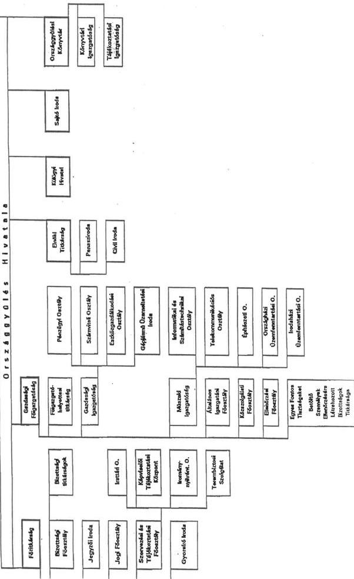

Állami Számverőszék

# JELENTÉS

az Országgyűlés fejezet működésének
pénzügyi-gazdasági ellenőrzéséről

395.

1997. október

---

Az ellenőrzés végrehajtásáért felelős:

III. Költségvetési Ellenőrzési Igazgatóság

Bihary Zsigmond

számvevő igazgató

Az ellenőrzést vezette:

Holé Sándorné dr.

számvevő főtanácsos

Az ellenőrzésben részt vettek:

Bittó Zoltán

számvevő tanácsos

Eötvös Magdolna

számvevő tanácsos

dr. Erős Aladár

külső szakértő

Fogarasi Miklós

számvevő tanácsos

Lázárné Ozorai Mária

külső szakértő

Littomericzky Jánosné

számvevő tanácsos

Pásztor Katalin

számvevő

Séra Andrásné

számvevő

---

V-6-62/1997.

# TARTALOMJEGYZÉK

# I. ÖSSZEFOGLALÓ MEGÁLLAPÍTÁSOK, KÖVETKEZTETÉSEK, JAVASLATOK 2

# II. RÉSZLETES MEGÁLLAPÍTÁSOK 8

# 1. A feladatok, a szervezeti rendszer és a gazdálkodási feltételek összhangjának értékelése 8

1.1 A fejezet szakmai feladatainak és költségvetési kereteinek összhangja 8
1.2 A Hivatal feladataiban és szervezetében bekövetkezzett valtozások 9
1.3 A szervezet mukodésenek és gazdalkodásanak szabályozottsága, dontési, irányításim mechanizmusa, belso információs rendszere 10

# 2. A költségvetés tervezése és a finanszírozás rendje 13

2.1 A költségvetés tervezése 13
2.2 Az eloiranyzatok modositasa 15
2.3 A finanszirozasi rendszer mukodese 16
2.4 A pénzmaradványok alakulása és felhasználása 18

# 3. A költségvetés végrehajtása 19

3.1 A fejezet koltsegvetesi egyensulyanak ertekelese 19
3.2 A Hivatal koltsegvetesi gazdalkodasa 20

3.2.1 A letszam- es ber, illetve szemelyi juttatasokkal valo gazdalkodas 21
3.2.2 Eszkoz- es vagyongazdalkodas 26
3.2.3 Az egyeb mukodesi kiadasok alakulasa 33

3.3 A fejezeti kezelési előirányzatok felhasználása 34

# 4. A Képviselő-testület előirányzataival való gazdálkodás 36

4.1 Képviselöi jarandósagok 36
4.2 A képviselócsoportok muködési kerete 36
4.3 A képviselócsoportok eszközellátasa, a vagyonvédelmi kovetelmenyek érvenyesitése 40
4.4 A ciklusvaltaskori eszkozelszamoltatasok 41

# 5. A Könyvtár gazdálkodása 43

# 6. A számviteli és bizonylati rend 46

# 7. A belső ellenőrzés rendszere 48

# 8. A fejezetnél végzett korábbi ellenőrzések megállapításaihoz, javaslataihoz kapcsolódó intézkedések utóellenőrzése 50

---

## **ÁLLAMI SZÁMVEVŐSZÉK**

V-6-62/1997.

Témaszám: 366.

# JELENTÉS

## az Országgyűlés fejezet működésének pénzügyi-gazdasági ellenőrzéséről

Az éves költségvetési törvények az Országgyűlés fejezetben határozzák meg - a központi költségvetés részeként - a Parlament működésének fedezetét szolgáló pénzügyi kereteket, valamint a nemzeti és etnikai kisebbségi szervezetek működésének, a pártok, a társadalmi szervezetek, az országos kisebbségi önkormányzatok, a Magyar Rádió-, a Magyar Televízió-, a Hungária Televízió Közalapítvány támogatását. A fejezeten belül - a Házszabály alapján - a Országgyűlés Hivatalának (továbbiakban: Hivatal) feladata az Országgyűlés folyamatos működésének biztosítása, a képviselők és a tisztségviselők tevékenységének segítése.

Az ellenőrzött időszakban a fejezeten belül szervezeti változást jelentett 1996-ban a Közbeszerzések Tanácsának besorolása, majd 1997-ben az Országgyűlési Könyvtárnak (továbbiakban: Könyvtár) a Hivatalba integrálása. A fejezet címrendjében további módosulást okozott 1994-től a Képviselő-testület önálló címenkénti szerepeltetésének megszüntetése. Ezt követően a Képviselő-testület alcímet képez az Országgyűlés címen belül, a technikai jellegű megosztás célja a kiadások elkülönített megjelenítése.

Az Országgyűlés törvényalkotó munkájának növekedését jelzi, hogy míg 1992-ben 50 új törvényt, 42 törvénymódosítást, 92 országgyűlési határozatot hozott, addig 1996-ban 75 új törvényt, 55 törvénymódosítást és 120 országgyűlési határozatot alkotott.

A fejezet előzőekben jelzett szervezeti változásaival és növekvő feladataival összefüggésben kiadásainak költségvetési előirányzata 1992. és 1997. között 2,5 Mrd Ft-ról 5,3 Mrd Ft-ra emelkedett. A költségvetési létszám (választott tisztségviselők és képviselők nélkül) 726 főről 819 főre bővült.

---

## Ellenőrzésünk során arra kerestünk választ, hogy

- a fejezetnél a szervezet, a működés mechanizmusa, a szabályozottság, a költségvetési előirányzatok összhangban voltak-e a szakmai feladatokkal, segítették-e azok hatékony és eredményes ellátását;
- a költségvetési gazdálkodásban hogyan érvényesültek a törvényesség, a célszerűség és az eredményesség szempontjai;
- a fejezet milyen eredménnyel hasznosította az Állami Számvevőszék (továbbiakban: ÁSZ) korábbi ellenőrzéseinek megállapításait, javaslatait.

Az ellenőrzés a Hivatal és az 1996. december 31-ig önálló költségvetési szervként működő Könyvtár költségvetési gazdálkodására, a fejezeti kezelésű előirányzatokkal való gazdálkodásra, valamint a képviselőcsoportok önálló gazdálkodásának törvényességi szempontú értékelésére irányult. Ugyanakkor nem érintette a Közbeszerzések Tanácsának működését, mivel azt a közbeszerzésről szóló törvény végrehajtásának ellenőrzése keretében értékelte az ÁSZ.

Az ellenőrzés az 1992-1997. I. féléves időszakra terjedt ki. Ezzel egyidejűleg került sor a korábbi ÁSZ ellenőrzések (1992. évi jelentés az Országgyűlés fejezet pénzügyi-gazdasági ellenőrzéséről, továbbá az 1993-1995. évek költségvetésének tervezésére, illetve zárszámadására irányuló ellenőrzések) megállapításaihoz, javaslataihoz fűződő intézkedések utóellenőrzésére is.

## I. ÖSSZEFOGLALÓ MEGÁLLAPÍTÁSOK, KÖVETKEZTETÉSEK, JAVASLATOK

Az Országgyűlés törvényalkotó munkájának felgyorsult üteme, a nemzetközi kapcsolatok szélesedése, az 1994. évi parlamenti képviselőváltás, a fejezet felépítésében bekövetkezett változások új követelményeket, s egyben jelentős többletfeladatot jelentettek a fejezeti gazdálkodás területén. A fejezeti irányítás - döntően az ellenőrzött időszak második felében - eredményeket ért el a szakmai feladatokhoz kapcsolódó gazdálkodási feltételek összhangjának megvalósításában, előtérbe került az Országgyűlés folyamatos működésének biztosítása, tevékenységének segítése.

Az új követelmények, feladatbővülések a Hivatal szervezetének folyamatos átalakítását igényelték az ellenőrzött években, ugyanakkor nem változott a decentralizált vezetésű, funkcionálisan tagolt szervezeti felépítés. Az átszervezésekkel megoldották az operatív gazdálkodás és a fejezeti szintű feladatok elkülönítését, valamint

2

---

**az ellenőrzés függetlenségét**, azonban - az 1992. évi ÁSZ ellenőrzés megállapításaihoz, javaslataihoz képest - az intézkedések késedelmesen születtek.

**A szabályozásban előrelépést jelentett 1994-től az új Házszabály, s ezt követően a Szervezeti és Működési Szabályzat** (továbbiakban: SzMSz) és **a Gazdasági Főigazgatóság Ügyrendjének hatályba lépése**. A gyakorlatban kialakult szervezeti változásokat, a szervezeti egységek feladatait - a Házszabály életbe lépésének elhúzódása miatt - az SzMSz utólag rögzítette. A képviselőcsoportok önálló gazdálkodását a Házszabály nem határozza meg kellő részletezettséggel, ami a gyakorlatban eltérő értelmezéshez vezetett.

**A Hivatal költségvetési gazdálkodásában törekedtek a teljeskörű szabályozottságra**, az utóbbi két évben hangsúlyt fektettek a belső szabályzatok korszerűsítésére. Ennek keretében célszerűen határozták meg a munkáltatói és pénzügyi jogkörök gyakorlásának rendjét.

**A döntés és irányítás szintjeit**, a vezetők hatáskörét megfelelően alakították ki, s a munkamegosztás alkalmazkodott a feladatrendszer követelményeihez. A hivatali vezetés információs rendszerének számítógépes adatbázisai segítették a döntés-előkészítést, a számviteli munkában azonban nem használták ki a rendszer lehetőségeit.

**A fejezeti irányítás megteremtette a szakmai feladatellátás, az Országgyűlés zavartalan működésének pénzügyi feltételeit. A fejezet éves költségvetéseit - egy kivételtől eltekintve - az előírásoknak megfelelően, dokumentáltan és ellenőrizhető módon dolgozta ki. A képviselőcsoportok működési támogatásának a dologi előirányzatoknál egy összegben való tervezése figyelmen kívül hagyta az 1992. évi XXXVIII. tv. 24. § (1) és (3) bekezdése, valamint a 158/1995. (XII.26.) Korm. rendelet** elemi költségvetés készítésére vonatkozó **előírásait**. (Az ÁSZ az 1994. évi és az 1995. évi költségvetés megalapozottságának ellenőrzésekor egyaránt feltárta a rendellenes gyakorlatot.)

**A Hivatal bevételeit 1992-1993. években** jelentős mértékben **alultervezte, s ezzel** feleslegesen **növelte a támogatási igényét. A fejlesztési előirányzatok** a tervtárgyalások során általában **az igények alatt realizálódtak. Az Országház rekonstrukciójának forrásait az éves költségvetések minimális szinten tartalmazták, majd a pótköltségvetés és a célelőirányzatok bővítették a forrásokat.** (Az 1994. évi költségvetést értékelő ÁSZ jelentés javasolta a Parlament rekonstrukciójának kiemelt kormányzati felújításkénti kezelését, az erre irányuló hivatali kezdeményezést azonban a Pénzügyminisztérium (továbbiakban: PM) nem fogadta el.

---3

---

**Az előirányzat-módosítások rendjének szabályozottsága, nyilvántartása, dokumentálása megfelelő volt. Az előirányzat-módosításokat döntően felügyeleti szervi és saját hatáskörben, szabályszerűen hajtották végre.**

**A fejezet pénzellátása és az ahhoz igazodó finanszírozási tevékenysége** - két kivétellel (16. o. és 17. oldal utolsó bekezdései) - **szabályszerű volt. A rendelkezésre álló források kiegyensúlyozott gazdálkodást tettek lehetővé.** Az intézményi körben likviditási feszültség egy esetben - 1994-ben a Könyvtárnál - fordult elő. A Hivatalnál ugyanakkor esetenként számottevő szabad forrás keletkezett. **A kincstári rendszer bevezetése a fejezetnél finanszírozási nehézséget nem okozott.** Fejezeti szinten **évente jelentős pénzmaradványok képződtek, meghatározó részben a Hivatalnál, jellemzően a dologi kiadások megtakarításából.** Önrevízió alapján elvonásra felajánlott maradvány az ellenőrzött időszak első két évében nem volt, később 1994-ben volt számottevő. **A jóváhagyott pénzmaradványokat szabályszerűen használták fel a Hivatalnál. A PM a fejezet pénzmaradványát az utolsó év kivételével a jogszabályi határidőt követően hagyta jóvá.**

**A Hivatal szakmai, gazdasági feladatellátását pénzügyi forráshiány nem akadályozta, a költségvetési előirányzatok fedezték a parlamenti munka többletkiadásait.** A gazdálkodás eredményességét javította az 1995-ben bevezetett - a feladatok forrásigényéhez igazodó - keretgazdálkodás.

**A személyi juttatásokkal és a létszámmal való gazdálkodás a Hivatalnál megfelelően szabályozott, irányított és szervezett keretek között valósult meg.** A létszám és a személyi juttatási keretek biztosították az alapfeladatok megfelelő végrehajtását. Ugyanakkor **a képviselőcsoportok hivatalainak létszámgazdálkodásában a költségvetési létszám és személyi juttatási előirányzat nem volt összhangban a státuszok szerinti létszám és illetményszükséglettel.**

**Az eszközgazdálkodásban a beszerzések és az állagmegóvás egyaránt hangsúlyt kapott, s jelentősen növekedett az eszközök állománya.**

**Az ingatlanok kihasználtsága** - különösen az Országházé - **a kívánatosnál magasabb**, ami a belső terek gyorsabb elhasználódásához vezet, s a felújítások ütemezhetőségét is befolyásolja. Az épületben elhelyezett Köztársasági Elnöki Hivatallal (továbbiakban: KEH) és a Miniszterelnöki Hivatallal (továbbiakban: MEH) a kölcsönös szolgáltatásokat működési célú pénzeszköz átadás formájában egyenlítették ki.

---4

---

A komplex információs rendszer megvalósítását célzó **informatikai fejlesztések irányát a meglévő rendszerelemek és a pénzügyi lehetőségek határolták be.** A törvényhozói munka feltételeinek javítására irányuló számítástechnikai beruházások eredményeként **a rendszer megfelelően szolgálja a törvényjavaslatok és módosító indítványok kezelését.**

**A fejezeti kezelésű előirányzatok felhasználásának 1997. évi szabályozása** - a helyszíni ellenőrzés időpontjában - **nem felelt meg az 1996. évi CXXI. tv. 11. § (2) bekezdésének, a felhasználás viszont szabályszerű volt. Az 1994. évi képviselőváltás kiadásaira előirányzott fejezeti kezelésű támogatás tervezésénél jelentős tartalékkal számoltak.** A közvetlen kiadásoknál elért megtakarításokat a ciklusváltás egyéb kiadásaira fordították. **A pénzügyi elszámolások szabályosak voltak, ugyanakkor a távozó képviselők és frakcióalkalmazottak elszámoltatása a használatukba adott eszközökkel nem valósult meg teljeskörűen.**

**Az 1990. évi LVI. tv. nem rendelkezik a képviselőcsoportok működési keretének felhasználásáról. A Házszabály a működési támogatás felhasználását a képviselőcsoport vezetőjének gazdálkodási hatáskörébe utalja és kimondja, hogy a gazdálkodásra a központi költségvetési szervek gazdálkodására vonatkozó szabályokat kell megfelelően alkalmazni.** Mindez azt eredményezte, hogy **a képviselőcsoportok az ellenőrzött időszakban különböző mértékben** (részletesen a 37-38. oldalon) **eltértek az általános érvényű jogszabályoktól** (költségvetési szervek tervezésére, előirányzatok átcsoportosítására vonatkozó előírások), ami megnehezítette a Hivatalnál a jogszabályi előírások betartását.

Egyes képviselőcsoportok gazdálkodásában - esetenként a nem megfelelő, illetve hiányos belső szabályozás miatt - rendeltetéssel ellentétes felhasználások is előfordultak. A Hivatal a tulajdonában és a képviselőcsoportok használatában lévő eszközök vagyonnyilvántartását - az utóbbi évek kedvező változásai mellett - sem oldotta meg a vagyonvédelmi követelményeknek minden tekintetben megfelelően.

**A Hivatal számviteli rendjét alapvetően a jogszabályokhoz igazodóan alakították ki,** de az 1993-96. között érvényes számlarendet nem aktualizálták. Az 1997. évi számlarendben a hiányosságok zömét kiküszöbölték. **A bizonylati fegyelmet megfelelően szabályozott keretek között érvényesítették.**

**A belső ellenőrzési rendszer működése** - a szabályozottság, a szervezeti keretek és a függetlenség megteremtésével - az elmúlt két évben **jelentősen fejlődött.** A feladatellátás **személyi feltételeit** azonban **nem biz-**

5

---

**tosították kellő mértékben. A vezetői és a munkafolyamatba épített ellenőrzés, valamint a függetlenített belső ellenőr működése eredményesen segíti a vezetést a döntések előkészítésében, s megfelelő információkat szolgáltat a feladatok végrehajtásáról.**

**A Könyvtár** SzMSz-a megszűnéséig ideiglenes volt. A gazdálkodást átfogó szabályzatok késedelmesen készültek, s aktualizálásukra nem fordítottak figyelmet. **Gazdálkodását** 1992-1994. között folyamatos **pénzügyi gondok jellemezték. A pénzügyi egyensúly** - a fejezet kezdeményezésére - **1995-től állt helyre** a takarékossági intézkedések és a pénzügyi fegyelem megszilárdulása nyomán. **A könyvállomány állag és vagyonvédelme területén** - az 1992. évi ÁSZ ellenőrzés javaslatai alapján - csak **rész-eredmények születtek. A Könyvtár beolvasztását a jogszabályi előírásoknak megfelelően végezték**, a vagyonátadást a számviteli rendelkezések szerint dokumentálták.

Az ellenőrzés megállapításainak hasznosítása mellett a következőket **javasoljuk** a fejezet vezetőjének:

1. Kezdeményezze a Házszabály, az 1990. évi LVI. tv., valamint a költségvetési gazdálkodásra vonatkozó általános érvényű jogszabályok (Áht., kormányrendeletek) összehangolását annak érdekében, hogy
- egyértelmű legyen a képviselőcsoportok gazdálkodásának (működési keretük tervezésének és felhasználásának) rendje;
- az éves költségvetés tervezése során kiemelt jogcímenkénti részletezésben szerepeljen a működési támogatás.

2. Kezdeményezze, hogy
- a képviselőcsoportok belső szabályozottságuk teljessé tételével teremtsék meg a jogszabályokhoz igazodó gazdálkodás, valamint a számviteli és bizonylati fegyelem érvényesítésének feltételeit, továbbá alakítsák ki az egyeztetések alapját képező, naprakész vagyonnylvántartásukat;
- a létszámgazdálkodás szabályozásával a frakció hivatalok határozzák meg a feladatellátás személyi feltételeit, valamint - tekintettel a ciklusváltásokra, s azok személyi juttatási kihatásaira - a köztisztviselők határozott idejű foglalkoztatási részarányát. (Ezzel összefüggésben célszerű kezdeményezni az 1990. évi LVI. tv. 6. § (2) bekezdése - a képviselőcsoport munkáját segítő „gépírói és hivatali személyzet” alkalmazásáról szóló előírásának - módosítását.).

6

---

3. Kezdeményezze az Országház rekonstrukciójának (több éves kihatású pénzügyi forrásai biztosítása érdekében) elkülönítését az éves költségvetési gazdálkodástól, s annak a felújítás üteméhez igazodó finanszírozását.

4. A Hivatal a számlarend és számlakeret tükör összeállításánál - a jogszabályi előírások maradéktalan betartása mellett - vegye figyelembe a gazdálkodás sajátosságait. Fordítson fokozott figyelmet az analitikus és a főkönyvi nyilvántartások összhangjára, a vagyonvédelmi követelmények érvényesítésére, különös tekintettel a minden vagyontárgyra kiterjedő leltározásra. A számítógépes információs rendszer továbbfejlesztésével gondoskodjon a számviteli munkavégzés megfelelő feltételeiről.

5. A soron következő képviselőváltás költségvetési tervezésekor a személyi változások kiadásai mellett vegyék számításba a kapcsolódó felhalmozási, felújítási feladatok többletigényét is. Szabályozzák a jogcímenkénti kiadási megtakarítások további felhasználását, az átcsoportosítások rendjét.

6. Készítsenek intézkedési tervet a Könyvtár könyvállományának teljeskörű leltározására, az állomány védelmére. A feladat megoldásának pénzügyi, tárgyi és személyi feltételeit számításokkal támasszák alá.

7

---

## II. RÉSZLETES MEGÁLLAPÍTÁSOK

### 1. A feladatok, a szervezeti rendszer és a gazdálkodási feltételek összhangjának értékelése

Az ellenőrzött időszakban az Országgyűlés folyamatos működésének biztosítása, a választott tisztségviselők és képviselők tevékenységének segítése a Hivatal, valamint a Könyvtár feladatkörét képezte.

A Hivatal - mint az Országgyűlés munkaszervezete és a fejezet gazdálkodását irányító központi költségvetési szerv - a parlamenti munkavégzéshez kapcsolódó tevékenységének ellátása mellett törekedett a szakmai feladatokhoz kapcsolódó szervezeti keretek és gazdálkodási feltételek összhangjának megvalósítására. E folyamat kedvező hatásai főként az ellenőrzött időszak második felében jutottak érvényre.

#### 1.1 A fejezet szakmai feladatainak és költségvetési kereteinek összhangja

A fejezet 1997. évi költségvetési kiadási előirányzata az 1992. évi teljesítéshez viszonyítva közel 90%-kal növekedett az 1-5. címen. A kiadások meghatározó részét költségvetési támogatás fedezte.

A megnövekedett feladatok mellett a költségvetési kiadási előirányzatok emelkedéséhez a fejezet szervezeti változása - a Közbeszerzések Tanácsának 1995. évi megalakulása - is hozzájárult. A Közbeszerzések Tanácsának 1997. évi kiadási előirányzata 95,1 M Ft-ot tett ki a fejezeti költségvetésben. A Hivatal ugyanakkor nem rendelkezik szakmai irányítással, hatáskörrel a szervezet felett, lényegében a pénzellátás technikai feladatát végzi.

Az ellenőrzött években a **fejezeti irányítás megteremtette a szakmai feladatellátás pénzügyi feltételeit. Az Országgyűlés zavartalan működését forráshiány nem korlátozta, sőt a gazdálkodás során rendszeresen pénzmaradvány keletkezett.**

Az ellenőrzött években **fellépő többletfeladatok**, átvett feladatok, valamint a jogszabályból adódó többletkiadások pénzügyi vonzatát a költségvetés finanszírozta, esetenként **fejezeti céltartalék, majd fejezeti speciális előirányzatok keretében.**

A köztisztviselők jogállásáról szóló törvényhez kapcsolódó bérkeret fejezeti kezelésű előirányzata 600 M Ft volt 1992-ben; a ciklusváltással összefüggő többletkiadásokat 700 M Ft-tal, majd ezt 650 M Ft-ra mérsékelve támogatta a költségvetés (1994); a NATO Közgyűlés lebonyolítására 1995-ben 50 M Ft-ot biztosítottak; a Főtitkárság tevékenységét elősegítő informatikai rend-

8

---

szer kialakítására, a törvényhozás korszerűsítésére nyújtott támogatás 1995-1996. években 10-10 M Ft volt.

A törvényi, jogszabályi rendelkezések hatályba lépésével **bővülő fejezeti feladatok** pénzügyi kereteit **a központi költségvetés általános tartalékából fedezték.**

A Közbeszerzések Tanácsa 1995. évi megalakulásával kapcsolatban 7,8 M Ft-ot; az alkotmányozással összefüggő többletfeladatokra 20 M Ft-ot; közalkalmazotti béremelésre 1996-ban 6,2 M Ft-ot kapott a fejezet.

## 1.2 A Hivatal feladataiban és szervezetében bekövetkezett változások

Az **Országgyűlés hivatali szerveinek feladatát** és kapcsolati rendszerét a 46/1994. (IX.30.) OGY határozattal elfogadott **Házszabály rögzítette. A szervezet felépítését, a szervezeti egységek feladatait és hatáskörét a Házszabályra épülő, 1995-ben hatályba léptetett SzMSz megfelelő részletességgel határozta meg.**

**A Hivatal jelenlegi szervezetének kialakítása az 1990-es változásokat követő években kezdődött. Struktúrája folyamatosan változott az új követelményekhez, feladatbővülésekhez igazodóan, de alapvetően nem változott a decentralizált vezetésű, funkcionálisan tagolt szervezeti felépítés hierarchiája.**

Az ellenőrzött időszak első éveiben az Országgyűlés hivatali szerveit három egymás mellé rendelt egység - Főtitkárság, Országgyűlés Hivatala, Elnöki Titkárság - képezte. Az **1994-től** végrehajtott szervezeti intézkedések eredményeként **a Hivatal jelenleg hat mellérendeltségi kapcsolatban álló szervezeti egységre tagolódik** - Főtitkárság, Elnöki Titkárság, Gazdasági Főigazgatóság, Külügyi Hivatal, Sajtó Iroda, Könyvtár - **az Országgyűlés elnökének közvetlen irányítása alatt** (1. sz. ábra).

**Az 1994-1997. közötti szervezeti átalakításokat a feladatok bővülése, s az Országgyűlés felgyorsult munkáüteme indokolta.**

**Új feladat volt és új szervezeti egység kialakítását jelentette** az Alkotmány Előkészítő Bizottság Titkársága (1995-ben), az Észak Atlanti Tájékoztató Központ (1996) megalakulása, valamint az egyes fontos tisztségeket betöltő személyek ellenőrzésére létrehozott bizottságok és titkárságuk (1996. augusztus 1.) átvétele.

1997. január 1-ével a Könyvtárat - célszerűen, a párhuzamosságok megszüntetésével - a Hivatal szervezetébe integrálták. Az intézkedés eredményeként a Könyvtár az adminisztrációs és technikai eljárásainak megköny-

9

---

nyítése mellett a feladatokhoz igazodó finanszírozással várhatóan magasabb szinten nyújthatja szolgáltatásait.

**A Gazdasági Főigazgatóság szervezete** az ellenőrzött években végrehajtott átalakítások következtében **erősen tagolódott, osztályok főosztályokká, vagy más elnevezésű főosztályi szervekké alakultak, továbbá új szervezeti egységek jöttek létre.**

Jelenleg a főigazgatóság hét szervezeti egységből áll: Főigazgató helyettesi Titkárság, Gazdasági Igazgatóság, Közszolgálati Főosztály, Általános Igazgatási Főosztály, Műszaki Igazgatóság, Ellenőrzési Főosztály, Az egyes fontos tisztségeket betöltő személyek ellenőrzésére létrehozott bizottságok és titkárságuk.

**Az 1995. évi átszervezéssel** - a korábbi hiányosságot megszüntetve - **megoldották az operatív gazdálkodás és a fejezeti feladatok elkülönítését, továbbá az Ellenőrzési Főosztály közvetlen főigazgatói irányítását.**

**A Főigazgató helyettesi Titkárság kialakításával - 1997. júniustól** a Költségvetési Osztály megszüntetésével - más feladatok (jogi, közbeszerzés) célszerű átcsoportosításával együtt **új öt fős szervezeti egység látja el többek között a fejezeti gazdálkodási feladatokat.** Ezt megelőzően a fejezeti feladatokat végző Költségvetési Osztály 1 fős létszáma nem indokolta az osztálykénti besorolását.

### **1.3 A szervezet működésének és gazdálkodásának szabályozottsága, döntési, irányítási mechanizmusa, belső információs rendszere**

**A Hivatal** az 1995. évi CV. tv. 116. §-ának megfelelő **alapító okirattal rendelkezik.** Az ellenőrzött időszakban bekövetkezett szervezeti változás - a Könyvtárnak a Hivatalba integrálása - szükségessé tette az alapító okirat 1997. január 6-i hatállyal végrehajtott módosítását.

**A Könyvtár**, mint önálló költségvetési szerv **megszüntetésére vonatkozó jogszabályi eljárást** - a megszüntető okirat tartalma, formája, az illetékes hatóságok értesítése a megszüntetésről - **az 1992. évi XXXVIII. tv. előírásai szerint folytatták le.**

**A Hivatal 1995-ben hatályba léptetett SzMSz-a** a gyakorlatban kialakult szervezeti változásokat utólag rögzítette. A SzMSz **a követelményeknek megfelelően** tartalmazza a Hivatal jogállását, alapvető feladatait, hatáskörét, szervezeti rendjét, a Hivatali szervek munkakapcsolatait, a vezetők, a főtanácsadók, tanácsadók és más besorolású köztisztviselők feladat és hatáskörét, az ügykezelők, fizikai alkalmazottak feladatát. A Gazdasági Főigazgatóság Ügyrendje SzMSz-ra építve tovább részletezi a szerve-

10

---

zet feladatait, együttműködési kapcsolatait. Az alapszabályzatokat az Országgyűlés elnökének jóváhagyásával léptették hatályba.

**A gazdálkodás egy-egy részterületén a feladatok szabályozottak, az utóbbi két évben a jogszabály változásokat követve korszerűsítették a szabályzatokat.** A költségvetési gazdálkodást átfogó belső szabályzatok (a számviteli területet kivéve, mert az kevésbé tükrözte a Hivatal sajátosságait és 1997. évig nem minden esetben követte maradéktalanul a jogszabályi változásokat) előírásai, illetve betartásuk biztosítják a jogszabályokhoz igazodó feladatellátást, tartalmazzák a munkafolyamatba épített ellenőrzési pontokat. A feladatok konkrét munkakörökre, személyekre való lebontásához kellő alapot adnak a Hivatal alapszabályzatai.

Az ellenőrzött időszakban **megfelelően szabályozták a munkáltatói jogkörök gyakorlását, valamint a pénzügyi tevékenységgel összefüggő kötelezettségvállalások rendjét.**

A gazdasági főigazgató által meghatározott keret mértékéig az elnöki titkár, a Könyvtár főigazgatója, a Külügyi Hivatal vezetője, a Sajtóiroda vezetője, az Európai Tanács Információs és Dokumentációs Központja igazgatója, továbbá a felhatalmazott vezető beosztású köztisztviselő a szakmai tevékenységével összefüggésben beszerzéssel, szolgáltatás megrendeléssel, anyagi kihatással járó kötelezettségvállalásra jogosult.

**A Hivatal döntési és irányítási mechanizmusát a szabályzatok részletesen tartalmazzák.**

Az Országgyűlés elnöke rendszeres munkaértekezleteken beszámoltatja a vezetőket az éves, féléves munkateljesítésekről, a költségvetési gazdálkodás értékeléséről és a következő évi tervezett feladatokról. A döntéshozatal legfőbb fóruma a vezetői értekezlet, amelyen az Országgyűlés elnöke és a hivatali szervek vezetői vesznek részt.

**A költségvetési gazdálkodást a gazdasági főigazgató irányítja a Hivatal vezetőinek közreműködésével.**

**A Gazdasági Főigazgatóságon a vezetők hatásköre, beszámoltatási kötelezettsége, a kötelezettségvállalások rendje megfelelően szabályozott.**

A Gazdasági Főigazgatóságon belüli feladatvégzés újraszabályozásával a munkaköri leírásokat 1995-ben felülvizsgálták. **A munkaköri leírások** részletesen tartalmazzák az alapszabályokkal összehangolt feladatokat, a helyettesítési rendszert és alkalmasak a személyi felelősségrevonás érvényesítésére.

A munkaköri leírások átdolgozását 1997-ben belső ellenőrzés keretében felülvizsgálták, az ellenőrzés intézkedést igénylő hiányosságokat nem állapított meg.

---11

---

## **A munkamegosztás célszerűen alkalmazkodott a megnövekedett feladatokhoz és az ahhoz igazított szervezethez.**

A pénzügyi terület munkamegosztását osztályelőadói rend szerint szervezték át. Az osztályelőadó az egyes hivatali szervezeti egységek pénzügyi tevékenységét a különböző jogcímű kiadások teljeskörű átfogásával végzi. A szervezeti egységek időszakos újrafelosztásával, egymás munkaterületeinek megismerésével a feladatvégzés helyettesítése is megoldhatóvá vált.

## **A döntés-előkészítést számítógépes adatfeldolgozási rendszer segíti.**

A pénzforgalmi szemléletű gazdálkodást figyelembe vevő pénzügyi, főkönyvi rendszer egyszeri adatbevitellel biztosítja a két terület adatfeldolgozási feladatait, a bizonylati fegyelmet, nyilvántartja a szervezeti egységek gazdálkodási kereteit. A számviteli munka területén azonban a gépi feldolgozás előnyei kevésbé érvényesültek.

Az információs rendszer alapjául szolgáló **számítógépes adatbázisok** a napi munkához, a vezetői döntés előkészítéséhez, beszámoltatáshoz és ellenőrzéshez - géptől és programtól függő - lekérdezéseket tesznek lehetővé, de **az elvárhatónál jobban igénylik a manuális feldolgozást a számviteli munkavégzésben.**

Az Eszközgazdálkodási osztály adatait személyi számítógépes rendszerben dolgozzák fel. Az adatok megfeleltetését kézi feldolgozással végzik a Számviteli osztályon.

A képviselőcsoportok működési keret felhasználásáról a frakció hivatalok által összeállított főkönyvi kivonatokat - ellenőrzés és egyeztetés után - szintén manuálisan dolgozzák fel.

A számítógépes főkönyvi könyvelési rendszer jelenlegi formájában a helyszíni ellenőrzés befejezéséig nem volt alkalmas az adatok költségviselőnkénti automatikus könyvelésére.

Az Országgyűlés gazdasági főigazgatójának 1997. szeptember 29-én kelt levele szerint a hiányosságot - 1997. szeptember 1-től - megszüntették.

A Könyvtár gazdasági tevékenységét segítő program a hivatali rendszertől eltérő, a szakmai munkáját segítő integrált könyvtári számítógépes rendszer kialakítását 1997. évre tervezték. (A fejlesztés kiadásaira az 1997. évi költségvetésben 19,5 M Ft támogatást irányoztak elő.)

---12

---

## 2. A költségvetés tervezése és a finanszírozás rendje

### 2.1 A költségvetés tervezése

A fejezet költségvetése elkészítésének elveit a Házszabály alapján az Országgyűlés Házbizottsága határozza meg. A gazdasági főigazgató felelősségével készített - a PM sarokszámainak megfelelő - éves költségvetési tervjavaslatot (a Házbizottság egyetértésével, a Költségvetési és Pénzügyi Bizottság véleményének figyelembevételével) az Országgyűlés elnöke megküldi a Kormánynak.

A fejezet az 1993-1997. évi költségvetéseit alapvetően a Kormány által kiadott költségvetési irányelvekben és a PM tervezési körirataiban foglaltak alapján dolgozta ki.

A költségvetés összeállításának szempontjaira vonatkozó megszorító kormányzati döntéseket a fejezet figyelembe vette, de a Képviselő-testület alcímen ezt nem érvényesíthette, mivel az 1990. évi LVI. tv. előírásai erre nem adnak lehetőséget. **Az éves költségvetési tervezésben prioritást nyert az Országgyűlés zavartalan működési feltételeinek biztosítása, a köztisztviselők jogállásáról szóló törvényi előírások szerint adható juttatások és járandóságok, az elengedhetetlenül szükséges beruházások, felújítások pénzügyi forrásának megteremtése.**

**Az éves fejlesztési előirányzatok** a PM-mal folytatott tervtárgyalások eredményeként véglegződtek. Az elfogadott fejlesztések **általában a fejezeti igények alatt realizálódtak.**

Az 1994. évi rekonstrukciós és informatikai rendszer fejlesztésének fejezeti igényénél 165,5 M Ft-tal alacsonyabb támogatást irányzott elő az éves költségvetési törvény.

Az 1997. évi 691 M Ft-os fejlesztési igényt a PM a központi költségvetés helyzetére tekintettel 360 M Ft-ra csökkentette. (100 M Ft dologi, 250 M Ft felhalmozási-felújítási és a Könyvtár részére - a képviselők jobb tájékoztatását szolgáló szakmai műhely felállítására - 10 M Ft fejezeti kezelésű előirányzatot határoztak meg a költségvetési törvényben.)

**A fejezet éves költségvetési javaslata az ellenőrzött időszakban az intézmények** (szervezeti egységek) **munkatervére támaszkodott, részletes számításokkal alátámasztott és megfelelően dokumentált volt, kivéve a képviselőcsoportok működési támogatását, amelyet egy összegben, dologi kiadásként terveztek meg.**

**A képviselőcsoportok működési támogatásának tervezési gyakorlata** - a frakciók teljeskörű adatszolgáltatása hiányában - **nem követte az 1992. évi XXXVIII. törvény 24. § (1) és (3) bekezdése előírásait.**

---13

---

A dologi előirányzatnál egy összegben megtervezett működési támogatás teljesítésekor személyi kiadás (megbízási díj) is előfordult. Az 1996. évi tervezéskor a működési támogatást már személyi juttatás-, dologi felhasználási előirányzat bontásban határozták meg. Ugyanakkor az 1997. évi tervezésnél visszalépés történt, egy összegben irányozták elő a frakciók működési támogatását.

**A kiadási (és bevételi) előirányzatok részletezések nélküli tervezése ellentétes a 158/1995. (XII. 26.) Korm. rendelet** elemi költségvetés készítésére vonatkozó **előírásaival**.

**A Hivatal saját bevétele nem számottevő, előirányzata az ellenőrzött időszak elején (1992-1993.) alultervezésre utal.** A 4 M Ft-ra tervezett bevétel **reális tervezéssel 20-30 M Ft-tal** magasabb saját bevételi forrást biztosított volna, vagyis ennyivel **csökkent volna a fejezet költségvetési támogatása**.

A saját bevételek döntő része terem- és helyiségbérleti díjakból, kiadványok értékesítéséből és a parlamenti látogatások díjbevételeiből származott. A saját bevételek növelésére tett intézkedések általában a díjemelések voltak, mértékük megközelítőleg az inflációhoz igazodott.

**Az átvett pénzeszközök előirányzatai** 1993. évtől viszonylag állandóak, 122-128 M Ft között alakultak, döntően a Hivatal szolgáltatásaira nyújtott **működési célú pénzeszközökből tevődtek össze**.

A szolgáltatások kiadás vonzata (1993-tól 118 M Ft, illetve 1997-ben 128 M Ft) arányosítással számított, kalkulációkra támaszkodott, a normák alkalmazási lehetősége korlátozott volt. Önköltségi számítást nem végeztek. A feladat és a pénzügyi keret közötti egyensúly kialakításánál nem érvényesülhetett a piaci értékítélet, ezért döntően a fejezetek költségvetési támogatásának függvényeként alakult az előirányzat.

**A Képviselő-testület kiadásainak költségvetési előirányzatát az 1990. évi LVI. tv. előírásai szerint alakították ki.** Az alcím működési költségvetésének előirányzata 1997-ben 2.526,7 M Ft, amely az 1993. évi eredeti előirányzatot 101,5 %-kal haladta meg.

Az ellenőrzött időszakban a működési költségvetés eredeti előirányzatának 46-65%-át **a béralap, illetve személyi juttatások** képezték, amelyek mintegy másfélszeresükre emelkedtek. **A dologi kiadások** körében tervezték a képviselők költségtérítését és a képviselőcsoportok működési támogatását. Az alcím éves eredeti előirányzatát alapvetően meghatározta a miniszteri illetmények beállási szintje, a képviselői helyek száma, a frakciók száma, a bizottsági tagok száma.

---14

---

Az országgyűlési bizottságok kiadásai közül a képviselői tiszteletdíjak és járulékaik a Képviselő-testület alcímén, míg a bizottságok működéséhez kapcsolódó egyéb ráfordítások az Országgyűlés hivatali szervei alcímén kerültek megtervezésre.

**Az Országgyűlés hivatali szervei alcím működési költségvetésének** 1997. évi eredeti kiadási előirányzata 1.757,7 M Ft, amely az 1993. évinek 2,8-szerese. Ezen belül **a személyi juttatások előirányzata** - a feladatbővülésekkel is összefüggő létszámfejlesztések következtében - 161,7%-kal, **a dologi kiadási előirányzatok** 187%-kal emelkedtek. **A felújítási és felhalmozási előirányzatok** 78,4%-kal nőttek 1997-re az 1993. évihez viszonyítva.

**A fejezeti kezelésű, illetve fejezeti kezelésű speciális előirányzatok** évenként 60-700 M Ft között - a célfeladatok függvényében - változtak. **Tervezésüket általában ellenőrizhető részletezettségű számításokkal támasztották alá.** Kivételt képezett az 1993. évi ágazati célkeret, amelynek dokumentálása elmaradt, s további két eset, amikor az előirányzat képviselői indítványra került a fejezet éves költségvetésébe. Előfordult azonban (a képviselőváltás kiadásainál), hogy a tervezés megalapozottságát a bizonytalansági tényezők nagy mértékben korlátozták.

## 2.2 Az előirányzatok módosítása

**Az ellenőrzött időszakban az előirányzat-módosítások végrehajtásának szabályozottsága, nyilvántartása, dokumentáltsága megfelelő volt.** Ugyanakkor az intézményi kezdeményezésű felügyeleti hatáskörű és a felügyeleti kezdeményezésű felügyeleti hatáskörű előirányzat-módosítás nem különült el. Ennek oka, hogy a fejezet felügyeletét ellátó szerv vezetője egyben a hivatal gazdasági vezetője is.

A gyakorlatban a fejezeti speciális kiadásokhoz kapcsolódó előirányzat változás tartozik a fejezeti kezdeményezésű módosításokhoz, és a fennmaradó felügyeleti hatáskörű kerül az intézményi kezdeményezésű előirányzat változásokhoz.

A különböző hatáskörben végrehajtott előirányzat-módosítások következtében a fejezet éves költségvetése az eredeti előirányzathoz képest 1992-ben 12%-kal, 1993-ban 18,5%-kal, 1994-ben 3,9%-kal, 1995-ben 17,6%-kal, 1996-ban 6%-kal növekedett. **Az előirányzat-módosításokat döntő mértékben felügyeleti szervi és saját hatáskörben, szabályszerűen hajtották végre.**

**Az Országgyűlés hatáskörében** 1993-ban 200,4 M Ft-tal növelték a pótköltségvetési törvény alapján a fejezet támogatását. Az 1994. évi pót-

15

---

költségvetés 94,3 M Ft-tal csökkentette a fejezet működési előirányzatát, ezen belül a Képviselő-testület váltására előirányzott összeget 50 M Ft-tal, a felújítási kiadásokat 34,3 M Ft-tal.

**A kormányszintű előirányzat-módosítások** az ellenőrzött időszakban nem voltak számottevők, 1994-ben 21,9 M Ft-tal, 1995-ben 39 M Ft-tal növelték, míg 1992-ben 0,8 M Ft-tal, 1996-ban 15,4 M Ft-tal csökkentették az eredeti előirányzatot.

Az előirányzat-módosítások gyakoriságát növelte a frakciók működési támogatásának tervezési gyakorlata.

**A Hivatal a Képviselő-testület dologi kiadásai között egy összegben tervezett frakció működési kiadások felhasználását** intézményi kezdeményezésű felügyeleti hatáskörű **előirányzat-módosításként kezelte**, s azt a frakciók elszámolásai alapján a felhasználást követően végezte el.

A módosításokra lehetőséget nyújtottak az előző évi pénzmaradványok igénybevételei, az átvett pénzeszközök többletei, az országgyűlési és kormányzati hatáskörben tett intézkedések miatti költségvetési támogatási többletek, valamint a nem tervezett többletbevételek. Az előző évi pénzmaradványok és többletbevételek igénybevétele alapján végrehajtott előirányzat-módosítások fedezték a frakciók többletkiadásait is.

A képviselőcsoportok pénzmaradványa szabadon felhasználható. Ennek alapján a felmerült igényekhez igazítva végezték el az évközi módosításokat a rendelkezésre álló pénzmaradványból.

## 2.3 A finanszírozási rendszer működése

**A fejezet rendelkezésére álló források** összességében **kiegyensúlyozott gazdálkodást tettek lehetővé**. A **pénzellátás és az ahhoz igazodó finanszírozási tevékenység** az ellenőrzött időszakban alapvetően **megfelelt a jogszabályi követelményeknek**.

Az 1993-1995. évek időszakában pénzellátási terv alapján a folyamatos működéshez szükséges támogatást időarányosan, a felújítások fedezetét túlnyomórészt teljesítményarányosan folyósították. Kivételt képezett ez alól a felújítási pénzeszközök lekérése 1993-ban és 1994-ben, ami ellentétes volt az 1992. évi XXXVIII. törvény 102. § (3) bekezdésében előírt teljesítményarányos finanszírozással.

---16

---

1993. június 30-án 140,3 M Ft volt a felújításra folyósított pénzeszközök összege, ezzel szemben az ingatlan felújításra történt tényleges kifizetések 109,8 M Ft-ot tettek ki. 1994. első felében összesen 120,3 M Ft-ot igényeltek felújítási célra, ebből június 30-ig fejezeti szinten 45,8 M Ft volt a tényleges kifizetés.

**A fejezeti kezelésű és fejezeti kezelésű speciális előirányzatokhoz kapcsolódó forrásokat jellemzően a kiadások felmerüléséhez igazodóan vették igénybe.**

Az intézményi körben likviditási feszültség egy esetben - a Könyvtárnál 1994-ben a dologi kiadások túllépése miatt - fordult elő.

Az értékpapír vásárlásokba fektetett, illetve betétként lekötött jelentős pénzösszegek jelzik, hogy **a Hivatalnál - időszakonként** differenciáltan - **számottevő szabad forrás állt rendelkezésre.**

Az átmenetileg szabad pénzeszközeikből - a jogszabályi lehetőségeket kihasználva - 1993-ban államilag garantált rövid lejáratú értékpapírokat vásároltak, melyek tételenként 30-60 M Ft-ot tettek ki. 1994-ben a Diszkont Kincstárjegy vásárlások átlagosan 150 M Ft lekötést tettek ki, év végén az értékpapírok állománya 441 M Ft volt. 1995-ben az MNB-nál lekötött tartós betétek értéke átlagosan 300 M Ft volt.

A fejezetnél **a központi költségvetési szervek bankszámlavezetésére vonatkozó előírásoknak megfelelően jártak el.** A képviselőcsoportok önálló bankszámláját 1994-től - egy kivétellel - az OTP Rt-nál vezették.

Az MSZP frakcióhivatal számláját 1994. június 28-ig az Agrobanknál vezették, ami a jogszabályi előírásokkal (140/1993. (X. 12.) Korm. rendelet 8. § (3) bekezdése) nem állt összhangban.

**A fejezet 1993-ban megnyitott letéti számláján forgalmat nem bonyolítottak.**

**1996-tól a fejezet finanszírozása és számlavezetése a Magyar Államkincstár közreműködésével, a kincstári egységes számlán történik. A kincstári rendszer bevezetése és működése finanszírozási zavart nem idézett elő.** 1996. január 1-jétől a fejezethez tartozó intézmények számára a Kincstárnál előirányzat-felhasználási keret számlát nyitottak, a kapcsolódó havi keretnyitásokat időben elvégezték. A Hivatal a képviselőcsoportok havi működési támogatására a Kincstárnál telepi (telephelyi) számlát nyitott, ezáltal azok kincstári ügyfelek lettek (158/1995. (XII. 26.) Korm. rendelet 2. § 23. pont). A frakció hivatalok ugyanakkor kiadási betétszámlakönyvvel is rendelkeznek, **amit a 159/1995. (XII.26.) Korm. rendelet 10. § (2) bekezdésében, valamint a 211/1996. (XII.23.) Korm. rendelet 10. § (5) bekezdésében foglaltak nem tesznek lehetővé.**

17

---

**Az 1995. évi CV. törvény 108. § (2) bekezdése alapján a pénzügyminiszter felhatalmazást kapott arra, hogy az 1990. évi LVI. törvényben biztosított működési keret vonatkozásában rendeletben szabályozza az általánostól eltérő - a „képviselőcsoportok gazdálkodási önállóságát megtartó” - kincstári gazdálkodás módját. A szabályozást a PM ez ideig nem végezte el.**

Az előirányzatok teljesítéséről a Kincstár havi jelentésekben számolt be az intézmények felé. A **kincstári pénzforgalmi jelentések és az intézmények számviteli adatai között 1996-ban nem volt egyezőség.** Az eltéréseket részben a Kincstári tranzakciós kódrendszer korlátai, részben a gyakorlatlanságból adódó helytelen kódhasználat okozta.

## **2.4 A pénzmaradványok alakulása és felhasználása**

Az ellenőrzött években fejezeti szinten jelentős összegű **pénzmaradványok** képződtek, melyek **meghatározó része a Hivatalnál keletkezett.**

A fejezet pénzmaradványa 1992-ben 84,3 M Ft, 1993-ban 185 M Ft, 1994-ben 444,1 M Ft, 1995-ben 225,3 M Ft, 1996-ban 241,4 M Ft, ebből a Hivatal maradványa 1992-ben 83,1 M Ft, 1993-ban 182 M Ft, 1994-ben 441 M Ft, 1995-ben 223,4 M Ft, 1996-ban 156,5 M Ft volt.

Önrevízió alapján elvonásra felajánlott pénzmaradvány az ellenőrzött időszak első két évében nem volt, a későbbiekben 1994-ben volt kiemelkedőbb értékű (209,4 M Ft).

**A Hivatal pénzmaradványai jellemzően dologi kiadási megtakarításokból származtak.** Ezt követően a **Képviselő-testület bérmaradványa** (1992-ben 54,8 M Ft, 1994-ben 72,5 M Ft), továbbá a **beruházási és felújítási előirányzatok maradványa** (1993-ban 61,3 M Ft, 1994-ben 55,8 M Ft) **volt számottevő.** A frakciók működési keretének maradványa 1993-ban (61,8 M Ft) volt jelentősebb.

A fejezeti kezelésű előirányzatok áthúzódó kötelezettségekkel nem terhelt maradványát elvonásra felajánlották.

**A PM a fejezet pénzmaradványát - az utolsó év kivételével - a jogszabályban előírt határidőt követően hagyta jóvá.**

**A Hivatalnál a jóváhagyott pénzmaradványokat a jogszabályi előírások figyelembevételével - az egyes években differenciált mértékben, nem teljeskörűen - használták fel.**

---18

---

1992-ben 42,9 M Ft, 1993-ban 94,6 M Ft, 1994-ben 130,9 M Ft, 1995-ben 53,5 M Ft, 1996-ban 78,5 M Ft volt az áthúzódó tartalékok összege.

### 3. A költségvetés végrehajtása

#### 3.1 A fejezet költségvetési egyensúlyának értékelése

A fejezet bevételei az 1-4 címeken 1996-ban (4.298 M Ft) 47%-kal emelkedtek az 1992. évihez viszonyítva (1. sz. táblázat).

A realizált bevétel 1992-ben 2.921 M Ft, 1993-ban 2.891 M Ft, 1994-ben 3.736 M Ft, 1995-ben 3.655 M Ft, 1996-ban 4.298 M Ft volt.

Az eredeti bevételi előirányzatait a fejezet jelentősen túlteljesítette, míg a módosított előirányzathoz képest nem volt számottevő az eltérés. A bevételek között meghatározó volt a költségvetési támogatás, melynek részaránya 1992-ben és 1995-ben 76%-ot, illetve 78%-ot képviselt, míg a többi évben 88-89%-ot tett ki. Az intézményi működési bevételek mintegy 63%-kal emelkedtek, ugyanakkor részarányuk 4%-os szinten stagnált.

Az átvett pénzeszközök teljesítései 1995-ig folyamatosan csökkentek, ezt követően emelkedő tendenciájúak.

A fejezeti szintű kiadások - növekvő tendenciát követve - 42%-kal haladták meg a bázis évi összegét (2. sz. táblázat).

A kiadások az 1994. évi kivételével meghaladták az eredeti előirányzatot. A módosított előirányzatot az 1992. évi kiadások 2%-kal meghaladták, azonban kiemelt előirányzatot nem léptek túl, s az ennél magasabb szinten realizált bevételek biztosították a költségvetés egyensúlyát. A következő években a teljesített kiadások mintegy 4-12%-kal elmaradtak a módosított előirányzattól. A kiadások növekedésében a szakmai feladatbővülések, a köztisztviselői illetményalap emelkedései, az illetményalaphoz kapcsolódó kiadások vonzatai és a dologi kiadásoknál jelentkező áremelkedések játszottak meghatározó szerepet.

A kiadásokon belül 1992-ben a dologi kiadások részaránya volt a legmagasabb (38%), ezt követően pedig a folyamatosan emelkedő személyi juttatásoké (részarányuk 25%-ról 47%-ra bővült). A felújítási és felhalmozási kiadások, valamint a pénzeszköz átadás részaránya jelentős mértékben hullámozott.

19

---

**Az ellenőrzött időszakban a fejezet rendelkezésére álló költségvetési keretek megfelelő feltételeket nyújtottak a kiegyensúlyozott, feszültségektől mentes gazdálkodás számára.**

### 3.2 A Hivatal költségvetési gazdálkodása

**A Hivatal összes bevétele** az 1992. évi 2.647 M Ft-ról 1996. évre 3.963 M Ft-ra, közel 50 %-kal emelkedett. A bevételek az eredeti előirányzatot évről-évre jelentősen meghaladták. A módosított előirányzathoz képest az 1993. évi teljesítés 2%-kal elmaradt, míg a többi évben 1-2%-os túllépés mutatkozott.

**A költségvetési támogatás** - az 1995. évi átmeneti csökkenést kivéve - **növekvő tendenciájú volt**, s az 1992. évi 2.149 M Ft-tal szemben 1996-ban 3.605 Ft-ot tett ki, részaránya 81%-ról 91%-ra bővült.

**Az intézményi működési bevételek hullámzóak voltak**, alapvetően az átmenetileg szabad pénzeszközök kamatbevételétől függően változtak. A Hivatal saját bevételei nem voltak számottevőek, ugyanakkor a bevezetett intézkedések eredményeként emelkedtek.

Nőtt a bérház bérleti díj befizetések bevétele (1 M Ft-ra). Emelték a belépőjegyek árát, a terem és helyiség bérleti díjakat (pl. 1997-re az ülés terem 60.000 Ft/óra helyett 95.000 Ft/óra, a kupolacsarnok 60.000 Ft/óra helyett 118.000 Ft/óra).

**A Hivatal kiadásai** (melyek tartalmazzák az országgyűlési bizottságok szakértői és egyéb dologi ráfordításait) az ellenőrzött időszakban a fejezet összes kiadásainak több mint 90 %-át képezték, s az 1992. évi 2.553 M Ft-ról 1996. évre 3.771 M Ft-ra (48%-kal) **emelkedtek, ami döntően a személyi juttatások és a tb járulék növekedésének következménye. A dologi kiadások, valamint a felújítási és felhalmozási kiadások évről-évre ingadoztak.**

**A gazdálkodás eredményességét javította a kiadások csökkentésére irányuló, 1995-ben bevezetett keretgazdálkodás.** A keretek megosztását, kialakítását az elvégzendő főbb feladatok forrásigényére, a szervezeti egységek vezetői véleményének figyelembevételével végezték. **A keretek felosztásánál prioritást nyert a hivatali szervek, szervezeti egységek szakmai munkaterveiben szereplő feladatok ellátása.**

Célkitűzés volt, hogy az 1995. évi keretgazdálkodás során az Országgyűlés alaptevékenységének költségvetési feltételeit minimálisan az 1994-ben elért színvonalon kell biztosítani és a költségcsökkentő intézkedésekkel megtakarított pénzeszközöket is erre kell fordítani. A pénzügyi források hatéko-

20

---

nyabb felhasználását segítette a keret feladatarányos szétosztása. A keret-gazdálkodás első évében a főszámok ismeretében a belső megosztásra tettek javaslatot a szervek vezetői. Az 1996. évi költségvetés kidolgozásakor már a szakmai vezetés együttműködésével kerülhetett sor a költségvetési keretek felosztására.

**A Hivatal szakmai, gazdasági feladatellátását pénzügyi forrás hiánya tartósan nem akadályozta, a költségvetési előirányzatok emelkedése biztosította a Parlament megnövekedett feladataiból eredő többletkiadások fedezetét.**

### 3.2.1 A létszám- és bér, illetve személyi juttatásokkal való gazdálkodás

#### a./ Szabályozottság

**Az ellenőrzött időszakban ezen a területen fokozatosan kiteljesedő, a jogszabályokhoz igazodó, körültekintő belső szabályozást valósítottak meg.**

Az 1995-1996. évek tekinthetők a teljeskörű, átfogó és a Ktv. előírásaival összhangban álló belső közszolgálati szabályozás megteremtése időszakának. Ekkorra dolgozták ki: az illetményekkel és létszámmal való gazdálkodásról szóló-, az egyes juttatásokról szóló-, valamint a munkaügyi szabályzatot. 1995-ben megállapodást kötöttek a Hivatal és a frakciók vezetői „a munkáltatói jogok gyakorlásáról az országgyűlési képviselőcsoportok irodáiban dolgozók esetében”.

**A Hivatal létszám- és bérgazdálkodása a központi hivatal és a képviselőcsoportok hivatalainak köztisztviselőire terjedt ki.** Ennek alapján a belső szabályozás is kettős elrendezést tükrözött.

**A központi hivatal közszolgálati szabályozása megfelelő részletezettségű és színvonalú, de késedelmesen készült el, amely a Házszabály (46/1994. (IX.30.) sz. OGY határozat) és az 1995-től érvényes SZMSZ kimunkálásának elhúzódásával magyarázható.**

Szűrőpróbaszerű ellenőrzéssel megállapítást nyert, hogy a közszolgálatra vonatkozó belső szabályozásokat a gyakorlatban betartották.

**A rész-szabályzatok körében előfordult, hogy nem fordítottak kellő figyelmet a célszerűségre, illetve a Ktv. előírásainak maradéktalan betartására.**

A munkaügyi szabályzat törvényességi elismerése mellett célszerűségi szempontból felmerül, hogy a tanácsadói és a főtanácsadói cím adományozásánál, illetve munkakör létesítésénél, valamint a kimagasló teljesítményt nyújtó köztisztviselők személyi illetménye megállapításakor a sza-

21

---

bályzat nem határoz meg létszámkorlátot. Hiányossága a szabályzatnak, hogy nem rendelkezik az ügykezelői osztályvezetői megbízások feltételeiről.

A köztisztviselők képesítési előírásairól szóló szabályzat - az alapvetően helytálló szabályozási követelményei mellett - a Ktv. 7. § (1) bekezdés előírásaival ellentétesen középfokú iskolai végzettségként ismeri el a gépíró- és gyorsíró szakiskolai bizonyítványt is.

**A képviselőcsoportok hivatalainál** az 1992-1994. közötti időszakban a Hivatal vezetőjének körlevelei, ajánlásai biztosították a törvényi előírások érvényre juttatását. Az egyes frakcióhivatalok **1995-1996. év folyamán készítették el illetmény- és egyéb személyi juttatásokról szóló rendelkezéseiket, amelyeket alapvetően betartottak.**

E rendelkezések döntő többségükben a frakciók gazdálkodási vagy működési szabályzatának részeként jelennek meg, összhangban a Ktv-nyel és a 170/1992. (XII.22.) Korm. rendeletben foglaltakkal.

**A képviselőcsoportok köztisztviselőinek jogállásával, tevékenységük meghatározásával** kapcsolatban a következő **hiányosságok**, illetve kifogások **merültek fel**:

- a Házszabály 146. §-a értelmében a köztisztviselők alkalmazásánál a gazdasági főigazgató köteles elfogadni a képviselőcsoport vezetőjének javaslatait, így minimális mértékben érvényesült a Ktv. 11 §-a szerinti határozott idejű - a 4 éves parlamenti ciklushoz rendelt - foglalkoztatás a köztisztviselői jogviszony létesítésekor. E foglalkoztatási arány nem közelíti meg a 15%-os mértéket, melyet a Hivatal ajánlott a frakció hivatalok számára;
- két frakciónál (MDF, MDNP) a Ktv. 1. §-a előírásával ellentétesen, a hivatalvezető nincs köztisztviselői státuszban;
- munkaköri leírásokkal különböző formában és színvonalon rendelkeztek a frakciók (az ellenőrzés időpontjában a FIDESZ és a MDNP frakció köztisztviselői nem, míg a FKGP frakció köztisztviselőinek csak egy része rendelkezett érvényes munkaköri leírással).

## **b./ A létszám alakulása**

**A központi hivatal jóváhagyott költségvetési létszáma** az 1992. évi 466 főről 1996-ra 521 főre növekedett. Az 1993-ra és 1995-re jóváhagyott létszámnövekedést a folyamatosan bővülő parlamenti jogalkotási munkával összefüggő feladatok támasztották alá. Az 1997. évi 596 fős költségve-

22

---

tési létszám a 87 fős Könyvtár és 12 fő átvilágító bíró és titkárságuk átvételéből, illetve az 1996-ban végrehajtott 24 fős gazdasági stabilizációs létszámleépítés (20 fő felmentés, 4 fő nyugdíjazás) együttes hatásából származik.

**A képviselőcsoportok hivatalai köztisztviselői létszámát** az 1990. évi LVI. tv. határozza meg, a működő frakciók, illetve a képviselők létszámának függvényében. Ennek megfelelően 1992-ben 150 fő, az 1993. évi új frakcióalapítások nyomán 180 fő, 1994-1996. között 177 fő, és 1997-ben - az MDNP frakció létrejöttével - 185 fő az alkalmazottak létszáma.

**A Hivatal tényleges átlaglétszáma** (3. sz. táblázat) a jóváhagyott költségvetési létszámhoz képest 88%-98% közötti feltöltöttségi szintet ért el. Ezen belül a központi hivatalban 89-99% közötti, míg a frakcióhivataloknál az egyes években csak 80-88% közötti volt a tényleges létszámarány.

A központi hivatalnál az állami vezetői és vezetői besorolású státuszok mind betöltöttek voltak. A fizikai alkalmazottaknál 1992-1993-ban 10% körüli, míg 1996-ban mindössze 3%-os volt a feltöltetlenség. A beosztott előadói és ügykezelői állománycsoportokra az átlagos feltöltöttségi szint volt jellemző.

Az 1990. évi LVI. tv. létszám meghatározásából adódóan **a nagyobb létszámú frakcióknál jelentős számú, tartósan betöltetlen álláshely keletkezett, mivel kevesebb, de kvalifikáltabb szakembert foglalkoztattak** az ügykezelők helyett. **Az üres álláshelyek bérét a magasabb besorolásúak bérezésére, illetve jutalmazására fordították.**

Az 1990. évi LVI. törvény csak „gépírói és hivatali személyzet”-ként határozta meg a frakcióhivatalok alkalmazottait. E törvényileg meghatározott létszám a költségvetési tervezés során ügykezelői létszámként jelent meg, s a kategória legmagasabb illetményét vették alapul.

**A képviselőcsoportok hivatalainál a státusz szerinti létszám- és illetményszükséglethez nem kellően igazodó tervezési gyakorlat is befolyásolta a feltöltöttségi szintet.**

1993-ban az MDF frakció 61 státuszban 54 főt, 1996-ban az MSZP frakció 77 státuszban 51 főt foglalkoztatott. A frakció hivataloknál 1994-ben átlagosan 34 státusz, 1996-ban 39 státusz volt betöltetlen, a legnagyobb létszámú frakciók üres helyeiből adódóan.

Az ellenőrzött időszakban a beosztott előadók, az ügykezelők és a fizikai alkalmazottak állományában mutatkozott a legjelentősebb **munkaerőmozgás**. Ez a fluktuáció alapvetően a viszonylag alacsony köztisztviselői illetményekkel és a kedvezőtlen munkaidő beosztással függött össze. A köztisztviselői illetménypozíciók javulása és az érdemi munkakörök iránti

23

---

igény tükröződött az 1996. évi hivatali szintű munkaerő-mozgási arányok csökkenésében (belépők aránya: 18%, kilépők aránya: 14%).

**A teljes munkaidőben foglalkoztatottak létszámában** a központi hivatalnál a legmagasabb részarányt a fizikai alkalmazottak tették ki 1996-ig (1992: 55%, 1996: 42%), amit a Parlament és az Irodaház sokrétű szakipari, felújítási és kisegítő feladatai indokoltak.

A létszám összetételében az 1992. évi 9%-ról 1996-ra 17%-ra **növekedett a vezetők aránya**. A vezetői létszám adatok tartalmazzák a főtanácsadói és tanácsadói besorolású munkatársakat is, akiknek csak az illetménye vezetői szintű.

Az 1996. év végi vezetői létszám 27 fő tanácsadói, 11 fő főtanácsadói megbízással rendelkező személyt és 18 fő ügykezelő osztályvezetőt foglalt magában, akik 1992-ben ilyen megbízással még nem rendelkeztek.

Az ügykezelő osztályvezetők döntő többsége a parlamenti bizottságok ügykezelői feladatainak személyi felelőse és koordinátora. Feladatoldalról indokoltnak minősíthető osztályvezetői besorolásuk. Ugyanakkor - mivel nem vezetnek elkülönült szervezeti egységet - az alkalmazott megoldás nem felel meg a Ktv. 31. § (1) bekezdésében előírtaknak.

A Hivatalban **a részmunkaidős foglalkoztatottak** száma az ellenőrzött években mindössze 4-8 főt tett ki. **A nyugdíjasok létszáma** az 1992-1994. közötti 41-51 főről 1996-ra 16 főre csökkent. Ez a helyes foglalkoztatási koncepcióváltás eredménye, mivel az Országgyűlés munkájának segítése és ellátása elsősorban teljes munkaidős foglalkoztatással oldható meg.

A Hivatal **létszámgazdálkodása** főigazgatói irányítással **a Közszolgálati Főosztályon** kellő **szervezettséggel**, szakértelemmel és **viszonylag kis létszámmal valósul meg**. 1995. január 1-jétől korszerű, EU-konform számítógépes közszolgálati nyilvántartás biztosítja naprakészen a szükséges információkat.

A Hivatalnál **a közszolgálati jogviszony megszűnésének egyik módját képezték a felmentések**. Az 1992-1996. közötti időszakban - a nyugellátási jogosultság megszerzésén túl - 85 főt mentettek fel. A felmentések döntő többsége az 1994. évi ciklusváltással összefüggésben (53 fő), valamint az 1995. évi gazdasági stabilizációt szolgáló 1023/1995. (III.22.) Korm. határozat alapján (20 fő) valósult meg. A felmentések indoklása, végrehajtása, valamint a felmentési és végkielégítési illetmények kifizetése a Ktv. előírásai szerint történt.

24

---

### c./ A béralappal, illetve a személyi juttatásokkal való gazdálkodás

A központi hivatalnál 1994. végéig a központilag irányított bérgazdálkodás volt a jellemző. Ezt követően áttértek a decentralizált illetménygazdálkodásra, amely megfelelően funkcionál, s naprakészen követi a felhasználásokat.

Irányítója a gazdasági főigazgató. A szervezeti egységekre havi összegben lebontott és éves szinten betartandó illetménykerettel a munkáltatói jogkört gyakorló szervezeti egység vezetője gazdálkodik. A megtakarítások a tárgyévben helyettesítésre és jutalmazásra használhatók fel.

**A béralap, illetve személyi juttatások módosított előirányzatai minden évben fedezték a felhasználásokat.** Az ellenőrzött időszak első felében a központi előirányzat-módosítások a Ktv. bevezetéséből adódó illetmény-elmaradásokat ellensúlyozták (1992: 62,7 M Ft, 1993: 47,1 M Ft, 1994: 9,5 M Ft). Majd később döntően a többletfeladatok fedezetét szolgálták.

1994-ben a ciklusváltással összefüggő többletmunka elismerését, 1995-ben jelentős részben a bizottsági szakértők és a rendkívüli feladatokkal összefüggő - Alkotmány-előkészítő Bizottság Titkársága létrehozása, NATO közgyűlés lebonyolítása - személyi juttatásokat, 1996-ban az átvilágító bírák, alkotmányozási többletfeladatok kiadásait fedezték.

Az előirányzaton belül **a teljesítés szerkezetileg esetenként jelentősen eltért az eredeti előirányzattól.**

A központi hivatalnál az 1992-1994. között szembetűnően magas összeggel tervezték a megbízási díjakat, a bérmegtakarítás jutalmazási célokat szolgált.

Az 1995. évi 240,5 M Ft-os „Egyéb költségtérítés és hozzájárulás” előirányzatával szemben 163 E Ft-os teljesítés volt, a megtakarítást egyéb juttatásokra, valamint megbízási díjakra használták fel.

**Az érdemi állomány erkölcsi és anyagi elismerése fokozatosan** - bérmegtakarításból és a többletfeladatokra rendelkezésre álló bértömegből - főként tanácsadói, főtanácsadói, ügykezelő osztályvezetői illetmény besorolások, valamint jelentős mértékű személyi illetményi besorolás formájában **valósult meg.**

A személyi illetménnyel rendelkezők száma a központi hivatalnál 1995. decemberben 40 fő (490 főből), 1996. decemberben 45 fő (497 főből) és 1997. júniusban 54 fő volt.

25

---

**A fizikai állomány stabilizálására 1992-től kiemelt figyelmet fordítottak** az átlagot meghaladó bérfejlesztésekkel. (Így pl.: az 1997. januári illetményemelés során 29% -os fejlesztést kapott az állomány.)

Az 1997. évi bérfejlesztéskor mód nyílt a köztisztviselői teljesítmények differenciált elismerésére és a decentralizált illetménygazdálkodás teljeskörű kibontakoztatására.

**A Ktv. szerinti köztisztviselői besorolásokat, vezetői megbízások kiadását az előmeneteli rendszerben foglalt illetményváltozásokat a Hivatal szabályszerűen végrehajtotta, illetve végrehajtja.**

**A Ktv. 80. § (1) bekezdésében előírt és a 170/1992. (XII.22.) Korm. rendeletben részletesen meghatározott köztisztviselői juttatások körének belső szabályozása megfelelő, s mértékük nem lépte túl a kormányrendeletben foglaltakat.**

A Hivatal **köztisztviselőinek** egy főre jutó éves **átlagilletménye** az 1992. évi 383 E Ft-ról 691 E Ft-ra nőtt 1996. évben. Az egy főre jutó éves **átlagjövedelem** ugyanezen öt év alatt 490 E Ft-ról 804 E Ft-ra emelkedett. Az átlagilletmények legdinamikusabban (79%-kal) a vezetői állománycsoportban emelkedtek. Szembetűnő, hogy az ügyintézők átlagilletménye mindössze 38%-kal nőtt. A bérpolitikai intézkedések eredményeként az ügykezelői állományét meghaladóan (45%-kal) nőtt a fizikai alkalmazottak átlagilletménye.

**Az egy főre jutó jutalom** összege - a ciklusváltást elismerő plusz másfélhavi jutalmazást kivéve - általában 2 havi illetménynek felelt meg.

Az illetmények és a kifizetett jutalmak összegei között állománycsoportonként szoros összefüggés mutatkozott. 1992-1996. között a vezetők részére kifizetett jutalmak összege 20%-kal nőtt. Ugyanakkor a beosztott előadók, ügykezelők és fizikai alkalmazottak esetében az 1996. évi átlagjutalom nem érte el az 1992. évit.

### **3.2.2 Eszköz- és vagyongazdálkodás**

#### **a./ Üzemeltetés, fenntartás, eszközbeszerzések**

Az Országház és az Országgyűlés Irodaháza fenntartása és üzemeltetése, valamint a Parlament épületében elhelyezett KEH és MEH működési feltételeinek biztosítása és az állami protokoll reprezentatív környezetének megteremtése a források folyamatos bővítését igényelte. Az eszközgazdálkodásban a beszerzések és az állagmegóvás egyaránt hangsúlyt nyert, s jelentősen növekedett az eszközök állománya.

26

---

**Az eszközgazdálkodási rendről szóló szabályzat** a működési feltételekhez igazodó beszerzések és eszközállomány érdekében **jól körülhatárolja a tevékenységek végzésének**, valamint **a nyilvántartás és az ellenőrzés rendjét**. A közbeszerzésekről szóló 1995. évi XL. törvény előírásai alapján szabályozták az áru- és szolgáltatás vásárlások, valamint a beruházások és közbeszerzési eljárások lebonyolítását.

**Az üzemeltetési és fenntartási kiadások** az ellenőrzött években 73%-kal **emelkedtek**, részarányuk a Hivatal összes kiadásán belül 16%-ról 18%-ra bővült.

**A KEH és a MEH részére nyújtott szolgáltatásokat** - a két hivatallal kötött megállapodás alapján - **működési célú pénzeszköz átadásból finanszírozták**. A nyilvántartások és elszámolások szabályszerűek voltak.

A KEH megállapodás szerint 1993. január 1-jétől a Hivatal feladat ellátására 54 M Ft működési célú pénzeszközt adott át, ennek összegét 1996-ban 60 M Ft-ra emelték.

A MEH-lal kötött megállapodás alapján az egymásnak nyújtott szolgáltatások értéke 1996-ban a MEH részéről 64 M Ft volt (amelyből 6,5 M Ft szoros elszámolási keret, 57,5 M Ft átalány keret). A Hivatal részéről átadott összeg 9 M Ft volt. 1997-ben a MEH által átadott átalány keret 50,3 M Ft, a Hivatal által átadott átalány keret 6,8 M Ft. 1997. januárjától a telefonszolgáltatásokról a Hivatal tételes elszámolást készít, amit a MEH pénzeszköz átadással térít meg. A többletkiadással járó eseti szolgáltatások ellenértékének kiegyenlítése tételes elszámolás alapján történik.

Az átvett pénzeszközök, amelyek a közös elhelyezéssel kapcsolatos feladatok pénzügyi ellentételezését is szolgálják, az ÁFA elszámolás tekintetében problémát okoznak. Ezért indokolt az APEH állásfoglalásának a beszerzése. (Az Országgyűlés gazdasági főigazgatójának 1997. szeptember 29-én kelt levele szerint az állásfoglalás megkérését kezdeményezték.)

**Az ingatlanok kihasználtsága** (különösen az Országházé) a kívánatosnál magasabb.

Az Országgyűlés az épület 33%-át foglalja el, a Könyvtár és a MEH 29-29%-ot, a KEH mindössze 9%-ot. Az állami rendezvények az Országház épületére összpontosulnak. A rendezvények száma 1992. évben volt a legnagyobb: 1873, a ciklusváltás évében pedig a legalacsonyabb: 1435. A MEH és a KEH együttesen átlagosan a rendezvények 32,5%-át bonyolította le. Ezen felül 386 képviselő és mintegy 6-700 alkalmazott dolgozik az épületekben.

Az épület magas igénybevétele a belső terek gyorsabb elhasználódásához vezet, s a felújítási munkák ütemezhetőségét is befolyásolja.

27

---

**Az Irodaházban** elhelyezett **néhány külső szolgáltatást nyújtó szervezetnek ingyenes helyiséghasználatot biztosítottak**, amelynek ellentételezését az érintett szervezetek az árakban és szolgáltatásokban érvényesítették. **Az eljárás nem volt összhangban az 1992. évi LXXIV. tv. 9. § a) pontjában, valamint a 24. §-ában megfogalmazott követelményekkel.** Az 1996. évi LXXX. tv. 1997. január 1-étől lehetővé tette - bizonyos feltételek megléte esetén - az ellenérték nélküli és így nem adóköteles szolgáltatás nyújtását.

Az épületben bérleti díj fizetése nélkül működő étterem, a megállapított alacsonyabb rezsikulcs szerint kalkulált árakat érvényesít.

Az OTP kihelyezett bankfiókot üzemeltet. Ellenszolgáltatásként a bankfiók bankköltséget nem számít fel, 2 db pénzautomatát működtet és ellátja a valutapénztári funkciókat.

Az épületben működő Postahivatal ellátja a postai küldemények felvételét és bérmentesítését, s kezeli a fraciók „K” betétkönyveit.

**A tárgyi eszközök állománya** az ellenőrzött időszakban 1,7-szeresére növekedett, a „O”-ra leírt tárgyi eszközök részaránya 0,9%-ról 9,8%-ra emelkedett. A tárgyi eszközök nettó értéke az elhasználódási szint csökkenő tendenciája következtében 1,6-szeresére nőtt. Az állomány alakulásában meghatározó volt a számítástechnikai eszközök, sokszorosító eszközök, a kommunikációs eszközök, ügyvitel-technikai eszközök és bútorok stb. beszerzésének növekvő tendenciája, melynek eredményeként az ellátottsági szint javult.

**A Hivatal készletbeszerzésekkel kapcsolatos kiadásai** 22%-kal emelkedtek az 1992-1996. közötti időszakban. A növekedés azonban nem volt egyenletes, a készletbeszerzések a legmagasabb értéket (156,3 M Ft) a ciklusváltás évében érték el.

Az ellenőrzött időszak első két évében a teljesített kiadások jelentős mértékben meghaladták az eredeti előirányzatot, ami a tervezés bizonytalanságára utal. A készletgazdálkodás szabályszerűségében előrelépést jelentett az 1995-ben bevezetett cikkszám-rendszer naprakészsége és a vonalkód alkalmazása, azonban ennek kedvező hatása csak 1996-ban mutatkozott meg. A belső szabályozás előírta a törzskészlet minimalizálására irányuló törekvést, amely az előző évi felhasználás 1/12-ed részének felel meg.

A Hivatal használatában lévő **gépjármű állomány** 1993-ban 25 db, 1994-ben 32 db, 1995-ben 32 db, 1996-ban 30 db gépkocsiból állt.

**A gépjárművek futásteljesítménye** az ellenőrzött időszakban **másfél-szeresére növekedett**. Egy-egy gépkocsi átlagos éves futásteljesítménye 20 ezer km körüli értékeket mutatott. A feladat jellegéből adódóan a meg-

28

---

tett km-szám nem volt magas, ezzel szemben a rendelkezésre állás időigénye volt hosszabb.

**A gépjárművek üzemeltetési kiadásai** az 1993. évi 7,1 M Ft-ról 1996. évre 18,4 M Ft-ra emelkedtek, amelyek felét az üzemanyag költségek képezték. A gépjárművek balesetből, károkozásból eredő kárfelvételi költségei 1996-ban voltak a legmagasabbak (3,7 M Ft), a legalacsonyabbak pedig 1994-ben (1 M Ft). A saját hibás CASCO-s önrész befizetését megtérítették.

A saját hibás balesetek kártérítési összege 1996. évben 5 esetben összesen 91,9 E Ft, 1994-ben 5 esetben 52,3 E Ft, 1995. évben 3 esetben összesen 49 E Ft és 1997. I. félévben 2 esetben 40 E Ft volt.

### **b./ Felújítások, fejlesztések**

**Az Országház felújítására** 1979-ben megszületett döntés 10 éves kivitelezési időtartamot jelölt meg, de a munkák ez ideig sem fejeződtek be. Az északi kőtorony 1994-ben befejeződő munkái után a rekonstrukció - kellő fedezet hiányában - megtorpant, bár **1994-re az épület külső homlokzatának felújítására** egy átfogó, ütemezett **pénzügyi terv is készült**.

E szerint a Duna-parti homlokzat felújításának átfutási ideje 18 év. A déli kőtorony kőfaragó munkáinak 1994-es árszinten kalkulált, 1 m³-re vetített költsége 1.062,5 E Ft. A bekerülési költségek évről-évre emelkednek.

**Célszerű lenne a több éves időtartamot igénylő rekonstrukciós feladatok elkülönítése az éves költségvetés gazdálkodási rendszerétől, s azoknak a felújítás üteméhez igazodó finanszírozása.**

Az épület egy-egy szakaszának rekonstrukciós előkészítése kb. 1 évet, a kivitelezés 3-6 évet vesz igénybe. A pályázati kiíráskor rendelkezni kell a rekonstrukciós szakasz teljes időtartamára a megfelelő anyagi fedezettel.

**Az Irodaház** Duna-parti homlokzatát, illetve a Duna-parti épületszárny északi és déli falát 1993-ban teljesen felújították. A további homlokzati részek felújítására 1996-ban nyílt közbeszerzési eljárás keretében pályázatot írtak ki.

**A két épület külső és belső felújítására 1993-96. évek között 738,6 M Ft-ot fordítottak. Az éves költségvetésekben a rekonstrukciós felújításokat csak minimális szinten tervezték, a fejlesztések fedezetét a pótköltségvetések és célelőirányzatok biztosították.**

Az 1992. évre felújításra tervezett 288,5 M Ft-ról 300,5 M Ft-ra módosított előirányzatot 11 M Ft-tal teljesítették túl.

---29

---

Az 1993. évi költségvetés tervezése során a központilag elrendelt zárolást és a további 3%-os elvonást a szolgáltatások, készletbeszerzések, felújítások, beruházások előirányzatainál érvényesítették. Így az eredetileg tervezett 190 M Ft-tal szemben az északi kőtorony rekonstrukciójára 51 M Ft-ot irányoztak elő, amelyre a pótköltségvetés 110 M Ft-ot biztosított, a munka befejezése áthúzódott 1994. márciusára.

A MEH-lal közösen tervezett telefonközpontok megépítésére ágazati célkeretként 195 M Ft-ot irányoztak elő. Az eredetileg 130 M Ft bekerülési árra tervezett beruházás 96 M Ft ágazati célkeret felhasználásával valósult meg, de a tervezettnél későbbi, 1994. évi befejezéssel.

Az 1994. évi költségvetési törvényben jóváhagyott 220 M Ft-os előirányzatot a pótköltségvetés 35 M Ft-tal csökkentette, ezzel a feltétlenül szükséges felújítási munkákra sem nyújtott fedezetet.

Az 1995. évi felújítási előirányzatot a minimális szinten, 105,6 M Ft-ban tervezték, melyet 71,5 M Ft-tal megemeltek az év folyamán.

Az 1996. évre betervezett 132 M Ft felújítási előirányzat kiegészült 110 M Ft fejezeti kezelésű, az Országház rekonstrukciójára fordítható előirányzattal.

Az 1997. évi költségvetési törvényben biztosított 349 M Ft felújítási előirányzat lehetővé teszi a Duna-parti homlokzat mintegy 30 m-es szakaszának felújítását is.

**Az ellenőrzött időszakban a felújítási előirányzatok teljesítése alatta maradt a módosított előirányzatoknak az áthúzódó befejezések miatt.** (Ebben szerepet játszott az is, hogy a megrendelő biztonságát szolgáló garanciális visszatartást kötöttek ki szerződéseikben, melyet a számlák kifizetése során alkalmaztak is.)

1994-ben a pótköltségvetéssel csökkentett keretet (185 M Ft) saját hatáskörben a ciklusváltással összefüggő előirányzat terhére 59 M Ft-tal, majd további 10 M Ft-tal növelték, így összességében 254 M Ft-ra módosult. A teljesítés ezzel szemben 198,9 M Ft volt az 1995-re áthúzódó feladatok következtében.

1995-ben a 105,6 M Ft-os eredeti előirányzatot saját hatáskörben, költségvetési tartalékból 71,5 M Ft-tal megemelték, a teljesítés 0,9 M Ft-tal maradt alatta a módosított előirányzatnak.

Az 1996. évben megvalósított felújítási munkák közül az Országház rekonstrukciójára előirányzott 110 M Ft-ból 10 M Ft-ot belső rekonstrukcióra és a következő év külső rekonstrukciójának tervezésére fordítottak. Az északi mellvéd falrészek aláinkértelésével lehetőség nyílt a Duna-parti külső homlokzat 1997. évi felújítására. A rekonstrukció folytatásaként 3 főhomlokzat készült el.

**Az Országház épületén végrehajtott felújításokat folyamatosan aktiválták. Azonban nem minden esetben jártak el körültekintően, előfordult, hogy nem felújításnak minősülő karbantartási tevékenységet is aktiváltak.**

30

---

Az ellenőrzött időszak szűrőpróbával kiválasztott aktiválásai között helyiségek festési, mázolási munkái, világítás korszerűsítés is szerepelt.

### **Az épület értékére nem szabályszerűen aktiválták rá a felvonulási épületek bérleti díjának teljes összegét.**

A két bérelt ingatlan a Kossuth tér 19. és a Garibaldi köz 3. sz. alatt van. A Garibaldi köz 3. sz. épületének bérelt helyiségeit a MEH-lal kötött megállapodás alapján megosztották. (A terület 2/3-át a MEH használta.) A bérleti díj teljes összegének az Országház épületére aktiválása helytelenül történt, mivel az nem a Hivatal használatában volt és nem felvonulási területként funkcionált. A bérleti jogot 1996. július 1-jével felmondták.

A Kossuth téri bérlemény - a kiutaló határozat szerint - csak 1990. december 31-ig minősült felvonulási helyiségnek. A bérleményt továbbra is felvonulási területként használták, a kiutaló határozat módosítását azonban nem kezdeményezték.

### **Az informatikai fejlesztések tervezése során egymásra épülő, a számítógépes hálózatokat, a telefon- és videorendszert magába foglaló, komplex információs rendszer megvalósítását tűzték ki célul.**

A fejlesztések a hivatalvezetési-, főtitkári-, (CODILEX) a képviselői- (PAIR) és a könyvtári alrendszerhez kapcsolódtak.

Az egységes telefonrendszer kiépítésének feltétele volt a két épület közötti kábelcsatorna alagút kiépítése, mely 1993. végére mintegy 10 M Ft-os beruházással megvalósult. Ehhez csatlakozott a két ház közötti üvegszálas kábel lefektetése, mely a közös számítástechnikai rendszer biztonságosabb működését eredményezte.

### **A fejlesztések irányát a már meglévő rendszerelemek és a pénzügyi lehetőségek egyaránt behatárolták.**

### **A komplex fejlesztési elképzelések részét képezte az 1991-től „USA segély” keretében telepítésre került Vines hálózati operációs rendszer felváltása Novelle-lel.**

A segély felhasználása során a szakmai döntés-előkészítést és a végső kiválasztást a Hivatal munkatársai végezték. Nem voltak eléggé körültekintőek, amikor a rendszert PC alapokon tervezték meg. A PC-s felépítés egyidejűleg csak néhány tíz felhasználót képes kiszolgálni. Az 1993. évi döntés eredményeképpen 1994-ben végleges erőforrás átcsoportosítással a PC alapú rendszerek lecserélése megkezdődött.

A segély összege 2000 E USD volt, melyet 532 E USD értékben szoftver vásárlásra, 1.331,5 E USD értékben a hardver környezet megteremtésére fordítottak. (A fennmaradó összegért fénymásoló berendezéseket vásároltak.) A segélyből beszerzett 100 db Everex 386-os személyi számítógép, valamint 60 db notebook mára már elavult.

31

---

**Az 1996. évi fejlesztések eredményeként feloldódtak a hálózat használatának korlátai.** Az Informatikai Tárcaközi Bizottság 17 M Ft-os támogatásával mód nyílt a kormányzati összeköthetőségre, s ezáltal lehetővé válik az ÁSZ (mint az Országgyűlés ellenőrző szerve) számára is a parlamenti adatbázisok közvetlen számítógépes elérése. Jelenleg 7 külső belépőre van lehetőség, de megvalósítható 150 külső belépő fogadása is a parlamenti információs rendszerben. A beruházás 21,5 M Ft-ot tett ki.

A PAIR információs rendszer szolgáltatásai: képviselői adatbázis, iromány nyilvántartás, plenáris ülések szavazásai, plenáris ülések felszólalásai. Ezeken kívüli további szolgáltatások (levelezőrendszer, statisztika, külső adatbázisok) igénybevétele is lehetséges.

**A számítástechnikai beruházásokra** az ellenőrzött időszakban 175,2 M Ft-ot fordítottak, melynek 73,4%-a volt hardver beszerzés. Az 1994. évi 64.2 M Ft-os ráfordítás a teljes időszak hardver beszerzéseinek 53%-át jelentette.

A főtitkári alrendszer keretében az 1995-96. években 10-10 M Ft fejezeti kezelésű támogatást használtak fel a törvényhozói munka feltételeinek javítására. A rendszer megfelelően biztosítja a törvényjavaslatok és a kapcsolódó módosító indítványok kezelését.

A képviselők információ igényének, a számítástechnikai eszközökkel való ellátottság elveinek meghatározására 1994-ig Informatikai Elnöki Tanácsadó Testület működött. 1995-ben az informatikai helyzet felmérésével az Arthur Anderssen Könyvvizsgáló Rt-ot bízták meg.

A vizsgálat pozitívan minősítette a parlamenti információs rendszert és védettségét. Ugyanakkor szükségesnek tartotta egy olyan bizottság létrehozását, amely a támogatandó célok között rendezőelvet alakít ki, érdekösszehangoló tevékenységet végez.

Az 1997-ben megalakult Informatikai Stratégiai Bizottság áttekintette a legfontosabb feladatokat.

Az elsődleges célkitűzés a Könyvtár integrációja, valamint az egységes integrált informatikai rendszer kialakítása.

A jelenleg működő rendszerek hibaforrásainál a hálózat szűk keresztmetszete volt az egyik kiváltó ok. A 19 M Ft-os beruházási célkeret a kormányzati felhasználók bejelentkezési lehetőségének biztosítására nagy volumenű hálózati kapacitás bővítést eredményezett. A hosszú távú megoldást azonban egy nagy kapacitású központi gép rendszerbe állítása jelentené.

Sürgős feladat az elavult parlamenti szavazatszámláló és hangosító berendezés cseréje, melynek várható költsége 150-200 M Ft.

---32

---

### 3.2.3 Az egyéb működési kiadások alakulása

Az Országgyűlés nemzetközi kapcsolatrendszerének, külügyi tevékenységének dinamikus fejlődése, valamint az ellenőrzött időszak második felében bevezetett takarékossági intézkedések együttes hatására 1992-1996. között **a külföldi kiküldetések kiadásai 40%-kal** emelkedtek.

**A külkapcsolatok szakmai koordinátora a Külügyi Hivatal** (1994. II. félév előtt Külügyi Főosztály), a kapcsolódó pénzügyi feladatokat a Gazdasági Főigazgatóság látja el.

A Külügyi Hivatal - az Országgyűlés elnöke hivatali látogatásokkal és fogadásokkal foglalkozó utasításának megfelelően - segítette a hivatali szervezet külföldi kapcsolataik kiépítésében és fenntartásában.

Az ellenőrzött időszakban 585 delegáció fogadását és 447 delegáció kiutazását készítette elő a Külügyi Hivatal. 1990-1997. között 35 nemzetközi konferencia szervezésében vett részt. Ezek közül a legnagyobbak közé tartozott az Európai parlamenti elnökök konferenciája 1996-ban és az Északatlanti Közgyűlés 1995-ben.

**A külföldi kiküldetések szabályozásában** 1994. évtől érvényesültek a takarékossági szempontok.

Az Országgyűlés elnökének 1994. szeptember 29-i állásfoglalása a látogatás jellegétől függően 2-7 főben maximálta a kiutazók számát, 1996. februártól azt 3 főre csökkentette, kivéve a szomszédos országokba látogató delegációkat, ahova (közös gépkocsival utazáskor) 6 fős képviseletet javasol.

Az állásfoglalásnak megfelelő 3/1994. sz. OGY elnöki rendelkezés szabályozta a kiutazások engedélyezésének rendjét. A 8/1994. sz. OGY gazdasági főigazgatói szabályzat a 30/1992. (II.13.) Korm. rendeletben foglaltaknak megfelelően határozta meg a devizaellátmány kiadásának és elszámolásának rendjét, a napidíjas, szállás és egyéb dologi kiadások elszámolható mértékét.

**A szűrőpróbaszerűen ellenőrzött külföldi kiküldetések elszámolásainál szabálytalanság nem fordult elő, azonban a 8 napos elszámolási határidőt nem minden esetben tartották be.**

Az ellenőrzött kiutazásoknál 3 esetben történt késedelmes elszámolás. Mindhárom esetben felszólítás után (ill. többszöri felszólítás) több hónapos késéssel számoltak el a képviselők.

**Előfordult, hogy** belső szabályzatuktól eltérően **a Hivatal** kiküldetési költségeként számolták el más szervezet (KEH) utazásának költségeit, amit azonban még a helyszíni ellenőrzés idején korrigáltak.

---33

---

**A reprezentációs kiadások** az ellenőrzött időszakban jelentős mértékben ingadoztak, 1994-ben voltak a legalacsonyabbak (19,6 M Ft), míg a legnagyobb összeget (40,3 M Ft) 1995-ben érték el.

**A reprezentációs költségkeretek felhasználásának szabályozása 1994. évtől a takarékossági szempontokat juttatta érvényre.** A szabályzatok teljeskörűen rendelkeztek a hivatali és személyi reprezentációra jogosultak köréről, az igénybevehető keretek nagyságáról, az elszámolások rendjéről, meghatározták a külföldiek vendéglátásának és ajándékozásának keretösszegeit.

A személyi reprezentációs keretek részleges emelése csak 1997-ben történt meg, az ezt megelőző években az áremelkedéseket sem érvényesítették.

A bizottsági ülések reprezentációs kereteit 1994. évben csökkentették, majd 1996-ban csekély mértékben emelték.

### 3.3 A fejezeti kezelésű előirányzatok felhasználása

Az ellenőrzött időszakban a fejezet éves költségvetései összesen 1.041 M Ft fejezeti kezelésű előirányzatot és 178 M Ft fejezeti kezelésű speciális előirányzatot tartalmaztak.

**A fejezeti kezelésű előirányzatok felhasználásának rendjét a 139/1993. (X.12.) Korm. rendelet 19. § (7) bekezdése** szerint 1994. december 27-én foglalták írásba, majd az 1995. évi gazdálkodási szabályzatban megfelelően szabályozták. **Az 1997. évi szabályozás** - a helyszíni ellenőrzés időpontjában - **nem felelt meg az 1996. évi CXXI. tv. 11. § (2) bekezdése követelményeinek**, mely szerint „a fejezeti kezelésű előirányzatok felhasználását ... - ha a költségvetési törvény eltérően nem rendelkezik - a fejezet felügyeletét ellátó szerv vezetője a pénzügyminiszterrel egyetértésben szabályozza”.

A fejezet 1996. december 27-én elküldte szabályzat tervezetét a PM-nek, a visszaigazolást azonban - késedelmesen - 1997. szeptember 9-én kapták meg.

A támogatási előirányzatok felhasználását az előirányzatok átcsoportosítása mellett végezték el, a jogszabályi előírásoknak megfelelően. Gondoskodtak az előirányzatok és módosításaik elkülönített nyilvántartásáról és elszámolásáról.

**A képviselő-testület váltás kiadásaira az 1994. évi költségvetési törvény 700 M Ft fejezeti kezelésű támogatást irányzott elő, amelyet a pótköltségvetés 50 M Ft-tal csökkentett.**

34

---

A fejezet 1994. évi költségvetési tervjavaslata a ciklusváltás egyszeri kiadásaira 675,8 M Ft támogatási többletigényt tartalmazott. A tervezés során bizonytalanságot jelentett a képviselők újraválasztási aránya, a várható köztisztviselői felmentések száma, ezért beépített tartalékkal számoltak.

Az 1994. évi költségvetési tervezés megalapozottságára irányuló számvevőszéki ellenőrzés, számítási metodikából és becslésből eredő, nagyságrendjében jelentős előirányzat tartalékot állapított meg, amelyet a konkrét felhasználás szabályozásában javasolt rendezni. A javasolt szabályozást az előirányzat 80%-os felhasználását követően és hiányosan végezték el. Nem határozták meg a keret felosztásának prioritási szempontjait, s az egyes kiadási tételeknél (pl. felmentések, végkielégítések) jelentkező megtakarítások egyéb jogcímekre való átcsoportosításának rendjét.

**A jóváhagyott támogatás felhasználására** - az igények felmérése alapján - **intézkedési ütemtervet készítettek.**

A képviselőváltáshoz közvetlenül kapcsolódó kötelezettségek mellett épületfelújítási és műszaki beruházási igények merültek fel, melyeket célszerű volt ebben az időszakban elvégezni. A számításokban az 1-es változatban 50%-os, a 2-es változatban 30%-os újraválasztási arányt tételeztek fel, s azok függvényében határozták meg a bér- és bérjellegű kiadások mellett az egyéb várható költségeket.

A feladatok végrehajtásakor elsődleges szempont volt a felmentésekkel és végkielégítésekkel járó törvényi kötelezettségek teljesítése, valamint a frakciók és képviselők eszközellátásának biztosítása.

**A ciklusváltáshoz közvetlenül kapcsolódó kiadások egyes tételeinél jelentős megtakarításokat értek el** mindkét változathoz képest. A bér- és bérjellegű kiadásokon belül az 1-es változat szerint teljesítették a felmentésekkel járó kifizetéseket annak ellenére, hogy a tényleges képviselői újraválasztási arány 35%-os volt. **A megtakarításokat nem mutatták ki, a ciklusváltás egyéb kiadásaira fordították.**

A képviselői mandátumok egy havi átfedésére mindkét változatban 76,7 M Ft-ot terveztek, ezzel szemben járulékokkal együtt 21,3 M Ft-ot fizettek ki. A hivatali dolgozók felmentésével, végkielégítésével összefüggő kiadásokra az 1-es változatban 28,8 M Ft-tal, a 2-es változatban 95,9 M Ft-tal számoltak, a tényleges kifizetés 7,5 M Ft volt. Két új frakció megalakítására 22 M Ft-ot kalkuláltak, a frakciók száma azonban nem növekedett.

**A teljesített kiadások összesen 644,7 M Ft-ot tettek ki**, melyből 206,2 M Ft-ot bér, 32 M Ft bérjellegű, 91,1 M Ft tb járulék, 60,1 M Ft-ot dologi, 44,6 M Ft a beszerzésekhez kapcsolódó Áfa, 67,8 M Ft felújítási és 142,9 M Ft-ot beruházási kiadásokra fizettek ki.

35

---

A felmentésekhez kapcsolódó bérkifizetéseknél, továbbá a felújítások és beruházások lebonyolításánál a jogszabályi előírásoknak megfelelően jártak el. A céltámogatás igénybevételéről és főkönyvi elszámolásáról elkülönített, áttekinthető nyilvántartást vezettek.

A képviselő-testület váltásával összefüggő **pénzügyi elszámolások 1995. évi belső ellenőrzése szabálytalanságot nem tárt fel**, ugyanakkor **hiányosságokat állapított meg a távozó képviselők és frakcióhivatalok alkalmazottai eszközelszámoltatásánál**.

## 4. A Képviselő-testület előirányzataival való gazdálkodás

### 4.1 Képviselői járandóságok

Az országgyűlési képviselők tiszteletdíjáról, költségtérítéséről és kedvezményeiről szóló 1990. évi LVI. törvény alapján belső szabályzatban határozták meg a juttatások eljárási rendjét, amelyet a kifizetéseknél betartottak.

**A képviselői tiszteletdíjak** (alap és pótdíjak) **kifizetésénél a Házszabály 44. §-ának a szavazási jelenlétre vonatkozó előírását alkalmazták**.

A rendelkezést követve csökkentették a kifizetett tiszteletdíjakat, azonban ennek anyagi vonzata nem volt számottevő (például 1996-ban összesen 226 E Ft volt a levonások összege).

A képviselő havonta **költségtérítési átalányra** jogosult, melynek mértékét a törvény a képviselő nyilatkozata szerinti lakóhelyéhez, egyéni választókerületének vagy - területi listán megválasztott képviselő esetében - a megyeszékhelynek a fővárostól való távolságához köti. A kifizetések szűrőpróbaszerű ellenőrzése hiányosságot nem tárt fel.

Az 1990. évi LVI. tv. 4. §-ában foglalt **szállásköltség-jogosultságát** a képviselők bérleti szerződésekkel igazolták. A kifizetéseknél szabályszerűen jártak el.

### 4.2 A képviselőcsoportok működési kerete

**A képviselőcsoportokat** az 1991. évi LXXIII. törvénnyel módosított 1990. évi LVI. tv. 5. §-ában foglaltak alapján a **munkájukkal járó kiadások finanszírozására működési támogatás illeti meg**.

A jogszabály 1991. évi módosítása alapján a korábban „szakértői díjak” fedezetét biztosító támogatás az egyéb képviselői munkával összefüggő kiadásokra is igénybe vehető.

36

---

A törvénymódosításhoz indoklás nem készült. **A jogszabály nem ad egyértelmű utasítást** - a szakértői díjak fedezetén kívül - **a felhasználási jogcímek körére. Nem egyértelmű továbbá a Házszabály rendelkezése a képviselőcsoport gazdálkodására vonatkozóan sem.**

A Házszabály a működési támogatás felhasználását a képviselőcsoport vezetőjének gazdálkodási hatáskörébe utalta. A Házszabály 16. §. (3) bekezdése szerint „a képviselőcsoport gazdálkodására a központi költségvetési szervek gazdálkodására vonatkozó szabályokat kell **megfelelően** alkalmazni”.

Nincs rendelkezés arra, hogy a frakciók önálló gazdálkodása a működési támogatás vonatkozásában milyen módon kapcsolódik a Hivatal költségvetési gazdálkodásának rendszeréhez. A frakciók státusza megfelel a költségvetési szervek gazdálkodását szabályozó 156/1995. (XII.26.), valamint a 212/1996. (XII.23.) Korm. rendeletben foglalt részjogkörű költségvetési egység kritériumainak, de ezt ez ideig nem definiálták.

A képviselőcsoport nem jogi személy, a Házszabály 16. § (1) bekezdése alapján „a képviselőcsoportok működési költségeiről az Országgyűlés költségvetésén belül, elkülönítve kell gondoskodni”. A Hivatal SzMSz-ában a frakciók önálló gazdálkodására nem tértek ki.

**A képviselőcsoportok a működési támogatás tervezésénél és felhasználásánál eltértek a költségvetési szervekre vonatkozó általános érvényű jogszabályoktól**, mivel az 1990. évi LVI. tv. erről nem rendelkezik. A képviselőcsoportok a működési támogatás terv szerinti felhasználását nem bontották meg a költségvetési szervek tervezési előírásainak megfelelően, vagy azt a költségvetési tervezés időszakát követően végezték el.

Az **MSZP** képviselőcsoportja 1995-től, a **KDNP** képviselőcsoportja pedig 1996-tól részletesen, kiadási jogcímenként megtervezte a működési támogatás felhasználását. Az egyes jogcímenkénti tényleges éves kiadások azonban mindkét képviselőcsoportnál eltértek az előirányzattól.

A kialakult általános gyakorlat ellentétes az 1992. évi XXXVIII. tv. 24. § (1) és (3) bekezdésében foglaltakkal, mely szerint a mindenkori költségvetési törvényben címeken belül elkülönítetten kell meghatározni a bér, a társadalombiztosítási járulék, a dologi kiadások előirányzatait, továbbá a meghatározott előirányzatok csak az adott célra használhatók fel. Mindez megnehezíti a Hivatal számára a költségvetési szervek gazdálkodására vonatkozó előírások betartását.

A Hivatal az Országgyűlés fejezet költségvetésében - a frakciók teljeskörű adatszolgáltatásának hiányában - a működési keret felhasználását egyösszegben dologi kiadásként tervezte meg, ugyanakkor a támogatásból

37

---

bér és felhalmozási kiadásokat is teljesítettek, amit a kiemelt előirányzatok felhasználására vonatkozó jogszabályi előírások nem tesznek lehetővé.

A működési támogatás felhasználásáról a frakciók önálló számviteli nyilvántartásokat vezettek, amelyek könyvelési feladásként beépültek a Hivatal könyvvezetésébe. Az utólagos elszámolás következtében a működési támogatás felhasználásához kapcsolódó előirányzat-módosításokat is utólagosan, a felhasználást követően végezhette el a Hivatal, ami ellentétes az 1992. évi XXXVIII. tv 98. §-ában foglalt előírásokkal.

### **A képviselőcsoportok működési keret felhasználása ellenőrzésének főbb megállapításai a következőkben összegezhetők:**

- **Az önálló gazdálkodás szabályozottsága nem volt teljeskörű**, a szabályzatokat jellemzően az utolsó 2 évben (1996. és 1997-ben) készítették el. **Kivételt képezett a MSZP**, ahol 1994-től rendelkeztek pénzügyi szabályzattal. A **FKGP** 1994. évi gazdálkodási szabályzatában nem tértek ki a kötelezettségvállalás és ellenjegyzés rendjére. A **MDNP** megalakulását követően szabályozta a gazdálkodás rendjét. (A **FIDESZ** csak a helyszíni ellenőrzést követően dolgozta ki szabályzatát.)
- **Nem minden esetben szabályozták a kötelezettségvállalás, ellenjegyzés, utalványozás és érvényesítés rendjét** a jogszabályi előírásoknak megfelelően.

A **MDNP-nál** nem rendelkeztek a kötelezettségvállalások ellenjegyzéséről, a **SZDSZ-nél** lehetővé tették a szóbeli kötelezettségvállalást, ami ellentétes az 1992. évi XXXVIII. tv. 98. §-ának (2) bekezdésével.

- A házipénztár kezelésénél **nem szabályozták a pénztárellenőrzést**, nem írtak elő rendszeres dokumentált pénztárzárlatot (**MDNP, FIDESZ, FKGP, MDF**).

Az **FKGP** gazdasági- és irodavezetőjének 1997. szeptember 8-án kelt levele szerint időközben a szóbanforgó szabályzatot elkészítették.

- **A pénzügyi bizonylati fegyelem** esetenként **nem érvényesült**. Nem végezték el minden esetben a teljesítések szabályszerű igazolását (**FKGP** három esetben, **MSZP** egy esetben). A kifizetéseket nem előzte meg írásos kötelezettségvállalás (**SZDSZ, FKGP, FIDESZ**). Előfordult, hogy a kifizetések mögött nem álltak szabályszerű kötelezettségvállalások. Pl. a számlázott szakértői szolgáltatások mögött megbízási szerződések álltak, vállalkozási szerződések helyett (**MDF, KDNP, FIDESZ**). A kötelezettségvállalást és ellenjegyzést nem érvényesítették (**FIDESZ**). A külföldi kiküldetések szabályszerű dokumentálását nem minden esetben végezték el (**MSZP, KDNP**). A pénztárbizonylatok utalványozása esetenként elmaradt (**MDNP, FIDESZ**).

38

---

- Az egyes években a **frakciók könyvvezetése nem támasztotta alá** a költségvetési szervek számvitelére vonatkozó előírásoknak **megfelelően** a Hivatalhoz továbbított **pénzforgalmi elszámolásokat**.

Az 1993-96. közötti időszakban a **FKGP** és a **KDNP** frakcióknál egyszeres könyvvitelt vezettek. A naplófőkönyv rovatainak korlátozottsága miatt elszámolási kötelezettségüknek csak pótlólagos kigyűjtéssel tudtak eleget tenni. Jelenleg mindkét frakciónál kettős könyvvitelt vezetnek.

- A **FIDESZ képviselőcsoportnál az elkülönített könyvvezetés hiánya ellentétes volt az 1991. évi XVIII. tv. 12. § (1) bekezdés előírásaival**, korlátozta a Hivatal elszámolásaiban a valódiság elvének érvényesítését.

A frakciónak 1993-94-ben önálló könyvvezetése nem volt, a működési támogatás felhasználását a párt könyvvitelében mutatták ki. A működési keretet a párt bankszámlájára utalták, a kifizetések nem különültek el a párt kiadásaitól. A gyakorlat nem zárta ki a más irányú felhasználás lehetőségét, nem tette lehetővé a működési keret felhasználásának áttekinthető kimutatását.

- A **működési keretet** a frakciók **nem minden eseten használták fel teljeskörűen**. A maradvány - a PM állásfoglalása alapján - a következő évre átvihető, így a frakciók esetenként **éltek a tartalékolás lehetőségével**. Az átmenetileg szabad pénzeszközöket lekötött betétként helyezték el, azonban nem mindig szabályszerűen.

A **KDNP** frakció 1993-1995. közötti pénzeszköz lekötései az International Nederlanden Banknál nem feleltek meg a 140/1993. (X.12.) Korm. rendelet 9. §-ának.

- A **felhasználások jelentős részét** a megbízási díjként és szolgáltatás igénybevételeként kifizetett **szakértői foglalkoztatások (20-60%) tették ki**, ami azonban frakciónként eltért. Számottevőek voltak továbbá a bérjellegű és az egyéb szolgáltatásokra fordított kiadások, valamint az eszközbeszerzések. A felhasználások összetételének értékelését és ellenőrzését nehezíti, hogy **nincs egységes értelmezés és gyakorlat** a frakciónkál **a kiadások jogcímenkénti elszámolásaira**.

A kihelyezett frakciógyűlés költségeit frakciónként eltérően számolják el: reprezentációs kiadásként, belföldi kiküldetésként vagy egyéb szolgáltatásként. Szállítási szolgáltatás igénybevétele egyaránt szerepel a belföldi kiküldetéseknél, a gépjármű-üzemeltetési kiadásoknál és az egyéb szolgáltatásoknál is.

- A frakciónként különböző és a **179/1991. (XII.30.) Korm. rendeletnek az egyes számlaosztályok tartalmára vonatkozó előírásai-**

39

---

**tól esetenként eltérő gyakorlat korlátozza a Hivatal elszámolásaiban a támogatás felhasználásnak valós kimutatását.**

– Előfordult, hogy **a működési keret terhére a képviselők részére saját gépkocsi használat miatt költségtérítést fizettek (MDF, MDNP, KDNP).** A képviselők ez irányú költségeit az 1990. LVI. 3. § (1) bekezdésében előírt költségtérítési átalány hivatott fedezni.

Az 1990. évi LVI. tv. 5. §-ban foglaltak szerint a **független képviselő munkájának segítéséhez támogatás igénybevételére jogosult.** A jogszabály nem tér ki a támogatás igénybevételének konkrét módjára, nem határozza meg jogcímenként az elszámolható kiadásokat, ezért a felhasználás a képviselő döntésétől függően változó volt.

A független képviselők működési támogatásának folyósítását és az ezzel kapcsolatos elszámolásokat 1993-94. I. féléve között egy önálló frakcióiroda, ezt követően a Hivatal végezte. Az elszámolások szabályszerűek voltak, s a kifizetéseknél a pénzügyi bizonylati fegyelmet betartották.

**A független képviselők hivatala azonban 1994-ben az 1990. évi LVI. tv., továbbá az 1992. évi XXXVIII. tv. 94. § (1) bekezdésével ellentétesen alapítványi hozzájárulást teljesített.**

A független képviselők működési támogatásából öt alapítvány javára összesen 303 E Ft hozzájárulást fizettek ki.

### 4.3 A képviselőcsoportok eszközellátása, a vagyonvédelmi követelmények érvényesítése

A frakciók eszközellátása több forrásból történt. A Hivatal meghatározott **ellátási normák** szerint biztosította a munkavégzéshez szükséges technikai feltételeket, melyeket az **ellátási keret és működési keret** terhére kiegészítettek a frakciók.

Az 1993-ban bevezetett **ellátási keret** célja - többek között - hogy a képviselőcsoportok irodahelyiségei alapellátást meghaladó felszerelésére, a működésükhöz szükséges beszerzésekre és egyéb kiadásokra fedezetet nyújtson. Az alkalmazott eljárás lehetővé tette az arányos és mérhető elosztást.

Az egy képviselőre jutó ellátási keret évenként változott a Hivatal dologi előirányzatának függvényében (1993-ban 13,7 E Ft; 1994-ben VIII. hóig 16 E Ft, IX. hótól 12 E Ft; 1995-ben 12 E Ft; 1996-ban 13 E Ft; 1997-ben 14 E Ft), magában foglalta az igénybevehető eszközök és szolgáltatások ÁFA-val együttes értékét.

40

---

A képviselőcsoportok a keretet jellemzően irodaszer, nyomtatványok, kiadványok beszerzésére, nyomdai költségekre használták fel, de előfordultak egyéb eszközbeszerzések is.

Az **MSZP** frakciónál 1995-ben számítógép és technikai eszközök beszerzésére 8,8 M Ft-ot, 1996-ban bútorvásárlásra 2,4 M Ft-ot fordítottak.

A **működési keret** terhére teljesített eszközvásárlások képviselőcsoportonként - alapvetően a rendelkezésre álló keret összegétől függően - jelentős eltérést tükröztek, s különböző eszközellátottsági szinthez vezettek.

Az **MSZP** képviselőcsoport számottevő eszközbeszerzést (18,9 M Ft) végzett az ellenőrzött időszakban. 1996. év végén a frakció használatában 136 db számítógép volt, melyből 74 db-ot működési keretből vásároltak. A **KDNP** képviselőcsoport 1993-1994-ben a használatában lévő technikai eszközöket bérelte, csak 1995-ben és 1996-ban vásárolt (3 db számítógépet, 2 db televíziót, magnetofont, mobil telefont) összesen 1,9 M Ft értékben.

**A vagyonnyilvántartás teljeskörűségében a hivatalvezetés intézkedéseinek köszönhetően pozitív változások következtek be, azonban a követelményeknek a jelenlegi helyzet sem tesz maradéktalanul eleget.**

A Hivatal tulajdonában és a képviselőcsoportok használatában lévő eszközök nyilvántartása - mely az Eszközgazdálkodási Osztály feladatát képezte - nem felelt meg mindenben a vagyonvédelmi követelményeknek. A vagyonnyilvántartás megbízhatóságát rontotta, hogy nem támasztották alá egyeztetett teljeskörű leltárral. 1994-ben ugyan elrendelték a Hivatal eszközeinek „alapleltározását”, de a leltár kiértékelését nem végezték el. A helyiségleltárakban foglalt ténylegesen található eszközök képezték a későbbi egyeztetések viszonyítási alapját. A főkönyvi analitikától elkülönített munkahelyi nyilvántartásokban (helyiségleltárak és személyi leltárak) nem dokumentálták minden esetben az eszközök fellelhetőségi helyét, részben a szabályozás, részben a bizonylati fegyelem hiánya miatt. A szabályozási hiányosságot 1996-ban az eszközmozgatási bizonylat alkalmazásának előírásával pótolták.

A belső szabályozásban kifogásolható, hogy az nem írja elő helyiségenként a leltárba vett berendezési és felszerelési tárgyakért a használó személyi felelősségét.

#### **4.4 A ciklusváltáskori eszközelszámoltatások**

A ciklusváltással összefüggő feladatok végrehajtásakor **a távozó képviselők és frakció alkalmazottak elszámoltatása a használatukba adott eszközökkel nem valósult meg teljeskörűen.** Ebben szerepet játszottak a **vagyonnyilvántartás hiányosságai, a nem egyértelmű jogszabályi előírások, s esetenként az elszámolási készség hiánya.**

41

---

A működési keret terhére teljesített eszközbeszerzések elszámolásának szabályozott mechanizmusát csak 1993-ban alakították ki. Ezt követően előfordult, hogy a frakcióknál a bevételezés bizonylatát elkészítették ugyan, de az átvétel igazolását nem követelték meg. A személyi leltárban kimutatott tárgyi eszközök átadás-átvételét nem minden esetben dokumentálták megfelelően.

A ciklusváltást megelőzően nem végezték el a frakciók használatában lévő eszközök teljeskörű számbavételét (ezen belül a személyi leltárak egyeztetését), ami alapját képezhette volna az eszközelszámoltatásnak.

Az eszközökkel való elszámoltatás jogosságát a frakciók, illetve a képviselők egy része vitatta, mivel **az 1990. évi LVI. tv. nem rendelkezik a működési keret felhasználásáról, így az abból vásárolt eszközök elszámolására sem tér ki.**

Az elszámoltatás jogosságát a Hivatal PM állásfoglalásokkal támasztotta alá.

Az 1991. évi PM állásfoglalás szerint „a pártok képviselőcsoportjai, a független képviselők által megvásárolt eszközök a Magyar Országgyűlés tulajdonát kell hogy képezzék, azokat csak használatba lehet átengedni, illetve átadni.” Az anyagi elszámolásokkal kapcsolatos 1994. évi állásfoglalás szerint „a távozó képviselőket ezen tárgyi eszközök nem illetik meg, azokat át kell adniuk az Országgyűlés fejezet felügyeletét ellátó szervnek”. Az állásfoglalás szerint ugyanakkor mód volt az eszközök értékesítésére.

A képviselők többsége élt a vásárlási lehetőséggel, így az eszközök értékesítéséből 5,7 M Ft bevétel keletkezett.

Az 1994. májusától folyamatos eszközelszámoltatások keretében a többrendbeli felszólítás eredményeként csökkent az elszámolatlan esetek száma. A belső ellenőrzéskor (1995. II. 7-én) azonban még 18 volt képviselő és 4 frakcióalkalmazott nem számolt el összesen 59 db 3,2 M Ft értékű eszközzel. Ezt követően sem oldották meg teljeskörűen az eszközök elszámolását.

Az elszámolatlan eszközökből 3 fő összesen 9 db 1079 E Ft értékű eszközt visszaszolgáltatott, 1 fő 1 db 243 E Ft eszköznél igazolta az átadást más személy felé, 3 fő megvásárolta a használatában lévő 5 db, összesen 237 E Ft összegű eszközt.

Az elszámolások lezárása érdekében - a belső ellenőrzés javaslatára - a 20 E Ft értékhatár alatti összesen 20 db eszközt 279,7 E Ft értékben kivezettek a nyilvántartásokból. Leírtak továbbá 17 db nagy értékű műszaki eszközt összesen 1.136 E Ft értékben, mert nem volt olyan hitelt érdemlő dokumentum, amely a követelés jogi úton való érvényesítését lehetővé tette volna.

Két esetben folyamodtak bírósági eljáráshoz (a perelt követelések értéke kamatok nélkül 112,7 E Ft és 56,8 E Ft), amelyek a helyszíni ellenőrzésünk időpontjában még nem zárultak le.

---42

---

## 5. A Könyvtár gazdálkodása

A Könyvtár **működésének jogi kereteit, főbb feladatait a Házszabály 147. §-a határozta meg.** Az 1996. december 31-ig önállóan gazdálkodó intézmény **nem rendelkezett az 1992. évi XXXVIII. tv. 88. § (3) bekezdése, valamint a 156/1995. (XII.26.) Korm. rendelet 4. § (1) bekezdése szerinti alapító okirattal.**

A Könyvtár 1991-től vállalkozási tevékenységet is végzett, amely indokolta volna az alapító okirat elkészítését, s a vállalkozási tevékenység szabályozását.

A Könyvtár területén működik 1992. január 1-jétől **az Európa Tanács Dokumentációs és Információs Központja** (a továbbiakban ETDIK).

Az ETDIK-t az Európa Tanács főtitkára és az Országgyűlés elnöke alapította. A feladatváltozást sem az 1992. évi költségvetésről és az államháztartás vitelének 1992. évi szabályairól szóló 1991. évi XCI. tv javaslathoz készült fejezeti indoklás, sem a tervjavaslat mellékletét képező tárcafüzeti alapokmány nem tartalmazta.

Az ETDIK feladatairól, jogállásáról a Hivatal 1997. január 6-án módosított alapító okirata sem rendelkezik. (Az ETDIK alapító okirata egyeztetés alatt áll, amelyben a jogi státusz is megoldást nyer.)

A Könyvtár szakmai feladatait, szervezeti felépítését 1996. év végéig ideiglenes SzMSz-ban rögzítették.

Az SZMSZ kielégítően részletezte a szervezeti egységek feladatait, az irányítás, a kapcsolattartás és a helyettesítés rendjét.

**A gazdálkodás teljes körét átfogó szabályzatok többsége 1994-1995. évben készült, azonban karbantartásukra nem fordítottak kellő figyelmet.**

A számlarendet nem aktualizálták az 54/1996. (IV.12.) Korm. rendeletnek megfelelően. A pénzgazdálkodási jogkörök szabályozása a 137/1993. (X.12.) Korm. rendeletre hivatkozott. Az ellenjegyzési jogkört nem rögzítette, ugyanakkor a kötelezettségvállalás, érvényesítés és utalványozás végrehajtásánál egyaránt a gazdasági igazgatót is megjelölve nem tért ki az összeférhetetlenségre.

**A Könyvtár költségvetésének fő összege 1992. és 1996. évek között 96,5%-kal, 60,1 M Ft-ról 118,1 M Ft-ra emelkedett.** Az éves költségvetési terveket számítási anyagokkal támasztották alá és megfelelően dokumentálták.

---43

---

**A személyi juttatások előirányzata** az 1992. évi 25,2 M Ft-ról 1996-ra 55,4 M Ft-ra, több mint duplájára növekedett, miközben a költségvetési létszám 100 főről 90 főre csökkent. Az előirányzat tervezésnél az egyes években figyelembe vehető béralappal számoltak. **A dologi kiadások előirányzata** ezekben az években 22,3 M Ft-ról 38 M Ft-ra, 70,5%-kal nőtt, mivel az épületfenntartás, fűtés költségei nem terhelték az intézményt. Az előirányzott **beruházási és felújítási kiadások** szerény mértékűek voltak. **A tervezett intézményi működési bevételek** - amelyek fele vállalkozási tevékenységből eredt - hatszorosukra (2,5 M Ft-ról 14,8 M Ft-ra) emelkedtek. A bevételek **alátervezését igazolták** az azokat **nagyságrendekkel meghaladó teljesítések**.

A különböző hatáskörben végrehajtott **előirányzat-módosítások növelték az intézmény forrásait**. A módosítások mintegy 80%-a saját hatáskörben valósult meg, melynek 40-60%-a az ETDIK támogatásának átutalásához fűződött. Az előirányzat-módosítások időzítése nem volt minden esetben összhangban a jogszabályi előírásokkal, ami az első félévben indokolatlanul zavarta a Könyvtár és az ETDIK költségvetési forrásainak és felhasználásainak elkülönített elszámolását, pénzügyi pozíciói figyelemmel kísérését. **A Könyvtár az ETDIK pénzeszközei felhasználásához nem képzett előirányzatot, ezzel megsértette az 1992. évi XXXVIII. tv. 98. § (3) bekezdésének előírásait.**

A támogatás 1996. I. félévi esedékes részének (4.480,9 E Ft) február 12-i beérkezését nem követte az ETDIK előirányzatainak változása, így annak május 17-én történt végrehajtásáig az ETDIK - ténylegesen létező, de előirányzatain át nem vezetett - források nélkül gazdálkodott. (A II. félévi támogatás átutalása június 17-én realizálódott, a módosítás kezdeményezési időpontja két lépcsőben történt, szintén több hónapos késedelemmel szeptember 30-án és december 10-én.)

Az ETDIK működése az éves **pénzmaradvány** alakulását is befolyásolta, az eltérő elszámolási rend miatt többségében annak I. negyedéves finanszírozását szolgálta.

**A Könyvtár 1992-1994. évek közötti gazdálkodását pénzügyi feszültségek jellemezték.**

Az 1992. évi összesített pénzmaradvány az ETDIK 1993. évi I. negyedéves finanszírozására sem nyújtott fedezetet. A hiányt többlet bevételekből pótolták. A dologi előirányzatok 1994. évi túllépéséből eredő likviditási gondokat a 4,8 M Ft tb járulék fizetési kötelezettség halasztásával oldották meg. Az átütemezést a felügyeleti szerv tudta nélkül kérték.

A felügyeleti szerv felszólítására **az 1995-96. évi takarékossági intézkedésekkel** a pénzügyi fegyelem megszilárdult és **helyreállt az egyensúly**.

44

---

**A Könyvtár tényleges kiadásai** az 1992. évi 75,9 M Ft-ról 140 M Ft-ra, 84%-kal emelkedtek az ellenőrzött időszakban. Ezen belül a **személyi juttatások és járulékaik** folyamatosan növekedtek, a **dologi kiadások** szerényebb növekedést (1993-ban visszaesést mutattak), a **felújítási kiadások** hullámzóak voltak.

Jellemzően **1993. és 1994. években** egyes kiemelt előirányzatok teljesítése eltért a módosított előirányzattól, ami ellentétes az **1992. évi XXXVIII. tv. 98. § (3) bekezdése, valamint a 24. § (1-3) bekezdései előírásaival**.

1993-ban 690 E Ft-tal lépték túl a személyi juttatások, s 569 E Ft-tal a tb járulék, 1.763 E Ft-tal a dologi kiadások módosított előirányzatát.

1994-ben a dologi kiadások a módosított előirányzatot 1.619 E Ft-tal haladták meg. Ugyanakkor a személyi juttatások teljesítése 1.701 E Ft-tal, a tb járulék befizetés 4.911 E Ft-tal elmaradt attól, mivel a rendeltetéstől eltérő kiadásokra fordították.

**A létszámmal és személyi juttatásokkal való gazdálkodás szabályszerű volt**, a kiadások több mint kétszeresükre növekedtek, azonban a jövedelmek még így is alacsonyak voltak, sok esetben nem érték el a besorolás alsó határát sem.

A Könyvtár **évente költségvetésének átlag 1%-át fordította felhalmozásra és 0,5%-át felújításra**. Ez a mérték a szintentartásra sem volt elegendő. Ennek következtében a befektetett eszközök állománya elhasználódott, elavult.

**A könyvállomány leltározásával összefüggő feladatok nem kaptak a jelentőségüknek megfelelő prioritást a Könyvtár tevékenységében.**

Hosszas előkészület után, 1995. évben gyorsultak fel a könyvállomány számbavételével, rendezésével, a muzeális értékű könyvek elkülönítésével kapcsolatos munkálatok, amelyek jelenleg is folyamatban vannak.

Az állomány ellenőrzésre (leltározásra) ún. tervezet készült 1995-2007. évekre. Ez tartalmazta a feladat meghatározását, a végrehajtás eszközeit és módszerét, a személyi feltételeket, a leltározás ütemtervét és az eredmény rögzítésének módját. Ennek végrehajtása azonban elmaradt.

**A leltározás, állagmegóvás terén csak részintézkedések születtek**, amelyek a következőkben összegezhetők:

- 1995-ben a 730 ezer darabos könyvállományból 80 ezer könyv tételes leltározása, rendezése megtörtént. Ebből a muzeális értékű könyveket levá-

---45

---

logatták és elkülönített, zárt elhelyezését biztosították. Ez jelenleg 385 kötet.

- 1996-ban a tételesen felleltározott könyvek főbb adatainak gépi nyilvántartását megoldották.
- Jelentős eredménynek tekinthető, hogy az új beszerzések fontosabb adatainak számítógépre vitele 1990. óta folyamatos.
- Érzékelhető, de nem kielégítő fejlődés van a raktározás körülményeiben. A raktározás rendszerében voltak fejlesztések, de a tárolás körülményei még mindig nem megnyugtatóak, szűkösek és az áttekinthetőséget nem biztosítják.

Az állagmegóvás legszerényebb eredménye a könyvkötészetnél érzékelhető. A tényleges szükségleteknek megfelelő ütemű átkötéseket, borító cseréket kapacitáshiány, pénzhiány akadályozta.

## 6. A számviteli és bizonylati rend

**A Hivatal számviteli rendjét** alapvetően az 1991. évi XVIII. tv., valamint a 179/1991. (XII.30.) Korm. rendelet előírásainak figyelembevételével alakították ki. Azonban **az 1993-96. évek között érvényes számlarend nem követte a jogszabályi változásokat, nem szabályozta teljeskörűen a Hivatal könyvvezetését. Az 1997-ben elkészített számlarendben a hiányosságok zömét kiküszöbölték.**

Az 1993. évi számlarend nem tartalmazta a szervezet sajátosságát követő számviteli politikát, a befektetett pénzügyi eszközök összetételét, a tárgyi eszközöknél az elszámolható értékcsökkenési leírás módját és mértékét. Az egyes számlaosztályok tartalmát előírták ugyan, de nem jelölték meg minden alkalmazható számla számjelét és megnevezését, a fontosabb számlaösszefüggéseket, nem határozták meg a zárlati teendőket.

A 209/1996. (XII.23.) Korm. rendelet 3. §-a szerint a költségvetési szervnek írásban kell szabályozni számviteli politikáját. Ennek keretében kell elkészíteni az eszközök és források leltározási és leltárkészítési, valamint értékelési szabályzatát, a pénzkezelési szabályzatot. A Hivatalnál a számviteli politika egyes elemei - elfogadható módon - önálló szabályzatként jelentek meg. Az 1997. évi számlarendben nem egyértelmű a kis értékű tárgyi eszközök meghatározása.

Az évenként kialakított **számlakeret tükör** tartalmában követte a jogszabályi változásokat, szerkezeti felépítésében azonban eltért a jogszabályban előírt formától, esetenként eltért a Hivatal éves költségvetésében meghatározott tevékenységétől, felesleges számlákat is tartalmazott.

46

---

1993-ban, 1994-ben és részben 1995-ben is szerepeltek vállalkozási tevékenységgel kapcsolatos főkönyvi számlák, ugyanakkor a Hivatal vállalkozási tevékenységet nem folytatott.

Az ellenőrzött időszakban **az éves mérlegek, valamint pénzforgalmi jelentések, a főkönyvi kivonatok és az analitikus nyilvántartások egyenlegei nem voltak mindig egyezőek. 1993-ban nem érvényesült maradéktalanul a mérlegvalódiság elve, a mérleget a főkönyvi kivonatok és analitikus nyilvántartások nem támasztották alá kellően. 1995-ben a mérleget a főkönyvi kivonatok megfelelően, a beszámoló pénzforgalmi adatait a főkönyvi kivonat forgalmi számláinak korrigált egyenlegei támasztották alá. 1996-ban a mérleg és a főkönyvi könyvelés egy tételnél tartalmában eltért.**

1993-ban a mérlegszámlákat tartalmazó főkönyvi kivonat több tételénél (beruházások, kötvények, függő bevételek) kézírásos helyesbítéseket végeztek, így azok hitelessége megkérdőjelezhető. A beszámoló részét képező, az immateriális és tárgyi eszköz állományának alakulását bemutató mellékletben a gépek, berendezések csoportnál a nyitóállomány az előző évi záró állománnyal nem azonos. Ugyanezen számlacsoportnál a főkönyvi kivonat és az analitikus nyilvántartások egyenlegei eltértek egymástól.

1995-ben a pénzforgalmi könyvelés zárását követően rendeztek több olyan könyvelési tételt, mely a mérleg és a pénzforgalmi jelentés főösszegét nem befolyásolhatta ugyan, de annak összetételét igen. A helyesbítéseket a zárás miatt a forgalmi számlák egyenlegénél kézírással, ám a kettős könyvvitel szabályainak megfelelően (könyvelési vegyes bizonylat alapján) vezették át. Ugyanakkor a gépi zárlat keretében is elvégezték a helyesbítéseket, így a gépi záró (mérlegszámlák egyenlegeit és a kiadási és bevételi számlák forgalmát bemutató) főkönyvi kivonat tartalmazta azokat.

1996-ban 1.065 E Ft bruttó értékű (nettó érték 895 E Ft) távbeszélő vonal használati jogát a mérlegben vagyonértékű jog helyett szellemi termékként mutatták ki, ami a főkönyvi könyvelés és az analitika nyilvántartási adataitól eltért.

Az ellenőrzött években a pénzügyi elszámolások (vevő, szállító, aktív és passzív elszámolások) év végi leltárát elkészítették és elvégezték a raktári készletek leltározását is, azonban minden vagyontárgyra kiterjedő leltározásra - az 54/1996. (IV.12.) Korm. rendelet 25. § (3) bekezdése alapján - nem került sor.

A mérlegtételek leltári alátámasztására vonatkozó jogszabályi előírás a tényleges leltárfelvétel elhagyását, mennyiségben és értékben folyamatosan vezetett részletező nyilvántartások megléte, valamint a tulajdon védelem megfelelő biztosítása és ellenőrzése mellett engedi meg.

A Hivatalnál, tekintettel a vagyonnyilvántartás teljeskörűségében, valamint a frakció hivataloknál a vagyonvédelmi követelmények érvényesítésénél tapasztalt hiányosságokra (jelentés 40-42. oldala) nem indokolt a minden vagyontárgyra kiterjedő tényleges számbavétel elhagyása.

47

---

**A Hivatalnál a pénzügyi bizonylati fegyelem** érvényesítését megfelelő belső szabályzatokkal támasztották alá.

1995-ben a pénzkezelési szabályzatban a pénzügyi teljesítések vertikális folyamatait, a házipénztár működési szabályzatában a készpénzkezelés és a pénztári forgalom rendjét az előírásokkal összhangban határozták meg.

A pénzforgalmi bizonylatok ellenőrzését a bizonylatokhoz csatolt számlaellenőrzési és utalvány lapon biztosították, amely tartalmazta az érvényesítés, utalványozás, ellenjegyzés formai kellékeit. A pénztári kifizetéseknél a belső szabályzatban rögzített pénzkezelési előírásokat betartották, a bizonylatok ellenőrzését, utalványozását elvégezték. Mind a banki, mind a pénztári okmányok felszereltsége megfelelő volt.

**A selejtezéseket szabályszerűen hajtották végre**, a szűrőpróbaszerű ellenőrzés hiányosságokat nem tárt fel. Gondoskodtak a selejtezett készletek és tárgyi eszközök hasznosításáról, a megsemmisítéseket jegyzőkönyvben rögzítették.

**Az ingatlanvagyonra vonatkozó vagyonkataszter összeállítását**, a Kincstári Vagyonkezelő Szervezet adatszolgáltatási igényének **megfelelően végezték**, azonban az Országházról és az Irodaházról készített nyilvántartó lapot a 8/1991. (III.6.) PM rendelet 4. § (1) bekezdésében előírt határidőn belül nem küldték be.

**A Könyvtár** integrálásával - 1997. jan. 1-től - az eszközállománya **a Hivatalhoz került**. A térítésmentes átadást megfelelően dokumentálták.

Az 1997. márc. 21-én elkészített jegyzőkönyvben az eszközök és források egyenlegei az 1996. dec. 31-i mérlegadatokkal és az eszközöknél a tényleges számbavétellel elkészített leltárakkal is egyezőek voltak.

A Hivatal nyilvántartásaiban a vagyonátadást 1997. jún. 30-ig lekönyvelték.

## 7. A belső ellenőrzés rendszere

Az ellenőrzött időszak második felétől az ellenőrzési rendszer működése jelentős fejlődésnek indult. Gondoskodtak a belső ellenőrzés megfelelő szervezeti feltételeiről és függetlenségéről. A Gazdasági Főigazgatóságon belül - közvetlenül a főigazgató alá rendelve - létrehozták az Ellenőrzési Főosztályt.

**A költségvetési belső ellenőrzésről szóló 1996. évi szabályzat** kiterjed a fejezet szintű gazdálkodás valamennyi területére. **A szabályzatban rögzítették a belső ellenőrzés működésének főbb elveit, a függet-**

48

---

**lenített belső ellenőrzés jogállását, feltételeit és eljárási rendjét.**
Nagy súllyal kezeli a szabályzat **a vezetők és az operatív ügyintézők járulékos ellenőrzési tevékenységét, a folyamatba épített ellenőrzés hézagmentességére törekszik.**

A főosztály feladatát képezi a Közbeszerzések Tanácsa felügyeleti jellegű költségvetési átfogó, téma, cél és utóellenőrzése is. A Közbeszerzések Tanácsa az 1996. évi költségvetésről szóló törvény alapján a fejezeten belül önálló címként szerepel. Ez az általános gazdálkodási előírások érvényesítésében számos probléma forrássává vált, így a felügyeleti jellegű ellenőrzések vonatkozásában is.

**Az ellenőrzés személyi feltételeit nem biztosították kellő mértékben.** A főosztály létszáma az 1995. évi létrehozása óta 2 fő. A főosztályt, osztályvezetői besorolású (főtanácsadói címmel) köztisztviselő irányítja. A belső ellenőrzésen kívül feladatai közé tartozik a felügyeleti jellegű ellenőrzés is.

A belső ellenőrzési feladatok végzésére szerződéses részfoglalkozású, nyugdíjas dolgozót alkalmaztak - 1992. augusztustól 1996. decemberig -, aki részletes (revizori órákban kifejezett) munkaterv alapján végezte tevékenységét, mely elsősorban a pénzügyi, számviteli, pénzgazdálkodási részfeladatok ellenőrzésére terjedt ki.

A feladatellátáshoz képest szűkös kapacitás miatt az ellenőrzések végzésével esetenként külső szervezetet bíztak meg.

A rendelkezésre álló revizori munkaidőalap nem arányos az elvégzendő feladatokkal. Ez is oka annak, hogy a Hivatal szerveinél még nem volt teljeskörű a vizsgálat, illetve a fejezeti kezelésű előirányzatok felhasználását külső szervezettel ellenőriztették.
1997. május 1-i hatállyal az Ellenőrzési Főosztály 1 fő új státuszt kapott, melyre megfelelő képesítéssel rendelkező munkatársat (okleveles könyvvizsgálót) augusztus hónaptól tudnak alkalmazni.

A Hivatalnál az ellenőrzés három eleme: **a vezetői-, a munkafolyamatba épített-, és a függetlenített belső ellenőrzés egymást erősítő és kiegészítő módon működik.** Az ellenőrzés ezen formái hatékonyan szolgálják a működés és a gazdálkodás zavarainak kiküszöbölését, a hibák megelőzését. A vezetői- és a munkafolyamatba épített ellenőrzést a SzMSz és az ügyrendek, valamint - a feladatokat és az eljárási rendet - a belső ellenőrzési szabályzat részletesen, funkciókra, feladatkörökre lebontva határozza meg.

Az ellenőrzés szervezetté vált, a belső ellenőri feladatokat munkatervekben határozták meg. **Ellenőrzési tervet** féléves időszakokra készítettek az előtérbe kerülő fő feladatok kiemelésével. A munkatervek a végrehajtás tükrében kevésbé voltak megalapozottak, elsősorban a szűk kapacitás miatt.

49

---

**A vizsgálati jelentések megállapításai, javaslatai** alkalmasak intézkedések megtételére, s **megfelelően segítik a vezetés irányító munkáját, döntéseik megalapozottságát.**

**Az ellenőrzés hatékonyságát növeli, hogy szabálytalanság vagy mulasztás esetén felelősségrevonást kezdeményeztek** a Hivatalnál:

- fegyelmi és kártérítési eljárást túlszámlázás és nem megfelelő piackutatás miatt 1994. évben;
- kártérítés előírását leltárhiány miatt 1995. és 1996. évben;
- gépjárművezetők túlfogyasztás miatti befizetési kötelezettségeinek elrendelését;
- a ciklusváltás után 2 fő ellen a használatukba adott eszközökkel való elszámolás elmulasztása miatt indított peres eljárást.

**A realizálások folyamata az eljárási rendnek megfelelő volt**, s általában a vizsgált területen, illetve szervezeti egységnél segítette a tapasztalatok hasznosítását.

**A Könyvtár 1992. óta rendelkezett belső ellenőrzési szabályzattal, de a vezetői- és a munkafolyamatba épített ellenőrzésen kívül belső ellenőrzést nem végeztek**, a belső szabályzatukban foglaltakat nem tartották be maradéktalanul. Az 1995. évi felügyeleti ellenőrzés is „negatívumként értékeli a belső ellenőrzés teljes szervezetlenségét”.

## **8. A fejezetnél végzett korábbi ellenőrzések megállapításaihoz, javaslataihoz kapcsolódó intézkedések utóellenőrzése**

A fejezetnél az 1992. évben lezárult átfogó pénzügyi-gazdasági ellenőrzést követően négy alkalommal ellenőrizte az ÁSZ az éves költségvetési tervezést, illetve a zárszámadást.

Az 1993. évi zárszámadás ellenőrzése kizárólag a Hivatalnál az előirányzatok közötti átcsoportosítások törvényességét, továbbá a letéti számlák kezelésének szabályszerűségét érintette.

A fejezet éves költségvetése megalapozottságának ellenőrzése az 1994. évi és az 1995. évi tervezést érintette.

Az 1995. évi ellenőrzés a fejezet zárszámadására is kiterjedt.

50

---

# **a) A fejezet 1992. évi pénzügyi-gazdasági ellenőrzése keretében tett javaslatok végrehajtása** (a fejezetnek címzett javaslatokat az 1. sz. melléklet tartalmazza)

Az ÁSZ jelentésben feltárt hiányosságok megszüntetésére a fejezet **intézkedési tervet** készített, azonban annak teljeskörű végrehajtása az előírt határidő - 1992-1993. első féléves időszak - helyett csak 1995. évben teljesült. A késedelem alapvetően az új Házszabály 1994. évi jóváhagyásával függött össze.

**A jogi szabályozás területén előrelépést jelentett az új Házszabály megalkotása**, amely tartalmazza az éves költségvetés elkészítésének, elfogadásának és végrehajtásának elveit. **Ugyanakkor a képviselőcsoportok gazdálkodását nem határozza meg kellő részletezettséggel**, mindössze a központi költségvetési szervek gazdálkodására vonatkozó szabályok megfelelő alkalmazását írja elő. A gyakorlatban ez a megfogalmazás eltérő értelmezésre ad lehetőséget, mint ezt a frakció hivataloknál végzett ellenőrzések tapasztalatai is alátámasztották.

A képviselőcsoportok belső gazdálkodási szabályzatukat nagyrészt 1996. és 1997. években készítették el. E szabályzatok azonban nem felelnek meg minden tekintetben az Áht. és a költségvetési szervek gazdálkodására, pénzellátására vonatkozó jogszabályi előírásoknak, mivel az 1990. évi LVI. tv. erre nem tartalmaz kötelező érvényű előírást.

**A Hivatal működését, tevékenységét átfogó alapszabályok 1995. évi felülvizsgálata eredményeként módosították a szabályzatokat. Elkészítették a Hivatal SzMSz-át, a szervezeti egységek ügyrendjét és a kapcsolódó részszabályzatokat. A költségvetési gazdálkodásról szóló szabályzat kitér a pénzügyi (ezen belül az előirányzat-átcsoportosítási) jogkörök egyértelmű meghatározására.**

**A költségvetési tervezés megalapozottságát** 1994. évtől a saját bevételi források reálisabb felmérésével **javították**. A kiadási előirányzatok kialakításánál a fejezet a szervezeti egységek költségvetési igényei és a tényleges szükségletek elemzésével törekedett azok megalapozottságára: a tervjavaslatok elkészítését a vonatkozó rendelkezések és a PM iránymutatásának figyelembevételével végezték, a felújítások pénzügyi tervezésénél hangsúlyt fektetett a műszaki feltételek és a pénzügyi források összhangjának megteremtésére, de a felújítási lehetőségek 1996-ig elmaradtak az Országház műszaki igényétől.

**A pénzügyi források hatékonyabb felhasználását célozták 1995. évtől** a szervezeti egységeknél és a képviselőcsoportok hivatalainál **bevezetett keretgazdálkodás, illetve ellátmány normák**.

---51

---

**A MEH és a Hivatal között az egymás részére végzett szolgáltatások ellenértékének elszámolásáról** első ízben 1992. július 31-én, majd folyamatosan minden évben megállapodást kötöttek. Az egymásnak nyújtott szolgáltatások pénzügyi fedezetét működési célú pénzeszköz átadásátvétel biztosítja.

**Az ellenőrzési rendszer kiépítése**, ezen belül a függetlenített belső ellenőrzés megfelelő szervezeti, irányítási feltételei **késedelmesen**, 1994-1995. években **valósultak meg**.

Az intézkedési tervvel kapcsolatos ÁSZ véleményt - mely nem tartotta megnyugtatónak a költségvetési és a függetlenített belső ellenőrzés elhelyezését a szervezeten belül - nem vették figyelembe. Ugyanis 1993-ban a Gazdasági Igazgatóságon belül, a Költségvetési osztály feladataként jelölték meg az ellenőrzési feladatok ellátását.

**A Könyvtárnál** a működés naprakész szabályozottsága 1996. december 31-ig nem valósult meg teljeskörűen. **A könyvállomány** leltározása, állagmegóvása, a muzeális könyvek védelme érdekében számos intézkedés született. **Kifogásolható** azonban, **hogy** az első intézkedések megkésve, 1995 közepén születtek. A végrehajtás a kezdeti eredményeket követően lelassult, **a könyvek 89%-ának leltározása és ebből a muzeális értékűek kiválasztása még nem történt meg**.

#### **b) A költségvetési tervezésről, zárszámadásról szóló jelentések megállapításaira tett intézkedések és realizálásuk**

Általánosan megállapítható, hogy a fejezet törekedett az ÁSZ jelentésekben (Véleményekben) felvetett problémák megoldására.

**Néhány esetben** az intézkedések, kezdeményezések nem vezettek eredményre, illetve **részmegoldás született**:

Az 1994. évi költségvetést értékelő Jelentés, valamint az 1995. évi költségvetésről szóló Vélemény egyaránt feltárta a képviselő csoportok működési kerete tervezésének rendellenes gyakorlatát. A Hivatal a kormányrendeletekkel ellentétes tervezési módot a költségvetés szöveges indoklása során minden esetben felvetette és azt az Országgyűlés tudomásul vette.

Az 1994. évi költségvetést értékelő Jelentés a Parlament rekonstrukciójával kapcsolatosan megállapította, hogy „a felújítás szakaszolására, sorrendiségére a teljes épületkomplexumra vonatkozó átfogó elemzés nem készült”. Javaslatot tett arra, hogy „a Parlament felújítását - az Áht. 23. §-ában foglaltakra figyelemmel - kiemelt kormányzati felújításként kell kezelni”.

---52

---

**A Hivatal** a rekonstrukció - több éves kihatású - pénzügyi forrásai megteremtése érdekében 1994. szeptemberében **elkészítette az Országház külső homlokzati felújítási munkái Döntéselőkészítő, Tanulmányi és Pénzügyi Tervét.** A több éves munkáknál nehézséget okozott, hogy a költségvetési gazdálkodás kötelezettségvállalással kapcsolatos rendelkezései csak a tárgyévi előirányzatok összegéig terjedtek.

**A rekonstrukció központi felújítási előirányzatkénti kezelésére irányuló, 1995. évi hivatali kezdeményezést a PM nem fogadta el.**

**Az 1994. évi költségvetést értékelő összefoglaló ÁSZ jelentés szerint a Könyvtárnál a feladat és pénzforrás összhangja nem biztosított. A Könyvtár gazdálkodásának helyzete a fejezet felügyeletét ellátó szerv intézkedése nyomán 1995. évben stabilizálódott és az ehhez szükséges többletforrásokat az 1995. évi költségvetésben biztosították. Tovább erősítette a Könyvtár pénzügyi pozícióját, hogy az 1996. és 1997. évi költségvetési javaslatok során - képviselői módosító indítványokkal - előirányzatai emelkedtek.**

Budapest, 1997. október

Melléklet: 8 lap

dr. Nyikos László  
alelnök

Sándor István  
alelnök

53

---

1. sz. ábra
a V-6-62/1997. sz. jelentéshez

Az 1997. június 30-i állapot szerint

# Elnök

# Országgyűlés Hivatala

---

1. sz. melléklet

# A fejezet 1992. évi pénzügyi-gazdasági ellenőrzésének megállapításai alapján tett számvevőszéki javaslatok

1. A jogi szabályozás korszerűsítésével gondoskodni kell

- a fejezet működése főbb kereteinek meghatározásáról (új Házszabály), valamint
- a frakciók gazdálkodási hatáskörének, a frakciók működési díjkerete kezelésének, felhasználási jogcímeinek, a frakció alkalmazottak és a képviselők alkalmaztatásának egyértelmű rendezéséről.

2. Meg kell újítani, illetve el kell készíteni a működés, a gazdálkodás belső szabályozását. Ennek keretében a Szervezeti és Működési Szabályzatot, a főosztályi ügyrendeket és a különböző, kapcsolódó részszabályokat. Különös figyelmet kell fordítani a pénzügyi (ezen belül az előirányzat-átcsoportosítási) jogkörök egyértelmű meghatározására.

A szabályozást részletes helyzetelemzéssel kell megalapozni, amely terjedjen ki a hivatali feladatokra, a szervezetekre (létszámra) és a működés belső mechanizmusára.

3. Gondoskodni kell a Képviselői Testület cím részét képező frakció pénzekkel való gazdálkodásának a szabályozásáról, a pénzügyi törvénnyel és a mindenkori költségvetési törvényekkel összhangban. A beszerzett eszközöket az Országgyűlés fejezetnél kell aktiválni.

4. A költségvetési tervezés megalapozottságát javítani kell a saját bevételi források reálisabb felmérésével, a kiadási igényeknél a tapasztalati adatok és a tényleges szükségletek elemzésével, a lehetséges esetekben a normativitás alkalmazásával, valamint a tervezésre vonatkozó rendelkezések maradéktalan figyelembevételével. A felújítások pénzügyi tervezését a műszaki lehetőségek körültekintő felméréssel kell megalapozottabbá tenni.

5. A belső szabályzatok, ügyrendek hiányosságáért, valamint az 1990-1991. évi mérlegvalódiság megsértéséért a felelősséget meg kell vizsgálni és azt az indokolt mértékben érvényesíteni kell.

---

6. Mind a felügyeleti jellegű költségvetési ellenőrzés, mind a belső ellenőrzés rendszerét haladéktalanul ki kell építeni, működésének feltételeit biztosítani kell. Ennek keretében meg kell oldani a Könyvtár, valamint a frakció pénzek felhasználásának ellenőrzését.

7. Az Országgyűlési Könyvtárnál gondoskodni kell a működés szabályozottságának naprakészségéről, a könyvállomány állag- és vagyonvédelméről. Mielőbb végre kell hajtani az 1987. óta halogatott teljeskörű leltározást.

8. A Miniszterelnöki Hivatallal egymás részére végzett (és végezhető) tevékenységeket igény, kapacitás, ráfordítás szempontjából szükséges áttekinteni és a költségvetési pénzeszközökkel való takarékos gazdálkodás követelményének érvényesítésével, koordináltan célszerű a megoldásokat, fejlesztési elképzeléseket kialakítani. A kölcsönösség jegyében ingyenesen végzett szolgáltatásokat térítéses alapokra indokolt helyezni, és kívánatos gyorsítani ennek megkezdett folyamatát.

---2

---

1. sz. Táblázat

BEVÉTELEK ALAKULÁSA

Adatok E Ft-ban

|   | 1992. év |   |   | 1993. év |   |   | 1994. év  |   |   |
| --- | --- | --- | --- | --- | --- | --- | --- | --- | --- |
|  Megnevezés | Eredeti | Mód. | Teljes. | Eredeti | Mód. | Teljes. | Eredeti | Mód. | Teljes.  |
|   | e l ő i r á n y z a t  |   |   |   |   |   |   |   |   |
|  1. Intézményi működési bevételek | 6.000 | 164.126 | 167.624 | 9.300 | 120.267 | 123.616 | 74.900 | 92.543 | 92.744  |
|  2. Felhalmozási és tőke jellegű bevételek | - | 1.058 | 1.058 | - | 4.596 | 4.596 | - | 4.600 | 4.600  |
|  3. Felügyeleti szervtől kapott támogatások | 2.461.000 | 2.206.604 | 2.206.604 | 2.344.900 | 2.550.368 | 2.549.068 | 3.400.300 | 3.329.739 | 3.329.739  |
|  4. Átvett pénzeszközök | - | 76.155 | 269.860 | 122.400 | 173.574 | 180.512 | 118.000 | 162.178 | 164.192  |
|  5. Pénzforgalom nélküli bevételek (pénzmaradványok igénybevétele) | - | 316.464 | 275.570 | - | 82.529 | 33.680 | - | 143.701 | 145.129  |
|  Bevételek összesen: | 2.467.400 | 2.764.407 | 2.920.716 | 2.476.600 | 2.931.334 | 2.891.472 | 3.593.200 | 3.732.761 | 3.736.404  |

Országgyűlés fejezet

---

Országgyűlés fejezet

# BEVÉTELEK ALAKULÁSA

Adatok E Ft-ban

|   | 1995. év |   |   | 1996. év |   |   | 1997. I. félév  |   |   |
| --- | --- | --- | --- | --- | --- | --- | --- | --- | --- |
|  Megnevezés | Eredeti | Mód. | Teljes. | Eredeti | Mód. | Teljes. | Eredeti | Mód. | Teljes.  |
|   | e l ő i r á n y z a t  |   |   |   |   |   |   |   |   |
|  1. Intézményi működési bevételek | 82.200 | 100.568 | 135.417 | 52.800 | 134.432 | 189.060 | 112.800 | 112.800 | 138.214  |
|  2. Felhalmozási és tőke jellegű bevételek | - | - | 1.754 | - | - | 3.282 | - | - | -  |
|  3. Felügyeleti szervtől kapott támogatások | 2.816.100 | 2.855.143 | 2.855.143 | 3.787.800 | 3.772.380 | 3.768.188 | 5.109.100 | 5.169.977 | 2.931.254  |
|  4. Átvett pénzeszközök | 118.000 | 140.791 | 141.622 | 128.000 | 150.918 | 170.214 | 128.000 | 128.000 | 75.323  |
|  5. Pénzforgalom nélküli bevételek (pénzmaradványok igénybevétele) | 59.900 | 521.233 | 521.232 | - | 147.142 | 166.895 | - | 6.748 | 8.398  |
|  Bevételek összesen: | 3.076.200 | 3.617.735 | 3.655.168 | 3.968.600 | 4.204.872 | 4.297.639 | 5.349.900 | 5.417.525 | 3.153.189  |

2

---

Országgyűlés fejezet

2. sz. Táblázat

KIADÁSOK ALAKULÁSA KIEMELT ELŐIRÁNYZATONKÉNT

Adatok E Ft-ban

|   | 1992. év |   |   | 1993. év |   |   | 1994. év  |   |   |
| --- | --- | --- | --- | --- | --- | --- | --- | --- | --- |
|  Megnevezés | Eredeti | Mód. | Teljes. | Eredeti | Mód. | Teljes. | Eredeti | Mód. | Teljes.  |
|   | e l ő i r á n y z a t  |   |   |   |   |   |   |   |   |
|  1. Személyi juttatások | 579.100 | 861.930 | 807.049 | 851.600 | 959.041 | 951.167 | 1.007.400 | 1.271.196 | 1.193.481  |
|  2. TB-járulék | 288.800 | 358.729 | 336.156 | 362.100 | 420.183 | 443.129 | 430.700 | 550.906 | 499.355  |
|  3. Dologi kiadások | 612.306 | 1.115.064 | 1.071.450 | 715.171 | 1.057.024 | 935.108 | 1.140.300 | 1.305.411 | 1.094.011  |
|  4. Pénzeszköz átadás | - | - | - | 12.229 | 12.591 | 29.013 | 12.000 | 12.353 | 39.113  |
|  5. Felújítás | 288.500 | 300.521 | 311.492 | 257.200 | 240.610 | 233.880 | 220.700 | 255.213 | 199.352  |
|  6. Egyéb felhalmozás | 98.694 | 125.036 | 102.777 | 83.300 | 174.860 | 116.703 | 82.100 | 264.261 | 265.537  |
|  7. Fejezeti kezelésű előirányzat | 600.000 | 3.127 | 196.832 | - | - | - | 700.000 | 73.421 | -  |
|  8. Pénzforgalom nélküli kiadás | - | - | 190 | 195.000 | 69.304 | 3.110 | - | - | 1.428  |
|  Összes kiadás: | 2.467.400 | 2.764.407 | 2.825.946 | 2.476.600 | 2.933.613 | 2.712.210 | 3.593.200 | 3.732.761 | 3.292.277  |

---

Országgyűlés fejezet

# KIADÁSOK ALAKULÁSA KIEMELT ELŐIRÁNYZATONKÉNT

Adatok E Ft-ban

|   | 1995. év |   |   | 1996. év |   |   | 1997. I. félév  |   |   |
| --- | --- | --- | --- | --- | --- | --- | --- | --- | --- |
|  Megnevezés | Eredeti | Mód. | Teljes. | Eredeti | Mód. | Teljes. | Eredeti | Mód. | Teljes.  |
|   | e l ő i r á n y z a t  |   |   |   |   |   |   |   |   |
|  1. Személyi juttatások | 1.447.900 | 1.508.368 | 1.489.165 | 1.812.100 | 1.899.895 | 1.883.566 | 2.401.200 | 2.458.097 | 1.194.545  |
|  2. TB-járulék | 509.200 | 540.928 | 539.291 | 642.800 | 658.195 | 630.647 | 843.500 | 868.080 | 442.356  |
|  3. Dologi kiadások | 853.700 | 1.148.426 | 1.081.689 | 1.006.500 | 1.143.353 | 1.027.855 | 1.312.200 | 1.318.948 | 583.888  |
|  4. Pénzeszköz átadás | 9.000 | 22.153 | 21.290 | 13.000 | 20.644 | 38.263 | 159.000 | 149.000 | 10.804  |
|  5. Felújítás | 106.000 | 177.464 | 176.626 | 132.500 | 232.840 | 221.074 | 349.500 | 321.900 | 46.068  |
|  6. Egyéb felhalmozás | 90.400 | 200.875 | 174.860 | 153.700 | 245.753 | 218.109 | 284.500 | 301.500 | 109.625  |
|  7. Fejezeti kezelésű előirányzat | 60.000 | 18.481 | - | 208.000 | 4.192 | - | - | - | -  |
|  8. Pénzforgalom nélküli kiadás |  |  | - | - | - | 629 | - | - | -  |
|  Összes kiadás: | 3.076.200 | 3.616.695 | 3.482.921 | 3.968.600 | 4.204.872 | 4.020.143 | 5.349.900 | 5.417.525 | 2.378.286  |

2

---

3. sz. Táblázat

Országgyűlés Hivatala

# ÁLLOMÁNYI LÉTSZÁM ALAKULÁSA

Adatok főben

|  Állományi csoportok megnevezése | 1992. év | 1993.év | 1994. év | 1995. év | 1996. év | 1997. I. félév  |
| --- | --- | --- | --- | --- | --- | --- |
|   |  T é n y l e g e s á t l a g l é t s z á m  |   |   |   |   |   |
|  Állami vezetők * | 2 | 2 | 3 | 6 | 8 | 13  |
|  Vezetők | 47 | 31 | 50 | 68 | 95 | 74  |
|  Beosztott előadók | 111 | 320 | 317 | 301 | 277 | 393  |
|  Ügykezelők | 156 | 43 | 44 | 42 | 39 | 46  |
|  Fizikai alkalmazottak | 229 | 205 | 227 | 214 | 198 | 208  |
|  Teljes munkaidőben foglalkoztatottak létszáma | 545 | 601 | 641 | 631 | 617 | 734  |
|  - részmunkaidős | 6 | 6 | 8 | 4 | 8 | 13  |
|  - nyugdíjas | 51 | 49 | 41 | 14 | 16 | 20  |
|  Mindösszesen: | 602 | 656 | 690 | 649 | 641 | 767  |

Megjegyzés *: Az állami vezetők átlaglétszáma 1996-ban és 1997-ben tartalmazza az 1997. 08.01-től a Hivatal állományához tartozó átvilágító bírák létszámát is.

Budapest, 1997. október