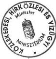
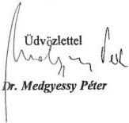
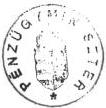
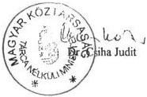
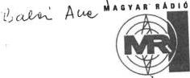
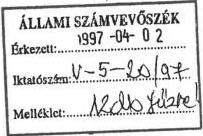

Állami Számverőszék

# JELENTÉS

a médiatörvény végrehajtásának
pénzügyi - gazdasági
ellenőrzéséről

396.

1997. szeptember

---

Az ellenőrzés végrehajtásáért felelős:
az ÁSZ III. Költségvetési Ellenőrzési Igazgatósága

Bihary Zsigmond
igazgató

Az ellenőrzést vezette:

Balázs Andrásné
számvevő főtanácsos

Az ellenőrzésben részt vettek:

Csepregi Zsuzsa
számvevő

Deák Tamásné
számvevő tanácsos

Éva Katalin
számvevő tanácsos

Karsai Lászlóné
számvevő

Makláry Valentin
számvevő

Norczen Győzőné
számvevő

Dr. Gálik Jenő
számvevő tanácsos (kapcsolódó ellenőrzés keretében)

---

# Tartalomjegyzék

I. Összefoglaló megállapítások, következtetések, javaslatok ... 2

II. Részletes megállapítások ... 13

1. A műsorszolgáltatáshoz szükséges, a médiatörvényben megjelölt egyes feladatok teljesítéséről, így ... 13
1.1. A műsorszolgáltatási jogosultság megszerzésére előírt pályáztatási rendszer működése ... 14
1.1.1. A pályázati feltételek, pályázati felhívás, nyilvános meghallgatások, a pályázatok lebonyolítására kötött megbízások ... 14
1.1.2. A műsorszolgáltatási díj legkisebb mértékének megállapítását megalapozó előkészítő munkák ... 17
1.1.3. A pályázati díj megállapítására, befizetésére, elszámoltatására, visszafizetésére kialakított rendszer ... 18
1.1.4. A TV2 és egy országos tévécsatorna pályáztatása ... 19
1.1.5. A Danubius Rádió és még egy országos kereskedelmi rádiócsatorna pályáztatása ... 19
1.1.6. A helyi stúdió engedélyek újrapályáztatása ... 20
1.1.7. A pályáztatásokra a törvényben előírt határidők betartása, a határidő csúszások okai ... 20
2. A médiatörvényben előírt új intézmények létrehozása, vagyona, működési feltételei, szervezeti és működési rendje ... 22
2.1. Az Országos Rádió és Televízió Testület működési feltételeinek kialakítása, gazdálkodásának megszervezése ... 22
2.1.1. Az ORTT elhelyezése, belső szervezeti egységeinek és működési rendjének kialakítása ... 22
2.1.2. Az ORTT gazdálkodásának szabályozottsága és törvényessége ... 24
2.1.3. Az ORTT 1996. évi és 1997. évi költségvetése ... 26
2.2. A Műsorszolgáltatási Alap gazdálkodásának megszervezése ... 33
2.2.1. Az Alap létrehozása, működési rendjének meghatározása ... 33
2.2.2. A Műsorszolgáltatási Alap bevételeinek és kiadásainak forrás szerinti összetétele és összege, összhangja a törvényben rögzített támogatási célokkal és mértékkel, a számviteli és bizonylati rend ... 34
2.2.3. Az Alap terhére az ORTT, illetve a közalapítványok költségvetésének kiegészítése ... 36
2.2.4. Az üzemben tartási díj beszedése ... 36

---

2.2.5. Az Alapból teljesített kifizetések ütemessége, a finanszírozásra előírt törvényes határidők teljesítése ... 38
2.3. A közalapítványok megalakítása, gazdálkodásuk megszervezése ... 38
2.3.1 Magyar Rádió Közalapítvány ... 38
2.3.2. Magyar Televízió Közalapítvány ... 42
2.4. A közalapítványok részvénytársaságai megalakításának előkészítése ... 46
2.4.1. Vagyonfelmérés, vagyonátadás ... 46
2.4.1.1. Az MR vagyonának felmérése ... 47
2.4.1.2. Az MTV vagyonának felmérése ... 54
2.4.2. Az MR és az MTV költségvetési szervek megszüntetése ... 57
2.4.2.1. A Magyar Rádió (MR) költségvetési szerv megszüntetése ... 58
2.4.2.2. A Magyar Televízió (MTV) költségvetési szerv megszüntetése ... 59
2.4.3. A részvénytársaságok alapításkori adósságainak rendezése, a megváltozott finanszírozás ... 60
2.4.3.1. Magyar Rádió Rt. ... 61
2.4.3.2. Magyar Televízió Rt. ... 64
2.4.4. A részvénytársaságok megalakítása, gazdálkodásuk megszervezése ... 68
2.4.4.1. Magyar Rádió Rt. ... 68
2.4.4.2. Magyar Televízió Rt. ... 74
2.5. A Nemzeti Hírközlési és Informatikai Tanács gazdálkodásának megszervezése ... 78

---

**Állami Számvevőszék**

V-5-89/1997.

Témaszám: 363

# JELENTÉS

## a médiatörvény végrehajtásának pénzügyi - gazdasági ellenőrzéséről

Az Országgyűlés 1995. december 21-én elfogadta a rádiózásról és a televíziózásról szóló 1996. évi I. törvényt (médiatörvény), a szabad és független rádiózás és televíziózás, a véleménynyilvánítás szabadsága, a tájékoztatás függetlensége, kiegyensúlyozottsága és tárgyilagossága, a tájékozódás szabadsága, valamint az egyetemes és a nemzeti kultúra támogatása, a vélemények és a kultúra sokszínűségének érvényre juttatása, továbbá a tájékoztatási monopóliumok kialakulásának megakadályozása érdekében.

Az ellenőrzés az Állami Számvevőszékről szóló 1989. évi XXXVIII. törvény 2. § (3), (5), a Ptk. 74/G. § (8), továbbá a rádiózásról és a televíziózásról szóló 1996. évi I. törvény 32. § (1), 60. § (5) bekezdésében meghatározott hatásköre és feladatai alapján törvényességi szempontok szerint értékelte a rádiózásról és a televíziózásról szóló 1996. évi I. törvényben megjelölt pénzügyi, gazdasági feladatok határidőben való végrehajtását, az elmaradások okait, a létrehozott új intézmények megalakítását, működésük megszervezését.

**Ellenőrzésünk során arra kerestünk választ, hogy:**

- a műsorszolgáltatáshoz szükséges, törvényben megjelölt feladatok az előírt tartalomban és határidőben megvalósultak-e, mi volt az esetleges elmaradás oka;
- az új intézmények létrehozása, illetve a jogelőd költségvetési intézmények megszüntetése a törvények és más jogszabályok betartásával történt-e; az új intézmények vagyona, működési feltételei, szervezeti és működési rendje összhangban van-e a törvényben meghatározott feladatokkal, mennyiben segíti azok végrehajtását;

---

- a Magyar Rádió Rt. (MR Rt.) és a Magyar Televízió Rt. (MTV Rt.) alapításkori adósságainak rendezése megfelelő módon történt-e meg;
- a műsorszolgáltatás forrásai, támogatási rendszere, működtetése megfelel-e a törvény előírásainak;
- a pályáztatási eljárások lebonyolítását a törvényben megszabott rend szerint végezték-e el;
- megtörtént-e és milyen mértékben az Országgyűlés munkájáról a televíziós közvetítés feltételeinek kialakítása.

Az ellenőrzés a médiatörvény végrehajtását a hatálybalépéstől 1997. március 31-ig értékelte, az Állami Számvevőszékről szóló 1989. évi XXXVIII. törvény 24. §-ának megfelelően helyszíni ellenőrzés, adatbekérés és írásos nyilatkozatok alapján.

A tanúsítványok formájában bekért adatokat a jelentés megállapításainak összegezéséhez felhasználtuk, az írásos beszámolókat a jelentés függelékében csatoltuk.

A helyszínen ellenőrzött szervezetek felsorolását, valamint azoknak a körét, akiktől írásos nyilatkozatot kértünk, a melléklet tartalmazza.

## I. Összefoglaló megállapítások, következtetések, javaslatok

A médiatörvényben meghatározott feladatok határideje szerint jórészt az 1996-os év során kellett megtörténnie azoknak a gyökeres változásoknak, amelyek eredményeként - az állami tájékoztatási monopóliumok lebontásával - létrejöhet a közszolgálati és kereskedelmi média rendszer. A megjelölt feladatok kisebb része teljesült csak határidőben, nagyobb része késedelmesen, illetve a helyszíni ellenőrzés befejezéséig nem, vagy nem a törvényben előírt módon teljesült.

Az elmaradások döntően a médiatörvényben rögzített rövid határidők, a létrehozott új szervezetek - elsősorban az Országos Rádió és Televízió Testület (ORTT) - vontatott felállítása, gyakorlatlansága, az újszerű vagy nagy tömegű szakmai feladatok miatt következtek be. Az MTV Rt. megalakításának elhúzódását és a vagyonértékelés hiányosságait főleg a médiatörvény, a gazdasági társaságokról szóló törvény és a számviteli

2

---

**törvény közötti ellentmondások, esetenként joghézagok, illetve a feladat nagyságához mért rövid határidő okozta.**

**A médiatörvény eddigi végrehajtásának eredményeként azonban - bár nem hibátlanul - már működnek az új szervezetek, beindult a kereskedelmi adások privatizálásának folyamata.**

A médiatörvény-javaslat 1995. novemberi beterjesztésekor a Kormány az 1112/1995. (XI. 22.) Korm. határozatban meghatározta a törvénnyel összefüggő időszerű feladatokat, egyúttal előírta, hogy a feladatok teljesítéséről be kell számolni, illetve át kell tekinteni a további teendőket. A Kormány 1996. májusában áttekintette a médiatörvény végrehajtása érdekében hozott határozatai teljesítését. A Miniszterelnöki Hivatal (MEH) közigazgatási államtitkára 1996. április 1-én tájékoztatást, 1997. február 4-én jelentést adott a Kormánynak a médiatörvény végrehajtásának helyzetéről, különös tekintettel a kormányzati feladatokra.

A Kormány 1996-ban három ülésén foglalkozott - a végrehajtás helyzetét tekintve átfogó módon - a média ügyekkel, 1996. április 4-én a több minisztériumot érintő feladatok teljesítésének koordinálásával megbízta a MEH közigazgatási államtitkárát. A Kormány több eseti intézkedést is hozott, pl. a közszolgálati műsorszolgáltatók aktuális likviditási gondjainak megoldására, illetve egyéb kérdésekben.

**A médiatörvény végrehajtásában a kormányzati szervek együttműködése mellett az új médiaszervezetek - különösen az ORTT - ügydöntő szerepet töltenek be, az egyes kormányzati intézkedések tartalmát az ORTT döntése, egyetértése, a kuratóriumok véleménye alakítja. A Kormány feladata alapvetően a közszolgálati műsorszolgáltatók, illetve az új szervezetek működésének anyagi-technikai biztosítása lett.**

1996. végéig az ORTT és a három közalapítvány működési költségeire - az ORTT székház megvásárlásával együtt - az általános tartalék terhére a Kormány 1.239 millió Ft-ot, a TV előfizetési díjak 1996. szeptemberi újraosztásával az Országgyűlés további 79,9 millió Ft fedezetet, összesen 1319,8 millió Ft-ot biztosított. A részvénytársaságok megalakításának, pénzügyi átvilágításának, auditálásának költségei mintegy 100 millió Ft-ot tettek ki.

Az 1997. évi költségvetésről szóló 1996. évi CXXIV. törvény - 1997. évre vonatkozóan - lényegesen módosította a médiatörvény finanszírozási rendelkezéseit. A médiatörvény 75.§ (1) bekezdése szerint az állam a központi költségvetés 'Országgyűlés' fejezetében a részvénytársaságokat - a közalapítványok útján - a műsorterjesztési költségeiknek megfelelő összegű támogatásban részesíti. **A műsorterjesztési költségek fedezetéről tehát az állam szándékozott gondoskodni. E szándékot 1997. évre vonatkozóan a költségvetési törvény módosította. A központi költségvetés az ÁPV. Rt. útján kifizette az MTV Rt. és az MR. Rt. Antenna Hungária Rt. (AH Rt.) felé fennálló, összesen 3.778,6 millió Ft tartozását, elengedte az MTV 1.383,4 millió Ft adótar-**

---3

---

**tozását, viszont ennyivel kevesebb központi költségvetési támogatást ad az 1997. évi sugárzási díjakra. Mindez kétirányú problémát okozott.**

Egyrészt az 1997. évi sugárzási díjaknál a tartozások újbóli kialakulását eredményezte, ugyanis a helyszíni ellenőrzés befejezéséig az MR Rt. csak a költségvetési törvényben biztosított - az adóssággal csökkentett - támogatás mértékéig (58 %), az MTV Rt. ezt a mértéket (17,4 %) meghaladóan, az 1997. I. félév átlagában 47,8 %-os arányban, aktuális pénzügyi helyzetétől függően egyenlítette ki az AH Rt. 1997. évi sugárzási díj számláit. (Az MR Rt. gazdasági igazgatójának 1997. augusztus 27-i, az MTV Rt. gazdasági főigazgatójának 1997. augusztus 26-i tájékoztatása szerint 1997. január 1 - 1997. július 31 közötti időszakra a Magyar Rádió Rt.-nek 901,9 millió Ft, az MTV Rt.-nek 1.373,9 millió Ft kiegyenlítetlen számlája volt az AH Rt. felé.) A Közlekedési, Hírközlési és Vízügyi Minisztérium (KHVM) közigazgatási államtitkára 758211/1997. számú, 1997. augusztus 15-én kelt észrevételében jelezte, hogy amíg az AH Rt.-vel szemben a Magyar Televízió Rt.-nek és a Magyar Rádió Rt.-nek a műsorszórási díj tartozása fennáll, illetőleg amíg az ilyen adósságok keletkezése, illetőleg kiegyenlítése nem oldható meg folyamatosan és külső beavatkozás nélkül, az AH Rt. kisebbségi privatizációját (külföldi tőke bevonását) aggályosnak tartják.

A műsorterjesztési költségek fedezetére biztosított központi költségvetési támogatás csökkentésébe az 1997. évi költségvetési törvény olyan tartozások beszámítását írta elő kötelezően, amelynek egy részét az MR és az MTV nem ismert el, a törvényhozás időpontjáig jogerős bírói ítélet vagy perbeli egyezség (MTV - APEH, MR Rt. - AH Rt.) nem támasztott alá. Az MTV 1994. évi sugárzási díj tartozását - melyet 1994. decemberében engedményezéssel átvett az AH Rt.-től az ÁV Rt. - a költségvetési törvény az MTV tartozásának tekintette, bár ezt az adósságot az MTV a Pénzügyminisztérium (PM) korábbi állásfoglalásai alapján joggal rendezettnek hitte. Az AH Rt. 1994. évi díjemeléséhez - mely az AH Rt. privatizálhatósága érdekében történt - a Pénzügyminisztérium - a PM közigazgatási államtitkára szerint - azzal járult hozzá, hogy az ebből származó - a közfeladatokat ellátó költségvetési intézményeket érintő - többletkiadásokat a privatizációs bevételből az ÁV Rt. rendezi. Az 1997. évi sugárzási díjra tervezett központi költségvetési támogatásba még ezen adósság időközben keletkezett kamatterhe is beszámításra került.

**Nem volt tehát megnyugtatóan tisztázott az MR Rt. és az MTV Rt. egyes adósságainak, ebből következően a költségvetési törvényben meghatározott, beszámításra került összegeknek a mértéke, jogossága.**

Az MTV és az MR terhére 10 % ponttal felemelték a Duna Televízió részesedését az üzemben tartási díjakból, a közszolgálati médiák forrásainak átmeneti növelése érdekében pedig az MR, az MTV és a Duna TV tekintetében a reklámidő korlátozására vonatkozó szabályokat 1997. szeptember 1-ig nem alkalmazzák.

4

---

# A médiatörvény és a végrehajtására hozott kormányhatározatok által előírt tartalommal és határidőben a megszabott feladatok a következők szerint teljesültek.

## Kormányzati és minisztériumi feladatok

A médiatörvény 128. §-a értelmében a Kormánynak a törvény hatálybalépését követően haladéktalanul meg kellett kezdenie a harmadik országos földi terjesztésű televíziós műsorszolgáltatás céljára, valamint a Magyar Rádió számára két országos műsorszolgáltatás céljára 87,5-108 MHz frekvenciasávban igénybe vehető **frekvenciakészlet** kialakítását. A szükséges frekvenciakészlet felülvizsgálata és átrendezése a KHVM és a Honvédelmi Minisztérium (HM) feladata lett, 1996. február 29-i határidővel.

## A KHVM a feladatot teljesítette.

A tervezéshez és a kialakításhoz szükséges előkészületekre vonatkozó határidőt a médiatörvény 1996. június elsejében (az országos televíziós pályázatok kihirdetéséig) határozta meg. Az egyeztetés alapján a Hírközlési Főfelügyelet (HIF) elkészítette az országos hálózatokra vonatkozó végleges tervet, melyet az ORTT - a HIF-fel és a KHVM-mel való egyeztetéseket követően - 1996. október 22-én hagyott jóvá. Az országos közszolgálati és kereskedelmi hálózatok frekvenciatervei több hónapos késéssel ugyan, de elkészültek, megtörtént a frekvenciakijelölés is.

A Kormány a **frekvencia díjakkal** kapcsolatos rendelet egyeztetésének lefolytatására 1996. június 30-i határidőt, majd az 1996. december 31-i határidőt szabta meg. Az 1996. december 12-i kormányülésen a Kormány kötelezte a KHVM-et és a PM-et, hogy 1997. január 5-ig a frekvenciadíjakat jelentessék meg a Magyar Közlönyben. A rendelet tervezetet a HIF díjakra vonatkozó javaslatának késedelmes (szeptemberi) elkészítése és az ORTT, a PM, a HIF és a KHVM szakértői között a díjtételekre irányuló megbeszélés elhúzódása, majd a tervezet újbóli átdolgozása után csak 1996. decemberében véglegesítették. A rendelet kiadásának azonban feltétele volt a bevételt szabályozó kormányrendelet megalkotása. Ez utóbbiakról szóló előterjesztéseket a Kormány és a kormány-bizottságok több alkalommal is tárgyalták az év első hónapjaiban és csak 1997. május 9-én jelent meg a kormányrendelet. (A frekvencia-lekötés és - használat díjából származó 1997. évi többletbevétel megosztásáról a 77/1997. (V. 9.) Korm. rendelet döntött.) A késlekedés miatt az országos műsorszolgáltatási díj a frekvencia- és sugárzási díjak figyelembevétele nélkül került meghatározásra. (A frekvencia-lekötés és - használat díját a 6/1997. (IV. 22) KHVM rendelet szabályozza.)

A Magyar Televízió 2. adásának 1996 novemberéig át kellett volna térnie a műholdas rendszerre. Az áttéréshez szükséges feltételek megteremtésének előkészítésével a Kormány a KHVM-et és a PM-et bízta meg. A médiatörvény azonban úgy rendelkezett, hogy az MTV kettes csatornája műsorszolgáltatása megvalósítási módjáról - az MTV Közalapítvány Kuratóriuma véleményének figyelembevételével - az ORTT-nek kell döntenie, és az új műsorszolgáltatást az MTV-nek 1996. december 31-ig kell megkezdenie. Az ORTT a Kuratórium döntését figyelembe véve úgy határozott, hogy az MTV 2 műsorának sugárzása földfelszíni lehetőségek hi-

5

---

ányában a jövőben az Eutelsat műholdról történik, a rendelkezésre álló csatorna várhatóan 1997. szeptemberétől üzemképes lesz.

A médiatörvény két országos (87,5-108 MHz frekvenciasávban igénybe vehető) rádióadó hálózat, két (87,5-108 MHz) koncessziós pályázatára kerülő kereskedelmi URH adóhálózat, továbbá harmadik, földi terjesztésű TV adóhálózat, és az MTV 2 program műholdas terjesztési lehetőségének megteremtését, mint **új műsorszóró adóhálózatok kiépítését írta elő**. A feladatban elsődlegesen a KHVM, az ÁPV Rt. és az AH Rt. érintett. A megkötött szerződésekben szereplő határidők várhatóan lehetővé teszik, hogy az AH Rt. az adóhálózatok üzembe helyezésére megjelölt ütemezést tartani tudja. (A két országos kereskedelmi adóhálózat 1997. szept. 30., a két közszolgálati és két kereskedelmi 100 MHz-es adóhálózat I. ütem 1997. szept. 30., a II. ütem 1997. dec. 31., az MTV 2 műholdas feladóállomás 1997. szept. 15.)

### **Az új rádió adóhálózatok kiépítési időszükséglete miatt nem volt tartható a két országos rádiós pályázat határideje.**

A médiatörvény értelmében 1997. február elsejéig **zárt láncú televíziós rendszert** kellett volna létrehozni az országgyűlési ülések és bizottsági meghallgatások közvetítésére. Az Országgyűlési Hivatal a médiatörvény által megszabott határidőt **elsősorban az anyagi feltételek hiánya miatt nem tudta betartani**. Az előkészítő munkák 1996. márciusában megkezdődtek, 1997-ben és 1998-ban tervezik a feladatot megoldani. Az első ütem várható költségét 380 millió Ft-ra, a második ütemét 230 millió Ft-ra becsülik. Az 1997. évi beruházási összeg biztosítása céljából kormány-előterjesztés készült, határozat azonban a helyszíni ellenőrzés befejezéséig nem született.

A beruházás első ütemében a rögzített anyagok archiválása alapfeltételeit kívánják megteremteni (mintegy 70 millió Ft), a második ütemben bővítésre kerül az archiváló centrum és kiépítésre a hozzá tartozó ügyfélszolgálat.

### **A médiatörvény végrehajtásához új jogszabályok kiadása is szükséges volt.**

**A Művelődési és Közoktatási Minisztérium (MKM) feladata volt az Informatikai Érdekegyeztető Fórumra (IÉF) vonatkozó jogszabály-tervezet** előkészítése. Az MKM a kormányrendelet tervezetét 1996. október 13-án véleményezés céljából megküldte a KHVM-nek, melyben az IÉF-t költségvetési szervként javasolták megalapítani úgy, hogy működésének feltételeiről a KHVM gondoskodjon. A KHVM az IÉF költségvetési szervként történő létrehozását - az Nemzeti Hírközlési és Informatikai Tanács Irodájának létrehozásával kapcsolatos tapasztalatok alapján - nem támogatta, és az Információs Vállalkozások Szövetségével megkezdte az egyesület megszervezését. Az egyesület 1997. február 20-án megtartotta alakuló közgyűlését. Az MKM e feladat alóli mentesítése az ellenőrzés befejezéséig nem történt meg.

---6

---

A médiatörvényben a Kormány felhatalmazást kapott arra, hogy a televízió készülékek üzemben tartási díja beszedésének részletes szabályait rendelettel meghatározza. A Kormány 1996. szeptember 30-i határidővel a PM feladatává tette a rendelet előkészítését. A rendelet megjelenése jelentősen késett, mivel az előkészítésért felelős PM a díjbeszedő szervezet kiválasztását követően tartotta azt kidolgozhatónak. A készülék üzemben tartási díj beszedésének részletes szabályait a 122/1997. (VII. 17.) Korm. rendelet tartalmazza.

A médiatörvény szerint a műsorelosztás részletes szabályairól külön törvényt kell alkotni. A Kormány a törvény-előkészítési feladattal a KHVM-et bízta meg, 1996. november 30-i határidővel. A KHVM fenti feladatot a távközlési törvény módosítására, illetve az ártörvény módosítására vonatkozó javaslat keretében oldotta meg, melyet 1996. decemberében benyújtott a Kormánynak.

A médiatörvény felhatalmazta a Kormányt a hálózatba kapcsolódás műszaki feltételeiről szóló jogszabály vagy szabvány kiadására. A Kormány a KHVM-et jelölte ki a műszaki feltételek kidolgozására, 1996. november 30-i határidővel. A KHVM a feladatot azért nem tudta határidőre teljesíteni, mert a műszaki szabványok tekintetében alkalmazkodnia kell a honosítást igénylő európai normákhoz. A Kormány által megszabott új határidő 1997. június 30.

A médiatörvény szerint a műsorelosztó rendszerek műszaki szabványait a közlekedési, hírközlési és vízügyi miniszternek rendeletben kell szabályoznia. A Kormány a KHVM-nek a szabályozás elkészítésére eredetileg megszabott 1996. november 30-i határidőt 1997. június 30-ra módosította.

1996. március 1-én megalakult az ORTT.

Elhelyezésével 1996. január 31-i határidővel a Kormány a művelődési és közoktatási minisztert és a pénzügyminisztert bízta meg. Az 1056/1996. (V. 30.) Korm. határozat törölte az MKM elsődleges felelősségét az elhelyezéssel kapcsolatban. Végül is az ORTT 1996. augusztus 21-én foglalta el helyét az új székházban.

A televíziós csatornák általános pályázati feltételeit az ORTT három hónapos késedelemmel, 1996. augusztus 31-ére készítette el. Szövege megjelent a Magyar Közlönyben, de két országos napilapban csak 1996. október 17-én került nyilvánosságra. 1997. január 10-én hirdette meg a kereskedelmi I. és II. országos televíziós csatornák pályázati feltételeit, mely a törvény eredeti határidejéhez képest hét hónapos késedelem. A pályázat eredményhirdetése 1997. június végén, szintén mintegy hét hónapos késedelemmel történt. Az ORTT által a televíziós műsorszolgáltatási jogosultságokra kiírt pályázatok tartalmukban összhangban álltak a törvényi előírásokkal.

Az országos kereskedelmi rádiócsatornákat 1996. májusában meg kellett volna hirdetni. Az ORTT pályázati felhívás-tervezete a Danubius Rádió és még egy országos kereskedelmi rádió-csatorna pályáztatására több,

7

---

mint 9 hónapos késéssel, 1997. március 14-én jelent meg a Művelődési Közlönyben.

A helyi stúdióengedélyekkel kapcsolatban a médiatörvényben megjelölt határidők ( a hatálybalépéstől számított kilenc hónap, illetve másfél év) nem teljesültek. A helyi televízió és a rádió stúdió engedélyek meghosszabbítására, valamint az ezután történő pályáztatásra a vételkörzetre vonatkozó előírások miatt majd csak akkor kerülhet sor, ha az országos kereskedelmi adók vételkörzetét a műsorszolgáltatási szerződések megkötésével egyértelműen rögzítették és minden átfedés megszűnt. Az ORTT a helyi stúdióengedélyek meghosszabbítására irányuló igényeket beszerezte.

A Műsorszolgáltatási Alap kezelésének részletes szabályait - a pénzügyminiszterrel egyetértésben - az ORTT-nek kellett meghatároznia. Kidolgozása az ORTT hibájából indokolatlanul elhúzódott, a jelentés készítésekor még nem volt jóváhagyott szabályzat.

Az ORTT-nek 1996-ban nem volt az Országgyűlés által jóváhagyott költségvetése.

Az ORTT 1997. évi költségvetésének tervezetét 1996. novemberében benyújtotta az Országgyűlés költségvetési és pénzügyi bizottságának, mely azt nem találta elég megalapozottnak. A bizottság elnöksége kapott megbízást arra, hogy készítse elő a törvénytervezetet olyan formában, hogy azt a bizottság tárgyalhassa. Az előkészítés során a bizottság elnöksége az ORTT 1996. évi gazdálkodása részletes adataira vonatkozó kiegészítés nélkül kapta meg a törvénytervezetet. A bizottság a helyszíni ellenőrzés időszakában - 1997. március 18-án - az ORTT-hez kihelyezett ülésén ismételten foglalkozott az ORTT 1997. évi költségvetésének jóváhagyására vonatkozó törvénytervezettel, de a döntést elhalasztotta, mivel a tervezet nem volt a bizottság igényeinek megfelelő részletezettséggel kimunkálva. A bizottság hiteles költségkalkulációt igényelt annak megítéléséhez, hogy a médiatörvényben megszabott keretek között mekkora forrást javasoljon az Országgyűlésnek jóváhagyásra az ORTT működési céljaira.

Az ORTT 1997. évi költségvetését az Országgyűlés 1997. július 8-án, az 1997. évi LXIII. törvénnyel fogadta el.

Az ORTT munkaszervezete vontatottan épült ki. Végleges elhelyezésének elhúzódása hozzájárult ahhoz, hogy a médiatörvényben meghatározott feladatai végrehajtásánál a törvényi határidőket nem mindig tudta betartani.

Az ORTT 1996. évben megkezdte belső szabályzatai kidolgozását.

Az ellenőrzés több hiányosságot tárt fel az utalványozásban, ellenjegyzésben, érvényesítésben. A munkafolyamatba épített és vezetői ellenőrzés nem funkcionált megfelelően, hiányoztak a munkaköri leírások.

8

---

Az ORTT-nek a megalakulást követően 90 napon belül kellett volna összeállítani számviteli rendjét, ezzel szemben számlarendjének jóváhagyására 1996. szeptember 1-én került sor, a megalakulást követő hat hónap elteltével. Az intézményi sajátosságoknak megfelelő számlatükröt csak 1996. év végére alakították ki.

## A közalapítványok és részvénytársaságaik

Időben elkészültek a **közalapítványok** alapító okiratai, a Magyar Rádió Közalapítvány (MR KA) és a Magyar Televízió Közalapítvány (MTV KA) megalapításához szükséges intézkedések teljes körűen megtörténtek. A közalapítványok a bírósági nyilvántartásba vétellel jogi személlyé váltak és megkezdték működésüket.

A közalapítványok, illetve a részvénytársaságok számára a médiatörvényben foglalt **vagyonátadás** ellentmondott a számviteli törvény előírásainak, mivel az aktualizált vagyonértékelés és Rt. megalapítás azonos határnappal való végrehajtása számvitelileg nem volt megoldható.

Az **MR KA** kuratóriumának elnöke a médiatörvényben megjelölt időpontnál később, 1996. augusztus 1. helyett 1996. augusztus 26-án vette át a Kincstári Vagyoni Igazgatóságtól (KVI) az 1995. december 31-i fordulónapra készített, vagyonértékelésen alapuló vagyont.

A kuratórium az átadott ingatlanok tulajdonjogának az ingatlannyilvántartáson való átvezetésére nem intézkedett.

Az MR KA kuratóriumának alelnöke 1997. szeptember 8-án kelt levelében jelezte, hogy az átadott ingatlanok tulajdonjoga bejegyzésének elmaradásához az 1996. évi I. törvény 141. § (4) bekezdésének eltérő értelmezése vezetett. Ismételt értelmezést követően a kuratórium az Rt.-vel együtt, közös beadványban fordult a Földhivatalhoz, és kérte a bejegyzés elrendelését. A bejegyzési eljárás a Földhivatalnál folyamatban van.

A Szervezeti és Működési Szabályzat (SZMSZ) az előírt határidőben elkészült, az alapító okiratban meghatározott követelményeknek összességében megfelel.

A számviteli politika, számlarend 1997. februárjára készült el, azonban a helyszíni ellenőrzés befejezéséig nem került jóváhagyásra. A pénzkezelési szabályzat 1997. március 20-án lépett hatályba, az iratkezelési szabályzat kidolgozása a helyszíni ellenőrzés idején volt folyamatban.

A kuratórium és az elnökség testületi üléseit az előírásokat meghaladó gyakorisággal tartotta, határozataik egy része azonban formailag nem kifogástalan.

Az MR KA kuratóriumának alelnöke 1997. szeptember 8-án kelt levelében jelezte, hogy a szabályzatok korrigálását folyamatosan végzik. Az SZMSZ megfelelő módosítására várhatóan még 1997-ben sor kerül, valamennyi szükséges korrekcióról egy alkalommal döntenek. A számviteli politikát tartalmazó dokumentumra rávezették a jóváhagyó záradékot. Intézkedtek, hogy a konkrét, végrehajtandó kötelezettséget tartalmazó határozatokon szerepeljen a végrehajtásért felelős személy neve.

---9

---

Megfelelően látták el az MR KA gazdálkodásával kapcsolatos feladat- és jogkörüket.

Az ellenőrző testület az alapító okiratnak megfelelően, ügyrend szerint működött.

Az **MTV KA** kuratóriumának elnöke a KVI-től a médiatörvényben megjelölt időpontban, 1996. október 1-jén vette át az 1995. december 31-i fordulónapra készített, vagyonértékelésen alapuló vagyont.

A kuratórium a törvényi előírásoknak megfelelően megküldte az átvett ingatlanok tulajdonjogi bejegyzésére irányuló kérelmet az illetékes földhivataloknak, de ezek bejegyzése a helyszíni ellenőrzés befejezéséig nem történt meg teljes körűen.

Az SZMSZ-t a kuratórium a médiatörvényben előírt határidőhöz képest öt hónap késéssel állapította meg, az időközben végrehajtott módosítások után az alapító okiratban meghatározott követelményeknek megfelel.

A számlarendet, a leltározási szabályzatot, bizonylati szabályzatot, iratkezelési szabályzatot, házipénztár kezelési szabályzatot 1997. március 10-én fogadta el a kuratórium. A számlarend és a leltározási szabályzat csak részben felel meg a törvényi előírásoknak.

A kuratórium és az elnökség testületi üléseit az előírásokat meghaladó gyakorisággal tartotta, határozatai egy része azonban formailag nem kifogástalan.

Mindkét testület megfelelően látta el az MTV KA gazdálkodásával kapcsolatos feladat- és jogkörét.

Az ellenőrző testület ügyrend szerint működött.

Az MR KA 1996. augusztus 1-jével alapította meg az **MR Rt.-t.**

**Az MR Rt. vagyonmérlege** nem a valóságnak megfelelően tartalmazta az Rt. induló vagyonát. A vagyon értékelése a számviteli törvény előírásainak nem felelt meg, mivel a több mint 7 milliárd Ft-ban megjelölt hang- és sajtóarchívum, szakkönyvtár, múzeum és kottatár értékét, továbbá a Danubius Rádió mintegy 3,0 - 3,5 milliárd Ft-os üzleti és cégértékét nem szerepeltették az MR vagyonában. Az MR Rt. jegyzett tőkéjét 4,5 milliárd Ft-ban állapították meg, nyitó mérlegét a könyvvizsgáló 6.541.022 ezer Ft összegben hitelesítette. A médiatörvénnyel ellentétben nem került az MR KA könyveiben átvezetésre **a könyvvizsgálói záradékkal ellátott vagyon** teljes összege.

Az MR KA kuratóriumának alelnöke 1997. szeptember 8-án kelt levelében jelezte, hogy a nyitó mérleg, illetve a vagyonérték korrekciója tekintetében felhívták az MR KA könyvvizsgálóját, hogy az ÁSZ jelentés áttanulmányozását követően nyilatkozzék a megállapításokra, és tegyen javaslatot a feladat végrehajtásának módjáról.

---10

---

Az **MR Rt.** vagyonértékelés alapján összeállított nyitó mérlege 1996. december végén elkészült, de a vagyon jegyzőkönyv szerinti átvételére az MR KA kuratóriuma hibájából nem került sor.

A kuratórium és az elnökség többségében megfelelően ellátta az **MR Rt. közgyűlési hatáskörét**.

Az **MR Rt.** a helyszíni ellenőrzés befejezéséig nem rendelkezett **jóváhagyott Közszolgálati Műsorszolgáltatási Szabályzattal** és az **archiválás rendjéről** szóló szabályzattal, nem történt meg az **évi adásidő** jóváhagyása.

Az **MR Rt.**-nél több, mint fél évig nem volt **felügyelő bizottság**, érdemi ellenőrzési feladatot a helyszíni ellenőrzés befejezéséig nem végeztek. Az Rt-nél nem működött belső ellenőrzési szervezet sem, ami a médiatörvény 73. § (7) bekezdése szerint a Felügyelő Bizottság (FEB) irányítása alá tartozik.

Az MTV KA 1996. október 1-jén alapította meg az **MTV Rt.-t.**

Az MTV-nél az előzetes (1995. december 31-i állapot) **vagyonértékelés** a médiatörvényben rögzített 1996. július 31-i határidőhöz képest két hónapos, míg a végleges (az 1996. évi változásokkal korrigált) vagyonértékelés félévet meghaladó késedelemmel készült el, 1997. február hónapban. A végleges vagyonmérleget a vagyonértékelést végző kft. könyvvizsgálója 1997. február 28-án hitelesítette.

A kuratórium és az elnökség többségében megfelelően látta el az **MTV Rt. közgyűlési hatáskörét**. Az **MTV Rt.** a helyszíni ellenőrzés befejezéséig azonban nem rendelkezett jóváhagyott **Közszolgálati Műsorszolgáltatási Szabályzattal**, az **archiválás rendjéről** szóló szabályzattal, nem történt meg a helyszíni ellenőrzés befejezéséig **az 1997. évi gazdálkodási és pénzügyi terv** elveinek és fő összegeinek és az **éves adásidőnek** a jóváhagyása.

Az **MTV Rt. felügyelő bizottsága** (FEB) a vizsgált időszakban a törvényben kötelezően előírt feladatait teljesítette. Az MTV Rt. belső ellenőrzése a FEB irányítása alatt munkaterv alapján dolgozott.

A helyszíni ellenőrzést követően **az Országgyűlés 67/1997. (VII. 1.) OGY határozatában felkérte a Kormányt**, hogy az országos televízió és rádió pályázatok eredményes lebonyolítása, valamint a médiatörvényben foglalt valamennyi egyéb feladat végrehajtása érdekében a törvény által előírt, még nem teljesített kötelezettségeinek maradéktalanul tegyen eleget. Gondoskodjék a sugárzási díjak megnyugtató rendezéséről, és a műsorszolgáltatás finanszírozása érdekében 1997. július 31-ig alkossa meg az üzemben tartási díjak beszedésének részletes szabályait.

---11

---

# Javaslatok

## a Kormánynak

A közszolgálati műsorszolgáltatók, valamint az Antenna Hungária Rt. likviditása érdekében tegyen javaslatot az Országgyűlésnek, hogy a közalapítványok tulajdonában lévő közszolgálati műsorszolgáltató részvénytársaságokat terhelő műsorterjesztési költségek teljes fedezete már 1997. évben és ezt követően folyamatosan a központi költségvetésből - a médiatörvény 75. § (1) bekezdésének megfelelően - rendelkezésre álljon.

## az ORTT elnökének

1. Gyorsítsa fel az ORTT hivatali szervezetének kiépítését, megfelelően képzett szakemberek felvételével.
2. Intézkedjen, hogy az intézmény 1998. évi költségvetése reális megalapozó számításokkal alátámasztva, a költségvetési szervekre előírt formában és tartalommal kerüljön benyújtásra az Országgyűlés költségvetési ügyekben hatáskörrel rendelkező bizottságának.
3. A Műsorszolgáltatási Alap kezelésének részletes szabályait haladéktalanul határozza meg, intézkedjen az Alap és az ORTT kiadásainak szétválasztására, illetve pótlólagos rendezésére.
4. A jelentés megállapításai alapján szüntesse meg az utalványozás, ellenjegyzés, érvényesítés végrehajtásában feltárt hiányosságokat.
5. Az SZMSZ-ben szabályozza a belső ellenőrzés helyét, szerepét, gondoskodjon a vezetői és a munkafolyamatba épített ellenőrzés megfelelő funkcionálásáról.
6. Dolgozza ki az üzemben tartási díj beszedését végző gazdasági társaság szerződés szerinti teljesítése ellenőrzésének módszereit, ez alapján a hivatali szervezet rendszeresen végezze el az ellenőrzést.

## az MR KA kuratóriumának és elnökségének

1. A jelentés megállapításai alapján intézkedjen a nyitó mérleg pontosításáról, az MR Rt. - könyvvizsgálói záradékkal ellátott - vagyonának átvezetéséről, illetve a vagyonérték szükséges korrekciójáról.
2. Hagyja jóvá, illetve pontosítsa a KA és a munkaszervezet működéséhez szükséges - a jelentésben felsorolt - szabályzatokat.
3. Tekintse át a kuratórium, illetve az elnökség testületi munkáját és a feltárt hiányosságokat szervezési intézkedésekkel szüntesse meg.

12

---

# **az MTV KA kuratóriumának és elnökségének**

1. Pontositsa a KA és a munkaszervezet - a jelentésben felsorolt - szabályzatait.
2. Tekintse at a kuratorium, illetve az elnokseg testuleti munkajat, es a feltart hi- anyossagokat szervezesi intezkedesekkel szuntesse meg.

## II. Részletes megállapítások

# **1. A műsorszolgáltatáshoz szükséges, a médiatörvényben megjelölt egyes feladatok teljesítéséről, így**

- a harmadik országos foldi terjesztési televíziós músorszolgáltatasra igénybevehető frekvenciakészlet, illetve a Magyar Rádio számára két országos músorszolgáltatasra CCIR frekvenciakészlet biztosításáról;
- a Magyar Televízio kettes csatornájanak muholdas rendszerre valo áttéréséról;
- a músorszolgáltatási frekvenciatervek kidolgozásáról;
- a frekvencia lekotésert és hasznalataert fizetendő dijak mertékenek kialakításáról;
- a mediatórvény vegrehajtáshoz szükséges beruházsok megvalósításáról;
- a mediatórvény vegrehajtáshoz szükséges jogszabályok kiadásáról;
- a törvény vegrehajtáshoz szükséges kovetelmenyrendszer - kiemelten a belso szervezeti korszerusités, illetve a reklámido és a szponzoralt músorok korlatozása - kialakítására, vegrehajtására tett intezkedesekról;
- az Orszaggyulés munkajáról tajekoztató televizio kozvetitešek feltetelei kialakí-tásáról

# **adott írásos beszámolókat**

**a közlekedési, hírközlési és vízügyi minisztertől az 1. sz. függelék,**

**a pénzügyminisztertől a 2. sz. függelék,**

**a művelődési és közoktatási minisztertől a 3. sz. függelék,**

**a privatizációért felelős tárca nélküli minisztertől a 4. sz. függelék,**

**az ORTT elnökétől az 5. sz. függelék,**

13

---

az MR Rt. elnökétől a 6. sz. függelék,

az MTV Rt. elnökétől a 7. sz. függelék,

a Magyar Országgyűlés gazdasági főigazgatójától a 8. sz. függelék

tartalmazza.

## 1.1. A műsorszolgáltatási jogosultság megszerzésére előírt pályáztatási rendszer működése

### 1.1.1. A pályázati feltételek, pályázati felhívás, nyilvános meghallgatások, a pályázatok lebonyolítására kötött megbízások

**Az ORTT elnöksége mellett állandó szakértői kollégium működik** 6 jogász és egy közgazdász részvételével. Ez a kollégium kapta feladatul a műsorszolgáltatási jog pályáztatásával kapcsolatos általános pályázati feltételek (ÁPF) kidolgozását.

A kollégium tagjai megbízásos jogviszonyban állnak a Testülettel. **A megbízás teljesítéséért a Testület havonta 2.800 ezer Ft bruttó díjat fizet ki** számla alapján (egyénenként 400 ezer Ft/hó).

A megbízás az ÁPF kidolgozásán túl egyéb - nem nevesített - állandó szakértői közreműködésre vonatkozik, mely (két hosszabbítás után) 1997. október végéig szól. (Az ORTT Szervezési és Jogi Igazgatójának 1997. augusztus 5-én kelt levele szerint a szakértői kollégium tagjainak díjazása időközben 250 ezer Ft/hó/főre csökkent.)

A szakértői kollégium az ÁPF tervezetét elkészítette, és azt 1996. július 12-én a Művelődési Közlönyben megjelentette.

A tervezetre 18 szervezet küldött írásos észrevételt. A pályázati feltételekre vonatkozó - a törvény előírása szerinti - nyilvános meghallgatásra 1996. augusztus 1-jén a Néprajzi Múzeum helyiségében került sor.

Az észrevételek és a nyilvános meghallgatás alapján a szakértői kollégium véglegesítette az ÁPF-t, majd 1996. augusztus 31-én közzétette a Művelődési Közlönyben.

Bár a médiatörvény az ÁPF elkészítési határidejét nem szabta meg, annak mindenképpen meg kellett előznie a konkrét pályáztatást. Az ÁPF-ben rögzített általános előírások ugyanis kötelező erejűek mind az országos, mind pedig a regionális és helyi műsorszolgáltatási jogosultság pályázati feltételeire is.

Mivel a törvényben az országos rádiós pályázat megjelentetésére 90, az országos televíziós pályázatéra 120 napos határidő került meghatározásra, elvileg **az**

---14

---

**ÁPF-nek már 1996. májusa előtt meg kellett volna jelennie. Ezért az 1996. augusztus 31. határidőcsúszást jelent.**

A médiatörvény 91. § (1) bekezdésének megfelelően **az ÁPF szövegét** két országos napilapban, a Magyar Hírlapban és a Magyar Nemzetben is **nyilvánosságra hozták, de csak 1996. október 17-én.** A Közlönyben történő megjelenéshez képest **ez másfél hónapos késés. A megjelentetés ORTT-t terhelő költsége 2.970 ezer Ft + ÁFA volt.**

A TV2 és még egy országos földi terjesztésű televíziós csatorna, valamint a Danubius Rádió és még egy országos kereskedelmi rádiócsatorna **pályázatának lebonyolítására a Testület közbeszerzési eljárás keretében pályázatot írt ki.**

A műsorszolgáltatási jogosultságok megszerzésére irányuló pályázatok teljes körű lebonyolítására szóló részvételi felhívás 1996. június 7-én jelent meg a Közbeszerzési Értesítőben.

A részvételi felhívás a szűk törvényi határidő **miatt gyorsított, tárgyalásos közbeszerzési eljárásra** szóló olyan ügyvédi irodáknak, akik megfelelő alvállalkozók segítségével képesek a jogi, pénzügyi, média, frekvencia, befektetési stb. szakismereteket igénylő teljes körű feladat teljesítésére. A Testület legalább öt jelentkezőt kívánt meghívni és több változatú ajánlat benyújtására is lehetőséget hirdetett.

A részvételi felhívásra hat ajánlat érkezett. A pályázatok elbírálása során a bizottság öt ajánlattevőt talált alkalmasnak a lebonyolításra. A pályázat eredményét a Közbeszerzési Értesítő 1996. július 31-i száma tartalmazta.

A Testület határozata alapján **a TV2 és TV3 néven meghatározott műsorszolgáltatási jogosultság pályázatának lebonyolítására a megbízást Dr. Martonyi János Ügyvédi Iroda nyerte** a következő konzorciumi társakkal: Baker és Mac Kenzie Nemzetközi Ügyvédi Iroda; Creditanstalt Értékpapír Rt.; Deloitte és Touche Kft.

**A Danubius Rádió és még egy országos kereskedelmi rádió műsorszolgáltatási jogosultság pályázatának lebonyolítási feladataira Dr. Nagy és Trócsányi Ügyvédi Iroda** a következő konzorciumi társakkal **kapott megbízást:** ABN-AMRO Bank Rt.; Arthur Andersen és Co. Könyvszakértő Kft.

A Testület kikötötte, hogy a pályázat kiírásától a szerződéskötésig befejeződően a döntés minden érdemi kérdésben az ORTT-t illeti meg, és a megbízottaknak kötelező a folyamatos konzultáció lehetőségét biztosítaniuk.

**Dr. Martonyi János Ügyvédi Iroda és az ORTT között** 1996. augusztus 15-én jött létre a szerződés, mely határozatlan időre szól.

**A megbízási díj 140 millió Ft**, melynek ütemezésére a felek a következőket kötötték ki: 40 millió Ft-ot a Testület a szerződéskötést követő 8 napon belül; 16 mil-

---15

---

lió Ft-ot 1996. december 31-ig; 42 millió Ft-ot 1997. június 30-ig; 42 millió Ft-ot 1997. december 31-ig köteles kifizetni.

Az esetlegesen felmerülő rendkívüli költségek (a megbízó által elrendelt fordítás, nyomda, jelentősebb fénymásolás, hitelesítés, közjegyző, megbízó által elrendelt utazás és szállásköltség) a szerződés értelmében a megbízót terhelik.

**Dr. Nagy és Trócsányi Ügyvédi Iroda és az ORTT között** 1996. augusztus 16-án került aláírásra a szerződés, melynek hatálya az aláírástól kezdődik, és a későbbiekben definiált teljesítésig tartó időszakra szól, folyamatos munkavégzésre.

**A megbízási díj 90 millió Ft**, melynek ütemezésére a felek a következőkben állapodtak meg: 18 millió Ft-ot 1996. augusztus 31-ig; 9 millió Ft-ot 1996. október 15-én; 9 millió Ft-ot 1996. december 15-én kellett a Testületnek kifizetnie; 54 millió Ft esedékes az attól számított 30 napon belül, hogy a megbízó költségvetése megállapítást nyert és a műsorszolgáltatási díjak első részlete megbízóhoz befolyt.

A megbízási díj a rendkívüli költségeket nem tartalmazta, az a felmerüléskor a megbízót külön terheli.

**A rendkívüli költségek általános megfogalmazása és külön kikötése hátrányos volt az ORTT számára**, mivel nem kifogásolhat majd olyan fizetési igényeket, amelyek ugyan formailag beleillenek a „rendkívüli költségekbe”, de az ORTT-re történő áthárításuk nem indokolt. Rendkívüli költség címén a helyszíni ellenőrzés befejezéséig nem nyújtott be egyik megbízott sem számlát.

**Az országos televíziós csatornák műsorszolgáltatási pályázatának felhívás tervezetét** a Dr. Martonyi Ügyvédi Iroda **1996. november 21-én** jelentette meg a Művelődési Közlönyben.

**A nyilvános meghallgatásra 1996. december 11-én került sor** a Magyar Tudományos Akadémia nagytermében.

Az észrevételek és vélemények figyelembevételével **módosított pályázati felhívás végleges szövegét 1997. január 10-én hozták nyilvánosságra**. Ez az eredetileg megszabott törvényi határidőhöz képest **7 hónapos késést jelent**.

**A Danubius Rádió és még egy országos kereskedelmi rádió** műsorszolgáltatási jogosultságának megszerzésére **kiírt pályázati felhívás-tervezet 1997. március 14-én jelent meg** a Művelődési Közlönyben. Az országos rádiós pályázatoknak már 1996. májusában el kellett volna készülniük, itt **a késés** a végleges pályázat megjelenésének várható elhúzódása miatt **meghaladhatja a 10-11 hónapot is**.

A pályázatások közzététele, a nyilvános meghallgatások és a terembérletek költségei mintegy 400 ezer Ft-ot tettek ki.

---16

---

### 1.1.2. A műsorszolgáltatási díj legkisebb mértékének megállapítását megalapozó előkészítő munkák

A médiatörvény 90. § (3) bekezdése értelmében a műsorszolgáltatásra jogosult ellenszolgáltatásként műsorszolgáltatási díjat köteles fizetni.

A kiadott ÁPF szerint a pályázati felhívásban a felhívó teszi közzé a műsorszolgáltatási díj legkisebb mértékét, mely licit tárgya. Ha a pályázó ajánlatában szereplő díjajánlat nem éri el ezt a mértéket, az ajánlata érvénytelen.

**A műsorszolgáltatási díj a törvény által nevesített új díjtétel**, amit a műsorszolgáltatást végző a jogosultság birtoklásáért fizet a birtoklás időtartamára (TV esetén 10, rádió esetén 7 évre) a szerződésben meghatározott összegben és ütemezéssel. **A jogosultság forgalomképtelen, nem idegeníthető el.**

Az ORTT 1996. áprilisában kezdte meg a díjmegállapítás módjára, a díjtétel nagyságára vonatkozó szakmai koncepció kialakítását.

Az 1996. április 30-i testületi ülésen megtárgyalták és elfogadták a Gálik - Andics - Heller féle elvi tanulmányt, amely a további szakmai munka kiindulópontja lett.

A tanulmány szerint a minimális díjtétel nagysága különböző komponensek figyelembevételével alakulhat ki. Ezek közül a legfontosabbak: a műsorszolgáltatás jellege, a napi műsoridő hossza, a vételkörzet nagysága és a műsorterjesztési technológia.

A díj meghatározáshoz emellett szükséges a frekvencia-lekötési és -használati díj, valamint a műsorsugárzási díj nagyságának ismerete. Ezek ugyanis befolyásolják a műsorszolgáltatási jogosultságért kiszabható elfogadható minimumértéket, amelyet a pályázó még hajlandó és képes megfizetni.

A Kormány az 1056/1996. (V. 30.) határozatában rendelkezett arról, hogy a KHVM a frekvencia-lekötéséért és használatáért igényelt díjak mértéke tekintetében folytasson **egyeztetést** az ORTT-vel, és a díjak szerepeljenek a pályázati, illetőleg a koncessziós pályázati kiírásokban, majd az országos műsorszórásra kötött koncessziós szerződésekben. Az egyeztetés lefolytatására a **június 30-i határidőt** szabta meg.

A Hírközlési Főfelügyeletnek (HIF) a díjakra vonatkozó javaslatát 1996. június 20-ig kellett volna felterjesztenie, de csak július közepén készült el. **A díjtételekre irányuló megbeszélés az ORTT, a PM, a HIF és a KHVM szakértői között októberben kezdődött meg.** A javaslat nem felelt meg a frekvenciagazdálkodásról szóló törvény rendelkezéseinek, ezért **a rendelet tervezetet át kellett dolgozni. Több fordulós egyeztetés után a miniszteri rendelet csak 1997. április 22-én jelent meg a Magyar Közlönyben.**

A késlekedés hatással volt a műsorszolgáltatási díj megállapítási munkálatokra.

17

---

Az ORTT 1996. júniusban még két szakértői csoportot kívánt megbízni a **műsorszolgáltatási díjkialakítás** párhuzamos **elvégzésére**.

Az Investmark Ingatlanfejlesztési és Befektetési Kft. 1996. június 6-án megküldte a feladatra vonatkozó ajánlatát, majd a Hypo-Securities Rt. is megbeszéléseket folytatott a Testülettel. Az 1996. június 17-i együttes árajánlat 24,6 millió Ft-ról szólt, melyet a Testület nem fogadott el.

Végül **az országos pályázatok lebonyolítását elnyerő** (Dr. Martonyi és Dr. Nagy) **ügyvédi konzorciumi tagok kapták meg részfeladatként a minimumdíj meghatározást**.

Az ABN/AMRO Rt. 1996. szeptember 13-ára készítette el a minimális műsorszolgáltatási díj meghatározásának koncepcióját. Ennek alapján **az országos televíziós jogosultságért fizetendő minimális műsorszolgáltatási díjat 6-6,5 milliárd Ft-ban, az országos rádiókét 2-2,5 milliárd Ft-ban javasolta meghatározni**.

**A Testület** az állandó szakértői kollégium észrevételeinek figyelembevételével **úgy döntött, hogy a televíziók esetében 8 milliárd Ft, a rádiók esetében 3 milliárd Ft legyen a licit alapjaként megjelölt díjminimum**.

**Az országos műsorszolgáltatási díjat a frekvencia- és sugárzási díjak figyelembevétele nélkül határozták meg**, azok kialakítása a helyszíni ellenőrzés befejezésekor még folyamatban volt. Értékének a konzorciumétól eltérő (magasabb) összegére a testületi emlékeztetők nem tartalmaznak indokot, erre szóbeli magyarázatot sem kapott az ellenőrzés.

### **1.1.3. A pályázati díj megállapítására, befizetésére, elszámoltatására, visszafizetésére kialakított rendszer**

A médiatörvény 95. § (9) bekezdése pályázati díjfizetési kötelezettséget ír elő, amely a meghirdetett legkisebb évi műsorszolgáltatási díj öt százaléka.

Az ÁPF szerint - ha a pályázó nyer - a befizetett pályázati díj 80%-át a Testület beszámítja a műsorszolgáltatási díjba, 20%-a a pályáztatás kiadásainak fedezetül szolgálhat. A vesztesek a pályázati díj 80%-át a visszautasítástól számítva 30 napon belül a Műsorszolgáltatási Alap kezelőjétől visszakapják. Ez esetben is a visszatartott 20% a pályáztatás kiadásainak forrásaként vehető figyelembe.

**A pályázati kiírásnak az a rendelkezése, hogy a befizetést az ORTT kifejezetten erre a célra megnyitott számlájára kell átutalással teljesíteni, nem felel meg a médiatörvény 77. § (3) bekezdésének, mivel a pályázati díj a Műsorszolgáltatási Alap bevétele. A befolyt pályázati díjaknak a Műsorszolgáltatási Alap számlájára való telepítéséről gondoskodni kell.**

Az országos televíziós pályázati feltételek megjelenésekor még nem volt ismeretes a Műsorszolgáltatási Alap kincstári számlaszáma, de az országos rádiós

18

---

pályázati felhívástervezet megjelenésekor, 1997. március 14-én már igen. Ennek ellenére a szövegmódosítás március 31-ig nem történt meg.

Az ORTT jogi és szervezési igazgatója 1997. augusztus 15-én kelt levelének tájékoztatása szerint 1997. január 1-jétől valamennyi befizetés a Műsorszolgáltatási Alap számlájára érkezett.

### 1.1.4. A TV2 és egy országos tévécsatorna pályáztatása

A médiatörvény a két országos televízió, illetve a két országos rádió műsorszolgáltatási jogosultságának megszerzésére vonatkozóan az ÁPF előírásain túl különös szabályokat is előír, melyet a pályáztatás során kötelező figyelembe venni.

#### Az országos televíziós műsorszolgáltatási jogosultságokra kiírt pályázatok tartalmukban összhangban álltak a törvényi és ÁPF-beli előírásokkal.

A rádiós műsorszolgáltatási jogosultságokra vonatkozóan a helyszíni ellenőrzés befejezésekor még csak a tervezet jelent meg, amely az észrevételek és nyilvános meghallgatás miatt módosulhatott.

A TV2 és a másik országos televízió pályázat között **két eltérés** van, egyéb vonatkozásokban a feltételek nagyjából azonosak.

A TV 2 műsorszolgáltatási jogát megszerző pályázónak minimum 1%-kal több közszolgálati műsort kell sugároznia, mint a másik országos televíziónak. (Az 1% napi 18 órás műsorhosszt alapul véve 11 percnyi műsoridőnek felel meg.)

A TV2 vételkörzete 1%-kal nagyobb, mint a másik országos televízió vételkörzete (87, illetve 86%).

**A műsorszolgáltatási díj 10 évre vonatkozóan 8 milliárd Ft+ÁFA.** A nyertesnek a pályázati kiírás szerint a szerződés megkötését követő 15 napon belül a megajánlott díj 30%-át be kell fizetni a Műsorszolgáltatási Alapba. A fennmaradó részt a negyedik üzletévtől kezdődően a szerződés szerinti mértékben, egyenlő éves részletekben kell megfizetni.

A pályázati díj 40 millió Ft pályázónként, amit 1997. április 10-ig (a pályázat benyújtásának határidejéig) kellett az ORTT kincstári számlájára átutalni.

A nyertes pályázónak a műsorszolgáltatási szerződés megkötésétől számított 90 napon belül kell megkezdeniük a műsorszolgáltatást.

### 1.1.5. A Danubius Rádió és még egy országos kereskedelmi rádiócsatorna pályáztatása

**Az ORTT pályázati felhívás-tervezete** a médiatörvény 130. § szerinti jogosultságokra **több, mint 9 hónapos késéssel, 1997. március 14-én** jelent meg a Művelődési Közlönyben.

---19

---

**A tervezett műsorszolgáltatási díjminimum 7 évre vonatkozóan mindkét csatornára 3 milliárd Ft+ÁFA, a pályázati díj pályázónként 21.428,6 ezer Ft.**

A felhívás tervezetről **a nyilvános meghallgatást** - ahol sor kerülhet az esetleges törvényi ütközések kiszűrésére, és egyéb vonatkozású észrevételek megvitatására - a médiatörvény ÁPF-re vonatkozó előírásai szerint **a tervezet közzétételétől számított minimum 20, maximum 30 napon belül kell megtartani.** A konkrét pályázatás során sem lehet - megfelelő indok nélkül - ettől az előírástól eltérni. **A határidő betartását elfogadható körülmények gátolták** (részletesebben az 1.1.7. pontnál).

### **1.1.6. A helyi stúdió engedélyek újrapályázatása**

A helyi stúdió engedélyekkel kapcsolatban a műsorszolgáltatási szerződések megkötésére a vételkörzetre vonatkozó előírások miatt csak akkor kerülhet sor, ha az országos kereskedelmi adók vételkörzetét a műsorszolgáltatási szerződések megkötésénél egyértelműen rögzítették és minden átfedés megszűnt.

Mind a televízió, mind a rádió tekintetében **a helyi stúdió engedélyek meghosszabbítását**, valamint az ezután történő pályázatás tehát **csak az országos műsorszolgáltatási szerződések megkötése után lehet elvégezni.**

A helyszíni ellenőrzés befejezéséig **az ORTT** a stúdióengedélyek meghosszabbítására irányuló **igényeket beszerezte, és elkezdte annak vizsgálatát, hogy mely engedélyek hosszabbíthatók meg.**

Az országos televíziókkal és rádiókkal történő szerződéskötésig tervezi az ORTT kiértésíteni azokat, akik nem folytathatják stúdiós tevékenységüket (kb. 1997. őszéig). Azokkal, akik folytathatják, **egyelőre csak hosszabbításra vonatkozó szerződést tud kötni**, mivel csak a meghosszabbított szerződések ismeretében válik lehetségessé annak a körnek a meghatározása, amely a helyi és a körzeti pályázatásokra alkalmas.

**A helyi és regionális műsorszolgáltatási díjminimum megállapításának** feladatát az ORTT Iroda e témával megbízott munkatársai az elnökség mellett működő szakértői kollégium szakmai segítségével látják el. **A munkálatok a helyszíni ellenőrzés idején még folytak.**

Az ORTT Szervezési és Jogi Igazgatójának 1997. augusztus 15-én kelt levele szerint a testület időközben - egyeztetve a szakmai érdekképviseletekkel - elfogadta a díjminimum számítást.

### **1.1.7. A pályázatásokra a törvényben előírt határidők betartása, a határidő csúszások okai**

A konkrét műsorszolgáltatási pályázatok kiírásának törvényi feltétele az volt, hogy a szükséges információk időben rendelkezésre álljanak; így a tervezett mű-

20

---

sorszolgáltatás vételkörzete, az igénybe venni kívánt műsorszórási lehetőség, a szolgáltatás adásideje, adásidő beosztása, a tervezett kiegészítő és értéknövelő szolgáltatás, valamint a műsorszolgáltatás állandó megnevezése, emblémája, illetőleg szignálja.

Az ORTT-nek

- a két országos televíziós pályázati felhívást a médiatörvény hatálybalépését követő 120 napon belül;
- a két országos rádiós pályázati felhívást a törvény hatálybalépését követő 90 napon belül;
- a helyi és körzeti pályázati felhívásokat 9 hónapon, illetve (néhány kivétellel) másfél éven belül

kellett volna közzétennie.

**A pályázatok megjelenése a törvényi határidőhöz képest több hónapos késéssel történt.**

**A teljesítési határidők a következőképpen alakultak:**

- A Kormány a frekvenciasávokat csak 1996. közepén biztosította.
- A HIF-nek ahhoz, hogy az országos rádió- és televízió műsor szórásához szükséges frekvenciakészletet ki tudja jelölni, és a frekvenciakijelölési határozatokat az AH Rt. részére ki tudja adni, szüksége volt annak ismeretére is, hogy a KHVM az AH Rt. koncessziós jogosultságát mikor ismeri el.

A KHVM részéről a koncessziós jogosultság elismerésére csak 1996. szeptember 9-én került sor (a HIF elnök-főigazgatójának küldött levélben).

Ezután nem volt akadálya annak, hogy a határozatokat az AH Rt. megkapja.

- 1996. szeptember 27. - november 15. között bonyolította le a HIF 11 db televízió és 60 db rádió frekvenciakijelölési határozatának átadás-átvételét.
- Az AH Rt. a határozatok birtokbavételét követően jelölte ki a vételkörzeteket, amely a kiírásra kerülő országos pályázatok egyik lényeges tartalmi eleme.
- Az országos rádiós műsorszolgáltatási pályázatok kiírásával kapcsolatban még **két másik feltételt** is tartalmazott a médiatörvény.

A **Danubius Rádió** néven megjelölt műsorszolgáltatás frekvenciakészletét úgy kellett a pályázatban meghatározni, hogy a nyertes a műsorszolgáltatást csak akkor kezdheti el, ha az MR Rt. legalább egy műsorszolgáltatást beindított a 87,5-108 MHz frekvenciasáv igénybevételével.

21

---

**Az MR Rt. az új sávon a műsorszolgáltatást csak akkor tudja megkezdeni, ha majd átadják az AH Rt. beruházásában készülő adóhálózatot.** Az adóhálózat elkészülte után az átállás technikailag néhány óra alatt lebonyolítható, erre az MR Rt. felkészült.

Ezenkívül az MR Rt.-nek a Danubius Rádió névhasználati jogát, védett ábráját és szöveges védjegyét is át kell ruháznia az ORTT-re, e nélkül a pályázat meghirdetése lehetetlen. Az MR Rt. az MR KA kuratórium elnökségének határozata alapján hozzájárult a „Danubius” névhasználat, valamint az Országos Szabadalmi és Védjegy Hivatalnál bejegyzett ábra és szöveges védjegy átadásához a koncessziót majdan elnyerő pályázó részére.

**A rádiós pályázati kiírást** - a szükséges egyeztetések elhúzódása miatt - a helyszíni ellenőrzés befejezéséig **nem tudta az ORTT véglegesíteni.**

## **2. A médiatörvényben előírt új intézmények létrehozása, vagyona, működési feltételei, szervezeti és működési rendje**

### **2.1. Az Országos Rádió és Televízió Testület működési feltételeinek kialakítása, gazdálkodásának megszervezése**

Az ORTT jogállását és szervezetét a médiatörvény határozta meg. Ennek alapján az ORTT az Országgyűlés felügyelete alatt álló, önálló jogi személy.

#### **2.1.1. Az ORTT elhelyezése, belső szervezeti egységeinek és működési rendjének kialakítása**

**Az ORTT elhelyezésével és működési költségeinek megelőlegezésével a Kormány a művelődési és közoktatási minisztert, valamint a pénzügyminisztert bízta meg az 1112/1995. (XI. 22.) Korm. határozatban, 1996. január 31-i határidővel. Az ORTT 1996. augusztus 21-én foglalta el helyét az új székházban.**

Az ORTT elhelyezésével kapcsolatban vita folyt az ORTT, a PM és a MEH között az apparátus költségéről, méretéről.

Az ORTT átmeneti megoldásként - a Reviczky út 5. sz. alá történő átköltözéséig - az I. kerület Színház utca 5. sz. alatti épületben került elhelyezésre. A szobákat bútorozottan vették használatba, ezért a Reviczky útra költözködés a személyes használatú eszközök és a már beszerzett számítógépek átszállítását jelentette.

A Színház utcai épületben a felújítási munkákat a Budavári-palota Kht. végezte el, összesen 1.480 ezer Ft-ért. A felújítás keretében a lakott irodák kiürítése, iratanyag eltávolítása, hangszigetelt válaszfal készítése, festés stb. volt a feladat.

---22

---

A Reviczky út 5. szám alatti székházat a KVI 1996. V. 23-án vásárolta meg az ORTT számára, melyhez az 1051/1996. (V. 22.) Korm. határozat 335 millió Ft-ot biztosított a költségvetés általános tartaléka terhére.

Az önálló székház iránti igényt az ORTT elnöke csak a testület megalakulását követően, 1996. márciusában jelentette be a PM-nek. Ezt követően három hónapon belül megtörtént a kiválasztott ingatlan felértékelése, a Kormány gondoskodott a megvásárláshoz szükséges fedezet biztosításáról, az épület KVI-n keresztül történő megvásárlásáról és az ORTT-nek való átadásáról. A KVI 1996. június 13-án megkötötte az ideiglenes szerződést, mely gyakorlatilag „birtokba helyezte” az ORTT-t.

A KVI Hasznosítási Tanácsa a 99/4. (1997. február 19.) számú határozatával jelölte ki határozatlan időre az ORTT-t az ingatlan vagyonkezelőjének. A határozat alapján a KVI 1997. február 27-én küldte meg az ingatlanra vonatkozó vagyonkezelői szerződést, melyet március elején írt alá az ORTT.

Az ORTT 1996. március 1-i megalakulásával egyidejűleg megkezdte szervezetének kiépítését. **Mivel végleges elhelyezése 1996. augusztus végére oldódott meg, ez hozzájárult ahhoz, hogy a médiatörvényben meghatározott feladatai végrehajtásánál a törvényi határidőket nem mindig tudta betartani.**

Az ORTT működésének ideiglenes ügyrendjét a Testület 1996. március 19-én fogadta el, 1996. április 30-ig volt érvényben.

Az ORTT **végleges ügyrendjét** - a médiatörvény 40. § (1) bekezdésének megfelelően - a Magyar Közlöny 40. számában tette közzé, **1996. május 1-i** hatálybalépéssel.

Az ügyrend tartalmazza a Panasz Bizottság rövid ügyrendjét is, a Bizottság eljárásának részletes szabályait azonban külön ügyrendben határozták meg.

Az ORTT a törvény által előírt feladatait figyelembe véve, feladataihoz illeszkedve folyamatosan alakította ki a szervezetét. **Szervezeti és Működési Szabályzata** - a Testület egyetértésével - **1997. február 11-én** került jóváhagyásra.

Az ORTT szervezeti felépítésében **öt igazgatóságot terveznek kialakítani**, ebből 1996. év végére négy jött létre (Költségvetési Igazgatóság, Humánpolitikai és Médiaoktatási Igazgatóság, Műsorszolgáltatási Igazgatóság, Műszaki Igazgatóság), a Szervezési és Jogi Igazgatóság a helyszíni ellenőrzés befejezéséig nem alakult meg. Az öt igazgatóságon belül a szervezeti felépítés szerint összesen 16 osztályt és a könyvtárt tervezik megszervezni, ezen kívül működne a Műsorszolgáltatási Alap kezelő szolgálata, az elnök, a testületi tagok és a főigazgató titkárságai, az elnök kabinetfőnöke, és az elnök alá rendelten a nemzetközi osztály.

Az ORTT létszáma 1996. június 30-án a testületi tagok és ezek titkársága nélkül 16 fő volt, ebből 7 fő vezető, 9 fő ügyintéző.

1996. december 31-re fenti létszám 64 főre nőtt, ebből 21 fő volt a vezető, 43 fő az ügyintéző. (1996. évre 98 fő létszámmal számoltak.)

23

---

1997. március 31-én a létszám 69 fő volt, ebből 22 fő a vezető, 47 fő az ügyintéző.

Az ORTT szervezetének létszámát **1997. évre** vonatkozóan 100 főben tervezték. A szervezeti egységek létszámáról készült javaslatokat a Testület elé terjesztették, melynek döntése alapján **az Iroda maximált létszáma 90 fő**. (Ez a létszám nem tartalmazza a hét testületi tag illetve a testületi tagok és titkárságaik (márc. 31-én összesen 16 fő, ebből 6 fő vezető és 10 ügyintéző) létszámát.

A személyi feltételek biztosítását, a folyamatos felvételt nehezítette a köztisztviselői illetményeknek a médiapiachoz képest alacsony szintje.

### **2.1.2. Az ORTT gazdálkodásának szabályozottsága és törvényessége**

Az ORTT a médiatörvény 32. § (1) bekezdése szerint a költségvetési szervek gazdálkodására vonatkozó jogszabályok értelemszerű alkalmazásával gazdálkodik, számláit a Magyar Államkincstár vezeti.

A számla vezetésről a Kincstár és az ORTT 1996. március 6-án állapodott meg.

Az ORTT 1996. évben megkezdte **belső szabályzatai** kidolgozását, tizenkét belső szabályzatot adott ki.

### **A szabályzatokat külső szakértők készítették, jóváhagyásuk 1996. július hónapban történt meg.**

Az ORTT-nek - mint újonnan alakuló szervezetnek - a számvitelről szóló 1991. évi XVIII. törvény 79. §-a **értelmében a megalakulást követően 90 napon belül kellett volna összeállítani számviteli rendjét**. Ezzel szemben az **ORTT számlarendjének jóváhagyása 1996. szeptember 1-én történt meg**, a megalakulást követő **hat hónap elteltével**.

A késést személyi problémák okozták. A Költségvetési Igazgatóság az elhelyezési gondok miatt csak 1996. III. negyedévben alakult meg, a költségvetési igazgató augusztus 1-én állt munkába.

A számlarendet a költségvetés alapján gazdálkodó szervek beszámolási és könyvvezetési kötelezettségéről szóló 54/1996. (IV. 12.) Korm. rendelet alapján állították össze.

### **Az intézményi sajátosságoknak megfelelő számlatükröt csak 1996. év végére alakították ki.**

**1996. első félévben átmenetileg az Országgyűlés Hivatala bonyolította le az ORTT kiadásait** (számláinak kifizetését, bérszámfejtést, pénztári kifizetéseket) és a könyvelés is ott történt.

Az ORTT első félévi mérlegbeszámolóját megbízás alapján szintén az Országgyűlés Hivatala készítette el.

---24

---

A pénztári és banki bizonylatok, melyek a főkönyv alapjául szolgáltak, jegyzőkönyvben kerültek átvételre, 1996. június 26-án és szeptember 27-én.

Az ORTT-nek 1996-ban nem volt az Országgyűlés által jóváhagyott költségvetése, és a költségvetési szervek számára előírt részletes intézményi költségvetés sem készült el.

**Az 1996. évi mérlegbeszámolóban** az eredeti előirányzatokat a ténylegesen befolyt bevételek utólagos lebontása alapján állították be. Jóváhagyott költségvetés hiányában **a mérlegbeszámoló csak teljesítési adatokat tartalmazhatott volna.**

Az 1996. évi mérlegbeszámoló nem tartalmazta a Reviczky úti ingatlant, mivel a KVI csak 1997-ben jelölte ki az épület vagyonkezelőjének az ORTT-t.

Az 1996-os év folyamán pénz kihelyezés nem történt.

Az 1996. évi mérleg alátámasztásául szolgáló **eszközleltározás** 1997. április elejére készült el.

A főkönyvi számlákhoz kapcsolódóan az immateriális javakról és tárgyi eszközökről analitikus nyilvántartás készült, mely megegyezett a főkönyvi számlákon kimutatott értékekkel.

Minden tárgyi eszközről számítógépes egyedi nyilvántartást vezetnek, amely tartalmazza a leltári számot, a tárolás helyét, a főkönyvi számlaszámot, a bruttó és a nettó értéket, az értékcsökkenés elszámolására vonatkozó adatokat és a felújítást. Az adatok késedelem nélküli kiíratása biztosított volt.

Kifogásolta az ellenőrzés, hogy a pénztárjelentés, ill. a zárás több napra összevontan számítógépes feldolgozással készült, miközben az ORTT pénztárszabályzata naponkénti zárlatot ír elő. A pénztári program naprakészen csak 1997. március közepétől használható, addig a számítógépes feldolgozás a bizonylatok alapján 10-15 napot késett.

Az Irodánál minden pénztári kifizetésről bizonylat készült.

**A pénztáros** pénzügyi előadói feladatokat is ellátott, **szabálytalan, hogy egyszemélyben írta alá a kiadási bizonylatokat mint érvényesítő, ellenjegyző, és pénztáros.**

**Az utalványozás több esetben is hiányzott a bizonylatokról, pótlása utólagosan történt meg.**

Kontírozó könyvelőt csak 1996. december 1-jén vettek fel, ezért a banki nyilvántartásoknál is elmaradások voltak. **Januárban a negyedik negyedévi adatok felvitele még nem történt meg.**

---25

---

1996. december 1-től a kontírozó könyvelő ellátja a bizonylatok ellenjegyzését is. Az ORTT Szervezési és Jogi igazgatója 1997. augusztus 17-i levelében adott tájékoztatás szerint jelenleg a könyvelés naprakész.

**A belső ellenőrzési szabályzatot** 1996. július 15-én hagyták jóvá. A szabályzat részletesen kitér a vezetői, a munkafolyamatba épített és a függetlenített belső ellenőrzés elvégzendő feladataira, eszközeire, módszereire.

**Az 1997. február 11-én kiadott SZMSZ-ben a belső ellenőrzés mint szervezeti egység nem szerepelt**, feladata nem volt meghatározva, ugyanakkor a főigazgatói feladatok között megjelölték a belső ellenőr munkájának közvetlen irányítását.

**A munkafolyamatba épített és vezetői ellenőrzés nem funkcionált megfelelően, ez többek között a munkaköri leírások hiányának a következménye.**

**Független belső ellenőrzés az ORTT-nél 1996. augusztus 1-től működik**, egy főfoglalkozású - osztályvezető beosztású - dolgozó és egy fő külső munkatárs alkalmazásával.

1996. évben cél- és téma ellenőrzéseket végeztek. Az 1997. évre összeállított ellenőrzési tervet - melyben az Igazgatóságok ellenőrzése szerepel - a helyszíni ellenőrzés befejezéséig nem hagyták jóvá.

### **2.1.3. Az ORTT 1996. évi és 1997. évi költségvetése**

A médiatörvény 32. § (1) bekezdése rendelkezik arról, hogy **az ORTT költségvetését** a Testület javaslata alapján, az OGY költségvetési és pénzügyi bizottsága **előterjesztésére az Országgyűlés önálló törvényben**, a 77. § (3) bekezdésében meghatározott források - az üzemben tartási díj - terhére **hagyja jóvá**.

A törvény 84. § (2) és (3) bekezdésében az ORTT működési költségének fedezetéül a Műsorszolgáltatási Alapba befolyt üzemben tartási díj egy százaléka szolgál, ill. a befolyt üzemben tartási díj négy százalékáig terjedően az Országgyűlés az Alap terhére kiegészítheti.

Ez a forrás azonban csak az 1997. január 1-től állt rendelkezésre. A Műsorszolgáltatási Alapnak 1996. évre vonatkozóan nem volt semmilyen bevétele, az előfizetési díjakkal nem rendelkezett, mert ezeket a bevételeket a Magyar Posta közvetlenül a közszolgálati műsorszolgáltatóknak utalta át. Az ORTT 1996. évi - a Testület április ülésének állásfoglalása alapján meghatározott - költségvetési javaslata egyoldalúan csak a működéshez szükséges kiadásokat tartalmazta, a bevételi forrás feltüntetése nélkül.

**A médiatörvény 141. § (7) bekezdése előírta a Kormánynak, hogy kezdeményezze az 1996. évi költségvetési törvény módosítását, és a költségvetést módosító törvényjavaslatban az előfizetési díjbevétel terhére**

26

---

**gondoskodni kell - többek között - az ORTT működéséhez szükséges fedezetről is.** Mindezt az ORTT úgy értelmezte, hogy költségvetésének meghatározása a Kormány feladata. Mivel az ORTT közvetlenül nem készíthet kormányelőterjesztést, a Testület az 1996. évi költségvetési javaslatát a Pénzügyminisztériumnak és a Művelődési és Közoktatási Minisztériumnak küldte meg, melyekre választ nem kapott.

A Pénzügyminisztérium helyettes államtitkára 1997. augusztus 27-én kelt levelében a következőket jelezte:

„...Az ORTT költségvetésének megállapításáról egyértelműen rendelkezik a rádiózásról és televíziózásról szóló 1996. évi I. törvény 32. §-ának (1) bekezdése. Igaz, hogy - törvényhozói pontatlanságból ugyanezen bekezdésben - olyan forrásokat jelölve, melyek csak 1997. január 1-től léteznek, de mivel a 147. § (7) bekezdése intézkedik az 1996-os forrásokról, nem sérülhet a törvény - sorrendiségben is kifejeződő - alapvető logikája.

A médiatörvény fontos törekvése az ORTT Kormánytól való függetlenítése, ezért főszabálynak az tekintendő, hogy az ORTT költségvetését az Országgyűlés külön törvényben hagyja jóvá, és csupán mellékszabály, hogy ennek mikor, melyek a forrásai.

A Testületnek a Kormánytól való függetlenségét biztosítja az is, hogy e külön törvényt a Testület javaslatára az Országgyűlés meghatározott bizottsága terjeszti elő. Az ORTT elnöke nem jóváhagyásra küldte meg a Kormánynak - illetve két minisztériumának azt a költségvetést, amelyről a Testület „állást foglalt.” Fel sem merült valamiféle felülvizsgálat, vagy költségvetési alku lehetősége. Egy általa nem befolyásolható költségvetésért a Kormány természetesen nem vállalhat felelősséget, így elő sem terjesztheti, mint elfogadásra javasolt igényt.

**Az ORTT költségvetését illetően a Kormánynak sem feladata, sem hatásköre nem volt.**

A Kormánynak a források biztosítására kellett javaslatot tennie, és ezt az 1996. évi költségvetés módosításáról szóló törvényjavaslatban meg is tette. Mivel az Országgyűlés nem alkotta meg a külön törvényt, egyetlen lehetséges megoldásként a majdan meghozandó törvényre hivatkozva határozta meg az ORTT részesedésének mértékét.

A Pénzügyminisztérium tájékoztatásnak tekintette a megküldött költségvetést, ezért nem válaszolt, de számításainál figyelembe vette. Feltehetően ez volt az oka a Művelődési és Közoktatási Minisztérium válasza elmaradásának is. Mint a jegyzőkönyvekből visszakereshető, a Pénzügyminisztérium képviselője több ízben felhívta az Országgyűlés Költségvetési és pénzügyi bizottságának figyelmét a külön törvény meghozásának szükségességére, amelyet a bizottság azzal hárított el, hogy a Testület nem tett rá javaslatot, pedig ez feltétele a törvényjavaslat benyújtásának.”

Az 1056/1996. (V. 30.) Korm. határozat 4. pontja a pénzügyminiszter számára előírta, hogy készítsen előterjesztést az 1996. évi költségvetési törvény módosítására, melyben a műsorszolgáltatók pénzügyi helyzetét rendezik.

27

---

Az 1996. évi költségvetés módosításáról szóló 1996. évi LXXVIII. törvényben **az ORTT 1996. évi működési kiadására fedezetet nyújtó keret** - az 1996. augusztus 21-ét követően befolyt előfizetési díjak terhére - **nem került meghatározásra**. Ehelyett a költségvetési törvény módosítása visszacsatolt a médiatörvény 32. § (1) bekezdésére, amely szerint a meghozandó külön törvényben megállapított összeg szolgál az ORTT költségvetésének fedezetéül, amelyet csökkenteni kell a törvény hatálybalépéséig az ORTT kiadásaira igénybevett költségvetési támogatással. **A külön törvény meghozatalára azonban nem került sor, így 1996. évre az ORTT-nek nem lett jóváhagyott költségvetése.**

**Az ORTT működési költségeinek fedezetét az átmeneti időszakra** - 1996. évre vonatkozóan - **a médiatörvényben nem rendezték**, így a rádiózásról és televíziózásról szóló átdolgozott törvényjavaslattal összefüggő, időszerű feladatokról szóló **1112/1995. (XI. 22.) Korm. határozat adott felhatalmazást az ORTT működési kiadásainak megelőlegezésére, illetve a Magyar Köztársaság 1996. évi költségvetéséről szóló** - többször módosított - 1995. évi CXXI. törvény módosításáról szóló **1996. évi CXVIII. törvény 1. § a) pontja** biztosított a rádió- és televíziókészülék előfizetési díjaknak 1996. augusztus 31-ét követően befolyt, a központi költségvetés bevételét képező 644 millió Ft terhére az ORTT költségvetésének IV. negyedévi fedezeteként 240 millió Ft-ot.

Az 1996. évi költségvetési törvénynek a médiatörvény 141. § (7) bekezdésében elrendelt módosításáig - átmeneti megoldásként - az általános tartalék terhére az ORTT a következő támogatásban részesült: a 2103/1996. (V. 3.) Korm. határozat alapján 200; az 1056/1996. (V. 30.) Korm. határozat alapján 50; a 2103/1996. (V. 3.) Korm. határozatot módosító 2164/1996. (VII. 4.) Korm. határozat alapján 70; a 2202/1996. (VII. 24.) Korm. határozat alapján 430; összesen 610 millió Ft.

Az ORTT IV. negyedévi működési költségeire a 2366/1996. (XII. 20.) Korm. hat. alapján további 240 millió Ft támogatást biztosítottak, így **az 1996. évi támogatás mindösszesen 850 millió Ft volt.**

A Pénzügyminisztérium helyettes államtitkára 1997. augusztus 27-én kelt levelében az Országos Rádió és Televízió Testület, illetve a média-közalapítványok 1996. évi finanszírozásáról a következő tájékoztatást adta:

„A médiatörvény 141. §-ának (7) bekezdése az előfizetési díjbevétel terhére rendeli megteremteni az ORTT és a közalapítványok működési költségeinek fedezetét. Mivel erről csak a költségvetési törvény módosítása során lehetett rendelkezni, erre pedig csak a részvénytársaságok megalakulását követően kerülhetett sor, a Kormány - kényszerhelyzetben, felhatalmazás nélkül és ezért szabálytalanul - a központi költségvetés általános tartaléka terhére megelőlegezte a szükséges összegeket, azaz hitelt nyújtott. Ez - megfelelő technikával - a költségvetési törvény módosítása során visszapótlódott (az előfizetési díjbevétel újraosztásakor 644 millió Ft a költségvetés bevételét képezte, és ugyanennyivel megnőtt a központi költségvetés általános tartalékának előirányzata), a közalapítványok pedig csak a már igénybevett támogatáson felüli részt kapták meg a bevételből. Gondot az ORTT okozott, ugyanis a külön törvény megszületéséig csak a már megkapott összeg minősült törvényesnek, az is csak áttételesen, beszámítás révén.

28

---

Az Országgyűlés az ORTT költségvetéséről hozandó külön törvény helyett a Magyar Köztársaság 1996. évi költségvetéséről szóló - többször módosított - 1995. évi CXXI. törvény módosításáról szóló 1996. évi CXVIII. törvényben - a médiatörvény 141. §-ának (7) bekezdésére hivatkozva, de valójában azzal ellentétesen - a 644 millió Ft költségvetési bevételből 240 millió Ft-ot „az ORTT költségvetésének IV. negyedévi fedezeteként” rendelt felhasználni.

E szabályozással ellentétes intézkedésből adódó problémák rendezésére a Kormány kénytelen volt határozattal megemelni az Országos Rádió és Televízió Testület előirányzatát az általános tartalék terhére, aminek következtében egyrészt nem teljesült a médiatörvény 141. § (7) bekezdésében foglalt rendelkezés, mely szerint a Testület működési költségeit az előfizetési díj terhére kell rendezni, másrészt sérült az államháztartásról szóló - többször módosított - 1992. évi XXXVIII. törvény 38. §-ának (1) bekezdésében biztosított jog, ugyanis az Országgyűlés által teremtett kényszerhelyzetben a Kormány ténylegesen nem rendelkezett a központi költségvetés általános tartaléka 240 millió Ft-os hányada felett. Ezt Gál Zoltán elnök úrnak írott levelében a miniszterelnök úr szóvá is tette.”

Az átmeneti időszakra biztosított 610 millió Ft-ot az ORTT teljes mértékben felhasználta az év folyamán, a 240 millió Ft támogatást december 23-án utalták át, ezért felhasználása nagyrészt 1997. évre húzódott át.

**Az ORTT 1996. évi költségvetésének megalapozottsága** az általa meghatározott **kiadási előirányzatokat tekintve vizsgálható.**

**Az ORTT** az 1996. április 3-án összeállított költségvetésében **1996. évre 894 millió Ft kiadással számolt**, melyből a működés megkezdésére 430 millió Ft-ot, személyi juttatásokra 237 millió Ft-ot, társadalombiztosításra 99,4 millió Ft-ot, dologi kiadásokra 127 millió Ft-ot állított be.

**Az 1996. évi tényleges teljesítés tükrében túlméretezett volt az ORTT költségvetése.** A tervezett 894 millió Ft kiadással szemben a **tényleges teljesítés 634 millió Ft volt**, amely a Műsorszolgáltatási Alap közel 100 millió Ft kiadásait is tartalmazta. Az ORTT-nél év végén **216,8 millió Ft pénzmaradvány keletkezett.**

**A személyi juttatások 237,7 millió Ft tervezett összege** - mivel nem számolhattak teljes évvel, az induló létszám is csak 14 fő volt és feltöltése csak folyamatosan történhetett, - **nem volt megalapozott. A tényleges felhasználás 59,6 millió Ft volt.**

**A személyi juttatások előirányzatánál olyan tétel is beállításra került - 15,0 millió Ft tartalék személyi illetmény megállapítására - amelyet a költségvetési szervek gazdálkodására vonatkozó jogszabályok nem tesznek lehetővé.**

1996. évben az 1 főre jutó havi átlagos jövedelem 83.372 Ft/fő, az átlagbér 80.374 Ft/fő volt.

---29

---

**Külső személyi juttatásokra közel 15 millió Ft-ot fizettek**, ez a Testület által választott tagok (Panasz bizottsági tagok) és kijelölt szakértők (műsorfigyelők, valamint egyéb külföldi, ill. belföldi szakértők) megbízási díjait tartalmazta.

A személyi juttatások összegének magas előirányzata következtében a 99,4 millió Ft **társadalombiztosítási járulék tervszáma is a szükségesnél magasabb volt.**

**A 127 millió Ft-ban meghatározott dologi kiadások ugyanakkor kevésnek bizonyultak, a tényleges kiadásokra 178 millió Ft-ot fordítottak.**

Az egyes dologi kiadások előirányzata és a tényleges felhasználás között - elsősorban a tapasztalati adatok hiánya miatt - jelentős eltérések keletkeztek.

Egyéb üzemeltetési, fenntartási - szakmai tevékenységhez igénybevett - szolgáltatások díjainak tervezett összege 15 ezer Ft, a teljesítés 105,8 millió Ft volt.

Az irodaszer, nyomtatvány, sokszorosítás 6 millió Ft-os kiadási előirányzatával szemben 8,7 millió Ft-ot használtak fel.

1996-ban a költségtérítésként (ruházati, közlekedési) kifizetett összeg 3,5 millió Ft volt.

Ruházati költségtérítésként a köztisztviselők juttatásairól szóló 170/1992. (XII. 22.) Korm. rendeletnek megfelelően az illetményalap 150%-át időarányosan fizették ki.

**1996-ban felhalmozásra 279,1 millió Ft-ot, forgalmi adóval együtt összesen 350,8 millió Ft-ot fordítottak.** Ezen belül a főbb tételek a következők voltak: immateriális javak 21,3; sokszorosítási eszközök 9,1; számítástechnikai eszközök 67,8; kommunikációs eszközök 30,4; bútorok 29,5; egyéb gépek, berendezések 81,1; személygépjárművek 39,9 millió Ft.

Az egyéb gépek, berendezések 81,1 millió Ft-os összege többek között az antenna fejlődés, a kábeltelevízió hálózat, a strukturált hálózat, a beléptető rendszer, a Philips DCN Konferenciarendszer beszerzésére fordított kiadásokat tartalmazza.

**1996-ban 13 db személygépkocsit vásároltak az elnök, a testületi tagok és az igazgatók részére.**

Az 1996. évi beszerzések többségét az ORTT működésének megkezdése, a működés feltételeinek megteremtése indokolta.

**A bútorok, hivatali személygépjárművek beszerzésénél, üzemben-tartási díj beszedési jogának odaítélésénél a közbeszerzési törvény szerint járt el az ORTT.**

---30

---

**Felújításra** összesen (forgalmi adóval együtt) 18,5 millió Ft-ot használtak fel (a Reviczky úti székház felújítására és a Színház utcai épület helyiségeinek rendbehozatalára).

**A Reviczky úti irodaház felújítását - a belső átalakítási munkákat - a közbeszerzési törvény figyelmen kívül hagyásával bonyolították le.**

A felújítási munkákon belül az egységes épület-felügyeleti - biztonsági rendszer kialakításánál az ORTT kérésére az Országgyűlés Nemzetbiztonsági Bizottsága - a közbeszerzésekről szóló 1995. évi XL. törvény 6. § a) pontjában meghatározott jogkörénél fogva - a közbeszerzési törvény alkalmazását kizáró döntést hozott.

**A működtetéshez szükséges tárgyi eszközök beszerzése gyakorlatilag 1996-ban az igényeknek megfelelően megtörtént, a továbbiakban néhány speciális szakmai eszköz biztosítását kell megoldani.**

**Az ORTT 1997. évi költségvetését** a Testület javaslata alapján - az 1996. évi I. törvény 32. § (1) bekezdésének megfelelően - **1996. novemberében benyújtotta a parlament Költségvetési és pénzügyi bizottságának.**

A bizottság több alkalommal tartott megbeszélést az ORTT képviselőivel, melyeken azonban nem született döntés, mivel a bizottság részletesebben kívánt tájékozódni az ORTT kiadási előirányzatairól.

1997. március 18-án az ORTT-nél tartott kihelyezett bizottsági ülésen sem került sor döntéshozatalra, mivel a rendelkezésre álló információkat a bizottság még mindig nem tartotta elegendőnek. Az 1997. évi költségvetési kiadások jogosságának megítéléséhez az 1996-os évről részletes költségelemzést kértek.

**Az ORTT-nek a helyszíni ellenőrzés befejezéséig nem volt jóváhagyott 1997. évi költségvetése. Költségvetési javaslata megalapozottságának vizsgálatánál figyelemmel kell lenni arra, hogy**

- az ORTT tevékenysége nem hasonlítható össze más költségvetési intézménnyel, ill. azok kiadásaival;
- az 1996-os év induló év volt, nem terjedt ki az egész évre, az intézmény nem működött teljes létszámmal, (éves átlagos létszáma 1996-ban 40 fő volt, míg 1997-ben 100 fős létszámmal működik);
- 1996-ban jelentős összeget fordítottak a működés megkezdéséhez szükséges beszerzésekre, melyek 1997-ben már nem merülnek fel, ezért kiadási szerkezete a két év viszonylatában eltérő.

**Az ORTT az 1997. évi költségvetési javaslatában 736 millió Ft kiadási előirányzattal számolt.** Ebből: személyi juttatásokra 229; TB járulékra 82; dologi kiadásokra 281; beruházásokra 134; költségvetési tartalékra 10 millió Ft.

31

---

**A költségvetés összeállításánál a kiadások fedezetére a médiatörvényben biztosított összes bevételi forrást figyelembe vették, a törvény 84. § (2) bekezdése szerint az üzemben tartási díj 1%-át és a (3) bekezdés alapján az üzemben tartási díj 3%-ának megfelelő összeget, kimerítve ezzel az egész évre vonatkozó lehetőséget.**

Az 1997. évi üzemben tartási díj összegének meghatározásakor az 1996. évi becsült adatokra építettek.

A becslésnél a Pénzügyminisztérium által számszerűsített adatokra és a Postai Elszámoló Központtól kapott adatokra támaszkodtak, figyelembe véve az 1995. évi tényadatokat is.

**A személyi juttatások 1997. évi előirányzata 229 millió Ft volt, melyből a rendszeres személyi juttatások összege 153 millió Ft, és tartalmazta a 13. havi illetményt is. A nem rendszeres személyi juttatások összege 20,5 millió Ft, a külső személyi juttatások tervezett összege 55,5 millió Ft, melyből a külföldi és belföldi szakértői és megbízási díjakat 29,5 millió Ft-ra tervezték.**

Az 1996. évi személyi juttatásokhoz képest jelentős a növekedés, mivel 1997. évben a tervezett létszám 2,5 szerese az 1996. évinek. Figyelembe vették a köztisztviselői törvény január 1-jei változását, így az illetményalap 17 %-os növekedését, és a felsőfokú végzettségűeknél az illetménykiegészítés 50%-ra történt felemelését.

Az ORTT 1997. évi költségvetési javaslatában **a dologi kiadások** bontását sok esetben nem lehetett össze hasonlítani az 1996. évi beszámoló adataival, így azok **megalapozottságát a tényszámok tükrében nem lehetett vizsgálni.**

**Az 1997. évi előirányzatok kialakítása bázis szemlélettel készült, az 1996. évi adatok szintrehozásával.**

A dologi kiadások előirányzatán belül a telefonköltségek - a vezetékes és mobil telefon költségei - két soron is szerepeltek, az egyéb dologi kiadások között 12 millió Ft-tal, majd - helyesen - a számítógépes kommunikációs rendszerek működtetése címen belül 7 millió Ft-tal.

A villamos energia, távhő- és melegvíz szolgáltatási díjakra, valamint víz- és csatornázási díjakra kifizetett összeg 1996-ban 2 millió Ft volt. Figyelembe véve az áremelkedéseket és azt, hogy az 1996-os év működés szempontjából nem volt teljes év, az 1997. évre tervezett kiadás 4,7 millió Ft lett.

**A dologi kiadások között jelentős összeget képviseltek a pályáztatással kapcsolatos ügyvédi költségek, a két ügyvédi konzorciumnak kifizetendő 128 millió Ft közel 50%-a az 1997. évre tervezett dologi előirányzatnak.**

---32

---

**A felhalmozási kiadások 134 millió Ft előirányzata egy összegben került meghatározásra, tételesen kimunkált számításokkal nem támasztották alá.**

**A beruházásoknál nevesítésre került további két személyi használatú gépkocsi beszerzése az év folyamán belépő két igazgató részére.** Ezen túlmenően utaltak arra, hogy későbbi testületi döntés alapján a Média Intézet felállításával kapcsolatos beruházások pénzügyi fedezete, valamint a Műsorszolgáltatási Alap új épületbe történő elhelyezésével kapcsolatos kiadások, eszközbeszerzések a Testület költségvetését terhelik.

Mindezek az **elképzelés szintjén szerepeltek a költségvetési javaslatban, nem voltak dokumentálva, konkrét felmérés nem készült, ezért a tervezett összeg megalapozottsága és nagysága értékelhetetlen volt.**

Az ORTT költségvetését az Országgyűlés 1997. július 8-án, az 1997. évi LXIII. törvénnyel **491,446 millió Ft bevételi és kiadási előirányzattal** fogadta el.

## **2.2. A Műsorszolgáltatási Alap gazdálkodásának megszervezése**

### **2.2.1. Az Alap létrehozása, működési rendjének meghatározása**

A médiatörvény 1996. február elsejei hatállyal elkülönített pénzalapként létrehozta a Műsorszolgáltatási Alapot, feladatainak ellátására **az ORTT-t** alapkezelőként kijelölte.

Az Alap **kezelésének részletes szabályait** - a pénzügyminiszterrel egyetértésben - **a Testületnek kell meghatároznia.** A feladatra a törvényben határidő nem volt megjelölve, **kidolgozása** azonban **az ORTT hibájából indokolatlanul elhúzódott.**

A Testület a kezelésre vonatkozóan - abból eredően, hogy az „elkülönített pénzalap”, mint gazdálkodási forma nem illeszkedik sem az államháztartás körébe, sem a gazdasági társaságok Magyarországon létező egyetlen formájába sem - többféle működési konstrukciót is kidolgoztatott.

A konstrukciókat az ORTT irodavezetője dolgozta ki, és már 1996. első felében próbálta a Testület elnökségével egyeztetni az elképzeléseket. Az elnökségi ülésekről készült emlékeztetők bizonyítják, hogy az előterjesztések rendre lekerültek a napirendről, tárgyalásukat az elnökség folyamatosan elnapolta.

Az első elgondolás 1996. áprilisában részvénytársasági formára, a későbbi közhasznú társasági formára épült.

A Testület **csak 1996. végén** tárgyalta meg a kialakított elképzeléseket, mivel a feladat elvégzésének készültségi fokáról a Miniszterelnöki Hivatal információt kért. **A Testület a javaslatot csak ekkor küldte meg egyeztetésre a PM-nek.**

---33

---

1996. decemberére az irodavezető kidolgozta azt a tervezetet, melyben az Alap gazdálkodására két választható lehetőségként az elkülönített állami pénzalapokra, vagy a költségvetési szervekre vonatkozó szabályok értelemszerű alkalmazását javasolta.

Az 1996. december 10-én elküldött hivatalos testületi anyagot a PM Központi Költségvetési Fejezetek Főosztálya kapta meg véleményezésre.

**A PM észrevételében a gazdálkodásra vonatkozóan az elkülönített állami pénzalapok szerinti működtetéssel értett egyet.** A Testület által 1997. februárjában újólag beterjesztett, **módosított tervezet viszont az Alap működtetésére a költségvetési szervek gazdálkodására vonatkozó szabályok alkalmazását fogalmazta meg** (indoklás nem készült hozzá).

Az ORTT a vélemények egy részét elfogadva, másik részét indok nélkül elutasítva 1997. február 10-én küldte el újból a módosított szabályzat tervezetet a PM-nek, melyre a választ a Pénzügyminisztérium közigazgatási államtitkára 1997. április 3-án személyesen adta át.

**A Műsorszolgáltatási Alap kezelési szabályzata a jelentés elkészítésekor (1997. szeptember eleje) még nem került jóváhagyásra.**

Az ellenőrzés véleménye szerint 1996. év folyamán elegendő idő állt rendelkezésre ahhoz, hogy a még nem működő Műsorszolgáltatási Alap szabályzatait az ORTT elkészítse. A helyszíni ellenőrzés idején az ORTT egyik munkatársa megbízás alapján látta el azokat az operatív feladatokat, melyek 1997. január óta az Alapba befolyó bevételek törvény szerinti szétosztásával és továbbutalásával kapcsolatosak. **A belső szabályzatok kidolgozását a helyszíni ellenőrzés befejezéséig nem kezdték el.**

A pályázati díjjal kapcsolatos eljárási rendet az ÁPF és az országos pályázati kiírások keretszerűen tartalmazzák, a **Műsorszolgáltatási Alap kezelési szabályzat tervezete nem fejti ki részletesen a feladatokat.**

**2.2.2. A Műsorszolgáltatási Alap bevételeinek és kiadásainak forrás szerinti összetétele és összege, összhangja a törvényben rögzített támogatási célokkal és mértékkel, a számviteli és bizonylati rend**

**A Műsorszolgáltatási Alap forrásait** a médiatörvény a következő jogcímenként sorolja fel: műsorszolgáltatási díj; pályázati díj; műsorszolgáltatási szerződésszegési kötbér; bírság; üzemben tartási díj; önkéntes befizetések.

A díjbefizetésre kötelezettek körét, a díjak mértékét, a kötbér és bírság fizetésének nagyságát és eseteit, a díjfizetés alól történő mentesítéseket a törvény rögzíti.

A törvény a támogatásoknál visszatérítendő támogatási formát is megemlíti, a részletes felsorolásból viszont hiányzik a visszatérülő összegnek, mint bevételi forrásnak a nevesítése.

34

---

**Az Alapba 1996. február 1. - 1997. március 31. között csak üzemben tartási díj jogcímen folyt be pénz, melynek összege 3.105 millió Ft volt.**

A 2199/1996. (VII. 24.) Korm. határozat a PM feladatául szabta, hogy az 1996. évi költségvetési törvény módosítása előkészítése során a költségvetési terhek mérséklése érdekében készítsen előterjesztést az üzemben tartási díjbevétel költségvetési kiegészítéséről szóló előírás (84. § (1) bekezdés) hatályon kívül helyezéséről.

A PM az előterjesztést elkészítette, de az ORTT elnökének közbenjárása révén a médiatörvény hivatkozott paragrafusának hatályon kívül helyezése elmaradt.

## A Műsorszolgáltatási Alap kiadásai

Az Alapból műsorok, műsorszámok támogatására, beruházásokhoz, műszaki fejlesztésekhez történő hozzájárulásra, médiaszervezetek működésének finanszírozására teljesíthetnek kiadásokat.

Az Alap számlájára 1997. január - március között üzemben tartási díj címén befolyt 3.105 millió Ft-ból a médiatörvény rendelkezése szerinti mértékben szétosztásra és kiutalásra került 2.226 millió Ft, a szervezetek működési kiadásainak fedezetére. Egyéb kiadást a helyszíni ellenőrzés befejezéséig az ORTT az Alapból nem teljesített.

A Testület a helyszíni ellenőrzés befejezéséig nem döntötte el, hogy a pályáztatási kiadásokat hogyan kívánja megosztani az ORTT és az Alap költségvetésében.

1996-ban és 1997-ben (március 31-ig) közel **100 millió Ft olyan kifizetésre került sor, amely véglegesen az ORTT működési költségvetését terhelte, bár az Alappal volt összefüggésben.**

A helyszíni vizsgálat idejéig nem történt meg annak szabályozása, hogy a kiadások mely része terheli az ORTT, mely része az Alap költségvetését. (1997-re vonatkozóan a Testület pénzügyi munkatársa - írásos szabályozás nélkül - részletező nyilvántartást vezetett azokról a bevételekről és kiadásokról, amelyek véleménye szerint az Alaphoz tartoztak.)

Mind az ORTT, mind pedig a Műsorszolgáltatási Alap költségvetésének korrekt megtervezéséhez **sürgősen szükséges a feladatok pontos szétválasztása**, e nélkül év végén egyik költségvetési beszámoló sem fog valósághű adatokat mutatni.

Az Alap kezelésére vonatkozó szabályzat hatályba lépésig a számviteli és bizonylati rend kidolgozása is nehézségekbe ütközik.

A problémát az okozza, hogy nincs még eldöntve, milyen gazdálkodási szabályok vonatkozzanak a Műsorszolgáltatási Alap működésére, addig pedig a számviteli politikát, számviteli rendet nincs mire adaptálni.

---35

---

**Az Alap számlavezetése 1997. óta a törvény előírásainak megfelelően a Kincstárnál történik.** A számlát a Magyar Államkincstárral kötött folyószámla-szerződés szerint 1997. január 2-i hatállyal nyitották meg.

### **2.2.3. Az Alap terhére az ORTT, illetve a közalapítványok költségvetésének kiegészítése**

A helyszíni ellenőrzés befejezéséig az Alapnak nem volt olyan forrása, mely az ORTT, illetve a közalapítványok költségvetésének kiegészítését lehetővé tette volna.

### **2.2.4. Az üzemben tartási díj beszedése**

A médiatörvény előírja, hogy az üzemben tartási díj beszedéséről nyilvános pályázati eljárásban kiválasztott megbízott útján a Testület gondoskodik.

A Kormány 2199/1996. (VII. 24.) határozata viszont úgy rendelkezett, hogy a PM-nek az 1996. évi költségvetési törvény módosítása előkészítésének keretében előterjesztést kell készítenie arra vonatkozóan, hogy a médiatörvényből törlésre kerüljön a díjbeszedő szervezet ORTT által való kiválasztására irányuló előírás.

A PM előterjesztésében azt javasolta, hogy az üzemben tartási díjat a törvény adóként kezelje, és az adókra vonatkozó beszedési előírásokat alkalmazza.

A költségvetési törvény módosításának megtárgyalása során a PM javaslata nem került elfogadásra, de az emiatt bekövetkezett késedelem folytán **az ORTT csak 1996. novemberben tudta a beszedésre vonatkozó pályázatát elindítani.**

A közbeszerzési eljárást alkalmazva a részvételi felhívás 1996. november 8-án jelent meg a Közbeszerzési Értesítőben.

Mivel a díjfizetési kötelezettség keletkezésének hatályát a médiatörvény 1997. január elsejében határozta meg, a Testület a pályázatot meghívásos, gyorsított eljárás keretében hirdette meg.

A meghívottak (Magyar Posta Rt., Díjbeszedő Rt.) mellett a Tele-Média Kft. és az Amtel Kft. is jelentkezett.

Pályázatot - a feltételek megismerése után - csak a Posta Rt. és a Díjbeszedő Rt. nyújtott be.

A Díjbeszedő Rt. pályázata kedvezőbb megbízási díjra, de csak a fővárosi díjbeszedésre tett ajánlatot, a Magyar Posta Rt. viszont az egész ország területére.

Az elbírálás szempontjai között 70%-os súllyal szerepelt a beszedés hatékonyságának növelése és a beszedési jutalék nagysága. A pénzügyi biztosítékok, a szakmai felkészültség, illetve a pályázat egyéb elemei összesen 30%-os súlyt képviseltek az elbírálásnál.

---36

---

A döntés 1996. december 12-én megszületett, az eredményhirdetésre december 19-én került sor. **A pályázatot a Magyar Posta Rt. nyerte.**

A díjbeszedésre vonatkozó szerződéstervezetet a felek megegyezése szerint december 27-én kellett volna aláírni. **A megállapodás** azonban **csak 1997. március 14-én** - az aláírást követően - **vált hatályossá**, addig a teljesítések szerződés nélkül folytak.

A szerződéskötés ilyen nagy késedelmére a Testület elnöke azt a magyarázatot adta, hogy az ORTT nem akart olyan szerződést aláírni, amely esetleg ellentmondásban áll a díjbeszedésre vonatkozó, készülő kormányrendelet előírásaival, melynek a médiatörvény szerint 1997. január elsejétől kellett volna hatályba lépnie.

Mivel a kormányrendelet kiadása késett, a Testület úgy döntött, hogy nem vállalja tovább a kockázatot és a szerződést némi módosítás után március 14-én aláírta.

Az egyetlen lényeges változás a tervezethez képest az, hogy a szerződés nem vállalkozási, hanem megbízásos jogviszonyra vonatkozik.

**A szerződés 1997. december 31-ig szól** és olyan kitételt tartalmaz, hogy az időközben megjelenő kormányrendelet alapján szükség szerint módosítják a felek.

A díjbeszedés részletes szabályait tartalmazó kormányrendelet hatálytalanította a 33/1991. (XII. 18.) PM rendeletet, amely a Magyar Televízió műsora vételének előfizetési díjáról rendelkezik. Az üzemben tartási díj 1997. január 1-jei hatálybalépésével e rendelet gyakorlatilag hatálytalanná vált.

Az ORTT és a Posta között létrejött díjbeszedési szerződés a Posta számára feladatul írja elő a kötelezettek nyilvántartását, a nyilvántartás állandó aktualizálását, a hátralékosok és hátralékok alakulását ismertető folyamatos adatszolgáltatást.

A beszedett díjat **a Posta** a szerződés szerint átutalja, de **adatszolgáltatás nem történt**. Egyetlen adatként az a január havi televízió darabszám jutott az ORTT tudomására, mely után a kötelezettek teljesítették a befizetést. Ez a szám az alapja a megállapodásos díjnak, ami TV készülékenként 24 Ft+ÁFA.

A médiatörvény 82. § (2) bekezdése értelmében, ha a díjfizetésre kötelezett fizetési kötelezettségének nem tesz eleget, a díjjal azonos összegű pótdíj fizetésére kötelezhető. A megállapodásban az ORTT felhatalmazta a Posta Rt.-t, hogy a felszólítás eredménytelensége esetén a pótdíjat kirója, beszedje, illetve a fizetés megtagadásakor bírósági út igénybevételével behajtási eljárást kezdeményezzen a mulasztóval szemben.

**A Posta díjbeszedő munkája szerződés szerinti teljesítésének ellenőrzésére az ORTT nem dolgozott ki módszereket.** A Műsorszolgáltatási Alap kezelésének részletes szabályait tartalmazó tervezet sem tér ki az erre vonatkozó feladatokra.

37

---

A Posta Elszámoló Központ a díjbeszedés hónapjának 19. napjáig, illetve a hónap utolsó napjáig köteles átutalni - az előző díjfizetési időszak tényszámai alapján számított - 90% díjelöleget, majd a következő hónap 15-éig a különbözetet.

A Népjóléti Minisztérium (NM) a médiatörvény alapján havonta utalja az éves költségvetési törvényben - a szociális okokból felmentettek után - jóváhagyott összeg időarányos részét.

**A Posta Rt., illetve az NM beszedési, illetve átutalási feladatát 1997. január - március hónapokban megfelelően teljesítette.**

### **2.2.5. Az Alapból teljesített kifizetések ütemessége, a finanszírozásra előírt törvényes határidők teljesítése**

A médiatörvény csak a pályázati díj visszafizetésére ír elő határidőt, mely szerint a visszautasított pályázat esetében a pályázati díj 80%-a a visszautasítástól számított 30 napon belül visszajár.

**Az üzemben tartási díjbevételből a különböző média szervezetek működésének finanszírozására szánt összegek Alapból történő továbbítására vonatkozóan ütemezést és határidőt nem szab meg a törvény.**

**1997. I. negyedévében a Testület** azt a gyakorlatot követte, hogy az Alap kincstári számlájára beérkező díjbevételt azonnal szétosztva **1-2 napon belül továbbutalta** a megfelelő összeget az érintetteknek.

Egy alkalommal - a januári kiutalásnál - történt 10 napos csúszás a befolyt díj kiutalásánál, melynek oka az volt, hogy a Kincstár későn kapta meg az ORTT banki aláírás bejelentőjét.

A befolyt üzemben tartási díjból 1997. január 21. - március 31. között 947 millió Ft-ot az MTV Rt.; 663 millió Ft-ot az MR Rt.; 568 millió Ft-ot a Duna TV Rt.; 24 millió Ft-ot az ORTT; 8-8 millió Ft-ot a közalapítványok kaptak.

### **2.3. A közalapítványok megalakítása, gazdálkodásuk megszervezése**

#### **2.3.1 Magyar Rádió Közalapítvány**

Az Országgyűlés a 17/1996. (III. 8.) OGY számú határozatával alapította meg az MR KA-t, e határozat mellékleteként jóváhagyta az alapító okiratot, melynek mellékletei tartalmazzák a gazdálkodására vonatkozó szabályokat, a kuratórium elnöksége, továbbá az MR KA ellenőrző testülete névsorát.

**Az MR KA megalapításához szükséges intézkedések időben és teljes körűen megtörténtek.**

A nyilvántartásba vételre vonatkozó kérelmet az OGY főtitkára 1996. márc. 19-én nyújtotta be a Fővárosi Bírósághoz, a bíróság a közalapítványt 1996.

---38

---

május 2-án vette nyilvántartásba. A közalapítvány az APEH-nél adóalanyként bejelentkezett, továbbá megkapta a TB-től a folyószámla törzsszámot.

A kuratórium delegált tagjainak száma - az alapító okirat szerint - maximum 21 fő lehet, 1996. évben 20 kuratóriumi tagot választottak meg, mert a nőszervezetek nem jelöltek kuratóriumi tagot.

Az alapító okirat mellékletében eredetileg nyolc tagú elnökséget határoztak meg, a 93/1996.(XI. 1.) OGY sz. határozat alapján azonban tíz főre emelkedett az elnökség tagjainak száma.

Az OGY-i pártok számában bekövetkezett növekedés miatt egy főt delegált az MDNP, s a paritás érdekében további egy főt a kormánykoalíció.

### **Az elnökség 1996. március 8-án kezdte meg működését.**

1996. május 2-ig a Magyar Rádió (MR) biztosított számukra irodahelyiséget, telefonvonalat és csekély berendezést.

1996. május 2-án bérleti szerződést kötöttek a MR-val. A bérleti szerződés szerint a MR-tól bérelnek irodát, annak berendezését, gépkocsit, telefont, bizonyos – nem teljes körű – postázási szolgáltatásokat és számítógépes programokat. Saját tulajdonú számítógépeik vannak. A bérleti szerződést 1996. október 1-én módosították, ugyanis a továbbiakban egy irodahelyiséggel kevesebbet béreltek. (Az MR KA gazdálkodása, így a bérleti szerződés pénzügyi vonatkozásai a jelen ellenőrzésnek - a programnak megfelelően - nem volt tárgya.)

Az MR KA bankszámláját 1996. április 17 - 1996. november 1. között a K&H Bank, majd 1996. október 14 - 1997. február 4. között a CIB Bank, 1997. január 2. óta a Magyar Államkincstár vezette, illetve vezeti.

Az 1996. évi költségvetés módosításáról szóló 1996. évi LXXVIII. tv. 31.§ (2) bekezdése szerint a közalapítványok számláit a Magyar Államkincstár vezeti. (A bankszámlák vezetése között az időbeni átfedést a kötelezettségek zökkenőmentes teljesítése indokolta.)

Az MR KA feladata az MR Rt.-t megillető pénzösszegek továbbutalása, **ami az ellenőrzött időszakban az alapító okirat előírásainak megfelelő határidőben megtörtént.** A banki pénzforgalom nyilvántartása megfelelő.

Az átutalásokról az elnökség intézkedett, a gazdasági igazgató előterjesztése alapján. Az elnök a következő kuratóriumi ülésen beszámolt az utalás(ok) tényéről.

A 17/1996. (III. 8.) OGY határozat mellékletét képező alapító okirat 4.1. pontja 15 millió Ft-ban határozta meg az MR KA induló vagyonát, amelyet azonban a kuratórium nem ezen a jogcímen, hanem működési költség előlegként kapott meg.

A kuratórium finanszírozása 1996-ban a központi költségvetési tartalék, illetve a rádió és televízió előfizetési díjak terhére, 1997. évtől a Műsorszolgáltatási Alapba befolyó üzemben tartási díj terhére történik. **Az MR KA a vizsgált időszakban**

39

---

- elsősorban 1996-ban - saját működési költségeire a fedezetet rendszertelenül, havonta többször, változó napokon és összegekben kapta.

Az ORTT 1997. március 20-i levele szerint (a Magyar Posta és az ORRT közötti szerződésben foglaltaknak megfelelően, ill. a Népjóléti Minisztérium ígéretére alapozva) ezentúl havonta négy részletben utalja majd a Műsorszolgáltatási Alapból az MR KA-t megillető üzemben tartási díjat.

A MR Rt.-t a közalapítvány a törvényeknek megfelelően finanszírozta. A többszöri áttétel miatt azonban a pénzeszközök esetenként a korábbi időszakhoz képest 15-18 napos késéssel jutottak el az Rt.-hez.

**A Szervezeti és Működési Szabályzatot az előírt határidőben, 1996. július 8-án fogadta el a kuratórium, és a Művelődési Közlöny 1996. augusztus 30 -i számában jelentette meg. Az SZMSZ az alapító okiratban rögzített követelményeknek összességében megfelel, az utalványozási jogkör meghatározása azonban pontatlan.**

Az ellenőrzés kifogásolta az SZMSZ 3.1.2. ill. a 3.2.2. pontjának azokat a részeit, amelyek a gazdasági igazgatóra ill. a pénzügyi ügyintézőre 'esetleges ... utalványozási ...' jogkört ruháznak, összeghatár nélkül.

A pénzügyi ügyintéző feladat- és jogkörét az érvényes pénzkezelési szabályzat egyértelműen és világosan határozta meg, és a fentieket kizárta. A pénzügyi ügyintézőtől aláírási címmintát nem nyújtottak be, így utalványozást ténylegesen nem gyakorolhatott.

A helyszíni ellenőrzést követően az elnökség megkezdte az SZMSZ átdolgozását.

Az MR KA 1996-ban egy 1992-es dátumozású **számviteli politika** alapján dolgozott, melyen jóváhagyó záradék nem volt. A közalapítvány 1997-re aktualizált számviteli politikájára, számlatükrére és számlarendjére vonatkozó javaslat 1997. február 17-ére készült el. A dokumentumokon a helyszíni ellenőrzés időpontjában jóváhagyó záradék nem volt, bár a számviteli munkát ez alapján végezték.

A javaslatot külső szakértő készítette. A közalapítvány gazdálkodási sajátosságainak nem kellő figyelembevételét jelzi, hogy a helyszíni vizsgálat ideje alatt még kiegészítések történtek, pl.: konkretizálták az értékcsökkenési leírások kulcsait, amelyek a javaslatban nem szerepeltek, illetve a szakértő által javasolt számlarend 'vállalati számlarend' megnevezéssel szerepelt.

Az 1997. március 20-án hatályba léptetett **Pénzkezelési szabályzatot** az ellenőrzés összességében megfelelőnek tartotta.

A munkaszerződések mellékleteként kidolgozták a **Munkavégzés és foglalkoztatás rendjét**, amit a munkaszerződések megkötésekor minden alkalmazottjukkal megismertettek és aláírattak.

A helyszíni vizsgálat ideje alatt készítették az **Iratkezelési szabályzat** tervezetét. Az irattározási tevékenységet rendben végezték.

---40

---

A közalapítvány külső szakértőként rendszeresen foglalkoztat **könyvvizsgálót**. Az 1996. december 31-ig érvényes szerződés a könyvvizsgáló díjazását nem tartalmazta, a pénztári kifizetések szerint havonta 20.000.- Ft + ÁFA-t fizettek ki részére. Az 1997-re érvényes szerződést a helyszíni ellenőrzés befejezéséig még nem kötötték meg, bár ugyanazt a szakértőt foglalkoztatták.

A helyszíni ellenőrzést követően, 1997. április 8-án április 1-i visszamenőleges hatállyal ugyanabból a könyvvizsgálói irodából, de más személlyel megkötötték a szerződést.

### **A kuratórium és az elnökség testületi üléseit 1996-1997 évben az előírásokat meghaladó gyakorisággal tartotta.**

A médiatörvény szerint az elnökségnek havonta legalább egyszer kell üléseznie. Az eltelt időben a feladatok szükségessé tették, hogy hetente ülésezen.

A kuratórium a törvényben előírt negyedévenkénti ülések helyett havonta tartott ülést.

Az üléseket rendben készítették elő (meghívók, előterjesztések, határidők).

Az ülések hangfelvételéről **jegyzőkönyv** készült.

A jegyzőkönyvet a jegyzőkönyvvezető írta alá és 1 elnökségi tag, illetve 2 kurátor hitelesítette.

Mivel a kuratóriumi ülések általában zártkörűek, ezért a jegyzőkönyvek tartalmi kivonataként - de a határozatokat magukban foglalva - emlékeztetők is készültek.

A titkárság nem minden alkalommal tartotta be az SZMSZ -ben előírt 8 napos határidőt a jegyzőkönyv véglegesítésére.

### **A hozott határozatok egy része formailag nem kifogástalan, esetenként az Rt. elnöke - mint a végrehajtásban érintett - értesítése elmaradt. A határozatok kezeléséhez kialakított nyilvántartási rendszer megfelelő.**

Több határozatban nem volt feltüntetve a felelős és/vagy a határidő.

Az üléseken hozott határozatokat a Kuratóriumi Határozatok Könyvében, illetve az Elnökségi Határozatok Könyvében tartják nyilván, mellékelve hozzá az előterjesztéseket is.

### **A kuratórium és az elnökség megfelelően ellátta az MR KA gazdálkodásával kapcsolatos feladat- és jogkörét.**

A kuratórium alakuló ülésén elfogadta a közalapítvány 1996. évi költségvetését, 1997. március 3-i ülésén jóváhagyta az 1996. december 31-i mérleget és eredmény-elszámolást, valamint az 1997. évi gazdálkodási tervet.

---41

---

Az MR KA vagyonával az elnökség gazdálkodik. Az elnökség készítette elő és terjesztette a kuratórium elé az 1996. és az 1997. évi gazdálkodási tervet.

**A kuratórium - a médiatörvényben biztosított jogával élve - megvizsgálta az üzemben tartási díjtétel változtatásának szükségességét.** A többi közszolgálati műsorszolgáltató kuratóriumával közösen úgy határoztak, hogy a gazdasági helyzet és üzletpolitikai megfontolások miatt egyelőre nem kérik a díj növelését.

A kuratórium 1997. évre központi költségvetési támogatást és céltámogatást kezdeményezett az OGY illetékes bizottságán keresztül a parlamenttől, melynek eredményeként az 1997. évi költségvetési törvényben az MR Rt. művészeti együttesei 408 millió Ft-os támogatásban részesültek. A Külföldi Adások Főszerkesztősége működéséhez kért támogatást nem kapták meg.

A kuratórium javaslatait a központi költségvetési támogatás és céltámogatás kezdeményezésére az elnökség készítette elő.

A közalapítvány kuratóriumának, elnökségének és az ellenőrző testületnek az ügyintéző, ügykezelő és ügyviteli teendőit a **titkárság** látja el. Az alapító okiratban és az SZMSZ -ben részletezett feladataikat általában a szabályzatokkal összhangban végezték. A feladat- és jogköröket a munkaszerződések világosan elhatárolják.

Az alapító okirat egy vezető és öt teljes munkaidejű munkatárs alkalmazására ad lehetőséget. A titkárságnak az ellenőrzés idején a hivatalvezető mellett három főállású alkalmazottja volt. Két külső szakértőt foglalkoztattak rendszeresen: a könyvvizsgálót és egy jogi szakértőt.

A közalapítvány kuratóriumának tevékenységét **ellenőrző testület** ellenőrzi. Az ellenőrző testület ügyrendje 1996. április 30-a óta hatályos, 1996. évben munkaterv alapján dolgozott. 1997-re érvényes munkaterv a helyszíni vizsgálat időpontjában még nem volt.

Az ügyrend és a munkaterv megteremtette a kereteket ahhoz, hogy a testület eleget tudjon tenni a médiatörvényben és a közalapítvány alapító okiratában előírt feladatainak. E feladatoknak tartalmilag is eleget tett, folyamatos ellenőrzést és célvizsgálatot végzett (pl. ellenőrizte az Rt. alapító okiratát, a közalapítvány szerződéseit), a helyszíni ellenőrzés idején véleményezte a kuratóriumnak az Országgyűlés elé terjesztendő éves beszámolóját.

### 2.3.2. Magyar Televízió Közalapítvány

Az Országgyűlés a 18/1996. (III. 8.) OGY számú határozatával alapította meg az MTV KA-t, e határozat mellékleteként jóváhagyta az alapító okiratot, melynek mellékletei tartalmazzák a gazdálkodására vonatkozó szabályokat, a kuratórium elnöksége, továbbá az MTV KA ellenőrző testülete névsorát.

---42

---

## **Az MTV KA megalapításához szükséges intézkedések időben és teljes körűen megtörténtek.**

A Fővárosi Bíróság a közalapítványt 1996. április 9-én vette nyilvántartásba. A közalapítvány az APEH-nél adóalanyként bejelentkezett, továbbá megkapta a TB-től a folyószámla törzsszámot.

A kuratórium delegált tagjainak száma - az alapító okirat szerint - maximum 21 fő lehet, 1996. évben 20 kuratóriumi tagot választottak meg.

Az alapító okirat mellékletében eredetileg nyolc főben határozták meg az elnökség létszámát. A 93/1996.(XI. 1.) OGY sz. határozat alapján tíz főre emelkedett az elnökség tagjainak száma.

**A kuratórium elnöksége 1996. március 1-jén alakult meg.** Működését a Magyar Televízió székházában kezdte meg, majd 1996. májusában költözött a TV Szabadság tér 5-6. szám alatti irodaházába. A kuratórium elhelyezése, tárgyi feltételei megfelelőek.

A költözést részben a megfelelőbb elhelyezés, részben a műsorkészítés helyszínétől való elhatárolódási igény is motiválta. A kuratórium működéséhez igénybe vette az MTV Rt. különböző szolgáltatásait - helyiségek, irodatechnika, telefon, alkalmi kisegítő személyzet -, melyet az MTV Rt. alapító okiratában meghatároztak.

A működési költségek elszámolására, az MTV Rt. számára a valós költségek megtérítésére jelen ellenőrzés - az ellenőrzési programnak megfelelően - nem terjedt ki.

Az MTV KA 1997. február 21-én nyitotta meg számláját a Magyar Államkincstárnál, a számlanyitási szerződés megkötésére a kuratórium elnöksége 1997. I. 7-én hatalmazta fel a kuratórium elnökét. A szerződést a helyszíni vizsgálat befejezéséig még nem írták alá. A Magyar Államkincstár a számlatulajdonos rendelkezési jogának korlátozása nélkül, 1997. I. 1-jétől pénzforgalmi szolgáltatást biztosít. A kuratórium a Magyar Külkereskedelmi Bank Rt.-nél vezetett számláját annak kifutásakor tervezi megszüntetni.

**A közalapítvány a médiatörvényben előírt finanszírozási rend és határidők szerint teljesítette az MTV Rt. -t megillető átutalásokat (sugárzási díj, üzemben tartási díj).**

A 18/1996. (III. 8.) OGY határozat mellékletét képező alapító okirat 4.1. pontja 15 millió Ft-ban határozta meg az MTV KA induló vagyonát, amelyet a kuratórium azonban nem ezen a jogcímen, hanem működési költség előlegként kapott meg 1996. április 17-én.

A kuratórium finanszírozása 1996-ban a központi költségvetési tartalék, illetve a rádió és televízió előfizetési díjak, 1997. évtől pedig a Műsorszolgáltatási Alapba befolyó üzemben tartási díj terhére történik, az eddig eltelt időszak tapasztalata alapján rendszertelenül és eltérő összegekben.

---43

---

Az MTV Rt. finanszírozása az előírásoknak megfelelő. Az üzemben tartási díj azonban áttételesen (Műsorszolgáltatási Alap - Közalapítvány - MTV Rt.), érkezik, ami hátrányosan befolyásolja egyes fizetési kötelezettségek határidőben való teljesítését. (Pl. az ÁFA befizetési kötelezettség havonta 20-án esedékes, míg az üzemben tartási díj általában ettől számított 4-8 nap múlva érkezik.)

**Az SZMSZ-t a kuratórium a médiatörvényben előírt határidőhöz képest öt hónapos késéssel állapította meg.**

Az MTV KA alapító okiratának 12.3. pontja alapján a kuratórium az elnökség megalakulását követő négy hónapon belül köteles a közalapítvány működését részletesen meghatározó szervezeti és működési szabályzatot készíteni és azt a Művelődési Közlönyben közzétenni. Az első kuratóriumi elnökségi ülés 1996. III. 1-jén volt, az SZMSZ-t pedig az 1996. december 10-i kuratóriumi ülés fogadta el. (A tervezetet már korábban is tárgyalta a kuratórium.)

A kuratórium 1997. március 25-i ülésén módosította az SZMSZ-t, részben egy törvénysértő előírást hatályon kívül helyezett, részben két új előírást beépített. **Az SZMSZ a fenti módosításokkal a törvényi előírásoknak és az alapító okiratnak megfelel.**

A szervezeti, működési szabályzat mellékletét képező **számlarendet, leltározási szabályzatot, bizonylati szabályzatot, iratkezelési szabályzatot, házipénztár kezelési szabályzatot** az 1997. március 10-i ülésén fogadta el a kuratórium.

**A leltározási szabályzat, illetve a számlarend csak részben felel meg a törvényi előírásoknak**, mivel nem tartalmazza a számvitelről szóló 1991. évi XVIII. törvény 1997. január 1-jétől hatályos változásait.

A többször módosított 1991. évi XVIII. tv. 50. § (1) szerint 1997. április 30-ig kellett elkészíteni a 14. § (3) bekezdésben előírtak szerint a számviteli politikát, az eszközök és források értékelési szabályzatát, és a már meglévő szabályzatok átdolgozását.

**A kuratórium és az elnökség testületi munkájához, a hozott határozatok kezeléséhez nyilvántartási rendszert alakítottak ki.** A kuratórium, illetve az elnökség testületi munkájának nyilvántartását 1996. december 10-e óta az SZMSZ-ben meghatározottak alapján végzik.

A nyilvántartás, ügyviteli szabályozás előírásait megfelelő részletességgel tartalmazza az MTV KA SZMSZ-ének mellékleteként 1997. március 10-én elfogadott **iratkezelési szabályzat**.

Az MTV KA kuratóriuma az 1996. június 14-i alakuló ülésétől kezdve a helyszíni ellenőrzés befejezéséig 10 ülést tartott (az utolsót 1997. március 25-én), összesen 35 határozatot hozott.

Az elnökség 1996. március 1-jén alakult. A 62 elnökségi ülésen 221 határozat született.

---44

---

Az MTV KA kuratóriuma és elnöksége 1996. végéig elfogadott munkaprogram nélkül dolgozott, az ülések napirendjét a kuratórium elnöke határozta meg. 1997. I. negyedévére már rendelkeztek munkaprogrammal, illetve az I. félévre üléstervvel.

A vizsgált időszakban a testületek elé kerülő előterjesztések több esetben nem voltak kellően előkészítve, a döntéshez szükséges információkkal megalapozva. Ez is hozzájárult ahhoz, hogy az elfogadott határozatok végrehajtása gyakran késedelmes, esetenként pontatlan volt.

**A határozatokat határozatok könyvében tartják nyilván**, melyet visszamenőlegesen, utólag készítettek el. A jelenlegi dokumentáltság, illetve a nyilvántartási rendszer - az 1997. január 1-je utáni titkárságvezető váltást követően - megfelelő színvonalú.

Minden ülésről hangfelvétel, arról írásos jegyzőkönyv, továbbá emlékeztető készült az ülés lezártát követő nyolc napon belül. A jegyzőkönyvet és az emlékeztetőt az elnök és a kuratórium egy tagja aláírásával hitelesítette. A jegyzőkönyv egy példányát az ellenőrző testületnek, az emlékeztetőt a kuratórium minden tagjának megküldte a titkárság.

**A határozatok nagy részében (70-80%-ában) a feladatok felelőse, és/vagy határideje vagy mindkettő hiányzott. A határozatok végrehajtásának számonkérése nem volt következetes, illetve utólag nem követhető.**

**A kuratórium az MTV KA gazdálkodásával kapcsolatos feladat- és jogkörében az 1996. évi gazdálkodási tervet** 1996. július 5-én fogadta el, az 1997. évi gazdálkodási terv a helyszíni vizsgálat befejezésének időpontjáig nem került elfogadásra.

A médiatörvény 59. § (1) b. pontja határidő nélkül jelölte meg a kuratórium feladat- és jogkörében a közalapítvány éves gazdálkodási tervének elfogadását.

Az MTV KA működési költségeire a médiatörvény 84. § (2) bekezdés szerint az éves üzemben tartási díjbevétel 1%-ának harmadrészét használhatja fel. A közalapítvány a másik két média-közalapítvánnyal egyeztetve, a 84. § (3) bekezdése alapján kezdeményezte az Országgyűlés költségvetési ügyekben hatáskörrel rendelkező bizottságánál a költségvetés kiegészítését. A helyszíni ellenőrzés befejezéséig e tárgyban döntés nem volt.

A közalapítvány gazdálkodását, a működéshez biztosított források és az ellátandó feladatok összhangját jelen ellenőrzés nem vizsgálta.

A 10 fős elnökség, illetve a 31 fős kuratórium ügyintéző, ügykezelő és ügyviteli teendőit és az ellenőrző testület működésének segítését a **titkárság** látja el. A titkárságon az alapító okirat szerint legfeljebb öt teljes munkaidejű munkatárs és egy vezető alkalmazható. A vizsgálat befejezéséig egy munkatárs státusza betöl-

45

---

tetlen volt. A titkárságvezetőt a kuratórium elnöke, a titkárságot a titkárság vezetője irányítja.

Az SZMSZ VIII. fejezete szabályozza a titkárság feladatait. A titkárság feladatkörét érintő szabályzatok az alapító okirattal összhangban vannak.

Teljeskörű és szabályozott titkársági tevékenység csak 1997. januárjától folyt. Ebben szerepet játszottak szabályozási hiányosságok, a nem megfelelő személyi feltételek és technikai jellegű problémák.

Az 1996. november 26-i elnökségi ülésre beterjesztett és elfogadott, a kuratórium belső működésével kapcsolatos anyag jó kiindulási alap lehet a titkársági munka javításához is.

Az MTV KA létrehozásáról szóló 18/1996. (III. 8.) OGY határozat 10. pontja nevesíti az **ellenőrző testületet**, mint a közalapítvány ellenőrző szervét. Az alapító okirat alapján összeállított és 1996. december 10-én elfogadott SZMSZ VI. fejezete tartalmazza az ellenőrző testület részletes feladatait.

Az ellenőrző testület saját ügyrend és munkaterv alapján végezte tevékenységét, folyamatosan ellenőrizte az MTV KA kuratóriumának tevékenységét.

Megvizsgálta az MTV Rt. alapításának körülményeit, kiemelten a vagyonértékelés helyességét. Megállapította, hogy a törzstőkén belüli tényleges készpénz összege eltér az MTV Rt. alapító okiratában feltüntetett készpénz összegétől. Az eltérés nem változtatta meg a jegyzett tőke értékét, így álláspontjuk szerint az alapító okirat módosítást nem igényel.

Az ellenőrző testület az 1997. márciusi kuratóriumi ülésen felhívta az MTV KA figyelmét a KMSZ hiányának következményeire.

A médiatörvény 62. § (4) bekezdése szerint a kuratórium éves beszámolóját az ellenőrző testület véleményével kell az Országgyűlés elé terjeszteni. A törvény az előterjesztésre nem jelölt meg határidőt. A helyszíni ellenőrzés befejezéséig az ellenőrző testület nem fejezte be a kuratórium Országgyűlés elé terjesztendő beszámolójának véleményezését.

## 2.4. A közalapítványok részvénytársaságai megalakításának előkészítése

### 2.4.1. Vagyonfelmérés, vagyonátadás

A médiatörvény 141. § (1) - (4) bekezdése szerint **a Kormánynak** a törvény hatályba lépésétől számított **6 hónapon belül leltár alapján vagyonértékelést kellett készíttetnie az MR és az MTV - pénzforgalmi könyvvitelt vezető - költségvetési intézmények vagyonáról, és az átértékelt vagyont azon a napon kellett az MR KA és az MTV KA tulajdonába adnia, amely nappal a közalapítványok a részvénytársaságokat megalapítják.**

---46

---

Ennek érdekében a költségvetési intézmények könyveit le kellett zárni, az 1995. évi költségvetési beszámoló mérlegét a vállalkozói körre érvényes számviteli előírásoknak megfelelő mérlegre kellett átfordítani és az átfordított mérlegben szereplő eszközöket a piaci értéknek megfelelően kellett értékelni.

**Az intézményi mérleg vállalkozói szemléletű mérleggé való átfordítására jogszabályi előírás nincs.** Az átfordítást a számviteli törvény (Szt.) általános előírásai és a költségvetési szervekre vonatkozó számviteli előírások alapján lehetett elvégezni. A két mérlegtípus tételei bizonyos fokig azonosak, de a költségvetési szervek speciális előírásainak figyelembe vétele kiegészítéseket, illetve a mérlegbe való új tételek felvételét igényelte.

A beruházásra adott előlegek a költségvetési mérlegben az ÁFA-t nem tartalmazták, a vevő követelések szintén ÁFA nélkül kerültek kimutatásra. Az egyéb követelések közé besorolásra került az intézményi mérlegben szereplő aktív függő és átfutó kiegyenlítő elszámolások köre, a vevő követelésekhez sorolták be a költségvetési kiegyenlítő bevételeket, a kötelezettségeket azok ÁFA tartalmával kiegészítették, az egyéb követelések sorába felvételre kerültek az intézményi mérlegben - annak pénzforgalmi szemlélete miatt - nem szereplő rövid lejáratú kötelezettségek: bérköltség, tb. járulék, SZJA, munkavállalói járulék, ÁFA tartozás, pénzmaradvány miatti kötelezettség.

**A társaság nyitó mérlegének elkészítéséhez a következő feladatokat kellett elvégezni:**

- az intézményi költségvetési beszámolót - a szükséges korrekciók elvégzése után - társasági formájú mérleggé átalakítani;
- aktualizálni az 1995. dec. 31-ei vagyonértékelést, átvezetni ezen a változásokat, beleértve a jóléti eszközöket érintő módosításokat;
- elkészíteni az MR Rt. és az MTV Rt. nyitómérlegét.

**A médiatörvényben foglalt vagyonátadás ellentmondott a számviteli törvény előírásainak.** A médiatörvény által meghatározott feladat - az aktualizált vagyonértékelés és Rt. megalapítás azonos határnappal való végrehajtása - nem volt megoldható, bizonyos időeltolódással feltétlenül számolni kellett volna.

**2.4.1.1. Az MR vagyonának felmérése**

Az 1112/1995. (XI. 22.) Korm. határozatban foglaltak szerint a pénzügyminiszternek kellett elvégeztetnie a MR Rt. megalakításához és az állami vagyon átadásához szükséges vagyonfelmérési munkálatokat, és azt legkésőbb 1996. május 31-ig a kuratórium rendelkezésére bocsátani. **A vagyonértékelés elkészítéséről szóló 1044/1996. (V. 15.) Korm. határozat** - melynek értelmében a vagyonértékelést a KVI útján kellett elkészíteni - **a május 31-i határidőt július 31-re módosította. Az MR KA kuratóriumának elnöke végül is 1996. augusztus 26-án vette át a KVI-tól az 1995. december 31-i fordulónapra készített, vagyonértékelésen alapuló vagyont.** A jegyzőkönyv szerinti vagyon átvételre a

47

---

médiatörvényben meghatározott időponthoz képest ( a vagyonátadás napja a Rt. megalapításának napja: 1996. augusztus 1.) későbbi időpontban került sor.

Az MR vagyonértékelésére kiírt pályázatot az AUDIT Rt. és az AQUINCUM Kft. (továbbiakban konzorcium) végezte el. A konzorcium megbízása a vagyonértékelésen kívül magában foglalta:

- az Rt. tulajdonába kerülő eszközök értékének könyvvizsgálói hitelesítését;
- az MR KA Kuratóriuma számára az apport lista megállapításhoz szükséges javaslattételt;
- az archívum felmérésének elkészítését;
- az MTV-vel közösen működtetett szociális és jóléti intézmények tulajdoni megosztására vonatkozó javaslattételt.

A konzorcium az MR költségvetési intézmény 1995. évi fordulónapi mérlegét nem auditálta - mivel az megbízásuk tárgyát nem képezte -, a kapott adatokat tényként kezelte. Az intézmény gazdasági vezetőjétől teljességi nyilatkozatot kaptak, amely szerint az 1995. évi mérleg a valóságnak megfelelően tartalmazza az adatokat.

Az ellenőrzés véleménye szerint a megbízásnak a költségvetési szerv mérlegének auditálására is ki kellett volna terjednie. Az auditálás célja az, hogy független könyvvizsgáló igazolja, hogy a mérlegben lévő adatok a valóságnak megfelelnek. Ez nem helyettesíthető a gazdasági vezető által adott nyilatkozattal.

Az intézmény vagyonának értékelése az MR nyilvántartásai alapján történt, az előzetes vagyonmérleg az intézmény 1995. évi költségvetési beszámoló mérlege és az ahhoz kapcsolódó szintetikus és analitikus nyilvántartások alapján készült el. Az eszköz állományhoz (tárgyi eszközök, készletek, stb.) tételes leltárt készítettek.

Az intézményi mérleg fordulónapi főösszege 2.892.655 ezer Ft, a társasági formának megfelelően átfordított mérleg 1995. évi fordulónapi főösszege 3.028.825 ezer Ft volt.

Az MR vagyonába tartozó

- immateriális javak és tárgyi eszközök vagyonértékelését részletes műszaki vagyonértékeléssel végezték el;
- a befektetett pénzügyi eszközöket minősítették;
- a készleteket mintavételes eljárással értékelték;
- a követelés állományt a Szt. előírásai alapján minősítették;

48

---

- a források között szereplő kötelezettségek állományát a rövid lejáratú kötelezettségekkel kiegészítették.

**Az előzetes vagyonmérleget könyvvizsgáló hitelesítette a következő kiegészítésekkel.**

- A vagyoni értékű jogoknál a bérelt ingatlanokon végzett beruházások értékét nem fogadta el; egy másik bérlemény műszaki vagyonértékét - annak piaci értéke alapján - korrigálta, növelte a vagyoni értéket két bérleti jog, valamint az RTV Újság üzleti értékével.
- A kísérleti fejlesztés aktivált értékét - a műszaki vagyonértékeléssel megegyezően - felére csökkentette.
- A tárgyi eszközöknél egységesen nem szerepeltette a 20.000 Ft egyedi érték alatti eszközöket.
- A részesedéseknél a 14.803 ezer Ft értéket tételes értékelés alapján 16.330 ezer Ft összegben állapította meg.
- A befejezett termelés 632 ezer Ft-os értékét nem fogadta el, mivel "készletre vétele" nem volt várható.
- A vevő követelések értékét a várható megtérülés alapján, mint várható realizálható pénzügyi bevételt 40%-kal csökkentett értékkel fogadta el.
- A saját tőke állományát az eszközök és kötelezettségek különbözeteként 5,9 milliárd Ft-ban határozta meg.
- Az egyéb rövidlejáratú kötelezettségek értékét a vevő követelések leírásából származó ÁFA befizetési kötelezettségek összegével (58,8 millió Ft) csökkentette.

Az előzetes vagyonmérlegben szereplő eszköz állomány értékét a könyvvizsgáló 7.094.136 ezer Ft összegben hitelesítette, a saját tőke értékét 5.918.959 ezer Ft-ban határozta meg.

**A vagyonértékelés során az MR vagyonában nem szerepeltették - a műszaki szakértők véleménye alapján több mint 7 milliárd Ft-ban megjelölt - hang- és sajtóarchívum, szakkönyvtár, múzeum és kottatár értékét, mivel álláspontjuk szerint**

- az archívum nem jelent forgalom - és apport képes vagyont;
- az újabb beszerzésű archivált anyagok értékbeni nyilvántartása és elszámolása gondot jelentene;

49

---

- az elszámolandó amortizáció indokolatlan mértékben csökkentené a Rt eredményét.

### **Az Szt. értelmében szerepeltetni kell a vagyonmérlegben a sajtóarchívum, a szakkönyvtár, a múzeum és a kottatár értékét is.**

A törvény preambuluma rögzíti, hogy 'A piacgazdaság működéséhez nélkülözhetetlen, hogy a piac szereplői számára hozzáférhetően, döntéseik megalapozása érdekében mind a vállalkozások, mind a nem nyereség orientált szervezetek vagyoni, pénzügyi és jövedelmi helyzetéről és azok alakulásáról alapvetően a múltbeli adatokon alapuló, **objektív információk álljanak rendelkezésre.**'

Az Szt. 22.§ (3) bekezdése szerint 'Az immateriális javak között azokat a nem anyagi eszközöket (... szellemi terméket ...) kell kimutatni, amelyek közvetlenül és tartósan szolgálják a vállalkozás tevékenységét.'

Az Szt. 22. § (5) bekezdése alapján a tárgyi eszközök között azokat az anyagi eszközöket kell kimutatni, amelyek tartósan, közvetlenül vagy közvetett módon szolgálják a vállalkozás tevékenységét.

Az Szt. 37. § (1) bekezdése szerint az immateriális javak és tárgyi eszközök beszerzési (jelen esetben értékeléssel megállapított) összegét azokra az évekre kell elosztani, amelyekben az eszközöket előreláthatóan használni fogják. Ennek figyelembe vételével elérhető az, hogy az előbbiekben felsorolt eszközök után értékcsökkenést ne számoljanak el, mivel - hasonlóan a Szt.-ben nevesített földhöz és a művészeti alkotásokhoz - sem fizikai, sem erkölcsi kopásuk nem számszerűsíthető.

A fenti tételek mérlegben való szerepeltetésének másik módja, ha azok értékét az immateriális javak, illetve a tárgyi eszközök értékhelyesítése címén számolják el. Ebben az esetben értékcsökkenést elszámolni nem kell.

Bármelyik megoldással biztosítható, hogy az Szt. filozófiája - az éves beszámoló a vállalkozás vagyonáról, pénzügyi helyzetéről, jövedelem termelő képességéről valós, hű összképet adjon - érvényre jusson.

**A Danubius Rádió** elmúlt időszaki költségei és bevételei igazolták, hogy **jelentős üzleti értéket képvisel, ezért az immateriális javak közötti szerepeltetése indokolt lett volna.**

**Az MR előzetes vagyonmérlegében a Danubius Rádió (továbbiakban: DR) mintegy 3,0 -3,5 milliárd Ft-os üzleti és cégértékét azonban mégsem szerepeltették,** tekintettel arra, hogy az Szt. előírásai szerint az immateriális javak között csak azon eszközöket lehet szerepeltetni, amelyek 'tartósan és közvetlenül szolgálják a vállalkozás tevékenységét', a médiatörvény 130. §-a pedig kimondta, hogy az ORTT köteles a Danubius Rádió néven megjelölt műsorszolgáltatási jogosultságra pályázatot hirdetni, a jogosultsággal együtt a névhasználati jogot is átruházni.

**Ez az eljárás azonban azt eredményezte, hogy a vagyonmérleg nem a valóságnak megfelelően tartalmazta az Rt. induló vagyonát. A DR - an-**

50

---

nak ellenére, hogy a médiatörvény szerint koncesszióba adják - az Rt. tevékenységét közvetlenül szolgálta, működése során árbevétel realizálódott. Ezért **a vagyonértékeléssel megállapított összeget indokolt lett volna az immateriális javak között kimutatni.** A DR koncessziós díja a médiatörvény szerint az MR KA-n keresztül az MR Rt.-t illeti majd meg.

**Az MR klasszikusnak számító műsorcímeit, mint üzleti-, cégértéket növelő tételt a vagyonértékelés során figyelmen kívül hagyták, mivel azok nem forgalomképesek.**

**Az RTV újság tulajdonjogából eredően indokolt volt, hogy az MR eszközei között a vagyonmérlegben felvételre került.** Az értékelés során az 1993. évi vagyonértékelésben megállapított 172,7 millió Ft-os vagyonértékű jogot vették kiindulási alapnak, ezt korrigálták a múltbeli negatív eredmények és a jövőre vonatkozó bizonytalansági tényezők együttes kihatásával, amelynek következtében - a korábbi értékelés 1/3-ában - az RTV újság üzleti és cégértékét 58 millió Ft-ban vették figyelembe.

Az MR és az MTV, mint költségvetési intézmények szétválasztása során az a megállapodás született a két közalapítvány között, hogy a jóléti és szociális intézmények az MR Rt. és az MTV Rt. tulajdonába kerülnek 50-50%-os megosztásban, továbbra is biztosítva mindkét intézmény dolgozói részére ezek használatát és az ezzel járó költségek közös viselését.

A 11 jóléti körbe tartozó intézmény nettó nyilvántartási értéke 200,7 millió Ft volt, amelynek értéke a vagyonfelmérés szerint 985,9 millió Ft-ra változott.

**Az MR KA 1996. augusztus 1-jével alapította meg a MR Rt.-t. A Rt. jegyzett tőkéjét 4,5 milliárd Ft-ban állapították meg, az apport lista alapja az 1995. dec. 31-i fordulónapra elkészített vagyonértékelés volt, melyet a társaság könyvvizsgálója hitelesített.**

A vagyonátadásra 1996. augusztus 26-án került sor. Az átadás-átvételi jegyzőkönyvet a KVI igazgatóhelyettese és a MR KA kuratóriumának elnöke írta alá. A jegyzőkönyv a kincstári vagyon felett tulajdonosi jogokat gyakorló Pénzügyminisztérium egyetértésével lépett hatályba.

Az MR KA könyveiben az 5.053 millió Ft értéknek megfelelő apport rövid lejáratú követelésként, a tőketartalékkal szemben könyvelésre került, majd egyben könyveikből ki is vezették, az MR KA mérlegében a 4.500 millió Ft mint részvény szerepel. **A média törvénnyel ellentétben tehát a közalapítvány könyveiben nem került átvezetésre a könyvvizsgálói záradékkal ellátott vagyon teljes összege.**

**A médiatörvényben foglalt vagyonátadás ellentmondott a számviteli törvény előírásainak.**

---51

---

A 83. § (2) bekezdés szerint a számviteli (könyvviteli) nyilvántartásokba csak szabályszerűen kiállított bizonylat alapján szabad adatokat bejegyezni. Szabályszerű az a bizonylat, amely az adott gazdasági műveletre vonatkozóan könyvvitelben rögzítendő és más jogszabályban előírt adatokat a valóságnak megfelelően hiánytalanul tartalmazza.

Ennek megfelelően az MR KA 1996. augusztus 1-én jogosan könyvelte le a 5.053 millió Ft értékű "átvett" vagyont, de nem vehette be nyilvántartásába a médiatörvény 141. § szerinti további vagyonelemeket.

Az előzetes vagyonértékelés alapján összeállított eszközöket az MR Rt. augusztus 1-jén nem könyvelhette le, mivel a nyitó mérlegben csak a vagyonértékeléssel alátámasztott és könyvvizsgáló által hitelesített eszközök szerepelhetnek, amelynek augusztus 1-jei időpontra vonatkozó végleges változata csak decemberben készült el.

1996. július 31-én az MR költségvetési szerv megszűnt, annak felértékelt vagyonából mindössze csak 5 milliárd Ft került át az MR KA könyveibe, ahonnan ez az összeg kivezetésre is került, de egészen decemberig az előzetes vagyon mérleg szerint kimutatott 7,1 milliárd Ft értékű eszközállomány egyik gazdálkodó szervezet nyilvántartásában sem szerepelt.

Az MR Rt. nyitó mérlegét a KVI megbízása alapján a konzorcium készítette el és hitelesítette.

Az intézményi zárómérleg auditálása nem képezte a megbízás tárgyát, így az abban foglalt adatokat tényként fogadták el, azok valóság tartalmáról az intézmény gazdasági vezetője teljességi nyilatkozatot adott. Ez a mód - a korábbiakban kifejtettek miatt - kifogásolható.

Az 1996. augusztus 1 - 15. közötti pénzügyi teljesítések és egyéb nyilvántartási rendezések elvégzésével az intézményi beszámoló korrigálásra került.

A költségvetési beszámoló készítését szabályozó előírások szerint a megszűnő költségvetési intézmények záró mérlegében a mérleg-fordulónapot követő 15 napon belül megtörtént pénzügyi teljesítéseket még a beszámolási időszak részeként kell elszámolni.

A változások tételesen kimunkált dokumentumai, valamint az ÁFA-val kapcsolatos módosítások szerint az eredeti mérleg tételei és ezzel a mérleg főösszege (2.688. 874 ezer Ft) 56.160 ezer Ft-tal nőtt.

A korrigált költségvetési szemléletű mérleg társasági formájú mérleggé történő átalakítása során a szükséges átsorolások illetve az új tételek felvétele szabályosan megtörtént:

- A beruházási előleg értékét az ÁFA-val megnövelték.
- A vevő állományt átértékelték, az ÁFA-t a mérlegben szerepeltették.

52

---

- Az egyéb követelések közé sorolták be a költségvetési kiegyenlítő kiadásokat.
- A nyitó mérlegben szerepelt az ÁPV Rt. 250 millió Ft-os kölcsöne is.
- A szállítói tartozások összegét leltár alapján állították össze, amelyben szerepelt az AH Rt. részére ki nem fizetett sugárzási díj is.
- Az egyéb rövid lejáratú kötelezettségeknél vették figyelembe a függő, az átfutó és a kiegyenlítő bevételek tételeit.
- Részletében itt mutatták ki az ÁFA költségvetési intézményekre jellemző tételeit (a 90 napnál hosszabb fizetési késedelem esetén a kiszámlázott ÁFA-t be kell fizetni). Rendezésre kerültek továbbá az ÁFA-val kapcsolatos költségvetési befizetési kötelezettség további tételei is. Összességében 50.957,3 ezer Ft-tal növekedett a rövid lejáratú kötelezettségek értéke.
- Az egyéb rövid lejáratú kötelezettségek mérlegtételen vették számításba a kettős könyvvitel szabályai szerint a beszámolási időszakot terhelő, a költségvetési mérlegben nem kimutatható bérköltséget, a köztartozások, valamint a pénzmaradvány összegét.

**Fentiek miatt a korrigált költségvetési mérleg 2.870.528 ezer Ft-os összege 85.468 ezer Ft-tal nőtt.**

A vagyon műszaki vonatkozású értékelését alvállalkozói minőségben az Sz & Sz Kft. végezte el. A vagyonértékelést az 1995. dec. 31-i műszaki értékelésük alapján, az 1996. július 31-ig történő változásokat figyelembe véve tették meg. A változások tételes adatait szakértői véleményük mellékleteként csatolták. Az 1995. évi szakvéleményben is szereplő vagyonrészeket változatlanul hagyták, mivel véleményük szerint az amortizáció csökkentő, illetve az infláció növelő hatása kiegyenlíti egymást.

**Az átfordítás, illetve az átértékelés következtében az intézményi mérleg főösszege 2.955.996 ezer Ft-ról 6.953.220 ezer Ft-ra nőtt.**

**A nyitó mérleget a könyvvizsgáló 6.541.022 ezer Ft összegben hitelesítette.**

**Az MR Rt. nyitó mérlegében szerepelt a MR és MTV költségvetési szervek által közösen használt ingatlanok vagyonmegosztási megállapodásban rögzített értéke. A leltár szerint a hang- és sajtóarchívum, szakkönyvtár, múzeum és kottatár 1-1 Ft értéken szerepelt. A nyitó mérlegben a felsoroltak eszmei értéken való szerepeltetése az Szt. előírásainak - az előzőekben kifejtettek miatt - nem felelt meg.**

**1996. decemberében szükségessé vált, hogy az októberben elkészített vagyonértékelést és nyitó mérleget korrigálják. A MR által bemutatott té-**

53

---

teleket számításba véve az 1996. július 31-jei átfordított intézményi mérleg értékét 2.949.238 ezer Ft-ban határozták meg, az átértékelt vagyont 7.206.316 ezer Ft-ban, a nyitómérleg értékét 6.794.118 ezer Ft-ban. Az MR Rt. nyitómérlegéhez tartozó, azt megalapozó leltárt azonban csak 1997. január 20-án állították össze.

A vagyonértékelés alapján összeállított nyitó mérleg 1996. december végén elkészült, de a vagyon jegyzőkönyv szerinti átvételére valójában nem került sor, mivel az ingatlanok tulajdonjoga még az MR KA javára sincs átvezetve.

# 2.4.1.2. Az MTV vagyonának felmérése

Az 1112/1995. (XI. 22.) Korm. határozat szerint a pénzügyminiszternek az MTV részvénytársasággá alakításához és az állami vagyonátadásához szükséges vagyonfelmérési munkálatokat el kellett végeztetnie, és legkésőbb 1996. május 31-ig a kuratórium rendelkezésére kellett bocsátani.

Fenti kormányhatározatot módosította az 1044/1996. (V. 15.) Korm. határozat, melynek értelmében a vagyonértékelés végrehajtásáért a privatizációért felelős tárca nélküli miniszter volt a felelős 1996. július 31-i határidővel, saját forrásból történő finanszírozással.

Az ÁPV Rt. azonban már az 1044/1996. (V. 15.) Korm. határozat megjelenését megelőzően, 1996. március elején intézkedett a pályáztatás lebonyolításáról.

A pénzügyminiszter feladatát végül is a privatizációért felelős tárca nélküli miniszter vette át a "miniszterelnök és a pénzügyminiszter úrral történt egyeztetés alapján", erről és a nyertes pályázó megnevezéséről 1996. április 15-én levélben tájékoztatta az MTV KA kuratóriumának elnökét.

A pályáztatás körülményeit kedvezőtlenül befolyásolta az a tény, hogy az ÁPV Rt. nem tartozott a közbeszerzési törvény hatálya alá, ezáltal mód nyílt a belső szabályzatában rögzített lehetőségek közül zártkörű, meghívásos eljárással történő pályázat lebonyolítására. Ennek megfelelően 1996. március 5-én három céget értesített és kért fel ajánlattételre, mely nem minősíthető széles körű tájékozódásnak a feladat megvalósítása és költsége tekintetében.

Az ÁPV Rt. két, szinte azonos (vállalási ár és idő) ajánlat közül választotta ki a PRIMO Vagyonértékelő és Könyvvizsgáló Kft.-t. A szerződés kelte 1996. április 9. A szerződésben foglalt feladat az MTV tárgyi eszköz vagyonára vonatkozó teljes körű vagyonértékelés volt.

A megbízott a feladatot 1996. augusztus 12-i határnappal vállalta teljesíteni. (A pályázati ajánlat július 25-i befejezést tartalmazott.) A feladat teljesítése esetén a megbízó összesen 84.740 ezer Ft+ÁFA díj fizetését vállalta.

A PRIMO Kft. az MTV központi költségvetési szerv által rendelkezésre bocsátott 1995. december 31-i költségvetési mérlegbeszámoló és az azt alátámasztó vagyon-

54

---

leltár alapján végezte el a vagyonértékelést. Ez utóbbi dokumentáció (vagyonleltár) az MTV eszközeinek nyilvántartás szerinti mennyiségét, bruttó, nettó értékét, beszerzési idejét tartalmazta. A nyilvántartási és a tényleges mennyiség összehasonlítására és értékelésére vonatkozó adatokat, eltéréseket, kiértékelést a dokumentáció nem tartalmazott.

Az MTV 1995. évi fordulónapi mérlegében szerepeltetett adatokat a PRIMO Kft. tényként kezelte. Az intézmény gazdasági főigazgatóságáról (szakmai területért és a számviteli rendért felelős személyektől) teljességi nyilatkozatot kapott, amely szerint a végleges vagyonmérleg összeállításához szolgáltatott adatok, információk a valóságnak megfelelnek.

**A médiatörvény 141. §. (1) bekezdésében rögzített határidőhöz (1996. július 31.) képest az előzetes vagyonértékelés (1995. december 31-i állapot) két hónapos, míg a végleges (az 1996. évi változásokkal korrigált) vagyonértékelés félévet meghaladó késedelemmel készült el 1997. február hónapban.**

Az 1995. december 31-re vonatkozó vagyonértékelést 1996. augusztus 1-jére hajtották végre. Az ÁPV Rt. észrevételei alapján a vagyonértékelést a PRIMO Kft. módosította.

**A vállalási ár átutalására a szerződésben rögzítettek alapján három részletben került volna sor, ténylegesen azonban 1996. augusztus 2-án két számlát fizettek ki 10.592,5 ezer Ft, illetve 31.777,5 ezer Ft összegben, majd 1996. október 1-én 63.555 ezer Ft kifizetése történt meg.**

A vagyonértékelés végrehajtásában bekövetkezett késedelmet jelentős mértékben befolyásolta, hogy a vonatkozó kormányhatározat alapján a szükséges intézkedéseket elmulasztották.

A késői pályáztatáson túl a létrejött megbízási szerződés tartalmának hiányosságai is hozzájárultak a későbbi félreértéshez, mely az 1996. évet érintő kiegészítő vagyonértékelést érintette.

A megbízási szerződés nem tért ki a vagyonértékelés időpontjának (fordulónap) meghatározására, a vagyonértékelés könyvvizsgálói hitelesítésére, az MR-rel közösen működtetett szociális és jóléti intézmények tulajdon megosztására vonatkozó javaslattételre.

Mindezek következtében került sor 1996. július 2-án jegyzőkönyv felvételére az ÁPV Rt. és a PRIMO Vagyonértékelő és Könyvvizsgáló Kft. között, mely konkrétumok nélkül ugyan, de rögzítette, hogy a megbízás 'a megbízási szerződésben foglalt változatlan feltételek mellett a Magyar Televízió vagyonértékelésével kapcsolatos mindazon vagyonértékelési és könyvvizsgálati feladatokra kiterjed, melyek a hivatkozott jogszabályokban foglalt célok megvalósításához szükségesek...a vagyonértékelésnek a médiatörvényben és a vonatkozó kormány határozatban foglalt céloknak mindenben megfelelnie szükséges, ágyszintén arra is, hogy a vagyonértékelésnek olyan formában és szempontok szerint kell elkészülnie, mely lehetővé teszi a Magyar Televízió Részvénytársaság jogszabály-

55

---

oknak megfelelő létrehozását, különös figyelemmel a médiatörvényben, a gazdasági társaságokról szóló 1988. évi VI. törvényben, a számvitelre, valamint a cégbírósági eljárásra vonatkozó jogszabályokban foglalt rendelkezések összhangban történő érvényesítésére.'

Az ÁPV Rt. 1996. szeptember 24-én átadás-átvételi jegyzőkönyv alapján adta át a KVI-nak az MTV vagyonértékelésére (1995. december 31-i állapot) vonatkozó iratanyagot.

Az MTV KA kuratóriumának elnöke a KVI-tól 1996. október 1-jén vette át az 1995. december 31-i fordulónapra készített, vagyonértékelésen alapuló vagyont. (A vagyonátadás napja a Rt. megalapításának napja.)

Az MTV KA szakértői elemezték a rendelkezésre álló, 1995. december 31-i állapotot tükröző dokumentációt és megállapították, hogy ebben a formában nem alkalmas az MTV Rt. 1996. októberi megalapításához.

Erről a Miniszterelnöki Hivatal 1996. szeptember 2-án kelt leirata tájékoztatta a privatizációért felelős tárca nélküli minisztert és egyben kérte az intézkedését a vagyonértékelés 1996. október 1-jei állapotnak megfelelő kiegészítése iránt.

A költségvetési rendszerben gazdálkodó MTV beszámolási és könyvvezetési kötelezettségét a számvitelről szóló, többször módosított 1991. évi XVIII. törvény előírásait érvényesítve az 54/1996. (IV. 12.) Korm. rendelet szabályozza. E rendelet hatályba lépésével az intézménynek 1996. június 30-ig át kellett térnie az új számlarendre. Az MTV a rendelet előírásait érvényesítette, majd a társasággá alakulás kapcsán 1996. szeptember 30-i fordulónappal lezárta könyveit és elkészítette az intézmény mérlegbeszámolóját és adóbevallásait.

Az MTV intézményi mérlege alapján - amely a pénzforgalmi szemléletű kettős könyvvitelhez igazodik - össze kellett állítani a társasági könyvvitel szabályait érvényesítő mérleget.

A pénzforgalmi szemléletből adódó eltéréseket kiszűrték, az analitikus nyilvántartások alapján a vevőállományt bruttósították, valamint a speciális aktív és passzív költségvetési tételeket - tartalmuk meghatározása után - beépítették a társasági mérlegbe.

Az 1995. december 31-i költségvetési zárómérleg főösszege 8.797.866 ezer Ft, az átfordított mérleg főösszege 9.572.142 ezer Ft volt, 744.276 ezer Ft-os növekedéssel. Ez az átfordított mérleg az 1995. december 31-i vagyonmérleg - tervezet könyv szerinti adata.

Az 1995. december 31-i fordulónapra összeállított, vagyonértékelésen alapuló vagyonmérleg-tervezetet a médiatörvényben előírtaknak megfelelően, az MTV és az MR közös üzemeltetésében lévő jóléti ingatlanok megosztásával is korrigálni kellett.

---56

---

Az MTV KA és az MR KA között 1996. augusztus 1-én létrejött megállapodás szerint az MTV KA közvetítésével az MTV tulajdonába került 412.000 ezer Ft értékben három ingatlan teljes tulajdonjoga és egy ingatlan 5/6-od része.

Az ingatlanok a telekkönyvi bejegyzés szerint tehermentesek, így a társasági törvény vonatkozó előírásai szerint apport képesek voltak.

Az MTV végleges vagyonmérlegének összeállítására - amely egyben az MTV Rt. nyitómérlege - az 1996. I-IX. havi működés hatásainak az előzetes vagyonmérlegen történő átvezetésével került sor. A megjelölt időszakban végbement változások (beszerzés, értékesítés, selejtezés stb.) felmérése, megállapítása az MTV nyilvántartásain alapult.

Az intézményi mérleg 1996. szeptember 30-i fordulónapi főösszege 9.263.542 ezer Ft, a társasági formának megfelelően átfordított mérleg 1996. évi főösszege 10.075.099 ezer Ft volt, ami 811.557 ezer Ft-os növekedést jelent. Az átfordított mérleg képezi az MTV 1996. szeptember 30-i végleges vagyonmérlegének könyv szerinti adatait.

A részvénytársaság vagyonát a Cégbíróság az 1995. december 31-i fordulónapra összeállított vagyonmérleg-tervezet (előzetes vagyonmérleg) alapján 18.963.962 ezer Ft-ban határozta meg, melyből a jegyzett tőke 16.056.099 ezer Ft, tőketartalék 2.907.863 ezer Ft volt. A jegyzett tőkéből 15.345.858 ezer Ft nem pénzbeli betét, 710.241 ezer Ft pénzbeli betét volt.

#### **A végleges vagyonértékelés szerinti mérleg főösszeg: 24.156.859 ezer Ft.**

Az 1996. évi I. tv. 141. § (4) bekezdésekben rögzített időpont szerint az átértékelt vagyon sem az MTV KA, sem az MTV Rt. számviteli nyilvántartásaiban nem jelent meg az ellenőrzés befejezéséig (1997. március 31.).

#### **A nyitómérleget nem könyvelték, mely sérti a számviteli törvényben megfogalmazott teljesség és folyamatosság elvét.**

#### **2.4.2. Az MR és az MTV költségvetési szervek megszüntetése**

Az 54/1996. (IV. 12.) Korm. rendelet 3. § (5) bekezdése arról rendelkezik, hogy a gazdálkodó szerv a megszűnés napjával az éves beszámolóval azonos tartalmú beszámolót köteles készíteni. Nincs szabályozás a fejezet év közbeni megszűnésére, jóllehet az MR és az MTV a központi költségvetés fejezetei voltak. Kifogásolható, hogy a megszűnés napjára vonatkozó beszámoló megküldési kötelezettségéről a kormány határozat nem intézkedett. A MR és az MTV - az illetékes államigazgatási szervek véleményét kikérve - a beszámolót továbbítani nem tudta.

A költségvetés alapján gazdálkodó szervek éves beszámoló összeállítására vonatkozó TÁJÉKOZTATÓ-ban foglaltak részletesen kifejtik a költségvetési intézmény megszüntetésére vonatkozó, fejezet által ellátandó elszámolási kötelezettségeket. Ezek az előírások azonban nem értelmezhetőek az MR-re, és az MTV-re, mint fejezetekre.

57

---

### 2.4.2.1. A Magyar Rádió (MR) költségvetési szerv megszüntetése

A médiatörvény 141. § (6) bekezdése szerint **az MR, mint költségvetési szerv az alapító okiratban megjelölt napon (1996. augusztus 1-jén) szűnik meg.** A 156/1995. (XII. 26.) Korm. rendelet 6. § (3) bekezdése szerint, ha a költségvetési szerv megszüntetésére a feladat-ellátás más szervezeti formában történő megvalósítása érdekében kerül sor, **a megszüntetést megelőzően gondoskodni kell:**

a) az új szervezet által ellátandó feladatok meghatározásáról;

(Általánosságban a média tv 144. § (1) bekezdésében a feladat megjelölésre került :” A Magyar Rádió által a törvény hatálybalépésekor végzett műsorszolgáltatás e törvényben ... foglalt általános feltételek mellett szerint mindaddig folytatható...”. Az MR Rt. tényleges tevékenységi körét az alapító okirat részletesen tartalmazza.)

b.) vagyonértékelésről, vagyonmérleg készítéséről;

(Az Rt. előzetes vagyonértékelése 1995. december 31-i fordulónappal történt meg, az előzetes vagyonmérleget a könyvvizsgáló hitelesítette. Az Rt. végleges vagyonmérlege azonban - szükségszerűen - csak a költségvetési szerv megszüntetését követően készült el.)

c) a feladat ellátásához indokolt vagyon meghatározásáról;

(A vagyon átadásáról a médiatörvény rendelkezett. Az 54. § (2) bekezdése szerint az alapító pótlólagos vagyonrendeléssel, célra rendelt vagyonként az MR költségvetési szerv állami tulajdonában lévő ingó és ingatlan vagyonát, valamint vagyoni értékű jogait az MR KA tulajdonába adja. A 141. § (1) bekezdés szerint: a Kormány a törvény hatálybalépésétől számított 6 hónapon belül leltár alapján vagyonértékelést készít az MR vagyonáról, a vagyont azon a napon adja át az MR KA tulajdonába, amely nappal a közalapítvány az Rt.-t megalapítja.)

d) üzleti terv készítéséről.

(Üzleti terv készítéséről a médiatörvény nem rendelkezett. Ez két következménnyel járt: a 156/1995. (XII. 26.) Korm. rendeletnek ezen előírása nem valósult meg; nem készült olyan pénzügyi terv, amely alapján igazolható lett volna, hogy az Rt. formában való működés előnyösebb, gazdaságosabb, rentábilisabb, mint a költségvetési intézményi formában való gazdálkodás.)

Az 54/1996. (IV. 12.) Korm. rendelet 3. § (5) bekezdése arról rendelkezik, hogy a gazdálkodó szerv a megszűnés napjával az éves beszámolóval azonos tartalmú beszámolót kell készítsen. **Az intézményi beszámoló 1996. július 31-i fordulónapra készült el.** A beszámolót leltárral is alátámasztották. **A próbaszerűen kiválasztott mérlegtételek és a leltár adatai megegyeztek (anyagok, késztermékek, szállítók).**

58

---

**A 159/1995. (XII. 26.) Korm. rendelet** értelmében a költségvetési szerv megszűnését követő 15 napon belül a felügyeleti szervnek a bankszámla, az előirányzat-felhasználási keretszámla megszüntetése iránt intézkednie kell.

Az MR költségvetési szerv Magyar Államkincstárnál vezetett számláinak megszüntetését csak 1996. november 26.-án kezdeményezte, annak ellenére, hogy a Kincstár alelnöke 1996. augusztus 6-án az intézményt a számlák megszüntetésére hívta fel. A megszűnő számlák között nem szerepelt a költségvetési gazdálkodás pénzügyi lebonyolításának célját szolgáló előirányzat-felhasználási keretszámla. 1996. augusztus 16-tól a számla bevételi számlaként működhetett, arról kiadás csak az MR Rt. javára volt teljesíthető. Az előirányzat felhasználási keret számla megszüntetéséről a MR Rt. 1996. december 31-én intézkedett. A Kincstár a számlák megszüntetését 1997. január 15-én igazolta vissza.

Az MR költségvetési szerv az adóhatóságnak az adókötelezettségét érintő változást jelentős késéssel tette meg. Hasonló módon késedelemmel nyújtotta be a adóbevallását.

Az Art 15. § (1) és (2) bekezdése szerint az adókötelezettséget érintő változást annak bekövetkezésétől számított 15 napon belül, az Art. 23. § (3) bekezdése szerint az adóbevallását 30 napon belül kell megtenni.

A megszűnő költségvetési intézményre vonatkozó adóbevallását az MR 1996. november 11-én az APEH részére megküldte, és a 9602. sz. adatmódosító lapon kérte a költségvetési intézmény adószám megszüntetését.

A médiatörvény 1996. évi módosítása szerint az MR KA köteles volt gondoskodni az MR költségvetési fejezet 1996. évi zárszámadásának elkészítéséről. A költségvetési beszámoló elkészítésének határideje 1997. március 21. volt. **Az intézményi beszámoló határidőre elkészült. A beszámoló mérlege a valóságnak megfelelően adatokat nem tartalmazott.**

#### **2.4.2.2. A Magyar Televízió (MTV) költségvetési szerv megszüntetése**

A médiatörvény 141. § (6) bekezdése szerint az MTV, mint költségvetési szerv az alapító okiratban megjelölt napon, 1996. október 1-én szűnik meg. A megszűnéssel kapcsolatos feladatok a következők szerint teljesültek:

a) Az új szervezet által ellátandó feladatok meghatározása: az MTV tényleges tevékenységi körét az alapító okirat részletesen tartalmazza.

b) Vagyonértékelés, vagyonmérleg készítés: az Rt. előzetes vagyonértékelése 1995. december 31-i fordulónappal megtörtént, a végleges vagyonmérleget a vagyonértékelést végző kft. 1997. február 28-án hitelesítette.

c) A feladatellátáshoz indokolt vagyon meghatározása: a vagyon átadásáról a médiatörvény rendelkezett.

59

---

d) Üzleti terv készítése: a költségvetési szerv megszüntetését követően 1996. november hónapban készült el.

Az 54/1996. (IV. 12.) Korm. rendelet 3. § (5) bekezdése arról rendelkezik, hogy a gazdálkodó szerv a megszűnés napjával az éves beszámolóval azonos tartalmú beszámolót készítsen. Az intézményi beszámoló 1996. szeptember 30-i fordulónapra készült el. A beszámolót a nyilvántartási adatokból összeállított dokumentáció támasztja alá.

A 159/1995. (XII. 26.) Korm. rendelet értelmében a költségvetési szerv megszűnését követő 15 napon belül a felügyeleti szervnek a bankszámla, az előirányzatfelhasználási keretszámla megszüntetése iránt intézkednie kell.

Az MTV a Magyar Államkincstárnál vezetett számláinak (fejezeti elosztási számla, MTV Központi szervezete előirányzat felhasználási számla) megszüntetését csak 1996. november 26-án kelt levélben, az adatfelvételi lapok alapján a szervezeteinek (MTV; MTV Pécsi Körzeti Stúdiója, MTV Szegedi Stúdiója, MTV Irányító Szervezete) a költségvetési törzsadattárból való kivezetését 1997. január 2-án kelt levélben kezdeményezte.

**Nem teljesítették a 156/1995. (XII. 26.) Korm. rendelet 44. § (4) bekezdésében foglaltakat, mely szerint költségvetési szerv törzskönyvi nyilvántartásból való törlése érdekében a nyilvántartás adatait érintő változásokat a változást követő 5 munkanapon belül kell bejelenteni a törzskönyvi nyilvántartást vezető szervnek. A Kincstári körbe tartozó költségvetési szervek esetében a Kincstárt is 5 munkanapon belül kell értesíteni a Kincstárt is érintő változásokról.**

A médiatörvény 1996. évi módosítása szerint az MTV KA köteles volt gondoskodni a költségvetési fejezet 1996. évi zárszámadásának elkészítéséről. A költségvetési beszámoló elkészítésének határideje 1997. március 21. volt.

**Az intézményi beszámoló határidőre elkészült. A beszámoló mérlege a valóságnak megfelelően adatokat nem tartalmazott.**

### **2.4.3. A részvénytársaságok alapításkori adósságainak rendezése, a megváltozott finanszírozás**

A médiatörvény 141. § (2) bekezdése szerint az MR Rt. általános jogutódja az MR költségvetési szervnek, az MTV Rt. pedig az MTV költségvetési szervnek. A 141. § (1). bekezdésében megjelölt vagyonátadás tárgyát a vagyon egésze - a jogelődöt megillető jogosultságok és terhelő kötelezettségek összessége - képezte. Az Rt.-k tehát az általános jogutódlás révén a kötelezettségek tekintetében is jogutódok lettek.

A megszűnt MR és MTV költségvetési szervek korábbi adósságait az 1997. évi költségvetési törvény az Rt.-k számára jóváhagyott 1997. évi sugárzási díj előirányzat terhére rendezte, továbbá az Rt.-k pénzügyi helyzetének javítása érdekében - át-

---60

---

meneti időszakra - enyhítette a médiatörvény reklám korlátozásra vonatkozó 1997. évi előírásait.

Az 1997. évi költségvetési törvény szerint a médiatörvényben a reklámidő korlátozására vonatkozó szabályok 1997. szept. 1-ig, a műsorszámok támogatására vonatkozó szabályok 1996. dec. 31-ig nem alkalmazhatók.

A médiatörvény 75. § (1) bekezdése szerint az állam a központi költségvetés 'Országgyűlés' fejezetében a részvénytársaságokat - a közalapítványok útján - a műsorterjesztési költségeiknek megfelelő összegű támogatásban részesíti. **A műsorterjesztési költségek fedezetéről tehát az állam szándékozott gondoskodni. E szándékot 1997. évre vonatkozóan a költségvetési törvény módosította.**

Az 1997. évi költségvetési törvény szerint az állam az MR Rt. és az MTV Rt. támogatási kötelezettségét a megszűnt költségvetési intézmények adósságai beszámításával teljesítette úgy, hogy a felhasznált támogatás együttes összege - beleértve az adósság beszámítását - nem haladhatja meg a ténylegesen kiszámlázott műsorterjesztési költségük összegét.

A műsorterjesztési költségek fedezetére biztosított állami támogatás csökkentésébe **az 1997. évi költségvetési törvény olyan tartozások beszámítását írta elő kötelezően, amelynek egy részét az MR Rt. és az MTV Rt. nem ismert el, jogerős bírói ítélet vagy perbeli egyezség (MTV - APEH, MR Rt. - AH Rt.) nem támasztott alá, illetve az MTV úgy tudta, hogy az ÁV Rt. által az AH Rt.-től engedményezéssel átvett 1994. évi sugárzási díj adósság a pénzügyminiszter intézkedése alapján az intézményt már nem terheli.**

A támogatásokat a számlával igazolt fizetési kötelezettséghez igazítva folyósítja a központi költségvetés, a beszámított tartozás arányos részének figyelembevételével.

### 2.4.3.1. Magyar Rádió Rt.

**Az MR Rt. nyitómérlegében 1741,1 millió Ft adósság szerepelt, ebből a hosszú lejáratú kötelezettség 250 millió Ft, a rövid lejáratú kötelezettség 1491,1 millió Ft volt.**

A 1056/1996. (V. 30.) Korm. határozat arról intézkedett, hogy a privatizációs miniszter az ÁPV Rt. útján az MR sugárzási díjtartozásából 250 millió Ft kifizetését biztosítsa, amely összeget az MR átalakulásakor a vagyont terhelő kötelezettségként kell figyelembe venni. A nyitó mérlegben ez az összeg a hosszú lejáratú kötelezettségek tételen szerepel.

A rövid lejáratú kötelezettségekből 883,7 millió Ft az Antenna Hungária Rt., 96,7 millió Ft a TB., 50,9 millió Ft az ÁFA, 86,2 millió Ft az SZJA tartozás, 40 millió Ft a késedelmi kamat volt. A nyitó mérlegben az állammal szemben lejárt határidejű tartozás nem szerepelt.

---61

---

A rövid lejáratú kötelezettségek 59 %-a az **AH Rt.-vel szemben fennálló tartozás** volt, amelynek **összegét az MR Rt. sem összegszerűségében, sem a teljesített szolgáltatás minőségét illetően nem ismerte el.**

1996-ban a két cég között sugárzási szerződés aláírására nem került sor, annak ellenére, hogy képviselőik több alkalommal kísérletet tettek a szerződés megkötésére.

Az AH Rt. az 1990. évi LXXXVII. tv alapján - amely lehetővé teszi a hatósági ár alkalmazását, ha a felek között szerződés nem jön létre - 1996. év májusában egyoldalúan bejelentette, hogy a sugárzási díjakat a 28/1995. (XII. 29.) Korm. rendelet 3. sz. mellékletében meghatározott hatósági árakon számlázza le.

Az MR álláspontja az volt, hogy az áremelés az 1990. évi LXXXVII. tv értelmében nem fogadható el, mivel a szerződés megkötése az AH Rt. érdekkörében felmerült okból kifolyólag hiúsult meg, ezért a hatósági ár alkalmazása nem tekinthető a jog rendeltetésszerű alkalmazásának.

Az MR kifogásolta a számlában feltüntetett összegek helyességét minőségi szempontból is, mivel a rendelkezésükre álló hallgatói levelek szerint kisebb volt a teljesítmény, mint a leszámlázott energia alapján elvárható lett volna. A közösen végzett mérési jegyzőkönyvek is azt igazolták, hogy a modulációs vonalak sok esetben nem feleltek meg az előírt paramétereknek. Így az AH Rt. valójában névleges teljesítményt számlázott le, függetlenül attól, hogy az adóberendezések valóban lesugározták-e a szerződés szerinti teljesítményt.

A Magyar Rádió ellen a sugárzási díj tartozás miatt az AH Rt. pert indított. Az első fokú bíróság 1996. évi ítéletét az MR Rt. fellebbezése eredményeként a II. fokú bíróság 1997-ben hatályon kívül helyezte és az I. fokú bíróságot új eljárásra utasította.

Az MR már 1996. elejétől nem tudta teljes mértékben kifizetni - likviditási gondjai miatt - az AH sugárzási díj számláit, az adósság felhalmozódását azonban az is okozta, hogy az AH Rt. 1996. májusában emelte az árakat, és az áremelést visszamenően 1996. januárjáig leszámlázta. Az MR Rt. a megalakulása után felmerült sugárzási díjat folyamatosan fizette, a megszűnt költségvetési intézmény által felhalmozott adósságot azonban nem.

Az Antenna Hungária Rt. és a Magyar Rádió Rt. - a közalapítvány kuratóriuma elnökségének jóváhagyásával - fent említett perrel kapcsolatban már a helyszíni ellenőrzés befejezése után, 1997. július 16-án megállapodást kötöttek, ami az MR Rt. 1996. december 31-én fennálló - beleértve a nyitómérlegben is szereplő - adósságára (tőke és kamat) vonatkozott.

**E megállapodást követően 1997. július 31-én vezette ki az MR Rt. a könyveiből az 1997. évi költségvetési törvény 59. §-ában meghatározott 1.434 millió Ft tartozást, illetve a megállapodásban az AH Rt. által tett 238,6 millió Ft engedményt.**

---62

---

Az 1056/1996. (V. 30.) Korm. határozat szerint a pénzügyminiszternek a költségvetési törvény módosítására előterjesztést kellett készítenie annak érdekében, hogy az MR 1996. évi költségvetési támogatásának folyósításában fennakadás ne történjen, illetve az MR-nál legkésőbb 1996. június 30-i befejezéssel likviditási vizsgálatot kellett szerveznie.

A Korm. határozatnak a költségvetési támogatás folyósításával kapcsolatos rendelkezése az MR Rt. esetében a likviditás szempontjából közvetlen jelentőséggel nem bírt, mivel a támogatás folyósítását az SZJA tartozás kiegyenlítése miatt márciusra előbbre hozták.

A 2203/1996. (VII. 24.) Korm. határozat a médiáknál pénzügyi átvilágítást rendelt el, költségeinek fedezetére 37 millió Ft támogatást biztosított a költségvetés általános tartaléka terhére.

Az MR pénzügyi átvilágítását a KVI megbízásából a korábban a vagyonértékelést végző konzorcium végezte. A pénzügyi átvilágítást határidőre, 1996. június 25-re fejezték be. Megállapították, hogy az MR pénzügyi helyzete külső források bevonása és racionális intézkedések nélkül nem tartható egyensúlyban. Összességében 1,6-1,8 milliárdos hiányt prognosztizáltak.

A tanulmányban megállapították, hogy az MR bevételei alapvetően behatároltak, annak növekedésére az intézménynek érdemi hatása nincs. Kiadásai esetében jelentkező költségtöbbleteket az MR nem képes ellensúlyozni, annak ellenére sem, hogy 1995. évben 103,6 millió Ft-os (10%-os mértékű) csökkentést hajtott végre az 1996. évre kiadott szerkesztőségi kereteknél.

Az 1997. évi költségvetésről szóló törvény az MR Rt.-vel kapcsolatban úgy rendelkezett, hogy:

- az ÁPV Rt. az Antenna Hungária Rt.-től engedményezéssel vegye át a MR 1.184 M Ft összegű sugárzási díj meg nem fizetéséből származó követelését;
- az ÁPV Rt.-nek az 1056/1996. Korm. rendelet 8. pontja értelmében a MR-rel szemben fennálló 250 millió Ft követelése kiegyenlítettnek minősül.

Az MR teljes sugárzási díjhátraléka 1796,3 millió Ft, a kamat tartozás 26,3 millió Ft, a költségvetési törvényben megszabott engedményezés összege 1184 millió Ft, az ÁPV Rt. átvállalása 250 millió Ft volt, így az adósság rendezésnél 362,3 millió Ft különbözet mutatkozott.

Az MR költségvetési intézmény gazdálkodása során keletkezett, és a jogutód könyveiben szereplő kötelezettségek rendezését célzó intézkedések nem oldották meg a problémát. Az adósság állomány több okból kifolyólag nő:

- a változatlan kötelezettség állományhoz még a további kamatok is hozzászámítandók;

63

---

- az 1997. évi sugárzási díj 58 %-ának megfelelő összeget teljesít a központi költségvetési támogatásból.

Az MR 1996. évben 2.453 millió Ft reklámbevételt realizált, 1997. évre a reklám korlátokat figyelembe véve 2.000 millió Ft bevétellel számoltak. Az 1997. I. n. évi adatok azt mutatják, hogy a reklámidő korlátozás feloldása az MR Rt. számára többlet bevételt nem jelent.

Az MR Rt. számára az 1997. évi központi költségvetésben a műsorterjesztési költségekre előirányzott 1873,3 millió Ft összegű támogatás a sugárzási díjnak csak az 58%-át fedezi.

Az MR Rt. gazdasági igazgatójának 1997. augusztus 27-i tájékoztatása szerint **1997. január 1 - 1997. július 31 közötti időszakra a Magyar Rádió Rt.-nek 901,9 millió Ft kiegyenlítetlen számlája volt az AH Rt. felé.**

Az 1997. évi költségvetési törvény szerint 1997. január 1-től 1997. december 31-ig a Műsorszolgáltatási Alapba befolyt üzemben tartási díj 28%-a a MR Rt.-t illeti meg. Arányaiban ez **a felosztás az MR Rt. számára kedvezőtlenebb, mint a médiatörvény életbelépése előtti időszakban érvényes 1/3 (MR) - 2/3 (MTV) arány volt.**

**Az MR Rt. azonban a médiatörvény életbelépése után a költségvetési támogatás összegét tekintve kedvezőbb helyzetbe került. 1995. évben az MR költségvetési intézmény 533 millió Ft, 1996. évben 496 millió Ft támogatást kapott, ezzel szemben az MR Rt. 1997. évi támogatása összesen 3345 millió Ft** (műsorterjesztésre 1873 millió Ft, művészeti együttesekre 408 millió Ft, az üzemben tartási díj alól felmentettek után 1064 millió Ft).

### 2.4.3.2. Magyar Televízió Rt.

**Az MTV költségvetési intézmény 1996. évig felgyülemlett kötelezettsége összesen 5.951 millió Ft, teljes mértékben rövidlejáratú kötelezettség volt.**

Ebből az AH Rt. felé lejárt határidejű kötelezettség 638 millió Ft, mely 1996. évi áremelkedésből származott. Az MTV és az AH Rt. között 1996. évben nem volt aláírt sugárzási szerződés, így a díjemelés érvényesítésére nem volt érvényes dokumentáció.

Az ÁPV Rt. felé fennálló 1.000 millió Ft kötelezettség az 1994. évi sugárzási díj felemelése miatt keletkezett, melynek kamata 544 millió Ft.

Az MTV-nek az AH Rt.-vel szemben fennálló, a bíróság által megítélt, 1994. évi díjemelésből származó sugárzási díj adósságát 1994. decemberében az Állami Vagyonkezelő Rt. Igazgatósága - a pénzügyminiszter felkérésére - az AH Rt.-től megvásárolta.

---64

---

Fenti intézkedés a pénzügyminiszter 58.412/1994. számú, az ÁV Rt.-t felügyelő kormánybiztosnak 1994. október 13-án írt levelében foglaltak a következők szerint történt:

„Az Antenna Hungária Rt. a 24/1994. (VI. 17.) KHVM rendelet alapján ez év júliusától emelte a Magyar Televízió és a Magyar Rádió részére nyújtott szolgáltatásának árát, a sugárzási díjat. A központi költségvetési szervként működő előbbi intézmények számára ez többletköltséggel, támogatási igénnyel jár. Mivel a központi költségvetés ehhez forrással nem rendelkezik - ez már annak idején látható volt -, átmenetileg áthidaló megoldásra van szükség.

Az Állami Vagyonkezelő Részvénytársaság vezetői a helyettes államtitkár úrral folytatott tárgyaláson a szóban forgó probléma megoldásában megállapodtak. Előbbiek vállalták, hogy az új hatósági ármegállapítás bevezethetősége céljából - ami az ÁV Rt. érdeke volt, hiszen csak az így megnövelt nyereség esetén számíthatott az Antenna Hungária Rt. folyamatban lévő privatizációjára - hajlandók olyan megállapodást kötni a Magyar Rádióval, a Magyar Televízióval és az Antenna Hungária Rt.-vel, amelynek következtében a díjemelés idén nem jelentene többletterhet a Magyar Rádió és a Magyar Televízió számára. Ez volt a Pénzügyminisztérium egyetértésének feltétele.

Ennek ellenére a megállapodás nem jött létre, az Antenna Hungária Rt. emelt árakon számláz, így az MR és főleg az MTV likviditási gondokkal kénytelen szembenézni, az utóbbi bírósági ítéletnek néz elébe.

Kérem ezért Kormánybiztos úr azonnali intézkedését, hogy az Állami Vagyonkezelő Rt. 189 millió forint értékben vállalja át a Magyar Rádió és 388 millió forint értékben a Magyar Televízió ez évi sugárzási díj emelésből származó fizetési kötelezettségét, vagyis közvetlenül fizesse ki az Antenna Hungária Rt. részére az MTV és MR helyett a folyó évben ez okból keletkező többlekötelezettségüket.

A Magyar Televízió - amely az elmúlt években rohamosan növekvő összegű díjfizetéssel jelentős mértékben hozzájárult az Rt. fejlesztéséhez - az előzőek szerinti rendezés mellett is anyagi gondokkal küzd, ezért további segítségre van szüksége. Az Állami Vagyonkezelő Részvénytársaság ebben még oly módon tud részt venni, hogy az 1994. szeptember végén fennálló sugárzási díjtartozás csaknem 800 millió forintos összegét az Antenna Hungária Rt.-nél kiegyenlíti. Ebből 200 millió forintot ez évben szükséges kifizetni az Rt. likviditási gondjai miatt, további 573 millió forintot 1995. elején lehetőleg készpénzben, esetleg vagyonjuttatással történő támogatás tehet ki. Mivel - tudomásom szerint - az Antenna Hungária Rt. az ÁV Rt. részére járó 254 millió forintos osztalékot csak akkor tudja kifizetni, ha kinnlévőségeihez hozzájut, a jövő évi rendezés ennek megfelelő elszámolásával, illetve figyelembe vételével is megtörténhet.

A Kormány mindent megtesz azért, hogy a MTV fizetési képessége érdemben javuljon, s a továbbiakban ne veszélyeztesse az Antenna Hungária Rt. gazdálkodását. Kérem Kormánybiztos úr fentiek szerint intézkedését.”

---65

---

Az ÁPV Rt. 1995. és 1996. években több alkalommal sürgette az MTV-nél az AH Rt.-től engedményezési eljárással átvett tartozás kiegyenlítését, jóllehet 1995. augusztus 24-én kelt, 23.309/95. számú levelében a Pénzügyminisztérium közigazgatási államtitkára felkérte az ÁPV Rt. vezérigazgatóját, hogy a benyújtott követeléstől az ÁPV Rt. álljon el. E levél szerint: „A Magyar Televízió díjtartozásai az Antenna Hungária Rt. felé nagyrészt a cég díjtételeinek - saját privatizációja érdekében végrehajtott - jelentős mértékű megemeléséből fakadtak. A díjemeléshez a Pénzügyminisztérium azzal járult hozzá, hogy keletkező többletkiadásokat a privatizációs bevételekből az ÁV Rt. rendezi. Álláspontunk nem változott, mivel nem tartjuk elfogadhatónak azt, hogy egyes cégek privatizációja fontos közfeladatokat ellátó költségvetési intézményeket ellehetetlenítsen. Ezért kérem, hogy a Magyar Televízió felé benyújtott követeléstől elállni szíveskedjenek. Az intézmény pénzügyi helyzete nem teszi lehetővé sem jelenleg, sem 1996 évben a követelés kiegyenlítését.”

A Magyar Televízió alelnöke 1996. február 29-én kelt 141/717/96. számú levelében arról tájékoztatta a Pénzügyminisztérium közigazgatási államtitkárát, valamint 141/717/96. számú levelében az ÁPV Rt. vezérigazgatóját, hogy a Pénzügyminisztérium korábbi állásfoglalásai alapján az MTV úgy tekintette, hogy a vitatott összeg véglegesen a privatizációs bevételek terhére került elszámolásra, és azt az MTV-nek utólag sem kell megfizetni. Így az MTV a felszámított késedelmi kamatot jogtalannak tartva az ÁPV Rt. számláit teljesítés nélkül visszaküldte. Az MTV Rt. nyitó mérlegében is csak az 1 milliárd Ft tőketartozás szerepelt, az ÁPV Rt. által felszámított kamattartozás nem.

Az APEH felé fennálló kötelezettséget (1.383 millió Ft) az MTV nem ismerte el, bírói úton megtámadta, az eljárást halasztások után a bíróság felfüggesztette. Jogerős végzés nem született. (Az adórevízió a Kereskedelmi Igazgatóságnál 1988-92. évekre, az MTV-nél pedig 1991-92. évekre állapított meg adóhiányt, bírságot, és késedelmi pótlékot.)

**Az MTV Rt. könyveiből kivezetésre került - az APEH törlésről szóló értesítése alapján - 1.383,5 millió Ft adósság, az AH Rt. által megjelölt számlák alapján 800 millió Ft értékű - az 1996. évi díjemelés miatt keletkezett - adósság, továbbra is szerepel azonban az 1994. évi sugárzási díj tartozásból származó 1 milliárd Ft értékű - az AH Rt.-től az ÁPV Rt. által átvállalt - adósság. Az MTV Rt. nem tartja nyilván a könyveiben ezen adósság 544 millió Ft összegű kamatvonzatát.**

Az áruszállításokból és szolgáltatásokból eredő kötelezettség 1.585 millió Ft volt.

A kötelezettség részét képezik továbbá ÁFA, SZJA, TB stb. kötelezettségek, melyek határidőn belüliek.

**Az MTV pénzügyi átvilágítását** a KVI megbízásából a Deloitte és Touche Könyvvizsgáló és Tanácsadó Kft. végezte. A pénzügyi átvilágítást a vállalt határidőre, 1996. június 28-ra fejezték be.

---66

---

A tanulmányban megállapították, hogy az MTV bevételei az egyes hónapok között jelentős ingadozást mutatnak. Ebben súlya van a reklámbevételek alakulásának, ami a reklám rendelők igényeinek függvényében változik.

Az MTV összes bevételének igen jelentős hányada - körülbelül egynegyede - az üzemben tartási díjból származik. Az üzemben tartási díj bevétel a vizsgált 1995, 1996. években 1994-hez képest folyamatosan csökkent.

Az MTV költségvetésében nagy szerepe van a reklám és szponzor bevételeknek, melyek 1997-től nem növelhetők, sőt csökkenés várható a médiatörvényben rögzített korlátozások miatt.

A kiadások havi alakulásának éven belüli üteme szintén nem arányos. A kiadásokban mutatkozó hullámzás jórészt objektív okokra vezethető vissza. A kiadások havi hullámzása számos költségféleségnél fennáll. Jelentős éven belüli eltérések tapasztalhatók pl. a szolgáltatási költségcsoportoknál. Az alvállalkozók részére történt kifizetéseknél elsősorban növekedési tendencia a jellemző.

A bevétel csökkenés és a kiadás növekedés együttesen rontja az MTV pénzügyi helyzetét.

Az MTV követeléseinek és kötelezettségeinek aránya feszült helyzetet teremtett, azonban csak azért nem okozott törést az MTV pénzügyi helyzetében, mert a 3 nagy összegű tartozás (APEH, ÁPV Rt., AH Rt.) részben peresítés, részben egyéb okból nem került érvényesítésre. A teljes összeg kiegyenlítésére - amely jelentős mértékű - a bankszámla nem is nyújtott fedezetet.

A likviditás egész éves szinten várható alakulása rendkívül sok tényező függvénye. Csak számos tétel feltételezésével (vevők fizetőképessége lényegesen nem romlik, előfizetői díjak fizetésében nem lesz törés, a nagy összegű tartozások MTV általi teljesítésére nem születik döntés stb.) tarthatók az MTV 1996. évi bevételei és kiadásai egyensúlyban.

**A megállapítások elsősorban a bevételi források alakulására tértek ki, illetve számos feltételt felállítva összegezték a tapasztalatokat. A rendelkezésre álló források felhasználásának módját, és lehetőségeit kevésbé hangsúlyozták.**

A médiatörvényben rögzített eredeti reklámkorlátozás figyelembevételével az MTV 7.489,7 millió Ft bevétellel számolt 1997. évre. A hatályos reklámkorlátozás figyelembevételével viszont 1996. augusztusában 13 milliárd Ft bevételt prognosztizáltak. Az MTV 1996. évi reklámbevétele meghaladta a 16 milliárd Ft-ot.

A Közalapítvány kuratóriuma elnökségének 1997. augusztus 15-i levelében foglaltak szerint a reklámkorlátozás feloldása révén előálló bevétel-növekedés valójában 2-3 milliárd Ft-ra rúghat.

A helyszíni ellenőrzés befejezéséig az MTV Rt. a költségvetési törvényben biztosított - az adóssággal csökkentett - támogatás (17,4 %) mértékét meghaladóan, az 1997. I. félév átlagában 47,8 %-os arányban, aktuális pénzügyi helyzetétől függően egyenlítette ki az AH Rt. sugárzási díj

67

---

**számláit.** Az MTV Rt. gazdasági főigazgatójának 1997. augusztus 26-i tájékoztatása szerint **1997. január 1 - 1997. július 31 közötti időszakra az MTV Rt.-nek 1.373,9 millió Ft kiegyenlítetlen számlája volt az AH Rt. felé.** Így a költségvetési törvényben alkalmazott adósságbeszámítás a **sugárzási díj tartozás újbóli kialakulását eredményezte.**

Az 1997. évi költségvetésről szóló tv. szerint 1997. január 1-től 1997. december 31-ig a Műsorszolgáltatási Alapba befolyt **üzemben tartási díj 40%-a az MTV Rt.-t illeti meg, mely arányaiban kedvezőtlenebb, mint a médiatörvény életbelépése előtti időszakban érvényes 1/3-2/3-os arány volt.**

Ezen a jogcímen befolyt bevétel 1996. I. negyedévben 1.828 millió Ft, 1997. I. negyedévben összesen 1.758 millió Ft.

#### **2.4.4. A részvénytársaságok megalakítása, gazdálkodásuk megszervezése**

##### **2.4.4.1. Magyar Rádió Rt.**

Az MR Rt. **cégbejegyzése** iránti kérelmet az MR KA 1996. augusztus 12-én nyújtotta be a Fővárosi Cégbíróságnak, mely azt 1996. augusztus 14-én hagyta jóvá, 1996. augusztus 1-i visszamenőleges hatállyal.

A cégbejegyzésről szóló információ a cégközlönyben 1996. október 3-án jelent meg.

A cégbejegyzéssel egyidejűleg a Fővárosi Cégbíróság az MR költségvetési intézményt a cégjegyzékből törölte.

Az FEB-ben időközben történt személyi változásokat az MR KA bejelentette a cégbíróságnak.

Az **adóigazgatási** azonosítószámot 1996. augusztus 14-én kapta meg az Rt., a TB. folyószámla törzsszám kelte 1996. augusztus 27.

Az MR költségvetési intézmény bankszámláját a Kincstár vezette.

A kincstárnál vezetett számla 1996. aug. 16-tól 1996 dec. 31-ig pénzforgalmi bevételi számlaként működött. Kiadás csak a MR Rt. javára volt teljesíthető. A kincstári bevételi számla 1996. év végéig történő működtetése indokolt volt a zökkenőmentes finanszírozás és a likviditás elősegítése érdekében.

A MR költségvetési intézmény Rt. -vé alakulását követően új számlavezető pénzintézetet kellett kiválasztani.

A pályázati felhívásra hét bank nyújtotta be a pályázatát. A kiválasztás három fordulós volt. A pályázatot a Postabank és Takarékpénztár Rt. nyerte.

A **bankszámla szerződést** 1996. augusztus 6.-án kötötték meg.

---68

---

Az Rt. központi számlája mellett az Rt. kilenc vidéki bankszámláját (telepi számlaként) és három alszámláját vezeti a Postabank.

A média tv. 141.§ (4) bekezdésében foglaltak szerint a részvénytársaságok megalapításával érintett állami tulajdonú ingatlanok tulajdonjogát – a közalapítványok közbenső tulajdonszerzésének a feltüntetése mellett – az adott részvénytársaság nevére kell jegyezni. **A tulajdonjog változás ingatlannyilvántartásban történő rendezésére a helyszíni ellenőrzés befejezéséig az MR KA nem intézkedett.** A média tv. 141.§ (1) bekezdése szerint a tulajdonos a közalapítvány, ezért a médiatörvényben meghatározott feladat teljesítése érdekében a közalapítványnak kell eljárni.

A tulajdonjog változás bejegyeztetésének az volt az akadálya, hogy az MR KA és az MR Rt. közötti vagyonátadás 'Átadás-átvételi jegyzőkönyvét' a közalapítvány képviselői nem írták alá.

**A kuratórium és az elnökség felmérte, hogy a médiatörvényben meghatározott hatáskörök maradéktalan ellátása érdekében milyen intézkedések szükségesek.** Ennek érdekében összeállították mind a kuratóriumi, mind az elnökségi feladatok – benne ellenőrzések – 1996-os ütemtervét. Az 1997-es ütemterv a helyszíni ellenőrzés befejezéséig nem készült el.

**Az MR Rt. közgyűlési hatáskörét** részben a kuratórium, részben az elnökség gyakorolja.

A gazdasági társaságokról szóló 1988. évi VI. törvény (Gt.) 258 § c) pontja által a kuratóriumra ruházott közgyűlési jogkörben **a kuratórium** 1996. augusztus 1-én **döntött az Rt. megalakulásáról.** Ugyanezen a napon elfogadták az **alapító okirat** első változatát azzal, hogy 1996. okt. 15-ig újra tárgyalják. **A cégbírósághoz benyújtott alapító okirat tartalma nem volt azonos a kuratórium által elfogadott alapító okirattal.**

A kuratórium az első, nem hiánytalannak tekintett alapító okiratot azért fogadta el, hogy a cégbejegyzéshez szükséges lépéseket minél hamarabb meg lehessen tenni. Késedelmet okozott ugyanis, hogy a későn megrendelt vagyonértékelési munkálatok miatt nem volt ismert az alapító okiratban rögzítendő alaptőke nagysága.

Az 1996. augusztus 1-én elfogadott változat csak tervezet volt, amellyel egyidejűleg 'Tervezett pontosítások az Alapító Okiraton' c. feljegyzést is kaptak a kurátorok, aminek elfogadásáról azonban nem határoztak.

A kuratórium ülése után az alapító okirat szerkesztésével és ellenjegyzésével megbízott ügyvédi iroda nevében eljáró ügyvéd a tizenhárom tételből álló pontosítási listából az eredeti szövegbe nyolcat teljesen, kettőt részben (változtatásokkal), hármat egyáltalán nem szerkesztett be. Ezt a változatot nyújtották be a Cégbírósághoz.

---69

---

A MR KA ellenőrző testülete célvizsgálatban foglalkozott az alapító okirat szövegének eredetileg elfogadott változata és a cégbejegyzéshez benyújtott szöveg eltéréseivel. A rendelkezésre álló dokumentumok alapján nem tudta megállapítani, hogy az ügyvéd milyen felhatalmazás alapján szerkesztette be a tervezett módosítások többségét.

Az eredeti alapító okiratot az MR KA nem hozta nyilvánosságra.

A kuratórium 1996. december 2-án úgy döntött, hogy csak az alapító okirat végleges változatát jelenteti majd meg a Magyar Közlönyben.

Az MR KA az Rt. tevékenységi körének módosításáról és egyéb változásokról 1997. január 20-án és február 17-én hozott határozatot, a módosításokat a cégbíróságon bejelentette, az APEH-nak azonban csak a helyszíni ellenőrzés befejezése után jelentette be a tevékenységi kör módosítását.

Az MR KA az MR Rt. módosított alapító okiratát a Magyar Közlönyben a helyszíni ellenőrzés befejezését követően (1997. április 28-án) jelentette meg.

**Az Rt. elnökének megválasztására** az elnökség az előkészítő munkálatok után 1996. május 30-án tette meg javaslatát a kuratórium számára. A kuratórium június 3-án választotta meg - a törvény szerint négy évre - az Rt. elnökét.

Az MR Rt. a helyszíni ellenőrzés befejezéséig még nem rendelkezett jóváhagyott **Közszolgálati Műsorszolgáltatási Szabályzattal** (KMSZ).

A KMSZ első tervezetét az MR Rt. 1996. november 1-jén, a médiatörvény 29. § (4) bek. és 71. § c) pontban előírt kilenc hónapos határidő utolsó napján nyújtotta be a kuratóriumnak jóváhagyásra.

Többszöri tárgyalás és az Rt.-nek módosításra visszaadás után a KMSZ harmadik tervezetét tárgyalta és fogadta el a kuratórium 1997. március 24-i és április 7-i ülésén. Az április 7-i kuratóriumi ülés után a KMSZ-t a kuratóriumi határozatoknak megfelelően módosították, s az ORTT-nek május 12-én, a helyszíni ellenőrzést követően elküldték.

**Az archiválás rendjéről** szóló szabályzat tervezetét az MR Rt. 1997. március 7-én készítette el, és a helyszíni ellenőrzés befejezését követően nyújtotta be a kuratóriumnak jóváhagyásra.

A kuratórium feladata **az Rt. éves gazdálkodási és pénzügyi terve elveinek és fő összegeinek a jóváhagyása**.

Az 1996. évi tervet az 1996. szeptember 23-24-i kuratóriumi ülésen hagyták jóvá. Az 1997. év fő gazdasági mutatóit tartalmazó tervet benyújtották a kuratóriumi elnökség február 21-1 ülésére.

Az MR Rt. elnökének 1997. augusztus 15-i levele szerint a fő gazdasági mutatókat tartalmazó terv alapján kidolgozott részletes üzleti tervet az elnökség

---70

---

április 21-i ülése megtárgyalta, majd azt a kuratórium május 22-i ülésén jóváhagyta. A részletes terv korábbi tárgyalására azért nem kerülhetett sor, mert az előző kuratórium mandátuma lejárt, az új kuratórium első ülését május 22-én tartotta.

A kuratórium hatásköre továbbá **az évi adásidő jóváhagyása, ami a helyszíni ellenőrzés befejezéséig nem történt meg.**

Az MR Rt. elnökének 1997. augusztus 15-i levele szerint az éves adásidőre vonatkozó részletes előterjesztést az Rt. 1997. március 28-án terjesztette a kuratórium elnöksége elé, amely azt jóváhagyólag terjesztette a kuratórium elé. Az új összetételű kuratórium első ülésén - május 22-én - változtatás nélkül jóváhagyta az előterjesztést.

**Az MR Rt.-nél több, mint fél évig nem működött felügyelő bizottság.**

A kuratórium az elnökség javaslata alapján 1996. augusztus 1-jén választotta meg a FEB két tagját. A FEB dolgozói tagját az Rt. munkavállalói 1996. november 5-én választották meg.

A kuratórium által választott két tag közül egyik sem vállalta a FEB elnöki tisztét, majd január végén, illetve február elején FEB tagságukról is lemondtak.

A kuratórium elnöksége 1997. február 10-én új személyeket javasolt, akiket a kuratórium 1997. február 17-én megválasztott.

Az új FEB első ülésén, március 14-én választotta meg elnökét.

Az FEB tagjainak a megválasztása az elnökség és a kuratórium részéről szabályosan és törvényesen történt mindkét alkalommal (javaslat, döntés, szavazás, határozat, jegyzőkönyv, ill. az elfogadó nyilatkozatok).

**A könyvvizsgálót a kuratórium bízta meg.**

Az elnökség nyílt pályázatot hirdetett. A pályázati kiírás két napilapban jelent meg. Tizenkét pályázat érkezett meg határidőben.

Az elnökség minősítette a pályázatokat, előkészítette a javaslatot, majd 1996. július 11-én egyhangúan állított a kuratórium számára jelöltet. A kuratórium 1996. augusztus 1-jén a szükséges többséggel **megválasztotta** az Rt. könyvvizsgálóját, a médiatörvénynek megfelelően négy évre.

A könyvvizsgáló megválasztása **törvényesen** történt.

A könyvvizsgálóval az Rt. kötött szerződést mind 1996-ra, mind 1997-re.

Az 1996-os szerződés formai hibáit (a szerződés csak ajánlatként létezett; a fejlődőben az MR KA szerepel, mint szerződéskötő, bár a szerződést az Rt. gazdasági igazgatója írta alá) az 1997. évi szerződésben kiküszöbölték.

---71

---

Az ellenőrzés kifogásolta, hogy az Rt. **évente kötötte meg a szerződést a könyvvizsgálóval**, jóllehet a könyvvizsgálót a kuratórium a törvény szerint négy év időtartamra választotta meg.

Az **elnökség** bonyolította le az Rt. elnöki tisztségére a nyilvános pályázati felhívás kiírását, elbírálását.

Az elnökség a pályázat kiírását és a pályázat elbírálását a médiatörvényben megszabott határidő betartásával végezte, a pályázat beadásának határidejénél azonban ettől kismértékben eltért.

A médiatörvény 140. § (3) bek. szerint a pályázati felhívást az elnökség megválasztását követő harminc napon belül kell közzétenni, a benyújtásának határideje harminc nap, a pályázatokat harminc napon belül kell elbírálni. A pályázati felhívást 1996. március 28-án és 29-én időben jelentették meg több napilapban. A benyújtás határidejét 1996. május 8-ban, negyven napos határidőt adva állapították meg. A pályázatok elbírálása után 1996. május 30-án tettek a kuratóriumnak javaslatot a jelöltre.

Az elnökség megállapította az Rt. elnökének díjazását.

Az elnök megbízási szerződése csak 1996-ra tartalmazott díjazást. 1997-ben, az első számfejtésnél vették észre e hiányosságot, és a mulasztást pótolták.

Az elnökség jogkörébe tartozik **az Rt. gazdálkodásának az ellenőrzése**. Az 1996. évi gazdálkodás ellenőrzésére az elnökség ütemtervet készített.

Az ütemterv a médiatörvényben előírt feladatok mindegyikére kiterjedt, a feladatokat részletekre bontotta, ennek alapján dolgoztak. Az 1997-es ütemterv elkészítésére egy négy főből álló bizottságot állított fel az elnökség. A helyszíni vizsgálat idején az ütemterv még nem készült el.

Ellenőrzési kötelezettségük teljesítése érdekében beszámoltatták ill. meghallgatták az MR költségvetési intézmény vezetőit, majd az MR Rt. vezetőit.

A beszámoltatás témája volt pl. az Rt. létszámhelyzete, üzleti terve, egy konkrét hitelfelvétel körülményei.

Az elnökség jogkörébe tartozik, hogy előzetes **tárgyalási felhatalmazást** adjon egymilliárd forintnál vagy a tervezett éves forgalom tíz százalékánál magasabb értékű szerződések kötésére, illetve **előzetesen jóváhagyja** a hitelfelvételeket, a háromszázmillió forintnál, vagy a tervezett éves forgalom három százalékánál nagyobb értékű szerződéseket.

E jogkörök helyes alkalmazása és az Rt. ellenőrzése érdekében kialakították az - Rt. meghatározott összeghatár feletti gazdasági lépéseire vonatkozó, a médiatörvényben az Rt.-re nézve kötelező - előterjesztések rendjét. Az előterjesztésekhez bizonylatot szerkesztettek.

---72

---

Az Rt. az előírt esetekben elkészítette az elnökség számára az előterjesztéseket. Az elnökség ezek áttekintése után intézkedett (jóváhagyást adott, vagy pl. a hitelfelvétellel kapcsolatos előterjesztést hiánypótlásra visszaadta).

Az elnökség szabályos előkészítés után tett javaslatot a kuratórium számára az FEB tagok megválasztására, a könyvvizsgáló megbízására és a díjazásuk megállapítására.

Az Rt. elnöke pályázatában foglalt célkitűzések megvalósításának folyamatos ellenőrzését szolgálja az elnök rendszeres beszámoltatása.

Az Rt. elnökét havonta egyszer meghívják az MR KA elnökségi üléseire. Az előre elküldött kérdésekre szóban vagy írásban kérnek tőle beszámolót, tájékoztatást. Ilyen témák voltak pl. az Rt. elnöke üzleti, műsorpolitikai és struktúraátalakítási intézkedései.

Az MR költségvetési szerv megszűnése és az MR Rt. megalakulása, a működésnek a médiatörvény szerinti új alapokra helyezése **új belső szabályzatok** készítését követelte meg.

A médiatörvény 71. § b.) pontja az Rt. elnöke feladatává tette az **SZMSZ** megállapítását. A törvény 144. § (4) bekezdése arról rendelkezett, hogy az MR költségvetési szerv SZMSZ-ét az MR Rt. SZMSZ -ének az elfogadásáig, illetve a KMSZ hatályba lépéséig kell alkalmazni.

Az MR Rt. elnöke az 1/1996. számú, 1996. augusztus 1-jén kelt Elnöki Utasításában intézkedett az MR SZMSZ hatályának meghosszabbításáról és az egyéb belső szabályzatok alkalmazásának rendjéről.

A hatályos SZMSZ -t elnöki utasításokkal folyamatosan módosítják. Elkészült a módosításokat és egyéb változtatásokat magába foglaló új SZMSZ tervezet is. A helyszíni ellenőrzés hiányolta, hogy a tervezet nem foglalkozik az Rt. belső ellenőrzésével.

Az Rt. elnöke az érdekvédelmi szervezetekkel megállapodást írt alá a hatályos **Kollektív Szerződés** (KSZ) módosításáról és a módosított szerződés hatályának az új KSZ megkötéséig való meghosszabbításáról.

A helyszíni ellenőrzés idején folyamatban volt a **Szerződéskötés rendje** tervezetének és a barter, a szponzor és a közbeszerzési szabályzattal egybeszerkesztendő **Reklám szabályzat** tervezetének az előkészítése.

Az Rt. meghatározott összeghatár feletti gazdasági lépéseire vonatkozó előterjesztéseit az ellenőrzött időszakban rendben benyújtotta a kuratórium elnökségének.

A médiatörvény 66. § (2) bek. da) pontja előzetes tárgyalási felhatalmazás iránti kérelem benyújtására kötelezte az Rt.-t. Két esetben fordult elő, az AH Rt.-vel sugárzási díjra kötendő szerződéssel összefüggésben. Egy esetben hitelfelvétellel kapcsolatban kértek a megkötendő szerződésre előzetes jóváhagyást (médiatörvény 66. § (2) bek. db) pont).

---73

---

Az előterjesztések rendjére az Rt. önálló szabályzattal nem rendelkezik.

Az Rt. új szabályzatainak - a helyszíni ellenőrzés időpontjában - általában még csak a tervezete készült el.

Az Rt. elnökségi és vezetői értekezleteiről tájékoztatót – napirend, előterjesztések, határozatok – küldenek a kuratórium elnökségének. Erre a kuratórium elnöksége határozatban kérte fel az Rt. elnökét.

A **FEB** dolgozói tagjának a megválasztásához szükséges **választási szabályzatot** az Rt. előterjesztése alapján a kuratórium 1996. szeptember 23-án elfogadta. November 5-én az Rt. dolgozói szabályosan és törvényesen választották meg küldöttjüket. A dolgozók által választott küldött bemutatkozását követően a kuratórium december 2-án elfogadta megválasztását.

A FEB elfogadta az **ügyrendet**, melyet a helyszíni ellenőrzés befejezéséig a kuratórium nem hagyott jóvá.

**A FEB-nek munkaterve még nem volt, illetve érdemi ellenőrzési feladatot a helyszíni vizsgálat idejéig nem végeztek.**

**Az Rt. belső ellenőrzési szervezete felügyeletét a FEB -nek kell ellátni. A helyszíni vizsgálat idején az Rt.-nek nem volt működő belső ellenőrzési szervezete.**

#### **2.4.4.2. Magyar Televízió Rt.**

Az MTV KA kuratóriuma 1996. október 1-jén létrehozta zártkörű alapítással az **MTV Rt.-t, mint egyszemélyes részvénytársaságot, elfogadta az MTV Rt. alapító okiratát.**

Az alapító okiratot a Magyar Közlöny 1996. december 4-i számában nyilvánosságra hozták.

**A cégbejegyzés 1996. november 18-án történt** a Cg.01-10-043219 számú cégjegyzékbe, 1996. október 1-jei tevékenység kezdéssel. **A Magyar Televízió költségvetési intézményt 1996. november 1. napján törölték a nyilvántartásból.**

Az MTV Rt. adóalanyként bejelentkezett, illetve TB. bejelentési kötelezettségeinek eleget tett.

A bankszámlák továbbvezetéséről - az MTV Rt.-nél az 1996. szeptember 30-i állapotnak megfelelően 1996. október 7-én - átadás-átvételi jegyzőkönyv készült, hiányosságot ezzel kapcsolatban az ellenőrzés nem tapasztalt.

1996. decemberében az **MTV KA** jogi szakértője útján minden érintett területi földhivatalnak **megküldte az ingatlanok tulajdonjogi bejegyzésére irá-**

---74

---

**nyuló hivatalos kérelmet. A vizsgálat időpontjáig az ingatlanok bejegyzése teljes körűen még nem történt meg.**

A kuratórium alakuló ülésén (1996. VI. 14.) a kuratórium feladatainak teljes körű ellátását segítve öt kuratóriumi munkacsoport alakult meg: gazdálkodási, szervezési és jogi, műsorszolgáltatási, -elemző, közönségkapcsolati és PR, illetve dokumentációs és információs munkacsoport.

Az 1996. évi feladatok ellátására a kuratórium és az elnökség még nem készített munkaprogramot. Az 1996. november 26-i elnökségi ülésen került megtárgyalásra a kuratórium belső működése, mely jó kiindulási alap - a médiatörvény végrehajtását megalapozó számos feladat végrehajtása után - a kiegyensúlyozott, tervszerű testületi működéshez.

**Az MTV Rt. közgyűlési hatáskörét** részben a kuratórium, részben az elnökség gyakorolja.

**A kuratórium, mint az Rt. közgyűlése** megállapította az MTV Rt. alapító okiratát és azt a Magyar Közlöny 1966/18 számában közzétette, megválasztotta az MTV Rt. elnökét, tudomásul vette az MTV Rt. alelnökeinek megbízását, jóváhagyta az MTV Rt. 1996. évi gazdálkodási és pénzügyi tervét, megválasztotta az MTV Rt. felügyelő bizottsága tagjait, megbízta az MTV Rt. könyvvizsgálóját.

**Nem történt meg** a helyszíni ellenőrzés befejezéséig az MTV Rt. **közszolgálati műsorszolgáltatási szabályzatának (KMSZ) jóváhagyása.**

Az MTV Rt.-nek a KMSZ-t a médiatörvény 29. § (4) bekezdése szerint a törvény hatálybalépésétől (1996. február 1.) számított kilenc hónapon belül jóváhagyásra meg kellett volna küldeni az MTV KA-nak. Az MTV KA a szabályzatot az ORTT egyetértésével hagyhatja jóvá. A szabályzat jóváhagyására a törvény nem állapított meg határidőt.

A KMSZ tervezet a helyszíni ellenőrzés idején vitaanyagként volt a kuratórium előtt.

**Nem történt meg az archiválás rendjéről szóló szabályzat jóváhagyása.**

A szabályzat tervezet elkészítésére, illetve jóváhagyására a médiatörvény határidőt nem állapított meg. Jóváhagyása az ORTT-vel egyetértésben történhet.

A szabályzat-tervezet a helyszíni ellenőrzés idején vitaanyagként volt a kuratórium előtt.

**Nem történt meg az 1997. évi gazdálkodási és pénzügyi terv elveinek és fő összegeinek jóváhagyása.**

**Nem történt meg az 1997. évi adásidő jóváhagyása.**

---75

---

**Nem történt meg** a külső gyártás arányaira is kiterjedő, új magyarországi gyártású műsorszolgáltatásban felhasználásra kerülő **mozgóképes alkotásokra fordítandó pénzösszegek 1997. évre vonatkozó meghatározása.**

E feladat az 1997. évi végleges üzleti terv jóváhagyása után teljesíthető.

**Nem adott javaslatot a közalapítvány az ORTT számára a műsorfigyelő és -elemző szolgálat vizsgálati szempontjaira.**

E feladat a kuratórium számára nem kötelező, a médiatörvény 41. § (1) d. pontja a javaslattételi lehetőséget biztosítja a közalapítványok számára.

Az MTV KA kuratóriuma 1996. október 1-jei ülésén az MTV Rt. felügyelő bizottságának két tagját négyéves időtartamra megválasztotta, az Rt. dolgozói 1997. II. 13-án választották meg az FEB harmadik tagját.

**Az MTV Rt. könyvvizsgálói megbízásával kapcsolatos pályázat kiírása, lebonyolítása** (beérkezés, regisztrálás, bontás), **értékelése szabályszerű volt.**

**Az elnökség, mint az Rt. közgyűlése** nyilvános pályázati felhívást írt ki az MTV Rt. elnöki tisztségének betöltésére, elbírálta a pályázatokat, javaslatot tett a kuratóriumnak az elnök személyére, megállapította a kuratórium által megválasztott elnök díjazását.

Megállapodott a Magyar Rádió Közalapítvány kuratóriumának elnökségével a két megszűnt költségvetési intézmény közös vagyonának megosztásában.

Javaslatot tett az MTV Rt. felügyelő bizottsági tagjainak és könyvvizsgálójának megválasztására, illetve megbízására és megállapította díjazásukat.

Megkezdte az MTV Rt. elnöke pályázatában megjelölt célkitűzések megvalósításának ellenőrzését.

Az MTV, mint költségvetési intézmény és az MTV Rt. gazdálkodásának ellenőrzését az egyes részterületek ellenőrzésével kezdte meg, átfogó jellegű ellenőrzésre a vizsgált időszakban nem került sor. **Operatív jellegű gazdasági döntési jogkörét az MTV költségvetési intézmény akkori vezetőivel, illetve az MTV Rt. elnökével szemben nem tudta maradéktalanul érvényesíteni.**

Fennakadásokat okozott az MTV költségvetési intézmény gazdálkodásának ellenőrzésében az akkori elnöki jogkörű TV alelnök és a kuratórium elnöksége közötti értelmezési vita az érvényben lévő szerződések ellenőrzésére vonatkozó jogkör tekintetében. Az ügyvezető elnök az MTV Rt. megalapításának napját túlhaladó érvényű szerződéstervezeteket terjesztett az elnökség elé. Az elnökség hozzájárult több szerződés megkötéséhez (pl. az olimpiai játékok közvetítése, barter szerződés megkötése, több éve futó magyar gyártású sorozatok folytatása), más szerződések megkötését viszont - indokoltan - nem engedélyezte (pl. az MTV Rt. arculattervezésére vonatkozó szerződéscsomag).

Az MTV Rt. elnöke a helyszíni ellenőrzés befejezéséig két elnökségi határozat ellenére sem terjesztette elő az 1997-es üzleti terv sarokszámait.

76

---

Egy esetben az MTV Rt. elnöke nem kérte az elnökségtől a háromszáz millió forintnál nagyobb értékű szerződés előzetes jóváhagyását. Az 1996. december 13-án aláírt, de az elnökséghez csak január 20-án eljuttatott szerződés alapján januárban már műsorok készültek és kifizetések történtek. Az elnökség tehát nem tudta gyakorolni az előzetes jóváhagyást, ami miatt tiltakozását fejezte ki.

Az elnökség jóváhagyta - 1996. XI. 11-i ülésén - az MTV Rt. felügyelő bizottsága ügyrendjét.

Az MTV költségvetési szerv megszűnése és az MTV Rt. megalakulása, a működésnek a médiatörvény szerinti új alapokra **helyezése új belső szabályzatok** készítését követeli meg.

Egyes szabályzatok elkészítése, aktualizálása a törvényes határidőn túl, vagy hiányosan történt, több szabályzat pedig a helyszíni vizsgálat befejezésekor még nem állt rendelkezésre.

**Az MTV Rt. SZMSZ-e a vizsgált időszakban még nem készült el** (legkésőbb a KMSZ jóváhagyásáig kell elkészülnie).

**A KMSZ tervezetét az MTV Rt. a kuratóriumnak a médiatörvényben előírt határidőhöz képest késéssel nyújtotta be.** (A KMSZ tervezet első változatát 1996. november 1. helyett 1997. február 17-én adták át.)

**Az archiválási szabályzat tervezete elkészült, belső egyeztetése, megvitatása a helyszíni ellenőrzés időpontjában folyamatban volt.**

A kuratórium, illetve az elnökség számára az MTV Rt. által készített anyagokat és előterjesztéseket az Rt. elnöki hivatalon belül működő elnöki titkárság az Rt. elnökének ellenjegyzésével küldi meg - az MTV KA titkárság vezetőjén keresztül - a kuratórium elnökének.

**Az MTV Rt. 1996. október 1-jétől hatályos számviteli politikája, számlarendje, számlatükre elkészült. Kisebb módosításokkal** használható az aláírási és utalványozási jogok szabályzata, a korábbi 4/1993. sz. gazd. ig. utasítás az MTV házipénztári pénzkezeléséről, a készpénz ellátmányok és előlegek felvételéről, elszámolásáról és nyilvántartásáról, és az MTV leltározási szabályzata.

Indokolt a belső érdekeltségi rendszerrel kapcsolatos szabályzat elkészítése.

**Az MTV Rt. FEB a vizsgált időszakban a törvényben kötelezően előírt feladatait teljesítette.**

Elkészítette ügyrendjét. Az Rt. megalakulása kapcsán vizsgálta a gazdálkodási és vagyoni kérdéseket, az archívum vizsgálatánál felvetették a teljes körűség hiányát. A FEB véleményezte az MTV Rt. előzetes üzleti tervét. Az MTV költségvetési intézmény által kötött korábbi szerződéseket felülvizsgálva megállapították, hogy

---77

---

azok tartalmi és jogi szempontból nem minden esetben felelnek meg az MTV Rt. érdekeinek.

A helyszíni vizsgálat időszakában a FEB - külső szakértőkkel és a belső ellenőrzéssel közösen - befejezte az Rt. kinnlevőségeinek elemzését. Elkezdte az MTV Rt. produkciós szerződéseinek ellenőrzését, a szerződéskötésre, megvalósulásra, felmondásra kiterjedően.

Az 1997. január 20-i ülésen az FEB megtárgyalta az MTV Rt. 1997. évi üzleti terv sarokszámait és véleménye szerint a sarokszámok érdemi tárgyalásra még alkalmatlanok voltak.

A médiatörvény, a Gt. és az alapító okirat rendelkezései alapján szakértőt is igénybe vettek munkájuk során, egy ügyvéd, egy könyvvizsgáló, adó és ingatlan-szakértővel rendelkező kft.-vel kötöttek megbízási szerződést.

**Az MTV Rt. belső ellenőrzése 7 fővel, az FEB irányítása alatt, munkaterv alapján dolgozik, a vizsgálat időpontjáig 7 cél és témavizsgálatot végzett.**

A felügyelő bizottság rendelkezik elfogadott 1997. I. félévre szóló vizsgálati programmal, illetve a felügyelete alá tartozó Rt. ellenőrzési osztályának I. félévi munkatervével.

## **2.5. A Nemzeti Hírközlési és Informatikai Tanács gazdálkodásának megszervezése**

A frekvencia gazdálkodásról szóló - 1996. évi I. törvény 159. §-ával módosított - 1993. évi LXII. törvény 5. §. (1) bekezdésében foglaltak alapján a Kormány az informatikai és hírközlési feladatai ellátásában való közreműködés céljából 11 tagból álló Nemzeti Hírközlési és Informatikai Tanács létrehozását rendelte el.

A törvény felhatalmazása alapján a Kormány az 1030/1996. (IV. 12.) Korm. sz. határozatában megszüntette a Nemzeti Frekvenciagazdálkodási Tanácsot és létrehozta a Nemzeti Hírközlési és Informatikai Tanácsot (a továbbiakban: Tanács).

A törvényben felsorolt szervezetek 1996. első félévében megválasztották a delegált tagokat és ezzel június közepére felállt a Tanács.

A Tanács elnökét a 72/1996. (VII. 16.) KE határozatban a köztársasági elnök 1996. július 15-ei hatállyal nevezte ki.

**A törvény értelmében a Tanács** működési rendjét maga állapítja meg; működésének anyagi feltételeit a Hírközlési Alapból kell biztosítani és feladatai teljesítéséről évente beszámol az Országgyűlés illetékes bizottságának.

**A Tanács működésének rendjét az 1997. január 17-i ülésén elfogadott és ezzel egyidejűleg hatályba lépett ügyrend szabályozza**, melynek értelmében a

---78

---

Tanács titkársági feladatainak ellátásáról a közlekedési, hírközlési és vízügyi miniszter által alapított Nemzeti Hírközlési és Informatikai Tanács Irodája gondoskodik.

**Az Iroda saját szervezeti és működési szabályzattal rendelkezik**, amely tartalmazza az Iroda és a Tanács kapcsolatát is.

A Tanács működésének anyagi feltételeit a frekvenciatörvény 5/A. § (8) bekezdésének megfelelően a 20/1996. (VII. 19.) KHVM rendelet 1. §-a (2) bekezdésének d) pontja alapján a közlekedési és vízügyi miniszter fedezi, a fejezeti kezelésű előirányzat-csoportból.

Az éves költségvetés kialakításáról a Tanács határoz. A költségvetési javaslatokat a Tanács Irodája készíti elő, a Tanács Költségvetési Bizottságának az éves költségvetésre vonatkozó javaslatát legkésőbb minden év június 15-ig kell a Tanács elé terjeszteni.

Az éves költségvetés teljesítéséről a Tanács Irodája által készített beszámolót a Költségvetési Bizottság véleményezése alapján az elnök a tárgyévet követő első ülésen terjeszti a Tanács elé.

**1996-ban a Tanács nem folytatott gazdálkodási tevékenységet. Kiadásként a két tag - elnök és munkatársa - részére kifizetett tiszteletdíj merült fel, melyet - a törvény értelmében - a KHVM rendezett.**

**A Tanács Irodája elvben 1997. január 1-től működne 6 fővel.**

**Mivel az Irodának nincs kinevezett vezetője és létszáma nincs feltöltve, tevékenységét az első negyedévet követően kezdi meg.**

**1997-ben a Tanács** a KHVM fejezeti kezelésű - Távközlési- fejlesztési és frekvenciagazdálkodási feladatok - előirányzatából rendelkezésre bocsátott **59,5 millió Ft-os költségvetési keretből gazdálkodik.**

Budapest, 1997. szeptember

Melléklet: 1 lap
8 db függelék

dr. Nyikos László  
alelnök

Sándor István  
alelnök

79

---

Melléklet

a V-5-89/1997. számú jelentéshez

# **Helyszíni ellenőrzés volt:**

- az Országos Rádió és Televízió Testületnél (ORTT);
- a Magyar Rádió Közalapítványnál (MR KA);
- a Magyar Televízió Közalapítványnál (MTV KA);
- a Magyar Rádió Részvénytársaságnál (MR Rt., kapcsolódó vizsgálat keretében);
- a Magyar Televízió Részvénytársaságnál (MTV Rt., kapcsolódó vizsgálat keretében);
- a Kincstári Vagyoni Igazgatóságnál (KVI, kapcsolódó vizsgálat keretében);
- az Állami Privatizációs és Vagyonkezelő Rt-nél (ÁPV Rt., kapcsolódó vizsgálat keretében);
- a Nemzeti Hírközlési és Informatikai Tanácsnál (NHIT, kapcsolódó vizsgálat keretében).

# **Írásos nyilatkozatot kértünk:**

- a közlekedési, hírközlési és vízügyi minisztertől;
- a pénzügyminisztertől;
- a művelődési és közoktatási minisztertől;
- a privatizációért felelős tárca nélküli minisztertől;
- az ORTT elnökétől;
- az MR Rt. elnökétől;
- az MTV Rt. elnökétől;
- a Magyar Országgyűlés gazdasági főigazgatójától.

Budapest, 1997. szeptember

80

---

MAGYAR KÖZTÁRSASÁG
KÖZLEKEDÉSI, HÍRKÖZLÉSI ÉS VÍZÜGYI
MINISZTÉRIUM
MINISZTER

Balázs Alac!

IV. 3

P1

1. számú függelék
- 2018/97

|  **ÁLLAMI SZÁMVEVŐSZÉK**  |   |
| --- | --- |
|  Érkezett: 1997. 04. 0. 2. |   |
|  Iktatószám: V-5-21/97 |   |
|  Melléklet: 1 db. |   |

752368/1997.

**Dr. Nyikos László úr**
**az Állami Számvevőszék**
**alelnöke**

**Budapest**

**Tisztelt Alelnök Úr!**

Hiv.sz: V-5-13/1997.

László: Bihay igi
Halásh igi
IV. 3. N.V.

A rádiózásról és televíziózásról szóló 1996. évi I. törvény (a továbbiakban:
médiatörvény) végrehajtása érdekében meghatározott feladatok tárcánkat
érintő teljesítéséről szóló összeállítást szíves felhasználás céljából mellékelten
megküldöm.

Budapest, 1997. március " 26"

Szívélyes üdvözlettel:

Dr. Lotz Károly

---

# Melléklet a 752368/1997. számú levélhez

Válaszok az Állami Számvevőszék V-5-13/1997. sz. leveléhez csatolt kérdőívre, a kérdések sorrendjében:

- A Magyar Televízió kettes csatornájának műholdas rendszerre 1996. novemberében történő áttéréséhez szükséges feltételek megteremtése (1112/1995.(XI.22.) Korm. határozat).

A tárcánkat érintő előkészítő munkákat 1996.november és december hónapokban a Hírközlési Főfelügyelet és a HUNSAT Egyesülés bevonásával végeztük.

Ezt követően 1996. január 5-én egyeztető megbeszélést folytattunk a Kormányzati Frekvenciagazdálkodási Hivatal, az Antenna Hungária Rt., a Magyar Televízió, a Magyar Rádió és a Hírközlési Főfelügyelet részvételével. A HUNSAT által készített felméréshez 1996. január 22-én kiegészítést készítettünk, a mely az Antenna Hungária Rt.-n keresztül bérelhető, később magyar műholddal kiváltható AMOS műhold lehetőségét ismerteti. Fentiek alapján 1996 februárjában 652.236/1996. számon Tájékoztató jelentést készítettünk a Kormány részére, mely egyebek mellett ismertette az MTV 2. műsorának műholdas sugárzási lehetőségeit.

Az MTV második csatornájának megvalósítási módjáról való döntés és ezen belül a műhold kiválasztása a Magyar Televízió Közalapítvány Kuratóriuma véleményének figyelembe vételével az ORTT feladata (1996. évi I. törvény 132.§ /4/).

- adatszolgáltatás az Országos Rádió és Televízió Testület (ORTT) szempontjai szerint a műsorszolgáltatási jogosultságok és a műsorszolgáltatási célú frekvenciatervek véglegesítése (1056/1996.(V.30.) Korm. határozat).

Az ORTT a frekvenciatervek elkészítéséhez szükséges adatokat tartalmazó állásfoglalásait 1996 június 6-án kelt 1010/96. sz. levelével küldte meg, tévesen közvetlenül a Hírközlési Főfelügyeletnek és nem a KHVM-nek címezve. A Hírközlési Főfelügyelet az országos rádió és televízió hálózatok frekvenciaterveit haladéktalanul elkészítette, és június 19-i levelével (ugyancsak szabálytalanul) megküldte az ORTT-nek tájékoztatásul, ill. a KHVM-nek hivatalos továbbítás céljából.

Az ORTT és a Hírközlési Főfelügyelet ügyrendileg hibás lépései a frekvenciatervek KHVM részéről történő jóváhagyásában késedelmet okoztak, ugyanis csak ezek után derült ki, hogy az anyag néhány

1

---

koncepcionális kérdése, melyeknek több milliárd forintos gazdasági kihatása lehet, részletes és alapos minisztériumi vizsgálatot igényel. A vizsgálat csak azután kezdődhetett meg, hogy az ORTT az adatait pótlólag a KHVM-nek is megküldte. A vizsgálatunk befejeztével, 1996. július 8-án küldtük meg az egyeztetésre bocsátható frekvenciaterveket az ORTT-nek. A tervek mielőbbi véglegesítése érdekében egyeztető megbeszélést szerveztünk az érintett felek részvételével, mely az ORTT-nek küldött többszöri sürgetésünket követően 1996. október 7-én és 10-én zajlott le. A megbeszélésen az ORTT, az Antenna Hungária Rt. és a KHVM között konszenzus született, melyet követően a végleges frekvenciaterveket október 18-i, 659.645/96. sz. levelünkkel adtuk át az ORTT-nek jóváhagyásra. Az ORTT a terveket 112/1996. (X.22.) számú határozatával elfogadta.

Megjegyezzük, hogy november 15-én a Hírközlési Főfelügyelet az összes frekvenciakijelölési határozatot megküldte az Antenna Hungária Rt.-nek, amelyről a KHVM 661.396/1996.(XI.21.) sz. levelében tájékoztatta az ORTT-t.

Az országos hálózatokban fel nem használt frekvenciákat körzeti és helyi célokra lehetne kijelölni. Ahhoz, hogy a Főfelügyelet megkezdhesse - elsőként - a körzeti hálózatok frekvenciaterveinek elkészítését, dr. Gyurkovics Sándor államtitkár úr a Miniszterelnöki Hivatalnak címzett 662.335/1996(XII.10.) sz. levelében javasolta, hogy az ORTT határozza meg a rádió és televízió műsorszórás körzeteit.

- a TV 2 műholdas sugárzásának biztosítása 1996. novemberéig (1112/1995. (XI. 22.) Korm. határozat.

A feladat tárcánkat érintő teljesítéséről az első francia bekezdésben foglaltak szerint számoltunk be.

Tájékoztatásul azonban közöljük, hogy az ORTT a Magyar Televízió Közalapítvány Kuratóriumának javaslatára EUTELSAT műholdat jelölt ki, és megbízta a HUNSAT-ot szabad csatorna keresésével. Mire a pénzügyi kérdések rendeződtek, már nem lehetett szabad kapacitást kapni 1996 novemberére csak az EUTELSAT Hot bord 3 műholdján, amely fellövése ez év júliusára várható.

Tárcánk javaslata, hogy a MAGYARSAT műhold 1996-ban fellőtt iker műholdján az AMOS-on béreljenek kedvező díjon traspondert. Később ez a bérlet a MAGYARSAT műholdé lesz.

2

---

- egyeztetés az ORTT-vel a frekvencialekötéséért és használatáért igényelt díjak mértéke tekintetében, a frekvenciadíjak Magyar Közlönyben történő közzététele, a koncessziós szerződések megkötése (1056/1996.(V.30.) Korm. határozat).

A díjakra vonatkozó javaslatot a Hírközlési Főfelügyeletnek - több éve folyó előkészítő munka után - 1996. június 20-ig kellett felterjesztenie. A javaslat jóval később, 1996. szeptemberében készült el, amely díjakat az ORTT, a PM, a Főfelügyelet és a KHVM szakértői október hónapban kezdte megvitatni. Az elképzelt "díjrendelet" nem felelt meg a frekvenciagazdálkodásról szóló 1993. évi LXII. törvény 14.§-a /2/ bekezdésének; ezért a műsorszóró frekvenciák használatához szükséges díjak mértékét a műsorszolgáltatási szerződések megkötésére kiírt (helytelenül: koncessziós) pályázatok tartalmazták.

A frekvencialekötés és -használat díjáról szóló miniszteri rendeletet 1996. decemberében véglegesítettük és közigazgatási egyeztetésre bocsátottuk.

Időközben tárgyalta és alkotta meg az Országgyűlés a Magyar Köztársaság 1997. évi költségvetéséről szóló 1996. évi CXXIV. törvényt (Ktv) amely 14.§-ának /2/ bekezdésében kimondta, hogy a frekvenciadíjak beszedéséből származó többletbevétel külön kormányrendeletben meghatározott mértékben számolható el saját bevételként a központi költségvetési szerveknél.

A bevételmegosztás eredményeként a költségvetési kiadásokat úgy tervezzük csökkenteni, hogy a műsorszóró adók után keletkező frekvencia díjbevétel (legfeljebb 162.456.000,- Ft) a központi költségvetés bevétele lesz. Ez az összeg a Magyar Rádió Rt. és Magyar Televízió Rt. közszolgálati műsorait sugárzó adóhálózatok után keletkezik.

- a médiatörvény végrehajtásához szükséges jogszabályok előkészítése, illetőleg kiadása (1056/1996.(V.30.) Korm. határozat).

= a műsorelosztásról szóló törvény koncepciója, illetve a koncepció alapján 1997. január 1-jén feltétlenül hatályba léptetendő törvényi rendelkezések.

A távközlésről szóló 1992. évi LXXII. törvény módosítására vonatkozó javaslatunkat (amely záró rendelkezései között az ártörvényt is érinti) 1996. decemberében benyújtottuk a Kormányhoz, azt a Kormány 1997. január-február hónapokban tárgyalta, majd az Országgyűlés elé terjesztette.

3

---

Az Országgyűlés a T/3925. számon a törvényjavaslatot tárgyalni kezdi, mivel az illetékes bizottságok azt általános vitára alkalmasnak találták.

= a hálózatba kapcsolódás műszaki feltételeinek kidolgozása

Az európai CENELEC szabványosító szervezet jelentősen előrehaladt, de még nem végzett a műsorelosztó rendszerekre vonatkozó szabványsorozat megalkotásával. A sorozat igen fontos szabványai, nevezetesen

a rendszer kovetelmenyek,
- az elektromágneses kompatibilitási kovetelmenyek,
a fejallomasi berendezesek interfesz jellemzoi

még nem készültek el. A Magyar Szabványügyi Testület a CENELEC szabványsorozat eddig meghirdetett elemeit már honosította. A kötelezővé tételről szóló miniszteri rendelet a teljes szabványsorozat maradéktalan honosítását követően lehetséges. Így a tárca szabályozó tevékenysége a CENELEC és az MSZT munkájához időben kapcsolódik, annak van alárendelve.

= a műsorszolgáltatás műszaki feltételeinek és követelményeinek kidolgozása

A műsorszolgáltatás műszaki feltételei nem függetleníthetők az előző francia bekezdésben említett szabványoktól. Álláspontunk az, ha a CENELEC szabvány, valamint az ORTT felelősségével készülő stúdió normák elkészülnek, szakértőink megkezdhetik az említett műszaki feltételek kidolgozását.

= a műsorelosztó rendszerek műszaki szabványainak szabályozása.

A kérdéskört a második kettős francia bekezdés keretében tárgyaltuk.

= az üzemben tartási díj beszedésének részletes szabályairól szóló kormányelőterjesztés kidolgozása

A tervezetet a felelős Pénzügyminisztérium részére több alkalommal véleményeztük.

# Összefoglalva:

- az 1112/1995.(XI.22.) Korm. határozatban foglalt feladatokat teljesítettük.

4

---

- az 1056/1996.(V.30.) Korm. határozat egyes pontjait maradéktalanul, másokat késve, néhányat pedig objektív - és a kérdéseknél részletezett okból - nem teljesítettünk.

A frekvenciadíjak ügyét - a megosztásról szóló kormányelőterjesztés áprilisi benyújtásával - szeretnénk lezárni; a sugárzási díjakról szóló rendeletet a törvénymódosítást követően adjuk ki.

A műszaki rendeletek (általában szabványok) tekintetében azonban alkalmazkodnunk kell az európai normákhoz, amelyeket részben ki kell várnunk, részben pedig miniszteri rendelettel kötelezővé kell tennünk. Erre ez évben, illetőleg 1998-ban kerülhet sor.

5

---

1

---

248/Ny./97.

625/97

# Pénzügyminiszter

2. számú függelék

5317/97.

Dr. Nyikos László úrnak,
alelnök

Állami Számvevőszék

Budapest

Tisztelt Alelnök Úr!

|  ÁLLAMI SZÁMVEVŐSZÉK  |
| --- |
|  Érkezett: 1997-06-13  |
|  Iktatószám: V-5-54/07  |
|  Melléklet:  |

Balán 9.

VI. 13.

A médiatörvény végrehajtására tett intézkedésekről kérésükre a Pénzügyminisztérium április 18-án kelt levélben az Állami Számvevőszéket tájékoztatta. A leírtakat két témával kívánom kiegészíteni, tekintettel arra, hogy azok teljesítésében időközben előrelépés történt.

A frekvencialekötés és- használat díjából származó 1997. évi többletbevétel megosztásáról a Kormány rendeletben döntött. [77/1997. (V. 9.) Korm. rendelet]

A média törvény 138. §-ában megjelölt kötelezettség a fejezetszinten rendelkezésre álló forrásokat terheli.

Az üzemben tartási díj beszedésének részletes szabályairól szóló kormányrendelet-tervezetét a Pénzügyminisztérium kidolgozta, annak államigazgatási egyeztetése rövidesen lezárul.

Kérem Alelnök Urat, hogy írásos nyilatkozatomat elfogadni szíveskedjék.

Budapest, 1997. június "26."

---

---

[Non-Text]

[Non-Text]

[Non-Text]

[Non-Text]

[Non-Text]

[Non-Text]

[Non-Text]

[Non-Text]

[Non-Text]

[Non-Text]

[Non-Text]

[Non-Text]

[Non-Text]

[Non-Text]

[Non-Text]

[Non-Text]

[Non-Text]

[Non-Text]

[Non-Text]

[Non-Text]

[Non-Text]

[Non-Text]

[Non-Text]

[Non-Text]

[Non-Text]

[Non-Text]

[Non-Text]

[Non-Text]

[Non-Text]

[Non-Text]

[Non-Text]

[Non-Text]

[Non-Text]

[Non-Text]

[Non-Text]

[Non-Text]

[Non-Text]

[Non-Text]

[Non-Text]

[Non-Text]

[Non-Text]

[Non-Text]

[Non-Text]

[Non-Text]

[Non-Text]

[Non-Text]

[Non-Text]

[Non-Text]

[Non-Text]

[Non-Text]

[Non-Text]

[Non-Text]

[Non-Text]

[Non-Text]

[Non-Text]

[Non-Text]

[Non-Text]

[Non-Text]

[Non-Text]

[Non-Text]

[Non-Text]

[Non-Text]

[Non-Text]

[Non-Text]

[Non-Text]

[Non-Text]

[Non-Text]

[Non-Text]

[Non-Text]

[Non-Text]

[Non-Text]

[Non-Text]

[Non-Text]

[Non-Text]

[Non-Text]

[Non-Text]

[Non-Text]

[Non-Text]

[Non-Text]

[Non-Text]

[Non-Text]

[Non-Text]

[Non-Text]

[Non-Text]

[Non-Text]

[Non-Text]

[Non-Text]

[Non-Text]

[Non-Text]

[Non-Text]

[Non-Text]

[Non-Text]

[Non-Text]

[Non-Text]

[Non-Text]

[Non-Text]

[Non-Text]

[Non-Text]

[Non-Text]

---

From : KÖZPONTI KÖLTSEGVETESI FEJEZETEK FOOSZTALYA

Apr. 18. 1997 10:07 AM

P01

## Pénzügyminisztérium

4009/97.

**Balázs Andrásné asszony**

Budapest

**Tisztelt Főtanácsos Asszony!**

A média törvény végrehajtásának pénzügyi, gazdasági ellenőrzése tárgyában írt, V-5-13/1997. sz. levelük mellékletében felsorolt feladatok végrehajtásáról az alábbi tájékoztatást adom:

- A Magyar Rádió és a Magyar Televízió részvénytársasággá átalakításához és az állami vagyon átadásához szükséges vagyonfelmérési munkálatok elkészültek, a vagyonátadás megtörtént, a részvénytársaságok megalakultak.

A Magyar Rádió vagyonértékelésére a közbeszerzési törvény által lehetővé tett gyorsított eljárás keretében került sor. A lebonyolítást végző Kincstári Vagyoni Igazgatóság (KVI) az AUDIT Könyvszakértő-és Tanácsadó Rt-t bízta meg a feladattal, amelynek az eleget tett. A Magyar Rádió Közalapítvány és a KVI között a vagyon átadás-átvételét az 1996. augusztus 26-án felvett, a Pénzügyminisztérium közigazgatási államtitkára által ellenjegyzett jegyzőkönyv rögzítette.

A Magyar Televízió vagyonértékelésére az Állami Privatizációs és Vagyonkezelő Rt. írt ki zárkörű pályázatot, és ennek eredményeképpen a PRIMO Vagyonértékelő és Könyvvizsgáló Kft készítette el. A KVI-nek átadott iratanyag alapján az átadás-átvételre 1996 október 1-jén került sor.

A vagyonátadások időpontja miatt a részvénytársaságok megalapítása nem szenvedett késedelmet.

- A Magyar Televízió kettes csatornájának műholdas rendszerre történő áttérésére ez idáig nem került sor, mert az EUTELSAT távközlési műhold fellövése egy későbbi időpontra halasztódott. Amennyiben a műhold időben működésbe lép, az áttérés 1997. végéig megtörténhet.

---

From : KÖZPONTI KÖLTSÉGVETÉSI FEJEZETEK FOGOSZTÁLYA

Apr. 18. 1997 10:07 AM

P02

2

- Az Orszagos Radio es Televizio Testulet irodajianak elhelyzese nem tortenhetet az 1112/1995. (XI. 22.) Korm. rendelet szerint, ugyanis a Testulet elnokeCsak a megalakulast (1997. februar) kovetoen hatarozta meg igenyuket, nevezetesen, hogy onallo epuletben kivannak mukodni. Ennek erdekuben a KVI a leheto legrvidebb ido alatt elvegeztete a vagyonertekelest, lefolytatta a targyalasokat es megvasarolta a Budapest, VIII. kerulet Reviczky u. 5. sz. alatti ingatlant a Kormany altal a kozponti koltsegvetes altalanos tartaleka terhereBiztositott fedezetbol (1996. majus 23-an). A KVI Vagonkezeloi Tanacsa 99/4. sz. hatarozataval 1997. februar 19-en jelolte ki vagyonkezelonek az Orszagos Radio es Televizio Testuletet, amelynek képviselõje az erre vonatkozo szerzódest marcius 11-én irta ala.
- A Músorszolgáltatási Alap kezelésének részletes szabályairól késztétt tervezet 1997. februar 23-an érkezett a Penzügyminiszteriumba.

Előzőleg, 1996. december 10-én - informálisan, telefaxon - kaptunk egy szövegváltozatot kísérőszöveg nélkül. Ezzel kapcsolatos észrevételeinket megfogalmaztuk, és 1997. január 2-án megküldtük a Testületnek.

Részletes észrevételeinket Dr. Draskovics Tibor államtitkár úr Révész T. Mihály elnök úrnak április 3-án adta át.

- A frekvencia lekotesert es hasznalataert igenyelt dijak merteket a KHVM - penzugyminiszteri ellenjegyzessel - miniszteri rendeletben tervezi szabalyozni. E rendelet tervezet - tobbszori szakertoi egyeztetest kovetoen - utoljara aprilis elejen velemenyeztuk. A KHVM rendre modositja az alapkoncepciot. (Informacioink szerint a KHVM es az ORTT a tervezet utolso egyeztetaset vegzi.) A KHVM rendelet varhatoan a frekvencia-dij bevetel megosztasarol rendelkez o Kormany rendelet mellekletekent kerul a Kormany elc, a KHVM altal meghatarozott idopontban. A hatalybalepes tervezett idopontja - jelenleg - 1997. majus 1. Mindennek megfeleloen a koncesszios szerzodesek megkotese sem kerulhetett sor.
- Az 1997. évi kozponti költségvetés a media törveny 138. §-anak (1) bekezdésben rögzítétten beruházasi igény figyelembe vételével került megtervezésre.
- Az üzemben tartasi dij beszedésenek részletes szabályairól szólo Kormány rendeletet addig nem lehetett kidolgozni, emig az Országos Rádio és Televizió Testület pályázaton ki nem valasztja a dijbeszedő szervezet, ugyanis az alkalmazhato megoldásokat, a meghatározandó feladatokat jelentösen determinálják a dijbeszedő adottságai. Az eredményhirdetésre 1996. december 19-én került sor. 1997. jumuárjában a Penzügyminisztérium kidolgozta a jogszabály-tervezet. A leginkább erintett tárcák és szervezetek (IM, BM, KHVM, ORTT, Magyar Posta Rt.) szakéröivel folytatott tobbszörí

---

From : KÖZPONTI KOLTSEGVETESI FEJEZETEK FŐOSZTÁLYA

Apr. 18. 1997 10:07 AM P03

3

konzultáció eredményeképpen kialakult végleges változat államigazgatási egyeztetésére a közeljövőben kerül sor. A beszedés hatékonysága növeléséhez szükséges rendelkezések egy része jelenleg még különböző jogszabályokba ütköznék, egyelőre szűkebb körű szabályozás várható.

Kérem tájékoztatásom szíves tudomásulvételét. Főosztályunkon a média ügyek szakértője, Ghyczy Tamás főtanácsos úr a vizsgálat további szakaszában is készséggel áll rendelkezésükre, szükség szerint a PM illetékes főosztálya közreműködéséről gondoskodik.

Budapest, 1997. április 18.

Üdvözlettel

Dr. Aradi Zsolt
főosztályvezető

---

1

---

3. számú függelék

Balázs Áru!
N.2.
41
183/N.1/97
347/97
B. L. L. 19. Úr
N.2. Nr

MŰVELŐDÉSI ÉS KÖZOKTATÁSI
MINISZTER

dr. Nyikos László úrnak
az Állami Számvevőszék alelnöke

ÁLLAMI SZÁMVEVŐSZÉK
1997-04-01
Érkezett:
Iktatószám: V-5-19/97
Melléklet:

Budapest

Tisztelt Alelnök Úr!

Hivatkozással az 1997. március 14-én kelt, V-5-13/1997. sz. levelében foglaltakra, a rádiózásról és a televíziózásról szóló 1996. évi I. tv. végrehajtásával összefüggő MKM feladatok teljesítéséről az alábbiak szerint tájékoztatom.

Az Országos Rádió és Televízió Testület és irodája elhelyezésével kapcsolatos feladatokat előíró 1112/1995. (XI.22.) Korm. határozat alapján az elhelyezésre és a költségek finanszírozására vonatkozó tervezési munkálatokat 1995. decemberében megkezdtük. A kidolgozott koncepciót a tárca vezető testületei több alkalommal megtárgyalták, s 1996. márciusra elkészítettük a feladat végrehajtására vonatkozó kormányelőterjesztést. Az előterjesztésben foglaltak alapján az ORTT elhelyezése az MKM kezelésében levő budavári (Színház u. 5-9.) ingatlanban történt volna, egy ún. médiacentrum létrehozásának keretében. (Megjegyzem, az ORTT ezen ingatlanban működött ideiglenesen 1996. márciustól augusztusig.)

Fenti megoldás azonban nem bizonyult megfelelőnek az ORTT végleges elhelyezésére, ezért a Pénzügyminisztérium más ingatlant keresett és talált erre a célra, s ezzel összefüggében önálló előterjesztést nyújtott be a Kormány részére.

Ezen előterjesztés alapján született meg az 1051/1996. (V.22.) Korm. határozat, amely rendelkezett a Budapest VIII. Reviczky u. 5. sz. alatti ingatlan használatba adásáról az ORTT számára.

Az 1056/1996. (V.30.) Korm. határozat hatályon kívül helyezte az 1112/1995. (XI.22.) Korm. határozat azon pontját, amely az elhelyezéssel kapcsolatos feladat elsődleges felelőseül tárcámat jelölte ki.

Az ORTT elhelyezése a fenti ingatlanban 1996. augusztusában megtörtént, az ezzel összefüggő költségeket a Kormány a költségvetés általános tartaléka terhére biztosította.

---

- 2 -

Az Informatikai Érdekegyeztető Fórumról szóló jogszabály tervezetét tárcánk 1996. őszén elkészítette, s azt véleményezésre a közlekedési, hírközlési és vízügyi miniszternek megküldte. A KHVM szakemberei a Médiatörvény tárggyal kapcsolatos rendelkezéseit - mely szerint az Informatikai Érdekegyeztető Fórumot jogszabály alapján kell létrehozni - úgy interpretálták, hogy a Fórum működésének alapelveit nem jogszabályban kell tisztázni, hanem elegendő azt - az egyesülésről szóló törvény alapján - egyesületi formában létrehozni. Ezzel az állásponttal tárcánk nem értett egyet, mivel nézetünk szerint a jogalkotónak a törvényi rendelkezéssel éppen az volt a célja, hogy a Fórum működésének garanciáit jogszabályban rögzítse.

Tekintettel a két tárca eltérő álláspontjára, a kérdés eldöntése céljából 1996. decemberében a Miniszterelnöki Hivatal államtitkárához fordultunk, segítséget kérve abban, hogy - ragaszkodva a jogszabályi formához - bonyolítsuk le az államigazgatási egyeztetést, vagy kérjük a Kormánytól a feladat alóli mentesítést. E megkeresésünkre hivatalos válasz nem érkezett.

A közlekedési, hírközlési és vízügyi miniszter az 1997. januárjában kelt levelében arról értesített, hogy kezdeményezésére az Informatikai Vállalkozások Szövetsége vállalta a Fórum egyesületként történő létrehozásával kapcsolatos szervezési feladatok elvégzését, s egyben arról is tájékoztatott, hogy az ezzel kapcsolatos előkészítő megbeszélés 1996. december 18-án a KHVM-ben lezajlott. Miniszter úr levelében megerősítette, hogy a Fórum létrehozása kapcsán nem tartja szükségesnek költségvetési szerv alapítását és felügyeletét, s úgy ítélte meg, hogy az egyesületként létrejövő Fórum támogatása - létrejöttét és első költségvetési tervének összeállítását követően - a 20/1996. (VII.19.) KHVM rendelet 1. §-a (2) bekezdésének módosításával megoldható lesz.

Fenti előzmények után ez év elején az Informatikai Érdekegyeztető Fórum egyesületi formában megalakult.

Tárcánk a fentiekben hivatkozott megkeresésünkön túlmenően többször tájékoztatta a Miniszterelnöki Hivatalt az ügy állásáról, választ azonban nem kaptunk.

Budapest, 1997. március "14".

Tisztelettel:
dr. Magyar Bálint

---

# A MAGYAR KÖZTÁRSASÁG

# TÁRCA NÉLKÜLI MINISZTERE

96/47/ÁPV/97

228/ug./97.

1116/97

4. számú függelék

Állami Számvevőszék
Dr. Nyikos László úr
alelnök részére

1052 Budapest
Apáczai Csere János u. 10.

|  ÁLLAMI SZÁMVEVŐSZÉK  |
| --- |
|  Érkezett: 1997 -05- 0 9  |
|  Iktatószám: 1-5-2(3)/97  |
|  Melléklet:  |

CS 3-502/97.

1997. április 25.

Bihay ig u

Balázs 4
v. 12.

Tisztelt Alelnök Úr !

Mellékelten megküldöm Önnek a vizsgálatuk lefolytatásához kért, a médiatörvény végrehajtására tett intézkedéseket bemutató anyagot. Ezen összeállítás, melyet az ÁPV Rt. illetékesei ez év április 14-én Bihari Zsigmond igazgató úrnak megküldtek az ÁPV Rt. és a műsorszórás végzésében érintett Antenna Hungária Rt. lépéseit foglalja össze.

Magam részéről a tájékoztatóban foglaltakkal egyetértek, ez az oka annak, hogy nem küldtem Önnek külön értesítést, amiért utólag szíves megértését kérem.

Üdvözlettel,

Melléklet !

---

1. 2017年，公司与上海浦东发展银行股份有限公司签订了《关于使用部分闲置募集资金进行现金管理的协议》。

[Non-Text]

[Non-Text]

[Non-Text]

[Non-Text]

[Non-Text]

[Non-Text]

[Non-Text]

[Non-Text]

[Non-Text]

[Non-Text]

[Non-Text]

[Non-Text]

[Non-Text]

[Non-Text]

[Non-Text]

[Non-Text]

[Non-Text]

[Non-Text]

[Non-Text]

[Non-Text]

[Non-Text]

[Non-Text]

[Non-Text]

[Non-Text]

[Non-Text]

[Non-Text]

[Non-Text]

[Non-Text]

[Non-Text]

[Non-Text]

[Non-Text]

[Non-Text]

[Non-Text]

[Non-Text]

[Non-Text]

[Non-Text]

[Non-Text]

[Non-Text]

[Non-Text]

[Non-Text]

[Non-Text]

[Non-Text]

[Non-Text]

[Non-Text]

[Non-Text]

[Non-Text]

[Non-Text]

[Non-Text]

[Non-Text]

---

# A médiatörvény végrehajtására tett fontosabb intézkedések

Az 1996. február 1-jén hatályba lépett rádiózásról és televíziózásról szóló 1996. évi I. Törvény (mediatörvény) a következő új műsorszóró adóhálózatok megvalósítását írja elő:

- A Magyar Rádio számára két országos 100 MHz-es (87,5-108MHz) frekvenciasávban igénybe vehető rádioado hálozat biztosítása úgy, hogy az egyik adóhálozat esétén a lakosság legalább nyolcvan százalekára, a masik adóhálozat esétén a lakosság legalább ötven százalekára terjedjen ki a vételi körzet.
- További két 100 MHz-es (87,5-108MHz) koncesszión pályáztatásra keruló kereskedelmi URH adóhálozat kialakítása, melyek az egyik program esetében a lakosság legalább nyolcvan százalekára, a masik program esetében a lakosság legalább ötven százalekára terjedjen ki a vételi körzet az esélyegyenlóség biztosítása érdekében.
- A harmadik foldi terjedésü TV adóhálozat megvalósítása, amely alkalmas legyen a lakosság legalább nyolcvanöt százalekára kiterjedo vételi körzet kialakítására.
- A Magyar Televízio 2 program müholdas terjesztési lehetósegénék megteremtése.

A médiatörvény Országgyűlés által történő elfogadása után a feladatok teljesítésének érdekében a következő fontosabb események történtek az ÁPV Rt. és a műsorszórásban érintett társaság az Antenna Hungária Rt. közreműködésével:

- Az Antenna Hungária Rt. a mediatórvény megjelenésétól kezdódoen folyamatosan tajékoztatta a KHVM-et, az APV Rt-t, a PM-et, majd megalakulásat követöen az ORTT-t a mediatórvényból származó feladatai vegrehajtsához szükséges feltetelekról segitségüket, illetve kozremuködésüket kére a felmeruló anyagi és más természetü nehézségek, problemák megoldása végett.
- A mediatórvénbyen foglalt adóhálozatok megvalósításával kapcsolatos frekvencia felülvizsgálatról és atrendezésról a Kormány és az ORTT szárá helyzetjelentés készült a KHVM irányításával 1996 janúrban és februarban, melynek elkésztésében az Antenna Hungária Rt. is részt vett.
- Az Antenna Hungária Rt. menedzsmentje 1996. februar 21-én az országgyűles Kulturális Bizottsága Media Albizottsága szárára tajékoztatást adott a mediatörvenyból a társaságra háruló feladatok előkészítéséról.

---

2

A Hirközlési Fofelügyelet adatszolgaltatasa alapjan az Antenna Hungária Rt. 1996.marcius 20-ig elkésztette a 100 MHz-es URH adohalózatok és a harmadik foldi terjesztésu TV adohalózat allomásainak besugárzási terveit és atada a Hirközlési Fofelügyelet részére. A besugárzási tervek képeztek az alapjat a frekvenciakijelolési határozatoknak, melyeket a HIF nem adott at az Antenna Hungária Rt. szamára, mivel az ORTT vegleges dontese nem törtent meg a frekvencia keszletekrol. A frekvenciakijelolési határozat megléte nélkül az adohalózatok megvalósítára vonatkozo pályázati felhivásokat nem lehetett kiadni.
1996. marcius 31-ig az Antenna Hungaria Rt. a kozbeszerzesekról szólo 1995. XL törveny alapjan elkésztette az adohalózatok berendezeseinek szallitára vonatkozo pályázati felhivásokat, melyek kiadására a kovetkező két meghatározó feltétel hianya miatt nem kerülhetét sor:

a./ a frekvenciakijelolési határozatok Antenna Hungária Rt. részère történő átadásanak elmaradása,
b./a szukseges penzugyi forras rendelkezesre allasanak hianya.

A Koltségvetési Bizottság részére 1996. aprilis 11-én tajékoztató anyag készült, mely az Antenna Hungária Rt. és a mediatörvenyben foglalt feladatok komplex bemutatasával a hitelfelvetelhez szükséges allami garancia vallalás szükségességét indokolta.
- Az Antenna Hungaria Rt. tobb izben surgette, illetve kerte a segitséget a frekvenciakijelolési hatarozatok kiadásahoz a KHVM miniszterétól, helyettes allamtitkárától, az ORTT elnokétól, a HIF elnokétól.
A bankokkal folytatott targyalasok alapjan a Postabank es Takarekpntztar Rt. uzleti Kozpont Igazgatosaga a palyazatok finanszirozasaval kapcsolbatan a kovetkezofizetesi kotelezettseg vallalast tette: A Postabank es Takarekpntztar Rt. kijelenti, hogy fizetesi kotelezettseg esedekessegkre az anyagi fedezet hitel formajabanBiztositja az Antenna Hungaria Rt. reszere.
A beruházások megindításához szükséges penzügyi fedezet megteremtése celjából az Antenna Hungária Rt. Igazgatosága az alaptoke 3 milliard forinttal történő felemelését javasolta és tüzte az 1996. februar 23-i rendkivuli kozgyulés napirendjere. A kozgyulés határozatképtelensege miatt azonban dontésre nem került sor. Az ezt kovetöen tartott 1996. majus 17-i évi rendes kozgyulés nem szavazta meg az Igazgatoságnak az alaptoke 3 milliard forinttal történő, zártkörü (APV Rt-ét jogosító) felemelésére vonatkozo javaslatát.

Az Antenna Hungária Rt. 1996. július 19-i rendkívüli közgyűlése az APV Rt. javaslata alapján döntött az alaptőke 2,5 millió forinttal történő zártkörű felemeléséről, feljogosítva az ennek során kibocsátandó új részvények jegyzésére az APV Rt-t és meghatározta a részvényjegyzés zárónapjaként 1996. szeptember 30-át. Az új részvények lejegyzésére és a kibocsátási értékük 30%-nak megfelelő 750 millió forint befizetésére a zárónapig nem került sor, ezért a tőkeemelés meghiúsult.

---

3

Az Antenna Hungária Rt. Igazgatósága az 1996. november 29-i ülésén döntött újabb rendkívüli közgyűlés összehívásáról, az alaptőke felemelését ismét napirendre tűzve. Az ÁPV Rt. 1996. decemberében elkészítette az Antenna Hungária Rt. pici szerepének és privatizációjának megvalósítására készített koncepcióját. A koncepció tőkeemeléssel kapcsolatos javaslatát a Kormány 1997. január 16-i ülésén tárgyalta és döntött arról, hogy az ÁPV Rt. 2,5 milliárd forintos tőkeemelést hajtson végre az Antenna Hungária Rt-nél. Az alaptőke zártkörű felemeléséről az Antenna Hungária Rt. 1997. január 31-én megtartott rendkívüli közgyűlése határozott. Az új részvények jegyzése és a kibocsátási értéknek megfelelő 30 %-os, azaz 750 millió forint befizetése a jegyzés zárónapjáig, 1997. március 4-ig megtörtént. A további 1 milliárd 750 millió forint befizetésének határideje 1997. június 30. Az Antenna Hungária Rt. a tőkeemelés összegét kizárólag a médiatörvénnyel kapcsolatos beruházási feladatainak finanszírozására fordíthatja.

A frekvenciakijelolési határozatok kiadásat meghatározó modon késleltette annak az allasfoglalásnak a hianya, hogy a frekvenciagazdalkodásrol szólo 1993. évi LXII törveny és koncessziöról szólo 1991. évi XVI törveny alapján az Antenna Hungária Rt. kizárólagos joggal rendelkezik-e országos rádio és televízio músorok sugárzsára és jogosan kaphatja-e meg a frekvenciakijelolési határozatokat. A bözlekedési, hírközlési és vizügyi miniszter 1996. szeptember 9-ei levelében deklarálta, hogy az Antenna Hungária Rt-nek a koncessziöról szólo 1991. évi XVI törveny alapján jogosultsága van országos músorszórasa és ezzel lehetőve valt, hogy a HIF az Antenna Hungária Rt. részére az ORTT által jováhagyott frekvenciakészletet kijelölje.
A HIF a frekvenciak kijelolését 1996. szeptember 24-én megkezdte és az Antenna Hungária Rt. 20 db rádio és 3 db televízio adóallomásra kapta meg a frekvenciakijelolési határozatot.
A további 40 db rádio és 7 db televízio adóallomás frekvenciakijelólesi határozatát az Antenna Hungária Rt. 1996. november 15-én kapta meg a HIF-tól a frekvenciakészlet veglegesítese és az ORTT által történő jováhagyása után. A televízio adóallomások frekvenciakészlete az ORTT kezdéményezésere úgylett kialakítva, hogy a meglévo MTV 2 program adóhalózat és az ú adóhalózat sugárzási frekvenciájanak részleges cseréjével az esélyegyenlóségbiztosítása érdekében a TV 1 kereskedelmi és TV 2 kereskedelmi adóhalózat közel egyenlő mertékü, 86 illetve 85%-os lakossági ellatottságotbiztosítson.
- Az Antenna Hungária Rt. tobb, a mediatórvény megvalósításával kapcsolatos pályázattal vett részt a KHVM által kiirt „a Hírközlési Alapból átvett távközlési feladatokra fejezeti kezelésü elöirányzat csoport" megnevezésü pályázaton. A pályázaton 230 millio Ft kamatmentes három év alatt visszateritendő támogatást nyert el az Antenna Hungária Rt.
A frekvencia kijelolési határozatok birtokában az Antenna Hungária Rt. a Közbeszerzesekról szólo 1995. XL törveny rendelkezeseit figyembe vevo, az adóhalózatokhoz szükséges berendezesek szallitására vonatkozo pályázati felhivásainak Közbeszerzési Ertesitöben történő megjentetese érdekében 1996. november 22-én intézkedett, hogy a mediatörvenyben foglalt feladatok teljesítese további késedelmet ne szenvedjen. A pályázati felhivásokban legalabb \(30\%\) mertékü

---

4

szállítói hitel biztosításának szükségessége szerepelt. A pályázati kiírást lehetővé tette, hogy az Antenna Hungária Rt. a frekvenciakijelölési határozatok birtokában rendelkezett a szükséges engedélyekkel. A közbeszerzésekről szóló 1995. évi XL törvény 32§ (2) bek. szerint a pályázati felhívás kiadásának másik feltétele, hogy az ajánlatkérő rendelkezzen a szerződés teljesítő biztosító anyagi fedezettel, vagy az arra vonatkozó biztosítékokkal, hogy a teljesítés időpontjában az anyagi fedezet rendelkezésre áll. Az anyagi fedezet szerződések teljesítésekor rendelkezésre állását a következők biztosították:

\(\rightarrow\) banki fizétési igerveny
\(\rightarrow\) a „de facto" meglévo tokeemelés
\(\rightarrow\) a legalabb \(30\%\) -os szallitói hitel kovetelmeny elorasa
\(\rightarrow\) az Antenna Hungaria Rt. a Hirközlési Alapból atvett távközlési feladatokra fejezeti kezelésü elöirányzat - csoportból pályázat utján 230 millio Ft támogatást nyert el a 100 MHz-es URH adóhalózatok antennarendszereinek megvalósítására.
A palyazati felhivasok a Kozbeszerzesi Ertesitó 1996. december 11-i szamában jelentek meg és a jelentkező ajánlatadók szamára 1996. december 23-an átadasra kerültek. A palyazatok beadásanak határideje 1997. januar 20., 21., 22. volt.
A palyazatok ertekeleset az Antenna Hungaria Rt. elvegezte es az ertekelobizottsag javaslatat az Antenna Hungaria Rt. 1997. februar 20-i igazgatosagi ulese jovahagyta.
- Az eredményhirdetés 1997. februar 25-én megtörtent és a rádio és televízio adóhalózatok legfontosabb berendezéinek a szállítására vonatkoź szerzódéskötesek megtörtentek.

A szerződésekben szereplő szállítói határidők lehetővé teszik, hogy az Antenna Hungária Rt. az ORTT részére 1996. november 12-én, az adóhálózatok üzembe helyezésére átadott ütemezését tartani tudja, mely a következő:

\(\Rightarrow\) TV1 kereskedelmi adohalozat: 1997. szeptember 30.
\(\Rightarrow\) TV2 kereskedelmi adohalozat: 1997. szeptember 30.
\(\Rightarrow\) két kozszolgálati és két kereskedelmi 100 MHz-es adóhálózat I. utem: 1997. szeptember 30. II. utem: 1997. december 31.

A 100 MHz-es URH adóhálózatoknál az I. ütemben mind a négy adóhálózat meghaladja az országos ellátottságnak megfelelő 50%-os lakossági ellátottságot.

⇒MTV2 program műholdas feladás: 1997. szeptember 15.

---

5

A rádió és TV adóhálózatok tervezett bekerülési költsége az üzemeltetéshez szükséges feltételek, eszközök biztosításának figyelembe vételével:

|   | eFt.  |
| --- | --- |
|  TV1 és TV2 kereskedelmi adóhálózatok: | 1.710.000.-  |
|  2 db 100 MHz-es közszolgálati URH adóhálózat: | 945.000.-  |
|  Kereskedelmi 100 MHz-es URH 1. és URH 2. adóhálózat: | 1.010.000.-  |
|  MTV2 műholdas feladóállomás: | 175.000.-  |

A beruházások finanszírozásának forrása egyrészt az ÁPV Rt. által végrehajtott 2,5 Mrd Ft-os tőkeemelés, másrészt szállítói, vagy banki hitel, illetve a Hírközlési Alapból elnyert 230 millió forintos támogatás. A berendezések szállítására vonatkozó pályázati felhívások minimum 30 % szállítói hitelre történő ajánlatkérést is tartalmaztak. A szállítói hitelre minden pályázó ajánlatot tett, bár időközben a belföldi kamatlábak csökkenésével felmerült a lehetőség, hogy a beruházások megtérülése szempontjából a belföldi hitel igénybevétele kedvezőbb lehet. Ezért az Antenna Hungária Rt. 1997. február 19-én ajánlatkérést juttatott el mintegy 15 belföldi pénzintézethez, a szállítói hitelek kiváltása érdekében. Az ajánlati felhívásra 5 érvényes pályázat érkezett. Az ajánlatok értékelése és a szállítói hitelek paramétereivel történő összeegyeztetése után az Antenna Hungária Rt. Igazgatósága felhatalmazta a menedzsmentet, hogy a legkedvezőbb belföldi ajánlattevővel a hitelszerződést megkösse, ezáltal belföldi forrásból biztosítsa a beruházások végrehajtásához még szükséges 1.110 MFt-ot. A kiválasztott pénzintézettel a szerződés szövegének véglegesítése folyamatban van.

Budapest, 1997. április 15.

---

.

:

---

97 04/03 11:51 FAX +36 1 2672615

ORTT.

002

H.I. 104/97

**Országos Rádió és Televízió Testület**
**Műszaki igazgató**

1088 Budapest, Reviczky utca 5.
1461 Budapest, Pf. 59.

**5. számú függelék**

Telefon: 267-2598
Telefax: 267-2612

**Dr. Révész T. Mihály**
**Elnök úr**
részére

Tisztelt Elnök Úr!

Az Állami Számvevőszék által végzett vizsgálat során írásbeli nyilatkozatot kért az 1996. évi I. törvényben előírt - a vizsgálati szempontok között kiemeltként kezelt - feladatoknak hogyan és milyen határidőben tettek eleget a törvényben megjelölt felelősök.

Az ellenőrzési program I. sz. pontjához kapcsolódó értékelést elkészítettem és csatoltan felterjesztem.

Budapest, 1997. március 25.

Tisztelettel

Baka István

---

1

---

97 04/03 11:51 FAX +36 1 2672615

ORTT.

003

## Beszámoló

### az Állami Számvevőszék az Országos Rádió és Televízió Testületnél folyó ellenőrzési Program 1. sz. pontjához

1. Az 1996. évi I. törvény (média törvény) végrehajtása az egyes állami szervek szoros együttműködését igényli. Bár az együttműködési készség a résztvevők mindegyike részéről megnyilvánult a gyakorlatban - főleg a részfeladatok különböző értelmezése és az esetenként irreálisan szoros határidők miatt - több téren késedelmes megvalósítás történt.

1.1. A frekvencia készletek biztosítása
- ORTT levélben kérte a KHVM-től a részletes frekvencia tervek megküldését március 18-án,
- KHVM javaslatát (az országos rendszerekre vonatkozóan) április 22-én illetve annak pontosítását május 24-én küldte meg az ORTT-nek,
- az ORTT a javaslatot módosításra június 14-én visszaadta
- a módosított javaslat július 8-án elkészült
- a realizálhatósághoz szükséges szakértői egyeztetés után a végleges tervet október 22-én küldte el a HIF a KHVM-en keresztül és hagyta jóvá az ORTT.

1.2. A Magyar Televízió 2 műsorának sugárzási módjáról az Országos Rádió és televízió testület figyelembe véve a Magyar Televízió kuratóriumának döntését július 10-én határozott.
Ez alapján az MTV 2. műsorának sugárzása földfelszíni lehetőségek hiányában a jövőben műholdról történik. Az igénybe vehető műhold az Eutelsat valamely holdja.
A gyakorlatilag szóba jöhető műholdak közül a Eutelsat mellett az Amosról való sugárzás lehetőségét is megvizsgálták az illetékes szakmai körök.
Műszaki, gazdasági, szolgáltatási és jogi szempontok mérlegelése után történt a fenti döntés. (Az Amos műhold bizonytalan jogi státusza jelentette valószínűleg a döntő érvet a Eutelsat melletti döntésben.)

---

04/03 11:51 FAX +36 1 2672615

ORTT.

004

1.3. A frekvenciakijelölési határozatokat a Hírközlési Főfelügyelet a fentiek után november 15-én adta ki.

1.4. Több éves előkészítés, a Pénzügyminisztériummal és az Országos Rádió és Televízió Testülettel való egyeztetés és egyetértés után 1997 január 22-én készítette el a Közlekedési, Hírközlési és Vízügyi Minisztérium végleges javaslatát a frekvencia lekötési és használati díjak mértékéről és megosztásáról.

Bár a műsorszolgáltatási pályázatoknak ezt tartalmaznia kellett volna az ORTT - további határidő csúszást nem vállalva - enélkül volt kénytelen kiadni január elején az országos kereskedelmi televíziós szolgáltatásokra vonatkozó pályázati felhívást.

1.5. A média törvény teljesítéséhez szükséges infrastruktúra megvalósításának a frekvenciakijelölési határozat, a beruházási forrás biztosítása és a távközlési törvényben biztosított jogok kiterjesztésének értelmezése volt a feltétele.
Bár a közbeszerzési pályázatok kiírásának követelménye mindhárom feltétel teljesítése, az Antenna Hungária Rt. - a média törvényben előírt véghatáridők teljesítése érdekében - december közepén kiírta a pályázatokat. Ekkor - bár késve ugyan - de rendelkezésére állt a frekvenciakijelölési határozat és a KHVM miniszter szeptember 9-én kelt levele, amely alapján deklarálja, hogy az Antenna Hungária Rt.-nek „koncessziós” joga a kereskedelmi hálózatokra is kiterjed.
Hiányzott még a forrás biztosítás, de előzetes ígéret illetve biztosíték alapján ezt a feltételt megelőlegezte (a szükséges forrást az APV Rt. 1996. január 31-i tőkeemelési határozatával részben biztosította.).

A fentiekben jelzett késedelmek oka a média törvény megvalósításához szükséges műsorszolgáltatási pályázatok illetve az infrastruktúrához szükséges közbeszerzési pályázat kiírási feltételeinek - frekvencia hálózatok összeállításának frekvencia kijelölési határozatok kiadásának, koncessziós jogosultság értelmezésének - késedelme.

Mindezek mellett meghatározó volt a beruházási források biztosításának az elviselhetőség határáig való késleltetése.

Budapest, 1997. március 17.

Baka István

---

6. számú függelék

349/97

Magyar Rádió Részvénytársaság

Elnök

E/K/117/97.

Állami Számvevőszék
Bihary Zsigmond úr
számvevő-igazgató
részére

Tisztelt Bihary úrl

A V-5-8/1997. sz. levelükben az Állami Számvevőszékről szóló, többször módosított
1989. évi XXXVII. törvény 24. § b. pontja alapján kért írásbeli nyilatkozatot az
alábbiakban adjuk meg.

1.
A Magyar Rádió Rt.. megalakítását megelőzően az intézmény vezetése áttekintette a
szervezeti felépítést és a gazdálkodás helyzetét és meghatározta a társaság
létrehozásáig elvégzendő feladatokat. A teendőket az 1996. február 26-án kiadott 2/1.
sz. Elnöki utasítás rögzítette (1. sz. melléklet).

Az utasítás intézkedett

- az atmeneti idoszak alairasi es utalvanyozasi rendjerol,
- a kotelezettségek és kovetelések felmeréséről,
- a folyamatban levő peres ügyek áttekintéséről,
- az MR befektetéseinek áttekintéséről,
- a munkaszerzódések felülvizsgálatáról, a kozalkalmazotti jogviszonyból a
munkatörvénykönyve hatálya alá kerülés következményeinek
áttekintéséről,
- az MR és az MTV közös használatában lévő intézmények szétválasztási
lehetőségeiről,
- kereskedelmi tevékenységeket érintő változásokról,
- a Magyar Rádió vagyonleltárának elkészítéséről kapcsolatos feladatokról,
- a közbeszerzési törvényből adódó feladatok előkészítéséről,
- a közalkalmazotti tanács, a reprezentatív szakszervezetek, a dolgozók,
valamint a közvélemény átalakulással kapcsolatos tájékoztatási
feladatairól.

---

2

A Magyar Rádió Közalapítvány Kuratóriuma a törvényben előírt határidőre, 1996. augusztus 1-jén megalapította az MR Rt-t.

Az alapítással kapcsolatos első intézkedések munkajogi természetűek voltak.

Az 1996. július 18-án kelt 3. sz. Hírlevélben (2. sz. melléklet) előzetesen tájékoztatást kaptak a munkavállalók a közalkalmazotti jogviszonyt érintő és az azzal kapcsolatos egyéb, várható változásokról (pl. szabadság, végkielégítés, felmondási idő, 13. havi illetmény stb.).

Az 1996. évi I. törvény (a továbbiakban: Médiatörvény) 143. §. előírásai szerint az MR Rt. megalapításával egyidejűleg az MR közalkalmazottainak jogviszonya munkajogviszonnyá alakult át. A 143.§.(4) bekezdés értelmében a Kjt. 25/A paragrafusának rendelkezéseit nem kellett alkalmazni.

A 143. §. rendelkezik arról, hogy a jogviszony átalakulását megelőzően adott magasabb vezetői és vezetői megbízatásokat az Rt. megalapításának napjával egyidejűleg visszavontnak kell tekinteni. A vezető beosztású munkavállalók is értesítést kaptak. Munkaszerződésük úgy módosult, hogy 1996. augusztus 1-jétől kezdődően további intézkedésig, de legkésőbb a szervezeti egységet érintő új SZMSZ kialakításáig látják el a vezetői feladatot. A munkaszerződésekben a vezetői feladatok ellátásának díjazása határozott idejűre változott.

A médiatörvény 144. §. (3) bekezdés arról rendelkezik, hogy az MR Szervezeti és Működési Szabályzatát az MR Rt. Szervezeti és Működési Szabályzatának (SZMSZ) elfogadásáig, illetve a Közműsorszolgáltatási Szabályzat hatályba lépéséig kell alkalmazni.

Az 1/1996. számú, 1996. augusztus 1-jén kelt Elnöki utasítás (3. sz. melléklet) intézkedett az MR SZMSZ hatályának a meghosszabbításáról, illetve az egyéb belső szabályzatok alkalmazásának rendjéről.

A korábbi költségvetési intézmény szervezeti struktúrájának megváltoztatásánál egy évekkel korábban megkezdett változtatás-sorozat további sorsáról kellett alapvető döntést hozni. 1991-től fokozatosan önállósodott a Kossuth és a Petőfi adó, és az Rt. megalakulásának időpontjára jól kiépített szervezeti keretekkel rendelkező, önálló adó-főszerkesztőségként végezték munkájukat. A Kossuth adóhoz tartozó szerkesztőségek készítették az adó műsorainak 65 százalékát, a Petőfi adó saját szerkesztőségei pedig az adó műsorainak 51 százalékát. A Bartók rádió esetében ez az arány 2,4 százalék volt és az adó-főszerkesztőséghez nem tartozó Zenei Főosztály szállította a műsorok 82 százalékát. Ez utóbbi főosztály készítette egyben a Petőfi adó (döntő részben könnyűzenei) műsorainak 32 százalékát is (4. sz. melléklet). Sort kellett keríteni arra a korábban végre nem hajtott átszervezésre, amely a Zenei Főosztály egy részét a Bartók adó-főszerkesztőségébe, másik részét pedig a Petőfi adó-főszerkesztőségébe integrálta.

Így mindhárom adónál lehetőség nyílik a korszerű rádiózás egyik alapfeltételének az önálló adóprofiloknak a kialakítására, valamint megteremtődnek a korábbinál önállóbb gazdálkodás szervezeti feltételei is.

---

3

A Bartók adó-főszerkesztőség kiépítésének következményeként önálló egység maradt a Rádiószínház, az Irodalmi Szerkesztőség, a Főrendezőség, a Rádiókabaré, a szimfonikus zenekar, az énekkar és a gyermekkórus. Az MR Rt. szervezetének racionalizálása érdekében 1996. december 10-ei hatállyal a 3/1996. sz. Elnöki utasítással (5. sz. melléklet) megalakult a Művészeti Produkciós Igazgatóság, mely magában foglalja az előzőekben felsorolt és az adó-főszerkesztőségek keretébe nem illeszthető szervezeti egységeket. Az egységes szervezet létrehozását a szervezeti előnyökön túl, az a tartalmi szempont indokolja, hogy ezek a műsorkészítő műhelyek mind művészeti jellegű produkciós tevékenységet végeznek.

Az utasítás a már meglévő funkciókat, illetve igényeket figyelembe véve további produkciós csoportokat is létrehozott (pl. Könnyűzenei Produkciós Stúdió, Elektroakusztikai Zenei Stúdió).

A 14/1996. sz. elnöki utasítás (6. sz. melléklet) rendelkezik a fenti szervezeti változások átvezetéséről a hatályban tartott belső szabályzatokon.

Az európai országok rádiózási tendenciáit értékelve egyértelműen megállapítható, hogy a regionális és helyi információk felértékelődésével párhuzamosan jelentősen fejlődtek a helyi rádiók. Az önkormányzati rendszer és a civil szféra megerősödésével Magyarországon is érzékelhetővé vált ez a folyamat. Egyrészt ennek felismerése, másrészt a médiatörvénynek a közszolgálati műsorszolgáltató általános feladatairól szóló rendelkezései (3. Cím 26. §, mely a magyarországi nemzeti és etnikai kisebbségekkel kapcsolatos feladatokat jelöli meg) arra a szervezeti döntésre vezették a részvénytársaság vezetését, hogy a 4/1996. sz. Elnöki utasítással 1996. november 1-jei hatállyal létrehozta a Regionális és Nemzetiségi Adások Igazgatóságát (6. sz. melléklet). A már meglévő Körzeti és Nemzetiségi Adások Főszerkesztősége beolvadt az új szervezetbe. Ide került a Calypso rádió szerkesztősége, azzal a céllal, hogy műsorszerkezetének átalakítása után a jövőben budapesti körzeti rádióként működjön. A Kossuth rádió adó-főszerkesztőség szerkezetéből alapfunkciója miatt a "Magyarországról jövök" szerkesztőség is az RNI szervezetébe került.

Ezekkel a változásokkal a Magyar Rádió Rt. műsorkészítéssel foglalkozó műhelyei az adott feladatok szerint strukturált, jól áttekinthető, méreteikben is azonos nagyságrendbe eső, a korábbinál önállóbb gazdálkodásra alkalmas szervezetté váltak.

A szervezeti változások alapkoncepciója szerint az infrastrukturális egységek átszervezésére 1997. második felében kerül sor. A szervezeti intézkedések szakaszolását a munka folyamatosságának és biztonságának szempontjai indokolják. Kisebb átszervezésre e területen az eddigiekben csak a Műszaki Igazgatóságon került sor. Ennek alapvető oka elsősorban a létszámleépítésekkel "kiüresedett" egységek munkájának ésszerűbb megszervezése volt (7. sz. melléklet).

---

4

1997-ben a szervezet átalakításával kapcsolatos feladatok tervezett ütemezése a következő:

• Június 30-ig

A Radio es Televizio Ujsag gazdasagi tarsasagba szervezese. Az elmuth honapokban az atszervezes elofeltetelekent a lap gazdalkodasat teljes egeszeben elkulonitettuk es a lapkiadast nullszaldossa tettuk.
A joléti intézmények gazdalkodásanak elkülönítese, a rafordítások teljes körét figyembe vevo üzemeltetési megallapodás megkötese a Magyar Televizió Rt-vel.

• December 31-ig

A joléti intézmények (MTV Rt-vel kozos) gazdasági társaságba szervezese.
A Muszaki Igazgatosag szervezetenek korszerusitese. Az erre vonatkozo elso elképzelest egy munkacsoport elkésztette (8. sz. melleklet).
A Gazdasagi Igazgatosag szervezetenek korszerusitese (osszefuggesben a joléti intézmények gazdasagi tarsasagba szervezésével).

2.

A médiatörvény közszolgálati műsorszolgáltatókra vonatkozó előírásai több változtatást tettek szükségessé a rádió gazdálkodásában és munkájának szervezésében.

Az 1996. augusztus 26-án kelt jegyzokonyvvel a Kincstári Vagyoni lgazgatoság atadta az MR Közalapitvány részére az MR Rt. megalapitáshoz szükséges, illetve az alapitast kovetoen az Rt. tulajdonába keruló eszköket, vagyonelemeket. Az elkésztitet atadás-átvételi jegyzokonyv nem kerult aláirasra. Tekintettel arra, hogy az MR Közalapitvány tulajdonjoga az ingatlannyilvantartásban nem kerult bejegyzésre, az MR Rt. tulajdonjogának ingatlannyilvantartásbeli bejegyzese is akadályba utközik. A fenti atadásrol a mediatörveny 141. §. (1) és (4) bekezdese rendelkezik.
A mediatórvény 54. S-aban foggaltak szerint az MR és az MTV költségvetési intézmények kozös hasznalatában áló ingó- és ingatlan joléti célokat szolgálo vagyon megosztására sor került a két kozalapitvány által 1996. augusztus 1-jén kötöttt megallapodás alapján. Ez a szerzödés rendezte 1996. december 31-ig az ingatlanok kozös üzemeltetésénék kerdését. Az 1977. januar 1-tól kezdó üzemeltetés kerdésében a felek kozöttt a tárgyalások folyamatban vannak. Az MR Rt. az összes költség felszámításan alapuló üzemeltetési megallapodás megkötesét, majd ezt kovetöen az üzemeltetest vegző kozös tulajdonú gazdasági társaság alapítását javasolta.

---

5

A Magyar Radio Kozalapitvany Kuratoriumanak elhelyezeserol az 1996. majus 2-ankelt berleti szerzodés alapjan az Rt. gondoskodik. A berleti szerzodés minded a Kuratorium elhelyezesevel es mukodesevel kapcsolatban felmerulö koltseg megteritését tartalmazza.
A mediatórvény 160. S. modosította a kozbeszerzesekról szólo 1995. évi XL törvenyt. Ennek értelmében a kozszolgálati musorszolgaltatok a kozbeszerzési törveny hatálya alá tartoznak.

Az 1996. május 3-án kelt 4/1996. számú elnöki utasítás (9. sz. melléklet), valamint annak mellékletei szabályozzák az MR Rt-ben a közbeszerzési eljárás rendjét. A közbeszerzési pályázatok kiírására és lebonyolítására a Műszaki Igazgatóság és a Novo-Trading Kft. együttes munkájával került sor. A törvény hatályba lépését követően megalakítottuk az MR Rt. Közbeszerzési Bizottságot. A saját hatáskörben lebonyolított közbeszerzések felelőse a közbeszerzési referens, akinek feladatát képezi továbbá az elnöki utasítás végrehajtásában való közreműködés.

A Tender-Co Rt-vel - akik közreműködtek a közbeszerzési szabályzat elkészítésében - továbbra is kapcsolatban állunk a szabályzat folyamatos korszerűsítése érdekében. Az 1996. évi közbeszerzési tevékenységünk értékelésével, illetve a beszerzési folyamatokat elemző vizsgálat lefolytatásával megbíztuk Tender-Co Rt-t. A jelentés elkészítése folyamatban van.

• A médiatörvény alapvetően új helyzetet teremtett az intézmény finanszírozásában is. A működés alapjául szolgáló bevételek az MR Rt. esetében az alábbi forrásokból származhatnak:

- keszülkhasznalati djbevetel,
a keszulekhasznalati dij fizetese alol felmentettek utani allami tamogatas,
- saját kereskedelmi bevetelek,
- egyeb allami támogatások.

A készülékhasználati díjakból, valamint a felmentettek után kapott támogatásból az MR Rt. a Parlament döntése alapján egyaránt 28 %-ban részesedik. 1996-ban az e címeken befolyt összeg mintegy 4200 millió forint volt. E bevételek évek óta csökkenő tendenciát mutatnak. Pontos felmérés nem készült, azonban valószínűsíthető, hogy nem állampolgári engedetlenség áll a háttérben, hanem a televízió készülékek értékesítésével párhuzamos adminisztráció megszűntével nem kerülnek be új díjfizetők a rendszerbe, a 70 éves életkort elérők viszont kikerülnek onnan. Az állami költségvetés első ízben 1996-ban kompenzálta a kiesőket. Részben a kompenzációra, részben pedig az MTV Rt-vel tervezett díjfizetési kampányra alapozva az 1997-es bevételt e jogcímeken mintegy 4400 millió forintra terveztük.

A rádió reklámbevételei 1996-ban elérték a 2400 millió forintot. 1997-re a korlátozó tényezők miatt 2000 millió forint tervezhető. Az egyik korlátozó tényező a médiatörvény reklámkorlátja. Ennek kihatása 200 millió forintra tehető (a korlátozások érvénybelépése után a nap bármely órájában sugározható reklámidő 9 percről 6 percre

---

6

csökkent). A másik tényező azzal függ össze, hogy a Danubius rádiót várhatóan 1997 októberében koncesszióba adja az ORTT, így közel negyedéves bevételtől esik el az intézmény. A bevételkiesés mérséklésére intenzív marketing munkát indítottunk.

A saját bevételek között 606 millió forintot teszi ki az RTV újság nullszaldós működésével kapcsolatos bevételi oldal.

Az állami költségvetés a rádió szervezetében működő művészeti együttesek támogatására 408 millió forintot folyósított. Nem támogatta a külföldre irányuló adásokat, pedig erősen vitatható, hogy ezt miután egyértelműen ország-propagandát szolgál, a készülékhasználati díjakból kell-e fedezni.

A költségvetés nem biztosított forrást a megalakuló részvénytársaság forgóalapjára sem.

A médiatörvény előírása szerint a költségvetésnek kell fizetni az intézmény műsorterjesztési (sugárzási) költségeit. A költségvetési intézmény által felhalmozott adósságállomány rendezéséről a költségvetési törvény úgy intézkedett, hogy azt a sugárzási díj 1997-es előirányzatából kell levonni, a megmaradó részt - ami az MR Rt. esetében 57 % - kell az Rt. számára átutalni. Az intézményi források szigorú takarékosságot, létszámcsökkentést és szervezeti korszerűsítést végrehajtva sem elegendőek a sugárzási díj kiegészítésére. A reklámkorlátok feloldásából nyerhető többletbevétel nem éri el a hiányzó összeg 10 százalékát sem.

A korábban felhalmozott adósságok gyakorlati rendezésére sem került sor, így azok kamatai folyamatosan növekednek.

A bevételi és kiadási főösszegek 1997. évi tervezete (10. sz. melléklet) a kereskedelmi bevételek, valamint a fizetendő tb. járulék egy részének bizonytalansága miatt bevételi többletet mutat. (Az intézményi forrásokból semmiképpen nem finanszírozható és a törvény szerint is más forrásból fedezendő sugárzási díjakat a tervezet külön sorokban mutatja be.)

Késve kezdte meg működését a Műsorszolgáltatási Alap. A rádió januárja likviditását úgy tudtuk biztosítani, hogy december második felében már csak a kötelezettségek egy részét fizettük ki. Az előző évről áthúzódó reklámbevételek is segítettek a problémák áthidalásában. Február hónapban stabilizálódott a helyzet és megítélésünk szerint a sugárzási díj problémától eltekintve a likviditás fenntartható.

- Elkészült az Rt. 1996-os, majd 1997-es számviteli politikája és 1996-ra az atmeneti, majd 1997-re az új számlarend.
- Kialakitottuk az 1997. évre vonatkozó beruházási tervet, ami a saját forrásból elöirányzott 200 millió forinttal csak az eszköz-romlás ütemének merséklésere alkalmas. A költségvetési intézmény számára korábban az állami költségvetésbiztosított hasonló nagyságú beruházási keretet.

---

7

- Elkészült az MR költségvetési intézmény I-VII. hónapra történő zárása. Folyamatban van a vegleges zárszámadas elkésztíse.
- Megkezdodott a controlling rendszer kialakitasa. Elsokent a Pecsi studio atvilagitasara kerult sor. Jelenleg a tobbi korzeti studio munkajanak attekintese van folyamatban, ezt kovetoen az ado-foszerkesztosegeken folytatodik a rendszer kiepitese.
- Elkésztitetuk az ORTT szamára a Danubius rádio törveny által elóirt koncesszióba adásahoz a szükséges dokumentáciot. Az adatok, a piaci vizsgálatok eredményei folyamatosan átadasra kerültek.
- Minden gezetőre kiterjedo oktatási programot inditottunk a társasági gazdalkodás adó-, illetve társadalombitzosítási vonzatainak megismertésére az eddig költségvetési gazdalkodáshoz szokott rádiós gezetők szárára. További oktatási programot inditottunk a mediatörvény reklám- és szponzórási szabályainak megismerésére és az alkalmazásukhoz szükséges egységes szemlélet kialakítására.

3.

A költségvetési intézmény teljes munkaidőre számított létszáma 1996. július 31-én 2008 fő volt. Öregségi nyugdíjazással, korkedvezményes nyugdíjazással és munkaviszony megszüntetésével a létszám 1997. február végére 1864 főre csökkent. Az év során további 50-70 fős létszámcsökkentést tervezünk. A létszámcsökkentések összes költsége mintegy 180 millió forint lesz. A leépítések részletezett adatait, valamint a további szigorú létszám- és bérgazdálkodás feltételeit szabályozó 1/1997. sz. Elnöki utasítást a 11. sz. melléklet tartalmazza.

Az állami költségvetés 500 millió forintot irányoz elő az MTV Rt. és az MR Rt. létszámcsökkentéseinek támogatására. Az összeg két intézmény közötti felosztásáról a tárgyalások jelenleg folynak.

Az intézményi létszám további mintegy 150 fővel csökken a jóléti intézmények és az RTV újság gazdasági társaságba szervezése után.

4.

A médiatörvény érvénybe lépése, valamint a részvénytársasági forma létrehozása a belső szabályzatok alapvető változtatásait követelték meg.

- Az eložoekben tobb helyen idezett modon folyamatosan elvegeztuk a Szervezeti és Mūködési Szabályzat karbantartásat. Elkészült a valtoztatásokat és azok néhány következményét egységes szerkezetbe foglalo üj SZMSZ tervezete is. Végleges jováhagyása az infrastrukturalis területek tervezett atszervezese után celszerú.
- Az érdekvédelmi szervezetekkel megallapodast irtunk ala az 1991. oktober 4-én megkötott és azóta tobbször modositott Kollektiv Szerzödes modositásaról és a modositások alapján hatályanak meghosszabbitásaról az üj KSZ megkötéséig. Az elkésztitet tervezet decembertól folyamatosan 12 tárgyalási fordulóban egyeztettük

---

8

az érdekeltekkel. Az eddigi tárgyalások alapján márciusban módosított változat született, melynek elfogadása az I. félév folyamán várható.

A törvenyi elöirásoknak megfeleloen a szakszervezetek és az Üzemi Tanács egyetertő kozremuködésevel elkészült a Felügyelő Bizottság valasztott munkavallói képviselöjenek delegalási rendjét rögzítő szabályzat. A szabályzatot 1996. augusztus 27-én benyújtottuk a Közalapitvány Kuratóriumának, amely azt szeptember 23-ai ülesén jováhagyta. A valasztások a jováhagyott szabályzatnak megfeleloen megtörtentek.
A mediatórvény 29. S. (4), a 66. S. (1) bekezdés f./ pont, a 71. S. c./ pontban foglaltaknak megfeleloen törvenyes határidőre benyújtottuk a Közalapitvány Kuratóriumának a Közsolgálati Músorszolgáltatási Szabályzat tervezét. A Kuratórium az eddigiekben három valtozatot öt tárgyalási fordulóban vitatott meg. A szabályzat elfogadása aprilis elso napjaiban varható.
A mediatórvény 25. §. (2), a 66. §. (1) bekezdés g./ pont és a 71. §. d./ pontban jelzett Archivalási Szabályzat tervezete elkészült, 1997. marcius 31-ig nyújtjuk be a Közalapitvány Kuratóriumának jováhagyásra.

(A szabályzatokat átadtuk az Állami Számvevőszék vizsgálatot végző munkatársainak.)

• A médiatörvény kiemelt követelményeinek teljesítését az alábbi rendszerekkel, illetve előírásokkal szabályoztuk:

a. A törveny 28. S-aban megelölt mennyiségi mutatok figyelemmel kiserésenek alapeszköze a kulönbozó szempontok szerint szamitogepes rendszerrel folyamatosan keszített músorstatisztika. A statisztika (12.sz. melleklet) alapján hozott dontesek foruma a músorigazgató altal hetenkénti gyakorisággal tartott músorulés.
b. A Dokumentációs Igazgatoság a mediatórvény megjelenése elott is atfogó kódrendszert alkalmazott a músorszámok megjelólsére. A rendszer alapján a megkulönboztetett músorok egyertelmüen kivalaszthotok, statisztkailag kezelhetők és a szóban vagy nyomtatásban megjelenő músor-előzetesekben megjelöhetők.
c. Az Orszaggyulés törvenymódositasa kovetkeztében a reklamokat korlatozo elóirásokCsak 1997 szeptemberétól lépnek érvenybe. Megitélésunk szerint az atallas egyszerú adminisztrativ utasitással nem, vagyCsak uzleti veszteséggel valosithato meg. Ezert a músorstruktura egyideju módositásával, a munkatársak korabbiakban már jelzett oktatásával az atallast az MR Rt. 1997. januar 1-tol megkezdte. Az eddig folytatott gyakorlatban a Közsolgálati Músorszolgaltatási Szabályzatervezete XI. fejezetének 1.1.-1.8. pontjait alkalmazzuk.

---

9

d. Támogatásokat csak írásban megkötött szerződések alapján, az adófőszerkesztők engedélyével lehet elfogadni. A Közszolgálati Műsorszolgáltatási Szabályzat tervezete XI. fejezetének 2.1. - 2.4. pontjai szabályozzák a támogatott műsorszámokkal kapcsolatosan jelenleg már követett gyakorlatot.
e. A közérdekű közlemények közzétételét a műsorigazgató ellenjegyzésével a kereskedelmi iroda szervezi. Térítésmentes közérdekű közleményeket nemzeti ünnepekkel, illetve választásokkal kapcsolatosan fogad el az MR Rt.
f. Az összeférhetetlenségi szabályokat a Közszolgálati Műsorszolgáltatási Szabályzat tervezetének XVIII. fejezete tartalmazza. A munkatársakra vonatkozó szabályok a politikai, foglalkoztatottsági és gazdasági összeférhetetlenség szempontjai szerint kerülnek csoportosításra. A tervezet előírásait jelenleg még nem tudjuk érvényesíteni, erre a kuratóriumi jóváhagyás és ORTT egyetértés után kerülhet sor.
g. Az ajándékozásra vonatkozó előírást az előző pontban említett összeférhetetlenségi szabályok közül a 3.6. pont tartalmazza. Ez csak jelképes értékű ajándéktárgy elfogadását engedélyezi és körvonalazza az egyéb juttatások elfogadásának feltételeit. is.
h. Az MR Rt. jelenlegi gyakorlatában nincs külső műsorgyártás. Véleményünk szerint mindaddig, amíg megbízható rendszer nem regisztrálja a különböző típusú műsorok gyártásának költségeit, addig a műsorgyártásra adott külső megrendelések az intézményi gazdasági érdekek sérülését okozhatják. A Közszolgálati Műsorszolgáltatási Szabályzat tervezete a jövőre vonatkozóan a XVIII. fejezet 4.1. - 4.5. pontjaiban tartalmaz előírásokat a külső megrendelésekre. (A közbeszerzés hatálya alá eső megrendelések rendszeréről az előzőekben tájékoztatást adtunk.)

5.
A médiatörvény végrehajtásának legfontosabb összegezhető tapasztalata az, hogy a törvény számos esetben igen rövid, gyakorlatban végrehajthatatlan határidőket szabott meg. Ennek következtében az egymást feltételező intézkedések között szinkronizálatlanságok keletkeztek.

Budapest, 1997. március 27.

Hajdú István

---

2

---

141/272/97.

**MAGYAR TELEVÍZIÓ Rt.**
ELNÖK

1810 Budapest Szabadság tér 5-6.
Telefon: 269-2306; 269-2307
Fax: 269-2304

**7. számú függelék**

Állami Számvevőszék

Bihary Zsigmond
Számvevő-igazgató úr részére

Budapest

Tisztelt Igazgató Úr !

Mellékelten megküldjük a média törvény végrehajtásának pénzügyi-gazdasági
ellenőrzéséhez készített összefoglaló anyagot.

A személyes konzultációnk alapján igyekeztünk kérdéseikre részletes választ
adni

További kérdések esetén munkatársaim készséggel állnak az Önök
szakembereinek rendelkezésére.

Köszönöm munkatársainak a revízió során nyújtott szakmai segítségét.

Budapest, 1997. április 21.

Üdvözlettel:

Peták István

---

# Nyilatkozat az Állami Számvevőszék által a Médiatörvény végrehajtásának pénzügyi-gazdasági ellenőrzéséről készítendő Jelentéshez

## 1./ A változások közül melyeket indokolnak, illetve tesznek szükségessé

- a rádiózásról és a televíziózásról szóló 1996. évi I. törvény (a továbbiakban: Médiatörvény) közszolgáltatási műsorszolgáltatókra vonatkozó előírásai

A Magyar Televízió, mint költségvetési szerv az 1996. évi I. tv. 141. §-ának (6) pontja szerint az MTV Rt. megalakulásának eszmei időpontjában, 1996. szeptember 30-án 24 órakor megszűnt. Az államháztartásról szóló 1992. évi XXXVIII. törvény előírásai szerint ezzel a nappal el kell készíteni a zárszámadást. Nagyon fontos hangsúlyozni, hogy ezen törvény előírásai szerint nincsenek szabályozva a költségvetési szerv részvénytársasággá alakulásának feltételei, sőt ismereteink szerint jelenleg semmilyen jogszabály nem foglalkozik a költségvetési szerv átalakulásával és ennek számviteli szabályozásával.

Az 1996. évi I. törvény 141. §-a szerint a költségvetési szervnek a kormány által készített vagyonértékelés alapján megállapított vagyona a magyar állam tulajdonából az MTV Közalapítvány tulajdonába került, és ebből a vagyonból alapította meg az MTV Közalapítvány a részvénytársaságot, amely a névjegyzékbe való bejegyzéssel jött létre. A vagyonfelmérés az előző évekről fennálló adósságokkal nem csökkentette a vagyon mértékét, így - álláspontja szerint - az MTV 1996. szeptember 30-ig keletkezett adósságai 'rendezettnek' tekintendők. Az 1997. évi költségvetésről szóló CXXIV. törvény 59. §-a az 'adósságállomány' mértékével csökkenti az 1997-re járó állami támogatási kötelezettséget. A Magyar Televízió 1996. szeptember 30-ig központi költségvetési szervként működött. Központi költségvetési szervnél minden olyan alaptevékenységi többletkiadás, mely hatósági árváltozásból következik, támogatási többletigénnyel jár ( ezt ismeri el Békesi László pénzügyminiszter úr Bartha Ferenc kormánybiztos úrnak írt levelében). A Magyar Televízió és az Antenna Hungária Rt. közötti számlák értékét a hatósági ár és a Televízió által igényelt és ténylegesen felmerülő szolgáltatási mennyiség szorzata adja. Árváltozások esetén a Televízió többletigénye jelentkezik a központi költségvetésnél. 1994-ben a többletigényt a Pénzügyminisztérium elismerte azzal, hogy az Állami Vagyonkezelő Rt-t kérte fel a számlatöbblet kiegyenlítésére. A pénzügyminiszter arról értesítette a

---

3

A fentiekből kitűnik, hogy az előidézett forráshiány, az átalakítási költségek fedezetlensége, a létszámleépítés megígért forrásának elmaradása, a forgóeszköz állomány hiánya együttesen ellehetetlenítik a közszolgálati feladatok biztonságos ellátását.

"... megtörténtek-e az intézkedések a Magyar Televízió kettes csatornájának műholdas rendszerre való eltérésére"

Az 1996. évi 1. tv. 129. § (1) bekezdése rendelkezik arról, hogy "... a törvény hatályba lépése előtt az MTV 2-es műsoraként megjelölt, továbbá a harmadik országos földi terjesztésű televíziós műsorszolgáltatás jogosultságára" hirdetnek pályázatot.

A megjelent pályázati felhívás azonban az MTV 2-es műsoraként megjelölt, valamint az ún. 58-as csatorna frekvenciakészletének összevonásával, majd két részre osztásával hátrányos helyzetbe hozta az MTV Rt-t, hiszen a tv. 131. § (2) bek. szerint az MTV 2 utáni díj 70 %-a illeti meg az MTV Közalapítványt, s így az MTV Rt-t. Az 58-as csatorna 55 %-át fedi le az országnak, míg az MTV 2-es hálózat 98 %-os lefedettséggel rendelkezik. A műszaki szakemberek szerint még abban az esetben is hátrányos ez az intézkedés az MTV Rt-re nézve, ha a privatizált csatornák mindkettőjéből megkapja a korábbi frekvenciakészlet eladásából származó összeg 70 %-át, mert az így létrehozott két torzó együttesen kevesebb bevételt biztosít, mint a 98 %-os lefedettségű MTV 2 és a csonka 58-as csatorna együttvéve.

A TV2 műholdas sugárzása körül is problémák vannak. Csak új műholdvevő készülékkel működtethető, amivel a vidéki lakosság jelentős része nem rendelkezik. A Médiatörvénynek a közszolgálatiág kritériumára (70 %-a a lakosságnak nézhesse) vonatkozó előírása sérül, ha a TV2 műholdas adásának vétele nem biztosított.

Véleményünk szerint a Műsorszolgáltatási Alapnak finanszíroznia kellene olcsó - akár hitelkonstrukcióval is támogatott - műholdvevő készülékek biztosítását az egyéni előfizetők számára.

A Médiatörvény szerint biztosítani kellene, hogy az MTV2-es adása legalább egy hónapig egyszerre legyen földi és műholdas sugárzású. Pillanatnyilag ezt sem látjuk biztosítottnak.

- a megváltozott finanszírozás, illetve az Rt. pénzügyi helyzete

Az MTV Rt. pénzügyi helyzetét alapvetően határozza meg a Magyar Köztársaság 1997. évi költségvetéséről szóló 1996. évi CXXIV. törvény. A tv. olyan adósságokkal terhelte meg a korábbi évekről az Rt.

---

5

A következő táblázat az MTV. Rt. 1997. évi gazdálkodásának tervezett főbb irányszámait tartalmazza a bevételek és kiadások részletezésével.

adatok: millió Ft-ban

I. Bevételek

|  1. Reklám és szponzor bevétel | 13.800  |
| --- | --- |
|  2. Üzemben tartási díjból | 4.800  |
|  3. A média tv. 84 §-a szerint üzemben tartási díj kiegészítése | 350  |
|  4. Mentesítettek miatti támogatás | 1.520  |
|  5. Antenna Hungária Rt műsorszórási költségeire támogatás | 783  |
|  6. Egyéb bevétel |   |
|  - működési bevétel | 600  |
|  - létszámleépítés támogatása | 400  |
|  - EBU-tól bevétel (Játék határok nélkül) | 500  |
|  Ö s s z e s e n: | 1.500  |

I. Bevételek összesen 22.753

II. Kiadások

|  1. Bér és pótlékai | 4.500  |
| --- | --- |
|  2. Egyéb személyi kifizetések | 1.300  |
|  3. Személyi jövedelmek járulékai | 2.600  |
|  4. Létszámleépítés 1997. évi kiadásai | 1.160  |
|  5. Ráfordításként elszámolható ÁFA | 800  |
|  6. Üzemeltetési kiadások | 2.400  |
|  7. Műsorkészítési kiadások | 9.100  |
|  8. Beruházás, fejlesztés, felújítás | 1.440  |
|  9. Műsorszórás és sugárzás | 4.500  |
|  10. Kulturális járulék | 150  |

II. Kiadások összesen 27.950

A Bevételek és Kiadások tervezésének szempontjai

Bevételek

Arányaiban 61 %-ot jelent a reklám és szponzorbevételek összege. A Kereskedelmi Igazgatóság 1997. évi tervadatait vettük alapul, bázisnak tekintve 1996. évet (16.000 MFt).

---

7

Egyéb személyi kiadásokra az elmúlt év tényadatai, az idei év takarékossági következményeként terveztük az 1.300 MFt-ot.

A személyi jövedelmek járulékaira tervezett összeg magában

foglalja: a társadalombiztosítási járulékot,

a munkaadói járulékot, valamint

a szakképzési hozzájárulást.

A létszámleépítés többletköltségeire a Humánpolitikai részleg kimutatása szerint várható összeget vettük figyelembe.

A személyi jellegű kiadások az összkiadás 30 % át foglalják magukba.

A ráfordítási ÁFA azt az Rt-t terhelő összeget tartalmazza, amely arányosítással a kiadási ÁFÁ-ból nem igényelhető vissza, azaz a kiadásainkat terheli.

Az üzemeltetési kiadások között a fenntartási, üzemeltetési, ún. rezsi jellegű kiadásokat terveztük, figyelembe véve a tarifaemelés melletti minimális megtakarítást, ami összegében az elmúlt évi tényadatokkal egyezik ( 9 % ).

A műsorkészítés költségeire - ami a külső és belső gyártás számlázott teljesítményeit jelenti - 9.100 MFt a tervezett összeg. Ennek tervezése során a műsorstruktúra takarékossági intézkedései alapján várható igen jelentős (több, mint 25 %-os ) megtakarítással számoltunk. Ennek teljesítése, illetve betartása feltételezi a menedzsment elhatározott takarékossági, racionalizálási intézkedéseinek folytatását és a szervezeti egységek elhatárolását és funkcionális összekapcsolását. A műsorkészítési kiadások között a Játék határok nélkül produkció kiadásaival is számoltunk.

Az előző évi tényadatok szinten tartásával - a Beruházási és Műszaki Igazgatóság részletes tervadatait figyelembe véve, beruházási, fejlesztési, felújítási célokra összességében 1.440 MFt kiadással számoltunk.

A műsorszórás és sugárzás kiadásainak összege várhatóan 4.500 MFt.

A kulturális járulékra tervezett összeg 150 MFt.

A bevételek és kiadások különbsége - 5.197 MFt hiány, - vagyis várhatóan ilyen nagyságrendű szállítói állományt nem tud finanszírozni az Rt. pénzeszközeiből, illetve ilyen összegű kiadásokra nem áll rendelkezésre pénzügyi forrás.

---

9

# Az MTV Rt.-től távozott dolgozók száma  
az MTV Rt. megalakulásától (1996. X. 01.) 1997. II. 28-ig

|  Megnevezés | 96.X.1.-XII.31. | 97.I.1.-II.28. | 97.III.1- | Összesen/fő  |
| --- | --- | --- | --- | --- |
|  Közös megegyezés | 75 | 38 | 3 | 116  |
|  Nyugdíjazás | 30 | 30 | 1 | 61  |
|  Korengedm.nyugdíj | 136 |  |  | 136  |
|  Rugalmas nyugdíj | 1 |  |  | 1  |
|  Rokkant nyugdíj | 5 | 2 | 1 | 8  |
|  Határozott idő lejárt | 1 |  |  | 1  |
|  Szerződés lejárt | 3 |  |  | 3  |
|  Rendes felmondás | 3 |  | 53 | 56  |
|  Rendkívüli felmondás | 1 | 1 |  | 2  |
|  Elhunyt | 1 | 1 | 2 |   |
|  **Összesen:** | **255** | **71** | **58** | **384**  |

1997. január 15-i időponttal újabb 500 fő létszámleépítésére vonatkozó bejelentést adott az MTV Rt. elnöke a Fővárosi Munkaügyi Központnak.

Jelenleg a korábbi SzMSz van hatályban. Több fórumon megvitatták az Rt-re bevezetendő új SzMSz-t, amely várhatóan 1997. július 1-vel lép hatályba. Mivel a kidolgozott tervezet még nem végleges, csak a korábbi, még a költségvetési szervre érvényes ábrát tudjuk mellékelni.

3./ A Médiatörvény végrehajtását biztosító belső követelményrendszer - kiemelten az alábbi törvényi előírások - érvényesítésére kiadott belső szabályzatok, utasítások, körlevelek listája, jóváhagyásuk, illetve hatálybalépésük időpontjának megjelölésével:

a) a törvény 28. §-ában előírt mennyiségi mutatók teljesítése

b) a megkülönböztetéssel ellátott műsorszámok jelölő-kód rendszere (az a) és b) kérdésre beszerkesztve a választ az 1. számú melléklet tartalmazza.)

(Melléklet: Jelentés az MTV Rt. műsoridejéről)

c) reklám és műsortámogatás korlátozása

A reklám és a műsortámogatás korlátozására vonatkozóan a Médiatörvény végrehajtásához az alábbi intézkedések történtek.

---

11

Annak ellenére, hogy az erre vonatkozó szabályzat még nem került kiadásra, a felmerült esetekben az előterjesztésnek megfelelően jártunk el. Megjegyeznénk, hogy a Médiatörvénynek megfelelő közérdekű közleményekkel, illetve a jótékonysági felhívásokkal ezideig Igazgatóságunkat az erre jogosultak nem keresték meg, főleg társadalmi célú reklámok műsorba helyezésével találkoztunk, amelyre vonatkozóan a Médiatörvény nem rendelkezik.
(mellékelve: Előterjesztés)

g) Az Állami Számvevőszék anyagában a 3/g. pont a külső ajándékozás értékének meghatározásával kapcsolatos szempontokat vizsgálja.

A 3/1993. sz. gazdasagi föigazgatói utasitásban foglaltak szerint kell meg eljarnunk, ha a "külsö ajandékozást" ügy fogjuk fel, mint MTV Rt. musoraihoz harmadik fél altal /nem sugározók, nem gyartó, hanem reklám jellegü megjelenésert ajandékot, nyereményt, dijatBiztositó/biztositott szolgaltatast.
A Kozszolgálati Músorszolgáltató szabályzat rendelkezik a külso ajandékozas mertékeröl oyan szempontból, ami a músorkésztök ajandék elfogadási korlatozásat jelenti. Mégpedig az ajandék e tekintetben egy külso cég által a músorkésztó szamáraBiztositott kozvetlenul a músorkésztéshez nem kapcsolhato szolgaltatast jelenti.

h) A külső megrendelések pályáztatását az 5/96. MTV számú elnöki utasítás az MTV ideiglenes Közbeszerzési Szabályzatának közzétételéről és az ezzel kapcsolatos feladatokról szabályozza.

Külső megrendelések pályáztatása és bírálati rendszere:

A Műszaki Igazgatóság a korábbi gyakorlat szerint is és a Közbeszerzési törvény életbelépése után is azt a gyakorlatot követte, követi, hogy minden olyan esetben (tulajdonképpen értékhatárra tekintet nélkül), amikor lehetőség van az adott szolgáltatás, illetve áru beszerzésének versenyeztetéssel történő beszerzésére és ezzel jobb ár és kedvezőbb beszerzési és szolgáltatási feltételek elérésére, versenyt hirdetett, hirdet az adott szolgáltatásra, illetve áru beszerzésére, amelynek végeredményét a Műszaki Igazgatóság szakembereiből álló és gyakran gazdasági szakemberekkel is kibővített zsűrije állapít meg.

---

13

azt a csatornát vagy sem. Tekintettel a Médiatörvény előírásaira, és az ORTT döntésére, a MAGYAR TELEVIZIÓ aláírta a műhold transzponder bérlettel kapcsolatos előzetes megállapodást. Így - várhatóan (ha a föllövés sikerül, és ha az ANTENNA HUNGÁRIA-nak augusztus 31-ig sikerül beszereznie és üzemképessé tennie a földi műholdállomását, amely az MTV2 jelét továbbítja a műhold felé) 1997. szeptember 1-jétől elindulhat az MTV2 műholdas adása (miközben egy ideig még párhuzamosan működni fog a földi sugárzás is).

Feltétlenül meg kell jegyezni, hogy előzetesen nagy vita volt az ORTT-ben arról, hogy melyik műholdrendszer sugározza MAGYAR TELEVIZIÓ 2-es programját. Többen azzal érveltek, hogy a MAGYAR TELEVIZIÓ 2-es programját, a Duna TV műsorával együtt célszerű lenne az ún. MagyarSAT műholdról sugározni. Az érvek között kétségtelenül nagyon nyomósnak tűnt az, hogy egyrészt ez a műhold (illetve ennek testvér műholdja, amely már működik: az AMOS) még rendelkezik szabad kapacitással, másrészt Magyarország területén és közvetlen környezetében az igen nagy térerő miatt kisméretű (60 cm körüli átmérőjű) antennával is vehető a műsor. Azonban még nyomósabb érvek szóltak e megoldás ellen:

Az AMOS (és a MagyarSAT) a nyugati 4⁰-os pozícióban helyezkedik el, s emiatt csak a parabola antenna átforgatásával lehet váltani az igen népszerű Astra (keleti 19,2⁰), az Eutelsat műholdak (keleti 13⁰) és e műholdak között.

A nem túl bonyolult technikai megoldással egyidejűleg (egyazon parabolával és ugyanazzal az antenna beállítással) Astra és Eutelsat műholdakról már most több tucat a magyar néző számára megszokott televíziós és rádió csatorna vehető, s két-három éven belül ez a szám több százra növekszik.

Ezzel szemben az AMOS - MagyarSAT műholdakról rendkívül csekély számú, a magyar nézőket (a nyelvi nehézségek miatt) kevésbé vonzó arab, izraeli és a későbbiekben feltehetően kelet-európai műsorok lesznek vehetők.

Az Eutelsat műholdak (illetve a szóban forgó HOT BIRD-3 az MTV2 és HOT BIRD-4 a Duna TV esetében) egész Európát besugározza, Írországtól az Uralig, ha már műholdon kell sugározni, akkor potenciálisan elérve az Európában élő valamennyi magyarajkú nézőt. Ezzel szemben az AMOS-MagyarSAT rendszer e területnek csak mintegy 1/3-át sugározza be.

---

15

c) a nemzeti és az etnikai kisebbségi anyanyelvű, illetve a nemzeti és etnikai kisebbségek életét, kultúráját bemutató műsorszámok,

d) az életkoruk, testi, szellemi vagy lelkiállapotuk, társadalmi körülményeik következtében súlyosan hátrányos helyzetben lévő csoportok számára készített műsorszámok."

A b) és d) jelű bekezdései értelmezésre szorulnak. Az elkövetkező napokban egyértelműen meg kell határozni, hogy a mellékelt, konkrét műsorokat és szponzorösszegeket tartalmazó kimutatás alapján a már megkötött szerződések /és aláírás előtt állók/ közül melyeket kell felbontani amiatt, mert a műsort a törvény szerint nem szponzorálhatónak minősítiük. Ez óriási felelősség, csekély részben azért, mert műsorok, alkotók tevékenységét, sorsát befolyásolja, igen nagy részt viszont azért, mert az így éves szinten felmerülő közel 1 milliárd forintnyi bevételkiesés az elkövetkező hónapokban és években is vizsgálat tárgya lehet, ezért a legszigorúbb és legegyértelműbb törvényértelmezés szükséges a gyakorlati megvalósításhoz.
(Mellékelve: A szponzorációs tevékenység gyakorlata)

4./ A közszolgálati műsorszolgáltatás szabályait több vezetői fórumon megvitatták. Az észrevétel és módosítás átvezetése után elkészült az újabb változat, amit a Kuratórium elé terjesztettek jóváhagyásra. Mivel nincs végleges, nem tudjuk mellékelni.

5./ Az Állami Számvevőszék "Program" címe alatt a I/2.1.6. pontban foglaltakhoz az alábbiakat tartjuk fontosnak megjegyezni:

- A törvény végrehajtásához szükséges követelményrendszer, - ami a reklámidő korlátozása érdekében tett intézkedések körét és időarányos végrehajtását illeti - a reklámidő vonatkozásában azért nem teljesült, mert az 1996. CXXIV törvény a Magyar Köztársaság 1997. évi költségvetéséről módosította a Rádiózásról és Televíziózásról szóló 1996. évi I. törvény 144. §-át úgy, hogy a Magyar Rádió, a Magyar Televízió és a Duna Televízió tekintetében a reklámidő korlátozására vonatkozó szabályok 1997. szeptember 1-ig nem alkalmazhatók.

(Mellékelve: az MTV Rt. reklám és hirdetési tevékenységének szabályai)

---

17

szerződéskötés-állomány megközelíti az egy milliárd forintot, melynek elvesztése komoly gazdasági terheket ró az Rt-re.

A megrendelők is bizonytalanná váltak. Számos egyeztetés alapján egymásnak ellentmondó vélemények hangzanak el, melyre biztonsággal szerződéseket kötni nem lehet.

Úgy érezzük, hogy a Médiatörvény szponzoráció tekintetében tartalmaz lehetőségeket és megoldási formákat, a gond, hogy az abban foglaltakat különbözőképpen értelmezik, és nem kaptunk ezideig információt arra vonatkozóan, hogy kik lennének kompetensek e közös állásfoglalás kialakításában.

A legutolsó Kuratóriumi ülésen lehetett érezni a bizonytalanságot, ez is megerősít bennünket abban, hogy rövid időn belül döntéseket kell hozni ebben a témában.

Meggyőződésünk, hogy nem a korlátozás feloldását kellene a különböző bizottságoknál menedzselni, hanem kérni kellene a Médiatörvény érintett fejezetére vonatkozó végrehajtási utasítás kidolgozását, amely keretén belül lehetővé válna a törvény egyértelmű értelmezése, a határesetek kiszűrése, melyek után biztosítani lehet a szponzorációs tevékenység eredményes folytatását úgy, hogy ne merüljön fel senki részéről a törvénysértés.

Ismételten az eddig megküldött anyagok és elhangzott vélemények alapján elkészítettük a mellékelt előterjesztést, amelyben pontonként felsoroltuk azokat a témákat és megoldási javaslatokat, amelyekben az Rt. menedzsmentjének egyértelmű állásfoglalását meg kellene hozni, hogy annak szelemében - a Kuratóriummal egyetértésben - kezdeményezni lehessen a Médiatörvény értelmezését.

Megjegyezni kívánjuk, hogy ebben a témában egyeztető tárgyalásokat folytattunk a Duna TV Rt. illetékes vezetőivel, ' meglepő módon ' az általunk felvetett kérdésekre azonos módon reagáltak, mely azt érzékelteti, hogy vannak a törvényben tartalékok és vannak megoldási formák.

Minden törekvésünk a törvény betartása, azonban a Médiatörvény végrehajtásához egyértelmű állásfoglalások szükségesek, mivel ennek hiányában folyamatosan felmerülhet 'a törvénysértés,' amit felelősséggel felvállalni nem lehet, ugyanakkor több százmillió forintos bevétel kieséssel járhat a törvény értelmezése körüli bizonytalanság.

A jelenlegi helyzetben a törvényről alkotott saját véleményünkre hagyatkozva felelőtlenség lenne számos esetben műsorokat

---

8. számú függelék

8/26/97

A MAGYAR ORSZÁGGYŰLÉS
GAZDASÁGI FŐIGAZGATÓJA
1357 BUDAPEST, ORSZÁGHÁZ

BE- 415 /97.

ÁLLAMI SZÁMVEVŐSZÉK
1997 -03- 26
Írkezett:
Iktatószám: V-5-17/97
Melléklet: 1 db.

Állami Számvevőszék
Költségvetési Ellenőrzési Igazgatóság

Bihary Zsigmond úr
számvevő-igazgató

Budapest

Tisztelt Igazgató Úr!

Balázs 4
Reedben?
M
III. 26.

Kossavine!

A rádiózásról és televíziózásról szóló 1996. évi I. tv. végrehajtásának ellenőrzése ügyében kért adatokról az alábbiak szerint tájékoztatom:

Az Országgyűlés plenáris üléseiről a Magyar Televízió közvetíti az ország lakosságát meghatározott műsorrendben 1989. óta. A plenáris ülések teljes terjedelmükben zártláncú hálózaton követhetők figyelemmel az Országházban 1990. óta, az Országgyűlés Irodaházában 1994. decembere óta.

A közvetítéshez használt eszközöket (kamerák, közvetítő kocsi, stb.) és a személyzetet a Magyar Televízió biztosította, illetve biztosítja ma is. A zárt láncú hálózat az Országgyűlés tulajdona.

A közvetítések broadcast minőségű archiválásáról a Magyar Televízió gondoskodik, azonban az Országgyűlés Sajtóirodája is folyamatosan felvételt készít a zártláncú hálózatról 1990. óta.

Az Országgyűlés Hivatala 1996. évi költségvetésében a közvetítés saját erővel történő megvalósítására forrással nem rendelkezett, azonban a feladat előkészítését megkezdte. Ez két irányban valósult meg, egyrészről a Pénzügyminisztérium felé jeleztük, hogy fenti feladatra 1997. évben források szükségesek, másrészről egy munkabizottságot hoztunk létre a feladat részletes kimunkálására. A munkabizottságban folyó munka eredményeként készült el a mellékelt tervezet, mely a feladatok megvalósíthatóságát, és a megvalósítás ütemezését tartalmazza.

A feladat végrehajtásának időtartama a közbeszerzési eljárás kiírásától számított 8-10 hónap, tervezett költsége 600 millió Ft, melynek biztosítása 50-50 %-os arányban 1997-ben és 1998-ban szükséges. Az 1997. évi összeg biztosítására a kormány-előterjesztés elkészült, a szükséges döntés 1997 áprilisára várható, ezt követően a közbeszerzési eljárás megkezdhető.

---

- 2 -

A vizsgálattal kapcsolatos koordinációt én végzem, a felmerülő kérdésekkel munkatársai hozzám fordulhatnak.

Kérem Igazgató Urat, hogy tájékoztatómat fogadja el.

Budapest, 1997. március 17.

Szívélyes üdvözlettel