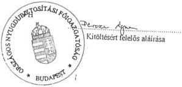

Állami Számverőszék

T/4920/1

# JELENTÉS

A TÁRSADALOMBIZTOSÍTÁS
PÉNZÜGYI ALAPJAI 1996. ÉVI
ZÁRSZÁMADÁSÁNAK
ELLENŐRZÉSÉRŐL

397.

1997. október

---

V-3-104/1997. Témaszám: 361.

A vizsgálat végrehajtásáért felelős:

Az Állami Számvevőszék Vagyonellenőrzési Igazgatósága

Halász Gejza igazgató

Az ellenőrzést vezette és az összefoglaló jelentést készítette:

dr. Csépán Magdolna osztályvezető főtanácsos

Az ellenőrzésben részt vettek:

|  Balla Józsefné | számvevő tanácsos  |
| --- | --- |
|  dr. Fónyad Erzsébet | számvevő tanácsos  |
|  Hajagos Józsefné | számvevő tanácsos  |
|  Hegyesné dr. Solymos Mária | számvevő  |
|  dr. Kurucz István | számvevő tanácsos  |
|  Molnár Istvánné | számvevő tanácsos  |
|  Szarka Péterné | számvevő  |
|  Szendrődi Józsefné | számvevő  |
|  Angyalosi Dániel | számvevő tanácsos  |
|  dr. Boda Sándor | számvevő tanácsos  |
|  Buczkó András | számvevő tanácsos  |
|  Nagy Sándorné | számvevő tanácsos  |
|  Péntek László | számvevő tanácsos  |
|  Vida László | számvevő  |

---

V.

# Tartalomjegyzék

BEVEZETÉS, A JELENTÉS KÉSZÍTÉSÉNEK KÖRÜLMÉNYEI 5

I. ÖSSZEGZŐ MEGÁLLAPÍTÁSOK, KÖVETKEZTETÉSEK 7

1. Az alapok beszámolási és könyvvezetési kötelezettségének teljesítése 7

2. Az alapok bevételeinek és kiadásainak teljesülése 8

3. Az egyes ellátási kiadásokat érintő fontosabb megállapítások 8

4. Az alapok működési költségvetései 9

5. Az alapok vagyongazdálkodási tevékenysége 10

6. Behajtási tevékenység vizsgálata a zárszámadáshoz kapcsolódóan 11

7. A társadalombiztosítás igazgatási szervei által folyósított ellátások 12

II. RÉSZLETES MEGÁLLAPÍTÁSOK, KÖVETKEZTETÉSEK 13

1. A Nyugdíjbiztosítási Alap 1996. évi zárszámadásának ellenőrzési tapasztalatai 13

1.1. Az Alap beszámolási és könyvvezetési kötelezettségének teljesítése 13

1.1.1. SZABÁLYSZERŰSÉG, SZABÁLYOZOTTSÁG 13

1.1.2. A MÉRLEGTÉTELEK TARTALMA, VALÓDISÁGA, LELTÁRRAL VALÓ ALÁTÁMASZTOTTSÁGA 14

1.1.3. A ZÁRSZÁMADÁS ADATTARTALMÁNAK MEGÍTÉLÉSE, MÓDOSÍTÁSI IGÉNYE 14

1.2. A Nyugdíjbiztosítási Alap bevételeinek és kiadásainak teljesülése 15

1.2.1. A KÖLTSÉGVETÉSI TERVEZÉSNÉL FIGYELEMBE VETT MAKROGAZDASÁGI PROGNÓZISOK ALAKULÁSÁNAK HATÁSA 15

1.2.2. AZ ALAP FŐ ELŐIRÁNYZATAINAK TELJESÜLÉSE 16

1.2.3. AZ ALAP LIKVIDITÁSI HELYZETE ÉVKÖZBEN, AZ ÉV VÉGI HIÁNY ÉS ANNAK FINANSZÍROZÁSA 17

1.3. A nyugdíjbiztosítás működési költségvetése 17

1.3.1. A MŰKÖDÉSI KÖLTSÉGVETÉS BEVÉTELEI 17

1.3.2. A MŰKÖDÉSI KÖLTSÉGVETÉS KIADÁSAI 18

1.3.3. A SZEMÉLYI JUTTATÁSOK ALAKULÁSA 18

1.3.4. A DOLOGI KIADÁSOK ALAKULÁSA 18

1.3.5. A FELHALMOZÁSI KIADÁSOK TELJESÜLÉSE 18

1.3.6. A FŐVÁROSI ÉS PEST MEGYEI NYUGDÍJBIZTOSÍTÁSI IGAZGATÓSÁG ELHELYEZÉSE 20

1.3.7. INFORMATIKAI FEJLESZTÉSEK 20

1

---

BEVEZETÉS, A JELENTÉS KÉSZÍTÉSÉNEK KÖRÜLMÉNYEI

1.3.8.A VILAGBANKI PROGRAM TELJESITSE 20
1.3.9.A FELUJITASI KIADASOK TELJESITESE 20
1.3.10.AZ 1975.EVI II.TORVENY 120/A. \(\S\) ABAN FOGLALTAK VEGREHAJTASA 21
1.4. A Nyugdijbiztositasi Alap befektetett eszközeinek, vagyonanak alakulasa 1996-ban. 21
1.4.1.A NYUGDIIBIZTOSITASI ALAP TARTOSAN BEFEKTETETT ESZKÖZEINEK ALLOMÁNYA 21
1.4.2. INGYENES ALLAMI VAGYONJUTTATAS 22
1.4.3.A JARULEKTARTOZAS FEJEBEN ATVETT VAGYON 23
1.4.4.A VAGYONGAZDALKODAS BEVETELEI ES KIADASAI 23
1.4.5.A VAGYONGAZDALKODAS SZABALYOZOTTSAGA ES NYILVANTARTASI RENDSZERE 24
1.4.6.AZ ONKORMANYZAT TULAJDONABAN LEVO EGYES KFT-K HELYZETE 25

# 2. Az Egészségbiztosítási Alap 1996. évi zárszámadásának ellenőrzési tapasztalatai 26

2.1. Az Alap beszamolasi es konyvvezetesi kotelezettsegenek teljesitese 26
2.1.1.SZABALYSZERUSEG, SZABALYOZOTTSAG 26
2.1.2.A MERLEGTELEK TARTALMA,VALODISAGA,LELTARRAL VALO ALATAMASZTOTTSAGA. 26
2.1.3.A ZARSZAMADAS ADATTARTALMANAK MEGITELSE, MODOSITASI IGENYE 27
2.2. Az Egeszsegbiztositasi Alap beveeteinek es kiadasainak teljesulese 28
2.2.1.A KOLTSEGVETESI TERVEZESNEL FIGYELEMBE VETT PROGNOZISOK TELJESULESE, A JOGSZABALYI KORNYEZET ALAKULASA 28
2.2.2.AZ ALAP FO ELOIRANYZATAINAK TELJESULESE 29
2.2.3.AZ EGESZSEGBIZTOSITASI ALAP LIKVIDITASI HELYZETE EV KOZBEN, AZ EV VEGI ELLATASI HIANY ES ANNAK FINANSZIROZASA 30
2.3. Az Egeszsegbiztositasi Alap termeszetbeni ellatasai 30
2.3.1.A GYOGYITO-MEGELOZO EGESZSEGUYELLATASOK VIZSGALATA 30
2.3.1.1.A kiadasok jogcimek szerinti novekmenyei 31
2.3.1.2.A kiadasok kasszak szerinti alakulasa 31
2.3.1.3. Az aktiv fekvobeteg ellatas finanszirozasanak szabalyozasa 1996-ban 34
2.3.1.4. Kapacitas szabalyozas, az 1996. evi LXIII. torveny vegrehajtsa 35
2.3.1.5. Az egeszsegugyi kockazatkezelo palyazatok ertekelese 36
2.3.1.6.A kórházak 1996. évi adossagallományanak részleges rendezese 36
2.3.2.GYOGYSZERTAMOGATAS ALAKULASA 1996-BAN 38
2.3.3.A GYOGYASZATI SEGEDESZKÖZÖK TARSADALOMBIZTOSITASI TAMOGATASA 42
2.4. Az Egeszsegbiztositasi Alap penzbeli ellatasai 43
2.5. Az Egeszsegbiztositasi Alap mukodesi koltsegvetese 44
2.5.1.A MUKODESI KOLTSEGVETES BEVETELEI 44
2.5.2.A MUKODESI KOLTSEGVETES KIADASAI 45
2.5.3.SZEMELYI JUTTATASOK 45
2.5.4.DOLOGI KIADASOK 45
2.5.5.FELHALMOZASI KIADASOK 46
2.5.6.A FOVAROSI ES PEST MEGYEI EGESZSEGBIZTOSITASI PENZTAR ELHELYEZESE 46
2.5.7.INFORMATIKAI FEJLESZTESEK 46
2.5.8.FELUJITASOK 47
2.5.9.A VILAGBANKI KOLCSON HAZAI HOZZAJARULASA 47
2.5.10.1995.EVI ES AZ 1996.EVI PENZMARADVANY 47
2.6. Az Egeszsegbiztositasi Alap befektetett eszközeinek, vagyonanak alakulasa 1996-ban 48
2.6.1.AZ EGESZSEGBIZTOSITASI ALAP SAJAT FORRASU TARTOS BEFEKTETSEI 48
2.6.2.JARULEKTARTOZAS ELLENEBEN ATVETT VAGYON 49
2.6.3.A VISSZTEHERMENTESEN JUTTATOTT VAGYON 49

2

---

V.

|  2.6.4. A VAGYONGAZDÁLKODÁS BEVÉTELEI ÉS KIADÁSAI | 50  |
| --- | --- |
|  2.6.5. A VAGYONGAZDÁLKODÁSI TEVÉKENYSÉG SZABÁLYOZOTTSÁGA | 50  |
|  2.6.6. EGYES VAGYONELEMEK KÜLÖN VIZSGÁLATA | 51  |
|  **3. A behajtási tevékenység vizsgálatának tapasztalatai** | **52**  |
|  3.1. A tartozások alakulása 1996-ban, a behajtásból elért bevételek | 52  |
|  3.2. A behajtási tevékenység jogi háttere, szabályozottsága | 53  |
|  3.3. A "behajtásból származó bevételek elkülönítésére alkalmazott célelszámolási számla működése | 54  |
|  3.4. Az ösztönzési keret felhasználása | 55  |
|  3.5. Adósságkezelő intézkedések az 1996. évi LX. törvény alapján | 56  |
|  **4. A társadalombiztosítási igazgatási szervei által folyósított, a biztosítási alapokat nem terhelő ellátások finanszírozása** | **58**  |
|  4.1. A nyugdíjszerű ellátások kiadásai és megtérítésük | 58  |
|  4.2. Az Állami Számvevőszék által kiemelten vizsgált nyugdíjszerű ellátások | 58  |
|  4.2.1. A KORENGEDMÉNYES NYUGDÍJ | 58  |
|  4.2.2. A KÁRPÓTLÁS ALAPJÁN FOLYÓSÍTOTT ÉLETJÁRADÉK | 59  |
|  4.3. Az egészségbiztosítás szervei által folyósított ellátások | 59  |
|  4.4. Az ellátásokhoz kapcsolódó működési költségek megtérítése | 60  |
|  **III. JAVASLATOK** | **61**  |

3

---

1

1

1

1

---

# BEVEZETÉS, A JELENTÉS KÉSZÍTÉSÉNEK KÖRÜLMÉNYEI

Az államháztartásról szóló **1992. évi XXXVIII. törvény (Áht) VI.** fejezete tartalmazza a társadalombiztosítás költségvetésének - ez év elejétől jelentősen kibővített - szabályozását. Az Áht. **86. §. (1) bekezdése** értelmében az Országgyűlés a társadalombiztosítás pénzügyi alapjainak költségvetéséről és annak végrehajtásáról törvényt alkot. A törvényjavaslatokat pedig az Állami Számvevőszék (ÁSZ) véleményével, illetve jelentésével együtt tárgyalja meg.

**Az ÁSZ ellenőrizte az 1996. évi előirányzatok teljesítését**, vizsgálati tapasztalatait a csatolt jelentés foglalja össze.

Az érvényes szabályoknak megfelelően a **társadalombiztosítási önkormányzatok a zárszámadásra vonatkozó javaslatot** a költségvetési beszámolók könyvvizsgáló általi hitelesítését követően fogadják el, majd a **tárgyévet követő év június 30-ig küldik meg a Kormánynak és az ÁSZ-nak**. E kötelezettségét mindkét biztosítási önkormányzat rendben teljesítette.

**A Kormány** (változatlan formában, vagy szükség szerint átdolgozva) **szeptember 30-ig nyújtja be az Országgyűléshez a zárszámadási törvényjavaslatot** és egyidejűleg azt az ÁSZ-nak is meg kell küldenie.

A társadalombiztosítás önkormányzati igazgatásáról szóló 1991. évi LXXXIV. törvény 23. §. (7) bekezdése értelmében **az ÁSZ-nak jelentése elkészítéséhez a törvényjavaslat országgyűlési benyújtását megelőzően hatvan nap áll rendelkezésére**. A szabályozásból eredően az ÁSZ-nak sem módja, sem ideje nincs a benyújtott dokumentum tételes ellenőrzésére. A munkát az Önkormányzatok által jóváhagyott zárszámadás és az alapját képező dokumentumok vizsgálatával kellett elvégezni.

A Kormány által elkészített és az Országgyűléshez benyújtott törvényjavaslatot az ÁSZ hivatalosan 1997.szeptember 29.-én kapta meg.

Az 1991. évi LXXXIV. törvény (ÖIT) 23. §. (7) bekezdése előírja, hogy zárszámadás alkalmával **be kell számolni a társadalombiztosítás feletti kormányzati (törvényességi) ellenőrzések tapasztalatairól, eredményeiről is**. Az első év tapasztalatai alapján az ÁSZ-t érintően ezen ellenőrzésekről el kell mondani, hogy a feladatmegosztás még nem nevezhető tisztázottnak, az ad-hoc feladatok sokasága miatt az ellenőrzések nem rendszerezettek, emiatt gyakoriak a különböző szintű ellenőrzésekben mutatkozó átfedések. Az ÁSZ-szal való előzetes egyeztetés kötelezettsége legfeljebb a kormányzati ellenőrzési szándék tényének közlésére korlátozódik, az ellenőrzési megállapítások gyakran túllépik a törvényességi felügyeleti jogkör gyakorlásából világosan adódó határokat.

**Az 1996-os évet** is jellemezte, hogy azt a **biztosítási alapoknak jóváhagyott költségvetési törvény nélkül** - átmeneti szabályozás mellett - **kellett megkezdeni**. Országgyűlés 1996. március 12-én fogadta el a **XIV. törvényt**.

A költségvetési törvény a bevételi és kiadási oldalon egyaránt eltért az önkormányzatok közgyűlései által még 1995 végén elfogadott változattól, illetve a parlamenti elfogadásig jelentősen változtak a tervezést is befolyásoló adottságok, paraméterek.

5

---

BEVEZETÉS, A JELENTÉS KÉSZÍTÉSÉNEK KÖRÜLMÉNYEI---

Az év során nyilvánvalóvá vált, hogy **pótköltségvetés kidolgozása** válik szükségessé. Az erről szóló **1996. évi CXX. törvényt** az Országgyűlés azonban csak december 10-én fogadta el.

Az ÁSZ a zárszámadási ellenőrzés során a súlypontokat (a szabályszerűségi, törvényességi szempontok érvényesítése mellett) a társadalombiztosítás pénzügyi alapjai egyes **költségvetési előirányzatainak teljesülésére, az eltérések okainak feltárására, elemzésére** helyezte. A jelentés összeállításánál **felhasználtuk a zárszámadási** ellenőrzés megalapozását célzó, **az év első felében elvégzett témavizsgálatok tapasztalatait is**. Így különösen a biztosítási alapok befektetett eszközei (vagyona) állományának, a társadalombiztosítási tartozások behajtásának, valamint a kórházak adósságállomány vizsgálata során szerzett tapasztalatokat.

A helyszíni ellenőrzések tapasztalatairól készített vizsgálati jelentéseket az OEP és az ONYF véleményezte, észrevételeiket az ÁSZ jelentés összeállításánál lehetőség szerint figyelembe vettük. Több kérdés megítélésénél (ilyenek elsődlegesen a számszerű megállapítások, a módosításokra vonatkozó ÁSZ javaslatok) azonban fennmaradtak az eltérő álláspontok. Az ÁSZ jelentésre az OEP és az ONYF által tett észrevételeket a **6. sz. melléklet** ismerteti

Az elmúlt időszakban különböző **igények fogalmazódtak meg az Egészségbiztosítási Önkormányzat vagyonnal kapcsolatos döntéseinek átfogó vizsgálatára**. Ezeknek az ÁSZ zárszámadási jelentése részlegesen felel meg, amennyiben a vagyongazdálkodás témakörét (hagyományosan) kiemelten kezeli, ami az 1996. évet követően hozott döntésekre teljes körűen nem tudott kitérni. Ennek az ÁSZ egy külön vizsgálat lefolytatásával kíván eleget tenni.

Az ellenőrzések összefoglaló tapasztalatait, a főbb következtetéseket a jelentés I, a részletes megállapításokat a jelentés II. és az ÁSZ által megfogalmazott javaslatokat a jelentés III. része tartalmazza.

---6

---

I. ÖSSZEGZŐ MEGÁLLAPÍTÁSOK, KÖVETKEZTETÉSEK

# I. ÖSSZEGZŐ MEGÁLLAPÍTÁSOK, KÖVETKEZTETÉSEK

A társadalombiztosítás pénzügyi alapjainak 1996. évi költségvetéséről szóló 1996. évi XIV. törvény késve, ellentmondásos helyzetben, kompromisszumok, a biztosítási önkormányzatok és a Kormány közötti jelentős nézetkülönbségek mellett született meg.

Ezek a körülmények és az 1996. év folyamatai vezettek oda, hogy **pótköltségvetést kellett készíteni**. Az év végén megalkotott **CXX. törvény elsődlegesen az Egészségbiztosítási Alap legsúlyosabb feszültségeit „kezelte”** (megteremtve a fedezetet az egészségügyi dolgozók béremelésére, a gyógyszerkiadások előirányzatának módosítására és a kórházak adósságállományának részleges ellentételezésére).

A zárszámadási ellenőrzés során a **helyszíni vizsgálatokat az Állami Számvevőszék munkatársai az OEP-nél, a megyei pénztáraknál, egészségügyi intézményekben, az ONYF-nél, a NYUFIG-nál végezték el**. Egyes szakmai kérdésekben a PM és az NM munkatársaival is konzultáltak.

## 1. AZ ALAPOK BESZÁMOLÁSI ÉS KÖNYVVEZETÉSI KÖTELEZETTSÉGÉNEK TELJESÍTÉSE

Az Állami Számvevőszék - hasonlóan az eddigi zárszámadások vizsgálatához - ismételten szembesült azzal a ténnyel, hogy **az alapok sajátos elszámolási, nyilvántartási és egyéb számviteli adottságait a költségvetési gazdálkodás rendjében maradéktalanul nem lehet érvényesíteni, változatlanul hiányoznak a sajátos szabályok**.

A könyvvizsgáló (cég) által hitelesített beszámolók mindkét ágazatban elkészültek - határidőre. A könyvvizsgálói jelentést azonban az ÁSZ csak külön kérésre a zárszámadás helyszíni ellenőrzésének befejezése után kapta meg. **Az ellenőrzés alapját így a beszámolók, valamint az Önkormányzatok által elfogadott zárszámadási javaslatok dokumentumai képezték**.

Továbbra sem érvényesül a mérlegvalóság elve. A mérlegben kimutatott **adósállomány** adatát az ÁSZ (a járulék - és folyószámla helyzet ismeretében) nem tekinti megbízhatónak. A kintlévőség ugyan nem zárszámadási adat, de **az ellátási mérleg eszközállományának szempontjából a követelések adata meghatározó**. Ezen túlmenően **szorosan összefügg a zárszámadásban szereplő behajtási bevételek adatával, amelyet az ÁSZ szintén nem tud valós adatként elfogadni és ehhez kapcsolódóan a behajtási összeg után megállapított ösztönzési keretet sem**.

7

---

I. ÖSSZEGZŐ MEGÁLLAPÍTÁSOK, KÖVETKEZTETÉSEK

Az észrevételek a járulékbevételek megosztása miatt mindkét Alap zárszámadására érvényesek.

A zárszámadás adattartalma a beszámolókból, bonyolultan bár, de általában levezethető. Kisebb eltérések azonban fennállnak.

A beszámolók adatait, valamint az ÁSZ saját ellenőrzési megállapításai miatt a zárszámadási törvényjavaslat egyes számainak módosítására tesz javaslatot (az **1. sz. mellékletben** összegezve).

## 2. AZ ALAPOK BEVÉTELEINEK ÉS KIADÁSAINAK TELJESÜLÉSE

A bevételek, a kiadások és az egyenleg alakulását az alábbi adatok szemléltetik:

|   | (milliárd forint)  |   |   |
| --- | --- | --- | --- |
|   | Bevételek | Kiadások | Hiány  |
|  ■ előirányzat a XIV. tv. szerint | 956,9 | 974,7 | - 17,8  |
|  ■ módosítás a CXX tv. szerint | 936,1 | 996,2 | - 60,1  |
|  ■ teljesítés | 922,2 | 990,4 | - 68,1  |

**A bevételek mindkét biztosítási ágban jelentősen elmaradtak a tervezettől**, amiben elsődlegesen a járulékbevételek (azon belül is az egyéni járulékok és a munkáltatók által fizetendő táppénz-hozzájárulás) és a hiány mérséklése céljából előírt vagyonértékesítési kötelezettség nem teljesülése játszottak szerepet.

**Kiadási oldalon a nyugellátások ráfordításai** módosított előirányzat alatt maradtak (a tervezettnél kisebb nyugdíjemelés miatt). **Az egészségbiztosítás természetbeni és pénzbeli ellátásainak kiadási** egyenlege szintén kevesebb volt, mint azok - pótköltségvetéssel módosított - előirányzata.

**Az alapok együttes hiánya 68,1 milliárd forint lett.** A vártnál sokkal kedvezőtlenebbül alakult az Egészségbiztosítási Alap pénzügyi helyzete.

## 3. AZ EGYES ELLÁTÁSI KIADÁSOKAT ÉRINTŐ FONTOSABB MEGÁLLAPÍTÁSOK

**A nyugdíjkiadásokat** az 1995. évi nettó kereseti indexhez igazítva 12,6 %-kal emelték meg - két részben - januárban és júliusban. Az átlag alatti nyugellátásokat a második félévben egyszeri alkalommal 3 ezer forinttal kiegészítették.

Az egészségbiztosítás ellátásai közül **a gyógyító-megelőző egészségügyi ellátások finanszírozására 224,8 milliárd forintot fordítottak**, ami 7,3 milli-

8

---

I. ÖSSZEGZŐ MEGÁLLAPÍTÁSOK, KÖVETKEZTETÉSEK

árd forinttal volt több az eredeti előirányzatnál. A többletet az egészségügyi dolgozók bérfejlesztéséhez szükséges fedezet biztosításának szándéka magyarázza.

A nehéz helyzetben lévő egészségügyi intézmények ezen felül az év végén 4 milliárd forintos visszatérítendő likviditási hitelt kaptak.

Az egészségügy ellátórendszerében **1996. év során sem következtek be „reform-értékű” változások.** Inkább az egyes korábbi intézkedések, illetve intézkedések elmaradásának kedvezőtlen hatásait lehetett érzékelni (például a fogászati ellátás, a mentés-betegszállítás területén).

**A finanszírozási rendszer 1996-ot érintően 5 alkalommal változott,** ami nagymértékben hozzá járult az intézmények gazdálkodási nehézségeinek kialakulásához, mert a bevételek folytonos változásait már nem tudták belső intézkedésekkel ellensúlyozni.

Az **1996. évi LXIII. törvény szerinti kapacitásszabályozás,** a kórházakkal való szerződéskötések operatív feladata az OEP-re és szerveire hárult, amit a körülményekhez képest jól bonyolított le.

**A gyógyszerkiadások támogatásánál** még a pótköltségvetési törvényben szereplő 81,9 milliárd forintos előirányzatot is túllépték 2,3 milliárd forinttal. **A támogatási rendszer változtatása,** amellett, hogy a lakossági terheket tovább növelte, 1996-ban nem járt lényeges eredményekkel. A megyei szintű vényellenőrzési rendszernek pénzügyi megtakarító hatása nem számottevő.

Az ÁSZ az **ú.n. különkeretes gyógyszer-támogatási rendszer áttekintése** során, a pozitív elemek elismerése mellett, súlyos ellentmondásokat, visszásságokat is feltárt, amelyeknek tisztázására további vizsgálatot tart szükségesnek.

**Gyógyászati segédeszközök támogatására 1996-ban 12,1 milliárd forintot fordítottak.** E területen gondot okoz a vényfeldolgozás, a vényellenőrzés, illetőleg a szolgáltatók ellenőrzésének megoldatlansága.

Az egészségbiztosítás **pénzbeli ellátásainak kiadási összege 122 milliárd forint volt,** ami az előirányzottnál kevesebb. A kiadáscsökkenés az egyes ellátásoknál túllépés, illetve megtakarítás „egyenlege”.

#### 4. AZ ALAPOK MŰKÖDÉSI KÖLTSÉGVETÉSEI

**Az alapok ellátási feladatainak és a folyósítási feladatok ellátására** - az 1995-ben keletkezett pénzmaradványt is beszámítva - a zárszámadás szerint **25,4 milliárd forint szolgált, 9,9 milliárd forint a nyugdíjbiztosítás, 15,5 milliárd forint pedig az egészségbiztosítás területén.**

Az ÁSZ egyes megállapításai miatt (ha azokkal az Országgyűlés egyetért) a működési költségvetés adatait változtatni szükséges. A megállapítások közül az egyik legfontosabb a nyugdíjbiztosítást érintően a működési költségvetés beruházási előirányzata terhére megvalósított befektetések elbírálása, amit a zárszámadás önkormányzati változata hasonlóan az 1995. évihez a működési költségvetésben

9

---

I. ÖSSZEGZŐ MEGÁLLAPÍTÁSOK, KÖVETKEZTETÉSEK

kíván szerepeltetni. A járulékbevételeket terhelő - ily módon több szempontból törvénysértő - befektetések azonban nem képezhetik a működési költségvetés részét. Ennek összegét a működési költségvetésben az ÁSZ nem vette figyelembe.

## 5. AZ ALAPOK VAGYONGAZDÁLKODÁSI TEVÉKENYSÉGE

Az államháztartási törvény előírja, hogy **zárszámadáskor be kell mutatni az alrendszerek vagyonkimutatását**, így értelemszerűen a társadalombiztosítási alapok vagyonkimutatását is. **A társadalombiztosítási alapok zárszámadási törvényjavaslatában a 4. és 9. számú mellékletekben bemutatott tartalékok a vagyon teljeskörű bemutatására nem alkalmasak**, mert azokban a vagyon egyrészt névértéken szerepel, másrészt a működési vagyonra semmiféle információt nem tartalmaz.

**Az alapok befektetett eszközeinek 1996. december 31-i záróállománya 33 milliárd forint**, amiből 22,7 milliárd forint a Nyugdíjbiztosítási, 10,3 milliárd forint az Egészségbiztosítási Alap vagyona.

**A működési szektorban a befektetett eszközök záróállománya együttesen 10,1 milliárd forint**, ebből 3,6 milliárd forint a nyugdíjbiztosításé, 6,5 milliárd forint az egészségbiztosításé.

Az ágazatok vagyonának alakulásáról, vagyongazdálkodási tevékenységéről **a jelentés 1.4 és 2.6 pontjai** szólnak részletesen.

**Kiemelést érdemel** - noha sajnos ez is ismétlődő megállapítás -, hogy **a társadalombiztosítás vagyongazdálkodásáról szóló törvény 1993. óta nem született meg**. Hiánya nagymértékben megnehezíti a vagyongazdálkodás minősítését, az egyes vagyonnal kapcsolatos döntések törvényességi, szabályszerűségi szempontok szerinti ellenőrzését.

**Az ingyenes vagyonjuttatás keretében** a két Alapnak **1996. végéig együttesen 16,9 milliárd forint értékű vagyont adott át a KVI és az ÁPV Rt** a törvényben előírt 55-65 milliárd forint helyett. A vagyonátadás eseményei 1997-re húzódtak át. Az ÁSZ vizsgálni fogja az Egészségbiztosítási Önkormányzat 1997-ben meghozott vagyonnal kapcsolatos döntéseit.

**A járuléktartozások fejében átvett vagyonállomány 1996. év végén 3934 millió forint** (ami arányosan oszlik meg a két biztosítási ág között). **A vagyon értéke** - noha újabb vagyonelemeket vettek át - az évközben bekövetkezett értékcsökkenések, értékvesztések következtében **kevesebb, mint 1995. végén volt. A legjelentősebb veszteséget a DIGÉP ÉS A DIMAG KFT-K- átvétel okozta**, amelyeknél az ellenőrzés az önkormányzatok tulajdonosi felelősségét is felveti. **Az átvett vagyonból semmit nem értékesítettek**, ezekből tehát a leírt tartozások helyett az ágazatoknak bevétele nem származott.

Az önkormányzati tulajdonban lévő egyes vagyonelemek kiemelt vizsgálata során az ellenőrzés mindkét ágazatában számos ellentmondást, célszerűtlen tulajdonosi magatartást tapasztalt.

10

---

I. ÖSSZEGZŐ MEGÁLLAPÍTÁSOK, KÖVETKEZTETÉSEK

## 6. BEHAJTÁSI TEVÉKENYSÉG VIZSGÁLATA A ZÁRSZÁMADÁSHOZ KAPCSOLÓDÓAN

A társadalombiztosítás alapjainak pénzügyi helyzetére mind nagyobb súllyal nehezedik **az évek során felhalmozódott adósságállomány**. Ennek nagysága **1996. végén 224 milliárd forint volt**. A felszámolás alatt álló cégek tartozásaiból a várhatóan meg nem térülő összeget - 34,6 milliárd forintot - kivezették a számviteli nyilvántartásokból.

**Az 1996. évi XIV. törvény 17. §-a** a behajtásból származó bevételi előirányzatok teljesülése érdekében **különböző intézkedések megtételére kötelezte az önkormányzatokat és a Kormányt**. A költségvetési törvény 1996-ra vonatkozóan eredetileg 54 milliárd forint behajtási bevétellel számolt, majd ezt a pótköltségvetés 43 milliárd forintra változtatta. A teljesítés a zárszámadás szerint 38,1 milliárd forint, úgy, hogy a rendkívüli behajtásból tervezett összegből (az intézkedések elmaradása miatt) semmi nem realizálódott. Az ÁSZ sem a behajtási bevétel összegét, sem az annak 2 %-ából képződött 762 millió forintos ösztönzési keretet nem tekinti megbízható adatnak.

A gyakorlati alkalmazás szempontjából **egyértelműen nem szabályozott a kintlévőség, a behajtási tevékenység fogalomrendszere**. Ezért a megyei egészségbiztosítási pénztáraknál egymástól eltérő, változatos helyi gyakorlat alakult ki. Ez nem fogadható el.

**A behajtási bevételek elkülönítésére létrehozott célszámolási számla működése nem volt alkalmas az ilyen tételek korrekt kimutatására**. Az ellenőrzés tömegesen talált hibás, illetve behajtási szempontból vitatható tételeket, amelyeknek „letisztítása” utólag szinte lehetetlen.

A behajtási tevékenység jogszabályi feltételeinek javítását célozta az **1996-ban hozott IX. törvény**, amely **különféle „adósságkezelő” intézkedések meghozatalát tette lehetővé**. A törvényi lehetőségekkel az elmúlt évben csak szűk körben, egyedi esetekben éltek. Az ilyen eseteknél azonban **az ellenőrzés az egészségbiztosítás szerveinél nem tapasztalta a megállapodások, szerződéskötések során elvárható gondosságot**. A törvényi lehetőségek tág teret engednek a joggal való visszaéléseknek, ezeket a belső szabályozások nem mindig tudták megakadályozni. A jövőben ezeket feltétlenül ki kell küszöbölni, élve az ellenőrzések nyújtotta lehetőséggel is. A behajtási tevékenység elvi alapjainak meghatározásában nagyobb részt kell vállalnia a biztosítási önkormányzatoknak.

11

---

I. ÖSSZEGZŐ MEGÁLLAPÍTÁSOK, KÖVETKEZTETÉSEK---

## 7. A TÁRSADALOMBIZTOSÍTÁS IGAZGATÁSI SZERVEI ÁLTAL FOLYÓSÍTOTT ELLÁTÁSOK

**Az ide tartozó ellátásokra 1996-ban 228,1 milliárd forintot fordítottak,** a nyugdíjszerű ellátásokra 86,3 milliárd forintot, az egészségbiztosítás pedig 141,8 milliárd forintot fizetett ki.

Az OEP és az ONYF a teljesített kiadásokat elszámolta a finanszírozókkal, a megtérítésekre egyes ellátásoknál csak 1997-ben kerül sor.

A finanszírozók általában megtérítik az ellátásokkal kapcsolatos működési kiadásokat is. Ezeket mindkét ágazat számítással határozza meg, a valós költségeket nem tudják meghatározni.

---12

---

II. RÉSZLETES MEGÁLLAPÍTÁSOK, KÖVETKEZTETÉSEK

## II. RÉSZLETES MEGÁLLAPÍTÁSOK, KÖVETKEZTETÉSEK

### 1. A NYUGDÍJBIZTOSÍTÁSI ALAP 1996. ÉVI ZÁRSZÁMADÁSÁNAK ELLENŐRZÉSI TAPASZTALATAI

(a törvényjavaslat I.fejezetéhez, valamint 1., 2., 3., 4. és 11. sz. mellékleteihez)

#### 1.1. Az Alap beszámolási és könyvvezetési kötelezettségének teljesítése

##### 1.1.1. SZABÁLYSZERŰSÉG, SZABÁLYOZOTTSÁG

A nyugdíjbiztosítás ellátási és ügyviteli szektorában a **költségvetési gazdálkodás számviteli rendjét kell alkalmazni**. A társadalombiztosítás pénzügyi rendszereinek sajátosságaiból adódó **eltérő szabályok kidolgozására mindaddig nem került sor**, holott annak indokoltsága vitathatatlan.

A sajátosságok szabályozásbeli érvényesítésére az ONYF szakmai anyagokban többször tett javaslatot, amit a könyvvizsgálatot végző cég is megerősített.

Ezt az ÁSZ zárszámadási jelentései visszatérően tartalmazzák.

A PM a 158/1995. (XII. 26.) sz. kormányrendelet előírása szerint rendelkezésre bocsátotta a **D-jelű nyomtatvány garnitúrát** az Alap beszámolójának elkészítéséhez. A társadalombiztosítási sajátosságokat azonban ez sem tartalmazza teljes körűen. Kitöltési útmutató hiányában a beszámoló egyes sorait a két ágazatban eltérően értelmezték, ami a konszolidált beszámoló összeállítását akadályozza.

A szabályozás hiányára is visszavezethető, hogy az Alapból a folyamatos működésre a törvény szerint meghatározott 6.620 millió forinttal szemben a beszámoló szerint 7.639 millió forintot adtak át, míg a célfeladatoknál a törvényi számnál kevesebbet szerepeltetnek. Nem egyezik a beszámoló adatával a beruházásra ténylegesen fordított kiadás összege sem (608 millió forinttal szemben 389 millió forint a helyes adat). **A működési költségvetésre vonatkozó adatok az ellátási és az ügyviteli beszámolóban nem azonosak. Mindez nehezítette a zárszámadás adattartamának egyeztetését, ellenőrzését is.**

Az auditált költségvetési beszámolókat az előírt - május 31-i - határidőre teljesítették.

Az ellenőrzés összességében a számviteli rend javulását állapította meg a nyugdíjágazat területén.

13

---

II. RÉSZLETES MEGÁLLAPÍTÁSOK, KÖVETKEZTETÉSEK

### 1.1.2. A MÉRLEGTÉTELEK TARTALMA, VALÓDISÁGA, LELTÁRRAL VALÓ ALÁTÁMASZTOTTSÁGA

Az ÁSZ korábbi zárszámadási ellenőrzései kifogásolták a befektetések, értékpapírok, leltározásának hiányosságait. Ezeket az 1996. év vizsgálata során már nem tapasztalta. Az Alap mérlegében korábban függő bevételként kimutatott visszaérkezett nyugdíjak összegét - az ÁSZ észrevétele alapján - elszámolták egyéb bevételként, így annak a zárszámadásra eddig gyakorolt torzító hatása 1996-ban már nem jelentkezett.

Az ellenőrzés azonban továbbra is fenntartja azon álláspontját, hogy a Nyugdíjbiztosítási Alap beszámolója sem elégti ki a mérlegvalódiság elvét, mivel a járulék- és folyószámla nyilvántartás helyzetét változatlanul rendezetlennek tartja. A folyószámlák jelentős részénél az év végi adat nem a tényleges (valós) tartozást mutatja, rendkívül jelentős a feldolgozatlan ügyiratok száma is, ez különösen a fővárosban okoz gondot.

A behajtási tevékenység vizsgálata során szerzett tapasztalatok alapján (aminek részletezését a jelentés 3. pontja tartalmazza) a nyugdíjágazatra is vonatkoztatható megállapítás, hogy kérdéses a rendszeres és a behajtásból származó járulékbevételi adatok megbízhatósága. Az így megbontott adatokat az Alap beszámolója és az Önkormányzat által elfogadott zárszámadása nem is tartalmazza, csak a Kormány által beterjesztett törvényjavaslat 1. sz. melléklete tünteti fel a Nyugdíjbiztosítási Alap költségvetésének teljesítési adatai között.

### 1.1.3. A ZÁRSZÁMADÁS ADATTARTALMÁNAK MEGÍTÉLÉSE, MÓDOSÍTÁSI IGÉNYE

A Nyugdíjbiztosítási Alap zárszámadásának és beszámolójának ellenőrzése után módosítások szükségesek a zárszámadás adatait illetően. A bevételeket 11 millió forinttal meg kell növelni, a kiadásokat pedig 389 millió forinttal kell csökkenteni, ami a hiányt 400 millió forinttal mérsékli. A változásokat a következők indokolják:

- a Postabanki befektetésre 1996. december 30-án 586 millió forintot (378+150+58) utaltak át kamat- és árfolyamnyereségként, de abból csak 575 millió forintot könyveltek le. Az eltérés miatt a kamat- és hozambevételt módosítani szükséges,
- a költségvetés által finanszírozott ellátások 170 millió forintos postaköltségét egyszer már elszámolták, az 1996. évi elszámolás tehát indokolatlan. Az OEP-nek átutalt 1993. évi 151 millió forintos működési pénzmaradvány összegét sem lehet kiadásként feltüntetni, mert azt az 1994. évi zárszámadási törvény egyszer már rendezte. E két tétellel az egyéb kiadások összegét kell csökkenteni,

14

---

II. RÉSZLETES MEGÁLLAPÍTÁSOK, KÖVETKEZTETÉSEK

az ellenőrzési tevékenység ösztönzésére az Alap kiadásaként az eredetileg előirányzott 50 millió forintot szerepeltetik, a ténylegesen felhasználható és kifizetett 24 millió forint helyett, így indokolatlanul képződik a működési költségvetésben 26 millió forint pénzmaradvány. Hasonlóképpen nem fogadható el, hogy a világbanki program hazai költségére kiadásként 159 millió forintot mutatnak ki, a felhasznált 117 millió forinttal szemben, amiből a működési költségvetésben szintén pénzmaradványt képeztek. Emiatt az Alap főösszegei mellett a működési költségvetés főösszegét is csökkenteni kell 68 millió forinttal (26+42).

Módosítást indokol továbbá az 1.3.5. pontban tett megállapítás (a működési költségvetésből törvényellenesen megvalósított befektetésekkel összefüggésben).

### 1.2. A Nyugdíjbiztosítási Alap bevételeinek és kiadásainak teljesülése

(a törvényjavaslat 1., 2. és 3. §-aihoz)

### 1.2.1. A KÖLTSÉGVETÉSI TERVEZÉSNÉL FIGYELEMBE VETT MAKROGAZDASÁGI PROGNÓZISOK ALAKULÁSÁNAK HATÁSA

Az 1996. évre vonatkozóan az 1975. évi II. törvény a nyugellátások emeléséről úgy intézkedett, hogy azokat a megelőző évi nettó átlagkereset tényleges növekedéséhez igazodva évente két alkalommal meg kell emelni.

Az 1995. évi nettó kereseti index 12,6 %-os nyugdíjemelést tett lehetővé, miközben a fogyasztói árindex 23,6 % volt. Az egyéni nyugdíjindex 12,6 és 13,3 % közötti volt, az akkor átlagot jelentő 17 ezer forint alatti ellátással rendelkezők egyszeri 3000 forintos kiegészítésének hatásával együttesen számítva.

Mindezek következtében a nyugdíjak reálértéke 1996-ban jelentős mértékben romlott.

A nyugdíjakat januárban 12 %-kal emelték meg, majd júliustól 0,5 %-kal (!), ami az érintettek körében komoly elégedetlenséget váltott ki. (A nyugellátások eredeti - 510,9 milliárd forintos - előirányzata ugyanis 14 %-os nyugdíjemelést tett volna lehetővé, de azt a paraméterek változása miatt 5 milliárd forinttal csökkentették.)

A nyugdíjágazatot is jelentős mértékben érintették az 1975. évi II. törvényből adódó 1996. évi jogszabályi változások, amelyek a bevételi és a kiadási oldalra egyaránt hatást gyakoroltak.

A munkáltatói és az egyéni nyugdíjjárulék mértéke 1996-ban nem változott (24,5 % + 6 %).

Módosult a minimálbérhez kapcsolódó járulék fizetés szabálya (a járulékalapot a mindenkori minimálbér összegéhez kötötték).

15

---

II. RÉSZLETES MEGÁLLAPÍTÁSOK, KÖVETKEZTETÉSEK

A járulékalap szélesítésére irányuló jogszabályban megfogalmazott szándékokat az Alkotmánybíróság döntései jórészt meghiúsították.

A kiadási oldal növekedése irányába hat a beszámító keresetek valorizációjának javítása és a degresszió kismértékű enyhítése.

# 1.2.2. AZ ALAP FŐ ELŐIRÁNYZATAINAK TELJESÜLÉSE

A Nyugdíjbiztosítási Alap költségvetését az 1996. évi XIV. törvény 574,2 milliárd forintos bevételi, 590,4 milliárd forintos kiadási főösszeggel, 16,2 milliárd forint hiány mellett hagyta jóvá.

Noha a pótköltségvetés készítésének kényszere a nyugdíjágazatban nem volt egyértelmű, az mindkét Alapra elkészült, a bevételeket 9,3 milliárd forinttal, a kiadásokat 4,3 milliárd forinttal csökkentették. Így a hiány 5 milliárd forinttal emelkedett.

A bevételek végül is 560 milliárd forintra, a kiadások pedig 584,6 milliárd forintra teljesültek.

A Nyugdíjbiztosítási Alap 24,6 milliárd forintos hiánya egyértelműen a bevételek elmaradása miatt következett be.

Mindkét biztosítási alap bevételi pozícióját alapvetően a járulékbevételek alakulása határozza meg, ami 15,7 milliárd forinttal lett kevesebb az eredetileg tervezettnél. A törvényjavaslat indoklása szerint ebben főleg a megalapozatlan rendkívüli behajtási hányad, a fizetési fegyelem romlása és a járulékalappal összefüggő alkotmánybírósági döntések játszottak szerepet. A behajtási tevékenységet egyebekben javulónak és eredményesnek minősítik, amit az ÁSZ zárszámadást megalapozó vizsgálatai (a megyei egészségbiztosítási szerveknél) nem igazoltak vissza. Erről részletesen a jelentés 3. pontja szól.

A kiadási oldalon a nyugellátások a meghatározóak, az összkiadásokhoz viszonyítva arányuk 86,4 %.

A nyugdíjkiadások az előző évhez viszonyítva 13,9 %-kal emelkedtek, összegszerűen 61,7 milliárd forinttal.

Ebből a különféle „automatizmusok” hatása (létszámnövekedés, kiegészítő ellátások növekedése, összetétel változás, cserélődés) 6,2 milliárd forint volt. A nyugdíjak emelésére 55,5 milliárd forintot fordítottak, ami az előző pontban foglaltak szerint 12,6 és 13,3 % közötti egyéni nyugdíjemelést jelentett.

16

---

II. RÉSZLETES MEGÁLLAPÍTÁSOK, KÖVETKEZTETÉSEK

# 1.2.3. AZ ALAP LIKVIDITÁSI HELYZETE ÉVKÖZBEN, AZ ÉV VÉGI HIÁNY ÉS ANNAK FINANSZÍROZÁSA

A Nyugdíjbiztosítási Alap ellátási kötelezettségét az év első három hónapjának kivételével csak a Kincstári Megelőlegezési Számla igénybevétele mellett tudta teljesíteni. Az első negyedévi kedvező pénzügyi helyzetet az 1994. évi költségvetési hiány jóváírása eredményezte.

A hitelállomány az év közepére már elérte a kamat fizetés (20 milliárd forintos) határát és az év végéig folytatódott. A legmagasabb hitelállomány december 10-én volt, 72,5 milliárd forint.

Az év végi hiány (24,8 milliárd forint) rendezésébe az államháztartási törvényt módosító 1996. évi CXXI. törvény szerint be kell vonni a meglévő likviditási tartalékot (a nyugdíjágazatban ez 7,7 milliárd forint). A fennmaradó hiány összegét a "szokásos módon" elengedik, a hiteljóváírással. Mindez azonban korántsem jelenti az Alap végérvényes konszolidációját, nem akadályozza meg a hiány, újratermelődését.

# 1.3. A nyugdíjbiztosítás működési költségvetése

(a törvényjavaslat 4. §-hoz és 2. sz. mellékletéhez)

# 1.3.1. A MŰKÖDÉSI KÖLTSÉGVETÉS BEVÉTELEI

A működési költségvetés eredeti előirányzata 1996. évre 9974 millió forint volt, amit a pótköltségvetés 9892 millió forintra változtatott (a beruházási előirányzat csökkentése és a világbanki előirányzat előző évi maradványának beállítása miatt).

A tényleges teljesítés összege 9851 millió forint, ami az 1995. évit 1787 millió forinttal (22 %-kal) haladta meg.

A Nyugdíjbiztosítási Alaptól összesen 9054 millió forintot vettek át folyamatos működésre és egyéb célokra. Ebből - törvényellenesen - 754 millió forintot átcsoportosítottak és fel is használtak befektetési célokra.

A működési költségvetés saját bevételeinek összege 409 millió forint volt, ami a tervezettnél 36 %-kal több.

A nyugdíjbiztosítás szervei által folyósított ellátások 1996. évi - számított - működési költségeinek megtérítéséből 633 millió forint származott (részletekről a 4. pont tesz említést).

Az 1995. évi pénzmaradvány igénybevételéből 509 millió forint bevétele volt az ágazatnak

17

---

II. RÉSZLETES MEGÁLLAPÍTÁSOK, KÖVETKEZTETÉSEK

# 1.3.2. A MŰKÖDÉSI KÖLTSÉGVETÉS KIADÁSAI

Az összes működési kiadás 1996-ban 9539 millió forint volt, ami 1144 millió forinttal (14 %-kal) volt több az 1995. évinél. A kiadások egy főre jutó összege 2,3 millió forintot jelentett.

A kiadások főbb adatait a 2. sz. melléklet szerinti tanúsítványok tartalmazzák.

# 1.3.3. A SZEMÉLYI JUTTATÁSOK ALAKULÁSA

Személyi juttatásokra összesen 3689 millió forintot fordítottak.

Ezen belül a rendszeres juttatások összege 2286 millió forint volt, ami havi átlagban 45 ezer forintos kifizetést jelent.

Jutalmazásra 553 millió forintot használtak fel, egy főre jutóan - éves szinten - 127 ezer forintot.

Megbízási díj címén 50 millió forintot fizettek ki, ebből a saját dolgozók részére 7 millió forintot.

■ Az Állami Számvevőszék által megvizsgált szerződések dokumentáltsága hiányos, illetőleg nem az érvényben levő ONYF főigazgatói utasítás figyelembevételével készült.

Költségtérítésekre 439 millió forintot fordítottak (ruházkodással, üdültetéssel, közlekedéssel, étkezéssel összefüggésben).

# 1.3.4. A DOLOGI KIADÁSOK ALAKULÁSA

A 2. sz. melléklet szerinti tanúsítványok adatait felhasználva a dologi kiadások eredeti előirányzata 3070 millió forint, teljesítése pedig 2730 millió forint volt 1996-ban.

Jelentősebb kiadások az irodaszerekre, nyomtatványokra kifizetett 421, az üzemeltetési szolgáltatásokra fordított 632, az általános forgalmi adóként felszámított 410 millió forint.

# 1.3.5. A FELHALMOZÁSI KIADÁSOK TELJESÜLÉSE

A felhalmozási kiadások költségvetési előirányzata 1395 millió forint volt, amit a pótköltségvetés 1195 millió forintra módosított. A zárszámadásban a nyugdíjbiztosítás 500 millió forintról számolt be.

Legnagyobb tételt a beruházási előirányzat eredetileg 1343 millió forintja jelentette, amit később 200 millió forinttal csökkentettek. Az 1996. évi XIV. törvény 3. §. (4) bekezdés d.) pontja szerint a beruházási kiadásokra is érvényes az az előírás, hogy „ha a tényleges kiadás kisebb az előirányzatnál, azt megtakarításként más célra nem lehet felhasználni.” Ettől eltérve az előirányzatot mégis átcsoportosították, abból 754 millió forintot befektettek a két saját tulajdonú (VIR és NYUGBER-CENTER) Kft-be.

18

---

II. RÉSZLETES MEGÁLLAPÍTÁSOK, KÖVETKEZTETÉSEK

Az Állami Számvevőszék már az 1995. évi zárszámadási ellenőrzés alkalmával is kifogásolta a beruházási folyamatba közbeiktatott gazdasági társaságok miatt kialakult helyzetet, aminek megszüntetésére a Nyugdíjbiztosítási Önkormányzat (noha tehetett volna, de) nem tett intézkedéseket.

Míg 1995-ben az alkalmazott megoldáshoz az Alap saját vagyonából teremtettek forrást, az 1996. évi helyzetet az súlyosbította, hogy a további befektetéseket a folyó járulékbevételek terhére valósították meg - hiányos költségvetés mellett. Ezzel megsértették a Magyar Köztársaság 1996. évi költségvetéséről szóló 1995. évi CXXI. Törvény 32. §-ának a befektetési tilalomra vonatkozó szabályát is.

- A Röntgen utcai irodaépületet (ONYF székház) tulajdonjogát 1996-ban bejegyezték a VIR Kft. tulajdonaként, ahol az Önkormányzat részesedése 65 %, ami a bevitt vagyon egy részének azonnali „elvesztését” jelenti. A NYUGBER CENTER Kft. 1996. évi vesztesége is negatív hatással jár. (A két Kft-t is érintő további vizsgálati megállapításokat a jelentés 1.4.6. pontja részletezi.)

Az előző megállapítások miatt **módosítani kell a Nyugdíjbiztosítási Alap zárszámadásának költségvetési mérlegét**, mert abban a 754 millió forint csak-kiadásként szerepelhet, de nem lehet része a működési költségvetésnek.

A zárszámadásban teljesítésként elszámolt 500 millió forintos felhalmozási kiadás összege a költségvetési beszámoló adataiból nem vezethető le. Ott ezen a címen 1010 millió forint szerepel. A különbség zömmel abból adódik, hogy a célfeladatok zárszámadási adata a dologi, a felújítási és a felhalmozási kiadásokat összevontan tartalmazza.

Az ONYF által kezelt központi keretből (349 millió forint) 346 milliót ingatlanokra, 3 milliót pedig gépjárművek beszerzésére használtak fel.

Befejezték a nyíregyházi székház építését és elkezdtek a szombathelyit. Utóbbinál az Állami Számvevőszék megállapította, hogy a kivitelezővel megkötött szerződés pénzügyi ütemétől eltértek, mert 1996-ban 50 millió forinttal többet fizettek ki a műszaki teljesítés által indokoltnál. A pénzt kamatbevétel ellenében utalták át, ami szabálytalan befektetési tevékenységnek is minősíthető.

Ingatlant vettek a szentesi kirendeltségnek, visszavásárolták a debreceni és a bajai ingatlanokat, valamint a Petneházy utcai - korábban - tervezett építkezés tervdokumentációját a NYUGBER-CENTER Kft-től. A 201 millió forintos vételárat szerződés és számla nélkül még 1996. elején kifizették.

A felhalmozási célú kiadásoknál **a közbeszerzésekről szóló törvényi szabályozást a nyilvános eljárásoknál betartották**. A tárgyalásos eljárásnál több esetben elmulasztották a közzétételt, volt ahol az eljárást sem folytatták le.

19

---

II. RÉSZLETES MEGÁLLAPÍTÁSOK, KÖVETKEZTETÉSEK---

### 1.3.6. A FŐVÁROSI ÉS PEST MEGYEI NYUGDÍJBIZTOSÍTÁSI IGAZGATÓSÁG ELHELYEZÉSE

Az igazgatóság elhelyezésének kérdése évek óta napirenden van, különböző megoldási változatokkal. Az 1996. évi XIV. törvény szerint (beruházási forrás hiánya miatt) az ingyenes vagyonjuttatás keretében kellett volna az elhelyezésre alkalmas ingatlant átadni. Erre a célra eredetileg a BHG épületet szánták, de az a változat sem valósult meg.

Az Önkormányzat az átalakítás magas költsége miatt az elhelyezési koncepció újragondolása mellett döntött. A legutóbbi elképzelés, hogy az igazgatóságot az eddig életveszélyes állapotúnak tartott Fiúmei úti épületben hagyják, annak teljes rekonstrukciója mellett. Ennek költségei ma még nem ismertek, de nyilvánvalóan több milliárd forintról van szó.

### 1.3.7. INFORMATIKAI FEJLESZTÉSEK

Az informatikai fejlesztések előirányzata 840 millió forint, a teljesítés (zárszámadás szerint) 841 millió forint. A rendelkezésre álló forrásból hitelt törlesztettek, az új székházak kábelezését oldották meg, különféle eszközöket szereztek be, áttelepítették a NYUFIG számító központját, szoftvereket béreltek stb.

Az 1996. évi fejlesztési kiadások helyett a folyamatos kiadások között számoltak el egy szoftver vásárlást 12,4 millió forint értékben.

### 1.3.8. A VILÁGBANKI PROGRAM TELJESÍTÉSE

Az ágazat eredeti költségvetése nem tartalmazott a program hazai kiadásaira előirányzatot, a pótköltségvetés alapján viszont 159 millió forintot számszerűsítettek e célra. Az előirányzat elsődleges forrása az 1995. évi 118 millió forintos pénzmaradvány. A tényleges felhasználás ezzel csaknem megegyezik, 117 millió forint. Az ötéves futamidejű kölcsönnek 1996. a harmadik éve volt, **a felhasználások** ugyanakkor **még mindig nélkülözik a valódi szakmai tartalmat**, annak megvalósításában jelentős a lemaradás.

A kölcsönfelhasználás eddig alig haladta meg az 1 millió dollárt, de az sem kapcsolódik közvetlenül az eredeti célokhoz.

### 1.3.9. A FELÚJÍTÁSI KIADÁSOK TELJESÍTÉSE

A törvényi előirányzat e célra 191 millió forint volt. A zárszámadásban ezzel szemben 322 millió forintról számolnak be, miközben a költségvetési beszámolóban 270 millió forint szerepel. Az Állami Számvevőszék megállapítása szerint ez utóbbi adat a helytálló, mert a zárszámadásban - helytelenül - beruházási és dologi kiadásokat is felújításnak tüntettek fel.

Az irodaház felújításokra (Békéscsaba, Szolnok, Debrecen, NYUFIG) megkötött vállalkozói szerződésekben a pénzügyi teljesítés és a műszaki teljesítés összhangja nem volt biztosított.

---20

---

II. RÉSZLETES MEGÁLLAPÍTÁSOK, KÖVETKEZTETÉSEK

# 1.3.10. AZ 1975. ÉVI II. TÖRVÉNY 120/A. §-ÁBAN FOGLALTAK VÉGREHAJTÁSA

A törvény szerinti adatszolgáltatási kötelezettség teljesítésével kapcsolatos nyugdíjbiztosítási feladatok teljesítésére, a szükséges feltételek megteremtésére a költségvetési törvény 360 millió forintot biztosított.

Az Állami Számvevőszék vizsgálati igényére összeállított elszámolásban 347 millió forintot mutatnak be, a zárszámadásban ugyanakkor 273 millió forintot.

- Az adatszolgáltatási kötelezettség eredményessége - a határidőre is figyelemmel - még nem minősíthető, de az már biztos, hogy a teljesítés nem lesz több 70 - 80 %-nál. A most folyó regisztrálásból kimaradó biztosítottak szolgálati idő és kereseti adatainak beszerzése nyilvánvalóan sok nehézséget fog okozni.

# 1.4. A Nyugdíjbiztosítási Alap befektetett eszközeinek, vagyonának alakulása 1996-ban.

(a törvényjavaslat 4. sz. mellékletéhez)

Az Alap befektetett eszközeinek 1996. évi záróállománya 22,7 milliárd forint volt, ami az előző évhez viszonyítva mintegy 4 milliárd forintos növekedést jelent. Ezen belül:

- a tárgyi eszközök állományában 3,8 millió forintos csökkenés következett be (mert az OEP egyes járuléktartozás fejében átvett ingatlanokat - működési célra - kívásárolt),
- a befektetett pénzügyi eszközök állományértéke 3,7 milliárd forinttal emelkedett (a részesedések értéke 4,9 milliárd forinttal nőtt, az értékpapírok állománya pedig 1,2 milliárd forinttal csökkent, az ingyenes vagyonjuttatással, a járuléktartozás fejében átvett vagyonnal és a saját hatáskörben elhatározott új befektetésekkel összefüggésben,
- az üzemeltetésre átadott eszközök állománya 272,2 millió forinttal emelkedett.

A befektetett eszközök között a pénzügyi eszközök értéke a meghatározó 22,4 milliárd forint, amiből a részesedések állománya az év végén 13,2 milliárd, az értékpapírok állománya 9,2 milliárd forintot tett ki.

A működési szektorban a befektetett eszközök év végi állománya 3,6 milliárd forint volt, ebből meghatározóak a tárgyi eszközök (ingatlanok, gépek, berendezések, járművek, beruházások, beruházásokra adott előlegek) 3,3 milliárd forintos összeggel.

# 1.4.1. A NYUGDÍJBIZTOSÍTÁSI ALAP TARTÓSAN BEFEKTETETT ESZKÖZEINEK ÁLLOMÁNYA

Az Alap befektetett pénzügyi eszközeinek 22.405 millió forintos állománya a zárszámadási törvény-tervezet 4. sz. mellékletével van logikai kapcsolatban, amely-

21

---

II. RÉSZLETES MEGÁLLAPÍTÁSOK, KÖVETKEZTETÉSEK---

ben 1996. végére a tartósan befektetett eszközök értéke 15.096 millió forint, a vissztehermentesen átvett vagyon értéke 7.857 millió forint, együttesen 22.953 millió forint volt. A két adat tehát nem egyezik meg.

Az 548 millió forintos eltérést - a tartósan befektetett eszközöknél az ÁSZ csak részben tudta levezetni. Az 1994-ben a befektetések hozama tartalékból történt 499 millió forint értékű ingatlanvásárlásból még 1995-ben 399 millió forint érték-

ben a működési szektorba tettek át ingatlanokat. Ugyancsak a működésnek adtak át felújítási célra 5 millió forintot. E két összeget a tartalékok táblában már nem lehet feltüntetni.

Nem szerepel viszont az 1996-ban államkötvény-vásárlásra fordított 23 millió forint. Ez a befektetés egyébként az 1996. évi központi költségvetésről szóló 1995. évi CXXI. törvény 32. §-ában foglaltakat megsértve valósult meg.

Az említett eltérés abból is adódik, hogy az Alap mérlegében és számviteli nyilvántartásaiban a tulajdonában lévő vagyonelemek szerepelnek, míg a zárszámadásban - megindokolhatatlanul - keveredik a befektetésekre felhasznált pénzeszköz a tárgyiasult vagyonnal.

A 4. sz. zárszámadási mellékletben a tartósan befektetett eszközök értékének az auditált mérlegadattal kellene megegyezni, a táblázat belső tartalmának tisztázása mellett.

### 1.4.2. INGYENES ÁLLAMI VAGYONJUTTATÁS

Az ingyenes vagyonjuttatásból származó vagyon 7.857 millió forintos értéke a költségvetési beszámoló adataiból levezethető.

A nyugdíjágazat 1995-ben 4.176 millió forint értékű részvényt és 227 millió forint értékű ingatlant kapott.

Az 1996. év végéig további 7.148 millió forint értékű részesedés került ténylegesen az Alap birtokába.

Az átvett vagyonból értékesítették a Borsodchem és a TVK részvényeket, 3.051 millió forint értékben és 643 millió forint értékvesztést kellett elszámolni. Mindez csökkenti az ingyenes vagyon állományát.

A vagyonértékesítésből a Nyugdíjbiztosítási Önkormányzat Postabank részvényeket vett. Ezzel és a korábbi ingyenes banki részvény juttatással 4,1 milliárd forint névértékű részesedéssel rendelkeznek a pénzintézetben. A bank pénzügyi helyzetének 1997. eleji megrendülését követően a Kormány 12 milliárd forint összeghatárig úgy vállalt kezességet, hogy feltételül a legnagyobb részvényesek által vállalt viszontgaranciát szabta. Nyugdíjbiztosítási Alapot 5,9 milliárd forintos garanciális kötelezettség és kamatai terhelik, amit 2003-ig kell megfizetni és pénzügyi hatása már 1997-ben jelentkezik.

A vagyonjuttatás eseményei 1997-ben felgyorsultak. Eddig megközelítően 32 milliárd forint értékű vagyon átadása valósult meg, további 4 milliárd átadása még folyamatban van.

---22

---

II. RÉSZLETES MEGÁLLAPÍTÁSOK, KÖVETKEZTETÉSEK

A zárszámadási törvényjavaslata 4. sz. melléklete névértéken mutatja be az átadott vagyont. A tényleges átadási érték ettől eltér mindkét irányban. A névérték alatti átvételek miatt kellett év végén a vagyonvesztést elszámolni (643 millió forintot).

# 1.4.3. A JÁRULÉKTARTOZÁS FEJÉBEN ÁTVETT VAGYON

A társadalombiztosítás pénzügyi alapjai 1995. évi zárszámadásáról szóló 1996. évi CX. törvény szerint az 1995-ben járuléktartozás ellenében átvett vagyon 4.653 millió forint volt, amiből a Nyugdíjbiztosítási Alapot 2.595 millió forint illet meg arányosan.

A zárszámadási törvényjavaslat 11. számú melléklete szerint a vagyonállomány értékét 1957 millió forint érték csökkenés (értékvesztés) csökkenti. Ennek megfelelően az év végi állapot 3934 millió forint, vagyis az 1996. évi vagyonátvételek ellenére a járuléktartozás fejében átvett vagyon értéke kevesebb az előző évinél.

■ A vagyonelemek tételes vizsgálata alapján a főkönyvi adatokból csak 1914 millió forint értékvesztést lehetett számszerűsíteni. Ily módon a vagyonállomány értékét 43 millió forinttal meg kell növelni. Az eltérés a nyugdíjágazatnál jelentkezik, ahol az 1110 millió forinttal szemben a bizonyított értékcsökkenés 1067 millió forint. Az eltérésre nem lehet magyarázatot találni.

Az átvett vagyon ingatlanokban és részesedésekben testesül meg. A megállapodással átvett ingatlanok 100 %-os, vagy többségi tulajdonlást jelentenek a biztosítási önkormányzatok számára.

A legnagyobb veszteséget a biztosítási ágak a bírói végzéssel idekerült DIGÉP (Diósgyőri Gépgyár) Kft-k, illetve a DIMAG-DAM (Diósgyőri Acélművek) Kft-k miatt szenvedték el. (440 és 1138 millió forintot.) A vagyonvesztésért mindkét önkormányzat felelős, mert olyan tulajdonosi magatartást tanúsítottak, aminek „eredményeként” a vagyont mára gyakorlatilag „kiürített” Kft-k jelentik.

A DIGÉP Kft-k eseményeit a 3. sz. melléklet foglalja össze.

Az ágazatok között a járuléktartozás fejében átvett vagyon 1996-ban is csak eszmei hányadok alapján volt megosztva, azt valójában az egészségbiztosítás birtokolta, a nyugdíjbiztosítás csak a vagyon értékesítésekor jutott (volna) az Őt megillető bevételhez. A vagyonból azonban 1996-ban semmit nem értékesítettek, csupán az egészségbiztosítás vásárolt ki néhány vagyonelemet. A vagyonátvétel eredeti célja, értelme, hogy az értékesítésből az alapoknak folyó bevétele legyen, eddig nem valósult meg.

# 1.4.4. A VAGYONGAZDÁLKODÁS BEVÉTELEI ÉS KIADÁSAI

A Nyugdíjbiztosítási Alap kamat- és egyéb hozambevételeinek módosított előirányzata 3.000 millió forint volt. Az elért bevétel ezzel szemben a zárszámadás szerint (a költségvetési beszámolóval megegyezően) 4.456 millió forint. Az ingyenes vagyonátadásból ered, 1123 millió forint osztalék és árfolyamnyereség, 3187 millió forint kamatbevétel, 130 millió forint a Domínium Rt. részvényeinek értékesítéséből származik. A többi rövid lejáratú befektetések hozama,

23

---

II. RÉSZLETES MEGÁLLAPÍTÁSOK, KÖVETKEZTETÉSEK

illetőleg minimális összegben járuléktartozásos vagyon osztaléka.

A költségvetési törvény a Lakásfedezeti kötvény tőketörlesztésének részleteként 1.160 millió forinttal számolt, ami realizálódott is.

A hiány mérséklése céljából - a pótköltségvetéssel - 2.900 millió forintos vagyonértékesítést írtak elő az ágazat számára. Ez 41 millió forint erejéig teljesült. A végrehajtásra idő hiányában sem volt mód. Az Önkormányzat egyébként a vagyonfelélés költségvetési „kényszere” miatt 1997-ben az Alkotmánybírósághoz fordult.

#### **Ezeket a bevételi tételeket az előírásoknak megfelelően be kellett vonni a folyó finanszírozásba.**

Mindezeken kívül a Borsodchem és TVK részvények értékesítéséből, valamint a Lakásfedezeti kötvény értékesítéséből **további 3136 millió forint bevétele származott az Alapnak. A bevételekből újabb befektetéseket bonyolítottak le** (ebből a legjelentősebb a Postabankban szerzett további részesedés, amit az 1.4.2. pont ismertet). **Az 1996-ban végrehajtott befektetések nagysága (4107 millió forint) azonban a rendelkezésre álló forrásokat jóval meghaladta.** Ezt különféle „átcsoportosításokkal” oldották meg. Így az Alap folyó kiadásai között szereplő beruházási előirányzatot 754 millió forinttal csökkentették, amiből 560 millió forintot a VIR Kft. üzletrészének megvásárlására, 194 millió forintot a NYUGBER-CENTER Kft. törzstőkéjének emelésére fordítottak (erről részletesebben a jelentés 1.4.6. pontja szól). Bevonták a befektetésekbe a befektetések hozama tartalékba még rendelkezésre álló 88 millió forintot is.

#### **Az ágazat befektetési politikáját az ellenőrzés - különösen a Postabank vonatkozásában - nem tartja körültekintőnek és előrelátónak.**

**A vagyongazdálkodás ráfordításaira** a költségvetés 100 millió forintot tervezett felhasználni. A zárszámadásban teljesítésként 103 millió forint szerepel. Az Alap auditált beszámolójában azonban csak 59 millió forint jelenik meg ezen a címen. Az eltérésre nem sikerült magyarázatot találni, de azzal az Alap bevételét és hiányát korrigálni kell.

#### **1.4.5. A VAGYONGAZDÁLKODÁS SZABÁLYOZOTTSÁGA ÉS NYILVÁNTARTÁSI RENDSZERE**

A társadalombiztosítás vagyongazdálkodásáról szóló törvény 1996-ban sem született meg. Megalkotását az Áht. kötelezően írja elő, ennek azonban az illetékesek nem tettek eleget. A nyugdíjágazatban a 23/1995. (IV. 28.) sz. közgyűlési határozat rögzíti a vagyongazdálkodás általános elveit, eljárási szabályait.

Az ÁSZ már korábban is kifogásolta, hogy a szabályzatban foglalt elnökségi jogosítványok ellentétesek az 1991. évi LXXXIV. törvénnyel, de azt nem módosították. Egy esetben 1996-ban is (az idő rövidségére hivatkozva) ismét az elnökség hozott a közgyűlés jogkörét megillető döntést. A VIR Kft-nek eladott Lakásfedezeti kötvény pénzügyi elszámolása 1996. decemberében megtörtént, miközben a közgyűlés erről csak 1997. januárjában hozott jóváhagyó határozatot.

24

---

II. RÉSZLETES MEGÁLLAPÍTÁSOK, KÖVETKEZTETÉSEK

#### 1.4.6. AZ ÖNKORMÁNYZAT TULAJDONÁBAN LÉVŐ EGYES KFT-K HELYZETE

**A VIR Kft** 1994 július 1-jétől kezdte meg működését a Postabank és Takarékpénztár Rt. és a DIGITÁL Kft alapításában. Alaptőkéje 5 millió forint volt, amelyet a

Postabank 1255 millió forintra emelt a Röntgen utcai irodaépület apportálásaival. **A Kft-t a Nyugdíjbiztosítási Önkormányzat 1994. novemberében 1,7 milliárd forintért megvette**, 1997. júliusig történő részletfizetéssel.

Az ingatlan felújítására a Postabank 37,7 %-os üzletrészt vásárolt 760 millió forint ellenében. A Kft. megvásárlásakor a vételárban az épület felújítása már benne volt. Erre opciós megállapodást kötöttek a felek, melynek értelmében az önkormányzatnak módja lett volna az üzletrészt (1000 forintért !) kivásárolni. Az önkormányzat azonban nem élt ezzel a jogával (sőt azt 1997 februárjában átengedte a VIR Kft-nek). A Röntgen utcai épület (amely az Önkormányzat és az ONYF székháza lett) felújítására 1995-ben 165 millió forintos tőkeemelést hajtottak végre. A felújítás 1995-ben be is fejeződött, de annak aktiválását még 1996-ban sem hajtotta végre a Kft.

**A Kft feladata 1996-ban szinte kizárólag az épület üzemeltetése, a költöztetés lebonyolítása volt.** Fő bevételi forrását az ONYF által fizetett bérleti díj jelentette. Az üzemeltetést is alvállalkozókkal végeztették. Az üzemeltetés előnyeire vonatkozóan nem készültek gazdaságossági számítások.

**A NYUGBER-CENTER Kft-t** 1995. májusában alapították 600 millió forintos alaptőkével, a NYUFIG épületberuházásának megvalósítására. Feladatai, működésének célja máig sem tisztázódott.

A közgyűlés 1996. januárjában újabb 394,8 millió forint átutalásáról döntött, amiből 193,8 millió forint az alaptőke emelést, 201 millió forint a bajai és debreceni ingatlanok visszavásárlását szolgálta. A pénz átutalása megtörtént, de a kapcsolódó intézkedések elmaradtak, ami többletkiadásokkal járt.

A Kft finanszírozásában felépített és 1996. májusában átadott irodaépület és a telek tulajdonviszonyai rendezetlenek.

A beruházás megvalósulása után a Kft továbbra is működik, minden érdemi cél és indok nélkül.

**A két (65, illetve 100 %-os) önkormányzati tulajdonú Kft létrehozása és működtetése miatt a működési költségvetésben beruházásokra jóváhagyott összegek befektetésnek minősülnek, ami zárszámadáskor 1995 után 1996-ban is gondként merül fel.**

A törvényellenesen átcsoportosított források, majd a létrehozott ingatlanok rendezetlen tulajdonviszonyú, tisztázatlan tevékenységi körű gazdasági társaságokhoz kerültek át, sértve ezzel a nyugdíjbiztosítás jelenlegi és jövőbeni érdekeit.

25

---

II. RÉSZLETES MEGÁLLAPÍTÁSOK, KÖVETKEZTETÉSEK

## 2. AZ EGÉSZSÉGBIZTOSÍTÁSI ALAP 1996. ÉVI ZÁRSZÁMADÁSÁNAK ELLENŐRZÉSI TAPASZTALATAI

(a törvényjavaslat II. fejezetéhez, valamint 5., 6., 7., 8., és 9. mellékleteihez)

### 2.1. Az Alap beszámolási és könyvvezetési kötelezettségének teljesítése

#### 2.1.1. SZABÁLYSZERŰSÉG, SZABÁLYOZOTTSÁG

**Az egészségbiztosítás ellátási és ügyviteli szektorára a költségvetési gazdálkodás számviteli rendjére vonatkozik.** A társadalombiztosítás pénzügyi rendszereinek sajátosságaiból adódó eltérő szabályok kidolgozására mindaddig nem került sor.

**A sajátosságok szabályozására** az Állami Számvevőszék álláspontja szerint változatlanul **szükség van**, különösen az ellátásokat szabályozó törvények, törvényi változások és a számviteli törvény előírásai közötti összhang megteremtése érdekében.

Minderre 1995-ben és 1996-ban **a könyvvizsgálatot végző cég is rámutatott**, különösen a két alap szétválása és elszámolási kapcsolatai miatt.

Ennek a követelménynek a PM által kidolgozott **D-jelű nyomtatvány garnitúra** sem felel meg maradéktalanul. Az egyes sorok eltérő értelmezései lehetőségei miatt a beszámolók adattartalmában különbségek vannak az egészségbiztosítás és a nyugdíjbiztosítás között.

Az auditált költségvetési beszámolókat az előírt - május 31-i - határidőre teljesítették.

**A számviteli szakterület színvonalas tevékenységét** 1996-ban is sikerült megőrizni, ami az ÁSZ zárszámadási ellenőrzését is nagymértékben segítette.

#### 2.1.2. A MÉRLEGTÉTELEK TARTALMA, VALÓDISÁGA, LELTÁRRAL VALÓ ALÁTÁMASZTOTTSÁGA.

**Az Egészségbiztosítási Alap mérlegének adósállomány adata nem valós**, mert a folyószámla nyilvántartás elavult és pontatlan. A megyei egészségbiztosítási pénztáraknál jelentős mennyiségű ügyirathátralék csak fokozza a gondokat.

- ■ A fővárosban a hibás adatbázis miatt a már megszűnt egyéni vállalkozóknak is bírságot szabtak ki a „hibás” bevallásért, amire sok ezer beadvány érkezett, számosan bírósághoz is fordultak.

A behajtási tevékenységből elért (kimutatott) járulékbevételek adata sem tekinthető valósnak.

26

---

II. RÉSZLETES MEGÁLLAPÍTÁSOK, KÖVETKEZTETÉSEK

Mivel 1995. óta a költségvetési törvény nevesíti az elérendő behajtási összeget, az ÁSZ célul tűzte e tevékenység (következésképpen a hozzá kapcsolódó zárszámadási adatok) alapos vizsgálatát. A fővárosban és több megyében lefolytatott vizsgálatok azt bizonyították, hogy:

- az OEP nem alakította ki a behajtásból eredő bevételek analitikus és főkönyvi egyeztetését,
- a behajtás összegébe és az érdekeltség alapjába beszámító bevételeket nem szabályozták egyértelműen, ami tág teret engedett a „sajátos” helyi gyakorlat kialakulásának.

A T/4920. számon benyújtott zárszámadási törvénytervezetben a Nyugdíjbiztosítási Alapnál 22,1 milliárd forint, az Egészségbiztosítási Alapnál 16,0 milliárd forintos bevételt mutatnak ki a kintlévőségek behajtásából. Az ÁSZ erről az együttesen 38,1 milliárd forintos adatról állítja, hogy nem valós, mert:

- a vizsgált pénztáraknál az adatok a nyilvántartásokból nem vezethetőek le, és nem egyeznek meg a főkönyvi könyvelés adataival;
- a bemutatott összeg bizonyíthatóan tartalmaz téves tételeket. Az e célra alkalmazott számlán nagy számban megjelentek a rendszeres (havi) járulékbevételek és olyanok is, amelyeknek behajtási „eredetét” az ÁSZ vitatja.

Az ÁSZ célvizsgálata nyomán az OEP felülvizsgálatot rendelt el és központilag hajtottak végre korrekciókat. Ezek az intézkedések sem voltak azonban alkalmasak a valós helyzet előállítására (az ÁSZ utólagos „szúrópróba”-szerű ellenőrzései ezt igazolják).

A célszámolási számla hibás tételeit (ami után a kifizetett ösztönzés jogtalan volt) a rendszeres bevételek között is megjelenő behajtási eredetű tételek kigyűjtésével egyszerűen kompenzálták - ami ellentétes az 1996. évi XIV. törvény 14. §. (4) bekezdésével - és a 38,1 milliárd forintos összeg után 762 millió forintos ösztönzési keretet állapítottak meg, amit fel is használtak. A jogszerűségi aggályok mellett ezen utóbbi adat valódisága is kérdéses.

- Az ÁSZ ellenőrzése csak célszámolási számlára érkezett befizetések egy részére terjedt (terjedhetett) ki. De ennek alapján is 1408 millió forint az ami biztosan nem behajtásból származik. Ennek jogtalanul kifizetett jutalom-vonzata 28 millió forint.

### 2.1.3. A ZÁRSZÁMADÁS ADATTARTALMÁNAK MEGÍTÉLÉSE, MÓDOSÍTÁSI IGÉNYE

Amennyiben az előzőekben foglalt számszerű megállapítást az Országgyűlés érvényesíteni kívánja (az ÁSZ ennek megfontolását javasolja) akkor a zárszámadásban:

27

---

II. RÉSZLETES MEGÁLLAPÍTÁSOK, KÖVETKEZTETÉSEK

- a behajtási összeget 38,1 milliárd forintról 36,7 milliárd forintra (a Nyugdíjbiztosítási Alapnál 21,3 milliárd forintra, az Egészségbiztosítási Alapnál 15,4 milliárd forintra),
- a behajtás ösztönzésére fordított 762 millió forintot, 734 millió forintra kell csökkenteni,
- a behajtás ösztönzésére fordított összeg változása érinti az Egészségbiztosítási Alap kiadási főösszegét, a működési költségvetés bevételi és kiadási összegét és a pénzmaradvány nagyságát is, az adatokat 28 millió forinttal mérsékli.

## 2.2. Az Egészségbiztosítási Alap bevételeinek és kiadásainak teljesülése

(a törvényjavaslat 8., 9., és 10. §-aihoz)

### 2.2.1. A KÖLTSÉGVETÉSI TERVEZÉSNÉL FIGYELEMBE VETT PROGNÓZISOK TELJESÜLÉSE, A JOGSZABÁLYI KÖRNYEZET ALAKULÁSA

Az Egészségbiztosítási Önkormányzat 1995. novemberében már számolt az egészségbiztosítási járulék mértékének csökkenésével.

Ugyanakkor a járulékfizetési kötelezettséget kiterjesztették volna (normatív módon megállapítva a hozzájárulást) azon személyekre, akik után addig senki nem fizetett járulékot, ám a természetbeni egészségügyi szolgáltatásokat igénybe vehetik. A központi költségvetésből e célra 26,8 milliárd forint megtérítésével számoltak.

- Ez a kérdés elvi és gyakorlati szinten mind élesebben vetődik fel, különösen a biztosítási alapok közötti keresztfinanszírozás megszűnésével.

Az 1996. évre márciusban jóváhagyott költségvetési törvényben a fenti címen mindössze 12 milliárd forint normatív hozzájárulást irányoztak elő.

1996. január 1-től 44 %-ról 42,5 %-ra csökkent a munkáltatókat terhelő járulékfizetési kötelezettség mértéke, az egészségbiztosítási járulékot érintően (19,5 %-ról 18 %-ra).

A betegszabadság 10-ről 15 napra nőtt.

A táppénz egyharmadát a munkáltatóknak kell fizetni.

Az Alkotmánybíróság a járulékalap szélesítését előíró jogszabályi változásokat érvénytelenítette (pl. a tiszteletdíjak utáni tervezett fizetési kötelezettséget).

Ezek a változások, módosulások alapjaiban befolyásolták az Egészségbiztosítási Alap bevételi pozíciójának alakulását.

28

---

II. RÉSZLETES MEGÁLLAPÍTÁSOK, KÖVETKEZTETÉSEK

## 2.2.2. AZ ALAP FŐ ELŐIRÁNYZATAINAK TELJESÜLÉSE

Az Országgyűlés 1996. márciusában a társadalombiztosítás pénzügyi alapjainak **1996. évi költségvetéséről szóló XIV. törvényben az Egészségbiztosítási Alap költségvetését 489,5 milliárd forintos bevételi, 491,0 milliárd forintos kiadási főösszeggel fogadta el, 1,6 milliárd forintos igen szerény mértékű hiány mellett.**

**Az év során hamar nyilvánvalóvá vált, hogy az Alap pénzügyi helyzete a számítottnál lényegesen kedvezőtlenebbül alakul és pótköltségvetést kell készíteni.** Ezt a bevételek és az ellátási kiadások alakulása egyaránt indokolttá tette.

Az 1996. decemberében megalkotott **CXX. törvény a bevételek összegét 476,7 milliárd forintban, a kiadások összegét 515,6 milliárd forintban határozta meg, 38,9 milliárd forintos hiánnyal.**

A teljesítés ennél is kedvezőtlenebb lett, noha pótköltségvetésben az év során felgyülemlett feszültségek nagy részét már figyelembe vették. **A zárszámadás szerint az Egészségbiztosítási Alap az 1996. évet 465,5 milliárd forintos bevételi, 509 milliárd forintos kiadási összeggel, 43,5 milliárd forintos hiánnyal zárta.**

**A járulék bevételek elmaradása volt a legnagyobb probléma, a 369,7 milliárd forintos teljesítés 22,3 milliárd forinttal maradt el az eredetileg tervezettől.** Ezen belül a munkáltatói járulékok előirányzatot meghaladóan alakultak. Az egyéni egészségbiztosítási járulékot, a munkáltatói táppénz-hozzájárulás azonban messze elmaradt az eredetileg tervezettől. A különféle járulék-bevételi elemek eltérő „viselkedésére” csak egy alaposabb elemző vizsgálat találhat magyarázatot.

**A rendkívüli behajtásból az Alapnak nem származott bevétele. Ezzel szemben a kintlévőségek (rendes) behajtási eredményét túlteljesítették, amit a törvényjavaslat indoklása sikeresnek tart.** A behajtási tevékenység vizsgálati tapasztalatait a jelentés 3. pontja összegzi. Az **ÁSZ a helyszíni ellenőrzések alapján olyan elvi és gyakorlati kifogásokat fogalmazott meg**, ami mindenképpen az egész behajtási rendszer átgondolását igényli. Legfontosabb a szabályozási hiányosságok megszüntetése és az egységes, ellenőrzött helyi gyakorlat kialakítása.

**Az Egészségbiztosítási Alap kiadásai (509 milliárd forint) összességében 6,6 milliárd forinttal maradtak el a pótköltségvetésben elfogadott összegtől.** Ezen belül az egyes ellátási kiadások eltérően alakultak. Ezekről **a jelentés 2.3. és 2.4. pontja szól.**

29

---

II. RÉSZLETES MEGÁLLAPÍTÁSOK, KÖVETKEZTETÉSEK

### 2.2.3. AZ EGÉSZSÉGBIZTOSÍTÁSI ALAP LIKVIDITÁSI HELYZETE ÉV KÖZBEN, AZ ÉV VÉGI ELLÁTÁSI HIÁNY ÉS ANNAK FINANSZÍROZÁSA

Az Alap az év minden napján igénybe venni kényszerült a Kincstári Megelőlegezési Számlát, egyre növekvő összegben. A legkisebb hitelösszeg 8.398 millió forint, a legmagasabb 77.071 millió forint volt. A 30 milliárd forintot meghaladó hitel igénybevétele után már kamatot kell fizetni. Emiatt az Alapnak 1996-ban 2745 millió forint kamatkiadása merült fel, ami ugyancsak hozzájárult az éves ellátási hiány kialakulásához.

**A likviditási gondok, a költségvetési hiány kialakulása az Egészségbiztosítási Alap esetében lényegét tekintve állandósult.** A hiányrendezés szokásos módja az év végi hitelállomány elengedése technikai megoldásként elfogadható, de nem kezeli azt az alapvető problémát, hogy az **egészségbiztosítás bevételei évről évre nem elégségesek a törvényekben megfogalmazott ellátási feladatok finanszírozásához.** A forráshiányért a biztosítási önkormányzat nem (vagy csak kis részben) tehető felelőssé.

### 2.3. Az Egészségbiztosítási Alap természetbeni ellátásai

(a törvényjavaslat 10. §. (1) és (2) bekezdéséhez)

Az 1996. évi CXX. (pótköltségvetési) törvény készítésének szükségessége a kiadási oldalon alapvetően a természetbeni ellátásokhoz kapcsolódott.

**Ezen juttatások kiadásainak eredeti előirányzata 1996-ra 304,1 milliárd forint volt, amit a pótköltségvetés 324,6 milliárd forintra emelt meg. A teljesítés 326,1 milliárd forint volt.**

#### 2.3.1. A GYÓGYÍTÓ-MEGELŐZŐ EGÉSZSÉGÜGYI ELLÁTÁSOK VIZSGÁLATA

(a törvényjavaslat 6. sz. mellékletéhez)

A költségvetési törvény az előirányzatot **217,5 milliárd forintban** határozta meg, amiből 215,9 milliárd forint volt a kasszák előirányzata és 1,6 milliárd forint a célelőirányzatok fedezete.

A tervezéskor még nem volt konkrét döntés az **egészségügyi dolgozók 1996. évi bérfejlesztéséről.** A Kormány és az érdekképviselet (EDDSZ) 1995. végén **27 %-os bérnövekedésben** állapodtak meg. Erre azonban az **eredeti előirányzat csak részben tartalmazott fedezetet.**

A forráshiányt elismerve a pótköltségvetésről szóló 1996. évi CXX. törvény a gyógyító ellátások előirányzatát 7,3 milliárd forinttal, 224,8 milliárd forintra emelte. A teljesítés ezzel megegyező és a számviteli nyilvántartásokból levezethető volt. A kasszák szerinti teljesítés 223,6 milliárd forint, a célelőirányzatoké pedig 1,2 milliárd forint.

30

---

II. RÉSZLETES MEGÁLLAPÍTÁSOK, KÖVETKEZTETÉSEK

**A gyógyító-megelőző egészségügyi kiadások 16,5 %-kal haladták meg az 1995. évi kiadásokat.**

### 2.3.1.1. A kiadások jogcímek szerinti növekményei

Az 1995. évi CXIII. („átmeneti”) törvényben rögzített **5 %-os színvonal tartásra**, az év első négy hónapjában **3,1 milliárd forintot fordítottak**.

**A bér- és dologi kiadások szintentartása címén az OEP 29,4 milliárd forintot** fizetett ki. A bérek 27, a dologi kiadások 20 %-os növekedésének átlagosan 24 %-os előirányzat-emelés felelt meg, ami a finanszírozási formáknak megfelelően épült be a kasszák előirányzataiba.

**Szakmai fejlesztésekre 5,2 milliárd forintot** terveztek. Ebből megkétszerezték az iskola-egészségügyi ellátás finanszírozását, támogatták az alapellátási ügyeletnél bevezetett normatív finanszírozást és a fogászati szolgáltatások körének újbóli kibővítését, továbbá bővültek az un. speciális finanszírozású feladatok keretösszegei.

### 2.3.1.2. A kiadások kasszák szerinti alakulása

**A) A háziorvosi ellátás finanszírozására összesen 22,4 milliárd forintot fordítottak**, ami az 1995. évit 18,5 %-kal haladta meg. A területi ellátási kötelezettséggel rendelkező szolgálatok átlagos havi bevétele 288 ezer forint, a többi praxis esetében pedig 95 ezer forint.

Az újonnan induló körzetek díjazására szánt 180 millió forintos fejlesztési keretből 155 millió forintot használtak fel, a különbözettel a hajléktalanokat ellátó szolgálatokat támogatták.

Folyamatosan nőtt a feladatukat vállalkozási formában ellátó szolgálatok száma, arányuk 1996. végére meghaladta a 70 %-ot.

**B) A fogorvosi ellátás 1995. évi szűkítése** egyértelműen **negatív hatást gyakorolt az ellátó rendszerre is**. A szolgálatok jelentős részét a fenntartók átszervezték, megszüntették vagy vállalkozásba adták.

**A kialakult feszültségek enyhítésére** a Kormány 2029/1996. (II. 9.) számú határozata intézkedett a **fogorvosi szolgáltatások támogatásának kiterjesztéséről**. Erre tekintettel 2500 millió forinttal bővítették a fogorvosi kassza előirányzatát. Ebből végül is csak 756 millió forintot használtak fel. A keretmaradvány keletkezésének oka egyértelműen a **kapkodó, átgondolatlan szabályozás**.

**Fogászati ellátásra 1996-ban összesen 5555 millió forintot fizettek ki.**

Az 1996-ban támogatott szolgálatok száma - az egyetemeken, illetve az országos intézetekben működő szakellátás kivételével - mindenütt jelentősen elmaradt a létszám - normatívák alapján meghatározott szolgálat számtól, ami önmagában

31

---

II. RÉSZLETES MEGÁLLAPÍTÁSOK, KÖVETKEZTETÉSEK

bizonyítja az ellátó rendszer romlását.

C) A mentés-betegszállítás kasszát még 1995-ben jelentősen csökkentették, aminek pótlását az egyidejűleg bevezetett lakossági hozzájárulással kívánták megoldani. A térítési díjas konstrukció azonban meghiúsult.

A teljesítés a pótköltségvetésben meghatározott 6954 millió forinttal megegyező volt, amiből 6435,6 millió forintot az OMSZ, 53,6 millió forintot további négy mentéssel foglalkozó szervezet, 465 millió forintot pedig 47 betegszállítással foglalkozó intézmény és vállalkozás kapott.

A betegszállító vállalkozások befogadása 1991-ben kezdődött el. Számuk azóta megsokszorozódott, azonban mindeddig nem történt meg sem a tényleges igények és a területi lefedettség vizsgálata, sem pedig a mentés és a betegszállítás feladatának költségalapú szétválasztása. Így maga az előirányzat sem bontható ketté. Ebből adódóan az OMSZ finanszírozásában állandósultak a feszültségek.

D) A járóbeteg szakellátás finanszírozása 1996-ban részben feladat, részben teljesítmény szerint történt.

A kasszára összesen 30,6 milliárd forintot fordítottak, amiből a teljesítménydíj 18,5 milliárd forint volt, 19,1 %-kal volt több az előző évinél. Emlékezetes, hogy a költségvetés parlamenti vitája során az Országgyűlés - az egészségügyi ellátó rendszer átalakításáról meghirdetett elveknek megfelelően - a járó beteg ellátás finanszírozását részesítette előnyben. Meg kell azonban állapítani, hogy az átalakítás eddigi szakaszában a járó- és fekvőbeteg ellátás arányainak érdemi átrendeződése nem következett be.

E) Az Otthonápolás Kuratórium modellkísérlete (amit 1994-ben és 1995-ben finanszíroztak) 1996-ban befejeződött. (Ismeretesek az ÁSZ ezzel kapcsolatos korábbi megállapításai, kifogásai is.)

A költségvetési törvény azzal, hogy a szakellátási feladatok között 1996-ban „házi. szakápolásra” 600 millió forintot irányozott elő, tulajdonképpen a gyógyító ellátások közé emelte, elismerte ezt az ellátási formát. Mindez a modellkísérlet során felvetődött számos kérdés tisztázatlansága mellett történt, engedve az otthonápolás iránti növekvő társadalmi igényeknek.

Az otthonápolási kassza megnyitásakor tisztázatlanok voltak az alábbi kérdések:

■ Ki kerüljön szakápolásra?

Az eredeti jogalkotói szándék ezt az ellátási formát a kórházi ellátás kiváltására, lerövidítésére szánta. Eközben a már működő szolgálatok kapacitásuk nagy részét az otthonukban fekvő tartós ápolást igénylő betegek ellátására fordítják. Az ápolási feladat a szociális ellátással is összemosódik. Rendezetlen

32

---

II. RÉSZLETES MEGÁLLAPÍTÁSOK, KÖVETKEZTETÉSEK

a gondozóintézetekben lakó személyek szakápolásának finanszírozása.

# ■ **Mi legyen az otthonápolás szakmai ismérve?**

Az alapdiagnózis erre nem feltétlenül alkalmas, de az alapbetegség sem.

# ■ **Ki rendelje el a háziápolást ?**

Jelenleg a háziorvos és a szakorvos indítványozhatja, azonban egyikük sem érdekelt a háziápolás elrendelésében, szakszerű elvégzésében és ellenőrzésében.

**Mindezek alapján megállapítható hogy a házi ápolás kasszára történt befogadása és rendszerszerű működtetése előkészítetlen és korai volt.**

**Irreális volt az az elvárás is, hogy kiváltsa a kórházi ápolást. Valójában egy új ellátási forma fogalmazódott meg, ami sem a fekvő - sem a járó beteg szakellátással nem konvertálható.** Az igények sokkal inkább a krónikus és szociális indikációjú betegellátás iránt mutatkoznak, mivel itt hiányzik legjobban az intézményes ellátási forma.

A korai befogadást és a rendezetlenséget jelzi az is, hogy az eredeti 600 millió forintos előirányzattal szemben mindössze 25 millió forintot fizettek ki a szolgáltatóknak.

Az 1997. évi költségvetésben ezen a címen már 1.250 millió forintot irányoztak elő, ami márciusban 450 millió forintra csökkent (az OEP forrásátcsoportosítása mellett). Az előzőek ismeretében elég különös, hogy a Népjóléti Minisztérium levélben kérte az OEP-től a keret emelését.

**F) Az ú.n. speciális finanszírozású ellátások** közé tartoznak a művese kezelések, a CT-MRI vizsgálatok, az egyéb „nagy értékű” diagnosztikai eljárások, illetve az országosan még el nem terjedt műtéti eljárások, eszközök, implantátumok.

Ezekre **az eredeti előirányzat 13,6 milliárd forint** volt, amit a pótköltségvetésben 818 millió forinttal emeltek meg esetszám növelés és normaemelés címén.

**A tényleges teljesítés 14,5 milliárd forint.**

A korábbi évek ellentmondásai, visszásságai után és a végrehajtott ellenőrzések nyomán a **speciális finanszírozású ellátások tervezési, elszámolási, nyilvántartási rendszerében 1996-ban javulás indult meg.** A tervezés áttekinthetőbb, a keretek elosztása szakmailag is megalapozottabbá vált.

**Továbbra is gondot jelent azonban:**

- a CT-MRI diagnosztikai vizsgálatoknál a túlteljesítések és az új befogadások finanszírozása;

33

---

II. RÉSZLETES MEGÁLLAPÍTÁSOK, KÖVETKEZTETÉSEK

- a nagy értékű alkatrészek, tartozékok cseréje, ami már beruházás, de egyben működési feltétel is;
- az endoprotézisek és egyéb nagy értékű egyszer használatos eszközök központi beszerzésének elmaradása;
- a művese kezeléseknél az akut és a krónikus besorolás szakmai minősítése és elszámolása.

G) A fekvőbetegellátás eredeti előirányzata az 1996. évi XIV. törvény szerint 123,4 milliárd forint volt. Ebből az aktív ellátásé 109,6 milliárd, a krónikus ellátásé 13,8 milliárd forintot tett ki. A pótköltségvetés az együttes előirányzatot 128,6 milliárd forintra emelte, a teljesítés végül 129,8 milliárd forint lett (116,0 milliárd az aktív, 13,8 milliárd forint pedig a krónikus kasszáé). A teljesítési adatok is világosan mutatják, hogy az aktív fekvőbeteg ellátás kapacitás leépítéséből semmiféle megtakarítás nem származott, nem is származhatott, hiszen az intézményi teljesítmények alakulása és annak finanszírozása ezzel nem függ össze.

2.3.1.3. Az aktív fekvőbeteg ellátás finanszírozásának szabályozása 1996-ban

Az 1996. évi költségvetési tervezés időszakában elvárásként fogalmazódott meg az intézmények indokolatlanul nagy szóródást mutató alapdíjainak kiegyenlítése.

Az ehhez szükséges intézkedések azonban elmaradtak (az egységes szemléletű költségfigyelés feltételei, a gazdálkodási szakmai normatívák, az 1992-ben vitatható megalapozottsággal kialakított HBCS-rendszer revíziója).

A kiegyenlítéshez hiányoztak a szükséges források, hivatalos fórumokon az egyidejűleg folyó ágyszám csökkentésből származó „megtakarításoktól” várták a finanszírozási feszültségek enyhítését.

Az 1995. évi LXXIII. törvénnyel bevezetett új finanszírozási rend szerint az intézmények teljesítménydíját egy országosan egységes alapdíj és a szakmai és intézményi szorzókkal korrigált, súlyszámokban mért teljesítmény szorzata adja. A 103/1995. (VIII. 25.) Kormányrendeletben leírt finanszírozási modell garanciákat és korlátokat tartalmazott az intézményi bevételek elfogadható sávban tartása érdekében (az intézmények 1995. évi - bázis-bevételeinek 90 és 120 %-a között).

A finanszírozást bonyolult matematikai összefüggéssel írták le, ami már 1995. novemberében - az első folyósítás előtt - változtatásra szorult. Ezt követően az 1996. év során még 4-szer változott a fekvőbeteg ellátás finanszírozása. A korrekciók új ellentmondásokat hoztak felszínre, anélkül, hogy a korábbiakat feloldották volna, előrevetítve a finanszírozási rendszer csődjét, annak 1997-re is várható negatív hatását.

A bevételek kiszámíthatatlan, a teljesítményektől elmaradó, folytonos változása is jelentősen hozzájárult az egészségügyi intézményrendszer gazdálkodási nehézségeinek kialakulásához, a likviditási helyzet tar-

34

---

II. RÉSZLETES MEGÁLLAPÍTÁSOK, KÖVETKEZTETÉSEK

tós romlásához.

Az új finanszírozási szisztémát megrendítette az NM-EDDSZ közötti bérmegállapodás végrehajtására elfogadott módszer is, mert az erre szánt összegnek sem a bérarányos sem a teljesítményarányos felosztása nem valósult meg.

Az intézményekre gyakorolt hatás alapján jogosan lehet az 1996. évi finanszírozási rendszer csődjéről beszélni, amihez hasonló megrázkódtatásokat az egészségügyi ellátó rendszer maradandó károsodás nélkül valószínűleg már nem lesz képes elviselni. A helyzet kialakulásáért elsődlegesen az NM szakmai felelőssége vethető fel, az OEP és a különböző egyéb (érdekérvényesítésre törekvő) szervezetek felelőssége mellett.

# 2.3.1.4. Kapacitás szabályozás, az 1996. évi LXIII. törvény végrehajtása

Az OEP-re jelentős felelősséget és feladatot rótt az egészségügyi ellátási kötelezettségről és a területi finanszírozási normatívákról szóló 1996. évi LXIII. törvény szerinti „területi struktúra” létrehozása.

Az 1995. év végén a kórházak szerződéses állománya 93.676 ágy volt, az év során megszüntetett több mint 10 ezer ágy után. Erről annak idején az ÁSZ is megállapította, hogy nem volt igazi kapacitás leépítés, mert főként nem működő ágyakról volt szó.

Az „ágyszám” a finanszírozásban elvesztette szakmai és pénzügyi tartalmát is, sem a bevételek, sem a kiadások szempontjából nem bír jelentőséggel.

A csökkentés első fordulója egy „helyi alku folyamat” volt, a regionális szakmapolitikai háttér és az intézmények objektív szakmai minősítése nélkül. A szerződéskötéseknél nem érvényesült az a szakmai koncepció sem, hogy a fekvőbeteg kapacitások csökkentésével egyidejűleg erősödjön a járóbeteg ellátás.

Az 1996. évi LXIII. törvény teremtette meg a kapacitás szabályozás objektív törvényi feltételeit. Ezzel közel egyidőben megjelent a 19/1996. (VII. 26.) NM rendelet is az egészségügyi szolgáltatást nyújtó intézmények szakmai minimumfeltételeiről.

A törvény gyakorlati hatásai csak 1997-ben értékelhetőek. Az ÁSZ zárszámadási ellenőrzése a törvény OEP általi végrehajtására irányult, amiben igen nagy feladat hárult a megyei egészségbiztosítási pénztárakra és az OEP központi apparátusára is.

Az I. fokú határozatokat 1996. XI. 8-ig minden megyében meghozták, amelyek ellen 13 megyéből érkezett fellebbezés. Az OEP ezeket elbírálta. A II. fokú döntés ellen 5 megyéből fordultak a bírósághoz (ebből 2 esetben peren kívüli egyezség született.

Az intézményekkel megkötött szerződések szerint az ágyszám 83.997-re csökkent, 66.931 az aktív, 17.066 a krónikus ágyak száma. Ezen felül a népjóléti miniszter 1997. közepéig 1515 „normatíva feletti” ágy finanszírozását engedélyezte.

35

---

II. RÉSZLETES MEGÁLLAPÍTÁSOK, KÖVETKEZTETÉSEK

# 2.3.1.5. Az egészségügyi kockázatkezelő pályázatok értékelése

Az ÁSZ áttekintette 38 - 1995-ben nagyösszegű támogatásban részesült - pályázó teljesítésről készített beszámolóját. Ennek alapján korábbi megállapítások, a pályázati rendszerrel kapcsolatos fenntartások megerősödtek. A felhasznált összegeknek csak egy kisebb része járult valóban hozzá az egészségügyi kockázatok csökkentéséhez, tág teret engedve az egyéni és csoportérdekek érvényesítéséhez.

Az 1996. évi XIV. törvény 725 millió forintot különített el a kockázatkezelő programok támogatására, ami fele volt az előző évinek (részben a szakápolás kiemelése, részben pedig a parlamenti vizsgáló bizottságnak - az ÁSZ tapasztalatait igazoló - megállapításai miatt).

A pótköltségvetésben a forrás tovább szűkült, végül is csak 360 millió forint állt rendelkezésre. Az 1996. áprilisában meghirdetett pályázatok csökkentett összegű fedezete így csak az év végén vált biztossá, a lebonyolításra néhány nap állt rendelkezésre.

A kuratóriumok a három programon belül 9 témakörre írtak ki pályázatot. Összesen 2928 pályázat érkezett, amiből 1198 kapott kedvező elbírálást (ez 41 %-os támogatottsági szintet jelent). Általában a kisebb összegű támogatások a jellemzőek, 1 és 5 millió forint közötti támogatásban 4 pályázó részesült.

A szükséglet kommunikáció körében bizonyos fajta szükségletek felmérései, illetőleg az ú.n. települési egészségtervek kaptak támogatást. Noha a témák az eddigieknél konkrétabbak voltak, az ÁSZ továbbra is aggályosnak ítéli a hasznosulást.

A szűrés - gondozás keretében támogatott tevékenységek, célok kapcsolhatók leginkább az egészségi kockázatok kezeléséhez. Itt az ellenőrzés a korábban kifogásolt esetekkel (pl. beruházások támogatása) nem találkozott, de úgy látja, hogy a tevékenység akkor kapna méltó megítélést, ha beépülne a gyógyító-megelőző ellátások rendszerébe.

Az életmód-programok közül 20 nagyobb összegű támogatást elnyert pályázat alapján elmondható, hogy többségében elmaradtak azok a témák, ahol a szolgáltatás hasznossága a biztosító számára kétséges volt. De továbbra is felületesen megfogalmazottak a pályázók céljai, több esetben nyilvánvaló lobbi-érdekek érvényesültek és előfordult beruházási célú támogatás is.

# 2.3.1.6. A kórházak 1996. évi adósságállományának részleges rendezése

Az egészségügyi intézmények, fokozódó pénzügyi nehézségei már 1995-ben is ismertek voltak. A Kormány 1996. elején foglalkozott a problémával, erről kormányhatározat is született. A végrehajtásért felelős tárcák (NM, PM) közötti véleményeltérések miatt azonban konkrét intézkedésre csak az év végén - a pótköltségvetés keretében - került sor.

A társadalombiztosítás pénzügyi alapjai 1996. évi pótköltségvetéséről szóló 1996. évi CXX. törvény 23. §-a úgy intézkedett, hogy:

36

---

II. RÉSZLETES MEGÁLLAPÍTÁSOK, KÖVETKEZTETÉSEK

„Az egészségügyi szakellátást nyújtó, költségvetési rend szerint gazdálkodó intézmények tartozásának visszatérítendő működési célú előleg formájában történő részleges rendezésére szolgáló célelőirányzat 4.000 millió forint.”

Az előlegfolyósítás (pénzügyi, elosztási, szerződéses, visszatérítési, garanciális és egyéb) feltételeit a törvény 28. §-a tartalmazza részletesen, egyúttal előírva azt is, hogy az Egészségbiztosítási Alap kezelője 1997. január 31-ig beszámol a rendelkezések végrehajtásáról (a Kormánynak és az Országgyűlés Szociális és Egészségügyi Bizottságának). Erre azonban nem került sor.

A törvényi előírások végrehajtását az ÁSZ megvizsgálta az OEP-nél és - intézményi szinten - öt nagy fővárosi és két megyei kórházban is.

Az időhúzás következtében elmaradtak a gyors válságkezeléstől várható előnyök, viszont a lebonyolításra maradt rendkívül rövid idő alatt már nem volt mód rendszerszemléletű, differenciált adósságrendezésre (amit a törvény egyebek mellett, feltételül szabott).

A végrehajtás végső soron a likviditási problémák átmeneti és felszíni kezelését jelentette. Ennek legfőbb gondjai abban fejeződnek ki, hogy :

- Az intézmények (megelőzőleg lezajlott) pénzügyi-gazdasági átvilágításának tapasztalatait a pénz felosztásánál nem hasznosították.
- A részleges adósságrendezés a kamatokra - késedelmi pótlékokra - nem terjed ki, így azok 1997. elején újra adósságnövelő tényezőként jelentkeztek.
- Az intézmények egy része időközben eljutott működőképessége határára. A gazdasági megfontolások alapján végrehajtott korlátozó intézkedéseknek a betegellátásra gyakorolt hatását még sehol nem mérték fel.
- Az adósság kialakulásának (külső és belső) okai nem szűntek meg.
- Az intézetek közötti nivelláció 1997-re elhatározott lépéseihez a részleges adósságrendezés nem biztosított kiegyensúlyozott alapot.

Szabályszerűségi szempontból azonban az intézkedések lebonyolítása megfelelő volt. Az OEP és a megyei pénztárak e téren tett erőfeszítéseit el kell ismerni.

A törvényben előírt feltételeknek 38 intézmény felelt meg, amelyeknél a lejárt szállítói tartozásállomány közel 5 milliárd forint volt. Az adósság csökkentésére jóváhagyott 4 milliárd forintos előirányzatból lineáris elosztási arány alapján a tartozásnak egységesen 80 %-át lehetett kielégíteni. A finanszírozási előleg folyósítására 1996. december 20-án került sor.

Az OEP a pénz elosztását és a folyósítás technikai lebonyolítását végezte el. Ez egyfajta „kívülálló” magatartást is jelentett, ami azért nem fogadható el, mert az

37

---

II. RÉSZLETES MEGÁLLAPÍTÁSOK, KÖVETKEZTETÉSEK

adósság kialakulásának egyik alapvető okát éppen a finanszírozás ellentmondásai jelentették (vizsgált intézményeknél a tb. támogatás a bevételek 90 %-át teszi ki).

Az adósságrendezés törvényi feltételeinek formai végrehajtása elegendő volt **az előleg folyósításához**, ami viszont **így átmeneti segélyként funkcionált** a tényleges konszolidáció helyett (erről egyébként a törvény nem is tesz említést). A differenciálás a visszafizetés időtartamának meghatározásában jutott kifejezésre.

**A 4 milliárd forintos „gyorssegélyre”** az említett hatékonysági gondok és ellentmondások ellenére is **szükség volt** (hiszen az ellátórendszer működőképessége függött tőle). Ugyanakkor az intézményekben már az ÁSZ vizsgálata 1997 év első féléve idején jelentkeztek az újabb likviditási problémák. Ezért reálisan arra kell számítani, hogy a kórházak működésében a pénzügyi zavarok megismétlődnek.

Összességében az 1996. év végi részleges adósságrendezés vizsgálati tapasztalatai is megerősítik azt a megállapítást, hogy az **egészségügyben felhalmozódott feszültségek átfogó rendszerszemléletű, következetes kezelése nélkül fennáll, az ágazat és a betegellátás visszafordíthatatlan károsodásának veszélye.**

### 2.3.2. GYÓGYSZERTÁMOGATÁS ALAKULÁSA 1996-BAN

A gyógyszertámogatások **eredeti költségvetési előirányzata 72,0 milliárd forint volt**. A tervezésnél a PM 5 milliárd forintos kiadásmérséklődéssel számolt a vényellenőrzés bevezetésének hatásaként.

**A pótköltségvetés 81,9 milliárd forintra növelte** az előirányzatot. Ezen kívül értendő **a vérzékenység kezelésére** szánt, a pótköltségvetésben ugyancsak felemelt összeg, **1250 millió forint**.

**A gyógyszerkiadások végül is 84,2 milliárd forintra teljesültek**, a vérzékenység kezelésének előirányzatát sikerült megtartani.

**A gyógyszerforgalom** - fogyasztói áron mérve - **1993. és 1996. között csaknem megduplázódott**. Ettől elmaradt a támogatások növekedési üteme (178 %), ami értelemszerűen a lakosság által fizetett térítési díj igen jelentős (247 %-os növekedésével járt együtt.

A Kormány 1996-ban is több ízben foglalkozott a gyógyszerek, gyógyászati segédeszközök forgalmazásával, árképzésével, a támogatási rendszer átalakításával, a kapcsolódó szociálpolitikai kérdésekkel. A tervezett intézkedések azonban csak részlegesen valósultak meg, és nem is jártak érdemleges eredménnyel.

A társadalombiztosítás gyógyszerkiadásait alapvetően:

- a támogatási rendszer és

38

---

II. RÉSZLETES MEGÁLLAPÍTÁSOK, KÖVETKEZTETÉSEK

# ■ a fogyasztási, rendelési „szokások”

határozzák meg.

**Az árak** 1996. májusától 13,3 %-kal emelkedtek átlagosan, ebbe az irányba hatott az infláció, az árfolyam-politika, a vámpótlék, a statisztikai illeték, a gyógyszerek választékának és összetételének alakulása (1996-ban 3291 féle gyógyszer volt forgalomban!).

Jelentős szerepe van a **kereskedelmi árrésnek** is. Az árrések „valorizálása” – mely elsősorban a nagyszámú magánpatika létfeltételeinek biztosítását szolgálja – tovább növeli a gyógyszerkiadásokat.

**A támogatási rendszer** 1996. elején változott, általában csökkent a támogatottsági szint, szűkült a támogatott gyógyszerek és a közgyógyellátás keretében adható gyógyszerek köre is. Ez azonban mindössze 1 %-kal csökkentette a támogatás átlagos szintjét, mert pl. közben kiugróan nőtt a 100 %-os támogatottságú gyógyszerek rendelése (a külön keretes gyógyszer-kör bővülésének is köszönhetően).

A gyógyszerárak stabilizálása érdekében az 1996. januártól tervezett áremelések elhalasztása miatt a **gyógyszergyártók és forgalmazók (négy hónapra) 4 milliárd forint árkompenzációt kaptak**.

**A gyógyszerfogyasztás** mennyiségileg csökkent, de ezen belül egyes gyógyszercsoportok részaránya nőtt.

**A gyógyszerrendelés racionalizálása** évek óta célkitűzés. Így 1996-ban 5 gyakori betegségre vonatkozóan terápiás protokollok közzétételére került sor és újabbak kidolgozása is folyamatban van. Ezeknek azonban még kimutatható pénzbeli hatásuk nincs. **1996. évtől működik a megyei vényfeldolgozó rendszer** (KEVER). Az orvosi gyógyszerrendelés és a gyógyszertári elszámolások eddiginél hatékonyabb ellenőrzését, megismerését teszi lehetővé. **A rendszer előnyeként nem a pénzügyi megtakarítás lehetősége** említhető, a szakértők szerint ennél fontosabb a „**visszatartó hatás**” a gyógyszerrendelési szokások pozitív befolyásolása.

**Az Állami Számvevőszék, a zárszámadási vizsgálat során kiemelt figyelmet fordított az ú.n. különkeretes gyógyszer-támogatási rendszer kialakulására és működésére.**

Az egészségbiztosítás **1996-ban** a gyógyszerekkel kapcsolatos kiadásaiból közel **5 milliárd forintot tett ki az ú.n. külön keretes gyógyszerek köre**. (Felsorolásukat a **4. sz. melléklet** tartalmazza.)

A rendelkezésre álló (egyébként igen szűkös és hiányos) dokumentáció alapján **1992-től az említett gyógyszerek keretösszegének „robbanásszerű” növekedése figyelhető meg** (1992-ben ez az összeg közel 500 millió forint volt, ami 1996-ra tízszeresére emelkedett) miközben a gyógyszerek fogyasztói árának támogatása ezidő alatt 44 milliárd forintról 84,2 milliárd forintra (tehát alig kétszeresére) nőtt.

39

---

II. RÉSZLETES MEGÁLLAPÍTÁSOK, KÖVETKEZTETÉSEK

**A különkeret kialakításának általános szakmai célját, a keretösszegek éves emelésének indoklását alátámasztó dokumentumokat az OEP nem bocsátotta az ÁSZ rendelkezésére.** Az ellenőrzés feltételezése szerint - koncepcionális szinten - ilyen nem is létezik. A külön keret az idők folyamán eseti és egyedi döntések sorozatával „spontán” jött létre. A bekerülés elvei sem voltak tisztázottak, mint ahogyan a rendszer működtetésének jogszabályi alapjai sem.

**Egyes különkeretes előirányzatok 1994. óta jelennek meg az Egészségbiztosítási Alap éves költségvetéseiben** (először a vérzékenység kezelésének előirányzatát nevesítette a törvény, majd 1996-ban a sclerosis multiplex kezelésére szolgáló gyógyszerkiadásokat és 1997-ben az influenza elleni térítésmentes védőoltást). **A különleges elbírálás indokoltságára ezeknél a gyógyszereknél (pontosabban betegségcsoportoknál) sem lehet egyértelmű szakmai indokokat találni.**

**Az OEP a 2/1995. (II. 8.) NM rendelet 7. §. (3) bekezdésével, illetőleg az Egészségbiztosítási Önkormányzat egyes - elnökségi szinten (?) meghozott - döntéseivel próbálta legalizálni a különkeret létezését, a működtetését.** A kialakult helyzetet, annak nyilvánvaló ellentmondásait azonban ezek az intézkedések sem jogilag, sem szakmailag nem rendezték el megnyugtatóan.

**Az általános érvelés,** hogy egyes súlyos, életveszélyes betegségekben szenvedő emberek gyógyításánál eredményesen alkalmazhatóak bizonyos nagyon drága, külföldi készítmények, amit a támogatás „normál” rendszerében nem vagy csak nehezen lehet/ne/ kezelni és ezért valamilyen különleges, zárt rendszerben kell a rászorulóknak - az esélyegyenlőség elvét szem előtt tartva - biztosítani, **az alapelveket tekintve aligha vitatható.** A gyógyszerek nagy értéke és a betegek viszonylag alacsony esetszáma miatt a HBCS (homogén betegségcsoportok) súlyszámrendszerében sem lehet megfelelően kezelni ezt a problémát, hasonlóan a nagy értékű implantátumokhoz, drága műszeres vizsgálatokhoz, beavatkozásokhoz.

Ezen általános érvek elfogadása mellett az ellenőrzési tapasztalatok alapján azonban súlyos aggályok is megfogalmazhatók.

- Így nem áll rendelkezésre olyan hitelt érdemlő megnyugtató dokumentum, ami a különkeretes gyógyszerek, gyógyszergyártók és forgalmazók kiválasztását magyarázná. (Az 1996. évi 5 milliárd forintos forgalmat hat cég bonyolította le.)
- Az elkülönített keret kisebb részének forrása (1996-ban 503 millió forint) a gyógyító-megelőző ellátás előirányzatán belül az aktív fekvőbetegellátás kaszszája volt, ami azért törvénytelen, mert a finanszírozás rendszerében értelemszerűen benne van a kórházak gyógyszerkiadása is, továbbá a gyógyszertámogatás (ami a járóbetegellátás keretében rendelt gyógyszerek társadalombiztosítási támogatására szolgál) és a gyógyító-megelőző ellátás költségvetési előirányzata nem átjárható, egyikből a másikba átcsoportosítani nem lehet

40

---

II. RÉSZLETES MEGÁLLAPÍTÁSOK, KÖVETKEZTETÉSEK

- Az Egészségbiztosítási Önkormányzat az említett NM rendelettel ellentétben nem gyógyszerekre vonatkozóan állapított meg a hozzájárulást, hanem betegségcsoportra, így nyitva hagyta a bekerülő gyógyszerek körét.
- A beteg emberek részére a gyógyszerekhez való hozzáférés esélyegyenlőségét nem biztosították. A külön keret létezése még szakmai körökben sem volt igazán ismert, nyilvános.
- A külön keretből finanszírozott gyógyszerek egy része törzskönyvezetlen, amelyeknek behozatalát csak orvosi indoklás mellett, egyedi engedélyezés teszi lehetővé. Az OEP azonban olyan gyógyszerek forgalmazásához is hozzájárult, amelyek nem rendelkeztek OGYI (Országos Gyógyszerészeti Intézet) engedéllyel. Más esetekben az engedélyezett mennyiség többszörösét hozták be az országba.
- Az OEP úgy állapította meg a gyógyszerek árát (illetve állapodott meg az árban), hogy valójában nem ismerte a költségszerkezetet és a készítmények külföldi (más országokbeli) árát.

Az OEP 1996-ban a rendszerbe ujjonnan bekerülő gyógyszereket még csak formálisan sem vitte az Önkormányzat Elnöksége elé, jóváhagyásra. Az aktív fekvőbeteg ellátás kasszája terhére elkülönített összeget jóval meghaladó nagyságban történt szerződéskötés, más esetekben szerződés nélküli kifizetésekre került sor. A keretekkel való gazdálkodást, a szerződéskötéseket és az ellenőrzést is kizárólagosan az OEP Gyógyszerügyi Főosztálya végezte. Ilyen „belterjes” körülmények között a visszaélések lehetősége sem zárható ki.

Az 1996. évi költségvetési törvényben - nevesítve - a vérzékenység gyógykezelésére 1250 millió forintot, a sclerosis multiplex terápiájára 400 millió forintot különítettek el, amely részét képezi az elszámolás szerinti 4933 millió forintos teljesítésének, beleértve a gyógyító-megelőző ellátás terhére finanszírozott gyógyszereket is. A zárszámadási ellenőrzés a részére bemutatott adatokat megfelelő dokumentumok hiányában hitelt érdemlően és teljeskörűen nem tudta vizsgálni, annak valódiságáról nem győződhetett meg.

El kell ismerni azonban, hogy 1997-ben az OEP és az NM részéről is tettek erőfeszítéseket a különkeretes gyógyszerek terén tapasztalt ellentmondások rendezése, a szabályozás hiányosságainak kiküszöbölése, az elszámolások áttekinthetősége érdekében.

Az ÁSZ álláspontja azonban az, hogy a megtett intézkedések nem elégségesek. A zárszámadási ellenőrzés (amely messze nem volt - nem lehetett - kellő mélységű és részletességű) keretében megállapított anomáliák, a dokumentáltság hiányosságai, illetve a megismertek ellentmondásos tartalma, a keretek és felhasználásuk jogszabályi hátterének rendezetlensége miatt csak egy célirányos, tényfeltáró vizsgálat után lehet a különkeretes gyógyszerek mai rendszerét szabályozottá, szakmailag megalapozottá, áttekinthetővé és ellenőrizhetővé tenni. A legfontosabb cél - a hozzáférhetőség esélyegyenlősége - sem valósulhat meg enélkül. Ezért nem tartja a megoldás (a rendezés) kézenfekvő mód-

41

---

II. RÉSZLETES MEGÁLLAPÍTÁSOK, KÖVETKEZTETÉSEK

jának (noha a jó szándékot nem kérdőjelezi meg) az ÁSZ azt, hogy az Egészségbiztosítási Alap 1997. évi pótköltségvetési és az 1998. évi költségvetési javaslata szerint deklarálnák a külön keret létezését, létjogosultságát.

**A javasolt vizsgálat során ki kell térni:**

- a célszerűség (a külön keret általános célját megvilágosító) alapelveire, az elérendő célkitűzésekre, a várt eredményesség megfogalmazására;
- a jogszerűség kérdésére (a külön keretek törvényi megjelenítése és a kapcsolódó jogi szabályozás összhangjának megteremtése stb.);
- a keretösszeg nagyságrendjére forrására, szakmai tartalmára;
- az árelfogadás mechanizmusára, szakszerűségére;
- a gyógyszerek elosztásának, felhasználásának, elszámolásának és ellenőrizhetőségének kérdésére;
- a források felhasználásának eredményességére, egyes kijelölt intézmények ellenőrzése útján, stb.

**2.3.3. A GYÓGYÁSZATI SEGÉDESZKÖZÖK TÁRSADALOMBIZTOSÍTÁSI TÁMOGATÁSA**

A gyógyászati segédeszközök ártámogatására 1996-ban 11,5 milliárd forintos keretet hagyott jóvá az Országgyűlés, majd ezt a pótköltségvetésben 13 milliárd forintra emelték. **Teljesítés 12,1 milliárd forint lett.**

A gyógyászati segédeszközök támogatási igénye 1992-től dinamikusan nőtt, az előirányzatokat évről évre túllépték, ami felvetette a **támogatási rendszer korszerűsítésének kérdését is**. Erre **1995-ben** került sor, a rendszer szigorítása, a támogatási mértékek csökkentése formájában. Az új támogatási rendszertől várható megtakarító hatást azonban mintegy „ellensúlyozta”, hogy 1996-tól megszűnt a támogatások ÁFA-alapot csökkentő jellege. Hasonlóan a gyógyszerárak alakulását befolyásoló tényezőkhöz, itt is jelentkezik az árfolyamváltozás, az infláció, az összetétel-változás, a termelői árak alakulása.

A vonalkódos venyek használatát 1996-tól a gyógyászati segédeszközöknél is előírták, a jogszerű igénybevételre irányuló ellenőrzések elősegítése céljából. **A vényadatok számítógépes feldolgozása és kiértékelése e területen azonban még nem megoldott.** Az éves vény darabszám 1,3-1,4 millió, ebből azonban csak a gyógyszertárakban forgalmazott eszközök vényfeldolgozása történik számítógépen, de itt is csak a pénzügyi összesítés és nem a vényszintű ellenőrzés valósul meg. Ennek fogadása a megyei egészségbiztosítási pénztáraknál nem megoldott, feltételei nem biztosítottak.

42

---

II. RÉSZLETES MEGÁLLAPÍTÁSOK, KÖVETKEZTETÉSEK

Nem megoldott a szolgáltatók ellenőrzése a minőség és a szerződéses feltételek betartása szempontjából sem.

A gyártók és a forgalmazók köre nagymértékben kibővült, miközben nincs kapacitás-határa a befogadásnak (ellentétben az egészségügyi ellátás szolgáltatóival), ami szintén jelentős többletfeladatot ró a megyei szervekre. Több megyére kiterjedő fiókhálózattal rendelkező szervezetek tevékenységét szinte lehetetlen nyomon követni.

A közgyógyellátottak jelentős arányban vesznek igénybe - ingyenesen - gyógyászati segédeszközöket, több esetben visszaélések is történtek.

Az elmúlt évben sem sikerült megvalósítani a gyógyászati segédeszközök újra hasznosítását, a használatba adás rendszerének kiépítését, holott ennek bevezetésétől a kiadás mérséklődésén túl az ellátás javulását is várták.

## 2.4. Az Egészségbiztosítási Alap pénzbeli ellátásai

(a törvényjavaslat 10. §. (4) - (7) bekezdéseihez)

A pénzbeli ellátásokra 1996-ban összesen felhasznált összeg 122 milliárd forint volt, ami az eredeti előirányzatnál 9, a pótköltségvetéssel módosított előirányzatnál 6 milliárd forinttal kevesebb. A kiadáscsökkenés az egyes ellátásoknál jelentkező többlet, illetve megtakarítások egyenlege.

A korhatár alatti rokkant és baleseti ellátások tényleges kiadása 79,3 milliárd forint, közel azonos a módosított előirányzattal és 11 milliárd forinttal haladja meg az előző évit. A növekedésből a nyugdíjemelés 8 milliárd forintot tesz ki és 3 milliárd forint a létszámnövekedés és cserélődés hatása. Az ellátásban részesülők havi átlagos létszáma 408 ezer, egy főre átlagosan 16,2 ezer forint jut.

Terhességi-gyermekágyi segélyre a 9,5 milliárd forintos előirányzattal szemben 8,3 milliárd forintot fizettek ki. A megtakarítás a születések számának, valamint a fizetett segély átlagkeresethez viszonyított mértékének csökkenése miatt következett be.

A táppénzkiadások eredeti előirányzata 42,8 milliárd forint volt, amit a pótköltségvetés 38,1 milliárd forintra változtatott. A teljesítés ezzel szemben 33 milliárd forint, még az 1995. évinél is kevesebb.

Jelentősen csökkentek a táppénzes napok (az 1995. évi 63 millió napról 45 millió napra!), illetőleg a táppénzes esetek (az 1995. évi 1590 ezerről 1225 ezerre). Ezt nem ellentételezte, hogy az egy táppénzes napra jutó fajlagos kiadás 630 forintról 730 forintra nőtt. A csökkenés okai összetettek, mert:

- megemelkedett a betegszabadság időtartama,
- bevezették a munkáltatói táppénz-hozzájárulást,
- az előbbiekben ismertetett adatok szerint általában is csökkent a táppénz igénybevételel (aminek munkaerőpiaci, szociális és egyéb okai is vannak),

43

---

II. RÉSZLETES MEGÁLLAPÍTÁSOK, KÖVETKEZTETÉSEK

- megszűnt a nyugdíjasok táppénzre való jogosultsága,
- a táppénz időtartamának két évre való engedélyezését is megszüntették.

Nem ismert a táppénz ellenőrzések esetleges kiadáscsökkentő hatása. Az ellenőrző főorvosi szolgálat működésére 230 millió forintot használtak fel. Az ellenőrzések szakmai hasznosságának értékelése nem volt része a zárszámadási vizsgálatnak.

Betegségekkel kapcsolatos segélyekre, kártérítési járadékokra összesen 1442 millió forintot használtak fel, szemben az 1700 millió forintos előirányzattal. Ezen belül segélyekre 439 millió forintot és a kártérítési járadékra 743 millió forintot.

## 2.5. Az Egészségbiztosítási Alap működési költségvetése

(a törvényjavaslat 10. §. (11.) bekezdéséhez, 11. §-ához és 7. sz. mellékletéhez)

### 2.5.1. A MŰKÖDÉSI KÖLTSÉGVETÉS BEVÉTELEI

Az 1996. évi XIV. törvényben jóváhagyott eredeti előirányzat 13.900 millió forint, amit a pótköltségvetéssel 15.346 millió forintra emeltek meg (a Világbanki kölcsön belföldi kiadásainak és a behajtás ösztönzésének fedezésére).

A működési költségvetés összes bevétele végül is 15.533 millió forintra teljesült, ami az 1995. évinél 2979 millió forinttal (23,7 %-kal) több.

A működés saját bevétele 286 millió forint volt, szemben a 80 millió forintos előirányzattal.

Az Egészségbiztosítási Alaptól a folyamatos működés céljaira 10.920 millió forintot vettek át. A központi költségvetés megtérítéseiből 1307 millió forint származott, amiből a folyósított ellátások működési kiadásaira 980 millió forintot kaptak.

A világbanki kölcsönnel összefüggő kiadásokra - a pótköltségvetésben - 1346 millió forintot terveztek. Informatikai célokra 400 millió forintot vettek át az Alaptól.

Behajtás ösztönzésére 762 millió forintot hívtak le szemben a 600 millió forintos előirányzattal.

A Fővárosi és Pest megyei Pénztár elhelyezésére és beruházásokra a módosított előirányzat 776 millió forint volt.

Az egészségbiztosítás ellenőrzési rendszereinek fejlesztésére 224 millió forint bevételhez jutott a működési költségvetés.

44

---

II. RÉSZLETES MEGÁLLAPÍTÁSOK, KÖVETKEZTETÉSEK

# 2.5.2. A MŰKÖDÉSI KÖLTSÉGVETÉS KIADÁSAI

Az egészségbiztosításnál felmerült működési kiadásokat - főbb jogcímek szerint - az 5. sz. mellékletben szereplő tanúsítványok tartalmazzák.

Az összes kiadás 14.228 millió forint volt, ami 2,2 milliárd forinttal (18 %-kal) több az 1995. évinél. A teljes munkaidőben foglalkoztatottak létszámára vetítve átlagosan 2,2 millió forintos kiadást jelent.

# 2.5.3. SZEMÉLYI JUTTATÁSOK

Személyi juttatásokra összesen 6466 millió forintot fordítottak. Az OEP létszám és bérgazdálkodását a 7/1996. sz. főigazgatói utasítás szabályozta. A bérezés alapvetően a törvényi előírásoktól függ, a jutalmazási keret azonban a „forrás függvényében” rugalmasan változik. Az ágazat 1996-ban is elérte, hogy a forrás jelentősen növekedjen.

A rendszeres személyi juttatások átlaga havi 39 ezer forintról 45 ezer forintra nőtt.

A nem rendszeres juttatások közül a jutalom átlaga éves szinten 207 ezer forint volt, a főigazgatóságon 477 ezer forint (ami 8 havi bérnek felel meg).

A behajtás ösztönzésére ezen felül a 762 millió forintos keretből, jutalmazási célokra 421 millió forintot fordítottak, ami egy főre vetítve 120 ezer forintos (a főigazgatóságon 241 ezer forintos) további juttatást jelentett. (A behajtás ösztönzésével kapcsolatos ÁSZ megállapításokat a jelentés 2.1.2. és 3. pontjai tartalmazzák.)

Megbízási díj címén 157 millió forintot fizettek ki, ami az előirányzott 296 millió forintnál kevesebb, viszont 70 %-kal több az 1995. évinél. A megbízások dokumentáltsága nem megfelelő, hiányos, a teljesítéseket érdemben nem vizsgálják.

Különféle költségtérítésekre 484 millió forintot fordítottak.

# 2.5.4. DOLOGI KIADÁSOK

Dologi kiadásokra 1996-ban összesen 3871 millió forintot fordítottak, aminek 2/3 része üzemeltetési, fenntartási költség volt.

Az ellenőrzés véletlenszerűen választott ki egyes kiadási tételeket, a külföldi kiküldetések, illetőleg a reprezentációs célú ráfordítások közül. A kiadások elszámolása szabályszerű volt. A reprezentációs kiadásokat azonban esetenként a túlzott nagyvonalúság jellemezte. Egy-egy közgyűlés megtartása például három-négyszázezer forintba került és ezeken kívül is több költséges rendezvényt tartottak az önkormányzati testületek. Hasonló gyakorlatot követett a főigazgatóság is a vezetői értekezletek, szakmai tanácskozások, a személyes jellegű ajándékozások esetében (utóbbiaknál az ellenőrzés a megfelelő dokumentáltságot is kifogásolta.).

45

---

II. RÉSZLETES MEGÁLLAPÍTÁSOK, KÖVETKEZTETÉSEK---

### 2.5.5. FELHALMOZÁSI KIADÁSOK

A zárszámadásban nevesített felhalmozási kiadások összege 819 millió forint, ami a tanúsítvány szerinti 1005 millió forintos teljesítésből (a dologi, a felújítási, a felhalmozási célú kiadások keveredése miatt) nem vezethető le.

A kiadások nagyobb részét a MEP-ek ingatlan beruházásai (vásárlásai) és a különböző eszközbeszerzések teszik ki.

**A közbeszerzésekről szóló törvényt, csak részben tartották be.** A tárgyalásos eljárásnál több esetben elmulasztották az eredmény közzétételét. A nyílt eljárásoknál nem a meghirdetett szempontok szerint értékelték az ajánlatokat.

### 2.5.6. A FŐVÁROSI ÉS PEST MEGYEI EGÉSZSÉGBIZTOSÍTÁSI PÉNZTÁR ELHELYEZÉSE

**Az igazgatási szerv elhelyezésére dologi kiadásként 309 millió forintot irányoztak elő, ami a Wesselényi utcai székházra** korábban megkötött opciós bérleti szerződés szerinti bérleti díjat fedezte volna. Erre azonban nem került sor, mert később az ingatlan megvásárlásáról döntöttek. Az ebből képzett pénzmaradvány (az eredeti cél meghiúsulása miatt) az ÁSZ szerint indokolatlan.

Az épület műszaki átadása időközben megtörtént, a használatba vétel azonban csak a (világbanki kölcsönből tervezett) technikai fejlesztések, informatikai feltételek megteremtése után lehetséges.

Az adás-vétel körülményeit a Népjóléti Minisztérium törvényességi szempontból kifogásolta, a felmerült aggályok tisztázását pedig jogi útra terelte.

### 2.5.7. INFORMATIKAI FEJLESZTÉSEK

Az informatikai fejlesztések **eredeti előirányzata 400 millió forint volt** amit meg kellett volna növelni az 1996. évi CX. törvényben rögzített 32 millió forintos informatikai pénzmaradvánnyal (mert az más célra nem használható) és az 1996. évi LXXVIII. törvényben a családi támogatások igénylésének feldolgozásához adott 260 millió forintos megtérítésből informatikára szánt 107 millió forinttal. **A valós előirányzat így 539 millió forint. A zárszámadás szerint ez 174 millió forintra teljesült. Az átadott dokumentumokból ezzel szemben 250 millió forint állapítható meg**, ami még mindig nem mutatja a teljes felhasználást (mert a DEJÁK program kiadásait nem itt számolták el).

A kiadások teljesülése az előirányzat 50 %-át sem éri el. Év végén a le nem kötött keret még 364 millió forint volt. Ennek oka a szakfeladatok előkészítési hiányosságai, a döntésképtelenség volt.

A kiadások 90 %-át, az eszközbeszerzés és a bérelt softverek karbantartása jelentette.

---46

---

II. RÉSZLETES MEGÁLLAPÍTÁSOK, KÖVETKEZTETÉSEK

Az Országgyűlés 10/1995. számú határozatában egységes informatikai bázison való járulékbeszedés - ellenőrzés és behajtás megkezdését 1996. januárjára ütemezte. A fejlesztés megvalósítása 1996. végére jutott odáig, hogy az üzemszerű telepítést egy megyében elkezdjék. Nem zárult le az informatikai és a pénzügyi audit, ami az országos telepítés feltétele is. A DEJÁK projekt beépült az OEP szervezetébe, működési költségeit (144 millió forintot) is ott számolták el.

# 2.5.8. FELÚJÍTÁSOK

A felújítások költségvetési előirányzata 207 millió forint volt, a teljesítés a zárszámadás szerint 169 millió forint. Jelentősebb felújításokat végeztek a békéscsabai, az egri, a győri, a nyíregyházi, a pécsi, a tapolcai és a sátoraljaújhelyi iroda épületeken.

# 2.5.9. A VILÁGBANKI KÖLCSÖN HAZAI HOZZÁJÁRULÁSA

Az 1996. évi XIV. törvény eredetileg nem határozott meg előirányzatot, hanem megengedte a működési költségvetés ilyen címen történő túllépését. A pótköltségvetés számszerűsítette az előirányzatot, az év végén 1346 millió forintot engedélyezett. Az átvizsgált dokumentumok szerint a teljesítésként elszámolt 315 millió forint olyan kiadásokat is tartalmaz, amit nem lehet elfogadni (a programmal foglalkozó köztisztviselők illetményei és juttatásai valamint a kifizetett jutalmak). Jelentősek az eltérések a Programiroda nyilvántartási és a Pénzügyi Főosztály elszámolásai között, ami több kiadási tétel megbízhatóságát kérdésessé teszi.

Az egészségbiztosítást érintően is igaz, hogy az ötéves futamidejű kölcsön harmadik évében a szakmai programok megvalósulásában jelentős a lemaradás, azt alapvetően hátráltatják az önkormányzat és a kormány közötti koncepcionális nézetkülönbségek. Az ebből eredő gondokat a futamidő esetleges meghosszabbítása sem oldja meg.

A kölcsönfelhasználás 3,5 millió USD volt, amiből eddig tanácsadói szolgáltatásokra 2,3 USD-t költöttek.

# 2.5.10. 1995. ÉVI ÉS AZ 1996. ÉVI PÉNZMARADVÁNY

Az egészségbiztosítás működési költségvetésének pénzmaradványa 1995-ben 559 millió forint volt, amit személyi juttatásokra, dologi kiadásokra és kisebb részben felújítási-felhalmozási célokra különítettek el.

Az 1996. évi pénzmaradvány 1.305 millió forint, amiből 1262 millió forint az előirányzatokból elért „megtakarítás” eredménye. Az ÁSZ vitatja a 2.5.6. pont szerinti 309 millió forint és a 2.1.2. pont szerinti 28 millió forint indokoltságát.

47

---

II. RÉSZLETES MEGÁLLAPÍTÁSOK, KÖVETKEZTETÉSEK

## 2.6. Az Egészségbiztosítási Alap befektetett eszközeinek, vagyonának alakulása 1996-ban

Az Alap befektetett eszközeinek 1996. évi záróállománya 10,3 milliárd forint volt, ami 1995-höz viszonyítva 1,9 milliárd forintos növekedést jelentett. Ezen belül:

- a tárgyi eszközök állománya 141 millió forintról 1,7 milliárd forintra nőtt az egészségbiztosításnak ingyenesen juttatott ingatlanok (IDEX székház, Bánk bán utcai irodaház) következtében,
- a befektetett pénzügyi eszközök állománya az 1995. évi 8,2 milliárd forintról 6,5 milliárd forintra csökkent (az alapvetően az egészségbiztosítás által járuléktartozás fejében átvett vagyon forgóeszközök közötti elszámolása miatt),
- az üzemeltetésre átadott eszközök állománya 31 millió forintról 2,1 milliárd forintra növekedett (főként az ingyenesen kapott Club Aliga üdülőkomplexuma miatt).

A működési szektorban a befektetett eszközök év végi állománya 6,5 milliárd forint volt, ebből meghatározó a tárgyi eszközök 6,2 milliárd forintos összege. Utóbbiból az ingatlanok értéke 5,3 milliárd forintot tesz ki.

Az alap befektetett eszközeinek 10.319 millió forintos mérleg szerinti értéke a zárszámadási törvény-tervezet 9. sz. mellékletében az Egészségbiztosítási Alap tartalékait bemutató táblázat 10.058 millió forintos összesített adatánál 261 millió forinttal több. Az eltérést az okozza, hogy a járuléktartozás fejében átvett vagyont a befektetett eszközök között, és forgóeszközként (árú részesedés) is nyilvántartanak.

### 2.6.1. AZ EGÉSZSÉGBIZTOSÍTÁSI ALAP SAJÁT FORRÁSÚ TARTÓS BEFEKTETÉSEI

A társadalombiztosítás pénzügyi alapjainak 1995. évi zárszámadásáról szóló 1996. évi CX. törvény szerint a tartós befektetések értéke 904 millió forint.

Az 1996. évi befektetéseket a befektetések hozama tartalékból valósították meg.

A Gyógyszerkutató üzletrészek vásárlására összesen 89 milliárd forintot fordítottak.

A Club Aliga Holding Rt megalapítására 10 millió forintot használtak fel. Decemberben 30 millió forinttal emelték meg az Rt alaptőkéjét. Ezt az összeget átutalták ugyan, de a cégbírósági rendezése nem történt meg.

A zárszámadás 9. sz. mellékletében a befektetések hozama tartalék záróállománya 29 millió forint, amit 1997-ben (az Áht. értelmében) be kell vonni a folyó finanszírozásba.

48

---

II. RÉSZLETES MEGÁLLAPÍTÁSOK, KÖVETKEZTETÉSEK

# 2.6.2. JÁRULÉKTARTOZÁS ELLENÉBEN ÁTVETT VAGYON

Az 1996. évi CX. törvény szerint az így átvett vagyon összetétele 4653 millió forint, amiből 2058 millió forint illette az Egészségbiztosítási Alapot.

1996-ban a vagyonalap tovább nőtt részben bírói végzés, részben az adósok vagyonfelajánlása következtében, összességében 1270 millió forinttal, amiből 559 millió forint illette az Alapot.

A járuléktartozás fejében átvett vagyon témájáról a jelentés 1.4.3. pontja szól részletesen.

# 2.6.3. A VISSZTEHERMENTESEN JUTTATOTT VAGYON

A törvény szerint az Egészségbiztosítási Alapot 25-29 milliárd forint értékű vagyonjuttatás illeti meg. Ennek teljesítése az 1995. év végi határidőig nem történt meg, a vagyonátadás elhúzódott, végső soron csak 1997-ben fejeződött be.

A zárszámadás 9. sz. melléklete szerint 1996 végéig az átadott vagyon névértéken 8996 millió forint. A névérték és az átadási ár közötti differencia esetenként igen jelentős, ezért a táblázat adatai a valós vagyoni helyzet bemutatására nem alkalmasak.

Az önkormányzat számára a KVI és az ÁPV Rt. adott át vagyont, 1996-ban kizárólag ingatlanokat.

A Club Aliga üdülőegyüttes átvételi megállapodása 1995. december végén keletkezett. Az átvett vagyon működő vagyon volt, amelynek átadás-átvételére egyik fél sem volt felkészülve. Az üzemeltetési kérdések rendezése még 1996-ban sem zárult le. (Az ezzel kapcsolatos részletes megállapításokat a jelentés 2.6.6. pontja ismerteti.)

Az ÁPV Rt-től átvett ingatlanok részben saját működési célra, részben további hasznosításra szolgálnak.

Az IDEX irodaépületet 1060 millió forint értékben vették át. A megállapodást úgy kötötték, hogy az épületet tartós bérleti jog terhelte. A bérlő elhelyezését az átadó nem oldotta meg, holott azt 60 napon belül vállalta. A közüzemi számlákat az átvevő fizeti, amit az átadó időarányosan térít meg. Ilyen körülmények között az épület forgalomképtelen és hasznosításra is alkalmatlan.

A Bánk bán utcai épületet 550 millió forint átadási értékkel vették át, amelynek még két másik tulajdonosa is van. Az Önkormányzatot megillető épületrész üresen áll, őrzéséről gondoskodnak.

Mindkét előbb említett ingatlan hasznosítása összefügg a Fővárosi és Pest megyei Egészségbiztosítási Pénztár elhelyezésének (évek óta húzódó) megoldatlanságával.

Az Egészségbiztosítási Alap az 1995. évi vagyonjuttatás, illetve vagyonkonverzió (Borsodchem részvények eladása az ÁPV Rt-nek) révén 1996-ban 1645 millió forint értékű Postabank részvénnyel rendelkezett. A nyugdíjága-

49

---

II. RÉSZLETES MEGÁLLAPÍTÁSOK, KÖVETKEZTETÉSEK

zathoz hasonlóan **részt vettek a bank „konszolidációjában”**. Tulajdoni hányada alapján a **viszontgarancia összege 2,4 milliárd forint**. (Közgyűlési jóváhagyással 2,5 milliárd forint erejéig résztvettek a törzstőke 1997. évi emelésében is.)

**A vagyonjuttatás nagyobb része áthúzódott 1997-re. Átadási értéken 27,5 milliárd forint összetételű vagyonhoz jutott az egészségbiztosítási ágazat.** Ebből egy vagyonelem ingatlan (a Hírlapkiadó székháza) a többi főleg áramszolgáltatói és erőművi részvény. Az áramszolgáltatók esetében az átadási érték (összesen 13.231 millió forint) és a részvények névértéke (összesen 23.911 millió forint) között nagyságrendi eltérés van.

**Az Egészségbiztosítási Önkormányzat vagyonnal kapcsolatos 1997. évi dönt-seit - a Kormány felkérésére - az ÁSZ a közeljövőben átfogóan megvizsgálja.**

#### 2.6.4. A VAGYONGAZDÁLKODÁS BEVÉTELEI ÉS KIADÁSAI

**Az Alap kamat és hozambevételeinek költségvetés szerinti előirányzata 600 millió forint volt, a teljesítés ezzel szemben 491 millió forint.** Az ingyenesen juttatott vagyonból 351 millió forint osztalék (OTP és Postabank részvények után), tartós befektetésből 66 millió forint (CA befektetési jegy kamata), tartozásos vagyonból 1,2 millió forint (Mátrai Erőmű osztaléka) származott. A bérházak hozambevétele 18 millió forint, a gyógyszertárak előleg túligénylése miatti kamat 51 millió forint.

**A hiány mérséklése céljából a költségvetési törvény 2,1 milliárd forint értékű vagyon eladását írta elő, ebből mindössze 4 millió forint teljesült.**

**A vagyongazdálkodás ráfordításai címen 5 millió forint kiadást terveztek.** A CODEX Rt-nél letétbe helyezett értékpapírok lebonyolítási járuléka és a bérházak karbantartási kiadása együttesen 7 millió forint volt.

#### 2.6.5. A VAGYONGAZDÁLKODÁSI TEVÉKENYSÉG SZABÁLYOZOTTSÁGA

**Az Országgyűlés a társadalombiztosítás vagyongazdálkodásáról szóló törvényt 1996-ban sem alkotta meg.** Ezt az ÁSZ 1993-tól fogva minden zárszámadási jelentésében súlyos hiányosságként állapít meg. Korábban volt is már beterjesztett törvényjavaslat, amit visszavontak, újabbat pedig a Kormány nem készített. Vagyoni kérdésekkel kapcsolatos szabályozás minimális szinten a költségvetési törvényben, illetőleg az államháztartási törvényben fogalmazódik meg. Ez azonban a külön törvényi szabályozást nem helyettesíti, annak **hiánya a vagyongazdálkodás minősítését, az ellenőrzést szinte ellehetetleníti.**

A járuléktartozás fejében átvett vagyon esetében a Közgyűlés nem gyakorolta a tulajdonosi jogokat, a döntéseket kizárólag az Elnökség hozta meg. Ez ellentétes az önkormányzati irányításról szóló 1991. évi LXXXIV. törvénnyel, miszerint a tulajdonosi döntések kizárólag a Közgyűlést illetik meg.

**Az ágazat vagyongazdálkodási koncepcióját is csak 1997-ben fogal-**

50

---

II. RÉSZLETES MEGÁLLAPÍTÁSOK, KÖVETKEZTETÉSEK

mazták meg, a Közgyűlés márciusban fogadta el. (Később is születtek azonban a koncepcióval ellentétes döntések, egyebek mellett azért is érte annyi kritika az Egészségbiztosítási Önkormányzat vagyonnal kapcsolatos döntéseit).

A vagyon analitikus nyilvántartása kézi feldolgozással történik, ami továbbra sem alkalmas a vagyonmozgások követésére. A nyilvántartásból a részvények fizikai állapota (darabszám és érték) és az elhelyezés nem következő.

# 2.6.6. EGYES VAGYONELEMEK KÜLÖN VIZSGÁLATA

Az ÁSZ a zárszámadási ellenőrzést megelőző vagyonnal kapcsolatos témavizsgálata részletesebben áttekintette két vagyonelem helyzetét.

A CARBON-KÖZRAKTÁR Kft. üzletrészt 1994-ben járuléktartozás fejében vették át, 143 millió forint értékben.

A Kft közraktározással nem foglalkozik, tevékenysége leszűkül a Tatabányai Szénbányák volt irodaépületének bérbeadására, amelyben a megyei egészségbiztosítási pénztár is elhelyezést nyert. A felújítást a Tatabányai Szénbányák Fa végezte járuléktartozása fejében a két ágazat számára, azonban maga az épület a Kft tulajdona. A felújítás bekerülési költsége azonban máig tisztázatlan.

A Kft 1994-ben és 1995-ben is veszteséges volt, a tulajdonosok kezdeményezték a végelszámolást. Az Egészségbiztosítási Önkormányzat csak ebben a „végső” helyzetben kezdte keresni a megoldást a végelszámolás elkerülésére, a felhalmozódott adósságok rendezésére. Az 1996-os évben azonban bevételek (amelyeknek nagy része a MEP által előre egyösszegben fizetett bérleti díj) csak a működésre voltak elegendőek, az adósság tervezett ütemű rendezésére nem.

A Club Aliga üdülőegyüttes Egészségbiztosítási Önkormányzat tulajdonába kerülésének alapja a Kormány 2206/1995. (IX. 8. számú) határozata volt. A kormányhatározat több sikertelen privatizációt követően, olyan hatalmas felújítási igény mellett született, amit az üdülő hasznosításának bevételei nem képesek fedezni.

Az üdülőt a Kincstári Vagyonkezelő Szervezet adta át 1995 decemberében, az átadás-átvétel elemi feltételei nélkül.

Az átadási érték többször módosult, a követelések és kötelezettségek téves számbavétele miatt. A végleges érték (amit a KPMG állapított meg) 2.127 millió forint. A vagyon nagyobb része ingatlan, a többi üzemeltetési vagyon és képzőművészeti alkotás.

Sem az átadó, sem az átvevő nem volt felkészülve a működő létesítmény átadására, fogadására. Az üzemeltetést végző költségvetési szerv (PM fejezet, KVI cím) kiadásai és bevételei az 1996-os állami költségvetésben már nem szerepeltek, de annak megszüntetéséről, a kincstári számla és adószám törléséről nem gondoskodtak.

51

---

II. RÉSZLETES MEGÁLLAPÍTÁSOK, KÖVETKEZTETÉSEK

**Az Egészségbiztosítási Önkormányzat közgyűlése 1996. februárjában döntött arról, hogy az üzemeltetésre, 10 millió forint alaptőkével gazdasági társaságot alapít, CA Holding Rt. néven.**

Így az Rt és a CA költségvetési szerv egy ideig még „párhuzamosan” léteztek, ebből számos gazdálkodási, elszámolási bonyodalom származott, ami az 1996. évi beszámoló elkészítését is megnehezítette. Az üzemeltetést 1996. közepétől már az Rt végezte, de a költségvetési szerv megszüntetéséről a KVI csak az év végén döntött, ekkor zárták le az addig folyamatosan használt számláit is. Az üzemeltetési vagyon átadásából az OEP költségvetésben 28 millió forintos vagyonvesztés keletkezett (a vagyon az év során a működés céljaira használták fel, hiszen főként készletekről volt szó).

A helyzet mielőbbi rendezését a megalakult Rt.-nél az **ügyvezetés alkalmatlansága** is gátolta.

A közgyűlés határozata alapján 1996. végén **30,4 millió forintos alaptőke emelést** hajtottak végre, a halaszthatatlan állagmegóvási munkák és beszerzések forrásának biztosítására. Ugyanekkor **döntöttek az ingatlan apportálásáról is.**

**A társaság gazdálkodásának első éve veszteséges volt.** A működéssel kapcsolatos gondok, a rendezés igénye áthúzódott 1997-re is, amelynek eseményeire az ÁSZ tervezett vagyonvizsgálata tér ki majd részletesen.

### 3. A BEHAJTÁSI TEVÉKENYSÉG VIZSGÁLATÁNAK TAPASZTALATAI

(a törvényjavaslat 17. §-ához)

A társadalombiztosítás pénzügyi alapjainak 1996. évi költségvetéséről szóló **1996. évi XIV. törvény 17. §-a** - a behajtásból származó bevételek teljesülése érdekében - előírta a teljes adósságállomány felülvizsgálatát, a jogszabályi eszköztár bővítését és hatékonyabb érvényesítését A végrehajtást az önkormányzatok és a Kormány közös feladatává tette.

#### 3.1. A tartozások alakulása 1996-ban, a behajtásból elért bevételek

**A kintlévőségek állománya 1996. végén 224 milliárd forint volt**, ami 1 milliárd forinttal kevesebb az 1995. évinél. Ez azonban nem jelez kedvező fordulatot a tartozások növekedésének a 90-es évek elejétől tartó tendenciáját illetően. Mindössze arról van szó, hogy az egyes köztartozások behajtásával összefüggő törvények módosításáról szóló 1996. évi LX. törvény adta lehetőségeket „kihasználva” **a felszámolás alatt álló cégek tartozásából a várhatóan meg nem térülő összeget - 34,6 milliárd forintot - kiveztettek a számviteli nyilvántartásokból.** Ez nem a törvény szerinti lemondás a követelésekről, csupán azoknak számviteli szempontú értékelése, a valódiság elvének érvényesítése érdekében.

A költségvetési törvények 1995-től azzal is kifejezésre juttatják a kintlévőségek mérséklésének fontosságát, hogy azokban nevesítve - külön soron - megjelenik a

52

---

II. RÉSZLETES MEGÁLLAPÍTÁSOK, KÖVETKEZTETÉSEK

behajtási tevékenységből származó bevétel összege. Az 1996. évre vonatkozóan eredetileg 54 millió forintot terveztek elérni behajtásból, ezen belül 24 milliárd forint volt az u.n. rendkívüli behajtás összege. Ezt módosította a társadalombiztosítás 1996. évi pótköltségvetéséről szóló 1996. évi CXX. törvény 43 milliárd forintra, amiből a rendkívüli behajtás nagysága már csupán 7 milliárd forint volt.

A zárszámadásban végül is 38,1 milliárd forintos behajtási bevétel szerepel (amit az Állami Számvevőszék a jelentés 2.1.2.pontjában foglaltak miatt nem tekint valós adatnak). A behajtási tevékenységet segíteni hivatott ösztönzési - ellenőrzési rendszer igen hatékonyan működött, különösen, ha figyelembe vesszük azt a tényt, hogy a tervezettnél jóval kisebb behajtási bevételhez az előirányzottnál lényegesen több kifizetés kapcsolódott. A két ágazatnál az eredeti 400+ 50 millió forintos keretösszeggel szemben valójában 762 +24 millió forintot használtak fel, zömmel jutalmazásra.

A rendkívüli behajtásból semmi nem realizálódott, mert az egyes tartozások - kormányzati közreműködést is feltételező - rendezése érdekében szükséges intézkedések elmaradtak (pl. a MÁV tartozásának kiegyenlítésére).

### 3.2. A behajtási tevékenység jogi háttere, szabályozottsága

Az érvényben lévő jogszabályokat áttekintve a legfontosabb következtetésként adódik, hogy a kintlévőség, a behajtási tevékenység fogalmát (értelmezési tartományát) nem tekinthetjük egyértelműen szabályozottnak. Erre a társadalombiztosításról szóló 1975. évi II. törvény, a végrehajtására vonatkozó 89/1990. (V. 1.) MT. rendelet és az előző pontban említett 1996. évi LX. törvény előírásai nem adnak világos választ. A kételyeket nem oszlatják el az Országos Egészségbiztosítási Pénztár belső utasításai, szabályzatai sem. Teljesen összemosódott a járuléktartozásokkal kapcsolatos méltányossági jogkör gyakorlása és a behajtási tevékenység egyes cselekményeinek minősítése.

Mindezek következtében - ezt az ÁSZ helyszíni ellenőrzései bizonyították - a megyei egészségbiztosítási pénztáraknál egymástól is eltérő, igen változatos helyi gyakorlat honosodott meg. Közös jellemzője, hogy a behajtási tevékenységet meglehetősen „rugalmasan” kezelték, értelmezték. Ezt teljesen érthetővé teszi az apparátus anyagi érdekeltsége, hiszen minél több behajtási bevételt mutattak ki, annál több ösztönzési kerettel gazdálkodhattak.

A gyakorlatban behajtási cselekményeknek minősülnek:

- a fizetési felszólítás,
- az azonnali beszedési megbízás, letiltás,
- az adósság átütemezése, (gyakran pótlékmentes) részletfizetés engedélyezése, az erre irányuló megállapodások,
- a csődtörvény hatálya alá tartozó eljárások,

53

---

II. RÉSZLETES MEGÁLLAPÍTÁSOK, KÖVETKEZTETÉSEK

- az ingó- és ingatlan végrehajtás esetei,
- az u.n. adóskonszolidációs megállapodások,
- a tartozás fejében átvett vagyontárgyak értékesítése és így minden ezekből származó bevételt behajtási bevételnek tekintenek.

Az utóbbi két esztendőben azonban a behajtási cselekmények között (főleg az eredményességet tekintve) egyértelműen meghatározóvá váltak a „frissen” keletkezett, nem ritkán az esedékes kötelezettségek teljesítésének átütemezésére, (pótlékmentes) részletfizetésének engedélyezésére kötött megállapodások. Ezek azok az esetek, amelyeknek jogszabályi hátterét - a méltányosság gyakorlásával is összefüggésben - az ÁSZ nem tekinti rendezettnek. Az 1975. évi II. törvény - méltányosságból - megengedi a pótlékok, bírságok és az eljárási költségek mérséklését, elengedését. A tőketartozásra adható fizetési könnyítés szabályait azonban még keret, jelleggel sem szabályozza. (Ilyen „joghézag” az adózás rendjéről szóló törvényben nincs.) Csak az esedékes - havi - tartozásra engedik meg, hogy a tárgyhónapot követő hó 10-i határideje helyett, kivételesen 20-ig lehessen azt megfizetni.

A megfelelő szabályozás hiányára mutat rá a tartozások kiegyenlítési sorrendjével kapcsolatos viták (perek) felmerülése is. A jelenlegi szabályozás a tőketartozás kiegyenlítését „hátra” sorolja. Az adós számára a tartozás „normál” úton történő rendezése hátrányosabb, mintha megállapodást köt, amikor is elengedhetik a pótlékokat és a tőketartozás megfizetésére - sokszor irreálisan kedvező feltételek mellett - halasztást engedélyeznek. Így az adós egyfajta kamatmentes hitelt kap az egészségbiztosítási pénztártól, miközben a biztosítási alapok kamatot fizetnek a KESZ használatáért.

A szabályozás hiányosságai mellett a helyzetet súlyosbítja, hogy az ellenőrzés elmulasztása miatt az indokolatlan engedmények kiszűrésére sem kerül sor, így az esetleges visszaéléseket sem tudják megakadályozni.

A kialakult gyakorlat önmagában hozzájárult a biztosítási alapok bevételi pozíciójának és a fizetési fegyelem romlásához.

### 3.3. A behajtásból származó bevételek elkülönítésére alkalmazott célelszámolási számla működése

A törvényi szabályozás kimondja, hogy a kintlévőségek csökkentésére irányuló intézkedések eredményeképpen a kintlévőségek behajtásából eredő - az erre a célra szolgáló célelszámolási számlára befolyó - járulékbevételeknek 2 %-a fordítható a hatékonyabb működés feltételeinek megteremtésére, illetve anyagi ösztönzésre.

Az OEP számlarendje ugyan korrekt módon előírja az itt megjelenő tételek ellenőrzését, a behajtási szempontból oda nem illőek kiszűrését. Ezt azonban a megyékben figyelmen kívül hagyták és a célelszámolási számlán megjelenő tételek összességét - kontroll nélkül - beszámították az ösztönzés alapjába. Az ÁSZ célvizsgálata tömegesen talált a számlán hibás tételeket, amelyek egyértelműen a rendes havi járulékok tévesen a célelszámolási számlára tör-

54

---

II. RÉSZLETES MEGÁLLAPÍTÁSOK, KÖVETKEZTETÉSEK

ténő befizetéséből eredtek. Az is előfordult, hogy behajtási eredetű összegeket a rendszeres járulékok számlájára fizettek be az adósok. Ezt követően az OEP elrendelte a szükséges ellenőrzéseket (az auditálás befejezését megelőzően néhány nappal), amit azonban idő hiányában és a feladat nagysága miatt csak formálisan lehet végrehajtani.

**A hibás tételek mellett olyanok is voltak, amelyeknek behajtási jellegét az ÁSZ vitatja.** Az ÁSZ és az OEP között határozott véleményeltérés van abban, hogy **lehet-e a kintlévőségekkel kapcsolatos minden hivatali teendő ellátását egyúttal behajtási cselekménynek is tekinteni. Nem fogadható el például:**

- az ügyfelek által folyó havi járulékra még az esedékesség (a következő hónap 10-e) lejárta előtt kért és kapott halasztás. Előfordult ugyanis, hogy előre - akár több hónapra - adtak haladékot (és ezután még ösztönzésben is részesültek).
- az olyan tartozások megfizetése, amelyik semmilyen behajtási cselekménnyel nem függ össze (a késedelmesen, de önként teljesített befizetések, a méltányossági kérelmek teljesítése, az évi egyszeri egyenlegközlő értesítéseket követő fizetések, az ügyfelek „nemleges” tartozás igazolás iránti kérelmével összefüggő fizetések stb.),
- a csődtörvény hatálya alá tartozó eljárásokból származó bevételek, ha az eljárást nem az egészségbiztosítás szervei kezdeményezték, különösen az eljárás ideje alatti rendszeres járulékfizetések

csak azért, mert a megyei szerveknek ezzel kapcsolatosan feladatokat kell ellátni.

**A célelszámolási számlát, annak eddigi működését az ÁSZ alkalmatlannak ítélte eredeti rendeltetése betöltésére,** a behatási bevételek korrekt elkülönítésére, sem pedig az ösztönzési forrás nagyságának meghatározására. Az **egyértelmű szabályozás, fogalomrendszer és megbízható, rendszeresen ellenőrzött nyilvántartási rendszer nélkül ez nem is képzelhető el.**

### 3.4. Az ösztönzési keret felhasználása

A zárszámadásban kimutatott behajtási bevétel 38,1 milliárd forint, aminek 2 %-át, 762 millió forintot - főként személyi ösztönzés céljára - 1996-ban felhasználtak. Az összeg jogszerű felhasználását vizsgálati tapasztalatai és behajtási tevékenység értelmezésével összefüggő (előzőekben kifejtett) elvi kifogásai alapján az ÁSZ vitatja. A jogosulatlan kifizetések teljes körű számszerűsítésére azonban nincs lehetőség.

Az akciós és a rendszeres járulék-bevételi számlák tételeinek (formális) felülvizsgálata után a hibás tételeket egyszerűen „kicserélték”, ezzel támasztva alá a kifizetések jogosságát. A kompenzáció az OEP önkényes értelmezésén alapul, amit nem enged meg a költségvetési törvény, ráadásul éppen a célelszámolási számla alkalmatlanságát bizonyítja.

55

---

II. RÉSZLETES MEGÁLLAPÍTÁSOK, KÖVETKEZTETÉSEK

**A gyakorlatban az ösztönzési keretösszeget a működési költségvetés pótlólagos forrásának tekintették**, nagyrészt a behajtási és a folyószámla szakterületeken dolgozók jutalmazására fordították, egy főre jutóan mintegy 120 ezer forintos összegben.

A hatékonyabb működéshez szükséges feltételek megteremtését célzó felhasználás számos esetben vitatható (reprezentáció, rendezvények, kirándulás, üdültetés stb. támogatása, más szakterületek eszközbeszerzései, ingatlanok karbantartása).

### 3.5. Adósságkezelő intézkedések az 1996. évi LX. törvény alapján

Az egyes köztartozások behajtásával összefüggő törvények módosításáról 1996. közepén megjelent **törvény lehetőséget adott arra, hogy:**

- az 1991. évi IL. (csőd) törvény hatálya alá tartozó eljárások keretében a gazdálkodó szervezetek **járuléktartozásáról** a két önkormányzat közgyűlésének közös határozatában meghatározott feltételek mellett **a követelés behajtására jogosult szervezet lemondhat, ideértve annak engedményezését** is. A megszűnt szervezetek esetében pedig az ötezer forintot meg nem haladó követelést el lehet törölni,
- a csődtörvény hatálya alá nem tartozó **u.n. aktív járulékfizetők esetében pedig arra, hogy az adós tartozását más átvállalja, illetve azért kezességet vállaljon.**

A törvény végrehajtására született az Egészségbiztosítási Önkormányzat **41/1996 (11. 04.) sz. határozata**, amit 1997. januárjában erősített meg a Nyugdíjbiztosítási Önkormányzat. Ennek nyomán lépett életbe **a 2/1997. OEP utasítás**.

Az 1996. év során a törvény végrehajtására érdemi intézkedések nem születtek. Egyedi esetekben fordult elő engedményezés és tartozásátvállalás. Elsődlegesen az utóbbiak kapcsán azonban nagyon súlyos aggályok is megfogalmazódtak.

- Az átvállaló (rendszerint gazdasági-befektetési tanácsadással foglalkozó cég) az OEP igazgatási szerveivel hasonló, vagy még előnyösebb feltételekkel köt megállapodást a tőketartozás (pótlékmentes) megfizetésére, mint amit az adóssal eredetileg kötöttek, illetve köthettek volna. Az adós és az átvállaló között természetesen létezik egy külön megállapodás, amely szerint a tartozást az adós rövid időn belül megfizeti. Ennek befektetésével az ügylet szereplői jelentős haszonra tesznek szert, miközben az átvállaló az egészségbiztosítás szerveinek csak hosszú idő múlva fizeti meg a tőketartozást. Az ilyen esetekkel kapcsolatosan az ÁSZ-nak törvényességi, célszerűségi és eredményességi kifogásai is vannak.

Sem az említett közgyűlési határozat, sem az OEP utasítása nem tartalmaz olyan eljárási szabályokat, ami az igazgatási szerveket a társadalombiztosítási bevételek teljesüléséhez fűződő felelős magatartásra késztetné. A kialakulóban lévő gyakorlat az 1996. évi LX. törvény szellemével (a kintlévőségek behajtásának ha

56

---

II. RÉSZLETES MEGÁLLAPÍTÁSOK, KÖVETKEZTETÉSEK

tékony eszközökkel történő segítése) ellentétes, sokkal inkább a gazdaság egyes szereplőinek érdekeit szolgálja és nem járulékbevételek befolyásához fűződő össztársadalmi érdekeket.

A törvény végrehajtása kapcsán, de általánosságban is **helytelen, hogy a behajtási tevékenység szabályozásában a nyugdíjágazat nem vett részt**, holott a döntések a Nyugdíjbiztosítási Alap bevételi pozícióját is érintik és a járulékellenőrzés feladatán keresztül a tevékenységek összefüggenek.

A behajtási tevékenységet érintően **túlzottan nagy a megyei igazgatási szervek hatásköre**, munkájukat ugyanakkor az OEP nem segíti és nem ellenőrzi kellő mértékben. Az egységes eljárási rendtől e téren sem lehet eltekinteni.

A társadalombiztosítás pénzügyi alapjairól szóló 1992. évi LXXXIV. törvényt is módosító 1997. évi XLVIII. (az önkormányzati irányítással kapcsolatos) **törvény 11. §. „új” (3) bekezdése szerint az önkormányzatok közgyűlése az Alapokkal való gazdálkodást érintő, az igazgatási szervek jogkörébe talt hatáskörök gyakorlására elveket és szabályokat állapíthat meg.**

Ide tartozik a járuléktartozások rendezésére irányuló eljárásokban a részletfizetés, a fizetési halasztás, a késedelmi pótlék, a járulékbírság, a mulasztási bírság, az eljárási költség mérséklésének, elengedésének, a csődeljárásban a tartozásokról való lemondás, illetőleg engedményezés elveinek meghatározása is.

A törvényi szabályozás nem szól a tartozásátvállalás, kezességvállalás elveinek meghatározásáról, ami egyértelműen ideértendő.

Az elvek, az azokban megfogalmazódó szándékok és érdekek (pozitív és negatív irányban is) befolyásolhatják az elkövetkező évek költségvetési pozíciójának alakulását. **E kérdésekben az eddigieknél felelősebb magatartást kell tanúsítani.**

Az ÁSZ vizsgálati tapasztalatai nem igazolják a behajtási tevékenységről eddig hirdetett igen kedvező képet. A rendszeres járulék bevételi előirányzatok elmaradása önmagában kérdésessé teszi, hogy amellett eredményes behajtási tevékenységet lehessen folytatni. Inkább arról van szó, hogy **az adósokkal kötött megállapodások hatására a rendszeres járulékbevételek egy része átterelődött a behajtási bevételek közé, nem kis részben az ösztönzési rendszer működéséhez fűződő markáns apparátusi érdekek miatt.**

**Sajnálatos, hogy ezeket az összefüggéseket 1996-ban sem a megyék belső, sem az OEP felügyeleti-szakmai ellenőrzései nem tárták fel.**

**Az ÁSZ ellenőrzései nyomán 1997-ben azonban számos olyan intézkedés született, amelynek célja a vázolt visszásságok rendezése.** Ezeket a törekvéseket mindenképpen pozitívan kell értékelni.

57

---

II. RÉSZLETES MEGÁLLAPÍTÁSOK, KÖVETKEZTETÉSEK---

#### 4. A TÁRSADALOMBIZTOSÍTÁSI IGAZGATÁSI SZERVEI ÁLTAL FOLYÓSÍTOTT, A BIZTOSÍTÁSI ALAPOKAT NEM TERHELŐ ELLÁTÁSOK FINANSZÍROZÁSA

(a törvényjavaslat 5. és 12. §-aihoz, valamint 3. és 8. sz. mellékleteihez)

Ezen ellátások **1996. évi 228.2 milliárd forintos kiadása** 6 %-os emelkedést jelent az előző évihez viszonyítva. Ezen belül a nyugdíjszerű ellátások kiadásai 16,8 %-kal, az egészségbiztosítás által folyósított ellátások kiadásai pedig 3 %-kal növekedtek.

**Változott és bővült az idetartozó ellátások köre** (egyebek mellett új alapokra helyeződött a családi pótlékra való jogosultság megállapítása stb.).

##### 4.1. A nyugdíjszerű ellátások kiadásai és megtérítésük

Az Önkormányzat által elfogadott zárszámadási törvényjavaslat 3. sz. melléklete szerint **1996-ban az ágazat által folyósított ellátások kiadásainak összege 86,5 milliárd forint volt**, szemben a bevételek (megtérítések) 90,7 milliárd forintos összegével. Ebből úgy tűnhet, mintha az Alap többletbevételhez jutott volna, noha nem ez a valós helyzet. A megtérítések között ugyanis a tárgyévi kiadásokhoz nem kapcsolódó tételeket is szerepeltetnek.

A bevételek helyessége az Állami Számvevőszék szerint 81,5 milliárd forint, a kiadásoké 86,3 milliárd forint, az egyenleg tehát negatív (-4.8 milliárd forint).

Ha figyelembe vesszük az előző évek korengedményes nyugdíjkiadásainak elmaradt megtérítését is, a hiány 10,3 milliárd forint. Ezt mérsékli a visszaérkezett ellátások 530 millió forintos összege.

**Az ONYF elszámolt a finanszírozókkal.** A kapcsolódó postaköltségeknél az Állami Számvevőszék azt tapasztalta, hogy a könyvelési és a különböző nyilvántartási adatok között számottevő eltérések mutatkoznak. Az előnyugdíj esetében a november és a december havi megyei postaköltségeket az elszámolásban kétszer szerepeltették, aminek következtében 1.483 ezer forintos többlet mutatkozott.

##### 4.2. Az Állami Számvevőszék által kiemelten vizsgált nyugdíjszerű ellátások

###### 4.2.1. A KORENGEDMÉNYES NYUGDÍJ

A jogszabályi feltételek változása miatt a „**régi típusú**” **korengedményes nyugdíjazások száma és a kifizetett összeg** (1995-ben = 9573 millió forint, 1996-ban = 7407 millió forint) **is mérséklődött.**

Megnőtt viszont az „**új típusú korengedményes nyugdíjak**” száma

---58

---

II. RÉSZLETES MEGÁLLAPÍTÁSOK, KÖVETKEZTETÉSEK

(amikor is a korhatár eléréséig a munkáltatónak előre kell befizetnie a nyugdíj összegét). Ezen a módon 1995-ben 172 millió forintot, 1996-ban 3019 millió forintot fizettek ki.

A korengedményes nyugdíjak miatti (régi) kintlévőség 8,5 milliárd forint. Az adósság behajtása során a fizetési felszólítást a NYUFIG nyújtja be, és esetenként megállapodást köt az adóssal. Ennek eredményessége igen csekély, 1996-ban mindössze 317 millió forint folyt be. A behajtás további cselekményeit a MEP-ek végzik. Ennek során, tartozás fejében, három gazdálkodótól közel 100 millió forint értékben vettek át vagyonelemeket - aminek tulajdonjoga a NYUFIG - ot illeti meg. Ezt a vagyont a 11. sz. Mellékletben nem szerepeltetik.

# 4.2.2. A KÁRPÓTLÁS ALAPJÁN FOLYÓSÍTOTT ÉLETJÁRADÉK

A személyi kárpótlással összefüggő életjáradék (3,6 milliárd forint) kiadása az előző évinél 13 %-kal kevesebb, az új igénylők létszámának csökkenése okán.

A vagyoni kárpótlás alapján folyósított életjáradék (1,8 milliárd forint) viszont kétszerese az 1995. évinek. Ez alapvetően az igényelbírálás elhúzódásával van kapcsolatban.

Az életjáradékban részesülők száma jelentősen megnőtt (egy év alatt 17 ezer fővel gyarapodott), ami 1997-ben várhatóan tovább növekszik (az igénybejelentés meghosszabbított határideje miatt).

# 4.3. Az egészségbiztosítás szervei által folyósított ellátások

Az ide tartozó ellátásokra 1996-ban összesen 141,7 milliárd forintot fordítottak, ami megközelítőleg azonos az előző évivel és 5,6 %-kal magasabb az eredeti (134,2 milliárd forintos) előirányzatnál.

A pótköltségvetési törvény az előirányzatot 138,9 milliárd forintra emelte - összefüggésben a közgyógyellátási kiadásokkal.

A teljesítés során azonban (éppen a közgyógyellátás kivételével) a kiadások túllépték az előirányzott összegeket. Különösen jelentős volt a növekedés a GYED, a GYES esetében (23,9, illetve 18,1 %-os).

Az ellátások túlnyomó részét a központi költségvetés finanszírozza 140,7 milliárd forintos nagyságrendben (ebből a családi pótlék 99,5, a GYED 22,3 és a GYES 14,2 milliárd forintot tesz ki).

Az egészségbiztosítás még a mérleg auditálása előtt elszámolt a költségvetéssel.

Az ellátások közül az Állami Számvevőszék zárszámadási ellenőrzése kiemelten foglalkozott a családi pótlék alakulásának, folyósításának kérdéseivel. A jogosultság szabályozásában 1996-tól lényeges változások léptek életbe (a juttatás jövedelem függővé vált, az általános alanyi jog helyett).

Az OEP felmérése szerint a családok 40 %-át a változás nem érintette, többségüket azonban igen.

59

---

II. RÉSZLETES MEGÁLLAPÍTÁSOK, KÖVETKEZTETÉSEK---

**Az új igények bejelentése, elbírálása** rengeteg többletfeladattal járt együtt (adminisztráció, ügyfélforgalom, számítástechnikai program), a kifizetésekben még hónapok között is nagy volt az ingadozás.

**Az új rendszer** - az ellenőrzés tapasztalatai szerint - azonban **nem eredményezett** érdemi változásokat, a családi pótlék kifizetések összege nem csökkent. A kiadások szerény mértékű (5,4 %-os) mérséklődését inkább a létszámalakulás befolyásolta.

A bejelentett jövedelmek és élethelyzetek valódiságának ellenőrzését a MEP-ek nem tudják elvégezni, az nem is tehető feladatukká.

#### **4.4. Az ellátásokhoz kapcsolódó működési költségek megtérítése**

Az ellátások folyósítása, azok időközbeni bővülése egyre nagyobb feladatot és anyagi terhet ró az ágazatokra. Ezért „természetes” a működési költségek megtérítésének igénye, amire a jogszabályok most már lehetőséget is biztosítanak. Ez a gyakorlatban megegyezés, illetve szerződésben rögzített feltételek szerint történik.

A finanszírozáshoz 1996-ban már csak a munkáltatók és az Országos Munkaügyi Központ nem járult hozzá (a korengedményes nyugdíj, illetőleg az előnyugdíj kapcsán).

A megtérítendő költségeket mindkét ágazat számítással határozza meg, a valós költségeket továbbra sem tudják kimutatni.

**A nyugdíjbiztosítás zárszámadásában ebből 633 millió forintos bevételt** tüntetnek fel megtérítés címén, de az összes megtérítés ennél több, 874,6 millió forint, mert ilyenek a működési bevételek között is szerepelnek.

**Az egészségbiztosításnál 1307 millió forintos bevétel** származott a folyósított ellátások működési költségeinek megtérítéséből.

---60

---

III. JAVASLATOK

### III. JAVASLATOK

**Az Állami Számvevőszék a társadalombiztosítás pénzügyi alapjainak 1996. évi zárszámadásáról szóló T/4920. számú törvényjavaslat tárgyalásához - zárszámadási ellenőrzési tapasztalatai alapján - javasolja, hogy:**

# **az Országgyűlés**

- fogadja el az alapok zárszámadásához tett (a jelentés 1..számú mellékletében összefoglalt) számszaki észrevételeket.
- kötelezze a Kormányt a társadalombiztosítás sajátosságait tükröző, hiányzó törvények (elsődlegesen a vagyongazdálkodási törvény) mielőbbi benyújtására,
- kérje fel a biztosítási önkormányzatokat a járuléktartozás ellenében átvett vagyon mielőbbi értékesítésére, a további veszteségek elkerülése érdekében,
- a különkeretes gyógyszerek támogatási rendszerének törvényi szabályozását megelőzően, vagy attól függetlenül kérje fel az Állami Számvevőszéket, hogy (az NM, az OEP, a Kamarák, Szakmai Kollégiumok, Országos Intézetek szűkértőinek részvételével) vizsgálja meg a külön-keret kialakításának okait, működtetésének szakmai indokoltságát, szabályozási-ellenőrzési, elszámolási követelményeit,
- világosan határozza meg a társadalombiztosításnak ingyenesen juttatott vagyon célját, rendeltetését (privatizáció, azaz tovább értékesítés és a bevételek bevonása az alapok folyó költségvetésének finanszírozásában, ami egyenlő a vagyon „felélésével”, illetőleg a vagyon megőrzése, gyarapítása, hozambevételek elérése, szabályozott vagyongazdálkodási követelmények alapján).

# **a Kormány**

- a költségvetési tervezés szakaszában a bevételi és kiadási tételek előirányzatainak meghatározásánál a realitásokat jobban érvényesítse, csak olyan elvárásokra, paraméterekre építsen amelyeknek megvalósulására (beleértve a szükséges intézkedéseket is) van esély. A tervezési munka folyamatában az önkormányzatok és a Kormány hatékony együttműködése alapján el kell érni, hogy az Országgyűlés elé konzensuson alapuló költségvetési javaslat kerüljön. Csak ez által érvényesíthető a végrehajtásért viselt közös felelősség és kerülhető el, hogy évközben pótköltségvetés készítésére kerüljön sor,
- tekintse át az egyes köztartozások alakulását az 1996. évi LX. törvény rendelkezései alapján - különös tekintettel a társadalombiztosítási járulékok tartozásátvállalásaira - majd tegyen javaslatot annak módosítására az adósok és

61

---

III. JAVASLATOK

tartozás átvállalók esetleges visszaélései (haszonszerzései) megakadályozása céljából.

### a Népjóléti Minisztérium és az Országos Egészségbiztosítási Pénztár

- ■ közösen tekintse át a házi szakápolás terén szerzett eddigi tapasztalatokat, vizsgálja felül az új ellátási forma helyét, szerepét az egészségügyi ellátó rendszerben. Minderről tájékoztassák az Országgyűlés Szociális és Egészségügyi Bizottságát. Ugyanezt meg kell tenni az aktív fekvőbeteg-ellátás finanszírozásával és a kórházak kapacitás szabályozásával összefüggésben is,
- ■ vizsgálja felül a gyógyászati segédeszközök támogatási rendszerének működését, jogszabályi hátterét, teremtsék meg a vény ellenőrzés, a minőség ellenőrzés és az ármegállapítás kontrolljának feltételeit.

**Az Egészségbiztosítási és a Nyugdíjbiztosítási Önkormányzat** közösen határozza meg a kintlévőségek kezelésének, behajtásának elvi alapjait, eljárási rendjét.

**A Nyugdíjbiztosítási Önkormányzat** tűzze napirendre a tulajdonában lévő Kft-k helyzetének áttekintését, a társaságok tevékenységének értékelését és hozza meg az Alap vagyonának megőrzése érdekében szükséges intézkedéseket. Egyúttal mutassa be az Alap tartalékait az auditált költségvetési beszámoló adattartalmának megfelelően.

### az Országos Egészségbiztosítási Pénztár

- ■ belső utasításában szigorúan szabályozza, hogy mely esetekben és milyen feltételek mellett lehet engedélyezni a tartozások átvállalását, a kezesség vállalást,
- ■ az érvényes törvényi előírások keretei között, az egységes területi gyakorlat kialakítása érdekében, egyértelműen szabályozza, hogy mely cselekmények minősülnek behajtási jellegűnek, és melyek tartoznak a méltányossági jog gyakorlásának témakörébe. Ezen túlmenően rendszeresen ellenőrizze a behajtási szakterület tevékenységét, a kapcsolt ösztönzési rendszer működését. Ehhez alakítsa ki a megfelelő nyilvántartási rendszert is.

Budapest, 1997. október „30”

Sándor István  
alelnök

62

---

1. sz. melléklet

a V-3-104/97. sz. jelentéshez

00.00.00 00:00 DE dokumentum1

---

.

.

.

.

---

1996. tbzárszám

1. sz. melléklet

# A Nyugdíjbiztosítási Alap 1996. évi költségvetése végrehajtásának mérlege (számszaki észrevételek)

Millió Ft-ban

|  Megnevezés | T/4920. sz. törvényjavaslat | ÁSZ jelentés | Eltérés  |
| --- | --- | --- | --- |
|  **Bevételek összesen:** | **559 989** | **560 000** | **11**  |
|  ebből: |  |  |   |
|  - Kamat és egyéb hozambevétel | 4 456 | 4 467 | 11  |
|  **Kiadások összesen** | **584 616** | **584 937** | **321**  |
|  ebből: |  |  |   |
|  - Ellátásokkal kapcsolatos egyéb kiadás | 2 405 | 2 084 | -321  |
|  - Működésre fordított kidások | 9 851 | 9 783 | -68  |
|  = ellenőrzési tevékenység ösztönz. | 50 | 24 | -26  |
|  = világbanki program hazai költs. | 159 | 117 | -42  |
|  - Tartós befektetések |  | 754 | 754  |
|  - Kamat és hozambevételekkel, vagyongazd. kapcs. ráford. | 103 | 59 | -44  |
|  **Egyenleg:** | **-24 627** | **-24 937** | **-310**  |

# A Nyugdíjbiztosítási Alap 1996. évi működési költségvetése (számszaki észrevételek)

Millió Ft-ban

|  **Bevételek összesen:** | **9 876** | **9 808** | **-68**  |
| --- | --- | --- | --- |
|  ebből: |  |  |   |
|  - ellenőrzési tevékenység ösztönz. | 50 | 24 | -26  |
|  - világbanki program hazai költsége | 159 | 117 | -42  |
|  **Kiadások összesen** | **9 539** | **9 539** |   |
|  Törvény által meghatározott célfeladat maradv. | 215 | 147 | -68  |
|  Működési pénzmaradvány | 123 | 123 |   |
|  **Költségvetési kiadások összesen** | **9 877** | **9 809** | **-68**  |

Megjegyzés: az eltérés kerekítésből adódik

---

.

.

.

.

1

1

---

1996. tbzárszám

1. sz. melléklet

# A Nyugdíjbiztosítási Alap tartalékai

Millió Ft-ban

|  Megnevezés | T/4920. sz. törvényjavaslat | ÁSZ jelentés | Eltérés  |
| --- | --- | --- | --- |
|  1996. év végi állapot | 0 | 0 | 0  |
|  - Likviditási tartalék |  |  |   |
|  - BHT | 0 | 0 | 0  |
|  - Tartósan befektetett eszközök | 15 096 | 14 692 | -404  |
|  - Visszteherment. vagy | 7 857 | 7 857 | 0  |

---

1. 2017年，公司与上海浦东发展银行股份有限公司签订了《关于使用部分闲置募集资金进行现金管理的协议》。

[Non-Text]

[Non-Text]

[Non-Text]

[Non-Text]

[Non-Text]

[Non-Text]

[Non-Text]

[Non-Text]

[Non-Text]

1. 2017年1月1日至2018年1月1日（含）的公司股票交易均价为4.56元/股，与前一交易日收盘价相比，涨幅为-0.97%。

[Non-Text]

[Non-Text]

[Non-Text]

[Non-Text]

1. 2017年1月1日至2018年1月1日（含）的公司股票交易均价为4.56元/股，与前一交易日收盘价相比，涨幅为-0.97%。

[Non-Text]

1. 2017年1月1日至2018年1月1日（含）的公司股票交易均价为4.56元/股，与前一交易日收盘价相比，涨幅为-0.97%。

[Non-Text]

[Non-Text]

[Non-Text]

[Non-Text]

[Non-Text]

[Non-Text]

[Non-Text]

[Non-Text]

[Non-Text]

[Non-Text]

[Non-Text]

[Non-Text]

[Non-Text]

[Non-Text]

[Non-Text]

1. 2017年1月1日至2018年1月1日（含）的公司股票交易均价为4.56元/股，与前一交易日收盘价相比，涨幅为-0.97%。

[Non-Text]

[Non-Text]

1. 2017年1月1日至2018年1月1日（含）的公司股票交易均价为4.56元/股，与前一交易日收盘价相比，涨幅为-0.97%。

[Non-Text]

[Non-Text]

[Non-Text]

[Non-Text]

[Non-Text]

[Non-Text]

[Non-Text]

[Non-Text]

[Non-Text]

[Non-Text]

[Non-Text]

[Non-Text]

1. 2017年1月1日至2018年1月1日（含）的公司股票交易均价为4.56元/股，与前一交易日收盘价相比，涨幅为-0.97%。

---

1996. tbzárszám

1. sz. melléklet

Egészségbiztosítási Alap 1996. évi költségvetés végrehajtásának mérlege (számszaki észrevételek)

|  A változat |  |  | Millió Ft-ban  |
| --- | --- | --- | --- |
|  Megnevezés | T/4920. sz. törvényjavaslat | ÁSZ jelentés | Eltérés  |
|  Bevétel összesen: | 465 473 | 465 473 | 0  |
|  Kiadások összesen: | 508 987 | 508 650 | -337  |
|  ebből: |  |  |   |
|  - behajtás ösztönzése | 762 | 734 | -28  |
|  - FPEP elhelyezésének költsége és beruházási kiadások | 776 | 467 | -309  |
|  Egyenleg: | -43 514 | -43 177 | 337  |
|  B változat |  |  |   |
|  Bevétel összesen: | 465 473 | 465 473 | 0  |
|  Kiadások összesen: | 508 987 | 508 959 | -28  |
|  ebből: |  |  |   |
|  - behajtás ösztönzése | 762 | 734 | -28  |
|  Egyenleg: | -43 514 | -43 486 | 28  |

B változat: az FPEP elhelyezése céljából vásárolt ingatlan 1997. évi ÁFA fizetési kötelezettségét az e címen képzett (309 millió Ft) összegű 1996. évi pénzmaradvány felhasználásával kell rendezni, az 1997. évi pótköltségvetési törvényjavaslattal azonosan

---

1

2

3

4

---

1996. tbzárszám

1. sz. melléklet

# Egészségbiztosítási Alap működési költségvetése (számszaki észrevétel)

|  A változat | Millió Ft-ban  |   |   |
| --- | --- | --- | --- |
|  Megnevezés | T/4920. sz. törvényjavaslat | ÁSZ jelentés | Eltérés  |
|  **Bevétel összesen:** | **15 533** | **15 156** | **-377**  |
|  ebből: |  |  |   |
|  - behajtás ösztönzése | 762 | 734 | -28  |
|  - FPEP elhelyezésének költsége és beruhá- zási kiadások | 776 | 467 | -309  |
|  **Kiadások összesen:** | **15 533** | **15 156** | **-377**  |
|  ebből: |  |  |   |
|  működési pénzmaradvány | 1 305 | 968 | -337  |
|  B változat |  |  |   |
|  **Bevétel összesen:** | **15 533** | **15 505** | **-28**  |
|  ebből: |  |  |   |
|  - behajtás ösztönzése | 762 | 734 | -28  |
|  **Kiadások összesen:** | **15 533** | **15 505** | **-28**  |
|  ebből: |  |  |   |
|  működési pénzmaradvány | 1 305 | 1 277 | -28  |

---

•

•

•

•

---

tbzsz11mell

# A társadalombiztosítás pénzügyi alapjaival szemben  
fennálló tartozások vagyonátadással történő rendezése  
keretében átvett vagyon

Millió Ft-ban

|  Megnevezés | Összesen | NYA-t megill. hányad | EA-t megill. hányad  |
| --- | --- | --- | --- |
|  Vagyonállomány 1996. év elején | 4 653 | 2 595 | 2 058  |
|  1996. évi vagyonátvétel | 1 270 | 711 | 559  |
|  Vagyonelemek értékesítése | 32 | 29 | 3  |
|  Vagyonelemek értékvesztése, értékcsökkenése |  |  |   |
|  - T/4920 sz. törvényjavaslat | 1 957 | 1 110 | 847  |
|  - ÁSZ jelentés | 1 914 | 1 067 | 847  |
|  - Eltérés | -43 | -43 | 0  |
|  Vagyonállomány 1996 végén |  |  |   |
|  - T/4920 sz. törvényjavaslat | 3 934 | 2 167 | 1 767  |
|  - ÁSZ jelentés | 3 977 | 2 210 | 1 767  |
|  - Eltérés | -43 | -43 | 0  |

---

.

.

.

.

---

tbzsz10mell

1. sz. melléklet

# A társadalombiztosítási alrendszer 1996. évi összevont  
költségvetése végrehajtásának mérlege

A változat

Millió Ft-ban

|  Megnevezés | T/4920. sz. törvényjavaslat | ÁSZ jelentés | Eltérés  |
| --- | --- | --- | --- |
|  **Bevétel összesen:** | **922 209** | **922 220** | **11**  |
|  ebből: |  |  |   |
|  – Kamat és egyéb hozambevétel | 4 947 | 4 958 | 11  |
|  **Kiadások összesen:** | **990 350** | **990 334** | **-16**  |
|  ebből: |  |  |   |
|  – Ellátásokkal kapcsolatos egyéb kiadás | 3 526 | 3 205 | -321  |
|  – Működésre fordított kiadások | 25 834 | 25 429 | -405  |
|  = behajtás ösztönzése | 762 | 734 | -28  |
|  = FPEP elhelyezésének költsége és beruházási kiadások | 776 | 467 | -309  |
|  = ellenőrzési tevékenység ösztönzése | 50 | 24 | -26  |
|  = világbanki program hazai költs. | 472 | 430 | -42  |
|  – Tartós befektetések |  | 754 | 754  |
|  – Kamat és hozambevételekkel, vagyongazd. kapcs. ráford. | 103 | 59 | -44  |
|  **Egyenleg:** | **-68 141** | **-68 114** | **27**  |

---

1

1

1

1

---

tbzsz10mell

1. sz. melléklet

# A társadalombiztosítási alrendszer 1996. évi összevont  
költségvetése végrehajtásának mérlege

B változat

Millió Ft-ban

|  Megnevezés | T/4920. sz. törvényjavaslat | ÁSZ jelentés | Eltérés  |
| --- | --- | --- | --- |
|  **Bevétel összesen:** | **922 209** | **922 220** | **11**  |
|  ebből: |  |  |   |
|  - Kamat és egyéb hozambevétel | 4 947 | 4 958 | 11  |
|  **Kiadások összesen:** | **990 350** | **990 643** | **293**  |
|  ebből: |  |  |   |
|  - Ellátásokkal kapcsolatos egyéb kiadás | 3 526 | 3 205 | -321  |
|  - Működésre fordított kiadások | 25 834 | 25 738 | -96  |
|  = behajtás ösztönzése | 762 | 734 | -28  |
|  = ellenőrzési tevékenység ösztönzése | 50 | 24 | -26  |
|  = világbanki program hazai költs. | 472 | 430 | -42  |
|  - Tartós befektetések |  | 754 | 754  |
|  - Kamat és hozambevételekkel, vagyongazd. kapcs. ráford. | 103 | 59 | -44  |
|  **Egyenleg:** | **-68 141** | **-68 423** | **-282**  |

---

.

.

.

.

---

2. sz. melléklet

a V-3-104/97. sz. jelentéshez

00.00.00 00:00 DE dokumentum1

---

1. 2017年，公司与上海浦东发展银行股份有限公司签订了《关于使用部分闲置募集资金进行现金管理的协议》。

[Non-Text]

[Non-Text]

[Non-Text]

[Non-Text]

[Non-Text]

[Non-Text]

[Non-Text]

[Non-Text]

[Non-Text]

1. 2017年1月1日至2018年1月1日（含）的公司股票交易均价为4.56元/股，与前一交易日收盘价相比，涨幅为-0.97%。

[Non-Text]

[Non-Text]

[Non-Text]

[Non-Text]

1. 2017年1月1日至2018年1月1日（含）的公司股票交易均价为4.56元/股，与前一交易日收盘价相比，涨幅为-0.97%。

[Non-Text]

1. 2017年1月1日至2018年1月1日（含）的公司股票交易均价为4.56元/股，与前一交易日收盘价相比，涨幅为-0.97%。

[Non-Text]

[Non-Text]

[Non-Text]

[Non-Text]

[Non-Text]

[Non-Text]

[Non-Text]

[Non-Text]

[Non-Text]

[Non-Text]

[Non-Text]

[Non-Text]

[Non-Text]

[Non-Text]

[Non-Text]

[Non-Text]

1. 2017年1月1日至2018年1月1日（含）的公司股票交易均价为4.56元/股，与前一交易日收盘价相比，涨幅为-0.97%。

[Non-Text]

1. 2017年1月1日至2018年1月1日（含）的公司股票交易均价为4.56元/股，与前一交易日收盘价相比，涨幅为-0.97%。

[Non-Text]

[Non-Text]

[Non-Text]

[Non-Text]

[Non-Text]

[Non-Text]

[Non-Text]

[Non-Text]

[Non-Text]

[Non-Text]

[Non-Text]

[Non-Text]

1. 2017年1月1日至2018年1月1日（含）的公司股票交易均价为4.56元/股，与前一交易日收盘价相比，涨幅为-0.97%。

---

Országos Nyugdíjbiztosítási Főigazgatóság Fejezet összesen
Intézmény megnevezése

1. sz. tanúsítvány

# TANÚSÍTVÁNY

a személyi juttatások alakulásáról

|  Megnevezés | 1995. évi tényleges | 1996. évi eredeti előirányzat | 1996. évi teljesítés  |
| --- | --- | --- | --- |
|  1. Rendszeres személyi juttatás összege | 1 959 884 | 2 316 011 | 2 286 409  |
|  ebből: |  |  |   |
|  alapilletmény | 1 601 187 | 1 911 099 | 1 875 882  |
|  kiegészítés, | 192 288 | 222 917 | 225 678  |
|  pótlékok | 4 294 | 2 074 | 3 047  |
|  egyéb juttatás | 17 | 1 800 | 18  |
|  13. havi illetmény | 162 098 | 178 121 | 181 784  |
|  2. Nem rendszeres személyi juttatások összege | 926 974 | 912 716 | 1 304 348  |
|  ebből: jutalom | 302 447 | 133 695 | (553 610)  |
|  ebből: ellenőri tevékenység |  | 35 000 | 15 961  |
|  ösztönzésére | 20 573 |  |   |
|  helyettesítés | 380 | 352 | 32 231  |
|  végkielégítés | 346 |  | 75  |
|  költségtérítések, | 332 361 | 345 220 | 439 484  |
|  szociális juttatások | 679 | 4 367 | 2 644  |
|  megbízási díj | 2 125 | 720 | 7 072  |
|  ebből: belső | 2 125 | 720 | 7 072  |
|  egyéb | 288 636 | 428 362 | 269 232  |
|  3. Külső személyi juttatások összege | 63 795 | 61 663 | 98 161  |
|  ebből: külső megbízási díj | 15 157 | 30 563 | 43 078  |
|  3. Személyi juttatások összesen | 2 950 653 | 3 290 390 | 3 688 918  |
|  Teljes munkaidős létszám | 4220 | 4401 | 4221  |
|  ebből: ellenőri létszám | 841 | 840 | 837  |

Kelt: Budapest, 1997. év július hó 1. nap

---

.

.

.

.

---

2. sz. tanúsítvány

Országos Nyugdíjbiztosítási Főigazgatóság Fejezet összesen
Intézmény megnevezése

# TANÚSÍTVÁNY

a működési kiadások alakulásáról

(ezer Ft-ban)

|  Megnevezés | 1995. évi tényleges | 1996. évi eredeti előirányzat | 1996. évi teljesítés  |
| --- | --- | --- | --- |
|  Személyi juttatások | 2 950 653 | 3 290 390 | 3 688 918  |
|  Tb járulék | 1 190 620 | 1 313 375 | 1 468 541  |
|  Dologi kiadás | 2 008 901 | 3 070 622 | 2 729 704  |
|  Pénzeszközátadás | 1 551 783 | 35 150 | 68 760  |
|  Ellátottak pénzbeli juttatásai |  | 2 000 |   |
|  Felújítás | 112 612 | 213 000 | 269 988  |
|  Felhalmozás | 314 590 | 1 744 500 | 1 010 009  |
|  Egyéb kiadás: hitelek, értékpapírok kiadásai | 265 400 | 305 431 | 302 799  |
|  **Kiadás összesen:** | **8 394 559** | **9 974 468** | **9 538 719**  |

Kelt: Budapest, 1997. év július hó 1. nap

Kitöltésért felelős
aláírása

---

•
•
•

---

3. sz. melléklet

a V-3-104/97. sz. jelentéshez

00.00.00 00:00 DE dokumentum1

---

•
•
•
•

---

# A DIGÉP Fa felszámolása során juttatott vagyon vizsgálata

A társadalombiztosítás járuléktartozás fejében bírói végzés vagy megállapodás révén jut vagyonhoz. Ezt a vagyont értékesítéséig külön vagyonalapba kell helyezni. Mint ilyen vagyont járulékbevételként kezelték, tulajdonosi jogait a közgyűlés egyik ágazatnál sem gyakorolta, vagyongazdálkodási döntéseket az elnökség hozta, az igazgatási szervek előterjesztése alapján.

Hatályos törvényi rendelkezés értelmében a társadalombiztosításnak 55 - 65 milliárd Ft értékű vagyont kell juttatni vissztehermentesen. A vagyonnal kapcsolatban tulajdonosi jogait mindkét ágazatban gyakorolta a közgyűlés. A DIGÉP Fa felszámolási eljárást lezáró bírósági végzésben tartozás fejében vagyont ítélt meg a megyei APEH, a VPOP és a Pénzügyminisztérium részére, melynek kezelője a KVI, továbbá a felszámolást végző REORG számára, melyet átadtak az ÁPV Rt-nek. Az ingyenes vagyonjuttatás végrehajtója az ÁPV Rt és a KVI. A felajánlott illetve átvételre tervezett vagyonelemek között szerepelt e vagyonkezelőknél lévő öt DIGÉP kft üzletrészei is. Ezen vagyonelemmel kapcsolatban a két önkormányzat közgyűlése több határozatot is hozott. Végső döntésként az Egészségbiztosítási Önkormányzat az ingyenes vagyonjuttatás keretében az ÁPV Rt-től 16,4 %-os további DIGÉP vagyonhoz jutott. A hasznosításra vonatkozó konstrukció megegyezett a járuléktartozás fejében átvett vagyonéval.

# I. Vagyonátvétel

A DIGÉP Fa által alapított öt kft üzletrészét a bíróság az adós elleni felszámolási eljárásban tárgyaláson kívüli 1995. július 4-i végzés alapján juttatta a társadalombiztosításnak. Az üzletrészek csak részlegesen térítik meg a folyószámla tartozást, értéküket a 25 hitelező megegyezése alapján állapították meg. Az 1.947.247 eFt folyószámla tartozás fejében 575.163 eFt értékű üzletrészt kapott a társadalombiztosítás, amiből 11.970 eFt a megtérítendő ellátások kiegyenlítésére szolgál. Az üzletrészek összértéke 29,54 %-os megtérülést jelent. A NYUFIG korengedményes nyugdíjellátás megtérítéseként 87.499 eFt értékű üzletrészt kapott. Az öt kft üzletrészének 22,9 %-a az NYA-t, 14,3 %-a az EA-t illeti.

A NYÖE 134. sz. (1995.X. 31.) határozatában elfogadja a felajánlott öt kft üzletrészeit és felkéri Ficza S.-t az alakuló üléseken való részvételre a tulajdonosi képviselet biztosítására;

Az önkormányzatok az üzletrész átruházási szerződéseket 1995. november 10-én kötötték meg, de az évben nem jelenítették meg a nyilvántartásokban, csupán 1996-ban.

# II. Vagyonhasznosítás eseményei

Mindkét önkormányzat elnöksége a bírói végzést követően foglalkozott - az OEP és ONYF együttes előterjesztése alapján - a vagyon hasznosítás lehetőségével.

97.09.29 03:05 DU o:\users\kati\wmunka\digepjel.doc

---

Az EÖE 74. sz. (1995.07.10.) határozata szerint a DIGÉP Fa tartozásának rendezéséhez kapcsolódó hasznosítási koncepciót tartalmazó előterjesztéssel az elnökség egyetért és támogatja, továbbá felhatalmazza az OEP főigazgatóját a szükséges lépések megtételére.

A NYÖE 87. sz. (1995.VII.18.) határozata szerint az OEP-ONYF együttes előterjesztés és az ahhoz kapcsolódó - a DIGÉP Ipari Konzorcium által a hasznosításra kidolgozott és OEP által előterjesztett - koncepció alapján

- tudomásul veszi a DIGÉP Fa jarulektartozása fejében felajánlott üzletrészek átvételét;
- egyetert a hasznositasra benyujtott javaslattal, amelynek a NYUFIG tulajdonu üzletrészekre is kell vonatkoznia;
- tagokat delegal az IT-be es az FB-be.

Az előterjesztés ismerteti a vagyon hasznosítására tett DIGÉP Ipari Konzorcium ajánlatot, melyet több szempontból is előnyösnek minősít. A Konzorcium a megalakult társaságok tartozásainak felvásárlásával kíván tulajdonhoz jutni. (A Konzorcium 1995. június 22-i levelében ajánlatot tett három kft tartozásainak megvásárlására.) A társadalombiztosítás számára nevesített előnyök:

- az összevont követelés 10 %-anak kifizetése készpénzben a megallapodás aláirásakor,
- a majdan létrejöv Rt-ben 15 %-os elsobségi részvenyt ajánl fel, vagyis fix osztalekot garantált 1997-tól,
- 600 Mft-os alaptoke-emelest hajt vegre, vagyonnovekedes a tarsadalombitzositasnál is, ami a kovetelés 70%-os megterulését eredményezi.

A működés ellenőrzéséhez testületi tagokat delegálhatnak az önkormányzatok.

Az elnökségi határozatok olyan - a DIGÉP Ipari Konzorcium által kidolgozott - hasznosítási javaslatot fogadtak el, mely mind jövőbeni intézkedésektől függnek, anyagi biztosítékok rögzítése nélkül. Ez azt jelentette, hogy a feltételek nem teljesítésekor a konzorcium 10 %-on megszerezheti az üzletrészeket. (Ez akkor még a legrosszabb esetnek minősíthető gazdasági esemény.)

A hasznosítási koncepció mindkét ágazat részéről való elfogadása után érdemi lépés nem történt 1995-ben. Bár a rendelkezésre álló dokumentumokból megállapítható, hogy már 1995. októberében létezett adásvételi szerződés, melyet az egészségbiztosítás aláírt, de a nyugdíjbiztosítás nem. A szerződés megalapozatlan volt, hiszen az a vagyon átruházását időben megelőzte. Még a tulajdonában nem lévő vagyont akar eladni, amikor az a tulajdonába kerül egyúttal létrejön a több személyes társaság, ahol a tagoknak elővásárlási joguk van.

2

---

1996. február 1-én kelt megbízási szerződés értelmében a Nyugdíjbiztosítási Önkormányzat megbízta az OEP-t az üzletrészek értékesítésével. A megbízási szerződés kiköti, hogy az adásvételi szerződés abban az esetben jön létre, ha az eladást a Nyugdíjbiztosítási Önkormányzat Közgyűlése határozatával jóváhagyja. A megbízási szerződés hatálya 1996. július 30-án lejár.

1996. február 6-án létrejön az adásvételi szerződés az EÖ elnöke és a magánszemélyekből létrehozott DIGÉP Ipari Konzorcium tagjai között. A szerződés szerint a járuléktartozás fejében átvett - két önkormányzatot illető - valamint a két biztosításnak külön-külön megtérítendő ellátások fejében átadott összesen 37,2 % tulajdoni hányadot megtestesítő 662,7 millió Ft értékű önálló üzletrészek vételára 161.499 eFt. A vételár kiegyenlítésére - a szerződés hatálybalépésétől számított 30 banki napon belül - 66.272 eFt-ot kell megfizetni, azaz az üzletrész érték 10 %-át. Továbbá az eladóra ruházzák majd a vevők által - az aláírástól számított 20 nap alatt - alapítandó DIGÉP Holding Rt alaptőkéje (794.405 eFt) 10 %-ára kibocsátandó nem szavazó, bemutatóra szóló kamatozó részvényeket. A szerződésben arra is kötelezettséget vállalt az eladó, hogy az ÁPV Rt-től ingyenesen átveendő 16,4 %-os tulajdoni hányadot megtestesítő önálló üzletrészeket is az Rt rendelkezésére bocsátja saját tulajdonosi részesedésként. Ez végső soron azt jelenti, hogy a biztosítót a saját részvényeiből akarta kifizetni. A szerződés csupán 10 %-os készpénzbevételt jelent, a többi részesedés és későbbiekben megfizetendő kamat. A megkötött szindikátusi szerződésben rögzítették, hogy az ingyenesen kapott üzletrészek átadása után újabb alaptőke-emelést hajtanak végre ami a kamatozó részvények névértékét megemeli, vagyis ismét saját részesedésből származik a névérték emelkedés. A megkötött szerződésről meg kell állapítani:

- a Nyugdijbiztositasi Onkormanyzat Kozgyulse soha nem hagyta jová, holott a szerzódes 14. pontja értelmében ez feltetele a hatálybalépésnek;
- a 66.272 eFt-os vételár részletet a szerzódés hatálybalépésétól számított 30 banki napon belül kell megfizetni (szerzódés 7. pont), de a szerzódés az elöbbiek hiányában soha nem léphetett hatályba, igy fizétésre nem is került sor;
- az clado lemondott a vevok javara az uzletreszek iranyitasi es felugyeleti jogarol a szerzodes alairasatol kezdve, a felfuggeszt feltetelkent megjelolt hatalybalepestol fuggetlenul;
- a szerzódes 12. pontja rögziti, hogy a tulajdonosváltozás bejegyzését a cegbíroságnál a szerzódes hatálybalépését követöen lehet kezdéményezni. A cegbíroság a konzorcium tagjait 1996. februar 23-tól a tagjegyzékbe felvette, az önkormányzatokat törölte, holott a szerzódes nem lépett hatályba.

A szerződés az eladó érdekeit nem védte, pénzügyi biztosítékokat nem kötött ki a teljesítés érdekében. A vagyont teljes egészében elvesztették az önkormányzatok. Nem tér ki a

3

---

szerződés arra az esetre, ha a Nyugdíjbiztosítási Önkormányzat Közgyűlése nem hagyja jóvá az adásvételi szerződést.

1996. február 21-i meghatalmazás tanúsága szerint az Egészségbiztosítási Önkormányzat alelnöke az OEP akkori Vagyongazdálkodási Főosztályvezetőjét hatalmazta meg a tulajdonosi részvételre az 1996. február 23-i közgyűlésre, "a tulajdonosváltozás cégjogi rögzítéséhez szükséges nyilatkozatok kiadására". Tette ezt úgy, hogy az adásvételi szerződés aláírásáról nem értesítette a nyugdíjbiztosítást, holott az adásvételi szerződés létrejöttének feltétele - a tulajdonosváltozás regisztrálását is beleértve - ha azt a Nyugdíjbiztosítási Önkormányzat Közgyűlése jóváhagyta. A meghatalmazás kiállítása abban a formában jogalap nélküli volt. Hasonlóképpen jogtalan volt az OEP főosztályvezetőjének 1996. február 22-i nyilatkozata is, miszerint a "társadalombiztosítási önkormányzatok ... üzletrészének tulajdonosa a DIGÉP Ipari konzorcium", mivel az adásvételi szerződés nem lépett hatályba, de még nem is intézkedtek ez irányban.

Az Egészségbiztosítási Önkormányzat Elnöksége 80 sz. (1996. 05.13.) határozatával tulajdonosi képviseletként tagokat delegál az igazgatóságba és a felügyelő bizottságba, miközben a vételár kiegyenlítésére szolgáló DIGÉP Holding Rt részvényeket nem vette át. Megjegyzem az értékesített tulajdon nagysága miatt ez a jog a nyugdíjbiztosítót illette volna meg.

Meg kell még említeni, hogy ilyen előzmények után az Egészségbiztosítási Önkormányzat 1996. augusztus 30-i Közgyűlése 37. számú határozatával jóváhagyta az ingyenes vagyonjuttatásként átveendő 5 DIGÉP kft üzletrész apportállását a DIGÉP Holding Rt-be. (A vagyonátvétel csak 1997-ben valósult meg, apportállása nem valósult meg.)

### III. A vagyon visszaszármaztatása, a tulajdonjog helyreállítása

1996. novemberéig nyomonkövethető lépésről a szerződés hatálybalépésének érdekében, a bevétel realizálására egyik önkormányzat sem intézkedett, pedig az új tulajdonosok (konzorcium) bejegyzése a cégbíróságon 1996. szeptember.

A nyugdíjbiztosítás nem érdeklődött a megbízási határidő lejártával az értékesítés ügyében, nem intézkedett - mint tulajdonos - jogainak érvényesítésére. Hiányzott a felelős tulajdonosi magatartás.

Az egészségbiztosítás képviselőik révén értesülhetett az öt kft tulajdonában lévő eszközök beapportállásáról a DIGÉP Holding Rt 100 %-os tulajdonában lévő DIGINVEST kft-be és ennek kapcsán keletkező ÁFA ügyekről, de intézkedés nem történt, vagyis tétlenül szemlélte a társadalombiztosítás tulajdonában lévő kft kiürítését, hiszen az adásvételi szerződés mindvégig nem lépett hatályba.

4

---

A nyugdíjbiztosítás a sajtóból továbbá a Parlamentben elhangzott interpellációból értesült a vagyon "értékesítésről" és az utána kialakult helyzetről. Mind az elnökség, mind a közgyűlés határozatban foglalkozott az üggyel, mégpedig

- az elnökség 191. sz. (1996. XI. 12.) határozatában rögzítette a DIGÉP kft üzletrészek a NYÖ tulajdonában vannak, a szerzódest megerósító testületi dontés hiányában, illetve a tranzakciós határidő lejárta miatt;
a kozgyulés 75. sz. (1996. XI. 20.) hatarozata a DIGEP kft-ek ertekesitésével kapcsolatos tajekoztató alapjan megallapitotta, hogy az atvett vagyon továbbra is az önkormányzat tulajdona. Az ertekesités nyilt palyazat utján vagy az OEP bonyolításaban - a kedvezöbb megoldás valasztásával - vegre kell hajtani. Az ONYF szerezze be a gazdalkodást bemutató dokumentumokat.

Az ágazat a határozatban foglaltaknak megfelelően, de csak 1997. januárjában, megkéri a kft-k helyzetét bemutató dokumentumokat.

Februárban lépéseket tesznek a vagyon visszaszerzésére, bejelentik az érintetteknek, hogy továbbra is tulajdonosok, tulajdonosi döntéseket nélkülük ne hozzanak, keresetlevelet nyújtanak be a B.A.Z. megyei Bírósághoz a cégbírósági határozat vonatkozó részeinek hatályonkívül helyezésére. A pert 1997. júliusában megszüntetését kérik, mivel peren kívüli egyezség született a vagyon visszaszármaztatására.

Az egészségbiztosítás csak azután lép az ügyben, miután a nyugdíjbiztosítás meghozta az előbbiekben említett határozatait.

1996. december 2-án és 16-án az elnökség 208 illetve 218 sz. határozatában rögzíti a nyugdíjbiztosítással való egyeztetés és a tényleges értékesítést szükségességét. 1997 februárjában a cégbírósághoz, márciusban a bírósághoz fordul az önkormányzat az eredeti tulajdonosi állapot visszaállítása érdekében.

Az elnökség az 54. sz. (1997.03.03.) határozatával visszavonja a tulajdonosi érdekek képviseletére adott megbízást tekintettel arra, hogy az EÖ nem rendelkezik tulajdonnal a DIGÉP Holdingban. Az elnökség több ülésén (1997. április 10, 14, 17) is foglalkozott a DIGÉP Holding üzletrészek eladási feltételeiről, mindenegyes határozatában (73., 84. és 89.) döntött az előterjesztés közgyűlés elé való terjesztéséről. A közgyűlés többször elnapolta a kérdést, 37. sz. (1997. 04. 28.) határozatában rögzítette, hogy a DIGÉP ügyet a teljes körű tisztázás után kívánja tárgyalni;

A tulajdonjog helyreállítását a Magyar Követeléskezelő Rt, az MFB bankcsoport tagja készítette elő illetve rendezte peren kívül. A társadalombiztosítás visszakapta a korábbi DIGÉP üzletrészeit, bár ezek már kiürültek. Ugyanakkor az öt kft a DIGINVEST kft-be apportált eszközeit - adásvételi szerződéssel - visszavásárolta, így közvetve tulajdonos lett a két önkormányzat is az elvesztett vagyonnak. A szindikátusi szerződés értelmében az önkormányzatok jogilag tulajdonosok lettek, de a jogok gyakorlása lényegében az

5

---

MFB Rt-t illeti a társaságok reorganizációjának fejében. Ehhez az MFB Rt alaptökét emel a három termelő kft-ben. A sikeres reorganizáció után a befektetések értékesítése a cél. Ezen vagyonelem - aminél cél az értékesítés, tekintettel arra, hogy tartozás fejében kapták - a közeljövőben nem hasznosul. A kft-k jelentős köztartozással terheltek, így a működőképesség fenntartása érdekében a közeljövőben még hozambevételre sem lehet számítani.

---6

---

4. sz. melléklet

a V-3-104/97. sz. jelentéshez

00.00.00 00:00 DE dokumentum1

---

.

.

.

.

---

# Különkeretes gyógyszerkészítmények támogatása

Értékadatok: Ft-ban

|  Megnevezés | 1995 | 1996  |
| --- | --- | --- |
|  **Járóbeteg-ellátás** |  |   |
|  Erythropoietin készítmények | 923,447,486 | 839,766,513  |
|  HIV fertőzöttek kezelésére szolg. készítmények | 28,957,787 | 48,499,988  |
|  Interferon készítmények | 58,328,604 | 119,966,000  |
|  Autovakcina | 202,860 | 120,250  |
|  CAPD | 239,766,726 | 325,000,000  |
|  Botox | 29,373,522 | 45,972,014  |
|  Ceredase infusio | 23,029,242 | 63,307,896  |
|  Imigran tabl. és inj. | 50,471,076 | 54,344,170  |
|  Kalictriol készítmény | 13,602,991 | 15,000,000  |
|  Növekedési hormonok | - | 499,999,490  |
|  Endiometriosis kezelésére szolg. gyógyszerek | - | 53,997,184  |
|  Anti D IgG | 129,829,187 | 169,977,284  |
|  Polyrezisztens TBC kezelésére szolg. gyógysz. | - | 11,619,538  |
|  Ketosteril | 79,665,300 | 319,984,214  |
|  Influenza elleni oltóanyag | 214,940,000 | 245,000,000  |
|  Sclerosis multiplex | - | 291,807,320  |
|  Vérfaktor készítmények | 799,496,071 * | 1,249,186,016 *  |
|  **Összesen** | **2,591,110,852** | **4,353,547,877**  |
|  Ebből: Járóbeteg keret terhére | 1,791,614,781 | 2,859,361,861  |
|  **Fekvőbeteg aktív kassza** |  |   |
|  Citokin (OOI,OVK,OCSGYI daganatos betegek és fehérvérűség kezelésére) | 175,307,926 | 208,982,859  |
|  Rákbeteg gyermekek egyszerhaszn.eszközök | 120,000,151 | 156,000,000  |
|  Cytostatikumok (daganatos gyerekek kezelésére) | - | 34,987,556  |
|  Surfactansok | 48,666,500 | 67,236,000  |
|  Taxol (petefészek rák kezelésére) | - | 102,722,600  |
|  Cardioxan (citosztatikummal kezelt betegeknek) | - | 9,453,827  |
|  Proleukin (veserákos betegek kezelésére) | - | -  |
|  **Összesen** | **343,974,577** | **579,382,842**  |
|  Ebből: Járóbeteg keret terhére | - | 75,754,264  |
|  **Mindösszesen** | **2,935,065,429** | **4,932,930,719**  |
|  **- az összes Tb. támogatás %-ában** | **4.2** | **5.9**  |
|  Ebből: * Törvényben nevesített keret terhére | 799,496,071 * | 1,540,993,336 *  |
|  Járóbeteg keret terhére | 1,791,614,781 | 2,935,116,125  |
|  Ebből: Törvényben nem nevesített keret | 1,791,614,781 | 2,643,308,805  |

---

.

.

.

.

---

5. sz. melléklet
a V-3-104/97. sz. jelentéshez

00.00.00 00:00 DE dokumentum1

---

•

•

•

•

---

egészsébiztosítás
Összesen

1.sz.tanúsítvány

# TANÚSÍTVÁNY

a személyi juttatások alakulásáról

(ezer forintban)

|  Megnevezés | 1995.évi | 1996.évi  |   |   |
| --- | --- | --- | --- | --- |
|   |  tényleges | er.előirányzat | módosított ei. | teljesítés  |
|  1 | 2 | 3 | 4 | 5  |
|  **1. Rendszeres személyi juttatás összege:** | **2999816** | **4029516** | **3674309** | **3487787**  |
|  ebből - alapilletmény | 2502188 | 3398226 | 3058486 | 2884815  |
|  - kiegészítés | 261358 | 350171 | 329130 | 315971  |
|  - pótlékok | 3698 | 5384 | 4438 | 3453  |
|  - egyéb juttatás | 0 | 0 | 0 | 0  |
|  - 13. havi illetmény | 232572 | 275735 | 282255 | 283548  |
|  **2.Nem rendszeres és külső személyi juttatások összege** | **2345162** | **2174484** | **2875059** | **2978493**  |
|  ebből - jutalom | 1281376 | 663219 | 1668856 | 1760431  |
|  ebből: behajtás ösztönzés | 324416 | 270000 | 432955 | 420595  |
|  - helyettesítés | 1479 | 430 | 2133 | 2683  |
|  - végkielégítés | 6138 | 120168 | 8722 | 8657  |
|  - költségtérítések | 373042 | 424180 | 494111 | 484358  |
|  - szociális juttatások | 1167 | 1450 | 1895 | 1805  |
|  - megbízási díj | 94150 | 295760 | 166059 | 156715  |
|  ebből: belső | 22072 | 78967 | 23783 | 20888  |
|  külső | 72078 | 216793 | 142276 | 135827  |
|  - egyéb | 587810 | 669277 | 533283 | 563844  |
|  **Személyi juttatások összesen:** | **5344978** | **6204000** | **6549368** | **6466280**  |
|  Teljes munkaidős létszám | 6360 | 6800 | 6800 | 6470  |
|  ebből: behajtási ösztönzésben részesültek létszáma | 3267 | 0 | 0 | 3506  |

Budapest, 1997. június 25.

PH.

Szlai Miklós  
ügyintéző

Somos Károlyné  
osztályvezető

---

1

1

1

1

---

6. sz. melléklet

a V-3-104/97. sz. jelentéshez

00.00.00 00:00 DE dokumentum1

---

1. 2017年，公司与上海浦东发展银行股份有限公司签订了《关于使用部分闲置募集资金进行现金管理的协议》。

[Non-Text]

[Non-Text]

[Non-Text]

[Non-Text]

[Non-Text]

[Non-Text]

[Non-Text]

[Non-Text]

[Non-Text]

[Non-Text]

[Non-Text]

[Non-Text]

[Non-Text]

[Non-Text]

1. 2017年1月1日

[Non-Text]

1. 2017年1月1日

[Non-Text]

[Non-Text]

[Non-Text]

[Non-Text]

[Non-Text]

[Non-Text]

[Non-Text]

[Non-Text]

[Non-Text]

[Non-Text]

[Non-Text]

[Non-Text]

[Non-Text]

[Non-Text]

[Non-Text]

[Non-Text]

1. 2017年1月1日

[Non-Text]

1. 2017年1月1日

[Non-Text]

[Non-Text]

[Non-Text]

[Non-Text]

[Non-Text]

[Non-Text]

[Non-Text]

[Non-Text]

[Non-Text]

[Non-Text]

[Non-Text]

[Non-Text]

1. 2017年1月1日

---

Egészségbiztosítás
Összesen

2.sz.tanúsítvány

# T A N Ú S Í T V Á N Y

az 1996. évi működési kiadások alakulásáról

(CTT-ban)

|  Megnevezés | 1995.évi tényleges | 1996.évi  |   |   |   |
| --- | --- | --- | --- | --- | --- |
|   |   |  er.előirányzat | módosított ei. | teljesítés | % telj/mód  |
|  1 | 2 | 3 | 4 | 5 | 6  |
|  személyi juttatások | 5344978 | 6204000 | 6549368 | 6466282 | 98.73  |
|  Tb járulék | 2178228 | 2737972 | 2691968 | 2617564 | 97.24  |
|  Dologi kiadások | 2952650 | 3863000 | 5278486 | 3870962 | 73.33  |
|  Pénzeszköz átadás | 84656 | 26028 | 101876 | 97824 | 96.02  |
|  Felújítás | 178356 | 202000 | 423173 | 170524 | 40.30  |
|  Felhalmozás | 1279672 | 867000 | 1477854 | 1005194 | 68.02  |
|  Egyéb kiadás | 0 | 0 | 0 | 0 | 0.00  |
|  **Kiadások összesen:** | **12018540** | **13900000** | **16522725** | **14228350** | **86.11**  |

Budapest, 1997. június 25"

PH.

Szalai Miklós  
ügyintéző

Somos Károlyné  
osztályvezető

---

1

1

1

1

---

# ORSZÁGOS NYUGDÍJBIZTOSÍTÁSI  
FŐIGAZGATÓSÁG  
FŐIGAZGATÓ

20 - 9/8/97

**Sándor István Úr** alelnök

**Állami Számvevőszék**

# Budapest

Tisztelt Alelnök Úr!

A társadalombiztosítás pénzügyi alapjai 1996. évi zárszámadásának ellenőrzéséről készített (T/4920. számú) jelentésüket - amelyet október 28-án kaptunk meg a kért 30-i határidőre - áttanulmányoztuk, az abban foglalt vizsgálati észrevételek és javaslatok többségével egyetértünk. Mindamellett azonban néhány, a Nyugdíjbiztosítási Alap szempontjából súlyponti szakmai kérdésben észrevételt teszünk. (Megítélésünk szerint ezen észrevételek, értelmezésbeli pontosítások az Önök által készített összefoglaló jelentést egyértelműbbé és komplexebbé teszik, megkönnyítik az országgyűlési képviselők tájékozottságát.)

Összegző megállapítások 4. pontjának 2. bekezdése, majd ezt követően a jelentés több pontja igen részletesen foglalkozik a Kft törlesztő részletek kezelésének minősítésével. Jogi és szakmai válaszunkat a részletes megállapításoknál a későbbiekben fejtjük ki.

1. Az 5. pont első bekezdése kifogásolja, hogy a vagyon névértéken szerepel a zárszámadási törvényjavaslat 4. számú mellékletében. Ezzel szemben megjegyezzük, hogy az adatok nem névértéken, hanem könyv szerinti értéken szerepelnek. A számviteli előírások szerint egyébként ingyenesen átvett vagyont névértéken kell nyilvántartásba venni. Az átvett vagyonelemekre - szükség esetén - év végén értékcsökkenést számolunk el. A vagyon könyv szerinti értékben történő kimutatását indokolja a költségvetési és a számviteli kimutatások összhangjának megteremtése is.

---

2

2. A hetedik bekezdésének szövege pontosításra szorul. Ebben a formában nem helytálló az a megállapítás, mi szerint "legjelentősebb veszteséget a DIGÉP és a DIMAG Kft-k átvétele okozta". Véleményem szerint a Kft-k átvétele (főleg, ha az bírói végzésen alapult) önmagában nem jelenthet veszteséget. Az ÁSZ megjegyzése valószínűleg arra vonatkozik, hogy a járuléktartozás fejében átvett vagyonelemek közül nevezett két Kft. esetében történt a legnagyobb értékvesztés elszámolásra, amelynek azonban egyéb összefüggései is vannak.

# II. Részletes megállapítások, következtetések

# 1.1.1. Szabályszerűség, szabályozottság

Messzemenőn egyetértünk a megállapítás azon kitételével, hogy a generális szabályként alkalmazandó általános költségvetési számviteli rend mellett, elengedhetetlenül szükséges - az alrendszer sajátosságából adódóan - a specialitások - áttekintése, rendszerezése és részletszabályokba foglalása.

A vonatkozó Kormány rendelet szerint a PM által kiadott D jelű nyomtatvány garnitúra még 1996. évben sem tükrözi azokat a követelményeket, amelyeknek egyrészt a Ny. Alap beszámoló készítése során, másrészt az államháztartási információs kötelezettség teljesítése során eleget kell tennünk. A kitöltési útmutató hiánya - és emiatt egyes sorok eltérő értelmezése - nemcsak a 2 ágazat beszámolójának konszolidálását akadályozza, hanem a Ny. Alapon belüli (működési, szolgáltatás között) konszolidációt is.

A zárszámadási törvénytervezet elkészítéséhez nem áll rendelkezésre olyan számvitelileg alátámasztott dokumentum, amelyből a költségvetési törvényi sorok egyértelműen bemutathatók. A törvényi prezentáció csak bonyolult és egyértelműen nem szabályozott műveletek után állítható elő, melynek során valóban sérelmet szenvedhet a "világosság" elve.

Két olyan nagy volumenű számviteli esemény van, amelynek alapadatai nem a nyugdíj ágazatnál teremtődnek meg, hanem azt törvény alapján az OEP-től, megállapodás szerinti bizonylatokkal kapja meg. Ezek a behajtással, illetve a járuléktartozással illetve járulékadósokkal kapcsolatos tételek. Így ezek mérlegvalódiságának megkérdőjelezése véleményünk szerint csak áttételesen "minősítheti" az ágazatunkat.

Évek óta visszatérő kérdés, hogy meg kellene teremteni a társadalombiztosítás alrendszereinek sajátosságaira vonatkozó jogszabályi hátteret (pl. vagyongazdálkodás, egyéb számviteli sajátosságok). Addig amíg ezek nem teremtődnek meg, addig a vizsgálat hiányosságait a jegyzőkönyv szerinti, "etikai szempont szerinti kifogással" lehet illetni (bár ez több esetben véleményünk szerint nézőpont és esetenként szubjektív értékelés kérdése), s nem felróható.

---

3

# 1.1.2. Mérlegtételek tartalma, valódisága

A befizetések kezelése (terhelés, teljesítés, törlés, egyenlegtartozás megállapítás, közlés, év végi tartozás állomány stb.) a törvényben, illetve jogszabályban szabályozott munkamegosztás szerint az OEP feladat- és hatáskörébe tartozik. A Ny. Alap a különböző jogcímeken érkező járulék-befizetésekből a törvényben rögzített %-os mértékben részesedik. A járulék befizetők egyedi kezelésére nincs módunk, így a bevételek összegszerűségére sem bírunk befolyással.

Ugyanez az véleményünk a rendszeres behajtásból származó járulék bevételi adatok megbízhatóságával kapcsolatban is. Változatlanul szükségesnek tartjuk annak az összhang-megteremtő jogszabálynak a megalkotását, miszerint a rendszeres járulék bevételek és a behajtásból származó bevételek mind a költségvetés, mind a számviteli nyilvántartás szempontjából azonosak legyenek. Vagyis amennyiben a behajtásnak önálló törvényi előirányzata van, akkor évközi és év végi számviteli elkülöníthetőségét is meg kell teremteni.

# 1.1.3. A zárszámadás adattartalmának megítélése, módosítási igénye

A Ny. Alap zárszámadásában szereplő kiadási főösszeg 389 millió Ft-os csökkentésével kapcsolatban fenntartjuk a korábbiakban is kifejtett észrevételünket. Elfogadva az OEP-nek az előző év tartalékából fizetett 151 millió forint 1993. évi működési pénzmaradvány rendezésére tett javaslatot, mely a hiány összegét csökkenti, továbbra sem értünk egyet azzal, hogy a központi költségvetés által finanszírozott ellátások folyósításának postaköltség elszámolása 170 millió Ft-tal csökkentésre kerüljön. A jelzett összeg 1995-ben került elszámolásra (kifizetésre), függő kiadásként. Ezzel szemben a PM az 1996. évi "túlfinanszírozási" összegből rendezte a már előző évben kifizetett posta és működési költségtérítés fedezetét. Így tehát kettős elszámolásáról, kiadásként elismerésről, nincs szó.

Az ellenőrzési tevékenység ösztönzésére fordítható előirányzatot a költségvetési törvény 50 millió Ft-ban határozta meg. A tényleges kifizetés, az előírt feltételek betartása mellett, a beszámolóban és a zárszámadásban is szereplő 26 millió Ft. Az előirányzati lehetőség és a tényleges kifizetés közötti különbözet mint más célra fel nem használható pénzmaradvány képződik a működési szektorban.

Az 1996. évi XIV. tv. nem tartalmaz pénzmaradvány képzési tilalmat - az előző évi törvényi előírás feloldásával - így a maradványként jelentkező 24 millió Ft az 1997. évi azonos célra felhasználható lehetőségeinket növeli, amely szoros kapcsolatban van a szóban levő tevékenység hatékonyságával.

---

4

A törvény előírásainak a nyugdíjbiztosítási ágazat maradéktalanul eleget tett azzal, hogy a:

- kifizethetó jutalek alapjakéntCsak a jogerosen elbiralt es befizetett jarulek beveteleket vette figyembe
- továbbá az e címen megmaradó pénzeszközöket más celra nem csoportositotta át és nem is használta fel.

Megítélésünk tehát eltér az ÁSZ azon megállapításától, hogy a működési költségvetésben képződött pénzmaradvány egyik tételét képező "ellenőri törvény ösztönzésé"-nek maradványa indokolatlan. Amennyiben ezen összeg elvonásra kerül kerül, 1997. IV. negyedévi jutalék az ellenőri munkára már nem fizethető, ugyanis az 1997. évi előirányzat teljes összege felhasználásra került.

Hasonlóképpen nem tartjuk indokoltnak a Világbanki program hazai költségei címen 1996. évben kimutatott 41 millió Ft-os pénzmaradványt érintő megállapítást sem, az alábbiak miatt:

A Ny. Alap pótköltségvetéséről szóló 1996. évi CXX. törvény 7. § (4) bekezdése f) pontja 159 millió forint előirányzatot tartalmaz. Ebből 118 millió forint az Alap 1995. évi zárszámadásáról szóló 1996. évi CX. törvényben került jóváhagyásra, tehát a 117 millió forint teljesítés mellett fennmaradó 1 millió forint összeg ennek megfelelően az Alap 1996. évre átvitt (az ügyviteli számlán lévő) pénzmaradványa.

A 118 millió forint feletti 41 millió forint előirányzatot a Kormány az eredeti előirányzatban rendelkezésre tartási jutalékként betervezett összegből csoportosította át a világbanki kiadásokra. Az így megképzett és a Parlament által jóváhagyott 159 millió forint előirányzat kezelésére vonatkozóan a törvény az egyéb kiemelt költség sorokhoz hasonló kötöttséget sem tartalmaz. A maradványként megképzett 42 millió forint összeg jelentős része 1996. évi kötelezettségek 1997. évi számlázással történő kifizetése során felhasználásra került. A különbözetre, illetve a teljes 1997. évi felhasználására a Kormány egyetértését kérő levelet a PM-nek elküldtük.

A részletes megállapítások 1.1.3. pontjának második bekezdése "Postabanki befektetés"-ről beszél. Ezt pontosítani szükséges mivel a befektetés lebonyolításával a Postabank Értékpapírforgalmazási és Befektetési Rt. volt ugyan megbízva, de a befektetés állampapírokba történt.

# 1.3.1. A működési költségvetés bevételei

Nem értünk egyet a VIR és NYUGDBER CENTER Kft-ék 754 millió Ft-os tételének szerepeltetését érintő minősítéssel és következtetéssel. Véleményünk szerint a korábbi évek zárszámadási és beszámolási gyakorlatához igazodóan

---

5

(mivel a működésben ilyen jellegű befektetés nem lehet ), a költségvetési törvényhez igazodóan csak az általunk levezetett módon ( feladatelmaradás miatti befizetési kötelezettség ) lehet az alapban létrejött kiadás forrását megteremteni. Az általunk alkalmazott módszerrel a Pénzügyminisztérium az utolsó változtatásnál egyet értett, azt megfelelőnek tartotta.

# 1.3.5. A működési költségvetés kiadásai

A vizsgálati megállapítás szerint a Ny. Alap törvényellenesen 754 millió Ft-os átcsoportosítást és ennek megfelelő összegű befektetési célú felhasználást hajtott végre 1996. évben.

Ezzel nem értünk egyet, és kérjük a Tisztelt Számvevőszéket, hogy az alábbi indokok alapján értékelje át megállapítását.

- Az 1996. XIV tv. a mukodesi koltsegvetes kereten belul - a felhalmozasi celu eloranyzat reszekent tartalmazta az emlitett eloranyzatot;
- atcsoportositasra nem kerult sor a két szektor kozott, mivel ennek lehetosegere sajat - onkormányzati - hataskörben nincs mod;
- a potkoltsegvetesi törvenyjavaslat benyujtásakor, amelyet a PM keszített el, pedig nem került sor erre, annak ellenère hogy az 1995. évi zárszámadási törvenyben kõtelezöen elöirt megoldásimod igenvelte volna a befektetési jellegü kiadásoknak az ellatási szektorba athelyezését,
- a teljesités elszamolása vegül is az Alapnal törtent meg, amelynek elöirányzata a muködési elöirányzatok kozott az 1 143 millio forintos elöirányzat részeként került ugyan megtervezésre, de a felhasznalás nem azt terhelte, hanem követve az 1995. évi zárszámadas során elfogadott technikai megoldást "Muködési elöirányzataból megvalósított befektetés" -ként került kimutatasra mind a beszámolóban, mind a zárszámadasi törveny javaslat-tervezetünkben.

Az 1996. január és június között három átutalással teljesített kifizetések a hatályban lévő törvényi előírásoknak megfelelően, a Ny. Alap szerződésben foglalt kötelezettségének teljesítésére alapultak.

A törvényi prezentációs forma - a két szektor közötti rendezésre vonatkozóan mindenben követi az 1995. évben az ÁSZ által is javasolt módozatot, melynek kialakítására az ÁSZ-PM-ONYF együttes szakmai megállapításai alapján került sor.

A fentiekben kifejtett álláspontunk alapján nem tartjuk elfogadhatónak azon ellenőrzési megállapításokat, miszerint a befektetési tilalom törvényi szabályának megsértésével, folyó járulékbevételekből valósított meg a Ny. Alap vagyon műveletet. A zárszámadás működési költségvetés kiadási oldalának csökkentése az említett 754 millió forinttal nem hajtható végre, mert annak kiadási főösszege azt nem tartalmazza!

---

6

Az ingatlan vásárlással, visszavásárlásra vonatkozó (19. oldal 7. bek.) észrevétel megfogalmazása nincs összhangban a valóságban megtörtént gazdasági eseményekkel. Ugyanis az említett két vidéki ingatlan visszavásárlására az 1995. évi költségvetési törvényben előírt kötelezettségek teljesítése miatt került sor. A 201 millió forint összegű vétel ár kifizetése a kényszerű ingatlanakciók rendezését szolgálta. Más eljárás mellett a későn meghozott költségvetési törvényben foglalt előírást sértettük volna meg.

# 1.3.8. A világbanki program teljesítése

A világbanki program eredeti projekt-célkitűzései: a társadalombiztosítási rendszer intézményi kapacitásának erősítése, és a társadalombiztosításból finanszírozott szolgáltatások hatékonyságának, célzottságának és minőségének javítása. Ezek az eredeti célkitűzések alapelvként szolgálnak a félidei felülvizsgálat során elhatározott szerkezeti átalakítás megvalósításában is. Tehát a projekt nemcsak informatikai fejlesztést célzott meg. Az egyes projektek engedélyezésekor a Világbank kiemelten vizsgálja a tervezet projekt és a célkitűzés összhangját, és eddig a Világbank valamennyi projektünket jóváhagyta.

# 1.3.9. A felújítási kiadások teljesítése

A törvény felújítási célú előirányzata és a zárszámadás, valamint a beszámoló e címen kimutatott tényleges teljesítési adatai között az eltérés csak látszólagos, melynek oka az, hogy a zárszámadás a költségvetési szerkezetet követően kerül prezentálásra, tehát a felújítási célú kiadások a felhasználás helyének megfelelően is további részletezésre kerülnek. A beszámoló "felújítási kiadások" sora ezzel szemben az összes felújítási tartalmú kiadást mutatja be alábontás nélkül.

# 1.3.10. Az 1975. évi II. törvény 120/A. §-ában foglaltak végrehajtása

Az ÁSZ vizsgálati igényére összeállított elszámolás részét képezte a mellékelt tábla, amely a központi és az igazgatóságoknak leadott keretek felhasználását mutatja. A központi felhasználás 273 millió forint, az igazgatóságoknak leadott és általuk közvetlenül felhasznált keret 73 millió forint, az összes felhasználás 347 millió forint volt (millió forintra kerekített adatok.) Az Összeállított elszámolás természetesen ezek tételes analitikáját is tartalmazza. (A részletes levezetést a mellékelt táblázat mutatja.) Ezekből látható, hogy az ÁSZ megállapítása téves.

# 1.4.2. A vagyongazdálkodás bevételei és kiadásai

A megállapítás negyedik bekezdése ebben a formában nem értelmezhető. Úgy tűnik, mintha a 643 millió forint értékvesztést a BorsodChem és a TVK részvé-

---

7

nyek értékesítésével kapcsolatosan kellett volna elszámolni. A valóság nem ez. A helyzet az, hogy az ingyenes vagyonjuttatásként kapott vagyon állományát csökkenti egyrészt nevezett részvények eladása (3051 millió forint), másrészt az ingyenesen átvett vagyonkörben az év végén elszámolt értékcsökkenés (643 millió forint). A jobb áttekinthetőséget szolgálná, ha ugyanezen pont hetedik bekezdése a negyedik bekezdésbe beépítésre kerülne annyi pontosítással, hogy nem vagyonvesztést, hanem értékcsökkenést számolunk el.

# 1.4.3. A járuléktartozás fejében átvett vagyon

A harmadik bekezdésének azzal a megállapításával, hogy a nyugdíjágazat a bizonyítottnál 43 millió forinttal több értékcsökkenést számolt el nem lehet mit kezdeni, hiszen a KPMG az értékcsökkenés elszámolását már vizsgálta és rendben lévőnek találta. A kifogásra érdemben akkor tudunk reagálni, amennyiben az ÁSZ részletesen kifejti a 43 millió forinttal kapcsolatos problémáját, illetve azt, hogy egyáltalán mit is takar ez az összeg.

# 1.4.4. A vagyongazdálkodás bevételei és kiadásai

A 24. oldal ötödik bekezdése szerint az ÁSZ nem talált magyarázatot a vagyongazdálkodás ráfordításainak a zárszámadásban és az alap auditált beszámolójában szereplő összegei között. Tudomásom szerint az eltérés a harmadik pontban említett befektetés kapcsán elszámolt árfolyamveszteség kimutatásából származik. Az erre vonatkozó dokumentumok az ÁSZ-nak átadásra kerültek. Ezt a kérdést egyébként az auditor külön vizsgálta és az auditban nem kifogásolta. Biztosra veszem, hogyha 44 millió forint "csak úgy" bizonylati alátámasztás nélkül került volna elszámolásra, akkor azt a KPMG korlátozásként feltüntette volna az audit során.

# 1.4.5. A vagyongazdálkodás szabályozottsága és nyilvántartási rendszere

A második bekezdésében felvetett kifogással kapcsolatban megjegyzem, hogy a Lakásfedezeti Államkötvény értékesítéséről kötött szerződés úgy került megkötésre, hogy - amennyiben a Közgyűlés azt nem hagyja jóvá - az ügylet nem jön létre. Ennek megfelelően a kötvények birtokba adására csak a közgyűlési jóváhagyást követően került sor. A VIR Kft. a vételárat mintegy "megelőlegezte" még 1996. decemberében annak érdekében, hogy az új befektetések és a vagyonértékesítés összege egyensúlyba kerüljön. A VIR Kft. egyúttal tudomásul vette a szerződés arra vonatkozó külön kitételét, hogy az adásvétel a közgyűlés döntésétől függően akár meg is hiúsulhat.

---

8

#### 1.4.6. Az Önkormányzat tulajdonában lévő egyes Kft-k helyzete

A 25. oldal második bekezdés első mondatát pontosítani kívánom, mivel a Postabank a VIR Kft-ben nem vásárolt üzletrészt, hanem törzstőkeemelést hajtott végre.

A 25. oldal negyedik bekezdése ellentmondásos, mivel első mondatában megjelöli a NYUGBER CENTER Kft. létrehozásának célját (a NYUFIG épületberuházásának megvalósítását), második mondata pedig azt mondja, hogy a Kft. működésének célja nem tisztázott.

A 25. oldal nyolcadik bekezdését annyiban kívánom kiegészíteni, hogy 1997-ben a VIR Kft. nem 65, hanem ma már 97 %-ban van a Nyugdíjbiztosítási Önkormányzat tulajdonában.

### III. Javaslatok

A jelentésben megfogalmazott megállításokkal, javaslatokkal az 1.) kivételével egyetértünk, az abban foglaltak megvalósításához a lépéseket soronkívül megtesszük, illetve már megtettük.

Az Ölt. módosítására figyelemmel a két ágazatot érintő közös ügyeket a Nyugdíjbiztosítási Önkormányzat következő ülésén áttekinti és kezdeményezzük az együttes közgyűlési döntések meghozatalát. A közgyűlés a teljes vagyonáttekintés szakmai anyagának ismeretében mérlegeli a két Kft helyzetét, és várhatóan 1998. elején - az ÁSZ javaslatára is figyelemmel - meghozza a szükséges döntéseket.

Véleményünk szerint a Kormány által beterjesztett törvényjavaslat támogatható, nem vitás, hogy néhány technikai és prezentációs jellegű módosításra szükség van. A rendezési javaslatokban a kormányzati szervekkel előzetes egyetértésre jutottunk.

Megköszönném, ha válaszlevelünket - a korábbi gyakorlatnak megfelelően - az ÁSZ jelentéshez kapcsolódva az országgyűlési képviselők rendelkezésére bocsátaná.

Budapest, 1997. október 30.

Tejtemel:

Dr. Barát Gábor

---

Összes4

Dátum: 1997.10.30
T.120/A PÉNZÜGYI TELJ.-ONYF/IGAZG

Nyugdíjbiztosítási Világbanki Projekt Iroda

|  Ref | Terv (Ft) | ONYF.Köt. (Ft) | Ig.Köt. (Ft) | ONYF.Tény (Ft) | Ig.Tény (Ft) | Ref | Rovat megnevezése  |
| --- | --- | --- | --- | --- | --- | --- | --- |
|  1 | 75.000.000 | 65.908.656 | 15.477.713 | 64.871.034 | 15.453.000 | 1 | Bizonylatok  |
|  2 | 2.500.000 | 2.307.500 | 0 | 2.273.526 | 0 | 2 | Regisztrációs adatlapok  |
|  3 | 8.000.000 | 0 | 6.462.500 | 0 | 5.934.000 | 3 | Helyiség bérlet  |
|  4 | 35.241.000 | 0 | 31.568.585 | 0 | 24.370.000 | 4 | Megbízási díjak  |
|  5 | 13.172.000 | 0 | 13.090.000 | 0 | 8.843.000 | 5 | Nyilvántartási rendszergazdák (22 fő)  |
|  6 | 7.000.000 | 0 | 6.479.626 | 0 | 6.749.522 | 6 | Bizonylat tároló polcok  |
|  7 | 93.212.500 | 93.212.500 | 0 | 93.212.500 | 0 | 7 | Megbízási szerződések  |
|  8 | 4.087.500 | 3.871.478 | 0 | 3.653.898 | 0 | 8 | Fejlesztő szoftver  |
|  9 | 2.912.500 | 2.912.500 | 0 | 2.912.500 | 0 | 9 | Fejlesztő és tesztelő hardver  |
|  10 | 89.675.000 | 89.565.580 | 0 | 89.440.579 | 0 | 10 | Igazgatósági hardver és szoftver  |
|  11 | 1.500.000 | 1.156.495 | 0 | 1.150.442 | 0 | 11 | Oktatás  |
|  12 | 1.000.000 | 939.875 | 0 | 935.000 | 0 | 12 | Adatszolgáltatáshoz floppyk  |
|  13 | 11.591.640 | 4.702.233 | 5.222.662 | 4.705.256 | 5.223.200 | 13 | Kábelezés, PC-asztalok, tartalék  |
|  14 | 13.875.000 | 10.261.097 | 6.760.000 | 10.314.685 | 6.760.000 | 14 | Tartalék (15% 1-2-3-6. tételekhez)  |
|  15 | 1.232.860 | 0 | 21.000 | 0 | 21.000 | 15 | Tartalék (15% 4. tételhez)  |
|  16 | 0 | 0 | 0 | 0 | 0 | 16 | Adatszolgáltatási költség  |
|  17 | 0 | 0 | 0 | 0 | 0 | 17 | Postaköltség  |
|  18 | 0 | 0 | 0 | 0 | 0 | 18 | Egyéb költség (ügyfélfogadó,szerelés)  |
|  19 | 0 | 0 | 0 | 0 | 0 | 19 | Telefon bérlet  |
|  20 | 0 | 0 | 0 | 0 | 0 | 20 | Telefonvonal  |
|   | 360.000.000 | 274.917.914 | 85.082.086 | 273.469.420 | 73.353.722 |  | Összesen  |

Rába Ferenc

1. oldal

---

“

”

“

”

---

ORSZÁGOS
EGÉSZSÉGBIZTOSÍTÁSI PÉNZTÁR
FŐIGAZGATÓ

5-1436/1997.

Sándor István úr
alelnök

Állami Számvevőszék

B u d a p e s t

Tisztelt Alelnök Úr!

A társadalombiztosítás pénzügyi alapjai 1996. évi zárszámadásának ellenőrzéséről szóló, az Állami Számvevőszék által készített összefoglaló jelentést összességében korrektnek és következetesnek tartom. Véleményem szerint az összefoglaló jelentés is tükrözi, hogy az ellenőrzés alapvetően a jobbítás szándékával készült és a megállapítások az egészségbiztosítás gazdálkodásának támogatását kívánják szolgálni. Kétségtelen, hogy továbbra is vannak az Állami Számvevőszéknek olyan megállapításai, amelyben a véleménykülönbségeket - az összefoglaló jelentést megalapozó részjelentésekhez hasonlóan - ismételten tapasztalom, ezért álláspontom újbóli megfogalmazása szükséges.

I. A mérlegvalódiság kérdése

A Jelentés összegző megállapításai, következtetései között az 1. pont 3. bekezdésben (7. oldal) sommásan az a megállapítás szerepel, hogy „továbbra sem érvényesül a mérlegvalódiság elve”. Ez olyan általános formában tett megállapítás, amelyből a mérlegvalódiság elvének sérülése a valóságosnál sokkal kiterjedtebb érvénnyel is kiolvasható.

Tény, hogy az adósállomány adata - az (elsősorban a fővárosban) felhaimozódott ügyirathátralék, valamint a mai követelményeknek már közelítőleg sem megfelelő központi folyószámlakönyvelés miatt - nem tekinthető kifogástalannak. Azonban - anélkül, hogy az ebből adódó gondokat, a mérlegvalódiságot érintő kihatásokat bagatellizálnám -, le kell szögezni, hogy a beszámolásban és a könyvvezetésben általánosságban a mérlegvalódisághoz nem fűződik kétely. (A behajtási témakörrel kapcsolatos megállapításokhoz fűzött észrevételeimet a következő pont tartalmazza.)

---

2

## II. A behajtási tevékenység

A behajtási tevékenység kérdésével a Jelentés több helyen foglalkozik, részletesen elemezve a kérdéskör szabályozottsági problémáit, a napi gyakorlatot és a megvalósítandó változtatásokat.

Az Állami Számvevőszék által tett megállapítások jelentős részével egyetértek. Valóban tapasztalható, hogy a behajtási tevékenység, az ennek hatására befolyó bevételek egzakt, félreértéseket és kiszélesítő hatású értelmezéseket kizáró fogalommeghatározása, illetve szabályozása eddig nem állt rendelkezésre, illetve a hatályos szabályozásról a gyakorlati alkalmazás során kiderült, hogy nem kellően zárt. Ez valóban teret engedett annak, hogy az egyes megyei igazgatóságoknál a különböző kérdésekben eltérő gyakorlat alakuljon ki. Az anomáliák feltárásában, a szabályozás fejlesztési útjának megjelölésében az Állami Számvevőszék megállapításainak fontos szerepe volt. Az észrevételek figyelembevételével, valamint az 1996-ban elrendelt ellenőrzés és utóellenőrzés megállapításaira folyamatban vannak a kérdéskör újraszabályozásának munkálatai, melynek eredményeképpen – reményeink szerint – a számvevőszéki ellenőrzés próbáját is kiálló szabályozás, illetve országosan egységes eljárási rend és gyakorlat jöhet létre.

Ezek előrebocsátása után szeretnék a Jelentés néhány olyan megállapítására is kitérni, amelyben nézetkülönbség maradt fenn.

Véleményem szerint a behajtási bevételek elkülönítésére létrehozott célszámolási számla alkalmas rendeltetésének teljesítésére. A célszámolási számla működésével kapcsolatos ellentmondások a Számvevőszék által jogosan észrevételezett szabályozási hiányosságokból, a gyakorlati működés során elkövetett hibákból, illetve a nem kellően szigorú ellenőrzésekből fakadnak és ezek rendbetételével egyidejűleg megszűnnek. Ezt azért hangsúlyozom, mert a Jelentésből nem olvasható ki teljes bizonyossággal (11. oldal, 55. oldal), hogy a célszámolási számlát, mint megoldást általában, vagy csak az eddigi konkrét működését minősíti a feladat megoldására alkalmatlannak. Véleményem szerint a behajtásból származó ténylegesen befolyt bevétel elkülönítésére csak az ilyen jellegű bevételek fogadására nyitott külön számla alkalmazása útján van lehetőség.

---

3

A Jelentés 2.1.2 pontjában (27. oldal) szerepel az a megállapítás, hogy a behajtásból származó bevételek nem egyeznek meg a főkönyvi könyvelés adataival. Ezzel kapcsolatban hangsúlyozni kell, hogy a behajtásból származó bevételek a „rendszeres” járulékbevételekkel együtt kerülnek lekönyvelésre. A behajtásból származó bevétel csak „átfut” a célelszámolási számlán, hogy globális összege megállapítható legyen, majd a többi bevétellel együtt „vesz részt” a folyószámla-könyvelésben. Így a főkönyvben már nem választható külön a többi bevételtől. Véleményem szerint ez egyrészt nem okoz gondot, másrészt ennek nincs is reális alternatívája. Nem tekintem ugyanis célszerű megoldásnak, hogy a behajtásból eredő bevételek külön kerüljenek lekönyvelésre - ezekre külön alkalmazott kiegyenlítési sorrenddel -, illetve a könyvelésnél ilyenkor különböző vélelmezéseket is kellene alkalmazni( a rendszeres, vagy a behajtásból származó bevételekkel kell-e előbb a jóváírásokat elvégezni).

Álláspontom szerint az OEP által - az Állami Számvevőszék célvizsgálata nyomán - elrendelt felülvizsgálat korrekt módszert alkalmazott. A téves számlára érkezett összegeket „mindkét irányban” ellenőrizte és korrigálta: vagyis nemcsak a behajtási célelszámolási számlára befizetett, de tényleges tartalmát tekintve nem behajtási eredetű összegeket „emelte ki” e bevételek köréből, hanem megfordítva, a rendszeres bevételek fogadására hivatott számlára beérkezett, de valójában behajtási eredetű befizetéseket is „átemelte” a tényleges tartalom szerinti helyre ( a behajtási bevételek közé). Ez nem minősíthető az irányadó törvényi rendelkezésekkel ellentétesnek, mert azok is a behajtási eredetet tekintik fő kritériumnak, a célelszámolási számlára történő beérkezés e kritérium érvényesítésének gyakorlati realizálása. Ha azonban ez az adott konkrét esetben tévesen történik, a befizetést a valóságos tartalomnak megfelelően - mindkét irányban - korrigálni kell. (Nem tartom védhetőnek, hogy a tartalom szerinti korrekcióra csak az egyik irányban kerüljön sor.)

Az előzőek alapján nem tartom megalapozottnak az Állami Számvevőszék számszaki javaslatát, mely szerint - a célelszámolási számlára beérkezett befizetések szúrópróbaszerű ellenőrzése alapján - 1408 millió forint nem behajtásból származik, s ennek megfelelően ezen összeg 2 %-ával, 28 millió forinttal csökkenteni kell a behajtási tevékenység megképződött ösztönzési keretét.

---

4

Ez részben azért nem fogadható el, mert az egészségbiztosítási szervek a felülvizsgálatot elvégezték és a szükséges korrekciókat végrehajtották. (Ezt - a Jelentés 3.3 pontjának 2. bekezdésében leírt megállapítással ellentétben - nem tekintem formálisnak.) Természetesen nem lehet kizárni, hogy még ezután is maradtak fenn korrigálandó tételek. Ezeket azonban nem szúrópróbaszerűen, hanem teljeskörűen és - a fentiekben kifejtettek értelmében - nemcsak a célelszámolási számlára, hanem a rendszeres bevételeket fogadó számlára befolyt összegek vizsgálatával kell megállapítani, hogy a tartalom szerinti korrekció ne csak „féloldalasan” történjen meg. Csak ez a módszer alapozhat meg a zárszámadási törvényjavaslaton is átvezethető számszaki korrekciót. Ezért a Jelentésben javasolt számszaki korrekciót nem tartom elfogadhatónak.

A Jelentés 3.1. pontjának 3. bekezdésében foglaltakkal kapcsolatban megjegyzem, hogy kizárólag a tervezés inkonzisztenciájára utal az a megállapítás, miszerint a tervezettnél kevesebb behajtási bevételhez az előirányzottnál több ösztönzési kifizetés kapcsolódott. Az ösztönzési keret képzése a törvényben előírt 2 %-os mértéknek megfelelően történt.

A rendkívüli behajtásból tervezett bevételek teljes elmaradásával kapcsolatban a Jelentésben (11. oldal, 29. oldal, 53. oldal) célszerű lenne a jelenleginél jobban kidomborítani, hogy az - az egészségbiztosítás többszöri kezdeményezése ellenére is - elmaradt kormányzati intézkedések következménye.

Egyetértek a Jelentés azon megállapításaival (az összegző megállapítások 6. pontjának utolsó bekezdése; 3.5. pont), hogy az 1996. évi LX. törvénnyel bevezetett „adósságkezelő intézkedések” terén - az eddigi tapasztalatok felhasználásával - megfelelőbb belső szabályozást kell kialakítani, abból a célból, hogy a napi gyakorlat a törvényi szándékot jobban szolgálja.

A Jelentés 54. oldalának 1. bekezdésében foglaltakkal kapcsolatban megjegyzem, hogy a tartozás átütemezésére, illetve a jogi szankciók elengedésére irányuló kérelmek elbírálására mindig az adós körülményeinek felülvizsgálatát követően, a vonatkozó szabályoknak megfelelően kerül sor.

---

5

### III. Az Egészségbiztosítási Alap ellátásait érintő megállapítások (II. Részletes megállapítások, következtetések)

- A 2.3.1. ponthoz: A gyógyító-megelőző egészségügyi kiadások 17,7 %-kal haladták meg az 1995. évi kiadásokat és nem 16,5 %-kal. Az 1995. évi tényadatoknál a T/4920. számú törvényjavaslat is az 1996. évi CX. (1995. évi zárszámadási) törvényt veszi figyelembe.

Itt jegyezzük meg, hogy a Kormány és az Egészségbiztosítási Önkormányzat 1996. április 16-án írt alá megállapodást az egészségügyi dolgozók 1996. évi béremelésének finanszírozásához szükséges intézkedésekről.

- A 2.3.1.1. ponthoz: A bér és dologi kiadások átlagos 24 %-os előirányzat emelésénél a bérek 27 %-ot jelentettek, 19 %-ot pedig a dologi kiadások. Az Állami Számvevőszék Jelentésében a dologi kiadások 20 %-os növekedése szerepel.

Az eredeti (1996. évi XIV. törvényben) szakmai fejlesztések között az iskola-egészségügyi ellátás 186 millió forinttal szerepelt, a T/4920. számú törvényjavaslat 6. számú mellékletében e soron, amely már a költségvetési módosításokat is tartalmazza 192 millió forint szerepel. Így téves az Állami Számvevőszéknek azon állítása, hogy az iskola-egészségügyi ellátás szakmai fejlesztését megkétszerezték.

- A 2.3.1.2. C) ponthoz: A mentés és a betegszállítás feladata szétválasztásának jogszabályban történő rögzítését az Egészségbiztosítási Önkormányzat és az OEP is több alkalommal kezdeményezte. Egyetértünk az Állami Számvevőszéknek azon megállapításával is, hogy szükséges a tényleges igények és területi lefedettség meghatározása.

- A 2.3.1.2. E) ponthoz: A házi szakápolással kapcsolatban meg kell jegyeznünk, hogy az otthoni ápolásra vonatkozó finanszírozási szabályok (103/1995. Korm. rendelet módosítása) csak 1996. augusztus végén léptek hatályba, és az új szabályozásnak megfelelően az OEP, illetve MEP-ek csak 1996. október 1-től tudták megkötni az első finanszírozási szerződéseket.

---

6

Egyetértünk az Állami Számvevőszék azon megállapításával, hogy a házi szakápolás szakmai tartalmából fakadóan kevésbé alkalmas a kórházi bentfekvés kiváltására, sok szempontból a szociális ellátások határterületét képezi. Mi is feltétlenül szükségesnek tartjuk az 1997. évi tapasztalatok alapján a finanszírozási rendszer felülvizsgálatát, esetleg az Egészségbiztosítási Alapból történő kikerülését. (III. javaslatok fejezet NM és OEP részére megfogalmazottak 1. francia bekezdése).

- A 2.3.1.2. pont második A) pontjához (33. oldal): Egyetértünk az Állami Számvevőszék megállapításával, hogy továbbra is gondot jelent a művese kezeléseknél az akut és a krónikus besorolás szakmai minősítése és elszámolása. A művese ellátás ezévi, OEP által végzett céllenőrzése is alátámasztja, hogy az akut-krónikus elkülönítés szükségtelenül nehezíti az elszámolást, sok esetben szakmai tartalom nélküli többletkifizetéshez vezet, a műveseellátáshoz kapcsolódóan finanszírozott néhány tevékenységet (heveny veseelégtelenség kezelése, CAPD) jól lehetne integrálni a fekvő- és járóbeteg szakellátásként finanszírozott ellátási körbe.
- A 2.3.1.5. ponthoz: Az egészségügyi kockázatkezelő pályázatok értékelése kapcsán figyelembe kell venni, hogy a kockázatkezelés, a megelőzés nem többletkiadás, hanem hosszú távú befektetés a jövőbe, melynek elmulasztása súlyos károkat okozhat. A magyar társadalomban, illetve az egészségügyben először működött ilyen volumenű, a társadalmi kommunikációra épülő, szakmai megközelítésű prevenciós rendszer. A nemzetközi gyakorlat szerint is 3-5 év a minimális idő a tapasztalatok általános értékeléséhez, beleértve a hibákat is.

A kockázatkezelő pályázatok kiírására a Népjóléti Minisztériummal egyeztetve került sor. A támogatásban részesített szakmai programok eredményeinek hasznosítás/hasznosulás szempontú elemzése, feldolgozása - népegészségügyi súlyuk és a biztosításpolitikai prioritások figyelembevételével - folyamatosan történik.

Az egyéni és csoportérdekek érvényesülését előtérbe helyező megállapítás konkrétumokat nem tartalmaz.

---

7

A szűrés-gondozással kapcsolatban egyetértünk az Állami Számvevőszék azon megállapításával, hogy e tevékenység az alapellátás, valamint a közegészségügyileg kiemelt jelentőségű megbetegedések tekintetében az országos intézetek által összefogott gondozóintézeti hálózatok feladatát kell, hogy képezze - a szükséges előkészítés és egyeztetés, protokollok, standardok kidolgozása után -, beépülve a gyógyító-megelőző ellátások rendszerébe.

Az életmód programmal kapcsolatban jelezzük, hogy - az érvényben lévő szabályozás és a vizsgáló bizottságok kritikai észrevételeinek figyelembevétele alapján - a pályázók részére kötelezően előírt, a támogatási összeg felhasználását megelőzően benyújtott költségvetési tervek jóváhagyásakor beruházás, nagy értékű eszközbeszerzés célú igény engedélyezésére nem került sor.

Természetesen nem lehet állítani, hogy a kockázatkezelés konkrét rendszerében ne lenne indokolt korrekciókat végrehajtani. Erősíteni szükséges a célra irányultságot, a konkrét eredményhez, „haszonhoz” való kötést.

- A 2.3.1.6. ponthoz: A kórházak 1996. évi adósságállományának részleges rendezésébe bevont 38 kórház likviditási helyzetét az OEP havonta figyeli, az adósság felszámolására készített kórházi intézkedési terveket negyedévente ellenőrzi. A „finanszírozási rendszer csődje” - a bevételek elégtelen nagyságának elismerése mellett - a kórházak gazdálkodásának további ésszerűsítésével mérsékelhető lehetne. Az OEP ellenőrzési rendszerének fejlesztése, valamint kiterjesztése a szolgáltatások szakmai tartalmán túlmenően az Egészségbiztosítási Alapból teljesített kifizetések felhasználásának ellenőrzésére, várakozásunk szerint a források hatékonyabb felhasználását eredményezheti.

Ugyanakkor azt is hangsúlyozni kell, hogy bármely finanszírozási rendszer csak elégséges források biztosítása mellett működhet megfelelően. Az elmúlt években jelentkező számottevő reálértékvesztés önmagában is nagymértékben közrejátszott az intézmények likviditási helyzetének romlásában.

Itt jegyezzük meg, hogy a kórházak adósságállományának részleges rendezésével kapcsolatos beszámolóját az Egészségbiztosítási Önkormányzat bár késve, de 1997. március

---

8

17-én megküldte az Országgyűlés Szociális és Egészségügyi Bizottsága részére.

- A 2.3.2. ponthoz: Az ún. „különkeretes” gyógyszertámogatási rendszerhez fűzött megállapításokat illetően egyetértek azzal, hogy a különkeretes gyógyszerek mai rendszerét szabályozottá, szakmailag megalapozottá, ellenőrizhetővé, mindenki számára egyenlő eséllyel hozzáférhetővé kell tenni.

A 40. oldal 1. francia bekezdésében félreérthető az a megfogalmazás, hogy a különkeretes gyógyszerek 1996. évi forgalmát 6 cég bonyolította le. Az említett 6 cég gyógyszernagykereskedő, amelyek adott esetben több gyár, több készítményét (gyári megbízások alapján) értékesítik. 1996-ban már közbeszerzési eljárással kerültek beszerzésre ezen gyógyszerek.

A 41. oldal 2. francia bekezdésében téves az a megállapítás, hogy az OEP hozzájárult olyan készítmények forgalmazásához, melyek nem rendelkeztek OGYI engedéllyel. Természetesen voltak és vannak olyan készítmények, melyek törzskönyvezése, forgalombahozatali engedélye nem az OGYI, hanem az Országos Közegészségügyi Intézet szakhatósági feladata. A különkeretek vonatkozásában ilyen készítmények pl. BOTOX; ANTI D IgG, Influenza oltóanyag.

A 41. oldal 3. francia bekezdésében foglaltakkal ellentétben a különkeretes gyógyszerek ármegállapítása során - hasonlóan az egyéb gyógyszerekhez - a külföldi árak figyelembe vételre kerültek.

A 41. oldalon a francia bekezdések utáni bekezdésben foglaltakkal kapcsolatban jelzem, hogy az 1996-ban a különkeretes körbe újonnan bekerülő gyógyszerkészítmények is szerepeltek az elnökségi előterjesztésben; az Elnökség azonban úgy határozott, hogy nem a készítményekről dönt, hanem a betegségcsoportokról, ellentétben a vonatkozó miniszteri rendelettel.

- A 2.3.3. ponthoz: Az OEP által a jelenleg is folyó gyógyászati segédeszköz rendelési céllenőrzés során szerzett tapasztalatok alátámasztják az Állami Számvevőszék összefoglaló megállapításait. Egyetértünk azzal, hogy a jelenlegi helyzet

---

9

rendezése szükséges, és a támogatási rendszert jogszabályban kell kialakítani.

- A 2.4. ponthoz: Igaz, hogy a kiadásoknak a táppénzes ellenőrzések miatti csökkenése nehezen számszerűsíthető, de az ellenőrzések kiadáscsökkentő hatása tagadhatatlan.

A betegséggel kapcsolatos segélyek 1996. évi kiadása 699 millió forint és nem 439 millió forint volt.

# IV. Az egészségbiztosítást érintő további megállapítások

# 1. Az egészségbiztosítás vagyongazdálkodásával kapcsolatos megállapítások

- A Jelentés az I. Összefoglaló megállapítások és következtetések fejezete 5. pontjában kifogásolja, hogy a 9. számú mellékletben bemutatott tartalékok a vagyon teljeskörű bemutatására nem alkalmasak. Ennek egyik okaként azt említi, hogy az említett tábla a vagyont névértéken tartalmazza. A Jelentés erre a kérdésre a II. Részletes megállapítások, következtetések 2.6.3. pontjában még egyszer visszatér a vissztehermentesen átvett vagyon vonatkozásában.

Ezeket a megállapításokat helyesbíteni kell, ugyanis a zárszámadási törvény szóban forgó melléklete a tartalékok összegét az egyes vagyonelemek számviteli nyilvántartásokban szereplő könyvszerinti értékével azonos összegben mutatja be. Ebben a táblázatban kimutatott összegekben tehát megjelenik minden olyan értékváltozás, amelyet a számviteli törvény alapján a vagyonelemeket érintően el kellett számolni.

A 2.6.3. pontban említett 8996 millió forintos összeg sem névértéken van mérve. Az természetesen igaz, hogy a számviteli törvényből fakadó kötöttségek miatt egyes vagyonelemeket nem (a névértéknél magasabb) átadási értéken, hanem névértéken kellett nyilvántartásba venni, éppen ezért e vagyonelemek a tartalékok összegében is névértéken jelennek meg. Ez azonban nem a zárszámadási törvényben szereplő melléklet hitelességét, hanem a vonatkozó számviteli előírások célszerűségét kérdőjelezi meg.

---

10

Minden további nélkül elfogadható viszont a későbbiekben az, hogy a zárszámadási törvény dokumentációja kiegészüljön - szemléletesebbé téve a vonatkozó törvényi mellékletet - a vagyonelemek és értékük tételes felsorolásával.

A 9. számú mellékletet a Jelentés a már említett 5. pontban (I. Összefoglaló megállapítások, következtetések) azért is kritikával illeti, mert a működési vagyonra vonatkozóan információt nem tartalmaz. A szóban forgó melléklet az Egészségbiztosítási Alapnak az 1992. évi LXXXIV. törvényben meghatározott tartalékait mutatja be. Az említett törvény 11. §-ának a zárszámadási törvény „kellékeit” előíró (1) bekezdése is ezt támasztja alá. A működési vagyon adatai a költségvetési mérlegbeszámolóban jelennek meg.

A fentiekben leírtak következtében nem tartom indokoltnak a III. Javaslatok fejezet Országgyűlésnek címzett részében a vagyonkimutatást érintően megfogalmazott javaslatot.

- A Jelentés a II. Részletes megállapítások, következtetések 1.4.3. pontjában felveti a járuléktartozások kiegyenlítéseként átvett vagyonelemek értékesítése felgyorsításának szükségességét. A III. Javaslatok fejezetben javasolja az Országgyűlésnek, hogy kérje fel az önkormányzatokat e vagyonelemek mielőbbi értékesítésére. A tartozások kiegyenlítésére átvett vagyonelemek mielőbbi értékesítésével én is messzemenően egyetértek. Nehézséget jelent azonban, hogy a felszámolási eljárásokat lezáró bírói végzések sok esetben gyenge minőségű vagyont juttatnak a társadalombiztosításnak, ezek értékesítése ezért nehézkes.
- A Jelentés a II. Részletes megállapítások, következtetések fejezet 2.6.5 pontjában említi, hogy a járuléktartozások kiegyenlítéseként átvett vagyonnal kapcsolatos döntéseket nem a Közgyűlés, hanem az Elnökség hozta, ez pedig ellentétes volt a társadalombiztosítás önkormányzati igazgatásáról szóló 1991. évi LXXXIV. törvényben foglaltakkal.

Az adott vagyonelemek átvételének célja az, hogy értékesítésük által az egyébként kieső járulékbevételeket pótolják. A járuléktarozások kiegyenlítésére történő vagyonátvétel az alapok kezelési feladatai közé tartozik, és mint ilyen az 1991.évi

---

11

LXXXIV. törvény 9. §-ának 1996-ban hatályos (2) bekezdése alapján átruházható hatáskör volt.

- A Gyógyszerkutató Intézet Kft. üzletrészeinek megvásárlására nem 89 milliárd, hanem 89 millió forintot fordítottunk (az eltérést nyilván gépelési hiba okozza).

# 2. A működési költségvetéssel kapcsolatos megállapítások

A kintlevőségek behajtásának ösztönzésére fordítható keretösszeggel összefüggő megállapításokkal kapcsolatos álláspontomat már a levelem korábbi részeiben kifejtettem, így erre itt már nem térek ki.

- Mindenképpen hangsúlyozandónak tartom, hogy az FPEP elhelyezésével kapcsolatos előirányzatnál (Wesselényi utcai székház bérleti díja) a 309 millió forint pénzmaradvány képzése nem mond ellent a törvényi szabályozásnak és indokolatlannak sem minősíthető. Az előirányzat törvényi megnevezése az FPEP elhelyezésének költségeire utal. Az elhelyezéssel kapcsolatos költségek többféle tartalmúak és minden olyan, a működési költségvetést terhelő kifizetés, ami a szóban forgó célt (az igazgatóság elhelyezését) szolgálja, e költségvetési sorhoz tartozik. Ebből következik, hogy az 1996-ban képződött pénzmaradvány 1997-re átvihető és felhasználható az FPEP elhelyezését szolgáló célokra. Ettől eltérő célra történő felhasználásra az irányadó törvényi rendelkezés értelmében természetesen nincs mód. Mindezek alapján semmiképpen nem tartom elfogadhatónak az Állami Számvevőszéknek az eredeti törvényi szabályozást lényegében utólagosan megváltoztató javaslatát, amelynek értelmében a maradvány adott összege elvonásra kerülne. (I. Összefoglaló megállapítások, következtetések 4. pont, II. Részletes megállapítások, következtetések 2.5.6 és 2.5.10. pont, III. Javaslatok 1. francia bekezdés, 1. számú melléklet.)

- A felhalmozási kiadásokat érintő megállapításokhoz (II. Részletes megállapítások, következtetések 2.5.5 pont): A megállapítás szerint a zárszámadásban nevesített 819 millió forint és a költségvetési beszámoló szerinti 1005 millió forintos felhalmozási kiadás teljesítés közötti különbözet nem vezethető le.

---

12

A költségvetési beszámolóban a kiadások a zárszámadási törvénytől eltérő szemléletben, nem előirányzat csoportszám szinten, hanem kiadási jogcímenként jelennek meg. Az összefüggések a főkönyvi analitikus nyilvántartások alapján bemutathatók.

- Az informatikai fejlesztésekkel kapcsolatos megállapításokhoz (II. Részletes megállapítások, következtetések 2.5.7. pont): Az informatikai fejlesztések elszámolása következetes a tervezéshez. Ennek alapján az informatikai kiadásokra a központosított előirányzaton az 1996. évi törvényben jóváhagyott 400 millió forintos kiadási előirányzat terhére megvalósított fejlesztések kerültek elszámolásra. Ezek összege a Jelentésben említett 174 millió forint. Ezek között a DEJÁK-ra fordított kiadások, a pénzmaradványból finanszírozott fejlesztések nem szerepelnek. Ezen tételeknek a 400 millió forintos kiadási előirányzat terhére történő elszámolása a törvényben eredetileg jóváhagyotthoz képest torzító hatásként jelenne meg.

Megjegyezni kívánom, hogy az a megállapítás, mely szerint az 1996. decemberében le nem kötött keret nagysága 364 millió forint, nem helytálló, ugyanis 355 millió forint nagyságrendben a Közbeszerzési Értesítőben tenderkiírásra került sor, melynek a fedezetét a közbeszerzési törvény értelmében biztosítani kell.

- A világbanki kölcsön hazai hozzájárulását érintő megállapításokhoz (II. Részletes megállapítások, következtetések 2.5.9 pont): A világbanki hitel felhasználásához kapcsolódó hazai források nyilvántartásba vételét a Világbanki Programiroda a hitelből történő felhasználások - a hazai forrás felmerülésének - időpontjában végzi. Ugyanakkor a Pénzügyi Főosztály (Számviteli Főosztály) a nyilvántartásba vételt a hazai forrás kifizetésének időpontjában végzi. Az Állami Számvevőszék által jelzett összegszerű különbség a két elszámolás között a nyilvántartásba vétel eltérő időpontjából és eltérő céljából adódik.

A szakmai program megvalósulásában valóban van elmaradás, amely azonban az Állami Számvevőszék által jelzett nézetkülönbségek feloldásával és a futamidő meghosszabbításával jelentősen javítható.

- A II. Részletes megállapítások, következtetések 4.4. pontjában az egészségbiztosítás által folyósított, nem egészségbiztosítási finanszírozású ellátások működési költségeinek meghatározására vonatkozó megállapítás szerepel. Ezt annyiban kiegészíteni

---

13

célszerű, hogy az egészségbiztosítás a megtérítendő költségeket elkülönített szakfeladaton, központilag kialakított irányelvek figyelembevételével a tényleges kiadások közvetlen és - vetítési alapok alkalmazásával - közvetett elszámolásával határozza meg.

Budapest, 1997. október „30.”

Tisztelettel:
Cser Ágnes

---

1. 2017年1月1日

1. 2017年1月1日