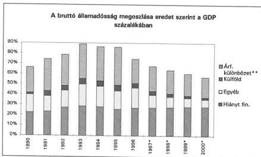
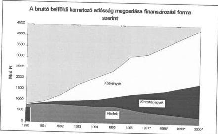

Állami Számverőszék

T/4832/1.

# VÉLEMÉNY

## a Magyar Köztársaság 1998. évi költségvetéséről

1. sz. füzet

A költségvetési dokumentum törvényességi és számszaki ellenőrzése, javaslatok

398.

1997. október

---

Az ellenőrzés végrehajtásáért felelős:

VI. Elemző, Módszertani és Informatikai Igazgatóság

dr. Nagy Zoltán

számvevő igazgató

Az ellenőrzést vezette:

Bakonyi Sándorné

számvevő igazgatóhelyettes

Az ellenőrzésben részt vettek:

Horváthné Menyhárt Erika

számvevő tanácsos

Bojtos Rózsa

számvevő tanácsos

Göller Géza

számvevő

dr. Somorjai Zsoltné

számvevő

Bálint Józsefné

főelőadó

Tóth Attila

külső szakértő

---

# TARTALOMJEGYZÉK

|  **1. AZ ÁHT. ELŐÍRÁSAINAK ÉRVÉNYESÜLÉSE A TÖRVÉNYJAVASLATBAN ÉS MELLÉKLETEIBEN** | **4**  |
| --- | --- |
|  **2. A TÖRVÉNYJAVASLAT NORMASZÖVEGÉHEZ KAPCSOLÓDÓ ÉSZREVÉTELEK** | **6**  |
|  **3. A TÖRVÉNYJAVASLAT MELLÉKLETEIHEZ KAPCSOLÓDÓ ÉSZREVÉTELEK** | **9**  |
|  **4. AZ ÁLLAMHÁZTARTÁS ALRENDSZEREINEK MŰKÖDÉSI FELTÉTELEI** | **11**  |
|  4.1. A központi költségvetés | 11  |
|  4.1.1. A központi költségvetés hiánya | 11  |
|  4.1.2. A központi költségvetés adósságának alakulása | 12  |
|  4.1.3. Az állami kezességvállalások | 13  |
|  4.1.4. Központi beruházások | 14  |
|  4.2. Az elkülönített állami pénzalapok | 14  |
|  4.3. A TB Alapok és a költségvetés kapcsolata | 14  |
|  4.4. A helyi önkormányzatok | 15  |
|  **5. AZ ÁLLAMHÁZTARTÁS PÉNZÜGYI REFORMJA** | **16**  |
|  **JAVASLATOK** | **17**  |

1

---

# Rövidítések jegyzéke

Aht. - Allamháztartási törvény
ASZ - Allami Szamvevoszek
BM - Belugyminisztérium
GDP - brutto hazai termek
GFS Nemzetkozi Kormanyzati Penzugyi Statisztika
KESZ - Kincstári Egységes Számla
KVI - Kincstári Vagyoni Igazgatoság
NM - Népjoléti Minisztérium
MAV Rt. - Magyar Allamvasutak Részvenytársaság
MNB - Magyar Nemzeti Bank
PM - Penzugyminisztérium
TB - Tarsadalombitzositas

2

---

---A-344-12/97.

# Bevezetés

Az Állami Számvevőszék alkotmányos kötelezettsége, valamint a számvevőszéki törvény alapján mond véleményt a Kormány által az Országgyűlés részére beterjesztett költségvetési törvényjavaslat megalapozottságáról, a bevételi előirányzatok teljesíthetőségéről. Az államháztartási törvény előírja, hogy az éves költségvetési törvényjavaslatot az Országgyűlés az Állami Számvevőszék véleményével együtt tárgyalja meg.

Véleményünk első részében (1. füzet) a törvényjavaslat szakaszaihoz rendelve értékeltük az államháztartási törvénnyel és más kapcsolódó törvényekkel való összhangot, a mellékleteket, illetve – ahol lehetőség adódott – vizsgáltuk a számszaki egyezőségeket. Javaslatainkkal a tisztánlátást, a döntések megalapozottságát és az ellenőrizhetőséget kívánjuk elősegíteni.

A költségvetési dokumentumok törvényességi és számszaki ellenőrzéséről szóló 1. füzetet október 3-án, az Országgyűlés törvényalkotási menetrendjéhez igazodva nyújtjuk be. Az egy héttel később elkészülő 2. füzetben a bevételi előirányzatok megalapozottságát értékeljük, továbbá összefoglaljuk azokat a tapasztalatokat, amelyeket helyszíni ellenőrzésünk a Pénzügyminisztériumban, a fejezeteknél, valamint a helyi önkormányzatok támogatásai tervezésének vizsgálata során szerzett.

---3

---

# 1. Az Áht. ELŐÍRÁSAINAK ÉRVÉNYESÜLÉSE A TÖRVÉNYJAVASLATBAN ÉS MELLÉKLETEIBEN

Az Áht. szerint a kiadásokat és a bevételeket el kell különíteni rendes és rendkívüli előirányzatokra. A törvényjavaslat 1. és 2. számú melléklete ennek megfelelően készült, de pl. a fejezeti kezelésű előirányzatoknál még mindig nem egységes elvek szerint történik a besorolás. A központi költségvetés mérlege (13. számú melléklet) nem tartalmazza a bevételi és kiadási előirányzatok megfelelő bontását. Emiatt nem állapítható meg, hogy a rendkívüli bevételek és kiadások milyen mértékben befolyásolják a költségvetés pozícióját.

Az Áht. 8/A. § (1) bekezdése és a 27. § (1) bekezdése alapján a költségvetési törvényben jóvá kell hagyni a tervezett hiány finanszírozási módját. Az előterjesztetés normaszövegében (vagy számozott mellékleteiben) nincs erre vonatkozó rendelkezés.

Az Áht. 24. §-a szerint a központi költségvetési szerveknél be kell mutatni a költségvetési létszámkeretet (a választott tisztségviselőket és a foglalkoztatottakat külön-külön). Ezt a törvényjavaslat nem teljesíti.

Az Áht. 36. § a) pontja előírja a Kormány számára, hogy a költségvetési törvényjavaslat benyújtásakor terjessze elő azokat a törvényjavaslatokat is, amelyek a javasolt előirányzatok megalapozásához szükségesek. Megállapítható, hogy két kivétellel mindegyik érint kiadási vagy bevételi előirányzatot. A törvényjavaslatnak A rendőrségről szóló 1994. évi XXXIV. tv. 65. § (4) bekezdéssel és a nemzetbiztonsági szolgálatokról szóló 1995. évi CXXV. tv. 64. § (4) bekezdéssel való kiegészítése nem áll közvetlen összefüggésben az 1998. évi költségvetési előirányzatokkal.

Az Áht. 36. § b) és c) pontja szerint a Kormány tájékoztatást ad a többéves elkötelezettséggel járó kiadási tételek későbbi évekre vonatkozó hatásairól; bemutatja a költségvetési évet követő 2 év várható előirányzatait. E kötelezettségnek a Kormány nagyrészt eleget tett, de továbbra is hiányzik a törvénytervezetből a többéves elkötelezettségek későbbi évekre vonatkozó hatásának bemutatása (az állami garanciák, a finanszírozási döntések jövőbeni kihatása).

Az Áht. 42. § (4) bekezdése szerint a Kormány tájékoztatásul az egyedi kezességvállalásai alapján a várhatóan esedékessé váló fizetési kötelezettségeit összesítve – az esedékessé válás valószínűsége szerint is – bemutatja a költségvetési törvényjavaslat indokolásában. A törvénytervezet – rövid elemzést adva – összesítve mutatja be a garanciák állományát, a tételes adatokat viszont nem tartalmazza.

Az Áht. 115. §-a szerint az államháztartás mérlegeinek a költségvetés előterjesztésekor a vonatkozó év és az előző év várható, valamint az azt megelőző év tényadatait kell tartalmaznia. Az előterjesztésben csak az önkormányzati mérlegek felelnek meg ennek az előírásnak. A központi költségvetés mérlegeiben az 1997. évi várható adatok helyett az 1997. évi költségvetési törvény előirányzatai szerepelnek.

4

---

Az Áht. 116. §-a tételesen felsorolja, hogy az Országgyűlés részére mely mérlegeket kell bemutatni. Ezek közül az alábbiak hiányoznak az előterjesztésből:

- a költségvetési hiány finanszirozásanak mérlege eszközök szerinti bontásban;
- a tobbéves kihatással jró dontések számszerúsitése évenkénti bontásban, valamint összesíte.

Ugyanakkor részletesen megismerhetők az 1998. évi PHARE segély programjai, valamint a nemzetközi pénzügyi intézmények hiteleiből finanszírozott projektek.

5

---

## 2. A TÖRVÉNYJAVASLAT NORMASZÖVEGÉHEZ KAPCSOLÓDÓ ÉSZREVÉTELEK

### *A költségvetés általános tartaléka*

Az előre nem tervezhető kiadásokra, illetve az elmaradó bevételek pótlására általános tartalékot kell képezni. Az Áht. 26. § (1) bekezdése a tartalék nagyságát a kiadási főösszeg %-ában (0,5-2% között) határozza meg.

Az 1998. évre tervezett 18 Mrd Ft, a törvényi előírás alsó határánál van (0,64%), összegét tekintve azonban 40 %-kal haladja meg az előző évi előirányzatot.

*1. táblázat*

### *Az általános tartalék előirányzatának alakulása*

|  Költségvetési év | Tartalék összege (M Ft) | Általános tartalék a kiadási előirányzat %-ában  |
| --- | --- | --- |
|  1995 | 19.100 | 0,98  |
|  1996 | 15.764 | 0,75  |
|  1997 | 12.850 | 0,50  |
|  1998 | 18.000 | 0,64  |

*Forrás: éves költségvetési törvények*

A tartalék 1995-től mind összegét, mind pedig a kiadási előirányzathoz viszonyított %-át tekintve csökkent. Az előterjesztésben nem történt utalás arra, hogy az 1998. évi tartalék növekedését mi indokolja.

A központi költségvetés kiadási előirányzatának évről-évre történő növekedése a törvényi szabályozás alsó határának érvényesítésével is lehetővé tesz növekvő összegű általános tartalékképzést. A tartalék felhasználási lehetősége, ha olyan célokra használják, melyek az eredeti költségvetés készítésekor nem voltak láthatók és tervezhetők, bővíthető.

Az ÁSZ korábban is észrevételezte, hogy az általános tartalék összegét – a figyelem ráirányítása és az elszámoltatás jogalapjának megteremtése érdekében – a normaszövegben is célszerű szerepeltetni.

### *Az állam vagyonával kapcsolatos rendelkezések*

A törvényjavaslat 8. §-a rendelkezik a központi költségvetési szerv vagyonkezelésében lévő ingatlanértékesítés ellenértékének felhasználásáról, a befolyt bevétel központi költségvetés és a költségvetési szerv közötti megosztásáról. A (1) és (2) bekezdésben foglalt jogosultságok és eljárások értelmezése – részletes indokolással együtt is – nehézkes, ezért javasoljuk a megfogalmazás pontosítását.

6

---

A (4) bekezdés szerint: „A központi költségvetési szervek az (1)-(3) bekezdésben meghatározott értékesítésből befolyt és az általuk felhasználható ellenérték összegével – amennyiben azt nem tervezték meg – a kiadási és bevételi előirányzatukat megemelhetik”. Véleményünk szerint szükséges lenne megjelölni, hogy a rendelkezés mely előirányzat-csoportokra vonatkozik (pl. dologi, felhalmozási, egyéb).

A törvényjavaslat 9. §-a meghatározza, hogy a Kincstári Vagyoni Igazgatóság a kezelésében lévő kincstári vagyon hasznosításából, értékesítéséből származó bevételéből 800 millió forintot a vagyonhasznosítással, illetve a vagyongazdálkodással kapcsolatos, az állami feladatellátással összefüggő feladatokra fordíthat. Az 1997. évi költségvetési törvény ugyanezen kiadások teljesítéséhez a pénzügyminiszter egyedi hozzájárulását írta elő azzal, hogy a meghatározott 850 M Ft keretösszegen belül éves szinten 300 M Ft-ig a KVI vezérigazgatója a pénzügyminiszter utólagos tájékoztatása mellett önállóan dönthet. Javasoljuk a törvénytervezet 9. §-át – az állami pénzeszközök felhasználásának folyamatos ellenőrizhetősége érdekében – az előző évivel azonos tartalommal kiegészíteni.

# A központi költségvetési szervekkel kapcsolatos rendelkezések

A törvényjavaslat 11. § (1) bekezdése szerint a központi költségvetési szerv alaptevékenységével összefüggő bevétele eredeti előirányzatot meghaladó többletének 50%-a központi költségvetés, 50%-a saját bevételét képezi. A (3) bekezdés első része a bevételi többlethez kapcsolódó előirányzatváltoztatás végrehajtásának módját rögzíti. A bekezdés – az 1997. évi költségvetési törvény normaszövegéhez képest a befizetés időpontjára vonatkozó eddigi hiányosságot pótolva – a következő új mondattal egészült ki: "A központi költségvetést megillető részt a következő évi előirányzat-maradvány elszámolás során kell kimutatni és annak jóváhagyását követően kell rendezni." Véleményünk szerint ez az előírás korrigálásra, illetve pontosításra szorul, mivel az előirányzat maradvány elszámolás a tárgyévre vonatkozik, csak a következő évben realizálódik, és a „rendezni” szó helyett is célszerűbb lenne más megfogalmazást alkalmazni.

# A központi költségvetéssel kapcsolatos vegyes és átmeneti rendelkezések

A törvényjavaslat 53. §-a felmentést ad az Áht. 12/A § (2) bekezdésében foglaltak alól és lehetővé teszi, hogy „a fejezeti kezelésű célprogramok támogatásai terhére – ha jogszabály másképp nem rendelkezik – az éves kiadási előirányzat 40 %-ának megfelelő összegű éven túli kötelezettség vállalható.” Az Áht. 12/A § (2) bekezdése ugyanis kimondja, hogy tárgyéven túli fizetési kötelezettség csak olyan mértékben vállalható, amely a kötelezettség-vállalás időpontjában ismert feltételek mellett az esedékesség időpontjában, a rendeltetésszerű működés veszélyeztetése nélkül finanszírozható.

7

---

A törvényjavaslat a területfejlesztési és területrendezésről szóló törvény által felállított intézményrendszer forrásszükségletére hivatkozik az idézett paragrafus indokolásában. Az előterjesztés 330. oldalán lévő táblázat szerint a támogatási célprogramok 1998. évi kiadási előirányzata 73,6 Mrd Ft, amiből a legjelentősebb célnak a mezőgazdaság (49%-kal) jelenik meg. Az indokolás ezért egyoldalú. A 73,6 Mrd Ft kiadási előirányzatból a támogatás összege 55,6 Mrd Ft, azaz 75%. Ennek alapján az éven túli kötelezettség-vállalás lehetősége 29 Mrd Ft-ot tesz ki.

Megítélésünk szerint az előző évi 25%-os túllépési lehetőségnek 40%-ra történő kiterjesztése minden megkötöttség, biztosíték beépítése nélkül – miután az egyértelműen a támogatást terheli – a következő évi költségvetésre már jelentős mértékű elkötelezettséget jelent. Ezért a gazdálkodási fegyelem betartása, a felelősség érvényesülésének megteremtése érdekében a normaszöveg módosítása indokolt.

---8

---

### 3. A TÖRVÉNYJAVASLAT MELLÉKLETEIHEZ KAPCSOLÓDÓ ÉSZREVÉTELEK

#### *A törvényjavaslat számozott mellékletei*

A törvényjavaslat számozott mellékletei hivatottak megjeleníteni az Országgyűlés számára a legfontosabb döntési információkat, a jóváhagyandó előirányzatokat. Nem szabályozott, hogy milyen adatokat és milyen formában kell tartalmaznia az előterjesztésnek. Az 1998. évi javaslat számozott mellékleteiben – a korábbi évekhez hasonlóan – csak az 1998. költségvetési évre tervezett (jóváhagyandó) számsor szerepel. Többlet információt jelentene az előirányzatok megítéléséhez, összehasonlításához az előző évek tény, illetve várható adatainak a bemutatása. Ezek az adatok az általános és fejezeti indokolások különböző tábláiban megjelennek ugyan, de a döntéshozók jobb informálása érdekében a jóváhagyandó mellékleteken kívül szükség lenne azok szerkezetével, sorrendjével egyező, idősorokat is tartalmazó mellékletek bemutatására is.

#### *A támogatási előirányzatok bemutatása*

Az Áht. 19. és 20. §-ainak megfelelően a törvényjavaslat 1. és 2. számú melléklete fejezetekre tagolódva, címek, alcímek, előirányzat-csoportok és kiemelt előirányzatok szerinti részletezésben tartalmazza a kiadásokat és a bevételeket. Az előirányzatok jó része intézményi, felügyeleti szervi hatáskörben módosulhat, az Országgyűlés jóváhagyó szerepe emiatt csak formális. A támogatási előirányzat az, ami a közpénzek odaítélését jelzi az adott feladathoz, intézményi működéshez. Indokoltnak tartjuk ezért, valamint az ellenőrizhetőség javítása érdekében azt, hogy az Országgyűlés az összes kiadás mellett a támogatásokkal fedezett kiadásokat is hagyja jóvá.

#### *A mérlegszerkezet változása*

A központi költségvetés mérlegében – 1997. évhez képest – új tételként jelenik meg a bevételi oldalon a „Magyar Nemzeti Bank befizetése”, a kiadási oldalon a „Garancia és hozzájárulás a TB-hez” mérlegtétel. Ez utóbbi 1995-ben és azt megelőzően már szerepelt a mérlegtételek között. A törvénytervezet nem indokolja a mérlegsorok változását. Ez azért lenne fontos, mert tartalmi változás is bekövetkezett: a mérlegtételt 1995-ben „Hozzájárulás a nem biztosítottak egészségügyi kiadásaihoz” (XI. BM fejezet. 11. cím 2. alcím) jelentette, míg 1998-ban két fejezetnél szereplő előirányzatból tevődik össze „Gyes-en lévők után nyugdíjjárulék megtérítése a Nyugdíjbiztosítási Alapnak” (XXI. NM fejezet 10. cím 6. alcím) és a „Nyugdíjbiztosítási Alap támogatása” (XXII. PM fejezet. 26. cím 1. alcím).

---9

---

# **Támogatási célprogramok**

A törvény normaszövege és általános indokolása is külön kezeli a fejezeti kezelésű célprogramok előirányzatait. Az általános indokolás mellékletét képező, a „Támogatási célprogramok előirányzatainak ágazatos megoszlása” táblázatban szereplő kiadási és bevételi adatok azonban az 1. és 2. számú mellékletek előirányzataival nehezen egyeztethetőek a különböző elnevezések miatt. A jelenleg feltüntetett különböző elnevezések alapján csak megközelítő egyezőséget tudtunk megállapítani a kiadási és bevételi mellékletek és a mérleg adatai között. Az előterjesztés egységes szerkezete és az adatok ellenőrizhetősége megkívánná, hogy a támogatási célprogram előirányzatok az 1. és 2. számú mellékletben is azonosítható elnevezéssel szerepeljenek.

# **Eltérések az 1. és 2. számú melléklet és az általános indokolás között**

A költségvetési törvényjavaslat 1. számú melléklete és az általános indoklásban található táblázatok az államadóssággal kapcsolatos kiadások esetében több helyen is eltérést mutatnak.

- A XLI. A belföldi államadósság költségvetési elszámolásai című fejezetnél a hiányt finanszírozó államkötvények kamatánál 208,3 milliárd forint jelenik meg, míg az általános indokolás 413. oldalán található táblázatban 207,7 milliárd forint szerepel.

- A XLIII. A költségvetés belföldi hitelfelvételei és belföldi adósságának törlesztése című fejezetben a hiányt finanszírozó államkötvény-adósság törlesztése 261,9 milliárd forint. Az általános indokolás 424. oldalán lévő táblázatban ugyanilyen címszó alatt 262,25 milliárd forint szerepel.

- 600 M Ft-os eltérés van a kincstárjegyeknek a törvényjavaslat 1. számú mellékletében rögzített kamatelőirányzata (164,2 Mrd Ft) és az általános indokolás 413. oldalán lévő melléklet kamatadata (164,8 Mrd Ft) között.

10

---

# 4. AZ ÁLLAMHÁZTARTÁS ALRENDSZEREINEK MŰKÖDÉSI FELTÉTELEI

# 4.1. A központi költségvetés

# 4.1.1. A központi költségvetés hiánya

A központi költségvetés hiánya 1998-ban a törvényjavaslat szerint meghaladja a 425 milliárd forintot, ami 125 milliárd forinttal több, mint az 1997-re tervezett hiány. A tervezett deficit a GDP 4,9 százalékának felel meg.

Az alábbi táblázatból látható, hogyan alakul a költségvetés egyenlege és finanszírozási szükséglete 1996-98 között. Az egyenleg romlásában jelentős szerepe van a privatizációs bevételek csökkenésének. Az állami vagyon értékesítéséből 1996-ban több mint 200 Mrd Ft bevétel származott, míg 1998-ban 8 Mrd Ft a bevételi előirányzat.

A hiány finanszírozási igény ezzel párhuzamosan folyamatosan növekszik. Az 1997. évben tapasztalható ugrásszerű növekedés az MNB és a központi költségvetés közötti adósságcsere eredménye, ami nem jelent tényleges pénzmozgást. (1997-ben a költségvetés devizaadósságává alakították az addig az MNB-nél nyilvántartott, a külföldön felvett hitelek árfolyamkülönbözete miatt keletkező kamatmentes, lejárat nélküli adósságállományt.)

2. táblázat

A költségvetés egyenlege és finanszírozási igénye 1996-98-ban

|   |  |  | Mrd Ft  |
| --- | --- | --- | --- |
|  Megnevezés | 1996 | 1997* | 1998*  |
|  A költségvetés egyenlege privatizációs bevételek nélkül | -129,79 | -361,69 | -433,69  |
|  Privatizációs bevételek | 206,88 | 60,00 | 8,00  |
|  A költségvetés egyenlege | 77,08 | -301,69 | -425,69  |
|  Törlesztések | 516,11 | 2.397,28** | 387,86  |
|  Finanszírozási igény | 439,02 | 2.698,97** | 813,55  |

Forrás: 1996. évi zárszámadási törvényjavaslat, 1997. évi költségvetési törvény és 1998. évi költségvetési törvényjavaslat

*- becsült adatok

**- az MNB és a költségvetés közti adósságcsere eredménye, nem jelent tényleges kifizetést

Az Áht. 28. §-a szerint a költségvetés elfogadásával egyidejűleg jóvá kell hagyni a költségvetési hiány finanszírozásának módját. Ennek a törvényjavaslat nem tesz eleget. Normaszövegében felhatalmazást ad a pénzügyminiszternek a hiány finanszírozására (4. § (1) bekezdés), de annak módjára nem tér ki.

11

---

Ezzel összefüggésben a törvényjavaslat elmulasztotta bemutatni a hiány finanszírozásának mérlegét is.

#### 4.1.2. A központi költségvetés adósságának alakulása

A központi költségvetés bruttó adósságállománya 1998-ban várhatóan eléri az 5.984 milliárd forintot. Ez több mint 500 milliárd forinttal nagyobb, mint az 1997-re becsült 5.425 milliárd forint.

A költségvetés 1998-ban várhatóan 387,8 milliárd forintot költ adósságtörlesztésre, amiből 334,9 milliárd forint a belföldi adósság visszafizetése. A törvényjavaslat nem tesz említést az 1996. évi zárszámadási törvényjavaslatban átvállalásra javasolt (MÁV likviditási) hitelek visszafizetéséről. Az 1. számú mellékletben a költségvetési kiadások között sem szerepelnek erre vonatkozó adatok. Az 1996. évi zárszámadási törvényjavaslat szerint ezek a hitelek kivétel nélkül 1998-ban járnak le, összegük 15,7 Mrd Ft. Ez jelentősen módosítja a költségvetés törlesztési kiadásait (amennyiben az 1996. évi zárszámadási törvény 25. §-át is elfogadja az Országgyűlés).

1. ábra

Forrás: 1998. évi költségvetési törvényjavaslat; Államadósságkezelő Központ
*- becsült adatok
**- 1997-től új devizaadósság

A nominálisan növekvő adósságállomány GDP-hez viszonyított aránya kedvező tendenciát mutat. Az 1. ábrán is látható, hogy 1998-ban folytatódik az adósság reálértékének csökkenése, és az év végére az állomány a GDP kétharmada alá csökken. Az adósság szerkezete is jelentős változáson megy keresztül. növekszik a hiány finanszírozása miatt keletkező adósság aránya az összállományhoz képest, míg a többi – a külföldi hitelek, a külföldi hitelek árfolyam-különbözete miatt keletkező (1997-től új devizaadósságként szereplő) és az egyéb adósság – aránya csökken.

12

---

Az adósság finanszírozási szerkezete is átalakult: a piaci úton, értékpapír formájában történő finanszírozás túlsúlyba került, a hitelből történő finanszírozás háttérbe szorult, jegybanki hitelből történő finanszírozás gyakorlatilag évek óta nincs.

A kötvényállomány a becsült 1997-es 1.782 milliárd forintról 1998-ra 2.064 milliárd forintra növekszik, 2000-re pedig meghaladja a 2.474 milliárd forintot. A kincstárjegy állomány 1998-ra várhatóan 1.054 milliárd forint lesz, az ezredfordulón ennek közel másfélszerese, 1.527 milliárd forint. A hitelek 1998-ra 436 milliárd forintra csökkennek, 2000-re pedig előreláthatóan 291 milliárd forintot tesznek majd ki.

2. ábra

Forrás: 1998. évi költségvetési törvényjavaslat; Államadósságkezelő Központ
*- becsült adatok

### 4.1.3. Az állami kezességvállalások

Az 1998. évi költségvetési törvényjavaslat a korábbi évekhez hasonlóan szabályozza az állami garanciákra fordítható összegeket. Az új egyedi kezességek keretösszegét a kiadási főösszeg 1%-ában – azaz 28 Mrd Ft-ban – határozza meg a törvényjavaslat. E mértéken felül korlátlan kezesség adható az energiahordozók importjára és a biztonsági készletezésére, valamint a nemzetközi beruházási és fejlesztési pénzintézetekkel kötendő szerződésekre.

Az ÁSZ már többször kifogásolta az állami garanciák nettó módon való elszámolását (a költségvetés kiadási oldalán a megtérülésekkel csökkentett összeg megjelenítését). Az 1997. évi költségvetési törvényben valósult meg először az állami garanciák bruttó elszámolása a visszatérülések XXII. PM fejezet 22. cím „Egyéb költségvetési bevételek” közötti szerepeltetésével. A garanciák megtérüléseinek pontos követhetőségét nagyban elősegítő önálló kiemelt előirányzatot azonban csak az 1998. évi költségvetési törvényjavaslat illesztette a költségvetési címrendbe (2. számú melléklet XXII. PM fejezet 22. cím 1. alcím 9. előirányzat-csoport "Kezesség visszatérülés").

13

---

#### **4.1.4. Központi beruházások**

A kiemelt jelentőségű beruházás, beruházási célprogram megvalósítását az Országgyűlés engedélyezi az illetékes miniszter által kidolgoztatott beruházási javaslat alapján. Az Országgyűlés döntésének előkészítése érdekében a költségvetési törvényjavaslat mellékleteként be kell nyújtani a beruházási javaslat főbb adatait és szöveges indokolását (a központi beruházások költségvetési előirányzatainak megtervezéséről és az ezek felhasználásával megvalósuló beruházási kiadások finanszírozási rendjéről szóló 157/1995. Kormányrendelet 9. § (2) bekezdésében meghatározott tartalommal és formában).

A mellékletekben szerepelni kell a kiemelt jelentőségű beruházás főbb adatainak (megnevezés, felelős hatóság, beruházó, telepítési hely, költségelőirányzat stb.), az előirányzat pénzügyi forrásai megnevezésének (költségvetési előirányzat, beruházási hitel, önkormányzati hozzájárulás, saját vagy külső forrás, stb.) és a szöveges indokolásnak (fejlesztés célja és gazdaságossága, előzmények, a szükségesség indokolása, szakmai viták, állásfoglalások stb.). A fejezeti kötetek részletes indokolásaiban szerepelnek ugyan a beruházásokra vonatkozó információk, azok tartalma és formája azonban fejezetenként és beruházásonként változó, teljeskörűen nem felelnek meg a Kormányrendelet előírásainak.

#### **4.2. Az elkülönített állami pénzalapok**

1998-ban a korábban is működött öt elkülönített állami pénzalap mellett a Központi Nukleáris Pénzügyi Alap is megkezdi működését. Az új alap kezelője az Országos Atomenergia Hivatal. Bevételeinek jelentős részét a nukleáris létesítmények befizetései jelentik, ezek közül is kiemelkedik a Paksi Atomerőmű Rt. 7,4 milliárd forintos befizetése.

Az általános indokolás (253. oldal) szerint az alapok esetében követelmény, hogy folyó bevételeiknek és kiadásaiknak összhangban kell lenniük. A Munkaerőpiaci Alap esetében az összhang nem érvényesül: az alap 1 Mrd Ft hiánnyal tervezte 1998. évi költségvetését.

A törvényjavaslatnak – az Áht. 58. §-a értelmében – az elkülönített alapok kiadási és bevételi előirányzatairól – azok megalapozottságát alátámasztandó – szöveges indokolást kellene tartalmaznia. Az általános indokolás alaponként részletezi a bevételeket, de arról nem szól, hogy ezekből a forrásokból az elkülönített állami pénzalapoknak milyen célokat, feladatokat kell megvalósítaniuk 1998. évi működésük során. A fejezeti kötetek sem tartalmaznak kellő mélységű indokolást.

#### **4.3. A TB Alapok és a költségvetés kapcsolata**

A társadalombiztosítás önkormányzati igazgatásáról szóló 1991. évi LXXXIV. tv. 23. § (6) bekezdése szerint a Kormány – a biztosítási önkormányzatok kezelésében levő társadalombiztosítási pénzügyi alapok költségvetésére vonatkozó javaslatot figyelembe véve – törvényjavaslatot dolgoz ki a biztosítási alapok költségvetésére, melyet legkésőbb október 15-éig nyújt be az Országgyűlésnek. E törvényjavaslatról az Állami Számvevőszék külön véleményt készít. Az 1998.

14

---

évi költségvetési törvényjavaslat tájékoztatásul bemutatja a TB Alapok költségvetési tervét.

Az elmúlt évek során megszokottá vált a társadalombiztosítási alapok működése mögé állított költségvetési garancia. Az 1998. évi költségvetési törvényjavaslat is garantálja az TB Alapok számára a KESZ-hez kapcsolt megelőlegezési számlák használatát. Az 1998. január 1-jén fennálló tartozásán felül a Nyugdíjbiztosítási Alap 65 Mrd Ft, az Egészségbiztosítási Alap 40 Mrd Ft összegig vehet igénybe kamatmentes hitelt. Ezt meghaladó hitelfelvételre az Alapok kamatfizetés mellett jogosultak.

1996-ban a Nyugdíjbiztosítási Alap átlagosan 22 Mrd Ft, az Egészségbiztosítási Alap átlagosan 41 Mrd Ft összegben vette igénybe a KESZ-t. A TB Alapok – a költségvetési törvényjavaslatban bemutatott – 1998. évi költségvetésük alapján a KESZ számla limitet meghaladó igénybevétele miatti kamatkiadást nem terveznek. Véleményünk szerint – az előző évek gyakorlatát figyelembe véve – ez indokolt lenne.

# 4.4. A helyi önkormányzatok

A költségvetési törvényjavaslat az általános és a fejezeti indokolásban részletesen bemutatja a helyi önkormányzatok forrásszabályozásának módosulását, a központi költségvetési kapcsolatokból származó források alakulását és az önkormányzati feladatok 1998. évi változásait.

A korábbi évekhez hasonlóan az állami hozzájárulások jogcímei, a hozzájutás feltételei jövőre is jelentősen módosulnak. Elismerve azt, hogy a változtatás célja az ismertté vált problémák megoldása, a folyamatos és jelentős változtatások csak a forrásszabályozási rendszer – többletmunkával járó – kisebb-nagyobb kiigazításra irányulnak. A törvényjavaslat általános indokolásában is megfogalmazódott, hogy "az 1990-ben megreformált pénzügyi rendszerben alapvető változás nem következik be".

A törvényjavaslat alapján az átengedett adókon és illetékeken kívül az önkormányzatok az állami támogatásokat és hozzájárulásokat közel 60 jogcímen vehetik igénybe. Ezek mellett az elkülönített állami pénzalapoktól, a szakminisztériumoktól, a társadalombiztosítástól is kapnak, igényelhetnek támogatásokat. A támogatások egy része pályázattal nyerhető meg, bizonytalan, elhúzódó döntési folyamatokon keresztül.

Az államháztartási reform előkészítéséről szóló 1062/1996. Korm. határozat a helyi önkormányzatok tekintetében az alábbi fő célt fogalmazta meg:

- az onkormányzati muködés szakmai és gazdasági hatékonyságanak novelése érdekében a szétaprozott feladatellátásban esszerő koncentrációt kell megvalósitani;
a finanszirozasi rendszert esszerubbe, attekinthetobbé kell tenni.

Ezekben a lényeges kérdésekben érdemi előrelépést az 1998. évi költségvetési törvényjavaslat nem hozott. Az ÁSZ által évek óta jelzett legfőbb problémák (a támogatási rendszer elaprózott, bürokratikus, kiszámíthatatlan) változatlanul fennállnak, és továbbra is hátráltatják a hosszabb távú elképzelésekre épülő, hatékony önkormányzati gazdálkodást. Indokoltnak tartjuk ezért a reformfolyamatok felgyorsítását.

15

---

# 5. AZ ÁLLAMHÁZTARTÁS PÉNZÜGYI REFORMJA

Az elmúlt években az államháztartási reformmal összefüggő rendszerfejlesztési munkára többszáz millió forintot irányoztak elő. Az 1998. évi költségvetési törvényjavaslatban a reformmal összefüggően (rendszerfejlesztési munkára és önkormányzati adók feldolgozására) 220 M Ft, a pénzügyi szektor modernizációjára PHARE segélyből 816,6 M Ft kiadási előirányzat szerepel.

A Kincstár létrehozása, a kincstári finanszírozás belépése jelentette a központi költségvetés területén az államháztartási reform első lényeges lépését. A pénzügyi reform folytatásáról nincs információ. Sem a törvényjavaslat, sem a fejezeti indokolás nem tartalmaz tájékoztatást a reform 1998. évi feladatairól, a rendelkezésre álló költségvetési előirányzat felhasználási jogcímeiről.

Az államháztartási reformról szóló 1062/1996. (VI. 4.) Korm. határozat konkrétan és részleteiben is megfogalmaz teendőket e területre. Így pl.:

- az államháztartásban átlátható és pénzügyileg is vállalható feladat- és finanszírozási struktúra kialakítása;
- az államháztartási pénzügyi információs rendszer és költségvetési tervezés továbbfejlesztése a modern pénzügyi igazgatás kialakítása;
- az információszolgáltatás továbbfejlesztése a magyar és a nemzetközi számbavételi kötelezettségek és szabványi előírások szerint stb.

Fentiek mellett az államháztartási törvény végrehajtása is szükségessé tesz a központi költségvetés területén szabályozási feladatokat. Az ÁSZ által már többször említett olyan szabályozási kérdésekről van szó, mint az államháztartás osztályozási rendje, a teljeskörű GFS rendszer, a funkcionális elemzések lehetőségének megteremtése, a mérlegek összeállításának, az államháztartás alrendszerei vagyonnyilvántartásának, az államháztartás alrendszereiből nyújtott támogatásokkal összefüggő számadási kötelezettségnek a részletes szabályai.

A fenti feladatok között fontossági sorrend ugyan nem határozható meg, de az új pénzügyi információs rendszer megteremtése, illetve ennek hiánya mind a napi gyakorlati munkában, mind az irányítás, tervezés szintjén, s nem utolsó sorban a parlamenti döntéseknél nagymértékben érezteti hatását.

A jelenlegi információs rendszerben a költségvetés jóváhagyása döntően az intézményi szintű előirányzatokhoz kapcsolódik. Valamennyi módosítási kötöttség, az elszámoltatás középpontjában az intézmény áll, az általuk ellátott feladatok másodlagos szerepet töltenek be. Ezek az információk azonban a döntések kellő megalapozásához nem alkalmasak. A feladatmutatók nélküli teljesítési adatok pedig az elemzőmunkához nem nyújtanak támpontot, segítséget.

A fejlesztési feladatok megvalósításával kapcsolatos intézkedések gyakorlatilag az egész társadalmat érintik. A tervezett intézkedések okainak, céljainak, mozgásterének, követelményrendszerének megismertetése és elfogadtatása ezért a végrehajtás alapvető feltételét jelenti. Célszerű lett volna az 1998-ra tervezett reform-intézkedésekről a parlamenti képviselőket, a költségvetési gazdálkodás területén érintetteket, valamint a közvéleményt is tájékoztatni.

16

---

# Javaslatok

## Az Országgyűlésnek:

Javasoljuk az általános tartalék megjelenítését a normaszövegben.

Javasoljuk a törvényjavaslat 9. §-ának módosítását, illetve kiegészítését: „*A KVI vagyonkezelésében lévő kincstári vagyon átmeneti vagy tartós hasznosításából, értékesítéséből származó – kiadásokkal csökkentett – bevétel a központi költségvetés központosított bevételét képezi. A bevételből a KVI 800 millió forintot – a pénzügyminiszter egyedi hozzájárulása alapján – a vagyonhasznosítással, illetve a vagyongazdálkodással kapcsolatos, az állami feladatellátással összefüggő kiadásokra fordíthat. Ezen belül a KVI vezérigazgatója ügyletenként 30 millió forintig – de éves szinten legfeljebb 300 millió forintig – önállóan dönt és döntéseiről a pénzügyminisztert negyedévenként utólag tájékoztatja.*”

Javasoljuk a 11. § (3) bekezdésének pontosítását: „... A központi költségvetést megillető részt a következő évben az előirányzat-maradvány elszámolása során kell kimutatni és annak jóváhagyását követően a Kincstárban a pénzügyi elszámolást elvégezni.”

Javasoljuk az 53. § (2) bekezdésének kiegészítését: „...az éves kiadási előirányzat 40 %-ának megfelelő összegű éven túli kötelezettség vállalható abban az esetben, ha a kötelezettség vállalás mögött a felügyeleti szerv által jóváhagyott program áll.”

## A Kormánynak:

Egészítse ki a törvényjavaslat normaszövegét a hiány finanszírozásának módjával.

Adjon tájékoztatást a többéves kihatással járó kiadási tételekről (állami garanciák, finanszírozási döntések).

Az 1. számú mellékletben javasoljuk a támogatások bemutatását és parlamenti jóváhagyatását.

---17

---

A költségvetési törvényjavaslat mellékleteként mutassa be a Kormány a kiemelt jelentőségű beruházásokat (a 157/1995. sz. Kormányrendelet 9. § (2) bekezdésében meghatározott tartalommal és formában).

Adjon tájékoztatást a Kormány az egyedi kezességvállalásai alapján esedékessé váló fizetési kötelezettségeiről (az esedékessé válás valószínűsége szerint).

Tegyen eleget a Kormány azoknak a szabályozási kötelezettségeinek, melyekre az Áht. 116. és 124. §-aiban kapott felhatalmazást (pl. államháztartás osztályozási rendje, teljeskörű GFS rendszer, mérlegek, az államháztartás alrendszereinek vagyon-nyilvántartása).

Tájékoztassa az Országgyűlést az államháztartás pénzügyi reformjának eddigi eredményeiről, további feladatairól.

A helyi önkormányzatok pénzügyi szabályozórendszerét módosítani, egyszerűsíteni szükséges.

Budapest, 1997. október 3.

Sándor István  
alelnök

dr. Nyikos László  
alelnök

18