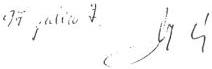

Állami Számverőszék

J/5237.

## JELENTÉS

az Állami Privatizációs és Vagyonkezelő
Részvénytársaság 1996. évi tevékenységének
ellenőrzéséről

401.

1997. december

---

V-21-43/1997. Témaszám: 393.

**Az ellenőrzés végrehajtásáért felelős:**

**Halász Gejza**
számvevő igazgató

**Az ellenőrzést vezette:**

**Harsányi Sándor**
osztályvezető főtanácsos

**Az ellenőrzésben részt vettek:**

**Dr. Borisz József**
számvevő tanácsos

**Lőrinc Alajos**
számvevő tanácsos

**Makkai Mária**
számvevő tanácsos

**Németh Béláné**
számvevő tanácsos

**Dr. Ocskovszky Jánosné**
számvevő tanácsos

**dr. Szöllősi Géza**
számvevő tanácsos

**Szűcs Ivánné**
számvevő

**Tornai József**
számvevő tanácsos

**Dr. Varga István**
számvevő

**Vasas Sándorné dr.**
számvevő tanácsos

**Verő Tünde**
számvevő

---

V-21-43/1997. TÉMASZÁM: 393.

# TARTALOMJEGYZÉK

# BEVEZETÉS 3

# I. ÖSSZEGZŐ MEGÁLLAPÍTÁSOK, AJÁNLÁSOK 4

# 1. Összefoglaló megállapítások 4

1.1. Privatizációs tevékenység 4

1.1.1. Fórum Szálloda értékesitése 5
1.1.2.Hungaria Szalloda Rt.ertekesitese 7
1.1.3.A Taurus Rt.ertekesitese 8

1.2. Vagyonkezelési tevékenység 9

1.3.Ahozzarendeltvagyonvaltozasaesavaltozasokai 10
1.4.Ahozzarendeltvagyon ertekesitesevel es hasznositasaval kapcsolatos bevetelek es kiadasok, valamint kotelezettsegek es kovetelsek alakulasa 11

1.4.1. Különbozö jogszabályokból eredő önkormányzatokat megillető kõtelezettsegek és kifizetesek 14
1.4.1.1. Az 1989. évi XIII. tv. alapján az önkormányzatokat a belterületi fold értéke után megillető jarandóságok 14
1.4.1.2. Az 1992. évi LIV. tv. alapján az önkormányzatokat megillető jarandóság 15
1.4.1.3. Alapito jogon onkormanyzatokat megilleto kotelezettsegek 15

1.4.2. Az 1989. évi XIII. TV. 21. § (1) bekezdés szerint elóirt, a társaságok részére történő vételár visszatérétés (Privatizációs Ellenértek Hányad) 16
1.4.3.Egyeb kotelezettsegek teljesitese 17

1.5. Az ellenőrzés szervezetei és tevékenységük 18

1.5.1. Etikai Tranzakciós es Szerzódésellenörzési Ügyvezető Igazgatóság 18
1.5.2.BelsoEllenorzesiUgyvezetogazgatosag 18

# 2. Ajánlások 18

# II. RÉSZLETES MEGÁLLAPÍTÁSOK 21

# 1. Az ÁPV Rt. privatizációs tevékenysége 21

1.1.Szabalyozasi kornyezet 21
1.2.Az ertekesites osszefoglalo adatai 21
1.3. Ertekesitesi tevekenyseg 23

1.3.1.A Fórum Szálloda Rt. privatizációja 23
1.3.2.Hungaria Szalloda Rt. privatizacioja 28
1.3.3.Taurus Gumiipari Rt. privatizacioja 36

# 2. Az ÁPV Rt. vagyonkezelési tevékenysége 41

2.1.A privatizacio elokeszitsesel es a reorganizacioval kapcsolatos raforditasok 41
2.2.Eves reorganizaciós befektetési raforditások alakulása 43
2.3.Vagyonkezelesselkapcsolatbankimutatottkoltsegekvizsgalata 45
2.4.Vagyonkezelisi feladatok alapjai,helyzete 46

2.4.1. Egyes vagyonkezelsi elementk kialakulasa 46
2.4.2.Az APV Rt.Vagyonkezelsi Szervezete es Mukodese 47

# 3. Az ÁPV Rt.-hez tartozó hozzárendelt vagyon 1996. évi alakulása, a vagyonváltozás 51

3.1.Ahozzarendeltvagyonnyilvantartasi rendszere 51
3.2.Ahozzarendeltvagyonnagsaga,avagyonvaltozasosszetevoi 54
3.2.1.Ahozzarendeltvagyon1996.januar1-jen 54
3.2.2.Ahozzarendeltvagyon1996.december31-én 54

1

---

3.2.2.1. Mukodogazdalkod szervezetekben levovallami tulajdon 55
3.2.2.2.Felszamolás alatt levó, a hozzárendelt vagyoni körben kimutatott allami vagyon 56
3.2.2.3. Végelszámolás alatt levő. a hozzárendelt vagyoni körben kimutatott allami vagyon 56
3.2.2.4. Az elvont, atvett, maradvany eszkozok erteke 57

3.3. Az ÁPV Rt.-hez tartozó hozzárendelt vagyon változása 1996. évben 57

3.3.1. Vagyonvaltozás a muködő gazdalkodó szervezetek kóreben 58
3.3.2. Vagyonvaltozás a felszámolás alatt levő gazdalkodó szervezetek kóreben 58
3.3.3. Vagyonvaltozás a vegelszámolás alatt levő gazdalkodó szervezetek kóreben 59
3.3.4. Az elvont, atvett, maradvanyeszkozok vagyonvaltozasa 59

3.4. A tartós állami tulajdon értéke, változása 1996. évben 60

3.5. Az ÁPV Rt.-hez tartozó termőföld 61

# 4. A hozzárendelt vagyon értékesítésével és hasznosításával kapcsolatos bevételek és kiadások, valamint a kötelezettségek és követelések alakulása 62

4.1. A hozzárendelt vagyon értékesítésével és hasznosításával kapcsolatos bevételek és kiadások 62

4.1.1. Szabalyozási háttér 62
4.1.2. A hozzárendelt vagyon értékesitésének és hasznositásanak eredménye 63

4.2. A hozzárendelt vagyon értékesítésének és hasznosításának bevételei 64

4.2.1. Bevetelek 64
4.2.2. Kiadások alakulása 65

4.3. Követelések alakulása 68

4.4. Az APV Rt. 1996. evi mukodesi kiadasai 68
4.5. Az Allami Privatizaciós es Vagyonkezeló Részvenytársasag kötelezettsegei 70
4.6. Kūlōnbözǒ jogszabályokból eredǒ kötelezettsegek 73

4.6.1. Önkormányzatokat megillető járandóságok 73

4.6.1.1. Az 1989. évi XIII. tv. alapján az önkormányzatokat a belterületi fold értéke után megillető jarandóságok 73
4.6.1.2. Az 1992. évi LIV. törvény alapján az önkormányzatokat megillető jarandóságok 75
4.6.1.3. Alapito jogon onkormanyzatokat megilleto kotelezetsgek 77

4.6.2. Társaságoknak jaró visszatérítések 78
4.6.3. Egyeb kotelezetsgek teljesitese 80
4.6.4. Az APV Rt. kulon jogszabalyokban eloirt kotelezetsgei 82

# 5. Az ellenőrzés szervezetei és tevékenységük 83

5.1. Etikai Igazgatosag 83
5.2.A Belso Ellenorzesi Igazgatosag 86
5.3. Egységköltségek vizsgálata 88

MELLÉKLETEK

2

---

# JELENTÉS

## AZ ÁLLAMI PRIVATIZÁCIÓS ÉS VAGYONKEZELŐ RÉSZVÉNYTÁRSASÁG 1996. ÉVI TEVÉKENYSÉGÉNEK ELLENŐRZÉSÉRŐL

### BEVEZETÉS

Az állami tulajdonban lévő vállalkozói vagyon értékesítéséről szóló 1995. évi XXXIX. törvény 25. § (1) bekezdése szerint az Állami Privatizációs és Vagyonkezelő Rt. (továbbiakban: ÁPV Rt.) tevékenységének ellenőrzése az Állami Számvevőszék feladata. A törvény előírja, hogy az Állami Számvevőszék jelentését - a Kormány beszámolójával együtt - a Zárászámadással együtt praktikusan minden év augusztus 31-éig kell benyújtani. Ez a törvényi előírás azonban betarthatatlan. Ennek oka az, hogy az Állami Számvevőszékről szóló törvény meghatározza a kötelező egyeztetések időtartamát. Ennek figyelembevételével ahhoz, hogy a számvevőszéki jelentést az Országgyűlés a törvényben előírt határidőben megkaphassa, a helyszíni ellenőrzést a tárgyév júniusának elején be kellene fejezni. Ez azonban azért nem járható út, mert a számvitelről szóló 1991. évi XVIII. törvény az auditált éves beszámoló letétbe helyezésének időpontját az ÁPV Rt. esetében a tárgyévet követő augusztus 31-ében határozza meg. A tapasztalatok szerint a június és az augusztus 31-ei pénzügyi-gazdasági adatok oly mértékben térnek el egymástól, hogy egy június közepén záruló helyszíni számvevőszéki vizsgálat egyszerűen hiteltelen lenne. A megoldásra az Állami Számvevőszék javaslatot kíván benyújtani az Országgyűlés Számvevőszéki Bizottságához.

**Az ellenőrzés célja:** annak megállapítása, hogy az ÁPV Rt. 1996. évi tevékenysége megfelelt-e a törvényi előírásoknak, a belső szabályzatoknak. Hogyan teljesültek a privatizációs követelmények, milyen hatékonyságú volt a vagyonkezelési tevékenység, miként alakult a hozzárendelt vagyon nagysága és értéke, valamint az ehhez kapcsolódó bevételek és kiadások, milyen kötelezettségei keletkeztek és hogyan működtek a belső ellenőrzés szervezetei, elősegítették-e a feladatok teljesítését.

**Az ellenőrzött időszak:** 1996. év és egyes témákban 1997. I. félév

---3

---

I. ÖSSZEGZŐ MEGÁLLAPÍTÁSOK, AJÁNLÁSOK---

# I. ÖSSZEGZŐ MEGÁLLAPÍTÁSOK, AJÁNLÁSOK

Az ÁPV Rt. 1996. évi tevékenysége - a „Tocsik” botrány ellenére - kiegyensúlyozottabb, szabályozottabb volt az előző évinél. Magánosítási tevékenységét - túlnyomórészt a konszolidációba bevont társaságok - összességében sikeres értékesítés jellemezte. A tartósan állami tulajdonhányadú társaságoknál a vagyonvesztés folyamata megállt. A vagyonkezelési tevékenység elsősorban a reorganizációknál aktívabb lett. Felgyorsult ütemben eleget tettek az önkormányzatoknak járó kötelezettségük teljesítésének. Mindezek mellett továbbra is tapasztalhatók az egyes tranzakciókhoz kapcsolódóan szabálytalanságok, fegyelmezetlenség a gazdasági tevékenységben. A vagyonnyilvántartás is pontatlan, és az információs rendszer továbbra sem naprakész és megbízhatósága sem éri el az elvárható mértéket.

## 1. ÖSSZEFOGLALÓ MEGÁLLAPÍTÁSOK

### 1.1. Privatizációs tevékenység

A magánosítási folyamat szabályozási környezetére jellemző, hogy az ÁPV Rt. működését meghatározó 1995. évi XXXIX. törvény sokirányú feladatot és követelményt fogalmaz meg a Társaság számára. Az értékesítési tevékenység szempontjából fontos szabályzatok közül a Versenyeztetési Szabályzat közel egy éves késedelemmel 1996. május 30-án jelent meg. Ezt megelőzően az ÁV Rt. korábbi szabályzata már nem volt érvényben, az ÁPV Rt.-nél pedig még csak tervezet formájában állt rendelkezésre az új szabályzat. Így az 1996. május 30. előtti értékesítéseknél csak a hatályos törvényi előírások voltak az irányadók és kötelezően alkalmazandók, amelyek keretjellegük miatt többféle értelmezésre is módot adtak. Közel egy évet késett az az országgyűlési határozat is (1996. július 9.), amely azon társaságok körét jelölte ki, amelyek értékesítéséhez kormányzati döntés szükséges.

Az ÁPV Rt. új vezetése 1996. év végétől számos szervezeti, szabályozási kérdésben döntött és intézkedett, így ezzel elősegítette a szabályozási környezet megerősödését.

**Az ÁPV Rt. 1996. évi értékesítési tevékenysége a korábbi évekhez képest jellegében módosult. Számos olyan társaság privatizációja valósult meg ebben az évben, melyek pénzügyi, gazdasági helyzetét az ÁPV Rt. közreműködésével a korábbi években javították és stabilizálták.**

---4

---

I. ÖSSZEGZŐ MEGÁLLAPÍTÁSOK, AJÁNLÁSOK

A társaság 1996-ban fő feladatként a nagy iparvállalatok privatizációjának végrehajtását fogalmazta meg (így a Tiszai Vegyi Kombinát, Borsodchem, Taurus, Alkaloida stb.) és e célkitűzéseket teljesítette is.

Az ÁPV Rt. 1996. évi bevétele döntően a részvény és üzletrész értékesítésből származik. A részvényértékesítés 121 társaság, az üzletrész értékesítés 80 társaság tulajdoni hányadának eladását jelenti. Az értékesített üzletrész, részvény névértéke és a vagyontárgyak könyvszerinti értéke és eladási ára egyaránt 125,7 milliárd Ft volt.

18 milliárd Ft jegyzett tőke értékű részvénycsere történt, 15 milliárd Ft címletértékű kárpótlási jegy ellenében, ennek kamattal növelt értéke 27 milliárd Ft.

A legmagasabb bevételt elérő 4 társaság értékesítése (Tiszai Vegyi Kombinát, Tiszai Erőmű, MATÁV Rt., Fórum Szálloda Rt.) 45,7 %-át teszi ki az összes részvény és üzletrész értékesítésnek, az összes bevételnek pedig 34,0 %-át adja.

**Az ÁPV Rt. 1996. évi értékesítési és vagyonhasznosítási bevétele 162.626 millió Ft volt, melyből 119.455 millió Ft készpénzben történt, ez az összes bevétel 73 %-a. Ebből devizabevétel 92.729 millió Ft, amely a készpénzbevétel 78 %-a és az összes bevételnek pedig 57 %-a.**

A kedvezményes értékesítés súlya és aránya évről-évre csökkent. 1996-ban a kárpótlási jegy bevonásából származó bevétel 40.704 millió Ft, amely kétszerese az előző évben bevontnak. Kizárólag kárpótlási jegy ellenében 21 társaságot értékesítettek 1.719 millió Ft-os szerződéses értéken.

„E” hitel igénybevételével a vételár egy hányadának kiegyenlítése 12 esetben történt 2.467 millió Ft értékben.

Munkavállalói Résztulajdonosi Program keretében 12 társaságot értékesítettek összesen 7.981 millió Ft értékben és egy esetben adtak lízingbe társaságot, 221.8 millió Ft értékben.

### 1.1.1. FÓRUM SZÁLLODA ÉRTÉKESÍTÉSE

A Fórum Szálloda részvényeinek adás-vételi szerződését 1996. október 4-én írták alá az Inter-Continental/George Hotels konzorciummal. **A szerződés értelmében a konzorcium a 4,1 milliárd Ft névértékű részvényhányadot (94,91 %) 49,4 millió USD ellenében - amely a szerződéskötéskor érvényes 158,82 Ft/USD árfolyamon számítva 7.845,7 millió Ft-nak felel meg - vásárolta meg 191,36 %-os árfolyamon.**

5

---

I. ÖSSZEGZŐ MEGÁLLAPÍTÁSOK, AJÁNLÁSOK---

Az ÁPV Rt. Igazgatósága 808/1996. (VIII. 28.) határozatában felhatalmazta a társaságot, hogy a dolgozók részére a kedvezményes részvényértékesítést bizományosként lebonyolítsa.

A dolgozók részére felajánlott 220 millió Ft névértékű részvény ellenértéke az értékesítési árfolyam 50 %-a, melyből 30 % készpénzben, 70 % kárpótlási jegyben volt teljesíthető.

A Fórum Szálloda Szakszervezeti Bizottsága és Üzemi Tanácsa úgy döntött, hogy a kedvezményes részvényvásárlást konzorciumi formában bonyolítja le.

Az ÁPV Rt. és a Fórum Szálloda Rt. között az igazgatósági határozatban rögzítettek ellenére bizományosi szerződés nem jött létre. Az érintett ügyvezető igazgatóság e helyett az adás-vételi szerződést készítette elő és kötötte meg 1996 novemberében igazgatósági felhatalmazás nélkül.

A szerződés szerint a 22.000 db, 220.000.000 Ft névértékű részvényért fizetendő vételár (220.000.000x1,9136=4420.992.000x0,5=) 210.496.000 Ft.

**Az adás-vételi szerződés szerinti vételár ellentétes az 1995. évi XXXIX. törvény 56-57. §-aival amiatt, hogy egyértelműen meghatározta a kedvezmény tömegét és így minimum 60 millió Ft többlet kedvezmény igénybevételét tette lehetővé.**

Az adható kedvezmény személyenként meghatározott összeget jelent, amely a megvásárolni kívánt részvények darabszámától függően, az egyes dolgozók esetében lehet kevesebb mint a számított 300 ezer Ft körüli összeg, (ami a mindenkor érvényes éves minimálbér 150 %-a) de annál több nem. Az egyik dolgozó által fel nem használt kedvezmény a másik munkavállaló kedvezményét a törvényes maximum felett nem növelheti. **A szerződésben rögzített megoldással, azaz a fix ár rögzítésével mind az ÁPV Rt., mind a konzorcium törvénysértést követett el.** Az ÁPV Rt. vezérigazgatója vizsgálatot rendelt el a törvénysértő állapotot előidéző körülmények feltárására. Megállapították az ügy előadójának felelősségét, akinek időközben munkaviszonya megszűnt. E volt munkatárs jelöléséhez adott felmentést a tárca nélküli miniszter a Hungária Szálloda Rt. tisztségviselőkénti megválasztására.

**A törvénysértő állapotot az ÁPV Rt. 1997 elején ismerte fel és márciusban tette meg az első lépést annak megszüntetése érdekében.** Az Igazgatóság 328/1997. (IV. 30.) határozatában döntött a szerződés módosításáról. Az ismert dolgozói létszám alapján a lehetséges kedvezmény maximumát 149,634 millió Ft-ban (489x17.000x12x1,5) határozta meg. **Ha az ÁPV Rt. azt a törvénysértést nem korrigálta volna, több mint 60 millió Ft kár keletkezik.**

---6

---

I. ÖSSZEGZŐ MEGÁLLAPÍTÁSOK, AJÁNLÁSOK

A módosított szerződés számítása azt feltételezi, hogy mind a 489 munkavállaló 306 ezer Ft kedvezményt kap és azonos arányban részesül a részvényekből. Az elosztás azonban a konzorciumi szerződés szerint történt, melyet a munkavállalók által aláírt nyilatkozat is tükröz.

Nem vitatott, hogy a társaság vezetőinek és társadalmi szervezeteinek joga van arra, hogy a részvényhez jutás mértékét a kialakított szempontok szerint a konzorciumi csoportok között differenciáltan állapítsa meg. Ez azonban további vételár növekedést idéz elő, hiszen nem minden munkavállaló kaphat azonos mennyiségű részvényt és így az igénybe vehető kedvezmény mértéke is csökken.

**Az igénybe vett kedvezmény a Fórum Szálloda Rt. dolgozóinak egy részénél lényegesen kevesebb, más részénél lényegesen magasabb a törvényben előírt felső határnál. A törvény előírásait figyelembe véve a jogosulatlanul igénybe vett kedvezmény összege 67,0 millió Ft.**

### 1.1.2. HUNGÁRIA SZÁLLODA RT. ÉRTÉKESÍTÉSE

**A Hungária Szálloda Rt. privatizációja eredményeként 173,8 %-os árfolyamon, 8.125 millió Ft vételár ellenében a Danubius Szálloda és Gyógyüdülő Rt. vált a társaság 85 %-os részvényhányadának tulajdonosává.**

**Az ÁPV Rt. úgy privatizálta a Hungária Szálloda Rt.-t, hogy olyan pályázóval kötött szerződést, amelynek pályázata a pályázati kiírás több feltételének nem felelt meg.**

A pályázati feltétellel ellentétben - amely kimondta, hogy kárpótlási jeggyel nem fizethet többségi külföldi érdekeltségű társaság - a Danubius Szálloda és Gyógyüdülő Rt. kárpótlási jeggyel fizette a vételár 20 %-át, holott 81,2 %-ban a tulajdonosa külföldi érdekeltségű társaság.

A Danubius Rt. ajánlatában az ingatlanokra vonatkozó elidegenítési szankciókon belül nem vállalta - az egy éven belüli értékesítés esetén - a különböző 50 %-ának ÁPV Rt.-hez történő befizetését; ezt a pályázati kiírás érvényességi követelményként írta elő.

A Danubius Rt. Magyarországon bejegyzett részvénytársaság, tulajdonosai 1996. július 1-jén 46,8 %-ban külföldi befektetők, 34,4 %-ban belföldi intézményi befektető (INTERAG), 14 %-ban magánszemélyek, 4,8 %-ot pedig brókercégek, a dolgozók és egyéb hazai cégek képviselnek. A 34,4 %-os hányaddal rendelkező INTERAG Rt. tulajdonosa az INVESTOR Holding Rt., amelynek 83 %-át a deviza külföldi CP Holding társaság vásárolta meg

7

---

I. ÖSSZEGZŐ MEGÁLLAPÍTÁSOK, AJÁNLÁSOK---

1994-ben. Így közvetve a Danubius Rt. 81,2 %-a külföldi kézben van, tehát a Hungária Szálloda Rt. is külföldi tulajdon lett.

Az új tulajdonos társaság, amely egyike a nagy szállodaláncoknak és Magyarországon a gyógyturizmusban egyedülálló szerepet tölt be, a Hungária Szálloda Rt. megvásárlásával a magyar szállodapiac meghatározó résztvevője lett.

A szálloda megvásárlását a Danubius hitel igénybevételével finanszírozta, azaz nem hozott be olyan mobilizálható tőkét, amellyel mentesíteni tudná a társaságot a későbbi kötelezettségei alól, vagy mérsékelné terheit.

A Danubius Rt. által összeállított üzleti terv nem tartalmazza a vételár kiegyenlítése érdekében felvett hitelek miatti kötelezettségeket. Az üzleti terv eme hiányossága tükröződik a pályázat értékelésében is, hiszen az adható maximális 15 ponttal szemben azt 6 pontra értékelték.

A Hungária Szálloda Rt. privatizációja érdekében az ÁPV Rt. a társaság reorganizációjára 1,1 milliárd Ft-ot, az önkormányzatoknak a szállodák részvényei visszavásárlása miatt 3,5 milliárd Ft-ot fizetett ki. A Club Tihany miatt pedig átvállalt 0,9 milliárd Ft-os garanciát. Így 5,5 milliárd Ft ráfordítás szolgálta a Hungária Szálloda Rt. pénzügyi, gazdasági helyzetének rendbetételét.

### 1.1.3. A TAURUS RT. ÉRTÉKESÍTÉSE

A Taurus Rt. értékesítésének adás-vételi szerződését 1996. október 8-án írta alá az ÁPV Rt. a Compagnie Financière Michelin céggel. A szerződés megfelelt az Igazgatóság által jóváhagyott feltételeknek.

A Taurus Rt.-re az ÁPV Rt. mint tulajdonos privatizációs koncepciót nem dolgozott ki, a Taurus Rt. követelésállományának rendezésével foglalkozott. Nem értékelte az iparág helyzetét és az ezzel kapcsolatos szakmai kérdéseket.

Kormányhatározat alapján az adóskonszolidáció keretében 8.255 millió Ft Taurus Rt.-vel szembeni banki követelést az állam a pénzintézetektől megvásárolt, majd később az ÁVÜ-re engedményezett.

Az 1994. május 6-i engedményezési szerződésben előírtak szerint a követelésállomány miatt a bevétel egy hányadát a befolyástól számított 15 napon belül (1996. október 8. + 15 nap) a belföldi államadósság számlára az ÁPV Rt.-nek át kellett utalnia. Késedelmes átutalás esetén az ÁPV Rt.-t 20 % késedelmi kamat terheli.

1997. június 30-án az ÁPV Rt.11,0 milliárd Ft-ot adóskonszolidációs előlegként átutalt a Pénzügyminisztériumnak. Ez az összeg a Tiszai Vegyi

---8

---

I. ÖSSZEGZŐ MEGÁLLAPÍTÁSOK, AJÁNLÁSOK

Kombinát, a Taurus és a Borsodchem követeléseivel kapcsolatos. Nem állapítható meg, hogy ebből mennyi a Taurus Rt. miatti átutalás összege és az sem, hogy tartalmazza-e a késedelmi kamatot. Az 1997. június 20-ai, a Feldolgozó és Alapanyagipari Ügyvezető Igazgatóság által készített számítás szerint a Pénzügyminisztériumnak átutalandó összeg 5.568 millió Ft. A számítás a késedelmi kamattal nem foglalkozik. Ennek összege a 5.568 millió Ft-ra vetítve a több mint 8 nónapos késedelmet figyelembe véve meghaladja a 800 millió Ft-ot. A szerződés szerint az ÁPV Rt. ezt a késedelmi kamatot köteles megfizetni.

Az ÁPV Rt. a privatizációs pályázat kiírását követően foglalkozott az adós-konszolidáció körébe tartozó egyes jelzálogterhek rendezésével és később jóváhagyta a makói ingatlan adás-vételi szerződés tervezetét. Meghatározta, hogy a Taurus Rt.-hez befolyó bevétel ÁPV Rt.-hez jutását a követelésállomány értékesítése során kell rendezni. **Ez nem történt meg, így a vételár sem folyt be a megfelelő számlára.**

## 1.2. Vagyonkezelési tevékenység

**A vagyonkezelési feladatok alapjait a különböző érdekeltségi rend szerint működő és alapvetően eltérő feladatokkal és prioritásokkal rendelkező ÁVÜ és ÁV Rt. alakította ki.**

Az eltérő működési cél visszatükröződik az általuk alakított társaságok induló tőkeszerkezetében, az alapító okiratok felépítettségében, a vagyon működtetésével és védelmével kapcsolatos jogosítványokban, a bankkonszolidáció keretében lefolytatott vállalati adós-konszolidáció rendezésében.

A folyamat eredményeként az állami vagyonkezelés tárgyát képező társasági struktúra és mechanizmus a stratégiai célokkal nem kellően vezérelt módon és eltérő körülmények között alakult ki.

**Az ÁPV Rt. vagyonkezelési szervezete és működése a Kormány által jóváhagyott Szervezeti és Működési Szabályzat alapján - értelemszerűen - a privatizációs törvény által meghatározott súlypontokat követi. Az 1996-ban főleg a tartós állami tulajdonú társaságok esetében eredményeket ért el. Úgy tűnik e körben a vagyonvesztés folyamata megállt.**

Az ÁPV Rt. összes portfóliós ügyvezető igazgatósága ellátott vagyonkezelési feladatokat, mértékük azonban társaságonként, illetve ágazatonként jelentősen különböző a válságmenedzseléstől és operatív vagyonkezelési feladatoktól a márkavédelmi tevékenységekig bezárólag terjednek.

9

---

I. ÖSSZEGZŐ MEGÁLLAPÍTÁSOK, AJÁNLÁSOK---

A vagyonkezelés során az állami tulajdonosi érdekérvényesítés legfontosabb fóruma a társaságok éves rendes és rendkívüli közgyűlése. A társasági közgyűléseken érvényesíthető az állami tulajdonosi részarány súlya, illetve az állami szavazatelsőbbségi részvényekkel járó jogosítvány.

Az állami tulajdonosi képviselő mandátumának kialakítására irányuló előkészítési és döntési folyamat az ÁPV Rt.-nél megfelelően szabályozott.

Az ÁPV Rt. osztalék politikáját, ezen belül a konkrét társasággal szembeni osztalék elvárását a közgyűléseken keresztül gyakorolja.

### 1.3. A hozzárendelt vagyon változása és a változás okai

Az ÁPV Rt. hozzárendelt vagyonába 1045 gazdálkodó szervezet tartozik, amelyekben lévő állami vagyon nyilvántartás szerinti értéke 1.131 milliárd Ft. Ebből a felszámolás alatt lévő vállalkozások száma 448 és részaránya az összes vállalkozás 43 %-a. Végelszámolás alatt van 106 gazdálkodó szervezet, az összes 10 %-a.

Az ÁPV Rt. hozzárendelt vagyon kimutatásában lévő gazdálkodó szervezetek 53 %-a sem a privatizálható, sem a tartós állami tulajdoni körbe nem tartozik, illetve a 43 %-ot kitevő felszámolás alatt lévő vállalkozások tulajdonosi intézkedéseket nem igényelnek.

A privatizálható, vagy vagyonkezelésben működtethető és az elvont különböző vagyoni eszközök nyilvántartás szerinti értéke 1167 milliárd Ft. Az 1996. évben hatályos törvényi szabályozás szerint **tartós állami tulajdon ebből mintegy 354 milliárd Ft, így az értékesíthető vagyon könyv szerinti értéke: 813 milliárd Ft**, az összes nyilvántartott vagyon 70 %-a. Az ÁPV Rt. elszámolás technikai okok miatt négy jelenleg is vállalati formában - nem privatizálható - működő vállalkozás vagyonát szerepelteti 1,24 milliárd Ft értékben a hozzárendelt vagyoni körben. A 448 felszámolás alatt lévő gazdálkodó szervezet 115 milliárd Ft vagyonnal rendelkezik. Ez a vagyonérték csak hozzávetőleges, mivel nincs mérlegadata a cégek 23 %-ának és nem az aktuális - tehát 1996. évinél régebbi - a vagyonérték a felszámolás alatti vállalkozások 73 %-ánál.

Végelszámolás alatt lévő 79 állami vállalat, vagyona 18,8 milliárd Ft, illetve a 27 társaság vagyona 3,1 milliárd Ft, a vagyonérték itt is 1995. évinél régebbi a cégek 89 %-ánál.

Az elvont, átvett, maradvány eszközök értéke 1996. december 31-én: 36.1 milliárd Ft.

---10

---

I. ÖSSZEGZŐ MEGÁLLAPÍTÁSOK, AJÁNLÁSOK

AZ ÁPV Rt.-hez tartozó, tartós, vagy privatizálható vagyon értéke 1996. december végén 1.167 milliárd Ft; 176 milliárd Ft-tal (13 %-kal) kevesebb, mint év elején. Ebből gazdálkodó szervezetek vagyona 168,4 milliárd Ft-tal, amelyből a társaságok állami vagyona 167 milliárd Ft-tal csökkent.

A felszámolás alatt lévő gazdálkodó szervezetek körében állami vagyon 6,12 milliárd Ft-tal nőtt, a végelszámolás alatt lévő gazdálkodó szervezetek körében pedig 10,3 milliárd Ft-tal csökkent. Az elvont, átvett, maradványeszközök vagyonváltozása 3,75 milliárd Ft csökkenés volt.

A tartós állami tulajdonlásra kijelölt társaságok száma 109 (ebből 20 társaságnál aranyrészvény testesíti meg az állam tulajdonosi jogát), a társaságokban működő tartós állami tulajdon értéke 346,8 milliárd Ft, ez a vagyon az ÁPV Rt.-hez tartozó összes működő társaság vagyonának 35 %-a.

Az ÁPV Rt. kezelésében lévő mai termőföld vagyon, amelyről ma már - az 1996. évi felmérésük alapján - tulajdoni lapokkal alátámasztott nyilvántartással rendelkeznek, 414 ezer hektár, 7,7 millió aranykorona értékben. A termőföldet területi mértékegységben (hektár) és aranykorona értéken mutatja ki, vagyoni értékének meghatározás ma csak becslések alapján lehetséges.

### 1.4. A hozzárendelt vagyon értékesítésével és hasznosításával kapcsolatos bevételek és kiadások, valamint kötelezettségek és követelések alakulása

Az ÁPV Rt. a privatizációs törvényben rögzített követelmények értelmében a hozzárendelt vagyon értékesítésével és hasznosításával kapcsolatos bevételeket és kiadásokat elkülönítetten tartja nyilván, e nyilvántartásra nem terjed ki a számviteli törvény hatálya. A privatizációs törvény 21. § és 22. § szerint az elkülönített nyilvántartást a privatizációért felelős tárca nélküli miniszter hagyta jóvá.

A nyilvántartási rendszer pénzforgalmi szemléletű és a vagyon, a követelés és a kötelezettség állapotát és annak változásait külön rendszerekbe épített analitikus rendszerek tartalmazzák (Privatizációs Információs Rendszer, Szerződéstár).

A hozzárendelt vagyon alakulásához 1996. évre rendszerleírás kapcsolódik, amely nem helyettesíti azt a vezérigazgatói utasítást, amelyet a 87/1996. kormányrendelet kihirdetését követő 30 napon belül 1996. november 19-re kellett elkészíteni és amely túlmutat a jelenlegi 'rendszerleíráson', hiszen olyan követelményt fogalmaz meg, hogy a nyilvántartás elveit, feladatait, és a nyilvántartási és eljárási rend ellenőrzését is tartalmaznia kell, ellen-

11

---

I. ÖSSZEGZŐ MEGÁLLAPÍTÁSOK, AJÁNLÁSOK---

tétben a jelenleg érvényben lévőnél. Ez azonban nem nevezhető 'rendszerleírásnak', mivel csak egy állapot rögzítéséhez szolgál iránymutatásként.

A privatizációval kapcsolatos kiadásokat ÁFA-val növelt értékben mutatják ki, az ÁFA visszatérítés pedig az egyéb bevételeket növeli.

A hozzárendelt vagyon értékesítésével és hasznosításával összefüggő bevételek és kiadások nyilvántartása pénzforgalmi szemléletű, amely a naptári évre vonatkozóan rögzíti és összesíti a privatizációs aktív pénzügyi ügyleteket, a pénzhelyettesítőket (kárpótlási jegy, E-hitel), valamint a pénzügyi elszámolások fordulónapi egyenlegét.

**Az ÁPV Rt. összes bevétele 176.507 millió Ft, a privatizációhoz és vagyonhasznosításhoz kapcsolódó kiadások összege 80.357 millió Ft volt és így a privatizáció pénzforgalmi eredménye 96.150 millió Ft nyereség. A külön jogszabályban előírt kiadások értéke 280.185 millió Ft volt (ebből 202.000 millió Ft befizetés az állami költségvetésbe).**

Az ÁPV Rt. 1996. évi pénzügyi egyenlege a hozzárendelt vagyonhoz kapcsolódó nyitó és záró pénzkészlet különbsége alapján nem egyezett.

A pénzkészlet 240.249 millió Ft nyitóegyenleg és a 55.703 millió Ft záróegyenleg különbsége 184.546 millió Ft pénzcsökkenés, ezzel szemben az ÁPV Rt. 184.035 millió Ft-os pénzforgalmi egyenleget mutatott ki. Az eltérés 511 millió Ft. Az eltérést az okozta, hogy a garancia fedezeti számlákat megszüntették úgy, hogy az ehhez kapcsolódó gazdasági eseményeket sem a bevételekben, sem a kiadások között nem rögzítették.

A privatizációhoz és vagyonhasznosításhoz kapcsolható kiadások értéke 80,4 milliárd Ft volt.

Az értékesítésért járó díj az előirányzott 3 milliárd Ft helyett 6,3 milliárd Ft lett. Ebből a tanácsadói díjak 2,6 milliárd Ft a bonyolítási díjak pedig 3,7 milliárd Ft értékűek voltak.

Az ÁPV Rt. az értékesítésért járó díj költségoron elszámolta az Idex Rt. székházának megvásárlásával kapcsolatos kiadásokat. Miután ez nem számolható el értékesítési díjként - hiszen befektetési költség -, ez a költségor nem a valóságot tükrözi.

Az egyéb privatizációval és vagyonhasznosítással kapcsolatos kiadások összege 4,7 milliárd Ft volt. Ebből 2,7 milliárd Ft értékű a Honvédelmi Minisztérium részére értékesítési megbízás előlegeként kifizetett összeg.

---12

---

I. ÖSSZEGZŐ MEGÁLLAPÍTÁSOK, AJÁNLÁSOK

A számvevőszéki vizsgálat az ÁPV Rt. Felügyelő Bizottságának megállapításaival egyetértve megállapította, hogy Honvédelmi Minisztérium által kezelt ingatlanoknak az ÁPV Rt. által megbízásos jogviszonyban történő értékesítése és az ingatlanok eladási árának ÁPV Rt. által előlegként, a minisztérium számára történő átutalása jogszabályokba és az Alapító Okirat rendelkezésébe ütközik.

A 20.076 millió Ft ráfordítással megvalósított éves reorganizációs program, az abban szereplő néhány tranzakció nem felelt meg a költségvetési törvényben meghatározott döntési, hatásköri jogosultságnak.

Hatásköri jogosultság szempontjából az ÁPV Rt. túllépte a költségvetési törvényben a saját hatáskörű döntésekre meghatározott 2.000 millió Ft-os összeghatárt. Ez a szállodalánc hiteleinek átvállalásával és a folyósított tulajdonosi hitelekkel egyetemben a tárgyidőszakban közel 3.665 millió, ÁFA nélkül pedig 2.668 millió Ft volt.

Az ÁPV Rt. több esetben megsértette a költségvetési törvény egyedi ügyletekre meghatározott 200 millió Ft-os egyedi döntési limit előírását.

Az egyes „reorganizációs” beavatkozások költséghatárolási szempontból kifogásolhatóak (pl. tulajdonosi visszterhes kitétek, társaságalapítások stb.). Ezek abból származtak, hogy az ÁPV Rt. számlarendjében nem határozta meg alkalmas módon a reorganizáció fogalmát, így költséggazdálkodási gyakorlatában nagyfokú „átjárhatóság” tapasztalható.

A szükséges hitelezési funkció a privatizációs törvény keretei között is megvalósítható az ÁPV Rt. kezességi vállalásával. A kereskedelmi bankok széles körben az ÁPV Rt. készfizető kezességvállalását - mint garanciát - befogadják. A banki hitelek kamatterheinek enyhítését, illetve kamatmentességét az ÁPV Rt. kamattámogatással biztosíthatná.

A privatizáció előkészítésével kapcsolatos éves ráfordítások befektetés típusúak és a költségvetési törvényben rögzített előirányzatot jelentősen meghaladták. A költségnövekményből privatizációs többletbevétel azonban csak az 1996. év után várható.

**A költségvetési törvényben előírt kötelezettségeket az ÁPV Rt. túlnyomó többségében teljesítette.** A közvetlen költségvetési befizetés 192 milliárd Ft volt és további 10 milliárd Ft-ot osztalék címén átutaltak. Ez megfelel a törvény előírásainak. Teljesült a területfejlesztési, a környezetvédelmi, a foglalkoztatási alapokra előirányzott költségvetési befizetés. Lényegében teljesítette az ÁPV Rt. a kárpótoltak életjáradék forrására vonatkozó befizetési kötelezettségét. Nem teljesítette az ÁPV Rt. a nemzeti etnikai kisebbségek részére előirányzott vagyonátadást, a 41 milliárd Ft-os tartá-

13

---

I. ÖSSZEGZŐ MEGÁLLAPÍTÁSOK, AJÁNLÁSOK---

lékképzési kötelezettségét, a megképzett tartalék 31 milliárd Ft lett. Az év végén rendelkezésre álló készpénz állomány lehetővé tette volna az előírt feltöltést.

Az 1996. december 31-ig a vállalt kötelezettségek maximuma elérte a 409 milliárd Ft-ot. Ebből privatizációs tevékenységhez kapcsolódott 399 milliárd vagyonkezeléshez pedig 10 milliárd Ft. A várható kifizetésekre a bekövetkezések valószínűsége alapján az ÁPV Rt. a fennálló összes kötelezettségekből 45 milliárd Ft-ot határozott meg. A költségvetési törvény a várható kifizetéseket 10 milliárd Ft-ban határozta meg. Ténylegesen a vállalat kötelezettségek kiegyenlítésére közel 2,5 milliárd Ft-ot fizettek ki.

### 1.4.1. KÜLÖNBÖZŐ JOGSZABÁLYOKBÓL EREDŐ ÖNKORMÁNYZATOKAT MEGILLETŐ KÖTELEZETTSÉGEK ÉS KIFIZETÉSEK

#### 1.4.1.1. Az 1989. évi XIII. tv. alapján az önkormányzatokat a belterületi föld értéke után megillető járandóságok

A törvényi rendelkezés végrehajtása során az ismert problémák, jogértelmezések, bíróság által végül is helytelennek minősített ÁVÜ-ÁV Rt. gyakorlat megszüntetése igen nagytömegű és értékű, jelentős késedelmi kamat fizetési kötelezettséggel terhelt vagyonkiadási, jelentős részben már készpénzben teljesítendő kötelezettséget rótt 1996-1997-ben az ÁPV Rt.-re.

A kötelezettségállomány értéke alapértéken (részvények névértékén, kamatok nélkül) 1996. január 1-én 36.736,6 millió Ft, 1996. december 31-én 25.766,4 millió Ft volt.

1996. év folyamán az önkormányzatoknak alapértéken összesen 6.773 millió Ft értékű részvényben, 9.454 millió Ft értékben pedig készpénzben adta ki az ÁPV Rt. az elmaradt járandóságokat.

A Budapest Főváros Önkormányzata részére az ÁPV Rt. Igazgatósága az átalakulási törvényt alapul véve az 1990. IX. 18.-1991. IX. 1. közötti időszakban átalakult társaságok vagyonából is odaítélte azt az 50 %-os arányú részvénymennyiséget, amit a törvény ezirányú módosítása előtt a kerületi önkormányzatok kaptak meg. Vagyis korábban már kiadott, vagy kifizetett járandóságok felét most új kötelezettségként előírta maga számára az ÁPV Rt. **Az új kötelezettségvállalás vitatható érvelésen alapul és ezért csak egyértelmű jogi álláspont alapján, vagy bírósági ítéletet követően célszerű teljesítéseket eszközölni.**

A másik új kötelezettség, ami az év végi állományt megnövelte a tiszaujvárosi önkormányzatnak külön megállapodás keretében biztosított 3.150 millió Ft értékű MOL Rt. részvény. A részvénykiadás május 14-ig megtörtént.

---14

---

I. ÖSSZEZGŐ MEGÁLLAPÍTÁSOK, AJÁNLÁSOK

A belterületi föld értéke utáni önkormányzatokat megillető teljes törvényi kötelezettség teljesítését az jellemzi, hogy 1996. december 31-ig a törvény hatályba lépése óta névértékben összesen 66,7 milliárd Ft, az összes részvény és pénzbeni teljesítéseket figyelembevéve 75,2 milliárd Ft vagyonátadás történt. Az ÁPV Rt. szerint ekkor, - készpénzteljesítéseknél 20 %-os éves késedelmi kamatot alapul véve, - további 43,2 milliárd Ft készpénz és 13,7 milliárd Ft részvénykiadási kötelezettség várt még rendezésre.

A készpénz igény azonban minimumnak tekintendő, mivel az önkormányzatok a kamat mértékét és azon túl a tőzsdén lévő részvények kiváltásánál magának a késedelmi kamatnak a tőzsdei árfolyam érték helyett történő felszámítását is vitatják. A bírósági perek alakulása, az ítéletek szintén növelik várhatóan a készpénz kiadás összegét.

### 1.4.1.2. Az 1992. évi LIV. tv. alapján az önkormányzatokat megillető járandóság

A törvény 1992. augusztus 27-én lépett hatályba. Az ezen időpont utáni állami vállalati átalakulások esetében a belterületi föld értéke alapján az adott helyi önkormányzatot megillető pénzbeni részesedés kiadását határozza meg a privatizációs szervezet számára.

Az ÁPV Rt. 1996. december 31-én a korábbi privatizációs tranzakciókból befolyt és még ki nem fizetett járandóság címén 5.514 millió Ft alap kötelezettséget tartott nyilván. Az ÁPV Rt. - helyesen - a fizetési módtól függetlenül állapította meg a jogosultságot.

Önkormányzati mélységű nyilvántartásból az is kitűnik, hogy az utolsó értékesítéstől, 20 %-os éves kamattal számítva 1.270 millió Ft késedelmi kamat kifizetése is esedékes volt ebben az időpontban. Vagyis jelentős és a tranzakciók többségét jellemző fizetési késedelem is kapcsolódott ehhez a kötelezettséghez. Összesen 619 önkormányzat részére állt fenn tartozása az ÁPV Rt.-nek és annak nagy részénél késedelmi kamat fizetési kötelezettség is mutatkozott.

1996. év elején az 'alap járandóság' értéke 4.050 millió Ft volt. Az év folyamán a törvény alapján átalakult társaságok privatizációs bevételeiből a kifizetéseket, valamint az új eladások alapján esedékes újabb növekményt figyelembe véve összevontan, 1.460 millió Ft további kötelezettség keletkezett.

### 1.4.1.3. Alapító jogon önkormányzatokat megillető kötelezettségek

Alapítói jogon esedékes önkormányzati járandóságok az 1997. június 30-i állapot szerint összesen 41 szerződés alapján a megyei, 19 szerződés alapján pedig városi, fővárosi önkormányzatokat illetik meg. Ezen szerződések előkészítése hosszas, már 1995-96-ban megindult igénybejelentések, egyez-

15

---

I. ÖSSZEGZŐ MEGÁLLAPÍTÁSOK, AJÁNLÁSOK---

tetések után fejeződött be. Mintegy 4 milliárd Ft önkormányzati jogos igény kielégítéséről van szó.

1996. január 1-i nyitó tartozásállomány 4.650 millió Ft, az év végi záróállomány 4.070 millió Ft volt. **Az ÁPV Rt. az előző évek után igazán határozott lépést ezen kötelezettség rendezésére a 318/1997. (III. 27.) ügyvezetőségi, majd az ezt követő 238/1997. (IV. 2.) igazgatósági határozat meghozatala, és a kifizetéseket jogi és technikai szempontból jól összegező, szabályozó eljárási rend meghatározásával tette meg.** A kétségtelenül munkaigényes feladat a múltbeli tranzakciók, események feldolgozása, az önkormányzatokkal való megegyezések előkészítése, és a megalapozott döntés-előkészítés szükséges volt, de ezen fontos döntéstől lassan ismét eltelt háromnegyed év. Igaz az új vezetés ebben a kérdésben is tapasztalható szemléletváltása, a kötelezettségek rendezésére irányuló szándéka nyilvánvalóan előrelépés.

Az önkormányzatok az adott társasági részesedések értékesítésekor hatályos költségvetési törvény alapján részesednek a volt tanácsi vállalatok, illetve jogutódjuknak értékesítési bevételéből. A részesedés alapja a ténylegesen befolyt, privatizációs költségekkel csökkentett bevétel. Ebben a vonatkozásban a belterületi föld után teljesített vagyonátadások és a Privatizációs Ellenérték Hányad kifizetések is költségnek minősülnek. Az említett eljárási rend már egyértelműsíti a részletfizetéses, kárpótlási jegyben, vagy E hiteles vételárrész után fizetendő tartozások technikai kérdéseit is, amik a törvényi szabályozásokból kimaradtak. Az eljárási rend megállapodáskötést ír elő a szervezet számára. Ezek az egyezségek a vizsgálat időszakában döntő részben megtörténtek. Ehhez kapcsolódik, hogy 1997. június 30-ig a megyei önkormányzatok szerződéseit 10 %-ban, a városi, fővárosi megállapodásokat 26 %-ban teljesítették.

#### **1.4.2. AZ 1989. ÉVI XIII. TV. 21. § (1) BEKEZDÉSE SZERINT ELŐÍRT, A TÁRSASÁGOK RÉSZÉRE TÖRTÉNŐ VÉTELÁR VISSZATÉRÍTÉS (PRIVATIZÁCIÓS ELLENÉRTÉK HÁNYAD)**

Ezen a jogcímen 1996. január 1-jén 25.490 millió Ft, 1996. december 31-én 27.250 millió Ft kötelezettséget tartott nyilván az ÁPV Rt.

Az ÁPV Rt. számára az önkormányzati kötelezettségek mellett a másik nagy, az 1997-re és esetleg a következő évre is áthúzódó jelentős kiadásról van szó. Az ÁPV Rt. eddig is, a jövőben is, a társaságokkal létesítendő megállapodások keretében rendezte, illetve kívánja teljesíteni a kötelezettségét. A nyilvántartás szerinti állománynövekedés részben az ismételt felülvizsgálatnak, másrészt egyes új követeléseknek, korábban lezártnak hitt újból bejelentett igényeknek a következménye.

---16

---

I. ÖSSZEGZŐ MEGÁLLAPÍTÁSOK, AJÁNLÁSOK

A vonatkozó törvény életbelépése (1989. évi XIII. törvény) és a társasági privatizációk óta 1996. végéig összesen alig 3 milliárd Ft visszatérítésére került sor, a tartozások 90 %-a még fennállt 1997. elején is. Az **1996. évi** kifizetés is alacsony mértékű, mindössze **892 millió Ft volt**.

### 1.4.3. EGYÉB KÖTELEZETTSÉGEK TELJESÍTÉSE

A villamosenergia szolgáltatók állami tulajdonú részéből 25 %-os, a gázszolgáltató társaságok vagyonából pedig, 40 %-os rész illette meg a helyi önkormányzatokat. **A villamosközművek után 28.500 millió Ft értékű részvényt 1996. folyamán rendben átadták.** A gázszolgáltatók vagyonkiadási eljárása 1997-re húzódott át, így a teljes 18.620 millió Ft értékű részvényállományt 1996. december 31-én kötelezettségként tartotta nyilván az ÁPV Rt.

**Elhúzódott a gázszolgáltató társaságoktól járó vagyonátadás.** A törvényi szabályozás 1995. november 30-át szabta meg a vagyonfelosztás módjában (beruházás, vagy lakosságszám arányos) való megegyezés határidejéül. A felosztásban 'érdekelt' önkormányzatok 1995. októberében, november elejére kapták meg a szolgáltatóktól a szükséges alapinformációkat (az ÁPV Rt. aktív, sürgető közreműködése mellett). Az ország egyes régióiban - a viszonylag rövid idő ellenére - az 50 %-ot meghaladó arányú megegyezés többségében létrejött. A KÖGÁZ Rt. működési területén (Zala, Somogy, Veszprém megyék) azonban csak mintegy 36 %-ban nyilatkoztak a felosztás módjáról az érintett települések - jellemző volt, hogy a nagy lélekszámú települések nem nyilatkoztak - ez hátrányos volt a kistelepülésekre hiszen így nem volt érvényes a megegyezés. A régió általában kisebb lélekszámú, a gázberuházásokat a közelmúltban végrehajtó települései a beruházás-arányos vagyonelosztást választották, hiszen ez az érdekük.

A gázszolgáltató társaság részvényeinek kiadása 1997. első hónapjaiban történt meg, akkor a letéti igazolásokat kiadták.

A részvénytulajdon nagysága terén az elmúlt évben is voltak bírósági perek. Emellett a Települési Önkormányzatok Szövetsége az Alkotmánybírósághoz fordult (több mint 1000 önkormányzat képviseletében). Döntés még nem született.

A társadalombiztosítási önkormányzatok részére az ÁPV Rt. összesen 61.400 millió Ft-ot adott át. (1995-ben 11.200 millió Ft-ot (árfolyam érték), 1996-ban 23.000 millió Ft-ot, 1997-ben 27.200 millió Ft-ot).

A főként társasági tulajdonrészeket tartalmazó összeg névértéken 57,8 milliárd Ft-nak felelt meg. **Így a törvényben előírt kötelezettségét teljesítette a vagyonkezelő szervezet.**

17

---

I. ÖSSZEGZŐ MEGÁLLAPÍTÁSOK, AJÁNLÁSOK---

## 1.5. Az ellenőrzés szervezetei és tevékenységük

### 1.5.1. ETIKAI TRANZAKCIÓS ÉS SZERZŐDÉSELLENŐRZÉSI ÜGYVEZETŐ IGAZGATÓSÁG

Az Etikai Igazgatóság tevékenységét az SZMSZ és más belső szabályozás rögzíti. Feladatait munkaterv alapján kellene meghatározni, de az Igazgatóság munkatervet nem készített. Ellenőrzési vizsgálatot a vezérigazgató rendelhet el.

Tevékenységének túlnyomó többségét egyedi panaszbeadványok, valamint belső kezdeményezésű célvizsgálatok teszik ki. Így vizsgálataik kiterjednek a privatizációs tranzakciókra, igazgatósági és vezérigazgatói határozatok betartásának, a privatizációs szerződések teljesítésének ellenőrzésére. Vizsgálataik gyakorlatilag 1996. IV. negyedévéig az utólagos ellenőrzés volt. Ez a szemlélet az ÁPV Rt. vezetésváltásával helyes irányban változott, mert megkezdték az indított privatizációk folyamatos ellenőrzését. A kitűzött ellenőrzési célok megvalósultak, de nem készítenek átfogó jellegű a hibák keletkezésének megelőzését szolgáló féléves vagy éves összefoglaló jelentéseket, javaslatokat.

### 1.5.2. BELSŐ ELLENŐRZÉSI ÜGYVEZETŐ IGAZGATÓSÁG

Az Igazgatóság az ÁPV Rt. Felügyelő Bizottságának hatáskörébe tartozik. Munkáját féléves és éves munkatervek alapján végzi, amelyet az FB hagy jóvá. A munkaterven kívüli feladatokat is az FB hagyja jóvá. Az ellenőrzési jelentések tárgyszerűek, színvonaluk jó, átfogó jellegűek. Az ellenőrzöttekkel az Igazgatóság kapcsolata kiegyensúlyozott. Levonták a „Tocsik-ügy” tapasztalatait, alapvetően helyes irányba változott az ellenőrzési koncepció és gyakorlat. Az ÁPV Rt. tevékenységének folyamatait állandó jelleggel figyelemmel kísérik.

Az ÁPV Rt. új vezetésének megalakulásáig az Igazgatósággal kapcsolatuk feszültségekkel volt terhes. Javaslataik többsége nem hasznosult.

## 2. AJÁNLÁSOK

### a privatizációért felelős tárca nélküli miniszternek

Kezdeményezze a Kormánynál a Honvédelmi Minisztérium és az ÁPV Rt. között létrejött értékesítési megbízás olyan bővítését, amely lehetővé teszi új nagy értékű ingatlanok bevonásával a Honvédelmi Minisztérium részére fizetett 2,7 milliárd Ft előleg minél előbbi megtérülését.

### az ÁPV Rt. Igazgatóságának

1. Kezdeményezze, hogy a FÓRUM Szálloda Rt. privatizálásakor a dolgozói részvényvásárlásnál alkalmazott kedvezmény miatt keletkezett kár (67

---18

---

I. ÖSSZEGZŐ MEGÁLLAPÍTÁSOK, AJÁNLÁSOK

millió Ft) - amelyet a jogtalanul igénybe vett kedvezmény miatti vételár alacsonyabb szintje okozott - megtérüljön.

2. Vizsgáltassa ki a Hungária Szálloda Rt. privatizációjának körülményeit, és ennek keretében kérje azon okok feltárását, hogy a pályázati kiírás szerint érvénytelennek minősülő pályázatot benyújtó társaság hogyan válhatott nyertessé.
3. Rendeljen el vizsgálatot a TAURUS Gumiipari Rt. privatizációja során a makói ingatlanra terhelt jelzálogjog törlésére vonatkozó igazgatósági határozat be nem tartása miatt, az ügyvezető igazgató felelősségének megállapítására és ennek alapján a szükséges intézkedéseket tegye meg.
4. Vizsgáltassa felül a dolgozói részvényvásárlásra vonatkozó valamennyi az ÁPV Rt. megalakulása óta keletkezett adás-vételi szerződést abból a szempontból, hogy a személyenként igénybe vett kedvezmény mértéke a törvényi előírásoknak megfelelően történt-e, és az ÁPV Rt.-t megillető vételárat helyesen állapították-e meg.
5. Rövidítsék le a kötelezettség teljesítésénél felmerülő általános érvényű, vagy egyedi vitatott ügyekben mind a döntéshozatal, mind a végrehajtás időtartamát.
6. Mérlegelje a Fővárosi Önkormányzat részére átutalandó társasági részesedés ügyében hozott igazgatósági határozatok (491/1997; 538/1997.) végrehajtása felfüggesztésének lehetőségét a bírósági ítélet meghozataláig.

# az ÁPV Rt. ügyvezetésének

1. Készítsen elszámolást arról, hogy az adóskonszolidációval kapcsolatban a Pénzügyminisztérium és az ÁVÜ között létrejött 1994. május 6-i engedményezési szerződésekből fakadó kötelezettségeinek az ÁPV Rt. mennyiben tett eleget, azt mikor és hogyan teljesítette és lezárható-e a szerződés. Ennek keretében vizsgálja meg a TAURUS Gumiipari Rt. adóskonszolidációjakor megvásárolt, ÁVÜ-re engedményezett 8.255 millió Ft-os követelés miatt a Pénzügyminisztériumnak teljesítendő kötelezettségek késedelmes teljesítésének körülményeit. Tisztázza az átutalandó összeg nagyságát és a késedelmi kamat mértékét a Pénzügyminisztériummal.
2. Vizsgáltassa meg az ÁPV Rt.-nek az UNICONSULT Bt.-vel 1996. június 7-én kötött megbízási szerződését, mérlegelje a szolgáltatás-ellen-szolgáltatás egymásnak való megfelelését és az esetleges összeférhetetlenséget.
3. Javítsa az információs rendszer szabályozottságát és ellenőrizhetőségét, ennek keretében különösen:
- a követelések és kötelezettségek nyilvántartásának teljeskörűségét,
- az információs alrendszerek összehangoltságát (szerződéstár, PIR, szám-

19

---

I. ÖSSZEGZŐ MEGÁLLAPÍTÁSOK, AJÁNLÁSOK

viteli rendszer stb.),

- a ráfordítások nyilvántartásának teljeskörűségét és tegyék egyértelművé az egyes ráfordítások elhatárolását (pl. reorganizáció, befektetések, privatizációt előkészítő költségek, stb.),
- a PIR adatállományának megbízhatóságát, teljeskörűségét,
- a hozzárendelt vagyon nyilvántartásának megbízhatóságát.
4. Építsék le a késedelmes teljesítésből származó többletterhek mérséklése érdekében az egyes törvényekben előírt és a korábbi időszakban felhalmozódott pénzügyi kötelezettségek állományát. Az 1997. I. félévében tapasztalt jó gyakorlatnak megfelelően továbbra is gyorsított módon folyamatosan teljesítsék kötelezettségeiket mindazon esetekben, amikor a jogosultság egyértelmű. Különösen ajánljuk ezt az 1992. évi LIV. tv. 42. §-ában meghatározott önkormányzati járandóság, valamint az önkormányzatokat alapítói jogon megillető követelések esetében.
5. Időszakonként értékeljék az ellenőrző apparátusok tevékenységét és növeljék a tervszerűséget. Az ellenőrzés létszámát igazítsák az elvégzendő feladatokhoz.

20

---

II. RÉSZLETES MEGÁLLAPÍTÁSOK

## II. RÉSZLETES MEGÁLLAPÍTÁSOK

### 1. Az ÁPV Rt. PRIVATIZÁCIÓS TEVÉKENYSÉGE

#### 1.1. Szabályozási környezet

Az ÁPV Rt. működését meghatározó 1995. évi XXXIX. törvény sokirányú feladatot és követelményt fogalmaz meg a társaság számára. Az értékesítési tevékenység szempontjából fontos szabályzatok, így pl. a Szervezeti és Működési Szabályzat már 1995-ben hatályba lépett, a Versenyeztetési Szabályzat azonban közel egy éves késedelemmel 1996. május 30-án jelent meg. Ezt megelőzően az ÁV Rt. korábbi szabályzata már nem volt érvényben, az ÁPV Rt.-nél pedig még csak tervezet formájában állt rendelkezésre az új szabályzat. Így az 1996. május 30. előtti értékesítéseknél csak a hatályos törvényi előírások voltak az irányadók és kötelezően alkalmazandók.

1996. július 9-én jelent meg az az országgyűlési határozat, amely azon társaságok körét jelölte ki, amelyek értékesítéséhez kormányzati döntésre van szükség.

Az ÁPV Rt. új vezetése 1996. év végétől számos szervezeti, szabályozási kérdésben döntött és intézkedett, így ezzel elősegítette a szabályozási környezet megerősödését.

#### 1.2. Az értékesítés összefoglaló adatai

A társaság 1996-ban fő feladatként a nagy iparvállalatok privatizációjának végrehajtását fogalmazta meg (így a Tiszai Vegyi Kombinát, Borsodchem, Taurus, Alkaloida stb.) és e célkitűzéseket teljesítette is.

Az ÁPV Rt. 1996. évi bevétele döntően a részvény és üzletrész értékesítésből származik. E körben a vagyonkezelő összesen 119 pályázatot írt ki, amelyből 72 pályázat részvény-, 47 üzletrész értékesítésére vonatkozott. A részvényértékesítés 121 társaság, az üzletrész értékesítés 80 társaság tulajdoni hányadának eladását takarja.

A pályázatok döntő többsége a korábbi évekhez hasonlóan nyilvános volt.

21

---

II. RÉSZLETES MEGÁLLAPÍTÁSOK

# **Az értékesítések névértéke és eladási ára**

ezer Ft-ban

|  Megnevezés | Névérték | Eladási ár | Árfolyam  |
| --- | --- | --- | --- |
|   |  |  | %  |
|  Részvény | 116.657.971 | 117.506.148 | 101,00  |
|  Üzletrész | 5.384.922 | 3.247.612 | 60,31  |
|  **Összesen** | **122.042.893** | **120.753.760** | **98,90**  |
|  Vagontárgy | 3.659.058 | 4.944.878 | 135,14  |
|  **Mindösszesen** | **125.701.951** | **125.698.638** | **100,00**  |

Ezen túlmenően 18.269.150 ezer Ft jegyzett tőke értékű részvénycsere történt, 15.539.000 ezer Ft címletértékű kárpótlási jegy ellenében. (Ennek kamattal növelt értéke 27 milliárd Ft.)

A legmagasabb bevételt elérő 4 társaság értékesítése (Tiszai Vegyi Kombinát, Tiszai Erőmű, MATÁV Rt., Fórum Szálloda) 45,7 %-át teszi ki az összes részvény és üzletrész értékesítésnek, (szerződés szerinti érték) az összes bevételnek pedig 34,0 %-át adja.

**Az ÁPV Rt. 1996. évi összes értékesítési és vagyonhasznosítási bevétele 162.626 millió Ft volt, melyből 119.455 millió Ft készpénzben történt, ez az összes bevétel 73 %-a. Ebből devizabevétel 92.729 millió Ft-nak megfelelő, amely a készpénzbevétel 78 %-a és az összes bevételnek pedig 57 %-a.**

A tranzakciók során kárpótlási jegy bevonásából származó bevétel 40.704 millió Ft, amely kétszerese az előző évben bevontnak. Kizárólag kárpótlási jegy ellenében 21 társaságot értékesítettek 1.719 millió Ft-os szerződéses értéken. Az így megvásárolt tulajdoni hányad az egyes társaságoknál 4-25 % között mozog, döntően dolgozói és menedzsment tulajdonszerzésére és a legkülönbözőbb ágazatokat érintette.

A vételár egy hányadának kiegyenlítése 12 esetben történt E hitel igénybevételével. Ennek értéke 2.467 millió Ft és mintegy 64 %-a az előző évi összegnek.

Munkavállalói Résztulajdonosi Program keretében 12 társaságot értékesítettek összesen 7.981 millió Ft értékben (a legjelentősebb ezek közül a MATÁV Rt.), és egy esetben adtak lízingbe társaságot, 221,8 millió Ft értékben.

Az értékesítés összetétele azt mutatja, hogy a kedvezményes értékesítési technikák súlya és aránya évről évre csökken.

22

---

II. RÉSZLETES MEGÁLLAPÍTÁSOK

## 1.3. Értékesítési tevékenység\*

### 1.3.1. A FÓRUM SZÁLLODA RT. PRIVATIZÁCIÓJA

A FÓRUM Szálloda Rt. 1996. január 1-jén jött létre a Hungária Szálloda Rt. szétválásával. A társaság jegyzett tőkéje 4.320 millió Ft, tulajdonosa 100 %-ban az ÁPV Rt. volt.

Az ÁPV Rt. Igazgatóságának 111/1996. (II. 21.) határozata döntött arról, hogy zártkörű, egyfordulós pályázatot hirdetnek a szálloda értékesítésére. E határozat szerint a társaság 4.100 millió Ft névértékű, 94,9 %-os tulajdoni és szavazati arányt megtestesítő részvénycsomagjának megvételére lehet a pályázatot beadni, a vételárat készpénzben, egyösszegben kell kifizetni, és vállalnia kell a pályázónak, hogy egy éven belül 2 milliárd Ft tőkeemelést hajt végre.

Az ÁPV Rt. 15 befektetőt hívott meg, azonban csak két befektető nyújtott be pályázatot; az Inter-Continental/George konzorcium és a Daewoo Corporation. A Bontóbizottság megállapította az Intercontinental által beadott pályázat érvénytelenségét.

A másik pályázó a Daewoo cég volt, amely az értékesítendő részvényekért 42.045 ezer USD-t ajánlott. A pályázó ajánlata érvényes volt. A Daewoo az értékelő bizottság (1996. április 26. - május 14.) megítélése szerint nem kimagaslóan tapasztalt szakmai befektető és üzleti terve bár elfogadható, de a megajánlott vételár alacsony, ezért az ÁPV Rt. Igazgatósága 608/1996. (VI. 19.) határozatában a pályázatot eredménytelennek nyilvánította.

Ugyanebben a határozatban az ÁPV Rt. Igazgatósága elrendelte a 4.100 millió Ft értékű részvénycsomag értékesítésének zártkörű, meghívásos, egyfordulós pályázat keretében történő ismételt meghirdetését. Ajánlattételre 3 társaságot, az előző pályázatra ajánlatot adó két cégen felül a Holiday Inn-t kellett meghívni. A pályázati kiírás 1996. július 1-jén megjelent, beadási határidő július 31. volt.

A pályázati kiírás lényegében közel azonos feltételeket tartalmazott az előző kiírásban megfogalmazottakkal. A legjelentősebb eltérés, hogy ebben a 2 milliárd Ft-os tőkeemelési kötelezettség-vállalás már nem szerepelt. A pályázati kiírás a szerződéskötésre vonatkozó jogokat és kötelezettségeket is részletesen meghatározta.

\* Az Általános Értékforgalmi Bank Rt. privatizációját az 1. sz., az Alkaloida Vegyészeti Gyár Rt. magánosítását pedig a 2. sz. melléklet tartalmazza.

23

---

II. RÉSZLETES MEGÁLLAPÍTÁSOK---

A pályázatra meghívottak közül a Holiday Inn azzal az indokkal, hogy a rendelkezésre álló rövid időtartam miatt nem tud részletes és alkalmas ajánlatot benyújtani 1996. július 25-én lemondta a pályázaton való részvételét.

A pályázatra így két ajánlat érkezett, az Inter-Continental/George Hotels Konzorcium és a Daewoo Corporation cégektől. Az ajánlatok bontásakor megállapították, hogy a Daewoo cég által beadott pályázat érvénytelen.

Az Inter-Continental/George Hotels Konzorcium pályázatát az Értékelő Bizottság hiánypótlás elrendelése mellett érvényesnek fogadta el.

Az Inter-Continental/George Hotels pályázati ajánlatában jelezte, hogy a szálloda végső tulajdonosa az általuk létrehozandó kft., vagy Rt. lenne, melyre a konzorcium engedményezné jogait és kötelezettségeit.

Ehhez az ÁPV Rt. Igazgatósága 873/1996. (IX. 25.)-i határozatával hozzájárult úgy, hogy 'a vevők egyetemlegesen felelősek maradnak a helyükre lépő harmadik fél kötelezettségeiért'.

**A Fórum Szálloda részvényeinek adás-vételi szerződését 1996. október 4-én aláírták. A szerződés értelmében a konzorcium a 4,1 milliárd Ft névértékű részvényhányadot (94,91 %) 49,4 millió USD ellenében - amely a szerződéskötéskor érvényes 158,82 Ft/USD árfolyamon számítva 7.845,7 millió Ft-nak felel meg - vásárolta meg 191,36 %-os árfolyamon.**

A szálloda részvényeinek az 1996. október 4-én alapított társaság, az Inter-Continental Szállodák Kft. részére történő továbbértékesítésre vonatkozó szerződést 1996. október 31-én írták alá.

Az ÁPV Rt.-hez a szerződésben rögzített vételár határidőben (1996. október 29-én) befolyt, a zárás, a dolgozói részvényvásárlás előkészítése és lebonyolítása 1997. I. félévében megtörtént.

### Kedvezményes dolgozói részvényvásárlás

Az ÁPV Rt. Igazgatósága 808/1996. (VIII. 28.) határozatában felhatalmazta a társaságot, hogy a dolgozók részére a kedvezményes részvényértékesítést bizományosként lebonyolítsa (bizományosi díj fizetése nélkül), ennek határideje a szerződéskötést követő 180 nap volt, azaz 1997. április 4. A dolgozók részére felajánlott 220 millió Ft névértékű részvény ellenértéke az értékesítési árfolyam 50 %-a, melyből 30 % készpénzben, 70 % kárpótlási jegyben teljesíthető.

---24

---

II. RÉSZLETES MEGÁLLAPÍTÁSOK

A Fórum Szálloda Szakszervezeti Bizottsága és Üzemi Tanácsa úgy döntött, hogy a kedvezményes részvényvásárlását konzorciumi formában bonyolítja le.

Az ÁPV Rt. Igazgatóságának határozata a konzorciumról említést nem tesz. Abban a bizományosi szerződésről, a határidőről és a részvénycsomag vételáráról szóló döntés szerepel. A szálloda dolgozói a konzorciumot 1996. október 1-jével megalakították.

A konzorcium tagjait dolgozói kivásárlási csoportokba sorolták be a havi átlagkereset, a munkaviszonyban eltöltött idő és a munkaköri beosztás alapján, így az egyes dolgozók által megszerezhető részvényhányadot az előbbi besorolás, valamint fizetőképességük határozta meg.

**Az ÁPV Rt. és a Fórum Szálloda Rt. között az igazgatósági határozatban rögzítettek ellenére bizományosi szerződés nem jött létre. Az érintett ügyvezető igazgatóság e helyett az adás-vételi szerződést készítette elő és kötötte meg 1996 novemberében igazgatósági felhatalmazás nélkül, melynek hiányára a Jogi Ügyvezető Igazgatóság is felhívta a figyelmet.**

A szerződés szerint a 22.000 db, 220.000.000 Ft névértékű részvényért fizetendő vételár 210.496.000 Ft, amely a 191,36 %-os árfolyamon számított érték 50 %-a (220.000.000x1,9136=4420.992.000x0,5).

A szerződés azt írja elő, hogy a „munkavállalói kedvezmény a konzorciumon belül létszámarányosan vehető igénybe, maximum a megvásárolni kívánt részvény-csomag 50 %-a mértékéig. A kedvezmény mértéke 210.496 ezer Ft”.

Az állam tulajdonában lévő vállalkozói vagyon értékesítéséről szóló 1995. évi XXXIX. törvény 56. § (1) szerint „A munkavállalók részére személyenként az éves minimálbér 150 %-ának megfelelő kedvezmény adható, az 57. § szabályai szerint...”

57. § (1) 'Munkavállalói csoport által kezdeményezett kivásárlás esetén, illetve amennyiben a kedvezményes vásárlási programban nem minden munkavállaló vett részt, a kedvezmény lehetséges mértékét (összegét) az érintett munkavállalók létszámára és a teljes vállalati munkavállalói létszámra tekintettel arányosan kell megállapítani. A kedvezmény azok számára, akik azt nem vették igénybe, későbbi időpontban is nyújtható.'

**A törvény előírása szerint az adható kedvezmény tehát személyenként meghatározott összeget jelent, amely a megvásárolni kívánt részvények darabszámától függően, az egyes dolgozók**

25

---

II. RÉSZLETES MEGÁLLAPÍTÁSOK

esetében lehet kevesebb mint a számított 300 ezer Ft körüli összeg, de annál több nem. Az egyik dolgozó által fel nem használt kedvezmény a másik munkavállaló kedvezményét a törvényes maximum felett nem növelheti. Tehát a szerződésben az ÁPV Rt.-nek a kedvezmény maximumát a társaság ismeretének birtokában az aláíráskor a társasággal munkaviszonyban álló munkavállalók alapján mint lehetőséget kellett volna meghatároznia. A szerződésben rögzített megoldással, azaz a fix ár rögzítésével mind az ÁPV Rt., mind a konzorcium törvénysértést követett el. Az adás-vételi szerződés szerinti vételár ugyanis ellentétes az 1995. évi XXXIX. törvény 56-57. §-ával amiatt, hogy egyértelműen meghatározta a kedvezmény tömegét és így minimum 60 millió Ft többletkedvezmény igénybevételét tette lehetővé. Ezt a törvénysértő állapotot az ÁPV Rt. 1997. év elején ismerte fel és márciusban tette meg az első lépést annak megszüntetése érdekében.

Az ÁPV Rt. közölte a konzorciummal a szerződés hiányosságait, valamint a részvényallokáció törvényellenes voltát is. A konzorciumot képviselő ügyvédi irodával többször egyeztetett az ÁPV Rt. jogi osztálya, majd az Igazságügyi Minisztérium állásfoglalását is beszerezte a konzorcium nevében eljáró ügyvéd és az ÁPV Rt. is. A csaknem szó szerint azonos állásfoglalás adott alapot arra, hogy a konzorcium és a képviseletében eljáró ügyvédi iroda az 1995. évi XXXIX. törvény előírásait úgy értelmezze, hogy lehetőség van arra, hogy egy munkavállaló kevesebb, egy másik pedig ezzel arányosan magasabb kedvezményben részesüljön mint az éves minimálbér 150 %-a. Az IM ugyanakkor azt is közölte, hogy állásfoglalása „nem tekinthető a jogalkotásról szóló 1987. évi XI. törvényben szabályozott jogi iránymutatásnak, a benne megfogalmazott véleménynek jogi ereje, kötelező tartalma nincs”.

A konzorciumi megállapodás nem lehet ellentétes a hatályos törvénnyel. Az 1995. évi XXXIX. törvény ugyanis nem egy-egy konzorciumnak adható állami támogatást határozza meg, hanem munkavállalónként, személyenként, azaz ez esetben konzorciumi tagonként szabja meg a kedvezmény maximális mértékét. Tehát a konzorcium belügyeire egy másik törvény is hat, amelyet nem lehet figyelmen kívül hagyni.

Az ÁPV Rt. vezérigazgatója a dolgozói részvényhányad vételárának törvényellenes megállapítása körülményeinek kiderítésére felkérte az Etikai Tranzakciós és Szerződéses Ügyvezető Igazgatóságot. A vizsgálat megállapította, hogy

- az adás-vételi szerződés az igazgatósági határozatnak ellentmondóan jött létre,
- a szerződésben a vételárat nem a privatizációs törvénnyel összhangban állapították meg,

26

---

II. RÉSZLETES MEGÁLLAPÍTÁSOK

- ebből következően „az ügy előadója akinek időközben munkaviszonya megszűnt, nem kellő körültekintéssel járt el.”

Az ügyvezetőségi értekezlet után az Igazgatóság megtárgyalta - április 30-án - a „Fórum Szálloda Rt. kedvezményes dolgozói részvényvásárlására vonatkozó szerződés módosítása” tárgyában készült előterjesztést. Az Igazgatóság 328/1997. (IV. 30.) határozatában döntött a szerződés módosításáról. **Ha az ÁPV Rt. a törvénysértést nem korrigálta volna, több mint 60 millió Ft kár keletkezik.**

Az ismert dolgozói létszám alapján meghatározták a lehetséges kedvezmény maximumát, amely 149,634 millió Ft (489x17000x12x1,5).

Az Ügyvezetőség döntése szerint az adás-vételi szerződésben szükséges rendelkezni arról, hogy egyetlen dolgozó sem kaphat a törvényben megfogalmazottnál magasabb kedvezményt. Az igazgatósági határozat csak azt írta elő, hogy az ÁPV Rt. teremtsen lehetőséget ezen elv érvényesülésének. Azt azonban egyik határozat sem írta elő, hogy az ÁPV Rt. az elv érvényesülését ellenőrizni köteles. Az ÁPV Rt. nem is kísérelte meg a részvény elosztás tételes kimutatása ellenőrzését, amely alapja lehetett volna az adás-vétel ármeghatározásának. Az egyes dolgozók által igénybe vett kedvezmény nagyságától ugyanis függ a vételár nagysága.

Az adás-vételi szerződés szerint a konzorciumnak mindössze a részvényt vásárló munkavállalók felsorolását kellett az ÁPV Rt. részére megküldeni. Ezen túl csatolták a dolgozók nyilatkozatát is, amely azt tartalmazza, hogy a konzorcium tagjai elfogadják, hogy a törvény szerinti munkavállalói kedvezményt a „...tagok létszáma alapján a Dolgozói konzorcium együttesen vette igénybe és a konzorcium közös tulajdonába kerülő részvények felosztása a konzorciumi szerződés 9. pontjában foglalt szabályok szerint történt.”

A nyilatkozat szerint továbbá tudomásul veszik, hogy további kedvezményre nem jogosultak, abban az esetben sem, ha ez az elosztás nem biztosítja számukra a törvény szerinti lehetséges, maximális kedvezmény igénybevételét.

A módosított adás-vételi szerződés a vételárat úgy határozza meg, hogy a számított maximális kedvezmény [489x17.000x12x1,5=149.634.000 Ft] igénybevétele esetén a készpénzben fizetendő hányad 81.407 ezer Ft és kárpótlási jeggyel 189.951 ezer Ft. Tehát a teljes vételár: 420.992 ezer Ft, ebből kedvezmény 149.634 ezer Ft, fizetendő 271.358 ezer Ft.

Ez a számítás azt feltételezi, hogy mind a 489 munkavállaló 306 ezer Ft kedvezményt kap és azonos arányban részesül a részvényekből. Az elosztás azonban a hivatkozott konzorciumi szerződés szerint történt, melyet a munkavállalók által aláírt nyilatkozat is tükröz.

27

---

II. RÉSZLETES MEGÁLLAPÍTÁSOK---

Nem vitatott, hogy a társaság vezetőinek és társadalmi szervezeteinek joga van arra, hogy a részvényhez jutás mértékét a kialakított szempontok szerint a konzorciumi csoportok között differenciáltan állapítsa meg. Ez azonban további vételár növekedést idéz elő, hiszen nem minden munkavállaló kaphat azonos mennyiségű részvényt és így az igénybe vehető kedvezmény mértéke is csökken.

Az igénybe vett kedvezmény a Fórum Szálloda Rt. dolgozóinak egy részénél lényegesen kevesebb, más részénél lényegesen magasabb a törvényben előírt felső határnál. **A törvény előírásait figyelembe véve a jogosulatlanul igénybe vett kedvezmény összege mintegy 67 millió Ft.**

### 1.3.2. HUNGÁRIA SZÁLLODA RT. PRIVATIZÁCIÓJA

A Hungária Szálloda Rt. 1991. év végén, a jogelőd állami vállalat átalakulásával jött létre. A társaság szállodahálózatához 8 fővárosi és 7 vidéki szálloda tartozott. Az Rt. jegyzett tőkéje 9 milliárd Ft volt, tulajdonosai pedig az Állami Vagyonügynökség (továbbiakban ÁVÜ) (62,6 %), az önkormányzatok (17,5 %) és a HungarHotels Rt. (19,9 %) voltak. Az ÁVÜ 1994. évben megkísérelte a társaság értékesítését, győztest is hirdetett. A pályázat nyertese az American General Hospitality lett, a társaság 51 %-os tulajdoni hányadáért (4.590 millió Ft) 6.125 millió Ft-os vételárat ajánlott. A Kormány a 2005/1995. (I. 20.) határozatával az ÁVÜ döntését érvénytelennek nyilvánította és elrendelte, hogy 'ki kell dolgozni és a Kormány elé kell terjeszteni a HungarHotels Szállodalánc nemzetgazdasági érdekek figyelembevételével történő hasznosítási koncepcióját.'

A koncepció része volt a társaság szétválasztása, a Fórum Szálloda Rt. és a Hungária Szálloda Rt. alapítása és külön-külön történő értékesítése.

A társaságból 1996. január 1-jével a Fórum Szálloda Rt. levált, így a Hungária Szálloda Rt. jegyzett tőkéje 5,5 milliárd Ft, tulajdonosa pedig 100 %-ban az ÁPV Rt. lett, mivel 1995 decemberében az önkormányzatoktól a szálloda részvényeit visszavásárolta (1.570,5 millió névértékben 3.497 millió Ft vételáron). A társasághoz 7 fővárosi és 7 vidéki szálloda tartozik. Budapesti szállodák: Astoria, Béke, Flamenco, Grand Hotel Hungária, Erzsébet, Stadion, Budapest, vidékiek: Rába, Lövér, Pannónia, Palatinus, Park-Eger, Marina, Annabella.

1996. januárjában az ÁPV Rt. összesen 1.023,5 millió Ft értékben a szálloda kölcsöntartozását, illetve hosszúlejáratú hiteltartozását kiegyenlítette.

Az ÁPV Rt. 348/1995 (XI. 22.) határozatában járult hozzá ahhoz, hogy a társaság '1995. szeptember 30-án fennálló hiteleit reorganizációs keretből az ÁPV Rt. kifizeti azzal a feltétellel, ha a hosszúlejáratú hitelekhez kapcso-

---28

---

II. RÉSZLETES MEGÁLLAPÍTÁSOK

lódó jelzálogokat és Fórum Szállodán fennálló jelzálogot az illetékes Bank törli "Ezen hitelek összege 1.126,4 millió Ft, a jelzálogok értéke pedig 2.588 millió Ft volt.

Ugyancsak 1996. januárjában az ÁPV Rt. kérte a Pénzügyminisztérium hozzájárulását ahhoz, hogy a Hungária Szálloda Rt. készfizető kezességét - amely a Club Tihany Rt. hitelei miatt állt fenn, összességében több mint 900 millió Ft értékben (855,3 millió Ft + járulékai) - átvállalhassa. Ezt a Pénzügyminisztérium 1996. január 31-én jóváhagyta.

A Hungária Szálloda Rt. privatizációjáról az ÁPV Rt. 413/1996. (V. 15.) igazgatósági határozatában döntött és a pályázati kiírás 1996. május 30-án jelent meg.

A pályázati felhívás szerint

- az ÁPV Rt. nyilvános, egyfordulós pályázatot hirdet a társaság 4.675 millió Ft névértékű, 85 %-os szavazatnyi tulajdoni hányadot képviselő részvény-csomagjára,
- a jegyzett tőke 15 %-ának megfelelő 825 millió Ft névértékű részvényhányadot a nyertessel történt szerződéskötést követően a társaság dolgozói részére, kedvezményes részvénytulajdonosi program keretében ajánlják fel és ezt a vevő támogatja,
- a vételárat a pályázó 80 % készpénz és 20 % kárpótlási jegy igénybevételével egyenlítheti ki,
- a pályázónak vállalnia kell, hogy 3 éven belül 2,0 milliárd Ft értékű beruházást hajt végre,
- a munkavállalói létszámot 1 évig nem csökkenti,
- a szerződés hatálybalépését követő 3 éven belül a vevő a tulajdonába került részvényeket, vagy a társaság bármely ingatlanát nem idegeníti el,
- a pályázathoz mellékelni kell a megajánlott teljes vételárról szóló visszavonhatatlan banki hitelígérvényt, vagy fedezetigazolást, vagy bankgaranciát,
- kötelezettséget kell vállalnia a vevőnek, hogy 5 évig továbbra is szállodaként üzemelteti a társaságot,
- a pályázónak arról is nyilatkoznia kell, hogy az 1990. évi LXXXVI. tv. 21. § 1. (c) pontja szerint a megvásárolni tervezett tulajdonosi hányad megszerzésével gazdasági erőfölény az érintett piacon nem alakul ki, stb.

A benyújtási határidőre - 1996. július 17. - 4 pályázat érkezett:

- a Room 3000 Kft. 6.550 millió Ft,
- a Danubius Rt. 8.125 millió Ft,

29

---

II. RÉSZLETES MEGÁLLAPÍTÁSOK---

- a Control Centers Ltd. Izrael 6.650 millió Ft,

vételárat ajánlott.

Az Értékelő Bizottság 1996. augusztus 5-én értékelte a pályázatokat. A Room 3000 Kft. és a Danubius Rt. pályázatát a bizottság érvényesnek nyilvánította. A Danubius Rt.-t - 'néhány pótolható hiányosság miatt' - hiánypótlásra szólították fel.

Az ÁPV Rt. Igazgatósága a társaság értékesítéséről szóló pályázat eredményéről 798/1996. (VIII. 21.) határozatában döntött, a pályázatot eredményesnek nyilvánította és a nyertes pályázó a Danubius Szálloda és Gyógyüdülő Rt. lett.

Az Igazgatóság döntését az előterjesztés alapján úgy hozta meg, hogy a tranzakció lebonyolítása több ponton nem kellő körültekintéssel történt. Ezt a pályázati kiírás és a pályázatok értékelésének dokumentumai támasztják alá.

A pályázati felhívás II/4.3 pontja, amely az ajánlat pénzügyi feltételeit, a fizetés módját és ütemezését tartalmazza, többek között rögzíti, hogy '...Sem külföldi magánszemély, sem Magyarországon bejegyzett többségi tulajdonban lévő gazdasági társaság nem fizethet kárpótlási jeggyel. Külföldi kizárólag saját jogán szerzett kárpótlási jegyet használhat fel a társasági részesedés megvásárlására'. Ez a megfogalmazás pontatlan, de a szándék nyilvánvalóan az volt, hogy többségi külföldi érdekeltségű társaság ne fizethessen kárpótlási jeggyel. Ennek érdekében kérte be az Értékelő Bizottság a Danubius Rt. részvény könyvét is. A részvény könyv alapján egyértelmű kellett legyen az ÁPV Rt. előtt, hogy a Danubius Rt.-ben a külföldi érdekeltség 81,2 %-os. A Danubius tulajdonosa 34,4 %-ban az Interág Rt., amelynek 100 %-os tulajdonosa a devizakülföldi tulajdonában (CP Holding) lévő Investor Rt. Ez a körülmény a pályázat érvénytelenné minősítését vonta volna maga után.

A pályázati kiírás érvényességi követelményként írta elő a részvények és ingatlanok elidegenítési tilalmát, illetve annak megszegése esetén különböző időintervallumokon belül eltérő mértékű szankciókat, fizetési kötelezettségeket határozott meg. A kiírás szerint érvénytelen az ajánlat, ha a pályázó valamennyi kötelezettség és szankciója vállalásáról külön-külön is részletes és kötelező erejű nyilatkozatot nem csatol.

A Danubius Rt. ajánlatában az ingatlanokra vonatkozó elidegenítési szankciókon belül nem vállalta az egy éven belüli értékesítés esetén a különböző 50 %-ának ÁPV Rt.-hez történő befizetését. Ezen körülmény miatt

---30

---

II. RÉSZLETES MEGÁLLAPÍTÁSOK

az ajánlat a kiírás szerint egyértelműen érvénytelen, hiszen ez nem pótolható hiányosság.

Mindezek ellenére a pályázatot érvényesnek fogadták el és a kárpótlási jeggyel történő fizetést is engedélyezték.

Az igazgatóság előírta, hogy az adás-vételi szerződésben rögzíteni kell, hogy a vevő és a Hungária Szálloda Rt. kötelesek beszerezni a Gazdasági Versenyhivatal Versenytanácsának engedélyét arról, hogy a Danubius Rt. a Hungária Szálloda Rt. felett meghatározó befolyást szerezhet. E határozat a pályázati kiírásnak megfelelő feltételek szerződésben történő rögzítéséről is rendelkezett.

Az ÁPV Rt. igazgatósága egyben felhatalmazta a társaságot, hogy az adás-vételi szerződés létrejötte után a társaság dolgozói részére felajánlott 825 millió Ft névértékű részvényhányadot bizományosként értékesítse.

A szerződés aláírása 1996. szeptember 30-án megtörtént. A szerződés hatálybalépésének feltétele a Gazdasági Versenyhivatal Versenytanácsának engedélye volt. A Versenyhivatal a vizsgálatot lefolytatta és 'a tervezett meghatározó befolyásszerzést feltétel nélkül engedélyezte'.

A szerződésben rögzítettek szerint a vételár kifizetését (80 % készpénz 20 % kárpótlási jegy) záráskor, azaz a szerződés hatályba lépését követő 20 napon belül kell a vevőnek teljesíteni. (A szerződés hatályba lépésének dátuma 1996. december 23. volt).

A vételár bánatpénzzel csökkentett összege a szerződéshez csatolt hitelígérvényt nyújtó bankok nyilatkozataitól eltérően folyt be. Eredetileg a Kereskedelmi és Hitelbank Rt. (1996. július 12-én) 5,5 milliárd Ft hitelnyújtásra vállalt kötelezettséget, majd a Creditanstalt Rt. (1996. augusztus 5-én) 2,0 milliárd Ft összegre.

A vételár kiegyenlítésekor 2,5 milliárd Ft a Creditanstalt Bank Rt.-től, 1,45 milliárd Ft a Kereskedelmi és Hitelbank Rt.-től 2,5 milliárd Ft az új hitelnyújtóként belépő Magyar Külkereskedelmi Bank Rt.-től folyt be.

A pályázati kiírás és az adás-vételi szerződés szerint az ajánlattételkor benyújtott hitelígérvényeknek tartalmazniuk kellett egy olyan kitételt, mely szerint az érintett bank kijelenti, hogy a pályázattal összefüggésben más pályázó részére hitelígérvényt nem bocsát ki. A szálloda értékesítésével kapcsolatban a Magyar Külkereskedelmi Bank Rt. a másik érvényes pályázatot benyújtó Room 3000 Kft. részére állított ki ilyen tartalmú hitelígérvényt.

A Danubius a szerződésben előírt újabb hitelígérvényeket (melyeket a KHB és a CA Banktól kellett volna kapnia) nem csatolta. A két bank által folyó-

31

---

II. RÉSZLETES MEGÁLLAPÍTÁSOK---

sított hitel kevesebb az eredeti hitelígérvényben szereplő összegnél, ezért válhatott szükségessé a Magyar Külkereskedelmi Bank Rt. bevonása hitelezőként. Az MKB hitelígérvényt ugyan nem állított ki a Room 3000 Kft-n kívül más pályázó részére, de a vételár ellenértékének egy részét hitelként folyósította a Danubius Rt.-nek.

A szerződésben a Vevő kötelezettséget vállalt arra, hogy 'az Eladó által kezdeményezett kedvezményes munkavállalói részvényvásárlást támogatja és elősegíti.' Az ÁPV Rt. egyúttal felhatalmazta az új tulajdonost arra, hogy a részvényeket bizományosként értékesítse a munkavállalóknak.

Az új tulajdonos arra is kötelezettséget vállalt, hogy a 'zárástól számított egy éven belül nyilvános forgalombahozatal keretében értékesítésre ajánl fel a Társaság jegyzett tőkéjének minimum 50 %-át kitevő részvénymennyiséget'. Továbbá 'a Társaság ezt követően kérvényezi a részvények bevezetését a Budapesti Értéktőzsdére. Amennyiben a Vevő e kötelezettségvállalásának nem tesz eleget, úgy haladéktalanul 500 millió Ft/év kötbért köteles fizetni az Eladónak'. Ezt a kötelezettséget a 798/1996 (VIII. 21.) igazgatói határozat írta elő, a pályázati kiírás szerint pedig az ajánlat értékelésénél többlet pontszám elérését tette lehetővé ennek vállalása.

A CP Holding - amely közvetve a Danubius Rt. egyik tulajdonosa - elnöke 1997 júniusában tájékoztatta a Részvényesi Jogok Gyakorlóját a Hungária Szálloda Rt. féléves működési tapasztalatairól, a társaság jövőbeni további szállodavásárlási elképzeléseiről. Egyúttal az adás-vételi szerződés módosítását is kezdeményezte. A módosítás igénye a szerződés azon lényeges előírásaihoz kapcsolódik, amelyek a társaság részvényeinek, ingatlanainak elidegenítési tilalmára, - melyek megszegése esetére súlyos szankciókat is tartalmaz a szerződés -, valamint a vállalt tőzsdei bevezetésre vonatkoznak.

Az ÁPV Rt. vezérigazgatójának e levélre adott válasza azt tükrözte, hogy a vagyonkezelő szigorúan ragaszkodott a szerződés előírásaihoz. Felhívta a figyelmet arra, hogy a kért módosítások a „kiíró által érvényességi feltételként előírt és minden pályázó által kötelezően vállalt, illetve pontozás alá eső feltételeket érint'.

Az ÁPV Rt. vezetésének állásfoglalása meghatározó jentőséggel bír, mivel a szerződés e pontjainak, illetve az abban vállalt kötelezettségek megváltoztatása a pályázat eredményességét kérdőjelezhetné meg, illetve sértené a verseny tisztaságát és precedens értékű lehetne más befektetők szempontjából is.

Az ÁPV Rt. igazgatósága 770/1997(X. 08) határozatával a fentiek ellenére hozzájárult a szerződés módosításához, a részvény és ingatlan elidegenítési tilalom, valamint a részvények fogalombahozatali és tőzsdei bevezetési kötelezettségének törléséhez.

---32

---

II. RÉSZLETES MEGÁLLAPÍTÁSOK

A zárás előtt - 1996. december 27-én az ÁPV Rt. mint tulajdonos 'Alapítói Határozattal' a társaság vezető tisztségviselőit - igazgatóság, felügyelő bizottság - visszahívta és új személyeket jelölt ki. Az ÁPV Rt. részéről 1 fő munkatársat jelölt, ugyanakkor hozzájárult ahhoz is, hogy mint természetes személy, (magán-személy) az igazgatóság tagjai között maradhasson az ÁPV Rt.-től 1997. január 1-jével távozó munkavállaló, aki a tranzakció lebonyolításának felelőse volt. Ugyanezen munkatárs volt a Fórum Szálloda Rt. privatizációjának felelőse is, amelynél a dolgozói részvény-vásárlással kapcsolatban az ÁPV Rt. vizsgálata megállapította, hogy nem a határozatoknak megfelelően, az Igazgatóság felhatalmazása nélkül járt el és a szerződés törvénysértő voltát az ÁPV Rt. vezetésének számos egyeztetés után sikerült csak korrigálnia.

A Hungária Szálloda Rt. privatizációja eredményeként - 173,8 %-os árfolyamon, 8.125 millió Ft vételár ellenében a Danubius Szálloda és Gyógyüdülő Rt. vált a társaság 85 %-os részvényhányadának tulajdonosává. **Az ÁPV Rt. úgy privatizálta a Hungária Szálloda Rt.-t, hogy olyan pályázóval kötött szerződést, amelynek a pályázata a pályázati kiírás szerint érvénytelen volt.**

A Danubius Rt. Magyarországon bejegyzett részvénytársaság, tulajdonosai 1996. július 1-jén 46,8 %-ban külföldi befektetők, 34,4 %-ban belföldi intézményi befektető (INTERAG), 14 %-ban magánszemélyek, 4,8 %-ot pedig brókercégek, a dolgozók és egyéb hazai cégek képviselnek. A 34,4 %-os hányaddal rendelkező INTERAG Rt. tulajdonosa az az INVESTOR Holding Rt., amelynek 83 %-át a deviza külföldi CP Holding társaság vásárolta meg 1994-ben. Így közvetve a Danubius Rt. 81,2 %-a külföldi kézben van, tehát a Hungária Szálloda Rt. is külföldi tulajdon lett.

A szálloda megvásárlását a Danubius hitel igénybevételével finanszírozta, azaz nem hozott be olyan mobilizálható tőkét, amellyel mentesíteni tudná a társaságot a későbbi kötelezettségei alól, vagy mérsékelne terheit.

A hitelek törlesztése, valamint kamatainak fizetése miatt a társaság eladósodott, annak ellenére, hogy a pályázathoz mellékelt üzleti tervében nem szerepel a tőketörlesztési és kamatfizetési kötelezettség.

További terhet jelent a társaság számára a vállalt beruházási kötelezettség, melynek fedezete az üzleti terv alapján újabb hitel felvétele. Bár az adásvételi szerződés a beruházás forrásaként elsődlegesen a Hungária Rt. adózott eredményét írja elő, a szerződésben megfogalmazottak azonban annak hiányában is kötelezik a tulajdonost a beruházások megvalósítására.

A Danubius Rt. által összeállított üzleti terv nem tartalmazza a vételár kiegyenlítése érdekében felvett hitelek miatti kötelezettségeket. Az üzleti terv

33

---

II. RÉSZLETES MEGÁLLAPÍTÁSOK---

eme hiányossága tükröződik a pályázat értékelésében is, hiszen az adható maximális 15 ponttal szemben azt 6 pontra értékelték.

**A Hungária Szálloda Rt. sikeres privatizációját szolgálták** azok a kiadások, amelyeket az ÁPV Rt. a társaság reorganizációja 1,1 milliárd Ft és az önkormányzatoktól a szállodák visszavásárlása miatt 3,5 milliárd Ft kifizetett. Ehhez hozzáadva a Club Tihany miatt átvállalt 0,9 milliárd Ft-os garanciát, összesen 5,5 milliárd Ft-ra növeli azt az összeget, amely a Hungária Szálloda Rt. pénzügyi, gazdasági helyzetének rendbetételét, letisztítását eredményezte.

### Kedvezményes dolgozói részvényvásárlás

A Hungária Szálloda Rt. adás-vételi szerződésében előírtaknak megfelelően az ÁPV Rt. a társaságot bizományos szerződés keretében megbízta a dolgozói részvényvásárlás lebonyolításával. E szerint a bizományos adás-vételi szerződéssel értékesíti a munkavállalók által létrehozott Dolgozói Részvényvásárlási és Részvényértékesítési Konzorcium (továbbiakban: konzorcium) részére az ÁPV Rt. 15 %-os tulajdoni hányadát képviselő 825 millió Ft névértékű részvénycsomagot.

A bizományos szerződést az ÁPV Rt. és a Hungária Szálloda Rt. 1997. január 15-én megkötötte. A szerződés a bizományos tevékenységért díjat nem tartalmaz. A részvényekért fizetendő vételárat a 798/1996. (VIII. 21.) igazgatósági határozat alapján állapították meg, azaz a 173,79 %-os árfolyamon számított 825 millió Ft névértékű részvény 1.433.770 ezer Ft, amelyből 50 % vételárkedvezmény. A fizetés módja: 30 %-a készpénzben, 70 %-a kárpótlási jegyben.

A bizományos szerződés azt is előírta, hogy a konzorcium tagjai által a kedvezményes vásárláshoz igénybe vehető kedvezmény az - 1995. évi XXXIX. törvény szerinti - a jegyzéskor érvényes éves minimálbér 150 %-át nem haladhatja meg. A munkavállalókkal az adás-vételi szerződés megkötésének határideje 1997. május 31. volt. A dolgozók által meg nem vásárolt részvénycsomagot a Danubius Rt. köteles az eredeti árfolyamon megvásárolni.

A konzorciumot a szálloda munkavállalói 1997. április 7-én hozták létre 3061 fővel. 5 munkavállaló a különálló részvényjegyzés mellett döntött.

A részvények eladására vonatkozóan a szerződés szabályként előírta, hogy a bizományos „munkavállalónként határozza meg a részvények azon darabszámát, amely darabszámig a Bizományos a konzorciumi tagok részvényjegyzését elfogadja.”

---34

---

II. RÉSZLETES MEGÁLLAPÍTÁSOK

Az ÁPV Rt. 1997. július 21-i levelében tájékoztatást kért arról, hogy a társaság milyen módon biztosította és ellenőrizte, hogy a konzorcium egyes tagjai részvényjegyzésénél egyetlen tag sem jegyezhessen az 50 %-os kedvezmény igénybevételével több részvényt, mint amennyit a törvény biztosít. Valamint arra is felhívta a figyelmet, hogy a beküldött dokumentumokból „nem állapítható meg hitelt érdemlően, hogy hány tagja van a konzorciumnak.”

A kedvezmény igénybevételére vonatkozóan a társaság nyilatkozik, hogy a „kedvezményben részt vevő dolgozók a részvények megszerzése során a privatizációs törvényben előírt kedvezmény mértékénél több kedvezményt nem vettek igénybe.” Ennek igazolására utolsó levelében azt is közölte, hogy a konzorcium tagjai a részvényeket egyenlő arányban szerezték meg. Vállalták, hogy erről a konzorciumi tagok nyilatkozatát az ÁPV Rt.-nek megküldik. A részvények vételára az ÁPV Rt.-hez befolyt, azok átforgatása még nem történt meg, a fenti teljesítés nem megfelelő volta miatt.

A dolgozói részvényvásárlás törvényes lebonyolításának ellenőrzését elősegítette volna, ha az ÁPV Rt. a bizományosi szerződésben a konzorciumi szerződés benyújtását előírja.

Az előzőeket az is alátámasztja, hogy a társaság az ÁPV Rt. többszöri kérésére sem volt hajlandó a részletes jegyzés adatairól beszámolni, helyette azt általános nyilatkozatokkal pótolja.

A bizományosi szerződésben meghatározott vételárból, a különálló részvényvásárlókkal kötött szerződésből az következik ugyanis, hogy minden dolgozó egyformán 26, illetve 27 db részvényt kaphat (pontosan 2758 fő 27 db; 309 fő 26 db részvényt a tört érték miatt 82.500 : 3067 = 26,899/fő). Ez az elv az önálló részvényvásárlóknál érvényesül is.

A társaság korábbi levelei, az adatszolgáltatás elutasítása arra utal, hogy a részvények személyenként történő elosztása differenciáltan történt. Ez az álláspont vitathatatlan joga a társaságnak és dolgozóinak, de csak abban az esetben érvényesíthető, ha a fizetett vételár is arányosan több, és nem a kedvezmény átcsoportosításáról van szó.

A vizsgálat ideje alatt a részvények átforgatása még nem történt meg a nyilatkozatok beérkezésének hiányában. Az ÁPV Rt.-nek rendelkezésére áll a társaság felelős vezetőjének írásos nyilatkozata a kedvezmény törvényes igénybevételéről, továbbá várja a dolgozók külön nyilatkozatát a jelzett egyenlő szétosztásra vonatkozóan. Ezt követően az átforgatás megtörténik.

35

---

II. RÉSZLETES MEGÁLLAPÍTÁSOK---

### 1.3.3. TAURUS GUMIIPARI RT. PRIVATIZÁCIÓJA

A Taurus Gumiipari Vállalat állami vállalatból 1993. június 30-án alakult holding struktúrában működő társaságcsoporttá, Rt.-vé és kft.-ké. A Taurus Gumiipari Rt. 100 %-os állami tulajdonban volt. A gumiipari termékek gyártásával és kereskedelmével foglalkozó kft.-k 100 %-ban az Rt. tulajdonában, így közvetve 100 %-os állami tulajdonban voltak.

Az 1993. szeptember 30-i kormánydöntés után - a kiemelt iparvállalatok adóskonszolidációja keretében - 8.255 millió Ft Taurus Rt.-vel szembeni banki követelést az állam a pénzintézetektől megvásárolt. E követeléseket a Pénzügyminisztérium 1994. május 6-i szerződés alapján az ÁVÜ-re engedményezte. A követelés a Taurus Rt. mérlegében szerepelt, azonban 1993. október 1-jétől a törlesztést és a kamatfizetési kötelezettségét felfüggesztették.

Az ÁVÜ-nek, illetve jogutódjának az ÁPV Rt.-nek a követelésekért az engedményezési szerződés szerint fizetnie kell.

A Pénzügyminisztérium-et megillető hányad számítását is rögzítette az engedményezési szerződés, mely szerint az 58,2 %.

A Taurus Gumiipari Rt. adóskonszolidációja és a konszolidációban kezelendő követelésállomány lehetséges technikái címmel előterjesztés készült 1996. február 13-án az Igazgatóság részére. A követelések rendezésére kilenc lehetőséget vázolnak fel. Az előterjesztés szerint a privatizációs koncepció kialakítása folyamatban van, de szükséges számbavenni a privatizáció lehetséges céljait.

A külső és belső egyeztetések megtörténtek, és az előterjesztést az ügyvezetés és az igazgatóság is megtárgyalta, a címét a Taurus Gumiipari Rt. privatizációs stratégiája címre változtatta.

Ennek alapján hozta meg az Igazgatóság 346/1996. (V. 8.) határozatát, melyben rögzítette, hogy a Taurus Gumiipari Rt. és cégcsoportja privatizációja az adóskonszolidációval együttesen valósuljon meg, s ehhez a pályázati kiírás feltételeit ki kell dolgozni.

Időközben az ÁPV Rt.-hez a potenciális vevőktől érdeklődő és javaslattevő levél érkezett. A Bridgestone Firestone Europe S.A. és Continental A.G. cég jelezte érdeklődését a Taurus megvételére, illetve a társasággal való együttműködésre.

A Michelin cég a privatizációval kapcsolatban 1996. március 22-én kelt levelében már részletes elképzeléseket közöl és bizonyos kötelezettségek vállalását is kilátásba helyezi (a társaság és a követelések együttes megvétele,

---36

---

II. RÉSZLETES MEGÁLLAPÍTÁSOK

márkanév további használata, viszonteladás) és vállalja egy komplett és kötelező jellegű ajánlat megtételét is. Az Igazgatóság által kiírt pályázat a Michelin cég által javasolt feltételeket rendre tartalmazza.

Az az előterjesztés, melynek alapján az igazgatóság döntött az értékesítésről nem privatizációs koncepció volt. Az előterjesztés is azt tartalmazta, hogy a koncepció kialakítása folyamatban van és az is eldöntendő, hogy a Taurus Rt-t, illetve a cégcsoport tagjait az ÁPV Rt. hogyan szándékozik privatizálni.

Az ÁPV Rt. mint tulajdonos a Taurus Rt. követelésállományának rendezésével foglalkozott, nem a társaság privatizációjára készült. Ennél fogva privatizációs koncepciót nem dolgozott ki. A magyar gumiipart úgy értékesítették, hogy az iparág helyzetével, a szakmai kérdésekkel egyáltalán nem foglalkoztak.

A privatizációs koncepció hiányát a Pénzügyminisztérium 1996. márciusi levelében a követeléscsomag kezelésére adott észrevételében nagyon határozottan kiemelte és kifogásolta.

„Az anyag egyáltalán nem foglalkozik a vállalat jelenlegi és jövőbeni működésével, működőképességének, a gumiiparral kapcsolatos közép- és hosszú távú elgondolásokkal...

A követelésállomány kezelésére csak úgy dolgozható ki érdemi javaslat, ha az egy elfogadott privatizációs koncepción alapul. Erre nézve az előterjesztésből nem láthatók az ÁPV Rt. elképzelései, sőt szándékai sem a céget illetően. A javasolt megoldás azt sugallja, hogy a követelések fejében (bár az sincs jelezve, hogy a névérték milyen százalékában kerülhet sor az eladásra) az ÁPV Rt. túl akar adni a cégen és a privatizáció további menetében érdemben nem kíván részt venni...

Az anyagból az sem tűnik ki, hogy az elmúlt években mi történt a privatizáció érdekében...

A Pénzügyminisztérium számára nemcsak a konszolidáció révén elérhető bevételnek van jelentősége, hanem fontos a hagyományokkal rendelkező szakmakultúra, az ehhez kapcsolódó hazai és nemzetközi kapcsolat-rendszer megőrzése és indokolt fejlődési lehetőségeinek a privatizáció révén történő megteremtése is.”

Végül azt javasolja a Pénzügyminisztérium, hogy „csak a privatizációs stratégia ismeretében... kerüljön sor döntésre a Taurus Gumiipari Rt. adósságállománya kezelési technikáit illetően.”

Létezik egy „koncepció a Taurus csoport privatizációjáról” című dokumentumot, melyet a gumiipari társaság állított össze. Ebben a privatizáció lehetséges módjairól több változat szerepel, feltüntetve mindegyik megoldási mód előnyeit és hátrányait is. Ezt a dokumentumot azonban az ÁPV Rt. Igazgatósága nem tárgyalta, az előterjesztések e kérdéseket nem tartalmaz-

37

---

II. RÉSZLETES MEGÁLLAPÍTÁSOK

ták, azaz az Igazgatóság nem foglalt állást a megvalósítandó módozatban. Tekintve, hogy ez többféle variációt tartalmazott, kiinduló alapul kellett volna szolgálnia egy értékesítési koncepció kialakításához. Az ÁPV Rt. mint a Taurus Gumiipari Rt. 100 %-os tulajdonosa privatizációs koncepciót nem készített.

Az ÁPV Rt. zártkörű, egyfordulós pályázatot írt ki a teljes követelésállomány és a Taurus Gumiipari Rt. jegyzett tőkéje 90 %-ának értékesítésére.

A privatizáció lebonyolításához tanácsadót az ÁPV Rt. nem alkalmazott, a szükséges feladatokat közvetlenül az illetékes igazgatóság végezte. Az információs memorandumot a Taurus Gumiipari Rt. adatszolgáltatásai alapján a PHARE által finanszírozott Euroinvest tanácsadó cég készítette. Összesen 8 anyag készült, a Taurus Gumiipari Rt-ről (ez volt az ÁPV Rt. közvetlen tulajdonában), és 7 db Kft.-ről, amelyek az Rt. 100 %-os tulajdonában álltak.

A hét kft.-ről az anyag július közepén készült el, így a pályázók részére a cégcsoport megismerésére rendelkezésre álló idő emiatt lerövidült. Ezt több potenciális pályázó írásban kifogásolta. Kritikaként jelezték azt is, hogy az angol nyelvre fordított dokumentumok pontatlanok, helyenként más tartalmat hordoznak, mint az eredeti dokumentum.

Az információs dokumentumok azt is tartalmazták, hogy az Euroinvest számviteli, pénzügyi és jogi auditálást nem végzett, ezért a potenciális vevőknek javasolták a cégek átvilágítását. Erre való tekintettel több pályázni szándékozó cég ugyancsak jelezte, hogy az átvilágításhoz a rendelkezésre álló 45 nap nem elegendő, különösen azért, mert a hét kft.-ről az anyagokat csak július hónapban vehették át. Többen kérték a pályázat beadási határidejének emiatti módosítását. A határidőt az ÁPV Rt. nem módosította.

A pályázat időtartama alatt nem volt egyértelmű az Euroinvest Rt. számára sem, hogy mi a feladata. A cég készen állt az információs szoba működtetésére, azonban nem tudta, hogy

- mely cégek a pályázatra meghívottak,
- melyek vásárolták meg a tendert és írták alá a titoktartási nyilatkozatot,
- kik a meghatalmazottak a pályázók részéről,
- valamint a pályázat beadási határideje sem volt ismert előtte.

A pályázat kiírásának időpontja 1996. június 21. volt, június 24-től volt átvehető, az Euroinvest Rt.-vel azonban július 9-én közölték, hogy mely dokumentumokat adhatja ki a lehetséges pályázóknak.

38

---

II. RÉSZLETES MEGÁLLAPÍTÁSOK

A pályázat meghirdetését követően 1996. július 17-én foglalkozott az ÁPV Rt. Igazgatósága a Taurus Rt. adóskonszolidációja körébe eső, egyes jelzálogterhek rendezésével. E kérdés a pályázat keretében meghirdetett követelésállománnyal szorosan összefügg, mivel a követelések biztosítékául szolgáló ingatlani jelzálogjogok módosítását jelenti. Erre azért volt szükség, mert a Taurus Gumiipari Rt. néhány jelzálogjoggal érintett ingatlanra 1993-tól különböző időpontokban adás-vételi szerződést kötött, az ingatlanok eladásához szükséges jelzálog jogosult hozzájárulás azonban nem volt rendezett.

A Taurus Rt. privatizációjára kiírt pályázat a követelések értékesítését és ezzel párhuzamosan a bejegyzett jelzálogjog törlését is tartalmazta, így ha e kérdés nem rendeződik még a követelések eladása előtt, akkor - az előterjesztés szerint is - a jelzálogjogok törlésénél automatikusan hatályba lépnek a korábban megkötött szerződések és az ellenérték már az új tulajdonos bevétele lesz. Bár több ilyen ügylet volt, a rendezést az előterjesztés csak a makói telephely esetében - a Phoenix részére - javasolja azzal az indoklással, hogy ez az egyetlen igencsak jelentős értékű tranzakció, melynek az ÁPV Rt. bevételeként való érvényesítése célszerű. Az ingatlan vagyonértékelése megtörtént, melynek eredményeként 150 millió Ft-os piaci értéket határoztak meg.

A tranzakció lényege, hogy a Taurus Rt. megvásárolja a 100 %-os tulajdonában lévő EMERGÉ Kft.-től az ingatlant, majd a Taurus Rt. eladja azt Gumiművek Phoenix Hungária Kft.-nek. Az ÁPV Rt.-nek az ingatlanon 200 millió Ft jelzálog-jogosultsága volt.

Az Igazgatóság 705/1996. (VII. 17.) sz. határozatában jóváhagyta az ingatlan adás-vételeket és azt is kimondta a határozat, hogy a Taurus Rt.-hez befolyó bevétel ÁPV Rt.-hez jutását a követelésállomány értékesítése során kell rendezni, addig is a bevételt zárolt számlán kell elhelyezni, amely felett a Taurus Rt. és az ÁPV Rt. közösen rendelkezik.

A pályázatra az ÁPV Rt. 17 társaságot hívott meg 1996. augusztus 7-én, az előírt határidőig 3 db pályázat érkezett, melyből egy érvénytelen volt.

**A két érvényes pályázat elbírálása 1996. augusztus 21-én volt. Az értékelő bizottság az Igazgatóságnak győztesként a Compagnie Financière Michelin cég kihirdetését javasolta.** E cég mind a társaságért, mind a követelésekért, magasabb vételárat ajánlott mint a másik pályázó a Bridgeston Firestone Europe S.A. A Michelin cég által vállalt tőkeemelés is magasabb volt.

A Michelin cég üzleti terveiben jelezte, hogy a megvásárolt társaságot nem kívánja egyben tartani, hanem az abroncs szektoron kívüli társaságokat eladja a szakterület képviselőinek. Ez az Rt. stratégiai kft.-i közül az EMERGÉ, és a Pálma Kft. melyeket a Phoenix AG-nek, a Tauril Kft.-t pedig a

39

---

II. RÉSZLETES MEGÁLLAPÍTÁSOK

WOCO cégnek adja el. (Mindkét vevő a pályázatra meghívást kapott.) Az adás-vételről szóló részletes tervet a Michelin mellékelte üzleti elképzeléseiben.

**Az Igazgatóság 841/1996. (IX. 11.) határozatával a pályázatot eredményesnek minősítette és a pályázat nyertesének a Compagnie Financière Michelin céget nyilvánította.**

A határozat szerint

- a nyertes Michelin cég a Taurus Rt. 1.604.988.000 Ft névértékű részvénycsomagját 11.000.000 USD ellenében, készpénzben megvásárolja
- ugyancsak megvásárolja az ÁPV Rt.-nek a Taurus Rt.-vel szemben fennálló 8.255.456.000 Ft követelését 55.000.000 USD összegért, készpénzben,
- kötelezettséget vállal a Taurus Rt. jegyzett tőkéjének 45 millió USD-vel, az Emergé és a Pálma Kft.-k tőkéjének 12 millió USD-vel történő felemelésére,
- a társaságcsoportnál öt éven belül 60 millió USD értékű beruházást valósít meg,
- a társaságcsoport jelenleg foglalkoztatott létszáma három év alatt maximum 10 %-kal csökkenhet,
- biztosítják a munkavállalók részére felkínált 178.332.000 Ft névértékű részvénycsomag megvásárlását,
- a Taurus márkanevet fenntartják, stb.

Az Igazgatóság által jóváhagyott feltételeknek megfelelően az adás-vételi szerződést 1996. október 8-án aláírták. A szerződés szerint a részvényhányad ellenértéke 1.746,2 millió Ft-nak felelt meg.

A makói ingatlanon meglévő ÁPV Rt. jelzálogjog törlésével kapcsolatban az Igazgatóság úgy rendelkezett, hogy a bevétel ÁPV Rt.-hez jutását a követelésállomány értékesítése során kell rendezni. Ez nem történt meg. Az érintett ügyvezető igazgatóság csak a vizsgálat hatására kérte meg a Taurus Rt.-től az erre vonatkozó dokumentumokat.

A Taurus Rt. vezérigazgatója tájékoztatásában közölte, hogy "1996. október 9-én a Taurus Rt. az Emergé Kft.-t eladta a Phoenix-nek. Közvetlen az adás-vétel előtt a Taurus Rt. a birtokában lévő makói ingatlanok és eszközök értékének megfelelő tőkeemelést hajtott végre az Emergé-ben így a jelzett eszközök az Emergé Kft. tulajdonába mentek át. Mindezekből következően a makói ingatlanra vonatkozó tranzakció a jelzett igazgatósági határozatnak megfelelő módon nem került végrehajtásra, s ebből következően a vételár sem került közös rendeltetésű számlára."

40

---

II. RÉSZLETES MEGÁLLAPÍTÁSOK

A szerződés szerint az ÁPV Rt.-nek a zárást (1996. október 8.) követő 10 napon belül a dolgozói részvények megvásárlására a munkavállalóknak ajánlatot kellett tennie, amely nem történt meg, az új tulajdonos sürgetése ellenére. A dolgozói részvények még 1997. július 30-án is ÁPV Rt. tulajdonban vannak. A szerződéses kötelezettség nem teljesítése miatt az érintett ügyvezető igazgatóság és az ÁPV Rt. vezetése is elmarasztalható, annak ellenére, hogy a részvények kiadása a vizsgálat ideje alatt folyamatban van.

A Pénzügyminisztérium és az ÁVÜ, illetve ÁPV Rt. között 1994. március 6-i engedményezési szerződésben előírtak szerint a követelésállomány miatt a bevétel egy hányadát a befolyástól számított 15 napon belül (1996. október 8. + 15 nap) a belföldi államadósság számlára az ÁPV Rt.-nek át kellett utalnia. Késedelmes átutalás esetén az ÁPV Rt.-t 20 % késedelmi kamat terheli.

1997. június 30-án az ÁPV Rt. 11,0 milliárd Ft-ot adóskonszolidációs előlegként átutalt a Pénzügyminisztériumnak. Ez az összeg a Tiszai Vegyi Kombinát, a Taurus és a Borsodchem követeléseivel kapcsolatos. Nem állapítható meg, hogy ebből mennyi a Taurus Rt. miatti átutalás összege és az sem, hogy tartalmazza-e a késedelmi kamatot. Az 1997. június 20-ai a Feldolgozó és Alapanyagipari Ügyvezető Igazgatóság által készített számítás szerint a Pénzügyminisztériumnak átutalandó összeg 5.568 millió Ft. A számítás a késedelmi kamattal nem foglalkozik. **Ennek összege a 5.568 millió Ft-ra vetítve a több mint 8 hónapos késedelmet figyelembe véve meghaladja a 800 millió Ft-ot. A szerződés szerint az ÁPV Rt. ezt a késedelmi kamatot köteles megfizetni, mivel az Államháztartási törvény 108. § (2) bekezdése szerint a Pénzügyminisztérium nem mondhat le a Magyar Államot megillető követelésről.**

Az engedményezési szerződés szerint utalandó összeg tekintetében az ÁPV Rt. nem tisztázta a vetítési alapot. Tekintettel arra, hogy a követelésállományt önállóan, névérték feletti áron értékesítették, így csak az lehet a vetítési alap és nem a privatizációs bevételekkel növelt összeg. Az így számított összeg közel 0,5 milliárd Ft-tal kevesebb az ÁPV Rt. által kimutatottnál.

## 2. AZ ÁPV RT. VAGYONKEZELÉSI TEVÉKENYSÉGE

### 2.1. A privatizáció előkészítésével és a reorganizációval kapcsolatos ráfordítások

Az ÁPV Rt. számviteli és ráépülő beszámolói rendszere a privatizációval és reorganizációval kapcsolatos költségráfordításokat a tényleges pénzügyi folyósításnak megfelelően bruttó összegben mutatja ki, a különböző díjfizet-

41

---

II. RÉSZLETES MEGÁLLAPÍTÁSOK

tések kapcsán visszaigényelt ÁFÁ-t, valamint a visszterhes tulajdonosi kölcsönök törlesztését pedig az egyéb bevételek között számolja el.

A hozzárendelt vagyon hasznosításával és reorganizációjával kapcsolatos költségek és ráfordítások terv (költségvetési törvény előirányzatai)- és tényadatai

1996. év millió Ft

|  Megnevezés | ÁPV Rt. terv | Előirányzat | Tény |   | Eltérés | Tény/ előirányzat %  |
| --- | --- | --- | --- | --- | --- | --- |
|   |   |   |  Bruttó | Nettó  |   |   |
|  Ért.bevételei | 164000 | 164000 | 162626 | - |  | 99,2  |
|  K1 Priv.elők. ktsg. |  |  | 4984 | 4196 |  |   |
|  K2 Ért. díj |  |  | 6259 | 6256 |  |   |
|  K3 Vagyonkez. ktsg. |  |  | 2064 | 1883 |  |   |
|  K7 Befektetések |  |  | 14357 | 14357 |  |   |
|  K9 Egyéb ktsg. |  |  | 4737 | 4673 |  |   |
|  Priv.elők. ktsg. összesen | 26000 | 17000 | 32401 | 31365 | 14365 | 184,5  |
|  **K6 Reorganizáció összesen** | **23000** | **20000** | **20076** | **19.079*** | **- 921** | **95,4**  |

* Figyelembe véve a hitelek visszatérítését.

A költségvetési törvényben rögzített költségelőirányzatokhoz történő viszonyítás céljából 1996. évben felmerült ÁFA visszatérülések figyelembe vételével határoztuk meg a ráfordítások nettó értékét. Az egyes könyvelési tételek átvizsgálása során további módosítást eszközöltünk a Ganz Híd-, Daru- és Acélszerkezetgyártó Rt.-nek nyújtott, a 993/1996 (XI. 27.) igazgatói határozat alapján decemberben folyósított 300 millió Ft kamatmentes tulajdonosi hitelnél. Ez a tulajdonosi hitel - a más esetekben alkalmazott ÁPV Rt. gyakorlattól eltérően - nem a reorganizációs ráfordítások, hanem a kezesi, szavatossági kiadások között lett könyvelve. A határozat ugyan januári folyósítást rendelt el az összeget azonban már 1996. decemberében 30-án utalták Ezek a korrekciók az 5. sz. mellékletben kimutatott hozzárendelt vagyonnal kapcsolatos bevételek és kiadások pénzforgalmi eredményének levezetését összességében nem módosítják.

Az ÁPV Rt. a hozzárendelt vagyon értékesítésének előkészítésével kapcsolatos költségeit összevontan tervezi és az éves költségvetés is egyösszegben rögzíti. A tényleges ráfordításokat azonban a privatizációs törvényben (23. §) foglaltaknak megfelelő számlarendben több költséghelyen gyűjti. A privatizációval összefüggő költségek azok, melyekkel az ÁPV Rt. a költségvetési törvény keretei között saját hatáskörben hozott döntések alapján viszonylag önállóan gazdálkodik.

**A privatizáció előkészítésével kapcsolatos éves ráfordítások tervezésével és ténylegesen felmerült költségeivel kapcsolatban megállapítható, hogy ezek a befektetési típusú ráfordítások a**

42

---

II. RÉSZLETES MEGÁLLAPÍTÁSOK

**költségvetési törvényben rögzített előirányzatot jelentősen meghaladták.** A költségnövekményből privatizációs többletbevétel azonban 1996. év utáni időszakban várható, illetve egyes ráfordításból bevétel nem származik, (pl. tartós tulajdonba vett vízierőművek).

Az éves reorganizációs ráfordítások alakulásánál a privatizációs költségektől eltérő tendenciák állapíthatók meg. Az eredeti költségvetési törvény az éves reorganizációs támogatásra 13 milliárd Ft-ot rögzített. Ezt az előirányzatot az ÁPV Rt. főként a borsodi kohászati reorganizáció tárgyában kibocsátott kormány-határozatokban szereplő kötelezettségei teljesítésével a tárgyidőszak első felében már megközelítőleg kimerítette. (A borsodi kohászat reorganizációjának időszaki vizsgálatát az ÁSZ az ÁPV Rt. 1995. évi tevékenysége ellenőrzése során már elvégezte.) Az éves költségvetési törvény módosításának kezdeményezése ezért indokolt volt. **A módosított költségvetés az éves reorganizációs költségelőirányzatot 20 milliárd Ft-ra megemelte, a tényleges ráfordítás (nettó) a megemelt kerettől közel 1 milliárd Ft-tal elmaradt.**

Az ÁPV Rt. az év második felében tervezte az MBFB Rt. - kormányhatározaton alapuló - 2.780 millió Ft-os reorganizációs jellegű tőkeemelését, valamint az MTV és Rádió sugárzási díjtartozásainak rendezésére az Antenna Hungária Rt.-nek 2500 millió Ft forrás biztosítását. Az MBFB Rt. feltőkésítését végül nem készpénzben, hanem portfólió apport formájában biztosította az ÁPV Rt., így az a készpénzes reorganizációs keretét nem terhelte.

Az Antenna Hungária forrásbiztosítása, illetve tőkeemelése kormányzati hatáskörbe tartozik. A vonatkozó kormány döntés 1997. január 30-án született meg, így a tényleges végrehajtás a következő évre húzódott át és ez az 1997. évi keretet terheli.

## 2.2. Éves reorganizációs és befektetési ráfordítások alakulása

A 20.076 millió Ft bruttó és 19.079 millió Ft nettó ráfordítással megvalósított éves reorganizációs program, az abban szereplő egyes tranzakciók a költségvetési törvényben meghatározott döntési hatásköri jogosultság alapján kifogásolhatók. (1996. évi reorganizációs kiadások 3., 3/a. sz. melléklet.)

**Az ÁPV Rt. jelentősen túllépte a költségvetési törvényben a saját hatáskörű döntésekre meghatározott 2.000 millió Ft-os összeghatárt.** Ez a szállodalánc hiteleinek átvállalásával és a folyósított tulajdonosi kölcsönnel egyetemben a tárgyidőszakban közel 3.665 millió Ft-ot (nettó 2.668 millió Ft-ot) tett ki.

43

---

II. RÉSZLETES MEGÁLLAPÍTÁSOK---

Az ÁPV Rt. - főként a visszterhes tulajdonosi kölcsönök reorganizációs beavatkozásként történő kimutatása miatt - **több esetben megsértette a költségvetési törvény egyedi ügyletekre meghatározott 200 millió Ft-os egyedi döntési limit előírást, (Hungária Szálloda Rt., Csepeli Csőgyár, Kőolajvezetékpítő, Ganz Acélszerkezetgyártó).**

Egyes „reorganizációs” beavatkozások költséghatárolási szempontból is kifogásolhatók. Ezek főleg abból származnak, hogy az ÁPV Rt. tárgyidőszaki számlarendjében nem definiálta megfelelően a reorganizáció fogalmát, így költséggazdálkodási gyakorlatában nagyfokú „átjárhatóság” tapasztalható. (Pl. társaságalapítások, tulajdonosi visszterhes kölcsönök).

Az ÁPV Rt. álláspontja szerint a vagyonkezelt társaságok átmeneti likviditási problémáinak áthidalására irányuló tulajdonosi hitelezési kötelezettségei nem illeszthetőek a privatizációs törvény által szabályozott keretek közé. Ezáltal rákényszerül, hogy a kölcsönök folyósítását „reorganizációs” ráfordításai között szerepeltesse, a visszafizetési kötelezettségeket pedig a követelései között tartsa nyilván. A szükséges hitelezési funkció ugyanis a privatizációs törvény keretei között is megvalósítható az ÁPV Rt. kezességvállalásával. A tapasztalatok szerint a kereskedelmi bankok széles körben az ÁPV Rt. készfizető kezességvállalását - mint garanciát - befogadják. A banki hitelek kamatterheinek enyhítését, illetve kamatmentességét az ÁPV Rt. kamattámogatása biztosíthatná.

Az ÁPV Rt. tulajdonosi hitelezési gyakorlata nem felel meg annak az általánosan elfogadott szakmai kritériumnak sem, mely szerint a reorganizációs körbe olyan befektetések sorolhatók, melyek megtérülése belátható időn belül nem tervezhető, hatékonysága csak hosszabb távon biztosított.

A döntés alapvetően eltérő kritériumai miatt is a „rövidlejáratú tulajdonosi kölcsön”, valamint a „visszterhesség” nem értelmezhető a reorganizáció szakmai fogalma alapján.

A visszterhes reorganizációk év végi állománya 1.684,5 millió Ft volt, mely kölcsönvisszafizetési kötelezettségeket az ÁPV Rt. a követelései között is nyilvántart. Ebben az év végi állományban szerepelnek olyan kölcsönök is, melyek törlesztési futamideje áthúzódik a következő évre (pld. Ganz Acélszerkezetgyártó), továbbá több hónapja lejárt és valószínűleg befagyott követelések (pld. Csepeli Csőgyár) is.

Az ÁPV Rt. jelenlegi nyilvántartási gyakorlata (az éven belül vissza nem térülő kölcsönök reorganizációs ráfordításként történő elszámolása, a fennmaradó tartozások követelésként történő további szerepeltetése) alapján, valamint a „hitelprolongáció” hiánya miatt nem állapítható meg, hogy az év végével elszámolt visszterhes reorganizációs állományból melyek az át-

---44

---

II. RÉSZLETES MEGÁLLAPÍTÁSOK

húzódó tételek, amelyeknél a következő évben reálisan visszatérülésre lehet számítani.

(Költséghatárolási, valamint szakmai tartalmi hiányosságok miatt az ellenőrzés által vitatott ráfordítások - mint a tulajdonosi hitelek, valamint a privatizációt előkészítő befektetések - levonásával az éves reorganizációs ráfordítások összege 16,4 milliárd Ft.)

A magánosítás elősegítése érdekében éves szinten 14.357 millió Ft-ot fektetett be az ÁPV Rt., mely a privatizáció előkészítésére irányuló - mintegy 32 milliárdos költségeinek 45 %-a.

A befektetések terén szabálytalanság nem állapítható meg, azok kellően dokumentáltak és jól követhetők.

### 2.3. Vagyonkezeléssel kapcsolatban kimutatott költségek vizsgálata

Az ÁPV Rt.-nek vagyonkezelési költségként kimutatott éves ráfordítása bruttó összegben 2.064 millió Ft-ot képviselt, figyelembe véve az ÁFA visszaigényléseket ez nettó 1.883,3 millió Ft-ot tett ki.

Az ÁPV Rt. működésének privatizációs orientáltságát tükrözi az alkalmazott számlarendje, valamint a hozzárendelt vagyonnal kapcsolatban felmerült éves költségei. E szerint az önkormányzatoknak kiadott ellenérték levonásával privatizációra és reorganizációra összesen 59.027 millió Ft-ot fordítottak és a költségeknek csak mindössze 3,5 %-a kapcsolódott 'vagyonkezelési' tevékenységhez. Az ÁPV Rt. által alkalmazott költségcsoportosítás szerint vagyonkezelési ráfordításként csak a vagyongondozás „apró” feladatai, mint a részvények őrzése, az ingatlan portfólió állagmegóvása, felszámolással és végelszámolással kapcsolatos kiadások, stb. jelentkeznek. Amennyiben a reorganizációs ráfordításokat - mint tipikus vagyonkezelői beavatkozásokat, - továbbá a bankhitelekhez kapcsolódó kezességvállalásokat is itt vesszük figyelembe, úgy az össztevékenységben a vagyonkezelési ráfordítások súlya már meghaladja a 40 %-os részarányt.

Az UNICONSULT Bt.-vel kötött, 13 db végelszámolás és 26 db felszámolás alatt álló társaság 'teljeskörű tranzakciós menedzseri feladatainak' ellátására irányuló, 325 E Ft + ÁFA/hó értékű megbízási szerződés több vonatkozásban belső szabályzati előírásokat sért, továbbá a megbízási feladatmeghatározás, valamint teljesítés igazolások alapján nem zárható ki a szolgáltatások-ellenszolgáltatások értékaránytalansága sem.

45

---

II. RÉSZLETES MEGÁLLAPÍTÁSOK---

## 2.4. Vagyonkezelési feladatok alapjai, helyzete

### 2.4.1. EGYES VAGYONKEZELÉSI ELEMEK KIALAKULÁSA

Az állami tulajdonban lévő vállalkozói vagyonkezelés alapvető elemeinek kialakulása a tartósan állami tulajdonú társasági részesedések meghatározásával, az Állami Vagyonügynökség, valamint az Állami Vagyonkezelő Részvénytársaság létrehozásával, a szervezetek működésének beindításával kezdődött el.

Az ÁVÜ költségvetési rend szerint működött és fő feladatát képezte a hatáskörébe tartozó állami vagyon lebontása és privatizálása. A tartós állami tulajdonú vagyon működtetésére hozták létre az ÁV Rt-t, melynek elsődleges feladatát a hatáskörébe került vállalkozásokban működő állami vagyon kezelése képezte.

**A különböző érdekeltségi rend szerint működő és alapvetően eltérő feladatokkal és prioritásokkal rendelkező ÁVÜ és ÁV Rt. az állami vállalatok tömeges átalakításával alakították ki azt a társasági struktúrát és társasági működtetési mechanizmust, mely a megtartott (illetve fennmaradt) állami tulajdoni hányadok alapján meghatározza az állami vagyon kezelőjének beavatkozási lehetőségeit.**

Egyes vállalkozások már mint társaságok kerültek az ÁVÜ, illetve az ÁV Rt. hatáskörébe, és alapításuk a korábbi ipari nagyvállalati központok által, (Medicor, MHD, MOM, SZIM, stb.), illetve az átalakulási törvény szerint, vagy egyéb módon történt. A társaságalapítás körülményei, valamint az alapítók személye sok egyedi elemet vitt be a közelről sem homogén társasági működtetési mechanizmusba. Erre jó példa az Ikarus Rt. elhúzódó válságkezelése, mely társaságot az állami szanálási eljárás lezárásaként alapították, és a csak egyharmados tulajdonrésszel rendelkező külföldi alapító az érdekeit a többségi állami tulajdonos vagyonkezelési beavatkozásaival szemben folyamatosan érvényesíteni tudja.

Az ÁVÜ, illetve ÁV Rt. eltérő működési célja visszatükröződik az általuk alakított társaságok induló tőkeszerkezetében, az alapító okiratok felépítettségében, a vagyon működtetésével és védelmével kapcsolatos jogosítványokban.

A társaságok gazdálkodási körülményeinek differenciálódásához hozzájárult a bankkonszolidáció keretében lefolytatott vállalati adóskonszolidáció rendezése is. Ennek végrehajtása az ÁV Rt.-hez tartozó társaságok esetében viszonylagosan rövidebb átfutással történt, míg az ÁVÜ hatáskörében működő társaságok esetében - főleg jogszabályi korlátok miatt - behatárolt volt.

---46

---

II. RÉSZLETES MEGÁLLAPÍTÁSOK

Az ismertetett folyamat eredményeként az állami vagyonkezelés tárgyát képező társasági struktúra és mechanizmus a stratégiai célokkal nem kellően vezérelt módon és eltérő körülmények között alakult ki. Az állam sávos társasági részesedései alapján kialakíthatóak általános vagyonkezelési elvek. Ezek konkrét alkalmazhatóságát azonban befolyásolja, hogy a rendelkezésre álló tulajdoni hányadhoz és szavazati súlyhoz az alapító okirat milyen jogosítványokat rendel, milyen a társaság tulajdonosi szerkezete és mely tulajdonostársak együttműködésére lehet számítani az állami stratégiai vagyonkezelési elképzelések megvalósításában.

Az állam vállalkozói vagyonát működtető jelenlegi szervezeti struktúra az 1995. évi XXXIX. törvény (privatizációs törvény) alapján - az ÁVÜ, valamint ÁV Rt. - összevonásával alakult meg. A privatizációs törvény fő címében, szerkezetében és tételes tartalmában is - az időszaki aktuális teendőknek megfelelően - az állam tulajdonában lévő vállalkozói vagyon lebontására, annak értékesítésére súlyozva szabályoz. A törvényben a vagyonkezelés csak mintegy másodlagos feladatként jelenik meg azokra az esetekre korlátozva, amikor a vagyon értékesítése meghiúsul, illetve az elidegenítés feltételei kedvezőtlenek.

A törvény privatizációs irányultsága az előd szervezetek közül az ÁVÜ tevékenységére helyezte a hangsúlyt, az új szervezetnek társasági formában történő működtetése azonban felértékelte az ÁV Rt.-nél kialakult működési tapasztalatokat. A két szervezet összevonásával kialakított új szervezet megfelelően ötvözte a korábbi időszakban kialakult működési tapasztalatokat és irányítási gyakorlatot. Az ÁPV Rt. által ellátott vagyonkezelés eszköztárában több olyan elem is felfedezhető, melyeket az ÁV Rt. alakított ki (pld. controlling rendszer, közgyűlési mandátum kiadása, stb.).

#### 2.4.2. AZ ÁPV RT. VAGYONKEZELÉSI SZERVEZETE ÉS MŰKÖDÉSE

**Az ÁPV Rt. Kormány által jóváhagyott Szervezeti és Működési Szabályzata - értelemszerűen - a privatizációs törvény által meghatározott súlypontokat követi.** A feladatokat portfólió szakági csoportokként szervezett ügyvezető igazgatóságok látják el, melyek tevékenységében a privatizáció kap prioritást és a hatáskörbe tartozó portfólió állapota szerint vagyonkezelést is végeznek.

Új szervezésű az 1996. április 1-jével létrehozott Vagyonkezelői Ügyvezető Igazgatóság. Az egységhez rendelt portfóliót nem szakágazati, hanem vagyonkezelési szempontok alapján alakították ki. Az igazgatóság látja el az aranyrészvényeken alapuló márkavédelmi tevékenységet (Pick, Herz, Herendi és Zsolnai Porcelán), az 100 %-ban állami tulajdonban megtartott erdőgazdasági portfólió és Tokaj kereskedőház vagyonkezelését, az OTP banknál a tulajdonosi képviseletet, továbbá a Dunaferr Rt.-vel kapcsolatos szerződéses vagyonkezelés felügyeletét, stb. **Az ÁPV Rt. összes portfóliós**

47

---

II. RÉSZLETES MEGÁLLAPÍTÁSOK---

**ügyvezető igazgatósága ellátott vagyonkezelési feladatokat, ezek volumene azonban társaságonként, illetve ágazatonként jelentősen szóródik és a válságmenedzseléstől, az operatív vagyonkezelési feladatoktól a márkavédelmi tevékenységekig bezárólag terjed.**

A vagyonkezelés során az állami tulajdonosi érdekvényesítés legfontosabb fóruma a társaságok éves rendes és rendkívüli közgyűlése. A társasági közgyűléseken érvényesíthető az állami tulajdonosi részarány súlya, illetve az állami szavazatelsőbbségi részvényekkel járó jogosítvány.

**Az állami tulajdonosi képviselő mandátumának kialakítására irányuló előkészítési és döntési folyamat az ÁPV Rt.-nél megfelelően szabályozott.**

Az ÁPV Rt. az osztalék politikáját, ezen belül a konkrét társasággal szembeni osztalék elvárását a közgyűléseken keresztül gyakorolja. Míg korábban az adózott nyereség 50 %-nak elvonására törekedett, az átlagos elvárást jelenleg már 25 %-ra mérsékelte. Az osztalékbevétel 1996-ban így is megközelítette a 8 milliárd Ft-ot. Az egyes társaságokkal szemben differenciált osztalék elvonás azonban az éves mérleg és controlling információk alapján a mandátum kiadás testületi döntés folyamatában alakul ki.

A tulajdonosi érdekvényesítés további fórumai a társaság irányító testületei, az igazgatóság, valamint felügyelő bizottság. Állami tulajdonosi részesedéssel működő társaságok esetében általában rendelkezik az ÁPV Rt. olyan jogosultsággal, hogy a testületekbe 1-1 személyt delegáljon. A testületek azonban egyszerű szavazati többséggel alakítják ki döntéseiket, így az állami tulajdonosi érdekvényesítés csak korlátozottan, illetve áttételes módon biztosítható.

Operatív vagyonkezelés csak olyan esetekben fordul elő, amikor az állami tulajdonos különböző támogatásokat nyújt és ezek felhasználását folyamatosan ellenőrzi.

Az ÁPV Rt. a tárgyidőszakban főleg a tartós állami tulajdonú társaságok vagyonkezelése esetében eredményeket ért el. Az ezen túli vagyonkezelés azonban differenciált eredményű. Nem minősíthető pl. sikeresnek az egyes a jogelőd által kötött vagyonkezelési szerződések menedzselése (Co-Nexus) szakmai problémák merültek fel a Dunaferrel kötött vagyonkezelési szerződés indításával.

A tartós állami tulajdonlással érintett 109 társaságban (89 + 20) aranyrészvény) működő állami vagyon értéke közel 750 milliárd Ft. Jelentős előrelépésként értékelhető, hogy a tartós állami tulajdonú társaságoknál - társaságonként, illetve ágazatonként ugyan differenciáltan - összességében javult a jövedelmezőség és 1995-ről 1996-ra az adózás előtti 52 milliárdos

---48

---

II. RÉSZLETES MEGÁLLAPÍTÁSOK

veszteség 16 milliárd Ft nyereségre változott. A vagyoni érték mezőrzését mutatja, hogy a társaságok saját tőkéje a vizsgált időszakban kismértékben, - 1,5 %-kal - növekedett.

Az ÁPV Rt. Felügyelő Bizottsága 1996-ban ellenőrizte a szervezetnek a tartós állami tulajdoni részesedéssel működő gazdasági társaságokkal kapcsolatos vagyonkezelési tevékenységét. Az általánosságban kedvező tendenciák mellett is a vizsgálat megállapította a társaságokra bontott vagyonkezelési koncepcióknak, valamint vagyonvédelmi előírásoknak a hiányát, a szervezeti felépítés és döntési mechanizmus alkalmatlanságát a rövid átfutású vagyonkezelői döntések meghozatalában, stb.

Viszonylag nagy számú, összesen 554 vállalat, illetve társaság állt az év végén felszámolás, illetve végelszámolás alatt, ezek nyilvántartott vagyona 137 milliárd Ft volt. A régi típusú állami vállalatok felszámolásba kerülése főként a piaci viszonyok megváltozásával, az ehhez történő alkalmazkodás hiányával indokolhatók. A már átalakított társaságok működési válsága esetenként az állami vagyonkezelés fogyatékosságaival is összefüggésbe hozhatók. A felszámolással, illetve végelszámolással érintett mintegy 157 társaság vagyona 20 milliárd Ft-ot tett ki. A felszámolási, illetve végelszámolási eljárás beindulásával az egységek kikerültek az ÁPV Rt. hatásköréből, azonban a vagyonnyilvántartásból való kivezetésük csak az eljárás befejezésével történhet. az időben elhúzódó eljárások által késleltetve így jelentős vagyonvesztés várható.

Az ÁPV Rt.-nek, illetve az ÁV Rt. elődszervezetének egyik legjelentősebb vagyonkezelési típusú feladatát képezi a kormányhatározatokon alapuló borsodi kohászat válságkezelése és reorganizációja, az egységek gazdálkodásának stabilizálása. A működés fenntartására, a technológiák átalakítására és fejlesztésére irányuló támogatások kezdetben költségvetési forrásból, majd privatizációs bevételekből történtek. Az ÁPV Rt. 1996. évi reorganizációs ráfordításainak több min 4/5-e az 1996. évinek közel 2/3-a a borsodi kohászati reorganizációval kapcsolatban merült fel. A támogatások jelentős része a Diósgyőri Acélművekhez irányult, ahol a közel 12 milliárdos vagyonnal rendelkező társasághoz 1994-től kezdődően a termelőeszközök felszámolásából történő kivásárlására, veszteségpótlásra, karcsúsításra, technológia átalakítására és fejlesztésére, forgóalap feltöltésre közel 26 milliárd Ft támogatás folyósítására került sor.

A kohászati technológia átalakítása 1996-ban megtörtént és a kormányhatározatban rögzített hatékonysági követelmény szerint a jelenlegi időszak feladata az önfinanszírozó kohászati termelés megvalósítása. A Diósgyőri Acélművek Rt. termelésének tényleges jövedelmezősége messze elmarad az éves üzleti tervben előirányzott szinttől. Ez nagy valószínűséggel problémát okoz a magánosításnál.

A szerződéses vagyonkezelés két formája, amikor a vagyonkezelésre vállalkozó megbízása az átadott portfólió értékesítésére is kiterjed (CO-NEXUS tí-

49

---

II. RÉSZLETES MEGÁLLAPÍTÁSOK

pus), illetve a meghatározott időtartamú vagyonkezelést követően a portfólió visszakerül az állami tulajdonos képviselőjéhez (DUNAFERR típus). Az ÁVÜ által 1991-ben kötött CO-NEXUS vagyonkezelési szerződés a tulajdonosi jogok átruházása mellett nem tartalmazta az állami tulajdon védelmével kapcsolatos ellenőrzési jogosítványokat. A szerződés 1996-ban eljárt, a vállalkozó kötelezettségei teljesítésének hiányában az ÁPV Rt. követelései érvényesítését peres útra terelte. A megalapozatlan és hiányos vagyonkezelési szerződés következtében előzetes becslések alapján az államot ért vagyoni veszteség - a portfólió átadáskori jegyzett tőke értékéhez viszonyítva - kb. 3 milliárd Ft-ot tesz ki.

A DUNAFERR Rt. az állami vállalkozói vagyonának egyik legnagyobb értékét képviselő tagja, saját tőkéje közel 32 milliárd Ft, társasági részesedései kapcsán kb. 60-80 milliárd Ft értékű vagyon működését befolyásolja. Az öt évre szóló megbízást a kohászati vállalatcsoport vagyonkezelését ellátó DUNAFERR Rt. 21 vezető állású dolgozója által alapított társaság nyerte el. A pályázat elfogadásáról az ÁPV Rt. korábbi igazgatósága döntött, a vagyonkezelési szerződést 1997. október 1-jével kötötték meg. A vagyonkezelési szerződés működésének első mérési időpontja 1996. december 31., mely időszakra vonatkozó konszolidált mérlegadatok csak az ÁSZ ellenőrzés lezárását követően, ez év augusztus végével érkeztek meg az ÁPV Rt.-hez. A szerződéses vagyonkezelés értékelése, valamint a kapcsolódó FB ellenőrzés jelenleg folyik. A kezdeti tapasztalatok alapján is azonban jelentős szakmai kételyek keletkeztek, többek között a kialakított ellenőrzési rendszer működésével, valamint a vagyonkezelési szerződés alapját képező vagyonkezelési feladatterv tartalmát illetően, stb. A kihelyezett vagyonkezelés beindításával jelentkező kezdeti működési zavarokat, azok okát és elhárításának módját a folyamatban lévő ÁPV Rt. belső ellenőrzés, valamint átfogó értékelés hivatott tisztázni.

Az állami tulajdonon alapuló vagyonkezelés működésének általános megítéléséhez tartozik a tárgyalt nagyobb volumenű vagyonkezelési projektek helyzetének ismerete mellett a jelentősebb szervezetfejlesztési intézkedések áttekintése is. A tartós állami tulajdonban lévő társaságok vagyonkezelésére hozta létre az ÁPV Rt. a vagyonkezelő ügyvezető igazgatóságát. A tartós állami tulajdonban lévő mintegy 109 társaságból az új szervezet felállításánál csak 24 társaság vagyonkezelése került az Igazgatóság hatáskörébe. Az elmúlt időszakban további tevékenység átirányítására nem került sor. A tapasztalatok alapján valószínűsíthető, hogy az új szervezet tevékenységének bővítését a továbbiakban sem eszközlik, a szervezet létrehozását megalapozó fejlesztési elképzelések ezáltal csak részlegesen teljesülnek. További vagyonkezelési szervezetfejlesztési kísérletnek tekinthető a BORSODFERR Rt. létrehozása. A társaságot 1994-ben 40 millió Ft alaptőkével az ÁV Rt. alapította, és az állami vagyonkezelő két éven keresztül a borsodi kohászati reorganizációhoz kapcsolódó feladatkörben - mint „vagyonkezelő háttérszervezet”-et, operatív feladatokkal - működtette. A társaságot 1996-ban azon-

50

---

II. RÉSZLETES MEGÁLLAPÍTÁSOK

ban a Diósgyőri Acélművek szervezetével történő összevonás formájában megszüntette.

Mindkét szervezetfejlesztés valószínűleg nem adott átfogó megoldást a vagyonkezelési tevékenység eredményességének javításában, azonban a perspektivikus rendszer kialakításához hasznosítható tapasztalatokat szolgáltattak.

### **3. AZ ÁPV RT.-HEZ TARTOZÓ HOZZÁRENDELT VAGYON 1996. ÉVI ALAKULÁSA, A VAGYONVÁLTOZÁS**

#### **3.1. A hozzárendelt vagyon nyilvántartási rendszere**

A privatizációs törvény 74. §-a szerint az ÁPV Rt. könyvvezetésének és éves beszámoló készítésének sajátosságait kormányrendelet szabályozza. Ez a 87/1996. (VI. 19.) kormányrendelet - a privatizációs törvényhez igazodóan - előírja, hogy az ÁPV Rt. beszámolási kötelezettségének

- a saját vagyonnal való gazdálkodásról a számviteli törvény előírásainak megfelelően,
- a hozzárendelt vagyonnal való gazdálkodásról a privatizációs törvény előírásai szerint köteles eleget tenni.

Eszerint az ÁPV Rt. saját vagyonával való gazdálkodásától el kell különíteni az ÁPV Rt.-hez hozzárendelt vagyont és az e vagyon értékesítésével és hasznosításával összefüggő bevételeket és kiadásokat. Ennek elkülönített nyilvántartási rendszerét a privatizációs tárca nélküli miniszter hagyja jóvá.

Az Állami Számvevőszék és az ÁPV Rt. Felügyelő Bizottsága véleményének ismeretében, az ÁPV Rt. Igazgatóságának előterjesztése alapján a nyilvántartási rendszert a privatizációs tárca nélküli miniszter 1996. február 1-jén hagyta jóvá.

A jóváhagyott nyilvántartási rendszer leírásának 5. pontja intézkedik a hozzárendelt vagyon hasznosításával kapcsolatban felmerült, szerződésekben vállalt kötelezettségek és követelések nyilvántartásáról; „a nyilvántartás elveiről, a nyilvántartási feladatokról, azok végrehajtásáról vezérigazgatói utasítás rendelkezzék jelen rendszerleírás, illetve az ÁPV Rt. nyilvántartási és beszámolási kötelezettségeinek a számviteli törvénytől eltérő sajátosságait szabályozó kormányrendelet jóváhagyását követő 30 napon belül.”

Az ÁPV Rt. 1996. évi Számviteli Politikáját 1996. augusztusban hagyták jóvá. A működésére vonatkozó törvényi szabályozáshoz igazodóan a Számviteli Politika is két külön fejezetből tevődik össze:

51

---

II. RÉSZLETES MEGÁLLAPÍTÁSOK

- az I. fejezet tartalmazza a saját vagyon nyilvántartásával, értékelésével, valamint az éves beszámoló készítésével kapcsolatos előírásokat, és
- a II. fejezet szabályozza a hozzárendelt vagyon nyilvántartási, beszámolási kötelezettségével összefüggő feladatokat.

Az Állami Számvevőszék az 1995. gazdálkodási év ellenőrzési megállapításai alapján javasolta, hogy a "könyvvizsgáló szakmai felügyelete mellett tekintsék át a hozzárendelt vagyoni kör analitikus nyilvántartását annak megbízhatósága érdekében."

Az ÁPV Rt. tájékoztatása szerint a könyvvizsgáló a feladat elvégzésére megbízást kapott, illetve szervezeti és személyi konzekvenciákkal is járó átszervezést hajtottak végre ezen a területen. A tőkeleszállítást követően és azzal összhangban a nyilvántartás javítása érdekében szoftver fejlesztéseket irányoztak elő.

Az ÁPV Rt. Ügyvezetői Értekezlete 1996. szeptember 9-én tárgyalta a Privatizációs Információs Rendszer (PIR) üzemeltetésére vonatkozóan készített előterjesztést és 1571/1996. határozatával intézkedett egy önálló centralizált PIR-adat csoport létrehozásáról, az ehhez szükséges létszám átcsoportosításáról, a Privatizációs Információs Rendszer működtetési és ellenőrzési rendjéről szóló vezérigazgatói utasítás módosításáról. Ez a 20/1996. számú, szeptember 10-én kiadott vezérigazgatói utasítás rögzíti a PIR adatkarbantartási rendjét, a PIR használatának jogosultsági rendszerét, az adatszolgáltatás rendjét, a PIR adatellenőrzésének rendszerét, s ezzel összefüggésben az ÁPV Rt. munkatársak adatszolgáltatási, adatellenőrzési felelősségét.

Az 1995. évi XXXIX. (privatizációs) törvény 25. §-sa írja elő, hogy az ÁPV Rt. a hozzárendelt vagyon változásáról félévenként köteles tájékoztatni az Állami Számvevőszéket. Az ÁPV Rt.-hez hozzárendelt vagyon és az ehhez kapcsolódó értékesítési és hasznosítási műveletek bevételeinek és kiadásainak elkülönített nyilvántartási rendszerleírásának 9. pontja intézkedik arról is, hogy az Állami Számvevőszék részére törvény szerinti féléves tájékoztatót a fordulónapot követő 90 napon belül kell megküldeni.

A nyilvántartási rendszer előírásainak, az annak 9. pontjában előírt tájékoztatási kötelezettség teljesítését, a tájékoztatás valódiságát az ÁPV Rt. Szervezeti és Működési Szabályzatának előírása szerint a Felügyelő Bizottság ellenőrzi, illetve a könyvvizsgáló vizsgálja.

Az ÁPV Rt. az 1996. I. félévére vonatkozó tájékoztatót jelentős késedelemmel (1996 decemberében) és az Felügyelő Bizottság erre vonatkozó felhívását követően készítette el és küldte meg az ÁSZ részére. Az 1996. II. félévére vonatkozó tájékoztatót az ÁPV Rt. 1997 áprilisában megküldte.

52

---

II. RÉSZLETES MEGÁLLAPÍTÁSOK

**A Felügyelő Bizottság feladatának eleget téve mind az első, mind a második félévről készült tájékoztatót ellenőrizte, véleményét az Állami Számvevőszék részére is megküldte.**

**Az ÁPV Rt. éves mérlegének és eredmény-kimutatásának letétbe helyezési határideje egyedileg meghatározott és igazodik különleges helyzetéhez: a tárgyévet követő év augusztus 31-e.** Az ÁPV Rt. Ügyvezetői Értekezlete 1997 augusztus 18-án megtárgyalta és 824/1997. határozatával elfogadta az ÁPV Rt. 1996. évi éves beszámolóját, és ennek részeként a hozzárendelt vagyonról szóló beszámolót, s az ÁPV Rt. vezérigazgatója jóváhagyta beterjesztését az Igazgatóság részére.

Az ÁPV Rt. Igazgatósága a Társaság 1996. évi mérlegét, eredménykimutatását, a hozzárendelt vagyonról, a privatizációs bevételekről és kiadásokról szóló beszámolót 1997. augusztus 27-én megtárgyalta, a 627/1997. határozatával elfogadta és jóváhagyásra a részvényesi jogok gyakorlója a privatizációért felelős tárca nélküli miniszter elé terjesztette.

A beszámolóhoz csatolták az ÁPV Rt. választott, megbízott könyvvizsgálója, a KPMG könyvvizsgálói jelentését az 1996. évi hozzárendelt vagyonról szóló éves beszámolóról. Véleménye szerint a beszámolót a 'törvényi és egyéb szabályozások előírásai szerint állították össze. ... a beszámoló ... a mai lehetőségeken belül a legteljesebb és a lehető legpontosabb képet adja.' A könyvvizsgáló jelentésében megállapítja, hogy 1996. év folyamán a társaság a tranzakciók részletes egyeztetésével tovább erősítette az ellenőrzések rendszerét, az 1997 áprilisában megalakult PIR adatcsoport munkájától az adatbázisban tárolt információk hitelességének jelentős javulása várható. A hozzárendelt vagyon nyilvántartási rendszerének szabályozása megfelel a törvényi előírásoknak, a szervezeti változások, a nyilvántartási rendszer működésének javítására a tranzakciók részletes egyeztetésével a könyvvizsgáló irányítása mellett tett intézkedések növelték annak megbízhatóságát.

Az adatállomány, a tranzakciók folyamatos egyeztetése ellenére azonban a könyvvizsgálat során még tártak fel eltéréseket, pontatlanságokat, egyeztetési hiányosságokat, és továbbra is előfordul, hogy a nyilvántartásban szereplő kimutatott tulajdoni hányad eltér az illetékes tranzakciós ügyintéző által adott információktól.

A vagyonkimutatásban számosságát tekintve egyre nagyobb arányt képvisel a felszámolás, illetve végelszámolás alatt lévő cégek vagyona. Ezek vagyonértékkel történő szerepeltetése a beszámolóban azonban nem tükröz valós képet, mivel több évvel ezelőtti, a gazdálkodó szervezetet ma már megközelítőleg sem jellemző mérlegadatokon alapul.

53

---

II. RÉSZLETES MEGÁLLAPÍTÁSOK---

Az elvont, átvett eszközök értékeként a beszámolóban kimutatott eszközérték nem mutat reális képet azok reális, piaci értékére vonatkozóan, mivel általában az adott eszköz átvétel időpontjának megfelelő nettó eszközértékének felel meg.

Ezekre, a könyvvizsgáló által is feltárt nyilvántartási problémákra, értékelési sajátosságokra figyelemmel kell tehát lennünk minden esetben, amikor az ÁPV Rt.-hez tartozó állami vagyon nagyságáról, a privatizálható vagyon értékéről kívánunk képet kapni.

### 3.2. A hozzárendelt vagyon nagysága, a vagyonváltozás összetevői

#### 3.2.1. A HOZZÁRENDELT VAGYON 1996. JANUÁR 1-JÉN

Az ÁPV Rt. 1996 január 1-jén **1199 gazdálkodó szervezetet** szerepeltetett a nyilvántartásaiban. Ebből azonban 410 (34 %) felszámolás alatt, 132 (11 %) végelszámolás alatt volt.

**Az ÁPV Rt.-hez tartozó, működő valamilyen mértékben állami tulajdonú gazdálkodó szervezetek száma 657 (az összes vállalkozás 55 %-a) volt, s ezekhez tartozott az ÁPV Rt.-nél lévő állami tulajdon 89 %-a; 1162 milliárd Ft értékű állami vagyon.** Az elvont, átvett, vásárolt eszközök értéke a készletrevétel időpontjának megfelelő könyvszerinti értékeken számbavéve 39,82 milliárd Ft volt.

#### 3.2.2. A HOZZÁRENDELT VAGYON 1996. DECEMBER 31-ÉN

Az ÁPV Rt. hozzárendelt vagyonában kimutat 1996. december 31-én összesen 1045 gazdálkodó szervezetet, amelyekben lévő állami vagyon nyilvántartás szerinti értéke 1.131 milliárd Ft.

Felszámolás alatt lévő vállalkozások száma 448, a vagyonnyilvántartásban szereplő összes vállalkozás 43 %-a. (Az ÁPV Rt. hozzárendelt vagyonának változását a 4. sz. melléklet foglalja össze.)

Végelszámolás alatt van 106 gazdálkodó szervezet, az összes 10 %-a. Így az 1.045 gazdálkodó szervezetből összesen 554 - azaz 53 % - áll felszámolás, illetve végelszámolás alatt.

**A működő, tehát a privatizálható( vagy tartós) állami vagyoni körbe tartozó vállalkozások száma 491, az ÁPV Rt. 1996. évi zárónyilvántartásában lévő összes gazdálkodó szervezet fele (47 %-a). Ezekben a vállalkozásokban van az ÁPV Rt.-hez tartozó állami tulajdon 88 %-a, 994 milliárd Ft.**

---54

---

II. RÉSZLETES MEGÁLLAPÍTÁSOK

A hozzárendelt vagyon körben, értékesíthető vagyon a társasági részesedéseken kívül az elvont, átvett, maradványvagyonként az ÁPV Rt.-hez tartozó különböző vagyoni eszközök köre. Ennek értéke összesen 36,1 milliárd Ft. Ezzel együtt összesen a privatizálható, vagy vagyonkezelésben működtethető vagyon nyilvántartás szerinti értéke 1167 milliárd Ft.

Az 1996. évben hatályos törvényi szabályozás szerint tartós állami tulajdon ebből mintegy 354 milliárd Ft, így az értékesíthető vagyon könyvszerinti értéke: 813 milliárd Ft, az összes nyilvántartott vagyon 70 %-a.

### 3.2.2.1. Működő gazdálkodó szervezetekben lévő állami tulajdon

Ebben a vagyoni körben mutat ki az ÁPV Rt. még négy jelenleg is vállalati formában működő vállalkozást, s vagyonukat elszámolástechnikai okokból, mint privatizálható vagyont szerepelteti 1,24 milliárd Ft értékben a beszámolóban.

A vagyonnyilvántartás szerinti négy vállalatból azonban kettő a tranzakciós ügyintézők tájékoztatása szerint nem tartozik az ÁPV Rt.-hez, kettő pedig különböző egyedi okokból nem privatizálható:

- a Geofizikai Kutató Vállalat a MOL Rt tulajdona, közvetlen állami tulajdonban sohasem volt. Nyilvántartási értéke: 0 ;
- a Gyógyszerkutató Intézet sohasem volt közvetlen állami tulajdonban, gyógyszergyárak közös vállalataként működött. Ma már társasági formában (Kft) működik, s részben(1/6) az Egészségbiztosítási Pénztár tulajdonában van (lásd. 2. sz. melléklet) Nyilvántartási értéke : 0.;
- az Intranszmas Magyar-Bolgár Társaságot a Magyar Népköztársaság és a Bolgár Népköztársaság Kormánya alapította 1964-ben. A Magyar Kormány 3263/1992. határozatával a Társaság alapításáról szóló Kormányközi Egyezményt megszüntette és kimondta, hogy a budapesti részleg a Magyar Állam tulajdonába került. A Cégbíróság azonban az állami vállalati formára vonatkozó bejegyzési kérelmet elutasította. A cég státusza változatlanul bizonytalan, s így privatizációja sem indulhatott el. Nyilvántartási értéke 133,4 millió Ft;
- a Mecseki Ércbányászati Vállalat átalakítására eddig nem került sor, 100 %-os állami tulajdonban van, s állami tulajdonban tartása kormányzati döntések, környezetvédelmi ágazati feladatok alapján továbbra is indokolt. A Kormány 2085/1997. "a mecseki uránbányászat megszüntetéséről" szóló határozata 2. (c) pontja szerint 2002-ig tartó beruházási programot kell előkészíteni a hazai uránbányászatból adódó környezeti károk helyreállítására és a bányabezárásra, s 1997. szeptember kell a Kormány elé terjeszteni. Az előterjesztés az ÁPV Rt. és az IKIM kö-

55

---

II. RÉSZLETES MEGÁLLAPÍTÁSOK---

zös munkájában elkészült. Az ezen alapuló kormánydöntés alapján van mód ismét átgondolni, hogy a MÉV milyen szervezeti formában végezze a bánya-beruházási és rekultivációs munkákat. Nyilvántartási értéke 1114,2 millió Ft.

E négy társaság nélkül a működő, részben, vagy teljesen állami tulajdonú társaságok száma 487, ezek állami tulajdonú vagyonának értéke 992 milliárd Ft. Ebből tartós állami tulajdon van 109 társaságnál, melynek nyilvántartási értéke 354 milliárd Ft, a társaságokban lévő állami tulajdon 36 %-a. A működő társaságok 93 %-ánál a vagyonnyilvántartásban az aktuális, 1996. évi mérleg adatok szerepelnek.

Az ÁPV Rt. beszámolójában megkülönbözteti az összesen 12, vagyonkezelésbe adott társaságot 'alfa' és 'béta' típusra bontva a vagyonkezelésbe adás módja szerint. Azokat a társaságokat, amelyek a vagyonkezelési szerződés szerint már nem kerülnek vissza az ÁPV Rt.-hez ('alfa' típus), nem szerepelteti a könyveiben, a szerződés szerinti ellenértéket a követelések között mutatja ki.

Azokat, amelyek a vagyonkezelési szerződést követően visszakerülnek az ÁPV Rt.-hez ('béta' típus), megjeleníti a privatizálható vagyon értékében. Ebbe a körbe öt társaság tartozik, melyekben az állami tulajdon nyilvántartás szerinti értéke 19,3 milliárd Ft.

### 3.2.2.2. Felszámolás alatt lévő, a hozzárendelt vagyoni körben kimutatott állami vagyon

Az ÁPV Rt. 1996. december 31-i beszámolójában 448 felszámolás alatt lévő gazdálkodó szervezet (az összes 43 %-a) szerepel 115 milliárd Ft vagyonnal. Ebből a 318 állami vállalat vagyona 98,1 milliárd Ft, és a 130 társaság nyilvántartás szerinti vagyona 16,9 milliárd Ft.

Ebben a körben összesen 20 gazdálkodó szervezetnek (az összes 4 %-ának) a vagyona 1996. évi adat. Nincs mérlegadata a cégek 23 %-ának és nem az aktuális - tehát 1996. évinél régebbi - a vagyonérték a felszámolás alatti vállalkozások 73 %-ánál.

### 3.2.2.3. Végelszámolás alatt lévő, a hozzárendelt vagyoni körben kimutatott állami vagyon

Végelszámolás alatti körben van a nyilvántartott gazdálkodó szervezetek 10%-a, 106 vállalkozás. Ebből 79 az állami vállalat, vagyona 18,8 milliárd Ft, illetve a 27 társaság, vagyona 3,1 milliárd Ft.

Az itt nyilvántartott gazdálkodó szervezetek közül összesen 8 vállalkozásnak (7 %) van aktuális vagyonérték adata a nyilvántartásban. Négynek

---56

---

II. RÉSZLETES MEGÁLLAPÍTÁSOK

nincs mérlegadata, és legnagyobb részének, 89 %-ának 1995. évinél régebbi vagyonérték adata szerepel a hozzárendelt vagyon kimutatásában.

### 3.2.2.4. Az elvont, átvett, maradvány eszközök értéke

Ezeknek az eszközöknek a nyilvántartott értéke összességében 10 %-kal csökkent az év elejéhez viszonyítva; és értéke 1996. december 31-én: 36,1 milliárd Ft.

Ebbe a vagyoni csoportba alapvetően három különböző forrásból kerültek eszközök:

- a jogelőd állami vagyonkezelő egyes ingatlanokat nettó könyvszerinti értéken elvont az átalakuló állami vállalatoktól a független és előnyösebb értékesítés reményében
- a hatályos privatizációs törvény előírásainak megfelelően az ÁPV Rt. átvett a Kincstári Vagyoni Igazgatóságtól szovjet katonai, illetve munkásőr ingatlanokat
- az egyes gazdálkodó szervezetek végelszámolásának lezárását követően megmaradó eszközök, mint maradványeszköz az állami tulajdonosra szállnak.

Az átvett eszközök értéke 22,9 milliárd Ft., a társaságoktól vásárolt, az egyéb vásárolt eszközök együttes értéke 7,1 milliárd Ft, az elvont eszközök értéke 4,8 milliárd Ft. A végelszámolások lezárásaként az ÁPV Rt.-nél lévő maradványvagyon értéke összesen 1,1 milliárd Ft.

(Követelések: 792 millió Ft, Immateriális javak: 4 millió Ft, Ingatlanok: 64 millió Ft, Gépek 220 millió Ft, Anyagok: 47 millió Ft). A maradványvagyon 75 %-a tehát követelés, amelynek behajtása igen bizonytalan.)

Az eszközök legnagyobb hányada ingatlan; könyvszerinti értékük 30,2 milliárd Ft, részarányuk 84 %. A vagyoni körön belül 1996. év folyamán a nyilvántartott eszközérték 9 %-át, 3,7 milliárd Ft értékű vagyont értékesítettek 4,9 milliárd Ft összértékben. (Az átlagos árfolyam a nyilvántartási érték 131 %.)

### 3.3. Az ÁPV Rt.-hez tartozó hozzárendelt vagyon változása 1996. évben

AZ ÁPV Rt.- tartozó, tartós, vagy privatizálható vagyon értéke 1996. december végén 1.167 milliárd Ft; 176 milliárd Ft-tal (13 %-kal) kevesebb, mint év elején. Az ÁPV Rt.-nél nyilvántartott gazdálkodó szervezetek száma 154-gyel csökkent.

57

---

II. RÉSZLETES MEGÁLLAPÍTÁSOK---

### 3.3.1. VAGYONVÁLTOZÁS A MŰKÖDŐ GAZDÁLKODÓ SZERVEZETEK KÖRÉBEN

A működő gazdálkodó szervezetek száma 166-tal, vagyonuk 168,4 milliárd Ft-tal csökkent. Az állami vállalatok száma az év eleji nyitó értékről (9 db) év végére a nyilvántartás szerinti négyre, a nyilvántartott állami vagyon 1,27 milliárd Ft-tal csökkent. A kikerült állami vállalatokból három átalakult. társasággá, illetve a fennmaradóknál felszámolás indult. Ebben a vagyoni körben figyelembe véve a tranzakciós ügyintézők tájékoztatását is elsősorban az ÁPV Rt. tulajdonosi helyzetének rendezése ad feladatot, s ezt követően lehetséges az esetleges privatizációs, illetve vagyonkezelési feladatok meghatározása.

A társaságok száma a növekedések és csökkenések eredőjeként összességében 161-gyel (a hét vagyonkezelésben lévő nélkül), az ebben a körben lévő állami vagyon 167 milliárd Ft-tal csökkent.

Nőtt a társaságok száma 80-nal, az ebből következő vagyonnövekedés 49,4 milliárd Ft. Ebből 21,9 milliárd Ft az ÁPV Rt. által végrehajtott tőkeemelés, illetve a társaságalapítás 22,04 milliárd Ft.

A társaságok száma összesen 241-gyel, az állami vagyon 216,5 milliárd Ft-tal csökkent. Ebből vagyonátadással más vagyonkezelőhöz került 7 társaság, felszámolás indult 24, végelszámolás 11 társaságnál.

**Összesen 202 társaság tulajdoni részesedését értékesítették. Az értékesített vagyon - saját vagyon alapú (tehát a vagyont a jegyzett tőkénél reálisabban tükröző) értéke 162,5 milliárd Ft. A privatizáció során ezért összesen 128,6 milliárd Ft-ot fizettek a vevők. Ez átlagosan 79 %-os értékesítési árfolyamnak felel meg a jegyzett tőkéhez viszonyítva 101 %-os árfolyamot mutat.**

### 3.3.2. VAGYONVÁLTOZÁS A FELSZÁMOLÁS ALATT LÉVŐ GAZDÁLKODÓ SZERVEZETEK KÖRÉBEN

A felszámolás alatt lévő gazdálkodó szervezetek száma az év eleji 410-ről 448-ra növekedett, az ebben a körben lévő állami vagyon 6,12 milliárd Ft-tal nőtt. Az állami vállalati körben felszámolás indult 14 cégnél, vagyonuk 2,8 milliárd Ft, kikerült a felszámolási körből 7 állami vállalat, s 0,75 milliárd Ft értékű vagyonuk.

A társaságok száma 33-mal, az itt nyilvántartott vagyon 4,17 milliárd Ft-tal nőtt. Két társaságnak fejeződött be a felszámolása, az ehhez tartozó vagyoncsökkenés 0,1 milliárd Ft.

---58

---

II. RÉSZLETES MEGÁLLAPÍTÁSOK

### 3.3.3. VAGYONVÁLTOZÁS A VÉGELSZÁMOLÁS ALATT LÉVŐ GAZDÁLKODÓ SZERVEZETEK KÖRÉBEN

Az ide tartozó gazdálkodó szervezetek száma az 1996. év eleji 132-ről év végére 106-ra, az itt nyilvántartott állami vagyon értéke 10,3 milliárd Ft-tal csökkent.

**Az állami vállalatok** körében 1 végelszámolási eljárás indult, Kikerült ebből a körből összesen 22 vállalat, 9,4 milliárd Ft vagyonnal. Ebből felszámolás indult 10 vállalatnál, egy átalakult, és 11 végelszámolása befejeződött.

**A társaságok közül** végelszámolás indult 11 cégnél, kikerült ebből a vagyoni körből 16 társaság. Ebből felszámolásba fordult 9 társaság, illetve a végelszámolás lezárult.

### 3.3.4. AZ ELVONT, ÁTVETT, MARADVÁNYESZKÖZÖK VAGYONVÁLTOZÁSA

Az elvont, átvett, maradvány vagyon nyilvántartás szerinti értéke összességében 3,75 milliárd Ft-tal csökkent.

Nőtt az ebbe a körbe tartozó eszközök értéke összesen 7,61 milliárd Ft-tal. Ennek a növekedésnek a legnagyobb része vásárolt eszköz. Az 1996-ban befejeződött végelszámolások eredményeként 0,97 milliárd Ft ún. maradványvagyon került az ÁPV Rt.-hez.

Csökkent a vagyon 11,36 milliárd Ft-tal. Ennek 80%-a a vásárolt eszközök felhasználása társaságalapítási céllal, illetve 3,7 milliárd Ft eszközt értékesítettek.

A privatizációs törvény 71. § (2) bekezdése előírta, hogy a Kincstári Vagyonkezelő Szervezet a törvény hatályba lépését követően köteles átadni az ÁPV Rt.-nek az általa kezelt vállalkozói vagyont. A Privatizációs törvény és az Államháztartásról szóló törvény együttes értelmezése alapján a végrehajtókra hárult a vagyoni kör pontos, tételes meghatározása.

**Összességében 197 db, 28 milliárd Ft nyilvántartási értékű ingatlan (volt szovjet és munkásőr ingatlanok, forgalomképes műemlékingatlanok) és 27,5 millió Ft értékű társasági részesedést vett át az ÁPV Rt. Az átvett portfólió döntő többségében katonai objektumokból áll.**

A kincstári vagyon átadása kérdésében az ÁPV Rt. és a Pénzügyminisztérium megállapodott a folyamat lezárásáról. A két szervezet közötti megállapodást a Pénzügyminisztérium a közeljövőben a Kormány elé terjeszti jóváhagyásra.

59

---

II. RÉSZLETES MEGÁLLAPÍTÁSOK

A műemlék vagyont (ingatlanokat) az ÁPV Rt. Kincstári Vagyonkezelő Igazgatóság részére várhatóan 1997 október 31-ig átadja.

### 3.4. A tartós állami tulajdon értéke, változása 1996. évben

A privatizációs törvény 7. §-a szerint a hozzárendelt vagyon, illetve annak meghatározott hányada tartós állami tulajdonban marad, ha a vagyon, illetve az azt működtető társaság

- országos közüzemi szolgáltató,
- nemzetgazdasági szempontból stratégiai jelentőségű,
- honvédelmi, vagy más különleges célt szolgál.

A tartósan állami tulajdonban maradó társaságokat, az állami tulajdon mértékét (amely nem lehet kevesebb 50 % + 1 szavazatot biztosító hányadnál) a privatizációs törvény melléklete rögzíti. Az állam tulajdonosi jogait kivételesen 25 % + 1 szavazati aránnyal vagy szavazatelsőbbségi részvény kikötésével is biztosíthatja.

Az ÁPV Rt. tulajdona a tartós tulajdoni körbe tartozó gazdálkodó szervezetekben:

|   | ÁPV Rt. tulajdon gazdálkodó szervezetekben |   | Ebből az előírt tartós tulajdoni hányad alapján  |   |   |
| --- | --- | --- | --- | --- | --- |
|   |  db | vagyon (milliárd Ft) | tartós állami tulajdon van db | vagyon (milliárd Ft) | részarány  |
|  Mezőgazdaság | 27 | 37,5 | 27 | 28,2 | 74,5 %  |
|  Erdőgazdálkodás | 19 | 23,5 | 19 | 23,5 | 100,0 %  |
|  Energia szektor | 22 | 535,3 | 2 | 191,8 | 35,8 %  |
|  Volán társaságok | 29 | 26,2 | 29 | 13,8 | 52,7 %  |
|  Egyéb | 12 | 121,0 | 12 | 89,6 | 74,1 %  |
|  **Összesen** | **109** | **743,8** | **89** | **346,8** | **46,6 %**  |

A részben, vagy teljesen tartós állami tulajdonlásra kijelölt társaságok száma: 109, a társaságokban működő állami tulajdon értéke 743,8 milliárd Ft., ez a vagyon az ÁPV Rt.-hez tartozó összes működő társaság vagyonának 75 %-a.

Ebben a - részben, vagy teljesen tartós állami tulajdonlásra kijelölt - vagyoni körben a privatizálható vagyon értéke 1996. év végén mintegy 397 milliárd Ft volt (mezőgazdaság: 9,6 milliárd Ft; energiaszektor: 343,5 milliárd Ft; Volán társaságok: 12,4 milliárd Ft; egyéb: 31,4 milliárd Ft).

60

---

II. RÉSZLETES MEGÁLLAPÍTÁSOK

### 3.5. Az ÁPV Rt.-hez tartozó termőföld

1990. évet megelőzően Magyarországon 127 állami gazdaság működött, összesen mintegy 969 ezer hektáron, melynek aranykorona értéke 18,7 millió volt.

Az ÁPV Rt. jogelőd szervezetei közül:

- az ÁVÜ 1993. február 4-i hatállyal az állami gazdaságok és kombinátok kezelői jogát a mezőgazdasági művelés alatt álló termőföldekről elvonta, azzal, hogy a termőföld nem lehet társasági vagyon, az állami tulajdonban marad. A hasznosítás formája haszonbérlet (a megelőző időszakban három állami gazdaság - Bábolna, Orosháza, Zalaegerszeg - úgy alakult át társasággá, hogy a termőföld a társaság vagyonába került, illetve felszámolás indult 10 állami gazdaságnál 55 516 hektár területen, 976 ezer aranykorona értékben).
- az ÁV Rt megalakulását követően a kormányrendelet 24 volt állami gazdaságot a részben vagy tartósan állami tulajdonban maradó gazdálkodó szervezetek közé sorolt, termőterületük az ÁV Rt kezelésébe került.

A kárpótlásra vonatkozó törvények elfogadását követően 1995 június 16-ig, az ÁPV Rt. megalakulásáig, kárpótlási célra 311 ezer hektár, alkalmazottaknak (20 aranykorona értékű juttatásra) 50 ezer hektár, tangazdaságoknak és egyéb jogcímeken 19 ezer hektár területet adtak át. Így a maradék földterületből alakult ki az ÁPV Rt. kezelésében lévő mai termőföld vagyon, amelyről ma már - az 1996. évi felmérésük alapján - tulajdoni lapokkal alátámasztott nyilvántartással rendelkeznek.

Az ÁPV Rt. tulajdonosi joggyakorlása alá 414 ezer hektár tartozik 7,7 millió aranykorona értékben.

Az Igazgatóság 200/1996. (III. 27.) határozatával elrendelte a termőföldekkel kapcsolatos személyi és tárgyi feltételek megszervezését, illetve az ÁPV Rt. földügyeivel kapcsolatos feladatterv elkészítését és megfogalmazták egy földleltár kialakításának szükségességét.

Az Igazgatóság 1997-ben rendelte el számítógépes termőföld-nyilvántartási rendszer létrehozását, amely csatlakoztatható a földhivatalok adtabankjához, illetve alkalmas a haszonbérlők nyilvántartására, a haszonbérleti díjak számlázására, stb.

A jelenlegi nyilvántartó a termőföldet területi mértékegységben (hektár) és aranykorona értéken mutatja ki, vagyoni értékének meghatározás ma csak becslések alapján lehetséges. Ennek a vagyonelemnek az értékét ma meghatározni szinte lehetetlen- legnagyobb értéke, az újra nem termelhetősége, ma a piaci árakban egyáltalán nem tükröződik.

61

---

II. RÉSZLETES MEGÁLLAPÍTÁSOK---

#### **4. A HOZZÁRENDELT VAGYON ÉRTÉKESÍTÉSÉVEL ÉS HASZNOSÍTÁSÁVAL KAPCSOLATOS BEVÉTELEK ÉS KIADÁSOK, VALAMINT A KÖTELEZETTSÉGEK ÉS KÖVETELÉSEK ALAKULÁSA**

##### **4.1. A hozzárendelt vagyon értékesítésével és hasznosításával kapcsolatos bevételek és kiadások**

###### **4.1.1. SZABÁLYOZÁSI HÁTTÉR**

Az ÁPV Rt. a privatizációs törvényben rögzített követelmények értelmében a hozzárendelt vagyon értékesítésével és hasznosításával kapcsolatos bevételeket és kiadásokat elkülönítetten tartja nyilván, e nyilvántartásra nem terjed ki a számviteli törvény hatálya. A privatizációs törvény 21. és 22. § szerint az elkülönített nyilvántartást a privatizációért felelős tárca nélküli miniszter hagyta jóvá [2/1996. (II. 1.) RJGY. határozat és a 87/1996. (VI. 19.) kormányrendelet szabályozza].

A nyilvántartási rendszer pénzforgalmi szemléletű és a vagyon, a követelés és a kötelezettség állapotát és annak változásait külön rendszerekbe épített analitikus rendszerek tartalmazzák (Privatizációs Információs Rendszer, Szerződéstár).

A hozzárendelt vagyon alakulásához 1996. évre rendszerleírás kapcsolódik, amely nem helyettesíti az részvényesi jogok gyakorlója által előírt vezérigazgatói utasítást, amelyet a 87/1996. kormányrendelet kihirdetését követő 30 napon belül 1996. november 19-re kellett elkészíteni és amely túlmutat a jelenlegi 'rendszer leíráson', hiszen olyan követelményt fogalmaz meg, hogy a nyilvántartás elveit, feladatait, és a nyilvántartási és eljárási rend ellenőrzését is tartalmaznia kell, amelyet a jelenleg érvényben lévő rendszerleírás nem tartalmaz.

Alapvetően nem nevezhető 'rendszerleírásnak', mivel csak egy állapot rögzítéséhez szolgál iránymutatásként. Nem tartalmazza az értékelés elveit, túl általános leírásokat rögzít a kiadásoknál, nem dönthetők el egyes ráfordításoknál (reorganizáció privatizációt előkészítő) a kategóriába sorolás feltételei, egyes vagyoni sorok (pl. pénzkészlet) leírása nem egyértelmű, s így nem ad elég iránymutatást sem a nyilvántartást rögzítők, sem az ellenőrzést végzők számára. A nyilvántartási rendszer további hiányossága, hogy nem naprakész, nehezen egyeztethető, ellenőrizhető, nem teljeskörű az adattartalma.

A hozzárendelt vagyoni körbe tartozik az ÁVÜ-től, a minisztériumoktól, valamint a Kincstári Vagyonkezelő Szervezettől átvett, valamint a privatizációs törvényben rögzített és 1995. december 31-vel végrehajtott tőkele-

---62

---

II. RÉSZLETES MEGÁLLAPÍTÁSOK

szállítás után az ÁPV Rt. saját vagyonából kivezetett tartós és privatizálható részesedések és egyéb vagyonelemek, így a pénzkészlet is.

#### 4.1.2. A HOZZÁRENDELT VAGYON ÉRTÉKESÍTÉSÉNEK ÉS HASZNOSÍTÁSÁNAK EREDMÉNYE

A hozzárendelt vagyon értékesítésével és hasznosításával összefüggő bevételek és kiadások nyilvántartása pénzforgalmi szemléletű, amely a naptári évre vonatkozóan rögzíti és összesíti a privatizációs aktív pénzügyi ügyleteket, a pénzhelyettesítőket (kárpótlási jegy, E-hitel), valamint a pénzügyi elszámolások fordulónapi egyenlegét.

1996. január 1-jétől az ÁPV Rt. saját vagyonával való gazdálkodásától el kellett különíteni a hozzárendelt vagyont és az e vagyon értékesítésével és hasznosításával összefüggő bevételeket és kiadásokat.

**A bevételek 176.507 millió Ft-ot tettek ki, a privatizációhoz és vagyonhasznosításhoz kapcsolódó kiadások összege 80.357 millió Ft volt és így a privatizáció pénzforgalmi eredménye 96.150 millió Ft nyereség.** A külön jogszabályban előírt kiadás értéke viszont (pl. közvetlen költségvetési befizetés különböző állami alapokhoz való hozzájárulás, kárpótlási jegy bevonást, stb.) 280.185 millió Ft volt. Így alakult ki a -184.035 millió Ft pénzügyi egyenleg, amelyet azonban fedezett az 1996. január 1-jei 240.000 millió Ft-os pénzkészlet.

A hozzárendelt vagyon gazdálkodásának vesztesége pénzforgalmi kimutatás szerint levezethető és ellenőrizhető a pénzkészlet nyitó- és záróállományának különbsége alapján. Ez a kötelező egyezőséget is megmutatja.

Az ÁPV Rt. 1996. évi pénzügyi egyenlege a hozzárendelt vagyonhoz kapcsolódó nyitó és záró pénzkészlet különbsége alapján nem egyezik.

Az ÁPV Rt. elkészítette a hozzárendelt vagyonról és annak változásáról szóló kimutatást és a hozzárendelt vagyon értékesítésével és hasznosításával kapcsolatos bevételeket és kiadásokat, a pénzforgalmi eredményt és a pénzügyi egyenleg levezetését tartalmazó mellékleteket is. 1996. január 1-jei pénzkészletként 246.91 milliárd Ft-ot rögzítettek, amelyben a saját vagyon bankszámláit is szerepeltették, holott a kimutatás címe is jelzi, hogy csak a hozzárendelt vagyon pénzkészlete tartozik ebbe a körbe, összességében azonban nem egyezik a tényleges összes pénzkészlettel sem, ami 247.4 milliárd Ft.

A bankszámlák alapdokumentumai alapján az 1996. január 1-jei nyitóegyenlege 246.639 millió Ft. Ebből: saját vagyon bankszámlái 6.390 millió Ft, hozzárendelt vagyon bankszámlái pedig 240.249 millió Ft.

63

---

II. RÉSZLETES MEGÁLLAPÍTÁSOK

A 240.249 millió Ft nyitóegyenleg és a 55.703 millió Ft-ot záróegyenleg különbsége - 184.546 millió Ft pénzcsökkenés ezzel szemben az ÁPV Rt. 184.035 millió Ft-os pénzforgalmi egyenleget mutatott ki. Az eltérést az okozta, hogy a garancia fedezeti számlákat megszüntették, úgy, hogy az ehhez kapcsolódó gazdasági eseményeket sem a bevételekben, sem a kiadások között nem rögzítették, így a pénzügyi egyenleg ezeket a tételeket nem tartalmazta.

## 4.2. A hozzárendelt vagyon értékesítésének és hasznosításának bevételei

### 4.2.1. BEVÉTELEK\*

A hozzárendelt vagyonnal kapcsolatos bevétel 1996. évben 176.507 millió Ft volt, összességében teljesítve az üzleti-pénzügyi tervben rögzített elvárásokat nagyságában és összetételében egyaránt:

(Érték: milliárd Ft)

|   | 1996. évi üzleti terv | 1996. évi tény | Index %  |
| --- | --- | --- | --- |
|  Értékesítés és vagyon haszn. bevétele | 164,0 | 162,6 | 99,1  |
|  Ebből: készpénz | 119,0 | 119,5 | 100,4  |
|  E-hitel | 1,0 | 2,4 | 240,0  |
|  Kárpótlási jegy | 45,0 | 40,7 | 90,4  |
|  Osztalék | 6,5 | 7,9 | 121,5  |
|  Egyéb bevétel | 3,5 | 6,0 | 171,4  |
|  **Összes bevétel** | **174,0** | **176,5** | **100,6**  |

\* (A bevételek és kiadások alakulását az 5. sz. melléklet részletezi. ÁPV Rt. kimutatás)

A bevételek az előző évi kiemelkedő magas privatizációs értékesítéseitől eltekintve a korábbi évek átlagát tükrözik, a devizabevétel - amely tartalmazza a Pénzügyminisztériumhoz befolyt bankprivatizációs bevételt (MHB 14,6 milliárd Ft) - 92,7 milliárd Ft volt, amely rávilágít arra, hogy a külföldi befektetők aktivitása a magyarországi privatizációban jelentős mértékű volt.

A privatizáció hazai történetében az 1996. évi bevétel - az 1993. évi 111 milliárd Ft, az 1995. évi 411 milliárd Ft - a harmadik legnagyobb bevételként könyvelhető el.

64

---

II. RÉSZLETES MEGÁLLAPÍTÁSOK

Az osztalékbevétel a vártnál kedvezőbben alakult, amelyben szerepet játszott a társaságok javuló gazdálkodása (terv 6,5 milliárd Ft, tény 7,9 milliárd Ft).

Az egyéb bevételek 6,0 milliárd Ft-os összegéből 3,16 milliárd Ft az 1995. és 1996. évi ÁFA bevallás alapján a Privatizációs Ellenérték Hányadtól visszautalt összeg. Az ÁPV Rt. a bevételek között tartja nyilván a Privatizációs Ellenérték Hányad 9260262528. sz. állásfoglalása alapján az előzetesen felszámított, rá áthárított forgalmi adó visszaigényelt és átutalt összegét. A privatizációval kapcsolatos kiadásokat ÁFA-val növelt értékben mutatják ki.

Az ÁPV Rt. beszámolója így nem a valós képet adja a kiadásoknál, mivel azok tartalmazzák az ÁFA-t is. Az ÁFA nélküli kiadásokról az ÁSZ felkérésére készített kimutatás ad számot a követelések alakulását is kiegészítve, hiszen az ÁPV Rt. beszámolója a követelések között nem tartja nyilván az ÁFA követelés összegét sem.

#### 4.2.2. KIADÁSOK ALAKULÁSA

A privatizációhoz és vagyonhasznosításhoz kapcsolható kiadások 80,4 milliárd Ft, a külön jogszabályokban rögzített kiadások értéke pedig 280,2 milliárd Ft volt.

Az értékesítésért járó díj az ÁPV Rt. által előirányzott 3 milliárd Ft helyett 6,3 milliárd Ft - több mint a kétszerese lett. A tanácsadói díjak 2,6 milliárd Ft, a bonyolítási díjak pedig 3,7 milliárd Ft volt.

A tanácsadói díjak tartalmazzák a társaságok gazdasági-pénzügyi átvilágításáért kifizetett díjakat, de itt szerepel a belterületi föld után önkormányzatok követeléseinek kielégítéséhez alkalmazott tanácsadó részére kifizetett 0,8 milliárd Ft-os díj, amely 1996. évben még nem térült meg. Ez az összeg a követelések bruttó értékében szerepel, azonban az ÁPV Rt. a könyvvizsgálóval egyetértésben ezt a tételt 0-ra értékelte és a hozzárendelt vagyon összegében figyelembe vette.

A bonyolítási díj között tartja nyilván az ÁPV Rt. a társaságok, üzletek és egyéb vagyonelemek értékesítése után járó jutalékok, díjazások összegét. A kifizetések ellenőrzése során megállapítható, hogy e kiadások közé sorolták be az Idex Rt. székházának megvásárlására fordított összeget 875 millió Ft értékben.

Az ÁPV Rt. az értékesítésért járó díj költségoron elszámolta az Idex Rt. székházának megvásárlásával összefüggő költséget. Befektetést valósított meg, így e kiadási tételt a befektetések között kell szerepeltetni.

65

---

II. RÉSZLETES MEGÁLLAPÍTÁSOK

A vagyonkezelés költsége az ÁPV Rt. által előirányzott 5 milliárd Ft helyett 2,0 milliárd Ft lett - messze elmaradva az üzleti-pénzügyi tervtől és az előző évi (4,6 milliárd Ft) kiadástól, holott az ÁPV Rt. egyik alaptevékenysége a vagyonkezelés.

Egyéb privatizációval és vagyonhasznosítással kapcsolatos kiadások összege 4,7 milliárd Ft volt. E tételről az ÁPV Rt. beszámolója nem tesz említést (4 milliárd Ft volt az 1996. évi előirányzat).

Ebből 1,8 milliárd Ft az MNB 7014-es privatizációs bevétel bankszámláról 1996. december 31-én átutalt összeg, amely a saját vagyon bankbetéteinek feltöltését, a tőkeleszállítás utáni nyitó pénzkészletének rendezését szolgálta, s így nem klasszikusi kiadás tételt képvisel.

**További 2,7 milliárd Ft értékű a Honvédelmi Minisztérium értékesítési megbízás terhére előlegként kifizetett összeg; a kifizetés 1996. április 18-án 1 milliárd Ft, 1996. augusztus 16-án 1,7 milliárd Ft volt.**

A Honvédelmi Minisztérium és az ÁPV Rt. közötti tranzakcióról a Felügyelő Bizottság 1997. február 20-ai jelentése a következő összegező megállapításokat tartalmazza.

'A Kormány 3030/1996. határozatában rögzítetteknek megfelelően az Részvényesi Jogok Gyakorlójának 11/1996. (VII. 3.) határozata elrendelte, hogy az ÁPV Rt. Igazgatósága hozzon döntést a Honvédelmi Minisztérium tulajdonában álló ingatlanok megvásárlása érdekében 2,7 milliárd Ft értékben (voltaképpen nem a Honvédelmi Minisztérium tulajdonában, hanem csak a vagyonkezelésében álló, a kincstári vagyoni körbe tartozó ingatlanokról volt szó).

A csatolt listán felsorolt - szükség esetén továbbiakkal kiegészülő - állami tulajdonú és a Honvédelmi Minisztérium vagyonkezelésében lévő ingatlanok figyelembevételével az ÁPV Rt. a vagyon értékesítése révén, megbízási konstrukcióban érjen el legalább nettó 2,7 milliárd Ft árbevételt.

A 2,7 milliárd Ft árbevétel terhére a már teljesített 1 milliárd Ft előleg levonása után fennmaradó 1,7 milliárd Ft 1996. július 4-ig kerüljön átutalásra a Honvédelmi Minisztérium által meghatározott egyszámlára.

A tranzakció lényege, hogy kormányhatározattól eltérően (mely határozat az ÁPV Rt.-t számára a Honvédelmi Minisztérium tulajdonú ingatlanok megvásárlása révén írta elő az ingatlanok elidegenítését) a Honvédelmi Minisztérium nem tulajdonos, így mint vagyonkezelő, a kincstári vagyon feletti tulajdonosi jogokat gyakorló Kincstári Vagyonkezelő Igazgatóság felhatalmazása alapján az ÁPV Rt.-t bízza meg az ingatlanok értékesítésével. A megkötendő szerződés értelmében a minisztérium és az ÁPV Rt. között megbízásos jogviszony jött létre 3 milliárd Ft értéket képviselő ingatlancsomag értékesítésére, mely 1996. szeptember 30-ig további 450 millió Ft értékű ingatlan portfólióval egészül ki. Az ÁPV Rt. megbízási díja a már megelőlegezett nettó 2,7 milliárd Ft árbevétel eléréséig az értékesítési árbevétel 10 %-a, felette pedig annak 20 %-a.

66

---

II. RÉSZLETES MEGÁLLAPÍTÁSOK

A szerződés szerint, ha a nettó árbevétel 1997. március 31-ig nem éri el a 2,2 milliárd Ft-os értéket, az ingatlan portfólió további 500 millió összforgalmi értékű ingatlancsomaggal kiegészül, az átadott ingatlanok értékesítését 1998. szeptember 30-ig kell befejezni. Ezt követően az ÁPV Rt. és a Honvédelmi Minisztérium végelszámolást készítenek.

Amennyiben a nettó árbevétel nem éri el a 2,7 milliárd Ft-ot, úgy a minisztérium vállalja, hogy a terhére mutatkozó különbözetet az Áht. szabályainak megfelelően ingatlanok, egyéb vagyontárgyak, vagy vagyoni értékű jogok tulajdonba adásával egyenlíti ki. E vállalását a minisztérium azonban csak abban az esetben fogja tudni teljesíteni, ha a Kormány - jogszabályban biztosított felhatalmazás alapján - hozzájárulását adja a kincstár vagyonába tartozó vagyoni elemek átadásához.

A megkötendő megbízási szerződés végrehajtása érdekében az ÁPV Rt. Igazgatósága a 716/1996. (VII. 16.) határozatában elrendelte, hogy a szerződés hatálya alá tartozó ingatlan portfólió értékesítésével privatizációs tanácsadót kell megbízni zártkörű pályáztatást követően.

A zártkörű pályázatra 5 ingatlanforgalmazással foglalkozó céget kell meghívni. Jelenleg a zártkörű pályázat végrehajtása folyamatban van.

A tranzakcióval kapcsolatos megállapítások:

A szerződést az ÁPV Rt. Vezérigazgatója és a Honvédelmi Minisztérium helyettes államtitkára írta alá, a honvédelmi miniszter hagyta jóvá és a pénzügyminiszter, valamint a privatizációért felelős tárca nélküli miniszter ellenjegyezte. Az előleg átutalásra került a Honvédelmi Minisztérium által meghatározott egyszámlára.

A Honvédelmi Minisztérium által kezelt ingatlanoknak az ÁPV Rt. által megbízásos jogviszonyban történő értékesítése és az ingatlanok eladási árának ÁPV Rt. által előlegként a minisztérium számára történő átutalása jogszabályokba és az Alapító Okirat rendelkezésébe ütközik.

A privatizációs törvény 9. § (3) bekezdése alapján jelenleg érvényben lévő ÁPV Rt. Alapító Okirat nem hatalmazza fel az ÁPV Rt.-t, hogy ingatlanforgalmazási tevékenységet folytasson.

A Kormány 1047/1995. (VI. 17.) és az ezt módosító 1029/1996. (IV. 12.) határozata szerinti ÁPV Rt. Alapító Okirat az ÁPV Rt. tevékenységi jegyzékei között nem sorolja fel a 7020. TEÁOR sz. ingatlanforgalmazás, - közvetítés megnevezésű tevékenységet. Továbbá a minisztériumi ingatlanok ellenértékének előlegként való átutalása lényegében hitelnyújtás, mely tevékenység sérti a Magyar Köztársaság 1996. évi költségvetéséről szóló 1995. évi CXXI. törvénynek a 8. §-ban meghatározott előírásait, melyek meghatározzák, hogy az ÁPV Rt.-nek a hozzá tartozó állami vagyon privatizációjából 1996. évben milyen költségvetési befizetéseket kell teljesítenie, bevételeit mely költségek térítésére használhatja.

A fennmaradó privatizációs bevételt, 'az államadósság törlesztési kiadásaira kell fordítani'. E törvényi előírások tehát nem teszik lehetővé az ÁPV Rt. számára, hogy olyan állami vagyoni elem vonatkozásban történjen hitelnyújtás, amely nem tartozik hatáskörébe.

67

---

II. RÉSZLETES MEGÁLLAPÍTÁSOK---

A Felügyelő Bizottság álláspontja szerint, a Honvédelmi Minisztérium ingatlanainak, a fentiekben leírtak szerinti értékesítése, jogszabályokba ütközik és erre a Felügyelő Bizottság felhívja az ÁPV Rt. Igazgatósága és a Részvényesi Jogok Gyakorlója figyelmét'.

Az ÁSZ véleménye - vizsgálat alapján - megegyezik az FB álláspontjával. **A tranzakció az ÁPV Rt.-nek olyan kiadást okozott, amely nem tartozik feladatkörébe.**

A 2,7 milliárd Ft-os kiadási tételt a követelések között nem szerepelteti az ÁPV Rt.

### 4.3. Követelések alakulása

A privatizációval kapcsolatos követeléseket a Szerződéstár tartja nyilván, a hozzá beérkező szerződések alapján, így csak azokat a követeléseket tartják nyilván, amelyeket leadnak a Szerződéstárba. A követelések nyilvántartásáról szóló vezérigazgatói utasítás nem készült el, így e nyilvántartás nem teljeskörű, nem ellenőrzött.

Az ÁPV Rt. követelései tartalmazzák az értékesítési, vagyonkezelési és földhaszonbérletből, az osztalékból és az engedményezésből származó követeléseket. 1996. december 31-én az összes követelés megközelíti az 50 milliárd Ft-ot, ebből közel 67 % - 33,4 milliárd Ft - 1996 előtt keletkezett, ebből is kiemelkedik - több mint 17 milliárd Ft-tal - az osztalék, az engedményezés és a kölcsönök alapján adódó követelés.

Az 1995. év előttről származó követelések az éves privatizációs ráfordítások 40 %-át fedezik, s ez ráirányítja a figyelmet a jövőbeni követelések következetesebb behajtására. A követelések között az ÁPV Rt. nem tartja nyilván az ÁFA követelést, valamint a nem számlás követelések nyilvántartása nem folyamatos, nem ellenőrizhető, nem egyeztethető.

### 4.4. Az ÁPV Rt. 1996. évi működési kiadásai

Az 1996. évi LXXVIII. törvény az állam vagyonával és felhalmozásokkal kapcsolatos rendelkezések 8. § (6) bekezdése 4.000 millió Ft-ot az ÁPV Rt. működési kiadásaira engedélyezett.

A cég elkészítette működési kiadásaira vonatkozó üzleti-pénzügyi tervét, amelyet az Igazgatósága előterjesztése, majd 859/1996. (IX. 18.) határozata alapján a részvényesi jogok gyakorlója - elfogadott. A 4.000 millió Ft-os költségvetési törvény alapján rendelkezésre tartott bevételt az ÁPV Rt. szabályosan igénybe vette és 139 millió Ft-os (tiszteletdíj, értékesített tárgyi eszközök, egyéb bevételek) egyéb bevételekkel kiegészítette.

---68

---

II. RÉSZLETES MEGÁLLAPÍTÁSOK

Az összes ráfordítás 3,565 milliárd Ft volt, így az 1996. évi mérleg szerinti eredmény a pénzügyi és rendkívüli eredménnyel 574 millió Ft lett. A 3.565 millió Ft-os ráfordításból az anyagjellegűek 611 millió Ft, az egyéb költségek 345 millió Ft értékűek voltak, és így az előző évinek közel felét használták fel döntően, üzemeltetésre és fenntartásra. Az értékcsökkenési leírás 195 millió Ft, az egyéb ráfordításként 207 millió Ft-ot könyveltek el.

Az összes működési költségből és ráfordításból jelentős tétel - több mint 60 %-os részarányú - a személyi jellegű ráfordítások, amelyek a következőképpen alakultak 1996. évben:

|  Bérköltség | 1,384 millió Ft  |
| --- | --- |
|  Felmentés, végkielégítés | 70 millió Ft  |
|  TB járulék | 632 millió Ft  |
|  Személyi jellegű egyéb | 137 millió Ft  |
|  **Összesen** | **2,223 millió Ft**  |

Az ÁPV Rt. személyi jellegű ráfordításai az előirányzaton - 2.651 millió Ft - belül maradtak.

A bérköltség szerkezete a következő volt:

(Érték: E Ft-ban)

|  Törzsbér | 828.555  |
| --- | --- |
|  Prémium | 146  |
|  Jutalom | 60.202  |
|  Szabadság, megváltás | 16.094  |
|  Egyösszegű bér | 377.860  |
|  Állományon kívüli | 46.555  |
|  Tiszteletdíj | 54.887  |
|  **Bérköltség összesen:** | **1.384.399**  |

Az ÁPV Rt. 1996. évi átlagos statisztikai állományi létszáma 416 fő volt az előző évi 468 fővel szemben, az 1997. január 1-jei létszám pedig már 347 főre csökkent le.

Az 1996. évi bérkeret felhasználásában látható, hogy a privatizációért felelős tárca nélküli miniszter utasította az ÁPV Rt. vezetőségét és vezérigazgatói utasításba foglalták [1181/1996. (VI. 6.) határozat], hogy 1996. évben a prémiumban és külön jutalomban a dolgozók nem részesíthetők, (a társaság valamennyi dolgozója 1996. decemberében 1 havi jutalmat kapott,

69

---

II. RÉSZLETES MEGÁLLAPÍTÁSOK

szemben az 1995. évi bérköltséggel, ahol a 639 millió Ft-os törzsbér mellett 769 millió Ft prémiumban és 134 millió Ft-os jutalomban részesítették a dolgozókat.)

1996. évben a törzsbér emelkedését (amelyet az ÁVÜ-ÁV Rt. összevonása miatt csak szervezeti egységenként lehet kimutatni) 1-1 szervezeti egységnél 5-25 %-os az emelkedés, amelyet a létszám-megtakarításból származó bérmaradvány törzsbéresítése okozott. 1995. II. félévében - mint összehasonlítható időszak - az átlagos havi törzsbér 173.970 Ft volt, 1996. II. félévében pedig 167.533 Ft, a változás elenyésző nagyságú.

Kiemelést érdemel a 378 millió Ft-os ún. egyösszegű bérkifizetés. Az ÁPV Rt. Létszámleépítési Bizottság javaslata alapján azt az alapelvet fogalmazták meg, hogy a létszámleépítésnél a munkáltató által kezdeményezett közös megegyezés formájában kerüljön sor a munkaviszony megszűnésére. Ebben az esetben megilletik a munkavállalókat azok a juttatások, amelyek 'rendes' felmondás alapján megilletnék őket, anélkül, hogy a közös megegyezésben nevesíteni kellene a kifizetési jogcímét. 1996. évben 151 főnek szűnt meg a munkaviszonya, s így az átlagos 1 főre 'a felmondási időre járó' átlagkereset kifizetése 2.500 E Ft volt.

Az ÁPV Rt.-nél 1996-ban az éves átlagkereset 21,2 %-al nőtt és elérte a 246.997 Ft/fő/hó értéket.

### 4.5. Az Állami Privatizációs és Vagyonkezelő Részvénytársaság kötelezettségei*

Az 1996. december 31-ig a vállalt kötelezettségek maximuma elérte a 409 milliárd 967 millió Ft-ot. Ebből privatizációs tevékenységhez kapcsolódott 399 milliárd 394 millió Ft, a vagyonkezeléshez pedig 10 milliárd 572 millió Ft. Az előző összeg közel azonos a privatizációs szerződések teljes értékével, miután az ÁPV Rt. a Ptk. szerint mint eladó a teljes szerződésértékekre vállal jogi értelemben vett szavatosságot. A várható kifizetésekre a bekövetkezések valószínűsége alapján az ÁPV Rt. a fennálló összes kötelezettségekből 46 milliárd 635 millió Ft-ot határozott meg. Ebből 1996. évi kifizetésre a hozzárendelt vagyon értékesítésével és hasznosításával kapcsolatos bevételekről és kiadásokról, pénzforgalmi eredmény levezetéséről készült kimutatásokban 5 milliárd Ft-ot terveztek. Ez később változott, ugyanis a Magyar Köztársaság 1996. évi költségvetéséről szól 1995. évi CXXI. törvény 8. § (3) bekezdése alapján „az ÁPV Rt. bevételeiből ... a jótállással, szavatossággal, kezességvállalással kapcsolatos kiadásokra 10 milliárd Ft-ot fordíthat”. Ténylegesen a vállalt kötelezettségek kiegyenlítésére közel 2,5 milliárd Ft-ot fizettek ki. Mindez alátámasztja azt, hogy a 45 milliárd Ft becsült kötelezettség lehívási valószínűsége kicsi.

*A kötelezettségvállalások kialakult rendszerét és fogalmi meghatározásokat a 6. sz. melléklet foglalja össze.

70

---

II. RÉSZLETES MEGÁLLAPÍTÁSOK

Az 1996. évi végi, privatizációhoz kapcsolódó kötelezettség állományának megoszlását jogcímek szerint és a tervezett kifizetések valószínűségének összetételét a következő táblázat szemlélteti:

Az ÁPV Rt. fennálló kötelezettségei típusonként

Érték: milliárd Ft-ban

|  Az ÁPV Rt. fennálló kötelezettségei | Kötelezettségvállalás maximuma** | Valószínűség | Várható kifizetés a bekövetkezés valószínűsége szerint ***  |
| --- | --- | --- | --- |
|  **Privatizációhoz kapcsolódó szavatossági kötelezettség**  |   |   |   |
|  Jogi | 287,0 | 0,5- 5,0 | 4,3  |
|  Nem jogi (kereskedelmi) | 221,4 | 5,0- 50,0 | 20,6  |
|  Környezetvédelmi | 26,3 | 25,0 -100,0 | 13,3  |
|  Privatizációhoz kapcsolódó összesen | 399,4 |  | 38,2  |
|  **Garanciális kötelezettség**  |   |   |   |
|  Vagyonkezelés (hitel) | 10,2 | 25,0-100,0 | 6,8  |
|  Garanciális kötelezettség összesen | 10,2 |  | 6,8  |
|  ÁPV Rt. fennálló kötelezettség mindösszesen | 409,6 |  | 45,0  |

A korábbi évek tapasztalatai és a beváltási valószínűségek alapján lehet becsülni a várható lehívások nagyságát, a lehívás lejárati évét, de nem becsülhető az, hogy az adott éven belül mennyi a várható lehívások nagysága.

Vagyonelvonás miatt az ÁPV Rt.-től kezesi kötelezettségként lehívható összeg terv szerint minimum 1,0 milliárd Ft, maximum 4,0 milliárd Ft, reálisan várható 2,0 milliárd Ft, ténylegesen 2 millió Ft volt (a Műanyagipari Kutató Intézet (MÜKI) végelszámolása során a maradványvagyon előleg címén).

Az ÁPV Rt. garanciális kiadásokra vonatkozó tartalékképzési kötelezettségét az 1995. évi XXXIX. sz. az állam tulajdonában lévő vállalkozói vagyon értékesítéséről szóló törvény 23. § (2) bekezdése írja elő.

Az ÁPV Rt. tartalékképzési kötelezettségének végrehajtásáról a Magyar Köztársaság 1996. évi költségvetéséről szóló 1995. évi CXXI. törvény módosítása rendelkezik. Az 1996. LXXVIII. törvény 6. § (4) bekezdésében az 1996. évi

71

---

II. RÉSZLETES MEGÁLLAPÍTÁSOK---

módosított költségvetési törvény 41 milliárd Ft tartalékalap feltöltését írta elő. Ezzel szemben az ÁPV Rt. 1996. december 31-ig 31 milliárd Ft-ot teljesített. Az év végén rendelkezésre álló készpénz állomány lehetővé tette volna az előírt feltöltést. Figyelembe kell azonban venni, hogy az ÁPV Rt. szabad pénzeszköze abból adódott, hogy nem teljesítette év végén az önkormányzatok részére (belterületi föld) és a társaságoknak járó kifizetéseket. A decemberi kormányhatározat alapján 1997. évre csúsztak át a kifizetések.

Az ÁPV Rt. elsődleges feladata a privatizáció. Az 1995. évi XXXIX. törvény 23. § (1) bekezdése előírja, hogy a hozzárendelt vagyonból befolyó bevételeket a megjelölt célokra fordíthatja. A törvény 23. § (3) bekezdésében az ÁPV Rt. a kezesség vállalását, vagy szavatossági felelősséget eredményező döntését megelőzően [(1) bekezdés b) pont] köteles a pénzügyminiszter egyetértését megszerezni, értékhatárra tekintet nélkül.

A Magyar Hitelbank Rt. privatizációja kapcsán (1996. XII. 12.) az ÁPV Rt. ún. reverzális levelek miatt 9,229 milliárd Ft garanciát vállalt. A pénzügyminiszter hozzájárult a kezességvállaláshoz.

A 1114/1994. (XII. 7.) kormányhatározat a villamosenergiaipari társaságok privatizálásáról döntött. Az ÁPV Rt. a Tiszai Erőmű Rt. privatizációjához kapcsolódóan közel 10 milliárd Ft kezességet vállalt. A garanciával kapcsolatos kifizetés várható bekövetkezése közel 5 milliárd Ft. A pénzügyminiszter megadta az engedélyt a kötelezettségvállaláshoz az ÁPV Rt. 324/1995. (XI. 15.) és a 466/1996. (V. 22.) határozatában foglaltakra tekintettel.

Drótárú és Drótkötél Ipari és Kereskedelmi Kft. részére az ÁV Rt. a 2156/1994. (XII. 24.) kormányhatározat 9. pontjában foglaltak alapján és az ÁV Rt. Igazgatóságának 82/1995. (IV. 18.) határozata szerint adta meg a 200 millió Ft.-os fejlesztési hitelfelvételhez odaítélt készfizető kezesség vállalást. A kezesség vállalás tényleges kiadására 1996. június 19-én került sor, mert a társaságnál csak akkor vált aktuálissá a tervezett beruházás finanszírozása.

Az ÁPV Rt. részvényesi jogok gyakorlója a 7/1996. (VI. 12.) határozatában a kezesség vállalás előfeltételeként kikötötte, hogy a D and D Kft. a többségi tulajdonosával kötött szindikátusi szerződést módosítsa, amely megtörtént.

### A kötelezettségvállalások szabályozása

Az ÁPV Rt. anyagi kihatással járó kötelezettségvállalásait a 8/1997. vezérigazgatói utasítás szabályozza, 1997. június 1-i hatállyal. A privatizációval, a vagyonkezeléssel kapcsolatos kötelezettségvállalásainak rendjére elrendeli, hogy pénzügyi kötelezettséget vállalhat, a hitelekhez nyújtott kezesség, tőke emelés, tulajdonosi kölcsön, a felvett hitelek kamatainak átvállalása

---72

---

II. RÉSZLETES MEGÁLLAPÍTÁSOK

és egyéb átmeneti, vagy végleges kötelezettségvállaláshoz. Meghatározza az ÁPV Rt. tulajdonosi kötelezettségvállalás lehetséges eseteit, a tulajdonosi segítség lebonyolítási rendjét, amely magába foglalja a szükséges adatbázisokat, az elemzési módszereket az ajánlásokat, és a döntési szinteket.

## 4.6. Különböző jogszabályokból eredő kötelezettségek

### 4.6.1. ÖNKORMÁNYZATOKAT MEGILLETŐ JÁRANDÓSÁGOK

#### 4.6.1.1. Az 1989. évi XIII. tv. alapján az önkormányzatokat a belterületi föld értéke után megillető járandóságok

Az 1989. évi XIII. (átalakulási) törvény 21. § (2) bekezdésének szövege határozza meg az ÁPV Rt. ezen kötelezettségét. E szerint „Az átalakuló vállalat vagyonmérlegében szereplő belterületi föld értékének megfelelő üzletrész (részvény) a föld fekvése szerinti önkormányzatot illeti meg.”

Az ÁPV Rt. számára meghatározó hogy az 1995. évi XXXIX. (privatizációs törvény) 71. § (1) bekezdése visszautal az átalakulási törvényre és az önkormányzatoknak még ki nem adott vagyonrészek teljesítését kötelezettségként előírta, vagyis mintegy újra hatályba léptette az Át. 21. §-át.

A kötelezettségállomány értéke alapértéken (részvények névértékén, kamatok nélkül) 1996. január 1-jén 36.736,6 millió Ft, 1996. december 31-én 25.766,4 millió Ft volt (1997. július 21-i analitikus lista).

1996. év folyamán az önkormányzatoknak alapértéken összesen 6.773 millió Ft értékben részvényt, 9.454 millió Ft értékben pedig készpénzben adta ki az ÁPV Rt. az elmaradt járandóságokat. (a tételek száma 634 volt az 1997. augusztus 8-i számítógépes lista szerint).

A nyitó- és záróállomány, valamint a kiadott járandóságok adatait egybevetve megállapítható, hogy a kötelezettségállományt jelentősen két tényező növelte.

A Budapest Főváros Önkormányzata részére az ÁPV Rt. Igazgatósága az említett átalakulási törvényt alapulvéve az 1990. IX. 18.-1991. IX. 1. közötti időszakban átalakult társaságok vagyonából is odaítélte azt az 50 %-os arányú részvénymennyiséget, amit a törvény ezirányú módosítása előtt a kerületi önkormányzatok kaptak meg. **Vagyis korábban már kiadott, vagy kifizetett járandóságok felét most új kötelezettségként előírta maga számára az ÁPV Rt. [491/1997. (VI. 11.) Ig. határozat]. Ezen határozatát az Igazgatóság még abban a hónapban újra tárgyalta, majd azt megerősítette [538/1997. (VI. 25.) Ig. határozat].**

73

---

II. RÉSZLETES MEGÁLLAPÍTÁSOK

A másik új kötelezettség, ami az év végi állományt megnövelte a tiszaujvárosi önkormányzatnak külön megállapodás keretében jogszerűen biztosított 3.150 millió Ft értékű MOL Rt. részvény. A részvénykiadás május 14-ig megtörtént.

Az ismertetett két igen jelentős - új kötelezettséget az 1996. december 31-i mérlegében szerepelteti az ÁPV Rt., úgy, hogy az ennek alapját képező határozatok 1997. folyamán, utólag keletkeztek. A kötelezettségek nagysága szempontjából közömbös, a lényeget tekintve nem változtat a helyzetet, a számviteli elvek oldaláról azonban megkérdőjelezhető ennek helyessége. Ezért nem 1996. év végi, hanem 1997. évi állománynövekedésként lett volna indokolt azokat figyelembe venni.

1996 folyamán ezen jogcímen az ún. Tocsik 'program' keretében a következő teljesítések történtek (1997. június 24-i számítógépes teljesítési kimutatás szerint):

Érték millió Ft-ban

|   | Részvény | Készpénz | Együtt  |
| --- | --- | --- | --- |
|  alapértéken: | 2.938,16 | 8.787,36 | 11.725,52  |
|  tényleges kifizetés a készpénzes teljesítésnél: | 2.938,16 | 17.295,50 | 20.233,66  |

Az összes szerződésben rögzített vállalás alapértéken 14648,05 millió Ft volt, tehát a szerződések mintegy 20 %-a már nem teljesült (a lemaradás nagyobb része a részvényben kiadható vagyon volt). A szerződésekben nagyobbbrész a készpénz vállalás, a teljesítés is 85,6 %-ban készpénz kifizetés volt. A 'program' keretében átadott 11,7 milliárd Ft vagyon mellett további, külön teljesítések is voltak, ezek értéke 4,5 milliárd Ft. Összesen tehát 16,2 milliárd Ft vagyonátadás történt a részvények névértéke alapján. Az 1996. év eleji 36,7 milliárd Ft értékű (egyébként sok adathibát, helytelen értéket tartalmazó) nyitóállományból mindössze 44 % teljesült, az is az ismert körülmények között.

A tanácsadói szerződések utólagos elemzése, feldolgozása, de például az Állami Számvevőszék e témában az önkormányzatoknál elvégzett 1996. év végi témavizsgálata is rávilágított az ÁPV Rt. információk bizonytalanságaira, hibáira, ami a vagyonmérleg adatok, a korábbi részvénykiadások regisztrálásának hiányosságaira, téves, vagy elmaradt adatbevitelre vezethetők vissza. Az ÁPV Rt. új vezetése 1996. IV. negyedévében nagyszabású ellenőrzési munkát indított be, többek között éppen az önkormányzati járandóságok megbízható adatbázisának megteremtése céljából.

74

---

II. RÉSZLETES MEGÁLLAPÍTÁSOK

**Ezt a feladatot, valamint az 1125/1996. (XII. 19.) kormányhatározatban rögzített teendőket, 1997-re átnyúlóan, jól szervezetten, nagy munkaráfordítással végezték el.** A kormányhatározatban szereplő megállapodás kötéseket - 1997. június 30-ig - az előírt elveket figyelembevéve hajtották végre. Az önkormányzati megállapodásokat nagyrészt teljesítették is. Az összes szerződések száma csaknem elérte a 2000 db-os nagyságrendet, ennek 84 %-át teljesítették. Június 30-ig 10.783 millió Ft készpénz kifizetésére és 8.965 millió Ft részvény (illetve letéti igazolás) kiadására került sor. Az összes teljesített megállapodás 1.627 db volt, értékben pedig 19.748 millió Ft-ban tettek eleget kötelezettségüknek.

Az ÁPV Rt. vezetésének azon döntésével, hogy az 1996-ban már teljesített megállapodásokat is felülvizsgálják a belterületi föld értékek helyessége szempontjából és a mindkét irányú eltérések korrekcióját végrehajtják, egyet kell érteni. Tehát háromirányú döntésről, illetve munkáról van szó: az önkormányzatoknak még egyáltalán ki nem adott vagyonrészek folyamatos, szerződés szerinti átadásáról (beleértve a tanácsadói 'program' lemaradásait is, de felülvizsgálat mellett), az 1996-ban már kiadott részesedéseknél a pótlólagos igények teljesítéséről, valamint a leellenőrzött és nyilvánvalóan téves többletkiadások korrigálásáról.

A teljes törvényi kötelezettség teljesítését összefoglalóan a következő fontosabb értékadatok jellemzik.

1996. december 31-ig a törvény hatályba lépése óta névértékben összesen 66,7 milliárd Ft, az összes részvény és pénzbeni teljesítéseket figyelembevéve 75,2 milliárd Ft vagyonátadás történt. Az ÁPV Rt. számításai szerint ekkor, készpénzteljesítéseknél 20 %-os éves késedelmi kamatot alapulvéve, 43,2 milliárd Ft készpénz és 13,7 milliárd Ft részvénykiadási kötelezettség várt még rendezésre. A készpénz igény azonban minimumnak tekintendő, mivel az önkormányzatok a kamat mértékét és azon túl a tőzsdén lévő részvények kiváltásánál magának a késedelmi kamatnak a tőzsdei árfolyam érték helyett történő felszámítását is vitatják. A bírósági perek alakulása, az ítéletek várhatóan szintén növelik a készpénz kiadás összegét.

A fővárosi önkormányzat ÁPV Rt. által meghatározott alapjárandósága 8,2 milliárd Ft, 20 %-os kamattal, osztalékkal növelten, további 13,4 milliárd Ft. Ezek az adatok a közölt összes hátralékban szerepelnek, és tartalmazzák az említett 1991. szeptember 1. előtti átalakulások miatti többletigényt is.

#### **4.6.1.2. Az 1992. évi LIV. törvény alapján az önkormányzatokat megillető járandóságok**

A törvény 1992. augusztus 27-én lépett hatályba. Az ezen időpont utáni állami vállalati átalakulások esetében a belterületi föld értéke alapján az adott helyi önkormányzatot megillető részesedés kiadását határozza meg a privatizációs szervezet számára. Az 1992. évi LIV. törvény 42. § (1) és

75

---

II. RÉSZLETES MEGÁLLAPÍTÁSOK---

(2) bekezdése fogalmazza meg a járandóság mértékére, valamint a kifizetés módjára vonatkozó szabályt. A részesedést annak értékesítését követően, pénzben kell kiadni, azonban megállapodás alapján üzletrész (részvény) vagy a vállalat más vagyontárgya is kiadható.

Az ÁPV Rt. 1996. december 31-én a korábbi privatizációs tranzakciókból befolyt és még ki nem fizetett járandóság címén 5.514,6 millió Ft alapkötelezettséget tartott nyilván. Az ÁPV Rt. - helyesen - a fizetési módtól függetlenül (készpénz, kárpótlási jegy, részletfizetés stb.) állapította meg a jogosultságot.

A mérleget alátámasztó analitikus, önkormányzati mélységű nyilvántartásból az is kitűnik, hogy az utolsó értékesítéstől, 20 %-os éves kamattal számítva 1.270,6 millió Ft késedelmi kamat kifizetése is esedékes volt ebben az időpontban, vagyis jelentős és a tranzakciók többségét jellemző fizetési késedelem is kapcsolódott ehhez a kötelezettséghez. Összesen 619 önkormányzat felé állt fenn tartozása az ÁPV Rt.-nek és annak nagy részénél késedelmi kamat fizetési kötelezettség is mutatkozott.

1996. év elején az 'alap járandóság' értéke 4.050 millió Ft volt. Az év folyamán a törvény alapján átalakult társaságok privatizációs bevételeiből a kifizetéseket, valamint az új eladások alapján esedékes újabb növekményt figyelembevéve összevontan, 1.460 millió Ft további kötelezettség keletkezett.

Az ÁPV Rt. Igazgatósága 1997. folyamán a korábbi kifizetési képlet alkalmazása során felmerült értelmezési bizonytalanságok miatt több ízben napirendre tűzte ezen kötelezettségteljesítés gyakorlatának vizsgálatát. A Jogi Ügyvezető Igazgatóság 1997. január 31-én, majd megismételve az 1997. április 15-i Igazgatósági előterjesztésében jogértelmezést fogalmazott meg a törvény végrehajtásával kapcsolatban.

Az Igazgatóság ezt követően a döntés végrehajtását a 196/1997. (III. 5.) határozatában felfüggesztette a Pénzügyminisztérium és az Igazságügyi Minisztérium véleményének beérkezéséig.

Mindkét minisztériumi állásfoglalás az volt, hogy a belterületi föld értékét kell viszonyítani az átalakulási vagyonmérleg főösszegéhez és ezt kell szorozni a privatizációs bevétellel.

Az értelmezés, a módszer alkalmazásának indoklása és a törvény nem eléggé pontos megfogalmazása következtében valóban szükséges volt. A saját tőke esetében a szöveg nem határozza meg azt, hogy azt milyen időpontra kell érteni.

A törvény szövegéből, annak szó szerinti alkalmazásával, adódhat olyan értelmezés is, miszerint mind a belterületi föld/vagyonmérleg főösszeg

---76

---

II. RÉSZLETES MEGÁLLAPÍTÁSOK

arányt, mind a saját tőke értékét és az ebből így kiszámított részesedést az átalakulás időpontjára kell (lehet) vonatkoztatni. Vagyis az ÁPV Rt. gyakorlatában használt privatizációs bevételt nem lehet a saját tőke helyére 'állítani' és ahelyett abból számítani a járandóságot. A törvény azonban a készpénzben is és a privatizációs bevételből való teljesítés követelményét is megfogalmazza. A privatizációs bevétel általában tükrözi a részvények számított árfolyamát, ami a saját és a jegyzett tőke viszonyát is kifejezi, vagyis a saját tőkét az értékesítés időpontjában az árfolyamon keresztül értékeli.

A törvényi szöveg pontos megfogalmazásával mindenesetre teljesen egyértelművé lehetett volna tenni az önkormányzati járandóság kiszámításának módját.

### 4.6.1.3. Alapító jogon önkormányzatokat megillető kötelezettségek

Alapítói jogon esedékes önkormányzati járandóságok az 1997. június 30-i állapot szerint összesen 41 szerződés alapján a megyei, 19 szerződés alapján pedig városi, fővárosi önkormányzatokat illetik meg. Ezen szerződések előkészítése hosszas, már 1995-96-ban megindult igénybejelentések, egyeztetések után fejeződött be. Mintegy 4 milliárd Ft önkormányzati jogos igény kielégítéséről van szó.

1996. január 1-i nyitó tartozásállomány 4.650 millió Ft, az év végi záróállomány 4.070 millió Ft volt. (a tényleges kiadás nem érte el a 600 millió Ft-ot). A teljesítési szándék, ezt a kötelezettséget is jellemző többéves vita, huzavona után 1996-ban kezdett 'felerősödni', azonban a járandóságok kifizetése már akadozott, alacsony mértékű volt abban az évben is. 1996. őszén a folyamat lezárását célzó tárgyalások kezdődtek meg. Az ÁPV Rt. az igazi határozott lépést az ezen kötelezettség rendezésére a 318/1997. (III. 27.) ügyvezetőségi, majd az ezt követő 238/1997. (IV. 2.) igazgatósági határozat meghozatala, és a kifizetéseket jogi és technikai szempontból jól összegező, szabályozó eljárási rend meghatározásával tette meg. Meg kell említeni, hogy a jelzett ügyvezetőségi döntés a korábbi 755/1996. (VII. 3.) igazgatósági határozat felülvizsgálata céljából született. Sajnálatos az, hogy bár kétségtelenül munkaigényes feladatról van szó a múltbeli tranzakciók, események feldolgozása, az önkormányzatokkal való megegyezések előkészítése miatt, és emellett alapos döntéselőkészítés is szükséges volt, de az említett fontos döntéstől lassan ismét eltelt háromnegyed év. Igaz az új vezetés ebben a kérdésben is tapasztalható szemléletváltása, a kötelezettségek rendezésére irányuló szándéka nyilvánvalóan pozitív előrelépés.

Az önkormányzatok az adott társasági részesedések értékesítésekor hatályos költségvetési törvény alapján részesednek a volt tanácsi vállalatok, illetve jogutódjuknak értékesítési bevételéből. A részesedés alapja a ténylegesen befolyt, privatizációs költségekkel csökkentett bevétel. Ebben a vonatkozásban a belterületi föld után teljesített vagyonátadások és a Privatizációs El-

77

---

II. RÉSZLETES MEGÁLLAPÍTÁSOK

lenérték Hányad kifizetések is költségnek minősülnek Legfelső Bírósági állásfoglalás alapján. Az említett eljárási rend már egyértelműsíti a részletfizetéses, kárpótlási jegyben, vagy E hiteles vételárrész után fizetendő tartozások technikai kérdéseit is, amik a törvényi szabályozásokból kimaradtak. Az eljárási rend megállapodáskötést ír elő a szervezet számára. Ezek az egyezségek a vizsgálat időszakában döntő részben megtörténtek. Ehhez kapcsolódik, hogy 1997. június 30-ig a megyei önkormányzatok szerződéseit 10 %-ban, a városi, fővárosi megállapodásokat 26 %-ban teljesítették. Megállapítható tehát, ezen kötelezettség teljesítése az 1996. utáni időszakot terheli.

#### 4.6.2. TÁRSASÁGOKNAK JÁRÓ VISSZATÉRÍTÉSEK

Az 1989. évi XIII. törvény 21. § (1) bekezdése szerint előírt, a társaságok részére történő vételár visszatérítés (Privatizációs Ellenérték Hányad)

**Ezen a jogcímen 1996. január 1-én 25.490 millió Ft, 1996. december 31-én 27.250 millió Ft kötelezettséget tartott nyilván az ÁPV Rt.** Ez a számbajöhető elméleti igényt tükrözi, figyelembevéve az eddigi valamennyi privatizációt, de a korábbi lemondásokat, vagy például az MRP konstrukcióban történt értékesítéseket is. A nyilvántartás és összesen 439 társaság felé elvileg fennálló, ezért maximumnak tekinthető tartozást tartalmazza.

Tekintettel arra, hogy ezen törvényi kötelezettséget (is) egy sor jogértelmezés kísér és sok bizonytalanság tapasztalható a társaságok szándékait illetően is, a várható kifizetés összegét tekintve a legnehezebben konkretizálható kötelezettség, (emiatt bizonytalan az alapkövetelésre rárakódó késedelmi kamat összegek nagysága is).

Így az önkormányzati kötelezettségek mellett a másik nagy, az 1997-re és esetleg a következő évre is áthúzódó jelentős kiadásról van szó. Az ÁPV Rt. eddig is, a jövőben is, a társaságokkal létesítendő megállapodások keretében rendezte, illetve kívánja teljesíteni a kötelezettségét. A nyilvántartás szerinti állománynövekedés részben az ismételt felülvizsgálatnak, másrészt egyes új követeléseknek, korábban lezártnak hitt újból bejelentett igényeknek a következménye.

A vonatkozó törvény életbelépése (1989. évi XIII. törvény) és a társasági privatizációk óta 1996. végéig összesen alig 3 milliárd Ft visszatérítésére került sor, a tartozások 90 %-a még fennállt 1997. elején is. Az 1996. évi kifizetés is alacsony mértékű, mindössze 892 millió Ft volt.

Az 1989. évi XIII. törvény 21. § (1) bekezdése adja meg a jogcímet az ellenértékhányad visszafizetésre: 'A vállalati tanács, illetve a dolgozók közgyűlése (küldöttgyűlése) általános vezetésével működő állami vállalat..., ...üzletrészeit (részvényeit) az állami vagyonkezelő szervezet értékesíti, az

78

---

II. RÉSZLETES MEGÁLLAPÍTÁSOK

ellenérték 20 %-a a társaságot illeti meg.' A 21. § (4) bekezdése szerint pedig 'a társaságot megillető ellenérték a törzstőkén (alaptőkén) felüli felhalmozott vagyont növeli, amelyből részvénytársaság esetén a Gt 244 §-ának szabályai szerint dolgozói részvényt kell kibocsátani.'

A privatizációs ellenértékhányad kifizetései az 1992. évi LIV. törvény hatálybalépéséig, lényegét tekintve az egyes vevők, vagy a társaságokkal való megegyezés függvényében (hiszen le is mondtak ilyen igényeikről) több-kevesebb következetességgel, Igazgatóságonként eltérő gyakorlat szerint folytak. Ez a törvény hatályon kívül helyezte az 1989. évi XIII. törvényt, így ezt követően 1992. szeptemberétől az ÁVÜ a kifizetéseket leállította, a gazdaságpolitikai cél - a vállalatok átalakítása - időszerűtlenné válása címén. Az 1992. évi Vagyonpolitikai Irányelvek ismeretében álláspontját később módosította és az értékesítést követően a vevő igénye alapján a dolgozói tulajdonszerzés elősegítése érdekében mégis vállalta a visszatérítést. Az 1995. évi XXXIX. (privatizációs) törvény a korábban vitatott jogi helyzetet abból a szempontból egyértelművé tette, hogy a társaságok igénye továbbra is érvényes (legalábbis az 1992. évi LIV. törvény utáni bizonytalan helyzetet tisztázta.) A törvény kimondja: 'az 1989. évi XIII. törvény alapján átalakult vállalatok esetében a társaságok számára - a törvény eltérő rendelkezése hiányában - a törvény 21. § (1) bekezdése szerint fizeti ki a 20 % vételárként' (71. §, az ÁPV Rt. számára a Privatizációs Ellenérték Hányad kifizetést feladatként írja elő). A privatizációs törvény ugyanakkor nem rendelkezik a dolgozói részvénykibocsátás kérdéséről, ezt a társaságok számára az előbbi törvényben előírt kötelezettséget nem ismétli meg. Vagyis a törvény hatálybalépését követően az eredeti célkitűzés második - dolgozói tulajdonszerzés - fontos részét tehát nem ismétli meg, és ezzel ezen a téren újabb jogi bizonytalanság keletkezett. A privatizációs törvényt követően a társaságok részéről nagyszámban érkeztek reklamációk, és új igénybejelentések történtek, egyes társaságok pedig pereket helyeztek kilátásba elmaradt járandóságaik érvényesítésére. A visszatérítési igények főként az ezt követő időszakban erősödtek meg. Az ÁPV Rt. vezetése 1995. végén és 1996-97-ben több ízben napirendre tűzte a kérdést, amiben néhány per és bírósági ítélet is, valamint főként a kötelezettségek teljesítése terén tapasztalható szemléletváltás, a probléma megoldásának szándéka is közrejátszott. (1996. végéig 5 peres eljárás, 3 első fokú ítélet született, minden esetben az ÁPV Rt.-t marasztalták). Meghatározó azonban az, hogy az 1125/1996. (XII. 19.) kormányhatározat a Privatizációs Ellenérték Hányad kifizetésének megkezdését 1996. december 31-vel előírta az ÁPV Rt. számára.

Az ezen a jogcímen esedékes ÁPV Rt. kötelezettség körüli jogértelmezési, valamint kellő részletességgel nem, vagy egyáltalán nem szabályzott kérdéseket áttekintve, összegezve a következők állapíthatók meg.

A kifizetések a korábbi években is, de az 1994-96. közötti időszakot tekintve is vontatottan, alacsony összegben, ellentmondásosan történtek és jelentős

79

---

II. RÉSZLETES MEGÁLLAPÍTÁSOK

felhalmozódott kötelezettségállomány alakult ki. A jogi álláspontok tisztázása, szakvélemények beszerzésének az igénye indokolt volt. Egyet kell érteni azzal, hogy csak alapos előzetes vizsgálat alapján, és szerződéses alapon teljesíthetők a kifizetések. Szükséges volt az egységes elvek alapján történő eljárási rend, valamint az utólagos szerződésellenőrzés, a lehetőség szerinti számonkérés bevezetése. A Privatizációs Ellenérték Hányad járandóságok kifizetése így is ellentmondásos, különösen az eredeti törvényhozói, gazdaságpolitikai célkitűzés (a vállalati átalakulások és egyúttal a dolgozói tulajdonszerzés ösztönzése) megvalósulása szempontjából. Különösen bizonytalan az 1995. évi XXXIX. törvény hatálybalépését követő időszak joggyakorlata, éppen a törvényi célok oldaláról (ezt ismerte fel az Igazgatóság is, amit tükröz a 949/1996. (XI. 12.) határozata). A tőkeemelés és dolgozói részvénykibocsátás, mint fontos gazdasági célkitűzés az utóbbi időszakban mindemellett igen nehezen számonkérhető, valamint a végrehajtást tekintve bizonytalan kimenetelű követelmény. A privatizációs törvény erre nem tért ki, csak a pénzügyi kötelezettség teljesítésére (az 1997. évi törvénymódosítás már pótolta azt). A társaságok számára biztosított 20 % a privatizációs bevételek utólagos visszaforgatása, az időközben új tulajdonosi összetételű társaságok felé, egy olyan tőkeemelés, aminek nincs meg egyértelműen a követelmény oldala. A megalapozott járandóságok teljesítése ugyanakkor kötelező. A döntési folyamatot értékelve megállapítható, hogy bár az alapos felmérés, tájékozódás indokolt volt, azonban az 1996-1997. között túlságosan elhúzódott. Ez is közrejátszott abban, hogy a kifizetések csak 1997. I. félévében gyorsultak fel, bár még így is jelentős hátralék mutatkozik. (1997. június 30-ig 65 szerződés közül 53-at teljesítettek, ami 82 %-os aránynak felel meg, de a lehetséges igény ennél jóval nagyobb).

### 4.6.3. EGYÉB KÖTELEZETTSÉGEK TELJESÍTÉSE

Az egyéb kötelezettségek közül a vizsgálat tárgyát az önkormányzatokat az energia szolgáltatók vagyonából megillető részvénykiadás alakulása, valamint a társadalombiztosítási önkormányzatoknak történt vagyonátadás képezte.

Az ellenőrzés időszakában mindkét területen az előírt részvény - és kisebb részben ingatlan (önkormányzatoknál) állami vagyonrészek kiadása megtörtént. A villamosenergia szolgáltatói állami tulajdonú részéből 25 %-os, a gázszolgáltató társaságok vagyonából pedig, 40 %-os rész illette meg a helyi önkormányzatokat. **A villamosközművek után 28.500 millió Ft részvényt 1996. folyamán rendben átadták. A gázszolgáltatók vagyonkiadási eljárása 1997-re húzódott át, így a teljes 18.620 millió Ft értékű részvényállományt 1996. december 31-én kötelezettségként tartotta nyilván az ÁPV Rt.**

Az önkormányzati részvényvagyon nagyságát az 1990. évi LXV. törvénynek - az 1995. évi LXX. törvénnyel megállapított - 107/A §-a határozta meg

80

---

II. RÉSZLETES MEGÁLLAPÍTÁSOK

(25 és 40 %). Ez az önkormányzatok területén, önkormányzati és lakossági forrásokból e körben megvalósított közműberuházások értékét csak részben veszi figyelembe, hiszen a szolgáltatók állami tulajdonú vagyonrészének %-ában maximálja be az önkormányzatokat megillető részvénymennyiséget. Az 'állami tulajdonrész' fogalma emellett önmagában is külön értelmezést igényel. (Az ÁPV Rt. a vagyonfelosztásnál a jegyzett tőke %-ában határozta meg a 40 %-os kötelezettséget). Az önkormányzatok által végrehajtott régebbi fejlesztéseket, hálózatkiépítéseket az 1993. évi LXXXII. törvény 'ismerte el' jogos önkormányzati tulajdonként és a korábbi - még ingyenes vagyonátadásként a szolgáltatók tulajdonába kerül helyi közművezetékek, egyéb létesítmények - beruházások után évente 2 %-os rátával emelkedő mértékben rögzítette a részvényvagyon (így pl. 1993. évre az igazolt gázközmű fejlesztések összesen 54 %-a illette meg az önkormányzatokat). Az említett (önkormányzati) törvény 107/A §-a ezen beruházási értékeket is beleszámítja az állami tulajdon arány alapján kiadandó részvényértékbe, így az önkormányzatok közötti vagyonfelosztásnak egy része már eleve ezen elv szerint történt meg.

A törvényi szabályozás 1995. november 30-át szabta meg a vagyonfelosztás módjában (beruházás, vagy lakosságszám arányos) való megegyezés határidejével. Nem rendelkezett ugyanakkor sem a részvényiadás végső határidejéről, sem annak kötelezettségéről. A villamosenergiaipari szolgáltató társaságok esetében, mind a megegyezés, mind a részvényiadás viszonylag zökkenőmentesen, különösebb nehézségek nélkül történt meg. Elhúzódott a gázszolgáltató társaságoktól járó vagyonátadás. A felosztásban 'érdekelt' önkormányzatok 1995 októberében, november elejére kapták meg a szolgáltatóktól a szükséges alapinformációkat az ÁPV Rt. aktív, sürgető közreműködésével. Az ország egyes régióiban - a viszonylag rövid idő ellenére - az 50 %-ot meghaladó arányú megegyezés többségében létrejött. (Szervezést általában a megyei önkormányzatok végezték, ezért a helyi önkormányzati testületi, szabályszerű hozzájárulások ledokumentálására helyenként utólag került sor.)

A KÖGÁZ Rt. működési területén (Zala, Somogy, Veszprém megyék) azonban csak mintegy 40 %-ban nyilatkoztak a felosztás módjáról az érintett települések, így nem volt érvényes a megegyezés (ezért később a Kormánynak kellett a törvénynek megfelelő lakosságszám arányában történő részvényiadás mellett döntenie). A régió általában kisebb lélekszámú, a gázberuházásokat a közelmúltban végrehajtó települései a beruházásarányos vagyonelosztást választották, hiszen ez az érdekük. Feltűnő ugyanakkor, hogy a többi település nem nyilatkozott. Az egyik község önkormányzata igényének érvényesítésére a beruházás szerinti értékre pert indított 1997-ben.

Az ország többi részén egységes volt a választás (beruházás arányos mód). A részvényiadások technikai lebonyolítása igen elhúzódott, rengeteg ér-

81

---

II. RÉSZLETES MEGÁLLAPÍTÁSOK

telmezési, adategyeztetési, állásfoglalás-kérési igény merült fel, mind az önkormányzatok, mind az ÁPV Rt., vagy a szolgáltatók részéről (pl. vegyes tulajdonú vezetékek, létesítmények ügye, belterületen illetve külterületen lévő hálózat kérdése; az érték vitatása; a bekötés időpontja körüli vita; nettó, bruttó beruházási érték stb.). 1996. június-júliusában miniszteri kezdeményezésre megállapodás-tervezeteket küldtek szét, ezekben szeptember 30-ig történő szerződés kötést kért az ÁPV Rt., amit döntő részben tartottak az önkormányzatok.

A gázszolgáltató társaság részvényeinek kiadását végül a Kormány 1125/1996. (XII. 19.) határozata is megfogalmazta feladatként az ÁPV Rt. részére. **A rendezés 1997. első hónapjaiban történt meg, akkor a letéti igazolásokat kiadták.**

A részvénytulajdon nagysága terén az elmúlt évben is voltak bírósági perek. Emellett a Települési Önkormányzatok Szövetsége az Alkotmánybírósághoz fordult (több mint 1000 önkormányzat képviseletében), az 1990. évi önkormányzati törvény a településeket megillető közművagyon szabályzó szakaszára hivatkozva és a teljes megépült települési létesítmény és hálózat állományra tulajdonjogot igényelt. Döntés még nem született.

A társadalombiztosítási önkormányzatok részére az ÁPV Rt. 1995-ben 11,2 milliárd Ft (árfolyam érték), 1996-ban 23,0 milliárd Ft, 1997-ben 27,2 milliárd Ft, összesen 61,4 milliárd Ft értékű vagyont adott át. A főként társasági tulajdonrészeket tartalmazó összeg névértéken 57,8 milliárd Ft-nak felelt meg. Így a törvényben előírt kötelezettségét teljesítette a vagyonkezelő szervezet.

#### 4.6.4. AZ ÁPV RT. KÜLÖN JOGSZABÁLYOKBAN ELŐÍRT KÖTELEZETTSÉGEI

Az ÁPV Rt. kötelezettségeit az 1996. évi költségvetési törvény szabályozza. A törvény 8. §-a tételesen írja elő az ÁPV Rt. számára a befizetési kötelezettségeket és a privatizációs bevételből teljesítendő egyéb feladatokat. (A költségvetés részére történő közvetlen befizetéseket, továbbá a központi alapoknak rendelkezésére bocsátott pénzeszközei részletezését a 7. sz. melléklet tartalmazza.)

A törvény az 1995-re tervezett 150.000 millió Ft privatizációs bevétel teljesítésén felül további 100.000 millió Ft közvetlen befizetését írta elő. Az ÁPV Rt. teljesítette az 150.000 millió Ft-os és a szintén törvényben rögzített 100.000 millió Ft-os befizetési kötelezettségét, sőt mindezt meghaladóan 92.000 millió Ft-ot utalt át.

A további kötelezettségek teljesítése a következők szerint alakult:

- A törvény 8. § (3) bekezdése az állami vagyon utáni részesedés befizetésé-

82

---

II. RÉSZLETES MEGÁLLAPÍTÁSOK

ről rendelkezett és 10 milliárd Ft befizetési kötelezettséget írt elő, az ÁPV Rt ezt teljesítette.

- A törvényi előírásnak megfelelően 5.000 millió Ft-ot fizettek be a Területfejlesztési 7.000 millió Ft-ot pedig a Foglalkoztatási alapba.
- A 8. § (5) bekezdése az államadósság törlesztését is előírta. 1996. I. 7. és XII. 31. között az államadósság törlesztésére folyamatosan összesen 2.439 millió Ft-ot fizettek be.
- A (10) bekezdés a nemzeti etnikai kisebbségek részére 1996. december 31-ig befejeződően 300 millió Ft árfolyamértékű vagyonátadást írt elő. A vagyonátadás részvénytadás formájában megkezdődött, de nem fejeződött be. A jelzett időpontig mindössze 61,7 millió Ft vagyonérték átadását kezték meg. A mecseki uránbányászat termelési veszteségének fedezésére a törvény előírásnak megfelelően (1.000 millió Ft) kölcsönszerződés formájában rendelkezésre bocsátottak.
- A (13) bekezdés szerint az OGY felhatalmazta a Kormányt, hogy az ÁPV Rt. vagyonkezelésében lévő és nem értékesíthető ingatlanokat, a szovjet laktanyákat eseti döntés alapján önkormányzati tulajdonba adja. Az ingatlanok birtokba adása 1092/96. (VIII. 18.) kormányrendelet alapján megtörtént.
- További kötelezettsége volt a 1024/97. (II. 21.9 kormányrendelet szerint az ÁPV Rt.-nek a kárpótlási jegyek életjáradékra való átváltása 2.000 millió Ft értékben, amely lényegében teljesült.

# 5. AZ ELLENŐRZÉS SZERVEZETEI ÉS TEVÉKENYSÉGÜK

Az ÁPV Rt.-nél szervezetileg elhatárolt két ellenőrző apparátus működik. Etikai, Tranzakciós és Szerződés Ellenőrzési Ügyvezető Igazgatóság (továbbiakban: Etikai Igazgatóság) és a Belső Ellenőrzési Ügyvezető Igazgatóság (továbbiakban: Belső Ellenőrzési Igazgatóság). Feladatkörüket, szervezeti felépítését, az 1076/1995. (VIII. 8.), az ezt módosító 1058/1996. (V. 30.), illetve az 1084/1995. (IX. 8.) kormányhatározattal jóváhagyott Szervezeti és Működési, illetve Belső Ellenőrzési Szabályzat rögzíti.

# 5.1. Etikai Igazgatóság

Az ügyvezetés ellenőrzési munkaszervezete. Az Igazgatóság feladatait a Szervezeti és Működési, illetve a Belső Ellenőrzési Szabályzat tartalmazza.

Az ellenőrzési vizsgálatot a vezérigazgató rendeli el - tekintet nélkül arra, hogy azt ki kezdeményezte - vizsgálati utasítás formájában. A feladatok

83

---

II. RÉSZLETES MEGÁLLAPÍTÁSOK---

végrehajtásában az Igazgatóság közvetlen irányítását a vezérigazgató helyettes látja el. A vezérigazgató rendelkezik a javasolt intézkedések végrehajtásáról.

Az Etikai Igazgatóság irányítása, munkájuk számonkérése rugalmas keretek között folyik. Az éves tervkészítési kötelezettséget az Igazgatóság nem tartja be. Nem készítettek átfogó jellegű (komplex), a tipikus és egyedi hibák, hiányosságok feltárását, elemzését, a megoldásra illetve a hibák keletkezésének megelőzésére szolgáló javaslatokat tartalmazó féléves, illetve éves összefoglaló jelentéseket.

Az Igazgatóság érdemben foglalkozott a panaszbeadványokkal, a privatizációs tranzakciókkal, az igazgatósági és vezérigazgatói határozatok végrehajtásával a privatizációs ügyletekkel kapcsolatos szerződések teljesítésével. Elkészítette az ÁPV Rt. Etikai Kódexét, lebonyolították az Etikai Bizottság megválasztását.

Tevékenysége - a jogszabályban előírtakon túl - kiegészült a PHARE programokkal kapcsolatos pályázatások előkészítésével, a pályázaton nyertes cégekkel kapcsolat tartással.

Az Etikai Igazgatóság ténylegesen végzett tevékenységét meghatározta az a társadalmi igény, mely a privatizációs folyamatok tisztaságához, átláthatóságához, törvényességéhez, továbbá az állami tulajdon védelméhez fűződik. Ezen igény kielégítése érdekében az ellenőrző szerv munkakapacitásának 50 %-át (10 fő) az egyes privatizációkkal, illetve az állami tulajdon védelmével kapcsolatos megkeresésekre, panaszbeadványok kivizsgálására fordította.

Az Igazgatóság 1996-ban külső szervek kezdeményezésére 46, szervezeten belüli kezdeményezésre 109, külső egyéni kezdeményezésre 49, összesen 204 db vizsgálatot végzett. Ebből az ügyvezetés, illetve az igazgatóság elé terjesztettek 77 ügyet és hét vizsgálati jelentésben javaslatot tettek, amelyeket az ügyvezetés elfogadott.

1996-ban 11 ügyben kezdeményezték büntetőeljárás lefolytatását. Ezek közül a rendőrség 2 esetben megtagadta, illetve megszüntette a nyomozást, 9 esetben folyamatban van az eljárás; illetve még 10 régebbi bűnüggyel kapcsolatban intézkedtek (iratanyagok átadása, határozatok tudomásulvétele stb.).

Az igazgatósági és a vezérigazgatói határozatok végrehajtását az Etikai Igazgatóság ellenőrzi.

1996-ban 1.923 db ügyvezető értekezleti, valamint 1.124 db igazgatósági határozat született.

---84

---

II. RÉSZLETES MEGÁLLAPÍTÁSOK

A határozat végrehajtásáért felelős ügyvezető igazgató rendszeresen megkapja a határozatot, amennyiben az nem teljesíthető, úgy tájékoztatást kell adni az eltérés okáról, illetve a teljesítés várható időpontjáról. Ennek során a döntést hozó információkhoz jut határozatai megvalósulásáról, a végrehajtásban jelentkező problémákról. Az ellenőrzés rendszeressége elősegíti a határidők betartását.

A 7/1996. március 25-i vezérigazgatói utasítás szabályozza az ÁPV Rt. és jogelődjei által kötött privatizációs szerződések menedzselését, amely az Etikai Igazgatóság feladata.

Az utasítás ütemezte a feladat elvégzését. Meghatározta, hogy a hatályba lépésétől számított 6 hónapon belül fel kell dolgozni az 1995. december 31. előtti szerződéskötéseket, amennyiben a részvény, az üzletrész értékesítése a 300 millió Ft-ot, az eszközértékesítés eladási ára a 100 millió Ft-ot meghaladta, illetve az 1996. január 1. utáni szerződéseket.

A Szerződéstár tartja nyilván és regisztrálja az ÁPV Rt. és jogelődjei által kötött összes szerződést, amelyek megközelíti a 19.000 db-ot. Az Igazgatóság kijelölt ütemezésnek megfelelően oldotta meg a szerződések számítógépre vitelét és dokumentációkkal történő kiegészítését.

Az Igazgatóság 1996-ban 306 db szerződést vizsgált meg. A megállapításokról írásban tájékoztatták az ellenőrzést kérő igazgatóságokat. 1996-ban 21 cégről 8 esetben szolgáltattak információt. Tartalmuk a kívánt célnak megfelelt.

**Munkájukra szakmai hozzáértés, megalapozottság és az ÁPV Rt. apparátusával kapcsolatos pártatlanság a jellemző. A szerződésmenedzsment új feladatokat lát el és ennek következtében fokozottabb vezetői figyelmet igényel.**

Az ÁPV Rt. tevékenysége szakszerűségének és szabályszerűségének folyamatos vizsgálata csak szűk körben, egyes szempontok kiemelésével és csekély darabszámban történt.

Az ellenőrzés lényegében utólagos vizsgálatokat végzett.

**Az ÁPV Rt. új vezetése 1996. év IV. n. évétől a privatizáció ellenőrzésének helyes szemlélete alapján beindította a privatizációs eljárások folyamatos ellenőrzését. Ennek keretében az Etikai Igazgatóság feladatául jelölték meg a tranzakciókkal kapcsolatos előterjesztések előzetes véleményezését a törvényesség, s a szabályszerűség szempontjából.**

85

---

II. RÉSZLETES MEGÁLLAPÍTÁSOK---

## 5.2. A Belső Ellenőrzési Igazgatóság

Az ÁPV Rt. függetlenített belső ellenőrzési tevékenységét a Belső Ellenőrzési Ügyvezető Igazgatóság végzi, elősegítve a Felügyelő bizottság - Gt. 36. §-ában és a privatizációs törvény 14. § (1) bekezdésében írt - feladatainak ellátását. Az Igazgatóság irányítása a gazdasági társaságokról szóló 1988. évi VI. törvény 295. § (2) bekezdése szerint az ÁPV Rt. Felügyelő Bizottságának hatáskörébe tartozik.

A függetlenített belső ellenőrzés célja, hogy folyamatosan figyelemmel kísérje azt, hogy az ÁPV Rt. az 1995. évi XXXIX. törvény, valamint a hatályos jogszabályok betartásával működik -e, a társaság kialakította - e a működéshez szükséges jogszabályoknak megfelelő belső szabályzatokat, eljárási rendeket, a társaság működése során eleget tesz-e a belső szabályzatok előírásainak, a társaság belső számviteli és információs rendszere alkalmas-e a valós gazdasági események rögzítésére és a társaság vezetése (Igazgatósága, Ügyvezetése) megfelelő, korrekt és naprakész információkkal rendelkezik -e döntései alátámasztására.

Az Igazgatóság munkáját féléves és éves munkatervek alapján végzi. Az éves és féléves munkaterveket az FB hagyja jóvá, de az egyedi (munkaterven kívüli) vizsgálatokat is az FB határozza meg. Az Igazgatóság 1996. évi átlaglétszáma 10 fő volt. A belső ellenőrzés létszámát 1997. évben 3-4 fővel bővítették. A megnövekedett feladatokhoz szükséges volt a többlet létszám.

A Belső Ellenőrzési Igazgatóság az ÁPV Rt. működésének ellenőrzését az egyes működési területek, vagy bizonyos szervezet által végrehajtandó feladatok vizsgálatával látja el.

A Belső Ellenőrzési Igazgatóság véleményezési tevékenységet is végez. A belső szabályzatokat, utasításokat azok kiadása előtt véleményezi. Ezen túlmenően ugyancsak véleményezi a kormány elé terjesztett éves és egyéb beszámolókat, valamint az FB elé kerülő összes beszámolókat és egyéb anyagokat. További feladata a könyvvizsgálóval együttműködve a pénzügyi folyamatok figyelemmel kísérése.

A Belső Ellenőrzési Igazgatóság vizsgálatai során a hiányosságokat a hibákat feltárják, azok megszüntetésére javaslatokat tesznek a vezetésnek, azonban ezek a javaslatok többségében nem hasznosulnak. A belső ellenőrzés és az ellenőrzöttek munkakapcsolata korrekt. Az ellenőrzési jelentések színvonala jó, komplex jellegűek a vizsgált témát egészében átfogják. A levont következtetések logikusak, a megteendő javaslatok célravezetők voltak.

A Belső Ellenőrzési Igazgatóság 1996. évi munkaterve - az év folyamán - szeptemberben a 'Tocsik-ügy' miatt módosult. Az addig elvégzett 14 téma-

---86

---

II. RÉSZLETES MEGÁLLAPÍTÁSOK

vizsgálatot ősz elejéig befejezték, de ettől az időponttól kezdődően - az ügyben való igen aktív közreműködés miatt - más ellenőrzési feladatot nem láttak el.

**Jellemző volt munkájukra, hogy utóellenőrzést végeztek**, folyamatba épített ellenőrzés a vezetői ellenőrzés részeként funkcionált, amiért a vezetők voltak felelősek.

**A 'Tocsik-ügyet' követően a helyzet alapvetően megváltozott. Azóta három szinten történik a folyamatok figyelése.** A belső ellenőrzés egy képviselője a Privatizációs Ágazati Bizottság ülésein vesz részt. Ugyancsak a belső ellenőrzés egy képviselője hetenként részt vesz az Ügyvezetőségi értekezleteken. Ezáltal a vezérigazgatói döntésekről azonnal tudomást szereznek, amelyekre a belső ellenőrzés jelzéssel reagál, de az ellenőrzés nem függesztheti fel a folyamatokat. Ebben a pozícióban a belső ellenőrzés megfigyelői és jelzési feladatot lát el. Az igazgatósági szinten az FB vesz részt, minden héten más-más személy képviseli a Felügyelő Bizottságot.

A belső ellenőrzés képviselője a Privatizációs Ágazati Bizottság és az ügyvezetési ülésekről havonta beszámol a Felügyelő Bizottságnak. és felhívja a figyelmet, hogy mely témákban indokolt vizsgálatot indítani.

Ezen munkakapcsolatok révén megfelelő kooperatív légkör alakult ki az Ügyvezetés, a Privatizációs Ágazati Bizottság, az Igazgatóság, valamint az Felügyelő Bizottság és a belső ellenőrzés között. Számos esetben fordult elő, hogy a belső ellenőrzés javaslatát figyelembe vették a döntéseknél. Lényeges dolog, hogy a döntés meghozatala előtt, közvetlenül figyelemmel kísérik az ügyeket.

Az Országgyűlés, vagy a Kormány által kiemelt társaságok esetében, egy FB tagot közvetlenül megbíznak az események figyelésével, akihez hozzárendelnek egy munkatársat a belső ellenőrzésről. Az ide vonatkozó előterjesztéseket először formai oldalról vizsgálják, megfelelnek-e a külső és belső szabályzatok előírásainak, tartalmilag pedig az esetleges belső ellentmondásokat szűrik ki, amennyiben jogszabályba ütköző témával találkoznak, arra felhívják a vezetés figyelmét.

Az ÁPV Rt.-n belül a belső ellenőrzés megállapításai az FB határozatain keresztül jutnak kifejezésre. Minden vizsgálatnak van az FB-ben egy felelőse, aki irányítja a vizsgálatot. A szakmai részt a belső ellenőrzés vizsgálja meg, ennek alapján az FB taggal összegzik a megállapításokat és ezek alapján az FB taggal egyeztetve tesznek javaslatot. Az esetek döntő többségében a szakmailag megalapozott javaslatokat, az FB elfogadja. Az ÁPV Rt. ügyvezetése és a részvényesi jogok gyakorlója a javaslatokat megkapja.

87

---

II. RÉSZLETES MEGÁLLAPÍTÁSOK

### 5.3. Egységköltségek vizsgálata*

Az Etikai Igazgatóságon egy revizori nap kalkulált költsége 24.440, míg egy revizori óra kalkulált költsége (85 %-os kihasználási mutatóval) 3.594 Ft. A Belső Ellenőrzési Igazgatóságon egy revizori nap kalkulált költsége 24.572 Ft, míg az egy revizori óra kalkulált költsége 3.614 Ft.

A Belső Ellenőrzési Igazgatóságon egy témavizsgálat átlagosan 41,2 napig tartott, amelyből az előkészítésre 12,1 napot, magára a vizsgálat lefolytatására 24,8 napot és végül a realizálásra átlagosan 4,3 napot fordítottak.

A revizori órák kalkulált költsége nem magas, hiszen a könyvvizsgáló cégek 5.000 Ft-os egy személyre felszámított óradíjának 71,9, illetve 72,3 %-át jelentik.

Az Etikai Igazgatóságnál az ellenőrzésen egy vizsgálat átlagosan 11 napot vett igénybe, amelyből átlagosan az előkészítés 2,75 napig, az ellenőrzés 6,6 napig, míg a realizálás 1,65 napig tartott. Az Ügyvezető Igazgatóság Szerződésmenedzsment részlegén egy ellenőrzésre átlagosan 3,52 napot fordítottak.

Az egy vizsgálatra fordított revizori napok számának Igazgatóságonkénti eltérése indokolt, a feladatkörök eltéréséből adódik.

*(A költségek alakulását a 8. sz. melléklet részletezi.)*

Budapest, 1997. december „4 „.

Sándor István  
alelnök{
  "label": "",
  "top_left": [
    0.7195196035036554,
    0.7896969696969697
  ],
  "bottom_right": [
    0.8694113512428059,
    0.8896969696969697
  ]
}

88

---

# **MELLÉKLETEK**  
**A V-21-4/1997. SZ. JELENTÉSHEZ**

---

The image contains no text. The horizontal line is a stylistic or background element and must be ignored according to the rules.

---

1. sz. melléklet

# AZ ÁLTALÁNOS ÉRTÉKFORGALMI BANK RÉSZVÉNYTÁRSASÁG PRIVATIZÁCIÓJA

Az 1 milliárd Ft jegyzett tőkével alapított ÁÉB Rt. privatizációjának első lépéseként 1990. január 25-én a bank tulajdonosa 50 %-ban a kanadai székhelyű CEDC (Centrál European Development Corporation = Közép-Európai Fejlesztési Társaság) lett, másik 50 %-ának tulajdonosa pedig a magyar állam (ma ÁPV Rt.) maradt. A bank teljeskörű kereskedelmi banki jogosítványokkal rendelkezett, tevékenységét 8 budapesti fiókkal és 4 nemzetközi képviseleti irodán keresztül látta el.

A pénzintézet 1994. évben - beszámolója szerint - eredményes évet zárt; mérlegfőösszege 31 milliárd Ft, adózott és mérleg szerinti eredménye egyaránt 226 millió Ft, tőkemegfelelési mutatója pedig 13,36 % volt. 1995. évet azonban 38 milliárd Ft összegű mérlegfőösszeg mellett 1.230 millió Ft veszteséggel zárta, amely az általános tartalék felhasználása után 636 millió Ft mérleg szerinti veszteséget eredményezett. A bank tőkemegfelelési mutatója 4,32 %-ra, saját tőkéje 927 millió Ft-ra csökkent, amely alatta maradt a kereskedelmi banki működés feltételeként előírt minimális - 1 milliárd Ft - tőkének. Mindez a tőkeemelés és a gyors privatizáció szükségességét indokolta.

A bank eredményében 1994-ről 1995. évre bekövetkezett negatív változás nem csupán az 1995. évi gazdálkodás hatása, hanem - ahogyan azt az Állami Bankfelügyelet és a Magyar Nemzeti Bank által végzett vizsgálatok is kimutatták - annak következménye, hogy a bank 1994-ben portfolióját a valóságosnál kedvezőbben mutatta ki és ez pozitívan hatott mind a céltartalék képzésére, mind az eredményére.

A bank privatizációjának előkészítése érdekében az ÁPV Rt. zártkörű pályázat alapján 1995 novemberében szerződést kötött az IID Pénzügyi Tanácsadó és Vagyonkezelő Kft.-vel a bank részvényeinek értékelésére. A kft. a bank 1996. január 31-i állapotát tükröző vagyonértékelését elvégezte és az ÁPV Rt. birtokában lévő 500 millió Ft névértékű részvény értékét, annak névértékében jelölte meg.

A Privatizációs Ágazati Bizottság 1996. február 20-i ülésén olyan javaslatot tett, hogy az ÁPV Rt. a tulajdonát képező ÁÉB részvényhányadot zártkörű elhelyezés keretében értékesítse, valamint javasolta azonnali határidővel a privatizáció lebonyolítására tanácsadói pályázat kiírását.

1

---

A privatizációs stratégiát az ügyvezetőség 1996. március 18-án megtárgyalta és úgy határozott (502/1996.), hogy a tanácsadói pályázatot ki kell írni.

Időközben a külföldi tulajdonos lemondott elővásárlási jogáról, mivel nem kívánt a bankban tőkét emelni.

A bank gazdasági helyzete a tőzsdei bevezetést nem tette lehetővé, ezért pénzügyi befektetők mint lehetséges vevők nem jöhettek számításba. Így az új tulajdonost a tőkeerős szakmai befektetők között kellett keresni. Ennek szellemében fogalmazta meg az ÁPV Rt. ügyvezetése a tanácsadói pályázat feltételeiről szóló előterjesztést. Az ügyvezetőség előterjesztését az Igazgatóság nem tárgyalta meg.

Az ÁPV Rt. Igazgatósága az ÁÉB Rt. privatizációjával először 1996. március 27-én foglalkozott, amikor is az értékesítés pályázati kiírását hagyta jóvá (192/1996.).

Az Igazgatóság előtt nem volt ismert, hogy e döntését megelőzően, 1996 márciusában egy lehetséges befektetővel már előrehaladott tárgyalások folytak.

A rendelkezésre álló dokumentumok ugyanis azt bizonyítják, hogy a magyar tulajdonos ÁPV Rt. az 1995. évben a bankban lefolytatott felügyeleti vizsgálatok eredményéről, illetve a BAF és az MNB által szükségesnek tartott intézkedések (pl. tőkeemelés) megtételéről levelezést folytatott a társtulajdonos CEDC céggel és kérte álláspontját arról, hogy vállalja-e és milyen mértékben a bank jegyzett tőkéjének felemelését.

A kanadai cégnek a tőkeemelés nem állt szándékában, sőt saját részvényei eladása érdekében üzleti tárgyalásokat kezdett a Gazprombank Rt.-vel.

Ez azt jelentette, hogy a menedzsment kontrollal rendelkező tulajdonos tárgyalásai során a potenciális befektető arról is tájékozódhatott, hogy az ÁPV Rt. is tervezi a részvények eladását. Ez vezetett oda, hogy jóval a pályázat kiírása előtt a Gazprombank Rt. az ÁPV Rt. Igazgatóságának elnökével és a privatizációért felelős tárca nélküli miniszterrel, valamint a kanadai tulajdonossal egyeztetést folytatott az ÁÉB Rt. részvényeinek értékesítéséről. A tárgyalások eredményeként 1996. március 20-án született egy szándéknyilatkozat, melyben a Gazprombank Rt. ajánlatot tett a teljes részvénycsomag megvásárlására átlagosan 205 %-os árfolyamon, valamint 4,0 milliárd Ft-ig történő tőkeemelésre is kötelezettséget vállalt.

Az ÁPV Rt. rögzítette, hogy az értékesítésnél a pályáztatásra vonatkozó jogszabályi előírásoktól nem tér el. A Gazprombank Rt. ezt tudomásul véve vállalta, hogy a pályázaton részt vesz és ajánlatát az 50 %-ot kitevő részvénycsomagra 7 millió USD vételáron meg fogja tenni.

Ezt a szándéknyilatkozatot a tárca nélküli miniszter jóváhagyásával az igazgatóság elnöke aláírta.

Az Igazgatóság elé benyújtott előterjesztés a szándéknyilatkozatról nem tesz említést annak ellenére, hogy ezzel az ÁÉB privatizációjának lehetséges iránya már kialakult.

2

---

1. sz. melléklet

**A pályázati kiírás a bank 50 %-os tulajdoni hányadának értékesítésére 1996. április 2-án jelent meg.** A feltételek között szerepelt, hogy a vételár a névértékkel azonos és 1996. szeptember 31-ig a vevőnek **3 milliárd Ft tőkeemelést kell végrehajtania**, valamint garantálnia kell, hogy a bank továbbra is kereskedelmi bankként működik.

A pályázat beadási határideje 1996. május 2. volt, melyet egy ízben módosítottak, május 17-re. A határidő módosítás indoka a dokumentumokból nem állapítható meg.

**A kiírásra két pályázat érkezett**, melyből az egyik nem ajánlat volt, hanem csak a beadási határidő további módosítására vonatkozott. **Érvényes ajánlatot csak a Gazprombank Rt. adott.**

1996. május 21-én az Értékelő Bizottság a Gazprombank Rt. pályázatát érvényesnek fogadta el, majd **május 29-én az Igazgatóság 554/1996. sz. határozatával győztesként a Gazprombank - Gázipari Kereskedelmi Bank Rt.-t jelölte meg és hirdette ki.**

Az Igazgatóság jóváhagyását követően a részvények **adás-vételi szerződését 1996. július 1-jén aláírták.** A szerződés szerint a Gazprombank Rt. a pályázati kiírásban előírt feltételeknek eleget tett:

- a részvényeket névértéken, készpénz ellenében vásárolta meg,
- elfogadta, hogy a szokásos jogi garanciákon kívül az ÁPV Rt. semmilyen garanciát nem vállalt,
- vállalta 1996. december 31. előtti határidővel a 3,5 milliárd Ft-os tőkeemelést,
- a szerződés ellenértékét 1996. augusztus 15-én USD-ban átutalta.

A részvények átadása a feltételek teljesülését követően augusztus 16-án megtörtént. Az Állami Bankfelügyelet 180/1996. (VIII. 14.) határozatában tudomásul vette, hogy a Gazprombank Rt. az ÁÉB Rt. részvényei 100 %-ának tulajdonosává vált, mivel a kanadai tulajdonos részvényhányadát is megvásárolta.

A rendelkezésre álló dokumentumokból kitűnik, hogy **az adás-vételi szerződésben szereplő vételár 50 %-a a szándéknyilatkozatban a vevő által vállalt ellenértéknek.** Tényként kell rögzíteni, hogy **az Igazgatóság a vételár elfogadásakor** az írásos dokumentumok tanúsága szerint **említést sem tesz a szándéknyilatkozatról, hanem a pályázati kiírásban szereplő minimál árat határozza meg a szerződésben. A dokumentumokból nem állapítható meg, hogy mi**

3

---

volt az indoka az előzetesen felajánlott vételár és a végleges vételár közötti eltérésnek.

Az új tulajdonos szerződésben vállalt kötelezettségeinek eleget téve, az ott meghatározott mértéknél magasabb összegben a tőkeemelést végrehajtotta.

A cégbíróság 1996. december 3-i végzésével a tőkeemelést 1996. augusztus 17-i hatállyal bejegyezte. Ezzel a bank jegyzett tőkéje 5.0 milliárd Ft-ra emelkedett.

4

---

2. sz. melléklet

# ALKALOIDA VEGYÉSZETI GYÁR RT. PRIVATIZÁCIÓJA

Az Alkaloida Rt. 1991. október 1-jén átalakulással jött létre, 4.860 millió Ft jegyzett tőkével. A társaság privatizációját 1992-től több ízben meghirdette az ÁVÜ, az ÁV Rt., majd az ÁPV Rt. Az 1992. évi értékesítési pályázatra a kiírásnak megfelelő ajánlat nem érkezett, az 1993. évi versengő ajánlatkérésre egy ajánlat érkezett (SPI Pharmaceuticals Los Angeles), de a befektető 1994. februárban visszalépett. A társaság gazdasági helyzetének javítása érdekében 1994. év végén a növényvédőszer profilhoz tartozó gyártási és szellemi jogokat 1,9 milliárd Ft-ért értékesítették, mellyel átmenetileg a cég pénzügyi konszolidációja megvalósult.

Az 1994. évet lezáró rendes közgyűlésen a tulajdonosok (ÁPV Rt., a Tiszavasvári Önkormányzat és a Postabank Egészségügyi Holding Rt.) úgy döntöttek, hogy az osztalék összegét - 1995. december 31-ig - sikeres privatizáció esetén nem veszik fel. Az 1995. évi nyílt pályázatra szintén egy ajánlat érkezett Torrent Pharmaceuticals Ltd. India, de ezt a pályázatot az ÁPV Rt. Igazgatósága eredménytelennek nyilvánította.

Az ÁPV Rt. Igazgatósága 1995. decemberében újra foglalkozott az Alkaloida Rt. helyzetével tekintettel arra, hogy a sikertelen privatizáció miatt a társaságot az osztalék fizetési kötelezettség terhelte. A 423/95. (XII. 20.) Igazgatósági határozat - előírta, hogy készüljön előterjesztés a társaság privatizációjáról; azaz

februar végéig nyilvános privatizációs pályázatot kell kiirni,
dontott arrol, hogy nem lesz privatizaciós tanácsadó,
valamint a jogi tanacsadot a PHARE listarol valasztjak ki.

Az Igazgatóság döntésének megfelelően az előterjesztés elkészült, melyet az ÁPV Rt. belső eljárási rendjének megfelelően először a Privatizációs Ágazati Bizottság tárgyalt, majd az ügyvezetés után az Igazgatóság napirendjén szerepelt. Az Igazgatóság 145/1996. (III. 6.) határozatával döntött arról, hogy az osztalék kifizettetését 1996. december 31-ig elhalasztja, és meghatározta a privatizációs pályázat keretében megoldandó, az ipari és kommunális hulladéklerakó telep környezetvédelmi kérdését. Ezt követően az Igazgatóság 1996. március 27-én döntött 191/1996-os határozatával a pályázat kiírása tárgyában. E szerint az értékesítés nyilvános, egyfordulós pályázat keretében történik, szakmai befektetők részére, az értékesítendő tulajdoni hányad 50,02 %, a befektetőnek vállalnia kell, hogy a társaság javára visszautalt 20 % vételár részből az alaptőke egyidejű felemelésével dolgozói részvényt bocsát ki. Lé-

1

---

nyeges eleme a határozatnak továbbá az is, hogy a szerződés tartalmára és a klauzulákra vonatkozóan meghatározta az ÁPV Rt. elvárásait. Az ÁPV Rt. mint tulajdonos vállalta a környezetvédelmi hatóság határozatának megfelelően a környezetvédelmi rekonstrukció megvalósítását a privatizációs bevétel terhére. A pályázati kiírás 1996. április 2-án jelent meg az Igazgatóság által meghatározott lapokban. A pályázatot magyar nyelven kellett beadni 1996. június 5-ig.

A titkossági nyilatkozatot 20 érdeklődő írta alá és vette át a részletes pályázati kiírást. Határidőre egy pályázat érkezett az ICN Pharmaceuticals Incorporation részéről. A pályázó a meghirdetett 2.431 millió Ft névértékű részvény ellenében 1.385,7 millió Ft vételárat ajánlott, ugyanakkor vállalta, hogy a szerződéskötést követő 90 napon belül 1,8 milliárd Ft tőkeemelést hajt végre.

**Az ÁPV Rt. Igazgatósága 652/1996. (VI. 26.) határozatával a pályázó ajánlatát érvényesnek, a kiírt nyilvános egyfordulós pályázatot eredményesnek minősítette és meghatározta a szerződés főbb paramétereit.**

**Elfogadta az 57 %-os vételi árfolyamot, melyet a vevő készpénzben, USD-ben, egyösszegben fizet meg a szerződést követő 30 napon belül.** Tudomásul vette az alaptőke emelésre vállalt vevői kötelezettséget, melynek teljesítése USD-ben történik. Meghatározta a dolgozói részvények kibocsátásának feltételeit. Előírta, hogy a szerződésben rögzíteni kell a munkaerő megtartásra vállalt kötelezettségeket, nevezetesen az új tulajdonos a tulajdonba lépéstől számított 3 éven belül nem csökkenti a munkajogi állományi létszámot, a természetes fogyást is beleértve évi 3 %-nál nagyobb mértékben. Ezen túl az ICN-nek vállalnia kell az 1994. évi eredmény után járó 447,6 millió Ft osztalék ÁPV Rt. részére történő megfizetését 1996. december 31-ig.

Rögzíteni kell a szerződésben az ÁPV Rt. és a vevő környezetvédelemmel kapcsolatos kötelezettségeit.

Az Alkaloida kerítésen kívüli, de tulajdonában lévő területen közel 30 éven át 300 m³ szennyvíziszap és ma veszélyes hulladék kategóriába tartozó anyagot halmozott fel földtakarás mellett. A használat mindig a hatóság engedélyével és tudtával történt.

1989-ben az illetékes hatóság a gödrök további használatát megtiltotta és kötelezte a gyárat azok felszámolására. A gyár a szennyvíz bevezetését megszüntette és biztosította tisztítását. Gazdasági helyzete azonban nem tette lehetővé a gödrök felszámolását, de kiépítette a figyelő rendszert, amely megalapozta egy rekonstrukciós tanulmány elkészítését.

A Környezetvédelmi és Területfejlesztési Minisztérium 1996-ban elkészítette az 'Állami felelősségi körbe tartozó tartós környezet-károsodások, szennyezett területek

2

---

2. sz. melléklet

kármentesítési program"-ját, melyben kiemelt helyen szerepel az Alkaloida Rt. veszélyes hulladéklerakó telepe. Tehát a környezetvédelmi helyreállítás, állami feladat marad. Ezt az előterjesztést a Kormány 2205/1996. sz. határozatával elfogadta. A Geohidroterv Kft. a megvalósításra tanulmányt és részletes költségvetést adott. A költségvetést zártkörű pályázaton kiválasztott Környezetvédelmi Kft.-vel auditáltatták. A szakvélemény szerint a megoldás 1996. évi árakon 1,1 milliárd Ft ráfordítást igényel és 3 év alatt valósítható meg. Az 1997. és 1998. évi ütem aktualizált bekerülési költségével korrigálva a várható összköltség 1,5 milliárd Ft-ra tehető.

Erre tekintettel hirdette meg úgy a pályázatot az ÁPV Rt., hogy kötelezettséget vállalt arra, hogy a befolyt vételárból maximum 1,1 milliárd Ft-ot elkülönített számlán tart, melyből számlákkal igazoltan, az ÁPV Rt. szakértője által elfogadott részteljesítések arányában teljesít kifizetéseket.

Ezzel a megoldással a Környezetvédelmi és Területfejlesztési Minisztérium egyetértett.

A vevő kötelezettséget vállal a környezetvédelmi rekonstrukcióra vonatkozó vállalkozási szerződés - Értékelő Bizottság által kiválasztott vállalkozóval való - megkötésére. A vevő tudomásul veszi, hogy az elkülönített összegen felül az ÁPV Rt. semmilyen szavatosságot vagy garanciát nem vállal a környezetvédelmi helyreállítással kapcsolatban.

A vevőnek azt is vállalnia kell, hogy a szerződés aláírásának időpontja előtti állapotra hivatkozással semmilyen kártérítési, szavatossági, jótállási igényt nem támaszthat.

Az Alkaloida Vegyészeti Gyár privatizációjára vonatkozó adás-vételi szerződést 1996. augusztus 30-án, az Igazgatóság által meghatározott tartalommal aláírták.

A privatizáció eredményeként, a tőkeemelést is figyelembe véve a társaság jegyzett tőkéje 4.860 millió Ft-ról 6.660 millió Ft-ra, a dolgozói részvények kibocsátásával további 300 millió Ft-tal növekedve 6.960 millió Ft-ra emelkedett. Az új tulajdonos részesedése a tőkeemelést követően 61,3 %-ra módosult, az ÁPV Rt. részaránya pedig 25 %+1 szavazat lett.

Megoldódott a régóta húzódó környezetvédelmi feladat finanszírozási problémája.

Az ICN Pharmaceuticals, INC, amely 1995-ben négy leányvállalatának egyesülésével jött létre 57 %-os árfolyamon megvásárolt egy jól működő, 40 szabadalommal - melyek döntő többsége 2000. után jár le - közel 20 licenc szerződéssel rendelkező társaságot. E gyógyszergyár rendelkezik Magyarországon a kábítószerek és pszichotrop anyagok előállításának és forgalmazásának jogosít-

3

---

**ványával. E tevékenység kizárólagos gyakorlásának jogát 1993-ban kapta meg 35 évre, 2028. december 31-ig.**

**Az ÁPV Rt. a privatizáció lebonyolítását szakszerűen és szabályosan végezte.** A tranzakció jól előkészített volt, a cég gazdasági helyzetével érdemben foglalkoztak, a döntéshozók elé terjesztett dokumentumok minden lényeges információt tartalmaztak, és ez segítette elő a zökkenőmentes lebonyolítást. A privatizáció végrehajtásáról az összefoglaló emlékeztető még nem készült el, összeállítása folyamatban van.

4

---

3. sz. melléklet

# Reorganizációs kiadások 1996. (Nettó elszámolás)

|  S.sz. | Társaság | Cél | Kormány jog. | ÁPV Rt jog. | Összes | Megjegyzés  |
| --- | --- | --- | --- | --- | --- | --- |
|  1 | Hungar Hotel | Cégtartozás kifizetése | 200 |  | 200 | 1995 évi döntés  |
|  2 | Hungar Hotel | Cégtartozás kifizetése | 100 |  | 100 | 1995 évi döntés  |
|  3 | Hungar Hotel | Cégtartozás kifizetése | 723.5 |  | 723.5 | 1995 évi döntés  |
|  4 | Nitrokémia | Halasztott kamatszelvény |  | 64 | 64 |   |
|  5 | Hotel Platán | Alapítás |  | 0.5 | 0.5 |   |
|  6 | Bácsépszer | Tőkeemelés |  | 70 | 70 |   |
|  8 | MBFB | Tőkeemelés | 2220 |  | 2220 |   |
|  9 | Recski Ércbánya | Költségfedezet bizt. | 213 |  | 213 | 5 kisebb tétel  |
|  10 | Recski ércbánya | Költségfedezet bizt. |  | 45 | 45 |   |
|  11 | Recski ércbánya | Költségfedezet bizt. |  | 67.4 | 67.4 |   |
|  12 | Mafilm | Tőkeemelés |  | 65 | 65 |   |
|  13 | Kárpátia étterem | Alapítás |  | 1 | 1 |   |
|  14 | Alabárdos étterem | Alapítás |  | 1 | 1 |   |
|  15 | Nitrokémia | Halasztott kamatszelvény |  | 50 | 50 |   |
|  16 | Mechanikai Művek | Fejlesztési támogatás |  | 130 | 130 |   |
|  17 | Technika | Tőkeemelés |  | 120 | 120 |   |
|  18 | Martonseed | Zártkörű tőkeemelés |  | 200 | 200 |   |
|  19 | Gemenc Rt. | Tőkeemelés |  | 170 | 170 |   |
|  20 | Borsodi reorganizáció (nettó) |  | 10840 |  | 10840 | 2.115 mFt ÁFA visszaigényelve; 120 mFt DAM tagi kölcsön visszafizetve  |
|  Nem visszterhes reorganizációs kifizetések összesen 1996. |   |   | 14296.5 | 983.9 | 15280.4 |   |
|  ebből: Borsodi reorganizáció |   |   | 10840 |  | 10840 |   |
|  Reorganizációs keretet terhelő visszterhes kifizetések  |   |   |   |   |   |   |
|  21 | Simontornyai Börgyár | Tulajdonosi hitel |  | 200 | 200 |   |
|  22 | Tisza Cipő Rt | Tulajdonosi hitel |  | 150 | 150 |   |
|  23 | Csepeli Csőgyár | Tulajdonosi hitel |  | 331 | 331 | 609 mFt-ból 278 MFt visszafizetése után  |
|  24 | Nemzeti Lóverseny | Tulajdonosi hitel |  | 100 | 100 |   |
|  25 | Nemzeti Lóverseny | Kamatmentes tagi kölcsön |  | 100 | 100 |   |
|  26 | Kőolajvezetéképítő | Tulajdonosi hitel |  | 300 | 300 |   |
|  27 | Mechanikai Művek | Tulajdonosi hitel |  | 120 | 120 |   |
|  28 | Hernádvíz | Áthidaló kölcsön |  | 8 | 8 |   |
|  29 | Hernádvíz | Áthidaló kölcsön |  | 8 | 8 |   |
|  30 | Kárpátia | Működési kölcsön |  | 5 | 5 | után  |
|  31 | Alabárdos | Működési kölcsön |  | 2.5 | 2.5 | 5 mFt-ból 2,5 MFt visszafizetése után  |
|  32 | Hortobágyi halgazdaság | Tulajdonosi hitel |  | 60 | 60 |   |
|  Visszterhes reorganizáció összesen |   |   | 0 | 1384.5 | 1384.5 |   |
|  Reorganizáció összesen: |   |   | 14296.5 | 2368.4 | 16665 |   |
|  Ebből borsodi rerg |   |   | 10840 |  | 10840 | ÁFA nélkül  |
|  Egyéb reorg |   |   | 3457 | 2368.4 | 5825.4 |   |
|  Visszafizetett hitelek  |   |   |   |   |   |   |
|  BHG Rt |   |   |  | 268 |  |   |
|  Tiszavíz |   |   |  | 32 |  |   |
|  Ganzegwest |   |   |  | 290 |  |   |
|  Csepeli Csőgyár |   |   |  | 278 |  | Résztörlesztés  |
|  Alabárdos |   |   |  | 2.5 |  | Résztörlesztés  |
|  Kárpátia |   |   |  | 5 |  | Résztörlesztés  |
|  DAM tagi hiteltörlesztés |   |   |  | 120 |  |   |
|  Összes visszafizetés |   |   |  | 996.6 |  |   |
|  Összesítés |   |   | Netó reorganizáció | 16665 |  |   |
|   |   |   | ÁFA | 2115 |  |   |
|   |   |   | Visszafizetés | 996 |  |   |
|   |   |   | Összesen | 19776 |  |   |

REORM13.XLS1997.07.30

1. oldal

ÁSZ részére készítve.

Megjegyzés: * jelszít hitelek módját! jegyzéken!

---

3/a. sz. melléklet

# MÓDOSÍTÓ JEGYZÉK

Érték: millió Ft-ban

|  Sorszám | Társaság | Cél | Korm.jog | ÁPV Rt. jog. | Összes  |
| --- | --- | --- | --- | --- | --- |
|  20 | Borsodi reorgan. (nettó) |  | 12.954,0 | 0 | 12.954  |
|   |  Nem viszterh. reorg. | kifizetés | 16.410,5 | 983,9 | 17.394,4  |
|   |  ebből Borsodi reorg. |  | 12.954 | 0 | 12.954,0  |
|  33 | Ganz Acélszerk. Gy. | tulajdonosi hitel | 0 | 300,0 | 300,0  |
|   |  Visszterhes tulajdonosi hitel |  | 0 | 1.684,5 | 1.684,5  |
|   | **Reorganizáció összesen.** |  | **16.410,5** | **2.668,4** | **19.078,9**  |
|   | ebből: Borsodi reorganizáció |  | 12.954,0 | 0 | 12.954,0  |
|   | egyéb reorganizáció |  | 3.457,0 | 2.668,4 | 6.125,4  |

Összesítés: nettó reorganizáció ráfordítás 19.078,9 millió Ft

ÁFA 1,0 millió Ft

Visszafizetett kölcsön 996,0 millió Ft

Összesen (bttó): 20.075,9 millió Ft

97.11.04 10:03 DE o:\users\keti\wmunka\apvrt97\mel3ajo.doc

---

4. sz. melléklet

Az ÁPV Rt. hozzárendelt vagyon változása (1996.)

|   | 1995. XII. 31. |   | Növekedés |   | Csökkenés |   | 1996. XII. 31.  |   |
| --- | --- | --- | --- | --- | --- | --- | --- | --- |
|   | db | ÁPV Rt. részesedés | db | Mrd Ft | db | Mrd Ft | db | Mrd Ft  |
|  Működő vagyon; gazdálkodó szervezetek |  |  |  |  |  |  |  |   |
|  1. Vállalatok | 9 | 2,51 | 2 | 5,40 | -7 | -6,67 | 4 | 1,24  |
|  2. Társaságok (*) | 648 | 1159,55 | 80 | 49,39 | -241 | -216,50 | 487 | 992,44  |
|  2.1. Tartós állami tulajdon | 89 | 344,38 |  |  |  |  | 109 | 353,86  |
|  Működő szervezetek összesen | 657 | 1162,06 | 82 | 54,79 | -248 | -223,14 | 491 | 993,68  |
|  Felszámolás alatt |  |  |  |  |  |  |  |   |
|  vállalatok | 311 | 96,05 | 14 | 2,80 | -7 | -0,75 | 318 | 98,10  |
|  társaságok | 99 | 12,85 | 33 | 4,17 | -2 | -0,10 | 130 | 16,92  |
|  Felszámolás alatt összesen | 410 | 108,90 | 47 | 6,97 | -9 | -0,85 | 448 | 115,02  |
|  Végelszámolás alatt |  |  |  |  |  |  |  |   |
|  vállalatok | 100 | 28,23 | 1 | 0,02 | -22 | -9,44 | 79 | 18,81  |
|  társaságok | 32 | 3,98 | 11 | 0,89 | -16 | -1,78 | 27 | 3,09  |
|  Végelszámolás alatt összesen | 132 | 32,21 | 12 | 0,91 | -38 | -11,22 | 106 | 21,90  |
|  MINDÖSSZESEN |  |  |  |  |  |  |  |   |
|  vállalatok | 420 | 126,79 | 17 | 8,21 | -36 | -16,85 | 401 | 118,15  |
|  társaságok * | 779 | 1176,38 | 124 | 54,45 | -259 | -218,38 | 644 | 1012,45  |
|  GAZDÁLKODÓ SZERVEZETEK ÖSSZESEN: | 1199 | 1303,17 | 141 | 62,67 | -295 | -235,24 | 1045 | 1130,60  |
|  Elvont, átvett, vásárolt eszközök: |  | 39,82 |  | 7,61 |  | -11,36 |  | 36,07  |
|  Gazdálkodó szervezetek és eszközvagyon összesen: |  | 1342,99 |  | 70,28 |  | -246,60 |  | 1166,67  |
|  Pénzkészlet: |  | 246,91 |  | 120,92 |  | -311,41 |  | 56,42  |
|  ÖSSZESEN: |  | 1589,9 |  | 191,19 |  | -558,00 |  | 1223,09  |
|  Termőföldterület |  |  |  |  |  |  | 386158 hektár  |   |

A kimutatásban nem szerepel

az értékesítési

kötelezettséggel

vagyonkezelésbe (*) adott

társaságok száma, vagyona:

8

3,38

-1

-2,55

7

0,83

* Értékesítési kötelezettséggel

vagyonkezelésbe (alfa típus)

adott társaságok száma nélkül

---

  '

---

5. sz. melléklet

# Kimutatás a hozzárendelt vagyon értékesítésével és hasznosításával kapcsolatos bevételekről és kiadásokról

|  1996 | érték millió Ft-ban  |
| --- | --- |
|  B.1 Értékesítés és vagyonhasznosítás bevételei | 162 626  |
|  Ebből: B1.1 Készpénz bevétel | 119 455  |
|  B1.1.1 ebből deviza | 92 729  |
|  B1.1.1.1 ebből a Pézügyminisztériumhoz befolyt deviza bevétel | 14 480  |
|  B1.2 E-hitel (és kapcsolt részletfizetés) | 2 467  |
|  B1.3 Kárpótlási jegy (kamattal növelt értéke) | 40 704  |
|  B.2 Kapott osztalék | 7 858  |
|  B.3 Egyéb bevételek | 6 023  |
|  **B.4 Rendelt vagyonnal kapcsolatos bevételek összesen (B1+B2+B3)** | **176 507**  |
|  K1. Privatizáció előkészítésének költségei | 4 984  |
|  K2. Az értékesítésért járó díj | 6 259  |
|  K3. Vagyonkezelés költségei | 2 064  |
|  K4. Saját működés költségeinek fedezetére utalva | 4 000  |
|  K5. Önkormányzatoknak kiadott ellenérték | 21 330  |
|  Ebből: K5.1 Belterületi föld jogán | 20 881  |
|  K5.2 Alapítói jogon (készpénz) | 439  |
|  K5.3 Alapítói jogon (kárpótlási jegy) | 10  |
|  K6. Reorganizációs kiadások | 20 077  |
|  K7. Befektetési alapok, gazdasági társaság alapítás (tőkeemelés készpénz) | 14 357  |
|  K8. Kezesi, szavatossági (garanciális) kiadások | 2 549  |
|  K9. Egyéb; a privatizációhoz és vagyonhasznosításhoz kapcsolható kiadások | 4 737  |
|  **K10. A privatizációhoz és vagyonhasznosításhoz kapcsolható kiadások összesen: (K1+K2+K3+K4+K5+K6+K7+K8+K9)** | **80 357**  |
|  **E. A priv. és vagyonhaszn. (pénz)forg. eredménye (B4-K10)** | **96 150**  |
|  J1. Kárpótlási jegy bevonás | 40 694  |
|  J2. Alacsony kamatozású államadósság csökkentés (E-hitelből) | 2 439  |
|  J3. E-hitelhez kapcsolt részletfizetés (az önkormányzatok felé) | 28  |
|  J4. A Pézügyminisztériumhoz befolyt devizabevétel (lásd B1.1.1.1) | 14 882  |
|  J5. Külön jogszabály szerinti fizetési kötelezettségek | 222 142  |
|  Ebből: J5.1 Közvetlen költségvetési befizetés | 192 000  |
|  J5.2 Osztalék a központi költségvetésbe | 10 000  |
|  J5.3 Korábban felvett hitelek törlesztése | 0  |
|  J5.4 Társaságnak visszajáró (20%) | 892  |

---

35

|  J5.5 Kárpótoltak életjáradék forrására | 1 958  |
| --- | --- |
|  J5.6 Környezetvédelmi Alap | 1 000  |
|  J5.7 Területfejlesztési alapba | 5 000  |
|  J5.8 Mezőgazdasági fejlesztési alapba | 0  |
|  J5.9 Munkaerőpiaci Alap | 7 000  |
|  J5.10 Egyéb;Külön jogszabály szerinti fizetésekhez kapcsolható kiadások | 4 292  |
|  J6.Külön jogszabályokban előírt kiadási kötelezettségek összesen (J1+J2+J3+J4+J5) | 280 185  |
|  P. Adott időszak pénzügyi egyenlege (E-J6) | -184 035  |
|  Tartalékképzési kötelezettségekre zárolt összeg | 31 000  |

---

6. sz. melléklet

# ÁPV RT. TÖRVÉNYEKBŐL ADÓDÓ FIZETÉSI KÖTELEZETTSÉGEI ÉS KÖTELEZETTSÉGVÁLLALÁSAI
(DEFINÍCIÓK ÉS JOGI HÁTTÉR)

### I. A költségvetési törvényben meghatározott fizetési kötelezettségek

Közvetlen költségvetési befizetés

Állami vagyon utáni részesedés

Különböző alapokra, feladatokra történő befizetések

Agrár reorganizációs kamattámogatás

Tartalék feltöltés

Törvényi háttér a Magyar Köztársaság 1997. évi költségvetéséről szóló törvény.

### II. Privatizációhoz és vagyonkezeléshez kapcsolódó kötelezettségek

#### 1. Szavatosságvállalások a privatizációs szerződésekben.

- ■ **A jog szavatosság** helytállási kötelezettség azért, hogy az értékesített vagyon jogi szempontból „hiánymentes”, a tulajdonnal való rendelkezési jog nem korlátozott, a vagyon per és tehermentes.

- ■ **Kereskedelmi (kellék) szavatosságvállalások.** A társaság állapotára vonatkozó különböző kötelezettségvállalások (pl. az alaptevékenységgel összefüggő szerződések, pénzügyi, adóügyi, a mérlegben szereplő vagyontárgyak tulajdonjoga stb.), kivéve a környezetvédelmi szavatosságokat. Ezen szavatosságvállalások időtartama átlagosan 18 hónap, kivéve az adóügyeket, amikor 5 év.

- ■ Környezetvédelmi szavatosságvállalások. E kötelezettségek időtartama - ÁPV Rt. gyakorlata szerint - 3 év, felső korlát a vételár 10-25 %-a között alakul.

#### 2. A társaságok részére hitelfelvételekhez, kötvénykibocsátáshoz kapcsolódó garanciavállalások.

1

---

# 3. A vagyonelvonáshoz kapcsolódó kezességvállalások

Törvény szabályozza a mértékét. A kezesi felelősség mértéke =

(az elvont vagyon elvonáskori értéke/elvonáskori eszköz főösszeg)
X elvonáskori idegen források

(a törvényi szabályozásból adódó számítási mód).

A törvényi háttér a privatizációs és a vagyonkezeléshez kapcsolódó szavatosság, illetve garanciavállalások esetében az 1992. évi LIV. törvény 17. § (1) bekezdése (ÁVÜ által vállalt régebbi kötelezettségeknél is pénzügyminiszteri egyetértést kellett kérni), majd az 1995. évi XXXIX. (privatizációs) törvény 23. § (3) bekezdése (az ÁPV Rt. kezességvállalási, vagy szavatossági felelősséget eredményező döntését megelőzően köteles a pénzügyminiszter egyetértését megszerezni, értékhatárra való tekintet nélkül).

A vagyonelvonáshoz fűződő kezességvállalás mértékét az 1990. évi VII., majd az 1992. évi LIV. törvény szabályozása alapján állapították meg.

Az 1992. évi LIV. törvény 53. § (1) bekezdése szerint a Vagyonügynökség az államigazgatási felügyelet alatt álló állami vállalattól vagyon vonhat el, az elvont eszköz nyilvántartás szerinti értékével azonos saját tőke összegének egyidejű csökkentésével. Az elvonás időpontjában fennállt tartozásokért, az elvont vagyon erejéig és annak arányában, a Vagyonügynökség kezesként felel. A (2) bekezdés szerint az elvonás folytán a hitelezőket ért kárért a Vagyonügynökség tartozik felelősséggel.

# III. A helyi önkormányzatoknak törvény alapján járó vagyon átadás, valamint készpénzfizetési kötelezettségek

# 1. A belterületi föld értéke utáni kötelezettségek

Az 1989. évi XIII. törvény 21. § (2) bekezdése szerint az átalakuló vállalat vagyonmérlegében szereplő belterületi föld értékének megfelelő üzletrész (részvény) a föld fekvése szerinti önkormányzat illeti meg. Az 1992. évi LIV. törvény 42. § (1)-(2) bekezdése alapján a privatizációs bevételből (készpénzben), a belterületi föld és a vállalati vagyonmérleg főösszeg arányának megfelelően részesedik a saját tőkéből az érintett önkormányzat.

# 2. A tanácsi alapítású állami vállalatok esetén a helyi önkormányzatnak járó részesedés

A privatizációs szervezet által történő értékesítés bevételéből a mindenkori éves állami költségvetési törvényben meghatározott mértékű részesedés illeti meg az alapítói jogot gyakorló települési, illetve megyei önkormányzatot.

2

---

6. sz. melléklet

# 3. A közművet üzemeltető gazdasági társaságok vagyonából járó vagyon-részek

A helyi önkormányzatokról szóló 1990. évi LXV. törvénynek - az 1995. évi LXX. törvénnyel - megállapított 107/A §-a szerint villamos közmű esetén a társaság állami tulajdonú vagyonrészének 25 %-a, gázközmű esetén a társaság ugyanilyen vagyonának 40 %-a a szolgáltatásba bekapcsolt települési önkormányzatot illeti meg.

# IV. Társaságnak járó 20 %-os privatizációs ellenérték hányad

Az 1989. évi XIII. (átalakulási) törvény 21. § (1) és (4) bekezdése, majd az 1995. évi XXXIX. törvény 71. §-a alapján a vállalati tanács, illetve a dolgozók közgyűlése általános vezetésével működő („önigazgató”) állami vállalatnak a vagyonmérlegben megjelölt vállalati vagyonra eső üzletrészeit az állami vagyonkezelő értékesíti. Az ellenérték 20 %-a a társaságot illeti meg. Az ellenérték az alaptőkén felüli vagyont növeli. Az átalakulási törvény 21. § (4) bekezdése dolgozói részvény kibocsátást írt elő.

# V. Egyéb fizetési és vagyonátadási kötelezettségek

A társadalombiztosítási önkormányzatokat az 1995. évi LXXIII. törvény alapján 56-65 milliárd Ft vagyon illeti meg.

Az adóskonszolidáció keretében a Pénzügyminisztérium által a bankoktól kivásárolt, egyes cégekkel szembeni követeléseket a vagyonkezelőkre engedményezte a minisztérium. Emiatt az ÁPV Rt.-nek a PM felé meghatározott arányú fizetési kötelezettsége van, amit a privatizációs bevételekből teljesít.

A MÁV Rt. TB felé kormányhatározatok alapján a Budapest-Dunapart ingatlan elvonása fejében vagyonportfólió átadási kötelezettsége van az ÁPV Rt.-nek.

Az 1993. évi LXXVII. tv. és az 1996. évi LXXVIII. tv. alapján alakult kisebbségi önkormányzatokat MOL részvényben meghatározott vagyon illeti meg. (Az összes kötelezettség 0,3 milliárd Ft volt, amiből 1996. év végén 0,2 milliárd Ft tartozás még fennállt; ezt 1997. június 30-ig teljesítették.)

3

---

1

---

7. sz. melléklet

# Az 1992. évi XXXVIII. törvény (ÁHT)

# alrendszereihez kapcsolódó készpénz kiadások 1996-ban

millió Ft-ban

|  **A. Költségvetés részére történő közvetlen befizetések** |   |
| --- | --- |
|  - Privatizációs bevételből | 192.000  |
|  - Osztalék áll. vagyonrészesedésből | 10.000  |
|  - Közvetlen (PM) deviza bevétel | 14.882  |
|  - E hitel befizetés | 2.439  |
|  **Összesen** | **219.321**  |
|  |   |
|  **B. Központi alapokba történő befizetések** |   |
|  - Foglalkoztatási Alap | 7.000  |
|  - Környezetvédelmi Alap | 1.000  |
|  - Területfejlesztési Alap | 5.000  |
|  **Összesen:** | **13.000**  |

---

                                                                                     -

---

Az ÁPV Rt.-től kapott tábla

8. sz. melléklet

A Tranzakciós Ellenőrzési és Szerződés Menedzsment Ügyvezető Igazgatóságon egy revizori nap és óra kalkulált költsége 1996 évre:

eFt.

|  Törzsbér | 38.742  |
| --- | --- |
|  Jutalom | 3.835  |
|  Kereset | **42.577**  |
|  TB 42.5% | 18.095  |
|  Munkaadói járulék 4.5% | 1.916  |
|  Szakképz.hozzájár. 1.5% | 639  |
|   | **20.650**  |
|  Személyi jellegű összesen | **63.227**  |
|  Anyag jell. szolg. 22,3% | 14.100  |
|  Érték csökkenés 5,5% | 3.477  |
|  Nem anyag jell. szolg. 4,4% és egyéb | 2.782  |
|   | **20.359**  |
|  Összes költség | **83.586**  |

Egy revizori nap költsége 3.420 napra / 17 fő / számítva :

|  1. a keresetek szerint | 12.449.- Ft.  |
| --- | --- |
|  2. személyi jellegű költségek alapján | 18.487.-Ft  |
|  3. a rezsivel együtt számított összköltség szerint | 24.440.-Ft.  |

Egy revizori óra költsége a 3. szerint 85%-os kihasználási mutatóval 3.594.-Ft.

A rezsi jellegű költségek arányát az ÁPV Rt. összes költségeiből számítottuk. Vetítési alap a személyi költség.

Az igazgatóságunk átlagos létszáma: 23 fő

Az igazgatóságunk átlagos keresete: 154.265.-Ft/fő/hó

A 3.420 nap az ellenőrzést végzők teljesített munkanapjainak száma a jelenléti ív szerint.

---

Az ÁPV Rt.-től kapott tábla

A Belső ellenőrzési Ügyvezető Igazgatóságon egy revizori nap és óra kalkulált költsége 1996.
évre:

eFt

|  Törzsbér | 22.232  |
| --- | --- |
|  Jutalom | 1.950  |
|  Kereset | 24.182  |
|  TB 42,5% | 10.277  |
|  Munkaadói járulék 4,5 % | 1.088  |
|  Szakképz. járulék. 1,5 % | 363  |
|   | 11.728  |
|  Személyi jellegű összesen | 35.910  |
|  Anyag jell. szolg 22,3 % | 8.008  |
|  Értékcsökkenés 5,5 % | 1975  |
|  Nem anyag jellegű szolg. 4,4 % és egyéb | 1580  |
|   | 11.563  |
|  Összes költség | 47  |
|   | 47.243  |

Egy revizori nap költsége napra 1932 napra (10fő) számítva:

1. a keresetek szerint 12.517.- Ft
2. személyi jellegú költségek alapján 18.587.- Ft
3. a rezsivel egyutt szamitott osszkoltseg szerint 24.572.-Ft

Egy revizori óra költsége 3. szerint 85%-os kihasználási mutatóval 3.614.-Ft

A rezsi jellegű költségek arányát az ÁPV Rt. összes költségéből számítottuk. Vetítési alap a személyi költség.

Az igazgatóságunk átlagos létszáma 10 fő.

Az ügyvezető igazgatóságunk átlagos létszáma: 10 fő

Az ügyvezető igazgatóságunk átlagos keresete 1996-ban: 201.516.- Ft/fő/fő

|  ÁLLAMI SZÁMVEVŐSZEK  |   |
| --- | --- |
|  Érkezett: | 1997.-08.-26.  |
|  Iktatószám: |   |
|  Melléklet: |   |

---

---