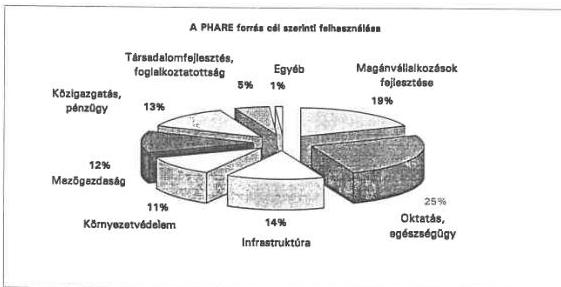
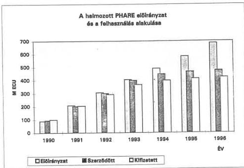
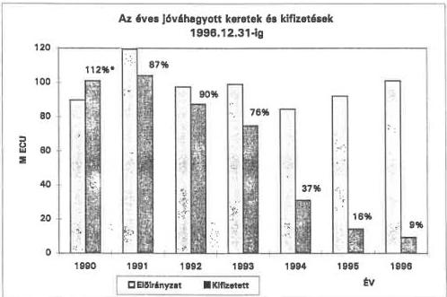
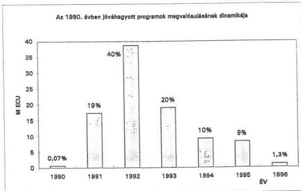
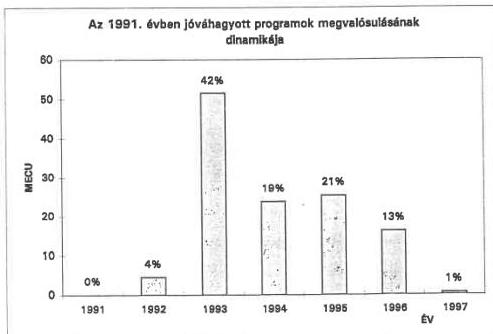
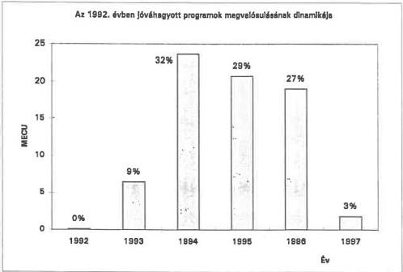

Állami Számverőszék

# JELENTÉS

# A PHARE PROGRAM HELYZETE
MAGYARORSZÁGON

402.

1997. október

---

V-1-129/1997. Témaszám: 358.

**Az ellenőrzés végrehajtásáért felelős:**

**Halász Gejza**
számvevő igazgató

**Az ellenőrzést vezette:**

**Kemény Emil**
számvevő igazgatóhelyettes

**A jelentést készítette:**

**Dr. Márkus Gábor**
osztályvezető főtanácsos

**Az ellenőrzésben részt vettek:**

**Bank Lajos**
számvevő tanácsos

**Benti Gabriella**
számvevő tanácsos

**Réthelyi Jenő**
számvevő tanácsos

**Tardos József**
számvevő

---

V-1-129/1997.

# TARTALOMJEGYZÉK

|  **BEVEZETÉS** | **3**  |
| --- | --- |
|  **I. ÖSSZEGZŐ MEGÁLLAPÍTÁSOK, KÖVETKEZTETÉSEK** | **4**  |
|  **II. JAVASLATOK** |   |
|  **III. RÉSZLETES MEGÁLLAPÍTÁSOK** | **15**  |
|  1. Külügyminisztérium | 15  |
|  2. Belügyminisztérium | 21  |
|  3. Igazságügyi Minisztérium | 23  |
|  4. Pénzügyminisztérium | 24  |
|  5. Közlekedési, Hírközlési és Vízügyi Minisztérium | 26  |
|  6. Környezetvédelmi és Területfejlesztési Minisztérium | 31  |
|  7. Művelődési és Közoktatási Minisztérium | 35  |
|  8. Népjóléti Minisztérium | 39  |
|  9. Ipari, Kereskedelmi és Idegenforgalmi Minisztérium | 43  |
|  10. Földművelésügyi Minisztérium | 45  |
|  11. Munkaügyi Minisztérium | 49  |
|  12. Országos Műszaki Fejlesztési Bizottság | 51  |
|  13. Központi Statisztikai Hivatal | 54  |
|  14. Magyar Nemzeti Bank | 55  |
|  15. Állami Privatizációs és Vagyonkezelő Részvénytársaság | 56  |
|  16. Vám- és Pénzügyőrség Országos Parancsnoksága | 58  |
|  17. TEMPUS Kzalapítvány | 61  |
|  18. Magyar Vállalkozásfejlesztési Alapítvány | 63  |
|  19. Nemzeti Szakképzési Intézet | 66  |
|  20. Modernizációs és Integrációs Programiroda | 68  |
|  21. ITD Hungary Magyar Befektetési és Kereskedelemfejlesztési Részvénytársaság | 70  |

1

---

# MELLÉKLETEK

1. sz. melleklet: A vizsgalt szervezetek rovidités jegyzeke
2. sz. melleklet: A jelentésben hasznalt roviditések
3. sz. melleklet: A vizsgalathoz alapvetoen kapcsolodjogszabalyok jegyzeke

2

---

# A PHARE program helyzete Magyarországon

## BEVEZETÉS

Az Európai Közösségek Bizottsága és a Magyar Köztársaság Kormánya által 1990. szeptember 3-án aláírt Keretmegállapodás alapján az Európai Unió segítséget nyújt Magyarország gazdasági és társadalmi átalakulásához, amely a PHARE program keretében valósul meg.

A jelenlegi ellenőrzés célja egy átfogó értékelés és helyzetkép készítése volt a Magyarországnak 1990. és 1996. között nyújtott valamennyi PHARE segélyről, amely kitér a külföldi támogatások felhasználására, a szerződéses állapotra, a programok megvalósulásának készültségi fokára és a segély hasznosulására.

Az Állami Számvevőszék a PHARE segély felhasználásáról korábban az egyedi programoknál végzett elsősorban szabályszerűségi vizsgálatot:

- A magyar környezetvédelmi programok támogatása (KTM, 1992.)
- Az Állami Vagyonügynökség tevékenysége (ÁVÜ, 1993.)
- A Magyar Vállalkozásfejlesztési Alapítvány tevékenysége (MVA, 1994.)
- A Központi Statisztikai Hivatal támogatása (KSH, 1994.)
- A pénzügyi szektor fejlesztése (PM, 1995.)
- A magyar tudományos kutatási és fejlesztési tevékenység (OMFB, 1996.)

Az ellenőrzésre elnöki döntés alapján, az Állami Számvevőszék 1997. évi jóváhagyott tervének keretében került sor. A PHARE egészére kiterjedő átfogó ellenőrzést törvényességi, pénzügyi teljesülési és célszerűségi szempontok figyelembevételével végeztük el.

Az ellenőrzés kérdőíven alapuló adatszolgáltatásra, valamint az írásos dokumentumok és beszámolók elemzését és értékelését követő kiegészítő, eseti helyszíni vizsgálatra alapult. A vizsgált dokumentumok egyrészt a PHARE eljárási rendje szerint elkészített anyagok, másrészt a vizsgált időszakban végzett ellenőrzések jelentései voltak. Kiemelt figyelmet fordítottunk a Kormányzati Ellenőrzési Iroda 1996-ban elkészített jelentésére, amely az államigazgatási szervek PHARE program teljesítéseire, illetve a társfinanszírozásból adódó központi költségvetési finanszírozásra terjedt ki.

Az ellenőrzés az 1990-96. közötti időszakot fogja át, és a Keretmegállapodás aláírását követően az indikatív program alapján jóváhagyott éves ágazati programokra, majd az 1994. utáni, az integrációs felkészülést segítő többéves nemzeti programokra terjedt ki. Az 1990-96. közötti időszakon túlmenően az ellenőrzést kiterjesztettük az előkészítő jogszabály és más dokumentumok vizs-

3

---

gálatára is. A teljes áttekintés érdekében került sor olyan programok vizsgálatára, amelyek befejezése 1997 első heteiben történt. Az ellenőrzés a nemzeti programok vizsgálatára korlátozódott (tehát a több országot érintő programok vizsgálatára ennek az ellenőrzésnek a keretében nem került sor).

Az ellenőrzés a Külügyminisztérium Segélykoordinációs Titkárságra, a PHARE program magyarországi végrehajtó szervezeteire, a 15 programirodára (a minisztériumokra és a végrehajtásban érdekelt egyéb intézményekre és szervezetekre) terjedt ki. Ennek során áttekintettük, hogy a segélyek milyen programokon keresztül milyen mértékben járultak hozzá az eredetileg kitűzött fejlesztési célok megvalósításához, továbbá, hogy milyen gondok és problémák nehezítették az egyes programok gyorsabb és eredményesebb teljesítését.

# I. ÖSSZEGZŐ MEGÁLLAPÍTÁSOK, KÖVETKEZTETÉSEK

A vizsgalt idszakban osszesen 683,3 M ECU a PHARE nemzeti programok keretuben Magyarorszagnak juttatott penzugyi segely merteke. Ezt egesztik ki a penzugyileg nem, vagyCsak kozvetve kimutathato tamogatasok, mint peldaul az EU tagorszagaiban alkalmazott modszerek, eljarasok elsajattasa forras felhasznalasokban. A PHARE segellyel tamogatott nemzeti programok egy resze kozvetlenul segitette az EU tagorszagava valashoz meg teljesitendof feladatok megvalositasat, peldaul az EU belso placal altal megkovetelt jogharmonizacio teljesitset.
- Mind a befejezett, mind a folyamatban levő programokat jellemzi, hogy nem volt penzügyi visszaélés a vegrehajtás során, az esetenként bekövetkezett tartalmi valtozások nem jelentetak eltávolodást az eredeti céloktól. Az előfordult szabálytalanságok (pl. az ÁFA visszateritési eljárásban) az EUPHARE és a magyar szabályozási rendszer összehangolatlanságából adódtak.
A 683,3 M ECU keretosszegü PHARE segélyból 1990-1996. december 31-i idószakban szerzódésel lekötöttek 474,9 M ECU-t, a tenyleges kifizétés pedig 422,4 M ECU volt. Szemléletesebb, ha két idószakra bontva mutatjuk be a segély keretosszegének és felhasznált összegének ertekeit, arányait.

1. táblázat

M ECU

|   | **Programok 1990-1994** | **Programok 1995-1996**  |
| --- | --- | --- |
|  Keretösszeg | 490,3 | 193,0  |
|  Szerződéssel lekötött | 446,9 | 28,0  |
|  A felhasználás aránya | 91% | 14,5%  |

4

---

A kimutatott értékek még így, időszakokra bontva sem alkalmasak egyértelmű következtetések levonására. Ugyanis az első két év (1990, 1991) a kezdeti nehézségekkel birkózást, ismételt eljárás-módosítást igényelt, mind az EU intézményeiben, mind a PHARE irodákban. Ez lelassította a segély gyors és teljes hasznosulási folyamatát. 1995 után törés következett be a megítélt segély összegek folyósításában, ennek okaira a hazai vizsgálat nem talált ésszerű magyarázatot. A jelenség egybe esik azzal a változással, amely szerint az 1995. évi programoktól új EU-PHARE eljárási rend érvényesül az egyes programok tervezéséhez, illetve a segély folyósításának elnyeréséhez.

- A PHARE forrás meghatározó mértékben három formában hasznosult: eszközbeszerzésekre és beruházásokra, emberi erőforrás fejlesztésre, valamint külföldi szakértők díjazására.
- A PHARE programok végrehajtásában a tervezett céloktól eltérni csak módosítási eljárás követésével lehetett. Ezzel kevéssé éltek a programirodák, így a befejezett programok jellemzően az eredeti célok szerint teljesültek. A módosítási kérelmek többsége a teljesítési határidő halasztására irányult.

### 1.1. A támogatások megoszlása és dinamikája

- Az 1990-96. között az ország számára jóváhagyott 683,3 M ECU PHARE segély felhasználási cél szerinti megoszlását az első ábra mutatja.

1. ábra

A kapott források negyedrészét az oktatás és az egészségügy fejlesztésére, valamint a piacgazdasági igényeknek megfelelő átképzési programok megvalósítására fordították. Jelentős összeggel támogatták a kutatás-fejlesztést, valamint a kereskedelmi infrastruktúra modernizálását.

5

---

Az előirányzat közel ötöd részét használták fel a kis- és középvállalkozások fejlesztésére és a vállalati szerkezetátalakításra. Emellett jelentős összegeket költöttek még infrastrukturális fejlesztésekre, valamint a közigazgatási, pénzügyi reform és a mezőgazdasági átalakítás finanszírozására és környezetvédelemre.

- A halmazott PHARE előirányzat és felhasználás alakulását mutatja a 2. ábra. A segélyezés kezdeti időszakában, 1990-93. között az éves előirányzatokat gyakorlatilag teljes egészében lekötötték szerződésekkel, és a kifizetések is megtörténtek. 1994-96. között azonban az előirányzatok jóváhagyását nem követte a szerződéses állomány és a kifizetések növekedése. **A PHARE pénzek felhasználásában megfigyelhető törés egyik oka az 1994. után bevezetett decentralizált megvalósítási rendszer (angolul: Decentralised Implementation System, a továbbiakban DIS) újszerűsége és bonyolultsága, valamint a stratégiai tervek jóváhagyásának elhúzódása volt.**

2. ábra

|  Év | Előirányzat | Szerződött | Kifizetett  |
| --- | --- | --- | --- |
|  1990 | 89,8 | 95,4 | 101,1  |
|  1991 | 209,3 | 202,7 | 205,1  |
|  1992 | 306,8 | 300,2 | 292,5  |
|  1993 | 405,8 | 399,4 | 367,3  |
|  1994 | 490,3 | 446,9 | 398,6  |
|  1995 | 582,3 | 465,4 | 412,9  |
|  1996 | 683,3 | 474,9 | 422,4  |

6

---

Az évenként jóváhagyott keretek és kifizetések 1996. december 31-i alakulását a 3. ábra mutatja.

A pénzügyi adatok ilyen jellegű csoportosításából is kitűnik az időarányos teljesítés visszaesése 1994-től.

3. ábra

* kamatokkal együtt

• Az 1990-1992. között jóváhagyott pénzügyi megállapodásokban a programok tervezett megvalósítási időtartama 1-3 év között volt. A jóváhagyott programok száma: 1990-ben 11 db, 1991-ben 12 db, 1992-ben 10 db. Ezzel szemben a pénzügyi előirányzatok felhasználása (kifizetések), a szerződéses kötelezettségek teljesítése, a programok lezárása összesen hat év időtartamot igényelt, függetlenül a tervezettől.

Az 1990-1992 között jóváhagyott programok megvalósulásának dinamikáját a 4., 5. és 6. sz. ábrák mutatják, amelyekben a tényleges kifizetések évenkénti alakulása látható:

A folyamatokat az jellemzi, hogy

- a jóváhagyás évében gyakorlatilag nincs kifizétés,
- a jóváhagyást követő második évben isCsak a keret 9-19%-át használják fel,
- a jováhagyást követő 3-5 évben az összes kifizétés 70-88%-át használják fel évenként közel azonos arányban,
- a jováhagyást követő hatodik évben meg 1-3% az athúzódo kifizétés.

7

---

4. ábra

5. ábra

8

---

6. ábra

- A PHARE segély elso harom évében jováhagyott és a vizsgalt idószak végére gyakorlatilag befejezettnek tekinthető programokat általában 5-6 évnel rövidebb idő alatt nem lehetett megvalósítani.
- A hazai programirodák szervezeteiben a külföldi tanácsadók domináns szerepet jatszottak mind a programok elokésztésében, mind pedig azok technikai megvalósításaban.
A PHARE segely adminisztrácios rendszere, az eljársi rend az elokésztétól a program jováhagyáson, az idszakos beszámolok elfogadásan keresztül a szamtalan kozbenso jováhagyási eljárason at a penzügyi zárásig rendkivul bonyolult és hosszadalmas. A PHARE kezdeti idszakában az eljársi rend az EU szervezetek szamára nem irt elő kotelező idöinterval-lumot az engedélyezési és jováhagyási eljárásokra. 1994 ota kiegészült a belso szabályzat a kerdéses határidökkel, de az EU Bizottság ezt Sok esetben nem tartja be. Ez a programok megvalósulási idöartalmát bizonytalanna és tervezhetelenné teszi. Előfordult, hogy hónapok teltek el egy kozosen kidol

9

---

gozott stratégiai terv, egy munkaprogram vagy egy szerződés jóváhagyásával.

## 1.2. Jogi szabályozás

- Nincs egységes hazai információs rendszer, ami a PHARE segélyek menedzselésével megbízottak feladatellátását támogatná.
- A segélyek elnyerésének és folyósításának szabályrendszere rendezett. Az EU eljárási rendjét kialakították, és a megfelelő hazai jogszabályokat is hatályba léptették. A programok teljesítésének gyakorlata azt bizonyította, hogy még maradtak fehér foltok a szabályozásban, sőt ennek során az elméletben kialakított szabályok gyakorlati ellentmondásai is felszínre kerültek. Ennek felismeréseként időről időre módosították az EU eljárási rendet, továbbá a magyar jogszabályi rend és az ahhoz kapcsolódott szervezeti rendszer is többször változott. Ezek a hiányosságok időveszteséget okoztak, és okoznak ma is, késleltetve, néha meghiúsítva egyes programrészek megvalósulását.
- A PHARE segély országos koordinálási rendjére egy 1989-ben létrehozott - többször módosított - kormányhatározat volt hatályban 1997 februárjáig. E jogszabály alapján létesült a Segélykoordinációs Titkárság. A Titkárság csak korlátozottan tudott megfelelni a rábízott feladatnak, mivel nem volt biztosítva sem megfelelő hatásköre, sem személyi állománya, sem szervezeti elhelyezése. Rontotta a szervezet hatékonyságát a témáért felelős kormánytisztviselők többszöri cseréje is.
- Nem készült egységes hazai PHARE eljárási szabály a minisztériumok és országos hatáskörű szervek részére. Nem volt (vagy nem tartósan volt) magas szintű vezető feladat- és hatáskörébe utalva a programok teljesítésének figyelemmel kísérése és eredményességének megkövetelése. A tárcák nem a központi költségvetési forrással azonos felelősséggel kezelték a PHARE segélyt.

## 1.3. Eljárási rend

Az eltelt hét év tapasztalatai alapján az alábbi általánosítható problémákkal terhes az érvényben lévő eljárási rend:

- A Pénzügyi Megállapodások a célokat és feladatokat általánosságban határozzák meg. A végrehajtást a részletes kifejtéssel, az első munkaprogram elkészítésével és elfogadtatásával kell kezdeni. Ez olyan hosszú időt igényel, hogy egyrészt nem teljesíthető a kezdésre előírt időpont, másrészt nem lehet elég körültekintő a szerződések megkötése. A megkésett kezdés miatt kevés idő marad az előírt teljesítési határidőig, márpedig a segély csak addig vehető igénybe. Lehet módosítást kérni (éltek is vele), de ez „látszat”-módosítás, hiszen azért került sor a kérelemre, mert teljesíthetetlen követelményt írtak elő.

10

---

- A Magyarországnak nyújtott segély felhasználásánál nem mindig érvényesült a magyar érdekek prioritása. Az EU befolyás már az általános célok megállapításakor megjelenik az egyes programok teljesítési folyamatában pedig végigkísért az EU-akarat érvényesítése. Ennek jelentős végrehajtást lassító hatása van. Addig kell módosítani a benyújtott munkaprogramot, újra kérni a jóváhagyást, amíg el nem nyeri az EU szakértői beleegyezé

- A PHARE programokat négyjegyű számmal jelölik, amelyben az első két számjegy azt a naptári évet jelzi, amelyben aláírták a program pénzügyi megállapodását és a továbbiakban olyan évi programként kezelik. Az aláírásra általában késő ősszel - volt rá példa, hogy a következő év elején - kerül sor. Ezzel a jelöléssel már egy éves csúszás erkölcsi terhe nehezedik a magyar félre.

- A Magyarországnak nyújtott PHARE támogatás jelentős hányada visszafolyt megbízási, beszerzési stb. szerződésekkel az EU-országaiba. Az eszközbeszerzések - főként számítógépek és szoftverek - jól hasznosultak, de kevésbé kedvező a kép, ami a külföldi szakértők közreműködését illeti. Hasznos és célszerű volt az egyes programok menedzselését ellátó tanácsadók tevékenysége. Jelenlétük megkönnyítette és gyorsította a magyar munkatársak felkészülését a feladatok későbbi önálló elvégzésére. Nem értékelhető ilyen pozitívan a programok részeként tanulmányokat készítő szakértők szerepe. Igen sok esetben készült a kedvezményezett fél részére fölösleges, használhatatlan tanulmány, mivel a külföldi szakértő nem fordított elegendő időt és energiát arra, hogy az általa ismert „legjobb gyakorlatot” összevesse a magyar gyakorlattal, szakággal és törvényi környezettel. Előfordult, hogy a szakértők tájékozatlansága, ismerethiánya lekezelő modorral párosult, ami ellenérzést keltett a náluk gyakran magasabban képzett, de rosszabbul fizetett partnerben, feszültséget keltve az együttműködésben egyben rontva, vagy meghiúsítva a program hatását.

- A szabályzatok értelmében valamennyi program teljesítéséhez meghatározott típusú, időzítésű ellenőrzések tartoztak. A gyakorlatban ezek végrehajtására csak esetlegesen került sor és a bennük foglalt megállapítások többnyire nem váltak ismertté a vizsgáltak számára, nem jobbították a helytelennek minősített gyakorlatot, nem segítették a projektmenedzselők munkáját. Ennek gyakorlati példái voltak:

- Az EU-revizorok ellenőrzési megállapításait, és az azokra tett brüsszeli észrevételeket nem ismerhették meg a vizsgált szervezetek;

- Az elvileg monitoring szerepet betöltő havonkénti értekezletek - az EU Delegációjának, a Segélykoordinációs Titkárságnak, és a tárcák illetékeseinek részvételével - anélkül követték nyomon az eseményeket, hogy segítő intézkedéseket szorgalmaztak volna a gondok megoldására. Az értekezletek egy részéről nem készültek jegyzőkönyvek vagy emlékeztetők.

11

---

# 1.4. Személyi feltételek

- Nehéz megfelelő számú és felkészültségű magyar szakembert találni, és megtartani a PHARE programok menedzselésére. A projektmenedzselési technika ismeretén és a PHARE adminisztrációban való jártasságon túl, kiváló idegen nyelvi ismerettel kell rendelkezniük az e területen dolgozóknak. E feltételek együttesen főként fiatal munkavállalóknál van meg, akik közül kevesen hajlandók tartósan köztisztviselői jövedelemért dolgozni. Az életkoruk miatt már kevésbé keresett szakemberek idegen nyelvi ismerete többnyire elégtelen a feladatkör betöltéséhez. Ha mégis megfelelőek, akkor viszont a külföldiekhez (vagy külföldi cégek által foglalkoztatott honfitársaikhoz) viszonyított jövedelemkülönbség morális nyomása nehezedik rájuk, ami csökkenti aktivitásukat.

# 1.5. Egyéb megállapítások és következtetések

A PHARE szabalyok elorjak, hogy a program menedzsment egységeknek folyositott elso eloleget kovetó uabb részletek folyositásat meg kell, hogy eloze az addig atutalt össgeek auditálasa. Ezt a szabalyt gyakorlatilag nem tartottak be, de megitélesunk szerint az EU Bizottsag is rajott, hogy ez felesleges, ezert hallgatólagosan eltekint az elorás betartásától.
A minisztériumok és más fõhatósagok a PHARE programokat évekig gyakorlatilag „idegen penz"-ként kezelték, és ezert belso ellenörzsük a PHARE programirodák muködésere nem terjedt ki. Általános tapasztalat, hogy azoknál a programoknál, ahol a projektek kivalasztásat és megvalósításat a PMU-ra, illetve annak külföldi tanácsadóira hagyák, és nem volt folyamatos a beszámoltatas, ott a vegrehajts elhuzódott és tobb volt a meghiúsult projet.
A PHARE támogatást az Europai Unión a magyar allamnak adja. A berendezésk, muszerek, esetleg épuletek formajában juttatott támogatást a kedvezményezett intezmények leltárba veszik, és a javak felett kezelői jogokat gyakorolnak a többi, allami tulajdonban levő eszközhöz hasonloan. A PHARE támogatás egy részeból onfeltöltő penzügyi alapot képeztek (PHARE Hitel, Mikro Hitel az MVA-nál, HYFERP az APV Rt.-nél). Ezen alapok felhasznalásával kapcsolatban az EU Bizottság bizonyos ellenörzési, jóváhagyásj jogokat fenntartott magának idökorlát nélkül.
Több programnál az EU megkivánja a magyar hozzájárulást, társfinanszírozást. A jováhagyás eljárások idöbeli elterése miatt a programér felelos tárca, intézmény akkor vallal kötelezettseget a társfinanszírozásra, amikor meg nincs költségvetési felhatalmazása, de előfordul az is, hogy az a vallaltnál alacsonyabb összegre szól. A PHARE programok költségvetési forrásoldalának helyzetét a Kormányzati Ellenörzési iroda 1997 júniusaban tetelesen vizsgálta, ezert erre a jelenlegi vizsgálat nem terjed ki. A KEI felmérse szerint 1990-1996. kozott a hazai társfinanszírozásra 11,8 Mrd forintot fordítottak, amely magában foglalja a PHARE irodák fenntartási költségeit is.

12

---

- Az 1990-1996. közötti időszakban az ország rendelkezésére bocsátott, 683,3 M ECU PHARE segély jelentősen hozzájárult a piacgazdaságra való áttéréssel együtt járó gazdasági nehézségek leküzdéséhez. Ezek a programok elősegítették az áttérés pénzügyi intézményi rendszerének a kialakítását, a szakképzési programok megvalósítása által csökkentették a munkanélküliséget és a technikai fejlesztést megcélzó programok révén fejlődött a magyar szervezetek számítógépes ellátottsága és a tudományos kutató intézmények műszerezettsége.

---13

---

## II. JAVASLATOK

# 1. Az Országgyűlésnek:

- Az Országgyűlés Számvevőszéki Bizottsága kezdeményezze az Európai Integráció, valamint a nemzetközi segélyprogramok felhasználásával kapcsolatos országos ellenőrzési rendszer kialakítását.

# 2. A Kormánynak:

Gondoskodjon arrol, hogy a PHARE programok jovahagyasanak idopontjaban a tarsfinanszirozasi kotelezetsgek teljesitesehzszukseges hazai forrask rendelkezesre alljanak. E celb ol az elmult ket ev tapasztalatal alapjan a koltsegvetesi tverny megalkotasakor evi 2-2,5 Mrd Ft-os keretosszeget kellene elkuloniteni, a koltsegvetes jovahagyasanak idobeli elteresebol ered problemak athidalasara.
Gondoskodjon arrol, hogy a PHARE támogatások segítsegével megvalósított beruházások tartós muködtéteseBiztosított legyen, és ehhez rendelkezésre alljanak a szükséges hazai penzügyi források.
Alakitsa ki a kormanyeszervezetek es a regiok kozott a PHARE tamogatasi rendszer valtozasat (agazatok helyett regiok tamogatasa) figylembe vev o szervezeti rendszert a segely hatekony felhasznalasara.
- Biztositsa, hogy a PHARE programok feligyeletével megbizott személyek (PAO), megfelelo dontési kompetenciával rendelkezó felső szintü vezetők (helyettes allamtitkár) legyenek.

# 3. A Külügyminisztériumnak:

- Kezdemenyezzen targyalasokat az EU Bizottsagval annak tisztazasara, hogy a PHARE tamogatasokból képzett onfeltölt alapok tulajdonjogát, valamint ellenörzési és jovahagyásj jogait milyen idő elteltével adják at a magyar félnek.
Járjon el az EU Bizottságánál, illetve a Delegaciónál annak érdekében, hogy az EU a saját eljárási szabályait betartsa, különös tekintettel a véleményezésre, dontésre és jováhagyásra fordithato idöartamok vonatkozasaban.
- Kezdemenyezzen targyalasokat az EU Bizottsaggal abbol a celból, hogy a PHARE eljárások dontési folyamatában az EU budapesti delegaciónja minél nagyobb dontési jogkört kapjon, mert ez jelentösen gyorsithatná az ügymenetet.
- Kezdemenyezze az EU Bizottsagnal, hogy a TEMPUS program-vegrehajtasa soran keruljön elotérbe az EU integrácios felkészüleshez szükséges human erőforras fejlesztése.

14

---

### III. RÉSZLETES MEGÁLLAPÍTÁSOK

# 1. KÜLÜGYMINISZTÉRIUM

# 1.1. Segélykoordinációs Titkárság

Az 1156/1989. (XII. 22.) MT határozat alapján a Kormány tárcaközi bizottságot hozott létre az OECD országok által elhatározott segítségnyújtásból adódó hazai feladatok koordinálására; kijelölte a bizottság vezetőit, tagjait és a titkársági teendőket ellátó szervezetét. Az 1990., 1991., 1994. és 1996. években módosított kormányhatározatok a tárcaközi bizottság tagjainak számát és összetételét változatlanul hagyta, vezetői és titkárságai az alábbiak szerint alakultak:

|  A 1156/1989.(XII.22.) MT hat. által szabályozott időszakok | A tárcaközi Vezetésével megbízott | Bizottság Titkársági teendőt ellátó szervezet  |
| --- | --- | --- |
|  89.12.22.-90.07.18. | Társelnökök: IKM és KÜM politikai államtitkárai | IKM  |
|  90.07.18.-94.10.07. | Vezetője: NGKM politikai államtitkára | NGKM  |
|  94.10.07.-96.07.24. | Társelnökök: IKM és KÜM politikai államtitkárai | IKM  |
|  96.07.24.-97.02.13. | Az Intézőbizottság elnöke a KÜM Integrációs Államtitkárság vezetője | Titkár: a KÜM Segélykoordinációs Titkárság vezetője. Az Intézőbizottság titkársági feladatait a KÜM Integrációs Államtitkársága látja el.  |

1997 februárjában jelentős változást hozott az 1011/1997. (II. 13.) Kormányhatározat hatályba lépése. Az új jogszabály az - 1093/1994. (X. 7.) Korm. határozat által létrehozott - Európai Integrációs Tárcaközi Bizottság feladatkörét bővítette az Európai Unió PHARE programjával kapcsolatos szakmai kérdések megvitatásával. Intézőbizottságot hozott létre, megszüntetve az 1989. évi MT határozat szerinti segélykoordinációs tárcaközi bizottságot; megszüntette a kettős vezetési gyakorlatot a Külügyminisztérium kizárólagos irányítását elrendelve; lecsökkentette a bizottság tagjainak számát, továbbá a bizottság titkárának személyét és a titkársági teendőket ellátó szervezetet egyaránt a Külügyminisztériumból jelölte ki. A határozat végrehajtásával tetemes feladattöbblet hárult a Külügyminisztériumra a korábbi időszakok "csupán" társvezetői funkciójából adódott teendőkhöz viszonyítva. A változás lényege az alábbiakban foglalható össze:

15

---

Az 1995. februárban készült - IKM és KÜM közötti feladat- és hatásköri megosztásról szóló - "Megállapodás"-ból a KÜM-re vonatkozottak:

- a külpolitikai és nem gazdasági-kereskedelmi jellegü (TEMPUS, jogharmonizácio, közigazgatás-fejlesztés, népjoléti, szociális, stb.) programok elsdleges felelossége;
- az EURO-GTAF program végrehajtási feladatai;
- a regionalis (Multi-Country) programok kozvetlen iranyitasa;
- a kétoldalu segélyprogramok (német és osztrák kivétellel) koordinációnáert felelosségvállalás;
- a határmenti (Cross-Border Cooperation) programok irányításaban az IKM-mel kozos felelosség viselése.

Az IKM-től átszármaztatott felelősségi- és hatásköri program-területek:

- a gazdasagi szerkezet-atalakitasi (infrastruktura fejlesztesi, ipari, kereskedelmi, mezogazdasagi, privatizaciós, penzügyi szektor fejlesztesi, munkägyi stb.) programok koordinaciója;
- az Europai Uniohoz torten o csatlakozas felteteleinek megteremtesel osszefuggo belso piaci fejlesztesi es harmonizaciós feladatok koordinaciója, a vonatkozo projektek vegrehajtsaert felelosseg viselese;
- a kétoldalu segélyprogramok koordinációna az osztrák és német relációjú programokban.

Az összevont feladatok eredményes ellátásához a KÜM Segélykoordinációs Titkársága nem rendelkezik megfelelő számú munkatárssal. Az 1997. februári ügyrendi feladat-felosztás szerint a 36 hazai tevékenységhez és a 27 országgal tárgybani kapcsolattartáshoz a Titkárság összesen 5 fő szakemberrel rendelkezik.

A Segélykoordinációs Titkárság tevékenységét a PHARE decentralizált megvalósítási rendszernek (DIS) megfelelően végzi.

Az 1990-1996. időszakban az EU Bizottság három alkalommal módosította, illetve továbbfejlesztette a PHARE decentralizált megvalósítását szabályozó rendszerét. A módosítások érintették a tervezési időhorizontot, az elkészítendő alapdokumentumok körét, a döntési mechanizmusban résztvevők felelősségét, az ellenőrzések és értékelések módszerét, valamint az információk rendelkezésre bocsátásának és a kötelező tájékoztatási feladatoknak az előírását.

A módosítások célja minden esetben az volt, hogy a kedvezményezett országokban a PHARE segélyek allokációja a tervezési szakaszban hatékonyabbá váljon és elsősorban a stratégiai tervekben jóváhagyott célkitűzések teljesítésének követésére épüljön ki egy megbízhatóbb teljesítményértékelési rendszer.

Mindezek a változtatások összhangban voltak a magyar érdekekkel is és a Segélykoordinációs Titkárság a mindenkori PHARE előírásoknak megfelelően

16

---

alakította ki tevékenységét és munkakapcsolatait. Magyarország problémamentesen áttért az egyéves tervezésről a kétéves, majd a többéves (1995-99.) tervezési időhorizontra. A korábbi háromlépéses megvalósítást (Nemzeti indikatív program, Pénzügyi megállapodás, Munkaprogramok) 1995-ben felváltotta az öt fázisos módszer (Többéves indikatív program, MIP; az éves nemzeti program, COP; a stratégiai terv, SP; a munkaprogram, WP; a monitoring, értékelési rendszer M & AS). A legutóbbi módosítások gyakorlati alkalmazása a stratégiai tervezési fázisig jutott el.

A Segélykoordinációs Titkárság feladatai az első két szakaszra terjedtek ki, amelyek magukban foglalták a többéves indikatív program (MIP) és az éves nemzeti programok (COP) előkészítését és felterjesztését jóváhagyásra. Az előkészítő szakasz - a COP jóváhagyást is beleértve - a nemzeti programok évében csak decemberben zárult le. Az EU Bizottság részéről jóváhagyott 1995. és 1996. évi Nemzeti operatív programok, egyúttal mint Pénzügyi megállapodások is a következő évben tették lehetővé az EU adott évi költségvetéséből a PHARE források felhasználását.

A MIP és COP-okban jóváhagyott programoknak megfelelően a PMU-k feladata volt a stratégiai tervek elkészítése. Egy kivétellel az EU Bizottság döntéshozói nem hagyták jóvá a benyújtott programok stratégiai terveit, ezáltal a munkaprogramok kidolgozása a legtöbb esetben még el sem kezdődött. Az 1995-ös és 1996-os COP-okban előirányzott szerződéskötési és kifizetési ütemek mindezek következtében irreálisnak bizonyultak. Ez a tervezési bizonytalanság természetesen érinti a társfinanszírozási források felhasználásának helyzetét is.

A több mint egyéves késedelem csak részben indokolható az eljárás bonyolultságával és a módszer kezdeti bevezetésének nehézségeivel, vagy a minőségbiztosítás hiányosságaival. Az alapvető és az általánosságban jelentkező problémát az okozta, hogy különösen a stratégiai tervezési és jóváhagyási szakaszban a válaszadási és jóváhagyási időtartamokat nem határolták be a DIS-ben és ezáltal az iteratív egyeztetési folyamat korlátlanul elhúzódhatott az illetékes EU szervezeteknél.

Az 1996-os módosítások (M & AS) erősítik a nemzeti koordinátor központi irányító funkcióját és az EU részéről végzett értékelésekről is a teljes körű tájékozottságot garantálják.

Várhatóan segíteni fogják a Külügyminisztérium segély-programokkal kapcsolatos teendőinek ellátását azok a - részben megtett, részben folyamatban lévő - kormányintézkedések, amelyek a korábbi évek tapasztalatain alapulva jobbítani kívánják e források felhasználásának hatékonyságát. Ennek érdekében:

- a külföldrol érkező segélyek és a hozzájuk kapcsolódo hazai költségvetési források elkülönített kimutatasára köteleztek a tárcákat költségvetésük tervezésében és zárszámadásukban;
1997. végéig ki kell alakítani az EU-PHARE nyilvántási és monitoring rendszerrel összhangban lévo egységes hazai nyilvántási és ellenőrő/ertékelő rendszert;

17

---

• évente meg kell majd vizsgálni a minisztériumoknál és országos hatáskörű szerveknél a segélyprogramok megvalósításának helyzetét.

# 1.2. EURO-GTAF program

# 1.2.1. Törvényi és szervezeti háttér

Az 1993 márciusában aláírt H 9208 program végrehajtását az NGKM indította, majd az IKM Európai Ügyek Hivatala koordinálta, s végül a KÜM fejezte be.

A KÜM PHARE Programiroda az Integrációs Államtitkárság önálló szervezeti egysége, jelenlegi vezetője 1996 szeptemberétől tölti be ezt a pozíciót - két elődjével azonosan - miniszteri biztosként. A PHARE segélyprogramok végrehajtására irányuló felügyeletet ellátó személy (PAO) programonként eltérő. Az EURO GTAF programot a politikai államtitkár felügyelte.

# 1.2.2. A program pénzügyi teljesülése

A program keretösszege 5 M ECU volt. Felhasználása az alábbi táblázatba foglaltak szerint alakult:

H 9208

M ECU

|  Év | Szerződött összeg |   | Kifizetett összeg  |   |
| --- | --- | --- | --- | --- |
|   | Brüsszeli | Helyi | Brüsszeli | Helyi  |
|  1993. |  | - |  | -  |
|  1994. |  | 1,04 |  | 0,55  |
|  1995. |  | 3,95 |  | 0,48  |
|  1996. |  |  |  | 3,80  |
|  Összesen: |  | 4,99 |  | 4,83  |

A program keretösszegét lekötötték a pénzügyi megállapodásban rögzített 3 éven belül. A végső kifizetések - az általános gyakorlatnak megfelelően - a program teljesítését egy évvel követték.

A pénzügyi események nem ütemesen teljesültek; a szerződéslekötések 79,2%-a 1995. évre esett, míg a kifizetések 78,7%-ára 1996. évben került sor.

# 1.2.3. A PHARE segély felhasználása súlyponti területek szerint

Az EURO-GTAF program egyfajta felkészítés volt Magyarország Európai Unióhoz csatlakozáshoz.

A projektek meghatározó többségükben három területhez kötődtek. Ezek:

- jogharmonizació
- koztisztviselok képzese
- kommuníciós strategia

18

---

A program keretösszegéből a jogharmonizációs feladatok teljesítésére fordították a legtöbbet (47,5%). Kiemelt jelentőségű volt: EU jogszabályok beszerzése, lefordítása és azokhoz széles körben hozzáférhetőség biztosítása; jogi terminológiák többnyelvű szótárának elkészítése; a jogalkalmazás közelítésének érdekében jogi analízisek végzése.

A "kommunikációs stratégia" projektjeinek alapvető célja az volt, hogy széles körben terjesszék az EU-val kapcsolatos ismereteket, megalapozzák a lakosság támogatását az EU-hoz szándékolt csatlakozáshoz. Az erre fordított kiadások a program keretösszegének 21,1%-át tették ki.

A köztisztviselők speciálisan EU ismeretekre képzése a tervezettnél kisebb mértékben teljesült. Ennek oka részben a pontatlan tanfolyam-tervezés, részben a - vártnál alacsonyabb - részvételi arány volt. Ennek oka nem az érdektelenségben, hanem az érintett köztisztviselői réteg túlterheltségében keresendő. A képzések hatékonyságát csökkentette az olyan alkalmazott kényszer megoldás, mint a vezetői tanfolyamok összevonása a nyelvtanfolyamokkal. Az ilyen jellegű kiadások a program keretösszegének 15,4%-át tették ki.

### 1.2.4. A PHARE program teljesülésének értékelése

A programot az előírt határidőre, a keretösszeg 96,7%-os felhasználásával, a tervezett célok szerint teljesítették. A projektek jellemzően sikeresek voltak. Ezt támasztja alá a későbbi, 1996. évi Európai Integrációs Program hasonló projekt tartalma.

A hatékony programteljesítést nehezítő gondok:

- szervezeti, szabályozási és személyi stabilitás hiánya,
- a programok felügyeletét ellátó(k) (PAO) változása,
- az együttműködésben érdekelt minisztériumok terv-egyeztetésének hiánya,
- az érintett minisztériumok felelős együttműködésének hiánya a projektek teljesítésében,
- a kiképzett köztisztviselők megtartása az államigazgatásban.

### 1.3. Egyéb általános támogatási programok

A COP 95 és COP 96-ban jóváhagyott programok közül kettő tartozik a Külügyminisztérium hatáskörébe.

|  • H 9514 | Rugalmas, szektorfüggetlen támogatás | 2,0 M ECU  |
| --- | --- | --- |
|  • H 9602 | Európai Integrációs Általános Támogatás | 15,5 M ECU  |

### 1.3.1. Törvényi és szervezeti háttér vizsgálata

A program meghatározó összetevői a jogharmonizáció, a köztisztviselői képzés és a kommunikációs stratégia. A céloknak megfelelően a MIP és COP 96 do-

19

---

kumentumokat követően a stratégiaterv meghatározta azt a szervezeti formát is, amellyel a program vezetése megvalósul, továbbá megnevezte a projektcélok megvalósításáért felelős személyeket és intézményeket.

A stratégiai terv alapján a projektek előkészítéséért, megvalósításáért és nyomon követéséért az egyedüli felelősséget a szakmai kompetenciával rendelkező minisztériumok viselik.

A minisztériumokkal a kapcsolat elsősorban szerződéses viszonyon alapul. A program PMU vezetője a külső közreműködő minisztériumokat, intézményeket nem vezetői minőségben, hanem szerződéses viszony alapján koordinálja. Az általános gyakorlattól eltér, hogy nem a legnagyobb feladatrészt vállaló funkcionális szervezet - jelen esetben közel 50%-os forrást felhasználó Igazságügyi Minisztérium - kapta a megbízást a jogharmonizációs alfejezet koordinálására, az általános vezetésre.

A Külügyminisztériumban a PMU-nak a szervezeti és működési rendje tervezeti fázisban van.

### 1.3.2. A programok pénzügyi helyzete

A Rugalmas, Szektorfüggetlen Technikai Segítségnyújtási (H 9514 TAF) Program megnyitásáról az 1995. évi Pénzügyi Emlékeztető (COP 95; FM) rendelkezik, amely a program megvalósítására az akkor az IKM-ben működő Segélykoordinációs Titkárság mellett létrehozandó Programirodát jelölte ki. Az FM aláírása óta több lényeges változás történt, amely késleltette a program tényleges kezdését. Ezideig szerződéskötés és kifizetés a TAF-ból nem történt.

A H 9602 Európai Integrációs Általános támogatása program stratégiai tervét és Munkaprogramját 1997. április 7-én nyújtotta be a Programiroda. A jóváhagyás folyamatban van, pénzügyi teljesítés nem történt.

### 1.3.3. A PHARE támogatások felhasználása

A H 9514 TAF Program célja, hogy egyszerűsített döntési mechanizmussal támogassa a nem szektor specifikus célokat szolgáló projekteket.

A H 9602 Program célja többek között:

- hatékonyan bevezetni az acquis communautaire-t és megfelelo intézményi kapacitásokat kiépiteni;
- tajekoztatast nyujtani az EU integracio politikai hatasairol;
- gezető koztisztviselők nyelvi és szakmai képzésével felkészülni a csatlakozásí tárgyalásokra;
elosegiteni a magyar gazdasag alkalmazkodo képességét az EU belso piac jogi kovetelmenyeihez.

20

---

### 1.3.4. A programok teljesülése

A H 9514 program megkezdése késésben van.

A késés okai:

- Szervezeti változások. A 64/1996. (V. 3.) Kormányrendelet értelmében a KÜM-ben Integrációs Államtitkárság jött létre és ezáltal a program projektkiválasztási mechanizmusára új megoldást kellett keresni.
- Az EU Delegáció és KÜM programirodája közti egyeztetések elhúzódtak az új Munkaprogram tervezettel kapcsolatban.

A projektjavaslatok elbírálása ügyében megállapodás született, így az 1. sz. Munkaprogram szerinti teljesítés megkezdhető.

A H 9612 program stratégiai tervét a MIP 95-99 és COP 96-ban kitűzött szélesebb és közvetlen céloknak megfelelően dolgozták ki és 1997. április 7-én benyújtották jóváhagyásra. A program tervszerinti befejezése 2000 december 31. A stratégiai tervet alapos helyzetfelmérést követően, körültekintő egyeztetéssel készítették.

## 2. BELÜGYMINISZTÉRIUM

Az 1990-1996. közötti időszakban a Belügyminisztérium (BM) két program megvalósításában vett részt:

- H 9207 Közigazgatás reformja, előirányzat 5 M ECU
- H 9503 Közigazgatás reformja, előirányzat 3 M ECU.

A programok célja a köztisztviselők és önkormányzati alkalmazottak képzése nyelvismereti és egyéb ismereteket nyújtó tréningek szervezésével, valamint egy hatékony és jól koordinált információs rendszer létrehozása.

### 2.1. A programok pénzügyi helyzete

A H 9207 program, a teljesítésre előirányzott három éves időtartamon belül (1993. 01. 01.-1995. 12. 31.) befejeződött, a közreműködőkkel a szerződéseket megkötötték. A teljesítések után a kifizetések gyakorlatilag 1996. évben befejeződtek. Az összes kifizetés: 4,7 M ECU.

A H 9503 programot a COP 1995 programban hagyták jóvá. Ennek alapján elkészült a STRATEGIC PLAN és a WORK PROGRAMME 1, amelyekre a többszöri átdolgozás után a jóváhagyás még nem érkezett meg. A programra a pénzügyi átutalás megtörtént, azonban jóváhagyás hiányában szerződéseket nem lehet kötni, így kifizetés még nem történt. A program megvalósítása jelentős késedelemben van, a tervezett 1998. 12. 31. befejezési határidő várhatóan nem tartható.

21

---

# 2.2. A teljesítés pénzügyi adatai

H 9207

M ECU

|  Év | Szerződött összeg |   | Kifizetett összeg  |   |
| --- | --- | --- | --- | --- |
|   | Brüsszeli | Helyi | Brüsszeli | Helyi  |
|  1993. | 0,40 | - | 0,10 | -  |
|  1994. | - | 2,80 | 0,20 | 0,40  |
|  1995. | - | 1,70 | 0,05 | 2,50  |
|  1996. | - | - | 0,05 | 1,40  |
|  Összesen: | 0,40 | 4,50 | 0,40 | 4,30  |

A H 9207 programban a képzési projekteket a minisztériumok közép- és felső szintű vezetői részére szervezték, az átlagos részvétel 70% volt. A felső vezetők hivatali elfoglaltsága miatt a tanfolyami részvétel összehangolása gondot jelentett, ennek ellenére a képzési projektekben résztvevők körében a fluktuáció csupán 10% volt.

A H 9503 program még nem kezdődött el.

A H 9207 program befejeződött, a célkitűzések teljesültek, az 5 M ECU előirányzatból 4,7 M ECU-t fizettek ki.

A PHARE támogatások rendszerének várható koncepcionális változása, valamint az ezzel összefüggő szabályozási és eljárásbeli módosítások alapvetően befolyásolják a H 9503 program jóváhagyását.

22

---

# 3. IGAZSÁGÜGYI MINISZTÉRIUM

H 9107 Országos Cégnyilvántartási Rendszer Számítógépesítése és hálózati összekapcsolása

# 3.1. Szabályozási és szervezeti háttér

A programra vonatkozó Pénzügyi Megállapodás tartalmazta a PHARE segély összegét, az összeg elköltéséhez meghatározott célokat és teljesítendő feladatokat, valamint e keretösszeg terhére vállalható pénzügyi elkötelezettségek határidejét.

A befejeződött program kedvezményezettje és végrehajtója az Igazságügyi Minisztérium volt. Ennek megfelelően a minisztérium a szakmai igények érvényesítéséről, és teljesítések igazolásáról gondoskodott. A program pénzügyi nyilvántartását a Külügyminisztérium PHARE Programirodája látta el, mivel a Minisztériumban nem állítottak fel önálló PMU-t.

# 3.2. A program pénzügyi teljesülése

A program keretösszege 1,5 M ECU volt, amelyhez pótlólag 0,4 M ECU-t ítéltek meg. Hazai kifizetés nem történt, az egész programot Brüsszelből finanszírozták, ezért csak a leglényegesebb adatok állnak rendelkezésre:

M ECU

|  Dokumentum |   | A segély |   | A felhasználás  |   |
| --- | --- | --- | --- | --- | --- |
|  Megnevezése | kelte | összege | felhasználási határideje | összege | határideje  |
|  Pénzügyi Megállapodás | 91.02.22. | 1,5 | 92.12.31. | 1,34 | 92.12.31.  |
|  Kiegészítő támogatásra jóváhagyott szerződés | 94.02.24. | 0,4 | 94.12.31. | 0,39 | 94.09.13.  |
|  Összes: |   | 1,9 |  | 1,73 |   |

# 3.3. A PHARE segély felhasználása

A programhoz nyújtott segély összege KÖZIGAZGATÁSI reform területén hasznosult.

A Pénzügyi Megállapodás szerinti feladatok voltak:

- a fóvárosi és valamennyi megyei cégbíroság hardver ellatása egy korszerü cégnyilvántási rendszerhez;
- adatbáziskezelő szoftver;
a Kozponti Cegbrosag es a megyei cegbrosagok kozotti kommunakiós vonalak megteremtese.

A keretösszegből 1,0 M ECU-t az országos hálózat kiépítésére fordítottak; 0,3 M ECU-t pedig a korábbi években - központi költségvetési forrásból - beszerzett

23

---

számítógép-állomány korszerűsítésére. A pótlólag adott 0,4 M ECU a számítógépes hálózat kapacitásának bővítését szolgálta. Az 1,73 M ECU-t teljes egészében eszközbeszerzésre fordították.

# 3.4. A PHARE program teljesülése

Az összesen 1,9 M ECU segély 91%-át használták fel. A program hatására jelentős változás állt be a céginformációs nyilvántartásban és szolgáltatásban, a korábbi helyileg manuálisan vezetett rendszerekhez viszonyítva. Az eszközbázison létrejött az IM Cégnyilvántartási és Céginformációs Szolgálat. Rontja a szolgáltatás eredményességét, hogy a Fővárosi Cégbíróságnál a bejegyzések, módosítások átvezetése hónapokat, esetenként éveket vesz igénybe, tehát: a korszerű szolgáltatás, nem garantál naprakész adatokat.

A program teljesítésével kapcsolatos gondok:

- A tenderek elbiralasa, elfogadasa Brusszelben tortent. Ez eredmenyezhette azt, hogy a potllag nyujtott osszeghez ugyanaz a szamitastechnikai ceg kapott megbizast, akinek teljesitesevel - korabbi kesedelmek miatt - az IMnak kifogasai merultek fel.
- A támogatas szakmai és penzügyi menedzseleşenek különvalasztása nem segítette a teljesítésst. A segély Brusszelból meghatározott felhasznalása, és más miniszteriumba helyezett penzügyi nyilvantartása csökkentette a teljes körü felelosségérzetet. (A vizsgalati jelentésünkhöz kert évenkénti segélyfelhasznalást nem tutda megadni a szakmailag felelos IM.)
- A potlólagos támogatas igérete és a megvalósítást inditó szerzódés jováhagyása - közott tobb, mint egy év telt el.

# 4. PÉNZÜGYMINISZTÉRIUM

A pénzügyi szektor fejlesztésére a PHARE H 9001 jelű, az MNB által kezelt programon túlmenően még három program keretében adott támogatást. Ezen programok kezelője a Pénzügyminisztérium lett. A programok közül a H 9101 jelű előirányzata 9 M ECU, a H 9303 jelű előirányzata 8 M ECU és a H 9403-02 jelűé 5,25 M ECU volt.

Az 1992 júliusában aláírt Pénzügyi Megállapodás szerint a H 9101 jelű program végrehajtására adott 3 évet egy évvel meghosszabbították és az adott határidőre be is fejezték. A H 9303 jelű, 1994 márciusában aláírt program végrehajtására adott idő még nem járt le, de a késedelmes befejezés előre látható. Hasonló a helyzet az 1994 novemberében aláírt H 9403-02 jelű programmal, amelynek keretében 1996 végéig még nem történt kifizetés.

A programok keretében tervezett projektek többsége teljesült de egy részük a végrehajtás különböző szakaszaiban a kedvezményezett érdektelenné válása, a külföldi tanácsadók munkájának minősége miatt vagy mindkét okból meghiúsult.

24

---

A H 9101 program kedvezményezettjei közül az Állami Bankfelügyelet, a Bankszövetség és a Nemzetközi Bankárképző Központ az MNB által kezelt programból is részesült.

A TÁKISZ információs rendszerének fejlesztésével kapcsolatos szakértői tanulmányt, javaslatokat a PM úgy véleményezte, hogy azokat csak a közigazgatás távlati reformja keretében lehet megvalósítani. Az APEH képzési igényeinek felmérését a külföldi tanácsadó cég késedelmesen és olyan rossz minőségben végezte el, hogy azt elfogadni nem lehetett, új szakértőt kellett bevonni a munkába.

A H 9303 program keretében is több projekt meghiúsult. Így például a Programiroda részére egy 0,45 M ECU értékű szakmai tanácsadás a tenderezési folyamat sikertelensége, vagy a Hitelgarancia Rt. részére nyújtandó támogatás a PHARE és az EBRD közötti koordináció meghiúsulása miatt.

Az EU Bizottság 1995 novemberében 1 M ECU-t, 1996 januárjában további 0,75 M ECU-t átcsoportosított olyan programhoz, ahol a pótlólagos források felhasználását biztosítva látta.

A H 9403-02 program pénzügyi megállapodását 1994 novemberében írták alá. Az első munkaprogramot az EU képviselethez a PHARE Iroda 1996 áprilisában terjesztette fel jóváhagyásra. Az 1996 végéig tartó munkatervet az EU is alaposan tanulmányozta, mert a jóváhagyás csak 1996 szeptemberében érkezett meg. Az 1996. október - 1997. március időszak munkaprogramja - júniusi tájékoztatás szerint - függőben van, mivel az EU-tól csak részleges jóváhagyás érkezett, továbbá a két tervezett projekt meghiúsult.

A program keretében a Magyar Hitelbank privatizációjának előkészítését támogató program teljesült, az MHB-t eladták. Az új tulajdonos a még tervezett munkálatokra nem kívánta igénybe venni a PHARE által szerződtetett tanácsadót, miután azt versenytársnak ítélte. A Kereskedelmi és Hitelbank stratégiai tanulmányi szerződését 1993-ban kezdeményezték, de csak 1996 decemberében írták alá. Közben a Bank saját privatizációs szakértőt szerződtetett, így a PHARE közúltáns feleslegessé vált.

### 4.1. A programok pénzügyi helyzete

H 9101

M ECU

|  Év | Szerződött |   | Kifizetett  |   |
| --- | --- | --- | --- | --- |
|   |  Brüsszeli | összeg Helyi | Brüsszeli | összeg Helyi  |
|  1993. | 1,30 | 4,60 | 0,70 | 1,60  |
|  1994. |  | 2,90 | 0,20 | 2,50  |
|  1995. |  |  | 0,30 | 3,00  |
|  1996. |  |  |  | 0,40  |
|  Összesen: | 1,30 | 7,50 | 1,20 | 7,50  |

25

---

H 9303

M ECU

|  Év | Szerződött Brüsszeli | összeg Helyi | Kifizetett Brüsszeli | összeg Helyi  |
| --- | --- | --- | --- | --- |
|  1994. |  | 0,30 |  |   |
|  1995. |  | 0,60 |  | 0,20  |
|  1996. |  | 5,60 |  | 2,40  |
|  Összesen: |  | 6,50 |  | 2,60  |

H 9403-02

M ECU

|  Év | Szerződött Brüsszeli | összeg Helyi | Kifizetett Brüsszeli | összeg Helyi  |
| --- | --- | --- | --- | --- |
|  1996. |  | 2,20 |  | 1,50  |
|  Összesen: |  | 2,20 |  | 1,50  |

# 4.2. Szervezeti háttér

A programok végrehajtására a Minisztérium szervezeti keretében Programirodát hoztak létre, amely az EU által megkívánt eljárási szabályoknak megfelelően dolgozott. Az Iroda mellett 1995-ig 2-3 tagú külföldi tanácsadó csoport is működött. Az Állami Számvevőszék 1994-ben tartott vizsgálata megállapította, hogy a PAO nem látta el feladatait, a programot gyakorlatilag az Iroda vezetője és a külföldi tanácsadó csoport vezetője irányította. A projektek késedelmes megvalósulásában közrejátszott az Iroda vezetője és a külföldi tanácsadó csoport vezetője közötti ellentét.

Több projekt meghiúsulása visszavezethető a kedvezményezettek érdektelenségre, a külföldi tanácsadók gyenge szereplésére, valamint a projektek nem kellő gondosságú kiválasztására is.

A jelenleg még élő két programnál a PAO feladatokat egy főcsoportfőnök, illetve egy főosztályvezető látja el. 1996-tól a PM Vezetői Értekezlete évenként beszámoltatja az Irodát.

# 5. KÖZLEKEDÉSI, HÍRKÖZLÉSI ÉS VÍZÜGYI MINISZTÉRIUM

Az 1990-1996. közötti időszakban a Közlekedési, Hírközlési és Vízügyi Minisztérium 7 nemzeti program megvalósításában vett részt:

H 9105 A magyar kozlekedési agazat reformjának támogatási programja 2 M ECU
H 9406 Az 1994. évi kozlekedési infrastruktura program 18 M ECU

26

---

- H 9407 A magyar közlekedési, hírközlési és vízügyi ágazat reformja 3 M ECU
- H 9509 Az 1995. évi útrehabilitációs program 16 M ECU
- H 9511 23 város szennyvíztisztítási programja 5 M ECU
- H 9515 A magyar hírközlési ágazat programja 1 M ECU
- H 9608 Segélyprogram a magyar vasút modernizálására és átalakítására 2 M ECU Dél-pesti kombinált terminál 5 M ECU

### 5.1. Törvényi és szervezeti háttér

A tárca a PHARE támogatás irányítására két - a minisztérium felügyelete alá tartozó - szervezetnél (UKIG, OVF) is kialakított Program Irányító Egységet (PMU). A központi koordináló funkciót a Minisztériumban lévő központi PHARE Iroda látja el. A PHARE programokat a miniszter által megbízott PAO (gazdasági helyettes államtitkár) felügyeli, egyúttal a PHARE Iroda közvetlen felügyelete is hozzá tartozik. A PHARE Irodát vezető főosztályvezető a H 9105 és a H 9407 programok PAO-ja, a többi programnak pedig DPAO-ja. A PHARE Irodán belül is működik két PMU, amelyek négy program menedzselését végzik.

A jelenlegi szervezeti felépítés megfelel az egységes PHARE eljárásoknak és a nemzetközi kapcsolattartás igényeinek. A stratégiai tervezés, társfinanszírozás, szakmai irányítás összehangoltságának biztosítása érdekében a PMU-k szervezeti kapcsolatai kiépültek a megfelelő szakmai főosztályokkal is, a kapcsolatrendszert az SZMSZ és az ügyrend részben szabályozza.

Az ÁFA visszaigénylése többlet adminisztrációt és pénzügyi feladatokat okoz. A magyar beszállítóknak az ÁFÁ-t meg kell hitelezniük és az eredeti számlák az APEH-hez kerülnek, ÁFA visszaigénylés keretében.

### 5.2. A programok pénzügyi teljesülése

A programok keretösszege összesen 52 M ECU volt. Felhasználását az alábbi táblázatok mutatják:

27

---

H 9105

M ECU

|  Év | Szerződött | összeg | Kifizetett | összeg  |
| --- | --- | --- | --- | --- |
|   | Brüsszeli | Helyi | Brüsszeli | Helyi  |
|  1992. | 1,05 |  |  |   |
|  1993. |  |  | 0,2 |   |
|  1994. |  | 0,5 | 0,4 | 0,3  |
|  1995. |  | 0,5 | 0,4 | 0,6  |
|  1996. |  |  |  | 0,1  |
|  Összesen: | 1,05 | 1,0 | 1,0 | 1,0  |

H 9406

M ECU

|  Év | Szerződött | összeg | Kifizetett | összeg  |
| --- | --- | --- | --- | --- |
|   | Brüsszeli | Helyi | Brüsszeli | Helyi  |
|  1995. |  | 8,6 |  | 0,9  |
|  1996. |  |  |  | 2,4  |
|  Összesen: |  | 8,6 |  | 3,3  |

H 9407

M ECU

|  Év | Szerződött | összeg | Kifizetett | összeg  |
| --- | --- | --- | --- | --- |
|   | Brüsszeli | Helyi | Brüsszeli | Helyi  |
|  1996. |  | 1,7 |  | 0,5  |
|  1997. |  | 0,1 |  | 0,4  |
|  Összesen: |  | 1,8 |  | 0,9  |

H 9509

M ECU

|  Év | Szerződött | összeg | Kifizetett | összeg  |
| --- | --- | --- | --- | --- |
|   | Brüsszeli | Helyi | Brüsszeli | Helyi  |
|  1996. |  | 3,9 |  | 2,6  |
|  Összesen: |  | 3,9 |  | 2,6  |

A pénzügyi emlékeztetőkben (COP-95, COP-96) előirányzott szerződéskötési és kifizetési ütemeket nem sikerült teljesíteni; a tényleges kifizetési teljesítés csak 1/4-e a tervezettnek. Ez azt jelenti, hogy az optimális helyzethez képest 25 M ECU átlagosan egy évvel később áramlik be a magyar gazdaságba és az infrastruktúra fejlesztés pozitív hatásai is később következnek be.

# 5.3. A PHARE támogatás felhasználása

A PHARE négy programhoz (H 9105; H 9407; H 9515; H 9608) technikai segítségnyújtást biztosított összesen 8 M ECU keretösszegben.

28

---

A "koppenhágai társfinanszírozási rendszer"-nek megfelelően 44 M ECU beruházási támogatást nyújt a PHARE a következő programokra:

- Az 1994. évi 18 M ECU-s kozlekedési infrastruktura program a 2-es számú fóut II. épétési szakaszához és az MS-höz kapcsolódo 44-es számú fóut Kecskemétet elkerülő szakaszára nyújtott támogatást. A 2-es számú fóut esetében a társfinanszírozó az EIB, a nemzeti rész forrása az Ütalap. A program kibővült a 2-es számú fóut III. szakaszának megépítésével, valtozatlan költségkeretek mellett.
- Az 1995. évi orszagprogram (COP-95) 16 M ECU-tBiztositott az "utrehabilitaciós program"-ra. A program 12 ut-és hidrehabilitaciós projek-tet tartalmaz.
- Az 1995. évi orszagprogram (COP-95) 5 M ECU-val jarul hozza "a 23 varos szennyvitzisztitasi programja" elnevezest visel' nemzeti program megvalositasyhoz. Tarsfinanszirozok a Vilagbank illetve az EIB, a hitelfelvevok az onkormanyzatok.
- Az 1996. évi orszagprogram (COP-96) 5 M ECU felhasznalásat teszi lehetőve a dél-pesti kombinál terminál megépítésénél. A hitelfelvevo a MÁV Rt, mint állami tulajdonú vallalat lesz.

# 5.4. A PHARE programok teljesülése

Az EU Bizottság és a KHVM által elfogadott prioritások vezérelték a projektek kiválasztását és tartalmát (MIP 95-995; COP-95; COP-96). A programok teljesítése a szakmailag kitűzött és jóváhagyott céloknak megfelelően történik.

A beruházási támogatások esetén a feltételrendszerek az EU strukturális alapjai működtetésének mintáit követik. A programok megvalósítása során szerzett tapasztalatok felhasználása a távlatokban komoly előnyt jelenthet Magyarország számára.

A magyar közlekedési ágazat reformjának támogatási programja befejeződött. A program 23 projektje a közlekedés jogharmonizáció előkészítését, a közlekedéstervezés támogatását, különböző közlekedési tanulmányok elkészítését foglalta magában, továbbá kiterjedt képzésre-oktatásra és eszközök beszerzésére. A lezárult program, számos előnye és haszna mellett, több tanulsággal is szolgált:

a kulfodi tanacsadok alkalmazasa hossz tavu konzultansi formaban koltseges, a penzugyi segelynek meglehetosen nagy hanyadat koti le. A tanacsadoi szolgalat a megvalosult formaban nehezen, esetenkent nem volt ileszthet o az allamigazgatasi rendbe;
a projektek megvalasztásanak, tartalmuk meghatározásanak szorosabban kell kapcsolódnia a szektor elsdleges szükségleithez, és egyben figyelembe kell venni a PHARE mechanizmusok és eljárások idöigényét és az innen eredő korlatozo tenyezőket;
a tarcnak rugalmasabban, gyorsabban kell alkalmazkodnia a program altal tamasztott kovetelmenyekhez es feltetelekhez, ha elni kivan a lehetosegekkel.

29

---

A H 9105 jelű kivételével a többi program folyamatban van, ezért az eredményeket csak részben lehet értékelni. Az M5-ös projekt sikeres tendereztetése miatt - 4 M ECU forrásátcsoportosítás révén - az M2-es projekt kibővült a 2. sz. főút harmadik, Budapest felé eső szakaszának megépítésével. Ez 5,2 km-es útépítési többletteljesítményt jelent az eredeti célkitűzésekhez képest. A PHARE dokumentumokban a pénzügyi és határidő következményeket aktualizálták.

A folyamatban lévő programok teljesülésével kapcsolatos nehézségek és hiányosságok döntően a programoknak a tervezetthez képest átlagosan egy évvel későbbi kezdésével függnek össze.

A késedelmet okozó eljárási tényezők:

a) A PHARE decentralizált megvalósítási rendszerben (DIS) előirányzott egynegyedéves időintervallum esetenként nem elégséges a PHARE dokumentumok EU Bizottság általi jóváhagyására.

b) A projektek indításához szükséges dokumentumok EU általi jóváhagyása késik.

c) A PMU-k kapacitásgondok miatt nem használták ki annak lehetőségét, hogy több dokumentum (pl. COP; SP1; WP1) egyidejűleg is benyújtható..

d) Nincs a PHARE Irodák működését szabályozó egységes előírás, jogszabály.

e) A stratégiai tervezés során meghatározott kockázati tényezők inkább politikai mint projekt-menedzsment szemléletűek.

f) A problémák súlyosságától függő jelzőrendszert és visszacsatolást a szerződő felek nem működtetik.

g) A forrásátcsoportosítással kapcsolatos ügyintézés bonyolult.

Az említett tényezők esetenként más-más súllyal előfordulva okozták, hogy:

- a H 9511 és H 9515-ös programok el sem kezdődhettek;
- az 1996. év végéig a COP-95, és a Pénzügyi Megállapodás szerint előirányzott kifizetéseknek 1/5-e teljesült a H 9406 és H 9407 programoknál és 1/3 a H 9509-es programnál.

A késésben lévő programoknál a megfelelő PHARE dokumentumokban (SP, WP) a teljesítési, szerződési és kifizetési ütemtervek aktualizálása folyamatosan megtörtént, a jóváhagyási folyamatok időigénye azonban sok esetben ismét alábecsült. A véghatáridő biztonságosabb tarhatósága érdekében szükséges volna minden programnál kockázatelemzés végrehajtása. Kritikus helyzetekben, meghatározott kockázati szint felett a PMU-knak kezdeményezni kell a PAO és a Segélykoordinációs Titkárság intézkedését.

30

---

# 6. KÖRNYEZETVÉDELMI ÉS TERÜLETFEJLESZTÉSI MINISZTÉRIUM

# 6.1. Környezetvédelem

# 6.1.1. Törvényi és szervezeti háttér

A PHARE környezetvédelmi programok végrehajtója a KTM. A vizsgált hat évben hét különböző szervezethez tartozott a PMU, így folyamatosan változott a felettes vezetője, és öt különböző személy töltötte be a PAO tisztségét. A gyakori személyi és szervezeti változások nem tették lehetővé, hogy az irányításban résztvevő személyek a programokat átfogóan megismerjék, távlati céljaikkal minden szempontból azonosuljanak.

A PHARE Programirodán kezdetben a hét fős magyar állomány mellett három fős külföldi szakértő-csoport dolgozott. A külföldiek távozásával gondot jelentett magyar szakértők bevonása, mivel a minisztérium részére előírt létszámkorlátot be kell tartani, és PHARE-forrásból nem finanszírozható megbízásuk.

Az EU Delegáció kizárta azoknak a projektmenedzsereknek és tanácsadóknak a fizetését, akik a KTM-en belüli feladatok ellátására nyertek el PHARE támogatást. Ilyen feladatok: a jogharmonizációs projektek és a felügyelőségi műszerbeszerzések szakmai menedzselése. A nagyobb projekteknél ún. Irányító Bizottságokat kérnek fel a projekt szakmai irányítói, akik a tanácsadók kiválasztásában, anyagaik zsűrizésében vesznek részt. Az Irányító Bizottság tagjait sem lehet a PHARE-forrásból fizetni.

# 6.1.2. A PHARE programok pénzügyi teljesülése

1996. végéig öt környezetvédelmi program aláírásával 66,5 M ECU keretösszeghez jutott Magyarország. Ezen összeg felhasználására 1990 májusától 1998. végéig terjedő időszak áll rendelkezésre.

1996. végéig három program fejeződött be. A végső kifizetések - az általános gyakorlatnak megfelelően - egy évvel követték a programok teljesítését.

A programok közül az első program három, a második 1,5 évvel később teljesült az alapszerződéshez képest. A harmadik programot már terv szerinti időben végrehajtották.

Két PHARE program megvalósítása folyamatban van, összesen 21,5 M ECU segélyösszeggel. A 14,5 M ECU keretösszegű H 9402 program 52%-ban környezetszennyezés csökkentésére szánt, a fennmaradó összeg jogharmonizációra és eszközbeszerzésekre tervezett. Az első munkaprogram jóváhagyási időpontja: 1995. augusztus. Vizsgálatunk időpontjáig a keretösszeg 23%-a szerződésekkel lekötött, és 18%-a a kifizetett összeg.

A 7 M ECU keretösszegű H 9513 program egyrészt kis- és középvállalkozások környezetvédelmi beruházásait támogatja, másrészt a Balaton víztisztaságának védelméhez juttat pénzforrást. Teljesítési határidő: 1998. vége. Ezidáig

31

---

nem történt semmilyen pénzügyi intézkedés. Az első munkaprogram jóváhagyásának időpontja 1997 áprilisa volt.

Az egyes programok évenkénti pénzügyi teljesülését bemutató táblázatok:

H 9002

M ECU

|  Év | Szerződött összeg |   | Kifizetett összeg  |   |
| --- | --- | --- | --- | --- |
|   |  Brüsszeli | Helyi | Brüsszeli | Helyi  |
|  1990. | 0,70 |  |  |   |
|  1991. |  | 8,00 |  | 2,20  |
|  1992. |  | 10,00 |  |   |
|  1993. |  | 2,70 |  | 5,00  |
|  1994. |  | 4,60 |  | 1,30  |
|  1995. |  | 0,60 |  | 3,50  |
|  1996. |  |  |  | 0,60  |
|  Összesen: | 0,70 | 25,90 |  | 23,10  |

H 9102

M ECU

|  Év | Szerződött összeg |   | Kifizetett összeg  |   |
| --- | --- | --- | --- | --- |
|   |  Brüsszeli | Helyi | Brüsszeli | Helyi  |
|  1992. |  | 4,35 |  | 1,59  |
|  1993. |  | 1,95 |  | 3,96  |
|  1994. |  | 3,27 |  | 1,10  |
|  1995. |  | 0,85 |  | 3,00  |
|  1996. |  |  |  | 0,77  |
|  Összesen: |  | 10,42 |  | 10,42  |

H 9203

M ECU

|  Év | Szerződött összeg |   | Kifizetett összeg  |   |
| --- | --- | --- | --- | --- |
|   |  Brüsszeli | Helyi | Brüsszeli | Helyi  |
|  1993. |  | 0,29 |  |   |
|  1994. |  | 4,72 |  | 2,89  |
|  1995. |  | 4,93 |  | 5,02  |
|  1996. |  | 0,15 |  | 1,78  |
|  Összesen: |  | 10,09 |  | 9,69  |

H 9402

M ECU

|  Év | Szerződött összeg |   | Kifizetett összeg  |   |
| --- | --- | --- | --- | --- |
|   |  Brüsszeli | Helyi | Brüsszeli | Helyi  |
|  1995. |  | 0,20 |  | 0,10  |
|  1996. |  | 3,20 |  | 2,50  |
|  Összesen: |  | 3,40 |  | 2,60  |

### 6.1.3. A PHARE támogatások felhasználása

A PHARE segélyeket környezetvédelmi célra használták fel. Sikeresnek bizonyultak a levegőtisztaság-védelmi, a hulladékkezelési, a vízvédelmi és a természetvédelmi projektek. A környezetvédelmi információs rendszerekre fordí-

32

---

tott támogatás teremtette meg az 1997-ben átadott GRID Környezeti Információs Központ technikai alapjait.

A befejezett programok a kiemelkedő fontosságú szakterületeken sikeresen teljesültek. A programok hatékony teljesítését befolyásoló gondok:

- Az EU egységes szamitógepes penzügyi nyilvantartási rendszerét - a PHACSY-t késön gezették be, ezert a programiroda nem tutda teljesiteni az adatok teljes körü visszamenöleges rögzítését.
- Idöbe tellett, mig a Programiroda képessé valt a többször modosult EU eljárás elsajátíasára és követésere.
- Az EU Delegació dontéshozói folyamata helyenként tul idóigenyes:

- 3,5 M ECU-s jogharmonizaciós tendert - amelyet a KTM-mel egyeztete külföldi szakérto cég (IEEP) dolgozott ki 1995 juniusaban - a Delegació többször ádolgoztatta, és vegül masfél év utan fogadta el.
- a "Balaton" projektnél a külföldi szakérő KTM-igénytól elterő allaspontja miatt tobb hónapos egyeztétest követően úból átadták a feladatmeghatározást az EU által megbizott szakérőnek átdolgozásra.

- Az EU Bizottsag megbizásával készült penzügyi revízió megállapításait nem tudta hasznositani a Programiroda, mivel a végso jelentést nem kapták kézhez. Az EU Bizottság vizsgálattata a környezetvédelmi programok helyzetét 1995 novemberében és 1996 majusaban. E vizsgálatok anyagait (végso megállapításait) hivatalosan nem hozták a KTM tudomására.
- Bérézési okok miatt nehéz megszerezni és megartani a PHARE programok menedzelséhez szükséges szakembereket.

## 6.2. Területfejlesztés

### 6.2.1. A PHARE programok pénzügyi teljesülése

A vizsgált időszakban három területfejlesztési programhoz összesen 25 M ECU PHARE-segély kapcsolódott az alábbiak szerint:

H 9210 Területfejlesztés 10 M ECU keretösszeggel

H 9507 Borsodi Integrált Szerkezetátalakítási Program 5 M ECU

H 9606 Területfejlesztési Rendszer Továbbfejlesztése 10 M ECU

A három programból csak a H 9210 fejeződött be. A pénzügyi események évenkénti alakulását a következő táblázat mutatja:

33

---

H 9210

M ECU

|  Év | Szerződött összeg |   | Kifizetett összeg  |   |
| --- | --- | --- | --- | --- |
|   | Brüsszeli | Helyi | Brüsszeli | Helyi  |
|  1993. | 1,29 |  | 1,16 |   |
|  1994. |  | 6,97 |  | 4,02  |
|  1995. |  | 0,67 |  | 1,12  |
|  1996. |  | 1,16 |  | 1,54  |
|  1997. |  |  |  | 1,69  |
|  Összesen: | 1,29 | 8,82 | 1,16 | 8,37  |

A Brüsszelből finanszírozott felhasználás 1,29 M ECU volt, a keretösszeg 95%-a helyi szerződéskötésekkel és kifizetésekkel teljesült. A PMU módosítási kérelmet nyújtott be a képződött 0,86 M ECU kamat felhasználására, amelynek jóváhagyására vizsgálatunkig nem került sor.

# 6.2.2. A PHARE segély felhasználása

A H 9210 program a területfejlesztés intézmény rendszerének kiépítését, és a szerkezet-átalakítás segítését célzó feladatokat valósított meg.

A támogatásból eszközölt kifizetések:

- Magánvállalkozások fejlesztése, vallalati szerkezet-atalakítás 6,26 M ECU
Kozigazgatasi reform 2,88 M ECU
Tarsadalomfejlesztés, foglalkoztatottsag 0,39 M ECU

Valamennyi segélyfelhasználás a településközi együttműködést is segítette.

A további két program - összesen 15 M ECU - megvalósítása késik. A H 9507 program aláírása 1995 decemberében volt. A program teljesítésének megkezdésére legkorábban 1997. második félévében kerülhet sor, ugyanis a többször átdolgoztatott stratégiai terv és első munkaprogram jóváhagyására az EU-Delegáció 1997 májusában tett ígéretet.

A H 9606 programot 1996. december 20-án írták alá. Az 1997. első negyedévére tervezett kezdési időpont csúszik, várhatóan ez év utolsó negyedévére. A késést a H 9507 (Borsodi Integrált Szerkezetátalakítási Program) tervezésének nehézségei idézték elő.

# 6.2.3. A PHARE program teljesülésének értékelése

A H 9210 program sikeresen teljesült; megalakultak a megyei és regionális fejlesztési tanácsok, amelyek feladata lesz a térségi fejlesztési programok összeállítása. Alapvető változás a regionális fejlesztésben a decentralizáció megvalósulása az intézményi rendszerben. Domináns részt foglalt el a programban a - PHARE segélyre alapozott - Magyarország északkeleti része fejlesztésének támogatása; azon belül a kis- és közepes vállalkozások fejlesztése.

34

---

A programok hatékony teljesítését befolyásoló gondok:

- Nehezítette a program megvalósításat a miniszterium folyamatos átszervezése. A PHARE Programiroda szervezeti elhelyezkedését az 1996 szeptemberében megalakult KTM Országos Területfejlesztési Központhoz tartozása oldotta meg.
- Neheziti a programok teljesitésenek menet et az EU Bizottsagat képviselö tisztviselok valtozasa mind a brüsszeli kozpontban, mind a budapesti Delegación.
- Nem volt sikeres a tarcak kozotti koordinacio, amely a teruletfejlesztesi programok agazatkozi jellegebol adodoan szukseges lett volna.
- Neheziti a rugalmas es gyors programtervezest az abban illetekes szemelyek aktiv angol/francia nyelvtudasanak hianya.

# 7. MŰVELŐDÉSI ÉS KÖZOKTATÁSI MINISZTÉRIUM

Az 1990-1996. közötti időszakban - a TEMPUS programokon kívül - 2 program tartozott az MKM hatáskörébe.

H 9010 Felsoktatas tovabbfejlesztese 3,00 M ECU
H 9405 Az oktatás és a gazdaság kapcsolatainak erősítese 8,00 M ECU

# 7.1. Törvényi és szervezeti háttér

# 7.1.1. H 9010 program

A Pénzügyi Megállapodás az MKM mellett a Felzárkózás az Európai Felsőoktatáshoz Alapot (magyar rövidítés: FEFA; angol rövidítés: CEF azaz Catching up with Europe Fund) jelölte meg felelősnek. A Pénzügyi Megállapodás úgy intézkedett, hogy a CEF nevére kell bankszámlát nyitni, amelynek módosításával nem követték a következő változásokat:

1991-ben a PHARE irodát a Professzorok Házához csatolták, ahol önalló bankszámlával nem rendelkezett;
1992. szeptemberében megalapitották az I.F.H.E.R.D. Alapitványt (International Foundation for Hungarian Education and Research Development; Nemzetközi Alapitvány a Magyar Oktatás és Kutatás Támogatására) és a segélyt az Alapitványba beemelték.

Az I.F.H.E.R.D Alapítvány létrehozásával a korábbi hatásköri és döntési tisztázatlanságok megszűntek. A PHARE iroda - az EU Delegáció hozzájárulásával - alapítványi formában működött az Alapítvány működési szabályzata szerint. A PHARE Iroda vezetőjét a miniszter a PAO teendőinek ellátásával is megbízta. Az Alapítvány Kuratóriumának személyi összetétele továbbá a Felügyelő Bizottság működése jelentett biztosítékot az FM-ben meghatározott célok teljesítésére.

35

---

# 7.1.2. H 9405 program

A korábbi felsőoktatási törvény, a PHARE program Pénzügyi Megállapodása, valamint a Magyar Köztársaság kormánya és az EU Bizottsága közötti keretmegállapodás teremtette meg a program jogszabályi kereteit.

A kormányrendeletek kései megjelenése a program négy alprogram egyikének - az akkreditált felsőfokú szakképzésnek - a benindítását késleltette:

- az uy felsőoktatási törvény módosításanak (1996. évi LXI. tv.) késel elfogadása;
- az akkreditalt felsőfokú szakképszésre vonatkozó kormányrendelet (45/1997.) kesei megszületese (1997. III. 12.);
a Magyar Akkreditaciós Bizottsag tevekenységét szabályozó kormányrendelet hianya.

A TB törvény kiterjesztése a korábban TB mentes szerzői tevékenységre (pl. jegyzetírás) kedvezőtlenül hat a H 9405 programra is.

# 7.2. A programok pénzügyi helyzete

# 7.2.1. H 9010 program

A Pénzügyi Megállapodás 1991. december 31-ét határozta meg a szerződéskötések véghatáridejeként. Ezt a határidőt az 1994. júliusi 2. sz. Munkaprogramban 1994. december 31-ig kiterjesztették. 1994. év II. félévében még a szerződéskötések több mint 30%-a jóváhagyási fázisban volt. Különösen a JATE, Budapesti Egyetemi Szövetség, Janus Pannonius oktatási intézményeknél húzódott el a projektek megvalósítása. A program az aktualizált 3. sz. munkaprogramnak megfelelően 1995-ben befejeződött.

# 7.2.2. H 9405 program

Az 1. sz. stratégiai tervben szereplő szerződéskötési ütemet nem tudták tartani. (5,6 M ECU volt az előirányzat az I. szemeszterre). A későbbiekben az átdolgozott 2. sz. stratégiai tervnek megfelelően alakultak a pénzügyi teljesítések.

A pályázatok elbírálásának befejezése után fél éven belül sikerült a program teljes költségetésének 92%-ára szerződést kötni. A döntés-előkészítési és odaítélési ciklus lezárult, a fizikai megvalósítás megkezdődött, a kifizetések alprogramonként 25-35%-os arányt értek el.

A 2. sz. munkaprogramban a felsőoktatási intézmények és az ipar kapcsolata alprogramhoz 0,78 M ECU-t csoportosítottak át.

36

---

A teljesítés pénzügyi adatai:

H 9010

M ECU

|  Év | Szerződött összeg |   | Kifizetett összeg  |   |
| --- | --- | --- | --- | --- |
|   |  Brüsszeli | Helyi | Brüsszeli | Helyi  |
|  1992. |  | 0,60 |  | 0,60  |
|  1993. |  | 1,00 |  | 1,00  |
|  1994. |  | 1,70 |  | 0,60  |
|  1995. |  |  |  | 1,10  |
|  Összesen: |  | 3,30 |  | 3,30  |

H 9405

M ECU

|  Év | Szerződött összeg |   | Kifizetett összeg  |   |
| --- | --- | --- | --- | --- |
|   |  Brüsszeli | Helyi | Brüsszeli | Helyi  |
|  1996. |  | 7,30 |  | 2,20  |
|  Összesen: |  | 7,30 |  | 2,20  |

### 7.3. A PHARE támogatások felhasználása súlyponti területek szerint

#### 7.3.1. H 9010 program

A 10 alprojekt három területre koncentrálódott:

- a gyorsított (hároméves, egyszakos) nyelvtanárképzésre;
- az universitas típusú egyetemi központok létrehozására;
- és az ezekben résztvevő intézmények közötti telekommunikációs és informatikai hálózat kialakítására;
- oktatástechnikai eszközállomány felfrissítésére.

A programban résztvevők körét a CEF Kuratóriuma választotta ki (ELTE, JAPATE, JATE, BDTF, MISKOLC, VESZPRÉM, BMGSZE)

A program keretösszegének 90%-át eszközbeszerzésekre és beruházásra fordították.

#### 7.3.2. H 9405 program

A program négy alprogramja a következő:

- a felsőoktatás és a gazdaság kapcsolatainak fejlesztése;
- a rövidciklusú, akkreditált felsőfokú szakképzés beindítása;
- a távoktatás fejlesztése;

37

---

• kiegészítő képzés szociálisan hátrányos helyzetű fiatalok számára (speciális iskolák).

# 7.4. A programok teljesülése

# 7.4.1. H 9010 program

A Pénzügyi Megállapodásban kitűzött célok a program megvalósítása során teljesültek. Az elért eredmények közé tartozik, hogy

- a projektekben résztvevo intezmények nagyobb hallgatói letszám befogadására lettek képesek;
- uj targyakat es diploma kurzusokat gezettek be, konyvtari szolgaltatasaik fejlodtek, oktatasi anyagokat adaptaltak, nyelvi es informatikai laboratoriumokat szereltek fel;
- oktatok, kutatok tovabbfejldését szolgálo tevekenységek folytak.

A PHARE program realizálásában nehézségek a kisebb intézmények naggyá integrálásában alakultak ki. Ez a folyamat nagyobb pénzügyi és infrastruktúrális befektetést igényelt volna.

A program megvalósítását késleltető eljárási tényezők:

- angol nyelvú árajánlatkérö dokumentácio összeallitása;
- EK származást igazoló EUC1 okmányok beszerzese;
3 részletben történő fizétés (60-30-10%);
- PHARE eljárási szabályok módosulása (1993.);
a jovahagyasi folyamat idogenyessege illetve a szerzodest jovahagyó hatarozat kibocsatasanak esetenkent 1 evet meghalado kesedelme.

A program időbeni megvalósításával, ütemével kapcsolatos előzetes feltételezések az első munkaprogramban a szerződő felek részéről túlzottan optimisták voltak, melyre az is utal, hogy az első Munkaprogram alapján Brüsszel csaknem a teljes összeget 1991-ben átutalta.

Munkaprogramok nem készültek az 1992. január - 1994. június közötti időszakra. Szerződéskötési és kifizetési ütemtervek hiányában ezen időszak tervezett és megvalósított feladatait nem lehet összehasonlítani.

# 7.4.2. H 9405 program

A pénzügyi kifizetések előfeltételét jelentő munkaprogramokat (I-IV.) a PMU ütemterv szerint benyújtotta és az EU Bizottság jóváhagyta.

A program a fizikai megvalósítás szakaszában van. A szerződéskötéseket követően minden projekt végrehajtása elkezdődött, és létrejöttek az ehhez szükséges struktúrák.

38

---

A pályázók arról számoltak be jelentéseikben, hogy a szerződéskötések csúszása miatt késve kezdődő tevékenységeiket a következő periódusban végre tudják hajtani. A fizikai megvalósítás első félévét zárva megállapították, hogy a pályázók pénzügyi és teljesítési jelentései nem megfelelő színvonalúak.. A beérkezett 2. féléves jelentések színvonala már lényegesen jobb a PMU által kiadott kézikönyvnek köszönhetően.

## 8. NÉPJÓLÉTI MINISZTÉRIUM

Az 1990-1996. közötti időszakban a Népjóléti Minisztérium hatáskörébe 4 PHARE program tartozott.

|  • H 9008 | Lokális Szociális Hálózatok Fejlesztése | 3.00 M ECU  |
| --- | --- | --- |
|  • H 9209 | Szociálpolitikai Fejlesztési Program | 6.00 M ECU  |
|  • H 9302 | Egészségügyi Szerkezetátalakítási Program | 10.00 M ECU  |
|  • H 9504 | Szociális Gondoskodás és Nyugdíjreform Program | 2.00 M ECU  |

### 8.1. Törvényi és szervezeti háttér

A programok a jogi környezet jelentős változása mellett valósulnak meg. A helyi önkormányzatokról szóló, módosított 1990. évi LXV. törvény (önkormányzati törvény), valamint a szociális igazgatásról és szociális ellátásokról szóló módosított 1993. évi III. törvény (szociális törvény) az alapvető szociális szolgáltatások felelősséül a helyi önkormányzatokat jelölte ki.

- Késleltette a munkaegészségügyi komponens projektjeinek teljesítését a még el nem készült törvényi szabályozás az OMMF és ÁNTSZ szerepéről és viszonyáról.
- A gyermekvédelmi törvény megalkotásának hiánya nehezítette a Szociálpolitikai Fejlesztési Program Újítási Alap Ifjúsági Célcsoport projektjeinek megvalósítását.
- A "non-profit törvény" hiánya miatt a non-profit szervezetek működési feltételeinek szabályozása nincs összehangolva a gazdasági (pénzügyi-számviteli, adózási) és államháztartási törvényekkel.

A háromezernél több önkormányzat és a tízezernél több nem kormányzati szervezet nyújt kisebb-nagyobb mértékben szociális támogatásokat Magyarországon. Az összehangolt munka és szakmai továbbképzés, az önkormányzatokkal való együttműködés kialakítása volt a PHARE programok egyik célkitűzése.

A programok megvalósítására létrehozott PHARE szervezet és döntési mechanizmus a projektek többségénél megfelelő. Elismerésre méltó az a szándék és az a kialakított szervezeti felépítés, amely lehetővé tette a civil és szakmai szervezetek széleskörű bevonását a stratégiai tervezésbe is. A Szociálpolitikai Fejlesztési Program esetében a Tanácsadó Csoport javaslatai a hazai szociálpoliti-

39

---

ka különböző területeit képviselők közös véleményét tükrözték. A Tanácsadó Csoport tagjait a Szociális Tanács szekcióiból választották.

Az Egészségügyi Alapellátási Program döntéshozó mechanizmusában a kedvezményezettek képviselőiből álló Munkacsoportok, a Tanácsadó Testület és a Döntéshozó Testület (DT) megfelelő fórumokat biztosított az érdekek ütköztetéséhez és egyeztetéséhez. A DT tagjait a Népjóléti Minisztérium, a Háziorvosi Szakmai Kollégium, az Ápolási Szakmai Kollégium, a Magyar Orvosi Kamara, az OEP, az Egészségügyi Önkormányzatok és az orvosegyetemek delegálták.

A PMU korábban önálló főosztályként működött. Jelenleg az NM Világbanki PHARE és Segélykoordinációs Irodához tartozik.

## 8.2. A programok pénzügyi helyzete

A H 9008 és a H 9209 programok befejeződtek. A H 9302 program szerződésállománya 100%-os, a kifizetések aránya 49%-os.

A programok pénzügyi teljesülésének adatai évenkénti bontásban:

H 9008

M ECU

|  Év | Szerződött |   | Kifizetett  |   |
| --- | --- | --- | --- | --- |
|   |  Brüsszeli | összeg Helyi | Brüsszeli | összeg Helyi  |
|  1991. | 0,04 | 1,00 | 0,04 |   |
|  1992. | 0,11 | 0,09 | 0,03 | 0,80  |
|  1993. |  | 1,40 | 0,05 | 0,70  |
|  1994. |  | 0,04 |  | 0,90  |
|  1995. |  |  |  | 0,50  |
|  Összesen: | 0,15 | 2,53 | 0,12 | 2,90  |

H 9209

M ECU

|  Év | Szerződött |   | Kifizetett  |   |
| --- | --- | --- | --- | --- |
|   |  Brüsszeli | összeg Helyi | Brüsszeli | összeg Helyi  |
|  1993. | 0,02 | 0,60 | 0,01 | 0,07  |
|  1994. | 0,50 | 1,00 | 0,11 | 1,00  |
|  1995. |  | 3,88 | 0,19 | 1,84  |
|  1996. |  |  | 0,23 | 2,60  |
|  Összesen: | 0,52 | 5,52 | 5,40 | 5,53  |

40

---

H 9302

M ECU

|  Év | Szerződött összeg |   | Kifizetett összeg  |   |
| --- | --- | --- | --- | --- |
|   |  Brüsszeli | Helyi | Brüsszeli | Helyi  |
|  1994. |  | 1,20 |  | 0,28  |
|  1995. |  | 1,60 |  | 1,10  |
|  1996. |  | 7,50 |  | 3,50  |
|  Összesen: |  | 10,30 |  | 4,88  |

### 8.3. A PHARE támogatások felhasználása súlyponti területek szerint

A NM hatáskörébe tartozó programok cél szerinti felhasználása a következő:

- a társadalomfejlesztés, foglalkoztatottság 10 M ECU
- az oktatás, egészségügy, kutatás 10 M ECU
- a közigazgatási, pénzügyi reform 1 M ECU.

Az 1990-ben elindított Jóléti Szociálpolitikai Program a társadalom hátrányos helyzetű rétegeit, aktív szociálpolitikai eszközökkel, munkahelyteremtéssel és képzéssel segítette.

Az 1992-ben indított Szociálpolitikai Fejlesztési Program a szociális szektor reformját szolgálta és a szociálpolitika decentralizációját támogatta. A helyi önkormányzatokat az alapvető szociális szolgáltatási rendszer kialakításában és működtetésében segítette.

Az 1993-ban indult Egészségügyi Szerkezetátalakítási Program szorosan kapcsolódik a Szociálpolitikai Fejlesztési Programhoz. A program hatását elsősorban az egészségügyi alapellátás fejlesztése és a jogharmonizáció területén fejti ki. A program hozzájárul az újszerű prevenciós, szűrési, otthonápolási és csoportpraxison alapuló módszerek kifejlesztéséhez.

### 8.4. A programok teljesülése

A Jóléti Szociálpolitikai Program módosított határidővel, a kitűzött céloknak megfelelően teljesült. A Program közvetlen eredményeként 20 helyi Jóléti Szolgálati Alapítvány kezdte meg működését, amelyek közül ma is 19 széleskörű tevékenységet folytat.

A Program megvalósítása során egy projektet fel kellett függeszteni, de megfelelő intézkedésekkel a pénzügyi veszteséget minimalizálták.

Az alapítványi hálózat létrehozása modellértékű. Az alapok lerakása megtörtént, a fennmaradáshoz és továbbfejlesztéshez azonban szükséges a kormányzat további támogató hozzáállása.

A 3.0 M ECU előirányzatból 2.99 M ECU-t fizettek ki.

41

---

Az EU Bizottság megbízásából 1992. január 14-én közbenső audit, 1995. október 9-én végső auditori jelentés készült. Brüsszeli megbízásra készült egy a projektek előrehaladását regisztráló monitor rendszer is.

A Szociálpolitikai Fejlesztési Program 1996. év végén befejeződött, a 6,00 M ECU előirányzatból 6,07 M ECU-t fizettek ki (a kamatokkal együtt).

A jóváhagyott céloknak megfelelően 10 Regionális Szellemi Forrásközpont létesült. Az Újítási Alap elnevezésű alprogram három célcsoportnak: fiataloknak, időseknek, fogyatékosoknak és egészségkárosodottaknak nyújtott segítséget.

Az Egészségügyi Szerkezetátalakítási Program megvalósítása az eredeti ütemhez képest késésben van. A 10 M ECU keretösszegből 4.93 M ECU-t fizettek ki. A kifizetésekre vonatkozóan a befejezési határidő eredetileg 1997. december 31. lett volna, a módosított határidő 1998. június 30.

A késedelem okai között szerepelnek a következők:

- szakértők (kül+belföldi) késedelmes szerződtetése;
- projektek pontos megtervezése és egyeztetése a tervezettnél több időt vett igénybe;
- a magyar egészségügy fő szakmai szereplőinek bevonása, a résztvevőkkel a PHARE program megismertetése időigényes;
- nehézségekbe ütközött az első feladatkitűzések megírása, amelyeket az EU Delegációval folytatott egyeztetések alapján helyenként többször is módosítani kellett;
- a tendereztetés rendkívül lassú volt.

A legtöbb esetben a kezdeti nehézségek miatt volt késedelmes a teljesítés, az első "tanuló időszak" elteltével lényegesen gyorsult a program menete, így a módosított határidőket már tudták tartani. A már leszerződött projektek teljesítésében nincs késedelem.

A Szociális Gondoskodás és Nyugdíjreform program még nem indult el, bár a megállapodásban rögzítettek szerint a pénzeszközök az aláírás keltétől már rendelkezésre állnak.

Az 1996. január 1-től tervezett kezdéshez képest a program kezdése 1998. elejére valószínűsíthető. Az EU Delegáció az 1996. júliusában benyújtott második változatban készült stratégiatervet nem hagyta jóvá, illetőleg arra többszöri sürgetésre sem reagált, módosítási javaslatokat nem tett. Végül miniszteri szintű megkeresést követően az 1997. júliusi helyzet szerint a PMU-nak szeptemberig kell átdolgoznia egy "véleményhalmaz" alapján a stratégiai tervet, mert egyébként elvesztené a COP-95-ben jóváhagyott keretet.

42

---

## 9. IPARI, KERESKEDELMI ÉS IDEGENFORGALMI MINISZTÉRIUM

Az 1990-1996. közötti időszakban az IKIM öt program megvalósításában és irányításában vett részt:

- H 9103 Phare energia program, előirányzat 5 M ECU
- H 9402 Energia és környezet program 1994 - Energia rész, előirányzat 1 M ECU
- H 9508 Turizmusfejlesztési program, előirányzat 1 M ECU
- H 9512 Phare energia program 1995, előirányzat 4 M ECU
- H 9609 Phare energia program 1996, előirányzat 8 M ECU

A programok célja :

- segítségnyújtás az energiaszektor alkalmazkodásának a piaci követelményekhez, ésszerű energiafelhasználás kialakítása,
- segítségnyújtás a nemzeti energia takarékossági program kialakításához, a visszaforgatható pénzügyi alap szervezéséhez az energiafelhasználás hatékonysága érdekében,
- energiatakarékossági programok a nagyvárosokban,
- a turizmus fejlesztése és erősítése.

### 9.1. Törvényi és szervezeti háttér

A PHARE Energia Iroda (PMU) az Építési és Ipari Infrastruktúra Főosztály, Multilaterális Ipari Programok Osztálya keretében működik. Az Energia Irodánál egy fő főállású és egy fő részmunkaidős szakértőt foglalkoztatnak. A Magyar-EU Energia Központ alapítványnál 2 fő magyar szakértő segíti az alapítványt érintő programoknál az Energia Iroda tevékenységét. A turizmus fejlesztési programnál a szakmai irányítást a Turizmus Főosztály, az adminisztratív tevékenységet az ITD Hungary végzi, mint PMU.

A program teljesítése során az előírásokat betartották.

- A 211/1996. (XII.23.) Korm. rendelet 13.§ (3) bek. értelmében, ha kincstári körbe tartozó intézmény kereskedelmi bankban vezetett devizaszámlája terhére forintban kíván teljesíteni, azt csak az előirányzat-felhasználási keretszámla közbeiktatásával tudja megtenni. A Phare Energia Iroda ilyen számlával nem rendelkezik, ennek megnyitása folyamatban van. A gyakorlat hiányában a számla megnyitása és kezelése indokolatlanul sok energiát fog elvonni az érdemi munkától.

43

---

# 9.2. A programok pénzügyi helyzete

A H 9103 program befejezési határidejét az EU jóváhagyásával 24 hónappal meghosszabbították, az előirányzatot pedig a kamat mértékével (125 E ECU) megnövelték. 1995. végére szerződéssel lekötöttek 5,07 M ECU-t. 1997. első negyedévében a kifizetések lényegében befejeződtek. A program tartalmazza a Magyar-EU Energia Központ előirányzatait is.

A H 9402 program megvalósítása folyamatban van. Az 1996. évi módosítás során az előirányzat megnövekedett a felhalmozódott kamattal, (16 E ECU). 1996. végéig a szerződéssel lekötött összeg 504 E ECU, a kifizetés 495 E ECU.

A H 9508 program megvalósítása jelentős késedelemben van. 1996. végéig mindössze 54 E ECU szerződéskötés történt.

A H 9512 program megvalósítása kezdeti stádiumban van. Az első PHARE előleg átutalása megtörtént.

A H 9609 programot a COP 96-ban jóváhagyák, az előkészítés folyamatban van.

H 9103

M ECU

|  Év | Szerződött összeg |   | Kifizetett összeg  |   |
| --- | --- | --- | --- | --- |
|   | Brüsszeli | Helyi | Brüsszeli | Helyi  |
|  1992. |  | 0,70 | 0,30 | 0,10  |
|  1993. | 0,80 | 0,60 | 0,40 | 0,80  |
|  1994. |  | 0,70 | 0,10 | 0,40  |
|  1995. |  | 2,10 |  | 1,20  |
|  1996. |  | 0,20 |  | 1,30  |
|  Összesen: | 0,80 | 4,30 | 0,80 | 3,80  |

H 9402

M ECU

|  Év | Szerződött összeg |   | Kifizetett összeg  |   |
| --- | --- | --- | --- | --- |
|   | Brüsszeli | Helyi | Brüsszeli | Helyi  |
|  1995. |  | 0,50 |  | 0,40  |
|  1996. |  |  |  | 0,10  |
|  Összesen: |  | 0,50 |  | 0,50  |

44

---

H 9508

M ECU

|  Év | Szerződött | összeg | Kifizetett | összeg  |
| --- | --- | --- | --- | --- |
|   | Brüsszeli | Helyi | Brüsszeli | Helyi  |
|  1996. |  | 0,05 |  | 0,04  |
|  Összesen: |  | 0,05 |  | 0,04  |

H 9512

M ECU

|  Év | Szerződött | összeg | Kifizetett | összeg  |
| --- | --- | --- | --- | --- |
|   | Brüsszeli | Helyi | Brüsszeli | Helyi  |
|  1996. |  | 0,01 |  | 0,01  |
|  Összesen: |  | 0,01 |  | 0,01  |

# 9.3. A PHARE támogatások felhasználása

Az IKIM programjaiban az előirányzatokból 0,15 M ECU-t magánvállalkozások fejlesztésére, 1,9 M ECU-t oktatásra, 16,3 M ECU-t infrastruktúra (energiatakarékosság) fejlesztésre, 0,2 M ECU-t közigazgatási reform, 0,4 M ECU-t egyéb célok elérésére fordítottak, illetve fordítanak.

A H 9103 program lényegében befejeződött, a főbb célkitűzések: segítségnyújtás az energiaszektor átszervezéséhez, az energetikai statisztikai rendszer fejlesztése, az energiatakarékosság elősegítése megvalósult. A program támogatásával megalakult a Magyar-EU Energia Központ, amelynek célja az együttműködés erősítése Magyarországon belül, valamint az EU országai és Magyarország között.

A H 9402 és H 9512 programok megvalósítása folyamatban van.

A H 9508 program indítását mintegy fél évvel, a Strategic Plan elfogadását pedig egy évvel kitolta, hogy az IKIM Túrizmus Főosztály nem a minisztériumon belül már működő PMU-t választotta az adminisztratív feladatok ellátására, hanem az ITD-Hungary-t. Emiatt kezdeményezték a befejezési határidő módosítását.

A program célja egységes, korszerű regionális turisztikai szervezetek kialakítása az egész ország területén. A koncepció elfogadása esetén szükségessé válik hatályos kormányhatározatok módosítása. A program folytatására regionális szintű Phare programok adnak lehetőséget.

45

---

## 10. FÖLDMŰVELÉSÜGYI MINISZTÉRIUM

A vizsgált időszakban a tárca összesen 78,5 M ECU PHARE segélyhez jutott az alábbi öt program keretében::

|  H 9004 A magánosított agrárgazdaság fejlesztése | 20,0 M ECU  |
| --- | --- |
|  H 9104 Agrárgazdasági szerkezetváltás | 13,0 M ECU  |
|  H 9202 Mezőgazdasági hitelcsatornák | 5,0 M ECU  |
|  H 9304 Agrár beruházások és kapcsolatos intézkedések | 30,5 M ECU  |
|  H 9505 Mezőgazdasági és földnyilvántartási intézkedések | 10,0 M ECU  |

Az első négy program befejeződött. Ezek keretösszegét - a képződött kamatokkal növelten - felhasználták. Az 1996 decemberében befejezett H 9304-es programra a szerződött összeg 77,84%-át fizették ki; az általános gyakorlat szerint a végső kifizetések áthúzódnak a teljesítést követő évre. Brüsszelből közvetlenül a program 1,3%-át finanszírozták.

A H 9505 'Mezőgazdasági és földnyilvántartási' programhoz jóváhagyott 10 M ECU-ből a vizsgált időszakban csupán egy Brüsszelben végrehajtott szerződéskötésre és kifizetésre került sor 9.953 ECU értékben. (A budapesti Országos Mezőgazdasági és Élelmiszeripari Kiállításon az EU 'standjára'.) A minisztérium pénzügyi akcióinak elmaradását a dokumentum-jóváhagyások elhúzódása okozta. (Az FM a Stratégiai Tervet és a munkaprogramot 1996 márciusában benyújtotta az EU Delegációjához. A munkaprogram elfogadására 1997 januárjában került sor, a Stratégia Tervet pedig vizsgáltunkig nem hagyták jóvá.)

A Pénzügyi Megállapodásban rögzített határidőket valamennyi programnál módosították. Pénzügyi, illetve tartalmi változások nem történtek.

### 10.1. Szervezeti háttér

1993 júliusától a PHARE Programiroda önálló szervezeti egységként működik, közvetlenül helyettes államtitkár felügyelete alá rendelve. Azt megelőzően egy olasz cég kapott megbízást a PHARE program(ok) menedzselésére Segélykivitelezési és Koordinációs Iroda keretében. Ez az iroda nem a minisztérium szervezeti egységként működött, de az FM Nemzetközi Önálló Osztály felügyelete alatt. A külföldi szakértők három fős létszáma fokozatosan csökkent 1995 októberéig.

46

---

# 10.2. A program pénzügyi teljesülése

A programok évenként részletezett pénzügyi teljesítése:

H 9004

M ECU

|  Év | Szerződött Brüsszeli | összeg Helyi | Kifizetett Brüsszeli | összeg Helyi  |
| --- | --- | --- | --- | --- |
|  1990. | 0,30 | 0,30 |  |   |
|  1991. |  | 14,60 | 0,30 | 12,20  |
|  1992. |  | 2,70 |  | 4,40  |
|  1993. |  | 2,80 |  | 3,60  |
|  1994. |  |  |  | 0,20  |
|  Összesen: | 0,30 | 20,40 | 0,30 | 20,40  |

H 9104

M ECU

|  Év | Szerződött Brüsszeli | összeg Helyi | Kifizetett Brüsszeli | összeg Helyi  |
| --- | --- | --- | --- | --- |
|  1992. |  | 5,20 |  | 1,00  |
|  1993. | 0,30 | 1,70 | 0,20 | 3,30  |
|  1994. | 0,10 | 0,80 | 0,10 | 2,80  |
|  1995. |  | 5,10 | 0,10 | 4,50  |
|  1996. |  |  |  | 1,30  |
|  Összesen: | 0,40 | 12,80 | 0,40 | 12,90  |

H 9202

M ECU

|  Év | Szerződött Brüsszeli | összeg Helyi | Kifizetett Brüsszeli | összeg Helyi  |
| --- | --- | --- | --- | --- |
|  1993. |  | 0,40 |  |   |
|  1994. |  | 4,60 |  | 3,60  |
|  1995. |  |  |  | 0,50  |
|  1996. |  |  |  | 0,70  |
|  Összesen: |  | 5,00 |  | 4,80  |

47

---

H 9304

M ECU

|  Év | Szerződött összeg |   | Kifizetett összeg  |   |
| --- | --- | --- | --- | --- |
|   |  Brüsszeli | Helyi | Brüsszeli | Helyi  |
|  1994. |  | 7,00 |  | 5,00  |
|  1995. | 0,10 | 1,30 | 0,10 | 10,70  |
|  1996. | 0,10 | 14,00 |  | 7,60  |
|  Összesen: | 0,20 | 22,30 | 0,10 | 33,30  |

Összesítés a programokról:

|  Program | Keret- összeg M ECU | Pénzügyi Megál- lapodás aláírásá- nak kelte | Teljesítési határidő |   | Pénzügyi teljesítés  |   |   |   |
| --- | --- | --- | --- | --- | --- | --- | --- | --- |
|   |   |   |  terv | tény | leszerződve összeg M ECU | % | kifizet ve összeg M ECU | %  |
|  H 9004 | 20,0 | 90.12. | 91.12. | 93.12. | 20,76 | 104 | 20,75 | 104  |
|  H 9104 | 13,0 | 91.10.28. | 94.09. | 95.10. | 13,26 | 102 | 13,24 | 102  |
|  H9202 | 5,0 | 92.02.01. | 95.06. | 95.12. | 4,80 | 96 | 4,80 | 96  |
|  H 9304 | 30,5 | 94.03.28. | 96.06. | 96.12. | 30,33 | 99 | 23,61 | 77,4  |
|  H 9505 | 10,0 | 95.12. | 97.12. |  | 0,01 | 0,1 | 0,01 | 0,1  |
|  **Összesen:** | **78,5** |  |  |  | **69,16** |  | **62,41** |   |

A beruházási adatokba belefoglalták

- az Agrár-vállalkozási Hitelgarancia Alapítványnak nyújtott 20 M ECU-t,
- az Országos Takarékszövetkezeti Intézményvédelmi Alapnak nyújtott 7,5 M ECU-t,
- a Beruházás Előkészítési és Elősegítési projekt keretében kiutalandó 4,75 M ECU-s tőketámogatást is.

### 10.3. A programok teljesülése

Valamennyi teljesített programot jellemzi, hogy nem volt meghiúsult projektje, végrehajtásukat a tervezetthez közeli időpontban megfelelő előkészítés után megkezdték, és a pénzügyi keretösszegeket teljesen felhasználták. A projekteket a tervezetthez képest idő-elcsúszással hajtották végre. Két éves idő eltolódással teljesült a H 9004 program, míg a többi 6-13 hónapos késedelmet szenvedett.

48

---

Az 1990, 1991-es indítású programokat jelentős teljesítési késedelem jellemzi. Ennek általános oka volt a kialakulatlan és változó szabályozás, a gyakorlatlanság, az elégtelen idegen nyelvi ismeret.

Az eredeti célok teljes mértékben teljesültek a H 9202-es programnál, de a többi program is nagyrészt a tervezett célokat teljesítette. A kivitelezésben történt módosítások egy részét a jogszabályi környezet változása okozta. (Például: az ÁVÜ/ÁPV Rt. létrehozásával az állami gazdaságok és élelmiszeripari vállalatok fölötti tulajdonjog gyakorlása az FM-től átkerült az ÁPV Rt.-hez.) Más részét - az EU Delegációjának javaslatára - Brüsszelben eszközölt tartalmi változtatások idézték elő. (Például a H 9304 program "Beruházási előkészítés és elősegítés" projektje esetében, amikor a módosítás előnyös volt a kis- és közepes vállalkozások beruházási támogatását illetően.)

A programok teljesítésével kapcsolatos gondok:

- A kezdeti években nem alakult ki egységes adminisztrativ szabályozás. A PMU-k - igy, az FM-ben is - saját elgondolásuk alapján hozták létre nyilvántartásukat.
- Az EU kezdettöl isigen bürokratikus eljárási rendje 1994 elso félevétöl meg bonyolultabbá valt, tovabb lassitva az ügyintézest.
A kozelmultig nem alakult ki a PHARE segelyezes orszagos intezmenyrendszere, egyertelmu kormanyzati felelose, kello szakmai tajekozottsagu targyalopartnere az EU Bizottsag képviselöivel.
A programok cel- es feladat-meghatarozasaiban esetenkent tulsulyba kerultek az EU Bizottsag elgondolasai a miniszterium szandekai val szemben.
A programok egy részenek kivitelezésben tulzott EU-kontroll érvényesult. A részletekbe menö beleszolással átvette a felelosséget az EU apparatus, de ugyanakkor a projet megvalósítasa lelassult.

# 11. MUNKAÜGYI MINISZTÉRIUM

# H 9204 Foglalkoztatási és Szociális Fejlesztés Program

A programra vonatkozó Pénzügyi Megállapodás tartalmazta a PHARE segély összegét, az összeg elköltéséhez meghatározott célokat és teljesítendő feladatokat, valamint e keretösszeg terhére vállalható pénzügyi elkötelezettségek határidejét.

A Pénzügyi Megállapodásban rögzítetteket módosították a Munkaügyi Minisztérium kezdeményezésére. Az új célok, illetve azokhoz rendelt feladatok teljesítéséhez a program eredeti határidejének egy éves halasztását engedélyezték. A teljesítési határidő ismételt hosszabbítására készült dokumentum alapján - az eredetileg 1995.12.31-i határidő helyett - 1997. február 15-ig nyílt lehetőség szerződések lekötésére a keretösszeg erejéig.

49

---

A minisztériumon belüli szervezeti és személyi változások két szakaszra bontják a programteljesítés időszakát. Kezdettől 1996 júliusáig a Nemzetközi Programok Főosztályának egyik osztálya látta el a PHARE Programiroda szerepét egyéb feladatai mellett. 1996. júliustól a minisztériumban 5 fős önálló PHARE Iroda létesült, amelynek vezetője a PAO szerepét is betölti.

Kezdettől 1997. február közepéig három külföldi szakértő tartózkodott a minisztériumban a program menedzselését segíteni.

# 11.1. A program pénzügyi teljesülése

A program keretösszege 20 M ECU volt. Felhasználását az alábbi táblázat foglalmutatja be:

H 9204

M ECU

|  Év | Szerződött összeg |   | Kifizetett összeg  |   |
| --- | --- | --- | --- | --- |
|   |  Brüsszeli | Helyi | Brüsszeli | Helyi  |
|  1993. | 1,12 | 0,83 | 0,03 | 0,13  |
|  1994. |  | 1,54 | 0,45 | 1,18  |
|  1995. |  | 5,55 | 0,28 | 3,95  |
|  1996. |  | 6,85 | 0,26 | 4,96  |
|  1997.01.0 1-02.15. |  | 2,61 |  | 1,80  |
|  Összesen: | 1,12 | 17,38 | 1,02 | 12,02  |

A keretösszeg 92,5%-át - a hosszabbításokkal engedélyezett határidőre - szerződésekben lekötötték. A Pénzügyi Megállapodás megkötésének évében megkezdték mind a szerződéskötéseket, mind a kifizetéseket, de a felhasználás nem volt ütemes. A szerződéssel lekötött - összesen 18,5 M ECU-nyi - összeg 51%-át az utolsó 14 hónapban teljesítették. Ennek alapvető oka a legnagyobb projekt teljes tartalmi módosítása volt. A 10 M ECU-s keretből 9,7 M ECU-t újra felosztottak. A különbözet 0,3 M ECU-nek egy része veszteség; jelentős részét a Budapesti Munkaerőpiac Intervenciós Központ kialakításához, valamint eszközbeszerzéseihez hasznosították. A projekt pénzügyi teljesülésének áttekinthetőségét rontja, hogy a hat új alprojektből kettő nem, kettő pedig csak részben teljesült. Az ezekhez rendelt összegeket átcsoportosították a teljesülő projektekhez.

A felhasznált összeg 94%-a "helyi" szerződésekkel teljesült, tehát meghatározó mértékben érvényesülhettek a magyarországi szempontok.

# 11.2. A PHARE segély felhasználása súlyponti területek szerint

A programhoz nyújtott segély az Oktatás, kutatás és a társadalomfejlesztés, foglalkoztatottság szakterületeken hasznosult.

A Pénzügyi Megállapodás szerint a segély felhasználható

- Budapesti Munkaerőpiaci Intervenciós Projektre 10 M ECU

50

---

- Fiatalok oktatására és képzésére 7,6 "
- Szociális dialógus támogatására 1,0 "
- Program menedzsmentre 1,4 "

A Budapesti Munkaerőpiaci Intervenciós projekt teljesítése elmaradt. A projekthez megfogalmazott, célok és feladatok teljesen megváltoztak, ezért nem tekinthető "módosításnak" a bekövetkezett tartalmi eltérés. A változás lényege kettős. Egyrészt a munkaerőpiaci politikát alakító célokat, a munkaerőpiaci szolgáltatások jobbítását célzott feladatokat hagyták el a segélyforrás oktatási és képzési felhasználására koncentrálva. Másrészt az oktatásra és képzésre fordított támogatásokat az ifjúságra korlátozták, elhagyva a felnőtt munkavállalók/munkanélküliek át/továbbképzésének segítését. Elmaradt a "képzők képzése" alprojekt teljesítése is.

### 11.3. A PHARE program teljesülésének értékelése

A 18,5 M ECU felhasználása, a keretösszeg 92,5%-os kihasználása a pénzügyi teljesítésről kedvező képet mutat. A program tartalmi teljesítésében azonban nagyon kedvezőtlen a tervezetthez képest bekövetkezett 50%-os eltérés. Ez felveti az alábbi gondokat:

- Nehézséget jelentett az aktuális magyar érdekek és az EU-igények kompromisszumának megvalósítása és megfogalmazása a projektekben a program elfogadtatásakor.
- Hosszú idő telt el, amíg az új célokat és feladatokat rögzítő Emlékeztető megszületett. (A teljesítési határidő előtt öt hónappal került sor rá; az erre irányuló kezdeményezések hét hónappal előzték meg a határidőt.)
- 1996 júliusáig nem érvényesült kielégítően a program végrehajtásáért felelős személy (PAO) előírt szerepvállalása; az új projektek teljesítése ismételten nem, vagy csak részlegesen sikerült.
- Jelentőségüket vesztették a havi monitoring értekezletek, mivel a 10 M ECU-nyi segély késleltetett és tervezettől ismételten eltérő felhasználásának négy éven keresztül csupán tudomásul vevői voltak.

### 12. ORSZÁGOS MŰSZAKI FEJLESZTÉSI BIZOTTSÁG

Az 1990-1996. közötti időszakban az OMFB négy program megvalósításában vett részt:

- H 9007 A kutatás-fejlesztési infrastruktúra korszerűsítése, előirányzat 3 M ECU
- H 9011 Kereskedelmi infrastruktúra modernizálása, előirányzat 1, 3 M ECU

51

---

• H 9112 A kutatási és fejlesztési kapacitás erősítése, előirányzat

10 M ECU

• H 9305 Műszaki fejlesztés és minőségügy, előirányzat

10 M ECU

A programok célja a magyar tudományos kutatás és fejlesztés intézményi hálózatának korszerűsítése, a magyar kutatók nemzetközi együttműködési feltételeinek javítása, az európai szabványok és minőségi követelmények hazai megismertetése, a minőségvizsgálat műszerezettségének javítása ipari környezetben.

# 12.1. A programok pénzügyi helyzete

A H 9007 program befejezési határidejét az EU Delegáció jóváhagyásával egy évvel, 1992. december végéig meghosszabbították. A teljesítések után a kifizetések 1993-ban gyakorlatilag befejeződtek. Az összes kifizetés 2,97 M ECU. A program auditálása 1995-ben megtörtént.

A H 9011 program befejezési határidejét az EU Delegáció jóváhagyásával három évvel, 1994. december végéig meghosszabbították. A késedelem oka, hogy a program három projektjéből a PMU által irányítottat az EU Delegáció csak nagy késedelemmel hagyta jóvá, a másik kettő megvalósítására pedig az EU közvetlenül Brüsszelből szerződött. A kifizetések 1994-ben gyakorlatilag befejeződtek, a teljes kifizetés 1,16 M ECU. A program pénzügyi auditálása 1995-ben megtörtént.

A H 9112 programra a kutatás-fejlesztési szerződéseket a befejezési határidőn belül megkötötték. A kifizetések 1995-ben befejeződtek. Az összes kifizetés 9,52 M ECU. A programot független szakértői bizottság értékelte, amelynek megállapítása szerint a célkitűzések teljesültek, a program sikeres volt.

A H 9305 programra a szerződéseket megkötötték 1996-ban, a kifizetések 1997-ben befejeződnek. A szerződéses állomány 1996. végén 9,73 M ECU. A program előirányzatából 0,25 M ECU (tartalék- és ellenőrzési keretek) felhasználását az EU Bizottság nem engedélyezte.

52

---

H 9007

M ECU

|  Év | Szerződött Brüsszeli | összeg Helyi | Kifizetett Brüsszeli | összeg Helyi  |
| --- | --- | --- | --- | --- |
|  1991. | 0,30 | 2,10 | 0,30 | 1,80  |
|  1992. |  | 0,60 |  | 0,20  |
|  1993. |  |  |  | 0,70  |
|  Összesen: | 0,30 | 2,70 | 0,30 | 2,70  |

H 9011

M ECU

|  Év | Szerződött Brüsszeli | összeg Helyi | Kifizetett Brüsszeli | összeg Helyi  |
| --- | --- | --- | --- | --- |
|  1991. | 0,40 | 0,30 |  |   |
|  1992. |  | 0,20 | 0,20 | 0,50  |
|  1993. |  | 0,10 | 0,20 | 0,10  |
|  1994. |  | 0,20 |  | 0,20  |
|  Összesen: | 0,40 | 0,80 | 0,40 | 0,80  |

H 9112

M ECU

|  Év | Szerződött Brüsszeli | összeg Helyi | Kifizetett Brüsszeli | összeg Helyi  |
| --- | --- | --- | --- | --- |
|  1992. | 0,90 |  | 0,10 |   |
|  1993. |  | 8,20 | 0,20 | 0,40  |
|  1994. |  | 0,70 | 0,30 | 5,90  |
|  1995. |  |  | 0,10 | 2,50  |
|  Összesen: | 0,90 | 8,90 | 0,70 | 8,80  |

AZ OMFB programjaiban az előirányzatokból 16,7 M ECU-t kutatás-fejlesztési célok megvalósítására, valamint az ehhez szükséges információs rendszer kiépítésére, 5,2 M ECU-t a minőségügy fejlesztésére fordítottak.

A PHARE támogatás jelentős mértékben hozzájárult a magyar kutatás fejlesztés modernizálásához, az információs infrastruktúra kiépítéséhez, a magyar kutatók szélesebb körű együttműködéséhez az EU-ban dolgozó kollégáikkal.

53

---

## 12.2. A programok teljesülése

A PHARE programok gyakorlatilag befejeződtek, a célkitűzések teljesültek. A 24,3 M ECU előirányzatból a vizsgált időszakban leszerződtek 23,7 M ECU-re, kifizettek 17,3 M ECU-t.

A PHARE Program Iroda (PMU) a Segélyeket Koordináló Osztály keretében működik. A program teljesítése során az előírásokat betartották.

A magyar kutatás-fejlesztés szféra PHARE támogatásának folytatását kérte az OMFB. Az 1995-1999. évekre szóló Középtávú Indikatív Program 30 M ECU-t tartalmaz az EU tudományos programokban való magyar részvétel támogatására. Ennek terhére javasolta az OMFB az 1996-os COP-ba a magyar K+F szféra támogatását, különös tekintettel a IV. EU Kutatási- és Technológiafejlesztési Keretprogramra (KTF).

A DG-I. 1996. januári véleménye szerint a IV. EU KTF-hez nem vehető igénybe PHARE támogatás, ugyanakkor a DG-XII. szakmai igazgatóság szerint célszerű lenne a K+F tevékenység PHARE finanszírozására.

Az 1996. márciusi EU-magyar Társulási Bizottsági ülésen az EU delegációvezetője gyors megoldást ígért a kérdés rendezésére, ami még nem történt meg. A DG-I. és a DG-XII. között a véleménykülönbség fennáll. Ennek eredményeként a COP 96-ba nem vették fel a K+F tevékenység támogatását annak ellenére, hogy a magyar kormány-prioritások között szerepel a K+F együttműködés PHARE támogatása. A COP 97-be sem került be az OMFB programjavaslata, amely az 1997-1999. évekre 3,5 M ECU előirányzatot kért, és amelyhez a magyar fél évente 30-35 M Ft hozzájárulást adna.

## 13. KÖZPONTI STATISZTIKAI HIVATAL

A KSH informatikai rendszerének korszerűsítését célzó programra a PHARE program 9,5 millió ECU támogatást nyújtott a Hivatalnak. A H 9201 jelű program 1992-ben indult. A végrehajtásra 3 évet irányoztak elő, amelyet kiegészíthet a berendezések leszállítására és kifizetésére a befejezés időpontjától számított egy év. Az utolsó kifizetés 1997 januárjában történt. A program teljesítésére a tervezettnél mintegy fél évvel hosszabb időt töltöttek.

A program végrehajtására önálló egységként létrehoztak egy PHARE Program-irodát, amely munkája során az EU által megkívánt eljárási szabályoknak megfelelően dolgozott.

Az országos adatfeldolgozási rendszer már a nyolcvanas évek végére elérte teljesítőképességének határát, amelyre tekintettel a KSH egy fejlesztési koncepciót dolgozott ki. A rendszerváltás folyamatának támogatása megkívánta az új helyzetnek megfelelő gazdasági és társadalmi adatok szolgáltatását. Az európai integrációhoz való csatlakozási szándékunk szintén megkívánta a fejlesztést az európai statisztikai rendszerbe való tartalmi integrálódásunk érdekében.

54

---

Mindezekre tekintettel megállapítható, hogy a PHARE támogatás reális célok, igények megvalósítását segítette elő.

### 13.1. A program pénzügyi helyzete

H 9201

M ECU

|  Év | Szerződött összeg |   | Kifizetett összeg  |   |
| --- | --- | --- | --- | --- |
|   | Brüsszeli | Helyi | Brüsszeli | Helyi  |
|  1992. | 0,30 | 0,20 |  | 0,10  |
|  1993. |  | 7,70 | 0,20 | 4,80  |
|  1994. | 0,20 | 1,50 | 0,20 | 2,60  |
|  1995. |  |  | 0,10 | 0,80  |
|  Összesen: | 0,50 | 9,40 | 0,50 | 9,30  |

Az európai integráció statisztikai rendszeréhez való felzárkózás (fogalmak tartalma, az adatgyűjtés rendszere) a PHARE támogatással megvalósult fejlesztés költségein túl magyar költségvetési ráfordításokat is igényelt, az 1994-1996. években mintegy 180 millió forintot.

### 14. MAGYAR NEMZETI BANK

### 14.1. Szervezeti háttér

A pénzügyi szektor modernizálására a PHARE négy program keretében nyújtott támogatást. Az első, 5 millió ECU összegű támogatás kezelője és részben kedvezményezettje a Magyar Nemzeti Bank volt. A H 9001 jelű program kezdési időpontja 1991. március 25. volt. A végrehajtásra egy évet irányoztak elő, amely azonban irreális volt. A programok indulásakor maga az EK Bizottság sem tudta felmérni, hogy saját eljárási szabályaik (pl. tendereztetés) végrehajtása mennyi időt igényel. (Az első pénzátutalásuk is csak az aláírás után 3 hónappal érkezett meg.) A végrehajtás módosított ideje 4 év lett, amelyet végül kilenc hónappal léptek túl.

Az EK Bizottsággal aláírt Pénzügyi Megállapodás előírta, hogy a "végrehajtás függ a Magyar Kormány és a Világbank között a pénzügyi rendszer modernizálásával kapcsolatos végleges megállapodástól". A megállapodás több helyen is jelzi, hogy a végrehajtásra a Világbankkal egyeztetetten kerül majd sor. E különleges, - más programoknál elő nem forduló - feltétel magyarázata az, hogy az MNB ebben az időben tárgyalásokat folytatott egy világbanki kölcsönről, amelyet a pénzügyi rendszer modernizálására, új intézmények kiépítésére kívánt fordítani. Egyes projektek megvalósításában részt vett a British Know-how Fund is.

55

---

A program végrehajtására az MNB-n belül a Nemzetközi Fejlesztési Intézmények Főosztályát - amely többek között a világbanki hitelek lebonyolításával is foglalkozik - bízták meg PHARE irodaként. Munkájuk során az EU által megkívánt eljárási, nyilvántartási szabályoknak megfelelően dolgoztak. Külön PHARE tanácsadó csoport nem működött mellettük.

# 14.2. A program pénzügyi helyzete

|  Év | Kifizetett összeg M ECU-ben  |
| --- | --- |
|  1991 | 0,40  |
|  1992 | 1,70  |
|  1993 | 0,60  |
|  1994 | 0,80  |
|  1995 | 0,80  |
|  1996 | 0,60  |
|  Összesen: | 4,90  |

A keretből fennmaradt összeget a PM-hez csoportosították át.

A program kedvezményezettjei:

|  Bank- és Értékpapír Felügyelet | 1,13 M ECU  |
| --- | --- |
|  Tőzsde | 1,81 M ECU  |
|  Bankárképző | 0,62 M ECU  |
|  Bankszövetség | 0,35 M ECU  |
|  Magyar Nemzeti Bank | 0,28 M ECU  |

A programok végrehajtását pénzügyi szempontból az MNB PHARE szerve ellenőrizte. Kifizetéseket csak számla, átvételi elismervény, teljesítmény igazolás alapján teljesítettek. Arra vonatkozóan, hogy a kedvezményezettek, a beszerzett eszközöket állományba vették-e, hogy a programok, a kapott tanácsok hasznosnak bizonyultak-e, az MNB ellenőrzése nem terjedt ki, erre utasítása, felhatalmazása nem volt.

# 15. ÁLLAMI PRIVATIZÁCIÓS ÉS VAGYONKEZELŐ RÉSZVÉNYTÁRSASÁG

Az állami szektor privatizációjának előkészítésére, végrehajtásának segítésére az ÁPV Rt., illetve elődei (ÁVÜ, ÁV Rt.) számára négy program keretében az EU PHARE programja összesen 56 M ECU támogatást irányzott elő.

A programok keretében szakmai és nyelvi tanfolyamokat szerveztek részben az ÁVÜ apparátusa, részben a privatizálandó cégek vezetői számára. A támogatás a vállalatok privatizálásra való előkészítését szolgálta a vállalatok felértékeléséhez, a jogi kérdések megoldásához, a privatizálási technikák elsajátításához adott technikai segítség nyújtás formájában.

56

---

A támogatás egy részét a privatizálandó vállalatok átsztrukturálására, feljavítására irányozták elő. Felmerült, hogy egy vállalat feljavításához nem elegendő a szakmai tanácsadás, hanem - ha remény van, hogy a feljavított vállalat jó áron adható el - pénzügyi támogatást is kell adni. A H 9106-os pénzügyi megállapodásban egy önfeltöltő (revolving) alap létesítését írták elő e célra azzal, hogy a vállalat feljavítására fordított összeget a sikeres privatizáció bevételéből az ÁVÜ befizeti az alapba, amely azután újabb feljavításokat tud támogatni. Egy évvel a megállapodás aláírása után az ÁVÜ el akart állni az alap létrehozásától. Az 1995 végéig tartó vita során 0,8 M ECU-t fizettek ki a különböző megoldásokat kidolgozó három külföldi tanácsadó cég díjazására, amíg megszületett a HYFERP nevű alap, amely 1996-tól hitelt, támogatást és tőkehozzájárulást adhat. A technikai lebonyolítást a Magyar Fejlesztési Bank végzi. Az EU Bizottság hozzájárult 10 M ECU átcsoportosításához az alap céljára. Ezt 1996 során 6 vállalat támogatására előirányozták és részben kihelyezték. Privatizáció utáni visszafizetés eddig még nem volt. A kidolgozás alatt álló második HYFERP programban 22 M ECU felhasználását irányozták elő.

### 15.1. A program pénzügyi helyzete

H 9005

M ECU

|  Év | Szerződött összeg |   | Kifizetett összeg  |   |
| --- | --- | --- | --- | --- |
|   |  Brüsszeli | Helyi | Brüsszeli | Helyi  |
|  1991. |  | 0,80 |  |   |
|  1992. |  | 2,40 |  | 1,30  |
|  1993. |  | 2,00 |  | 2,80  |
|  1994. |  | 0,20 |  | 1,40  |
|  Összesen: |  | 5,40 |  | 5,50  |

H 9106

M ECU

|  Év | Szerződött összeg |   | Kifizetett összeg  |   |
| --- | --- | --- | --- | --- |
|   |  Brüsszeli | Helyi | Brüsszeli | Helyi  |
|  1992. |  | 1,00 |  | 0,20  |
|  1993. |  | 6,90 |  | 3,10  |
|  1994. |  | 9,60 |  | 7,90  |
|  1995. |  | 15,70 |  | 8,40  |
|  1996. |  | 2,50 |  | 12,10  |
|  Összesen: |  | 35,70 |  | 31,70  |

57

---

H 9403

M ECU

|  Év | Szerződött összeg |   | Kifizetett összeg  |   |
| --- | --- | --- | --- | --- |
|   |  Brüsszeli | Helyi | Brüsszeli | Helyi  |
|  1995. |  | 3,10 |  | 0,20  |
|  1996. |  | 0,90 |  | 2,60  |
|  Összesen: |  | 4,00 |  | 2,80  |

H 9506

M ECU

|  Év | Szerződött összeg |   | Kifizetett összeg  |   |
| --- | --- | --- | --- | --- |
|   |  Brüsszeli | Helyi | Brüsszeli | Helyi  |
|  1996. |  | 0,50 |  | 0,30  |
|  Összesen: |  | 0,50 |  | 0,30  |

Az 56 milliós előirányzatból 1996 végéig mintegy 40 milliót használtak fel. A pénzügyi teljesítés értékelésénél figyelembe kell venni, hogy a H 9403 és H 9506 jelű, összesen 11 milliós programok befejezésének időpontja 1997, illetve 1998 vége.

Az első program végrehajtására nem hoztak létre külön irodát, hanem csak egy 'pénzügyi adminisztrátort' alkalmaztak két éves szerződéssel. Munkájával kapcsolatban kifogások merültek fel és szerződését fel kellett bontani. A H 9106-os program pénzügyi megállapodása már előírta egy külön PHARE Iroda felállítását.

## 16. VÁM- ÉS PÉNZÜGYŐRSÉG ORSZÁGOS PARANCSNOKSÁGA

### 16.1. Szervezeti kérdések

A VPOP 1991 óta három program keretében részesül PHARE támogatásban. Az első program (H 9111) a szervezet számítógépesítését tűzte ki célul, a másik kettő (H 9404 és H 9510) a határátkelőhelyek korszerűsítését szolgálja. A három program támogatási kerete összesen 24 M ECU.

A H 9111 jelű programra vonatkozó pénzügyi megállapodást az EK által kiküldött szakértő előzetes felmérő jelentése alapján 1991 novemberében írták alá. A megvalósításra előirányzott 3 év alatt a VPOP számítógépes nyilvántartási rendszerét kellett kiépíteni, az ehhez szükséges szoftvert és hardvert beszerezni és üzembe helyezni. A program végrehajtási idejét meg kellett hosszabbítani 1997. június 30-ig és kérdéses, hogy addigra a szükséges szerződéseket meg lehet-e kötni.

58

---

A célokat kiíró tender bontása és értékelése 1992. július-augusztus hónapban történt meg az EK Bizottság képviselőinek közreműködésével. A felállított rövid listán három cég szerepelt, akiknek bizonyítaniuk kellett, hogy a rendszer leszállításához megfelelő szakértelemmel és kapacitással rendelkeznek.

A győztes kiválasztásában szerepet játszott a Miniszterelnöki Hivatal egyik főtanácsadójának 'rábeszélő magatartása'. Az EK Bizottság szakértői nem erre a cégre gondoltak a kiválasztott 3 közül, de elfogadták a magyar javaslatot 1992 novemberében.

1993. január-júliusra a nyertessel részletesen tisztázták a szállítási szerződés tartalmát. 1994 elejétől tartott többszöri forduló során kiderült, hogy a szállító nem tudja teljesíteni a vállalt minőségben, illetve egyes részeiben egyáltalán a kötelezettségeit, így 1994 júniusában a program Felügyelő Bizottsága az EK szakértőivel egyetértésben felbontotta a szállítóval a megállapodást.

Ezután stratégiát változtatva úgy döntöttek, hogy előbb egy készen kapható, illetve adaptálható szoftvert vásárolnak és a gépeket csak ennek ismeretében. Céljaiknak az UNCTAD által kifejlesztett program tűnt megfelelőnek. Az UNCTAD-dal a szerződéskötésre a kormány-felhatalmazást 1994 novemberében kapták meg. Az adaptálási munkát az UNCTAD és a British Know-How Fund szakértőinek részvételével végzik.

1996 elején a Bizottság javaslatára kellett kiírni tendert a Program Bevezetési Egységnél dolgozandó konzulensi cégre és magára a számítógépek beszerzésére. A számítógépes tender értékelő jelentését 1996. szeptember 25-én küldték meg jóváhagyásra Brüsszelnek. Innen jóváhagyás helyett egy független cég szakértői véleményét és javaslatait tartalmazó iratot kaptak, amellyel a magyar fél nem értett egyet és minden állítását részletesen megcáfolta.

Ennek eredményeként a Bizottság új tender kiírását tartotta szükségesnek és a kapcsolatos útmutatásaik alapján a szállítói tendert 1997. március 27-én ismét kiírták. Az értékelés Brüsszelben megtörtént és a magyar fél a végső jóváhagyásra vár.

A VPOP saját költségvetési forrásaiból megteremtette a számítógépek fogadásának technikai feltételeit, szakmai programokat szerveztek, bizonyos eszközöket PHARE forrásból is beszereztek, illetve fedezték a programirodánál dolgozó külföldi tanácsadók fizetését, azonban a program fő tételét, a mintegy 5,5 M ECU értékű számítógép beszerzést 6 év alatt nem sikerült beszerezni Ebben - a stratégia változáson kívül - szerepet játszott a brüsszeli értékelési eljárások elhúzódása is.

A H 9404 és H 9510 jelű programok a határátkelőhelyek modernizálását tűzték ki célul annak érdekében, hogy határainkon megteremtődjenek az EU szabványok szerinti vámkezelés feltételei és a várakozási idők is csökkenjenek. A pénzügyi megállapodások előírják, hogy a beruházási költségek legalább 50%-át a magyar kormány fedezze.

A program keretében megvalósították a nagylaki határátkelőhely modernizálását, ahol most már a kamionforgalom vámkezelése külön helyen a személyforgalom akadályozása nélkül folyik. Jelentős munkálatokat folytatnak Gyula,

59

---

Rédics, Ártánd és Záhony átkelőhelyeken is. A támogatás keretében 1 millió ECU-t fordíthatnak egy központi laboratórium fejlesztésére, valamint a veszélyes anyagok felderítését szolgáló eszközökre.

Késésben van a rajkai fejlesztés és meg sem kezdődhetett a beregsurányi. A PHARE támogatás folyósításának ugyanis feltétele a határforgalom fejlesztésében érdekelt mindkét állam beleegyezése. A szlovák kormánnyal közös államhatáron autópálya határátkelőhely létesítéséről és megépítéséről szóló megállapodást csak 1996. április 30-án írták alá. Az ukrán kormánnyal ilyen megállapodás még nem született, de a PHARE támogatás igénylésekor a határátkelőhelyek modernizálásában a vámszervek egyetértettek.

## 16.2. A programok pénzügyi helyzete

H 9111

M ECU

|  Év | Szerződött összeg |   | Kifizetett összeg  |   |
| --- | --- | --- | --- | --- |
|   |  Brüsszeli | Helyi | Brüsszeli | Helyi  |
|  1992. | 0,70 | 0,20 | 0,20 | 0,10  |
|  1993. |  | 0,30 | 0,10 | 0,30  |
|  1994. | 0,30 |  | 0,10 | 0,05  |
|  1995. |  |  | 0,30 | 0,05  |
|  1996. |  | 0,50 |  | 0,10  |
|  Összesen: | 1,00 | 1,00 | 0,70 | 0,60  |

H 9404

M ECU

|  Év | Szerződött összeg |   | Kifizetett összeg  |   |
| --- | --- | --- | --- | --- |
|   |  Brüsszeli | Helyi | Brüsszeli | Helyi  |
|  1995. | 0,40 | 2,50 | 1,40 |   |
|  1996. |  | 2,70 | 1,60 | 3,10  |
|  1997. |  |  |  | 0,40  |
|  Összesen: | 0,40 | 5,20 | 3,00 | 3,50  |

H 9510

M ECU

|  Év | Szerződött összeg |   | Kifizetett összeg  |   |
| --- | --- | --- | --- | --- |
|   |  Brüsszeli | Helyi | Brüsszeli | Helyi  |
|  1996. |  | 2,00 |  |   |
|  1997. |  |  |  | 0,80  |
|  Összesen: |  | 2,00 |  | 0,80  |

60

---

A programok végrehajtásához vállalt hozzájárulási kötelezettségének a magyar kormány eleget tett.

## 17. TEMPUS KÖZALAPÍTVÁNY

A Tempus az Európai Unió programja a közép-kelet európai országok és 1994-től a Független Államok Közössége egyes országai felsőoktatásának fejlesztésére, strukturális átalakítására, valamint a térség egyetemei/főiskolái és az Európai Unió felsőoktatási intézményei közötti együttműködés elősegítésére.

A Magyarországon 1990-ben indult TEMPUS program a célkitűzéseknek megfelelően hozzájárult a Parlament által 1993-ban jóváhagyott új felsőoktatási törvény megalkotásához, az oktatási és képzési rendszerek reformjához, új szakmai profilok, oktatási és képzési módszerek fejlesztéséhez. A programnak meghatározó szerepe volt és van az európai dimenziójú oktatás bevezetésében és az integráció iránti elkötelezettség erősítésében mind az oktatók mind a hallgatók részéről. A TEMPUS az európai kooperáció új távlatainak szimbólumává vált az elmúlt hét évben.

### 17.1. Szervezeti háttér

A TEMPUS (Trans-European Cooperation Scheme for Higher Education) programot az Európai Unió Miniszteri Tanácsa 1990-ben hagyta jóvá az 1990-1993. évek közötti időszakra, amelyet 1992-ben meghosszabbítottak az 1993/94-es tanévre is.

A program első fázisa az EU Bizottsága döntésének értelmében az 1993/94-es pályázati évvel lezárult. A program 1994-98. évekre terjedő második szakaszának (TEMPUS II) megvalósításáról szóló határozatot az EU Miniszteri Tanácsa 1993-ban fogadta el.

Az Európai Unió Oktatási Miniszterek Tanácsa 1996-ban döntött a Phare-TEMPUS program második fázisának meghosszabbításáról 2000-ig.

A program megvalósításáért a TEMPUS Közalapítvány felelős. A Közalapítvány Kuratóriuma rendelkezik a program megvalósításához szükséges gyakorlati intézkedésekről, valamint javaslatot tesz a kormányzati szerveknek a támogatandó területekkel kapcsolatos magyar prioritások és preferenciák meghatározására. A Kuratórium véleményének kialakítását a felsőoktatási szféra és a hazai humán erőforrás képzés területén érdekelt szakmai, kormányzati és társadalmi szervezetek képviselőiből álló tanácsadó bizottság segíti TEMPUS Magyarországi Bizottság néven.

Az Európai Képzési Alapítvány (European Training Fund, ETF) torinói székhellyel irányítja és felügyeli a nemzetközi program hatékony megvalósítását. A pályázatok kiírásától kezdődően a kifizetésekig és a monitoring tevékenység

61

---

ellátásáig bezárólag a menedzsmentre az Európai Unió Bizottsága az ETF-et jogosította fel. Az ETF a programban résztvevők számára az általa készített pályázati dokumentációban tanévenként egységesen szabályozta a TEMPUS programok szervezeti viszonyait, a finanszírozás feltételeit, a költségtervezésnél figyelembe vehető maximális határértékeket. A pályázati dokumentációba beépítették a magyarországi kormányzati szervekkel egyeztetett prioritásokat és preferenciákat is. Az 1996-ban kibocsátott, az 1997/98 tanévre szóló pályázati kiírás körültekintően tartalmazza a pályázatból kizárást eredményező okokat, és az értékelés szempontjait is.

A Tempus Magyarországi Iroda által kiépített és működtetett TEMPUS hálózat segítségével minden magyar felsőoktatási intézményben elérhetők a TEMPUS programmal kapcsolatos legfontosabb információk. Tájékoztatással és tanácsadással a TEMPUS Regionális Központok állnak rendelkezésre.

A TEMPUS programban 1996-ig a magyar felsőoktatási intézményeknek 75%-a vett részt. A TEMPUS programban elfogadott pályázatok, illetve projektek fizikai megvalósításáért a teljes körű jogi felelősség a forrás felhasználó intézmény vezetőjére hárul.

# 17.2. A programok pénzügyi helyzete

A TEMPUS program költségvetését a Phare programban évente jóváhagyott, illetve rendelkezésre álló források határozták meg. A pénzügyi megállapodásokban és nemzeti programokban nem definiálták a TEMPUS projekteket, csak a felhasználható keretösszegeket jelölték meg.

A nemzeti költségvetés évenkénti bontását a következő táblázat mutatja:

|  TANÉV | MECU  |
| --- | --- |
|  1990/91 | 6.2  |
|  1991/92 | 12.0  |
|  1992/93 | 16.0  |
|  1993/94 | 16.0  |
|  1994/96 | 16.0  |
|  1995/96 | 16.0  |
|  1996/97 | 10.0  |
|  ÖSSZES: | 92.2  |

A projektek kifizetési/elszámolási ideje szeptember 1-től augusztus 31-ig tart. Az esedékes éves költség átutalását a vállalkozó által benyújtott dokumentumok/jelentések elfogadását követően az ETF két részletben végzi (szeptember/október, december/január). A TEMPUS program finanszírozása nem naptári hanem tanév ciklust követ.

A Phare támogatások felhasználása TEMPUS pályázati formák szerint

62

---

A TEMPUS program célkitűzéseit és stratégiáját és éves prioritásait a programban részt vevő közép-kelet-európai országok javaslatai alapján az EU tagállamok képviselőiből álló Tempus Bizottság (Tempus Committee) határozza meg évenként. A Magyarország esetében elfogadott prioritások a Kuratórium javaslatainak messzemenő figyelembevételével, részletes egyeztetések eredményeként támogatóan és közvetlenül kapcsolódtak a magyar Felsőoktatási törvényhez és a Felsőoktatásfejlesztési Parlamenti Határozathoz. Az 1997/98-as prioritások célraorientáltan segítik Magyarország integrációs felkészülését is. A végrehajtás három pályázati formában lehetséges.

- **Közös Európai Projekt** (Joint European Project, JEP): ezek a projektek képezik a TEMPUS program súlypontját, mivel a TEMPUS pénzeszközök több mint 95%-át a Közös Európai Projektek finanszírozására fordítják. A JEP pályázatok - a nemzeti igényeknek és prioritásoknak megfelelően - támogatást nyújtanak a felsőoktatás szerkezetének átalakításához, és a felsőoktatási intézmények reformjához.
- **Egyéni pályázat** (Individual Mobility Grant, IMG): egyéni mobilitási projektek keretében az alábbi tevékenységek megvalósítása érdekében lehet pályázatot benyújtani: tanterv és tananyag fejlesztés, vendégoktatói tevékenység vagy szakmai gyakorlat, felsőoktatás fejlesztéshez közvetlenül hozzájáruló szakértői tevékenység, valamint konferencián, kongresszuson és tudományos szimpóziumon való részvétel.
- **Kiegészítő tevékenységek** (Compact Measures, CME) pályázati forma: a felsőoktatási intézmények, karok fejlesztési elképzeléseinek kialakításához, a TEMPUS program keretében elért eredmények terjesztéséhez, a kormányzati szerveknek a felsőoktatás-politikai elvek kidolgozásához nyújt támogatást.

### 17.3. A TEMPUS program teljesülése

A program évenként változó prioritások és preferenciák mellett az eredeti célkitűzéseknek megfelelően valósult meg. A magyar részvétellel elfogadott 311 Közös Európai Projekt között egyetlen egy sem volt, amelyiket szerződésszegés (pl. tervezett tevékenységek nem teljesítése, pénzügyi probléma) miatt le kellett volna állítani.

## 18. MAGYAR VÁLLALKOZÁSFEJLESZTÉSI ALAPÍTVÁNY

### 18.1. Szervezeti kérdések

Az 1989-ben állami forrásokból és döntően állami tulajdonban lévő intézmények hozzájárulásából létesített Alapítvány (a továbbiakban: MVA) célja a kis- és közepes nagyságú vállalkozások létesítésének, megerősítésének támogatása. A piaci viszonyok fejlesztését támogató Európai Közösségek - Európai Unió PHARE programján keresztül jelentős mértékben segítette az MVA céljainak megvalósítását. Négy program keretében mintegy 61 M ECU támogatást irányoztak elő. Ezen kívül a H 9605 jelű program keretében 8,5 millió ECU támogatást terveznek, de e program a vizsgálat idején még nem indult be, munkaprogramját az EU Bizottság még nem hagyta jóvá.

63

---

A programok keretében szervezési, jogi tanácsokat adnak a vállalkozóknak közvetlenül, vagy tanfolyamok szervezése, tájékoztató anyagok készítése útján.

A program végrehajtására külön szervezeti egységet nem hoztak létre, ezt a feladatot az Alapítvány adminisztrációja látja el. Ezt indokolta az is, hogy az MVA létrehozásának célja eleve az volt, hogy magyar pénzforrások felhasználásával támogassa a kis- és középvállalkozásokat. A PHARE eljárások ismeretének hiánya ugyanakkor megkívánta egy külföldiekből álló tanácsadó csoport létesítését az MVA Titkársága mellett. A csoport szerződése 1996-ban lejárt, azóta a Programiroda feladatait teljes egészében az MVA adminisztrációja látja el.

Kezdetben kísérleti jelleggel hat területi vállalkozásfejlesztési központot (HVK) szerveztek helyi források felhasználásával is. A kedvező tapasztalatok alapján 1995-re már valamennyi megyében és Budapesten is létrehozták a megyei vállalkozásfejlesztési központokat. Ezek működési költségeit döntő részben az MVA-PHARE források fedezik.

A PHARE kezdeményezésére a HVK-on keresztül kedvező kamatozású, rövid lejáratú, kisebb összegű vállalkozói hiteleket (Mikro Hitel) nyújtanak egyes kereskedelmi bankok részvételével. Számos technikai és jogi probléma tisztázása után beindult egy közép távú lejáratra nyújtott PHARE hitelprogram is.

PHARE támogatással szervezik az üzleti körök információkkal való ellátását, az üzleti központok nemzetközi kapcsolatait, támogatják az üzleti szervezetek, kamarák nemzeti és nemzetközi együttműködését.

Már az 1991-es programban előirányozták egy Nemzeti Üzleti és Innovációs Központ létesítését PHARE támogatással, azonban a Központ első üzleti évét csak 1995-ben tartotta meg. A Központ (INNOSTART) a HVK-khoz hasonlóan működési költségeihez üzleti terve alapján támogatást kap. A Központ 8 munkatárssal dolgozik, az 1997. évi költségvetéséhez 86.000 ECU támogatást kap, amelyhez még a különböző magyar találmányokat, kísérletezéseket támogató forrásokból kb. ugyanennyit meg kellene szereznie. Megismertetik a vállalkozókat egymással, szerveznek konferenciákon való részvételt, hirdetéseket nemzetközi számítógépes hálózaton helyeznek el. Az INNOSTART legfontosabb tevékenysége a találmányok üzleti hasznosításában való segítség nyújtása.

---64

---

# 18.2. A program pénzügyi helyzete

H 9006

M ECU

|  Év | Szerződött Brüsszeli | összeg Helyi | Kifizetett Brüsszeli | összeg Helyi  |
| --- | --- | --- | --- | --- |
|  1990. | 1,30 |  | 0,20 |   |
|  1991. | 0,40 | 8,80 | 0,40 | 2,20  |
|  1992. |  | 3,90 | 0,30 | 8,80  |
|  1993. |  | 1,00 | 0,30 | 2,40  |
|  1994. |  | 7,60 | 0,40 | 5,00  |
|  1995. |  |  |  | 2,90  |
|  Összesen: | 1,70 | 21,30 | 1,60 | 21,30  |

H 9108

M ECU

|  Év | Szerződött Brüsszeli | összeg Helyi | Kifizetett Brüsszeli | összeg Helyi  |
| --- | --- | --- | --- | --- |
|  1993.* |  | 3,50 |  | 3,40  |
|  1994. |  | 0,50 |  | 0,20  |
|  1995. |  |  |  | 0,40  |
|  Összesen:. |  | 4,00 |  | 4,00  |

*Az 1993. évre vonatkozó 3,5 M ECU tartalmazza az 1991., 1992. évi adatokat is.

H 9206

M ECU

|  Év | Szerződött Brüsszeli | összeg Helyi | Kifizetett Brüsszeli | összeg Helyi  |
| --- | --- | --- | --- | --- |
|  1993. |  | 2,50 |  | 1,40  |
|  1994. | 0,70 | 6,40 | 0,20 | 5,70  |
|  1995. |  | 1,50 | 0,30 | 2,60  |
|  1996. |  |  | 0,20 | 0,50  |
|  Összesen:. | 0,70 | 10,40 | 0,70 | 10,20  |

65

---

H 9303

M ECU

|  Év | Szerződött Brüsszeli | összeg Helyi | Kifizetett Brüsszeli | összeg Helyi  |
| --- | --- | --- | --- | --- |
|  1994. |  | 12,70 |  | 0,30  |
|  1995. |  | 5,50 |  | 13,50  |
|  1996. |  | 6,70 |  | 8,40  |
|  Összesen: |  | 24,90 |  | 22,20  |

Az ÁSZ 1994-ben tartott vizsgálata hiányolta, hogy nincs rendezve az Európai Közösségek Bizottságával az önfeltöltő alapként működő PHARE kölcsönök és hitelek feletti tulajdonjog és rendelkezési jog. Azóta megállapodtak a Bizottsággal, hogy a befejeződött 1990-es program keretében kiadott kölcsönök a pénzügyi megállapodás aláírásától számított 14 év után, a mikrohitelek 6 év után mennek át az MVA kizárólagos ellenőrzése alá, amelyet a kis- és középvállalkozások támogatása keretében hitelek, vagy más formában hasznosíthat.

A PHARE programokban az EU megkívánja a magyar fél hozzájárulását is. A PHARE Hitel keretében az 1997 áprilisi helyzet szerint átutaltak a folyósító bankoknak 1785,8 millió forintot, azonban a kereskedelmi banki és MNB források eredményeként a kérelmezőknek összesen 3020,7 millió forint hitelt folyósítottak.

A mikrohitel program keretében 1992. és 1996. között 8228 hitelkérelmet hagytak jóvá a HVK-knál működő zsűrik és 3.642 milliárd forintot folyósítottak az igénylőknek. Az MVA-tól a HVK-khoz 2.760 milliárd forintot utaltak át e program keretében.

A PHARE és a magyar költségvetési támogatásból megvalósított társfinanszírozást a következők nehezítik: az MVA PHARE támogatása az EU Magyarországra vonatkozó országprogramjaiból származik, melyek tervezési, forráslekötési és kifizetési időszakokra vonatkozó előírásai nincsenek szinkronban a magyar költségvetési tervezés és parlamenti jóváhagyás naptári évhez igazodó rendjével. Ennek következtében a tervezett projektek tényleges megindítása a jóváhagyások időbeli párhuzamosságának hiánya miatt jelentős késedelmet szenvedhet.

# 19. NEMZETI SZAKKÉPZÉSI INTÉZET

# H 9009 Szakképzés reformja program

A programot a Nemzeti Szakképzési Intézet (NSZI) teljesítette. Az NSZI a Munkaügyi Minisztérium szervezeteként, s a szakképzési feladatok országos koordináló, szervező intézményeként pályázta meg és nyerte el e programhoz kap

66

---

csolt PHARE segélyt. E program teljesítéséhez létesült az NSZI szervezetén belül - a vezetővel együtt hat fős - PHARE programiroda (PMU)

### 19.1. A program pénzügyi teljesülése

A program keretösszege 1,5 M ECU volt. Felhasználása az alábbi táblázatban foglaltak szerint alakult.

|  H 9009 |   |   | MECU  |   |
| --- | --- | --- | --- | --- |
|  Év | Szerződött Brüsszeli | összeg Helyi | Kifizetett Brüsszeli | összeg Helyi  |
|  1991. | 0,05 | 0,05 | 0,02 | 0,03  |
|  1992. |  | 1,10 | 0,03 | 0,90  |
|  1993. |  | 0,30 |  | 0,50  |
|  1994. |  |  |  | 0,02  |
|  Összesen: | 0,05 | 1,45 | 0,05 | 1,45  |

Az FM-ben 1991. december 31-re előírt teljesítési határidő két évet késett, illetve a végső kifizetések áthúzódtak 1994-re. A határidő eltolódásához szükséges módosító dokumentum nem készült.

A felhasznált összeg 96,7 %-a helyi szerződésekkel és kifizetésekkel teljesült, tehát a segélyösszeg felhasználásában meghatározó arányban érvényesülhettek a magyarországi szempontok.

A pénzügyi események nem ütemesen teljesültek, döntően az 1992. évre koncentrálódtak (Szerződés 73,3 %, a kifizetés 62 %).

A program 1,5 M ECU keretösszege az oktatás, kutatás szakterületen hasznosult.

Az FM-ben rögzítettek szerint a keretösszeg felhasználhatósága három feladat teljesítéséhez kötődött. Ezek:

- • Információs központ (ki)fejlesztése
- • Tanulmányutak szervezése
- • Idegennyelvi oktatás korszerűsítése, (ki)terjesztése.

A program keretösszegének 31 %-át az NSZI könyvtárára alapozott információs központ fejlesztésére fordították. Ez a hagyományos nyomtatott dokumentum állomány-gyarapításán túl, számítógépi adatbázison alapuló információs szolgáltatási rendszer működtetését irányozta elő. A PHARE segélyt a szükséges számítógépes hálózat kialakítására, és a telefonrendszer korszerűsítésére használták fel.

67

---

A tanulmányutak során 188 szakképzésben illetékes személy látogatta az EU országok szakképzési intézményeit kétszer egyhetes időtartammal. Adaptációs lehetőséget kutatva ismerkedtek ezen intézmények felszereltségével és módszertanával. A csoportokban részt vettek angolul beszélő szaktanárok, akik a tolmács szerepét is betöltötték.

Az idegennyelvi oktatás a szakképzésben oktatók angol, francia és német nyelvtudásának gyarapítását szolgálta az ország öt városában lévő oktatóközpontokban. (Budapest, Pécs, Szombathely, Debrecen, Szolnok)

0, 3 M ECU-t az NSZI esztergomi nyelvoktató központjának fejlesztéséhez használtak el, amely a nyelvoktatás legkorszerűbb eszközbeszerzéseit és módszer-kialakításait szolgálta. Ez az összeg a tervezettől eltérően, de a szándékolt célokkal nem ellentétesen hasznosult. Az NSZI "megtakarított összegként" kérte az FM-ben rögzítettektől eltérő felhasználást. Erre vonatkozó módosító dokumentumot nem mutatott be a PHARE Iroda.

# 19.2. A program teljesülése

A PHARE program 1,5 M ECU keretösszegét teljes mértékben felhasználták. A PHARE segély 80%-ban a tervezett célokra hasznosult.

A program hatékony teljesítését nehezítette:

A PMU stabjanak letrehozasa, stabilizalasa
- a specialis EU-eljarasok elsajatitasa es rugalmas kovetese (kulonos tekintettel arra, hogy azok maguk is valtoztak)

Nem egyedi, és nem az NSZI PMU-ra korlátozható hiányosságok:

- a Penzügyi Megallapodás hiányos, pontatlan (az aláirás keltezése elmaradt; az aláirok személye nem azonosithato,
- az elóirt módositó dokumentumok nem keszültek el (határidő eltolódásra és összeg nem tervezett felhasználására).

# 20. MODERNIZÁCIÓS ÉS INTEGRÁCIÓS PROJEKTIRODA KHT

A PROMEI részére a COP 96-ban külön keretet biztosítottak a Kormány Modernizációs Programjának megvalósításához.

- H 9603 A Modernizációs Program stratégiai kezelése az integráció összefüggésében, előirányzat 3 M ECU.

# 20.1. Szervezeti háttér

A program célja: segítségnyújtás a "Magyarország egy új Európában" című, a Magyar Kormány ország-modernizációs programjának megvalósításához, a magyar gazdaság sikeres integrációjának előkészítéséhez.

68

---

A PROMEI-t 1996. elején alapította a Miniszterelnöki Hivatal Közhasznú Társaság formában az ország-modernizációs programból származó feladatok végrehajtására. A PROMEI 1997. elején átkerült a Magyar Fejlesztési Bank Rt többségi tulajdonába.

A PHARE előirányzat szakértői segítségnyújtás formában vehető igénybe, amely magában foglalja a szaktanácsadás, megvalósíthatósági tanulmányok kidolgozása, a projektirányítás tevékenységet.

## 20.2. A program pénzügyi helyzete

A Stratégiai terv és az első hat hónapos Munkaprogram 1997 májusában készült el, amit jóváhagyásra felterjesztettek. Az EU Bizottság a programot még nem hagyta jóvá, így pénzügyi átutalás és kifizetés még nem történt. Az 1995. évi COP-ból az iroda indulási költségeire jóváhagyott 0,3 M ECU-re a konkrét igények kidolgozás alatt állnak.

## 20.3. A programok teljesülésének vizsgálata

A Kormány modernizációs programja érinti a gazdaság minden területét, és folyamatosan elvégzendő feladatokat határoz meg a megvalósításban résztvevő szervezeteknek (minisztériumok, alapítványok stb.).

A PROMEI PHARE projektek szorosan kapcsolódnak korábban már megkezdett PHARE által is támogatott témakörökhöz, így elengedhetetlen a szoros együttműködés az egyes témákban érintett illetékes minisztériumokkal (PMU).

H 9603-01-01-01 Mezőgazdasági modernizáció (Agricultural Modernisation) keretében kívánják kifejleszteni az 'Integrated Agricultural Production System' (IPS) rendszert, amely szerint az egyes régiók nagy-gazdaságai (állami gazdaságok) köré épül ki a családi farmokat, kistermelőket technológiával, tanácsadással, piaci információkkal stb. támogató hálózat.

H 9603-01-01-03 National Project Registry System és a H 9603-01-01-04 Sub-Suppliers Development Project-ek szorosan kapcsolódnak a kis- és középvállalkozások fejlesztése érdekében szükséges kormányzati feladatok elvégzéséhez. A témában hozott Kormányhatározatok szerint a különböző feladatok felelőse az IKIM és az MVA.

Az IKIM és a Miniszterelnöki Hivatal 1996 novemberében „Együttműködési megállapodás”-t kötött a „Háttéripar Technológiai Fejlesztése” célprogram modelljének kidolgozására. Az 1045/1997. (IV. 29.) számú Kormányhatározat a kis- és középvállalkozások fejlesztése érdekében szükséges egyes kormányzati teendőkről felelősként megjelöli az IKIM-et és az MVA-t. Az IKIM a beszállítói célprogram megvalósítására szerződést kötött a PROMEI-vel. A kormányhatározat megvalósítása érdekében szükséges az IKIM, PROMEI és MVA szoros együttműködése.

69

---

## 21. ITD HUNGARY MAGYAR BEFEKTETÉSI ÉS KERESKEDELEM-FEJLESZTÉSI RÉSZVÉNYTÁRSASÁG

A Befektetésösztönzés és Kereskedelemfejlesztés területén a PHARE három program keretében biztosít támogatást, összesen 13,25 M ECU keretösszegben:

- H 9109 Kereskedelem- és befektetés ösztönzés 5,00 M ECU
- H 9403 Kereskedelem- és befektetés ösztönzés 5,25 M ECU
- H 9607 Kereskedelem- és befektetés ösztönzés 3,00 M ECU

A programok egymásra épülve segítik elő a PHARE megállapodásokban elfogadott átfogó és rövid távú célok megvalósítását; a külföldi működő tőke befektetések és az export növelésének előmozdítását, a magyar gazdaság integrációját az EU gazdaságába.

### 21.1. A törvényi és szervezeti háttér

A H 9109 programnak meghatározó eleme, feltétele volt, a kitűzött célok megvalósítását biztosító, független új intézményrendszer kialakítása. Ez az alapfeltétel az ITD Hungary megalapításával teljesült 1993 szeptemberében. Az Rt. alapítói 97% tulajdonrésszel az Ipari és Kereskedelmi Minisztérium és 3%-kal a Magyar Befektetési Társaság. A PHARE támogatás hozzájárult a létrehozott új szervezet hazai és külföldi pozíciójának megerősítéséhez is.

A programokat irányító PHARE Iroda (PMU) a szervezet keretében működik, felügyeletét az ITD Hungary vezérigazgató-helyettese látja el. A PMU személyi állományát a jövőben teljes mértékben az Rt. biztosítja.

Az ITD Hungary 8 regionális képviseletet hozott létre. Szervezeti kapcsolatai széles körűek, együttműködést épített ki a helyi önkormányzatokkal, az MVA-val, kamarákkal és magánszervezetekkel, valamint külföldön a kereskedelmi kirendeltségekkel.

### 21.2. A programok pénzügyi teljesítése

Pénzügyi műveletek a H 9607 program esetében csak az 1997. év második félévétől várhatók. Az első két program 10,25 M ECU-s keretösszegének a felhasználása az alábbiak szerint alakult:

H 9109

M ECU

|  Év | Szerződött összeg |   | Kifizetett összeg  |   |
| --- | --- | --- | --- | --- |
|   |  Brüsszeli | Helyi | Brüsszeli | Helyi  |
|  1993. | 1,70 | 0,90 | 1,70 | 0,80  |
|  1994. | 0,40 | 2,10 | 0,40 | 1,20  |
|  1995. |  |  |  | 0,50  |
|  Összesen: | 2,10 | 3,00 | 2,10 | 2,50  |

70

---

H 9403

M ECU

|  Év | Szerződött összeg |   | Kifizetett összeg  |   |
| --- | --- | --- | --- | --- |
|   |  Brüsszeli | Helyi | Brüsszeli | Helyi  |
|  1995. | 1,00 | 1,30 | 1,00 | 0,60  |
|  1996. |  | 2,00 |  | 1,60  |
|  Összesen: | 1,00 | 3,30 | 1,00 | 2,20  |

A H 9109 program befejeződött, a kifizetések az eredeti keretösszeg 93%-át teszik ki. A H 9403 program előirányzatának 85%-ára kötöttek szerződést, és a kifizetések a 63%-os értéknél tartanak 1996. év végén. Ez utóbbi programnál a kisebb alprojektek között pénzügyi átcsoportosítások fordultak elő.

### 21.3. A PHARE támogatásának felhasználása

Az ITD Hungary az első két programjában az előirányzatokat teljes egészében a magánszerktor fejlesztése területén a befektetések ösztönzésére és a kereskedelem fejlesztésére használták fel, továbbá az ITD Hungary belső fejlesztésére fordították.

A H 9109 jelű program kezdetekor az önálló Ügynökség, illetve Rt. létrehozására irányuló minisztériumi döntés meghozataláig kétséges volt a program megvalósítása. A döntést követően az elfogadott prioritásoknak megfelelően a program teljes mértékben teljesült:

- létrejött az Önálló Befektetési és Kereskedelemfejlesztési Rt., az ITD Hungary;
- megkezdődött a proaktív befektetési és fejlesztési programok kidolgozása és megvalósítása;
- a magyar vállalatok számára üzleti partnereket szereztek, akik közül többen befektettek Magyarországon, illetve exortképes termékeik piacra juttatását segítették.

A programból - a magyarországi hústermelében és húsexportban 1993-1994-ben történt jelentős változás miatt - egy húsipari export marketing projekt megvalósítása indokoltan elmaradt, a forrás átcsoportosítást végrehajtották.

A H 9403-mas program megvalósítása a hosszabb távú és közvetlen céloknak, a jóváhagyott dokumentumokban meghatározottaknak megfelelően folyik. A részvénytársaság pozíciója az elmúlt években megerősödött, a szervezet erőforrásait hatékonyan hasznosítja. A külföldi működőtőke beáramlás növelésében és szerkezetének optimalizálásában az ITD Hungary PHARE programjának jelentős szerepe volt. A befektetési szemináriumok eredményeképp eddig mintegy 300 magyar vállalatnak sikerült külföldi kapcsolatokat kiépíteni. Számos vegyes vállalat, 5 nagy volumenű zöldmezős beruházás - több kis közepes méretű mellett - valósult meg. A közvetlen külföldi befektető kereső akciók keretében

71

---

az ITD Hungary konkrét befektetési igényekre kidolgozott projekt javaslatokat adott át az érdeklődő cégeknek. Kereskedelemfejlesztési téren a bor, gyógynövény, gyógytermék, kozmetikum, női ruha, konfekció, szoftver és gépipar, gépgyártás, alkatrészgyártás exportszektorokban dolgoztak ki és valósítottak meg exportmarketing programokat, amelyekben közel 150 magyar kis- és közepes méretű vállalat vett részt. Több porjektnél a magyar cégeket kimozdították alvállalkozói, bedolgozói és bérmunka jogállásukból.

A két program folytatását jelentő H 9607-es programot csak a H 9403 forrásainak teljes felhasználását követően indítják el. A PMU az első stratégiai tervet benyújtotta, a jóváhagyás folyamatban van.

A program megvalósításának környezeti feltételét képezi, hogy a magyar hatóságok a jövőben milyen mértékben fedezik az ITD Hungary működési költségeit, illetve járulnak hozzá a promóciós tevékenységek finanszírozásához. A COP 96 dokumentumban évenként átlagosan 1998-ig 5,3 M ECU forrásigényt határoztak meg. Az előirányzatok bizonytalansága kockázati tényezőt jelent a program megvalósításában.

A támogatás mértéke évenként növekvő, de a stratégia tervezés megalapozottságához szükséges többéves kötelezettségvállalás rendszere még nem alakult ki.

Budapest, 1997. október 31.

Dr. Nyikos László  
alelnök

Sándor István  
alelnök

72

---

## MELLÉKLET

00.00.00 00:00 DE dokumentum2

---

1

2

3

4

5

---

1. sz. melléklet

# A vizsgált szervezetek és rövidítésük

ÁPV Rt. Állami Privatizációs és Vagyonkezelő Rt.

BM Belügyminisztérium

FM Földművelésügyi Minisztérium

HM Honvédelmi Minisztérium

IKIM Ipari, Kereskedelmi és Idegenforgalmi Minisztérium

IM Igazságügyi Minisztérium

ITD Hungary Magyar Befektetési és Kereskedelemfejlesztési Részvénytársaság

KHVM Közlekedési, Hírközlési és Vízügyi Minisztérium

KSH Központi Statisztikai Hivatal

KTM Környezetvédelmi és Területfejlesztési Minisztérium

KÜM Külügyminisztérium

MKM Művelődési és Közoktatási Minisztérium

MNB Magyar Nemzeti Bank

MVA Magyar Vállalkozásfejlesztési Alapítvány

MÜM Munkaügyi Minisztérium

NM Népjóléti Minisztérium

NSZI Nemzeti Szakképzési Intézet

OMFB Országos Műszaki Fejlesztési Bizottság

PM Pénzügyminisztérium

PROMEI Modernizációs és Integrációs Programiroda

TEMPUS Közalapítvány

VPOP Vám- és Pénzügyőrség Országos Parancsnoksága

---

•

•

•

•

---

2. sz. melléklet

# **A jelentésben használt angol nyelvű rövidítések**

|  COP | Country Operational Program - Éves Nemzeti Program  |
| --- | --- |
|  DIS | Decentralised Implementation System - Phare decentralizált megvalósítási rendszer  |
|  FM | Financing Memorandum - Pénzügyi Megállapodás  |
|  M&AS | Monitoring and Assessment System - Monitoring és értékelési (a DIS része) rendszer  |
|  MIP | Multiannual Indicative Program - Többéves indikatív (keret) program  |
|  NC | National Coordinator - Nemzeti koordinátor  |
|  NIP | National Indicative Program - Nemzeti Indikatív Program  |
|  PAO | Program Authorising Officer - Program főfelügyelő  |
|  PHACSY | Phare Accounting System - Phare pénzügyi elszámolási rendszer  |
|  PMU | Program Management Unit - Programot irányító helyi szervezeti egység  |
|  SP | Strategic Plan - Stratégiai terv  |
|  WP | Work Program - Munkaprogram  |

---

.

.

.

.

---

3. sz. melléklet

# A vizsgálathoz alapvetően kapcsolódó jogszabályok jegyzéke

1156/1989. (XII. 22.) MT határozat az OECD segítséget koordináló tárcaközi bizottság-ról
1007/1990. (VII. 18.) Korm. hat. az OECD segitséget koordináló tárcaközi bizottságról szólo 1156/1989. (XII. 22.) MT határozat módosításáról
3452/1990. (XI. 22.) Korm. hat. az Europai Kozosseg PHARE segelyprogramjáról szólo keretmegállapodás alapján alairando penzügyi emlékeztetőröl
45/1990. (IX. 15.) Korm. rendelet a külugyminiszter feladat- és hatasköréröl
48/1990. (IX. 15.) Korm. rendelet a nemzetkozi gazdasagi kapcsolatok minisztere fel-adat- es hataskorrol
1003/1991. (I. 14.) Korm. hat. az OECD segitséget koordináló tárcaközi bizottságról szólo 1156/1989. (XII. 22.) MT határozat módosításáról
1023/1992. (IV. 23.) Korm. hat. az europai integracióval kapcsolatos kormányzati feladatok koordinálására tárcaközi bizottság letrehozasáról
154/1994. (XI. 17.) Korm. rendelet a népjoléti miniszter feladat- és hatasköréról szólo 49/1990. (IX. 15.) Korm. rendelet módosításáról
149/1994. (XI. 17.) Korm. rendelet az ipari és kereskedelmi miniszter feladat- és hatasköréröl
152/1994. (XI. 17.) Korm. rendelet a külugyminiszter feladat- és hatasköréröl
1006/1994. (I. 27.) Korm. hat. a Magyar Koztarsasag es az Europai Kozossegek es azok tagallamai kozott tarsulas letesitserol szoló, Brusszelben 1991. December 16-an alairt Europai megallapodás altal letreho-zott Tarsulasi Tanacsban es Tarsulasi Bizottsagban a magyar kormány képviseletéról
1093/1994. (X. 7.) Korm. hat. az europai integracióval összefuggö kormányzati feladatok felelosségi és koordinálasi rendjéröl
7007/1995. (AE E.5.) APEH irányelv az áfa-törvény 72. § (2) - (5) bekezdesei alapján az adóhatóság által engedélyezhető adóvisszaigénylés lebonyolításáról

---

1083/1996. (VII. 24.) Korm. hat. az OECD seegitséget koordináló tárcaközi bizottságról szólo 1156/1989. (XII. 22.) MT határozat módosításáról
54/1996. (IV. 12.) Korm. rend. a költségvetés alapján gazdalkodó szervek beszámolási és konyvvezetési kõtelezettsegéröl
209/1996. (XII. 23.) Korm. rend. a költségvetés alapján gazdalkodó szervek beszámolási és konyvvezetési kõtelezettsegéról szólo
54/1996. (IV. 12.) Korm. rend. módosításáról
211/1996. (XII. 23.) Korm. rend. az allamháztartás alrendszereinek bankszámlavezetési, penzellátási, elöirányzatfelhasználási, költségvetési befizetési és leteti kezelési, valamint kõtelezettsegvállalás bejelentési rendjéröl
1041/1996. (V. 3.) Korm. hat. a Külgyminisztérium Integracións Államtitkárságanak letrehozasával összefüggő kormányzati intézkedesekról
1011/1997. (II. 13.) Korm. hat. az Europai Unio PHARE programja es az OECD orszagok altal Magyarorszagnak juttatott segelyek kormanyzati iranyitásanak és koordinácijának uj rendjéról, az 1997. évi PHARE Orszagprogram prioritásairól, valamint az europai integrációval összefuggő kormányzati feladatok felelosségi és koordinálasi rendjéról szólo 1093/1994. (X. 7.) Korm. hat. modositásáról és egyes kormányhatározatok hatályon kivül helyezéséról

# Az EU (EK) határozatai

• Council Regulation N 3906/89, 18.12.89 (OJ L375/89) on economic aid to Poland and Hungary, amended by Regulations N 2698/90, 3800/91 and 2334/92.

Megállapodások az EU (EK) és Magyarország Kormánya között

- Nemzeti Szerzódés a nemzetközi gazdasági kapcsolatok miniszterétól, Keretmegállapodás (Framework Agreement),
- Nemzetkozi Szerzódés a Nemzetkozi Gazdasági Kapcsolatok Miniszteriumától, Mó-dosítás a Keretmegállapodáshoz

2

---

“

”

“

“

“

“

---

1. 2017年1月1日

。

。

。

。

。

。

。

。

。

。