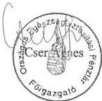
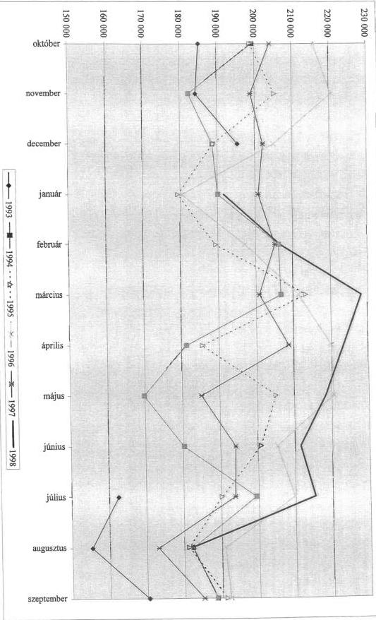
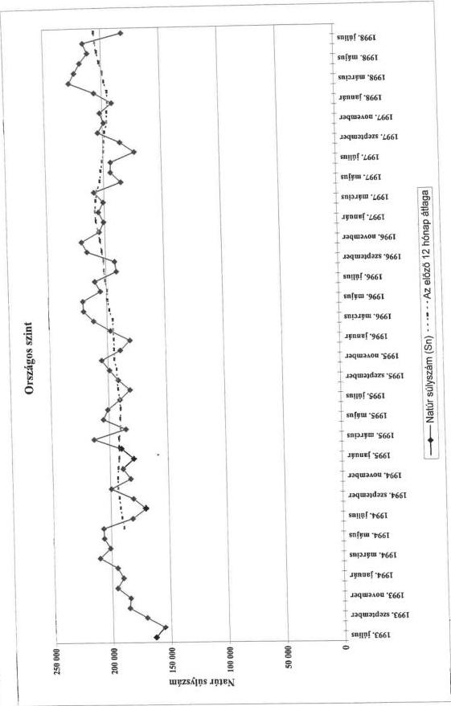

Állami Számvevőszék

T/4921/1

# VÉLEMÉNY

a társadalombiztosítás pénzügyi alapjainak 1998. évi költségvetési törvényjavaslatáról

403.

1997. november

---

Az ellenőrzés végrehajtásáért felelős:

az IV. Vagyonellenőrzési Igazgatóság

Halász Gejza

számvevő igazgató

Az ellenőrzést vezette:

Dr. Csépán Magdolna

osztályvezető főtanácsos

Az ellenőrzésben részt vettek:

Balla Józsefné

számvevő tanácsos

Dr. Fónyad Erzsébet

számvevő tanácsos

Hajagos Józsefné

számvevő tanácsos

Hegyesné dr. Solymos Mária

számvevő

Dr. Kurucz István

számvevő tanácsos

Molnár Istvánné

számvevő tanácsos

Szarka Péterné

számvevő

Szendrődi Józsefné

számvevő

---

# A VÉLEMÉNYBEN ALKALMAZOTT RÖVIDÍTÉSEK JELENTÉSE

Áht az államháztartásról szóló 1992. évi XXXVIII törvény

ÁSZ Állami számvevőszék

E.. Alap Egészségbiztosítási alap

Ny. Alap Nyugdíjbiztosítási Alap

AT. A társadalombiztosítás pénzügyi alapjairól szóló

1992. évi LXXXIV. törvény

PM Pénzügyminisztérium

NM Népjóléti Minisztérium

OEP Országos Egészségbiztosítási Pénztár

ONYF Országos Nyugdíjbiztosítási Főigazgatóság

NYUFIG Nyugdíjfolyósító Igazgatóság

BHG Budapesti Híradástechnikai Gépgyár

APEH Adó- és Pénzügyi Ellenőrzési Hivatal

Ktv A köztisztviselők jogállásáról szóló

1992. évi XXIII. törvény

---

V-35-5/1997. TÉMASZÁM: 402

# TARTALOMJEGYZÉK

BEVEZETÉS 3

I. ÖSSZEGZŐ MEGÁLLAPÍTÁSOK, JAVASLATOK 4

1. Osszegz'megallapitások 4
2. Javaslatok 6

II. RÉSZLETES MEGÁLLAPÍTÁSOK 8

1. A költségvetési javaslat megfelelése az Áht. előírásainak 8

2. Az 1998. évi tervezést meghatározó tényezők 8

2.1.A tervezes alapjaul szolgalo bazisadatok 8
2.2.A tervezes makrogazdasagi parameterei 9
2.3.Az 1998-tol ervenyes jogszabalyi valtozasok hatasa 9

3. A költségvetési javaslat számszerű előirányzatainak értékelése 11

3.1.Az eloiranyzatok elterei a koltsegvetesek onkormanyzati valtozatatol 12
3.2.A koltsegvetesi tórvényjvaslat szamszeru eloranyzatainak ertekelese 13

3.2.1.A tarsadalombitzositas beveteleinek tervezett alakulasa 13
3.2.2.A nyugdijbiztositas kiadasainak eloiranyzatai 15
3.2.3. Az egeszegbiztositas 1998. evi kiadasi eloiranyzatai. 16
3.2.4.A vilagbanki kolcsonnel kapcsolatos 1998.evi kiadasok 20
3.2.5.A tarsadalombitzositas szervei altal folyositott, az alapok forrasait nem terhelo ellatasok 20

4. Megjegyzések, észrevételek a törvényjavaslat normaszövegéhez. 21

4.1.A 11. \(\S (2)\) bekezdéséhez 21
4.2.A 12. \(\S (1)\) bekezdéséhez 21
4.3.A 14. \(\S (1)-(2)\) bekezdéséhez 21
4.4.A 14. \(\S (4)-(6)\) bekezdeseihez 22
4.5.A 17. \(\S\) es a 33. \(\S\) -hoz 23
4.6.A 18. \(\S\) -hoz 23
4.7.Helyesbitesi igenyek a normaszövegen 24

1

---

# BEVEZETÉS

**Az államháztartásról szóló 1992. évi XXXVIII. törvény (Áht) 86. § (5) bekezdése Értelmében az Országgyűlés a társadalombiztosítás pénzügyi alapjainak költségvetéséről szóló törvényjavaslatot az Állami Számvevőszék (ÁSZ) véleményével együtt tárgyalja meg.**

**A T/4291. sz. törvényjavaslatot** a Kormány szeptember 29-én nyújtotta be az Országgyűlésnek, egyidejűleg eljuttatta az ÁSZ-hoz is. **A javaslat nem azonos a társadalombiztosítási önkormányzatok által** (1997. augusztus 27-én illetve 28-án) **elfogadott költségvetésekkel**. Eltérés esetén, az Áht. 85/A. § (3) bekezdése szerint az Országgyűlést tájékoztatni kell az önkormányzatok javaslatáról, az eltérések okairól. Ez csak részben történt meg, amennyiben a törvényjavaslathoz - indoklás nélkül - csatolták az önkormányzati változatot.

Az ÁSZ részéről a költségvetés bevételi és kiadási előirányzatai megalapozottságának vizsgálatát nagymértékben megnehezítette a Kormány és a biztosítási önkormányzatok közötti (egyébként kívánatos és elvárható) konszenzus hiánya, valamint az a körülmény, hogy az Egészségbiztosítási Alap 1997. évi pótköltségvetését (amelynél szintén hiányzott az egyetértés) az Országgyűlés még nem hagyta jóvá, így még az 1997. év törvényi bázisa sem létezik. Ezeken túlmenően 1998-tól a társadalombiztosítási ellátások törvényi háttere gyökeresen megváltozott. Mindez alapjaiban érinti a Nyugdíjbiztosítási (Ny) és az Egészségbiztosítási (E) Alap jövő évi költségvetési pozícióját, a bevételek és kiadások várható alakulását.

---3

---

I. ÖSSZEGZŐ MEGÁLLAPÍTÁSOK, JAVASLATOK---

# I. ÖSSZEGZŐ MEGÁLLAPÍTÁSOK, JAVASLATOK

## 1. ÖSSZEGZŐ MEGÁLLAPÍTÁSOK

A társadalombiztosítás pénzügyi alapjainak 1998. évi költségvetéséről szóló **T/4921. számú törvényjavaslat az alapok bevételeit 1.361.264 millió forintban, a kiadások összegét pedig 1.378.354 millió forintban, 17.090 millió forint hiánnyal határozta meg.** Ezen belül a Nyugdíjbiztosítási Alap mérlege 0-szaldós (főösszege 786.390 millió forint), az Egészségbiztosítási Alap bevételi főösszege 574.874 millió forint kiadási főösszege 591.964 millió forint

A társadalombiztosítás szervei által **folyósított kiadások összegének előirányzata 280.800 millió forint.**

**A Kormány által beterjesztett költségvetési javaslat** a főösszegeket és az egyes bevételi és kiadási tételeket tekintve **is eltér az önkormányzatok által elfogadott költségvetési változattól.**

**Az önkormányzatok a járulékbevételek tervezésénél** - alacsonyabb bázisból kiindulva - **mérsékeltebb járulékbevétel növekedéssel és** - a kiadások teljesítése érdekében - az alapok pénzügyi egyensúlyának megőrzése céljából **jelentős költségvetési megtérítéssel (járulékfizetéssel)** számoltak. Ezzel a tervezési megközelítéssel az államháztartási törvény 86. § (8) bekezdéséből kiindulva és a biztosítási elv érvényesítése alapján az Állami Számvevőszék egyetért. Ezeket a szempontokat a törvényjavaslat nem veszi figyelembe. A központi költségvetés 1998-ra vonatkozó javaslata nem tartalmaz ilyen tételeket. A társadalombiztosítási ellátásokért viselt állami felelősség továbbra is alapvetően a hiány finanszírozásában (átvállalásában) jut kifejezésre.

**A Kormány költségvetési tervezetében nagyobb 1997. évi bázist feltételezve a bevételi oldalon a „hiányzó” forrást az alapok járulékbevételeinek magasabb összegben történő meghatározásával és vagyonértékesítési kötelezettség előírásával teremtették meg.**

Az alapok 1998. évi bevételi és kiadási előirányzatai megalapozottságának megítélését alapvetően a **bázis (1997. évi várható) adatok megbízhatósága** határozza meg. E tekintetben **nagyfokú a bizonytalanság**, ami az Egészségbiztosítási Alap pénzügyi helyzetére mindenképpen negatív hatással lesz. (Ezzel kapcsolatos véleményét és fenntartásait az ÁSZ az E. Alap 1997. évi pótköltségvetési törvényjavaslathoz kapcsolódva részletesen kifejtette.)

A bázis adatok és a makrogazdasági tervezési paraméterek mellett az 1998. évi költségvetési előirányzatokat bevételi és kiadási oldalon egyaránt befolyásolják **az év elejétől érvényes jogszabályi változások.** Ezeknek számszerű hatásait azonban ma még közelítő pontossággal sem lehet kimutatni. Erre csak a teljesítés alapján (zárszámadáskor) lesz mód.

---4

---

I. ÖSSZEGZŐ MEGÁLLAPÍTÁSOK, JAVASLATOK

Az I. és II. fokú rokkantak nyugdíjkiadásai 1998-tól a Nyugdíjbiztosítási Alapot terhelik. A finanszírozási cserével és annak pénzügyi hatásaival az önkormányzatok egyáltalán nem számoltak. A Kormány az ellátásokat a szükséges forrás biztosítása nélkül tette át a nyugdíjbiztosítási ellátások közé, azt az egyéni járulékok 1 %-ának átcsoportosítása - elviekben - csak részben fedezi. A változás az E. Alapnál sem jelent számottevő megtakarítást.

A nyugellátásokat 1998. januárjában 19 %-kal emelik meg. Az 1997. évi 21,5 %-os nettó kereseti indexből adódó 2,5 %-os különbség az özvegyi nyugdíjrendszer átalakítására szolgál. Ha a nettó keresetek növekedése a vártnál rugalmasabb lesz (erre van még reális esély) arra az Alap bevételei már nem nyújtanak fedezetet.

Az egészségbiztosítási kiadások közül a gyógyszerek árának támogatására a tervezett 102,6 milliárd forintnál jóval, kb. 7-8 milliárd forinttal kell többet fordítani. Intézkedések nélkül a gyógyászati segédeszközök kiadási előirányzatait sem lehet megtartani.

Összességében az ÁSZ azt valószínűsíti, hogy az alapok 1998-ra tervezett bevételi előirányzatai nem fognak teljesülni. Ez esetben mindkét alapnál hiány bekövetkezése várható. Súlyosabb gondokra 1998-ban is az egészségbiztosítás területén kell számítani, beleértve a pótköltségvetés készítésének kötelezettségét is.

Az alapok vagyonával kapcsolatosan hangsúlyozzuk, hogy folytatódik a vagyon felélésének állami kényszere. Emellett a tisztánlátást zavarja, egyúttal elfogadhatatlan is, hogy a vagyongazdálkodás bevételeit és kiadásait az alapok járulék és egyéb folyó bevételeivel és ellátási (működési) kiadásaival "összekeverve" tartalmazzák a törvényjavaslat mellékletei. Így például a Postabank garanciális kötelezettségének teljesítése is része a költségvetés kiadásainak, forrás megjelölése nélkül.

A Kormány túlzott várakozásokat fűz a behajtási tevékenység eredményességéhez. Egyidejűleg többféle ösztönzési rendszer működtetésével is segíteni kívánja azt, amit az ellenőrzés (eddigi tapasztalatait figyelembe véve)

indokolatlannak és értelmetlennek tart. Ehelyett az egész eddigi ösztönzési rendszer újragondolása szükséges, következetes elvek, szabályozás és ellenőrzés érvényesítése mellett.

5

---

I. ÖSSZEGZŐ MEGÁLLAPÍTÁSOK, JAVASLATOK

## 2. JAVASLATOK

Az Állami Számvevőszék javasolja, hogy a Kormány:

- az Áht. 115. §-ának megfelelően mutassa be a költségvetési javaslatot. (Az 1997. évi várható adatokat az Ny. Alapot érintően az I.-IX. havi pénzforgalmi adatok szerinti időarányos teljesítésből, az E. Alapnál pedig a jóváhagyott pótköltségvetés törvényi számaiból kell meghatározni);
- az előzőek szerinti reális bázis adatokból kiindulva módosítsa az 1998. évi költségvetés egyes bevételi és kiadási tételeit;
- indokolja meg az önkormányzatok költségvetési javaslatától való eltérések okait;
- az alapok címrendjéből hagyja el „tartós befektetési célú vagyonhasznosítási bevételek”, illetve a „tartós befektetési célú vagyongazdálkodási kiadások” megjelölésű tételeket;
- a normaszövegben határozza meg, hogy "a Postabank garanciális kötelezettségének teljesítése" című (az ÁSZ észrevételei szerint módosított) kiadási előirányzatnak mi a forrása;
- a biztosítási elv érvényesítése és az E. Alap pénzügyi helyzetének stabilizálása érdekében mérlegelje a biztosítási jogviszonnyal nem rendelkező személyek utáni állami járulékfizetés 1998. évi bevezetésének kérdését (ami értelemszerűen összefügg a Magyar Köztársaság 1998. évi költségvetéséről szóló T/4832. számú törvényjavaslattal is);
- az Ny. Alap bevételi - kiadási egyensúlyát ne a vagyonértékesítési kötelezettség előírásával, hanem az Áht. 86. § (8) bekezdésben foglaltak alapján a jelenlegi 20,1 milliárd forintot támogatás megemelésével biztosítsa ;
- a kintlévőség behajtásából eredő járulékbevételek előirányzatát válasszák szét az OEP behajtási tevékenységének bevételére és az OEP - APEH behajtási tevékenység bevételére;
- az alapok könyvvizsgálatának kiadási forrása ne a világbanki kölcsön, hanem - az Áht. 86/A. §-ának megfelelően - az alapok működési költségvetése legyen;
- a társadalombiztosítás szervei által folyósított ellátásokra (a 3.2.5. pontban) tett számszerű észrevételeket a költségvetés véglegesítése során vegye figyelembe;
- a biztosítási önkormányzatokkal közösen tekintse át a behajtási, járulék ellenőrzési tevékenységet és annak ösztönzési rendszereit (ennek új alapokon történő szabályozását is beleértve). Ennek érdekében fontolja meg az

6

---

I. ÖSSZEGZŐ MEGÁLLAPÍTÁSOK, JAVASLATOK

1992. évi LXXXIV. törvény (AT.) jelenlegi 5/A. és 5/B. §-ainak 1998-tól történő hatályon kívül helyezését;

- a világbanki kölcsönből csak a Világbank által jóvá hagyott fejlesztések megvalósítását engedélyezze és egyúttal az önkormányzatokkal közösen tekintse át a társadalombiztosítás területén a világbanki kölcsönfelhasználás helyzetét;
- a normaszöveget az ÁSZ észrevételei alapján módosítsa és számszakilag is pontosítsa;
- vizsgálja felül a Köztisztviselői törvény működését abból a szempontból, hogy az ott előírt illetményrendszer és jutalmazási lehetőségek az egyes területeken hogyan érvényesülnek, milyen anyagi elismerésre nyújtanak lehetőséget.

7

---

II. RÉSZLETES MEGÁLLAPÍTÁSOK---

# II. RÉSZLETES MEGÁLLAPÍTÁSOK

## 1. A KÖLTSÉGVETÉSI JAVASLAT MEGFELELÉSE AZ ÁHT. ELŐÍRÁSAINAK

Az **Áht. 115. §-a** előírja, hogy a költségvetés előterjesztésekor a vonatkozó év és az előző év várható, valamint az azt megelőző év tényadatait kell a mérlegeknek tartalmazniuk.

E **követelménynek a T/4921. sz. törvényjavaslat nem tesz eleget**, mivel az csak 'egyoszlopos', az 1998. évi tervadatait mutatja be. Ezt a hiányosságot pótolja részben az **1. sz. függelék**, amennyiben annak táblázatai - tájékoztató jelleggel - ismertetik az **1996-2000. év 'várható' adatait**. Ebben az 1997. évi módosított előirányzat a Nyugdíjbiztosítási Alap esetében megközelítően a várható adatokra épül, az Egészségbiztosítási Alapnál azonban a T/4834. számú - pótköltségvetési - törvényjavaslat 'eredeti' számaival egyezik meg, ami feltételezhetően (az ÁSZ észrevételei miatt is) még változik.

A társadalombiztosítás pénzügyi alapjai **költségvetésének tagozódására (címrendjére)** az 1992. évi LXXXIV. törvény (AT.) előírásait kell alkalmazni. E szerint - hasonlóan a központi költségvetésnél szokásos megoldáshoz - a költségvetés címekre, alcímekre tagozódik. A címrend évközbeni változtatása az Országgyűlés kizárólagos hatásköre. E tekintetben a költségvetés prezentációja megfelel a formai követelményeknek. A törvényjavaslat **normaszövegének megítélését és kezelhetőségét segíti, hogy a címrendre való utalás mellett rendszerint szerepel a megjelölt előirányzat megnevezése (tartalma) is.**

## 2. AZ 1998. ÉVI TERVEZÉST MEGHATÁROZÓ TÉNYEZŐK

### 2.1. A tervezés alapjául szolgáló bázisadatok

Az önkormányzatok és a Kormány tervező munkáját elsődlegesen az **1997. év első félévének pénzügyi teljesítési adatai határozták meg.** Ez különösen az **Egészségbiztosítási Alap várható adatainak** meghatározása szempontjából bír jelentőséggel, hiszen a pótköltségvetés készítése is az első félévi adatokon alapult.

---8

---

II. RÉSZLETES MEGÁLLAPÍTÁSOK

Az ÁSZ a pótköltségvetésről alkotott véleményében a beterjesztett javaslatban foglaltakhoz viszonyítva - az I-VIII. havi pénzforgalmi adatok alapján - a bevételeket a tervezésnél (514,1 milliárd forint) alacsonyabbra, a kiadásokat pedig (544,2 milliárd forint) többre becsülte, ami az E. Alap hiányát is jelentősen megnöveli. (Az időközben rendelkezésre álló I-IX. havi pénzforgalmi adatokat a vélemény 1. sz. melléklete ismerteti.)

Az E. Alap 1998. évi előirányzatainak megítélését tehát alapvetően befolyásolja, hogy a pótköltségvetési törvény jóváhagyása során sikerül-e a realitásokat jobban megközelítő "bázist" kialakítani. Jelenleg ebben a bizonytalanság 15 - 20 milliárd forintban számszerűsíthető.

A Nyugdíjbiztosítási Alap 1997. évi előirányzatai kiegyensúlyozottabban alakulnak. Az Alap bevételi pozíciója biztonságosabbnak mondható, a kiadások az eredetileg tervezettől nem térnek el számottevően. Az előrejelzések szerint az Alap bevételei a tervezett 615 milliárd forintot meghaladják (a tervezettnél nagyobb keresetkiáramlás miatt). A PM ennek nagyságát az 1. sz. függelékben 635 milliárd forintban határozza meg (amit az időarányos adatok még nem támasztanak alá). A kiadásokat az eredeti 625,2 milliárd forinttal szemben 626,1 milliárd forintra valószínűsítik. Összességében reálisnak tekinthető az a várakozás, hogy az Ny. Alap 1997-ben egyensúllyal, esetleg enyhe bevételi többlettel zárul, így adatai elfogadható bázisát képezik az 199évi költségvetésnek.

# 2.2. A tervezés makrogazdasági paraméterei

A tervezés időszakában az 1998. évi bruttó átlagkereset növekedés indexe 14,5 % volt. A közalkalmazotti szférában időközben létrejött megállapodás szerint e körben 16 %-os növekedésre kerülhet sor, ami a járulékbevételek emelkedését eredményezheti. Az 1997. évi várható nettó átlagkereset emelkedése 21,5 %, ami 1998. évi nyugdíjemelések alapját képezi.

A fogyasztói árak 1998-ban várhatóan 13,5 %-kal, a termelő árak pedig 14 %-kal emelkednek. Ennek hatásai az E. Alap természetbeni ellátásai előirányzatainak kialakításánál jelentkeznek erőteljesen.

# 2.3. Az 1998-tól érvényes jogszabályi változások hatása

A társadalombiztosításról szóló 1975 évi II. törvény 1998. január 1-jétől hatályát veszti. Helyét új törvények veszik át. Ezek:

- a tarsadalombitzositas ellatasaira es a magannyugdijra jogosultakrol, valamint e szolgaltatasok fedezeterol szol 1997. evi LXXX. törveny;
- a tarsadalombitzositasi nyugellatasrol szol 1997. evi LXXXI. törveny;

9

---

II. RÉSZLETES MEGÁLLAPÍTÁSOK

- a magánnyugdíjról és magánnyugdíjpénztárakról szóló 1997. évi LXXXII. törvény, valamint
- a kötelező egészségbiztosítás ellátásairól szóló 1997. évi LXXXIII. törvény

A T/4921. sz. törvényjavaslat IV. fejezete a társadalombiztosítás pénzügyi alapjainak 1998. évi költségvetési előirányzataival összefüggésben részben már módosítja - az egyébként csak januártól hatályos - felsorolt törvények egyes előírásait is, valamint:

- a társadalombiztosítás pénzügyi alapjairól szóló 1992. évi LXXXIV. törvényt;
- az egészségügyi hozzájárulásról szóló 1996. évi LXXXVIII. törvényt, továbbá
- más törvényeket is, amelyeknek azonban a költségvetést érintő direkt pénzügyi hatása nincs.

A jogi háttér változásaiból adódóan a költségvetési hatások az alábbiakban összegezhetők:

A) Az Alapok bevételi oldalát érintően:

- a járulékalapnál inkább a megfogalmazás pontosítása jellemző és apróbb bővítések (pl. a természetbeni juttatások adóalapként meghatározott értékének járulékkötelessé tétele). A pontosítások számszerű hatása azonban nem jelentős;
- a munkáltatói társadalombiztosítási járulék mértéke 1998-ban változatlanul 39 % marad (amiből 24 % a nyugdíjbiztosítást, 15 % az egészségbiztosítást illeti);
- az egyéni nyugdíjbiztosítási járulék 6 %-ról 7 %-ra emelkedett, de úgy, hogy (a nyugdíjrendszer változásaihoz igazodva) a tagok esetében csak 1 % illeti az Ny. Alapot, 6 %-ot a magánpénztárak kapnak;
- az egyéni egészségbiztosítási járulék 4 %-ról 3 %-ra csökkent;
- az egyéni járulékfizetés felső határa az 1997 évi 3300 forint/napról megannyi 4290 forint/napra emelkedett;
- járulékfizetés ellenében az egyén szerződést köthet társadalombiztosítási ellátásokra és így szolgálati időt is szerezhet (legfeljebb öt naptári évre);
- az egészségbiztosítási járulék 1800 forint/hóról 2100 forint/hóra nőne a T/4921. sz. törvényjavaslat szerint;
- a baleseti járulékfizetés alapja szűkül.

A felsorolt változások bevételekre gyakorolt hatása az alapoknál eltérően jelentkezik, elemenként és összességében is. Ezeknek számszerűsítésére az ÁSZ nem vállalkozhatott. Szakértői becslések szerint az "indulás évében" (1998-ban) a pozitív és negatív hatások kiegyenlítik egymást.

10

---

II. RÉSZLETES MEGÁLLAPÍTÁSOK

B) A társadalombiztosítási kiadások alakulását befolyásoló változások hatását egyrészt az Alapok közötti finanszírozási csere ( az I. és II. fokozatú rokkantak nyugdíjkiadásainak átkerülése az Ny. Alapba), másrészt az egyes ellátási kiadások emelkedését meghatározó szabályozás hatása jellemzi.

A nyugdíjkiadásokat érintően leglényegesebb változások:

- a nyugdíjkorhatár emelkedése, aminek konkrét hatása még nem állapítható meg, az átmeneti időszak korhatár-kedvezményei miatt;
- a nyugdíjemelés alsó és felső korlátjának eltörlése;
- az özvegyi nyugdíjra való jogosultság körének és mértékének változása, ami már 1998-ban számottevő lesz;
- az árvaellátás mértékének változása (25 %-ról 30 %-ra)
- az I. és II. fokozatú rokkantsági nyugdíjak 1998-tól az Ny. Alapot terhelik. Erről az ONYF és az OEP főigazgatója úgy nyilatkozott az ÁSZ-nak (2. sz. melléklet), hogy annak hatásával - aminek nagysága 23,7 milliárd forint - az önkormányzatok költségvetési változatai nem számoltak.

A felsorolt változások általában növelik a nyugdíjágazat kiadásait, amit mérsékelhet a korhatáremeléssel összefüggő létszámalakulás és össze-tételváltozás.

Az egészségbiztosítás kiadási oldalát mindenképpen érinti az I. és II. fokozatú rokkantak nyugdíjkiadásainak kikerülése a rendszerből. Ezen túlmenően a kötelező egészségbiztosítás ellátásairól szóló 1997. évi LXXXIII. törvény értelmében egyes szolgáltatásokat a jövőben az E. Alap helyett a központi költségvetés finanszíroz (pl.: mentés és sürgős betegszállítás stb.), ami a kiadásokat szintén mérsékli.

# 3. A KÖLTSÉGVETÉSI JAVASLAT SZÁMSZERŰ ELŐIRÁNYZATAINAK ÉRTÉKELÉSE

A T/4921. sz. törvényjavaslat

- a Nyugdíjbiztosítási Alap bevételeit és kiadásait egyaránt 786,4 milliárd forintban,
- az Egészségbiztosítási Alap bevételi főösszegét 574,9 milliárd forintban,
- kiadási főösszegét 592,0 milliárd forintban,
- hiányát 17,1 milliárd forintban

határozta meg.

11

---

II. RÉSZLETES MEGÁLLAPÍTÁSOK---

### 3.1. Az előirányzatok eltérései a költségvetések önkormányzati változatától

A társadalombiztosítási önkormányzatok által elfogadott költségvetési javaslatok **mindkét alapnál eltérnek a benyújtott törvénytervezetben foglaltaktól**. A különbségek mindkét esetben jól körülhatárolhatóak.

**Az Ny. Alap költségvetésének 'önkormányzati' változata bevételi oldalon a járulékok mérsékeltebb ütemű növekedésével számol.** Ebben az játszik szerepet, hogy a munkáltatói járulékoknál, a kormányzati várakozásnál **alacsonyabb a figyelembe vett 1997. évi bázisadat, amit az 1998-ra megadott 14,5 %-os kereseti index alkalmazásával 544,7 milliárd forintban határoztak meg.**

**Az egyéni járulékoknál** figyelembe vették, hogy annak várható összege 1997-ben elmarad az eredeti előirányzattól. Az így képzett bázist szintén 14,5 %-kal növelték, ráépítve az egyéni járulékfizetés felső határának emeléséből adódó hatásokat is.

**A társadalombiztosítási nyugdíjrendszerből kötelezően, illetve önként kilépők járuléka kormányzati számítások szerint 20 milliárd forint, ami az Ny. Alapnál elmaradt bevételként jelentkezik és amit a költségvetésnek kell megtérítenie. A nyugdíjrendszer változásainak hatása - különösen az első évben, 1998-ban - reálisan csak a tényadatok birtokában lesz megítélhető.**

**Az önkormányzat ezen kívül még további 29,8 milliárd forintos költségvetési hozzájárulással számolt az Alap egyensúlyának biztosítása érdekében, az Áht. 86. § (8) bekezdésében foglaltak alapján:**

'(8) Ha a Nyugdíjbiztosítási Alap éves bevétele kisebb a teljesítendő kifizetések összegénél, akkor a különbséget az állam a központi költségvetésben tervezett előirányzatként átadja a Nyugdíjbiztosítási Alap számára. A központi költségvetés terhére történő tényleges kifizetésekre azonban a tényleges bevételek és kiadások függvényében kerülhet sor. A hiány központi költségvetés terhére történő elszámolását a zárszámadásban kell rendezni.'

**Lényeges eltérés a bevételeknél, hogy az ellátások finanszírozása érdekében vagyongazdálkodásból (ami valójában vagyonértékesítést jelent) a Nyugdíjbiztosítási Önkormányzat 3,5 milliárd forint bevétel elérését tűzte célul. A Kormány ezzel szemben 11,8 milliárd forintra tett javaslatot. Így az Alap bevételi főösszege (a kiadásokkal megegyezően) az önkormányzati változatban 764,1 milliárd forint.**

**Kiadási oldalon az eltérés a nyugdíjkiadásoknál jelentkezik.** Egyértelműen azért, mert az Önkormányzat terv-variánsa nem tartalmazza az I.-II. rokkantsági csoportokba tartozók nyugdíjkiadásait.

---12

---

II. RÉSZLETES MEGÁLLAPÍTÁSOK

**Az Egészségbiztosítási Alap Önkormányzat két változatban, egyaránt 0-szaldós költségvetést fogadott el.**

A bevételek és kiadások **főösszege:**

|  az A. változatban | **608,2 milliárd forint;**  |
| --- | --- |
|  a B. változatban | **617,0 milliárd forint.**  |

**Az Önkormányzat** mindkét esetben **számolt azzal, hogy a járulékfizetésre nem kötelezett, de a természetbeni egészségbiztosítási ellátások igénybevételére jogosult személyek ellátásainak fedezésére a központi költségvetés** (az A. változatban 49,5 milliárd forint, a B. változatban 60,5 milliárd forint összegben) **járulékot fizet.** A biztosítási elv alapján a javaslat indokoltsága aligha vitatható. (A két biztosítási ág közötti keresztfinanszírozás megszűnése miatt e körbe tartoznak a nyugdíjasok is. **Az érintett létszám összesen 3,3 millió főre** tehető.)

Az ellátási kiadások közül **a gyógyító-megelőző egészségügyi ellátás kiadása** az A. változatban 305,7 milliárd forint, a B. változatban 314,6 milliárd forint. Erre a költségvetés kormányzati változata 296 milliárd forintot javasol fordítani.

**A gyógyszerkiadásokra 105 milliárd forintot terveztek, a III. csoportba tartozók rokkantnyugdíj kiadásaira pedig 98,1 milliárd forintot,** ami szintén több a T/4921. sz. törvényjavaslatban szereplő előirányzatoknál (102,6 milliárd forint, illetve 95,8 milliárd forint).

## 3.2. A költségvetési törvényjavaslat számszerű előirányzatainak értékelése

### 3.2.1. A társadalombiztosítás bevételeinek tervezett alakulása

**A társadalombiztosítás pénzügyi alapjainak összevont bevételi főösszege 1361,3 milliárd forint,** ami 18,4 %-kal magasabb az 1997. évi módosított előirányzatnál (1. sz. függelék). Ez utóbbit **az ÁSZ** az Egészségbiztosítási Alap 1997. évi pótköltségvetéséről készített véleményében kifejtettek miatt nem tartja reális tervezési alapnak. **Azt valószínűsíti, hogy az 1998-ra tervezett egyes bevételi előirányzatok nem fognak teljesülni.**

**A munkáltatói járulékbevételek 922,8 milliárdos összege erősen felültervezett,** 17 %-kal magasabb az 1. sz. függelékben szereplő 1997. évi 788,8 milliárd forintnál. A 14,5 %-os bruttó keresettömeg növekedés hatásán kívül a Kormány még a 'járulékfizetési hajlandóság' növekedésével is számol. Ennek azonban minimális a valószínűsége, ráadásul ezt már a bázis számok kialakításánál is feltételezték. A fokozottabb ellenőrzési tevékenységnek, a nyilvántartási rendszerek tökéletesítésének természetesen (elvileg) lehet ilyen

13

---

II. RÉSZLETES MEGÁLLAPÍTÁSOK

hatása. Az ÁSZ ellenőrzési tapasztalatai - amelyeket az 1996. évi zárszámadás ellenőrzéséről szóló jelentés részletesen ismertetett - azonban nem igazolják ezeket az optimista várakozásokat.

**Az egyéni (nyugdíj és egészségbiztosítási) járulékok tervezett összege 187,1 milliárd forint.** Itt a tervezés szintén a keresetnövekedés 14,5 %-os indexéből indult ki, de a társadalombiztosítási nyugdíjrendszerből kilépők miatti bevételkieséssel (ez a feltételezések szerint 20 milliárd forint körüli összeg) és az egyéni járulékfizetés felső határának megemelésével összefüggésben az előirányzat megalapozottságáról nem lehet felelősséggel nyilatkozni.

**Az egészségügyi hozzájárulás** - ami teljes egészében az E. Alap bevételét képezi - összege már az 1997. évi pótköltségvetésnek is az egyik kritikus pontját képezi, így a **bázisból adódó bizonytalanság** kihat az 1998-ra előirányzott 97,9 milliárd forintos bevétel megítélésére is. A bázison kívül a hozzájárulás beszedhetőségét a Kormány 98 %-ban határozta meg, ami az 1997. évi tapasztalatokat alapul véve igen túlzottnak tekinthető. Az érintett létszám 4 millió fő. Egyedül a hozzájárulás mértékének (2100 ft/hó) 1997-hez viszonyított éves szinten való 25,8 %-os emelkedése biztos.

**A kintlévőségek behajtásából eredő járulékbevételek** előirányzata összesen 52 milliárd forint, melynek teljesülését a kapcsolódó (1998-tól még jobban kiterjesztett) ösztönzési rendszer "garantálja". **A behajtási tevékenység 1996-ra kiterjedő átfogó vizsgálata alapján az ÁSZ számos ellentmondást, szabályozási hiányosságokból adódó visszásságot tárt fel**, ami lényegében megkérdőjelezte a behajtásból származó bevételi adat valódiságát is. Ezeket az 1996. évi zárszámadási jelentés és az E. Alap 1997. évi pótköltségvetéséhez készített vélemény részletesen ismerteti. E bevételi tételt az előzőek miatt nem lehet megalapozottnak tekinteni.

Az összeg azonos az önkormányzati változatban szereplő adattal, azzal az eltéréssel, hogy ott ezt megbontják, amennyiben:

- Az OEP szervei által végzett behajtásból 41,6 milliárd,
- Az APEH-OEP együttműködéséből 10,4 milliárd
- forint származik. A megbontás indokolt.

**A vagyongazdálkodásból származó - az ellátások fedezetére szolgálóbevételek előirányzata együttesen 13,6 milliárd forint**, ami a Nyugdíjbiztosítási Alap esetében 11,8 milliárd forintot, az Egészségbiztosítási Alapnál 1,8 milliárd forintot jelent. Egyértelműen egyfajta vagyonértékesítési (vagyonfelélési) kényszerről van szó, **ami** az Ny. Alapot érintően a célszerűség mellett **az Áht. már idézett 86. § (8) bekezdésével összefüggésben is megkérdőjelezhető. Az alap** vagyonállományának 1997. szeptemberi névértéke összesen 27,2 milliárd forint. Az 1997. évi 3566 millió forintos vagyonértékesítési kötelezettségét is figyelembe véve a törvényjavaslatban előirányzott bevétel még teljesíthető, de a **vagyonállomány csökkenése már igen jelentős (több, mint 50 %-os).**

14

---

II. RÉSZLETES MEGÁLLAPÍTÁSOK

**Az alapok működési célú bevételeinek** tervezett összege 5 milliárd forint. Ebből a folyósított ellátások működési kiadásainak költségvetési megtérítése 1980 millió forint, a Világbanki Programmal kapcsolatos (NM fejezeten keresztül történő) pénzeszközátadás 2780 millió forint, ami fele-fele arányban oszlik meg a két ágazat között.

**Tartós befektetési célú vagyon hasznosításából származó bevételre** (a mérlegben a 3. címet viseli) 1998-ban nem szerepel előirányzat. Az új cím bekerülése a normaszövegbe és a mellékletekben történő szerepeltetése azonban mégis aggályos, mert a vagyonhasznosításból és értékesítésből származó bevételektől különválasztva azt a látszatot kelti, hogy valamennyi felhalmozási célú részesedés, értékpapír eladásának bevétele része az ellátási bevételeknek. Ez nem lehetséges, hiszen az alapvető szabály (az 1995. évi CXXI. törvény 32. §-a szerint), hogy az 1994. december 31-e előtt szerzett részesedések és az ingyenes vagyon ellenértéke új befektetésre fordítható. Ugyanitt a 'továbbértékesítési célú részesedések, értékpapírok értékesítése' alcím számvitelileg kezelhetetlen, mert amit forgatási céllal vásárolnak az nem lehet tartós befektetés.

**Az ellátási bevételek és kiadások vagyonnal történő összemosásának szándéka** a költségvetésben elfogadhatatlan, már csak azért is, mert zárszámadáskor a vagyonról külön kell beszámolni.

### 3.2.2. A nyugdíjbiztosítás kiadásainak előirányzatai

A Nyugdíjbiztosítási Alap 786,4 milliárd forintos kiadási előirányzatából **766,5 milliárd forint** a korhatár fölötti saját jogú nyugdíjak, a hozzátartozói ellátások és korhatár alatti rokkantsági és baleseti rokkantsági (I.-II. csoportos) **nyugdíjak tervezett kiadási összege. A nyugdíjemelések** 1998. évi mértékét meghatározó makroparaméter az **1997. évi 21,5 %-os nettó átlag kereseti index. Az év elején a nyugdíjak 19 %-kal emelkednek**, ami egyértelműen reálértéknövekedést jelent. A fennmaradó 2,5 % az új özvegyi nyugdíjkiegészítés forrásául szolgál. A terv nem tartalmaz tartalékot további nyugdíjemelésre.

Az ellátottak számának növekedése a korhatár emelés következtében. 1998-ban várhatóan megáll. A nyugdíjkiadás átlaga egy főre jutóan 26.500 forintra emelkedik.

**A postaköltségek** várható összege 3,0 milliárd forint.

**Az Ny. Alap működésre fordított kiadási** előirányzata 16,3 milliárd forint, beleértve a világbanki költségek 1,7 milliárd forintos tételét is (ezzel ugyanis az önkormányzati változatban szereplő 16 milliárd forintos keretösszegnél nem számoltak).

– **A személyi juttatások** tervezett összege 5,6 milliárd forint. A tájékoztatás szerint 302 fős létszámfejlesztést terveznek, amiből a nyugdíjreformhoz kapcsolódó többletfeladatokat oldanák meg, növelnék az ellenőri létszámot és

15

---

II. RÉSZLETES MEGÁLLAPÍTÁSOK

az adatszolgáltatási, nyilvántartási feladatok ellátásában résztvevők létszámát.

- A dologi kiadásokra szánt összeg címzetten 3,4 milliárd forint.
- Felújításokra összesen 972 millió forintot szánnak. A Fiumei úti székház felújításának külön szabályozására (a 18. § (1)- (2) bekezdéseire) tekintettel, amelyre a költségvetés önkormányzati változatában külön 890 millió forintot irányoztak elő, a rendelkezésre álló forrásból megvalósítható a megyei igazgatóságok és a NYUFIG toronyépületének felújítása. A BHG épület sorsától függetlenül el lehet kezdeni a Fiumei úti rekonstrukciót (ami egyébként nagyon bizonytalan, mert az Egészségbiztosítási Pénztár kiköltözésének időpontja csúszott, sőt szinte kérdésessé is vált.)
- Felhalmozási kiadásokat a nyugdíjbiztosítás működési költségvetése nem tartalmaz, azt csak a normaszöveg (14. § (5) bekezdése) engedi meg feltételekhez kötötten 450 millió forint erejéig. 1998-ra az ágazatban új induló beruházást (miskolci igazgatóság), három megyében épületbővítést terveznek, továbbá a két ágazat szétválása után beszerzett gépkocsik cseréjét is, 1,1 milliárd forint összértékben. Minderre azonban a törvényjavaslat nem biztosít fedezetet.
- Informatikai fejlesztésekre a törvényjavaslat szerinti előirányzat 879 millió forint. Legjelentősebb feladat a nyugdíjreformmal összefüggő jogszabályi változások követése informatikai eszközökkel. A rendszerbeli változásokra való felkészülést hátráltatja az 1997. évi LXXX. törvényhez kapcsolódó kormányrendeletek hiánya.

A nyugdíjbiztosítás kiadásai között 320 millió forint szerepel a Postabank garanciális kötelezettségének teljesítésére. A bank által 1997-ben végrehajtott kezesség vállalás beváltásából 139 millió forint tőketörlesztés keletkezett 1998-ra, a lehívott összeg utáni kamat pedig 300 millió forint. Az előirányzat tehát nem fedezi a kötelezettségeket.

A 3.2.1. pontban kifejtettek miatt a kiadási oldalon (3. cím) sem fogadható el, hogy a vagyongazdálkodással kapcsolatos kiadások között a vagyon működtetésének kiadásain kívül befektetési célú kiadások jelenjenek meg, mert ez a járulékbevételek terhére legfeljebb bevételi többlet elérése esetén lenne lehetséges.

### 3.2.3. Az egészségbiztosítás 1998. évi kiadási előirányzatai.

Az Egészségbiztosítási Alap 574,8 milliárd forintos kiadási előirányzatából a törvényjavaslat szerint 296 milliárd forintot fordítanának a gyógyító-megelőző egészségügyi ellátások finanszírozására. Ebből 295,1 milliárd forint a kasszák kiadási előirányzata és 0,9 milliárd forint a célelőirányzatok kerete. Az előirányzat 15,1 %-kal haladja meg a szerkezeti változásokkal korrigált 1997. évi - pótköltségvetés szerinti - előirányzatot (ami 257,1 milliárd forint). Az 1997. évi módosított előirányzat szerkezeti változások miatt 8,8 milliárd forinttal csökkent, mert (mint erre a 2.3. pont is utal) a vérellátás, a mentés

16

---

II. RÉSZLETES MEGÁLLAPÍTÁSOK

és egyes speciális finanszírozású feladatok kikerültek az E. Alap finanszírozási köréből.

Az 1996. évi zárszámadás ellenőrzése során megismert problémák miatt bizonytalannak látszik a mentés-betegszállítás keretösszegeinek szétválasztása.

**A költségvetési tervezet** az így meghatározott korrigált előirányzatra 16 %-os bér és 10,5 %-os dologi fejlesztést tartalmaz. **Az így megnövelt alapelőirányzat 293 milliárd forint, ami lényegét tekintve azonos az Egészségbiztosítási Önkormányzat által elfogadott költségvetés hasonló adatával.**

**A két költségvetés között az eltérés a fejlesztéseknél mutatkozik.** Erre a Kormány javaslata mindössze 3,4 milliárd forintot tartalmaz, úgy hogy ebből 2 milliárd forint a nehéz pénzügyi helyzetbe került intézmények támogatására szolgáló működési előleg kerete.

**Az NM által meghirdetett szakmapolitikai célok megvalósítására az előirányzat nem tartalmaz fedezetet** és ezen túlmenően részben vagy egészben **hiányzik**

- a jelenleg hatályos szakmai szabályozásból eredő kapacitásbővülések működéséhez szükséges forrás,
- egyes kötelezően előírt többletfeladat ellentételezéséhez szükséges fedezet,
- a Kormány által elhatározott és az NM fejezet költségvetésében megjelenő egészségügyi fejlesztések finanszírozási szükséglete.

Mindezeket a költségvetés önkormányzati változatai tartalmazták, bár ott a számításoknál a fokozatosság elve kevéssé érvényesült.

**Összességében a 296,0 milliárd forintos előirányzatról megállapítható, hogy az ellátórendszer 1997. évi szinten való működtetésére elegendőnek látszik, de nem tartalmaz forrást az egészségügy reformcélok megvalósítására.**

**A gyógyszerek fogyasztói árának támogatására a Kormány javaslata 102,6 milliárd forintos előirányzatot tartalmaz,** amely magában foglalja a különkeretes gyógyszerek 6,3 milliárd forintos keretösszegét is. Az önkormányzati változat ezzel szemben 105 milliárd forintot tartalmazott.

**Az ÁSZ** az 1997. évi pótköltségvetés megalapozottságának vizsgálata alkalmával **azt jelezte, hogy ez évben a gyógyszerkiadások előreláthatóan meghaladják a Kormány által szerepeltetett 92,0 milliárd forintos kiadási előirányzatot.** Ezt most az I-IX. havi pénzforgalmi adatok ismeretében csak megerősíteni lehet. Szeptember végéig a gyógyszerkiadások összege 71,7 milliárd forint volt. Ebből időarányosan 95-96 milliárd forintos teljesítés következik, amihez még hozzáadódik a külön soron megjelenő, a vérzékenység kezelésére szolgáló 1,3 milliárd forintos előirányzat. Tehát itt is **szembe kell nézni a "rossz" bázis miatti tervezési hiba következményeivel,** hason-

17

---

II. RÉSZLETES MEGÁLLAPÍTÁSOK

lóan a bevételi oldal előirányzatainak meghatározásáról (a 3.2.1. pontban) megfogalmazott véleményhez.

**A realitások alapján a gyógyszerkiadások 1998. évi előirányzatát legalább 110 milliárd forintban kellene meghatározni.** Az adott gazdasági-társadalmi közegben a gyógyszertámogatások összegét befolyásoló mindhárom tényezőt (ár, támogatási rendszer, fogyasztás) tekintve a biztosító mozgástere rendkívül csekély. A kiadások növekedésének visszafogása olyan drasztikus intézkedéseket követelne meg, amelyeket a jelen időszakban számos (gazdasági, politikai, szociálpolitikai) okból sem lehet megtenni. A fogyasztás befolyásolása terén ugyan még vannak lehetőségek. (a gyógyszerrendelés szabályainak szigorítása, az orvosok ösztönzése, illetve szankcionálása és az ellenőrzés fokozása). Ezekhez azonban az eddigi tapasztalatok alapján nem szabad túlzott reményeket fűzni. Nem zárható ki az új terápiás lehetőségeket biztosító - új, általában drágább - gyógyszerek folyamatos bekerülése és ennek kiadásnövelő hatása sem.

**A speciális szerződés alapján támogatható ún. különkeretes gyógyszerekre az előirányzaton belül 6.295 millió forintot különítettek el.** Ezzel kapcsolatos aggályait az ÁSZ az 1996. évi zárszámadási jelentése, valamint az E. Alap 1997. évi pótköltségvetéséhez adott véleménye már tartalmazta.

Információink szerint a keretösszeg részletes bontását az NM és az OEP határozná meg és azt az 1997. évihez hasonlóan a Népjóléti Közlönyben tennék közzé. A szakmai szabályozás és az eljárási rend szabályozása eddig nem történt meg, így az 1998. évi keret felosztása várhatóan az eddigi gyakorlat szerint történik, vagyis anélkül, hogy az indikációk, a kiválasztott gyógyszerek körét mértékadó szakmai fórumok kontrollálnák. (Az ÁSZ e kérdések külön vizsgálatát szorgalmazza).

**A gyógyászati segédeszközök kiadásaira a Kormány 1998-ban 17,6 milliárd forintot tervez fordítani,** 10 %-kal többet az 1997. évi várható teljesítésnél. Az előirányzat betarthatósága az eredményes ártárgyalásokon kívül elsősorban a szabályozás mielőbbi módosításának függvénye, megteremtve a hatékonyabb ellenőrzés és a vényfeldolgozás feltételeit is.

**Az egészségbiztosítás pénzbeli ellátásainak 1998. évi előirányzata összesen 146,9 milliárd forint.** A korhatár alatti rokkant és baleseti ellátásokat érintő lényeges változás, hogy 1998. január 1-jétől az I.-II. fokú rokkantak ellátásait a Nyugdíjbiztosítási Alap finanszírozza. A 23,7 milliárd forintos átcsoportosításból származó kiadáscsökkenést lényegében 'hatástalanítja' az itt maradó **III. fokú rokkantak** létszámnövekedése, az egyéni egészségbiztosítási járulék 1 %-pontos csökkenése, illetve az itt is érvényes 19 %-os nyugdíjemelés hatása. Ezen **ellátásokra a költségvetési törvényjavaslat szerint 95,8 milliárd forintot terveznek kifizetni.** (Az E. Alap pótköltségvetési javaslatában még a rokkantnyugdíjasok teljes körére 98,2 milliárd forintos módosított előirányzat szerepel az 1997. évre.)

A pénzbeli ellátások másik nagy tétele **a táppénz. Erre a javaslatban 42,0 milliárd forint szerepel,** szemben az 1997. évi 35,5 milliárd forintos módosí-

18

---

II. RÉSZLETES MEGÁLLAPÍTÁSOK

tott előirányzattal. A kiadás növekedését a bruttó keresetek emelkedése és a gyermekápolási táppénz időtartamának kiterjesztése támasztja alá.

**Az egészségbiztosítás működési költségvetésének 1998. évi keretösszege** (a világbanki kiadásokkal együtt) **21,2 milliárd forint**. Az Önkormányzat ezzel szemben 22,3 milliárd forinttal számolt. Ezt növeli még az 1997. év ma még nem ismert pénzmaradványának összege.

A kiadási előirányzatok 60 %-a a személyi juttatás és annak járulékai.

- **Személyi juttatásokra** több, mint 9 milliárd forint fordítható, amiben van annyi tartalék, hogy az eddigi gyakorlatnak megfelelően ágazati szinten 4-5 havi jutalom kifizetésére legyen lehetőség, az ösztönzési rendszer biztosította javadalmazáson kívül. Mindez a KTV-ben előírtaknál jóval magasabb anyagi elismerésre biztosít lehetőséget.

Az ellenőrzés fejlesztése címén 1998-ban 350 fős létszámnövekedést terveznek.

- **Dologi kiadásokra** 5 milliárd forintot irányoztak elő. A kiadások növekedését az egészségügyi struktúra átalakításával, az ellenőrzési rendszerek fejlesztésével és az árváltozások hatásával indokolják. A többletigények indokoltságának vizsgálatára nem volt mód.
- **Az informatikai fejlesztések** törvényjavaslat szerinti **előirányzata 500 millió forint**, azonos az önkormányzati változattal. Az előirányzat megalapozottságát nem lehet megítélni, az OEP tájékoztatása szerint ez egy keretszám, ami még nincs kitöltve tartalommal.
- **Felhalmozási kiadásokra a törvényjavaslat 219 millió forintot tartalmaz.** Az Egészségbiztosítási Önkormányzat változatában eredetileg 637 millió forint szerepelt, amit a normaszöveg (14. § (6) bekezdése) feltételekhez kötötten "visszatervez". Ezzel a megoldással - a 4.4. pontban foglaltak alapján - az ÁSZ nem ért egyet. Az ágazatban ingatlan jellegű beruházásokra 316 millió, eszközbeszerzésekre 321 millió forintot szántak.
- **A felújítási kiadások tervezett összege 345 millió forint**, ami jórészt ingatlanokhoz kapcsolódik.

**A Postabankkal kapcsolatos garanciális kötelezettség teljesítésére** a tervezetben 130 millió forintos kiadási előirányzat szerepel, ami nem fedezi a tényleges kötelezettségeket (56 millió forint tőketörlesztés és a lehívott összeg után fizetendő 152 millió forint kamat).

A nyugdíjbiztosításhoz hasonlóan **az egészségbiztosítás költségvetési mérlegében is "összemosódnak" az ellátási bevételek és kiadások a vagyongazdálkodási bevételekkel és kiadásokkal**. Ide értendő a Postabankkal kapcsolatos ügy is, amit vagyon terhére kellene rendezni. A megoldás előrevetíti azt a szándékot, hogy az elkövetkező években esedékes hiteltörlesztéseket is a folyó kiadásokból fogják fedezni.

19

---

II. RÉSZLETES MEGÁLLAPÍTÁSOK

### 3.2.4. A világbanki kölcsönnel kapcsolatos 1998. évi kiadások

**A törvényjavaslat mindkét ágazatánál azonos** - 1740 millió forintos - **előirányzatot tartalmaz e célra**, amiből 1390 millió forint a kölcsönfelhasználás és 350 millió forint a hazai kiadások összege. Az érvényben lévő szerződések alapján már most bizonyosnak látszik, hogy a valóságos igény a nyugdíjágazatnál ennél kevesebb, az egészségbiztosításnál pedig több lesz.

Mindkét ágazatnál **kifogásolható, hogy az alapok könyvvizsgálatának költségeit a világbanki kölcsönből kívánják finanszírozni.** Az Áht. 86/A. §-a e kiadások forrásaként a működési költségvetést jelöli meg. Ez a kiadás alaponként 190 ezer USD-t és 12 millió forintot jelent.

**Fennáll a veszélye annak, hogy a világbanki kölcsönből megvalósítani tervezett célok** még a meghosszabbított futamidejű és lecsökkentett összegű kölcsön-felhasználási lehetőségek mellett is **elmaradnak**, illetőleg a kölcsönt más célokra használják fel (a 4.4. pontban foglaltak szerint).

### 3.2.5. A társadalombiztosítás szervei által folyósított, az alapok forrásait nem terhelő ellátások

A nem társadalombiztosítási forrásból finanszírozott ellátások **1998. évi teljes előirányzata 280 milliárd forint. Ebből 117,4 milliárd forint kiadást a nyugdíjbiztosítás, 163,4 milliárd forintot pedig az egészségbiztosítás szervei folyósítanak.**

A költségvetési törvényjavaslat 2., 5., és 9. számú mellékletei ezen ellátásokat az alapok összevont mérlegéhez, a Nyugdíjbiztosítási Alap, valamint az Egészségbiztosítási alap mérlegéhez "hozzáadva" mutatja be (az Áht. és az 1992. évi LXXXIV. törvény előírásainak megfelelően), ami végső soron legfeljebb csak a nagyságrend érzékeltetésére alkalmas, közgazdasági tartalommal nem bír.

**A folyósított ellátások összege az alábbi kivételekkel megegyezik a Magyar Köztársaság Kormánya 1998. évi költségvetéséről szóló T/4832. számú törvényjavaslatával:**

- az 5. számú melléklet kiadásai és bevételei között a "életjáradék személyi kárpótlás alapján" nem 13.000 millió forint, hanem 12.920 millió forint. A különbség a működési költségekhez való hozzájárulás, ami a 3. számú mellékletben egyszer már szerepel,
- a hadigondozotti kiadásokat az egészségbiztosítás folyósított ellátásai között nem tüntetnek fel. A Hadigondozottak Közalapítványa és az OEP szerződést kötött gyógyászati segédeszközök felhasználásának támogatására. Ennek alapján 1998-ban a várható kiadás 5 millió forint,
- a hadigondozotti járadékra a központi költségvetés tervezetében 3,7 milliárd forintot irányoztak elő, a társadalombiztosítás költségvetési javaslatában 5,0 milliárd forintot. Az 1997. évi várható 6,0 milliárd forintos kiadással

20

---

II. RÉSZLETES MEGÁLLAPÍTÁSOK

szemben még ez is alacsony, a szükséges forrás tehát nem biztosított a kiadásokhoz.

#### 4. MEGJEGYZÉSEK, ÉSZREVÉTELEK A TÖRVÉNYJAVASLAT NORMASZÖVEGÉHEZ.

##### 4.1. A 11. § (2) bekezdéséhez

**A normaszöveg eléggé érthetetlen módon 1172 és 5123 millió forintos keretre bontja a különkeretes gyógyszerek 6295 millió forintos előirányzatát, miközben mindkettőt a járóbeteg szakellátásban rendeli felhasználni.** Az eljárást a törvényjavaslat indoklása sem magyarázza. Vélhetően elírás történ és arról van szó, hogy a kórházakban eddig felhasznált különkeretes gyógyszereket is a járóbeteg (lakossági) gyógyszerkeret részeként számolják el, a gyógyító megelőző ellátások előirányzatát ugyanis ilyen címen nem emelték meg. Ez a megoldás viszont szabálytalan, mert az Egészségbiztosítási Alap egyes előirányzatai között nincs átcsoportosítási lehetőség.

##### 4.2. A 12. § (1) bekezdéséhez

Az alapok költségvetési mérlegében a Kincstári Megelőlegezési Számla évközi igénybevételéért fizetendő kamatkiadás nem szerepel.

A javaslat szerint a Nyugdíjbiztosítási Alap évközben napi 65 milliárd forint összegig, az Egészségbiztosítási Alap pedig 40 milliárd forintig kamatmentesen, e mérték felett pedig kamat ellenében vehetne fel megelőlegezési hitelt az ellátások teljesítése érdekében. Az alapok napi likviditási helyzete alapján rendszeres ezt az összeghatárt meghaladó hiteligény, tehát valószínűleg kamatkiadással kell számolni 1998-ban is.

Arra nem sikerült magyarázatot találni, hogy 1998-ban miért az E. Alap kamatmentes hitelfelvételi lehetősége az alacsonyabb összegű, holott eddig fordított volt a szabályozás.

##### 4.3. A 14. § (1)-(2) bekezdéséhez

A költségvetési törvény 6. számú mellékletében **behajtás ösztönzésére 500 millió forintos, az APEH-OEP együttműködéssel történő behajtás ösztönzésére 100 millió forintos** (ugyanennyit adnának át az APEH-nak is), a 3. számú mellékletben az ellenőrzési tevékenység ösztönzésére 75 millió forin-

21

---

II. RÉSZLETES MEGÁLLAPÍTÁSOK

tos előirányzat szerepel. A javaslat az elért bevételektől függően megengedi az előirányzatok túllépését.

A behajtás ösztönzésére az 1992. évi LXXXIV. törvény 5/A. § szerint az elért bevételek 2 %-a fordítható. Mivel a törvényjavaslat 52 milliárd forintos behajtási hányaddal számol, ennek 2 %-a 1040 millió forint, szemben a 6. sz. mellékletben feltüntetett 700 (500+100+100) millió forinttal, ami így nem tekinthető reális kiadási előirányzatnak.

A törvényjavaslat a 14. § (2) bekezdésében ugyanakkor megengedné, hogy ha az előbbi (ösztönzési és ellenőrzési) előirányzatok tényleges kiadása kevesebb, mint az előirányzat, abból a tárgyévben pénzmaradványt lehessen képezni. Ez teljesen indokolatlan. Ez a többi felsorolt esetben (informatikai fejlesztések, ellenőrzési rendszerek fejlesztése és egészségügyi struktúra átalakítása, beruházások előirányzatai) is csak akkor fogadható el, ha az így keletkezett pénzmaradvány a következő évben is kizárólag ugyanezen célokra használható fel.

#### 4.4. A 14. § (4) -(6) bekezdéseihez

Mivel (a 3.2.4. pontban leírtakból is kitűnően) ma még teljesen bizonytalan a biztosítási ágak 1998. évi világbanki kölcsönigénye, a törvényjavaslat megengedi annak a két ágazat közötti átcsoportosítását, az önkormányzatok megállapodása alapján, a Kormány egyetértésével.

A "szokatlan" megoldás különösen a 14. § (5) és (6) bekezdésével összefüggésben vitatható, amelyek szerint a kölcsönfelhasználás és a kapcsolódó hazai kiadások (2 x 1390 + 2 x 350 = 3480 millió forint) megtakarítása:

- az Ny. Alap esetében 450 millió forint erejéig felhalmozási célokra,
- az E. Alap esetében 637 millió forintig beruházási célokra

fordítható.

A világbanki kölcsön más irányú felhasználása lehetetlen, abból csak a Világbank által jóváhagyott fejlesztések valósíthatók meg. Az alapok reális felhalmozási (beruházási) előirányzatait pedig külön kell megtervezni.

22

---

II. RÉSZLETES MEGÁLLAPÍTÁSOK

#### 4.5. A 17.§ és a 33. §-hoz

**A javaslat a kintlévőségek csökkentésére irányuló célfeladatok megvalósításában résztvevő köztisztviselőknél megengedné, hogy:**

- **a nyugdíjágazatban** az ONYF és a területi nyugdíjbiztosítási igazgatóságok **személyi juttatásainak** (554 + 1340 = 1894 millió forint) és **munkaadói járulékainak** (242 + 1186 = 1428 millió forint)
- **az egészségbiztosítás területén** az OEP és a megyei egészségbiztosítási pénztárak **személyi juttatásainak** (1366 + 6657 = 8023 millió forint) és **munkaadói járulékainak** (577 + 2938 = 3515 millió forint)

**előirányzatait a "teljesítmény" figyelembevételével 6 %-kal túllépjék. Ennek hatása a maximum 892 millió forint, ami a 33. § értelmében (külön kormányrendeletben szabályozott módon) ösztönző jutalomra fordítható.**

A 4.3. pontban foglaltakkal összefüggésben is látni kell, hogy itt **egy újabb ösztönzési rendszerről, jutalmazási lehetőségről van szó**, az egyik a behajtás konkrét összegéhez, a másik az abban közreműködők (?) javadalmazásához kötődne. **"Optimális" esetben tehát közel 2 milliárd forint (!) külön juttatásban részesülhetnének az apparátus dolgozói.**

**Az azonos célt szolgáló többféle ösztönzési rendszer egyidejű működtetése teljességgel értelmetlen és indokolatlan** (figyelemmel az ÁSZ behajtási tevékenységgel kapcsolatos 1996-ra vonatkozó elmarasztaló ellenőrzési megállapításaira is). E helyett **legalább 1998-ban el kellene érni, hogy egy korrekt, a valós teljesítményeket elismerő, megfelelően szabályozott és ellenőrizhető ösztönzési rendszer működjék a nyugdíjbiztosítás és az egészségbiztosítás területén.** Ennek elveit, belső szabályait azonban elsődlegesen a biztosítási önkormányzatoknak, az OEP-nek és az ONYF-nek kell kialakítania. A Kormány mindehhez természetesen megfogalmazhat követelményeket, feltételeket.

#### 4.6. A 18. §-hoz

A törvényjavaslat **a Fővárosi és Pest megyei Nyugdíjbiztosítási Igazgatóság elhelyezésének** (itt most már a Fiumei úti székház rekonstrukciójáról van szó) forrását az Ny. Alapnak vissztehermentesen átadott BHG ingatlan értékesítéséből befolyó bevételből kívánja biztosítani. A "megoldás" két szempontból is kifogásolható. Egyrészt azért mert az ingyenesen juttatott vagyont a működésbe teszi át, másrészt, mert **a megjelölt forrás teljesen bizonytalan.** Az épületet még át sem vették az ÁPV Rt-től, sőt az újabb információk szerint erre lehet, hogy nem is kerül sor.

23

---

#### 4.7. Helyesbítési igények a normaszövegben

- a 17. § a) pontjában a 4. sz. melléklet 1. cím 2. alcíme helyett a 3. alcímet kell megjelölni (mert nem a Felügyelő Bizottságról, hanem az ONYF-ről van szó);
- a 18. § (3) bekezdés második francia bekezdésében felesleges az "és" szó;
- a 21. § (2) bekezdésében feltehetően a 20. § (2) bekezdésére kellett volna hivatkozni.

Budapest, 1997. november 6.

Dr. Nyikos László

alelnök

24

---

1. sz. melléklet

az ÁSZ V-35-5/1997. sz. véleményéhez

00.00.00 00:00 DE dokumentum1

---

SZERINTŰ 1055 SZOLGÁLTAT

1055 SZEKTOR SZOLGÁLTATÁSI ÁSÁJAT - 7. K. 1977. SZEPTEMBER

ADATSZOLGÁLTATÁS A NYUGDÍJBIZTOSÍTÁSI ALAP HAVI PÉNZFORGALMAROL

1977.10.29 LAP:

1

tábla

|  Bevételek | Sor sz. | Módosított előirányzat | Teljesítés | Maradvány  |
| --- | --- | --- | --- | --- |
|  1 | 2 | 3 | 4 | 5  |
|  1. Járulékok | 001 | 575,623,000,000.00 | 446,661,086,163.45 | 128,961,913,836.55  |
|  1.1. A munkáltató által fizetett | 002 | 461,854,000,000.00 | 367,037,755,809.62 | 94,816,244,190.38  |
|  1.1.1. Költségvetési szervek | 003 | 142,898,000,000.00 | 101,279,499,765.35 | 41,618,500,234.65  |
|  1.1.1.1. Központi költségvetési szervek | 004 | 142,898,000,000.00 | 31,029,861,886.64 | 111,868,138,113.36  |
|  1.1.1.2. Egyéb költségvetési szerv | 005 |  | 58,165,103,637.85 | -58,165,103,637.85  |
|  1.1.1.3. Fegyveres testületek | 006 |  | 12,084,534,240.86 | -12,084,534,240.86  |
|   | 007 |  |  |   |
|  1.1.2. Gazdálkodó szervezetek | 008 | 273,325,000,000.00 | 224,927,910,067.51 | 48,397,089,932.49  |
|  1.1.3. Társas vállalkozások | 009 | 25,910,000,000.00 | 22,250,882,307.06 | 3,659,117,692.94  |
|  1.1.4. Egyéni vállalkozások | 010 | 19,721,000,000.00 | 18,579,463,669.70 | 1,141,536,330.30  |
|  1.2. Munkanélküli ellátás után fizetett járulék | 011 | 7,159,000,000.00 | 5,472,472,799.75 | 1,686,527,200.25  |
|  1.2.1. Munkanélküliek után | 012 | 7,159,000,000.00 | 5,472,472,799.75 | 1,686,527,200.25  |
|  1.3. Nyugdíjjárulék | 013 | 106,610,000,000.00 | 74,150,857,554.08 | 32,459,142,445.92  |
|  1.3.1. Egyéni | 014 | 102,510,000,000.00 | 70,225,257,809.98 | 32,284,742,190.02  |
|  1.3.1.1. Alkalmazottak | 015 | 102,510,000,000.00 | 19,690,242,256.78 | 82,819,757,743.22  |
|  1.3.1.2. Társas vállalkozások | 016 |  | 48,050,368,406.25 | -48,050,368,406.25  |
|  1.3.1.3. Egyéni vállalkozók | 017 |  | 2,270,621,733.18 | -2,270,621,733.18  |
|  1.3.1.4. Megállapodás alapján fizetők | 018 |  | 98,638,244.77 | -98,638,244.77  |
|  1.3.1.5. Szerzői jogdíj után fizetett e.my.j. | 019 |  | 115,387,169.00 | -115,387,169.00  |
|  1.3.2. Munkanélküli járadék, segély után fizetett járulék | 020 | 2,000,000,000.00 | 1,100,185,909.93 | 899,814,090.07  |
|  1.3.3. Egyes szociális ellátás után fizetett járulék | 021 | 2,100,000,000.00 | 2,825,413,834.17 | -725,413,834.17  |
|  1.3.3.1. Egyes szociális ellátás után fizetett járulék | 022 | 2,100,000,000.00 | 380,525,153.59 | 1,719,474,846.41  |
|  1.3.3.2. GYES után fizetett 6% egyéni | 023 |  | 1,103,076,969.21 | -1,103,076,969.21  |
|  1.3.3.3. Egyes szociális ellátás(ökkormányzat) után fizetett jár. | 024 |  | 1,211,312,911.37 | -1,211,312,911.37  |
|  1.3.3.4. MKH-től egyházi személyek után fizetett járulék | 025 |  | 130,498,800.00 | -130,498,800.00  |
|   | 026 |  |  |   |
|   | 027 |  |  |   |
|  2. Behajtási tevékenység | 028 | 17,267,000,000.00 |  | 17,267,000,000.00  |
|  2.1. Kimlikvőségek behajtása | 029 | 17,267,000,000.00 |  | 17,267,000,000.00  |
|  3. Társadalombiztosítási tevékenységgel kapcsolatos bevétel | 030 | 13,651,000,000.00 | 7,856,395,722.88 | 5,794,604,277.12  |
|  3.1. Késedelmi bötlek, bírság, rendbírság | 031 | 11,519,000,000.00 | 7,486,955,888.96 | 4,032,044,111.04  |
|  3.2. Kifizetések visszatérítése és egyéb bevételek | 032 | 2,132,000,000.00 | 369,439,833.92 | 1,762,560,166.08  |
|  5. Egyéb bevételek | 033 | 4,678,000,000.00 | 4,256,189,532.00 | 421,810,468.00  |
|  5.1. Egyéb hozam bevételek | 034 | 3,250,000,000.00 | 3,236,615,126.00 | 13,384,874.00  |
|  5.1.1. Kamatok | 035 | 3,250,000,000.00 | 2,408,552,026.00 | 841,447,974.00  |
|  5.1.2. Rövid lejáratú befektetések hozása | 036 |  |  |   |
|  5.1.3. Tartós befektetések hozása | 037 |  | 828,063,100.00 | -828,063,100.00  |
|  5.2. Visszetehermentesen átvett vagyonból származó bevétel | 038 | 400,000,000.00 | 85,770,000.00 | 314,230,000.00  |
|  5.3. Befektetett eszközök (tárgyi) értékesítése | 039 | 100,000,000.00 |  | 100,000,000.00  |
|  5.4. Lakásfedezeti kötvény tőke törlesztése | 040 | 928,000,000.00 | 928,000,000.00 |   |
|  5.5. Egyéb Ny.Alapot illető de a fentiekben el nem számolt bevétel | 041 |  | 5,804,406.00 | -5,804,406.00  |
|  7. Vagyonhasznosítás a hiány mérséklése céljából | 042 | 3,566,000,000.00 | 28,251,578.00 | 3,537,748,422.00  |
|  7.1. Ingatlanok (áru) járulék és koreng.tart.ból értékesítés bevétel | 043 |  |  |   |
|  7.2. Koreng. tartozásból részesedés; követelés, stb. bevétel | 044 |  | 789.00 | -789.00  |
|  7.4. Járuléktartozásból követelés rövidlejáratú értékbecir | 045 |  | 2,341,903.00 | -2,341,903.00  |
|  7.5. Járuléktartozásból egyéb vagyonellen értékesítés bevétele | 046 | 3,566,000,000.00 | 7,078,886.00 | 3,558,921,114.00  |
|  7.6. Egyéb államkötvény értékesítése | 047 |  | 18,830,000.00 | -18,830,000.00  |
|  10.1. Átvett pénzeszköz Népjóléti Minisztériumtól | 048 |  |  |   |
|  11. Át | 049 |  |  |   |
|  12. Át | 050 |  |  |   |
|  13. Át | 051 |  |  |   |
|  14. Bevételek összesen | 052 | 614,785,000,000.00 | 458,801,922,996.33 | 155,983,077,003.67  |

---

1055 SZEKTOR SZOLGÁLTATÁSI AGAZAT - 6M TÁBLA 1997. SZEPTEMBER

ADATSZOLGÁLTATÁS A NYUGDIZBIZTOSÍTÁSI ALAP HAVI PÉNZFORGALMAROL

1055 SZOLGÁLTAT

2

tábla

1997.10.29 LAP:

|  Kiadások | Sor sz. | Módosított előirányzat | Teljesítés | Maradvány  |
| --- | --- | --- | --- | --- |
|  1 | 2 | 3 | 4 | 5  |
|  I. Nyugellátások | 053 | 609,839,000,000.00 | 455,890,283,788.00 | 153,948,716,212.00  |
|  1.1. Korhatár fölötti saját jogú nyugdíjak | 054 | 525,892,000,000.00 | 395,006,467,468.00 | 130,885,532,532.00  |
|  1.2. Hozzátartozói ellátások | 055 | 83,947,000,000.00 | 60,883,816,320.00 | 23,063,183,680.00  |
|  2. Egyéb kiadások | 056 | 14,632,000,000.00 | 11,822,313,861.09 | 2,809,686,138.91  |
|  2.1. Posta költségek és egyéb kiadások | 057 | 2,800,000,000.00 | 1,696,668,767.09 | 1,103,331,232.91  |
|  2.1.1. Posta költség | 058 | 2,800,000,000.00 | 1,644,004,017.27 | 1,155,995,982.73  |
|  2.1.2. Egyéb kiadások | 059 |  | 52,664,749.82 | -52,664,749.82  |
|  2.1.2.1. Bankköltség | 060 |  | 32,376,254.21 | -32,376,254.21  |
|  2.1.2.2. Egyéb kiadások | 061 |  | 20,288,495.61 | -20,288,495.61  |
|  2.2. Működési kiadások | 062 | 11,688,000,000.00 | 10,104,462,965.00 | 1,583,537,035.00  |
|  2.2.1. Alaptól folyamatos működési célra átadott | 063 | 10,698,000,000.00 | 9,300,249,965.00 | 1,397,750,035.00  |
|  2.2.2. Ellenőri tevékenység ösztönzésére | 064 | 50,000,000.00 | 46,343,000.00 | 3,657,000.00  |
|  2.2.3. Informatikai fejlesztés | 065 | 940,000,000.00 | 757,870,000.00 | 182,130,000.00  |
|  2.4. Kamat és hozambevételekkel, vagyongazd, kapcs. ráfordítások | 066 | 124,000,000.00 | 21,182,129.00 | 102,817,871.00  |
|  2.4.1. Kamat és hozambevételekkel kapcsolatos ráfordítások | 067 |  |  |   |
|  2.4.2. Egyéb ráfordítások | 068 |  |  |   |
|  2.4.3. Vagyonkezeléssel kapcsolatos kiadások | 069 |  |  |   |
|  2.4.4. Vagyonkezeléssel kapcsolatos szolgáltatás | 070 | 124,000,000.00 | 9,545,297.00 | 114,454,703.00  |
|  2.4.5. Vagyonkezelés egyéb kiadásai (ÁFA is) | 071 |  | 11,636,832.00 | -11,636,832.00  |
|  2.5. Hitelfelvétel utáni kamat | 072 | 20,000,000.00 |  | 20,000,000.00  |
|  Üres | 073 |  |  |   |
|  Üres | 074 |  |  |   |
|  Üres | 075 |  |  |   |
|  Üres | 076 |  |  |   |
|  II. Kiadások összesen | 077 | 624,471,000,000.00 | 467,712,597,649.09 | 156,758,402,350.91  |
|  I. Bevételek összesen | 078 | 614,785,000,000.00 | 458,801,922,996.33 | 155,983,077,003.67  |
|  Bevételek - kiadások egyenlege | 079 | -9,686,000,000.00 | -8,910,674,652.76 | -775,325,347.24  |
|  A költségvetésen kívüli egyenlege | 080 | 9,686,000,000.00 | 7,355,454,649.76 | 2,330,545,350.24  |
|  Nem Nyugdíj Alapot terhelő ellátások tárgyévi egyenlege | 081 |  | -3,192,671,876.00 | 3,192,671,876.00  |
|  Nem Nyugdíj Alapot terhelő előző évi ellátások egyenlege | 082 |  | -36,083,521.00 | 36,083,521.00  |
|  Visszaérkezett ellátások | 083 |  |  |   |
|  Együtt (79+80+81+82+83) | 084 |  | -4,783,975,400.00 | 4,783,975,400.00  |

---

Országos Egészségbiztosítási Pénztár

Számviteli főosztály

Aktuális forgalmi időszak:

1997.év 09.hó

Szolgáltatás+Ügyvitel

Kettős Könyvviteli Összesítő Rends

Nyomtatás időpontja:

1997.10.27 09:52:16

Prg.kód: RT6

# AZ EGÉSZSÉGBIZTOSÍTÁSI ALAP

# TÁRGYÉVI ELŐIRÁNYZATI ADATAINAK TELJESÍTÉSE

Ágazati felosztás után

Országos összesen

1997 év 01-09 hó

9,12 = 75%

|  MEGNEVEZÉS | ELŐIRÁNYZAT (módosított) | TELJESÍTÉS | TELJESÍTÉS %  |
| --- | --- | --- | --- |
|  B E V É T E L E K |  |  |   |
|  I. AZ EB.ALAP JÁRULÉKBEVÉTELEI ÉS HOZZŐJŐRULÓSAI |  |  |   |
|  1. Munkáltatói járulék | 298.852.000.000 | 239.392.186.852,31 |   |
|  Költségvetési szervek munkáltatói járuléka | 92.465.000.000 | 65.672.681.909,30 |   |
|  Gazdálkodó szervek munkáltatói járuléka | 176.860.000.000 | 146.041.812.867,99 |   |
|  Társas vállalkozások munkáltatói járuléka | 16.766.000.000 | 14.581.442.123,43 |   |
|  Egyéni vállalkozók munkáltatói járuléka | 12.761.000.000 | 13.096.249.951,59 |   |
|  2. AZ 1975.évi II.tv.119. (2)bekezdés sz.járulék | 0 | 165.659.265,00 |   |
|  3. Egészségügyi hozzájárulás | 97.901.000.000 | 46.901.417.415,81 | 47,9%  |
|  Munkáltatók és egyéb szervek egészség.hozzá | 90.072.000.000 | 46.611.920.976,81 |   |
|  Egyén által fizetett egészségügyi hozzájár. | 7.829.000.000 | 289.496.439,00 |   |
|  4. Munkanélküli ellátás után fizetett járulék | 5.162.500.000 | 3.533.952.228,79 |   |
|  5. Baleseti járulék | 487.000.000 | 657.451.988,35 |   |
|  Költségvetési szervek | 487.000.000 | 16.275.741,00 |   |
|  Gazdálkodó szervek | 0 | 641.176.247,35 |   |
|  6. Munkáltatói táppénz hozzájárulás | 8.000.000.000 | 4.929.203.211,39 |   |
|  Költségvetési szervek | 3.000.000.000 | 1.468.683.244,81 |   |
|  Gazdálkodó szervek | 5.000.000.000 | 3.460.519.966,58 |   |
|  7. Egyéni egészségbiztosítási járulék | 70.601.500.000 | 46.008.714.264,70 |   |
|  Egyéni járulék | 70.601.500.000 | 46.008.714.264,70 |   |
|  ÖSSZESEN | 481.004.000.000 | 341.588.585.226,35 | 71,02  |
|  II. BEHAJTÓSI TEVÉKENYSÉG | 0 | 0,00 | 0,00  |
|  Járulékbevételből kintlevőség behajtása | 13.733.000.000 | 10.602.439.942,63 | 77,20  |
|  III. TÁRSADALOMBIZTOSÍTÁSI TEV.KAPCSOLATOS BEVÉTEL |  |  |   |
|  Terhességmegszakítás egyéni térítési díja | 700.000.000 | 167.321.666,00 | 23,90  |
|  Terhességmegszakítással kapcs.költségvet.t. | 800.000.000 | 600.100.000,00 | 75,01  |
|  Baleseti és egyéb kártérítési megtérítések | 2.600.000.000 | 1.065.274.042,00 | 40,97  |
|  Képedelmi pótlék rendbírság | 9.179.000.000 | 5.890.101.236,41 | 64,17  |
|  Kifizetések visszatérülése,egyéb bevételek | 1.200.000.000 | 196.714.715,61 | 16,39  |
|  ÖSSZESEN | 14.479.000.000 | 7.919.511.660,02 | 54,70  |
|  IV. EGÉSZSÉGÜGYI FEL.ELL.KAPCS.KÖZP.KÖLTSÉGVET.TÉR | 2.500.000.000 | 1.874.900.000,00 | 75,00  |
|  V. KÖZPONTI KÖLTSÉGVETÉS MŰKÖDÉSI CÉLŰ TÉRÍTÉSE | 1.180.000.000 | 897.100.000,00 | 76,03  |
|  VI. EGYÉB BEVÉTELEK |  |  |   |
|  1. Kamat és egyéb hozambevételek | 250.000.000 | 96.606.463,00 | 38,64  |
|  2. Befektetések hozama tartalék bevonásából | 200.000.000 | 29.377.809,00 | 14,69  |
|  3.Vissztehermentesen átvett vagyonból szárm.bevé | 350.000.000 | 343.940.205,00 | 98,27  |
|  ÖSSZESEN | 800.000.000 | 469.924.477,00 | 58,74  |
|  VII. MŰKÖDÉSI CÉLŰ BEVÉTELEK |  |  |   |
|  Egyéb működési bevétel | 100.000.000 | 261.911.198,05 | 261,91  |
|  Pénzmaradvány igénybevétele | 0 | 543.027.858,50 | 0,00  |
|  ÖSSZESEN: | 100.000.000 | 804.939.056,55 | 804,94  |
|  VIII.VAGYONHASZNOSÍTÓS HIŰNY MÉRSÉKLÉSE CÉLJŐBOL | 6.285.000.000 | 6.285.000.000,00 | 100,00  |
|  IX. KORHÚZI ADOSSÓGCSÖKKENTÉS VISSZATÉR.ER.BEVÉTEL | 1.000.000.000 | 740.481.700,00 | 74,05  |
|  B E V É T E L E K Ö S S Z E S E N | 521.081.000.000 | 360.580.442.119,92 | 69,20  |

---

Országos Egészségbiztosítási Pénztár

Számviteli főosztály

Aktuális forgalmi időszak:

1997.év 09.hó

Szolgáltatás:Ügyvitel

Kettős Könyvviteli Összesítő Rends

Nyomtatás időpontja:

1997.10.27 09:52:37

Prg.kód: RT6

# AZ EGÉSZSÉGBIZTOSÍTÁSI ALAP

# TÁRGYÉVI ELŐIRÁNYZATI ADATAINAK TELJESÍTÉSE

Ágazati felosztás után

Országos összesen

1997 év 01-09 hó

|  MEGNEVEZÉS | ELŐIRÁNYZAT (módosított) | TELJESÍTÉS | TELJESÍTÉS %  |
| --- | --- | --- | --- |
|  KIADÁSOK |  |  |   |
|  I. AZ EGÉSZSÉGBIZTOSÍTÁSI ALAP KIADÁSAI |  |  |   |
|  1. TERMÉSZETBENI ELLÁTÁSOK |  |  |   |
|  Gyógyító-megelőző ellátások | 260.649.000.000 | 194.999.062.096,00 | 74,81  |
|  Házirvosi ellátás finanszírozása | 24.900.000.000 | 19.232.445.870,00 | 77,24  |
|  Feladatfinanszírozás összesen | 31.775.000.000 | 23.402.001.360,00 | 73,65  |
|  Járóbeteg szakellátás összesen | 50.641.000.000 | 36.299.436.403,00 | 71,68  |
|  Aktív fekvőbeteg ellátás | 132.080.000.000 | 102.337.625.163,00 | 77,48  |
|  Krónikus fekvőbeteg ellátás | 15.631.000.000 | 11.762.623.100,00 | 75,25  |
|  Végkielégítés | 2.000.000.000 | 218.771.500,00 | 10,94  |
|  Ügyeleti díj többletkiadása | 3.000.000.000 | 1.408.125.600,00 | 46,94  |
|  Orvosspecifikus vények kiadása | 370.000.000 | 171.770.900,00 | 46,42  |
|  Felülvizsgáló orvosok díja | 252.000.000 | 166.262.200,00 | 65,98  |
|  Gyógyfürdő szolgáltatás | 1.500.000.000 | 1.206.074.294,00 | 80,40  |
|  Anyatejellátás | 200.000.000 | 83.612.840,00 | 41,81  |
|  Gyógyszertámogatás | 85.383.000.000 | 71.720.551.046,74 | 84,00  |
|  Vérzékenység kezelése | 1.300.000.000 | 875.692.310,00 | 67,36  |
|  Gyógyászati segédeszköz támogatás | 14.340.000.000 | 12.023.570.181,92 | 83,85  |
|  Utazási költségtérítés | 2.000.000.000 | 1.917.302.912,00 | 95,87  |
|  ÖSSZESEN | 365.372.000.000 | 282.825.865.680,66 | 77,41  |
|  2. PÉNZBENI ELLÁTÁSOK |  |  |   |
|  Korhatár alatti rokkant és baleseti ellátás | 92.035.000.000 | 73.203.595.057,00 | 79,54  |
|  Terhességi-, gyermekágyi segély | 7.900.000.000 | 4.418.011.938,00 | 55,92  |
|  Táppénz | 39.430.000.000 | 26.181.371.804,00 | 66,40  |
|  Betegséggel kapcsolatos segélyek | 800.000.000 | 589.773.379,00 | 73,72  |
|  Kártérítési járadék | 900.000.000 | 600.204.948,00 | 66,69  |
|  ÖSSZESEN | 141.065.000.000 | 104.992.957.126,00 | 74,43  |
|  3.Egészségügy egyszeri bérkiegészítés | 0 | 2.262.031.753,00 | 0,00  |
|  II. EGYÉB KIADÁSOK |  |  |   |
|  1. POSTAKÖLTSÉG ÉS EGYÉB KIADÁSOK | 1.509.000.000 | 839.954.598,41 | 55,66  |
|  2. MŰKÖDÉSRE FORDÍTOTT KIADÁSOK |  |  |   |
|  Folyamatos működési kiadások | 14.311.000.000 | 9.738.698.432,44 | 68,05  |
|  Behajtás ösztönzése | 500.000.000 | 320.591.261,00 | 64,12  |
|  Egészségügyi strukt.átal.,ellen.rendsz.fejl | 750.000.000 | 4.884.279,00 | 0,65  |
|  Beruházás | 394.000.000 | 233.136.910,00 | 59,17  |
|  Informatikai fejlesztés | 500.000.000 | 193.094.180,00 | 38,62  |
|  Pénzmaradvány felhasználás | 0 | 543.027.858,50 | 0,00  |
|  ÖSSZESEN | 16.455.000.000 | 11.033.432.920,94 | 67,05  |
|  3. Kamat és egyéb hozambev./vagyongazd.kiadások | 6.000.000 | 14.813.452,00 | 246,89  |
|  4. Kifizetőhelyeket megillető költségtérítés | 500.000.000 | 255.606.514,00 | 51,12  |
|  5. A KESZ igénybevétel miatti kamatkiadás | 20.000.000 | 954.232.039,00 | 4.771,16  |
|  KIADÁSOK ÖSSZESEN | 524.927.000.000 | 403.178.894.084,01 | 76,81  |
|  BEVÉTELEK - KIADÁSOK EGYENLEGE | -3.846.000.000 | -42.598.451.964,09 |   |
|  KÖLTSÉGVETÉSEN KÍVÜLI TÉTELEK EGYENLEGE | 3.846.000.000 | 40.352.376.213,09 |   |
|  TARTALÉK PÉNZKÉSZLET (Nyitó pénzkészlet) |  | 2.427.816.309,00 |   |
|  PÉNZKÉSZLET ÖSSZESEN (Záró pénzkészlet) | 0 | 181.740.558,00 | 0,00  |
|  BANK ÉS PÉNZTÁRSZÁMLÁK ZÁRÓ EGYENLEGE |  | 181.740.558,00 |   |

---

2. sz. melléklet

az ÁSZ V-35-5/1997. sz. véleményéhez

00.00.00 00:00 DE dokumentum1

---

1370/2cu/97

ORSZÁGOS EGÉSZSÉGBIZTOSÍTÁSI
PÉNZTÁR
FŐIGAZGATÓ

ORSZÁGOS NYUGDÍJBIZTOSÍTÁSI
FŐIGAZGATÓSÁG
FŐIGAZGATÓ

9-709/1997.

Halás 6.19 u
Tx-s. Nr

Sándor István úr
alelnök

Állami Számvevőszék

Budapest

dr. Csepen H. ev. frt a.

09.09

Tisztelt Alelnök Úr!

Az államháztartásról szóló 1992. évi XXXVIII. törvény 85/A. § (1)-(2)
bekezdésében előírtaknak megfelelően az Egészségbiztosítási
Önkormányzat Közgyűlése 1997. augusztus 27-i, a Nyugdíjbiztosítási
Önkormányzat Közgyűlése 1997. augusztus 28-i ülésén megtárgyalta és
elfogadta az Egészségbiztosítási Alap, illetve a Nyugdíjbiztosítási Alap
1998. évi költségvetési javaslatát.

Tájékoztatjuk Alelnök urat arról, hogy sem a Nyugdíjbiztosítási
Önkormányzat, sem az Egészségbiztosítási Önkormányzat nem számolt
azzal, hogy a Nyugdíjbiztosítási Alap, illetve az Egészségbiztosítási Alap
feladatát képezi a korhatár alatti I-II. csoportba tartozó rokkantsági
nyugdíjak 1998. évi finanszírozása.

Az elfogadott közgyűlési határozatok keretein belül minden lehetőséget
igyekeztünk figyelembe venni a javaslat egységes megjelenítése
érdekében. A kialakult helyzetben a lehetséges egybeszerkesztést - a
Közgyűlések felhatalmazása alapján - elvégeztük, és az egybeszerkesztett
javaslatot - ugyancsak a Közgyűlések által adott felhatalmazás alapján -
csatoltan megküldjük.

Az I-II. csoportba tartozó rokkantak finanszírozását érintő eltérő
közgyűlési vélemények miatt, ezen elvi kérdés rendezése kormányzati
döntést igényel, az összes bevételi - kiadási vonzatával együtt.

---

- 2 -

A vonatkozó törvény költségvetési javaslat elkészítéséről szól, annak tartalmi-formai megjelölése nélkül, ezért azt költségvetési törvényjavaslat formájában készítettük el, a prezentációs előírások figyelembevételével.

Budapest, 1997. szeptember „1.”

Tisztelettel:

---

# Gyógyító-megelőző ellátások 1998. évi előirányzatainak várható teljesítése

|  Megnevezés | eFt | 1998.évi előirányzat | I.-X. havi összesen | XI.havi várható | XII.havi várható | I-XII. havi összesen | Eltérés az előirányzattól  |
| --- | --- | --- | --- | --- | --- | --- | --- |
|   |  | 1. | 2. | 3. | 4. | 5. | 6.  |
|  **I. Háziorvosi ellátás finanszírozása**  |   |   |   |   |   |   |   |
|  Fix összeg |  | 3.657.000,0 | 5.336.156,6 | 561.000,0 | 561.000,0 | 6.458.156,6 | -2.801.156,6  |
|  Területi pótlék |  | 442.000,0 | 352.449,5 | 36.032,0 | 36.032,0 | 424.513,5 | 17.486,5  |
|  Eseti ellátás díjazása |  | 228.000,0 | 152.234,4 | 57.000,0 | 0,0 | 209.234,4 | 18.765,6  |
|  Teljesítmény díjazása |  | 24.791.000,0 | 18.143.428,0 | 1.920.000,0 | 2.143.700,0 | 22.207.128,0 | 2.583.872,0  |
|  Új háziorvosi praxisok létesítése |  | 283.000,0 | 81.967,5 | 10.000,0 | 10.000,0 | 101.967,5 | 181.032,5  |
|  **Háziorvosi ellátás finanszírozása összesen** |   | **29.401.000,0** | **24.066.236,0** | **2.584.032,0** | **2.750.732,0** | **29.401.000,0** | **0,0**  |
|  **II. Feladatfinanszírozás**  |   |   |   |   |   |   |   |
|  **1. Egyéb alapellátás**  |   |   |   |   |   |   |   |
|  Iskolaegészségügyi ellátás |  | 914.000,0 | 750.639,9 | 77.500,0 | 77.500,0 | 905.639,9 | 8.360,1  |
|  Védőnői ellátás |  | 5.018.000,0 | 4.000.382,3 | 412.852,8 | 412.852,8 | 4.826.087,9 | 191.912,1  |
|  Ügyeleti szolgálat |  | 3.403.000,0 | 2.825.395,3 | 288.802,4 | 288.802,3 | 3.403.000,0 | 0,0  |
|  Fogorvosi szolgáltatás |  | 8.368.000,0 | 6.948.594,6 | 709.702,7 | 709.702,7 | 8.368.000,0 | 0,0  |
|  Anya-gyermek- és csecsemővédele |  | 714.000,0 | 736.656,5 | 73.216,5 | 81.178,9 | 891.051,9 | -177.051,9  |
|  **2. Járóbeteg-szakellátás**  |   |   |   |   |   |   |   |
|  MSZSZ : gyermekgyógyászat |  | 52.000,0 | 42.332,1 | 4.318,7 | 4.318,7 | 50.969,5 | 1.030,5  |
|  MSZSZ : nőgyógyászat |  | 44.000,0 | 36.487,2 | 3.755,4 | 3.755,4 | 43.998,0 | 2,0  |
|  Nemibeteg gondozás |  | 745.000,0 | 617.633,4 | 63.110,8 | 63.110,8 | 743.855,0 | 1.145,0  |
|  Tüdőgondozás |  | 2.589.000,0 | 2.188.610,6 | 223.776,5 | 223.776,5 | 2.636.163,6 | -47.163,6  |
|  Ideggyógyászat gondozás |  | 1.450.000,0 | 1.204.556,4 | 123.293,8 | 123.293,8 | 1.451.144,0 | -1.144,0  |
|  Onkológiai gondozás |  | 704.000,0 | 587.220,6 | 60.106,4 | 60.106,4 | 707.433,4 | -3.433,4  |
|  Alkohológia és drogellátás |  | 473.000,0 | 393.341,8 | 39.828,9 | 39.828,9 | 472.999,6 | 0,4  |
|  **3. Mentés betegszállítás** |   | **2.878.000,0** | **2.389.377,1** | **244.311,5** | **244.311,5** | **2.878.000,1** | **-0,1**  |
|  **4. Egyéb ellátás** |   | **736.000,0** | **537.420,6** | **53.780,0** | **53.780,0** | **644.980,6** | **91.019,4**  |
|  **III. Járóbeteg-szakellátás finanszírozás**  |   |   |   |   |   |   |   |
|  Járóbeteg-szakrendelés |  | 32.970.000,0 | 27.233.091,7 | 2.868.454,2 | 2.868.454,2 | 32.970.000,1 | -0,1  |
|  Járóbeteg-szakambulancia |  | 8.991.000,0 | 7.553.273,8 | 718.863,1 | 718.863,1 | 8.991.000,0 | 0,0  |
|  CT, MRI |  | 6.216.000,0 | 5.007.927,4 | 604.036,3 | 604.036,3 | 6.216.000,0 | 0,0  |
|  Művesekezelés |  | 7.182.000,0 | 5.985.116,5 | 598.441,8 | 598.441,1 | 7.181.999,4 | 0,6  |
|  Házi szakápolás |  | 1.160.000,0 | 803.998,1 | 97.093,1 | 97.093,1 | 998.184,3 | 161.815,7  |
|  **IV. Fekvőbeteg-szakellátás finanszírozás**  |   |   |   |   |   |   |   |
|  **1. Aktív fekvőbeteg-ellátás**  |   |   |   |   |   |   |   |
|  Aktív fekvőbeteg ellátás |  | 153.483.000,0 | 129.452.181,8 | 12.817.407,2 | 12.817.407,2 | 155.086.996,2 | -1.603.996,2  |
|  Speciális finanszírozási feladatok |  | 6.033.000,0 | 4.350.622,3 | 724.861,7 | 724.861,8 | 5.800.345,8 | 232.654,2  |
|  **2. Krónikus fekvőbeteg ellátás** |   | **18.357.000,0** | **14.931.739,1** | **1.558.698,0** | **1.558.698,0** | **18.049.135,1** | **307.864,9**  |
|  **3. Kórházi ügyeleti díj** |   | **4.630.000,0** | **3.803.619,9** | **412.890,0** | **412.890,0** | **4.629.399,9** | **600,1**  |
|  Ügyeleti díjkiegészítés |   | 500.000,0 | 332.960,1 | 83.265,6 | 83.265,6 | 499.491,3 | 508,7  |
|  **4. Működési költség előlegkeret** |   | **1.000.000,0** | **15.758,5** | **84.241,5** | **100.000,0** | **200.000,0** | **800.000,0**  |
|  **Célelőirányzatok**  |   |   |   |   |   |   |   |
|  **1. Kórházátalakítás végkielégítése** |   | **200.000,0** | **172.829,5** | **10.000,0** | **17.000,0** | **199.829,5** | **170,5**  |
|  **2. Orvosspecifikus vények kiadása** |   | **332.000,0** | **145.902,7** | **39.965,2** | **66.126,0** | **251.993,9** | **80.006,1**  |
|  **3. Felülvizsgáló orvosok díja** |   | **267.000,0** | **217.334,8** | **22.000,0** | **22.000,0** | **261.334,8** | **5.665,2**  |
|  **4. Méltányossági alapon történő térítések** |   | **90.000,0** | **18.487,8** | **35.756,1** | **15.756,1** | **70.000,0** | **20.000,0**  |
|  **MINDÖSSZESEN** |   | **298.900.000,0** | **247.333.969,9** | **25.638.362,2** | **25.841.943,2** | **298.814.275,3** | **85.724,7**  |

Megjegyzés :

1. Az 1998. évi törvényi elöirányzat (298.000 MFt) a központi költségvetésból ügyeleti díjkiegészítésre átadott 500 MFT-tal, továbbá a kórházatalakítás vegkielégítese elöirányzatának - a törvényi felhatalmazás alapján - a varhato tullépes összegével, 100 MFt-al került megemelésre.
2. Az aktiv es kronikus fekvobeteg-ellatas 1998. XI-XII. havi varhato kiadasakent a 2,3 Milliard Ft kiegyenlito keret felhasznalasa nelkul keszult penzugyi terv szerinti havi finanszirozasi keret vettuk figyelembe.

1998.10.14.09:30.

kasszaátcs.xls.kasszaátcsop.

K.K

---

OEP-GYMEFF
Pásztor József

# Az aktív teljesítmények évenkénti alakulásai

(9)

---

1998.10.14. 9:11

OEP-OYMEPF
Pászos küzet

Országos szint

|  Bevételi időszak | Teljesítési időszak | Natúr súlyszám | Korrekciós súlyszám | Aktív eset | Aktív nap | Aktív nap/eset | Aktív kifizetés | Krónikus eset | Krónikus nap | Krónikus nap/eset | Súlyszott krónikus nap | Krónikus kifizetés | Fekvő-kifizetés  |
| --- | --- | --- | --- | --- | --- | --- | --- | --- | --- | --- | --- | --- | --- |
|  1993. október | 1993. július | 162 488,09 |  | N.A. | N.A. | N.A. | 5 476 819,6 | N.A. | N.A. | N.A. | 201 910,6 | 387 206,7 | 5 864 026,3  |
|  1993. november | 1993. augusztus | 155 294,55 | 3 963,28 | N.A. | N.A. | N.A. | 5 139 883,0 | N.A. | N.A. | N.A. | 421 162,8 | 724 144,1 | 5 864 027,1  |
|  1993. december | 1993. szeptember | 170 393,03 | 5 457,70 | 157 279 | 1 589 286 | 10,1 | 5 127 188,9 | 16 429 | 423 806 | 25,8 | 496 947,0 | 736 837,1 | 5 864 026,0  |
|  **1993.** |   | **162 725,22** | **3 140,33** | **157 279** | **1 589 286** | **10,1** | **5 247 963,8** | **16 429** | **423 806** | **25,8** | **373 340,1** | **616 062,6** | **5 864 026,5**  |
|  1994. január | 1993. október | 185 153,24 | 4 404,81 | 170 553 | 1 719 134 | 10,1 | 5 171 615,2 | 17 762 | 430 460 | 24,2 | 473 616,2 | 692 411,7 | 5 864 026,9  |
|  1994. február | 1993. november | 184 232,77 | 4 114,87 | 168 162 | 1 706 718 | 10,1 | 5 179 362,2 | 19 647 | 466 107 | 23,7 | 489 122,4 | 683 643,9 | 5 863 006,1  |
|  1994. március | 1993. december | 195 303,80 | 3 911,16 | 173 509 | 1 834 148 | 10,6 | 5 200 336,1 | 20 360 | 504 424 | 24,8 | 507 589,7 | 662 671,4 | 5 863 007,5  |
|  1994. április | 1994. január | 190 020,82 | 7 204,63 | 169 744 | 1 622 483 | 9,6 | 5 157 224,0 | 21 115 | 446 604 | 21,2 | 500 369,2 | 703 482,7 | 5 860 706,7  |
|  1994. május | 1994. február | 194 995,19 | 4 519,43 | 172 983 | 1 710 651 | 9,9 | 5 223 651,7 | 22 041 | 448 966 | 20,4 | 445 817,9 | 629 628,2 | 5 853 279,9  |
|  1994. június | 1994. március | 210 136,02 | 3 529,35 | 187 764 | 1 879 363 | 10,0 | 5 459 592,6 | 22 646 | 468 832 | 20,7 | 511 321,0 | 693 686,6 | 6 153 279,2  |
|  1994. július | 1994. április | 201 063,95 | 4 642,72 | 180 407 | 1 738 634 | 9,6 | 5 193 936,5 | 22 874 | 450 911 | 19,7 | 487 106,4 | 651 106,1 | 5 845 042,6  |
|  1994. augusztus | 1994. május | 206 118,92 | 3 613,38 | 182 776 | 1 773 096 | 9,7 | 5 175 649,9 | 23 803 | 469 887 | 19,7 | 508 445,5 | 652 564,2 | 5 828 214,1  |
|  1994. szeptember | 1994. június | 206 605,75 | 3 404,76 | 182 843 | 1 755 686 | 9,6 | 5 206 035,6 | 24 558 | 465 455 | 19,0 | 488 198,6 | 626 538,9 | 5 832 574,5  |
|  1994. október | 1994. július | 181 174,95 | 5 037,63 | 182 359 | 1 743 507 | 9,6 | 6 897 675,7 | 23 761 | 459 098 | 19,3 | 517 598,2 | 872 323,6 | 7 769 999,3  |
|  1994. november | 1994. augusztus | 169 677,05 | 2 739,55 | 174 188 | 1 629 581 | 9,4 | 6 813 712,0 | 25 361 | 487 912 | 19,2 | 530 228,5 | 940 735,0 | 7 754 447,0  |
|  1994. december | 1994. szeptember | 180 224,83 | 3 785,09 | 179 973 | 1 725 685 | 9,6 | 6 894 614,6 | 24 776 | 466 160 | 18,8 | 504 312,6 | 867 311,3 | 7 761 925,9  |
|  **1994.** |   | **192 058,94** | **4 242,28** | **177 105** | **1 736 557** | **9,8** | **5 631 117,2** | **22 392** | **463 735** | **20,7** | **496 977,2** | **723 008,6** | **6 354 125,8**  |
|  1995. január | 1994. október | 199 282,02 | 4 076,65 | 181 056 | 1 760 700 | 9,7 | 6 944 336,1 | 25 416 | 488 764 | 19,2 | 541 968,2 | 828 728,0 | 7 773 064,1  |
|  1995. február | 1994. november | 182 284,71 | 3 378,94 | 190 814 | 1 829 578 | 9,6 | 6 850 995,7 | 27 255 | 511 951 | 18,8 | 562 319,8 | 906 902,4 | 7 757 898,1  |
|  1995. március | 1994. december | 188 624,00 | 3 907,97 | 186 526 | 1 808 603 | 9,7 | 7 201 757,6 | 24 063 | 473 186 | 19,7 | 519 866,8 | 860 821,2 | 8 062 578,8  |
|  1995. április | 1995. január | 179 304,67 | 5 082,93 | 179 047 | 1 635 334 | 9,1 | 7 238 472,5 | 23 524 | 463 115 | 19,7 | 515 006,2 | 914 351,1 | 8 152 823,6  |
|  1995. május | 1995. február | 189 326,98 | 3 627,83 | 187 828 | 1 749 737 | 9,3 | 7 309 850,4 | 25 063 | 458 480 | 18,3 | 506 922,0 | 857 878,6 | 8 167 729,0  |
|  1995. június | 1995. március | 213 264,00 | 4 241,27 | 208 345 | 1 945 709 | 9,3 | 8 032 458,3 | 26 934 | 507 299 | 18,8 | 562 943,9 | 921 561,4 | 8 954 019,7  |
|  1995. július | 1995. április | 185 517,41 | 4 698,46 | 183 896 | 1 683 603 | 9,2 | 7 994 306,4 | 24 418 | 464 230 | 19,0 | 500 178,9 | 948 358,3 | 8 942 664,7  |
|  1995. augusztus | 1995. május | 204 890,25 | 3 902,69 | 197 344 | 1 851 899 | 9,4 | 8 021 822,0 | 25 811 | 486 028 | 18,8 | 538 791,4 | 928 246,1 | 8 950 068,1  |
|  1995. szeptember | 1995. június | 200 877,57 | 2 661,78 | 192 157 | 1 842 293 | 9,6 | 8 021 837,8 | 25 250 | 486 630 | 19,3 | 536 570,9 | 934 417,6 | 8 956 255,4  |
|  1995. október | 1995. július | 190 154,17 | 3 981,66 | 184 664 | 1 685 317 | 9,1 | 7 943 303,9 | 22 979 | 463 967 | 20,2 | 514 814,5 | 953 817,5 | 8 897 121,4  |
|  1995. november | 1995. augusztus | 181 273,78 | 958,79 | 179 209 | 1 622 769 | 9,1 | 7 900 159,5 | 22 912 | 461 983 | 20,2 | 519 457,9 | 942 423,9 | 8 842 583,4  |
|  1995. december | 1995. szeptember | 191 207,65 | 4 293,16 | 182 159 | 1 691 442 | 9,3 | 7 837 477,5 | 22 875 | 462 689 | 20,2 | 512 309,5 | 906 146,6 | 8 743 624,1  |
|  **1995.** |   | **192 167,27** | **3 734,34** | **187 754** | **1 758 915** | **9,4** | **7 608 064,8** | **24 708** | **477 360** | **19,3** | **527 595,8** | **908 637,7** | **8 516 702,5**  |
|  1996. január | 1995. október | 198 741,83 | 4 917,27 | 197 751 | 1 766 025 | 8,9 | 8 537 255,0 | 21 628 | 432 088 | 20,0 | 518 982,2 | 1 043 285,1 | 9 580 540,1  |
|  1996. február | 1995. november | 205 261,31 | 5 959,53 | 190 386 | 1 782 593 | 9,4 | 8 620 636,4 | 23 791 | 479 416 | 20,2 | 534 908,9 | 993 742,0 | 9 614 378,4  |
|  1996. március | 1995. december | 188 893,12 | -134,10 | 176 729 | 1 651 547 | 9,3 | 8 414 138,5 | 22 113 | 468 533 | 21,2 | 514 957,8 | 1 028 182,2 | 9 442 320,7  |
|  1996. április | 1996. január | 180 468,05 | 2 440,18 | 174 446 | 1 575 634 | 9,0 | 8 529 718,0 | 22 536 | 441 053 | 19,6 | 482 614,0 | 1 021 737,5 | 9 551 455,5  |
|  1996. május | 1996. február | 197 074,88 | 6 028,01 | 185 309 | 1 688 396 | 9,1 | 10 090 291,4 | 24 432 | 462 822 | 18,9 | 506 849,0 | 1 205 882,1 | 11 296 173,5  |
|  1996. június | 1996. március | 211 365,56 | 8 283,81 | 199 080 | 1 807 619 | 9,1 | 10 078 483,9 | 26 391 | 496 530 | 18,8 | 552 705,4 | 1 190 881,7 | 11 269 365,6  |
|  1996. július | 1996. április | 219 965,15 | 13 359,19 | 197 937 | 1 784 833 | 9,0 | 10 100 635,6 | 27 144 | 515 200 | 19,0 | 561 796,7 | 1 209 126,8 | 11 309 762,4  |
|  1996. augusztus | 1996. május | 220 501,86 | 8 713,45 | 200 562 | 1 800 328 | 9,0 | 10 095 626,2 | 27 812 | 526 674 | 18,9 | 572 755,2 | 1 210 127,0 | 11 305 755,2  |
|  1996. szeptember | 1996. június | 205 152,22 | 7 479,37 | 188 988 | 1 633 617 | 8,6 | 10 027 233,5 | 24 648 | 468 478 | 19,0 | 510 898,0 | 1 187 462,2 | 11 214 695,7  |
|  1996. október | 1996. július | 209 735,41 | 6 394,00 | 194 418 | 1 729 819 | 8,9 | 10 172 966,9 | 26 601 | 497 901 | 18,7 | 542 606,7 | 1 215 107,4 | 11 388 074,3  |
|  1996. november | 1996. augusztus | 190 887,94 | 6 878,91 | 179 134 | 1 596 880 | 8,9 | 10 176 963,9 | 25 235 | 484 884 | 19,2 | 526 025,3 | 1 221 978,7 | 11 398 942,6  |
|  1996. december | 1996. szeptember | 192 197,67 | 4 223,14 | 176 885 | 1 575 654 | 8,9 | 10 207 361,4 | 25 095 | 480 810 | 19,2 | 525 792,1 | 1 224 386,8 | 11 431 748,2  |
|  **1996.** |   | **201 687,08** | **6 211,90** | **188 469** | **1 699 412** | **9,0** | **9 587 609,2** | **24 786** | **479 532** | **19,3** | **529 240,9** | **1 145 991,6** | **10 733 600,9**  |

69

2/1. oldal

---

OEP-GYMEFF

Pásztor József

1998.10.14. 9:11

Országos szint

|  Bevételi időszak | Teljesítési időszak | Natúr súlyszám | Korrekciós súlyszám | Aktív eset | Aktív nap | Aktív nap/cset | Aktív kifizetés | Krónikus eset | Krónikus nap | Krónikus nap/cset | Súlyezett krónikus nap | Krónikus kifizetés | Fekvő-kifizetés  |
| --- | --- | --- | --- | --- | --- | --- | --- | --- | --- | --- | --- | --- | --- |
|  1997. január | 1996. október | 215 773,47 | 3 720,27 | 195 486 | 1 798 761 | 9,2 | 10 086 880,4 | 26 559 | 513 052 | 19,3 | 559 872,6 | 1 204 744,7 | 11 291 625,1  |
|  1997. február | 1996. november | 220 383,95 | 3 878,36 | 200 085 | 1 774 932 | 8,9 | 10 125 795,4 | 26 468 | 492 148 | 18,6 | 539 549,4 | 1 205 530,3 | 11 331 325,7  |
|  1997. március | 1996. december | 204 892,70 | 3 869,42 | 184 584 | 1 649 612 | 8,9 | 10 558 907,6 | 24 346 | 468 643 | 19,2 | 510 177,0 | 1 321 567,1 | 11 880 474,7  |
|  1997. április | 1997. január | 200 800,95 | 4 785,90 | 183 933 | 1 612 375 | 8,8 | 11 347 643,8 | 22 280 | 421 123 | 18,9 | 464 398,3 | 1 345 000,6 | 12 692 644,4  |
|  1997. május | 1997. február | 205 117,35 | 4 457,77 | 185 316 | 1 609 397 | 8,7 | 11 382 823,1 | 23 220 | 436 013 | 18,8 | 484 670,1 | 1 340 705,4 | 12 723 528,5  |
|  1997. június | 1997. március | 200 820,66 | 3 398,01 | 199 511 | 1 699 980 | 8,5 | 11 630 401,2 | 23 916 | 448 426 | 18,8 | 605 487,4 | 1 373 053,9 | 13 003 455,1  |
|  1997. július | 1997. április | 208 591,94 | 3 231,85 | 203 336 | 1 739 995 | 8,6 | 11 453 580,8 | 24 460 | 455 631 | 18,6 | 621 480,8 | 1 369 727,6 | 12 823 308,4  |
|  1997. augusztus | 1997. május | 185 074,73 | -6 689,03 | 176 277 | 1 640 299 | 9,3 | 11 610 122,0 | 24 757 | 476 823 | 19,3 | 644 291,4 | 1 382 222,6 | 12 992 344,6  |
|  1997. szeptember | 1997. június | 193 965,68 | -3 660,67 | 179 713 | 1 650 751 | 9,2 | 11 636 026,2 | 24 341 | 455 505 | 18,7 | 617 131,2 | 1 370 699,3 | 13 006 725,5  |
|  1997. október | 1997. július | 193 677,78 | -4 145,01 | 184 223 | 1 657 754 | 9,0 | 11 675 423,7 | 25 196 | 457 446 | 18,2 | 623 134,5 | 1 402 201,2 | 13 077 624,9  |
|  1997. november | 1997. augusztus | 173 056,48 | -3 977,71 | 166 557 | 1 498 228 | 9,0 | 11 698 720,9 | 23 638 | 445 286 | 18,8 | 606 940,4 | 1 403 229,6 | 13 101 950,5  |
|  1997. december | 1997. szeptember | 185 071,22 | -3 646,54 | 173 903 | 1 563 337 | 9,0 | 11 707 935,2 | 23 845 | 439 404 | 18,4 | 596 772,2 | 1 433 050,0 | 13 140 985,2  |
|   | 1997. | 198 935,58 | 601,89 | 186 077 | 1 657 952 | 8,9 | 11 242 855,0 | 24 419 | 459 125 | 18,8 | 572 825,4 | 1 345 977,7 | 12 588 832,7  |
|  1998. január | 1997. október | 204 036,59 | -1 706,56 | 184 869 | 1 682 493 | 9,1 | 11 717 614,7 | 25 835 | 484 893 | 18,8 | 657 360,4 | 1 417 474,8 | 13 135 089,5  |
|  1998. február | 1997. november | 198 845,80 | -1 722,02 | 178 780 | 1 585 701 | 8,9 | 11 704 304,5 | 25 466 | 462 615 | 18,2 | 629 407,3 | 1 416 367,9 | 13 120 672,4  |
|  1998. március | 1997. december | 202 074,38 | -3 390,27 | 179 850 | 1 632 532 | 9,1 | 12 916 095,8 | 24 713 | 452 077 | 18,3 | 613 252,7 | 1 600 317,0 | 14 516 412,8  |
|  1998. április | 1998. január | 191 587,25 | -69,68 | 174 833 | 1 505 924 | 8,6 | 13 422 071,4 | 25 538 | 463 633 | 18,2 | 618 927,5 | 1 612 005,6 | 15 034 077,0  |
|  1998. május | 1998. február | 206 494,28 | -3 691,03 | 183 402 | 1 570 806 | 8,6 | 13 216 730,2 | 30 304 | 443 284 | 14,6 | 599 088,2 | 1 617 170,9 | 14 833 901,1  |
|  1998. június | 1998. március | 228 104,01 | -4 607,33 | 199 330 | 1 721 017 | 8,6 | 13 194 305,8 | 32 768 | 503 733 | 15,4 | 675 178,8 | 1 615 198,5 | 14 809 504,3  |
|  1998. július | 1998. április | 223 258,95 | -4 997,64 | 194 770 | 1 670 369 | 8,6 | 14 594 907,1 | 31 277 | 461 371 | 14,8 | 621 481,8 | 1 540 837,4 | 16 135 744,5  |
|  1998. augusztus | 1998. május | 218 335,68 | -4 593,92 | 188 845 | 1 609 552 | 8,5 | 14 314 410,7 | 29 851 | 471 724 | 15,8 | 636 939,8 | 1 574 124,9 | 15 888 482,3  |
|  1998. szeptember | 1998. június | 211 471,66 | -5 525,50 | 183 273 | 1 582 859 | 8,6 | 13 927 431,3 | 29 986 | 454 120 | 15,1 | 613 877,9 | 1 524 540,5 | 15 451 971,8  |
|  1998. október | 1998. július | 215 225,82 | -4 507,98 | 188 608 | 1 626 491 | 8,6 | 14 148 088,5 | 30 640 | 460 747 | 15,0 | 622 461,8 | 1 542 943,7 | 15 691 032,2  |
|  1998. november | 1998. augusztus | 181 833,23 | -3 276,60 | 162 055 | 1 376 920 | 8,5 | 12 246 524,0 | 27 335 | 438 007 | 16,0 | 595 370,2 | 1 484 696,5 | 13 731 220,5  |
|   | 1998. | 207 387,97 | -3 462,59 | 183 510 | 1 596 787 | 8,7 | 13 218 407,6 | 28 519 | 463 291 | 16,2 | 625 758,7 | 1 540 516,2 | 14 758 918,9  |
|   | Átlag | 196 574,67 | 2 400,28 | 184 146 | 1 689 800 | 9,2 | 9 193 260,2 | 24 763 | 467 951 | 18,9 | 540 694,2 | 1 101 246,0 | 10 294 505,3  |

3

2/2. oldal

---

# Aktív teljesítmények

OEP-GYMEFF

Pásztor József

Az adatok a visszamenőleges elszámolásokat is tartalmazzák.

69