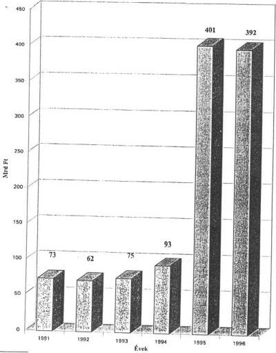
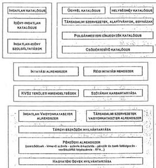
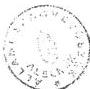
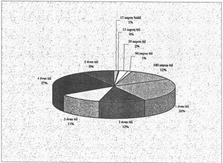
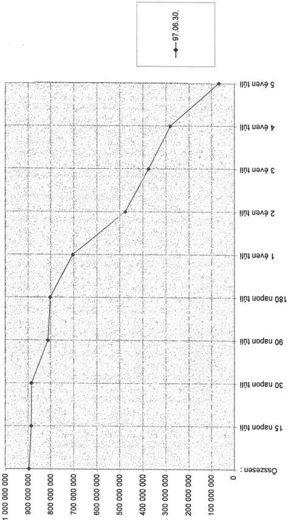
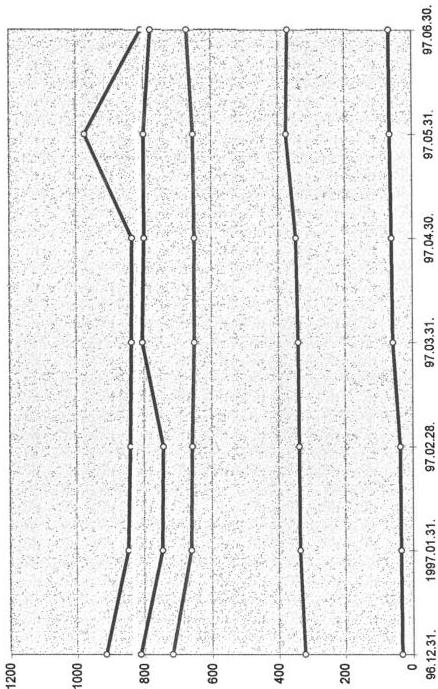
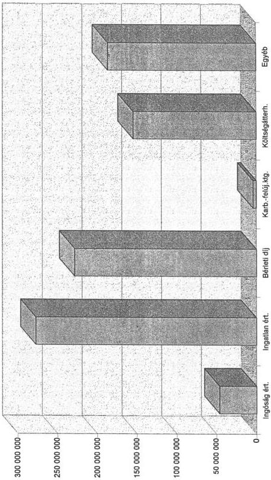
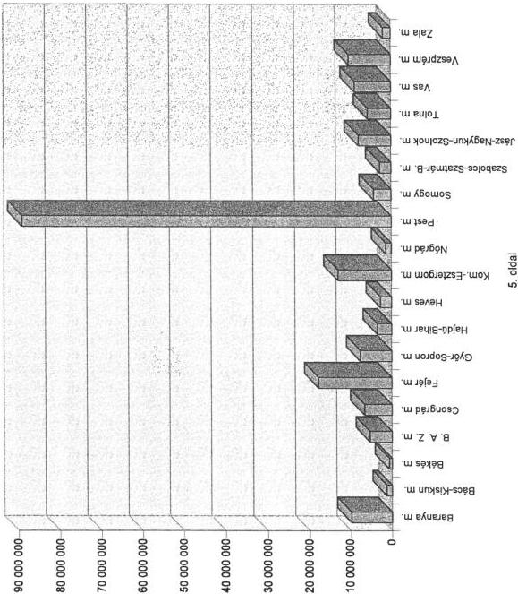
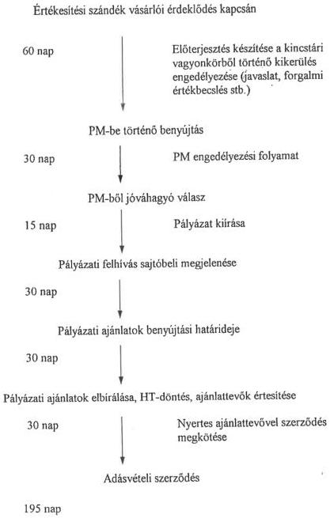
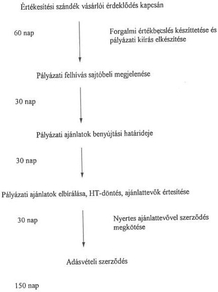

Állami Számverőszék

# JELENTÉS

# A KINCSTÁRI VAGYONI IGAZGATÓSÁG
VAGYONKEZELŐ ÉS HASZNOSÍTÓ
TEVÉKENYSÉGÉNEK VIZSGÁLATÁRÓL

404.

1997. december

---

Az ellenőrzés végrehajtásáért felelős:

Halász Gejza

számvevő igazgató

Az ellenőrzést vezette:

Kemény Emil

számvevő igazgatóhelyettes

A jelentést készítette:

Dr. Márkus Gábor

osztályvezető főtanácsos

Az ellenőrzésben részt vettek:

Dr. Gálik Jenő

számvevő tanácsos

Karsainé Dömsödi Éva

számvevő tanácsos

Kiss Istvánné

számvevő tanácsos

Pallós Gáborné

számvevő tanácsos

---

V-4-35/1997. Témaszám: 362.

# TARTALOMJEGYZÉK

BEVEZETÉS 3

I. ÖSSZEGZŐ MEGÁLLAPÍTÁSOK, KÖVETKEZTETÉSEK 6

II. JAVASLATOK 16

III. RÉSZLETES MEGÁLLAPÍTÁSOK 17

1. A kezelt kincstári vagyonnal való gazdálkodás 18

1.1.KVI-APV Rt.vagyonatadas 19
1.2.Egyhazi ingatlanok 21

1.2.1. Az egyházi ingatlanrendezés jogi keretei 21
1.2.2.A kezelt egyházi ingatlanvagyon nagysága, valtozásai 21
1.2.3.Az ingatlanrendezes modja 22
1.2.4.Az ingatlanrendezes nehezségei 23

1.3. A Dunai Vízlépcső 24

1.3.1.A Dunai Vizlepcshoz kapcsolodvagyongazdalkodas jogi keretei 24
1.3.2. A nyomvonalas letesitmenyek épitése celjára kisajátitott területek 25
1.3.3.A Dunai Vizlepso nagyberuhazas leallitasaval kapcsolatos vagyongazdalkodás eredményei 27

1.4. Műemlék ingatlanok 28

1.4.1.A muemlek ingatlanok kezelésenek jogi keretei 28
1.4.2.A muemleki vagyon nagysaga, valtozasai 29
1.4.3.A muemlekvagyon hasznositasa 32

1.5. Az állami öröklésből származó kincstári vagyonelemek 32

1.5.1.Az allami orokles jogi keretei 32
1.5.2.Hagyatéki eljárás, hagyatéki ügyintézs 33
1.5.3.Az allami orokleshez kapcsolod szervezet mukodese 33
1.5.4.Az allami orokseg ertekesitese;bevelek,kiadasok 34

1.6. Állami tulajdonú erdők 34

1.6.1.A jogi hatter ismertetese 35
1.6.2.A Kincstari Erdok Osztalyanak letrehozasa, szervezete es mukodese 35

1.7.Egyeb vagyonelemek 36
1.8. Ertekpapir portoflo 37

1.8.1.A portfolio vagyonosszetetele, jellemzoi 38
1.8.2.A portfolioallomany valtozasa 41
1.8.3.A portfolio bevetelek es kiadasok alakulasa 43

1

---

2. A kezelt nem kincstári vagyonelemek 43

2.1.Az atmeneti vagyonkezelsi feladatok 44
2.2.Az atmenetileg kezelt ingatlanallomany teljessege 45
2.3.Az ingatlanallomany hasznositasa 47
2.4.A sportcelu ingatlanok tulajdoni rendezese 49

3. Központi költségvetési szervek vagyonkezési szerzódései 49
4. Szamviteli politika, a szamvitel helyzetének alakulása 51
5.A vagyonnyilvantartas helyzete 51

5.1.Az informaciós rendszer fejlesztése 51
5.2.A kincstari vagyonnyilvantartas 52
5.3.A KVI altal kezelt vagyon nyilvantartasa 53

5.3.1.Muszaki nyilvantartasi rendszer 55
5.3.2.Gazdasagi-penzugyi nyilvantartasi rendszer 56

# **Függelékek jegyzéke**

1. Fuggelék: Néhány kiemelt ingatlan vizsgálata, a jogvitás esetek bemutatása
2. Fuggelék: Az erdőgazdalkodás jövőjével kapcsolatos fóbb elkézelések

# **Mellékletek jegyzéke**

1. melleklet: Kiemelt jogszabalyok listaja
2. melleklet: Kezelt vagyon merlegtablak 1990-96.
3. melleklet: Kezelt vagyonból származó leteti bevetelek/költségvetési befizétesek/raforditások alakulása 1990-96.
4. melleklet: Kezelt vagyon épuletaillomány fenntartására juto költségvetési támogatás alakulása 1992-96.
5. melleklet: Kezelt vagyon kinntevesegeinek alakulasa
6. melleklet: Kincstari vagyoni korbol valo kikerulés eljaras rendje
7. melleklet: KVI ertekpapir - portfolioba tartozó tarsasagok fobb gazdalkodasi mutatói
8. melleklet: A KVI altal kottt vagyonkezeli szerzodesek
9. melleklet: Osszesito az 1990. evi LXX. tv. hatalya ala tartozo ingatlanallomany hasznalati vizsonyairol
10. melleklet: Vagyonkezelsi szerzodés megkotésere kotelezett szervezetek kimutatasa

2

---

# JELENTÉS

## a Kincstári Vagyoni Igazgatóság vagyonkezelő és hasznosító tevékenységének vizsgálatáról

### BEVEZETÉS

A Kincstári Vagyoni Igazgatóságot az államháztartási reform keretében állították fel abból a célból, hogy az állam tulajdonosi jogait gyakorolja a kincstári vagyon felett. Működését 1996. január 1-ével kezdte meg, a korábbi vagyonkezeléssel foglalkozó szervezetek jogutódjaként. A kincstári vagyon fogalmának definiálatlansága rányomta bélyegét az állami vagyont kezelő szervezetek kialakítására és az általuk kezelt vagyon összetételére egyaránt.

A Pénzügyminisztérium Zárolt Állami Vagyont Kezelő és Hasznosító Intézményét (a továbbiakban: ZÁVKHI) a rendszerváltás előszeleként 1990. január 1-ével minisztertanácsi rendelettel hozták létre a Munkásőrség megszűnésével kapcsolatos vagyoni ügyek intézésére. 1990. második felében ez a szervezet vette át a kivonuló szovjet csapatok által hátrahagyott ingatlanokat is.

Az eredetileg átmeneti vagyonkezelésre 1 éves időtartamra létrehozott ZÁVKHI 1991. január 1-ével átalakult Kincstári Vagyonkezelő Szervezetté (a továbbiakban: KVSZ). A munkásőr és szovjet ingatlanok mellett a KVSZ kezelésébe kerültek azok az állami tulajdonú ingatlanok is, amelyeknél kártalanítás nélkül megszűnt a társadalmi szervezetek kezelői joga. A szervezet által kezelendő vagyon köre tovább bővült a leállított Bős-nagymarosi beruházás ingatlanaival, a honvédség felszámolt vállalatainak forgalomképtelen hadiipari kapacitásaival, továbbá a felszámolási eljárások során az állami hitelezők (APEH, VPOP) követeléseinek kielégítésére átadott vagyontárgyakkal.

Az államháztartási reform keretében 1995-ben átfogóan módosították az államháztartási törvényt. Ennek részeként törvényi szinten meghatározták a kincstári vagyonkört, a vagyonnal való gazdálkodás alapvető szabályait és 1996. január 1-ével a KVSZ általános jogutódjaként felállították a Kincstári Vagyoni Igazgatóságot, mint a kincstári vagyon kezeléséért felelős szervezetet. Az átalakulással a jogelőd szervezethez képest mind a kincstári vagyonkörbe rendelt vagyon nagysága és összetétele, mind a Kincstár által ellátandó feladatok köre bővült és differenciálódott.

A pénzügyminiszter a kincstári vagyon felett a Magyar Állam nevében őt megillető tulajdonosi jogok gyakorlását a KVI útján látja el, ebben az esetben a kincstári vagyonnal kapcsolatos polgári jogi jogviszonyban az államot a KVI képviseli. A törvény előírja, hogy a kincstári vagyonról a KVI-nek nyilvántartást kell vezetnie (Áht.109/C. § (3) bek.). Ugyanezen törvény IX. fejezete szerint

---3

---

az államháztartás körébe tartozik a kincstári vagyon, amellyel felelős módon, rendeltetésszerűen kell gazdálkodni. A törvény 104. § (3) bekezdése szerint e gazdálkodást az Országgyűlés - az Állami Számvevőszék útján - ellenőrzi.

Jelen ellenőrzésre e törvényi felhatalmazásnak megfelelően elnöki döntés alapján, az Állami Számvevőszék 1997. évi jóváhagyott tervének keretében került sor.

A vizsgálat célja az volt, hogy:

- feltárja az 1990-96. közötti időszakban a Kincstári Vagyoni Igazgatóság és jogelődjei által kezelt vagyontömeg alakulását,
- értékelje a KVI vagyongazdálkodási tevékenységét törvényességi, eredményességi és célszerűségi szempontból,
- tekintse át a kincstári vagyonnyilvántartás helyzetét,
- állapítsa meg, hogy a szervezet működése során érvényesülnek-e a vagyon nyilvántartására, kezelésére, hasznosítására vonatkozó előírások,
- tárja fel, hogy a jelenlegi szervezeti felépítés mennyiben alkalmas a törvényben előírt feladatok ellátására,
- állapítsa meg, hogyan alakult a kincstári vagyonmérleg, különös tekintettel az ÁPV Rt.-vel előírt vagyonmegosztásra.

Az ellenőrzés nem terjedt ki a Kincstári Vagyoni Igazgatóság költségvetési kapcsolataira.

### Az ellenőrzés indoklása és módszere:

Az állami vagyonból a Kincstári Vagyoni Igazgatóság kb. 400 milliárdnyit kezel. A KVI és jogelődjei megalakulása óta az Állami Számvevőszék még nem vizsgálta átfogóan a kincstári vagyongazdálkodás minden területét.

Az ellenőrzést dokumentumok helyszíni feldolgozásával, a KVI által rendelkezésünkre bocsátott anyagokból készített elemzésekkel és szakértői interjúk készítésével hajtottuk végre. A dokumentumok a KVI-re és jogelődjeire vonatkozó jogszabályok, a nyilvántartással kapcsolatos szakértői anyagok, valamint belső ellenőrzési célvizsgálatok, beszámolók és egyéb szakanyagok voltak.

Az ellenőrzés a Kincstári Vagyoni Igazgatóság központjára és 14 kirendeltségére terjedt ki, ezen felül tájékozódást végeztünk:

- a Pénzügyminisztériumban,
- az Állami Privatizációs és Vagyonkezelő Rt.-nél,
- az Országos Műemlékvédelmi Hivatalnál,
- a Miniszterelnöki Hivatal Egyházi Kapcsolatok Titkárságánál,
- a Földművelésügyi Minisztérium Erdészeti Hivatalánál,

4

---

- a Környezetvédelmi és Területfejlesztési Minisztérium Természetvédelmi Hivatalánál,
- a Pilisi Parkerdő Rt.-nél,
- a Kisalföldi Erdőgazdaság Rt.-nél,
- az Ipoly Erdőgazdaság Rt.-nél.

5

---

# I. ÖSSZEGZŐ MEGÁLLAPÍTÁSOK, KÖVETKEZTETÉSEK

A kincstári vagyon átfogó felmérésére a rendszerváltás nyomán az állam kezelésébe került ingatlanok áttekinthetetlen helyzete vetette fel az igényt. A felmérés kiterjedt volna a volt társadalmi szervezetek, valamint a közigazgatási szervek vagyonának felmérésére is. **A vagyonfelmérést nagyban hátráltatta a kincstári vagyon fogalmának tisztázatlansága**, ezért a vitatott kérdések megoldása érdekében megkezdődött a kincstári törvény előkészítése.

Az 1992. június 18-án kihirdetett XXXVIII. számú törvény (államháztartásról szóló törvény, a továbbiakban Áht.) **általános elveket fogalmazott meg** utalással arra, hogy az egyes területek szabályozása későbbi törvények feladata lesz. E törvények hiányában **a kincstári vagyon tekintetében az Áht. légüres térben mozgott**. A kincstári vagyonról szóló törvény megalkotása rendezhette volna azokat a problémákat, amelyeket a privatizációs intézmények tevékenységének összemosása és a gazdátlan funkciók betöltése vetett fel. Később **a privatizációs törvény megalkotásakor sem rendezték a tartós állami tulajdonra vonatkozó szabályokat csak az Áht. 1995. évi módosítása** hozta létre a Kincstári Vagyoni Igazgatóságot és **határozta meg a kincstári vagyon fogalmát**. A törvény szerint a kincstári vagyonra és az e vagyonnal való gazdálkodásra vonatkozó szabályrendszert kormányrendelettel kell meghatározni. **A működés feltételeit szabályozó kormányrendelet megszületésére újabb egy évet kellett várni** és a 183/1996. (XII. 11.) Kormányrendelet gyakorlatilag 1997-től lépett életbe.

- A **KVI vagyonkezelési és hasznosítási kötelezettségeiről**, eljárási rendjéről négy szabályzatot kellett készíteni 1997. március 26-i és 1997. április 25-i határidővel. A Kormány **két hónapos késéssel**, 1048/1997. (V. 13.) határozatában hagyta jóvá a kincstári vagyon értékesítésére vonatkozó versenyeztetési szabályzatot. A másik három szabályzatot a vizsgálat lezárásáig még nem adták ki, ezek esetében **a késedelem már több hónap**.

Mind a KVI mind a Pénzügyminisztérium részéről a szabályzatok szövegezésében résztvevő funkcionális szervezeti egységek **kommunikációs zavarait és bürokratikus működését jellemzi a szövegtervezetek több mint egy éve tartó és máig le nem zárult egyeztetési folyamata**.

- A **tulajdonosi jogok** az Áht. 106. §-a alapján a kincstári vagyon tekintetében a pénzügyminisztert illetik, aki e jogok tényleges gyakorlását a KVI útján látja el. A kincstári vagyon tárgyai felett vagyonkezelői jogot az Áht. 109/F. §-ában meghatározott szervezetek gyakorolhatnak. A 183/1996. (XII. 11.) Korm. rendelet szerint a vagyonkezelők központi költségvetési szervek, illetve egyéb vagyonkezelő természetes vagy jogi személyek, jogi személyiséggel nem rendelkező társaságok lehetnek. A KVI-vel kötött vagyonkezelői szerződés alapján törvényes lehetőség adódik akár **többlépcsős vagyonkezelői láncolat kialakulására. Ez rontja az áttekinthetőséget és**

6

---

az állam tulajdonosi érdekeinek érvényesítését, továbbá megnehezítheti a vagyon KVI útján történő ellenőrzését.

- A KVI felügyeleti szerve a Penzügyminisztérium (PM), de a felügyeleti jogkörét meghatározó tevekenységelemeket nem tartalmazza a PM jelenleg érvényes Szervezeti és Múködési Szabályzata (SZMSZ), és nem ter ki erre a KVI Alapíto Okirata sem.
- A KVI és jogelódjei kezelésében levő kincstári vagyon 1990-1996. között mind mennyiségében, mind összetételében jelentós mertékben valtozott, a vagyonkezelési, hasznositási feladatkör is bővült és diferencialódott. A tárgyi eszközallomány értéke 1996 végén megközelítette a 400 Mrd Ft-ot, amelynek valtozását (konyvszerinti brutto értéken az éves beszámolók adatai alapján) az ábra mutatja:

Tárgyi eszközállomány-változás

* A fontosabb jogszabályok az 1. sz. mellékletben találhatók.

7

---

• Az állami tulajdonú, kincstári vagyonnak minősített vagyontárgyak kezelésbe vételekor - állami vagyonkezelési koncepció hiányában - mindig eseti jelleggel bővítették a KVI feladatkörét. Jelenleg a vagyon mérleg szerinti összetételét és megoszlását a következő táblázat mutatja.

# A KVI által kezelt vagyon összetétele

|  Sorszám | Kezelt vagyonnal kapcsolatos adatok | M Ft  |   |   |   |   |
| --- | --- | --- | --- | --- | --- | --- |
|   |   |  1992 | 1993 | 1994 | 1995 | 1996  |
|  I. | Immateriális javak összesen | 114 | 91 | 77 | 60 | 56  |
|  II. | Tárgyi eszközök összesen | 60 176 | 71 356 | 88 959 | 397 700 | 389 444  |
|  1. | Ebből: ingatlanok | 60 164 | 71 135 | 88 741 | 397 538 | 389 264  |
|  2. | ingóságok | 12 | 221 | 218 | 162 | 179  |
|  III. | Befektetett pénzügyi eszközök összesen | 435 | 366 | 121 | 131 | 35 173  |
|  1. | Ebből: részesedések | 435 | 352 | 109 | 118 | 35 161  |
|  2. | értékpapírok | 0 | 0 | 0 | 3 | 5  |
|  A. | Befektetett eszközök összesen (I.+II.+III.) | 60 725 | 71 813 | 89 157 | 397 891 | 424 673  |
|  I. | Készletek összesen | 0 | 6 | 4 | 0 | 0  |
|  II. | Követelések összesen | 2 110 | 1 236 | 978 | 2 818 | 2 527  |
|  III. | Értékpapírok összesen | 0 | 0 | 725 | 113 | 0  |
|  I. | Ebből: kárpótlási jegy | 0 | 0 | 725 | 113 | 0  |
|  IV. | Pénzeszközök összesen | 1 142 | 1 009 | 723 | 709 | 623  |
|  V. | Egyéb aktív pénzügyi elszámolások | 4 | 337 | 56 | 65 | 55  |
|  B. | Forgóeszközök összesen (I.+II.+III.+IV.+V.) | 3 256 | 2 588 | 2 486 | 3 705 | 3 205  |
|   | Eszközök összesen (A+B) | 63 981 | 74 401 | 91 643 | 401 596 | 427 878  |

• A vagyon kezelésére és hasznosítására fordítható költségvetési források reálértékben nagyságrenddel csökkentek 1990-96. között. Az erőforrások csökkenésével nem járt együtt a felhasználásukra vonatkozó prioritások meghatározása.
• A hasznosítási céllal működtetett kincstári vagyon értékesítése a vezérigazgató egyszemélyi felelős döntésével - a KVI-ben állandó testületként működő Hasznosítási Tanács kollektív döntéselőkészítő javaslata alapján - a PM engedélyével történik. A lehetséges eljárások közül meghatározó mértékű (mintegy 75%) a nyilvános pályázat lebonyolítása. A vagyonmozgások szabályszerűen dokumentáltak, analitikus nyilvántartással alátámasztottak. A kis értékű kincstári vagyonelemek értékesítésekor a vagyoni körből való kikerülés folyamata indokolatlanul túlszabályozottá vált az Áht. 1996. január 1-i módosítása és a PM belső szabályozása következtében. Az eljárási rend becsült időigénye 150 napról 195 napra emelkedett. Ez hátrányosan befolyásolja a költségvetési bevételek és ráfordítások alakulását. Az értékesítési folyamat időráfordításait növeli, hogy az értékesítést megelőző, kötelező vagyonértékelésekre fordított összes költség nagyságrendje miatt az értékbecslések elvégeztetése a közbeszerzési törvény hatálya alá tartozik.
• Az állami tulajdonú vállalkozói és kincstári vagyon elkülönítése a törvényi meghatározás ellenére nem egyértelmű. A két vagyonkezelő szervezet - a KVI és az ÁPV Rt. - feladatkörében átfedések tapasztalhatók.

8

---

- Az 1995. évi XXXIX. tv. 71. §-a rendelkezik arról, hogy a KVI köteles az ÁPV Rt.-nek átadni az általa kezelt vállalkozói vagyont, illetve az 1994. évi CIV. törvényben (költségvetési törvény) a KVI-t megillető költségvetési támogatás vagyon- és időarányos részét. A törvényben megszabott 30 napos határidő betartása lehetetlen volt. Az átadást késleltette a tulajdonosifelügyeleti jogokat gyakorló pénzügyminiszter és a két szervezet között a vállalkozói vagyonkör értelmezésére vonatkozó vita. 1995. szeptember és 1997. február között 30.029 M Ft könyvszerinti értékű vagyon került át az ÁPV Rt.-hez a KVI-től. A vagyonátadás során az átadott vállalkozói vagyon teljessége nem ítélhető meg.
- A vállalkozói vagyonátadással kapcsolatos tulajdonosi-kezelői jog változásának bejegyzését nehezítette és időben hátráltatta, hogy az hatályon kívül helyezte a kezelői jogra vonatkozó törvényi rendelkezéseket. 1996. január 1-től megszűnt a kezelői jog fogalma, helyébe a vagyonkezelői jog lépett, ugyanakkor a privatizációs törvény tulajdonosi jog gyakorlójáról rendelkezik.
- A 183/1996. (XII. 11.) Korm. rendelet vagyonkezelési szerződések megkötését írta elő a KVI számára, a központi költségvetési szervek kezelésében lévő kincstári vagyonra 1997. december 31-i határidővel. A kormányrendelet előírásai ellentmondásban vannak az Áht. vagyonkezelőkre előírt követelményeivel. A központi költségvetési szervek és intézményeik esetenként köztartozásokkal rendelkeznek, emiatt az Áht. szerint nem lehetne velük vagyonkezelői szerződést kötni, illetve a kezelésükbe adott kincstári vagyontárgyakat el kellene tőlük vonni. Ez azonban nem tehető meg, mivel költségvetési szervként a kezelésükbe tartozó kincstári vagyonelemek alapfeladataik ellátásához szükségesek.
- A KVI általános feladatai közé tartozik - a különböző jogszabályok alapján - a társadalmi szervezetek elhelyezése. E feladatok ellátásához nem rendelkezik a szükséges ingatlanállománnyal és mobilizálható költségvetési forrásokkal.
- A pártok és társadalmi szervezetek részére biztosított ingatlanhasználati jog állami kötelezettség, de ezzel nem szükségszerűen jár együtt a tulajdonbaadás. A szervezetek indokolatlan és térítésmentes tulajdonhoz juttatása közvetlenül sérti a költségvetés bevételi érdekeit, hosszú távon pedig veszélyeztetheti a később megalakuló szervezetek esélyegyenlőségét.
- A volt egyházi ingatlanok tulajdoni helyzetének rendezését törvény szabályozza. Az első évek tapasztalatai szerint a tulajdonrendezés a tervezettnél nehezebben végrehajtható feladat és a költségvetést a vártnál nagyobb mértékben terheli meg. A KVI-t nem teljes mértékben érinti a törvény, csak az egyes állami tulajdonban lévő volt egyházi ingatlanok tulajdonjogának rendezése a feladata. A rendezés határidejéig (2011-ig) becslések szerint összesen 350-400 ingatlanügyet kell a KVI közreműködésével rendezni.
- A Dunai Vízlépcső építési munkáinak leállítása miatt szükségtelenné vált létesítmények értékesítését a törvény a KVI hatáskörébe utalta, összesen

9

---

1.194 millió Ft könyvszerinti bruttó értékben. Az átvett ingatlanok **műszaki értéke 800 M Ft volt, forgalmi értékük - állapotfelmérés és értékbecslés alapján - nem haladta meg a 360 M Ft-ot.** A KVI 1997. júniusi kimutatásai szerint 29 ingatlant értékesítettek. Az ebből származó bruttó bevétel 77,2 millió Ft volt. **Az ingatlanok értékesítését** 1997-től a már említett **túlszabályozottság** - mely szerint ingatlan a vagyoni körből csak a PM hozzájárulásával kerülhet ki - **nehézkessé tette.** Hátráltatja a folyamatot a telekkönyvi bejegyzések hiánya miatti tulajdoni rendezetlenség is. Több terület esetében az állam tulajdonosi jogainak érvényesítése hosszas egyeztetésekkel, sok esetben peres eljárásokkal lesz csak megoldható. A folyamat lezárásáig az őrzési, állagmegőrzési költségeken kívül még kártérítési költségek felmerülése is várható.

- **A műemlék-ingatlanok** száma Magyarországon **11 ezer**, ezek közül **266** van a KVI kezelésében, amiből **119 a kiemelt**, állami tulajdonból ki nem adható ingatlan. A törvény 273 kiemelt műemlékegyüttest sorol fel, amelyek kizárólagos állami tulajdonúak, a kincstári vagyon körébe tartoznak és forgalomképtelenek, tehát **154 műemlék helyzete tisztázatlan.**

A jelenleg tisztázatlan tulajdoni helyzetű - a KVI nyilvántartásában nem szereplő -, kincstári vagyoni körbe utalt műemlékek egy jelentős részénél **nem tudják, hogy jelenleg van-e kezelője az ingatlannak.** A tulajdoni, használói viszonyok tisztázása folyamatos feladatot jelent. **Több esetben az állam tulajdonából privatizálás útján kikerültek ingatlanok, és a törekvés, hogy bizonyos védett műemlék-ingatlanok magánkézbe kerüljenek, folyamatosan létezik.**

**A kincstári vagyon kezelését kormányrendelet szabályozza, a műemléki szempontok és feltételek figyelmen kívül hagyásával. A műemlékvagyon bevételcentrikus működtetése megoldhatatlan feladat elé állítja a KVI-t.** Közfunkciót ellátó műemlékek vagyonkezelői szerződési jogát a kormányrendelet előírása szerint versenyeztetés útján bárki elnyerheti, nemcsak a közfunkciót ellátni tudó intézmény, aminek beláthatatlan következményei lehetnek mind a műemlék sorsát, mint a közfunkció ellátását illetően (pl. Operaház, stb.).

Az ingyenesen használt műemlék-ingatlanok karbantartási és felújítási kötelezettsége a használót terheli, de általában nem tudnak eleget tenni fenntartási kötelezettségüknek. Ezekben az esetekben a KVI feladata a minimális állagmegóvás biztosítása. A KVI a kedvezőtlen műszaki állapotban lévő műemlék vagyonnal a megfelelő **fenntartási, állagmegóvási kötelezettségének összességében nem tudott eleget tenni. Ennek oka elsősorban a valós igényektől messze elmaradó finanszírozás.**

- **Az állami örökléssel kapcsolatos** hagyatéki ügyintézés a KVI feladata. A hagyatéki eljárást és a hagyatéki ügyintézést a KVI megyei kirendeltségei - a Budapest - Pest Megyei Kirendeltség kivételével - önállóan végzik. A hagyatéki eljárásban - a Budapest -Pest Megyei Kirendeltség esetében - a KVI Jogi Főosztálya vesz részt, majd annak befejezése után - a jogerős hagyatéki végzés birtokában - az ügyet átadja a Kirendeltségnek. **A hagyatékkal kapcsolatos munkafázisok (eljárás, ügyintézés) különböző szerve-**

10

---

zetekhez való telepítése nem szerencsés, mert az eljárás és az ügy-intézés munkafolyamata szerves egységet képez.

A KVI évente 1.800-2.200 db hagyatéki ügyet intéz és 1994. és 1996. között 506 M Ft-ot fizetett be a képződő bevételekből a központi költségvetésbe.

1997-től a Pénzügyminisztérium saját hatáskörébe vonta az állami örökléssel szerzett ingatlanok értékesítésének engedélyezését (értékhatár nélkül), ezzel lelassítva az egész folyamatot.

- Az állami erdővagyon tulajdonjogát az 1995. évi XXXIX. törvény, majd az azt követő pénzügyminisztériumi „Meghatalmazás” a KVI-re ruházta. Az ÁPV Rt. - az erdővagyon globális átadás-átvétele során - az 1994. december 31-i állapotnak megfelelő kimutatást szolgáltatott a KVI-nek, azonban a korábbi ÁVÜ-höz tartozó gazdaságok által használt vagyonelemek globális átadás-átvétele az ismételt kapcsolatfelvétel és levélváltás ellenére sem történt meg. A KVI nem rendelkezik a tulajdonosi szempontoknak megfelelő olyan erdőértékelési módszerrel, amely az erdőt, mint összetett vagyonkategóriát veszi figyelembe.

Az állami tulajdonú erdőknek jelenleg több gazdája van (ÁPV Rt. - Erdőgazdasági Rt.-k, Erdészeti Hivatal, Természetvédelmi Hivatal) ezért nincs az erdőgazdálkodásnak összehangolt szabályozása. A KVI-nek - mint a tulajdonos képviselőjének - igen kevés ráhatása van az erdőgazdálkodásra. Az állami tulajdonú erdők jövőbeli kezelésével és a gazdálkodással kapcsolatos fontosabb elképzeléseket a függelékben mutatjuk be.

- Az értékpapír portfólió - részvény, üzletrész, kötvény, egyéb értékpapír - jelentős mennyiségben került és kerül ma is folyamatosan a KVI-hez. A portfólióba tartozó társaságok részvényei - az államadósság részét képező adósságállományból, vagy állami alapjuttatásként kapott követelésekből származó vagyonelemek - többnyire csőd- és felszámolási eljárás keretében kerültek állami tulajdonba. A portfólió döntő része (75,6%) adósság-tőke konverzió révén keletkezett, amikor az egyes társaságok adósságállományát névértéken konvertálták társasági tulajdonrészé. A konverzió során nem vették figyelembe a társaságok gazdasági-piaci helyzetét, üzleti értékét, így a társaságoknál továbbra is megmaradtak a jelentős terhek, törlesztési kötelezettségek. Az állami tulajdonost képviselő vagyonkezelő tulajdoni hányada csak néhány kivétel esetében adott érdemi lehetőséget a társasági gazdálkodás befolyásolására. Az Állami Fejlesztési Intézet (ÁFI Rt.) megszűnésével kincstári vagyonként a KVI-hez került portfólióállomány névértéke 1996. február 29-én 23.945 M Ft volt. Az adósság-tőke konverzióra máig változatlanul lehetőség van.
- A portfólió-eredet alapján e körbe tartoznak az APEH, illetve a Vám és Pénzügyőrség Országos Parancsnoksága (VPOP) által adó, vám és egyéb követelése fejében elfogadott tulajdonrészek, továbbá központi költségvetési szervektől átvett különféle értékpapírok. A portfólió állomány névértéken 1996. végén 35.162 M Ft, míg 1997. V. hóban 16.853 M Ft volt. Az állományváltozások szabályszerűen dokumentáltak. Az APEH-

11

---

VPOP tartozások fejében elfogadott **kincstári vagyon teljeskörűsége nem ítélhető meg** a KVI-vel kötött megállapodások alapján.

- • **A portfólióban szereplő 70 társaságból** mindössze 6 olyan cég van, ahol a KVI részesedése 50 % feletti és 17 olyan társaság van, ahol az állami tulajdon részaránya 10 % alatt marad. **A kisebbségi tulajdoni hányadok esetében a Áht.-ben rögzített vagyonkezelési és hasznosítási elvek érvényesülése, a gazdálkodás-befolyásolási és a vagyonrész hasznosítási stratégia érvényesítése egyaránt nehézkes.** A portfóliókezelés szervezeti és személyi feltételei sem az ÁFI-KVI átadáskor, sem azóta nem rendezettek.
- • **A KVI átmeneti kezelésében lévő** - az 1990. évi LXX. tv. hatálya alá tartozó - ingatlanállomány nem része a kincstári vagyonnak, így kezelésükre nem vonatkoznak az Áht. előításai. A társadalmi szervezetek ingatlanállományának tulajdoni és használati viszonyait rögzítő jogszabályok között alapvető konzisztencia-hiány tapasztalható. A 6 éve **rendezetlen jogi helyzet következménye, hogy - az ingatlanokat használó pártokon és társadalmi szervezeteken kívül -, a törvény alapján profit-orientált szervezetek is ingyenes ingatlanhasználati jogot kaptak.** Ezáltal, 1991-től kezdődően 100 milliós nagyságrendűre becsülhető az a költségvetési forrásfelhasználás és bevételkiesés, amelyet e szervezetek saját működésük finanszírozására, a költségvetés terhére vettek igénybe.

Az 1990. évi LXX. tv. megszüntette a társadalmi szervezetek állami tulajdonú ingatlanokra vonatkozó kezelői jogát és azt a KVI jogelőd szervezetéhez utalta. **A törvény nem határozta meg az ingatlan bejelentések adattartalmi és formai követelményeit, az elmulasztás jogkövetkezményeit, valamint az „ingyenes használati jog” tartalmát.** A törvény előírásait és azok határidejét nem tartották be, az ingatlanállomány hasznosítását szabályozó törvényeket nem alkották meg. Ez bizonytalanságot eredményezett az ingatlanok kezelője és használói között egyaránt.

A több mint 6 évig tartó jogi patthelyzet a társadalmi szervezetek kezeléséből kikerült ingatlanállomány jelentős állagromlását eredményezte. Ma már szinte lehetetlen az összességében nagy értékű állami ingatlanvagyon teljes körű megőrzése és közérdekű hasznosítása.

**A sportcélú ingatlanok tulajdoni helyzetének rendezéséről** az 1996. évi LXV. törvény rendelkezett, az 1990. évi LXX. tv. hatálya alá tartozó ingatlanok részeként. **A törvény nem határozta meg pontosan a „sportcélú ingatlan” fogalmát.** Jogértelmezési problémákat vet fel, hogy a törvény nem rendelkezik a sportcélú ingatlanok tulajdonbaadási eljárása során felmerülő vitás kérdések rendezésének jogorvoslati lehetőségeiről, azok elbírálásának eljárásrendjéről.

**Tisztázatlan a sportcélú ingatlanok** törvényes tulajdonbaadásához szükséges földhivatali bejegyzések végrehajtása és a jogszerű tulajdonba adás végleges feltételeinek megteremtése.

- • **A KVI a kezelésébe utalt kincstári vagyonelemekkel a törvényi (Áht., költségvetési tv.) előírásoknak megfelelően** gazdálkodik. A bevételek, ráfordítások, kintlévőségek alakulásában meghatározó, hogy a KVI költségvetés

12

---

alapján gazdálkodó szervezet, fő szempontja a törvényben meghatározott előirányzatok teljesítése. A kezelt vagyonhoz kapcsolódó ráfordítások a befolyt bevételekkel nem hozhatók közvetlen összefüggésbe. A ráfordítások összesített értéke, költségfajtái a kezelt vagyon egészéhez, míg a bevételek a kezelt vagyon hasznosított részéhez kötődnek. **A bevételek és ráfordítások meghatározott állománycsoporthoz kötődő mennyisége és aránya nem minden esetben állapítható meg.** A szervezet vagyonkezelő és hasznosító tevékenységének célszerűsége és eredményessége javuló tendenciát mutat. Az egyedi tranzakciók gazdaságossága nem ítélhető meg a hasznosítási bevételek és ráfordítások adatainak jelzett hiányosságai miatt.

### Bevételek - Költségvetési befizetések - Ráfordítások

M Ft

|  Év | 1990. | 1991. | 1992. | 1993. | 1994. | 1995. | 1996.  |
| --- | --- | --- | --- | --- | --- | --- | --- |
|  Bevételek összesen | 165 | 1.366 | 955 | 1.442 | 2.296 | 1.808 | 1.124  |
|  Költségvet.be-fiz. összesen | - | 641 | 645 | 1.446 | 1.272 | 1.163 | 605  |
|  Ráfordítások | - | - | 1.195 | 941 | 926 | 1.043 | 851  |

Megjegyzés: A KVI kezelt és intézményi költségvetése az 1991. évi mérlegkészítéskor különült el.

- **A KVI kezelésére bízott kincstári vagyont képező épületek fenntartására** biztosított költségvetési támogatás mértéke mintegy ötödére csökkent az elmúlt 6 évben és **nem fedezi az állagmegóvás költségeit.**

**A hátralékos követelések állományának** halmozott összege **808,3 M Ft**, amiből az egy éven túli követelés mértéke: 82,14%.

### Bruttó fizetési hátralék

M Ft

|  Jogcím | Hátralék mértéke | Megoszlás  |
| --- | --- | --- |
|  Ingóságok értékesítése | 46 | 5,7%  |
|  Ingatlanok értékesítése | 193 | 23,9%  |
|  Bérleti díjhátralék | 229 | 28,3%  |
|  Felhasználói költség átterhelések | 153 | 18,9%  |
|  Egyéb | 187 | 23,2%  |
|  **Összesen:** | **808** | **100,0%**  |

* A kezelt vagyon mérlegei a 2. sz. mellékletben, a bevételek/ráfordítások részletező táblázatai a 3. sz. mellékletben találhatók.

** Részletező kimutatás a 4. sz. mellékletben található.

13

---

**Az adósok között a magánszemélyek és társaságok mellett költségvetési intézmények, önkormányzatok, pártok és társadalmi szervezetek is megtalálhatók.** Kiemelkedő a használati-bérleti és közüzemi díjtartozás mértéke.

A kintlévőségek behajtása elkülönítetten folyik a KVI központban és a kirendeltségeken. A központ Jogi Főosztálya által képviselt peres eljárásokban bérleti díjtartozás behajtása, illetve vételi díj megfizetése iránt indított követelés alapján a perelt kintlévőség 177 M Ft. Ebből fizetési meghagyás szakban közel 20 M Ft követelésállomány van, várhatóan behajthatatlan 22 M Ft. A kirendeltségeknél lévő összes kintlévőség közel 90 M Ft. Ebből per alatt 48 M Ft, felszólítás alatt 35 M Ft van, míg várhatóan **29 M Ft követelésállomány behajthatatlan.**

- **A KVI nyilvántartási kötelezettsége** egyrészt a saját kezelésébe utalt vagyonelemek, másrészt a bármely vagyonkezelő kezelésében lévő kincstári vagyontárgyak nyilvántartási feladataira terjed ki. **A kincstári vagyon nyilvántartása jelenleg nem megoldott.** A 183/1996. (XII. 11.) Korm. rendelet előírta a KVI számára a Nyilvántartási Szabályzat elkészítését 1997. április 25-ig. Ez az anyag elkészült, de a Pénzügyminisztérium az ellenőrzés időpontjáig még nem hagyta jóvá. Ennek hiányában a vagyonkezelőket még nem terheli bejelentési kötelezettség a kezelésükben lévő kincstári vagyontárgyakról.
- **A KVI a kezelésében lévő vagyonelemekről** megalapítása óta hatalmas adatállományt hozott létre, ennek ellenére **nem rendelkezik hiteles, naprakész vagyonnyilvántartással.** Az adatok egyrészt a központi számítógépes rendszerben, másrészt ettől független PC-ken vagy kézi nyilvántartásokban vannak összegyűjtve, nem kapcsolhatók össze, nem integráltak. Emiatt **összetett, speciális információk előállítása hosszadalmas, nem ritkán lehetetlen. A vezetői információs rendszer kialakulatlan, adattartalma nem kielégítő.**
- A funkcionális munkamegosztásban a számítógépek hiánya miatt nem biztosítottak a kirendeltségek leterhelésének megfelelő munkafeltételek. A kirendeltségeken előállított adathalmazok rögzítése-feldolgozása túlzottan központosított volt, csak az utóbbi időben mozdul el a decentralizálás felé. A központi ügyintézői kör túlterhelt, **nem jut elegendő idő az adatok helyességének, teljességének ellenőrzésére, a nyilvántartások aktualizálására.**
- **A számítástechnika nem támogatja a vagyonkezelés-hasznosítás területét.** Az ingatlan-nyilvántartás pontatlan, a vagyonkataszteri lapok adathiányosak, a műszaki adat-dokumentum háttér is hiányos (térképek, tulajdoni lapok hiányoznak stb.). A gazdálkodás hatékonysága nem mérhető, a kapcsolódó információk független kézi vagy PC-s rendszerekben találhatók, csak esetlegesen/részlegesen kerülnek a rendszerbe.

*A kintlévőségek részletes táblázatai az 5. sz. mellékletben találhatók.

14

---

- A penzügyi-gazdasági területet kiszolgálo alrendszer megfeleloen támogatja a szakterületet. A tárgyi eszköz-nyilvántási rendszer azonban nincs direkt kapcsolatban a muszaki informácios rendszerrel. Az ingatlanok azonosítasa az elterö nyilvántási szemlélet (objektumkód- tételszám - helyrajzi szám) miatt nehézkes.
- A KVI számviteli munkája - a kezdeti problémák után - jelentós fejló-désen ment keresztül. A jelenlegi feladatok kozül elóseget kell kapjon a pénzügyi és számviteli adatok összeillesztése.
- A KVI vagyonkezelési, hasznositási tevekenysége kielégítöen szabályozott. Az elóirások alapvetöen a muködési folyamatok eljárásrendjét tartalmazzák, ezeket rendszeresen karbantartják, minõsegük, tartalmi és formai felépítésük az elmúlt két évben Sokat javult. Az ügyviteli folyamatszabályozás hiányos.
- A KVI szervezete és muködési rendje mindig utolagosan alkalmazkodott a folyamatosan novekvő feladatokhoz, ennek Ellenére a kezelt vagyonnal való gazdalkodás javuló tendenciát mutat. Az információramlásban mind a felügyeleti szervél, mind a belso funkcionális kapcsolatrendszerben tapasztalhatók zavarok.
- A vagyonhasznositás belso ellenörzsését onallo belso ellenörzési osztály vegzi 1994 ota. Az osztály tevekenysége, vizsgalati jelentéseik nem felelnek meg a Szervezeti és Múkódési Szabályzatban elóirt elvarásoknak. Az ellenörzési tapasztalatokat összefoglalo félves értékelések nem keszültek. A vizsgalati jelentések tematikája, a vizsgalati területek kivalasztása koncepciótlan, nem segiti az allami vagyon minél eredményesebb kezelését, a szervezet belso erőforrasainak jobb kihasznalását. Az ellenörzsés eljárási rendjét nem minded esetben tartják be, a jelentések megismerési záradékai hiányosak, az intézkedési tervek kidolgozása és vegrehajtása eseti. A vizsgalatok lefolytatásakor az erintett szakterületek munkatársait részlegesen vonják be, a jelentések rendszertelenül jutnak el a vizsgalt szervezethez, igy a megallapítások hasznosulása és eredményessége kétseges.

15

---

## II. JAVASLATOK

### 1. A Kormány

- **Kezdeményezze** az 1990. évi LXX. törvény hatálya alá tartozó ingatlanállomány tulajdoni viszonyait rendező törvények megalkotását.
- **Dolgoztasson** ki egységes vagyonkezelési elvek mentén, átfogó állami vagyonkezelési koncepciót.
- **Alakítsa ki** az egységes állami tulajdonkezelés szervezeti feltételeit, tekintettel a KVI és az ÁPV Rt. közötti feladatmegosztásra.

### 2. A Pénzügyminisztérium

- **Kezdeményezze** a 183/1996. (XII. 11.) Korm. rendelet és az azt módosító 78/1997. (V. 13.) Korm. rendelet kiegészítését, hogy a közfunkciót szolgáló műemlékek ne legyenek elválaszthatók a közfunkciót ellátó intézménytől.
- **Vizsgálja** felül a kincstári vagyoni körből való kikerülés ügyviteli folyamat szabályozását és az Áht.-val összhangban, a piaci értékesítési viszonyok figyelembevételével racionalizálja a PM-KVI közötti eljárási rendet. Fontolja meg, hogy a mindenkori költségvetési törvényben megszabott értékhatárig a KVI saját hatáskörében értékesíthesse a kezelésébe utalt vagyonelemeket.
- **Dolgozza ki** és terjessze az Országgyűlés elé a kincstári vagyonpolitikai irányelveket, a mindenkori költségvetési törvényjavaslat tárgyalásával egyidejűleg. A javaslatban határozza meg a KVI-hez utalt kincstári vagyon kezelésére és hasznosítására korlátozottan rendelkezésre álló források hatékony felhasználását segítő prioritásokat.
- **Tegyen javaslatot** a Kormány részére a köztartozással rendelkező költségvetési szervek vagyonkezelési kötelezettségeinek és jogainak összehangolására.
- **Készítsen intézkedési tervet** a PM és a KVI közötti információáramlás javítására és az ügyviteli folyamatok ésszerűsítésére.
- **Gondoskodjon** a 183/1996. (XII. 11.) Korm. rendeletben előírt szabályzatok kiadásáról.

### 3. A Kincstári Vagyoni Igazgatóság

- **Javítsa** a belső munkamegosztást; a szervezeti egységek közötti információáramlást és ügyviteli folyamatszabályozást.
- **Dolgozza ki** a kincstári vagyonhasznosítás elszámolási rendjét oly módon, hogy a nyilvántartott adatok a vagyonhasznosítás gazdaságosságának közgazdasági megítélésére és hatékonyságának elemzésére alkalmas legyen.

16

---

- Kezdemenyezze a korabbi kincstari vagyonatadasi megallapodasok felulvizsgalatat es eryenyesitsen oyan elorasokat, amelyek alapjan a KVI reszere atadott kincstari vagyon teljeskorusege megallapithato.
Vizsgalja felul a belso ellenorzs tevekenyseget es tegyen intezkedeseket az ellenorzs szakmai szinvonalanak javitasara.
- Kezdemenyezze az allami öröklésel kapcsolatos munkafázisok (eljárás, ügyintézs) kirendeltségenkénti összevonását.
- Szorgalmazza, hogy az allami erdovagyon atadasa, illetve atvetele vegelgesen megtortenjen az APV Rt. - KVI kozott a volt AVU-hoz tartozó vagyon esetében is.
- Aktualizálja vagyonleltárát a kezelésébe utalt vagyonelemek naturáliákban történő kimutatasával. A vagyonmozgás ellenőrizhetősége érdekében intézkedjen a vagyonnyilvántartás folyamatos gezetéséról, felelos szakmai hitelesítéséról.

17

---

### III. RÉSZLETES MEGÁLLAPÍTÁSOK

#### 1. A KEZELT KINCSTÁRI VAGYONNAL VALÓ GAZDÁLKODÁS

A KVI kezelésébe utalt vagyonelemek 20 állománycsoportba soroltak. Ebből 14 állománycsoport vagyonelemei tartoznak a kincstári vagyon körébe. 4 állománycsoport ingatlanait átmenetileg kezeli a KVI, további 2 állománycsoport ('96 Kft., KVI intézményi vagyona) létesítményeire a vizsgálat nem terjedt ki. Az Áht.-ban meghatározott feladatok végrehajtása az állománycsoportnak megfelelő funkcionális munkamegosztásban, egyedi ügyintézőkhöz rendelten történik. Az ügyviteli szervezettség javuló. A belső kommunikáció és információáramlás a főosztály-ügyintézők viszonylatában korlátozott, azonban a vezetői értekezletek rendszeres megtartásával ez javítható.

A kincstári vagyon változása állománycsoportok szerint

|  Állománycsoportok | M Ft  |   |   |   |   |   |
| --- | --- | --- | --- | --- | --- | --- |
|   |  1991 | 1992 | 1993 | 1994 | 1995 | 1996  |
|  Dunai vízlépcső | 1 244 | 1 204 | 1 198 | 823 | 729 | 707  |
|  DHDCs állomány | 64 350 | 56 302 | 51 797 | 47 020 | 17 861 | 6 901  |
|  Egyházi állomány |  | 2 | 389 | 1 155 | 1 441 | 1 718  |
|  Műemlék állomány |  |  | 3 520 | 7 732 | 11 010 | 12 025  |
|  VÁB-tól átvett egyéb |  |  | 362 | 365 | 364 | 364  |
|  Min. Eln. Hiv.-tól kapott |  |  | 3 961 | 3 667 | 352 | 182  |
|  Állam által örökölt |  |  |  | 25 | 204 | 244  |
|  Rögzített hadiipari kapacitás |  |  |  | 9 366 | 61 | 374  |
|  Állami tulajd. föld előv. jogán |  |  |  |  | 11 | 17  |
|  Nemzeti erdővagyon |  |  |  |  | 345 545 | 345 520  |
|  Áll. Fejl. Int. portfólió |  |  |  |  | 153 | 1 250  |
|  Határőrizeti őrsök |  |  |  |  | 203 | 17  |
|  Egyéb ingatlanállomány |  |  |  |  | 252 | 640  |
|  Jogszabály alapján kez.-be vett |  |  |  |  |  | 376  |
|  **Vizsgált állomány összesen** | **65 594** | **57 508** | **61 227** | **70 153** | **378 186** | **370 335**  |

A KVI szervezetén belül állandó testületként Hasznosítási Tanács (HT) működik azzal a céllal, hogy javaslataival segítse a vezérigazgató döntéseinek szakmai megalapozását. Működését, összetételét vezérigazgatói utasítás szabályozza. A vagyonelemek differenciálódása miatt a korábbi értékesítéscentrikus feladatokat a döntés-előkészítő komplex előterjesztések megtárgyalása váltotta fel. A HT ülésein a KVI vezérigazgatója, mint a HT elnöke a testület döntési javaslatának figyelembevételével, egyszemélyben dönt a tárgyalt ügyletről.

A kéthetente tartott tárgyalásokról jegyzőkönyv készül az eltérő szavazatok egyedi indoklásával. Rögzítették, hogy az értékesítésre beérkezett ajánlatok közül csak a vagyonértékeléssel megállapított érték min. 70 %-át nyújtó ajánlatokat vegyék számításba.

1995. január 1.-1995. július 20. között, 20 HT jegyzőkönyv alapján 148 vételi ajánlatot tárgyaltak a volt szovjet ingatlanok vagyoncsoportjára. A döntések eredményeként a forgalmi értékek átlag 97,3%-át kitevő ajánlatokat fogadták

18

---

el. Az ingatlancsoport korlátozott értékesítési lehetőségeit figyelembe véve ez az eredményes értékesítést jellemzi.

Az ingatlanok értékesítését nehezíti a kincstári vagyoni körből való kikerülés eljárási rendje, amely szerint az engedélyezési eljárást értékhatártól függetlenül le kell folytatni minden értékesítendő vagyonelemre. Megnehezíti az előterjesztések összeállítását a földhivatali tulajdoni bejegyzések lassúsága, dokumentációs rendjének változása is. A kincstári vagyoni körből való kikerülés folyamata a 6. mellékletben található.

Az értékesítési folyamat idő-ráfordításait növeli, hogy az értékbecslések - az összesített költségek nagyságrendje miatt - a közbeszerzési törvény hatálya alá tartoznak. Költségtakarékos megoldásként a felméréseket ingatlan-csoportokra, összevontan végeztetik el.

A KVI központ Hasznosítási Főosztályon 1995-97 között 47 értékbecslő cég végezte az ingatlanok egyszerűsített forgalmi értékbecslését. Összesen 87 értékelést végeztek, amelyek összköltsége: 8,2 M Ft volt.

A cégeket pályázat útján versenyeztetik, a legjobb ajánlattevőket időszakos (pl. éves) alkalmazásra választják ki. A pályáztatás, a hirdetések és az értékbecslés elszámolása, könyvelése, pénzügyi teljesítése a kiválasztott minta esetében rendezett, szabályos volt.

### 1.1. KVI-ÁPV Rt. vagyonátadás

Az 1995. évi XXXIX. tv. 71. §-a rendelkezik arról, hogy a KVI köteles az ÁPV Rt.-nek átadni az általa kezelt vállalkozói vagyont, és a költségvetési támogatás vagyon- és időarányos, az átadandó vállalkozói vagyon őrzésére, védelmére, fenntartására fordítható részét. A vagyonátadási kötelezettség életbelépésének törvényi időpontja 1995. június 15. volt. A vagyonátadás ténylegesen 1995. szeptember 1-én kezdődött meg, az utolsó átadás 1997. februárjában történt meg.

A törvényben megszabott 30 napos határidő betartása lehetetlen volt. Az átadást késleltette a tulajdonosi-felügyeleti jogokat gyakorló pénzügyminiszter és a két szervezet között a vállalkozói vagyonkör értelmezése miatti vita.

A KVI összeállította az átadásra alkalmas ingatlanok jegyzékét vagyoncsoportonként, az 1995. augusztus 15-i állapot szerint 8.659 tételt 78,14 Mrd Ft bruttó nyilvántartási értéken. A legnagyobb részarányt a szovjet csapatkivonások során megüresedett létesítmények tették ki, amelyek értékesítése az objektumok rossz adottságai és állapota miatt - a KVI kezdeményezései ellenére - nehezkesen haladt. Többszöri egyeztetés eredményeként megegyezés született az átadandó vagyoni körre és az átadás ütemezésére.

A KVI a kezelésében tartotta a vagyonátadást megelőzően értékesítési döntéssel, vagy elkezdett, de még le nem zárt értékesítési eljárással érintett ingatlanokat, hiszen ezekre nézve a KVI-t ajánlati kötöttség terhelte. Ezt az ÁPV Rt. kifogásolta.

19

---

A vagyonátadás előkészítésénél kiemelt figyelmet fordítottak a műemlékekre és a Kormányhatározatokkal érintett ingatlanállományra.

A vagyonvédelmi szempontokat egyeztették, az ÁPV Rt. az ingatlanvagyon az őrző-védő szolgálatot ellátó munkatársakkal együtt átvette.

Az átadás-átvétel az ütemezés szerint a következőképpen alakult:

|  időszak | tétel db | Bruttó nyilvántartási érték M Ft | Megoszlás %  |
| --- | --- | --- | --- |
|  **I. ütem**  |   |   |   |
|  1995. szeptember-december  |   |   |   |
|  - volt szovjet ingatlanok | 96 | 22.406 |   |
|  - volt munkásőr ingatlanok | 19 | 295 |   |
|  - MEH-től átvett | 1 | 0,4 |   |
|  **I. ütemösszesen** | **116** | **22.701,4** | **75,6**  |
|  **II. ütem**  |   |   |   |
|  1996. január-február  |   |   |   |
|  - volt szovjet ingatlanok | 45 | 3.055 | 10,2  |
|  **III. ütem**  |   |   |   |
|  1996. augusztus  |   |   |   |
|  - volt szovjet ingatlanok | 8 | 54 |   |
|  - műemlék ingatlanok | 2 | 36 |   |
|  - NETREND Rt. részvény | 1 | 29 |   |
|  **III. ütem összesen** | **11** | **119** | **0,4**  |
|  **IV. ütem** (1997. február 11.) | **1** | **4.154** | **13,8**  |
|  **I-IV. mindösszesen** | **173** | **30.029,4** | **100**  |

A vagyonátadás I-III. ütemének lezárása után is számítani lehetett arra, hogy a KVI-hez kerülnek olyan jelentős értékű ingatlanok, amelyeket a privatizációs eljárásban kell hasznosítani. Ennek példája a IV. ütemben átadott kiskunlacházai katonai repülőtér, amely a Légiforgalmi Repülőtéri Igazgatósághoz (LRI) került a 3291/1993. Korm. határozattal, ám az a hasznosítási elképzelések meghiúsulása miatt visszaadta a KVI-nek. Az ingatlan kincstári vagyonkörben tartása nem indokolt, így átadták az ÁPV Rt.-nek.

A vagyonátadások jegyzőkönyvvel dokumentáltan történtek, de az ingatlanvagyon valós üzleti értékének megállapítására vagyonértékelést nem végeztek. Az ingatlan vagyonátadás döntő hányadát (85,8 %-át) 1995. szeptember és 1996. február között, fél év alatt lebonyolították.

A vagyonátadás során az átadott vállalkozói vagyon teljessége nem ítélhető meg. A KVI és az ÁPV Rt. között nem született olyan írásos deklaráció, amely alapján a KVI kezelésében lévő valamennyi vagyoncsoportot értékelve, a kincstári és vállalkozói vagyon egyértelműen és teljesen elkülöníthető.

A vagyonátadás tulajdonosi-kezelői jog bejegyzését időben hátráltatta, hogy az 1995. évi CV. tv. 115.§ (4) bekezdés (b) pontja hatályon kívül helyezte a kezelői

20

---

jogra vonatkozó törvényi rendelkezéseket, 1996. január 1-től megszűnt a kezelői jog fogalma. E törvény 117. §-a előírta, hogy a kezelői jog helyébe a vagyonkezelői jog lép, ugyanakkor a privatizációs törvény a tulajdonosi jog gyakorlójáról rendelkezik, ami az ÁPV Rt. bejegyzésénél késleltető tényező volt.

A volt szovjet katonai objektumok privatizációját megnehezítette azok speciális jellege, az ingatlanok külterületi elhelyezkedése és nagy mérete, valamint a helyi önkormányzatokat megillető elővételi jog. Az ÁPV Rt. emiatt kormányhatározat kiadását kezdeményezte - sikerrel: (1024/1997. (II.21) Korm. hat. - az egyes volt szovjet, és nem értékesíthető ingatlanok térítésmentes önkormányzati tulajdonba adásáról). Ez a lehetőség megkönnyítette a vagyonelemek helyzetének végleges rendezését.

A vagyonátadást lezáró kormány-előterjesztés tervezetét a KVI elkészítette (1997. május), egyeztetése jelenleg folyamatban van.

### 1.2. Egyházi ingatlanok

#### 1.2.1. Az egyházi ingatlanrendezés jogi keretei

A volt egyházi ingatlanok tulajdoni helyzetének rendezéséről az 1991. évi XXXII. törvény és módosítása az 1996. évi XXIII. törvény rendelkezik. A törvény a vallásfelekezetektől, vallási közösségektől, szerzetesrendektől, egyéb egyházi szervezettől 1948. január 1-je után kártalanítás nélkül elvett ingatlanokra vonatkozik, ha a javak a törvény hatályba lépésekor, 1991. július 22-én még állami, vagy önkormányzati tulajdonban voltak. A kárpótlás csaknem 80 jogosult egyházi szervezetet érint. A Művelődési és Közoktatási Minisztérium egyházi vagyon rendező irodájához a törvény hatályba lépése után több mint 6000 igénylés érkezett. Mintegy 1000 ügy közvetlen megállapodással, 862 pedig kormánydöntéssel rendeződött 1996. végéig. Kormánydöntésre többségében a költségvetési vonzattal járó ingatlanigénylés rendezéséhez volt szükség.

A KVI-hez az egyes állami tulajdonban lévő volt egyházi ingatlanok tulajdonjogának rendezése tartozik. A folyamat nem befejezett, becslések szerint összesen 350-400 lesz a KVI közreműködésével rendezendő ingatlanügyek száma.

#### 1.2.2. A kezelt egyházi ingatlanvagyon nagysága, változásai

A még rendezésre váró egyházi igények összességében 3583 ingatlant 117,62 Mrd Ft értékben érintenek. Ennek mintegy 45 %-a pénzbeni kártérítési igény.

A KVI tárgyi eszköz változás kimutatása szerint az egyházi ingatlanvagyon állománycsoportjának alakulása a következő (bruttó értékben, értékcsökkenés nélkül, M Ft):

|  évek/változás | 1992. | 1993. | 1994. | 1995. | 1996. | Összesen  |
| --- | --- | --- | --- | --- | --- | --- |
|  növekedés | 2,360 | 648,160 | 1.765,139 | 872,679 | 578,159 | 3.866,497  |
|  csökkenés |  | 261,347 | 998,731 | 586,948 | 301,872 | 2.148,898  |
|  Összesen: | 2,360 | 386,813 | 766,408 | 285,731 | 276,287 | 1.717,599  |

21

---

Ingatlanszámban ez 11 %-a az összes eddigi kártalanításnak, amely bruttó értékben az összes kártalanított igények 43 %-a.

### 1.2.3. Az ingatlanrendezés módja

A tulajdoni rendezés lebonyolítására a kormány és az érdekelt egyházak azonos számú képviselőiből egyházanként egyeztető bizottságok alakultak, illetve változó összetételben alakulnak.

A törvény 2001. december 31-ében határozta meg a visszaigénylés jogvesztő hatályát. Részint azért adott 1991-ben még hosszúnak látszó időt a tulajdonjog rendezésére, mert 1991-ben az egyházak sem tudták pontosan felmérni jogos igényeiket. A jogszabály szerint természetesen adatokkal is dokumentálni kell, hogy a visszaigényelt ingatlant az egyház korábban a törvényben felsorolt célok valamelyikére használta. A bizonyítás olykor komoly levéltári kutatómunkát igényel. A hosszabb terminus egy másik szempontja, hogy számos korábban működő szerzetesrend 1991 után kezdte újra szervezni magát, összegyűjteni a több mint 40 év előtti működése még fellelhető írásos forrásait. Az állam egy esetleges rövidebb határidővel megfosztotta volna az egyházakat a kártalanítás lehetőségétől.

Az 1991. évi XXXII. törvény arról is rendelkezik, hogy a tulajdonrendezés az ingatlan jelenlegi tulajdonosának, használójának, kezelőjének a lehető legkevesebb hátrányt okozza, ugyanakkor - az ország nehéz pénzügyi-gazdasági helyzetét is figyelembe véve - az egyházak jogos érdekeit is kielégítse. Az első évek tapasztalatai jelezték, hogy az egyházi tulajdonrendezés a tervezettnél nehezebben végrehajtható feladat, és az államháztartást a számítottnál nagyobb mértékben terheli meg.

A korábbi tapasztalatokat felhasználva 1995-ben a miniszterelnök és az ingatlanrendezésben elsődlegesen érdekelt 4 történelmi egyház (Magyar Katolikus Egyház, Magyarországi Református Egyház, Magyarországi Evangélikus Egyház, Magyarországi Zsidó Hitközségek Szövetsége) vezetői a gördülékenyebb megvalósulás érdekében megállapodtak abban, hogy a törvény szerint kivételesen alkalmazandó anyagi kártalanítás helyett a természetben való visszaadást nehezítő, akadályozó körülmények esetén alternatívaként kezelik az anyagi ellentételezést.

A pénzbeli kártalanítás lehetősége arra ösztönözte az egyházakat, hogy revízió alá vegyék jogos igényléseiket, azaz gondolják újra mely ingatlanokhoz ragaszkodnak természetben és melyek helyett tudnak pénzbeli kártalanítást elfogadni. Az eredetileg mintegy 6000 visszaigényelt ingatlant tartalmazó lista így két részre oszlott, miközben bővült is a folyamatosan érkező igénylésekkel.

Egyetértés mutatkozott abban is, hogy az ország teherbíró képességeihez igazodóan a rendezés végső határidejét 2011-ig meghosszabbítják. Így a hatályos törvényi előírás szerint 10 év helyett 20 év alatt rendezhető az egyházak kártalanítása.

A KVI-nek a tulajdonosi rendezés folyamatában az a feladata, hogy előkészítse az ingatlanok egyházi tulajdonba való visszaadását. Ezen átmeneti idő alatt -

22

---

ha kell - biztosítsa az ingatlanok őrzését, védelmét, karbantartását, állagmegóvását, illetve ahol és ameddig lehet, hasznosítását. A KVI szűkös erőforrásai indokolták a 6/1994. számú igazgatói utasítás egyházi kártalanítás keretében a KVSZ kezelésébe adott ingatlanokról szóló pontját, amely szerint 'mivel ezek csak átmenetileg maradnak a KVSZ kezelésében, csak veszély-elhárítási munkák végezhetők'.

Az 1991. évi XXXII.törvény értelmében a rendezés keretében az egyház által igényelt konkrét ingatlan helyett más megfelelő, állami, vagy helyi önkormányzati tulajdonú épületet, vagy épület létesítésére alkalmas telket, csereingatlant is lehet adni.

A KVI az egyházakkal - a legtöbbször hosszadalmas, bonyolult, sok szereplős tárgyalásokat követően - az ingatlanok átadásáról, annak dátumáról és módjáról úgynevezett közvetlen megállapodásokat köt.

A volt egyházi ingatlanok visszaadása azokban az esetekben gördülékeny, amikor az ingatlan üres, és nincs szükség olyan további intézkedésre, amikor a korábbi lakókat, vagy bérlőket máshol kellene elhelyezni. Bonyolítja a helyzetet, ha az átadhatóság feltételeként anyagi igény is felmerül. Bár a költségvetés az egyházi kártalanításra minden évben keretet határoz meg, ám ezt a KVI csak egyedi döntés alapján használhatja fel.

Az egyházi ingatlankörben a közbenső hasznosítás viszonylag ritka, hiszen ha az épület üres és az egyház fogadóképes, az átadás gyorsan lebonyolítható.

A KVI közreműködésével 1996. végéig mintegy 70 állami tulajdonban lévő volt egyházi ingatlan tulajdonjogát rendezték.

Gyakori, hogy a rendezés érdekében hozott kormányhatározat intézkedett a tulajdonbaadás anyagi feltételeinek biztosításáról. Néhány esetben előfordult, hogy a KVI által más jogszabályi felhatalmazás alapján kezelt ingatlanállományból származó csereingatlan igénybevételével jött létre a rendezés. Ilyen a szobi Luczenbacher-kastély, amely úgy kerülhetett a visszaigénylő lazarista rend tulajdonába, hogy a KVI a Bős-nagymarosi beruházásból származó nagymarosi készenléti lakótelepet bocsátotta a Pest Megyei Önkormányzat rendelkezésére, a kastélyban működő nevelőintézet kiváltása fejében.

Az egyházi ingatlanrendezés sok egyeztetést igénylő feladat. A KVI ezt a munkát, az érdekek lehetőség szerinti összeegyeztetésével jól végezte. A hátralévő igények nagy részét az egyeztető bizottságoknak meg kell tárgyalnia, mert az egyszerűen, vita nélkül, vagy kisebb súrlódásokkal megoldható átadások már megtörténtek, vagy a közeli jövőben megtörténnek.

### 1.2.4. Az ingatlanrendezés nehézségei

Az egyházi ingatlanok tulajdoni rendezése során gondot okoz, hogy az önkormányzati tulajdont rendező törvények, azaz az ingatlanoknak önkormányzati tulajdonba adása megelőzte az egyházi ingatlanok rendezésére vonatkozó törvényt. A kormány tulajdonképpen visszavásárolja az önkormányzatoktól azokat a volt egyházi tulajdonú ingatlanokat, amelyeket részükre ingyen átadott. Főleg iskolákat, lakóingatlanokat, egészségügyi, szociális intézményeket. Ezek a funkciók érintik a helyi önkormányzatok kötelező feladatait ellátó (oktatási,

23

---

szociális) intézményrendszerét, így elősegítik az önkormányzati feladatok működtetését és a településfejlesztést. Az ilyen célú ingatlanoknál a kártalanítás pénzügyi forrása nem lehet kizárólagos egyházi célú előirányzat. A másik nehézség, amivel a KVI-nek gyakran szembe kell nézni, amikor az épületben olyan funkció van, amit szinte lehetetlen onnan elhelyezni.

Az esztergomi Bottyány János Gimnázium és Szakközépiskola ügyének rendezése érdekében is az érdekeltek többlépcsős ingatlancsere lehetőségét vizsgálták meg, összhangba hozva az egészségügyi intézmények racionálisabb működtetésének programját a funkcióval nem rendelkező KVI ingatlanok egyikének hasznosításával.

Az Esztergomban működő Bottyány János Gimnázium és Szakközépiskola épületét a bencés rend igényelte vissza. Mivel az elmúlt 40 évben az iskolaépületet bővítették, a KVI közvetítésével a bencések beleegyeztek a csereingatlan-nal történő kártalanításba. Az iskola így a helyén, az önkormányzat tulajdonában maradt volna, a bencés rendnek följánlották a Győr-Moson Sopron megyei Dénesfán a Cziráky-kastélyegyüttest és parkját, ahol a megyei kórház kihelyezett ideg- és elmeosztálya és munkaterápiás intézete működik. A betegek elhelyezésére ajánlották a Bős-nagymarosi beruházásból származó, Vámosszabadin felépített háromszintes munkásszállót, amely funkciójában megfelelő a kórház számára. A többszörös csere nem jött létre, mert a kórháznak a költözéshez olyan anyagi követelései voltak, amit a KVI nem tudott fedezni. A dénesfai lakosok tiltakoztak, mivel a 360 fős faluban 58 ember számára biztosít a kórház munkalehetőséget, a bencés rend mindössze 15-20 főt tudott volna elhelyezni. Emiatt az egyház is visszalépett.

Vámosszabadin a munkásszálló megépítése óta üresen áll, fenntartani és őriztetni kell. Az esztergomi iskola helyzete bizonytalan, mert az épületen - a jogos egyházi igény miatt - elidegenítési tilalom van. Az egyház igényét továbbra is fenntartja.

A hosszan elhúzódó egyeztetések a KVI számára költségtöbbletet okozhatnak. Az Áht. életbe lépése előtt kezelési kötelezettsége volt, jelenleg vagyonkezelési feladatai vannak, azaz állományba kell vennie az ingatlant. Egyértelmű az átmeneti kezelés, még az állagmegóvás is jelentős költségeket okozhat. Vannak olyan lakóingatlanok, amelyeket az elidegenítési tilalom miatt senki nem érzi tulajdonának, semmiféle állagmegóvási munkát nem végeznek rajtuk és pusztulnak az épületek. A törvény előírásainak betartása ezekben az esetekben igen nehéz, mert csak üres állapotban adhatók át a lakóépületek, de a lakók elhelyezésére sem az önkormányzatoknak sem a költségvetésnek nincs ingatlanja, illetve pénze. Csereingatlan felajánlása esetében - az érdekek összehangolása után is - elég hosszadalmas az eljárás, mert egyeztető bizottsági állásfoglalás és a Kormány döntése szükséges minden konkrét ingatlant illetően.

### 1.3. A Dunai Vízlépcső

#### 1.3.1. A Dunai Vízlépcsőhöz kapcsolódó vagyongazdálkodás jogi keretei

A 26/1991. (IV. 23.) OGY. határozat azonnali hatállyal leállította a Bős-Nagymarosi Vízlépcső (továbbiakban BNV) rendszer állami nagyberuházás munkálatait. A 2009/1991. (HT. 9.) Kormányhatározat 1.4. pontja szerint a felvonulási és melléklétesítményeket, az ingatlan jellegű melléklétesítményeket

24

---

és a kisajátított ingatlanokat, amelyek nem illeszkednek a vízlépcső nélküli állapot vízügyi fejlesztéseibe, 1,194 Mrd Ft értékben a KVSZ vette át. A KVSZ-nek összesen 84 jegyzőkönyvvel adták át a létesítményeket. A jegyzőkönyvekhez leírás, műszaki dokumentáció is tartozott. Ezzel együtt átadtak a KVSZ-nek egy üzembe helyezettnek minősített határátkelőt, valamint egyéb befejezetlen létesítményeket. Összességében a KVSZ 1.224 M forint ráfordítási értékű létesítményt vett át hasznosításra 1991 decemberében.

A KVSZ elvégezte az átvett objektumok állapotfelmérését és értékbecslését. Ennek alapján nyilvánvalóvá vált, hogy a becsült forgalmi értékek lényegesen alacsonyabbak a létesítmények ráfordításainál. Az átvett ingatlanok becsült műszaki értéke 800 M Ft körül volt, míg becsült forgalmi értékük nem haladta meg a 360 M Ft-ot. Az ingatlanokat főbb azonosító adataikkal számítógépes nyilvántartásba vették. Az ingatlanok jelentős részére nem volt bejegyezve a KVI kezelői joga. Az OVIBER engedményezte a kezelői jog átadás-átvételét, de a végleges kisajátítás nem valósult meg. Ennek következtében a tulajdoni lapon nem került átvezetésre a KVI kezelői joga.

A felmérés után a KVSZ 1992 májusában megkezdte az átvett objektumok értékesítését, és a tulajdoni jogok rendezését.

A KVI 1997. júniusi kimutatásai szerint 29 ingatlant értékesítettek. 9 esetben pályáztatás útján adták el az ingatlant, 9 esetben volt árverés, 11 esetben egyszerű adásvétel, ezekből a bevétel ÁFA nélkül 73,1 M Ft, illetve ÁFÁ-val 77,2 M Ft.

Az ingatlanok értékesítése 1997 eleje óta igen nehézkes és lassú. Ennek oka, hogy az 1992. évi XXXVIII. törvény (Áht) 109/K. §. (1) bekezdés szerint kincstári vagyon értékesítésére akkor van lehetőség, ha annak kincstári vagyonból történő kikerülését - a KVI javaslata alapján - a pénzügyminiszter jóváhagyja.

A KVI ezzel a szabályozással nehezebben tudja értékesíteni a kincstári vagyont, mint a többi költségvetési szerv. Az 1997. évi költségvetésről szóló 1996. évi CXXIV. törvény 11. §. (3) bekezdése szerint a központi költségvetési szerv a használatában, illetve a kezelésében lévő és a feladatai ellátásához feleslegessé váló gépeket, felszereléseket, járműveket 5 millió forint értékhatárig saját hatáskörében értékesítheti.

### 1.3.2. A nyomvonalas létesítmények építése céljára kisajátított területek

A Dunai Vízlépcső építése során az OVIBER a nyomvonalas létesítmények építése céljára a kisajátításokat a 11/1977. MÉM rendelet (3) bekezdése alapján egyszerűsített eljárással bonyolította. Az egyszerűsített eljárásnál a kisajátítási terv tervrajzból és terület-kimutatásból áll, a változásokat az ingatlan-nyilvántartásba nem kell bejegyezni. A kisajátítási határozatok alapján a kezelői jogot az OVIBER kapta meg. Ugyanez a MÉM rendelet tartalmazza azt is, hogy az építési munkálatok befejezése után, a műszaki átadás - átvételtől számított egy éven belül el kell készíteni a tényleges állapotnak megfelelő kisajátítási tervet, amely kisajátítási térképből és terület-kimutatásból áll, majd a

25

---

változásoknak az ingatlan-nyilvántartásba való bejegyzése céljából meg kell küldeni az illetékes földhivatalnak.

Megvalósított beruházások esetében a kisajátítási hatóságok általában - a Legfelsőbb Bíróság ez ügyben kialakított álláspontjának megfelelően - a felesleges, illetőleg fel nem használt ingatlan visszaadásáról, a kisajátítást kérő és az ingatlan-nyilvántartásba bejegyzett tulajdonos megegyezése szerint rendelkeztek.

A Dunai Vízlépcső céljára kisajátított ingatlanok esetében sajátos helyzet alakult ki, mivel a beruházás nem került megvalósításra, számos ingatlan jelenleg is az ingatlan-nyilvántartásba bejegyzett tulajdonos birtokában van, sok esetben előfordul, hogy az ingatlan jóhiszemű harmadik személy birtokába, illetőleg tulajdonába került a kisajátítás ingatlan-nyilvántartási bejegyzése elmaradásának következményeként.

Az építés leállítása után az OVIBER kezelői jogait a 2009/1991. (HT. 9.) Kormányhatározat alapján a KVI kapta meg, mivel ezek a területek állami tulajdonba kerültek.

Ettől kezdve a KVI azon erőfeszítése, hogy az egyszerűsített eljárással jogerősen kisajátított, de a földhivatalok nyilvántartásában át nem vezetett ingatlanokra a Magyar Állam tulajdonjogát és a KVI kezelői jogát bejegyeztesse - az érvényes jogszabályok különböző értelmezéséből fakadóan - rendre meghiúsult.

Ezen hiányosság idézett elő olyan helyzeteket, amiknek rendezése hosszas egyeztetések, peres eljárások által lesz csak megoldható. Pl: Nyergesújfalun a termelőszövetkezettől 1989-ben 3 M Ft-ért kisajátított ingatlanrészre 1993-ban készítette el a Dunai Rehabilitációs Iroda a végleges kisajátítási tervet, amit a Komárom-Esztergom Megyei Földhivatal átvett, azóta sem záradékolta. A tulajdoni lapon széljegyzet formájában szerepelt a kisajátítás ténye. Mivel a termelőszövetkezet a részletes állapot földkönyvben összes földjével egy tulajdoni lapszámon szerepelt - a széljegyzet figyelmen kívül hagyásával - elkülönítette a kárpótlásra többek között a kisajátított részt is, árverésen kárpótlásra meg is vették. Amikor a tulajdonos be akarta jegyeztetni, akkor derült ki, hogy a jogos tulajdonos az állam.

A KVI folyamatos egyeztetései során feltárt problémák megoldására - miután a meglévő jogszabályi keretek nem tették lehetővé - szorgalmazta a kisajátítási rendeletek olyan irányú módosítását, mely megteremti a lehetőségét a Magyar Állam tulajdonjogának érvényesítésére. A Belügyminisztérium a kisajátításról szóló, többször módosított 33/1976. MT. rendelet módosításáról kiadott 175/1996. (XI. 29.) Kormányrendelettel a tulajdonjog, illetve kezelői jog bejegyzésének akadályát elhárította, amennyiben úgy rendelkezik, hogy '... - a korábban hatályos szabályok szerint egyszerűsített kisajátítási terv alapján - folytatott kisajátítás esetén kisajátított ingatlanra vonatkozó tulajdonváltozás bejegyzése nem történt meg, a bejegyzésről a kisajátítási hatóság megkeresése alapján a földhivatal határoz.'

A 2328/1996. (XI. 28.) Kormányhatározat intézkedett a Nagymaros-Visegrád térség tájrehabilitációs beruházás során megvalósult létesítmények és ingatlanok tulajdoni, valamint üzemeltetési kérdéseivel összefüggő feladatokról. A 175/1996. (XI. 29.) Kormányrendelet és a 2328/1996. (XI. 28.) Kormányhatáro-

26

---

zat megteremtette a jogi alapokat a tulajdonjogok rendezésére. A kormányhatározat mellékletét képező 'Intézkedési terv' 1. pontjában leírtak figyelembevételével a KVI megkereste az illetékes megyei közigazgatási hivatalokat, a földhivatalok bevonásával annak érdekében, hogy a BNV nagyberuházással érintett és kisajátított ingatlanokra vonatkozó adatokat, dokumentumokat tételesen egyeztessék, a szükséges átdolgozásokat, kiegészítéseket elvégezzék, ezzel a telekkönyvi bejegyzések végül is rendeződjenek, ezen belül elsősorban a rehabilitációval érintett településeken.

A KVI egy részletes intézkedési tervet dolgozott ki a 2328/1996. (XII. 28.) Kormányhatározatban foglalt feladatok végrehajtására. A terv foglalkozik az elhúzódó kisajátítási eljárás miatti tulajdonos személyében bekövetkezett változások következtében kialakult helyzet kezelésével, egyezség, vagy ennek hiányában peres eljárás útján. A terv szerint a KVI a tájrehabilitációval létrejött állapotok figyelembevételével folyamatosan készíti a földhivatali bejegyzésre alkalmas telekalakítási vázrajzokat, terület-kimutatásokat. Az elkészült dokumentációk birtokában kezdeményezi a Magyar Állam tulajdonjogának és a KVI vagyonkezelői jogának bejegyeztetését, végül a dokumentáció figyelembevételével a lehetséges és arra alkalmas vagyonkezelők kijelölését, illetve a terület pályáztatását.

### 1.3.3. A Dunai Vízlépcső nagyberuházás leállításával kapcsolatos vagyongazdálkodás eredményei

A BNV kisajátítással érintett települések jelentős részén a telekkönyvi rendezés megtörtént. Pl.: Nagymaros tájrehabilitációval is érintett területei a Magyar Állam tulajdonában és a Közép-dunavölgyi Vízügyi Igazgatóság kezelésében vannak. A dömösi kül- és belterületi ingatlanok nyilvántartása rendezett, a Magyar Állam tulajdona és a KVI kezelői joga bejegyzésre került. 1997. májusában ennek a területnek a hasznosítására egy tanulmánytervet készíttetett a KVI. A vizsgálat lezárásáig ennek elbírálása még nem történt meg.

A KVI a KHVM-mel közösen kialakította a rehabilitációs munkák során elkészült, illetve készülő létesítmények javasolt tulajdonosi és vagyonkezelői körét. Ennek utolsó egyeztetése 1997. április 8-án megtörtént. Készítettek egy táblázatos kimutatást, amely tartalmazza a beruházás során megvalósult létesítmények és ingatlanok jelenlegi tulajdonosait és kezelőit, a javasolt leendő tulajdonosait és vagyonkezelőit, valamint a kijelölt üzemeltetőket.

A tájrehabilitáció megvalósítása során létrejött létesítmények folyamatos fenntartásához, üzemeltetéséhez szükséges intézkedéseket a KVI előzetes tájékoztatása és egyetértése mellett a kormányzati munka beruházója, a KHVM hajtja végre. Ennek megfelelően az elkészült és üzemeltetésre alkalmas létesítményekre a szóba jöhető üzemeltetőket hivatalosan felkérte, hogy az Áht. előírásainak megfelelően a vagyonkezelők kijelöléséig ideiglenes üzemeltetőként végezzék az üzemeltetést.

A 2328/1996. (XI. 28.) Kormányhatározat, illetve annak intézkedési terve biztosította a tulajdonrendezés feltételeit és részletesen meghatározta a KVI ezzel kapcsolatos feladatait. Ezt a KVI folyamatosan hajtja végre.

27

---

Elhúzódó perekre még jó néhány helyen sor kerülhet, s a legnagyobb erőfeszítések árán is maradnak szinte hasznosíthatatlan ingatlanok, amiket őriztetni kell és amiknek fenntartási munkái vannak (ilyen például Vámosszabadin a munkásszállás).

A KVI tárgyi eszköz változás kimutatása szerint a dunai vízlépcső állománycsoportjának alakulása a következő (M Ft, bruttó értékben, értékcsökkenés nélkül):

|  változás | 1991 | 1992 | 1993 | 1994 | 1995 | 1996 | Összesen  |
| --- | --- | --- | --- | --- | --- | --- | --- |
|  növekedés | 1.244,542 | 6,428 | 8,700 | 7,934 | 1,966 | 1,621 | 1.271,191  |
|  csökkenés |  | 46,690 | 14,625 | 383,724 | 95,217 | 38,454 | 578,710  |
|  **változás összesen** | **1.244,542** | **40,262** | **5,925** | **375,790** | **93,251** | **36,833** | **692,481**  |

Bruttó értékben közel 700 M Ft eszközállomány van még a KVI kezelésében a BNV vagyonból. Ezek egy részének ingatlan-nyilvántartása még rendezetlen.

Ahol a Magyar Állam tulajdona és a KVI kezelői joga bejegyzésre került az ingatlannyilvántartásban, ott a hasznosítás megvalósítható.

A jogi helyzet rendezése után írt ki a KVI a 'Dömös Alsórét' hasznosítására egy pályázatot, amelyre a vizsgálat idején készült el a több változatú, látványterveket és részletes gazdaságossági számításokat tartalmazó tanulmányterv. Ennek alapján megkezdte a KVI az önkormányzattal az egyeztető tárgyalásokat.

## 1.4. Műemlék ingatlanok

### 1.4.1. A műemlék ingatlanok kezelésének jogi keretei

Magyarországon mintegy 11 ezer műemléki ingatlant tartanak nyilván. Az 1991. évi XXXIII. törvény az egyes állami tulajdonban lévő vagyontárgyak önkormányzatok tulajdonába adásáról rendelkezik. Ennek 46. §-a szerint 'Törvény határozza meg azokat a műemlék épületeket, amelyek kiemelkedő történeti, kulturális, műemléki értéküknél fogva nem kerülhetnek ki az állam tulajdonából. Az említett törvény hatálybalépéséig kormányrendelet határozza meg azokat a műemléki épületeket, amelyek nem kerülhetnek ki az állam tulajdonából.' A fenti törvény alapján alkották a 83/1992. (V. 14.) Kormányrendeletet, melynek melléklete 403 műemlékegyüttest tartalmazott, majd azt módosította az 51/1995. (V. 14.) Kormányrendelet, mellékletében 275 védett műemlékkel.

Az Országgyűlés 1997. június 10-én elfogadta az 1997. évi LIV. törvényt a műemlékvédelemről, a törvény 1998. január 1-jén lép hatályba. Ennek 14. §-a szerint:

'Az egyes kiemelkedő történeti és kulturális értékű műemlékek és műemlékegyüttesek fokozott védelmét biztosítani kell. Ennek érdekében az e

28

---

törvény mellékletét képező jegyzékben felsorolt műemlékeket, illetve műemlékegyütteseket kizárólagos állami tulajdonban kell tartani. Amennyiben tulajdonjoguk az ingatlan-nyilvántartásban nem az állam javára van bejegyezve, és ez nem az ingatlan-nyilvántartás hiányosságának vagy jogszabály sértésnek az eredménye, a tulajdonjogot az állam javára meg kell szerezni. Az állam kizárólagos tulajdonát képező műemlékek és műemlékegyüttesek a kincstári vagyon körébe tartoznak és forgalomképtelenek'.

A lista összesen 273 műemléket, illetve műemlék-együttest tartalmaz.

A műemlék ingatlanok kezelésbe vételéről a KVI jogelődjének, a KVSZ-nek a 4/1993. sz. (1993. február 18.) igazgatói utasítása rendelkezik. Ennek megfelelően 1993. elejétől foglalkoztak műemlék-ingatlanokkal. Eleinte a TÁSZ csoport, majd önálló feladatként megbíztak ezzel a munkával egy főt, de csak az 1994. április 28-án aláírt Alapító Határozat módosításában jelent meg, hogy a KVSZ 'folyamatosan végzi az önkormányzat tulajdonába nem adható műemlékek és más ingatlanok kezelését és hasznosítását.' Ezzel a tényleges tevékenység jogi kereteket kapott.

### 1.4.2. A műemléki vagyon nagysága, változásai

A Magyarországon nyilvántartott közel 11 ezer műemléki ingatlan közül 266 van a KVI kezelésében. (1996. novemberi adat). Ebből 119 az ún. kiemelt, állami tulajdonból ki nem adható, ez az összes tartósan állami tulajdonú műemlék 44%-a, bár ezek mindegyikét a KVI vagyonkezelésébe utalták. A jelenleg tisztázatlan helyzetű, nem a KVI nyilvántartásában lévő műemlékek egy jelentős részénél azt sem tudják, hogy jelenleg van-e és ha igen, akkor ki a kezelője az ingatlannak. A tulajdoni lapok beszerzése, a tulajdoni, használói viszonyok tisztázása folyamatos feladat. Néhány esetben az állam tulajdonából úgy kerültek ki ingatlanok, hogy jogtalanul privatizáltak épületeket, mint például a fertődi Esterházy-kastély néhány melléképületét és területeit.

A törekvés, hogy védett műemlék ingatlanok magánkézbe kerüljenek, folyamatosan létezik. A Citadella és közpark vagyonkezelője a Budapest Tourist, illetve jogelődje volt 1961-től kezdődően. Majd 1994. VI. 10-én egy VÁB határozattal a Magyar Állam tulajdonjogának fenntartásával a KVI kezelésébe került.

A Budapest Tourist határozat elleni fellebbezését a bíróság elutasította, és a másodfokú bíróság jogerős határozatot hozott, amely szerint végrehajtható az ingatlan átadás-átvétele.

A KVI megtette az ehhez szükséges előkészületeket, de a Budapest Tourist értesítette, hogy egyrészt felülvizsgálati kérelmet nyújtott be a Legfelsőbb Bírósághoz, másrészt nem hagy fel az ingatlan birtoklásával. Kilátásba helyezték kártalanítási igényüket a Legfelsőbb Bíróság számukra kedvezőtlen döntése esetén.

Nehézkesen és hosszan lehet rendezni Keszthelyen a fenékpusztai műemlékegyüttes tulajdoni helyzetét, ahol római kori épület-maradványok, a Festetich-kúria és annak gazdasági épülete található 25 helyrajzi számon jegyezve, és ebből 9 helyrajzi számhoz tartozó ingatlan tulajdoni helyzete rendezetlen. A Keszthelyi Földhivatal a Magyar Állam tulajdonjogának és a KVI vagyonkezelői jogának bejegyzési kérelmét elutasította. 4 ingatlan a Magyar

29

---

Államot megillető földalapban van, ezek kezelői jogának a KVI javára történő bejegyzését a sármelléki Tsz megfelebebezte. A dolgozói földalapba tett és kiadott földterületek esetében, ahol a tulajdoni bejegyzések kérelme már széljegyként szerepelt, a KVI kérte a földhivatalt a tulajdonjogi bejegyzések megtagadására. Ez 64 földtulajdonost érint, akiket majd perbe hívnak, részükre kártalanítást kell fizetni, amennyiben vissza akarják állítani a törvényes tulajdonosi helyzetet. Ilyen esetekben felvetődik annak a felelőssége, aki dolgozói földalapba tette az állami tulajdonban tartandó területeket. A KVI megyei kirendeltségeinek és központjának is az ilyen és ehhez hasonló helyzetek tisztázására irányuló munkáját nagy mértékben hátráltatja a gyakran erőszakos, egyéni érdekeket érvényesíteni akaró nyomásgyakorlás.

A KVI kezelésében lévő nem védett műemlékek eladására - a műemlékvédelmi törvény betartásával - pályázatot hirdetnek, és megpróbálják azokat értékesíteni.

A KVI tárgyi eszköz változás kimutatása szerint a műemléki vagyon állománycsoportjának alakulása (bruttó értékben, értékcsökkenés nélkül, M Ft.) a következő:

|  Változás | 1993 | 1994 | 1995 | 1996 | Összesen  |
| --- | --- | --- | --- | --- | --- |
|  növekedés | 3.698,879 | 4.615,997 | 3.357,462 | 1.856,539 | 13.528,877  |
|  csökkenés | 178,500 | 404,575 | 78,997 | 840,937 | 1.503,009  |
|  **Összesen :** | **3.520,379** | **4.211,422** | **3.278,465** | **1.015,602** | **12.025,868**  |

Az értékek valójában nem sok mindent fejeznek ki, mivel a műemlékingatlanok közül 351 tételt 100 forintos, 31 tételt 1000 forintos értéken tartanak nyilván, ezek között szerepelnek jelentős kastélyok is.

A kincstári vagyon kezelését a 183/1996.(XII. 11.) Kormányrendelet szabályozza, ez azonban figyelmen kívül hagyja a műemléki szempontokat és feltételeket.

A műemlékek - bár nagy értéket képviselnek - jelentőségük, fontosságuk vitathatatlan, működtetésük az esetek nagy többségében kiadást jelent és nem bevételt. Értékük is nagyrészt eszmei érték. Mint az állami vagyon részét a KVI-nek működtetni kellene a bevétel érdekében, az pedig a műemléki vagyon egészét tekintve megoldhatatlan feladat.

Ugyancsak a 183/1996. (XII. 11.) Kormányrendelet szabályozza a vagyonkezelői szerződések megkötésének szabályait. A törvény szerint ez csak versenyeztetés útján lehetséges, kivéve azokat a költségvetési szerveket, amelyek az Áht. hatályba lépése előtt vagyont kezeltek. Az állami tulajdonú műemlék ingatlanok egy része nem választható el funkciójától. Pl: Magyar Állami Operaház, Nemzeti Múzeum, stb. Ha a funkciót ellátó intézmény nem központi költségvetési szerv, bárki pályázhat rá. Ilyenkor beláthatatlan következményei lennének, ha ezekben az esetekben más nyernek el a vagyonkezelés jogát. Ugyanakkor műemlék épületek vannak jelenleg és - mivel költségvetési szervezetek - maradnak is olyan kezelőnél, akik nem méltó módon kezelik és használják a műemléket.

30

---

Az ingatlanok fenntartására, állag megóvására a múlt évben mintegy 320 M Ft állt rendelkezésre. Ebben az évben, amennyiben 1,6 milliárd forint lesz a KVI bevétele, 850 millió forintot használhatnak fel az ingatlanok karbantartási munkáira. 1996 februárjában készült egy összeállítás a műemlék ingatlanok 'azonnali' beavatkozást igénylő, halaszthatatlan (jóvátehetetlen károkat okozó állagromlást megelőzendő) karbantartási és felújítási munkáinak költségigényéről.

Összesen 138 műemléket tartalmaz a táblázat, megyei bontásban, ebből 113 db a kiemelt ingatlan (állami tulajdonból nem adható ki). Az azonnali beavatkozás oszlopaiban szerepeltetett összegek konkrét munkára vonatkoznak, többségük az Országos Műemlékvédelmi Hivatallal egyeztetett, tervvel és költségvetéssel rendelkező konkrét számok, közel 3 Mrd Ft összegben. A teljes helyreállítás becsült költsége oszlopban szerepel a műemlék ingatlan teljes helyreállításához szükséges, az adott lehetőségek miatt évekre elhúzódó munka becsült értéke. 1995. évi árakon, ez az igény az állami tulajdonból ki nem adható ingatlankörben 22,7 Mrd Ft, az egyéb ingatlanoknál 3 Mrd Ft. Az egyéb ingatlanok többnyire az egyházak által visszaigényelt, esetlegesen még éveken át a KVI kezelésében maradó műemlékek, amelyek állagmegóvásáról a KVI-nek gondoskodni kell.

Az ingyenesen használt műemlék ingatlanok karbantartási és felújítási kötelezettsége az ingyenes használót terheli. Az ingyenes használók egy része önkormányzat, nagy többsége szociális, kulturális intézmény. Sem az önkormányzatok, sem az intézmények nem tudnak eleget tenni fenntartási kötelezettségüknek. Egyre sűrűbben fordul elő, hogy inkább lemondanak a használati jogukról. Ezekben az esetekben is a KVI, illetve az állam, mint tulajdonos felelős a kiemelt műemlékek minimális állagmegóvását biztosító fenntartási munkák elvégzéséért.

A KVI a kedvezőtlen műszaki állapotban lévő műemlék vagyonánál a megfelelő fenntartási, állagmegóvási kötelezettségének összességében nem tudott eleget tenni. Ennek oka elsősorban a valós igényektől messze elmaradó finanszírozás.

Figyelembe véve a KVI vagyoncsoportjainak jelentős mértékben leromlott műszaki állapotát, megállapítható, hogy a rendelkezésre álló keretek nem tették lehetővé az állami vagyon megfelelő fenntartását.

A KVSZ tevékenységének kezdetekor nem rendelkezett a kezelésébe adott vagyonállomány teljes körű felmérésével, ezért megállapíthatatlan, hogy az elmaradt állagmegóvás milyen mértékű felújítási elmaradást okozott. Az elmaradt állagmegóvás és egyéb okok következtében az állami vagyonnal rohamos értékcsökkenés következhet be.

A műemlékvédelemről szóló törvény 24. §-a szerinti feladatmegosztás a jövőben a KVI számára olyan beruházási - felújítási feladatokat ír elő, amely jelenlegi ráfordításainak sokszorosát igényli. Az a jogalkotói szándék, mely kultúrtörténeti emlékeink biztos megőrzése céljából rendelte a 273 legértékesebbnek ítélt műemléket a KVI kezelésébe, fedezet hiányában nem érvényesülhet.

31

---

Ennek veszélyét felismerve a KVI munkatársai elkészítettek egy beruházási célprogramot, melynek előterjesztését 1997. július 1-én küldték meg a pénzügyminiszter részére. Tárgya 28 kiemelt jelentőségű ingatlan megóvása, költség-előirányzata 5 év alatt 10 Mrd Ft. Az előterjesztésről még nem született döntés.

### 1.4.3. A műemlékvagyon hasznosítása

1996. év októberében elkészült a műemlékek hasznosítási koncepciója, mely tartalmazza a teljes műemlék katasztert és rangsorolja a vagyonkezelésbe adási elképzeléseket.

A terv szerint elsődlegesen az üresen álló építményeket kell használatba adni, amely ténylegesen - készpénzben - hosszabb távon bevételt nem jelent, mivel a vagyonkezelésbe adás ellenértéke, a kezelő elvégezendő felújítási kötelezettsége. Az elvégzendő építészeti munkákat a műemlékvédelem szem előtt tartásával kell teljesíteni.

Nehézségként jelentkezik az a tény, hogy a kastélyok egy része szociális funkciókat szolgál (kórház, gyermekotthon, stb.), így piacképességük meglehetősen behatárolt. A vagyonkezelésbe adás feltételeit egyértelműen meghatározta a 183/1996. (XII. 11.) és az azt módosító 78/1997. (V. 13.) Kormányrendelet, (szigorú pályázatási rendszer, dokumentációk készítése, stb), amely determinálja a hasznosítási folyamatot. A KVI-hez tartozó műemlékeknek csak mintegy 30 %-át lehet hasznosítani. Vannak kiemelt jelentőségű épületek, építmények, pl: a Budavári Palota és környéke, amelyeknél jelentős befektetés szükséges a vagyonkezelésbe adás előtt.

Az anyagi források szűkössége - tekintettel a nagy volumenű felújítási, rekonstrukciós szükségletekre - csak a veszélyelhárítási, valamint a feltétlenül indokolt állagmegóvási munkák egy részére nyújt fedezetet.

## 1.5. Az állami öröklésből származó kincstári vagyonelemek

### 1.5.1. Az állami öröklés jogi keretei

Az állam polgári jogviszonyban való képviseletét a Polgári Törvénykönyv 27. §-a szabályozza: 'Az államot, ha polgári jogviszonyban közvetlenül vesz részt a pénzügyminiszter képviseli, ezt a jogkörét más állami szerv útján is gyakorolhatja, vagy más állami szervre ruházhatja át.'

A magyar állam - mint 'szükségörökös' - (Ptk. 599. § (3) bek.) képviseletében eljárva a pénzügyminiszter a 10/1961. (V. 25.) PM rendelet szerint az örökös nélkül elhalt belföldi lakhelye, ennek hiányában a hagyaték fekvése szerint illetékes tanács (1990. előtt) útján gyakorolta a Ptk. 27. §-ában meghatározott jogkörét.

Az Alkotmánynak az 1990. évi LXIII. törvénnyel történt módosítása és a helyi önkormányzatokról szóló 1990. évi LXV. törvény megszüntette a tanácsokat és kialakította az önkormányzati rendszert. A helyi önkormányzati jogokat és kötelezettségeket e törvény határozta meg, államigazgatási feladatot, hatáskört szintén csak törvény vagy kormányrendelet állapíthat meg. A leírtakból követ-

32

---

kezik, hogy - bár az önkormányzatok a megszűnt tanácsok jogutódjai -, nem tekinthetők állami szervnek.

A 16/1993. (VI. 15.) PM rendelet kimondja, hogy ha a Ptk. 599. §-ának (2) és (3) bekezdése alapján az állam a törvényes örökös, illetve ha végintézkedés alapján az állam válik örökössé, a hagyatékkal kapcsolatos minden peres és nem peres ügyben a KVSZ jogutódja, a KVI jár el.

Az idézett rendeletből következik, hogy a hagyaték jogerős átadásáig - azaz a közjegyzői, bírósági eljárás folyamán a Magyar Állam nevében - a KVI teheti meg a jognyilatkozatokat, gyakorolja az örököst megillető jogokat, viseli a hagyatékkal kapcsolatos terheket és a hagyatékkal kapcsolatban gyakorolja a kezelői jogot.

### 1.5.2. Hagyatéki eljárás, hagyatéki ügyintézés

A KVI, illetve jogelődje a KVSZ 1993 júniusában kezdte meg az állami örökléssel, hagyatékkal kapcsolatos ügyintézést, több mint 700 db ügy feldolgozásával, amit a Pénzügyminisztériumtól vettek át.

Az állami örökléssel kapcsolatos tennivalók teljesen új feladatot jelentettek a KVI számára, ezért 1994 júliusában kiadták a 25/1994. sz. és a 28/1994. sz. igazgatói utasítást. Az előbbi az örökölt vagyontömeg számítógépes nyilvántartását szabályozza, az utóbbi pedig átfogó szabályozást tartalmaz az állam öröklése folytán felmerült tennivalókkal kapcsolatban.

Egységes keretbe foglalta a feladatokat az 1996 márciusában megjelent Állami Öröklésű Javak Kezelési Szabályzata. A KVI szervei jelenleg e szabályzat alapján végzik az örökléssel kapcsolatos tennivalóikat.

Míg 1990 előtt kb. 3000 tanácsi szervezetnél foglalkoztak hagyatéki ügyekkel és a teendőket főfoglalkozású előadók látták el, addig a KVI-nél összesen 20-25 fő végzi ugyanezt a munkát, gyakran kapcsolt munkakörben.

A megöröklött javak sorsát illetően a legfontosabb cél: a gyors és megfelelő áron történő értékesítés, elsősorban azért, hogy a hagyaték minél kisebb értékvesztéssel, vagy - ha lehetséges - anélkül kerüljön mielőbbi hasznosításra.

### 1.5.3. Az állami örökléshez kapcsolódó szervezet működése

Az állami örökléssel kapcsolatos hagyatéki eljárást és hagyatéki ügyintézést a KVI kirendeltségei - a Budapest-Pest Megyei Kirendeltség kivételével - önállóan végzik. Az eljárásban a KVI-vel megbízásos vagy alkalmazotti jogviszonyban álló ügyvéd, jogtanácsos, jogi előadó látja el a KVI képviseletét. A hagyatéki eljárásban a Budapest-Pest Megyei Kirendeltség esetében a KVI Jogi Főosztálya vesz részt, majd annak befejezése után, a jogerős hagyatékátadási végzés birtokában, az ügyet intézésre átadja a kirendeltségnek. A kirendeltségre érkező végzéseket, öröklési bizonyítványokat jogi szempontból a kirendeltség jogásza átnézi, amennyiben jogi probléma merül fel, eljár annak tisztázása illetve megoldása érdekében.

---33

---

A hagyatékkal kapcsolatos munkafázisok (eljárás, ügyintézés) különböző szervezetekhez való telepítése (a hagyatéki eljárás bonyolítását a Jogi Főosztály, a további ügyintézést pedig - ugyanezen hagyaték esetében - a kirendeltség végzi) nem szerencsés.

### 1.5.4. Az állami örökség értékesítése; bevételek, kiadások

Az állami örökséggel kapcsolatos bevételek és kiadások alakulása a következő volt:

|  Megnevezés | M Ft  |   |   |   |
| --- | --- | --- | --- | --- |
|   |  1994. | 1995. | 1996. | Összesen  |
|  Kiadás | 71 | 32 | 43 | 146  |
|  Bevétel | 107 | 240 | 305 | 652  |
|  Központi költségvetésbe befizetve | 36 | 208 | 262 | 506  |

Az ellenőrzött 3 év alatt a KVI az állami öröklésből származó ingó és ingatlan értékesítéséből több mint félmilliárd (505,9 M Ft) forintot fizetett be a központi költségvetésnek.

Az idei évben az ingatlanok értékesítése lelassult, sőt az első negyedévben értékesítésre egyáltalán nem került sor. Az alapvető okot itt is az 1992. évi XXXVIII. törvény (Államháztartási tv.) 109/K. § (1) bekezdés jelenti, amely szerint kincstári vagyon értékesítésére akkor van lehetőség, ha annak kincstári vagyonból történő kikerülését - a KVI javaslata alapján - a pénzügyminiszter jóváhagyja.

Az ingatlanértékesítési lassúságot mutatja az, hogy a Budapest-Pest Megyei Kirendeltség - állami öröklésből származó ingatlanállománya 1997. január 1. és április 30. között 42 db-bal emelkedett, míg értékesítésre - az eddig tárgyalt okok miatt - csak 3 db ingatlan került, összesen 5,9 M Ft értékben (1996-ban 44,9 M Ft volt a kirendeltség ilyen típusú árbevétele).

Az ingatlanértékesítés alapvető feltételei közé tartozik a tulajdoni lap (érvényességi ideje: 3 hónap) és az ingatlan értékbecsléséről készült dokumentum (érvényességi ideje 6 hónap) beszerzése. Az eljárás elhúzódása miatt a szóban forgó bizonylatok érvényességi ideje több esetben lejár és ilyenkor az egész folyamatot újólag előlről kell kezdeni.

A kirendeltségen és a KVI központjában átvizsgált dokumentumok rendben voltak, az állami öröklésű javak nyilvántartásba vétele, az eljárás és ügyintézés - a tárgyalt problémák ellenére - megfelelő mederben folyik.

34

---

## 1.6. Állami tulajdonú erdők

### 1.6.1. A jogi háttér ismertetése

Az állam vállalkozói vagyonának értékesítéséről szóló 1995. évi XXXIX. törvény (az ún. privatizációs törvény) hatályba lépése előtt az állami tulajdonban lévő erdők az Állami Vagyonkezelő Rt.-hez és az Állami Vagyonügynökséghez, valamint egyes központi költségvetési szervekhez tartoztak.

Az állami tulajdonú erdők és az azzal szerves egységet képező egyéb földterületek tekintetében a tulajdonosi jogok teljes körű gyakorlásával a pénzügyminiszter az 1995. augusztus 23-án kelt 'Meghatalmazás'-ában a KVSZ-t bízta meg.

### 1.6.2. A Kincstári Erdők Osztályának létrehozása, szervezete és működése

A privatizációs törvény hatályba lépéséig és az azt követő pénzügyminiszteri 'Meghatalmazás'-ig a KVI tevékenységi körébe az állami tulajdonú erdőkkel kapcsolatos tennivalók nem tartoztak bele és így - értelemszerűen - erre a feladatra, a problémák kezelésére szolgáló szervezete sem volt.

A Kincstári Erdők Osztályának (jelenleg: Kincstári Területek, Erdők és Környezetvédelem Osztálya) létrehozásáról a 23/1995. sz. igazgatói utasítás rendelkezett. A Kincstári Erdők Osztálya (továbbiakban: Osztály) 1995. október 1-én megalakult 4 fővel, az utasítás csupán jogi keretet adott a tényleges működéshez.

Az Osztály megalakulása óta feladatköre jelentősen bővült (pl. az Áht. módosítását követő feladatok, valamint a kárpótlási földalap módosításokkal kapcsolatos privatizációs miniszteri határozatok végrehajtása), míg a feladatot végző emberi erőforrás állomány változatlan maradt.

Komoly gondot jelentett a KVI számára az állami tulajdonú erdők 'átvétele' az ÁPV Rt.-től. Az erdővagyon globális átadás-átvétele során az ÁPV Rt. az állami erdők 1994. december 31-i állapotnak megfelelő - a naturáliákra és az erdőföld + élőfakészlet értékekre kiterjedő, társaságonkénti bontásban készített - kimutatást szolgáltatta a KVI-nek. A tárgyi eszköz nyilvántartásban jelenleg is ezen adattartalommal tartja nyilván a KVI az erdővagyon azon részét, amelyről információkkal rendelkezik. Az erdővagyonnal kapcsolatos és nélkülözhetetlen dokumentumok (tulajdoni lapok, szerződések) nincsenek a KVI birtokában. A volt ÁVÜ-höz tartozó gazdaságok által használt vagyonelemek globális átadás-átvétele az ismételt kapcsolatfelvétel és levélváltás ellenére - az ellenőrzés befejezéséig - nem történt meg.

A KVI nem rendelkezik a tulajdonosi szempontoknak megfelelő olyan erdőértékelési módszerrel, amely az erdőket mint összetett vagyonkategóriát veszi figyelembe. Ezért a szervezet középtávú feladatai között tartja számon egy olyan, a természeti vagyonelemek sajátosságait figyelembe vevő vagyonértéke-

---35

---

lési módszer kidolgoztatását, amely megfelel a tulajdonosi joggyakorlásból adódó követelményeknek.

A vagyonnyilvántartásban szereplő adatok valódisága azért kérdőjelezhető meg, mert nem szerencsés az a gyakorlat, hogy az erdővagyon értékbecslésére az ÁPV Rt. egy hónapos határidőt adott az Erdészeti Szolgálatnak. Ilyen rövid idő alatt reális, minden részletre kiterjedő becslés nem készíthető.

Hazánkban 19 100%-os állami tulajdonú erdőgazdasági részvénytársaság működik. Felettük a tulajdonosi jogokat az ÁPV Rt. gyakorolja. Mivel a privatizációs törvény rendelkezése folytán azok az erdők, ahol e részvénytársaságok a gazdálkodást végezték, kincstári tulajdonba mentek át és a szóban forgó erdők tulajdonjogai - megbízás alapján - a KVI-hez kerültek, szerződéssel kellett lehetővé tenni e szervezetek számára gazdálkodási tevékenységük folytatását.

A KVI e feladatot két lépcsőben oldotta meg:

- A szerződéses jogviszony létrejöttéig - átmeneti időszakra - a 19 erdőgazdasági rt. részére felhatalmazást adott és ennek alapján az rt.-k jogszerű használóként tehettek eleget a 10 évre szóló erdőgazdálkodási előírásban foglaltaknak.
- Ezt követően kidolgozták az ideiglenes vagyonkezelési szerződést.

Az ideiglenes vagyonkezelési szerződés világosan és pontosan rendszerezi a vagyonkezelő (erdőgazdasági rt.) jogait és kötelezettségeit, így a KVI ellenőrzési jogai (4.8., 4.9., 4.10. pont) maradéktalanul érvényesülnek.

A kirendeltségek erdőkkel kapcsolatos hatáskörét, feladatait rögzítő igazgatói utasítás az ellenőrzés befejezéséig nem készült. A 14 kirendeltségen lefolytatott helyszíni ellenőrzés során valamennyi kirendeltség-vezető kifogásolta az erdőkkel kapcsolatos centralizált ügyintézést.

## 1.7. Egyéb vagyonelemek

**Az MSZMP kezelésében volt ingatlanok** különböző kormányhatározatok alapján a Miniszterelnöki Hivatalon (MEH) keresztül kerültek a KVI kezelésébe. Az ingatlanok egy része a vonatkozó kormányhatározat alapján értékesíthető, a másik része pedig különböző pártok használatában van. Ezek rendezése jelenleg részben bírói, részben szervezeti egyeztetés útján folyamatban van. A pártok által használt ingatlanokkal tartósan kell foglalkoznia a KVI szervezetének.

**A szovjet csapatkivonás során megüresedett ingatlanok** hasznosítása a KVI egyik legjelentősebb feladata volt, amelyet a 81/1992. (V. 14.) Korm. rendelet írt elő. Az 1995. évi XXXIX. törvény rendelkezései értelmében a vagyon megmaradó és értékesíthető része átkerült az ÁPV Rt.-hez. Jelenleg olyan vagyonelemek vannak a KVI-nél, amelyek tartós állami tulajdonnak minősülnek (erdőterület, természetvédelmi terület).

**Az állami tulajdonú föld elővásárlási jogán regisztrált vagyon** hasznosítását a 1010/1992. (II. 3.) Korm. határozat végrehajtására kiadott

36

---

16/1993. (VI. 15.) PM rendelet szabályozza. Ez elsősorban azokra az ingatlanokra vonatkozik, ahol a föld és a felépítmény tulajdonjoga elválik, ahol a felépítmény tulajdonosa (ingyenes, tartós) földhasználati joggal rendelkezik. A felépítmény tulajdonosa nem kötelezhető az állami tulajdonú földterület megvásárlására, az csak kérelmére történhet.

**Különböző kormányhatározatok alapján a KVI megvásárolta** állami tulajdonba és KVI vagyonkezelésbe az országos kisebbségi önkormányzatok által kiválasztott ingatlanokat, melyek az adott kisebbségi önkormányzat ingyenes használatába kerültek, illetve - a jelenleg is folyamatban lévő felújítás befejezését követően - kerülnek az önkormányzatok fennállásáig.

**A volt munkásőrség vagyonát** az 1989. évi XXX. törvény a Munkásőrség megszüntetéséről, valamint végrehajtási utasítása a 144/1989. (VII. 27.) MT rendelet a KVI kezelésébe utalta értékesítési, hasznosítási feladattal. Az 1995. évi XXXIX. törvény rendelkezései értelmében a vagyon értékesíthető része átkerült az ÁPV Rt.-hez. A folyamatban lévő ügyek (lakásértékesítések, kormányhatározattal elrendelt értékesítés) befejezés előtt állnak.

**A 40 belügyi (határőr) ingatlan** hasznosításáról a 2140/1995. (V. 17.) Korm. határozat rendelkezett. Az állománycsoportba tartozó ingatlanok hasznosítása 1995. október 30-án kezdődött és 1997. március 17-én fejeződött be. Ezzel a kormányhatározat végrehajtása megtörtént.

**A rendkívüli időszakra rögzített hadiipari kapacitásokat** és tartalékkészleteket a KVI jogelődje az 1991. évi IL. törvény 61. § (6) bekezdés a.) pontja alapján a Mechanikai Laboratórium Vállalat felszámolt vagyonából, az összvagyonból elkülönítetten, 1993. december 18-án vette át a felszámolótól. A kapacitás rögzítésével járó kötöttségek figyelembevételével - annak működtetésére - a KVI a PM egyetértésével megalapította a VIDEOTON MECHLABOR Kft-t. Ennek feladatkörébe tartozik a védelmi szervek hazai igényeinek kielégítése, továbbá a teljes vagyonkörhöz tartozó eszközök, dokumentációk, készletek őrzése, állagmegóvása. A KVI a kapacitás helyzetének mérlegelése alapján a közelmúltban a PM-nek előterjesztette a kapacitás rögzítésének felülvizsgálatát, különös tekintettel az elmúlt években tapasztalt hazai megrendelések hiányára.

Néhány kiemelt ingatlan kezelési és hasznosítási problémáit, a joghézagok miatt keletkezett vitás jogügyeket a Függelékben ismertetjük.

---37

---

## 1.8. Értékpapír portfólió

### 1.8.1. A portfólió vagyonösszetétele, jellemzői

Az Áht. 1995 végi módosítása révén jelentős mennyiségű portfólió - részvény, üzletrész, kötvény, egyéb értékpapír - került és ma is folyamatosan kerül a KVI-hez kincstári vagyonként. A nyilvántartott portfólió döntő részben az államháztartás belföldi követelései fejében kapott vagyon, de egyéb forrásai is lehetnek, pl.: köztartozások fejében elfogadott vagyon, állami öröklés, stb. E vagyonelem kezelési, gazdálkodási feladatait egy erre a funkcióra létrehozott Portfólió Kezelési Osztály látja el.

A portfólió 1997. május 31-én M Ft-ban:

|  **Részesedés** |  |   |
| --- | --- | --- |
|  1. Részvény | 14.180 |   |
|  2. Üzletrész | 2.649 |   |
|  Összesen: |  | 16.829  |
|  **Egyéb értékpapír** |  |   |
|  1. Kötvény | 0,009 |   |
|  Összesen: |  | 0,009  |
|  **Mindösszesen:** |  | **16.829**  |
|  Állami örökség |  |   |
|  1. Részesedés | 22 |   |
|  2. Egyéb értékpapír | 0,9 |   |
|  **Összesen:** |  | **23**  |
|  **Együtt:** |  | **16.852**  |
|  **Részesedés összesen:** |  | **16.851**  |
|  **Egyéb értékpapír összesen:** |  | **1**  |

A portfólió meghatározó elemei az Állami Fejlesztési Intézet (ÁFI) megszüntetésekor a KVI kezelésébe átkerült társasági részesedések. Az 1995. évi CV. tv. 107. § rendelkezett az ÁFI megszüntetéséről, de annak módját sem a törvény, sem más jogszabály nem határozta meg. A törvényt 1995. december 13-án hirdették ki, 1996. január 1-ével lépett hatályba.

Az ÁFI Rt. egyszemélyi tulajdonosa a Magyar Állam képviselőjeként a pénzügyminiszter, alapítói határozatban rendelkezett a pénzintézet 1996. február 29. napjával történő megszüntetéséről. Az alapítói határozat nem tartalmazott konkrét előírást arra nézve, hogy az ÁFI Rt. által tulajdonolt vagyonelemek, a megbízásból kezelt részvények és az eszközök átadás-átvétele milyen metódussal történjék. A megszűnés pénzügyi elszámolási kérdéseit rendezte a pénzügyminiszteri okirat, a vagyonmegosztást nem. A vagyonelemek megosztását, átadás átvételét az 1996. február 14-én, e tárgyban megtartott egyeztető megbeszélésen rögzítették.

A KVI-hoz került üzletrészek átadás átvétele forgatókönyvben meghatározott elvek és ütemezés szerint történt. Az ÁFI Rt. megszüntetés végrehajtására részletes szabályozás nem készült, a végrehajtás mintegy 8 nap alatt történt (az elvek rögzítése és a tényleges átadás között). A KVI kezelésbe került portfólió átadása átvétele azért nem okozott számottevő fennakadást, mert a KVI-hez ke-

38

---

rült munkajogilag is az a vezető, aki korábban az ÁFI Rt.-nél látta el ugyanezt a munkakört. A KVI-nél a portfólió-kezelés szervezeti és személyi feltételei az átadáskor sem és azóta sem rendezettek. Egy fő érdemi ügyintéző osztályvezetői besorolásban és egy fő előadó végzi a közel 35 Mrd forintot kitevő mintegy 70 társaságból álló portfólió-kezelési-, nyilvántartási feladatait.

Az átvett vagyonelemek névértéke és könyvszerinti értéke 9 társaság esetében eltér az átvételi jegyzőkönyvben rögzített értéktől. Ennek hátterében a Dunafer esetében az Országgyűlés határozatában rögzített árfolyamkülönbség áll. Más esetekben az ÁPV Rt. vagyonátadás privatizációs törvényben szabályozott lebonyolítása okozza az eltérést, ugyanis itt a már privatizált társaságok eladási árfolyamát tekintették üzleti értéknek az ÁPV Rt.-KVI megállapodás alapján. Az MBFB esetében az átalakulásra a költségvetési törvényben, illetve kormányhatározatban kimondott 150% árfolyam-kikötés miatt került sor.

A portfólióba tartozó társaságok részvényei - az államadósság részét képező adósságállományból vagy az állami alapjuttatásként kapott követelésekből származó vagyonelemek - többnyire csőd- és felszámolási eljárás keretében hitelezői egyezséggel, vagy stratégiai jelentőségű állami tulajdonú társaság adósságának felső szintű rendezésével, országgyűlési határozattal, tőkeemelés révén kerültek állami tulajdonba. A portfólió döntő része, 75,6%-a adósság-tőke konverzió révén keletkezett. A vagyonkonverzió végrehajtásakor az egyes társaságok adósságállományát névértéken konvertálták társasági tulajdonrészé. Nem vették figyelembe a társaságok gazdasági-piaci helyzetét, üzleti értékét. A társaságoknál továbbra is megmaradtak a jelentős terhek, törlesztési kötelezettségek, az állami tulajdonost képviselő vagyonkezelő tulajdoni hányada csak néhány kivétel esetében adott érdemi lehetőséget a társasági gazdálkodás befolyásolására.

Az ÁFI Rt. megszűnésével a KVI-hez kincstári vagyonként került portfólióállomány névértéke 23.946 M Ft. Az adósság-tőke konverzióra változatlanul lehetőség van, a Magyar Államkincstár az államháztartáson kívüli adósokkal szembeni követelése fejében elfogadhat portfóliót is, amelyet kincstári vagyonként átad a KVI-nek. A KVI portfólió mintegy 12 Mrd Ft növekedést mutatott 1996. december 31-ig, amely döntően ilyen vagyonelemekből származik.

A portfólió eredet alapján külön csoportba sorolták az APEH és VPOP - csőd- és felszámolási eljárás során - adó, vám és egyéb követelése fejében elfogadott tulajdonrészeket. E csomag össznévértéke 1996. december 31-én 5.370 M Ft. E társasági körben a KVI-APEH, KVI-VPOP megállapodások megkötésének elhúzódása miatt 1996-ban a részvénykönyvekben és az értékpapírokon az APEH és a VPOP volt tulajdonosként bejegyezve; a KVI mint vagyonkezelő és az állam mint tulajdonos bejegyzését azt követően folyamatosan végrehajtották.

A KVI vagyonkezelési tevékenységét gátolta, hogy a késedelmes bejegyzések miatt a társaságokról nem volt információja, közgyűlési, taggyűlési dokumentumokat a társaságoktól nem kérhetett, illetve nem kapott.

Az állam, mint tulajdonos képviseletében a KVI gyakorolja a tulajdonosi jogokat. Ezzel az állami tulajdon hasznosítási joga átszáll a vagyonkezelőre. Az állam tulajdonosi részvénye nem jelent - az Alkotmány értelmében nem is jelenthet - megkülönböztetett tulajdonlást. A részvénytulajdon a szavazáshoz kö-

39

---

tődik, ami az évente egy alkalommal tartott közgyűlésen érvényesíthető. A tényleges vagyon kezelési, gazdálkodási feladatokat a társaságok managementje végzi. A tulajdonos és a management érdekei nem azonosak.

Az 1997. május 31-i portfólió összetétel szerint a KVI kezelésében lévő társaságok gazdálkodását jellemző főbb mutatók a 7. sz. mellékletben szerepelnek. A 69 társaságból a vizsgálat időpontjában 40 társaságról volt a KVI-nek részletes információja, ebből 37 társaság dokumentumait elemeztük. A 37 társaságból mindössze hat olyan társaság van, ahol a KVI részesedése 50% feletti, 17 azon társaságok száma, ahol az állami tulajdon részaránya 10% alatt marad. A kisebbségi tulajdoni hányadok esetében a tulajdonosi, gazdálkodás-befolyásolási és a vagyonrész hasznosítási stratégia érvényesítése egyaránt nehézségekbe ütközik. Ez erősen korlátozza a KVI-től elvárt, az Áht. 109. §-ában rögzített vagyonkezelési és hasznosítási elvek érvényesítését. A privatizációs folyamatban igen gyakran csak az 50%-ot valamivel meghaladó tulajdoni hányadot értékesítették, ennél szélesebb társaságirányítási jogosítványokkal. Ez a nem értékesített, nem privatizált tulajdoni hányad egyfajta leértékelődését eredményezte (pl.: Pécsi Sörgyár, Észak-Magyarországi Téglaipari Rt., Caterpillar Rt.). A 37 társaságból mindössze 14 zárta az 1995. évet nyereséggel, 1996-ban 19-re nőtt az évet pozitív eredménnyel záró társaságok száma.

A KVI állami tulajdonosi képviselete lehetőséget ad arra, hogy a portfólió társaságainál, azok igazgatóságába és/vagy felügyelő bizottságába a KVI vezető tisztségviselőit delegálhassa. Jelenleg 16 társaságnál van a KVI-nek választott képviselője, 4 társaság esetében mindkét testületben (Dunafer Rt., HM Currus Rt., HM Radar Rt., Caterpillar Rt.); három társaságnál az igazgatóságban (Hungalu Rt., Tabax Rt., Hungaroring Rt.); kilenc társaságnál a felügyelő bizottságban ('96 Kft., Laterum Kft., Karsztaqna Kft., Gránit Kft., Loranger Rt., Pannónia Szőrme Rt., Videoton-Mechlabor Kft., LRI Kft.).

Az egyes társaságok gazdasági tevékenységéről a KVI rendelkezésére álló dokumentumok és információk nem egységesek, nem alkalmasak a gazdálkodási események nyomon követésére, még kevésbé az Áht. szerinti vagyongyarapítás megvalósítására. A társasági dokumentumok között a likviditási helyzetet, a főbb gazdálkodási mutatók évközi időszakos változásait bemutató és elemző beszámolók, jelentések csak esetenként találhatók meg.

A portfólióba olyan társasági részesedések is tartoznak, amelyeket már privatizáltak. Szélsőséges esetben előfordul, hogy a privatizált társaság részvény pakettjében az állam tulajdonosi funkciói három szervezet között oszlanak meg (pl: Mátrai Erőmű Rt.: KVI (6,03%), ÁPV Rt. 'aranyrészvény' és MVM Rt. között). Ezekben az esetekben állam, mint tulajdonos egységes képviselete előzetes tárgyalások, egyeztetések függvénye, emiatt a közös érdek-érvényesítés nehézkes.

Az ÁFI eredetű portfólióba tartozó társaságok között eddig egy esetben fordult elő alaptőke-változtatás, a HM Radar Rt. esetében.

40

---

M Ft

|  Radar Rt.  |   |   |
| --- | --- | --- |
|  Átvételkori Alaptőke | 597 |   |
|  Tulajdonosok: |  |   |
|  KVI | 497 | 38,2%  |
|  HM | 100 | 16,8%  |
|  Közgyűlési döntés az alaptőke-csökkentésről: 1996. június 25-én |  |   |
|  Alaptőke leszállítás: | 297 |   |
|  Csökkentett alaptőke: | 300 |   |
|  Tulajdonosok az alaptőke csökkentés után: |  |   |
|  KVI | 250 | 83,3%  |
|  HM | 50 | 16,7%  |

Az államadósság részét képező hitelek törlesztése és egyéb követelések törlesztése a Magyar Államkincstárhoz folynak be. Erről a KVI írásos értesítést nem kap. Az Áht. értelmében a tulajdonosi képviselet a KVI-hez került, de a követelésállománnyal kapcsolatos ügyintézés a Magyar Államkincstár hatásköre. Az ÁFI Rt.-től átkerült társaságok Magyar Államkincstárral szembeni tartozása az alábbiak szerint alakult:

M Ft

|  Társaság | 1995.dec.31. | 1996.dec.31. | 1997.máj.31.  |
| --- | --- | --- | --- |
|  Északmagyar Téglaipari Rt. | 84,3 | 82,7 | 82,7  |
|  St. Glass Rt. | 64,6 | 57,4 | 55,6  |
|  Ganz Acélszerkezet Rt. | 140,5 | 120,4 | 115,4  |
|  Radar Rt. | 13,9 | 13,9 | 13,9  |
|  (kamat) | 161,8 | 164,9 | 166,5  |
|  Haldex Rt. | 185,7 | 185,7 | 185,7  |
|  Vértesi Erőmű Rt. - MVM Rt. törleszti | * | * | *  |

* nincs adat a KVI-nél

# 1.8.2. A portfolióállomány változása

A portfolióba tartozó társasági részesedések össznévértéke 1996. december 31-én 35.162 M Ft volt. 1997. május 31-ig ez az állomány 18.309 MFt-tal csökkent, így összege 16.852 M Ft lett. A vagyoncsökkenés okai: 8 társaságnál felszámolási eljárás indult meg, 2 társaság esetében vagyonkezelői szerződést kötöttek, 4 társasági tulajdonrészt értékesítettek, 2 társaság esetében a KVI a részvényeket kormányhatározat alapján más vagyonkezelő részére átadta, míg egy társaság az ÁPV Rt.-hez került térítésmentes átadással.

A portfolióállomány változása 1997. I.-V. hóban

M Ft

|  1997. Hónap | Növekedés | Csökkenés | Változás összesen | Portfolióállomány összesen  |
| --- | --- | --- | --- | --- |
|  I. hó | 20 | -4.800 | -4.780 | 30.362  |
|  II. hó | 1.107 |  | 1.107 | 31.469  |
|  III. hó | 500 | -400 | 100 | 31.569  |
|  IV. hó | 283 | -8.955 | -8.672 | 22.897  |
|  V. hó | 0,03 | -6,045 | -6,045 | 16.852  |

41

---

Az ÁPV Rt.-vel két társaság esetében volt a KVI-nek kapcsolata. A felmerült viták hátterében a kincstári és a vállalkozói vagyon elkülönítését szabályozó előírások értelmezési problémái állnak. Ez különösen a portfólió esetében hangsúlyos, hiszen a társasági tulajdonrészek olyan részvények, amelyek vállalkozói típusú vagyonelemnek is tekinthetők.

Az 1995. évi XXXIX. törvény 71. § (2) bekezdésében foglaltaknak eleget téve a KVI átadta az ÁPV Rt.-nek térítésmentesen a tulajdonában lévő 28,5 M Ft névértékű NETREND Rt. bemutatóra szóló részvényeit és összes dokumentumát.

Az 1993. évi LXXVII. tv. 63. § (4) bekezdése, az 1996. évi LXXVIII tv. 7. §, valamint az ÁPV Rt. Igazgatóságának 293/1996. (IV. 24.) és 1078/1996. (XII. 12.) határozatainak megfelelően az ÁPV Rt. rendelt vagyonából térítésmentesen átadott a KVI-nek a MOL Rt. szavazásra jogosító törzsrészvényeiből 18 M Ft névértékű részvényhányadot. A törvény értelmében ez a vagyonelem a majdan megalakuló ruszin és ukrán kisebbségi önkormányzatok működésének fedezetéül szolgál, egyszeri vagyonjuttatásként. Ez a KVI esetében átmeneti portfólióállomány növekedést jelent, mivel az önkormányzatok megalakulását követő két hónapon belül azonos árfolyamértékű (15-15 M Ft) vállalkozói vagyont köteles átadni azoknak.

Vagyonkezelési szerződést két társaság esetében kötött a KVI (8. sz. melléklet). Az egyik a DUNAFERR Dunai Vasmű Rt.-vel az ÁPV Rt. irányításával megkötött szerződés, amelyben a vagyonkezelésbe adott részvényekből 4.643 M Ft névértékű ÁFI portfólió eredetű részvénynél az állami tulajdonos képviselőjeként a KVI-t jegyezték be.

A másik vagyonkezelési szerződés a 2209/1996. (VII. 24.) Kormányhatározat alapján a KVI és a Légiforgalmi és Repülőtéri Igazgatóság között 1997. február 26-án jött létre. Tárgya a Ferihegyi Utasterminál Fejlesztő Kft. 0,66 M Ft névértékű 55%-os állami tulajdont megtestesítő üzletrészének, mint kincstári vagyonnak a kezelői joga. A szerződés megfelel a kormányhatározatban megszabott feltételeknek, megkötése a PM felügyelete és jóváhagyása mellett történt. A KVI-nek fokozott figyelemmel kell az LRI-re vonatkozó tulajdonosi ellenőrzési jogait gyakorolnia, mivel a kinnlevőségek vizsgálatakor kiderült, hogy az LRI más megállapodás megszegése miatt a KVI 13. legnagyobb adósa (13,8 millió Ft).

Mintegy 4,3 Mrd Ft portfólió vagyoncsökkenést eredményezett a Magyar Fejlesztési Bank Rt. (MFB Rt. 100% állami tulajdonú bank) tőkeemelése az MBFB - MFB Rt. általukuláskor. Az 1996. évi CXII. törvény 218.-220. §-aiban előírtak szerint a részvénycsomagot a KVI a PM részére átadta, a részvényeket a Magyar Állam nevére átforgatták. A törvény direkt módon nem tartalmazza, hogy a hitelintézet alapítása a kincstári vagyon jelzett mértékű csökkenésével jár együtt.

További 4,8 Mrd Ft kincstári vagyoncsökkenést eredményezett az 1996. évi LXXVIII. törvény 23. § végrehajtása. Az Országgyűlés hozzájárult ahhoz, hogy a Magyar Export-Import Bank Rt. (EXIM Bank Rt.) és a Magyar Exporthitelbiztosító Rt. (MEHIB Rt.) számára meghatározott, készpénzben történő alaptőke juttatás mellett további 3 Mrd Ft értékű piacképes értékpapírt és/vagy ingatlant adjanak át, alaptőke emelés céljából. A szakértői és felügye-

42

---

leti egyeztetések eredményeként a KVI portfólióban kincstári vagyonként szereplő 5.482 millió Ft névértékű Mátrai Erőmű Rt részvénycsomagra esett a választás. A kincstári vagyoni körből való kikerüléshez szükséges engedélyezést és vagyonértékelést lefolytatták. A két bank esetében 2,4-2,4 Mrd Ft összértékű részvénycsomagot a tőkeemelés során 1,5-1,5 Mrd Ft értéken vették figyelembe, apportként. A KVI a részvényeket 1997 januárjában átadta.

Az ÁFI Rt. 4,0 Mrd Ft névértékű részvénycsomagja az ÁFI Rt. megszüntetését követő 1996. május 2-i végelszámolást lezáró pénzügyminiszteri határozat következtében került ki a kincstári vagyoni körből.

A kincstári vagyoni körből való kikerülés eljárási rendje szigorúan szabályozott. A portfóliókezelési osztály betartotta ezeket az előírásokat, tevékenységét a szabályszerűség, a gondosság jellemzi. Az elvégzett vagyonértékelések szerint az üzleti érték a névérték 38,2%-63,3%-a között mozog.

A kincstári vagyoni körből való kikerülés végrehajtását a PM 1997. márciusi köriratában szabályozta. A túlszabályozás több esetben az ügyintézés hatékonyságát rontja, előfordul, hogy a vagyonértékelés érvényessége lejár, újat kell készíttetni a PM engedélyezés lassú ügyintézése vagy a KVI előterjesztés hiányossága miatt. A KVI előterjesztés és a PM engedélye közötti időtartam szélsőségesen 12 nap - 80 nap között változik (lásd részletezve a 6. sz. mellékletben).

### 1.8.3. A portfólió bevételek és kiadások alakulása

A Portfólió Osztály tevékenysége elkülönül a KVI más funkcionális egységeitől, adatnyilvántartása is egyedi. A tevékenység bevételei és ráfordításai is elkülönítettek. 1996-ban a portfólió vagyonhasznosítási tevékenysége 128 M Ft költségvetési bevételt eredményezett 0,08 M Ft ráfordítás mellett, amely a KVI általános költségeit nem tartalmazza.

1997. június 30-ig a kezelt portfólióból ténylegesen beérkezett bevétel 529 M Ft, míg a portfólióhoz tartozó, állami öröklés eredetű üzletrészek értékesítési bevétele 0,2 M Ft. Ez év első félévére ez összesen 529,2 M Ft költségvetési bevételt jelent. Az 1997. június 30-ig felmerült tényleges kiadások összege 4,3 M Ft-ot tett ki.

A portfólió vagyonkezelési hasznosítási tevékenysége a már említett korlátozó tényezők figyelembevételével eredményes.

## 2. A KEZELT NEM KINCSTÁRI VAGYONELEMEK

**A volt MHSZ-kezelésű ingatlanok állománycsoportja** a társadalmi szervezetek kezelői jogának megszüntetéséről szóló 1990. évi LXX. törvény alapján került a ZÁVKHI kezelésébe. Az állománycsoportba tartozó 'sportcélú ingatlanokról' az egyes sportcélú ingatlanok tulajdoni helyzetének rendezéséről szóló 1996. évi LXV. törvény rendelkezik. A visszamaradt ingatlanokra az új törvény előkészítés alatt van. Az ingatlanállomány átmeneti vagyonkezelési feladatot jelent, nem tartozik a kincstári vagyoni körbe.

43

---

**A pártok térítésmentes használatában lévő ingatlan(rész) állománycsoportban** van az egyes állami tulajdonban lévő vagyontárgyak önkormányzatok tulajdonbaadásáról szóló 1991. évi XXXIII. törvény 2.§ (6) bekezdés alapján visszamaradt épület (épületrész), amelyet e törvény hatálybalépésekor, országgyűlési képviselettel rendelkező párt használt.

**Az egyéb társadalmi szervezetek (TÁSZ) ingatlanok állománycsoportja** szintén az 1990. évi LXX. törvény alapján került a KVI kezelésébe. Ezen ingatlanokból a sportcélúakat az 1996. évi LXV. törvény rendezi, míg a többi ingatlan joghelyzetének rendezésére az új törvény előkészítés alatt van "az egyes társadalmi szervezetek, alapítványok által használt állami tulajdonú ingatlanok tulajdonhelyzetének rendezéséről" szóló törvényjavaslattal.

**Átmenetileg kezelt vagyon változása állománycsoportok szerint**

M Ft

|  Állománycsoportok | 1991. | 1992. | 1993. | 1994. | 1995. | 1996.  |
| --- | --- | --- | --- | --- | --- | --- |
|  Volt munkásőrség állomány | 2 374 | 2 377 | 2 208 | 2 027 | 1 387 | 983  |
|  Egyéb TÁSZ állomány | 5 036 | 5 185 | 5 373 | 10 143 | 9 911 | 9 815  |
|  Volt MHSZ állomány |  | 5 455 | 5 237 | 10 365 | 10 369 | 9 626  |
|  Pártok használatában |  |  | 38 | 96 | 260 | 271  |
|  **Vizsgált állomány összesen** | **7 410** | **13 017** | **12 856** | **22 631** | **21 927** | **20 695**  |

**2.1. Az átmeneti vagyonkezelési feladatok**

Az 1990. évi LXX. tv. megszüntette a társadalmi szervezetek állami tulajdonú ingatlanokra vonatkozó kezelői jogát - kártalanítás nélkül -, és azt a PM-ZÁVKHI hatáskörébe utalta. A törvény hatálya alá tartozó ingatlanállomány (TÁSZ) nem a kincstári vagyon része, kezelési-, hasznosítási feladataira nem vonatkoznak az Áht. előírásai. Az eredeti kormányzati szándék szerint néhány hónapos "élettartamra" készült törvény máig hatályos, átgondolatlan előírásai számos jogvita forrásává váltak. A törvény főbb ellentmondásai:

- Nem tartalmazta a PM-ZÁVKHI (illetve jogutódjai) kezelői jog érvényesítési lehetőségeit.
- Létrehozta az "ingyenes használati jog" jogintézményét, ugyanakkor ennek tartalmi előírásait nem határozta meg.
- Az 1990. szeptember 18-án kihirdetett törvény a társadalmi szervezetek ingatlan-bejelentési kötelezettségének határidejét 1990. október 15-re állapította meg. Az előírás végrehajtása lehetetlen volt.
- Nem határozta meg az ingatlan bejelentés tartalmi és formai követelményeit.
- Nem volt olyan országos standard adatbázis, amely összehasonlítási alap lehetett volna a bejelentések valóságtartalmának és teljességének megítéléséhez.
- Az ingatlan-bejelentések objektív feltételei (nyilvántartások, személyi- és tárgyi feltételek) hiányoztak mind a bejelentő társadalmi szervezeteknél,

44

---

mind a vagyonkezeléssel megbízott ZÁVKHI-nál. Nem volt törvényi előírás a bejelentések ellenőrzésére, a mulasztások szankcionálására.

- Az érintett ingatlanok hasznosításáról új törvény előterjesztését írta elő a Kormány számára 1990. november 30-ra. Féléves késedelemmel megjelent az 1991. évi IX. tv. (1991. III.27.), amely ezt a határidőt 1991. június 30-ra módosította. Az ingatlanok teljes körű hasznosításáról rendelkező törvény máig nem született meg. 1997. január 1-től hatályos az 1996. évi LXV. törvény, amely részben rendezi az ingatlanállományból a sportcélra hasznosítható ingatlanok tulajdoni helyzetét.
- Az LXX. tv. előírásai és az azt követő, több mint 6 évig tartó jogi patthelyzet a társadalmi szervezetek kezeléséből kikerült ingatlanállomány jelentős állagromlását eredményezte. Ma már lehetetlen az összességében nagy értékű állami ingatlanvagyon teljes körű megőrzése és közérdekű hasznosítása.

A 6 éve rendezetlen jogi helyzet következményeként az ingatlanokat jelenleg használó pártok és társadalmi szervezetek mellett profitorientált vállalkozások is indokolatlan költségvetési támogatáshoz juthattak, miközben az ingatlanfenntartás és üzemeltetés többlet költségvetési források igénybevételét eredményezte.

A pártok és társadalmi szervezetek részére biztosított ingatlanhasználati jog állami kötelezettség, de ezzel nem szükségszerűen jár együtt a tulajdonbaadás.

## 2.2. Az átmenetileg kezelt ingatlanállomány teljessége

Az 1990. évi LXX. tv. hatálya alá tartozó ingatlanállomány mennyisége, műszaki-gazdasági jellemzői nem állapíthatók meg hiteles bizonyossággal. Az eltelt 6 év alatt részben jogszabályok alapján (pl.: 16/1991. (V. 30.) PM rendelet), részben a KVI saját hatáskörében elvégzett adatfelmérésekből eltérő adatok származtak. A KVI belső nyilvántartásai ezen ingatlancsoportokra eltérőek. A számítógépes nyilvántartások alapja a leltári szám, a vagyonhasznosító szakemberek manuális nyilvántartásai ingatlanokra, épületegyüttesekre készültek. Az értékadatok alapja a könyvszerinti bruttó érték, az üzleti-piaci értékekről nem készült felmérés. A számítógépes nyilvántartás 1997. március 6-i állapota szerint:

|   | **tétel (db)** | **Bruttó érték (M Ft)**  |
| --- | --- | --- |
|  Pártok ingyenes használatában lévő ingatlan | 109 | 272  |
|  Társadalmi szervezetek ingyenes használatában lévő ingatlan | 2086 | 9.815  |
|  A volt MHSZ utódszervezetek ingyenes használatában lévő ingatlan | 1080 | 9.626  |
|  **Összesen** | **3275** | **19.713**  |

A 16/1991. (V. 30.) PM rendelet TÁSZ ingatlanfelmérése nem fedte az eredeti 1990-es bejelentések ingatlankatalógus adatait. A KVSZ az 1991-es rendeleti felmérés adatait elfogadta, az adateltéréseket nem vizsgálta.

A KVI egyedi bejelentések és eseti saját felmérések alapján pontosította a TÁSZ ingatlan adatokat. Évente készültek javaslatok az adat- és dokumentációs bázis részleges rendezésére, végrehajtásuk több esetben meghiúsult. Ma a KVI TÁSZ ingatlan nyilvántartása nem képes az ingatlanokra és jelenlegi haszná-

45

---

lóikra vonatkozó átfogó vagy részleges információk gyors és megbízható szolgáltatására. Nem hoztak eredményt a kényszerű, alkalmi beavatkozások és az ötletszerű, improvizált vezetői intézkedések. A teljes körű felmérésre a KVI legutóbbi programja 1996 áprilisában indult el. A társadalmi szervezetek által használt állami tulajdonú ingatlanok jogi helyzetét részben a sportcélú ingatlanok tulajdonjogáról szóló törvény rendezte, részben előkészítés alatt áll a többi ingatlan jogi helyzetét rendező törvény.

A KVI-re váró feladatok szükségessé teszik:

- az 16/1991. (V. 30.) PM rendelet alapján nyilvántartott adatok egyeztetését, aktualizálását és szükség szerinti kiegészítését;
- a 16/1991. (V. 30.) és a 8/1991. (III. 6.) PM rendeletek alapján tett bejelentések adatrendezését, az eltérések egyeztetését;
- új feladatként az 1991. évi XXXIII. törvény alapján az országgyűlési képviselettel rendelkező pártok használatában lévő épületek (épületrészek) felkutatását, az ingatlanok és használóik adatfelmérését, egyeztetését, rögzítését.

A KVI részéről az adatfelmérés 3 felmérési területre bontva megtörtént:

1. A szakszervezetek ingyenes használatában lévő állami tulajdonú ingatlanok felmérése, rendezése.
2. A Kultúrált Közlekedésért Alapítvány szervezeti keretei között működő gépjárművezető-képző Kft-k (volt MHSZ autós iskolák) használatában lévő állami tulajdonú ingatlanok felmérése, rendezése.
3. Az 1990. évi LXX tv., valamint az 1991. évi XXXVIII. tv. alapján a pártok használatában lévő, illetve onnan kikerült ingatlanokról összeállított jegyzék adatainak egyeztetése, helyszíni ellenőrzése, korrekciója.

A felmérések eredménye 1997. II. félévében realizálható, az eddigi adatok jelzik, hogy kirendeltségenként eltérő a kép, szélsőséges esetben 500-as nagyságrendű azon ingatlanok száma, amelyek szakszervezeti használatban lévő, a KVI nyilvántartásában eddig nem szereplő tételek (Komárom Megyei Kirendeltség és Földhivatali adategyeztetés eredménye) - úgynevezett kóbor ingatlanok.

A szakszervezetek használatában lévő ingatlanállomány jelenlegi használati viszonyainak pontos felmérését megnehezíti, hogy az 1991. évi XXVIII. tv. létrehozta a szakszervezeti vagyon kezelésére a Vagyont Ideiglenesen Kezelő Szervezetet (VIKSZ). A munkavállalói érdekképviseleti és érdekvédelmi szervezetek vagyoni viszonyainak tisztázatlanságát tovább növelte az 1992. évi LI. törvény megjelenése. E törvény a VIKSZ és az Érdekegyeztető Tanácsban képviselt hat érdekképviseleti szervezet által kezelt ingatlanvagyon egy részét a Magyar Nemzeti Üdülési Alapítvány javára ajánlotta fel, egyidejűleg azzal az engedménnyel, hogy az 1990. évi LXX. tv. 6. § (2) bekezdésében előírt elidegenítési és terhelési tilalmat feloldotta. Az állami vagyont képező, szakszervezetek használatában lévő ingatlanállomány-felmérés 1990. évi pontatlansága, az eltelt 6 év időhúzása és a jogszabályváltozások következménye, hogy mára az állami va-

46

---

gyon e részének használati viszonyai, mennyisége, minősége, összetétele teljes körűen nem állapítható meg.

Az 1990. évi LXX. tv. hatálya alá tartozó állami ingatlanvagyon teljes körű felmérését nagymértékben gátolta a földhivatali nyilvántartások pontatlansága. A Földművelésügyi Minisztérium (FM) és a KVSZ 1994. február 28-án együttműködési megállapodást kötött a kezelt állami ingatlanvagyon - felmérés pontosítására és a kezelői jog bejegyzések gyors lebonyolítására. Ennek ellenére a Földhivatalok területileg eltérő készséget mutattak a végrehajtás során. 1996. februárban a KVI újra kezdeményezte az TÁSZ ingatlanok felmérését és a KVI kezelői jog bejegyzését. A földhivatali adatgyűjtés díjköteles a 12/1995. (V. 4.) FM rendelet szerint, a TÁSZ ingatlanállomány tetemes mennyisége miatt azonban a KVI nem rendelkezik az adategyeztetéshez szükséges pénzügyi forrásokkal. Az FM tájékoztatása szerint a földhivatali ingatlan-nyilvántartás számítógépes rendszeréből csak azok a TÁSZ ingatlanok gyűjthetők ki teljes bizonyossággal, amelyek esetében 1990 óta nem történt változás.

## 2.3. Az ingatlanállomány hasznosítása

A TÁSZ ingatlanállomány hasznosítása erősen korlátozott, a túlkínálat és az alacsony kereslet mellett a tulajdoni viszonyok rendezetlensége, az 1990 óta húzódó bizonytalanság miatt. A KVI a bérleti szerződésekben jogszerűen kikötötte, hogy a bérleti jogviszony az 1990. évi LXX. törvény érvényességéig terjedhet, azonban ez a kikötés a vállalkozók jelentős részét elbizonytalanította. 1997. júliusi hasznosítási viszonyok kirendeltségeinkénti bontásban a 9. mellékletben szerepelnek, az összesített adatok a következők:

TÁSZ-MHSZ-PÁRT ingatlanok használati szerződései:

|   | Objektum összesen (db) | Használat módja  |   |   |   |   |   |
| --- | --- | --- | --- | --- | --- | --- | --- |
|   |   |  Ingyenes használati szerződés (11) | Bérleti szerződés (12) | Szerződés nélküli bérlet (1B) | Szerződés nélküli ingyenes (1H) | Szerződés nélküli harmadik személy (1K) | Összesen  |
|  Egyéb TÁSZ ingatlanok | 640 | 418 | 375 | 28 | 119 | 23 | 963  |
|  Volt MHSZ ingatlanok | 246 | 298 | 464 | 4 | 36 | 10 | 812  |
|  Pártok használatában lévő ingatlanok | 33 | 48 | 14 | 0 | 0 | 0 | 62  |
|  **Mindösszesen:** | **919** | **764** | **853** | **32** | **155** | **33** | **1837**  |

A hasznosítás pénzügyi gazdaságossági mutatóiról elkülönített részletes kimutatás nem készült a KVI-nél.

Az 1990. évi LXX. törvény az ingatlanokat ingyenes használatába adta a használók számára, de nem határozta meg az ingyenes használó kötelezettségeit. A KVSZ nem rendelkezett a kezelt vagyon e részének üzemeltetéséhez és fenntartásához szükséges költségvetési forrásokkal. A KVSZ az ingatlanhasználat általános polgárjogi alapelvének analógiájára 'használati díjat' állapított meg. Az ingyenes használó bérleti díjat nem fizet, de éves szinten az építmény újra előállítási értékének 1,8% (majd 1994-es szabályozásban 1%-át)

47

---

amortizációs költségként köteles fizetni. A használó fizetési kötelezettségeként írta elő a használattal összefüggő üzemeltetési költségek térítését.

A TÁSZ ingatlanokat használó szervezetek az ingyenes használati megállapodásokat csak részben kötötték meg a KVSZ-el, továbbá a megkötött szerződések ellenére sem teljesítette valamennyi szervezet az előírt fizetési kötelezettségeket. Számos társadalmi szervezet, szakszervezet sérelmezte az ingyenes használati díj megállapítását. A KVI kintlévőségek egyik jelentős forrása a használati díj hátraléka. A rendezetlen helyzet jogvitákat eredményezett.. A KVI kezdeményezései ellenére nem született autentikus jogi állásfoglalás az ingyenes használati jog jogértelmezési és jogalkalmazási problémájára. Különösen hangsúlyossá vált ez az ellentmondás a volt MHSZ gépjárművezető képző bázisok jogutódai esetében.

A Kultúrált Közlekedésért Alapítvány (KKA) szervezeti keretei között helyenként eltérő név alatt működő gépjárművezető-képző Kft-k (a továbbiakban: autós iskolák) az általuk egykor használt MHSZ gépjármű oktatási-javítási létesítményeire, ingatlanaira, a volt MHSZ főtitkártól 1989-ben térítésmentes használatra kaptak jogot. Ennek megfelelően az autós iskolák az általuk használt létesítményeket az 1990. évi LXX. törvény 4. §-a szerint korábban szerzett jogként és ú.n. harmadik személyként a tv. megjelenése után továbbra is térítésmentesen használhatták, illetve használhatják. Ez a jogi helyzet nem azonosítható a tv. 2.§-ában meghatározott társadalmi szervezetek használatában lévő ingatlanok jogi helyzetével.

Az autós iskolák jelentős nyereséggel működnek, nem vonhatók össze a nonprofit társadalmi szervezetekkel. A volt MHSZ ingatlanok ingyenes használata következtében eddig 100 milliós nagyságrendűre becsülhető az a költségvetési bevételkiesés, amelyet a vázolt tisztázatlan jogi helyzet eredményezett.

A gépjárművezető-képző Kft-k használatában lévő ingatlanok - a létesítmények funkciója alapján - nem sorolhatók a sportcélú ingatlanok körébe sem, így nem tartoznak az 1996. évi LXV. tv. hatálya alá. A volt MHSZ kezelésű ingatlanok helyzetének, használati jogosultságának törvényes rendezésére a TÁSZ ingatlanok tulajdonjogát rendező törvény alapján lesz majd lehetőség.

A volt MSZMP kezelésben lévő állami tulajdonú ingatlanállomány egy részét az 1990. évi LXX. törvényt megelőző jogszabályok különböző pártok, egyéb szervezetek, önkormányzatok tulajdonába vagy kezelésébe adták. Ezek földhivatali bejegyzése részlegesen történt meg. Az ingatlanállomány másik része állami tulajdonban maradt és pártok ingyenes használatába került. Az adatfelmérések pontatlansága miatt ezen ingatlanok egy része a KVI tudomása nélkül kerülhetett át más vagyonkezelő-, vagy egyéb szervezet tulajdonába. A volt MSZMP ingatlanállomány harmadik részét az 1991. évi XXXIII. tv. az állam tulajdonában tartotta és az országgyűlési képviselettel rendelkező pártok használatába rendelte.

Az állami tulajdonú volt MSZMP ingatlanvagyon ismertetett részeinek mennyiségi, minőségi összetételéről és jelenlegi használati viszonyairól a KVI nem rendelkezik megbízható és teljeskörű információkkal, illetve adatokkal, annak ellenére, hogy az adatok pontosítására ma már súlyt helyez.

48

---

## 2.4. A sportcélú ingatlanok tulajdoni rendezése

Az 1996. évi LXV. törvény rendelkezett az 1990. évi LXX. tv. hatálya alá tartozó ingatlanokból a sportcélú ingatlanok tulajdoni helyzetének rendezéséről. A törvény nem határozta meg pontosan a 'sportcélú ingatlan' fogalmát. Nem egyértelmű, hogy a törvény hatálya alá tartozónak tekintendő-e pl. a sporttevékenységet végző szervezet által használt irodaépület, a repülőterek, a technikai sportegyesületek tulajdonszerzési jogosultsága. További jogértelmezési problémákat vet fel, hogy a törvény nem rendelkezik a tulajdonbaadási eljárás során felmerülő vitás kérdések rendezésének jogorvoslati lehetőségeiről. Az egységes felfogás kialakítására és annak gyakorlati érvényesítésére a KVI útmutatóban határozta meg a sportcélú ingatlanok körét, amelyet a PM és az OTSH jóváhagyásával megerősíttetett. Ennek alapján állították össze a KVI kezelésében lévő TÁSZ ingatlanok jegyzékét, melyet a Magyar Közlönyben közzétettek. A benyújtott igénylések feldolgozására a KVI szervezetten felkészült. A nyilvántartásokat jellemzi, hogy a közzétett ingatlan jegyzék ismerete ellenére olyan ingatlanokra is érkezett igénylés, amely nem szerepelt a KVI kezelt ingatlanai között, noha az 1990. évi LXX.-es törvény értelmében vonatkozott arra a bejelentési kötelezettség. Számos bejelentés az ÁPV Rt. privatizálódó vállalkozói vagyoni körébe tartozó sportingatlanokra vonatkozott, ezeket a bejelentéseket a KVI átadta az ÁPV Rt-nek. A KVI intézkedési tervben rögzítette a sportcélú ingatlanok tulajdonba adásával összefüggő végrehajtási feladatokat. A kirendeltségek eszerint eljárva kezdték meg munkájukat.

Az 1997. évi XXIII. törvénnyel módosított, 1996. évi LXV. törvény hatálya alá tartozó sportcélú ingatlanok tulajdonjogának megszerzésére 1997. július 14-ig - a „XXIII-as” törvény által módosított igénylési határidőig - összesen 948 igénylést nyújtottak be 591 ingatlanra/ingatlanrészre. A benyújtott kérelmek közel fele - összesen 449 kérelem - az önkormányzatoktól érkezett, az igényelt ingatlanok több mint 60%-ára - összesen 391 ingatlan/ingatlanrész tulajdonbaadására. Az ingatlanszerzésre pályázó szervezetek száma összesen 539, e szervezetek 36%-a - összesen 201 - az igénylést benyújtó önkormányzat.

Az alaki/tartalmi ellenőrzés alapján 168 olyan ingatlanra érkezett igénylés, amely nincs a KVI kezelésében. Ezek közül 39 kérelem az ÁPV Rt. kezelésében lévő létesítményekre vonatkozott.

A KVI kidolgozta, a HT jóváhagyta az ingatlanok tulajdonjog-átruházására vonatkozó szerződés tervezetét. Kiemelt fontosságú feladat a tulajdonbaadáshoz szükséges földhivatali és jogértelmezési rendezetlen viszonyok tisztázása.

## 3. KÖZPONTI KÖLTSÉGVETÉSI SZERVEK VAGYONKEZELÉSI SZERZŐDÉSEI

A 183/1996. (XII.11.) Korm. rendelet 22. § (2) bekezdése szerint: a KVI-nek vagyonkezelési szerződést kell kötnie a központi költségvetési szervek kezelésében lévő kincstári vagyonra, 1997. december 31-ig.

A KVI felmérte a vagyonkezelés újszerű feladatából a szervezetre háruló kötelezettségeket, előkészítette a megállapodások megkötését. A HT megtárgyalta és

49

---

jóváhagyta a vagyonkezelési megállapodások tartalmát és a kezelt vagyon jellegétől függő típusait, amelyek:

1. általános vagyonkezelési megállapodás (központi költségvetési szervekkel - beleépítve a műemlékekre vonatkozó szerződéses feltételeket);
2. erdő és azzal szerves egységet képező területek vagyonkezelési megállapodása;
3. védett természeti területek vagyonkezelési megállapodása;
4. vagyonkezelési megállapodás társasági részesedésekre (központi költségvetési szervekkel);
5. termőföldekre vonatkozó sajátos szabályok, amelyek nem erdő művelési ágba tartoznak - valamennyi vagyonkezelési megállapodáshoz csatolandó.

A vagyonkezelői típus-megállapodásokat a KVI szervezeti egységei dolgozták ki, a szövegtervezeteket pénzügyminisztériumi jóváhagyásra előterjesztették.

A KVI felmérte, hogy 712 költségvetési szervezettel kell vagyonkezelési szerződést kötnie ez év végéig. Szervezetenként akár valamennyi típusszerződés megkötése is szükségessé válhat, a kezelt vagyonelemek összetételétől függően (10. melléklet).

A KVI nyilatkozatot kért a központi költségvetési szervektől köztartozásaik mértékéről, figyelemmel az Áht. előírására: nem köthető vagyonkezelői szerződés azzal a szervezettel, amelynek köztartozása van. A Belügyminisztérium és a Művelődési és Közoktatási Minisztérium válasza érkezett meg a vizsgálat lezárásáig. Mindkét szervezet jelezte, hogy vannak olyan intézményeik, amelyeknek a költségvetéssel szemben fennálló tartozása van.

A vagyonkezelői szerződések megkötése, ennek rendeleti előírása több ellentmondást tartalmaz, ezek az alábbiak:

- A vagyonkezelői típus-szerződés tervezetek tartalmi előírásai kormányzati szinten, jogszabályban deklarált követelményekkel is rendezhetők. A szerződések szervezetenkénti megkötése nem nyújt több garanciát a kincstári vagyon védelmére, mint az egyedi szerződésekben meghatározott követelményrendszer. A rendeleti előírások betartása valamennyi hatálya alá tartozó szervezet számára kötelező érvényű volna, megszegése pedig jogkövetkezményekkel járna.
- A kincstári vagyon differenciáltsága miatt szükséges, vagyonelem-specifikus előírások betartása ugyancsak megkövetelhető a vagyonkezelés végrehajtására vonatkozó rendeleti szabályozásban. Annál is inkább, mivel ilyen esetekben a kidolgozott vagyonkezelő típus-megállapodásokhoz is külön adatlap csatolását írja elő a szerződés-tervezetek normaszövege.
- A központi költségvetési szerveknél lévő kincstári vagyon a törvény értelmében a feladataik ellátásához szükséges. Az Áht. előírja, hogy ha a szervezetnek köztartozása van, akkor vele nem köthető szerződés, illetve a megkötött szerződést a KVI felbonthatja. Ám ez esetben a szankcionálás korlátozott, hi-

50

---

szen, ha szerződésszegés miatt a szervezet kezelésében lévő kincstári vagyont elvonja a KVI, akkor azzal a szervezet feladatainak ellátását lehetetlenné teszi.

- A KVI a szerződések normaszövegének összeállításával, a szervezetek felmérésével, a köztartozási nyilatkozatok bekérésével a szükséges előkészületeket részben, lehetőségeihez mérten megtette. Nincs jelenleg a KVI-nél olyan informatikai háttér, amellyel a tetemes szerződésállomány nyilvántartása, adatfelvétel megoldható, ehhez többlet költségvetési forrás nem áll rendelkezésére.

A lebonyolítás olyan nagyságrendű manuális feladatot jelent, amely előre nem látható nehézségeket okozhat. A megállapodások betartása, ennek ellenőrzése és technikai lebonyolítása ma még csak részben tisztázott.

## 4. SZÁMVITELI POLITIKA, A SZÁMVITEL HELYZETÉNEK ALAKULÁSA

A KVI számvitelét (és a szorosan hozzátartozó pénzügyet) az elmúlt években a PM és a Kormányzati Ellenőrzési Iroda több esetben vizsgálta és az Állami Számvevőszék költségvetés tervezéssel - végrehajtással kapcsolatos ellenőrzései is érintették ezeket a területeket.

Az ellenőrzésekről készített jelentések erősen elmarasztalják a KVI-t (főleg az 1990-1992. közötti időben) és megállapítják, hogy az 1992. évi fejlődés ellenére az intézmény gazdálkodásának szervezettsége, szabályozottsága elmarad a követelményektől.

A jelenlegi, legfontosabb tennivaló az, hogy a mostani feladatok közül primátust kell kapjon a pénzügyi és számviteli adatok - feldolgozás szempontjából történő -összedolgozása.

E feladatnak a mielőbbi megoldása azért is nagyon fontos, mert sok esetben párhuzamos feldolgozás folyik (pénzügy-számvitel) eltérésekkel. Pl. a pénzügy jogcím szerint könyvel, a számvitel készíti a mögöttes analitikát, holott e munkafolyamatot fordítva kellene végezni.

A legközelebbi célként lehet megfogalmazni azt az igényt, hogy a készletnyilvántartást be kell vinni a rendszerbe és korrekt pénzügyi rendszert kialakítani, mivel a jelenlegiben pl. nincs jóváíró rész.

A KVI-nél jelenleg használt számlatükör évenként jelenik meg, a számlarend aktualizálása folyamatban van.

## 5. A VAGYONNYILVÁNTARTÁS HELYZETE

### 5.1. Az információs rendszer fejlesztése

A szervezet a nyilvántartási rendszer belső funkcióinak bővítésére, adattartalmának pontosítására folyamatosan - különösen a Kormányzati Ellenőrzési Iroda ellenőrzései után - törekedett. A számítástechnikai fejlesztések, a létrehozott központi adatbázisok továbbra sem nyújtottak segítséget a szakfeladatok ellátásához, a hasznosítási döntések meghozatalához. A dokumentumokból

51

---

nem állapítható meg, hogy a programok készítésekor a vagyonkezelő-gazdálkodó tevékenységet végző szakembereknek voltak-e kezdeményezései szakmai igényeik érvényesítésére.

1995-96. folyamán - a jövőbeli feladatokra felkészülve - független szakértővel (KFKI Számítástechnikai Rt.) felülvizsgáltatták a számítástechnikai rendszert. Elkészítették az információs rendszer fejlesztésének meghatározására kiírandó pályázat információs anyagát (1995. XII. I.) és a KVI informatikai fejlesztési (stratégiai) tervét (1996. I. 10.). Az információs anyagot 1996. VIII. 16-án véglegesítették.

A pályázat lefolytatása a közbeszerzési törvény szabályainak keretei között bonyolódott. Október 4-én megjelent a Közbeszerzési Értesítőben az informatikai rendszerek tanulmánytervének kidolgozására vonatkozó előminősítési pályázati felhívás. A pályázatok elbírálása, a nyertes pályázó kiválasztása a jogszabályi előírásoknak megfelelő.

A Bíráló Bizottság egyhangúan a legkedvezőbb árajánlatot tevő (3,8 millió Ft ÁFA nélkül) MONTANA Rt.-t választotta. A vállalkozási szerződést 1997. április 1-én kötötték, a KVI teljesítés-késés esetére kötbérigényét rögzítette. A szerződés szerint a Vállalkozó május végéig 4 ütemben elkészíti a javasolt információsrendszer koncepcióját.

Május 21-ig elkészült a 'Projekt Indító Dokumentum' és a 'Tényfeltárás, helyzetfelmérés' című tanulmány. A szerződésnek megfelelően összesen 1,6 M Ft + ÁFA értékű számlát fizetett ki a KVI.

## 5.2. A kincstári vagyonnyilvántartás

A KVI a kincstári vagyonnyilvántartás szabályzat-tervezetének elkészítését 1996 februárjában az államháztartásról szóló, többször módosított törvény végrehajtását szolgáló kormányrendelet tervezetének előkészítésével párhuzamosan kezdte el. Az első tervezetet május 29-én adta át a KVI véleményezésre a Pénzügyminisztérium részére. Az illetékes szakterületek véleménye alapján 4 hónappal később nyilatkozott a PM. Az alapkonceptiót átgondoltnak találta, a megfogalmazás pontosítását javasolta és hiányolta, hogy a KVI saját adatszolgáltatási kötelezettségét nem szabályozta.

Az elkülönített vagyonnyilvántartást elrendelő kormányrendelet (183/1996. (XII. 11.)) 1996. december 26-án lépett hatályba. A kormányrendelet csak általános célkitűzéseket és feladatokat jelölt meg, ennek alapján nem határozhatók meg a vagyonkataszterrel szembeni elvárások. A rendelet a nyilvántartási szabályzat elkészítésére és a pénzügyminiszteri jóváhagyásra 120 naptári napot szabott meg.

A második szabályzat-tervezetet 1997 januárjában küldték meg a PM-nek véleményezésre. A február 3-i PM-vélemény a nyilvántartási szabályzatot súlyosan elmarasztalta, alapjaiban kifogásolta.

A kormányrendeletben meghatározott rövid határidő, az elhúzódó értelmezési-egyeztetési nehézségek miatt és a szakmai megalapozás érdekében a KVI szakértői társaságot alkalmazott a szabályzat-tervezet véglegesítéséhez. A választott

52

---

szakértő társaság tagjai a pénzügyi és számviteli terület elismert szaktekintélyei. A szakértői közreműködéssel elkészült - immár negyedik - szabályzattervezetet 1997. április 15-én egyeztették a PM és a KVI illetékesei.

A költségvetési címek némelyike május 19-20-án kapta meg a szabályzatot véleményezésre, a PM május 21-én 13 óráig kérte az észrevételeket. Ennyi idő alatt érdemi észrevételt nem lehet tenni. A közigazgatási egyeztetés után véglegesített Nyilvántartási Szabályzatot július végéig még nem hagyta jóvá a pénzügyminiszter.

A vagyonnyilvántartás a vagyonkezelők adatlistájának előállításával indult el. Az adatlista a központi költségvetési szervek címein és különböző azonosító kódjain kívül tájékoztató információt nyújt csődhelyzetükről és köztartozásukról. A vizsgálat befejezéséig ezek ellenőrzése nem történt meg, a vagyonkezelői kör teljessége, adathitelessége kétséges.

### 5.3. A KVI által kezelt vagyon nyilvántartása

A ZÁVKHI 1990-ben a megszüntetett Munkásőrség vagyonából származó 1 db PC AT személyi számítógépre telepítve alakította ki első nyilvántartását az átvett mintegy 150 db ingatlan címjegyzékéből és csekély számú műszaki adatából előállítva. A sokrétű vagyonkezelői feladat megkövetelte a számítógépes feldolgozás alkalmazását.

1991-1995. között hozták létre a jelenlegi számítástechnikai rendszert. 1992-től a KVSZ gazdasági vezetése által irányított számítástechnikai alkalmazások mindinkább a pénzügyi-számviteli szemléletű rendszer kialakítása irányába hatottak. 1992-ben a I.1.-i hatályú új számviteli törvény is jelentős változtatásokat idézett elő. Prioritást kapott a tárgyi eszköz és szerződés- nyilvántartáshoz kapcsolódóan a vagyonmérleg korrekt előállítása és háttérbe szorultak a szervezet alapfeladatai: vagyonnyilvántartás, kezelés, hasznosítás igényeinek felmérése, kiszolgálása.

1993-ban szerezték be a ma is üzemelő központi VAX-4000-700A típusú számítógépet, a kirendeltségek munkaállomásait, a személyzeti-munkaügyi osztály független PC hálózatát. A szoftver-módosításokat jellemzően a pénzügyi osztály igényei alakították a pénzügyi rendszer továbbfejlesztése érdekében.

A számítástechnikai rendszer kiépítése 1991-1995. között kereken 430 M Ft ráfordítást igényelt. Bár az önmagában jelentős nagyságrendű számítástechnikai ráfordítás a kezelt vagyontömeg nagyságához viszonyítva elenyésző, az anyagi források felhasználását azonban nem a szakmailag megalapozott fejlesztési koncepció, hanem a költségvetési forrás rendelkezésre állása határozta meg. A funkcionális felhasználók igényei háttérbe szorultak, ami számos mai probléma forrása.

A KVI jelenlegi informatikai rendszere a központi épületben és a 19 megyei kirendeltségen telepített egységekre épül.

A központi épületben működik:

- a VAX-os országos központi egység termináljaival,

53

---

• nem a hálózatba kötött PC-s rendszerek,
= bér és munkaügyi rendszer,
= térinformatikai rendszer,
• egyéni PC-k.

A kirendeltségek közül:

• 6 kirendeltségen működik hálózat,
• 2 kirendeltségen van vonalkétszerező, így ott 2-2 terminál működik,
• 11 kirendeltségen csak 1 terminál található.

A számítástechnikai fejlesztések túlzottan a központra orientáltak, holott az operatív munka döntő része a kirendeltségeken folyik. Ha csak az ingatlanállomány területi megoszlását tekintjük, az összes állomány csaknem 90%-a a kirendeltségek működési területén található.

A jelenlegi ügyintézési-nyilvántartási munkafolyamat nem garantálja az ideális együttműködést, az adategyeztetés egyszerűsítését, a nyilvántartások pontos, naprakész kialakítását.

A központi gépen egyrészt a gazdasági, másrészt a műszaki információs rendszert alkotó - részben egymásra épülő - modulok működnek. A modulok száma jelenleg 54.

A rendszer felépítése:

54

---

### 5.3.1. Műszaki nyilvántartási rendszer

Moduljai: ingatlan-katalógus, ingatlan-igény katalógus, ingatlanigény szolgáltatás, ingatlan vagyonkataszterek, közigazgatási szervezetek vagyonkatasztere (IVK), társadalmi szervezetek vagyonkatasztere (TIVK), egyéb nyilvántartások

Az 1990. évi LXX. tv. a vagyonelszámoltatásra kötelezett szervezeteknek előírta, hogy ingatlanaikat és ingyenes használati igényeiket 1990. X. 15-ig jelentsék be. Végrehajtási utasítás nem készült. A beérkező adattömeg heterogén összetételű és számos esetben adathiányos volt. Az adattartalom valódiságát a vagyonkezelő szervezet nem ellenőrizte, erre a törvény sem tartalmazott előírást.

A folyamatosan érkező bejelentések nyilvántartására elkészült az 'Ingatlan katalógus', az igénylők nyilvántartására szolgáló 'Ingatlanigény katalógus' és az igénylőket és ingatlanokat párosító 'Ingatlanigény szolgáltatások' katalógusa. Az 'Ingatlan katalógus' mintegy 2000 db igényt tart nyilván. Az adatállományokat a továbbiakban nem aktualizálták, hanem archiválták.

A 'kincstári szemléletű' vagyongazdálkodás kezdeményeként a Kormány 3303/1990. (VIII. 16.) számú határozatának 2. pontjában a minisztériumok, országos hatáskörű szervezetek kezelésében, használatában lévő ingatlanok tételes felméréséről rendelkezett. A felmérés egyaránt szolgálta volna a központi költségvetési szervek vagyonkatasztere elkészítését és a tulajdonreform keretein belül az ingatlanokhoz fűződő jogosultságok felülvizsgálatát.

A rövid határidő miatt a felmérés nem volt teljeskörű és a ZÁVKHI számítógépes adatfeldolgozása is csak részlegesen készült el.

A közigazgatási szervezetek ingatlanállománya reprezentatív felmérését követően a PM 8/1991. (III. 6.) rendeletében megjelent az állam nem termelő szférájába tartozó költségvetési szervek által az 1990. XII.31. mérlegbeszámoló alapján kitöltendő ingatlan-vagyonkataszteri adatlap, melyeket kitöltve 1 hónapon belül az 1991. I. 1-vel megalakított KVSZ-hez kellett megküldeni. A KVSZ egyik fő feladata az Alapító Okirat szerint a költségvetési szervezetek kezelésében lévő ingatlanok részletes felmérése, vagyonkataszteri egységenkénti nyilvántartása és a vagyon folyamatos számbavétele volt. A PM egyidejűleg elrendelte a változások 15 napon belüli bejelentési kötelezettségét is.

A beküldött adatlapok részben adathiányosak voltak, illetve téves adatokat is tartalmaztak. A teljeskörűséget, hitelességet nem ellenőrizték, a reprezentatív felmérés adattartalmával nem vetették össze, erre a törvény nem is kötelezte a KVSZ-t.

A mintegy 5000 db adatlap feldolgozására, az adatok nyilvántartására újabb számítógépes nyilvántartási rendszert (IVK) fejlesztettek ki. A feldolgozást a későbbiekben nem használta senki, a változások bejelentései, az adatok frissítése esetiek voltak, vagy nem történtek meg. Mindezek ellenére értékes adatállományt képvisel, mely felhasználható a jelenleg tervezés alatt lévő vagyonkataszter címlistájának ellenőrzésére, az ingatlanadatok összehasonlítására, minőségének megítélésére. Az adatok elemzése, a típushibák kigyűjtése a későbbi nyilvántartási munka hatékonyságát javíthatja.

55

---

A társadalmi szervezetek (TÁSZ) által használt állami tulajdonú ingatlanok felméréséről a 16/1991. (V. 30.) PM sz. rendelet intézkedett. A TÁSZ - ingatlanok vagyonkataszteri adatainak nyilvántartására újabb rendszert fejlesztettek ki, a TIVK- modult. A teljes körűséget, hitelességet ekkor sem ellenőrizték, az elsődleges ingatlankataszter adataival nem vetették össze. A tájékoztatás szerint több mint 700 ingatlan adatait dolgozták fel.

Az 1990. évi LXX. tv. hatálya alá tartozó ingatlanokra, valamint azok használóira 1995. végén kidolgozták - az ingatlan vagyonkataszteri nyilvántartólap adaptációjával - a 'Vagyonfelmérési adatlap'-ot és a kirendeltségek aktív bevonásával 1996-ban elindult az aktualizálási program. Az adatlapok folyamatosan érkeznek, feldolgozásuk az év második felében várható.

Az ingatlanok vagyonkataszteri nyilvántartásának részei továbbá a volt munkásőrségi ingatlanvagyonból származó és még a KVSZ kezelésében maradt létesítményekről pótlólag elkészített, valamint a Dunai Vízlépcső vagyonátadásátvétele során az OVIBER-től átvett vagyonkataszteri adatlapok.

A vagyonkataszteri adatlapok képezik a KVI kezelésében lévő ingatlanok adatbázisát. Időközben a leltározások során, informális kapcsolatok nyomán történtek adatrendezések, de ezek soha sem érintették az ingatlanállomány teljes körét. A műszaki dokumentációk általában hiányosak, jellemzően a tulajdoni lapok, ingatlan-nyilvántartási térképek rendezetlenek.

A vagyonnyilvántartások bizonytalanságának fő tényezője a vagyon értékének megbízhatatlansága. Az ingatlanok értékét a különböző szervezetek eltérő adatai átvételével alakították ki. A nyilvántartási érték megegyezik a könyvszerinti értékkel, vagyis az ingatlan létesítésekor beruházási költséggel. A valóságot megközelítő értékadat csak az ingatlanok tényleges állapotának felmérésén alapuló értékmeghatározással és rendszeres adatkarbantartással állítható elő. A vagyonkezelő szervezet permanens átszervezése, viszonylagos kapacitáshiánya, rendszertelen forrásbiztosítás miatt ez a munka eddig elmaradt. Értékmegállapítás csak az értékesítést megelőzően történik.

A kezelt ingatlanállomány tetemes része 0-100 Ft közötti könyvszerinti értéken szerepel a nyilvántartásban. Köztük meghatározó arányt képviselnek műemléképületek, közismert kastélyok.

### 5.3.2. Gazdasági-pénzügyi nyilvántartási rendszer

Moduljai: tárgyi eszközök nyilvántartása, szerződésállomány nyilvántartása, vevői-szállítói számlázás, banki-pénztári elszámolás, ÁFA feldolgozás, csődértesítő.

A nyilvántartás ügyintézői folyamatát, a kötelezően használatos bizonylatok (szigorú számadású bizonylatok) mintáit és kitöltési utasítását alapvetően a 25/1992. sz. igazgatói utasítás részletesen szabályozta. A pénzügyi alrendszer szakaszosan bővült modulokkal s a pénzügyi szabályozók változásával, illetve felhasználói igények szerint azokat folyamatosan módosították.

---56

---

A tárgyi eszköz nyilvántartás elsősorban a számviteli törvény szerint évente összeállítandó mérleg alapjául szolgál. 1992 óta tartalmazza elkülönítetten a kezelt vagyon állományát az intézményitől, de ezen belüli azonosításuk sok esetben körülményes, nem nélkülözhetők a funkcionális osztályok saját adatállományai. A tárgyi eszköz nyilvántartás csak részlegesen (megyekód, kerületkód, cím, m² adatokkal) kapcsolódik a műszaki ingatlan-nyilvántartáshoz.

A nyilvántartási modulok illeszkedési zavarait mutatja, hogy a KVI különböző kimutatásainak adatai eltérőek, nem mindig egyeznek az adott év megfelelő mérlegadataival.

A szervezet rendelkezik belső számviteli szabályzattal és a kezelt vagyon nyilvántartására vonatkozó szabályzatokkal is, ám a két elszámolási rendszer nem kapcsolódik kielégítően, nem megfelelő a rendszer zártsága.

A tárgyi eszközök nyilvántartása, forgalmi adatainak feldolgozása a kirendeltségekről beküldött bizonylatok alapján a központi számítástechnika feladata. A tevékenység túlzottan centralizált. A postázási, nyilvántartási hibák miatt szinte mindenütt kétszeres nyilvántartás van. Az adatellenőrzést, adatrögzítést a központban végzik konkrét minőségellenőrzés nélkül. A kirendeltségek termináljai korlátozott lekérdezési lehetőséget biztosítanak. 1997. második felétől a decentralizálás irányába mozdult a nyilvántartás, amit már 1994 óta szorgalmaztak a kirendeltségek. Így az elsődleges adatrögzítés és ellenőrzés a területi szervezetekhez kerül.

A szerződések számítógépes nyilvántartását a központban működő pénzügyi alrendszer nyilvántartó programjával készítik. Az ügymenetet, a kitöltendő adatlapok tartalmát és kitöltési utasítását igazgatói utasításokban (26/1992., 27/1991. stb.) részletesen szabályozzák. A szerződés-nyilvántartási modulok logikailag zárt egységet képeznek.

A szerződések pénzügyi vonatkozásait a pénzügyi osztály végzi, a szerződő féllel az ügyintéző tart kapcsolatot. Az egyeztetési kényszer együttműködési zavarokhoz vezet, az információáramlás sok esetben lassú.

Az 1995 óta készülő Vezetői Információs Jelentések kifejezetten a pénzügyi alrendszerre támaszkodva mutatják be időszakosan a KVI gazdálkodását a bevételek-ráfordítások számviteli adataiból. A gazdálkodás hatékonysága csak korlátozottan ítélhető meg.

A vagyonkezelés-hasznosítás összetett műszaki-üzleti tevékenység, az operatív döntésekhez részletes, a funkcionális osztályok adatstruktúrájának, adatösszetételének is megfelelő központi információ-bázisra van szükség. Mindez indokolja a műszaki nyilvántartási rendszer felülvizsgálatát és a gazdálkodói tevékenység támogatása irányába történő fejlesztését.

---57

---

A központi rendszeren belül, mégis viszonylagos elkülönítéssel már 1994. második fele óta decentralizáltan működik a hagyatéki ügyek nyilvántartási alrendszere, amely alkalmas különféle mélységű és bontású szelektív információk szolgáltatására.

A központi rendszertől független, saját szempontrendszerük szerinti, rendszeres, áttekinthető nyilvántartást vezet a Portfoliókezelési Osztály, amelynek a központi rendszerbe történő integrálása további fejlesztési feladatot jelent.

Budapest, 1997. december " 8 ".

(Dr. Nyikos László)  
alelnök

(Sándor István)  
alelnök

58

---

# FÜGGELÉKEK

---

1

1

1

1

1

---

1. Függelék

## NÉHÁNY KIEMELT INGATLAN VIZSGÁLATA, A JOGVITÁS ESETEK BEMUTATÁSA

A jogszabályok és kormányhatározatok a KVI feladatává teszik a megalakuló, illetve bővülő állami szervek, társadalmi szervezetek elhelyezését. Az előírtak végrehajtása korlátozott, a döntések előtt a megvalósítás feltételeit nem tisztázták kellő körültekintéssel, a KVI véleményét a Pénzügyminisztérium nem kérte ki. Így az előírások betartása jogviták forrásává vált, és visszafogott gazdálkodás mellett is a költségvetés pénzügyi ráfordításainak növekedését eredményezte. A KVI nem rendelkezik az elhelyezésre alkalmas ingatlanállománnyal, vásárlásra pedig nincs törvényi felhatalmazása. Az ellentmondás következménye, hogy a feladatok megoldása esetleges, személyfüggő, amelyet az alább ismertetett esetek is alátámasztanak. A problémák jövőbeli elkerülésére a KVI 1997. március 18-án a PM-nek megküldött levelében összefoglalta a korrekciókat igénylő kormányintézkedésekre tett javaslatait, a törvényekkel, határozatokkal nevesítve. Az előterjesztések, módosító indítványok összeállítása folyamatban van.

### a. A KVI-központ épületében lévő bérlőkről

Jelenleg a KVI (korábban a jogelőd KVSZ) kezelésébe tartozik az 1990. évi LXX. tv. rendelkezésének megfelelően a Budapest, V., Zoltán u. 16. sz. alatti ingatlan.

**A földszinti helyiségek egy részére** a KVSZ 1991. április 1-jén kötött bérleti szerződést a **Polinéz Étterem Bt.-vel.** A szerződést az érintett felek 1991. december 2-án módosították. A szerződés azóta változatlanul érvényben van, mivel az ingatlanra a kezelői jogot a KVI gyakorolja. Azonban a KVI a kezelői jogból fakadó jogosítványait erősen korlátozottan tudta érvényesíteni. Az 1997. július 16-i állapot szerint a POLINÉZ Bt. 174 számla tételből álló, 18.239.700 Ft értékű számlaösszegből a KVI-vel szemben fennálló tartozása: 7.950.240,- Ft-ot tesz ki. Ez a hátralékos bérleti díjból és a kiegyenlítetlen közszolgáltatói számlákból tevődik össze. A bérlő tartozásai miatt a KVI peres eljárást indított. A peres eljáráshoz szakvélemény készült. A szakvélemény alapján azonban a KVI és a bérlő megegyezni máig nem tudott. A Jogi Osztálytól kapott szóbeli információ alapján a per jelenleg szünetel. A Pénzügyi Osztály a tartozás mértékét pontosítja.

**A SOMA Film Kft.-vel** a KVI 1996. október 30-án kötött szerződést a Budapest, V., Zoltán u. 16. sz. alatti épület egyes helyiségeinek bérletére. 1996 augusztusában a SOMA Film Kft. képviselője megkereste a KVI vezetését azzal a kéréssel, hogy az általa megjelölt - a KVI által nem, vagy csak időlegesen használt - helyiségek bérbevételét a Kft. számára engedélyezze. A kérést a KVI vezetése teljesíthetőnek minősítette, és a Hasznosítási Osztály feladatként kapta a bérbeadáshoz szükséges szerződés elkészí-

---

tését. Az 1996. október 30-án kelt szerződés elkészítése során - a Kft. részéről tervezett átalakítási munkák miatt - mind a Műszaki Osztállyal, mind a SOMA Film Kft.-vel a Hasznosítási Osztály képviselője több, személyes egyeztetést tartott. A KVI által elkészített és ellenjegyzett szerződést a SOMA Film Kft. képviselője 1996. november 6-án vette át.

Az 1996. november 1-től érvényes bérleti szerződés ellenére a használatot a Kft. nem kezdte meg és bérleti díjat sem fizetett. 1997. május 23-án a KVI Vagyonkezelési és Hasznosítási Főosztály megkeresésére a SOMA Film Kft. képviselője jegyzőkönyvben azt nyilatkozta, hogy az elmaradt bérleti díjat 1997. május 30-ig rendezi, és a helyiség igénybevételét megkezdi. A Kft. ezen jegyzőkönyvben vállaltakat az általa elfogadott határidőre sem teljesítette, ezért a Pénzügyi osztály a bérleti díjhátralék azonnali kiegyenlítésére szólította fel.

A SOMA Film Kft. számláján az 1997. június 2-i felszólítás szerint 862.501.- Ft összegű, fizetési határidejében lejárt, tőketartozás áll fenn.

# b. Az Országos Rádió- és Televízió Testület elhelyezése

A Kormány 1051/1996. (V.22.) Korm. határozata rendelkezett arról, hogy a pénzügyminiszter a Kincstári Vagyoni Igazgatóság útján az előzetes tárgyalások során megállapított értéken vásárolja meg a Budapest, VIII. Reviczky u. 5. sz. alatti ingatlant és azt a törvényes rendelkezések betartásával adja az Országos Rádió- és Televízió Testület (ORTT) használatába.

Nevezett ingatlan a REVITAL Építésszervezési és Vállalkozási Részvénytársaság tulajdona volt. A KVI az 1996. május 23-án aláírt adásvételi szerződés alapján a közbeszerzésről szóló jogszabályban meghatározott tárgyalásos eljárás eredményeként megvásárolta az ingatlant valamennyi terhével együtt. (A REVITAL Rt.-nek 158.500.000.- Ft hiteltartozása volt a Magyar Befektetési és Fejlesztési Bank Rt. felé.) A tárgyalásos eljárás eredményéről a KVI tájékoztatást adott közre a Közbeszerzési Értesítő 23. számában.

A hiteltartozás rendezéséről a KVI és a Magyar Befektetési és Fejlesztési Bank Rt. között 1996. május 24-én Megállapodás jött létre.

A KVI a megvásárolt ingatlant 1996. június 13-án aláírt ideiglenes megállapodással az ORTT használatába adta. A törvényi rendelkezéseknek megfelelően a KVI Hasznosítási Tanácsa 99/4. sz. 1997. február 19-i határozatával kijelölte az ORTT-t vagyonkezelővé. A vagyonkezelési megállapodás megkötése jelenleg folyamatban van.

# c. A pártok elhelyezésével összefüggő vitás ügyek

A volt MSZMP vagyonának hasznosításáról szóló 1047/1990. (III.21.) MT határozat és módosításai rendelkeztek, amely szerint a Budapest, VIII. kerületi székház (Baross u. 61.) tulajdonjoga megosztott, részben a Magyar Szocialista Munkáspártot, részben a magyar államot illeti,

2

---

kezelői jogát a KVI gyakorolja. A KVI kezelésében lévő ingatlanrész hasznosítási célja megoszlik a Magyar Néppárt - Nemzeti Parasztpárt (MNP-NPP) és a Szociáldemokrata Párt (SZDP) között.

Az MNP-NPP és az SZDP Budapest, VIII. Baross u. 61. sz. ingatlan egyes helyiségeire vonatkozó használati jogosultságát az MSZMP vagyonával kapcsolatos egyes intézkedésekről szóló 1133/1989. (X.29.) MT határozat alapozta meg, mely gondoskodott a politikai pártok helyiségigényének kielégítéséről azon ingatlanok terhére, melynek kezelői jogáról az MSZP lemondott. Az MT határozat szerint a politikai pártok részére az ingatlanok hasznosítása bérbeadás útján történik.

Ezen MT határozat alapján utalt ki helyiséget a két párt részére a Fővárosi Kerületi Hivatal Igazgatási osztálya 275/6/90. számú határozatával. A pártok a helyiséget a kezelő Fővárosi Ingatlankezelő és Műszaki Vállalattal kötött bérleti szerződés alapján vették használatba.

Az intézkedés, amely a Baross u. 61. sz. ingatlant a KVSZ kezelésébe adta, az ingatlanban lévő bérlők bérleti jogviszonyát csak annyiban érintette, hogy a korábbi bérbe adó helyébe a Kincstári Vagyonkezelő Szervezet lépett, mely szervezetnek az ingatlant az abban korábban elhelyezett pártok további elhelyezésére kell hasznosítani. Nem rendelkezett a kormányhatározat akként, hogy a kezelő változásával egyidejűleg a pártokat "ingyenes használat" illetné meg, vagy a korábbi bérleti jogviszonyuk helyébe "hasznosító-rendelkező" jog lépett volna.

Egyértelmű a határozat abban, hogy a kezelő a KVSZ. A hasznosítás céljaként a kezelésbe adó 1006/1993. (I.27.) Korm. hat., valamint az 1077/1993. (XII. 17.) Korm. hat. valóban a két pártot jelölte meg. Ez nem értelmezhető úgy, hogy a hasznosítás céljaként megjelölt szervezet a hasznosító, hanem a KVSZ e szervek részére kell, hogy hasznosítsa az ingatlant.

Az egyes állami tulajdonban lévő vagyontárgyak önkormányzatok tulajdonba adásáról szóló 1991. évi XXXIII. törvény biztosított ingyenes helyiség használati jogot a pártok részére, az ingyenes használati jog azonban csak az országgyűlésben képviselettel rendelkező pártokat illeti meg. A MNP-NPP és a SZDP nem parlamenti párt, így sem a korábbi kormányhatározatokból, sem a törvényi szabályozásból nem vonható le olyan következtetés, hogy e pártokat ingyenes használati jog illetné meg, sőt hasznosítóként léphetnek fel.

Helyiséghasználatuk jogcíme fentiekből következően a bérleti jog. A bérlő a nem lakás céljára szolgáló helyiséget a bérbeadó hozzájárulása nélkül albérletbe nem adhatja, másnak használatra át nem engedheti. Nem illetné meg ilyen jog a pártot akkor sem, ha a helyiségre ingyenes használati joga állna fenn, mert a használati jog terjedelme a Polgári Törvénykönyv szerint csak a saját használat joga.

3

---

A pártok működéséről és gazdálkodásáról szóló 1989. évi XXXIII. törvény sem teszi lehetővé a pártok bérletében (ingyenes használatában) lévő helyiségek hasznosításának tevékenységét.

A politikai - jogalkotói akarat abban nyilvánult meg, hogy a törvény mely pártoknak juttatott ingatlantulajdont, ingyenes használatot és mely pártok jogosultak az általuk eredetileg bérlet jogcímén használt helyiséget - ilyen igény esetén - tovább bérelni. E kérdést az 1990. évi országgyűlési képviselőválasztások eredményéhez képest a fent hivatkozott törvény egyértelműen rendezte.

**Az MNP-NPP és az SZDP ellen a KVSZ 1995. decemberében peres eljárás** megindítását kezdeményezte, mivel a vitás kérdésekben nem született megállapodás. A két párt az ingatlan párttevékenység céljára történő használatát biztosító kormányhatározatokat úgy értelmezte, hogy:

- fenntartja magának a hasznosítás (albérletbe adás) jogát, s zárfeltörésekkel, önhatalmú birtokbavétellel több, mint 700 m² irodaterületet birtokolnak, melyből mindössze 150 m²-t használnak pártcélra, a fennmaradó területet albérletbeadással hasznosítják,
- ingyenes használati jognak minősítik a bérleti jogot,
- az államosított pártvagyon kárpótlásaként tekintik az ingatlant,

ezért elzárkóznak a bérleti szerződés megkötésétől, s a bérleti, valamint üzemeltetési díj megfizetésétől. A KVSZ kezdeményezéseit a párt belügyeibe való beavatkozásnak minősítették.

A peres eljárás kezdeményezése a Pesti Központi Kerületi Bírósághoz benyújtott 31-1497/95., 1995. szeptember 19-i keltű levéllel, illetve az ennek mellékletét képző 236 dokumentum összeállításával megindult és jelenleg is tart.

A KVI (KVSZ) keresete kiterjed:

- az eddigi használatból adódó üzemeltetési és használati díj késedelmi kamattal számolt értékének a megfizettetésére,
- a párt tevékenységéhez szükséges területet meghaladó, önkényesen birtokba vett, s albérletbe adott irodák után a párt által beszedett bérleti és üzemeltetési díjak kamattal növelt értékének a KVI-nek, mint jogosultnak történő megítélésére,
- a párt tevékenységéhez szükséges területre a párt részére bérleti jogosultság megállapítására díjfizetési kötelezettséggel, albérletbe adás tilalmával,
- a jogosulatlanul használt, albérletbe adott terület meghatározott határidőn belüli kiürítési kötelezettség megítélésére.

4

---

A bérleti díjhátralék és a kiegyenlítetlen közüzemi számlákból adódó **tartozás mértéke** 1997. július 19-i állapot szerint:

SZDP (1082. Baross u. 61.) 24 tétel 15.455.387 Ft hátralék

MNP-NPP (1082. Baross u. 61) 58 tétel 11.903.812 Ft hátralék

**Összesen: 27.359.190 Ft hátralék**

**A KVI 1997 elején birtokvédelmi kérelmet nyújtott be a kerületi önkormányzathoz** az épület egy részét - az SZDP-vel és az MNP-NPP-vel kötött bérleti szerződés alapján - jogosulatlanul használó vállalkozó ellen. Az önkormányzat 1997. július 28-án kelt V-7942/1997. határozatában a KVI kérelmének helyt adott, a vállalkozót kötelezte a helyiség KVI részére történő visszaadására. A határozat ellen bírói úton érvényesíthető fellebbezési lehetőség áll fenn.

**Az 1991. évi XLIV. törvény nevesítette, hogy a Budapest, XII. Nagy Jenő u. 5.** alatti ingatlan 86/100 hányadrésze a KDNP, míg 14/100 hányadrésze az FKgP tulajdonába kerül. A KDNP az ingatlanrészt tulajdonba vette, de a KVI-vel a tulajdonba-adási megállapodás aláírásától elzárkózott. A KVI teljesítette az FKgP részére is a tulajdonba adást, azonban a birtokbavételre ez esetben nem került sor. A két párt között jelenleg is viták vannak az ingatlan használatáról. A KVI az FKgP-vel történt megegyezés után a tulajdonrészt 1994. július 6-án elcserélte, így a 14/100 hányad ismételten állami tulajdon lett, felajánlották a KDNP részére a tulajdoni hányad megvásárlását, vagy a piaci díjtételnek megfelelő bérleti lehetőséget.

A KVI többszöri kezdeményezése ellenére az ingatlan használatának, hasznosításának szerződéses rendezésére máig nem került sor. A KDNP használati díjtartozása 1997. április 30-án 3.293.750.- Ft volt, méltányos 100 Ft/m²/hó+ÁFA díjtétellel számítva.

**Az MSZP Országos Központ (1086 Budapest, Köztársaság tér 26.)** használati díjtartozása 3.155.017.- Ft volt az 1997. július 16-i állapot szerint.

**A Magyarországi Szociáldemokrata Párt (1074 Budapest, Dohány u. 76.)** üzemeltetési költségből és a vagyonkezelési költség 50 %-ából eredő tartozásainak mértéke: 26.273.410.- Ft az 1997. július 16-i állapot szerint.

**A Független Magyar Demokrata Párt (1051. Budapest, Nádor u. 36.)** üzemeltetési költség és használati díjtartozása 10.237.589.- Ft az 1997. július 16-i állapot szerint.

5

---

#### d. Kisebbségi Önkormányzatok elhelyezése

A KVI végzi az országos kisebbségi önkormányzatok székházjuttatásával összefüggő feladatokat különböző kormányhatározatok alapján (2387/1995. (XII.12.), 2423/1995. (XII. 28.), 2031/1997. (II. 12.), 1066/1996. (VI: 19.), 1085/1996. (VII.24.).

Az ingatlan juttatáshoz ingatlan-cserealap vagy megfelelő ingatlanállomány nem áll a KVI rendelkezésére, az ügyintéző leleményességén múlik, hogy az elhelyezési kérdések tárgyalások útján milyen eredményességgel rendezhetők. A kisebbségi szervezetek elhelyezésekor a KVI-t felújítási kötelezettség terheli, az önkormányzatok által igényelt ingatlanokat a szervezetek által igényelt felújítások elvégeztetésével köteles azok rendelkezésére bocsátani. Ez több esetben a KVI rendelkezésére bocsátott előirányzatok megnövelését tette szükségessé. A költségvetési ráfordítások 1996-ban az alábbiak szerint alakultak.

|   | Ingatlanérték E Ft | Felújításkeret E Ft | Tervezett felújítás növekmény (eltérés a Korm. hat. értékeitől)  |
| --- | --- | --- | --- |
|  2387/1995. (XII. 12.) | 231.905 | 94.393 | 64.062,5  |
|  2423/1995. (XII. 28.) | 59.970 | 75.313 | 7.000  |
|  1066/1996. (VI. 19.) | 34.000 | 5.750 | 13.000  |
|  1085/1996. (VIII. 24.) | 18.085,2 | 6.100 | 2.037,5  |
|  **Összesen:** | **343.960,25** | **181.556** | **86.100**  |

6

---

2. Függelék

# AZ ERDŐGAZDÁLKODÁS JÖVŐJÉVEL KAPCSOLATOS FŐBB ELKÉPZELÉSEK

Az elmúlt években a hazai erdőgazdálkodásban fontos változások történtek, míg korábban az erdőtulajdonlás és az erdőgazdálkodás egy kézben volt, ma - a már tárgyalt törvények megjelenését követően - az állam kincstári és vállalkozói vagyona szétvált. A tulajdonosi jogokat - az állami erdők tekintetében - a KVI-n keresztül a pénzügyminiszter gyakorolja. Az ország erdőterületének jelentős részére gazdálkodó 19 erdőgazdasági rt. az ÁPV Rt. erdőgazdasági portfoliójába tartozik.

# 1. Az ÁPV Rt. koncepciója

Az ÁPV Rt. szerint az erdőgazdaságok jelenlegi működési modelljét - a részvénytársasági formában zajló gazdálkodást - a jövőben is fenn kell tartani.

Az elgondolás valóságtartalmát a következő indoklással támasztják alá.

- Az erdőgazdasági egységek a korábbi állami vállalati formából 1993-94-ben alakultak át részvénytársasággá, gazdálkodásuk ma eredményes és stabil. Vagyonukat elsősorban az erdőgazdálkodáshoz szükséges infrastruktúra, termelő-berendezések és fafeldolgozó létesítmények képezik.
- Az erdő esetében az erdőgazdálkodásnak nincs alternatívája, műveléséről, őrzéséről folyamatosan gondoskodni kell. Magas színvonalú, tartalmas erdőgazdálkodás csak jó pozícióban lévő, profitérdekelt gazdálkodótól várható el.
- Az átalakulás fontos célja a társaságok gazdálkodási alapjainak biztosítása volt, ennek keretében a reorganizációs segítségnyújtás (garanciavállalás, kamatátvállalás) három csődhelyzetben lévő céget érintett. A tulajdonosi beavatkozás mindhárom esetben sikeres volt.
- Az erdőgazdálkodási tevékenység jellemzője a befektetett tőke igen alacsony megtérülése, eszközarányosan ez 1-3%.
- Az évek óta elmaradt infrastrukturális fejlesztések, az amortizálódott eszközök pótlásának fedezetét az alaptevékenység nem tudja megtermelni. Az erdőművelés elszámolása folyamatos (évi kb. 1 milliárd Ft) tőkekivonást jelent, ezért egyes társaságoknál időről-időre tőkefeltöltés szükséges. A tőkekivonás lényege az, hogy a kincstári vagyont bővítő erdőfelújítás normatív támogatása, mintegy 70%-a a tényleges költségeknek. Mivel az erdőfelújítás költségként számolandó el, a társaság

7

---

könyveiben nem jelenik meg, tehát a többletráfordítás veszteséget jelent.

- Az átalakulás időszakában alapvető vagyonkezelői döntés volt, hogy a feleslegesnek ítélt eszközök értékesítéséből befolyt privatizációs bevételeket a társaságoknál hagyják, hogy az erdőgazdálkodáshoz szükséges pótlólagos forrásokat ilyen módon fedezhessék.
- Miután e források elfogytak és az állam - mint tulajdonos - nem veszi tekintetbe a költségvetés tervezésekor a kincstári vagyont bővítő - de a társaságok eredményét rontó - forráskivonást, szükségessé vált reorganizációs vagyonkezelői intézkedések megtétele. Ennek forrása az ÁPV Rt. privatizációs bevételeiből képezhető keret.
- Mivel az állami tulajdonú erdők 20-30%-a saját hozamból nem tartható fenn, szükség van pótlólagos forrásra, amit a jó fatermelőképességű erdők hozamából lehet átcsoportosítani. Az ilyen jellegű finanszírozás az erdő tulajdonosának feladata, ezért az átcsoportosítást (keresztfinanszírozás) a kincstári tulajdonon belül kell végrehajtani, lehetőleg normatív alapon, a piaci helyzet figyelembevételével.

## 2. Az ÁPV Rt. erdőgazdasági portfoliójába tartozó társaságok reorganizációja

Az ÁPV Rt. Igazgatótanács megtárgyalta és tudomásul vette azt a 2 milliárd Ft-os reorganizációs hitelkeret javaslatot, amelyet az Erdészeti Portfolió Vagyonkezelési Ügyvezető Igazgatósága terjesztett elő.

Az előterjesztés szerint az 1997-től hatályos törvények (természetvédelmi, erdő, illetve vadászati) és részben az erdőgazdálkodást érintő éves (adó, tb., stb.) szabályozás a korábbinál kedvezőtlenebb helyzetet teremtett a gazdálkodás számára.

A finanszírozási rendszerben ennek ellenére nem történt változás és félő, hogy ebből eredően az eddig nyereséges társaságok is veszteségesek lesznek, mivel a tőkekivonás folytatódik a társaságokból a kincstári vagyon, illetve a költségvetés javára.

A leírtak miatt a társaságokat hitellel kell segíteni. A hitelt a társaságok banki hitel formájában veszik fel, az ÁPV Rt. garancia vállalása mellett, a fizetendő kamatot az ÁPV Rt. - a rendelkezésére álló keret terhére - átvállalja. A hitel összesen 700 millió Ft, az átvállalt kamat 80 millió Ft.

Az előterjesztés szerint 14 erdőgazdasági rt.-t - az eddig tárgyaltakon túl - összesen 1.909 E Ft tőkeemelésben kell részesíteni azért, mert az elmaradt infrastrukturális beruházások csak így valósíthatók meg.

**A Kormány a 2153/1997. (VI. 11.) Korm. határozatban az ÁPV Rt. reorganizációs előterjesztését jóváhagyta.** Ennek értelmében a

8

---

reorganizációs tőkeemelés 1.909 E Ft, a hitel 7770 E Ft, a kamatátvállalás 80 E Ft.

### **A Korm. határozat 3. pontja előírja:**

A Kormány a támogatást **eseti** támogatásnak tekinti. Egyetért az ÁPV Rt. javaslatával - azzal a kiegészítéssel -, hogy az erdőgazdaságok hosszabb távú versenyképességének érdekében az ÁPV Rt. dolgozza ki a 19 erdőgazdasági társaság piaci gazdálkodásának az Európai Közösségek jogszabályaihoz való közelítés követelményeinek megfelelő programját és azt a Kormány elé 1997. szeptember 30-ig nyújtja be.

## **3. A Természetvédelmi Hivatal koncepciója**

### **a. Előzmények**

Az 1996. június 18-án elfogadott, a természet védelméről szóló törvény szükségessé teszi, hogy a természetvédelmi oltalom alatt álló területeket hosszú távon és megfelelő biztosítékkal megőrizzék.

Az ezredfordulóra az ország területén 800 ezer ha védett területtel lehet számolni, amelynek 50%-a erdőterület lesz.

**Az összes védett terület kétharmada állami tulajdonban van**, a nem állami tulajdonban lévő védett területeket az 1995. évi XCIII. tv. alapján ki kell sajátítani **és a természetvédelmi igazgatóság** kezelésébe kell adni.

### **b. Természetvédelmi kezelés**

A természetvédelmi kezelés a megszokott gazdálkodási tevékenységnél több is és kevesebb is.

**Több**, mivel egy sor olyan tevékenység is bele tartozik, amely a nem védett területek esetében fel sem merül, mint pl. a kutatások, az ismeretterjesztés, az oktatás, a nevelés, az idegenvezetés, a madárvédelem stb.

**Kevesebb**, mivel egy sor szakmai vagy gazdasági szempontból indokolt munkát nem szükséges vagy éppen tilos végrehajtani. Ilyenek: az erdőtisztítás, a gyérítés, a fakitermelés, a vízelvezetés, a nádaratás, kopárfásítás, vadetetés, stb.

Nem lehet figyelmen kívül hagyni azt sem, hogy a természetvédelmi kezeléssel együtt jár egy sor védett területen kívüli eléggé költséges (nem hatósági) tevékenység, mint pl. a gólyafészek áthelyezés, gyurgyalag és partifecske-telep védelme, a túzokvédelem, a parkok-arborétuok gondozása, stb.

---9

---

## 4. Javaslatok

### a. Erdőterületek

Az erdőterületek és a közöttük fekvő művelésből kivont területek esetében a legkedvezőbb lenne, ha a természetvédelmi oltalom alatt álló erdővagyon a védelem alatt nem álló erdőterületekkel együtt az "országos államerdészeti központ" irányítása alatt álló vagyonérdekeltségű, de nem költségvetési rendszerben gazdálkodó (az új erdőtelepítések költségeinek kivételével) önfinanszírozó "kincstári erdőgazdaságok" kezelésében lennének. A kincstári erdőgazdaságok kezelhetnék a nagyobb erdőtömbökbe beékelődő, azok között zárványszerűen elhelyezkedő és az erdővel határos vagy ahhoz közel fekvő nem védett egyéb földrészleteket is. Ez esetben fölöttük a természetvédelem regionális szervei "csak" szakhatósági és szakigazgatási-hatósági felügyeletet gyakorolnának.

Az irányítási feladatokat az erdőterületeken úgy kell megoldani, hogy a felügyeletet (beleértve a védett és nem védett erdőket egyaránt) a környezetvédelmi és területfejlesztési miniszter (és/vagy a pénzügyminiszter) irányítása alatt álló "országos államerdészeti központ" hatáskörébe kell utalni, így a vagyonkezelői és gazdálkodási feladatokat egyaránt.

Az állami tulajdonban lévő erdőterületeken (kivéve esetleg a faültetvényeket) olyan erdővagyon-érdekeltségű rendszerben kell gazdálkodni, amely nem profitorientált.

A Természetvédő Hivatal további javaslata szerint amennyiben az "Országos Államerdészeti Központ" és az erdővagyon-érdekeltség megteremtése nem lehetséges, úgy a védett erdőterületeket a környezetvédelmi és területfejlesztési miniszter hatáskörébe és az igazgatóságok vagyonkezelésébe kell adni.

A védett területek kezelését (vagyonkezelés, természetvédelmi kezelés, hasznosítás stb.) az igazgatóságok hatósági felügyelete mellett kell végezni.

Védett területeken gazdálkodni csak a természetvédelmi törvényben foglaltak szerint és az igazgatóság által meghatározott módon lehet.

Az országos államerdészeti központ létrehozása azért szükséges, mert:

- az erdők felügyelete jelenleg öt tárcához tartozik,
- elsősorban rövid távú gazdasági érdekek érvényesülnek a kincstári erdőkben,

10

---

• egy "csúcsszerv" eredményesen összehangolhatja a gazdasági, természetvédelmi, társadalmi stb. érdekeket.

El kell dönteni és a társadalommal el kell fogadtatni azt, hogy az állami erdőket kivonják a gazdasági érdekkörből és több célú hasznosításra rendelik.

A döntésnél fontos szempont lehet, hogy az állami erdők a nemzeti vagyon közel 2%-át reprezentálják, és a nemzeti jövedelem (GDP) kevesebb, mint 1%-át adják.

Az államháztartásról szóló 1995. évi CV. törvénnyel módosított 1992. évi XXXVIII. tv. 109/B. § d. pontja értelmében:

• "a védett természeti terület és", "az erdő"
• "az állami feladatok ellátását szolgáló kincstári vagyonba tartozik".

A jelenlegi forma - az ÁPV Rt. felügyelete mellett részvénytársasági hasznosítás - nem tartható.

# 5. Egyéb elképzelések

Az ellenőrzés megállapította: -az ÁPV Rt. kivételével - valamennyi, a vizsgálattal érintett szerv véleménye megegyezik abban, hogy a részvénytársasági formában történő erdőgazdálkodás nem jelent optimális megoldást, ezen a jövőben változtatni kell, illetve az rt.-k maradnának, de a felügyeletet nem az ÁPV Rt. látná el.

Az egyik markáns elképzelés szerint Közhasznú Társaságot kell létrehozni, ehhez tartoznának a jelenlegi erdőgazdálkodási részvénytársaságok.

Előnye lenne ennek a megoldásnak az, hogy megvalósítható a keresztfinanszírozás és nincs befizetési kötelezettség.

A Közhasznú Társaság fölé kell helyezni egy - erdészeket is magába foglaló - Erdészeti Tanácsot, amely a stratégiai kérdésekben állást foglal, pl.:

• mi legyen az erdők elsődleges rendeltetése.

(Be lehetne vonni a Tanácsba a környezetvédőket, természetvédőket, az összes érdekelt felet.)

A Földművelésügyi Minisztérium és a Környezetvédelmi és Területfejlesztési Minisztérium konszenzus alapján történő javaslata szerint a kialakításra kerülő államerdészeti szervezet központja társasági formában jönne létre "Magyar Államerdészeti Részvénytársaság" megnevezéssel.

Az Rt. felett a tulajdonosi jogokat a Pénzügyminisztérium gyakorolná.

11

---

Az Rt. vagyona a 19 Erdészeti Részvénytársaság (és a 3 Honvédségi Részvénytársaság) részvényeiből állna.

A titkárság vezetését egy öt fős igazgatóság látná el, a következő szervek képviseletében:

- Földművelésügyi Minisztérium
- Környezetvédelmi és Területfejlesztési Minisztérium
- Honvédelmi Minisztérium
- Kincstári Vagyoni Igazgatóság
+ az igazgatósági elnök személye

A társaság "Felügyelő Bizottság"-át a következő szervek képviselői alkotnák:

- Földművelésügyi Minisztérium
- Pénzügyminisztérium
- Környezetvédelmi és Területfejlesztési Minisztérium
- Honvédelmi Minisztérium
- MTA Természetvédelmi Bizottsága
- Erdészeti Tudományos Intézet
- Országos Erdészeti Egyesület
- Fagazdászok Országos Szövetsége

12

---

# MELLÉKLETEK

---

“

“

1

•

•

•

---

1. sz. melléklet

# A Kincstári Vagyoni Igazgatóság (és jogelődjei) feladatait és működését meghatározó fontosabb jogszabályok

ZÁVKHI

1. 1989. évi XXX. törvény a munkásőrség megszüntetéséről
2. 1990. évi LXX. törvény a társadalmi szervezetek kezelői jogának megszüntetéséről
3. 144/1989. (III. 27.) MT rendelet a munkásőrség megszüntetéséről
4. 1047/1990. (III. 21.) MT határozat a volt MSZMP vagyonának hasznosításáról
5. 42/1989. (XII. 5.) PM rendelettel módosított 13/1985. (IV. 20.) PM rendelet a költségvetési szervek leltározási és mérlegkészítési kötelezettségéről

KVSZ

1. 1991. évi XVIII. törvény a számvitelről
2. 1991. évi XXXIII. törvény az egyes állami tulajdonban lévő vagyontárgyak önkormányzatok tulajdonába adásáról
3. 1991. év II. törvény a csődeljárásról, felszámolási eljárásról és a végelszámolásról
4. 1991. évi XLIV. törvény a választásokon minősített többséget elért pártok ingatlantulajdonhoz való juttatásáról
5. 1992. évi XXXVIII. törvény az államháztartásról
6. 1992. évi LIII. törvény a tartósan állami tulajdonban maradt vállalkozói vagyon kezeléséről és hasznosításáról
7. 1993. évi IV. törvény az elmúlt rendszerhez kötődő társadalmi szervezetek vagyonelszámoltatásáról
8. 1993. évi LXXIII. törvény a lakások és helyiségek bérlete, valamint az elidegenítésükre vonatkozó egyes jogszabályokról

---

9. 20/1995. (III. 3.) Korm. rendelet a kisebbségi önkormányzatok költségvetésének gazdálkodásának, vagyonjuttatásának egyes kérdéseiről
10. 137/1993. (X. 12.) Korm. rendelet a költségvetési szervek tervezésének, gazdálkodásának, beszámolójának rendszeréről
11. 58/1995. (V. 19.) Korm. rendelet a gazdasági kamarák elhelyezéséről
12. 1046/1990. (XI. 2.) Korm. határozat munkásőrségi ingatlanok hasznosításáról
13. 1023/1991. (V. 25.) Korm. határozat a szovjet csapatkivonás során megüresedett ingatlanok hasznosításáról
14. 1030/1991. (VI. 30.) Korm. határozat munkásőrségi ingatlanok hasznosításáról
15. 81/1992. (V. 14.) Korm. határozat a szovjet csapatkivonás során megüresedett ingatlanok hasznosításáról
16. 1040/1993. (VI. 1.) Korm. határozat egyes volt MSZMP üdülők értékesítéséről
17. 1059/1993. (VIII. 5.) Korm. határozat munkásőrségi ingatlanok hasznosításáról
18. 1069/1993. (XI. 3.) Korm. határozat munkásőrségi ingatlanok hasznosításáról
19. 1002/1994. (I. 7.) Korm. határozat a KVSZ kezelésében lévő laktanyarészek BM kezelésébe adásáról
20. 1091/1994. (X. 6.) Korm. határozat a volt munkásőrségi szolgálati lakások és antenna árbócok hasznosításáról
21. 1105/1994. (XI. 10.) Korm. határozat a hajléktalanok helyzetének megoldásával kapcsolatos egyes feladatokról
22. 8/1991. (III. 6.) PM rendelet az állam nem termelő szférába tartozó ingatlanainak vagyonkataszteréről
23. 16/1991. (V. 30.) PM rendelet a társadalmi szervezetek által használt állami tulajdonú ingatlanok felméréséről
24. 16/1993. (VI. 15.) PM rendelet a Magyar Állam képviseletéről az állam öröklése és az államot megillető egyéb jogok gyakorlása esetén
25. 8001/1991. (Pk. 1.) PM tájékoztató a KVSZ megalapításáról

2

---

# KVI

1. 1995. évi XXXIX. törvény az állami tulajdonban lévő vállalkozási vagyon értékesítéséről
2. 1995. évi CV. törvény az államháztartási törvény módosításáról
3. 1996. évi XXIII. tv. a volt egyházi ingatlanok tulajdoni helyzetének rendezéséről szóló 1991. évi XXXII. tv. módosításáról
4. 1996. évi LXV. törvény az egyes sportcélú ingatlanok tulajdoni helyzetének rendezéséről
5. 156/1995. (XII. 26.) Korm. rendelet a költségvetési szervek tervezésének, gazdálkodásának, beszámolásának rendszeréről
6. 158/1995. (XII. 26.) Korm. rendelet az államháztartás pénzügyi információs rendszeréről, az államháztartás alrendszereinek tervezési, beszámolási és adatszolgáltatási kötelezettségéről
7. 183/1996. (XII. 11.) Korm. rendelet a kincstári vagyon kezeléséről, értékesítéséről és az e vagyonnal kapcsolatos egyéb kötelezettségekről
8. 78/1997. (V. 13.) Korm. rendelet a 183/1996. (XII. 11.) Korm. rendelet módosításáról
9. 1048/1997. (V. 13.) Korm. határozat a kincstári vagyon értékesítésére vonatkozó versenyeztetési szabályzat jóváhagyásáról

Mindezeken túlmenően, 1990-től kezdődően a mindenkori éves költségvetési törvény és annak végrehajtásáról szóló ún. zárszámadási törvény.

A KVI kezelésében lévő vagyontömeg megoszlik a vagyonjellemzők és eredetük szerint. A legkülönfélébb vagyonelemeket tartalmazó kezelt vagyont állománycsoportokba sorolták - 20 kategóriát különítettek el -, amelyek kezelésének főbb jogszabályai és határozatokba foglalt előírásai az alábbiak:

**A jelű állománycsoport** - állam által örökölt

16/1993. (VI. 15.) PM rendelet
folyamatos határozatok egyedi döntésekkel

**Á jelű állománycsoport** - Állami Fejlesztési Intézet (ÁFI) portfólió
1992. III. 23. PM állásfoglalás (APEH-VPOP)
1995. évi CV. törvény 123/A. §
folyamatos határozatok egyedi döntésekkel

3

---

B jelű állománycsoport - Dunai Vízlépcső

26/1991. (IV. 23.) OGY határozat

2009/1991. (HT. 9.) Korm. határozat

2011/1993. (HT. 8.) Korm. határozat

2328/1996. (XI. 28.) Korm. határozat

C jelű állománycsoport - Miniszterelnöki Hivataltól kapott ingatlan

1047/1990. (III. 21.) MT határozat

1006/1993. (I. 27.) Korm. határozat

1040/1993. (VI. 1.) Korm. határozat

1077/1993. (XII. 17.) Korm. határozat

folyamatos határozatok egyedi döntésekkel

D jelű állománycsoport - volt szovjet (DHDCS) állomány

3223/1990. (VI. 25.)MT határozat

1023/1991. (V. 25.) Korm. határozat

határozatok egyedi döntésekkel

E jelű állománycsoport - EXPO világkiállítási iroda

153/1995. (XII. 15.) Korm. rendelet

1128/1995. (XII. 15.) Korm. határozat

É jelű állománycsoport - egyházi ingatlanok

3500/1990. (XII. 3.) Korm. határozat

1991. évi XXXII. törvény

1996. évi XXIII. törvény

F jelű állománycsoport - állami tulajdonú föld elővásárlás jogán

16/1993. (VI. 15.) PM rendelet

H jelű állománycsoport - volt MHSZ állomány

1990. évi LXX. törvény

1022/1990. (II. 14.) MT határozat

3380/1990. (IX. 20.) Korm. határozat

3388/1990. (X. 4.) Korm. határozat

J jelű állománycsoport - jogszabályok alapján kezelésbe vett ingatlan

- kisebbségi önkormányzatok -

2387/1995. (XII. 12.) Korm. határozat

2423/1995. (XII. 28.) Korm. határozat

1066/1996. (VI. 19.) Korm. határozat

1085/1996. (VII. 24.) Korm. határozat

folyamatos határozatok egyedi döntésekkel

4

---

L jelű állománycsoport - műemlék állomány

1991. évi XXXIII. törvény

83/1992. (V. 14.) Korm. rendelet

51/1995. (V. 14.) Korm. rendelet

1997. évi LIV. törvény a műemlékvédelemről

M jelű állománycsoport - volt munkásőr állomány

1989. évi XXX. törvény

144/1989. (XII. 27.) MT rendelet

1991. évi XXXIII. törvény

N jelű állománycsoport - nemzeti erdővagyon

1995. évi XXXIX. törvény

Ő jelű állománycsoport - határőrizeti őrök

2140/1995. (V. 17.) Korm. rendelet

P jelű állománycsoport - pártok használatában lévő állomány

1991. évi XXXIII. törvény

folyamatos határozatok egyedi döntésekkel

R jelű állománycsoport - rögzítetthadiipari kapacitás

1991. évi IL. törvény

T jelű állománycsoport - egyéb TÁSZ (társadalmi szervezetek) állomány

1990. évi LXX. törvény

1991. évi XXVIII. törvény

1991. évi XXXIII. törvény

1993. évi IV. törvény

1020/1990. (II. 14.) MT határozat

1047/1990. (III. 21.) MT határozat

1040/1993. (VI. 1.) Korm. határozat

1996. évi LXV. törvény

V jelű állománycsoport - egyéb VÁB (Vagyon Átadó Bizottság) ingatlanok

1991. évi XXXIII. törvény

1992. évi XXXVIII. törvény

Y jelű állománycsoport - egyéb ingatlanok, vegyes állomány

K jelű állománycsoport - KVI tulajdonában lévő ingatlanok

intézményi költségvetést érinti, a mindenkori költségvetési és

zárszámadási törvény a meghatározó

5

---

1. 2. 3. 4. 5. 6. 7. 8. 9. 10. 11. 12. 13. 14. 15. 16. 17. 18. 19. 20. 21. 22. 23. 24. 25. 26. 27. 28. 29. 30. 31. 32. 33. 34. 35. 36. 37. 38. 39. 40. 41. 42. 43. 44. 45. 46. 47. 48. 49. 50. 51. 52. 53. 54. 55. 56. 57. 58. 59. 60. 61. 62. 63. 64. 65. 66. 67. 68. 69. 70. 71. 72. 73. 74. 75. 76. 77. 78. 79. 80. 81. 82. 83. 84. 85. 86. 87. 88. 89. 90. 91. 92. 93. 94. 95. 96. 97. 98. 99.

[Non-Text]

[Non-Text]

[Non-Text]

[Non-Text]

[Non-Text]

[Non-Text]

[Non-Text]

[Non-Text]

[Non-Text]

[Non-Text]

[Non-Text]

[Non-Text]

[Non-Text]

[Non-Text]

[Non-Text]

[Non-Text]

[Non-Text]

[Non-Text]

[Non-Text]

[Non-Text]

[Non-Text]

[Non-Text]

[Non-Text]

[Non-Text]

[Non-Text]

[Non-Text]

[Non-Text]

[Non-Text]

[Non-Text]

[Non-Text]

[Non-Text]

[Non-Text]

[Non-Text]

[Non-Text]

[Non-Text]

[Non-Text]

[Non-Text]

[Non-Text]

[Non-Text]

[Non-Text]

[Non-Text]

[Non-Text]

[Non-Text]

[Non-Text]

[Non-Text]

[Non-Text]

[Non-Text]

[Non-Text]

[Non-Text]

[Non-Text]

[Non-Text]

[Non-Text]

[Non-Text]

[Non-Text]

[Non-Text]

[Non-Text]

[Non-Text]

[Non-Text]

[Non-Text]

[Non-Text]

[Non-Text]

[Non-Text]

[Non-Text]

[Non-Text]

[Non-Text]

[Non-Text]

[Non-Text]

[Non-Text]

[Non-Text]

[Non-Text]

[Non-Text]

[Non-Text]

[Non-Text]

[Non-Text]

[Non-Text]

[Non-Text]

[Non-Text]

[Non-Text]

[Non-Text]

[Non-Text]

[Non-Text]

[Non-Text]

[Non-Text]

[Non-Text]

[Non-Text]

[Non-Text]

[Non-Text]

[Non-Text]

[Non-Text]

[Non-Text]

[Non-Text]

[Non-Text]

[Non-Text]

[Non-Text]

[Non-Text]

[Non-Text]

[Non-Text]

[Non-Text]

[Non-Text]

[Non-Text]

[Non-Text]

[Non-Text]

[Non-Text]

[Non-Text]

[Non-Text]

[Non-Text]

[Non-Text]

[Non-Text]

[Non-Text]

[Non-Text]

[Non-Text]

[Non-Text]

[Non-Text]

[Non-Text]

[Non-Text]

[Non-Text]

[Non-Text]

[Non-Text]

[Non-Text]

[Non-Text]

[Non-Text]

[Non-Text]

[Non-Text]

[Non-Text]

[Non-Text]

[Non-Text]

[Non-Text]

[Non-Text]

[Non-Text]

[Non-Text]

[Non-Text]

[Non-Text]

[Non-Text]

[Non-Text]

[Non-Text]

[Non-Text]

[Non-Text]

[Non-Text]

[Non-Text]

[Non-Text]

[Non-Text]

[Non-Text]

[Non-Text]

[Non-Text]

[Non-Text]

[Non-Text]

[Non-Text]

[Non-Text]

[Non-Text]

[Non-Text]

[Non-Text]

[Non-Text]

[Non-Text]

[Non-Text]

[Non-Text]

[Non-Text]

[Non-Text]

[Non-Text]

[Non-Text]

[Non-Text]

[Non-Text]

[Non-Text]

[Non-Text]

[Non-Text]

[Non-Text]

[Non-Text]

[Non-Text]

[Non-Text]

[Non-Text]

[Non-Text]

[Non-Text]

[Non-Text]

[Non-Text]

[Non-Text]

[Non-Text]

[Non-Text]

[Non-Text]

[Non-Text]

[Non-Text]

[Non-Text]

[Non-Text]

[Non-Text]

[Non-Text]

[Non-Text]

[Non-Text]

[Non-Text]

[Non-Text]

[Non-Text]

[Non-Text]

[Non-Text]

[Non-Text]

[Non-Text]

[Non-Text]

[Non-Text]

[Non-Text]

[Non-Text]

[Non-Text]

[Non-Text]

[Non-Text]

[Non-Text]

[Non-Text]

[Non-Text]

[Non-Text]

[Non-Text]

[Non-Text]

[Non-Text]

[Non-Text]

[Non-Text]

[Non-Text]

[Non-Text]

[Non-Text]

[Non-Text]

[Non-Text]

[Non-Text]

[Non-Text]

[Non-Text]

[Non-Text]

[Non-Text]

[Non-Text]

[Non-Text]

[Non-Text]

[Non-Text]

[Non-Text]

[Non-Text]

[Non-Text]

[Non-Text]

[Non-Text]

[Non-Text]

[Non-Text]

[Non-Text]

[Non-Text]

[Non-Text]

[Non-Text]

[Non-Text]

[Non-Text]

[Non-Text]

[Non-Text]

[Non-Text]

[Non-Text]

[Non-Text]

[Non-Text]

[Non-Text]

[Non-Text]

[Non-Text]

[Non-Text]

[Non-Text]

[Non-Text]

[Non-Text]

[Non-Text]

[Non-Text]

[Non-Text]

[Non-Text]

[Non-Text]

[Non-Text]

[Non-Text]

[Non-Text]

[Non-Text]

[Non-Text]

[Non-Text]

[Non-Text]

[Non-Text]

[Non-Text]

[Non-Text]

[Non-Text]

[Non-Text]

[Non-Text]

[Non-Text]

[Non-Text]

[Non-Text]

[Non-Text]

[Non-Text]

[Non-Text]

[Non-Text]

[Non-Text]

[Non-Text]

[Non-Text]

[Non-Text]

[Non-Text]

[Non-Text]

[Non-Text]

[Non-Text]

[Non-Text]

[Non-Text]

[Non-Text]

[Non-Text]

[Non-Text]

[Non-Text]

[Non-Text]

[Non-Text]

[Non-Text]

[Non-Text]

[Non-Text]

[Non-Text]

[Non-Text]

[Non-Text]

[Non-Text]

[Non-Text]

[Non-Text]

[Non-Text]

[Non-Text]

[Non-Text]

[Non-Text]

[Non-Text]

[Non-Text]

[Non-Text]

[Non-Text]

[Non-Text]

[Non-Text]

[Non-Text]

[Non-Text]

[Non-Text]

[Non-Text]

[Non-Text]

[Non-Text]

[Non-Text]

[Non-Text]

[Non-Text]

[Non-Text]

[Non-Text]

[Non-Text]

[Non-Text]

[Non-Text]

[Non-Text]

[Non-Text]

[Non-Text]

[Non-Text]

[Non-Text]

[Non-Text]

[Non-Text]

[Non-Text]

[Non-Text]

[Non-Text]

[Non-Text]

[Non-Text]

[Non-Text]

[Non-Text]

[Non-Text]

[Non-Text]

[Non-Text]

[Non-Text]

[Non-Text]

[Non-Text]

[Non-Text]

[Non-Text]

[Non-Text]

[Non-Text]

[Non-Text]

[Non-Text]

[Non-Text]

[Non-Text]

[Non-Text]

[Non-Text]

[Non-Text]

[Non-Text][{"box_2d": [70, 

---

# MÉRLEG

2. melléklet

1. lap

|  8 0 0 0 0 7 |   | 1 0 5 1 |   | 3 7 |   | 0 9 0 2 |   | 7 5 1 2 5 |   | 0 1 |   | 1 9 9 2 |   | 2 |   | KVI szelt  |   |   |   |
| --- | --- | --- | --- | --- | --- | --- | --- | --- | --- | --- | --- | --- | --- | --- | --- | --- | --- | --- | --- |
|  Pill-tócsasson |   | szektor |   | fejezet megye |   | címvaló település- típus |   | szakágazat |   | útlap |   | év |   | időszak |   | megnevezése  |   |   |   |
|   |   |   |   |   |   |   |   | Ezer forintban  |   |   |   |   |   |   |   |   |   |   |   |
|  |   |   |   |   |   |   |   |   |   |   |   |   |   |   |   |   |   |   |   |
|  ESZKÖZÖK |   |   |   |   |   |   |   | Előző év (nyitó) Tárgyév állományi érték  |   |   |   |   |   |   |   |   |   |   |   |
|  1 |   |   |   |   |   |   |   | 2 3 4  |   |   |   |   |   |   |   |   |   |   |   |
|  1. Vagyon értékű jogok (111., 112-bő.) |   |   |   |   |   |   |   | 01 56,472 53,461  |   |   |   |   |   |   |   |   |   |   |   |
|  2. Szellemi termékek (111., 112-bő) |   |   |   |   |   |   |   | 02 3,520 2,334  |   |   |   |   |   |   |   |   |   |   |   |
|  3. Egyéb immateriális javak (111., 112-bő) |   |   |   |   |   |   |   | 03  |   |   |   |   |   |   |   |   |   |   |   |
|  I. Immateriális javak összesen (01+02+03) (111-112.) |   |   |   |   |   |   |   | 04 59,722 55,795  |   |   |   |   |   |   |   |   |   |   |   |
|  1. Ingatlanok (121., 122.) |   |   |   |   |   |   |   | 05 397,537,645 389,263,939  |   |   |   |   |   |   |   |   |   |   |   |
|  2. Gépek, berendezések és felszerelések (131., 132.) |   |   |   |   |   |   |   | 06 138,180 161,650  |   |   |   |   |   |   |   |   |   |   |   |
|  3. Járművek (141., 142.) |   |   |   |   |   |   |   | 07 24,323 17,825  |   |   |   |   |   |   |   |   |   |   |   |
|  4. Beruházások (127., 137., 147., 1591.) |   |   |   |   |   |   |   | 08  |   |   |   |   |   |   |   |   |   |   |   |
|  5. Beruházásra adott előlegek (118., 128., 138., 148., 1598.) |   |   |   |   |   |   |   | 09  |   |   |   |   |   |   |   |   |   |   |   |
|  II. Tárgyi eszközök összesen (05+...+09) |   |   |   |   |   |   |   | 10 397,700,348 389,443,414  |   |   |   |   |   |   |   |   |   |   |   |
|  1. Részesedések (171.) |   |   |   |   |   |   |   | 11 117,620 35,160,692  |   |   |   |   |   |   |   |   |   |   |   |
|  2. Értékpapírok (172-174) |   |   |   |   |   |   |   | 12 3,420 5,364  |   |   |   |   |   |   |   |   |   |   |   |
|  3. Adott kölcsönök (175-177.) |   |   |   |   |   |   |   | 13 9,857 7,318  |   |   |   |   |   |   |   |   |   |   |   |
|  4. Hosszú lejáratú becsületének (178.) |   |   |   |   |   |   |   | 14  |   |   |   |   |   |   |   |   |   |   |   |
|  III. Befeleletet pénzügyi eszközök összesen (11+...+14) |   |   |   |   |   |   |   | 15 130,297 35,177,774  |   |   |   |   |   |   |   |   |   |   |   |
|  IV. Üzemeltetésre, kezelésre átadott eszközök (16.) |   |   |   |   |   |   |   | 16  |   |   |   |   |   |   |   |   |   |   |   |
|  A) ELFEKETETT ESZKÖZÖK ÖSSZESEN (14+15+16) |   |   |   |   |   |   |   | 17 397,801,257 404,672,583  |   |   |   |   |   |   |   |   |   |   |   |
|  1. Anyagok (21-23.) |   |   |   |   |   |   |   | 18 433 435  |   |   |   |   |   |   |   |   |   |   |   |
|  2. Áruk (24.) |   |   |   |   |   |   |   | 19  |   |   |   |   |   |   |   |   |   |   |   |
|  3. Állatok (25.) |   |   |   |   |   |   |   | 20  |   |   |   |   |   |   |   |   |   |   |   |
|  4. Befejezetlen termelés és lelkész term. (27.) |   |   |   |   |   |   |   | 21  |   |   |   |   |   |   |   |   |   |   |   |
|  5. Késztemekek (25.) |   |   |   |   |   |   |   | 22  |   |   |   |   |   |   |   |   |   |   |   |
|  I. Készletek összesen (18+...+22) |   |   |   |   |   |   |   | 23 433 435  |   |   |   |   |   |   |   |   |   |   |   |
|  1. Adósok (281.) |   |   |   |   |   |   |   | 24 1,947,910 1,515,950  |   |   |   |   |   |   |   |   |   |   |   |
|  2. Követelések áruszállításból és szolgáltatásból (sevdik) (282.) |   |   |   |   |   |   |   | 25 870,254 1,009,207  |   |   |   |   |   |   |   |   |   |   |   |
|  3. |   |   |   |   |   |   |   | 26  |   |   |   |   |   |   |   |   |   |   |   |
|  4. Egyéb követelések (283., 284.) |   |   |   |   |   |   |   | 27 1,270  |   |   |   |   |   |   |   |   |   |   |   |
|  II. Követelések összesen (24+25+26+27) |   |   |   |   |   |   |   | 28 2,818,164 2,528,427  |   |   |   |   |   |   |   |   |   |   |   |
|  1. Kárpótlási jegyek (291.) |   |   |   |   |   |   |   | 29 112,547  |   |   |   |   |   |   |   |   |   |   |   |
|  2. Kincstárjegyek (292.) |   |   |   |   |   |   |   | 30  |   |   |   |   |   |   |   |   |   |   |   |
|  3. Kötvények (293.) |   |   |   |   |   |   |   | 31  |   |   |   |   |   |   |   |   |   |   |   |
|  4. Egyéb értékpapírok (298.) |   |   |   |   |   |   |   | 32  |   |   |   |   |   |   |   |   |   |   |   |
|  III. Értékpapírok összesen (29+30+31+32) |   |   |   |   |   |   |   | 33 112,547  |   |   |   |   |   |   |   |   |   |   |   |
|  1. Pénztárak és betétkönyvek (33.) |   |   |   |   |   |   |   | 34 701  |   |   |   |   |   |   |   |   |   |   |   |
|  2. Költségvetési bankszámlák (34.) |   |   |   |   |   |   |   | 35 451,891  |   |   |   |   |   |   |   |   |   |   |   |
|  3. Elszámolási számlák (35.) |   |   |   |   |   |   |   | 36 399,406  |   |   |   |   |   |   |   |   |   |   |   |
|  4. Idegen pénzeszközök számtái (36.) |   |   |   |   |   |   |   | 37 257,205 223,244  |   |   |   |   |   |   |   |   |   |   |   |
|  IV. Pénzeszközök összesen (34+35+36+37) |   |   |   |   |   |   |   | 38 739,096 620,391  |   |   |   |   |   |   |   |   |   |   |   |
|  1/a költségvetési aktív függő elszámolások (391.) |   |   |   |   |   |   |   | 39 56,617 50,501  |   |   |   |   |   |   |   |   |   |   |   |
|  1/b költségvetésen kívüli aktív függő elszámolások (398-399-bő) |   |   |   |   |   |   |   | 40 3,617  |   |   |   |   |   |   |   |   |   |   |   |
|  2/a költségvetési aktív átfutó elszámolások (392.) |   |   |   |   |   |   |   | 41  |   |   |   |   |   |   |   |   |   |   |   |
|  2/b költségvetésen kívüli aktív átfutó elszámolások (398-399-bő) |   |   |   |   |   |   |   | 42  |   |   |   |   |   |   |   |   |   |   |   |
|  3/a költségvetési aktív kegyenlítő elszámolások (393-394.) |   |   |   |   |   |   |   | 43 4,170 4,413  |   |   |   |   |   |   |   |   |   |   |   |
|  3/b költségvetésen kívüli aktív kegyenlítő elszámolások (398-399-bő) |   |   |   |   |   |   |   | 44  |   |   |   |   |   |   |   |   |   |   |   |
|  V. Egyéb aktív pénzügyi elszámolások összesen (40+...+44) |   |   |   |   |   |   |   | 45 64,404 54,514  |   |   |   |   |   |   |   |   |   |   |   |
|  B) FORGÓT ESZKÖZÖK ÖSSZESEN (23+26-30+31+35) |   |   |   |   |   |   |   | 46 3,704,644 3,229,127  |   |   |   |   |   |   |   |   |   |   |   |
|  ESZKÖZÖK ÖSSZESEN (17+...) |   |   |   |   |   |   |   | 47 401,595,001 427,877,710  |   |   |   |   |   |   |   |   |   |   |   |
|   |   |   |   |   |   |   |   | FORRÁSOK  |   |   |   |   |   |   |   |   |   |   |   |
|   |   |   |   |   |   |   |   | Állományi érték  |   |   |   |   |   |   |   |   |   |   |   |
|  1 |   |   |   |   |   |   |   | 2 3 4  |   |   |   |   |   |   |   |   |   |   |   |
|  1. Insuló tőke (411.) |   |   |   |   |   |   |   | 48 62,758,461 62,758,461  |   |   |   |   |   |   |   |   |   |   |   |
|  2. Tőkeváltozások (412.) |   |   |   |   |   |   |   | 49 338,065,264 364,424,149  |   |   |   |   |   |   |   |   |   |   |   |
|  3) SALÁT TŐKE ÖSSZESEN (48+49) |   |   |   |   |   |   |   | 50 400,873,725 427,102,601  |   |   |   |   |   |   |   |   |   |   |   |
|  1. Költségvetési tartalék elszámolása (4211., 4214.) (52+53) |   |   |   |   |   |   |   | 51 100,384  |   |   |   |   |   |   |   |   |   |   |   |
|  Előző: tárgyévi költségvetési tartalék elszámolása (4211.) |   |   |   |   |   |   |   | 52 100,384  |   |   |   |   |   |   |   |   |   |   |   |
|  előző év(ek) költségvetési tartalékának elszámolása (4214.) |   |   |   |   |   |   |   | 53  |   |   |   |   |   |   |   |   |   |   |   |
|  2. Költségvetési pénzmiadvány (4212.) |   |   |   |   |   |   |   | 54 309,999 109,999  |   |   |   |   |   |   |   |   |   |   |   |
|  3. Kiadási megtakarítás (425.) |   |   |   |   |   |   |   | 55  |   |   |   |   |   |   |   |   |   |   |   |
|  4. Bevételi lemaradás (426.) |   |   |   |   |   |   |   | 56  |   |   |   |   |   |   |   |   |   |   |   |
|  I. Költségvetési tartalékok összesen (51+54+55+56) |   |   |   |   |   |   |   | 57 410,383 325,645  |   |   |   |   |   |   |   |   |   |   |   |
|  1. Vállalkozási tartalék elszámolása (4221., 4224.) (59+60) |   |   |   |   |   |   |   | 58  |   |   |   |   |   |   |   |   |   |   |   |
|  Előző: tárgyévi vállalkozási tartalék elszámolása (4221.) |   |   |   |   |   |   |   | 59  |   |   |   |   |   |   |   |   |   |   |   |
|  előző év(ek) vállalkozási tartalékának elszámolása (4224.) |   |   |   |   |   |   |   | 60  |   |   |   |   |   |   |   |   |   |   |   |
|  2. Vállalkozási tevékenység eredménye (4222.) |   |   |   |   |   |   |   | 61  |   |   |   |   |   |   |   |   |   |   |   |
|  3. Vállalkozási tevékenység kiadási megtakarítás (427.) |   |   |   |   |   |   |   | 62  |   |   |   |   |   |   |   |   |   |   |   |
|  4. Vállalkozási tevékenység bevételi lemaradása (428.) |   |   |   |   |   |   |   | 63  |   |   |   |   |   |   |   |   |   |   |   |
|  II. Vállalkozási tartalékok összesen (58+61+62+63) |   |   |   |   |   |   |   | 64  |   |   |   |   |   |   |   |   |   |   |   |
|  E) TARTALÉKOK ÖSSZESEN (57+64) |   |   |   |   |   |   |   | 65 410,383 325,645  |   |   |   |   |   |   |   |   |   |   |   |
|  1. Fejlesztési célú hitelek (431-bő) |   |   |   |   |   |   |   | 66  |   |   |   |   |   |   |   |   |   |   |   |
|  2. Tertozás fejlesztési célú kötvénykibocsátásból (432.) |   |   |   |   |   |   |   | 67  |   |   |   |   |   |   |   |   |   |   |   |
|  3. Tertozás működési célú kötvénykibocsátásból (433.) |   |   |   |   |   |   |   | 68  |   |   |   |   |   |   |   |   |   |   |   |
|  4. Garantálás hitelek (431-bő) |   |   |   |   |   |   |   | 69  |   |   |   |   |   |   |   |   |   |   |   |
|  5. Egyéb hosszú lejáratú kötelezettségek (438.) |   |   |   |   |   |   |   | 70  |   |   |   |   |   |   |   |   |   |   |   |
|  I. Hosszú lejáratú kötelezettségek összesen (66+...70) |   |   |   |   |   |   |   | 71  |   |   |   |   |   |   |   |   |   |   |   |
|  1. Költségvetésre, áruszállításból és szolgáltatásból (szállítók) (441+443.) |   |   |   |   |   |   |   | 72 2,358 21,440  |   |   |   |   |   |   |   |   |   |   |   |
|  2. Közvetési célú hitelek (444.) |   |   |   |   |   |   |   | 73  |   |   |   |   |   |   |   |   |   |   |   |
|  3. Egyéb rövid lejáratú kötelezettségek (449.) |   |   |   |   |   |   |   | 74  |   |   |   |   |   |   |   |   |   |   |   |
|  II. Rövid lejáratú kötelezettségek összesen (72+73+74) |   |   |   |   |   |   |   | 75 2,358 21,440  |   |   |   |   |   |   |   |   |   |   |   |
|  1/a költségvetési passzív függő elszámolások (481.) |   |   |   |   |   |   |   | 76 68,348 69,373  |   |   |   |   |   |   |   |   |   |   |   |
|  1/b költségvetésen kívüli passzív függő elszámolások (488-489-bő) |   |   |   |   |   |   |   | 77 1,504  |   |   |   |   |   |   |   |   |   |   |   |
|  2/a költségvetési passzív átfutó elszámolások (482.) |   |   |   |   |   |   |   | 78 33,947  |   |   |   |   |   |   |   |   |   |   |   |
|  2/b költségvetésen kívüli passzív átfutó elszámolások (488-489-bő) |   |   |   |   |   |   |   | 79 1,192  |   |   |   |   |   |   |   |   |   |   |   |
|  3/a költségvetési passzív kegyenlítő elszámolások (483-484.) |   |   |   |   |   |   |   | 80  |   |   |   |   |   |   |   |   |   |   |   |
|  3/b költségvetésen kívüli passzív kegyenlítő elszámolások (488-489-bő) |   |   |   |   |   |   |   | 81 - 1,007 508  |   |   |   |   |   |   |   |   |   |   |   |
|  4. Passzív letéti elszámolások (453.) |   |   |   |   |   |   |   | 82 256,543 216,948  |   |   |   |   |   |   |   |   |   |   |   |
|  5. Kincstári körbe tartozók egyéb passzív elszámolásai (454-455.) |   |   |   |   |   |   |   | 83  |   |   |   |   |   |   |   |   |   |   |   |
|  III. Egyéb passzív pénzügyi elszámolások összesen (76+...+83) |   |   |   |   |   |   |   | 84 359,415 288,021  |   |   |   |   |   |   |   |   |   |   |   |
|  F) KÖTELEZETTSÉGEK ÖSSZESEN (71+72+84) |   |   |   |   |   |   |   | 85 361,773 309,461  |   |   |   |   |   |   |   |   |   |   |   |
|   |   |   |   |   |   |   |   | 86  |   |   |   |   |   |   |   |   |   |   |   |
|   |   |   |   |   |   |   |   | 87  |   |   |   |   |   |   |   |   |   |   |   |
|   |   |   |   |   |   |   |   | 88  |   |   |   |   |   |   |   |   |   |   |   |
|   |   |   |   |   |   |   |   | 89  |   |   |   |   |   |   |   |   |   |   |   |
|   |   |   |   |   |   |   |   | 90  |   |   |   |   |   |   |   |   |   |   |   |
|   |   |   |   |   |   |   |   | 91  |   |   |   |   |   |   |   |   |   |   |   |
|   |   |   |   |   |   |   |   | 92  |   |   |   |   |   |   |   |   |   |   |   |
|   |   |   |   |   |   |   |   | 93  |   |   |   |   |   |   |   |   |   |   |   |
|  FORRÁSOK ÖSSZESEN (50+65+85) |   |   |   |   |   |   |   | 94 401,595,001 427,877,710  |   |   |   |   |   |   |   |   |   |   |   |

P. 01 - 50/75

---

•

•

•

•

---

KEZELT

MÉRLEG

2. melléklet

2. lap

KVSz

|  8 0 0 0 0 7 | 1 0 5 1 | 1 7 | 1 2 0 2 | 7 5 1 4 5 | 0 1 1 | 1 9 9 9 5 | 2  |
| --- | --- | --- | --- | --- | --- | --- | --- |
|  Pill-tárzászám | szerint | legyen megye | onnalom település- típus | szakagazat | úrlap | év | időszak  |

Ezer forintban

|  ESZKÖZÖK | Összesen | Előző év (nyitó) | Tárgyév  |
| --- | --- | --- | --- |
|   |   |  állományi érték  |   |
|  1 | 2 | 3 | 4  |
|  1. Vagyon öntető jogok (111., 112-bő) | 01 | 75665 | 56472  |
|  2. Szállományi termékek (111., 112-bő) | 02 | 1466 | 3520  |
|  3. Egyéb immateriális javak (111., 112-bő) | 03 |  |   |
|  I. Immateriális javak összesen (01+02+03) (111-112) | 04 | 77131 | 59992  |
|  1. Ingatlanok (121., 122.) | 05 | 88741334 | 397537845  |
|  2. Gépelt, termékezések és felszerelések (121., 132.) | 06 | 191328 | 138180  |
|  3. Járművek (141., 142.) | 07 | 26396 | 24323  |
|  4. Beruházások (15.) | 08 |  |   |
|  5. Beruházásm adott előlegek (16.) | 09 |  |   |
|  II. Tárgyi és előadó összesen (05+...+09) | 10 | 88279058 | 397700348  |
|  1. Részessétek (191.) | 11 | 109100 | 117620  |
|  2. Értékpapírok (192-191.) | 12 |  | 3420  |
|  3. Adott kölcsönölt (195.) | 13 | 11852 | 9857  |
|  4. Hosszú lejáratú bendeletétek (196.) | 14 |  |   |
|  III. Értékpályó pénzügyi eszközök összesen (11+...+14) | 15 | 120952 | 130897  |
|  IV. Üzemeltetésre, kezelésre átadott eszközök (19.) | 16 |  |   |
|  A) ÜLEKETETT ESZKÖZÖK ÖSSZESEN (04+10+15+16) | 17 | 89157141 | 397691237  |
|  1. Anyagok (21-24, 26.) | 18 | 4007 | 433  |
|  2. Áruk (25.) | 19 |  |   |
|  3. Ázsuk (27.) | 20 |  |   |
|  4. Belajoszban termelés és létkész term. (21.) | 21 |  |   |
|  5. Késztermékek (29.) | 22 |  |   |
|  I. Készülék összesen (10+...+22) | 23 | 4007 | 433  |
|  1. Adások (311.) | 24 |  | 1947910  |
|  2. Követelések (követelések) és szolgálat térjétel (312.) | 25 | 477500 | 870254  |
|  3. Egyéb követelések (313., 319.) | 26 |  |   |
|  II. Követelések összesen (24+25+26) | 27 | 877500 | 2818164  |
|  1. Kárpótlási jogok (121.) | 28 | 724726 | 112547  |
|  2. Kiváló jogok (322.) | 29 |  |   |
|  3. Kiváló jogok (323.) | 30 |  |   |
|  4. Egyéb értékpapírok (329.) | 31 |  |   |
|  III. Értékpályó és közegesen (09+29+30+31) | 32 | 724726 | 112547  |
|  1. Pénztárcétek és közeges (33.) | 33 | 242 |   |
|  2. Közegesítésre vonatkozóak (34.) | 34 | 492981 | 451891  |
|  3. Fincserétek és közegesítések (35.) | 35 |  |   |
|  4. Megye pénzszámlák és számlák (36.) | 36 | 229935 | 259205  |
|  IV. Pénzszámlák összesen (33+...+36) | 37 | 723158 | 701096  |
|  1. Átláv függő és átlátó elszámolások | 38 | 56639 |   |
|  Előzőt - közegesítési függő kiadás (391.) | 39 | 52504 | 60234  |
|  - közegesítési átlátó kiadás (392.) | 40 |  | 56617  |
|  - közegesítési átlátó kiadás (392.) | 41 | 3131 |   |
|  - közegesítési átlátó kiadás (392.) | 42 | 265 | 3617  |
|  - közegesítési átlátó kiadás (392.) | 43 | 265 | 4170  |
|  Előzőt - közegesítési kiegészítési kiadások (393-394.) | 44 |  | 4170  |
|  - közegesítési kiegészítési kiadások (394-395.) | 45 | 55908 | 64604  |
|  V. Egyéb közegesítési elszámolások összesen (05+...+09) | 46 | 2485291 | 3704614  |
|  II. Követelések és közegesítések (396+...+09) | 47 | 91642432 | 401595881  |

|  FORRÁSOK | Összesen | Előző év (nyitó) | Tárgyév  |
| --- | --- | --- | --- |
|   |   |  állományi érték  |   |
|  1 | 2 | 3 | 4  |
|  1. Induló tőke (411.) | 48 | 62758461 | 62758461  |
|  2. Tőkeváltozások (412.) | 49 | 28091598 | 338065264  |
|  D) SAJÁT TŐKE ÖSSZESEN (48+49) | 50 | 90850059 | 400823725  |
|  I. Költségvetési tartalék elszámolása (4211, 4214) (52+53) | 51 | 164 | 100384  |
|  Előzőt: tárgyévi költségvetési tartalék elszámolása (4211) | 52 | 164 | 100384  |
|  előző év(ek) költségvetési tartalékának elszámolása (4214) | 53 |  |   |
|  2. Költségvetési pénzmaradvány (4212) | 54 | 445430 | 309999  |
|  I. Költségvetési tartalékok összesen (51+54) | 55 | 445394 | 410385  |
|  1. Vállalkozási tartalék elszámolása (4221, 4224) (57+58) | 56 |  |   |
|  Előzőt: tárgyévi vállalkozási tartalék elszámolása (4221) | 57 |  |   |
|  előző év(ek) vállalkozási tartalékának elszámolása (4224) | 58 |  |   |
|  2. Vállalkozási tevékenység eredménye (4222) | 59 |  |   |
|  II. Vállalkozási tartalékok összesen (55+59) | 60 |  |   |
|  E) TARTALÉKOK ÖSSZESEN (55+60) | 61 | 445394 | 410385  |
|  1. Fejlesztési célú hitelek (431.) | 62 |  |   |
|  2. Tanszás fejlesztési célú törvénykibocsátásból (432.) | 63 |  |   |
|  3. Tanszás működési célú törvénykibocsátásból (433.) | 64 |  |   |
|  4. Költségvetés által garantált hitel (434.) | 65 |  |   |
|  5. Egyéb hosszú lejáratú kötelezettségek (435.) | 66 |  |   |
|  I. Hosszú lejáratú kötelezettségek összesen (62+63+64+65+66) | 67 |  |   |
|  1. Kötelezettségek áraszállításból és szolgáltatásból (szállítók) (441-446.) | 68 | 15022 | 2358  |
|  2. Működési célú hitelek (446.) | 69 |  |   |
|  3. Egyéb rövid lejáratú kötelezettségek (449.) | 70 |  |   |
|  II. Rövid lejáratú kötelezettségek összesen (68+69+70) | 71 | 15022 | 2358  |
|  1. Pusszív függő és átlátó elszámolások | 72 | 101823 | 103879  |
|  Előzőt - költségvetési függő hav. (481.) | 73 | 67973 | 68348  |
|  - költségvetési átlátó bev. (482.) | 74 | 32425 | 33947  |
|  - költségvetési átlátó bev. (482.) | 75 | 1425 | 1584  |
|  - költségvetésen kívüli függő és átlató bevételek (487-489-bő) | 76 | 23276 | 1007  |
|  2. Pusszív kiegyenlítő kötelezettségek | 76 |  |   |
|  Előzőt - költségvetési kiegyenlítő bevételek (483.) | 77 |  |   |
|  - költségvetésen kívüli kiegyenlítő bevételek (487-489-bő) | 78 | 23276 | 1007  |
|  3. Pusszív letéti elszámolások (453.) | 79 | 206658 | 256543  |
|  III. Egyéb pusszív pénzügyi elszámolások összesen (72+78+79) | 80 | 331757 | 359415  |
|  F) KÖTELEZETTSÉGEK ÖSSZESEN (67+71+80) | 81 | 346779 | 361773  |
|   | 82 |  |   |
|   | 83 |  |   |
|   | 84 |  |   |
|   | 85 |  |   |
|   | 86 |  |   |
|   | 87 |  |   |
|   | 88 |  |   |
|   | 89 |  |   |
|   | 90 |  |   |
|   | 91 |  |   |
|   | 92 |  |   |
|   | 93 | 91642432 | 401595881  |

1.1. 9.2.4.0

---

.

.

.

.

---

# MÉRLEG

2. melléklet

3. lap

|  8 0 0 0 0 7 | 1 0 5 1 | 1 7 | 1 2 0 2 | 7 5 1 2 5 | 0 1 1 | 1 9 9 4 | 2 | KVSz.  |
| --- | --- | --- | --- | --- | --- | --- | --- | --- |
|  PIR-társaszám | szektor | megye | cím/arcím település- típus | szakágazat | úrlap | év | időszak | szerű megnevezése  |
|  Ezer forintban  |   |   |   |   |   |   |   |   |
|  ESZKÖZÖK | Sorszám | Előző év (nyitó) | Tárgyév | állományi érték  |   |   |   |   |
|  1 | 2 | 3 | 4 |   |   |   |   |   |
|  1. Vagyoni értékű jogok (111., 112-ből) | 01 | 91029 | 75665 |   |   |   |   |   |
|  2. Szafami termékek (111., 112-ből) | 02 | 20 | 1466 |   |   |   |   |   |
|  3. Egyéb immateriális javak (111., 112-ből) | 03 |  |  |   |   |   |   |   |
|  I. Immateriális javak összesen (01+08+03) (111-112.) | 04 | 91049 | 77131 |   |   |   |   |   |
|  1. Ingatlanok (121., 122.) | 05 | 71135412 | 88741334 |   |   |   |   |   |
|  2. Gépek, berendezések és felszerelések (131., 132.) | 06 | 188326 | 191328 |   |   |   |   |   |
|  3. Járművek (141., 142.) | 07 | 32543 | 26396 |   |   |   |   |   |
|  4. Beruházások (15.) | 08 |  |  |   |   |   |   |   |
|  5. Beruházásra adott előlegek (16.) | 09 |  |  |   |   |   |   |   |
|  II. Tárgyi eszközök összesen (05+...+09) | 10 | 71356281 | 88954458 |   |   |   |   |   |
|  1. Részesedések (191.) | 11 | 352600 | 109100 |   |   |   |   |   |
|  2. Értékpapírok (192-194.) | 12 |  |  |   |   |   |   |   |
|  3. Adott kölcsönök (195.) | 13 | 13229 | 11852 |   |   |   |   |   |
|  4. Hosszú lejáratú bankbetétek (196.) | 14 |  |  |   |   |   |   |   |
|  III. Beletetelmi pénzügyi eszközök összesen (11+...+14) | 15 | 365829 | 124952 |   |   |   |   |   |
|  IV. Üzemeltetésre, kezelésre átadott eszközök (18.) | 16 |  |  |   |   |   |   |   |
|  A) BEFEKTETETT ESZKÖZÖK ÖSSZESEN (04+10+15+16) | 17 | 71813159 | 89157141 |   |   |   |   |   |
|  1. Anyagok (21-24., 26.) | 18 | 5825 | 4007 |   |   |   |   |   |
|  2. Áruk (25.) | 19 |  |  |   |   |   |   |   |
|  3. Áblok (27.) | 20 |  |  |   |   |   |   |   |
|  4. Belejtezően termelés és félkész term. (28.) | 21 |  |  |   |   |   |   |   |
|  5. Késztermékek (29.) | 22 |  |  |   |   |   |   |   |
|  I. Készletek összesen (18+...+32) | 23 | 5825 | 4007 |   |   |   |   |   |
|  1. Adások (311.) | 24 |  |  |   |   |   |   |   |
|  2. Követelések áruszállításból és szolgáltatásból (verők) (312.) | 25 | 1236181 | 977500 |   |   |   |   |   |
|  3. Egyéb követelések (313., 319.) | 26 |  |  |   |   |   |   |   |
|  II. Követelések összesen (24+25+26) | 27 | 1236181 | 977500 |   |   |   |   |   |
|  1. Kárpótlási jegyek (321.) | 28 |  | 724726 |   |   |   |   |   |
|  2. Kivostárjegyek (322.) | 29 |  |  |   |   |   |   |   |
|  3. Kötvények (323.) | 30 |  |  |   |   |   |   |   |
|  4. Egyéb értékpapírok (329.) | 31 |  |  |   |   |   |   |   |
|  III. Értékpapírok összesen (28+29+30+31) | 32 |  | 724726 |   |   |   |   |   |
|  1. Pénztárak és betétkönyvek (33.) | 33 | 70 | 242 |   |   |   |   |   |
|  2. Költségvetési bankszámlák (34.) | 34 | 625701 | 492981 |   |   |   |   |   |
|  3. Finanszírozási bankszámlák (35.) | 35 |  |  |   |   |   |   |   |
|  4. Idegen pénzeszközök számlái (36.) | 36 | 383192 | 229935 |   |   |   |   |   |
|  IV. Pénzeszközök összesen (33+...+36) | 37 | 1008963 | 723158 |   |   |   |   |   |
|  1. Aktív függő és átfutó elszámolások | 38 | 338336 | 55635 |   |   |   |   |   |
|  Ebből: - költségvetési függő kiadás (391.) | 39 | 334347 | 52504 |   |   |   |   |   |
|  - költségvetési átfutó kiadás (392.) | 40 | 3989 |  |   |   |   |   |   |
|  - költségvetésen kívüli függő és átfutó kiadások (397-399-ből) | 41 |  | 3131 |   |   |   |   |   |
|  2. Aktív kiegyenlítő elszámolások | 42 | - 906 | 265 |   |   |   |   |   |
|  Ebből: - költségvetési kiegyenlítő kiadások (393-394.) | 43 | - 906 | 265 |   |   |   |   |   |
|  - költségvetésen kívüli kiegyenlítő kiadások (397-399-ből) | 44 |  |  |   |   |   |   |   |
|  V. Egyéb aktív pénzügyi elszámolások összesen (38+42) | 45 | 337430 | 55900 |   |   |   |   |   |
|  B) FORGÓESZKÖZÖK ÖSSZESEN (23+27+32+37+45) | 46 | 2588399 | 2485291 |   |   |   |   |   |
|  ESZKÖZÖK ÖSSZESEN (17+46) | 47 | 74401558 | 91642432 |   |   |   |   |   |
|  FORRÁSOK  |   |   |   |   |   |   |   |   |
|  Sorszám | Előző év (nyitó) | Tárgyév |   |   |   |   |   |   |
|  állományi érték | 2 | 3 | 4 |   |   |   |   |   |
|  1. Induló tőke (411.) | 48 | 62758461 | 62758461 |   |   |   |   |   |
|  2. Tőkeváltozások (412.) | 49 | 10253383 | 28091598 |   |   |   |   |   |
|  D) SAJÁT TŐKE ÖSSZESEN (48+49) | 50 | 73011844 | 90850059 |   |   |   |   |   |
|  1. Költségvetési tartalék elszámolása (4211, 4214) (52+53) | 51 | 534402 | 164 |   |   |   |   |   |
|  Ebből: tárgyévi költségvetési tartalék elszámolása (4211) | 52 | 534402 | 164 |   |   |   |   |   |
|  előző év(ek) költségvetési tartalékának elszámolása (4214) | 53 |  |  |   |   |   |   |   |
|  2. Költségvetési pénzmaradvány (4212) | 54 |  | 445430 |   |   |   |   |   |
|  I. Költségvetési tartalékok összesen (51+54) | 55 | 534402 | 445994 |   |   |   |   |   |
|  1. Vállalkozási tartalék elszámolása (4221, 4224) (57+58) | 56 |  |  |   |   |   |   |   |
|  Ebből: tárgyévi vállalkozási tartalék elszámolása (4221) | 57 |  |  |   |   |   |   |   |
|  előző év(ek) vállalkozási tartalékának elszámolása (4224) | 58 |  |  |   |   |   |   |   |
|  2. Vállalkozási tevékenység eredménye (4222) | 59 |  |  |   |   |   |   |   |
|  II. Vállalkozási tartalékok összesen (56+59) | 60 |  |  |   |   |   |   |   |
|  E) T-ÁRTALÉKOK ÖSSZESEN (55+60) | 61 | 534402 | 445994 |   |   |   |   |   |
|  1. Fejlesztési célú hitelek (431.) | 62 |  |  |   |   |   |   |   |
|  2. Tartotás fejlesztési célú könyvekbocsátásból (432.) | 63 |  |  |   |   |   |   |   |
|  3. Tartotás működési célú könyvekbocsátásból (433.) | 64 |  |  |   |   |   |   |   |
|  4. Költségvetés által garantált hitel (434.) | 65 |  |  |   |   |   |   |   |
|  5. Egyéb hosszú lejáratú kötelezettségek (439.) | 66 |  |  |   |   |   |   |   |
|  I. Hosszú lejáratú kötelezettségek összesen (62+63+64+65+66) | 67 |  |  |   |   |   |   |   |
|  1. Kötelezettségek áruszállításból és szolgáltatásból (szállítók) (441-446.) | 68 | 43652 | 15022 |   |   |   |   |   |
|  2. Működési célú hitelek (446.) | 69 |  |  |   |   |   |   |   |
|  3. Egyéb rövid lejáratú kötelezettségek (448.) | 70 |  |  |   |   |   |   |   |
|  II. Rövid lejáratú kötelezettségek összesen (68+69+70) | 71 | 43652 | 15022 |   |   |   |   |   |
|  1. Passzív függő és átfutó elszámolások | 72 | 385487 | 101823 |   |   |   |   |   |
|  Ebből: - költségvetési függő bev. (481.) | 73 | 384295 | 67973 |   |   |   |   |   |
|  - költségvetési átfutó bev. (482.) | 74 |  | 32425 |   |   |   |   |   |
|  - költségvetésen kívüli függő és átfutó bevételek (487-489-ből) | 75 | 1192 | 1425 |   |   |   |   |   |
|  2. Passzív kiegyenlítő kötelezettségek | 76 | 44504 | 23276 |   |   |   |   |   |
|  Ebből: - költségvetési kiegyenlítő bevételek (483.) | 77 | 44504 |  |   |   |   |   |   |
|  - költségvetésen kívüli kiegyenlítő bevételek (487-489-ből) | 78 |  | 23276 |   |   |   |   |   |
|  3. Passzív letéti elszámolások (453.) | 79 | 381669 | 206658 |   |   |   |   |   |
|  III. Egyéb passzív pénzügyi elszámolások összesen (72+76+79) | 80 | 811660 | 331757 |   |   |   |   |   |
|  F) KÖTELEZETTSÉGEK ÖSSZESEN (67+71+80) | 81 | 855312 | 346779 |   |   |   |   |   |
|   | 82 |  |  |   |   |   |   |   |
|   | 83 |  |  |   |   |   |   |   |
|   | 84 |  |  |   |   |   |   |   |
|   | 85 |  |  |   |   |   |   |   |
|   | 86 |  |  |   |   |   |   |   |
|   | 87 |  |  |   |   |   |   |   |
|   | 88 |  |  |   |   |   |   |   |
|   | 89 |  |  |   |   |   |   |   |
|   | 90 |  |  |   |   |   |   |   |
|   | 91 |  |  |   |   |   |   |   |
|   | 92 |  |  |   |   |   |   |   |
|   | 93 |  |  |   |   |   |   |   |
|  FORRÁSOK ÖSSZESEN (50+61+81) | 94 | 74401558 | 91642432 |   |   |   |   |   |

F) Pf. - 840000

---

.

.

.

.

---

# MÉRLEG

KEZELT

2. melléklet

4. lap

KVSz

|  8 0 0 0 0 7 | 1 2 5 1 | 1 7 | 1 2 2 | 7 5 1 2 5 | 0 1 | 1 9 9 3 | 2  |
| --- | --- | --- | --- | --- | --- | --- | --- |
|  Pilló törzsszám | szektor | megye | cími település-lipus | szakágazat | órlap | év | tóőszak  |

szerv megnevezése

Ezer forintban

|  ESZKÖZÖK | Születés | Előző év (nyitó) | Tárgyév  |
| --- | --- | --- | --- |
|   |   |  állományi érték  |   |
|  1 | 2 | 3 | 4  |
|  1. Vagyonl értékű jogok (111., 112-ből) | 01 | 114072 | 91029  |
|  2. Szeffemi termékek (111., 112-ből) | 02 |  | 20  |
|  3. Egyéb leszeretési javak (111., 112-ből) | 03 |  |   |
|  I. Ismateriális javak összesen (01+02+03) (111-112.) | 04 | 114072 | 91049  |
|  1. Ingatlanok (121., 122.) | 05 | 60164473 | 71135412  |
|  2. Gárok, berendezések és felszerelések (131., 132.) | 06 | 6990 | 188326  |
|  3. Járművek (141., 142.) | 07 | 4591 | 32543  |
|  4. Beruházások (15.) | 08 |  |   |
|  5. Beruházásra adott előlegek (16.) | 09 |  |   |
|  II. Tárgyi eszközök összesen (05+...+09) | 10 | 60176051 | 71356201  |
|  1. Részesedések (191.) | 11 | 435330 | 352600  |
|  2. Értékpapírok (192-194.) | 12 |  |   |
|  3. Adott kölcsönök (195.) | 13 |  | 13229  |
|  4. Hosszú lejáratú bankbetétek (196.) | 14 |  |   |
|  III. Beletett pénzügyi eszközök összesen (11+...+14) | 15 | 435330 | 365829  |
|  IV. Üzemeltetésre, kezelésre átadott eszközök (18.) | 16 |  |   |
|  A) BEFEKTETETT ESZKÖZÖK ÖSSZESEN (04+10+16.) | 17 | 60795456 | 71113159  |
|  1. Anyagok (21-24., 26.) | 18 |  | 5825  |
|  2. Áruk (25.) | 19 |  |   |
|  3. Állatok (27.) | 20 |  |   |
|  4. Befejezetlen termelés és tőrkész term (28.) | 21 |  |   |
|  5. Késztermékek (29.) | 22 |  |   |
|  I. Készletek összesen (18+...+22) | 23 |  | 5825  |
|  1. Adások (311.) | 24 | 2110265 |   |
|  2. Követelések áruszállításból és szolgáltatásokból (verők) (312.) | 25 |  | 1236181  |
|  3. Egyéb követelések (313., 319.) | 26 |  |   |
|  II. Követelések összesen (24+25+26) | 27 | 2110265 | 1936101  |
|  1. Kárpótlási jegyek (321.) | 28 |  |   |
|  2. Kincstárjegyek (322.) | 29 |  |   |
|  3. Kötvények (323.) | 30 |  |   |
|  4. Egyéb értékpapírok (329.) | 31 |  |   |
|  III. Értékpapírok összesen (28+29+30+31) | 32 |  |   |
|  1. Pénztárak és betétkönyvek (33.) | 33 | 8 | 70  |
|  2. Költségvetési bankszámlák (34.) | 34 | 581993 | 625701  |
|  3. Finanszírozási bankszámlák (35.) | 35 |  |   |
|  4. Idegen pénzeszközök számlái (36.) | 36 | 559646 | 383192  |
|  IV. Pénzeszközök összesen (33+...+36) | 37 | 1141647 | 1008963  |
|  1. Aktív függő és átlutó elszámolások | 38 | 3398 | 338336  |
|  Ebből: - költségvetési függő kiadás (391.) | 39 |  | 334347  |
|  - költségvetési átlutó kiadás (392.) | 40 |  | 3989  |
|  - költségvetésen kívüli függő és átlutó kiadások (397-399-ből) | 41 |  |   |
|  2. Aktív kiegyenlítő elszámolások | 42 |  | - 906  |
|  Ebből: - költségvetési kiegyenlítő kiadások (393-394.) | 43 |  | - 906  |
|  - költségvetésen kívüli kiegyenlítő kiadások (397-399-ből) | 44 |  |   |
|  V. Egyéb aktív pénzügyi elszámolások összesen (38+42) | 45 | 3398 | 337430  |
|  D) FORÓCSZKÖZÖK ÖSSZESEN (23+27+32+37+45) | 46 | 3255310 | 2580399  |
|  ESZKÖZÖK ÖSSZESEN (17+48) | 47 | 63980766 | 74401558  |

|  FORRÁSOK | Születés | Előző év (nyitó) | Tárgyév  |
| --- | --- | --- | --- |
|   |   |  állományi érték  |   |
|  1 | 2 | 3 | 4  |
|  1. Induló tőke (411.) | 48 | 72514350 | 62758461  |
|  2. Tőkeváltozások (412.) | 49 | - 9755889 | 10253383  |
|  D) SAJÁT TŐKE ÖSSZESEN (48+49) | 50 | 62758461 | 73011884  |
|  I. Költségvetési tartalék elszámolása (4211.) (51+52.) | 51 | 585399 | 534402  |
|  Ebből: előző évi költségvetési tartalék elszámolása | 52 |  |   |
|  Tárgyévi költségvetési tartalék elszámolása | 53 |  | 534402  |
|  2. Költségvetési pénzmaradvány (4212.) | 54 |  |   |
|  I. Költségvetési tartalékok összesen (51+54) | 55 | 585399 | 534402  |
|  1. Vállalkozási tartalék elszámolása (4221.) (57+58.) | 56 |  |   |
|  Ebből: előző évi vállalkozási tartalék elszámolása | 57 |  |   |
|  Tárgyévi vállalkozási tartalék elszámolása | 58 |  |   |
|  2. Vállalkozási tevékenység eredménye (4222.) | 59 |  |   |
|  II. Vállalkozási tartalékok összesen (58+59) | 60 |  |   |
|  E) TARTALÉKOK ÖSSZESEN (55+60) | 61 | 585399 | 534402  |
|  1. Fejlesztési célú hitelek (431.) | 62 |  |   |
|  2. Tervezés fejlesztési célú kötvénykibocsátásból (432.) | 63 |  |   |
|  3. Tervezés működési célú kötvénykibocsátásból (433.) | 64 |  |   |
|  4. Egyéb hosszú lejáratú kötelezettségek | 65 |  |   |
|  I. Hosszú lejáratú kötelezettségek összesen (62+63+64+65) | 66 |  |   |
|  1. Kötelezettségek áruszállításból és szolgáltatásból (szállítók) (441-448.) | 67 | 77260 | 43652  |
|  2. Működési célú hitelek (448.) | 68 |  |   |
|  3. Egyéb rövid lejáratú kötelezettségek (449.) | 69 |  |   |
|  II. Rövid lejáratú kötelezettségek összesen (67+68+69) | 70 | 77260 | 43652  |
|  1. Passzív függő és átlutó elszámolások | 71 | 296 | 385487  |
|  Ebből: - költségvetési függő bev. (481.) | 72 |  | 384295  |
|  - költségvetési átlutó bev. (482.) | 73 |  |   |
|  - költségvetésen kívüli függő és átlutó bevételek (487-489-ből) | 74 |  | 1192  |
|  2. Passzív kiegyenlítő kötelezettségek | 75 |  | 44504  |
|  Ebből: - költségvetési kiegyenlítő bevételek (483.) | 76 |  | 44504  |
|  - költségvetésen kívüli kiegyenlítő bevételek (487-489-ből) | 77 |  |   |
|  3. Passzív letéti elszámolások (453.) | 78 | 559350 | 381669  |
|  4. Finanszírozási elszámolások (486.) | 79 |  |   |
|  III. Egyéb passzív pénzügyi elszámolások összesen (71+75+78+79) | 80 | 559646 | 811660  |
|  F) KÖTELEZETTSÉGEK ÖSSZESEN (65+70+80) | 81 | 636906 | 855312  |
|   | 82 |  |   |
|   | 83 |  |   |
|   | 84 |  |   |
|   | 85 |  |   |
|   | 86 |  |   |
|   | 87 |  |   |
|   | 88 |  |   |
|   | 89 |  |   |
|   | 90 |  |   |
|   | 91 |  |   |
|   | 92 |  |   |
|  FORRÁSOK ÖSSZESEN (50+51+51) | 94 | 63980766 | 74401558  |

C. 1. - 1.2.2015

---

.

.

.

.

---

2. melléklet

5. lap

# MÉRLEG

|  8 | 0 | 0 | 0 | 0 | 7 | 1 | 0 | 5 | 1 | 1 | 7 | 1 | 2 | 2 | 7 | 5 | 1 | 2 | 5 | 6 | 0 | 1 | 9 | 9 | 2 | 2  |   |
| --- | --- | --- | --- | --- | --- | --- | --- | --- | --- | --- | --- | --- | --- | --- | --- | --- | --- | --- | --- | --- | --- | --- | --- | --- | --- | --- | --- |
|  PiP-törzsszám |   |   |   |   |   | szektor |   |   | főjezet |   | cím |   | szakágazat |   |   | úrlap |   | év |   | időszak |   |   |   |   |   | Kezelt  |   |

K V Sz

szenv megnevezése
Ezer forintban

|  ESZKÖZÖK |   | Sorszám | Előző év (nyitó) | Tárgyév  |
| --- | --- | --- | --- | --- |
|   |   |  | állományi érték  |   |
|  1 |   | 2 | 3 | 4  |
|  1. Vagyonii értékű jogok (111., 112-ből) |   | 01 |  | 114072  |
|  2. Szeikent termékek (111., 112-ből) |   | 02 |  |   |
|  3. Egyéb immateriális javak összesen (111., 112-ből) |   | 03 |  |   |
|  I. Immateriális javak összesen (01+02+03) (111+112.) |   | 04 |  | 114072  |
|  1. Ingatlanok (121., 122.) |   | 05 | 72439048 | 60164473  |
|  2. Gépek, berendezések és felszerelések (131., 132.) |   | 06 | 4887 | 6990  |
|  3. Járművek (141., 142.) |   | 07 | 7661 | 4591  |
|  4. Beruházások (15.) |   | 08 | 65 |   |
|  5. Beruházásra adott előlegek (16.) |   | 09 |  |   |
|  II. Tárgyi eszközök összesen (05+...+09) |   | 10 | 72451661 | 60726054  |
|  1. Részesedések (191.) |   | 11 | 21000 | 435330  |
|  2. Értékpapírok (192-194.) |   | 12 |  |   |
|  3. Adott kölcsönök (195.) |   | 13 |  |   |
|  4. Hosszú lejáratú bankbetétek (196.) |   | 14 |  |   |
|  III. Befektetett pénzügyi eszközök összesen (11+...+14) |   | 15 | 21000 | 435330  |
|  A) BEFEKTETETT ESZKÖZÖK ÖSSZESEN (04+10+15) |   | 16 | 72472661 | 60725456  |
|  1. Anyagok (21-24., 26.) |   | 17 | 54386 |   |
|  2. Áruk (25.) |   | 18 | 1102 |   |
|  3. Állatok (27.) |   | 19 |  |   |
|  4. Belejezetten termelés és lelkész term. (28.) |   | 20 |  |   |
|  5. Késztermékek (29.) |   | 21 |  |   |
|  I. Készletek összesen (17+...+21) |   | 22 | 55400 |   |
|  1. Adósok (311.) |   | 23 | 104713 | 2110265  |
|  2. Követelések áruszállításból és szolgáltatásokból (vevők) (312.) |   | 24 |  |   |
|  3. Egyéb követelések (313., 319.) |   | 25 |  |   |
|  II. Követelések összesen (23+24+25) |   | 26 | 104713 | 2110265  |
|  1. Kárpótlási jegyek (321.) |   | 27 |  |   |
|  2. Kincstárjegyek (322.) |   | 28 |  |   |
|  3. Kötvények (323.) |   | 29 |  |   |
|  4. Egyéb értékpapírok (329.) |   | 30 |  |   |
|  III. Értékpapírok összesen (27+28+29+30) |   | 31 |  |   |
|  1. Pénztárak és betélkönyvek (33.) |   | 32 |  | 8  |
|  2. Költségvetési bankszámlák (34.) |   | 33 |  | 581993  |
|  3. Finanszírozási bankszámlák (35.) |   | 34 |  |   |
|  4. Idegen pénzeszközök számlál (36.) |   | 35 | 175061 | 559646  |
|  IV. Pénzeszközök összesen (32+...+35) |   | 36 | 175061 | 1141647  |
|  1. Finanszírozási elszámolások (38.) |   | 37 |  |   |
|  2. Aktív függő és átfutó elszámolások (39. a 395., 396. nélkül) |   | 38 | 1532 | 3398  |
|  3. Aktív kiegyenlítő elszámolások (395., 396.) |   | 39 | 17425 |   |
|  V. Egyéb aktív pénzügyi elszámolások összesen (37+38+39) |   | 40 | 18957 | 3398  |
|  B) FORGÓESZKÖZÖK ÖSSZESEN (22+26+31+36+40) |   | 41 | 354219 | 3255310  |
|  ESZKÖZÖK ÖSSZESEN (16+41) |   | 42 | 72826000 | 63980766  |

|  FORRÁSOK |   | Sorszám | Előző év (nyitó) | Tárgyév  |
| --- | --- | --- | --- | --- |
|   |   |  | állományi érték  |   |
|  1 |   | 2 | 3 | 4  |
|  1. Induló tőke (411.) |   | 43 | 72514350 | 72514350  |
|  2. Tőkeváltozások (412.) |   | 44 |  | -9755889  |
|  D) SAJÁT TŐKE ÖSSZESEN (43+44) |   | 45 | 7251.350 | 62758461  |
|  1. Költségvetési tartalék elszámolása (4211.) |   | 46 | 112201 | 585399  |
|  2. Költségvetési pénzmaradvány (4212.) |   | 47 |  |   |
|  I. Költségvetési tartalék összesen (46+47) |   | 48 | 112201 | 585399  |
|  1. Vállalkozási tartalék elszámolása (4221.) |   | 49 |  |   |
|  2. Vállalkozási tevékenység eredménye (4222.) |   | 50 |  |   |
|  II. Vállalkozási tartalék összesen (49+50) |   | 51 |  |   |
|  E) TARTALÉK ÖSSZESEN (48+51) |   | 52 | 112201 | 585399  |
|  1. Fejlesztési célú hitelok (431.) |   | 53 |  |   |
|  2. Tartozás fejlesztési célú kötvénykibocsátásból (432.) |   | 54 |  |   |
|  3. Tartozás működési célú kötvénykibocsátásból (433.) |   | 55 |  |   |
|  I. Hosszú lejáratú kötelezettségek összesen (53+54+55) |   | 56 |  |   |
|  1. Kötelezettségek áruszállításból és szolgáltatásból (számlák) (441-446.) |   | 57 | 3861 | 77260  |
|  2. Működési célú hitelok (447-448.) |   | 58 |  |   |
|  3. Egyéb rövid lejáratú kötelezettségek (449.) |   | 59 |  |   |
|  II. Rövid lejáratú kötelezettségek összesen (57+58+59) |   | 60 | 3861 | 77260  |
|  1. Passzív függő és átfutó elszámolások (481-484., 486.) |   | 61 | 178111 | 296  |
|  2. Passzív kiegyenlítő kötelezettségek (485.) |   | 62 | 18357 |   |
|  3. Passzív letéll elszámolások (46.) |   | 63 |  | 559350  |
|  III. Egyéb passzív pénzügyi elszámolások összesen (61+62+63) |   | 64 | 196460 | 559646  |
|  F) KÖTELEZETTSÉGEK ÖSSZESEN (58+60+64) |   | 65 | 200329 | 616906  |
|   |   | 66 |  |   |
|   |   | 67 |  |   |
|   |   | 68 |  |   |
|   |   | 69 |  |   |
|   |   | 70 |  |   |
|   |   | 71 |  |   |
|   |   | 72 |  |   |
|   |   | 73 |  |   |
|   |   | 74 |  |   |
|   |   | 75 |  |   |
|   |   | 76 |  |   |
|   |   | 77 |  |   |
|   |   | 78 |  |   |
|   |   | 79 |  |   |
|   |   | 80 |  |   |
|   |   | 81 |  |   |
|   |   | 82 |  |   |
|   |   | 83 |  |   |
|  FORRÁSOK ÖSSZESEN (45+52+65) |   | 84 | 72826000 | 63980766  |

921131 O - Pénzügycsarnok, Evelőmű V., Markó utca 13-17.

---

•

•

•

•

---

2. melléklet
6. lap

# MÉRLEG

VSZ

a szerv megnevezése

3 2 5 8 2 0 1 0 5 1 4 9 2 1 0 1
PIX-tárgyszem szekr teretet úttárgyszem

19 9 1 2
ey

|  Eszközök | Szervezett | A tárgyalászatok  |   |
| --- | --- | --- | --- |
|   |   |  elején | végén  |
|  1 | 2 | 3 | 4  |
|  Állóeszközök, kisebb, értéke (11+12) láng szövetséggel | 01 | 5.002.865 | 73.072.800  |
|   | 02 |  |   |
|  Állóeszközök értékesítkezése (11) szövetséggel | 03 |  | 576.902  |
|  Állóeszközök nettó értéke (01+03) | 04 | 5.002.865 | 72.495.898  |
|  Beruházások (19) | 05 | 14.467 |   |
|  Beruházás, lebonyolítási elszámolási számla (174) | 06 | 3 |   |
|  Jóléti állóeszközök nettó értéke (18) | 07 |  |   |
|  Állóeszközök és beruházások összesen (01+02+03+04) | 08 | 5.002.865 | 72.495.898  |
|  Anyagok (21, 22) | 09 | 2.671.712 |   |
|  Fogyóeszközök (23) | 10 | 35.772 | 59.770  |
|   | 11 |  |   |
|  Állatok (24) | 12 |  | 399  |
|  Befejezetlen termelői és felfelézi termék (25) | 13 |  |   |
|  Késztermék (26) | 14 |  |   |
|  Áruk (27, 28) | 15 |  |   |
|  Jóléti készletek (29) | 16 |  |   |
|  Késztermék (30+31+32+33+34+35+36+37+38+39+40+41+42+43+44+45+46+47+48+49+50+51+52+53+54+55+56+57+58+59+60+61+62+63+64+65+66+67+68+69+70+71+72+73+74+75+76+77+78+79+80+81+82+83+84+85+86+87+88+89+90+91+92+93+94+95+96+97+98+99+100+101+102+103+104+105+106+107+108+109+110+111+112+113+114+115+116+117+118+119+120+121+122+123+124+125+126+127+128+129+130+131+132+133+134+135+136+137+138+139+140+141+142+143+144+145+146+147+148+149+150+151+152+153+154+155+156+157+158+159+160+161+162+163+164+165+166+167+168+169+170+171+172+173+174+175+176+177+178+179+180+181+182+183+184+185+186+187+188+189+190+191+192+193+194+195+196+197+198+199+200+201+202+203+204+205+206+207+208+209+210+211+212+213+214+215+216+217+218+219+220+221+222+223+224+225+226+227+228+229+230+231+232+233+234+235+236+237+238+239+240+241+242+243+244+245+246+247+248+249+250+251+252+253+254+255+256+257+258+259+260+261+262+263+264+265+266+267+268+269+270+271+272+273+274+275+276+277+278+279+280+281+282+283+284+285+286+287+288+289+290+291+292+293+294+295+296+297+298+299+300+301+302+303+304+305+306+307+308+309+310+311+312+313+314+315+316+317+318+319+320+321+322+323+324+325+326+327+328+329+330+331+332+333+334+335+336+337+338+339+340+341+342+343+344+345+346+347+348+349+350+351+352+353+354+355+356+357+358+359+360+361+362+363+364+365+366+367+368+369+370+371+372+373+374+375+376+377+378+379+380+381+382+383+384+385+386+387+388+389+390+391+392+393+394+395+396+397+398+399+400+401+402+403+404+405+406+407+408+409+410+411+412+413+414+415+416+417+418+419+420+421+422+423+424+425+426+427+428+429+430+431+432+433+434+435+436+437+438+439+440+441+442+443+444+445+446+447+448+449+450+451+452+453+454+455+456+457+458+459+460+461+462+463+464+465+466+467+468+469+470+471+472+473+474+475+476+477+478+479+480+481+482+483+484+485+486+487+488+489+490+491+492+493+494+495+496+497+498+499+500+501+502+503+504+505+506+507+508+509+510+511+512+513+514+515+516+517+518+519+520+521+522+523+524+525+526+527+528+529+530+531+532+533+534+535+536+537+538+539+540+541+542+543+544+545+546+547+548+549+550+551+552+553+554+555+556+557+558+559+560+561+562+563+564+565+566+567+568+569+570+571+572+573+574+575+576+577+578+579+580+581+582+583+584+585+586+587+588+589+590+591+592+593+594+595+596+597+598+599+600+601+602+603+604+605+606+607+608+609+610+611+612+613+614+615+616+617+618+619+620+621+622+623+624+625+626+627+628+629+630+631+632+633+634+635+636+637+638+639+640+641+642+643+644+645+646+647+648+649+650+651+652+653+654+655+656+657+658+659+660+661+662+663+664+665+666+667+668+669+670+671+672+673+674+675+676+677+678+679+680+681+682+683+684+685+686+687+688+689+690+691+692+693+694+695+696+697+698+699+700+701+702+703+704+705+706+707+708+709+710+711+712+713+714+715+716+717+718+719+720+721+722+723+724+725+726+727+728+729+730+731+732+733+734+735+736+737+738+739+740+741+742+743+744+745+746+747+748+749+750+751+752+753+754+755+756+757+758+759+760+761+762+763+764+765+766+767+768+769+770+771+772+773+774+775+776+777+778+779+780+781+782+783+784+785+786+787+788+789+790+791+792+793+794+795+796+797+798+799+800+801+802+803+804+805+806+807+808+809+810+811+812+813+814+815+816+817+818+819+820+821+822+823+824+825+826+827+828+829+830+831+832+833+834+835+836+837+838+839+840+841+842+843+844+845+846+847+848+849+850+851+852+853+854+855+856+857+858+859+860+861+862+863+864+865+866+867+868+869+870+871+872+873+874+875+876+877+878+879+880+881+882+883+884+885+886+887+888+889+890+891+892+893+894+895+896+897+898+899+900+901+902+903+904+905+906+907+908+909+910+911+912+913+914+915+916+917+918+919+920+921+922+923+924+925+926+927+928+929+930+931+932+933+934+935+936+937+938+939+940+941+942+943+944+945+946+947+948+949+950+951+952+953+954+955+956+957+958+959+960+961+962+963+964+965+966+967+968+969+970+971+972+973+974+975+976+977+978+979+980+981+982+983+984+985+986+987+988+989+990+991+992+993+994+995+996+997+998+999+1000 |  |   |   |

|  Források | Szervezett | A tárgyalászatok  |   |
| --- | --- | --- | --- |
|   |   |  elején | végén  |
|  1 | 2 | 3 | 4  |
|  Állóeszközök alapja (411) | 50 | 5.002.865 | 5.017.332  |
|  Állóeszközök alapjainak értékei változtatja (412) | 51 | 14.467 | 67.478.566  |
|  Beruházási juttatás (326) | 52 | 3 |   |
|  Beruházási szállítók (349) | 53 |  |   |
|  Beruházás lebonyolítási elszámolási számla (374) | 54 |  | - 6.483  |
|  Fejlesztési hitelszámlók (328) | 55 |  |   |
|  Jóléti állóeszközök alapja (418) | 56 |  |   |
|  Szállítók (341-től e 348-ig) | 57 | 3.861 | 3.861  |
|  Jövedelemelszámlási számla (358) | 58 |  | - 880  |
|  Bérlemmelés más szervek jordra (354) | 59 | 67 | 52  |
|  Fel nem vett jóraholóságok (359) | 60 | 15 | 65  |
|  Jár- helyeművelés jellegű adók elé, módon (361) | 61 |  |   |
|  Vállalkozási menetegadó elszámolása (362) | 62 |  |   |
|  Személyi jövedelemadó elszámolása (368) | 63 | 127 | 243  |
|  Pénzmaradványi terhelő elszámolás elszámolása (368) | 64 |  |   |
|  Különféle költségvetési befizetések elszámolása (357) | 65 | 80.906 |   |
|  Általános tergetési adó elszámolása (361) | 66 | - 5.759 | - 33  |
|  Egyéb elszámolások az állami költségvetésre (369) | 67 |  |   |
|  Támadókmentességi környezettség (371) | 68 | 395 | 192  |
|  Állatú bevételek és kiadások elszámolása (377) | 69 |  | 18.357  |

|  Források | Szervezett | A tárgyalászatok  |   |
| --- | --- | --- | --- |
|   |   |  elején | végén  |
|  1 | 2 | 3 | 4  |
|  Állóeszközök alapja (411) | 50 | 5.002.865 | 5.017.332  |
|  Állóeszközök alapjainak értékei változtatja (412) | 51 | 14.467 | 67.478.566  |
|  Beruházási juttatás (326) | 52 | 3 |   |
|  Beruházási szállítók (349) | 53 |  |   |
|  Beruházás lebonyolítási elszámolási számla (374) | 54 |  | - 6.483  |
|  Fejlesztési hitelszámlók (328) | 55 |  |   |
|  Jóléti állóeszközök alapja (418) | 56 |  |   |
|  Szállítók (341-től e 348-ig) | 57 | 3.861 | 3.861  |
|  Jövedelemelszámlási számla (358) | 58 |  | - 880  |
|  Bérlemmelés más szervek jordra (354) | 59 | 67 | 52  |
|  Fel nem vett jóraholóságok (359) | 60 | 15 | 65  |
|  Jár- helyeművelés jellegű adók elé, módon (361) | 61 |  |   |
|  Vállalkozási menetegadó elszámolása (362) | 62 |  |   |
|  Személyi jövedelemadó elszámolása (368) | 63 | 127 | 243  |
|  Pénzmaradványi terhelő elszámolás elszámolása (368) | 64 |  |   |
|  Különféle költségvetési befizetések elszámolása (357) | 65 | 80.906 |   |
|  Általános tergetési adó elszámolása (361) | 66 | - 5.759 | - 33  |
|  Egyéb elszámolások az állami költségvetésre (369) | 67 |  |   |
|  Támadókmentességi környezettség (371) | 68 | 395 | 192  |
|  Állatú bevételek és kiadások elszámolása (377) | 69 |  | 18.357  |

|  Források | Szervezett | A tárgyalászatok  |   |
| --- | --- | --- | --- |
|   |   |  elején | végén  |
|  1 | 2 | 3 | 4  |
|  Állóeszközök alapja (411) | 50 | 5.002.865 | 5.017.332  |
|  Állóeszközök alapjainak értékei változtatja (412) | 51 | 14.467 | 67.478.566  |
|  Beruházási juttatás (326) | 52 | 3 |   |
|  Beruházási szállítók (349) | 53 |  |   |
|  Beruházás lebonyolítási elszámolási számla (374) | 54 |  | - 6.483  |
|  Fejlesztési hitelszámlók (328) | 55 |  |   |
|  Jóléti állóeszközök alapja (418) | 56 |  |   |
|  Szállítók (341-től e 348-ig) | 57 | 3.861 | 3.861  |
|  Jövedelemelszámlási számla (358) | 58 |  | - 880  |
|  Bérlemmelés más szervek jordra (354) | 59 | 67 | 52  |
|  Fel nem vett jóraholóságok (359) | 60 | 15 | 65  |
|  Jár- helyeművelés jellegű adók elé, módon (361) | 61 |  |   |
|  Vállalkozási menetegadó elszámolása (362) | 62 |  |   |
|  Személyi jövedelemadó elszámolása (368) | 63 | 127 | 243  |
|  Pénzmaradványi terhelő elszámolás elszámolása (368) | 64 |  |   |
|  Különféle költségvetési befizetések elszámolása (357) | 65 | 80.906 |   |
|  Általános tergetési adó elszámolása (361) | 66 | - 5.759 | - 33  |
|  Egyéb elszámolások az állami költségvetésre (369) | 67 |  |   |
|  Támadókmentességi környezettség (371) | 68 | 395 | 192  |
|  Állatú bevételek és kiadások elszámolása (377) | 69 |  | 18.357  |

|  Források | Szervezett | A tárgyalászatok  |   |
| --- | --- | --- | --- |
|   |   |  elején | végén  |
|  1 | 2 | 3 | 4  |
|  Állóeszközök alapja (411) | 50 | 5.002.865 | 5.017.332  |
|  Állóeszközök alapjainak értékei változtatja (412) | 51 | 14.467 | 67.478.566  |
|  Beruházási juttatás (326) | 52 | 3 |   |
|  Beruházási szállítók (349) | 53 |  |   |
|  Beruházás lebonyolítási elszámolási számla (374) | 54 |  | - 6.483  |
|  Fejlesztési hitelszámlók (328) | 55 |  |   |
|  Jóléti állóeszközök alapja (418) | 56 |  |   |
|  Szállítók (341-től e 348-ig) | 57 | 3.861 | 3.861  |
|  Jövedelemelszámlási számla (358) | 58 |  | - 880  |
|  Bérlemmelés más szervek jordra (354) | 59 | 67 | 52  |
|  Fel nem vett jóraholóságok (359) | 60 | 15 | 65  |
|  Jár- helyeművelés jellegű adók elé, módon (361) | 61 |  |   |
|  Vállalkozási menetegadó elszámolása (362) | 62 |  |   |
|  Személyi jövedelemadó elszámolása (368) | 63 | 127 | 243  |
|  Pénzmaradványi terhelő elszámolás elszámolása (368) | 64 |  |   |
|  Különféle költségvetési befizetések elszámolása (357) | 65 | 80.906 |   |
|  Általános tergetési adó elszámolása (361) | 66 | - 5.759 | - 33  |
|  Egyéb elszámolások az állami költségvetésre (369) | 67 |  |   |
|  Támadókmentességi környezettség (371) | 68 | 395 | 192  |
|  Állatú bevételek és kiadások elszámolása (377) | 69 |  | 18.357  |

• 611234 O

---

1

1

1

1

---

A Köznap árával

Kittsége: 3/1992 (ST. 4)

2. melléklet
7. lap

MÉRLEG

Intezeh

3 2 5 8 2 8 1 0 5 1 1 4 1 2 1 7 5 1 2 5 0 1 1 9 9 1 2
PIR-tőrtszázám szektor fejezet cím szabágairól ültop év időszak

Szer megnevezése

Ezer forintban

|  ESZKÖZÖK | Sorszám | Előző év (nyitó) | Tárgyév  |
| --- | --- | --- | --- |
|   |   |  államányt érték  |   |
|  1 | 2 | 3 | 4  |
|  1. Vagyonl értékű jogok (111., 112-ből) | 01 |  |   |
|  2. Szellemi termékek (111., 112-ből) | 02 | 1462 |   |
|  3. Egyéb immateriális jövők (111., 112-ből) | 03 |  |   |
|  I. Immateriális jövők összesen (01-1-02-1-03) (111-112.) | 04 | 1462 |   |
|  1. Ingatlanok (121., 122.) | 05 | 29007 |   |
|  2. Gépek, berendezések és felszerelések (131., 132.) | 06 | 14941 |   |
|  3. Járművek (141., 142.) | 07 | 1597 |   |
|  4. Beruházások (15.) | 08 |  |   |
|  5. Beruházásra adott előlegek (16.) | 09 |  |   |
|  II. Tárgyi eszközök összesen (05-1...1-09) | 10 | 45585 |   |
|  1. Részesedések (191.) | 11 | 100 |   |
|  2. Értékpapírok (192-194.) | 12 |  |   |
|  3. Adott kölcsönök (195.) | 13 |  |   |
|  4. Hosszú lejáratú bankbetétek (196.) | 14 |  |   |
|  III. Befektetett pénzügyi eszközök összesen (11-1...1-14) | 15 | 100 |   |
|  A) BEFEKTETETT ESZKÖZÖK ÖSSZESEN (04-1-10-1-15) | 16 | 1107 |   |
|  1. Anyagok (21-24., 26.) | 17 | 1513 |   |
|  2. Áruk (25.) | 18 |  |   |
|  3. Állatok (27.) | 19 | 399 |   |
|  4. Befektetetten termelés és felkészítettek (28.) | 20 |  |   |
|  5. Késztermékek (29.) | 21 |  |   |
|  I. Készletek összesen (17-1...1-21) | 22 | 1912 |   |
|  1. Adások (311.) | 23 |  |   |
|  2. Követelések áruszállításból és szolgáltatásból (nevék) (312.) | 24 |  |   |
|  3. Egyéb követelések (313., 319.) | 25 |  |   |
|  II. Követelések összesen (23-1-24-1-25) | 26 |  |   |
|  1. Kárpótlási jegyek (321.) | 27 |  |   |
|  2. Kincstárjegyek (322.) | 28 |  |   |
|  3. Kötvények (323.) | 29 |  |   |
|  4. Egyéb értékpapírok (329.) | 30 |  |   |
|  III. Értékpapírok összesen (27-1-28-1-29-1-30) | 31 |  |   |
|  1. Pénztárok és betétkönyvek (33.) | 32 |  |   |
|  2. Költségvetési bankszámlók (34.) | 33 | 7369 |   |
|  3. Finanszírozási bankszámlók (35.) | 34 |  |   |
|  4. Idegen pénzeszközök számlái (36.) | 35 | 2000 |   |
|  IV. Pénzeszközök összesen (32-1...1-35) | 36 | 9369 |   |
|  1. Finanszírozási elszámolások (38.) | 37 |  |   |
|  2. Aktív lüggő és átható elszámolások (39. a 398. nélkül) | 38 | 214 |   |
|  3. Aktív kiegyenlítő elszámolások (396.) | 39 |  |   |
|  V. Egyéb aktív pénzügyi elszámolások összesen (27-1-38-1-39) | 40 | 214 |   |
|  D) FORGÓESZKÖZÖK ÖSSZESEN (22-1-26-1-31-1-38-1-40) | 41 | 1495 |   |
|  ESZKÖZÖK ÖSSZESEN (16-1-41) | 42 | 58602 |   |

|  FORRÁSOK | Sorszám | Előző év (nyitó) | Tárgyév  |
| --- | --- | --- | --- |
|   |   |  államányt érték  |   |
|  1 | 2 | 3 | 4  |
|  1. Induló tőke (411.) | 43 | 41991 |   |
|  2. Tőkevállozások (412.) | 44 |  |   |
|  D) SAJAT TŐKE ÖSSZESEN (43-1-44) | 45 | 41991 |   |
|  1. Költségvetési tartalék elszámolása (4211.) | 46 | 16611 |   |
|  2. Költségvetési pénzmaradvány (4212.) | 47 |  |   |
|  I. Költségvetési tartalékok összesen (46-1-47) | 48 | 16611 |   |
|  1. Vállalkozási tartalék elszámolása (4221.) | 49 |  |   |
|  2. Vállalkozási tevékenység eredménye (4222.) | 50 |  |   |
|  II. Vállalkozási tartalékok összesen (49-1-50) | 51 |  |   |
|  E) TARTALÉKOK ÖSSZESEN (48-1-51) | 52 | 16611 |   |
|  1. Fejlesztési célú hitelek (431.) | 53 |  |   |
|  2. Tortorás fejlesztési célú kölvény-kibocsátásból (432.) | 54 |  |   |
|  3. Tortorás működési célú kölvény-kibocsátásból (433.) | 55 |  |   |
|  I. Hosszú lejáratú kötelezettségek összesen (53-1-54-1-55) | 56 |  |   |
|  1. Kötelezettségek áruszállításból és szolgáltatásból (szállítók) (441-446.) | 57 |  |   |
|  2. Működési célú hitelek (447-452.) | 58 |  |   |
|  3. Egyéb rövid lejáratú kötelezettségek (449.) | 59 |  |   |
|  II. Inhaló lejáratú kötelezettségek összesen (57-1-58-1-59) | 60 |  |   |
|  1. Passzív lüggő és átható elszámolások (481-484.) | 61 |  |   |
|  2. Passzív kiegyenlítő kötelezettségek (485-486.) | 62 |  |   |
|  2. Passzív letétű elszámolások (46.) | 63 |  |   |
|  III. Egyéb passzív pénzügyi elszámolások összesen (61-1-62-1-63) | 64 |  |   |
|  F) KÖTELEZETTSÉGEK ÖSSZESEN (56-1-60-1-64) | 65 |  |   |
|   | 66 |  |   |
|   | 67 |  |   |
|   | 68 |  |   |
|   | 69 |  |   |
|   | 70 |  |   |
|   | 71 |  |   |
|   | 72 |  |   |
|   | 73 |  |   |
|   | 74 |  |   |
|   | 75 |  |   |
|   | 76 |  |   |
|   | 77 |  |   |
|   | 78 |  |   |
|   | 79 |  |   |
|   | 80 |  |   |
|   | 81 |  |   |
|   | 82 |  |   |
|   | 83 |  |   |
|  FORRÁSOK ÖSSZESEN (45-1-52-1-65) | 84 | 58602 |   |

P. 1/1/1/2 O

Son

---

1

1

1

1

---

Építő! A kézirat szerint

Kiholcse: 3/1952 (M. 4)

2. melléklet
8. lap

30

# MÉRLEG

200007 1051 17 122 75121 60 19 94 2
PIR-törzszám szektor fejezet cím szokógázat ürlap év időszak

Kezelt
szerv megnevezése

|  ESZKÖZÖK | Sorszám | Előző év (nyitó) | Tárgyév  |
| --- | --- | --- | --- |
|   |   |  állományi érték  |   |
|  1 | 2 | 3 | 4  |
|  1. Vagyonl értékű jogok (111., 112-ből) | 01 |  |   |
|  2. Szellemi termékek (111., 112-ből) | 02 |  |   |
|  3. Egyéb immateriális javak (111., 112-ből) | 03 |  |   |
|  4. Immateriális javak összesen (01+02+03) (111-112) | 04 |  |   |
|  1. Ingatlanak (121., 122.) | 05 | 72439.048 |   |
|  2. Gépek, berendezések és felszerelések (131., 132.) | 06 | 4887 |   |
|  3. Járművek (141., 142.) | 07 | 7660 |   |
|  4. Beruházások (15.) | 08 | 65 |   |
|  5. Beruházásra adott előlegek (16.) | 09 |  |   |
|  II. Tárgyi eszközök összesen (05+...+09) | 10 | 72451650 |   |
|  1. Részesedések (191.) | 11 | 21000 |   |
|  2. Értékpapírok (192-194.) | 12 |  |   |
|  3. Adott kölcsönök (195.) | 13 |  |   |
|  4. Hosszú lejáratú bankbetétek (196.) | 14 |  |   |
|  III. Befektetett pénzügyi eszközök összesen (11+...+14) | 15 | 21000 |   |
|  A) BEFEKTETETT ESZKÖZÖK ÖSSZESEN (04+19+15) | 16 | 72472660 |   |
|  1. Anyagok (21-24., 26.) | 17 | 54386 |   |
|  2. Áruk (25.) | 18 | 11021 |   |
|  3. Állatok (27.) | 19 |  |   |
|  4. Szépszelten termelés és félkészterm. (28.) | 20 |  |   |
|  5. Késztermékek (29.) | 21 |  |   |
|  I. Készletek összesen (17+...+21) | 22 | 55688 |   |
|  1. Adások (311.) | 23 | 104713 |   |
|  2. Követelések áruszállításból és szolgáltatásokból (vevők) (312.) | 24 |  |   |
|  3. Egyéb követelések (313., 319.) | 25 |  |   |
|  II. Követelések összesen (23+24+25) | 26 | 104713 |   |
|  1. Kárpótlási jegyek (321.) | 27 |  |   |
|  2. Kincstárjegyek (322.) | 28 |  |   |
|  3. Kötvények (323.) | 29 |  |   |
|  4. Egyéb értékpapírok (329.) | 30 |  |   |
|  III. Értékpapírok összesen (27+28+29+30) | 31 |  |   |
|  1. Pénztárak és betétkönyvek (33.) | 32 |  |   |
|  2. Költségvetési bankszámlók (34.) | 33 | 174129 |   |
|  3. Finanszírozási bankszámlók (35.) | 34 |  |   |
|  4. Idegen pénzeszközök számlái (36.) | 35 | 932 |   |
|  IV. Pénzeszközök összesen (32+...+35) | 36 | 175061 |   |
|  1. Finanszírozási elszámolások (38.) | 37 |  |   |
|  2. Aktív függő és állító elszámolások (39. a 39. nélkül) | 38 | 1532 |   |
|  3. Aktív kiegyenlítő elszámolások (39.) | 39 | 17425 |   |
|  V. Egyéb aktív pénzügyi elszámolások összesen (37+38+39) | 40 | 18954 |   |
|  D) FORGÓESZKÖZÖK ÖSSZESEN (22+26+31+36+40) | 41 | 354249 |   |
|  ESZKÖZÖK ÖSSZESEN (16+41) | 42 | 72826819 |   |

|  FORRÁSOK | Sorszám | Előző év (nyitó) | Tárgyév  |
| --- | --- | --- | --- |
|   |   |  állományi érték  |   |
|  1 | 2 | 3 | 4  |
|  1. Induló tőke (411.) | 43 | 72514350 |   |
|  2. Tőkevállatások (412.) | 44 |  |   |
|  D) SAJÁT TŐKE ÖSSZESEN (43+44) | 45 | 72514350 |   |
|  1. Költségvetési tartalék elszámolása (4211.) | 46 | 112200 |   |
|  2. Költségvetési pénzmaradvány (4212.) | 47 |  |   |
|  I. Költségvetési tartalékok összesen (46+47) | 48 | 112200 |   |
|  1. Vállalkozási tartalék elszámolása (4221.) | 49 |  |   |
|  2. Vállalkozási tevékenység eredménye (4222.) | 50 |  |   |
|  II. Vállalkozási tartalékok összesen (49+50) | 51 |  |   |
|  E) TARTALÉKOK ÖSSZESEN (48+51) | 52 | 112200 |   |
|  1. Fejlesztési célú hitelek (431.) | 53 |  |   |
|  2. Tartósz lejátszási célú kötvény-kibocsátásból (432.) | 54 |  |   |
|  3. Tartósz működési célú kötvény-kibocsátásból (433.) | 55 |  |   |
|  I. Hosszú lejáratú kötelezettségek összesen (53+54+55) | 56 |  |   |
|  1. Kötelezettségek áruszállításból és szolgáltatásból (szállítók) (441-446.) | 57 | 3861 |   |
|  2. Működési célú hitelek (447-448.) | 58 |  |   |
|  3. Egyéb rövid lejáratú kötelezettségek (449.) | 59 |  |   |
|  II. Rövid lejáratú kötelezettségek összesen (57+58+59) | 60 | 3861 |   |
|  1. Passzív függő és állító elszámolások (481-484.) | 61 | 178111 |   |
|  2. Passzív kiegyenlítő kötelezettségek (485-486.) | 62 | 18357 |   |
|  2. Passzív letéti elszámolások (46.) | 63 |  |   |
|  III. Egyéb passzív pénzügyi elszámolások összesen (61+62+63) | 64 | 196168 |   |
|  F) KÖTELEZETTSÉGEK ÖSSZESEN (56+60+64) | 65 | 200329 |   |
|   | 66 |  |   |
|   | 67 |  |   |
|   | 68 |  |   |
|   | 69 |  |   |
|   | 70 |  |   |
|   | 71 |  |   |
|   | 72 |  |   |
|   | 73 |  |   |
|   | 75 |  |   |
|   | 76 |  |   |
|   | 77 |  |   |
|   | 78 |  |   |
|   | 79 |  |   |
|   | 80 |  |   |
|   | 81 |  |   |
|   | 82 |  |   |
|   | 83 |  |   |
|  FORRÁSOK ÖSSZESEN (45+52+65) | 84 | 72826819 |   |

F. 72513. 0

S01

---

.

.

.

.

---

2. melléklet

9. lap

# MÉRLEG

PÉNZÜGYMINISZTÉRIUM

Zárait Állami Vagyont Kezelő

és Hasonosító Intézménye

1054 Budapest, Szabadság

a szerv megnevezése

|  1 | 2 | 3 | 4 | 5 | 6 | 7 | 8 | 9 | 10 | 11 | 12 | 13 | 14 | 15 | 16 | 17 | 18 | 19 | 20 | 21 | 22 | 23 | 24 | 25 | 26 | 27 | 28 | 29 | 30 | 31 | 32 | 33 | 34 | 35 | 36 | 37 | 38 | 39 | 40 | 41 | 42 | 43 | 44 | 45 | 46 | 47 | 48 | 49 | 50 | 51 | 52 | 53 | 54 | 55 | 56 | 57 | 58 | 59 | 60 | 61 | 62 | 63 | 64 | 65 | 66 | 67 | 68 | 69 | 70 | 71 | 72 | 73 | 74 | 75 | 76 | 77 | 78 | 79 | 80 | 81 | 82 | 83 | 84 | 85 | 86 | 87 | 88 | 89 | 90 | 91 | 92 | 93 | 94 | 95 | 96 | 97 | 98 | 99 | 100  |
| --- | --- | --- | --- | --- | --- | --- | --- | --- | --- | --- | --- | --- | --- | --- | --- | --- | --- | --- | --- | --- | --- | --- | --- | --- | --- | --- | --- | --- | --- | --- | --- | --- | --- | --- | --- | --- | --- | --- | --- | --- | --- | --- | --- | --- | --- | --- | --- | --- | --- | --- | --- | --- | --- | --- | --- | --- | --- | --- | --- | --- | --- | --- | --- | --- | --- | --- | --- | --- | --- | --- | --- | --- | --- | --- | --- | --- | --- | --- | --- | --- | --- | --- | --- | --- | --- | --- | --- | --- | --- | --- | --- | --- | --- | --- | --- | --- | --- | --- | --- |

|  19 | 90 |   |
| --- | --- | --- |
|  év |   |   |

|  Eszközök | szem | A törgyidőszak  |   |
| --- | --- | --- | --- |
|   |   |  elején | végén  |
|  1 | 2 | 3 | 4  |
|  Államokból és kocká ürtéke (11.64.1.1.1.1.1.1.1.1.1.1.1.1.1.1.1.1.1.1.1.1.1.1.1.1.1.1.1.1.1.1.1.1.1.1.1.1.1.1.1.1.1.1.1.1.1.1.1.1. | 01 | 8.721.705 | 5.002.865  |
|  Államokból és kocká ürtéke (11.64.1.1.1.1.1.1.1.1.1.1.1.1.1.1.1.1.1.1.1.1.1.1.1.1.1.1.1.1.1.1.1.1.1.1.1.1.1.1.1.1. | 02 |  |   |
|  Államokból és kocká ürtéke (11.64.1.1.1.1.1.1.1.1.1.1.1.1.1.1.1.1.1.1.1.1.1.1.1.1.1.1.1.1.1.1.1.1.1.1.1.1.1.1. | 03 |  |   |
|  Államokból és kocká ürtéke (11.64.1.1.1.1.1.1.1.1.1.1.1.1.1.1.1.1.1.1.1.1.1.1.1.1.1.1.1.1.1.1.1.1.1.1.1.1.1.1.1. | 04 | 8.721.705 | 5.002.865  |
|  Államokból és kocká ürtéke (11.64.1.1.1.1.1.1.1.1.1.1.1.1.1.1.1.1.1.1.1.1.1.1.1.1.1.1.1.1.1.1.1.1.1.1.1.1.1.1.1. | 05 | 15.869 | 14.467  |
|  Fegyőeszközök (23) | 06 | 50.678 | 3  |
|  Állatok (24) | 07 |  |   |
|  Defejezetlen termelés és lelkész termelés (25) | 08 | 0.700.252 | 5.017.335  |
|  Késztermelés (26) | 09 | 2.671.712 | 2.671.712  |
|  Áruk (27, 28) | 10 |  | 35.772  |
|  Jóléti készletek (29) | 11 |  |   |
|  Készletnek összetevő (30.1.10.1.1.1.1.1.1.1.1.1.1.1.1.1.1.1.1.1.1.1.1.1.1.1.1.1.1.1.1.1.1.1.1.1.1.1.1.1.1.1.1.1.1.1.1.1.1.1.1 | 12 |  |   |
|  Imátráncsi benyérzékű (31) | 13 |  |   |
|  Imátráncsi benyérzékű (31.2.10.1.1.1.1.1.1.1.1.1.1.1.1.1.1.1.1.1.1.1.1.1.1.1.1.1.1.1.1.1.1.1.1.1.1.1.1.1.1.1.1.1.1.1.1.1.1.1 | 14 |  |   |
|  Imátráncsi benyérzékű (31.2.10.1.1.1.1.1.1.1.1.1.1.1.1.1.1.1.1.1.1.1.1.1.1.1.1.1.1.1.1.1.1.1.1.1.1.1.1.1.1.1.1.1 | 15 |  |   |

|  Farrósok | szem | A törgyidőszak  |   |   |
| --- | --- | --- | --- | --- |
|   |   |  elején | végén  |   |
|  1 | 2 | 5.725.705 | 4  |   |
|  Állóeszközök alapja (411) | 50 | 8.737.574 | 5.002.865 |   |
|  Állóeszközök alapjának érzési előzetétel (412) | 51 | 15.869 | 14.467 |   |
|  Beruházási juttatás (326) | 52 | 50.678 | 3 |   |
|  Beruházási szállítók (349) | 53 |  |  |   |
|  Beruházási lebecsültból elszámolási számla (370) | 54 |  |  |   |
|  Fejlesztési hitelszámolók (328) | 55 |  |  |   |
|  Jóléti állóeszközök alapja (416) | 56 |  |  |   |
|  Szállítók (341-től a 348-ig) | 57 | 5.205 | 3.861 |   |
|  Jövedelemelszámolási számla (358) | 58 |  |  |   |
|  Bérlemelések más szemek javára (359) | 59 | 171 | 67 |   |
|  Fel nem vett jóromdóságok (359) | 60 |  | 15 |   |
|  Jövedelemelések jellegű adók elszámolása (361) | 61 |  |  |   |
|  Vállalkozási nevezőgadók elszámolása (362) | 62 |  |  |   |
|  Személyi jövedelemadó elszámolása (363) | 63 | 25.996 | 127 |   |
|  Pénzmaradvány színeki almanások elszámolása (364) | 64 |  |  |   |
|  Különféle költségvetési befizetések elszámolása (365) | 65 | 320.906 | 80.906 |   |
|  Általános forgalmi adók elszámolása (368) | 66 | 747 | - 5.759 |   |
|  Egyéb elszámolások az állami költségvetéssel (370) | 67 |  |  |   |
|  Tárcadalombiztosítási kötelezettség (371) | 68 | 40.420 | 395 |   |
|  Jóléti beadások és kiadások elszámolása (372) | 69 |  |  |   |
|  Pénzérdeklő alap elszámolása (373) | 70 |  |  |   |
|  Tárcadalombiztosítási tárcadalombiztosítási (374) | 71 |  |  |   |
|  Függő beadások és beadások elszámolása (375) | 72 | 13.089 | 13.148 |   |
|  Különféle egyéb elszámolás (379) | 73 | 20.560 | 20.375 |   |
|  Tárcadalombiztosítás finanszírozásának elszámolása (381) | 74 |  |  |   |
|  Almenő passzívák (392) | 75 |  |  |   |
|  Működési hitelszámolás (327) | 76 |  |  |   |
|  Forgóeszközök alapja (421) | 77 | 2.671.712 | 2.707.484 |   |
|  Jóléti forgóeszközök alapja (429) | 78 |  |  |   |
|  Tartalékból kezelő pénzmaradvány (431) | 79 |  |  |   |
|  Központi fejezetek pénzmaradványa (432) | 80 |  |  |   |
|  Speciális maradvány (434) | 81 |  |  |   |
|  Állóeszköz-beszerzési alap (435) | 82 |  |  |   |
|  Érdekeltségi alap (441) | 83 |  |  |   |
|  Költségvetési eszközök alapja (43-ből) | 84 |  |  |   |
|  Költségvetési eszközök alapja (45-ből) | 85 |  |  |   |
|  Működési célú kibocsátott kötvények alapja (436) | 86 |  |  |   |
|  Fejlesztési célú kibocsátott kötvények alapja (437) | 87 |  |  |   |
|  Közműfejlesztési alap (464) | 88 |  |  |   |
|  Felújítási alap (465) | 89 |  |  |   |
|  Állóeszköz-fenntartási alap (466) | 90 |  |  |   |
|  Tárcadalombiztosítás tartalékai (467) | 91 |  |  |   |
|  Különféle egyéb alapok (469) | 92 |  |  |   |
|  Elkülönített alapok (48) | 93 | 726 | 726 |   |
|  Speciális maradványárványosság beadási előzetének és költségvetés elé (461) | 94 |  |  |   |
|  Pénzérdeklő beadások és kiadások elszámolása (496) | 95 |  |  |   |
|  Speciális előzetek és költségek elszámolása (497) | 96 | - 126.706 | 98.212 |   |
|  Évi eredményszámla (499) | 97 |  |  |   |
|  Források összesen (30.1.10.1.1.1.1.1.1.1.1.1.1.1.1.1.1.1.1.1.1.1.1.1.1.1.1.1.1.1.1.1.1.1.1.1.1.1.1.1.1.1.1.1.1.1.1.1.1. |  |  |  |   |

F: 931177 = 0

---

•

•

•

•

---

3. melléklet  
1. lap

# 1.sz. táblázat

# A letéti bevételek alakulása  
1990-1996.

ezer forintban

|  Év | Készpénzben befolyt bevételek |   |   |   |   |   | Egyéb fizetési formák (értékesítési bevételek) |   |   | Összesen (7+8+9+10)  |
| --- | --- | --- | --- | --- | --- | --- | --- | --- | --- | --- |
|   |  Épület, földterület értékesítés | Bérleti díj bevétel | Készletérté- kesítési bevétel | Egyéb bevétel | Örökség | Összesen (2+3+4+5+ 6) | Kárpótlási jegyek | Részletfizetési kedvezmény | E hitel  |   |
|  1 | 2 | 3 | 4 | 5 | 6 | 7 | 8 | 9 | 10 | 11  |
|  1990 | 11 000 | 13 095 | 114 980 | 25 747 |  | 164 822 |  |  |  | 164 822  |
|  1991 | 1 004 020 | 99 215 | 34 965 | 228 174 |  | 1 366 374 |  |  |  | 1 366 374  |
|  1992 | 721 487 | 130 828 | 15 962 | 86 304 |  | 954 581 |  |  |  | 954 581  |
|  1993 | 1 148 856 | 213 486 | 5 955 | 1 574 | 8 132 | 1 378 003 |  |  | 63 802 | 1 441 805  |
|  1994 | 1 180 337 | 192 613 | 2 488 | 3 100 | 105 395 | 1 483 933 | 724 726 | 28 575 | 59 033 | 2 296 267  |
|  1995 | 874 743 | 218 664 | 5 724 | 817 | 250 486 | 1 350 434 | 440 358 | 8 899 | 8 803 | 1 808 494  |
|  1996 | 415 443 | 239 012 | 2 191 | 131 406 | 157 607 | 945 659 | 131 784 | 1 816 | 44 416 | 1 123 675  |
|  Összesen | 5 355 886 | 1 106 913 | 182 265 | 477 122 | 521 620 | 7 643 806 | 1 296 868 | 39 290 | 176 054 | 9 156 018  |

BEV9095.XLS

---

1. 2017年1月1日，公司与上海浦东发展银行股份有限公司签订了《最高额保证合同》，约定为

1

1

1

1

---

3. melléklet

2. lap

2.sz. táblázat

Az átutalások és az elszámolások alakulása

1990-1996.

Az átutalások és elszámolások alakulása bankszámlánként

|  Év | MNB 232-90163-7524 |   |   |   |   | MNB 232-90160-1277 |   | Kárpótlási jegyek |   | Részletfizetési kedvezmény | E hitel Államadósság törlesztése | Összesen (8+7+8+9+10+11+12)  |
| --- | --- | --- | --- | --- | --- | --- | --- | --- | --- | --- | --- | --- |
|   |  PM-nek | Önkormányzatoknak | APEH,TB, VPOP | Környezetvédelmi Alapnak | Összesen (2+3+4+5) | PM-nek | Kifizetett költségek | PM-nek | Önkormányzatoknak  |   |   |   |
|  1 | 2 | 3 | 4 | 5 | 6 | 7 | 8 | 9 | 10 | 11 | 12 | 13  |
|  1990 |  |  |  |  |  |  |  |  |  |  |  | 0  |
|  1991 | 640 476 | 55 411 |  |  | 695 887 |  |  |  |  |  |  | 695 887  |
|  1992 | 644 837 | 210 616 |  |  | 855 453 |  |  |  |  |  |  | 855 453  |
|  1993 | 1 382 606 | 278 527 |  |  | 1 661 133 |  | 1 521 |  |  |  | 63 802 | 1 726 456  |
|  1994 | 504 149 | 602 033 | 44 464 | 26 713 | 1 177 359 | 50 000 | 75 389 | 457 234 | 237 877 | 28 575 | 59 246 | 2 112 393  |
|  1995 | 692 913 | 382 300 | 16 355 | 2 025 | 1 093 593 | 220 000 | 32 700 | 232 797 | 226 062 | 8 899 | 8 803 | 1 824 879  |
|  1996 | 291 832 | 181 868 | 31 731 |  | 505 431 | 121 503 | 36 104 | 95 286 | 95 072 | 1 816 | 44 416 | 899 628  |
|  Összesen | 4 156 813 | 1 710 755 | 92 550 | 28 738 | 5 988 856 | 391 503 | 145 714 | 785 317 | 559 011 | 39 290 | 176 267 | 8 114 696  |

Az átutalások és elszámolások alakulása szervezetenként

ezer forintban

|  Év | Pénzügyminisztérium (1) |   |   |   | Önkormányzatok (2) |   |   |   | Egyéb szervek (3) |   |   |   | Összesen (5+9+13)  |
| --- | --- | --- | --- | --- | --- | --- | --- | --- | --- | --- | --- | --- | --- |
|   |  átutalt készpénz | átutalt E hitel | elszámolt kárpótlási jegy | Összesen (2+3+4) | átutalt készpénz | részletfizetési kedvezmény | elszámolt kárpótlási jegy | Összesen (6+7+8) | APEH,TB,VP OP | Környezetvédelmi Alap | Kifizetett költségek | Összesen (10+11+12)  |   |
|  1 | 2 | 3 | 4 | 5 | 6 | 7 | 8 | 9 | 10 | 11 | 12 | 13 | 14  |
|  1990 |  |  |  |  |  |  |  |  |  |  |  | 0 | 0  |
|  1991 | 640 476 |  |  | 640 476 | 55 411 |  |  | 55 411 |  |  |  | 0 | 695 887  |
|  1992 | 644 837 |  |  | 644 837 | 210 616 |  |  | 210 616 |  |  |  | 0 | 855 453  |
|  1993 | 1 382 606 | 63 802 |  | 1 446 408 | 278 527 |  |  | 278 527 |  |  | 1 521 | 1 521 | 1 726 456  |
|  1994 | 755 000 | 59 246 | 457 234 | 1 271 480 | 699 395 | 28 575 | 237 877 | 965 847 | 44 464 | 26 713 | 75 389 | 146 566 | 2 383 893  |
|  1995 | 921 238 | 8 803 | 232 797 | 1 162 838 | 388 354 | 8 899 | 226 062 | 623 315 | 16 355 | 2 025 | 32 700 | 51 080 | 1 837 233  |
|  1996 | 465 082 | 44 416 | 95 286 | 604 784 | 183 928 | 1 816 | 95 072 | 280 816 | 31 731 | 0 | 36 104 | 67 835 | 953 435  |
|  Összesen | 4 809 239 | 176 267 | 785 317 | 5 770 823 | 1 816 231 | 39 290 | 559 011 | 2 414 532 | 92 550 | 28 738 | 145 714 | 267 002 | 6 452 357  |

(1.) A mindenkori költségvetési törvény szerint az államot megillető bevétel elszámolása

(2.) A mindenkori költségvetési törvény szerint az önkormányzatot megillető bevétel elszámolása

(3.) Különféle jogszabályok, határozatok alapján az egyéb szervezeteket megillető bevétel elszámolása

---

1

1

1

1

---

3. melléklet
3. lap

# A KVI által kezelt vagyonhoz kapcsolódó ráfordítások alakulása
- főbb kiadási jogcímenként -
1992-1996.

eft.

|  Ssz | Kiadási jogcím | 1992. | 1993. | 1994. | 1995. | 1996.  |
| --- | --- | --- | --- | --- | --- | --- |
|  I. | Dologi kiadások összesen | 1 194 583 | 780 667 | 840 878 | 974 596 | 663 504  |
|  1. | - ebből: Működtetési költség | 215 136 | 319 992 | 342 814 | 508 603 | 485 496  |
|  a | - ebből: közüzemi ktg.(energia + telefon) | 58 673 | 45 287 | 40 734 | 68 955 | 64 777  |
|  b | bérleti és lízingdíj | 1 389 | 25 810 | 22 644 | 17 409 | 19 988  |
|  c | karbantartás | 138 203 | 195 919 | 194 495 | 146 546 | 131 657  |
|  2. | Szakmai tevékenységgel összefüggő speciális kiadások (a + ... + f) | 721 784 | 282 828 | 172 501 | 116 466 | 235 924  |
|  a | - ebből: értékbecslés |  | 31 871 | 33 106 | 4 501 | 3 676  |
|  b | ingatlandokumentáció | 6 777 | 11 544 | 23 814 | 6 602 | 14 356  |
|  c | őrzési kiadások | 635 716 | 31 192 | 12 356 | 45 817 | 3 835  |
|  d | veszélyforrás megszüntetés | 13 030 | 83 409 | 4 465 | 5 837 | 13 669  |
|  e | vagyonbiztosítás | 26 767 | 51 392 | 34 400 | 0 | 17 686  |
|  f | egyéb üzemeltetési kiadások (1) | 39 494 | 73 420 | 64 360 | 53 709 | 182 702  |
|  II. | Felújítás | 0 | 159 648 | 85 000 | 68 094 | 187 301  |

(1) magában foglalja a beszámolóban feltüntetett egyéb kiadások mellett a környezeti kárelhárítási-, tűzszerészeti és vegyimentesítési-, lakások ért. kapcsolatos-, geodéziai-, ügyvédi és egyéb üzemeltetési kiadásokat.

JOGC9296.XLS

---

1

1

1

1

---

4. melléklet

# Kincstári Vagyoni Igazgatóság

# Kezelt vagyonnal kapcsolatos épület állomány kimutatása

1992 - 1996.

|  Megnevezés | 1992. | 1993. | 1994. | 1995. | 1996.  |
| --- | --- | --- | --- | --- | --- |
|  Kezelt vagyon - befektetett eszközök összesen (1) | 60 725 456,00 | 71 813 159,00 | 89 157 141,00 | 397 891 237,00 | 424 672 583,00  |
|  Ebből: - Ingatlan állomány összesen (2) | 60 164 473,00 | 71 135 412,00 | 88 741 334,00 | 397 537 845,00 | 389 263 939,00  |
|  Ebből: - épületek | 48 155 889,00 | 48 148 253,00 | 58 391 826,00 | 34 034 952,00 | 22 942 368,00  |
|  Bruttó érték | 46 839 747,00 | 46 014 996,00 | 55 528 274,00 | 31 916 688,00 | 21 591 119,00  |
|  Nettó érték | 1 316 142,00 | 2 133 257,00 | 2 863 552,00 | 2 118 264,00 | 1 351 249,00  |
|  Értékcsökkenés | 0,79 | 0,67 | 0,65 | 0,09 | 0,05  |
|  Épületek aránya befektetett eszközhöz viszonyítva | 1 774 800,00 | 959 900,00 | 724 900,00 | 826 176,00 | 896 400,00  |
|  Felügyeleti szervtől kapott támogatás | 1 407 434,01 | 643 579,93 | 474 759,89 | 70 669,72 | 48 426,81  |
|  Felügyeleti szervtől kapott támogatás |  |  |  |  |   |
|  Vagyonarányosan épületekre jutó támogatás |  |  |  |  |   |

(1.) KVI és jogelődjei mindenkori kezelésébe rendelt befektetett eszközök összesen

(2.) Számviteli törvény szerinti ingatlanállomány, melynek része a föld, épület, építmény, erdő, telek, stb.

---

(1)  \( \frac{1}{2} \)  (2)  \( \frac{1}{2} \)  (3)  \( \frac{1}{2} \)  (4)  \( \frac{1}{2} \)  (5)  \( \frac{1}{2} \)  (6)  \( \frac{1}{2} \)  (7)  \( \frac{1}{2} \)  (8)  \( \frac{1}{2} \)  (9)  \( \frac{1}{2} \)  (10)

[Non-Text]

[Non-Text]

[Non-Text]

[Non-Text]

[Non-Text]

[Non-Text]

[Non-Text]

[Non-Text]

[Non-Text]

1

[Non-Text]

1

[Non-Text]

[Non-Text]

[Non-Text]

[Non-Text]

[Non-Text]

[Non-Text]

[Non-Text]

1

[Non-Text]

[Non-Text]

[Non-Text]

[Non-Text]

[Non-Text]

[Non-Text]

[Non-Text]

[Non-Text]

[Non-Text]

[Non-Text]

[Non-Text]

[Non-Text]

[Non-Text]

[Non-Text]

[Non-Text]

1

[Non-Text]

1

[Non-Text]

[Non-Text]

[Non-Text]

[Non-Text]

[Non-Text]

[Non-Text]

[Non-Text]

[Non-Text]

[Non-Text]

[Non-Text]

[Non-Text]

---

Kincstári Vagyoni Igazgatóság

5. melléklet

1. lap

1997. 07. 15.

# KIMUTATÁS

# az időszak végi vevői hátralékokról megyénként

# korosítással

|  Fizetési határid | Bruttó Ft | Százalék  |
| --- | --- | --- |
|  15 napon belül | 9 703 053 | 1,20  |
|  15 napon túl | 1 732 869 | 0,21  |
|  30 napon túl | 16 763 139 | 2,07  |
|  90 napon túl | 10 326 551 | 1,28  |
|  180 napon túl | 97 776 731 | 12,10  |
|  1 éven túl | 199 886 535 | 24,73  |
|  2 éven túl | 100 464 823 | 12,43  |
|  3 éven túl | 90 861 480 | 11,24  |
|  4 éven túl | 213 109 018 | 26,37  |
|  5 éven túl | 67 634 343 | 8,37  |
|  Összesen : | 808 258 542 | 100,00  |

---

1

.

.

-

---

5. melléklet
2. lap

A KVI 1997.06.30-i kinnlevőségi állománya /Ft/
(korosítás szerinti bontásban)

---

1

1

1

1

---

5. melléklet
3. lap

összesen
30 napon túli
90 napon túli
1 éven túli
3 éven túli
5 éven túli

Diagram4

# A KVI kinnlevőségi állományának időszaki változása
/mFt/

7. oldal

---

.

.

.

.

---

5. melléklet
4. lap

A KVI 1997.06.30-i kinnlevőségi állománya /Ft/
(jogcímenkénti bontásban)

---

^

^

^

^

---

5. melléklet
5 lap

Diagram3
A KVI 1997,06.30-i kinnlevőségi állománya /Ft/
(megyénkénti bontásban)

---

.

.

.

.

---

KINOSTARI VAGYONI IGAZGATÓSÁG
Londó 1937. 12. 12.
1001 Budapest, Juh. 10.
Tel: 312-1000 Fax: 312-1028

5. melléklet
6. lap

Ikt.sz.: 15-1/4/97.

Karsainé Dömsödi Éva asszony részére
számvevőtanácsos

Állami Számvevőszék

Budapest

Fax: 118-8525

Tárgy: kimutatás

Tisztelt Számvevőtanácsos Asszony!

Szóbeli megkeresése alapján tájékoztatom a Jogi és Igazgatási
Főosztály Jogi Osztálya, illetve az egyes kirendeltségek
hatáskörébe az alábbi kintlévőség található:

A Jogi Osztály által képviselt peres eljárásban bérleti díj-
tartozás behajtása, illetve vételi díj megfizetése iránt indi-
tott követelés alapján az 1997. május 7-i állapotnak megfele-
lően a kintlévőség

176.939.977,- Ft.

1997-ben Jogi Osztályunk öt bérleti díjtartozás, illetve véte-
li díjtartozás miatt peresítést kezdeményez:

1. Az "56-os Szövetség" ellen bérleti díjtartozás. Jelenleg
fizetési meghagyási szakban van. Perérték: 956.000,- Ft
2. Insomac Kft. bérleti díjtartozás: 1.243.880,- Ft
3. Budai Kft. vételárhátralék: 15.075.000,- Ft
4. Wittmann End Co. Kft. vételárhátralék: 1.524.247,- Ft
5. Lauf Kft. vételár hátralékos kamatkövetelése: 954.749,-

A 2-3. tételek most kerültek ügyintézői kiszignálásra. Rövid
időn belül fizetési meghagyás kibocsátására kerül sor.

1-5. tételig összesen: 19.753.876,- Ft kintlévőség
(1997. VII. hó)

---

+36-1-1122081 KUSZ JOGI O. BUDAPEST

233 P02 22.07.97 12:47

- 2 -

# Vidéki kirendeltségek

|  Baranya megyei kirendeltség |   |
| --- | --- |
|  összes kintlévőség | 10.405.000,- Ft  |
|  per, ill. végrehajtás alatt | 2.500.000,- Ft  |
|  felszólítás alatt | 6.685.000,- Ft  |
|  várhatóan behajthatatlan | 800.000,- Ft  |

|  Bács-Kiskun megyei kirendeltség |   |
| --- | --- |
|  összes kintlévőség | 815.139,- Ft  |
|  per, ill. végrehajtás alatt | 418.124,- Ft  |
|  felszólítás alatt | 92.386,- Ft  |
|  várhatóan behajthatatlan | 304.630,- Ft  |

|  Békés megyei kirendeltség |   |
| --- | --- |
|  összes kintlévőség | 752.464,- Ft  |
|  per, ill. végrehajtás alatt | 616.678,- Ft  |
|  felszólítás alatt | 135.786,- Ft  |
|  behajthatatlan követelés nem várható |   |

|  Borsod-Abaúj-Zemplén megyei kirendeltség |   |
| --- | --- |
|  összes kintlévőség | 6.504.740,- Ft  |
|  per, ill. végrehajtás alatt | 4.165.670,- Ft  |
|  felszólítás alatt | 2.339.070,- Ft  |
|  várhatóan behajthatatlan | 3.338.424,- Ft  |

|  Csongrád megyei kirendeltség |   |
| --- | --- |
|  összes kintlévőség | 4.760.901,- Ft  |
|  per, ill. végrehajtás alatt | 3.131.985,- Ft  |
|  felszólítás alatt | 998.537,- Ft  |
|  behajthatatlan követelés | 630.379,- Ft  |

|  Fejér megyei kirendeltség |   |
| --- | --- |
|  összes kintlévőség | 6.057.818,- Ft  |
|  per, ill. végrehajtás alatt | 00,- Ft  |
|  felszólítás alatt | 5.210.957,- Ft  |
|  várhatóan behajthatatlan | 846.861,- Ft  |

|  Győr-Sopron-Moson megyei kirendeltség |   |
| --- | --- |
|  összes kintlévőség | 17.082.795,- Ft  |
|  per, ill. végrehajtás alatt | 16.082.518,- Ft  |
|  felszólítás alatt | 755.290,- Ft  |
|  várhatóan behajthatatlan | 12.585.330,- Ft  |

|  Hajdú-Bihar megyei kirendeltség |   |
| --- | --- |
|  összes kintlévőség | 3.356.131,- Ft  |
|  per, ill. végrehajtás alatt | 961.825,- Ft  |
|  felszólítás alatt | 2.394.306,- Ft  |
|  behajthatatlan követelés nem várható |   |

---

5. melléklet  
7. lap

- 3 -

|  Heves megyei kirendeltség |   |
| --- | --- |
|  összes kintlévőség | 1.292.000,- Ft  |
|  per, ill. végrehajtás alatt | 247.000,- Ft  |
|  felszólítás alatt | 1.045.000,- Ft  |
|  várhatóan behajthatatlan | 720.000,- Ft  |
|  Komárom-Esztergom megyei kirendeltség |   |
|  összes kintlévőség | 13.080.972,- Ft  |
|  per, ill. végrehajtás alatt | 5.505.074,- Ft  |
|  felszólítás alatt | 7.575.895,- Ft  |
|  várhatóan behajthatatlan | 2.567.409,- Ft  |
|  Nógrád megyei kirendeltség |   |
|  összes kintlévőség | 1.246.000,- Ft  |
|  per, ill. végrehajtás alatt | 405.000,- Ft  |
|  felszólítás alatt | 772.000,- Ft  |
|  várhatóan behajthatatlan | 69.000,- Ft  |
|  Somogy megyei kirendeltség |   |
|  összes kintlévőség | 3.456.959,- Ft  |
|  per, ill. végrehajtás alatt | 3.456.959,- Ft  |
|  Szabolcs-Szatmár-Bereg megyei kirendeltség |   |
|  összes kintlévőség | 1.778.420,- Ft  |
|  per, ill. végrehajtás alatt | 00,- Ft  |
|  felszólítás alatt | 1.778.420,- Ft  |
|  várhatóan behajthatatlan | 1.067.052,- Ft  |
|  Szolnok-Jász-Nagykun megyei kirendeltség |   |
|  kintlévőség kapcsán peres eljárást nem indított |   |
|  Tolna megyei kirendeltség |   |
|  összes kintlévőség | 2.942.184,- Ft  |
|  per, ill. végrehajtás alatt | 1.063.709,- Ft  |
|  felszólítás alatt | 1.878.245,- Ft  |
|  behajthatatlan követelés | 2.123.639,- Ft  |
|  Vas megyei kirendeltség |   |
|  összes kintlévőség | 4.571.000,- Ft  |
|  per, ill. végrehajtás alatt | 3.449.000,- Ft  |
|  felszólítás alatt | 1.066.000,- Ft  |
|  várhatóan behajthatatlan | 2.009.000,- Ft  |
|  Veszprém megyei kirendeltség |   |
|  összes kintlévőség | 8.456.243,- Ft  |
|  per, ill. végrehajtás alatt | 5.371.375,- Ft  |
|  felszólítás alatt | 2.147.654,- Ft  |
|  behajthatatlan követelés | 1.283.123,- Ft  |

---

+36-1-1122081 KVSZ JOGI O. BUDAPEST

233 P03 22.07.97 12:48

- 4 -

|  Zala megyei kirendeltség |   |
| --- | --- |
|  összes kintlévőség | 3.263.873,- Ft  |
|  per, ill. végrehajtás alatt | 783.922,- Ft  |
|  felszólítás alatt | 316.858,- Ft  |
|  várhatóan behajthatatlan | 358.026,- Ft  |

|  Központ Jogi Osztálya által perelt kintlévőség | 176.939.977,- Ft  |
| --- | --- |
|  fizetési meghagyás szakban | 19.753.876,- Ft  |
|  várhatóan behajthatatlan | 21.890.000,- Ft  |

|  Kirendeltségeknél lévő összes kintlévőség |   |
| --- | --- |
|   | 89.822.639,- Ft  |
|  ebből per alatt | 48.158.839,- Ft  |
|  felszólítás alatt | 35.191.404,- Ft  |
|  várhatóan behajthatatlan | 28.838.659,- Ft  |

Budapest, 1997. július 22.

Tisztelettel:

Dr. Sandi Jolán  
jogtanácsos

---

5. melléklet  
8. lap

+36-1-1122081 KVSZ JOGI O. BUDAPEST

233 P04

# MELLÉKLET

13-40/92. KVSZ - Azipest Kft.  
bérleti díjtartozás  
Perérték: 21.89 Mft  
Ingatlan: Bp. XIII., Szekszárdi uút 19-25.  
folyamatban, I. fok. tárgyalás: június 13.  
várhatóan nem lesz behajtható15-581/95. KVI - Magyar Néppárt; Nemzeti Parasztpárt  
bérleti díjtartozás  
Perérték: 10.177.048,- Ft  
Ingatlan: Bp. VIII., Baross u. 61.  
folyamatban, I. fok15-426/94. KVI - Szobiáldemokrata Párt  
bérleti díjtartozás  
Perérték: 18.16 Mft  
Ingatlan: Bp. VIII., Baross u. 61.  
folyamatban15-373/94. KVSZ - Bojun-Tours BT.  
bérleti díjtartozás  
Perérték: 1,5 Mft  
Ingatlan: Nagybajom, volt mór lőtár  
folyamatban, I. fok.  
ítélet KVI-nek kedvező15-985/94. KVSZ - Trófea Vadászház  
bérleti díjtartozás  
Perérték: 37.500,- Ft  
Ingatlan: Debrecen, Budai Nagy A. út 175.  
volt MHSZ sporttelep  
végrehajtás Debreceni kirendeltségen15-629/95. KVSZ - Független Demokrata Párt  
bérleti díjtartozás  
Perérték: 4.539.039,- Ft + kamat  
Ingatlan: Bp. V., Nádor u. 36.  
folyamatban, I. fok.15-527/95. KVI - Primexim Kft.  
bérleti díjtartozás  
Perérték: 9.362.000,- Ft  
Ingatlan: Veszprém, Jutas Hotel, Fürst laktanya;  
Tihany, Kopasz-hegyi üdülő  
folyamatban15-145/96. KVI - Primexim Kft.  
adásvételi díj behajtása  
Perérték: 10.560.000,- Ft  
Ingatlan: Szentgál-Hárskút-Márkó  
folyamatban

---

+36-1-1122081 KVSZ JOGI O.BUDAPEST

233 P05 22.07.97 12:49

- 2 -

15-39/96. KVI - Hajdúböszörményi Városi Rádió Klub
bérleti díjtartozás
Perérték: 249.390,- Ft + kamat
Ingatlan: Hajdúböszörmény, Kassa u. 24.
folyamatban
15-619/95. KVI - X & X Kft.
vételi díj megfizetése
Perérték: 79.610.000,- Ft
Ingatlan: Polgárdi
végrehajtása folyamatban,
végrehajtási iroda útján
15-619/95. KVI - Zentai János (X & X Kft.)
vételi díj megfizetése
Perérték: 10.026.000,- Ft
Ingatlan: Polgárdi
végrehajtása folyamatban,
végrehajtási iroda útján
15-619/95. KVI - Szabó Géza (X & X Kft.)
vételi díj megfizetése
Perérték: 10.026.000,- Ft
Ingatlan: Polgárdi
végrehajtása folyamatban,
végrehajtási iroda útján
15-68/96. Balaton Airport Kft - KVI
felújítási munkák ellenértéke
Perérték: 312.000.000,- Ft
Ingatlan: Sármellék repülőtér
folyamatban
(Összevonásra kerül a Mikromatika Holding
perével)
15-236/95. KVSZ - Mikromatika Holding Kft.
bérleti díjtartozás
Perérték: 15.395 Mft
Ingatlan: Sármellék, Zalavári úti volt szu
reptér
folyamatban
(APV Rt. részére átadásra kerül és összevonásra
a Balaton Airport Kft. perével)

---

+36-1-1122081 KUSZ JOGI O. BUDAPEST

233 P06

5. melléklet^{}[] 9. lap

- 3 -

15-732/94. KVI - Autópest Kft.  
közüzemi díjtartozás  
Perérték: 100.000,- Ft  
Ingatlan: Nagykáta, Perczel Mór út 11.  
folyamatban15-602/96. KVI - Bau-System Kft.  
elszámolási és szavatossági igény  
Perérték: 20.927.041,- Ft  
Ingatlan: Bp. XVIII., Halomi úti lakások  
folyamatban15-1026/94. KVI - MKM  
privatizációs költség megtérítése  
Perérték: 38.412.758,- Ft  
Ingatlan: Kecskemét, Homokbánya;  
Debrecen, Gábor Áron laktanya  
folyamatban15-82/95. KVI - HMH  
bérleti díjtartozás  
Perérték: 619.000,- Ft  
Ingatlan:  
I. fokú ítélet jogerős (végrehajthatatlan)15-65/95. KVI - Bp. III. ker. Önkormányzat  
privatizációs költség összegszerűsége  
Perérték: 1.642.000,- Ft  
Ingatlan:  
folyamatban, szakértői költséget utaltuk15-118/96. KVI - Realbank Rt.  
felmondás érvényessége  
Perérték: 6.600.000,- Ft  
Ingatlan: Bp. VI., Andrássy út 124.  
folyamatban15-274/96. KVI - Pest Megyei Földhivatal  
ingatlan tulajdonjoga  
Perérték: nincs  
Ingatlan: Perőcsény, sportpálya  
I. fokon elvesztettük, jogerős15-674/96. KVI - Gyulai Önkormányzat  
értékkülönbözést követelése  
Perérték: 9.500.000,- Ft  
Ingatlan: Gyula, Vár u. 16.  
folyamatban, sürgősséggel előzetes bizonyítást  
kértünk

---

+36-1-1122081 KVSZ JOGI O. BUDAPEST

233 P07 22.07.97 12:50

- 4 -

15-24/97. KVI - FMDP
felmondás
Perérték: 15.000.000,- Ft
Ingatlan: Bp. V., Nádor u. 36.
folyamatban, I. fok.

15-48/97. Ráckevei Önkormányzat - KVI
tulajdonjogi igény
Perérték: 4.500.000,- Ft
Ingatlan: Balatonakali
folyamatban, I. fok

13-210/94. KVI - Kazinczy Mihály
bérleti díjtartozás
Peréérték: 84.000,- Ft + járulékai
Ingatlan: Debrecen, Mikepércsi úti reptér
garázsok
végrehajtás alatt, Debreceni Városi Bíróságon

---

6. melléklet
1. lap

Előterjesztések a Pénzügyminisztériumnak

|  Cég | Előterjesztés dátuma | PM válasz | Egyéb  |
| --- | --- | --- | --- |
|  1. Magyar Gördülőcsapágy Művek |  | engedély: 1995. december 28. | Értékesítve (APV Rt.) - bevétel még nincs  |
|  2. Ganzeg-West Hungary Rt. | 1996. május 6. | engedély: 1996. június 11. | értékesítés - APV Rt. (1997. február) KVI bevétel 58,0 M Ft, ebből készpénz 29,057 M Ft + 19,3 M Ft kárpótlási jegy. Utalva: 97. 04.21.  |
|  3. Pannónia Hotels Rt. | 1996. június 27. | engedély: 1996. augusztus 8. | Részvénycsere - Hungaroring Rt. Értékesítve: 1997. március KVI bevétel: 153,9 M Ft névértékű Hungaroring Rt. részvényesmag + 166,1 M Ft készpénz. Utalva: 1997. április 9.  |
|  4. Vértesi Erőmű Rt. + Bakonyi Erőmű Rt. | 1996. július 5. | engedély: 1996. július 19. | Megállapodás APV Rt-vel megszűnt 1997. március 28-án  |
|  5. Pannónia Szőrmekikészítő Rt. | 1996. szeptember 6. | engedély: 1996. november 18. | (következtetni lehet csak az engedélyre)  |
|  6. AVIAEXPRESS Kft. - /LRI | 1996. szeptember 13. | engedély: 1996. szeptember 25. | Értékesítve  |
|  7. Ganz Acélszerkezet Rt. | 1996. október 11. | engedély: 1996. november 11. |   |
|  8. Ritmus Kötő Kft. | 1997. január 16. Pótlás: 1997. március 10. | levél: 1997. február 12. | lízingelt gép + ingatlan  |
|  9. Állami öröklésből származó portfólió | 1997. február 14. Pótlás: 1997. március 28. | levél: 1997. március 12. | 1997. február 14-i állapot szerint állami öröklésből származó portfólióra  |
|  10. SUMMA-TRADE - /Vizügyi Igazgatóság | 1997. február 24. | engedély: 1997. március 26. | Megbízási szerződés értékesítésre 97. május 31-ig. Megbízott Vízügyi Igazgatóság  |
|  11. Loranger Rt. | 1997. február 26. | engedély: 1997. március 12. | Nyílt pályázatás PM kérésére folyamatban  |
|  12. Északmagyar Téglaipari Rt. | 1997. március 14. | engedély: 1997. június 04. |   |
|  13. ECOPROJEKT Kft. | 1997. március 21. | engedély: 1997. április 30. | állami öröklés Zártkörű pályázatás. Határidő május 30.  |

---

，

，

，

.

---

6. melléklet
2. lap

# ÉRTÉKESÍTÉSI FOLYAMAT ÁBRÁZOLÁSA
KINCSTÁRI VAGYON ELIDEGENÍTÉSÉRE

---

1

1

•

1

---

6. melléklet

3. lap

# ÉRTÉKESÍTÉSI FOLYAMAT ÁBRÁZOLÁSA

# 1996. JANUÁR 1. (Áht.) ELŐTT

---

1

1

1

1

---

7. melléklet

1 lap

# Kincstári Vagyoni Igazgatóság kezelésében lévő társaságok helyzete
az 1997. május 31-i portfólióösszetétel szerint

millió Ft-ban

|  Megnevezés | Év | Saját tőke | Jegyzett tőke | Előző évek áthozott vesztesége | Mérleg szerinti eredmény | Üzemi eredmény | Pénzügyi műveletek eredménye  |
| --- | --- | --- | --- | --- | --- | --- | --- |
|  **TÖBBSÉGI RÉSZESEDÉS** **HM Radar Rt.** *tulajdonrész: 83,20 %* | 1992. | 991,921 | 597,000 | - | - | - | -  |
|   |  1993. | 995,629 | 597,000 | - | 3,845 | 0,444 | 5,912  |
|   |  1994. | 995,200 | 597,000 | - | 0,198 | - 17,213 | 18,521  |
|   |  1995. | 916,187 | 597,000 | - | - 77,195 | - 88,180 | 9,536  |
|   |  1996. | 613,552 | 597,000 | - | - 300,119 | - 109,922 | - 5,664  |
|  **Laterum Kft.** *tulajdonrész: 78,38 %* | 1992. | 173,403 | 172,880 | - 1,844 | 2,560 | 2,804 | 0,769  |
|   |  1993. | 179,592 | 172,880 | - 0,844 | 6,489 | 6,170 | 2,383  |
|   |  1994. | 180,756 | 172,880 | - | 1,538 | - 0,894 | 3,065  |
|   |  1995. | 181,039 | 172,880 | - | 0,583 | - 3,513 | 4,224  |
|   |  1996. | 188,537 | 172,880 | - | 7,498 | 5,291 | 3,853  |
|  **Karsztaqua Kft.** *tulajdonrész: 70,00 %* | 1992. |  |  |  |  |  |   |
|   |  1993. |  |  |  |  |  |   |
|   |  1994. | 354,295 | 380,000 | - 9,295 | - 16,350 | - 11,426 | - 2,502  |
|   |  1995. | 337,441 | 380,000 | - 23,462 | - 16,854 | - 12,029 | - 1,981  |
|   |  1996. | 405,006 | 380,000 | - 35,994 | 68,989 | 42,982 | - 0,578  |
|  **Hungaroring Rt.** *tulajdonrész: 64,17 %* | 1992. | 742,953 | 740,000 | - | 0,242 | - 1,932 | 8,708  |
|   |  1993. | 769,912 | 770,000 | - | - 3,041 | - 3,116 | 0,075  |
|   |  1994. | 764,187 | 770,000 | - 3,041 | - 5,725 | - 8,643 | 2,919  |
|   |  1995. | 761,309 | 770,000 | - 8,766 | - 51,815 | - 3,654 | - 7,601  |
|   |  1996. | 815,060 | 770,000 | - 60,349 | 53,831 | 103,234 | 0,928  |
|  **Caterpillar Rt.** *tulajdonrész: 57,10 %* | 1992. |  |  |  |  |  |   |
|   |  1993. | 202,260 | 350,000 | - 33,866 | - 115,923 | - 93,630 | - 23,012  |
|   |  1994. | 159,633 | 350,000 | - 147,418 | - 42,626 | - 42,797 | - 12,992  |
|   |  1995. | 128,398 | 350,000 | - 190,044 | - 31,235 | 13,006 | - 43,876  |
|   |  1996. | 218,410 | 350,000 | - 221,278 | 89,544 | 121,583 | - 31,150  |
|  **Concorde Sütőipari és Kereskedelmi Kft.** *tulajdonrész: 50,06 %* | 1992. |  |  |  |  |  |   |
|   |  1993. | 8,364 | 8,250 | - 0,441 | 0,057 | 0,134 | - 0,077  |
|   |  1994. | 8,434 | 8,250 | - 0,384 | 0,046 | 0,343 | - 0,264  |
|   |  1995. | 8,419 | 8,250 | - 0,314 | 0 | 0,222 | - 0,222  |
|   |  1996. | 6,062 | 8,250 | - 0,313 | - 2,358 | - 2,330 | - 0,136  |
|  **BEFOLYÁSOLÓ RÉSZESEDÉS** **Gránit Kft.** *tulajdonrész: 49,03 %* | 1992. | 1,000 | 1,000 |  |  |  |   |
|   |  1993. | 964,858 | 694,910 | - | - 0,053 | - 0,054 | 0,001  |
|   |  1994. | 965,697 | 694,910 | - | 0,839 | 1,214 | 1,864  |
|   |  1995. | 983,875 | 694,910 | - | 18,268 | 13,853 | 8,984  |
|   |  1996. | 1.058,691 | 1.019,750 | - | 20,096 | - 0,222 | 24,548  |
|  **Loranger Rt.** *tulajdonrész: 44,00 %* | 1992. |  |  |  |  |  |   |
|   |  1993. |  |  |  |  |  |   |
|   |  1994. | 192,171 | 220,000 | - 25,087 | 4,896 | 3,259 | 2,112  |
|   |  1995. | 204,728 | 220,000 | - 20,191 | 22,495 | 3,602 | 7,050  |
|   |  1996. | 179,862 | 220,000 | - | - 24,415 | - 19,736 | 1,545  |
|  **HM Currus Rt.** *tulajdonrész: 41,20 %* | 1992. |  |  |  |  |  |   |
|   |  1993. | 731,147 | 726,000 | - | 5,497 | - 2,595 | 17,323  |
|   |  1994. | 642,438 | 726,000 | - | - 86,959 | - 59,279 | 1,363  |
|   |  1995. | 659,416 | 726,000 | - 83,666 | 17,048 | 23,110 | - 1,803  |
|   |  1996. | 679,541 | 726,000 | - 66,617 | 19,962 | 25,919 | - 5,875  |

---

3

1

2

---

7. melléklet

2. lap

2

|  Megnevezés | Év | Saját tőke | Jegyzett tőke | Előző évek áthozott vesztesége | Mérleg szerinti eredmény | Üzemi eredmény | Pénzügyi műveletek eredménye  |
| --- | --- | --- | --- | --- | --- | --- | --- |
|  Szeminfo Kft. tulajdonrész: 38,00 % | 1992. | 1,069 | 1,000 | - | 0,013 | - 0,008 | 0,029  |
|   |  1993. | 0,776 | 1,000 | - | - 0,293 | - 0,313 | 0,020  |
|   |  1994. | 0,616 | 1,000 | - 0,224 | - 0,160 | - 0,144 | 0,020  |
|   |  1995. | 0,763 | 1,000 | - 0,387 | 0,150 | 0,128 | 0,022  |
|   |  1996. | 0,472 | 1,000 | - 0,226 | - 0,302 | - 0,302 | -  |
|  Tabax Rt. tulajdonrész: 33,73 % | 1992. |  |  |  |  |  |   |
|   |  1993. |  |  |  |  |  |   |
|   |  1994. | 3.158,905 | 3.158,000 |  |  |  |   |
|   |  1995. | 3.336,887 | 3.349,150 | - | - 13,168 | - 10,886 | 0,811  |
|   |  1996. | 2.598,420 | 3.349,150 | - | - 738,439 | - 55,145 | - 339,292  |
|  Mecsekurán Kft. tulajdonrész: 33,10 % | 1992. | 1.041,536 | 966,090 | - | - 218,017 | - 156,072 | 10,879  |
|   |  1993. | 839,863 | 966,090 | - 218,017 | - 202,273 | - 176,230 | - 6,498  |
|   |  1994. | 376,611 | 966,090 | - 420,290 | - 463,569 | - 384,412 | - 0,892  |
|   |  1995. | - 21,129 | 966,090 | - 883,859 | - 396,740 | - 231,065 | 12,465  |
|   |  1996. | - 16,385 | 966,090 | - 1.280,598 | 5,613 | 308,657 | 14,932  |
|  Északmagyar Téglaipari Rt. tulajdonrész: 31,61 % | 1992. |  |  |  |  | - 31,815 | - 31,206  |
|   |  1993. | 435,798 | 189,830 |  |  | - 0,703 | - 20,543  |
|   |  1994. | 436,821 | 189,830 | - | 1,023 | 24,716 | - 17,314  |
|   |  1995. | 440,096 | 189,830 | - | 3,324 | 49,166 | - 8,728  |
|   |  1996. | 438,126 | 189,830 | - | 3,356 | 27,952 | - 17,125  |
|  Ganz Acélszerkezet Rt. tulajdonrész: 24,90 % | 1992. |  |  |  |  |  |   |
|   |  1993. | 826,160 | 693,000 | - | 10,049 | 12,389 | - 8,602  |
|   |  1994. | 824,064 | 693,000 | - | 3,768 | - 25,023 | - 59,937  |
|   |  1995. | 1.222,171 | 1.375,000 | - | - 283,894 | - 162,973 | - 7,170  |
|   |  1996. | 1.178,039 | 1.375,000 | - 278,674 | - 43,732 | 34,858 | - 28,566  |
|  Albaker Rt. tulajdonrész: 24,03 % | 1992. | 386,675 | 354,688 | - | 14,304 | 30,058 | 8,556  |
|   |  1993. | 390,262 | 354,688 | - | 2,986 | 16,333 | 10,476  |
|   |  1994. | 405,342 | 354,688 | - | 13,718 | 31,733 | 2,479  |
|   |  1995. | 424,701 | 354,688 | - | 15,384 | 53,012 | 4,993  |
|   |  1996. | 424,623 | 354,688 | - | 0,140 | 55,042 | - 19,660  |
|  Pannónia Szőrmekikészítő Rt. tulajdonrész: 23,88 % | 1992. | 274,209 | 250,000 | - | 2,134 | 4,589 | - 1,546  |
|   |  1993. | 339,283 | 315,000 | - | 0,097 | 5,724 | - 3,204  |
|   |  1994. | 348,730 | 315,000 | - | 9,611 | 15,400 | - 1,323  |
|   |  1995. | 358,286 | 315,000 | - | 9,617 | 44,402 | 2,692  |
|   |  1996. | 362,301 | 315,000 | - | 4,535 | 62,461 | 1,769  |
|  Haldex Rt. tulajdonrész: 17,99 % | 1992. | 453,257 | 308,880 | - | 27,639 | 49,881 | - 23,427  |
|   |  1993. | 471,494 | 376,650 | - | - 44,782 | - 14,332 | - 10,633  |
|   |  1994. | 459,361 | 376,650 | - 30,311 | - 7,284 | - 18,063 | - 1,614  |
|   |  1995. | 364,432 | 376,650 | - 34,214 | - 94,785 | - 91,205 | 8,616  |
|   |  1996. | 281,064 | 376,650 | - 128,999 | - 83,368 | - 91,672 | 15,470  |
|  Vértesi Erőmű Rt. tulajdonrész: 12,65 % | 1992. |  |  |  |  |  |   |
|   |  1993. |  |  |  |  |  |   |
|   |  1994. | 22.550,011 | 22.787,460 | - 397,852 | - 854,645 | - 28,995 | - 811,378  |
|   |  1995. | 21.604,487 | 22.787,470 | - 852,017 | - 931,160 | - 55,061 | - 877,530  |
|   |  1996. | 18.706,645 | 24.967,580 | - 776,647 | - 5.062,463 | - 1.229,724 | - 1.562,265  |
|  Uniker Rt. tulajdonrész: 10,41 % | 1992. | 338,395 | 228,200 | - | - | - 4,756 | 5,791  |
|   |  1993. | 338,719 | 288,200 | - | - | - 2,878 | 2,189  |
|   |  1994. | 313,598 | 288,200 | - | - 20,790 | - 11,088 | - 9,716  |
|   |  1995. | 228,459 | 288,200 | - 21,282 | - 82,604 | - 21,780 | - 60,440  |
|   |  1996. |  |  |  |  |  |   |

---

)

-

)

-

---

7. melléklet

3. lap

3

|  Megnevezés | Év | Saját tőke | Jegyzett tőke | Előző évek áthozott vesztesége | Mérleg szerinti eredmény | Üzemi eredmény | Pénzügyi műveletek eredménye  |
| --- | --- | --- | --- | --- | --- | --- | --- |
|  Bakonyi Erőmű Rt. tulajdonrész: 10,02 % | 1992. |  |  |  |  |  |   |
|   |  1993. |  |  |  |  |  |   |
|   |  1994. | 14.501,324 | 16.227,230 | - 462,114 | - 1.450,841 | - 1.047,813 | - 170,334  |
|   |  1995. | 13.637,768 | 16.227,240 | - 1.912,955 | - 860,625 | - 314,537 | - 538,906  |
|   |  1996. | 13.642,170 | 16.227,240 | - 2.618,869 | 5,275 | 123,387 | 72,553  |
|  EGYÉB RÉSZESEDÉS Hungalu Rt. tulajdonrész: 9,60 % | 1992. |  |  |  |  |  |   |
|   |  1993. | 22.442,704 | 22.201,000 | - | - 0,886 | - 594,223 | 620,597  |
|   |  1994. | 19.944,982 | 22.201,000 | - | - 2.478,641 | - 458,500 | 481,192  |
|   |  1995. | 16.522,470 | 22.201,000 | - 2.478,641 | - 3.323,496 | - 873,270 | - 1.323,428  |
|   |  1996. | 7.344,072 | 22.201,000 | - 4.532,512 | - 9.090,699 | - 4.125,470 | - 4.772,811  |
|  Speciál Rt. tulajdonrész: 8,74 % | 1992. | 880,854 | 850,000 | - | 3,575 | - 27,467 | - 6,263  |
|   |  1993. | 847,034 | 850,000 | - | - 33,730 | - 8,204 | - 6,584  |
|   |  1994. | 855,073 | 850,000 | - 29,503 | 7,629 | - 9,583 | 5,100  |
|   |  1995. | 387,989 | 373,810 | - 22,875 | 4,927 | - 3,077 | 13,954  |
|   |  1996. | 396,163 | 373,810 | - 22,875 | 4,444 | - 2,401 | 5,652  |
|  Hódiköt Rt. tulajdonrész: 7,56 % | 1992. |  |  |  |  |  |   |
|   |  1993. |  |  |  |  |  |   |
|   |  1994. |  |  |  |  |  |   |
|   |  1995. | 282,852 | 284,000 | - 0,460 | - 0,267 | - 0,267 | 0  |
|   |  1996. | 284,898 | 284,000 | - 0,460 | 1,165 | - 1,240 | 2,122  |
|  Struktúra Építőipari Rt. tulajdonrész: 7,22 % | 1992. |  |  |  |  |  |   |
|   |  1993. |  |  |  |  |  |   |
|   |  1994. | 152,176 | 355,280 | - 63,405 | - 144,318 | - 90,392 | - 46,849  |
|   |  1995. | 65,511 | 355,280 | - 207,723 | - 86,665 | - 72,486 | - 0,937  |
|   |  1996. |  |  |  |  |  |   |
|  Pécsi Erőmű Rt. tulajdonrész: 6,26 % | 1992. |  |  |  |  |  |   |
|   |  1993. |  |  |  |  |  |   |
|   |  1994. |  |  |  |  |  |   |
|   |  1995. | 12.546,434 | 14.807,870 | - 2.599,659 | - 971,393 | 124,884 | - 981,413  |
|   |  1996. | 10.071,480 | 14.807,870 | - 3.571,052 | - 2.468,014 | - 445,483 | - 1.510,926  |
|  Nyírker Kft. tulajdonrész: 6,25 % | 1992. |  |  |  |  |  |   |
|   |  1993. |  |  |  |  |  |   |
|   |  1994. |  |  |  |  |  |   |
|   |  1995. | 13,381 | 8,000 | - | 4,517 | 4,785 | 0,724  |
|   |  1996. | 18,139 | 8,000 | - | 4,756 | 5,630 | 0,170  |
|  Pécsi Sörfőzde Rt. tulajdonrész: 6,17 % | 1992. |  |  |  |  |  |   |
|   |  1993. | 2.225,973 | 1.510,000 | - | - 384,853 | - 66,147 | - 242,572  |
|   |  1994. | 2.003,165 | 1.620,000 | - 79,902 | - 231,747 | - 9,767 | - 163,943  |
|   |  1995. | 1.696,972 | 1.620,000 | - 218,124 | - 318,439 | - 77,043 | - 248,914  |
|   |  1996. | 1.630,448 | 1.620,000 | - 536,563 | - 83,622 | 117,951 | - 201,408  |
|  Mátrai Erőmű Rt. tulajdonrész: 6,03 % | 1992. | 27.779,165 | 26.191,400 | - | 130,192 | 238,624 | - 97,905  |
|   |  1993. | 35.892,965 | 34.245,630 | - | 67,516 | 234,527 | 141,638  |
|   |  1994. | 36.441,900 | 34.245,630 | - | 532,780 | 31,205 | 596,696  |
|   |  1995. | 36.424,748 | 34.245,640 | - | 0 | - 731,135 | 1.385,750  |
|   |  1996. | 36.917,640 | 34.245,640 | - | 504,065 | - 1.209,325 | 2.071,730  |
|  Kórháztechnikai Rt. tulajdonrész: 5,88 % | 1992. |  |  |  |  |  |   |
|   |  1993. |  |  |  |  |  |   |
|   |  1994. |  |  |  |  |  |   |
|   |  1995. | 23,369 | 15,000 | - | 1,586 | 5,686 | - 0,807  |
|   |  1996. | 28,299 | 17,000 | - | 1,818 | 4,366 | - 0,668  |

---

1

1

1

1

---

7. melléklet

4. lap

4

|  Megnevezés | Év | Saját tőke | Jegyzett tőke | Előző évek áthozott vesztesége | Mérleg szerinti eredmény | Üzemi eredmény | Pénzügyi műveletek eredménye  |
| --- | --- | --- | --- | --- | --- | --- | --- |
|  ST Glass Rt. tulajdonrész: 5,16 % | 1992. |  |  |  |  |  |   |
|   |  1993. |  |  |  |  |  |   |
|   |  1994. |  |  |  |  |  |   |
|   |  1995. | 1.136,595 | 400,000 | - 346,235 | 634,200 | 122,204 | - 65,370  |
|   |  1996. | 1.232,241 | 1.008,500 | - 320,535 | 95,761 | 151,175 | - 23,122  |
|  Berva Rt. tulajdonrész: 4,23 % | 1992. | 1.613,672 | 1.497,960 | - | - 276,499 | - 199,693 | - 73,293  |
|   |  1993. | 1.324,522 | 1.497,960 | - | - 391,643 | - 249,217 | - 182,321  |
|   |  1994. | 1.345,464 | 1.497,960 | - 391,643 | 17,967 | - 142,244 | - 185,436  |
|   |  1995. | 1.448,686 | 1.497,960 | - 313,314 | 103,222 | - 86,497 | - 81,943  |
|   |  1996. | 1.039,066 | 1.497,960 | - 234,985 | - 409,520 | - 333,245 | - 76,167  |
|  Agroferm Rt. tulajdonrész: 3,65 % | 1992. |  |  |  |  |  |   |
|   |  1993. | - 67,571 | 1.971,690 | - | - 1.243,547 | - 65,301 | - 238,547  |
|   |  1994. | - 362,166 | 1.971,690 | 1.243,547 | - 294,595 | 301,827 | - 269,544  |
|   |  1995. | 3.438,102 | 3.505,730 | 1.538,142 | - 525,359 | 145,513 | - 349,758  |
|   |  1996. | 3.123,499 | 3.505,730 | 2.063,501 | - 128,940 | 290,709 | - 374,429  |
|  Videoton-Mechlabor Kft. tulajdonrész: 0,40 % | 1992. |  |  |  |  |  |   |
|   |  1993. |  |  |  |  |  |   |
|   |  1994. |  |  |  |  |  |   |
|   |  1995. | - 13,950 | 36,000 | - | - 59,456 |  |   |
|   |  1996. | - 36,429 | 36,000 | - 59,456 | - 22,479 | - 3,538 | - 2,789  |
|  Monimpex Rt. tulajdonrész: 0,24 % | 1992. |  |  |  |  |  |   |
|   |  1993. |  |  |  |  |  |   |
|   |  1994. |  |  |  |  |  |   |
|   |  1995. | 935,641 | 1.520,000 | - 545,466 | - 38,893 | 9,465 | - 44,132  |
|   |  1996. | 336,092 | 1.520,000 | - 584,359 | - 599,549 | - 219,053 | - 56,571  |
|  Zalakerámia Rt. tulajdonrész: 0,05 % | 1992. |  |  |  |  |  |   |
|   |  1993. |  |  |  |  |  |   |
|   |  1994. | 2.433,438 | 1.831,052 | - | 63,439 | 232,224 | 75,180  |
|   |  1995. | 3.041,236 | 1.836,916 | - | 173,964 | 380,010 | 86,813  |
|   |  1996. | 3.734,135 | 1.836,916 | - | 673,855 | 618,991 | 295,741  |
|  Medicor Maros Bútor Rt. tulajdonrész: 0,04 % | 1992. |  |  |  |  |  |   |
|   |  1993. |  |  |  |  |  |   |
|   |  1994. |  |  |  |  |  |   |
|   |  1995. | 142,073 | 178,220 | - 40,182 | 0,730 | 8,263 | - 0,597  |
|   |  1996. | 142,600 | 178,220 | - 40,182 | 0,527 | - 12,493 | 13,020  |
|  MOL Rt. tulajdonrész: 0,02 % | 1992. |  |  |  |  |  |   |
|   |  1993. |  |  |  |  |  |   |
|   |  1994. |  |  |  |  |  |   |
|   |  1995. | 263.729,259 | 98.400,001 | - | 2.529,949 | 8.932,493 | - 5.863,687  |
|   |  1996. | 277,590,852 | 98.400,001 | - | 10.340,232 | 18.374,905 | - 1.451,733  |

---

)

)

)

)

---

8. melléklet

Kincstári Vagyoni Igazgatóság által kötött vagyonkezelési szerződések

|  Vagyonkezelő név, cím | Vagyonkezelési szerződés kelte | Vagyonkezelési szerződés tárgya |   |   | Vagyonkezelési szerződés hatálya | Egyéb  |
| --- | --- | --- | --- | --- | --- | --- |
|   |   |  társaság | névérték M Ft | részesedés %  |   |   |
|  ACÉL XXI. Kft. 2400 Dunaújváros, Vasmű tér 1-3. | 1996. október 1. | Dunaferr Rt. ÁPV Rt. 11.591,73 60,84 % KVI 4.643,00 23,64 % | 16.594,73 | 84,48 | 2001. 12. 31. üzleti évet lezáró közgyű- lésig. Legkésőbb 2002. 05.. 31-ig | ÁPV Rt-vel közösen vagyonkezelésbe adva. A KVI tulajdonrésze az ÁFI Rt-től származik.  |
|  Légiforgalmi és Repülőtéri Igazgatóság 1185 Bp., Ferihegyi Nemzetközi Repülőtér | 1997. február 26. | Ferihegyi Utasterminál Fejlesztő Kft. | 0,66 | 66,00 | 1997. 12. 20-tól 14 év |   |

---

1

1

1

1

---

# ÖSSZESÍTŐ KIMUTATÁS

A Kincstári Vagyoni Igazgatóság kezelésében lévő

TÁSZ - MHSZ - PÁRT ingatlanok használati szerződéseiről

9. melléklet

1997. 07. 09.

1. lap

|   | Objektum összesen ( db ) | Használat módja  |   |   |   |   |   |
| --- | --- | --- | --- | --- | --- | --- | --- |
|   |   |  Ingyenes használati szerződés ( 11 ) | Bérleti szerződés ( 12 ) | Szerződés nélküli bérlet ( 1B ) | Szerződés nélküli ingyenes ( 1H ) | Szerződés nélküli harmadik személy ( 1K ) | Összesen  |
|  Budapest  |   |   |   |   |   |   |   |
|  T - egyéb TÁSZ ingatlanok | 89 | 54 | 67 | 1 | 29 | 0 | 151  |
|  H - volt MHSZ ingatlanok | 13 | 28 | 20 | 0 | 4 | 0 | 52  |
|  P - Pártok használatában lévő ingatlanok | 9 | 10 | 0 | 0 | 0 | 0 | 10  |
|  Összesen : | 111 | 92 | 87 | 1 | 33 | 0 | 213  |
|  Baranya megye  |   |   |   |   |   |   |   |
|  T - egyéb TÁSZ ingatlanok | 15 | 15 | 0 | 0 | 1 | 0 | 16  |
|  H - volt MHSZ ingatlanok | 9 | 11 | 29 | 0 | 1 | 2 | 43  |
|  P - Pártok használatában lévő ingatlanok |  |  |  |  |  |  | 0  |
|  Összesen : | 24 | 26 | 29 | 0 | 2 | 2 | 59  |
|  Bács - Kiskun megye  |   |   |   |   |   |   |   |
|  T - egyéb TÁSZ ingatlanok | 52 | 39 | 26 | 0 | 4 | 1 | 70  |
|  H - volt MHSZ ingatlanok | 13 | 11 | 26 | 1 | 3 | 0 | 41  |
|  P - Pártok használatában lévő ingatlanok | 0 | 0 | 0 | 0 | 0 | 0 | 0  |
|  Összesen : | 65 | 50 | 52 | 1 | 7 | 1 | 111  |
|  Békés megye  |   |   |   |   |   |   |   |
|  T - egyéb TÁSZ ingatlanok | 56 | 38 | 17 | 15 | 12 | 1 | 83  |
|  H - volt MHSZ ingatlanok | 9 | 15 | 22 | 1 | 9 | 1 | 48  |
|  P - Pártok használatában lévő ingatlanok | 0 | 0 | 0 | 0 | 0 | 0 | 0  |
|  Összesen : | 65 | 53 | 39 | 16 | 21 | 2 | 131  |
|  Borsod - Abaúj - Zemplén megye  |   |   |   |   |   |   |   |
|  T - egyéb TÁSZ ingatlanok | 40 | 26 | 46 | 2 | 3 | 0 | 77  |
|  H - volt MHSZ ingatlanok | 25 | 28 | 17 | 0 | 0 | 0 | 45  |
|  P - Pártok használatában lévő ingatlanok | 4 | 4 | 0 | 0 | 0 | 0 | 4  |
|  Összesen : | 69 | 58 | 63 | 2 | 3 | 0 | 126  |
|  Csongrád megye  |   |   |   |   |   |   |   |
|  T - egyéb TÁSZ ingatlanok | 14 | 8 | 44 | 0 | 1 | 0 | 53  |
|  H - volt MHSZ ingatlanok | 14 | 13 | 35 | 0 | 5 | 0 | 53  |
|  P - Pártok használatában lévő ingatlanok | 0 | 0 | 0 | 0 | 0 | 0 | 0  |
|  Összesen : | 28 | 21 | 79 | 0 | 6 | 0 | 106  |
|  Fejér megye  |   |   |   |   |   |   |   |
|  T - egyéb TÁSZ ingatlanok | 25 | 16 | 7 | 0 | 9 | 1 | 33  |
|  H - volt MHSZ ingatlanok | 5 | 3 | 5 | 0 | 1 | 0 | 9  |
|  P - Pártok használatában lévő ingatlanok | 0 | 0 | 0 | 0 | 0 | 0 | 0  |
|  Összesen : | 30 | 19 | 12 | 0 | 10 | 1 | 42  |
|  Győr - Sopron megye  |   |   |   |   |   |   |   |
|  T - egyéb TÁSZ ingatlanok | 23 | 16 | 46 | 0 | 1 | 0 | 63  |
|  H - volt MHSZ ingatlanok | 7 | 12 | 23 | 0 | 0 | 2 | 37  |
|  P - Pártok használatában lévő ingatlanok | 1 | 1 | 0 | 0 | 0 | 0 | 1  |

T - H - P használati szerz megyei összedrő.xls

1. oldal

---

1

1

1

1

---

# ÖSSZESÍTŐ KIMUTATÁS

9. melléklet

1997. 07. 09.

2. lap

A Kincstári Vagyoni Igazgatóság kezelésében lévő
TÁSZ - MHSZ - PÁRT ingatlanok használati szerződéseiről

|   | Objektum összesen ( db ) | Használat módja |   |   |   |   | Összesen  |
| --- | --- | --- | --- | --- | --- | --- | --- |
|   |   |  Ingyenes használati szerződés ( 11 ) | Bérleti szerződés ( 12 ) | Szerződés nélküli bérlet ( 1B ) | Szerződés nélküli ingyenes ( 1H ) | Szerződés nélküli harmadik személy ( 1K )  |   |
|  Összesen : | 31 | 29 | 69 | 0 | 1 | 2 | 101  |
|  Hajdú - Bihar megye  |   |   |   |   |   |   |   |
|  T - egyéb TÁSZ ingatlanok | 35 | 19 | 8 | 0 | 9 | 2 | 38  |
|  H - volt MHSZ ingatlanok | 15 | 18 | 33 | 0 | 3 | 1 | 55  |
|  P - Pártok használatában lévő ingatlanok | 0 | 0 | 0 | 0 | 0 | 0 | 0  |
|  Összesen : | 50 | 37 | 41 | 0 | 12 | 3 | 93  |
|  Heves megye  |   |   |   |   |   |   |   |
|  T - egyéb TÁSZ ingatlanok | 18 | 13 | 14 | 0 | 0 | 0 | 27  |
|  H - volt MHSZ ingatlanok | 14 | 14 | 15 | 0 | 1 | 0 | 30  |
|  P - Pártok használatában lévő ingatlanok | 2 | 8 | 11 | 0 | 0 | 0 | 19  |
|  Összesen : | 34 | 35 | 40 | 0 | 1 | 0 | 76  |
|  Komárom - Esztergom megye  |   |   |   |   |   |   |   |
|  T - egyéb TÁSZ ingatlanok | 20 | 14 | 9 | 4 | 2 | 0 | 29  |
|  H - volt MHSZ ingatlanok | 14 | 11 | 34 | 0 | 0 | 0 | 45  |
|  P - Pártok használatában lévő ingatlanok | 6 | 6 | 1 | 0 | 0 | 0 | 7  |
|  Összesen : | 40 | 31 | 44 | 4 | 2 | 0 | 81  |
|  Nógrád megye  |   |   |   |   |   |   |   |
|  T - egyéb TÁSZ ingatlanok | 17 | 19 | 17 | 0 | 2 | 1 | 39  |
|  H - volt MHSZ ingatlanok | 12 | 17 | 24 | 0 | 0 | 1 | 42  |
|  P - Pártok használatában lévő ingatlanok | 0 | 0 | 0 | 0 | 0 | 0 | 0  |
|  Összesen : | 29 | 36 | 41 | 0 | 2 | 2 | 81  |
|  Pest megye  |   |   |   |   |   |   |   |
|  T - egyéb TÁSZ ingatlanok | 63 | 39 | 8 | 3 | 16 | 0 | 66  |
|  H - volt MHSZ ingatlanok | 18 | 23 | 24 | 0 | 3 | 0 | 50  |
|  P - Pártok használatában lévő ingatlanok | 1 | 2 | 0 | 0 | 0 | 0 | 2  |
|  Összesen : | 82 | 64 | 32 | 3 | 19 | 0 | 118  |
|  Somogy megye  |   |   |   |   |   |   |   |
|  T - egyéb TÁSZ ingatlanok | 37 | 21 | 16 | 0 | 10 | 1 | 48  |
|  H - volt MHSZ ingatlanok | 11 | 14 | 28 | 0 | 1 | 0 | 43  |
|  P - Pártok használatában lévő ingatlanok | 0 | 0 | 0 | 0 | 0 | 0 | 0  |
|  Összesen : | 48 | 35 | 44 | 0 | 11 | 1 | 91  |
|  Szabolcs - Szatmár - Bereg megye  |   |   |   |   |   |   |   |
|  T - egyéb TÁSZ ingatlanok | 13 | 7 | 4 | 2 | 2 | 1 | 16  |
|  H - volt MHSZ ingatlanok | 13 | 20 | 23 | 0 | 0 | 2 | 45  |
|  P - Pártok használatában lévő ingatlanok |  |  |  |  |  |  | 0  |
|  Összesen : | 26 | 27 | 27 | 2 | 2 | 3 | 61  |
|  Jász - Nagykun - Szolnok megye  |   |   |   |   |   |   |   |
|  T - egyéb TÁSZ ingatlanok | 28 | 18 | 9 | 0 | 5 | 0 | 32  |
|  H - volt MHSZ ingatlanok | 17 | 14 | 50 | 0 | 1 | 0 | 65  |
|  P - Pártok használatában lévő ingatlanok | 1 | 5 | 0 | 0 | 0 | 0 | 5  |
|  Összesen : | 46 | 37 | 59 | 0 | 6 | 0 | 102  |

T - H - P használati szerz. megyei összesítő.xls

2. oldal

---

1

1

1

1

---

# ÖSSZESÍTŐ KIMUTATÁS

9. melléklet

1997. 07. 09.

A Kincstári Vagyoni Igazgatóság kezelésében lévő

TÁSZ - MHSZ - PÁRT ingatlanok használati szerződéseiről

3. lap

|   | Objektum összesen (db) | Használat módja  |   |   |   |   |   |
| --- | --- | --- | --- | --- | --- | --- | --- |
|   |   |  Ingyenes használati szerződés (11) | Bérleti szerződés (12) | Szerződés nélküli bérlet (1B) | Szerződés nélküli ingyenes (1H) | Szerződés nélküli harmadik személy (1K) | Összesen  |
|  Tolna megye  |   |   |   |   |   |   |   |
|  T - egyéb TÁSZ ingatlanok | 22 | 20 | 6 | 0 | 1 | 0 | 27  |
|  H - volt MHSZ ingatlanok | 8 | 5 | 12 | 0 | 0 | 0 | 17  |
|  P - Pártok használatában lévő ingatlanok | 1 | 1 | 0 | 0 | 0 | 0 | 1  |
|  Összesen : | 31 | 26 | 18 | 0 | 1 | 0 | 45  |
|  Vas megye  |   |   |   |   |   |   |   |
|  T - egyéb TÁSZ ingatlanok | 18 | 13 | 13 | 0 | 0 | 1 | 27  |
|  H - volt MHSZ ingatlanok | 12 | 12 | 9 | 1 | 0 | 0 | 22  |
|  P - Pártok használatában lévő ingatlanok | 3 | 3 | 1 | 0 | 0 | 0 | 4  |
|  Összesen : | 33 | 28 | 23 | 1 | 0 | 1 | 53  |
|  Veszprém megye  |   |   |   |   |   |   |   |
|  T - egyéb TÁSZ ingatlanok | 43 | 13 | 8 | 1 | 12 | 14 | 48  |
|  H - volt MHSZ ingatlanok | 6 | 13 | 11 | 1 | 3 | 1 | 29  |
|  P - Pártok használatában lévő ingatlanok |  |  |  |  |  |  | 0  |
|  Összesen : | 49 | 26 | 19 | 2 | 15 | 15 | 77  |
|  Zala megye  |   |   |   |   |   |   |   |
|  T - egyéb TÁSZ ingatlanok | 12 | 10 | 10 | 0 | 0 | 0 | 20  |
|  H - volt MHSZ ingatlanok | 11 | 16 | 24 | 0 | 1 | 0 | 41  |
|  P - Pártok használatában lévő ingatlanok | 5 | 8 | 1 | 0 | 0 | 0 | 9  |
|  Összesen : | 28 | 34 | 35 | 0 | 1 | 0 | 70  |
|  ÖSSZESEN :  |   |   |   |   |   |   |   |
|  T - egyéb TÁSZ ingatlanok | 640 | 418 | 375 | 28 | 119 | 23 | 963  |
|  H - volt MHSZ ingatlanok | 246 | 298 | 464 | 4 | 36 | 10 | 812  |
|  P - Pártok használatában lévő ingatlanok | 33 | 48 | 14 | 0 | 0 | 0 | 62  |
|  MINDÖSSZESEN : | 919 | 764 | 853 | 32 | 155 | 33 | 1837  |

T - H - P használati szerz. megyei összesítő.xls

3. oldal

---

1

1

1

1

---

10. melléklet

1. lap

|  Ssz. | Vagyonkezelői szerződést kötő KVI-szervezetek | KVI OSZTÁLYAI |   |   |   | KVI MEGYEI KIRENDELTSÉGEI |   |   |   |   |   |   |   |   |   |   |   |   |   |   |   |   |   |   |   | Összesen:  |
| --- | --- | --- | --- | --- | --- | --- | --- | --- | --- | --- | --- | --- | --- | --- | --- | --- | --- | --- | --- | --- | --- | --- | --- | --- | --- | --- |
|   |   |  Ált. vagy. kez. | Műemlék és egyházi | Kincstári Erdő | Portfolió | Bp. és Pest M. | Baranya M. | Bács-Kiskun M. | Békés M. | BAZ M. | Csongrád M. | Fejér M. | Győr-M-S. M. | Hajdú-B. M. | Heves M. | Jász-N-Sz. M. | Komárom-E. M. | Nógrád M. | Somogy M. | Szabolcs-Sz-B. M. | Tolna M. | Vas M. | Vaszprém M. | Zala M.  |   |   |
|  1. | Köztárs. Elnökség | 1 |  |  |  |  |  |  |  |  |  |  |  |  |  |  |  |  |  |  |  |  |  |  |  | 1  |
|  2. | Országgyűlés |  | 2 |  |  |  |  |  |  |  |  |  |  |  |  |  |  |  |  |  |  |  |  |  |  | 2  |
|  3. | Alkotmánybíróság | 1 |  |  |  |  |  |  |  |  |  |  |  |  |  |  |  |  |  |  |  |  |  |  |  | 1  |
|  4. | Legfelsőbb Bíróság | 1 |  |  |  |  |  |  |  |  |  |  |  |  |  |  |  |  |  |  |  |  |  |  |  | 1  |
|  5. | M. Közt. Ügyészsége | 3 |  |  |  | 1 | 1 | 1 | 1 | 1 | 1 | 1 | 1 | 1 | 1 | 1 | 1 | 1 | 1 | 1 | 1 | 1 | 1 | 1 | 1 | 22  |
|  6. | ÁSZ | 1 |  |  |  |  |  |  |  |  |  | 1 |  |  |  |  |  |  |  |  |  |  |  |  |  | 2  |
|  7. | Miniszterelnökség | 10 |  |  |  |  |  |  |  |  |  |  |  |  |  |  |  |  |  |  |  |  |  |  |  | 10  |
|  8. | BM |  |  |  |  | 33 | 5 | 5 | 6 | 5 | 4 | 5 | 5 | 5 | 5 | 4 | 5 | 5 | 4 | 5 | 4 | 6 | 5 | 5 | 5 | 121  |
|  9. | HM | 3 |  | 3 |  |  |  |  |  |  |  |  |  |  |  |  |  |  |  |  |  |  |  |  |  | 6  |
|  10. | NM |  |  |  |  | 43 | 1 | 2 | 1 | 1 | 1 | 1 | 2 | 2 | 2 | 1 | 3 | 2 | 2 | 1 | 2 | 1 | 2 | 3 | 3 | 73  |
|  11. | IM |  |  |  |  | 4 | 1 | 1 | 1 | 1 | 1 | 1 | 1 | 1 | 1 | 1 | 1 | 1 | 1 | 1 | 1 | 1 | 1 | 1 | 1 | 22  |
|  12. | KHVM | 20 |  |  |  | 22 | 4 | 3 | 5 | 5 | 5 | 3 | 2 | 4 | 2 | 3 | 1 | 1 | 2 | 3 | 2 | 3 | 1 | 1 | 1 | 92  |
|  13. | KM | 3 |  |  |  |  |  |  |  |  |  |  |  |  |  |  |  |  |  |  |  |  |  |  |  | 3  |
|  14. | FM |  |  |  |  | 34 | 5 | 6 | 7 | 5 | 4 | 4 | 4 | 5 | 6 | 4 | 4 | 3 | 6 | 4 | 4 | 6 | 4 | 4 | 4 | 119  |
|  15. | MM |  |  |  |  | 9 | 2 | 2 | 2 | 2 | 1 | 2 | 1 | 2 | 1 | 1 | 1 | 1 | 2 | 2 | 1 | 2 | 1 | 1 | 1 | 36  |
|  16. | PM | 12 |  |  |  |  |  |  |  |  |  |  |  |  |  |  |  |  |  |  |  |  |  |  |  | 12  |

---

1

1

---

10. melléklet
2. lap

|  Ssz. | Vagyonkezelői szerződést kötő KVI-szervezetek | KVI OSZTÁLYAI |   |   |   | KVI MEGYEI KIŘENDELTSÉGEI |   |   |   |   |   |   |   |   |   |   |   |   |   |   |   |   |   |   |   | Összesen:  |
| --- | --- | --- | --- | --- | --- | --- | --- | --- | --- | --- | --- | --- | --- | --- | --- | --- | --- | --- | --- | --- | --- | --- | --- | --- | --- | --- |
|   |   |  Ált. vagy. kez. | Műemlék és egyházi | Kincstári Erdő | Portfólió | Bp. és Pest M. | Baranya M. | Bács-Kiskun M. | Békés M. | BAZ M. | Csongrád M. | Fejér M. | Győr-M-S. M. | Hajdú-B. M. | Heves M. | Jász-N-Sz. M. | Komárom-E. M. | Nógrád M. | Sornogy M. | Szabolcs-Sz-B. M. | Tolna M. | Vas M. | Vaszprém M. | Zala M. |   |   |
|  17. | MKM |  |  |  |  | 66 | 1 | 4 | 2 | 2 | 3 |  | 5 | 4 | 1 | 1 |  | 1 | 2 | 1 | 2 | 1 | 1 | 2 | 101 |   |
|  18. | IKIM |  |  |  |  | 19 | 1 |  |  |  |  | 1 | 1 |  | 1 | 1 |  |  |  |  |  |  | 1 |  | 25 |   |
|  19. | KTM |  |  | 35 |  |  |  |  |  |  |  |  |  |  |  |  |  |  |  |  |  |  |  |  | 35 |   |
|  20. | MTA | 1 |  |  |  |  |  |  |  |  |  |  |  |  |  |  |  |  |  |  |  |  |  |  | 1 |   |
|  21. | MTI | -1 |  |  |  |  |  |  |  |  |  |  |  |  |  |  |  |  |  |  |  |  |  |  | 1 |   |
|  22. | Gazd. Versenyhiv. | 1 |  |  |  |  |  |  |  |  |  |  |  |  |  |  |  |  |  |  |  |  |  |  | 1 |   |
|  23. | KSH |  |  |  |  | 5 | 1 | 1 | 1 | 1 | 1 | 1 | 1 | 1 | 1 | 1 | 1 | 1 | 1 | 1 | 1 | 1 | 1 | 1 | 23 |   |
|  24. | Orsz.gyűl. Bizt. Hiv. | 1 |  |  |  |  |  |  |  |  |  |  |  |  |  |  |  |  |  |  |  |  |  |  | 1 |   |
|  25. | Történeti Hivatal | 1 |  |  |  |  |  |  |  |  |  |  |  |  |  |  |  |  |  |  |  |  |  |  | 1 |   |
|  26. | Összesen: | 60 | 2 | 38 | 0 | 238 | 22 | 25 | 26 | 23 | 21 | 20 | 23 | 25 | 21 | 18 | 17 | 16 | 21 | 19 | 18 | 22 | 18 | 19 | 712 |   |

A vagyonkezelő birtokában lévő portfóliótól, illetve műemléktől függően.

---

1

1