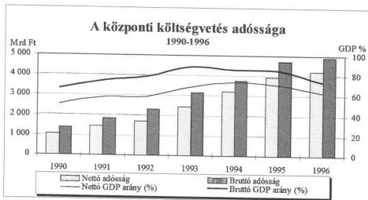
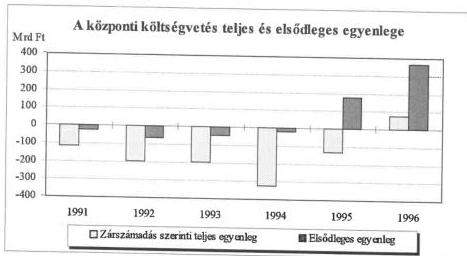
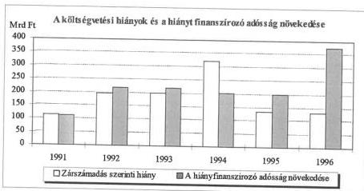
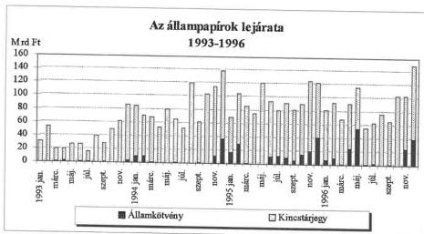
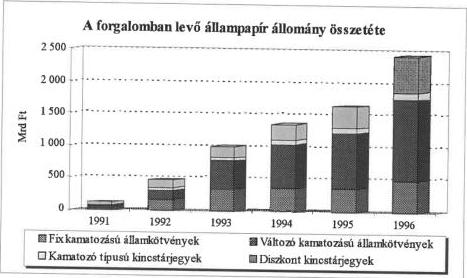
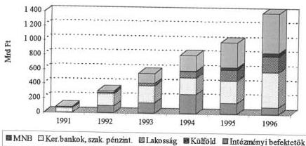
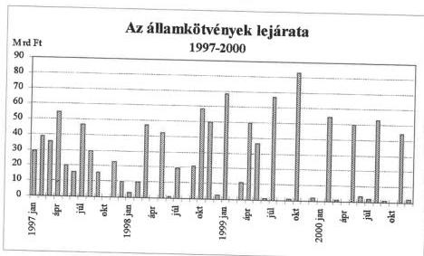
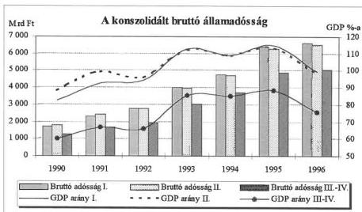
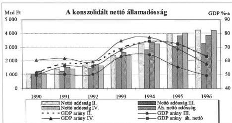

Állami Számvevőszék

# JELENTÉS

az államadósság ellenőrzéséről

406.

1997. december

---

Az ellenőrzés végrehajtásáért felelős:

az ÁSZ III. Költségvetési Ellenőrzési Igazgatósága

Bihary Zsigmond számvevő igazgató

Az ellenőrzést vezette:

Nagy Ákosné számvevő igazgatóhelyettes

Az ellenőrzést végezték:

Bodonyi Miklós számvevő tanácsos

László Józsefné számvevő tanács

Surányi Tamás számvevő tanácsos

Uram Ferenc számvevő

Giday András külső megbízott

Hevesi Zsuzsanna külső megbízott

---

# Rövidítések jegyzéke

|  Államadósság Kezelő Központ | ÁKK  |
| --- | --- |
|  Állami Fejlesztési Intézet Rt. | ÁFI  |
|  Állami Privatizációs és Vagyonkezelő Rt. | ÁPV Rt.  |
|  Állami Számvevőszék | ÁSZ  |
|  Állami Vagyonkezelő Rt. | ÁV Rt.  |
|  Állami Vagyonügynökség | ÁVÜ  |
|  Belügyminisztérium | BM  |
|  Európai Unió | EU  |
|  Földművelésügyi Minisztérium | FM  |
|  Ipari, Kereskedelmi és Idegenforgalmi Minisztérium | IKIM  |
|  Kincstári Egységes Számla | KESZ  |
|  Kincstári Vagyonkezelő Igazgatóság | KVI  |
|  Közlekedési, Hírközlési és Vízügyi Minisztérium | KHVM  |
|  Központi Környezetvédelmi Alap | KKA  |
|  Magyar Állam Kincstár | MÁK  |
|  Magyar Államvasutak Rt. | MÁV Rt.  |
|  Magyar Beruházási és Fejlesztési Bank Rt. | MBFB  |
|  Magyar Hitelbank | MHB  |
|  Magyar Nemzeti Bank | MNB  |
|  Mezőgazdasági Fejlesztési Alap | MFA  |
|  Országos Egészségbiztosítási Pénztár | OEP  |
|  Országos Nyugdíjbiztosítási Főigazgatóság | ONYF  |
|  Országos Takarékpénztár Rt. | OTP  |
|  Országos Takarékszövetkezeti Intézményvédelmi Alap | OTIVA  |
|  Pénzügyminisztérium | PM  |
|  Államháztartási törvény | Áht.  |
|  Közalkalmazottak jogállásáról szóló tv. | Kjt.  |
|  Önkormányzati törvény | Ökt.  |
|  Számviteli törvény | Sztv.  |

---

# TARTALOMJEGYZÉK

# 1. AZ ÁLLAMADÓSSÁG SZABÁLYOZÁSA ÉS KEZELÉSÉNEK SZERVEZETI KÉRDÉSEI 11

1.1. Az államadósság jogi szabályozottsága 11

1.2. Az államadósság kezelésének szabályozottsága, szervezeti keretei 13

1.2.1.Az allamadossag kezelésenek szervezeti keretei 13
1.2.2.A kozponti koltsegvetes finanszirozasi tevekenységenek szabalyozottsaga 16
1.2.3.Az allamadossag informaciens rendje, az adatok megbizhatosaga 17

# 2. A KÖZPONTI KÖLTSÉGVETÉS ADÓSSÁGA 20

2.1. A központi költségvetés belföldi adóssága 21

2.1.1.A koltsegvetesi hianyok miatti adossag 21
2.1.2.Az allam kozvetlen hitelfelvetelei 24
2.1.3.A koltsegvetes altal atvallat adossagok es az azokbol szarmazo kovetelasek 26

2.1.3.1.Az atvallat adossagok 26
2.1.3.2.Az adossag- es kovetelés- allományok atvetele 29
2.1.3.3.Az atvett kovetelasek kezelésenek eredmenyessege 31

2.1.4. Az árfolyamváltozásból származó adósság 33

2.1.4.1.Az allam nem kamatozo, lejarat nelkuli adossaga 33
2.1.4.2.A nullas adossag cseréje 36
2.1.4.3.Az allam devizaadossaganak kezelese,penzugyi kihatasa 37

2.2. A központi költségvetés külföldi adóssága 39

2.2.1.Kormanyhitelek 39
2.2.2.Nemzetkozi penzugyi szervezetektol,penzintezetektol felvett hitelek 40
2.2.3.A kozponti koltsegvetes kulfoi kovetelsei 41

2.2.3.1.A kulfoi kovetelés-allymany novekedese 41
2.2.3.2.A kulfoi kovetelés-allymany csokkenese 42

2.3. A központi költségvetés finanszírozása 44

2.3.1.A finanszirozas eredmenyessege 44
2.3.2.A finanszirozas törvenyessege 52

# 3. AZ ÁLLAMHÁZTARTÁS TÖBBI ALRENDSZERÉNEK ADÓSSÁGA 54

3.1. Elkūlōnītēt āllami pénzalapok adòssāga 54
3.2.A tarsadalombitzositasi alapok adossaga 56
3.3.A helyi onkormanyzatok adossaga 61

# 4. KONSZOLIDÁLT ÁLLAMADÓSSÁG 65

4.1. Az alkalmazott konszolidálási módszerek 66

---

V-21-162/1996/97.

# ÁLLAMI SZÁMVEVŐSZÉK

V-21-162/1996/97.

Témaszám: 346.

# Jelentés

# az államadósság ellenőrzéséről

Az államháztartás alrendszereinek hitelviszonyon alapuló fizetési kötelezettségei, vagyis az államadósság nagysága, alakulása meghatározó jelentőségű mind az államháztartás egyensúlyi pozíciója, mind a nemzetgazdaság fejlődése és ezen keresztül az Európai Unióhoz való csatlakozási szándék megvalósulása szempontjából.

Az államháztartás bruttó adósságállománya (bruttó államadósság)* az 1990. és 1996. évek között folyóáron több mint 3,5-szeresére, 1.401,4 Mrd Ft-ról 5.114,0 Mrd Ft-ra emelkedett. Az államadósság szintje - a bruttó államadósságnak a bruttó hazai termékhez (GDP) viszonyított aránya - ugyanezen időszakban 67%-ról (az 1993. évi 92%-os csúcsot követő csökkenéssel együtt) 77%-ra emelkedett. Az állam ugyanakkor belföldön és külföldön egyaránt rendelkezik követelésekkel is, amelyek figyelembevételével az államháztartás nettó adósságállománya (nettó államadósság)* a hat év alatt a bruttónál gyorsabb ütemben, 1.034,8 Mrd Ft-ról 4.229,4 Mrd Ft-ra - nominálisan 4,1-szeresére - nőtt.

A tényleges adósságterhet az állam konszolidált (az államháztartási alrendszerek és a jegybank egymás közti finanszírozásának kiszűrésével számított) adóssága mutatja a legjobb közelítésben, ennek a GDP-hez mért aránya a bruttó adósságrátánál alacsonyabb növekedést mutat (60%, 76%)**.

Az államháztartás eladósodása korábban lényegében egyet jelentett a központi költségvetés adósságállományával. A központi költségvetés adósságállomá-

* A publikált adatok összesítése alapján (1. sz. melléklet)

** Megjegyezzük, hogy az államadósságnak a gazdaság teljesítményéhez mért relatív terhei - az Európai Gazdasági és Monetáris Unió (EMU) tagországaival szemben Maastrichtban megfogalmazott követelmények szerint - nem haladhatják meg a 60%-ot, ami az államháztartás jegybank nélkül konszolidált adósságára vonatkozik.

1

---

nyának részesedése a bruttó államadósságból - a többi alrendszer önállósodásával, illetve tartozásuk növekedésével összefüggésben - némileg mérséklődött (az 1990. évi 99%-ról 1996-ra 96%-ra), a kötelezettségei azonban változatlanul meghatározók maradtak. Az éves adósságszolgálati terhek is a központi költségvetésben jelentek meg egyre nagyobb súllyal, pl. az 1996. évi kamatkiadások a költségvetésbe centralizált jövedelmek több mint 25%-át tették ki, szemben az 1990. évi 10% alatti aránnyal.

Jelentős változások, módosulások történtek az államadósság szerkezetében, kezelésében, cél- és feltétel rendszerének alakulásában is, a jegybanki hitelforrásokat - a kormányzati szándékoknak megfelelően - egyre inkább a belföldi pénz- és tőkepiaci finanszírozás váltotta fel.

Az Állami Számvevőszékről szóló, többször módosított 1989. évi XXXVIII. törvény 2. § (1) bekezdése, illetve 3. §-a alapján az ellenőrzés az állam bruttó (nettó) adósságára, illetve a konszolidált bruttó (nettó) államadósságra irányult és célja volt, hogy értékelje:

- az államháztartás adósságállományának nagyságát, összetételét, az állományváltozás okait, összetevőit, figyelemmel a változások törvényességére, dokumentális alátámasztottságára;
- az adósság kezelésének célszerűségét;
- az állam hitelviszonyból eredő követelésének állományát, változását, a behajtásra tett intézkedéseket, illetve azok eredményességét;
- az MNB által felvett külföldi hitelek 1997. évi részleges átvétele (nullás adósságcsere) módjának megalapozottságát, az államháztartás külföldi adósságának kezelését.

Az ellenőrzés az 1991-1996. éveket fogta át, azonban esetenként a helyszíni ellenőrzés lezárásáig (1997. szeptemberéig) bekövetkezett lényeges változásokra is kiterjedt.

Az ellenőrzés a dokumentumok véletlenszerű kiválasztáson alapuló vizsgálata mellett részben utóvizsgálati jelleggel alapozott a tárgykörben lefolytatott korábbi számvevőszéki ellenőrzések - így különösen az államadósság 1992. évi, az állami forgóalap pénzszükségletét (a központi költségvetés hiányát) finanszírozó értékpapír kibocsátás 1996. évi, a Nemzetközi elszámolások fejezet 1996. évi, valamint a hitel-, bank- és adóskonszolidáció 1996. évi ellenőrzése - kapcsolódó megállapításaira, illetve felhasználta azokat (a jelentések felsorolását a 4. sz. melléklet tartalmazza).

Helyszíni ellenőrzés volt a Pénzügyminisztériumban, a Magyar Nemzeti Banknál, a Belügyminisztériumban, az Ipari, Kereskedelmi és Idegenforgalmi Minisztériumban, a Közlekedési, Hírközlési és Vízügyi Minisztériumban, a Magyar Államkincstárnál, a Mezőgazdasági Fejlesztési Alapnál, az Útalapnál, a Vízügyi Alapnál, az Országos Nyugdíjbiztosítási Főigazgatóságnál, az Egészségbiztosítási Pénztárnál, a Pest megyei Önkormányzatnál, a Debreceni Megyei Jogú Város Önkormányzatnál, a Dunaújváros Önkormányzatnál. Adatbekéréssel folytattuk le az ellenőrzést a MÁV Rt-nél, az Állami Privatizációs és Vagyonke-

2

---

V-21-162/1996/97.

zelő Rt-nél, a Kincstári Vagyoni Igazgatóságnál, az önkormányzatoknak hitelt nyújtó 18 kereskedelmi banknál és 92 kiválasztott önkormányzatnál. A kereskedelmi bankoktól bekért tájékoztatás, az önkormányzatok mérlegadatai alapulvételével a legnagyobb fejlesztési hitellel rendelkező önkormányzatok beruházásairól, a hitelcélok megvalósulásáról, azok költségvetési pozíciójukra gyakorolt hatásáról kértünk és kaptunk információt. (A mintaválasztás az önkormányzati hitelállomány 52%-át ölelte fel.)

Az ellenőrzést nehezítette, hogy - az államadósság egyes területeit érintő szervezeti, személyi változásokkal is összefüggésben - gyakran korlátozott volt az információ. Az ellenőrzés mozgásterét behatárolta, szempontjait a tervezetthez mérten szűkítette az az értelmezésbeli nézetkülönbség, hogy az ÁSZ kompetenciája az államadósság tárgykörében az MNB-nél mire terjed(het) ki. Így elmaradt az árfolyamváltozásból származó adósság keletkezésével összefüggésben a külföldi forrásbevonás indokoltságának, a devizahitelek felvétele és a költségvetési hiányok közötti kapcsolatnak, az árfolyamkockázat menedzselésének, az MNB fedezeti műveletei hatásának vizsgálata. Gondot jelentett továbbá az is, hogy az államháztartás egyes alrendszereinek információ rendszeréből közvetlenül nem vezethető le az államadósság (bruttó-nettó) állománya, illetve az Áht. előírása ellenére nem teljes körű az államháztartás adósságállományának számbevétele, nyilvántartása. Ebből következően a központi költségvetésen kívül a többi alrendszer adósságállományáról (így együttesen az államháztartás adósságállományáról) az ellenőrzés tendenciájában alkothatott képet. Ugyanakkor az általános gyakorlattól eltérően az ellenőrzési megállapítások mellett a különböző, elsősorban zárszámadási és MNB-adatok - közgazdaságilag eltérő közelítéssel értelmezett, de jogszabályi szinten nem deklarált mutatók - értékelésével is jellemezzük az államadósság alakulását.

A jelentéshez 1 db függeléket csatoltunk. Ebben részletesebben szólunk egy-egy - a központi költségvetés által átvállalt (átvett) - adósságelem (követelések) ellenőrzésének tapasztalatairól.

3

---

# I. ÖSSZEGZŐ MEGÁLLAPÍTÁSOK, KÖVETKEZTETÉSEK, JAVASLATOK

Az 1980-as évek végétől a mindenkori kormány törekedett az államadósság nyílt bemutatására, melyet a Parlament - a döntés szintjére és a növekvő adósságszolgálati teherre figyelemmel - igényelt is. E szándék több kevesebb sikerrel történő megvalósítása tükröződik megállapításainkban. A folyamatok értékelésénél nem lehet elvonatkoztatni attól, hogy az ellenőrzött hat év egyben a piacgazdaságra való áttérés, a gazdasági, társadalmi, közigazgatási és pénzügyi átállás időszaka volt.

Az államadósság jogi szabályozása - a fogalom meghatározás, a technikai szabályok tekintetében - fejlődött, átfogó szabályozás hiányában azonban több lényeges kategória (pl. a nettó és a konszolidált államadósság) vonatkozásában nem ad kellő eligazítást az államháztartás adósságának reális számbavételéhez, kimutatásához. Hiányolható, hogy az Áht. nem tér(t) ki olyan kérdésekre, mint pl. a jegybank államadósságot érintő szerepe. Az Áht. hiányosságait jelzik a feladat- és hatáskör ellentmondásos szabályozása, továbbá az államadósság egészére, illetve egyes elemeire vonatkozó eltérő szabályok. A számviteli előírások sem adnak megfelelő támpontot az államadósság mértékének megállapításához.

A költségvetési hiányfinanszírozás, adósságkezelés szervezeti kereteinek létrehozása, fejlesztése - az ÁKK kincstári szervezethez csatolásáig és kapacitásának bővítéséig (1996. év) - rendszeresen lépéshátrányban volt a sokasodó feladatokkal szemben. A szükséges saját szervezeti háttér hiánya is közrejátszott abban, hogy a koncepcionális szintű döntések helyett a PM-MNB között kialakult munkamegosztást elsődlegesen a szakértői szintű viták és kompromisszumok formálták.

A központi költségvetés finanszírozásának, az adósság kezelésének normatív követelményrendszere - annak ellenére, hogy a finanszírozási tevékenység és az azzal összefüggő munkafolyamatok szabályozottsága sokat javult - még nem alakult ki teljes körűen. Kedvező fejlemény, hogy fő vonalaiban kialakult az ÁKK feladatokhoz igazodó szervezeti tagozódása és az lefedi a fontosabb funkciókat. Ugyanakkor a munkavégzés folyamatait részletesen meghatározó belső szabályzatok és az ehhez illesztett feladatlebontások többnyire hiányoznak, illetve hiányosak, ellentmondásosak.

Az államháztartás bruttó adósságára vonatkozó publikált adatok megbízhatósága nagyságrendileg kevésbé, számos részletét tekintve különösen kétséges. Az adatok részleges hiánya és pontatlansága leginkább az államháztartáson belüli konszolidálás és a nettó adósság számításánál érzékelhető. Ebben rendszerbeli hiányosságok és szakszerűtlen elszámolások is közrejátszanak.

4

---

I. ÖSSZEGZŐ MEGÁLLAPÍTÁSOK, KÖVETKEZTETÉSEK, JAVASLATOK

Az **államadósság alakulásában a központi költségvetés adóssága** változatlanul **meghatározó** tényező, bruttó állománya 3,6-szeresére, nettó állománya 4,1-szeresére duzzadt. Az alrendszer adósságának bővülése az 1993. és 1995. években volt kiugró, összefüggésben az adósság átvállalásokkal, illetve a forint-leértékelések hatásával. Az adósság **összetételében jelentős átrendeződés ment végbe**, megnőtt a belföldi - azon belül a kamatozó - adósság állomány abszolút és relatív nagysága, szemben a központi költségvetés közvetlen külföldi hiteleivel. Az 1991 előtti, szinte kizárólagos jegybanki hitelezést - a jegybank törvény, illetve az éves költségvetési törvények alapján - 1995. második felétől a pénzpiaci finanszírozás váltotta fel. A kamatozó belföldi adósság szerkezete is ennek megfelelően átalakult, a hitelek 1990. évi 95 %-os aránya 1996 végére 20 %-ra csökkent. A nullás adósságállomány 1997. év elején végrehajtott cseréjével az árfolyam-különbözetből származó kvázi hitel helyébe 'minőségileg' új adósságtényező lépett. (A nullás adósság 1997. évi átalakítása a költségvetés kamatozó hiteleinek arányát 50 % fölé növelte ugyan, de a tendenciát nem fordította meg.)

**A költségvetés pénzpiaci finanszírozásának rendszere - több éves fejlődési folyamat eredményeként** - szinte a semmiből **jutott egy viszonylag fejlettebbnek ítélhető stádiumba**. Az adósság-kezelés, költségvetés finanszírozás utóbbi hat éves története - megítélésünk szerint - két, markánsan elkülöníthető időszakra tagolható. Az **1995 végéig, 1996 elejéig tartó periódus a finanszírozás tanuló korszakának, a szervezeti keretek és a mechanizmusok kialakulásának évei voltak**. A zavaroktól sem mentes folyamat jelentős költségvetési terhekkel járt. Mennyiségi szempontból - figyelembe véve, hogy egyes időszakokban átmenetileg szükség volt a jegybanki likviditási hitel felvételére is - a költségvetés új rendszerű finanszírozása eredményesnek minősíthető. A finanszírozás költségeit, a kibocsátások ütemezését és az állampapírok lejárati szerkezetét tekintve az eredményesség minőségi kritériumai csak késve érvényesültek. Az **1995. év második felétől már érzékelhető kedvező folyamatok** - beleértve a makrogazdasági egyensúlyi mutatók alakulását is - **1996-ban felgyorsultak**. Az infláció csökkenése, az élénk pénzpiaci kereslet és a költségvetés finanszírozási szükségletének mérséklődése következtében az állampapírok kamat- és hozamszintje lényegesen alacsonyabbá vált. A kibocsátott állampapírok összetétele, lejárati szerkezete - saját kategóriájukon belül - lényegesen kedvezőbb volt a megelőző évekénél. A kibocsátások eredményességét elősegítette, hogy hosszú előkészítés, többszöri határidő módosítás után 1996. januárjától működésbe lépett az elsődleges forgalmazói rendszer. A költségvetés finanszírozásának törvényessége a szabályozási kötöttségek oldása következtében is javult.

A központi **költségvetés hiányát finanszírozó tartozások** (melyek számbavételi és nyilvántartási okokból az éves deficitektől egyre nagyobb összeggel eltérnek) - összefüggésben a kamatozó adósság dinamikus növekedésével - **viszonylagosan mérsékelten bővülő tényezőjét** képezték az adósságállománynak. A pénzpiaci alapokra helyezett hiányfinanszírozás költségei a legutóbbi időszakig érdemben nem éreztették korlátozó hatásukat a költségvetési hiányok mértékének alakulásában, ugyanakkor az adósságszolgálat finanszírozásának új módszere vált a jövedelem újraelosztásának egyik fő csatornájává.

5

---

I. ÖSSZEGZŐ MEGÁLLAPÍTÁSOK, KÖVETKEZTETÉSEK, JAVASLATOK

A jegybanki finanszírozás háttérbe szorulásával **csökkenő mértékű** és csekély arányú a **költségvetés közvetlen hitelfelvételéből** származó **adósság**. A hitelállomány legjelentősebb tétele, az állami forgóalap feltöltését szolgáló hitel felhasználásának célszerűsége kedvezőtlen volt, mert az alacsony szinten tartott forgóalap a költségvetés finanszírozásának legkritikusabb szakaszaiban nem volt képes a likviditási feszültségek áthidalására.

A központi költségvetés bruttó adósságának számottevő tényezője **az egyéb belföldi adósság** (nem hiányfinanszírozásból felhalmozódott tartozás), melynek állománya 1990-1996. között közel megnégyszereződött. A kimutatott 929,2 Mrd Ft-os - de a hiányfinanszírozó adósságként történő megújítások miatt ennél valójában magasabb - növekmény tartalmát és keletkezésének okait tekintve sokrétű, nagyobb részben a piacgazdasági átmenethez, tulajdonosváltáshoz, a nemzetgazdaság egyes területeinek 'válság' kezelésében vállalt állami helytálláshoz, aktuális költségvetési helyzethez kapcsolódott. A költségvetési, gazdaságpolitikai megfontolásból, többnyire kényszerítő körülmények között hozott döntések előkészítettsége, a választott alternatíva, vagy a végrehajtás időigénye több esetben nem volt kellően átgondolt. Ebből következett, hogy esetenként **az adósság átvállalások az indokolt mértéket meghaladták** vagy a kapcsolódó intézkedések késedelmes végrehajtása a megtérülés eredményességét rontotta. Különböző okokból **gyakran a rövid távú érdekek érvényesítése került előtérbe, s a választott megoldás** - a jelenlegit meghaladó - **nagyobb terheket csúsztatott át későbbi időszakra**. A döntéseknél a már meglévő vagy látens adósságszolgálati terhek számbavétele, mérlegelése csak fokozatosan - azok dinamikus emelkedése kapcsán - vált hangsúlyosabbá. A központi költségvetés adott évi pozícióját preferáló adósság átvállalások rontották a költségvetés átláthatóságát, az adott célra, szervezetre fordított támogatások, illetve azok felhasználásának, hasznosításának számbavételét.

Az adósság átvállalásokról rendelkező törvények általában nem szóltak az eredeti adósokkal szembeni követelések állományáról, kezelési szabályairól, azt ráutalással vagy anélkül a szerződő felek hatáskörébe utalták.

Az állam által átvállalt **adósságok megtérülési szintje** - a követelés állomány jellegétől függően - **differenciált**. Az érvényesített követelések összegét a költségvetés kapcsolódó terhei nagyságrenddel meghaladják. A kedvezőtlen folyamatokban, az állami érdekek esetenkénti háttérbe kerülésében a döntés előkészítés és végrehajtás hiányosságai, következetlenségei, a követeléskezelés korlátai, nem utolsósorban a laza, hiányos ellenőrzés, a számonkérés hiánya - differenciáltan - szerepet kaptak. Az átvállalások egy része a célját tekintve sem ítélhető eredményesnek, az adós cégek reorganizációja, stabilizálódása elmarad az elvárttól (pl. MÁV, élelmiszeripari cégek).

A **nem kamatozó, lejárat nélküli államadósság** a korábbi finanszírozási rendszer sajátosságához, a jegybank kvázi fiskális tevékenységéhez kapcsolódott. Az MNB a pénzteremtésből, továbbá - saját nevében és eljárási rendje szerint - a nemzetközi pénzpiacon szerzett forrásból biztosította a nemzetgazdaságban jelentkező pénzszükséglet mellett a költségvetés finanszírozási igényét. Az árfolyam-különbözetből származó és 1989-től törvényi szinten költségvetésre terhelt adósság képzésének döntési háttere, indokai, esetenként a

6

---

I. ÖSSZEGZŐ MEGÁLLAPÍTÁSOK, KÖVETKEZTETÉSEK, JAVASLATOK

szintje az ellenőrzés során nem vált ismertté. Az átértékelési különbözet képzésének módjáról jogszabály egyáltalán nem rendelkezett, belső szabályzatban is csak 1994-től intézkedett az MNB. Meghatározásának helyességét a PM külön, erre irányultan nem ellenőrizte, az MNB éves beszámolójának auditálását elegendő kontrollnak ítélte.

**Az MNB és a költségvetés közötti 1997. évi nettó adósságcseréhez** az ÁSZ az ellenjegyzést törvényességi szempontok alapján megadhatónak ítélte, tekintettel arra, hogy **a megállapodások** - a feltárt hiányosságok kiküszöbölését követően - **a hatályos jogrendnek megfeleltek**. A devizaadósság cserével a központi költségvetés lejárat nélküli, nem kamatozó adósságának megszüntetése, a külföldi és belföldi **adósságkezelési feladat egy szervezethez telepítése segítheti a monetáris és fiskális folyamatok „tisztulását”**. Az egyértelmű átláthatóság lehetősége azonban csak az MNB és a központi költségvetés közötti feladatelhatárolás teljes körűsége, valamint a feladattelepítésnek ténylegesen megfelelő költségek kimutatása esetén állhat fenn.

**A költségvetés külföldi adósságán** belül a kormányközi megállapodáson alapuló, **külkereskedelemmel kapcsolatos hitelkonstrukció** - a meglévő kötelezettségek kiegyenlítése után - **megszűnt**. Ebben szerepet kapott a magán szféra erősödésével és a szabályozók változásával összefüggésben végbemenő átrendeződés. A vállalkozások közvetlen hitelfelvétele folytán a költségvetés fokozatosan mentesült a külső eladósodásból, így 1996-ban a kormányhitelek 106,5 Mrd Ft összegű állománya - célját tekintve - már csak a költségvetés devizabetéteit finanszírozta.

**A nemzetközi pénzintézetektől felvett és lehívott hitelek** forintban kifejezett állománya 1990-96. között több mint 6-szorosára 183,4 Mrd Ft-ra **nőtt**. Ezen belül 1992-től a Világbank részesedése fokozatosan visszaszorult. A korábbi ellenőrzésünk (Nemzetközi elszámolások fejezet) megállapításai, javaslatai alapján a PM intézkedési tervet készített, amely alkalmas a feltárt hiányosságok megszüntetésére.

**A központi költségvetés külföldi követelései** a Kormány korábbi hitelnyújtásaiból, illetve az MNB-nek a külföldi adósokkal szembeni követelése átvállalásának 'rendezéséből' keletkeztek. A lejárt, illetve hátralékos követelések állománya növekvő, amiben szerepe volt az adós országok gazdasági helyzetének, fizetési hajlandóságának is.

**Az államháztartás többi alrendszerének adóssága együttesen és külön-külön is emelkedett.** Bruttó adósságuk nagyságrendjét és arányát tekintve azonban nem jelent számottevő tényezőt. Az egyes alrendszereken belül jelentős a szórás az eladósodott és a pénzügyileg kiegyensúlyozottan gazdálkodó - adósságukért önálló felelősséggel tartozó - szervezetek között (önkormányzatok, elkülönített állami pénzalapok). **A nettó adósságállományuk alapján adóspozícióba csak a társadalombiztosítási alapok kerültek**, a központi költségvetéssel még nem rendezett aktuális tartozásállományuk folytán. Az egyes önkormányzatok és elkülönített állami pénzalapok hitel- és kölcsöntartozásait ugyanis elfedi a többiek követelés (befektetési) állománya. Az államháztartási alrendszerek közül a helyi önkormányzatok eladó-

7

---

I. ÖSSZEGZŐ MEGÁLLAPÍTÁSOK, KÖVETKEZTETÉSEK, JAVASLATOK

sodási folyamata az 1994. évi mélypontot követően - elsősorban a hitelfelvételek jogszabályi korlátozása miatt - pozitív fordulatot vett, ami nettó pozíciójuk erőteljes javulását eredményezte.

Az államháztartás többi alrendszerében likviditási célból hitelt - a társadalombiztosítási alapok, egyes önkormányzatok és az Útalap kivételével - nem vettek igénybe. Az önkormányzatok és az elkülönített állami pénzalapok hitel és kölcsöntartozásai olyan fejlesztési célok megvalósításához kapcsolódnak, amelyekhez a folyó költségvetéseik nem biztosítanak elegendő forrást. A hitelcélok tehát többnyire igazodtak a feladatokhoz. A hitelek ugyanakkor nem voltak mindig kellően megalapozottak, vagy/és dokumentálisan alátámasztottak. A hitelfelvétel adósságszolgálati terheit, forrásszűkítő hatását sem mérlegelték mindenütt és minden esetben ott sem, ahol azok a nagyságrendjük, a feladatellátás szintentartása, bővülése miatt megkülönböztetett figyelmet érdemeltek volna. Ettől eltérő a társadalombiztosítási alapok adósságának keletkezése, melynek okai a tartóssá vált forráshiányban, azaz a bevételi előirányzatot felül múló kiadás növekedésben, s ennek "késleltetett" költségvetési megtérítésében keresendők. Ugyanakkor a társadalombiztosítási alapoknál sajátos és egyensúlyi pozíciójuk szempontjából számottevő jelentőségű és mértékű a tartósan kiegyenlítetlen és növekvő követelés állományuk. Ezek behajtására hozott intézkedések pénzügyi pozíciójukban érdemi fordulatot nem hoztak. Az ingyenes vagyonjuttatás sem vált a források bővítésének eredményes eszközévé.

**Összegezve** megállapítható, hogy napjainkra körvonalazódtak az államadósság jogszabályi keretei, kialakultak a költségvetés finanszírozásának, az adósság nyilvántartásának, kezelésének szervezeti feltételei, a költségvetés finanszírozása pénzpiaci alapokra helyeződött, tisztábbá váltak a költségvetés és a jegybank funkciói. Mindezt segíti az 1996. évtől működő kincstári rendszer.

Az államháztartás adósságának átfogó jogi szabályozása, információ rendszere teljessé és egyértelművé tétele, a nyilvántartás hiányosságainak megszüntetése, a megbízható adatszolgáltatás, a jelentős és növekvő adósságteher hatékonyabb kezelése, a követelések eredményesebb behajtása azonban további átgondolt és következetes intézkedéseket igényel.

## JAVASLATOK

### A jelentés megállapításainak hasznosításra ajánlása mellett javasoljuk

#### a Kormánynak

1. kezdeményezze az államháztartási és a számviteli törvények módosítását az államadósság fogalmának (bruttó, nettó, konszolidált) pontosítása és az ezzel összefüggő számviteli szabályok meghatározása érdekében;
2. kísérje fokozott figyelemmel, illetve számoltassa be a pénzügyminisztert az államadósság kezelése hosszabb távú feladatainak, cél- és eszközrendszerének

8

---

I. ÖSSZEGZŐ MEGÁLLAPÍTÁSOK, KÖVETKEZTETÉSEK, JAVASLATOK

meghatározása, a számbavétel, a nyilvántartás pontosítása és a kapcsolódó szabályozás kiegészítése, összehangolása, a finanszírozás költségeinek csökkentése érdekében tett intézkedéseiről és azok eredményességéről;

# a pénzügyminiszternek

1. dolgoztassa ki az 1996-ban megkezdett munka folytatásaként az adósság kezelésének hosszabb időszakra szóló stratégiáját. A költségvetés éves finanszírozási feladatait meghaladóan határozza meg az adósság-kezelés cél- és eszközrendszerét, a teljesítés feltételeinek megteremtése érdekében szükséges lépéseket és azok ütemezését. Jóváhagyás esetén gondoskodjon annak összehangolt végrehajtásáról;
2. a központi költségvetés adósságának reálisabb számbavétele érdekében fontolja meg a lejáró, más okból keletkezett adósságok megújítása céljából kibocsátott állampapírok kibocsátási hivatkozásának pontosítását, illetve az adósságnyilvántartás eddigi gyakorlatának felülvizsgálatát. Ennek megfelelően a költségvetési törvényjavaslat keretében kezdeményezze a differenciáltabb felhatalmazási jogcímek parlamenti elfogadását, beleértve a TB alapok KESZ igénybevétele miatti állampapír kibocsátások és más, a költségvetés hiányával össze nem függő adósság növekedések és megújítások eddigitől eltérő minősítését;
3. az államháztartás számviteli rendjének szabályozása keretében részletesen határozza meg a központi költségvetésen kívüli egyéb alrendszerek - bruttó, nettó - adósság-állományával (követelésekkel) kapcsolatos összehangolt nyilvántartási és beszámolási kötelezettségeket;
4. az államháztartási törvény javasolt módosítására is figyelemmel kezdeményezze az alrendszerek adósság pozícióját befolyásoló követelések, így pl. a visszterhesen nyújtott támogatások visszafizetési kötelezettségének számbavételének szabályozását;
5. hatékonyan működjön együtt a TB alapok kezelőivel az éves költségvetési előirányzatok kialakításában;
6. intézkedjen a központi költségvetést terhelő ellátások TB alapok részéről történő megelőlegezésével összefüggő KESZ igénybevétel kamatának - az ellátások utólagos finanszírozásával egyidejű - megtérítéséről;
7. intézkedéseivel összefüggésben kísérje figyelemmel az ÁKK belső szabályozási tevékenységét, továbbá az állami követelések, az államháztartási alrendszerek adóssága, valamint a kezességvállalások nyilvántartása vezetésének teljes körűvé tételét;
8. a jamburgi egyezmény lezárásához kapcsolódóan vizsgálja felül a gázvezetéképítésberuházás finanszírozása céljára még rendelkezésre álló összeg (jelenleg 71 M Ft) szükségességét, illetve intézkedjen annak a központi költségvetés bevételeként való elszámolásáról;

9

---

I. ÖSSZEGZŐ MEGÁLLAPÍTÁSOK, KÖVETKEZTETÉSEK, JAVASLATOK

# a privatizációért felelős tárca nélküli miniszternek

intézkedjen a MOL Rt. állammal szembeni 158 M Ft-os tőke- és annak késedelmi kamatokkal növelt tartozása behajtása érdekében.

10

---

II. RÉSZLETES MEGÁLLAPÍTÁSOK

## II. RÉSZLETES MEGÁLLAPÍTÁSOK

# 1. AZ ÁLLAMADÓSSÁG SZABÁLYOZÁSA ÉS KEZELÉSÉNEK SZERVEZETI KÉRDÉSEI

# 1.1. Az államadósság jogi szabályozottsága

Az államháztartás rendszerének szabályozásához, a pénzügyi rendszer átalakításának szándékához kapcsolódóan az ellenőrzött időszakban többször, folyamatában előremutatóan változtak az államadósság fogalmának, egyes elemei tartalmának, kezelésének jogi keretei. Az államadósság törvényi szinten meghatározott köre, tartalma 1992-től az államháztartás egészére (alrendszereire) kiszélesített felfogásában - szemléletváltozást is sugallva - közelített az Európai Unió tagországaiban alkalmazott gyakorlathoz is.

Az államadósságot tartalmában és számszerűsítetten törvényi szinten először megfogalmazó 1990. évi CIV. törvény az állami költségvetés adósságát tekintette államadósságnak.

Az 1991. évi XCI. törvény az államadósság körét az államháztartás egészére kiterjesztette - rögzítve, hogy az államháztartás alrendszereinek feladataik ellátásával kapcsolatos, különféle hitelviszonyból eredő adóssága képezi az államadósságot - melyet általánosabb megfogalmazással az Áht. továbbfejlesztett.

Az államadósság fogalmának törvényi szabályozása az előrelépések mellett - hiányosságai, ellentmondásossága miatt - még nem ad kellő eligazítást az államháztartás adósságának reális számbavételéhez, számszerű kimutatásához.

Az Áht. az államadósságot bruttó megközelítésben értelmezi. Nem kezeli az államháztartás egészének, egyes alrendszereinek, továbbá a jegybank - finanszírozásban betöltött (korábbi) szerepéből adódó - egymás közötti tartozása miatti halmozódást, illetve annak kiszűrését, azaz a konszolidált államadósság kérdését.

Eltérőek a szakmai vélemények a jegybank adósságkonszolidációba vonásának indokoltságáról az adósságcserét követően. Egyesek (elsősorban az MNB) a korábbi konszolidációs eljárás folytatását fontosnak ítélik az MNB devizatartalékának a nettó államadóssággal való összefüggésére, a még fellelhető vagy keletkezhető és a monetáris szerepkörhöz nem illeszthető mérlegtételekre figyelemmel. Mások (köztük a PM, az ÁKK) az EU direktívára (amely nem tartalmazza az államadósság jegybankra kiterjedő konszolidálását), valamint az államháztartás és az MNB kapcsolatának 1997. évtől alakulására tekintettel ezen adósságmutató szerepét csökkenőnek ítélik és miután azt jogszabályok és nemzetközi elkötelezettségek nem kívánják meg, számítását nem látják szükségesnek. (Az ide vonatkozó EU direktíva az államadósság jegybankra kiterjedő konszolidálását azért nem javasolja, mert a jegybankot nem tekinti közvetlenül az állam részeként, miután a jegybank döntéseire az államnak nincs közvetlen befolyása (jegybanki függetlenség), ezért a jegybanki adósságot sem tekinti olyan tételnek, amit a fiskális politika minősítése során figyelembe kellene venni.)

11

---

Jogszabályi szinten ugyancsak **nem körülhatárolt** az államháztartás, illetve alrendszerei követelésállományának figyelembevételével származtatható **nettó államadósság fogalma**, tartalma sem.

Az Áht. módosításával az alrendszerek önálló felelőssége bővült az őket terhelő adósságból eredő kötelezettségek nyilvántartásáért, kezeléséért (1995. évi CV. törvény 100. §). Ugyanakkor nincs szabályozásbeli áthidalás egyes alrendszerek (társadalombiztosítás, helyi önkormányzatok, elkülönített állami pénzalapok) egészét és az azokat alkotó szervezeteket terhelő feladatok között. **Az Áht. - a központi költségvetés kivételével - nem rendelkezik** ugyanis arról, hogy **mely szervezet és milyen módon végezze az egyes alrendszereken** belüli szervezetek, illetve az államháztartáson belül az alrendszerek **adósságának összevonását, nyilvántartását**.

A hézagos szabályozás, a deklarált fogalmak és hatáskörök aszinkronja miatt **nem egyértelmű** az Áht. 48. §-ában és 113/A. §-ban a pénzügyminiszternek címzett és a Kincstár útján megvalósítandó feladatai közül az **államadósság kezelésére, a finanszírozási stratégia kidolgozására, a tájékoztatásra vonatkozó kötelezettség**. A pénzügyminiszter hatásköre ugyanis nem, illetve nem közvetlenül terjed ki valamennyi alrendszerre. (Így például a helyi önkormányzatok önállóságuknál fogva felelnek az adósságuk alakulásáért, kezeléséért.) Ebből adódóan **a gyakorlatban a feladat végrehajtása nem az adott jogszabályhely megfogalmazása szerint** történik. A központi költségvetés alrendszerére értelmezhető belső szabályozás is hiányos, vagy ellentmondásos.

**A számviteli előírások nem adnak megfelelő keretet az államadósság mértékének megállapításához.** A számviteli törvény az államháztartás könyvvezetésére vonatkozóan nem tartalmaz előírást, s a számvitelre vonatkozó alacsonyabb szintű jogszabályokból is hiányzik az államháztartás alrendszerei és az azon kívüli körbe tartozók között az államadósságot érintő tételek - követelések, kötelezettségek elszámolásának összehangolt szabályozása.

Nem volt mindig konzisztens az államadósság egészére vonatkozó általános és egyes elemére vonatkozó jogi szabályozás egymással. Az egyes adósságelemeket érintő jogi szabályozás sem volt mindig megoldott, illetve egyértelműen körülhatárolt. (Ezekről konkrétan az érintett adósságtényezőnél, alrendszernél szólunk.)

**Hiányolható**, hogy az Áht. **nem foglalkozik a jegybank államadósságot érintő szerepével.** A jegybank törvény a pénzkibocsátásból származó, államot megillető jövedelemnek, az úgynevezett **seignioragenak** csak egy töredékéről, a készpénzcseréből származó hozamnak az állam javára történő (államadósságot csökkentő) elszámolásáról rendelkezik, egyébként az hallgatólagosan az MNB-nél marad. Megítélésünk szerint indokolt lenne törvényben rendelkezni a pénzkibocsátás monopóliumából származó jövedelem MNB-nél hagyásáról.

A seigniorage az MNB eredményében - eddig külön ki nem mutatott mértékben - jelentkezik, mivel a pénzkibocsátást a jegybank végzi. A seigniorage a fejlett európai országokban általában a GDP 1%-a alatti, nálunk a publikált közgazda-

12

---

II. RÉSZLETES MEGÁLLAPÍTÁSOK

sági számítások szerint 3%-on felüli. A monetáris bázis után - a becslések szerint 150-200 Mrd Ft nagyságrendben - képződő seigniorage-val szemben az MNB mindössze mintegy 2 Mrd Ft készpénzcsere hozamot számolt el a költségvetés javára.

Időszerűvé teszi a seigniorage szabályozásbeli hiányának megszüntetését a központi költségvetés és az MNB között végrehajtott adósságcsere. A nem kamatozó, nullás állomány megszűnésével az MNB kamatszubvenciós terhei lényegesen csökkentek, míg az államháztartás adósságszolgálati ráfordításai megnőttek.

Az MNB álláspontja szerint a pénzcsere csak jogi értelemben tartozik a seigniorage fogalmába, közgazdaságilag valójában semmi köze nincs hozzá. A seigniorage valójában pénzelméleti kategória, amely azt kívánja kifejezni, hogy a jegybanknál nyereség képződik abból, hogy a gazdaság szereplői hajlandók portfoliójukban tartani egy számukra nem kamatozó eszközt. Ez a jegybank eredményében indirekt jövedelemként realizálódik, ami - részben a mindenkori elemzési szándéktól függően - különböző képletek (modellek) alapján számítható. A jegybank eredményét ugyanakkor számos más tényező is befolyásolja, ezért rendelkezik úgy a törvény, hogy az MNB minden képződő nyereségét osztalék formájában be kell fizetnie a költségvetésbe. Az előbbiek alapján belátható, hogy a seigniorage nem jogi és számviteli kategória, ilyen értelmű, törvényben rögzített kategória bevezetése és számonkérése - közgazdasági szempontból - irracionális, érvel az MNB.

A PM nem tartja szükségesnek a jegybank szerepének, vagy a seigniorage és a költségvetés kapcsolatának az Áht-ban történő rendezését. A jegybank nem képezi az államháztartás részét, kapcsolatát a költségvetéssel, jövedelemszabályozását (így a seigniorage kérdését) egy külön törvény rögzíti nagyobb részletezettséggel, mint amelyre az Áht. lehetőséget adna.

Megítélésünk szerint miután átruházott állami monopóliumból származó jövedelemről van szó, indokolt arról az Áht-ban rendelkezni.

# 1.2. Az államadósság kezelésének szabályozottsága, szervezeti keretei

A központi költségvetés kivételével az államháztartás többi alrendszerében az adósság finanszírozás szabályozását, szervezeti, személyi feltételeit önállóan nem, hanem a pénzügyi folyamatokkal együtt, annak részeként alakították ki. Az államadósságot finanszírozó tevékenység szabályozottságát, szervezeti kereteit ezért a központi költségvetésre irányultan értékeljük.

# 1.2.1. Az államadósság kezelésének szervezeti keretei

A költségvetési hiányfinanszírozás, adósság-kezelés szervezeti kereteinek létrehozása és fejlesztése rendszeres lépéshátrányban volt az 1990. óta rohamosan bővülő feladatokkal szemben. Ez visszavezethető arra is, hogy az 1995. tavaszi stabilizációs intézkedésekig a döntéshozók nem fordítottak a jelentőségével arányban álló figyelmet az adósság-menedzselés koncepcionális kérdéseire, így a feladatok önálló ellátására alkalmas szakmai szervezet megerősítésére sem.

13

---

Az első, állampapír kibocsátást is csak szűk körben végző kormányzati szerv megalapítására a hiányfinanszírozás pénzpiaci alapokra helyezését - a jegybank törvény 1991. év végi hatályba lépését - követően több mint egy évvel később, 1993. áprilisában került sor. Az alapítás, **a későbbi szervezeti döntésekhez** hasonlóan, nem illeszkedett hosszú távú stratégiai elképzelésekhez. Ezek közös jellemzője, hogy **aktuális finanszírozási és szervezési feladatok megvalósítására irányultak, korlátozott kapacitás és hatáskör biztosításával.**

Az 1993. április 1-jével létrehozott Állami Értékpapír kibocsátást tervező Iroda ÁÉKSZI feladatkörét mindössze az egy évnél hosszabb lejáratú állampapírok kibocsátásának szervezésében és lebonyolításában, piacelemzési és tájékoztatási tevékenység ellátásában határozták meg. Feladatait - annak ellenére, hogy 1993-ban többnyire csak a két lakossági és a kamatozó kincstárjegy kibocsátás szervezésével foglalkozott - az állampapírok teljes körére kiterjesztették. A gépirónővel együtt 4 fős szervezet, fennállásának két éve alatt, nyilvánvalóan nem volt képes ellátni funkcióját.

Az 1995 májusában jogutódként alapított Államadósság Kezelő Központ ÁKK bővebb, 11 fős létszámával az állampapír kibocsátás és az adósság-kezelés szélesebb, de távolról sem teljes körét végezte. Működésének első évében a változás inkább mennyiségi, mint minőségi volt. Tevékenysége a költségvetés bruttó adósságából a belföldi rész finanszírozására terjedt ki, a külföldi adósság kezelésének átvétele még távlatilag sem merült fel.

Az államadósság kezelésének stratégiája, illetve az államadósság menedzselés tárgyában készült dokumentumok (sok esetben jóváhagyás nélkül maradt előterjesztések) többsége a költségvetés éves finanszírozási igényének kielégítésére és az annak megvalósítását elősegítő piaci és szervezeti feltételrendszerre koncentrált. A kitűzött célok rendszeresen megismétlődtek, mert az aktuálisnak ítélt feladatok teljesítéséhez a szükséges feltételek nem álltak rendelkezésre, illetve csak fokozatosan teremtődtek meg.

A költségvetés finanszírozására és annak keretében az állampapírok kibocsátására a mindenkori pénzügyminiszter kapott törvényi felhatalmazást. Előbb erre szakosodott saját szervezet, később kielégítő kapacitás hiányában azonban a kibocsátások szervezését, lebonyolítását, a lejáró állampapírok megújítását és a fő kifizetőhelyi feladatokat az elmúlt években nagyobb részt a jegybank látta el. A **pénzügyminisztériumi szervezetek** (ÁÉKSZI, ÁKK) és a szerződés alapján megbízottként eljáró **MNB közötti munkamegosztást** - koncepcionális szintű döntések hiányában - a rendszeresen **ismétlődő viták, illetve kompromisszumok alakították.**

Az államkötvény kibocsátások szervezését magának fenntartó PM - szervezetei útján - lakossági kincstárjegy kibocsátást is végzett és több alkalommal szorgalmazta a diszkont kincstárjegy kibocsátások lebonyolításának átvételét. Az ehhez szükséges feltételeket azonban sokáig nem teremtette meg. Az MNB viszont - az állam ügynökeként - a teljes állampapír kibocsátás megszervezésének átvételét kezdeményezte. Megegyezés hiányában végül is 1996. közepéig fennmaradt a kezdettől vegyes, feladat- és felelősségi rendjében nem kellően tisztázott és szabályozott rendszer.

14

---

II. RÉSZLETES MEGÁLLAPÍTÁSOK

A feladatkörök a Pénzügyminisztériumon belül sem voltak hosszú időn keresztül egyértelműen elhatárolva. A finanszírozásban érintett főosztályok között ebből rendszeres konfliktusok keletkeztek.

Az ÁKK még a szűk kapacitása ellenére sem rendelkezett - az 1996. évi átszervezésig - az önálló működéshez szükséges anyagi és személyi feltételekkel. A szervezet 1995. évi felállítási és működési költségeinek jelentős részét az MNB finanszírozta.

A szakmai tevékenység ellátásához nélkülözhetetlen számítástechnikai eszközök megvételének és működtetésének, valamint további beszerzések fedezetének mintegy 15 M Ft-os költségét - kielégítő intézményi előirányzat hiányában - a jegybank vállalta magára. A 11 álláshelyből 4 fő vezető beosztású dolgozó az MNB kihelyezett és fizetett munkatársa volt, akik a Pénzügyminisztériummal megbízásos jogviszonyban álltak.

**A költségvetési finanszírozás és adósság-kezelés szervezeti feltételei** a Kincstár létrehozásával, illetőleg az **ÁKK**-nak - szakmai önállósága részleges fenntartása mellett - a **kincstári szervezethez csatolásával, valamint létszámának megduplázásával 1996 közepe óta megoldódni látszanak**. Ettől az időponttól beszélhetünk arról, hogy a központi költségvetés alrendszere képes saját apparátusával ellátni belföldi finanszírozási, adósság-kezelési feladatait. Az átmenet tapasztalataink szerint különösebb problémák nélkül zajlott le.

Az ÁKK 1996 májusától tartozik a Kincstárhoz, de nem mint belső szervezeti egység, hanem - igazgatói irányítással - viszonylag elkülönült szervezetként. A szervezeti kapcsolódást a Kincstári Tanács, illetve a Kincstár elnökének felügyeleti jogosítványa reprezentálja.

Az állampapír kibocsátások szerződéses lebonyolítása és a fő kifizetőhelyi feladatok, valamint a lakossági állampapírok közvetlen forgalmazása 1996. év során több menetben, a megyei fiókhálózat nagyobb részének átszervezéséhez is igazodóan került átvételre az MNB-től.

A nullás adósság 1997. év elején történő cseréjével a központi költségvetés bruttó adósságának kezelése egészében az ÁKK-hoz került. A külföldi források bevonása - a hivatalos elképzelések szerint - átmenetileg még az MNB bevonásával történik, a nemzetközi pénzpiacokon való költségvetési megjelenés 1999-től várható. (Az MNB jelzése szerint portfóliójukban továbbra is van olyan adósságelem, amelyet a Magyar Állam - költségvetés - finanszírozása céljából vettek fel, s 1999. után, nevezetesen 2021-ben kerül sor az adósság törlesztésére.)

Kedvező jelnek tekinthető, hogy az ÁKK 1996 decemberében szempontrendszert állított össze az integrált államadósság kezelési stratégia elkészítéséhez. Ebben a külföldi deviza-adósság átvételének és kezelésének túlsúlya mellett helyet kaptak átfogó jellegű, hosszabb távra szóló célkitűzések és megoldási módok is. Magának a stratégiának a kidolgozása ellenőrzésünk idején még váratott magára.

**Az ÁKK feladatokhoz igazodó belső szervezeti tagozódása fő vonalaiban kialakult, lefedi a legfontosabb funkciókat.** A következő időszak teendője az egyes feladatkörök részleteinek tisztázása és a szervezeti felépítés ehhez történő, már kisebb kihatású módosítása. A létszám jellemzően felső fokú iskolai és szakmai képzettsége önmagában megfelel az elvárásoknak. A

15

---

speciális szakmai ismeretet (értékpapír kibocsátás és forgalmazás, határidős árfolyam-ügyletek stb.) igénylő munkaköröket többnyire az MNB-től áthelyezett, illetve szak- és továbbképzett munkatársak alkalmazásával töltik be.

### 1.2.2. A központi költségvetés finanszírozási tevékenységének szabályozottsága

A központi költségvetés finanszírozásának, az adósság kezelésének **normatív követelmény rendszere** ellenőrzésünk időpontjáig **még nem alakult ki teljes körűen**. A finanszírozási tevékenység és az azzal összefüggő munkafolyamatok **szabályozottsága sokat javult** az utóbbi években, különösen a Kincstár létrehozása óta, **de mindenben** kielégítő szabályozásról még **nem** beszélhetünk.

Az állampapír kibocsátás, adósság-kezelés munkafolyamataira vonatkozó pénzügyminisztériumi belső szabályzatok hiánya hosszú időn keresztül ellentmondásos, hézagosan ellenőrzött gyakorlatot tett lehetővé. A szabályozatlanság, a vonatkozó jogszabályok esetenként eltérő értelmezése, a részleteiben nem kontrollált munkavégzés hiányosságokhoz, azonos problémák, feladatok eltérő megoldásához vezettek.

A kibocsátások fontos dokumentumai (kibocsátási terv, tájékoztató) nem voltak egységesek, mert miniszteri jóváhagyásukat nem minden esetben követelték meg (a tájékoztatók többségéhez nem szerezték meg a miniszteri aláírást). Erre az 1990. évi VI. törvény, illetve az 1982. évi 28. sz. törvényerejű rendelet esetenként eltérő értelmezésével teremtettek alapot.

A tevékenység ellátásának folyamatba épített ellenőrzése általában elmaradt, amit az egyes folyamatok végén, utólag végzett ellenőrzések nem pótolhattak. A vezetői intézkedések írásos dokumentálása is rendkívül hiányos volt.

A jogszabályi rendezetlenség mellett a belső szabályozás hiányára is visszavezethető, hogy éveken keresztül elmaradt, illetve ellenőrizetlenül folyt a lejárt és visszaváltott, vagy más okból érvénytelenné vált állampapírok selejtezése és megsemmisítése. Az elmúlt évi ellenőrzésünk a vonatkozó dokumentumokat is hiányosnak találta.

**A kibocsátásokat végző szervezetek és személyek hatásköri, felelősségi viszonyai sokáig szintén ellentmondásosak, szabályozatlanok voltak.** E mögött nem csak a feladatok viszonylagos újszerűsége miatti óvatosság, hanem az adósság-kezelés, finanszírozás átfogó kérdéseinek eldöntetlensége, illetve taktikai megfontolás is meghúzódhatott.

ÁÉKSZI alapító okirata a szervezetet semmiféle döntési jogosítvánnyal nem ruházta fel. Ugyanakkor a PM belső ügyrendjéből sem volt megállapítható, hogy az Iroda milyen módon kapcsolódik be a döntési és az információs folyamatokba. Az Iroda szervezeti és működési szabályzattal és munkaköri leírásokkal sem rendelkezett.

Az ÁKK alapító okirata az egyedi állampapír kibocsátásokhoz és hitelezésekhez kapcsolódó döntéseket - az adósság-kezelési stratégia és a finanszírozási terv keretében kapott felhatalmazása erejéig - a szervezet hatáskörébe utalta. Tekintve

16

---

II. RÉSZLETES MEGÁLLAPÍTÁSOK

azonban, hogy a vonatkozó szerződések és kibocsátási dokumentumok aláírása miniszteri hatáskörben maradt, a döntési jogosítvány jellemzően a technikai végrehajtásra korlátozódott.

Az ÁKK alapító okirata szerinti feladatok és a belső szervezeti egységek, valamint a dolgozók munkaköri feladati között nem teremtették meg a megfelelő összhangot, előfordultak ellátatlan feladatok, párhuzamosságok is. A munkaköri leírások nem tértek ki a végrehajtás módjára, kapcsolódásaira, a dolgozók jogaira és felelősségére. A tevékenység előkészítési és végrehajtási folyamatainak belső szabályozására általában szintén nem került sor.

Az Áht. 1995. évi módosításával a Kincstár feladatkörébe került finanszírozási, adósság-kezelési tevékenységek szabályozása nagyobb figyelmet kapott. Ezt a hatáskörök és a kapcsolatrendszer megváltozása külön is indokolta. A nullás adósság 1997. évi cseréjével teljesebbé vált adósság-kezelés, új típusú feladatok (portfolió kezelés, határidős ügyletek stb.) megjelenése a szabályozás további módosítását tették szükségessé.

A tevékenységeket továbbra is ellátó ÁKK alapító okiratának pénzügyminiszteri módosításai némi késéssel, de kielégítően követték a szervezet jogállását, feladatkörét érintő törvényi és egyéb környezeti változásokat. Az 1997. év elején jóváhagyott SzMSz is - némi ellentmondással - összhangban áll a vonatkozó jogszabályi előírásokkal és a Kincstár szervezeti, működési rendjével, a Kincstári Tanács hatáskörével.

A feladatok kijelölését és a végrehajtás keretét biztosító alapvető rendelkezések mellett a munkavégzés folyamatait részletesen meghatározó belső szabályzatok viszont többnyire változatlanul hiányoznak. Az újonnan kiadott munkaköri leírások tartalmában is csak szerény változások észlelhetők.

Az Áht. által meghatározott feladatok egy része az SzMSz-ben ellentmondásosan, a munkaköri leírásokban egyáltalán nem jelent meg, s többnyire ellátatlan maradt. A központi költségvetés követeléseinek, az államháztartás más alrendszerei adósságának és a kezességvállalásoknak a nyilvántartási kötelezettségét az SzMSz az alapfeladatok között rögzíti, a belső szervezeti egységek feladatkörének részletezésénél ellenben már nem találkozni velük ugyanúgy, mint a munkaköri leírásoknál sem. Ez utóbbiakban - a feladatok utalásszerű felsorolásán túlmenően - a végrehajtás szakmai követelményeinek, szabályainak meghatározására nem került sor.

# 1.2.3. Az államadósság információs rendje, az adatok megbízhatósága

Az államháztartás bruttó adósságára vonatkozó publikált adatok megbízhatósága nagyságrendileg kevésbé, számos részletét tekintve azonban kétséges. Az adatok hiánya és pontatlansága különösen az államháztartáson belüli konszolidálás és a nettó adósság számítását kérdőjelezi meg. Ebben rendszerbeli hiányosságok és szakszerűtlen elszámolások is közrejátszanak.

Az 1992. évtől hatályos Áht. előírásával szemben egyik alrendszer sem mutatta ki teljes körűen adósságállományát. A központi költségvetés bruttó adósságáról rendszeresen jelentek meg - megbízhatónak minősíthető -

17

---

adatok, a nettó adósság meghatározásához elengedhetetlen mindenkori állami követelés adatok viszont teljes körűen nem ismeretesek.

**Az államháztartás jelenlegi információs rendszere a konszolidáláshoz szükséges adatok biztosítására is alkalmatlan.** Az egyes szervezetek éves beszámolóból, illetve az alrendszer szinten összesített mérlegekből nem állapítható meg, hogy az adósságból milyen mértékű volt az államháztartáson kívüli és az államháztartáson belüli (és mely alrendszerrel szembeni) tartozás állománya. Ugyanez vonatkozik a követelés-állományra is.

Az államháztartás bruttó és nettó adósságának számbavételét hátráltatta, pontosságát az időszak első felében kedvezőtlenül érintette, hogy **az elkülönített állami pénzalapoknak 1993-ig nem kellett vagyonmérleget összeállítaniuk**, így tartozás- és követelés-állományuk mértéke az információs rendszerből nem volt megismerhető. (Az 1. számú mellékletekben az 1992-re vonatkozó adatokat az 1993. évi összesített mérleg alapján állítottuk be.)

Az államháztartás körébe tartozó szervezetek az elmúlt években (az önkormányzatok jelenleg is) tetemes értékű állampapírral rendelkez(het)tek. Ebből csak a kincstárjegy állományuk volt - a központi költségvetéssel szemben - a konszolidálásba bevonható, mert **az államkötvényekről a mérlegek nem adtak tájékoztatást**. (Az önkormányzatok 1995. évi összevont mérlegében szereplő 5,4 Mrd Ft-os kötvény-állományról pl. nem tudni, hogy abban milyen arányt képviseltek az államkötvények. A fejezeti kezelésű előirányzatok közé 1996-ban integrált volt Gépjármű Felelősségbiztosítási és Kárrendezési Alap vagyonából pl. a Kincstár Beruházási Igazgatósága még 1996 végén is 0,8 Mrd Ft - a PM fejezet mérlegében szintén nem elkülönítetten szereplő, korábban vásárolt - államkötvényt őrzött.)

**Nem különültek el az államháztartáson belül egymásnak nyújtott hitelek, kölcsönök összegei** (pl. a Távközlési Alapból öt másik alapnak nyújtott hitelek), valamint a közvetlenül felvett, illetőleg a központi költségvetésen keresztül továbbkölcsönzött külföldi hitelek sem. A hitelnyújtás iránya a hitelező mérlegadataiból szintén nem derült ki, pedig az indokolt konszolidálás elmaradása halmazódást okozott a bruttó adósságban. Ezekre volt példa a közalkalmazotti béremelés 7,5 Mrd Ft-os önkormányzati hitelállományának kétszeres számbavétele 1994-ben (az adósság a központi költségvetés alrendszerénél is megjelent), illetve a saját forrásból megelőlegezett összeg (1994-1995-ben 0,6 Mrd, 1996-ban 0,4 Mrd Ft) költségvetéssel szembeni konszolidálási lehetőségének elmaradása a mérlegadatok hiányában.

**A mérlegek szakszerűtlen összeállítása elsősorban az önkormányzati alrendszert jellemzi.** Kimutatott tartozás állományuk nem csak tízmilliárdos nagyságrendben tér el (negatív irányban) a bankszektor összesített mérlegében megjelenő hitelállománytól, de a tartozások éven belüli és túli minősítése is meglehetősen pontatlan. Az adósság összetételének, jellegének és lejáratának elemzése így teljesen bizonytalan adatokra támaszkodhat.

Hibás mérlegadat a társadalombiztosítási alrendszer 1994. évi hitelállományánál is előfordult. A Nyugdíjbiztosítási Alap üzletrész vásárlással összefüggő 1,6 Mrd Ft-os hitele hiányzott az azévi összesített mérlegből.

**Az államadósság számbavételének legkritikusabb területe a követelések nyilvántartása.**

18

---

II. RÉSZLETES MEGÁLLAPÍTÁSOK

Az állam hitel jellegű követeléseit - jobb esetben - különböző szervezetek tartják nyilván, összesítésük és figyelemmel kísérésük viszont gyakran elmarad. Vélhetően ez az oka annak, hogy az éves zárszámadások keretében a Pénzügyminisztérium csak esetenként és akkor is hiányosan közölt adatokat a bel- és külföldi követelésekről.

**Az ÁKK** a Kincstárhoz kerülésekor kapta feladatul a központi költségvetés követeléseinek nyilvántartását. A feladat ellátására azonban **ellenőrzésünkig még nem készült fel, ehhez** a szabályozási és információs (adatszolgáltatási) **feltételek is hézagosak.**

Nagyságrendjüknél fogva kiemelést érdemelnek **a nyilván sem tartott**, valamint a **reálistól jelentősen eltérő értéken szereplő követelések.** Ezek további százmilliárdos összegben térítik el a nettó államadósságot a publikált adatoktól.

A központi költségvetés alrendszerében a **jamburgi beruházás** az ÁFI-tól átvett tőketartozással (refinanszírozási hitel) szerepel az adósságok között. A folyó költségvetés számára jelentkező 100 Mrd Ft-ot meghaladó bevételhez ugyanakkor folyamatosan nyilvántartott, pénzben kifejezett követelés-állomány nem tartozott.

**Az orosz féllel szemben fennálló** dollárra átszámított transzfer rubel **követelést** - az adósság behajthatóságának bizonytalanságára hivatkozással - mélyen a napi árfolyam alatt értékelték. Az MNB a követelést még 1996. év végén is 29,89 Ft/USD árfolyamon tartotta nyilván. A követelés átértékelését 1997 februárjában hajtotta végre, amelyből 58,9 Mrd Ft átértékelési különbözet származott (ekkora összeggel nőttek a központi költségvetés külföldi követelései). A módosítás így sem a követelés - forintban kifejezett - teljes összegét mutatja, mert az átértékelés a dollár napi árfolyamának 58,5 %-ával történt. Az 1996. évi zárszámadás mellékletében összesített dollár-elszámolású követelések között viszont már a napi árfolyamnak megfelelő összegben szerepel. (Ennyivel eltér a PM és az MNB forintban számított követelés-nyilvántartása.)

A központi költségvetésnek évről-évre számottevő követelése keletkezett a TB alapokkal szemben az állami forgóalap, 1996-tól a KESZ igénybevétele miatt. Az éves zárszámadások alkalmával rendszerint **átvállalt TB adósságok** ellenében a költségvetés követelését viszont nem tartották számon.

A TB alapok hiányának költségvetési pénzeszközökből történő finanszírozása 1995-ben megközelítette a 105, 1996-ban is a 70 Mrd Ft-ot. Az adósság halmazódása azért nem jelentkezett, mert az összegeket a TB tartozásai között - bár mérlegadatok voltak - nem szerepeltették. (Ez a legfőbb tényezője az 1993 novemberi parlamenti tájékoztató és az MNB jelentések, valamint az általunk összeállított adatok számszaki eltérésének.)

A központi költségvetés más, nyilvántartott **követelései** ugyanakkor **túlértékeltek.** A volt ÁFI által kezelt követelések (államkölcsön, alapjuttatás) állománya 1996. év végén 66,7 Mrd Ft, amelynek maradéktalan behajtása - a már folyamatban lévő felszámolásokat és a követelések megtérülésének eddigi tapasztalatait figyelembe véve - nem várható.

Az előzőekben részletezett kedvezőtlen tényezők ellenére **az 1. számú melléklet összeállításánál nem bocsátkoztunk becslésekbe.** Valamennyi adat

19

---

az éves zárszámadásokból, hivatalos MNB és ÁKK kiadványokból, valamint cégszerűen aláírt tanúsítványokból származik. Ebből következően **az adatok** tíz-, illetve százmilliárdos nagyságrendben **térnek (térhetnek) el a tényleges összegektől**.

## 2. A KÖZPONTI KÖLTSÉGVETÉS ADÓSSÁGA

**A központi költségvetés bruttó adóssága** 1990. és 1996. évek között 1.384,3 Mrd Ft-ról **4.932,3 Mrd Ft-ra duzzadt**. Részesedése az államadósságban némileg - 99%-ról 96%-ra - mérséklődött, ugyanakkor súlyánál fogva az államháztartás külső és belső adósságának alakulásában változatlanul a központi költségvetésre jellemző folyamatok tükröződnek.

Az alrendszer adósság-állományának bővülése az 1993. és az 1995-ös években volt kiugró (36%, illetve 26%), összefüggésben az adósság-átvállalásokkal, illetve a forint-leértékelések hatásával. A központi költségvetés adósságának 1996. évi visszafogottabb emelkedését a nem kamatozó állományának és külföldi tartozásának csökkenése váltotta ki, ellensúlyozva részben a kamatozó belföldi adósság változatlanul jelentős mértékű növekményét. A nullás adósság állományában kimutatott csökkenés egy része azonban a piaci kamatozású kötvénnyé alakítással függ össze, s így lényegében csak állományon belüli - de kamatkihatással járó - átrendeződést jelent.

**A központi költségvetés nettó adóssága** 1.064,6 Mrd Ft-ról **4.233,8 Mrd Ft-ra bővült**, követelés-állományának szintje ugyanakkor közel felére apadt (23%-ról 14%-ra). Ez egyben azt is jelzi, hogy az adósságszolgálat terhei növekvő mértékben hárultak, hárulnak a folyó költségvetésre. A költségvetés nettó adósságpozíciójának romlásában elsősorban azoknak az adósságtényezőknek a dinamikusabb növekedése játszott szerepet, melyekhez nem tartozik követelés, a különböző okok miatt eltérő - olykor 'puha' vagy eredménytelen - követelés-érvényesítés mellett.

A hitel- és kölcsöntartozások átvállalásakor hozott döntéseknél nem egyszer eleve eltekintettek azok megtéríttetésétől, vagy a követelést időközben különböző meg-

20

---

II. RÉSZLETES MEGÁLLAPÍTÁSOK

fontolásból elengedték (adósok nehéz pénzügyi, gazdasági helyzete, reorganizációja) tulajdoni részesedéssé alakították át. Növelte a nettó államadósságot - a költségvetés hiteltörlesztésének az eredeti adósok kötelezettségéhez mérten - késleltetett ütemezése is. (A követelésekkel együtt nem csökken a bruttó tartozás.) A költségvetés nettó adósságának számbavételét torzítja a követelésállományok hiányos vezetése is.

## 2.1. A központi költségvetés belföldi adóssága

A központi költségvetés fizetési kötelezettségének döntő hányadát kitevő **bruttó belföldi tartozás** 1990-1996. között 244%-kal, 1.346,9 Mrd Ft-ról **4.642,4 Mrd Ft-ra nőtt**. A kitűzött céloknak megfelelően abszolút és relatív nagyságát tekintve is a kamatozó állomány bővült dinamikusabban (aránya 1996-ban elérte a 66%-ot, szemben az 1990. évi 55%-kal). Jelentősen mérséklődött ugyanakkor a jegybanki finanszírozás (94%-ról 62%-ra).

A központi költségvetés konszolidált belföldi bruttó adóssága - a költségvetési szervek birtokában lévő kincstárjegy állomány kiszűrésével - a GDP-hez mérten 1996-ban 70%-ot ért el.

A költségvetési szervek szabad pénzeszközeik túlnyomó részét 1995-ig állami értékpapírba - elsősorban rövid lejáratú diszkont kincstárjegyekbe - fektették be. Az intézmények birtokában lévő kincstárjegy állomány az egyes évek végén 2-5,2 Mrd Ft között 'hullámozott', a költségvetés bruttó adóssághoz mért aránya nem volt számottevő. Ilyen jellegű konszolidálásra 1996-tól már nincs szükség, mivel a költségvetési szervek értékpapír befektetését az Áht. 100. § (1) bekezdés tiltja.

**A központi költségvetés belföldi, nem hiányfinanszírozással összefüggő hiteltartozásai** az adósságállomány 1990-ben még viszonylag magas (24%-os), de az elmúlt években **arányaiban és összegében is csökkenő** részét jelentik. A hiteltartozások nagyobb hányadát az 1991. évi költségvetési törvényben átvett (ÁFI refinanszírozási) és az azóta átvállalt (MÁV, önkormányzati) hitelek teszik ki.

Az 1991. előtt felvett hitelek - várhatóként minősített - összegét az államadósságot részletesen számba vevő 1990. évi CIV. tv. állapította meg. Ez a törvény adott felhatalmazást a 40 Mrd Ft-os forgóalap-feltöltési hitel 1990. év végi felvételére is. A hitelek összege az 1991-ben elvégzett számvevőszéki ellenőrzés nyomán került pontosításra, mintegy 20 Mrd Ft-tal módosítva a hivatkozott törvényben szereplő adatokat.

**Az egyéb belföldi kötvény adósság bővült dinamikusabban**, 1996-ban már a belföldi bruttó tartozás 22%-át tette ki, szemben az 1990. évi alig 3%-os szinttel. Az állománynövekmény egyharmada a hitel-, bank- és adóskonszolidációban vállalt költségvetési szerephez, fele arányban a nem kamatozó, nullás adósság 1994-től hatályos 'kötvényesítéséhez' kapcsolható.

### 2.1.1. A költségvetési hiányok miatti adósság

**A hiányt finanszírozó adósságként** kimutatott költségvetési tartozások az elmúlt hat évben az adósságállomány **viszonylag mérsékelten bővülő** elemét jelentették. Az 1990. évi 465,8 Mrd Ft-os összegük 1.788 Mrd Ft-ra emel-

21

---

kedése mégis 3,8-szeres növekedésnek felel meg, szemben a költségvetés bruttó adóssága 3,6-szeres változásával. A vizsgált hat év átlagát meghaladó növekedést elsősorban az 1996. évi szükségletet meghaladó hiányfinanszírozás és az 1995-1996. évi privatizációs bevételek jelentős részének a nullás adósság törlesztésére fordítása - ezzel a bruttó adósság bővülési ütemének mérséklése - eredményezte.

**A központi költségvetés hiányai** az elmúlt hat évben nem elsősorban okai, inkább **következményei voltak az adósságállomány növekedésének**. A kamatozó adósság évenkénti 15-37 %-os bővülése a költségvetés adósságszolgálati terheit abszolút és relatív értelemben is jelentősen növelte, a kamatkiadások a folyó költségvetések domináns részévé váltak. Ezzel - és az egyes években az állampapírokba történő befektetésekhez nyújtott adókedvezményekkel - **a jövedelmek költségvetési újraelosztásának egyik fő csatornájává az adósságszolgálat finanszírozása vált**.

Az 1990. évi költségvetésben a kamatkiadások aránya még 10 % alatti volt. **A költségvetés kamatkiadásai hat év alatt közel 11-szeresére nőttek**, 1996-ra meghaladva a 600 Mrd Ft-ot, illetve a kiadási főösszeg egynegyedét. A kamatok nominális szintjének 1996-ban tapasztalható mintegy 10 %-pontos visszaesése sem ellensúlyozta az adósságállomány egészének, ezen belül a kamatozó rész növekedésének hatását.

**A központi költségvetés** GFS szemléletű **elsődleges** - nettó kamatkiadások, tőketörlesztések és privatizációs bevételek nélküli - **egyenlege 1994 óta egyre nagyobb mértékben szufficites** volt és a nagy mértékű hiányok esetén **is közel egyensúlyi állapotot tükrözött**.

Meg kell jegyeznünk továbbá, hogy az elmúlt években **a központi költségvetés szerkezete, a hiány tartalma is megváltozott**. A GFS szemléletre való áttéréssel mérlegen kívülre kerültek a finanszírozási műveletnek minősített hitelfelvételek és -törlesztések. Az 1995-től alkalmazott, a folyó költségvetés pozícióját is javító metodikával elkerülhetővé vált, hogy az adósságot - a rendszeres megújítás miatt - nem csökkentő törlesztések új adósságként, a hitelek pedig költségvetési jövedelem-centralizációként jelenjenek meg.

22

---

II. RÉSZLETES MEGÁLLAPÍTÁSOK

A folyamatban meghatározó szerepet játszott, hogy az 1991-1992-től **pénzpiaci alapokra helyezett hiányfinanszírozás** - a korábbi kedvezményes jegybanki hiteleknél - nagyságrenddel magasabb **költségei** az áttérés legfontosabb céljaitól eltérően, a **hiányok mértékének korlátozására érdemi hatást éveken keresztül nem gyakoroltak**. Az 1995. évi stabilizációs intézkedések, a csúszó árfolyamrendszer bevezetése és a privatizációs bevételek adósságtörlesztésre fordítása **jelentette azt a fordulópontot**, amely az államadósság öntörvényű növekedésének megállítását gazdaságpolitikai szintre emelte.

**A hiányt finanszírozó adósság állományának alakulása** ugyanakkor **nem megfelelően tükrözi az éves hiányok bekövetkezését**. Különösen az utolsó három év adatai között mutatkozik jelentős eltérés, amelynek elsősorban számbavételi, adósság-nyilvántartási okai voltak.

A nyilvántartási, besorolási anomáliák az adósságállomány egészét nem módosítják, de **belső összetételét** egyre jelentősebben **torzítják** (a hiányok miatti adósságot a valóságosnál nagyobbnak, az egyéb okból keletkezetteket kisebbnek feltüntetve), ami félrevezető következtetések levonására adhat alkalmat. (A költségvetés egyéb adósságai nem lesznek kisebbek, csak a finanszírozás formája változik.) Ilyen szempontból mérlegelést igényel a TB alapok hitelezése miatti - többnyire véglegessé váló - költségvetési adósság-növekmény átminősítése is.

Az 1991-1995. évi zárszámadási törvények, valamint az 1996. évi adatok szerint a vizsgált hat év folyó költségvetési hiányainak együttes összege 1.096,4 Mrd Ft-ot, ugyanezen időszak hiányt finanszírozó adósságának növekedése 1.312,2 Mrd Ft-ot tett ki. Az 1994. évi alacsonyabb növekedést a törlesztések és az állami forgóalap hiányfinanszírozásra való felhasználásának nagy aránya magyarázza. Az 1995-1996. évi túlfinanszírozásra ugyanakkor a költségvetési hiányok nem adtak okot.

A központi költségvetés 1996. évi - privatizációs bevételek nélkül számított - 129,8 Mrd Ft-os negatív egyenlegével szemben a hiányt fedező adósság állománya egyenlegében 374,2 Mrd Ft-tal nőtt. A nagyobb arányú növekedést a

23

---

privatizációs bevételekből szerződés szerint és soron kívül teljesített 45,1 Mrd Ft-os törlesztés fékezte.

A hiányt jelentősen meghaladó állomány bővülés a TB alapok 68,8 Mrd Ft-os KESZ igénybevétele, a költségvetési pénzkészlet 106,2 Mrd Ft-os növelése mellett az egyéb, nem hiányfinanszírozás miatt keletkezett (pl. az átvállalt lakáshitel-, ÁFI refinanszírozási hitel-) adósságok 69,4 Mrd Ft-os nagyságrendű megújítására, illetve ezeknek a hiányfinanszírozó adósság terhére indokolatlanul történt elszámolására volt visszavezethető.

Konszolidációval kapcsolatos adósságot konvertált 80 Mrd Ft értékben hiányfinanszírozó és megújító adóssággá a Magyar Államkincstár és az MNB 1997. május 30-án kötött portfólió csere megállapodása is. Az 'államadósság kezelés' általános felhatalmazására hivatkozó kincstári intézkedés következtében úgy tűnik, mintha a hitel-, adós- és bankkonszolidációval kapcsolatos terhek számottevő csökkenése következne be. (Annak 10 Mrd Ft-os nagyságrendű kamatterhe is hiányt finanszírozó adósság kamataként kerül elszámolásra.)

A költségvetési hiányok és az azokkal összefüggésbe hozott adósságállomány növekedésének **eltérése törvényességi szempontból sem közömbös**. Az Áht. 1996. január 1-től hatályos 14. §-a szerint ugyanis a központi költségvetés adóssága a hiány finanszírozási szükségletén és az árfolyamváltozásból eredő automatikus emelkedésen felül csak a KESZ állományváltozása miatt nőhet. A TB alapok hitelezése az 1996. évi költségvetési törvény felhatalmazása alapján növelte az adósságállományt, az Áht. alapelvként definiált szabályával viszont nem volt összhangban. Az Áht. 1996. évi módosítása szüntette meg 1997-től a TB alapok költségvetési hitelezése miatt fennállt anomáliát.

### 2.1.2. Az állam közvetlen hitelfelvételei

**A költségvetés közvetlen** (nem átvállalt) **hitelfelvételeiből származó adósság** mértéke 1996 végén 48,2 Mrd Ft, az 1990. év végi állománynál 26,1 Mrd Ft-tal **alacsonyabb** összegű volt. A csökkenés az e körbe tartozó jegybanki hitelek esedékes és soron kívüli törlesztése miatt következett be.

Az 1990. év végi állományban még szerepelt a vállalati alaptőke juttatás (22,0 Mrd Ft) és adósság-rendezés (20,5 Mrd Ft), valamint a pénzintézeti alaptőke-juttatás (5,8 Mrd Ft) céljára az 1980-as években felvett hitelek összege is. Az 1993. és 1996. évi rendkívüli, privatizációs bevételekből történt törlesztésekkel ezek a hitelek teljes összegükben **visszafizetésre kerültek**.

A hitelek - törvényekben megállapított - kedvezményes kamatozása és egyes hitelek törlesztési moratóriuma **a piaci finanszírozásnál látszólag lényegesen olcsóbbá tette** a költségvetés számára ezeknek **az adósságelemeknek a finanszírozását**. A hitelek kondícióinak megállapítását a költségvetés rövid távú, közvetlen érdekei motiválták. A hitelek kamat- és törlesztési feltételei a pénzügyi források jegybanki bevonásának lehetőségeivel csak laza kapcsolatban álltak. Tágabb összefüggésben ugyanakkor **a kedvezmények az MNB** mindenkori pénzügyi pozíciójának, **eredményének relatív rontásán** - és így a költségvetésnek teljesítendő befizetésein - **keresztül visszahatottak a folyó költségvetésre is**.

24

---

II. RÉSZLETES MEGÁLLAPÍTÁSOK

1995-ig a mindenkori jegybanki alapkamat 40 %-át kellett az MNB számára megfizetni. Ettől kezdve a nemzetközi hitelkamatok 1 %-ponttal növelt, a költségvetési törvényekben számszerűen is rögzített mértékét kellett teljesíteni.

A kamatoknak a nemzetközi hitelkamatokhoz kapcsolása látszatmegoldást jelentett, mivel a módosítást elrendelő 1994. évi IV. törvény indoklása szerint a költségvetés által fizetendő kamatoknak az MNB árfolyamveszteség nélküli átlagos külföldi forrásköltségeit kellett fedeznie. A bel- és a külföldi (nominális) kamatok különbsége végül is így a nullás államadósságot növelte. A jegybank kamatbevételt nem biztosító, költségvetéssel szembeni követelései a banki jövedelmezőséget, ez pedig az éves eredményét csökkentették.

Az 1991. évi költségvetési törvény az egyes nemzetközi pénzügyi szervezetek alaptőkéjéhez való hozzájárulás címén nyújtott 6,6 Mrd Ft-os jegybanki hitel törlesztésére öt év, az állami forgóalap feltöltését szolgáló 40,0 Mrd Ft-os hitel törlesztésére nyolc év türelmi időt állapított meg, tizenöt év futamidővel. Így törlesztésre első alkalommal - a kisebb hitel esetében - csak 1996-ban került sor, a forgóalap hitelnél pedig először 1999-ben válik aktuálissá.

**Az állami forgóalap feltöltését szolgáló** - közvetlenül felvett - **40 Mrd Ft hitel felhasználásának célszerűségét nem ítélhetjük kedvezőnek.** A hitel 1990. év végi felvételekor már meglevő és időközben más forrásokkal (kincstárjegy finanszírozással) is mintegy 75 Mrd Ft-ra kiegészített állami forgóalap az elmúlt években ugyanis többnyire nem kielégítően töltötte be szerepét. A forgóalap pénzeszközeit folyamatosan bevonták a költségvetési hiányok finanszírozásába, az igénybe vett összegek visszapótlásáról többnyire nem gondoskodtak. Ennek következtében a központi költségvetés finanszírozásának kritikusabb időszakaiban a tudatosan alacsony szinten tartott **forgóalap még részben sem volt képes áthidalni a likviditási nehézségeket.** Szabályozási oldalról sem fogalmazódott meg az optimális forgóalap szint meghatározásának igénye, így az olcsónak tartott pénzeszköz felhasználását a PM előnyben részesítette a piaci kamatozású állampapír finanszírozással szemben. E szemlélet helyességét sem a költségvetés finanszírozás, sem az adósság-kezelés eseményei, kölcsönhatásai - igaz, részben utólag - nem támasztják alá. Az **alacsony forgóalapszint a költségvetés permanens pénzpiacra utaltságát nem csökkentette**, a magas finanszírozási szükséglet kamatfelhajtó hatását nem csillapította.

**Kedvező ellenpéldaként** szolgál a **kincstári egységes számla** (KESZ) 1996. évben - monetáris okokból is - **magasan tartott pénzkészletének hatása.** A pénzszükséglet és a pénzpiacok ciklikusságának így kevésbé kitett finanszírozás kiegyensúlyozottabb állampapír kibocsátási szerkezetet és kamatszintet tudott realizálni. Előrelépésnek tekinthető az is, hogy a KESZ minimális szintjét - a Kincstári Tanács - az egy havi átlagos finanszírozási igény mértékében jelölte meg.

Utólag, a nullás állomány cseréjével szertefoszlott a kedvezményes kamatozásnak tulajdonított **olcsó finanszírozás illúziója** is. A kedvezményes kamatok és a nullásból devizatartozássá alakított 'kedvezmények' együttes összege már közel sem ítélhető olcsónak.

25

---

### 2.1.3. A költségvetés által átvállalt adósságok és az azokból származó követelések *

A központi költségvetés bruttó adósságának számottevő tényezője **az egyéb belföldi adósság**, melynek állománya az **1990-1996. között közel megnégyszereződött**. A kimutatott 929,2 Mrd Ft-os - de ennél a hiányfinanszírozó adósságként történő megújítások miatt valójában magasabb - növekmény tartalmát és keletkezésének okait tekintve sokrétű, az nagyobb részében a piacgazdasági átmenethez, a tulajdonosváltáshoz, a nemzetgazdaság egyes területeinek 'válság' kezelésében vállalt állami helytálláshoz, az aktuális költségvetési helyzethez kapcsolódott.

#### 2.1.3.1. Az átvállalt adósságok

- Az egyéb belföldi adósság jelentős - 1996-ban is még 15%-os arányt képviselő - tételét **az ÁFI-tól** átvett refinanszírozási hitelállomány teszi ki. Az állami beruházási feladatokhoz adott **refinanszírozási hitelek átvállalására** a kormányzati döntések alapján lebonyolított hitelezés egységes kezelése, megjelenítése, **a költségvetést terhelő hiteladósságok mértékének és valós terheinek számbavétele, az államadósság áttekinthetővé tétele érdekében került sor**.

Az állami nagyberuházások, továbbá az államkölcsönök és az állami alapjuttatások fedezetére 1968-1990 között az ÁFI-nak nyújtott refinanszírozási hiteleket és azok adósságszolgálati terheit az 1990. évi CIV. törvény 24. § (1) bek. g) pontja és az 1992. évi LXII. törvény 12. § b) pontja és 15. §-a alapján vállalta át az állami költségvetés, **összegét** - az időközben végrehajtott pontosítás alapján - az 1992. évi LXII. törvény 12. §-a **253.473,7 M Ft**-ban állapította meg. (Ebből a Gabcikovo-Nagymaros Vízlépcső beruházásra 32.096,6 M Ft, a jamburgi gázvezeték építése beruházásra 45.483,0 M Ft hitelösszeg jutott a 13. § szerint).

A jamburgi gázvezeték építés beruházás alapszerű kezelése a tartozásaik államadósságként történt átvállalását követően nem szűnt meg, amit az adott helyzetben a beruházás folytatásának forrásigénye indokolt. Hiányolható azonban, hogy az állami részvétel megszűnését követően nem számoltak el a pénzeszközökkel. A jamburgi gázvezeték építés-beruházás költségeiről, hatékonyságáról elvárt (és elvárható) értékelő elemzés a 3560/1992. sz. Korm. határozatban foglaltak ellenére nem készült, azzal az érintett tárcák adósak maradtak. (Az IKIM államtitkárának véleménye szerint az elszámolásról és a hatékonyságról beszámolni a kazah fél kötelezettségeinek jogi hatállyal bíró elismerése előtt nem lehetséges.)

- **A piacgazdasági átmenethez kapcsolhatóan a banki szférában felszínre kerültek a fizetésképtelen vállalatokkal összefüggő veszteségek.** A pénzintézetek gazdálkodásában a kétessé vált vagy behajthatatlan követelések olyan teherétellé váltak, amelyek már veszélyeztették a bankrendszer stabilitását és a nemzetgazdaság céljait szolgáló működését. **A bankok működőképességének megőrzése, a gazdaság többi szereplője válságának kezelése szándékával döntöttek a hitel- bank és adóskon-**

* Részletesebben a függelék tárgyalja

26

---

II. RÉSZLETES MEGÁLLAPÍTÁSOK

**szolidációról**, különböző mértékben **növelve** ezáltal 1992-1995. között a költségvetés **adósság-**, és követelés**állományát**. A jelzett időszakban végrehajtott konszolidációk a költségvetés adósságában 1996 év végén **347,7 Mrd Ft összeget tették ki**, amely az egyéb belföldi adósságnövekmény 1/3-ának felel meg. Mindebből az államnak összesen 209,2 Mrd Ft követelése keletkezett.

A **hitelkonszolidáció** keretében az állam 1992-1993-ban - a valamilyen részben a tulajdonában lévő - bankoknak 98,8 Mrd Ft hosszúlejáratú államkötvényt adott át 119,8 Mrd Ft értékű rossz minősítésű követelés ellenében.

A **bankkonszolidáció** második szakaszában a pénzintézetek súlyos tőkehiányának kezelése, privatizációjuk elősegítése céljából a tőke-megfelelési mutatójuk javításához 1993-1995-ben az állam azonos értékű konszolidációs kötvények fejében 28,5 Mrd Ft alárendelt kölcsöntőke követelést szerzett.

Az **adóskonszolidáció** keretében 1993. decemberében az állam 60,9 Mrd Ft értékű banki követelést vett át 56,9 Mrd Ft piaci kamatozású államkötvény fejében.

- A központi költségvetésnek a **rubel viszonylatból származtatható követelések átvállalása miatti** adóssága a volt szocialista országok között államközi megállapodáson alapuló, 1990-ig alkalmazott multilaterális elszámolási rendszer megszűnését követően keletkezett. A jegybank szabályozásának változásához kapcsolódóan az 1992. évi LXXX. törvény 3. § (4) bekezdése alapján az előző évben állami garanciával biztosított követelés- és ugyanezen kört érintő tartozás-állomány egyenlegét **48,3 Mrd Ft nyilvántartási értékkel** a központi költségvetés átvállalta. Annak fejében 1992. december 31-i kibocsátással hosszú (10, 15, 20 év) lejáratú, 8,4%-os kamatozású kötvényt adott át az MNB-nek. Az átvállalt követelések miatt csökkent a külföldi nettó és ugyanezen összeggel nőtt a belföldi államadósság állománya.

A transzterábilis rubelben történő elszámolási rendszerből következően a követelés-állomány a jegybank könyveiben szerepelt. A Magyar Nemzeti Bankról szóló 1991. évi LX. törvény hatálybalépésétől - az áruszállítással megvalósuló - hitelnyújtás nem tartozik az MNB feladatkörébe.

- A kedvezményes, fix kamatozású ún. 'régi' lakáshitelekhez kapcsolt támogatási rendszer - mely szerint a betéti kamatokhoz mért különbözeteket a költségvetés a lakossági pénzintézeteknek megtérítette - a kamatszint gyors növekedése miatt egyre nagyobb kiadást jelentett az állam számára és felvetette a **lakástámogatási rendszer átalakításának** igényét. A lakástámogatási rendszer két szakaszban végrehajtott átformálása eredményeként a folyó költségvetés terhelése helyett a **költségvetés adósságállománya gyarapodott**. A Lakásalap 1992. január 1-jével történt megszüntetését követően a Lakásalap-kötvények 171,0 Mrd Ft-os állományáért cserébe a pénzintézetek 86,8 Mrd Ft Kincstári Államkötvényt, 76,5 Mrd Ft hitelállományt és 7,6 Mrd Ft készpénzt kaptak.

Az 1989-ben létrehozott Lakásalap az OTP-től és a takarékszövetkezetektől Lakásalap kötvény ellenében átvette a hiteleket és támogatásból fedezte a veszteségeket.

27

---

A kamatok emeléséről az 1990. évi CIV. törvény (64-66. §) rendelkezett. Az új kamatfeltételek bevezetéséhez a lakáshitel adósoknak - meghatározott ideig - választási lehetőséget adtak az előtörlesztéshez kapcsolt hitelelengedésekre. A hitelezési veszteséget nem az adott évi költségvetés terhére, hanem Kincstári Államkötvény kibocsátásával finanszírozták, a Lakásalapot megszüntették. (Ellenőrzésünk a második szakaszt érintette.) A lakáshitelezés támogatásának egyik feszültségpontja a lakáshitelek üzleti kamatlábának alkalmazása. Ezzel összefüggésben a kamatkülönbségek jelenlegi szerződéses térítési rendszerének felülvizsgálata indokoltnak tűnik, mivel a pénzintézetek által érvényesített üzleti kamatláb nincs arányban - elmarad - a lakáshitelek kockázatától és munkaigényességétől.

Az államadósságot duzzasztották azok a **költségvetés pozíciójának mérlegelésével hozott döntések is**, amelyek a folyó évi hiány növelése helyett a **következő időszakra csúsztatták át** - nem egy esetben következetlenül vagy nagyobb adósságszolgálati kötelezettségekkel - a **finanszírozási terheket**. A költségvetésnek megelőlegezett, illetve állami garanciával felvett hitelek államadóssággá minősítése lehetőséget adott arra, hogy a költségvetés a bevételeit és a vállalható hiányát meghaladó finanszírozási igényt jelentő feladat(ok) megvalósítására vállalkozzon. Ugyanakkor **ez az eljárás rontotta a költségvetés átláthatóságát**, az adott feladat, cél finanszírozására fordított források áttekinthető bemutatását, **esetileg jelentős adminisztrációs igénnyel járt**.

- A **közalkalmazottak** jogállásáról szóló 1992. évi XXXIII. törvény 1994. évi végrehajtásához a **bérfejlesztés forrásait** - az 1993. évi CXI. törvény 72. §-a szerint - az önkormányzatok részben saját pénzeszközeikből, vagy hitel felvétellel **megelőlegezték a központi költségvetésnek**. Ez a finanszírozási konstrukció **8,5 Mrd Ft-tal növelte** az államadósságot. A Kjt. végrehajtásának - folyó támogatás helyett - részben államadósságként való elszámolása miatt a központi költségvetésből nem volt követhető a feladatvégrehajtás tényleges forrás szükséglete, a bonyolult finanszírozási konstrukció növelte a bérfejlesztés adminisztrációs terheit.

A helyi önkormányzatoknál felmerülő, nem saját forrásból fedezendő bérfejlesztési többlet kiadások felét a központosított előirányzatból, további 50%-át az önkormányzatok saját pénzeszközeikből vagy az általuk felvett hitelből finanszírozták meg. A feladat állami terhe így részben az önkormányzatok 1994. évi támogatásai között, részben az államadósság növekményeként jelent meg.

- Az 1992-1995 között a **MÁV működésének finanszírozására** - a likviditási gondok megoldásához, a gazdasági konszolidációhoz kb. felerészt devizában, állami kezességvállalással - **felvett hiteleket** 1995. december 31-ével az Országgyűlés **államadósságnak minősítette** (1995. évi CXXI. törvény (4) bekezdése). Erre a MÁV Rt. elhúzódó reorganizációja, a veszteségforrások megszüntetése, a hatékonyság növelése, a gazdasági stabilizáció elősegítése(az állami szerepvállalás egyértelművé tétele érdekében szükséges pénzügyi szanálás) helyett került sor. **Ez az intézkedés** az árfolyamváltozást is figyelembe véve **45.568,1 M Ft-tal növelte a központi költségvetés adósságállományát**.

28

---

II. RÉSZLETES MEGÁLLAPÍTÁSOK

A vasutak állami támogatásának valós mértékét az éves költségvetési adatok nem tükrözték reálisan, mivel a MÁV Rt. 1992-1995. évi veszteségei nagy részének finanszírozása nem a központi költségvetés folyó kiadásai között, hanem az 1996-1998. évek adósságszolgálati terheként jelent (jelenik) meg.

A MÁV Rt. gazdálkodásának teljes állami terhe a folyó kiadások között kimutatott szintnek (termelési árkiegészítés, dotáció, fogyasztási árkiegészítés) mintegy dupláját érte el az 1994-1995. években. Ekkor ugyanis az állam 101,2 Mrd Ft tartozás alól mentesítette, melynek több mint felét, 51,6 Mrd Ft-ot a Kormány kezességvállalásával felvett hitelek tették ki. Ezen kívül különböző jogcímeken keletkezett kötelezettségei (TB járulék, vámkezelési díj, állami alapjuttatás stb.) megfizetését engedték el a cégnek.

- Az 1997. évi költségvetési törvény 55-56. §-a - a **STRABAG Hungária Építőipari Rt.** 1994-1996. években és a **Fővárosi Önkormányzat** 1995-1996. években állami **kezességvállalás mellett felvett hiteleiből** keletkezett **tartozását átvállalva - 12.776 M Ft-tal növelte** a központi költségvetés **adósságállományát**. Annak ellenére, hogy a garancianyújtás a vizsgált esetekben a Kormány döntése alapján a törvényi előírásokkal összhangban volt, a választott megoldás nem tekinthető célszerűnek azért sem, mivel az állami beruházások finanszírozásának teljes szintje a költségvetés beruházási előirányzataiból nem állapítható meg.

Az állami beruházások teljes összege elmarad az állam által elvállalt feladatok finanszírozására költött forrásokétól (mivel a különböző másik fejezetben, az államadósság kiadásaként és néhány évvel később jelentkezik.).

### 2.1.3.2. Az adósság- és követelés-állományok átvétele

Az **átvállalt hitelek adósságszolgálata és az eredeti adósokkal szembeni követelések kondíciói** nem egy esetben **eltértek egymástól**, esetenként erősítve, de többnyire gyengítve a költségvetés mindenkori pozícióját.

Az állami alapjuttatásokat, valamint a kormányzati beruházásokat finanszírozó refinanszírozási hitelek átvállalása miatti államadósság esetében **a költségvetés pozícióját javította**, hogy míg az adósok folyamatosan törlesztették hiteleiket, addig az 5 év türelmi idő (moratórium) alatt a költségvetésnek e bevételeket nem kellett a jegybanki hitel visszafizetésére fordítania. Ugyanakkor **kedvezőtlenül hatottak** az eredeti adósokkal szemben érvényesített, a költségvetés által fizetendőnél alacsonyabb szintű kamatok, pl. az állami kölcsönök esetében.

Az **átvállalt adósságok állományától** a kapcsolódóan átvett **követelés állomány összege** - az előzőekből is kitűnően - többnyire **elmaradt**. Ebben a vonatkozó döntésekkel tételesen elhatározott mértékek mellett esetileg módszertani, számbavételi okok, illetve szerény mértékben korábbi követelés elengedések is közrejátszottak.

A rubelelszámolású követelések átvállalását megelőzően az országonkénti követelés nettó állományát (az MNB alelnökének 1997. december 4-i tájékoztatása szerint jogi megfontolásból) 97 M Ft-tal kisebb összegben állapították meg, s így azt 48,4 Mrd Ft helyett 48,3 Mrd Ft összegben rögzítette a törvény. Mindez azt is jelentette, hogy a kötvényállomány sem fedte le teljes mértékben a felmerült

29

---

adósságot. A felek nem kezdeményezték a törvény korrekcióját, illetve az eltérés rendezéséről az Országgyűlést nem tájékoztatták.

Az ÁFI-tól átvett refinanszírozási hitelek (253,5 Mrd Ft) és az átvállalással keletkezett költségvetési követelés (153,7 Mrd Ft) szerződés szerinti összegei közötti, 100 Mrd Ft-hoz közelítő eltérést nagyobb részt módszertani okok idézték elő. Az adósság átvállalására irányuló döntések előkészítésénél nem tapasztaltunk kellő törekvést ezek tisztázására, pedig az államadósság mértékének, folyó (nettó) terheinek reális megítélése azt indokolta volna. A beruházás leállítására irányuló parlamenti döntésig sem állapítottak meg, illetve tartottak nyilván követelést a Bős-nagymarosi beruházást finanszírozó hitel megtérüléseként. A jamburgi beruházás miatti - külföldi féllel szemben fennálló - követelést pedig forintértékben nem, csak naturálisan (a törlesztendő gáz mennyiségében) tartották nyilván.

A hitelekkel szembeállítható követelések összegét kisebb mértékben csökkentette, hogy az ÁFI az 1988-1990. években 17,2 Mrd Ft összegben engedett el adóstartozást, illetve 2,8 Mrd Ft követelést tulajdoni részesedéssé alakított át.

**Az átvállalt adósságok**, adósságszolgálati terhek **összege** - a számbavétel hibájából, hiányosságából, az ellenőrzések elmaradásából, illetve nem megfelelő voltából következően - a korábbi ellenőrzések megállapítása szerint - **esetenként az indokoltnál nagyobb volt.**

A hitelkonszolidáció során a kormány-szinten meghatározott feltételek be nem tartásából 8,7 Mrd Ft névértékű hitelkonszolidációs államkötvény jogosulatlanul került a pénzintézetekhez a hitel-, bank- és adóskonszolidáció végrehajtásának ellenőrzéséről szóló 1996. évi ÁSZ jelentés szerint.

Az önkormányzati illetményemelésből származó államadósság, illetve a hiány mértékét 1,3 Mrd Ft-tal indokolatlanul növelte, hogy a bérfejlesztést egy hónappal több keresettömeg után számolták el az ÁSZ 1995. évi jelentése szerint.

A hitel-, kölcsön-, illetve tartozás **átvállalásokról intézkedő törvények** - a döntés-előkészítés hiányosságaként is felfoghatóan - **általában nem rendelkeztek a kapcsolatos követelések mértékéről**, kezelésének és elszámolásának szabályairól. Ezt esetileg ráutalással (ÁFI refinanszírozói hitelek) vagy anélkül az állam nevében eljáró PM-re, vagy a kormánydöntésekben címzetten megjelent szervezetekre bízták.

Az **átvállalt** adósság- és követelésállománnyal **kapcsolatos tennivalókat** általában **szerződések rögzítik**. A PM nem mindig járt el a megbízások előkészítése során kellő körültekintéssel. Emiatt **a feladatok tartalmi meghatározásai** vagy a **feltételek** az állami érdek szempontjából **többször** hátrányosak voltak, s nem egyszer előfordult, hogy a feladatok szerződéses mederbe terelése elhúzódott. Mindezek közvetve vagy közvetlenül - mértékében nem számszerűsíthetően, de - **kedvezőtlenül érintették a követelések érvényesítését**, a költségvetési források számbavételét.

A refinanszírozási hitelek átvételéről PM és az ÁFI közötti szerződés nem részletezte az állami követelés (portfólió) kezelés eljárási szabályait, ez - az ÁFI megszűnését követően - a feladat kincstári keretek közé telepítésekor is elmaradt.

30

---

II. RÉSZLETES MEGÁLLAPÍTÁSOK

A hitelkonszolidáció során - a hitel-, bank- és adóskonszolidációra vonatkozó 1996. évi ÁSZ ellenőrzés megállapítása szerint - a PM és az MBFB közötti megállapodások (engedményezés, opciós, adás-vételi) többnyire előnytelenek voltak az állam számára, s ellentmondást is hordoztak. Az opciós és engedményezési szerződések módosításáról - melyet a korábbi ÁSZ vizsgálat javasolt - a PM nem intézkedett.

A bankkonszolidációhoz kapcsolódóan az 1993. XII. 29-i alárendelt kölcsöntőke nyújtás feltételeit, rendeltetését és felhasználásának módját a PM és az OTIVA közötti szerződés ellentmondásosan rögzíti.

A lakástámogatási rendszer változásakor a PM és a pénzintézetek között a hitel és a kötvényállományok cseréjének szerződéses rendezése viszonylag hosszú időt (az OTP-nél 1 évet, a takarékszövetkezeteknél másfél évet) igényelt.

# 2.1.3.3. Az átvett követelések kezelésének eredményessége

Az átvállalt adóságokkal átvett követelések kezelésével, hasznosításával több szervezetet - ÁFI (MÁK), MBFB, ÁPV Rt., ÁVÜ (ÁV Rt.), KVI, OTIVA - bízott meg az állam nevében eljáró PM. (A kezelő szervezetek közül az ÁFI, illetve jogutódja tevékenységét tekintettük át részletesen, megállapításainkat a függelékben foglaltuk össze.)

A követelések kezelésének eredményességét befolyásolták az erre választott szervezet feltételei, lehetőségei és tevékenysége. Megállapítható, hogy a megbízások - szervezetet és feladatot tekintve - nem jelentettek minden esetben optimális megoldást. Kedvezőtlenül befolyásolta a kezelés eredményességét az is - mint arra az 1996. évi hitelbank és adóskonszolidációra irányuló ellenőrzés rámutatott - hogy a PM-en belül nem voltak rendezettek azok a hatás- és felelősségi körök, valamint információs folyamatok, amelyek megfelelően biztosították volna a konszolidációs szerződésekkel összefüggő - költségvetési befizetési - kötelezettség teljesítésének elmulasztása esetén az állami érdekérvényesítést, a követelés behajtását.

A költségvetés hiteladásokkal szembeni követelése, illetve a tulajdonrésszé konvertált állomány alapvetően kétféle kezelést, eljárást kívánt. Tartalmában és jellegében is eltérő feladatokat kellett ellátni a visszafizetési teherrel járó kötelezettségek behajtásakor, illetve az állami tulajdonrésszé konvertált portfolió kezelésekor. A követelések kezelésénél a törvényi előírások megtartása olykor háttérbe szorult, leggyakrabban az állami követelésekről való lemondás Áht. szabályait hagyták figyelmen kívül (ÁPV Rt.).

A követelések érvényesítését a kezelő szervezetek tevékenységének korlátai is mérsékelték, illetve hátráltatták, melyet több-kevesebb sikerrel próbáltak ellensúlyozni, esetenként a törvényi előírásokat is figyelmen kívül hagyták.

A követelés állományok csökkenése az esedékes ütemtől általában elmaradt, s alacsony volt a megtérülés szintje. Különösen szembetűnő ez a költségvetés terheivel összevetve. Ez összefügg azzal is, hogy az adósok számottevő arányának piaci pozíciója, jövedelmi helyzete gyenge volt, jelentős részük vagy már felszámolás alatt állt vagy felszámolták. A kezelő szervezetek nagyobb hányadában alacsony vagy negatív jövedelemhozamú vállalkozások

31

---

esetében rendelkeztek követeléssel, tulajdonhányaddal. Kisebb arányban fordultak csak elő jövedelmező és viszonylag stabil piaccal, jövedelmi helyzettel jellemezhető nagyvállalatokban szerzett tulajdonrészek, követelések.

Az ÁFI által kezelt követelés-állományon belül jelentős volt a felszámolás alatti adósok (1996. december 31.-én 22%), továbbá a hátralékos tartozások (1996. év végén 14%) aránya. Ez utóbbiból 10%-pontot a felszámolás alatti adósokkal szembeni követelések tettek ki. Ezek együttesen számottevő (20% körüli) veszteséget jeleztek. A követelések 16-22%-a (15-27 Mrd Ft) a felszámolás alatti adósokkal szemben áll (állt) fenn. A csődegyezések - döntően az 1993-1994. években - 6,9 Mrd összegű követelést érintettek.

A hitelkonszolidációs adás-vételi szerződés megkötésekor a Magyar Hitelbanktól átvett követelések mintegy 4/5-e felszámolás alatti cégekkel szemben állt fenn.

A vagyonkezelő tevékenység számottevőbb mozgástérrel ott rendelkezett, ahol a kezelő szervezetnek a tulajdoni részesedése révén jelentős befolyása volt. A tulajdonosi jogosítványok érvényesítését számos esetben szubjektív tényezők (a külföldi tulajdonos, a kisebbségi tulajdonosok beszállítói monopol helyzete stb.) befolyásolták.

További fontos tapasztalat, hogy **a felszámolásokból származó megtérülés azokban az esetekben ért el lényegesen magasabb arányt, ahol a gazdaságilag** szorosan **egymáshoz kapcsolódó szervezetek együttesen kerültek meghirdetésre, ügyeiket egy felszámoló intézte**. Kedvezőtlen, hogy az érintett nagyvállalatok körében ez a szempont csak esetenként érvényesült (FÉG), máskor nem, vagy csak késéssel (Észak-Magyarországi Vegyiművek).

**A visszafizetéssel járó kötelezettségek behajtásának megtérülési aránya tekinthető relatív a legkedvezőbbnek.**

**Az ÁFI hiteladósokkal szembeni követeléseinek állománya 1990-1996.** között a kezdeti 153,7 Mrd Ft-ról - a követelések 97,3 Mrd Ft-os csökkenése és 10,3 Mrd Ft-os növekedése hatására - 66,7 Mrd Ft-ra változott. **A csökkenés legszámottevőbb tétele az 59,4 Mrd Ft összegű (61%) megtérülés volt.**

**A követelés állományok állami tulajdonrészé való konvertálása jelentős hányadában burkolt veszteséget takart.**

Az ÁFI refinanszírozási hitelei átvállalásával átvett követelésekből konvertált portfólió értéke 1992-1996 között 20,0 Mrd Ft névértékű volt, amely 21,6 Mrd Ft elengedett tőke- és 0,2 Mrd Ft kamattartozás (összesen 21,8 Mrd Ft követelés-elengedés) fejében vált állami tulajdonná. A csődegyezések, illetve felszámolások során keletkezett portfólió névértéke a teljes állomány 8,5%-át, illetve 5,1%-át tette ki, az adóskonszolidáció eredménye a portfólió 1,5%-a.

A portfólió értékéhez képest az ÁFI minimális osztalékbevételt (összesen 103 M Ft-ot) realizált, amely részben az alacsony jövedelmezőséggel, részben pedig az adózott nyereség visszahagyása melletti tulajdonosi döntésekkel függött össze.

32

---

II. RÉSZLETES MEGÁLLAPÍTÁSOK

Számos esetben **jelentős eltérés** volt tapasztalható az **eladási** (apportálási) érték és a **becsült vagyonérték között**. A teljes körű vagyonértékelés hiánya e mellett akadályozta a vagyonkezelés eredményességének értékelését, a vagyonhasznosítási politika megalapozását is.

Az ÁFI-nál állami **követelések** tulajdonrészesedéssé történő **átalakítása általában névértéken történt**. Az üzleti érték meghatározására csak szűkebb körben, a saját tőke elemét képező tulajdoni részesedéseknél került sor.

A **hitelkonszolidációból származó követelések** eltérő **kezelése** különböző - de minden esetben **alacsony - szintű hozamot, bevételt jelentett a költségvetés számára**. A követeléseknek a névértékhez mért megtérülési szintje összességében 12% volt. Ezen belül az opciós értékesítésnél volt a legkedvezőbb, több mint 20%, a legalacsonyabb, alig több mint 3% pedig az MBFB-nek történő 1995. évi eladáshoz kapcsolt halasztott fizetési konstrukcióban. A központi költségvetésbe **1996-ig** mindebből mintegy 7 Mrd Ft (50%) bevétel folyt be, ami az átvett követelés-állományhoz mérten **5,8%-os megtérülést** jelentett. Az ellentételként adott konszolidációs kötvények után a kamatterhet 2013-ig viseli a költségvetés. A **megtérülés eredményességét az inflációs hatás is rontotta**, mivel az MBFB majd egy év múltán fizette be a 62,9 Mrd Ft követelés-állomány 403 M Ft fix vételárát anélkül, hogy késedelmi kamatot kellett volna fizetnie.

**Az adóskonszolidációból keletkezett megtérülési szint összességében kedvezőbb, mint a hitelkonszolidációból realizált, illetve a szerződésben kikötött arány.** A követelés-állományokhoz mért szerződés szerinti ellenérték szintet ugyanakkor a cégenkénti teljesítések többnyire nem érték el. A kedvező arányt két cég (Borsodchem Rt. és Tiszai Vegyi Kombinát Rt.) kiugróan magas hányadot elérő befizetése idézte elő.

Az a megoldás, hogy az ÁPV Rt. elsősorban a cégek, kevésbé a követelések kezelésére koncentrált, csak az érintett cégek kisebb hányadára tekinthető eredményesnek (illetve hatásában még reálisan nem mérhető). Észrevételezhető továbbá, hogy a reorganizáció kapcsán jogosulatlanul is történtek követelés elengedések.

A kiemelt nagyvállalatoktól és az élelmiszeripar vállalatoktól megvett hitelek 40,1 Mrd Ft összegű szerződött állománya három év alatt kb. egytizedére, 4,6 Mrd Ft-ra csökkent. A követelés csökkenéssel szemben az államadósság törlesztésére befizetett bevétel (11,0 Mrd Ft) az inflációs hatások kiszűrése nélkül 34%-os megtérülést jelent. A követelés-állomány egyharmadát törvény engedte el. Az adóskonszolidációba vont cégek közül ugyanakkor többnél a pénzügyi reorganizáció további forrásokat igényelt, illetve működésük veszteségessége nem szűnt meg.

## 2.1.4. Az árfolyamváltozásból származó adósság

### 2.1.4.1. Az állam nem kamatozó, lejárat nélküli adóssága

A **nem kamatozó, lejárat nélküli ún. „nullás” államadósság** az 1990. évi CIV. törvényben rögzített 519,2 Mrd Ft-ról **1996. végére 1563,3 Mrd Ft-ra**

33

---

**emelkedett** döntően a forintleértékelés, kis hányadában a keresztárfolyamváltozás, valamint az állománycsökkentések együttes hatására (1. sz. melléklet).

A jegybankról szóló 1991. IX. törvény 22. §-a alapján az 1994-től bevezetett új szabályozás végrehajtása, azaz a nullás állomány meghatározott részének piaci kamatozású kötvénnyé alakítása (591,8 Mrd Ft)\*, illetve 1996-ban a privatizációs többletbevételből teljesített előtörlesztés (167,5 Mrd Ft), valamint a pénzcseréből származó nyereség-elszámolás (2,1 Mrd Ft) okozott állománycsökkenést.

A központi költségvetés bruttó adósságának ez a mintegy 37-42%-át kitevő komponense a finanszírozási rendszer sajátosságához, a jegybank kvázi fiskális tevékenységéhez kapcsolódott. A gazdaságban jelentkező pénzszükségletet az MNB pénzteremtésből és külföldről szerzett forrásból biztosította. A költségvetés külföldre többnyire a jegybankon keresztül adósodott el. Az MNB a hitelfelvételeivel, kötvénykibocsátásaival a saját nevében jelent meg a nemzetközi pénzpiacon.

Az MNB által felvett és a könyveiben kimutatott devizaadósság nyilvántartott értékének az árfolyamváltozás elszámolásából származó - és így közgazdasági értelemben nem valóságosan elosztható - forrásnövekedése a mérleg eszköz oldalán is rendezést kívánt. Az erre kialakított konstrukció szerint **az átértékelési különbözőek mindenkori adatával egyező összegben az MNB lejárat nélküli, nem kamatozó hitelt nyújtott a központi költségvetésnek. A költségvetés meghitelezése kizárólag állami feladat finanszírozás esetén értelmezhető** (a vonatkozó döntés(ek) háttere, körülményei és indokai a helyszíni ellenőrzés előtt nem ismertek, azok nem voltak feltárhatók). A hitelnyújtás tényét szerződéssel nem dokumentálták, az állomány pénzügyminiszteri aláírással igazolt elfogadására is csak egy alkalommal (1991. XII. 31-ei állomány) került sor.

A forint hivatalos leértékeléseiből a jegybanknál keletkező könyvszerinti kihelyezések államadósságként történő kezelésének legkorábbi törvényi előzménye az 1989. évi XVIII. törvénnyel módosított 1988. évi XVII. törvény 22. § (2) bekezdése volt, melyet az államadósságot először számbavevő 1990. évi CIV. törvény, majd az MNB-ről szóló 1991. évi IX. törvény követett.

Az MNB szerint - mivel törvény rendelte el a jegybanknak az átértékelési különbözőek mindenkori adatával egyező összegű (lejárat nélküli, kamatmentes) hitelnyújtási kötelezettségét, ezért - a szerződéses dokumentálás hiányát felvető megállapítás nem értelmezhető, illetve általában nem szokás törvénnyel elrendelt kötelezettségekről külön szerződéseket kötni.

A devizaadósság árfolyamváltozásából eredő, nem kamatozó, lejárat nélküli államadósság meghatározásánál **az MNB devizatartozásainak számbavételét az adott évek költségvetési törvényei, majd 1991. decemberétől - ellenmondásosan ugyan, de - a jegybank törvény (is) szabályozta.** A számításánál figyelembe vett devizaforrások, majd az eszközök körének folya-

\* Az 1. sz. melléklet adatától az eltérést az 1996. évi lejárat előtti visszafizetések és az értékpapír kibocsátások (kötvény, kincstárjegy) 5-5 %-nak a „0”-ás adósság törlesztésére fordítása okozza.

34

---

II. RÉSZLETES MEGÁLLAPÍTÁSOK

matos bővülése csökkentőleg hatott az árfolyamváltozásból eredő államadósság növekedési ütemére. Csak a jegybanktörvény 1992. decemberi módosításával (1992. évi LXX. törvény) állt helyre a törvényi konzisztencia, valamint érintette a nullás államadósság növelést és csökkentést mindaz a tétel, amelyen az átértékelésből eredően az MNB-nél veszteség vagy nyereség keletkezett. **Az átértékelési különbség képzésének módjáról jogszabály egyáltalán nem, belső szabályzat is csak 1994-től rendelkezett.**

Az MNB devizában fennálló kötelezettségének nagyobb részét az általa kezdeményezett hitelügyletekkel megszerzett devizaforrások képezik, de nem elhanyagolható a pénztulajdonosok által a jegybanknál elhelyezett devizabetétek állománya sem. Ezek között szerepel az államháztartás MNB-nél elhelyezett devizabetéte is (a belföldi devizakötelezettségek 17 %-a), amely az MNB összes kötelezettségének 3%-át teszi ki.

A nullás állomány alapját képező devizatartozások ellenőrzése során megállapítottuk, hogy az 1990. évi CIV. tv. és az 1991. évi LX. törvény között időlegesen fennálló ellentmondás folyamányaként az MNB 1992. évre nem az irányadónak tekintendő jogszabályt, hanem az államadósságot nagyobb mértékben növelő 1991. évi költségvetési törvényt alkalmazta (belföldi devizatartozás, valamint a bel- és külföldi követelés árfolyamváltozásának együttes hatása, az SDR-nél elszámolt keresztárfolyam változás miatti hatás). Az előírástól eltérő 1991-1992. évi államadósság növeléseknek - a jegybanktörvény 1993. évtől alkalmazható módosítása miatt - nincsen érdemi hatása az 1996. XII. 31-i állomány nagyságát illetően. A deviza árfolyamváltozásból származó államadósság kamatmentessége miatt az állományeltérés a folyó évi költségvetési kiadásokra sem volt hatással.

A forint hivatalos leértékeléséből és keresztárfolyam változásából származó átértékelési különbözetet és annak az állammal szembeni követeléskénti kimutatását - az 1992. CXXII. tv. 14. §-ra hivatkozó utólagos év végi elszámolást kivéve - az MNB folyamatosan bizonylatolta és könyvelte. **Meghatározásának helyességét, indokoltságát a PM közvetlenül, külön nem ellenőrizte.** A feladatot az MNB éves beszámolójának auditálásával tekintette teljesítettnek, amelyhez célokat, szempontokat nem fogalmazott meg.

**A „nullás” államadósság** 1990-1996. között - az állománycsökkentésekkel nem számolva - közel **4,5 szeresére nőtt**, ugyanakkor a tartozások többségének alapját képező devizanemek forintárfolyama „csak” 2,6-3,3 szorosára emelkedett. Ebben az árfolyamváltozásnak, a számításnál figyelembe vett devizatartozási eszközök és források (volumen)változásának, a deviza szerkezet szerinti összetételnek, illetve a devizakövetelés és kötelezettség egymáshoz való viszonyának volt szerepe.

A nullás adósság törvényi szabályozásának változásával összefüggésben a devizatartozások (és követelések) körének bevonása, volumenváltozása államadósság növelő tényező volt. 1991-1992-ben a nullás adósság képzési módja, illetve tényleges elszámolása kedvezőtlen, az államadósságot nagyobb mértékben növelő volt.

Árfolyam-intézkedéseket a jegybanktörvény (1991. évi LX. törvény) hatályba lépéséig az előző év külkereskedelmi áruforgalmának deviza-összetételéhez kapcsoltan, majd azt követően a valutakosárral szemben hoztak.

35

---

A forint reál effektív felértékelődése esetén (1991., 1992. évek) a nemzeti valuta hivatalos leértékeléséből származó államadósság-növekedés csak részben kezelhető elkerülhetetlen intézkedés következményeként.

A forintnak a valutakosárral szembeni tárgynapi hivatalos árfolyamváltozásán belül az egyes devizák átértékelésének aránya eltérést mutat, megnövelve ezzel a kötelezettségek és követelések devizaszerkezet szerinti alakulásának amúgy sem elhanyagolható jelentőségét. Ezzel összefüggésben egyébként nem érzékelte a helyszíni ellenőrzés a tartozások deviza- és kamatstruktúrájának változtatására végrehajtott derivatív piaci ügyletek kiegyenlítő, a nullás adósság növekedési ütemének csökkenésére irányuló hatását.

A helyszíni ellenőrzés tartalmi kapcsolatot próbált feltárni az MNB könyveiben lévő devizaadósságok és azok keletkezési okai között. **Az MNB viszont nem mutatott be olyan dokumentumot, amely szerint devizaadósságának keletkezése, folyamatos változása az állami feladatok finanszírozásával közvetlen összefüggésbe hozható lett volna.**

Az MNB ezt azzal magyarázta, hogy a jegybank feladata - a devizahitelek felvételével - nem a központi költségvetés vagy a kormányzati szektor, hanem az egész nemzetgazdaság biztonságos finanszírozása volt, ideértve a konverzió és devizaforgalom zavartalan biztosítását, fenntartását. Véleményük szerint különösen igaz ez az 1990-et megelőző időszakra, amikor a vállalati szektor túlnyomó része állami tulajdonban volt, így az állami vállalatok veszteségeinek finanszírozása valójában - közgazdasági értelemben - a Magyar Állam deficitjének a finanszírozását jelentette. Mindebből azt a következtetést vonják le, hogy az adósság nagysága nem azzal függ össze, hogy milyen címen keletkezett a konkrét adósság, hanem azzal, hogy az milyen okból és/vagy milyen célból keletkezett és ezért az ÁSZ által támasztott elvárás közgazdasági és célszerűségi szempontból alaptalan.

Az MNB - mint már említettük - saját nevében jelent meg a nemzetközi pénzpiacon, eljárási rendjét saját szabályzataiban rögzítette. (Arról azonban, hogy a külföldi hitelfelvételek és forráskihelyezések gyakorlata a szabályozásnak megfelel-e, kompetencia hiányában nem volt módunk meggyőződni.)

**Közvetett kapcsolatként értékelhető az MNB devizaadóssága és a PM-MNB között forinthitelnyújtást dokumentáló szerződések** (költségvetési hiányt finanszírozó hitelnyújtás 1990. XII. 31-ig, illetve azután, az ÁFI által nyújtott refinanszírozási hiteltartozás miatti államadósság, stb.) **megkötése.** Ugyancsak **áttételes finanszírozási kapcsolatba hozhatók az 1992-től megvalósuló piaci kamatozású állampapír kibocsátások jegybanki vásárlásainak** az évenkénti költségvetési törvények által maximált mértékei, illetve azok tényleges megvalósulásai. (Az ÁSZ ellenőrzési kompetenciája szélesebb körű, az MNB jegybanki tevékenységét érintő vizsgálatra nem terjed ki.)

#### 2.1.4.2. A nullás adósság cseréje

A Magyar Köztársaság 1997. évi költségvetéséről szóló 1996. évi CXXIV. törvény 5. §-ában az Országgyűlés felhatalmazta a pénzügyminisztert, hogy az MNB által a központi költségvetésnek nyújtott kamatmentes forinthitel adós-

36

---

II. RÉSZLETES MEGÁLLAPÍTÁSOK

ságát és a nullás adósság lecserélésére - előző években - kibocsátott piaci kamatozású államkötvényei egy részét MNB devizahitelekre cserélje. Az MNB 1996. december 31-i nettó devizapozíciójával egyező összegű adósságcsere végrehajtásáról az ÁSZ-nak véleményt kellett nyilvánítania.

Törvényi kötelezettségünknek megfelelően a megállapodásokat és mellékleteiket a teljes körűség és a formai kellékek megléte szempontjából áttekintettük. Mintavétellel értékeltük az adósságcsere és a kapcsolódó elszámolások számszaki helyességét, tartalmi megalapozottságát, az MNB nettó devizapozíciójának meghatározási módját, számítását, a külföldi hitelezőkkel kötött szerződési feltételek továbbadását, valamint az adósságcseréhez kapcsolódó kamatszámításokat.

Észrevételeink alapján a dokumentumokat korrigálták, így végül **összegezetten megállapítottuk, hogy a Magyar Állam és az MNB közötti megállapodások** - alap-megállapodás és négy módosítása - **együttesen összhangban vannak az 1996. évi CXXIV. törvény 5. § (1), (2) és (3) bekezdésében foglalt előírásokkal.** Az 1.749,6 Mrd Ft összegű adósságcserét a szerződő felek végrehajtották. **A hatályos jogrendnek összességében megfelelő megállapodásokat az „1996. évi CIV. törvény 5. § alapján törvényességi szempontból” ellenjegyeztük.**

### 2.1.4.3. Az állam devizaadósságának kezelése, pénzügyi kihatása

A devizaadósság cserével a központi költségvetés lejárat nélküli, nem kamatozó adósságának megszüntetése, **a külföldi és belföldi adósságkezelési feladat egy szervezethez telepítése segítheti a monetáris és fiskális folyamatok „tisztulását”. A teljes átláthatósághoz azonban elengedhetetlen az MNB és a központi költségvetés között a feladatok teljes körű elhatárolása, valamint az e feladatoknak ténylegesen megfelelő költségek kimutatása.**

A többször módosított Áht. 18. §-a szerint az állam devizaadósságának kezelési feladatait a Magyar Államkincstár Államadósság Kezelő Központja - jóváhagyott finanszírozási stratégiára és éves tervre alapozva, a Kincstári Tanács szakmai irányításával és az MNB megbízásával - látja el.

A Kincstári Tanács 1997. január 21-i határozata szerint a központi költségvetés árfolyamkockázatának minimalizálása érdekében az összes devizaadósság 95 %-át pontosan 30-70 % USD-DEM szerkezetben kell tartani, és a csere kötvényállományához tartozó swapokat átvenni. A devizaadósság cserével párhuzamosan a swapok átvétele, a valutakosár szerkezeti arányát figyelmen kívül hagyva, kizárólag USD-ben történt, amelyek között volt olyan amit utóbb DEM-re cseréltek. Mivel az állam a törvénynek megfelelően csak az 1999. január 1. után lejáró kötvényadósságot vette át, ezért a részére történő deviza-számla nyitás hiányában kérdéses a 15. swap - nem az átvett adóssághoz tartozó - 1997. decemberében lejáró (devizaforgalom) elszámolásának technikai megoldása.

37

---

A PM 1997. január 29-én az adósságcsere alap-megállapodással egyidőben kötötte meg a Megbízási szerződést, és a Swap-megállapodást az MNB-vel. **A szerződés 3.6. pontja, valamint a megállapodás II/5. pontja sérti a számviteli törvény bruttó elszámolásra vonatkozó alapelvét (15. § (10) bekezdését), illetve az Áht. 12-13. §-át.** A megállapodások szerint ugyanis, amennyiben a devizával kapcsolatos kötelezettségek és követelések azonos értéknappal és azonos devizanemben állnak fenn, a forintban történő elszámolásnál a vonatkozó MNB vételi és eladási devizaárfolyamok alkalmazására csak a nettó devizaösszegek tekintetében kerül sor.

Az MNB alelnökének 1997. december 4-i tájékoztatója szerint valóban nettó módon történnek a pénzbeni elszámolások, de mind devizában, mind forintban bruttó módon könyvelnek, ezért nem minősíthető a megállapodás törvénysértőnek.

A PM helyettes államtitkára szerint pedig azért nem sérti az Áht-t a megállapodás, mert az csak arról rendelkezik, hogy amennyiben a költségvetés egyidejűleg kap és fizet azonos devizaösszeget, akkor nem kell a teljes összeg után kifizetni a marge-ot.

Az MNB és a PM érvelése nem cáfolja, sőt megerősíti megállapításunkat. Az Szvt. 15. § (10) bekezdése kimondja, hogy „A bevételek és a költségek (ráfordítások), illetve a követelések és a kötelezettségek egymással szemben nem számolhatók el (a bruttó elszámolás elve”. Az Áht 12. § (1) bekezdésének 2. mondata szerint „Az államháztartás alrendszereinek minden költségvetési bevétele és kiadása költségvetésük részét képezi.” Az Áht 13. §-a pedig kimondja, hogy „A költségvetési év során az államháztartás alrendszereiben a költségvetési bevételeket és költségvetési kiadásokat, a finanszírozási célú pénzügyi műveleteket, valamint az aktív és passzív pénzügyi elszámolásokat pénzforgalmi szemléletben ... részletesen, teljes összegükben ... kell számba venni.”

A kifogásolt megállapodás az előzőekkel szemben nettósít, amit a PM és az MNB észrevétele egyaránt megerősít. A megállapodás szövegének törvényessége szempontjából pedig annak nincs jelentősége, hogy az MNB tájékoztatása szerint - egyébként helyesen - bruttó módon könyvelnek.

A devizaadósság csere lebonyolítás felhatalmazására vonatkozó parlamenti döntés (1996. évi CXXIV. törvény) megalapozására beterjesztett törvényjavaslatok (T/3171. és a T/3174.) és kiegészítések, miniszterelnöki és képviselői tájékoztatók (1996. szeptember, 1997. november 1.) fokozottan hangsúlyozták és számítások sorozatával támasztották alá, hogy a központi bank és a költségvetés közötti elszámolás nem változtatja meg az államháztartás kimutatott egyenlegét. Minimális eltérést az MNB és a PM eredmény- illetve pénzforgalmi szemléletű elszámolási módszerkülönbségének tudtak be.

A devizaadósság kamatának költségvetési megfizetését, az ezzel összefüggő egyéb tényezőket (egyszeri felhalmozott kamatfizetést, kamatozóvá alakított kötvények kamat-megtakarítását, és a továbbiakban elmaradó kamatozóvá alakítást), valamint az MNB várható osztalék-befizetését figyelembevéve - az 1997. és az 1998. költségvetési évben - **a devizaadósság cserének a költségvetési egyenlegre gyakorolt semleges hatása közvetlenül nem érzékelhető. A PM nem mutatta be ugyanakkor az MNB osztalék befi-**

38

---

II. RÉSZLETES MEGÁLLAPÍTÁSOK

# **zetés (költségvetési bevétel) elmaradásának monetáris funkcióellátásra visszavezethető tényezőnkénti okát, mértékét.**

Észrevételezzük mindezt azért is, mert az 1996. évi CXXIV. törvény alapjául szolgáló T/3174 sz. törvényjavaslati előterjesztés (I. kötet 155. oldal) rögzíti azt is, hogy az adósságmenedzselés műveletekről és azok eredményességéről az MNB rendszeres tájékoztatást nyújt a Kincstárnak olyan formában, hogy kielégítse az ÁSZ felé történő elszámolás kritériumait.

## 2.2. A központi költségvetés külföldi adóssága

A központi költségvetés közvetlen külföldi tartozásának (kormányközi megállapodásokon alapuló úgynevezett kormányhitelek, illetve a nemzetközi szervezetek által nyújtott és a költségvetés által tovább kölcsönzött hitelek) aktuális forintértékben kifejezett állománya 1995-ig folyamatosan emelkedett (az 1990. évi 37,4 Mrd Ft-ról 319,9 Mrd Ft-ra), majd 1996-ban (30 Mrd Ft-tal) csökkent.

A forintban kimutatott adósság-növekményben a forintleértékelések szerepe és a két adósságelem ellentétes irányú állományváltozása tükröződik: a kormányhitelek állománya a rendes és rendkívüli törlesztések hatására mérséklődött, ugyanakkor 1994-től bővült a nemzetközi pénzintézetektől felvett hiteleké. Mindezek hatására **a központi költségvetés bruttó adósságában a közvetlen külső adósságának a súlya 1996-ban 5%-ra apadt.**

### 2.2.1. Kormányhitelek

Az **igénybevett** - aktuális forintértéken számított és az elmúlt hat évben 8,4 Mrd Ft-ról **106,5 Mrd Ft-ra** emelkedő - **kormányhitelek állománya csökkenő hányadát**, alig több mint egyharmadát **képezi a költségvetés bruttó külföldi adósságának**, szemben az 1991-94. évek 70-80% közötti, meghatározó részesedésével.

Új hitelfelvétel nem történt, 1995-1996. években a törlesztések nyomán az adósságelem abszolút és relatív nagysága csökkent.

A kormányhitelként kimutatott adósság között szerepel a volt NDK-val szemben fennálló kötelezettség

A KGST megszűnését követően - a magyar-német kormányközi megállapodás eredményeként - a volt NDK-val szemben 384 millió német márka (15,6 Mrd Ft) kötelezettség keletkezett a transzferábilis rubelben vezetett forgalomból és a Kilián telepi Nemzetközi Ifjúsági Tábor javára nyújtott kormányhitelből. Megjegyezzük, hogy a transzferábilis rubelben keletkezett követelések vonatkozásában csak néhány országgal sikerült és csak egy-egy kondíció tekintetében hasonló feltételekkel megállapodni (pl. devizatörlesztésben: Mongólia).

**A kormányközi megállapodáson alapuló**, külkereskedelemmel kapcsolatos **hitelkonstrukció** a meglévő kötelezettségek kiegyenlítése után **megszűnt**. Ebben szerepet kapott a privát szféra erősödésével és a szabályozók változásával összefüggésben végbemenő átrendeződés. A vállalkozások közvetlen hitelfelvétele folytán a költségvetés fokozatosan kivonult a külső eladósodás-

39

---

ból, így **1996-ban a kormányhitelek** 106,5 Mrd Ft összegű állománya - célját tekintve - már **csak a költségvetés devizabetéteit finanszírozta**.

Kormányhitelként tartják nyilván ugyanis a devizatartalék feltöltése céljából az 1989-1992. közötti kormányközi megállapodások alapján, túlnyomó részt USD-ben, kisebb részben ECU-ben és kanadai dollárban felvett hiteleket (Finn, Svájc, Norvégia, Kanada, Luxemburg, ECO kötvény), amelyeket a központi költségvetés az MNB-nél devizabetétként helyezett el. A költségvetés ezeket a hiteleket csak a devizatartalékai növelésére használhatta fel. A betétekből csak a hiteltörlesztések fizethetők ki. E feltételeknek a felvett hitelek többsége megfelelt.

**A kormányhitelek számbevétele nem volt egységes.** Nem a megállapodást kötő felek szerinti eredet és hitelcél, hanem a tényleges felhasználás alapján sorolták ide a Világbanktól az ipar ágazati szerkezetkiigazítás címen felvett 200 M USD hitelt. A hitel az eredeti céltól eltérően az MNB devizatartalékának feltöltésére szolgál.

A felvett kölcsön céltól eltérő használatát, továbbá nyilvántartásának problémáját korábbi vizsgálatainak során, így pl. a központi költségvetés Nemzetközi elszámolások fejezetének ellenőrzéséről szóló jelentésünkben is észrevételeztük.

**A kormányhitelekről vezetett nyilvántartás** az 1996. évben végrehajtott változtatások ellenére **sem elégti ki maradéktalanul** az Áht. 116. §-ban foglalt **követelményeket**, ezért továbbra is megoldásra vár, hogy az Országgyűlés a zárszámadás keretében országonként tájékoztatást kapjon a kötelezettség állományáról, a törlesztésről és a kamatokról.

### 2.2.2. Nemzetközi pénzügyi szervezetektől, pénzintézetektől felvett hitelek

Az állami garancia mellett **a nemzetközi pénzintézetektől felvett és lehívott hitelek** forintban kifejezett **állománya** 1990-1996. között 29,0 Mrd Ft-ról **183,4 Mrd Ft-ra nőtt**.

Az EU-val kötött Társulási Megállapodást követően a hitellehívásokban, hitelfelvételeknél 1992-től érvényesülő tendencia, hogy az Európai Beruházási Bank, az Európai Újjáépítési és Fejlesztési Bank és egyéb fejlesztési intézmények hiteleihez történő hozzáférésünkkel párhuzamosan a Világbank részesedése fokozatosan visszaszorult.

A korábbi ellenőrzésünk (Nemzetközi elszámolások fejezet) többek között megállapította, hogy a **nemzetközi pénzintézetektől** számos esetben **nem kellőképpen átgondolt, a feladatokkal és a következményekkel nem reálisan számoló hitelfelvételek valósultak meg. Az állami hitelfelvételek előkészítése több esetben elmaradt a célszerűségi követelményektől.** Egyes esetekben jelentős eltérés volt a fejlesztés tervezett tartalmától, időbeli ütemétől, miközben a felmerülő többletköltség csökkentésére a szükséges intézkedések megtétele elmaradt.

A nemzetközi pénzintézetektől történt állami hitelfelvételt követően több esetben a **koncepció**, vagy a részfeladatok prioritási sorrendje **változott** (Erőmű re-

40

---

II. RÉSZLETES MEGÁLLAPÍTÁSOK

konstrukció, Közlekedés I., Adóigazgatás korszerűsítése programokkal, stb.), ami késleltette a fejlesztés megvalósítását, a rendelkezésre állás napjától jutalékkal, vagy kamattal terhelt pénzügyi forrás felhasználását.

A hitelt nyújtó nemzetközi pénzintézetek a hitelek előkészítése során általában ágazati elemzés keretébe ágyazott, a hitelfelvevő gazdasági-pénzügyi-szakmai értékelését és a vonatkozó szabályozás alkalmasságát, a hitel megtérülését is felölelő hitelelemzést készítettek. Legalaposabb e tekintetben a Világbank volt. Ugyanakkor ez nem zárta ki az állami hitelfelvételek előkészítésében a célszerűségi követelmények érvényesítésének elmaradását, a feladatokkal és következményekkel nem reálisan számoló hitelfelvételeket. Ezek okai részben a távlatos fejlesztésekre vonatkozó kormányzati stratégia hiányára, a hitelfelhasználók fejlesztési céljának megalapozatlanságára voltak visszavezethetők

A kölcsönegyezményekből adódó, a Világbank részére teljesítendő állami kötelezettségek pénzügytechnikai lebonyolítását a PM az MNB-re, míg az adósokkal szemben érvényesítendő hitelezői jog gyakorlását részben, vagy egészben az ÁFI-ra, vagy más kereskedelmi bankra bízta. Az állam hitelezői érdekérvényesítésére irányuló tevékenység - a kereskedelmi banki szerződéseken túl - elemeiben sem volt fellelhető. A PM a hitelfelvételek hasznosításának célszerűségére és gazdaságos felhasználásuk megállapítására vonatkozó ellenőrzést az adósoknál sem folytatott. Nem használta ki a PM-adós közötti és egyéb ügyirat forgalomból, az adósok éves beszámolási kötelezettségéből „adódó” lehetőséget sem.

A PM a kereskedelmi banki, illetve az adósellenőrzések elvégzését - bár azt az érvényes szerződések kötelezettségévé teszik - nem tartja feladatkörébe tartozónak. Úgy véli, hogy a Világbank képviselői által tartott missziós látogatásokkal, illetve a kereskedelmi banki megbízással a teljesülés biztosított.

A korábbi ellenőrzésünk alapján a PM több területet érintő intézkedési tervet készített, amely kiterjed a megoldandó feladatokra, kezdve a hitelfelvétel előkészítésétől a törlesztés befejezéséig, az adósság, és az adósok nyilvántartásától a konkrét pénzforgalomig, a felelősségi körök meghatározásától a lebonyolításig.

# 2.2.3. A központi költségvetés külföldi követelései

A központi költségvetés külföldi követelései a Kormány korábbi hitelnyújtásaiból, illetve a külföldi adósok tartozásának visszafizetése helyett a Magyar Állam által átvállalt MNB követelés "rendezéséből" keletkeztek. Az eltelt hat évben új megállapodással a Kormány nem nyújtott hitelt. A külföldi követelések forintban számított állománya 1990-97. között 25 Mrd Ft-ról 184,5 Mrd Ft-ra nőtt.

# 2.2.3.1. A külföldi követelés-állomány növekedése

Állománynövekedést a korábbi (Kormány) hitel-megállapodások későbbi realizálása, a rubel viszonylatú adósság állami átvállalása, a deviza árfolyam változása, a volt szovjet relációban keletkezett követelésállomány átszámításának

41

---

változtatása, valamint a nem törlesztők adósságánál felszámított kamatnövekmény okozott.

Az Egyiptomnak és Törökországnak 1993-ban teljesített és a költségvetési kiadások közt 68 M Ft összegben megjelenített kormányhitelek korábbi megállapodáson alapultak.

Az 1992. évi 48,3 Mrd Ft 'rubel' követelés átvállalása az MNB-től egyben megnövelte a kormányhiteleket is.

A kintlévőség forintban kifejezett értéke a devizaárfolyam változással (1991-ben 75,62 Ft/USD, 1996. év végén 164,93 Ft/USD volt) összefüggésben is növekedett.

A volt szovjet relációban keletkezett és a kormányközi megállapodásban dollárban rögzített követelésállományt az MNB 1995-ig klíring dollárban (29,89 Ft/USD) tartotta nyilván, ami megegyezett a transzfer rubel Ft árfolyam 0,92-es koefficienssel korrigált értékével. Az 1996. évi zárszámadásban a követelés átszámítás aktuális középárfolyamon szerepel.

Számbavételi hiba, hogy a perui kormányhitel értékét - az 1987. évi átütemezési megállapodásban foglaltak ellenére - az addig bank- és céghitelnek minősített tételekkel (5,1 M Ft) nem növelték, holott erre felhívtuk a figyelmet a Nemzetközi elszámolások fejezet ellenőrzéséről szóló jelentésben. (Az MNB alelnökének 1997. december 4-i tájékoztatása szerint befelé forintfinanszírozási és kockázatvállalási szempontból továbbra is céghitelként tartják azokat nyilván.)

A központi költségvetés rubel viszonylatú követelése a volt szocialista országok között államközi megállapodáson alapuló, 1990-ig alkalmazott multilaterális elszámolási rendszer megszűnését követően keletkezett.

A Kormány az 1992. évi LXII. törvény 19. §-a szerint kezességet vállalt az MNB mérlegében szereplő államközi megállapodásokon alapuló szállítások és nem kereskedelmi elszámolások eredményéből adódó, az illető országok meghatalmazott bankjai által elismert 1991. december 31-i 63,6 milliárd forint rubelviszonylatú követelés visszafizetésére. A követelés állomány 90%-a a Szovjetunióval, 10%-a tíz országgal szemben állt fenn.

A vállalatok a rubel elszámolású export ellenértékét az MNB-től az alkalmazott prompt fizetési rendszerben azonnal megkapták, így a követelésállomány a jegybank könyveiben szerepelt.

A követelések kormányközi megállapodással való alátámasztása továbbra sem teljes körű, bár a transzferábilis rubelben keletkezett egyenleg elszámolásokról a kétoldalú megegyezést az érintett országok többségével aláírták. A megkötött szerződések - az adott ország gazdasági helyzetétől függően - különböznek egymástól a transzferábilis rubel követelés konvertibilis devizára való átszámításánál a koefficiens alkalmazásában, annak mértékében, illetve a törlesztés idejében és módjában. Előfordult, hogy az adós felé elismert adósságcsökkentés nem járt egyidejűleg az államadósság csökkenésével.

### 2.2.3.2. A külföldi követelés-állomány csökkenése

A követelésállományt csökkentette az adós ország tőketörlesztése, a díszázsiós értékesítés. A nem fizetőkkel szemben szankciók alkalmazására nem került sor.

42

---

II. RÉSZLETES MEGÁLLAPÍTÁSOK

Nem lehet figyelmen kívül hagyni ugyanakkor az adós országok gazdasági helyzetét, fizetési készségét, továbbá, hogy a fejlődő országok számára - a Párizsi Klubban kötött megállapodások szerint - általában az adósság felének elengedése mellett a másik felére 5 éves türelmi, és 5 éves törlesztési idővel történő átütemezést biztosítottak.

A követelések lebontásánál általában a másodlagos piaci értékesítéseket helyezték előtérbe. Észrevételezhető, hogy nem érvényesítették a hatályos versenytárgyalási követelményt.

A Nemzetközi elszámolások fejezet ellenőrzése során megállapítottuk, hogy a nem kellő körültekintő döntés és intézkedés következtében nemcsak lejárt követelés került díszázsiós értékesítésre (Nigéria 1993. év, Egyiptom 1993-94. év). (Az Áht. 1995-től hatályos 108/A. § (3) bekezdése alapján a külföldi követelésekből akkor is adható engedmény, ha azok bármilyen okból kétessé váltak.)

Az adott engedmények erőteljesen differenciáltak voltak, egy adott ország tekintetében is évente változott a nyújtott díszázsió mértéke. A törvényességi követelmény és a szerződéses fegyelem megsértése mellett ugyanakkor a célszerűségi szempontok sem teljesültek maradéktalanul.

A dollár követeléssé konvertált román követelés 112 M Ft pályázatos, külső értékesítésével a MÁV Rt. lényegesen nagyobb költség mellett, bérlés formájában jutott - az állami követelés fejében behozott - gabonaszállító vagonhoz. A pályázó által határidőre nem teljesített kivásárlást 1996-ra is változatlan feltételekkel engedélyezett a PM, figyelmen kívül hagyva az Áht. 108/A. § (3) bekezdésének előírását, valamint az állami követelés MÁV Rt. általi közvetlen felhasználásának pénzügyi hatását.

**Az orosz féllel szemben keletkezett követeléseink leépítése az elvárt és szükséges ütemtől elmaradt.** A haditechnikai eszközök szállítása a tervezett és megegyezett ütemezéshez mérten 'csúszott', a polgári célú értékesítéssel együtt az elismert teljesítések aránya 1996. év végén, az eredeti határidő lejártakor - az MNB pénzforgalmi kimutatása szerint - 52% volt. (Az IKIM államtitkárának 1997. december 5-i tájékoztatása szerint eredményszemléletben az elismert teljesítések aránya 1996. év végén 62% volt.) Az orosz követelések érvényesítésének ismétlődő ellenőrzése során különböző, törvényességi és eredményességi szempontból is észrevételezett hiányosságot, mulasztást állapítottunk meg. Így - többek között - a követelések érvényesítésénél, számbavételénél alkalmazott árfolyamok esetenként nem feleltek meg az előírásoknak, illetve a szerződésben rögzítetteknek, az értékesítésnél a versenytárgyalásról, a díszázsió engedélyezéséről szóló jogszabályokat nem mindig vették figyelembe.

Az IKIM államtitkárának 1997. december 5-i tájékoztatása szerint minden módosítás, enyhítés a költségvetési bevétel érdekében történt, mert ezek nélkül nem lett volna törlesztés. Véleménye szerint azt sem lehet figyelmen kívül hagyni, hogy az orosz részről a volt szocialista országok közül gyakorlatilag csak Magyarország részére történik törlesztés.

Az orosz államadósság kezelésével kapcsolatos megállapításainkat a 5. sz. mellékletben foglaljuk össze.

43

---

## 2.3. A központi költségvetés finanszírozása

A költségvetés finanszírozási **feltételei az elmúlt hat évben gyökeresen megváltoztak**. Az 1991 előtti, szinte kizárólagos jegybanki hitelezést a pénzpiaci finanszírozás váltotta fel. A kamatozó belföldi adósság szerkezete is ennek megfelelően átalakult, a hitelek 1990. évi 95 %-os aránya 1996 végére 20 %-ra csökkent. (A nullás adósság 1997. évi átalakítása a költségvetés kamatozó hiteleinek arányát 50 % fölé növelte ugyan, de a tendenciát nem fordította meg.)

A költségvetés pénzpiaci finanszírozásának rendszere **több éves fejlődési folyamat eredményeként**, szinte a semmiből jutott a 90-es évek második felére egy viszonylag fejlettebbnek ítélhető stádiumba. Az adósság-kezelés, költségvetés finanszírozás utóbbi hat éves története - megítélésünk szerint - **két**, markánsan elkülöníthető **időszakra tagolható**. Az 1995 végéig, 1996 elejéig tartó periódus a finanszírozás tanuló korszakának, a szervezeti keretek és a mechanizmusok kialakulásának évei voltak. A zavaroktól sem mentes folyamat tetemes költségvetési terhekkel járt, amelyek fokozottabb odafigyeléssel, kormányzati irányítással részben megelőzhetők, illetve csökkenthetők lettek volna.

A Kormány stabilizációs intézkedés-csomagja, az előre bejelentett csúszó árfolyam-leértékelési rendszer alkalmazása, az 1995-1996. évi privatizációs bevételek adósságtörlesztésre való felhasználása, a költségvetési hiány növekedésének megfékezése és a Kincstár felállítása az adósság-kezelést lényegesen kedvezőbb feltételek közé helyezte. A korábbi feszítő kényszerek oldódásával (a költségvetés finanszírozási szükségletének csökkenésével, az állampapír piac szervezettségének javításával az 1995. évi privatizációs bevételek adósságtörlesztésre való felhasználásával stb.) 1996-ban már mód nyílt az adósság szerkezetének pozitív változtatására, a forrásbevonás fajlagos költségeinek jelentős csökkentésére.

### 2.3.1. A finanszírozás eredményessége

A központi költségvetés mindenkori pénzszükségletét 1991 óta zömében államkötvények és kincstárjegyek kibocsátásával, illetve egyedinek tekinthető konzorciális hitelfelvétellel sikerült kielégíteni. **Mennyiségi szempontból** - figyelembe véve, hogy egyes időszakokban átmenetileg szükség volt a jegybanki likviditási hitel felvételére is - a költségvetés új rendszerű finanszírozása **eredményesnek minősíthető**.

A megállapítást azzal azonban ki kell egészíteni, hogy a kibocsátott állampapírok vásárlásában a jegybank több éven keresztül - a törvényes keretek között - jelentékeny mértékben vett részt, biztosítva a költségvetés fizetőképességét. A teljes körű piaci finanszírozásról csak 1995 második felétől beszélhetünk.

**A finanszírozás költségeit, a kibocsátások ütemezését és az állampapírok lejárati szerkezetét tekintve az eredményesség minőségi kritériumai csak késve érvényesültek.** Ebben hosszabb ideig a hazai pénz- és tőkepiac fejletlensége, az állampapír kibocsátások szervezeti-személyi és infor-

44

---

II. RÉSZLETES MEGÁLLAPÍTÁSOK

mációs feltételeinek hiányossága mellett szerepet játszott az adósságállomány - és nem utolsó sorban ennek hatására - a hiány drasztikus növekedése, a kormányzati intézkedések által is gerjesztett inflációs és forintleértékelési várakozások hullámzása, a fiskális és a monetáris politika összehangolásának időnkénti zavara.

A központi költségvetés és - az állami forgóalapba való bejárásuk miatt - a TB alapok hiányával, valamint a lejáró államadósság megújításával összefüggő **finanszírozási szükségletet** rendre a **tervezettnél** magasabb összegű bruttó állampapír kibocsátással, eltérő ütemezésben és rövidebb lejárati szerkezetben, ezért **költségesebb módon elégítették ki**. A finanszírozási tervek hiányos szakmai megalapozottsága, esetenként illuzórikus céljai a teljesíthetőséget eleve kétségessé is tették. Az elképzelések realizálását a gazdaság- és monetáris politika sem mindig segítette elő.

Különösen a leértékelési várakozások felerősödése vetette vissza átmenetileg (pl. 1993 és 1994 őszén, 1995 első hónapjaiban) a hosszabb lejáratú állampapírok iránti keresletet. Az inflációs várakozásoknál 1993-ban tartósan alacsonyabban tartott kamatok pedig a befektetői bizalmat rendítették meg hosszabb időre.

Az 1994. évi 1.369 Mrd Ft bruttó kibocsátás egyharmaddal (33 %-kal) haladta meg az éves finanszírozási tervben eredetileg kalkulált 1.047 Mrd Ft-os állampapír értékesítést. A többlet kibocsátás 85 %-a (273 Mrd Ft) a legrövidebb lejáratú 30 és 90 napos diszkont kincstárjegyekkel realizálódott, mert a hosszabb lejáratú papírok iránt nem volt megfelelő kereslet.

Az 1993. évi fizetési mérleg egyensúlyának javítására irányuló kormányzati és jegybanki intézkedések későn és összehangolatlanul születtek. A forintleértékelés és az alacsony kamatok emelésének idejére a befektetések jelentős hányada devizabetétekbe vándorolt. Az év második felében mindössze 5 Mrd Ft államkötvényt értékesítettek aukciós kibocsátás keretében.

A pénzpiac érzékenységét, a várakozások szerepét az MNB 1997 áprilisi 0,25 %-pontos kamatemelésére történt reagálás is mutatta, amikor a befektetői kereslet rövid időn belül átcsoportosult az államkötvényekről a rövid lejáratú diszkont kincstárjegyek felé.

A finanszírozási szükséglet felmérésére és a kibocsátások ütemezésére vonatkozó **éves finanszírozási tervek szakmai megalapozottsága** számos ok miatt **nem lehetett kielégítő**. A költségvetési hiány mértékének és éven belüli alakulásának, egyes költségvetési források (privatizációs bevételek, vállalkozási adó stb.) realizálásának és a TB alapok részéről jelentkező forgóalap igénybevétel bizonytalansága a pénzszükséglet pontos tervezését nehezítette. A pénzpiaci folyamatokra és hatásokra vonatkozó információk elégtelensége miatt pedig a finanszírozási elképzelések teljesíthetősége volt kétséges. Ezért az éves terveket a gyakorlati tapasztalatok alapján rendszeresen átdolgozták, de miniszteri jóváhagyásra csak elvétve - hat év alatt mindössze háromszor (1993-ban, 1995-ben és 1996-ban) - kerültek.

A hosszabb időszakra (egész évre) érvényes, követelményként funkcionáló finanszírozási tervek helyett a kibocsátást **jellemzően operatív döntések alapján hajtották végre**. A taktikai lépések is többnyire csak követték a pénzpiac változásait. Gyakran kellett eltérni az állampapírok lejárati szerkeze-

45

---

tét javító, a futamidők kívánatos meghosszabbítását kitűző tervektől a pénzpiac érdektelensége, bizalmatlansága miatt.

Az állami forgóalap teljes pénzszükségletét az 1994-1995. évek egyes hónapjaiban nem is tudták biztosítani, ezért átmenetileg szükség volt a jegybanki likviditási hitelkeret igénybevételére (2. sz. melléklet). A lejáró költségvetési tartozások törlesztését is magába foglaló nettó kibocsátások negatív eredménye a lejáró állampapírok megújításának sikertelenségét, a likviditási hitel felvételének szükségessége az állami forgóalap pénzkészletének elégtelenségét tanúsította. A forgóalap likviditási nehézségei annak ellenére következtek be, hogy az időszak nagyobbik részében a saját pénzeszközeihez már hozzászámították az un. visszacsatolt számlák napi pénzállományának 60, illetve 80 %-át. (A forgóalap számított egyenlegében figyelembe vették a költségvetési fejezetek és a budapesti költségvetési szervek mellett az elkülönített pénzalapok, majd a privatizációs szervezetek bankszámla egyenlegeinek meghatározott hányadát.)

A negatív nettó kibocsátásokban a pénzpiaci keresletnek a költségvetésre nézve kedvezőtlen - a forintleértékelési várakozásoktól és a piac mindenkori pénzbőségétől függő - alakulása mellett a **rendkívül egyenlőtlen havi törlesztési terhek** is közrehatottak.

A költségvetés adósságának törlesztése - a hitelekkel együtt - 1994-ben 54 és 143 Mrd Ft, 1995-ben 76 és 170 Mrd Ft között változott havonta. A privatizációs bevételekből teljesített rendkívüli törlesztéseket figyelmen kívül hagyva, az egymást követő hónapokban előfordultak 70 Mrd Ft-os különbségek is. Az államkötvények lökésszerűen jelentkező lejárati periódusait a kincstárjegy kibocsátások ütemezésével nem tudták kiegyenlíteni, sőt a lejáratok nagy fokú hullámzását az esetek többségében maguk a kincstárjegy kibocsátások idézték elő.

Az 1993 végétől 1995 közepéig tartó időszakban a **kamatpolitikát a passzivitás jellemezte**. Az államkötvények korábban jellemzőnek tekinthető fix kamatozását a diszkont kincstárjegyek hozamához kötött változó kamatozás váltotta fel. A lépést az inflációs és a forintleértékelési várakozások kényszerítették ki, mert a befektetők nem bíztak a kötvények 2-5 éves időtáv alatti ér-

46

---

II. RÉSZLETES MEGÁLLAPÍTÁSOK

tékmegőrzésében. A rendszer bevezetése ráadásul arra az időszakra esett, amikor a diszkont kincstárjegyek 5-10 %-pontos reálhozamot biztosítottak.

A kamatpolitika megváltoztatásának hatására az 1994-ben és 1995 első felében kibocsátott államkötvények kamatszintje a megelőző időszakhoz képest - az inflációnál nagyobb ütemben - közel megduplázódott. Az államkötvények teljes állományának kétharmada 1995 közepére változó kamatozásúvá vált.

A rugalmasnak nevezett kamatpolitika több szempontból is kedvezőtlen volt a költségvetésre. Az állampapírok hozamának a rövid távú befektetések piacán a betéti kamatoknál lényegesen magasabb hitelkamatokkal kellett versenyezniük és a hosszabb lejáratú állampapírok kamatára is kihatott a rövid távú konjunkturális ingadozások, bizonytalanságok kamatfelhajtó szerepe. A változó kamatok ugyanakkor csökkentették az állampapírok likviditását is, akadályozva a másodlagos piac fejlődését.

További költségnövelő tényezőnek számított, hogy a piaci résztvevők az államkötvények forgalmazása után közvetlenül kapott (1995-ben 5 Mrd Ft) jutalékokon felül - a változó kamatok számítási módszerének megfelelően - a diszkont kincstárjegyek hozamában elismert költségtérítésekhez is hozzájutottak. A hozamokban megtérülő költségek szerkezetét az 1996-ig érvényes szabályozórendszer is indokolatlanul torzította.

Felügyeleti díj címén pl. a bizományosi ügyletekkel szemben tízszer magasabb összeget (0,05 ezrelék helyett 0,5 ezreléket) kellett fizetni a saját számlás vásárlások esetén. A pénzforgalmi jutalékok rendszere a bankokat hozta előnyösebb helyzetbe a nem banki forgalmazókkal szemben. A torz költségviszonyok a különböző lejáratú állampapírok hozamát eltérően érintették, leginkább a rövid futamidejű diszkont kincstárjegyek hozamát növelték (a 30 napos kincstárjegynél ez éves szinten 4-5 %-pontot jelentett).

A költségvetésre indokolatlanul nagy terhet rótt a diszkont kincstárjegy kibocsátás megszervezéséért és lebonyolításáért az MNB-nek fizetett átalánydíj összege is. A teljes kibocsátás után számított 0,3 %-os lebonyolítási díj évente 2-3 Mrd Ft ki-

47

---

adást eredményezett anélkül, hogy a PM vizsgálta volna annak megalapozottságát. A díj mértékének 1995. évi felülvizsgálatát követően az összeget tizedére (200 M Ft-ra) csökkentették.

A kamatok (hozamok) rugalmassága ebben az időszakban jellemzően a növekedés irányában érvényesült. Emelkedésük rövid időn belül, csökkenésük viszont csak igen lassan és szerény mértékben, nem is mindig a piaci viszonyoknak megfelelően következett be.

A 30 napos diszkont kincstárjegyek 1993 szeptemberétől jellemző folyamatos, 80-100 %-os túljegyzése ellenére egész százalékot kitevő, vagy azt meghaladó hozamnövekedés is előfordult egyik hétről a másikra. Általában 8-10 túljegyzést 1-2 aluljegyzés követett, aminek állandósulását 1994-ben 1-1,5-2 %-pontos, 1995-ben jellemzően 1 % alatti hozamnöveléssel kívánták megakadályozni.

Az államkötvények és a hosszabb lejáratú (6 és 12 hónapos) kincstárjegyek 1995 szeptember-októberi kibocsátásain a kínálatot lényegesen meghaladó ajánlat ellenére a kamatok szintje csak 2 %-ponttal (33-ról 31 %-ra) csökkent.

A költségvetés nagy kamatáldozatokat hozott az 1995 közepétől ismét kibocsátott fix kamatozású (1,5-2 éves) államkötvények eladása érdekében is. A kötvények 31 %-os kamatszínvonala messze meghaladta a hivatalos (20 % körüli) inflációs előrejelzések mértékét. Az év további részében jelentkező mérsékelt (1-1,5 %-pontos) kamatcsökkenés is még a befektetők hosszabb lejáratra vonatkozó bizonytalanságát, bizalmatlanságát fejezte ki. (A tendenciák egyben azt is jelzik, hogy erős leértékelési várakozások esetén a forintban történő eladósodás - a magas reálkamatok miatt - jelentős költségvetési többletteherrel járhat.)

Az elmúlt években célként rendszeresen megfogalmazott közvetlen **lakossági állampapír értékesítés** viszont **nem jutott meghatározó szerephez**. A nagybani állampapír forgalmazásnál éveken keresztül **lényegesen olcsóbb** lakossági (kisbefektetői) piac szélesítése a költségvetés rövid és hosszú távú érdekeit is szolgálta volna, korlátozva egyben a nagybani piac jelentős jövedelem-átcsoportosító szerepét. Az **1996-ban** elfogadott stratégiai célok között a közvetlen **lakossági értékesítés előmozdítása** már **nem is fogalmazódott meg**, sőt jövőbeni visszaszorulásával kalkulálnak. Az állampapír kibocsátás és forgalmazás idő közben megváltozott költségviszonyaira tekintettel **a döntéssel** - némi fenntartással - **egyet lehet érteni**.

A forgalmazás és értékesítés után fizetett jutalékok és díjak nem fejtettek ki kellő ösztönzést a forgalmazásban közreműködő, országos hálózattal rendelkező pénzintézetek és más szervek fokozottabb közreműködésére. Ennek is tulajdonítható, hogy a lakosság tulajdonában levő állampapírok állománya az 1993. évi 5,8 %-ról 1995 végére - beleszámítva az intézményi forgalmazókon keresztül vételeket is - csak 15,1 %-ra nőtt és egy évvel később sem emelkedett 16 % fölé.

48

---

II. RÉSZLETES MEGÁLLAPÍTÁSOK

# A forgalomban levő állampapírok tulajdonosi megoszlása

A közvetlen lakossági értékesítés súlyának 1996-tól tervezett csökkentése a piaci forgalmazók előnyben részesítését, pozíciójuk javítását jelenti. A saját, kincstári hálózaton keresztül értékesítést olyan szinten kívánják stabilizálni, hogy az 'ne akadályozza a piaci közvetítők fejlődését és térhódítását'.

A költségekkel kapcsolatban meg kell jegyeznünk, hogy a kincstári hálózat - a versenysemlegesség érdekében - a lakossági állampapírok kettős (vételi és eladási) árjegyzésénél 3 %-pontos rést alkalmaz ugyan, de a forgalmazói körben bevételnek számító (a működési költségeket finanszírozó) összeg nem a költségvetés bruttó kamatbevételeit növeli, hanem a kamatkiadásokat nettósítja.

A költségvetés finanszírozásának költségeire is **kedvezően hatott**, hogy 1995-re fő vonalaiban már kialakult és rendszerré vált **az állampapírok kibocsátási menetrendje**. Az azonos heti, havi időpontokra szervezett kibocsátások a befektetők számára kiszámíthatóvá váltak. A kibocsátási naptár következetes - egyes időszakokban kereslet hiányában csak demonstratív célú - alkalmazása hosszabb távon erősítette a rendszer iránti bizalmat. A kibocsátások-lejáratok-pénzügyi teljesítések összehangolása a finanszírozás biztonságának növelése mellett a lejáró állampapírok egyidejű cseréjével lehetővé tette a pénzforgalmi költségek jelentős csökkentését.

Szintén költségcsökkentő hatású volt, hogy az állampapírokat egyre szélesebb körben csak egy, a kibocsátás teljes összegével megegyező címletben nyomtatták ki, illetve a külön kérésre végzett kinyomtatás költségeit megtérítették. Az ún. dematerializációnak és az értékpapír-nyilvántartás (KELER) fejlődésének köszönhetően a kibocsátásokkal összefüggő nyomdai költségek évek óta 50 M Ft-os szinten stagnáltak.

A költségvetés finanszírozási terheinek mérséklésében **az 1996. év hozott fordulatszerű változást**. Az 1995. év második felétől már érzékelhető kedvező folyamatok ebben az évben gyorsultak fel. Az infláció csökkenése, az élénk pénzpiaci kereslet és a költségvetés finanszírozási szükségletének mérséklődése **következtében az állampapírok kamat- és hozamszintje lényegesen alacsonyabbá vált**. A finanszírozási szükséglet alakulásában meghatározó

49

---

szerepet játszott az is, hogy a privatizációs bevételek miatt az év első hónapjaiban a KESZ egyenlege tartósan magas volt és év közben sem csökkent kritikus szintre.

Egy év alatt, 1996 végére az államkötvények átlagos kamata mintegy 10 %-pontot zuhant (31-ről 21 % körüli szintre) és a kincstárjegyeknél is hasonló mértékű hozamesés következett be. További csökkenésüket - mint arra éves jelentésében az MNB is felhívja a figyelmet - fékezte a jegybank belföldi megtakarításokat ösztönző, a pozitív reálkamatok fenntartását szem előtt tartó monetáris politikája. A monetáris beavatkozásokban - a fiskális és a monetáris szerepek szétválasztásának deklarált célja ellenére - a költségvetés is részt vett, csökkentve ezzel a kamatszint mérséklődéséből származó relatív megtakarításait.

A forintbetétek kamatelőnyének (a bel- és külföldi kamatok csúszó leértékeléssel kombinált különbségének) tartósan magas szinten tartása ösztönzőleg hatott a külföldi tőke beáramlására és a belföldi devizabetétek forintra váltására. Ehhez a külső finanszírozási helyzet javítása, stabilizálása céljából 1995-ben még fontos érdekek fűződtek. A devizák átváltásából (konverziójából) származó bő forint likviditást ugyanakkor - inflatorikus hatása miatt - semlegesíteni (sterilizálni) kellett, kellően magas kamatokkal. Ezek ismét tőke- (közte forrópénz) beáramlást és ahhoz tartozó konverziót, majd sterilizációt indukáltak. (Egyes - a jegybank éves jelentésében is visszaigazolt - szakértői becslések szerint az MNB által 1996-ban végrehajtott konverzió meghaladta a 400 Mrd Ft-ot, a sterilizálás költségei pedig 100 Mrd Ft-os nagyságrendben jelentkeztek.) Az 1996. évi pénzpiaci sterilizálásban a központi költségvetés mintegy 100 Mrd Ft többlet állampapír kibocsátással vett részt. A kincstári egységes számla így megnövekedett pénzállománya a jegybanknál kamatozott, ezért a költségvetést nem érte közvetlen anyagi hátrány.

**A kibocsátott állampapírok összetétele, lejárati szerkezete** - saját kategóriájukon belül - **lényegesen kedvezőbb volt** a megelőző évekénél. Az államkötvényeknél jellemzővé vált a két és három éves lejáratú, fix kamatozásúak - rendszeres túlkereslet melletti - értékesítése. Az államadósság finanszírozásának jövőbeni kívánatos irányát vetítette előre a hosszúnak számító 7 éves indexált (inflációhoz kötött kamatozású) államkötvények piaci megjelenése és - a lakosság szerény érdeklődését leszámítva - sikeres eladási forgalma. A diszkont kincstárjegy kibocsátásoknál is előtérbe kerültek a hosszabb lejáratú, 9 és 12 hónapos állampapírok. Az állampapírok pénzpiaci likviditását javította továbbá, hogy csökkentették a kibocsátásra kerülő állampapír sorozatok számát, növelve az egy sorozatra jutó összeget.

Az 1996-ban pénzpiacon értékesített 301 Mrd Ft összegű államkötvény háromnegyede 2 és 3 éves, további 10 %-a pedig 7 éves lejáratú. A diszkont kincstárjegyek nettó 178 Mrd Ft-os piaci kibocsátása az 1 és 3 hónapos papírok állományának 37 Mrd Ft-os csökkenése mellett valósult meg. A lejáró rövid futamidejű kincstárjegyeket döntően 12 hónapos papírokkal váltották fel.

A nagy összegű államkötvény sorozatok értékesítését többszöri felkínálással segítették elő, a diszkont kincstárjegynél pedig a rövidebb futamidővel történő újbóli eladás módszerét alkalmazták. A szabványosítással lényegesen, 56-ról 33-ra csökkent a forgalomban levő diszkont kincstárjegy sorozatok száma.

50

---

II. RÉSZLETES MEGÁLLAPÍTÁSOK

A költségvetés pénzpiaci finanszírozású adóssága átlagos futamidejének - az adósság mérete miatt egészében véve szerény - növelése **nem járt együtt az éven belüli lejáratok túlzott egyenetlenségének csillapításával**. Az 1997 első negyedévének végén forgalomban levő államkötvények lejárata a következő évek egyes hónapjaiban változatlanul törlesztési csúcsokat, kedvezőtlen esetben finanszírozási nehézségeket fog okozni. A nagy összegű államkötvény sorozatok is veszélyforrást jelenthetnek.

Az 1997-1998. évi törlesztési csúcsok kialakulásában a megelőző években zárt kibocsátás, konzorciális szervezés keretében értékesített államkötvények viszonylag nagy összegű lejáratai, kifizetési kötelezettségei, illetve a közbeeső hónapok eredménytelen kibocsátásai játsszák a fő szerepet.

Az ezt követő években viszont már az 1996. és az 1997. évi hiányok finanszírozására kibocsátott 2-3 éves lejáratú államkötvények előbb említett nagy sorozatai okoznak csúcsokat. (Az eltérő időpontban történő többszöri felajánlás ellenére a visszafizetés egy lejárati napra esik.)

A pénzügyminiszter által 1996 szeptemberében elfogadott államadósság kezelési stratégia megfelelő végrehajtása és az államkötvény sorozatok nagyságának viszonylagos kiegyenlítése viszont reményt adhat arra, hogy hosszabb távon megoldódjon a probléma.

A finanszírozási célkitűzések szerint az állampapír kibocsátásoknál törekszenek a havi átlagos mennyiségek értékesítésére, az egyes hónapok közötti nagyobb különbségek elkerülésére. Ez lejárati csúcsok idején negatív nettó kibocsátást jelenthet, amelyet a KESZ fokozottabb igénybevételével terveznek áthidalni. Ennek következtében a lejárati egyenlőtlenségek nem a kibocsátások összegének, hanem a KESZ állományának változását idézik elő, így idővel egyenletesebb lejárati szerkezet jön létre.

Az elmúlt év kedvező fejleményének tekinthető az is, hogy visszaszorult az állampapírok - korábban rendszeresen alkalmazott - zárt kibocsátása, konzorciumok szervezése. Az **aukciós kibocsátások általánossá válásához** - a ki-

51

---

bocsátási rendszer nyitottá tétele mellett - nyilvánvalóan a pénzpiac kellő likviditására és a befektetők bizalmának erősödésére is szükség volt.

A kibocsátások eredményességét elősegítette, hogy hosszú előkészítés, többszöri határidő módosítás után 1996 januárjától **működésbe lépett az elsődleges forgalmazói rendszer** előbb 20, majd a második negyedévtől 22 forgalmazóval. A 2 %-os vételi kötelezettség lényegesen növelte a finanszírozás biztonságát. Az elsődleges forgalmazói körben alkalmazott jutalék rendszer azonban célszerűtlennek bizonyult. Ennek viszonylag korai felismerése ellenére a jutalék mértékét csak 1997-től csökkentették.

Az állampapírok kibocsátását 1995-ben jutalék- és díjfizetés címén mintegy 5 Mrd Ft költség terhelte. Az 1996-ban - hasonló bruttó éves kibocsátás mellett - elszámolt költségvetési kiadások összege viszont már valamelyest meghaladta a 8,3 Mrd Ft-ot, miközben a forgalmazási és pénzforgalmi költségeket az előző években torzító jogi szabályozás módosítása a terhek relatív csökkenését indokolta.

Az 1996. évi többletkiadások döntő mértékben az elsődleges forgalmazók díjazása kapcsán merültek fel. Az állampapírok másodlagos piacán kialakult, az aukciókon elért szintet meghaladó hozamok ugyanakkor azt jelezték, hogy a forgalmazók a költségvetésből kapott jutalékukat (vagy annak nagy részét) továbbadták a befektetőknek, növelve az állampapírok egyébként sem alacsony hozamát. A jelenségre az ÁKK néhány hónapon belül felfigyelt és már 1996 májusától jelezte azt a Kincstári Tanácsnak készített előterjesztésekben. A bizonyíthatóság nehézségeire utalva a jutalékszint csökkentését azonban év közben nem kezdeményezte.

### 2.3.2. A finanszírozás törvényessége

A központi költségvetés finanszírozására keret jelleggel az Áht., konkrétan pedig az éves költségvetési és pótköltségvetési törvények hatalmazták fel a mindenkori pénzügyminisztert. **A törvényi szabályozás** a finanszírozás szerkezetét és összegeit részletesen előíró 1991. évi költségvetéstől kezdve **egyre általánosabbá vált**, tekintettel a tapasztalható finanszírozási nehézségekre, illetve az adósság-kezelés mozgásterének a pénzpiacok által lehetővé váló kibővítésére.

A tendencia szükségszerűnek volt tekinthető, mert az előrejelzésektől eltérő költségvetési és pénzpiaci folyamatok a törvényhozói szándékoktól viszonylag függetlenedve is kikényszerítették a lehetőségekhez való alkalmazkodást, esetleg - amire eddig kevés példa akadt - a kedvezőbb szituációk kiaknázását. Tapasztalatok szerint **a finanszírozás területét érintő jogszabályi korlátozásokon keresztül a költségvetési hiányok, illetve az adósságállomány növekedése nem volt fékezhető.**

**A költségvetés finanszírozásának törvényessége** a szabályozási kötöttségek oldásával párhuzamosan **javult**. Az 1992-1994. évi eredeti költségvetésekben tervezett hiányok évközi túllépésének finanszírozását célzó többlet kincstárjegy kibocsátás törvényessé tételéhez még szükség volt az adott évi pótköltségvetési törvények utólagos felhatalmazására. A tervezettet meghaladó 1991. évi hiány miatti pótlólagos és az 1993. évi felhatalmazástól eltérő szerkezetű

52

---

II. RÉSZLETES MEGÁLLAPÍTÁSOK

kincstárjegy kibocsátást viszont a Parlament csak a zárszámadáskor vette tudomásul.

Az 1991. évi hiány finanszírozása a felhatalmazás szerinti 3,8 Mrd Ft-tal szemben 46 Mrd Ft-tal nagyobb összegben növelte a kincstárjegyek év végi állományát.

Az 1993. évi költségvetési törvény - a konstrukciójában elhibázott - likviditási kincstárjegyek állományának 37,3 Mrd Ft-os növelésére adott felhatalmazást. Ezzel szemben a teljes, 58,1 Mrd Ft-os állomány leépítésére került sor a nélkül, hogy arra a pótköltségvetés keretében engedélyt kértek volna.

A törvényi kötöttségek az adósság lejárati szerkezetének javítására hivatkozó kötvénykibocsátások tekintetében sem jelentettek érdemi korlátozást. Ezek közös jellemzője volt éveken keresztül, hogy a költségvetési évben az érvényes felhatalmazástól - értékesítési nehézségek miatt - elmaradó államkötvény kibocsátások következő évi pótlását a korábbi felhatalmazás szerintinek minősítették. A zárszámadási jelentéseinkben visszatérően kifogásolt jogértelmezés - a kibocsátásokkal történő elszámolás áttekinthetőségének megnehezítése mellett - az állampapír állomány összetételében gyakorlati változást nem idézett elő. A következő évi államkötvény kibocsátások ugyanis a kincstárjegyek addigi állományát nem csökkentették, funkcióját nem módosították.

Mindössze az történt, hogy az értékesített államkötvények összegével azonos kincstárjegy állomány nem az előző, hanem a következő évi hiányt finanszírozta. Az így 'ki nem váltott' kincstárjegy állomány viszont - éven belüli lejárata ellenére - továbbra is fedezett évekkel korábbi hiányokat.

Külön kategóriát jelentettek a felhatalmazás nélkül, illetőleg a felhatalmazástól eltérő 1993. évi kötvénycserék. A folyó költségvetési terheket növelte, hogy a PM - egyedi kedvezményként - lejárat előtt cserélt ki egyes kötvényeket magasabb kamatozásúakra, illetve a cserét - a befektetők számára - a jogszerűnél kedvezőbb feltételekkel hajtotta végre.

Az eredetileg 2 éves lejáratú, 17,3%-on kamatozó - zárt kibocsátás keretében vásárolt - 20 Mrd Ft összegű államkötvényt a PM 1 év után cserélte át 4 éves lejáratú, változó kamatozású kötvényre az OTP-nek. A csere a hasonló kondíciójú kötvényeket nem érintette.

Az 1992. november 1-jei törvényes határidő lejáratát követően, 1993-ban került sor az 1982-1986. évi hiányokat finanszírozó 10,5 Mrd Ft összegű kötvények olyan cseréjére, amely az érintettek körét és a megszabott kamatokat tekintve is eltért a parlamenti felhatalmazástól. (A csere a költségvetési törvénnyel szemben a Központi Váltó és Hitelbankra és az ÁB-re is kiterjedt, a 8 %-os kamat helyett pedig 10 %-os és ennél magasabb mértékeket alkalmaztak.)

A költségvetés **jegybanki finanszírozása** a vizsgált időszak egészében a **törvényes keretek között** mozgott. Az 1991-1992. évi hitelezési, illetve kötvényvásárlási kötelezettséget később felváltó vételi korlátozást az állampapírok másodpiaci eladásával az MNB mindenkor betartotta. Törvényességi szempontból inkább a költségvetés korábban említett 1996. évi monetáris szerepvállalása (a pénzpiaci sterilizációban való közreműködése) tekinthető aggályosnak.

53

---

### 3. AZ ÁLLAMHÁZTARTÁS TÖBBI ALRENDSZERÉNEK ADÓSSÁGA

#### 3.1. Elkülönített állami pénzalapok adóssága

Az alrendszer eladósodásának az egyes alapok törvényi szabályozása részben korlátot szab, mivel csak néhányuk számára megengedett forrás a hitel (Útalap, Vízügyi Alap). A hitelviszonyon alapuló fizetési kötelezettség mértékét, a hitelfedezeti forrásokat azonban ezeknél sem határozza meg.

Az elkülönített állami pénzalapoknak az államadósság kategóriájába tartozó fizetési kötelezettsége rendszerében nem megfelelően kimunkált és nyomon követett. Az **alrendszer** halmazódásokat tartalmazó, valószínűsített **bruttó adósságállománya 1992-96. évek között** - az 1995. évi csúcsot (53,8 Mrd Ft) követő csökkenés mellett - **5,6 Mrd Ft-ról 45 Mrd Ft-ra bővült**.

Az alrendszer adósságát egységesen bemutató nyilvántartás hiányában az alapok zárszámadási törvényjavaslatokban is megjelentetett zárómérlegadataira építettünk, melyek részben pontatlanok voltak, illetve halmazódást is tartalmaztak.

Az 1992-1994. között a legnagyobb tartozással rendelkező Útalap éves mérlegeiben kimutatott kötelezettség nem adott valós képet a tényleges hitelállományról, attól (2,3 Mrd Ft-tal, 5,6 Mrd Ft-tal, 18,2 Mrd Ft-tal) kevesebb összeget mutatott.

Az alapok adósságállományában az egymás közti hitelkapcsolat - kimutathatóan a Távközlési Alaptól 1994-ben igénybevett hitel - okozott (1994-ben 7 Mrd, 1996-ban 6 Mrd Ft) halmazódást. Az Áht-t módosító 1994. évi XXIX. törvény 1994. december 31-ig szóló felhatalmazása alapján a 3179/1994. sz. Korm. határozat szerint az átmenetileg forrásbőséggel rendelkező Távközlési Alap - 8,9 Mrd Ft keretösszeg erejéig, a piacnál kedvezőbb kamatfeltétel mellett - több alapnak kölcsönt nyújthatott, a visszafizetés állami garanciájával. (Az egyszeri kölcsönnyújtást a pótköltségvetésről szóló 1994. évi LXV. törvény szóló 4. sz. melléklete ugyanakkor nem tartalmazta.)

**Az Útalap tartozása a legszámottevőbb**, az állami kezelésű közutak középtávú fejlesztési programjának finanszírozásához felvett hitelek jelentik az alrendszer adósságának 82-99%-át, illetve az államháztartási körön kívüli - a nemzetközi pénzintézetektől származó - adósságot. Ezzel összefüggésben az adósságszolgálati terhei a saját forráshoz viszonyítva jelentősek: 1995-ben elérték a 37%-ot, majd várhatóan 1998. évvel bezárólag 20% felett maradnak. Ugyanakkor az Útalap növekvő mértékű (1991-ben 200 M Ft, 1996-ban 1,2 Mrd Ft) likvid hitelek felvételére is kényszerült, elsősorban a bevételek tervezett ütemtől eltérő realizálása miatt. Ugyanakkor a Távközlési Alaptól kormány garanciával felvehető 3,1 Mrd Ft-os hitel lehetőséggel csak részben élt.

A 3471/1993. sz. Korm. határozatban 15 Mrd Ft összegig garantált hitel-keretből az Útalap 13,5 Mrd Ft-ot pénzintézetektől vett igénybe és - a lehetőségek ellenére - csak 1,5 Mrd Ft-ot a Távközlési Alaptól. A hitelforrások összetétele meghatározásánál azonban célszerűbb lett volna a Távközlési Alaptól eredetileg felvett kölcsön teljes összegének a beszámítása a 15 Mrd Ft-os hitelkeretbe. Ennek következ-

54

---

II. RÉSZLETES MEGÁLLAPÍTÁSOK

tében is az eredeti 13,5 Mrd Ft-os hiteltartozás 1 év alatt több, mint 18 Mrd Ft-ra nőtt.

Az elkülönített állami pénzalapok finanszírozásában a Világkiállítási és a hozzá kapcsolódó Fejlesztési Alap kivételével a kötvénykibocsátás nem kapott szerepet.

Az alrendszer bruttó adósságának 1995. évet követő mérséklődését az esedékes törlesztések, majd a hiteltartozások fennmaradó részének törvényben rögzített elengedése okozta.

Az alapok - a Mezőgazdasági Fejlesztési Alap kivételével - adósságszolgálatukat a hitelezési feltételek szerint teljesítették. Az időközben megszüntetett Távközlési Alappal szembeni hiteltartozásokat - az Útalap és a Vízügyi Alap kivételével - az 1995. évi CXXI. tv. 67 § (2) szakasza elengedte. A KHVM - a Távközlési Alap jogutódja - azonban ezt megelőzően nem tudott élni a garanciabeváltás lehetőségével. Ebben szerepet játszott a PM állásfoglalása is.

Az igénybevett hitelek többsége saját fejlesztési célkitűzések előrehozott megvalósulását szolgálta, visszafizetésükre a Kormány garanciát vállalt. A hitelek **megalapozottsága** azonban **nem minden esetben volt dokumentált, pénzügyileg indokolt.**

A forrás-kiegészítést a többletfeladathoz szükséges források tervezettnél kevesebb (privatizációs bevétel) realizálása (pl. Területfejlesztési Alap, Mezőgazdasági Fejlesztési Alap) miatt igényelték.

A Mezőgazdasági Fejlesztési Alapot kezelő tárca a hitel iránti kérelemre vonatkozó dokumentumot a helyszíni ellenőrzéskor bemutatni nem tudott.

A Központi Környezetvédelmi Alap tervezett szakmai feladataira a fedezet éves szinten rendelkezésre állt, amit jelez az, hogy az 1994. évi pénzmaradványa 1928 M Ft-ban realizálódott, szemben a Távközlési Alaptól felvett 337,7 M Ft hitellel.

Előfordult, hogy a hiteleket nem az alapokat létrehozó jogszabályban rögzített szakmai feladatokhoz igazodó célokra használták fel.

A Vízügyi Alapnál a Távközlési Alaptól felvett 800 M Ft összegű hitelfelhasználása összefüggésben volt a 3179/1994. sz. Korm. határozatban szorgalmazott államháztartási reformmal, majd az 1994. évi XV. törvényben a kölcsönfelvételt deklaráló céllal, de nem volt illeszthető az alap törvényben meghatározott feladataihoz. A jelzett összeget ugyanis a területi vízügyi igazgatóságok által alapított - építési munkákra szakosodott - gazdasági társaságok (kft-k) induló tőkéjének pénzbetét formájában történő kiegészítésére, továbbá az átszervezések miatti többlet kiadások (pl. felmentési idő, előnyugdíjazás, végkielégítés) fedezetére igényelték, illetve használták fel. A hitelfelhasználás a társaságok eddigi működésének alapján nem tekinthető eredményesnek, mivel azok növekvő hányada veszteséges volt.

A Vízügyi Alapnál a hitelfelvételek terhei, 800 M Ft tőkerész, továbbá 1997. évig esedékes közel hasonló összegű kamat az Alap szakmai feladataira szánt forrásait csak minimális mértékben csökkentette (és csökkenti), így nem okozta a szakmai célok megvalósításának veszélyeztetését, a bevételi források (vízkészletjárulék) kényszerű növelésére nem volt hatással.

55

---

A Mezőgazdasági Fejlesztési Alap a kormányhatározatban foglaltaktól és szakmai feladataitól eltérően használta fel a Távközlési Alapból felvett hitel egy részét, mivel a 3,9 Mrd Ft kölcsönből 70 M Ft-ot továbbadott az Erdészeti Alapnak az - erdőtulajdonosok részére szánt - erdei génkészlet szakmai dokumentáció elkészítéséhez.

**A hitelfelvételi lehetőségeket nem mindig a legcélszerűbben, a legkedvezőbb feltételekkel választották ki.**

**Az adósságszolgálat terheinek forrásszűkítő hatását nem mérlegelték mindig megfelelően** az alapok feladatainak a hitelből, illetve hitel felhasználásával való támogatása során. A pályázatos finanszírozási konstrukcióban **a visszterhes támogatási megoldás ott sem kapott kellő hangsúlyt**, ahol a várható tőke- és kamattörlesztési terhek jelentős nagyságrendje miatt a feladatellátás szinten tartása érdekében indokolt lett volna (pl. Mezőgazdasági Fejlesztési Alap).

Az alapok jelentős, de teljeskörűen nem számszerűsíthető követelésállománnyal rendelkeznek, amelyek tartalmukat tekintve hitelnyújtásnak, az államadósság szempontjából követelésnek tekinthetők, ugyanakkor a jelenlegi elszámolási rendszer e tételeket nem veszi figyelembe.

### 3.2. A társadalombiztosítási alapok adóssága

A társadalombiztosítási ellátások 1975. évi II. tv-ben rögzített állami garanciájára figyelemmel **a társadalombiztosítási alapok** feladataik révén, illetve pénzügyi pozíciójuk által determináltan, szorosan kapcsolódnak a központi költségvetéshez. Tartozásuk az egyik legdinamikusabban növekvő, súlyában azonban még nem számottevő komponense az államháztartás bruttó adósságának. A társadalombiztosítási alrendszer kimutatott bruttó **adósságállománya** - az éves hiányának permanensen a következő évre áthúzódó rendezésével, a központi költségvetés részéről történő átvállalásával összefüggően - az **1990. évi 4 Mrd Ft 1996-ra 71,1 Mrd Ft-ra emelkedett**.

A társadalombiztosítási alapok követelésállománya 1990-92. között - csökkenő mértékben meghaladta a tartozásaikat; 1993-tól azonban a fokozatosan forráshiányossá váló gazdálkodásuk miatt az alapok pénzügyi egyensúlya tartósan megbomlott. (Az alrendszer nettó adóssága 1995. év végén 109,8 Mrd Ft-ban realizálódott.)

Az alapok adósságállománya **a költségvetésük hiányának újratermelődéséből képződött**, melyet 1994-től a világbanki 'származékos' hitel lehívása átlagosan 1,7% ponttal növelt. A társadalombiztosítási alapok költségvetése 1990-ig szufficites volt, ezt követően azonban évenként jelentős és növekvő mértékű hiányuk keletkezett és halmozódott fel. Az adósság - mindezzel összefüggésben - nagyobb hányadában a hiányt finanszírozó, és hitelviszonyon alapuló - a központi költségvetés által rendszeresen átvállalt - rövid lejáratú, valamint az alapok 'valódi' adósságát képező fejlesztési célú hosszú lejáratú hitelekből (a társadalombiztosítási szervezet és informatikai struktúrájának fejlesztése, korszerűsítése céljára felvett 15 éves törlesztésű 132 M USD Világbanki hitel), továbbá kötvényállományból tevődött össze.

56

---

II. RÉSZLETES MEGÁLLAPÍTÁSOK

A Kormány adósságrendezése eredményeképpen a nettó adósságállomány 1996-ra közel a felére, 56,1 Mrd Ft-ra esett vissza.

Az alapok feladataiban, gazdálkodásában, szervezeti struktúrájában az ellenőrzött időszakban olyan lényeges változások történtek, amelyek közvetve, vagy közvetlenül hatással voltak az éves költségvetési hiányuk újratermelődésére.

A központi költségvetés és a társadalombiztosítás közötti forráscsere, egyes, nem társadalombiztosítási feladatok leválasztása, az elkülönült biztosítási alapokat irányító önkormányzatok létrejötte, majd működésük pénzügyi, számviteli szétválasztása jelentették e változások centrumát.

Az állam által garantált ellátások és a fedezetül szolgáló források közötti összhang tartós megbomlása, illetve **a hiány állandósulása, döntően a kiadások növekedési ütemétől elmaradó bevételek miatt következett be.**

A járulékbevételek növekedésének éves üteme az 1991-96. évek között tendenciájában csökkent (Nyugdíjbiztosítási Alap: 19-15%, Egészségbiztosítási Alap 19-10%), összegezett értéke - a tervezettől elmaradó mértékben - 407,4 Mrd Ft-ról 869,3 Mrd Ft-ra - 113%-kal emelkedett.

A piacgazdaságra való átmenet a foglalkoztatottak létszámának erőteljes csökkenésével, s így kieső járulékbevétellel járt. A forrásképződést hátrányosan befolyásolta az is, hogy a munkáltatók a járulékalapot nem képező jövedelmek kifizetését részesítették előnyben, továbbá egyre többen érik el az egyéni járulék plafont, amely fölött megszűnik a járulékfizetési kötelezettség.

A kiadások erőteljes növekedésében a munkaerő-foglalkoztatáshoz kapcsolódó és alanyi jogon járó - a tényleges felhasználás mértéke szerint túlléphető előirányzatú - ellátások, továbbá a gyógyszer, gyógyászati segédeszközök döntő szerepet kaptak.

A nemzetgazdaság reálfolyamatainak a társadalombiztosítást érintő hatásait - mint azt a korábbi ÁSZ jelentések is megállapították - a tervezés során többnyire nem tudták megfelelően prognosztizálni, így **az éves költségvetésekben több bizonytalanság rejlett.** A költségvetések tervezett egyensúlyát összességében felülértékelt bevételi előirányzatokra, illetve részben olyan kiadási tervszámokra alapozták, amelyekre a vonatkozó - a tervezés időszakában hatályos - jogszabályok a költségvetés elfogadásakor, esetleg azt követően változtak meg, vagy születtek. Mindebben szerepe volt a tervezés, illetve a kapcsolatos szabályozás-előkészítés összehangolatlanságának, az előirányzatok hiányos megalapozásának, ebből következően az alkupozíció gyengeségének is.

A társadalombiztosítás bevételeit, az ellátási kiadásokat érintő jogszabály változásokat a tervezés időszakában az önkormányzatok még nem ismerték (azokat a Kormány terjesztette az Országgyűlés elé). A törvényi szinten meghatározott ellátások általában 'módosították' az alapok által kalkulált tételeket.

A megalapozatlan tervezés és az ebből származó hiány ugyanakkor az - adósságátvállalásokkal összefüggésben - kamatteherrel növelten visszahat a központi költségvetésre, a folytatott eljárás pedig lazítja az önkormányzatok felelősségét és a számonkérhetőséget az adósságképződésben.

57

---

A bevételek közül különösen a vagyonhasznosításból származó bevételeket értékelték túl, a kiadások közül - a teljesítések tükrében - a gyógyszer-támogatási, valamint 1993-1995. között a táppénz kiadásokat tervezték alacsony szinten.

**A bevételi előirányzatoktól elmaradó teljesítésben** - így a társadalombiztosítási alapok költségvetési deficitjében - jelentős mértékben **közrejátszott a nagyszámú adóssal szembeni, tartósan kiegyenlítetlen és növekvő követelésállomány is.** A be nem hajtott kintlévőségek felhalmozódott összege 1996-ban már elérte az éves teljesített bevételük egynegyedét és közel kétszerese a központi költségvetés által az 1991-96. években átvállalt adósságuknak. (Az ONYF főigazgatójának tájékoztatása szerint a tartozás közel felét a csőd- és felszámolási eljárás alatt lévő cégek tartozása okozta.)

A folyószámla adósok száma 1994-95-96-ban - az év végi adatok szerint - 558-610-564 ezer volt, a késedelmi pótlékolt tartozások 1993. évi 143,2 Mrd Ft-os összege 1995. végére 225,1 Mrd Ft-ra emelkedett, 1996. végére viszont minimális mértékben mérséklődött, 223,9 Mrd Ft-ra. A csökkenés azonban nem a fizetési fegyelem javulásából, hanem a felszámolás alatt álló cégek várhatóan meg nem térülő tartozásállományának (OEP szerint 34,6 Mrd Ft) törléséből származott. (A költségvetési szervek tartozásai a TB alapok összes követelésállományának 2,2%-át teszik ki.)

**A kintlévőségek behajtására hozott intézkedések** a várakozáshoz mérten változó eredménnyel jártak, a társadalombiztosítás **pénzügyi pozíciójában érdemi fordulatot nem hoztak.**

A költségvetési törvényben 1995-ben e jogcímen először nevesített előirányzatnál (35,4 Mrd Ft) kevesebb (30,6 Mrd Ft), az 1996-ban tervezettnél (30,0 Mrd Ft) pedig jelentősen több (38,1 Mrd Ft) volt - kimutatásuk szerint - a behajtásból elért járulékbevétel.

A társadalombiztosítási alapok hiányának nagyságát befolyásolta az igazgatási szervezetek működésére jóváhagyott előirányzat mértéke, továbbá az egészségügyi ágazat fejlesztésének költségvetési 'befogadása'.

Az alapok kiadásai 1991-1996. között 458,4 Mrd Ft-ról (zárszámadási törvényjavaslat szerint) 990,4 Mrd Ft-ra - azon belül a gyógyító-megelőző ellátásokra fordított összegek 2,5-szeresükre - nőttek. Az ügyviteli kiadások 1992-től, a felhalmozási kiadást is beleértve megháromszorozódtak. A működési kiadások lökésszerű emelkedése nagyrészt a Nyugdíjbiztosítási Alap és az Egészségbiztosítási Alap 1994. évi önállósodásával függött össze, mikor működtetési kiadásaik egy év alatt közel másfélszeresére nőttek.

A források kiegészítését, az adósság rendezését célzó **ingyenes vagyonjuttatás a végrehajtás, szabályozás hiányosságai miatt** nem töltötte be a szándékolt szerepét, **nem vált a pénzügyi források bővítésének hatékony és eredményes eszközévé.** Az ÁPV Rt-től - 'alkufolyamat' keretében, a törvényben eredetileg biztosított, majd a csökkentett mérték felét alig meghaladó értékben - átvett vagyonból származó, alacsony szintűnek ítélhető hozamok, az alapok összes kiadásainak mindössze 0,1%-át fedezték 1996-ban.

58

---

II. RÉSZLETES MEGÁLLAPÍTÁSOK

Az Országgyűlés az 1992. évi X. törvény 21. § (4) bekezdése szerint 300 Mrd Ft ingyenes vagyonjuttatást hagyott jóvá az alapok részére 1994. december 31-i határidővel, egyidejűleg a végrehajtásához kormányszintű rendelkezést írt elő.

A Kormány nem tett eleget a végrehajtási rendelet alkotási kötelezettségének, az Egészségbiztosítási Önkormányzat nem készített az átvett vagyon összetételéről, működtetéséről (esetleges hasznosításáról) belső szabályozást.

A vagyonátadás vontatottan haladt, ugyanakkor az 1995. évi LXXIII. törvénnyel az ingyenes vagyonjuttatás mértékét 55-65 Mrd Ft-ra mérsékelték, a határidő egy éves meghosszabbításával. Az Egészségbiztosítási Alap 1996-ig mindössze 9,8 Mrd Ft, a Nyugdíjbiztosítási Alap 8,3 Mrd Ft átadási értéken számított vagyonrészt vett át, amely az eredetileg jóváhagyott összeg 6%-ának, a módosított összeg 30,2%-ának felelt meg. (A további átvételre a szerződéssel lefedett vagyonállomány meghaladta a 15 Mrd Ft-ot.)

A TB alapok vagyongazdálkodásának szabályozottságát hátrányosan befolyásolta, hogy nem készült el a vagyongazdálkodási törvény, amelyet a társadalombiztosítás pénzügyi alapjairól szóló 1992. évi LXXXIV. tv. 6. § (4) szakasza előírt.

A társadalombiztosítási alapok hiányát eleinte elsősorban kötvénykibocsátással kívánták rendezni, ez azonban célszerűtlen volt és csak részben járt eredménnyel. A kötvényeket a pénzpiac általában 'nem igényelte', ezért annak kibocsátása - a törvényi kötelezettség ellenére - csak részben valósult meg. A kötvénykibocsátások elmaradása a költségvetési hiány összegét növelte.

Az 1992. évi LXXXIV. tv. 41. §-a felhatalmazta a TB alap kezelőjét, hogy megbízást adjon az MNB-nek 40 Mrd Ft, legalább 10 éves lejáratú értékpapír kibocsátásra, melynek csak részben (16,0 Mrd Ft) tudtak eleget tenni.

Hasonlóképpen nem valósították meg az 1995. évi VII. tv. 6.c. szakaszában foglaltakat, miszerint az Egészségbiztosítási Alapnak az 1993. évi költségvetési hiányából 12,4 Mrd Ft-ot kötvénykibocsátással kellett volna fedezni.

A hiány fedezésére a vizsgált időszakban végül is 27,9 Mrd Ft összegű kötvénykibocsátást realizáltak, amelyből 11,4 Mrd Ft értékű értékpapírt - törvényi rendelkezés alapján - a központi költségvetés a kibocsátást követően azonnal, a fennmaradó, összesen 16,5 Mrd Ft-ot pedig az 1996. évi XL. törvény 13. § (4) pontja szerint átvállalta.

A kialakult hiányokról az Országgyűlés az 1975. évi II. törvény alapján a költségvetés végrehajtásáról szóló törvényekben rendszeresen intézkedett, a központi költségvetés azokat esetenként azonban késéssel vállalta át.

Az 1994. és az azt megelőző évek hiányait teljes körűen csak 1995. év végén - az 1995. évi CXXI. törvény 32. §-a alapján - rendezték.

A korábbi adósságrendezéssel együtt az 1995. gazdálkodási év hiányának rendezését a központi költségvetés 1995. évi zárszámadásáról szóló 1996. évi CIX. tv. 18. § (1)-(2) bekezdésében szabályozták, összegét azonban ellenőrzésünkig nem határozták meg. A központi költségvetés közel 105 Mrd Ft-ot vállalt át, további 12,8 Mrd Ft-ról (11,6 Mrd Ft költségvetési, illetve 1,2 Mrd Ft likviditási tartalék hiány) az Alapok kezelői és a PM képviselői nem tudtak megegyezni.

59

---

A társadalombiztosítás pénzügyi egyensúlytalansága, a hiányok gyarapodása tükröződött a forgóalap (KESZ) fokozódó igénybevételében, illetve a működés költségvetési garanciájának érvényesítésében, a hiányok költségvetési átvállalásában. Mindezekhez hozzájárult, hogy a havi bevételek és kiadások eltérő ütemének kiegyenlítésére a likviditási tartalék sem funkcionálhatott.

A hiány fedezetére ugyanis 1991-től az ún. likviditási alapot is folyamatosan igénybe kellett venni, melynek visszapótlása - a törvényi előírás ellenére - a vizsgált időszakban csak részben történt meg.

A központi költségvetés által 1996. év végén teljesített hitelelengedés - az alapok nyilvántartása szerint - 12,8 Mrd Ft-tal kisebb volt a rendezendő összegnél, melyből a likviditási tartalék 1,2 Mrd Ft-ot képviselt.

A társadalombiztosítási alapok 1991. évi zárszámadásáról szóló 1992. évi LX. törvény az 1991. évi hiányt 22 Mrd Ft-ban hagyta jóvá, fedezetére döntően a Likviditási alapot jelölte meg (21,7 Mrd Ft), melynek visszapótlása a vizsgált időszakban gyakorlatilag nem valósult meg, miután annak előirányzatát a hiány finanszírozására kellett felhasználni.

A társadalombiztosítási alapok költségvetési hiányának növekedésében szerepet játszott a finanszírozási feltételek 1996-tól bekövetkezett változása, a kamatmentesen igénybe vehető likviditási források korlátozása, továbbá az, hogy a központi költségvetés az őt terhelő - de ideiglenesen a TB. által finanszírozott - ellátások összegéből eredő többlet kamatkiadást megállapodás, illetve törvényi rendelkezés hiányában a tárgyévben nem téríti meg. Erre csak a zárszámadási törvény hatálybalépését követően kerül sor.

Korábban az állami forgóalapra a 'bejárás' teljes mértékben kamatmentes volt, míg a kincstári alszámláról az Egészségbiztosítási Alap 30 Mrd Ft-ot, a Nyugdíjbiztosítási Alap 24 Mrd Ft-ot vehetett kamatmentesen igénybe. A kerettüllépés, s ennek hatásaként a kamatkiadások növekedése nagyrészt az előző évi hiány rendezetlensége, kisebb mértékben a kincstárral számlavezetési szerződésben rögzített - az Alap számára előnytelen - kamatszámítási módra volt visszavezethető.

Az Egészségbiztosítási Alap, illetve a Nyugdíjbiztosítási Alap 1996. évi - a Kincstárral szemben keletkezett - 2,7 Mrd Ft, illetve 1,3 Mrd Ft kamatterheinek nagyobb hányada abból adódott, hogy az 1995. évi költségvetési hiányukat a központi költségvetés csak 1996. decemberében rendezte. A Nyugdíjbiztosítási Alap részére a központi költségvetés által utólag finanszírozott ellátások (egyösszegű nyugdíjemelés, személyi kárpótlás életjáradékra váltása) miatti többletkamat 1996-ban - saját számítása szerint - 567,9 M Ft volt. (A szóban forgó összeget azonban a központi költségvetés - a korábbi évekhez hasonlóan - csak a teljes hiány átvállalásával egyidejűleg 1997. évben kívánja rendezni.)

A számlavezetésre vonatkozó szerződés értelmében a limitált összeg havi átlagos túllépése után a Kincstár (jegybanki alap)kamatot számított fel. A havi szintű túllépés, illetve a kamatos kamattal számított érték az Egészségbiztosítási Alapnál 147,8 M Ft, a Nyugdíjbiztosítási Alapnál 22,3 M Ft többletkamatot okozott havonta.

Pozitívan értékelhető az Egészségbiztosítási Pénztár még 1994-ben megtett intézkedése az alap likviditásának javítása érdekében.

60

---

II. RÉSZLETES MEGÁLLAPÍTÁSOK

Azáltal, hogy a decentralizált (megyei) szervezeti egységek pénzforgalmának egyenlegét naponta visszavezették az Egészségbiztosítási Alap egyszámlájára, a korábban tartósan „elfekvő” pénzügyi eszközök bekerültek a napi finanszírozás (pénzellátás) rendszerébe, ennek köszönhetően több mint 3 Mrd Ft-tal javult az alap likviditása.

**A szerződött világbanki hitel felhasználása** 1996. évvel bezárólag - az eredeti céllal többnyire összhangban, de **az ütemtervtől eltérően - alacsony szintű volt** (8,76 M USD, 6,6%-os), aminek alapvető oka, hogy a Kormány, valamint az alapok önkormányzatai az informatikai fejlesztés koncepcionális kérdésében nem tudtak megegyezni. Mindez **a hitelszerződés nem kellő megalapozására utal.**

A teljes körű járulék- és beszedés-nyilvántartási országos rendszer fejlesztésére - az ún. DEJÁK projekt kialakítására (1996. év végéig 250 M Ft) - nem a világbanki kölcsön, hanem az Egészségbiztosítási Alap működési költségvetése szolgált fedezetül annak ellenére, hogy a jelzett fejlesztés a világbanki projekt részét képezi. (Mindez egyúttal felveti a világbanki kölcsönszerződések tartalmának pontosítását, ezzel összefüggésben a megvalósítási és a pénzügyi feltételek újragondolását.)

A világbanki kölcsönnel kapcsolatos tartalmi pontosítást - a PM-től kapott tájékoztatás szerint - a helyszíni vizsgálatot követően a társadalombiztosítási ágakkal együttesen elvégezték, s a kialakult új feladatokat tartalmazó „egyezséglevelet” megküldték a Világbanknak.

Az OEP főigazgatójának tájékoztatása szerint a DEJÁK projekt munkáit azért kényszerültek a működési költségvetésből finanszírozni, mert azok már a világbanki program keretében történő fejlesztés megkezdésekor folytak.

A Világbanki hitel általános feltételeinek megfelelően a kölcsönszerződésben foglaltakon kívül - a program járulékos (ÁFA, vám, programiroda működése) költségeinek fedezetére szolgáló - összesen 70 M USD-vel egyenértékű hazai hozzájárulást vállaltak. Az igénybevett kölcsönök után e címen előirányzatot az 1996. évi eredeti költségvetésben - az informatikai rendszer megfelelősége körüli vitákkal összefüggésben - nem terveztek, majd a pótköltségvetés ezt a tételt 'túlmérezte'. Az 1996. évi CXX. törvényben előirányzott 1.505 M Ft hazai hozzájárulással szemben a felhasználás 313,1 M Ft (21%) volt.

### 3.3. A helyi önkormányzatok adóssága

Az önkormányzatok kiadásainak bevételeiket meghaladó növekedése a tartalékaik csökkenéséhez, a külső források fokozottabb igénybevételéhez vezetett. **A helyi önkormányzatok alrendszer bruttó adósságállománya 1990-96. évek között** - a tartós forrásként számbavehető működési bevételek növekedési dinamikáját közel kétszeresen meghaladó ütemben - **ötszörösére, 13,2 Mrd Ft-ról 65,6 Mrd Ft-ra emelkedett.** A hitel- és kölcsöntartozások 1993-94. években bővültek kiugróan, majd állományuk növekedése erőteljesen mérséklődött. A külföldi hitelek állománya 1994-től - a főváros infrastruktúrájának fejlesztéséhez felvett világbanki kölcsön révén - egyre számottevőbb, aránya 1996-ra megközelítette a 15%-ot.

61

---

Az önkormányzatok hiteltartozása - a pénzintézetektől származó adatok szerint - az 1992. évi 13,8 Mrd Ft-ról 1994-ben 47,5 Mrd Ft-ra, 1995-ben 49,9 Mrd Ft-ra nőtt, 1996-ra viszont 38,4 Mrd Ft-ra csökkent. A banki hitelek állománya 1992-95. között az összes tartozás 70-61-61-65%-át tette ki.

A helyi önkormányzatok 'adóspozíciója' erőteljesen differenciált, amit az ellentétes előjelű kötelezettségek és követelések egyaránt növekvő mértéke is tükröz.

A zárszámadások mérlegadatai szerint a követelések többségét tartós betétek, kötvények és egyéb értékpapírok teszik ki, de jelentősen emelkedett az állampapírokba fektetett megtakarítás összege is.

Az alrendszer összegezett követelésállománya az 1994-95. évet kivéve nagyobb volt, s így 'elfedte' a hitel- és kölcsöntartozások bővülő értékét, azaz a nettó módon számított adóspozíciója negatív volt. Mindebből következően a jelzett folyamatok differenciáltan, nem a teljes önkormányzati körre - de annak növekvő hányadára - voltak jellemzőek.

**A helyi önkormányzatok hitelállományának kialakulása nagyrészt az 1990. utáni időszakra tehető.** A volt tanácsoknál és intézményeiknél felhalmozott adósság ugyanis az önkormányzatok tartozásának kialakulásában nem játszott lényegesebb szerepet, pedig a központi költségvetés a tanácsok korábbi, áthúzódó kötelezettségeinek egy részét is - az 1991. évi címzett támogatások terhére - átvállalta az 1990. évi CIV. törvényben. A térségi megyéközponti fejlesztésekhez kapcsolódó hitelek, kötvények adósságszolgálati terheinek a benyújtott igények szerinti elismerése - az 1991. évi ÁSZ vizsgálat szerint számszerűsítetten nem kimutatható mértékben - a szükségest meghaladóan terhelte a központi költségvetést.

A települések valós infrastrukturális igényeinek kielégítése a helyi önkormányzatoknál gyakran erőn felüli fejlesztések megvalósítását eredményezte. Ehhez hozzájárultak **az önkormányzatoknak adott** nagyfokú **gazdálkodási szabadság** (ami nem párosult megfelelő kontrollal), **az eladósodásnak határt szabó előírás kezdeti hiánya, majd viszonylag laza korlátja**, továbbá a **céltámogatási rendszer** - korábbi ÁSZ vizsgálatokban - **már többször jelzett fogyatékosságai**. Mindez tükröződött az önkormányzatok egészénél jelentkező eladósodási folyamatban.

Az önkormányzati adósságállományban domináns **hosszúlejáratú tartozások** általában **a fejlesztésekhez kapcsolódtak**, döntően az infrastrukturális igények gyorsított ütemű kielégítésével összefüggésben. Az infrastrukturális fejlesztésekről nem mindig a helyi adottságok és szükségletek tudatos mérlegelése alapján, hanem a támogatási rendszer lehetőségeire figyelemmel döntöttek. Az így elérhető források ugyanis arra ösztönözték az önkormányzatokat, hogy a támogatott és a település, térség számára szükséges fejlesztésekhez akkor is csatlakozzanak, ha a megvalósításhoz a saját pénzeszközök nem álltak rendelkezésre. A külső forrás igénybevételénél pedig a törlesztési és kamatterhek fedezetének meglétét a döntéseknél nem mindig mérlegelték, veszélyeztetve ezáltal a feladatellátást.

A települések fejlődéséhez, a lakosság életkörülményeinek javításához a pénzintézetek által nyújtott hitelek jelentős mértékben hozzájárultak, e tekintetben az önkormányzatok adósságvállalása indokolható. A költségvetési támogatások

62

---

II. RÉSZLETES MEGÁLLAPÍTÁSOK

odaítélésére működtetett centralizált pályázati rendszer azonban műszakilag, pénzügyileg túlzott igényeket is befogadott. A hitelfelvétel pedig gyakran a fedezet vizsgálata nélkül történt azért is, mert az érintett - többnyire a számlavezető - pénzintézetek az államilag garantált bevételekre figyelemmel az önkormányzatoknak nyújtott hitelt kezdetben alacsony kockázatúnak ítélték. A helyszíni ellenőrzések megállapításai, illetve a megkeresettektől származó információk szerint a hitelből finanszírozott (elsősorban közmű) beruházások egy kisebb hányadának kapacitása a szükségletekhez mérten túlméretezett, vagy a fejlesztések, továbbá a korábbi hitelek adósságterhei a szakmai feladatok és pénzügyi források tartós megbomlását eredményezték, rontva ezáltal az igénybevett források felhasználásának célszerűségét, hatékonyságát.

Az önkormányzatok körében végzett ellenőrzéseink az elmúlt években a külső források igénybevételének mértékében jelentős szóródást tapasztaltak amellett, hogy az önkormányzatok nagy részénél - elsősorban a községeknél, azon belül a kisközségeknél - a hitelfelvétel a gazdálkodás nélkülözhetetlen elemévé vált.

Az önkormányzatok hosszú- és rövid lejáratú kötelezettségeinek szintje a forrásállományon belül folyamatosan emelkedett és megközelíti a 7%-ot.

Az önkormányzat(ok) adósságállományának alakulásánál, eladósodottságuk megítélésénél ugyanakkor számításba kell venni azt is, hogy a mérlegeikben átmenetileg olyan hitelviszonyon alapuló kötelezettségek is szerepeltek, melyek nem az önkormányzat(ok) költségvetését terhelik.

Így pl. az 1994. évi adósságállomány adatok - bár 0,4 M Ft-tal alacsonyabb összeggel - tartalmazzák az 1992. évi XXXIII. törvény végrehajtására a közalkalmazotti bérfejlesztés megelőlegezésére felvett 7,5 Mrd Ft hitelt, amelyet a központi költségvetés 1996-98. évi törlesztéssel átvállalt.

**Az önkormányzatok forráshiányának finanszírozásában az 1990-es évektől a kötvénykibocsátás visszaesett**, a kötvénytartozás alig éri el az adósságállomány 1-2%-át. Összege 1994-ben volt a legnagyobb, 631 M Ft. Kötvény kibocsátására néhány nagyobb önkormányzat jelentősebb beruházáshoz kapcsolódóan vállalkozott. A befektetési hajlandóságot a jogi szabályozás változása erőteljesen mérsékelte.

A helyi önkormányzatokról szóló 1990. évi LXV. törvény 90. § (2) bekezdése értelmében ugyanis - a korábbiaktól eltérően - az állam már nem szavatolja az önkormányzatok kötelezettségeit, így a kibocsátott kötvények utáni adósságszolgálatot sem.

Az állami garanciát érintő jogi szabályozás ellentmondásos volta azonban a garancia megszűnésének következetes érvényesítése ellen hatott. A 165/1982. (XII.4.) MT rendeletet, mely szerint a tanács által kibocsátott kötvényeken feltüntetett kötelezettségek teljesítéséért az állam szavatol, csak a 80/1992. (V.12.) Korm. rendelet hatálytalanította. Így a törvényi előírás hatályba lépése után is fordult elő államilag szavatolt kötvénykibocsátás (pl. 1992-ben a Bp. VI. kerületi önkormányzat részéről 400 M Ft névértékben).

**A rövid lejáratú kötelezettségek** intenzív növekedését jellemzi, hogy **állománya 1991-96. között 6,5-szeresére, 4,2 Mrd Ft-ról 27,5 Mrd Ft-ra emelkedett**. Hullámzó mértékben állandósult a működési célú hitelek igény-

63

---

bevétele - 1991-ben 1,6 Mrd Ft, 1994-ben 14 Mrd Ft, 1996-ban 7 Mrd Ft - s így gyakorlatilag az önkormányzatok tartós finanszírozási forrásává vált.

A rövidlejáratú tartozások között növekvő összegben, de csökkenő arányban (1991. évben 43%, 1996. évben 38%) jelennek meg az államadósságnak nem minősíthető - áruszállításból és szolgáltatásból származó - kötelezettségek.

Az idegen források aránytalan növekedése miatt az adósságszolgálati kötelezettségek - melyeket az érvényes számviteli rendszer számszerűen nem mutat ki - erőteljesen terhelték, illetve terhelik majd az elkövetkező években is egyes önkormányzatok költségvetését.

A hosszú- és rövidlejáratú kötelezettségek kamatterheit az éves beszámolók nem jelenítik meg. A döntő többségében változó kamatozással felvett hosszúlejáratú hitelek - 3-4 éves futamidejükre, a tőketartozásokra és a jelenlegi kamatlábra tekintettel - valószínűsíthető kamatterhe 1994-95-ben 27,5 Mrd Ft, illetve 25,9 Mrd Ft volt, a tőketartozás 101-91%-a. A hosszúlejáratú kötvények kamata hasonló becsléssel ugyanezen években 450 M Ft, illetve 80 M Ft-ot tett ki.

**A hiteltörlesztési és kamatfizetési kötelezettségnek az önkormányzatok döntő többsége határidőben eleget tett, bár az adósságszolgálatuk forrásául többüknek újabb hitel szolgált.** A nagy összegű, hosszúlejáratú hitel-igénybevétellel finanszírozott beruházásokról bekért adatok megerősítik, hogy a kellő előkészítettség, illetve forráshiány miatt határidőn túl megvalósuló létesítmények kivitelezési többletköltségének forrása nem ritkán (a megkérdezett körben 17%-os arányban) további hitel volt. Ugyanakkor az információt szolgáltató önkormányzatok mintegy 4%-a kényszerült a hiteltörlesztés átütemeztetésére, ami többlet kamatterhet is jelentett számukra.

**Az önkormányzatok hitelviszonyon alapuló fizetési kötelezettség vállalásának, hitelfelvételének korlátozását, szigorítását célzó rendelkezések több lépcsőben, a tartósan forráshiányossá vált önkormányzatok gyarapodó száma kapcsán születtek meg.**

A helyi önkormányzatokról szóló 1990. évi LXV. tv. (88. §) eredetileg csak az önkormányzati törzsvagyont és az állami hozzájárulást vonta ki a hitelfedezetként számításba vehető tételek közül. A szakmai, gazdálkodási feladatok ellátása mellett a törvényi előírás betartását és nyomon követését szolgálta a 23/1995. (III.8.) Korm. rendelet a hitellel rendelkező és azt felvenni szándékozó, vagy készfizető kezességet vállaló önkormányzatok számára az állami hozzájárulásokkal kapcsolatos pénzforgalom elkülönítésére és felhasználási tilalmára vonatkozó előírása.

További szigorítást jelentett az önkormányzatok éves kötelezettségvállalása felső határának a saját folyó bevételek nagyságához, összetételéhez kötése (1995. évi CXXI. tv), a hitelfedezeti kör szűkítése (mely 1997. évtől SZJA összegére, továbbá a működésre államháztartáson belülről átvett bevételekre is kiterjedt). Ugyanakkor nem egy esetben az önkormányzati közgyűlések is korlátozták rendeletben az egyes beruházásokhoz kötött hitelek felvételét (pl. Fővárosi Önkormányzat).

64

---

II. RÉSZLETES MEGÁLLAPÍTÁSOK

A hitelfelvételek szigorítása - a különböző formában történő visszajelzések szerint - az érintett szervezeteket ésszerűbb kötelezettségvállalásra késztette, ami összességében az adósság 1995-96. évi mérséklődésében is kifejezésre jutott.

A helyi önkormányzatok fizetőképességének helyreállítására irányuló adósságrendezési eljárást szabályozó 1996. évi XXV. törvény a második félévtől hatályos. Az adósságrendezési eljárással - vizsgálatunk befejezéséig - 7 önkormányzat volt érintett. (E törvény végrehajtása az ÁSZ - már folyamatban lévő - külön ellenőrzésének tárgya.)

**Az önhibájukon kívül (ÖNHIKI) hátrányos pénzügyi helyzetben lévő helyi önkormányzatok** működőképességének megőrzését szolgáló kiegészítő támogatási rendszert - az Ökt. 87. § (1) bekezdése felhatalmazása alapján - az 1991. évi költségvetési (1990. évi CIV.) törvény vezette be. Az éves költségvetési törvényekben meghatározott feltételek megléte esetén - gyakorlatilag automatikusan járó - forrás-kiegészítésben az önkormányzatok egynegyede részesült, így erősítve pénzügyi pozíciójukat.

További kedvező lépésként értékelhető az önhibájukon kívül hátrányos helyzetű önkormányzatok támogatási rendjében az 1996. évi CXXIV. törvény 29. § (2) bekezdésével bevezetett előlegfinanszírozás, amely a likviditási problémákat enyhíti a rászorultak szűkebb körénél.

Az előleglehívás lehetőségével az önhibájukon kívüli hátrányos helyzetű önkormányzatok háromnegyede (74%) élt 1997. első hónapjaiban. A jogszabály a korábbi években szerzett jogosultság alapján engedi meg az ÖNHIKI címen járó támogatás felének előzetes lehívását, de a kedvezmény nem terjed ki az e címen támogatási jogosultságot 1997. évben megszerző önkormányzatokra.

#### 4. KONSZOLIDÁLT ÁLLAMADÓSSÁG

Az államháztartás egészét és egyes alrendszereit terhelő **adósságok egyszerű összesítése több okból sem ad reális képet** a felhalmozott pénzügyi kötelezettségek helyzetéről. A fokozatos törvényi korlátozást és a Kincstár létrehozását megelőzően a költségvetési intézmények állampapír vásárlással finanszírozták az állami forgóalapot. Ezzel az 'önfinanszírozással és annak mértékében a központi költségvetés saját magának vált adósává. Az elkülönített állami pénzalapok alrendszerén belül is - az előzőekben már jelzettek szerint - fordultak elő egymásnak történő hitelezések. Az államháztartás egyes alrendszerei között szintén keletkeztek adósságok és ezzel egyidejűleg követelések (lakásfedezeti kötvény, külföldi hitelek továbbadása stb.), melyek az államháztartás egésze szempontjából nem jelentenek múltbeli külső forrásbevonást, illetve jövőbeni pénzügyi kötelezettséget, összesítésük halmozódást eredményez. A központi költségvetés bevételeit meghaladó kiadások (hiányok) finanszírozására felvett hitelek mellett az adósságállományt növelték az állam egyéb, elsősorban gazdaságirányító feladatainak ellátásával kapcsolatban keletkezett tartozások is. E feladatok finanszírozása - az általános nemzetközi gyakorlattól eltérően, az államháztartást megkerülve, részben külföldi pénzforrások bevonásával - a jegybankon keresztül is megvalósult.

65

---

Mindezek miatt törvényi szabályozás és szerződéses viszony hiányában is - közgazdaságilag - **indokolt az államot képviselő szereplők tartozásainak és követeléseinek összevonása**. Ezt az összevonást és ennek részeként az egymással szembeni tartozások és követelések kiszűrését nevezik konszolidálásnak. **Eredményeként az államnak a belföldi és külföldi nem állami szervek és személyek felé fennálló - konszolidált - bruttó és - a követelésekkel csökkentett - nettó adóssága jelentkezik**.

**Nemzetközi viszonylatban** - így az Európai Unióban is - a konszolidációt **csak az államháztartásra vonatkoztatják**, miután az egyes országok jegybankjai közvetlenül nem ve(he)ttek részt az államháztartás finanszírozásában. Ismereteink szerint a konszolidálási eljárások egységesítésénél az állami szervek körének és egyes befektetési formák besorolásának megítélésében vannak még nyitott kérdések. A metodika jelentőségét az eladósodás küszöbértékéhez való azonos alapon álló viszonyítás követelménye adja.

Az államháztartási törvény (Áht.) az államadósság részeként az MNB bel- és külföldi tartozásait nem említi meg. A központi költségvetés kamatozó belföldi adósságában megjelenő hiányt finanszírozó és egyéb jegybanki (ÁFI-tól átvett, forgóalap létesítési stb.) hiteleken túlmenően a külföldi pénzforrások államháztartásnak történő továbbadását hitel-szerződések szintén nem igazolják.

Így az államadósság jegybankra is kiterjedő konszolidálásának okaként **azt az érvet kell elfogadnunk**, hogy az elmúlt évtizedekben a kormányok az állami kiadásokat az államháztartási alrendszerek mellett az MNB-n keresztül is finanszírozták, illetve a gazdaságpolitikai célokból alkalmazott kamat-szubvenciókat nem térítették meg a jegybank számára (javítva a folyó költségvetések pozícióit).

Az államadósság reális méretének számbavétele és értékelése érdekében szükséges **konszolidálás fontosságát** a kormányzati dokumentumok **csak elvétve**, a jegybanki értékelések is csak **a legutóbbi években hangsúlyozták**.

Hivatalos számításokkal az államadósság kezeléséről szóló, az Országgyűlésnek 1993 novemberében benyújtott kormány-előterjesztésen kívül ellenőrzésünk csak az MNB 1993-tól összeállított éves jelentéseiben találkozott.

**A hiányosnak tekinthető tájékoztatás** fennmaradásában meghatározó szerepet az játszott, hogy az érintett állami szervek egyike sem tartotta feladatának a konszolidálás rendszerszerű elvégzését. Előrelépésnek tekinthető viszont, hogy az ÁKK - Kincstárhoz csatolásakor - módosított alapító okirata 1996-tól már feladatul szabja a konszolidált államadósság kimutatását is.

### 4.1. Az alkalmazott konszolidálási módszerek

Az államháztartás és az állam adósságának konszolidálásához **hivatalosan** egyeztetett, egységesen értelmezett **módszerek nem alakultak ki**. Az állami szervek (PM, MNB, ÁKK, KSH) szakértői szintű, esetleges konzultációin az elmúlt években nem jött létre egyetértés a konszolidálás metodikai kérdéseiben, a módszertani viták lényegében elszigeteltek és lezáratlanok maradtak.

A hazai módszertan kialakulását a nemzetközi tapasztalatok sem tudták elősegíteni, mert a külföldi hitelek felvételéhez a kormányok döntő többsége nem vette

66

---

II. RÉSZLETES MEGÁLLAPÍTÁSOK

igénybe országa jegybankját. Ezért nemzetközi szinten a konszolidálás államháztartáson kívülre történő kiterjesztése többnyire fel sem merült. Igaz ugyanakkor az is, hogy a fejlett országok által - saját államháztartásuk adósságának konszolidálásához - alkalmazott eljárások adaptálására sem történtek komolyabb lépések.

Az elmúlt években hivatalosan megjelent **konszolidált államadósság adatok** az alkalmazott módszerek különbözősége miatt **jelentős eltéréseket mutattak**. Elsősorban a jegybank belföldi tartozásainak számításba vételénél jelentkező eltérő megközelítések idézték elő a konszolidált bruttó államadósság mértékének, az egyes számítások közötti, 30-50 %-ot (600-1.600 Mrd Ft-ot) is eltérő különbségét.

**Megjegyzés:** a bruttó adósság és a GDP arány I-IV. kategóriák a bruttó államadósságot az egyes konszolidálási módszereknek megfelelően mutatják. Az I-II. kategóriák az 1993 novemberi kormány-előterjesztésben alkalmazott metodikák szerinti számítások eredményei. A közöttük levő különbséget az okozza, hogy az I. kategória esetében a monetáris bázist csökkentett összegben, a II. kategóriánál pedig az államháztartási alrendszerek közül csak a központi költségvetés adóssága szerepelt az adatok között. A III-IV. kategóriák az MNB 1993-1996. évi jelentései szerint számított adatokat jelentik. Az MNB számításaiban a konszolidált bruttó adósság mértéke - az általa alkalmazott módszer változatlansága miatt - a két kategóriánál egyforma, a diagramon ezért lehetett együttesen ábrázolni. (A két kategóriát a konszolidált nettó adósság számításánál 1996-tól jelentkező, korábbitól eltérő kalkuláció indokolja.)

A szélső értékeket az államháztartási és a jegybanki mérlegek teljes körű összevonása, illetve az MNB mérlegéből csak az ott kimutatott külföldi deviza-adósság figyelembe vétele adta. A konszolidált bruttó államadósság lényegesen magasabb szintjét a tartozásokat teljes körűbben (bizonyos tételek elhagyásával, illetve nettósításával) számba vevő 1993. évi parlamenti kormány-előterjesztés jelezte, a relatíve alacsonyabb mértékek az MNB éves jelentéseiben találhatók.

Az alkalmazott módszerek mellett és ellen is közgazdaságilag megalapozott érvek szólnak. Fontos viszont hangsúlyozni, hogy **a bruttó adósság konszolidálási metodikáját elsősorban annak célja, készítőinek szándéka befolyásolja**. Az adatok értékelésénél **erre tekintettel kell lenni**.

67

---

A számvitelileg korrekt konszolidálási módszernek a teljes körű mérlegösszevonás tekinthető. Az így kapott adatok tartalmilag a kormányzat és a monetáris főhatóság együttes adósságát fejezik ki, az államon kívüli szereplőkkel és a külfölddel szemben. A nemzetközi gyakorlatra is tekintettel ugyanakkor a jegybanknak az államháztartás finanszírozásával össze nem függő tételeit (monetáris bázis és egyéb passzívák) indokoltabbnak látszik figyelmen kívül hagyni.

A Pénzügyminisztérium által 1993-ban és az MNB 1993-1996. évi jelentéseiben alkalmazott módszereknek megfelelően - a vizsgált időszak egészére kiterjedően - ellenőrzésünk is elvégezte a számításokat. Számszaki eltéréseket okozott a parlamenti előterjesztés és a jegybanki jelentések adataihoz képest, hogy az egyes államháztartási alrendszerek adósságát néhány mérlegadattal kiegészítettük (pl. a TB alapoknál az állami forgóalap/KESZ igénybevétel összegével). Törekedtünk továbbá az alapul vett dokumentumokból hiányzó, államháztartási alrendszerek közötti konszolidálást is - a rendelkezésre álló, ellenőrzött adatok nyújtotta lehetőségek között - maradéktalanul elvégezni. Ezzel a számítási módszereken nem változtattunk, az adatok viszont tartalmilag pontosabbá váltak. (Az államadósság elemeit és az alkalmazott módszerek szerinti konszolidálást számszerűen az 1. és az 1/a. számú mellékletek szemléltetik.)

**Módszerbeli különbségek** és ebből adódóan eltérő eredmények **a nettó államadósság konszolidálásánál még inkább megfigyelhetők voltak**. A viszonylag teljesebb bemutatás szintén a Kormány 1993. évi tájékoztatóját jellemezte, de a központi költségvetésen kívül a többi alrendszer követeléseit a dokumentum már nem tartalmazta. **Az MNB** metodikájában még a központi költségvetés követelései sem szerepeltek, ennek ellenére az általa számított nettó konszolidált államadósságot **1995-ig mintegy 100-900 Mrd Ft-tal** (a GDP 6-11 %-ával) **alacsonyabb mértékben mutatta ki**.

Az államháztartás bruttó adósságát az MNB a költségvetés jegybanki finanszírozásán kívül csak a nála levő külföldi adóssággal és a devizatartalékokkal konszolidálta. Az 1996. évi jelentésében az adóssághoz még hozzászámolta a devizabetétek állományát, ezzel relatíve csökkentve a devizatartalékokat, növelve a nettó adósságot.

68

---

II. RÉSZLETES MEGÁLLAPÍTÁSOK

**Megjegyzés:** a jelölések azonosak az előző diagramnál ismertetett, illetve az 1. számú mellékletben szereplő kategóriákkal. A nettó adósság I. kategória itt azért nem található, mert a kormány-előterjesztés csak a teljes körű mérlegösszevonáshoz tartozóan mutatta be a követelésekkel csökkentett adósságot. Az adósság IV. kategória az MNB-nél levő devizabetétek összegével haladja meg a III. kategória szerinti szinteket. Az államháztartás nettó adóssága adatsorokat - viszonyításként - saját konszolidálási számításaink alapján állítottuk be. Indoka az, hogy érzékeltesse a teljes körű konszolidálástól eltérő módszerek hatását. (Az államháztartás és a jegybank mérlegének teljes körű összevonása az államháztartás konszolidált nettó adósságának végösszegét - az MNB mérlegének két oldala közötti egyezőség fennállása miatt - nem változtathatja meg.)

A konszolidálásnál alkalmazott **eltérő módszerek** - amint azt a számszerű adatok és a diagramok érzékeltetik - **az államadósság bruttó és nettó mértékét** egyaránt lényeges, **az éves GDP 15-27 %-át is kitevő különbséggel mutatták.** Ezek **az eltérések a konszolidált adósság belföldi és külföldi (forint-deviza) finanszírozása közötti megoszlás változásában szintén megfigyelhetők.**

A kormány-előterjesztésben alkalmazott teljes körű konszolidálási metodikával az adósság belföldi (forint) finanszírozásának aránya a jelentősen magasabb, 30-35 %-os 1990. évi induló szintről relatíve alacsonyabb ütemben nőtt az 1996. évi 47-48 %-ra. A külföldi adósság belföldivé konvertálása a jegybank - e számításoknál figyelembe vett - belföldi tartozásainak fajlagosan nagy súlya miatt lassabban következett be, mint az MNB metodikájával.

A konszolidált nettó államadósság finanszírozási összetételének változása még látványosabb volt. Az egyes számításokban közel hasonló, 5-8 %-os 1990. évi belföldi (forint) finanszírozási arány a teljes körű konszolidálással 69 %-ra, az MNB részleges konszolidálási módszerével viszont csak 58, illetve 49 %-ra nőtt. (A számszerű adatokat a 3. számú melléklet tartalmazza.)

Az államadósság mértékében és finanszírozási összetételében az 1997. év első felében bekövetkezett újabb változások, különösen pedig a nullás adósság cseréje, a külföldi adósság nagyobb részének a költségvetéshez kerülése **indokolttá** tennék **az adósság aktuális szintjének bemutatását** is. Ebben az ellenőrzés idején még hiányzó mérlegadatok mellett annak az **elvi jelentőségű kérdésnek** a tisztázatlansága is akadályt jelentett, **hogy** az MNB 1997. év elejére kiegyensúlyozott (nulla) külföldi devizapozíciója és az államháztartás pénzpiaci finanszírozása mellett **továbbra is szükséges-e a jegybank konszolidálásba vonása.**

A nullás csere az államháztartás és az állam konszolidált adósságának végösszegét önmagában nem változtatta meg, az államháztartás adósságán belül viszont számottevően nőtt a - közvetett - külföldi (deviza) adósság aránya a belföldi (forint) adóssággal szemben.

69

---

Az adatok értékelésénél a metodikai különbségek mellett figyelembe kell venni az adathiányok és -hibák miatti torzításokat is. Ezek - mint arra jelentésünk 1.2.3. pontjában felhívtuk a figyelmet - további, több száz milliárd forintos nagyságrendben térítik el a kimutatott adósságállományt a tényleges állapottól.

Budapest, 1997. december

**Melléklet:** 43 lap

dr. Nyikos László  
alelnök

Sándor István  
alelnök

70