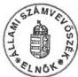

*Állami Számvevőszék*---

# JELENTÉS

## A BELSŐ ELLENŐRZÉS MŰKÖDÉSÉRŐL 1996-1997. ÉVEKBEN KILENC ÁLLAMI TULAJDONBAN LÉVŐ RÉSZVÉNYTÁRSASÁGNÁL

(Összefoglaló a Magyar Államvasutak, Magyar Posta, Magyar Távközlési, Antenna Hungária, Szerencsejáték, Volánbusz, Alba Volán, Dél-Pest Megyei Mezőgazdasági, Komáromi Mezőgazdasági Részvénytársaságok ellenőrzése során tett megállapításokról)

---3803

1998. július

---

Az ellenőrzés végrehajtásáért felelős:

Halász Gejza

számvevő igazgató

Az ellenőrzést vezette:

Dr. Kovácsné dr. Pósfay Zsuzsanna

osztályvezető főtanácsos

A jelentést készítették és
az ellenőrzésben részt vettek:

Koós Lászlóné

számvevő

Korondi János

számvevő tanácsos

Dr. Németh Klára

számvevő

Dr. Podonyi László

számvevő tanácsos

Rideg Margit

számvevő tanácsos

Tóth Pál

számvevő tanácsos

Vati László

számvevő

---

V-22- 15/1997-1998. TÉMASZÁM: 397.

# TARTALOMJEGYZÉK

BEVEZETÉS 3

I. ÖSSZEGZŐ MEGÁLLAPÍTÁSOK, KÖVETKEZTETÉSEK, JAVASLATOK 7

1.Osszegz'megallapitasok,kovetkeztetesek 7
2.Javaslat 9

II. RÉSZLETES MEGÁLLAPÍTÁSOK 10

1.1.A belso ellenorzs jogi kornyezete 10
1.2.A belso ellenorzési rendszer szervezetei, belso szabalyai es normai 10
1.3.A belso ellenorzs hatekonysaga 13

2. A hazai belső ellenőrzési gyakorlat és az INTOSAI szabványok összeha-
sonlítása 14

2.1. ÁLTALÁNOS SZABVÁNYOK (normák, kritériumok) 14

2.1.1.Megfelelo (esszeri)biztositek 14
2.1.2. Támogató hozzaállás 14
2.1.3. Tiszteşeg és hozzaértes (kompetencia) 15
2.1.4. Ellenorzési celkituzesek 15
2.1.5.Az ellenorzs megfigyelese 15

2.2. RÉSZLETES SZABVÁNYOK (normák, kritériumok) 16

2.2.1.Dokumentalas 16
2.2.2. Az ügyletek és események azonnali és megfelelo feljegyzese, mi-nösítese (osztályozása) 16
2.2.3. Az ügyletek és események engedélyezese és vegrehajtasa 16
2.2.4.Feladatok megosztasa 17
2.2.5.Felugyelet 17
2.2.6.A forrasok es adatok megtekintese es szamonkere 17

1

---

，

“

.

-

.

-

---

# JELENTÉS

## A BELSŐ ELLENŐRZÉS MŰKÖDÉSÉRŐL 1996-1997. ÉVEKBEN KILENC ÁLLAMI TULAJDONBAN LÉVŐ RÉSZVÉNYTÁRSASÁGNÁL

(Összefoglaló a MÁV, Magyar Posta, MATÁV, Antenna Hungária, Szerencsejáték, Volánbusz, Alba Volán, Dél-Pest Megyei Mezőgazdasági, Komáromi Mezőgazdasági Részvénytársaságok helyszíni ellenőrzése során tett megállapításokról.)

## BEVEZETÉS

**Az ellenőrzés célja** az Állami Számvevőszékről szóló 1989. évi XXXVIII. törvény 2. §. (6) bekezdésében foglaltaknak megfelelően **annak feltárása volt, hogy Magyarországon az állami tulajdonú gazdasági társaságoknál** a társadalmi és gazdasági átalakulás 1996-1997. évek közötti szakaszában **a belső ellenőrzés miként működött**. A tényfeltárás kiterjedt a belső ellenőrzés jogi- szabályozási környezetére, a szervezeti rendszerre, a cégek belső szabályaira és normáira, valamint a rendszer működésének hatékonyságára.

**A téma feldolgozása az Állami Számvevőszéknek az INTOSAI Belső Ellenőrzési Szabvány Bizottságában végzett koordinátori tevékenységéhez is kapcsolódott.** Feladat volt ezért a tényfeltárás eredményeinek összegzése után a magyarországi belső ellenőrzési tevékenység összehasonlítása az INTOSAI - 1991 évben közzétett - irányelveivel, az azokból kiválasztott és alapvetőnek tekintett általános és speciális szabványokkal.

**A hazai felfogás a belső ellenőrzés rendszerének fogalomkörébe** tartozónak a vezetői ellenőrzést, a munkafolyamatokba épített ellenőrzést és a függetlenített belső ellenőrzést tekinti. A belső ellenőrzéssel foglalkozó hazai szakirodalom definíciói szerint, leegyszerűsítve:

**A vezetői ellenőrzés** a vezetők irányító munkájának szerves része, a tervezés, a szervezés, a döntés-előkészítés, a döntés, az utasítás és a végrehajtás funkciókhoz kapcsolódó számonkérés. A különböző szintű vezetői funkciók munkamegosztását, a döntési és felelősségi hatáskörök elhatárolását a szervezeti és működési szabályzatok (SZMSZ) rögzítik. Az SZMSZ, a vezetők munkaköri leírásai, esetleg munkaszerződésük rendelkezik ellenőrzési kötelezettségükről. A vezetői ellenőrzés a vezetők közvetlen irányítása alá rendelt munkatársak tevékenységére irányul, azt személyesen kell gyakorolni.

3

---

BEVEZETÉS

A vezetői ellenőrzés gyakorlata a munkafolyamatba épített ellenőrzésen, a beszámoltatáson, az aláírási jogkör gyakorlásán, az információk áramlásán, a szűrőpróbaszerű vagy tételes ellenőrzésen keresztül valósul meg.

A munkafolyamatba épített ellenőrzés olyan - a vezetés által tervezett és szervezett-automatizmus, amely folyamatosan figyeli és ellenőrzi a tevékenységek folyamatát és jelzi a normáktól, követelményektől való eltérést.

Munkahelyi utasításban vagy egyéb előírásokban szükséges rögzíteni azt, hogy az egyes munkafolyamatokban mely ponton, kinek vagy minek, mikor, mit, milyen rendszerességgel és módszerrel kell ellenőrizni, illetve mi a teendő a hiányosság észlelése esetén. A munkafolyamatba épített ellenőrzés a munkafolyamatban résztvevő dolgozók (vezetők és beosztottak) feladata.

A munkafolyamatba épített ellenőrzés legfontosabb területein szervezetileg önállósult ellenőrzési formákat, ún. szakellenőrzéseket lehet alkalmazni. A szakellenőrzést külön szabályozás keretében kell működtetni.

A függetlenített belső ellenőrzés feladata az, hogy segítse a vezetés döntéseinek előkészítését, végrehajtását, a tevékenység gazdaságosságának növelését a hiányosságok és az akadályozó tényezők feltárásával. Feladatait úgy kell kijelölni, hogy azok a szervezet alapvető céljainak alátámasztását, a célok megvalósítását szolgálják, az adott helyen és időben megvalósított olyan ellenőrzési módszerrel, amelyet az ellenőrzés más formáival vizsgálni nem lehet.

A függetlenített belső ellenőri szervezet (a belső ellenőr) az elsőszámú vezető felügyelete és irányítása alatt működik, a munkafolyamatokban nem vesz részt. Gazdasági társaságoknál az irányítás a Felügyelő Bizottság feladata, ezáltal a függetlenített belső ellenőrzés egyrészt segíti a tulajdonosi érdekek érvényesülését, másrészt a munkaszervezet vezetését is szolgálja. Az ellenőrzési szakmai közvélemény, szakirodalom e kettős szolgálat miatt megkérdőjelezi az ily módon szervezett belső ellenőrzés függetlenségét.

Az INTOSAI célja az, hogy az irányelveiben megfogalmazott belső ellenőrzési szabványokkal megerősítse a pénzügyi vezetést és az állami szektorban összpontosított számonkérést valósítson meg. A magyar részvénytársaságok belső ellenőrzési gyakorlata ennek közvetlenül nem feleltethető meg, így csak arra volt mód, hogy a szabványok tartalmi elemzését követően vessük össze azokat a magyar gyakorlattal. Az összevetést 5 általános és 6 speciális - általunk kiválasztott és alapvető kritériumnak tartott - szabványra végeztük el.

A tartósan állami tulajdonban maradó részvénytársaságok hazánkban jelentős - mintegy 400 milliárd Ft értékű - állami vagyont működtetnek. Az állam joga és kötelezettsége, hogy ezeket a gazdasági társaságokat és az állami szektor részét képező más szervezeteket - az állami vagyon megőrzése és gyarapítása, a károk megelőzése, illetve időbeli feltárása érdekében - működtetési rendszerükbe épített folyamatos és hatékony pénzügyi és gazdasági ellenőrzésnek vesse alá. A társasági működést szabályozó törvényi előírások betartatásán túl általános tulajdonosi elvárásként az fogalmazható meg az Rt.-k menedzsmentje számára, hogy olyan szervezeti, szabályozási

4

---

BEVEZETÉS

és információs rendszert alakítsanak ki, amelyben biztosítható az eredményes működés, a hiányosságok feltárhatók, a felelősök megtalálhatók és felelősségre vonhatók. A belső ellenőrzési rendszer működésének minősége ezért tulajdonosi érdek és alapvető kockázati tényező a részvénytársaság megítélhetőségében.

A tényfeltárás és összehasonlítás kilenc állami tulajdonú részvénytársaságra (továbbiakban: Rt.) terjedt ki, amelyeket az Állami Számvevőszék korábban ellenőrzött. A vizsgálat időpontjában közülük nyolc 100 %-ban, egy 33 %-ban állami tulajdonban volt. Az ÁSZ ügykörébe tartozó, tartósan állami tulajdonban maradó kilenc részvénytársaság összesen 238 milliárd Ft értékű állami vagyont működtet. Zömében közszolgáltatók, és/vagy stratégiai szempontból fontosak, illetve a nemzetgazdaság működőképessége szempontjából jelentősek. Jellemzően állami feladatot látnak el, ehhez állami vagyont és részben állami pénzt használnak fel. A lakosságot és a vállalkozásokat érzékenyen érinti, hogy miként alakul a közszolgáltató Rt.-k (MÁV, Magyar Posta, MATÁV, Antenna Hungária, Volánbusz, Alba Volán) teljesítőképessége, áraik és szolgáltatásaik minősége, mennyisége. Eltér az előbbiektől a Szerencsejáték Rt., ahol a fogadások tisztasága is fontos szempont, valamint a két mezőgazdasági Rt.(a Dél-Pest megyei és a Komáromi), amelyeknél speciális szabályokat is be kell tartani (pl. a biológiai alapok védelme, fajtiszta vetőmag és szaporítandó tenyészállat előállítása).

A vizsgált cégek korábban államigazgatási felügyelet alatt álló állami vállalatok voltak, amelyeknek kötelező volt gazdasági társasággá átalakulni 1993. december 31-ig (1992.: LIII., LIV., LV. tv.). Az átalakulás előtti évtizedekben az állam az állami vállalatok ellenőrzéséről szóló többször módosított 39/1978. (VIII. 18.) MT rendeletben kötelezte az állami vállalatokat belső ellenőrzési rendszer, ezen belül függetlenített belső ellenőrző szervezet működtetésére, és mindezekre részletes szabályokat írt elő. Következésképpen amikor az országos nagyvállalatok átalakultak részvénytársasággá, már régóta rendelkeztek belső ellenőrzési szabályzattal és elkülönült belső ellenőrző szervezettel is (Ellenőrzési Szakosztály, Ellenőrzési Iroda, Ellenőrzési Igazgatóság, Ellenőrzési Osztály). A belső ellenőrzési rendszert (vezetői, munkafolyamatba épített ellenőrzés, függetlenített belső ellenőrzés) és annak működését, kapcsolatát és együttműködését részletes belső szabályzatokban írták elő. (Pl. A központi ellenőrző szervnek szabályozva volt a kapcsolata és együttműködése a területi szerveknél - regionális igazgatóságoknál - dolgozó belső ellenőrökkel is.)

Az 1992-1996. években a vállalati ellenőrzési rendelet az átalakult Rt.-kre már nem vonatkozott, és fokozatosan háttérbe szorult a belső ellenőrzési rendszer részét képező függetlenített belső ellenőrzési szervezet is, noha munkájukat folyamatosan igénybe vették. A gazdasági társaságokról szóló 1988. évi VI. törvény (Gt.) a függetlenített belső ellenőrzés működtetését a tulajdonosok belátására bízta. A Gt. 295. § (2) bekezdése csupán azt írta elő, hogy ha az rt.-nél van függetlenített belső ellenőrzés, az a Felügyelő Bizottság irányítása alá tartozik.

5

---

BEVEZETÉS---

**Az ellenőrzés módszere:** az ellenőrzési programban meghatározott kérdőíves kérdésekre adott írásbeli válaszokat pontosítottuk szóbeli interjú keretében. Ezt követően a válaszokat összevetettük a rendelkezésre álló dokumentumokkal. Az összevetés csak a szűrőpróbaszerűen kiválasztott dokumentumokra vonatkozott, tesztelésre nem terjedt ki.

Az Állami Számvevőszék tényfeltáró helyszíni ellenőrzését 1997 második félévében hajtotta végre. Az adatszolgáltatók és interjúalanyok a társaság vezérigazgatója, Felügyelő Bizottságának elnöke, valamint a függetlenített belső ellenőrzési szervezetek vezetője, vagy ahol ilyen szervezet nem működött, ott a belső ellenőrök voltak.

---6

---

I. ÖSSZEGZŐ MEGÁLLAPÍTÁSOK, KÖVETKEZTETÉSEK, JAVASLATOK

# I. ÖSSZEGZŐ MEGÁLLAPÍTÁSOK, KÖVETKEZTETÉSEK, JAVASLATOK

## 1. ÖSSZEGZŐ MEGÁLLAPÍTÁSOK, KÖVETKEZTETÉSEK

### A hazai társaságok belső ellenőrzési gyakorlata

A belső ellenőrzési helyzet felmérése az adófizető állampolgárok érdekeit szolgálja azzal, hogy a választott képviselőkből álló Országgyűlést informálja az állami tulajdonú részvénytársaságok belső ellenőrzési rendszerének helyzetéről. Az általános érvényű összegző megállapítások, következtetések súlypontját - a vezetői, a munkafolyamatba épített ellenőrzés mellett - a függetlenített belső ellenőrző szervezetek működése képezte, a vizsgálat idején hatályos társasági törvény (1988. évi VI. tv.) és a társasági szabályozás rendelkezéseihez mérten.

A korábban állami vállalatként működő cégek átalakulásuk után részvénytársaságként fáziskéssel ugyan, de szabályozták és működtették a vezetői és a munkafolyamatba épített ellenőrzést. A vezetői és a munkafolyamatba épített belső ellenőrzési rendszer szabályozott működtetését alapvetően az alapító okiratban, az alapszabályban, az ezekre épülő Szervezeti és Működési Szabályzatokban, a munkaszerződésekben, a munkaköri leírásokban, belső ellenőrzési szabályzatokban, egyéb pénzügyi-gazdasági, műszaki utasításokban, technológiai szabályzatokban biztosították. Az országos hálózatot működtető társaságok szabályozottsága korszerűbb, részletesebb, mindenhol szabályozták a belső ellenőrzési rendszert. A kis társaságok folyamatosan vizsgálták felül szabályozottságukat, belső ellenőrzési szabályzatuk elavult, a gyakorlatban nem azt alkalmazták, hanem éves munkaterv szerint foglalkoztatták az egy fő belső ellenőrt. Ahol a belső szabályozást nem aktualizálták, vagy azt nem alapozta meg az átalakult cég rendszerének előzetes átvizsgálása, lefedetlen ellenőrzési területek maradhattak. Az 1996-97. évek folyamán a vezetői ellenőrzés jól működött. A kis cégeknél elsősorban a vezetői ellenőrzés volt a meghatározó, a munkafolyamatba épített és a függetlenített belső ellenőrzés kisebb egyenlőséggel, de szabályozottan működött. A legtöbb feladat - valamennyi társaságnál - a munkafolyamatba épített ellenőrzés területén maradt, annak ellenére, hogy az országos hálózatot működtetői minőségbiztosítási rendszert is kiépítettek. Valamennyi társaság a szakmai sajátosságai szerint szakellenőröket is foglalkoztatott.

**Annak ellenére, hogy a gazdasági társaságokról szóló törvény nem kötelezte az Rt.-ket függetlenített belső ellenőrzési szervezet működtetésére, valamennyi társaság foglalkoztatott belső ellenőrt/elkülönült belső ellenőri szervezetet. Az országos hálózatot működtető nagy cégek központi és területi önálló ellenőrzési szervezetet működtettek, és fejlesztették is azokat.** (A független ellenőrző szervezet szerepének erősítése a külföldiek többségi tulajdonába került MATÁV-nál egyértelmű.

7

---

I. ÖSSZEGZŐ MEGÁLLAPÍTÁSOK, KÖVETKEZTETÉSEK, JAVASLATOK

Itt ágazati szintre emelték a függetlenített belső ellenőrzést.) A kis társaságok csak egy fő belső ellenőrt foglalkoztattak.

Az állam - mint tulajdonos - ellenőrző funkciójának érvényesülése szempontjából kedvezőtlen, és a belső ellenőröknek is gondot okozott valamennyi társaságnál az, hogy **a hatályos magyar társasági jog a gazdasági társaságok függetlenített belső ellenőrzésére nem tartalmazott címzett rendelkezéseket.** Ilyen rendelkezéseket, vagy ellenőrzési standardokat a tulajdonos sem fogalmazott meg. **Így** a hatályos törvényi és társasági szabályozásban és a gyakorlatban is **összemosódott a tulajdonosi és a menedzsmenti ellenőrzési kötelezettség és hatáskör.** Ezek szétválasztása, a függelmi viszonyok, a jogok, a hatáskörök, a feladatok, a felelősségek pontos meghatározása a tulajdonos és a menedzsment jól felfogott érdeke és feladata lett volna.

A társaságoknál a függetlenített belső ellenőrzést az FB elnöke irányította. A belső ellenőrök munkajogilag a vezérigazgató alá tartoztak. A munkatervet az FB elnöke hagyta jóvá, a vezérigazgató egyetértésével. Az ad hoc feladatok esetében váltakozott, melyikük adta ki a megbízást. A belső ellenőr, vagy a függetlenített belső ellenőri szervezet egyaránt kiszolgálta az Rt. vezérigazgatóját - rajta keresztül az ügyvezetést is - és a Felügyelő Bizottságot. **A belső ellenőr így nem volt független sem a menedzsmenttől, sem a tulajdonostól E kettős szolgálat miatt függetlensége vitatható volt.**

Az elmúlt két évben a 100 %-ban állami tulajdonú társaságok szervezete, ügyvezetése, Felügyelő Bizottsága és menedzsmentje változott. A változó szervezetben a szabályzatok fáziskéssel követték a tényleges működést. Mindezek ellenére a belső ellenőrzések számos gazdasági, pénzügyi hibát, esetenként rendészeti ügyet (lopást, sikkasztást, vandál rongálást) is feltártak.

A belső ellenőrök többségének felső fokú végzettsége és hosszú szakmai gyakorlata van. A belső ellenőrök helyzete a nagy cégeknél általában kedvezőbb volt, mint a kis és közepes nagyságúaknál. Közös gondjuk volt a bizonytalanság amiatt, hogy tevékenységüket és függetlenségüket törvényi keretek nem garantálják. A belső ellenőrök szükségesnek tartották a belső ellenőrzési rendszerre vonatkozó törvény megalkotását.

### **A hazai társasági belső ellenőrzési gyakorlat összevetése az INTOSAI szabványokkal**

**Az Rt-k vezetői és belső ellenőrei** az INTOSAI belső ajánlásait nem ismerték. Az **INTOSAI** szabványokból kiválasztott és velük megismertetett általános és speciális **normákkal valamennyien egyetértettek, munkájukban alkalmazták azokat anélkül, hogy azt kritériumként megfogalmazták volna.** Véleményük szerint a társaság céljainak elérése, a feladatok teljesítése, a törvényes működés érdekében szükséges az alapvető kritériumok figyelembe vétele és alkalmazása. Szakmai felismerés az, hogy Magyarországon a vezetők ellenőrzést támogató hozzáállása, az ésszerű biztosítékok, a tisztesség és a kompetencia, a dokumentálás és a többi kiválasztott, alapvető kritérium nélkül hatékonyan működni, működtetni és ellenőrizni a gazdasági társasági szférában sem lehet.

8

---

I. ÖSSZEGZŐ MEGÁLLAPÍTÁSOK, KÖVETKEZTETÉSEK, JAVASLATOK

Az állami tulajdon hatékonyabb és átláthatóbb működtetése érdekében szükséges az állam tulajdonában, résztulajdonában álló gazdasági társaságok belső ellenőrzési rendszerére vonatkozó átfogó ellenőrzési szabványok, kritériumok kidolgozása.

Az ellenőrzési standardok kidolgozásánál célszerű figyelembe venni mind az INTOSAI, mind az Európai Unió ilyen irányú ajánlásait. Bár a vizsgálat nem terjedt ki a költségvetési szervezetekre és az önkormányzatokra, belső ellenőrzési rendszerük szabályozását kívánatos az állami tulajdonú gazdasági társaságokéval egyidejűleg felülvizsgálni.

## 2. JAVASLAT

### Az Országgyűlés

- hatalmazza fel az Állami Számvevőszéket ellenőrzési szabványok és kritériumok kidolgozására. A kritériumokban kell meghatározni a belső ellenőrzés fogalomrendszerét, szabályozni feladatait, formáit, módszereit, az ellenőrzöttek és az ellenőrök jogait és kötelezettségeit, a belső ellenőrök függetlenségének biztosítékait, a velük szemben támasztott etikai és szakképzettségi előírásokat, a különböző ellenőrzési területeken foglalkoztatottak egymás közötti kapcsolat- és felelősségrendszerét;
- alkosson törvényt a kidolgozott szabványnak és kritériumnak kötelező alkalmazására, a kötelezettek körére.

9

---

II. RÉSZLETES MEGÁLLAPÍTÁSOK---

# II. RÉSZLETES MEGÁLLAPÍTÁSOK

## 1.1. A belső ellenőrzés jogi környezete

**A magyar törvénykezés** a gazdasági társaságok ellenőrzésére **liberális rendelkezéseket hozott. A gazdasági társaságokról szóló legújabb 1997. évi CXLIV. törvény a függetlenített belső ellenőrzésről már nem rendelkezik.** E jogfelfogás szerint a Felügyelő Bizottság ellenőrzi az ügyvezetést, valamint a gazdálkodással összefüggő azon lényeges ügyeket, amelyekről az rt legfőbb szervének - a közgyűlésnek - a Felügyelő Bizottság köteles beszámolni (1997.: CXLIV. tv. 32. §). Ezen kívül törvényben előírt ellenőrző szerepe csak a könyvvizsgálónak van.

**A belső ellenőrzés rendszerének jogi környezete azonban bővebb.** Ide tartoznak az **ún. ágazati törvények** (mint pl. a vasutakról, a postáról, a távközlésről, a közúti közlekedésről, a szerencsejátékról, vagy a koncesszióról szólóak), továbbá **az általános érvényű törvények** is. (Pl. a számviteli törvény, a költségvetési törvény, az adó, valamint az állam tulajdonában lévő vállalkozói vagyon értékesítéséről szóló törvények.)

**A kialakult helyzet-** az egyre számosabb törvény betartatása, az egyre bonyolultabb pénzügyi gazdasági folyamatok irányítása-, a folyamatok átláthatósága, a tulajdonos érdeke **szükségessé teszi függetlenített belső ellenőrzés működtetését.** Az Rt.-ket a társasági törvény erre nem kötelezi, de a tulajdonos és a menedzsment saját érdekében működteti ezeket. A nagy cégek önálló ellenőri szervezetet működtetnek, a kisebbek pedig egy önálló belső ellenőrt alkalmaznak. A tulajdonosi érdek e szervezeteken keresztül érvényesítése az országos hálózatot működtető szervezeteknél (MÁV, Posta, MATÁV, Antenna Hungária) volt o legjobban kiépítve.

## 1.2. A belső ellenőrzési rendszer szervezetei, belső szabályai és normái

A gazdasági társaságokról szóló 1988. évi VI. törvény alapján **a vizsgált Rt.-ék legfőbb szerve a közgyűlés, amelynek hatáskörét - a MATÁV-ot kivéve - az alapító miniszter** (közlekedési-, hírközlési és vízügyi, pénzügyminiszter), illetve az ÁPV Rt. **gyakorolja.** Ügyvezető szervezetük az igazgatóság.

A gazdasági-pénzügyi ellenőrzést a Felügyelő Bizottság, a könyvvizsgáló, valamint a függetlenített belső ellenőrzés végzi. A gazdasági társaságokról szóló törvény szabályozza a feladatokat, a hatáskört és az összeférhetetlenséget, de csak az FB és a könyvvizsgáló esetében.

---10

---

II. RÉSZLETES MEGÁLLAPÍTÁSOK

**Magyarországon nincs olyan jogszabály, amelyben** megfogalmazták volna a belső ellenőrzés helyét, függelmi viszonyait, jogi lehetőségeit, formáit, módszereit, a vele szemben támasztott elvárásokat, az ellenőrzöttek és az ellenőrök jogait. Nem fogalmazták meg a belső ellenőrök függetlenségének kritériumait, a velük szemben támasztott etikai és szakképzettségi előírásokat, az ellenőrzéssel foglalkozók egymás közötti kapcsolatrendszerét. **Jogi szabályozás hiányában a többször módosított 39/1978. (VII. 18.) MT r., az állami vállalatok ellenőrzésére vonatkozó rendelet szemlélete alakítja a társaságok ellenőrzési rendszerének mechanizmusát, szabályozottságát és szabályozatlanságát is. Ennek megfelelően a belső ellenőrzési rendszer alatt az Rt.-kben is a vezetői, a munkafolyamatba épített és függetlenített belső ellenőri szervezetet értik.**

Az általános vezetői ellenőrzés, a munkafolyamatba épített és a függetlenített belső ellenőrzés szervezeti rendszerét, tevékenységét, tárgykörét és hatókörét valamennyi Rt. az alapító okiratban, alapszabályban, Szervezeti és Működési Szabályzatban határozta meg.

A belső ellenőrzési rendszer működésének részletesebb belső szabályait és normáit a társaságok különböző formában szabályozták. A társaság ellenőrzésének átfogó rendszerét csak a nagy cégek szabályozták. A kis társaságok ellenőrzésük átfogó rendszerét, a vezetői és a munkafolyamatba épített ellenőrzést megkésve utólagosan szabályozták. A vezetői információs rendszer kiépítése, az átfogó kontrolling tevékenység megszervezése a vizsgálat idején már megkezdődött. Minőségbiztosítási rendszer kiépítését a társaságok is szükségesnek tartották.

**A vezetői ellenőrzési kötelezettséget** az SZMSZ-ben, a munkaszerződésekben, a munkaköri leírásokban rögzítették. Az országos hálózatot működtető társaságok az SZMSZ mellett a munkaszerződésekben részletezték a feladatot, a kis társaságok az SZMSZ-t szerkesztették munkaköri leírás mélységig. Az egyéb társasági szabályzatok közül a kollektív szerződésben és a munkaügyi szabályzatban helyeztek el az ellenőrzéssel kapcsolatos előírásokat, dokumentumokat.

A vezetői ellenőrzés rendszeresen működött a vizsgált Rt.-knél. A vezetők az irányításuk alá rendelt dolgozók munkájának ellenőrzését közvetlen beszámoltatással, vagy helyszíni ellenőrzéssel, dokumentumok, okmányok ellenőrzésével, valamint az aláírási és utalványozási jog gyakorlásával valósították meg. Az aláírási jogosultság a társaságoknál szabályozott. A képviseleti, kötelezettségvállalási jogosítványok kereteit az Alapító Okiratban és a Szervezeti Működési Szabályzatban meghatározták. A jogosítványok tételes szabályait vezérigazgatói utasításban rögzítették a végrehajtó szervezetek számára. A gyakorlatban mindez időszakonként egyenetlenül funkcionált.

**A munkafolyamatba épített ellenőrzés** - a vezetés által tervezett és szervezett automatizmus - szervezeti rendszere az SZMSZ-re épül. A munkafolyamatok elemeinek szabályozását valamennyi társaságnál a feladat-, jog- és hatáskörhöz kapcsolódó szabályzatkészítési, utasítási rendelkezésekben határozták meg.

11

---

II. RÉSZLETES MEGÁLLAPÍTÁSOK

A munkafolyamatba épített ellenőrzés szabályait az Rt.-k Szervezeti és Működési Szabályzata, valamint a cég nagyságrendjétől függően az Igazgatóság/ok Szervezeti és Működési Szabályzata, továbbá címzetten a 'Belső Ellenőrzési Szabályzat' tartalmazta. Néhány esetben a szabályozás nem volt teljes körű, és a különböző munkaszakaszokra vonatkozó belső előírásokat is aktualizálni és harmonizálni szükséges. A munkafolyamatba épített ellenőrzés kiterjedt formája nagy társaságoknál a szakellenőrzési rendszer, melyet kézikönyvszerű részletes utasítások szabályoznak (pl. vasútbiztonsági, pénztár-ellenőrzési, bevétel-ellenőrzési utasítások szakterülete). A szakszolgálatok minőségellenőrző, elemző és értékelő rendszerét az országos hálózatot üzemeltető Rt.-knél cégspecifikus belső utasítások szabályozzák. Az ehhez kapcsolódó mutatókat rendszeresen elemzik, és a vezetés kiértékeli. A kis társaságok is foglalkoztatnak tevékenységükhöz speciálisan kapcsolódó szakellenőröket.

**A függetlenített belső ellenőri szervezet, belső ellenőr** működését, eljárási rendjét az országos hálózatot működtető társaságok szabályozták. A Belső Ellenőrzési Szabályzatot az Rt.-k elnöke/vezérigazgatója, a Felügyelő Bizottság elnöke hagyta jóvá. Ebben rögzítették a függetlenített belső ellenőr/i szervezet feladatát, hatáskörét, szervezetét működési mechanizmusát, felelősségét, valamint függelmi viszonyait. A belső ellenőr jogait, kötelességeit, felelősségét a munkaköri leírások tartalmazták. A MATÁV szabályozta az ellenőrökkel szemben támasztott szakmai és etikai elvárásokat is.

A nagyvállalatoknál volt elkülönült ellenőrzési szervezet (osztály, iroda, a MATÁV-nál igazgatóság) a kisebbeknél független belső ellenőr, akiket a Felügyelő Bizottság és a vezérigazgató irányított és felügyelt. Munkajogilag a vezérigazgatóhoz tartoztak. A belső ellenőr/zés éves munkatervét a két irányító együttesen hagyta jóvá. A belső ellenőr, vagy a függetlenített belső ellenőri szervezet egyaránt kapott feladatot az Rt. elnökétől, vezérigazgatójától és a Felügyelő Bizottságtól. **A belső ellenőr így a kettős függelmi viszonyban nem lehetett független.**

A belső ellenőri szervezetek az éves munkatervek alapján végzett ellenőrzések során főként az adózásra, a mérleget befolyásoló elszámolási hibák kiszűrésére koncentráltak. Rendszeresen foglalkoztak az Rt.-k jogszerű és szabályos működésével, az eredményes gazdálkodás számonkérésével. A függetlenített belső ellenőri szervezet a könyvvizsgálóval, a szakági, szakigazgatási ellenőrökkel is együttműködött. A belső ellenőrök jelentős része felsőfokú képzettségű, és hosszú szakmai gyakorlattal rendelkezik az adott cégnél.

**Lényeges körülmény, hogy a nagy közszolgáltató részvénytársaságok tevékenysége sokoldalúan szabályozott: a hatályos törvények betartásán túl nemzetközi egyezmények és belföldi hatósági rendelkezések, valamint saját szabályzataik szerint működnek** (MÁV, Posta, MATÁV, Antenna Hungária, Volánok).

Az átalakulást követő években az állami tulajdonú társaságok szervezete, ügyvezetése, Felügyelő Bizottsága és menedzsmentje gyakran változott. Állandósuló gond volt a törvények, és más jogszabályok gyors és nagy tömegű változtatása miatt az, hogy a nagy társaságok csak fáziskéssel tudták a részletesen kidolgozott szabályzatokat kiegészíteni, módosítani, összhangba hozni a válto-

12

---

II. RÉSZLETES MEGÁLLAPÍTÁSOK

zásokkal, a kis társaságok pedig most vizsgálják felül szabályozottságukat a tényleges működés alapján. Mindezek miatt időszakosan lefedetlen ellenőrzési területek maradhattak. De tény az is, hogy a belső ellenőrzések számos gazdasági, pénzügyi hibát, esetenként rendészeti ügyet is feltártak.

Az Állami Privatizációs és Vagyonkezelő Rt. tulajdonosi ellenőrzési jogait a Felügyelő Bizottságokon keresztül gyakorolta. Hatékonyabb lenne tevékenységük, ha a számonkérést folyamatosan és rendszeresen valósítanák meg. A Felügyelő Bizottságoknak szorgalmazni kellene a társaságok belső ellenőrzési rendjének kidolgozását. A belső ellenőr munkatervében a feladatot pontosan és egyértelműen kellene meghatározni. A Felügyelő Bizottságnak kellene szabályozni és számon kérni az Rt. vezetésétől a helytálló és elfogadott belső ellenőri megállapítások realizálását. A Felügyelő Bizottságoknak nagyobb gondot kellene fordítaniuk működésük dokumentálására az ellenőrizhetőség és a felelősségre vonhatóság érdekében.

### 1.3. A belső ellenőrzés hatékonysága

**Az Rt.-k belső szabályozottsága általában megfelelő alapot biztosított a vezetői és a függetlenített belső ellenőrzés működéséhez.**

*A munkafolyamatba épített ellenőrzés hatékonysága* azon helyeken volt kielégítő, ahol már a következő munkafolyamatban kiderült az előző fázisban elkövetett hiba. Azonban a gyakran átszervezett, gyorsan csökkenő vagy növekvő tevékenységű Rt.-knél megbízható módon nem volt nyomon követhető, mennyiben maradtak fenn zárt rendszert képező, jól átlátható munkafolyamatok. A gyors és folytonos változások közepette több volt a tévedés. Ezen rt.-knél sok volt a személycsere is. Gyakran nem az fejezte be a munkát aki elkezdte. Részben ez a magyarázat arra, hogy nehéz volt a személyi felelősség megállapítása és személyi szankciók alkalmazása.

A függetlenített belső ellenőrzés ismétlődő vizsgálatai a belső munkafolyamatokban meglévő működési és rendszerbeli hibákra is felhívták a figyelmet. A jelentős ügyeket kivizsgálták, indokolt esetekben az Rt.-k vezetése megtette a szükséges intézkedéseket. Az országos hálózatot működtető nagy cégeknél (pl. MÁV, Posta, MATÁV, Antenna Hungária, Szerencsejáték Rt.) fejlesztették a belső ellenőrzést, a vezetők támogató hozzáállást tanúsítottak. Az Állami Számvevőszék vizsgálata idején feltárt hiányosságok felszámolására, a belső ellenőrzés megerősítésére 1997. év folyamán intézkedtek.

A vizsgált cégeknél többnyire nem mutatták ki számszerűen a belső ellenőrzés munkája folytán megtakarított pénzt, vagy a megelőzött kár összegét, de egybehangzóan úgy ítélték meg, hogy az sokszorosa annak, mint amibe a belső ellenőrzés fenntartása kerül. **Az ellenőrzésre közvetlenül címezhető ráfordítások elenyészőek az ellenőrzött folyamatok és a működtetett vagyon értékéhez képest.**

13

---

II. RÉSZLETES MEGÁLLAPÍTÁSOK

## 2. A HAZAI BELSŐ ELLENŐRZÉSI GYAKORLAT ÉS AZ INTOSAI SZABVÁNYOK ÖSSZEHASONLÍTÁSA

### 2.1. ÁLTALÁNOS SZABVÁNYOK (normák, kritériumok)

#### 2.1.1. Megfelelő (ésszerű) biztosíték

*A költség, haszon és kockázati szempontok figyelembevételével a belső ellenőrzési rendszert úgy kell kialakítani, hogy biztosítékot jelentsen a szervezet céljainak megvalósulásához, de az ellenőrzés költségei ne haladják meg az ellenőrzés révén elért eredményt.*

Megfelelő (ésszerű) biztosíték mint kritérium érvényesülése a részvénytársaságok belső ellenőrzési rendszere kialakításánál általában nem állapítható meg. A teljes ellenőrzési rendszer működési költségeit és hasznait összevető számításokat csak kevés társaság végzett. Az ellenőrzések egy részének hatását nem, vagy nehezen számszerűsíthetőnek tartják.

Megállapítható azonban, hogy a vezetés, az országos hálózattal rendelkező társaságoknál elsősorban a felső vezetés, részletesen ismerte azon megvalósítandó célkitűzéseket, amelyek szükségesek a költséghatékony, s egyben a kockázatot megfelelő szintre csökkentő ellenőrzések, vizsgálatok megszervezéséhez. A Társaságok szerint az ellenőrzési rendszer költségigénye nagyságrendekkel kisebb az ellenőrzésekkel feltárt hibák miatti károknál.

A MATÁV Rt.-nél a társaság külső megítélése, tőzsdei bevezetése megköveteli az adatok valódiságát, megbízhatóságát. Ennek biztosítása kiemelt társasági érdek, amelyet az ellenőrzési rendszer hatékony működtetésével kívánnak elérni. A független belső ellenőrzési szervezet munkatervének összeállításánál 1997-től kockázati szempontokat is figyelembe vettek.

A Szerencsejáték Rt.-nél a függetlenített belső ellenőrzésre vonatkozóan a vizsgálatok megkezdése előtt létszám- és időszükséglet számítást végeztek.

#### 2.1.2. Támogató hozzáállás

*A vezetők és a beosztottak mindenkor mutassanak pozitív és támogató hozzáállást az ellenőrzéshez. A felső vezetés példamutatása döntő jelentőségű e cél elérésében.*

Megállapítható, hogy minden Társaságnál elsősorban a felső vezetők támogatják az ellenőrzést. A nagyobb (országos hálózatú) társaságoknál a független belső ellenőrzési szervezetet központi, ágazati szintre emelték.

A vezetők tudatában vannak példamutatásuk jelentőségének. A független belső ellenőrök anyagi megbecsülése azonban nem mindenhol tükrözi a vezetők támogató hozzáállását.

14

---

II. RÉSZLETES MEGÁLLAPÍTÁSOK

### 2.1.3. Tisztesség és hozzáértés (kompetencia)

*A vezetők és a beosztottak szakmailag és emberileg legyenek tisztességesek, legyenek etikai értékeik. Rendelkezzenek az eredményes és hatékony munkavégzéshez szükséges ismeretekkel, és ismerjék az eredményes munkavégzésükhöz szükséges belső ellenőrzés lényegét.*

A tisztesség és hozzáértés, kompetencia tekintetében az volt megállapítható, hogy, bár nincs minden társaságnál kidolgozott etikai kódex, a vezetők, a beosztottak szakmailag és emberileg is becsületesek, megfelelő etikai értékekkel is rendelkeznek. Olyan szakmai ismereteik vannak, melyek révén a belső ellenőrzés kialakításának, fenntartásának jelentőségét megértik és teljesítik azokat a célkitűzéseket, melyek biztosítják az eredményes és hatékony munkavégzést.

A MÁV Rt.-nél nagy arányban követelik meg dolgozóiktól az erkölcsi bizonyítványt. A minden munkafolyamatra szigorúan kidolgozott utasítások betartását megkövetelik, a belső ellenőrzési rendszer szabályait alaposan kimunkálták annak megtartását következetesen ellenőrzik.

A MATÁV Rt. az 1997-ben megújított etikai kódexben fogalmazta meg a munkatársakkal szemben támasztott, többek között a bizalmas információk kezelésére, az együttműködési kérdésekre és az ügyfélkapcsolatra vonatkozó elvárásokat. Vezérigazgatói utasításban külön szabályozták az összeférhetetlenséget is. A MATÁV dolgozók 67 %-a rendelkezik erkölcsi bizonyítvánnyal.

### 2.1.4. Ellenőrzési célkitűzések

*A szervezet minden tevékenységére specifikus ellenőrzési célkitűzéseket kell kialakítani. Ezek legyenek ésszerűek, átfogóak, indokoltak, és épüljenek be (integrálódjanak) a teljes szervezet általános célkitűzéseibe.*

A Társaságok belső utasításaira, szabályzataira az jellemző, hogy az ellenőrzési tevékenységek célját világosan megfogalmazták. Ezek a célok egyértelműen kapcsolódtak a teljes szervezet általános célkitűzéseihez, ezáltal a specifikus ellenőrzési célok kitűzése, mint norma a Társaságoknál érvényesül.

### 2.1.5. Az ellenőrzés megfigyelése

*A vezetők részéről legyen folyamatos a tevékenységek, az ellenőrzési rendszer működésének megfigyelése, hogy a feltárt rendellenes, gazdaságtalan, nem hatékony vagy hatástalan tevékenységek szükséges módosítása időben megtörténhessen.*

A Társaságoknál a vezetők ellenőrzési szabályzatban rögzített kötelessége gondoskodni a felügyeletük alá tartozó területen a munkafolyamatba épített ellenőrzés hatékony és folyamatos működéséről.

A vezetői ellenőrzést a függetlenített belső ellenőrzés rendszeresen ellenőrizte. A függetlenített belső ellenőrzés tevékenységének értékelését a Felügyelő Bizottság végezte el minden évben. Az ellenőrzés megfigyelése mint elv, tehát érvényesült.

15

---

II. RÉSZLETES MEGÁLLAPÍTÁSOK---

## 2.2. RÉSZLETES SZABVÁNYOK (normák, kritériumok)

### 2.2.1. Dokumentálás

*A szervezetnél a belső ellenőrzési struktúrát (szervezeti felépítését, tevékenységi kategóriáit, célkitűzéseit, ellenőrzési eljárásait) és minden fontos ügyletet és eseményt dokumentálni kell, és a dokumentációt vizsgálatok céljára azonnal rendelkezésre kell bocsátani.*

A Társaságok szabályzatai - azoknál a társaságoknál, akik ilyet készítettek - a belső ellenőrzési struktúrát dokumentálták. Előírták azt is, hogy az ellenőrzést és az ellenőrzés során tapasztalt eseményeket hogyan kell rögzíteni és a vizsgálatok céljára kinek kell rendelkezésére bocsátani.

Néhány szervezetnél a belső ellenőrzési rendszert az eljárási rendeket átfogóan és egységes szerkezetben nem szabályozták. A szabályozás a belső ellenőrzési struktúra részterületeire terjedt ki és aktualizálásra szorul. A dokumentációkat a vizsgálat céljára rendelkezésre bocsátották.

### 2.2.2. Az ügyletek és események azonnali és megfelelő feljegyzése, minősítése (osztályozása)

*A szervezet tevékenységéhez, a döntések alátámasztásához szükséges információk időszerűsége, megbízhatósága érdekében a fontos ügyleteket és eseményeket a felmerülésükkor azonnal fel kell jegyezni, az ügyletek és események teljes folyamatában.*

A társaságok tevékenységéhez, a döntések alátámasztásához szükséges információk aktuálisak voltak. Az ügyleteket és eseményeket a bizonylati rend szerint feljegyezték. Előfordult, hogy a menedzser típusú vezetők ellenőrzési feladataikat nem dokumentálták, ezzel nehezítették a felelősség megállapítását.

### 2.2.3. Az ügyletek és események engedélyezése és végrehajtása

*Az ügyleteket és eseményeket kizárólag olyan személyek engedélyezzék és hajtsák végre, akiknek erre megfelelő felhatalmazása van. Az engedélyezést dokumentálni kell.*

A Társaságoknál szabályozott volt az ügyletek és események engedélyezése, végrehajtása és azok dokumentálási rendje. Az aláírási, utalványozási és képviseleti jogosultságot szabályozták.

Az engedélyeket csak az arra felhatalmazottak adták, az engedélyezést dokumentálták. A belső ellenőrök jogosultsága szabályozott, a jogosultságot a megbízólevél dokumentálja. Az aláírási és utalványozási jogosultságot a független belső ellenőrök folyamatosan ellenőrzik.

---16

---

II. RÉSZLETES MEGÁLLAPÍTÁSOK

### 2.2.4. Feladatok megosztása

*Az ügyletek és események engedélyezési, feldolgozási, nyilvántartási, ellenőrzési feladatait különböző személyek közt meg kell osztani.*

A munkafolyamatok szabályzataiban, a munkaköri leírásokban egyértelműen meghatározott volt, hogy a különféle ügyletek, események engedélyezése, feldolgozása, nyilvántartása, ellenőrzése kinek a feladata. Ezeket a tevékenységeket különböző személyek végzik.

### 2.2.5. Felügyelet

*A belső ellenőrzés céljainak megvalósítása érdekében hozzáértő felügyeletről is gondoskodni kell. A felügyelők minden dolgozó esetében szisztematikusan ellenőrizzék és hagyják jóvá a dolgozó által végzett munkát. A dolgozó munkája ellenőrzésének, jóváhagyásának feltétele, hogy a feladatot, felelősséget, számonkérést pontosan közöljék a dolgozóval. A felügyelők kötelesek útmutatást adni és betanítani a dolgozókat, hogy a hibák, mulasztások minimálisak legyenek.*

A Társaságoknál dolgozók részére kiadott munkaköri leírások tartalmazzák a feladat meghatározását. A feladat elvégzésének állandó felügyeletét jelenti a munkafolyamatba épített kötelező ellenőrzés elvégzése, illetve a vezetői ellenőrzés gyakorlása.

A társaságoknál a felügyelet ellátása többlépcsős. Így pl. a Magyar Posta Rt.-nél a legfelső vezetési szinten a szakmai irányítást, ellenőrzést, számonkérést egyrészt az Rt. Felügyelő Bizottsága, másrészt a vezérigazgató látja el a Társasági Ellenőrzési Osztályon keresztül. A középfokú postaszervek esetében a szakmai felügyeleti munka végzése a Társasági Ellenőrzési Osztályhoz tartozik.

A MATÁV Rt. hozzáértő felügyeletnek a különböző szinteken szabályozott vezetői ellenőrzést tekinti. Hozzáértő felügyelet a szakellenőrzés, a független belső ellenőri szervezet, az FB ellenőrző tevékenysége és a tulajdonos MagyarCom szakértői tevékenysége is. A külföldi tulajdonos elsősorban a tanácsadó szakértőkön és nem az FB-n keresztül ellenőriz.

Az SZRt.-nél a függetlenített belső ellenőrzés felügyeletének ellátása többlépcsős. A legfelső vezetési szinten a szakmai irányítást, ellenőrzést és számonkérést mellérendelt viszonyban egyrészt az SZRt. Felügyelő Bizottsága, másrészt az elnök-vezérigazgató látja el az Igazgatási és Ellenőrzési Központon keresztül. A területi igazgatóságok esetében a szakmai felügyeleti munka ellátása a központ Belső Ellenőrzési Főosztályához tartozik.

### 2.2.6. A források és adatok megtekintése és számonkérése

*A forrásokhoz (vagyonhoz, eszközökhöz), feljegyzésekhez és adatokhoz való hozzáférést olyan felhatalmazott személyek körére kell szűkíteni, akiken számonkérhető ezek megőrzése vagy használata. A számonkérhetőség érdekében a forrásokat rendszeresen össze kell vetni a nyilvántartásban szereplő értékekkel. Ennek gyakorisága a forrás jellegétől, kockázattartalmától függ.*

17

---

II. RÉSZLETES MEGÁLLAPÍTÁSOK

A forrásokhoz, adatokhoz való hozzáférést a Társaságoknál a képviseleti, utalványozási, kötelezettségvállalási, készlet- és pénzkezelési stb. jogosultságok szabályozása korlátozta. A források összevetését a nyilvántartásokban szereplő értékekkel az ellenőrzés valamennyi formájában - a vezetői, a munkafolyamatba épített, a szak- és a függetlenített belső ellenőrzésben -, de különösen a szakellenőrzések során kötelesek elvégezni. A szakellenőrzéseket a Társaságok a nagy kockázattartalmú források rendszeres ellenőrzésére szervezték meg.

A számítógépes adtabázisok védelme szabályozott, beleértve a betekintési és beavatkozási jogot is.

Budapest, 1998. július "28."

Dr. Kovács Árpád
elnök

18

---

“

”

“

1

”

---

LJ000269