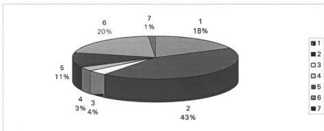
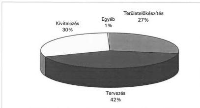
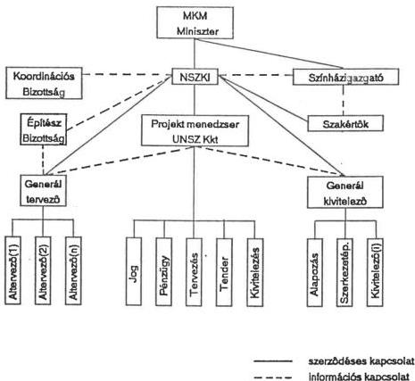
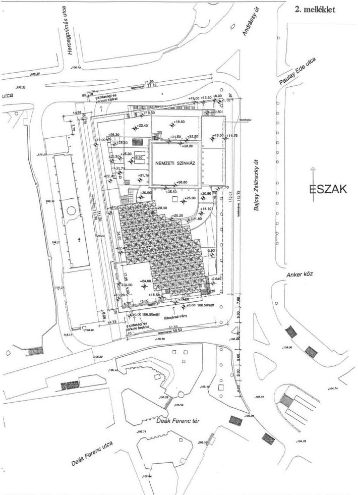
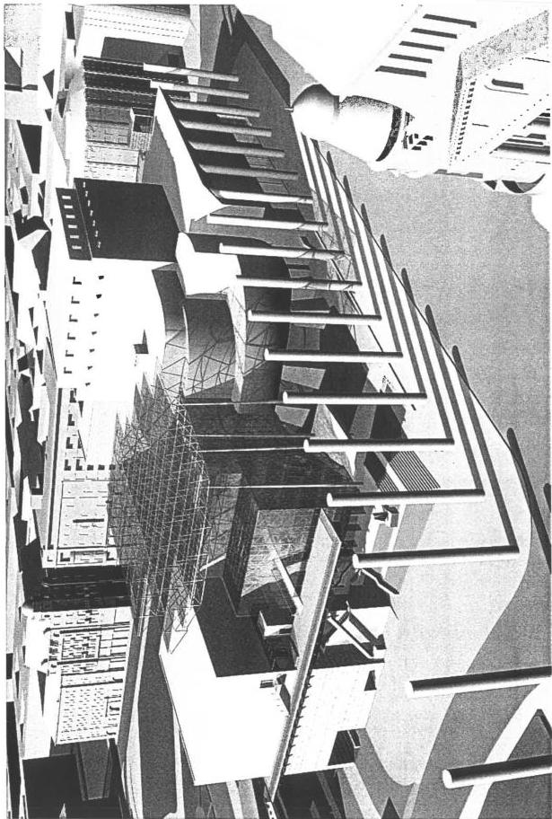

Állami Számvevőszék

# JELENTÉS

# az új Nemzeti Színház
beruházásának vizsgálatáról

1. szakasz 1997. december 31-ig

9804

410.

1998. március

---

# ---**Az ellenőrzés végrehajtásáért felelős:**

**Halász Gejza**

számvevő igazgató

**Kemény Emil**

számvevő igazgatóhelyettes

# **Az ellenőrzést vezette:**

**dr. Márkus Gábor**

osztályvezető főtanácsos

# **Az ellenőrzésben részt vettek:**

**Bank Lajos**

számvevő tanácsos

**Kiss Istvánné**

számvevő tanácsos

---2

---

V-4-12/1998. Témaszám: 422.

# Tartalomjegyzék

|  **Bevezetés** | 5  |
| --- | --- |
|  **I. MEGÁLLAPÍTÁSOK, KÖVETKEZTETÉSEK** | 7  |
|  1. Pénzügyi-gazdasági helyzet | 7  |
|  1.1. Források tervezése és felhasználása | 7  |
|  1.2. A közadakozásból származó források hasznosítása | 9  |
|  1.3. Költségelőirányzatok alakulásának helyzete és kockázata | 9  |
|  1.4. Gazdaságossági és üzemeltetői szempontok | 11  |
|  1.5. A projekt menedzser érdekeltsége és a bírálóbizottság tevékenysége | 12  |
|  2. A beruházás szervezése, vezetése | 14  |
|  2.1. A szervezeti felépítés hatékonysága | 14  |
|  2.2. Az alkalmazott projekt menedzsment értékelése | 16  |
|  3. A beruházás megvalósításának helyzete | 18  |
|  3.1. Területelőkészítés | 18  |
|  3.1.1. Részletes Rendezési Terv (RRT) | 18  |
|  3.1.2. Telekátadás és kialakítás | 18  |
|  3.1.3. Autóbusz-pályaudvar kitelepítése | 19  |
|  3.2. Tervezés | 20  |
|  3.2.1. Építészeti tervezés | 20  |
|  3.2.2. Színháztechnológia tervezése | 22  |
|  3.3. Kivitelezés előkészítettsége | 22  |
|  3.3.1. Közműkiváltások | 22  |
|  3.3.2. Közbeszerzési eljárások és tenderstratégia | 23  |
|  4. A marketing tevékenység értékelése | 23  |
|  **II. Javaslatok** | 25  |
|  **Táblázat:** Az új Nemzeti Színház közműkiváltási munkái | 26  |
|  **Mellékletek:** | 27  |
|  1. melléklet: A Kormány 2152/1996. (VI. 19.) Korm. határozata |   |
|  2. melléklet: Az új Nemzeti Színház és környezetének helyszínrajza |   |
|  3. melléklet: Az új Nemzeti Színház modelljének képe |   |
|  4. melléklet: Az új Nemzeti Színház koncepcionális hálós ütemterve |   |
|  5. melléklet: Az építészeti tervpályázat bíráló és szakértői bizottsága |   |
|  6. melléklet: Az új Nemzeti Színház építészeti tervpályázatával kapcsolatos kiadások összegzése |   |
|  7. melléklet: Az új Nemzeti Színház tervezési és számlázási ütemterve |   |

3

---

8. melléklet: Az új Nemzeti Színház tenderstratégiája - a tendereljárások csoportosítása

4

---

# Bevezetés

Az új Nemzeti Színház építése kiemelt beruházás, magas a beruházás költségigénye és nagyfokú iránta a közérdeklődés, különösen a többszöri leállítás - újrakezdés miatt. Széleskörű az építést támogatók köre mind belföldön, mind külföldön. Olyan egyedi állami építési-szerelési nagyberuházás, amely már a közbeszerzési törvény kötelező alkalmazásával valósul meg. A vizsgálat 1. szakasza - áthúzódó vizsgálatként - szerepel az Állami Számvevőszék 1997. II. félévi ellenőrzési tervében. Az ÁSz ellenőrzése végigkíséri a beruházás teljes folyamatát. Minden év I. negyedében jelentést készítünk az építés újabb szakaszáról, az ellenőrzés befejezése a színház átadását és a beruházás pénzügyi lezárását követő évben lesz.

Az Állami Számvevőszék az ellenőrzés során nem foglalkozott a színház létesítéséről szóló kormányhatározat műszaki-gazdasági előzményeivel, azokat adottnak tekintette.

Az ellenőrzés célja annak feltárása, hogy az 1996. évi bázisáron számított 6 milliárd Ft költségvetési forrás biztosításával megkezdett beruházás előkészítési és megvalósítási folyamatai során hozott döntések, ezek műszaki - gazdasági megalapozása mennyire felelt meg a célkitűzéseknek, betartották-e a beruházásra és annak finanszírozására vonatkozó érvényes jogszabályi előírásokat. Emellett számbavettük a színház építésére rendelkezésre álló forrásokat, és értékeltük ezek felhasználását.

Az ellenőrzést az 1989. évi XXXVIII. törvény 2. §. (7) bekezdés második gondolata szerint, a rendelkezésre álló dokumentumok, szakanyagok helyszíni feldolgozása és bekérése, valamint interjúk készítése alapján végeztük. A több évre szóló vizsgálati program első szakasza a döntés-előkészítési folyamatok ellenőrzésére és az állami kötelezettségvállalások pénzügyi megalapozottságára irányult, és a kifizetett összegek jogosultságának tételes ellenőrzésére azonban nem terjedt ki.

## A színház építésének előzményei

A.Művelődési és Közoktatási Minisztérium 1995-96. évben a színházi szakma és az ország közvéleményében kialakult várakozás hatására újból megvizsgálta az 1990-ben - kormányzati döntés alapján leállított - új Nemzeti Színház felépítésének, illetve az államiság 1000 éves évfordulójára történő befejezésének lehetőségét.

Az új színházépület biztosítaná a hosszú ideig tartó ideiglenesség felszámolását és a nemzet elsőszámú színházának elhelyezése megoldódna. A beruházással megnyugtatóan rendezhetővé válik a közadakozásból befolyt mintegy 230 M Ft (amely a kamatokkal ma már több mint 2 milliárd Ft) felhasználása. A színház megnyitása az 'Államalapítás 1000. évfordulójának' évében méltó eseménye lehetne az ünnepségsorozatnak.

---5

---

A beruházási feladat vizsgálata során több megvalósítási elképzelést (meglévő épület átalakítása) és több potenciális helyszínt elemeztek, amelyek közül a Bp. V., Erzsébet tér Bajcsy Zs. út felőli területe tűnt a legmegfelelőbb helyszínnek a felépítendő új színház számára.

A művelődési és közoktatási-, a környezetvédelmi és területfejlesztési -valamint a pénzügyminiszter előterjesztése alapján végül a Kormány a 2152/1996.(VI. 19.) határozata (1. melléklet) 1. pontjában megfogalmazta a színház felépítésének körülményeit, körvonalazva a központi költségvetés feladatvállalásának nagyságát.

Az új Nemzeti Színház épülete a városépítési és építészeti előírások figyelembevételével felépítendő olyan létesítmény (2.,3. melléklet), amely biztosítja egy állandó társulat működésének feltételeit, mintegy 500 főt befogadó színházteremmel, amely hagyományos rendszerű, de korszerűen felszerelt színpaddal rendelkezik. Az épületben helyet kell biztosítani a mintegy 120 fős stúdiószínháznak, valamint a teljes színházat kiszolgáló járulékos és üzemi területeknek is.

Az előzetes szakértői vélemények alapján a színház a belső körút terhelését nem változtatja meg olyan mértékben, amely a városrész életét zavarná, különösen akkor, ha a buszpályaudvar hazai távolsági forgalmat lebonyolító részének kitelepítésével a forgalmi terhelés csökken. A színház és a városrész számára kihasználhatóvá válik mindaz az előny, amely a három földalatti vonal találkozásának közelségéből adódik.

---6

---

# I. MEGÁLLAPÍTÁSOK, KÖVETKEZTETÉSEK

## 1. PÉNZÜGYI-GAZDASÁGI HELYZET

### 1.1. Források tervezése és felhasználása

A Nemzeti Színház építéséről szóló 2152/1996. (VI.19.) Korm. határozat a felhasználható költségvetési juttatást (1996-os árszinten) 6 milliárd Ft-ban rögzítette, azzal a kiegészítéssel hogy 1997. évi pénzügyi üteme nem lehet több, mint 600 millió Ft. A kormányhatározat második bekezdése szerint „az új Nemzeti Színház kiemelt beruházását jóváhagyásra - az 1997. évi költségvetéssel együtt - az Országgyűlésnek be kell terjeszteni.” A feladat végrehajtásáért a művelődési és közoktatási, a pénzügy és a környezetvédelmi és területfejlesztési minisztert tette felelőssé a határozat 1996. augusztus 31-i határidővel. **A határozatot a kijelölt határidőre a felelősök nem teljesítették.** A 1997. évi költségvetési törvénybe csak az éves pénzügyi keret (600 M Ft) került be. A beruházási javaslatot egy évvel később az 1998. évi költségvetési törvény keretén belül fogadta el az Országgyűlés.

A kiemelt jelentőségű kormányzati beruházás előirányzata az MKM fejezetében az éves inflációnak megfelelően 7.765,9 millió Ft.

A Magyar Államkincstár 1997. III. 11-én értesítette a Nemzeti Színház Kormánybiztosi Irodát (NSzKI) a beruházásra megnyitott előirányzatról, melynek (1997-es korrigált) összege:

|   | millió Ft  |
| --- | --- |
|  Költségvetési juttatás: | 7.765,9  |
|  Közadakozás: | 1.814,  |
|  Összesen: | 9.579,9  |

A közadakozásból származó összeg amely csak a konkrét építésre fordítható, beruházás előkészítésére nem - az előirányzattal szemben - kamatokkal együtt már 2 milliárd Ft felett van.

---7

---

Központi forrásból 1996-97-ben felhasználtak 315,87 millió Ft-ot az alábbi megosztásban:

|   |  | millió Ft | %  |
| --- | --- | --- | --- |
|  1 | Építészeti tervpályázat | 55,86 | 18  |
|  2 | Tervezés | 135,25 | 43  |
|  3 | Tendereljárások | 12,61 | 4  |
|  4 | Szakértők foglalkoztatása | 9,55 | 3  |
|  5 | Lebonyolítói díjazás | 35,00 | 11  |
|  6 | Kivitelezés | 63,18 | 20  |
|  7 | Egyéb | 4,42 | 1  |
|   | Összesen | 315,87 | 100  |

A szerződésekkel lekötött összeg 1997. végéig 889,817 M Ft volt. Ennek megosztása a következő:

|   | millió Ft | %  |
| --- | --- | --- |
|  Területelőkészítés | 244,4 | 27  |
|  Tervezés | 371 | 42  |
|  Kivitelezés | 269,6 | 30  |
|  Egyéb | 4,789 | 1  |
|  Összesen | 889,8 | 100  |

8

---

A költségfelhasználás ebben az időszakban nem haladta meg a kormányhatározatban előírt mértéket. A szerződések tartalmi és pénzügyi teljesítése az ütemezésnek megfelelően, határidőre, pontosan történt.

## 1.2. A közadakozásból származó források hasznosítása

**Közadakozásból az OTP erre a célra nyitott számlájára** (1996. december 2-ig) **32.156 db befizetés érkezett** - belföldi-külföldi támogatók befizetése, téglajegy és bélyeg formájában - **228.075.522.- Ft értékben**.

Az 1042/1990. (X. 24.) Korm. határozat az új Nemzeti Színház építésével kapcsolatos aktuális intézkedései között úgy rendelkezett, hogy a művelődési és közoktatási miniszter „gondoskodjék arról, hogy a társadalmi gyűjtésből eddig befolyt összeget az építés megkezdéséig a legelőnyösebb feltételekkel kamatoztassák.”

A számlán lévő összeget 1993-ig a Mercantil Bank kezelte. 1993. június 1-én került át az MKM központi letéti számlájára. Akkor kamataival együtt 892 millió Ft volt. Az MKM államkötvényt vásárolt, majd lejártakor évenként a kamatokkal növelt értékben azt megismételte. 1996-ban a Magyar Államkincstárral úgy egyeztek meg, hogy a Kincstár állampapír számlájáról nem utalják át az MKM számlájára, hanem a lejáratkor rögtön újat vesznek. A legutóbbi államkötvény vásárlás 1997. december 2-án történt, több mint 2 milliárd Ft értékben, lejárati dátuma **1998. május 17.** amikor a **közadakozásból összegyűlt összeg 2.319.004 ezer Ft lesz**.

**Ebből a forrásból még felhasználás nem történt.**

A közadakozásból összegyűlt pénz államkötvénybe fektetése kockázatmentes és biztosítja az érték megőrzését.

## 1.3. Költségelőirányzatok alakulásának helyzete és kockázata

A hivatkozott kormányhatározat szerint, a színház és kapcsolódó beruházások (közműkiváltás, stb.) megvalósítására - 1996-os áron számítva - 6,0 Mrd Ft költségvetési forrás használható fel. Ezt csökkenti az autóbusz-pályaudvar kihelyezésének előkészítésére fordítható legfeljebb 350 M Ft, bővíti a közadakozásból származó mintegy 1,65 Mrd Ft (az 1996-os névértéken).

**A kormányhatározat meghozatalát követően 1998. januárjáig a tervezési folyamat előrehaladásának függvényében és az egyes tervtípusok műszaki részletessége szerint az NSzKI intézkedett a költségelőirányzatok meghatározásáról.**

- Az NSzKI az **építészeti pályázati kiírásban** előírta, hogy „a pályázónak számolnia kell azzal, hogy a színházépület beruházására összességében -1996-os árszinten számítva - legfeljebb 7,0 Mrd Ft használható fel. Ennek az összegnek durva becslés szerint 35-45 %-át a színháztechnika, színpadtechnika stb. berendezéseire kell fordítani, így a teljes **építési és belsőépí-**

9

---

tészeti munkákra összesen legfeljebb mintegy 3,85-4,55 Mrd Ft (az általános forgalmi adót is tartalmazó) összeg fordítható.”

- A pályázat értékelése során szakértők az új Nemzeti Színház nyertes pályázat - telekhatáron belüli építési munkáinak - költségelőirányzatát 5,6 Mrd Ft-ra becsülték 1996. december havi árszinten.
- Az engedélyezési tervhez kapcsoltan az NSzKI költségbecslést rendelt meg a tervezőtől. A tervező ezen szolgáltatása alapján a bonyolító 1997. III. n.évi jelentésében a következők szerint foglalta össze a költségelőirányzatok alakulását.

„Előzetesen jelezzük, hogy az új Nemzeti Színház építésére kiadott elvi építési engedélyhez készült tervdokumentáció költségbecslése szerint a beruházás teljes előirányzata jelentősen meghaladja a jelenleg jóváhagyottat. Az említett költségbecslés szerint a létesítmény kiviteli költsége a színpadgépészet, világítás és hangosítás, az azokból következő építészeti módosítások, valamint képzőművészeti alkotások költségei nélkül előzetesen 12,4 milliárd Ft-ra becsülhető.”

Az építésztervezővel folytatott helyszíni interjú alapján megállapítható volt, hogy döntően egy négyzetméter arányos durva költségbecslés készült és a színház-technológiai tervellátottság hiányában az előirányzott költségek meghatározása ezen a területen is nagyléptékű volt. Az NSzKI - bizonyos átfedések miatt - a tervezői költségbecslést fenntartásokkal kezelte és felülvizsgálatára adott megbízást.

- A beruházás bonyolítója az engedélyezési tervre készült tervezői költségbecslés felülvizsgálatával egyidejűleg, további költségelemzést is végzett. Ez a költségelemzés szolgált alapul 1997. decemberében a Kormány tájékoztatását szolgáló beszámoló összeállításához. A beszámoló lényeges megvalósítás-stratégiai kérdéseket vetett fel. A beszámoló 1997. évi árbázison számolva három megvalósítási tervalternatívát mutatott be, minimális 8,4 Mrd Ft-os, közepes 9,7 Mrd Ft-os és maximális 11,1 Mrd Ft-os költségelőirányzat számításba vételével (autóbuszpályaudvar nélkül). A különböző teljesítménymutatók következményeit is elemezte a dokumentum. „A felső határértéken becsült költségek a beruházás józan, nem pazarló, de minden tekintetben megnyugtató színvonalú megvalósítását teszik lehetővé.” A beruházás egyes költségelemeinél a költségértékek 0-(+/-)20 %-ig terjedő bizonytalansági tényezőt is tartalmaztak. A tervezés adott szintjén, az egyeztetések különböző előrehaladottsága, a hátralévő logisztikai feladatok nagyságrendje ezt a differenciáltságot és kockázati szint számításba vételét indokolta.
- Az NSzKI 1998. januárjában megbízta a bonyolítót, hogy a költségkímélő stratégia további részleteit munkálja ki.
- A beruházás folyamata az ajánlati tervkészítés fázisába jutott. A szerződéses kötelezettségüknek megfelelően a tervezőknek (összes altervezőnek) 1998. augusztusáig az ajánlati tervdokumentáció készítésének szabályai

10

---

szerint méret és mennyiség-kimutatást kell készíteni, amelynek beárazását az NSzKI megrendelte.

Az építmény egyediségéből, a színház-technológia újszerűségéből és hasonló építményeken szerzett tapasztalatok hiányában a költségelőirányzatok meghatározásában a bizonytalansági tényező 1998. augusztusáig jelentős. A műszaki jellemzők véglegesítésével erre az időszakra szakmai szempontból megalapozott költségelőirányzat állhat rendelkezésre.

**A beruházás megvalósítását, a teljesítménycélok teljesíthetőségét a rendelkezésre álló forrásokból - beruházási program és megfelelő pontosságú költségbecslés hiányában - jelenleg nem lehet megalapozottan megítélni.**

**Az új Nemzeti Színház beruházásának pénzügyi megalapozottsága nyitott.** Az elkészült költségbecslések nagyfokú kockázatot tartalmaznak és jelentős pontosításra szorulnak.

**A jelenleg rendelkezésre álló költségvetési fedezet a továbbiakban nem teszi lehetővé a közbeszerzési törvény maradéktalan betartását.**

### 1.4. Gazdaságossági és üzemeltetői szempontok

Az NSzKI **az építészeti tervpályázat értékelése** során - a gazdaságossági kritériumok figyelembe vétele érdekében - az építészeti szempontok szerint 20 legelőnyösebbnek ítélt pályázatra költségbecslést készíttetett. A nyertes pályamű a leggazdaságosabb értéktartományban helyezkedett el és 1996-os áron számítva 2,9 Mrd Ft-tal volt kedvezőbb a legdrágább pályázathoz képest.

A generáltervezővel folytatott interjú arra engedett következtetni, hogy mind a tervezési filozófia kialakítása, mind a tervezőtevékenység a műszaki jellemzők pontosításakor, az anyagjellemzők meghatározásakor a termékek árainak figyelembe vételével, a gazdaságosság követelményeinek szem előtt tartásával történik.

Mindezek figyelembevétele mellett is szükségesnek látszik **az értékelemzési módszer integrálása az ajánlati ill. egyszerűsített kiviteli tervkészítési szakaszba.**

Az új Nemzeti Színház lebonyolítására készített szakértői vélemény is ezt támasztja alá, mely szerint:

*„A beruházások minőség- és költségtartását máshol már szokásos, bevált értékelemzési és egyéb módszerekkel is lehet segíteni, sőt garantálni. Példaként említik, hogy pl. Angliában egy adott értékhatár fölötti állami beruházások tervezését és megépítését csak megfelelő értékelemzéssel együtt, annak eredményeire alapozva szabad elvégezni.”*

---11

---

**Az értékelemzési szakértői tevékenységen kívül indokolt költségszakértők igénybevétele. Biztosítani kell a költségszakértői feladatok irányításának és ellenőrzésének szervezeti feltételeit.**

Az üzemeltetési igények feltárására és egyeztetésére hazai és nemzetközi szaktekintélyek tapasztalatainak felhasználásával - az NSzKI nagy hangsúlyt helyezett.

Az üzemeltetési szempontok a tervezési folyamat célrendszerében központi helyet kaptak. A generáltervező megfogalmazásában ez a következőképp hangzott:

„A Nemzeti-pályázat feladata ugyanis nemcsak építészeti probléma, hanem városépítészeti is, de a magyar színjátszás fejlődésének egyfajta biztosítása is a hivatása. Egy mai színházi épülettel szembeni igények meghatározása a színházi szakma felelőssége. Ezért az, hogy mitől lesz ez a ház a magyar nemzet színháza, nem csupán az építészeti kialakításának függvénye.”

**A színház üzemeltetési és működési költségeit nem határozták meg és az erre alapuló gazdaságossági számítások nem készültek el.**

A működtetéssel kapcsolatos előzetes feltételezések a már kinevezett színházigazgató pályázatában találhatók. Az előzetes becslések szerint a bevételek a működtetés 15 %-át fedezhetik csak és a színház működtetése nem lesz olcsó. Számításokat nem tartalmaz a pályázat még számos eldöntendő kérdés miatt. A többalternatívás működtetés feltételezése mellett is az üzemeltetés és a működtetés költségeit meg kell határozni. Az üzemeltetési költségek ismerete és számításba vétele egyfelől elengedhetetlen egyes építészeti vagy infrastrukturális elemek betervezése vagy elhagyása miatt (például: meg lehet említeni a 2-3 függönyis esetét), másfelől szükséges a hosszú távú állami kötelezettségvállalás megalapozottságához.

**1.5. A projekt menedzser érdekeltsége és a bírálóbizottság tevékenysége**

Az új Nemzeti Színház előkészítő dokumentumai foglalkoztak a projekt menedzser érdekeltté tételének kérdésével. Az érdekeltségi elemek közé sorolták a következőket:

- a beruházás teljes vagy részleges használatba adása (üzembe helyezése) határidejének megtartása vagy előbbrehozása;
- a beruházási költségelőirányzat megtartása vagy az abból elért megtakarítás;
- az előző bekezdésekben meghatározott feltételek kombinációja (pl: az üzembe helyezési határidő megtartásával a beruházási költségelőirányzattal szemben elért megtakarítás);

12

---

- meghatározott műszaki-gazdasági paraméterek megtartása vagy azoknál kedvezőbb mutatók elérése.

# **Az érdekeltség beépítésére gondoltak az ajánlati felhívásban, a pályázatásokban, de költség és időtámpontok hiányában kimaradt a bonyolítói szerződésből.**

A szoros költség és időtartási követelményt mint elvárt szolgáltatást szerepeltették a szerződésben, szintén költség és időtámpont nélkül. Az új Nemzeti Színház esetében, ha a beruházás megvalósítása késne, úgy havi 4-5 millió Ft-tal, növekedne a beruházás bonyolítója felé a kifizetés. Ha viszont a beruházás nettó (ÁFA nélküli) forrásigénye növekedne, akkor milliárdonként 18 M Ft-tal növekedne a beruházás bonyolítójának díjazása.

A beruházás lebonyolítási szerződést ezért ajánlatos módosítani úgy, hogy abban a lebonyolítót az alaptevékenység ellátásán felüli érdekeltségi díjjal a határidő és költségkeret tartásában érdekeltté tegyék. A javasolt módosításnak a kivitelezői pályázatok kiértékelése előtt van értelme és ésszerűsége.

A pályázatok értékelését végző bírálóbizottságok tagjai egyeztették az értékelési szempontokat. Felügyelő bizottságot hoztak létre a pályázatás szabályszerűségének ellenőrzésére. Számítógépes programot és döntési módszert alkalmaztak a bírálati folyamat támogatására, amely egyszerűbb döntési helyzetekben megfelelő az államháztartási kiadások ésszerűsítési igényének.

---13

---

## 2. A BERUHÁZÁS SZERVEZÉSE, VEZETÉSE

### 2.1. A szervezeti felépítés hatékonysága

Az NSzKI az új Nemzeti Színház építési beruházás jellemzőinek (a beruházási profilnak) és saját adottságainak (a beruházói profilnak) megfelelően alakította ki a szerződéses stratégiát és az ebből következő szervezeti felépítést.

Az új Nemzeti Színház építési beruházását megvalósító szervezetrendszer sémája

- Az NSzKI a tervezési feladatokat egykézben összpontosította. Az építész tervező a tervezési feladatok generál vállalkozójaként felelős az altervezők közötti kapcsolatok biztosításáért.
- A gazdaságosság és szabályosság követelményének egyaránt megfelelt, ahogy 2 fordulós pályáztatási eljárás keretében az NSzKI a beruházás bonyolítóját az ÜNSZ Kkt-t (az Új Nemzeti Színházért Mérnöki Közkereseti

14

---

Társaság, tagjai: FŐBER Rt., MÜBER Rt., 96 Kft.) kiválasztotta és szerződést kötött a bonyolítói feladatok ellátására Az NSzKI döntési hatáskört az ÚNSZ Kkt-nak nem adott át, viszont a döntés-előkészítési dokumentumok előkészítése a bonyolító feladata.

Kidolgozták a bonyolítói tevékenység legfontosabb területeit feldolgozó működési szabályzatokat. A folyamatok leírásához hozzárendelték az egyes tevékenységek elvégzéséért felelős személyek nevét. A beruházás bonyolítói szabályzatokat az NSzKI jóváhagyta és a bonyolító a szabályzatban foglaltak szerint fejti ki tevékenységét.

- **A kivitelezési feladatok** vállalkozásba adásának stratégiáját a Tenderstratégia c. dokumentumban kidolgozták. **A tenderstratégiát arra a koncepcióra alapozták, hogy megtakarításokat érjenek el a projekt építési költségeiben azáltal, hogy a versenyeztetést több fázisra** (alapozás, szerkezetépítés, stb) bontották. A választott stratégia költségkímélő hatása valószínűsíthető, indokoltságát az időkorlátok szabta megvalósítás is alátámasztotta, mivel a tervezési és kivitelezési feladatrészek átfedése szükséges. **A projekt teljes megvalósításának pontos költségvetése a szakaszolás miatt később válik ismertté.**
- **Az üzemeltetői** funkciók szakszerű figyelembe vételére a beruházás tervezése során folyamatosan gondoltak. A Minisztérium pályáztatás útján kinevezte a színházi igazgatót, aki az üzemeltetési szempontokra koncentráló felelős vezetőként vesz részt a beruházás irányításában. Ezáltal lehetővé vált a tervezés utolsó szakaszában a projekt megvalósításának üzemeltetési nézőpontú finomítása.
- **A Koordinációs Bizottság** szolgált a beruházásban közreműködők egyeztetési fórumaként. A Bizottság átalakítása időszerűvé vált, - különösen az új Nemzeti Színház igazgatójának megbízásával - melynek tervezett tagjai a következők: A Kormánybiztos
  - Az ÚNSZ képviselője
  - Az építész tervező vagy megbízottja
  - A színház leendő igazgatója vagy főrendezője
  - Egy gyakorlott beruházó
  - Egy pénzügyi, gazdasági kérdésekben járatos közgazdász.

A Kormánybiztosi Iroda és az MKM beruházásokkal foglalkozó munkatársai az üléseken külön meghívás nélkül részt vehetnek. Alkalmilag szükséges az ülésekre vendégeket, szakértőket meghívni.

- **Az Építész Bizottság** 1997. októberében alakult meg, tagjai teljes körű felhatalmazást kaptak.

**Az NSzKI az Művelődési és Közoktatási Minisztérium szervezeti rendjébe illesztetten alakult meg.** Az NSzKI felügyeletével az MKM miniszterét bízta meg a Kormány. Az NSzKI 1996-ban készített Szervezeti és Működési Szabályzat tervezetet, melyet nem hagyott jóvá a tárca. A tervezetből néhány fontos elem beépült a Művelődési és Közoktatási Minisztérium Szervezeti és Működési Szabályzatának egységes szerkezetébe foglalása c. 1998. januári előterjesztésbe. A szabályzat szerint:

15

---

„Az iroda a megvalósítás feladatait és a szükséges forrásokat folyamatosan karbantartott megvalósítási és pénzügyi ütemtervben tünteti fel, és részt vesz azok költségvetési tervezési és egyeztetési folyamatában. Az ütemtervet, valamint az abban bekövetkező lényeges módosításokat a miniszter hagyja jóvá.”

A szabályzat szerint előírt jóváhagyási gyakorlat nem alakult ki. A kiemelt beruházás sajátosságai és a közpénzekkel való gazdálkodás nagyságrendje miatt az NSzKI által készített Szervezeti és Működési Szabályzat tervezet részletességének megfelelő belső, NSzKI szabályzatot is ki kell adni, rögzítve az NSzKI és az MKM funkcionális szervezeti egységei közti munka - és felelősség megosztást.

**Az NSzKI a szerződéses és információs kapcsolatokat a beruházási célnak megfelelően alakította ki a projekt megvalósításában közreműködő szervezetekkel. A kis létszámú szervezet (3 fő) szakszerűen koordinálja a beruházási tevékenységeket.**

## 2.2. Az alkalmazott projekt menedzsment értékelése

A beruházás bonyolítójának kiválasztását célzó pályázati felhívás gondos előkészítettsége hozzájárult ahhoz, hogy **a bonyolítói szolgáltatások köre a szerződésben megfelelően részletezett. Tartalmazza a költség és időkorlátok tartásának követelményét, bár rugalmas értelmezésükre a szerződés lehetőséget biztosít.**

Az alkalmazott projekt menedzsment technikát tekintve:

- a kifejlesztett információs rendszer,
- a hálótervezési eljárás,
- a havi és negyedévi jelentések rendszere

a beruházás irányítási és ellenőrzési céljainak megfelel.

**Az információs rendszer** fejlesztését befejezték, üzemképességét helyszíni bemutatón bizonyították.

Az adatbázisok feltöltése a visszamenőleges adatokkal - a vizsgálat időszakában - még nem fejeződött be.

**Az adatok teljes körűségére az MKM funkcionális osztályainak vagy belső ellenőrzésének egy elfogadó nyilatkozatot kell adnia és a folyamatos auditálás fenntartásával kell az NSzKI-nak a rendszer működtetését felügyelnie.**

Az információs rendszer azonosítási megoldásait összhangba hozták a Magyar Államkincstár belső szabályzataival, ezáltal a pénzügyi nyomonkövethetőség és ellenőrzés ésszerűen megvalósítható.

16

---

**A hálótervezési eljárás** alkalmazásával elérték, hogy a projektvezetési technika összhangba került a beruházás jellemzőivel (bonyolultság, újszerűség, közreműködők nagy száma, stb.). Az átvizsgált alapháló, és annak tervezett két hetente történő aktualizálása a módszer részbeni hasznosulását tükrözte. A koncepcionális és durva hálós ütemtervek a 2000 végéig történő befejezési határidő korláttal készültek. (4. melléklet)

Az irányítás és ellenőrzés hatékonysága szempontjából hiányoljuk, hogy az ütemterveken nem tüntették fel:

- a felelős szervezeteket,
- a tevékenységek fontosságának megítéléséhez szükséges információkat (tartalékidőket és költségeket),
- a tervezett és tényleges pénzfelhasználást (pénzügyi ütemterveket),

továbbá, hogy nem alakult ki a vezetési szintek információ igényétől függő összevont és részletes ütemterv megjeleníthetőség és ad hoc lekérdezhetőség gyakorlata.

Az ütemtervek és hálótervek jelenleg még nem alkalmasak annak megítélésére, hogy az esetleges beruházói szolgáltatás hiányosságaiból származó késedelmes napok bizonyító erejűen meghatározhatók legyenek, bár a beruházónak a szerződés értelmében a késedelmes napok szerint kell szankcionálni a bonyolítót.

**A havi, negyedévi jelentéstételi kötelezettségeinek** - elsősorban eseménykövető jelleggel - eleget tett. A jelentéstétellel kapcsolatban a következő észrevételeket tesszük:

- nem részletezték a beruházási okmány módosítási szükségességét alátámasztó költségeltéréseket a tervezett helyzethez képest,
- nem mutatták be kellő mélységben a kockázati tényezőket, amelyek a költség - és időkereteken belüli megvalósítás bizonytalanságainak feltárásához szükségesek,
- nem dokumentálták megfelelően azokat az intézkedéseket, amelyeket a szerződéses kötelezettség szoros költség - és idő tartására vonatkozóan teljesítettek.

17

---

### 3. A BERUHÁZÁS MEGVALÓSÍTÁSÁNAK HELYZETE

#### 3.1. Területelőkészítés

##### 3.1.1. Részletes Rendezési Terv (RRT)

Az RRT - a telekalakítással szoros összefüggésben 1996. szeptemberében - közműkiváltási problémákat hozott felszínre.

Az RRT szakhatósági egyeztetése és jóváhagyási folyamata az V., Polgármesteri Hivatalban 1997. áprilisáig tartott. (Közben többször elhalasztották a téma tárgyalását és 1997. februárjában nem fogadták el a Nemzeti Színház tágabb környezetére vonatkozó RRT-t.) A lakossági ismertetést szabályszerűen lefolytatták.

**Az V. kerületi Önkormányzat képviselőtestülete 2 tartózkodás mellett 1997. áprilisában elfogadta a területre vonatkozó részletes rendezési tervet, és így telekalakítás és a vonatkozó hatósági engedélyek beszerzése megkezdődhetett.**

##### 3.1.2. Telekátadás és kialakítás

A Főpolgármesteri Hivatallal együttműködve - az RRT végleges szabályozási tervjavaslatának megfelelően - alakították ki a színház telkét.

A kialakítandó telek északi végén (a József A. utcáról a Bajcsy Zs. útra) elhelyezkedő útpályát és tartozékait a Fővárosi Önkormányzat költségére helyezik át. Az egyéb közművek áthelyezését (800 mm-es víznyomóvezeték, 120 KV földkábel, METRÓ szellőzők) a beruházás terhére kell(ett) megvalósítani.

A budapesti Fővárosi Önkormányzat 1997. novemberében kötelezettséget vállalt arra, hogy az új Nemzeti Színház beruházása kapcsán felmerült É-D-i metró északi kijáratára vonatkozó munkáit 39 M Ft-tal támogatja.

**A Fővárosi Közgyűlés 1996. nov. 28-án megtartott ülésén - 51 igen szavazattal, 1 tartózkodás mellett - jóváhagyta az ajándékozási szerződés tervezetet és aláírására felhatalmazta a főpolgármestert.**

A telket a Fővárosi Önkormányzat a meglévő terhekkel (elsősorban közműszolgálni jogok) térítésmentesen a Magyar Állam tulajdonába adta át.

A tulajdoni jog bejegyzését igazoló tulajdoni lap másolatával az NSzKI rendelkezik (24447/2. Hrsz., kiadva 1997. szept. 17.).

Az építési telek kialakítására vonatkozó építéshatósági engedélyt 1997. májusában adták ki.

---18

---

### 3.1.3. Autóbusz-pályaudvar kitelepítése

A Nemzeti Színház felépítésével összefüggő feladatokról szóló 2152/1996. (VI. 19.) Korm.határozat 5. pontja szerint a Nemzeti Színház építésének előkészítésével párhuzamosan az Erzsébet téri Volán pályaudvar kitelepítésére vonatkozó részletes javaslatot a Kormány elé kellett terjeszteni. A kitelepítéssel összefüggő költségek a Kormányhatározat 1. pontjában biztosított 350 millió Ft-ot nem haladhatták meg.

A Nemzeti Színház kormánybiztosa - a KHVM és a Fővárosi Főpolgármesteri Hivatal felhatalmazása alapján - műszaki-gazdasági koncepcionális terv kidolgozásával bízta meg a Közlekedés Kft-t.

A Közlekedés Kft hat lehetséges helyszínt vizsgált meg tulajdoni viszonyok, forgalmi, városrendezési, műszaki, környezeti szempontok és a beruházás költségigénye szerint. A kormányközi egyeztetés során kiválasztották az Üllői út - Könyves Kálmán körút csomópont környezetében, a Bolyai János Katonai Műszaki Főiskola melletti 8.000 négyzetméter területet.

**Az ingatlant az ÁPV Rt 1997. decemberében megvásárolta 240 M Ft-ért, majd könyvszerinti értéken apportálta a VOLÁNBUSZ Rt.-be.**

A jelenlegi forgalom zavartalan ellátásához a VOLÁNBUSZ Rt. igényelte a terület további 6414 négyzetméteres részét, amely a menetrend szerint közlekedő autóbuszok napközbeni tartózkodását is lehetővé teszi. Ezáltal megoldhatóvá válik, hogy a Budapest területén különböző helyeken várakozó menetrend szerint közlekedő autóbuszok egy helyen nyerjenek elhelyezést, ezzel mentesítve a fővárosi utakat és pakolóterületeket.

A telek ára 192,420 millió Ft, amely kiegészül a szükséges térburkolat, tárolók és forgalomirányító helyiség kiépítésének 45,080 milliós költségeivel. Ennek forrását a Magyar Köztársaság 1998. évi költségvetéséről szóló törvény 11. számú mellékletében az ÁPV Rt. részére meghatározott reorganizációs keret biztosítja. Az ÁPV Rt., mint tulajdonos az ingatlant tőkeemeléssel apportálja a VOLÁNBUSZ Rt.-be az Rt. alapító okiratának egyidejű módosításával. **Így az áttelepítéssel kapcsolatos legnagyobb költségtétel - a telekár - nem a Nemzeti Színház építési előirányzatát terheli.**

Az Erzsébet téren jelenleg a VOLÁNBUSZ Rt. által használt terület a vállalat saját tulajdonában van, tulajdonjogát jogutódlás jogcímén szerezte, amikor állami vállalatból részvénytársasággá alakult. Még nem jóváhagyott tervek szerint az állam vásárlással megszerzi ennek a területnek tulajdonjogát, az MKM kezelésébe adja, és a József Attila utca felőli épületet a hozzá tartozó 5 kocsiállással használatba kapja a VOLÁNBUSZ, mint a nemzetközi autóbuszforgalom megállóját. A Deák tér felőli épület a tervek szerint a Színházhoz alkalmazkodva, a Képző- és Iparművészeti Szövetség használatában Nemzeti Szalonként működne.

---19

---

## 3.2. Tervezés

### 3.2.1. Építészeti tervezés

Az 1996. június 19-i kormányhatározatot követően szeptember 1-én megalakult új Nemzeti Színház Kormánybiztosi Iroda (NSzKI) 1 hónapon belül elkészítette a beruházás ütemtervét.

Az NSzKI október 4-én az építészeti tervpályáztatás lebonyolítására zártkörű versenytárgyalási felhívást küldött el, a 8 lehetséges résztvevőnek. A bírálati szempontok között egyenlő súllyal szerepelt a referencia és a szolgáltatás ellenértéke (30-30 %), az igényelt szolgáltatáshoz rendelkezésére álló infrastruktúra elsődleges szerepet kapott (40 %).

A versenytárgyalásra meghívott 8 cég közül 5 cég összesen 4 ajánlatot nyújtott be. A kiíró az ajánlatok részletes értékelése és elemzése alapján úgy döntött, hogy a FŐBER Rt. nyerte meg a versenytárgyalást, elsősorban kiemelkedő infrastruktúra színvonalának köszönhetően.

Az NSzKI elkészítette az építészeti tervpályázat előkészítésének és bírálatának működési rendjét. Fölállította a 15 tagból álló, 3 külföldi szakértőt is tartalmazó bírálóbizottságot és a felmerülő szakterületi igényeket, valamint a delegálásra felkért szervezeteket figyelembe véve 35 tagból álló szakértő bizottságot (5. melléklet).

Az építészeti tervpályázat kiírásáról szóló hirdetmény a napilapokban december 11-én jelent meg. A kiírás igen körültekintő, pontos megfogalmazását adja az elvárásoknak, gondosan elkészített, a szabályoknak megfelelő munka.

**A 20.000 Ft-ba kerülő pályázati kiírást 134 tervező vette meg. Az 1997. április 15-i határidőre 73 küldemény érkezett. A bírálóbizottság 71 érvényes pályázatot regisztrált.** Az elbírálás során - azon túl, hogy a pályamű mennyiben felelt meg a kiírásban rögzített céloknak, értékelték az építészeti kialakítás minőségét, a tervezési program teljesülését, a funkcionális elrendezés használhatóságát, különös tekintettel a színháztechnológiai követelmények teljesülésére, és összehasonlító vizsgálatot folytattak az építési költségekre.

Az értékelés során a tervben becsült bruttó építési ár jelentős szerepet kapott, az értékelés egy szakaszában 20 pályamű költségbecslését hasonlították össze, mindössze kettő volt valamivel alacsonyabb, mint a nyertes pályamű becsült költsége. Április 30-án miután eredményesen zárult a pályázat, az I. díjas tervet a zsűri megvalósításra ajánlotta.

**A tervpályázat szabályszerűen, utólagos felszólamlások nélkül, költségkímélő módon zajlott.** Lebonyolítására az NSzKI javaslatára a kiíró az új Nemzeti Színház költségvetési keretéből 55 millió Ft pénzeszközt különített el. A tényleges felhasználás 51,32 millió Ft volt, a következő felbontásban.

---20

---

Kiadások összesen: millió Ft-ban

Előkészítés időszaka: 9,62

Bírálati szakasz: 20,05

Pályázatok díjazása: 25,00

54,67

Bevétel: millió Ft-ban

134 db pályázati kiírás kivétele: 3,35; (20.000 Ft/db + ÁFA)

A részletes költségkimutatást a 6. melléklet mutatja.

A nyertes tervező irányította „A „ STÚDIÓ '90 Építész tervező Kft-vel június 20-án az NSzKI megkötötte a tervezési szerződést.

**A szerződésben a tervező vállalta a létesítmény elvi engedélyezési-, építési engedélyezési-, ajánlatkérési műszaki dokumentációinak elkészítését, a hatósági engedélyezési eljárások kezdeményezését és lefolytatását, a jogerős építési engedély beszerzését, a kiviteli tervdokumentáció elkészítését, összesen 240 millió Ft + ÁFA, összesen 300 millió Ft összegben.**

Az engedélyezési szakasz díja 80 millió Ft + ÁFA, az ajánlatkérési műszaki dokumentáció előkészítése 66 millió Ft + ÁFA a kiviteli műszaki dokumentációk elkészítése 94 millió Ft + ÁFA. A költségek részletezését az 7. melléklet mutatja.

**A tervező - a vizsgált időszakban esedékes - szerződéses kötelezettségeinek határidőben, maradéktalanul eleget tett, a részszámlák kiegyenlítése megtörtént.**

**1997. november 19-én szerződésmódosító közös nyilatkozatot írt alá a NSzKI és a tervező, melyben kiterjesztették a generáltervező felelősségét az összes alvállalkozó munkájára és a felelősséggel együtt járó koordinációs tevékenységre. Ennek megfelelően a generáltervezői díjat megemelték 67,995 millió Ft-tal. Így a tervezési díj 307,995 millió Ft + ÁFA-ra; azaz 384,992 millió Ft-ra növekedett.**

Az V. kerületi Polgármesteri Hivatal 1997. szeptember 17-én kiadta a beruházásra az elvi építési engedélyt. Ugyancsak az V. kerületi Polgármesteri Hivatal november 26-án az NSzKI egyeztette a fakivágási engedélyét. A Műemlékvédelmi Hivatal december 11-én műemléki hatósági hozzájárulási nyilatkozatot tett. Végül az **V. kerületi Polgármesteri Hivatal 1997. december 22-én adta ki az építési engedélyt.**

---21

---

### 3.2.2. Színháztechnológia tervezése

1997. május 14-én az NSzKI pályázatot tett közzé - a közbeszerzési törvény hatálya alá eső - a Nemzeti Színház színháztechnikájának tervezésére és kivitelezésére. A felhívásra 6 pályázat érkezett, amelyek közül 4 pályázatot formai hibák miatt ki kellett zárni. A két érvényes ajánlattevő a Rexroth Mecman Kft és a Színháztechnika Kft volt.

1997. augusztus 25-én, a pályázatok benyújtásával egyidejűleg a Rexroth Kft jogorvoslati kérelemmel fordult a Közbeszerzési Döntőbizottsághoz a másik pályázó ellen, és kérte annak kizárását. Kérelmét azzal indokolta, hogy a tenderdokumentációban talált olyan elemeket, amelyek arra utaltak, hogy a Színháztechnika KFT munkatársai részt vettek a tender készítésében.

Az NSzKI a pályázat elbírálásával megvárta a Közbeszerzési Döntőbizottság határozatát, amely az volt, hogy a Színháztechnika KFT-t a pályázatból ki kell zárni. Döntését azzal indokolta, hogy a Színháztechnika Kft egyik munkatársa tagja volt az építészeti tervpályázaton nyertes csapatnak. **Az értékelésben közreműködő szakértői bizottság a döntést precedens értékűnek, ugyanakkor aggályosnak tartotta mivel a hozzáértők szűk köre miatt a tervezés és a kivitelezés közötti átfedések elkerülhetetlenek.** Az NSzKI a döntést tudomásul vette, de eredménytelennek nyilvánította a közbeszerzési eljárást, mivel a Rexroth Kft nem rendelkezett kedvező referenciákkal, és árajánlata lényegesen drágább volt a Színháztechnika Kft árajánlatánál.

Az NSzKI miután a generáltervezőnek a konkrét tervek készítéséhez szüksége volt a színház-technológiai tervekre, megbízta a Színháztechnika Kft-t a színház-technológiai tervezéssel, mivel ez nem esik a közbeszerzési törvény hatálya alá. A kivitelezéssel kapcsolatos közbeszerzési eljárás lefolytatására ez év folyamán - kétfordulós, nyílt eljárás keretében - jogerős építési engedély birtokában, a tendertervek alapján kerül sor.

**Az NSzKI a hasonló esetek megelőzésére a további pályázatok benyújtásakor egy nyilatkozatot kér a pályázóktól arról, hogy a győztes pályamű kidolgozásában nem vettek részt.** A mélyépítési tervpályázat már így készült.

## 3.3. Kivitelezés előkészítettsége

### 3.3.1. Közműkiváltások

A közműkiváltásokra az érintett közművállalatok és a SIEMENS Rt., valamint az MKM és NSzKI között együttműködési megállapodások születtek. A cégek a különböző kedvezményeken túlmenően szoros együttműködést és soron kívüli ügyintézést vállaltak a megvalósítandó feladatokra. A közműkiváltási feladatokat az 1. táblázat foglalja össze.

A 10 KV-os vezeték kiváltása kisebb csuszással indult, de a tartalékidőn belül teljesíthető.

---22

---

Az előkészítési munkák kivitelezésének helyzete a teljes körű lebonyolítást tekintve megfelelő.

### 3.3.2. Közbeszerzési eljárások és tenderstratégia

Az új Nemzeti Színház teljes körű lebonyolításához kapcsolódó közbeszerzési eljárások menetét megtervezték és összehangolták a tervezési folyamattal. Kidolgozták az új Nemzeti Színház tenderstratégiája című dokumentumot (8. melléklet). Az előminősítési eljárás lefolytatásával kapcsolatban a Közbeszerzési törvény 26.§-a szerint kötelező eljárni, annak függvényében, hogy az ajánlattevők köre csak belföldi székhelyű lesz-e.

A közbeszerzési eljárás lefolytatásához:

- 49 lépésben meghatározott forgatókönyvet készítettek,
- számítógépes értékelő rendszer alkalmazásáról döntöttek,
- tenderinformációs rendszert működtetnek,
- az előminősítéshez és a második fordulóhoz mintadokumentációkat dolgoztak ki.

Összeállították az Értékelő és Ellenőrző Bizottság névsorát. Az Értékelő Bizottsági ülésen döntöttek arról, hogy az értékelési eljárások szempontjait az előminősítés és második forduló igényei szerint mindig az aktuális létesítmény szerint határozzák meg és mindkét fő szempontrendszert a részvételi felhívásban közzéteszik.

**A közbeszerzési eljárások gondos előkészítettsége és ütemezettsége megalapozza a teljesítménycélok elérését és biztosítja az átlátható, etikus lebonyolítás feltételeit.**

## 4. A MARKETING TEVÉKENYSÉG ÉRTÉKELÉSE

Az új Nemzeti Színház építését - az elhatározástól kezdve - nagy figyelem kísérte a közvélemény részéről. A Kormánybiztosi Iroda létesítésétől kezdve értesítette a médiát a színházépítés lépéseiről. **Munkájával elérte hogy a széles körben megnyilvánuló társadalmi támogatás mellett, építési költséget csökkentő együttműködési megállapodásokat kötött.**

A telek, amelyre az új Nemzeti Színház kerül, a közművek szempontjából igen terhelt. Annak érdekében, hogy az építkezést a terveknek megfelelően 1998. márciusában el lehessen kezdeni, jelentős közműkiváltásokat kellett végrehajtani. Előzetes tárgyalások után sajtótájékoztató keretén belül 1997. április 22-én együttműködési megállapodásokat írtak alá a Fővárosi Vízművekkel, a Fővárosi Gázművekkel, az Elektromos Művekkel, a MATÁV-val, a Siement Rt.-vel és a Fővárosi Csatornázási Művekkel.

23

---

A közművállalatok külön-külön részletezték, hogy milyen módon kívánnak hozzájárulni az új Nemzeti Színház felépítéséhez. Ezt követően 1998. januárjában megkezdték a közművállalatokkal a szerződések megkötését, amelyek értelmében a közműkiváltások jelentős részét térítésmentesen végzik. **Az így megtakarított költség mintegy 250-300 millió Ft.** A pontos összeg meghatározása az összes szerződés megkötése után lesz lehetséges.

A közadakozás új formáját - a személyi jövedelemadó 1 %-ának felajánlását - is igyekszik a Kormánybiztosi Iroda kihasználni. A Nemzeti Színház építési programja bekerült a lehetséges kedvezményezetti körbe. Ezt a tényt újsághirdetés formájában tette közzé a Kormánybiztosi Iroda. A marketing tevékenység felerősödését valószínűsíti, hogy 1997. december 23-án a Közbeszerzési Értesítőben megjelent a Kormánybiztosi Iroda felhívása tárgyalásos eljárásra, melynek tárgya „*a Budapest, V., Erzsébet téren felépítendő új Nemzeti Színház beruházási időszakában teljes körű Public Relation munkája, valamint az építés költségeinek kiegészítését szolgáló támogatás szervező tevékenysége*”. A jelentkezés határideje február eleje volt, a nyertes cég kiválasztása folyik.

---24

---

## II. JAVASLATOK

### A Kormány

- terjessze sürgősséggel az Országgűlés elé jóváhagyásra az ajánlati tervdokumentációkra készített költségszakértői elemzések illetve kivitelezői ajánlatok alapján kidolgozott beruházási programot,
- vizsgáltassa meg a színháztechnika - szcenika területén a közbeszerzési törvényben előírt nyílt eljárás helyett meghívásos, vagy tárgyalásos eljárás alkalmazhatóságát, tekintettel a hozzáértők szűk körére.

### A Művelődési és Közoktatási Miniszter

- dolgoztassa ki a PM bevonásával a beruházás pénzügyi ütemterveit és jóváhagyási rendjét,
- dolgoztassa ki az NSzKI Szervezeti és Működési Szabályzatát,
- dolgoztassa ki a színház üzemeltetésének és működtetésének feltételrendszerét.

### A Nemzeti Színház Kormánybiztosi Iroda

- vegye fel a kivitelezői ajánlati felhívási dokumentációk speciális feltételei közé, hogy szerződéskötési kötelezettsége mindaddig nem áll fel, amíg az Országgyűlés a módosított költségelőirányzatot nem hagyja jóvá,
- vizsgálja felül a lebonyolítóval kötött szerződést és egészítse ki érdekeltségi elemekkel a befejezési határidő és költségmegtakarítás ösztönzésére,
- ellenőrizze az MKM bevonásával a bonyolítónál működtetett információs rendszer teljes körűségét és intézkedjen annak időszakos ellenőrzéséről,
- teremtse meg a tervezési folyamatba beépülő költségirányításnak és költségellenőrzésnek megbízható szervezeti feltételeit.

Budapest, 1998. március "31".

Sándor István
alelnök

25

---

1. táblázat

# **Az Új Nemzeti Színház közműkiváltási munkái**

|  Közművek | Létesítmény | Üzemeltető, tulajdonos  |
| --- | --- | --- |
|  Vízvezeték | NA 800 mm-es nyomóvezeték kiváltása kb.90 m-en megtörtént (43 millió Ft) | VÍZMŰ Rt.  |
|  Csatorna. | 40-es átm csapadékcsatorna kiváltását. kb. 140 m-es szakasz CSATMŰ térítésmentesen végzi | CSATMŰ  |
|  SIEMENS kábel BKV kábel | kb. 300 m szakasz kiváltását a SIEMENS Rt. saját hatáskörben térítésmentesen végzi | SIEMENS Rt.  |
|  ELMŰ kábel | kb.1,3 km hosszú 120 KV-os kábel ki váltását, közbeszerzés alapján az ELMŰ biztosítja (200 millió Ft) | ELMŰ Rt.  |
|  Postakábel | kb 150 m hosszú postakábel ki- váltását a MATÁV Rt. saját hatáskör- ben végzi, térítésmentesen. | MATÁV Rt.  |

Megjegyzés: A vezetékek kiváltását a vállalatok 1998. március 20-ig elkészítik.

26

---

## **Mellékletek**

27

---

1. melléklet

# A Kormány
2152/1996. (VI. 19.) Körm.
határozata

a Nemzeti Színház Erzsébet téri felépítésével összefüggő
feladatokról

1. A Kormány az új Nemzeti Színház Erzsébet téren
történő felépítéséhez 6 milliárd Ft költségvetési forrás
biztosítását vállalja az 1996. évi árszinten. Az új Nemzeti
Színház épülete állandó társulat játszási feltételeit bizto-
sítja, mintegy 500 főt befogadó színházteremmel, hagyo-
mányos rendszerű, de korszerűen felszerelt színpaddal és
mintegy 120 fős stúdiószínházzal, valamint mindezeket
kiszolgáló üzemi területekkel.

2. Az új Nemzeti Színház kiemelt beruházását jóváha-
gyásra — az 1997. évi költségvetéssel együtt — az Ország-
gyűlésnek be kell terjeszteni. A beruházás 1997. évi pénz-
ügyi üteme nem lehet több 600 millió Ft-nál.

Felelős: művelődési és közoktatási miniszter
pénzügyminiszter
környezetvédelmi és területfejlesztési
miniszter

Határidő: 1996. augusztus 31.
(a költségvetésről szóló törvény
előterjesztésével egyidejűleg)

3. Az elhelyezés körülményeire vonatkozóan az érintett
önkormányzatokkal az ÁRT és az RRT vizsgálat és prog-
ram megállapítását és elfogadását követően megállapo-
dást kell kötni.

Felelős: művelődési és közoktatási miniszter
Határidő: 1996. december 31.

4. A Nemzeti-Színház építészeti tervpályázatát a szak-
mai szervezetekkel és a kiírókkal egyeztetett nyílt pályá-
zatként kell kiírni. Az elbírálásra nemzetközi szakértők
bevonásával szakmai bírálóbizottságot kell felállítani az
érintett önkormányzatokkal együttműködve.

Felelős: művelődési és közoktatási miniszter
környezetvédelmi és területfejlesztési
miniszter

Határidő: az önkormányzatokkal kötendő
megállapodás határidejétől függően

5. A Kormány szükségesnek tartja a Nemzeti Színház
építésének előkészítésével párhuzamosan az Erzsébet téri
VOLÁN pályaudvar kitelepítését, az erre vonatkozó rész-
letes javaslatot a Kormány elé kell terjeszteni. Az új Nem-
zeti Színház beruházásához az 1. pont szerint biztosítandó
összeget terhelő, a kitelepítéssel összefüggő költségek a
350 millió Ft-ot nem haladhatják meg.

Felelős: a privatizációért felelős tárca nélküli
miniszter
közlekedési, hírközlési és vízügyi miniszter
környezetvédelmi és területfejlesztési
miniszter
pénzügyminiszter
művelődési és közoktatási miniszter
Határidő: 1997. március 31.

6. Az új Nemzeti Színház megvalósítása érdekében el-
végzendő feladatok koordinálása céljából a Kormány a
művelődési és közoktatási miniszter javaslatára kormány-
biztost jelöl ki. A kormánybiztos kinevezésével felmerülő
költségeket a központi költségvetés Művelődési és Közok-
tatási Minisztérium fejezetéből kell biztosítani.

Felelős: művelődési és közoktatási miniszter
Határidő: 1996. július 1.

Horn Gyula s. k.,
miniszterelnök

---

# 2. melléklet

---

3. melléklet

---

4. melléklet

ÚJ NEMZETI SZÍNHÁZ KONCEPCIONÁLIS HÁLÓS ÜTEMTERVE

|  ID | Tevékenység | Időter | Kezd | Beishez | 1998 |   |   |   |   | 1999 |   |   |   |   | 2000 |   |   |   |   | 2000  |   |   |   |   |   |   |   |   |   |   |   |   |   |
| --- | --- | --- | --- | --- | --- | --- | --- | --- | --- | --- | --- | --- | --- | --- | --- | --- | --- | --- | --- | --- | --- | --- | --- | --- | --- | --- | --- | --- | --- | --- | --- | --- | --- |
|   |   |   |   |   |  Jul | Aug | Sep | Oct | Nov | Dec | Jan | Feb | Mar | Apr | May | Jun | Jul | Aug | Sep | Oct | Nov | Dec | Jan | Feb | Mar | Apr | May | Jun | Jul | Aug | Sep | Oct  |   |
|  1 | Tertületkifélezetés, kiváltások, kívánó pu. átvendezése | 274d | Jul 01 | Mar 31 |  |  |  |  |  |  |  |  |  |  |  |  |  |  |  |  |  |  |  |  |  |  |  |  |  |  |  |  |   |
|  2 | Elvi építési engedély | 107d | Jul 01 | Oct 15 |  |  |  |  |  |  |  |  |  |  |  |  |  |  |  |  |  |  |  |  |  |  |  |  |  |  |  |  |   |
|  3 | Alapozás pályázat | 136d | Oct 16 | Feb 28 |  |  |  |  |  |  |  |  |  |  |  |  |  |  |  |  |  |  |  |  |  |  |  |  |  |  |  |  |   |
|  4 | Alapozás kivitelezés | 152d | Apr 01 | Aug 30 |  |  |  |  |  |  |  |  |  |  |  |  |  |  |  |  |  |  |  |  |  |  |  |  |  |  |  |  |   |
|  5 | Ajánlatkérési dokumentáció generálkivitelezésre | 91d | Oct 16 | Jan 14 |  |  |  |  |  |  |  |  |  |  |  |  |  |  |  |  |  |  |  |  |  |  |  |  |  |  |  |  |   |
|  6 | Generálkivitelező pályázat | 229d | Jan 15 | Aug 31 |  |  |  |  |  |  |  |  |  |  |  |  |  |  |  |  |  |  |  |  |  |  |  |  |  |  |  |  |   |
|  7 | Generál kivitelező terv folyamatos tervszállítással | 426d | Oct 01 | Nov 30 |  |  |  |  |  |  |  |  |  |  |  |  |  |  |  |  |  |  |  |  |  |  |  |  |  |  |  |  |   |
|  8 | Szellecselépítés, szilvó téríthatárolás kivitelezés | 470d | Sep 02 | Dec 15 |  |  |  |  |  |  |  |  |  |  |  |  |  |  |  |  |  |  |  |  |  |  |  |  |  |  |  |  |   |
|  9 | Behű kőműves, szakipari munkák kivitelezés | 443d | Jul 01 | Sep 15 |  |  |  |  |  |  |  |  |  |  |  |  |  |  |  |  |  |  |  |  |  |  |  |  |  |  |  |  |   |
|  10 | Gépész, elektromos munkák kivitelezés | 213d | Dec 01 | Jun 30 |  |  |  |  |  |  |  |  |  |  |  |  |  |  |  |  |  |  |  |  |  |  |  |  |  |  |  |  |   |
|  11 | Színpadtechnika ajánlatkérési dokumentáció, pályázat | 154d | Mar 01 | Aug 01 |  |  |  |  |  |  |  |  |  |  |  |  |  |  |  |  |  |  |  |  |  |  |  |  |  |  |  |  |   |
|  12 | Színpadtechnika kivitelező terv | 122d | Aug 02 | Dec 01 |  |  |  |  |  |  |  |  |  |  |  |  |  |  |  |  |  |  |  |  |  |  |  |  |  |  |  |  |   |
|  13 | Színpadvilágítás, elektromos munkák kivitelezés | 154d | Mar 15 | Aug 15 |  |  |  |  |  |  |  |  |  |  |  |  |  |  |  |  |  |  |  |  |  |  |  |  |  |  |  |  |   |
|  14 | Színpadvilágítás, elektromos munkák kivitelezés | 138d | Aug 16 | Dec 31 |  |  |  |  |  |  |  |  |  |  |  |  |  |  |  |  |  |  |  |  |  |  |  |  |  |  |  |  |   |
|  15 | Színpadtechnika, színpadvilágítás, elektromos munkák kivitelezés | 163d | Mar 01 | Aug 30 |  |  |  |  |  |  |  |  |  |  |  |  |  |  |  |  |  |  |  |  |  |  |  |  |  |  |  |  |   |
|  16 | Nézőtéri világítás, nézőtéri székek ajánlatkérési dokumentáció, pályázat | 154d | May 15 | Oct 15 |  |  |  |  |  |  |  |  |  |  |  |  |  |  |  |  |  |  |  |  |  |  |  |  |  |  |  |  |   |
|  17 | Nézőtéri világítás, nézőtéri székek kivitelező terv | 92d | Oct 16 | Jan 15 |  |  |  |  |  |  |  |  |  |  |  |  |  |  |  |  |  |  |  |  |  |  |  |  |  |  |  |  |   |
|  18 | Nézőtéri székek, világítás kivitelezés | 152d | Apr 01 | Aug 30 |  |  |  |  |  |  |  |  |  |  |  |  |  |  |  |  |  |  |  |  |  |  |  |  |  |  |  |  |   |
|  19 | Behűtéspályázat: mobilák, beépített ber. ajánlatkérési dokumentáció, pályázat | 139d | Mar 15 | Jul 31 |  |  |  |  |  |  |  |  |  |  |  |  |  |  |  |  |  |  |  |  |  |  |  |  |  |  |  |  |   |
|  20 | Behűtéspályázat: mobilák, beépített ber. kivitelező terv | 123d | Aug 01 | Dec 01 |  |  |  |  |  |  |  |  |  |  |  |  |  |  |  |  |  |  |  |  |  |  |  |  |  |  |  |  |   |
|  21 | Behűtéspályázat: mobilák, beépített ber. kivitelezés | 152d | Apr 01 | Aug 30 |  |  |  |  |  |  |  |  |  |  |  |  |  |  |  |  |  |  |  |  |  |  |  |  |  |  |  |  |   |
|  22 | Út, árda, környezeti munkák kivitelezése | 173d | May 01 | Oct 20 |  |  |  |  |  |  |  |  |  |  |  |  |  |  |  |  |  |  |  |  |  |  |  |  |  |  |  |  |   |
|  23 | Beüzemelés, műszaki átadás | 53d | Sep 01 | Oct 23 |  |  |  |  |  |  |  |  |  |  |  |  |  |  |  |  |  |  |  |  |  |  |  |  |  |  |  |  |   |

Előtelesítés
Kivitelezés
Készültség fők

---

5. melléklet

# A tervpályázat Bírálóbizottsága

**Elnök:** Dr. Fiala István építész, kormánybiztos (Kormánybiztosi Iroda)

**Előadó:** Dr. Somogyi Botond építész (MKM)

# **Szavazati jogú tagok:**

|  Aczél Gábor építész | (Magyar Urbanisztikai Társaság)  |
| --- | --- |
|  Eltér István építész | (Fővárosi Önkormányzat)  |
|  Dr. Ferkai András építész | (Magyar Építészek Szövetsége)  |
|  Grosser, Helmuth színházi szakértő | (Németország)  |
|  Ham, Roderick építész | (Nagybritannia)  |
|  Hofer Miklós építész | (Magyar Építészek Szövetsége)  |
|  Kapitány József építész | (Magyar Építészek Szövetsége)  |
|  Karsay Károly építész, | (V. kerületi Önkormányzat)  |
|  Dr. Kollár Lajos mérnök | (Mérnök Egylet)  |
|  Kovács Imre építész | (KTM)  |
|  Ölveczky Miklós gépészmérnök | (Norvégia)  |
|  Sylvester Ádám építész | (Magyar Építészek Szövetsége)  |
|  Szegő György építész | (Színház-szakmai szervezetek)  |

---

# A tervpályázat Előkészítő (Szakértői) Bizottsága

**Elnök:** Kovács Imre építész (KTM)

**Előadó:** Jordán Péter építőmérnök (Kormánybiztosi Iroda)

**Tagok:** Dr. Bathó Ferenc mérnök közgazdász (PM)  
Belecz Benedek (ÁPV Rt)  
Béres Ilona színművésznő (Nemzeti Színház)  
Borsa Miklós építész (Magyar Állami Operaház)  
Dr. Csapodi Csaba vill. mérnök (KHVM)  
Dr. Déry Attila építész (Országos Műemlékvédelmi Hiv.)  
Duró Győző dramaturg (Színházi Dramaturgok Céhe)  
Farkas László gépészmérnök (Vigszínház)  
Dr. Fejérdy Tamás építész (Országos Műemlékvédelmi Hiv.)  
Horváth Sándor építőmérnök (IKIM)  
Iglódi István Főrendező (Nemzeti Színház)  
Kerekes György építész (V. kerületi Önkormányzat)  
Khell Csörsz építész (Látványtervezők Kamarája)  
Kocsis Mihály építész (KHVM)  
Kocsis Sándor vill. mérnök (OPAKFI)  
Körmendy Imre építész (KTM)  
Locsmándi Gábor építész (Magyar Urbanisztikai Társaság)  
Meczner János rendező (Budapesti Bábszínház)  
Molnár Piroska színművésznő (MASZK Színészegyesület)  
Pongrácz Katalin építész (Fővárosi Önkormányzat)  
Dr. Puza Erzsébet jogász (Magyar Államkincstár)  
Ráday Mihály művészettörténész (Budapesti Városvédő Egyesület)  
Dr. Reis Frigyes vill. mérnök (Mérnök Egylet)  
Rétfalvi János gépészmérnök (Nemzeti Színház)  
Dr. Schneller István építész (Fővárosi Önkormányzat)  
Schulek János építőmérnök  
Siklós Mária építész  
Strack Lőrinc színháztechnológus  
Szabó István mérnök (Kormánybiztosi Iroda)  
Szabó Józsefné gépészmérnök  
Várady Tamás közlekedés ép. mérnök  
Wéber László építész, gazdasági mérnök  
Zoboki Gábor építész

## Jogi szakértő:

Dr. Kiss Sándor

A Bírálóbizottság szükség szerint további szakértőket is bevonhat.

---

6. melléklet

# Az új Nemzeti Színház építészeti tervpályázatával kapcsolatos kiadások összegzése

|   | **Ft**  |
| --- | --- |
|  **Előkészítés időszaka**  |   |
|  Zaj, rezgésvizsgálatok (BME) | 257.600.-  |
|  FOTO készítése az Erzsébet térről | 35.850.-  |
|  Alaptérkép készítése (FÖMTERV Rt) | 350.000.-  |
|  Homlokzati képek készítése (Kangyal Kft) | 437.500.-  |
|  Pályázati kiíráshoz színháztechnológia | 1.100.000.-  |
|  Homlokzati képek módosítása (Kangyal Kft) | 125.000.-  |
|  Lebonyolítói díj (FÖBER Rt) I. rész | 1.250.000.-  |
|  Szakértői, bírálóbizottsági tagok díjazása | 3.828.521.-  |
|  Szakértői, bírálóbizottsági SZJA+TB befizetés | 2.237.500.-  |
|   | **9.621.971.-**  |

# Bírálati szakasz

|  Lebonyolítói díj (FÖBER Rt) | II. rész | 1.224.462.-  |
| --- | --- | --- |
|   | III. rész | 227.710.-  |
|   | IV. rész | 423.877.-  |
|  FOTO készítése a pályázatok egy részéről |   | 125.813.-  |
|  FOTO előhívás, nagyítás |   | 69.540.-  |
|  Lebonyolítói díj (FÖBER Rt) V. rész |   | 194.538.-  |
|  Kiírás fordítása német nyelvre (INTERCONTACT) |   | 81.656.-  |
|  Tolmácsolás (3 nap) ( INTERCONTACT) |   | 468.297.-  |
|  Külföldiek elszállásolása |   | 47.703.-  |
|  Pályázat gazdaságossági értékelése (INTERAUDITOR) |   | 875.000.-  |
|  Lebonyolítói díj (FÖBER Rt) VI. rész |   | 650.998.-  |
|  Bírálóbizottsági, szakértői tagok díjazása |   | 6.937.150.-  |
|  Bírálóbizottsági, szakértői tagok SZJA+TB befiz. |   | 2.080.350.-  |
|  Külföldi bírálóbizottsági tagok díjazása |   | 1.761.026.-  |
|  Lebonyolítói díj (FÖBER Rt) VII. rész |   | 4.881.270.-  |
|   |   | **20.049.390.-**  |

# Pályaművek díjazása

25.000.000.-

# KIADÁSOK ÖSSZESEN

|  Előkészítés időszaka | 9.621.971.-  |
| --- | --- |
|  Bírálati szakasz | 20.049.390.-  |
|  Pályázatok díjazása | 25.000.000.-  |
|  Összesen | 54.671.361.-  |

# BEVÉTEL

134 db pályázati kiírás kivétele
(20.000.- Ft/db+áfa) 3.350.000.-

A pályázat 51.321.361.- Ft-ba került.

Budapest, 1997. június 25.

(Jordán Péter)
főtanácsos

---

7. melléklet

# **Tervezési és számlázási ütemterv**
**Készült az új Nemzeti Színház tervezési munkái**
**tárgyú szerződéshez**

|  Munkarész megnevezése | Telj. Határidő | Résszámlák összege (e Ft-ban)* % összeg + ÁFA | Számlabenyújtás időpontja  |
| --- | --- | --- | --- |
|  **Engedélyezési szakasz**  |   |   |   |
|  Elvi építési engedélyezési terv-dokumentáció, építési eng. Tervdokumentáció, építési engedélyek |  |  |   |
|  Elvi ép. eng. tervdok benyújtása a hatóság felé** | 1997.09.12. | 80 18.800 | 1997.09.12.  |
|  Elvi ép. eng. biztosítása a megrendelő felé* | 1997.10.10. | 20 4.700 | 1997.10.10.  |
|  Ép. eng. tervdok bírálati tervek** | 1997.11.15. | 20 11.300 | 1997.11.15.  |
|  Ép. eng. tervdok benyújtása a hatóság felé** | 1997.12.05. | 60 33.900 | 1997.12.05.  |
|  Jogerős ép. eng. határozat biztosítása a megrendelő felé* | 1998.01.30. | 20 11.300 | 1998.01.30.  |
|  **Engedélyezési szakasz összesen:** |  | **80.000 Ft + ÁFA** |   |

* Amennyiben az engedélyezési tervek benyújtását követő 90 napon belül a Tervezőnek fel nem róható okból a jogerős engedélyek nem szerezhetők be, a Tervező jogosult az adott munkarészhez tartozó visszatartott összeg leszámlázására.

** A megjelölt határidők kötbérkötelesek.

# **Közbeszerzési eljárások szakasza**

|  Ajánlatkérési műszaki dokumentáció elkészítése | 1997.12.12.- 1998.08.15-ig | 66.000 Ft + ÁFA  |
| --- | --- | --- |
|  Kiviteli műszaki dokumentációk elkészítése | 1998.01.05.- 1998.11.27-ig | 94.000 Ft + ÁFA  |

A Tervező által szolgáltatott munkarészeknek megukba kell foglalni a létesítmény rendeltetésszerű használatához szükséges összes szakági kiviteli tervet, ezek szakmai csoportosítását a szerződő felek legkésőbb 1997. augusztus 10-ig határozzák meg.

Mindösszesen:

240.000 Ft + ÁFA

ÉPÍTÉSZTERVEZŐ Kft.  
NYÍREGYHÁZA  
L.

---

ÚNSZ Kkt

Az új Nemzeti Színház tenderstratégiája

8. melléklet

# 3.) A tendereljárások csoportosítása

Földmunka, alapozás, mélyépítési munkák. „A1” típusú eljárás
Két külön eljárást jelent

(Generálkivitelező kiválasztását célzó eljárás. „A2” típusú eljárás

Beszállítói „B” típusú eljárások (ha lesznek)

-3.1. Bejarati homlokzat specialis üvegszerkezet
-3.2.Kulso nyilaszarok (egy eljaras)

Fa-szerkezetű nyílászárók

Fémszerkezetű nyílászárók

- 3.3. Mobiliák (felosztása a belsőépítészeti tervek ismeretében véglegesíthető)

A generálkivitelező által a későbbiekben befogadandó alvállalkozók kiválasztása. „C” típusú eljárások.

- 4.1. Belsőépítészeti munkák közül csak

4.1.1. Nézöteri székek (beszálló a belsoépítészeti munkákhoz) +
4.1.2. Nézöteri világítótestek (beszálló a belsoépítészeti munkához) +

-4.2. Szinpadvilagitás*
-4.3. Elektroakusztika illetve ezen belul

4.3.1. Hatashangrendszer*
4.3.2. Ügyelői hívó-jelző rendszer+
4.3.3. Videó-hálózat+
4.3.4. Hangstúdió+
4.3.5. Videostúdio

Gyengeáramú rendszerek:

-4.4. Biztonságtechnikai rendszer+
Tuzjelzo rendszer+
Épùlet-felügyeleti rendszer+
-4.5. Szamitógépes rendszer+
-4.6. Strukturalt kábelezés+
-4.7. Telefonrendszer+
-4.8. Környezetrendezési munkák (Épuleten kivuli munkák)

A megjelölt tendereknél késöbbi mérlegelés alapján az elöminösítési eljárás elhagyható.
* Az eljáráson belül alcsomagok, részek lesznek.

Egyedi művészeti alkotások. „D” típusú eljárások.