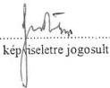
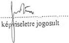
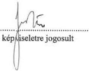
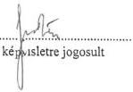
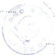
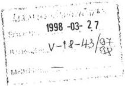

Állami Számvevőszék

# JELENTÉS

a Magyar Rádió Közalapítvány
és - kapcsolódó ellenőrzésként -
a Magyar Rádió Részvénytársaság
gazdálkodásának ellenőrzéséről

412.

1998. április

---

Az ellenőrzés végrehajtásáért felelős:
az ÁSZ III. Költségvetési Ellenőrzési Igazgatósága

Bihary Zsigmond
igazgató

Az ellenőrzést vezette:

Balázs Andrásné
számvevő főtanácsos

Az ellenőrzésben részt vettek:

Csepregi Zsuzsa
számvevő

Karsai Lászlóné
számvevő

Littomericzky Jánosné
számvevő tanácsos

Dr. Oszer Sándor Lajos
számvevő

Pásztor Katalin
számvevő

Dr. Solymár Károlyné
számvevő tanácsos

---

V-18-44/1997-98.

# TARTALOMJEGYZÉK

# 1. A KÖZALAPÍTVÁNY FELADAT- ÉS SZERVEZETI RENDSZERE, MŰKÖDÉ-SE 15

1.1. A kuratórium, az elnökség, a titkárság és az ellenőrző testület tevékenységének szervezeti, szabályozási és működési feltételei 15

1.1.1.A Szervezeti es Mukodesi Szabalyzat (SZMSZ) tartalma es alkalmazasa 15
1.1.2.Gazdalkodasi szabalyzatok 15
1.1.3.A kozalapitvany szemelyi feltetelei 16

1.2. A közalapítvány gazdálkodásának törvényessége és célszerűsége 17

1.2.1.Az MR KA szamara eloirt gazdalkodasi szabalyok eryenyesitese 17
1.2.2. Az éves gazdalkodási tervek késztése, megalapozottsága 18
1.2.3.A gazdalkodás szabályossága, a penzügyi, bizonylati fegyolem érvényesülse 20
1.2.4. A kozalapitvany mukodesi koltsegeinek alakulasa es indokoltsaga, a rendelkezresre allo forrasokkal valo osszhangja 20

1.2.4.1. A testületi tagokkal kapcsolatban felmerült költségek összege, összetétele és törvenyessége 20
1.2.4.2.A kozalapitvany egyes mukodesi koltsegeinek ellenorzese 24
1.2.4.3. A letszam- es bergazdalkodás, a külso munkavallók (szakertók) foglalkoztatára kottt megbizás dijak cel- es szabályszerüsege, a megbizások teljesítésenek igazolása 25

1.2.5.Az 1996.evi beszamoló es merleg valodisaga, a merleg teljes korusege 26
1.2.6. Az ellenörzesek során feltart szabálytalanságok, hiányosságok felszámolására tett intézkedések 27

1.3. A kuratórium és az elnökség működése, gazdasági-pénzügyi feladat- és jogköre 27

1.3.1. A kuratorium es az elnokség muködésenek rendszeressége, a dontések dokumentálasa 28
1.3.2. A kuratoriumi es elnoksegi testuleti dontesek megalapozottsaga, celszerusege es törvenyessege 28

# 2. AZ ELLENŐRZŐ TESTÜLET ELLENŐRZÉSI TEVÉKENYSÉGÉNEK TERV-SZERŰSÉGE, MŰKÖDÉSÉNEK A MÉDIATÖRVÉNYBEN ÉS AZ ALAPÍTÓ OKIRATBAN MEGHATÁROZOTT FELADATOKKAL VALÓ ÖSSZHANGJA 30

# 3. A KÖZALAPÍTVÁNY TULAJDONÁBA ADOTT - ÁLLAMI ÉS EGYÉB FOR-RÁSBÓL SZÁRMAZÓ - VAGYONNAL, TÁMOGATÁSSAL ÉS EGYÉB BE-VÉTELEKKEL VALÓ GAZDÁLKODÁS, VALAMINT AZ MR KA KURATÓ-RIUMA ÉS ELNÖKSÉGE SZÁMÁRA A MÉDIATÖRVÉNYBEN MEGHATÁ-ROZOTT RT. KÖZGYŰLÉSI JOGOK GYAKORLÁSA 31

3.1. Az MR KA tulajdonába - az MR Rt. megalapítása céljából - adott vagyon összhangja és célszerűsége a közszolgálati feladatok megvalósításához 31

1

---

3.2. A Magyar Radio Rt. szamara atadott vagyon dokumentalasanak es elszamolasanak szabályszerüsege, az atadott vagyon tulajdonjogi rendezese 32
3.3. Az Rt. gazdalkodasi, penzügyi üzleti tervei elveinek és fó összegeinek jováhagyása, a dontések elokésztésenek megalapozottsága 33
3.4.Az MR Rt.gazdalkodasa ellenorzésenek megszervezese 34
3.5. A mediatórvénbyen meghatározott esetakben az Rt. elnokének tárgyalásaira vonatkozó elózetes felhatalmazásokhoz, illetve dontései elózetes jováhagyásá-hoz szükséges elóterjeszték és jováhagyások megalapozottsága 36
3.6. Az MR Rt. elnöke pályázataban foglalt celkitüzesek megvalósításanak ertékelése, annak során szerzett tapasztalatok és intézkedesek 37

4. AZ RT. MUKÖDÉSENEK TÖRVÉNYESSÉGE, SZABÁLYOZOTTSAGA, A FELADATOK MEGHATÁROZOTTSAGA, A SZERVEZETI RENDSZER ÖSSZHANGJA 39
5.AZ MR RT.GAZDALKODASANAK ES MUKODESENEK TERVEZESE 42

5.1.Az éves bevetelek és kiadások tervezese 42
5.2.A bevetelek es koltsegek alakulasa (6-7-8.sz.tanusitvanyok) 44

5.2.1.Az 1996-os uzleti ev 44
5.2.2.Az 1997.evi uzleti ev 45
5.2.3. Az 1997. évi költségvetésrol szólo 1996. évi CXXIV. törvenyben az MR Rt. művészeti együtteseinek támogatására jováhagyott 408 millio Ft felhasználá-sanak törvenyessége és celszerüsege 48

5.3. Az MR Rt. rentábilis működtetésére vonatkozó középtávú stratégia 49

6. AZ MR. RT. GAZDÁLKODÁSÁNAK FŐBB ELEMEI 51

6.1. Létszám- és bérgazdálkodás 51

6.1.1.A letszam es osszetetelenek valtozasa 51
6.1.2.Ber es kereseti viszonyok 53
6.1.3.A kulso es belso megbizasok szuksegessege 56
6.1.4. Az 1997. évi költségvetésrol szólo 1996. évi CXXIV. törvenyben jováhagyott bérpolitikai keret felhasznalásanak merteke, uteme és szabályossága 56

6.2. Az eszköz- és vagyongazdálkodás 57

6.2.1. A tárgyi eszközgazdálkodás 57

6.2.1.1. A targyi eszkozallomany osszetetele, az elhasznalodas ertekenek valtozasai, az ertekcsokkenesi leiras alkalmazott modja 58
6.2.1.2. A targyi eszkozok beszerzese, kiemelten a gepjarmu beszerzesek, a beszerzesi dontesek celszerusege 59
6.2.1.3. A beruházasi rafordítások alakulása, forrásösszetetele, celszerüsege, a versenyeztétés gyakorlata, a beruházások megvalósulása 60

2

---

V-18-44/1997-98.

6.2.2. Felújítások, karbantartások 63

6.2.2.1.A felujitasi es karbantartasi raforditasok merteke 63
6.2.2.2.A felujitasi munkak tervezese, lebonyolitasa, szervezettsoge 63

6.2.3. Az anyag- és készletgazdálkodás 64

6.2.4. Az MR Rt. saját műsor készítési tevékenysége 66

6.2.4.1. Szemelyi es targyi feltetelek 66
6.2.4.2.A gyartasi feltetelek fejlesztésenek tervei 68

6.2.4.3. A fajlagos gyártási költségek alakulása, az elő- és utókalkuláció gyakorlata 69

6.2.4.4. Barterügyletek 70

6.2.5.Az egyeb mukodesi celu kiadasok 70
6.2.6.A vallalkozasokban valo reszvetel 72

# 7. A SZÁMVITELI ÉS BIZONYLATI REND, OKMÁNYFEGYELEM, VAGYONVÉDELEM 73

7.1.Szamviteli rend 73
7.2.A kotelezettségvallalas,utalvanyozás es kiadvanyozás rendje 74
7.3. Az Rt. bankszámlái, a támogatások folyósítási rendszerében törtent valtozások a kozalapítvány kincstári rendszerre valo attérése után 74
7.4.A vagyon-nyilvantartasvezetese,teljessege 75
7.5. Az 1996. évi beszámoló és merleg valódisága, a merleg fökonyvi kivonattal, le-tárral történő alatámasztottásága, a merleg teljes körüsege 76

# 8. AZ RT.-NÉL LEFOLYTATOTT ELLENŐRZÉSEK 77

8.1. A belso ellenorzs rendje, szabalyozottsaga, szervezett es zart rendszerenek kialakitasa, a penzugyi - gazdasagi ellenorzesekre vonatkozo szabalyokkal valo osszhangja
8.2. A belso ellenorzs tervszerusege, a vezetoi, a munkafolyamatba epitett es a fuggetlenitett belso ellenorzesi szervezet mukodese, a belso ellenorzs megalapitasainak hasznositasa 78
8.3. Az Rt. Felugyelo Bizottsaga ellenorz tevekenysegenek tervszerusege, megalapitasainak hasznositasa 79
8.4. Külso szervek, hatósagok Ellenőrzései, az MR Rt. elnökének az Ellenőrzések alapján tett intezkedései 81
8.5. Az Állami Számvevőszék korábbi Ellenőrzéseinek megállapításaira kidolgozott MR intézkedési tervek vegrehajtásanak eredményei, az MR Rt. gazdalkodását ilte továbbiactualitásuk 81

3

---

4

---

I. ÖSSZEGZŐ MEGÁLLAPÍTÁSOK, KÖVETKEZTETÉSEK, JAVASLATOK---

**Állami Számvevőszék**

**V-18-44/1997-98.**

**Témaszám: 387**

## J E L E N T É S

**a Magyar Rádió Közalapítvány**

**és - kapcsolódó ellenőrzésként -**

**a Magyar Rádió Részvénytársaság gazdálkodásának ellenőrzéséről**

**A Magyar Rádió Közalapítványt** (MR KA) a rádiózásról és televíziózásról szóló 1996. évi I. törvény (mediatörvény) 53. § (1) bekezdésével a közszolgálati műsorszolgáltatás biztosítására, függetlenségének védelmére hozta létre az Országgyűlés.

**A közalapítvány célját** a 17/1996. (III. 8.) OGY határozat mellékletét képező alapító okirat 3. pontja határozta meg az Alkotmány 61. §-ával és az 1996. évi I. törvényben foglaltakkal összhangban:

**A szabad és független rádiózás és televíziózás, a véleménynyilvánítás szabadsága, a tájékoztatás függetlensége, kiegyensúlyozottsága és tárgyilagossága, a tájékozódás szabadsága, valamint az egyetemes és nemzeti kultúra támogatása, a vélemények és a kultúra sokszínűségének érvényre juttatása érdekében az Alkotmány 61. §-ával összhangban a Magyar Rádió, mint közszolgálati rádió függetlenségének s ezzel egyidejűleg társadalmi felügyeletének biztosítása.**

E cél érdekében a Magyar Rádió (MR) az állam tulajdonából a közalapítvány tulajdonába került, és Rt. formájában működik tovább /1996. évi I. tv. 64. § (1)-(2) bek. és 141. § (1)-(2) bek./.

**A Magyar Rádió Közalapítványnak** az Országgyűlés 17/1996. (III.8.) számú határozatával jóváhagyott alapító okirata szerint **alapvető feladata, hogy a Magyar Rádió Rt. (MR Rt.) tulajdonosaként gondoskodjék a közszolgálati műsorszolgáltatásnak a médiatörvényben meghatározott követelményei érvényesüléséről.**

---5

---

I. ÖSSZEGZŐ MEGÁLLAPÍTÁSOK, KÖVETKEZTETÉSEK, JAVASLATOK---

Az MR Rt. vonatkozásában az alapítói, részvényesi jogokat - a gazdasági társaságokról szóló 1988. évi VI. törvény (Gt.) 288-300. §-ai, illetve a médiatörvény előírásai alapján - az MR KA gyakorolja.

Feladatai ellátásához a közalapítvány induló vagyonát az Országgyűlés 15 millió Ft-ban állapította meg. 1996. évi működési kiadásaira a költségvetés általános tartalékából biztosított forrást, 1997. évtől kezdődően pedig az Országos Rádió és Televízió Testület (ORTT) a Műsorszolgáltatási Alapból folyósítja a médiatörvényben jóváhagyott mértékű működési célú támogatást.

A Ptk. 74/G. § (8) bekezdése, illetve a médiatörvény 60. § (5) bekezdése szerint az MR KA gazdálkodásának törvényességét és célszerűségét az Állami Számvevőszék ellenőrzi.

A nemzeti közszolgálati rádió feladatainak ellátására a médiatörvény előírásai alapján az MR KA 1996. augusztus elsejei hatállyal megalapította a Magyar Rádió Rt. -t. A Magyar Rádió Rt. a megszűnt Magyar Rádió költségvetési szerv általános jogutódja. Alaptőkéje az alapító okirat szerint 4,5 milliárd forint.

Az MR Rt. az MR KA-n, illetve a Műsorszolgáltatási Alapon és az MR KA-n keresztül az éves költségvetési törvényben, illetve a médiatörvényben meghatározott célokra és mértékben a központi költségvetésből származó támogatást kap (a központi költségvetés fejezeteitől származóan sugárzási díj, üzembentartási díj állam által vállalt átalánya és kiegészítése, valamint különböző céltámogatások - bérpolitikai támogatás, művészeti együttesek támogatása - jogcímeken kap, illetve kapott támogatást).

Az Állami Számvevőszék az 1989. évi XXXVIII. törvényben meghatározott hatáskörében és feladatai alapján - mint az Országgyűlés pénzügyi-gazdasági ellenőrző szerve - ellenőrzi az államháztartás gazdálkodását, ennek keretében a felhasználások törvényességét, szükségességét és célszerűségét /2. § (1) bekezdés/, ellenőrzi az állami költségvetésből juttatott támogatás felhasználását a 2. § (5) bekezdésében fel nem sorolt ún. egyéb szervezeteknél, így jelen program alapján az MR Rt.-nél.

Az MR KA törzsvagyonát, mint célra rendelt vagyont képezi a megszűnt Magyar Rádió költségvetési szerv állami tulajdonban volt ingó és ingatlan vagyona, vagyoni értékű jogai, amelyből az MR KA megalapította az MR Rt.-t. Az Rt.-nek egy forgalomképtelen részvénye van, ami az MR KA kizárólagos tulajdonába került.

Az MR KA törzsvagyonának, e vagyonnal való gazdálkodásnak a törvényességi és célszerűségi szempontok szerinti ellenőrzése részben közvetlenül a közalapítvány kuratóriumának és elnökségének helyszíni ellenőrzése keretében, részben - kapcsolódó ellenőrzésként - a vagyont működtető egyszemélyes Rt.-nél történt. Az Állami Számvevőszék az 1989. évi XXXVIII. törvény fent idézett 2. § (5) bekezdése, illetve a 21. § (3) bekezdése alapján a vizsgálati megállapítások kiegészítése érdekében vizsgálta az MR Rt.-nél az MR KA ellenőrzésével összefüggő tényeket.

---6

---

I. ÖSSZEGZŐ MEGÁLLAPÍTÁSOK, KÖVETKEZTETÉSEK, JAVASLATOK

**Az ellenőrzés célja az volt, hogy törvényességi és célszerűségi szempontok szerint értékelje az MR KA-nak, illetve az MR Rt.-nek átadott állami vagyon működtetését és a központi költségvetésből származó támogatások felhasználását.**

Ennek során arra kerestünk választ, hogy

- – az MR KA kialakított szervezeti és működési rendje, működési költségeinek nagysága, felhasználásának összetétele, gazdálkodása törvényes és célszerű-e;
- – az MR KA kuratóriuma és elnöksége törvényesen és célszerűen gyakorolja-e tulajdonosi jogait az MR Rt. gazdálkodása felett;
- – az MR Rt. az alapító okiratában meghatározottaknak, valamint a kuratórium és az elnökség döntéseinek megfelelően, törvényesen és célszerűen gazdálkodik-e a rendelkezésére bocsátott állami vagyonnal és központi költségvetési támogatással;
- – jelenleg milyen mértékben biztosított az összhang a médiatörvényben meghatározott közszolgálati feladatok, valamint az MR Rt. személyi és tárgyi feltételei között;
- – az MR Rt. stratégiája alkalmas-e a közszolgálati feladatok ellátása és a rentábilis működés feltételeinek együttes biztosítására;
- – az MR KA Ellenőrző Testülete (ET) és az MR Rt. Felügyelő Bizottsága (FB) ellenőrzései és az ezek alapján tett intézkedések milyen hatást gyakoroltak a közalapítvány és az Rt. gazdasági-pénzügyi tevékenységére;
- – az Állami Számvevőszék korábbi ellenőrzéseinek megállapításaira a Magyar Rádió költségvetési intézmény (MR) által kidolgozott intézkedési tervek végrehajtása milyen eredménnyel járt, van-e az MR Rt. gazdálkodását illetően további aktualitásuk.

Az ellenőrzés az MR KA létrejöttétől (1996. március 8 - tól) és az MR Rt. megalakulásától (1996. augusztus 1 - től) 1997. szeptember 30 - ig terjedő időszak gazdasági-pénzügyi tevékenységére terjedt ki, részben a bekért adatok áttekintésével, részben a helyszíni ellenőrzés során szerzett ismeretek felhasználásával.

7

---

1. ÖSSZEGZŐ MEGÁLLAPÍTÁSOK, KÖVETKEZTETÉSEK, JAVASLATOK

8

---

I. ÖSSZEGZŐ MEGÁLLAPÍTÁSOK, KÖVETKEZTETÉSEK, JAVASLATOK

# I. ÖSSZEGZŐ MEGÁLLAPÍTÁSOK, KÖVETKEZTETÉSEK, JAVASLATOK

**A Magyar Rádió Közalapítvány kuratóriuma és elnöksége az ellenőrzött időszakban a médiatörvényben és az alapító okiratban meghatározott követelményeknek összességében megfelelően látta el pénzügyi-gazdasági feladatait.**

**A kuratórium, az elnökség és a titkárság szervezeti és működési rendje összességében megfelelt a törvényi előírásoknak.** Az ÁSZ 1997. márciusi, a közalapítvány működésének törvényességi ellenőrzése során javasolt feladatok egy részét időközben végrehajtották. A Szervezeti és Működési Szabályzat (SZMSZ) összhangban van a médiatörvénnyel és az alapító okirattal. A gazdálkodásra vonatkozó belső szabályzatokat - amelyek megfelelnek a számviteli törvény előírásainak - nem tekintették az SZMSZ részének, így ezeket - tévesen - nem terjesztették elő a kuratóriumnak jóváhagyásra.

A közalapítvány a működési költségeit a médiatörvényben meghatározott jogcímeken kapott bevételeiből fedezi. A kuratórium által jóváhagyott tervek - 1997-ig - a helytelen tervezési gyakorlat miatt nem tartalmaztak bevételi tervszámot. A megalapozott gazdálkodási tervek elkészítéséhez az ellenőrzött időszakban a közalapítvány nem rendelkezett tapasztalati adatokkal, ez elsősorban a bevételek számításba vételénél okozott gondot. A közalapítvány működési költségeihez az igényelt többletforrások engedélyezése - mely az Országgyűlés hatásköre - nem történt meg az éves gazdálkodási terv összeállításának időpontjáig.

Az MR KA 1996. és 1997. évi működési kiadásait az induló vagyon, a kamatbevétel és a működési célra kapott bevétel együttesen fedezte, emiatt azonban 1997. végére az induló vagyon várhatóan minimálisra csökken. Változatlan kiadási struktúra mellett a kiadások 1998. évben is meghaladhatják a működési célra befolyó összeget. **A közalapítványnak a jövőben** - az elmúlt két év tapasztalatainak felhasználásával - likviditásának megőrzése érdekében **megalapozottabb tervezési gyakorlatot és takarékosabb gazdálkodást kell kialakítani.**

A közalapítvány működési költségein belül a személyi jellegű kifizetések és azok közterhei mintegy 4/5 részt képviselnek. Ezt az arányt a közalapítvány sajátosságai indokolják, ugyanakkor jelzik, hogy takarékosabb gazdálkodás, a költségek csökkentése elsősorban e területen lehetséges.

A közalapítvány a választott, illetve delegált testületi tagok számára költségtérítést fizetett, részben számlák alapján, részben anélkül. A számlák nélkül kifizetett költségtérítés után az érintettek SZJA-t fizettek. **A médiatörvény 63. §-a, illetve az alapító okirat 12.2. pontjának költségtérítésre vonatkozó rendelkezése a közalapítványnál kialakított gyakorlatot nem tiltja, azonban - részletes szabályozás hiányában - az alapító szándéka nem derül ki egyértelműen.**

9

---

I. ÖSSZEGZŐ MEGÁLLAPÍTÁSOK, KÖVETKEZTETÉSEK, JAVASLATOK

**Az ellenőrzés célszerűségi szempontból kifogásolta a számlák nélkül fizetett költségtérítést.** A közalapítvány minden ténylegesen felmerült és igazolt költséget megtérített, illetve átvállalt. Az elnökség, a kuratórium delegált tagjai és az ellenőrző testület tagjai számára számlák nélkül fizetett további költségtérítést viszont megalapozó számítás nem támasztotta alá, így indokoltsága nem volt bizonyított.

A közalapítvány gazdálkodásában célszerűségi szempontból néhány további költségtételt (számítógép bérleti díj, mobil telefonköltség) is bírált az ellenőrzés, kifogásolta továbbá az MR KA és az MR Rt. között kötött bérleti szerződésben megállapított bérleti díj jelentős csökkenését, mivel nem zárható ki, hogy a közalapítvány működési kiadásai csökkentése és likviditásának megőrzése érdekében a tulajdonosi pozícióból állapodott meg az MR Rt.-vel.

A közalapítvány kuratóriumának tevékenységét **az Ellenőrző Testület** ellenőrzi. Ügyrendje és munkaterve, valamint a célellenőrzések, véleményezések alapján a testület **eleget tett a médiatörvényben és a közalapítvány alapító okiratában előírt feladatainak.** Megállapításaik realizálására a szükséges intézkedéseket a kuratórium, illetve az elnökség megtette.

**A kuratórium és az elnökség az MR Rt. gazdálkodása felett a tulajdonosi jogait a médiatörvényben és az alapító okiratban előírt módon, törvényesen és célszerűen látta el.**

Az alapító okirat szerint az elnökség feladata az MR Rt.-t megillető bevételekkel kapcsolatos átutalási intézkedések meghozása. Az elnökség az elmúlt időszakban általában azonnal intézkedett, e döntéseiről a kuratóriumot is tájékoztatta. Az Rt.-nek járó bevételeket és az átutalások időpontjait a médiatörvény, illetve az alapító okirat részleteiben is szabályozza, így a feladat testületi gyakorlása a finanszírozás menetében a későbbiekben időveszteséget okozhat. Az elnökség e jogköre technikai jellegű feladat, nem jelent érdemi döntést, így a Titkárságra is rábízható lenne.

**A Közszolgálati Műsorszolgáltatási Szabályzat (KMSZ)** körültekintő összeállítására az elnökség és a kuratórium nagy figyelmet fordított. A KMSZ **hatálybaléptetése rendkívüli módon elhúzódott.** Átdolgozást követően az ORTT 1998. január végén adta meg a médiatörvényben előírt egyetértését. Elhúzódik az Archiválási Szabályzat jóváhagyása is, az ORTT még nem reagált a tervezetre.

Az MR Rt. megalakulásával összefüggő vagyoni intézkedések törvényességét az Állami Számvevőszék 1997. évben ellenőrizte. A szükséges korrekciókat a közalapítványnál a helyszíni ellenőrzés időszakában kezdték meg, és 1998. március végén fejezték be. Az ingatlanok tulajdonjogi rendezése folyamatban van.

A közalapítvány, majd az Rt. vagyonába került **épületek többsége** nagy értékű, **a feladat ellátásához szükséges.** Egy része gazdaságosan nem üzemeltethető, a Rádió tevékenységéhez nem kötődik szorosan. Az épület elemek **épületgépészeti és az információs rendszer infrastruktúrája** szempontjából **megújítást** igényelnek. A **szakmai berendezések** nagyobb hányada a fizikai elhasználódás és a műszaki paraméterek szempontjából már **korsze-**

10

---

I. ÖSSZEGZŐ MEGÁLLAPÍTÁSOK, KÖVETKEZTETÉSEK, JAVASLATOK

**rütlen, a tevékenység végzéséhez azonban szükséges.** Jelentős része már rövid távon a rádiózás korszerű technikai feltételeinek megfelelő **korszerűsítést, illetve műszaki szakmai váltást igényel.** Az átadott vagyonon belül - a Rádió feladat rendjéhez viszonyítva - viszonylag alacsony - mindössze 12 % - volt a forgóeszközök aránya. **Az átadott vagyont 1,7 milliárd Ft-os kötelezettség terhelte.**

A kuratórium a Rádió gazdasági helyzetének áttekintése és az ebből levont következtetések alapján juttatta el tájékoztatását és javaslatait az Országgyűlés illetékes bizottságaihoz és a pénzügyminiszterhez. E jelzések is hozzájárultak ahhoz, hogy az Rt. létrehozásának feltételei megteremtődtek. A kuratórium a médiatörvényben biztosított jogkörével élve több alkalommal - 1997. évben eredményesen - kezdeményezte az Országgyűlés illetékes bizottságán keresztül az MR Rt. forrásainak kiegészítését állami támogatás, illetve céltámogatás biztosítása érdekében.

A kuratórium az Rt. közgyűlésének hatáskörében az éves gazdálkodási (üzleti) terveket és a mérleget időben jóváhagyta, az Rt. elnöke által beterjesztett előterjesztéseknek megfelelően. A döntés-előkészítés és a jóváhagyás folyamata törvényességi, szabályossági szempontból megfelelő volt.

Az 1997. májusában megalakult új kuratórium feladatul szabta az Rt. elnökének, hogy 1997. év végéig állítsa össze az Rt. gazdálkodásstratégiai koncepcióját. Ennek birtokában a kuratórium várhatóan megalapozottabb döntéseket tud majd hozni az elkövetkező évek üzleti terveivel kapcsolatban. **A közalapítvány kuratóriuma 1997. december 15-i ülésén elfogadta az Rt. 1997-2001. évekre szóló stratégiai tervét,** amely a feladatok éves bontását is tartalmazza. A terv célja, hogy az Rt. hosszú távon gazdaságosan tudja hasznosítani infrastruktúráját, fenntartsa működőképességét, megfeleljen a független, közszolgálati rádió követelményeinek, megalapozza és koncepcionális keretet adjon az éves üzleti terveknek.

Az elnökség az Rt.-vel kapcsolatos tulajdonosi jogok gyakorlásánál kialakította a KA és az Rt. közötti folyamatos kapcsolattartást és információcserét. Ez utóbbi a folyamatos ellenőrzés módszereként is funkcionál.

**Az Rt. tevékenységének első, átfogó értékelése az elnöki pályázat teljesítésének tapasztalatairól készített beszámoló alapján történt meg. A kuratórium elismerte és méltányolta a nehéz pénzügyi körülmények között létrejött gazdasági konszolidációt, a Rádió társadalmi presztízséért, értékei megőrzéséért, a korszerű rádiózás megvalósításáért tett eredményes erőfeszítéseket. Ezeket az ellenőrzés tapasztalatai is alátámasztják.**

Az MR Rt. első évét a megváltozott helyzethez való felkészülés, a környezethez való alkalmazkodás jellemezte. **Az átalakulás üteme mérsékelt** volt, nem következett be radikális változás, szakmai megújulás. **Az MR Rt. lényeges vonásaiban még változatlan rádiós környezetben működik,** az ellenőrzött időszakban **a kereskedelmi rádiók megjelenése nem okozott piaci átrendeződést.**

11

---

I. ÖSSZEGZŐ MEGÁLLAPÍTÁSOK, KÖVETKEZTETÉSEK, JAVASLATOK---

**1997. végére a kiadást csökkentő és bevételt növelő intézkedések eredményeként az MR Rt. gazdálkodása egyensúlyba került, az Rt. likviditása javult.**

A KMSZ jóváhagyásának hiánya akadályozta az Rt. jogszerű működését, korlátozta az indokolt belső intézkedések megtételét. A helyszíni ellenőrzés befejezésekor a működési, gazdálkodási szabályok - összefüggésben a KMSZ hiányával is - még a műhelymunka stádiumában voltak.

**A szervezeti átalakulás végrehajtásaként** - a jól kiépített szervezeti keretekkel rendelkező, önálló adó-főszerkesztőségként működő Kossuth és Petőfi adó mellett - **megkezdődött a Bartók adó** önálló, műsorkészítéssel is foglalkozó adó-főszerkesztőséggé történő **átalakítása**. Az átszervezések révén **mindhárom adónál létrejött az önálló adóprofil. Az infrastrukturális szervezetek** - Műszaki Igazgatóság, Gazdasági Igazgatóság - **átszervezésére, racionalizálására** - bár készültek előkészítő anyagok - **az ellenőrzés befejezéséig nem született döntés.**

Az egy főre jutó **átlagbérek és átlagkeresetek** az MR Rt. egészét tekintve - nagy szóródással - összességében **alacsonyak**. A kialakult kereseti viszonyok, **a bérezési és ösztönzési rendszer nehezen áttekinthető, bonyolult. Az Rt.** a stratégiai tervnek megfelelően **1998-tól** kezdődően a kereseti viszonyok átfogó elemzése alapján **megkezdi az aránytalanságok felszámolását**, figyelemmel a KMSZ előírásaira, a feladatellátás szervezeti és technikai korszerűsítésére és a tervezett létszámcsökkentésre.

**A számvitel általánosan jó rendszerén belül kifogásolható a hangarchívum számviteli nyilvántartása.** Az archívum az MR Rt. könyveiben 1 Ft-os eszmei értékkel szerepel, anyagait csak mennyiségben tartják nyilván, tételes leltározására 14 éve nem került sor.

**Az ellenőrzött időszakban az MR Rt.-nél** az ellenőrzési rendszer három eleméből folyamatosan csak kettő - a vezetői és a munkafolyamatba épített - funkcionált, **függetlenített belső ellenőrzési szervezet nem volt.** A belső ellenőrzést az Rt. elnöke megbízásos jogviszonyok keretében, az FB pedig külső szakértői bevonásával biztosította.

**Az MR Rt. Felügyelő Bizottsága** - lemondások miatt - 1997. március 14. óta működik, azóta **feladataikat összességében a médiatörvényben foglaltak szerint végzik.**

A gazdálkodás néhány jelentős területén a korszerűsítés érdekében tervezett intézkedések végrehajtása teljes körűen nem történt meg. **A számviteli rendszer még nem alkalmas az egyes műsorok gazdaságosságának mérésére, lassabban történik a létszámleépítés, az átláthatóbb bér- és jövedelemrendszer kidolgozása, a nem rádiós tevékenységhez kapcsolódó vagyonhasznosítási alternatívák kidolgozása, az MTV-vel közösen fenntartott jóléti intézmények üzemeltetésének átszervezése.**

---12

---

I. ÖSSZEGZŐ MEGÁLLAPÍTÁSOK, KÖVETKEZTETÉSEK, JAVASLATOK

**Rádiótörténeti előrelépésnek minősül a Petőfi és Bartók adók** átállása az európai szabványnak megfelelő **CCIR** sávon történő sugárzásra. **Pénzügyi lehetőségek hiányában** azonban **nem sikerült** az indokolt mértékben **felgyorsítani a műszaki fejlesztéseket**, sőt még indokolt műszaki fejlesztések is elmaradtak.

**A Danubius Rádió műsorszolgáltatási jogosultságáért járó, az MR Rt.-t megillető műsorszolgáltatási díj bevétel lehetővé teszi a stratégiai terv pénzügyi megalapozását**, a jobb felkészülést a kereskedelmi rádiókkal való - a közszolgálati profilt figyelembevevő - versenyre, a gyorsabb léptékű műszaki korszerűsítésre.

**Az Állami Számvevőszék korábbi ellenőrzéseinek** megállapításaira a Magyar Rádió költségvetési intézmény intézkedési terveket dolgozott ki. **Az előírt feladatok egy része teljesült**, más része csak részben vagy egyáltalán nem. A feladatok egy része a gazdálkodási forma megváltozása miatt aktualitását vesztette, **más része** - fejlesztési koncepciók, egységes műsornyilvántartási és elszámolási rendszer, áttekinthetőbb bérezés és ösztönzés, szigorúbb teljesítmény-követelmények kidolgozása, a belső szervezeti rendszer korszerűsítése - **az Rt. működési keretei között is időszerű és szükséges**.

## Javaslatok

### az Országgyűlésnek, mint a Magyar Rádió Közalapítvány alapítójának

A Magyar Rádió Közalapítvány alapító okiratának módosításakor

1. 1.) Az alapító okirat 12.2. pontjában a „...költségtérítésre tarthatnak igényt”, illetve a „költségtérítés ... megilleti” szövegrészt úgy módosítsa, hogy abból egyértelműen derüljön ki az alapítói szándék:
   1. a.) az érintettek a közalapítvány tevékenységével összefüggésben felmerült, igazolt költségeik megtérítését igényelhetik, vagy/és
   2. b.) a költségek igazolása nélkül, adóköteles költségtérítésben részesíthetők.
2. 2.) Az alapító okiratot a költségtérítéssel kapcsolatban választott megoldás függvényében egészítse ki:
   1. a.) az elszámolható költségek körét, mértékét, a költségek igazolásának módját a Szervezeti és Működési Szabályzatban kell megállapítani, vagy
   2. b.) a költségtérítés összegét határozza meg, illetve e jogkörrel hatalmazza fel a kuratóriumot.
3. 3.) Az alapító okirat 1. sz. melléklete 5. pontját - mely szerint a közalapítvány bevételei között megjelenő, az MR Rt.-t megillető összegekre az átutalási intézkedések meghozatala az elnökség feladata - törölje, mivel az alapító ok-

13

---

I. ÖSSZEGZŐ MEGÁLLAPÍTÁSOK, KÖVETKEZTETÉSEK, JAVASLATOK

irat 3. pontja konkrétan tartalmazza az MR Rt.-t megillető bevételeket és az átutalás határidejét is, e feladat teljesítését az elnökség nem mérlegelheti, így a végrehajtás lebonyolítása nem igényel testületi döntést.

# **a Magyar Rádió Közalapítvány Kuratóriumának**

1.) A Szervezeti és Működési Szabályzatban határozza meg
a.) az éves gazdálkodási terv és az esetleges évközi módosítások tartalmi és formai követelményeit, melyben alapkövetelmény, hogy csak a reálisan számításba vehető bevételek mértékéig tervezhetők kiadások,
b.) az alapító döntésének megfelelően az elszámolható költségek körét, mértékét, a költségek igazolásának módját.
2.) A Magyar Rádió Rt. stratégiai tervében jóváhagyott célkitűzéseket, továbbá a Danubius Rádió műsorszolgáltatási díjából származó bevételnek a műszaki korszerűsítés érdekében történő felhasználását az éves üzleti tervek jóváhagyásakor érvényesítse.

# **a Magyar Rádió Közalapítvány kuratóriuma elnökségének**

A jelentés részletes megállapításai alapján intézkedjék a közalapítvány szabályzataiban és gazdálkodásában feltárt hiányosságok felszámolására.

# **a Magyar Rádió Rt. elnökének**

1.) A jelentés részletes megállapításai alapján intézkedjék az Rt. szabályzataiban és gazdálkodásában feltárt hiányosságok felszámolására - ezen belül soron kívül a szigorú számadású nyomtatványok kezelésére, elszámoltatására - továbbá az 1992. évi számvevőszéki ellenőrzés alkalmával javasolt, és jelen jelentésben részletezett aktuális feladatok megoldására.
2.) Intézkedjék a hangarchívum előírásszerű számviteli nyilvántartásának megoldásáról, az elmaradt leltározás soronkívüli pótlásáról.
3.) A Magyar Televízió Rt. elnökével együttműködve, illetve saját hatáskörében gyorsítsa fel a jóléti intézmények és a szolgáltató garázsipari egység átszervezését.

14

---

II. RÉSZLETES MEGÁLLAPÍTÁSOK

## II. RÉSZLETES MEGÁLLAPÍTÁSOK

### A MAGYAR RÁDIÓ KÖZALAPÍTVÁNYNÁL

#### 1. A KÖZALAPÍTVÁNY FELADAT- ÉS SZERVEZETI RENDSZERE, MŰKÖDÉSE

##### 1.1. A kuratórium, az elnökség, a titkárság és az ellenőrző testület tevékenységének szervezeti, szabályozási és működési feltételei

###### 1.1.1. A Szervezeti és Működési Szabályzat (SZMSZ) tartalma és alkalmazása

Az MR KA által jóváhagyott SZMSZ azokat a szervezeti és működési kérdéseket szabályozza, amelyekre a KA alapító okirata nem terjed ki.

Az SZMSZ tartalma megfelel a médiatörvény és a közalapítványokra irányadó általános jogszabályok rendelkezéseinek, alkalmazása - néhány kötelezettségvállalás kivételével - megfelelő.

Írásbeli kötelezettséget az SZMSZ Második Rész 8.2. pontja szerint — a munkatársakkal és szakértőkkel kapcsolatos szerződések kivételével — az elnök és az elnökhelyettes (akadályoztatásuk esetén az általuk e célra kijelölt elnökségi tag) együttesen vállalhat. A **szűrőpróba-szerű ellenőrzés** feltárta, hogy egyes bérleti szerződések aláírására - azaz írásbeli kötelezettség vállalására - az elnök és az elnökhelyettes ugyan együttesen, de csak egy-egy elnökségi tagot hatalmazott fel.

###### 1.1.2. Gazdálkodási szabályzatok

Az 1996-ban hatályos számviteli törvény 79. § (4) bekezdése szerint az MR KA-nak, mint újonnan alakult szervezetnek számlarendjét a megalakulásának időpontjától számított 90 napon belül, azaz 1996. június 8-áig ki kellett volna alakítani. Ez határidőre nem történt meg.

A közalapítvány 1996-ban olyan számviteli politika előírásai szerint dolgozott, melyet még 1992-ben, a számviteli törvény bevezetésének évében uniformizáltan alakítottak ki, mellékletét csak a számlatükör képezte. E számviteli politika önálló számlarendet nem tartalmazott, annak követelményeit csak implicite foglalta magába.

A közalapítvány 1997-re aktualizált számviteli politika-, számlatükör- és számlarend tervezetét külső szakértő 1997. febr. 17-ére készítette el.

**A számviteli politika** tartalma (a könyvvezetés, a mérlegtételek részletezése, értékelése, az eredmény-kimutatás és a kiegészítő melléklet formája, jogszabályok és mutatók függeléke) megfelel a számviteli törvényben előírt követelményeknek. 1997-ben már rendelkeznek a számviteli politika mellett egy önálló — bár 'vállalati' elnevezésű — számlarenddel is. A számlatükör megfelelő.

15

---

II. RÉSZLETES MEGÁLLAPÍTÁSOK

A számviteli törvény 14. § (5) és (6) bekezdése szerint a közalapítványnak az eszközök és források leltárkészítési és leltározási szabályzatát, értékelési szabályzatát és pénzkezelési szabályzatot is el kellett készíteni.

**A Leltárkészítési szabályzat** elkészült, tartalmilag megfelelő.

Értékelési szabályzat külön nem készült, az értékelési elveket a számviteli politika tartalmazza.

**A Pénzkezelési szabályzat** 1997. március 20-án lépett hatályba, tartalmát az ellenőrzés megfelelőnek tartja. Előírásait - egy pontja kivételével - betartják.

A szabályzat 3.1.1. pontja szerint a pénztárosi munkakör személyi szempontból összeférhetetlen a könyvelési munkakörrel, vagyis ugyanaz a személy nem töltheti be egyidejűleg ezt a két munkakört. Az MR KA alacsony hivatali létszáma miatt ezt az előírást nem tudják maradéktalanul betartani. A kialakított gyakorlat úgy oldja fel az összeférhetetlenséget, hogy a pénzügyi ügyintéző végzi a kontírozást, de munkáját a megbízott külső könyvvizsgáló ellenőrzi.

Az MR KA Alapító Okirata szerint a közalapítvány kezelő szerve a kuratórium, amelynek feladat- és jogkörébe tartozik a közalapítvány általános működése keretében a közalapítvány szervezeti és működési szabályzatának megállapítása és módosítása. Az SZMSZ -nek tartalmaznia kell a közalapítvány működésének részletes szabályait, beleértve a gazdálkodásra vonatkozó szabályokat is. **E szabályzatokat a gazdasági igazgató írta alá.** Az Alapító Okirat, illetve az SZMSZ sem az elnökséget, sem a titkárságot, sem a közalapítvány alkalmazottjait nem hatalmazta fel a közalapítvány működéséhez szükséges szabályzatok jóváhagyására. **Az ellenőrzés álláspontja valamennyi belső szabályzat jóváhagyására, hatálybaléptetésére szerint a kuratórium jogosult.**

A kuratórium elnöke álláspontja szerint „az SZMSZ sehol sem tartalmazza, hogy ezeket a szabályzatokat jóvá kellene hagyatni a Kuratóriummal, nincs erről szó a médiatörvényben és az Alapító Okiratban sem. Ezen szabályzatok elkészítése csak részben volt kötelező; álláspontunk szerint elkészítésük nem képezi az SZMSZ részét, a közalapítványok működésére vonatkozó törvényekből és szabályokból szervesen következnek. Szigorú tartalmi és formai követelményeknek kell eleget tenniük; kidolgozásuk kifejezetten speciális szakmai ismereteket és gyakorlatot kíván, tartalmuk meghatározása nem a kuratórium illetékessége. Véleményünk fenntartása mellett nem látjuk akadályát annak, hogy a szabályzatokat a Kuratórium elé terjesszük elfogadásra.”

A helyszíni ellenőrzés befejezéséig a fent felsorolt szabályzatokat nem terjesztették elő a kuratóriumnak jóváhagyásra.

### 1.1.3. A közalapítvány személyi feltételei

#### a.) Kuratórium és elnökség

**A kuratórium delegált tagjainak** a megbízása egy évre szól, a tagok száma maximum huszonegy fő lehet. Az első ciklusban húsz, a másodikban ti-

16

---

II. RÉSZLETES MEGÁLLAPÍTÁSOK

zennyolc delegált tagja volt a kuratóriumnak. A delegálási okmányokat és az összeférhetetlenséget kizáró nyilatkozatokat a titkárság bekérte.

Az **elnökség** tagjait négy évre választotta az Országgyűlés. A helyszíni ellenőrzés befejezéséig négy fő mondott le elnökségi tagságáról, helyükre új személyeket választott az Országgyűlés. 1997. szeptember közepe óta az elnök személye is új.

### b.) Titkárság

A közalapítvány kuratóriumának, elnökségének ügyintéző, ügykezelő és ügyviteli teendőit, illetve az ellenőrző testület hivatali teendőit a titkárság látja el. Az alapító okirat egy vezető és öt teljes munkaidejű munkatárs alkalmazására ad lehetőséget.

A titkárság létszámára vonatkozó előírás az ellenőrzött időszakban teljesült.

A titkárság az alapító okiratban és az SZMSZ-ben részletezett feladatait a szabályzatokkal összhangban látja el. A feladat- és jogköröket – az SZMSZ-szel összecsengően – a munkaszerződések világosan elhatárolják.

## 1.2. A közalapítvány gazdálkodásának törvényessége és célszerűsége

### 1.2.1. Az MR KA számára előírt gazdálkodási szabályok érvényesítése

Az MR KA az ellenőrzött időszakban alapító okirata 1. sz. mellékletében meghatározott gazdálkodási szabályoknak megfelelően üzletszerű gazdasági tevékenységet nem végzett, az MR Rt.-n kívül más gazdasági vagy közhasznú társaságot nem alapított, részesedést nem szerzett, alapítványt nem létesített.

Működési költségeit a jogszabályok által biztosított bevételeiből fedezte.

Feladatai ellátásához a közalapítvány **induló vagyonát** az Országgyűlés **15 millió Ft-ban** állapította meg. 1996. évi kiadásaira a költségvetés általános tartalékából 10 millió Ft-ot, a TV előfizetői díjbevételből 21 millió Ft-ot kapott. 1997. évtől kezdődően az ORTT a Műsorszolgáltatási Alapból folyósítja a médiatörvényben jóváhagyott mértékű működési célú támogatást (1-2. sz. tanúsítványok).

A közalapítványnak 1996-ban működési célú forrásból származó megtakarítása nem volt, így pótlólagos támogatást az MR Rt.-nek nem kellett adnia.

**Az MR KA sajátos feladata az MR Rt. finanszírozása**, az MR Rt.-t megillető pénzösszegek továbbutalása révén.

Az alapító okirat 1. sz. mellékletének 3. pontja szerint a műsorterjesztési (sugárzási) díjat az esedékességekor, az MR Rt.-t megillető üzembentartási díjat, a művészeti együttesek költségvetési támogatását, a külföldre irányuló műsorszolgáltatás külön költségvetési támogatását, az MR Rt. részére megállapított külön támogatást, a Danubius Rádió műsorszolgáltatási

17

---

II. RÉSZLETES MEGÁLLAPÍTÁSOK

jogosultságáért járó műsorszolgáltatási díjbevétel címén befolyt bevételeket a közalapítvány a folyósítást követően haladéktalanul köteles továbbutalni.

A közalapítvány kuratóriumának elnöksége a jóváírást igazoló bankszámlakivonat megérkezését követően általában azonnal intézkedik az MR Rt.-t megillető összegek átutalására.

**Az MR KA alapító okirata** 1. sz. melléklet 5. pontja **az elnökség feladatává tette az átutalási intézkedések meghozatalát. Ez az előírás az ellenőrzés álláspontja szerint szükségtelen**, mert a közalapítvány az MR Rt.-t megillető, a médiatörvényben szabályozott összegeket mérlegelés nélkül köteles továbbutalni. Mivel az elnökség csak havonta köteles ülést tartani, **e jogkör gyakorlása a finanszírozásban** a későbbiekben **időveszteséget okozhat**.

Az elnök beszámol az utalás(ok) tényéről a következő kuratóriumi ülésen.

Az MR KA befektetései megfeleltek az alapító okirat előírásainak. 1996. évben sem rövid, sem hosszú lejáratú értékpapírt nem vásárolt, az 1997. évi értékpapír vásárlásokra a működési célú bevételeiből keletkezett átmeneti megtakarítások biztosították a fedezetet.

### 1.2.2. Az éves gazdálkodási tervek készítése, megalapozottsága

A közalapítvány működéséhez szükséges forrásokat az induló vagyon, továbbá 1996-ban központi költségvetési támogatás, illetve a TV előfizetési díjakból származó részesedés, 1997-ben az üzembentartási díjból származó részesedés biztosította.

**Az 1996. évi eredeti és módosított gazdálkodási tervek bevételi tervszámot nem tartalmaztak, ezt az ellenőrzés kifogásolja.**

Az eredeti gazdálkodási terv jóváhagyásakor a kuratórium összegszerűen csak az induló vagyon nagyságát ismerte, az 1996. évi működési költségek ezt meghaladó részére az Alapító Okirat 4.2.1. pontja külön törvényben jóváhagyandó költségvetési támogatást helyezett kilátásba.

A közalapítványnak az alapító okiratban jóváhagyott induló vagyona 15 millió Ft volt, melyet a kuratórium működési költség előlegként kapott meg 1996. májusában. A közalapítvány 1996. évi működési költségei fedezetére az Alapító Okirat 4.2.1. pontja az induló vagyont is beszámította.

**1996-ban a működési költségek fedezetére** a 2202/1996. (VII. 24.) Korm. határozat a költségvetés általános tartalékából 1996. augusztusban további **10 millió Ft-ot**, az 1996. évi LXXVIII. tv. 22.§-a a TV előfizetői díjbevételből 1996. novemberében **21 millió Ft-ot biztosított a közalapítványnak**.

A közalapítvány elnöksége működése kezdetén megbízást adott egy üzleti és gazdasági tanácsadó kft.-nek, hogy a közalapítvány 1996. évi gazdálkodási tervét készítse el. A tervezetet a kuratórium az alakuló ülésén, 1996. május 23-án megtárgyalta. **Az 1996. évi gazdálkodási tervben** - melyet éves

18

---

II. RÉSZLETES MEGÁLLAPÍTÁSOK

“költségkalkuláció”-nak neveztek - **csak a kiadásokat határozták meg**, 42,1 millió Ft-ban. A kuratórium a III/1996. (V. 23.) sz. határozatában az 1996-os költségvetést ideiglenes jelleggel fogadta el azzal, hogy azt 1996. szeptemberig újra tárgyalják. A kuratórium elfogadta az elnök szóbeli beszámolóját az addigi költségfelhasználásról és az elnökség munkájáról. Az ellenőrzés kifogásolja, hogy az elnökség megalakulása és a kuratórium megalakulása közötti időszak tevékenységéről írásbeli beszámoló nem készült.

1996. szeptemberben a kuratórium **a gazdálkodási terv kiadási tervszámát** 40.1 millió Ft-ra, majd decemberben 40.9 millió Ft-ra **módosította**.

Tapasztalati adatok hiányában a kiadások megalapozott tervezése gondot okozott. A szeptemberi módosítást az indokolta, hogy a reprezentáció és a bankköltségek alacsonyabbnak bizonyultak a tervezettnél; a személyi jellegű kifizetések - annak ellenére, hogy a béreket októbertől növelték - az adott gazdálkodási időszakban összességében csökkentek, mert az eredeti terv ezekre vonatkozóan is - az elszámolandó nyolc ill. kilenc hónap helyett - tíz hónappal számolt.

A decemberi módosítást a gazdálkodási terv számszaki hibái, illetve az elnökség létszámának növekedése indokolta.

Az 1997. évi gazdálkodási tervet a kuratórium január 20-i ülésére terjesztette elő az elnökség, a tervet átdolgozás után 1997. március 3-án hagyta jóvá a kuratórium. **A gazdálkodási terv 1997. évben sem tartalmazta a közalapítvány bevételi tervszámát.**

A közalapítvány kuratóriumi elnökének tájékoztatása szerint a közalapítvány költségtervezésének alapja az alapító által ígért éves működési költség összege volt, amely realizálódott is.

A bevételek tervezéséhez a közalapítvány nem rendelkezett tapasztalati adatokkal az üzembentartási díj bevételek várható nagyságára vonatkozóan, év közben pedig megváltozott a közalapítvány részesedésének mértéke is.

A gazdálkodási terv jóváhagyásakor a kuratórium a Műsorszolgáltatási Alap üzembentartási díj bevételének az 1/3 %-át tervezhette volna működési kiadásai forrásul. Az Országgyűlés 72/1997. (VII. 17.) sz. határozata a díj 1/2 %-ára növelt részét hagyta jóvá a közalapítványnak visszamenőleges hatállyal a teljes 1997-es évre vonatkozóan. A megemelt összegből először csak júliusban jutott bevételhez a közalapítvány.

A jóváhagyott kiadási tervszám 80,3 millió Ft volt.

A kuratórium az eredeti javaslat átdolgoztatása során azzal az igénnyel lépett fel, hogy a kiadási tervszám arra a keretösszegre csökkenjen, amelyre fedezet reálisan várható. Ezen belül viszont emelni kívánták a delegált kuratóriumi tagok költségtérítési összegét.

Az előző évben tervezetthez képest a kiadások növekedését több tényező okozta: a működési időszak négy negyedév, míg az előző évben csak három volt; a törvénykörnyezet megváltozása miatt a növekedett a testületi tagok tiszteletdíja, saját hatáskörben növelték a költségtérítéseket, az alkalmazottak béreit, ezekkel összefüggésben növekedtek a közterhek.

19

---

II. RÉSZLETES MEGÁLLAPÍTÁSOK

Az MR KA működési költségeire 1997. végéig a Műsorszolgáltatási Alapból mintegy 68 millió Ft bevételhez jutott (2. sz. tanúsítvány).

Az MR KA az átutalásokat rendszertelenül – havonta többször, változó napokon és összegekben – kapta.

1997. áprilisban háromszor, májusban kétszer, júniusban és júliusban háromszor, augusztusban kétszer (és késedelmesen: 13-án, ill. 27-én) érkezett átutalás a közalapítvány számlájára a Műsorszolgáltatási Alaptól.

A rendszertelen és késedelmes utalások **likviditási gondokat** okoztak az MR KA gazdálkodásában, pl. az SZJA és a TB járulék határidőre történő befizetésével kapcsolatban.

### 1.2.3. A gazdálkodás szabályossága, a pénzügyi, bizonylati fegyelem érvényesülése

A szűrőpróba-szerű ellenőrzés azt tapasztalta, hogy az ügyviteli munka során a pénzügyi és bizonylati fegyelem jogszabályi előírásait betartották. Az SZMSZ-ben, a számviteli politikában és a pénzkezelési szabályzatban részletezett előírásoknak összességében eleget tettek.

A belső ellenőrzés a munkafolyamatba építetten és a vezetői ellenőrzés során érvényesült.

### 1.2.4. A közalapítvány működési költségeinek alakulása és indokoltsága, a rendelkezésre álló forrásokkal való összhangja

#### 1.2.4.1. A testületi tagokkal kapcsolatban felmerült költségek összege, összetétele és törvényessége

A médiatörvény 63. §-a rendelkezik a kuratórium elnöksége és az ellenőrző testület tagjainak a díjazásáról.

a.) **A tiszteletdíjat a médiatörvény** az országgyűlési képviselők alapdíjának a százalékában állapította meg.

**A tiszteletdíjak megállapítása és folyósítása a vizsgált időszakban törvényes volt.**

b.) A médiatörvény 63. §-a szerint az elnökség, az ellenőrző testület és a delegált kuratóriumi tagok **költségtérítésre** tarthatnak igényt.

**- Az elnökség és az ellenőrző testület tagjai részére 1996-ban - havi 50.000 Ft-ból, mint 100 %-ból kiindulva - különböző összegű költségtérítést fizetett a közalapítvány.**

Az 50.000 Ft megállapításához megalapozó számítást a helyszíni ellenőrzés nem talált.

Az elnök, elnökhelyettes és a tagok, valamint az ellenőrző testület elnöke és tagjai részére a költségtérítés összege 50.000 Ft-nak a 200, 180, 140, illetve 100 és 70 %-a volt, hasonlóan a tiszteletdíjak arányaihoz.

20

---

II. RÉSZLETES MEGÁLLAPÍTÁSOK

**Az ellenőrzés kifogásolja, hogy a kuratórium az éves költségvetés elfogadásával döntött a költségtérítések összegéről, arról külön határozatot nem hozott. Nem határozott továbbá a költségtérítés elszámolási módjáról sem.**

**A költségtérítés alapösszegét 1997. májustól 20 %-kal, 60.000 Ft-ra emelték.** Az ellenőrzés kifogásolja, hogy testületi határozat erről sincs, illetve ezen összeg mértékéhez sem készült megalapozó számítás.

A költségtérítés alapösszegét 1997-ben is az előzőekben leírt mértékben növelték, így az elnök 120.000 Ft, az elnökhelyettes 108.000 Ft, az elnökségi tagok 84.000 Ft, az ET elnöke 60.000 Ft, az ET tagjai 42.000 Ft havi költségtérítésben részesültek.

A költségtérítések kifizetését a közalapítványnak a kuratórium által elfogadott 1996. és 1997. évi gazdálkodási terveire alapozták, melyekben a költségtérítés éves szinten jóváhagyott tervösszege szerepel, a tisztségviselők fenti csoportosítás szerinti bontásában. Az ellenőrzés álláspontja szerint a költségtérítések jóváhagyott éves tervösszege nem azonos a beosztástól függően differenciált, a költségek igazolásának alátámasztása alól felmentést biztosító engedéllyel.

#### - A kuratórium delegált tagjainak költségtérítése

**1996-ban** ülésenként **8.000 Ft/fő** költségtérítést fizettek ki a **jelenlévő kurátoroknak** (15/1996. (V. 6.) Elnökségi határozat alapján).

**1997. januárban 10.000 Ft/fő** költségtérítést fizettek. **Az ellenőrzés kifogásolja, hogy határozat erről a költségtérítési összegről sem született.**

A XXX/1997. (I. 20.) kuratóriumi határozat évi 10 ülést feltételezve és 20.000 Ft/fő/ülés összeg figyelembevételével határozta meg a tervezési keretszámot. Az ellenőrzés kifogásolja, hogy a határozatból nem derül ki, hogy ez milyen dátumtól hatályos. 1997. februárra 20.000 Ft költségtérítést kaptak a kurátorok.

**1997. januárra 10.000 Ft költségtérítést és közterheit (4 fő számára), 1997. februárra 20.000 Ft költségtérítést és járulékait (1 fő számára) úgy számolták el, hogy az érintett kurátorok nem voltak jelen a kuratóriumi üléseken (1 fő egyik ülésen sem vett részt).**

Márciustól kezdve a 20.000 Ft költségtérítést újból csak azok kapták, akik megjelentek az üléseken (XLI/1997. (III. 3.) Kuratóriumi határozat).

A kurátorok havi költségtérítési összegeinek megállapításához a helyszíni ellenőrzés megalapozó számításokat nem talált.

21

---

II. RÉSZLETES MEGÁLLAPÍTÁSOK

**A költségtérítési keretet részben számla ellenében, részben számla nélkül fizette ki a közalapítvány a testületek tagjai részére, de a keretet meghaladóan is fizetett költségtérítést. A vidéki tagok egy része és a külföldi tagok ugyanis szállás- és gépkocsi- (utazási) költséget is elszámoltak a költségtérítési kereten felül.**

Az MR KA működési költsége 1996-ban (10 hónapos működési idő, márciustól decemberig) 37,2 millió Ft volt. A költségtérítés címén kifizetett összeg - 9,2 millió Ft - ennek 25%-a volt. 1997. január 1.- szeptember 30. között a 49,7 millió Ft összegű működési költségből 10,7 millió Ft, azaz 21,5 % volt a költségtérítések összege (3-4. sz. tanúsítvány).

A költségtérítési kereten belül számla nélkül 1996-ban az elnökségnek 5,5 millió Ft, az ET-nek 1,2 millió Ft, a kuratóriumnak 0,8 millió Ft, 1997. szeptember 30-ig az elnökségnek 5,3 millió Ft, az ET-nek 1,2 millió Ft, a kuratóriumnak 1,9 millió Ft került kifizetésre.

A három testület a keret terhére 1996-ban összesen 0,9 millió Ft, 1997. szeptember 30-ig 1,4 millió Ft költségtérítést kapott számlák alapján, míg a kereten felül kifizetett - igazolt - szállás- és gépkocsi költség 1996-ban 0,8 millió Ft, 1997. szeptember 30-ig 0,9 millió Ft volt.

1997-ben a tiszteletdíjakból és a költségtérítésekből származó, SZJA alapját képező összegek után TB járulékot is fizetett a közalapítvány. A költségtérítések a TB járulék 3,3 millió Ft összegével együtt a működési költségek 28,1 %-át jelentették.

A testületekkel kapcsolatos **személyi jellegű kifizetések és azok közterhei** az összes működési költség közel **4/5 részét** teszik ki. A személyi jellegű kifizetések magas arányát a közalapítvány sajátosságai indokolják, ugyanakkor jelzik, hogy **a takarékos gazdálkodás, a költségek csökkentése is elsősorban ezeknél a költségeknél lehet számottevő.**

1996-ban a költségek indokolása és igazolása (számla) nélkül kifizetett 7,5 millió Ft-os költségtérítés is hozzájárult a közalapítvány 6,6 millió Ft-os veszteségéhez.

A kuratórium elnökének 1998. január 8-i levele szerint: „A Közalapítvány gazdálkodása nem mondható pazarlónak. A médiatörvénynek megfelelő működés az az elsődleges szempont, amelynek tükrében a Közalapítvány kiadásait vizsgálni lehet, esetleg más, hasonló célú testületek kiadásával összevetve. Természetesen a Közalapítvány testületei is törekszenek a minél takarékosabb működésre. Ez azonban nem mehet az alapfeladat rovására. Az önkorlátozás, önmérsékletes fokának megítélése álláspontunk szerint nem képezi az Állami Számvevőszék feladatát, ezért az erre vonatkozó szubjektív megítélésük szerepeltetését kérjük mellőzni a jelentésből.”

**A számlák nélkül fizetett költségtérítés lehetőségét a médiatörvény 63. §-a, illetve a közalapítvány alapító okirata 12.2. pontjában a költségtérítésre vonatkozó részletes szabályozás hiányában az Állami Számvevőszék és a közalapítvány nem értelmezi egységesen. A hivatkozott jogszabályok a közalapítványnál kialakított gyakorlatot nem tiltják, azonban az alapító szándéka nem derül ki egyértelműen.**

22

---

II. RÉSZLETES MEGÁLLAPÍTÁSOK

A médiatörvény 63. § -a szerint az elnökség és az ellenőrző testület tagjai „költségtérítésre tarthatnak igényt”, illetve „költségtérítés a kuratórium többi tagját is megilleti”. Az alapító okirat 12.2. pontja fentiekkel azonos megfogalmazást tartalmaz.

Az ellenőrzés a számlák nélkül kifizetett költségtérítést célszerűségi szempontból kifogásolta. Az elnökség, a kuratórium delegált tagjai és az ellenőrző testület számára valamennyi ténylegesen felmerült és az igazolt költséget a közalapítvány megtérített, illetve átvállalt, **a költségkeret számlával nem igazoltan és SZJA előleggel csökkentve kifizetett részét megalapozó számítás nem támasztotta alá, így indokoltsága nem bizonyított.**

A helyszíni ellenőrzés szúrópróba szerűen megvizsgált néhány - számlák alapján igényelt - költségtérítést.

A közalapítvány számítógépeket bérelt az elnökség néhány tagjának:

|  1996-ban 1 főnek XI-XII. hónapokra | 70.000 Ft/hó  |
| --- | --- |
|  1997-ben 1 főnek I. hónapra | 70.000 Ft/hó  |
|  1 főnek I-X. hónapokra | 70.000 Ft/hó  |
|  1 főnek I.- 1998. IV. hónapokra | 55.000 Ft/hó  |
|  1 főnek I. - 1998. III. hónapokra | 45.000 Ft/hó  |
|  1 főnek VII-IX. hónapokra | 65.000 Ft/hó  |

A bérleti szerződések nem tartalmazták egyértelműen, hogy a bérbevevő az MR KA, vagy a szerződést aláíró elnökségi tag. A bérleti szerződéseket az SZMSZ-szel ellentétesen kötötték, mert azokat csak egy személy, nevezetesen a gépet használó elnökségi tag (az elnök és az elnökhelyettes együttes felhatalmazása alapján) írta alá. A bérleti díjakat számlák alapján az MR KA fizette, és ezek összegével az érintett elnökségi tagok költségkeretét csökkentették.

**A bérleti szerződések megkötése előtt nem végeztek gazdaságossági számításokat, erre a már megkötött szerződések többsége sem alkalmas.**

A bérleti szerződések ugyanis nem tartalmazzák a bérelt konfigurációk összetételét, ezek megnevezését, árát, gyártási azonosítóját stb., csak két bérleti szerződés tartalmazta a konfiguráció együttes értékét (825.000 Ft, illetve 450.000 Ft).

Nem vizsgálták meg azt sem, hogy az egyes elnökségi tagok közalapítványi tevékenységéhez szükséges, illetve indokolt-e ilyen összetételű és értékű számítógép konfiguráció. A testületi és hivatali munkához vásárolt számítógépek értéke például a bérelt számítógépek értékének felét, harmadát sem teszi ki.

Az MR KA az ellenőrzött időszakban hivatal működéséhez is vásárolt öt számítógépet. Az egyik számítógép tartozékokkal együtt 214.287 Ft-ba, a másik négy összesen 1.281.335 Ft-ba került.

23

---

II. RÉSZLETES MEGÁLLAPÍTÁSOK

A kuratórium elnökének 1998. január 8-i levelében nem tartotta szerencsének ezekre az adatokra való hivatkozást, mert köztudomású, hogy a számítógépek és software-k ára nagyon sok változó függvénye, de leginkább az időé. Jelenlegi árakat a levél szerint nem lehet korábbi beszerzésekre kiterjesztően alkalmazni.

### **A havi bérleti díjakat tekintve a szerződések a közalapítványra nézve előnytelenek, illetve pazarlók voltak.**

A 850.000 Ft értékű konfiguráció havi 55.000 Ft bérleti díja olyan magas volt, hogy a közalapítvány a szerződés 15 hónapos érvényességi ideje alatt a teljes vételárat kifizette.

**Kifogásolja az ellenőrzés, hogy a bérelt gépeket írásban nem adta át használatra a közalapítvány az elnökség érintett tagjainak, így adott esetben az anyagi felelősség nem lenne érvényesíthető.**

#### **1.2.4.2. A közalapítvány egyes működési költségeinek ellenőrzése**

##### **a.) Telefonköltségek**

A működési költségeken belül az ellenőrzés véleménye szerint indokolatlanul magas a mobiltelefonok használata miatt kifizetett költség. A közalapítvány az elnökség tagjai és a titkárság egyes dolgozói részére mobiltelefont adott használatra, és ezek után a rendszerbelépési, biztosítási és havi használati díjakat fizeti, a közalapítvány működési költségei terhére.

A közalapítvány 1996-ban 0,9 millió Ft-ot, 1997-ben 1,7 millió Ft-ot fizetett ki az elnökségi tagok mobiltelefon-számláira, az egyszeri rendszerbelépési és a biztosítási díjon felül.

Az egyes telefonok havi számlái 1996-ban 2.249 Ft és 35.073 Ft között, 1997-ben 7.609 Ft és 57.333 Ft között mozogtak.

Az ellenőrzött időszakban a titkárság három alkalmazottja is használt mobiltelefont a közalapítvány költségére - 1996-ban 0,3 millió Ft, 1997. január 1. - 1997. szeptember 30. között 0,5 millió Ft összegben - annak ellenére, hogy a titkárság vezetékes telefonvonalakkal ellátott.

Az alkalmazottak által használt mobiltelefonok havi díja 1996.-ban 6.594 és 35.146 Ft, illetve 1997-ben 3.453 és 42.997 Ft között volt.

Az MR KA-nál még a **kirívóan magas telefon számlák** esetében sem vizsgálták, hogy a mobiltelefonok használata a közalapítványi célú ügyintézés miatt merült-e fel.

##### **b.) Az MR Rt.-vel kötött bérleti szerződések (5. sz. tanúsítvány)**

A közalapítvány kuratóriuma és hivatali szervezete működéséhez szükséges tárgyi feltételek megteremtése érdekében 1996. május 2-án bérleti szerződést kötöttek a MR Rt.-vel. A bérleti szerződésben foglaltak szerint a MR Rt.-től béreltek irodahelyiségeket, azok berendezését, egy számítógépet, nyomtatót, számí-

24

---

II. RÉSZLETES MEGÁLLAPÍTÁSOK

tógép-szoftvert, telefont. A havonta fizetendő bérleti díj **340.000 Ft + ÁFA** volt. **A bérleti szerződést többször módosították.**

Először 1996. október 22-én 1996. szeptember 1-i visszamenő hatállyal. A módosítást az tette szükségessé, hogy szeptembertől kezdve az MR KA egy személygépkocsit is bérelt az MR Rt.-től, megszűnt viszont a számítógép és a nyomtató bérbeadása. A növekedés-csökkenés eredményeként a bérleti díj havi összege **370.000 Ft + ÁFA**-ra növekedett.

Az 1997-re érvényes szerződést januárra visszamenőleges hatállyal 1997. április 21-én kötötték meg. Az előző évihez képest egy irodahelyiséggel kevesebbet béreltek. A bérleti díj évi havi **94.000 Ft + ÁFA** összegű lett. **Az ellenőrzés feltűnően nagy mértékűnek találja a bérleti díj csökkentését.**

Az 1996. évben megállapított bérleti díjat - összehasonlítva az irodaház környezetében lévő ingatlan bérleti díjakkal - a kuratórium magasnak találta, ezért kezdeményezték a csökkentést.

A bérleti szerződést 1997. szeptember 30-án ismét módosították, mert az MR KA nem bérelte tovább a személygépkocsit. A bérleti díjat október 1-től havi **93.000 Ft + ÁFA** összegben állapították meg.

Egyik említett szerződés sem részletezte az egyes bérlemények bérleti díját, így ezek realitása a szerződések alapján nem állapítható meg. **A bérleményekben bekövetkezett változások és az ezek hatására megállapított bérleti díjak változása között nem található a bérleti díj realitására utaló összefüggés.**

Az alapító Országgyűlés az alapító okiratban kifejezetten megtiltotta a közalapítványnak, hogy az Rt.-től vagyont vagy nyereséget vonjon el. Az alapító okirat 3. c. pontja szerint a közalapítvány nem vonhat el az MR Rt.-től nyereséget. **Az indokolatlanul alacsony bérleti díj az MR Rt. árbevételét, ezen keresztül a nyereségét csökkenti, így a közalapítvány alapító okiratával ellentétes.**

A kuratórium elnökének 1997. december 8-án kelt levele szerint : „A Magyar Rádió Közalapítvány a Részvénytársaság tulajdonosi, közgyűlési hatáskörét látja el, az elnökség ezen túlmenő hatáskörrel is rendelkezik. Tulajdonosi és közgyűlési hatáskört ellátó kezelő testületként a kezelt szervezet ingatlanát voltaképpen nem is kellene bérelnie, azt ingyenesen is használhatná. A Közalapítvány által használt helyiségek forgalmi értéke nem számottevő, hiszen a Rádió azt a piacon sem értékesíteni, sem pedig kiadni nem tudná gazdaságosan. A bérleti díj összege jogszerűen a két fél megállapodásán alapszik. A bérleti szerződés szerint fizetett összeg hozzájárulás a Kuratórium részéről az Rt. költségeinek csökkentéséhez, tehát az éppen a számvevői észrevétellel ellentétes szándékot realizál.”

### 1.2.4.3. A létszám- és bérgazdálkodás, a külső munkavállalók (szakértők) foglalkoztatására kötött megbízási díjak cél- és szabályszerűsége, a megbízások teljesítésének igazolása

A titkárságnak 1996-ban négy főállású alkalmazottja volt, bérköltségük a működés kilenc hónapjában 3,9 millió Ft-ot tett ki. 1997-ben a főállásúak mellett

25

---

II. RÉSZLETES MEGÁLLAPÍTÁSOK

egy másodállású alkalmazottjuk is volt, 1997. szeptember 30-ig 5,2 millió Ft-ot fizettek ki bérköltségként (4. sz. tanúsítvány).

A bérköltség mindkét időszakban a működési költség 10,4 %-a volt.

1996-ban és 1997-ben egyszer emelték az alkalmazottak munkabérét. 1996. okt. 1-én az emelés mértéke 10,8 % és 23 % között volt, személyenként differenciáltan, 1997. szeptemberben a béreket egységesen 23 %-kal növelték.

Az elnökség munkáját egy-egy szakterülethez kapcsolódóan állandó vagy eseti szakértők segítik.

A közalapítvány külső szakértőként rendszeresen foglalkoztat **könyvvizsgálót**. Az MR KA működésének 1997. márciusi törvényességi ellenőrzésekor a megbízási szerződésben észlelt tartalmi és formai hibákat már kiküszöbölték. A szakértő díja 20.000 Ft + ÁFA/hó.

A közalapítvány működésének kezdetén megbízási szerződést kötött egy ügyvédi irodával az SZMSZ elkészítésére, bruttó 400.000 Ft díjért. A megbízást rendben teljesítették, a megbízási díjat a közalapítvány kifizette.

Az MR Rt. alapításával járó jogi feladatok ellátására, az MR Rt. alapító okiratának megszerkesztésére egy másik ügyvédi irodát bíztak meg. A megbízást teljesítették, a bruttó 400.000 Ft megbízási díjat az MR Rt. fizette.

1996-ban az MR Rt. elnöki posztjának a betöltésére a médiatörvény szerint pályázatot kellett kiírni. Az MR KA elnöksége felkért egy vezetői tanácsadó céget az elnökségre pályázók pályaalkalmassági vizsgálatára. A tanácsadó cég elküldte javaslatát és árajánlatát, de megbízására írásban nem került sor. A tanácsadó cég végül csak két, az előző kiválasztások után fennmaradt pályázati anyagot auditált. A közalapítvány bruttó 400.000 Ft-ot kifizetett a tanácsadó cégnek. **Az ellenőrzés kifogásolja, hogy a kifizetés írásos szerződés nélkül történt.**

A kuratórium elnökének 1997. december 8-án kelt észrevétele szerint „Az elnökjelöltek pályaalkalmassági vizsgálatának elvégeztetésére a Közalapítvány valóban nem kötött külön írásbeli szerződést, de írásbeli ajánlattal rendelkezett, amelyből egyértelműen megállapítható volt, hogy mennyibe kerül a hat pályázó vizsgálata. Telefonon történt egyeztetés után a Közalapítvány az ajánlatban szereplő összeg 2/6 részét fizette ki, mivel az elnökség úgy döntött, hogy nem hat, hanem - költségkímélés céljából - csak az első két pályázó vizsgálatát kéri, s ezt a törvény megszabta határidő rövidsége miatt írásbeli forma mellőzésével tette.”

### 1.2.5. Az 1996. évi beszámoló és mérleg valódisága, a mérleg teljes körűsége

A kuratórium 1997. március 3-án elfogadta az MR KA 1996. évi gazdálkodásáról szóló beszámolót és a közalapítvány 1996. december 31-i mérlegét és eredmény-kimutatását.

Az MR KA a kettős könyvvitel szabályai szerint vezeti a könyveit, ez a hatályos jogszabályoknak megfelel.

26

---

II. RÉSZLETES MEGÁLLAPÍTÁSOK

Az ellenőrzés kifogásolja, hogy **az MR KA 1996. évi mérlege nem az egyszerűsített éves beszámoló mérlegének felel meg, hanem az egyszerűsített mérlegnek, mivel nem szerepel benne az aktív és passzív időbeli elhatárolás.**

A 111 Vagyoni értékű jogok főkönyvi számla - helytelenül - a 113 Szellemi termékek főkönyvi számlához tartozó tételeket is tartalmazott.

A közalapítvány az immateriális javak értékcsökkenési leírási kulcsát egységesen 50 %-ban határozta meg. A vagyoni értékű jogokra alacsonyabb összegű értékcsökkenést kellett volna elszámolni. A hiba miatt a mérleget módosítani kell.

A gépekre 50 %-os, a berendezésekre 33%-os leírási kulcsokat alkalmaztak.

Az eszközök egyedi nyilvántartási kartonjait vezetik.

A 151 Befejezetlen beruházások főkönyvi számlán csak egy eszközt, egy részletre vásárolt rádiótelefont vezettek át, a többi tárgyi eszköz azonnal aktiválva lett.

A mérleg leltárral kellően alátámasztott. A főkönyvi számlákból a közalapítvány gazdálkodása nyomon követhető.

Az egyszerűsített éves beszámoló másik része az eredmény-kimutatás, amely szabályos. Ezekhez rendben kapcsolódik a kiegészítő melléklet.

A közalapítvány az 1996-os évet 6,6 millió Ft veszteséggel zárta. A már részletezett 31 millió Ft bevételt 0,3 millió Ft kamatbevétel növelte, a működési költség viszont 37,9 millió Ft volt. A működési költség 1997. évben várhatóan 74,2 millió Ft lesz.

### 1.2.6. Az ellenőrzések során feltárt szabálytalanságok, hiányosságok felszámolására tett intézkedések

A közalapítványnál megtették az intézkedéseket a feltárt hibák kiküszöbölésére.

Az ÁSZ 1997. márciusi, a közalapítvány működésének törvényességi ellenőrzése során javasolta a számviteli politika és az SZMSZ egyes részeinek módosítását. Ezeket időközben végrehajtották. Az MR Rt.-vel összefüggő vagyonjogi ügyekben szükséges korrekciókat a jelen helyszíni ellenőrzés időszakában kezdték meg.

Az Ellenőrző Testület által feltárt hibákat (pl. az MR Rt. alapító okiratával összefüggésben) a közalapítvány korrigálta, az adminisztratív hibákat folyamatosan kiküszöbölték, a titkárság tevékenysége színvonalasabb lett.

### 1.3. A kuratórium és az elnökség működése, gazdasági-pénzügyi feladat- és jogköre

27

---

II. RÉSZLETES MEGÁLLAPÍTÁSOK

### 1.3.1. A kuratórium és az elnökség működésének rendszeressége, a döntések dokumentálása

A kuratórium a médiatörvényben előírt negyedévenkénti gyakoriságnál 1996-ban gyakrabban, májustól decemberig hatszor ülésezett. Az 1997. januárban módosított SZMSZ az ülések gyakoriságát két hónapban határozta meg. 1997-ben októberig a kuratórium már hétszer ülésezett.

A médiatörvény szerint az elnökségnek havonta legalább egyszer kell üléseznie. Az eltelt időben a feladataik szükségessé tették, hogy hetente ülésezzének.

Az elnökség **ügyrendjét** 1997. november 3-án hagyták jóvá, de már azt megelőzően is az abban megfogalmazottak szerint jártak el. Az ügyrend részletesen foglalkozik az elnökségi ülések lebonyolításával.

Az ülések hangfelvételéről **jegyzőkönyv és összefoglaló** készül, amelyet a kuratórium tagjai és az ET elnöke kapnak meg. Mivel a kuratóriumi ülések általában zártkörűek, ezért a jegyzőkönyvek tartalmi kivonataként a határozatokat magukban foglaló **emlékeztetők** is készülnek.

Az üléseken hozott határozatokat a **Kuratóriumi Határozatok Könyvében** illetve az **Elnökségi Határozatok Könyvében** tartják nyilván, mellékelve hozzá az adott előterjesztéseket.

### 1.3.2. A kuratóriumi és elnökségi testületi döntések megalapozottsága, célszerűsége és törvényessége

**A testületek az MR Rt. működése körében meghatározott feladat- és jogkörüket az ellenőrzött időszakban összességében megfelelően látták el.**

Az MR KA az MR Rt. **alapító okiratát** a bejegyzett módosításokkal egységes szerkezetbe foglalva 1997. április 22-én elküldte a Magyar Közlöny szerkesztőségének, amely azt 1997. április 28-án megjelentette.

A kuratórium módosította az Rt. alapító okiratát. Új elemként a filmszinkronizálás került az Rt. tevékenységi körébe. A kuratórium jogásza a szükséges fórumokon a helyszíni ellenőrzés idején járt el, hogy az alapító okirat módosításával kapcsolatos jogszabályi előírásoknak eleget tegyenek.

A **Közszolgálati Műsorszolgáltatási Szabályzat** (KMSZ) első tervezetét az Rt. elnöke 1996. november 1-én nyújtotta be. Többszöri tárgyalás és az Rt. elnökének módosításra visszaadott változat után a KMSZ harmadik tervezetét tárgyalták a kuratórium 1997. márciusi és áprilisi ülésén. A KMSZ-t a kuratóriumi határozatoknak megfelelően módosították, s az ORTT-nek május 12-én elküldték.

Az ORTT október 3-án kelt, de az MR KA-hoz csak október 20-án eljutott levelében a szabályzat átdolgozására kérte fel az előterjesztőt. Az Rt. elnöke az átdolgozott KMSZ-t ismét a kuratórium elé terjesztette, melyet a kuratórium 1997. december 15-én elfogadott, és december 17-én megküldött az ORTT-nek. Az

28

---

II. RÉSZLETES MEGÁLLAPÍTÁSOK

ORTT 1998. január 29-én értesítette a közalapítványt arról, hogy az átdolgozott KMSZ-szel egyetért, így azt a kuratórium 1998. február 2-i ülésén jóváhagyta, február 4-én pedig a nyilvánosságra hozás céljából továbbította a Művelődési Közlöny szerkesztőségének.

Az MR Rt. az ellenőrzés befejezésekor még nem rendelkezett jóváhagyott KMSZ-szel, az ORTT egyetértő véleményét 1998. januárjában adta meg.

Az érvényes KMSZ hiánya nehezítette az MR Rt. belső jogszerű működését, illetve a belső szabályzatok megalkotását.

**Az archiválás rendjéről szóló szabályzat** tervezete 1997. március 7-én készült el. Az MR Rt. elnöke 1997. április 28-án nyújtotta be a kuratóriumnak jóváhagyásra. A kuratórium májusi ülése után még módosításra visszaadták az Rt.-nek. A kuratórium július 24-én elfogadta és szeptember 30-án továbbította a tervezetet az ORTT-nek. Az ellenőrzés befejezésekor az ORTT még nem reagált a tervezetre.

Az elnökség október 2-án felkért több szakértőt, hogy az archívum működtetésére, kezelésére tegyen javaslatot. Az érintettek elfogadták a felkérést. A kuratórium elnöke december 8-i tájékoztatása szerint időközben a megbízási szerződés elkészült.

Az MR Rt. elnöke 1997. március 28-án nyújtotta be előterjesztését az **éves adásidőre** vonatkozóan. Az MR KA kuratóriuma május 22-i határozatában **elfogadta** az előterjesztést.

A kuratórium a médiatörvényben meghatározott jogkörével élve javaslatot dolgozott ki az ORTT-nek az üzembentartási díj szabályozására, illetve az Országgyűlés illetékes bizottságának az állami költségvetési támogatás, céltámogatás kezdeményezésére.

A kuratórium 1996. szeptemberben kidolgozta az **üzembentartási díj** összegének változtatására vonatkozó javaslatát, azonban az egyeztetés során a közszolgálati műsorszolgáltatók kuratóriumaival közösen úgy határoztak, hogy a fizetésre kötelezettek gazdasági helyzete és saját üzletpolitikai megfontolásaik miatt egyelőre nem kérik a díj növelését. A díjbevétel összege növelésére - a díj emelése helyett - a beszedés gyors és megbízható megszervezését javasolták.

Az elnökség készítette elő a kuratórium javaslatát az **állami támogatás, céltámogatás biztosítására**. A kuratórium élt javaslattételi jogával, és az **OGY illetékes bizottságánál kezdeményezte** az állami költségvetési támogatás, céltámogatás megadását.

A kuratórium az 1996. évi pótköltségvetés előkészítésekor a sugárzási díjjal, a Rádió létszámleépítése költségeivel, a művészeti együttesekkel és a külföldi adásokkal kapcsolatos forráshiány pótlására kért költségvetési támogatást.

Az 1997. évi központi költségvetés tervezésekor a művészeti együttesek, a külföldre szóló adások és beruházások támogatásáért terjesztettek elő javaslatot.

29

---

II. RÉSZLETES MEGÁLLAPÍTÁSOK

Ennek eredményeként az 1997. évi költségvetési törvény az MR Rt. művészeti együttesei támogatására 408 millió Ft-ot hagyott jóvá.

A másik két célra a közalapítvány 1997. évben nem kapott támogatást.

1997. január 28-án a **három kuratórium közösen** terjesztett elő javaslatot - melyet az MR KA elnöke februárban és áprilisban megerősített - hogy a **Műsorszolgáltatási Alap teljes bevételéből a közalapítványok 1,5 %-kal részesüljenek**. A kérelmet az Országgyűlés 72/1997. (VII. 17.) sz. határozata jóváhagyta, 1997. januárig visszamenőleges hatállyal.

Az 1998. évi központi költségvetés tervezéséhez a kuratórium 1997. szeptemberben terjesztette elő javaslatát: a sugárzási díj 100 %-os, a művészeti együttesek 484 millió Ft, a külföldre szóló adások 481 millió Ft összegű támogatására.

A helyszíni ellenőrzést követően fogadta el az Országgyűlés az 1998. évi költségvetéséről szóló 1997. évi CXLVI. törvényt, amelyben az I. Országgyűlés fejezetben a Magyar Rádió Közalapítvány támogatására - az MR Rt. műsorterjesztési költségeire - 3 175,9 millió Ft előirányzatot hagyott jóvá. E törvény 74. §-a módosította és kiegészítette a médiatörvény 75. §-át, részletesen meghatározva a Magyar Rádió műsorai terjesztéséhez adható támogatásokat.

A három médiakuratórium 1997. október 14-én előterjesztett javaslatában 1998. évre is kérte a Költségvetési Bizottságtól a Műsorszolgáltatási Alapból 1,5 %-os részesedés biztosítását.

Az ellenőrzés befejezéséig az Országgyűlés még nem döntött a részesedés emeléséről.

## 2. AZ ELLENŐRZŐ TESTÜLET ELLENŐRZÉSI TEVÉKENYSÉGÉNEK TERVSZERŰSÉGE, MŰKÖDÉSÉNEK A MÉDIATÖRVÉNYBEN ÉS AZ ALAPÍTÓ OKIRATBAN MEGHATÁROZOTT FELADATOKKAL VALÓ ÖSSZHANGJA

A médiatörvény 62.§ (1) bek. alapján a közalapítvány kuratóriumának tevékenységét az Ellenőrző Testület ellenőrzi.

A testület hatályos ügyrendje és az 1996. évi munkaterve 1996. április 30-án lépett életbe. 1997-re érvényes munkatervét 1997. július 1-én foglalták írásba.

Mind az ügyrend, mind a munkaterv megteremti a kereteket ahhoz, hogy a testület eleget tudjon tenni a médiatörvényben és a közalapítvány alapító okiratában előírt feladatainak. **A feladatainak** tartalmilag is **eleget tesznek**.

A szabályzatok szerint a testületnek havonta kell rendes ülést tartania, az ezen felüli ülések rendkívüli ülésnek számítanak. A testület a működése kezdetén hetente ülésezett, azóta is szükség volt az előírtnál gyakrabban (kéthetente) ülést tartani.

A testület élt a médiatörvényben meghatározott jogaival. A testület a kuratórium ülésein állandó meghívottként, megfigyelőként képviselteti magát. **Az el-**

30

---

II. RÉSZLETES MEGÁLLAPÍTÁSOK

lenőrzött időszakban folyamatos ellenőrzést és célvizsgálatot is végzett.

1996-ban ellenőrizte többek között az Rt. alapító okiratát, a közalapítvány szerződéseit, a titkárság dokumentálási, iratkezelési tevékenységét, az MR Rt. megalapításának vagyonjogi problémáit.

Az 1997-es munkaterve szerint vizsgálta pl. az MR KA határozatainak törvényességét és végrehajtását; az éves költségvetés végrehajtását; a közalapítvány vállalt kötelezettségeit. Foglalkozott az újonnan választott kuratórium legitimációs problémáival.

A testület eleget tett a médiatörvény által ráruházott további feladatának is: véleményezte a kuratóriumnak az Országgyűlés elé terjesztett éves beszámolóját.

3. A KÖZALAPÍTVÁNY TULAJDONÁBA ADOTT - ÁLLAMI ÉS EGYÉB FORRÁSBÓL SZÁRMAZÓ - VAGYONNAL, TÁMOGATÁSSAL ÉS EGYÉB BEVÉTELEKKEL VALÓ GAZDÁLKODÁS, VALAMINT AZ MR KA KURATÓRIUMA ÉS ELNÖKSÉGE SZÁMÁRA A MÉDIATÖRVÉNYBEN MEGHATÁROZOTT RT. KÖZGYŰLÉSI JOGOK GYAKORLÁSA

3.1. Az MR KA tulajdonába - az MR Rt. megalapítása céljából - adott vagyon összhangja és célszerűsége a közszolgálati feladatok megvalósításához

A közszolgálati műsorszolgáltatás biztosítására az Országgyűlés létrehozta az MR KA-t és pótlólagos vagyonrendeléssel, célra rendelt vagyonként az MR költségvetési szerv állami tulajdonban lévő ingó és ingatlan vagyonát, vagyoni értékű jogait az MR KA tulajdonába adta.

A törvény előírása alapján a Kormány a Magyar Rádió vagyonának leltár alapján történő vagyonértékelését követően e vagyonokat azon a napon adja az MR KA tulajdonába, amely napi hatállyal az MR KA az Rt.-t megalapítja. Az Rt. megalapítása 1996. augusztus 1-jével történt meg.

A vagyonértékelés alapján az 1996. július 31-i vagyonmérlegben szereplő 7,2 milliárd Ft értékű vagyon 86 %-a befektetett eszköz volt, ezen belül az épületek, építmények mintegy 2/3 részarányt képviseltek. Az átadott vagyonon belül - a rádió feladat rendjéhez viszonyítva - a forgóeszközök nagysága mindössze 12 % részarányt, azaz 800 millió Ft-ot képviselt, amelyen belül a pénzeszközök 230 millió Ft-ot tettek ki.

Az átadott vagyont 1,7 milliárd Ft kötelezettség terhelte, így a megalakult Rt. saját tőkéje 5,1 milliárd Ft volt.

A vagyon átadásnál a vagyon összetételére vonatkozóan - az Rt. alapító okiratának mellékletét képező - szakértői vagyonértékelő tanulmány készült.

31

---

II. RÉSZLETES MEGÁLLAPÍTÁSOK

Az értékelés szerint **az épületek zöme nagy értékű és kiemelt fontosságú, a feladat ellátására szükséges, állapota vegyes minőségű.** Egy része csak rádiós célokra használható, más része a rádió épület-együttesből nem választható le, ezeknél a más irányú hasznosítás fizikai értelemben is kizárható.

**Az épületek más része gazdaságosan nem üzemeltethető, a Rádió tevékenységéhez nem kötődik.**

**A feladatok ellátásához szükséges és vagyonként átadott u.n. szakmai berendezések döntő többsége** fizikai elhasználódás és műszaki paraméterek szempontjából már **korszerűtlen**, az állapottól függetlenül azonban **a tevékenység végzéséhez szükségesek.**

**A szakmai berendezések** több mint **50 %-a már 0-ra leírt** készülék.

Az átadott vagyon elemek már **rövid távon** jelentős részben, a rádiózás korszerű technikai feltételeihez igazítandó **korszerűsítést, illetve műszaki szakmai váltást igényelnek.**

Az épület elemek építészeti szempontból zömében „sürgős” felújításokat nem, **de épületgépészeti, információs rendszeri infrastruktúra szempontjából megújítást igényelnek.**

A vagyonátadás szakaszában - a közszolgálati rádiózásnak a médiatörvényből következő követelményei és feltételei kialakítására - a kuratórium, illetve az elnökség a vagyon működtetésére, hasznosítására, célszerűségére közgazdasági számításokat, elemzéseket nem végzett.

### 3.2. A Magyar Rádió Rt. számára átadott vagyon dokumentálásának és elszámolásának szabályszerűsége, az átadott vagyon tulajdonjogi rendezése

A **vagyonátadást** a Kincstári Vagyoni Igazgatóság (KVI) két lépésben tervezte megvalósítani: először az 1995. dec. 31-i, majd az 1996. aug. 1-i állapotnak megfelelő vagyon kerül átadásra. A nyitóvagyon átadásának feltétele, hogy a vagyonértékeléssel megbízott konzorcium könyvszakértő által hitelesített nyitómérleget adjon át a KVI-nek. A KVI vezetése kötelezte magát, hogy a nyitómérleget annak átvételét követően 8 napon belül véleményével együtt megküldi az átvevő közalapítványnak.

A vagyonértékelő konzorcium **az 1995. dec. 31-re** vonatkozó vagyonértékelést 1996. aug. 26-ra készítette el. **A mérleg főösszegét 7.094.136 ezer Ft-ban** állapította meg.

A KVI és a Magyar Rádió Közalapítvány közötti átadás-átvételre 1996. aug. 26-án a PM egyetértésével került sor. Az 1995. évi felértékelt vagyont, a tételes leltárkimutatást, a konzorcium és megbízottja értékelési módszereinek leírását tartalmazó okmányokat, valamint a Magyar Rádió KA és Magyar Televízió KA kuratóriumai közötti - a jóléti intézmények tulajdoni megosztására vonatkozó - megállapodást jegyzőkönyvben dokumentálták.

32

---

II. RÉSZLETES MEGÁLLAPÍTÁSOK

A közalapítvány az augusztus 26-i jegyzőkönyvnek megfelelő vagyont 1996. szeptember 1-jén adta át az Rt.-nek.

A konzorcium **az 1996. aug. 1-i** állapotot tükröző, átértékelt és könyvvizsgáló által hitelesített végleges nyitómérleget 1996. dec. 27-én küldte meg a KVI-nek. **A nyitómérleg főösszege 6.794.118 ezer Ft-ban** került rögzítésre.

A nyitómérlegben a 7,5 milliárd Ft-ra becsült hang-sajtóarchívum, szakkönyvtár, múzeum és kottatár 1 Ft eszmei értéken szerepel. A nyitómérleg tartalmazza a televízióval megosztott jóléti vagyon 412 millió Ft értékét. Nem került a nyitómérlegbe a Danubius Rádió 3-3,5 milliárd Ft-ra becsült üzleti és cégértéke.

A vagyon végleges átadás-átvételét a KVI 1998. február 4-i levele zárta le.

A közalapítvány könyveiben a megszűnt költségvetési szerv átértékelt vagyonából a helyszíni ellenőrzés befejezéséig csak 5.052.978 ezer Ft értékű vagyonrész átvezetése történt meg.

Az Rt. - bár hivatalosan a helyszíni ellenőrzés befejezéséig nem vette át a nyitóvagyont - 1997. jan. 28-án lekönyvelte a nyitótételeket a könyvvizsgáló által hitelesített összegekben.

**A kuratórium elnöke 1998. március 26-án kelt levelében nyilatkozott arról, hogy az Rt. alapításával kapcsolatos vagyonátadási folyamat könyvelése az MR KA könyveiben megtörtént, továbbá az Rt.-nek a juttatott vagyont jegyzőkönyv alapján átadták** (20. sz. tanúsítvány).

A médiatörvény rendelkezései értelmében az ingatlan nyilvántartásban az érintett állami tulajdonú ingatlanok tulajdonjogát - a közalapítvány közbenső tulajdonszerzésének feltüntetése mellett - hivatalból az Rt. nevére kell jegyezni. Az ingatlanok tulajdonjogi rendezése iránti kérelem benyújtására csak 1997. szept. 1-jén került sor. A Magyar Rádió Közalapítványt és a Magyar Rádió Rt.-t képviselő jogi szakemberek közös kérelemben fordultak a Földhivatal illetékes megyei szerveihez. A bejegyzési kérelmet a földhivatalok helyszíni ellenőrzésünk idején visszaigazolták, ennek értelmében **a tulajdonjog törvényi előírásoknak megfelelő rögzítése folyamatban van.**

### 3.3. Az Rt. gazdálkodási, pénzügyi üzleti tervei elveinek és fő összegeinek jóváhagyása, a döntések előkészítésének megalapozottsága

A médiatörvény és az alapító okiratok rögzítik, hogy az Rt. éves gazdálkodási tervének meghatározása, és jóváhagyásra történő bemutatása az Rt. elnökének feladata. Az Rt. éves gazdálkodási és pénzügyi terve elveinek és fő összegeinek jóváhagyása a közalapítvány kuratóriumának hatáskörébe tartozik.

Az **1996. évi** üzleti tervjavaslatot az Rt. elnöke az 1996. szept. 19-i kuratóriumi elnökségi ülésre nyújtotta be. Az elnökség a javaslatot szóbeli kiegészítés után alkalmasnak tartotta a kuratórium számára történő előterjesztésre.

A kuratórium az 1996. szept. 23-i kuratóriumi ülésén érdemi észrevétel nélkül elfogadta és határozatban rögzítette a tervjavaslatban szereplő mérleg-

33

---

II. RÉSZLETES MEGÁLLAPÍTÁSOK

főösszeget és eredményt. A terv az 1996. évi költségvetési terv időarányos lebontása volt, melyet az évközben megismert változások hatásaival aktualizáltak. **A mérleg tervezett főösszege 6,8 milliárd Ft, a mérleg szerinti várható veszteség 399 millió Ft volt.**

Az 1997. évi üzleti tervjavaslatot az Rt. elnöke első ízben az 1997. ápr. 14 -i kuratóriumi elnökségi ülésre terjesztette elő.

Az 1997. május 12-i elnökségi ülés elfogadta az Rt. elnökének szóbeli kiegészítéseit, de úgy határozott, hogy a tervjavaslatot a könyvvizsgálóval is értékelteti.

Az FB véleménye és a könyvvizsgáló értékelése alapján átdolgozott üzleti tervjavaslat 1997. máj. 20-án került újbóli tárgyalásra, melynek eredményeként az elnökség az anyagot a kuratórium elé terjeszthetőnek találta.

A kuratórium 1997. máj. 22-i ülésén az üzleti terv elveit és fő összegeit az előterjesztés alapján elfogadta. **Az 1997. évre készült üzleti terv** a számviteli törvény Rt. -kre vonatkozó előírásainak megfelelt. A minimális bevételi lehetőségeket és a szükségesnek ítélt kiadási struktúrát figyelembevéve **a várható veszteséget 1.290 millió Ft-ban prognosztizálta.**

**Az üzleti tervek jóváhagyása, a döntés-előkészítés folyamata törvényességi, szabályossági szempontból megfelelő.**

Az 1997. májusában megalakult új kuratórium - hivatkozva a stratégiai terv szükségességére - feladatul szabta az Rt. elnökének, hogy 1997. év végéig állítsa össze az **Rt. „gazdálkodásstratégiai koncepcióját”**. Ennek birtokában a döntéshozók várhatóan megalapozottabb döntéseket tudnak majd hozni az elkövetkező évek üzleti terveivel kapcsolatban.

### 3.4. Az MR Rt. gazdálkodása ellenőrzésének megszervezése

**Az Rt. megalakulását megelőzően az elnökség ellenőrzési tevékenysége az átállás zavartalan lebonyolítására irányult.** Ennek keretében törekedtek az „öröklött” helyzet minél teljesebb átvilágítására, az átalakulási folyamat - vagyonértékelés, vagyon átadás, forgóeszköz szükséglet, Rt. megalakulása - gazdasági feltétel-rendszerének a törvény előírásainak megfelelő elősegítésére.

**Az elnökség rendszeresen, különböző megközelítésben foglalkozott az MR költségvetési intézmény gazdálkodásával.**

A kuratórium elnöke **több alkalommal fordult írásos információért az MR elnökéhez** a rádió gazdasági helyzetére - ezen belül elsősorban a forrásproblémákra, a költségfelhasználásra, személyi kiadásokra valamint a vagyon értékelési munka helyzetére, menetére - vonatkozóan.

A beszámoltatások tapasztalatai alapján a kuratórium és az **elnöksége megállapította**, hogy a Rádió likviditási gondjai a médiatörvénynél régebbre nyúlnak vissza, nem a törvénnyel és a KA létrejöttével függnek össze.

34

---

II. RÉSZLETES MEGÁLLAPÍTÁSOK

A kuratórium és az elnökség a rádió Rt.-vé történő megalakulását megelőző időszak alapján az Rt. gazdasági helyzetét a külső - a fennálló kötelezettségek nagyságrendje, a meglévő tartozások kezelésének módja miatti bizonytalanságok, a bevételek egy részére az érdemi ráhatás hiánya - és belső tényezők - elsősorban a gazdálkodás évek óta korszerűtlen formája, a modernizáció belső és külső kényszerének hiánya - miatt nem találta megnyugtatónak. A kuratórium megítélése az volt, hogy a verseny szférában ilyen nyitómérleg adatokkal életképes Rt. nem alapítható.

A kuratórium a rádió gazdasági helyzetének áttekintése, a levont következtetések alapján - a médiatörvény 58. § (11/d) bekezdésében meghatározott jogkörével élve - tájékoztatást és javaslatot juttatott el az Országgyűlés illetékes bizottságaihoz és a pénzügyminiszterhez a rádió gazdasági gondjaival kapcsolatban.

1996. márc. 7-én a kuratórium elnöke az OGY Költségvetési és pénzügyi bizottsága előtt ismertette a gazdasági problémákat.

1996. márc. 13-án az OGY Kulturális és sajtó bizottság média albizottsága előtt felhívta a figyelmet az átmenetet veszélyeztető forráshiányra, a leltár és vagyonmérleg elkészítésének elhúzódására.

Az 1996. márc. 27-i elnökségi ülés döntése alapján levélben hívta fel a pénzügyminiszter figyelmét a fizetésképtelenséggel fenyegető helyzetre.

Az 1996. jún. 18-i levélben tájékoztatta az OGY elnökét, a Költségvetési és pénzügyi bizottság elnökét, a frakcióvezetőket és a pénzügyminisztert az átalakítás pénzügyi szükségletéről, a sugárzási díjak tekintetében a médiatörvény és az éves költségvetési törvény közötti ellentmondásról, a Rádió forgóalap igényének kielégítéséről, a külföldi adások és művészeti együttesek támogatásának igényéről.

A kuratórium sorozatos jelzései eredményeként is - az 1996. évi költségvetési törvény módosításával, a költségvetés általános tartalékából biztosított támogatással, a vagyonértékelés elkészítésével - az Rt. létrehozásának feltételei megteremtődtek.

- Az MR Rt. megalakulását követően az elnökség - abból kiindulva, hogy az elnökségnek nem csak joga, hanem kötelessége is számon kérni az Rt. vezetésétől, hogy programja alapján vezeti-e az intézményt és figyelemmel kísérni a program megvalósulását, kellő időben tudomására hozni észrevételeit, rögzíteni álláspontját - kialakította a KA és az Rt. közötti folyamatos kapcsolattartást és információcserét. Ez utóbbi a folyamatos ellenőrzés módszereként is funkcionál.
- A kuratórium az Rt. közgyűlésének hatáskörében az éves gazdálkodási terveket és a mérleget időben jóváhagyta.

Az elnökség 1997. év közepére a törvényben meghatározottak szerint áttekintette ellenőrzési feladatrendszerét, kialakította az ellenőrzési rendszer mechanizmusát.

35

---

II. RÉSZLETES MEGÁLLAPÍTÁSOK

**Az elnökség egyértelműen rögzítette, hogy az Rt. működéséről milyen módon és időszakonként igényel információkat. Előírta, hogy**

- rendszeresen **értesüljön az MR Rt. legmagasabb szintű** vezetői értekezleteinek **témáiról**, a témában készített előterjesztésekről, a döntéseket tartalmazó emlékeztetőkről;
- az **Rt. elnöke havonta** egyszer tartson **tájékoztatást** az MR Rt. tevékenységéről az általa fontosnak tartott témákban;
- az elnökség által meghatározott fontosnak ítélt témakörre orientált beszámoltatásra kérhesse fel az Rt. elnökét. Ennek keretében az Rt. elnöke több, az Rt. gazdálkodására vonatkozó felkérésnek tett eleget.

Az elnökség ellenőrzési munkája alapjaként **komplex ellenőrzési tervet fogadott el**, amelyben konkrétan rögzítésre kerültek az ellenőrzési feladatok. Ennek alapján az elnökség

- felkérte az MR Rt. elnökét, hogy 1997. szept. 20-ig nyújtson be beszámolót az elnöki pályázatban foglalt célkitűzések megvalósításának helyzetéről (kiemelve, mely kérdésekre legyen különös figyelemmel);
- felhívta az MR Rt. Felügyelő Bizottságát, hogy végezzen célvizsgálatot a művészeti együtteseknek biztosított költségvetési támogatás felhasználásával kapcsolatban;
- felkérte az MR Rt. elnökét, hogy negyedévente számoljon be az elnökségnek az Rt. tevékenységéről, ezen belül a bevételek és kiadások, a követelések, kötelezettségek, pénzügyi helyzet, a létszám helyzet alakulásáról, a beruházások, felújítások megvalósulásáról.

**Az Rt. tevékenységének első, átfogó értékelése az elnöki pályázat teljesítésének tapasztalatairól készített beszámoló alapján történt meg.**

**3.5. A médiatörvényben meghatározott esetekben az Rt. elnökének tárgyalásaira vonatkozó előzetes felhatalmazásokhoz, illetve döntései előzetes jóváhagyásához szükséges előterjesztések és jóváhagyások megalapozottsága**

Mivel a médiatörvény igen magas összeghatárhoz köti a kötelező előterjesztés eseteit, az ellenőrzött időszakban csak néhány esetben fordult elő, hogy az Rt. elnökének jóváhagyást kellett kérnie.

A médiatörvény 66. § (2) bekezdésében a közgyűlés hatáskörében a kuratórium elnöksége kizárólagos feladat- és jogkörében határozta meg:

- egymilliárd forintnál vagy a tervezett éves forgalom tíz százalékánál magasabb értékű szerződésekhez előzetes tárgyalási felhatalmazás megadását,

36

---

II. RÉSZLETES MEGÁLLAPÍTÁSOK

- hitelfelvétel, illetve háromszázmillió forintnál vagy a tervezett éves forgalom három százalékánál nagyobb értékű szerződések előzetes jóváhagyását,
- ingatlan-elidegenítés, illetve százmillió forint feletti vagyoni értékű jog elidegenítésének engedélyezését.

**Előzetes tárgyalási felhatalmazás** kérésére **két esetben** került sor, mindkét alkalommal az AH Rt.-vel kötendő sugárzási díjszerződéssel kapcsolatban.

Hitelfelvételre vonatkozóan **egy esetben** kért az elnök **előzetes jóváhagyást**, az AH Rt. felé fennálló sugárzási díj - és kamattartozás rendezése céljából.

Olyan ingatlan illetve vagyoni értékű jog elidegenítésére **nem került sor** az ellenőrzött időszakban, amelyet a médiatörvény kuratóriumi elnökségi **engedélyhez köt**.

**Az előterjesztések szabályosak, a döntések megalapozottak voltak.** A kuratórium elnöksége minden előterjesztést megtárgyalt, a hitelfelvételi kérelem esetében pedig többször és többoldalúan tájékozódott a lehetséges megoldásokról (tárgyalt az AH Rt. és az ÁPV Rt. vezetőivel is).

**A jóváhagyásokról minden alkalommal határozat született.**

**3.6. Az MR Rt. elnöke pályázatában foglalt célkitűzések megvalósításának értékelése, annak során szerzett tapasztalatok és intézkedések**

Az elnökség 1996. május 30-i ülésének javaslata alapján a kuratórium 1996. június 3-i ülésén **Hajdu Istvánt** - az MR Rt. elnökségére kiírt **pályázatában foglalt szakmai és gazdasági koncepciója alapján** - megválasztotta az MR Rt. elnökének.

A pályázat **négy éves időtartamra** tartalmazta a közszolgálati **rádió hallgatói-, adóprofilok-, műsorstruktúra terveit**, az ezek megvalósításához szükséges **műszaki fejlesztési** koncepciót, **gazdálkodási** eszközrendszert, a közszolgáltatás jogi, **szervezeti és szabályozási** feltételeinek kialakítását. A pályázat robbanásszerű változtatást egyik területen sem határozott meg, a médiapiac és a Rádió gazdálkodási helyzetére is figyelemmel fokozatosan kívánta a vállalt célokat megvalósítani.

Általános alapelvként rögzítette a pályázat, hogy a változtatások mértékével olyan hatást kell elérni, ami a **működés egészére maradandóan hat**, és amelyben a műhelymunka, a szerkesztők, a vezetők, beosztottak együttműködése tartalmában nem károsodik.

A minden területre kiterjedő **modernizálás** mellett szükségesnek tartotta a **meglévő értékek megóvását**, teret engedve ugyanakkor az **értékek változásának**, s mindezt olyan gazdasági helyzetben, **amikor a rövid távú gazdasági egyensúlyt kell biztosítani**.

37

---

II. RÉSZLETES MEGÁLLAPÍTÁSOK

Az MR Rt. elnökének pályázatában foglalt célok 1996-1997. évi megvalósításáról készített beszámolót a KA elnöksége 1997. szeptember 29-én meghallgatta, kiegészítéseket javasolt, majd a kuratórium 1997. október 27-i ülésén megtárgyalta.

A feladatokat felölelő négy éves időtartam első évét a megváltozott helyzethez való felkészülés, a környezethez való alkalmazkodás jellemezte. A külső várakozással ellentétben az átalakulás üteme mérsékelt, nem következett be radikális változás, piaci átrendeződés, szakmai megújulás. A rádió lényeges vonásaiban az ellenőrzés befejezéséig változatlan rádiós környezetben működött.

A közszolgáltatás jogi és szervezeti szabályozása keretében elkészült a Közszolgálati Műsorszolgáltatási Szabályzat és az Archiválási Szabályzat tervezete.

A gazdálkodással kapcsolatos legjelentősebb eredmény, hogy 1997. első félévére a rádió gazdálkodása - az állami költségvetésben meg nem adott sugárzási díjat nem számítva - egyensúlyba került. A gazdálkodás konszolidációját elősegítették a bevétel növelésére és a költségek csökkentésére tett különböző gazdálkodási intézkedések. A pénzügyi lehetőségek következtében az ellenőrzött években a beruházások - a megvalósult és szakmai szempontból nem elhanyagolható beruházások ellenére - a közszolgálati feladatokhoz és a műszaki követelményekhez viszonyítva elmaradtak az igényektől.

Nem sikerült kellő mértékű változást elérni a gazdálkodás néhány jelentős területén, így pl. a műsorpolitika és a gazdálkodás közötti olyan kapcsolat megteremtésében, amely alkalmas a műsorok költségeinek (személyi, anyagi), illetve gazdaságosságának mérésére.

A kurátorok - azok is, akik vitatták a beszámoló egyes részeit - elismerték és méltányolták nehéz pénzügyi körülményei között létrejött gazdasági konszolidációért, a Rádió társadalmi presztízséért, értékei megőrzéséért, a korszerű rádiózás megvalósításáért tett eredményes erőfeszítéseket. A kuratórium - a helyszíni ellenőrzés tapasztalataival megegyezően - azt is megállapította, hogy az Rt. gazdasági konszolidációja miatt még indokolt műszaki fejlesztések is elmaradtak.

A kuratórium az MR Rt. elnökének pályázatában foglaltak időarányos megvalósítását elfogadta. Kiemelte, hogy a következetes átalakítási stratégia jegyében gyorsítani kell az Rt. elnöke pályázatában vállalt feladatok teljesítését, különös tekintettel a kereskedelmi adók erősödő versenyére, illetve a rádiós szellemi műhelyek kreativitásának ösztönzésére, a tehetség és értékvédelem fokozott kötelezettségére. Igényelte a fő fejlesztési irányok részletesebb meghatározását, a regionális és nemzetiségi műsorok sugárzása feltételeinek korszerűsítését a Danubius Rádió műsorszolgáltatási jogosultságáért járó műsorszolgáltatási díj-bevétel hatékony felhasználása érdekében.

A kurátorok a vita során több, gazdálkodást érintő kérdéssel is foglalkoztak - létszám, bérgazdálkodás, reklámpiaci verseny stb. - de ezek a kér-

38

---

II. RÉSZLETES MEGÁLLAPÍTÁSOK

dések arányaiban és részletezettségükben kisebb mértékben szerepeltek a vitában, mint az egyéb kérdések. A kuratóriumi határozatban az e területekkel kapcsolatos feladatok konkrétan nem kerültek megfogalmazásra.

# A MAGYAR RÁDIÓ RÉSZVÉNYTÁRSASÁGNÁL

# 4. AZ RT. MŰKÖDÉSÉNEK TÖRVÉNYESSÉGE, SZABÁLYOZOTTSÁGA, A FELADATOK MEGHATÁROZOTTSÁGA, A SZERVEZETI RENDSZER ÖSSZHANGJA

A költségvetési intézmény megszüntetésével és az Rt. megalakításával kapcsolatosan- a médiatörvényből és a Gt.-ből következő - gazdasági, munkajogi és szervezeti intézkedés sorozatok a megalakulást követően rögtön megkezdődtek.

- Kidolgozták az 1996. év hátralévő részére az Rt. gazdasági és pénzügyi terve elveire és fő összegére vonatkozó javaslatot, melyet 1996. szeptember 23-i ülésen a kuratórium elfogadott.
- Az Rt. megalakulása következtében - a médiatörvény 143. § (1) bekezdése alapján - a Rádió alkalmazottainak közalkalmazotti jogviszonya munkaviszonnyá alakult át, a vezetői megbízásokat visszavonták. A munkajogi intézkedésekről a dolgozók előzetes tájékoztatást, majd írásos értesítést kaptak. A vezető beosztású dolgozók munkaszerződését úgy módosították, hogy legkésőbb a szervezetet érintő új SZMSZ hatálybalépéséig látják el vezetői feladataikat.
- Az Rt. elnöke utasításban intézkedett arról, hogy - a médiatörvény 144. § (3) bekezdésének megfelelően - az MR SZMSZ-t az Rt. új SZMSZ-e, illetve a Közszolgálati Műsorszolgáltatási Szabályzat hatályba lépéséig kell alkalmazni, és az MR SZMSZ alapján kiadott valamennyi belső utasítás szabályzat, körlevél hatályban van.
- Az MR költségvetési intézmény szervezeti struktúrájának átalakítására egy már korábban - a 90-es évek elején - elkezdett változtatás függvényében került sor. A döntés-előkészítés a műsorkészítő szervezetek feladatainak és szervezeti kérdéseinek az össz rádiós feladat rendszerben történő átgondolásával indult meg.

A szervezeti átalakítás alapkoncepciója és iránya az volt, hogy

- a műsorkészítéssel foglalkozó műhelyek az adott feladat szerint strukturálódjanak;
- áttekinthető és méretekben is megközelítően azonos szervezeti egységgé formálódjanak;

39

---

II. RÉSZLETES MEGÁLLAPÍTÁSOK

- a korábbinál önállóbb gazdálkodásra váljanak alkalmassá;
- mérséklődjön a szervezeti egységek tagoltsága.

Az SZMSZ szerint az MR Rt. feladatát 6 igazgatóság, 4 főszerkesztőség, 1 szerkesztőség és 1 iroda látja el. (Az 1992-es számvevőszéki ellenőrzés idején az MR költségvetési intézménynél 4 igazgatóság és 13 főszerkesztőség volt.)

Az Rt. megalakulása idején a fokozatosan önállósodó Kossuth és a Petőfi adó jól kiépített szervezeti keretekkel rendelkező önálló adó-főszerkesztőségként dolgozott.

A Kossuth adóhoz tartozó szerkesztőségek készítették az adó műsorainak 65 %-át, a Petőfi adó szerkesztőségei az adó műsorainak 51 %-át. A Bartók adó a műsorainak csak a 2,4 %-át állította elő. Az adószerkesztőségekhez nem tartozó Zenei Főosztály szállította a Bartók adó zenei műsorainak 82 %-át és a Petőfi adó zenei - főleg könnyűzenei - műsorainak 32 %-át.

A szervezeti intézkedés arra irányult, hogy a Bartók adó is önálló, műsorkészítéssel is foglalkozó adó-főszerkesztőséggé váljon.

Ennek érdekében a Zenei Főosztály feladatának egy részét a Bartók adó, másrészt a Petőfi adó főszerkesztőségeibe integrálták. Az Rt. elnöke a 14/1996. sz. utasítással megszüntette a Zenei Főosztályt. A Bartók adó szervezetébe öt, zömében klasszikus zenei szerkesztőséget, a zenei lektorátust, zenei és technikai rendezési osztályt sorolt. A könnyűzenei szerkesztőség teljes feladat és személyi állományát a Petőfi adó főszerkesztősége vette át.

Fenti intézkedések révén mind a három adónál létrejött az önálló adóprofil.

Az adó-főszerkesztőségek keretébe nem illeszthető szervezeti egységek, amelyek tartalmi szempontból mind művészeti jellegű produkciós tevékenységet végeznek, a 3/1996. sz. elnöki utasítással létrehozott Művészeti Produkciós Igazgatósághoz (MPI) kerültek.

Pl. Irodalmi Szerkesztőség, Rádiószínház, Prózaművészeti Produkciós Osztály, Rádiókabaré.

Az MPI feladat- és hatáskörébe vonták továbbá az adó-főszerkesztőségekben, az önálló műsorkészítő szervezeti egységekben folyó művészi munka figyelemmel kísérését, az anyanyelvi kultúra, a szép magyar beszéd megőrzésének műsorokban való megvalósulásának felügyeletét, az MR Rt. szakmai szervezetekben történő művészeti képviseletét.

Az Igazgatósághoz tartozik az MR Szimfonikus Zenekara, Énekkara, Gyermekkórusa, amelyek komoly kulturális értékhordozók, kialakult tradíciójuk van a Magyar Rádió történetében.

A médiatörvény 26. §-a a közszolgálati műsorszolgáltató kötelességévé teszi a nemzeti etnikai kisebbségek kultúrájának, anyanyelvének ápolását. Többek

40

---

II. RÉSZLETES MEGÁLLAPÍTÁSOK

között e feladatra alapozva a 4/1996. elnöki utasítás létrehozta a Regionális és Nemzetiségi Adások Igazgatóságát.

Az Igazgatóságba olvadt a Nemzetiségi Adások Főszerkesztősége, a Calypso rádió és a Magyarországról jövők szerkesztősége.

Az infrastrukturális szervezetek - Műszaki Igazgatóság, Gazdasági Igazgatóság - átszervezésére, racionalizálására is készültek az Rt.-nél előkészítő anyagok, de a helyszíni ellenőrzés befejezéséig nem született döntés a feladat-, szervezet- és létszám kérdésekben. Nem tekintették még át a műsorkészítő szervezetek belső, kisebb szervezeteit, a szerkesztőségek feladatait, létszámát, ezek alapfeltétele azonban a műsorstruktúra megközelítően végleges kialakítása. 1997-ben két időszakban történtek erre vonatkozó alapvető módosítások.

Az Rt. elnöke kötelezettségének eleget téve 1996. novemberében a kuratórium elnöksége elé terjesztette a KMSZ tervezetét. A tervezetet - több változatban és több tárgyalási fordulóban történt megvitatás után - a kuratórium 1997. április 7-én elfogadta.

Az 1997. áprilisban megküldött tervezetre az ORTT 1997. októberben válaszolt. A szabályzatban foglaltakkal a beterjesztett formájában nem értett egyet, annak átdolgozására kérte az előterjesztőket.

Az ORTT nem részletezte a kifogásokat, miközben megállapította, hogy a szabályzat tervezet - eltérő mértékű kimunkáltsággal - felölel valamennyi törvényi témakört.

A KMSZ hiánya akadályozta az Rt. jogszerű működését, korlátozta az indokolt belső intézkedések megtételét. Az Rt. elnöke a KMSZ jóváhagyásáig a szabályzat-tervezet egyes fejezeteit kiemelve a halaszthatatlan teendőket 1997. júniusában elnöki utasítással szabályozta.

Ezek a következő területeket ölelik fel:

- a tájékoztatás általános szabályai köréből a tárgyilagosság, kiegyensúlyozottság elvei, a pártatlan tájékoztatás;
- a hírszerkesztés;
- a közérdekű közlemények közreadása;
- a pártoktól való függetlenség;
- a helyreigazításra vonatkozó szabályok, a megkülönböztetett jelzéssel ellátott műsorszámok;
- a műsorkészítők függetlensége;
- a műsorkészítők felelőssége;
- a szakmai, etikai magatartás;
- a közreműködőkkel kapcsolatos magatartási szabályok.

Az Rt. - több átdolgozást követően - elkészítette az Archiválási Szabályzat - tervezetet, melyet a kuratórium elfogadott. A helyszíni ellenőrzés befejezéséig a szabályzat jóváhagyásához az ORTT egyetértését a kuratórium még nem kapta meg.

A belső szabályozásokat illetően 1997. júniusára az MR Rt. Szervezeti és Működési Szabályzatát - az addigi szervezeti változásokra is figyelemmel -

41

---

II. RÉSZLETES MEGÁLLAPÍTÁSOK

## **egységes szerkezetbe foglalták, elkészült a Rádió feladata és szervezete c. fejezet.**

A helyszíni ellenőrzés befejezésekor **a működési szabályok** egy része - összefüggésben a KMSZ hiányával is - **még a műhelymunka stádiumában volt, több új szabályzat azonban már hatálybalépett.** A helyszíni ellenőrzés idején mintegy 21 belső szabályzat átdolgozása folyt, illetve részben az elfogadás stádiumában voltak.

Elkészült és jóváhagyásra került az Rt. dolgozói által delegált FB tag delegálási rendjét rögzítő szabályzat.

A számviteli törvény módosulásának megfelelően az intézmény számviteli politikája új szabályzatokkal egészül ki (önköltség-számítási, értékelési szabályzatok), más kapcsolódó szabályzatot átdolgoztak (pénzkezelési szabályzat). Az archívum nyilvántartásával kapcsolatos problémákat a „Rendkívüli értéket képviselő javak” szabályzatának elkészítése, hatályba léptetése várhatóan megoldja.

A kötelezettségvállalás, utalványozás és érvényesítés szabályait 1987. óta nem korszerűsítették. A szabályzat ma már a költségvetési szervekre vonatkozó jogszabályi előírásoknak sem felel meg, nem adaptálható az Rt.-re, ezért sürgős átdolgozásra szorul.

A kiadmányozás rendjét elnöki utasítás szabályozza, de az iratkezelési szabályzat is tartalmaz előírásokat a kiadmányozási joggal kapcsolatban. A szervezeti változások, valamint a megváltozott hatáskörök, feladatok miatt mindkét szabályzat felülvizsgálatra szorul.

A közbeszerzési törvény előírásának megfelelően kidolgozták a Közbeszerzési Szabályzatot. A hatályos közbeszerzési szabályzat és az SZMSZ előírása közötti összhangot elnöki utasítás teremtette meg.

Korszerűsítésre szorul az 1988. évben jóváhagyott beruházási szabályzat.

Nincs egységes felújítási, karbantartási, beruházási ügyrend.

Az eszközgazdálkodást átfogó egységes új belső szabályzattal az MR Rt. a vizsgálat idején még nem rendelkezett, a meglévő szabályzatok felülvizsgálata, korszerűsítése ugyanakkor folyamatosan történik. Kialakították a barterszerződések megkötésének és elszámolásának rendjét. Törekedtek az anyagbeszerzések gyakorlata és a meglévő belső előírások közötti ellentmondások megszüntetésére. Az ellenőrzés azt tapasztalta, hogy e tevékenység egyes részterületeit a belső előírások csak részben szabályozzák. A felesleges készletek feltárását és hasznosítását szabályozó igazgatói utasítás korszerűsítése az anyag, - eszközgazdálkodás, és a kapcsolódó szervezet átalakítással együtt indokolt.

## **5. AZ MR RT. GAZDÁLKODÁSÁNAK ÉS MŰKÖDÉSÉNEK TERVEZÉSE**

### **5.1. Az éves bevételek és kiadások tervezése**

**Az Rt. 1996. évi üzleti tervénél** figyelembe kellett venni, hogy az év első 7 hónapjában a Magyar Rádió költségvetési intézményként működött, és **az Rt. működését** az év további részében **úgy kellett megszervezni, hogy a Rádió zavartalan működése biztosított legyen.**

42

---

II. RÉSZLETES MEGÁLLAPÍTÁSOK

Az Rt. vezetői a hátralévő öt hónap várható bevételi és kiadási főösszegét az első hét hónap tényadatainak figyelembevételével határozták meg. Mivel az Rt. létrejöttével sem a források, sem a kiadások szerkezetében nem történt változás, ezért az előző években megismert tendenciák érvényesülésének hatásával számoltak.

### **A források főösszege 3.704 millió Ft-ban került jóváhagyásra.**

A kiadások tervezésénél abból indultak ki, hogy az Rt.-nek a megalapításakor 878 millió Ft kiegyenlítetlen tartozása volt az AH Rt. felé 1996. évi sugárzási díj címén. Az évközben bevezetett bevételnövelő és költségcsökkentő intézkedések hatásait nem vették figyelembe, mivel azok még csak kismértékben jelentkeztek. Beruházási kiadásként a támogatásból még fel nem használt összeget tervezték.

A kiadási jogcímek tervezésénél nem a várható bevételi lehetőségekből indultak ki, hanem a műsorkészítéshez 5 hónapra szükségesnek ítélt kiadásokat állították a tervbe. Mivel **gyártási normák, normatívák nem álltak rendelkezésre**, a többéves gyakorlatnak megfelelően a „keretgazdálkodás” irányszámait, mint egyfajta tapasztalati adatot vették figyelembe a közvetlen költségek megállapításához.

Az intézmény műsorgyártó, műsorszolgáltató egységei, valamint az őket kiszolgáló infrastrukturális szervezetek régóta folytatnak un. „keretgazdálkodást”. Ennek lényege, hogy az intézmény vezetése az éves közvetlen költségek fedezetére költségviselőnként, költséghelyenként keretösszeget állapít meg, mellyel az egységek vezetői bizonyos fokig szabadon gazdálkodhatnak. A keret a belső és külső honoráriumokra, és bizonyos működési kiadásokra (pl. kiküldetés, telefon, vonalköltség, gépjármű, bérleti díj, újság, készletbeszerzés) nyújt fedezetet, nem korlátozva az egyes jogcímek közötti átcsoportosítást.

A kereteket nem terhelő közvetett kiadásokat (pl. bérköltség és járulékai, közüzemi és fenntartási kiadások, sugárzási díj, vagyonőrzés) az első hét hónap tényadatai alapján időarányosan vették figyelembe.

A tervezett kiadások között a legjelentősebb tételt a sugárzási díj (29 %) és a személyi kiadások (36 %) jelentették. Intézmény- üzemeltetési jogcímekre 17 %-ot, egyéb kiadásokra 14 %-ot, beruházásra 4 %-ot terveztek.

### **A jóváhagyott kiadási főösszeg 4.103 millió Ft.**

A bevételi tervet figyelembevéve a **tervezett veszteség 399 millió Ft-ban került elfogadásra.**

**Az 1997. évi üzleti tervben már jobban tükröződtek az elnöki pályázatban foglalt szakmai és gazdálkodási elképzelések.** A források vártnál kedvezőtlenebb alakulása azonban nagyon behatárolta az intézmény lehetőségeit.

1997-ben jelentős változások következtek be a bevételi források összetételében. **1996-ban a saját forrás aránya az idegen forráshoz viszonyítva 55:45, 1997-ben 32:68 volt.**

43

---

II. RÉSZLETES MEGÁLLAPÍTÁSOK

A bevételi tervben az üzembentartási díj (amely a televízió előfizetési díj helyébe lépett) 45 %-ot, a költségvetési támogatás (sugárzási díjra és a művészegyüttesek támogatására) 23 %-ot, a vállalkozási bevétel 24 %-ot, az intézményi működéssel összefüggő bevétel 8 %-ot képviselt.

Az 1997. évre tervezett bevételi főösszeg az előző évi (költségvetési) tervhez képest 7 %-os növekedést jelentett.

A legkedvezőtlenebb körülményeket feltételezve un. „pesszimista” **bevételi tervet hagytak jóvá 9.880 millió Ft összegben.**

A kiadási jogcímeknél a tervezés alapvetően (az előző évek gyakorlata szerint) a bázisra épült, de figyelembevették a bevezetett költségtakarékossági intézkedések 1997-re várható hatását is. Összességében **az 1997. üzleti év kiadásainak fő összege 11.170 millió Ft**, ami 17 %-kal magasabb az előző évi költségvetési tervnél.

A személyi kiadásokat 14 %-os átlagos bérfejlesztés és mintegy 10 %-os létszámcsökkentés figyelembevételével tervezték meg. A keretgazdálkodásra (közvetlen költségekre) és a közvetett költségekre vonatkozó összegeket az előző évi szinten tervezték. Beruházásra saját forrásból 167 millió Ft szántak.

A kiadási terven belül a működésre szánt összeg 69 %, a sugárzási díj 30 %, a beruházás 1 %.

A bevételi és kiadási főösszegeknek megfelelően **az éves tervezett veszteség 1.290 millió Ft-ban** került elfogadásra.

Ha az Rt. a sugárzási díj teljes összegét költségvetési támogatásból fedezhette volna, akkor a várható nyereség (egyéb feltételek változatlansága mellett) 263 millió Ft körül alakul.

A terveket év közbeni egyik vizsgált évben sem módosították.

## 5.2. A bevételek és költségek alakulása (6-7-8. sz. tanúsítványok)

### 5.2.1. Az 1996-os üzleti év

**Az Rt. tényleges bevételei a tervhez képest csak 91 %-ban teljesültek.**

Az előfizetési díjbevétel a vártnál kedvezőbben alakult, mintegy 10 %-kal haladta meg a tervezettet. A reklám és egyéb vállalkozási bevételek azonban csak 86 %-ban realizálódtak. Ennél is kedvezőtlenebbül alakultak az intézményi működéssel összefüggő bevételek (62 %-os teljesítési arányban).

**A tényleges kiadási főösszeg 3 %-kal lett magasabb, mint a tervezett.**

Csökkent a belső személyi kiadások és ezek járulékainak összege közel 10 %-kal, de a tervet meghaladóan nőtt a külsősöknek kifizetett honorárium összege. Mintegy 61 %-kal (183 millió Ft-tal) nőttek az üzemeltetési kiadások a tervezetthez képest.

Sugárzási díjra 1.153 millió Ft-ot fordítottak, év végére a hátralék tovább nőtt (1996. aug. 1-jén a hátralék 878 millió Ft, 1996. dec. 31-én 1.822,6 millió Ft

44

---

II. RÉSZLETES MEGÁLLAPÍTÁSOK

volt). A veszteség még a tervezettet is meghaladta, a 399 millió Ft helyett 757 millió Ft lett (9. sz. tanúsítvány).

1996-ban az Rt. bevételeinek 99 %-a származott az üzleti tevékenységéből, 0,5 %-a pénzügyi, 0,5 %-a rendkívüli műveletekből.

Az 1996. évi eredményt 1997. októberében önrevízióval módosították.

Az önrevízió tartalma az Antenna Hungária Rt. felé fennálló 1996. évi sugárzási díjtartozás 1.434 millió Ft értékben történő részleges elengedése országgyűlési hatáskörben.

Az önrevízió hatása rendkívüli bevételként jelentkezett, eredményeként az 1996. évi 757 millió Ft veszteség 677 millió Ft nyereségre változott.

Az önrevízióval kapcsolatban a könyvvizsgáló az alábbiakat rögzítette:

- ezen információk rendezett állapota az 1996. évi mérlegkészítési időpont utáni, ezért azzal az 1996. évi beszámoló számolni nem tudott,
- ezen információk rendezett állapota 1997. szeptember 30-i, ezért az önrevízió végrehajtására az ezt követő időszakban kell sort keríteni,
- ezen információkból adódó helyesbítések együttes értéke az 1996. évi mérleg-főösszeg 1 %-át meghaladta, ezért számviteli politikájával egyezően az önrevízió végrehajtása szükségessé vált.

# 5.2.2. Az 1997. évi üzleti év

A tényleges bevételek és kiadások az első három negyedév adatai alapján a következők szerint alakultak:

Az időarányos tervhez képest mintegy 3 %-kal több bevétel realizálódott.

A tervezettnél kedvezőbben realizálódtak a kiadások is (a tényleges teljesítés 9 hónap alatt 7 %-kal kevesebb az időarányosnál). Azonban az Rt. a sugárzási díjszámlákat (a Danubius Rádió sugárzási díján kívül) csak a költségvetési támogatás mértékéig egyenlítette ki az első háromnegyed évben, így főleg ezért sikerült a működési kiadásokat közel 550 millió Ft-tal csökkenteni a tervhez képest.

Összességében 1997. szeptember végéig mind a bevételek, mind a kiadások a vártnál kedvezőbben alakultak. Jelentkezett a bevételnövelő és költségcsökkentő intézkedések hatása, melynek eredményeként év végéig további terven felüli források várhatóak. A Danubius Rádió koncesszióba adásának elhúzódása is kedvező volt az intézménynek, terven felüli reklámbevételek realizálása miatt.

A terven felüli források lehetővé tették, hogy az Rt. a likviditási helyzet javítása érdekében 500 millió Ft forgóalapot hozzon létre, emellett év végéig mintegy 500 millió Ft-tal csökkentse a sugárzási díj hátralékot.

45

---

II. RÉSZLETES MEGÁLLAPÍTÁSOK

1996-97-ben az Rt. a következő bevételnövelő illetve költségcsökkentő intézkedésekkel tervezte az eredményességet növelni:

- új szervezeti struktúra létrehozásával, létszámleépítéssel,
- a Reklámiroda belső munkamegosztásának átszervezésével,
- a reklámozás területén új szezonális árpolitikával, ösztönző kedvezményrendszerrel, a reklámidők műsorkörnyezetének megváltoztatásával,
- új szolgáltatások (adókapcsolás, termékkapcsolás, kategória-megjelölés, last minute akciók, rendezvényhez kötött értékesítés) bevezetésével,
- a külföldi tudósítóhálózat átalakításával, adókímélő foglalkoztatási formák alkalmazásával,
- energiaracionalizálási intézkedésekkel,
- a felesleges kapacitások értékesítésével,
- készpénzkímélő megoldások bevezetésével,
- a kintlévőségek csökkentésére ösztönzési rendszer bevezetésével.

Az intézkedések hatása az eredményességre 1996-ban még nem volt számottevő, de 1997. első kilenc hónapjában már érezhető volt, ezt a teljesítési adatok bizonyítják.

Pl. a kintlévőségek értéke az 1996. évi nyitóértékhez képest a felére csökkent, a kamat és tőkebevételek a tervekhez képest 600 millió Ft-tal magasabbak, a marketing és propaganda költségek a vártnál 200 millió Ft-tal kedvezőbben alakultak.

- Az eddig elért eredmények mellett vannak még az intézménynek feltáratlan, kiaknázatlan belső tartalékai, többek között a létszámcsökkentés elnöki pályázatnak, illetve az üzleti terveknek megfelelő mértékű végrehajtásában, a jogelőd költségvetési intézménytől örökölt, veszteséget termelő jóléti és szociális intézményrendszer, továbbá a Szállás utcai műhely és parkolóház rentábilis működésének megteremtésében, valamint az ún. keretgazdálkodás korszerűsítésében.

# Az Rt. likviditása 1997. évben javult.

A Magyar Rádió Rt. alapításkor - a médiatörvény értelmében - a költségvetési intézmény általános jogutódjaként a kötelezettségek és jogosultságok tekintetében is jogutód lett.

Az Rt. nyitómérlegében 1.741,1 millió Ft kötelezettség szerepelt, melyből hosszúlejáratú 250 millió Ft, rövid lejáratú 1.491,1 millió Ft volt.

A megszűnt költségvetési intézmény adósságát az 1997. évi költségvetési törvény úgy rendezte, hogy a sugárzási díj támogatásba 1.434 millió Ft adósságot beszámított.

Ez a Magyar Rádió Rt. esetében azt eredményezte, hogy bár az 1996-ban felhalmozódott adósság nagy része megszűnt, de az 1997-es támogatás csak a sugárzási díj 57 %-ának kiegyenlítésére elegendő. Az intézmény tartozásai

46

---

II. RÉSZLETES MEGÁLLAPÍTÁSOK

# **1997. januártól az Antenna Hungária (AH) Rt. felé újból halmazódtak.**

**1997. szept. 30-ig** az AH Rt. 2.672 millió Ft-ról küldött számlát az Rt.-nek. Ebből 1.485 millió Ft részteljesítés átutalással megtörtént, a fennmaradó **tartozás 1.187 millió Ft volt.**

1996 év végén az AH Rt. pert indított az MR Rt. ellen a még rendezetlen sugárzási díj és kamattartozás miatt. Az első fokú bíróság ítéletét az MR Rt. fellebbezése eredményeként a másodfokú bíróság 1997 elején hatályon kívül helyezte, és az első fokú bíróságot új eljárásra utasította.

**Az Rt. elnöke** - az intézmény javuló likviditására való tekintettel - peren kívüli megegyezés kezdeményezését látta célszerűnek, ezért **1997. febr. 26-án tárgyalási felhatalmazást kért a kuratóriumtól.**

**A kuratórium** jún. 17-19-én tárgyalt az AH Rt. és az ÁPV Rt. vezetőivel a megegyezés lehetőségeiről, majd **jún. 30-án engedélyezte a peren kívüli megállapodást, és a hitelfelvételt.**

A hitelfelvétel után - a megegyezésnek megfelelően - 400 millió Ft tőketartozást azonnal, 277 millió Ft kamattartozást októbertől 6 részletben kell törleszteni az AH Rt. számára.

1997. júl. 9-én az MR Rt. és a Postabank Rt. vezetői aláírták a hitelfelvételi szerződést.

A szerződés értelmében a kölcsön 1998. jún. 2-án jár le. A felszámított kamat mértéke évi 23,75 %. Az Rt. az első részletet (40 millió Ft-ot) 1997. júl. 30-án átutalta, majd a következő hónapok utolsó napján a további esedékes összegeket, valamint a kamatok esedékes összegeit a kamatterhelési értesítés alapján rendezi.

Az Rt. likviditási helyzetét **kintlévőségei** is erősen befolyásolják.

A nyitómérlegben kimutatott kintlévőség 467 millió Ft volt. 1996. dec. 31-én 468 millió Ft a vevőállomány értéke, (összegében nem, de a lejáratokat tekintve változó).

1997. szept. 30-án a 360 napon túli követelés értéke mindössze 0,5 millió Ft volt. A tervek szerint év végére 420-440 millió Ft-ra csökkentik a kintlévőségek állományát.

Az Rt. likviditási helyzetét javítja az 1997. évben képzett 500 millió Ft forgóalap, amely lehetőséget teremt az átmenetileg szabad pénzeszközök rövidtávú befektetésére, és ezáltal tőkejövedelmek realizálására is (18/a-f. sz. tanúsítványok).

47

---

II. RÉSZLETES MEGÁLLAPÍTÁSOK

# **5.2.3. Az 1997. évi költségvetésről szóló 1996. évi CXXIV. törvényben az MR Rt. művészeti együtteseinek támogatására jóváhagyott 408 millió Ft felhasználásának törvényessége és célszerűsége**

**Az ellenőrzés megállapítása szerint - a helyszíni ellenőrzés befejezéséig - a fenti célra kapott központi költségvetési támogatás felhasználása törvényes és célszerű volt.**

**A művészegyüttesekre fordított összes kiadás 1997. év végéig várhatóan 441,9 millió Ft-ot tesz ki, melyből 1997. szeptember 30-ig 272 millió Ft került kifizetésre.**

**Az együttesek várhatóan 20,0 millió Ft bevételt realizálnak, melyek a külföldi turnék és a hazai koncertek jegyeladásaiból származnak.**

A szimfonikus zenekar 35-40 nyilvános koncertet adott, ebből 4-et az énekkarral együttműködve. Az énekkar 5, a gyermekkórus 6 önálló hangversenyt tervezett.

**A Magyar Rádió Rt.-nek a művészeti együttesekre fordított kiadása 1997-ben mintegy 13,9 millió Ft-tal haladja meg a központi költségvetés által adott támogatást.**

**Az elkülönített elszámolás érdekében a művészeti együttesek az MR Rt. Művészeti Produkciós Igazgatóságán belül önálló szervezeti egységként működnek, a számlarenden belül önálló költséghelyet kaptak.**

A művészeti együttesekkel kapcsolatos felhasználást közvetlen és közvetett költségek formájában mutatták ki.

A céltámogatásként kapott összegből fedezték az együttesekhez tartozó személyek bérét, különböző hozzá kapcsolódó kifizetéseket, TB járulékot és minden olyan költséget, ami az együttesek eredményes működéséhez szükséges.

Ebből kívánják továbbá fedezni a közvetett költségeket, amelynek megállapítása az Önköltségszámítási Szabályzatban megállapított módszerek alapján történik.

**A közvetlen és közvetett költségek elszámolását a szűrőpróba szerű ellenőrzés helyesnek minősítette, kivéve az év végén elszámolásra tervezett bérleti díjat.**

A zenei együttesek által önállóan vagy más egységekkel közösen használt területek után a közvetett költségek között bérleti díj felszámítását tervezik. A számítás alapja 1.667 m² terület, 1.000 Ft/hó/m² bérleti díjjal. Ennek összege 20 millió Ft lenne. Az MR Rt. szervezetéhez tartozók esetében a helyiségek használatáért bérleti díj megállapítására csak a művészeti együttesek részére kerülne sor. Az ellenőrzés álláspontja szerint a költségelszámolás elveinek és tartalmának valamennyi belső szervezeti egységnél azonosnak kell lenni, indokolatlan csak a központi költségvetés által támogatott egységekre egyes költségek felszámolása.

48

---

II. RÉSZLETES MEGÁLLAPÍTÁSOK

A művészegyüttesek költségeinek legnagyobb részét a bér és annak közterhei teszik ki, melyre 1997. szept. 30-ig 211,6 millió Ft-ot fordítottak. Egyéb személyi jellegű kifizetés 44 millió Ft volt, vagyis összességében 84 % volt a bér és személyi jellegű időarányos felhasználás.

A szimfonikus zenekar vezető karnagya díjazására fordított összeg 17,6 millió Ft volt 1997-ben. A kifizetéseket a megbízási díj költségek között számolták el. A kifizetések szerződés szerint történtek.

A művészegyüttesek 1997. április 1-én 19,2 % bérfejlesztésben részesültek, amely megegyezett az Rt.-nél végrehajtott bérfejlesztés átlagával.

A kifizetett bér, TB. és egyéb járulékokból a szimfonikus zenekar mintegy 63 %, az énekkar 31,2 %, a gyermekkórus 1,4 %, a tánczenekar 4,4 % arányban részesedett.

A központi költségvetési támogatással sikerült a nemzetközileg elismert zenekar, énekkar és gyermekkórus működését magas színvonalon tartani. A rendelkezésre álló forrást úgy használták fel, hogy a nagy hagyományokkal rendelkező, magas művészi színvonalon működő művész együttesek eredményes működését biztosítsák.

Az együttesek élő hangversenyek mellett stúdió felvételeket is készítettek. A zenei felvételeket a központi költségvetés céltámogatása tette lehetővé, mivel anyagi okok miatt az előző évben a szimfonikus zenekar egyet sem tudott készíteni.

# 5.3. Az MR Rt. rentábilis működtetésére vonatkozó középtávú stratégia

A stratégiai terv a szakmai feladatokat illetően az elnöki pályázatban megfogalmazottakra épített, de az Rt. egy éves gazdálkodási tapasztalatai, az átmeneti időszak gazdasági nehézségeinek oldódása lehetővé és szükségessé tette ezek ismeretében a vállalati stratégia karakteres meghatározását.

Az MR Rt. hosszabb távú - 3-5 éves - kitekintésű stratégiai terve a KA Kuratóriuma felkérésére - egyúttal az Rt. elnöke kezdeményezésével - a vizsgálat idején még a kidolgozás stádiumában volt.

Az Rt. stratégiai tervének olyan időütemezésben kellett elkészülni, hogy az alkalmas legyen az 1997. évi december 15-i kuratóriumi ülésen a tervvel kapcsolatos döntés meghozatalára.

A stratégiai terv azzal a céllal készült, hogy

- vezérfonalat adjon a tulajdonosoknak és az Rt. elnökének a stratégiai döntésekhez,
- koncepciót vázoljon fel mind a tulajdonosoknak, mind az Rt. elnökének,
- a környezeti kihívásokra alternatívákat fogalmazzon meg.

A stratégiai tervvel kapcsolatosan általános elvárásként fogalmazódott meg, hogy az intézmény értékeit a jövőbeni fejlődés alapjaként használja

49

---

II. RÉSZLETES MEGÁLLAPÍTÁSOK

**fel, elemezze a környezeti kihívásokat**, vegye számításba a **közszolgálati rádiózás**, mint fő tevékenység **versenypiaci helyzetben** való **működésének** lehetőségeit, és az Rt. működését **új, piaci lehetőségek** felé is **irányítsa**.

A stratégiai terv jelentős szerepet játszik majd az Rt. éves terveinek elkészítésében.

A terv kidolgozására vonatkozó munkálatok augusztus - szeptember hónapban az alelnök irányításával megkezdődtek, a szervezeti egységek delegáltjaiból alakított szakértői bizottságban.

A terv kialakítása kapcsán megkezdődött munka során

- számbavételre kerültek a **belső erőforrások**, a műszaki paraméterek, a műsor lefedés, a szolgáltatás minősége, a meglévő infrastruktúra további kihasználása a műsorstruktúra és hallgatottság szempontjából;
- elemzésre kerültek a **környezet hatásai**, ezen belül a gazdaság, a távközlés és az elektronikus média jelenlegi és várható irányai;
- áttekintésre kerültek a **médiapiac trendjei** nemzetközi és hazai vonatkozásban, ezen belül a közszolgálat, kereskedelmi szolgáltatások a rádió hallgatók profilja.

Mindezek alapján kerül sor a **vállalati stratégia elemeinek** kidolgozására.

A tervezett főbb stratégiai **célpontok a következők**:

- a **bevételek várható alakulása**, azok elemei - készülék használati díj, állami kiegészítések, támogatások, sugárzási díj, reklámbevételek - **az ezekre ható tényezők** - infláció, állami támogatások várható csökkenése, kereskedelmi adók reklám elszívó hatása stb. - és a hatásokból következő **variációk**;
- a **létszám** nagyságának, összetételének átalakítása, a humán költségek sokcsatornás áttekinthetetlen rendszerének változtatására vonatkozó javaslatok;
- a **műsorkészítés, műsorstruktúra** átalakítására vonatkozó elgondolások, elsősorban a Petőfi adó, a Bartók adó és a regionális adások közszolgáltatásgát illetően;
- a **műszaki fejlesztések fő irányainak** meghatározása, amely a **digitális** technika fejlesztésére - az Rt. gazdálkodását, adminisztratív irányítását és a műsorok gyártását magába foglaló - **egységes informatikai** rendszer kialakítására, az Antenna Hungária gazdaságtalan sugárzását kiváló korszerűbb és olcsóbb sugárzási technikára irányul;
- a **Danubius Rádió műsorszolgáltatási jogosultságáért járó műsorszolgáltatási díj** bevétel felhasználási irányai részben a forgótőke megteremtése, részben beruházások, fejlesztések céljára;

50

---

II. RÉSZLETES MEGÁLLAPÍTÁSOK

- az **archívum** felhasználási, fejlesztési, megóvási módzatai, ezek beruházási igényei.

A megvalósítandó stratégiával el kell érni, hogy az Rt. hosszú távon **gazdaságosan** tudja **hasznosítani infrastruktúráját**, fenntartva a **működőképességet**, és megfeleljen a független, **közszolgálati rádió** szolgáltatást nyújtó **társaság követelményeinek**.

## 6. AZ MR. RT. GAZDÁLKODÁSÁNAK FŐBB ELEMEI

### 6.1. Létszám- és bérgazdálkodás

A Magyar Rádió Rt. jelenlegi létszámstruktúrája a Rádió megalapításától történelmileg alakult ki, a mindenkori gazdálkodási és technikai feltételek függvényében.

A műsorkészítéssel foglalkozó szervezeti egységek közötti feladatmegosztás eredményeként a betöltött létszám a Kossuth Rádiónál 146, a Petőfi Rádiónál 90,5, a Bartók Rádiónál 60, a Regionális és Nemzetiségi Adásoknál 180,8 (benne a vidéki stúdiók létszáma), a Művészeti és Produkciós Igazgatóságnál 246,9 (benne a zenei együttesek létszáma 167,9) fő volt 1997. szept. 30-án.

Az adó-főszerkesztőségek keretébe nem illeszthető művészeti tevékenységet végző szervezetek egységes szervezetbe illesztésével létrejött a Művészeti Produkciós Igazgatóság, valamint a regionális tájékoztatás szervezeti kerete, a Regionális és Nemzetiségi Adások Igazgatósága.

Az infrastrukturális szervezeti egységek átszervezése a tervezett ütemtől elmaradt.

#### 6.1.1. A létszám és összetételének változása

A rádiózásról és televíziózásról szóló 1996. évi I. törvény szerint az MR munkatársainak korábbi közalkalmazotti jogviszonya munkaviszonnyá alakult át.

**A társaság induló létszáma 1996. aug. 1-jén 2.024 fő** volt (14. sz. tanúsítvány).

Ebben a létszámban a részmunkaidősök átszámítás nélkül szerepelnek.

Az Rt. megalakulásakor érvényben lévő elnöki utasítás a létszám és bérgazdálkodást korlátozta. Ezt tovább szigorította az 1/1997. sz. elnöki utasítás, mely **megszüntette a betöltetlen álláshelyeket és létszámzárlatot rendelt el**. (Létszámfelvétel csak elnöki engedéllyel lehetséges.)

Az MR Rt. állományi létszámának összetétele nem mutat aránytalanságokat. A műsorkészítő és egyéb műsorkészítő állomány a teljes létszám 52 %-a, a vezetői állomány (beleértve a magasabb vezető állásúakat is) 7 %. Az egyéb szellemi foglalkozásúak aránya 27 %, az egyéb fizikaiak 10 %-os arányt képviselnek (13-14. sz. tanúsítvány).

51

---

II. RÉSZLETES MEGÁLLAPÍTÁSOK---

A rádióban foglalkoztatottak iskolai végzettség szerinti megoszlását vizsgálva megállapítható, hogy 96 % rendelkezik megfelelő szakmai és iskolai végzettséggel. A főiskolát és egyetemet végzettek aránya 46 %. Ebből több diplomával, illetve tudományos fokozattal rendelkezők száma 150 fő, ami a diplomások számának közel egyötöde.

Az Rt. elnöke a pályázatában vállalta, hogy **egy-másfél éven belül mintegy 15-20 %-os létszámleépítést** hajt végre. **A pályázatban a létszámleépítéssel kapcsolatosan megjelölt feladatok időarányosan (bár nem maradéktalanul) teljesültek.**

**A létszámcsökkentés 1997. szeptember 30-ig 9 %-ban realizálódott.**

14 hónap alatt 282 fő volt a kilépők, 93 fő volt a belépők száma, így a valós létszámcsökkenés 189 fő.

A létszámleépítés a műsorkészítő állománynál volt a legkisebb, 7 %, a fizikai és a vezetői állomány csökkenése 17- ill. 14 % volt.

Az egyes egységeknél **a létszámleépítés üteme változó**, egyenetlen, bár a vezetők szerződésének mellékletét képező értékelési szempontok között 10 %-os létszámleépítési kötelezettség szerepel.

**A műsorkészítő állomány esetén a kivárás jellemző.** A kereskedelmi csatornák (TV és rádió) beindulásának hatása csak 1997. év végével lesz jobban érzékelhető.

Az új kereskedelmi TV-k beindulása pl. a Kossuth adón 16 fő műsorkészítő kilépését vonta maga után. Az új kereskedelmi rádiók a helyszíni ellenőrzés befejezéséig még nem kezdték meg működésüket.

A létszám struktúrájára ugyancsak év végével lesz körvonalazható hatása a Kossuth adón kísérleti jelleggel működő számítógépes műsorszerkesztés bevezetésének. Várhatóan a technikai apparátus csökkenése következik be.

**A tervezett létszámcsökkentés eddig még meg nem valósult része elsősorban a szolgáltató garázsipari egység (38 fő) és a jóléti intézmények (133 fő) átszervezésének elhúzódásával függ össze.**

Az MTV-vel közösen használt jóléti intézményekben valamennyi foglalkoztatott továbbra is az MR Rt. létszám- és bérkeretét terheli. A TV-s üdülők (Siófok, Gárdony, Papsziget) létszáma 56 fő, a közösen (Rádió 1/6 részben, a TV 5/6 részben) üzemeltett vendégházban 13,4 főt foglalkoztatnak, vagyis 67,2 fő terheli a rádió állományát jelenleg, a TV-vel való megegyezés hiányában.

A létszámcsökkentés nem érintette a **művészeti együtteseket**, melyek létszáma 168 fő.

---52

---

II. RÉSZLETES MEGÁLLAPÍTÁSOK

### 6.1.2. Bér és kereseti viszonyok

A rádió alkalmazottaira a munkaviszonnyal kapcsolatos általános előírásokat a Munka Törvénykönyve mint keretszabály, valamint a médiatörvény munkaviszonnyal kapcsolatos rendelkezései tartalmazzák.

A munka díjazásának előírásait, a speciális belső szabályozást a munkáltatónak a Kollektív Szerződés keretei között célszerű szabályozni.

**A társasággá alakulással egyidőben az új viszonyokra érvényes Kollektív Szerződést a helyszíni ellenőrzés befejezéséig még nem kötötték meg.** Az új Kollektív Szerződés életbe lépéséig az 1991. évben megkötött szerződés van érvényben.

Az új Kollektív Szerződés megkötésére az MR Rt. az előkészületeket megkezdte.

Az ellenőrzés idején olyan tervezet volt széles körű véleményezés alatt, ami reális esélyt adott arra, hogy belátható időn belül megszülessen az új viszonyokra érvényes Kollektív Szerződés.

Az érdekvédelmi szervezetekkel már 21 tárgyalási fordulóban vitatták meg az Rt. vezetői a tervezetet.

Az MR Rt. mint munkáltató és a működő szakszervezetek 1996. szeptember 3-án kötött megállapodása az 1991. októberében kiadott és azóta többször módosított Kollektív Szerződés 5 pontját változtatás nélkül hosszabbította meg.

Az MR Rt. elnöke az 1996. évi I. tv. 143. § (1) bekezdése alapján a jogviszonyok átalakulását megelőzően adott magasabb vezetői és vezetői megbízásokat visszavonta és munkaszerződés módosításával határozott idejű vezetői megbízássá alakította.

Az újonnan kinevezett magasabb vezetői besorolású munkavállalókkal (pl. adófőszerkesztők) új típusú határozott idejű munkaszerződést kötöttek, mely „félidős” értékelés feltételét is kikötötte.

A megállapított személyi alapbér vezetői feladattól függő hányada határozott idejű béremelés.

Az 1996. évi I. tv. 67. § (1) bekezdése alapján az MR Rt. elnökével az MR Kuratóriuma kötötte meg a megbízási szerződést.

A két alelnökkel az Rt. elnöke - az Mtv. 67. § (2) bekezdése szerint - mint a munkáltatói jogok gyakorlója határozott idejű (2000. július 31-ig tartó) munkaviszonyt létesített.

Az új típusú szerződések tartalmazzák a belső és külső munkavégzés korlátozását is. Ilyen szerződéseket az átszervezéssel érintett szervezeti egységeknél és vezető váltás esetén kötöttek.

Az MR Rt. elnökének 1/1997. sz. utasítása rendelkezett arról, hogy az 1996. augusztus 1-től felszabaduló státuszok bérének 50 %-a a szervezeti egységeknél marad. A szervezeti egység vezetője saját hatáskörében döntheti el, hogy bér-

53

---

II. RÉSZLETES MEGÁLLAPÍTÁSOK---

emelésre, túlmunkadíjra, pótlékra, prémiumra, vagy honoráriumra fordítja-e a bérkeretet.

# **Az egy főre jutó átlagbérek és átlagkeresetek (honorárium nélkül) az MR Rt. egészét tekintve alacsonyak (16/a-b. sz. tanúsítványok).**

1997. I. -XII. hóra az átlagbér 66.470 Ft/fő/hó, az átlagkereset pedig 79.508 Ft/fő/hó volt. A közvetlen műsorkészítő állomány átlagbére és keresete az MR Rt. átlag alatt marad: az átlagbér 66.455 Ft/fő/hó, átlagkereset 75.073 Ft/fő/hó volt.

Az átlagkeresetek az átlagbéreket 1996-ban összesen 18,6 %-kal, 1997. évben pedig 19,6 %-kal haladták meg.

# **A kialakult kereseti viszonyok rendszere az MR Rt.-nél nehezen áttekinthető, bonyolult.**

A fő kereseti elemek a törzsbér és bérpótlék, prémium, jutalom, megbízási díj, tiszteletdíj. Ezek arányában 1996-ról 1997-re lényeges elmozdulás az összkereseten belül nem volt.

1997-ben a keresetek 75 %-a törzsbér, 9 %-a megbízási díj, 8%-a jutalom volt (15/a -b. sz. tanúsítványok).

A szervezeti egységeknek kiadott bérfejlesztési keret 1997. április 1-től havi 21,6 millió Ft, a bérfejlesztés mértéke az MR Rt. egészét tekintve 19,6%-os volt.

Az 1997. szeptember 30-ig kifizetett 90,7 millió Ft jutalomból a Danubius Rádió és a Reklámiroda mintegy 85 %-ban részesedett érdekeltségi jutalom címen. A jutalom üzletszerzői jutalék szerepét tölti be (15/a sz. tanúsítvány).

Az érdekeltségi jutalom kifizetésének alapja a szervezeti egységekkel kötött úgynevezett érdekeltségi szabályzat, melyet évente a bevételi terv függvényében állapítanak meg.

Az MR Rt.-nél a munkaköri leírásban meghatározott feladatokon túlmenően lehetőség van **külön díjazásért további munkavégzésre** írásbeli vagy szóbeli megbízás alapján (értékhatártól függően). Ez a külön díjazás lehet - a munka természetétől függően - jogdíj, tiszteletdíj és egyéb munkadíj, vagy prémium. A minőségi munka díjazása a nívódíj. A fenti címeken 1996. augusztus. 1-től december 31-ig 88,3 millió Ft, 1997. január 1-től szeptember 30-ig 161 millió Ft került kifizetésre.

# **A személyi alapbérrel arányos teljesítmény előírások a műsorkészítő egységeknél igen változatosak.**

A munkaköri leírásokban, esetleges egységen belüli szabályozásban (pl. adófőszerkesztői utasítás) a munkakövetelmények a munkaidő csak egy bizonyos hányadát fedik le, minden e fölötti teljesítés - akár saját szervezeti egységen belül is - többletdíjazással (honor kifizetéssel) jár.

Ez a rendszer **bérkiegészítő alkufolyamat** eredményeként alakult ki. A munka díjazásának jelenlegi rendszerét az 1991. évi Kollektív Szerződés is rög-

---54

---

II. RÉSZLETES MEGÁLLAPÍTÁSOK

zíti. A kialakult kereseti viszonyok átfogó elemzését a Rádió vezetése nem végezte el, az aránytalanságok feltárása nem történt meg.

A Petőfi Rádió Adó-főszerkesztőség egységesen szabályozta a személyi alapbérért teljesítendő feladatok elvégzését egyes munkakörökre. Az újságírói normát az alapbér 60 %-ában állapították meg, 40 %-a fedezi a műsorkészítés járulékos tevékenységének elvégzését. Az így elvégzendő feladatok és a többletdíjazásként végzett munka aránya egyes esetekben arra utal, hogy a teljes munkaidőn belül szabad kapacitások jönnek létre. A fennmaradó szabad kapacitás kitöltése már többlet díjazásért történik. A Kossuth Rádió Adó-főszerkesztőségen belül a szerkesztőségek, rovatok a munka eltérő jellegéből adódóan eltérő teljesítmény rendszereket alkalmaznak. A Napközben Szerkesztőség pont szerint értékel. A Hírszerkesztőség turnusokban gazdálkodik. A havi turnus-kötelezettség felett a honoráriumszabályok szerinti díjazásért végzik a munkaköri leírásban meghatározott teljesítménykövetelményen belüli munkát.

Az esetleges teljesítmény elmaradás esetére érvényesített felelősségre vonás nem jutott az ellenőrzés tudomására.

A belső munkatársaknak kifizetett honorárium összege 1997. január 1-től szeptember 30-ig 149,1 millió Ft volt (számlás honorárium nélkül).

A Kossuth Rádió Adó-főszerkesztőségnél a foglalkoztatott 799 főnek 42 millió Ft, a Petőfi Rádió-nál 651 főnek 14,7 millió Ft, a Bartók Adó-főszerkesztőségnél 429 főnek 12,1 millió Ft, a Regionális és Nemzetiségi Adások Igazgatóságánál 371 főnek 36,1 millió Ft kifizetése valósult meg. (A számok a ténylegesen közreműködők számával szemben halmozott adatokat mutatnak, mivel a gyűjtő program annyiszor vette számba a közreműködőt, ahány osztálykódhoz tartozó műsor készítésében részt vett.)

A műsorkészítésben résztvevő szervezeti egységek közül három adó-főszerkesztőség (Kossuth, Petőfi, Bartók), a Dokumentációs Igazgatóság, a Műszaki Igazgatóság műsorkészítő állományából az egységenkénti létszám mintegy 10-15 %-át felölelő véletlenszerűen kiválasztott minta adatai alapján a személyi és személyi jellegű kifizetések vizsgálata azt mutatja, hogy nagyságrendileg eltérő jövedelmi viszonyok alakultak ki az egyes szervezeti egységek és a szervezeti egységeken belül az egyes munkatársak között is. (A Műszaki Igazgatóság létszámából vett minta a közvetlenül műsorkészítésben résztvevők számához aránylik.)

A Kossuth adón a honorkifizetések (számlás és nem számlás) 1,73-szorosan meghaladják a bruttó személyi fizetést. Van olyan műsorszerkesztő, akinél ez az arány 3,34, viszont van olyan újságíró, aki a fizetésének mindössze 40 %-át vette föl honorárium díjként.

Nem egy esetben történt 2 millió Ft/fő feletti honorárium kifizetés 1997. évre. (A mintába került 21 főből 6 főnek.)

A Petőfi adón a mintába került 18 főből csak 1 fő részére volt 2 millió Ft feletti honorkifizetés. Több újságíró, illetve vezető szerkesztő honorkifizetése 4,8-szerese a bruttó fizetésének. Ez egyben azt is mutatja, hogy az alapbérek ennél az adónál alacsonyabbak, mint a Kossuth adónál, összességében 1,85-szörös a honorkifizetés.

55

---

II. RÉSZLETES MEGÁLLAPÍTÁSOK---

A **Bartók adónál** kevésbé jellemző a honorkifizetés és fizetés közti nagy különbség. A mintában összességében 58 % a honorkifizetés a bruttó fizetéshez képest.

A **Dokumentációs Igazgatóságon** (itt dolgoznak többek között a bemondók is) a honorkifizetés mindössze 20 %-a a bruttó fizetésnek, a Műszaki Igazgatóságon ez az arány 31 %.

A vizsgált minta adatai szerint mintegy 40-45 fő mint vállalkozó számlázott.

**Az Rt. a stratégiai tervnek megfelelően 1998-tól kezdődően a kereseti viszonyok átfogó elemzése alapján megkezdi az aránytalanságok felszámolását, figyelemmel a KMSZ előírásaira, a feladatellátás szervezeti és technikai korszerűsítésére és a tervezett létszámcsökkentésre.**

### 6.1.3. A külső és belső megbízások szükségessége

A megbízások szükségességét elsősorban rádiós szakmai indokok támasztják alá. Valamennyi közszolgálati feladat ellátására nem elégséges a rádiónál foglalkoztatott állomány. A közreműködők, szakértők, művészek, együttesek műsorban szerepeltetése megbízás alapján történik (17/a-b. sz. tanúsítványok).

**A rádiónál nem alakítottak ki olyan költség-elszámolási rendszert, melyekből megállapítható lenne** - műsorokra vetítve - a teljes bekerülési költségen belül a **humán költség. Ennek hiányában az egyes megbízások szükségessége, célszerűsége nem állapítható meg**, továbbá az sem minősíthető, hogy a műsorkészítéshez szükséges foglalkoztatást belsős vagy külsős megbízások keretében célszerűbb megoldani. Tendenciájában a belsős honorkifizetések nem növekszenek olyan mértékben, mint a külsős megbízások.

A külsős számlás honorkifizetések 1996-ban 248,3 millió Ft-ot tettek ki. Az 1997. évre tervezett külsős honorkifizetések növekedése 18 %.

A belső megbízások (számlás honor) kifizetése 1996. évben 280,4 millió Ft-ot tett ki, ennek tervezett 1997. évi növekedése 6 %.

A belsős és külsős megbízásokat befolyásoló tényező lesz az MR Rt. Közszolgálati Műsorszolgáltatási Szabályzatában meghatározandó szabályozás.

### 6.1.4. Az 1997. évi költségvetésről szóló 1996. évi CXXIV. törvényben jóváhagyott bérpolitikai keret felhasználásának mértéke, üteme és szabályossága

A létszámcsökkentéssel kapcsolatos kiadások fedezetére az MR és MTV részére az 1996. évi CXXIV. törvény összesen 500 millió Ft-ot biztosított.

A két kuratórium és a két rt. elnökei által 1997. június 17-én aláírt megállapodásban létszámarányos megosztásban egyeztek meg.

---56

---

II. RÉSZLETES MEGÁLLAPÍTÁSOK

E szerint az MTV 320 millió Ft, az MR 180 millió Ft 50 %-ának felvételére jogosult szeptember 30-ig. Ezt követően a létszámok ismeretében a fennmaradó összeg elosztásáról újból döntenek.

A két kuratórium elnöke 1997. szept. 17-én kérte a felhasználható költségvetési keret átutalását. Az összeg átutalásáról a helyszíni ellenőrzés lezárásáig a Pénzügyminisztérium nem intézkedett.

Az időközbeni változások a megállapodás módosítását igényelték. A két Rt. elnök megállapodása a helyszíni vizsgálat lezárásának időpontjáig még nem jött létre.

Az MR Rt.-nél a létszámleépítéssel kapcsolatban kifizetett ill. átvállalt járandóságok összege **1997. szept. 30-ig 102,8 millió Ft volt. Az év végéig** tervezett korengedményes nyugdíjazás illetve a várható munkaviszony megszüntetések költségkihatása **további 78 millió Ft.**

Korengedményes nyugdíjazás 52 főt érintett, ebből 51 fő 1-2 éves, 1 fő 4 év 5 hónapos átvállalással 33 millió Ft összegben. További 51 fő öregségi nyugdíjazására a felmentési időre kifizetett átlagkereset és szabadság megváltás összege 24,6 millió Ft volt. Közös megegyezéssel, illetve munkáltató részéről felmondással 39 főnek 45,1 millió Ft-ot fizettek ki.

Többlet költséggel járt 1997. szeptember 30-ig a 142 fős tényleges létszámleépítés, ezen túl további 67 fő lépett ki, ennek költségvonzata azonban nem volt. A kiléptettek közül mindössze három főnek az álláshelyét töltötték be. Az 1997. év végéig várható korengedményes nyugdíjazás 25 főt érint és további 20 fő munkaviszony megszüntetésével számolnak.

**Az MR Rt.-t terhelő elszámolható létszámleépítéssel kapcsolatos költségek 1997. év végéig várhatóan 180,8 millió Ft-ot tesznek ki.** Az ellenőrzést követően döntött a Kormány a költségvetési törvényben meghatározott bérpolitikai keret felosztásáról, **a 2024/1997. (XII.20) Korm. határozat** a Magyar Rádió költségvetési intézmény átalakulásából származó 1997. évi létszámcsökkenéssel összefüggő egyszeri kifizetésekre **157,3 millió Ft költségvetési támogatást** biztosított.

## 6.2. Az eszköz- és vagyongazdálkodás

### 6.2.1. A tárgyi eszközgazdálkodás

**Az MR Rt. megalakulásakor 5,9 milliárd Ft (bruttó értékű) befektetett eszközzel rendelkezett, 1997. végére az Rt. gazdálkodásában ez a vagyon 4,3 %-kal (257,6 millió Ft) növekedett (11/a-b. sz. tanúsítványok).**

A növekedésben nagy súlyt képviselt a gépek, berendezések beszerzése, az ingatlan felújítása és a járművek beszerzése.

Az eszközállomány értékesítéséből, selejtezéséből eredő csökkenések döntően a járműértékesítésekkel kapcsolatosak.

57

---

II. RÉSZLETES MEGÁLLAPÍTÁSOK

### 6.2.1.1. A tárgyi eszközállomány összetétele, az elhasználódás értékének változásai, az értékcsökkenési leírás alkalmazott módja

A tárgyi eszközállomány összetételében legmagasabb arányt (68,6 %) az ingatlanok képviselnek, a gépek, berendezések, felszerelések aránya 24,7 %, a járműveké 4,3 %.

**Az MR Rt. induló ingatlan vagyona 4.146,5 millió Ft, a vizsgált időszakban az állománynövekedést (63,5 millió Ft) döntően az értéket növelő felújítási ráfordítások eredményezték.**

Az épületek felújítása indokolt volt, az épület-felújítások elsősorban a Bródy és a Puskin épület födémcseréjével voltak kapcsolatosak. Az épület-felújítások között a tető-felújítási munka prioritása érvényesült a rendelkezésre álló forrás felhasználásának tervezésekor, így más épület-felújítási munkák háttérbe szorultak. A források mérsékeltebb, az igényektől elmaradó lehetőséget tudtak nyújtani.

Pl. a szervezeti egységek javaslatai közül nem teljesült a Rádió-épület felújítása, a Puskin épület, kocsibejáró, a Márványteremhez tartozó helyiség felújítása.

A vizsgált időszakban az ingatlanok összetétele gyakorlatilag nem változott.

Az épületek részaránya 68,4 % (2.881 millió Ft), a telkek részaránya 18,5 % (776 millió Ft) az egyéb épületeké 13,1 % (553 millió Ft).

Az ingatlanállomány viszonylag magas részarányát az MR Rt. megalakulásakor átvett belvárosi épületek vagyonértéke okozta.

A megvalósuló beruházások és eszközbővülések eredményeként az MR Rt. bruttó eszközvagyon 1997. szeptember 30-ig mindössze 3,4 %-kal (200 millió Ft) nőtt, a vagyon összetételére nem volt hatással. A beruházási, felújítási munkák fedezetét részben saját forrásból, részben a megalakulás évében költségvetési támogatásból biztosították.

A teljes eszközállományból az alaptevékenységben közvetlenül résztvevő műszaki berendezések, gépek, járművek aránya 21,5 %, a közvetetten szolgáló eszközöké 7,5 %. A gép, berendezések összes állományához viszonyítottan a termelésben közvetlenül résztvevő eszközök kedvezőbb arányt mutatnak (74,1 %).

A termelésben közvetlenül résztvevő műszaki gépek; mikrofon, erősítő berendezés, keverőasztal, hangszórók, magnetofonok, lemezjátszók, műsorvevők, hangszerek, számítógépek, és közvetítő kocsik.

A rádiós tevékenységben közvetlenül résztvevő gép-, berendezések-, felszerelések állománya elhasználódott, a gépek 10-15 évvel ezelőtti beszerzésűek (pl. az elektroakusztikai berendezések). A különféle műszaki berendezések régi típusait is használják, amelyek nagyobb anyagkészletezést igényelnek és üzemeltetésük is költségesebbek az új típusúakhoz viszonyítva.

58

---

II. RÉSZLETES MEGÁLLAPÍTÁSOK

A keverőasztal készletállomány (177 db) 80 %- a stúdiómagnetofonok (926 db) 81 %-a, a riportermagnók (848 db) 74 %-a, a hangszórók, a stúdió lehallgató hangszórók, erősítők (1.260 db) 64 %-a a 1968- 1991 évek közötti beszerzésű.

A kazettás magnódeckek, (255 db) 43 %-a 1982-1991 évek közötti, a CD játszók (293 db) 17 %-a 1986-1991 évek közötti, a DAT magnók (174 db) 3 %-a 1988-1991 év közötti beszerzésű.

Az MR Rt. a lineáris értékcsökkenés módszerét alkalmazta, az eszközökre egyedileg a vagyonértékeléskor becsült várható élettartama szerint.

Az MR Rt. értékcsökkenési tervszáma (1997-ben 389 millió Ft) a pénzügyi körülményekhez viszonyítva elfogadható mértékben nyújt forrást az MR Rt. vagyonértékeinek felújítására, karbantartására, de szűk lehetőséget ad a nagyobb műszaki fejlesztések megvalósítására.

### 6.2.1.2. A tárgyi eszközök beszerzése, kiemelten a gépjármű beszerzések, a beszerzési döntések célszerűsége

A vizsgált időszakban az MR Rt. **290 millió Ft-ot fordított fejlesztésre**, amelyből 193 millió Ft értékű beruházást, felújítást aktivált.

Az MR Rt. fejlesztéseit 1996-ban költségvetési támogatásból és kisebb hányadban saját forrásból finanszírozta, 1997-ben csak saját forrással rendelkezett.

A tevékenység nagyságrendjét és a fejlesztések irányát az MR Rt. elnöke által jóváhagyott évenkénti feladatterv lényegében behatárolta.

A beruházási, fejlesztési döntéseknél szempontként érvényesült az MR Rt. folyamatos üzemvitelének fenntartása. A fejlesztéseket úgy bonyolították, hogy a működésben nagyobb zavarokat nem okoztak. Fejlesztésekkel elsősorban a digitális technika alkalmazási területeit bővítették.

A tárgyi eszközbeszerzések célszerűségét támasztotta alá, hogy a műszaki beruházások döntéseinél prioritást kapott a digitális technika és az európai szabványnak megfelelő CCIR sávon való sugárzás megkezdésének műszaki előkészítése, valamint a DALET rendszer alkalmazásával a korszerű számítógépes támogatás bevezetése a Kossuth Rádió krónika - műsoraiban.

A fejlesztési tervfeladat között szerepelt az MR Rt. 4 évesnél idősebb személygépkocsijai kicserélésének elkezdése, melynek pénzügyi fedezetét bővítette az értékesített személygépkocsik árbevétele (12/a-b. sz. tanúsítványok).

A költséges üzemelésű járművek értékesítését és az új beszerzéseket indokolta az elöregedett járműpark cseréje, az állomány 56 %-a 4-6 éves.

Az állomány (104 db) 12 %-a 1991. évi; 23 %-a 1992. évi; 21 %-a 1993. évi beszerzésű.

Az egyéb eszközök tekintetében az új közvetítő kocsik és keverőasztalok, a digitális eszközök, a műholdas állomás, valamint a központi kapcsolóterem korszerű, az eszközpark egyéb részei elérték élettartamuk végét. A beszerzési évek

59

---

II. RÉSZLETES MEGÁLLAPÍTÁSOK

függvényében az eszközök műszaki paraméterei elavultak, üzembentartásuk költséges.

Az elmúlt 1-2 évben az MR Rt. fokozott figyelmet fordított az eszközállomány állapotfelmérésére, de az üzemvitelből a költséges fenntartású eszközöket még nem vonta ki.

A szűrőpróbaszerű ellenőrzés tapasztalatai szerint az értékesítések bizonylati alátámasztása, a tevékenység lebonyolítása az előírásoknak megfelelően történt.

A tárgyi eszközök kihasználtsága, a szabad kapacitások hasznosítása területén érdemi változás az előző évekhez képest nem történt. Az MR Rt. több helyiségét, eszközét, felesleges kapacitását bérlet útján hasznosította, az elért bevétel nem volt számottevő.

A Szállás utcai gépkocsi tárolás kihasználtsága 40 %-os, az üdülőké 1996-ban átlagosan 44 % volt (legalacsonyabb a papszigeti - 14 % - és a hajdúszoboszlói - 27 % -, legmagasabb a balatonszéplaki - 67 % - és a Vendégház - 53 %).

Az elmúlt öt évben a gépkocsik fajlagos kihasználtsága 41 %-kal nőtt, miközben az MR Rt. jármű állománya 16 %-kal csökkent.

1996-ban egy gépkocsi átlagosan 20.688 km-t teljesített.

### 6.2.1.3. A beruházási ráfordítások alakulása, forrásösszetétele, célszerűsége, a versenyeztetés gyakorlata, a beruházások megvalósulása

Az ellenőrzött időszakban a Magyar Rádió Rt. műszaki fejlesztését a szűkös anyagi lehetőségek határozták meg.

A végrehajtott beruházási, fejlesztési döntések stratégiai alapelvei a következők voltak:

- biztosítsák a meglévő és üzemelő rendszerei, objektumai zavartalan működését és üzembiztonságát;
- a szervezeti és műszaki struktúra megújítása érdekében új eszközökkel bővüljenek a digitális technika alkalmazási területei, a műsor előkészítésben, lebonyolításban és dokumentálásban;
- energia és humán erőforrásban megtakarításokat érjenek el;
- találjanak kedvezményes megoldásokat.

A műszaki beruházások célja az adó-modulációs hálózat elavultságának és gazdaságtalan működtetésének a megszüntetése, a CCIR sáv minél előbbi elfoglalása, a digitális technika elterjesztése, a riport és műsorkészítés, a stúdió berendezések megújítása, a műsorátadás eszközeinek modernizálása.

60

---

II. RÉSZLETES MEGÁLLAPÍTÁSOK

**1996-ban beruházásra az MR költségvetési intézmény 170 millió Ft központi költségvetési támogatást kapott.** Ez az összeg csak a folyamatosra tervezett átalakítás megkezdését tette lehetővé.

Az 1996. április 10-én elfogadott beruházási terv a prioritásokat figyelembe véve sorolta be a legfontosabb beruházási feladatokat, összhangban az MR átalakításának fő célkitűzéseivel. Az **év végére** a költségvetési támogatás **felhasználása 168,4 millió Ft** volt. Ebből az MR Rt. megalakulása után (1996. augusztus 1.) költöttek el 121,6 millió Ft-ot - vagyis a keret zömét -, elsősorban közbeszerzési eljárások következtében a beruházások késői indulása miatt (10/a. sz. tanúsítvány).

A tervhez képest néhány esetben jelentős eltérés volt a befejezett beruházás tényleges összegét illetően.

Pl. többbe került a Kossuth program-központ kialakítása, (mivel a tervezésnél még nem volt ismert, hogy a közbeszerzési eljárás során melyik berendezés és melyik cégtől kerül beszerzésre) és az energia racionalizálási programnak megfelelően terven felül építettek be, illetve cseréltek ki berendezéseket.

Kevesebbe került viszont a 24-es stúdió kialakítása és a technikai eszközbeszerzések, elsősorban a pályáztatás során elért jó kondíciók miatt.

Év végén egyetlen folyamatban lévő befejezetlen beruházás volt (a Puskin épület födémcseréje), amely a feladat nagysága és a rendelkezésre álló anyagi források szűkössége miatt folytatódott 1997-ben.

**Az 1997. évi beruházási terv hosszabb távra ható technológiai váltást alapozott meg. A tervezett beruházások összege bruttó 205,7 millió Ft, melyet saját bevételből terveztek finanszírozni.** A beruházások tervezése során fejlesztési alternatívákat állítottak fel és azok közül a cél és a rendelkezésre álló forrásoknak legjobban megfelelőket fogadták el.

**Beruházásokra 1997 első kilenc hónapjában 110,6 millió Ft-ot saját forrásból, 2,7 millió Ft-ot egyéb támogatásból használtak fel** (10/a. sz. tanúsítvány).

A művészeti együttesek 2,4 millió Ft-ot kaptak a Lehel - Markovics Alapítványtól hangszer és tartozékaik vásárlására, 0,3 millió Ft-ot a Népjóléti Minisztérium Nemzeti AIDS Bizottsága adott számítógép és nyomtató vásárlására.

A beruházások pénzügyileg megalapozottak, a végrehajtás időarányos, a teljes megvalósításhoz szükséges pénzügyi fedezet rendelkezésre áll.

**A helyszíni ellenőrzés tapasztalatai a végrehajtott beruházásaik célszerűségét támasztják alá.**

A beruházással kapcsolatos feladatokat közbeszerzési eljárással bonyolították le. A felmerülő vitás kérdések eldöntésére, az elvi állásfoglalások kiadására és a közbeszerzési eljárások éves értékelésére Közbeszerzési Bizottság működik,

61

---

II. RÉSZLETES MEGÁLLAPÍTÁSOK---

melynek elnöke a gazdasági alelnök, tagjai a tájékoztatási alelnök és a gazdasági igazgató.

A gazdasági igazgató készíti el az éves költségvetéssel együtt az éves közbeszerzési tervet és szabályozza a gazdálkodást.

A Magyar Rádió Rt.-nél közbeszerzéssel megvalósuló beruházásokért a beruházásban érintett területek vezetői a felelősek.

Olyan esetekben, amikor volt remény a kedvezőbb szerződés megkötésére, az értékhatár alatti beruházásokat is megpályáztatták, ennek következtében 1997-ben megtakarításokat értek el a listaárhoz képest.

A jövőben takarékossági okokból az MR Rt. saját állományával készíti elő és bonyolítja le a közbeszerzési eljárásokat.

A mintavételes eljárással, szűrőpróba szerűen kiválasztott néhány eljárás ellenőrzése azt mutatta, hogy beruházások esetében betartották az előírt törvényi, eljárási szabályokat. Az ár- és számlaellenőrzés megfelelő. A számlák kollaudálása megtörtént, a műszaki ellenőr igazolta a teljesítéseket. A beruházások műszaki átvételét követően szabályos üzem behelyezésre került sor. A tárgyi eszköz beszerzéseknél jellemző a gyors üzem behelyezés és használatba vétel, mellyel a hatékonyságot növelték. Építési munkák során ellenőrzési naplót vezettek.

#### **Az ellenőrzött időszakban megvalósult jelentősebb beruházások a következők voltak:**

Szünetmentes áramforrás; a hét vidéki és a budapesti stúdiót összekötő konferencia rendszer; a budapesti és szegedi, valamint pécsi stúdiók között digitális összeköttetést biztosító optikai kábel; a digitális telefon alközpont - amely 90 millió Ft értékben nullszaldósan a MATÁV-val kötött kompenzációs ügylet keretében valósult meg -; a 24. sz. stúdiókomplexum; a Kossuth rádió hír- és krónika műsorainak új számítógépes adás-előkészítő és adás-lebonyolító rendszere; az EURO-RÁDIÓ vevő rendszer bővítése; korszerű CD-író rendszer.

**Rádiótörténeti előrelépést** eredményeztek azok a beruházások, amelyek lehetővé tették a Magyar Rádió Rt. számára az **európai szabványnak megfelelő CCIR sávon való sugárzás megkezdését**. Budapest körzetében már megtörtént az átállás, országosan folyamatban van.

A CCIR sávon lehetővé válik a műsor mellett adatok, illetve kapcsolójelek kisugárzása is, bevezetésre került az RDS technika. Ennek segítségével közlekedési műsoraik hatékonyabban jutnak el az autórádiókhoz.

A végrehajtott beruházások előkészítése jó volt, célszerűen lettek kiválasztva, törvényeket és előírásokat betartva hajtották végre azokat, ezáltal eredményesen járultak hozzá az MR Rt.-nél megkezdődött strukturális átalakítás beruházás-stratégiai alapelveinek érvényesüléséhez.

---62

---

II. RÉSZLETES MEGÁLLAPÍTÁSOK

## 6.2.2. Felújítások, karbantartások

### 6.2.2.1. A felújítási és karbantartási ráfordítások mértéke

A **felújítási ráfordítás** a vizsgált időszakban **71 millió Ft** volt (11/a - b. sz. tanúsítványok). A ráfordítások döntő többsége (66,5 millió Ft 93,7 %) az épület felújításokra koncentrálódott, a gép, berendezések, felszereléseké minimális (0,8 millió Ft, 1,2%) a jármű felújítás (3,6 millió Ft, 5,1 %) volt (11/a-b. sz. tanúsítványok).

Az épület-felújítási munkák között szerepel az évek óta tartó Puskin épület födérncseréjével kapcsolatos munka. Nagyobb költséget igényelt a központi kazánház kazáncseréje és a felvonók felújítása. Az Irodaépület munkálatait 1997-ben indították a tanácsterem (II. és III.) felújításával, a nyílászárók cseréjével, szalagfüggönyök beszerzésével és a folyosók világításainak átalakításával.

A jármű felújítás egy gyermek szállító autóbusz és két közvetítő kocsi felújítására szorítkozott.

Műszaki jellegű felújítás nem volt, a ráfordítások hangszer felújításokkal kapcsolatosak.

A felújítási munkákat az MR Rt. általában külső kivitelezésben végezte, saját rezsis munka nem jellemző. A felújított tárgyi eszközök üzembe helyezésével 53 millió Ft-tal gyarapodott az MR Rt. eszközállománya.

Külső kivitelezésben végzett karbantartási ráfordítás a vizsgált időszakban (1997. szeptember 30-ig) 59,7 millió Ft volt.

A ráfordítások mértéke és összetétele nem felelt meg az MR Rt. eszközvagyon állagmegóvási, felújítási igényének, a tárgyi feltételek szinten tartásának. **A tervezett munkák kerete, felhasználása elmaradt a ráfordítások forrásától**, vagyis az **MR Rt.-nél képződött értékcsökkenési leírás összegétől (389 millió Ft)**. A ráfordítások összege a beruházási költséggel együtt 285,9 millió Ft ( a forrás 62,3 %-a), az eszközök elhasználódását, műszaki állapotát tekintve hosszabb távon a fejlesztésre fordított rész alacsony.

A felújítási, karbantartási ráfordítások az intézmény üzemvitelét ugyan biztosították, működési zavar a vizsgált időszakban nem lépett fel, azonban hosszabb távon a ráfordítások mértéke nem összehangolt a szakmai feladatellátás igényeivel. A megvalósított munkák ráfordításai az igények felét sem érték el.

### 6.2.2.2. A felújítási munkák tervezése, lebonyolítása, szervezettsége

Az 1997. évi fejlesztési tervben az MR Rt. a felújítási munkákat nem választotta külön a beruházástól, így az MR Rt. elnöke az eltérő jellegű feladatokat együtt hagyta jóvá. A feladatokhoz kódszámot, pénzügyi keretet rendelt és a keretfelhasználáshoz átcsoportosítási lehetőséget adott az önállóan gazdálkodó szervezeti egységeknek. A keretfelhasználásról beszámoltatást az MR Rt. vezetése nem igényelt.

63

---

II. RÉSZLETES MEGÁLLAPÍTÁSOK

Az 1997. évi fejlesztési - beruházási és felújítási - terv megvalósításáról éves szintű értékelések készülnek majd, a szervezeti egységeket év végén tervezik beszámoltatni a keret felhasználásokról.

Az egységek fő keretszámának módosítását külön kérelmek alapján a gazdasági igazgató engedélyezte.

Az MR Rt. elnöke által jóváhagyott döntés-előkészítő tervjavaslat nem tartalmaz elegendő információt az MR Rt. középtávú műszaki fejlesztésének irányára, a fejlesztési igények intézményi szintű koordinálására, a rendelkezésre álló keret szervezetek közötti felosztásának szempontjára.

A feladatok meghatározása a feladathoz kapcsolódó költségkeret becslésen alapult. A tervjavaslat műszaki felmérésen alapuló költségtervvel, szerződés tervezettel nem volt megalapozva. Az MR Rt. középtávú fejlesztési koncepciót nem készített, középtávú műszaki fejlesztési irányt csak az elnöki tisztségre beadott és elnyert pályázat tartalmazott.

**A felújítási feladatok engedélyezésekor a döntések célszerűségét erősen behatárolta az ingatlan felújítások szükségessége. Az ellenőrzés azonban nem tartja helyesnek a gépek, berendezések felújítási igények teljes háttérbeszorítását. Nem fordítottak kellő figyelmet a járműfelújítások célszerűségére, gazdaságosságára sem.**

1995-ben a BRR-989 frsz. Ikarus autóbusz felújítására 3,1 millió Ft-ot költöttek, a következő évben pedig gazdaságtalan üzemelésre hivatkozva értékesítették. Az értékesítés árbevétele 0,9 millió Ft, a gépjármű elhasználódás mértéke 8,3 % volt.

**A szervezetek felújítási, karbantartási nyilvántartásai a munka szerinti elkülönítésre, a munkafolyamatba épített belső ellenőrzésre nem voltak alkalmasak, pl. a számla kollaudálása és a ráfordítások előírás szerinti elszámolása terén. A működési és a felújítási keret közötti átjárhatóság lehetőségét a kialakult gyakorlat nem zárta ki.**

A vizsgált időszakban a belső szervezeti egységek - Műszaki Igazgatóság, Üzemgazdasági Főosztály, Számítástechnikai Osztály, Garázsipari Osztály - a felújítási, karbantartási tevékenységet az SZMSZ-ben meghatározott feladataik alapján végezték.

Két szervezeti egységnél elkülönítve végzik pl. az épületgépészeti felújítási, karbantartási feladatokat, bár szakmailag összetartozó feladatok. A párhuzamos munkavégzés célszerűtlen, a szakma sajátossága összehangolt felújítási és karbantartási feladatvégzést igényelne.

### 6.2.3. Az anyag- és készletgazdálkodás

Az MR Rt. a beszerzési tevékenységét decentralizáltan az önálló szervezeti egységek feladatkörébe tartozóan végezte.

A vizsgált időszakban - 1997. szeptemberig - **az MR Rt. 245 millió Ft raktári anyagbeszerzést bonyolított.** Az anyag beszerzések döntő részét az

64

---

II. RÉSZLETES MEGÁLLAPÍTÁSOK

Üzemgazdasági Főosztály és a Műszaki Igazgatóság bonyolította, a járműipari anyagbeszerzések aránya 15 % volt. Az MR Rt. törekedett a raktározást nem igénylő és kisebb eszközlekötéssel járó módszerek alkalmazására. Általában a folyamatos működéshez szükséges beszerzések valósultak meg.

Központi beszerzéssel történtek a papír, írószer, a nyomtatvány, a villanyszerelési anyagok és - 1997 júliustól - a számítógépes segédanyagok anyagellátása.

Az MR Rt. készlete az ellenőrzött időszakban 99,9 millió Ft-ról 108,9 millió Ft-ra nőtt, a készletnövekedést alapvetően a gyártási alapanyagok (hanghordozók) felhasználást meghaladó, biztonsági tartalékot is tartalmazó beszerzései okozták (19/a sz. tanúsítvány).

A beszerzést az MR Rt. általában a készletszint alakulása függvényében végezte, a beszerzések megfelelő ütemezései biztosították a folyamatos anyagellátást. Az egyes anyagkészletek csökkenése - híradás-, technikai-, karbantartási és egyéb fenntartási anyagok - anyagellátási nehézséget nem okozott.

A korábbi években meghatározott minimum-maximum készlet-meghatározást, készletekre forgási sebesség számítást az MR Rt. a vizsgált időszakban nem végzett.

Az anyagkészlet 30 %-a nem mozgó készlet, ezekről az anyagokról évenként számítógépes kigyűjtést készült.

A nem mozgó anyagok selejtezésével az MR Rt. az elmúlt évben érdemben nem foglalkozott. (A korábbi években beszerzett tartalékkészleteket a még üzemben lévő berendezések miatt nem tervezték leselejtezni.)

Az anyagok raktározása, készletezése, tárolása a Műszaki Igazgatóság és Üzemgazdasági Főosztály kezelésében lévő raktárokban megfelelő, kivéve az 1. sz. raktár körülményeit.

A műszaki jellegű anyagok, alkatrészek elhelyezése a szakraktárakban történő kezelése, a készletek biztonságos őrzése megoldott. A szakraktár kialakítása, a készletek hozzáférhetősége megfelelő. Ugyanakkor nem kielégítő a papír-, írószer-, nyomtatványok elhelyezése, a bérelt 1. sz. raktár folyamatos beázása miatt. A kialakult beszerzési gyakorlat következményeként a raktár kihasználtsága 40 % alatti, hasonlóan kedvezőtlen a bútor-, selejtraktárak kapacitásának kihasználtsága is.

A folyamatos beázások helyreállítási költsége és a bérleti díj (évi 2 millió Ft) figyelembe vételével indokolt lenne - a meglévő kapacitások jobb kihasználásával - a bérelt raktár kiváltási lehetőségét megvizsgálni.

Bővítették a központi beszerzéssel biztosított anyagellátást a számítástechnikai és irodatechnikai segédanyagok tekintetében. Az elmúlt időszakban a tevékenységgel összefüggő anyag-, és készletgazdálkodás racionalizálódására utaló intézkedés nem történt. A szervezeti egységek párhuzamos beszerzési, nyilvántartási feladatot végeztek a decentralizált beszerzési, készletezési gyakorlatból adódóan. A szervezetek tervezett korszerűsítéséhez (1997. december) csatolta az MR Rt. az anyaggazdálkodási, készletgazdálkodási folyamatok átszervezését és a feladatvégzés egységes ügyrendjének elkészítését.

65

---

II. RÉSZLETES MEGÁLLAPÍTÁSOK

## 6.2.4. Az MR Rt. saját műsor készítési tevékenysége

### 6.2.4.1. Személyi és tárgyi feltételek

Saját műsor készítésére jellemző, hogy helyszínei széles skálán mozognak. Legjellemzőbbek a stúdió felvételek, élő adások, magazin műsorok, de ezek elemei vegyesen is gyakran előfordulnak.

#### A műsorok készítésének legfontosabb alapeszközei a stúdiók és berendezéseik, állapotuk műszaki szempontból nagy eltérést mutat.

Az 5 hangjáték stúdió közül 4-ben jó minőségű a felszerelés, 1-ben elavult. A 3 zenei stúdió nem felel meg a követelményeknek, mert berendezésük, akusztikájuk elavult. A 13 magazin stúdió részben elavult berendezéssel, 2 korszerű, 2 pedig kiváló európai szintű felszereltséggel rendelkezik. A 8 felolvasó stúdió technikai szempontból vegyes, akusztikai szempontból gyenge. Az 5 műsorstúdió elavult berendezésekkel rendelkezik. Speciális stúdió lett kialakítva a CALYPSO rádió céljára, mely megfelel a mai igényeknek. A 7 vidéki stúdió zömmel elavult technikai eszközökkel dolgozik. A magnetofon és CD technikai rögzítő helyiségek kielégítő felszereltségűek. A Hangrestauráló és a CD-író helyiség Európa egyik legkorszerűbb ilyen eszköze.

A Kossuth rádió „Krónika” című műsor lebonyolításának digitalizálásakor létrehoztak egy u. n. Kossuth műsorkomplexumot, ahol az MR Rt. egészét érintően a jövőben bevezetendő világszínvonalú műsorkészítési technikát tesztelik kísérleti jelleggel.

**A műszaki állapot következménye, hogy a műsorkészítéssel foglalkozók létszámát nem tudták lényegesen csökkenteni**, ahhoz a műsorkészítő struktúra tervbe vett teljes technikai rendszerének az átalakítása szükséges. Amíg ez nem történik meg, a különböző technikával készülő műsorokat koordinálni kell és ez munkaerőt köt le.

**A Kossuth Rádió adó-főszerkesztőségnek** 1997. szeptember 30-án 146 alkalmazottja volt, ez 11 fővel kevesebb, mint az év kezdetén volt. A krónika és a hírműsorok technikai és tárgyi feltételei kiválóak a digitális technika meghonosításának köszönhetően, egyéb területen azonban csak elfogadhatóak.

Kénytelenek a szűkös források miatt a hagyományos magnetofonokkal dolgozni, holott a rendelkezésre álló feltételek a digitális eszközök fogadásához kompatibilisek, ráadásul alkalmazásuk a munkaszervezés javulását eredményezné, amellett növelné a műsorok minőségi színvonalát.

A szervezetében átalakult **Petőfi Rádió adó-főszerkesztőség** új összetételben 1996. december 1-vel 92 fővel indult, a létszámot 10 %-kal kívánják csökkenteni egy év alatt. Műsorkészítési felszereléseik jelenleg az igényeket éppen csak kielégítik, technikai eszközeik erősen amortizáltak. 1997. szeptember 29-től műsorstruktúra váltást hajtottak végre a főleg könnyűzenei műsorokat sugárzó, egyre növekvő kereskedelmi rádió adások ellensúlyozására. Megszüntették a keleti URH és középhullámú adásaikat, most nyugati URH-n sugároznak műsort. Ez csökkentette a sugárzás költségeit és a műsorstruktúra is jelentősen átalakult, finanszírozhatóbb, versenyképesebb lett. Ez hatással volt a műsorgyártásra is.

66

---

II. RÉSZLETES MEGÁLLAPÍTÁSOK

**A Bartók Rádió adó-főszerkesztőség** 1996. december 10-én alakult 61 fővel, előtte csak mint adó működött, de nem volt önálló szervezete. Jelenleg 60 fővel dolgoznak és ezt a létszámot szeretnék megtartani. A műsorkészítéshez használják a nagyon korszerű digitális montírozót, mellyel az örökre használható „Z” felvételek készülnek. Az egyéb technikai berendezéseik zömében elavultak, cserére szorulnak. Munkájukhoz szükséges a számítógép-park növelése korszerű eszközökkel.

**A Külföldi Adások Főszerkesztősége** 70 fővel dolgozik jelenleg, az eltelt egy év alatt öten mentek nyugdíjba az állományból. A főszerkesztőség a magyar nyelvű külföldi adások - a „Szülőföldünk” - szerkesztőségéből, valamint a német nyelvű adások, angol nyelvű adások és a kelet-közép európai adások szerkesztőségéből áll, amely 6 nyelven készít műsort. A kész, vagy általuk készített műsorokat az „aktuális” szerkesztőségükben viszik át idegen nyelvre, ami a DUNA TV műholdjának hangcsatornáján keresztül jut el külföldre, ahol a helyi adók sugározzák. A tárgyi feltételeik kielégítőek, biztosítják a kiegyensúlyozott munkavégzést. Sanifex számítógépes rendszert használnak, amely inkább műsor leadásra alkalmas, mint műsor készítésre.

**A Regionális és Nemzetiségi Adások Igazgatósága** közvetlenül a Magyar Rádió Rt.-vé alakulása után - 188 fővel - jött létre a jelenlegi felépítésében, azóta 181 főre csökkent a létszámuk. A hazánkban élő államalkotó nemzetiségek számára 13 nyelven készítenek műsorokat. Az Igazgatósághoz tartozik a 7 vidéki stúdió - Pécs, Miskolc, Győr, Szeged, Szolnok, Debrecen, Nyíregyháza -, a Calypso rádió - mint budapesti helyi adó - és a „Magyarországról jövők” szerkesztőség. A vidéki stúdiókkal együtt naponta a legtöbb műsort készítik 80-90 óra terjedelemben. Tárgyi feltételeik ezzel nem állnak arányban, a legrosszabbnak számítanak. A vidéki stúdiókban a technika fele 30 éves, elavult, ezért nagy kockázattal működnek csak. A telefon alközpontok, magnetofonok, gépkocsik és üzemépületek rossz állapotban vannak, nem üzembiztosak. A miskolci stúdióban a számítástechnikai fejlesztés elkezdődött, de nem a kívánatos mértékben. Saját frekvencián sugárzó körzeti és nemzetiségi stúdió van Szolnokon, a többi valamilyen országos adással megosztva üzemel.

**A Művészeti Produkciós Igazgatóság** jelenleg 247 fővel dolgozik, ez 10 %-kal kevesebb, mint az MR Rt. megalakulásakor volt. (Állományába tartozik a 3 művész együttes 168 fővel.) Csak műsorkészítéssel foglalkoznak. Tárgyi feltételeik a rádiós átlagnak felelnek meg. Az 1-es stúdió, ahol a rádiószínház felvételei készülnek és az elektroakusztikai stúdió, melyet szintén gyakran használnak digitális technikával felszerelt, jelenleg korszerűségben kiemelkedik a többi közül. A zenei felvételek készítésének körülményei megfelelőek, a zenekar hangszer állományának az állapota gyenge.

**A tárgyi feltételeket összességében az jellemzi, hogy szűk keretek között, zömmel kísérleti jelleggel megtalálható a legfejlettebb technika, de az anyagi kereteik szűkössége miatt csak lassan terjed. Az MR Rt. munkatársai zömében még az elavult, hagyományos eszközökkel dolgoznak.**

A magnetofonok 25 %-a selejtezésre vár, a stúdió berendezések, keverőasztalok elavultak. A közvetítő kocsik (jelenleg 9 db van) a technikai felszerelt-

67

---

II. RÉSZLETES MEGÁLLAPÍTÁSOK---

ségüket és a darabszámot illetően is kielégítik az igényeket, teljes kihasználásuk 1 évben csak 2-3 alkalommal fordul elő. A telefonközpont átadása és az új rendszer kiépítése nagyban hozzájárult a rádión belüli és kívüli kommunikáció és a műsorgyártás körülményeinek javításához.

### 6.2.4.2. A gyártási feltételek fejlesztésének tervei

Az MR Rt.-nél a már elkezdett átalakítási folyamat a saját műsor készítésének minden területét érinti.

Az épületek helyileg nagyon jó feltételeket biztosítanak (könnyű megközelítés, belvárosi helyszín), fenntartásuk azonban az elhasználtság miatt drága (zömmel régi épületek), az átalakítás körülményes és drága (műemlék jelleg miatt).

Az MR új környezetbe való átköltöztetésének terve az anyagiak szűkössége miatt lekerült a napirendről.

A stúdiók korszerűsítését illetően a Kossuth adónál a fejlesztés végrehajtása befejeződik, a Petőfi adónál 1998-ban tervezik a digitális adás-lebonyolító rendszer kiépítését, előkészületei már megtörténtek. Ennek elkészültével a Bartók adó részére adottá válnak a feltételek a meglévő mellett második magazin stúdió kialakítására.

Az informatikai fejlesztés egyik fontos elemét képezi a regionális stúdiók tervezett fejlesztése, egységes hálózatba kapcsolásukkal. Ezzel olyan új technikai rendszert kívánnak meghonosítani - a korszerű ISDN digitális összeköttetést biztosító rendszer segítségével -, amely alkalmas telefonként hang, riportok, zenei anyagok egymásnak kölcsönös átadására és sugárzásba adására. Ezáltal lehetővé válik a hálózatos műsorkészítés, melytől létszám- és költség csökkenést várnak.

A közelmúltban végrehajtott telefonközpont csere megteremtette a rendszer bevezetésének lehetőségét. A központ már ISDN rendszerű, és a vonal hálózat is alkalmas már a lebonyolításra, hiányoznak viszont a vonalak végéről az átalakítók. Szolnokon és Debrecenben most folynak a kísérletek.

Ahhoz, hogy a hálózat létrejöhessen, a MATÁV-val együttműködve tervezik a vidéki stúdiókban a telefon központok cseréjét, hogy azok alkalmasak legyenek az ISDN rendszer működtetésére.

Az anyagi lehetőségek függvényében folyamatosan végzik az elavult technikával felszerelt zenei stúdiók keverőasztalainak cseréjét.

Cél azoknak a technikai feltételeknek a megteremtése, amely biztosítja, hogy minden műsorgyártásban résztvevő egy működő hálózati rendszerben aktívan tudjon ténykedni. Ennek érdekében a műsorkészítéshez szükséges számítógép parkot fejlesztik, olyan rendszer megvételét tervezik, amely a műsorkészítés egész folyamatához használható lesz, és az MR Rt.-nél egységes rendszert fog megvalósítani.

A hagyományos riporter magnetofonok helyett is minőségi váltást terveznek. Kísérleti jelleggel már használnak digitális (R-DAT) rendszerű modern eszközö-

---68

---

II. RÉSZLETES MEGÁLLAPÍTÁSOK

ket. Általános bevezetésre nem alkalmasak, mert az akkumulátoraik rövid ideig működnek, ezért hálózati áram jelenléte szükséges használatukhoz.

Vásárolni kívánnak a jövőben a riporterek részére - kipróbálás céljából - a megkezdett átalakítás technológiájához illeszkedő állóelemes magnetofonokat (2-2 db-ot), melyek mozgóelem nélkül, csak elektronikával működnek. Ezek a magnetofonok technikailag sokat tudnak, ezért nagyon drágák. A riporter által adásra kész anyag készíthető velük, így a műsorkészítés egyszerűbbé és gyorsabbá válik. Kezeléséhez azonban felkészültebb riporterek szükségesek, ezért a képzésükről gondoskodni kell a jövőben.

A zsebben elhelyezhető változat - amely csak hangfelvétel készítésére alkalmas riporter-magnetofon - mintegy 200.000 Ft, a LAPTOP-ba beépített változat 800 ezer - 1 millió Ft.

Amennyiben a kísérletek eredményesek lesznek, a magas ár miatt elterjesztésük csak fokozatosan történhet.

**Az MR Rt.-nél a saját műsorgyártás feltételei fejlesztésének tervei szinkronban vannak a közszolgálati rádió elé állított törvényi követelményekkel.**

#### **6.2.4.3. A fajlagos gyártási költségek alakulása, az elő- és utókalkuláció gyakorlata**

A jelenlegi gyakorlatban az önköltségszámítás tárgya nem termék, vagy szolgáltatás, hanem egy-egy műsorkészítő terület által előállított műsorok összessége.

Az önköltség-számítási szabályzat előírásai szerint a közvetlen költségeket személyi jellegű, anyagjellegű ráfordítások, értékcsökkenés, illetve egyéb költségek jogcím bontásban kell elszámolni a költségviselőkre és a költséghelyekre.

Azokat a költségeket, amelyek az Rt. szervezeti egységeinek működésével, üzemeltetésével és irányításával kapcsolatban felmerülnek, de kalkulációs egységre (költségviselőre, költséghelyre) nem számolhatók el, általános (közvetett) költségként kell kimutatni.

Az általános költségeket az önköltség-számítási szabályzatban meghatározott mutatók szerint évente egyszer, év végén osztják fel a költségviselőkre és a költséghelyekre.

A szabályzatban rögzített elvek, módszerek és az intézmény 1997. évi kalkulációs gyakorlata nincs összhangban.

A jelenlegi gyakorlatban csak utókalkuláció készül a gyártásról, az egyes adó-főszerkesztőségek szerint. A közvetlen költségek nem tartalmaznak bérköltséget, csak a honoráriumot veszik figyelembe személyi jellegű kifizetésként, a bérköltség - mint az általános költség része - év végén kerül ráosztásra a költségviselőre, költséghelyre.

**A fajlagos gyártási költség egy-egy műsorra reálisan nem mutatható ki. Előkalkulációs gyakorlatot nem folytatnak, csak utókalkuláció**

69

---

II. RÉSZLETES MEGÁLLAPÍTÁSOK---

**történik, amely segítségével az egyes műsorok önköltsége nem, de a műsorkészítő terület költségei meghatározhatók.**

#### **6.2.4.4. Barterügyletek**

**A barter szerződéskötések és a teljesítések során a közbeszerzési törvény rádión belüli végrehajtásának szabályait veszik figyelembe.**

A gazdálkodás általános rendje szerint a barterügyleteket mind bevételként, mind kiadásként pénzmozgás nélkül számolják el. Az ÁFA elszámolását a felek közötti számlacserék után az adóelszámolás rendje szerint kezelik és fizetik be.

Barter szerződéseket csak kivételes esetekben kötnek. A szerződéseket a gazdasági igazgató ellenjegyzi, meghatározott esetekben barter szerződést csak a gazdasági alelnök jóváhagyásával köthetnek. Az ellenőrzött időszakban barter szerződéseket a Magyar Rádió Reklámiroda és a Danubius Rádió kötött, a szerződések megfeleltek a belső szabályozás követelményeinek.

1996. augusztus 1-től az MR Reklámiroda 29 szerződést kötött 47 millió Ft értékben. E mellett 52 millió Ft keretszerződéssel rendelkezik, mely a reklám bevételek megközelítően 9 %-a. A Danubius rádió 97 barter szerződést kötött 15,2 millió Ft értékben, ez az reklám bevételek 1,1 %-át teszi ki.

#### **6.2.5. Az egyéb működési célú kiadások**

**A bel- és külföldi kiküldetések** lebonyolítása és elszámolása szabályozott.

Az egyes szervezeti egységek a kiküldetésekkel összefüggő költségeiket a részükre biztosított éves gazdálkodási kereteik terhére számolhatják el.

A külföldi kiküldetésre fordított pénzeszközökön belül nagyobb mértékben csökkent a napidíj felhasználás. A kiküldetések vizsgálata alapján megállapítható a takarékosságra törekvés.

A partner rádiós szervezetekkel élő megállapodások alapján lehetőség van ingyenes szállás igénybevételére. Viszonzásul az ideutazókat önköltségen a vendégházban tudja a Rádió elszállásolni. A külföldi kiküldetések riportútra, sportközvetítésre, műsoradásra, illetve a rádiós nemzetközi szervezetek tanácskozásaira irányultak.

A belföldi kiküldetési költség 1996. augusztus 1. - december 31. között 4,7 millió Ft, 1997. január 1. - augusztus 31. között 8 millió Ft volt.

A külföldi kiküldetésre fordított pénzeszköz ugyanezen két időszakban 38,9 millió Ft illetve 45,9 millió Ft volt.

**A kiküldetések elszámolása szabályos.**

**Bérelt gépjármű** a 10/1995. gazdasági igazgatói utasítás értelmében a munkatársak éjszakai hazaszállítására, illetve a műsorkészítés során az aktuális feladatok ellátására vehető igénybe.

---70

---

II. RÉSZLETES MEGÁLLAPÍTÁSOK

Az MR 1995. június 19-től a City Taxi Szövetkezettel kötött együttműködési szerződés alapján az éjszakai hazaszállításokat taxival bonyolítja. A taxik igénybevétele előzetes igénybejelentés alapján lehetséges. A költség elszámolás alapja taxicsekk. A City Taxi havi utólagos számlázást végez.

**Az MR Rt. nem tett eleget a közbeszerzésekről szóló 1995. évi XL. törvény 2 § (3) bekezdésének, mivel nem indított közbeszerzési eljárást a taxi társaság kiválasztására.**

A taxik igénybevételére 1996. évben 6,7 millió Ft-ot, 1997. augusztus 31-ig 6,4 millió Ft-ot fordítottak.

**A taxicsekkek szigorú számadású nyomtatványok. Kezelésük nem felel meg a szigorú számadású nyomtatványokra vonatkozó szabályoknak.**

A forgalomirányító csoport veszi át a City Taxitól a csekktömböket. A csekktömbök személyes átvétele nem minden esetben dokumentált. Az 1997. július 8-i nyugtatömbök felvételénél a 175.751-175.800 nyugtatömb átvételének igazolása nem történt meg.

A felhasznált és kiadott csekkek egyeztetése nem minden esetben történik meg. A csekket a felhasználók egy része nem írja alá. Több esetben előfordul, hogy hónapokkal a felhasználás után kerül vissza a forgalomirányításhoz a csekk, így nem történhet meg a City Taxi számlái jogosságának ellenőrzése.

Az üzemi gépjárművek igénybevételére vonatkozó 10/1995. sz. gazdasági igazgatói utasítást nem minden esetben tartják be.

Nem dokumentálják az üzemi gépjárművek igénybevételét, az engedélyeket a forgalomirányító csoportnak nem továbbítják. Az ellenőrzés a járművek kulcsait és menetekményait nem találta a forgalomirányításon, a gépjárművek hollétéről felvilágosítást, dokumentációt bemutatni nem tudtak.

A Szállítási Osztály 1996-ban 118 db gépjárművel (ebből 91 db személygépkocsi) látta el feladatait. A megtett út 2333,4 ezer km, ez üzemanyagköltség 9,2 millió Ft volt 1996. augusztus 1. - december 31-ig. A gépkocsik száma 1997-ben 108 db (ebből 81 db személygépkocsi), a megtett út 2049 ezer km, az üzemanyagköltség 8,2 millió Ft volt szeptember 30-ig.

**A reprezentációs keretek** szervezeti egységenkénti kiadása éves szinten történik. Az 1996. évben a reprezentációs kereteket személyes, belföldi és külföldi vendéglátás bontásban kapták meg a szervezeti egységek.

A személyes reprezentációra fordított kiadás 0,4 millió Ft volt 1996. augusztus 1. - december 31-ig, vendéglátásra pedig 2,6 millió Ft-ot költöttek.

**A segélykeret** felhasználására vonatkozó előírásokat a Kollektív Szerződés tartalmazza. Felhasználási céljai szerint szociális, szülési, temetési, tanszer, nagycsaládos segélyre, valamint a Rádió nyugdíjasainak támogatására adható.

71

---

II. RÉSZLETES MEGÁLLAPÍTÁSOK---

Az MR Rt. megalakulásakor a segélykeret nyitó egyenlege 2,4 millió Ft volt, ebből felhasznált 2,4 millió Ft volt. Az adott segélyekből 1,1 millió Ft tanszersegélyt osztottak ki 275 gyerek részére 4.000 Ft/fő kvótával.

Az 1997. évi segélykeret 0,9 millió Ft, melyből szociális, szülési és temetési segélyként 0,5 millió Ft-ot használtak fel.

**A munkáltatói lakástámogatás** feltételrendszerét a Kollektív Szerződés tartalmazza. 1996. évben 17 fő részére nyújtottak 6 millió Ft kölcsönt (ebből 7 főnek augusztus 1. után 2,6 millió Ft értékben). A befolyt törlesztés 8 millió Ft volt. Az 1997. évi felhasználás 3,4 millió Ft (10 fő részére nyújtott lakáskölcsön), 4,9 millió Ft volt a törlesztés. **A kölcsönök elosztása szabályszerű volt.**

### 6.2.6. A vállalkozásokban való részvétel

Az 1989/90. években az MR nyolc gazdasági társaságban szerzett tulajdonrészt. Ezen társaságok egy része a vidéki stúdiók reklámértékesítésével, más része könyv- és lapkiadással foglalkozik.

**Azóta két társaságban való részesedését vesztette el a Rádió.**

A Multimédia Kft.-ben a 2 millió Ft vagyoni betét értéke nulla.

Az Ecco Kereskedelmi és Marketing Kft.-be 1 millió Ft vagyoni betétet vitt a Rádió. (A vagyoni betét értéke nulla.) A kft. taggyűlése 1994. március 9-én határozatban rögzítette a kft. jogutód nélküli megszüntetését. A felszámolási eljárás a helyszíni vizsgálat befejezéséig nem történt meg.

Az MR Rt. 1996. évi tervében szerepelt a társaságokban való részvétel célszerűségének felülvizsgálata, amit végre is hajtottak.

Ennek eredményeképpen a veszteséges kft.-kbe fektetett vagyoni betétek megvételre való felajánlása szükséges.

Háttér Kft.-be 3 millió Ft-ot fektetett be a Rádió. Az 1996. év végére vagyoni betétjének értéke 0,8 millió Ft.

A Rademis Kft. rádiós vagyoni betétje 1 millió Ft volt, 1996. év végére 0,4 millió Ft a betét értéke.

A nyereséges kft.-kben való részvétel továbbra is célszerű, hiszen bevételnövelő tevékenységeket folytattak.

A Pannónia Rádió Kft. 2,3 millió Ft üzletrészének megvásárlására tett ajánlatot a Rádió 3 millió Ft értékben. (A kft. működőképes, jó likviditási helyzetű. Saját tőkéje 8,5 millió Ft volt 1996. dec. 31-én. Az üzletrész kivásárlásával az MR Rt. 97 %-os részesedésű lehet.) A társaság 1996-ban 26 millió Ft árbevételt és 2,3 millió Ft adózás előtti eredményt ért el.

A Rádió Cívis Kft. 1996-ban 83 millió Ft árbevételt és 7,7 millió Ft adózás előtti eredményt realizált. A taggyűlés határozata alapján a Rádiónak 0,8 millió Ft osztalékot utalt át, ami 75 %-os részesedésnek felel meg. A társaság vagyongyarapodása az 1990-es létrehozástól 1996 végére több mint ötszörös.

---72

---

II. RÉSZLETES MEGÁLLAPÍTÁSOK

Az Euromarketing Kft.-ben a Rádió törzsbetéte 0,4 millió Ft volt 1989. júliusában. 1996 év végére a törzsbetét értéke 1,6 millió Ft. A Rádiónak járó osztalék 0,5 millió Ft volt az 1996. évi eredmény után. A pénz 1997. októberéig nem került átutalásra.

Az Új Képújság Kft.-ben a Rádió vagyoni betéte 5 millió Ft, ez 8 %-os részesedést jelent. A társaság által a Rádiónak fizetett osztalék 1,2 millió Ft volt 1996-ra.

Az 1996. év augusztus 1-i nyitómérleg szerinti a kft.-kben való részesedés értéke 15 millió Ft volt, mely ugyanazon év zárásakor 11,6 millió Ft-ra csökkent.

## 7. A SZÁMVITELI ÉS BIZONYLATI REND, OKMÁNYFEGYELEM, VAGYONVÉDELEM

### 7.1. Számviteli rend

A Rt. az 1996. évre szóló számviteli politikáját elkészítette, melyet a könyvvizsgáló jóváhagyott.

#### A számviteli politika mindazokat az előírásokat és elveket tartalmazta, amelyeket a számviteli törvény az rt.-kre megfogalmazott.

Mivel a Magyar Rádió Rt. a médiatörvény rendelkezései értelmében nem alanya a társasági adótörvénynek, társasági adóval kapcsolatos számviteli elveket a számviteli politika értelemszerűen nem rögzített.

Abból a speciális helyzetből adódóan, hogy az Rt. egy volt költségvetési szerv jogutódjaként év közben jött létre, tekintettel kellett lenni a folytonosság követelményére. A költségvetési szervek költség-elszámolási módját figyelembevéve az Rt. 1996. utolsó öt hónapjában az összköltség típusú eredmény-elszámolást alkalmazta.

**Az Rt. számviteli politikája a hangarchívumra speciális elveket rögzített.** Eszerint a hangarchívum olyan immateriális javak összessége, amelyek értékét 1996-ban az átalakulás napján megállapított könyv szerinti értéken kell értékcsökkenés nélkül vezetni. **Az archívum anyagainak költség-elszámolásáról, a belső és külső felhasználás szabályairól és az elszámolás módjáról azonban az 1996. évi számviteli politika nem rendelkezett.**

1996-ban készült új számlatükör, de új számlarendet az Rt. nem rögzített, így a részletező nyilvántartások rendjére, az analitika főkönyvvel történő egyeztetésének módjára és gyakoriságára vonatkozóan az év elejétől alkalmazott gyakorlat maradt érvényben.

Az 1997. évi számviteli politika az előző évhez képest több változást is tartalmaz.

Ennek oka egyrészt a számviteli törvény módosítása, másrészt az Rt. vezetői információs igényének változása.

A vezetők információs igényét jobban kielégítő új költség-elszámolási mód lépett életbe. **Az 1997. évi számviteli politika a forgalmi költség típusú**

73

---

II. RÉSZLETES MEGÁLLAPÍTÁSOK---

**eredmény-elszámolási módot rögzítette, ehhez kapcsolódik az önköltségszámítás rendje.**

Az **értékelési szabályzat** az eszközök és források értékelésének Magyar Rádió Rt.-nél alkalmazott módszereit rögzítette. Külön foglalkozott a **hangarchívummal**, mint az Rt. „jelentős értékű, sajátos nyilvántartást és értékelési módszereket igénylő, összetett immateriális jószágcsoportjával”.

Bár az értékelési elveket 1997-re vonatkozóan rögzítették, a gyakorlatban **az archívum anyagait a régi (költségvetési intézményi időszakban kialakult) módon csak mennyiségben tartják nyilván, még a nullás számlaosztályban sem szerepeltetik**, mint a többi érték nélküli befektetett eszközt, illetve készletet.

A számviteli politika mellékleteként elkészült az 1997. évi számlatükör és számlarend is. Módosult a számlakijelölés a 6-9 számlaosztályokban, melynek oka egyrészt a szervezeti egységek változása, másrészt a költségelszámolás új módja.

A megváltozott számlanevek és számlatartalmak miatt a két év kiadásainak és bevételeinek összehasonlítása költséghelyenként, illetve költségviselőnként csak többszöri átkonvertálással, egyes esetekben csak tételes kigyűjtéssel oldható meg megbízhatóan.

Az Rt. számviteli politikájában a céltartalék-képzés, értékcsökkenés, értékvesztés elszámolásának szabályai eltérnek a társasági adóalanyokétól, mivel a mérleg szerinti eredmény meghatározását nem befolyásolják az adótörvény előírásai szerinti korrekciós kötelezettségek.

## 7.2. A kötelezettségvállalás, utalványozás és kiadványozás rendje

A kötelezettségvállalási jogosultságokhoz tartozó egyedi nyilvántartások folyamatosan aktualizálásra kerültek, az aláírási jogkörök gyakorlata szabályszerű. Célszerű lenne a jogkörök újbóli felülvizsgálata, mivel a rendszer erősen decentralizált, ezáltal ellenőrzése is bonyolult.

Az un. „keretgazdálkodás” évtizedes hagyományok szerint működik, az összes költségviselő és költséghely vezetője rendelkezik kötelezettségvállalási jogkörrel. A jogkör összeghatárhoz csak annyiban kötött, hogy az egyes keretgazdák a keret felső határáig vállalhatnak egyidőben kötelezettséget.

Az Rt. gazdálkodását érintő utasítások kiadmányozása a gazdasági igazgató feladata. A gazdálkodás belső szabályaihoz kapcsolódó körlevelek kiadmányozása a gazdasági igazgatóság érintett osztályvezetőinek hatásköre.

## 7.3. Az Rt. bankszámlái, a támogatások folyósítási rendszerében történt változások a közalapítvány kincstári rendszerre való áttérése után

A Magyar Rádió költségvetési szerv számláit az ÁHT előírásainak megfelelően a Magyar Államkincstár vezette.

---74

---

II. RÉSZLETES MEGÁLLAPÍTÁSOK

Az Rt. megalapítását követően a zökkenőmentes átállás érdekében a Kincstárnál vezetett felhasználási keretszámla 1996. augusztus 16- december 31. között átmenetileg pénzforgalmi bevételi számlaként működött, melyről kiadást csak a Magyar Rádió Rt. javára lehetett teljesíteni.

Az Rt. 1996. augusztus 6-án - fizetési forgalmának lebonyolítására - a győztes pályázó Postabank és Takarékpénztár Rt.-vel kötött bankszámla szerződést.

1996-ban közvetlenül a Postabankhoz érkezett a televízió előfizetői díj Magyar Rádió Rt.-ét megillető esedékes havi részlete a Posta Díjbeszedő Hivatalától. Az előfizetői díj fizetése alól felmentettek után megállapított költségvetési kiegészítést a Népjóléti Minisztérium a Magyar Rádió Közalapítvány CIB Rt.-nél vezetett számlájára utalta, majd a közalapítvány utalta azt tovább az Rt.-nek.

1997. január 1-jétől a költségvetési támogatások folyósítási rendszerében változások következtek be.

**A közalapítványon keresztül érkező támogatások folyósításának 1997. évi gyakorlata többször okozott kisebb - nagyobb likviditási problémát a Rt-nek, mivel jelentősen megnőtt az az átfutási idő, amely alatt a sugárzási díj költségvetési átvállalása, valamint az üzembentartási díj az intézményhez eljutott.**

1997. közepe óta az Rt. megfelelő nagyságú forgóalappal rendelkezik, azóta már nem jelent a hosszú átfutási idő a likviditás szempontjából nagyobb problémát. A sugárzási díj hosszú „utaztatása” azonban azzal a veszéllyel jár, hogy a határidőt az Rt. nem minden esetben tudja betartani, emiatt késedelmi pótlékot számíthat fel az AH Rt.

#### 7.4. A vagyon-nyilvántartás vezetése, teljessége

Az Rt. 1996. és 1997. évi számviteli politikája rögzíti a vagyon-nyilvántartás általános elveit, és mind az eszközök, mind a források vonatkozásában részletesen is előírja az egyes eszközökre, illetve forrásokra vonatkozó konkrét szabályokat. A számviteli politika szerint az eszközöket tételesen (egyedileg) tartják nyilván, a nyilvántartás alapján előre meghatározott amortizációs rend szerint írják le, és évente egyszer leltár alapján mennyiségben és értékben számbaveszik.

A vagyonátadás során átadott vagyon részeként, de érték nélkül szereplő eszközökre mennyiségi nyilvántartási kötelezettséget írtak elő. A csak mennyiségben nyilvántartott telkek, ingatlanok, tárgyi eszközök a nullás számlaosztályban szerepelnek.

**A vagyon részeként 1 Ft eszmei értéken szereplő hang- és sajtóarchívum, szakkönyvtár, múzeum és kottatár nyilvántartása mennyiségben történik. A archívum nyilvántartását a Dokumentációs Igazgatóság vezeti. A hanganyagokat csoportosan tartják nyilván. Tételes mennyiségi leltározására már több, mint 14 éve nem került sor, 1995-ben kellett volna az érvényes leltározási szabályok szerint.**

75

---

II. RÉSZLETES MEGÁLLAPÍTÁSOK---

**A forrásokat is egyedileg tartják nyilván, az átadó személye és a devizanem szerint is elkülönítve az egyes tételeket. Leltározásukat a leltározási szabályzat előírásai szerint hajtják végre.**

# **7.5. Az 1996. évi beszámoló és mérleg valódisága, a mérleg főkönyvi kivonattal, leltárral történő alátámasztottsága, a mérleg teljes körűsége**

Az 1996. évi mérleget és beszámolót az Rt. a számviteli törvény előírásainak megfelelő formában és tartalommal készítette el, majd könyvvizsgálóval hitelesítette.

A könyvvizsgáló az éves beszámolót **korlátozás nélkül** elfogadta.

A helyszíni ellenőrzés **a mérleg, főkönyvi kivonat és az analitikák számszaki egyezőségét** vizsgálva megállapította, hogy az „**Adott kölcsönök**” mérlegtétel összege mind a főkönyv, mind az analitika szerinti összegektől eltérő.

A vagyonértékelők az 1995. december 31-i vagyonérték megállapítása során az „Adott kölcsönökről” az alábbiakat rögzítették: „Információink szerint bizonytalan befolyású kölcsön nincs, ezért a könyv szerinti értéket fogadtuk el vagyonértéknek.”

Az 1996. augusztus 1-i nyitómérleg véglegesítése során 20,5 millió Ft-tal mégis leértékelték ezen eszköz értékét, de a dolgozók fennálló tartozásait nem módosították.

1996. december 31-én az analitikus kimutatás szerint a dolgozók lakásépítési - lakásvásárlási kölcsöntartozása 56,6 millió Ft, a főkönyvi kivonat szerint 36,1 millió Ft, a mérleg szerint 28,1 millió Ft.

A számviteli törvény 41/A. §-a értelmében a forintban adott kölcsönöket a vállalkozó nem jogosult piaci értékükön értékelni.

Az MR Rt. elnökének 1997. december 5-i levele szerint az adott kölcsönök értékelési különbözetével összefüggő probléma megszüntetésére, a főkönyvi könyvelés és az analitikus nyilvántartások egyezőségének biztosítására a szükséges intézkedéseket megteszik.

# **A leltárral történő alátámasztottság nem minden mérlegtétel esetén valósult meg.**

A leltározási szabályzat előírásai szerint a könyvtár, kottatár és felvételtár (archívum) állományát a leltározás évében folyamatos leltározással kell számbavenni. 1995-ben került volna sor ezen eszközök leltározására, de elmaradt. A leltározást 1996-ban sem hajtották végre. A vagyonátadáskor a vagyonértékelők is csak a nyilvántartások alapján állították össze az átadás-átvételre kerülő állományt.

A mérleg leltárral történő alátámasztottsága tehát ezen eszközök tekintetében nem teljesült.

A bérbe adott tárgyi eszközökről a Központi Analitikai Csoport naprakész analitikus nyilvántartással rendelkezik. A leltározási szabályzatnak megfelelően a

---76

---

II. RÉSZLETES MEGÁLLAPÍTÁSOK

bérbevevő szerv 2 évenként leltározza ezeket az eszközöket szeptember 30-i fordulónappal.

A bérbevett tárgyi eszközökről is vezetnek analitikus nyilvántartást. A leltározási szabályzat előírásai szerint ezeket az eszközöket a bérbeadó által meghatározott módon és időpontban kell leltározni. 1996-ban az egyeztetések a bérbeadóval megtörténtek.

**Az 1996. évi zárómérleg - a nyitómérleghez hasonlóan - nem tartalmazta a Danubius Rádió üzleti és cégértékét, így az ellenőrzés véleménye szerint nem adott valós képet az Rt. 1996. évi vagyonáról.**

Az MR Rt. elnökének 1997. december 5-i levele szerint a Danubius Rádió üzleti és cégértékét a vizsgált mérlegek valóban nem tartalmazták, de azt a KVI a közalapítvány tulajdonába nem is adta át (nem része a közszolgálati műsorszolgáltatás vagyonának).

Időközben a Danubius Rádió műsorszolgáltatási jogosultságát műsorszolgáltatási díj fizetése mellett az ORTT értékesítette.

## 8. AZ RT.-NÉL LEFOLYTATOTT ELLENŐRZÉSEK

### 8.1. A belső ellenőrzés rendje, szabályozottsága, szervezett és zárt rendszerének kialakítása, a pénzügyi - gazdasági ellenőrzésekre vonatkozó szabályokkal való összhangja

Az ellenőrzött időszakban az MR Rt.-nél az ellenőrzési rendszer három eleméből folyamatosan csak kettő - a vezetői és a munkafolyamatba épített - funkcionált, 1997. december 31-ig függetlenített belső ellenőrzési szervezet nem volt. Az MR Rt. elnökének tájékoztatása szerint 1998. január 1-ét követően a Belső Ellenőrzési Iroda vezetőjét és egy munkatársát kinevezte.

Az Rt. megalapításával a hagyományos költségvetési belső ellenőrzési rendszer struktúrája felbomlott, a függetlenített belső ellenőrzés az FB irányítása alá került. Ezzel egyidőben az e területen dolgozó munkatársak munkaviszonya különböző okokból rövid idő leforgása alatt megszűnt. Az alapításkor megválasztott FB nem jutott el olyan egyértelmű állásfoglalásig, hogy a belső ellenőrzési feladatokat munkaviszony keretében foglalkoztatott ellenőrzési szervezettel, vagy külső céggel, illetőleg független szakértő személyeknek adott megbízások útján kívánja-e megoldani. Az ügyvezetés a hatáskörök csorbítása nélkül egyoldalúan nem léphetett, bár a belső ellenőrzési szervezet dolgozói felett a munkáltatói jogokat az Rt. elnöke gyakorolja, és a költségeket az Rt. viseli.

A Magyar Rádió Közalapítvány Kuratóriumának elnöksége 1997. január 6-i ülésén foglalkozott az FB tevékenységével és a belső ellenőrzési szervezettel. Az FB-nek küldött átiratában rögzítette, hogy a Magyar Rádió Rt. tevékenységének gazdasági ellenőrzése során alapvetően az FB munkájára kíván támaszkodni. Felhívta a figyelmet, hogy az FB szabályzatainak elkészítése, a felügyelete alá rendelt belső ellenőrzési szervezet létrehozása alapfeltételei az Rt. törvényes működésének, egyúttal az Elnökség törvényes kötelezettségei teljesítésének. Kérte, hogy az FB 1997. január 31-ig közölje elnökének nevét és jóváhagyásra

77

---

II. RÉSZLETES MEGÁLLAPÍTÁSOK

nyújtsa be ügyrendjét. Az Elnökség a levél szerint kész volt minden támogatást megadni az FB munkafeltételeinek megteremtéséhez.

Az új FB a függetlenített belső ellenőrzés keretében Belső Ellenőrzési Iroda (Osztály) létesítését tartotta célszerűnek. Az FB elnöke 1997. második negyedévében az MR Rt. elnökénél írásban két alkalommal is szorgalmazta a Belső Ellenőrzési Iroda újraindítását, kérte az elhelyezési, technikai feltételek biztosítását. 1997. júliusában MR Rt. alelnökétől is kérték az elhelyezési és technikai feltételek biztosítását.

Az Elnökség 1997. októberi ülésén a márciusban újjáalakult FB-t beszámoltatta a megalakulása óta végzett munkájáról. Határozatában felkérte az Rt. elnökét, hogy az FB-vel egyetértésben 1997. december 31-ig teremtse meg a belső ellenőrzés főállású személyi feltételeit.

Az MR Rt. elnöke átmeneti intézkedésekkel biztosította a folyamatban lévő vizsgálatok befejezését, valamint az ellenőrzési szervezet iratanyagainak, teljes dokumentációjának átadásra való előkészítését.

A belső ellenőrzési feladatokat korábban munkaviszonyban ellátó munkatársak megbízásos jogviszonyban folytatták tevékenységüket, melynek keretében a következő belső ellenőrzéseket végezték el:

- az 1992-95. évi felújítások elszámolásának tételes ellenőrzése,
- az 1992. évi ÁSZ vizsgálat megállapításainak realizálására készült intézkedési terv végrehajtása,
- a 100 millió Ft értékű digitális telefon alközpont beruházásának ellenőrzése,
- a Krónika műsorok digitális adás-előkészítő és adáslebonyolító rendszerével kapcsolatos beruházás ellenőrzése,
- a Danubius Rádió megszüntetésével kapcsolatos ellenőrzések.

# 8.2. A belső ellenőrzés tervszerűsége, a vezetői, a munkafolyamatba épített és a függetlenített belső ellenőrzési szervezet működése, a belső ellenőrzés megállapításainak hasznosítása

Belső ellenőrzés terv az MR Rt.-nél az ellenőrzött időszakban nem készült.

A belső ellenőrzéssel kapcsolatos hatásköröket, felelősséget és a konkrét ellenőrzési feladatokat részben a régi SZMSZ, illetve az 1997. július 1-től hatályban lévő, az MR Rt. feladat és szervezeti rendjét szabályozó új SZMSZ, a munkaköri leírások, az ügyrendet és ügyvitelt szabályozó utasítások határozzák meg.

A felső szintű vezetők részére átfogó ellenőrzési feladatokat határoztak meg, elsősorban a gazdálkodás vonatkozásában. A felső vezetők folyamatosan vizsgálták minden szervezeti egységnél a pénzügyi keretek és a tervezett szakmai feladatok teljesítésének összhangját.

78

---

II. RÉSZLETES MEGÁLLAPÍTÁSOK

Az éves gazdálkodás során folyamatosan figyelemmel kísérték a pénzügyi egyensúly alakulását. Értékelték a bevételek és a főbb kiadási tényezők alakulását, valamint az ezeket befolyásoló tényezőket. Szükség esetén átcsoportosításokat hajtottak végre (pl. a beruházások között).

A középszintű vezetők szakterületükön, minden részletre kiterjedően végezték az ellenőrzést.

A vezetők ellenőrzési kötelezettségeit munkaköri leírásokban rögzítették.

Minden vezetői szinten rendszeresen tartottak értekezleteket, melyeken értékelték, elemezték a végzett munkát, biztosították az információ cserét. Megvalósult a beosztott vezetők és dolgozók rendszeres és eseti beszámoltatása.

Szervezeti egységenként az aláírási jogosultság, a láttamozási, utalványozási, ellenjegyzési jog gyakorlása megfelelő, kötelezettségvállalás és utalványozás csak ellenjegyzéssel valósult meg.

A vezetők rendszeresen hajtottak végre munkaterületükön közvetlen helyszíni ellenőrzéseket.

Az egyes tevékenységeknél a munkafolyamatba épített ellenőrzést különböző szabályzatokban, illetve részleteiben a munkaköri leírásokban rögzítették.

A pénztárban és a raktárakban rendszeresen önellenőrzéseket hajtottak végre. Működik az ügyintézők járulékos ellenőrzése, az egyes munkaszakaszok lezárását más személy ellenőrzi. A kijelölt ellenőrzési pontokat a munkaköri leírásokban rögzítették.

Végrehajtották a pénztár-, számla- és leltár- és selejtezési ellenőrzéseket.

**A munkafolyamatba épített ellenőrzés átfogja az MR Rt. egész tevékenységét és zömmel jól működik.** Nem érvényesült azonban kellően a munkafolyamatba épített ellenőrzés a taxi-csekkek elszámolásánál.

### 8.3. Az Rt. Felügyelő Bizottsága ellenőrző tevékenységének tervszerűsége, megállapításainak hasznosítása

Az MR Rt. Alapító Okirata a médiatörvény előírásainak megfelelően részletesen meghatározta az FB feladatkörét.

Az MR Közalapítvány Kuratóriuma 1996. augusztus 1-i ülésén megválasztotta a kuratórium elnöksége által javasolt két felügyelő bizottsági tagot.

A szakszervezetek és az Üzemi Tanács egyetértő közreműködésével elkészült az FB választott munkavállalói képviselőjének delegálási rendjét rögzítő szabályzat. A szabályzatot 1996. augusztus 27-én benyújtották a közalapítvány kuratóriumának, amit az szeptember 23-i ülésén jóváhagyott.

Az MR Rt. FB dolgozói tagját november 5-én választották meg a jóváhagyott szabályzat előírásai alapján.

79

---

II. RÉSZLETES MEGÁLLAPÍTÁSOK---

A kuratórium elnökségénél történt bemutatkozást követően az FB a tevékenységére vonatkozó törvények és szabályok megismerésével, ügyrend tervezetének összeállításával készült fel első, 1997. január 20-án megtartott ülésére.

Ezt követően január végén, illetve február elején a kuratórium által választott két FB tag lemondott. A kuratórium elnöksége 1997. február 17-én megválasztotta a két új FB tagot. A választások minden alkalommal szabályosan történtek (javaslat, döntés, szavazás, határozat, jegyzőkönyv, elfogadó nyilatkozat).

Az új FB első ülését március 14-én tartotta, ahol egyhangúlag elfogadta ügyrendjének tervezetét és megválasztotta elnökét.

Elkészítette munkatervét, amely időközben módosult. Megtörtént az 1997. évi tervadatok megvalósulásának vizsgálata és értékelése, az FB egyetértett a tervvel és elfogadásra javasolta.

Az FB javaslatot készített a belső ellenőrzési szervezet létrehozására, az FB működéséhez szükséges helyiség és eszközök biztosítására.

Véleményezte az elnöki pályázatban megfogalmazott célok megvalósulásáról szóló éves beszámolót, melyben javaslatot tett az egyes feladatok rangsorolására.

Külső szakértőkkel végeztette el a telefonközpont korszerűsítés végrehajtásának ellenőrzését (1 fő 150.000 Ft) és az Rt. 1996. évi mérlegének és eredménybeszámolójának felülvizsgálatát (1 fő 250.000 Ft és 1 fő 150.000 Ft + ÁFA), mely alapján az FB mindkettőt rendbelévőnek értékelte.

A digitális műsorkészítés ellenőrzésére (1 fő 200.000 Ft) célvizsgálatot végeztetett, melynek eredményét az ellenőrzés befejezéséig még nem értékelte, továbbá folyamatban volt az archiválási rendszer és szabályzat felülvizsgálata (2 fő 80.000 -80.000 Ft, 1 fő 120.000 Ft) és a stratégiai terv felülvizsgálata (1 fő 40.000 Ft), melyben az FB Elnöke is részvett.

Az FB ügyrendjét az MR KA Elnöksége 1997. november 3-án fogadta el.

Az ügyrend rögzíti az FB összetételét, feladatát, hatás- és tevékenységi körét, üléseinek rendjét, a döntéshozatal és szavazás szabályait, tagjainak kötelezettségét, elnökének hatáskörét, felelősségét, a belső ellenőrzési szervezet vizsgálati anyagainak felhasználási rendjét. Nem tartalmazza viszont az ügyrend az ellenőrzési feladatok előkészítésével, végrehajtásával kapcsolatos szabályokat.

Az FB hetente ülésezett, meghívottként 2 kuratóriumi és 4 kuratóriumi elnökségi ülésen vett részt.

Kereste az eredményes működéshez szükséges kapcsolattartási formákat, az aktuális és lényeges információkhoz való hozzájutás módosatait, ezért kezdeményezte az MR Rt. elnökével, alelnökével a rendszeres időközönkénti megbeszéléseket.

---80

---

II. RÉSZLETES MEGÁLLAPÍTÁSOK

Az FB tevékenységét többnyire a gyorsan változó és felmerülő új feladatok megoldásának a felvállalásával végezte. Elmondásuk szerint ez az oka annak, hogy az eredeti féléves munkaterv programpontjai helyett más feladatokat hajtottak végre. A menetközben felmerült új véleményezési feladatok fontosabbak, sürgősebbek voltak és eredményesebben szolgálták a rádió vezetésének érdekeit **Az FB döntő fontosságú kérdésekben foglalt állást és tett megállapításokat, melyeket jól tudott hasznosítani a Kuratórium, az Elnökség és az MR Rt. vezetése.**

Az FB hathatós segítséget nyújtott a Kuratórium részére az 1997. évi üzleti terv elfogadásánál, eredményesen érzékeltette annak feszítettségét.

Aktívan és eredményesen vett részt az archiválási szabályzat kidolgozásában. A helyszíni ellenőrzés idején az FB részvételével folyt a Danubius Rádióval kapcsolatos átadás-átvétel szabályos végrehajtásának az ellenőrzése.

Az FB kapcsolata a Kuratóriummal, az Elnökséggel és az Rt. elnökével kiegyensúlyozott.

**Az FB a médiatörvényben meghatározott, az alapító okiratban részletezett feladatait zömében teljesítette.**

#### **8.4. Külső szervek, hatóságok ellenőrzései, az MR Rt. elnökének az ellenőrzések alapján tett intézkedései**

Az APEH Kelet-budapesti Igazgatósága 1996. november 12-től kezdődően több alkalommal végzett az Rt.-nél ellenőrzést, melyek alapján adóhiányt és késedelmi pótlékot állapított meg. Az adóhatóság előírásainak az Rt. eleget tett, a helyszíni ellenőrzés befejezésekor az MR Rt.-nek nem volt adótartozása.

Az Egészségbiztosítási Pénztár az ügyviteli feladatok ellátására vonatkozóan végzett témaellenőrzést 1997. novemberében. Megállapítása szerint az Rt. e feladatokkal foglalkozó munkatársai nagy körültekintéssel, lelkiismeretesen végzik munkájukat.

#### **8.5. Az Állami Számvevőszék korábbi ellenőrzéseinek megállapításaira kidolgozott MR intézkedési tervek végrehajtásának eredményei, az MR Rt. gazdálkodását illető további aktualitásuk**

Az ÁSZ 1992. évi pénzügyi-gazdasági ellenőrzése megállapításainak realizálására az MR 1992. júliusában részletes intézkedési tervet dolgozott ki, melyet 1993. júniusában aktualizált.

Az intézkedési terv rögzítette a médiatörvény elfogadását követően szükséges intézkedéseket, illetve - határidők és felelősök megjelölésével - azokat a feladatokat írta elő, amelyeket azonnal végrehajtandónak tekintett.

A lejárt és a folyamatos határidejű feladatok teljesítésének állásáról időszakonként részjelentések készültek, melyeket vezetői értekezleteken történő megvitatásuk után az MR elnöke megküldött az ÁSZ elnökének.

81

---

II. RÉSZLETES MEGÁLLAPÍTÁSOK

A részjelentések, valamint az ÁSZ-nak az Rt.-nél végzett 1997. évi ellenőrzései alapján megállapítható, hogy **az előírt feladatok egy része teljesült, más része csak részben vagy egyáltalán nem.**

Az elmaradás részben azzal magyarázható, hogy a feladatok egy része aktualitását vesztette, több feladat azonban krónikus problémák megoldását igényli, melyek megszüntetését nehezítette, hogy az intézmény 1996-ban más gazdálkodási formára tért át.

**Az előző ellenőrzés alkalmával javasoltak közül nem, vagy nem egészen teljesültek, de az Rt. működéséhez is aktuális feladatok a következők:**

A hosszabb távú fejlesztések megalapozása, a műsorgyártás és műszaki feladatok összehangolása, a rövid és középtávú tervek konzisztens megvalósítása érdekében történő **új fejlesztési és beruházási koncepció** kialakítása.

A közalapítvány kuratóriumának határozata értelmében 1997. december 15-re az Rt. elnökének ki kellett dolgoznia az Rt. 3-5 éves stratégiai tervét, melyben rögzítésre került a műszaki fejlesztések fő irányainak meghatározása is. Kiemelt szerepet a digitális technika fejlesztése, az Rt. gazdálkodását, adminisztratív irányítását és a műsorok gyártását magába foglaló egységes informatikai rendszer kialakítása, valamint az AH Rt. által biztosított gazdaságtalan sugárzást kiváltó korszerűbb és olcsóbb sugárzási technika megvalósítása kapott. A kuratórium a tervet egy később kidolgozandó részletesebb koncepció alapjául fogadta el.

Az ÁSZ ellenőrzés már 1992-ben javasolta olyan **egységes műsornyilvántartási és elszámolási rendszer** kialakítását, amely pénzügyi szempontból is követhetővé teszi az egyes műsoroknál az eszköz és forrás felhasználását, biztosítva az erőforrásokkal való hatékonyabb gazdálkodást. Ezen a területen az előrelépés nem tekinthető elégségesnek.

Ma is probléma a központilag kiadott pénzbeli és naturális gazdálkodási keretek betartásának következetes számonkérése. A keretgazdálkodásnak a költségek csökkentésére gyakorolt hatása alig érzékelhető, az engedélyezett keretek túllépésének vagy az elért megtakarításoknak a gazdálkodásra nézve nincs következményük.

Bár az MR szervezetének korszerűsítése 1992. óta folyamatos feladat, a médiatörvény értelmében **a gazdasági társaság formájában történő működtetés újabb szervezetkorszerűsítési, racionalizálási, ésszerűsítési feladatok megfogalmazását igényli.**

Az Rt. műsorkészítő-műsorszolgáltató szervezeti egységei megújultak, de 1997. év végéig nem történt meg az infrastrukturális egységes korszerűsítése (a Műszaki és Gazdasági igazgatóságok átszervezetését 1997. II. félévére tervezték). Így még mindig fellelhetők szervezeti és működési párhuzamosságok, vagy ugyanazon tevékenységek egymástól eltérő megoldásai.

82

---

II. RÉSZLETES MEGÁLLAPÍTÁSOK

Aktuális feladat még ma is a szigorúbb teljesítménykövetelmények kidolgozása, áttekinthetőbb bérezési és ösztönzési rendszer kialakítása.

Nem szűnt meg a laza teljesítményeket meghaladó teljesítések látszathonorálása, az intézményen belüli keresztbefoglalkoztatás. Nem állapítható meg egyértelműen egyes megbízások szükségessége, célszerűsége.

Az 1992. évi ellenőrzés óta nem javult számottevően a beruházások, felújítások tervezésének, elszámolásának és nyilvántartásának gyakorlata.

Budapest, 1998. április 2.

Melléklet: 1-20. sz. tanúsítványok, 43 lap

dr. Kovács Árpád  
elnök{
  "label": "",
  "top_left": [
    0.7297225806373413,
    0.4945454545454546
  ],
  "bottom_right": [
    0.8695294117647059,
    0.5195757195757196
  ]
}

83

---

Magyar Rádió Közalapítvány

1. sz. tanúsítvány

Eszközök és források

a V-18-44/1997-98. sz. jelentéshez

adatok ezer Ft-ban

|  MEGNEVEZÉS | Nyitó mérleg | 1996. XII. 31.  |
| --- | --- | --- |
|  A. BEFEKTETETT ESZKÖZÖK |  |   |
|  1. Immateriális javak |  | 113  |
|  2. Tárgyi eszközök |  | 1.095  |
|  3. Befektetett pénzügyi eszközök |  | 4.500.100  |
|  3. sorból: |  |   |
|  3.1. Részesedések (részvények, törzsbetétek, üzletrészek, vagyoni betétek) |  | 4.500.100  |
|  3.2. Értékpapírok (kötvények, különböző állampapírok) |  |   |
|  3.3. Adott kölcsönök (vállakozóknak, egyéb jogi személyeknek 1 éven túli lej.) |  |   |
|  3.3-ból: |  |   |
|  Alapítványi célt szolgál |  |   |
|  3.4. Hosszú lejáratú bankbetétek |  |   |
|  4. ÖSSZESEN (1+2+3) | 0 | 4.501.308  |
|  B. FORGÓESZKÖZÖK |  |   |
|  5. Készletek |  |   |
|  6. Követelések | 15.000 | 2.491  |
|  6. sorból: |  |   |
|  6.1. Váltókövetelés |  |   |
|  6.2. Rövid lejáratra kölcsönadott pénz |  |   |
|  6.2-ból: |  |   |
|  Alapítványi célt szolgál |  |   |
|  7. Le: felszámított ÁFA |  |   |

---

|  8. Értékpapírok |  |   |
| --- | --- | --- |
|  8. sorból: |  |   |
|  8.1. Eladásra vásárolt részvények |  |   |
|  8.2. Eladásra vásárolt kötvények |  |   |
|  8.3. Eladásra vásárolt egyéb értékpapírok (kincstárjegy, pénztárjegy, letéti jegy stb.) |  |   |
|  9. Pénzeszközök |  | 11.728  |
|  10. ÖSSZESEN (5+6+7+8+9) | 15.000 | 14.219  |
|  11. ESZKÖZÖK ÖSSZESEN (4+10) | 15.000 | 4.515.527  |
|  C. SAJÁT TŐKE |  |   |
|  12. Induló tőke | 15.000 | 15.000  |
|  13. Tőkeváltozás |  | 4.493.441  |
|  14. D. CÉLTARTALÉK |  |   |
|  15. ÖSSZESEN (12+13+14) | 15.000 | 4.508.441  |
|  E. KÖTELEZETTSÉGEK |  |   |
|  16. Hosszú lejáratú kötelezettségek |  |   |
|  16. sorból: |  |   |
|  16.1. Beruházási és fejlesztési hitelek |  |   |
|  16.2. Egyéb hosszú lejáratú hitelek |  |   |
|  16.3. Hosszú lejáratra kapott kölcsönök |  |   |
|  17. Rövid lejáratú kötelezettségek |  | 7.086  |
|  17. sorból: |  |   |
|  17.1. Társadalombiztosításnak |  | 498  |
|  17.2. Vám- és Pénzügyőrségnek |  |   |
|  17.3. Adóhatóságnak |  | 1.468  |
|  18. Le: Levonható ÁFA |  |   |
|  19. ÖSSZESEN (16+17+18) | 0 | 7.086  |

2

---

|  20. FORRÁSOK ÖSSZESEN (15+19) | 15.000 | 4.515.527  |
| --- | --- | --- |

Alulírott az 1989. évi XXXVIII. számú törvény 24. § c. pontja alapján aláírásommal kijelentem, hogy a feltüntetett adatok teljesek és az intézmény nyilvántartásaival, okmányaival mindenben egyeznek.

Budapest, 1997. december 10.

P.H.

képviseletre jogosult

3

---

Magyar Rádió Közalapítvány

2. sz. tanúsítvány

a V-18-44/1997-98. sz. jelentéshez

Bevételek

adatok ezer Ft-ban

|  Megnevezés | 1996. márc. 1-1996. dec. 31. | 1997. jan. 1-1997. szept. 30. | 1997. évi várható  |
| --- | --- | --- | --- |
|  A. Magyar Rádió Rt-t megillető bevételek |  |  |   |
|  1. Sugárzási díj költségvetési átvállalása | - | 1.489.269 | 1.980.000  |
|  2. Üzemben tartási díj Magyar Rádió Rt-re eső összege | - | 2.231.700 | 4.200.000  |
|  3. MR költségvetési intézmény megszűnése miatti létszám- csökkenés miatt | - | 620.667 | 180.000  |
|  4. Magyar Rádió Rt. művészeti együtteseinek támogatására | - | 306.000 | 408.000  |
|  5. Egyéb (Magyar Rádió Rt-t megillető bevétele) x | 833.333 | 4.647.636 | 1.238.480  |
|  6. Összesen | 833.333 | 4.647.636 | 8.006.480  |
|  B. Magyar Rádió Közalapítványt megillető bevételek |  |  |   |
|  1. Költségvetési támogatás működési költségekre | 10.000 | 0 | 0  |
|  2. Műsorterjesztési Alapból folyósított működési támogatás xx Egyéb | 21.000 | 50.935 | 68.074  |
|  3. Összesen | 31.000 | 50.935 | 68.074  |
|  C. Egyéb bevételek |  |  |   |
|  1. Csatlakozó befizetések támogatások | 0 | 0 | 0  |
|  2. Kamat | 300 | 35 | 160  |
|  3. Összesen | 300 | 35 | 160  |
|  Mindösszesen (A6+B3+C3) | 864.633 | 4.698.606 | 8.074.714  |

Alulírott az 1989. évi XXXVIII. számú törvény 24. § c. pontja alapján aláírásommal kijelentem, hogy a feltüntetett adatok teljesek és az intézmény nyilvántartásaival, okmányaival mindenben egyeznek.

Budapest, 1997. december 10.

P. H.

képviseletre jogosult

xNépjóléti Minisztériumból a szociális okból felmentettek után járó előfizetési átalány.

xxEgyéb: 21.000 e Ft előfizetési díj

---

Magyar Rádió Közalapítvány

3. sz. tanúsítvány

a V-18-44/1997-98. sz. jelentéshez

# MŰKÖDÉSI KÖLTSÉGEK

|   | MEGNEVEZÉS | 1996. dec. 31. | 1997. szept. 30. | 1997. évi várható  |
| --- | --- | --- | --- | --- |
|  1. | Anyagköltség (anyag- és címbeszerzés) és igénybevett anyagjellegű szolgáltatás | 1.421.606 | 3.063.663 | 5.420.000  |
|  2. | Bérköltség | 3.885.288 | 5.190.646 | 9.327.000  |
|  3. | Személyi jellegű egyéb kifizetések | 22.829.311 | 28.466.455 | 39.893.000  |
|  4. | Társadalombiztosítási járulék | 1.675.768 | 12.284.521 | 18.779.000  |
|  5. | Értékcsökkenést leírás | 335.192 | 463.269 | 480.000  |
|  6. | Összes költség | 35.881.160 | 49.468.554 | 73.899.000  |
|  7. | Beruházások teljesítményértéke | 1.317.695 | 280.850 | 280.850  |
|  8. | Üzembe helyezett beruházások | 1.317.695 | 280.850 | 280.850  |
|  9. | Befejezetlen beruházások év végi állománya | 0 | 0 | 0  |

Alulírott az 1989. évi XXXVIII. számú törvény 24. § c. pontja alapján aláírásommal kijelentem, hogy a feltüntetett adatok teljesek és az intézmény nyilvántartásaival, okmányaival mindenben egyeznek.

Budapest, 1997. december 10.

P. H.

---

Magyar Rádió Közalapítvány

4. sz. tanúsítvány

a V-18-44/1997-98. sz. jelentéshez

# Munkaügyi adatok

adatok ezer Ft-ban

|  MEGNEVEZÉS | 1996. | 1997.(I.-IX. hó) | 1997. év várh.  |
| --- | --- | --- | --- |
|  Főállásban, teljes munkaidőben foglalkoztatottak: |  |  |   |
|  - átlagos statisztikai állományi létszáma (főben) | 2 | 3 | 3  |
|  - munkaviszonyból származó keresete (ezer Ft-ban) | 2.979 | 3.276 | 5.456  |
|  Főállásban, nem teljes munkaidőben foglalkoztatottak: |  |  |   |
|  - átlagos statisztikai állományi létszáma (főben) | 1 | 1 | 1  |
|  - munkaviszonyból származó keresete (ezer Ft-ban) | 960 | 1.200 | 2.000  |
|  Foglalkoztatott nyugdíjasok: |  |  |   |
|  - átlagos statisztikai állományi létszáma (főben) | - | - | -  |
|  - munkaviszonyból származó keresete (ezer Ft-ban) | - | - | -  |
|  Nem főállásban foglalkoztatottak: |  |  |   |
|  - átlagos statisztikai állományi létszáma (főben) | - | 1 | 1  |
|  - keresete (ezer Ft-ban) | - | 715 | 1.631  |
|  Az alapítvány által kifizetett: |  |  |   |
|  - egyszeri, eseti megbízási díjak (ezer Ft-ban) | - | - | -  |
|  - kuratóriumi tagoknak kifizetett díjazás (ezer Ft-ban) | 13.303 | 17.694 | 23.819  |
|  - kuratóriumi tagoknak kifizetett költségtérítés (ezer Ft-ban) | 9.278 | 10.610 | 16.074  |

Alulírott az 1989. évi XXXVIII. számú törvény 24. § c. pontja alapján aláírásommal kijelentem, hogy a feltüntetett adatok teljesek és az intézmény nyilvántartásaival, okmányaival mindenben egyeznek.

Budapest, 1997. ...december...10... P. H.

képviseletre jogosult

---

Magyar Rádió Közalapítvány

5. sz. tanúsítvány

a V-18-44/1997-98. sz. jelentéshez

a részvénytársaság által a kuratóriumnak

(illetve egyes kuratóriumi tagoknak) nyújtott szolgáltatásokról

(1996. márc. 1. - 1997. szept. 30.)

|  Megnevezés | A S Z O L G Á L T A T Á S |   |   |   | Megjegyzés  |
| --- | --- | --- | --- | --- | --- |
|   |  Igénybevevő neve | Ellenértéke (Ft) | Számlaszám (hiv. szám.) | Kifizetés időpontja (év, hó, nap)  |   |
|  Bérleti szerződés | MRKA | 1.275/3hó | ME 89 | 1996.07.22 | 1996  |
|  " | " | 1.775/4hó | MRK128/247 | 1996.11 | 20. 1996  |
|  " | " | 462,5/hó | MRK321 | 1996.12.16 | 1996  |
|  " | " | 462,5/hó | MRK462 | 1997.01.16 | 1996  |
|  " | " | 352,5/3hó | MRK293 | 1997.07.10 | 1997  |
|  " | " | 470,0/4hó | MRK578 | 1997.08.07 | 1997  |
|  " | " | 117,5/1hó | MRK668 | 1997.09.05. | 1997  |
|  " | " | 117,5/1hó | MRK754 | 1997.10.07. | 1997  |
|  " | " | 349,9/3hó | MRK833 | 1997.11.05. | 1997  |

Alulírott az 1989. évi XXXVIII. számú törvény 24. § c. pontja alapján aláírásommal kijelentem, hogy a feltüntetett adatok teljesek és az intézmény nyilvántartásaival, okmányaival mindenben egyeznek.

Budapest, 1997. december..10...

P.H.

---

Magyar Rádió Rt.

6. sz. tanúsítvány

a V-18-44/1997-98. sz. jelentéshez

Bevételek

adatok ezer Ft-ban

|  Megnevezés | 1996. év (VIII.-XII. hó) | 1997. év (I.-IX. hó) | 1997. várható éves  |
| --- | --- | --- | --- |
|  Értékesítés árbevétele | 1.487.895 | 2.682.711 | 3.800.846  |
|  – műsorgyártás árbevétele (91.) | 919.941 | 1.987.740 | 2.894.402  |
|  – nem műsorgyártás árbevétele (92.) | 420.152 | 459.168 | 629.230  |
|  – jóléti területek árbevétele (93) | 27.729 | 102.168 | 118.924  |
|  – egyéb szervezetek árbevétele (94.) | 97.745 | 114.665 | 136.799  |
|  – export értékesítés árbevétele (95.) | 22.328 | 18.970 | 21.491  |
|  Egyéb bevételek | 1.854.569 | 3.576.972 | 4.892.481  |
|  – értékesített imm. javak és tárgyi eszközök (961.) | 1.223 | 1.661 | 9.300  |
|  – állami költségvetési támogatás (969.) | - | 1.489.269 | 1.873.300  |
|  – üzembentartási díjbevétel (969.) | 1.845.224 | 2.061.893 | 2.985.173  |
|  – egyéb bevételek (96.) | 8.122 | 24.149 | 24.708  |
|  Pénzügyi műveletek bevételei (97.) | 12.988 | 114.039 | 146.503  |
|  Rendkívüli bevételek (98.) | 12.147 | 1.304.924 | 1.693.414  |
|  BEVÉTELEK ÖSSZESEN | 3.367.599 | 7.678.646 | 10.533.244  |

Alulírott az 1989. évi XXXVIII. számú törvény 24. § c. pontja alapján aláírásommal kijelentem, hogy a feltüntetett adatok teljesek és az intézmény nyilvántartásaival, okmányaival mindenben egyeznek.

Budapest, 1998. január 16.

---

Magyar Rádió Rt.

7. sz. tanúsítvány

a V-18-44/1997-98. sz. jelentéshez

# Költségek költségnemenként

adatok ezer Ft-ban

|  Megnevezés | 1996. év (VIII.-XII. hó) | 1997. év (I.-IX. hó) | 1997. várható éves  |
| --- | --- | --- | --- |
|  Anyagköltségek (511) | 136.483 | 263.906 | 341.714  |
|  Igénybevett anyagjellegű szolg. (512) | 1.520.744 | 2.898.380 | 3.994.946  |
|  - sugárzási díj (5121) | 1.153.210 | 2.292.291 | 3.207.172  |
|  - vonalköltség (5122) | 21.792 | 37.979 | 59.756  |
|  - egyéb anyagjellegű szolg. (5123-27) | 345.742 | 568.110 | 728.018  |
|  Elábé (513) | - | 850 | 850  |
|  Alvállakozói teljesítmények (514) | - | - | -  |
|  **ANYAGJELLEGŰ RÁFORDÍTÁSOK ÖSSZESEN (51)** | **1.657.227** | **3.163.136** | **4.337.510**  |
|  Bérköltség (521) | 691.170 | 1.342.789 | 1.844.861  |
|  Személyi jellegű egyéb kifizetések (522) | 247.188 | 420.844 | 559.326  |
|  TB járulék (529) | 301.669 | 581.783 | 807.911  |
|  **SZEMÉLYI JELLEGŰ RÁF. ÖSSZESEN (52)** | **1.240.027** | **2.345.416** | **3.212.098**  |
|  **ÉRTÉKCSÖKKENÉSI LEÍRÁS (55)** | **162.283** | **315.227** | **399.211**  |
|  Nem anyagjellegű szolgáltatások értéke (563) | 654.288 | 1.152.043 | 1.718.957  |
|  Bankköltség, hatósági, biztosítási díjak (564-67) | 19.616 | 36.925 | 42.085  |
|  **EGYÉB KÖLTSÉGEK ÖSSZESEN (56)** | **673.904** | **1.188.968** | **1.761.042**  |
|  Aktívált saj.telj.érték(58) | - 3.000 | - 4.866 | - 186  |
|  Ktgek összesen | 3.730.441 | 7.007.881 | 9.709.675  |

---

|  **RÁFORDÍTÁSOK (81-89)** | 394.043 | 635.931 | 954.190  |
| --- | --- | --- | --- |
|  **-ebből ÁFA (888)** | 176.753 | 311.513 | 470.511  |

Alulírott az 1989. évi XXXVIII. számú törvény 24. § c. pontja alapján aláírásommal kijelentem, hogy a feltüntetett adatok teljesek és az intézmény nyilvántartásaival, okmányával mindenben egyeznek.

Budapest, 199 8. január 16.

képviseletre jogosult

2

---

Magyar Rádió Rt.

8. sz. tanúsítvány

a V-18-44/1997-98. sz. jelentéshez

# Költségek költséghely - költségviselő szerint

adatok ezer Ft-ban

|  Megnevezés | 1996. év (VIII.-XII. hó) | 1997. év (I.-IX. hó) | 1997. év várható éves  |
| --- | --- | --- | --- |
|  Költséghelyek (6) | 812.062 | 2.179.602 | 2.668.725  |
|  - Műszaki Igazgatóság (61) | 266.427 | 518.688 | 629.307  |
|  - Gazdasági Igazgatóság (62) | 177.029 | 536.842 | 703.764  |
|  - Saját rezsis beruházás (63) | 3.879 | 404 | 626  |
|  - Saját konyha (64) | 23.031 | 35.756 | 46.105  |
|  - Rt. általános költségek (69) | 341.696 | 1.087.912 | 1.288.923  |
|  Költségviselők (7) | 2.918.379 | 4.828.279 | 7.040.950  |
|  - Kossuth adófőszerkesztőség (711) |  | 1.367.422 | 2.013.236  |
|  - Petőfi adófőszerkesztőség (712) |  | 885.737 | 1.321.366  |
|  - Bartók adófőszerkesztőség (713) |  | 234.862 | 377.373  |
|  - KAF (714) |  | 460.107 | 660.469  |
|  - RNI (715) |  | 476.865 | 681.338  |
|  - MPI (716) |  | 182.844 | 273.469  |
|  - Danubius Rádió (717) | 147.420 | 327.186 | 490.838  |
|  - RTV Újság (721) | 272.249 | 443.625 | 599.248  |
|  - Zenci Együttese (722) | 501 | 249.920 | 340.523  |
|  - PR Marketing (723) | 7.734 | 17.623 | 35.388  |
|  - Dokumentációs Igazgatóság (724) | - | 41.518 | 58.945  |
|  - Vallási műsorok (718) | - | 14.000 | 19.176  |

1996-ban egy fk-i számon volt az összes adó a 7131-en.

---

|  Reklámiroda (725) | 38.562 | 83.288 | 113.519  |
| --- | --- | --- | --- |
|  - Jóléti intézmények (73) | 10.199 | 24.746 | 30.448  |
|  - Szállás n-i szolgáltatás (7411) | 19.690 | 17.127 | 30.770  |
|  Oktatási Osztály (7412) | - | 6.135 | -  |
|  Saj.előáll.kezetta (7923) | 878 | - 4.726 | - 5.156  |

Alulírott az 1989. évi XXXVIII. számú törvény 24. § c. pontja alapján aláírásommal kijelentem, hogy a feltüntetett adatok teljesek és az intézmény nyilvántartásaival, okmányaival mindenben egyeznek.

Budapest, 1997. 8. január 16.

képviseletre jogosult

2

---

9. sz. tanúsítvány

Magyar Rádió Rt.

a V-18-44/1997-98. sz. jelentéshez

# Mérleg szerinti eredmény alakulásáról

adatok ezer Ft-ban

|  Megnevezés | 1996. év (VIII.-XII. hó) | 1997. év (I.-IX. hó) | 1997. várható éves  |
| --- | --- | --- | --- |
|  Értékesítés nettó árbevétele | 3.333.118 | 4.171.980 | 5.674.146  |
|  Egyéb bevételek | 9.345 | 2.087.703 | 3.019.181  |
|  Aktivált saját teljesítmény értéke | - 3.000 | - 4.866 | - 186  |
|  Anyagjellegű ráfordítások | 1.657.227 | 3.163.136 | 4.337.510  |
|  Személyi jellegű ráfordítások | 1.240.027 | 2.345.416 | 3.212.098  |
|  Értékcsökkenési leírás | 162.283 | 315.227 | 399.211  |
|  Egyéb költségek | 673.904 | 1.188.968 | 1.761.042  |
|  Egyéb ráfordítások | 353.340 | 583.479 | 877.822  |
|  ÜZEMI TEVÉKENYSÉG EREDMÉNYE | - 741.318 | - 1.331.677 | - 1.894.170  |
|  Pénzügyi műveletek bevételei | 12.988 | 114.039 | 146.503  |
|  Pénzügyi műveletek ráfordításai | 3.417 | 20.427 | 34.180  |
|  PÉNZÜGYI MŰVELETEK EREDMÉNYE | 9.571 | 93.612 | 112.323  |
|  SZOKÁSOS VÁLL. EREDMÉNY | - 731.747 | - 1.238.065 | - 1.781.847  |
|  Rendkívüli bevételek | 12.148 | 1.304.924 | 1.693.414  |
|  Rendkívüli ráfordítások | 37.286 | 32.024 | 42.188  |
|  RENDKÍVÜLI EREDMÉNY | - 25.138 | 1.272.900 | 1.651.226  |
|  ADÓZÁS ELŐTTI EREDMÉNY | - 756.885 | 34.835 | - 130.621  |
|  Adófizetési kötelezettség | - | - | -  |
|  ADÓZOTT EREDMÉNY | - 756.885 | 34.835 | - 130.621  |
|  MÉRLEG SZERINTI EREDMÉNY | - 756.885 | 34.835 | - 130.621  |

Alulírott az 1989. évi XXXVIII. számú törvény 24. § c. pontja alapján aláírásommal kijelentem, hogy a feltüntetett adatok teljesek és az intézmény nyilvántartásaival, okmányaival mindenben egyeznek.

Budapest, 1998...január..16...

---

Magyar Rádió Rt.

10/a. sz. tanúsítvány
a V-18-44/1997-98. sz. jelentéshez

# Beruházások

adatok ezer Ft-ban

|  A beruházások megnevezése | 1996. év (VIII.-XII. hó) |   |   | 1997. év (I.-IX. hó)  |   |   |
| --- | --- | --- | --- | --- | --- | --- |
|   |  Alapítványi támogatás- ból | Ebből: apport | Egyéb forrásból | Alapítványi támogatás- ból | Ebből: apport | Egyéb forrásból  |
|  Építési beruházás+felújítás |  |  | 19.887 |  |  | 44.575  |
|  Műszaki gépek beruházása |  |  | 58.390 | 2.415 |  | 14.053  |
|  Üzemi gépek beruházása |  |  | 3.801 |  |  | 4.428  |
|  Irodai-igazgatási gép.beruh. |  |  | 30.691 | 242 |  | 27.304  |
|  Járművek beruházása |  |  | 8.869 |  |  | 20.252  |
|  Összesen: |  | X | 121.638 | 2.657 |  | 110.612  |
|  |   |   |   |   |   |   |
|  |   |   |   |   |   |   |
|  |   |   |   |   |   |   |
|  |   |   |   |   |   |   |

Alulírott az 1989. évi XXXVIII. számú törvény 24. § c. pontja alapján aláírásommal kijelentem, hogy a feltüntetett adatok teljesek és az intézmény nyilvántartásaival, okmányaival mindenben egyeznek.

Budapest, 1998. január 16.

X 20 eFt alatti kísértékű tárgyi eszközök
beszerzése is benne szerepel.

képmisületre jogosult

X Nem szerepel az összegben az
immateriális javak beszerzése.

---

Magyar Rádió Rt.

10/b. sz. tanúsítvány
a V-18-44/1997-98. sz. jelentéshez

# Beruházások

adatok ezer Ft-ban

|  A beruházások megnevezése | 1996. év (VIII-XII. hó) |   |   | 1997. év (XXVIII-XIX. hó) várható  |   |   |
| --- | --- | --- | --- | --- | --- | --- |
|   |  Alapítványi támogatás- ból | Ebből: apport | Egyéb forrásból | Alapítványi támogatás- ból | Ebből: apport | Egyéb forrásból  |
|  Építési beruházás+felújítás |  |  |  |  |  | 73.877  |
|  Miszaki gépberuházás |  |  |  | 2.415 |  | 37.233  |
|  Üzemi gépberuházás |  |  |  |  |  | 4.791  |
|  Irodai-igazgatási beruh. |  |  |  | 242 |  | 65.306  |
|  Járművek beruházása+felúj. |  |  |  |  |  | 21.001  |
|  összesen: |  |  |  | 2.657 |  | 202.208  |
|  |   |   |   |   |   |   |
|  |   |   |   |   |   |   |
|  |   |   |   |   |   |   |
|  |   |   |   |   |   |   |

Alulírott az 1989. évi XXXVIII. számú törvény 24. § c. pontja alapján aláírásommal kijelentem, hogy a feltüntetett adatok teljesek és az intézmény nyilvántartásaival, okmányaival mindenben egyeznek.

Budapest, 1998. 8. január 16.

képviseletre jogosult

---

Magyar Rádió Rt.

11/a. sz. tanúsítvány

a V-18-44/1997-98. sz. jelentéshez

# Immateriális javak és tárgyi eszközök

1996. évben

VIII.1-XII.31-ig

adatok ezer Ft-ban

|  Megn evezés |   |   | Immateriális javak | Ingatlanok | Gépek, berendezések, felszerelések | Járművek | Összesen  |
| --- | --- | --- | --- | --- | --- | --- | --- |
|  Előző évi záróállomány (tárgyévi nyitó áll.) |   |   | 126.717 | 4.146.538 | 1.412.716 | 250.565 | 5.936.536  |
|  B | N | Bevezetés, létesítés | 13.895 | 9.966 | 70.988 | 4.117 | 98.966  |
|   |  Ó | Alapterv-hez térítésmentes átvétel |  |  |  |  |   |
|  R | V | Felújítás |  | 9.921 | 642 |  | 10.563  |
|   |  E | Egyéb növekedés | 372 | 2.369 | 4.912 |  | 7.653  |
|  U | K. | - ebből apport |  |  |  |  |   |
|  T |  | ÖSSZES NÖVEKEDÉS | 14.267 | 22.256 | 76.542 | 4.117 | 117.182  |
|   |  C | Selejtezés, megsemmisülés |  | 120 | 629 |  | 749  |
|   |  S | Térítésmentes átadás |  |  |  |  |   |
|  T | Ó | Értékesítés |  |  | 30 | 6.340 | 6.370  |
|   |  K | Egyéb csökkenés | 360 |  | 2.774 | 1.542 | 4.676  |
|  Ó | K. | ÖSSZES CSÖKKENÉS | 360 | 120 | 3.433 | 7.882 | 11.795  |
|  É | Bruttó érték összesen |   | 140.624 | 4.168.674 | 1.485.825 | 246.800 | 6.041.923  |
|   |  Előző évi záró áll. (tárgyévi nyitó áll.) |   |  |  |  |  |   |
|   |  Növekedés |   | 10.352 | 32.069 | 93.821 | 21.554 | 157.796  |
|   |  Csökkenés |   |  | 120 | 789 | 528 | 1.437  |

---

|  Eszközök nettó - értéke | 130.272 | 4.136.725 | 1.392.793 | 225.774 | 5.885.564  |
| --- | --- | --- | --- | --- | --- |
|  Teljesen (0-ra) leírt eszköz bruttó értéke |  |  |  |  |   |

Alulírott az 1989. évi XXXVIII. számú törvény 24. § c. pontja alapján aláírásommal kijelentem, hogy a feltüntetett adatok teljesek és az intézmény nyilvántartásaival, okmányaival, mindenben egyeznek.

Budapest, 1997. 8. január 16.

képpneletre jogosult

A tanúsítványban nem szerepelnek a befejezetlen beruházások.

2

---

Magyar Rádió Rt.

11/b. sz. tanúsítvány

a V-18-44/1997-98. sz. jelentéshez

# Immateriális javak és tárgyi eszközök

1996. évben

1997. I-IX. hó

adatok ezer Ft-ban

|  M e g n e v e z é s |   | Immateriális javak | Ingatlanok | Gépek, berendezések, felszerelések | Járművek | Összesen  |
| --- | --- | --- | --- | --- | --- | --- |
|  Előző évi záróállomány (tárgyévi nyitó áll.) |   | 140.624 | 4.168.674 | 1.485.825 | 246.800 | 6.041.921  |
|  B | N Bevezetés, létesítés | 5.841 | 1.120 | 16.886 | 17.329 | 41.176  |
|   |  Ö Alapterv-hez térítésmentes átvétel |  |  |  |  |   |
|  R | V Felújítás |  | 40.255 |  | 2.175 | 42.430  |
|   |  E Egyéb növekedés | 70 |  | 16.150 | 4.789 | 21.009  |
|  U | K - ebből apport |  |  |  |  |   |
|   |  ÖSSZES NÖVEKEDÉS | 5.911 | 41.375 | 33.036 | 24.293 | 104.615  |
|  T | C Selejtezés, megsemmisítés |  | 25 | 568 |  | 593  |
|   |  S Térítésmentes átadás |  |  |  |  |   |
|  T | Ö Értékesítés |  |  | 1.084 | 2.809 | 3.893  |
|   |  K Egyéb csökkenés | 54 |  | 506 | 5.643 | 6.203  |
|  Ö | K ÖSSZES CSÖKKENÉS | 54 | 25 | 2.158 | 8.452 | 10.689  |
|  É | Bruttó érték összesen | 146.481 | 4.210.024 | 1.516.703 | 262.641 | 6.135.849  |
|   |  Előző évi záró áll. (tárgyévi nyitó áll.) | 10.352 | 31.949 | 93.032 | 21.026 | 156.359  |
|   |  C Növekedés | 21.006 | 55.441 | 190.737 | 37.888 | 305.072  |
|   |  S Csökkenés | 6 | 25 | 1.139 | 1.494 | 2.664  |

---

|  Eszközök nettó értéke | 115.129 | 4.122.659 | 1.234.073 | 205.221 | 5.677.082  |
| --- | --- | --- | --- | --- | --- |
|  Teljesen (0-ra) leírt eszköz bruttó értéke | - | - | - | - | -  |

Alulírott az 1989. évi XXXVIII. számú törvény 24. § c. pontja alapján aláírásommal kijelentem, hogy a feltüntetett adatok teljesek és az intézmény nyilvántartásaival, okmányaival, mindenben egyeznek.

Budapest, 1998. január 16.

képviseletre jogosult

2

---

Magyar Rádió Rt.

11/c. sz. tanúsítvány

Immateriális javak és tárgyi eszközök a V-18-44/1997-98. sz. jelentéshez

1996. évben

1997. évben várható

adatok ezer Ft-ban

|  M e g n e v e z é s |   | Immateriális javak | Ingatlanok | Gépek, berendezések, felszerelések | Járművek | Összesen  |
| --- | --- | --- | --- | --- | --- | --- |
|  Előző évi záróállomány (tárgyévi nyitó áll.) |   | 140.624 | 4.168.674 | 1.485.825 | 246.800 | 6.041.923  |
|  B | N Bevezetés, létesítés | 10.094 | 6.569 | 56.226 | 17.329 | 90.218  |
|   | Ö Alapterv-hez térítésmentes átvétel |  |  |  |  |   |
|  R | V Felújítás |  | 63.269 | 52 | 2.924 | 66.245  |
|   | E Egyéb növekedés | 70 |  | 16.150 | 4.789 | 21.009  |
|  U | K. - ebből apport |  |  |  |  |   |
|   | ÖSSZES NÖVEKEDÉS | 10.164 | 69.838 | 72.428 | 25.042 | 177.472  |
|  T | C Selejtezés, megsemmisülés |  | 3.161 | 953 | 6 | 4.120  |
|   | S Térítésmentes átadás |  |  |  |  |   |
|  T | Ö Értékesítés |  |  | 6.320 | 8.517 | 14.837  |
|   | K Egyéb csökkenés | 54 |  | 582 | 5.643 | 6.279  |
|  Ö | K. ÖSSZES CSÖKKENÉS | 54 | 3.161 | 7.855 | 14.166 | 25.236  |
|   | Bruttó érték összesen | 150.734 | 4.235.351 | 1.550.398 | 257.676 | 6.194.159  |
|  É | Előző évi záró áll. (tárgyévi nyitó áll.) | 10.352 | 31.949 | 93.032 | 21.026 | 156.359  |
|  C | Növekedés | 28.008 | 74.989 | 254.551 | 50.672 | 408.220  |
|  S | Csökkenés | 6 | 102 | 6.032 | 2.869 | 9.009  |

---

|  Eszközök nettó értéke | 112.380 | 4.128.515 | 1.208.847 | 188.847 | 5.638.589  |
| --- | --- | --- | --- | --- | --- |
|  Teljesen (0-ra) le rt eszköz bruttó ért éke |  |  | 2.416 |  |   |

Alulírott az 1989. évi XXXVIII. számú törvény 24. § c. pontja alapján aláírásommal kijelentem, hogy a feltüntetett adatok teljesek és az intézmény nyilvántartásaival, okmányaival, mindenben egyeznek.

Budapest, 1997. január 16.

képviseletre jogosult

2

---

Magyar Rádió Rt.

12/a. sz. tanúsítvány

a V-18-44/1997-98. sz. jelentéshez

# Feleslegessé vált és értékesített vagyontárgyak

adatok ezer Ft-ban

|  Megnevezés | Értékesített vagyontárgyak |   |   |   | Selejtezett vagyontárgyak  |   |   |   |
| --- | --- | --- | --- | --- | --- | --- | --- | --- |
|   |  Bruttó érték | Nettó érték | Elhasználódás mértéke % | Értékesítés árbevétele | Bruttó érték | Nettó érték | Elhasználódás mértéke % | Értékesítés árbevétele  |
|  1996. év |  |  |  |  |  |  |  |   |
|  Szakmai berendezések |  |  |  |  |  |  |  |   |
|  Egyéb gépek, berendezések | 30 | 15 | 50 % | 2 | 629 | Ø | 100 % | 2  |
|  Járművek | 6.340 | 5.812 | 8,3 % | 900 |  |  |  |   |
|  1997. év |  |  |  |  |  |  |  |   |
|  Szakmai berendezések |  |  |  |  |  |  |  |   |
|  Egyéb gépek, berendezések |  |  |  |  |  |  |  |   |
|  Járművek |  |  |  |  |  |  |  |   |

Alulírott az 1989. évi XXXVIII. számú törvény 24. § c. pontja alapján aláírásommal kijelentem, hogy a feltüntetett adatok teljesek és az intézmény nyilvántartásaival, okmányaival mindenben egyeznek.

Budapest, 1998. 8. január 16.

képp keletre jogosult

---

Magyar Rádió Rt.

12/b. sz. tanúsítvány

a V-18-44/1997-98. sz. jelentéshez

# Feleslegessé vált és értékesített vagyontárgyak

adatok ezer Ft-ban

|  Megnevezés | Értékesített vagyontárgyak |   |   |   | Selejtezett vagyontárgyak  |   |   |   |
| --- | --- | --- | --- | --- | --- | --- | --- | --- |
|   |  Bruttó érték | Nettó érték | Elhasználódás mértéke % | Értékesítés árbevétele | Bruttó érték | Nettó érték | Elhasználódás mértéke % | Értékesítés árbevétele  |
|  1996. év |  |  |  |  |  |  |  |   |
|  Szakmai berendezések |  |  |  |  |  |  |  |   |
|  Egyéb gépek, berendezések |  |  |  |  |  |  |  |   |
|  Járművek |  |  |  |  |  |  |  |   |
|  1997. év IX. 30-ig |  |  |  |  |  |  |  |   |
|  Szakmai berendezések | 36 | 18 | 50 % | 7 |  |  |  |   |
|  Egyéb gépek, berendezések | 1.048 | 854 | 19 % | 219 | 568 | 376 | 34 | 9  |
|  Járművek | 2.809 | 2.242 | 20 % | 1.698 |  |  |  |   |

Alulírott az 1989. évi XXXVIII. számú törvény 24. § c. pontja alapján aláírásommal kijelentem, hogy a feltüntetett adatok teljesek és az intézmény nyilvántartásaival, okmányaival mindenben egyeznek.

Budapest, 1997. 8. január 16.

képveseletre jogosult

---

Magyar Rádió Rt.

12/c. sz. tanúsítvány

a V-18-44/1997-98. sz. jelentéshez

# Feleslegessé vált és értékesített vagyontárgyak

adatok ezer Ft-ban

|  Megnevezés | Értékesített vagyontárgyak |   |   |   | Selejtezett vagyontárgyak  |   |   |   |
| --- | --- | --- | --- | --- | --- | --- | --- | --- |
|   |  Bruttó érték | Nettó érték | Elhasználódás mértéke % | Értékesítés árbevétele | Bruttó érték | Nettó érték | Elhasználódás mértéke % | Értékesítés árbevétele  |
|  1996. év |  |  |  |  |  |  |  |   |
|  Szakmai berendezések |  |  |  |  |  |  |  |   |
|  Egyéb gépek, berendezések |  |  |  |  |  |  |  |   |
|  Járművek |  |  |  |  |  |  |  |   |
|  1997. év várható |  |  |  |  |  |  |  |   |
|  Szakmai berendezések | 196 | 98 | 50 % | 67 |  |  |  |   |
|  Egyéb gépek, berendezések | 6.124 | 3.691 | 40 % | 1.701 | 953 | 688 | 27 % | 10  |
|  Járművek | 8.517 | 6.575 | 23 % | 3.196 | 6 | - | - | -  |

Alulírott az 1989. évi XXXVIII. számú törvény 24. § c. pontja alapján aláírásommal kijelentem, hogy a feltüntetett adatok teljesek és az intézmény nyilvántartásaival, okmányaival mindenben egyeznek.

Budapest, 1997. 8. január 16.

képviseletre jogosult

---

Magyar Rádió Rt.

13. sz. tanúsítvány
a V-18-44/1997-98. sz. jelentéshez

# Betöltött állományi létszám

adatok főben

|  Állománycsoportok megnevezése | 1996. év |   | 1997. év  |   |   |
| --- | --- | --- | --- | --- | --- |
|   |  XII. 31-i állományi létszám | Tényleges átlaglétszám (VIII-XII.) | IX. 30-i állományi létszám | Tényleges átlaglétszám | Állományi létszám XII. 31-én  |
|  1. Magasabb vezetők | 12 | 10 | 12 | 12 | 12  |
|  2. Vezetők | 114 | 119 | 108 | 110 | 97  |
|  3. Közvetlen műsorkészítők | 562,5 | 575 | 542 | 545,8 | 536  |
|  4. Egyéb műsorkészítők | 411 | 425 | 399,5 | 400,5 | 390,2  |
|  5. Egyéb szellemi | 505 | 529 | 498,4 | 501,2 | 474,2  |
|  6. Egyéb fizikai | 266 | 299 | 258,3 | 259,6 | 236  |
|  Teljes és részm. összesen | 1870,5 | 1957 | 1818,2 | 1829,1 | 1745,4  |

Alulírott az 1989. évi XXXVIII. számú törvény 24. § c. pontja alapján aláírásommal kijelentem, hogy a feltüntetett adatok teljesek és az intézmény nyilvántartásaival, okmányaival mindenben egyeznek.

Budapest, 1998. január 16.

P. H.

képviseletre jogosult

Megjegyzés: a részmunkaidős létszám teljes munkaidőre átszámítva szerepel!

---

Magyar Rádió Rt.

14. sz. tanúsítvány

a V-18-44/1997-98. sz. jelentéshez

# Munkaerő mozgás

adatok főben

|  Állománycsoport megnevezése | 1996. év |   |   |   | 1997. év  |   |   |   |
| --- | --- | --- | --- | --- | --- | --- | --- | --- |
|   |  Betöltött Nyitóté- szám VIII. 1- jén | Betépők száma | Kilépők száma | Betöltött Záróté- szám XII. 31- én | Betöltött Nyitóté- szám I. 1-jén | Betépők száma | Kilépők száma | Betöltött Záróté- szám XII. 31.  |
|  1. Magasabb vezetők | 10 | 1 | 1 | 12 | 12 | 1 | 2 | 12  |
|  2. Vezetők | 126 |  | 6 | 114 | 114 | 3 | 17 | 97  |
|  3. Közvetlen műsor- készítők | 585 | 4 | 27 | 566 | 566 | 14 | 45 | 538  |
|  4. Egyéb műsorkész. | 439 | 7 | 30 | 416 | 416 | 19 | 31 | 404  |
|  5. Egyéb szellemi | 550 | 16 | 55 | 510 | 510 | 16 | 49 | 477  |
|  6. Egyéb fizikai | 314 | 4 | 42 | 273 | 273 | 15 | 49 | 238  |
|  7. Teljes és rész- munkaidős össz.: | 2024 | 32 | 161 | 1891 | 1891 | 68 | 193 | 1766  |

Alulírott az 1989. évi XXXVIII. számú törvény 24. § c. pontja alapján aláírásommal kijelentem, hogy a feltüntetett adatok teljesek és az intézmény nyilvántartásaival, okmányaival mindenben egyeznek.

Budapest, 1998. ...január..16...

P. H.

képviseletre jogosult

Megjegyzések:

1. A munkaerő forgalom kimutatásában a részmunkaidősök átszámítás nélkül, főben szerepelnek.
2. A záróletszámot a munkaerő-mozgáson kívül a betöltött létszám és a munkajogi állomány közti mozgás és az "állománycsoportok" közti mozgás is alakítja.
3. A "közvetlen műsorkészítő" csoport tartalmazza a műsorkészítésben közvetlenül résztvevő műszaki munkaköröket is.
4. Az "egyéb műsorkészítő" csoportban szerepelnek a művészeti együttesek.

---

Magyar Rádió Rt.

15/a. sz. tanúsítvány

a V-18-44/1997-98. sz. jelentéshez

# Az állományi keresetek szerkezete

a.)1996. dec. 31. (VIII.-XII.)

adatok ezer forintban

|  Állomány-csoportok megnevezése | Törzsbér | Bérpótlék | Kiegészítő fizetés | Prémium | Jutalom | Nívódíj | Tisztelet díj | Jutalék | Megbízási díj | Egyéb bér | Összesen  |
| --- | --- | --- | --- | --- | --- | --- | --- | --- | --- | --- | --- |
|  1. | 20490 | 122 | 225 |  | 1413 |  |  |  |  |  | 22250  |
|  2. | 63622 | 1277 | 1166 | 3769 | 7492 |  |  |  |  | 827 | 78153  |
|  3. | 159901 | 7795 | 986 | 3282 | 7430 |  |  |  |  | 777 | 180171  |
|  4. | 123204 | 3270 | 972 | 3141 | 5076 |  |  |  |  | 911 | 136574  |
|  5. | 130730 | 4480 | 2036 | 11977 | 19311 |  |  |  |  | 2064 | 170598  |
|  6. | 47543 | 1555 | 596 | 4478 | 4536 |  |  |  |  | 385 | 59093  |
|  7.** |  |  |  |  |  | 570 | 8942 | 777 | 73795 |  | 84084  |
|  Összesen | 545490 | 18499 | 5981 | 26647 | 45258 | 570 | 8942 | 777 | 73795* | 4964 | 730923  |

b.) 1997. I.1-XII.31-ig.

adatok ezer forintban

|  Állomány csoportok | Törzsbér | Bérpótlék | Kiegészítő fizetés | Prémium | Jutalom | Nívódíj | Tisztelet díj | Jutalék | Megbízási díj | Egyéb bér | Összesen  |
| --- | --- | --- | --- | --- | --- | --- | --- | --- | --- | --- | --- |
|  1. | 58629 | 430 | 1499 |  | 3129 |  |  |  |  |  | 63687  |
|  2. | 158292 | 2855 | 2266 | 8582 | 33460 |  |  |  |  | 5647 | 211102  |
|  3. | 435255 | 20701 | 3804 | 11493 | 15090 |  |  |  |  | 5352 | 491695  |
|  4. | 319632 | 9399 | 1189 | 6147 | 13657 |  |  |  |  | 3958 | 353982  |
|  5. | 361109 | 12424 | 3205 | 18231 | 80083 |  |  |  |  | 9140 | 484192  |
|  6. | 126057 | 3816 | 1055 | 5296 | 2524 |  |  |  |  | 1739 | 140487  |
|  7.** |  |  |  |  |  | 3925 | 20757 | 1719 | 184322 |  | 210723  |
|  Összesen | 1458974 | 49625 | 13018 | 49749 | 147943 | 3925 | 20757 | 1719 | 184322 | 25836 | 1955868  |

Alulírott az 1989. évi XXXVIII. számú törvény 24.§ c. pontja alapján aláírásommal kijelentem, hogy a feltüntetett adatok teljesek és az intézmény nyilvántartásaival, okmányaival mindenben egyeznek.

Budapest, 1998. január 16.

# Megjegyzés:

1. *szerzói dijal együtt
2. ** Allománycsoportra nem bontható

---

Magyar Rádió Rt.

15/b. sz. tanúsítvány

a V-18-44/1997-98. sz. jelentéshez

# Az állományi keresetek szerkezete

b. 1997. I.1.-IX.30.

adatok ezer Ft-ban

|  Állomány-csoportok megnevezése | Törzs-bér | Bér-pótlék | Kiegészítő fizetés | Prémium | Jutalom | Nívódíj | Tiszteletdíj | Jutalék | Megbízási díj | Egyéb bér | Összesen  |
| --- | --- | --- | --- | --- | --- | --- | --- | --- | --- | --- | --- |
|  1. | 44.837 | 332 | 1.358 |  | 3.129 |  |  |  |  |  | 49.656  |
|  2. | 122.459 | 2.167 | 1.093 | 4.905 | 27.396 |  |  |  |  | 965 | 158.985  |
|  3. | 320.803 | 15.628 | 1.818 | 8.003 | 8.899 |  |  |  |  | 3.150 | 358.301  |
|  4. | 235.909 | 6.921 | 826 | 3.602 | 5.558 |  |  |  |  | 1.360 | 254.176  |
|  5. | 265.914 | 8.981 | 1.532 | 10.863 | 44.382 |  |  |  |  | 1.979 | 333.651  |
|  6. | 94.467 | 2.614 | 488 | 3.132 | 1.391 |  |  |  |  | 945 | 103.037  |
|  7.** |  |  |  |  |  | 1.877 | 14.929 | 1.419 | 135.812 |  | 154.037  |
|  Össz. | 1084389 | 36.643 | 7.115 | 30.505 | 90.755 | 1.877 | 14.929 | 1.419 | 135.812 | 8.399 | 1411843  |

Alulírott az 1989. évi XXXVIII. számú törvény 24. § c. pontja alapján aláírásommal kijelentem, hogy a feltüntetett adatok teljesek és az intézmény nyilvántartásaival, okmányaival mindenben egyeznek.

Budapest, 1998. január 16.

# Megjegyzés:

1. szerzoi dijal egyutt
2. \(^{x}7\). Allomanycsoportra nem bonthato
3. Jutalomból érdekeltségi jutalom

- Danubius Rádio: 45.786 eFt
- Reklam Föosztály: 31.309 eFt

---

Magyar Rádió Rt.

16/a. sz. tanúsítvány

a V-18-44/1997-98. sz. jelentéshez

# Egy főre eső átlagbér és átlagkereset

adatok Ft/fő/hó

|  Állománycsoportok megnevezése | 1996. év (VIII.-XII.) |   | 1997. év I-XII.  |   |
| --- | --- | --- | --- | --- |
|   |  Átlagbér | Átlagkereset | Átlagbér | Átlagkereset  |
|  1. Magasabb vezetők | 409.794 | 444.981 | 407.146 | 442.270  |
|  2. Vezetők | 106.928 | 131.350 | 119.918 | 159.926  |
|  3. Közvetlen műsorkészítők | 55.618 | 62.668 | 66.455 | 75.073  |
|  4. Egyéb műsorkészítők | 57.978 | 64.270 | 66.507 | 73.654  |
|  5. Egyéb szellemi | 49.425 | 64.498 | 60.040 | 80.505  |
|  6. Egyéb fizikai | 31.801 | 39.527 | 40.465 | 45.097  |
|  **Összesen:** | **55.748** | **66.105** | **66.470** | **79.508**  |

Alulírott az 1989. évi XXXVIII. számú törvény 24. § c. pontja alapján aláírásommal kijelentem, hogy a feltüntetett adatok teljesek és az intézmény nyilvántartásaival, okmányaival mindenben egyeznek.

Budapest, 1998. ...január 16...

P. H.

képviseletre jogosult

Megjegyzés: az átlagkereset a kifizetett törzsbér, bérpólék, kiegészítőfizetés, prémium, jutalom, egyéb bér egy főre jutó átlagát tartalmazza.

---

Magyar Rádió Rt.

16/b. sz. tanúsítvány
a V-18-44/1997-98. sz. jelentéshez

# Egy főre eső átlagbér és átlagkereset

adatok Ft/fő/hó

|  Állománycsoportok megnevezése | 1996. év (VIII.-XII.) |   | 1997. év (I.-IX.)  |   |
| --- | --- | --- | --- | --- |
|   |  Átlagbér | Átlagkereset | Átlagbér | Átlagkereset  |
|  1. Magasabb vezetők | 409.794 | 444.981 | 415.157 | 459.778  |
|  2. Vezetők | 106.928 | 131.350 | 121.487 | 157.723  |
|  3. Közvetlen műsorkészítők | 55.618 | 62.668 | 64.691 | 72.253  |
|  4. Egyéb műsorkészítők | 57.978 | 64.270 | 64.801 | 69.819  |
|  5. Egyéb szellemi | 49.425 | 64.498 | 58.345 | 73.208  |
|  6. Egyéb fizikai | 31.801 | 39.527 | 40.139 | 43.780  |
|  Összesen: | 55.748 | 66.105 | 65.220 | 75.650  |

Alulírott az 1989. évi XXXVIII. számú törvény 24. § c. pontja alapján aláírásommal kijelentem, hogy a feltüntetett adatok teljesek és az intézmény nyilvántartásaival, okmányaival mindenben egyeznek.

Budapest, 1998. január 16.

képviseletre jogosult

Megjegyzés: az átlagkereset a kifizetett törzsbér, bérpólék, kiegészítőfizetés, premium, jutalom, egyéb bér egy főre jutó átlagát tartalmazza.

---

Magyar Rádió Rt.

17/a. sz. tanúsítvány

a V-18-44/1997-98. sz. jelentéshez

# Állományon kívülieknek történt személyi jellegű kifizetések

adatok ezer Ft-ban

|  Megnevezés | 1996. év |   | 1997. év  |   |
| --- | --- | --- | --- | --- |
|   |  Tátelek száma | Kifizetett összeg | Tátelek száma | Kifizetett összeg  |
|  Tiszteletdíj | 4711 | 18.724 | 6.505 | 31.192  |
|  Szerzői jogdíj | 17151 | 72.746 | 28.936 | 125.929  |
|  Megbízási díj | 5475 | 21.013 | 9.053 | 41.524  |
|  Alkalmi fizikai munka | 865 | 5.239 | 1.471 | 11.270  |
|  Költségtérítés | 85 | 736 | 77 | 1.709  |
|  |   |   |   |   |
|  |   |   |   |   |
|  |   |   |   |   |

Alulírott az 1989. évi XXXVIII. számú törvény 24. § c. pontja alapján aláírásommal kijelentem, hogy a feltüntetett adatok teljesek és az intézmény nyilvántartásaival, okmányaival mindenben egyeznek.

Budapest, 1998. január 16.

képviseletre jogosult

---

Magyar Rádió Rt.

17/b. sz. tanúsítvány
a V-18-44/1997-98. sz. jelentéshez

# Állományon kívülieknek történt személyi jellegű kifizetések

adatok ezer Ft-ban

|  Megnevezés | 1996. év |   | 1997. év várható  |   |
| --- | --- | --- | --- | --- |
|   |  Esetek száma | Kifizetett összeg | Esetek száma | Kifizetett összeg  |
|  Tiszteletdíj |  |  |  | 47.295  |
|  Szerzői jogdíj |  |  |  | 176.532  |
|  Megbízási díj |  |  |  | 59.617  |
|  Alkalmi fizikai munka |  |  |  | 7.138  |
|  Költségértés |  |  |  | 3.252  |
|  |   |   |   |   |
|  |   |   |   |   |
|  |   |   |   |   |

Alulírott az 1989. évi XXXVIII. számú törvény 24. § c. pontja alapján aláírásommal kijelentem, hogy a feltüntetett adatok teljesek és az intézmény nyilvántartásaival, okmányaival mindenben egyeznek.

Budapest, 1998. január 16.

képviselőre jogosult

---

Magyar Rádió Rt.

18/a. sz. tanúsítvány

a V-18-44/1997-98. sz. jelentéshez

1996. aug. 1-1997. dec. 31. közötti időszakban kihelyezett

pénzeszközök és vagyonrészek

|  sor- szám | A befektetés |   | A kihelyezés időpontja | A befektetés időtartama | A kihelyezés feltételei (kamat, lejárat, része- zedés) | Kihelyezett érték összege (Ft)  |
| --- | --- | --- | --- | --- | --- | --- |
|   |  Helye | Fajtá- ja  |   |   |   |   |
|  1. | Bp. | 1998/6 | 1996.12.11. | 1996.12.11-12.30. | 529.607,- | 50.000.000,-  |
|  |   |   |   |   |   |   |
|  |   |   |   |   |   |   |
|  |   |   |   |   |   |   |
|  |   |   |   |   |   |   |

Alulírott az 1989. évi XXXVIII. számú törvény 24. § c. pontja alapján aláírásommal kijelentem, hogy a feltüntetett adatok teljesek és az intézmény nyilvántartásaival, okmányaival mindenben egyeznek.

Budapest, 1998. január 16.

képviseletre jogosult

---

Magyar Rádió Rt.

18/b. sz. tanúsítvány

a V-18-44/1997-98. sz. jelentéshez

1996. aug. 1-1997. dec. 31. közötti időszakban kihelyezett

pénzeszközök és vagyonrészek

|  sor-szám | A befektetés |   | A kihelyezés időpontja | A befektetés lejárata időpontja | A kihelyezés feltételei (kamat, lejárat, részesedés) | Kihelyezett érték összege (Ft)  |
| --- | --- | --- | --- | --- | --- | --- |
|   |  Helye | Fajtája  |   |   |   |   |
|  2. | 1 | MÁK | 1997.01.30. | 1997.03.20. | 4.018.976,- | 150.002.862,-  |
|  3. | 1 | DK | 1997.03.25. | 1997.04.23. | 2.481.151,- | 154.018.849,-  |
|  4. | 2 | MÁK | 1997.04.08. | 1997.05.08. | 3.517.920,- | 200.006.595,-  |
|  5. | 1 | DK | 1997.04.23. | 1997.07.23. | 8.154.951,- | 156.505.049,-  |
|  6. | 2 | DK | 1997.05.08. | 1997.06.20. | 9.758.025,- | 400.001.975,-  |

Alulírott az 1989. évi XXXVIII. számú törvény 24. § c. pontja alapján aláírásommal kijelentem, hogy a feltüntetett adatok teljesek és az intézmény nyilvántartásaival, okmányaival mindenben egyeznek.

Budapest, 1998. január 16.

Jelmagyarázat:

1 ABN AMRO
2 CREDITANSTALT

képviselőre jogosult

---

Magyar Rádió Rt.

18/c. sz. tanúsítvány

a V-18-44/1997-98. sz. jelentéshez

1996. aug. 1-1997. dec. 31. közötti időszakban kihelyezett

pénzeszközök és vagyonrészek

|  sor- szám | A befektetés |   | A kihelyezés időpontja | A befektetés időtartama | A kihelyezés feltételei (kamat, lejárat, része- zedés) | Kihelyezett érték összege (Ft)  |
| --- | --- | --- | --- | --- | --- | --- |
|   |  Helye | Fajtá- ja  |   |   |   |   |
|  7. | 2 | DK | 1997.06.20. | 1997.07.30. | 5.113.820,- | 224.886.180,-  |
|  8. | 2 | DK | 1997.06.20. | 1997.09.17. | 9.240.995,- | 184.869.005,-  |
|  9. | 1 | DK | 1997.06.16. | 1997.09.24. | 8.408.320,- | 151.591.680,-  |
|  10. | 1 | MÁK | 1997.07.01. | 1997.07.30. | 3.145.200,- | 200.000.000,-  |
|  11. | 1 | DK | 1997.07.23. | 1997.08.21. | 2.590.311,- | 164.569.689,-  |

Alulírott az 1989. évi XXXVIII. számú törvény 24. § c. pontja alapján aláírásommal kijelentem, hogy a feltüntetett adatok teljesek és az intézmény nyilvántartásaival, okmányaival mindenben egyeznek.

Budapest, 1998. január 16.

Jelmagyarázat:

1 ABN AMRO
2 CREDITANSTALT

képviseletre jogosult

---

Magyar Rádió Rt.

18/d. sz. tanúsítvány

a V-18-44/1997-98. sz. jelentéshez

1996. aug. 1-1997. dec. 31. közötti időszakban kihelyezett

pénzeszközök és vagyonrészek

|  sor- szám | A befektetés |   | A kihelyezés időpontja | A befektetés időtartama | A kihelyezés feltételei (kamat, lejárat, része- zedés) | Kihelyezett érték összege (Ft)  |
| --- | --- | --- | --- | --- | --- | --- |
|   |  Helye | Fejtő- ja  |   |   |   |   |
|  12. | 1 | DK | 1997.07.30. | 1998.01.28. | 19.751.620,- | 203.138.380,-  |
|  13. | 2 | DK | 1997.07.30. | 1997.10.08. | 8.711.483,- | 229.998.517,-  |
|  14. | 1 | DK | 1997.08.06. | 1998.01.28. | 14.024.565,- | 150.005.435,-  |
|  15. | 1 | DK | 1997.08.21. | 1997.11.19. | 8.037.016,- | 167.152.984,-  |
|  16. | 2 | MÁK | 1997.09.17. | 1997.09.22. | 505.155,- | 194.109.664,-  |

Alulírott az 1989. évi XXXVIII. számú törvény 24. § c. pontja alapján aláírásommal kijelentem, hogy a feltüntetett adatok teljesek és az intézmény nyilvántartásaival, okmányaival mindenben egyeznek.

Budapest, 1998. január 16.

Jelmagyarázat:

1 ABN AMRO
2 CREDITANSTALT

képviseletre jogosult

---

Magyar Rádió Rt.

18/e. sz. tanúsítvány

a V-18-44/1997-98. sz. jelentéshez

1996. aug. 1-1997. dec. 31. közötti időszakban kihelyezett

pénzeszközök és vagyonrészek

|  sor-szám | A befektetés |   | A kihelyezés időpontja | A befektetés időtartama | A kihelyezés feltételei (kamat, lejárat, részesedés) | Kihelyezett érték összege (Ft)  |
| --- | --- | --- | --- | --- | --- | --- |
|   |  Helye | Fajtája  |   |   |   |   |
|  17. | 2 | DK | 1997.09.22. | 1997.10.22. | 3.279.623,- | 201.530.377,-  |
|  18. | 1 | DK | 1997.09.18. | 1998.03.25. | 15.652.648,- | 159.997.302,-  |
|  19. | 1 | DK | 1997.10.08. | 1997.12.16. | 8.506.457,- | 238.706.855,-  |
|  |   |   |   |   |   |   |
|  |   |   |   |   |   |   |
|  |   |   |   |   |   |   |

Alulírott az 1989. évi XXXVIII. számú törvény 24. § c. pontja alapján aláírásommal kijelentem, hogy a feltüntetett adatok teljesek és az intézmény nyilvántartásaival, okmányaival mindenben egyeznek.

Budapest, 1998. január 16.

Jelmagyarázat:

1 ABN AMRO
2 CREDITANSTALT

képviselőre jogosult

---

Magyar Rádió Rt.

18/f. sz. tanúsítvány

a V-18-44/1997-98. sz. jelentéshez

1996. aug. 1-1997. dec. 31. közötti időszakban kihelyezett

pénzeszközök és vagyonrészek

|  sor-szám | A befektetés |   | A kihelyezés időpontja | A befektetés időtartama | A kihelyezés feltételei (kamat, lejárat, részesedés) | Kihelyezett érték összege (Ft)  |
| --- | --- | --- | --- | --- | --- | --- |
|   |  Helye | Fajtája  |   |   |   |   |
|  20. | 2 | DK | 1997.10.22. | 1998.01.14. | 9.143.795,- | 204.806.205,-  |
|  21. | 2 | DK | 1997.11.19. | 1998.05.20. | 19.224.717,- | 199.975.283,-  |
|  22. | 4 | DK | 1997.11.24. | 1997.12.18. | 7.308.150,- | 698.564.520,-  |
|  23. | 5 | DK | 1997.11.24. | 1997.12.19. | 5.398.685,- | 500.002.525,-  |
|  |   |   |   |   |   |   |
|  |   |   |   |   |   |   |

Alulírott az 1989. évi XXXVIII. számú törvény 24. § c. pontja alapján aláírásommal kijelentem, hogy a feltüntetett adatok teljesek és az intézmény nyilvántartásaival, okmányaival mindenben egyeznek.

Budapest, 1998. január 16.

Jelmagyarázat:

1 CREDITANSTALT
2 ABN AMRO
4 TAKARÉKBANK
5 CIB

képviselőre jogosult

r r

---

Magyar Rádió Rt.

19/a. sz. tanúsítvány

a V-18-44/1997-98. sz. jelentéshez

# Anyag- és készletgazdálkodás adatai

adatok ezer Ft-ban

|  Megnevezés | 1996. év |   |   |   | 1997. év  |   |   |   |
| --- | --- | --- | --- | --- | --- | --- | --- | --- |
|   |  Nyitó | Beszer-zés | Felhasz-nálás | Záró | Nyitó | Beszer-zés | Felhasz-nálás | Záró  |
|  Gyártási alapanyagok (211) |  |  |  |  |  |  |  |   |
|  - magnószalag (21111) | 13.813 | 32.224 | 23.200 | 22.837 | 22.837 | 46.951 | 43.048 | 26.740  |
|  - élelmezési anyagok (21112) | 1.320 | 9.028 | 8.907 | 1.441 | 1.441 | 16.369 | 16.993 | 817  |
|  Energiahordozók (221) |  |  |  |  |  |  |  |   |
|  - tüzelőanyagok (2214) | 1.053 | 416 | 515 | 954 | 954 | 1.166 | 1.260 | 860  |
|  - hajtó- és kenőanyagok (2215) | 2.321 | 2.311 | 2.102 | 2.530 | 2.530 | 4.289 | 4.661 | 2.158  |
|  Fenntartási anyagok (222) |  |  |  |  |  |  |  |   |
|  - szerszámok (22211) | 1.345 | 215 | 548 | 1.012 | 1.012 | 553 | 725 | 840  |
|  - híradástech. alkatr. (22212) | 36.601 | 10.616 | 10.193 | 37.024 | 37.024 | 17.800 | 22.124 | 32.700  |
|  - intézményfenntart. ag. (22213) | 13.209 | 5.510 | 6.648 | 12.071 | 12.071 | 6.887 | 7.462 | 11.496  |
|  - járműalkatrész (22214) | 7.988 | 12.277 | 11.662 | 8.603 | 8.603 | 23.579 | 22.454 | 9.728  |
|  - épületfenntartási ag. (22215) | 46 | 352 | 373 | 25 | 25 | 585 | 580 | 30  |
|  Egyéb anyagok (223) |  |  |  |  |  |  |  |   |
|  - munkaruba (22311) | 305 | 73 | 39 | 339 | 339 | 977 | 1.061 | 255  |
|  - tisztítószerek (22312) | 575 | 3.017 | 2.396 | 1.196 | 1.196 | 4.299 | 4.981 | 515  |
|  - irodaszerek (22313) | 2.921 | 11.177 | 8.210 | 5.888 | 5.888 | 15.859 | 17.143 | 4.603  |
|  - egyéb készlet (22314) | 254 | 260 | 286 | 228 | 228 | 173 | 170 | 231  |
|  - egyéb anyag (22315) | 985 | 4.377 | 4.363 | 999 | 999 | 5.270 | 3.965 | 2.303  |

---

|  - jóléti célokat szolg. (22316- |  |  |  |  |  |  |  |   |
| --- | --- | --- | --- | --- | --- | --- | --- | --- |
|  készletek, fenntart. ag. 22317) | 1.076 | 1.558 | 1.819 | 815 | 815 | 2.184 | 2.662 | 337  |
|  Áruk (23) | 11.430 |  | 219 | 11.211 | 11.211 | 885 | 1.868 | 10.228  |
|  Saját termelésű készletek (29) | 4.676 |  | 660 | 4.016 | 4.016 | 3.841 | 2.762 | 5.096  |

Alulírott az 1989. évi XXXVIII. számú törvény 24. § c. pontja alapján aláírásommal kijelentem, hogy a feltüntetett adatok teljesek és az intézmény nyilvántartásaival, okmányaival mindenben egyeznek.

Budapest, 1997. 8. január 16.

képviseletre jogosult

A tanúsítványban nem szerepelnek az árkülönbözeti számlák.

2

---

Magyar Rádió Rt.

19/b. sz. tanúsítvány

a V-18-44/1997-98. sz. jelentéshez

# Anyag- és készletgazdálkodás adatai

adatok ezer Ft-ban

|  Megnevezés | 1996. év |   |   |   | 1997. év várható  |   |   |   |
| --- | --- | --- | --- | --- | --- | --- | --- | --- |
|   |  Nyitó | Beszerzés | Felhasználás | Záró | Nyitó | Beszerzés | Felhasználás | Záró  |
|  Gyártási alapanyagok (211) |  |  |  |  |  |  |  |   |
|  - magnószalag (21111) |  |  |  |  | 22.837 | 49.444 | 61.828 | 10.453  |
|  - élelmezési anyagok (21112) |  |  |  |  | 1.441 | 20.520 | 21.218 | 743  |
|  Energiahordozók (221) |  |  |  |  |  |  |  |   |
|  - tüzelőanyagok (2214) |  |  |  |  | 954 | 1.249 | 1.331 | 872  |
|  - hajtó- és kenőanyagok (2215) |  |  |  |  | 2.530 | 5.088 | 5.940 | 1.678  |
|  Fenntartási anyagok (222) |  |  |  |  |  |  |  |   |
|  - szerszámok (22211) |  |  |  |  | 1.012 | 798 | 873 | 937  |
|  - híradászch. alkatr. (22212) |  |  |  |  | 37.024 | 27.095 | 27.146 | 36.973  |
|  - intézményfenntart. ag. (22213) |  |  |  |  | 12.071 | 11.087 | 9.277 | 13.881  |
|  - járműalkatrész (22214) |  |  |  |  | 8.603 | 32.087 | 27.600 | 13.090  |
|  - épületfenntartási ag. (22215) |  |  |  |  | 25 | 723 | 657 | 91  |
|  Egyéb anyagok (223) |  |  |  |  |  |  |  |   |
|  - munkaruha (22311) |  |  |  |  | 339 | 1.277 | 1.344 | 272  |
|  - tisztítószerek (22312) |  |  |  |  | 1.196 | 7.266 | 7.106 | 1.356  |
|  - irodaszerek (22313) |  |  |  |  | 5.888 | 21.494 | 21.927 | 5.455  |
|  - egyéb készlet (22314) |  |  |  |  | 228 | 511 | 483 | 256  |
|  - egyéb anyag (22315) |  |  |  |  | 999 | 30.992 | 29.109 | 2.882  |

---

|  -jóléti célokat szolg. (22316- |  |  |  |  |  |  |  |   |
| --- | --- | --- | --- | --- | --- | --- | --- | --- |
|  készletek, fenntart. ag. 22317) |  |  |  |  | 815 | 2.910 | 3.354 | 371  |
|  Áruk (23) |  |  |  |  | 11.211 | 885 | 2.230 | 9.866  |
|  Saját termelésű készletek (29) |  |  |  |  | 4.016 | 3.841 | 2.762 | 5.095  |

Alulírott az 1989. évi XXXVIII. számú törvény 24. § c. pontja alapján aláírásommal kijelentem, hogy a feltüntetett adatok teljesek és az intézmény nyilvántartásaival, okmányaival mindenben egyeznek.

Budapest, 1999. 8. január 16.

képviseletre jogosult

2

---

MAGYAR RÁDIÓ
KÖZALAPÍTVÁNY
KURATÓRIUMA

Balai
4.27

1800 Budapest, Bródy S. u. 5-7.

Telefax: 328-8728

Telefon: 328-7783, 328-8525

20. sz. tanúsítvány

a V-18-44/1997-98. jelentéshez

ikt. sz.:GI/98/68

Bihary Zsigmond

számvevő igazgató

Állami Számvevőszék

Budapest

Tisztelt Igazgató Úr!

Tanúsítom, hogy a számvevőszéki vizsgálat megállapításának és felhívásának megfelelően a Magyar Rádió Részvénytársaság alapításával kapcsolatos vagyonátadási folyamat könyvelése a Magyar Rádió Közalapítvány könyveiben megtörtént. Tanúsítom továbbá, hogy a Részvénytársaságnak juttatott vagyon végleges átadása jegyzőkönyv elkészítésével és aláírásával szintén megtörtént.

Budapest, 1998. március 26.

Üdvözlettel:

Budapest, 1998. április

elnök