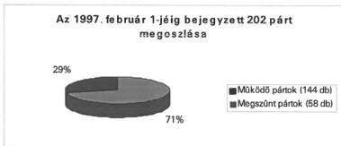
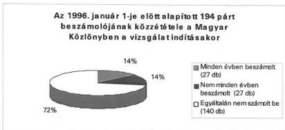
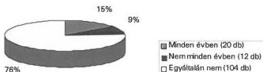
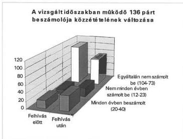
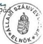

Állami Számverőszék

# JELENTÉS

a pártok beszámolási és beszámoló
közzétételi kötelezettsége
teljesítésének általános gyakorlatáról

9854

413.

1998. április

---

Az ellenőrzés végrehajtásáért felelős:

Halász Gejza

számvevő igazgató

Az ellenőrzést vezette:

dr. Szávai Tamás

osztályvezető főtanácsos

A jelentést készítette:

Tóth István

számvevő tanácsos

---

V-1009-27/1998. TÉMASZÁM: 424

# TARTALOMJEGYZÉK

|  **I. ÖSSZEGZŐ MEGÁLLAPÍTÁSOK, KÖVETKEZTETÉSEK, JAVASLATOK** | **4**  |
| --- | --- |
|  **II. RÉSZLETES MEGÁLLAPÍTÁSOK** | **6**  |
|  1. A vizsgálattal érintett pártok meghatározása | 6  |
|  1.1. A társadalmi szervezetek nyilvántartásba vételének jogi szabályozottsága | 6  |
|  1.2. A bírósági nyilvántartási rendszer és gyakorlat értékelése | 7  |
|  1.3. A vizsgálat megkezdésének időpontjában működő pártok meghatározása | 8  |
|  2. A pártok beszámolási és beszámoló közzétételi kötelezettségének értékelése | 9  |
|  2.1. A kötelezettség teljesítés általános értékelése | 9  |
|  2.2. A kötelezettség teljesítés értékelése a vizsgálat megindításakor működő pártok esetében | 9  |
|  2.3. A vizsgálat során tett intézkedések a kötelezettségüket nem teljesítő pártokkal szemben | 10  |
|  2.4. A vizsgálat során tett intézkedések a kötelezettségüket csak részben teljesítő pártokkal szemben | 10  |
|  2.5. A vizsgálat során tett intézkedések hatása a teljesítésre | 11  |
|  3. A beszámolók értékelése | 11  |
|  3.1. A beszámolók értékelése | 11  |
|  3.2. A beszámolók tartalmából levonható következtetések | 12  |

1

---

C

C

---

# JELENTÉS

## a pártok beszámolási és beszámoló közzétételi kötelezettsége teljesítésének általános gyakorlatáról

### Az ellenőrzés célja, módszere, időszaka körülményei

A pártok működéséről és gazdálkodásáról szóló - többször módosított - 1989. évi XXXIII. törvény (továbbiakban: párttörvény) 9. § (1) bekezdése kimondja, hogy a pártok kötelesek minden év április 30-ig az előző évi gazdálkodásukról szóló beszámolót (zárszámadást) a Magyar Közlönyben e törvény 1. sz. mellékletében meghatározott minta szerint közzétenni. A párttörvény 10. § (1) bekezdése kimondja, hogy a pártok gazdálkodása törvényességének ellenőrzésére az Állami Számvevőszék jogosult. A 10. § (3) bekezdése pedig úgy rendelkezik, hogy az Állami Számvevőszék kétévenként ellenőrzi azoknak a pártoknak a gazdálkodását, amelyek rendszeres állami költségvetési támogatásban részesültek. A rendszeres állami költségvetési támogatásban nem részesülő pártokra vonatkozóan a párttörvény kötelező ellenőrzési gyakoriságot nem ír elő. Ennek alapján az Állami Számvevőszék (továbbiakban: ÁSZ) megalakulása óta csak az 1989. és 1990-ben egyszeri, illetve 1990. óta rendszeres állami költségvetési támogatásban részesült pártok gazdálkodását ellenőrizte. Az egyszeri támogatásban részesült pártok esetében azonban az ellenőrzés csak az 1989-1991. évekre terjedt ki a vizsgálat időpontjától függően.

### A vizsgált szervezetek köre:

A vizsgálat a párttörvény hatályba lépésétől 1997. február 1-jéig a bíróságokon vezetett nyilvántartásokban rögzített **202 pártra terjedt ki.**

---3

---

I. ÖSSZEGZŐ MEGÁLLAPÍTÁSOK, KÖVETKEZTETÉSEK,

**Az ellenőrzés célja:** annak elérése, hogy valamennyi nyilvántartásba vett működő párt tegyen eleget gazdálkodásáról szóló éves beszámolójának a Magyar Közlönyben történő közzétételi kötelezettségének.

**Az ellenőrzés módszere:** a Magyar Közlönyben 1990. óta folyamatosan közzétett pártbeszámolók összevetése a bírósági nyilvántartás adataival. Annak megállapítása, hogy a pártok eleget tettek-e a párttörvény 9. § (1) bekezdésében előírt beszámolási és beszámoló közzétételi kötelezettségüknek. A beszámolási kötelezettségük teljesítését elmulasztó pártok egyedi felszólítása. Teljes körű felmérés valamennyi nyilvántartásba vett pártra.

**Az ellenőrzött időszak:** 1989-től 1996-ig terjedő beszámolóval lezárt időszak.

#### **A jelentés megállapításainak alapjai:**

A jelentés megállapításai a pártok által a Magyar Közlönyben közzétett beszámolókon, a pártok bírósági nyilvántartásain, valamint a pártoknak az ÁSZ felszólító leveleire adott válaszain alapulnak.

## **I. ÖSSZEGZŐ MEGÁLLAPÍTÁSOK, KÖVETKEZTETÉSEK, JAVASLATOK**

### **ÖSSZEGZŐ MEGÁLLAPÍTÁSOK, KÖVETKEZTETÉSEK**

A párttörvény 10. § (1) bekezdése értelmében pártok gazdálkodása törvényességének ellenőrzésére az Állami Számvevőszék jogosult. Az ellenőrzés gyakoriságára vonatkozó rendelkezést a törvény azonban csak a rendszeres állami költségvetési támogatásban részesülő pártok tekintetében tartalmaz. Ennek figyelembe vételével az ÁSZ 1991. óta csak a rendszeres állami költségvetési támogatásban részesülő pártok gazdálkodásának törvényességét vizsgálta.

Fenti hiányosság megszüntetését is szolgálta ez az átfogó, elemző jellegű vizsgálat a pártok beszámolókészítési és közzétételi kötelezettségének áttekintésével.

A vizsgálat főbb megállapításai a következők:

- Az egyesülési jogról szóló törvény kimondja, hogy a társadalmi szervezetnek megalakulását követően kérni kell nyilvántartásba vételét. A társadalmi szervezet a bírósági nyilvántartásba vétellel válik jogi személyé. Kimondja a törvény azt is, hogy ha a társadalmi szervezet neve, székhelye megváltozik, illetve a szervezet képviseletére új személy lesz jogosult, azt a bíróságnak be kell jelenteni. A társadalmi szervezetek nyilvántartásának ügyviteli szabályait és a nyilvántartás tartalmát a 6/1989. (VI.8.) IM rendelet határozza

4

---

JAVASLATOK

meg. Kimondja a rendelet azt is, hogy a Legfelsőbb Bíróság a társadalmi szervezetek nevéről országos névjegyzéket vezet.

- A fenti jogszabályi elóirások Ellenère jelenleg nincs Magyarországon olyan országos vagy megyénkénti kozhitelesnek tekinthetó nyilvántartás, amelyból az adott pillanatban jegszerüen bejegyzett, muködó társadalmi szerveztek neve, székhelye, képviselójének neve, címe teljes körüen megallapithato lenne. Ennek oka, hogy a törveny és a miniszteri rendelet a bejentési kõtelezettseget ugyan elóirja, de határidőt nem szab meg. Igy elöfordulhat, hogy a valtozásokat akár évekig sem jelentik a kõtelezettek. A mulasztásnak pedig nincs szankciója. Ugyanez a helyzet a megyei bíroságoknak a Legfelsöbb Bíroság résére elóirt jelentési kõtelezettsegével. Igy az Allami Számvevószeknek, hogy a pártokkal kapcsolatos Ellenörzési kõtelezettsegét teljesiteni tudja, elózetes kutató munkát kellett végeznie az Ellenörzendők körének meghatározására és azok megkeresése erdekében. A Legfelsöbb Bíroságon gezetett névjegyzékben 1997. februar 1-jén ugyanis 26 olyan párt szerepelt muködó pártként, amelyet korábban a megyei bíroságok már töröltek a névjegyzékból. A megyei bíroságokon nyilvántartott adatok alapján sem tudott az ÁSZ 20 pártot sem annak székhelyén, sem nyilvántartott képviselójének címen megtalálni.
Hosszadalmas kutatomunka eredmenyekent sikerultCsak megallapitani, hogy 1997. februar 1-jén 144 nyilvantartott mukodonek tekintett part volt Magyarorszagon. Ezek kozul 136 partot 1996. januar 1-je elott vettek nyilvantartasba. Igy a beszamolokeszitési es kozzétete-li kotelezettsg teljesitését rajtuk lehetett szamon kerni. Kozuluk 20 db teljesitette maradektalanul beszamolasi kotelezettsgét. Tovabbi 12 partCsak részben teljesitette, ugyanis nem minded evrol tett kozze beszamolot, 104 part egyaltalan nem tett kozze beszamolot.
A beszamolot kozze nem tett partokat az ASZ a Magyar Kozlonyben megjentetett altalanos formaban, majd ezt kovetoen két izben levelben is felkertte törvenyi kotelezetséguk teljesitésere. A beszamolasi kotelezetséguket részben teljesitó partokat külön levelben szolitottuk fel. A felhivások határa 1998. februar 28-ig 40 part maradéktalanul, 23 part pedig részben teljesitette beszamolasi kotelezetségét. További 20 part beszamoló kozzététel helyett olyan tartalmú levelet irt az ASZ-nak, melyból az valószínusithetó, hogy az elmúlt években valojában nem muködött. Ezeket a leveleket az ASZ megkuldte a Legföbb Ügyésznek javasolva, hogy a partok megszünésenek megallapíasat kezdeményezze a bíroságoknál. További 33 part a felhivás ellenere sem tett kozze beszamolót. Ezek ellen bírosági kereset megindításat kezdeményeztük. A fennmarado 20 partot pedig nem tudtuk a bírosági nyilvantartásban szereplö cimeken elérni, a nekik kuldött levelek visszajöttek.
A beszamolok alapjan az elmult években 35 part ért el 100 E Ft-ot meghaladó bevételt, kozüluk azonban az ÁSZCsak 10-11 part gazdalkodásat Ellenőrizte rendszeresen. Esetenként tobb millio Ft összegü bevetelek jogszerüsegénék Ellenőrzese nem törtent meg. A beszamolok alapjan a bevetelek és kiadások eltitkolása sem zárható ki. Az 1994. év országyűlési valaszta

5

---

II. RÉSZLETES MEGÁLLAPÍTÁSOK

sokon történt jelöltállításért kapott 2.142 E Ft állami támogatást 25 párt nem tüntette fel beszámolójában.

- A gyenge beszámolási hajlandóságnak két oka valószínűsíthető. Egyrészt a pártok nem ismerik megfelelően az azzal kapcsolatos kötelezettségüket. Másrészt a párttörvény a kötelezettségeket ugyan előírja, de elmulasztása esetére szankciót nem tartalmaz, így hiányzik a jogérvényesítéséhez az állami kényszer.

# JAVASLATOK

Igazságügy miniszternek, hogy:

1. Kezdeményezze az egyesülési jogról szóló 1989. évi II. törvény olyan módosítását, hogy a társadalmi szervezeteknek a nyilvántartási adatait határidőhöz kötötten kelljen jelenteni a bejegyzésre illetékes bíróságnak, és nem teljesítés esetében szankció érvényesítésére legyen lehetőség;
2. Módosítsa a társadalmi szervezetek nyilvántartásának ügyviteli szabályairól szóló 6/1989. (VI.8.) IM rendeletet oly módon, hogy az alapján alakuljon ki a társadalmi szervezetek közhiteles nyilvántartása;
3. Kezdeményezze a pártok működéséről és gazdálkodásáról szóló 1989. évi XXXIII. törvény módosítását oly módon, hogy a pártok beszámoló közzétételi kötelezettségének teljesítése állami szankció alkalmazásával kikényszeríthető legyen.

Legfőbb Ügyészségnek, hogy:

1. Folytassa az egyesülési jogról szóló 1989. évi II. törvény 14. § (2) bekezdése alapján a párt törvénysértése miatt a kereset benyújtását az Állami Számvevőszék által folyamatosan átadott pártok esetében is, amelyek nem tettek eleget a gazdálkodásukról szóló éves beszámoló közzétételére irányuló kötelezettségüknek.

# II. RÉSZLETES MEGÁLLAPÍTÁSOK

# 1. A VIZSGÁLATTAL ÉRINTETT PÁRTOK MEGHATÁROZÁSA

A vizsgálat előkészítése során meg kellett határozni a vizsgálattal érintett szervezetek körét. Az érintett szervezetek meghatározásához két jogszabály ad iránymutatást, az egyesülési jogról szóló törvény és a társadalmi szervezetek nyilvántartásának ügyviteli szabályait meghatározó IM rendelet.

# 1.1. A társadalmi szervezetek nyilvántartásba vételének jogi szabályozottsága

Az egyesülési jogról szóló 1989. évi II. törvény 4. § (1) bekezdése értelmében a társadalmi szervezetek megalakulását követően kérni kell annak bírósági nyilvántartásba vételét. A társadalmi szervezet a nyilvántartásba vétellel válik jogi

6

---

II. RÉSZLETES MEGÁLLAPÍTÁSOK

személlyé. A törvény 15. § (1) bekezdése kimondja, hogy a társadalmi szervezetet a székhelye szerint illetékes megyei bíróság, illetőleg a Fővárosi Bíróság veszi nyilvántartásba. Ugyanezen jogszabály (4) bekezdése szerint, ha a társadalmi szervezet neve, székhelye megváltozik, illetőleg a társadalmi szervezet képviseletére új személy lesz jogosult, azt a bíróságnak be kell jelenteni. A 6/1989. (VI.8.) IM rendelet a társadalmi szervezetek nyilvántartásának ügyviteli szabályait határozza meg. A rendelet 3. §-a értelmében a Legfelsőbb Bíróság a társadalmi szervezetek nevéről országos névjegyzéket vezet. Az illetékes bíróság a társadalmi szervezet nyilvántartásba vételéről, nevének megváltoztatásáról, továbbá a társadalmi szervezet megszűnéséről - a bejegyzést elrendelő végzés jogerőre emelkedését követően - értesíti a Legfelsőbb Bíróságot.

## 1.2. A bírósági nyilvántartási rendszer és gyakorlat értékelése

A társadalmi szervezetek nyilvántartásának tartalmát a 6/1989. (VI.8.) IM rendelet 1. sz. melléklete határozza meg. A rendelet értelmében a bejegyzésre kötelezett bíróságnak értesítenie kell a Legfelsőbb Bíróságot a társadalmi szervezet nyilvántartásba vételéről, nevének megváltoztatásáról, továbbá a társadalmi szervezet megszüntetéséről. A rendelet hiányos fogalmazása következtében a Legfelsőbb Bíróság nem minden esetben szerez tudomást a társadalmi szervezet székhelyének címéről, képviselőjének nevéről és lakcíméről. Mindezek miatt a Legfelsőbb Bíróságon vezetett névjegyzék alapján a pártok hivatalos megkeresésének lehetősége nem biztosított. Ezért elrendelték a nyilvántartással azonos tartalmú adatközlést a bíróságok részére. A korábban készített szűkebb adattartalmú formanyomtatványt azonban a forgalomból nem vonták ki. Így az országos névjegyzék nem minden esetben tartalmazza a pártok képviselőjének nevét és címét, még olyan esetekben sem, amikor a párt címe és képviselőjének címe megegyezik. A Legfelsőbb Bíróság névjegyzéke 1997. február 1-jei állapot szerint 184 párt nevét tartalmazta, amiből 91 esetben hiányzott a párt képviselőjének neve és címe. További 56 esetben pedig a képviselő címe.

Azáltal, hogy sem az egyesülési jogról szóló 1989. évi II. tv, sem a párttörvény, sem pedig a 6/1989. (VI.8.) IM rendelet nem ír elő határidőt úgy a pártoknak az esetleges változások bejelentésére, mint a bíróságoknak a Legfelsőbb Bíróság számára történő tovább-jelentésre, a Legfelsőbb bírósági nyilvántartás és a megyei nyilvántartások nem alkalmasak arra, hogy azok alapján a pártok biztonsággal megkereshetők legyenek.

A 184 központi névjegyzékben szereplő pártnál azok címe 14 esetben nem egyezett meg a bírósági nyilvántartásban szereplő címmel. További 38 esetben a pártoknak címzett levelet a bírósági nyilvántartásban szereplő székhely címre a posta nem tudta kézbesíteni, mert ott a párt nem volt megtalálható. Ugyancsak a Legfelsőbb Bíróságon vezetett névjegyzék naprakészségének hiányára utal, hogy míg a névjegyzékben csak 13 párt neve mellett szerepelt megszűnésre vonatkozó adat, addig az ellenőrzés során a Legfőbb Ügyészségtől és az illetékes bíróságoktól szerzett adatok szerint a vizsgálat időpontjáig további 26

7

---

II. RÉSZLETES MEGÁLLAPÍTÁSOK

párt szűnt meg, zömében 1993-1996. között. Előfordult olyan eset is, hogy a párt 1990. június. 24-én szűnt meg és a megszűnés ténye az országos névjegyzékben mégsem szerepelt. A Borsod-Abaúj-Zemplén Megyei Bíróság által nyilvántartott társadalmi szervezetek közül 3 olyan szervezet is szerepel a jegyzékben, amely a bíróságtól kapott tájékoztatás szerint nem párt.

### 1.3. A vizsgálat megkezdésének időpontjában működő pártok meghatározása

A vizsgálat megkezdésének időpontjában működő pártok meghatározása céljából megkértük a Legfelsőbb Bíróságon vezetett, névjegyzékben szereplő pártok adatait. A jegyzékből megállapítható, hogy az egyrészt nem tartalmazza teljes körűen a valaha bejegyzett pártok adatait, másrészt a bejegyzett adatok nem minden esetben pontosak. A Legfelsőbb Bíróságon vezetett névjegyzékben tapasztalt hibák az alábbi négy típusba sorolhatok:

- hiányzott több olyan pártnak a neve, amely korábban beszámolót is közzétett (pl. Voks Humana Mozgalom, Magyar Politikai Foglyok Országos Szövetsége),
- több olyan pártot is működő szervezetként tüntetett fel, melyekről köztudott, hogy már több éve megszűnt (pl. Független Szociáldemokrata Párt, Magyarországi Cigányok Szociáldemokrata Pártja stb),
- olyan székhely címeket tartalmazott, amelyek azóta már megváltoztak,
- több esetben olyan képviselő neveket tartalmazott, amely köztudottan megváltoztak (pl. a Liberális Polgári Szövetség Vállalkozók Pártja elnöke nem Zcwack Péter, a Kereszténydemokrata Néppárt elnöke nem dr. Surján László, a Magyar Demokrata Fórum elnöke nem dr. Für Lajos stb).

A felsorolt hiányosságok miatt adategyeztetés és pontosítás végett meg kellett keresni a társadalmi szervezetek nyilvántartását végző megyei és fővárosi bíróságokat. Az adategyeztetés az egyes bíróságokkal az általuk nyilvántartott pártok számától függően különböző időt vett igénybe. A Fővárosi Bírósággal az adategyeztetés 1997. június 19-én zárult le.

Az adategyeztetés eredményeként megállapítható, hogy a párttörvény megalkotásától 1997. február 1-jéig összesen 202 db pártot jegyeztek be a bíróságokon. Ebből 1997. február 1-jéig különböző indokok alapján 58-at töröltek a nyilvántartásból, tehát 144 működő párt volt a vizsgálat megkezdésének időpontjában. Tekintettel arra, hogy 8 pártot 1996. január 1-je után alapítottak, ezért azoknak az ellenőrzés megkezdésekor még nem volt beszámolási kötelezettsége, így 136 párt beszámolási kötelezettségének teljesítését érintette a vizsgálat.

8

---

II. RÉSZLETES MEGÁLLAPÍTÁSOK

## 2. A PÁRTOK BESZÁMOLÁSI ÉS BESZÁMOLÓ KÖZZÉTÉTELI KÖTELEZETTSÉGÉNEK ÉRTÉKELÉSE

### 2.1. A kötelezettség teljesítés általános értékelése

Az 1996. január 1-je előtt alapított 194 párt közül - a vizsgálat indításakor - a párttörvény 9. § (1) bekezdésében előírt módon 54 párt tett eleget legalább egy évben beszámolási kötelezettségének (a kötelezettek 28%-a).

Ezek közül azonban maradéktalanul csak 27 párt teljesítette beszámoló közzétételi kötelezettségét (a kötelezettek 14%-a). További 27 párt egy vagy több, de nem minden évről tett közzé beszámolót. A fennmaradó 140 párt azonban a vizsgálat megkezdéséig egyáltalán nem tett közzé beszámolót (a kötelezettek 72%-a).

### 2.2. A kötelezettség teljesítés értékelése a vizsgálat megindításakor működő pártok esetében

A vizsgálat megindításakor is működő - 1996. január 1-je előtt alapított - 136 párt közül mindössze 32 - a kötelezettek 28,5%-a - tett közzé legalább egyszer beszámolót. Maradéktalanul azonban 20 párt, az érintettek 14,7%-a teljesítette kötelezettségét. 104 párt egyáltalán nem tett közzé beszámolót.

9

---

II. RÉSZLETES MEGÁLLAPÍTÁSOK

Az 1997. februárjában is működő, 1996. január 1-je előtt alapított 136 párt beszámolójának közzététele a Magyar Közlönyben

### 2.3. A vizsgálat során tett intézkedések a kötelezettségüket nem teljesítő pártokkal szemben

Az Állami Számvevőszék a Magyar Közlöny 1997. évi 42. (május 14-i) számában közzétételi kötelezettségük teljesítésére hívta fel azon pártokat, melyek egy vagy több évet illetően elmulasztották beszámolójuknak a törvény 1. számú mellékletében előírt formájú közlését. Az általános felhívás mellett a beszámolási kötelezettséget egyáltalán nem teljesítő **104 pártot az ÁSZ a bíróságon bejegyzett képviselőjének címzett levélben** - 1997. április 25-én - **felhívta a törvényesség helyreállítására**. A felhívásban az ÁSZ figyelmeztette a pártok képviselőjét, hogy amennyiben a levélben megjelölt határidőig nem tesz eleget kötelezettségének, úgy az ÁSZ a Legfőbb ügyésznél bírósági kereset megindítását kezdeményezi a párt ellen.

A kibocsátott **104 felhívás közül a posta 20-at sem a párt, sem a képviselőjének bíróságon nyilvántartott címén nem tudott kézbesíteni**. Ezeknek a pártoknak a névsorát az ÁSZ a szükséges intézkedések megtétele céljából átadta a Legfőbb Ügyésznek.

### 2.4. A vizsgálat során tett intézkedések a kötelezettségüket csak részben teljesítő pártokkal szemben

1997. szeptemberében ismét felmérés készült azon pártok köréről, amelyek **nem teljes mértékben tettek eleget beszámolási és beszámoló közzétételi kötelezettségüknek**. Ez alkalommal - tekintettel arra, hogy az 1996. évre vonatkozó beszámolási határidő már eltelt - **az 1996-os gazdasági évet is figyelembe kellett venni**. Tekintettel kellett lenni továbbá azokra a pártokra is, amelyek az első felhívásra nem teljes körűen jelentették meg beszámolóikat. Így összesen **30 párt bíróságon bejegyzett képviselőjének küldött az ÁSZ felszólító levelet a hiányzó kötelezettség teljesítésére**. A felszólító levél figyelmeztette az érintetteket, hogy amennyiben a megjelölt határidőig nem teljesítik kötelezettségüket, úgy az ÁSZ a párttörvény 10. § (4) bekezdésében foglaltak alapján bírósági eljárás megindítását kezdeményezi a párt ellen.

10

---

II. RÉSZLETES MEGÁLLAPÍTÁSOK

## 2.5. A vizsgálat során tett intézkedések hatása a teljesítésre

A beszámolási kötelezettséget egyáltalán nem teljesítő 104 pártnak küldött felhívás hatására további 31 párt jelentetett meg beszámolót egy vagy több évre vonatkozóan. A kötelezettséget részben teljesítő pártoknak küldött felhívás hatására 16 párt kiegészítette beszámolási kötelezettségét. A két felhívás együttes eredményeként 1998. február 28-ig 40 párt maradéktalanul, **23 párt** pedig **részben** tett eleget beszámolási kötelezettségének. A hiányzó **73 párt** pedig különböző okok miatt **egyáltalán nem tett közzé gazdálkodásáról szóló éves beszámolót**. Közülük 20 olyan tartalmú levelet írt az ÁSZ-nak, amelyből arra lehetett következtetni, hogy nem működnek. Ezért a leveleket megküldtük a Legfőbb Ügyésznek, javasoltuk, hogy kezdeményezze ezen pártok megszüntetését. További 20 pártot nem tudtunk a bírósági nyilvántartásban szereplő címeken elérni, a Posta a leveleket nem tudta kikézbesíteni. Ezen pártok névsorát intézkedés végett szintén átadtuk a Legfőbb Ügyészségnek, 33 párt ellen pedig bírósági kereset indítását kezdeményeztük a beszámolási kötelezettség nem teljesítése miatt.

A vizsgálat során tett **intézkedések hatására** a jelentés elkészítésének időpontjáig **40 párt, azaz a pártok 38,4%-a tett maradéktalanul eleget** a párttörvényben előírt **kötelezettségének**. E rossz teljesítési aránynak alapvetően két oka van:

- Egyrészt a pártok egy része nem ismeri a párttörvényt, helytelenül úgy értelmezi, hogy csupán az állami költségvetési támogatásban részesülő pártok kötelesek beszámolót közzétenni.
- Másrészt, ami sokkal nagyobb jelentőségű, hogy a párttörvény ugyan a kötelezettséget előírja, de a nem teljesítés esetére sem személyi, sem szervezeti szankciót nem tartalmaz.

Erre a problémára nem jelent megoldást az sem, hogy az Áht 1998. január 1-jétől előírja, hogy az államháztartás alrendszereiből támogatott szervezetek számára juttatott támogatás határidőre történő elszámolásának elmulasztása esetén kötelezettségeinek teljesítéséig a további finanszírozást, támogatást fel kell függeszteni. Az államháztartás felé való elszámolási kötelezettség teljesítése ugyanis nem az éves beszámoló közzétételével - hanem attól függetlenül - valósul meg. A kötelezettséget nem teljesítő pártok többsége pedig sem rendszeresen, sem eseti állami támogatásban nem részesül.

A jelen körülmények mellett sem az ÁSZ, sem a bíróság nem tudja hatékonyan kikényszeríteni a teljesítést.

## 3. A BESZÁMOLÓK ÉRTÉKELÉSE

### 3.1. A beszámolók értékelése

A vizsgálattal érintett **136 párt közül megalakulásától 1998. február 28-ig 63 tett legalább egyszer közzé beszámolót**. Ezek közül **40 minden évről teljesítette kötelezettségét**. További 23 (1. sz. melléket) nem minden évről tett közzé beszámolót. A többszöri felszólítás ellenére egyetlen esetben

11

---

II. RÉSZLETES MEGÁLLAPÍTÁSOK

sem tett közzé beszámolót 33 párt, sőt nem is reagált a felhívásra (2. sz. melléklet).

A beszámolót közzétett 63 párt gazdasági adatai jelentős szóródást mutatnak az alábbiak szerint:

A beszámolók szerint 28 párt évi 100 E Ft-nál kevesebb összegből gazdálkodik, ami kérdésessé teszi, hogy ezek a pártok érdemi tevékenységet folytatnak-e. Felvetődik tehát a kérdés, hogy vagy a beszámolók nem valósak, vagy a pártok tevékenységükkel felhagytak. Mid a két esetben intézkedések megtétele szükséges ezen pártokkal szemben.

Ugyanakkor az is megállapítható, hogy 5.000 E Ft-ot meghaladó éves bevételt az állami költségvetési támogatásban részesülő pártokon kívül csak egy-két párt volt képes elérni.

# 3.2. A beszámolók tartalmából levonható következtetések

Az elmúlt években 35 párt ért el 100 E Ft-ot meghaladó bevételt. Az ÁSZ rendszeres kétévenkénti ellenőrzése a jelenlegi gyakorlat szerint eddig csupán az országgyűlési képviselőválasztások eredményétől függően 10-11 db állami költségvetési támogatásban részesülő pártra terjedt ki. A fennmaradó 24-25 jelentős bevételt elért pár esetében nem került sor ellenőrzésre. E pártoknál a bevételek között esetenként több millió Ft értékű adományok, illetve egyéb bevételek is szerepelnek pl.:

- a Magyarországi Zöld Párt 1994-ben jogi személyektől 349 E Ft vagyoni hozzájárulást és 3.445 E Ft egyéb bevételt mutatott ki,
- a Magyarországi Szociáldemokrata Párt 1995-ben jogi személynek nem minősülő gazdasági társaságoktól 6.914 E Ft vagyoni hozzájárulást fogadott el,
- a Szociáldemokrata Párt 1996-ban 2.167 E Ft adományt fogadott el, míg 1994. és 1995. években 1.900 E Ft körüli egyéb bevételt ért el,

12

---

II. RÉSZLETES MEGÁLLAPÍTÁSOK

• A Magyar Természetgyógyászok Uniója 1995-ben 2.151 E Ft egyéb bevételre tett szert. 1994-ben emellett egyetlen alapítványtól 5.500 E Ft adományt fogadott el.

A közzétett beszámolók alapján - helyszíni ellenőrzés hiányában - nem zárható ki esetenként a bevételek és kiadások eltitkolása sem. Az 1994-es választásokon való jelölt állítás után kapott állami költségvetési támogatás összege 5 párt közzétett beszámolójából hiányzik, illetve abban hiányosan szerepel, az összesen 651 E Ft állami támogatás ugyanis a bevételeik között nem szerepel. Egy párt pedig a támogatás felhasználásáról, mint kiadással nem számolt el. Pl.:

• a Kiegyezés Független Kisgazdapárt az 1993-1996. évekről egyaránt „0 „ Ft bevételi és kiadási tartalmú beszámolót tett közzé, miközben 1994-ben 24 képviselőjelölt állítása után 504 E Ft állami támogatást kapott a párt, amit a beszámolónak minimálisan tartalmaznia kellene,
• a Magyar Szocialista Munkáspárt 1994-ben 1 db képviselőjelölt állítása után 21 E Ft állami költségvetési támogatásban részesült. Ez az összeg a Párt 1994. évi beszámolójában bevételként nem szerepel. Választással kapcsolatos kiadásként pedig csupán 15 E Ft szerepel a beszámolóban,
• a Magyarságért Választási Szövetség 1994-ben képviselőjelölt állítás után 21 E Ft állami támogatást kapott. Ez a bevétel azonban az 1994. évi beszámolóban nem szerepel,
• a Nyugdíjasok Pártja 1994-ben a választáson történő jelölt állításért 21 E Ft állami költségvetési támogatást kapott. A Párt 1994. évi beszámolója azonban választásokkal kapcsolatos kiadást nem tartalmaz.

A beszámolót közzé nem tett pártok közül 20 db összesen 1.491 E Ft állami támogatást kapott 1994-ben képviselőjelölt állítása jogcímen, amiről nem tájékoztatta a közvéleményt.

Budapest, 1998. április

Melléklet: 1. sz. Beszámolási kötelezettségüket nem teljesítő pártok

2. sz. Beszámolási kötelezettségüket egyáltalán nem teljesítő pártok

Dr. Kovács Árpád  
elnök

13

---

1. sz. melléklet

a V-1009-27/1998. sz. jelentéshez

# **K i m u t a t á s**
**a beszámolókészítési és közzétételi kötelezettségüket**
**csak részben teljesítő pártokról**

|  Sor. sz. | P á r t n e v e | hiányzó beszámolók (évek)  |
| --- | --- | --- |
|  1. | Kelet Népe Párt - Kereszténydemokraták | 1993; 1994; 1995.  |
|  2. | Magyar Függetlenségi Párt | 1991; 1992.  |
|  3. | Szabadság Párt | 1992-1996-ig  |
|  4. | Magyar Néppárt Nemzeti Parasztpárt | 1991-1994-ig  |
|  5. | Független Magyar Demokrata Párt | 1991-1995-ig  |
|  6. | Nyugdíjasok Pártja | 1996.  |
|  7. | Magyar Republikánus Párt | 1993-1996-ig  |
|  8. | Terézvárosi Szociáldemokraták | 1991-1995.  |
|  9. | Magyar Keresztény Mozgalom | 1991-1993-ig  |
|  10. | Földi Élet Pártja | 1992-1995-ig  |
|  11. | Magyar Természetgyógyászok Uniója | 1992; 1993; 1996.  |
|  12. | Magyarságért Választási Szövetség | 1993.  |
|  13. | Magyar Szocialista Munkáspárt | 1996.  |
|  14. | Magyar Családok Országos Szövetsége | 1993-1996.  |
|  15. | Demokratikus Centrum Unió Párt | 1994-1996.  |
|  16. | Nemzeti Egység Párt | 1994; 1995.  |
|  17. | Pannon Liga | 1993-1995.  |
|  18. | Bioreg Életújító Mozgalom | 1994; 1995.  |
|  19. | Polgári Öntevékeny Csoport | 1994.  |
|  20. | Magyar Radikális Polgári Szövetség | 1994; 1995.  |
|  21. | Hátrányos helyzetű Nyugdíjasok Pártja | 1995; 1996.  |
|  22. | Hazafiak Pártja | 1994; 1995.  |
|  23. | Kéthly Anna Szociáldemokrata Párt | 1994; 1995.  |

---

2. sz. melléklet

a V-1009/27/1998. sz. jelentéshez

# K i m u t a t á s

# a beszámolási kötelezettséget az ÁSZ felhívása ellenére sem teljesítő pártokról

1. Magyar Realista Mozgalom
2. Uj Magyarországot Építők Pártja
3. 56-os Part Győr
4. Magyar Part
5. Magyar Munkavállalok Pártja
6. Boldogsag Part
7. Munkások, Gazdálkodók és Vállalkozók Nemzeti Pártja
8. Munkavállalok az Expoert Part
9. A Magyar Nép Érdekképviselő Pártja
10. Veszprém Megyei 56-os Nemzeti Part
11.Demokratak Tarsadalmi Kozosssege
12.Csalad es Gyermekvedok Partja
13.Magánvallalkozók Pártja
14.Magyar Farmer Part
15.Part Nokkel Egyutt a Jovert
16.Nemzeti Erok Szovetsoge
17.Magyar Egység Pártja
18.Nemzeti Erok Mozgalom
19.Magyar Piac Part
20.Magyar Munkanelkuliek Partja
21.Magyar Erdek Partja
22.Orszagos 56-os Forradalmi Politikai es Ifjusagi Part
23. Valasztasi Laza Szerzódés
24.Problémákban Segítok Független Pártja
25.Kossuth Nemzeti Egységpart
26.Termeszetóvo Polgárok, Horgaszok, Vadaszok Pártja
27.Magyar Fizikai Munkaszok Szovetségenek Pártja
28.A Magyar Szabadsag es Remeny Partja
29.Munkat Akarok Partja
30.Magyar Nepjoléti Szövetség
31.Cigányok Szolidaritas Partja
32.Magyar Cigányok Béke Partja
33.Tortenelmi Fuggetlen Kisgazda Part