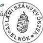

*Állami Számverőszék*---

# JELENTÉS

**a Magyar Vakok és Gyengénlátók  
Országos Szövetségének 1995-1997.  
években juttatott állami költségvetési  
támogatás felhasználásának  
ellenőrzéséről**

---2808

414.

1998. április

---

# ---**Az ellenőrzés végrehajtásáért felelős:**

**Halász Gejza**

számvevő igazgató

# **Az ellenőrzést vezette:**

**dr. Szávai Tamás**

osztályvezető főtanácsos

# **Az összefoglaló jelentést készítette:**

**Tóth István**

számvevő tanácsos

# **Az ellenőrzésben részt vettek:**

**Tóth István**

számvevő tanácsos

**Deák Lórántné**

számvevő

**Pálfiné Mészáros Éva**

számvevő

---

V-1005-12/1998. TÉMASZÁM: 417

# TARTALOMJEGYZÉK

|  **I. RÉSZLETES MEGÁLLAPÍTÁSOK** | **5**  |
| --- | --- |
|  1. A Szövetség szervezeti felépítése és célja szerinti, valamint egyéb vállalkozási tevékenysége | 5  |
|  2. A Szövetség Szabályozottsága és működési rendje, különös tekintettel a gazdálkodásra | 6  |
|  3. A Szövetség tevékenységéhez nyújtott költségvetési támogatással és az egyéb bevételekkel való gazdálkodás | 8  |
|  3.1. A költségvetés készítése, jóváhagyása | 8  |
|  3.2. A Szövetség bevételeinek alakulása | 8  |
|  3.3. A Szövetség kiadásainak alakulása | 12  |
|  3.4. A Szövetség pénzügyi helyzete | 13  |
|  4. A számvitel rendje. A számviteli politikai kialakítása | 13  |
|  4.1. Az 1995-1996. évi beszámolók szabályszerűsége | 13  |
|  4.2. A könyvvezetési kötelezettség teljesítése | 15  |
|  4.3. Analitikus nyilvántartások vezetése | 18  |
|  4.4. Bizonylati rend, bizonylati fegyelem kialakítása | 20  |
|  5. A különféle állami befizetések, kötelezettségek (Tb járulék, adók stb.) teljesítése (APEH, Tb ellenőrzések megállapításai) | 20  |
|  6. Belső ellenőrzés | 21  |
|  **II. ÖSSZEGZŐ MEGÁLLAPÍTÁSOK, KÖVETKEZTETÉSEK, JAVASLATOK** | **22**  |

1

---

C

C

---

# JELENTÉS

## A Magyar Vakok és Gyengénlátók Országos Szövetségének 1995-1997. években juttatott állami költségvetési támogatás felhasználásának ellenőrzéséről

**Az ellenőrzött szervezet neve:** Magyar Vakok és Gyengénlátók Országos Szövetsége (továbbiakban: Szövetség)

**Címe:** 1146 Bp. Hermina u. 47.

**Jogállása:** önálló jogi személy

**Bírósági nyilvántartási száma:** 6PK.60561/2/1989.

A Szövetség az egész országra kiterjedő hatáskörrel működő, természetes személyek által létrehozott társadalmi szervezet. A legfőbb döntéshozó szerve a Küldöttközgyűlés, amely évente ülésezik. Végrehajtó szerve az Országos Elnökség. A Szövetség operatív működtetését az Országos Hivatali szervezet végzi. A Szövetségnek önálló jogi személyiséggel nem rendelkező területi szervei: a megyei közgyűlés, melyet elnökség; és körzeti csoportok, melyet vezetőség irányít.

A Szövetség mintegy 18000 fős tagság érdekvédelmét látja el.

A Szövetség célja az országban élő vakok és gyengénlátók társadalmi összefogása, érdekvédelmük ellátása, habilitációjuk és rehabilitációjuk elősegítése. E cél megvalósítása érdekében a Szövetség a tagok érdekvédelmén túl feladatának tekinti a vak és gyengénlátó emberek oktatását, az életkörülményeiket javító eszközök és módszerek kutatását, tájékoztatást és ismeretterjesztést az általuk használt adathordozókon, valamint a képességeiknek és végzettségüknek megfelelő munkalehetőségek felkutatását.

---3

---

A Szövetség célját, feladatait részletesen az Alapszabály határozza meg.

A Szövetség gazdálkodásának alapvető kereteit az Alapszabály, részletes működési rendjét pedig a hivatali szervezet Szervezeti és Működési Szabályzata határozza meg. A gazdálkodással és a gazdasági események nyilvántartásával kapcsolatos feladatokat a Gazdálkodási Szabályzat, a Számlarend, a Házipénztári Szabályzat, a Selejtezési, Leltározási- és Leltárkészítési Szabályzat határozza meg.

A Szövetség működésének finanszírozására és céljai megvalósítására a vizsgált években különböző forrásokból az alábbi bevételek álltak rendelkezésre:

|   | E Ft-ban  |   |   |
| --- | --- | --- | --- |
|   | 1995. | 1996. | 1997.  |
|  Tagdíjak | 4.226 | 5.786 | 5.745  |
|  Állami támogatás | 82.000 | 98.000 | 104.000  |
|  Gazdálkodó tevékenység | 9.740 | 11.353 | 10.070  |
|  Pályázaton elnyert támogatás | 3.283 | 12.421 | 8.446  |
|  Adomány bevétel | 4.662 | 2.042 | 1.730  |
|  Egyéb bevétel | 588 | 782 | 865  |
|  Összesen: | 104.499 | 130.384 | 131.856  |

Az ellenőrzés lefolytatására az Állami Számvevőszékről szóló - többször módosított - 1989. évi XXXVIII. tv. 2. § (5) bekezdésében kapott felhatalmazás alapján került sor, az 1995-1997. évi költségvetési törvények országgyűlési fejezetében biztosított állami támogatásra való tekintettel.

A Szövetségnél most első ízben került sor Állami Számvevőszéki vizsgálat lefolytatására.

**Az ellenőrzés célja:** annak megállapítás volt, hogy a Szövetség gazdálkodása megfelelt-e a célszerűségi, eredményességi követelményeknek és a jogszabályi előírásoknak.

**Az ellenőrzés módszere:** törvényességi, célszerűségi és hatékonysági ellenőrzés, melynek során a dokumentumokat szűrőpróbaszerűen választottuk ki.

**Az ellenőrzött időszak:** az 1995-1997. gazdasági évek.

**A helyszíni ellenőrzés:** 1998. január 12-től 1998. február 13-ig tartott.

4

---

# I. RÉSZLETES MEGÁLLAPÍTÁSOK

# 1. A SZÖVETSÉG SZERVEZETI FELÉPÍTÉSE ÉS CÉLJA SZERINTI, VALAMINT EGYÉB VÁLLALKOZÁSI TEVÉKENYSÉGE

A Szövetségnek tagja lehet minden olyan 14. életévet betöltött, Magyarországon élő magyar állampolgár, valamint állandó tartózkodási engedéllyel rendelkező vagy menekültként elismert nem magyar állampolgár, akinek látásscsökkenése a Masche táblázat szerint a 67%-ot eléri vagy meghaladja.

A Szövetség legfőbb döntéshozó szerve az Országos Küldöttközgyűlés, amely évente ülésezik.

Két küldöttközgyűlés között a Szövetség legfőbb irányító szerve az Országos Elnökség. Az elnökség gyakorolja a főtitkár felett a munkáltatói jogokat, jóváhagyja a Szövetség Országos Hivatalának munkatervét. Beszámoltatja tisztségviselőit, saját bizottságai és az Országos Hivatal vezetőit, értékeli munkájukat. Ellenőrzi a Szövetség pénzgazdálkodásának és vagyonkezelésének rendjét. Megvitatja és a Küldöttközgyűlés elé terjeszti a Szövetség költségvetését és beszámolóját, figyelemmel kíséri az adományszámlák helyzetét. Elkészíti a Hivatal Szervezeti és Működési Szabályzatát.

A Szövetséget az Elnök képviseli az állami és társadalmi szervek felé. Az elnök őrködik a Szövetség törvényes és alapszabályszerű működése felett. Összehívja az Országos Küldöttközgyűlést és az Országos Elnökség üléseit, azokon elnököl.

A Szövetség Országos Hivatalát a főtitkár irányítja. Ő gyakorolja a munkáltatói jogokat a Szövetséggel munkaviszonyban álló valamennyi személy felett. A főtitkár felelős a Szövetség pénzügyi és gazdasági rendjéért, vagyonának megőrzéséért és gyarapításáért, a különböző szolgáltatások folyamatosságáért, a Szövetség kezelésében lévő intézmények (üdülő, Vakvezető Kutyakiképző Iskola) zavartalan működéséért. Gondoskodik az Alapszabályban meghatározott célkitűzések, feladatok megvalósítása technikai, gazdasági feltételeinek megteremtéséről.

A Szövetségnek a 19 megyében és a fővárosban megyei szervezete működik. Ezek a szervezetek önálló jogi személyiséggel nem rendelkeznek. A megyei szervezetek legfőbb szerve a Megyei Küldöttközgyűlés. Végrehajtó szerve a megyei elnökség, a szervezet gazdálkodásának felelős vezetője a titkár. A megyei elnökség feladatai:

- kapcsolattartás a helyi állami és társadalmi szervekkel,
- a tagszervezés, tagtoborzás, nyilvántartás,
- tagok szociális helyzetének figyelemmel kísérése, szükség esetén javaslattétel, eljárás az illetékes hatóságoknál,

5

---

I. RÉSZLETES MEGÁLLAPÍTÁSOK

- segédeszköz forgalmazás és üdültetés szervezése,
- munkába helyezés, munkahelyek felkutatása a megyékben,
- tanfolyamok, ismeretterjesztő előadások szervezése.

A Szövetség **vagyona a tagdíjakból**, a rendszeres **állami támogatásból**, a tagok egyéb **anyagi hozzájárulásaiból**, intézményektől és magánszemélyektől elfogadott **adományokból, pályázatokon elnyert támogatásokból** tevődik össze. A Szövetség céljai megvalósítása és a tagok tevékenységének elősegítése érdekében vállalkozásokat szervezhet.

A Szövetség gazdálkodó tevékenysége gyakorlatilag két csoportba sorolható:

1) A Szövetség szervezeti működésével kapcsolatos gazdálkodó tevékenység,
2) a Szövetség tagjainak tevékenységét elősegítő eszközértékesítő, oktató, információközlő szolgáltató tevékenység.

A vizsgált időszakban a Szövetség olyan gazdálkodó tevékenységet nem végzett, amely tisztán jövedelemszerző vállalkozási tevékenységnek minősíthető.

A Szövetség a tagok részére az alábbi szolgáltatásokat nyújtotta:

- kedvezményes üdültetés a Szövetség használatában lévő üdülőben,
- saját sík és Braille folyóiratok értékesítése,
- Braille folyóiratok (pl. Rádió és tv műsor) értékesítése,
- hangkazettára olvasott szépirodalmi, tudományos és tankönyvek értékesítése,
- Braille és hangos könyvtár üzemeltetése,
- vakok és gyengénlátók részére szükséges segédeszközök, használati tárgyak, játékok stb. viszonteladói értékesítése,
- gyógymasszőr szakmai képzés szervezése,
- számítástechnika tanfolyam szervezés,
- Vakvezető Kutyakiképző Iskola működtetése,
- Regeneráló Centrum működtetése.

## 2. A SZÖVETSÉG SZABÁLYOZOTTSÁGA ÉS MŰKÖDÉSI RENDJE, KÜLÖNÖS TEKINTETTEL A GAZDÁLKODÁSRA

**A Szövetség mint társadalmi szervezet működésének alapvető szabályait az Alapszabály tartalmazza.**

Az Alapszabály meghatározza a Szövetség célját és feladatait, amelyek megvalósítása érdekében a Szövetség tevékenykedik. Az Alapszabály rendelkezik továbbá a Szövetség szervezeti felépítéséről, az egyes szervezetek hatáskörébe tartozó tevékenységekről, az ügyintéző és képviseleti szervek jogállásáról és hatásköréről, valamint a tisztségviselőkről és azok feladatáról.

6

---

I. RÉSZLETES MEGÁLLAPÍTÁSOK

Az Alapszabály kimondja, hogy a Szövetség **legfőbb döntéshozó szerve az Országos Küldöttközgyűlés**. A Küldöttközgyűlés **hatáskörébe tartozik** többek között **a költségvetés és a zárszámadás** elfogadása és a Szövetség vezető tisztségviselőinek a megválasztása. Az Alapszabály kimondja azt is, hogy a **Szövetség végrehajtó és gazdálkodó tevékenységét a főtitkár irányításával az Országos Hivatal végzi**.

Az **Országos Hivatal tevékenységét szervezetének felépítését, irányítási rendjét, az egyes szervezeti egységek, illetve munkakörök feladatait** az Elnökség által elfogadott **Szervezeti és Működési Szabályzat határozza meg**.

A Szervezeti és Működési Szabályzat egyebek mellett kimondja, hogy:

- • a **pénzügyi gazdálkodást** a Szövetség éves **költségvetési terv** alapján végzi.
- • A kiadások megtervezésénél az Országos Központ kiadásainak és a megyei szervezetek kiadásainak igényeire a korábbi tapasztalatok alapján kell figyelemmel lenni. Ezért a költségvetési terv elkészítéséhez a megyei szervezeteknek a következő évre vonatkozó igényeket november 30-ig kell a Pénzügyi Osztálynak megküldeni. A költségvetés elfogadása után a Pénzügyi és Gazdasági Osztály a megyei szervezeteket a jóváhagyott keretösszegről értesíti.
- • **A megyei szervezetek pénzellátása ellátmány rendszerben történik.** A pénzeszközöket az Országos Központ a megyei szervezetek számlájára havonta, illetve negyedévente utalja át. Az elszámolást „rovatelszámolás ív”-en a bevételek és a kiadások részletezésével kell elvégezni.
- • A házipénztári forgalom **bizonylatolására időszaki pénztárjelentést**, valamint **bevételi és kiadási pénztárbizonylatot** kell használni.
- • Az Országos Központ „Kötelezettségvállalás közérdekű célra” megnevezésű pénzforgalmi számlát és nyilvántartást vezet azokról a pénzeszközökről, amelyek anyagi segítségnyújtás révén keletkeztek. A közérdekű célra történt befizetésekről az Országos Központ ad igazolást.
- • Az Országos Hivatalban a gazdasági események bizonylatolásával, számviteli rögzítésével és elszámolásával kapcsolatos feladatokat **Számvitelpolitikában és Számviteli rendben szabályozták. A pénztári bevételezések és kiadások rendjét külön Házipénztári Szabályzatban** rögzítették. Ugyancsak a Házipénztári Szabályzat rendelkezik az **elszámolásra felvett előlegek elszámolási rendjéről és a szigorú számadású bizonylatok nyilvántartásának szabályairól**.

7

---

I. RÉSZLETES MEGÁLLAPÍTÁSOK---

- **Külön szabályzatban** rendelkeztek a Szövetségnél a **selejtezés**, valamint a **leltározás végrehajtásának módjáról** és egyes gazdasági egységek belső működési rendjéről (pl. árueladás bizonylatolási és elszámolási rendje; Hangoskönyvtár kölcsönzési rendje; Regeneráló és Egészségmegőrző Centrum elszámolási rendje).

Az egyes munkakört betöltő dolgozók feladatait munkaköri leírásban is meghatározták.

### 3. A SZÖVETSÉG TEVÉKENYSÉGÉHEZ NYÚJTOTT KÖLTSÉGVETÉSI TÁMOGATÁSSAL ÉS AZ EGYÉB BEVÉTELEKKEL VALÓ GAZDÁLKODÁS

#### 3.1. A költségvetés készítése, jóváhagyása

A Szövetség költségvetésének elkészítése a Szervezeti és Működési Szabályzatban meghatározott módon történik.

A kiadások tervezése a korábbi gyakorlati tapasztalatok alapján a megyei szervezetek, az Országos Hivatal, a Vakvezető Kutyakiképző Iskola és az üdülő szintjén történik. Ezeket november 30-ig eljuttatják a Pénzügyi Osztályra, ahol az állami költségvetési támogatás ismeretében az egyéb tervezett bevételek figyelembe vételével készítik el a Szövetség költségvetési tervét.

A költségvetési tervet a Szövetség elnöksége megtárgyalja, majd az előző évi költségvetés végrehajtásáról szóló beszámolóval együtt elfogadásra az Országos Küldöttközgyűlés elé terjeszti. Az elfogadott költségvetés figyelembe vételével a Gazdasági Osztály elkészíti a megyei szervezetek jóváhagyott költségvetését és arról értesíti az érintetteket. A továbbiakban a gazdálkodás a jóváhagyott költségvetés keretein belül folyhat.

#### 3.2. A Szövetség bevételeinek alakulása

A Szövetség költségvetési bevételei a vizsgált időszakban az 1-3 sz. mellékletben látható módon alakultak.

Az egyes évek költségvetési tervében az állami támogatás aránya a bevételek 85,5; 83,2; 79,1%-a volt. A tényleges bevételek között azonban az állami támogatás aránya minden évben alatt maradt a tervezettnek (78,5; 75,9; 78,9%). Ez azt mutatja, hogy a Szövetségnek minden évben sikerült a tervezettnél nagyobb összegű egyéb bevételre szert tenni.

Az egyes évek bevételeinek összetételét vizsgálva megállapítható, hogy a **tagdíj bevételek 1995-ben 111%-kal meghaladták a tervezettet**. Ennek oka, hogy 1995. évben - év közben - jelentős tagdíj emelést hajtottak végre. 1996. és 1997. években a nagyjából azonos tagdíj bevétel a változatlan tagdíj mellett mutatja a taglétszám állandóságát.

---8

---

I. RÉSZLETES MEGÁLLAPÍTÁSOK

Az egyes években a Szövetség jelentős gazdálkodási bevételre is szert tett. Ezek a bevételek azonban nem jövedelemszerző tevékenységből származó bevételek. Olyan, a vakok számára értékesített termékek és szolgáltatások bevételéről van szó, amikhez a vak és gyengénlátó személyek más módon nem, vagy esetenként lényegesen drágábban juthatnának hozzá. A beszámolóban szereplő adatok azonban nem pontosak, mert 1995-ben 630.551 Ft; 1996-ban 846.045 Ft, 1997-ben pedig 1,899.011 Ft értékben utaltak át a közérdekű kötelezettségvállalás számlára árueladásból származó bevételt. Ennek a számlának a bevétele pedig - mivel azt teljesen elkülönítetten kezelik - nem szerepel a beszámolóban. Ennek oka, hogy ezeknek az áruknak a beszerzését a közérdekű kötelezettség vállalás számláról finanszírozták és hibás értelmezés folytán az áru eladásából befolyó bevételt adomány bevételként számolták el.

A Szövetség a vizsgált időszakban közérdekű kötelezettségvállalásból származó bevételeket is gyűjtött. Mivel azonban az adományok kötött felhasználási lehetőségűek, a folyó tevékenységénél csak korlátozottan tudja felhasználni, ezért a beszámolóban az egyes években csak az az összeg szerepelt bevételként, amelyet a kötött feltételek szerint ténylegesen igénybevettek a tagság érdekében.

A Szövetségnek bevételeit különböző pályázatokon elnyert pénzekből is sikerült bővítenie. A pályázati forrásokat az alábbiak szemléltetik:

### 1995-ben elnyert pályázati bevételek

|  Bevételi forrás | Cél | Összeg  |
| --- | --- | --- |
|  Nemzeti Kulturális Alap | Sík Vakok Világa Újság költségeinek támogatása | 1.000.000 Ft  |
|  Munkaügyi Minisztérium | Gyógymasszőr képzési támogatás | 570.000 Ft  |
|  Munkaügyi központok | Foglalkoztatási támogatás | 213.000 Ft  |
|  Tb támogatás | Segédeszköz beszerzése | 1.500.000 Ft  |
|  Összesen: |  | 3.283.000 Ft  |

9

---

I. RÉSZLETES MEGÁLLAPÍTÁSOK

# **1996-ban elnyert pályázati bevételek**

|  Bevételi forrás | Cél | Összeg  |
| --- | --- | --- |
|  Nemzeti Kulturális Alap | Sík Vakok Világa Újság költségeire | 1.500.000 Ft  |
|  Soros Alapítvány | Sík Vakok Világa Újság költségeire | 2.000.000 Ft  |
|  Művelődési Minisztérium | Tankönyv készítésre | 3.320.000 Ft  |
|  Művészeti és Szabadművelődési Alapítvány | Felolvasói díjakra | 100.000 Ft  |
|  Fővárosi Közgyűlés Kulturális Bizottság | Propaganda anyagra | 40.000 Ft  |
|  Fővárosi Szociális Közalapítvány | Jogsegélyszolgálat | 300.000 Ft  |
|  Népjóléti Minisztérium | Tagnyilvántartási számítástechnikai program | 500.000 Ft  |
|  Holland Királyi Nagykövetség | Stúdió magnetofon | 616.225 Ft  |
|  Tb támogatás | Segédeszköz vásárlás | 2.000.000 Ft  |
|  Összesen: |  | 10.376.000 Ft  |

A Szövetség 1996-ban pénzforgalom nélküli eszköztámogatásként a Soros Alapítványtól 6 db gyorsmásológépet kapott 4.509.300 Ft értékben. Ezeket a gépeket a vakok számára készülő hangoskönyvek előállításához szükséges hangfelvevő stúdiójukban üzemeltetik.

10

---

I. RÉSZLETES MEGÁLLAPÍTÁSOK

# 1997-ben elnyert pályázati bevételek

|  Bevételi forrás | Cél | Összeg  |
| --- | --- | --- |
|  Soros Alapítvány | Sík Vakok Világa Újság költségeire | 1.500.000 Ft  |
|   | Egyéb kiadványok | 454.000 Ft  |
|  Fővárosi Önkormányzat | Fehérbot napi rendezvények | 100.000 Ft  |
|  Népjóléti Minisztérium | Energia költség támogatása | 400.000 Ft  |
|  Rehabilitációs Alapítvány | Gyógymasszőr képzés | 1.000.000 Ft  |
|  Fővárosi Munkaügyi Kp. | Gyógymasszőr tankönyv | 500.000 Ft  |
|  Művelődésügyi Minisztérium | Országos diáktalálkozó |   |
|   | - támogatása | 220.000 Ft  |
|   | - tankönyv készítés | 1.831.000 Ft  |
|  Műemlék Alap | Épület felújítás | 800.000 Ft  |
|  Debreceni Polgármesteri | Egyéb költség | 40.000 Ft  |
|  Hivatal |  |   |
|  Összesen: |  | 6.845.000 Ft  |

A vizsgált időszakban kiemelkedő jelentőségű volt az Országos Egészségbiztosítási Pénztártól kapott pályázati pénz, mivel a speciális segédeszköz támogatás számítástechnikai eszközök vakok számára kifejlesztet változatának megvásárlásához nyújtott segítséget, továbbá hagyományos Braille mechanikus íráseszközök ártámogatását tette lehetővé, elsősorban az általános iskolában tanulók számára, hogy megvehessék a picht írógépet.

11

---

I. RÉSZLETES MEGÁLLAPÍTÁSOK---

A Szövetség - habár elsősorban érdekvédelmi szervezet - kiemelt feladatának tekinti a vak és gyengénlátó középiskolások integrációjának, valamint sikeres érvényesülésének elősegítését, melyet a szervezet az Alapszabályban meg is fogalmaz.

A Szövetség a fogyatékos gyermekek oktatását elősegítendő szerepvállalásával állami feladatot lát el, amelynek megvalósítását 1995. évig bezáróan a saját költségvetéséből finanszírozott. A vak gyermekek középiskolai oktatása integrált módon történik.

A Szövetség a középiskolások számára tankönyveik jelentős hányadát készíti el évről-évre. E tankönyvek a Szövetség stúdiójában készülnek, szaktanárok közreműködésével. Ezért óriási segítséget jelentett 1996. évben a Művelődésügyi Minisztérium 3.320.000 Ft-os és 1997-ben 1.831.000 Ft-os támogatása. Egyrészt így a diákok térítésmentesen juthattak hozzá a tankönyvekhez, másrészt a segítség lehetővé tette, hogy a legfontosabb, még hiányzó tankönyveket felolvastassák.

A Nemzeti Kulturális Alaptól és a Soros Alapítványtól kapott támogatások összege nagymértékben hozzájárult a Vakok Világa című lap működési költségeihez, valamint irodalmi füzetek, zenekultúra és hangújság készítéséhez. A Népjóléti Minisztérium 1996. évi 500.000 Ft összegű támogatása lehetővé tette az egységes tagnyilvántartási program és elszámolási rendszer kidolgozását és bevezetését. A Holland Királyi Nagykövetségtől kapott pénzből 1996-ban a Szövetség hangos könyvtárának felszereléséhez stúdiómagnetofont és szintindikátort vásároltak.

A Munkaügyi központoktól kapott éves vissza nem térítendő pályázati bevételeket gyógymasszőr képzésre, foglalkoztatási támogatásra fordították. A többi pályázaton elnyert bevételből jogsegélyszolgálatot hoztak létre, rendezvények propaganda anyagainak elkészítéséhez használták fel, valamint a vak emberek oktatási, művelődési tevékenységének biztosításával kapcsolatos dologi kiadások részleges fedezetére fordították.

A Szövetség a kapott pénzekkel az illetékes minisztériumoknak, Alapítványoknak minden esetben határidőben és maradéktalanul elszámolt.

### 3.3. A Szövetség kiadásainak alakulása

A szövetség kiadásait és a költségvetési tervhez viszonyított nagyságát a 4-6. sz. mellékletek szemléltetik.

A Szövetség kiadásait vizsgálva megállapítható, hogy azok a Szövetség működését, illetve tagjainak érdekét szolgálták. A Szövetség céljával és feladataival össze nem egyeztethető kiadásokkal az ellenőrzés nem találkozott.

A kiadások összetételét vizsgálva megállapítható, hogy bérekre és egyéb személyi jellegű kifizetésekre az egyes években az összes kiadás 52-55%-át fordították.

---12

---

I. RÉSZLETES MEGÁLLAPÍTÁSOK

A belső költségvetési fegyelmet a gazdálkodás során betartották, a költségvetési előirányzatot, illetve a módosított előirányzatot egyik évben sem lépték túl. Az 1995. és 1996. évi kiadási költségvetés módosítását az tette lehetővé, hogy a szolgáltatási igények növekedése, illetve a pályázatokon elnyert pénzek tervezettet meghaladó mértéke megteremtette a kiadások fedezetét.

1996-ban az előző évhez képest a kiadások az inflációt meghaladó mértékben 28,4%-kal nőttek. Ez a növekedés azonban nem a működési kiadások növekedéséből, hanem részben a szolgáltatások iránti kereslet növekedéséből, részben pedig a pályázati pénzek felhasználási kötelezettsége miatti többletkiadásokból adódott.

1997-ben a kiadások várható nagysága alig 3.000 E Ft-tal (2,3%) haladja meg az előző évi szintet. Ez egyértelmű takarékos gazdálkodásra utal.

### 3.4. A Szövetség pénzügyi helyzete

A Szövetség pénzügyi helyzete, a bevételi források növelésére való törekvés és a takarékos gazdálkodás eredményeként a jelenlegi körülmények között stabilnak tekinthető.

A Szövetség bevételei a vizsgált évek mindegyikében - ha kis mértékben is - meghaladták kiadásait.

A Szövetség pénzügyi helyzetének stabilizálását segíti a közérdekű kötelezettségvállalás számlán elkülönítve kezelt 21.447 E Ft. Ezt az összeget részben igénybe tudják venni, részben pedig esetleges átmeneti likviditási gondok áthidalására átmenetileg tudják használni. Mindennek eredménye, hogy a Szövetség a vizsgált időszakban likviditási gondok és bankhitel igénybevétele nélkül volt képes gazdálkodni. A pénz egy részének tartós betétben való lekötése pedig még többlet bevételi forrást is biztosít részben a Szövetség, részben pedig a közérdekű kötelezettségvállalás számla javára.

## 4. A SZÁMVITEL RENDJE. A SZÁMVITELI POLITIKAI KIALAKÍTÁSA

### 4.1. Az 1995-1996. évi beszámolók szabályszerűsége

A vizsgált időszakban a Szövetség beszámoló készítési és könyvvezetési kötelezettségét a számvitelről szóló, többször módosított 1991. évi XVIII. törvény (a továbbiakban: Szt.), valamint az eltérő sajátosságokat tartalmazó 157/1992. (XII4.) és a 8/1996. (I.24.) Korm. rendelet előírásai szabályozták.

Beszámolási kötelezettségük során egyszerűsített éves beszámolót készítettek. A könyvvezetés a kettős könyvvitel rendszerében történt.

Az éves beszámolók a központ és a megyei szervezetek gazdálkodásának összesített adatait tartalmazzák. A megyei szervezetek gazdasági eseményeinek rögzítése központilag történik. A területi szervezetek bevételeiről és kiadásairól

13

---

I. RÉSZLETES MEGÁLLAPÍTÁSOK

az alapbizonylatok alapján analitikus nyilvántartást vezetnek. A főkönyvi könyvelés a Központi Irodán az eredeti bizonylatok alapján történik.

A Szövetség a könyvvezetés során és a beszámolók összeállításánál néhány esetben nem tartotta be a Szt-ben és a fenti kormányrendeletekben előírtakat, így megsértették az Szt. 15. §-ban előírt alapelvek közül a teljesség, valódiság, következetesség, folytonosság és összemérés alapelveit.

A teljesség elvét, mivel néhány esetben 1996. évi bevételt és kiadást 1997. évben vettek számba.

A valódiság elvét, mivel a beszámolók egyes sorai nem a tényleges adatokat tartalmazzák.

A következetesség elvét, mert a beszámolók tartalma és formája az összehasonlíthatóságot nem biztosította.

A folytonosság elvét, mivel - záró mérleg hiányában - a nyitó és záró mérleg adatai nem voltak egyeztethetőek.

Az összemérés elvét, mivel az 1995. évi eredmény megállapításánál nemcsak a tárgyidőszak teljesítésének adatait vették számításba.

Az 1995. és 1996. évi beszámolók egyes sorai - helytelen könyvelések miatt - nem nyújtanak valós képet a Szövetség bevételeiről, ráfordításairól és a mérleg szerinti eredményéről. Emellett az éves beszámolókat egyik évben sem a 157/1992. (XII.4.) Korm., illetve a 8/1996. (I.24.) Korm. rendelet 3. sz. mellékletében előírt formában és tartalommal készítették el. A megállapított hibák az alábbiak:

- Az egyszerűsített éves beszámolók mérlegében kimutatott tárgyévi eredmény nem az előírt mérleg nyomtatvány „D/II. tőkeváltozás” során szerepel, hanem az Szt.-ben - a vállalkozók részére előírt - nyomtatvány „17/d Tárgyévi eredmény” során.
- Az 1995. évi mérleg 17/d sorában kimutatott tárgyévi mérleg szerinti 13.368 E Ft összegű eredmény ténylegesen csak 3.672 E Ft, mivel tartalmazza az előző évi 8.196 E Ft összegű eredményt és 1.500 E Ft összegű - 1995. évben befolyt, de az 1996. évet illető - bevételt is, melyet passzív időbeli elhatárolásként kellett volna elszámolni a források között. Az összesen 9.696 Ft összegű eltérés a jelentés 4.2./b pontjában részletezett könyvelési hibák következménye.

Az 1996. évi mérlegkészítés során a fenti tartalmi hibákat helyesbítették és a tényleges tárgyévi eredményt mutatták ki. Az előírt formanyomtatvány alkalmazására azonban csak az 1997. évi beszámoló készítése során került sor.

14

---

I. RÉSZLETES MEGÁLLAPÍTÁSOK

## 4.2. A könyvvezetési kötelezettség teljesítése

A Szövetség **számviteli rendjét** és **számviteli politikáját** kialakították. Ennek során **számlarendben szabályozták** a könyvvezetés módját, a számlatükör felépítését, a főkönyvi számlák tartalmát, a könyvviteli zárlat időpontját, az analitikus nyilvántartások vezetését és a főkönyvvel való egyeztetését, az éves beszámolók készítési rendjét, tartalmát, a mérlegtételek értékelési szabályait. **Előírták a számviteli alapelvek** kötelező érvényesítését, a beszámolókészítés és könyvvezetés során. A számlarendben előírtak azonban nem mindenben felelnek meg az Szt. és az előzőekben közölt kormányrendeletek előírásainak.

**Gazdálkodási szabályzatban** rögzítették továbbá a **pénzügyi gazdálkodás rendjét** úgy a központ, mind a megyei szervezetek részére. Ez utóbbiak pénzellátása ellátmányrendszerben történik, havi elszámolási kötelezettséggel.

A Szövetség - 1997-ben újólag elkészített - Leltárkészítési, Leltározási és Selejtezési Szabályzattal, valamint Pénzkezelési Szabályzattal rendelkezik.

A gazdálkodás és a számviteli rendszer teljes körű szabályozása mellett azonban a vizsgált időszakban helytelen könyvelési gyakorlatot alkalmaztak, mivel a Szövetség vagyoni és pénzügyi helyzetére kiható gazdasági eseményeket a **kettős könyvvitel rendszerében pénzforgalmi szemléletű** számítógépes adatfeldolgozással rögzítették. Ehhez kapcsolódóan **az éves beszámoló összeállításához szükséges adatokat analitikus nyilvántartásokban vezették. Ez az elszámolási mód** - annak ellenére, hogy a Szövetség működésének gazdasági eseményeit hiánytalanul rögzítette - **nem felel meg az Szt. és az előzőekben hivatkozott kormányrendeletekben foglalt előírásoknak.**

A könyvvezetéssel kapcsolatos további hiányosságok az alábbiak:

A) A társadalmi szervezetek gazdálkodását szabályozó 114/1992. (VII.23.) Korm. rendelet 7. §-ában előírtak szerint a társadalmi szervezet tőkeváltozásként csak a célja szerinti tevékenység eredményét, illetve a vállalkozási tevékenység eredményét mutathatja ki. Ettől eltérően a Szövetség a vizsgált időszakban **tőkeváltozásként könyvelt el** olyan eszköz és forrásváltozásokat is, amelyeket az eszközök és egyéb források, illetve a bevételek és kiadások között kellett volna elkönyvelni. Így például:

- a közérdekű kötelezettségek támogatását és e támogatások felhasználását;
- a követelések és kötelezettségek állományának változását;
- a tárgyi eszközök értékesítését, selejtezését és leltári eltéréseit.

15

---

I. RÉSZLETES MEGÁLLAPÍTÁSOK

B) Az 1995-1996. év végi zárlati munkák végrehajtása során a mérleg és eredmény számlák lezárását a könyvelés zárt rendszerében nem végezték el. Emiatt és egyéb könyvelési hibák miatt az 1995-1996. évi beszámolókban kimutatott tárgyévi eredmény nem a tényleges adatokat tartalmazza. A megállapított könyvelési hibák az alábbiak:

- Az 1995. évi könyvviteli zárlati munkák hibái miatt a források között az 1995. évi - 3.672 E Ft összegű - eredményt nem könyvelték el a 412 Tőkeváltozás főkönyvi számlára, mivel sem az 5. Költségek, sem a 9. Bevételek számlaosztály év végi egyenlegét az 1995. évi eredményszámlára nem vezették át.
- A 9. számlaosztály nemcsak az 1995. évi bevételeket tartalmazza, mivel az 1994. évi 8.196 E Ft összegű előző évi eredményt az 1995. évi Nyitó mérleg számlával szemben a 9696 Eredmény átvezetési elnevezésű számlára bevételként elkönyvelték. Ugyancsak a 9. számlaosztályban tárgyévi bevételként könyveltek el 1.500 E Ft összegű, 1996. évet illető tb támogatást is, melyet a 4. számlaosztályban a források között időbeli elhatárolásként kellett volna elkönyvelni.

A fenti helytelen könyvelések miatt az 1995. évi Eredménykimutatásban és Egyszerűsített éves beszámoló mérlegében 9.696 E Ft-tal magasabb összegű eredményt - 13.368 E Ft-ot - mutattak ki a tárgyévben elszámolható 3.672 E Ft-nál.

Az 1996. évi főkönyvi számlák megnyitásakor a fenti könyvelési hibákat helyesbítették oly módon, hogy az 1994. és 1995. évi eredmény együttes korrigált összegét 11.867 E Ft-ot a 412 Tőkeváltozás számlára átvezették.

Az 1996. évi 5.401 E Ft összegű eredményt az előírások szerint könyvelték el.

C) A 341 Közérdekű kötelezettségvállalási bankszámlák három alszámláján, a 3417 Központi, 3418 Pest megyei és a 3419 Megyei főkönyvi számlákon összevontan kezelték és bevételként, illetve kiadásként számolták el a Szövetségnek nyújtott adományokat és az ebből történt végleges felhasználásokat, valamint az adományokból igénybevett, a Szövetség gazdálkodását elősegítő kölcsönöket, továbbá az értékesítésre vásárolt készletek finanszírozását és ez utóbbi két jogcímen történt felhasználás visszafizetését is. A halmozódások miatt az adományok összege és felhasználása a főkönyvi könyvelésből nem állapítható meg.

16

---

I. RÉSZLETES MEGÁLLAPÍTÁSOK

Fentiekkel kapcsolatos további hiba, hogy a bankszámlák jogcímenkénti pénzforgalmát **1995-ben** csak az analitikában könyvelték és év végén a bevételeket és a kiadásokat a 9. és 5. számlaosztály helyett a 412 Tőkeváltozás számlára könyvelték. 1995-ben 48.871,9 E Ft összegű bevételt és 41.095,1 E Ft összegű kiadást könyveltek el tőkeváltozásként.

1996-tól a közérdekű kötelezettségvállalási számlák forgalmát egyéb bevétel, illetve egyéb költségként elkönyvelték 9. és az 5. számlaosztályokba.

**D)** Helytelen könyvelési gyakorlatot alkalmaztak az idegen tulajdonú valuták kezelésénél, illetve könyvelési nyilvántartásánál.

A Szövetség OTP-énél vezetett **B 83768/37. számú USD deviza betétszámláján és a „344 Deviza bevét USD” főkönyvi számlán összevontan kezelték a saját tulajdonú és - szívességi alapon a devizaszámlán kezelt - idegen tulajdonú valutákat.** A fenti számlákon nyilvántartott USD forgalmából **nem lehetett megállapítani, hogy az OTP deviza betétszámlán 1995-1997. években elhelyezett valuta összegekből történt valuta és forint felvételek milyen jogcímen és kik által kerültek felhasználásra. Továbbá ezek az összegek milyen forrásból származtak és milyen jogcímen kerültek a Szövetség bankszámlájára.**

Fentiekkel kapcsolatban **az ÁSZ nyilatkozatot kért** a Szövetség Hivatalvezető helyettesétől. A kapott tájékoztatás szerint a Szövetség vagyonát nem képező **valutaösszegek forrása** egyrészt a látássérült fiatalok megsegítésére 1993-ban indított **Hilton/Perkins amerikai alapítványi oktatási program**, másrészt az 1996-ban a látássérültek információszerzési technológiáinak fejlesztésére indított **Overbrook School Philadelphia EENAT program teljesítéséhez létrehozott alapítványok működéséhez nyújtott amerikai támogatás volt.** A vizsgált időszakban a Hilton-Perkins program támogatására **14.144,93 USD-t**, és EENAT program támogatására pedig **21.105 USD-t utaltak át.**

A Szövetség a programok magyarországi felelőseinek szóbeli kérésére kezelte - szívességi alapon - saját devizaszámláján a deviza támogatásokat. **A szóbeli megállapodást írásban nem rögzítették.**

A kért nyilatkozat, valamint az ahhoz csatolt dokumentumok tanúsága szerint a kapott támogatások felhasználására, a készpénzfelvételekre a program magyarországi felelősei jogosultak, és ők is használták fel.

A pénzforgalom helytelen kezelése mellett további észrevétel, hogy a Szövetség devizaszámláján kezelt - átfutó - nem saját tulajdonú bevételeket és azok felhasználását a Szövetség bevételei és kiadásai között is kimutatták.

17

---

I. RÉSZLETES MEGÁLLAPÍTÁSOK

### 4.3. Analitikus nyilvántartások vezetése

A Szövetségnél a jogszabályokkal és saját belső szabályzatukkal összhangban a következő analitikus nyilvántartásokat vezették:

- Befektetett eszközök nyilvántartása;

ezen belül: - immateriális javak egyedi nyilvántartása
- tárgyi eszközök nyilvántartása

- Készletek nyilvántartása;
- Beérkező számlák nyilvántartása;
- Kimenő számlák nyilvántartása;
- Szigorú számadású bizonylatok nyilvántartása;
- Elszámolásra kiadott előlegek nyilvántartása;
- Értékcikkek nyilvántartása;
- Szja és Tb köteles kifizetések nyilvántartása.

**Az immateriális javak** nyilvántartására egyedi nyilvántartást vezetnek a Szövetség használatában lévő **számítógépes programokról és egyéb szerzői jogvédelem alá eső szellemi termékekről.**

A **tárgyi eszközök** nyilvántartásán belül **egyedi nyilvántartást** vezetnek a Szövetség tulajdonában, illetve ingyenes tulajdonában lévő **ingatlanokról. Ez a nyilvántartás** azonban **nem teljes körű. Nem vették ugyanis egyedi nyilvántartásba a végrendelet folytán a Szövetség tulajdonába került ingatlanokat.** Azoknak értékét a könyvelés is csak az értékesítésből befolyt bevételként kezelte.

Ugyancsak egyedi nyilvántartást vezetnek azokról a **járművekről, gépekről és gépi berendezésekről, híradástechnikai eszközökről**, amelyek gyártási számmal rendelkeznek és több évig használatban vannak. Az egyedi nyilvántartásokról azonban gyakran hiányzik a beruházás és az állományba vétel időpontja. Így az értékcsökkenési leírás elszámolásának helyessége nem mindig állapítható meg. További hiányosság, hogy az egyedi nyilvántartásból hiányzik a nyilvántartási vagy leltározási, illetve a gyártási szám feltüntetése. Így a nyilvántartás a tényleges eszközzel nem azonosítható, ami visszaélésre ad alkalmat.

A készletek nyilvántartásán belül fajtánként mennyiségi és értékbeli nyilvántartást vezetnek. Elkülönített nyilvántartást vezetnek a saját felhasználású és viszonteladásra vásárolt készletekről.

A tárgyi eszközöket a Leltározási Szabályzatukban előírt gyakorisággal és módon leltározzák. A leltárakat a nyilvántartásokkal egyeztetik.

**A beérkező és kimenő számlák nyilvántartása teljes körű és megfelel a követelményeknek.**

18

---

I. RÉSZLETES MEGÁLLAPÍTÁSOK

A szigorú számadású nyomtatványok nyilvántartásának és kezelésének szabályait a Pénzkezelési Szabályzat tartalmazza. A szabályzat hiányossága, hogy tételesen nem sorolja fel, hogy a Szövetség mely nyomtatványokat kezeli szigorú számadásuként. A szabályzat csupán a törvény általános rendelkezését ismétli meg. A nyilvántartás vezetése a pénztáros feladata. Szigorú számadású nyilvántartást az alábbi nyomtatványokról vezetnek:

- nyugtatömb,
- árueladás számlaadó pénztárgép kontroll szalagja,
- pénztárgép napi bevétel módosító nyomtatvány tömb,
- készpénzcsekk füzet,
- számlatömb,
- kiadási pénztárbizonylat,
- bevételi pénztárbizonylat
- készpénz utalvány,
- értékpapírok

A nyilvántartások megfelelnek a követelményeknek.

Az elszámolásra kiadott előlegek nyilvántartási szabályait a Pénzkezelési Szabályzat tartalmazza. A nyilvántartás vezetése a pénztáros feladata. A vezetett nyilvántartás a követelményeknek megfelel. Abból a pénzfelvevő neve, a felvétel időpontja, az elszámolási határidő, a felvett összeg és az elszámolás tényleges időpontja megállapítható. Az elszámolás során az előírt határidőket betartották.

Értékcikként tartják nyilván a Szövetségnél a tagsági bélyeget. A nyilvántartás megfelel a követelményeknek. Az alapján a raktáron lévő készlet, az egyes megyei irodáknak átadott készlet, illetve az általuk ténylegesen eladott mennyiség megállapítható.

A személyi jövedelemadó köteles, illetve a társadalombiztosítási járulék köteles kifizetések egyedi nyilvántartását az előírásoknak megfelelően vezetik. Annak tartalma a számviteli nyilvántartásokkal megegyezik. A nyilvántartások alapján a dolgozóknak az előírt igazolást minden évben kiadták.

# Gépjármű üzemeltetés

A Szövetség a magántulajdonú gépjármű hivatali célú használatával kapcsolatos jogszabályi előírásokat a vizsgált időszakban betartotta. A kifizetések, térítések során a 60/1992. (VI.1.) Korm. rendelet utasításait - amely az üzemanyag elszámolásáról rendelkezik - figyelembe vették.

A gépjárművek hivatali célú igénybevételekor belföldi kiküldetési rendvényt alkalmaztak. Az elszámolásokhoz csatolt alapbizonylatoknál az ellenőrzés - alaki és tartalmi szempontból - hiányosságot nem tapasztalt.

19

---

I. RÉSZLETES MEGÁLLAPÍTÁSOK---

### **Külföldi kiküldetések**

A hivatalos külföldi kiküldetések teljesítésével kapcsolatos költségek elszámolását a 30/1992. (II.13.) Korm. rendelet és a 158/1996. (IX.25.) Korm. rendelet szabályozza. A Szövetség egyrészt nem tartotta be a kormányrendeletek előírásait, másrészt nem szabályozta saját Szervezeti és Működési Szabályzatának mellékletében a kormányrendeletek előírásainak megfelelően a külföldi kiküldetések teljesítésével kapcsolatos költségek elszámolását.

Nem határozták meg a külföldi kiküldetéskor elismert költségeket és nem használták azokat a kötelező nyomtatványokat, amelyek alkalmazásával az elszámolás zártkörűvé válik.

Nem határozták meg országonként valutanemben a napidíj nagyságát sem. A Szövetség által használt „Valuta átvételi elismervény” című nyomtatványoknál nem minden esetben derül ki, hogy a kapott ellátmányból mennyi volt a napidíj, szállásköltség, ellátási költség, dologi kiadások stb.

A kiküldetésből visszatérők a valutával elszámoltak, az előírt határidőket betartották. A külföldi napidíjból a személyi jövedelemadó előlegeket levonták.

### **4.4. Bizonylati rend, bizonylati fegyelem kialakítása**

A Szövetség az Szt. alapján teljes körűen szabályozta a bizonylatok kiállításának, feldolgozásának és megőrzésének eljárási szabályait. A gazdasági eseményeket rögzítő bizonylatok alaki és tartalmi követelményeit a Házipénztári Szabályzat, az utalványozás rendjét az ügyiratok aláírásának és a bélyegzők használatának rendje szabályozza, mely szerint utalványozási joggal kizárólag a főtitkár rendelkezik.

A banki ügyintézést az aláírásbejelentő kartonon engedélyezett személyek jogosultak aláírni. A vizsgált időszakban az utalványozással összefüggő belső előírásokat betartották.

A könyvelési adatok bizonylati alátámasztása megfelelő a számviteli törvény 83-87. §-ban előírt alaki és tartalmi követelményeknek. Hiányosság, hogy a gépi könyvelés nem tartalmazza a tényleges könyvelés dátumát. Ez ellentmond a számviteli törvény 83. § (2) bekezdésében foglaltaknak.

### **5. A KÜLÖNFÉLE ÁLLAMI BEFIZETÉSEK, KÖTELEZETTSÉGEK (TB JÁRULÉK, ADÓK STB.) TELJESÍTÉSE (APEH, TB ELLENŐRZÉSEK MEGÁLLAPÍTÁSAI)**

A vizsgált években a Szövetség a kifizetett bérekből és bérjellegű jövedelmekből az adóelőlegeket és a járulékokat levonta, továbbá eleget tett adóbevallási és befizetési kötelezettségének. A napidíjként felvett valuták személyi jövedelem adózásával kapcsolatos előírásokat betartva, az adóelőlegeket levonták, bevallották és befizették. Az előbbiek alapján a Szövetség a személyi

---20

---

I. RÉSZLETES MEGÁLLAPÍTÁSOK

jövedelemadóról szóló - többször módosított - 1995. évi CXVII. törvény és az adózás rendjéről szóló - többször módosított - 1990. évi XCI. törvényben foglaltaknak eleget tett.

A Szövetség elkészítette a társadalombiztosítási járulékok havi összesített elszámolásait, teljesítette a társadalombiztosítási alapokat megillető befizetéseket, így eleget tett társadalombiztosítási bevallási és befizetési kötelezettségeinek.

A közérdekű kötelezettségvállalás számlához ténylegesen adományként érkezett befizetések után a Szövetség az adóvisszaigénylésre jogosító igazolást az adományozóknak kiadta. Az igazolások kiadásával egyidejűleg az APEH felé az adományozókra és a befizetett adományok összegére vonatkozó adatokat az előírásoknak megfelelően bejelentette. A közérdekű kötelezettségvállalás számláról finanszírozott árubeszerzés után tévesen adományként visszautalt befizetésekről adóvisszaigénylésre jogosító igazolást a Szövetség nem állított ki.

## 6. BELSŐ ELLENŐRZÉS

A Szövetségnél az Alapszabály szerint Ellenőrző Bizottság működik. Az 5 tagú Etikai és 9 tagú Ellenőrző Bizottságot az Országos Küldöttközgyűlés választja. A bizottságok feladatkörét az alábbiakban határozták meg.

Az **Ellenőrző Bizottság** hatásköre kiterjed a Szövetség minden tevékenységére.

- Megvizsgálja az Országos Küldöttközgyűléshez benyújtott közérdekű és egyéb panaszokat, fellebbezéseket,
- évenként ellenőrzési tervet dolgoz ki,
- célvizsgálatokat tart

A fentieken túlmenően az Országos Elnökség ellenőrzi a Szövetség pénzgazdálkodásának, vagyonkezelésének rendjét, megvitatja és elfogadja a Szövetség költségvetését, áttekinti az adományszámlák helyzetét. A vizsgált években az Országos Elnökség, az Etikai és Ellenőrző Bizottság az Alapszabály szerint látta el feladatát. 1997-ben az egyik megyei szervezetnél általános pénzügyi ellenőrzést végeztek, melynek vizsgálatai tapasztalatairól ellenőrzési jelentést készítettek. A Szövetség központja több ízben írásban is felhívta a megyei szervezetek figyelmét a pénzügyi és bizonylati fegyelem szigorú betartására. Munkakör átadás-átvétel esetén mindig készült munkakör átadás-átvételi jegyzőkönyv. A vezetői és a munkafolyamatokba épített ellenőrzést megfelelően kialakították.

**Összefoglalva:** a belső ellenőrzés és a folyamatba épített ellenőrzés a gyakorlatban megfelelően működik.

21

---

II. ÖSSZEGZŐ MEGÁLLAPÍTÁSOK, KÖVETKEZTETÉSEK, JAVASLATOK---

# II. ÖSSZEGZŐ MEGÁLLAPÍTÁSOK, KÖVETKEZTETÉSEK, JAVASLATOK

## 1. Összegző megállapítások, következtetések

A Szövetség működése és gazdálkodása a jogszabályozási előírások figyelembe vételével jól szabályozott. Az érdekvédelmi és érdekképviseleti tevékenység mellett a Szövetség jelentős mértékben végez a tagjai tevékenységét és társadalmi beilleszkedését elősegítő kereskedelmi és szolgáltató tevékenységet.

Az állami költségvetési támogatás mellett törekszik a Szövetség arra, hogy egyre nagyobb mértékben vonjon be egyéb forrásokat gazdálkodásába. Ennek a törekvésnek az eredményességét mutatja a növekvő gazdálkodási bevétel és a különböző pályázatokon elnyert összegek.

A Szövetség forrásait a saját működésének finanszírozásán kívül egyre nagyobb összegben a céljai megvalósítása érdekében használja fel. A gazdálkodás területén pazarlásra utaló jeleket nem tapasztaltunk.

A Szövetség a gazdálkodás rendjét teljes körűen szabályozta, számviteli politikáját kialakította. A számviteli rendben foglalt előírások egy része azonban nem felel meg a beszámolókészítési és könyvvezetési előírásokat tartalmazó rendelkezéseknek. Emiatt és helytelen könyvelési gyakorlat miatt a beszámolók egyes sorai hibás adatokat tartalmaznak.

A fenti hibák megszüntetéséről, illetve a helytelen könyvelések helyesbítéséről a helyszíni vizsgálat idején „Intézkedési terv”-et készítettek, és az 1997. évi beszámolót az előírások szerint készítik el.

A Szövetség meglévő vagyontárgyainak megőrzésére nagy gondot fordít, azokat teljes körűen nyilvántartja és rendszeresen leltározza. Egyedül hagyatéként a Szövetség tulajdonába került ingatlanok esetében tapasztaltuk, hogy azokról egyedi nyilvántartást nem készítettek. További nyilvántartásbeli hiányosság, hogy az egyedileg nyilvántartott gépek és gépi berendezések nyilvántartásának adattartalma nem elégséges az eszközök egyedi azonosításához. Ugyancsak nyilvántartásbeli hiányosság, hogy a Szövetség közérdekű kötelezettségvállalás számlájáról finanszírozott eszközbeszerzés esetén az eszközértékesítésből befolyt bevételt adomány címén fizetik vissza a számlára. Ez az összeg pedig - mivel szolgáltatás ellenértéke - nem tekinthető adománynak.

A külföldi kiküldetések teljesítése és elszámolása során nem tartották be a 30/1992. (II.13.) Korm. rendelet előírásait. Nem az előírt nyomtatványokon

---22

---

II. ÖSSZEGZŐ MEGÁLLAPÍTÁSOK, KÖVETKEZTETÉSEK, JAVASLATOK

számolták el a kiküldetési költségeket és nem szabályozták az elszámolható napidíjak mértékét és feltételeit.

A Szövetségnél a bizonylati fegyelmet betartották. A Szövetség az adó- és társadalombiztosítási járulék bevallásával és befizetésével kapcsolatos kötelezettségeinek a vizsgált időszakban eleget tett.

## 2. Javaslatok

A számviteli nyilvántartások területén tapasztalt hiányosságok kiküszöbölésére a Szövetség a helyszíni vizsgálat időtartama alatt megfelelő intézkedéseket tett.

Az eszköznyilvántartás területén tapasztalt hiányosságok kiküszöbölésére az Állami Számvevőszék javasolja, hogy:

- Az ingatlan nyilvántartás teljessé tétele érdekében a Szövetség minden, a tulajdonába vagy használatába került ingatlanról készítsen egyedi nyilvántartást.
- Az egyedileg nyilvántartott tárgyi eszközök beazonosítása érdekében a Szövetség az eszközöket egyedi azonosító számmal megjelölve vegye nyilvántartásba.
- A külföldi ideiglenes kiküldetések elszámolása során tartsák be a 30/1992. (II.13.) Korm rendelet előírásait. Használják a rendeletben előírt nyomtatványokat és szabályozzák az igénybevehető napidíj mértékét és feltételeit.

Budapest, 1998. április 23.

Melléklet: 6 db

Dr. Kovács Árpád  
elnök

23

---

1. sz. melléklet  
V-1005-12/1998. sz. jelentéshez

# **MVGYOSZ 1995. évt. bevételeinek alakulása**

|  Megnevezés | Eredeti előir. e Ft | Módosítás e Ft | Módosított előir. e Ft | Bevételek e Ft | Teljesítés %  |
| --- | --- | --- | --- | --- | --- |
|  Tagdíjbevétel | 2.000 | - | 2.000 | 4.226 | 211  |
|  Üdülési bevétel | 2.000 | - | 2.000 | 2.974 | 149  |
|  Folyóirat bevétel | 100 | - | 100 | 850 | 850  |
|  Lapról-Hangra bev. | 150 | - | 150 | 123 | 82  |
|  Hirdetési bevétel | - | - | - | 20 | -  |
|  Árueladás bevétele | 3.000 | - | 3.000 | 4.293 | 143  |
|  Hangoskönyv ért. bev. | 350 | - | 350 | 206 | 59  |
|  Bérleti díj bevétel | 200 | - | 200 | 446 | 223  |
|  Kutyaiskola bevétel | 1.500 | - | 1.500 | 350 | 23  |
|  Szám.technikai tanf.bev. | 80 | - | 80 | 61 | 76  |
|  Kutyabizt. befolyt bev | 40 | - | 40 | 36 | 90  |
|  Regeneráló cent.bev. | 50 | - | 50 | 50 | 100  |
|  Értékesített tárgyi e. b | 20 | - | 20 | 11 | 55  |
|  Dolg. r.előírt kártérítés | - | - | - | 30 | -  |
|  Telefondíj bevétel | 20 | - | 20 | 65 | 325  |
|  Egyéb bevétel | 220 | - | 220 | 296 | 135  |
|  Állami támogatás | 82.000 | - | 82.000 | 82.000 | 100  |
|  Egyéb tám., pályázat | 2.500 | - | 2.500 | 1.783 | 71  |
|  TB támogatás | - | 1.500 | 1.500 | 1.500 | 100  |
|  Közérd.k.szlá-ról tám. | 1.000 | 3.171 | 4.171 | 4.662 | 112  |
|  Kamatbev. pénzintézettől | 300 | - | 300 | 249 | 83  |
|  Káreseménnyel kapcs.bev | 20 | - | 20 | 2 | 10  |
|  Fehérbot váll.szla.bevétel | - | - | - | 266 | -  |
|  **Összesen:** | **95.550** | **4.671** | **100.221** | **104.499** | **104**  |

---

2. sz. melléklet  
V-1005.12/1998. sz. jelentéshez

## 1996. évi bevételek alakulása

|  Megnevezés | Eredeti előír. e Ft | Módosítás e Ft | Módosított előír. e Ft | Bevételek e Ft | Teljesítés %  |
| --- | --- | --- | --- | --- | --- |
|  Tagdíjbevétel | 5.000 | - | 5.000 | 5.786 | 116  |
|  Üdülési bevétel | 3.000 | - | 3.000 | 3.484 | 116  |
|  Folyóirat bevétel | 850 | - | 850 | 832 | 98  |
|  Lapról-Hangra bev. | 120 | - | 120 | 111 | 92  |
|  Hirdetési bevétel | 20 | - | 20 | 11 | 55  |
|  Árueladás bevétele | 4.500 | - | 4.500 | 3.776 | 84  |
|  Hangoskönyv ért. bev. | 200 | - | 200 | 1.957 | 978  |
|  Bérleti díj bevétel | 450 | - | 450 | 495 | 110  |
|  Kutyaiskola bevétel | 300 | - | 300 | 251 | 84  |
|  Szám.techn tanf.bev. | 60 | - | 60 | 15 | 25  |
|  Kutyabizt.bef. bev | 40 | - | 40 | 40 | 100  |
|  Regeneráló cent.bev. | 50 | - | 50 | 63 | 126  |
|  Értékesített tárgyi e.b | 20 | - | 20 | 39 | 195  |
|  Dolg. r.előírt kártérít. | - | - | - | 9 | -  |
|  Telefondíj bevétel | 60 | - | 60 | 84 | 140  |
|  Egyéb bevétel | 300 | - | 300 | 323 | 108  |
|  Állami támogatás | 98.000 | - | 98.000 | 98.000 | 100  |
|  Egyéb tám., pályázat | 500 | 8.376 | 8.876 | 8.921 | 100  |
|  Közérd.k.sz-ról tám. | 2.300 | - | 2.300 | 2.042 | 89  |
|  Fehérbot váll.szla.bev | 260 | - | 260 | 234 | 90  |
|  Kamatbev. pénzint-től | 200 | - | 200 | 400 | 200  |
|  Káreseménnyel kapcs.bev | - | - | - | 11 | -  |
|  TB támogatás | 1.500 | 2.000 | 3.500 | 3.500 | 100  |
|  **Összesen:** | **117.730** | **10.376** | **128.106** | **130.384** | **102**  |

---

3. sz. melléklet
V-1005-12/1998. sz. jelentéshez

# Az 1997. évtizedek várható alakulása

|  Megnevezés | Eredeti elő- irányzat e Ft | Előirányz. emelés e Ft | Módosított előirányz. e Ft | gy. n. k. év | Várható telj. e Ft  |
| --- | --- | --- | --- | --- | --- |
|  Tagdíjbevétel | 5.700 | - | 5.700 | 4441 | 5.445  |
|  Üdülési bevétel | 3.400 | - | 3.400 | 3986 | 3986  |
|  Folyóirat bevétel | 800 | - | 800 | 433 | 460  |
|  Lapról-Hangra bev. | 120 | - | 120 | 83 | 85  |
|  Hirdetési bevétel | 20 | - | 20 | 8 | 9  |
|  Árueladás bevétele | 3.800 | - | 3.800 | 2682 | 3000  |
|  Hangoskönyv ért. bev. | 400 | - | 400 | 604 | 620  |
|  Bérleti díj bevétel | 450 | - | 450 | 331 | 450  |
|  Kutyaiskola bevétel | 250 | - | 250 | 320 | 340  |
|  Szám.techn.bev. | 20 | - | 20 | 63 | 65  |
|  Kutyabizt.bef. bev | 40 | - | 40 | 44 | 45  |
|  Regeneráló cent.bev. | 60 | - | 60 | 49 | 80  |
|  Értékesített tárgyi e.b | 50 | - | 50 | 8 | 8  |
|  Dolg. r.előírt kártérít. | - | - | - | 34 | 34  |
|  Telefondíj bevétel | 100 | - | 100 | 128 | 135  |
|  Egyéb bevétel | 300 | - | 300 | 418 | 450  |
|  Állami támogatás | 104.000 | - | 104.000 | 95334 | 104000  |
|  Egyéb tám., pályázat | 3.000 | 96 | 3.495 | 7446 | 7446  |
|  Deficit pótl.irány.pály. | 4.350 | - | - | - | -  |
|  Közérd.k.sz-ról tám. | 2.000 | - | 2.000 | - | 1.430  |
|  Fehérbot váll.szla.bev | 240 | - | 240 | 189 | 195  |
|  Kamatbevétel | 300 | - | 300 | 282 | 310  |
|  TB támogatás | 2.000 | - | 2.000 | 2000 | 2000  |
|  Káreseménnyel kapcs.bev | - | - | - | 63 | 63  |
|  **Összesen:** | **131.400** | **96** | **131.596** | **119.576** | **131.856 e Ft**  |
|   |  |  |  | 91% | 100%  |

---

4. sz. melléklet  
V-1005-12/1998. sz. jelentéshez

# **MVGYOSZ 1995. évkiadásainak alakulása**

|  Költségcsoport megnev. | Eredeti előir. | Előirányzat változás | Módosított előirányzat | Teljesítés e Ft | Teljesítés %  |
| --- | --- | --- | --- | --- | --- |
|  **Anyagköltség** (energia, nyomdai, stúdió anyagok, eszköz beszerzés) | 15.960 | - | 15.960 | 17.328 | 109  |
|  **Anyagjellegű költségek** (irodaszerek, takarítószerek postakölts, utazási költség) | 12.340 | - | 12.340 | 10.903 | 88  |
|  **Bérköltség** | 30.500 | - | 30.500 | 30.869 | 101  |
|  **Személyi jellegű kiadások** (segélyek, étkezési hozzájárulás, tiszt.díjak, TB támogatás, könyv- másolási díjak, betegszab. térítés) | 5.560 | 1.500 | 7.060 | 6.485 | 92  |
|  **Befizetési kötelezettségek** |  |  |  |  |   |
|  -TB befizetés | 12.730 | - | 12.730 | 14.131 | 111  |
|  - Klf. befiz. (munkáltatói) | 1.460 | - | 1.460 | 1.204 | 82  |
|  - Vissza nem ig. ÁFA | 4.000 | - | 4.000 | 5.243 | 131  |
|  **Nem anyagjellegű kiadások** (ingatlanok bérleti díja, sík VV, üdülő élelemezési költsége) | 11.650 | 3.171 | 14.821 | 12.520 | 84  |
|  **Bankköltség** | 300 | - | 300 | 300 | 100  |
|  **Biztosítási díjak** | 750 | - | 750 | 414 | 55  |
|  **Felújít.jell.munkák költsége** | 300 | - | 300 | 884 | 295  |
|  **Összesen:** | 95.550 | 4.671 | 100.221 | 100.281 | 100  |

---

5. sz. melléklet  
V-1005-12/1998. sz. jelentéshez

# MVGYOSZ 1996. évi kiadásainak alakulása

|  Költségcsoport megnev. | Eredeti előír. eFt | Evközi vált. eFt | Módosított előír eFt | Teljesítés kiadás | Teljesítés %  |
| --- | --- | --- | --- | --- | --- |
|  **Anyagköltség** (energia, nyomdai, stúdió anyagok beszerz, berendezések, eszközök vásárlásának költsége) | 19.800 | 4.476 | 24.276 | 25.820 | 106  |
|  **Anyagjellegű költségek** (iroda, takarító és tisztítószerek besz., ingatlanok, gépek karbant. költs.,postakölts, utazási költség) | 12.220 | - | 12.220 | 12.365 | 101  |
|  **Bérköltség** | 37.100 | 1.000 | 38.100 | 39.809 | 104  |
|  **Személyi jellegű kiadások** (Pl. továbbtanuló gyermeksegélye- zése étkezési hozzájárulás, tiszt.díjak, könyvmásolói és felolv. díjak) | 6.980 | 2.100 | 9.080 | 7.401 | 81  |
|  **Nem anyagjellegű kiadások** (ingatlanok bérleti díja, sík VV. nyomt. költs,üdülő élelem költsége) | 15.500 | 3.800 | 19.300 | 15.773 | 82  |
|  TB befiz. kötelezettség | 16.800 | - 1.000 | 15.800 | 15.321 | 97  |
|  Munkáltatói járulék | 1.500 | - | 1.500 | 1.513 | 101  |
|  Vissza nem ig. ÁFA | 5.780 | - | 5.780 | 6.941 | 120  |
|  Bankköltség | 450 | - | 450 | 359 | 80  |
|  Biztosítási díjak | 750 | - | 750 | 574 | 76  |
|  Felújít.jell.munkák költsége | 850 | - | 850 | 2.871 | 338  |
|  Vámkezelés, tagsági díjak | - | - | - | 120 | -  |
|  **Összesen:** | **117.730** | **10.376** | **128.106** | **128.867** | **101**  |

---

6. sz. melléklet
V-1005-12/1998. sz. jelentéshez

# MVGYOSZ 1997. év kiadásának várható alakulása

|  Költségcsoport | Eredeti előirányz. eFt | Módosí- tás eFt | Módosított előirányz. eFt | telj. eFt x1. hon tér | eFt % 97%  |
| --- | --- | --- | --- | --- | --- |
|  Anyagköltség (energia, nyomdai, stúdió anyagok beszerz, berendezések, eszközök, vásárlásának költsége) | 21.280 | 96 | 21.376 | 10559 | 21.600,-  |
|  Anyagjellegű költségek (iroda, takarító és tisztítószerek besz., ingatlanok, gépek karbant. költs., postakölts, utazási költség) | 16.450 | - | 16.450 | 12.830 | 13.950  |
|  Bérköltség | 42.720 | - | 42.720 | 11.760 | 11.700  |
|  Személyi jellegű kiadások (segélyek, étkezési hozzájárulás, tiszt.díjak, könyvmásolás, felolv) | 8.300 | - | 8.300 | 8.265 | 8.700  |
|  Nem anyagjellegű költség (ingatlanok bérleti díja, sík VV. nyomt. költs, üdülő élelem költsége) | 14.050 | - | 14.050 | 13.817 | 15.000  |
|  TB befiz. kötelezettség | 16.700 | - | 16.700 | 17.148 | 18.600  |
|  Egészségügyi hozzájárulás | 2.100 | - | 2.100 | 1.981 | 2.100  |
|  Munkáltatói járulék | 1.700 | - | 1.700 | 1.996 | 2.150  |
|  Vissza nem ig. ÁFA | 7.000 | - | 7.000 | 2.989 | 3.300  |
|  Bankköltség | 400 | - | 400 | 386 | 110  |
|  Biztosítási díjak | 600 | - | 600 | 605 | 750  |
|  Vám, illeték | 100 | - | 100 | 74 | 74  |
|  Topl. díj, illeték |  |  |  | 104 | 120  |
|  Összesen: | 131.400 | 96 | 131.496 | 118.604 | 131.354  |
|   |  |  |  | 90% | 100%  |