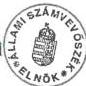

Állami Számverőszék

# JELENTÉS

a Siketek és Nagyothallók Országos
Szövetsége gazdálkodásának az 1995-1997.
években juttatott állami költségvetési
támogatás felhasználásának ellenőrzéséről

9802

415.

1998. április

---

Az ellenőrzés végrehajtásáért felelős:

Halász Gejza

számvevő igazgató

Az ellenőrzést vezette:

dr. Szávai Tamás

osztályvezető főtanácsos

Az összefoglaló jelentést készítette:

dr. Dotterweich Antal

számvevő tanácsos

Az ellenőrzésben részt vettek:

dr. Dotterweich Antal

számvevő tanácsos

Berzétey Attiláné

számvevő tanácsos

Hoffmann István

számvevő

---

V-1004-10/1998. TÉMASZÁM: 416

# TARTALOMJEGYZÉK

|  **I. RÉSZLETES MEGÁLLAPÍTÁSOK** | **4**  |
| --- | --- |
|  1. A Szövetség szervezeti felépítése és a Szövetség célja szerinti tevékenység, valamint egyéb és vállalkozási tevékenysége | 4  |
|  1.1. A Szövetség szervezeti felépítése | 4  |
|  1.2. A Szövetség célja szerinti tevékenysége | 6  |
|  1.3. Vállalkozási tevékenységek | 9  |
|  2. A Szövetség szabályozottsága és működési rendje, különös tekintettel a gazdálkodásra | 10  |
|  3. A SZÖVETSÉG TEVÉKENYSÉGÉHEZ NYÚJTOTT KÖLTSÉGVETÉSI TÁMOGATÁSSAL ÉS EGYÉB BEVÉTELEKKEL VALÓ GAZDÁLKODÁS, KÖLTSÉGVETÉS KÉSZÍTÉSE, JÓVÁHAGYÁSA ÉS VÉGREHAJTÁSA | 11  |
|  3.1. A Szövetség bevételeinek alakulása | 12  |
|  3.2. A költségvetési támogatás igénylésének megalapozott- sága, az elosztás módja | 13  |
|  3.3. A Szövetség kiadásainak alakulása | 15  |
|  3.4. A Szövetség pénzügyi helyzete | 16  |
|  4. A számvitel rendje, a számviteli politika kialakítása | 17  |
|  4.1. Az 1995-1996. évi beszámolók szabályszerűsége | 18  |
|  4.2. A könyvvezetési kötelezettség teljesítése | 18  |
|  4.3. Analitikus nyilvántartások vezetése | 19  |
|  4.4. A bizonylati rend, bizonylati fegyelem kialakítása | 20  |
|  5. A különféle állami befizetési kötelezettségek (Tb járulék, adók stb.) teljesítése, (APEH, Tb ellenőrzések megállapításai) | 21  |
|  6. Belső ellenőrzési tevékenység | 22  |
|  **II. ÖSSZEGZŐ MEGÁLLAPÍTÁSOK, KÖVETKEZTETÉSEK, JAVASLATOK** | **23**  |

1

---

C

C

---

# JELENTÉS

## a Siketek és Nagyothallók Országos Szövetsége gazdálkodásának, az 1995-1997. években juttatott költségvetési támogatás felhasználásának ellenőrzéséről

**Az ellenőrzött szervezet neve:** Siketek és Nagyothallók Országos Szövetsége

**Címe:** 1068 Budapest VI., Benczúr u. 21.

**Jogállása:** önálló jogi személy

**Bírósági nyilvántartási száma:** 6. PK. 26.169/1989.

A Siketek és Nagyothallók Országos Szövetsége (továbbiakban: Szövetség) társadalmi, érdekvédelmi szervezet, 1907-ben alapították Cházár András Országos Siketnéma Otthon néven. A szervezet 1950-ben alakult újjá Siketnémák Szövetsége néven. Néhány évvel később - 1952-ben - alapszabályban rögzítették a nagyothallók érdekvédelmének ellátását, ezzel a nagyothallók helyi szervezetei bekapcsolódtak a szövetség vérkeringésébe, a változást az új elnevezés is tükrözte: Siketek és Nagyothallók Országos Szövetsége.

A Szövetség jelenlegi tevékenysége az egykor kijelölt célokkal megegyezik: a hallássérültek szakmai- érdekvédelmi szervezetként segíti, támogatja a hallássérült embereket a társadalmi beilleszkedésben, az egyéni érvényesülésben. Feladatait 1989-től az egyesülési jogról szóló 1989. évi II. törvény alapján, a Szövetség Alapszabályában foglaltak szerint látja el. Kiadásait elsősorban állami támogatásból, továbbá adományokból és kis részben gazdálkodó tevékenységből fedezi.

A Szövetség 1995-1997. között évente valamivel több mint 100 M Ft-tal gazdálkodott. Ezen belül az állami támogatás 1995-ben 68 M Ft, 1996-ban 82 M Ft, 1997-ben pedig 88 M Ft volt, amelyet az éves költségvetési törvényekben az Országgyűlés fejezetben hagyott jóvá a Parlament.

---3

---

I. RÉSZLETES MEGÁLLAPÍTÁSOK---

A Szövetség alapszabályban rögzített célját, feladatait és szolgáltatásait országos és területi szervezetei útján valósítja meg. Megyei szervezet minden megyeszékhelyen működik. A területi szervezetek (megyei, helyi szervezetek, alapszervezetek, klubok) a működéshez szükséges költségvetéssel rendelkező nem jogi személy szervezeti egységek.

A Szövetség taglétszáma az 1995. évi 10656 főről 12397 főre változott 1997. év végére.

A Szövetség legfelsőbb szerve a Küldöttközgyűlés, amely legalább évente ülésezik. A Szövetségnek választott szervei és ellenőrző szervezete van. A napi operatív működést a főtitkár irányításával működő Hivatali Szervezet biztosítja.

Az Állami Számvevőszékről szóló, többször módosított 1989. évi XXXVIII. törvény 2. § (5) bekezdése alapján a társadalmi szervezeteknek az állami költségvetésből juttatott támogatás felhasználását az ÁSZ ellenőrzi.

**Az ellenőrzés célja:** annak megállapítása, hogy a Szövetség gazdálkodása megfelelt-e a célszerűségi, eredményességi követelményeknek és a törvényi előírásoknak.

**Az ellenőrzés módszere:** a Hivatali Szervezet által rendelkezésre bocsátott iratok szűrőpróbaszerű kiválasztásával.

**Az ellenőrzött időszak:** 1995-1997. évek

**A helyszíni ellenőrzés időszaka:** 1998. január 6. - február 13.

# I. RÉSZLETES MEGÁLLAPÍTÁSOK

## 1. A SZÖVETSÉG SZERVEZETI FELÉPÍTÉSE ÉS A SZÖVETSÉG CÉLJA SZERINTI TEVÉKENYSÉG, VALAMINT EGYÉB ÉS VÁLLALKOZÁSI TEVÉKENYSÉGE

### 1.1. A Szövetség szervezeti felépítése

A Szövetség alapszabályban meghatározott célkitűzése a siket és nagyothalló személyek érdekeinek szervezett, szakszerű képviselete és védelme, a társadalomba való beilleszkedésük elősegítése.

---4

---

I. RÉSZLETES MEGÁLLAPÍTÁSOK

Az érdekvédelmi tevékenység megvalósítását az országos és a területi szervezetek látják el.

A **Küldöttközgyűlés** a Szövetség legfelsőbb szerve, kizárólagos hatáskörén túlmenően - amely magában foglalja pl. az alapszabály módosítását - elfogadja az éves munkáról szóló beszámolót, a pénzügyi beszámolót, valamint az Ellenőrző Bizottság beszámolóját.

A Küldöttközgyűlés állapítja meg a tagdíj mértékét, amely differenciált, a jelenlegi évi 500 Ft teljes tagdíj mellett 50%-os tagdíjat fizetnek a tanulók, öregségi nyugdíjban részesülők, tagdíjmentesek a szociális otthonban lakók, állami gondozott tanulók, vak-siketek.

Az **Országos Elnökség** a Küldöttközgyűlésnek tartozik felelősséggel, július, augusztus hónapok kivételével havonta ülésezik a 11 tagú testület. Feladatkörébe a Küldöttközgyűlés határozatainak végrehajtása, a Szövetség folyamatos működésének országos szintű, operatív szervezése, irányítása tartozik.

Az **Országos Elnök** hívja össze a Küldöttközgyűlést és az Országos Elnökség üléseit, levezeti az üléseket, képviseli a Szövetséget és általános felügyeletet gyakorol a Szövetségben folyó tevékenység felett.

A **főtitkár** feladata az utalványozás, kötelezettségvállalás és igény érvényesítés. Feladatkörébe tartozik a napi operatív teendők ellátása, illetve irányítása, a központi ügyintéző szervezet irányítása, kiadványozás.

Az **alelnökök** helyettesítik az országos elnököt, felügyelik és segítik a Szervezési Bizottság tevékenységét és a Nagyothalló, illetve Siket Szekció működését.

Az **Ellenőrző Bizottság** a Szövetség legfelsőbb országos ellenőrző szerve, amely kizárólag a Küldöttközgyűlésnek tartozik felelősséggel.

Az **Országos Fegyelmi Bizottság** ugyancsak a Küldöttközgyűlésnek tartozik felelősséggel, a tagok fegyelmi ügyeivel foglalkozik.

**Az Országos Elnökség mellett működő állandó bizottságok:**

1. Ifjúsági Bizottság
2. Jelnyelvi Bizottság
3. Kommunikációs Bizottság
4. Kulturális Bizottság
5. Nagyothallók Szekciója
6. Rehabilitációs Eszközöket Felülbíráló Bizottság
7. Szerkesztő Bizottság
8. Szervezési Bizottság
9. Szociális Bizottság
10. Testnevelési és Sport Bizottság

5

---

I. RÉSZLETES MEGÁLLAPÍTÁSOK

**A Szövetség területi szervezetei:**

1. Megyei Szervezet (Fővárosi Szervezet)
2. Helyi szervezet
3. Klub
4. Alapszervezet

Megyei szervezetek megyeszékhelyeken, a helyi szervezetek a városokban és községekben működnek, legalább 100 létrehozó tag esetén.

**Klubok** működnek mindazon helyiségekben, ahol a helyi szervezetek alapításához nincs meg a szükséges taglétszám.

**Alapszervezetek** működnek a hallássérült tanintézetekben, az ápolást, gondozást, illetve egyéb személyes gondoskodást nyújtó intézményekben.

Klubok és alapszervezetek alapításához legalább 10 tag szükséges.

Az alapszabály második fejezete határozza meg a Szövetség célját, feladatait, szolgáltatásait, az ötödik fejezet foglalkozik a Szövetség gazdálkodásával. További előírásokat fogalmaznak meg a célja szerinti, vállalkozási és egyéb tevékenységével kapcsolatban a számlarend és a számlatükör részletező előírásai.

**1.2. A Szövetség célja szerinti tevékenysége**

A Szövetség alapszabályában megfogalmazott célkitűzésének megvalósítása érdekében az állandó bizottságok és a szakirányú osztályok működtetésével a következő szakmai feladatcsoportokat látja el.

**Szociálpolitika**

A Szociális Bizottság évente több mint száz tag segélykérelmét bírálja el, a segélyek kifizetése részben a Szövetség által létrehozott „Hallássérültek Szociális Alapítvány”-a útján történik.

A Szövetség tagjai számára üdülőt létesített és tart fenn Balatonfenyvesen, a fenntartási és üzemeltetési költségeket a költségvetés terhére biztosítja. A tagok által fizetett üdültetési díj a napi beszerzéseket fedezi.

Érdekvédelmi tevékenységet végeznek a hozzájuk fordulók beadványai, nevelési, szociális, munkába helyezési stb. problémáinak megoldása céljából.

Ingyenes jogsegélyszolgálatot és pszichológiai tanácsadást működtetnek a Szövetség székhelyén.

Figyelemmel kísérik a hallássérülteket érintő jogszabályokat, véleményezik a megküldött jogszabály tervezeteket.

6

---

I. RÉSZLETES MEGÁLLAPÍTÁSOK

Figyelemmel kísérik a nagyothallók hallókészülékeivel, kiegészítő berendezésekkel, tartozékokkal való ellátását, az otthoni és közületi riasztó és biztonsági rendszerek helyzetét.

Pályázatokon vesznek részt egészségkárosultak, fogyatékosok szervezeti részére meghirdetett összegek elnyerése érdekében.

# Szervezés

A szervezési tevékenység keretében biztosítják a belépők tagsági igazolvánnyal, betétlappal történő ellátását, amelynek alapján 50%-os utazási kedvezmény jár a tagoknak a MÁV és a VOLÁN járatain.

A Szövetségnek a demokratikus szervezeti élettel kapcsolatos rendezvényei előkészítése és lebonyolítása is e tevékenység keretében történik. Szervezik és koordinálják a Szövetség központi éves programnaptárát.

Az országos tagnyilvántartás számítógépes rendszer keretében történik, amelynek bevezetése 1995. évben kezdődött. A tagdíjbefizetések nyilvántartása is e rendszerben valósul meg.

# Oktatás

Az általános iskolákban tanulók részére pályaválasztási szülői értekezleteket szerveznek, tanácsadást biztosítanak a szülők részére szakoktatási és munkábahelyezési ügyekben. Előzetes pályaalkalmassági orvosi vizsgálatokat szerveznek meg.

Segítik a középiskolai beiskolázást, tanulmányi kirándulásokat szerveznek a pályaválasztás érdekében.

A siketeket és nagyothallókat oktató általános és 1997-től középiskolák között évente Nemzetközi Közbiztonsági versenyt szerveznek, tanulmányi versenyek lebonyolításában közreműködnek. A tehetséges hallássérült gyerekek oktatásának támogatása érdekében alapítványt hoztak létre.

A felnőtt tagok körében egyéni és csoportos tanfolyamokat, átképzéseket szerveznek, részt vesznek fogyatékosok komplex szakképző rehabilitáló és foglalkoztató központjai szervezési munkáiban.

# Lapszerkesztőség

A Szövetség lapja a „Hallássérültek” c. havonta megjelenő folyóirat. Közérdekű információkat, cikkeket, programokat, sport és kulturális híreket, irodalmi és szakmai írásokat közölnek a tagság tájékoztatása érdekében. A lap előállítási költsége a Szövetséget terheli, az előfizetők csak a terjesztési díjat fizetik.

7

---

I. RÉSZLETES MEGÁLLAPÍTÁSOK---

## Kultúra

Kulturális fesztiválokat, találkozókat, versenyeket szerveznek, illetve megrendezésükben közreműködnek, pl. a jelbeszédes színház, a némajáték, a pantomim és a báb, illetve árnyjáték művészeti ágakban.

Támogatják, szervezik a Szövetség keretén belül működő együttesek munkáját, szervezik a megyei kulturális tevékenységet. A Szövetség keretei között 10 művészeti csoport működik.

Nyári táborok szervezésével segítik az önképzés lehetőségét megteremteni. Szervezik a tagság részvételét hazai és nemzetközi kulturális rendezvényeken.

Kiemelkedő program a „Siketek Nemzetközi Hete”, amelyre minden év szeptemberének utolsó hetében kerül sor.

Feliratozott videofilmek kölcsönzését biztosítják a tagság részére.

## Ifjúság

A hallássérült fiatalok részére országos rendezvényeket (pl. Országos Ifjúsági Találkozók), versenyeket, táborokat szerveznek. A területi szervezetnél ifjúsági klubok működtetését biztosítják.

Érdekképviseleti tevékenységet látnak el hazai és nemzetközi fórumokon ifjúságpolitikai kérdésekben.

## Sport

A Magyar Siketek Sportbizottsága gyermek és felnőtt versenyeket, kupákat rendez, melyek több sportágban országos szintűek (pl. labdarúgás, asztalitenisz, vízilabda). A Szövetség helyi szervezetei labdarúgó és egyéb sportági kupákat rendeznek tagjaik számára. A sport nevezési díjak fedezik a rendezés költségeit.

A sportolók részt vesznek nemzetközi versenyeken is, pl. Nyári Siket Világjátékok, ahol évről-évre jelentős sikereket érnek el.

## Kommunikáció

A jelnyelvet alap-, középfokon, illetve jeltolmácsolást felső fokon elsajátítani kívánó személyek részére kommunikációs, illetve tolmácsképző tanfolyamokat szervez a Szövetség. Alap- és középfokú oklevelet évente több száz hallgató kap. A tanfolyami hallgatók tandíjat fizetnek, amelyből a tanfolyami kiadásokat és a vizsgadíjat fedezik.

A jelnyelv magyarországi elismertetése és a Szövetség tagjainak zavartalan kommunikációja érdekében szervezett tanfolyamok hallgatói és az érdeklődők részére szakmai tankönyveket, jegyzeteket, szótárt, kazettákat készítenek és értékesítenek.

---8

---

I. RÉSZLETES MEGÁLLAPÍTÁSOK

A gyakorló jelnyelvi tolmácsok részére évente nyári tréninget szerveznek, a szakmai tréning önköltséges, a befizetett díj fedezi az ellátási költségeket.

A Szövetség által szervezett kommunikációs tanfolyamok nem pedagógiai végzettségű oktatói részére tanfolyamvezető képzést szerveznek, amely ugyancsak önköltséges.

Kommunikációs verseny keretében évente jelnyelvi versenyt rendeznek általános iskolai tanulók részére.

A tagok részére jelnyelvi tolmács-szolgálatot működtetnek, a Szövetség rendezvényeire, társadalmi eseményekre tolmácsot biztosítanak.

# **Video stúdió**

A stúdió 1996. év végén kezdte meg működését, tevékenységi körébe különböző műsorok, riportok készítése tartozik. A műsorokat egy budapesti és öt vidéki székhelyű tv társaság sugározza havonta több alkalommal (az ismétlésekkel együtt) ingyenesen. A stúdió a Szövetség területi szervezetei részére ingyenesen küldi meg az általa készített műsorokat tartalmazó kazettákat.

# **Nemzetközi kapcsolatok**

A Szövetség tagja a WDF-nek (Siketek Világszövetsége), valamint az IFHOH-nak és az IFHOH-Europe-nak is (Nagyothallók Világszervezete és annak európai tömörülése). A két világszervezeten túlmenően több nemzeti szövetséggel is tartanak közvetlen kapcsolatot.

Az alapszabály gazdálkodást tárgyaló fejezete a **célja szerinti gazdálkodó tevékenységek** közé a következő tevékenységek bevételeit sorolja:

- Kommunikációs tankönyv, jegyzet, szótár, kazetta értékesítés árbevétele;
- Kommunikációs tanfolyam díj, pótvizsga díj;
- Kommunikációs találkozó részvételi díja;
- Videotábor részvételi díja;
- Tanfolyamvezető képzés részvételi díja;
- Sport nevezési díjak;
- Hallássérültek c. lap eladásának árbevétele;
- Hallássérültek üdültetésének bevétele;
- Tagdíjak;
- Támogatások;

# **1.3. Vállalkozási tevékenységek**

Az alapszabály rendelkezései a következő vállalkozási tevékenységeket rögzítik:

- Nem hallássérültek üdültetésének bevétele;
- Rendezvények bevétele;
- Hirdetésből származó bevételek;

9

---

I. RÉSZLETES MEGÁLLAPÍTÁSOK

- Bérbeadás bevétele;
- Buszkölcsönzés;
- Eszközkölcsönzés, fénymásolás, sokszorosítás;
- Reklámtevékenység bevétele;
- Göngyölegértékesítés;
- Térítési díjak.

## 2. A SZÖVETSÉG SZABÁLYOZOTTSÁGA ÉS MŰKÖDÉSI RENDJE, KÜLÖNÖS TEKINTETTEL A GAZDÁLKODÁSRA

A Szövetség működésének jogi kereteit alapvetően az egyesülési jogról szóló 1989. évi II. törvény határozza meg.

A vizsgált évek közül 1995-ben az 1990. január hó 1. napján hatályba lépett alapszabály volt érvényben, az 1996. évben az 1996. január hó 1-jével hatályba lépett új alapszabály, az 1997. évben pedig február 1-jével fogadtak el újabb alapszabályt.

**Az 1990. január 1-jével hatályba lépett alapszabály** gazdálkodást érintő előírásai igen szűkszavúak, és a vizsgált időszakot illetően részben elavult rendelkezéseket is tartalmazott. Számviteli és Gazdálkodási Szabályzatuk sem felelt meg a társadalmi szervezetek gazdálkodó tevékenységéről szóló 114/1992. (VII.23.) Korm. rendelet előírásainak.

A Szövetség 1990-1995. évekre vonatkozó költségvetési kapcsolatainak az APEH részéről történt átfogó ellenőrzése nyomán 1996-ban új számlarendet készítettek. A számlarend biztosítja a bevételek és költségek hivatkozott jogszabálynak megfelelő részletezésben történő nyilvántartását, az üzemeltetési, fenntartási költségek és egyéb közvetett költségek megosztását a célja szerinti és a vállalkozási tevékenység között.

**Az 1997. február 1-jével hatályba lépett, jelenleg is érvényben lévő alapszabály** részletesen, önálló fejezetben tartalmaz a gazdálkodásra vonatkozóan előírásokat. A fogalmak mellett azok magyarázatát is tartalmazza. A rendelkezések összhangban vannak a hatályos jogszabályok előírásaival.

A Szövetség működésének, a feladat és hatáskör megosztásának részletes szabályait a **Szervezeti és Működési Szabályzat** (SZMSZ) tartalmazza. Az Országos Elnökség az Ellenőrző Bizottság és az Országos Fegyelmi Bizottság munkájukat **külön SZMSZ-ek alapján végzik**, kizárólag a küldöttközgyűlésnek tartoznak felelősséggel.

Az SZMSZ a Szövetség Hivatali Szervezetének szervezeti felépítését és működésének szabályait rögzíti, továbbá tartalmazza a Szövetség szervezeti megoszlását is.

10

---

I. RÉSZLETES MEGÁLLAPÍTÁSOK

A **működési szabályzat** az általános előírások és a szakmai tevékenység rögzítésén túlmenően **szabályozza a gazdasági-pénzügyi működést is**. E tekintetben hatálya nem csak a Hivatali Szervezetre terjed ki, hanem a Szövetség valamennyi területi szervezetére, figyelemmel arra, hogy az egyes szervezetek nem jogi személyek, önálló gazdálkodást nem folytatnak.

Gazdálkodási részterületekre vonatkozó szabályzatokat nem készítettek, ezt a Szövetség feladatai, szervezeti tagoltsága, a feladatok bonyolultsága nem is indokolja.

A Gazdasági Főosztály vezetője a területi szervezetek részére **tájékoztató anyagokat, körleveleket** készít a pénzgazdálkodás, pénzügyi elszámolások készítésével, bér és munkaügyi kérdésekkel, jogszabályi változásokkal kapcsolatosan. Tartanak a szervezetek részére pl. elnök, titkár, ügyintézői értekezleteket gazdasági témakörökben is, amelyen írásos tájékoztatást is kapnak az aktuális jogszabályi változásokról, felhívják a figyelmet a tapasztalt helytelen gyakorlat esetén a megfelelő előírások követésére.

A költségvetési támogatás célszerű és hatékony felhasználása érdekében rögzítették, hogy kötelező a 20.000 Ft-ot meghaladó felújítási, szerviz vagy egyéb munkák, tárgyi eszköz beszerzés esetén legalább három különböző árajánlatot kérni és ezek közül a legkedvezőbbet kiválasztani.

A 100 E Ft-ot meghaladó munkák árajánlataival kapcsolatban csak a központ dönthet.

A Hivatali Szervezet dolgozói **munkaköri leírások** alapján végzik munkájukat, vezetőváltás, átszervezés esetén a munkakör átadás-átvétele megtörténik.

Az 1997. évben elfogadott, a közhasznú szervezetekről szóló CLVI. törvény alapján a Szövetségnél a helyszíni vizsgálat időszakában megkezdték az Alapszabály és egyéb belső szabályzatok átdolgozását, kiegészítését a közhasznú jogállás megszerzése érdekében.

### 3. A SZÖVETSÉG TEVÉKENYSÉGÉHEZ NYÚJTOTT KÖLTSÉGVETÉSI TÁMOGATÁSSAL ÉS EGYÉB BEVÉTELEKKEL VALÓ GAZDÁLKODÁS, KÖLTSÉGVETÉS KÉSZÍTÉSE, JÓVÁHAGYÁSA ÉS VÉGREHAJTÁSA

A Szövetség - a Magyar Köztársaság éves költségvetéséről szóló törvényekben meghatározott összegű - költségvetési támogatásban részesül. A Szövetség részére juttatott állami támogatás összege a vizsgált három évben az Országgyűlés fejezetben kiemelt céljellegű előirányzatként szerepelt. A támogatás összege **1995. évben 68 M Ft, 1996. évben 82 M Ft, 1997. évben 88 M Ft volt**. A támogatás éves összegének fel-

11

---

I. RÉSZLETES MEGÁLLAPÍTÁSOK---

használásáról a költségvetési törvények nem rendelkeznek, konkrét feladatokat, célokat nem jelölnek meg. **A költségvetési támogatást a Szövetség** az Alapszabályában meghatározott alapfeladatai teljesítése céljából a **működési költségei fedezetére kapta** és arra is használja fel.

A Szövetség célja elsősorban tagjai érdekeinek szervezett, szakszerű képviselete és védelme, amelyet a céljához rendelt feladatrendszere, sajátos tevékenysége által valósít meg. **Tevékenysége** így illeszkedik az állampolgárok ezen hátrányos helyzetben lévő rétege vonatkozásában **állami feladatként megjelenő kötelezettségek** köréhez, azonban azokat nem helyettesíti, nem vállalja át, csak **kiegészíti. Az állami támogatás összege** - noha ezt a költségvetési törvények nem fogalmazzák meg - **e kiegészítő tevékenység folytatásához nyújt fedezetet.**

### 3.1. A Szövetség bevételeinek alakulása

A Szövetség bevételei a vizsgált időszakban a társadalmi szervezet célja szerinti tevékenységéből, valamint vállalkozási tevékenységéből származtak.

A **cél szerinti bevételek jogcímük szerint** központi költségvetési támogatásból, az alaptevékenységhez tartozó feladatok bevételeiből, pályázati és egyéb támogatásokból, jogi- és magánszemélyek befizetéseiből, tagdíjból és pénzügyi műveletek bevételeiből származtak. A Szövetség bevételeinek évek és jogcímek szerinti részletezését az 1. sz. melléklet mutatja be.

A **vállalkozási tevékenységből** származó bevételeinek túlnyomó többsége helyiség bérbeadásból és térítési díjakból származik. Ez a bevételi forrás azonban a vizsgált évek átlagában az **összes bevételének csak mintegy 3%-át tette ki, bevételei 97-98%-a a célja szerinti tevékenységből származik.**

A Szövetség célja szerinti tevékenységéből származó bevételei döntő hányadát mindhárom évben az állami költségvetési támogatás tette ki (82,1%, 79,3%, 79,8%). Általános elszámolási kötelezettséggel kapott pályázati támogatások aránya 5%, 8% és 2% volt, a más szervektől, valamint helyi önkormányzatoktól kapott egyéb támogatások aránya 6,2%, 5,8%, 5,0%.

A Szövetség 1995. évben PHARE pályázaton elnyert 40.000 ECU-t (8,6 M Ft-ot) központi videostúdió létrehozására. A pályázaton elnyert összeget 1997. évig bezárólag használták fel. A pályázati projektben előírtaknak megfelelően a Szövetség a szakmai és pénzügyi elszámolási kötelezettségének eleget tett.

---12

---

I. RÉSZLETES MEGÁLLAPÍTÁSOK

A **tagdíjakból** származó bevételek a cél szerinti bevételek átlag 3,2%-át teszik ki.

A Szövetség összes bevétele szerkezetének alakulásában a 3 év alatt a **költségvetési támogatás összegének dinamikus növekedése** játszotta a főszerepet; 1997. évben a támogatás összege az 1995. évihez képest 29,4%-kal nőtt, ugyanakkor a vállalkozási tevékenységből származó bevétel csak 12,3%-kal.

A bevételek **területi megoszlás** szerinti alakulásában - figyelembe véve azt a tényt, hogy a **költségvetési támogatásból származó bevétel a központ bevételei között szerepel** - a központ és a központi feladatok képviselik a döntő arányt.

A **vidéki szervezetek** bevételeinek jelentős hányada pályázatokon (főleg önkormányzatoktól) elnyert támogatás, valamint tagdíj bevétel. A vidéki szervezetek saját bevételei az összes bevételnek 1995-ben 12%-át, 1996-ban 10%-át, 1997-ben 11%-át tették csak ki.

Összességében a vizsgált időszakban a **Szövetség bevételeinek döntő hányadát az Alapszabály szerinti működési költségek fedezetére jóváhagyott központi költségvetési támogatás tette ki.**

### 3.2. A költségvetési támogatás igénylésének megalapozottsága, az elosztás módja

A Szövetség vezető testületei, valamint a Küldöttközgyűlés részére feladatra lebontott költségvetés nem készül. A **költségnemek szerint összeállított összesített tervezet** a Szövetség vidéki szervezetei által készített költségvetéseket is figyelembe veszi. Az összesített költségvetés tervezetet a gazdasági főosztályvezető előterjesztése alapján vitatja meg az Országos Elnökség, majd a Küldöttközgyűlés, amely azt jóváhagyja. A **költségvetési támogatást** lényegében évről-évre a **hivatalos inflációs rátával megemelt összegben igényli a Szövetség**; a tervezet az egyéb, pl. pályázatok útján elnyerhető támogatásokkal nem számol. **Az éves költségvetési támogatási igényt** az általánosság szintjén, **konkrét számításokkal nem alátámasztva fogalmazzák meg.** A Szövetség a költségvetési tervezéstől függetlenül, rendes évi programjaira minden évben készít program-tervezetet. **Programtervezet** mind a központi szervezésű, mind a vidéki szervezetek által tervezett szakmai feladatokra, rendezvényekre készül, azonban **e programtervezetek nincsenek költségtervvel alátámasztva.** Központi feladatként kezelik a Cházár András kitüntetéseket, a társadalmi munkások jutalmát, a kommunikációs, jelnyelvi, video tanfolyamok, táborok, könyvek, valamint a Hallássérültek Lapja költségeit.

13

---

I. RÉSZLETES MEGÁLLAPÍTÁSOK---

A költségvetés végrehajtását a Szövetség Ellenőrző Bizottsága folyamatosan ellenőrzi; a gazdasági vezetés negyedévenként tájékoztatja a főtitkárt az időarányos teljesítésről. A szakmai programok teljesítéséről éves munkajelentésekben számolnak be.

A Szövetség a költségvetési terve mellékleteként minden évben elkészíti **éves feladattervét**, amely a tervezett szakmai programokat, rendezvényeket havi, napi bontásban tartalmazza.

A központi költségvetési támogatás Szövetségen belüli elosztásának módját az határozza meg, hogy e **szakmai feladatok nagy többsége a központ feladattervében szerepel** akkor is, ha a rendezvény helyszíne nem Budapest. Ennek megfelelően pl. bér- és bérjellegű kifizetések és ezek járulékai csak a központ költségvetésében szerepelnek; ugyanúgy az országos vagy nemzetközi jelentőségű rendezvények költségei is.

A Szervezeti és Működési Szabályzat előírása szerint az éves költségvetés, valamint ezen belül a **költségvetési támogatás elosztásának jóváhagyása az Országos Elnökség, majd a Küldöttközgyűlés hatáskörébe tartozik**. A bevételek tervezésekor központ-vidék bontásban megtervezik a kiadásokat is; így a tervezet szerint a központ - vidék arány:

|  1995-ben | 60,0 | és | 40,0%  |
| --- | --- | --- | --- |
|  1996-ban | 59,6 | és | 40,4%  |
|  1997-ben | 55,0 | és | 45,0%  |

(2. sz. melléklet).

A tervezett költségvetéshez képest év közben történt változásokról vagy pl. előző évi pénzmaradvány felosztásáról minden esetben elnökségi határozattal döntenek.

**A vidéki - helyi szervezetek működési költségeihez a Szövetség éves ellátmányt állapít meg**, amelyet negyedévenként utal át a szervezetek számlájára. (3. sz. melléklet). A vizsgált időszakban összesen 32 helyi szervezet, főleg megyei központ részesült a költségvetési támogatásból rendszeres ellátmányban.

---14

---

I. RÉSZLETES MEGÁLLAPÍTÁSOK

# A költségvetési támogatás megoszlása (ezer Ft-ban)

|   | 1995 | % | 1996 | % | 1997 | %  |
| --- | --- | --- | --- | --- | --- | --- |
|  Központ+központi feladatok | 58.230 | 85,6 | 75.894 | 92,6 | 79.725 | 90,6  |
|  Szervezetek (32) | 9.770 | 14,4 | 6.106 | 7,4 | 8.275 | 9,4  |
|  **Összesen:** | **68.000** | **100,0** | **82.000** | **100,0** | **88.000** | **100,0**  |

**A költségvetési támogatás döntő hányadát** - 1995. évhez képest jelentősen növekvő arányban - a **központ működési költségeire, valamint a központilag kezelt feladatok** - Hallássérültek Lapja, kommunikáció, kultúra, sport - **finanszírozására fordítják**. A helyi szervezetek által tervezett programokat nagyobb arányban a saját bevételeikből fedezik. Ugyanakkor több helyi szervezet esetében a helyiségbérleti és közüzemi díjakat a központ költségvetése terhére számolják el. Ez is szerepet játszik abban, hogy a **költségvetési támogatás felhasználása egyre inkább központosított**, 1997. évben már csak 9,4%-át fordították közvetlen ellátmányként a vidéki szervezetek működési költségeire. Ugyanakkor az **1997. évi 12397 fős országos taglétszámból 9415 fő él vidéki településeken, a budapesti tagok száma 2147 fő**. A Szövetség célja szerinti tevékenységét nagyrészt alkotó programok megrendezése és finanszírozása központilag történik. Így pl. 1997. évi központi program volt az országos jelverseny, a fiatalok játékos ügyességi versenye, a Siketek Nemzetközi Napjának megünneplése. Központi program az érdekvédelem, a szociális-, a jogsegélyszolgálat, a pszichológiai munka, az oktatás, a kommunikációs tevékenység. **Annak megítélése, hogy közvetlenül ezekre a programokra a költségvetési támogatásból mennyit fordítanak, a jelenlegi számviteli nyilvántartási rendszer alapján nem lehetséges**. Erre csak a költségvetési támogatás felhasználásának e szempontok szerinti analitikus nyilvántartása esetén lenne mód.

### 3.3. A Szövetség kiadásainak alakulása

A vizsgált időszakban a **Szövetség összes kiadása dinamikusan növekedett**, az 1997. évi kiadás (97.456 E Ft) 32,4%-kal haladta meg az 1995. évit (73.584 E Ft). **A kiadások egyik évben sem haladták meg a tárgyévi bevételeket**. (4. sz. melléklet). A kiadások szerkeze-

15

---

I. RÉSZLETES MEGÁLLAPÍTÁSOK

**tének alakulását csak költségnemenként lehetséges** vizsgálni, a **kiadások alapfeladatnak megfelelő programok szerinti szerkezete nem értékelhető.** A vizsgált időszakban a kiadások egyre növekvő hányadát a **bérköltség és a személyi jellegű kifizetések tették ki:**

|   | 1995 | 1996 | 1997  |
| --- | --- | --- | --- |
|  Összes kiadás (5+8) (E Ft) | 73.584 | 85.111 | 97.456  |
|  Bérköltség (E Ft) | 27.329 | 44.107 | 55.039  |
|  Bérköltség aránya % | 37,2 | 51,8 | 56,5  |

A bérköltség 1997-re az 1995. évinek a duplájára növekedett. Ezen belül a teljes- és részmunkaidőben foglalkoztatottak bérköltsége 32,3%-kal, a megbízási- és szakértői díjak 81,5%-kal, a tiszteletdíjak 82,7%-kal növekedtek.

A Szövetség alkalmazottainak létszáma 1995-ben és 1996-ban 30 fő (27 fő főállású és 3 fő részmunkaidős), 1997-ben 34 fő (27 fő teljes munkaidős és 7 fő nem teljes munkaidőben foglalkoztatott, illetőleg nyugdíjas) volt.

A **dologi kiadások** aránya a három év alatt az összes kiadás 31-25-31%-a volt. Ezen belül magas volt az anyagjellegű szolgáltatások részaránya (1995-ben 17%, 1996-ban 11%, 1997-ben 15%).

### 3.4. A Szövetség pénzügyi helyzete

A Szövetség pénzügyi helyzete mindhárom vizsgált évben **kiegyensúlyozott** volt. A kiadásaik bevételeiket nem haladták meg, mindhárom évben jelentős **pénzmaradvánnyal** zárták az évet, amely többnyire az áthúzódó feladatok költségeit fedezte. A befektetett eszközállomány növekvő tendenciát mutatott. Hosszúlejáratú kötelezettségeket nem vállaltak, hitel felvételére nem került sor. Rövidlejáratú kötelezettségeiket teljesítették, sem adó, sem társadalombiztosítási járulék tartozásuk nem volt. **Likviditási problémáik nem voltak**, az államháztartás havonta átutalta számlájukra a költségvetési támogatás időarányos összegét, amelyet évről-évre ki tudtak egészíteni pályázatokon elnyert összegekkel és egyéb támogatásokkal.

16

---

I. RÉSZLETES MEGÁLLAPÍTÁSOK

#### 4. A SZÁMVITEL RENDJE, A SZÁMVITELI POLITIKA KIALAKÍTÁSA

A Szövetség a 157/1992. (XII.4.), illetve a 8/1996. (I.24.) Korm. rendelet alapján a beszámolási kötelezettségnek egyszerűsített éves beszámoló készítésével tesz eleget, ennek megfelelően a könyvvezetési kötelezettség teljesítését kettős könyvvitel vezetésével biztosítja.

A számvitelről szóló, többször módosított 1991. évi XVIII. törvény előírásának (79. § (3) bekezdés) teljesítésére Számviteli és Gazdálkodási Szabályzatot és ehhez kapcsolódó számlatükröt is készítettek.

Az 1995. évben hatályos Számviteli és Gazdálkodási Szabályzat nem írta elő a tevékenységek költségeinek elhatárolását a közvetett működési költségektől, nem biztosította a célja szerinti és a vállalkozási tevékenység elhatárolását. Ez ellentétes a 114/1992. (VII.23.) Korm. rendelet 3. és 4 §-ának rendelkezéseivel. Nem tartalmazta a szabályozás a szervezet sajátosságaiból adódó speciális előírásokat, részben pedig nem a társadalmi szervezetekre hatályos jogszabályokban rögzített előírásokat tartalmazott.

Az APEH 1996. első félévben végzett ellenőrzését követően 1996. júniusában új, a jogszabályi előírásoknak megfelelő „Számlarend”-et készítettek, továbbá kialakították a Szövetség számviteli politikáját is.

A számviteli politika összhangban van a jogszabályi előírásokkal, valamint tartalmazza a szervezet sajátosságait tükröző, az általános előírásokon túli sajátos előírásokat is. Választási lehetőség esetén meghatározza a Szövetség által követett gyakorlatot.

A számviteli politika meghatározza a beszámolás és könyvvezetés módját, az egyszerűsített éves beszámoló készítésének időpontját április 30-ával határozza meg. Felsorolja az alaptevékenységként ellátott feladatokat és a vállalkozási tevékenységeket is. A hatályos szabályozás biztosítja a közvetett költségek elkülönített gyűjtését kódolás útján.

Rögzíti a számviteli politika az analitikus nyilvántartások körét, a sajátos értékelés előírásokat, a rendkívüli és a szokásos tételek elkülönítésének ismérveit.

A számviteli politikát kiegészítették a számviteli törvény 1997. január 1-jével hatályba lépett módosításnak megfelelően, a kiegészítések a következő területeket érintik:

- számviteli alapelvek: a módosítással új számviteli alapelveket (pl. tartalom elsődlegessége a formával szemben, lényegesség elve) iktattak a számviteli politikába,
- számviteli rend: a 30.000 Ft egyedi beszerzési érték alatti eszközök azonnali leírásának lehetőségével élnek,

17

---

I. RÉSZLETES MEGÁLLAPÍTÁSOK

- az önellenőrzés, ellenőrzés szempontjából jelentős hibák esetén az előző évi korrekciók kimutatása előírásai,
- elkészítették az előírt szabályozásokat is: Pénzkezelési, Leltárkészítési és leltározási Szabályzatok.

#### 4.1. Az 1995-1996. évi beszámolók szabályszerűsége

A Szövetség 1995. és 1996. évektől készített egyszerűsített éves beszámolóit főkönyvi kivonatok, analitikus nyilvántartások, bizonylatok alátámasztják.

A második pontban említett szabályozási hiányosságok, pontatlanságok következtében az 1995. évről készült egyszerűsített éves beszámoló tartalma nem mindenben felel meg a jogszabályi előírásoknak. Az egyszerűsített éves beszámoló mérlegének előírt tagolását a társadalmi szervezeteknél a 157/1992. (XII.4.) Korm. rendelet 3. sz. melléklete rögzítette 1995. évre vonatkozóan. A Szövetség az ott meghatározott „Tőkeváltozás” helyett „Tőketartalék” és „Mérlegszerinti eredmény” kategóriákat használt, saját előírásainak megfelelően.

Az egyszerűsített éves beszámoló eredmény-kimutatásának előírt tagolását ugyancsak rögzíti az előző bekezdésben hivatkozott jogszabály, a Szövetség nem annak, hanem a vállalkozásokra előírtaknak megfelelő eredménykimutatást készített.

Az 1996. évről készített egyszerűsített éves beszámoló mérlege és eredménykimutatása már a társadalmi szervezetekre vonatkozó előírások szerint készült. A beszámolót bejegyzett könyvvizsgáló Kft záradékolta, amely szerint „az éves beszámoló a szervezet vagyoni, pénzügyi és jövedelmi helyzetéről megbízható és valós képet ad.” Szúrópróbaszerű ellenőrzésünk megerősíti a leírtakat, az általunk vizsgált dokumentumok számviteli elszámolása és rögzítése a jogszabályoknak megfelelő volt.

#### 4.2. A könyvvezetési kötelezettség teljesítése

A Szövetség a vizsgált időszakban a könyvvezetési kötelezettségnek kettős könyvvitel vezetésével tett eleget.

A könyvvezetés központilag történik, a területi szervezetek (megyei, helyi szervezetek, klubok) a bevételekkel és a kiadásokkal kapcsolatos bizonylatokat a kapcsolódó pénztár és bankbizonylatokkal tárgyhót követően eljuttatják a Gazdasági Főosztály részére.

Az ellenőrzés megállapítása szerint a főkönyvi számlákra bizonylatok alapján, idősorrendben, dokumentáltan történik a gazdasági események rögzítése.

18

---

I. RÉSZLETES MEGÁLLAPÍTÁSOK

A szabályozási problémák hiányosságai következtében 1995. évben a könyvvezetés a belső előírásoknak - Számviteli és Gazdálkodási Szabályzat és Számlarend - felelt meg, amely nem volt teljes mértékben összhangban a jogszabályi előírásokkal. A korábbi belső szabályokat 1996-ban hatályon kívül helyezték. A jelenleg hatályos számviteli politika, számlarend és számlatükör a társadalmi szervezetekre érvényes szabályokkal összhangban van, megfelelő eligazítást ad a gazdasági események kijelöléséhez.

A számlatükör nagymértékben alábontja az egyes költségnemeket, továbbá a célja szerinti és a vállalkozási tevékenység bevételeit tevékenységenkénti mélységben írja elő részletezni. A nagymértékű részletezést a Szövetség vezetőinek információ igénye indokolja, a tervezés hasonló mélységben bontva történik, így válik lehetővé a tervadatok teljesülésének figyelemmel kísérése.

A felmerült költségek területi szervezetenkénti nyomon követését a jelenlegi számítógépes rendszer nem biztosítja, ilyen bontásban csak tervadatok állnak rendelkezésre. A megyei helyi szervezetek részére folyósított ellátmányok nyomonkövethetők, ezek azonban csak a napi működési kisebb jelentőségű tételeit finanszírozzák. A bérgazdálkodás, a közmű számlák kifizetése, adó, társadalombiztosítási kötelezettségek teljesítése, nagy összegű rendszeresen fizetendő kiadások (pl. bérleti díj, hírlap előfizetési díjak) teljesítése központilag történik, ezek szervezeti egységenkénti tényleges alakulásának nyomon követésére nem biztosít lehetőséget a jelenlegi számviteli rend. Indokolt lenne kódszámrendszer vagy a 6. számlaosztály alkalmazásával a belső információs rendszer módosítása.

A szervezet nagyobb jelentőségű tevékenységei, programjai, rendezvényei költségalakulása ugyancsak nem állapítható meg a számviteli információkból, ilyen szempontok szerinti költség gyűjtéseket nem készítenek.

Az eszközök értékelése a számviteli előírásoknak megfelelő, az értékcsökkenés elszámolása és rögzítése a hatályos jogszabályok szerint történik.

Az 1997. évi könyvvezetés, a bizonylatok kontírozása megfelelő, az éves zárlati munkák a helyszíni ellenőrzés lezárásának időpontjáig még nem fejeződtek be, csak előzetes adatokat tartalmazó főkönyvi kivonatot készítettek.

A Szövetség a helyszíni ellenőrzés időszakában közhasznú szervezetekről szóló törvény alapján megkezdte a számviteli rend újraszabályozását.

### 4.3. Analitikus nyilvántartások vezetése

A Szövetségnél - a főkönyvi könyveléshez kapcsolódóan - részletező analitikus nyilvántartást vezetnek, amelyek a következők:

- tárgyi eszközök nyilvántartása;
- szigorú számadású bizonylatok nyilvántartása;
- vevők- szállítók analitikus nyilvántartása;
- ÁFA nyilvántartás;
- követelések, kötelezettségek nyilvántartása.

19

---

I. RÉSZLETES MEGÁLLAPÍTÁSOK---

A Szövetség a főkönyvi könyvelés alátámasztására szolgáló számviteli analitika rendszerét az előírásoknak megfelelően alakította ki, melynek tartalma - a vizsgált időszakban - a követelményeket kielégíti.

Az immateriális javak, tárgyi eszközök, készletek, vevők és szállítók nyilvántartása kellően részletezett, az éves beszámolóhoz szükséges adatokat teljes körűen és a valódiság elvének megfelelően biztosítja. A számviteli nyilvántartások az éves beszámolókhoz igazodnak, a Szövetség eszközellátottsága a mérlegadatok és számviteli nyilvántartások alapján értékelhető.

A **szigorú számadású bizonylatok** körét meghatározták, azok nyilvántartását folyamatosan vezetik, a nyomtatványok felhasználását ellenőrzik, illetve elszámoltatják. A nyilvántartás teljes körűen tartalmazza az elszámoltatásra kötelezett nyomtatványok körét.

### 4.4. A bizonylati rend, bizonylati fegyelem kialakítása

A Szövetség 1991. július 10-én léptette hatályba Bizonylati Szabályzatát, amelyet az érvényben lévő jogszabályok alapján készített el. Ezt a későbbiek folyamán az számviteli törvény előírásaival kiegészítette.

A Szabályzat rögzíti a szabályozás célját, a bizonylati elv és fegyelem meghatározását, a bizonylat kiállításának alaki és tartalmi kellékeit, a szigorú számadási kötelezettség alá vont nyomtatványokat, azok tárolását és nyilvántartását, bezárólag pedig a bizonylatok feldolgozásának ügyvitelét.

A Szövetség pénzügyi-számviteli gyakorlatában érvényesülnek a Szabályzatában, valamint a számviteli törvény 84. §-ban előírt követelmények, nevezetesen: minden gazdasági műveletről számviteli bizonylattal rendelkezik, amelyek adatai tartalmilag és alakilag hitelesek, helytállóak.

A Szövetségnél a kötelezettségvállalás, érvényesítés és utalványozás rendje szabályozott, a szabályzatokban az utalványozási és érvényesítési jogkörrel megbízott személyeket név szerint felsorolták. A szűrőpróbaszerű ellenőrzés során megvizsgált pénztárbizonylatok tartalmilag, alakilag egyaránt megfeleltek az előírásoknak.

A Szövetség a **külföldi kiküldetések** ügyvitelében valutapénztárt működtet, amellyel kapcsolatosan a valuta forgalomról havonta pénztárjelentést készít, valuta pénztár bevételi és kiadási bizonylatok kiállítása mellett. A bizonylatok többsége - a szűrőpróbaszerűen vizsgált időszakban - az alaki és tartalmi követelményeknek eleget tesz, néhány esetben azonban hiányzott az utalványozó aláírása.

A kiutazásban résztvevők elszámoltatása a Magyar Közlöny 1989. évi 25. számában előírt nyomtatványok felhasználásával történt, amelyek alkalmazásával a költségelszámolás teljes körűsége, az utazás szabályszerűsége biztosított, illetőleg kellően áttekinthető és ellenőrizhető. A valuta átvételét és mozgását, elszámolását - a vizsgált időszakra - a Szövetség Pénzkezelési Szabályzatban szabályozta.

---20

---

I. RÉSZLETES MEGÁLLAPÍTÁSOK

Kifogásként merült fel, hogy a külföldi kiküldetési utasítás és költségelszámolási lapokon - több esetben - hiányzik a

- kiküldetésben eltöltött idő szükségességét és a feladat elvégzését igazoló aláírása;

Helytelen, hogy egyes esetekben a kiutazó engedélyezi saját kiküldetését az elszámolási lapon, miközben az eltöltött idő szükségessége, a feladat elvégzése nincs igazolva.

A külföldi kiküldetés költségei a vizsgált időszakban a következőképpen alakultak (a főkönyvi kivonat adatai Ft-ban):

|  Megnevezés | 1995. | 1996. | 1997.  |
| --- | --- | --- | --- |
|  Belföldi és külföldi napidíj | 780.408 | 741.794 | 421.207  |
|  Külföldi kiküldetési költség | 2.204.485 | 1.673.140 | 1.860.591  |
|  Összesen: | 2.984.893 | 2.414.934 | 2.281.798  |

A külföldi kiutazások költségei (a napidíjat is figyelembe véve, amely könyvelésileg tartalmazza a csekély részarányú belföldi napidíjat is) évről-évre csökkentek.

A Szövetség a **gépjármű használatával** kapcsolatos jogszabályi előírásokat mindhárom évben betartotta, a hivatali gépjármű hivatali, a saját gépjármű hivatali célú üzemeltetése terén egyaránt.

A kifizetések, illetve térítések során a 60/1992. (VI.1.) Korm. rendelet előírásait - amely az üzemanyag felhasználásának elszámolásáról rendelkezik - figyelembe vették azzal a megszigorítással, hogy a saját gépjármű hivatali célú használata során az üzemanyagnorma alapján kifizethető költségtérítés az útra szóló vasúti, illetve buszjegy árát nem haladhatja meg.

## 5. A KÜLÖNFÉLE ÁLLAMI BEFIZETÉSI KÖTELEZETTSÉGEK (TB JÁRULÉK, ADÓK STB.) TELJESÍTÉSE, (APEH, TB ELLENŐRZÉSEK MEGÁLLAPÍTÁSAI)

A Szövetség a **személyi jövedelemadóról** szóló 1992. évi LXXV. törvénnyel módosított 1991. évi XC. törvény, illetve az adózás rendjéről szóló 1990. évi XCI. törvényben foglaltaknak eleget tett.

21

---

I. RÉSZLETES MEGÁLLAPÍTÁSOK

Mindhárom évben - a kötelező nyilvántartások vezetése és az előírt adatszolgáltatás teljesítése mellett - a kifizetett munkabérekből és bérjellegű jövedelmekből az adóelőleget, járulékokat levonták, továbbá eleget tettek adóbevallási és befizetési kötelezettségüknek.

A napidíjként felvett valuták személyi jövedelem adózásával kapcsolatos rendelet előírásait teljesítették, a jövedelemadót befizették.

Az APEH 1990-1995. évi időszakra 1996. évben a Szövetségnél ellenőrzést tartott, melynek során a számviteli rendet és a bizonylati fegyelmet érintő hiányosságokat tárt fel. Megállapította, hogy a Szövetség által kiállított számlák hiányosak, az ÁFA elszámolás, illetve analitika nem teljes körű, folyamatos és az előző évek nyereségeit (megtakarítás) a Szövetség helytelenül könyvelte. Az APEH megállapításait követően - minimális mulasztási bírság kiszabása után - a Szövetség a hiányosságokat felszámolta.

A Szövetség, mint munkáltató, 1995-1997. között eleget tett társadalombiztosítási kötelezettségeinek, azaz

- a Tb alapot megillető befizetéseket,
- a nyilvántartási és adatszolgáltatási kötelezettségeit,
- a Tb ellátások kifizetését

maradéktalanul és folyamatosan teljesítette.

A Fővárosi és Pest megyei Egészségbiztosítási Pénztár vizsgálata - amelyet 1995. évben végzett - az előbbieket megerősíti. A vizsgálat a pénzügyi elszámolásra, valamint a társadalombiztosítási befizetésekre terjedt ki, elmarasztaló megállapítás nélkül.

# 6. BELSŐ ELLENŐRZÉSI TEVÉKENYSÉG

A Szövetség ellenőrzési rendszerét tekintve: középpontjában az Ellenőrző Bizottság áll (EB), amelynek tagjait a Küldöttközgyűlés választotta meg. A három tagú bizottság, melynek élén az elnök áll, a Küldöttgyűlésnek tartozik felelősséggel.

Feladata a Szövetség Alapszabály szerinti, az ügyvitelre, a gazdálkodásra, a pénzügyi-számviteli rendre, vagyonvédelemre vonatkozó szabályok betartásának ellenőrzése. Szükség szerint, de legalább negyedévenként ülést tart, beszámol a Küldöttközgyűlésnek. Az EB tagjai társadalmi munkában tevékenykednek, költségtérítés és tiszteletdíj ellenében. Tevékenységük kiterjed a Szövetség egészére, évente 10-15 vizsgálatot végezve.

Munkaterv alapján működnek, ellenőrzési jegyzőkönyvet készítenek. A megállapítások rögzítése mellett határozatokat, javaslatokat tesznek, amelyekre a vezetés intézkedéseket hozott.

22

---

II. ÖSSZEGZŐ MEGÁLLAPÍTÁSOK, KÖVETKEZTETÉSEK, JAVASLATOK

Az EB külön Szervezeti és Működési Szabályzattal rendelkezik, amely rögzíti, hogy határozataikat, javaslataikat az Országos Elnökség köteles megtárgyalni.

A vezetői ellenőrzést a gazdasági vezető és a főtitkár gyakorolja, illetve biztosítja.

A munkafolyamatba épített ellenőrzés színvonala megfelelő, amelyet alátámasztanak a gazdálkodási, számviteli szabályzatok.

## II. ÖSSZEGZŐ MEGÁLLAPÍTÁSOK, KÖVETKEZTETÉSEK, JAVASLATOK

### 1. Összegző megállapítások

A Szövetség a hallássérültek szakmai érdekvédelmi szervezeteként segíti, támogatja a hallássérült embereket a társadalmi beilleszkedésben, az egyéni érvényesülésben.

Feladatait 1989-től az egyesülési jogról szóló 1989. évi II. törvény alapján, Alapszabályában foglaltak szerint látja el.

A Szövetség Alapszabályában megfogalmazott célkitűzésének megvalósítása érdekében az állandó bizottságok és a szakirányú osztályok működtetésével a következő szakmai feladatcsoportokat látja el:

- szociálpolitika,
- szervezés,
- oktatás,
- lapszerkesztés,
- kultúra,
- ifjúság,
- sport,
- kommunikáció,
- videostúdió.

A Szövetség szabályozottsága megfelelő, összhangban van a jogszabályok előírásaival, lefedi az ellátott feladatokat.

23

---

II. ÖSSZEGZŐ MEGÁLLAPÍTÁSOK, KÖVETKEZTETÉSEK, JAVASLATOK

A Szövetség bevételeinek döntő részét az Alapszabály szerinti működési költségek fedezetére jóváhagyott központi költségvetési támogatás tette ki.

A költségvetési támogatás túlnyomó részét a központ működési költségeire, valamint a központilag kezelt feladatok (pl. Hallássérültek c. lap, kommunikáció, kultúra, sport) finanszírozására fordítják. Annak megállapítására, hogy közvetlenül ezekre a programokra a költségvetési támogatásból mennyit fordítanak, a jelenlegi számviteli nyilvántartási rendszer alapján nincs lehetőség. A kiadások szerkezetének alakulását csak költségnemenként lehet vizsgálni.

A számvitel rendje az 1995. évitől eltekintve a vizsgált időszakban megfelelő volt, a beszámolási és a könyvvezetési kötelezettség teljesítése megfelel a jogszabályi előírásoknak.

Az analitikus nyilvántartások vezetése, a bizonylati rend és a bizonylati fegyelem az előírt követelményeket kielégíti.

## 2. Javaslat a Szövetségnek

Módosítsa belső információs rendszerét annak érdekében, hogy:
nagyobb jelentőségű tevékenységei, programjai költségalakulása,
a felmerült költségek területi szervezetenkénti alakulása
megállapítható legyen.

Budapest, 1998. április 23.

Melléklet: 4 db

Dr. Kovács Árpád  
elnök

24

---

1. sz. melléklet
V-1004-42/1998. sz. jelentéshez

SINOSZ

A bevételek alakulása (ezer Ft)

|  Sorsz. | Megnevezés | 1995 |   |   | 1996 |   |   | 1997  |   |   |
| --- | --- | --- | --- | --- | --- | --- | --- | --- | --- | --- |
|   |   |  szervezetek | központ | összesen | szervezetek | központ | összesen | szervezetek | központ | összesen  |
|  1 | Állami ktg.vetési támogatás | - | 68.000 | 68.000 | - | 82.000 | 82.000 | - | 88.000 | 88.000  |
|  2 | Pályázati támogatás | 2.526 | 1.401 | 3.927 | 1.667 | 6.245 | 7.912 | 1.960 | 400 | 2.360  |
|  3 | Idegen szervektől kapott tám. | 3.544 | 135 | 3.679 | 3.748 | - | 3.748 | 2.403 | 814 | 3.217  |
|  4 | Tagdíj | 2.035 | - | 2.035 | 2.306 | - | 2.306 | 4.992 | - | 4.992  |
|  5 | Önkormányzati támogatás | 1.475 | - | 1.475 | 2.220 | - | 2.220 | 2.321 | - | 2.321  |
|  6 | Kommunikációs tanfolyam, tankönyv, tábor bevétele | - | 2.151 | 2.151 | - | 2.776 | 2.776 | - | 4.706 | 4.776  |
|  7 | Sport nevezési díj | 16 | - | 16 | 72 | - | 72 | 113 | - | 113  |
|  8 | Üdültetés | - | - | - | - | - | - | 107 | 50 | 157  |
|  9 | Egyéb bevétel | 12 | 101 | 113 | 536 | 314 | 850 | 97 | 953 | 1.050  |
|  10 | APEH 1% | - | - | - | - | - | - | - | 722 | 722  |
|  11 | Kamat | 174 | 1.297 | 1.471 | 159 | 1.381 | 1.540 | 290 | 2.312 | 2.602  |
|  12 | Nem vállalkozási tevékenység bevétele összesen (1-10) | 9.782 | 73.085 | 82.867 | 10.708 | 92.716 | 103.424 | 12.283 | 97.957 | 110.310  |
|  13 | Vállalkozási tev.bevétele | 273 | 2.043 | 2.316 | 295 | 2.556 | 2.851 | 241 | 1.923 | 2.164  |
|  14 | Bevételek összesen (11+12+13) | 10.055 | 75.128 | 85.183 | 11.003 | 95.272 | 106.275 | 12.524 | 99.880 | 112.404  |

---

2. sz. melléklet
V-1004-10/1998. sz. jelentéshez

SINOSZ

Tervezett bevételek és kiadások (ezer Ft)

|  Megnevezés | Bevételek |   |   | Kiadások  |   |   |
| --- | --- | --- | --- | --- | --- | --- |
|   |  1995 | 1996 | 1997 | 1995 | 1996 | 1997  |
|  I. Központ és központi feladatok | 72.004 | 96.189 | 96.899 |  |  |   |
|  előző évi pénzmaradvány | 14.336 | 20.536 | 8.660 |  |  |   |
|  Együtt: | 86.340 | 116.725 | 105.559 | 44.451 | 58.812 | 55.983  |
|  |   |   |   |   |   |   |
|  II. Vidéki szervezetek | 2.154 | 2.417 | 4.851 |  |  |   |
|  előző évi pénzmaradvány | 9.402 | 11.064 | 8.385 |  |  |   |
|  Együtt: | 11.556 | 13.481 | 13.236 | 29.707 | 39.794 | 45.767  |
|  I-II. Összesen: | 97.896 | 130.206 | 118.795 | 74.158 | 98.606 | 101.750  |
|  Megoszlás % |  |  |  |  |  |   |
|  Központ | 88.0 | 90.0 | 88.9 | 60.0 | 59.6 | 55.0  |
|  Vidék | 12.0 | 10.0 | 11.1 | 40.0 | 40.4 | 45.0  |

---

3. sz. melléklet
V-1004-40/1998. sz. jelentéshez

SINOSZ

A költségvetési támogatás felhasználása
(ellátmány) ezer Ft

|  Megnevezés | 1995 | % | 1996 | % | 1997 | % | Az előző év %-ában  |   |   |
| --- | --- | --- | --- | --- | --- | --- | --- | --- | --- |
|   |   |   |   |   |   |   |  1996/1995 | 1997/1996 | 1997/1995  |
|  Központ és központi feladatok | 48.187 | 70,9 | 63.902 | 77,9 | 70.829 | 80,5 | 132,6 | 110,8 | 147  |
|  Vidéki szervezetek | 19.813 | 29,1 | 18.098 | 22,1 | 17.171 | 19,9 | 91,3 | 94,9 | 86,7  |
|  Együtt: | 68.000 | 100,0 | 82.000 | 100,0 | 88.000 | 100,0 | 120,6 | 107,3 | 129,4  |

---

4. sz. melléklet
V-1004-10/1998. sz. jelentéshez

A bevételek és kiadások alakulása (ezer Ft)
(pénzforgalmi szemléletben)

|   |  |  |  | %-os megoszlás  |   |   |
| --- | --- | --- | --- | --- | --- | --- |
|  Megnevezés | 1995 | 1996 | 1997 | 1995 | 1996 | 1997  |
|  Nyitóegyenleg | 9.808 | 19.957 | 13.455 | - | - | -  |
|  I. Bevételek (9. szlao.) | 85.183 | 106.275 | 112.404 | 100,0 | 100,0 | 100,0  |
|  ebből: célja szerinti | 82.867 | 103.424 | 109.802 | 97,3 | 97,3 | 97,7  |
|  vállalkozási | 2.316 | 2.851 | 2.602 | 2,7 | 2,7 | 2,3  |
|  Kötelezettségek (3.szlao.) | 3.459 | 2.492 | 1.081 | - | - | -  |
|  I. ÖSSZESEN: | 98.450 | 123.740 | 126.940 | - | - | -  |
|  II. Kiadások (5+8 szlao.) | 73.584 | 85.111 | 97.456 | 100,0 | 100,0 | 100,0  |
|  ebből: |  |  |  |  |  |   |
|  anyagköltség | 5.406 | 7.672 | 26.912 | 7,3 | 9,0 | 27,6  |
|  anyagjellegű szolg. | 17.083 | 13.287 |  | 23,2 | 15,7 |   |
|  bér+járulékai | 27.329 | 44.107 | 55.039 | 37,2 | 51,8 | 56,5  |
|  nem anyagjell. szolg. | 7.906 | 9.802 | 13.150 | 10,7 | 11,6 | 13,5  |
|  egyéb költség | 831 | 1.068 |  | 1,2 | 1,3 |   |
|  egyéb ráfordítások | 15.029 | 9.175 | 2.355 | 20,4 | 10,8 | 2,4  |
|  1.szlao. befektetett eszk. | 3.116 | 21.267 | 13.668 |  |  |   |
|  2.szlao. készletek | 128 | 798 | -239 |  |  |   |
|  4.szlao. kötelezetts. + támog. | 1.663 | 3.110 | 4.951 |  |  |   |
|  Záró pénzkészlet: | 19.959 | 13.455 | 11.105 |  |  |   |
|  II. ÖSSZESEN: | 98.450 | 123.740 | 126.940 |  |  |   |