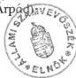

Állami Számverőszék

V-40-46/97

# JELENTÉS

Az Egészségbiztosítási Önkormányzat
1997. évi vagyongazdálkodásának
ellenőrzéséről

9810

416.

1998. JÚNIUS

---

Az ellenőrzés végrehajtásáért felelős:

az Állami Számvevőszék Vagyonellenőrzési Igazgatósága

Halász Gejza

igazgató

Az helyszíni vizsgálatot vezette és a jelentés készítette::

Hajagos Józsefné

számvevő tanácsos

A vizsgálatot végezték:

Hajagos Józsefné

számvevő tanácsos

Hajkó Andrea

fogalmazó

dr. Kurucz István

számvevő tanácsos

Szendrődi Józsefné

számvevő tanácsos

Szarka Péterné

számvevő

---

V-40-46/97-98. TÉMASZÁM:409.

# TARTALOMJEGYZÉK

BEVEZETÉS, A JELENTÉS KÉSZÍTÉSÉNEK KÖRÜLMÉNYEI 3

I. ÖSSZEGZŐ MEGÁLLAPÍTÁSOK, KÖVETKEZTETÉSEK, JAVASLATOK 5

1.Osszegz'megallapitasok,kovetkeztetesek 5
2.Javaslatok 11

2.1.Az Orszaggyulés 11
2.2.AKormany 11
2.3.A Penzugyminisztérium 11
2.4.Az Egeszegbiztositasi Onkormanyzat 11
2.5.Az Orszagos Egeszegbiztositasi Penztar 12

II. RÉSZLETES MEGÁLLAPÍTÁSOK 13

1. A vagyongazdálkodás szabályozottsága 13

1.1.A tórvenyi szabályozás és az Egészségbiztositási Önkormányzat szabályzatai 13
1.2.Az Orszagos Egeszegbiztositasi Penztar belso szabalyozasa 15
1.3.Kovetelés fejiben atvett vagyon 18

2. Vagyon nyilvantartas, dokumentalas 19
3.A vagyon nagysaga, szerepe az egeszegbiztositasi alap koltsegvetesuben 21
4.Az egyes vagyonelemek allomanyvaltozasanak tenyezoi 22

4.1.Tartosbefektetesek 22
4.2.Vissztehermentesen juttatott vagyon 22
4.3.Jarulektartozas fejiben atvett vagyon 27

5. Gazdálkodás az alaphoz tartozó vagyonnal 29

5.1.Hasznositas erdekuben tett intezkedesek 29
5.1.1.KOVETELES FEJEBEN ATVETT VAGYON 29
5.1.2.INGATLANOK HASZNOSITASA 31
5.2.DIGEP kft-k 34
5.3.Bevetelek es raforditasok 35

6. A tulajdoni hányadok alakulása, a tulajdonosi képviseletek biztosítása, szabályozottsága 35

6.1. Az EÖ tulajdonosi jogainak gyakorlása az önkormányzati részesedésell bíró gazdasági társaságokban 36
6.2.Az EO reszesedessel biro gazdasagi tarsasagokban vezeto tisztségvisel szemelyek kore 38

7. A vagyongazdálkodás ellenőrzése, intézkedések 39

7.1.Felugyeleti vizsgalatok es intezkedesek 39
7.2.A Felugyelo Bizottsag vizsgalatai 41
7.3.A belso ellenorzés 42

8. Az ÁPV Rt szerepe a vagyoni döntések lebonyolításában 43

8.1.A regionalis aramszolgaltatok reszveneyinek ertekesitese 43
8.2.A Dominancia Vagyonkezelo es Kereskedelmi Rt.reszveneyinek atvetele 44
8.3.A Kereskedelmi es Hitelbank reszveneyinek atvetele 45
8.4.DAM Rt.reszveneyinek atadasa 45

9. Club Aliga üdülő együttes működésének 1997. évi vonatkozásai 46

9.1. Alapito Okirat, Alapszabaly modositas, törzstöke emelés, apportállas 46
9.2.A tarsadalombitzositas penzugyi alapjai 1998.evi koltsegveteserol szol 1997.evi CLIII.torveny 50
9.3.Csopaki uduló uzemeltetese 51
9.4.A CA Rt.1997.evi uzleti terve,varhato teljesitese,penzugyi kondicioi 52

10. Az ingyenesen juttatott vagyon működési célú hasznosítása 54

10.1. IDEX szekhaz 55
10.2.Wesselényi utca 20-22.szam alatti ingatlan 56

10.2.1.AJANLATOK ES DONTESEK 56
10.2.2.AZ ADASVETELI SZERZODES ELOKESZITESE ES A SZERZODES MEGKOTESE 58
10.2.3.A SzerzODES PENZUGYI KIHATASAI 60
10.2.4.AZINGATLAN HASZNOSITASA 61

1

---

2

---

I. ÖSSZEGZŐ MEGÁLLAPÍTÁSOK, KÖVETKEZTETÉSEK, JAVASLATOK

# BEVEZETÉS, A JELENTÉS KÉSZÍTÉSÉNEK KÖRÜLMÉNYEI

Az Állami Számvevőszék (ÁSZ) a Magyar Köztársaság Miniszterelnökének felkérése alapján ellenőrizte az Egészségbiztosítási Önkormányzat (EÖ) vagyongazdálkodását és a végrehajtásban közreműködő Országos Egészségbiztosítási Pénztár (OEP) működését.

A vizsgálat megalapozása érdekében megbeszéléseket folytattak a Miniszterelnöki Hivatal, a Népjóléti Minisztérium (NM) és a Pénzügyminisztérium (PM), az ingyenes vagyonjuttatás területén az Állami Privatizációs és Vagyonkezelő Részvénytársaság (ÁPV Rt.) illetékeseivel. A szervezetek a vizsgálathoz rendelkezésre bocsátották a dokumentációkat, írásban nyilatkoztak.

A vizsgálat az 1997. évi döntésekre, azok előkészítésére és végrehajtására irányult, némely esetben a korábbi döntéseket is figyelembe vette, máskor megállapításaiban kitekintett az 1998. évekre is.

Az ÁSZ ellenőrzését törvényességi, célszerűségi, eredményességi és pénzügyi számviteli szempontok alapján végezte. Az 1997. évi vagyongazdálkodás eredményességének minősítését nehezítette, hogy némely pontnál a számszerűsítésre nem volt mód. A helyszíni vizsgálat ideje alatt csak a forgalmi könyvelésre volt főkönyvi adat, a vagyon állományi változására nem. A vagyon leltározása abban az időszakban folyt, a befektetések értékelését még nem végezték el részben rajtuk kívül álló okok miatt.

**Az ellenőrzés súlyt helyezett arra, hogy az egyes vagyonelemek tekintetében - a Wesselényi utcai ingatlan vásárlás és a Club Aliga üdülőegyüttes esetében külön is - a testületi döntések megalapozottságát vizsgálja. Választ kapjon arra, hogy a döntést hozók és előkészítők tevékenysége megfelelt-e a törvényi és a belső szabályzatoknak, a döntések végrehajtása az eredményes vagyongazdálkodást mennyiben szolgálta.**

**Az Egészségbiztosítási Önkormányzat működési és szolgáltatási vagyonnal rendelkezik.** A működési vagyon a biztosító ellátási feladataihoz szükséges tárgyi eszközöket jelenti. Jelen vizsgálatnak nem tárgya. A szolgáltatási vagyon az Egészségbiztosítási Alap (EA) vagyona, mellyel **az Egészségbiztosítási Önkormányzat törvényben foglalt joga és kötelezettsége alapján gazdálkodik.** A gazdálkodás eredményeként elért kamat és hozambevétel az EA éves költségvetésének bevétele, az elérése érdekében felmerült ráfordítások a kiadási oldalt terhelik.

Az ellenőrzés tárgyát képező szolgáltatási vagyont eredete szerint számvitelileg el kell különíteni, mégpedig az alap saját tartós befektetéseire, a vissztehermentesen juttatott, valamint a követelés fejében átvett vagyonra. Az első két vagyoncsoport tartósan van az alap birtokában, a harmadik átmenetileg, tekintettel a törvényiben előírt értékesítési kötelezettségre.

3

---

I. ÖSSZEGZŐ MEGÁLLAPÍTÁSOK, KÖVETKEZTETÉSEK, JAVASLATOK---

Az EA saját tartós befektetése a korábbi Társadalombiztosítási Alap tartalékainak megosztásából származott, a vissztehermentes vagyont az állami vagyonkezelő szervezetek (ÁVÜ, ÁV Rt., ÁPV Rt. és a KVI) juttatták. A követelés fejében átvett vagyon az adóssal történő megállapodással vagy bírósági végzéssel került az Alap tulajdonába.

Törvényi rendelkezés értelmében az ingyenes vagyonátadást 1995. december 31-ig be kellett volna fejezni, maximálisan 28,8 milliárd forint értékben. A vagyonátadás befejezése mindkét fél (átadó-átvevő) magatartásából következően 1997. évre húzódott át. Ebben az évben jutott az Alap birtokába az 1994-96. között átadott vagyonérték közel háromszorosa.

**Az ellátások szempontjából a vagyon nem bír jelentőséggel**, tekintettel az összértékére és a portfólió összetételére. A vissztehermentesen juttatott, a saját tartós befektetések és a követelés fejében átvett összes vagyon nagysága az EA éves költségvetéséhez viszonyítva jelentéktelen (1-4 százalék), természetesen a hozamból származó bevétel még kisebb. A **vagyon nagyságát, szerepét jól szemlélteti, hogy az EA költségvetése az összvagyon nagyságának többszörösét kitevő hiánnyal teljesült minden évben.**

**A vagyon állományát számottevően csökkentette az 1997. évi költségvetési és pótköltségvetési törvényben előirányzott vagyonhasznosításból származó bevétel teljesítése.** A kötelezettség teljesítésében az év folyamán vissztehermentesen átvett és az ÁPV Rt. által értékesített áramszolgáltató részvényeknek volt meghatározó szerepük. Az értékesítésből származó - a törvényi kötelezettségen felüli - bevételből újabb befektetéseket eszközöltek és OTP részvényeket konvertáltak a működési célt szolgáló Wesselényi utcai székház megszerzésére. A vagyonkonverziót (a befektetés átcserélését) figyelembe véve az ingyenes vagyon 1997. december 31-i záróállománya 18 milliárd forint körül alakult.

**A tartós befektetés és a járuléktartozás fejében átvett vagyon 1997. december 31-i záróállományára a helyszíni vizsgálat befejezéséig nem kaptak adatot az ellenőrzést végzők.** Az észrevételhez csatolt melléklet szerint, amely auditálás előtti adatokat tartalmaz, a tartós befektetések 1996. december 31-i állománya 1 milliárd forintról 800 millió forintra csökkent 1997. december 31-re. A járuléktartozás fejében átvett vagyon állománya az 1997. év folyamán számottevően nem változott, az átvétel az értékesítés és az elszámolt értékvesztés együttes hatásaként.

A vagyon állományi változását az 1997. évi zárszámadás során fogja az ÁSZ ellenőrizni.

A jelentés tartalmát, megállapításait több szakaszban, személyes, vezetői konzultációk sorával és írásban is egyeztette az Állami Számvevőszék. A jelen **lezárt jelentés** a csatolt záró észrevételek és az arra adott válasz figyelembevételével készült és került aláírásra.

---4

---

I. ÖSSZEGZŐ MEGÁLLAPÍTÁSOK, KÖVETKEZTETÉSEK, JAVASLATOK

# I. ÖSSZEGZŐ MEGÁLLAPÍTÁSOK, KÖVETKEZTETÉSEK, JAVASLATOK

## 1. ÖSSZEGZŐ MEGÁLLAPÍTÁSOK, KÖVETKEZTETÉSEK

**Az Egészségbiztosítási Önkormányzat vagyongazdálkodására külön jogi szabályozás nem készült**, holott annak szükségességét törvény írja elő. A törvény hiányában **nincs szabályozva a döntést hozók és az előkészítők felelőssége**, nincs nevesítve az eredményes és hatékony vagyongazdálkodás feltételrendszere és kritériumai.

**Az EÖ feladat- és hatáskörét, a vagyongazdálkodást** és kezelést, ezek során követendő szabályokat **számos törvény együttesen szabályozza**. A vagyon hasznosítására az éves költségvetési törvények (Magyar Köztársaság és társadalombiztosítási alapok) tartalmaznak előírásokat.

A társadalombiztosítás önkormányzati igazgatásáról szóló 1991. évi LXXXIV. törvény (Öit.) előírása szerint az EÖ feladat- és hatásköre a közgyűlést illeti meg, továbbá önállóan gazdálkodik a biztosítási alaphoz tartozó vagyonnal és rendelkezik a biztosítási önkormányzati tulajdonnal. A **közgyűlés hatáskörében** ezt úgy rögzíti, hogy külön törvény alapján **rendelkezik** az Egészségbiztosítási Alapba (EA) tartozó **vagyon felett**, delegálja a tulajdonosi képviselőket. **E hatáskörét át nem ruházhatja**, vagyis **valamennyi döntést, az operatívat is egy testületnek kell meghoznia, amely időszakosan ülésezik**. A közgyűlés napirendjén számos munkatervbe felvett téma szerepel, továbbá az aktuális ügyek. Ez utóbbi mindig tartalmaz vagyoni kérdéseket. A vagyongazdálkodás nehézkes, eseti. A döntések késedelmesen születtek meg.

A társadalombiztosítás pénzügyi alapjai költségvetéséről szóló törvény 1996-tól a bevételek között vagyonhasznosításból származó bevétellel számol. **Az 1997. évi költségvetésről szóló törvényben** előirányzott - vagyonhasznosításból származó - bevételt a pótköltségvetési törvény tovább emelte (6285 millió forintról 8200 millió forintra). **A vagyongazdálkodást a költségvetési törvény teljesítésének kellett alárendelni**. Az értékesítésnél a forgalomképes vagyonelemeket vették számításba, a kevésbé vagy nehezen értékesíthetőek maradtak az EÖ tulajdonában. A törvényi előírások **teljesítése** részben **vagyonfeléléssel**, részben **a portfólió romlásával járt**.

A vizsgált időszak alatt két önkormányzat működött, a korábbi 1997. június 16-án tartotta utolsó közgyűlését. Az új önkormányzat 1997. augusztus 18-ára hívta össze első alakuló közgyűlését és 1997. szeptember 8-án alakult meg. 1997. június 16-a és augusztus 18-a közötti időszakban két esetben olyan vagyoni döntést hoztak a korábbi önkormányzat tisztségviselői, amely ellentétes az Öit előírásaival.

**A jelentésben feltárt hiányosságok többségében a korábbi EÖ működéséhez kapcsolódnak**. A jelenlegi feladata a múlt hibáinak korrigálása, a sza-

5

---

I. ÖSSZEGZŐ MEGÁLLAPÍTÁSOK, KÖVETKEZTETÉSEK, JAVASLATOK---

bályzatok megalkotása és betartása. **Ma még vagyongazdálkodásukban a felmerült problémák haladéktalan megoldása az elsődleges**, amely kapacitásukat a kívánatosnál jobban leköti. Nem tudott érdemi lépéseket tenni a változtatás a koncepcionális szabályozás érdekében. Az aktuális ügyek előkészítése az OEP-re is nagy terhet ró, az elmúlt időszak mulasztásaiból származó problémák rendezése hasonlóképpen.

# **Az új önkormányzat és az OEP működésében is fokozottabban ügyeltek a szabályzatok betartására.**

Az EÖ működése 1997-ben csak a korábbi esetében alapult jóváhagyott szabályzatokon. A jelenlegi működésére a korábbi Alapszabály számos pontja - a törvényi változások következtében - nem alkalmazható. Az újonnan alakult EÖ Alapszabályát 1997-ben megalkotta, de az Országgyűlés határozatával 1998-ban hagyta jóvá. Az ügyrendet a közgyűlés 1998. évi határozatával fogadta el. A Felügyelő Bizottság (FB) esetében a helyzet azonos, de jogállására és összetételére tekintettel az újonnan alakult FB az Országgyűlés elé terjesztett ügyrend alapján működött már 1997-ben is.

**A vagyongazdálkodási koncepciót a közgyűlés 1997 márciusában fogadta el.** Ezzel több éves hiányt pótolt, de ebből a dokumentumból is hiányzott a hosszú távú elképzelés, továbbá az alapvető célkitűzései nem valósultak meg, és a gazdálkodás feltételrendszerének változását sem követte.

Az OEP az 1995-ben kiadott Ideiglenes Szervezeti és Működési Szabályzatában foglaltak alapján működik. Az SZMSZ a főosztályvezetők feladatai között írta elő a **szervezeti egységek ügyrendjének elkészítését**, amely **nem készült el**.

Az Ideiglenes Vagyonkezelési és Befektetési Szabályzatban meghatározott vagyonkezelési szervezeti egységet nem hozták létre. **A Vagyongazdálkodási Főosztály működési és humánpolitikai problémákkal küzdött.**

Az OEP a vagyongazdálkodási feladat ellátásáról személyesen és írásban is többször nyilatkozta, hogy az irányítást az esetek többségében közvetlenül az elnökség látta el. Erről azonban teljes bizonyossággal meggyőződni nem lehetett, mivel az előterjesztéseken, illetve a hozott határozatokban az apparátus vezető tisztségviselői, mint felelősök szerepeltek. Az OEP főigazgatója több esetben írásban hívta fel az Önkormányzat figyelmét a tervezett intézkedések kockázati elemeire.

**A korábbi önkormányzat működése során nem tartotta be belső szabályzatait.** Gyakran a Vagyonkezelési és Befektetési Szabályzattól eltérően készítették elő a döntéseket.

Többször nem vittek a közgyűlés elé olyan vagyonügyet, melyben a testületnek kellett volna döntenie. A nem valós adatokra épülő előterjesztés miatt az erőműi részvények vissztehermentes átvételéről téves döntést is hozott az önkormányzat. A részletes megállapítások nevesítik a testületi döntés hiányát és a vitatható előterjesztéseket.

---6

---

I. ÖSSZEGZŐ MEGÁLLAPÍTÁSOK, KÖVETKEZTETÉSEK, JAVASLATOK

A járuléktartozás fejében az adós által felajánlott vagyon elfogadásának elveiről nem született meg a mindkét ágazat közgyűlésének elfogadó határozata, amit az 1997. évi XLVIII. törvény írt elő. 1997-ben is a 6/1995. évi OEP főigazgatói utasítás volt hatályban.

A nyilvántartási tevékenység erősen kifogásolható. **Az OEP** Vagyongazdálkodási Főosztálya köteles a vagyonregiszter vezetésére, az analitikus nyilvántartásra. Egyik szabályzatban előírt **feladatának sem tesz eleget**.

**Az EÖ tulajdon regisztrálása** nemcsak az ingatlanoknál **rendezetlen** (leginkább a követelés fejében átvett vagyon esetében), de a részvények és üzletrészek bejegyzésénél is.

A vagyongazdálkodás célja a tulajdonlás tartamától függően eltérő. **A tartósan (saját befektetés és az ingyenesen juttatott vagyon) tulajdonában lévő vagyonnal való gazdálkodás célja a minél nagyobb kamat- és hozambevétel elérése, közben az értékállóság** (az ingatlanok esetében állagmegóvás, fejlesztés) **biztosítása. A követelés fejében átvett vagyon** esetében cél az **értékesítés a lehetséges legmagasabb áron**. E céloknak kellene tükröződnie a közgyűlés döntéseiben. Ezzel szemben a korábbi **közgyűlés befektetésre vonatkozó határozatait a gazdaságosság, a célszerűség vizsgálata nélkül hozta**. Az ellenőrzés által kiemelten kezelt Club Aliga üdülőegyüttes és a Wesselényi utcai ingatlan vásárlásánál is sorozatosan felróható e magatartás.

**A követelés fejében átvett vagyon értékesítésére tett kísérletek időszakosak**, esetiek és nem eléggé intenzívek. A vagyonátvétel 1994-ben kezdődött, az eltelt időszak alatt csak néhány vagyonelemet értékesítettek. A vagyonelemek száma már oly nagy, hogy a folyamatosan létszám hiánnyal küzdő szakfőosztály a feladatot ellátni nem is tudta megfelelő színvonalon. **Az értékesítést nagy mértékben akadályozza, hogy a tulajdonjog bejegyzése az ingatlan nyilvántartásban, illetve a tulajdonlás cégbírósági nyilvántartása rendezetlen**. A tulajdonlásra többféle változat létezik, OEP, MEP, önkormányzatok és ezek együttesen, ami a korábbi évek szabályozatlanságából eredt.

**A tartozás fejében átvett** vagyont értékesítésig kezelni kell, ami kiadással jár. Ugyanakkor a **vagyon nem alkalmas a járulék tartozás töredékének kiegyenlítésére sem**. Az átvétellel csökken a társadalombiztosítás kimutatott kintlevősége, miközben nőnek a vagyongazdálkodás éves kiadásai.

Az önkormányzatnak nincs módja arra, hogy a bírósági végzéssel - követelés fejében - átvett vagyon összetételét befolyásolja. Az összetétel fokozatos romlásával kell számolni, mivel az évek óta húzódó nagy felszámolási ügyek befejezése várható a közeljövőben. Ezen események - figyelembe véve az Ózdi Kohászati Üzemek „felszámolás alatt” ügyet - nagyságrendileg nagyobb vagyonveszést eredményezhetnek.

Az ingatlanok esetében sem **hatékony a vagyongazdálkodás**.

Az Alaphoz tartozó nem működési célra ingyenesen átvett illetve származtatott 5 db ingatlanból egy ingatlant értékesítettek. **A megmaradt ingatlancsoportból egy teljesen üresen áll, kettő alacsony kihasználtsággal működik**.

7

---

I. ÖSSZEGZŐ MEGÁLLAPÍTÁSOK, KÖVETKEZTETÉSEK, JAVASLATOK---

**A bérházak kihasználtsága jó, de bevételük csekély.** A bérházak 1993. óta vannak az egészségbiztosítás tulajdonában, de a lakbérek még az 1991. évi szinten állnak, a bérleti díjak nagy többsége azonos az igénybevétel időpontjában meghatározottakkal. A vizsgált időszakban a díjak felülvizsgálatára és megemelésére vonatkozó dokumentumokat az ellenőrzés nem talált.

A Blaha Lujza Hírlapkiadó 8,33 százalékos kihasználtsággal működik, a rész tulajdonnal rendelkező kft-nek nem számlázták a fűtés, biztosítás, stb. költségekből a tulajdon hányad alapján őket megillető részt. **A Hírlapkiadó székház értékesítésére 1997 márciusában közgyűlési döntés született, de az értékesítés még nem történt meg.**

**Az IDEX székház** kihasználatlanságának alapvető okai: az ÁPV Rt nem teljesítette szerződésben vállalt kötelezettségét, nincs pénz a felújításra, és nem született döntés arra, hogy milyen szervezeti egységek költözzenek be. **Az előterjesztést készítő OEP nem végezett gondos, alapos felmérést.** Az elhelyezés vizsgálatánál mindig más nettó alapterületből indult ki.

**Az Alaphoz tartozó ingatlanok alacsony kihasználtságúak vagy üresen állnak. Nincs megoldva a FPEP elhelyezése, bérleményeket vesznek igénybe és bérleti díjat fizetnek.** Az 1998. évi létszámbővítés (104 fő) elhelyezésére 2 bérleti szerződést kötött az FPEP az OEP engedélye alapján. E bérleti szerződések éves díja 85 millió forint. Az igénybevett iroda terület 2125 m² és 800 m² az irattár. Az EA-hoz tartozó vagyon működési célú hasznosítása nem cél, de a jelenlegi megoldás gazdaságossági megfontolásból kifogásolható.

Az EA 1997. évi kamat- és hozambevétele mintegy 500 millió forint, a vagyongazdálkodásra fordított kiadás mintegy 100 millió forint.

Az EÖ **tulajdoni hányada** függetlenül a vagyon eredetétől (tartós befektetés, ingyenes vagyonjuttatás, tartozás fejében átvett) **a legtöbb gazdasági társaságban csökkent**, néhányban változatlan és csak a Postabank Rt-nél nőtt. Ez utóbbinál részt vettek az alaptőke emelésben, a vagyongazdálkodási koncepciótól eltérően a Medicor társaságokban nem, így a minősített kisebbségi hányad alá süllyedt a tulajdoni hányaduk.

**A tulajdonosi képviselet** rendszer működése szinte teljes egészében **szabályozatlan** volt és még jelenleg is az. Nincs előírva a képviselet tartalma és jellege, a képviselő képviseleti joga, a visszacsatolás és beszámolás módja, az esetleges szankciók a döntésekkel ellentétes képviselet esetére, a képviselők visszahívhatósága, a képviseleti jogviszony megszűnése. Nem szabályozott a szakreferensek általi felkészítés módja, a vagyonnal kapcsolatos információs rendszer kezelése és annak a képviselők rendelkezésére bocsátása, a napi kapcsolattartás, a VIB szerepe. Az erre vonatkozó szabályzat tervezetét 1998-ban készítette el az OEP.

**Az** Ölt-ben előírt **ellenőrzési szintek nem épültek egymásra.** Az egyeztetések elmaradása miatt az ellenőrzések párhuzamosan folytak, egymást átfedték, így volt ez a vagyongazdálkodásnál is.

Megállapítható, hogy a társadalombiztosítás kormányzati ellenőrzését folytató NM és PM szervezeti egységei között a kapcsolat 1997. évben nem volt sem folyamatos, sem kiegyensúlyozott. Az ellenőrzésekkel kapcsolatos egyeztetéseket nem minden esetben folytatták le. Ezen hiányosságok alapvetően arra vezethetők

---8

---

I. ÖSSZEGZŐ MEGÁLLAPÍTÁSOK, KÖVETKEZTETÉSEK, JAVASLATOK

vissza, hogy a PM-ben az ellenőrzést végző szervezeti egység később állt fel. Ezért az NM-PM között a feladatmegosztás 1997-ben nem érvényesült. A pénzügyminiszternek kellett volna elsődlegesen érvényesíteni a társadalombiztosítási alapok gazdálkodásának törvényességét megalapozó követelményeket és a népjóléti miniszternek pedig elsődlegesen a társadalombiztosítási ellátásokkal kapcsolatos nyugdíjbiztosítási, szociális, egészségügyi és egészségbiztosítási szakmapolitikai szempontokat. Az Ölt hatályba lépésétől rendelkezik arról, hogy az állami felügyeletet az Országgyűlés és a Kormány látja el. 1997. évet megelőzően e feladatot úgy látták el, hogy mindkét minisztérium képviselői részt vettek a testületi üléseken (ez lehetett volna a garancia a törvényes működésre), ellenőrzéseket azonban nem végeztek. Ez utóbbit 1997-ben, a szervezeti egységek létrehozása után kezdeményezték.

Az NM nem tett maradéktalanul eleget a törvényben előírt egyeztetési kötelezettségének, nem egyeztette az ÁSZ-szal munkatervének megváltoztatását, csak a jelentéseket küldte meg.

**A korábbi FB 4 éves működése alatt több javaslatot tett a vagyongazdálkodásra, felhívta az elnökség figyelmét a törvénysértésre, a szabályzatok elkészítésére, de többnyire eredménytelenül.** A jelenlegi FB kormányzati javaslatra vizsgálta a Club Aliga üdülőegyüttes átvételét, működtetését és a testületi döntéseket.

**Az OEP belső ellenőrzése lényegében nem működött, személyi állománya nem kielégítő. A folyamatba épített szakmai ellenőrzés nincs kialakítva.**

Az előzőekben összegzett megállapítások érvényesek a Club Aliga üdülőegyüttesre és a Wesselényi utcai ingatlanvásárlására is.

**A CA üdülőegyüttes** működtetésére, rekonstrukciójára vonatkozó testületi határozatok nem megalapozott elnökségi előterjesztések alapján születtek. Az ingatlanok apportállása az üzemeltetésére létrehozott Rt-be és annak alaptőkéjének felemelése 1,1 milliárd forinttal üzleti terv, műszaki tartalmat rögzítő beruházási program illetve tanulmány, gazdaságossági számítás, alternatívák összevetése nélkül születtek. A döntésekben rendre hiányzott a felelős tulajdonosi magatartás. A határozatok nem csak célszerűségi, gazdaságossági szempontból voltak előkészítetlenek, hanem jogszabályi előírásokat sem elégítettek ki és eközben a közgyűlés saját kizárólagos tulajdonosi jogosítványait is átruházta.

A korábbi EÖ, amikor az ingatlan apportállásáról döntött, **a vagyonjuttatási megállapodásban rögzített tulajdonlási előírásokat sem tartotta be.** A döntés eredményeként az ingatlan helyett a 100 százalékosan tulajdonában lévő Rt. részvényeit birtokolja.

Az újonnan alakult közgyűlés több határozatot hozott az ügyek rendezésére, de késve, továbbá pontosításra is szorultak a későbbiekben. A bizottsági véleményekben megfogalmazták, hogy az üdülő további sorsáról csak gazdaságossági számításokkal alátámasztott független szakértői vélemény alapján lehet dönteni. Ennek elkészítésére vonatkozó határozatot a társadalombiztosítás pénzügyi alapjai 1998. évi költségvetéséről szóló **1997. évi CLIII. törvény 63. §**-a alapján felfüggesztették.

9

---

I. ÖSSZEGZŐ MEGÁLLAPÍTÁSOK, KÖVETKEZTETÉSEK, JAVASLATOK---

A törvény előírásai nem teljes körűek. **Számos** olyan **nyitott kérdés van**, amelyekhez egyéb jogszabály sem ad iránymutatást. Ezeket **a két félnek megállapodásban kell rendeznie a végrehajtás során**. A törvény csak arról rendelkezett, hogy az EÖ-nek az üdülőegyüttest értékesítésre vissza kell adnia a KVI-nek, de arról nem, hogy az üzemeltetés joga kit illet. A KVI által felvázolt elképzelés egyoldalú, a tulajdonos EÖ viseli az értékesítés időszakára eső költségeket, az üzemeltetési jog gyakorlása nélkül. Nem értelmezhető, hogy mekkora az ellenérték, és melyik költségvetési év bevételének fogja részét képezni.

Az üdülőegyüttes működtetésére létrehozott Rt-vel 1998-ban kötötték meg a vagyonkezelési szerződést 1996-ra visszamenő hatállyal. **Az Rt. forráshiányos 1996-ban és 1997-ben is, a tőke ellátottsága nem felel meg az előírásoknak**. Működését gazdaságilag és emberi oldalról is károsan befolyásolta a testületi döntések hiánya illetve elodázása.

Az 1997-ben **halaszthatatlan állagmegóvásra** - alaptőke emelés részeként - **átutalt 100 millió forint döntő részét a rövid lejáratú hiteltörlesztésre, üzemeltetésre és eszközbeszerzésre fordították**. A 100 millió forint átutalásának számviteli rendezése alaptőke emeléssel történt. Az erre vonatkozó döntést csak 1998-ban hozta meg a közgyűlés, mert **az OEP előterjesztése nem volt kellően előkészített**. Az alaptőke emelés mértéke 101 millió forint volt, melyből 400 ezer forintot már 1996-ban átutaltak. A 600 ezer forint pedig az 1998. évet terheli.

**A Wesselényi utcai ingatlan megvételét az FPEP elhelyezésével indokolták**. Az elhelyezésről úgy döntöttek, hogy a szervezet átvilágítását nem végezték el, korszerűsítésére nem volt számításokkal igazolt koncepció.

A döntés következtében két olyan üresen álló ingatlannal rendelkeznek, amelyek a mai ismeretek szerint nem elegendőek a szervezet elhelyezésére, de a beköltözéshez az IDEX székházra és a Wesselényi utcai ingatlanra is további több száz millió forintot kell biztosítani. Az utóbbi esetében még meg sem becsülhető, hogy mikor lesz beköltözhető állapotban.

A Wesselényi utcai székházat 1997-ben vásárolták az OTP-Ingatlan Rt-től.

A székház vásárlásánál is megállapítható, hogy a vagyongazdálkodási döntéseket az elnökség, illetve az alelnök hozta, **a közgyűlés az Ölt-ben rögzített kizárólagos jogait csak formálisan gyakorolta. Az alelnök intézkedéseit rendre utólag**, részleges információk alapján hagyta **jóvá a közgyűlés**. Szóbeli előterjesztés alapján, kérdés és ellenvetés nélkül megadta egy kétmilliárd forint nagyságrendű szerződéshez az aláírási jogot. Majd az ismételt előterjesztéskor **jóváhagyta a már megkötött, jelentős anyagi veszteséget eredményező szerződést**.

**A Wesselényi utcai adásvételi szerződés aláírójának felróható, hogy a vevő szempontjából kedvezőtlen szerződést aláírta**. Az OTP részvény ellenében lebonyolított vásárlás jelentős vagyonvesztéssel járt. Ezt elsősorban az eredményezte, hogy az épület készpénzzel való kiegyenlíthetőségét elhagyták az adásvételi szerződésből, és helyette az év folyamán folyamatosan emelkedő árfolyamú OTP részvényekkel fizettek. Az év végére vetítve az adásvételi ügyletet, több mint kétszeres vételár megfizetését jelentette. Más szempontból megközelítve az

---10

---

I. ÖSSZEGZŐ MEGÁLLAPÍTÁSOK, KÖVETKEZTETÉSEK, JAVASLATOK

EÖ abból is árfolyamveszteséget szenvedett el, hogy a részvényeket egy korábbi időszak átlag árfolyamértékén és nem a szerződés aláírásának időpontjára számolták el. Hozambevételtől is elesett a biztosító, mert teljes egészében lemondott az 1997. évi osztalékról az OTP Rt. javára.

## 2. JAVASLATOK

Az Állami Számvevőszék az Egészségbiztosítási Önkormányzat 1997. évi vagyongazdálkodásának ellenőrzési tapasztalata alapján javasolja, hogy:

### 2.1. Az Országgyűlés

- az ingyenes vagyonjuttatás befejeztével világosan határozza meg az alap vagyonának célját, rendeltetését.
- kötelezze a Kormányt a vagyongazdálkodási törvény mielőbbi benyújtására;
- kérje fel a Kormányt a járuléktartozás fejében megítélt vagyon elfogadásának, a hitelezői érdekeket érvényesítő törvényi szabályozásának kidolgozására.

### 2.2. A Kormány

- tegyen javaslatot a 2126/1995. (V. 3.) Kormány határozat tartalmi elemeinek megfelelően az alapok konszolidálására, (határozza meg a vagyon hasznosításra vonatkozó álláspontját)
- Törvényelőkészítése során vizsgálja felül és a jövőben tegye egyértelművé, hogy a biztosítási önkormányzatok a Kincstári Egységes Számla igénybevétele esetén az ingyenesen juttatott vagyonból bármilyen módon - nem csak értékesítéskor -keletkezett árfolyamnyereséget az ellátások finanszírozására fordítsák.

### 2.3. A Pénzügyminisztérium

- kötelezze a KVI-t a Club Aliga értékesítéséről szóló mindkét fél érdekeit rögzítő szerződés megkötésére az Egészségbiztosítási Önkormányzattal.

### 2.4. Az Egészségbiztosítási Önkormányzat

- határozza meg a járuléktartozás fejében felajánlott vagyon elfogadásának elveit;
- alkossa meg gazdálkodási szabályzatát;
- tekintse át a vagyongazdálkodási koncepciót és aktualizálja;
- készítse el Vagyongazdálkodói Bizottsága ügyrendjét és munkatervét;
- határozza meg a tulajdonosi képviselet ellátásának alapelveit, és intézkedjen annak szabályzatba foglalásáról;
- a Club Aliga értékesítésére kössön megállapodást a KVI-vel, mely rendelkezik az üzemeltetés kérdéséről is;

11

---

I. ÖSSZEGZŐ MEGÁLLAPÍTÁSOK, KÖVETKEZTETÉSEK, JAVASLATOK

- hozzon döntést az FPEP elhelyezéséről, beleértve a Wesselényi utcai székház hasznosítását is.

## 2.5. Az Országos Egészségbiztosítási Pénztár

- szabályozza a járuléktartozás fejében átvett vagyon kezelése, hasznosítása, értékesítési rendjét;
- szervezeti egységei készítsék el ügyrendjüket;
- tekintse át ellenőrzési rendszerüket, alakítsa ki a folyamatba épített szakmai ellenőrzést, gondolja újra a belső ellenőrzés szerepét és helyét, és ennek alapján határozza meg feladatait;
- intézkedjen a vagyonregiszter elkészítésére, folyamatos vezetéséről, követelje meg a vagyon analitikus nyilvántartását;
- kösse meg a csopaki üdülő üzemeltetési szerződését;
- a Fővárosi és Pest megyei Egészségbiztosítási Pénztár elhelyezésének rendezése előtt vizsgálja meg a szervezet hatékonyságát, szükség esetén világítsa át;
- gazdálkodjon az ingatlanokkal az értékesítésig, gondoskodjon a hozambevétel növeléséről.

12

---

II. RÉSZLETES MEGÁLLAPÍTÁSOK

## II. RÉSZLETES MEGÁLLAPÍTÁSOK

### 1. A VAGYONGAZDÁLKODÁS SZABÁLYOZOTTSÁGA

#### 1.1. A törvényi szabályozás és az Egészségbiztosítási Önkormányzat szabályzatai

Az államháztartásról szóló - többszörösen módosított- 1992. évi XXXVIII. számú törvény (Áht) 85. §-a kimondja, hogy az államháztartás alrendszerét képező társadalombiztosítás irányítását, működését, hatásköri és eljárási szabályait, bevételeinek és kiadásainak körét, gazdálkodását, vagyonát, a központi költségvetéssel és az államháztartás többi alrendszerével való kapcsolatát külön törvény szabályozza. Az Áht. rendelkezésével ellentétben a **társadalombiztosítási alapok gazdálkodásáról szóló önálló törvényt az Országgyűlés napjainkig nem alkotta meg.** A társadalombiztosítás pénzügyi alapjairól ill. azok gazdálkodásáról a többszörösen módosított 1992. évi LXXXIV. törvény (At.) rendelkezik. **Az önkormányzatok vagyongazdálkodását szabályozó külön törvény még nem született meg,** annak ellenére, hogy az Állami Számvevőszék (ÁSZ) már a társadalombiztosítás pénzügyi alapjainak 1993. évi zárszámadásához kapcsolódó ellenőrzések tapasztalatairól szóló jelentésében - és azóta is minden évben javasolta az Országgyűlésnek.

Az Egészségbiztosítási Önkormányzat (EÖ) feladat és hatásköre ellátásának fő szabályait 1997-ben az Áht., az At., és a társadalombiztosítás önkormányzati igazgatásától szóló 1991. évi LXXXIV. törvény (Öit.) valamint a társadalombiztosításról szóló 1975. évi II. törvények rendelkezései határozták meg.

Az EÖ 1997-ben hatályos Alapszabályát az Országgyűlés 1993. november 30-án a 23/1994. (IV. 1.) számú határozatával hagyta jóvá. Az Alapszabály rendelkezései szerint a **közgyűlés munkaprogram** (8.2. pont), az elnökség negyedéves munkaterv (18.1. pont) alapján végzi munkáját. 1997-ben az EÖ a negyedik negyedévet kivéve jóváhagyott munka- és ülésterv nélkül működött.

Az Alapszabály 14.1 pontja rendelkezik arról, hogy az Egészségbiztosítási Alap (EA) **gazdasági, pénzügyi- számviteli tevékenységének rendjét** - figyelemmel a hatályos jogszabályokra - **Gazdálkodási Szabályzatban kell meghatározni**', mely szabályzatot a közgyűlésnek kell jóváhagynia. A **szabályzat nem készült el, bár hiányát** az EÖ és az Országos Egészségbiztosítási Pénztár (OEP) gazdálkodását vizsgáló parlamenti vizsgálóbizottság is kifogásolta.

13

---

II. RÉSZLETES MEGÁLLAPÍTÁSOK

Az Alapszabály 14.3 pontja előírja, hogy az önkormányzat vagyonának hasznosításával, kezelésével kapcsolatos kérdéseket a közgyűlés Vagyonkezelési és Befektetési Szabályzatban szabályozza. Az EÖ közgyűlése késve 11. (1995. április 3.) számú határozatával fogadta el az ideiglenes szabályzatot azzal, hogy " a hatásköröket a hatályos törvényben foglaltak szerint kell gyakorolni ".

Az egészségbiztosítási ág vagyongazdálkodási döntési jogköreinek szabályozása azonban nem felelt meg a törvényi előírásoknak. Mivel a közgyűlés kizárólagos hatáskörét az elnökségre ruházta. A parlamenti vizsgálóbizottság észrevételei alapján átdolgozott szabályzatot az EÖ közgyűlése a 20. (1997. március 24.) számú határozatával fogadta el.

A vagyongazdálkodási szabályzat módosításából adódóan a vizsgálat során két időszak különíthető el, de ezen kívül egy más jellegű két időszakra történő elkülönítés is szükséges, ami az Öit. 1997. június 11-i illetve a biztosítási önkormányzatok közgyűlésének alakuló ülése napjától (1997. augusztus 18.) ér

Megváltozott a tulajdonosi jogok gyakorlása és a vagyonkezelési feladatok ellátása, a biztosítási képviselő nem lehet tagja a biztosítási alap vagyonába tartozó gazdasági társaság igazgatóságának, illetve felügyelő bizottságának, valamint az igazgatási szerveik alkalmazottai a közszolgálati jogviszonyból adódó összeférhetetlenségi szabályoknak megfelelően, tulajdonosi képviselettel nem bízhatók meg.

A Felügyelő Bizottság (FB) összetételének és hatáskörének megváltoztatása erősítette a Kormány felügyeleti jogkörét, mivel a képviselők már nem maguk közül választják a tagokat, hanem 3-3 főt delegál a Kormány a munkaadói-, és munkavállalói oldal. Ez azért fontos, mert továbbra is feladata az önkormányzat gazdálkodásának - beleértve a vagyongazdálkodást is - illetve pénzügyi tevékenységének folyamatos ellenőrzése.

A módosított Öit. értelmében működését az Alapszabály helyett az Országgyűlés által jóváhagyott ügyrend szabályozza. Az FB 1997-ben a 2/025/1997. számú határozatával elfogadta és az Országgyűlés elé terjesztette, amit az Országgyűlés 24/1998. (III. 11.) OGY határozatával fogadott el.

Az FB munkája az önkormányzat működésének törvényességi vizsgálatára, szabályzatok véleményezésére (összeférhetetlenség, alapszabály, közgyűlés ügyrendje, MEP SZMSZ, OEP SZMSZ), vizsgálatok lefolytatására a népjóléti miniszter felkérése alapján (Club Aliga ingatlanegyüttes és Club Aliga Rt) és a közgyűlés elé kerülő előterjesztések véleményezésére terjedt ki. A közgyűlésen tagjai meghívottként tanácskozási joggal vettek részt. A napirendre kerülő témákat véleményezte, ajánlásokat illetve határozatokat fogadott el. Állásfoglalásai nem érvényesültek maradéktalanul, a legkényesebb kérdésekben azonban már sikerült befolyást gyakorolni a közgyűlés határozataira (pl. Club Aliga).

1997. évben 12 FB ülés volt, melyen 32 napirendi pontot tárgyaltak és 20 határozatot hoztak. Az EÖ elnöke részére két alkalommal tettek ajánlást.

14

---

II. RÉSZLETES MEGÁLLAPÍTÁSOK

Az **EÖ** Alapszabálya Vagyongazdálkodási Tagozat működtetéséről rendelkezik. Ezzel szemben a közgyűlés **Vagyongazdálkodási Ideiglenes Bizottság** (továbbiakban: VIB) **létrehozásáról döntött**. Az Ideiglenes Befektetési és Vagyonkezelési Szabályzat is a VIB feladatait és döntési kompetenciáit szabályozza. A közgyűlési határozattal elfogadott ügyrendjével ellentétben a **VIB** 1997. évre **munkatervet** nem készített. A Vagyongazdálkodási Bizottság (VB) néven újra alakult VIB 1997-ben **csak tervezet szinten** készítette el ügyrendjét és munkatervét.

Az Ölt, módosításából eredően az önkormányzat Alapszabályát újra kellett írni. Az 1997-ben beterjesztett Alapszabályt az Országgyűlés 24/1998. (III. 11.) OGY határozatával hagyta jóvá. A vizsgálat során irányadónak a korábbi Alapszabályt tekintettük, figyelembe véve az időközbeni jogszabályi előírás változásokat.

1997. februárjában készült el az **EÖ vagyongazdálkodási koncepciója**, amely részletesen bemutatja az akkori EÖ tulajdonát képező **tartós és 'ideiglenes' vagyoni körbe tartozó vagyoni portfólió jellemzőit, és megadja az 1997. évi fő feladatokat valamint az ezekhez szükséges szervezeti, személyi, szabályozási és informatikai feltételeket**. A tartós vagyoni elemekkel kapcsolatban igazából hosszabbátávú elképzeléseket nem tartalmaz. A törvényben előírt kötelezettségek betartása mellett az egészségbiztosítás szerveinek elhelyezésére és a tartós vagyoni kör értékének megóvására helyezi a hangsúlyt. Az ideiglenes vagyoni körrel kapcsolatban a lehető legmagasabb áron való értékesítést tűzi ki célul. Két aktív vagyonkezelő szervezet működtetése is szerepel a célkitűzések között ( Club Aliga Holding Rt. - ingatlanok kezelésére; Dominancia Befektetési és Vagyonkezelő Rt. - kisebbségi részvény portfólió kezelése, de alkalmas lehet a nehezen értékesíthető vagyonelemek kezelésére és értékesítésére is ). A számítógéppel támogatott vagyongazdálkodási információs rendszer megteremtése mellett a vagyongazdálkodás szabályozási környezetének kialakítása is az 1997-ben megvalósításra váró feladatok között szerepelt a koncepcióban.

Megállapítható azonban, hogy a célkitűzések nagy része csak igen csekély mértékben vagy egyáltalán nem valósult meg, ezeket a részletes megállapítások fejezet ismerteti. A feltételrendszer változását sem követi megfelelően a vagyongazdálkodási koncepció, annak átdolgozására, aktualizálására a mai napig nem került sor.

## 1.2. Az Országos Egészségbiztosítási Pénztár belső szabályozása

A hatályos Ölt. rögzíti, hogy az OEP végzi az alaphoz tartozó vagyonnal kapcsolatos nyilvántartást és azokat a vagyonkezelési, pénzügyi feladatokat, amelyeket jogszabály, illetve az EÖ Alapszabálya és szabályzatai meghatároznak. Elő kell készítenie az önkormányzat döntéseit a közgyűlés munkaterve és határozatai szerint, továbbá az elnök a közgyűlés határozatai alapján utasítást adhat a főigazgatónak.

15

---

II. RÉSZLETES MEGÁLLAPÍTÁSOK

Az OEP Főigazgatójának 8/1995. (Tb. K. 6.) számú utasítása rendelkezik az **OEP Ideiglenes SZMSZ**-ének kiadásáról, az 1995. július 1-i hatálybalépéséről, **továbbá** az OEP önálló szervezeti egységei ügyrendjének elkészítéséről - **a kiadást követő 30 napon belül**.

Az 1. számú melléklet tartalmazza az OEP azon főosztályait és azok - SZMSZ-ben rögzített - feladatait, amelyek az önkormányzati vagyongazdálkodással, vagyonkezeléssel és pénzügyi elszámolásaival valamilyen módon kapcsolatban állnak. **A vagyon-nyilvántartási és vagyonkezelési feladatok ellátására** a Közgazdasági Főigazgató-helyettes közvetlen irányítása alá tartozó **Vagyongazdálkodási Főosztály hivatott**. Az EÖ Ideiglenes Vagyonkezelési és Befektetési Szabályzata szerint a vagyon kezelését végző szervezet a Befektetési és Vagyonkezelő Főosztály.

A **Vagyongazdálkodási Főosztály** - a vizsgálat során tapasztaltak szerint több más főosztályhoz hasonlóan - **ügyrend nélkül működik**. Az ÁSZ ügyrendre vonatkozó kérésére az Ideiglenes Vagyonkezelési és Befektetési Szabályzat II. 4. Befektetési és Vagyonkezelői Főosztály fejezet a.) pontjait adták át, ami azon kívánalmakat sorolja fel, amiket az ügyrendnek tartalmaznia kellene. Ezen szabályzat hiánya nagymértékben befolyásolja a főosztály munkájának minőségét, a kiadott feladatok ellenőrizhetőségét, a számonkérés lehetőségét, a határidők és a szabályozás pontos betartását.

Az **Ideiglenes Vagyongazdálkodási és Befektetési Szabályzat** 1997. március 24-ig hatályos változata **rendelkezett a szervezet kialakításáról, amely nem valósult** meg.

A Humánpolitikai és Oktatási Főosztály vezetője 1998. január 10-i levelében jelezte, hogy a hivatali felügyeleti rend ellenére a feladatellátást a korábbi önkormányzat ...'közvetlenül irányította', leginkább tulajdonosi képviselet gyakorlása terén. Az OEP „több esetben szakmai különvéleményt” fogalmazott meg, mint például a Wesselényi utcai székház ügyében.

Több esetben csak késve jutottak az információkhoz. Ilyen volt a Dominancia, Hotel Carbona ügye. Ebben szerepe volt annak is, hogy vagyongazdálkodással kapcsolatos ellenőrzést sem a belső ellenőrzés, sem a felelős vezető nem végzett.

A főosztály **állományi létszáma**, összetétele 1993. december 31. - 1997. december 31. között **többször cserélődött, az ügyeket folyamatában ismerő vezető és beosztott jelenleg sincs a főosztályon**. A létszám a vizsgált időszakban 8 főről 11 főre nőtt. A létszámnövekedés és a cserélődés következésében a felsőfokú iskolai végzettségűek száma 3 főről 8 főre változott.

**Az érdemi munkát végzők** - 3 fő kivételével - **újnak számítanak**. A szervezeti egység a fent nevezett időszakban 3 főosztályvezető irányítása alatt működött, 1997. júliusától pedig kinevezett főosztályvezető nélkül. A megbízást a Pénzügyi Főosztály jelenlegi vezetője kapta, ami összeférhetetlen.

**A dolgozók munkaköri leírásai sem feladatra sem pedig személyre nem orientáltak**, gyakorlatilag minden szakreferensé azonos, sematikusak, egyes esetekben jóval a munkába állást követően utólag készültek.

16

---

II. RÉSZLETES MEGÁLLAPÍTÁSOK

Az SZMSZ szerint a **munkatervi feladatokról**, valamint **azok teljesítéséről** az önálló **szervezeti egység** külön meghatározott határidőre **köteles a Titkárságot tájékoztatni**, amely alapján a Titkárság jelentést készít a Főigazgatónak. **Az 1997. év I. félévéről főosztályi jelentés nem készült.** A II. félévben hónapokra lebontva készítette el a főosztály a jelentést. Ezekből megállapítható, hogy a Munka és Ellenőrzési Tervben szereplő feladatok egy része különböző - több esetben főosztályon kívül álló - okok miatt nem teljesült.

A vázolt humánpolitikai problémák, a szabályzatok és a megfelelő szintű ellenőrzés hiánya, valamint a meglévő szabályzatok be nem tartása együttesen idézték elő azt a munka végzést, amit a sürgősség jellemzett. A munkavégzés minőségében erősen kifogásolható volt, ami az utóbbi időben fokozatosan javult.

A főosztály készíti az előterjesztéseket, melyek megalapozzák a közgyűlés vagyonnal kapcsolatos döntéseit. Az előterjesztések, tájékoztatók készítésének rendjét az SZMSZ, valamint az EÖ közgyűlésének és elnökségének Ügyrendje szabályozza. Megállapítható, hogy az **előterjesztések formai követelmények tekintetében és tartalmában** az 1997. augusztus 18-án alakult önkormányzat tevékenysége alatt javultak. A határozathozatalt nem minden esetben segítette, mivel alternatívákat terjesztett elő, elfogadásának következményeire már nem hívta fel a közgyűlés figyelmét. Bevezettek egy egységes előterjesztési „fedlapot”, mely pontosan tartalmazza az előterjesztés szempontjából legfontosabb információkat. Korábban gyakori volt a dátum vagy aláírás nélküli előterjesztés, sok esetben a háttéranyagok készítőinek, összeállítójának személye is megállapíthatatlan volt, estenként hiányoztak a megértéshez szükséges információk, esetleg előzmények és a bizottsági vélemények.

A vagyongazdálkodást érintő témákban az elnökség által tárgyalt előterjesztéseket 15 esetben az OEP, 16 esetben az EÖ tisztségviselői és 1 esetben önkormányzati képviselő készítette. A tisztségviselők által benyújtott előterjesztésekhez több esetben konkrét előterjesztési javaslat nem készült, esetenként levelezést, tájékoztatókat, összefoglalókat csatoltak. A határozati javaslat is hiányzott az esetek többségében. Az OEP által készített előterjesztések közül egynél hiányzott a és ez esetben az írásos előterjesztést egy „Tájékoztató” képviselte. (69. sz. határozat) Az elnöksége három olyan határozatot hozott, melynek előterjesztése szóban történt, mindennemű írásos anyag csatolása nélkül. Ilyen volt a Wesselényi utcai székház megvétele is.

A közgyűlés által tárgyalt vagyongazdálkodással kapcsolatos előterjesztések közül az elnökség illetve az EÖ tisztségviselői által készítettek egy részénél nem volt határozati javaslat, a témához csupán levelezéseket összefoglalókat csatoltak. Az OEP által készített előterjesztések esetében két esetben hiányzott a határozati javaslat (81. sz. és 83. sz. határozat), előfordult, hogy hiányzott a készítés dátuma, vagy az aláírás (34. sz. és 35. sz. határozat).

**Az önkormányzat ügyrendjében előírja, hogy minden esetben (szóbeli és írásbeli előterjesztésekhez) kell határozati javaslatot készíteni.** Az ügyrend nem szabályozta egyértelműen az előterjesztések írásban történő benyújtásának kötelezettségét. A 14.2. pontban utalás történt a szóban történő előterjesztések lehetőségére is, annak ellenére, hogy több pontban vi-

17

---

II. RÉSZLETES MEGÁLLAPÍTÁSOK

szont kifejezetten az írásbeli előterjesztések benyújtásának kötelezettségére utal (I. fejezeten belül: 8., 9., 10., 15.1., 16.1., stb. pontjai, II. fejezet 5.2., 5.3.).

Az EÖ közgyűlése és elnöksége által hozott határozatok esetében megállapítható, hogy az ügyrend előírásával ellentétben nem tartalmazták a napirendi pont előadójának nevét, a végrehajtásért felelős megnevezését, a végrehajtás határidejét. A jelenlegi önkormányzat a hiányosságot igyekezett kiküszöbölni.

# 1.3. Követelés fejében átvett vagyon

Az At 11. §. (3.) bekezdés értelmében a biztosítási önkormányzatok közgyűlése határozza meg a járuléktartozás fejében az adós által felajánlott vagyon elfogadásának elveit. A szabályozás az 1997. évi XLVIII. törvény 16. §-a szerint az alakuló közgyűléstől hatályos. Az elvekről a biztosítási önkormányzatok közgyűléseinek közös döntést kell hozniuk.

Több éves hiányt igyekezett pótolni a két ágazat igazgatási szerve „a járuléktartozás fejében történő vagyonátvétel elszámolásának egységes eljárási és ügyviteli rendjéről” készített utasítással. Az utasítás 1997. december 31-én - 11/1997. (Tb. K. 1/98.) OEP sz. főigazgatói utasításként - lépett hatályba, így az 1997. évi eljárási rend a korábbi évek gyakorlatát követte. A vagyonátvételkor a nyugdíjágazat vagyona csak ritkán került a tulajdonába. A „járuléktartozás fejében átvett vagyontárgyak nyilvántartásba vételéhez” című bizonylatot, a tartozás leírását, az eszmei vagyonmegosztást csak a tárgyévet követően rendezték a főkönyvi könyvelésben és a nyugdíjágazat felé.

Az utasítás felsorolja az elfogadható vagyonelemek körét és kellékeit, de az adós által felajánlott vagyon elfogadásának elveit, a kritériumokat - tekintettel az értékesítési kötelezettségre - nem határozza meg, bár a 6/1995. OEP. sz. főigazgatói utasítás hatálybalépését követően jogszabályi változások voltak.

A vagyonfelajánlástól számítva a folyamat minden lépcsőjét követve a szükséges idő mintegy fél év, az elfogadott dokumentumok száma 10, a tulajdonjog nyilvántartásba vétele nélkül. Az utasítás is rögzíti, hogy a vagyonelem analitikus nyilvántartásba vétele a Vagyongazdálkodási Főosztály feladata. Részletesen szabályozza az analitikus nyilvántartás adattartalmát. (Bővebben a 2. pont ismerteti.)

Az utasítás említést tesz arról, hogy a vagyon kezelésével, hasznosításával és értékesítésével kapcsolatos előírásokat külön szabályozás tartalmazza. Ezen szabályozások a vizsgálat számára átadott dokumentációban nem szerepeltek, alkalmazásával az ellenőrzés nem találkozott.

18

---

II. RÉSZLETES MEGÁLLAPÍTÁSOK

## 2. VAGYON NYILVÁNTARTÁS, DOKUMENTÁLÁS

**A vagyongazdálkodással kapcsolatos igazgatási jellegű feladatok az Ölt. 15. §. szerint az OEP feladatköre.** E feladatkörben alapvető jelentőségű a vagyonelemek naprakész nyilvántartásának dokumentáltsága. **E feladatának nem tesz minden tekintetben eleget az OEP.**

Az OEP Szervezeti és Működési szabályzata a **Vagyongazdálkodási Főosztály feladatai** közé sorolta a **vagyonregiszter vezetését**. A számlarend pedig előírja számára a vagyon analitikus nyilvántartását.

A vagyonregiszter **elkészítésére** nyílt közbeszerzési eljárás lefolytatása után az **IDOM Rt-vel kötöttek szerződést** 1997. március 25-én. A rendszer átadásának határideje 1997. július 1., a vállalási díj 11,9 millió forint + ÁFA. A teljesítést és a kifizetést a szerződés négy ütemre bontotta. Az I. ütem határideje 1997. április 15. Az ellenőrzés számára rendelkezésre bocsátott **hiányos dokumentációból** csak az **állapítható meg, hogy** 1997. június 6-án az **I. ütem készültségi foka 65 százalék, de a késedelem oka nem**. A szerződés értelmében a megrendelőnek vannak teljesítendő feladatai az I. ütemhez. A szerződéses határidő lejártakor még voltak nyitott szakmai kérdések. Az 1997. augusztus 1-i jegyzőkönyv tanúsága szerint az **OEP „a szerződésben rögzített vállalási határidők jelentős mértékű csúszására és az időközben beállt érdekmúlásra”** tekintettel elállt a szerződés teljesítésétől. A vagyonregiszter kérdése azóta sincs rendezve, a főosztály e feladatát nem látja el. Hasonlóképpen **nincs analitikus vagyonnyilvántartás sem**. A főosztályon minden referens más szisztéma szerint végzi e feladatot.

**A házipénztárban őrzött értékpapírokról - részvényekről - naprakész nyilvántartást nem vezetnek.** A kötelezettségvállalási, utalványozási, ellenjegyzési jogkörökről, valamint a házipénztári pénzkezelésről szóló 7/1994. számú OEP Főigazgatói utasítás erre nem is tér ki. A részvények házi pénztárból való felvétele - a társaság közgyűlése előtt - dokumentált, ezt a Vagyongazdálkodási Főosztály szakreferensei végzik, de visszakerülésük módja a közgyűlés után nem ismert. 1997 szeptembere óta átadás-átvételt, illetve a pénztárba történő elhelyezést igazoló jegyzőkönyv készül, de a folyamat pontos végigkísérése és a naprakész állapot megállapítása ettől még nem lehetséges.

**A számviteli rend kialakítása biztosítja a vagyonelemek elkülönített nyilvántartását. Jelenleg ez az egyetlen szabályos vagyonnyilvántartás, de feladatánál fogva a vagyonregisztertől eltérő adattartalommal.**

A vagyon megszerzésekor a tulajdonos dokumentálása egyedül az ingyenesen jutott részvényt vagyon esetében rendezett. Az ingatlanok közül a Club Aliga és a Bánk bán utcai irodaház tulajdoni jogát jegyezték be az ingatlan-nyilvántartásba. A saját befektetéseknél vegyesen szerepel tulajdonosként az OEP és EÖ. A követelés fejében átvett vagyonnal csak azokkal a részvényekkel nincs probléma, amelyek nem névre szólók. A névre szóló részvények, üzletrészek és az ingatlanoknál teljes a zűrzavar, legtöbb esetben csak az EÖ és az

19

---

II. RÉSZLETES MEGÁLLAPÍTÁSOK

NYÖ nincs tulajdonosként nyilvántartva a részvénykönyvben, a Cégbíróságon.

Meg kell azonban jegyezni, hogy a jelen állapot az ingyenes vagyon esetében sincs megfelelően dokumentálva.

# **Postabanki részvények adás-vételének nyilvántartása szintén nem volt megfelelően dokumentálva.**

Az 1998. február 13-i - 1997. december 31-i fordulónappal - felvett leltárból 612 millió forint névértékű részvény hiányzott. A február 19-i (részben az ÁSZ vizsgálata alapján elrendelt) pótlólagos leltár jegyzőkönyvében megállapították, hogy a letétbe helyezett részvények megtalálhatók, csak azt február 13-án nem mutatta be a Postabank értéktára. Írásbeli magyarázatot csak az ÁSZ felszólítására kért az OEP.

Az átadott anyagok alapján megállapítható, hogy **nem a megfelelő módon és időben dokumentálták a részvénycsomagot érintő változásokat.**

Egyik fél sem járt el kellő gondossággal a részvénycsomaggal kapcsolatos ügyletek intézésében.

Az önkormányzat a GLOBEX HOLDING Rt-vel 1997. június 26-án kötött adás-vételi-, négy nappal később vételi opciós szerződést a február 13-i leltárból hiányzó 612 millió forint névértékű részvényre. (Az opciós díj ezer forint volt!) A letevő személyének megváltozásáról szóló értesítést csak azután küldte el a Postabank értéktárnak, miután a GLOBEX HOLDING Rt. az 1997. december 20-i végső határidővel, illetve halasztott fizetési feltétellel kötött adás-vételi szerződést nem teljesítette. A Postabank értéktárának írt január 13-i önkormányzati értesítő több szempontból kifogásolható. **A szerződés megkötése után hét hónappal adott értesítést a tulajdoni változásról és ezzel együtt közölte, hogy visszaállt az eredeti tulajdonviszony.**

Az 1997. december 5-i az értéktárral kötött letéti szerződésben megtalálható az említett részvény-érték, de az 1998. február 13-i leltárban, illetve az aláírás nélkül csatolt letéti szerződésben már nem szerepel. A Postabank Rt. szervezési és jogi központi igazgatósága a február 18-i levelében azt közölte, hogy nem volt tudomása az adás-vételi szerződés meghiúsulásáról. A magyarázat nem fogadható el, az értéktár a leltározás előtt megkapta az önkormányzat levelét. Egyúttal felhívta a figyelmet a hitelintézetekről és a pénzügyi vállalkozásokról szóló 1996. évi CXII. törvény 12. §-a (1) bekezdésére, mely szerint a 15 százalékos mértéket meghaladó részvénycsomag ügyében intézkednie kell az önkormányzatnak. Sajátos, hogy a tőkeemelést kezdeményező - a törvénysértő helyzetet közvetve előidéző Postabank szólította fel az önkormányzatot a törvényi előírások betartására.

Az opciós vételi szerződés és az adás-vételi szerződés határideje előtti - teljes értékre kötött - letéti szerződés arra enged következetni, hogy a törvénysértő helyzet megszüntetésére kötött „ideiglenes” jelleggel adás-vételi szerződést az önkormányzat.

20

---

II. RÉSZLETES MEGÁLLAPÍTÁSOK

### 3. A VAGYON NAGYSÁGA, SZEREPE AZ EGÉSZSÉGBIZTOSÍTÁSI ALAP KÖLTSÉGVETÉSÉBEN

**Az alapot 1992-ben hozták létre.** A jelentősebb vissztehermentes vagyonjuttatás megkezdéséig 1992-1994 között a vagyon állománya 1,7 - 2 milliárd forint között változott. Az éves zárszámadási törvények szerint az alap bevétele 236 - 347 milliárd forint volt. **A vagyon nagysága még a bevétel 1 százalékát sem érte el.** A vagyonból származó kamat és hozambevétel 29 százalékról 17 százalékra csökkent. Az alap minden évet deficittel zárta, nagysága 22 és 18 milliárd forint között mozgott, vagyis több mint az összes vagyon tízszerese.

Az 1995. évi költségvetési javaslattal kapcsolatos **2126/1995. (V.3.) Kormányhatározat rögzíti**, hogy az **Egészségbiztosítási Alap és a Nyugdíjbiztosítási Alap** 1995. december 31. napjáig **legalább 55 milliárd forint, legfeljebb azonban 65 milliárd forint értékű vagyonjuttatásban részesüljön, de ezzel nem tekinti az alapok konszolidációját lezártnak.**

A vagyonjuttatás csak 1997-re teljesült. Az 1995-1996. évi költségvetés teljesítésének kondíciói tovább romlottak. Az alap bevétele 423 - 465 milliárd forint, a vagyon állománya 8,3 - 11,8 milliárd forintra nőtt. Nagysága a bevétel 2 - 2,5 százalékának felelt meg, de a hozam nem ért el a korábbi években realizáltat, mindössze 2 - 4 százalék. A zárszámadás egyenlege tovább romlott, 22 és 43 milliárd forint a hiány, még mindig többszöröse a vagyon állományának.

Az 1997. évi előzetes adatok (2. sz. melléklet) szerint a bevétel 500 milliárd forint, a hiány 56 milliárd forint. A vagyon állománya - követelés fejében átvett vagyon és az értékvesztés elszámolása nélkül - 20,4 milliárd forint. Ez a bevétel 4 százalékának felel meg. A vagyon hozama 3 százalékos volt.

**A vagyon az éves költségvetések alakulását nem befolyásolta. Jelentősége csekély a hiány mérséklésében** is, bár 1997. évi zárszámadási adatok nem állnak még rendelkezésre. Ugyanakkor a közgyűlések jelentős idejét lekötötték a halaszthatatlan vagyongazdálkodási ügyek, tekintettel a hatályos törvényi szabályozásra. A közgyűlési határozatok 35-40%-a vonatkozott a vagyongazdálkodásra.

Nem lehet az alap konszolidálásától eltekinteni, ha az éves költségvetés teljesítésénél az egyre növekvő hiányt el akarják kerülni és ha igénylik az EÖ szakmai feladatainak magasabb színvonalon való teljesítését.

21

---

II. RÉSZLETES MEGÁLLAPÍTÁSOK

## 4. AZ EGYES VAGYONELEMEK ÁLLOMÁNYVÁLTOZÁSÁNAK TÉNYEZŐI

### 4.1. Tartós befektetések

**A CA befektetési jegy megtérült**, az 1996. december 31-i 1033 millió forint értékű, az állomány 200 millió forinttal csökkent. A pénzeszköz további felhasználását a forgalmi könyvelés vagyon számlái nem mutatják.

### 4.2. Vissztehermentesen juttatott vagyon

Az önkormányzat nyilvántartása (3. sz. melléklet) szerint az 1996. december 31-i zárókészlet 7,9 milliárd forint a származtatott vagyon nélkül, az **1997. december 31-i vagyonállomány 11,6 milliárd forint volt**. A térítés mentesen átvett, valamint a vagyonkonverzió alapján szerzett vagyon nőtt 1997-ben, miközben jelentős összegű vagyon értékesítésére, ezzel együtt a törvényi kötelezettségek teljesítésére is sor került. A tranzakciókban meghatározó szerepe volt az áramszolgáltatói vagyonnak.

Az 1995. évi LXXIII. törvény értelmében és figyelemmel a járulék-megosztási arányokra (az E. Alap részaránya: 44,32 százalék), **az EÖ összesen 24,4 - 28,8 milliárd forint átadási értéken számított térítésmentes vagyont kaphatott**.

Az EÖ 1997 szeptemberében pénzügyi elszámolást készített az ÁPV Rt. részére, amit a privatizációs szervezet - kisebb módosítással - elfogadott. **Az elszámolásnál a 28,8 milliárd forint maximum értéket vették figyelembe**, így a ténylegesen átadott vagyonértéken túl az áramszolgáltatói részvények eladásából további 1 milliárd forint készpénzhez jutott az önkormányzat. Az áramszolgáltatói részvények világosan rámutattak arra, hogy az átadási érték és a piaci érték nem egyezett meg. Jelen esetben a piaci érték felette volt az átadási értéknek. A RICO és OMKER esetben ez fordítva volt.

**Az ÁPV Rt. illetékes igazgatója 1998. február 10-i szóbeli tájékoztatója szerint ezzel teljesítették a törvényi kötelezettségüket.**

**A térítés nélküli vagyonátadás végrehajtásáról az OEP főigazgatója 1997. november 11-én adott tájékoztatást az EÖ közgyűlésének.** A bakonyi-, pécsi-, vértesi erőművek részvényeinek átvételére vonatkozó rész nem a tényleges helyzetet mutatta be, mely annál is inkább kifogásolható, mert **a tájékoztató nyomán téves határozatot hozott a közgyűlés**.

A főigazgatói tájékoztató szerint az említett erőművi részvényeket (átadási értékük összesen 3260,8 millió forint) még nem vette át az EÖ, ezért a közgyűlés határozata azt rögzítette, hogy a „...részvények átvétele helyett az áramszolgáltató részvények értékesüléséből realizált keretösszegen felül 3.790.232 ezer forint készpénzbevételből 3.260.700 ezer forint beszámítását kéri az önkormányzat, úgy, hogy a Kereskedelmi és Hitelbank részvények átvételét követően a különböző visszautalásra kerül az ÁPV Rt részére.” A határozat több szempontból sem helytálló:

22

---

II. RÉSZLETES MEGÁLLAPÍTÁSOK

- A három erőmű részvényeinek tulajdonjoga - a két önkormányzat megegyezése alapján - a Nyugdíjbiztosítási Önkormányzathoz került, amit a tájékoztatót megelőzően már értékesített az NYÖ és a bevételt felhasználta;
- Az áramszolgáltató részvények értékesítéséből származó többlet-bevétel 4,8 milliárd forint volt, melyből - a vagyonelszámolást követően - 1997. szeptember 1-én 3,8 milliárd forintot átutalt az OEP az ÁPV Rt. számlájára;
- A határozatban feltüntetett 3790,2 millió forintos összeg az erőművek, valamint a Kereskedelmi és Hitelbank részvények együttes értéke és nincs semmi köze az áramszolgáltatói többlet-bevételhez.

Az ingatlanok együttes záróllománya 1996. december 31-én 3,8 milliárd forint, 1997. december 31-én 4,2 milliárd forint volt.

Évközben a Hírlapkiadó Blaha Lujza téri székházának értékével nőtt és a Bánk bán utcai székház értékesítésével csökkent a nyilvántartott ingatlanvagyon.

A Blaha Lujza téri ingatlant az 1997. január 31-i megállapodás után február 28-án vette birtokba az önkormányzat. A 950 millió forintos átadási értéket az ÁPV Rt. és az önkormányzat közösen állapította meg.

A Bánk bán utcai ingatlant 1996. év végén vették át az ÁPV Rt-től 550 millió forintos átadási áron. A közgyűlés az 1997. december 16-i határozatával hozzájárult az értékcsökkenés elszámolása utáni 539 millió forint értékű ingatlan értékesítéséhez. A Kincstári Vagyon Igazgatóság által kezdeményezett értékesítést vagyonkonverzió keretében hajtották végre 1997. december 23-án.

Az 1997. év előtt átvett ingatlanok közül a váci, szolnoki, egri székházat az önkormányzat igazgatási szervei használják. A földhivatali bejegyzéseket csak 1997 decemberében kezdeményezték.

A részvény-vagyon 1996. december 31-i záróállománya 4,1 milliárd forint volt, az összes ingyenes vagyon 52 százaléka. A vizsgált évben a névértéken számított évközi növekedés 27,8, a csökkenés 24,5 milliárd forint, az év végi záróállomány 7,4 milliárd forint, amely az összes ingyenes vagyon 64 százaléka.

Az 1997. évben átvett (átadási értéken számított) részvényvagyon összege 17 milliárd forint volt. Ebből az év közben értékesített áramszolgáltatói részvények átadási értéke 13,2 milliárd forint.

Az OMKER Rt. és a RICO Rt. részvényeinek állománya nem változott 1997. évben.

A RICO Rt. 275,9 millió forint névértékű részvényeire vonatkozóan a WALLIS csoport - az Rt 75,01 százalékos tulajdonosa -1997 októberében vételi ajánlatot tett, 65 százalékos árfolyamon, melyet 1998. január 26-án megismételt. Az ajánlatról nem döntött az önkormányzat testülete a helyszíni vizsgálat időszakában.

23

---

II. RÉSZLETES MEGÁLLAPÍTÁSOK

**Az OTP részvény-vagyon** 3,2 milliárd forint átadási áron számított, illetve 2,8 milliárd forintos könyv szerinti értéke 565 millió forinttal csökkent. Az részvényeket („piaci áron” 1805 millió forintot) a Wesseiényi utcai ingatlan megvételére fordították, melyről 1997. május 20-án hozott határozatot a közgyűlés. Ezen a napon döntöttek arról is, hogy a Postabankkal kapcsolatos önkormányzati viszontgarancia biztosítékaként a 2235 millió forint névértékű OTP részvényből 755 millió forint értékűt különítenek el.)

**Az önkormányzat postabanki részvényeinek névértéken számított összege 1995-1997. évek között több mint hatszorosára nőtt.** Az ingyenesen kapott tulajdoni hányaddal, valamint a térítésmentesen átvett részvények cseréjével, illetve további részvény jegyzéssel az EÖ tulajdonú postabanki részvények névértéke 1997 júniusában meghaladta a 4,1 milliárd forintot. A tulajdoni hányad megközelíti a 17,6 százalékot, ezzel az önkormányzat megsértette az 1996. évi CXII. törvény előírásait. A postabanki tulajdonrész 2,6 százalékkal, 612 millió forinttal több a megengedettnél. A helyszíni vizsgálat befejezéséig nem változott a törvénysértő állapot.

**A Postabankkal kapcsolatos önkormányzati döntések nem voltak** kellően **megalapozottak**. Nincs érdemi, szakmai válasz arra vonatkozóan, hogy **miért volt érdeke az önkormányzatnak a piacképes, tőzsdei részvényeket becserélni postabanki részvényekre**, valamint újabb részvényeket vásárolni. A döntés nem eredményezett kamat- és hozambevételt, piaci értéken nem növelte a vagyont. Az ÁSZ azonban nem ismeri igazán a döntés motívumait.

Nem állapítható meg, hogy az 1997. május 20-i közgyűlésen miért döntöttek - az alelnök előterjesztése alapján - további 2,5 milliárd forint értékű részvény jegyzése, illetve júniusi kifizetése mellett, amikor bizonytalan volt a tervezett **tőkeemelés** realizálása, és reálisan feltételezhető volt, hogy az önkormányzat tulajdoni hányada nagyobb lesz a megengedettnél.

**A döntés előkészítésének hiányosságát jelzi, hogy az önkormányzati képviselők számára sem volt világos az önkormányzati érdekeltség.** Az alelnök szóbeli indokolása szerint az érdekeltség abban nyilvánul meg, hogy a korábban megszerzett tulajdon is elveszhet, ha nem vesznek részt a Postabank konszolidálásában.

**A tőkeemelést az áramszolgáltatói részvények értékesítéséből finanszírozták.**

A jelzett napon döntöttek a Postabank **viszontgarancia** ügyben is. Az önkormányzat a 12 milliárd forint állami garancia 19,76 százalékára vállalt kötelezettséget, amely megközelítőleg az akkori tulajdoni hányad kétszerese volt.

A közgyűlés részére készített tájékoztató szerint a tőkegarancia igénybevétele esetén a mintegy 2,4 milliárd forint fizetési kötelezettség forrása az eredeti adósok fizetése, a banki tőkeemelések árfolyam nyeresége, az árfolyam emelkedés idejére ütemezett részvényértékesítés.

24

---

II. RÉSZLETES MEGÁLLAPÍTÁSOK

Az említett szóbeli **alelnöki indoklás** szerint **a tulajdon hányadnál magasabb kockázatvállalással olyan helyzetet** tudnak **teremteni, hogy haszonnal értékesíthetik a tulajdonrészt** vagy a jól működő bankhoz hasznot az önkormányzatnak, mint tulajdonosnak.

A Postabank a kincstári kezességvállalás alapján 1997. július 11-én 5,6 milliárd forintot lehívott a 12 milliárd forintból. Az EÖ kötelezettsége 1,1 milliárd forint, amiből 1998-ban 56, 1999 és 2002 között évente 222, 2003. évben 167 millió forintot kell a Magyar Államkincstár számlájára átutalni.

A kamat kiadásokat az összeg lehívásától számítva fizetni kell, ami 1997. évre 55 millió forint. A befizetést 1998-ra halasztották.

Az 1997. évi Postabanki befektetés és a viszontgarancia vállalása nem igazolták az önkormányzat elvárásait a konszolidáció és hozam kérdésében.

Az OTP részvények mellett - a viszontgarancia biztosítékaként - 1645 millió forint értékű postabanki részvényt is elkülönítettek. Az 1997. november 11-i közgyűlés határozata szerint a 2,4 milliárd forint összes fizetési kötelezettségből 1,3 milliárd forintot a rendelkezésre álló szabad forrásból kell fedezni.

**A PANNON-VÁLTÓ Rt.** 511,9 millió forint névértékű részvénycsomagját kapta meg térítés mentesen a két önkormányzat, melyből az EÖ-nak jutó rész 226,9 millió forint volt. Az átadási érték 136,1 millió forint. Az átvételi megállapodást 1997. január 8-án, a letéti szerződést - címlet felbontási kötelezettség miatt - csak március 27-én, illetve április 17-én kötötték meg. A nyilvántartott érték nem változott 1997. évben.

Az **5 DIGÉP kft** 293 millió forint értékű üzletrészének átvételére 1997. január 3-án kötött megállapodást az önkormányzat és az ÁPV Rt. A nyilvántartott érték nem változott az év végéig.

Az **EXPRESS Rt.** részvényeinek átadásáról 1997. február 3-án kötött megállapodást az ÁPV Rt. és az EÖ. A 211 millió forint névértékű illetve 282,4 millió forint átadási értékű részvénycsomagot csak áprilisban kapta meg az önkormányzat. A késedelmet itt is a címletfelbontással kapcsolatos ügyintézés okozta.

Az EÖ 1997. november 11-i határozatában jóváhagyta, hogy az **EXPRESS Rt. részvényeit** csereként ajánlják fel a Kereskedelmi és Hitelbank részvényeiért. Hasonló szerepet szántak a **SZIKRA LAPNYOMDA Rt.** 360 millió forint névértékű, 280 millió forint átadási értékű részvénycsomagjának is, melyre vonatkozóan az EÖ április 23-án kötötte meg az átvételről és két nappal később a letétbe helyezésről szóló megállapodást, illetve szerződést. Az ÁPV Rt. még 1997. novemberében közölte, hogy a részvénycsere nem aktuális.

**A hat regionális áramszolgáltató részvénytársaság** összesen 23,9 milliárd forint névértékű, és 13,2 milliárd forint átadási értéken számított részvényeit az önkormányzat 18 milliárd forintért, 75 százalékos árfolyamon értékesítette 1997 március végén, illetve június és július elején (részletes tájékoztatás a 8.1. pontban).

25

---

II. RÉSZLETES MEGÁLLAPÍTÁSOK

Az ÁPV Rt-vel történt időszakos elszámolás után, a tényleges bevétel közel nyolcvan százaléka, 14,2 milliárd forint maradt az önkormányzatnál. Az összegből az 1997. évi pótköltségvetési törvény előírásainak megfelelően 7,9 milliárd forintot használt fel a törvényi kötelezettség teljesítéséhez az önkormányzat.

**A bevételek ismételt befektetését egyértelműen megállapítani nem lehet, mert az ellenőrzés számára átadott 1998. január 15-i és február 16-i dokumentáció (4. sz. melléklet) eltérően számolt el. A bevételből származó készpénzmaradvány is ettől függően változik.**

**A Budapesti Erőmű Rt.**, valamint a **Tiszai Erőmű Rt.** részvénycsomagjának átadásáról a hat áramszolgáltatóval egy időpontban kötött megállapodást az ÁPV Rt. és az EÖ. Az előbbinél 413, az utóbbinál 1355,6 millió forint volt a részvények névértéke, illetve átadási értéke.

**Hotel Carbona kivásárlásáról** az Egészségbiztosítási Önkormányzat közgyűlése 48. sz. (1996. december 9.) határozatával döntött, nevezetesen mindkét ágazat összesen 459423 ezer forint nagyságú, 56,72 százalékos tulajdonát az ingyenesen juttatott **vagyon konverziójával** kivásárolja. **Döntést megalapozó előterjesztést sem az EÖ, sem az OEP nem készített**, a közgyűlésről készített szószerinti jegyzőkönyv sem tartalmaz szóbeli kiegészítésként indokolást a tervezett befektetésről, annak indítékáról és céljáról, milyen hozam várható a következő években. Arról sem tájékoztatták a közgyűlést, hogy rekonstrukciót terveznek, amelyhez hitel igénybevétel is szükséges, vagyis minden alapvető ismeret hiányában hozott támogató döntést. A befektetés minősítésére a későbbiekben készített vagyongazdálkodási koncepció rögzíti, hogy a vagyont teljes egészében kivásárolják 1997-ben az Rt-vé alakulás után. Perspektivikusan megtartásra javasolta, mivel a beruházást követően a vagyonnövekedés jelentős.

A közgyűlés nem nevesítette, hogy milyen vagyonelem értékesítéséből kell a **befektetés forrását** megteremteni, csak az Egészségbiztosítási Önkormányzat elnöksége 1997. évi 76. sz. határozata, amely forrásként **az ÉDÁSZ részvények értékesítéséből és a CA befektetési jegy megtérüléséből** származó bevételt jelölte meg.

**A Közös Vállalat Rt-vé alakításáról** az EÖK 7. sz. (1997. január 20.) határozatával döntött. Felhatalmazza képviselőjét, hogy Rt-vé alakulás mellett szavazzon 1997. I. félévi határidővel, továbbá felhívta képviselője figyelmét, hogy a felújítás hitelszerződésének aláírását csak akkor szavazza meg, ha a management tájékoztatja a hitelnyújtó bankot a tervezett átalakulásról. Az átalakulást **a két főtulajdonos kezdeményezte, mivel a hitelből tervezett rekonstrukciónál a hitelszerződés aláírása a KV társasági formából következően készfizető kezességet jelent a tagok részéről tulajdoni hányaduk arányában.**

**Az átalakulás folyamatát nem kísérték figyelemmel, az OEP nem intézkedett az átvételtől - 1994-től - rendezetlen tulajdonosi helyzet megszüntetésére.** Az önkormányzatok cégjogi bejegyzése az OEP helyett az átalakulás időpontjáig nem történt meg. Az átalakulás dokumentumait az EÖ

26

---

II. RÉSZLETES MEGÁLLAPÍTÁSOK

képviseletében írta alá az alelnök és az OEP Vagyongazdálkodási Főosztályának vezetője.

**A Közös Vállalat 1997. július 1-jei fordulónappal átalakult Rt-vé**, a Cégbíróságon az EÖ-t mint a végleges és egyetlen tulajdonost kívánták bejegyeztetni. Ehhez a határidő lejárta miatt az EÖE 99. sz. (1997.11.28.) határozattal intézkedtek mind a nyugdíjágazat, mind a saját közgyűlésük felé a névre szóló törzsrészvények tulajdonjogáról. Az előterjesztő OEP kijelentette, hogy nem volt tudomása az Rt. alapítása körüli problémákról, a felhatalmazás nélküli képviseletről az átalakulást kimondó IT ülésen. Az lehet, hogy a meghatalmazás nélküli aláírásról nem volt tudomása, de az átalakulásra közgyűlési határozat született, amit megküldtek az OEP Titkárságnak.

**A beruházás forrása a társaságban hagyott 1995-96. évi 140 millió forint osztalék, és az MFB Rt. 10 éves futamidejű készenléti hitele** (várhatóan 19,5 százalékos hitelkamattal). **A visszafizetés garanciája a létesítményre telepített jelzálog és az árbevétel engedményezése.** A hitelszerződés aláírását az IT hagyta jóvá. **A hitel futamideje alatt osztalékfizetést nem terveznek.** A befektetés eredményességének megítélése nem egyértelmű.

Az 56,72 százalékos tulajdoni hányad névértéke 459423 ezer forint, amit 150 százalékos értéken 693425 ezer forintért vettek át. Az 1994. évi értékvesztés elszámolása után 491978 ezer forintra csökkent a nyilvántartási érték. Ebből az EA tulajdonában 215459 ezer forint értékű vagyon volt. **Az EA vagyonát nyilvántartási értéken, a nyugdíjbiztosítót a nyilvántartási érték 112 százalékáért, 309532 ezer forintért vásárolták ki. Az EA esetében az értékesítésből származó bevétel 78503 ezer forinttal, az NYA-nál pedig 69931 ezer forinttal volt kevesebb mint az átadási érték.**

### 4.3. Járuléktartozás fejében átvett vagyon

**A vagyoni kör** - a vagyongazdálkodási koncepció értelmében is - **csak ideiglenesen van a két alap birtokában.** A vagyon állományának növekedése vagy megállapodással átvett -, vagy felszámolási eljárás során **bírói végzéssel juttatott vagyonból** származik. Ez utóbbi akkor fordul elő, **mikor a felszámoló a vagyont nem tudja értékesíteni annak forgalomképtelensége miatt.** A társadalombiztosítás igazgatási szervei nem vagyonkezelő szervezetek, nincsenek berendezkedve arra, hogy a különféle tőlük idegen vagyonelemet - ingóságokat, üzemet, gyártelepet a kiszolgáló létesítményekkel, iparvágányokat, stb. - **átvegyék, kezeljék-őrizzék, értékesítsék.** Nekik ellátásokat kell finanszírozniuk, amihez elsődlegesen készpénzre van szükségük. A 11/1997.(Tb.K.1/98.) OEP sz. főigazgatói utasítás is ennek szellemében a megelőzést tekinti elsődlegesnek.

**A bírói végzéssel kapott vagyon értéke nem fedi le a járuléktartozás összegét, az értékesítése is mélyen alatta valósítható meg.** Ez abból származik, hogy a felszámoló lényegesen magasabb értéken veszi számításba a megítélt vagyont, mint a piaci érték, vagy a gazdasági társaságokban való ré-

27

---

II. RÉSZLETES MEGÁLLAPÍTÁSOK

szesedések fizikális átadási időpontjára, illetve a bírói végzés jogerőre emelkedésekor a vagyont jelentő társaság is felszámolás alá kerül.

**Az állomány növekedését a helyszíni vizsgálat ideje alatt nem lehetett megállapítani, nem volt főkönyvi könyvelés, nincs analitikus nyilvántartás. Leltár abban az időszakban készült.**

A Vagyongazdálkodási Főosztályon rendelkezésre bocsátott dokumentációból az állapítható meg, hogy **1997-ben csak bírói végzéssel juttatott vagyon növelte az állományt.** A dokumentációk szerint 19 felszámolási eljárás emelkedett jogerőre, de a befejezett vagyonátvétel ennél kevesebb. A helyszíni vizsgálatot követően átadott értékpapír leltár tanúsága szerint 14 esetben fejeződött be a vagyonátadás. A **megítélt vagyonról is elmondható, hogy csak részben jelenthet** valamilyen szintű **követelés megtérülést**, összetétele külön féle banki részvények, kötvények és kárpótlási jegyek, részvények, üzletrészek.

Az OEP házipénztárában őrzött **értékpapírokról megállapítható, hogy a kötvényeknél a korábbi évek tőketörlesztésének és kamatjának beváltásáról nem gondoskodtak**, összesen 1,3 millió forint értékben, mely a két ágazatot illeti. A **K&H Rt részvények osztalékszelvényeit sem váltották be 1996. év után**, bár a járandóság minimális (4 ezer forint). Továbbá megállapítható, hogy a korábbi évben átvett banki részvény cseréjét nem hajtották végre 1997-ben.

A kárpótlási jegyeket - noha a végzés 1996 decemberétől jogerős - az **OEP nem tudta birtokba venni**. Részben azért nem, mert a K&H Rt Központi Kárpótlási Jegy Értéktár által 1997. június 10-én átvettek ügyében az OEP nem intézkedett, másrészről a B&B Rt-nél csak a hivatalosan közölt értéknél kevesebb található. A hiány rendezésére és a teljes mennyiség átadására 1997 szeptemberében írtak levelet, további intézkedésről nincs információ.

Az előbbieken kívül **megítéltek a társadalombiztosításnak felszámolás alatt lévő** -, valamint **forgalomképesnek még mérsékelten sem mondható társaságok részvényeit, üzletrészeit, különféle ingatlanokat, találmányt, és az Ózdi Kohászati Üzem Fa utáni vagyont.**

Az ingatlanok között szerepel egy komfort nélküli nagyon **leromlott állapotú családi ház**, melyet jóhiszemű jogcím nélküli lakó használ, továbbá használaton kívüli iparvágány, művelési kötelezettséggel terhelt rekultivált hulladék lerakó.

A **találmány** esetében a felszámolást végző AGROGENERÁL nem valós zárómérleget nyújtott be a bírósághoz, mert a jogerőre emelkedés időpontjában a szabadalmi oltalom már megszűnt. A találmány **közkincsé vált**, felosztható vagyoni jog nem állt fenn. A Szabadalmi Hivatal ezt és az oltalom újra érvényesítésének lehetőségét a bírói végzés jogerőre emelkedése előtt levelében közölte a tulajdonosokkal.

**Ózdi Kohászati Üzemek Fa felszámolási eljárásában** követelés kiegyenlítésére összesen - több mint 110 millió forinttal felértékelve - **551149 ezer forint értékben üzletrészeket** adnak át a társadalombiztosításnak. Továbbá Ózd és Sajónémeti kül- és belterületén lévő **különféle ingatlanokat és ingóságokat 122468 valamint 150221 ezer forint értékben**. A MEP már 1997 januárjá-

28

---

II. RÉSZLETES MEGÁLLAPÍTÁSOK

ban tájékoztatja az OEP-t, hogy ezen tárgyi eszközök - melyek között a földterülettől, a nullára leírt lakóépületeken, a különféle termelési eszközökön és berendezéseken keresztül a műszerekig és bútorokig minden található, összesen mintegy 1000 db tétel - nem képeznek egységes termelési struktúrát, rossz állapotúak, piaci értékük nincs. Mind a fenntartás, mind a bontás kiadással jár. A hasznosításra még nincs elfogadott koncepció, bár több alternatívát vizsgáltak, annak függvényében, hogy létrehozták az Ózdi Ipari Parkot. Miután a végzés jogerőre emelkedett tömegesen jelentkeztek a vagyonkezelési problémák. Például: a vagyon üzemeltetésére vonatkozó költségszámlát a felszámoló a MEP-re terhelte; a másnak juttatott ingatlanokban elhelyezett ingóságokat el kell szállítani; megszűnt a vagyon őrzésvédelme.

**A vagyon hasznosításra kialakított koncepciónál, az 1998. február 3-i közgyűlés előterjesztéséhez is az 1996. december 31-i zárónappal kimutatott állományt (1767 millió forint) vették alapul. Ugyanakkor még állományba sem vett vagyonelem (Ráckeve-Szitakötő) értékesítéséről is hoztak önálló határozatot.**

A főkönyvi könyvelésből a forgalmi adatok alapján az értékesítés miatti az állomány 255838 ezer forinttal csökkent, a nyilvántartási értékhez viszonyított értékesítési veszteség 119 ezer forint volt.

Az állomány a saját célú kivásárlás miatt 254833 ezer forinttal csökkent. A külső körbe értékesített vagyon nyilvántartási értéke 1005-, az árbevétel 886 ezer forint volt (5. sz. melléklet).

## 5. GAZDÁLKODÁS AZ ALAPHOZ TARTOZÓ VAGYONNAL

**A vagyon gyarapítását a jelenlegi szabályozási környezet nem támogatja.** 1996. évtől az alap éves költségvetéséről szóló törvény külön vagyonhasznosításból illetve értékesítésből származó bevételt irányoz elő. A hozamot is a folyó költségvetésbe kell bevonni. Ez vagyon csökkenést jelent és a vagyon feléléséhez vezet.

Az **alap saját tartós befektetése** a Medicor csoportból (6 Rt és 4 kft), a K&H Bank Rt. és a Club Aliga Rt. részvényeiből, a Gyógyszerkutató Intézet kft üzletrészből valamint a bérházakból áll. **Hozam szempontjából egyik sem megfelelő. Más megfontolásból javasolja a megtartásra érdemes vagyonnak a vagyongazdálkodási koncepció.**

### 5.1. Hasznosítás érdekében tett intézkedések

#### 5.1.1. KÖVETELÉS FEJÉBEN ÁTVETT VAGYON

Hasznosítás érdekében a két ágazat csoportosította a vagyonelemeket. **A forgalomképes részvényeket és egyéb értékpapírokat egy csomagban kívánták értékesíteni.** Az OEP-nek a közös értékesítéshez az önkormányzat felhatalmazását 1997. október 15-ig meg kellett volna szereznie. A határidő nem teljesült, sőt a főigazgató 1997. december 5-i 21-2091/1997. ügyiratszámú előterjesztésében a vagyonelemek értékesítéséről szóló javaslatát a Vagyongaz-

29

---

II. RÉSZLETES MEGÁLLAPÍTÁSOK

dálkodási Bizottság 1997. december 10-i 7/6 sz. állásfoglalásával a decemberi közgyűlés napirendjéről levették. A VB szempontjai alapján átdolgozott előterjesztést csak 1998-ban tárgyalta és hagyta jóvá a közgyűlés, **az értékesítés az 1998. év feladata lett.**

A nyugdíjágazat meghozta határozatát az értékesítésről. Az 1997. december 19-i átadás-átvételi jegyzőkönyv tanúsága szerint az OEP a CODEX Rt-nél és az OEP trezorjában letétbe helyezett vagyonelemekből - előzetes egyeztetés alapján - átadta az ONYF-nek az NYA-t megillető lefelé kerekített részt. A nyugdíjágazat a közös értékesítés realizálása végett megvárta az EÖ decemberi közgyűlését. Az együtt értékesítés elmaradásával 1998-ban rendezni kell a két önkormányzat tulajdoni hányada szerinti részvény felbontást is.

**Az ingatlanok értékesítéséhez az OEP ügyvédet bízott meg a jogi helyzet tisztázására. A rendelkezésre álló ügyiratokat még 1997 októberében átadták az ügyvédnek, de a megbízási szerződést a helyszíni vizsgálat lezárásáig sem írták alá.**

Tekintettel arra, hogy több gazdasági társaság (DOGÉP, DOSZÉN, STRUKTURA, Ramovill) felszámolása az átvételtől eltelt időszak alatt megindult, vagy már folyamatban volt a nyilvántartási érték megtérülésével az értékesítés során nem lehet számolni.

A 4.3. pontban ismertetett külsőköri értékesítés igen hosszú időt (1- 1,5 év a vételi ajánlattól számítva) vett igénybe. Ennek alapvető okai, hogy **nincs szabályozva az értékesítés módja** (pályáztatás), hogy **késedelmesek a testületi határozatok**, továbbá az **OEP intézkedései elhúzódnak** a tulajdonjog rendezésére.

A makói ingatlan esetében a vevő már 1996. július 29-én letétbe helyezte a vételárat, a testületek 1997-ben hagyták jóvá az értékesítést, az adás-vételi szerződést 1997. április 30-án írták alá, mely időponttól birtokba is vette a vevő, de a fennálló tulajdonjogi rendezetlenségek miatt a vételár 1997. december 1-én került a Társadalombiztosítási Alap vagyon elszámolási számlára.

Több éve húzódó, még le nem zárt értékesítési ügyletek is vannak a vagyon-gazdálkodás palettáján.

GLAS-TRANS kft üzletrész értékesítése az **1995. novemberi** vételi megkeresés után a helyszíni vizsgálat ideje alatt még nem fejeződött be, mivel az ügyletet az önkormányzatok késve hagyták jóvá és a tulajdonlás is rendezetlent.

Az erőmű részvények értékesítésére több kísérletet tettek testületi döntések értelmében, de nem realizálódott. Vételi ajánlatok mélyen a névérték alatt voltak. A legjobb ajánlat 32-40 százalékon a Mátrai Erőműre érkezett, a többieké ennek töredéke 6-13 százalék. Annak nyoma nincs, hogy a beérkezett ajánlatokat kiértékelték e, s milyen testületi döntésre terjesztették elő.

A TABAX Holding Rt-t a társaság vagyonának (Vértesi Erőmű részvények és ASG kft üzletrészek) értékesítése után végelszámolással tervezik megszüntetni az alapítók. A vagyon nem teszi lehetővé a nyilvántartási érték megtérülését.

30

---

II. RÉSZLETES MEGÁLLAPÍTÁSOK

Vannak az önkormányzatnak olyan befektetései, melyekről csak minimális információk álltak rendelkezésre, értékesítési kondíciókról semmi. (Suzuki, ST-Glass)

**A Carbon Közraktár** kft különösen fontos az EÖ-nek, mivel a kft vagyonát képező épületben helyezkedik el a tatabányai MEP. 1994-ben az épületen a Tatabányai Szénbányák Fa járuléktartozása fejében végzett felújítást, melynek tulajdonjogi átadását még nem rendezték, bár az ÁSZ a jelentéseiben rendszeresen felszólította az OEP-t erre. A felújításra vonatkozó megállapodást a MEP és a Tatabányai Szénbányák Fa írta alá 1994. július 1-én. **A Tatabányai Szénbányák Fa 1995. szeptember 18-i levelében rögzítette, hogy a felújítás fejében - egyéb dokumentumok tanúsága szerint 52 millió forint - 206187 ezer forint járuléktartozást rendezettnek tekinti.** Az ügylet többszörösen törvénysértő.

A felszámolást végző SZÉSZEK 1996. június 28-i levelében javaslatot tett a számlával igazolt 52530 ezer forint felújítási költség rendezésének mikéntjére, amely szintén törvénytelen megoldás.

A minősített többségi tulajdonlás megszerzése vagy nem járt sikerrel, vagy - a dokumentáció tanúsága szerint - nem vitték végig az ügyet.

**A rendezetlen viszonyok miatt** - MEP elhelyezés, felújítási költségek elszámolása - **az értékesítési kötelezettség teljesítéséről szó sem esett az elmúlt években.**

**Ingatlanok hasznosításánál** a Kresz Géza utca kivételével - ahol az értékesítésig bérbe adták az irodaépületet - a **nagyfokú lazaság volt jellemző**, mint például:

- a tulajdonjog bejegyzése sehol nincs rendben,
- nincs dokumentálva, hogy az ingatlant jelenleg használják, vagy üresen áll (CSOMITERV-CSOMIÉP hódmezővásárhelyi épülete),
- 1997. év elején kiírt értékesítési pályázat eredményét a testületek júniusban jóváhagyták és határozatában felhatalmazták az OEP-t az értékesítés lebonyolítására (makói ingatlan),
- nem értékesítettek a többi résztulajdonossal együtt, bár vételi ajánlatot kaptak (kiszombori ingatlan).

### 5.1.2. INGATLANOK HASZNOSÍTÁSA

**A Kresz Géza utcai ingatlan hasznosítása** - a bérbeadás - a nyugdíjbiztosítási ágazat feladata. Az OEP az üzemeltetéssel kapcsolatban írt levelében **nem kötött ki feltételeket a bérleti illetve üzemeltetési szerződések megkötésére**, csupán azt rögzítette, hogy felmerülő a költségeket tulajdoni hányad arányában viselik.

Az NYÖ a feladat ellátásával a tulajdonában lévő VIR kft-t bízta meg két 1997. április 2-án aláírt szerződés keretében. Az épület őrzésének díja 300 ezer forint/hó+ÁFA, illetve a márciusi díj 200 ezer forint, továbbá a megbízott jogosult

31

---

II. RÉSZLETES MEGÁLLAPÍTÁSOK

előleg számla alapján egy havi előlegre, melyet az utolsó havi számlázáskor kell elszámolni. A szerződést határozatlan időre kötötték, vagyis **mindkét önkormányzat ismeretlen ideig kamat mentes kölcsönt adott a kft-nek**. A szolgáltatási szerződés (takarítás, fűtés és melegvíz szolgáltatás, berendezéseinek kezelése, épületgondnoksági teendők ellátása) az előbbivel azonos kondícióval kötöttetett, 250 ezer forint/hó+ ÁFA díj fejében, de a március is teljes hónap. A szerződésben felhatalmazták a szolgáltatót, hogy a bérleti szerződéseket a NYÖ megbízásából és nevében kösse meg.

A **bérbeadásból származó bevétel** nettó áron összesen 11925 ezer forint, melyből az EA-ot **5269 ezer forint** illet. Az **összes ráfordítás** 9909 ezer forint, melyből **4378 ezer forint** terheli az EA-ot. Meg kell jegyezni, hogy az összes költségből 5950 ezer forintot (60 százalék) a VIR kft-nek, **790 ezer forint a MATÁV-nak fizettek ki, holott a bérleti díjban a telefon szolgáltatás nem szerepelt**. Az EA további mintegy 200 ezer forintot fordított az ingatlanra különféle üzemeltetési díjként.

A **Bánk bán utcai székház** értékesítéséhez az Egészségbiztosítási Önkormányzat **közgyűlése** 1997. március 24-i 19. számú határozatával **hozzájárult**.

Az épületet még 1997. januárjában felértékeltették, de az értékelést aktualizálni kellett 75 ezer forintért az értékesítést megelőzően. Ugyanez a helyzet állt elő a többi értékesítésre szánt ingatlan esetében is, ahol az ingatlanok értékelését elvégeztették, de az értékesítés még nem áll olyan fázisban, hogy ezt fel tudnák használni.

A KVI-vel megkötött adásvételi szerződés értelmében az eladási árat (650 millió forintot + ÁFA-t a Mátrai Erőmű és az Észak-Dunántúli Áramszolgáltató részvényével elégítették ki. Az utóbbit az OTP Értékpapír Rt (104 százalékos árfolyamon) és az előbbit Magyar Villamos Művek Rt (68 százalékos árfolyamon) készpénzre váltotta.

A vételárat december 30-án átutalták az önkormányzat számlájára.

**Bánk bán utcai ingatlan** az értékesítést megelőzően egy évig üresen állt, ez 10,5 millió forint kiadást jelentett az Alapnak, amely az értékesítés során megtérült.

A **Blaha Lujza téri Hírlapkiadó épületét** a bérlőkkel együtt kapták. A bérlők névsorát és az általuk igénybevett területeket a 6. sz. melléklet részletezi. Látható, hogy az **épület kihasználtsága 8,33 százalék**. A bérlők csak a Blaha Lujza téri részben helyezkednek el, **a többi üresen áll**.

A **Blaha Lujza téri ingatlan 143/2364-ed részének a HOLHIR kft a tulajdonosa**. Nem ismert ennek a hányadnak hány négyzetméter iroda terület - vagy raktárrész felel meg. Ennek tisztázása megkezdődött, ez azért is fontos, mert a HOLHIR értékesíteni kívánja tulajdonának egy részét, amelyet az elővásárlási jog alapján felkínált az EÖ-nek, de a közgyűlés nem kívánt élni ezzel a jogával. Azért is halaszthatatlan, hogy a fűtés, biztosítás, stb. költségekből a

32

---

II. RÉSZLETES MEGÁLLAPÍTÁSOK

kft-t megillető részt továbbterheljék. **Eddig még az OEP nem számlázta ezeket a költségeket a kft-nek.**

**Az Önkormányzat 19. számú határozatában** (1997. március 24.) **jóváhagyta az ingatlan értékesítését.** A Hírlapkiadó értékesítésére vonatkozó határozatot, de még az átvételét is megelőzően, az OEP pályázatot írt ki az ingatlan értékbecslésére. Az épület felértékelése február hó folyamán elkészült, **értékesítése még jelenleg sem történt meg.** Azóta új bérleti jogviszonyt nem létesítettek, kivéve a Club Aliga Rt-t. A közgyűlés határozata azzal, hogy az értékesítés mellett döntött, nem teszi lehetővé a bérleti szerződésekben hosszabb felmondási idő (3 hónap, vagy egy év) kikötését, mert ez gátolná az értékesítést. Bár az épület csaknem üresen állt, a bevételek meghaladták a kiadásokat.

**A bérházak** (József krt. 46. és József u. 3.) az EA-hoz tartozó tartós befektetés. Az épületekben 60 bérlakás van és 6 bérlő cég, illetve intézmény. **Az EÖ 1996. december 9-i közgyűlésén határozott a bérházak értékesítéséről,** a benne lévő üzlethelyiségekkel együtt.

A határozat megvalósítása érdekében szerződést kötöttek az URBS Kft-vel a bérlemények értékesítésének előkészítésére, a megbízás összege 1.716 ezer forint+ÁFA. A szerződésben vállalt kötelezettségek csak részben teljesültek. Elkészült a bérleményekre a szakértői vélemény, megszerzék a lakók vásárlási szándék nyilatkozatait, elkészítették a társasház alapító okirat tervezetét, amelyet az OEP jogi szakvélemény ismeretében visszaadott átdolgozásra.

**A szakértői vélemény szerint a lakások elidegenítéséből várható bevétel 11,6 millió Ft.** A nem lakáscélú bérlemények nettó forgalmi értékét a szakértők 89 millió forintra becsülték. Az ingatlan felértékelésének dátuma 1997. március.

**A bérleti szerződések közül legrégebbi a Fővárosi Főügyészséggel kötött megállapodás.** Ezt a bérleti szerződést 1993. óta nem módosították, annak ellenére, hogy a szerződés 10. pontja erre lehetőséget ad: „A bérlemény díja évente külön szerződés módosítás alapján kerül megállapításra.” A szerződésben havonta 8.229 forint víz-csatorna díj fizetését kötötték ki, ezzel szemben 1997. évben havonta 7.763 forintot fizettek. Ezek a díjak az elmúlt években jelentősen emelkedtek. **A nettó vízdíj az 1993. januárinak a 3,43-szorosa, a csatornadíj 4,2-szerese, a bruttó vízdíj ennél jobban emelkedett, mert az ÁFA 100 százalékkal nőtt ezen időszakban.**

Nem változtatták az 1996. évben a dm-drogerei mark kft-vel kötött bérleti szerződést sem. **A Főnícia Kft ugyanannyi víz-csatorna díjat fizet, mint amennyit 1994-ben a szerződéskötéskor megállapítottak.** A bérleti díját 1995. januárja óta nem módosították. A többi szerződés esetében hasonló a helyzet, azzal a különbséggel, hogy jelentős fizetési hátralékok is vannak.

A lakbéreket sem emelték, jelenleg is a lakások bérleti díja havonta, négyzetméterenként 22 forint, amely megegyezik az 1991. évivel. **A bérlakások ese-**

33

---

II. RÉSZLETES MEGÁLLAPÍTÁSOK

**tében sem beszélhetünk vagyongazdálkodásról**, mivel a közműdíjak emelkedését sem hárították tovább a felhasználóra.

Az 1998. évi módosító levelek is csak az 1997. évi inflációs növekedés áthárítására irányultak, függetlenül attól, hogy hány éve történt utoljára a bérleti szerződés rendezése. A költségtérítésnél ugyanezt a módszert alkalmazták. A lakbérek emelésére még ez évben sem kerítettek sort.

**A Wesselényi utcai ingatlan üzemeltetési kiadásainál csak a második félév őrzési költségeit és kisebb javítási összeget számoltak el.** A fűtés és világítás számlái, mivel az épület átírása még nem történt meg az OTP-hez mentek először, amit az nem hárított tovább 1997-ben. A gondnoksági feladatot az FPEP látja el, erre fordított összegeket nem különítik el, mert az itt alkalmazott emberek nem kizárólagosan a Wesselényi utcai ingatlannal foglalkoztak.

Az eddig kimutatható kifizetés és a hátralék 25,5 millió forint kiadást jelent (7. sz. melléklet).

Az **IDEX székházban** egy bérlő maradt (a 10.1 pont részletezi), ettől befolyt bérletdíj és költségtérítés 7,8 millió forint. A kft a nettó területnek kb. 3 százalékát foglalja el. Az épület üzemeltetési költsége 21,1 millió forint, amelynek 44 százalékát, 9,2 millió forintot fordítottak az őrzés-védelemre. Ez a székház is egyenlőre csak növeli az Alap kiadásait, állaga folyamatosan romlik.

**Az ingatlanok kiadásait és bevételeit** a bérházak kivételével a 7 sz. melléklet foglalja össze. A bérházak esetében nem bonthatók szét a költségek a ráfordítás fajtái szerint.

**A bérházak esetében** a lakóktól közvetlenül az OEP-hez befolyó bevételeket ÁFA-val, a bérletdíjakat pedig ÁFA nélkül könyvelik a 9162131 főkönyvi számlára. (A lakók befizetései egyaránt tartalmaznak lakbért és költségtérítést, s ezek adóvonzata eltérő.) Így **a bruttó és a nettó bevétel keveredik. A költségek elkülönített nyilvántartására eddig nem volt igény.** A karbantartás, az üzemeltetés, a közműdíjak, stb. elkülönített megbontása csak kézi úton a bizonylatok egyenkénti átnézésével gyűjthetők ki.

Továbbá az 5482121 és a 9162131 főkönyvi számlák nem tartalmazzák a bérházak teljes kiadásait, illetve bevételeit. Jelenleg **a bevétel és a kiadás jelentős részét** - ami az URBS kft által nyitott OTP számlán bonyolódott - **csak egyenlegként a függő bevételek között könyvelték le.** A különböző főkönyvi számlákat összesítve a bérház összes bevétele 12.222 ezer forint, összes kiadása 8.892 ezer forint, a kintlévőség 2.782 ezer forint.

A bérházaknál 740.642 forint értékben felújítást végeztek.

## 5.2. DIGÉP kft-k

A vagyont járuléktartozás fejében valamint ingyenes vagyonjuttatás keretében vette át az EÖ. A vagyongazdálkodás döntési mechanizmusát az ÁSZ „A társadalombiztosítás pénzügyi alapjai 1996. évi zárszámadásának ellenőrzéséről”

34

---

II. RÉSZLETES MEGÁLLAPÍTÁSOK

című jelentés tartalmazza, a szindikátusi szerződés 1997. július 17-i aláírásával bezárólag. Az **MFB Rt. a reorganizációs program részeként a törzstőke emelést a három termelő kft-ben 1997. decemberi taggyűlésen rendezte.** Ezzel az **EÖ tulajdoni hányada jelentősen csökkent.** A szindikátusi szerződésben vállalt kötelezettségének az önkormányzat eleget tett, a vagyon értékesítése ezután már lehetséges.

### 5.3. Bevételek és ráfordítások

Az 5.1.2. pont részletesen ismertette valamennyi ingatlan hasznosításból származó bevételeket és ráfordításokat a Club Aliga üdülőegyüttes kivételével.

#### A Club Aliga üdülő együttesnél csak ráfordítás volt.

Az OEP 1997. márciusában ügyvédi megbízást adott a Réti Szegheo Ügyvédi Irodának az EÖK korábbi - az Rt. ügyeiben hozott - döntéseinek cégjegyzési rendezésére. A munkadíj 2 millió forint. Az EÖK az apportállás felfüggesztését követően döntött a megbízás ezen pontjának visszavonásáról.

Az üdülő éves biztosítási díja 844 ezer forint, melyből a vonatkozó főkönyvi számla szerint 633 ezer forintot fizettek ki.

A tartós befektetések között **a legjobb hozamot a CA befektetési jegy kamata jelentette**, 200 millió forintos befektetés kamata 1997-ben 58991 ezer forint volt. A 311 millió forint névértékű KHB Rt. részvényei után fizetett osztalék 1448 ezer forint volt.

A vissztehermentesen átvett részvény vagyonból származó bevételt az OTP részvények után fizetett 12 százalékos osztalék (336 millió forint) és a Pannon Váltó Rt. részvényei utáni 1997. évi 3,5 százalékos osztalékelőleg (7,94 millió forint) jelentette.

A vagyonból (kamat és hozambevétel) származó bevételt a 8. sz. melléklet, a ráfordítást a 9. sz. melléklet részletezi.

**Az összes bevétel 474,5 millió forint**, melyből 395,3 millió forint származik a vissztehermentes vagyonból, és 72,7 millió forint a tartós befektetésből a követelés fejében átvett vagyonelemek közül csak a Kresz Géza utcai ingatlan hasznosításából származott bevétel. A ráfordítások együttes összege mintegy 86 millió forint, melynek döntő hányada az ingatlanok üzemeltetéséhez kapcsolódik.

### 6. A TULAJDONI HÁNYADOK ALAKULÁSA, A TULAJDONOSI KÉPVISELETEK BIZTOSÍTÁSA, SZABÁLYOZOTTSÁGA

Az EÖ 1997. évben kidolgozott **vagyongazdálkodási koncepciója** többek között **az 1997. év egyik fő feladataként rögzíti, hogy a vagyongazdálkodás személyi, szabályozási feltételeit meg kell teremteni.**

35

---

II. RÉSZLETES MEGÁLLAPÍTÁSOK

A célkitűzések nagy része nem valósult meg, így a tulajdonosi képviseleti rendszer szabályozása sem történt meg.

## 6.1. Az EÖ tulajdonosi jogainak gyakorlása az önkormányzati részesedéssel bíró gazdasági társaságokban

A tulajdonosi jogokat gyakorló biztosítási képviselő az EÖ közgyűlésének döntése alapján az önkormányzati részesedéssel bíró gazdasági társaságok közgyűlésén, **taggyűlésén a tulajdonost megillető döntések meghozatalában működik közre.** Ezáltal az EÖ tulajdonosi joggyakorlását összefogó vagyonkezelési rendszer kulcsszereplője kell, hogy legyen.

Ezen jog gyakorlására az EÖ közgyűlésének 16. (1996.05.13.) számú határozata szerint "az önkormányzat Elnöke, Alelnöke, az OEP Főigazgatója, főigazgató helyettesei" jogosultak. 1997-ben az **Öit. módosítását megelőző időszakban** általános gyakorlat volt, hogy a képviseletet az OEP Vagyongazdálkodási Főosztály **munkatársai (szakreferensei) látták el**, tehát **nem a közgyűlés által felhatalmazott személyek gyakorolták a tulajdonosi jogokat** (10. sz. melléklet). A gyakorlat 1997. július 11-ig tartott.

Az ellenőrzés mintavétel alapján vizsgálta meg azt, hogy az 1997. év folyamán az EÖ hogyan érvényesítette érdekeit és gyakorolta a tulajdonosi jogait az illető gazdasági társaságoknál. Főbb megállapítások:

- **A tulajdonosi jog átruházásához készített meghatalmazások nem voltak szabályosan kiállított magánokiratok** (11. sz. melléklet).
- Az Öit. módosítását követően az **új közgyűlés megalakulásáig terjedő időszakban senki nem látta el a tulajdonosi képviseletet.** Az alakuló közgyűlésen (4 alkalom) tulajdonosi **képviselettel kapcsolatos döntést, csak egy esetben egyszeri alkalomra** hoztak.
- **Átmeneti megoldásként** született az EÖK 1997. október 14-i 77. számú határozata, mely szerint **a tulajdonosi képviselet ellátásával** a tulajdonosi képviseleti ügyek teljes áttekintéséig **a Vagyongazdálkodási Bizottság tagjai közül 5 főt** bízott meg. A EÖK 91. számú határozata értelmében már összesen **hét fő kapott felhatalmazást a tulajdonosi jogok képviseletére.**
- A két fő megbízása utáni időszakban a **képviselők felkészítésére kétféle gyakorlatot folytattak a szakreferensek.** Az SZMSZ előírásai szerint **szóban és írásban** (OTP Rt.) vagy csak **írásban** (DOMINANCIA Rt.) felkészítették a képviselőt. Utána a képviselő igényétől függően vagy **nem vettek részt** a közgyűlésen, vagy **együtt mentek** el, a szakreferens **megfigyelőként**, háttér segítségként, önként. Ez utóbbi a szerzett információk alapján - különösen a képviseleti **rendszer kezdeti szakaszában** - jobbnak, **célszerűbbnek** látszik. Az előbbinél a referens tájékoztatása eseti, szabályozás hiányában. A későbbiekben egy döntő információ hiánya a jó döntés akadályává válhat.

36

---

II. RÉSZLETES MEGÁLLAPÍTÁSOK

- **A visszacsatolás nincs szabályozva.** A képviselő beszámolásának illetve összefoglalójának esetlegessége, hiánya miatt az **önkormányzat nem kap megfelelő információt. Hasonló a helyzet a szakreferens esetében, amennyiben nem kíséri el a képviselőt.**

A visszacsatolás hiányának problematikája a szakreferensi képviselet rendszerében is fennállt, a **szakreferens** beszámolási kötelezettségét az **Ügyrend vagy más szabályozás nem írta elő.** A vizsgált esetekben egyetlen egyszer sem továbbítottak összefoglalót vagy más írásbeli tájékoztatást az önkormányzat felé. **Konzultációk** folytak, de ez elsősorban a Vagyongazdálkodási **Főosztály akkori vezetője és az Alelnök** között.

**Nem készítették el a képviseletet gyakorló személyek** az SZMSZ-ben előírt negyedéves **írásos beszámolóit**, amelyek alapul szolgáltak volna a vagyonkezelési feladatok meghatározásához.

**Az EÖ tulajdonosi jogait nem gyakorolta megfelelően.** Az esetek többségében EÖK határozat, állásfoglalás nélkül képviselték az EÖ-t a gazdasági társaságok közgyűlésein, taggyűlésein az egyes napirendi pontok határozathozatalánál. A felkészítést is a konzultáció helyettesítette.

**A járuléktartozás fejében átvett üzletrészek vagy részvények** esetében a **két ág között a közös képviselet ellátására vonatkozó megállapodás 1997-ben nem született meg.** Előfordult, hogy a megbízott tulajdonosi képviselő olyan gazdasági társaság közgyűlésén, ahol az EÖ alacsony tulajdoni hányaddal rendelkezik - a költségek magas volta miatt - nem vett részt (DAM Rt.)

A Vagyongazdálkodási Főosztály SZMSZ-ben meghatározott **feladatai között** szerepel a tulajdonosi **pozíciók szerzése a gyógyszer és gyógyászati segédeszköz kereskedelemben.** Ezen törekvésnek egyáltalán **nem tudtak eleget tenni**, sőt a MEDICOR kft-k és a RÖNTGEN Rt. esetében tulajdoni hányad csökkenés állt elő (10. sz. melléklet).

Meg kell jegyezni - bár a megjegyzés nemcsak e témára vonatkozik, hanem általános érvényű -, hogy korábban az **elnökség és a közgyűlés által hozott** határozatokban a **végrehajtást igénylő döntések túlnyomó többségében nem volt felelős és határidő megjelölés**, ami a számonkérést is elősegíthette volna. Magában hordozta a megvalósulás meghiúsulását. **A jelenlegi önkormányzat által hozott vagyongazdálkodással kapcsolatos intézkedést igénylő döntések pontos határidőt szabnak és a felelőt is megnevezik.**

**Nem szabályozott a közgyűlési, taggyűlési hirdetmények figyelésének**, az arról kapott értesítés vagy információ továbbjuttatásának módja sem. A szabályozás azért fontos, mert a postai úton érkezett meghívókon más és más címzett szerepel, ennek megfelelően különböző helyeken érkezették azokat.

Néhány esetet megvizsgálva megállapítható volt, hogy az **önkormányzathoz érkezett meghívókat aznap vagy másnap átadták az OEP-nek, fordított esetben a meghívó továbbításában előfordultak fennaka-**

37

---

II. RÉSZLETES MEGÁLLAPÍTÁSOK

**dások.** Volt rá példa, hogy ez utóbbi esetben nem is jutott el az önkormányzathoz, így annak nem volt módja sem a képviselő megbízására, sem pedig állásfoglalás kialakítására.

Az OEP rendelkezik **iratkezelési szabályzattal**, amit a 2/1994. (Tb. K. 1.) OEP utasítással adtak ki, de ez nem **tartalmazza az OEP és az EÖ közötti ügyiratforgalom szabályozását**, csak következtetni lehet rá, hogy a 'külső' ügyiratkezelés szabályai érvényesek a meghívó továbbítás eseteire. A vizsgált esetekben a központi iktatóból a beérkezés napján vagy másnap a Vagyongazdálkodási **Főosztályra** került az irat, de ott már különböző szinteken '**elfeküdt**', a **szakreferenshez több napos késéssel került**, de előfordult az is, hogy csak a közgyűlést megelőző néhány nappal. Nem csoda, hogy ezek után 'okafogyottá vált' bejegyzéssel a közgyűlés napján visszakerült a szakreferens által előkészített anyag a főosztályra.

## 6.2. Az EÖ részesedéssel bíró gazdasági társaságokban vezető tisztségviselő személyek köre

Ennek a kérdésnek az Öit. módosítása előtt is már nagyobb figyelmet szentelt az akkori EÖ. Azoknál a gazdasági társaságoknál, ahol el tudták érni, - mivel a Gt-ben erre vonatkozó kötelező jellegű előírás nincs - hogy **Igazgatóságba vagy Felügyelő Bizottságba tagot jelölhessenek, megtették**, de ezt az említett Országgyűlési vizsgáló bizottság vizsgálata lezárása előtt az esetek jó részben **az elnökség tette meg**. A **közgyűlés utólag** a vizsgálat lezárása után a 18. (1997. március 24.) számú határozatával a jelöléseket **megerősítette** illetve visszahívásokat eszközölt, új képviselőket javasolt, összeférhetetlenségek áttekintéséről döntött.

Az **összeférhetetlenség vizsgálata** az EÖ közgyűlése által a 264/2. (1994. szeptember 8.) számú határozatával megalakított **Etikai Bizottság feladatát képezte**. A bizottság azonban gyakorlatilag az előző önkormányzat ideje alatt nem működött, ilyen **vizsgálatot sem végzett**.

Az **elnökségi és közgyűlési** elfogadáshoz a jelöltekről készített előterjesztés csupán néhány esetben indokolta a javaslatot, mutatta be szakmai életútját, csatolta önéletrajzát.

**Nem történt meg annak szabályozása, hogy ha az EÖ elégedetlen az általa delegáltak munkájával hogyan tudja elégedetlenségét érvényre juttatni. Az sem szabályozott, hogy miként ismeri meg a delegált az EÖ gazdasági társasággal kapcsolatos céljait, elvárásait.**

A szabályozás szerepe az Öit. és a köztisztviselők jogállásáról szóló 1992. évi XXIII. törvény módosításával jelentősen megnőtt.

A delegáltak olyan 'kívülálló' személyek, akik sem a közgyűléseken sem pedig az apparátus munkájában közvetlenül nem vesznek részt, tehát a rájuk való hatás rendkívül nehéz.

38

---

II. RÉSZLETES MEGÁLLAPÍTÁSOK

## 7. A VAGYONGAZDÁLKODÁS ELLENŐRZÉSE, INTÉZKEDÉSEK

### 7.1. Felügyeleti vizsgálatok és intézkedések

A hatályos 1991. évi LXXXIV. törvény az önkormányzatok felügyeletét, ellenőrzését megosztja az Országgyűlés, az Állami Számvevőszék és a Kormány között.

Az **Országgyűlés** felügyeleti jogkörében a 118/1995.(XII. 22.) számú határozatában úgy döntött, hogy **vizsgáló bizottságot** hoz létre az EÖ és az OEP gazdálkodásának vizsgálatára. 1996. december 16-án elkészült jelentésében a vagyongazdálkodással kapcsolatban megállapította a törvényi szabályozás hiányosságait, az EÖE **törvénysértő vagyongazdálkodását, a döntési mechanizmus alkalmatlanságát a piaci műveletek kezelésére** valamint a számviteli hiányosságokat. Az Országgyűlés 21/1997.(III. 19.) számú határozatában rögzítette, hogy az EÖ és az OEP **az önkormányzati vagyont törvénysértő módon és veszteségesen kezelte**, továbbá szükségesnek tartja, hogy a Kormány valóban gyakorolja az Ölt-ben megállapított felügyeleti és ellenőrzési jogait.

A Kormány a társadalombiztosítási önkormányzatok ellenőrzéséről szóló 1130/1996.(XII. 23.) kormányhatározatában **megbízta a népjóléti minisztert - a pénzügyminiszter közreműködésével - a társadalombiztosítási önkormányzatokkal kapcsolatos kormányzati ellenőrzési feladatok ellátásával.**

A határozat 3. pontja szerint a népjóléti miniszter és a pénzügyminiszter **megállapodásban** határozza meg - a miniszterek feladat- és hatáskörét szabályozó kormányrendeleteket alapul véve - az ellenőrzés gyakorlásában az együttműködés szervezeti és működési rendjét.

A **Népjóléti Minisztérium szervezete gyakorlatilag felállt** Társadalombiztosítási Ellenőrzési Főosztály néven. Az SZMSZ-be beillesztették, feladatai pontosan körülhatároltak. A **Pénzügyminisztériumban ez még folyamatban volt** a vizsgálat idején.

1997-ben a **PM Társadalombiztosítás Ellenőrzési Osztálya** egy **nem vagyongazdálkodással kapcsolatos** konkrét ellenőrzést tervezett, amely az OEP kifogása miatt nem valósult meg.

A Népjóléti Minisztérium Társadalombiztosítás Ellenőrzési Főosztálya elkészítette az 1997. év II. félévére vonatkozó munkatervét és előzetes egyeztetésre megküldte az ÁSZ-nak.

A **munkatervben nem szerepelt vagyongazdálkodással kapcsolatos vizsgálat. Ezzel szemben** már az első félévben munkaterv nélkül megkezdte működését. A lefolytatott vizsgálatok közül **négy érintette valamilyen módon az önkormányzatok vagyonát.** Az EÖ vagyongazdálkodását érintette:

39

---

II. RÉSZLETES MEGÁLLAPÍTÁSOK

- A Wesselényi utcai ingatlan megvételének vizsgálata 1997. április 16. - május 5.
- A Club Aliga ingatlan hasznosításának vizsgálata 1997. június 15.- július 24.

A Népjóléti Minisztérium a CA ingatlankomplexum hasznosításról készített előzetes jelentését megküldte az ÁSZ-nak is. Főbb megállapításai:

- Az EÖ törvényt sértett, mert nem tett eleget a tulajdonosi jog gyakorlásából fakadó kötelezettségének. (állagmegóvás elmaradás, késlekedés a működési feltételek megteremtésében, rossz személyi döntések, megalapozatlan koncepcióhoz kívánt több évre lekötni vagyont)
- Felelősség terheli a közgyűlést, mint testületet, a képviselőket (alapszabály 3.3. pontja), az elnökséget és az OEP vezetőit a gyenge minőségű előkészítő munkáért és személy szerint az alelnököt.

Az NM elsősorban nem törvényességi-, hanem célszerűségi és eredményességi vizsgálatot végzett, amely viszont nem feladata. Az NM az ÁSZ-szal való egyeztetési kötelezettségének sem tett eleget a vizsgálat előkészítésekor.

Az ÁSZ az Egészségbiztosítási Alap 1996. évi zárszámadásának ellenőrzése során részletesen vizsgálta a vagyon átvételének körülményeit, a vagyongazdálkodás eseményeit 1996. december 31-vel bezárólag. Az NM által 1997 júliusában készített jelentésben a vizsgált időszak 1997 május hóval zárul. A közös időszakra tett NM megállapítások sok vonatkozásban megegyeznek az ÁSZ jelentésben foglaltakkal, de nem lehet elfogadni, hogy:

- a vagyonátvételnél kizárólag az önkormányzat felelősségét vizsgálja és állapítja meg, az átadó és átvevő mulasztása helyett;
- az 1996. évi vagyonvesztés nem a Club Aliga működésének szervezeti, pénzügyi feltételei időbeni megteremtésének elmulasztásából fakadt, hanem az elsődlegesen helytelen vagyonmérlegből és az üzemeltetés felszínes átadásából;
- nem összekeverhető illetve felcserélhető fogalom a társadalombiztosítási alapok -, és a vagyonkezelése, az előbbit törvény, az utóbbit semmi nem szabályozza;
- nem az önkormányzat puszta szándékán (vagyongazdálkodási döntésén) múlik, hogy egy vagyon termel-e hozamot, abban számtalan más objektív tényezőnek is szerepe van;

Az NM által lefolytatott vagyongazdálkodással kapcsolatos vizsgálat folyamatában a PM munkatársai nem vettek részt, de a két minisztérium által a Kormány részére készített közös előterjesztés véglegesítésében közreműködtek.

40

---

II. RÉSZLETES MEGÁLLAPÍTÁSOK

## 7.2. A Felügyelő Bizottság vizsgálatai

Az FB 1997. évi tevékenységét két időszakra kell bontani. Az első időszak a korábbi FB működése. 1997. évi munkatervét a 2/1997/003 számú határozatával fogadta el. A munkatervben az első félévben nem, a második félévben egy vagyongazdálkodással kapcsolatos vizsgálat szerepelt.

Az FB valamennyi vagyongazdálkodással kapcsolatos vizsgálatában, beszámolójában, azok elfogadásáról szóló határozatában azonos megállapítást és javaslatot tett. Törekvései többnyire eredménytelenek maradtak. **Több alkalommal felhívta az elnökség figyelmét egy - egy a gazdálkodási és pénzügyi jogszabálysértést eredményező gyakorlat megszüntetésére, és több esetben javaslatot tett egy-egy szabályzat mielőbbi elkészítésére illetve módosítására.** Főbb megállapítások:

- a vagyongazdálkodási törvény hiányzik,
- intézkedési terv, a Vagyonkezelési és Befektetési Szabályzat módosítsa szükséges stb.,
- szakmai vagyongazdálkodási szervezet hiánya,
- az OEP és EÖ közötti kapcsolat szabályozásának hiánya,
- a szükséges kormányzati és önkormányzati intézkedések elmaradása okozta azt a kialakult igen kedvezőtlen helyzetet, miszerint az önkormányzat vagyonának összetétele esetleges. A belső folyamatokban nem alakult ki a javaslatok előkészítésének, a döntések meghozatalának, végrehajtásának és ellenőrzésének konzisztens rendszere. Ezért a vagyongazdálkodás teljes folyamatát módosítani szükséges. Érvényesíteni kell az ellenőrzést és a felelősségi szabályokat a vagyongazdálkodási stratégia végrehajtásában.

Az FB 1997. év folyamán még határozatot hozott a Postabank Rt. jövőbeni pénzügyi helyzetével összefüggésben (Kormány és az EÖ Részvényesi megállapodás kötelezettségvállalás feltételei) illetve a CA Holding Rt. és a Wesselényi utcai ingatlanról.

Az FB által egyik **kiemelt területként kezelt ellenőrzés keretében** már 1994-ben vizsgálta az **OEP belső ellenőrzését és megállapította, hogy az ellenőrzés elégtelen, az ellenőrzést más célra hasznosítja.** Részletes javaslatot tett a megoldásra. Az FB vizsgálatai során az OEP belső ellenőrzésre csak szerény mértékben tudott támaszkodni. Az FB által vázolt **helyzet a mai napig nem változott**, mint azt a 7.3 fejezet ismerteti.

A második időszak, az Ölt. módosítása utáni, az új önkormányzat felállásához kapcsolódik. Megváltozott az önkormányzathoz való viszonya **a korábbi jogosítványai kiszélesedtek.** Az FB **törvényességi felügyeletet gyakorló szervnél köteles jelezni** ha a közgyűlés felszólítása ellenére sem szünteti meg a **jogsértő működést**, vagy vonja vissza a jogsértő döntést. Az NM utólagosan bevonta a Wesselényi utcai székház és a Club Aliga üdülőegyüttes ellenőrzésbe, azaz javasolta számukra a vizsgálat lefolytatását.

41

---

II. RÉSZLETES MEGÁLLAPÍTÁSOK

A Club Aliga esetében megvizsgálta az NM jelentésének megállapításait. Ennek kapcsán az ÁSZ korábbi megállapításait igazolja vissza a vagyonátvétel körülményeire, megfogalmazza a súlyos gondatlanságot a vagyongazdálkodásban. Az alaptőke emelésre vonatkozó EÖK határozat nem felel meg a törvényi előírásoknak, továbbá gazdaságilag is indokolatlannak tartja a felújítást indirekt módon megoldani, de nem mondja ki, hogy a megállapodás semmisségi feltétele maradéktalanul bekövetkezett.

Az FB felszólítja az elnököt, hogy kezdeményezze az EÖE 42. sz. határozatának visszavonását, valamint a komplex hasznosítási javaslat kidolgozását, vagyis javaslataiban az 1991. évi LXXXIV. törvény szellemében jár el.

**Az FB az év hátralévő részére nem fogadott el munkatervet a nevezett két vizsgálaton kívül munkáját az önkormányzat működésének törvényességi vizsgálata, a szabályzatok, és a közgyűlés elé kerülő előterjesztések felé irányította.**

Munkamegosztást dolgozott ki **az egyes szakbizottságokkal való kapcsolat kialakítására, a VB esetében ez 1997-ben nem működött.**

### 7.3. A belső ellenőrzés

A belső ellenőrzés sem munkatervének összeállításában, sem tevékenységében nem megfelelő.

Az OEP 1997 I. és II. félévére vonatkozó Munka- és ellenőrzési terve elkészült, de az Ideiglenes SZMSZ előírásával ellentétben **nem a főigazgató hagyta jóvá.** A Munka- és ellenőrzési terv külön fejezetét képezi az ellenőrzési terv.

Az 1997. év I. félévére vonatkozólag hónapokra lebontva készült el a belső ellenőrzés tervezete a végrehajtásért felelős személyek névszerinti megjelölésével. A teljesítési határidőket, az ellenőrzés időszükségletét és - ahol szükséges - az ellenőrzés helyszínét azonban nem tartalmazta. Igazából az ellenőrzések átfogó tartalmát adta meg, konkrétumok nélkül. Nem tartalmazta a vizsgálat címét, célját, fajtáját ( téma, cél, átfogó ) stb. továbbá havi lebontás nélkül szerepelt több átfogó, általános téma, melyek e miatt nehezen illeszthetők a tervbe, megvalósulásuk is kétséges.

Az 1997. év II. félévére elkészített belső ellenőrzésre vonatkozó tervezet egyáltalán nem minősíthető ellenőrzési tervnek. Az I. félévi tervnél említett hiányosságokon túl már a felelősök megjelölése is hiányzott. Az OEP 1997. évi belső ellenőrzési terve nem tartalmazott vagyonnyilvántartási- kezelési témában elvégzendő ellenőrzési feladatokat.

A belső ellenőrzés a főigazgató közvetlen irányításával működő szervezeti egység, a Titkárság része. Az SZMSZ-ben - a szervezeti egységekre általános érvénnyel - előírt ügyrend a belső ellenőrzésre sincs.

42

---

II. RÉSZLETES MEGÁLLAPÍTÁSOK

A belső ellenőrzés, tevékenysége a hazai gyakorlatban kialakult hagyományos belső ellenőri feladatokra terjedne ki, **személyi állománya nem kielégítő**. Az OEP szervezeti és működési rendjének továbbfejlesztése keretében javasolja a belső ellenőrzés közvetlenül főigazgató irányítás alá rendelni, feladattartalmának korszerűsítését, könyvvizsgálóval való megerősítését.

Hasonlóan nem működött a **szakmai tevékenységek folyamatába épített- és a vezetői ellenőrzés sem**. A vagyongazdálkodás szervezeti hierarchiát megkerülő irányítása ebben az esetben nem prosperált volna, az abból származó problémák ismertté váltak volna, ha a folyamatba épített és a vezetői ellenőrzés megfelelően működik.

## 8. AZ ÁPV RT SZEREPE A VAGYONI DÖNTÉSEK LEBONYOLÍTÁSÁBAN

### 8.1. A regionális áramszolgáltatók részvényeinek értékesítése

Az ÁPV Rt. 1996. december 19-ei IT döntés alapján adta át az önkormányzatnak a **hat regionális áramszolgáltató részvény vagyonának tíz százalékát**, összesen 23,9 milliárd forint névértékben, illetve az OTC (tőzsdén kívüli, másodlagos) piacon kialakult összesen **13,2 milliárd forintos árfolyam értéken**.

Az EÖ 1997. március 3-i közgyűlési határozata felhatalmazta az önkormányzat tisztségviselőit, hogy értékesítésükre keretszerződést kössenek az ÁPV Rt-vel, amely március 10-én megtörtént. Ezen a napon írták alá a részvényvagyon juttatásáról szóló megállapodásokat is.

A birtokba adást tanúsító letéti szerződéseket csak részben tudták bemutatni. Az átvett részvény vagyont nem vezették be a részvénykönyvbe, a szóbeli indoklás szerint a rövid időn belüli eladási szándék miatt. A részvénycsomag jelentős részét csak június-július hónapokban értékesítették.

A keretszerződésben megbízást kapott az ÁPV Rt. az értékesítés előkészítésére, szervezésére. A szerződés rögzítette: „... ha a pénzbeli térítés nélkül átadott vagyon és a bevétel összevontan meghaladja a mindenkori költségvetési törvényben meghatározott maximumot, akkor az ÁPV Rt. az ilyen módon számított többletet közvetlenül a költségvetés részére fizeti be az egyéb privatizációs bevételeinek terhére.”

Az ÁPV Rt. megkereste azokat a pénzügyi társaságokat, akik potenciális vevőként, illetve közvetítőként szóba jöhettek.

Az önkormányzatnak **átadott** vételi **ajánlatokat az igazgatási szervezet véleményezte**, és azokkal egyetértett. A vagyonkezelési és befektetési szabályzat szerint az **EÖ közgyűlése jogosult a döntésre, de a testület nem foglalkozott az ajánlatokkal, döntést nem hozott. Az ajánlatok elfogadásáról az alelnök döntött és írta alá a szerződéseket**.

43

---

II. RÉSZLETES MEGÁLLAPÍTÁSOK

Az adás-vételi szerződéseket 1997 március végén, illetve június, július elején írták alá (sajnálatos módon a CA Értékpapír Rt-vel kötött DÉMÁSZ Rt., ELMÜ Rt. szerződésen nincs pontos dátum), általában két-három héttel későbbi fizetési határidő kikötésével.

A fizetési határidőt az OTP Bróker Rt. és a CA Értékpapír Rt. nem tartotta be. Az előbbi cég a 7,8 az utóbbi a 3,4 milliárd forint tartozását 3 nappal később utalta át, amit az OEP nem kifogásolt, pénzügyi intézkedést nem kezdeményezett.

**Az eladási érték összesen 18 milliárd forint volt, amely 4,8 milliárd forinttal több, mint a korábbi átadási érték.** A piaci árfolyam átlaga 75 százalék, ami közel húsz százalékponttal több az ÁPV Rt. által számított átadási árfolyamnál (részletezés a 12. számú mellékletben).

A keret-szerződés alapján a 18 milliárd forintból mintegy 3,8 milliárd forintot (1997. szeptember 1-én és 25-én) átutaltak az ÁPV Rt. számlájára, amely a központi költségvetésbe befizetendő többletbevételen túl a privatizációs szervezet által felszámított 9,5 millió forintos rezsiköltséget is tartalmazta.

## 8.2. A Dominancia Vagyonkezelő és Kereskedelmi Rt. részvényeinek átvétele

Az ÁPV Rt. és az EÖ 1997. március 21-én megállapodást kötött arról, hogy a részvénytársaság jegyzett tőkéjének 40 százalékát kitevő részvényeket harminc napon belül átadja. Az 1041,4 millió forint névértékű részvény átadási árfolyamát az Ernst és Young Rt. által készített vagyonértékelés alapján állapították meg 1015,4 millió forintban.

Megállapodtak abban is, hogy

- az ÁPV Rt. az állami tulajdonban maradó 60 százalékos részt nyilvános forgalomba hozatal útján értékesíti és a vagyonátadástól számított hat hónapon belül bevezeti a tőzsdére;
- az önkormányzat a tőzsdei bevezetést követően még egy évig nem értékesíti a saját tulajdonú részvényeit.

A megállapodást követően (1997. május 20-án) az EÖ közgyűlése a többségi részesedés (50 százalék + 1 szavazat) megszerzését határozta el, amit nyilvánosságra hozott. A 104 millió forintban maximált összeg forrásaként az ingyenes vagyonjuttatást jelölték meg.

Az ÁPV Rt. Igazgatósága az 1997. július 23-i ülésén módosította a Dominancia Rt. 60 százalékos részvénycsomagjának értékesítésére vonatkozó koncepcióját. A módosítás részben az EÖ döntése, részben a forgalmazást előkészítő K & H Brókerház Rt. jelentése miatt történt.

**A korábbi (március 21-i) megállapodást** - az ÁPV Rt. kezdeményezésére - **módosították, amit az alelnök az EÖ közgyűlése jóváhagyása nélkül írt alá**, mikor annak szükségességére az OEP külön felhívta a figyelmét. A

44

---

II. RÉSZLETES MEGÁLLAPÍTÁSOK

szerződés módosítása következtében az ÁPV Rt. lehetőséget kapott arra, hogy a részvényeket - a tőzsdei bevezetés helyett- nyilvános pályázat útján értékesítse.

A pályázatot - egyetlen jelentkezőként - az Invesztáció Konzorcium nyerte meg, melynek tagja a Postabank Rt., a postabanki érdekeltségű Akkord Rt. és az EÖ. A konzorcium tagjainak megállapodása alapján a tulajdoni hányadból 51 százalék a Postabank Rt., 9 százalék az Akkord Rt. tulajdonába került.

Az új önkormányzat elnöke az 1997. november 25-i ÁPV Rt.-nek írt levelében megkérdőjelezte a konzorciumnak küldött szerződés-tervezet jogszerűségét, mely - szerinte - sértette az EÖ érdekeit.

Az ÁPV Rt. Igazgatósága visszautasította az EÖ kifogásait, ugyanakkor ajánlatot tett arra vonatkozóan, hogy az EÖ kezdeményezheti a vagyoncserét, ha a birtokában lévő részvénycsomag értéke csökken az átadási értékhez képest.

Az EÖ közgyűlése az 1997. november 28-i döntésével lényegében kényszerűségből az alelnök által aláírt augusztusi szerződés-módosítást, illetve a részben annak következményeként kialakult tulajdonosi feltételeket.

### 8.3. A Kereskedelmi és Hitelbank részvényeinek átvétele

A banki részvényvagyon tényleges átadásáról (átvételéről) kezeléséről, esetleges értékesítéséről a helyszíni vizsgálat időpontjáig nem született megállapodás.

A K & H Bank Rt. ezen belül a társadalombiztosítási önkormányzatok ingyenes vagyoni részesedésére vonatkozó **2101/1997. (IV. 18.) sz. Kormányhatározatot nem hajtották végre**, ezért a PM és az ÁPV Rt. 1998. január 12-én megállapodott abban, hogy az ÁPV Rt. javaslatot tesz a határidő módosítására. Javasolja azt is, hogy a kormányhatározatban megjelölt vagyont csak a Nyugdíjbiztosítási Önkormányzat kapja, mert az Egészségbiztosítási Önkormányzat már átvette a törvény szerint járó vagyonérték maximumát.

### 8.4. DAM Rt. részvényeinek átadása

A két önkormányzat tartozás fejében vagyonátvételi - a kormányhatározat alapján - **megállapodást írt alá az ÁPV Rt-vel 1995-ben, melynek értelmében 5 db DAM kft üzletrészt vesznek át. Az üzletrészeket nem vették át, mert a változásoknak megfelelő társasági szerződés aláírása elmaradt, cégbírósági bejegyzés nem realizálódott. Az ÁPV Rt. 1996. december 17-i levele szerint az üzletrész kiadását többször megkísérelte de a jogosultak megtagadták az átvételt.** A kft-kből és a Borsodfer Rt-ből létrehozták a DAM Rt-t, a térség reorganizációja és privatizációs elgondolások végett. A tervezett változásról előzetesen tájékoztatta az átvevőket, de egyik jogosult részéről sem hangzott el észrevétel, csupán a vagyonátadási szerződés módosítása kapcsán. Mindezek alapján az ÁPV Rt. nem tekintette a tervezett módosítást a szerződés érdemi felülvizsgálatának. Ebben az esetben is **a késedelem jutatta hátrányos helyzetbe az önkormányzatot.**

45

---

II. RÉSZLETES MEGÁLLAPÍTÁSOK

A 2349/1997. (X. 31.) Kormányhatározat rendelkezett az Rt feltőkésítéséről. A privatizáció során tőkeemelést kell végrehajtani, amely az EÖ tulajdoni részesedését számottevően lecsökkenti.

## 9. CLUB ALIGA ÜDÜLŐ EGYÜTTES MŰKÖDÉSÉNEK 1997. ÉVI VONATKOZÁSAI

Az ÁSZ a társadalombiztosítási alapok 1996. évi zárszámadási jelentésben részletesen foglalkozott a Club Aliga (CA) üdülőegyüttes 1996. évi eseményeivel. Ez a jelentés az 1997. évre végzett vizsgálati tapasztalatokat foglalja össze. A vagyongazdálkodási koncepció célként rögzítette az ingatlan megtartását és rekonstrukcióját. A közeljövő feladatai között szerepeltette az apportállást - az EÖK 48 sz. (1996. december 9.) - a CA Holding Rt-be, továbbá javasolta a beruházási igény felmérését és ütemezését, a privatizációs stratégia részleteinek kidolgozását, a pályázat kiírását a befektető kiválasztására. További cél az volt, hogy az üdülő az év folyamán null szaldósan működjön.

**A vagyongazdálkodási koncepcióban megfogalmazottak közül semmi nem teljesült**, mert ingatlant apportállni csak az ingatlan-nyilvántartásba bejegyzett tulajdonjog esetén lehet, a beruházási javaslat nem készült el, a privatizációt a közgyűlés egy későbbi határozatában elvetette és az 1997. évi működés veszteséges volt.

### 9.1. Alapító Okirat, Alapszabály módosítás, törzstőke emelés, apportállás

**A társaság cégjegyzését** 1997. március 25. és május 16. **között többször módosították**. A testületi döntéseket lekövető cégjegyzés változtatásokra az ügyvédi megbízást 1997. március 25-én írták alá. Csak ennek keretében rendezték az 1996-ban elhatározott és az Rt-nek át is utalt 30 millió forintos alap-tőke-emelés alapítói határozatát 1997 májusában.

Az EÖ testületei határozatukban jóváhagyták az Rt. cégjegyzésében bekövetkezett változásokat (név, székhely, tevékenységi kör bővítés, cég vagyona, cégjegyzés módja, az IT és FB tagokban személyi változás, névre szóló részvények száma és az alapszabály, alapító okirat).

Az EÖE 1997. április 10-i 75. sz. határozatában szabályozta az **alapítói jogok gyakorlását**. Az EÖ képviseletét a jogosultak közül a **közgyűlés által kijelölt személy** - az **alelnök - gyakorolja**, továbbá - az **Rt. közgyűlés jogait az alapító gyakorolja**.

A **könyvvizsgálóval kapcsolatos hiánypótlás** határidejét 1998. január 31-ig meghosszabbította a Cégbíróság. Az OEP csak ezt követően készített előterjesztést a könyvvizsgáló megbízatásának meghosszabbításáról, **melyet a közgyűlés 113. sz. (1997. december 16.) határozatával hagyott jóvá**. Felhatalmazta az elnököt a vonatkozó alapítói határozat aláírására.

46

---

II. RÉSZLETES MEGÁLLAPÍTÁSOK

A **törzstőke megemelésére** a közgyűlés több határozatot hozott, valamint annak visszavonására is.

A **42. sz. EÖK (1997. május 20.) határozat** előterjesztője az akkori alelnök volt. Az előterjesztés az Rt. által összeállított anyagon alapult.

A **közgyűlés a beruházási és felújítási „tervet” elfogadta** és úgy döntött, hogy a **szükséges forrásokat** 1103,9 millió Ft értékben **biztosítja, tőkeemelés formájában**. Az ezzel kapcsolatos alapítói határozat aláírására felhatalmazták az (al)elnököt. A tőkeemelésre vonatkozó - a Gt-ben szabályozottak szerinti - **alapítói határozat tervezet** nem volt része az előterjesztésnek, annak **ismerete nélkül adtak felhatalmazást az aláírására**.

A tőkeemelés összege a felhasználásig államkötvénybe fektethető, más célra nem használható, vagyis a beruházás összege kikerül a EÖ rendelkezéséből, s ezért beleszól az Rt. közvetlen gazdálkodásába. Az alapító a Gt. rendelkezései szerint az Rt. közvetlen működésére nem adhat utasítást, az az IT feladata, érdekeit csak közvetve az igazgató tanácsba delegáltak érvényesíthetik.

A **döntés több** okból is **megalapozatlan volt**, mert a **beruházási összeg meghatározására csak a szakértők bevonásával megállapított Rt. becslése állt rendelkezésre**, amely elsősorban az elérendő színvonalat ismerteti. Felsorolás jelleggel létesítményenként rögzíti a forrásigényt építészet (külső-belső), berendezés, közmű, környezet, munkadíj bontásban, de semmiféle **alapos átfogó műszaki állapotfelmérést, nem tartalmazott**. Egy ilyen nagyságú beruházást elő kell készíteni, beruházási tanulmány vagy program alapján lehet dönteni annak gazdaságosságáról, megvalósításáról, a pénzeszközök biztosításáról. A **rekonstrukció előkészítéséről az igazgató tanács 24. sz. (1997. július 28.) határozatában döntött**. Az előkészítésről később született meg a döntés, mint a forrás mértékéről.

A **tőkeemelésnek az indoka** - azért kell a pénzügyi forrásokat az Rt-hez telepíteni, mert a **közgyűlés 1996-ban az ingatlanok apportállásáról döntött** - pedig azt támasztja alá, hogy **az apportállásnál sem volt körültekintő és megfontolt az önkormányzat**, továbbá a **vagyonjuttatási megállapodás előírását sem tartotta be**. Az önkormányzat azon álláspontja, hogy az ingatlan tulajdonlása azonos egy 100 százalékosan tulajdonában lévő Rt. részvényeinek birtoklásával nem fogadható el. Az előbbi esetben közvetlenül rendelkezik az üdülővel, gyakorolja tulajdonosi jogait, az utóbbiban a tőkeemelésnél leírtak az érvényesek.

Rekonstrukció gazdasági vonatkozásai kapcsán rögzítették, hogy **saját erős rekonstrukció keretében célszerű a munkákat elvégezni**. A forrást egyösszegű alaptőke emeléssel kell biztosítani. Az inflációs hatást a szabad pénzeszközök befektetése által tervezte kezelni, mivel az előirányzatot folyó áron határozták meg. Kapacitás illetve bevételkieséssel csak az első évben számoltak. A **beruházás a befejezéstől számított 12 év alatt térül meg, amely jelentős idő a hozamtermelés szempontjából**. Egy nagyforgalmú ingatlannál - itt ez a cél - az elhasználódás már olyan mértékű, jelentkezni fog a következő felújítási igény. Nincs gazda-

47

---

II. RÉSZLETES MEGÁLLAPÍTÁSOK

**ságossági számítás, így az nem állapítható meg, hogy hozambevétel- lel számoltak-e, és mikortól.**

Az ingatlan tulajdonjogának bejegyzése a KVI átadási megállapodás szerint nem volt lehetséges, miután több rendezetlenség állt fenn. **A Földhivatal 1997. december 3-án** 37858/7/1997. ügyiratszámon **az ingyenesen át- adott vagyont az EÖ javára bejegyezte**, kivéve a lakóház + udvar + gaz- dasági épület ingatlant, amely Szirmay György és a Veszprém Megyei Önkor- mányzat tulajdonát képezi, bár a KVI ezen ingatlant is átadta. Az ingatlan bejegyzésének elutasítását az üggyel megbízott dr. Szegheo kérte az OEP1291/E/ sz. 1997. november 27. keltű levél alapján, mivel a Földhivatal 1997. június 5-én kelt hiánypótlási felhívásában foglaltakat - az ingatlan elbir- toklására vonatkozó okiratot - nem tudta teljesíteni.

A tulajdonjog korábbi bejegyzését az is akadályozta, hogy az OEP-nél is hosszú volt egy-egy ügyirat rendezése. A CA Rt. 1997. november 7-én tartott IT ülésé- nek jegyzőkönyve szerint a megbízott ügyvédi iroda az 1997 júniusában át- adott ügyiratra addig még nem intézkedett. Ez több mint négy hónap.

Meg kell jegyezni, hogy a jelenlegi Vagyongazdálkodási Bizottság elnöke 1997. április 19-i feljegyzésében - tehát az alaptőke emelésre vonatkozó határozat előtt - felhívta a figyelmet az apportállás és az alaptőke-emelés végrehajtásá- nak kockázatára. A feljegyzés nem kapott nyilvánosságot.

**Az ingatlanok apportállása és az alaptőke felemelése az ingatlanok átvételekor felvállalt és mindenki által köztudott rekonstrukció végrehajtását célozta.** Az Rt. működését végre nem hajtott közgyűlési hatá- rozatok alapvetően befolyásolták. Nem készítették el a marketing stratégiát, nem tudtak dönteni a közeljövő működtetési feladataiban és ebben az önkor- mányzat sem nyújtott segítséget, bár tudott volt, hogy az NM a határozatok végrehajtását felfüggesztette vizsgálatának megindításakor. **A testületi dön- tések elodázása mind gazdaságilag** (nem tudják felkészüljenek-e üzemelte- tése és az milyen legyen), mind **emberi oldalról** (vezető tisztségviselők le- mondása) **kifejtette káros hatását.**

Az NM 1997. május 27-i keltű levelében jelentette be a törvényességi vizsgála- tot. 1997. október 17-i levelében felfüggesztette az EÖK (1997.05.20.) 42. sz. ha- tározat 2., 3., 4. pontjában foglaltak végrehajtását. Indok 1992. évi LXXXIV. törvény 11. § (9) bekezdés - miszerint - : „A társadalombiztosítási alapok kezelői kötelesek gazdaságos, hatékony és költségtakarékos, a járulékfizetők érdekeit szolgáló gazdálkodást folytatni a társadalombiztosítási alapok kezelése során.”

A döntést azzal indokolta, hogy 1,1 milliárd forintot 15 évre kivon az egész- segbiztosítás céljának, feladatainak teljesítéséhez szükséges forrásokból. Ez a vagyon feladatának, céljának új fajta megközelítése, mivel **az ingyenes va- gyonjuttatás célját, feladatát ezideig nem határozták meg, törvény soha nem deklarálta, a vagyongazdálkodási törvényt nem alkották meg. Az EA éves költségvetését nem érinti a tőkeemelés, hiszen an- nak forrását vagyonértékesítésből tervezték. A gazdasági esemény vagyonkonverzió, amit törvény nem tilt, sőt a Magyar Köztársaság 1997. évi költségvetési törvénye külön nevesíti annak lehetőségét.**

48

---

II. RÉSZLETES MEGÁLLAPÍTÁSOK

(1996. évi CXXIV. törvény 31. § (4) bekezdés), egyedüli feltétel, hogy az árfolyam-nyereséget az ellátások folyó évi finanszírozásába be kell vonni.

**Az OEP hivatkozva az NM levélre a tőkeemelés összegének átutalását felfüggesztette.**

Az NM már az új összetételű közgyűlésnek indítványozta, hogy következő ülésén tűzze napirendre a CA üdülőegyüttes vagyongazdálkodásával kapcsolatos vizsgálati megállapításait az ő előterjesztésében.

Az előterjesztés rögzíti, hogy a Kormány „az alaptőke emelésre vonatkozó 42. sz. határozat végrehajtásának” felfüggesztésével utólag egyetértett. **Az előterjesztés bár több helyen és több pontban rögzítette a törvénysértést nem az 1991. évi LXXXIV. törvény 23. § (1) bekezdésében foglaltak szerint járt el**, miszerint a Kormánynak a jogszabályba ütköző vagy alapszabály-ellenes működés, illetőleg döntés esetén – határidő kitűzésével – fel kell hívnia a jogszabályt vagy alapszabályt sértő önkormányzati szervet a jogsértés megszüntetésére. Ajánlásában a vagyon visszaadását és az üzemeltetését végző CA Rt. végelszámolását indítványozta. A közgyűlés 98. sz. (1997.11.28.) határozatával az NM ajánlást elutasította a jelentős vagyonvesztés miatt, de a vitatott határozatok visszavonásáról, felfüggesztéséről, az eredeti állapot helyreállításáról csak a következő közgyűléseken döntött. A cégjogi, tulajdonjogi vitás kérdések soron kívüli rendezésére felkérte a főigazgatót.

**Olyan tulajdonosi döntéseket hozott, melyeket felelős magatartás esetén már a korábbi közgyűlésnek meg kellett volna tennie.** Ilyenek pl.

- az üzleti és gazdasági tevékenység céljainak meghatározására, a tevékenység színvonalának megállapítása érdekében független szakértő bevonásával átvilágíttatja az Rt tevékenységét.
- tanulmányt készíttet a szükséges beruházásokról, a bekerülési, megtérülési mutatókról és ennek ismeretében dönt. Határidő 1998 januári közgyűlés. Ugyanezen időpontig a Jogi és Ügyrendi Ideiglenes Bizottság vizsgálja felül az eddigi szerződéseket.

**A közgyűlés 1997. december 16-i 113. sz. határozatával** ezen intézkedések végrehajtását a társadalombiztosítás pénzügyi alapjai 1998. évi költségvetéséről szóló 1997. évi CLIII. törvény pontos tartalmának megismeréséig felfüggesztette, az FB javaslatát figyelembe véve az **1996. évi 48. és az 1997. évi 42. számú határozatokat visszavonta**. A döntés következményét az érintett bizottságokkal megvizsgáltatta a következő ülésig. A felülvizsgálat eredményeként a határozatok teljes visszavonása **helyett 1998. február 4-i 29. sz. határozatában** csupán **az apportállás felfüggesztéséről döntött** a közgyűlés. Határidőként az Alkotmánybíróság döntését jelölte meg. Az 1997. május 20-i határozat esetében **visszavonta a beruházási terv elfogadását**, az ehhez **szükséges források biztosítását tőkeemelés formájában**, **az erre vonatkozó alapítói határozat aláírását valamint a pénz felhasználásának szabályozását**.

49

---

II. RÉSZLETES MEGÁLLAPÍTÁSOK

Az ÁSZ a vizsgálat kapcsán tájékozódott a Miniszterelnöki Hivatalnál az EÖ vagyongazdálkodásával kapcsolatos Kormányhatározatokról. A Kormány 1997. november 6-i ülésén foglalkozott az EÖ vagyongazdálkodásának egyes kérdéseivel a népjóléti miniszter tájékoztatásában. Az ügyben Kormányhatározat nem született, de rögzítette „szükségesnek tartja, hogy a ... CA Rt alaptőke-emelésével kapcsolatos kérdésekkel az Egészségbiztosítási Önkormányzat közgyűlése foglalkozzék és bízza meg a Felügyelő Bizottságot az ügyek kivizsgálásával”, a felfüggesztésre vonatkozó egyetértés nincs dokumentálva.

**A tájékoztató abban a tekintetben helytálló, hogy a tőkeemelés előkészítése vitatható, a beruházás összegének megalapozottságáról, a megtérülésről nem lehet meggyőződni, és a jövedelemtermelő képesség megállapítása csak nagyvonalú becslésnek minősíthető. A tájékoztató azon pontja nem helytálló, amely rögzíti, hogy „az alaptőke emelésről hozott döntés törvénysértő, mivel” annak fedezete „jogszerűen nem állhatott ... rendelkezésre”.** A tájékoztató indokolásul hivatkozik az előbbiekben idézett 1996. évi CXXIV. törvényre, amely pontosan lehetővé teszi a befektetést valamint a társadalombiztosítás pénzügyi alapjairól szóló 1992. évi LXXXIV. törvényre, ahol úgy szabályoz, hogy a tartósan lekötött eszközök végleges felhasználásáról (a folyó kiadások finanszírozásáról) az Országgyűlés dönt. A határozat meghozatalakor már érvényben volt egy ÁPV Rt-vel kötött szerződés vagyon értékesítésre, melynek realizálásával megteremtődik a fedezet a tőkeemelésre és a folyó költségvetés vagyonból származó bevételére.

Az 1997. december 16-i közgyűlésre készített OEP előterjesztés a könyvelési, számviteli problémákra tekintettel rendezni kívánja az Rt-nek juttatott 100,4 millió forint „státuszát”, melyből 400 ezer forint 1996. évi tőkeemelésnél átutalt összeg maradványa. A visszautalásra nincs mód, mivel azt felhasználták, ezért a tőkeemelést javasolták. **A közgyűlés nem döntött az alaptőke-emelésről, mert az OEP erre vonatkozó előterjesztése nem elégítette ki a törvényi előírásokat**, továbbá a cégjogi eljárás dokumentumait sem tartalmazta. Korábban az NM az ilyen előterjesztést az EÖ törvénysértésének minősítette. Az előírásoknak megfelelő előterjesztés alapján a közgyűlés 1998. február 3-i ülésén döntött a tőkeemelésről. Az ügy áthúzódása az 1998. évre ismételten tőkeellátottság problémát jelentett az 1997. év gazdálkodásáról készülő mérlegben.

## 9.2. A társadalombiztosítás pénzügyi alapjai 1998. évi költségvetéséről szóló 1997. évi CLIII. törvény

A 63. § előírja, hogy az ingyenes vagyonjuttatás keretében átadott Club Aliga üdülőkomplexumot a törvény hatálybalépésétől számított 30 napon belül az EÖ köteles a Kincstári Vagyoni Igazgatóságnak értékesítés céljából átadni. A KVI az elidegenítés költségeivel csökkentett ellenértékét átadja az önkormányzatnak, mely az E. Alap vagyonhasznosításból és értékesítésből származó bevételének a részét képezi.

Ezen szabályozás nem szerepelt a PM által T/4921. számon beterjesztett 1998. évi költségvetésről szóló törvényjavaslatban. A visszavételre

50

---

II. RÉSZLETES MEGÁLLAPÍTÁSOK

vonatkozó módosító indítványt. T/4921/21 sz. alatt nyújtották be, a törvény normaszövegétől eltérő tartalommal.

A módosító indítvány több változatát elutasították a bizottságok, és az előterjesztő a zárószavazás előtt. Végül a koherenciazavar elhárítására benyújtott T/4921/94 sz. módosító javaslattal, mely az állami tulajdonba való visszavétel helyett az értékesítési kötelezettséget írja elő, az előterjesztő egyetértett, de az Alkotmányügyi bizottság egyharmada sem támogatta. Meg kell jegyezni, hogy a vagyonátadásról több sikertelen privatizációt követően döntött a Kormány.

A közgyűlés 113. sz. határozatában felhatalmazza az elnököt, hogy jogi megalapozott szakvélemény birtokában az Alkotmánybírósághoz forduljon az 1998. évi költségvetési törvényben a tárgyban meghozott döntés ellen.

A 63. §-ban foglaltak végrehajtására nincs halasztó hatálya az Alkotmánybíróság megkeresésének, de **a normaszöveg nem szabályoz teljes körűen, több kérdést is felvet, melyet az érintettek eltérően értelmeznek.** A jogszabály (Ptk) kivételesen és szűk körben szerződési kötelezettséget írhat elő. Jelen esetben ez megbízási szerződésen alapuló jogviszony. Vita abból keletkezhet, hogy **az értékesítésig az üzemeltetés joga kit illet meg.** A KVI nem bizományosként értékesíti az ingatlant, **a bizonytalan idejű értékesítés időtartamára** még bérlő jogi státuszba sem kerül, így az üzemeltetés joga és a költségek az EÖ-t terhelik. Célszerű a két félnek minderről (értékesítés, üzemeltetés) írásban megállapodni. A KVI értékesítési szabályzat betartása - a vagyonértékeléstől az eladásig versenytárgyalást kell kiírni - valamint a közgyűlés döntési mechanizmusa miatt az 1998. évi bevétel realizálása igen kétséges.

### 9.3. Csopaki üdülő üzemeltetése

Az EÖE 1996. évi határozata alapján a **CA Rt. végzi** a járuléktartozás fejében átvett - mindkét biztosítási ágazat tulajdonát képező - üdülő üzemeltetését. A helyszíni vizsgálat befejezéséig még nem kötöttek üzemeltetési szerződést, **nincs szabályozva a megbízó és megbízott közötti kapcsolat**, nincsenek lefektetve a felek kötelességei és jogai, **a bevétel és kiadás elszámolási módja.**

Az ügy rendezését az ÁSZ-on kívül maga az Rt. is szorgalmazta, 1997 decemberében pedig az OEP által a „tartozás fejében átvett egyes ingatlanok jogi helyzetének megállapítása és értékesítésének előkészítése érdekében” megbízott Ügyvédi Iroda is. Az Iroda jelezte, hogy **az Rt. az ingatlan hasznosítási tevékenységét** a jövőben **be kívánja fejezni**, tekintettel a rendezetlen helyzetre. A levél tanúsága szerint **az ingatlan tulajdonjogának bejegyzése** továbbra is **rendezetlen**, vagyis több mint két év után sincs a két önkormányzat nevén.

Az üdülő 1997. évi hasznosításából 4,5 millió forint + ÁFA bevétel származott, a ráfordításról nincs pontos információ, az Rt. más irányú elszámolása szerint 600 ezer forintot fizettek az alkalmazott gondnoknak és 408,8 ezer forint + ÁFÁ-t az értékbecslésért, melyet az OEP Vagyongazdálkodási Főosztály kérésére rendelt meg. Az OEP főkönyvi könyvelésében e tételekről nincs adat, mivel a

51

---

II. RÉSZLETES MEGÁLLAPÍTÁSOK

bevétel és kiadás elszámolása nem valósult meg. Erre irányuló törekvéssel a helyszíni vizsgálat ideje alatt nem is találkozott az ellenőrzés.

Az **elszámolás hiányában** nem csak az kérdéses, hogy az 1997. évi zárszámadás során, hogyan fogják kielégíteni az 1996. évi CXXIV. törvény előírását, mely szerint a bérleti díjbevételeket a könyvvitelben el kell különíteni és az ellátások finanszírozására kell fordítani, de **a tulajdonosoknak sincs pontos információjuk az üdülő hasznosításának eredményéről és a ráfordításokról.**

#### 9.4. A CA Rt. 1997. évi üzleti terve, várható teljesítése, pénzügyi kondíciói

Az ÁSZ az EA 1996. évi zárszámadásáról készített vizsgálati jelentésében kifogásolta, hogy **az üdülő együttes üzemeltetését a CA Rt. szerződés nélkül végezte.** A vagyonkezelési szerződést 1997-ben sem kötötte meg az OEP az Rt-vel, csupán 1998-ban sorolta a „halaszthatatlan ügyek” közé és előterjesztette a közgyűlésnek, miután 1997. évi 113. sz. határozatában az ingatlanok apportállására vonatkozó EÖK határozatát visszavonta. Az apportállás idő-

időpontja a tulajdonjogi rendezetlenségek miatt bizonytalan volt, ezért a vagyonkezelési szerződés megkötése a kezdetektől indokolt. Az előterjesztett és elfogadott szerződésről az ügyvédi ellenjegyzés hiányzik.

A vagyonkezelési **szerződés rögzíti**, hogy **a megbízott** - haszon elérése mellett - **kezelje a vagyont és gondoskodjon annak megőrzéséről, állagának megóvásáról. A karbantartás jellegű javításokat saját anyagi eszközei terhére kell elvégeznie**, beruházási és felújítási kiadások fedezetéről a tulajdonos dönt. Az **üdülő átvétele óta nem termelte ki a működtetéséhez szükséges bevételeket**, ezért **aggályos az állagmegóvást az Rt feladatává tenni, figyelembe véve a tőkeemelésre átutalt 100 millió forint más célú felhasználását.**

Az Rt. alapvetően forráshiányosan kezdte működését, azóta is állandóan likviditási problémákkal küzd.

Az 1996. évi beszámolóban a saját tőke **negatív volt, a tőke ellátottság nem felelt meg a jogszabályi előírásoknak.** A likviditási gondok enyhítésére 1997-ben járulékfizetési átütemezést és 24 százalékos kamatteher mellett 40 millió forint rövidlejáratú hitelt kellett igénybe venni.

Az üdülő hasznosításából származó **1997. évi bevétel sem nyújtott fedezetet a működtetéssel kapcsolatos kiadásokra.** A társaság az üzleti évet több tíz millió forint veszteséggel zárta. Likviditási gondjai támadtak az 1998. év kezdetén is. Az 1998. évi rövidlejáratú hitelfelvételt a közgyűlés nem támogatta, a bank által feltételként szabott jelzálog bejegyzéshez a 21. sz. EÖK 1998. február 3-i határozatában nem járult hozzá. Ugyanakkor semmilyen egyéb megoldásról sem döntött a közgyűlés, igaz az OEP döntés-előkészítő előterjesztése sem tartalmazott más lehetőséget és határozati javaslatot, csak a támogatás vagy elutasítás alternatíváját. Az előterjesztés nem hívta fel a képviselők fi-

52

---

II. RÉSZLETES MEGÁLLAPÍTÁSOK

gyelmét az elfogadás illetve elutasítás következményeire, az előterjesztés csak formailag tett eleget a jogszabályi előírásoknak, a döntést nem készítette elő.

A cégjegyzés módosítására - a bejegyzésre 306 -, a közzétételre 30 ezer forint költségtérítést - összesen 336 ezer forintot fizetett, amely szintén nem üzemelési költség, és az ilyen kiadásokról az üzemeltetési megállapodás nem rendelkezik.

A közgyűlés 42. sz. (1997.05.20.) határozatában elfogadott **alaptőke emelés részeként 100 millió forintot utaltak át a halaszthatatlan állagmegóvási munkálatok finanszírozására** 1997. június 4-én, melynek felhasználását a 13. számú melléklet foglalja össze. Ki kell emelni:

- **Horhos rendbetételét**, mivel a partfal és lejtőállékonyság évek óta akut probléma, pénzügyi fedezet hiányában a rendezés mindig elmaradt. 1997. május 10-én jelentős partomlás következett be, mely potenciálisan életveszélyes magaspartot eredményezett. A lezúduló kőfolyam komoly károkat okozott. A területet életveszélyesnek kellett nyilvánítani.

A CA Rt. az EÖ tulajdonban keletkezett károk rendbetételére a magaspart életveszély elhárítására és a stabilitás megvalósítására az FTV Rt-vel műszaki-pénzügyi programot és kerettervet készített. Az életveszély elhárítási és a veszélymegelőző munkálatokra tett ajánlatban az életveszély elhárítás tervezési díja 2025 -, a kivitelezés költsége 12192 ezer forint, a veszélymegelőző munkálatok tervezési díja 4720 -, kivitelezési költsége 54260 ezer forint (az árak ÁFA nélküliek). A munkálatok elvégzése meghaladja az Rt. anyagi lehetőségeit, ezért pályázat útján igyekeztek a forrást megteremteni, melynek elnyeréséhez a tulajdonos ingatlanára jelzálogot kell bejegyeztetni, valamint a költségek 30 százalékát saját forrásból biztosítani. A közgyűlés ezen kötelezettségvállalásokra nem adott felhatalmazást (EÖK. 21. sz. határozat, 1998. február 3.).

**Az 1998. február 2-i kimutatás szerint a munkálatokra összesen 18137 ezer forint + ÁFA értékű számla érkezett, melyből csupán 2660 ezer forint + ÁFA-t egyenlítettek ki.**

- **Budapesti iroda létesítését**, amelyet a törzstőke felemelésének reményében 1997. közepén az önkormányzat tulajdonában lévő Blaha Lujza téri irodaházában nyitottak. Az iroda felújítása, bérleti díja és üzemeltetési költsége tovább terhelte az éves bevételt illetve az átutalt 100 millió forintot. Az **iroda kettős feladattal** létesült, részben a **rekonstrukciós munkák irányítására** és koordinálására, részben a **szállás helyek értékesítésének elősegítésére**. Lényegében **egyik feladat sem teljesült, de a ráfordított kiadás meghaladta a 6 millió forintot**,

a felújítás és bebútorozás 3876 ezer forint bérleti díj 6 hónapra (136,86 m² á 20 ezer forint/év) 2140 ezer forint

A bérleti díjat és az üzemeltetési költségtérítést nem 100 millió forintból fizették. A kifizetéssel hátralékban van az Rt.

- **A rövid lejáratú hitel visszafizetésére 40 millió forintot használtak fel.**

53

---

II. RÉSZLETES MEGÁLLAPÍTÁSOK

- Üzemeltetéshez kapcsolódó eszközbeszerzésekre és karbantartási anyagok vásárlására mintegy 30 millió forintot fordítottak.
- Az üdülő területén végzett felújításokra mintegy 9 millió forintot használtak fel.
- A csopaki üdülővel kapcsolatos kiadásként 1,4 millió forintot mutatott ki az Rt., melyből a felújítás 1,2 és az értékbecslés 0,2 millió forint. Más dokumentáció szerint az értékbecslésre 408 ezer forintot (9.3. pont) fordítottak.

Az Rt. a 100 millió forint felhasználásáról készített kimutatásában olyan számlákat is szerepeltetett, melyeket még nem egyenlített ki, ennek értéke mintegy 15 millió forint. A felhasználás csak kis mértékben szolgálta a tényleges állagmegóvást, a hitel visszafizetésén kívül döntően az üzemeltetéshez kapcsolódott.

## 10. AZ INGYENESEN JUTTATOTT VAGYON MŰKÖDÉSI CÉLÚ HASZNOSÍTÁSA

Az egészségbiztosítás megyei szervezeti egységei közül, különösen a fővárosi igazgatóság (FPEP) elhelyezési gondokkal küzd. Az elmúlt években több elképzelés született ennek megoldására, amelyek rendre túlhaladottá váltak a megvalósítás idejére. Ennek oka markáns létszámemelkedés (14. sz. melléklet), amely jórészt a jogszabályváltozásokra, a feladat többletekre, vagy feladat módosításokra vezethető vissza.

1995-ben készült egy elnökségi határozati javaslat, amely szerint: „az új székházba történő beköltözéshez a Fővárosi és Pest megyei Egészségbiztosítási Pénztár szervezetének átvilágítását, és ennek alapján a szervezet átfogó korszerűsítését” el kell végezni. Ezt a határozati javaslatot az elnökség nem tárgyalta meg és a későbbiekben sem találkoztunk ennek ismételt felvetésével.

A szervezet megfelelő elhelyezését a két biztosítási önkormányzat megalakulásától, illetve már az egységes társadalombiztosítás idejétől nem oldották meg. Az EÖ és OEP koncepciói (Fiumei úti rekonstrukció, új irodaház vásárlása, a szervezet ketté választása és elhelyezése területi elv szerint, és a legújabb az új irodaház építése) egymást váltották, de egyik sem alapult a szervezet átvilágításán, területi igény és költségszámításon.

A közgyűlés csak 1997 novemberében döntött arról, hogy készüljön számításokkal alátámasztott koncepció az igazgatóság elhelyezésére. Korábban nem készült a szervezet részére legalább középtávú terv, amely kisebb korszerűsítésekkel, legalább 3-5 év távlatában is megállta volna a helyét. Ennek hiánya közrejátszott abban, hogy az ingyenes vagyonjuttatás keretében átvett és „átkonvertált” ingatlanok nem felelnek meg az elképzeléseknek.

54

---

II. RÉSZLETES MEGÁLLAPÍTÁSOK

## 10.1. IDEX székház

1996 végén az ÁPV Rt. az ingyenes vagyonjuttatás keretében adta át az IDEX székházat 1060 millió forintos átadási értéken. **Az OEP főigazgatója** az átadási megállapodás aláírásával egy időben **úgy rendelkezett**, hogy **ezt az épületet a Fővárosi és Pest megyei Egészségbiztosítási Pénztár kezelésébe adja**.

Az átadási szerződés azt is rögzíti, hogy „az IDEX INTER-ED kft-nek tartós bérleti joga van. **Átadó kötelezettséget vállal arra, hogy nevezett bérlő elhelyezéséről 1996. december 31-ig gondoskodik**”. A kft még a vizsgálat időpontjában is az épületben tartózkodott. Az ÁPV Rt. tájékoztatása szerint 1997. évben tovább folytatták a tárgyalásokat, amely nem vezetett eredményre.

Az ÁPV Rt. a bérlő eltávolítására rendelkezésre álló 10 millió forintot felajánlotta az OEP-nek, ennek fejében a bérlő kártalanítása, vagy új helyre költöztetése az OEP gondja lenne. Az FPEP megkísérelte az IDEX-INTER-ED kft bérleti díját megemelni, de a bérlő elutasította azzal az indokkal, hogy „az FPEP nem tett és nem tesz maradéktalanul eleget a bérlemény rendeltetésszerű állapotban történő fenntartásával kapcsolatos bérbeadói kötelezettségeinek”. **Az 1990-ben az ÁPV Rt. által megkötött szerződés nem teszi lehetővé az egyoldalú bérletdíj emelését még akkor sem, ha a költségek emelkedése azt egyértelműen alátámasztja**.

**Az ingatlan felújításra szorul.** A felújításra kiírt pályázatok értékelése után nyilvánvalóvá vált, hogy **az 1996. évben előirányzott, a felújításra biztosított 250 millió forint nem elegendő a szükséges rekonstrukció végrehajtására**. A pályázatok alapján készített **döntés-előkészítő szakvélemény a tervezett felújítás és rekonstrukció költségét 500-600 millió forint + ÁFA-ra becsülte**. A pályázatok kiértékelése 1997 márciusában volt, a kapcsolódó szakértői díj 7,9 millió forint. A pályázatot ismételten kiírták, de a forrás elégtelensége miatt nem vezetett eredményre.

**A korábbi előterjesztések az IDEX székházat minden szempontból megfelelőnek minősítették**, a szakmai tevékenységek szerinti szétválasztással megalakítandó **Budai Területi Igazgatóság 550-600 fő körüli létszámának**.

**Az FPEP viszont az 1997. július 17-én kelt levelének mellékletében az IDEX székházat a budai kirendeltség tervezett létszámának figyelembevételével nem tartja elegendőnek**. A levél tanúsága szerint a **Budai Pénztár tervezett 500 fő létszámának elhelyezésére az IDEX székház nem elegendő**.

**Az épület használatbavétele nem történt meg, ennek alapvető oka: nincs eldöntve az épület hasznosítása. 1997 decemberéig az FPEP beköltözését javasolták az előterjesztések, a december 5-i már a székház eladását tűzte ki célul. A végleges felhasználásról nincs döntés.** Az eddigi használatba vételi akadályai:

55

---

II. RÉSZLETES MEGÁLLAPÍTÁSOK

- a bérlő jelenléte, az ÁPV Rt. vállalás teljesítésének elmaradása, a bérleti jog 1999. december 31-én jár le,
- a felújításra nem volt pénz,
- az FPEP szervezeti változására nem született döntés.

## 10.2. Wesselényi utca 20-22. szám alatti ingatlan

**Az ingatlan megvásárlása az FPEP Pesti Területi Pénztár elhelyezését szolgálta volna.** Ez a téma 1994. évben indult, de még jelenleg is megoldatlan. A Wesselényi utcai székházat megvették ugyan, de üresen áll, jelenleg nincs beköltözhető állapotban, a szervezet kinőtte, így nem tudja betölteni azt a szerepet sem, amit eredetileg neki szántak.

Ezen túlmenően az elmúlt időszak során **számos** olyan **hibás intézkedést tettek az ügyben, amelynek komoly anyagi következményei is voltak.** A legfontosabbakat kiemelve: az emelkedő értékű, **biztos osztalékkal rendelkező OTP részvények "konvertálása" ingatlanra, ráadásul törvényt sértő módon**, valamint az a döntés, hogy **világbanki forrásból kívánják az épületet befejezni, ami a beköltözés lehetőségét jelentősen meghosszabbítja**, azaz bizonytalan időre elhalasztja.

A továbbiakban időrendi sorrendet követve kívánunk rámutatni azokra a lépésekre, amelyek a jelenleg kialakult helyzethez vezettek.

### 10.2.1. AJÁNLATOK ÉS DÖNTÉSEK

Az OTP Ingatlan Rt. Wesselényi utcai épületre vonatkozó 1994 decemberi első ajánlata szerint: "Az épület szerkezetkész állapotban van... **A leendő irodaépület együttes korszerű, amely nemcsak a jelen, hanem a következő évek igényeit is képes kielégíteni.** Az irodaház a legkorszerűbb telefonközponttal és strukturált kábelezéssel készül, amely lehetővé teszi a számítógép rendszer azonnali csatlakoztatását...az irodaháztól mintegy 100 méterre parkolóházat épített. Ebben 127 férőhelyet az irodaház részére félre tettünk." Az ajánlati ár: **1300 milliárd forint + ÁFA.** (Itt elírás történt és millió forint)

Az 1995. július 18-i ajánlatban változatlan tartalomra nettó **1530 millió forint** vételárat közölnek. Az ajánlat birtokában az 1995. július 31-i előterjesztés szerint a "...minden szempontból korszerű ingatlan" és az Egészségbiztosítási Pénztár minden speciális igényét" kielégítő ingatlan irányáraként a korábbit (az 1994. évit) tüntették fel.

Az EÖE határozata rögzítette, hogy a tulajdonjog megszerzésében érdekelt. Nem döntött az elnökség az opciós szerződés aláírásában, pedig az opciós díj 200 millió forint.

**A bérleti megállapodást 1995. szeptember 27.-én írták alá**, amely az épület megvételére opciós díjat köt ki. Aláíró az FPEP igazgatója, a megállapodást jóváhagyja az OEP főigazgatója.

56

---

II. RÉSZLETES MEGÁLLAPÍTÁSOK

**Az Önkormányzat közgyűlése a Wesselényi utcai ingatlan megvételéről 1996. május 13.-án döntött először, amely szerint a bérleti szerződést megfelelő vagyonkonverzió útján 1996. december 31. napjáig tulajdonjogra kell változtatni.** A közgyűlés már ekkor nem gyakorolta felelős tulajdonosi magatartását, **a határozat nem rögzítette a maximális vételi árat, továbbá a konverzió tárgyát.**

Csupán az 1996. december. 9. EÖK 48. sz. határozata hagyta jóvá az 1,8 milliárd forintos vételárát.

Az eljárás további, a vagyongazdálkodás szabályzatával ellentétes, illetve a felelős tulajdonosi magatartás hiányának fellelhető eseményei:

**A) A szerződés aláírását megelőző közgyűlésre (1997. március 24-i) írásbeli előterjesztés nem készült.** Az alelnök előterjesztette, hogy:

„Itt szeretnék egy előterjesztésben nem szereplő, de azóta aláírási fázisba jutó ügyről rövid két mondatos tájékoztatást adni és felhatalmazást kérni. Tudniillik a Wesselényi utca ügyét egyszer tárgyalta a közgyűlés és az **elnökség** is. Most egy olyan stádiumba jutottunk, hogy az **eredeti áron**, tehát a **három évvel ezelőtt kialakodott áron megköthető a szerződés**, az a kérésem - garanciát vállal az OTP, kézfizető kezet ad, jogszabályokkal előkészített ügy -, azt szeretném kérni, miután nincsen ilyen közgyűlési felhatalmazás eddig, hogy a szerződést aláírhassuk.”

**B) A Népjóléti Minisztérium felügyeleti vizsgálata miatt - a megállapítások egyeztetése nem vezetett, az Ölt szabályozása miatt nem is vezethetett eredményre - tűzték ismét napirendre a Wesselényi utcai ingatlan ügyét az 1997. május 20-i közgyűlésen.** Az NM megállapításai a döntés előkészítés módjára, a közbeszerzési törvény megsértésére vonatkoztak. Az előterjesztő **alelnök javasolta**, hogy „**az Önkormányzat vásárolja meg az ingatlant azokkal a kondíciókkal, mint ahogy a korábbi szerződésben szerepelt.** ...célszerű figyelembe venni a Népjóléti Minisztérium vizsgálatát is, ezért az új szerződést egy tárgyalásos közbeszerzés keretében...” kell lebonyolítani.

Képviselők észrevételei: „Bánk bán utcai értékesítés és a Hírlapkiadó székház értékesítése, ami a kettő együtt 1,6 milliárd forint, hogy miért nem ezt számítjuk bele és miért éppen OTP részvényekkel kívánja megvásárolni a Wesselényi utcát az elnökség?” Másik vélemény szerint készpénzzel próbálja megvenni a Wesselényi utcát az önkormányzat, mert az OTP részvényeket mindig tudja majd mobilizálni. „...amennyiben ténylegesen egy tárgyalásos közbeszerzési folyamat fog elindulni, akkor szerintem ma érvényesen nem dönthetünk arról, hogy ki lesz ennek a folyamatnak a győztese.”

Az előterjesztő válasza röviden abban nyilvánul meg, hogy **meg van kötve egy szerződés, azt kellene jóváhagyni.** „Miután ez a szerződés ma életben van, ezért ennek más fizetési módon való kiváltása azt jelenti, hogy olyan módon kellene módosítani, átírni a szerződést, amihez a partner nincs meg.”

Ezek a rövid idézetek a közgyűlés anyagából két dologra világítottak rá, a közgyűlés korábbi „laza” döntései szabad kezet adnak az alelnöknek a vagyongazdálkodásban, valamint az utólagos közgyűlési hozzájárulások megkérésére. Az **utólagos jóváhagyások megkérdőjelezik a közgyűlés szerepét.** Ez

57

---

II. RÉSZLETES MEGÁLLAPÍTÁSOK

nem fogadható el sem az előterjesztő oldaláról, sem a döntéshozó részéről, sőt jogszabállyal ellentétes.

Az előterjesztéseket készítők sem végeztek körültekintő munkát. Ezt bizonyítja az is, hogy elfogadták az OTP ajánlatát anélkül, hogy az előterjesztés előtt részletesebben tájékozódtak volna. A közgyűlés pedig hajlandó volt megalapozatlan döntések meghozatalára, anélkül, hogy annak következményeit vizsgálta volna.

Az NM 1997. június 8-án keresetet nyújtott be a Fővárosi Bírósághoz, az EÖ 1997. 05.20-án hozott közgyűlési határozat ellen. Kérte a Bíróságot, hogy állapítsa meg a határozat törvénysértő voltát és megsemmisítését.

A kereset indokolásában kifejtette, hogy az EÖ megsértette e közbeszerzési törvényt, így az 1997. március 27-én kötött ingatlan adásvételi szerződés semmis.

Az első tárgyalást a Fővárosi Bíróság 1997. december 22-re tűzte ki. 1998. évben lefolytatott tárgyalások során határozat még nem született, a következő tárgyalást 1998. június 5-ére halasztotta, ahol nem jogerős, I. fokú ítélet született (hatályon kívül helyezve a közgyűlés 1997. május 20-án hozott határozatát).

### 10.2.2. AZ ADÁSVÉTELI SZERZŐDÉS ELŐKÉSZÍTÉSE ÉS A SZERZŐDÉS MEGKÖTÉSE

**Az ingatlan vételét megelőző bérleti szerződést az FPEP egy szerkezetkész állapotú ingatlanra kötötte, amely adott időpontban nem volt használható.**

A bérleti jogviszony realizálását biztosító átalakítás során számos hiányosságra derült fény például, hogy ' a minden szempontból korszerű' épület nem rendelkezik irattárral. Az 1995 szeptemberben aláírt opciós szerződés 'hatálybalépésének felfüggesztését' javasolja az FPEP az év végén.

**A szerződésben rögzített vételár 1,8 milliárd forint**, vagyis az ajánlati ár 500 millió forinttal emelkedett. Ennek oka, hogy az OTP időközben megemelte 1530 millió forintra az ajánlati árát, továbbá az igényeknek megfelelő átalakítás költsége 272,45 millió forint volt. Az ingatlant használatba vételéhez **már 1996. évben további 379,14 millió forintos ráfordításra lett volna szükség**, amelyet világbanki hitelből és saját forrásból terveztek finanszírozni.

**Az ingatlan várható bekerülési költsége már a szerződés előkészítésekor 2.105,75 millió forint + ÁFA volt.**

**A közgyűlésen az adásvételi szerződés előterjesztése során a még hátralévő beruházásokat nem említették.** A szerződés előkészítője és aláírója nem kellő gondossággal jár el, mert:

A) Az első szerződés tervezet változata után az OTP Ingatlan Rt. vezérigazgatója az alábbiakat írta:

58

---

II. RÉSZLETES MEGÁLLAPÍTÁSOK

“Az OTP Bank Rt-től kapott felhatalmazás alapján egyidejűleg közlöm, hogy a szükséges készpénzforrás esetleges hiányában a vételár kiegyenlítése OTP részvények átadásával is történhet.

Az értékpapírok adásvételi szerződés aláírását megelőző 90 naptári napra terjedő időszakban forgalmazott OTP részvények tőzsdepiaci értékének a forgalommal súlyozott átlagával egyező árfolyamon kerülhetnek beszámításra.”

B) Az adásvételi szerződés véleményező ügyvéd felhívja az OEP vagyongazdálkodás vezetőjének figyelmét arra, hogy „Az OTP szerződés változatában fixen rögzítésre került a vételár forint és részvény része. Megszűnik benne az a lehetőség, hogy a letétbe helyezett részvényt pénzletéttel váltsa ki a vevő”. A szerződés tervezet elkészítését megelőzően megegyezett az OTP Ingatlan Rt. elnök-vezérigazgatója és az Egészségbiztosítási Önkormányzat alelnöke a vételár készpénz és részbeni OTP részvényekkel való fizetéséről.

C) Az Egészségbiztosítási Önkormányzat alelnökének válasza:

“A fizetési feltételeket egyébként a levélben írtaknak megfelelően elfogadásra fogom javasolni az Önkormányzat elnökségének, illetve a magam részéről elfogadom.”

A tájékoztatásról írásos anyagot nem találtunk. Az előterjesztő az 1997. március 24-i közgyűlést nem tájékoztatta, hogy a vételárat OTP részvényekkel kívánják kiegyenlíteni, így az osztalék megosztásáról sem. Csupán arról tájékoztatta a közgyűlést, hogy a vételár a három évvel ezelőtt kialakodott, holott az 500 millió forinttal magasabb lett. Az OTP részvények konverzióját a közgyűlés jóváhagyása nélkül hajtotta végre. A szerződést aláíró megsértette a közgyűlés - Ölt-ben rögzített - feladat- és hatáskörét.

Az Országos Egészségbiztosítási Pénztárban 1997. március 26-án készült Emlékeztető tanúsága szerint az OEP főigazgatója elmondta, hogy: „az Önkormányzati határozatok alapján Simsa Péter alelnök úr nem jogosult a C. A. Holding Rt.-t a vételre alapító határozattal utasítani, mert a C. A. Holding Rt.-ben azt megelőzően a kifizetéshez szükséges anyagi erőnek rendelkezésre kell állnia. Az Önkormányzati vagyonon való rendelkezés nem alapulhat esetlegesen és utólagosan megszülető közgyűlési határozatokon”. Ez a figyelemfelhívás szakmailag teljesen helytálló, de a Wesselényi utcai épület megvásárlásának egy olyan megoldási változatához kapcsolódott -az épületet közvetlenül a C. A. Rt. vásárolta volna meg, az Áfa kiadás megtakarítása céljából -, amely nem valósult meg.

1997. március 27-én az alelnök „kiegészítő szerződést” írt alá, mely a vételár kiegyenlítésére felhasznált OTP részvények megosztásáról rendelkezett, amely azonban nem teljesült. Végső soron az 1996. évi osztalék az EÖ-t, az 1997. évi pedig az OTP Rt-t illette.

D) Fennállt és tudott volt az OTP részvények készpénzzel történő kiváltásának lehetősége. Az ingyenes vagyonátadás keretében átvett ÉDÁSZ részvé-

59

---

II. RÉSZLETES MEGÁLLAPÍTÁSOK

nyek értékesítéséből, amely a szerződésben rögzített időpontban be is folyt az alap számlájára.

Felróható a szerződés aláírójának, hogy a **vevő szempontjából kedvezőtlen megállapodás aláírására hajlandó volt:**

- nem kötötte ki a szerződésben a **készpénzzel való fizetést**, azaz elfogadta az OTP változatát, amely szerint csak részvénnyel fizethetik ki a vételárat;
- **nem állapodott meg az OTP részvények osztalékának 1997. évi részbeni juttatásáról** (holott a szerződéskötést előkészítő ügyvéd erre a lehetőségre is felhívta az Önkormányzat alelnökének figyelmét). Ezzel sérült az At., miszerint az alap éves költségvetésének bevétele a vagyonból származó kamat- és hozambevétel;
- elfogadta és aláírta a szerződés azon pontját, amely szerint az **eladó az épület teherhordó szerkezetére 3 év garanciát vállal**;
- a júniusi **szerződés módosításkor** amikor már egyértelműen látható volt az OTP részvények árfolyamának meredek emelkedése, **nem a szerződés kötést megelőző 3 hónap átlagárfolyamának alapulvételét kötötte ki.**

### 10.2.3. A SZERZŐDÉS PÉNZÜGYI KIHATÁSAI

A Wesselényi utcai ingatlan vétel árának OTP részvények konverziójával történő teljesítése a Magyar Köztársaság 1997. évi költségvetéséről szóló CXXIV. törvény 31. §. (4) bekezdésében foglalt szabályozással összefüggésben vizsgálva felveti a keletkezett árfolyam nyereség törvényi szabályozással összhangban történő felhasználásának és könyvviteli nyilvántartásának problémáját. A törvényben felsorolt esetekben a keletkezett többlet bevételt, árfolyam nyereséget finanszírozásra kell fordítani. A Wesselényi utcai ingatlan adás-vételekor alkalmazott konverziós megoldás a törvényhely tételes felsorolásában nem szerepel, de árfolyam nyereség ebben az esetben is keletkezett, és a törvénynek erre az esetre is alkalmazhatónak kell lennie. Ez azonban a hivatkozott előírásból nem vezethető le.

Veszteség érte az Alapot akkor, amikor júniusi szerződés kötéskor 1996. december 27-1997. március 27-ig terjedő időszak átlag árfolyamértékén adták át az OTP részvényeket. A Budapesti Értéktőzsde tájékoztatása alapján az OTP törzsrészvények átlag árfolyamának alakulása:

|  1996. 12. 27.- 1997. 03. 05.-ig | 3635 Ft  |
| --- | --- |
|  1997. 03. 05.- 1997. 06. 05.-ig | 3981 Ft  |
|  1997. I. negyedév | 3663 Ft  |
|  1997. II. negyedév | 4323 Ft  |
|  1997. év végén a záró érték | 7740 Ft  |

Az árfolyam értékek alakulásából jól látható, **azzal, hogy nem készpénzben fizettek, igen jelentős az Alap vagyonvesztése.**

**A jelenleg érvényben lévő szerződés aláírásának időpontjára számított árfolyam veszteség**, csak a törzsrészvényekre számolva: 151383 ezer

60

---

II. RÉSZLETES MEGÁLLAPÍTÁSOK

forint, ehhez hozzáadva 1997. év első öt hónapjára eső osztalékot (csak 10 százalékos osztalékot véve figyelembe) a veszteség 174945 ezer forint.

# 10.2.4. AZ INGATLAN HASZNOSÍTÁSA

A Wesselényi utcai ingatlan már több mint féléve üresen áll, használatba nem vehető, mert az alapvető kommunikációs lehetőségek nincsenek kiépítve. Jelenleg még meg sem becsülhető, hogy mikorra lesz beköltözhető állapotban. 1996 áprilisában úgy határoztak, hogy a munkákat világbanki forrásból fogják finanszírozni. Ennek következtében tolódik az épület használatba vehetőségének időpontja, mert:

- A világbanki forrás igénybevételének feltétele az épület tulajdonjogának igazolása. A tulajdoni bejegyzés iránti kérelmet ugyan első ízben 1997. május 6-án benyújtották, ebben a kérelemben a helyrajzszámot a beadványt készítő ügyvéd elírta, így a Földhivatal nem foglalkozott az engedély kiadásával. Mivel decemberig nem érdeklődtek a Hivatalnál, ez a tévedés nem derült ki. A tévedést decemberben korrigálták.
- A tulajdonjogi bejegyzést követően tendereztethető a hátralévő munkák elvégeztetése. A pályázat nyertese várhatóan az akkori árfekvéseknek megfelelő új árkalkulációt készít. Ennek elfogadása után kezdődhet a kivitelezés, amely az előzetes becslések szerint 6-8 hónapot igényel.

Ebben az esetben ismét nem mondható átgondoltnak a döntéselőkészítők és döntéshozók munkája. A rendelkezésre álló garázsokat nem hasznosították, mert a jelenlegi üzemeltetővel nem tudtak megállapodni a költségekben.

Budapest, 1998. június 18.

(dr. Kovács Árpád)  
elnök

61