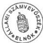
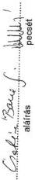
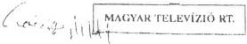
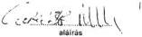
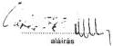
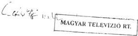
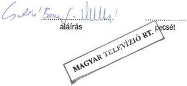
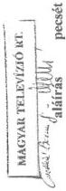

Állami Számverőszék

# JELENTÉS

a Magyar Televízió Közalapítvány és kapcsolódó ellenőrzés keretében a Magyar Televízió Rt. működésének és gazdálkodásának ellenőrzéséről

9810

418.

1998. június

---

Az ellenőrzés végrehajtásáért felelős:

az ÁSZ III. Költségvetési Ellenőrzési Igazgatósága

Bihary Zsigmond

számvevő igazgató

Az ellenőrzést vezette:

Matusek István

számvevő főtanácsos

Az ellenőrzésben részt vettek:

Bittó Zoltán

számvevő tanácsos

Csontosné Kiss Margit

számvevő

Csóry Györgyné

számvevő tanácsos

Deák Tamásné

számvevő tanácsos

Fogarasi Miklós

számvevő tanácsos

Maklári Ferencné

számvevő tanácsos

dr. Mihály Sándor

számvevő tanácsos

Papp Sándor

számvevő tanácsos

Szöllősiné Hrabóczki Etelka

számvevő tanácsos

---

752:58

V-19-51/1997-98.

# TARTALOMJEGYZÉK

# I. ÖSSZEGZŐ MEGÁLLAPÍTÁSOK, KÖVETKEZTETÉSEK, JAVASLATOK 9

1. Az MTV Kozalapitvany mukodese es gazdalkodasa 9
2. Az MTV Részénytársaság muködése és gazdalkodása 11

# II. RÉSZLETES MEGÁLLAPÍTÁSOK 19

# A. A MAGYAR TELEVÍZIÓ KÖZALAPÍTVÁNY MŰKÖDÉSE, GAZDÁLKODÁSA, TULAJDONOSI FELÜGYELETI TEVÉKENYSÉGE 19

1. A Kuratórium, az elnökség, a titkárság és az Ellenőrző Testület tevékenységének szervezeti, szabályozási és működési feltételei 19

1.1.A szervezeti es mukodesi rend szabalyozottsaga 19
1.2.A szervezeti es mukodesi rend ervenyesulse, a belso szabalyozasi rendszer celszerusege 20
1.3.A feladatellatas szemelyi feltetelei 22

2. A Magyar Televízió Közalapítvány gazdálkodása 23

2.1.A mukodes es gazdalkodas feltetelei 23
2.2.Az MTV Rt. es a Kozalapitvany vagyoni kapcsolata 25
2.3.Az MTV KA éves gazdalkodási tervének megalapozottsága, vegrehaj-tasa 26

2.3.1.A tervek megalapozottsaga 26
2.3.2.A koltsegvetes vegrehajtasa 27

3. Az Ellenőrző Testület tevékenysége 29

4. A Kuratórium és az elnökség működése. Alapítói jogkörben az MTV Rt. gazdasági- pénzügyi felügyeletének ellátása 30

4.1. Kiemelt kuratóriumi feladatok 32

4.1.1. A Kozalapitvany részère átadott vagyon és muködési célu támogatások felhasznalásanak felügyelete és ellenorzese 32
4.1.2. A kozbeszerzesekról szólo 1995. évi XL. törvenyben foglalt követelmenyek érvényesitése 33
4.1.3. Kuratoriumj javaslatok az uzembentartasi dij szabalyozasara es az allami koltsegvetesi tamogatas, celtamogatas kezdemenyezesere 34
4.1.4. Az Rt. éves gazdalkodási és penzügyi terve elveinek és fó össgeinek jováhagyása 35

4.2. Kiemelt elnökségi jogok gyakorlása 36

4.2.1.Az MTV Rt.gazdalkodasanak ellenorzese 36
4.2.2. Elozetes elnoksegi jovahagyasi jogkorok gyakorlasa 37
4.2.3.Gazdasagi tarsasag alapitasanak elozetes jovahagyasa 38
4.2.4.Az MTV Rt. elnoke palyazataban foglaltak ertekelese 39

1

---

## **B. A MAGYAR TELEVÍZIÓ RÉSZVÉNYTÁRSASÁG MŰKÖDÉSE ÉS GAZDÁLKODÁSA**

|  1. A működés törvényessége, szabályozottsága | 41  |
| --- | --- |
|  1.1. A Magyar Televízió Részvénytársaság megalakításának pénzügyi, tárgyi és személyi feltételei, jogszabályi háttere | 41  |
|  1.2. A szervezeti átalakulás folyamata | 43  |
|  1.3. A működés és gazdálkodás törvényessége, szabályszerűsége | 44  |
|  1.4. A Részvénytársaság és a Közalapítvány közötti jogi, gazdasági, személyi kapcsolódások szabályozottsága | 45  |
|  2. Az MTV Rt. gazdálkodása | 46  |
|  2.1. Az éves bevételek tervezése | 46  |
|  2.2. A költségek tervezése | 48  |
|  2.3. Az éves tervek készítése során alkalmazott szempontok, normák, önköltségszámítások | 49  |
|  2.4. A bevételek tényleges alakulása | 50  |
|  2.5. A kiadások tényleges alakulása | 51  |
|  2.6. A pénzügyi és likviditási helyzet alakulása | 51  |
|  2.7. A középtávú üzleti terv | 52  |
|  2.8. Az MTV Rt. költségkímélő- és műsorszerkezetét érintő tervei | 54  |
|  3. A gazdálkodás főbb elemeinek ellenőrzése | 55  |
|  3.1. A létszám- és bérgazdálkodás | 55  |
|  3.1.1. A létszám- és a létszámösszetétel alakulása | 55  |
|  3.1.2. A létszámváltozás arányai és okai | 57  |
|  3.1.3. A bér- és kereseti viszonyok | 58  |
|  3.1.4. Külső-belső megbízások, állományon kívüli bérek | 60  |
|  3.1.5. Az 1997. évi költségvetésről szóló törvényben jóváhagyott bérpolitikai keret felhasználása | 61  |
|  3.2. Anyaggazdálkodás és archiválás rendje | 62  |
|  3.2.1. Az anyag- és készletgazdálkodás | 62  |
|  3.2.2. A műsorok archiválási rendje | 65  |
|  3.3. A tárgyi eszközökkel való gazdálkodás | 66  |
|  3.3.1. Az MTV Rt. ingatlan vagyonának alakulása | 66  |
|  3.3.2. A rendelkezésre álló tárgyi eszközök kihasználtsága, a szabad kapacitások hasznosítása | 68  |
|  3.3.3. A tárgyi eszközök - ezen belül kiemelten a gépjárművek - beszerzése | 69  |
|  3.3.4. A gépjárművek igénybevételének célszerűsége | 71  |
|  3.4. Beruházások, felújítások lebonyolítása | 74  |
|  3.5. A felesleges vagyontárgyak értékesítése | 75  |
|  3.6. A karbantartások ráfordításai és lebonyolításuk | 76  |
|  4. Műsorgyártás és beszerzés | 77  |
|  4.1. A saját belső gyártás | 77  |
|  4.2. A saját külső gyártás | 80  |
|  4.3. Vásárolt műsorok | 82  |

2

---

V-19-51/1997-98.

5. A vállalkozásokban való részvétel 86
6. Egyes működési célú költségek alakulása, szabályszerűsége, célszerűsége 88
6.1. A bel- és a külföldi kiküldetések 88
6.2. Segélyek 91
6.3. Reprezentáció 91
6.4. A munkáltatói lakástámogatás rendszere 92
7. A számvitel rendjének szabályozottsága 92
8. A kötelezettségvállalás, kiadmányozás, utalványozás rendje 94
9. A bankszámlák áttekintése, a támogatások folyósításának rendszere 95
10. Az 1996. évi beszámoló valódisága 95
11. Az MTV Rt-nél végzett ellenőrzések tapasztalatai 99
11.1. A belső ellenőrzés rendje, szabályozottsága 99
11.2. A belső ellenőrzés tervszerűsége, működése, a megállapítások hasznosulása 100
11.3. Az MTV Rt. Felügyelő Bizottsága ellenőrző tevékenysége 101
11.4. Az ÁSZ korábbi ellenőrzései alapján kidolgozott intézkedési tervek végrehajtása és további aktualitásuk 102
Tanúsítványok
Függelék

3

---

                                                                                    ***

---

Állami Számvevőszék

V-19-51/1997-98.

Témaszám: 388.

# J E L E N T É S

## a Magyar Televízió Közalapítvány és kapcsolódó ellenőrzés keretében a Magyar Televízió Rt. működésének és gazdálkodásának ellenőrzéséről

A Magyar Televízió Közalapítványt (MTV KA) a rádiózásról és televíziózásról szóló 1996. évi I. törvény (mediatörvény) 53. §. (1) bekezdésével a közszolgálati műsorszolgáltatás biztosítására, függetlenségének védelmére hozta létre az Országgyűlés.

A Közalapítvány célját a 18/1996. (III. 18.) OGY határozat mellékletét képező Alapító Okirat 3. pontja határozza meg, az Alkotmány 61. §-ával és az 1996. évi I. törvényben foglaltakkal összhangban:

„A szabad és független televíziózás, a véleménynyilvánítás szabadsága, a tájékoztatás függetlensége, kiegyensúlyozottsága és tárgyilagossága, a tájékozódás szabadsága, valamint az egyetemes és nemzeti kultúra támogatása, a vélemények és a kultúra sokszínűségének érvényre juttatása érdekében a Magyar Televízió, mint közszolgálati televízió függetlenségének s ezzel egyidejűleg társadalmi felügyeletének biztosítása.”

E cél érdekében a Magyar Televízió intézménye az állam tulajdonából a Közalapítvány tulajdonába került, s részvénytársasági formában működik tovább (1996. évi I. tv. 64. §. (1)-(2) bekezdés és a 141. §. (1)-(2) bekezdés).

**A Magyar Televízió Közalapítvány alapító okirata szerint alapvető feladata, hogy a Magyar Televízió Részvénytársaság (MTV Rt.) tulajdonosaként gondoskodjék a közszolgálati műsorszolgáltatásnak a médiatörvényben meghatározott követelményei érvényesüléséről.**

---5

---

I. ÖSSZEGZŐ MEGÁLLAPÍTÁSOK, KÖVETKEZTETÉSEK, JAVASLATOK---

Az MTV Rt. vonatkozásában az alapítói, részvényesi jogokat - a gazdasági társaságokról szóló 1988. évi VI. törvény (Gt.) 298-300 §-ai, illetve a médiatörvény előírásai alapján - az MTV KA gyakorolja.

Feladatai ellátásához a Közalapítvány induló vagyonát az Országgyűlés 15 M Ft-ban állapította meg. Az 1996. évi működési kiadásokra a költségvetés általános tartalékából biztosított forrást, 1997. évtől kezdődően pedig az ORTT a Műsorszolgáltatási Alapból folyósítja a médiatörvényben jóváhagyott mértékű működési célú támogatást.

# **A Ptk. 74/G. §. (8) bekezdése, illetve a médiatörvény 60. §. (5) bekezdése szerint az MTV KA gazdálkodásának törvényességét és célszerűségét az Állami Számvevőszék ellenőrzi.**

A nemzeti közszolgálati televízió feladatainak ellátására a médiatörvény előírásai alapján az MTV KA 1996. október elsejei hatállyal megalapította a Magyar Televízió Rt-t. A Magyar Televízió Rt. a megszűnt Magyar Televízió költségvetési szerv általános jogutódja. Alaptőkéje az alapító okirata szerint (MK. 1996. évi 106. sz.) 18.964 Mrd Ft.

**Az MTV Rt.** az MTV KA-n, ill. a Műsorszolgáltatási Alapon és az MTV KA-n keresztül az éves költségvetési törvényben, illetve a médiatörvényben meghatározott célokra és mértékben **a központi költségvetésből származó támogatást kap** (a központi költségvetés fejezeteitől származóan sugárzási díj, üzemeltartási díj állam által vállalt átalánya és kiegészítése, valamint különböző céltámogatások /bérpolitikai támogatás/ jogcímeken kap, illetve kaphat támogatást).

**Az Állami Számvevőszék az 1989. évi XXXVIII. törvényben meghatározott hatáskörében és feladatai alapján** - mint az Országgyűlés pénzügyi-gazdasági ellenőrző szerve - **ellenőrzi** az államháztartás gazdálkodását, ennek keretében - többek között - **a bevételek felhasználásának törvényességét, szükségességét és célszerűségét /2.§. (1) bekezdés/, ellenőrzi az állami költségvetésből juttatott támogatás felhasználását** - többek

között - **a 2. §. (5) bekezdésében fel nem sorolt ún. egyéb szervezeteknél, így jelen program alapján az MTV Rt-nél.**

Az MTV KA törzsvagyonát, mint célra rendelt vagyont képezi - többek között - a megszűnt állami tulajdonú Magyar Televízió költségvetési szerv ingó és ingatlan vagyona, vagyoni értékű jogai, amelyből az MTV KA megalapította az MTV Rt-t. A részvénytársaságnak egy forgalomképtelen részvénye van, ami az MTV KA kizárólagos tulajdonába került. Az MTV KA törzsvagyonának, e vagyonnal való gazdálkodásnak a törvényességét és célszerűségét részben közvetlenül a Közalapítványnál, részben - kapcsolódó ellenőrzésként - a vagyont működtető egyszemélyes részvénytársaságnál ellenőriztük. Az Állami Számvevőszék az 1989. évi XXXVIII. törvény előzőekben idézett 2. §. (5) bekezdése, illetve a 21. §. (3) bekezdése alapján, a vizsgálati megállapítások kiegészítése érdekében, vizsgálta az MTV Rt-nél az MTV KA ellenőrzésével összefüggő tényeket.

---6

---

I. ÖSSZEGZŐ MEGÁLLAPÍTÁSOK, KÖVETKEZTETÉSEK, JAVASLATOK

A Magyar Televízió Közalapítvány működését alapvetően a rádiózásról és televíziózásról szóló 1996. évi I. törvény (mediatörvény) és a Magyar Televízió Közalapítvány létrehozásáról szóló 18/1996. (III. 8.) OGY határozat állapítja meg.

A Magyar Televízió Részvénytársaság működését a médiatörvény, a gazdasági társaságokról szóló 1988. évi VI. törvény és a Közalapítvány Kuratóriuma által elfogadott MTV Rt. Alapító Okirata (MK. 1996. 106. sz.) szabályozza elsősorban.

**Az ellenőrzés célja az volt**, hogy törvényességi és célszerűségi szempontok szerint értékelje az MTV KA-nak, illetve az MTV Rt-nek átadott állami vagyon működtetését és a központi költségvetésből származó támogatások felhasználását.

Az MTV Rt-nél végzett helyszíni ellenőrzésünk során - korábbi tapasztalatainkból kiindulva - arra koncentráltunk, hogy az Rt. megalakulása után az Rt. elnöke és az általa választott, újonnan kinevezett menedzsment hogyan kezdett hozzá az elnöki pályázatban felvázolt stratégiai célok megvalósításához, az átalakítással szükségszerűen együttjáró szervezeti, működési változtatásokhoz, a vállalkozási szemlélet meghonosításához, a radikálisan megváltozott piaci viszonyokhoz alkalmazkodó műsorszerkezet és gazdálkodási rend kiépítéséhez.

**Mindezt figyelembe véve arra kerestünk választ, hogy:**

- az MTV KA kialakított szervezeti és működési rendje, működési költségeinek nagysága, felhasználásának összetétele, gazdálkodása törvényes és célszerű-e;
- az MTV KA kuratóriuma és elnöksége törvényesen, célszerűen és eredményesen gyakorolja-e tulajdonosi jogait az MTV Rt. gazdálkodása felett;
- az MTV Rt. az alapító okiratában meghatározottaknak, valamint a Kuratórium és az elnökség döntéseinek megfelelően, törvényesen, célszerűen és eredményesen gazdálkodik-e a rendelkezésére bocsátott - korábban az állam tulajdonát képező - vagyonnal és a központi költségvetési támogatással;
- jelenleg milyen mértékben biztosított az összhang a médiatörvényben meghatározott közszolgálati feladatok, valamint az MTV Rt. személyi és tárgyi feltételei között;
- az MTV Rt. stratégiája alkalmas-e a közszolgálati feladatok ellátása és a rentábilis működés feltételeinek együttes biztosítására;
- az MTV KA Ellenőrző Testülete és az MTV Rt. Felügyelő Bizottsága ellenőrzései és az ezek alapján tett intézkedések milyen hatást gyakoroltak a közalapítvány és a részvénytársaság gazdasági-pénzügyi tevékenységére;

7

---

I. ÖSSZEGZŐ MEGÁLLAPÍTÁSOK, KÖVETKEZTETÉSEK, JAVASLATOK---

- az Állami Számvevőszék korábbi ellenőrzéseinek megállapításaira kidolgozott MTV intézkedési tervek végrehajtása milyen eredményekkel járt, van-e az MTV Rt. gazdálkodását illetően további aktualitásuk.

**Az ellenőrzés az MTV KA létrejöttétől** (1996. március 1-től) és **az MTV Rt.** megalakulásától (1996. október 1-től) 1997. szeptember 30-ig terjedő időszak gazdasági-pénzügyi tevékenységére terjedt ki, részben a bekért adatok áttekintésével, részben a helyszíni ellenőrzés során szerzett ismeretek felhasználásával. Az ellenőrzés keretében áttekintettük és értékeltük az MTV Rt. könyvvizsgálójának az Rt. 1996. évi beszámolójáról készült jelentését.

A jelentés aktualitásának fenntartása érdekében a helyszíni ellenőrzés befejezését követően bekövetkezett fontosabbnak ítélt eseményeket megemlítjük, de azok nem képezték az ellenőrzés tárgyák.

Az MTV KA és az MTV Rt. 1997. évi mérlegbeszámolói a jelentés lezárását követő időszakban készültek el, azok adatait a pótlólag bekért tanúsítványok tartalmazzák. Az ellenőrzés megállapításai ezekre a tényadatokra nem épülhettek, az 1997. évi mérlegadatok felülvizsgálatára ennek az ellenőrzésnek a keretében már nem volt lehetőség.

A Közalapítvány és a Részvénytársaság megalakulásának végrehajtását, gazdálkodásuk megszervezésének körülményeit és feltételeit az Állami Számvevőszék 363. témaszámon jegyzett „Jelentés a médiatörvény végrehajtásának pénzügyi-gazdasági ellenőrzéséről” című jelentése feltárta és bemutatta. Jelen vizsgálatunk a megalakulással csak oly mértékig foglalkozik, amennyit a további gazdasági-pénzügyi események feltétlenül indokolnak, illetve, amely okok a kezdetekig nyúlnak vissza.

---8

---

I. ÖSSZEGZŐ MEGÁLLAPÍTÁSOK, KÖVETKEZTETÉSEK, JAVASLATOK

# I. ÖSSZEGZŐ MEGÁLLAPÍTÁSOK, KÖVETKEZTETÉSEK, JAVASLATOK

## 1. AZ MTV KÖZALAPÍTVÁNY MŰKÖDÉSE ÉS GAZDÁLKODÁSA

**Az MTV Közalapítvány belső önszabályozó rendszere** (SZMSZ és a hozzá kapcsolódó szabályzatok) megfelel rendeltetésének. A Közalapítvány SZMSZ-e az alapító okiratban megállapított 1996. június 30. helyett, 1996. december 10-én lépett hatályba. A részletes megállapításainknál kifejtett szabályozási hiányosságok az alapfeladatot jelentő felügyeleti tevékenységre nincsenek kihatással. **A Közalapítvány tulajdonosi, felügyeleti tevékenysége megfelel a médiatörvényben meghatározott követelményeknek, eredményessége azonban nem kielégítő.**

A kuratóriumi és elnökségi feladatok végrehajtása komoly gazdasági, - jogi- és média szakismereteket igényel, mely követelménynek csak részben felel meg a KA tisztségviselőinek és munkatársainak személyi-szakmai összetétele. A szakértői háttér biztosítása sem volt megfelelő.

**Az Ellenőrző Testület** érdemben 1997-ben kezdte meg munkáját. A Közalapítvány gazdálkodásával kapcsolatban több hiányosságra hívta fel a figyelmet. Észrevételeit a Közalapítvány éves beszámolójához kapcsolódóan eljuttatta az alapító Országgyűlésnek is. Az ET észrevételeit és kifogásait az általa tájékoztatott szervek (Országgyűlés, Közalapítvány, elnökség) csak részben vették figyelembe, nem minden tekintetben orvosolták azokat.

A Magyar Televízió Közalapítvány alapító okiratának az MTV KA székhelyeként a Budapest, V., Szabadság tér 17. számot (az MTV székházát) jelöli meg, s induló vagyonaként 15 M Ft-ot biztosított. Az induló vagyon nevesített tárgyi eszközöket nem tartalmazott.

Az MTV KA megalakulása óta felhasználta az induló vagyonként kapott 15 M Ft-ot. Működési kiadásai rendre meghaladják a médiatörvényben, ill. az Alapító Okiratának 1. sz. melléklet 2-3. pontjaiban biztosított források mértékét, amelyet az Rt. tehermentes szolgáltatásai tesznek lehetővé.

Az MTV KA testületei és hivatali szervezete elhelyezése - az MTV KA elnöksége véleménye szerint - az Országgyűlés által számára meghatározott székhelyen nem megoldható, a rendelkezésére bocsátott pénzforrások az induláshoz és a folyamatos működéshez elégtelenek. Végül is a problémát úgy rendezték, hogy az MTV Rt. alapító okiratában előírták, hogy „a társaság feladata a közgyűlési jogokat gyakorló Alapító szervezetének elhelyezése és működési feltételeinek biztosítása.”

**Az MTV Rt. ellenszolgáltatás nélkül** bocsátott alapítója rendelkezésére helyiségeket a Bp., V. Szabadság tér 5-6. sz. alatt, közüzemi szolgáltatásokat, bútorokat és egyéb felszereléseket, a Kuratórium és az elnökség egyes tagjainak személyes használatára térítés nélkül eszközöket. A médiatörvény 54. §-a szerint a Kuratórium működési feltételeit az Országgyűlésnek, mint a Közalapítvány alapítójának kell biztosítania.

9

---

I. ÖSSZEGZŐ MEGÁLLAPÍTÁSOK, KÖVETKEZTETÉSEK, JAVASLATOK---

A pénzügyi források felhasználása és általában az **MTV KA gazdálkodása szabályszerű**, mert - önálló vagyon hiányában - összesen néhány jelentősebb kiadási előirányzattal kell gazdálkodnia. **Az MTV Rt-től igénybevett tárgyi eszközök és szolgáltatások az MTV KA könyveiben és elszámolásaiban nem jelennek meg.**

A Közalapítvány éves gazdálkodási tervezésével kapcsolatos döntés-előkészítési folyamat áttekinthetetlen, a kialakított tervezési gyakorlat nem megalapozott, erről a hatályos SZMSZ sem rendelkezik egyértelműen.

A Közalapítvány a választott, ill. delegált testületi tagok számára költségtérítést fizetett, részben számlák alapján, részben anélkül. A számlák nélkül kifizetett költségtérítés után az érintettek SZJA-t fizettek. **A médiatörvény költségtérítésre vonatkozó rendelkezése a Közalapítványnál kialakított gyakorlatot nem tiltja, azonban - részletes szabályozás hiányában - az alapító szándéka nem derül ki egyértelműen.**

Az ellenőrzés célszerűségi szempontból kifogásolta a számlák nélkül fizetett költségtérítést. A Közalapítvány minden ténylegesen felmerült és igazolt költséget megtérített, ill. átvállalt. Az elnökség, a Kuratórium delegált tagjai és az Ellenőrző Testület tagjai számára számlák nélkül fizetett további költségtérítést viszont megalapozó számítás nem támasztotta alá, így indokoltsága nem volt bizonyított.

Az MTV KA bevételei között megjelennek az MTV Rt-t megillető, állami támogatásból és közpénzekből származó bevételek. Ezen pénzeszközök továbbutalása - megfelelő szabályozás hiányában - a tulajdonos KA részéről automatikusan, mindennemű kontroll nélkül történik.

**Az MTV KA Kuratóriuma és elnöksége az MTV Rt. gazdálkodása felett a tulajdonosi jogait a médiatörvényben és az alapító okiratban előírt módon, törvényesen látta el. Ugyanakkor e jogkör gyakorlásának célszerűségét és eredményességét nagymértékben gátolta az, hogy a testületek 1997. év végéig nem voltak képesek létrehozni a kölcsönös bizalom és együttműködés légkörét az általuk megválasztott Rt. elnökkel.** Kellő információk hiányában nem volt áttekintése a testületeknek az Rt. működésének és gazdálkodásának egészéről. Ezért döntő pontokon nem tudtak időben beavatkozni, tulajdonosi elvárásaiknak és elhatározásaiknak nem tudtak érvényt szerezni, végül a médiatörvényben előírt törvényességet biztosító szabályozásokat sem tudták mindeddig hatályba léptetni.

**Az együttműködő felek hosszadalmas és meddő viták során, szakértők bevonásával sem voltak képesek a hatáskörök gyakorlásában egyetértésre jutni.** A viták középpontját a tv. 66. §. (2) bekezdése c/ pontja képezte. A hivatkozott törvényhely a kuratórium elnöksége kizárólagos feladat- és jogköre között említi a részvénytársaság gazdálkodásának ellenőrzését, amelyet - az Rt. elnöke szerint - az elnökség túlzottan kiterjesztetten értelmez.

**A világos és egyértelmű szabályozás ellenére a törvény gyakorlati alkalmazása folyamatos nézeteltérések tárgya volt.** Az Rt. elnöke a

---10

---

I. ÖSSZEGZŐ MEGÁLLAPÍTÁSOK, KÖVETKEZTETÉSEK, JAVASLATOK

tőle elvárt adatok szolgáltatását rendszeresen az általa indokolt mértékre leszűkítve, korlátozott tartalommal értelmezte, vagy rendelkezésre sem bocsátotta, üzleti titokra hivatkozva. A Kuratórium (elnökség) rendszeres adatszolgáltatáshoz egyáltalán nem jutott, amelyből folyamatosan nyomon követhette volna a gazdasági folyamatokat. Az eseti tájékoztatások, előterjesztések hézagosak, adathiányosak voltak, az elnökség szerint jellemzően használhatatlanok.

Pedig a Kuratórium és elnöksége törvényi kötelezettségeit messze meghaladó intenzitással igyekezett eleget tenni kötelezettségeinek. Függelékben csatoljuk a kuratóriumi és elnökségi ülések jegyzékét és az ülések napirendjeinek, határozatainak tömör kivonatát.

A függelék áttekintéséből az is könnyen belátható, hogy ha az MTV Rt. elnöke valóban, rendre eleget kívánt volna tenni az elnökségi határozatoknak, akkor az Rt. irányítására alig maradt volna ideje.

Az elnökség folyamatosan tapasztalta a sikertelenséget, figyelmeztetésekkel, elmarasztaló határozatokkal próbált változást elérni. Az enyhébb módszerek hatástalanságát tapasztalva **többször kezdeményezte a Kuratórium ülésein az Rt. elnökének felmentését, eredmény nélkül.** 1997. év végére irányítási patthelyzet alakult ki. A működésképtelenséggel fenyegető helyzet azzal zárult, hogy a Kuratórium tagjai többségének javaslatát elfogadva **1998. I. 6-án az Rt. elnökét visszahívta megbízásából.**

## 2. AZ MTV RÉSZVÉNYTÁRSASÁG MŰKÖDÉSE ÉS GAZDÁLKODÁSA

Az **MTV Rt.** 1996. október 1-jei megalakulása óta a korábbiakhoz képest egészen más, nem költségvetési, hanem társasági gazdálkodási szabályok és törvényszerűségek szerint működik.

**Az örökölt szervezet - amint azt a korábbi számvevőszéki ellenőrzések (1991-ben és 1993-ban) megállapították - irracionális és indokolatlanul bonyolult felépítésű, hatékonyan nem irányítható. Gazdálkodása elavult, valójában korszerű soha sem volt. Gazdasági döntéseiben költségérzéketlen, áttekinthetetlen. Belső információs rendszere a gazdasági események követésére képtelen, a különböző vezetői szintek számára alkalmatlan.**

Hiányoznak a szervezett gazdálkodás legalapvetőbb feltételei; a szerződéskötések (kötelezettségvállalások) anarchikusak, nincsenek fajlagos ráfordítási (költség) adatok, hiányzik az elő- és utókalkuláció, megállapíthatatlan a valós munkaerőszükséglet, nincsenek támpontok a kapacitások kihasználtságáról stb.

**Mindezek a tényezők már korábban mély gazdasági válságba sodorták az intézményt.**

Az MTV-nél kialakult és minden szempontból változtatást igénylő helyzetet már az Állami Számvevőszék 1991. évi vizsgálata, majd 1993-ban lefolytatott utóvizsgálata részletesen feltárta és számos, kibontakozást segítő javaslatot tett.

11

---

I. ÖSSZEGZŐ MEGÁLLAPÍTÁSOK, KÖVETKEZTETÉSEK, JAVASLATOK---

Az MTV Rt. elnöke pályázatában ugyanilyen képet vázolt fel az MTV addigi múltjáról, tehát tisztában volt a helyzet súlyosságával és az elvégzendő feladatok nagyságrendjével. Pályázata alapján megállapítható, hogy **egy teljesen új koncepciójú és működési filozófiájú szervezet gyorsütemű (négy év alatt) létrehozását vázolta fel.** Ugyanakkor a kereskedelmi televíziók létrehozása már a kinevezését követő fél éven belül olyan markáns változásokat igényelt igényelt volna, amelyek versenyképessé teszik a közszolgálati televíziót.

Az Rt. elnöke pályázatában rögzített célkitűzések, illetve bizonyos változtatások ellenére **a szervezet működési- és szabályozási rendszerében nem újult meg.** Mindezek azt eredményezték, hogy **az MTV Rt. részben a mulasztásos törvénysértés állapotában van, működésének szabályozottsága, törvényessége több vonatkozásban kétséges.**

Az Rt. 1997. december 31-ig nem rendelkezett jóváhagyott Szervezeti és Működési Szabályzattal. Tervezet szintjén megállt a közszolgálati műsorszolgáltatási szabályzat elkészítése. Nincs jóváhagyott archiválási szabályzat. Az alapvető szabályozások hiányán kívül a szabályszerű működés feltételeit biztosító belső szabályozások közül is többnek a hiányát, vagy hiányosságát állapította meg az ellenőrzés. A helyszíni ellenőrzés befejezésekor 1997. november végén készítettek el több, addig hiányolt belső szabályzatot (pl. önköltségszámítási, leltározási, pénz- és értékkezelési szabályzat).

Néhány, úgynevezett „sarokszámon” kívül 1997. évre nem volt az MTV Rt-nek jóváhagyott gazdálkodási és pénzügyi terve.

Az elnöki pályázaton kívül az ellenőrzés előtt nem ismert olyan szakmailag megalapozott, átgondolt, ütemezett és pénzügyi kihatásait is bemutató terv, koncepció, amely az Rt. működését meghatározó fő folyamatok kölcsönhatásait figyelembevéve, rendszerszemléletben célozná meg a helyesnek tartott átalakítást.

**A felsorolt hiányosságok miatt az MTV Rt. működése törvényességi szempontokból kifogásolható a vizsgált időszakban, és ezért felelősség terheli az MTV Rt. elnökét, az MTV KA Kuratóriumát és elnökségét.**

Ugyanakkor a szervezet folyamatosan változott a vizsgált időszakban: egyes szervezetek megszűntek, mások átalakultak, új szervezetek jöttek létre, meglévő szervezeteket összevontak.

A szervezet átalakításához kapcsolódóan kimutatható a létszámcsökkentésre irányuló törekvés. Világos szervezet-stratégia hiányában azonban nem értékelhetőek a szervezeti- és létszámváltozások. A megtett lépések időarányosan elmaradtak a tervezett átalakítástól. Az átszervezések következtében létrejött új szervezeti egységek és azok létszámösszetétele nem feleltethető meg a pályázatban megjelölt céloknak. Jelentősen megnőtt a vezető munkakörökben foglalkoztatottak száma. A legnagyobb csökkenés a szerkesztők, adásrendezők, műszaki és gyártási munkatársak, operatőrök és a kisegítők körében valósult meg. Igen nagy bér- és kereseti különbségek alakultak ki az átszervezett és a még átszervezésre váró munkaterületeken dolgozók között. Vizsgálatunk befejezéséig nem állapítottak meg teljesítménykövetelményeket a munkatársak számára.

---12

---

I. ÖSSZEGZŐ MEGÁLLAPÍTÁSOK, KÖVETKEZTETÉSEK, JAVASLATOK

A gazdálkodási formaváltás a tervezés és gazdálkodás területén új helyzetet teremtett és megfelelő alkalmazkodási készséget igényelt. Az 1997. évi bevételek és kiadások tervezése a korábbi éveknél lényegesen alacsonyabb szinten, a realitásokhoz igazodó mértékekkel történt. Az éves terv készítését egységes norma- és önköltségszámítás nem támasztotta alá, ennek hiányában a költségtervezés nem minősíthető megalapozottnak.

Az Rt. pénzügyi helyzete 1996-ban labilis volt, a magas átlagos vevőállomány és a rendkívül alacsony pénzeszközállomány következtében. A likviditási helyzetet jelentősen rontotta a pénzügyi- és tárgyi eszközök tervszerűtlen felhasználása.

A szerződéses kötelezettségvállalások terén a rendszerszemléletű megújulás elmaradt. A korábban tapasztalt anomáliák felszámolása érdekében az Rt. elnöke tett intézkedéseket (pl. a 2/1997. sz. elnöki utasítás, mely minden kötelezettségvállalást elnöki hatáskörbe vont), de átgondolatlanságuk még nagyobb zavart okozott. (Említett intézkedését az Rt. elnöke - korrekciókkal - visszavonta.) Ugyanakkor kedvező változást hozott az Rt. számára előnytelen szerződések felülvizsgálata és megszüntetése, amelynek eredményeként közel 1 Mrd Ft-tal csökkentették a szerződésállományt. Kedvező változás, hogy megszervezték az 500 E Ft-nál nagyobb összegű szerződések nyilvántartását.

A pénzügyi egyensúly javítása érdekében az Rt. 1997. évben csökkentette a műsorsugárzás idejét, a sugárzott műsorokban 63%-ról 57%-ra csökkent a saját gyártású műsorok aránya. De mindeddig nem alakult ki a különböző gyártási módozatok költség-elszámolási rendje, az elő- és utókalkuláció alapja. Megállapíthatatlan, hogy egy produkció valójában mennyibe került és a ráfordítások indokolt mértékűek voltak-e. Nincs objektív alapja a belső- és külső gyártás gazdasági összehasonlításának.

Az alapításkor az Rt. tulajdonába került jelentős értékű vagyonon belül az ingatlanállomány összetétele kedvezőtlen, mivel nem igazodik a televíziós feladatokhoz és a korszerű technikai követelményekhez. Felmerült - a volt Tőzsdepalotát felváltó - új televíziós központ építése, erre vonatkozóan azonban eddig nem készültek gazdaságossági számítások, finanszírozási tervek. Az Rt-nél hiányzik egy középtávú vagyongazdálkodási koncepció, mely a tárgyi eszközök hasznosításának több évre szóló elképzelését tartalmazná. Jelenleg nincs döntés a központi gyártóbázis szerepét betöltő Bp., III., Bojtár utcai műsorgyártási központ sorsáról sem.

Az Rt. gazdálkodásában a tárgyi eszközök beszerzésénél nem minden esetben tartották be a közbeszerzési törvény előírásait. Törvényi hiányosságként állapítható meg, hogy a közbeszerzési törvény hatálya nem terjed ki a közös- és külső gyártású műsorokra. A külső gyártást végző vállalkozóval rendszerint ÁFA nélkül és az Rt. szolgáltatásait levonva, nettó módon számolnak el.

Az MTV Rt. a vizsgált időszakban nem volt és jelenleg sincs felkészülve a vállalkozási szemléletű számvitel vezetésére, a pénzügyi és a számviteli tények, a vagyoni helyzet valós és naprakész kimutatására, a vezetői infor-

13

---

I. ÖSSZEGZŐ MEGÁLLAPÍTÁSOK, KÖVETKEZTETÉSEK, JAVASLATOK---

**mációs igények kielégítésére.** Ennek sem szervezeti, sem személyi, sem tárgyi feltételei nem adottak, amelyek sok esetben jogszabálysértéshez vezettek.

A Gazdasági Igazgatóság átszervezése és minőségi megújítása az egységes informatikai rendszer kiépítése sürgető feladat. Az Rt. vezetőinek közlése szerint 1998. I. 1-je után új, egységes számítógépes informatikai rendszert vezetnek be, de az ellenőrzés látókörébe ennek rendszerterve nem került.

Az MTV Rt-vé átalakulása megváltoztatta a függetlenített belső ellenőrzés helyzetét és irányítását, mert kettős irányítás alá került; az Rt-n belüli függőségi viszony mellett a Felügyelő Bizottság irányítása alá is tartozott. A belső ellenőrzés zárt rendszere nem alakult ki az MTV Rt-nél. A belső ellenőrzés három eleme közül egyedül a belső ellenőrzési szervezet működőképes. Fontos, hasznos vizsgálati megállapításai alig hasznosultak.

**A Felügyelő Bizottság,** a Kuratórium és az elnökség elé kerülő anyagok minősítésével, önálló vizsgálati megállapításaival járult hozzá a tulajdonosi felügyelet érvényesüléséhez. A Felügyelő Bizottság véleménye szerint az Rt. elnöke gyakran hátráltatta munkájukat, az intézkedési felkérésekre nem reagált. Az FB megállapításai általában a kuratóriumi és elnökségi határozatokban realizálódtak.

Az MTV Rt. 1996. október 1. - 1997. december 31. közötti **működési zavaraiért, működésének és gazdálkodásának nem kielégítő eredményeiért az Rt. elnöke** és az általa választott menedzsment **viseli az elsődleges felelősséget, de osztoznia kell a felelősségben** a tulajdonosi jogokat gyakorló **MTV KA Kuratóriumának és különösen elnökségének.**

Az Rt. elnöke pályázatának megírásakor alábecsülte a várható nehézségeket és túlbecsülte lehetőségeit. Több évtized gazdálkodási lazaságai, fegyelmezetlensége, az ebből eredő elvtelen érdekösszefonódások, visszaélések fél év alatt nem számolhatók fel, a legkövetkezetesebb, leghatározottabb vezetői intézkedéseket feltételezve sem. Ilyen intézkedések ellenben nem voltak. Az Rt. elnöke és vezetőtársai az elvárhatónál lényegesen kevesebbet valósítottak meg a szükséges intézkedésekből, mint amennyit egy év alatt valóban tenni lehetett volna.

A kialakult helyzet ellenére sem következett be 1997. évben gazdálkodási csőd az MTV Rt-nél, a kiadásokat ugyanis részben fedezték a **jogsértő módon megszerzett reklám és szponzorációs többletbevételek. Az Rt. bevételeire gazdálkodási színvonala nem hat, szinte kizárólag költségeit képes csökkenteni bizonyos ésszerű mértékig.**

**A helyszíni ellenőrzés lezárása utáni időszakban az MTV Rt-nek nem volt választott elnöke, az Rt. irányításával megbízott alelnök korlátozott jogkörű elnöki jogosítványokkal rendelkezik, miközben az Rt. működését és gazdálkodását stabilizáló stratégiai lépésekre lenne szükség.**

**Az Rt-nek 1998. évben a reális prognózisok szerint komoly gazdálkodási problémákkal kell szembenézni.** A médiatörvény reklám- és szponzori korlátozásai, a kereskedelmi televíziók által támasztott konkurencia,

---14

---

I. ÖSSZEGZŐ MEGÁLLAPÍTÁSOK, KÖVETKEZTETÉSEK, JAVASLATOK

az MTV 2-es csatorna műholdra tétele együttes hatásaként az elérhető bevételek a korábbiaknak legalább felére esnek vissza. Nincs más lehetősége a menedzsmentnek, minthogy az Rt. kiadásait a realitások szintjére leszorítsa, ehhez pedig hatékony megoldásokra van szükség. Érvényt kell szerezni - többek között - azoknak a követelményeknek, amelyeknek az MTV 1991. óta nem tett eleget és azoknak az újabb körülményeknek, amelyek azóta megváltoztak a média világában. A médiatörvény betartásával egyidőben elkerülhetetlen a racionális szervezeti átalakítás, a megrendelő típusú televízió feladataihoz igazodó létszám- és költségtakarékos gazdálkodás.

# JAVASLATOK

# Az Országgyűlésnek, mint a Magyar Televízió Közalapítvány alapítójának

A Magyar Televízió Közalapítvány okiratának módosításakor

1. Az alapító okirat 12.2 pontjában a „... költségtérítésre tarthatnak igényt”, illetve a „költségtérítés ... megilleti „ szövegrészt úgy módosítsa, hogy abból alapvetően derüljön ki az alapítói szándék:
- az érintettek a Közalapítvány tevékenységével összefüggésben felmerült, igazolt költségeik megtérítését igényelhetik, vagy/és
- a költségek igazolása nélkül, adóköteles költségtérítésben részesíthetők.
2. Az alapító okiratot a költségtérítéssel kapcsolatban választott megoldás függvényében egészítse ki:
- az elszámolható költségek körét, mértékét, a költségek igazolásának módját a Szervezeti és Működési Szabályzatban kell megállapítani, vagy
- a költségtérítés összegét határozza meg, illetve e jogkörrel hatalmazza fel a kuratóriumot.
3. Az alapító okirat 1. sz. melléklete 5. pontját - mely szerint a Közalapítvány bevételei között megjelenő, az MTV Rt-t megillető összegekre az átutalási intézkedések meghozatala az elnökség feladata - törölje, mivel az alapító okirat 3. pontja konkrétan tartalmazza az MTV Rt-t megillető bevételeket és az átutalás határidejét is, e feladat teljesítését az elnökség nem mérlegelheti, így a végrehajtása nem igényel testületi döntést.
4. Alapítói szervi állásfoglalást igényel a Közalapítvány működési feltételeihez igénybe vett MTV Rt. részéről nyújtott térítésmentes szolgáltatások elbírálása a médiatörvény (vagy annak módosulása) figyelembevételével.

15

---

I. ÖSSZEGZŐ MEGÁLLAPÍTÁSOK, KÖVETKEZTETÉSEK, JAVASLATOK

## A Magyar Televízió Közalapítvány Kuratóriumának

1. A Közalapítvány saját Szervezeti és Működési Szabályzatában határozza meg az éves gazdálkodási terv készítésének módját, a feladat és jogkörök megfelelő elhatárolásával az évközi módosítások tartalmi és formai követelményeit.
2. Az alapító döntése szerint a Szervezeti és Működési Szabályzatban állapítsa meg az elszámolható költségek körét, mértékét és a költségek igazolásának, elszámolásának rendjét.
3. A Magyar Televízió Rt. törvényes és szabályozott működése érdekében az Rt. új elnökének megválasztása után - azzal együttműködve - tegyen határozott intézkedéseket az MTV Rt. hiányzó, ill. el nem fogadott szabályzatainak elkészítésére és elfogadására.
4. Mielőbb tűzze napirendre az MTV Rt. 1998. évi gazdálkodási és pénzügyi (üzleti) terve elveinek és fő összegeinek jóváhagyását, különös tekintettel az Rt. pénzügyi egyensúlyát veszélyeztető körülményekre.
5. A médiatörvényben előírt célok és feladatok alapján ki kell alakítani a testületi működés és tulajdonosi jog érvényesítés stratégiáját. Megoldandó a kuratóriumi és elnökségi feladatok pontos meghatározása, azok végrehajtásához szükséges eszköz-, feltétel és követelményrendszer, valamint a hatékony vezetési és döntési módszerek kialakítása.
6. Az MTV KA testületei - az MTV Rt. menedzsmentjével egyeztetett formában - részleteiben és megalapozottan tárják fel a médiatörvény - MTV Rt. működtetésével összefüggő - gyakorlati problémákat.

## A Magyar Televízió Közalapítvány Kuratóriuma elnökségének

1. Az MTV Rt. működtetése érdekében egységes jogértelmezési és jogalkalmazási gyakorlatot szükséges kialakítani az Rt. elnökével, menedzsmentjével. A tulajdonosi jogok gyakorlásához szükséges Rt. előterjesztések és információk kötelező érvényű rendelkezésre bocsátását - a médiatörvény és a kuratóriumi stratégia keretei között - Rt. elnöki ügyrendben is szabályozni kell.
2. A testületi feladatok stratégiai jellegű számbavétele és végrehajtása során továbbra is kiemelt figyelmet kell fordítani a tulajdonosi jogok gyakorlására, különös tekintettel a tervezett gazdasági társaságok létrehozására.
3. Az elnökség ellenőrzési feladatainak meghatározása és végrehajtása során a hatékony, célravezető módszereket kell előtérbe helyezni (mint pl. az FB-vel közösen folytatott céllenőrzések, a könyvvizsgálati feladatok keretében végzendő helyszíni célvizsgálatok gyakoriságának növelése, az elnökség irányításával folytatott szakértői ellenőrzések).

16

---

I. ÖSSZEGZŐ MEGÁLLAPÍTÁSOK, KÖVETKEZTETÉSEK, JAVASLATOK

4. Az elnökség által hozott nagyszámú határozat végre nem hajtásából adódó tanulságokat mind az elnökségi működés terén, mind az Rt. elnöke irányában le kell vonni. Az elnökségnek a stratégiai feladatok végrehajtására irányuljanak a döntései.
5. Kezdeményezze a közbeszerzésekről szóló 1995. évi XL. törvény módosítását annak érdekében, hogy a közszolgáltató műsorszolgáltatásra vonatkozó törvényi hatályon belül megszűnjön a „műsorszolgáltató részéről programanyag fejlesztése, gyártása, közös gyártása” tevékenységek kivételezett jellege, törvényi hatály alól való kivonása (a közbeszerzési törvény 9. §. 1. bekezdés e/ pontjának törlése).
6. A testületi feladatok végrehajtásához a közalapítvány hivatali szervezetének SZMSZ-szel összhangban történő átalakításával és állandó szakértők foglalkoztatásával biztosítani kell a megfelelő szakmai színvonalú közgazdasági-, jogi- és médiaszakértői hátteret.
7. A jelentés részletes megállapításai alapján intézkedjék a Közalapítvány szabályzataiban és gazdálkodásában feltárt hiányosságok felszámolására.

### A Magyar Televízió Rt. elnökének

1. A Magyar Televízió Rt. törvényes és szabályozott működésének helyreállítása érdekében haladéktalanul intézkedjék a működés rendjét meghatározó Szervezeti és Működési Szabályzat megállapításáról, jóváhagyásáról és kiadásáról.
2. Gondoskodjon a Közszolgálati Műsorszolgáltatási Szabályzat és az Archiválási Szabályzat jóváhagyásra alkalmas végleges tervezetének elkészítéséről és előterjesztéséről, a hatálybalépést követően a szabályzatok következetes, a médiatörvény előírásainak megfelelő végrehajtásáról.
3. Érdemi, a médiatörvény és egyéb jogszabályok betartását hatékonyan segítő együttműködést kell kialakítani a Kuratórium (elnökség) és az Rt. ügyvezetése között. Belső szabályozásban biztosítsa a Kuratórium (elnökség) és az Rt. ügyvezetése közötti információ-áramlás kialakítását.
4. A szervezeti struktúra átalakításának még fennálló, vitatott és újbóli átgondolást igénylő területeit indokolt felülvizsgálni és a végleges döntést meghozni.
5. Az MTV Rt. ügyvezetésének határozottabb intézkedéseket kell tennie a társaság vagyongazdálkodásának megvalósítására, a felesleges vagyonelemek értékesítésére, bérleti jogának rendezésére.
6. A költségérzékeny gazdálkodásra való áttérés érdekében a gazdálkodási tevékenységben alapvető követelményként kell érvényesíteni a költségek figyelését, csökkentését, produkciókra terhelését, valamennyi költségelem figyelembevételét a gyártás, a szolgáltatások elő- és utókalkulációjánál, a gyártási normatívák alkalmazását.
7. Meg kell gyorsítani az Rt. pénzügyi-gazdasági folyamatainak áttekinthetővé tételét, ehhez kapcsolódva egységes, integrált számítógépes információs rendszer kialakítását.

17

---

I. ÖSSZEGZŐ MEGÁLLAPÍTÁSOK, KÖVETKEZTETÉSEK, JAVASLATOK

8. Az óbudai gyártóbázis működéséről a Kuratórium elvi állásfoglalásának megfelelően ki kell alakítani az Rt. konkrét átszervezési elképzeléseit és a megvalósítás lebonyolítását. A gyártóbázis az MTV Rt. 100%-os tulajdona maradjon, az új szervezeti formában is biztosítsák annak gazdaságos működését és az MTV Rt. igényeinek teljesítését.

9. Az Rt. bevételeit és kiadásait üzleti tervében úgy tervezze meg és teljesítse, hogy pénzügyi kötelezettségeinek határidőre eleget tudjon tenni. Az Rt. likviditásának biztosítása érdekében valamennyi kötelezettségvállalás egyhelyen történő kimutatásával zártkörű nyilvántartási rendszert alakítsanak ki.

10. Olyan teljesítmény-követelményrendszerre van szükség, amely biztosítja az állományba tartozók teljes foglalkoztatását, külső munkatársak igénybevételének lehető minimálisra csökkentésével.

11. Az Rt. vezetése döntéseiben hasznosítsa az FB és a belső ellenőrzés tapasztalatait és javaslatait.

12. Az Rt. vezetése tekintse át az ÁSZ korábbi ellenőrzései alapján ajánlott javaslatokat és a ma is aktuálisak teljesítésére olyan intézkedéseket tegyen, amelyek tényleges megvalósítást eredményeznek.

18

---

II. RÉSZLETES MEGÁLLAPÍTÁSOK

## II. RÉSZLETES MEGÁLLAPÍTÁSOK

### A. A MAGYAR TELEVÍZIÓ KÖZALAPÍTVÁNY MŰKÖDÉSE, GAZDÁLKODÁSA, TULAJDONOSI FELÜGYELETI TEVÉKENYSÉGE

#### 1. A KURATÓRIUM, AZ ELNÖKSÉG, A TITKÁRSÁG ÉS AZ ELLENŐRZŐ TESTÜLET TEVÉKENYSÉGÉNEK SZERVEZETI, SZABÁLYOZÁSI ÉS MŰKÖDÉSI FELTÉTELEI

##### 1.1. A szervezeti és működési rend szabályozottsága

A Magyar Televízió Közalapítvány (MTV KA) Kuratóriuma és elnöksége a médiatörvény értelmében **nagy jelentőségű és felelősségű, összetett feladatokat** lát el. Az MTV Rt. tulajdonosaként gondoskodik a közszolgálati műsorszolgáltatásnak a médiatörvényben meghatározott követelményei érvényesüléséről és az MTV Rt. vonatkozásában gyakorolja az alapítói, ill. részvényesi jogokat.

A Közalapítvány alapítója és tulajdonosa a Magyar Televízió Részvénytársaságnak (MTV Rt.). A tulajdoni viszonyt 1 db névre szóló forgalomképtelen részvény testesíti meg.

A fenti feladatok végrehajtását végző **Kuratórium** 10 fő Országgyűlés által választott tagból, - akik egyúttal az **elnökség** tagjai is - és 21 fő (jelenleg 19 fő) delegált tagból áll. A **Kuratórium hivatali szervezetét** 1 titkárságvezető és legfeljebb 5 főben maximált teljes munkaidejű munkatárs alkotja. A kuratóriumi munka folyamatossága és a döntés-előkészítések megalapozottsága érdekében a **Kuratórium - saját tagjaiból - 5 munkacsoportot működtet**. A minimális szakértői háttér kialakítása érdekében az elnökség 1996. november 26-i határozata 3 állandó szakértő megbízásáról döntött.

A **Közalapítvány feladatait** és működési kereteit a rádiózásról és televíziózásról szóló 1996. évi I. törvény - továbbiakban: médiatörvény -, valamint az Országgyűlés 18/1996. (III.8.) sz., a Magyar Televízió Közalapítvány létrehozásáról szóló határozata szabályozza.

**A kialakított belső szervezeti és működési rend eleget tesz a törvényességi követelményeknek.** A Közalapítvány Kuratóriuma által 1996. december 10-én elfogadott MTV KA Szervezeti és Működési Szabályzata összhangban áll az említett alapítói jogszabályokkal.

**A Kuratórium és az elnökség alapfeladatai** - a médiatörvényben előírtaknak megfelelően - egyértelmű meghatározást és elkülönülést tükröznek. A Közalapítvány képviseletének joga az SZMSZ-ben hatáskörileg megfelelően rendezett.

19

---

II. RÉSZLETES MEGÁLLAPÍTÁSOK

**Az Ellenőrző Testület (ET) által kialakított ügyrend** - melyet 1996. október 21-i ülésén fogadott el az ET - a médiatörvénnyel összhangban tartalmazza azokat a jogosítványokat, melyekkel az ET az MTV KA működésének és gazdálkodásának ellenőrzése terén rendelkezik.

**A titkárság tevékenységét** - mely a Kuratórium, az elnökség, az Ellenőrző Testület és a Kuratórium által létrehozott munkacsoportok ügyintéző, ügykezelő, ügyviteli feladatait fogja át - az SZMSZ ugyancsak szabályozza.

## 1.2. A szervezeti és működési rend érvényesülése, a belső szabályozási rendszer célszerűsége

**Az MTV KA szervezeti és működési szabályzata** nem csak önmagában a belső szervezet oldaláról vizsgálandó, hanem **célszerűségi szempontból** leginkább az MTV Rt. tulajdonosi funkciói gyakorlásával összefüggésben értékelendő. E vizsgálati körbe szükséges bevonni az MTV Rt. Alapító Okiratát is melyet az alapító, MTV KA készített el és hagyta jóvá.

A fenti összefüggésrendszeren belül a szervezeti és működési rend gyakorlati érvényesülésében és a belső szabályozási rendszer célszerűségében több, szabályozásbeli probléma tapasztalható. Ezek a lényeges, gyakorlati, szabályozási hiányosságok hatással vannak az MTV KA működésére, ill. a Kuratórium (elnökség) és az MTV Rt. együttműködésére, s a kialakult együttműködési zavarok részbeni forrásait képezik:

- mind az MTV KA SZMSZ-e, mind az MTV Rt. alapító okirata lényegében megismétli a médiatörvényben foglalt feladatokat, azok gyakorlati végrehajtási módjáról azonban egyik sem rendelkezik. Így nem tesznek említést pl. egy kölcsönösen kötelező érvényű feladatvégrehajtási rendszer kialakításáról, amelynek részét képezné a törvényileg kötelező előterjesztések szempont- és követelményrendszere és elfogadási rendje, az elnökség jogkörébe tartozó MTV Rt. szerződések, társaságalapítások engedélyezése stb;
- az MTV KA SZMSZ-e a Közalapítvány működésével összefüggő tájékozódás és tájékoztatás rendje c. IX. fejezetben csak általánosságban tárgyalja a feladatvégrehajtáshoz szükséges információk biztosításának rendjét. Nem veszi számba és nem konkretizálja az MTV Rt-vel összefüggő kuratóriumi és elnökségi feladatok ellátásához nélkülözhetetlen rendszeres és eseti információkat.

Az elnökség másfél éves működés után, többszöri napirendi tárgyalást követően csak 1997. október 21-én hozott határozatot az MTV Rt-től igényelt információkról.

- az MTV Rt. alapító okirata sem írja elő az MTV KA, mint tulajdonos számára biztosítandó kötelező információszolgáltatást, s nem határozza meg a tulajdonosi döntésekhez szükséges információk körét;
- a médiatörvény 71. §-a előírja, hogy az Rt. elnöke a törvény, más jogszabályok, az alapító okirat, a Kuratórium (elnökség) határozatai és a közszolgá-

20

---

II. RÉSZLETES MEGÁLLAPÍTÁSOK

lati műsorszolgáltatási szabályzat keretei között irányítja az Rt-t. Az MTV Rt. alapító okirata 8.1. pontja széles körű határozati jogosultsággal ruházza fel a médiatörvény nyomán az Alapítót, miszerint „határozattal intézkedhet minden olyan ügyben, ill. gyakorolhat minden olyan hatáskört, amelyet a vonatkozó jogszabályok nem utalnak kifejezetten más szerv vagy társaság elnökének kizárólagos hatáskörébe.”

**A másfél éves működési- és együttműködési tapasztalatok szerint a Kuratórium és elnökség határozatait az Rt. elnöke vagy késedelmesen, nem megfelelően, vagy egyáltalán nem hajtotta végre.** (Részletesebben a függelékben)

A Közalapítvány TKT-1977/97. jelű összeállítása szerint az 1996. X.-1997.VII. közötti időszakban hozott 61 határozat végrehajtása nem volt megfelelő, nem valósult meg.

**Az MTV KA Kuratóriuma** - a médiatörvényben foglalt **visszahívási lehetőségen kívül - semmilyen más szankciót** vagy szankciórendszert **nem állított be** szabályozási rendszerébe (MTV KA SZMSZ, MTV Rt, alapító okirat, Rt. elnök megbízási szerződése) **a kuratóriumi (elnökségi) határozatok nem teljesítése esetére.**

- A szabályozási hiányosságok között nevesíthető, hogy az Rt. gazdálkodásának ellenőrzése tárgyában a Kuratórium elnöksége kizárólagos feladat- és jogkörét biztosító médiatörvényi rendelkezést az MTV KA SZMSZ-ében nem részletezték tovább.

Az Ellenőrző Testület és a titkárság feladatait, szervezeti és működési kereteit meghatározó belső szabályozás a gyakorlatban nem teljes mértékben felel meg e tevékenységi körök alapító okiratban megfogalmazott céljainak.

Az ET ügyrendjének vizsgálati programjai és szempontjai nem tartalmaznak célszerűségi ellenőrzést. Eddigi tevékenységük alapvetően a szabályszerűségi szempontok ellenőrzésére és betartására irányult.

Az ET 1997. szeptember 1-i keltezésű 1997. évi munkaterve már tartalmaz jog- és célszerűségi vizsgálatokat egyaránt, de ez utóbbi vizsgálatok végrehajtását csak 1997. novemberében kezdte meg a Testület.

Az MTV KA gazdálkodási rendjét az alapító okirat, az SZMSZ és annak mellékleteit képező belső szabályzatok határozzák meg.

A Házipénztári kezelési szabályzatot, a Számlarendet, a Bizonylati, Leltározási, Iratkezelési Szabályzatot 1997. március 10-én fogadta el a Kuratórium. Az 1997. szeptemberében elkészült Számviteli politikát még nem tűzte napirendre és így nem is hagyta jóvá a testület. A Számlarend, és itt csak elméleti jelentőséggel bíró Leltározási Szabályzat nem tartalmazza a számvitelről szóló 1991. évi XVIII. törvény 1997. január 1-jétől hatályos változásait.

Az SZMSZ alapján a gazdálkodással kapcsolatos feladat- és jogkörök nem határolhatók el egyértelműen a Közalapítványnál.

21

---

II. RÉSZLETES MEGÁLLAPÍTÁSOK

A gazdálkodási feladatoknál - tervezés, mérleg, illetve beszámoló készítés - a gyakorlatban nehezen követhető nyomon, hogy az adott munkafolyamatok konkrétan kinek a feladatát képezik. Hiányzik egy olyan átfogó gazdálkodási ügyrend, amely egyértelműen, átfedésmentesen - a tervkészítéstől a mérlegbeszámoló összeállításáig - megjelöli a gazdasági műveletekkel kapcsolatban a felelősöket, a határidőket, a belső és külső koordinációs kötelezettségeket. Így módon megteremthető a ma még hiányzó számonkérhetőség, ellenőrizhetőség.

### 1.3. A feladatellátás személyi feltételei

A Kuratórium, de különösen az elnökség eredményes munkája nagymértékben függ a Közalapítvány apparátusának szervező, döntéselőkészítő tevékenységének színvonalától.

A kuratóriumi és elnökségi feladatok végrehajtása folyamatosan érvényesítendő média-, gazdasági- és jogi-, esetenként műszaki szakismereteket igényel. A feladatok és a választott, ill. delegált kurátorok szakmai ismeretanyaga között gyakran éles választóvonal húzódik. A 10 fős elnökség döntő többsége a televíziózás, ill. a média világának neves személyisége, de közgazdasági és jogi szakképzettséggel egyikőjük sem rendelkezik.

A hivatali szervezetet alkotó titkárság 5 főben meghatározott teljes idejű munkatársi apparátusa alapvetően adminisztratív, ügyviteli jellegű. Az elnökség 1996. novemberi határozatának megfelelően kialakított adminisztratív, ügyintéző szervezet jelenlegi felállításában nem tudja ellátni az SZMSZ-ben meghatározott egyik alapvető feladatát, a Kuratórium és az elnökség üléseinek napirendjére kerülő írásbeli előterjesztések szakmai előkészítését, felülvizsgálatát. Ugyanakkor az elnökség egy korábbi határozatával a titkárság szervezési tevékenységét kívánta erősíteni szervezési, igazgatási gyakorlattal rendelkező szakember beállításával.

A **Kuratórium** és a **titkárság** - a témák sokrétűségénél és a döntésekkel együttjáró nagyfokú felelősségénél fogva - sem nélkülözheti a szakértői hátteret.

A fenti szakmai - személyi összetétel problémáját részben orvosolja, de nem oldja meg a 3 fős szakértői háttér megteremtésére irányuló törekvés. 1996. májusától állandó jogi szakértőt, 1997. augusztustól eseti média szakértőt és 1997. december 1-től közgazdasági szakértőt foglalkoztat a Közalapítvány.

A Közalapítvány részéről az Országgyűlésnek szóló beszámolóban problémaként fogalmazódott meg, finanszírozhatósági okokkal összefüggésben, a szakértői háttér, a szakértői foglalkoztathatóság elégtelensége.

Nem tagadva a probléma létezését, mégis egy sajátos ellentmondásra kell rámutatnunk: az MTV KA a szakértők foglalkoztatására rendelkezésre álló összegnek csak **töredékét** használta fel 1997-ben.

Az 1997. évi tervben nevesítetten megjelenő jogi szakértő (180 E Ft/hó) foglalkoztatása volt mindössze folyamatos. Média szakértőt csak félévtől foglalkoztatnak (125 E Ft/hó), gazdasági szakértőt pedig 1997. december 1-től bíztak meg. A könyvvizsgálói keretnek (400 E Ft) nem sokkal több mint egynegyedét vették igénybe.

22

---

II. RÉSZLETES MEGÁLLAPÍTÁSOK

Az elnökségi tagok és bizottságok által foglalkoztatott szakértők külön kerete (havi 25 E Ft) éves összegének egyötödét használták fel decemberig.

A szakértők foglalkoztatására elfogadott határozatok végrehajtása indokolatlanul késedelmes.

A szakértői megbízások alapján elkészült tanulmányokat, szakértői jelentéseket az elnökség és a Kuratórium - az ülésekről készült emlékeztetők tanúsága szerint - eddig közvetlenül még nem tűzték napirendre, de az adott témák tárgyalásánál a szakértői véleményeket figyelembe vették.

A szakértői foglalkoztatás témájában a döntéskészség lassúságát, a nézetek megosztottságát példázza, hogy már az 1996. október 15-i elnökségi ülésen felmerült közgazdász szakértő foglalkoztatása, ehhez képest csak az 1997. január 12-i ülés döntött állandó közgazdász szakértő megbízásáról. Ez 1997. február 1. - június 30. közötti időszakra megtörtént (havi 150 E Ft/hó díjazás mellett könyvvizsgálói feladatokat ellátó szakértőt foglalkoztattak). A mintegy féléves szünetet követően december 1-jétől kötöttek új megbízási szerződést újabb személlyel. A médiaszakértővel kapcsolatos döntés, illetve annak realizálása között ugyancsak eltelt fél év.

A kurátorok által benyújtott szakértői szerződés-tervezetek aláírására a titkárságvezető jogosult. A jogi kontroll hiányzik. A teljesítéseket ugyancsak a titkárságvezető igazolja, ami a jelenlegi körülmények között a fizikai értelemben vett teljesítés igazolását jelenti, az érdemi elbírálás, értékelés elmaradt. Az MTV KA munkaügyi adatait a 6. sz. tanúsítvány mutatja be.

## 2. A MAGYAR TELEVÍZIÓ KÖZALAPÍTVÁNY GAZDÁLKODÁSA

### 2.1. A működés és gazdálkodás feltételei

A Közalapítvány alapítását sok bizonytalanság kísérte, az ebből eredő gyakorlati problémák mind a mai napig fennállnak.

A Közalapítvány alapító okiratának 4.1 pontja úgy rendelkezett, hogy az induló vagyon összege 15 M Ft. Az induló vagyon felhasználásának szabályairól az alapító okirat és annak 1. számú melléklete, - amely a Magyar Televízió Közalapítvány gazdálkodására vonatkozó szabályokat állapítja meg - nem rendelkezik.

Az alapító okirat 4.2.2 pontja szerint a Közalapítvány **további működési költségeire** a Műsorszolgáltatási Alapból a TV. 84. §-ának (2.) - (3.) bekezdése alapján folyósítandó összegeket kap.

Az értelmezésbeli eltéréseket az okozza, hogy 1996. április 17-én a Közalapítványnak átutaltak 15 M Ft-ot, **működési költség előlege** jogcímen.

Augusztusban ugyancsak ugyanilyen jogcímen 14 M Ft átutalása történt meg. A működési költségek késedelmes utalása miatt az átmeneti pénzhiány áthidalásá-

23

---

II. RÉSZLETES MEGÁLLAPÍTÁSOK---

ra 10 M Ft-os hitel felvételére kényszerült a Közalapítvány, amelyet határidőre visszafizetett.

A működési költség előleg jogcímen kapott 15 M Ft-ot a Közalapítvány kényszerhelyzetéből adódóan teljes egészében működésre fordította, „felélte”.

Finanszírozási problémái miatt az induló vagyon terhére köze 6,4 M Ft-ért beszerzett tárgyi eszközeit eladta az MTV Rt-nek. Az adás-vételről szerződés nem készült.

A fentiek alapján olyan sajátos helyzet alakult ki, amely szerint **a Közalapítvány tényleges vagyonnal nem rendelkezik**. (Az 1. és 5. sz. tanúsítvány tartalmazza az Rt-nek átadott vagyont, amelynek részvénye a Kuratóriumé, valamint a kapott pénzügyi támogatásokat.)

A médiatörvény 59. § (2) bekezdés szerint az elnökség a Közalapítvány kezelőjének jogkörében gazdálkodik a Közalapítvány vagyonával.

Az induló vagyon körüli alapításbeli problémát menet közben sem az elnökség, sem az Ellenőrző Testület írásban nem jelezte az alapító Országgyűlésnek, nem kezdeményezte annak megoldását.

Az ET legkorábban 1997. májusában - az Országgyűlés részére készített éves beszámolóhoz fűzött vélemény kapcsán - vetette fel a problémát. Az ET konkrétan azt az álláspontot képviselte, hogy az Alapító az induló vagyont nem bocsátotta a Közalapítvány rendelkezésére.

A könyvvizsgáló - az alapító okirat 4.1, illetve 4.2 pontjaira hivatkozva - az ET véleményével ellentétesen ítélte meg a helyzetet: „joggal és kellő megalapozottsággal állítható, hogy a működési költségek fedezetére kapott összegek 15 M Ft erejéig a Közalapítvány induló vagyonát takarják”.

Az induló vagyon körüli bizonytalanság is hozzájárult ahhoz, hogy **a Közalapítvány különféle térítésmentes szolgáltatásokat vett igénybe az általa alapított MTV Rt-től**.

**Az MTV KA** - az alapító okirat 1. sz. mellékletében foglaltaknak megfelelően - üzletszerű gazdasági tevékenységet nem végez.

Működési költségeit az üzembentartási díjnak a törvény szerint őt megillető hányadából (1996-ban 0,33%, 1997-ben 0,5%), illetve az Alapító által a törvény 84. §. (3) bekezdése alapján megállapított külön támogatásból fedezi. Ezeket a forrásokat kiegészítik az MTV Rt. által nyújtott szolgáltatások, amelyeknek pénzben kifejezett értéke az MTV KA számvitelében nem jelenik meg.

A Közalapítvány 1996-97. években egyaránt gazdálkodási terv alapján működött. Az 1996-os évben 42 M Ft-os, 1997-ben 68 M Ft-os bevétel szolgált a tényleges kiadások fedezésére.

A Közalapítvány működéséhez szükséges valamennyi tárgyi feltételt az MTV Rt. biztosítja térítésmentesen. A Közalapítvány ezekről az eszközökről nyilvántartást nem vezet, leltározást nem végez, értékcsökkenési leírást nem érvényesít.

---24

---

II. RÉSZLETES MEGÁLLAPÍTÁSOK

Az MTV KA egyszerűsített éves beszámolót készít, amely a Közalapítvány bevételeit, költségeit és a vagyonában bekövetkezett változásokat regisztrálja.

A Közalapítvány működési költségeinek megtakarított részét nem használhatja fel szabadon, azt a Részvénytársaságnak köteles átadni. (Az 1996. évi 3 M Ft-os megtakarítást a Közalapítvány TB járulék előlegeként használta fel.)

A Közalapítvány bevételei (2. és 4. sz. tanúsítvány) között megjelenik a sugárzási díj költségvetési átvállalása, amelyet az MTV Rt-t terhelő fizetési kötelezettség esedékességekor köteles az MTV Rt. rendelkezésére bocsátani. Az ugyancsak bevételként megjelenő az üzembentartási díj MTV Rt-re eső összegét, az Rt. részére megállapított külön költségvetési támogatást, valamint az MTV 2 műsorszolgáltatási jogosultságáért járó műsorszolgáltatási díjbevételt a Közalapítvány a folyósítást követően haladéktalanul köteles átutalni.

A gyakorlatban - az alapító okirat 1. sz. mellékletében foglaltakat betartva - a **pénzátutalás automatikusan**, mindennemű **kontroll nélkül történik**. Ellenőrzési, vagy mérlegelési kötelezettséget sem a médiatörvény, sem a Közalapítvány alapító okirata nem ír elő. A pénz átutalásának előírt útja formális és növeli az átutalás időtartamát.

## 2.2. Az MTV Rt. és a Közalapítvány vagyoni kapcsolata

A Közalapítvány székhelyeként az alapító okirat a Budapest, V., Szabadság tér 17. szám alatti épületet jelölte meg. Ebben az épületben a testület nem volt méltóképpen elhelyezhető. A Kuratórium és az Rt. vezetése abban állapodott meg, hogy a tényleges székhely az Rt. tulajdonában lévő Szabadság tér 5-6. számú épületben nyer elhelyezést. Ebben a tekintetben az alapító okirat formailag nem egyezik meg a tényleges állapottal.

Az MTV Rt. - Kuratórium által elfogadott - alapító okiratának 14.2 pontja a **médiatörvénnyel ellentétesen** azt mondja ki, hogy az Rt. feladata az alapító szervezetének elhelyezése és működési feltételeinek biztosítása. Az alapító okiratban foglaltak a gyakorlatban úgy valósultak meg, hogy a Közalapítvány által igénybevett helyiségekért, azok berendezéseiért és a szolgáltatásokért (fűtés, világítás, portaszolgálat stb.) az MTV Közalapítvány térítést nem fizet.

A médiatörvény a Közalapítványt és az MTV Rt-t teljes vagyoni függetlenséggel rendelkező, önálló jogi személyekként jeleníti meg. A médiatörvény 65. §. c. pontja értelmében a Közalapítvány nem jogosult a Részvénytársaságtól vagyont, vagy nyereséget (osztalékot) elvonni. Ezt a Közalapítvány alapító okirata is szó szerint átemeli. A Közalapítvány gazdálkodását szabályozó médiatörvény 66. §-a a Közalapítvány és a Kuratórium működési feltételeinek biztosítását az alapítóra (Országgyűlésre) bízta.

A törvénytől eltérő szabályozás, valamint az alapításbeli bizonytalanság teremtette kényszerhelyzetből adódóan az MTV Rt. éves szinten mintegy 47-50 M Ft-os szolgáltatást „vállal át” a Közalapítvány működőképességének biztosítása, fenntarthatósága érdekében.

25

---

II. RÉSZLETES MEGÁLLAPÍTÁSOK---

Az MTV Rt. általi szolgáltatások biztosításának feltételeiről írásos megállapodást nem kötöttek, ellenértéket nem határoztak meg.

A szolgáltatások forintértékéről az MTV KA-nak nincs semminemű nyilvántartása, hivatalosnak minősülő írásos információja. Az MTV Rt-től kapott kimutatások sem teljes körűek.

Az ET már 1997. májusában - az OGY számára készített éves beszámoló kapcsán - felhívta a figyelmet a helyzet haladéktalan tisztázásának és rendezésének szükségességére. Ez mind a mai napig nem történt meg. Az MTV Rt. továbbra is térítés nélkül gondoskodik az őt alapító Közalapítvány elhelyezéséről, minden elnökségi tagnak szobáról, a hivatali apparátus elhelyezéséről, a szobák berendezéséről és fenntartásáról (világítás, fűtés, takarítás, portaszolgálat). Téríti a vezetékes telefonok költségeit, fizeti az elnökségi tagok mellé rendelt két titkárnő bérét, gépkocsit biztosít - külön szerződés alapján - négy elnökségi tagnak, finanszírozza a kurátorok és a titkárság újságrendeléseit.

Ezen kívül az elnökségi tagok személyes használatában az Rt. tulajdonát képező különböző eszközök vannak (pl.: televízió, fax, laptop, stb.), amelyekről hiteles leltárnak nem minősülő „önbevallások” állnak csak rendelkezésre. Ezek az MTV Rt-nél lévő kimutatásokkal nem vethetők össze, az azonosíthatóságot nem teszik lehetővé. Az átadás-átvételi elismervények hiányoznak.

Az ellenőrző testületi vélemény is komoly hiányosságként állapította meg mindezt. Kifogásolta és törvénysértőnek minősítette, hogy az elnökségi tagok egy része közvetlen szerződéses viszonyt létesített az MTV Rt-vel gépkocsi-használat tekintetében.

Az a gyakorlat, amely szerint az MTV Rt. a Közalapítványnak szolgáltatásokat nyújt, annál inkább is aggályos, mivel a hatályos törvények nem adnak jogalapot arra, hogy a kuratóriumi tagok a nyújtott szolgáltatásokat térítés nélkül igénybe vegyék.

## 2.3. Az MTV KA éves gazdálkodási tervének megalapozottsága, végrehajtása

### 2.3.1. A tervek megalapozottsága

Az éves gazdálkodási terv készítése kialakult „forgatókönyv” hiányában ötletszerű, esetleges, nincs egységes elképzelés a tervkészítés módszereiről, technikájáról, a tervek részletezettségéről, megalapozásáról.

A tervezéssel kapcsolatos döntés-előkészítési folyamat áttekinthetetlen. Hiteles, írásos dokumentációk hiányában utólag nem, vagy csak nehezen követhetők nyomon a várható pénzforrások és kiadások felmérésének körülményei, a tervek alapjául szolgáló külső és belső információk köre, a koordinációs egyeztetések. A feladatok és a tervszámok közötti összhang, a tervek feladat általi alátámasztottsága, indoklást magában foglaló alapdokumentumok hiányában ugyancsak nehezen ítélhető meg.

---26

---

II. RÉSZLETES MEGÁLLAPÍTÁSOK

# **Az éves tervekkel kapcsolatban sok kívánnivaló merül fel:**

- • A tervkészítés kezdetekor a várható bevételi forrásokról az ORTT-től nem kérnek és nem kapnak hivatalos, írásos információt.
- • Az 1997. évi tervet nem a törvényi szabályozás adta fedezettel kalkulálva készítették el. A nem csekély mértékű, 33 M Ft-os fedezethiánnyal az üzembentartási díjbevétel hányadának emelésére irányuló kezdeményezésnek kívántak nyomatékot adni.
- • Az MTV Rt. által nyújtott szolgáltatások a tervekben egyáltalán nem jelennek meg.
- • A kiadási oldal egyes tételeinél (szakértői díjak, a titkársági létszám bérkihatásai, stb.) a kiadásokat determináló igények jogossága, indokoltsága nem, vagy csak indirekt módon ítélhető meg, indoklást tartalmazó dokumentumok hiányában.
- • A több variációban, eltérő részletezettséggel, összetétellel elkészített tervek jóváhagyása időben elhúzódik (1996-ban júliusban, 1997-ben május végén fogadták el az éves gazdálkodási tervet). A tervezési munkafolyamat elhúzódása részben írható csak a belső döntéselőkészítési munka rovására, ebben ugyanis olyan, a Közalapítványon kívül álló okok is közrejátszanak, mint a bevételeket determináló alapítói döntések késedelme.

Az 1997. évi gazdálkodási tervet az 1997. március 25-i kuratóriumi ülés nem fogadta el, ugyanakkor módosító javaslatok mellett hozzájárult ahhoz, hogy az elnökség és a titkárság a költségvetési tervezet alapján működjön az új terv elkészítéséig.

Az 1997. április 22-i elnökségi ülés határozott arról, hogy az elnökség által jóváhagyott - az induló 94 M Ft-ról 84,4 M Ft-ra módosított - tervet megküldik az Országgyűlés Költségvetési Bizottságának. Az 1997. május 27-i kuratóriumi ülésen a Kuratórium elfogadta az 1997. évi tervet, megelőzve a parlamenti döntést az üzembentartási díjból való részesedés emelésével kapcsolatban.

Az Országgyűlés a 72/1997. (VII.17.) sz. határozatával fogadta el a benyújtott támogatás iránti igényt.

### 2.3.2. A költségvetés végrehajtása

Az **MTV KA költségvetésének kiadási oldala mindössze 4-5 jelentősebb jogcímből** (tiszteletdíjak, költségtérítések, szakértői díjak, titkársági alkalmazottak jövedelme, kuratóriumi ülések adminisztrációs kiadásai) tevődik össze. Az 1996. évi kiadások között szerepelt a hitelkamat és a pályáztatással kapcsolatos hirdetési díj is (3. sz. tanúsítvány).

A **kiadások** között nagyságrendjüknél fogva a **Kuratórium elnökségének** és az **Ellenőrző Testületnek** a törvény által determinált **tiszteletdíja**, továbbá a kurátorok **költségtérítése**, valamint **ezek alapítványt terhelő TB járuléka** vezeti a sort. Az alapítványok választott tisztségviselőinek fizetett

27

---

II. RÉSZLETES MEGÁLLAPÍTÁSOK

adóköteles jövedelmét 1997. január 1. óta 39%-os TB járulék terheli, amely a Közalapítvány működési költségeit növeli.

Ezekre együttesen az 1997. évi tervben közel 49 M Ft-ot irányoztak elő, ebből költségtérítésre 15,8 M Ft-ot. A kifizetés időarányosan az előirányzat szerint realizálódott.

A médiatörvény 63. §-a, illetve az alapító okirat 12.2 pontja rendelkezik a díjazásról és a költségtérítésről. A Kuratórium elnöksége és az ET díjazását az országgyűlési képviselők tiszteletdíja függvényében az Országgyűlés egyértelműen meghatározta. Nevezettek költségtérítésre is igényt tarthatnak, továbbá a Kuratórium többi tagját is megilleti a költségtérítés.

A Közalapítványnál költségtérítésben az elnökség tagjai (havi 80 E Ft) és a titkárságvezető (havi 10 E Ft) részesülnek. Az érintettek az SZJA előleg levonása után, költségeik igazolása nélkül készpénzben kapják meg a költségtérítést. A költségtérítés összegéről határozatot hozó 1996. évi elnökségi ülésről jegyzőkönyv, emlékeztető nem volt fellelhető. A költségtérítésnek csak a közalapítványi költségvetésben van nyoma. A delegált kuratóriumi tagok (21 fő) ülésenként differenciált mértékben 10-12-17 E Ft-os, a munkabizottságok tagjai (10 fő) ülésenként 5 E Ft-os költségtérítésben részesülnek.

**A számlák nélkül fizetett költségtérítés lehetőségét - a költségtérítésre vonatkozó részletes szabályozás hiányában - az ÁSZ és a Közalapítvány nem értelmezi egységesen. A hivatkozott jogszabályok a Közalapítványnál kialakított gyakorlatot nem tiltják, azonban az alapító szándéka nem derül ki egyértelműen.**

Az ellenőrzés a számlák nélkül kifizetett költségtérítést célszerűségi szempontból kifogásolta. Az elnökség, és a Kuratórium delegált tagjai számára valamennyi ténylegesen felmerült és igazolt költséget a Közalapítvány megtérített, ill. átvállalt. A költségkeret számlával nem igazoltan és SZJA előleggel csökkentve kifizetett részét megalapozó számítás nem támasztotta alá, így indokoltsága nem bizonyított.

A költségvetésben a negyedik legjelentősebb költségvetési jogcímként a **szakértői díjazás** (1997-ben több sorból összeadhatóan 8,4 M Ft-ban) jelenik meg.

**A titkárság dolgozóinak javadalmazása** címén az 1997. évi terv összesen 9.330 E Ft-ot irányzott elő. A részleges létszámfeltöltés és a fluktuáció következtében az év végéig várható felhasználás elmarad a tervezettől.

Az alapvetően technikai háttérként működő titkárság csekély létszámánál fogva - a legnagyobb lelkiismeretesség mellett - sem képes az egyébként sem egyértelmű elvárásként megfogalmazott feladatok maradéktalan ellátására. A fluktuáció ezen a pár fős apparátuson belül elfogadhatatlanul magas. Mindenképpen megoldásra váró probléma a feladatok konkrét meghatározása, és a titkársági szervezet ezekhez való igazítása. Szükségszerű a létszámstruktúra, a bérek és juttatások komplex áttekintése.

A Közalapítvány hivatali szervezeténél dolgozó munkatársak jövedelme alatta marad az MTV Rt-nél azonos munkakörben foglalkoztatottakéhoz képest, ami feszültséget eredményez.

28

---

II. RÉSZLETES MEGÁLLAPÍTÁSOK

A titkársági munkatársak érdeme, hogy a kezdeti állapotokra jellemző nyilvántartásbeli, dokumentáltsági problémák, hiányosságok megszűntek, nagyrészt megteremtve az ellenőrizhetőség lehetőségét.

Az elnökségi tagok részére biztosított mobil telefonok díja 1996-ban 1.544 E Ft volt, ez a kiadás 1997-ben várhatóan 2.670 E Ft lesz. A takarékosság mindenképpen indokolt.

Az elhelyezés racionalizálása ugyancsak megtakarítási lehetőséget kínál.

A Szabadság tér 5-6. sz. alatti székházban a Közalapítvány egy teljes szintet foglal el, minden kurátornak, ellenőrző testületi tagnak, titkársági dolgozónak külön szobát biztosítva. A szobák kihasználtsága - néhány kivétellel - messze az 50%-os szint alatt van.

### 3. AZ ELLENŐRZŐ TESTÜLET TEVÉKENYSÉGE

Az Országgyűlés által választott két tagból és elnökből álló **Ellenőrző Testület** hivatott az MTV KA tevékenységét ellenőrizni.

Az ET az **1996. évi I. törvény**, valamint az **MTV KA-t létrehozó Alapító Okirat**, illetve saját **ügyrendje** alapján látja el feladatát. Az 1996. október 21-i ülésen elfogadott ügyrend szerinti működés még nem valósult meg teljes körűen.

Az ET ténylegesen csak 1997-ben kezdte meg a munkáját. Az 1997. évi munkatervet szeptember 1-én foglalták írásba, visszamenőlegesen (január 1-jétől) tekintve érvényesnek.

A Közalapítvány alapításának évében - a hiteles dokumentálás nagyfokú hiányára hivatkozva - az ET érdemi ellenőrzést nem végzett. Ezt az Országgyűlés elnökének 1996. október 24-én írt levelükben is jelezték.

Az ET 1997. évi tevékenységéből kiemelést érdemel az éves beszámolóhoz fűzött észrevétel, vélemény, amelyben egy sor a Közalapítvány gazdálkodásával kapcsolatos hiányosságra hívták fel a figyelmet (pl. az MTV Rt-vel való kapcsolat rendezésének szükségessége, az induló vagyon, a vagyonátadás problémája, utalványozási hiányosságok).

Ezek a jelzések időben megkésve jutottak el az Országgyűlés elé (1997. májusában), utóellenőrzésüket sem lett volna érdektelen a Testületnek elvégezni.

A jövőben az ET munkáját - a nyilvántartásbeli, dokumentáltsági akadályok elhárulásával - folyamatosabbá, hatékonyabbá kellene tenni, megvalósítva az ügyrend szerinti működést.

29

---

II. RÉSZLETES MEGÁLLAPÍTÁSOK

#### 4. A KURATÓRIUM ÉS AZ ELNÖKSÉG MŰKÖDÉSE. ALAPÍTÓI JOGKÖRBEN AZ MTV RT. GAZDASÁGI- PÉNZÜGYI FELÜGYELETÉNEK ELLÁTÁSA

A kuratóriumi és elnökségi ülések a törvényi előírás minimum szintjét lényegesen meghaladó rendszerességgel zajlanak. A kialakított működési rendszer szerint az elnökség hetente, a Kuratórium havonta ülésezik. Az ülések lefolytatására vonatkozó törvényi rendelkezéseket (médiatörvény 61. §.) betartják.

A kuratóriumi és elnökségi jegyzőkönyvek, emlékeztetők és határozatok dokumentálása 1997. év elejétől teljes körű, hiteles és mintaszerű. A testületi ülések napirendi témái részben az elfogadott munkaterveken, részben az operativitás jegyében, a változó élet diktálta tárgyalási és döntési helyzeteken alapultak.

A testületi ülések lefolyását széles körű viták, körültekintő helyzetelemzések jellemezték a jegyzőkönyvek és emlékeztetők tanúsága szerint. A testületi működés egy további jellemzője, hogy lényeges napirendi kérdések tárgyalása - főleg az elnökségi üléseknél - több ülésen át tart.

A döntések gyakran halasztásos jellegűek, vagy nem kellően határozottak voltak.

Mind az elnökségi, mind a kuratóriumi döntések előkészítését, megalapozottságát és meghozatalát számos objektív és szubjektív tényező befolyásolta és nehezítette:

- a KA elnöksége és az Rt. elnöke, ill. menedzsmentje között nem alakult ki egységes jogértelmezés és joggyakorlat az Rt. irányítása és működtetése tekintetében.

Részlet az 1997. március 10-ei kuratóriumi ülés Rt. elnöki beszámolója jegyzőkönyvéből: „A szerződésekkel kapcsolatban még a Kuratórium elnökségének sem szívesen adunk ki információkat.”

- a Kuratórium és az elnökség üléseire kerülő Rt. előterjesztések döntő többségét az elnökség nem tartotta kielégítőnek, elfogadhatónak. Indokaik szerint főként a gazdasági jellegű döntések meghozatalához nem tartalmaznak kellően megalapozott információkat, számításokat, változatokat, körültekintő elemzéseket. Az elnökség elmarasztaló megállapításait jelen vizsgálatunk megállapításai is alátámasztják;
- a KA elnöksége ritkán határozott meg konkrét igényeket, vagy követelményeket az Rt. elnöke előterjesztéseihez. Az elnökségi és kuratóriumi határozatok a legtöbb esetben utólagosan fogalmazták meg kifogásaikat;
- bár a testületi döntések előkészítése folyamatában a Kuratórium és elnökség gyakran támaszkodott az Rt. Felügyelő Bizottsága és könyvvizsgálója szakvéleményére, a döntések bizonytalanságainál, ill. elhúzódásánál - az adott esetben nem kellően határozott vezetési módszer mellett - visszatükröződnek a Kuratórium (elnökség) szakmai összetételének és szakértői hátterének már említett hiányosságai is.

30

---

II. RÉSZLETES MEGÁLLAPÍTÁSOK

A működést nehezítő előbbi tényezők mellett a **testületi működés nem megfelelő átgondoltságára és feladati szabályozására** utalnak az olyan elnökségi határozatok, melyek bizonyos témákban rendszeresen közbenső tájékoztatást igényeltek az Rt. elnökétől, ill. gazdálkodás-felügyeleti vagy gazdálkodás ellenőrzési céllal igényeltek Rt. előterjesztéseket.

Ez utóbbira jellemző példa az elnökség 1997. június 4-ei 4. sz. határozata: „Az elnökség ismételten felkéri (a 111. sz. elnökségi határozat - 1997. 01. 07. alapján) az MTV Rt. elnökét, hogy adjon írásbeli tájékoztatót a következő témákban 1997. június 15-ig: „a kialakított műsorkoncepció finanszírozási keretei, az eddig megkötött szerződések költségei, az 1997. év I. félévére tervezett műsorok költségvonzata”.

Az elnökség részletekbe menő, körültekintő elemzése ellenére is gyakran **előfordultak nem kellően megalapozott, kifogásolható döntések**, mint pl. az Rt. 1997. évi létszámleépítéséhez kapcsolódó költségvetési támogatási igény benyújtása, a Felesport Kft. megalapításához való hozzájárulás, egyes műsorszolgáltatási szerződések utólagos jóváhagyása - vagy az Rt. elnöke 1997. január 21-i elnökségi ülésen történt fizetésemelése.

Az Rt. elnökével 1996. október 1-jei hatállyal kötött megbízási szerződés egyik pontja szerint a megbízási díj összegét minden év XII. 31-ig állapítja meg az elnökség a tárgyévet követő évre. Az elnökség 6:4 szavazati aránnyal 1997. január 21-i ülésén az október 1-jétől megállapított megbízási díjat 10%-kal megemelte. A határozat kizárólag a megelőlegezett bizalom elvén alapult, a teljesítmény elv figyelmen kívül hagyásával. Ugyanis a korábban határozatilag igényelt Rt. átalakítási koncepciót és időtervet, az Rt. szervezeti struktúrájáról és a Közszolgálati Műsorszolgáltatási Szabályzatról szóló elnöki előterjesztéseket többszöri felszólítás ellenére sem kapta meg az elnökség, a fizetésemelési döntés előtt.

Szabályszerű, részletes megalapozottsági eljárással, de **egyes célszerűségi szempontok nem megfelelő figyelembevételével** történt az elnökségi döntés-előkészítés és az 1996. VIII. 6-i kuratóriumi döntés a könyvvizsgálói cég megválasztásáról.

A nyertes pályázó cég által benyújtott szerződés tervezetét a díjazás kivételével (9,0 M Ft + ÁFA) változatlan formában - feladatok, teljesítési mód, stb. - de nem a tulajdonos-megbízó által meghatározott igények szerinti feladatokkal és működési feltételekkel fogadta el a testület. A kiválasztott cég bizonyos korábbi televíziós referencia vizsgálatokkal, de döntően költségvetési szakmai gyakorlattal rendelkezett. Egy másik pályázó cég olcsóbb vállalási árral (8 M Ft + ÁFA), széles körű társasági könyvvizsgálati gyakorlattal és az MTV Rt. teljes körű tervezési, számviteli és információs rendszere átvilágításán alapuló ajánlattal, lényegesen több feladatot vállalva pályázott.

Az MTV Rt. 1997. évi szerződés-nyilvántartási adatai között - melyeket az 1997. évi üzleti terv kiegészítő dokumentumaiban bocsátott az Rt. a testületek rendelkezésére - a független könyvvizsgáló cégként megválasztott Hungar Kontroll Kft. 1997. évi 12,3 M Ft-os könyvvizsgálati szerződése mellett 100 M Ft-os értéket képviseltek azon további megbízási szerződések, melyek különböző pénzügyi, számviteli, költségvetési feladatok és szaktanácsadás elvégzésére irányultak. (Ezek közé tartozik az MTV Rt. adózási rendszerének kialakítására irányuló Hungar Kontroll Kft. szerződés is.)

31

---

II. RÉSZLETES MEGÁLLAPÍTÁSOK

Az így kialakított üzleti kapcsolat és annak tartalma, a könyvvizsgálat körébe tartozó belső pénzügyi szabályozás kialakításában való részvétel miatt - a számvitelről szóló 1991. évi XVIII. tv. (Sztv.) 73. §. (3) bekezdése alapján - **könyvvizsgálói összeférhetetlenség állt fenn**. Az elnökség javaslatára a Kuratórium a könyvvizsgáló megbízását időközben visszavonta, az összeférhetetlenség megszűnt. A helyszíni ellenőrzés lezárását követően új könyvvizsgálót választott a Kuratórium.

## 4.1. Kiemelt kuratóriumi feladatok

### 4.1.1. A Közalapítvány részére átadott vagyon és működési célú támogatások felhasználásának felügyelete és ellenőrzése

A tulajdonosi jogosítványok eredményes érvényesítéseként értékelhető az Rt. vagyonának megőrzését célzó elnökségi felügyeleti és döntéshozatali tevékenység.

Az MTV Rt. által 1997. februárban alapított Felesport Szolgáltató Kft. az elnökség 1997. február 11-i határozata alapján 100%-os Rt. tulajdonként kezdte meg működését. A Szinkron Stúdió megalapítására irányuló Rt. előterjesztést - mely 78 M Ft összegű vagyonkivitellel és 150 M Ft beruházási hitelfelvétellel párosult volna - az elnökség 1997. október 21-i határozatával megalapozottan elutasította.

A Műsorszolgáltatási Alapból az Rt. céljait szolgáló **üzembentartási díjbevételek** - az MTV KA gazdálkodására vonatkozó 18/1996. (III. 8.) OGY határozat 1. sz. melléklete rendelkezései szerint - 1996-1997. években az MTV KA bankszámláján (kincstári számláján) keresztül az MTV Rt-hez párnapos átutalási időköz beiktatásával megérkeztek.

Az MTV Rt. működési bevételeinek felhasználásával összefüggésben a tulajdonosi jogokat gyakorló Kuratóriumnak (elnökségnek) egyik legnagyobb problémája az, hogy mindeddig az Rt. vezetésének nem sikerült kialakítania a tervezhető és ellenőrizhető költséggazdálkodási rendszert és kimunkálnia a műsorszolgáltatás fajlagos költségeit. Ennek hiányában a gazdálkodás színvonalát az elnökség, ill. a Kuratórium nem képes áttekinteni és megalapozottan megítélni.

Részlet az 1997. III. 10-i kuratóriumi ülésen elhangzott Rt. elnöki beszámolóból: „Jelenleg a mibe kerül kérdésre nem tudunk pontos választ adni semmivel kapcsolatban sem.”

Részlet az Rt. elnöke 1997. októberi, egy éves működését értékelő beszámolójából: „Az Rt. gazdálkodási követelményeinek megfelelő, egységes, integrált, a menedzsmentet aktuális és hiteles információkkal időben kiszolgáló, a gazdálkodás eseményeinek nyomonkövethetőségéhez szükséges pénzügyi-gazdasági rendszer bevezetése... 1997. december 31-ig valósul meg.” Megjegyezzük, a helyszíni vizsgálat befejezésének időpontjáig ennek a vezetői információs rend-

32

---

II. RÉSZLETES MEGÁLLAPÍTÁSOK

szernek az elveit és gyakorlati eredményeit nem volt módja az Állami Számvevőszéknek megismerni.

Az MTV 2 műsorszolgáltatási joga értékesítése után járó **műsorszolgáltatási díjbevétel** 70%-a a médiatörvény 131. §. (2) bek. szerint az MTV KA-t illeti meg. Az alapító okiratbeli gazdálkodási szabályozás szerint az ORTT-hez 1997. szeptemberében befolyt összeget (1,9 Mrd Ft) az MTV Rt. kapta meg és helyezte el az elnökség 1997. október 7-i határozata nyomán banki szerződésekkel államilag garantált értékpapírokba.

A Kuratórium tulajdonosi vagyonmegőrző és gazdálkodási felügyeleti funkcióinak erősítése céljából, 1997. IX. 3-i határozatával az OGY elnökéhez fordult a KA gazdálkodási szabályainak megváltoztatása érdekében. Javaslatuk lényege, hogy a továbbiakban az MTV 2 műsorszolgáltatási jogosultságért járó műsorszolgáltatási díjbevétel címen befolyt bevételeket a Közalapítvány a Kuratórium által meghatározott céllal és feladattal összefüggésben felmerülő fizetési kötelezettség esedékességekor bocsássa az MTV Rt. rendelkezésére.

#### 4.1.2. A közbeszerzésekről szóló 1995. évi XL. törvényben foglalt követelmények érvényesítése

Az elnökség e témakörrel kizárólag két, beruházásokról szóló Rt-előterjesztés kapcsán foglalkozott. Akkor sem elnökségi határozat formájában, hanem a KA jogi szakértője hívta fel az Rt. menedzsment figyelmét az elnökségi ülés vitájában a közbeszerzési pályázat meghirdetésére a Bp. V.-, Szabadság tért 5-6. sz. alatti székház felújítása és az új MTV székház megvalósíthatósági tendere tárgyalása során (1997. III. 4-i és 1997. III. 18-i elnökségi ülések).

A Kuratórium és az elnökség határozataiban sem az Rt. beruházásaival, sem árubeszerzéseivel vagy műsorszolgáltatásával összefüggésben nem tesz említést a közbeszerzési törvény érvényesítéséről az Rt. 1997. évi működésében és gazdálkodásában.

Az elnökség ellenőrzési jogának gyakorlása során szintén nem volt eddig vizsgálati téma az MTV Rt-nél folytatott közbeszerzési eljárás.

Az említetteken túl az Rt. 1997. évi üzleti tervéhez 1997. augusztus 15-tel benyújtott, az elnökség által meghatározott kiegészítő dokumentumok között, „A kötelezettségvállalások feltárása” c. Rt. anyagban, ill. a mellé csatolt vezető közgazdászi szakvéleményben szerepel olyan jellegű megállapítás a műsorkészítési szerződésekről, hogy **egyes szerződések álszerződések, nincs versenyeztetés az MTV Rt-nél e téren és ez ellentétben áll a közbeszerzési törvénnyel.**

33

---

II. RÉSZLETES MEGÁLLAPÍTÁSOK---

### 4.1.3. Kuratóriumi javaslatok az üzembentartási díj szabályozására és az állami költségvetési támogatás, céltámogatás kezdeményezésére

A Kuratórium több mint másfél éves működési ideje alatt nem tartotta szükséges és célszerű kezdeményezésnek, hogy a médiatörvényben felruházott jogkörénél fogva javaslatot tegyen az Országos Rádió és Televízió Testületnek az üzembentartási díj növelésére.

Emögött a médiatörvény 79. § (3) bekezdésben foglalt rendelkezés is meghúzódik, amely szerint az üzembentartási díjat - többek között - a közszolgálati műsorszolgáltatók versenyképes és takarékos működtetésének figyelembevételével kell megállapítani, s ez a követelmény az MTV Rt-nél még nem érvényesül.

**A Kuratórium és az elnökség a költségvetési finanszírozás kérdéseiben** mind az 1997. évi, mind az 1998. évi költségvetés előkészítése során **határozott tulajdonosi álláspontot képviselve, az MTV Rt. érdekeit a legerőteljesebben védve állt ki a médiatörvényben foglalt eredeti költségvetési finanszírozási rendelkezések változatlansága mellett.**

A Kuratórium 1997. évben két témakörben indított és kezdeményezett az MTV Rt. számára központi költségvetési céltámogatást. A Magyar Köztársaság 1997. évi költségvetéséről szóló 1996. évi CXXIV. tv-ben a Magyar Rádió Rt. és a Magyar Televízió Rt. számára együttesen 500 M Ft-ot biztosított a létszámcsökkentésre.

A Kuratórium 1997. szeptember 9-i határozatával - az MTV Rt. igénye alapján - 1000 fő televíziós foglalkoztatott 1997. évi leépítéséhez 1,7 Mrd Ft-os állami költségvetési céltámogatási javaslatot juttatott el megalapozott számítások és kimunkált Rt-információs szolgáltatás nélkül az Országgyűlés Költségvetési Bizottsága elnökéhez.

A Kuratórium és azt megelőzően az elnökség alapvetően jóhiszeműen, a bizalom megelőlegezésére hivatkozással, az Rt. elnöke pályázatában foglaltak megvalósítására alapozva tárgyalta és fogadta el az MTV Rt. tárgybeli kezdeményezését. Az Rt. részéről a döntés-előkészítés nem volt alátámasztva pontos, részletes és hitelt érdemlő adatokkal, információkkal. A kuratóriumi döntés célirányos volt, de nem megalapozott, s ugyanúgy terjesztették a támogatási igényt az országgyűlési bizottság elé.

A Kuratórium elnöksége 1997. júliusában az MTV Rt. Archívum létrehozásához 745 M Ft-os költségvetési támogatási igényről határozott. A javaslatot a témát koordináló Művelődési és Közoktatási Minisztériumhoz juttatta el az elnökség. Ez ügyben konkrét döntés még nem született. Az igény megalapozásához az MTV Rt. tételes projekt-listát készített, melynek szakértői véleményezése, ellenőrzése az elnökség részéről a helyszíni ellenőrzés lezárásáig nem valósult meg.

---34

---

II. RÉSZLETES MEGÁLLAPÍTÁSOK

#### 4.1.4. Az Rt. éves gazdálkodási és pénzügyi terve elveinek és fő összegeinek jóváhagyása

A Kuratórium az Rt. 1996. IV. n. évi gazdálkodási tervét 1996. XII. 10-i ülésén kizárólag jogszabályi kötelezettsége teljesítése érdekében, kényszerhelyzetben, megfelelő döntés-előkészítéssel - két elnökségi tárgyalás, Rt. könyvvizsgálói és felügyelő bizottsági szakvéleményezés alapján - **finanszírozási tervként fogadta el. Az előterjesztett és elfogadott terv azonban gyakorlatilag megalapozatlan volt.**

Az Rt. a IV. negyedévi gazdálkodási tervét költségvetési szemléletben, vagyoni mozgásokat nem tartalmazó pénzforgalmi kimutatásként készítette el. A tervkészítés és elfogadás időpontjában még nem állt rendelkezésre az MTV költségvetési szerv aktualizált záró vagyonmérlege és 1996. IX. 30-i költségvetési beszámolója, valamint az MTV Rt. 1996. október 1-i nyitómérlege. Továbbá nem működött még az Rt. számviteli rendszere, tervezési rendszere és vezetői információs rendszere sem.

**Az Rt. 1997. évi üzleti tervének** az elnökség részéről történt **előkészítési és tárgyalási folyamata, valamint a Kuratórium döntéshozatali folyamata elhúzódott 1997. október végéig.** Ez a rendkívül hosszú folyamat mind az Rt. belső gazdálkodási viszonyai átláthatóságát, mind az Rt. gazdaság-felügyeleti funkció gyakorlását illetően - az Rt. és a Kuratórium oldaláról egyaránt - hátrányos volt és együttműködésük eredménytelenségét tükrözi.

Az elnökség 1997. január 14-i határozata irányozta elő az 1997. január 28-án tartandó ülés napirendi pontjaként az Rt. 1997. évi üzleti terve sarokszámai tárgyalását. E határozatot az Rt. elnöke nem teljesítette. Többszöri felszólítás és egyeztetés, valamint az Rt. új gazdasági főigazgatója munkába állása után 1997. május elején nyújtotta be az Rt. elnöke az 1997. évi üzleti tervet az elnökségnek.

A Kuratórium 1997. május 27-i ülésén nem fogadta el a benyújtott tervváltozatokat. Szempontokat határozott meg az új terv-variánsok kidolgozására és intézkedési tervet igényelt, mely alkalmas a tervezett folyamatok azonnali bevezetésére.

Az 1997. június 26-i kuratóriumi ülés az újólag benyújtott, de intézkedési terv nélküli tervvariánsok közül az 1997. évi üzleti terv első változatának kizárólag csak 3 alapvető keretszámát fogadta el (bevétel: 24,075 Mrd Ft, adózás előtti eredmény: - 2.481 M Ft, műsorgyártási költség: 12.452 M Ft). Egyidejűleg a Kuratórium egyhangúan úgy döntött, hogy az Rt. gazdálkodásának folyamatos nyomonkövethetősége érdekében, 8 alapvető témakörben részletes tervek elkészítésére kötelezi az MTV Rt. vezetését 1997. augusztus 15-i határidővel (műsorkoncepció és műsorterv, véglegesített SZMSZ, kötelezettségvállalások feltárása, munkaerő- és létszám-gazdálkodási terv, az MTV Rt. vállalkozásainak átfogó koncepciója, vagyongazdálkodási terv, fejlesztési-beruházási program, terv a várható hiány finanszírozására).

Az előbbiek szerint igényelt és benyújtott részlet-tervek alapos, körültekintő és hosszadalmas elnökségi megtárgyalása és döntés-előkészítése nyomán a Kuratórium 1997. október 28-i ülésén úgy határozott, hogy elégedetlen az 1997. évi üzleti terv kiegészítéseként kapott dokumentumokkal. Az elnökség negatív értékelő véleményét átadta az Rt. elnökének, hogy az Rt. további működésében - különö-

35

---

II. RÉSZLETES MEGÁLLAPÍTÁSOK

sen az 1998. évi üzleti terv kialakításánál - hasznosíthassa. Egyidejűleg a Kuratórium határozata semmilyen más intézkedést nem kezdeményezett az Rt. elnökénél.

**A fentiekben leírt tervkészítési és döntéshozatali folyamat végén az MTV Rt-nek nincsen a Kuratórium által jóváhagyott 1997. évi gazdálkodási terve. A terv elveit a Kuratórium nem fogadta el, kizárólag a 3 fő tervszámot hagyta jóvá az Rt. működőképességének biztosítása érdekében.**

E helyzet kialakulásának alapvető oka az Rt-n belüli gazdálkodási viszonyokban, főként a költséggazdálkodási és kötelezettségvállalási helyzetkép nem kellő átláthatóságában, az ezekre irányuló Rt-előterjesztések nem megfelelő minőségében rejlik. Az elnökség és a Kuratórium az 1997. évi üzleti terv kérdéseinek vizsgálata során szakértői véleményekre és az elnökségi tagok helyzetelemzésére alapozva maximális és körültekintő alaposságra törekedett. Viszont az ilyen hosszadalmas és részletekbe menő döntéshozatali folyamat célszerűsége és eredményessége erőteljesen megkérdőjelezhető és kifogásolható a részvénytársaság működése és gazdálkodása oldaláról. A 10 hónapos folyamat tulajdonosi intézkedések nélküli lezárása - a feltárt és továbbra is létező gazdálkodási rendszerbeli hiányosságok miatt - egyúttal a Kuratórium nem megfelelő gazdálkodás-felügyeleti joggyakorlását is bizonyítja.

## 4.2. Kiemelt elnökségi jogok gyakorlása

### 4.2.1. Az MTV Rt. gazdálkodásának ellenőrzése

Az elnökség kizárólagos feladat- és jogköre az MTV Rt. gazdálkodásának ellenőrzése (médiatörvény 66. §. (2) bekezdés c. pont). Az ellenőrzési jog gyakorlásával összefüggő tapasztalatok azt mutatják, hogy **az elnökség 1997. októberéig nem határozta meg sem a saját részére, sem az Rt. számára egyértelműen a gazdálkodás ellenőrzési feladat- és jogkörének tartalmi összetevőit**, valamint a gazdálkodás ellenőrzésének közvetlen vagy közvetett útját, ill. ezek kombinatív alkalmazását, valamint az elhatározott módszer(ek)hez kapcsolódó eszközöket.

Az Rt. működtetése 1997. évi időszakában **az elnökség alapvetően a közvetett ellenőrzés módszerét alkalmazta**. Ennek megfelelően részben az Rt-től igényelt információs anyagokat és a médiatörvényben előírt kötelező-, valamint az elnökségi határozatok alapján előirányzott napirendi előterjesztéseket (pl. a már említett 1997. évi üzleti tervet kiegészítő tervek, szerződéskötési engedélyezési előterjesztések stb.). Az elnökség részben épített az Rt. Felügyelő Bizottsága és könyvvizsgálója ellenőrzési tevékenységére és szakvéleményére, ilyen irányú felkérése, megbízása révén (pl. a következő témákban: az MTV kintlévőségének helyzete, az MTV Rt. likviditási helyzete, a szerződés-állomány vizsgálata stb.).

**Az elnökség tagjai 1997. őszére ismerték fel, hogy nem elégséges és célravezető módszer a közvetett ellenőrzési forma. Ezért az elnökség 1997. október 21-i ülésén - működése során először, többszöri előterjesztési kísérlet és tárgyalás után - döntött arról,**

36

---

II. RÉSZLETES MEGÁLLAPÍTÁSOK

**hogy a határozathozatal napjától kezdődően az MTV Rt. elnökétől kéri az MTV Rt. gazdálkodásának folyamatos ellenőrzéséhez szükséges információkat.** Ezen belül külön részt képvisel az elnökségi döntés alapján elrendelt gazdasági, ill. célvizsgálatokhoz szükséges információk köre. A közvetlen célvizsgálat első megvalósításaként értékelhető, hogy az elnökség egy tagja 1997. október-november hó folyamán részt vett - az Rt. Felügyelő Bizottsága munkatervi vizsgálatához kapcsolódva - az Rt. által alapított Felesport Kft. gazdasági ellenőrzésében.

Az Rt. gazdálkodása ellenőrzésének nem kielégítő eredményei húzódnak meg az elnökség 1997. június 24-i azon határozata mögött, mely szerint felkérik a Felügyelő Bizottságot, hogy tegyen javaslatot az MTV Rt. részletekbe menő, teljes körű gazdasági átvilágítására és ellenőrzésére.

Az FB 1997. július 10-én kelt, alapos átvilágítási és ellenőrzési javaslatának végrehajtásáról - melynek becsült költségkihatása minimum 19-20 M Ft, maximum 30-35 M Ft - nem született testületi határozat.

#### 4.2.2. Előzetes elnökségi jóváhagyási jogkörök gyakorlása

A médiatörvény 66. §. (2) bekezdés da, db, dc. pontjaiban felsorolt Rt. elnöki előterjesztésű témák közül

- az egy Mrd Ft-nál vagy a tervezett éves forgalom tíz százalékánál magasabb értékű szerződésekhez előzetes tárgyalási felhatalmazás megadása,
- a hitelfelvételek,
- az ingatlan elidegenítés, ill. százmillió forint feletti vagyoni értékű jog elidegenítésének engedélyezése

tárgyában - előterjesztések hiányában - a vizsgált időszakban az elnökségi jegyzőkönyvek és határozatok tanúsága szerint nem történt előzetes elnökségi jóváhagyás.

A gyakorlatban kizárólag a háromszázmillió forintnál nagyobb értékű szerződések kerültek az elnökség elé jóváhagyás céljából.

**Az elnökség e jogkörében kellő megalapozottsággal, a célszerűség és az Rt. gazdasági szempontjai figyelembevételével döntött.**

Pl. 1996-ban nem engedélyezte az intézmény arculattervezési szerződéscsomagjának aláírását az Rt. új szervezetének, műsorszerkezetének kialakítása előtt.

1997. októberében előzetesen hozzájárult az Antenna Hungáriával kötendő műsorszórási szerződéshez, valamint a műsorszolgáltatási díjbevétel államkötvényekbe történő elhelyezésének banki szerződéséhez.

Az előzetes szerződés jóváhagyási jogkör megfelelő és teljes körű gyakorlásában az elnökséget több esetben megakadályozta az Rt. elnöke törvénysértő mulasztása a műsorgyártási szerződések előterjesztése terén. Ennek kapcsán

37

---

II. RÉSZLETES MEGÁLLAPÍTÁSOK---

megállapítható, hogy az elnökség és az Rt. elnöke együttműködése során nem funkcionált az Rt. belső információs rendszerén alapuló szerződés-előterjesztési mechanizmus.

Az Rt. 1997. évi műsorgyártási szerződési nyilvántartása alapján megállapítható, hogy az Rt. elnöke az alábbi, előírt összeghatár feletti szerződéseket kötötte meg az elnökség előzetes jóváhagyása nélkül:

- a Friderikusz Produkció Kft-vel, a Friderikusz Show tárgyában 1996. december 13-án megkötött szerződés;

- a Mahir Film Kft-vel a Szomszédok c. sorozat tárgyában 1997-1998. évekre kötött szerződés;

- a Félix Film Kft-vel az Űrgammák c. sorozat tárgyában (95-140. rész) megkötött szerződés.

Az elnökség az előbbi szerződések **utólagos tudomásulvétele mellett a törvénysértést megállapítva, határozataiban úgy foglalt állást, hogy jogkörét nem tudta gyakorolni és ezért a felelősség az Rt. elnökét terheli.** (Lásd: függelékben az 1997. február 4. és február 18-i elnökségi határozatokat.)

Az elnökség határozataiban úgy foglalt állást, hogy előzetes jóváhagyást igényelnek a 300 M Ft-os értéket meghaladó felbontott szerződések és az ugyanazon céggel egy napon kötött több szerződés is, melyek együttes értéke meghaladja a 300 M Ft-ot. E törvény értelmezési kérdésében sem alakult ki egyeztetett álláspont az Rt. vezetésével.

### 4.2.3. Gazdasági társaság alapításának előzetes jóváhagyása

Az elnökség egy gazdasági társaság - a Felesport Szolgáltató Kft. - alapítását hagyta előzetesen jóvá, az alábbi határozatok szerint:

1997. I.21. Az elnökség nehezményezte, hogy a sajtóból értesült a Felesport Kft. alapításával kapcsolatos történésekről és felkérte az Rt. elnökét előterjesztése megtételére.

I. 28. Az elnökség felhatalmazta az MTV Rt. elnökét a sportközvetítések ügyét rendező egyszemélyes kft. létrehozására.

II. 11. A Kuratórium elnöksége egyhangú határozattal hozzájárult ahhoz, hogy az MTV Rt. Bp. Szabadság tér 17. sz. alatti székhellyel 10 M Ft-os alaptőkével a Felesport Kft-t megalapítsa.

A fentiek szerint meghozott döntést nem támasztotta alá az Rt. által kimunkált írásos koncepció és a kft. üzleti terve. Hiányoztak a döntéshez a gazdasági számítások. Az elnökség az alapító okirat tervezete és az MTV Rt. elnöki tanácsadója szóbeli érvelése alapján nem kellő megalapozottsággal döntött.

---38

---

II. RÉSZLETES MEGÁLLAPÍTÁSOK

A döntés célszerűségét bizonygató szóbeli érvek - mint pl. a sportközvetítői jogokat gyakorló kft-k helyett a sportszövetségekkel, mint köztestületekkel való közvetlen szerződéskötések, - eleve megkérdőjelezhetők voltak a döntés időpontjában; időközbeni realizálódásuk a Telesport szerkesztőségének létszámleépítésével együtt nem történt meg.

#### 4.2.4. Az MTV Rt. elnöke pályázatában foglaltak értékelése

Az Rt. gazdálkodási felügyelet szempontjából fontos tényező volt az Rt. elnökének féléves tevékenységéről szóló beszámoló megvitatása. **A beszámolót a Kuratórium** - az 1997. III. 10. és III. 25-i ülések után, - „**meghallgatta**” **minősítéssel értékelte, a szükséges kezdeményezések nélkül**, holott az MTV radikális átalakítását, az új közszolgálati televíziós Rt. működését megcélzó elnöki pályázat alapján még az átalakítási stratégia sem készült el. A beszámolás időpontjában - az Rt. elnökének korábbi ígéretével ellentétben - az Rt-nek még nem volt jóváhagyott SZMSZ-e, Közszolgálati Műsorszolgáltatási Szabályzata, Archiválási Szabályzata.

A Kuratórium által az MTV Rt. alapító okiratában meghatározott féléves beszámoltatással kapcsolatban tényszerű említést érdemel, hogy az Rt. elnöke írásos beszámolója csak az 1997. III. 10-i és III. 25-i kuratóriumi tárgyalások közötti időszakban készült el. Az előterjesztés anyagát a politikusok és a sajtó képviselői előbb kapták kézhez az Rt. elnökétől, mint a tulajdonosi jogokat gyakorló Kuratórium tagjai.

Az MTV Rt. elnöke a pályázatában foglalt célkitűzések megvalósításának első évéről szóló beszámolóját 1997. októberében nyújtotta be az elnökséghez, amit az elnökség nem tárgyalt meg. Az elnökség saját értékelése alapján az egységes álláspontot tükröző elnökségi határozat kialakításáról a Kuratórium december 4-i ülésén tárgyalt. Az elnökség ezt követően terjesztette állásfoglalását a Kuratórium december 16-i ülése elé. A Kuratórium úgy határozott, hogy az MTV Rt. elnöke pályázatának éves értékelését nyilvánosságra hozza (lásd: függelék 1997. december 16-i kuratóriumi határozatát). Az MTV KA elnöksége december 18-án az MTV Rt. elnöke javadalmazásának csökkentéséről határozott, majd 1998. január 6-án a Kuratórium - az elnökség javaslatára - visszahívta megbízásából az Rt. elnökét.

39

---

II. RÉSZLETES MEGÁLLAPÍTÁSOK

40

---

II. RÉSZLETES MEGÁLLAPÍTÁSOK

## **B. A MAGYAR TELEVÍZIÓ RÉSZVÉNYTÁRSASÁG MŰKÖDÉSE ÉS GAZDÁLKODÁSA**

### **1. A MŰKÖDÉS TÖRVÉNYESSÉGE, SZABÁLYOZOTTSÁGA**

#### **1.1. A Magyar Televízió Részvénytársaság megalakításának pénzügyi, tárgyi és személyi feltételei, jogszabályi háttere**

Az MTV Rt-t a rádiózásról és televíziózásról szóló 1996. évi I. törvény alapján - az MTV költségvetési szerv megszüntetésével - az Országgyűlés által alapított MTV Közalapítvány hozta létre 1996. október 1-i hatállyal (MK. 1996. évi 106. sz.). E sajátos átalakításnál a médiatörvény, egyes vonatkozásokat tekintve pedig a gazdasági társaságokról szóló 1988. évi VI. törvény előírásai voltak az irányadók.

A megalakulás nem konszolidált gazdasági viszonyok között történt.

A megalakításra kedvezőtlenül hatott az MTV vagyonértékelésének elhúzódása. A felmérés alapjául szolgáló dokumentáció (vagyonleltár) a nyilvántartási és a tényleges mennyiség összehasonlítására és értékelésére nem volt alkalmas. Egyes vagyonelemek hiányoztak az előzetes felmérésből (jóléti eszközök), más vagyonelemek többszöri felmérése pedig a végleges vagyonértékelés (24.156.859 E Ft) korrekcióját tette szükségessé.

A médiatörvény 75. §. (1) bekezdése értelmében a sugárzási díjat teljes egészében a központi költségvetés fedezi. Az MTV Rt-nek az Antenna Hungária Rt-vel (AH Rt.) kötött szerződése szerint 4511, 1 M Ft kötelezettsége van 1997-ben sugárzási díj címén. Az 1997. évi költségvetési törvény - a médiatörvénytől eltérően - úgy rendelkezett, hogy az MTV - ÁPV Rt, ill. az APEH-hel szembeni - tartozásaiból 3.728 M Ft-ot elenged, s ennek fejében a sugárzási díj fedezeteként 783,1 M Ft-ot biztosít. A különbözetet az MTV Rt-nek kell kigazdálkodnia.

Az MTV Rt. ennek a megoldásnak a helyességét vitatja. Az APEH-hel szembeni tartozását peres úton előzőleg már megtámadta, az ÁPV Rt. igényét továbbra sem ismeri el, tehát olyan adósságok elengedésében részesült, amelyek jogossága vitatott.

Az MTV Rt-nek 1997. szeptember 30-án lejárt fizetési kötelezettsége alapján 1.669 M Ft tartozása állt fenn az AH Rt-vel szemben sugárzási díj címén, melyhez 308 M Ft-os késedelmi pótlék is járult. A két fél 1997. november 4-én megállapodást kötött a peres eljárás egyezséggel történő lezárására, a sugárzási díjtartozások és kamatok 1997. november 10. és 1998. február 28. közötti kiegyenlítése tárgyában.

Ugyancsak kihatással járt az Rt. pénzügyi helyzetére az 1997. évi költségvetési törvény 90. §. (1) és (2) bekezdése is, amely a médiatörvény 144. §. (2) és (3) bekezdését módosította.

41

---

II. RÉSZLETES MEGÁLLAPÍTÁSOK

A módosítás szerint a műsorok támogatását érintő szabályok 1996. december 31-ig, a reklámidő korlátozására vonatkozó szabályok 1997. szeptember 1-ig nem alkalmazhatók. A készülékhasználati díjból való részesedés 50%-ról 40%-ra csökkentése jelentős bevételkiesést jelentett.

**Az MTV Rt. működésének tárgyi feltételei** magukon viselik az MTV korábbi, sok tekintetben spontán, tervszerűtlen megoldásait. A központi épület nem televíziós célokra épült, fejlesztése nem lehetséges. Jellemző a telepi szétszórtság, mintegy 50 telephelyen található valamilyen szervezeti egység.

A óbudai **gyártóbázis viszonylag korszerű feltételekkel rendelkezik, kapacitása azonban csak részben kihasznált.** A stúdiók és egyéb tárgyi eszközök, berendezési tárgyak külső hasznosításra, bevételnövelésre adnak lehetőséget, többek között a beindult kereskedelmi televíziók kapacitásigényének kielégítésére. Az adáslebonyolítás, az üzemvitel, a gyártás tárgyi feltételei összességében - a szakmai vélemények figyelembevételével - közepes minőségi színvonalúnak értékelhetők. A központi épület stúdióinak felszereltsége színvonalában elmarad a gyártóbázis stúdióinak eszközállományától.

A TV 2 és az 58-as földi csatorna eladásából származó, a kereskedelmi televíziós társaságok által fizetett koncessziós díjakból biztosítható a közszolgálati televízió technikai, műszaki feltételeinek szintentartása, fejlesztése.

A tárgyi feltételekben javulást eredményezett a Szabadság tér 5-6. sz. alatti épületben lévő helyiségek felújításának befejezése. Több szervezeti egység kulturáltabb elhelyezést nyert; adottak a lehetőségek a központi információs rendszer, a számítógépes adatbázis kialakításához.

**Az Rt. személyi feltételei** a megalakuláskor az elődszervezettől átvett létszámmal azonosak voltak. Előzőleg a szükséges változások a felismerésig eljutottak, azonban a felesleges létszámot nem csökkentették. A meglévő érdekstruktúrák meggátolták, a vezetés kompromisszum-készsége elodázta a döntéseket.

A túlfoglalkoztatást bizonyítja, hogy igen sokan csak állományilag tartoztak a szervezethez, munkájuk nincs és többen külső státuszban nyertek alkalmazást. Ennél is lényegesebb azonban, hogy a szervezeti struktúra átalakításával olyan összetételű létszámot indokolt foglalkoztatni, amely az Rt. műsorgyártási, szolgáltatási, infrastrukturális, gazdasági, ügyviteli feladatait jó színvonalon, gazdaságos költségkereteken belül képes megvalósítani. A munkaszervezési és az adott személyi feltételek között jelenleg még az Rt. működése ezeknek a feladatoknak nem felel meg.

Az MTV Rt. működéséhez az alapvető jogi kereteket a médiatörvény és az MTV Közalapítvány Kuratóriuma által az Rt. részére jóváhagyott alapító okirat biztosítja. A belső szabályozás terén a társasági gazdálkodás átállásához - a számviteli törvény előírásainak megfelelően - az ügyvezetés elkészítette a számlarendet, számlatükröt és a számviteli politikát. Több fontos belső gazdasági szabályzatot viszont (önköltségszámítási, - eszközök- és források értékelési, leltározási, pénz- és értékkezelési szabályzat) féléves munkával, többszöri egyeztetést követően 1997. november 21-ei és 24-ei hatállyal adták ki.

42

---

II. RÉSZLETES MEGÁLLAPÍTÁSOK

A törvényes működés, a közszolgálati feladatok ellátása szempontjából nagyobb problémát a Kuratórium hatáskörében jóváhagyandó szabályzatok véglegesítésének a hiánya okozza (Archiválás rendjéről szóló szabályzat, Közszolgálati műsorszolgáltatási szabályzat). E szabályzatok tervezetei 1997. első felében elkészültek és azokat az elnökség és a Kuratórium elé terjesztették. A szabályzatok tervezeteit tartalmi hiányosságok miatt a Kuratórium nem hagyta jóvá, további kiegészítéseket, pontosításokat kért a véglegesítéshez.

Az ellenőrzés lezárásának időpontjában nem volt megállapítható, hogy ezek a szabályok mikor nyernek végleges jóváhagyást.

## 1.2. A szervezeti átalakulás folyamata

MTV Rt. elnökét pályázati úton választotta meg az MTV Közalapítvány Kuratóriuma 1996. október 1-jei hatállyal. Az Rt. megválasztott elnöke pályázatában a szervezeti struktúra radikális átalakítását, az Rt. működésének mindenben adekvát szervezeti rend kialakítását irányozta elő.

Olyan elképzelést fogalmazott meg, amely lényegesen kevesebb létszámmal, a munkamegosztást jól artikuláló szervezettel működik, megszünteti a szervezeti szétaprózottságot, csökkenti a vezetői munkakörök számát.

Az eltelt időszakban bizonyos változások a szervezet átalakításában valóban bekövetkeztek, azonban a szervezet működési rendszerében nem újult meg. Eddig nem sikerült a tervezett átalakítás időarányos megvalósítása sem. A szervezeti struktúra átalakításával kapcsolatban az alábbi megállapítások tehetők:

- az elfogadott Rt-elnöki pályázat lényeges változással számolt az Rt. gazdálkodásának átalakításában, többek között a létszám 1100-1200 fős csökkentésével, a menedzsment szemlélet kialakításával, erősítésével. A megrendelő típusú szerkesztőségek létrehozásával költséggazdálkodást, - elszámolást terveztek bevezetni a kiadási jellegű gazdasági tevékenység helyett;
- az Rt. szervezeti szétaprózottságát nem sikerült csökkenteni, sőt a szervezet tagoltabbá vált és a vezetők száma növekedett (3 főigazgatóságot, 7 igazgatóságot hoztak létre; a főszerkesztőségek száma nem csökkent, azokon belül szerkesztőségek, rovatok működnek);
- a szervezeti struktúrában vitatható a Műszaki Főigazgatóságnak a Gazdasági Főigazgató felügyeleti hatáskörébe rendelése. Nem kellően átgondolt az alkotói irodák Vállalkozási Főigazgatósághoz való csatolása. Az Elnöki Hivatal Főigazgatójához olyan szervezeti egységek tartoznak (Elnöki Titkárság, Ellenőrzési Főosztály), amelyeknek közvetlenül az Rt. elnökéhez kellene tartozniuk;
- a kialakuló struktúrában jelentős súlyú új szervezeti egységként jelenik meg a Vállalkozási Főigazgatóság, amelynek a reklámbevételek mellett az egyéb vállalkozási bevételek növelése is feladata, ehhez azonban még nem alakultak ki a megfelelő személyi és egyéb feltételek.

43

---

II. RÉSZLETES MEGÁLLAPÍTÁSOK

Az elnöki pályázatban felvázolt és az átalakulásra váró szervezeti struktúra közötti ellentmondást az adott állapotnak megfelelő szervezeti rend átvilágításával, szervezetfejlesztési koncepció szakszerű kidolgozásával át lehetett volna hidalni. E helyett csak egyes részterületek átvilágítását végeztették el külső szakértői szervezetekkel (Deloitte and Touche Kft, Ökokomplex Kft), de ezek hasznosulása, eredményessége ma még nem ítélhető meg.

Az MTV Rt. műsorpolitikai koncepciójának és műsorstruktúrájának 1997. március végéig kellett volna elkészülni. A két MTV csatorna műsorkoncepciója és műsorterve 5 hónapos késedelemmel, augusztus 15-ére készült el.

A társasági gazdálkodás stabil műsorstruktúrát feltételez, ami kihatással van a gyártási és beszerzési költségekre, a műsorgyártó szervezetre, a műsor sugárzási idejére, a médiatörvényben meghatározott műsorarányokra. E nélkül az üzleti terv megalapozottan nem állítható össze, előzetesen nem véleményezhető a műsoroknál a médiatörvény érvényesülése és várható gazdasági kihatásai.

### 1.3. A működés és gazdálkodás törvényessége, szabályszerűsége

Mulasztásos törvénysértés áll fenn a Közszolgálati Műsorszolgáltatási Szabályzat kiadásánál, amelyet a médiatörvény életbelépésétől számított 9 hónapon belül jóvá kellett volna hagynia a Kuratóriumnak az Rt. elnök előterjesztése alapján. Ennek hiányában nem lehetséges „a szabályzat követelményeinek érvényrejuttatása, érvényesülésének évenkénti értékelése” (médiatörvény 66. §. (1) bekezdés f./pontja). Az elkészült tervezetet a Kuratórium jóváhagyásra alkalmatlannak ítélte. Újabb átdolgozott változatot az MTV Rt. elnöke nem terjesztett elő.

Gátolta a médiatörvény alkalmazását, a közszolgálati feladatokból eredő követelmények érvényesíthetőségét az Rt. átdolgozott, az új viszonyokra érvényesített Szervezeti és Működési Szabályzatának (SZMSZ) hiánya.

Változatlanul a 20/1994. MTV számú elnöki utasítással jóváhagyott SZMSZ van érvényben, amelyet az időközben kiadott elnöki utasításokkal módosítottak. Az új SZMSZ hiánya ma már zavarólag hat a szervezet működésére.

Az Rt. szervezeti és működési szabályzata jóváhagyásának, kiadásának elhúzódását több körülmény, tényező idézte elő:

- a szervezeti struktúrában a pályázati elképzelésekhez képest már új változatok mellett döntött az Rt. ügyvezetése;
- a Kuratórium elnöksége - az Rt. alapító okiratában foglaltak szerint - igényt tartott az SZMSZ előzetes véleményezésére, ennek során új szempontok merültek fel, s az átdolgozás és az újbóli egyeztetés annyira elhúzódott, hogy 1997. év végén még nem volt jóváhagyott új SZMSZ.

Az Rt-vé alakulást követően az ügyvezetés intézkedett a számviteli törvény előírásainak megfelelően a számviteli politika, a számlarend, a számlatükör elkészítéséről. Az Sztv. előírásait sérti, hogy a főkönyvi és az analitikus nyilván-

44

---

II. RÉSZLETES MEGÁLLAPÍTÁSOK

tartások egyezősége nem biztosított, az automatikus egyeztetéshez szükséges integrált rendszert még nem alakították ki.

Az Rt. elnökének feladata a reklámidőre és a szponzorációra vonatkozó médiatörvényi előírások betartása, erről az elnökség tájékoztatása. Az Rt. elnöke a felkérés ellenére, két esetben is elmulasztotta (október 21, október 27.) az elnökséget tájékoztatni a reklám és szponzorációs tevékenységre vonatkozó előírások betartásáról, az 1997. szeptember 1-15. között sugárzott reklámidő alakulásáról.

Nem volt 1997. év végén az MTV Rt-nek jóváhagyott archiválási szabályzata. Ezzel elmulasztotta a médiatörvény 66. §. (1) bekezdés g.; és 71. §. d. pontjában foglaltak végrehajtását.

A Részvénytársaságnak nem volt 1997. év végén a médiatörvény 66. §. (1) bekezdés j. pontja szerint jóváhagyott gazdálkodási és pénzügyi (üzleti) terve.

**A felsorolt hiányosságok miatt az MTV Rt. működése törvényességi szempontokból alaposan kifogásolható. A törvényességi hiányosságok fennállásáért felelősség terheli az MTV Rt. elnökét, az MTV KA Kuratóriumát és elnökségét, mert közös kötelezettségük lett volna mindazokat az intézkedéseket megtenni, amelyek az MTV Rt. működésének törvényes kereteit megszabják.**

#### 1.4. A Részvénytársaság és a Közalapítvány közötti jogi, gazdasági, személyi kapcsolódások szabályozottsága

A szabályozási problémák egyik része az alapító és az ügyvezetés **aránytalan vezetési struktúrája** kialakításához kapcsolódik.

Az Rt. sajátos gazdasági társaság, egyszemélyes Rt., közgyűlés nincs, a jogokat az alapító gyakorolja; az igazgatósági jogok egyszemélyben az Rt. elnökét illetik meg. Ilyen körülmények között arra volna szükség, hogy az Rt. ügyvezetése minél jobb döntési helyzetbe hozza a Kuratóriumot; a Kuratórium tevékenységében pedig az ellenőrző, számonkérő szerepen túl a segítő, együttműködési törekvés is érzékelhető legyen az Rt. vezetése részére.

A problémák másik része abból adódik, hogy néhány pontban **a médiatörvénytől eltérő szabályokat tartalmaz az MTV Rt. alapító okirata.**

- Nézeteltérések forrása volt az MTV Rt. alapító okiratának azon előírása, - amely a médiatörvénytől eltérően - az SZMSZ Rt. elnöki hatáskörű kiadását a Kuratórium elnöksége előzetes egyeztetéséhez kötötte, holott a médiatörvény az Rt. SZMSZ kiadását az Rt. elnök kizárólagos hatáskörébe utalta.
- Az MTV Rt. alapító okiratának 14.2 pontja az alapító szervezetének elhelyezését és működési feltételeinek biztosítását az Rt. feladatává tette. Ezzel szemben a médiatörvény 60. §. (4) bekezdése és 84. §. (3) bekezdése, valamint az 1997. évi költségvetési törvény 94. §. (2) bekezdése alapján a Köz-

45

---

II. RÉSZLETES MEGÁLLAPÍTÁSOK---

alapítvány működési költségeit az üzembentartási díj meghatározott %-ából az Országgyűlés biztosítja.

Az MTV Kuratóriuma/elnöksége és az Rt. ügyvezetése együttműködésére zavarólag hat, hogy **a szervezetek között hiányzik az információ-áramlás szabályozása**. Egyes hatáskörbe tartozó döntések megítéléstől függően értelmezhetők együttműködési ügyrend hiányában.

## 2. AZ MTV RT. GAZDÁLKODÁSA

### 2.1. Az éves bevételek tervezése

Az MTV Rt. 1997. évi gazdasági éve tervezési szempontból rendkívül nehéz feladatot jelentett. A gazdálkodási formaváltás új és sok vonatkozásban ismeretlen tényezőjén kívül 12 Mrd Ft-ot meghaladó bevételkieséssel kellett számolni a pénzügyi (üzleti) terv összeállításánál.

Az Rt. 1997. évi bevételei tervezésekor a számbajöhető források körét és mértékét alapvetően két törvény: a rádiózásról és televíziózásról szóló 1996. évi I. törvény (médiatörvény) és az 1996. évi CXXIV. költségvetési törvény határozta meg. Az MTV Rt. médiatörvényben meghatározott feladatainak részbeni fedezetét - saját bevételein felül - a Műsorszolgáltatási Alapból (MA) és a központi költségvetésből származó támogatás biztosítja. Ennek elemei az üzembentartási díj, valamint a sugárzási díj fizetése alól mentesítettek helyett nyújtott-, és a műsorszórási díj fizetésének fedezetét biztosító költségvetési támogatás.

A bevételek tervezése a meghatározó jogszabályok figyelembe vétele mellett megalapozott volt.

A saját bevételeket az MTV Rt-n kívül álló bizonytalansági tényezők miatt óvatos becsléssel tervezték. A reklám bevételeket a reklámidő korlátozás és a kereskedelmi televíziók működésének kezdete, míg az üzembentartási díjból származó bevételeket a behajtást elősegítő jogszabályi hiányosság befolyásolta. A bevételek tervezése során nem számoltak az 1997. évre szóló költségvetési törvényben támogatásként nyújtott, a korábbi évekről származó 3.728 M Ft-ot kitevő adósság elengedésével.

Az MTV Rt. 1997. évi üzleti tervében 24.074 M Ft-os bevétellel számolt, amely 12.283 M Ft-tal volt alacsonyabb az 1996. évi tényleges bevételnél, - alapvetően a médiatörvény és a költségvetési törvény rendelkezései nyomán - de lényegesen magasabb az elnöki pályázatban foglalt 1997. évi 15-16 Mrd Ft-os bevétellel szemben.

Az 1997-re tervezett bevételi összeg 11%-át költségvetési támogatás és 18%-át Műsorszolgáltatási Alapból származó üzembentartási díj képezte. A több mint 70%-os részarányt képviselő saját működési bevételen belül a reklám- és szponzorbevétel tervezett összege 59%-ot, az egyéb bevételek 7%-ot, a kereskedelmi és szolgáltatási tevékenység 4%-ot tett ki.

---46

---

II. RÉSZLETES MEGÁLLAPÍTÁSOK

Az állami és a közpénzből származó bevételek legjelentősebb eleme az üzembentartási díj. Ennek mértékét az 1997. évre szóló költségvetési törvény egy díjfizetőre vetítetten 530 Ft-ban határozta meg. A várható bevétel tervezésénél a befizetések alakulása és a díjbeszedési hatékonyság bizonytalansági tényezőt okozott. Az MTV Rt. üzleti terve 1997-re az előirányozható 4.900 M Ft-os bevétel helyett 4.400 M Ft-tal számolt. Az óvatos becslés az éves bevételt tekintve megalapozott volt.

A Posta adatai szerint 1997-re 1.935.000 díjköteles üzembentartóval lehet számolni. A Műsorszolgáltatási Alap ebből származó bevétele 12.306 M Ft, ez hatékony díjbeszedés esetén 40 %-os részesedés mellett 4.900 M Ft bevételt jelentene.

A szociális okokból mentesítettek helyett a közszolgálati médiáknak nyújtható költségvetési támogatás mértéke nőtt. E célra az 1997. évi költségvetésről szóló 1996. évi CXXIV. tv. 3.800 M Ft előirányzatot biztosított. A jogszabályi változások következtében az MTV Rt. részesedési aránya 1.520 M Ft-ot tett ki.

A médiatörvény rendelkezése értelmében a **sugárzási díj** teljes fedezetét az állam költségvetési forrásból biztosítja. Az MTV Rt-nek az Antenna Hungáriával kötött szerződése alapján 4511,1 M Ft várható fizetési kötelezettséggel szemben az 1997.-re szóló költségvetési tv. az MTV korábbi évekből fennálló 3.728 M Ft-ot kitevő tartozásainak elengedése fejében sugárzási díj fedezetére 783,1 M Ft előirányzatot biztosított.

A **működésből származó saját bevétel** tervezett összege 15,6 Mrd Ft, ebből legjelentősebb a reklámsugárzás 13,1 Mrd Ft bevételi összeggel. A médiatörvényben foglalt 1997. szeptember 1-től életbelépett reklámidő korlátozás, valamint a kereskedelmi televíziós társaságok megjelenése és az MTV 2 műholdas sugárzás beindulásának következtében a negyedik negyedévi bevételeknél csökkenésre számítottak.

Az MTV 1996. évi 14,6 Mrd Ft-os reklámbevételéhez képest az 1,5 Mrd Ft-tal alacsonyabb bevételi terv megállapítása indokoltnak tűnt, mivel a reklámsugárzás időtartama a korábbi óránként 9 perc helyett okt. 1.-től max. 6 perc lehetett. A reklám tarifáknál ugyanakkor a várható csökkenés ellensúlyozása érdekében átlagosan 15-20%-os, ezen belül a frekventáltabb főműsoridőben 20-25%-os emelést terveztek.

A **szponzor bevételeknél** az 1996. évi 2 Mrd Ft teljesítéshez képest a médiatörvény által előírt korlátozó szabályozás következtében 1997-re 1,1 Mrd Ft bevételt terveztek, ez mintegy fele az előző évinek.

A szabályozás csak egyes közszolgálati szempontból kiemelten kezelt műsorok esetében engedi meg szponzori támogatás igénybevételét.

A további számbavehető források között 1997-re kereskedelmi és szolgáltatási árbevételként 1.030 M Ft előirányzatot terveztek. A bevételcsoportból a TELEVIDÉO szolgáltatás 110 M Ft, EBU bevétel 519 M Ft, egyéb - főként szabad kapacitás értékesítéséből származó- bevétel 376 M Ft. (Az 1996. és 1997. évi tervezett, illetve tényleges bevételek alakulását a 7. sz. melléklet tartalmazza.)

47

---

II. RÉSZLETES MEGÁLLAPÍTÁSOK

## 2.2. A költségek tervezése

Az MTV Rt. 1997. évi üzleti terve két variációban készült el, egy hosszú távú finanszírozási és egy ún. '0' szaldós terv formájában. Az 1997. jún. 26-i kuratóriumi határozat az első változat keretszámait fogadta el, mint a **gazdálkodást stabilizáló, a korábbinál alacsonyabb kiadási szinten** megvalósítandó célt. Az 1997. év gazdálkodásának tervezete az MTV Rt. működésének év közbeni fokozatos átalakítására, ezen belül az 1.000 fős létszámleépítésre és a műsorkészítés költségeinek visszafogására épült.

**Az üzleti terv jóváhagyott keretszámai 1997-re összességében** 26.556 M Ft kiadást és 24.074 M Ft-os bevétellel összevetve 2.481 M Ft **veszteséget rögzítettek**. A kiadási tervszám az 1996. évi 31.969 M Ft-hoz képest 5.413 M Ft-tal alacsonyabb szintű összeget tükrözött. A veszteséget az MTV Rt. 2000-ig szóló középtávú üzleti terve szerint három év alatt szándékoztak kigazdálkodni.

A költségek között domináns szerepe volt az összes kiadás 47%-át kitevő, összegében 12.452 M Ft-ra tervezett **műsorgyártásnak**. Az 1996. évi tényszámhoz képest 1.136 M Ft-tal alacsonyabb műsorgyártási költséget terveztek.

A műsorgyártási költségeken belül a közvetlen béreket és járulékait 3.402 M Ft-ra, a közvetlen gyártási költségeket - a szolgáltatásokat és személyi jellegű költségeket - 9.050 M Ft-ra tervezték.

Az összes kiadások közel egynegyedét a személyi jellegű költségek teszik ki. E költségek tervezésénél a műsorstruktúra és a műsorgyártás változásához kapcsolódó szervezeti változtatás a humánerőforrásokkal való ésszerű gazdálkodás igényét, ezen belül a létszámleépítés szükségességét is felvetette. Ennek költségcsökkentő kihatása 1997-ben a végkielégítések és a felmentési időre járó kifizetések miatt még nem jelentkezik.

A **személyi jellegű költségek** együttes összegének tervszáma (6.780 M Ft), 1.435 M Ft-tal (17%) alacsonyabb az 1996. évi (8.215 M Ft) szintnél. A különbözetet a 400 M Ft-os bér, az 515 M Ft-os egyéb személyi jellegű, valamint az ezekhez kapcsolódó járulék tervezett megtakarítása adja. 1997. évre gyakorlatilag a bérek szinten tartását tervezték.

A közvetlen bérköltség tervezett összege 4.100 M Ft, ez a létszámcsökkentésből várható 445 M Ft megtakarítás mellett az 1996. évi 4.409 M Ft-nak megfelelő bérszintet mutat.

A létszámleépítésnél a személyi jellegű kifizetések megtakarításán túl az ehhez szorosan kapcsolódó 6.338 M Ft általános igazgatási költségek és ráfordítások csökkentésével számoltak.

Az általános igazgatási kiadások csökkentése elsősorban az épület bérleti díjak, irodaszer, telefon és gépkocsi-használat körében jelenthet megtakarítást, de magával vonhatja a gépjármű állomány csökkentésének felülvizsgálatát is.

48

---

II. RÉSZLETES MEGÁLLAPÍTÁSOK

Az egyéb költségek között jelentős tényező a **sugárzási díj** címen tervezett 4.420 M Ft összeg. Ennek részbeni fedezetét (783,1 M Ft-ot) a költségvetési törvény biztosítja. A különbözetet - ami az éves kiadások 14%-át teszi ki- az MTV Rt. saját bevételéből kellett kigazdálkodnia. (A költségek 1996-1997. évi költségnemenkénti és költséghely szerinti megoszlás terv- és tényszámait a 8. sz. melléklet részletezi.)

### 2.3. Az éves tervek készítése során alkalmazott szempontok, normák, önköltségszámítások

**A bevételek és költségek tervezése során** a tevékenység valós költségtartalmát tükröző, normatív alapon nyugvó bevétel ill. önköltségszámítást csak egy-egy szervezeti egység alkalmazott. Az éves terv készítését **egységes norma és önköltségszámítás nem támasztotta alá.**

A **reklámidő** árának megállapítása egységár táblázat alapján történt. A saját bevételek között legjelentősebb részt képviselő reklámtevékenység felett diszponáló Kereskedelmi Igazgatóság az ármegállapodásokat egy folyamatosan kezelt reklámtarifa táblázat alapján kötötte. A tarifatáblázat műsorszerkezet, műsoróra valamint időtartam szerinti alapárakat tartalmaz mindkét csatornára megbontva.

**A műsorgyártás területén** az önköltségszámítás szerkesztőségeinként eltérő alapokra támaszkodik. Önköltségszámítási szabályzat és műsorgyártásra vonatkozó normarendszer csak tervezet szinten létezik.

A Vállalkozási Főigazgatóság az időlegesen felszabaduló, főként stúdió és a gyártáshoz szükséges munkaerő kapacitását külső gyártóknak adta bérbe. A bérbeadás ármegállapodásának alapját a Szolgáltató Iroda által kezelt ártáblázat biztosította. Stúdiók esetében az órára vetített alapárak indokolatlanul alacsonyak, ugyanakkor a konkrét berendezések értékének nyilvántartása és az ez alapján számítható értékcsökkenési leírás ismerete nélkül megalapozatlanok. A munkatársak átlagjövedelméhez viszonyított alapár alacsony szintű. Az alapárban sem a műsorgyártás, sem az MTV általános igazgatási költségének arányosan rászámított része nem jelent meg.

A külső gyártók által igénybevett munkatársak után fizetett díj, a járulék nélkül számított átlagjövedelemből levezetett napi önköltség szintjét, több esetben nem érte el. A gyártási és egyéb általános igazgatási költségek és ráfordítások gyártási órára vetített költségét figyelembe véve az alapár magasabb szintre hozása indokolt.

Az RTL Klub TV által utolsó negyedévre bérelt stúdió és igénybevett munkatársak díjai megállapításánál már magasabb szintű árak érvényesültek.

A vizsgált időszakban elkészített, és **1997. november végén elfogadott önköltségszámítási szabályzat, mely november 21-én lépett hatályba, várhatóan lehetővé teszi az egyes műsorokra fordított valós költségek és ráfordítások meghatározását.** A közvetlenül el nem számolható költségek felosztásának alapja azonban felülvizsgálatra szorul. A

49

---

II. RÉSZLETES MEGÁLLAPÍTÁSOK---

gyártási és igazgatási költségek valós meghatározásához a számítási körbe bevont szervezeti egységek megnevezésének és költségeik csoportosításának egyértelmű meghatározása szükséges. A helyszíni ellenőrzést követően módosított szabályzatban a gyártási költségek vetítési alapjait részben módosították.

Az MTV Rt. veszteségre alapozó költségtervezésénél a rendelkezésre álló források figyelembe vétele háttérbe szorult. Elsődleges szempont a bérek és járulékaik, valamint az általános igazgatási költségek tervezése volt. Ez a tervezési mód 1997-ben a korábbi években jelentősen felduzzasztott intézményi működés további fenntartását szolgálta.

A jövőben a forrásokhoz igazodó, de a minőségi és általános érdeklődésre számot tartó műsorkészítés, és az ehhez kialakított szervezet működését biztosító költségtervezési gyakorlat alkalmazása indokolt.

A műsorgyártásra fordítható keret további felosztása, a műsorstruktúrához igazodóan, a főszerkesztőségek műsor- és költségterve alapján történik. A kialakult gyakorlat rendszere megfelelő, azonban teljes körű norma ill. önköltségszámítási szabályzat hiányában a költségtervek nem voltak megalapozottak.

## 2.4. A bevételek tényleges alakulása

**Az 1997. I-III. negyedévi** működésből származó bevétel 23.364 M Ft volt.

A fenti tényleges működési bevétel a **tervezett bevételtől igen kis mértékben maradt el**. Az eltérés a reklámbevételek és szponzorbevételek többlete ill. az üzembentartási díj nem kellő hatékonyságú beszedése következményeként jelentkező kismértékű elmaradás egyenlege.

A befizetések elmaradásának oka, hogy a behajtás hatékonyságát jogszabályok nem biztosították. A médiatörvény és az Adózás Rendjéről szóló törvény (ART) módosítása várhatóan megoldja az ütemes és az előirányzatnak megfelelő bevétel elérését.

A reklám- és szponzorbevételek 226 M Ft többlettel, az üzembentartási díj bevétele 349 M Ft elmaradással teljesültek. A rendkívüli bevételek között vették figyelembe az APEH-nél önrevízióval kezdeményezett, de még az APEH által nem ellenőrzött 761 M Ft-os ÁFA visszaigénylés összegét.

A saját bevételek közül a legjelentősebbnek minősülő **reklám bevételek** kedvezően alakultak, mivel az Rt. nem tartotta be szeptember 1-je után a reklámok korlátozására vonatkozó törvényi előírásokat.

A tervezett bevételek teljesítése az előre lekötött, több mint 10 Mrd Ft összegű keretszerződésnek köszönhető. Ugyanakkor a médiatörvény reklám korlátozó hatása még nem érvényesült ebben az időszakban, ill. IX. 1-től nem tartották be az erre vonatkozó törvényi előírásokat, állapította meg az ORTT. (Lásd még az MTV KA elnökség 1997. október 14-i, október 21-i, október 28-i, november 4-i, november 21-i és december 9-i határozatait a függelékben.)

---50

---

II. RÉSZLETES MEGÁLLAPÍTÁSOK

A **szponzorbevételek** a tervezettnek megfelelően alakultak. A bevétel egynegyede költségkímélő szolgáltatás formájában teljesített és pénzben kifejezett támogatás.

A **kereskedelmi és szolgáltatási bevételek** háromnegyedévi adata a tervezettnek felel meg. E bevételcsoporton belül az egyes bevételek eltérő módon alakultak, a TELEVIDÉÓ és a kapacitás értékesítésből származó bevételek a tervezettől elmaradtak.

A bevételi tervben nem szerepelt a frekvencia-eladásból keletkezett un. koncessziós díjként kapott bevétel. Az 1997. évre szóló költségvetési törvényben foglalt felosztás alapján az MTV-re eső hányad 1.910 M Ft. A Magyar Televízió Közalapítvány (MTV KA) kuratóriumának döntése alapján állampapírokba fektették, egyébként a következő évi beruházások céljaira tartalékolták.

## 2.5. A kiadások tényleges alakulása

Az MTV Rt. 1997. I-III. negyedévi kiadásai jelentősen meghaladták a tervezettet. A tényleges kiadások a tervezett 20.138 M Ft-os összeghez képest 1.076 M Ft-tal nagyobb összeggel, 21.415 M Ft-ban teljesültek. A túllépés alapvető oka az igazgatási költségek tervezetthez viszonyított közel két és félszeres növekedése.

A kiadásokon belül a működési költségek jelentősen meghaladták a tervezettet. A legnagyobb költséghányadot képviselő műsorkészítés a tervezettnek megfelelő felhasználást mutat.

A bevételek és kiadások egyenlege 1997. háromnegyedév végén 1.962 M Ft veszteséget mutatott.

A helyszíni ellenőrzés befelezését követően rendelkezésünkre bocsátott - általunk tehát nem ellenőrzött - adatok szerint az Rt. üzleti vesztesége nem érte el 1997-ben az 1 Mrd Ft-ot. A tervezettnél mintegy 1,5 Mrt-tal alacsonyabb veszteséget azonban úgy érték el, hogy a tervezett kiadások között szerepeltetett sugárzási díjat csak részben fizették meg.

Az **igazgatási költségeknél** a tervezett 1.403 M Ft-hoz képest a tényleges költség több, mint kétszeres, 2.957 M Ft. A személyi jellegű költségek és ráfordítások növekedése 1.217 M Ft, ezen belül a bérköltség túllépése 741 M Ft. A nem anyagjellegű szolgáltatásoknál 711 M Ft többletköltség mutatkozott. A növekedés összegéből mintegy 1 Mrd Ft **indokolatlan és felülvizsgálandó**.

Az igazgatási költségek túllépésének okai között nevesíthető az 550 M Ft-os költség kihatású létszámleépítés, valamint a 311 M Ft-os műsorgyártási költség igazgatási költségként való kimutatása.

## 2.6. A pénzügyi és likviditási helyzet alakulása

A likviditási helyzet 1997. évben a magas átlagos vevőállomány és ebből következően rendkívül alacsony pénzeszköz állomány következtében labilis volt. A vevői állomány a szállítói állományt jelentősen meghaladta.

Az **átlagos kinnlevőség** általában meghaladta a két hónapot. A 30 napon belüli követelések állománya, a havi követelés állomány háromnegyedét tette ki, a 90 napon belüli összeg ugyanakkor nem volt jelentős arányú. A reklám és szponzor befizetések ütemessége a fizetési képességet kedvezően befolyásolta.

51

---

II. RÉSZLETES MEGÁLLAPÍTÁSOK

**A likviditási ráta** (forgóeszközök és rövidlejáratú kötelezettségek aránya) 1997. első két hónapjában a havi fordulónapra vetített mutatószáma 1 alatt volt. Ezt követően került az elfogadható 1 fölé, általában 1,2 és 1,4 között mozgott. A szembetűnően magas **vevőállomány nélkül** kimutatott gyorsráta már igen kedvezőtlen, esetenként a 10 %-ot alig haladta meg, március - április hónapokban néhány százalékot tett ki (9. sz. melléklet).

A pénzügyi teljesítőképességet nagyban befolyásolta, hogy az MTV Rt. a sugárzási díjat az 1997. I-III. negyedévben csak részlegesen fizette. Ez a szállítói állománynál havonta mintegy 200 M Ft likvid pénzeszköz állományt jelentett.

Így viszont 1997. szept. 30-án 1.669 M Ft-os lejárt tartozásállománya keletkezett, melyet 308 M Ft-os késedelmi pótlék terhelt. Az összesen 1.978 M Ft tartozásállomány és a hátralevő fizetési kötelezettség fedezetét nem tudta kigazdálkodni, így az Antenna Hungária Rt-vel az adósság átütemezésében állapodott meg. A megállapodás könnyített az MTV Rt. pénzügyi helyzetén.

A megállapodásban az MTV Rt. a fennálló tartozás részletfizetéssel történő kiegyenlítésére kapott lehetőséget, ennek következtében 1997-ben 875 M Ft, 1998 első negyedévében 1.103 M Ft kifizetési kötelezettsége áll fenn.

Az MTV Rt. 1997. évi pénzügyi helyzetére **kedvezőtlenül hatott**, hogy a létszámleépítés eddigi költségeinek nagyobb részét az MTV Rt. viselte. (Az 1996. és 1997. évi ki nem egyenlített követelések és kötelezettség állományát a 10. sz. melléklet mutatja be.)

## 2.7. A középtávú üzleti terv

Az 1997. évre szóló üzleti terv egy, a 2000. évig szóló középtávú bevételi - kiadási tervet is tartalmaz. Lényege, hogy a jelenlegi veszteséges gazdálkodást mintegy 18 Mrd Ft költség főösszeg mellett két éven belül nyereségessé változtatja.

A bevételi oldalon az üzleti terv a főösszeg 22 Mrd Ft-os tervezése mellett a **reklámbevételek** drasztikus csökkenésével számol.

A reklámbevételi terv az 1997.-re tervezett 13,1 Mrd Ft-tal szemben 7,7 Mrd Ft bevételt valószínűsít. Ez igen óvatos becslés, mivel a médiatörvény korlátozásának érvényesülése mellett, részben a nézettebb műsorok készítésével, részben némi áremeléssel a reklámidő csökkenés ellensúlyozható.

A médiatörvény a reklám sugárzás maximált idejét a nap bármelyik órájában mért 6 percben határozza meg. A sugárzott reklámidő az elméleti 6 perc/óra helyett annak harmada, átlagosan kb. 2 perc/óra, ez növelhető. A főműsoridőben a kihasználtság telített.

A kereskedelmi televíziók működése miatti elszívó hatás 1997. I-III. n. évben érezhetően még nem jelentkezett. A reklámbevételek 1997-re tervezett 13,1 Mrd Ft összegével szemben az október végéig elért bevétel 12,8 Mrd Ft. Az októberre tervezett 415 M Ft-tal szemben 1.826 M Ft bevétel realizálódott.

52

---

II. RÉSZLETES MEGÁLLAPÍTÁSOK

Az **üzembentartási díj** esetében az üzleti terv a médiatörvény alapján az 50%-os MTV Rt. részesedést alapul véve, 6 Mrd Ft éves bevétellel számolt. Az időközben elfogadott 1998. évi költségvetési törvény (1997. évi CXLXI tv.), mely a médiatörvény módosítását is magában foglalja, a 40%-os MTV Rt. részesedés véglegesítését tartalmazza. Így a bevétel maximum 10%-os növekedéssel tervezhető, összegében 5 Mrd Ft-os évi bevétel valószínűsíthető reálisan.

A **vállalkozási bevételeket** igen alacsonyra tervezték. Ennek fő oka, hogy a terv semmilyen koncepciót nem nyújt a bevételek növelése érdekében teendő lépésekre.

A műsorgyártó komplexum tervezett leválásával a korábbi forrásokat jelentő tevékenységek egy része megszűnik. Ugyanakkor az MTV Rt. továbbra is rendelkezni fog bizonyos kihasználható technikai és szellemi tőkével, melynek birtokában a vállalkozási bevételek növelhetők. A helyszíni ellenőrzést követően kialakított új elképzelés szerint a stúdió komplexum eszközei az MTV Rt. tulajdonában maradnának, ezek használatáért a levált szervezet bérleti díjat fizetne. Ennek 1998-ra tervezett összege 800 M Ft.

A **költségek és ráfordítások** az üzleti terv szerint 18-19 Mrd Ft-ban állandósulnak. Ezen belül a műsorkészítés tervszáma nominálértékben nem változik, a jelenlegi 12-13 Mrd Ft-ra tervezték, ugyanakkor relatív aránya a jelenlegi 47 %-ról 70 %-ra növekszik.

A korábbi tervekhez képest jelentős eltérés, hogy a korábban gyártási igazgatóság címen tervezett költségek nem szerepelnek a tervszámok között, oka a műsorgyártó komplexum tervezett leválása.

Egyéb jogcímeken a költségeket gyakorlatilag az összköltségek csökkenésének megfelelő arányban tervezték, ezen belül az igazgatási költségek összköltségen belüli arányát nem tervezték változtatni.

A középtávú üzleti tervben a jelentős költséggel bíró sugárzási díjat a médiatörvény rendelkezése értelmében nem tervezték. Ugyanakkor a médiatörvény 1997. évi CXLXI tv. keretében elfogadott változása jelentős, előre nem tervezett költségeket terhelhet az MTV Rt-re. A médiatörvény módosítása szerint a költségvetés a három közszolgálati televíziós csatorna esetében (MTV 1, MTV 2, Duna TV) havi 1.100 óra adásidőt támogat. Az MTV-nek jutó támogatás aránya még nem eldöntött, ez a médiák egymás közötti megegyezésétől függ.

A három televíziós adó jelenlegi adásideje havonta kb. 1500 óra, eszerint az állami támogatás kb. 70 %-os. A módosítás szerint az elosztás arányában a közszolgálati médiáknak kell megállapodniuk. A vizsgálat időpontjában a megállapodás még nem történt meg.

A helyszíni vizsgálat megállapításait követően az MTV Rt. 1998. évre szóló üzleti tervét jelentősen átdolgozták.

A bevételi főösszeget 17.588 M Ft-ra, a kiadásokat 18.402 M Ft-ra, az adózott eredményt -834 M Ft-ra változtatták.

A korábbi tervhez képest a bevételeket 1.828 M Ft-tal, a kiadásokat 411 M Ft-tal alacsonyabb szinten tervezték. A bevételeken és a kiadásokon belül jelentős változásokat hajtottak végre.

53

---

II. RÉSZLETES MEGÁLLAPÍTÁSOK

A bevételek között a reklám- és szponzorbevételeket 1.650 M Ft-tal magasabban, az üzembentartási díjból származó bevételeket 1.625 M Ft-tal, a mentesítettek helyetti támogatást 300 M Ft-tal alacsonyabb szinten tervezték.

A kiadások között a műsorgyártási költségek 2.962 M Ft-tal alacsonyabbak (9.862 M Ft), az anyagjellegű ráfordítások 1.000 M Ft-tal, valamint az igazgatási költségek 1.213 M Ft-tal (2.758 M Ft) magasabbak az átdolgozott tervben.

## 2.8. Az MTV Rt. költségkímélő- és műsorszerkezetét érintő tervei

Az MTV Rt. költségkímélő intézkedések keretében 1997-ben a sugárzott **műsoridőt** heti 3 órával **csökkentette**, ugyanakkor a **műsorismétlések arányát** 6%-kal **növelte**. Átlagos szintű műsorköltséggel számolva ez mintegy 900 M Ft költségcsökkentést jelentett.

A sugárzott műsoridő 1996-os heti 228 órát kitevő átlagával szemben, 1997-ben 225 óra. Az ismétlések 1996-ban 715 órát, 1997. I-III. n. év 1860 órát, éves szinten kb. 2.260 órát tettek ki.

További pénzügyileg kimutatható változást jelentett a **külső gyártók szerződéseinek felülvizsgálata**, egyes alacsony nézettséget felmutató műsorok megszüntetése, illetve új, várhatóan magasabb nézettséget biztosító műsorok indítása. A szerződések felülvizsgálatából a költség-megtakarítás 1997-ben 1.043 M Ft, 1998-ra várhatóan további 2.341 M Ft.

A magasabb nézettség elérése érdekében az 1997-ben megkezdett **műsorszerkezet átalakítás** folytatásaként 1998-ra mindkét csatornára új műsorstruktúra készült. Az MTV 1 csatornán heti átlagban 135 óra adásidő, az MTV 2 csatornán pedig gyakorlatilag folytonos működés valósulna meg.

Az új műsorszerkezet közel felét (55 %-át) az ún. közszolgálati műsorok ( hír, gyerek, tájékoztató stb.) teszik ki, heti 75 órában. Ennek költségvonzatára vonatkozó számítások az ellenőrzés befejezéséig nem készültek el.

Az új műsorszerkezet döntően az MTV 1 csatorna műsorszerkezetéhez illeszkedne. A hírműsorok megegyeznek az 1 csatornával. Napi többórás távoktatás, ismétlések és átvett kész műsorok biztosítanák az alacsony költségszintet.

A műsorgyártási költségek csökkentését célozza az MTV 2 csatorna tervezett műsorszerkezet változása is. A tervek szerint mintegy 2 Mrd Ft-ból gazdálkodó, naponta 24 órában sugárzó megrendelő típusú televíziós csatornát kívánnak működtetni. A költségeket emeli a műholdas sugárzási díj évi 1 Mrd Ft-ot kitevő összege. A tervezett műsorszerkezet az MTV 2 jelenlegi alacsony nézettségi szintjének emelését célozza. A terv eredményessége a másik műholdas közszolgálati televízió működése mellett kérdéses.

Az MTV 2 nézettsége kb. 4 %, a Duna TV nézettsége kb. 3%, tehát mindkettő igen alacsony. A Duna TV költségvetése 5,2 Mrd Ft, az MTV 2-é - a 2 Mrd Ft-os

54

---

II. RÉSZLETES MEGÁLLAPÍTÁSOK

közvetlen műsorgyártási, 1 Mrd Ft-os sugárzási díj és a ráosztható általános költségeket figyelembevéve - közel ugyanennyi.

### 3. A GAZDÁLKODÁS FŐBB ELEMEINEK ELLENŐRZÉSE

#### 3.1. A létszám- és bérgazdálkodás

##### 3.1.1. A létszám- és a létszámösszetétel alakulása

Az MTV Rt. létszámát az elnöki pályázat 1400 főben határozta meg. Az 1997. évi üzleti terv a tárgyévre vonatkozóan 1000 fő létszám leépítésével számolt, fedezetéhez költségvetési támogatást igényelt.

1996. október 1-től 1997. november 30-ig 560 fővel csökkent az Rt. létszáma. Ezen belül az 1996. évben 240 fővel, míg 1997. november 30-ig 320 fővel csökkent az Rt. létszáma.

#### **Nem teljesült sem az elnöki pályázatban, sem pedig az üzleti tervben kitűzött cél.**

Szervezeti egységekre és munkakörökre lebontott létszámleépítési tervet a helyszíni ellenőrzés időtartama alatt nem tudtak az ellenőrzés rendelkezésére bocsátani. A létszámleépítésekre vonatkozóan csak a pályázatban és az üzleti tervben leírtak álltak rendelkezésre.

**A Magyar Televízió Rt.** megalakulásakor (1996. október 1-jén) az állományban lévő dolgozók létszáma 3555 fő, az 1996. december 31-i záró létszám 3369 fő volt, amely 54 fő felmondási idejét töltő dolgozó létszámát is tartalmazza.

1997. évben további létszámcsökkentéseket hajtottak végre. Az MTV Rt. létszáma 1997. november 30-án 3075 fő volt, amely 80 fő felmentési idejét töltő dolgozót is tartalmaz, enélkül az Rt. létszáma 2995 fő volt. 1997-ben még 248 fő munkaviszonyának megszüntetése volt folyamatban. (A létszámadatokat a 11. sz. melléklet tartalmazza.)

Az adott szervezeti egységek létszámleépítéseit a szervezeti egységek vezetőivel egyeztette az Rt. vezetése. Az Rt-nél 1996. november 28-án megalakult az Együttműködési Bizottság, amelyben a munkáltatói és a munkavállalói oldal is jelent volt. A munkavállalói oldalt a szakszervezetek - Televíziós Dolgozók Szakszervezete (TVDSZ), Televíziós Műsorgyártók Érdekvédelmi Szervezete (TEMÉSZ), és a Gyártásvezetői Szakszervezetet - képviselői és az Üzemi Tanács elnöke képviselték. A bizottság körültekintően járt el a létszámleépítési ügyekben.

A Munka Törvénykönyve 1997. VII. 1-i módosítása az Együttműködési Bizottság létjogosultságát megszüntette, mert a 94. §. (3) bekezdése alapján 'a munkáltató a csoportos létszámcsökkentésre vonatkozó döntését megelőzően köteles az Üzemi Tanáccsal konzultációt kezdeményezni'.

55

---

II. RÉSZLETES MEGÁLLAPÍTÁSOK---

A szervezet a vizsgált időszakban folyamatos átalakulás alatt volt. Az átszervezett területek (ahol a létszámleépítés és a bérek rendezése is megtörtént) a következők voltak: Elnöki Hivatal, Kulturális Műsorok Alelnöksége és a Nemzetközi Kapcsolatok és Fesztivál Igazgatóság. A vizsgálat időszakában folyamatban volt az Aktuális Műsorok Alelnöksége és a Menedzser Irodák átszervezése.

A szervezeti egységek között jelentős létszámcsökkentésre került sor a Kulturális Műsorok Alelnökségén. A létszámleépítés oka volt, hogy a MTV Rt-nél megrendelő televíziót akarnak létrehozni és az eddigi gyártási tevékenységet e területen jelentősen csökkentik. Az 1996. október 1-i 150 fős induló létszámhoz viszonyítva az 1997. szeptember 30-i záró létszám 107 fő volt.

A szervezeti átalakítások során jelentősen nőtt az Elnökség létszáma és feladata (részben szervezeti egységek átcsoportosításával - Üzemgazdasági Főosztály, Biztonsági Főosztály, Informatikai Főosztály -, részben pedig az Elnöki Titkárság létrehozásával).

Az Aktuális Műsorok Alelnökségén változatlanul a gyártási típusú televízió működik, hiszen a napi műsorokat nem célszerű külsősökkel készíttetni.

Jelentős mértékű létszámcsökkentést terveztek az év hátra lévő részében a Menedzser Irodáknál (szerkesztők, rendezők, operatőrök, gyártásvezetők, vágók, stb), ez azonban csak részben valósult meg.

A szervezeti átalakítások folyamatában új szervezetek jöttek létre (Műsoregyeztetési Igazgatóság, Produkciótervezési Igazgatóság, Vállalkozási Főigazgatóság), míg más szervezetek esetében csak feladatbővülés miatt osztályszervezetből (Humánpolitikai osztályból) Igazgatóság, (Jogügyi és Igazgatási) Főosztály alakult. Egyes szervezetek más szervezeti egységekhez kerültek (Műsorszerkesztési Főosztály, Heti Műsorszerkesztési és Lebonyolítási Főosztály).

A Biztonsági Főosztály létszámát 1996-ban és 1997-ben jelentősen csökkentették.

A feladatot úgy oldották meg, hogy a dolgozóknak továbbképzés keretében tanfolyam elvégzését tették lehetővé és 1997-től mint külsős, számlát benyújtó vállalkozókat foglalkoztatják tovább. Részükre fizettek felmentési illetményt, esetleg végkielégítést is. A biztonsági őrök átképzésére 5 M Ft-ot fizetett ki az Rt.

Nem tartjuk célszerű és gazdaságos megoldásnak azt sem, ha a létszámcsökkentést olyan látszatintézkedéssel hajtják végre, hogy a nyugdíjba vonulók részére 2-5 hónapi alapbérnek megfelelő jutalmat kifizetnek, majd nyugdíjasként, vagy megbízási jogviszony létrejöttével tovább foglalkoztatják őket.

A havi rendszerességgel foglalkoztatott külsős, az Rt-vel polgári jogviszonyban lévő dolgozók állománya átlagosan 2500 fő.

A külső foglalkoztatottak egy része teljesítményét szolgáltatásként számolja el az MTV Rt-nél. Ezek száma is több száz fő.

---56

---

II. RÉSZLETES MEGÁLLAPÍTÁSOK

A létszámleépítések gazdaságossági számításokkal nincsenek megalapozva, így nem állapítható meg, hogy a foglalkoztatási szerkezet megváltoztatása milyen költségkihatással jár.

### 3.1.2. A létszámváltozás arányai és okai

Az induló állapothoz (1996. X. 1.) képest 1997. XI. 30-ig a létszám 13,2%-kal csökkent.

A kilépők többsége (60%) közös megegyezéssel távozott. A korengedményes nyugdíjba vonulók aránya a távozók között 27% volt, 13%-ának a munkáltató mondott fel.

Az Rt-hez a vizsgált időszakban, részben minőségi cserék miatt 126 fő lépett be. A belépők közül 36 fő volt vezető munkatárs, 58 fő szellemi foglalkozású és 32 fő pedig fizikai foglalkozású.

A létszám alakulását munkakörönként vizsgálva megállapítható, hogy 1997. szeptember 30-ra jelentősen megnőtt a vezető munkakörökben foglalkoztatottak száma 1996. október 1-hez viszonyítva (5,8%-ról 6,9%-ra). Összesen 8 fővel nőtt az alelnökök, a főigazgatók, az igazgatók és helyetteseik száma. Nőtt a középvezetők valamint a helyettesek száma is, ez 7 fős létszámemelkedést eredményezett.

Az Rt. létszámán belül a legnagyobb mértékű csökkenés a szerkesztők (46 fő, 13,4%), az adásrendezők (45 fő, 29,6%), a műszaki munkatársak (29 fő), a gyártási munkatársak (55 fő, 11,3%), az operatőrök (18 fő, 17,5%) létszámában történt. Jelentős csökkenés volt a kisegítő munkatársaknál is (154 fő), ami nagyobb részt a rendészek és a portások külső állományba kerülése miatt következett be.

A vizsgált időszak végére csökkent a felsőfokú és az alapfokú végzettségűek aránya (28,9%-ról 28,5%-ra, ill. 12,2%-ról 11,5%-ra) és nőtt a középfokú végzettségűek aránya (58,8%-ról 60,2%-ra). A felsőfokú végzettségűek csökkenő aránya főként a szerkesztők, adásrendezők, és az operatőrök leépítése miatt következett be. Az alsófokú végzettségűek csökkenését a kisegítő munkatársak elbocsátása okozta. A középfokú végzettségűek aránya 20,8 %-ot tesz ki a vezető beosztásúak között.

A bekövetkezett arányváltozások nem teljesen tükrözik az elnöki pályázatban foglalt célkitűzéseket. Az eredeti cél, az 1400 főre „karcsúsított” MTV Rt. az eddigieket meghaladó mértékű több, mint 50%-os további létszámcsökkentéssel érhető csak el.

Nem csökkent, hanem növekedett a vezető beosztásúak száma, az eddigi átszervezésekkel „az MTV bürokratikusan elburjánzó szervezetét nem lehet korrigálni, azt másként kell megszervezni, mert csak így lehet megszabadítani az idők során felesleges terhektől.” - írta pályázatában céljait megjelölve az Rt. elnöke. Egyelőre a másként szervezett szervezet még nem jött létre.

57

---

II. RÉSZLETES MEGÁLLAPÍTÁSOK

### 3.1.3. A bér- és kereseti viszonyok

#### A médiatörvény 67. §. (1) és (2) bekezdése tartalmazza az Rt. vezetésének jogviszonyát és díjazását.

Rögzíti, hogy az Rt. ügyvezetését az elnök látja el, igazgatóság nem működik. Az elnökkel megbízási jogviszonyt kell létesíteni, díjazását- évente egyszer - az általa vezetett társaság terhére meghatározott havi összegben kell megállapítani. A törvény szerint az Rt. alelnökei a szervezetnél munkaviszonyban állnak.

**Az Rt. elnökének díjazását a Kuratórium megbízási szerződésben rögzítette.** Az itt meghatározott megbízási díj összegét az MTV Közalapítvány Kuratóriumának elnöksége az 1997. I. 21. ülésén 10 %-kal felemelte.

Az előzőekben említett törvény 143. §. (1) bekezdése rögzíti, hogy **az MTV Rt-nél alkalmazottak közalkalmazotti jogviszonya munkaviszonnyá alakul át**, a közalkalmazotti jogviszonyban töltött időt úgy kell tekinteni, mintha azt a részvénytársaságnál töltötték volna el. Az Rt-nél az 1994-ben kiadott és 1996-ban az Rt-vé történő átalakulást követően a Munka Törvénykönyve rendelkezéseit figyelembe vevő módosított Kollektív Szerződés van érvényben.

A felső vezetők alapbérét az elnök munkaszerződésben határozta meg. A munkavállalók alapbérét szintén munkaszerződések rögzítik. Az alapbérek nagyságát az új bérbesorolási rendszer szerint a munkavállalók legmagasabb iskolai végzettsége és a figyelembe vehető szakmai gyakorlati idő határozza meg, valamint szerepet játszik a bérbesorolásoknál a munkavállalóval való megegyezés is. Egyes munkakörökben úgynevezett exkluzivitási pótlékot is kapnak a dolgozók, amelynek havi összege a szűrőpróbaszerűen kiválasztott dolgozóknál 250.000,- Ft volt.

Az Rt. vezetése változásokat kívánt végrehajtani a bérezés rendszerében. A változás lényege az, hogy a teljesítménykövetelmények újra meghatározásával együtt új, magasabb alapbér kerül megállapításra, amelyet pótlék(ok) egészít(enek) ki és a premizálás lényegében megszűnik.

Az Rt. állományi bérének alkotó elemei: az alapbér, a pótlék, a prémium és egyes munkakörökben a készenléti és a túlóradíj. Az állományi béreken belül az alapbérek és a pótlékok aránya növekedett és a prémium csökkent az új bérbesorolási rendszer hatására. Az Rt-nél nem készítettek számításokat arra vonatkozóan, hogy az új bérbesorolási rendszer hogyan hat a bérköltségekre.

Az 1996. évi állományi bérekben a **prémium összege a jutalom soron szerepel**, mert a költségvetési szerveknél prémium kifizetésre nem volt lehetőség, ezért a dolgozóknak **mozgóbér** címen kifizetett összegek a jutalom soron szerepelnek. A kifizetett jutalom (1.794 M Ft) jelentős része prémium, vagyis mozgóbér, a 13. havi jutalom összege 138 M Ft volt. Az 1997. évi adatok között a jutalom döntően a közös megegyezéssel elbocsátott dolgozók részére kifizetett (melynek belső tartalma végkielégítés összege + a felmondási időre jutó átlagkereset) összeget tartalmazza.

58

---

II. RÉSZLETES MEGÁLLAPÍTÁSOK

**Az új bérbesorolási rendszer alá tartozó dolgozóknál** 1997. évben munkaköri leírások készültek, **a dolgozók által aláírt összeférhetetlenségi nyilatkozattal együtt**, amely biztosítja, hogy az MTV Rt. dolgozójának ne legyen olyan vállalkozásnál érdekeltsége, amelynek a tevékenységi köre megegyezik az Rt. alapító okiratában rögzített tevékenységi körökkel.

Az új bérezési rendszert még nem vezették be minden területen, csak az előzőekben már említett Elnöki Hivatalnál, a Kulturális Műsorok Alelnökségén és a Nemzetközi Kapcsolatok és Fesztivál Igazgatóságon. E területeken már csak elvétve fordul elő prémium-kifizetés.

Az alapbérek és a pótlékok összegének és arányának növekedését befolyásolta, hogy az újonnan beléptettek átlagos alapbérének és bérpótlékának összege 221 E Ft, míg a kilépők esetében ugyanez az összeg csak 63 E Ft volt. E jelentős eltérésben szerepet játszott az, hogy a belépőket már az új besorolási rendszer alapján sorolták be, valamint az is, hogy milyen munkakörbe vették fel a dolgozókat.

Az 1997. szeptember havi bérlistában ugyanakkor több munkakörben talált az ellenőrzés prémium-kifizetést az új bérbesorolás alá eső területeken: tanácsadó, igazgató, titkárságvezető, csoportvezető, főelőadó, osztályvezető, igazgatóhelyettes, főgyártásvezető, szerkesztőség helyettes vezetője, rovatvezető, stb. A fentiek azt támasztják alá, hogy a prémiumrendszer nem szűnt meg teljes mértékben még az új bérezési rendszer alá tartozó területeken sem, hanem ott most már az eddigi mozgóbért fix összegű prémiumként veszik fel a dolgozók. Egyes esetekben a kifizetett prémiumok összege jelentősen meghaladja az alapbér összegét.

Az MTV Rt-nél 1996. október és december hónapok között az 1 hónapra jutó prémium-kifizetés havi összege 171.677 E Ft volt. Az 1997. január 1- november 30. között az egy hónapra jutó prémium átlaga 104.820 E Ft volt. A csökkenést az új besorolási rendszer okozta.

A szervezeti egységek általában mozgóbérként a havi alapbérük 50%-át oszthatták szét. Jelentős összeget képviselt a műsorgyártók prémiumának összege. Ezt az okozza, hogy az elkészült műsorok után - a résztvevő dolgozók részére - központilag történt a prémiumok megállapítása és utalványozása. E műsorkészítési prémiumkeretből fizették 1997. évben az Rt-nél külsős vállalkozói szerződésekben elkészített műsorokban közreműködő belsős munkatársak mozgóbérét is (Kisváros, Szeszélyes évszakok). A prémiumok (mozgóbérek) kifizetésének lehetőségét a műsoros területeken az egyes műsorok költségvetésében meghatározott mozgóbér keret biztosította.

A havi 200 E Ft-ot meghaladó prémiumban részesültek száma 1996. október 1 - 1997. november 30. közötti időszakban jelentősen lecsökkent, de még ebben az időszakban is volt példa arra, hogy a gyártásvezetők közül többen alapbérük határozat kitevő prémiumot vettek fel. Ilyen arányokat valós teljesítmény aligha támaszt alá.

A dolgozók által teljesített feladatokat a vizsgált időszakban egyes szervezeti egységeknél a szervezeti egység által kidolgozott követelmények szerint mérték.

59

---

II. RÉSZLETES MEGÁLLAPÍTÁSOK

Pl. a Híradónál pontrendszer alapján értékelték a dolgozók teljesítményét és csak a többletteljesítményt fizették ki prémiumként. A Regionális Műsorok Szerkesztőségénél szintén teljesítmény-követelményeket állítottak fel. A Menedzseri Irodák egy részénél is teljesítmény-követelményekhez kötöttek a mozgóbérek kifizetését (Zenei Szerkesztői Iroda, Hangmesteri Iroda, Vágói Iroda, Operatőri Iroda). Egyes területeken (pl. a központi állományban tartott munkatársaknál) azonban ilyen feltételeket nem állapítottak meg.

A készenléti díj és a túlóra összege és aránya sem az 1996. évi, sem az 1997. évi adatokban nem képviselt jelentős tényezőt. Készenléti díjat csak a Kollektív Szerződés által meghatározott készenléti jellegű munkakörökben fizettek a dolgozóknak, ahol a munkaidő eloszlása egyenlőtlen volt.

(Az állományi bérek szerkezetét és az átlagbérek adatait a 12. a-b. és a 12. c-d. mellékletek mutatják be.)

### 3.1.4. Külső-belső megbízások, állományon kívüli bérek

A régi honorárium szabályzat még 1985-ben készült, az ebben meghatározott díjak felső határát módosítással feloldották és a dolgozóval történő egyéni megegyezés határozta meg a kifizetendő díj összegét. Jelenleg tervezet szintjén áll rendelkezésre az új honorárium szabályzat, amely az alapját képezheti a teljesítmények mérésének.

A rendszeresen külsősként a műsorgyártó területeken foglalkoztatott munkavállalókkal kapcsolatban az Ellenőrzési Főosztály 1996. első félévében megvizsgálta a külsősök alkalmazásának indokoltságát, valamint a kifizetések és teljesítmények összhangját és sok visszásságot tárt fel, de az ellenőrzési jelentésben feltárt hiányosságokra semmiféle intézkedés nem történt.

Külsősöket az MTV Rt-nél számlaadás ellenében is foglalkoztattak. A kiadások elszámolása a szolgáltatások között történt. Az MTV Rt. összesen **7000 főt foglalkoztat belsősként, külsősként és számlás vállalkozóként, azaz a ténylegesen foglalkoztatottak létszáma mintegy kétszerese az állományban kimutatottnak.**

Az 1997. évi üzleti tervben szerepelt a külső és belső foglalkoztatás szükségességének a felmérése, aminek eredményéről, az ezzel kapcsolatban meghozott intézkedésekről az ellenőrzés nem jutott információkhoz.

A belső és külső megbízási díjakra kifizetett állományon kívüli bérek nem csökkentek jelentősen a vizsgált időszakban. Az 1996. IV. negyedévi és 1997. I-III. negyedévi adatok szerint a havi kifizetések átlaga közel azonosan alakult, csak minimális eltérések figyelhetők meg az egyes kifizetési jogcímeknél.

**Az állományon kívüli bérek összege annak ellenére nem csökkent, hogy a dolgozók egy része számla ellenében végzi tovább az eddig jogdíjasként végzett tevékenységét.** Jogdíjasként rendszeresen foglalkoztatottak száma mintegy 2500 fő körül volt 1996. és 1997. évben (13. sz. melléklet).

60

---

II. RÉSZLETES MEGÁLLAPÍTÁSOK

A belsős jogdíjakra kifizetett összegek - a mélyebb vizsgálatra kiválasztott 1997. szeptember hónapban - annak ellenére növekedtek, hogy a benne részesülők száma csökkent. Ennek részbeni oka a régi, rossz munkaszerződések és munkaköri leírások. A személyes feladatok jobb, reálisabb meghatározásával jelentősen csökkenthetők a belsős jogdíj-kifizetések.

Ilyen esetekben a munkakörön kívül ellátott feladatok díjazása belső jogdíjas szerződés alapján történik. Így pl. előfordulhat, hogy a főszerkesztő a műsorvezetésért és szerkesztésért külön díjazásra jogosult. A szerkesztő is jogosult jogdíjra, ha műsorvezetést vállal, vagy forgatókönyvet ír. A műsorvezető pedig, ha riporteri feladatokat is ellát, ugyancsak jogdíjat vehet fel.

A megvizsgált esetekben az volt tapasztalható, hogy a hasonló jellegű feladatok jogdíjai nagy szóródásokat mutatnak (pl. a műsorvezetőknek kifizetett jogdíj 600 Ft/perc - 2.000 Ft/perc között alakult).

### 3.1.5. Az 1997. évi költségvetésről szóló törvényben jóváhagyott bérpolitikai keret felhasználása

Az 1997. évi költségvetésről szóló 1996. évi CXXIV. törvény 6. §. (3) bekezdése szerint a „céltartalék a Magyar Rádió és a Magyar Televízió Rt-nél együttesen legfeljebb 500 M Ft erejéig, a költségvetési intézmények átalakulásából származó - létszámcsökkentéssel kapcsolatos - kötelezettségek teljesítését is szolgálja.”

A hivatkozott §-t az 1996. évi zárszámadásról szóló 1997. évi CXI. törvény 21. §. (2) bekezdése az alábbiak szerint módosította:

„a Magyar Rádió Rt-nél és a Magyar Televízió Rt-nél együttesen 500 M Ft, a Magyar Távirati Irodánál 120 M forint összegig, a költségvetési intézmények átalakulásából származó, a létszámcsökkentéssel kapcsolatos kötelezettségeik teljesítését is szolgálja. Szükség esetén a Kormány ezen összegek túllépéséhez is hozzájárulhat.”

A Magyar Televízió Rt. esetében az 1997. évi létszámleépítésekkel kapcsolatos Kormány-előterjesztést az MTV Rt-től előzetesen bekért számítási anyagok alapján elkészítette a Pénzügyminisztérium.

A számítások szerint az MTV Rt. 1997. évre vonatkozó igénye 736.050 E Ft, amely 584 fő részére kifizetett és kifizetendő végkielégítések és felmentési illetmények összegét tartalmazza a TB járulék és a munkaadói járulékkal együtt. Az MTV Rt. kimutatása tartalmazza az 1997. évben még várhatóan kilépők (223 fő) adatait is. A kilépők részére kifizetendő összeg 320.845 E Ft.

Az MTV Rt-nél a vizsgált időszakban összesen 529.500 E Ft-ot fizettek ki a létszámleépítések következtében és még 223.587 E Ft kifizetése várható a kilépők részére. A kifizetett összeg TB és munkaadói járulékkal együttesen 759.833 E Ft-ot képvisel, míg a kifizetendő összeg TB és munkaadói járulékkal együtt 320.845 E Ft-ot tesz ki.

61

---

II. RÉSZLETES MEGÁLLAPÍTÁSOK

A helyszíni vizsgálat lezárását követően hatályba lépett 2424/1997. (XII. 20.) Korm. határozat 637,6 M Ft-tal emelte meg az MTV KA költségvetési előirányzatát az 1997. évi MTV létszámcsökkenéssel összefüggő költségvetési támogatás jogcímen.

Fenti bérpolitikai kerettől függetlenül az Rt. saját költségei terhére jelentős végkielégítési összeget, 20 M Ft-ot fizettek ki a meghatározott idejű munkaszerződéssel foglalkoztatott alelnök részére, annak ellenére, hogy a munkaviszony közös megegyezéssel történő megszüntetését a munkavállaló kezdeményezte. A Munka Törvénykönyve (Mt.) 88. §. (2) bekezdése szerint a munkáltató a határozott időre alkalmazott munkavállaló munkaviszonyát közös megegyezés és rendkívüli felmondástól eltérően is megszüntetheti, de ebben az esetben a munkavállalót **egyévi átlagkereset** illeti meg.

Az Mt. 95. §. (1) bekezdése szerint végkielégítés csak abban az esetben illeti meg a dolgozót, amennyiben munkaviszonya a munkáltató rendes felmondása vagy jogutód nélküli megszüntetése következtében szűnik meg.

A megszüntető szerződés 4. és 9. pontja vonatkozásában megállapítható, hogy az MTV Rt. kétféle címen fizetett ki összesen 20 M Ft-ot. Egyrészt végkielégítés címen, másrészt a szerződés lejárta utáni kötelezettségek ellenértékeként. A szerződés tartalmilag arra nem ad támpontot, hogy a 9. pont munkálatainak elvégzésének mi a határideje, hogy a feladat a munkavállaló munkakörébe tartozott-e és a feladatnak mi a pontos ellenértéke. Nem szerencsés továbbá, hogy egy munkaszerződést megszüntető megállapodásban egy további megbízási jogviszonyt is megfogalmaznak.

A helyszíni ellenőrzés időpontjában a Kuratórium elnöksége tárgyalta a hivatkozott munkaviszony megszüntetésének kérdését és ezzel kapcsolatban olyan határozatot hozott, hogy az alelnöknek vissza kell fizetnie a felvett végkielégítés összegét, amennyiben ez nem történne meg, akkor a Kuratórium az Rt. elnöke ellen polgári pert indít.

## 3.2. Anyaggazdálkodás és archiválás rendje

### 3.2.1. Az anyag- és készletgazdálkodás

**Az anyag- és készletgazdálkodás rendjét** (beszerzés, tárolás, igénylés, nyilvántartás) az MTV Rt. **nem szabályozta**. Széles körű feladata és szerteágazó elhelyezkedése pedig különösen indokolja ennek szükségességét. Több raktárral rendelkeznek, különböző tevékenységekhez kapcsolódóan (díszlet, jelmez raktár, szállítás raktára, TELEVIDEO üres kazetta és készáru raktár, anyaggazdálkodás raktára, műszaki raktár).

A beszerzések elbírálásához készletnormákat nem állapítottak meg. A készlet-szinteket a mindenkori igények határozták meg, annak megfelelően vásároltak. Részben a raktári készlet mennyisége tükrözte a vásárlás aktualitását - gyakorlatból ismert mennyiség hiánya esetén -, részben anyagigénylés útján vált ismertté, hogy milyen árucikkből, mennyit kell beszerezni.

62

---

II. RÉSZLETES MEGÁLLAPÍTÁSOK

Az anyagigénylés módja (nyomtatványon, levélben) és periódusa - szabályozás hiányában - változó. Nem csupán a szakmai anyagok igénylése korlátozódott a szükség szerinti, ill. azonnali jellegre, hanem pl. az irodaszer, nyomtatvány, tisztítószer esetében sem tervezték meghatározott időszakra. Ezzel a rendszertelen, ad hoc megoldással nagy mértékben megszaporították a raktárosi (kiszolgálás sűrűsége, aprózottsága), könyvelési feladatokat. A megnövekedett rögzítési tételszámok nagyobb hibaforrást jelenthetnek.

Az anyagbeszerzés módját is szervezeti egységenként a kialakult hagyományok, ill. a gyakorlat határozta meg.

Tekintettel a közbeszerzésről szóló 1995. évi XL. törvényben foglaltakra, a megjelölt értékhatárt elérő anyagféleségek körében többségében eleget tettek az előírásoknak. Ez elsősorban a gyártási anyagokat és karbantartási alkatrészeket (stúdiótechnikai anyagok és videokazetták), valamint az irodaszer készletcsoportban a papírárút érintette. A szervezettség hiányát tükrözi, hogy pl. a TELEVIDEO kazetta beszerzésénél nem érvényesítették a közbeszerzési eljárást.

**Az anyagkészletek nyilvántartása sem egységes.** Zömében manuálisan végezték a raktári nyilvántartó lapok vezetését (műszaki raktár, szcenika). A műszaki raktárban rendelkezésre álltak a gépek, azonban megfelelő szoftver hiányában továbbra is a kézi feldolgozás működött.

Néhány szervezeti egységnél megoldott a számítógépes feldolgozás (TELEVIDEO, szállítás, anyaggazdálkodás).

A feldolgozás módjától függetlenül a nyilvántartás naprakészsége többnyire biztosított volt. Kivételt képezett az anyaggazdálkodás, mely kb. két hónapos lemaradást mutatott.

Az elmaradás egész évben, folyamatosan fennállt - a késői kezdés miatt -, amely az évközi egyeztetési kötelezettséget ellehetetlenítette. A kialakult gyakorlat szerint a raktárosi és a nyilvántartási feladat elválik egymástól. Így az elmaradt könyvelés mellett a raktári dolgozónak nem áll módjában pl. önellenőrzést tartani, hiszen nincs adat, amihez viszonyítani lehetne. Az esetleges tévedések, hibák ilyen hosszú idő alatt halmozódnak, ami az egyeztetési folyamatot rendkívül hátrányosan befolyásolja.

Az ellenőrzés során sem a nyilvántartási adatokból, sem a raktárak helyszíni ellenőrzéséből nem volt megállapítható, hogy elfekvő anyagokkal rendelkeznek-e. Ennek egyik oka, hogy a feladat sokrétűsége, az eszközök széles skálája alapján az ilyen minősítés kockázatos. Az egyértelmű esetekben (pl. a forgalomban nem üzemelő gépjármű típusok alkatrészeit) a készletek nyilvántartásából történő kivezetését az Rt-vé alakulás folyamata kapcsán végrehajtották.

Készletféleségekre lebontva megállapítható, hogy nagy készletekkel nem rendelkeztek, azonnali felhasználásra vásároltak. Ez a gyakorlat kedvezett a pénzeszközlekötés kiküszöbölésének. Speciális árucikkek esetében már kialakult munkakapcsolatok is segítették a gyors, rugalmas beszerzést.

Az MTV Rt. anyag- és készletgazdálkodással összefüggő tanúsítvány adatai (14. sz. melléklet) szerint 1996. év végén az anyagok záróértéke 204 M Ft értéket képviselt.

63

---

II. RÉSZLETES MEGÁLLAPÍTÁSOK

Az 1997. szeptember 30-i anyagkészlet (261 M Ft) összetételében a rezsi anyag hányada 1996. év végéhez viszonyítva tovább növekedett (68,6%), a szakmai anyag (29,5%) és a munka- és védőruha részesedése (1,9%) terhére.

A **rezsi anyagok** döntő részét (88,3%) alkották a gépek, berendezések és járművek karbantartási anyagai (158 M Ft), melyek kb. félévi szükségletet biztosítottak.

Az irodaszerek készletértéke a rezsi anyagok 5%-át tette ki, mindössze közel másfél havi mennyiségnek felelt meg, amely alátámasztja a folyamatos, igény szerinti beszerzés gyakorlatát.

A **szakmai anyagok** - az MTV Rt. tevékenységi köréből következően - rendkívül széles skálát alkottak. A meghatározó szerepet az üres videokazetta töltötte be, összesen 25,3 M Ft készletértékkel. A szakmai anyagok 33%-át foglalták magukban. A textilanyagok 12,4 M Ft-ot (16,1%), a faanyagok 8,8 M Ft-ot (11,4%), a festékek 5 M Ft-ot (6%) képviseltek. A további 33,5%-ot számos, különféle anyagok készletértéke tette ki. A felhasználás értékének türkében csupán a faanyagok és a műanyagok vonatkozásában rendelkeztek 5 hónapra elegendő készlettel. A többi anyagféleséget vizsgálva a készletérték 4 hónapon belüli anyagszükségletet fedezett.

A **készletek** részét képezték a kereskedelmi áruk (10 M Ft), amely a TELEVIDEO által vásárolt műsoros kazetták és CD-k értékét foglalták magukban.

A TELEVIDEO által sokszorosított műsoros videokazetták 58 M Ft értéket jelentettek a késztermékek jogcímen (1997. 09. 30.), melyek 1996. I. 1-től 1.000.- Ft-os egységáron szerepelnek a nyilvántartásban. Megfelelően megalapozott és dokumentált utókalkulációt sem az önköltségi, sem az eladási ár vonatkozásában nem készítettek.

Az MTV által 1991. szeptember-október hónapban elkészített intézkedési tervének II/C. pontja a Belkereskedelmi Igazgatóság és a Főkönyvelőség által ellátott feladatok felülvizsgálatát, a vállalkozási formában eredményesebben működtethető munkaszervezetek MTV-ről történő leválasztását tartalmazza (pl. TELEVIDEO).

A TELEVIDEO Kiadó által beszerzett üres kazetták, valamint a legyártott műsoros kazetták nyilvántartására és az ezzel kapcsolatos adatszolgáltatási kötelezettségre 1995. december 1-től érvényes ügyrendet készítettek, eljárási szabályokat határoztak meg. A számítógépes raktári nyilvántartásban és adatszolgáltatásban az ellenőrzés az ügyrendben foglaltaktól eltérő gyakorlatot nem tapasztalt.

A **kísértékű tárgyi eszközök** (1996. évben 20 E Ft; 1997-ben 30 E Ft érték alatti eszközök) igénylésére, beszerzésére nem rendelkeztek szabályozással, ebből következően keretösszeggel sem. A hagyományok alapján ismert, hogy az eszközt jellegétől függően az anyaggazdálkodás, a szállítás vagy a műszaki raktár tartotta nyilván. A használatbavétel után a személyi kartonokra vezették fel.

A próbaszerű ellenőrzés alapján megállapítható, hogy a Kereskedelmi Igazgatóság Főkönyvelőségének az MTV Pénzügyi Főosztályával 1995. évi összevonásakor nem történt meg teljes körűen a személyi kartonok átvezetése az érintett dolgozók (Kereskedelmi Igazgatóság) tekintetében. Így az ilyen esetekben hiá-

64

---

II. RÉSZLETES MEGÁLLAPÍTÁSOK

nyoztak az MTV Rt-nél rendelkezésre álló nyilvántartásból azok az eszközök, amelyeket még a Kereskedelmi Igazgatóságnál vettek át a munkavállalók.

### 3.2.2. A műsorok archiválási rendje

Az értékmegőrzés, a régi tévéalkotások iránti növekvő igény kielégítése szempontjából egyaránt fontos szerepe van az **archívumnak**. A TV csatornák számának növekedése, az elindult kereskedelmi adók fokozzák a keresletet. Az MTV Rt. viszonylatában pedig a költségtakarékos megoldás (ismétlés) előtérbe kerülése miatt várható nagyobb igény. Az archívum összesen 24.500 óra saját gyártású (MTV Rt. tulajdona) archivált (feldolgozott) műsoridővel rendelkezett 1997. év végén. Ebből a vizsgált időszakban 1.500 órának megfelelő műsoridő készült el.

Az archiválással összefüggő feladatok szabályzatban való rögzítését korábban jogszabály nem írta elő. Ennek hiányában e témakörre a 13/1993. Elnöki Utasítás tér ki.

A médiatörvény 27. §-a azonban már rendelkezik arról, hogy a közszolgálati műsorszolgáltató tevékenysége során a birtokába került kulturális érték és történelmi jelentőségű dokumentumok megőrzéséről, azok szakszerű tárolásáról külön szabályzat szerint köteles gondoskodni. A 71. §. d) pontja értelmében az MTV Rt. elnöke az Archiválási Szabályzattervezetet 1997. március 20-ra elkészítette, majd a Kuratórium elé terjesztette. **Jóváhagyása még nem történt meg.**

A vizsgált időszakban az archívum technikai ellátottság hiányában kiadta az igényelt eredeti dokumentumokat, kazettákat, ill. filmeket. (Ez utóbbi másolására vágóasztal és filmátíró helyben rendelkezésre állt.) Így fennáll a kazetták sérülésének (esetleg szándékos eltulajdonításának) veszélye.

Előfordult már, hogy **konkurens csatornákon engedély nélkül jelent meg az MTV produkciója**. A felhasználási jogok érvényesülésének ellenőrzésére tapasztalt, e területet (műsorokat) jól ismerő munkatársakból kialakított csoportot terveznek létrehozni.

Az archívum 1996. november végén felmérést készített a kikölcsönzött kazettákról, melynek összesítése 970 db határidőn túli tekercset tartalmazott.

A felszólítások után 1997. szeptember végén összesen 68 fő tartozott 242 db tekerccsel. Ebből 164 db egy éven, ezen belül 40 db 5 éven túli kölcsönzést jelent a nyilvántartás szerint.

A kölcsönzés nyilvántartását 1997. június 30-ig manuálisan kezelték. Ezt követően számítógépes nyilvántartást alkalmaztak. A szoftverbe különböző ellenőrzési pontokat építettek be, ami a töpéldány kiadását nem szüntette meg, ill. változatlanul olyan személynek is kiadható dokumentum, aki egyedi engedéllyel nem rendelkezik.

65

---

II. RÉSZLETES MEGÁLLAPÍTÁSOK---

Az állagmegóvás érdekében az archívumban tárolt 2'-os szalagok digitális kópiára történő átírását 1995. évben megkezdték. Megfelelő beruházás hiányában csak a műsorba beállított filmek javítása, állagmegóvása történt meg.

Az archívum és a filmfőszerkesztőség a számítógépes feldolgozás során döntően azonos adattartalmat rögzített. A párhuzamosság kiküszöbölése és a hibaforrás csökkentése érdekében az archívum igényeit helyezik előtérbe.

Az archívum értékmegőrző feladatának teljesítése (a korábbi helyzet megszüntetése) érdekében egy zárt belső rendszer létrehozását tervezik, olyan technika és helyiségek biztosítását, ahol a kívánt dokumentum megtekinthető, részben, vagy egészben átmásolható. Az eredeti dokumentum azonnal visszahelyezhető az archívumba.

Az MTV Rt. területén a feladat specialitása következtében különböző szerkesztőségek (Híradó, Sport, Külpolitika, Belpolitika) is kialakították saját archívumaikat. Ezek kizárólag kazetta formában találhatók, itt filmek nem fordulnak elő. Az esetleges értékesítést a Szolgáltató Irodán keresztül bonyolítják le. A körzeti stúdiók szintén archiválják saját műsoraikat.

Az ellenőrzés időpontjáig még nem történt meg az elnöki pályázat által felvázolt összevont, felértékelt szerepkörrel ellátott archívum létrehozása, melynek egyaránt része az aktuális műsorok, a szerkesztőségi archívumok kialakítása.

### 3.3. A tárgyi eszközökkel való gazdálkodás

Az Rt. tárgyi eszközeinek bruttó értéke 1996. évi záró állományhoz képest 1997. szeptember 30-ig 273 M Ft-tal növekedett. A tárgyi eszközök nettó értéke 1997. III. negyedév végén 14.381 E Ft volt, aminek 56%-a ingatlanból, 41%-a gépekből, berendezésekből, felszerelésekből, 3%-a járművekből áll (15/a-d. sz melléklet).

#### 3.3.1. Az MTV Rt. ingatlan vagyonának alakulása

Az MTV Rt. alapításkori (1996. október 1.) vagyonában a tárgyi eszközök az alábbi értékeket képviselték: ingatlanok 7.993 M Ft, műszaki berendezések 6.892 M Ft, egyéb 531 M Ft.

Az átalakulást követő eltelt **egy évben a társaság vagyonszerkezetében alapvető változás nem következett be.** Az ingatlanok összértéke is lényegében változatlan maradt, az 1997. szeptember 30-i állomány 8.001 M Ft, mely a vásárolt ingatlanok értékét és a már aktivált beruházásokat, fejlesztéseket, mint növelő, az értékcsökkenést, mint csökkentő tételeket tartalmazza. Az ingatlanok aránya is változatlan: 76%-a épület, 19%-a telek, 3%-a jóléti ingatlan, 2%-a egyéb.

---66

---

II. RÉSZLETES MEGÁLLAPÍTÁSOK

A részvénytársaság ingatlanvásárlást nem tervezett, azonban arra mégis sor került. A korábban - mikrohullámú adó elhelyezésére-bérelt, Bp. XII., Agancs u. 30-32. sz. alatti ingatlant (társasházi öröklakás) megvásárolták.

Az MTV Rt. a Bp. XII. Csíz u. 9-15. szám alatt három, a Bp. XII. Pipiske u. 11. szám alatt egy üres telek ingatlannal rendelkezik, melyek megvétele 1993. év végén történt. A telkek vételára 1993-ban 148,3 M Ft volt, míg az átalakulás során 1996. júniusban készült vagyonbecslés szerint piaci értékük 142,3 M Ft, 6 M Ft-tal kevesebb.

A telekvásárlásokra költségvetési forrásokból került sor, hasznosításukra sem az MTV mint intézmény, sem az MTV Rt. nem intézkedett. A telkek gondozatlanok, az ott lévő düledező melléképületeket hajléktalanok lakják.

Az MTV kezelésében lévő ingatlanok száma az 1996. 02. 15-én készült összesítés alapján 22 db, kiegészítve az MR Rt. és MTV Rt. megalapítása után megosztott ingatlanokkal (24 db). Bejegyzésre került öt vidéki ingatlan; a határozatokban a közalapítvány nem jelenik meg közbeeső tulajdonosként, vélelmezhető, hogy a hivatalos tulajdoni lapon majd szerepel. A többi ingatlan bejegyzése folyamatban van (a kérelmek dátuma 1997. január 15.).

Az Rt. ingatlan bérleményeinek száma negyvenhat, ebből 34 forgalomképes bérleti jog (értéke 285 M Ft). A havi bérleti díj 3 M Ft, a bérelt terület 8,5 E m². Az V., Nádor u. 36. sz. alatti épület, ami a Szabadság tér 5-6. épület felújítása után kiváltja a kis bérleményeket, 2720 m² alapterületet képvisel. A felújítás költsége a megtakarított bérleti díjakból két éven belül megtérül. Többletbevételként jelentkezik majd a bérleti jog átadásából adódó, előzetes számítások szerint 35 M Ft (Nádor u. 18. és Arany János u. 9. sz. alatti irodák). Nem átruházható bérleti jog 12 bérelt ingatlan esetében, bérleti díjuk havonta 6,8 M Ft, az így bérelt terület 5 E m² (XII., Agancs u. nélkül).

A Magyar Rádió és Magyar Televízió intézmények közös jóléti-szociális ingatlanai megosztásra kerültek. Az MTV Rt. tulajdonába került a Bp., VI. kerület Benczúr utcai vendégház, a Gárdonyban és Siófokon, valamint a Szentendre Papszigeten (vízpart) lévő üdülők, melyek 412 M Ft értéket képviselnek.

Az MTV Rt. megbízásából a Győri Műszaki és Természettudományi Egyesületek Szövetsége hasznosítási tervet készített fenti ingatlanok közös üzemeltetésére vonatkozóan (kht).

Több éve igényként jelentkezik egy új székház megépítése a televíziónál. A Szabadság tér 17. sz. alatti székház stúdió-berendezései elavultak, az épület korszerű átalakítással sem alkalmas televíziós célokra. Az eredeti elképzelés szerint az óbudai Gyártási Igazgatóság mellett vásároltak telket az építendő székház elhelyezésére. A beruházásra az új tender kiírása elkészült.

A beruházásra az Ellenőrzési Főosztály megállapítása szerint gazdaságossági számítások nem készültek. A beruházást vagy a TV/2 koncesszióba adásából befolyt összegből finanszíroznák (a médiatörvény 131. §-a szerint a teljes összeg részleteiben kerül kiegyenlítésre, a beruházás finanszírozásában így csak részben kalkulálható), vagy az ún. Bonyques csoport ajánlatát fogadnák el (ingatlanért cserébe felépítené a TV Székházat). A lehetséges konstrukciókról még nincs döntés.

67

---

II. RÉSZLETES MEGÁLLAPÍTÁSOK

### 3.3.2. A rendelkezésre álló tárgyi eszközök kihasználtsága, a szabad kapacitások hasznosítása

Műsorgyártási kapacitásterv 1997. évre vonatkozóan az MTV Rt. egészére, a Gyártási Igazgatóságra és a Szabadság téri Centrumra külön-külön készült. A kapacitások felmérése a felvételi munkahelyekre, a technikai munkatársakra és a műsorokat közvetlenül kiszolgáló szcenikai munkatársakra terjedt ki.

Figyelembe vették a **kapacitást befolyásoló** egyéb **tényezőket** is:

- a létszámleépítéssel együtt (1997-ben kb. 15%) csökkent a belső kapacitás,
- a munkaerő utánpótlása, oktatása elmaradt,
- a technológiai rendszerek elavultak,
- az MTV Rt. finanszírozási és gazdálkodási rendszere elavult, gyakran gátja a kapacitás nagyobb fokú kihasználásának,
- a kapacitás-felhasználás nem a kialakított, megtervezett távlati tervek alapján történik, hanem egyéni érdekek és rögtönzés alapján, ami többlet túlbiztosítást és felhasználást eredményez,
- általában egy felvételi nap 12 óra munkaidőt jelent, ennek alapján egy-egy munkatárs törvényes munkaidejében havi 14-15 napot dolgozhat, viszont az igény folyamatos, 30-31 nap (a hiányzó időt túlórával, a szabad eszközök bérbeadásával pótolják, illetve az eszközök nincsenek kellően kihasználva),
- bizonyos technológiai rendszereken biztonsági okból csak szakképzett, anyagi és minőségi felelősséggel bíró tévés munkatárs dolgozhat.

1997. január-szeptember hónapokban a technikai **felszerelések kihasználtsága** átlagosan 75%-os, a stúdióké 65%-os volt. A közvetítőkocsik iránti igény esetenként meghaladta az MTV Rt. lehetőségeit, ekkor bérelni volt szükséges.

A gépjárművek kihasználtsága nagy szóródást mutat, 20% és 70% között. A legjobban kihasználtak a személygépkocsik és az autóbuszok egy része.

**A szabad kapacitások** nagy részét a Koordinációs Főosztály értékesítette, ahol a heti gyártási terv készül, ismert a szabad gyártási kapacitás, stúdió, közvetítőkocsi stb. és a munkatársak beosztása.

A I-II-III. stúdiókat nem adták bérbe, mert ott rendszeresen napi adások vannak.

68

---

II. RÉSZLETES MEGÁLLAPÍTÁSOK

Az V. stúdiót jelenleg nem használják munkaerő hiány miatt, de stáb nélkül nem kiadható. Bérbeadtak világítástechnikai eszközöket, VILKO (világító) és DISZKO (diszlet) kocsit kezelőszemélyzettel.

A IX-es stúdiót munkatársakkal együtt adták bérbe, TV-s műsor elkészítéséhez.

A Gyártási Igazgatóság is adott bérbe eszközöket:

- szerződést kötött a Magyar RTL Televízió Rt-vel a 9-es stúdió bérbeadására 1997. szeptember 1-től december 31-ig, de az M-RTL jogosult egyoldalú nyilatkozattal meghosszabbítani hónapról-hónapra, további 6 hónap időtartamra a szerződést.
- a létszámleépítés előtt az V. stúdiót (Lajos utca) bérbeadták;
- MTM részére különféle tárgyi eszközöket;
- a többfunkció ellátására alkalmas darus kocsit esetenként bérbeadták.

A bérbeadási szerződések alapján a számlázást is a Gyártási Igazgatóság végezte, nem a Pénzügyi Főosztály.

### 3.3.3. A tárgyi eszközök - ezen belül kiemelten a gépjárművek - beszerzése

Az 1997-re elkészített és év közben többször módosított üzleti tervben beruházásokra, felújításokra, belföldi és import eszköz beszerzésekre 1.440 M Ft értékben szereplő keretet a Műszaki Igazgatóság fejlesztési- beruházási- és felújítási tervében felosztotta.

A tárgyi eszközök, berendezések beszerzésére a még érvényben lévő 23/1994. MTV sz. elnöki utasítás alapján több szervezet jogosult:

- Műszaki Igazgatóság - Beruházási és Fejlesztési Osztály (belföldi tárgyi eszközök),
  - Műszerimport Főosztály (import beszerzések),
- Gyártási Igazgatóság - Szállítási Főosztály (járműbeszerzés),
- Informatikai Főosztály (számítástechnikai eszközök és szoftverek).

A beszerzések jóváhagyási értékhatárait több elnöki, alelnöki utasítás szabályozza (10/1997. MTV Rt. ut., 11/1997. MTV Rt. ut., 1/1997. MTV Rt. alelnöki ut.). Az utasítások megsértésével - a szűrőpróbaszerű ellenőrzés során - nem találkoztunk.

69

---

II. RÉSZLETES MEGÁLLAPÍTÁSOK

A Gyártási Igazgatóság 1997. évi fejlesztési tervében 501 M Ft összegű gépjármű beszerzési igényt összesítettek. A legaktuálisabb beszerzések között 30 db személygépkocsi szerepelt az egyéb célú haszonjárműveken kívül.

Az MTV Rt. által rendelkezésre bocsátott iratok és a tárgyban történt levélváltások alapján sem lehetett egyértelműen megállapítani, hogy 20 db Skoda Felicia LXI. típusú gépkocsik beszerzése a hatályos törvények betartásával történt-e.

Az 1996. évi CXXXVII. törvény 36. §. (7) bekezdése 1997. január 1-jei hatállyal kiegészítette a közbeszerzésekről szóló 1995. évi XL törvény 1. §-át egy f. ponttal, mely alapján a törvény hatálya a közszolgálati műsorszolgáltatókra is kiterjed. Figyelemmel arra, hogy az 1995. évi XL. törvény hatálybalépésekor a már folyamatban lévő beszerzésekre a törvény hatálya nem terjedt ki, ugyanezt a szabályt kell alkalmazni a törvény személyi hatályának kiterjesztése esetén is. A határidők és a szerződéskötések időpontját dokumentációk hiányában egyértelműen megállapítani nem lehetett. Annyi megállapítható, hogy a beszerzésre nem írtak ki pályázatot.

Folyamatban volt még Opel személygépkocsik beszerzése is, amelyeket pályáztatás útján az Opel South-Eart Kft-től szereztek be.

A személygépkocsik beszerzésére elsősorban akkor kerül sor, ha a pótlás elkerülhetetlen (selejtezés, baleseti károsodás, lopás miatti kiesések).

Mind a hivatásos, mind a nem hivatásos, de saját dolgozók sok balesetet okoznak, az ebből adódó javítás összege 1996-ban közel 4, 1997. I-III. negyedévben mintegy 6 M Ft volt.

A beszerzések átvizsgálása során az alábbi beszerzéseket vizsgáltuk meg részletesebben:

- A tárgyi eszközök között a tehergépkocsi alvázra szerelt többcélú emelőkosaras berendezés beszerzésénél (bekerülési értéke 11.875 E Ft) a pályáztatást elmulasztották.
- Nem pályázati úton vásárolták a SONY cégtől 1997-ben Sony kameraláncokat 16.694 E Ft összeggel. ( Megjegyezzük a cég 50%-os engedményt adott.)
- A SONY Hungária Kft-n keresztül rendelték meg a színes 7-es és 8-as közvetítőkocsikhoz a SONY cégtől BVP-70 ISP Camera leszállítását. Az árajánlat 246.219 DM volt (tartozékokkal együtt). A beszerzést a közbeszerzésekről szóló törvényben (1995. évi XL törvény IX. fejezet 70. §. h/ pontban) foglaltaknak megfelelően hirdetmény közzététele nélküli tárgyalásos eljárás alkalmazásával indították. Az árajánlat a főegységre 35% kedvezményt biztosított. Az ajánlat az utolsó rendelkezésre álló készletet tartalmazta, miután a termék gyártása megszűnt. A zsűri döntése alapján „a beszerzés tárgyát képező BVP kamera csatornák képesek minden tekintetben az általunk elvárt teljesítményt nyújtani”.
- A számítástechnikai eszközök beszerzésére 1996. IV.- negyedévben 10,1 M Ft-ot, 1997. I-III. negyedévében 49,5 M Ft-ot fordítottak. Az igények felmerülésekor, indokoltság esetén alkalmanként került sor a fedezet biztosítására

70

---

II. RÉSZLETES MEGÁLLAPÍTÁSOK

és beszerzésére, melyek pályáztatása a közbeszerzési törvény előírásainak - a vizsgált beszerzések esetében - megfelelt.

- A felújított Szabadság tér 5-6. sz. irodaépület, valamint az MTV Rt. központi épületének bútorozására a megkötött szerződések alapján 1997-ben 75,4 M Ft-ot fordítottak. Az Üzemgazdasági Főosztály kezelésében lévő bútorraktárban tárolt berendezések és a Nádor u. 36-ban lévő 2-3 éves, modern bútorok további használatra még alkalmasak lettek volna.

### 3.3.4. A gépjárművek igénybevételének célszerűsége

Korábbi ellenőrzési tapasztalataink szerint a személygépjármű-állomány fenntartása, üzemeltetése és kihasználtsága jelentős tényezője az MTV működési költségeinek és a nagy darabszámú állomány ellenére a taxiszolgáltatások igénybevétele és a magángépjárművek hivatali célú használata sem elhanyagolható költségtényező.

Tapasztalataink szerint a gépjármű-igénybevétel teljes körűen nem látható át. Egy-egy gépjármű diszponálása, illetve igénybevétele esetén a hatáskörök gyakran követhetetlenek, ebből adódóan a gépjárműhasználat célszerűsége sem állapítható meg. Az ellenőrzés szerint hiányzik a gépjármű-igénybevétel és a kapcsolódó szabályozás teljes körű felülvizsgálata, valamint a taxihasználatra vonatkozó utasítás kiadása.

Az MTV Rt. tulajdonában lévő gépjárművek diszponálási, parkolási rendjéről és használatának szabályairól a 9/1995. MTV sz. elnöki utasítás rendelkezik.

Az MTV Rt. Szállítási Főosztályának kimutatása szerint (1997. októberi állapot) a gépjármű-állomány 374 db, ebből a személygépkocsik száma 217 db volt.

Az 1995. évi utasítás alapján a Szállítási Főosztály havi és heti tervet készíti a műsorokra diszponálható gépjármű-kapacitásra vonatkozóan. A tervekben a rendelkezésre álló hivatásos gépjármű vezetői állományból indultak ki, azaz a tervek nem gépjármű-kapacitás, hanem létszámfüggőek voltak.

A gépjárművezetői állományból minden hónapban 20 %-ot automatikusan levontak a szabadnapokra, a szabadságolásokra, a betegállományokra tekintettel. A belső ellenőrzés már 1995-ben ezt a gyakorlatot kifogásolta, változás nem történt.

Az 1997. évi havi kapacitástervek szerint műsorkészítésre általában 244 db gépjármű - ebből 114 db egyéb gépjármű, 130 db személygépkocsi - volt felosztható, a fennmaradó állomány üzemeltetési célokat szolgált.

A főállású gépjárművezetői hiányt az ún. xx-es rendszerrel kívánták megoldani. Az engedéllyel rendelkező dolgozókról aktuális kimutatást sem a Szállítási Főosztály, sem a Koordinációs Főosztály nem tudott az ellenőrzésnek bemutatni.

71

---

II. RÉSZLETES MEGÁLLAPÍTÁSOK---

A kialakult rendszer szerint sem a havi, sem a heti kapacitás tervek alapján nem lehet a diszponálást elvégezni, mivel azok a vidéki stúdiók által használt gépjárműveket is tartalmazzák, valamint a létszámhoz viszonyítva több, a Koordinációs Főosztály által diszponálható célgépjárművel számolnak. (Célgépjárművet - pl. a tehergépkocsit - csak hivatásos gépkocsivezető vezethet.)

Fenti körülmény a szállítás és a koordináció között állandó feszültség forrása, ami a kapacitások célszerű elosztását hátrányosan befolyásolja.

A gépjármű állomány igénybevételével kapcsolatos adatok esetenként egymásnak ellentmondóak, hiányosak. A Koordinációs Főosztályon nem fut keresztül minden olyan gépjármű diszponálása, amely hatáskörébe tartozik,

Pl. a produkciók által igénybevett üzemeltetési célt szolgáló személygépjárművek esetében, valamint amiatt, hogy a produkciók kamerát és nem gépjárművet kérnek diszponálni. A Koordinációs Főosztálynak emiatt nincs rálátása arra sem, hogy a kamera diszponálása alapján ténylegesen milyen gépjárművet vettek igénybe.

Az ellenőrzésnek nem tudtak olyan kimutatást mutatni, amelyből megállapítható lett volna pl. egy hónapra vonatkozóan az üzemeltetési célú gépkocsik igénybevételének célja, indokoltsága.

A fuvarlevelek adataiból nem állapítható meg, hogy a személygépjárművel hány személy utazott.

A gépjármű-állomány **kihasználtsága** a különböző célt szolgáló gépjárművek esetében erősen szóródik, a személygépjárműveknél **70 % körül** ingadozik. A rendelkezésre álló célgépjárművekhez nincs elég hivatásos gépjárművezető, illetve kezelő személyzet.

Pl. az 5-ös közvetítőkocsi személyzet hiányában két éve áll.

Az 1997. évi létszámleépítések miatt Szegeden pl. egyetlen hivatásos gépjárművezető sem maradt állományban, ezért külsősök foglalkoztatása nélkül e feladatot nem tudják megoldani. A jelenlegi utasítás a külsős foglalkoztatást - helyesen - tiltja, hiszen komoly garanciák kellenek - elsősorban vagyonvédelmi szempontból - külsős foglalkoztatása esetén. Hasonló probléma jelentkezik a Pécsi Körzeti Stúdiónál is.

1997. októberében 40 főnek volt szerződése MTV Rt. tulajdonú személygépkocsi állandó használatára, továbbá négy kuratóriumi tagnak is.

A hatályos utasítás hiányossága, hogy nem határozta meg azoknak a beosztásoknak a körét, amelyek esetében az állandó használat engedélyezése indokolt. Ebből következően az engedélyezés szubjektívvé vált.

Az állandó használatra kötött szerződéseket az ellenőrzés - egy eset kivételével - rendbelévőnek találta.

---72

---

II. RÉSZLETES MEGÁLLAPÍTÁSOK

A szerződéses rendszer mellett 6 szervezeti egység rendelkezett ún. osztályos gépkocsival, 4-5 gépjármű taxirendszerben üzemelt, 22 db gépkocsi tartósan ki volt helyezve a Híradó Főszerkesztőséghez (erre hatályos utasítás lehetőséget ad), valamint tartósan rendelkezésre álltak személygépkocsik a Telesport és az Aktuális Főszerkesztőség számára és 4 db személygépkocsi vezetői tartalék.

Az intézményi tulajdonú gépjárművek költsége 1997. szeptember 30-ig 214.596 E Ft volt (ezen belül a legjelentősebb az üzemanyagköltség és a karbantartás anyagköltsége; fentiekben nincs benne a gépjárművezetők, illetve a karbantartók, szerelők járandósága).

Az intézményi tulajdonú gépjárművek mellett külön utasítások alapján lehetőség volt saját tulajdonú gépkocsi használatára, valamint taxi igénybevételére is.

**Saját gépjármű használatára** az 1997. szeptemberi állapot szerint 213 főnek volt engedélye. A gépjárműhasználatot az 1/1997. sz. gazdasági főigazgatói utasítással módosított 6/1994. sz. gazdasági főigazgatói utasítás szabályozza. Az engedélyezésre az MTV Rt. elnöke mellett az alelnökök és az igazgatók is jogosultak.

A gépjárműhasználat után fizetett költségtérítés 1996-ban 6.274 E Ft, 1997. szeptember 30-ig 11.885 E Ft volt. Saját gépjármű használata esetén útnyilvántartás vezetése kötelező, amit a szűrőpróbaszerű ellenőrzés szerint betartottak, az adatok valódisága azonban gyakorlatilag ellenőrizhetetlen. Az ellenőrzés helytelennek tartja, hogy az útnyilvántartást a költségtérítés kifizetéséhez a Pénzügyi Osztályon csak bemutatni kell. (A Pénzügyi Osztálynak az útnyilvántartásokról másolattal kell rendelkeznie, mivel az elszámolási bizonylat.)

**A taxihasználat** költsége rendkívül magas, 1996-ban 18.540 E Ft, 1997. szeptember 30-ig 51.765 E Ft volt.

A taxi igénybevételénél az éjszakai taxihasználat (23.00-5.00 óra között) a jellemző (a költségek kb. 2/3-a ehhez kötődik). A nappali taxihasználatot az ellenőrzés sok esetben indokolatlannak tartja.

A taxiszámlát - annak összegétől függetlenül - külön indokolás nélkül lehetett elszámolni, aminek hiányában a taxi igénybevétel célszerűsége is nehezen átlátható.

Jelenleg tervezik a szabályozás változtatását. Az ellenőrzés nem ért egyet azzal, hogy a taxiszámla az igénybevételt követő két hónapon belül elszámolható, mert az indokolatlanul hosszú időtartam nem teszi utólagosan lehetővé a taxi igénybevételének elbírálását, az út jogosságának ellenőrzését.

Az MTV Rt. taxiszolgáltatást nyújtó céggel nem kötött megállapodást, amivel engedményeket érhetett volna el és az igénybevétel ellenőrzését is megkönnyíthette volna.

73

---

II. RÉSZLETES MEGÁLLAPÍTÁSOK

### 3.4. Beruházások, felújítások lebonyolítása

Az MTV költségvetési szervnél és Rt-nél 1996-ban beruházásra és felújításra 760.315 E Ft-ot, 1997-ben az Rt-nél 964.384 E Ft-ot fordítottak (127%). Az Rt. 1996. IV. negyedévi részesedése a 760.315 E Ft-ból 277.395 E Ft-ot tett ki. A fedezet biztosítása 1996. IV. negyedévben egyrészt apportból (106.797 E Ft összegben az Archívum), másrészt egyéb forrásból történt (170.598 E Ft stúdiók korszerűsítése, a székház főhomlokzatának felújítása). Az 1997. évi beruházási és felújítási fedezet kisebb részben az MTV KA támogatásából (167.273 E Ft), nagyobb részben egyéb forrásból származott (797.111 E Ft).

Az Rt. elnöke és a Kuratórium elnöksége 1997. szeptember 25-i ülésen egyetértett abban, hogy a **műsorszolgáltatási díjat csak beruházásra, a műszaki feltételek korszerűsítésére, fejlesztésére** lehet felhasználni, de műsorkészítésre nem (összesen 1.856 M Ft + 53,5 M Ft kamat).

Az 1997. évi beruházások közül kiemelkedő a Hibrid SNG mobil műhold állomás beruházása importból, melynek fedezete 1996-ban költségvetési forrás volt. Finanszírozása a Kincstáron keresztül bonyolódott le, összege 23.307 E Ft-ot tett ki; az 1997. évi kifizetés 167.273 E Ft. Egyéb forrásból 684 E Ft került kifizetésre.

Az SNG műhold állomás ajánlattevőjét meghívásos eljárás útján pályáztatták, mert csak korlátozott számú cég volt alkalmas előállítására. A részvételi felhívásban öt cég neve szerepelt, az előminősítési eljárás során egy angol és egy japán cég maradt az ajánlattevők között, melyből a japán NEC CORPORATION, SUMITO cég került ki győztesen, összességében legelőnyösebb ajánlatával. A pályáztatás a Közbeszerzési Értesítőben megjelent. A szállító számos alvállalkozó közreműködésével 1997-ben elkészítette és leszállította az MTV Rt. első SNG (Műholdas Hír Gyűjtő) rendszerét.

A berendezés- együttes a helyszíni közvetítések műholdas átvitel-technikai eszköze, amely lehetővé teszi olyan budapesti és vidéki helyszínek közvetlen bekapcsolását is, amelyek az eddigi mikrohullámú berendezésekkel már nem voltak gazdaságosan elérhetők.

A **felújítási munkák** között a Szabadság tér 5-6. irodaház képviselte a legnagyobb volument. 1996. elejéig az ingatlant az MHB bérelte (a bérleti díjat nem fizette ki teljes egészében, a szerződésben vállalt állagmegóvási munkákat nem végezte el), peres eljárás van folyamatban.

Már 1996. októberében megkezdték a festést, bútorozást, telefonszerelést. Az MTV Rt. Ellenőrzési Főosztálya vizsgálata több hiányosságot tárt fel a felújítással kapcsolatban:

- az adott időszakban érvényes belső rendelkezésekkel ellentétben az MTV Rt. elnökének ellenjegyzése csak a VI. emeletet érintő szerződésen szerepel,

74

---

II. RÉSZLETES MEGÁLLAPÍTÁSOK

• a felújított négy emelet azonos munkálataira egy vállalkozóval ugyanazon a napon 7 db szerződést kötöttek, a kivitelező Kft-t közbeszerzési ajánlati felhívás nélkül foglalkoztatták.

Az MTV Rt. az épület további felújítása mellett döntött, statikai véleményeket és terveket készítettek a BME-vel és más szakértőkkel. A szabályoknak megfelelően gyorsított tárgyalásos közbeszerzési eljárás keretében meghirdették az épület részleges felújítását, a nyertes kivitelező a BAUSTAR Kft. lett (kecskeméti cég), 253.500 E Ft +ÁFA értékben.

A munkákat 1997. július 7. - október 13. között végezték el, október 14-én volt a műszaki átadás-átvétel. Az elmaradt munkákat, garanciális javításokat és az átadás után bekövetkezett szennyvízcső törési, dugulási és egyéb beázási zavarokat elhárították.

A felújítás végösszege pótmunkákkal együtt az 1997. november 13-i számlaösszesítő szerint 253 M Ft+ÁFA volt; a tervezett összegen belül maradtak. A felújítás az előírásoknak megfelelően készült el.

Bizonyos beszerzések, beruházások és felújítások történtek az Üzemgazdasági Főosztályon és a Gyártási Igazgatóságon is, de az egyes szervezetek hasonló feladatellátása koordinálatlan.

A telefon-alközpontok bővítésére 68 M Ft-ot fordítottak, melyek ezután alkalmasak lesznek a készülékenkénti elszámolásra; üzembehelyezésükkel az eddigi 25 M Ft/hó telefonszámlák 6-7 M Ft-tal csökkentek, a fejlesztés egy éven belül várhatóan megtérül.

A beruházások-felújítások forrása - az SNG mobil műhold állomás kivételével - a részvénytársaság saját, ill. egyéb bevétele volt. (A beruházások és felújítások adatait a 16. sz. melléklet tartalmazza.)

### 3.5. A felesleges vagyontárgyak értékesítése

A feleslegessé vált és selejtezett vagyontárgyak hasznosításáról a 2/1993. számú Gazdasági Főigazgatói utasítás rendelkezik. 1996. IV. negyedévében 3 M Ft, 1997. I-III. negyedévében 4 M Ft összegű jármű vált feleslegessé, melyek teljesen elhasználódtak, értékesítésük során 1 M Ft bevételt értek el. Azonos nagyságrendben történt 100%-os elhasználódású berendezések átadása a határon túli televízióknak (Ungvár, Kolozsvár).

A selejtezési jegyzőkönyvek szúrópróbaszerű ellenőrzésekor megállapítottuk, hogy

- a selejtezési javaslatok, a selejtezési jegyzőkönyvek tökéletesen elkészültek,
- megsemmisítési jegyzőkönyveket - egy eset kivételével - nem találtunk,

75

---

II. RÉSZLETES MEGÁLLAPÍTÁSOK---

- a hulladéknak minősített eszközöket a BÁV-on keresztül szabályosan értékesítették.

Az 1996-ban ellopott személygépkocsik rendőrségi bejelentéséről a Szállítási Főosztály intézkedett, eljárt a biztosítónál kártérítés céljából. A biztosító a kárt megtérítette, az összeget átutalta. A Szállítási Főosztály nem közölte az eseményt a Pénzügyi Főosztállyal, így a nyilvántartásból nem törölték ki a lopott járművet, arra csak vizsgálatunk ideje alatt történt intézkedés.

### 3.6. A karbantartások ráfordításai és lebonyolításuk

Jóváhagyott keret alapján 1995-96-ban lehetőség volt arra, hogy az eszközök karbantartására sorrendet állítsanak fel a szükségleteknek megfelelően. Az üzleti terv **1997-re nem hagyott jóvá karbantartási keretet**, ezért a karbantartások ad-hoc jelleggel történtek.

A Karbantartó Főosztály 1996. évi karbantartási kerete 150 M Ft volt, a felhasználás hasonló nagyságrendben történt; 1997-re 250 M Ft karbantartási igénnyel számoltak, de az összeg nem került jóváhagyásra, október végéig 108 M Ft-ot használtak el.

Az Informatikai Főosztály beszerzési és karbantartási igényét 80 M Ft-ban határolta be, de jóváhagyására szintén nem került sor. (1997-re 26 M Ft-ot irányoztak elő a számítástechnikai eszközök átalánydíjas karbantartására, a szoftver karbantartásokra pedig 8 M Ft-ot, hasonló összeggel, mint 1996-ban.) A közbeszerzési törvény előírásainak megfelelően a karbantartási feladatokra az INTERCAS Számítástechnikai és Kereskedelmi Szolgáltató Kft-t pályázatás során választották ki, megbízásos gyorsított eljárással, mely a törvényi előírásoknak megfelel.

Az Üzemgazdasági Főosztály karbantartási kerete 1996-ban 250 M Ft volt, kiadása több mint négyszerese, 1,1 Mrd Ft; 1997-re jóváhagyott költségkerete nem volt. A Szállítási Főosztály szintén nem rendelkezett 1997-re jóváhagyott karbantartási kerettel.

**A karbantartási feladatok** az MTV Rt. szervezetén belül több szervezeti egység között oszlanak meg. A felújításoknál, karbantartásoknál nem különül el a Beruházási Osztály és az Üzemgazdasági Főosztály feladatköre.

Az osztályok különböző felső szervezeti egységekhez tartoznak, a Műszaki Igazgatósághoz és az Elnöki Hivatalhoz. Az épület üzemeltetésével a Karbantartó Főosztály is foglalkozik (a Műszaki Igazgatóság szervezetéhez tartozik). Feladata az épületgépészeti karbantartás (légtechnikai berendezések, klímagépek) és erősáramú karbantartás, a TV technikai-, technológiai eszközeinek és berendezéseinek karbantartása. Az óbudai Stúdió Karbantartó Osztálya és a Bojtár utcai erősáramú karbantartó csoport is a Karbantartó Főosztály szervezeti egysége.

Komoly feladatot jelent a mintegy 400 db-os gépkocsiparkból a karambolos járművek javítása a saját karbantartó üzemben. 1996. IV. negyedévében 10,

---76

---

II. RÉSZLETES MEGÁLLAPÍTÁSOK

1997. I-III. negyedévében 37 balesetet okoztak a hivatásos és nem hivatásos MTV Rt. autóvezetők.

A számítástechnikai eszközök karbantartása jól szervezett, az átalánydíjas szerződésekkel megoldott, a meghibásodásokat rövid időn belül megjavítják.

## 4. MŰSORGYÁRTÁS ÉS BESZERZÉS

### 4.1. A saját belső gyártás

A pénzügyi egyensúly biztosítása érdekében az MTV Rt. 1997. évben csökkentette a műsorsugárzás idejét, megváltoztatta a sugárzott műsorokban a gyártott és a vásárolt műsorok arányát. Az intézkedések 1997-ben még csak kisebb részben hozták meg a kívánt eredményt. Az 1997. évi üzleti terv a saját gyártású műsorok - sugárzott műsorokhoz viszonyított - arányát 50%-ban határozta meg.

A műsorsugárzás 1996. évben 715.080 perc volt, az 1997. évre tervezett műsorperc 708.840. Az 1997. I-III. negyedévi tény 529.380 perc. A műsoridőn belül a saját gyártásnál olcsóbb vásárolt műsorok (és ismétlések) aránya növekedett, a saját gyártás aránya 63,1%-ról 56,8 %-ra csökkent.

A műsorok gyártását, kategorizálását és a műsorgyártás technológiáját „A műsormunka televíziós szinten szervezett rendszereinek működéséről” szóló 13/1993. (06.28.) Elnöki Utasítás szabályozza. Aktualizálása csak részben történt meg. A szabályzat részletesen rögzíti a műsorgyártás menetét, ami a gyakorlatban nem minden esetben került betartásra.

A **saját belső gyártás** személyi és tárgyi feltételeit a tervezési, szabályozási és elszámolási rendszer súlyos hiányosságai miatt csak közvetett módon lehet értékelni.

A helyszíni ellenőrzés időszakában még nem volt a két csatornára jóváhagyott **műsorstruktúra**, amelyből meghatározható volna, hogy milyen típusú, milyen volumenű produkciókból mennyi szükséges. Nincsenek elfogadott gyártási normatívák, amelyek meghatározzák egyes műsortípusok költség-, illetve kapacitásigényét.

A gyártáshoz a **személyi feltételek** a vizsgált időszakban rendelkezésre álltak. A főfoglalkozású dolgozók intenzívebb foglalkoztatásával a felmerült többletköltségek nagyobb része megtakarítható lett volna.

A Rendezői Alkotó Iroda a belső munkatársak részére 3,6 M Ft mozgóbért fizetett ki. Ugyanezen időszakban a külsős rendezők (és rendező asszisztensek) részére mintegy 51 M Ft került kifizetésre, pedig belső munkatárs is elláthatta volna ezen feladatokat (100 főből legfeljebb 4-5 fő külső munkatárs munkájára lett volna szükség). **A költségtakarékos megoldásokkal szemben ellenérdekeltség működik**, mivel a korlátozott mozgóbér keretet kímélik a főszerkesztőségek külső (költségesebb) foglalkoztatással. (Nem állapítható meg, hogy a kifizetett 3,6 M Ft valóban többletteljesítményt honorál.)

77

---

II. RÉSZLETES MEGÁLLAPÍTÁSOK

A **tárgyi feltételek** szintén biztosítottnak tekinthetők, kivéve az olyan eseményeket, mint pl. az augusztus 20-i ünnepségek, a FORMA 1 és az 1998. évi Atlétikai EB megrendezése. Ilyen alkalommal viszonylag jól működő koordináció mellett is kamerák, közvetítőkocsik és montírozó berendezések bérbevétele válik szükségessé.

A tárgyi (gyártási) feltételek fejlesztésének határt szabnak a pénzügyi korlátok. Nagyobb mértékű fejlesztések csak akkor tervezhetők, ha nagyobb volumenű eseményekhez támogatás kapcsolódik. /Pl. az 1998. évi Atlétikai EB rendezéséhez az Európai Atlétikai Szövetség (EBU) az előzetes tárgyalásokon kilátásba helyezte a rendezés támogatását./

A költséggazdálkodási szemlélet sem a belső, sem a saját külső gyártásnál nem érvényesül. A vizsgált időszakban jóváhagyott Önköltségszámítási Szabályzat nem állt rendelkezésre. A szabályzat csak 1997. november 24-ei időponttal került kiadásra. **Elő- és utókalkulációt általában nem készítettek** (utókalkuláció csak a külső megrendeléseket is teljesítő Díszletgyártó Üzemnél áll rendelkezésre). Előkalkulációként a műsorgyártási engedély kiadása után készülő produkciós költségvetés funkcionál. **Az érintett szervezetek a költségekkel való racionális, takarékos gazdálkodásban nem voltak érdekeltek.**

A Gyártási Igazgatóság szolgáltatásai igénybevételének költségeit pl. nem, illetve csak töredékében terhelte (kizárólag a szcenikai munkát) a produkciókra, a szolgáltatások igénylésénél és igénybevételénél nem készítik a szerkesztőségeket a kapacitások ésszerű kihasználására.

A fajlagos gyártási költségek mérését nem határozták meg kielégítően. A költségvetések még a közvetlen költségeket sem tartalmazzák teljes körűen. A produkciós költségek gyűjtésére készített programok sem tartalmazzák ugyanazon költségelemeket. A számítógépes „Utal” program az igazolt teljesítményeket mutatja ki, míg a Statisztikai program a pénzügyileg realizált adatokat.

A produkciók gyártási költségvetése (költségkerete) más szempontból is hiányos. Többek között nem tartalmazza a foglalkoztatott belső munkatársak bérét, a gyártási általános költséget és a központi irányítás költségeit. A prémium részére külön keretet nyitottak. A produkciókhoz használt anyagok viszont érték nélkül kerülnek felhasználásra.

A költségérzékenység hiányával is összefügg, hogy a szerkesztőségek gyakran igénybeveszik a konkurens (pl. az MTV-ből korábban kivált) cégek nagy értékű eszközeit, berendezéseit akkor is, ha ugyanazon célt szolgáló saját berendezések kihasználatlanul amortizálódnak. Ugyanakkor külső gyártás esetén a partnerek gyakran térítés nélkül veszik igénybe az MTV Rt. gyártási kapacitását (pl. Nagyközség, Szórádház, Ürgammák című produkcióknál).

A főszerkesztőségek kerete a produkciók költségvetéséből és a kapcsolódó ún. belső terhelésből áll, amely a Gyártási Igazgatóság szolgáltatásain kívül tartalmazza a kiküldetési költségeket és a közvetítővonal költségeit is.

A Gyártási Igazgatóság belső elszámolásában egy, az önköltséget közelítő elszámoló árral mutatja ki a produkciókhoz természetben nyújtott szolgáltatást, az azonban nagyságrendekkel eltér a produkció „elszámolásánál” megjelenő

78

---

II. RÉSZLETES MEGÁLLAPÍTÁSOK

összegtől. **A tényleges produkciót terhelő költség meghatározása jelenleg is megoldatlan.** A forintosítás belső valós költségeket tükröző árrendszer kidolgozásáról rendelkező 13/1992. (VII. 10.) sz. főigazgatói utasítást nem hajtották végre.

A Külpolitikai Szerkesztőség Panoráma c. műsora 1997. I-III. negyedévben 10,2 M Ft értékű természetbeni juttatásban részesült, amelyből a szcenikai munka 3 M Ft-ot tett ki. A szerkesztőség „elszámolásában” azonban mindössze 118 E Ft szcenikai szolgáltatás szerepel.

A Panoráma 1997. I-III. negyedéves műsorgyártáshoz kapcsolódó közvetlen költsége (a költségkeret szerint 29,1 M Ft + prémiumkeret 6 M Ft) 35,1 M Ft volt. Ezzel szemben további 10,2 M Ft térítésmentes szolgáltatás, továbbá a főfoglalkozásúak bére, valamint a fel nem osztott költségek terhelnék a produkciót, amennyiben valamennyi ráfordítást figyelembe vennének. A 29,1 M Ft-ból 16,9 M Ft a külföldi kiküldetéssel kapcsolatos költség, míg a térítésmentes szolgáltatásnál a szállítási költség adja az összeg jelentős részét.

**A kapacitások térítésmentes bérbeadásának kérdése a vizsgált időszakban sem oldódott meg.** Előrelépést jelentett, hogy a helyszíni vizsgálat befejezését követően 1997. december 1-jével életbelépett a 12/1997. MTV Rt. sz. elnöki utasítás a szerződéskötések rendjéről. Az utasítás 2. sz. melléklete korlátozza a technikai eszközök bérbeadását, a kapacitások kiajánlását.

A rendelkezésre álló adatok alapján a műsorgyártás fajlagos költségei a következőképpen alakultak:

Az 1 műsorperc közvetlen költsége 1996. évben 17.097 Ft volt, míg 1997. I-III. negyedévben 16.085 Ft. A legkedvezőbb fajlagos költség a belső gyártásnál jelentkezett: 14.012 Ft-ról 10.635 Ft-ra csökkent az 1 percre jutó közvetlen költség. (A külső gyártásban a műsorperc 50.960 Ft-ról 37.930 Ft-ra csökkent, viszont a vásárolt műsorperc 9.446 Ft-ról 10.944 Ft-ra emelkedett.) A külső gyártásban mutatkozó számottevő mértékű csökkenésben meghatározó volt a szerződések - üzleti terv szerinti - felülvizsgálata, a költségigényesebb és alacsonyabb nézettségű szerződések felbontása. Ennek eredményeként a prognosztizált 3,4 Mrd Ft ráfordításcsökkentésből 1 Mrd Ft 1997. év folyamán várhatóan realizálódik. (Néhány fontos mutató a 19. sz. mellékletben található.)

A Szegedi Körzeti Stúdió - az eddigi költségterhelési rendszer helyett - kísérletet tett az egyes produkciók teljes ráfordításainak kimutatására, melynek eredményeként az 1997. I. féléves teljes fajlagos produkciós költség, beleértve a fel nem osztott költségeket is, 12.671 Ft/perc tett ki. (1996. évben kimutatott 1 percre jutó produkciós költség 5.194 Ft volt.) A szegedi kalkuláció tehát azt mutatja, hogy az MTV Rt. gyakorlatában a költségeknek mindössze 40 %-a terheli az egyes műsorokat.

Az 1997. június 6-án kelt elnöki körlevél a likviditási nehézségek miatt több - főként saját belső gyártású - műsort 1997. július 1-jével szüneteltetni rendelt el. Az önmagában célszerű intézkedés azonban a véletlenszerűen kiválasztott esetben nem igazolta az eredeti célkitűzést.

A „Szieszta” egy belső gyártású olcsó produkció, mely a regionális stúdiók közös terméke, a vidék magazinja. 1997. június 30-ig minden pénteken 12 és 15 óra közötti időszakban, tehát nem főműsoridőben sugározták az MTV 2-n (1996. évben 7-11 %-os nézettség mellett). Az 1 percre jutó költség belső terheléssel számít-

79

---

II. RÉSZLETES MEGÁLLAPÍTÁSOK---

va 5.253 Ft/perc, belső terhelés nélkül 2.246 Ft/perc. Ugyanakkor pl. az alacsonyabb nézettségű, de lényegesen költségesebb műsorokat nem szüntették meg (többek között a Gazdaképző c. műsort, melynek nézettsége 0,3 - 1,2 %).

## 4.2. A saját külső gyártás

**A saját külső gyártású műsoroknál versenyeztetéssel és pályázati rendszerrel az ellenőrzés nem találkozott.** Az MTV érdekeit mellőző szerződések felbontása fontos intézkedés volt. A külső gyártók köre a versenyeztetés hiányában az MTV Rt. időszakában nem változott lényegesen. Így e tekintetben nem is várható számottevő költségcsökkenés.

Mindössze egyetlen pályázatot írt ki a Magyarország felfedezése című műsorra a Dokumentum stúdió, melyre 200 feletti beküldött műből 37-et fogadtak el.

Az MTV Rt. - a nyertes elnöki pályázatnak megfelelően - a „megrendelő típusú televízió” irányát célozta meg. Ennek részeként egyes saját, belső gyártású műsorokat - az év közben végrehajtott módosítással - már külső gyártásban készítenek.

A fajlagos költségek csökkenő tendenciája arra utal, hogy a gyártás során az olcsóbb megoldásokra törekedtek.

Példa erre a Szórakoztató Szerkesztőség Szatellit című műsora, amely a Parabolát váltotta fel és 1997. október 1-től külső gyártásban készült. A produkció epizódonkénti vállalkozási díja megegyezik a belső gyártás korábbi produkciós költségével.

A műsort készítő vállalkozás azokat - az egyébként belsőleg térítésmentesen nyújtott - szolgáltatásokat, amelyeket e műsorhoz a Gyártási Igazgatóság korábban 2 M Ft belső terhelés ellenében biztosított, 1,3 M Ft-ra értékelte. A két összeg közötti különbség a belső gyártás túlzott kapacitás igénybevételével magyarázható.

A Szatellit külső gyártásba adása egyben felhívja a figyelmet a produkció költségkeretében rejlő tartalékok nagyságára és a saját belső kapacitás túlbiztosított igényeket tükröző használatára is.

„A megrendelő típusú televízió” sajátos esete a fenti gyártási forma, mivel **a műsort többségében továbbra is a belső munkatársak készítik** (többek között a rendező, a gyártásvezető, a felvételvezető is az MTV Rt. dolgozói). A belső munkatársak honoráriumát is az MTV Rt. fizeti.

A produkciók nagy száma miatt a Drámai Főszerkesztőség saját külső gyártású műsorait vizsgáltuk. Megállapítottuk, hogy a részvénytársaság időszakában kötött szerződéseknél a korábbiaknál gondosabban és körültekintőbben jártak el.

---80

---

II. RÉSZLETES MEGÁLLAPÍTÁSOK

Az 1997. június 11-én megkötött „Szabadság tér” c. gyártási szerződés részletes és minden lényeges pénzügyi, jogi szempontra kiterjedt. A szerződés mellékletei utalnak a térítésmentesen biztosított szolgáltatás rendezésére, a megrendelő részéről átadandó anyagok, eszközök előírásszerű elszámolására, a forgatás ütemezésére. Az 1997. október 30-ával a produkció gazdasági kiértékelése is megtörtént, amelyben a tételes elszámolás is rögzítésre került.

**Az elszámolási rendszer hibájaként kell megállapítani azt a gyakorlatot, mely szerint a vállalkozó rendszerint ÁFA nélkül, nettó módon (az MTV Rt. szolgáltatásait levonva, vagy azzal nem számolva) nyújtja be számláját a megrendelő felé. E produkciónál a Gyártási Igazgatóság elszámoló árai szerint az MTV Rt. részéről végzett szolgáltatás 9 M Ft volt, melyet ki kellett volna számlázni a vállalkozó felé.**

A fenti gyártási szerződésnél előnyösebb „**Az Alkimista és a Szűz**” 1997. október 1-jén érvénybe lépett kooperációs szerződés, melynek **költségvetésében az eddigi térítésmentes szolgáltatások „forintosítva”, az MTV Rt. hozzájárulását növelve kerültek figyelembevételre.**

A koprodukció teljes költségvetéséből az MTV Rt. részaránya és ezzel a jogtulajdonlás is 44,58 %. Az MTV Rt. 65 M Ft hozzájárulásából 15 M Ft-ot képvisel a most már beárazott szolgáltatás.

Az MTV Rt. megalakulása előtt kötött szerződéseknél nem érvényesültek az Rt. érdekei, nem rögzítették az elszámoltatás lehetőségét (amennyiben a szerződésben erre kitértek, az Rt. nem élt vele), a megrendelő által kölcsönzött kellékek anyagi felelősség melletti visszaszolgáltatását és a térítésmentes szolgáltatások rendezését. A szerződések többnyire nem tértek ki az MTV Rt. érdekérvényesítési (szankcionálási) lehetőségeire sem. A szerződésteljesítés elmaradása, vagy elhúzódása esetén pedig - még indokolt esetekben is - többnyire elmaradt a jogi útra terelés.

Az MTV Rt. belső ellenőrzése feltárta a „Szenvedély” c. produkció vizsgálata során a befejezési határidő másfél évet meghaladó túllépését, pótforgatások miatti többletköltségek indokolatlanságát, az állományba tartozó rendező „alkotói szabadságának” végtelenségét. A produkció előzetes költségvetéséből az MTV Rt. 50%-os arányt vállalt. Végül is a megnövekedett ráfordítások miatt az Rt. a költségek 75%-át viselte és az e miatti többletköltsége az eredetileg tervezettnek több, mint kétszerese lett.

Az Rt. érdekeit nélkülöző szerződés típuspéldája a Tudományos Oktatási és Ismeretterjesztő Stúdió szakmai felügyeletével gyártott Űrgammák című műsor vállalkozói szerződése.

Az Rt. belső ellenőrzése észrevételezte a szerződéskötési hiányosságokat, a teljesítéstől eltérő túlfizetéseket; a Tudományos Stúdió nem élt a szerződés 2/b. pontjában rögzített utólagos tételes elszámoltatási lehetőséggel, annak felülvizsgálatával. A szerződéstől eltérő pénzügyi rendezés, és a vállalkozó elszámoltatásának elmulasztása miatt **felelősségre vonás nem történt.**

Az 1995. március 10-én kötött megállapodás szerint a megállapított egy percre jutó gyártási költség 1997. évre a duplájára növekedett. Ellenőrzésünk megítélése szerint az ún. Nemzeti Alaptanterv (NAT) célkitűzéseit szolgáló oktatási műsor gyártása pályáztatás esetén lényegesen olcsóbban kivitelezhető lett volna.

81

---

II. RÉSZLETES MEGÁLLAPÍTÁSOK

Az MTV Rt. és a vállalkozók között 1996. december 9-én létrejött szerződés (lajstrom szám 49/97.) szerint (6. pont) az elfogadott költségvetés vállalkozói díja meghaladta a 300 M Ft-ot, erről a szerződésről azonban a Kuratórium elnökségét nem tájékoztatták, előzetes jóváhagyását nem kérték. Ezzel az eljárással az MTV Rt. megsértette a médiatörvény 66. §. (2) bekezdésének db/ pontjában foglaltakat.

### 4.3. Vásárolt műsorok

A Kulturális Alelnök irányítása alatt kialakult Filmfőszerkesztőség foglalkozik tartalmilag az MTV Rt. két programjának struktúrája által meghatározott műsorbeszerzésekkel. A vállalkozási főigazgatóhoz tartozó területen működik a Filmbeszerzési és Szinkrongyártási Igazgatóság, amely a filmbeszerzések (kül-, és belföldi) konkrét végrehajtását (vám, szállítás), ill. ezzel kapcsolatos gyártási és pénzügyi feladatok ellátását végzi.

Elfogadott SZMSZ hiányában a kialakított gyakorlatról (feladat-megosztás) a Filmfőszerkesztőség és a Filmbeszerzési és Szinkrongyártási Igazgatóság állapodott meg. Ezt egészíti ki az ún. „aláírási protokoll”, mely rögzíti az utalványozásra jogosult munkaköröket és az értékhatárokat.

A műsorstruktúra kialakításában alapvetően a Kulturális Alelnök és vezetőtársai vesznek részt. A beszerzett produkciók műsorhelyeinek meghatározása, az ezzel kapcsolatos döntés a főszerkesztő joga. Az 1997. év második felében ún. műsorsávokat alakítottak ki (A hét filmje, Unikum, Európa mozija, Titkok és hazugságok, Függetlenek éjszakája, Keleti P.U., Geget geggel), melyek meghatározzák a vásárlások témaköreit.

Az adásidőt érintő 1997. évi struktúra szerint 2052 óra első sugárzású műsort terveztek. Ebből 648 óra első sugárzás a szatellitet érinti. A két csatornán tervezett összes ismétlés 1326 óra, melyből 806 óra a műholdas adás. Ezeket a keretszámokat a műsorstruktúra esetleges változása befolyásolhatja.

A filmek beszerzési forrását (külföld vagy belföld) jelentősen befolyásolja az a körülmény, hogy a **külföldi piacon** az inflációs hatáson túl - **a kereskedelmi televíziók megjelenésével - jelentős áremelkedés következett be**. Ehhez kapcsolódik még a vám, a szállítás, a szinkronizálás költsége, továbbá az, hogy az eddigi földi sugárzáson kívül a jogot műholdra is ki kellett terjeszteni (MTV 2). Az utóbbi gyakran az ismétlést jelenti. Kiadás tekintetében ez az összetétel kb. 25-30%-os többlettel jár.

Ezzel szemben **a belföldi forgalmazók az idegen gyártású** (külföldi) **filmeket** adáskészen, - az eladótól megvásárolt **komplex** (földi sugárzás, műhold, kábel) **jogokkal ellátva, szinkronizálva - értékesítik**.

Tekintettel arra, hogy a forgalmazók e komplex jogokat egyszeri kifizetés mellett többfelé értékesítik, így viszonylag kedvező ár kialakítására nyílik lehetőségük. Ez pedig már kevésbé tér el a külföldi beszerzés és járulékos költségek összességétől.

82

---

II. RÉSZLETES MEGÁLLAPÍTÁSOK

A belföldi beszerzés felé történő eltolódást érzékelteti az éves realizált műsorhoz (mintegy 140 E perc) viszonyított szinkronizálás mértéke (30 E/perc és 3.450 perc alámondás), mely 21,5%-ot képvisel.

További lényeges befolyásoló tényezője a műsorbeszerzésnek, hogy jelenleg a **külföldi piacon ún. csomagban lehet a filmekhez hozzájutni. Belföldön** egyedi vásárlásokra is van lehetőség, bár ebben a relációban **is törekednek a csomagok eladására.**

A beszerzés módjait, lehetőségeit részben a forgalmazók által megküldött ajánlatok (tájékoztatók), majd a bemutató kazetta, valamint a nemzetközi szaksajtó és televíziók műsorának figyelemmel kísérése nyújtja.

Valamennyi filmvásáron (Monte Carlo, Karlovy Vary, Milano, Cannes stb.) részt vesznek az MTV Rt. képviselői (főszerkesztő, filmbeszerzési igazgató és munkatársaik). Az üzletkötés azonban nem feltétlenül történik meg e helyszíneken.

Ezek a filmvásárok elsősorban a tájékozódásra nyújtanak lehetőséget. Megtekintik a filmeket, konzultálnak a különböző forgalmazókkal, katalógusokat, prospektusokat, bemutató kazettákat kérnek.

Az ellenőrzött esetekben az átadások és a számlázás a szerződésben rögzítettek szerint történt. A számlákat a Filmbeszerzési Igazgató és a Filmfőszerkesztő igazolta.

**A filmek beszerzési ára alku tárgya**, melyet számos körülmény befolyásol. (A konkurencia igénye fennáll-e, várhatóan milyen műsoridőben adható a tárgyalás alapját képező film, az adáskor realizálható reklámbevétel, az üzletkötők jó kapcsolata stb.) Mindezek ismeretében a nyilvántartás szerint általában egy óra műsor vételára 1.500 USD - 6.000 USD között mozog, amelyet még kiegészít a magyar változat (szinkron) elkészítése. Kiugró esetek is előfordulnak, mint pl. a Vészhelyzet c. sorozat 4. évfolyama, mely epizódonként a maximális átlagár háromszorosába került.

Ennek magyarázata, hogy az MTV Rt. egyedülállóan következetesen kívánta első sugárzásban nyújtani ezt a produkciót, figyelemmel a kiemelkedő nézettségre és reklámbevételre. Tekintettel arra, hogy a korábbi évfolyamok (1-3) már adottak voltak, a tárgyalás a 4. évfolyamra vonatkozott és az említett áron volt mód a beszerzésre a konkurencia határozott igényének megjelenése következtében.

A belföldi filmbeszerzés egyik jelentős forrása a Mozgóképforgalmazási Rt. (MOKÉP). **Együttműködési megállapodás jött létre az MTV Rt. és a MOKÉP között** a hazai és külföldi játék- és TV-filmek, TV-sorozatok (földi sugárzási és szatelliten történő ismétlési forgalmazásának biztosítására) MTV csatornáin történő sugárzására. A szerződésben rögzítették a filmcsomagon kívüli filmek vásárlása esetén a sugárzás fizetési feltételeit, kategóriákba sorolva. Ez kiküszöböli az egyedi beszerzéseknél az alku folyamatát.

A megállapodás a kifizetés ütemét illetően - filmcsomag esetén - előlegfizetést tartalmaz, mely a szerződés aláírásakor, a MOKÉP számlája alapján esedékes. A fennmaradó összegeket az egyes filmek sugárzását követően, filmenkénti részle-

83

---

II. RÉSZLETES MEGÁLLAPÍTÁSOK---

tekben kell teljesíteni. Egyedi filmbeszerzés esetén az adás után egy összegben jelentkezik a sugárzási díjfizetés.

**Számos film beszerzését bonyolították le a Tele Magazin Kft-vel**, a jogokat és kötelezettségeket szintén megállapodásban rögzítették.

# **Meghatározó belföldi beszerzési forrás még a Welcome Kiadó és a Voxtrade Kft. is.**

Pozitívan értékelhető, hogy időközben megjelent a 12/1997. sz. Elnöki Utasítás a szerződéskötés rendjéről, amely szerint pénzügyi kifizetést csak teljesítményhez kötve lehet teljesíteni, az előlegfizetés módja nem alkalmazható. Az utasítás 1997. december 1-től hatályos.

A filmbeszerzés terén kialakult helyzet, miszerint a belföldi forgalmazók által felkínált adáskész produkciók költsége nem tér el jelentősen, vagy egyáltalán a külföldi forgalmazótól megvásárolt és egyéb költségekkel kiegészült (szinkron, szállítás, vám) ártól, arra ösztönözte az MTV Rt-t, hogy a belföldi jogeladók módszerével működjön. Az évente rendelkezésre álló keret azonban ezt a tevékenységet nem fedezi.

A Filmbeszerzési Igazgatóság 1996. évre 1,2 Mrd Ft, 1997. évre 1,3 Mrd Ft költségkeret felhasználására intézkedhet.

1996. IV. negyedévében - figyelemmel az elnökváltás és az átalakulás körülményeire - minimális volt a filmvásárlás.

Külföldi jogtulajdonostól 1996. IV. negyedévben filmet nem vásároltak. 1997-ben (november 15-ig) 1040 db produkciót szereztek be 390 M Ft értékben, ugyanebben az időszakban a szinkronköltség 280 M Ft volt. (A filmek időtartama 70.720 perc.) A vételárat - szinkron nélkül 5.500 Ft/perc - 4.000 Ft/perc szinkronköltség növeli. Egy produkció átlagos vételára (szinkron nélkül) 375 E Ft. A külföldi beszerzés pénzügyileg 1997-ben csak részben rendezett.

Belföldi jogtulajdonostól - 1996. IV. negyedévben - mindössze 6 db produkció 2,8 M Ft értékben történő beszerzésére került sor. Ugyanebben a relációban 1997. I. 1. és november 15. között 779 db produkció vásárlásáról döntöttek, 674,4 M Ft értékben (66.000 perc). (Egy film vételára átlagosan 865 E Ft). Mindez 1.044 M Ft-ra egészült ki a deviza-külföldiek felé történő kifizetések forint ellenértékével (127,3 M Ft), a magyar változatok elkészítésével (195 M Ft), a vám- és szállítmányozás összegével (47 M Ft). Ez a kiadás (az összes produkció idejének figyelembevételével 94.274 perc) 11 E Ft/perc fajlagos költséget jelent, amelyben a filmekkel összefüggően felmerült valamennyi kiadás szerepel.

Az 1994. évi VII. törvénnyel módosított, a szerzői jogról szóló 1969. évi III. törvény 34. §. (5), ill. (7) bekezdés, valamint a 9/1969. (XII. 29.) MM. sz. rendelet 20. §-a alapján az MTV Rt. megállapodást (sugárzási szerződés) kötött a Szerzői Jogvédő Hivatallal az ún. kisjogdíjas irodalmi, ill. zenei művek sugárzásának engedélyezése tárgyában. A szerződés hatálya 1997. I. 1. - XII. 31-ig tart. A szerzői díj megfizetése ellenében a Hivatal - a külföldi szerzői jogvédő szervezetekkel kötött kölcsönös képviseleti szerződések alapján - a külföldi szerzők kép-

---84

---

II. RÉSZLETES MEGÁLLAPÍTÁSOK

viseletében engedélyezte az MTV-nek a zeneművek, ill. irodalmi művek felhasználását.

A megállapodás rögzíti, hogy a fizetendő jogdíj forrása részben az MTV Rt. 1997. évi költségvetési támogatása, ideértve az üzembentartási díjrészt is. (A zenei kisjogdíjak esetén ennek 0,8%-a, az irodalmi kisjogdíjakat érintően 0,16%-a a befizetési kötelezettség.) A számítás alapjának másik részét képezi a vállalkozási jellegű (reklám- és szponzorációs) bevétel, - 30%-os ügynöki költségekkel csökkentett része (melynek 1,4%-a zenei, ill. 0,28%-a irodalmi jogdíj).

A jogdíj átutalását késedelmesen teljesítették. Az első félévi irodalmi kisjogdíjat (26,9 M Ft) 1997. 08. 27-én, a zenei kisjogdíjat (134,6 E Ft) szeptember hónapban öt részletben egyenlítették ki.

A megállapított díjtételek átutalása negyedévenként, a tárgynegyedévet követő hónap 30. napján, a végleges elszámolás 1998. január 31-ig esedékes.

Az 1997. évi jogdíjbefizetéshez a jogdíjalapok és a jogdíjak számítását tartalmazó kimutatás 1997. július 29-én kelt, az I. félévi felhasználásról.

A fizetendő zenei kisjogdíj 134.581 E Ft-ot, az irodalmi 26.916 E Ft-ot tett ki. Ugyanezen a jogcímen a III. negyedévre vonatkozóan 70.100 E Ft zenei, ill. 14.020 E Ft irodalmi jogdíj kötelezettséget állapított meg az MTV Rt. (kelt 1997. december 03.).

A III. negyedévre megállapított kifizetési kötelezettségét az MTV Rt. még nem teljesítette.

A TELEVIDEO tevékenységi körével összefüggő jogdíj fizetési kötelezettségét a TELEVIDEO tartja nyilván és állapítja meg.

A sokszorosított kazetták vonatkozásában a jogdíjat minden műsornál %-os arányban lebontották az alkotókra. Ezt követően összegezték az alkotó valamennyi filmjéből hozzá tartozó jogdíjhányadot.

A Szerzői Jogvédő Hivatal kidolgozta a jogdíj és az elosztás mértékét. A nyilvános forgalom után az ÁFA nélküli eladási ár 6%-át, az oktatási intézményeknek történő (iskolai) forgalmazás után az eladási ár 2%-át utalják át a szerzőknek.

A videokazetta kiadásáért (forgalmazásáért) járó jogdíj formájáról megállapodást köt a TELEVIDEO. Ebben rögzítik, hogy a kereskedelmi célú mechanikai sokszorozás - magáncélú lejátszásra alkalmas, képhordozón történő - műpéldányonkénti terjesztéséért a TELEVIDEO egy összegben történő megváltást, vagy a forgalom utáni díjazást folyósítson-e.

Zömében elfogadták az alkotók a Szerzői Jogvédő Hivatal által megállapított részesedést. Előfordult azonban, hogy néhány esetben alku tárgya volt, és meghaladta az eladási ár 6%-át. Megváltás esetén 3 E Ft-tól 100 E Ft-ig terjedt a kifizetési kötelezettség.

Az átutalást az MTV Rt. Pénzügyi Főosztálya teljesítette a TELEVIDEO feladása alapján. A kifizetendő jogdíjak összegét a tárgyévet megelőző év forgalma után

85

---

II. RÉSZLETES MEGÁLLAPÍTÁSOK---

állapították meg. Az 1996. évi videokazetta eladás alapján 1997. január 1-től október 31-ig összesen 3.797 E Ft jogdíj kifizetésére került sor.

A Filmbeszerzési és Szinkrongyártási Igazgatóság véleménye szerint az MTV Rt. szinkronstúdiója felújításra szorul, megfelelő minőségű munka végzésére nem alkalmas. E szempont figyelembevételével két nagy vállalkozóval - VIDEOVOX STÚDIÓ Kft., MAHIR Film Kft.- keretmegállapodást kötöttek a magyar változatok elkészítésére. Ennek kialakulását a korábbi munkakapcsolatból eredően tapasztalt minőség és megfelelően stabilizált ár eredményezte.

Az aláírt keretmegállapodás a legkedvezőbb tarifával kerül számlázásra, mivel a szinkrongyártás idejének növekedésével arányosan csökken a percenkénti ár.

Az 1997. első kilenc hónapjában elkészült magyar változatok mennyisége 24.800 perc szinkron és 3.450 perc alámondás.

Az 1997. november közepéig kifizetett összeg ezen a jogcímen (magyar változatok készítése technikával együtt) 195,2 M Ft volt.

A Filmbeszerzési és Szinkrongyártási Igazgatóság feladatát képezi azon produkciók selejtezése, melyeket nem sikerült műsorba állítani, ugyanakkor a sugárzási jog lejárt. A selejtezésre került produkció beszerzési értéke összesen 645 USD, mely kiegészült 224,7 E Ft + 12% ÁFA szinkron költséggel. Ez a veszteségarány elfogadható.

A három epizódból álló sorozat első részét sikerült műsorra tűzni, a továbbiakban azonban megfelelő strukturális hely és műsoridő hiányában a Műsorszerkesztőség nem tudta azt elhelyezni. Az epizódok hossza 18,5; 17; 7,5 perc volt. Selejtezési jegyzőkönyv 1997. november 10-én készült, a produkciók selejtezésének engedélyezése az ellenőrzés időszakában folyamatban volt.

## 5. A VÁLLALKOZÁSOKBAN VALÓ RÉSZVÉTEL

Az MTV Rt-nek alapításakor 3 vállalkozásban maradt érdekeltsége:

az Új Képújság Kft-ben 23,54 %-os tulajdoni hányadot képviselő névértéken beszerzett 15 M Ft névértékű üzletrésszel, a Monitoring Kft-ben 51 %-os tulajdoni hányadot képviselő névértéken beszerzett 5,1 M Ft névértékű üzletrésszel, a Corvinbank Rt-ben 1 M Ft-ért vásárolt részvénycsomaggal.

Az MTV Rt. alapítása után a RISK Befektető és Vagyonkezelő Kft-vel 1996. november 27-én aláírt üzletrész átruházási (adásvételi) szerződés alapján az Rt. az Új Képújság Kft-ben 59,56 %-os többségi részesedést szerzett.

Az 1996. évi mérlegkészítést követően 4.289 E Ft osztalékot utalt át az Rt. részére az Új Képújság Kft.

A szerződés szerint az Rt. a társaságtól 25,5 M Ft névértékű üzletrészt vásárolt 30 M Ft vételárért, ami az Új Képújság Kft. törzstőkéjének 39,23 %-át testesítette meg.

---86

---

II. RÉSZLETES MEGÁLLAPÍTÁSOK

A társaságban az Rt. pénzbeli betétje 19.226 E Ft-ra, apportjának értéke 21.274 E Ft-ra nőtt. Apportlista hiányában nem volt megállapítható, hogy az üzletrész vásárlásból adódó apport emelkedés konkrétan miben testesül meg. (Az Új Képújság Kft-be eredetileg bevitt apportra vonatkozóan a médiatörvény végrehajtásáról készült ÁSZ jelentés már megállapítást tett.)

**Az 1996. évi mérlegben kimutatott részesedések** nyitó és záró állományának értéke megegyezik a dokumentumokban szereplő értékekkel, **összetételében azonban az ellenőrzés eltérést állapított meg.**

Az Rt. 1996. december 31-i és az 1997. szeptember 30-i főkönyvi kivonatában, valamint az 1996. évi beszámoló részét képező Kiegészítő Mellékletében foglaltak szerint a mérlegben kimutatott részesedésállományból a Corvinbank Rt. és a Kalendárium Kft. 500 E Ft - 500 E Ft részesedéssel, illetve üzletréssel szerepelt. A dokumentumok szerint a Corvinbank esetében a helyes érték 1 M Ft, a Kalendárium Kft-ben lévő 600 E Ft üzletrészt - mivel a Kft. felszámolás alatt állt - a vagyonértékeléskor már kivezették.

1997. január 28-án a Kuratórium elnöksége határozatában egyhangúlag úgy döntött, hogy felhatalmazza az MTV Rt. elnökét - a sportközvetítések ügyét rendező - egyszemélyes kft. létrehozására.

Az MTV Rt. 1997. február 17-én alapította meg 100 %-os saját tulajdonú, egyszemélyes gazdasági társaságként a Felesport Szolgáltató Kft-t határozatlan időre. A társaság törzstőkéje 10 M Ft készpénz. A Felesport Kft. eddigi tevékenysége a korábbi elképzelésektől eltérően (amelyek között szerepelt pl. a saját műsorgyártás is) leginkább a reklám- és szponzorbevételek növelésére, a sportműsorok közvetítési jogainak megvásárlására irányult.

A Kft alapító okirata szerint az MTV Rt. sportműsorainak közvetítésére nem a televízió szerződik a szakosztályokkal, hanem a Felesport Kft, amely a felmerült költségeket haszonnal megemelve továbbszámlázza a részvénytársaságnak. (Football Duo Kft. - labdarúgó, SPORT TV Kft. - egyéb labdajátékok, jégkorong, Úszószövetség - szakosztályok). A Felesport Kft. mint közbeiktatott szereplő, többlet kiadással járt az MTV Rt-nek. (Az MTV Rt. befektetett eszközeit a 17. sz. melléklet részletezi).

Az MTV Rt. Ellenőrzési Főosztálya vizsgálta a Felesport Kft. és a Magyar Úszószövetség számlázásait. Megállapította, hogy nem a megállapodás szerinti 17.000.- Ft/perc összeget számlázták, mely tartalmazta az ÁFA-t is, hanem a 17.000 Ft-ot még növelték az ÁFA összegével (megközelítően 6 M Ft többlet évente).

Egyébként az Új Képújság Kft. és a Felesport Kft. székhelye az MTV Rt. székházában van, az elfoglalt helyiség bérléséért bérleti díjat, az üzemeltetési költségekért költségtérítést fizetnek.

Az 1997. évi üzleti terv összeállításához a kiadási és bevételi tervszámok kialakításánál figyelembe vették a Gyártási Igazgatóság Bojtár utcai Centrumának gazdasági társasággá szervezését, ami az előzetes kalkulációk szerint 500 M Ft megtakarítást eredményezhetett volna. Az egyszemélyes, zárt alapítású 100% MTV Rt. tulajdonú részvénytársaság alapítását 1997. október 1-jei hatállyal tervezték, de az ellenőrzés lezárásáig döntés nem született az ügyben.

87

---

II. RÉSZLETES MEGÁLLAPÍTÁSOK---

A Kuratórium elnöksége felkérte az MTV Rt. Felügyelő Bizottságát, hogy 1997. augusztus 21-ig szakértőkkel vizsgáltassa meg az MTV Rt. társaságalapítási gyakorlatát. A helyszíni ellenőrzés lezárásáig a vizsgálati megállapítások nem álltak rendelkezésre.

1997. március 18-án a Kuratórium elnöksége hozzájárult az MTV Rt. üdülőinek működtetésére létrehozandó közhasznú társaság megalapításához úgy, hogy az Rt. tulajdonából ingatlanvagyon nem kerülhet át a kht. tulajdonába.

Az alapító okirat tervezete elkészült, de megtárgyalására 1997. végéig nem került sor, sem az MTV Rt. menedzsmentje, sem a Kuratórium elnöksége részéről.

## 6. EGYES MŰKÖDÉSI CÉLÚ KÖLTSÉGEK ALAKULÁSA, SZABÁLYSZERŰSÉGE, CÉLSZERŰSÉGE

### 6.1. A bel- és a külföldi kiküldetések

A **belföldi kiküldetésekről** 1996. évre a 7/1995. MTV sz. és az ezt módosító 7/1996. MTV sz. elnöki utasítások rendelkeztek. 1997. január 1-jétől a 3/1997. sz. gazdasági főigazgatói utasítás lépett hatályba.

A napidíj összege 1997. évben 1020 Ft/nap volt (1996-ban 870 Ft/nap), mivel a Kollektív Szerződés a napidíj összegét a mindenkori minimálbér 6 %-ában állapította meg és a 6 órát meghaladó távollét esetén már elszámolható. A napidíjakat nem kezelték összevonandó jövedelemként, ebből következően a dolgozóknak a bruttó napidíjat fizették ki.

1996. évben belföldi kiküldetési költségként 17.574 E Ft-ot, valamint napidíjként 5.798 E Ft-ot (összesen 23.372 E Ft-ot), 1997. szeptember 30-ig 34.315 E Ft-ot, illetve 10.854 E Ft-ot (összesen 45.169 E Ft-ot) számolt el az Rt.

**A költségek döntően a műsorkészítéshez kapcsolódtak.** Utijelentés készítési kötelezettséget az utasítások nem írtak elő.

A belföldi kiküldetések elszámolásának felülvizsgálata - a magas tételszám miatt - szűrőpróbaszerűen történt meg. Az Szja. levonás elmaradásának kivételével az ellenőrzés hiányosságot nem állapított meg.

A külföldi kiküldetések felülvizsgálata alapján megállapítható volt, hogy a vizsgált időszakban az MTV Rt. e területen sem törekedett a keretgazdálkodás teljes körű érvényesítésére, az igen jelentős összeget elérő külföldi kiküldetések mérséklésére, a költségek csökkentésére.

**Ideiglenes külföldi kiküldetésre** (utazásra, napidíjra, szállás- és dologi költségekre) 1996. évben az Rt. 86.420 E Ft-ot, 1997. szeptember 30-ig 192.630 E

---88

---

II. RÉSZLETES MEGÁLLAPÍTÁSOK

Ft-ot fordított. Ez utóbbi adatot éves szintre vetítve az 1997. évi költség meghaladja a 260 M Ft-ot.

Az ideiglenes külföldi kiküldetésekre új szabályozás lépett életbe 1997. július 1-től. A gazdasági főigazgatói utasítások a korábbinál alacsonyabb hatásköri szintre helyezték az engedélyezést.

A 8/1997. sz. utasítás az ideiglenes külföldi kiküldetések szabályairól, a 9/1997. sz. utasítás a kiküldetések eljárási rendjéről rendelkezik. A két egymáshoz szorosan kapcsolódó kérdéskört egy szabályzatban lett volna célszerű kiadni.

Az ideiglenes külföldi kiküldetések devizában felmerülő költségeire a szervezeti egységenkénti keretet 1997-ben késve állapítottak csak meg, annak szigorú betartására nem törekedtek.

A hatályos utasításokból nem állapítható meg egyértelműen, hogy a keret esetleges módosítása kinek a hatásköre.

Pl. a gyártási-realizációs alelnökség éves keretét az Rt. elnöke 1997. március 25-én 9 M Ft-ban határozta meg. A május 26-án már kimerültnek látszó keretet a gazdasági főigazgató 3,4 M Ft-tal megemelte.

A Gyártási- és a Műszaki Igazgatóság 1997. évben 5 napig vett részt az Amszterdamban megrendezett IBC kiállításon (11 fő, további két fő meghívás alapján utazott). A részvétel indokoltságát az ellenőrzés nem vitatja, de a kiutazók magas számát igen, mivel a költségráfordítás meghaladta az 1,3 M Ft-ot.

1997. III. 16 - 29. között SNG gépjármű átvételére és tréningjére 5 fő utazott Angliába. (Ebből 2 fő 4 napra, 3 fő 14 napra.) A kiküldetés költsége mintegy 1,2 M Ft-ot tett ki.

Az utazások mintegy 80 %-a kapcsolódott a műsorkészítéshez.

A főszerkesztőségek, stúdiók közül legtöbb alkalommal vett igénybe kiküldetést a Politikai Műsorok Főszerkesztősége (190-szer), a Híradó Főszerkesztősége (47-szer) és a Sportfőszerkesztőség (75-ször).

Az egyéb szervezeti egységek közül az elnöki keret terhére történt kiutazások száma 33. A Gazdasági Igazgatóság terhére nem mutattak ki kiküldetést.

A belső ellenőrzés 1997. június 18-án kelt jelentésében felülvizsgálta a TELEHÍR főszerkesztője és szerkesztője izraeli kiutazásának körülményeit. A jelentés szabálytalanságokat állapított meg, amelyek alapján az érintett két fő fegyelmivel történő elbocsátását javasolta, ami nem realizálódott.

Az 1 M Ft költségkihatással járó kiutazásra műsoridő kijelölés, műsorkészítési engedély, költségvetés hiányában került sor. A szállások lekötésénél, a gépjármű bérlésénél luxus szolgáltatásokat vettek igénybe, az elszámolásra leadott bizonylatok súlyosan sértették a pénzügyi fegyelmet. Az MTV Rt. szándékos megkárosítására tettek kísérletet (pl. a gépjármű bérlés számlájának utólagos javítása az elszámoló javára 600 USA dollár többletet jelenthetett volna).

Megjegyezzük, hogy a kiküldetés költségelszámolása még 1998. év elején sem történt meg, az érintettek csak fizetési felszólítást kaptak.

89

---

II. RÉSZLETES MEGÁLLAPÍTÁSOK---

A kiküldetésekre vonatkozó utasítások utijelentés készítési kötelezettséget nem írtak elő, holott a jelentések információs bázisul szolgálhatnának az utazások eredményességének, indokoltságának megállapításához, mind a műsorkészítéshez, mind az intézményi feladatokhoz kötődő kiküldetéseknél.

Az utijelentés készítési kötelezettségről - helyszíni vizsgálatunkat követően - az 1998. január 1-től érvényes gazdasági főigazgatói utasítás rendelkezett.

A bizonylatolás és az elszámolás vonatkozásában az utasításban foglaltakat nem minden esetben tartották be.

Szúrópróbaszerű vizsgálat alapján megállapítható volt, hogy a kiküldetési rendelvényeket rendszeresen használták, valamint elkészítették és ellenőrizték, érvényesítették, utalványozták a költségelszámolásokat. A kiküldetési rendelvényen ugyanakkor nem minden esetben szerepelt a kiküldetést engedélyező aláírása.

A Külkereskedelmi Osztály nyilvántartásából megállapítható a kiutazó szervezeti egység, a műsorkódszám, a műsor címe és az ehhez kapcsolódó költségfelhasználás költségnemekre bontva. Az azonban már nem állapítható meg, hogy az egyes kiutazásokon hány fő, hány napig, hol vett részt. (Megjegyezzük, hogy ilyen tartalmú nyilvántartás vezetését jogszabály nem írja elő, de a költségek elemzése indokolja.)

A kiutazók száma az 1997. január 1-jei létszámra vetítve azt mutatja, hogy az MTV Rt. állományában lévő dolgozók több mint egyharmada legalább egyszer külföldre utazott az első háromnegyed évben. A Külkereskedelmi Osztály tájékoztatása szerint 1997. év végéig megközelítően 2000 fő kiutazására kerül sor, ami a teljes létszámnak több mint 60%-ának megfelelő arány.

Külön problémát jelentett a **tartós külföldi kiküldetés**, mely a vizsgált időszakban nem volt szabályozva. Bár csak Moszkvában és Ammanban volt tartósan kiküldött tudósító, az 1997. szeptember 30-ig kimutatott 54,2 M Ft költségfelhasználás a 192,6 M Ft-os ideiglenes külföldi kiküldetésekhez viszonyítva magas, az 1997. I-III. negyedévi összes külföldi kiküldetési költség 22%-át tette ki. Ennek jelentős része az ammani kiküldöttet terheli. (Az 1997. szeptember 30-i főkönyvi kivonatban ebből a költségből csak mintegy 13 M Ft jelenik meg, amelynek részben az az oka, hogy a Külkereskedelmi Osztály a költségfeladásokat nem továbbította folyamatosan a számvitelnek.)

Emellett nem volt megoldott a költségek és a teljesítmények összevetése. (Ez döntően az ammani kiküldött esetében merül fel.)

A tartós kiküldetés rendszerét 1997. év közepén az MTV Rt. elnöke a gazdasági főigazgató kezdeményezésére felülvizsgálta. Ennek alapján döntés született a tartósan kiküldöttek visszahívásáról. Ugyanakkor az MTV Rt. Washingtonba rendelt állandó tudósítót.

---90

---

II. RÉSZLETES MEGÁLLAPÍTÁSOK

## 6.2. Segélyek

A segélyezés jogcímeit, a segély jóváhagyásának feltételeit, a kérelmek dokumentumait az 1994. decemberében elfogadott Kollektív Szerződés Részszabályzata megfelelő részletességgel állapította meg.

1997-re segélyezésre 500 E Ft keretet hagytak jóvá, mely szeptember hónapban már kimerült. A gazdasági főigazgató 200 E Ft-tal engedélyezte a keret megemelését, melyet ismét túlléptek.

1997. november 13-ig az MTV Rt. 77 főnek 731 E Ft segélyt nyújtott. A szociális segélyben részesültek köre 1996-ban jellemzően a Számviteli és Pénzügyi Osztály, 1997-ben az Üzemgazdasági Főosztály dolgozói közül került ki.

A szociális segélyezés létjogosultsága utal az MTV Rt-én belüli jövedelmi aránytalanságokra. A segélyek nyújtása megfelelt a Kollektív Szerződésben foglaltaknak.

## 6.3. Reprezentáció

A reprezentációs kiadásokat 1996. és 1997. évekre a 25/1994. MTV sz. elnöki utasítás szabályozta, amely meghatározta a reprezentációnak minősülő kiadások körét, az elszámolás módját, a vezetői reprezentációs kereteket. A szabályzatot az Rt-vé történt átalakulás után nem módosították.

1996-ban az Rt. belföldi és külföldi reprezentációs költségként 5.949 E Ft-ot, 1997. szeptember 30-ig 14.249 E Ft-ot számolt el, ezen belül a belföldi reprezentációs költség volt a meghatározó. Csak a személyi reprezentációról vezettek analitikus nyilvántartást (1997. szeptember 30-ig az összes reprezentációs költségnek mindössze 24%-al), amely esetenként nem tartalmazta a dolgozó beosztását, vagy engedélyezett keretét. A költségeket belföldi és külföldi reprezentációs számlákon bontották meg, de a főkönyvi könyvelésben azokról elkülönített alszámlát nem vezettek.

A nyilvántartás fenti hiányosságai nehezítik a költségek indokoltságának megítélését.

A helyszíni ellenőrzés a következő reprezentációs célú kiadásokat találta kifogásolhatónak:

Szűrőpróbaszerű felülvizsgálat alapján megállapítható volt, hogy előfordult nagy értékű ajándékozás (jubileumi ajándékként 325 E Ft bruttó beszerzési értékű óra vásárlása).

1997-ben jelentős volt a Játék határok nélkül produkcióhoz kapcsolódó reprezentációs költség (esetenként 550 - 650 E Ft értékű számlák elszámolása), a Magyar Televízió 40 éves ünnepség sorozatával kapcsolatosan megrendezett „televíziós házibuli” rendezvény 665,5 E Ft-ért.

91

---

II. RÉSZLETES MEGÁLLAPÍTÁSOK---

## 6.4. A munkáltatói lakástámogatás rendszere

Az 1/1984. MR-MTV sz. lakástámogatásról szóló együttes elnöki utasítás módosítására 1997. I. negyedévének végén került sor, amely kellő részletességgel, átfogóan szabályozza a munkáltatói lakástámogatás rendszerét.

Az MTV Rt. megalakulása óta összesen 23 főnek (1996-ban 7 főnek 1.170 E Ft, 1997. november 15-ig 16 főnek 4.490 E Ft) nyújtottak kölcsönt.

1996. december 31-én 1127 főnek volt lakástámogatási kölcsöne, a kölcsön záróállománya 124.426 E Ft-ot tett ki.

1997. szeptember 30-án a kihelyezett kölcsönállomány 121.632 E Ft volt, ami alig maradt alatta az 1996. december 31-i záróállománynak. Ennek alapvető oka, hogy az MTV Rt. megalakulását megelőzően évekig gyakori volt a 30-35 éves futamidőre nyújtott kölcsön, így jelenleg is sok kölcsön visszafizetésre kötelezett dolgozó havi törlesztő részlete minimális összegű (pl. 500 Ft).

Az Rt. alapításától kezdődően a kölcsönszerződéseket már 5-15 éves futamidőre kötötték meg. A kölcsön kérelmek megfelelően dokumentáltak voltak.

## 7. A SZÁMVITEL RENDJÉNEK SZABÁLYOZOTTSÁGA

Az MTV Rt. 1996. évre elkészítette a számviteli politikát, a számlarendet és a számlatükröt.

1997. év végén az Sztv. módosításának megfelelően elkészítették az eszközök és a források leltárkészítési és leltározási, valamint értékelési szabályzatát, a pénzkezelési szabályzatot, az önköltségszámítás rendjének szabályzatát. **Ez utóbbi szabályzat kivételével az 1997. évi szabályzatok az Sztv. előírásait kielégítik.**

Az 1996. és az 1997. évi számviteli politikában az alapvető célkitűzéseket azonban nem sikerült a gyakorlatban megvalósítani. Pl. 1996. és 1997. évben a számvitel nem tudott megfelelni annak a célnak, hogy a vezetői információs rendszer működéséhez folyamatos, naprakész adatokat szolgáltasson. (Vezetői információs rendszer az MTV Rt. egészét illetően gyakorlatilag nem működött a vizsgált időszakban.) Ennek oka egyrészt a vagyonértékelés elhúzódása miatt a számviteli apparátusra nehezedő többletteher, másrészt az a körülmény volt, hogy pénzügyi és számviteli apparátus nem volt felkészülve a vállalkozási szemléletű számvitel vezetésére, amit az 1996. évi és az 1997. évi I. félévi beszámolóval kapcsolatos ellenőrzési, valamint könyvvizsgálói megállapítások igazolnak.

A tárgyi eszközök **értékcsökkenésének** elszámolási módját az MTV Rt. számviteli politikájában rögzítették, ami **összhangban van** a többször módosított a számvitelről szóló 1991. évi XVIII. tv. 37. §. (1-2) bekezdésében foglaltakkal. E szerint az értékcsökkenési leírás a használatbavétel időpontjától a ki-

---92

---

II. RÉSZLETES MEGÁLLAPÍTÁSOK

vezetés időpontjáig a bruttó értékhez (beszerzési ár, előállítási költség) kapcsolódó **lineáris módszerrel történik**. A leírás mértéke, valamint a várható használati idő meghatározása a vállalkozási tevékenységre jellemző körülmények figyelembevételével került meghatározásra, tekintettel az eszközök avulására is.

1996. IV. negyedévében 340 M Ft volt az értékcsökkenési leírás, a tárgyév I-III. negyedévében meghaladja az 1 Mrd Ft-ot, ami nincs költséghelyekre megbontva.

A műszaki berendezések, gépek, járművek eszközcsoportban a leírási kulcs 14,5%, a leírás összege 890 M Ft, melynek 94,4%-a a híradástechnikai eszközök, stúdióberendezések, közvetítőkocsik, üzemi gépek, műszerek és a műsorgyártás egyéb eszközeinek értékvesztéséből adódik.

A személygépkocsik, autóbuszok, egyéb járművek leírási kulcsa 20%, értékvesztésük az év I-III. negyedévében 104 M Ft, szeptember 30-án 448 M Ft az értékük.

A számítástechnikai, irodai, ügyviteli gépek elhasználódási ideje 3 év (33,3%/év). Az üzembe nem helyezett beruházásokra, telekre, vagyoni értékű jogra, képzőművészeti alkotásokra a **számviteli törvény 37. §-nak (4) bekezdésében foglaltakkal egyezően értékcsökkenést nem számolnak el.**

Az eszközök értékelésénél és értékcsökkenésének elszámolásánál a számviteli politikában az archivált műsorok esetében 1996. - 1997. évekre vonatkozóan speciális szabályt fogadtak el. **Az archivált műsorok után értékcsökkenést az archívumból való kikerüléskor számolnak el**, ami megfelel az Sztv. 37. §. (1) bekezdésében foglaltaknak.

Az archivált műsorok valójában nemzeti kincsnek minősülnek, értékük az idő múlásával inkább nő, mint csökken, felhasználási idejük előreláthatóan korlátlan.

**Az 1996. évi számlarend nem minden szempontból elégítette ki az Sztv. előírásait.** Nem tért ki minden esetben - pl. a külföldi kiküldetések egyes alszámláinál - a számlák konkrét tartalmára, nem kellő részletességgel szabályozta a zárlati teendőket. (Az 1997. évi számlarend ez utóbbi hiányosságot már pótolta.)

A számlatükörben egyes főkönyvi számlákat a vizsgált időszakban nem a megnevezésük szerinti célra használták (pl. a segélyszámlákat).

93

---

II. RÉSZLETES MEGÁLLAPÍTÁSOK---

## 8. A KÖTELEZETTSÉGVÁLLALÁS, KIADMÁNYOZÁS, UTALVÁNYOZÁS RENDJE

**Az MTV Rt-nek egy év alatt sem sikerült átlátható, követhető és célszerű módon szabályoznia a szóban forgó jogköröket. A kiadott részszabályzatok átgondolatlanok, minden koncepciót nélkülözők voltak.**

Mindebben szerepet játszott ugyanakkor, hogy az Rt-nek a helyszíni ellenőrzés lezárásáig nem volt hatálybaléptetett Szervezeti és Működési Szabályzata, egységes szabályzata a szerződéskötések rendjéről, valamint alapítása óta folyamatos átszervezés mellett működött.

A kötelezettségvállalási, engedélyezési és utalványozási jogkörök szabályozásáról kiadott 23/1994. MTV sz. elnöki utasítás 1997. január 29-ig változatlanul hatályban volt, mely költségvetési rendszerben működő intézményre alakította ki az egyes jogköröket. Az utasítás az egyes jogkörök gyakorlásához értékhatárt nem állapított meg. Nem rendezte egyértelműen, hogy az egyes kötelezettségvállalások esetében ki jogosult az ellenjegyzésre.

A 2/1997. sz. MTV Rt. elnöki utasítás a fenti időponttal felfüggesztette az előző utasításnak a jogkörökre vonatkozó pontjait, valamint további intézkedésig, az MTV Rt. számára a kötelezettségvállalást (szerződések, megrendelések, beszerzések), a számlaigazolást, az utalványozási és kifizetési engedélyezési jogkört elnöki hatáskörbe vonta.

Az utasítás nyilvánvalóan betarthatatlan volt, figyelembevéve a hatálya alá tartozó dokumentumok, bizonylatok rendkívül nagy tömegét.

Az Rt. két alelnöke személyekre lebontotta a kötelezettségvállalásra és utalványozásra jogosultak körét. Csak az 500 E Ft feletti egyedi értékhatárt meghaladó kötelezettségvállalásnál, valamint a műsorkészítési szerződésekre vonatkozóan tartották fenn az „ellenjegyzési” jogkört (A jogkörök további lebontásánál olyan vezetők is szerepelnek a felhatalmazottak között, akik már nem töltik be az utasításban szereplő beosztást, pl. a Sportfőszerkesztőség vezetője).

A jogkörök lebontásának módja, illetve a folyamatos személyi változások miatt rendkívül nehezen követhető a felhatalmazottak köre, száma. (Az utalványozási hatáskörrel felruházottak száma mintegy 120 főre tehető.)

1997. október 1-jén az MTV Rt. elnöke az aláírási jog gyakorlásának ideiglenes szabályozására vonatkozóan ismételten kiadott egy utasítást, amelyben a 2 M Ft-ot meghaladó kötelezettségvállalásokat kötötte elnöki jóváhagyáshoz.

---94

---

II. RÉSZLETES MEGÁLLAPÍTÁSOK

## 9. A BANKSZÁMLÁK ÁTTEKINTÉSE, A TÁMOGATÁSOK FOLYÓSÍTÁSÁNAK RENDSZERE

Az MTV Rt. 1996. és 1997. években főszámláját (a Szegedi és Pécsi Körzeti Stúdió is) a Postabanknál vezette (1997. évben a főszámlán belül 3 alszámlát nyitott).

A lakásépítési alapszámlát az OTP Bank Rt-nél és a Postabanknál vezetik.

A médiatörvény végrehajtásával kapcsolatos ÁSZ jelentés már rögzítette, hogy a Kincstári számla megszüntetésére késedelmesen került sor.

**Az MTV Rt. finanszírozása megfelelt az előírásoknak.** Az üzembetartási díj a médiatörvény hatálybalépését követően áttételesen (Műsorszolgáltatási Alap - MTV Közalapítvány - MTV Rt.) érkezik meg az Rt. számlájára, ami a kincstári finanszírozási rendszerhez viszonyítva 10-12 napos késedelmet eredményez. Ez az áttételes finanszírozás nem kedvez az Rt. napi likviditási helyzetének, hátrányosan befolyásolja a fizetési kötelezettségek határidőben történő teljesítését (pl. ÁFA).

## 10. AZ 1996. ÉVI BESZÁMOLÓ VALÓDISÁGA

**Az ellenőrzés által tapasztaltak alapján (valamint figyelembevéve a könyvvizsgálat megállapításait is) az 1996. évi mérleg sem a valódiság, sem a teljesség követelményét nem elégítette ki.**

Az 1996. évi beszámolót az MTV Rt. könyvvizsgálója alapvetően a nyitó adatok pontatlansága miatt korlátozó záradékkal látta el.

A könyvvizsgálói záradék korlátozási okainak megszüntetésére részben határidőzött és felelősökkel megjelölt, részben e nélküli feladatokat tartalmazó intézkedési tervet dolgozott ki az MTV Rt. Az intézkedési tervben foglaltak eredményessége legkorábban az 1997. évi mérlegbeszámoló auditálása során lesz megítélhető.

A PRIMO Kft. által végzett vagyonértékelés adatainak az analitikus és a szintetikus nyilvántartásban való rögzítése során kerültek többnyire felszínre azok a tételek, amelyek értékelése kimaradt, vagy duplán történt meg, illetve helytelen volt.

Rendkívüli ráfordításként 723.461 E Ft-ot, rendkívüli bevételként 25.309 E Ft-ot számoltak el. A nyitó adatok helytelen értékelése miatt az MTV Rt. 1996. évi eredménye mintegy 640 M Ft nyereség helyett 57,6 M Ft veszteségbe fordult.

95

---

II. RÉSZLETES MEGÁLLAPÍTÁSOK

Az Rt. beszámolójának részét képező Kiegészítő Melléklet az 1996. évi nyereséget veszteségbe fordító korrekciós tételeket nem kellő részletességgel mutatta be, mivel abból több mint 300 M Ft-ot összevontan, egyéb eszköz és forrás korrekciójaként szerepeltetett.

**Az 1996. évi mérleget mennyiségi leltározással nem támasztották alá.** Az Sztv. 42. § (2) bekezdése értelmében, ha a vállalkozás mennyiségben és értékben folyamatos nyilvántartást vezet, akkor a mérleg alátámasztásaként mennyiségi leltározást nem köteles végezni.

**Az 1996. és az 1997. évi leltározásokról leltározási utasítást és ütemtervet** készítettek, az abban foglaltakat azonban **több hónapos késedelemmel sem tudták betartani.** Ennek oka a leltározási csoport csekély létszáma (4 fő) és a leltározandó eszközök kiterjedtsége és összetettsége.

A Jelmeztár (mintegy 113 ezer tételszám) 1996-ban megkezdett leltározásának lezárása - beleértve a leltárkiértékelést és a zárójegyzőkönyv elkészítését is - 1997. november végéig még nem történt meg.

1997. évben megkezdték, de 1997. november 30-ig (leltározási ütemterv szerint a határidő július 31. lett volna) nem tudták befejezni az MTV Rt. Közalapítvány Kuratóriumának használatra átadott mintegy 15 M Ft beszerzési értékű 99 db tárgyi eszköz leltározását (számítógépek, nyomtatók, monitorok, televíziók, videók, mobiltelefonok, notebook-ok, menedzserkalkulátorok stb.). A Kuratórium egyes tagjainak használatában van 4 db összesen 7 M Ft beszerzési értékű gépjármű is. A Közalapítvány Kuratóriumának átadott eszközök átadás-átvételi bizonylatai (szállítólevelek) szerint az átadás célja „használat”. Az átadás-átvételt jegyzőkönyvben nem rögzítették.

Az MTV Rt. analitikus és főkönyvi nyilvántartásában, illetve mérlegében a Kuratóriumnak átadott eszközök - helyesen - szerepelnek. A tárgyi eszközök egyedi nyilvántartó kartonján azonban - bár idegen helyen tárolt eszközökről van szó - tároló helyként az MTV Rt. van feltüntetve.

Az idegen tulajdonú (bérelt eszközökről) analitikus nyilvántartást nem vezettek, leltárt nem készítettek.

**Az 1996. évi mérleget főkönyvi kivonattal alátámasztották. A főkönyvi kivonatot alátámasztó analitikus és főkönyvi nyilvántartások azonban nem alkottak zárt rendszert. Ez a helyzet 1997. év vizsgált időszakában sem változott lényegesen.**

**Egyes mérlegtételek leltárral, valamint analitikus nyilvántartással nem voltak alátámasztva.**

Az 1996. évi mérleg elkészítésekor a beruházásokról, a részesedésekről, az adott kölcsönökről (lakásépítési kölcsön, amely két mérlegsort is érint) leltár, valamint analitikus nyilvántartás nem készült. Az aktív és a passzív időbeli elhatárolásokról sem vezettek egyedi analitikus nyilvántartást. Emellett a „0” számlaosztály főkönyvi számláit sem 1996-ban, sem 1997. évben a helyszíni ellenőrzés lezárásáig nem vezették. **A nyilvántartások hiánya amellett, hogy sérti az Sztv.**

96

---

II. RÉSZLETES MEGÁLLAPÍTÁSOK

**előírásait, a vagyonvédelmet is veszélyezteti. Mindezek alapján megállapítható, hogy 1996. és 1997. években a vagyonnyilvántartás vezetése messze nem volt teljes körű, a vagyonvédelem az MTV Rt-nél nem kielégítő.**

A lakásépítési kölcsön nyilvántartása, elszámolása sem 1996-ban, sem 1997. I. félévében nem felelt meg a számviteli törvény előírásainak.

Analitikus nyilvántartás hiányában a kölcsönkihelyezések megbontása a számviteli törvény előírásának megfelelően adott kölcsönre, illetve rövid lejáratú követelésre nem a tényleges évi törlesztési kötelezettség számbavétele alapján történt. Az ebből adódó mintegy 2 M Ft összegű eltérés a befektetett eszközállomány és a rövid lejáratú követelésállomány valódiságát sérti.

Emellett 1996. évben az MTV Rt. számláján 1996. december 31-ig jóvá nem írt törlesztéseket (mintegy 3,9 M Ft-ot) nem számolták el, ami ismételten sérti a mérleg vonatkozó sorainak valódiságát. Az 1997. I. félévi analitikus és főkönyvi nyilvántartás között jelentkező 9 M Ft összegű eltérést helytelenül egyéb bevételként számolták el, ami az előző hiányosságokkal szemben már a kimutatott eredményt is érintette.

Fenti hiányosságokat az 1997. októberében bevezetett számítógépes program feltehetően kiküszöböli.

A vezetett analitikus nyilvántartások és a főkönyvi nyilvántartások között eltérések voltak (pl. a vevő és kötelezettségvállalások esetében).

**A követelések és a kötelezettségek nyilvántartása nehezen áttekinthető,** mivel pl. a vevőnyilvántartásokat a Pénzügyi és Számviteli Főosztályon belül három helyen vezetik. Emellett az egymáshoz kapcsolódó analitikus nyilvántartások, amelyek összegzésével állapítható meg a főkönyvi kivonattal és az adott mérlegsorral való egyezőség, különböző számítógépes programok alapján, különböző szerkezetben és tartalommal és technikával (manuális, illetve gépi) készültek.

A mérlegben kimutatott tárgyi eszközök értéke és az analitikus nyilvántartás között eltérések voltak. (Pl. az értékcsökkenést az analitika helytelenül tartalmazta egyes eszközcsoportok esetében, amit a főkönyvben helyesbítettek.)

A beszerzett tárgyi eszközök értéke lényegesen magasabb, mint ami a Pénzügyi Főosztály által készített kimutatásban szerepel (gépek, berendezések és felszerelések beszerzésére, létesítésére 125 M Ft-ot fizettek ki 1997. I-III. negyedévben). Az adatok a beszerzést lebonyolító egységek nyilvántartásaiban szerepelnek. A vizsgálat általános tapasztalatai szerint a funkcionális beruházást lebonyolító szervezet és a pénzügyi osztály nyilvántartásai rendre eltérnek egymástól, egyeztetésre nem alkalmasak.

**A mérleg szerinti kötelezettségállomány valódiságát önmagában megkérdőjelezi a mérleg elkészítését követően beérkezett 1996. évi teljesítésű számlák nagy tömege.**

97

---

II. RÉSZLETES MEGÁLLAPÍTÁSOK---

Előfordult, hogy 1987., 1991., 1992. évi teljesítésű számlák is csak 1997. évben kerültek a Pénzügyi Főosztályon rögzítésre, mivel azokat egyes szervezeti egységek nem továbbították. 1997. évben pl. 79 db 1995. évi teljesítésű számlát iktattak be.

A 12/1997. gazdasági főigazgatói utasítás rendelkezett a beérkező számlák központi nyilvántartásáról; kifizetés csak a számítógépes nyilvántartásba felvett és iktatási számmal ellátott számlák alapján lehetséges. A kinnlevőségek csökkentése érdekében 1997. szeptember 15-ig nem volt megoldott a kiszámlázott tételek kiegyenlítésének naprakész vezetése, amit a Kereskedelmi Igazgatóság Kereskedelmi Főosztálya szeptember 15-i beszámolójában is elismert.

# **A számlák késedelmes és tömeges érkezése a bizonylatáramlás, a munkafolyamatba épített és a vezetői ellenőrzés komoly hiányosságaira utalnak.**

A szállítói kötelezettségeket a mérlegben alacsonyabb összegben mutatták ki a valóságosnál, az időbeli elhatárolások elszámolásának gyakorlata miatt is, amelyek az eredményre nem voltak kihatással.

# **Az elszámolás nem felel meg a Sztv. 15. § (12) bekezdésében foglalt időbeli elhatárolás elvének, aminek következtében a mérlegben kimutatott passzív időbeli elhatárolás értéke sem valós.**

A késve érkezett 1996. évi teljesítésű szállítói számlákat teljes egészében és kizárólagosan az adóbevallás időpontjához, az ÁFA analitikához igazítottan számolták el.

Mivel az időbeli elhatárolásokról analitikát nem vezettek, csak tételes felülvizsgálat alapján állapítható meg, hogy a mérlegben kimutatott mintegy 442 M Ft passzív időbeli elhatárolásból mekkora összeget kellett volna a mérlegben kötelezettségként kimutatni.

Az egyes elszámolások felülvizsgálatát nehezítette, hogy a vegyes bizonylatok sok esetben nincsenek felszerelve alapbizonylattal.

Az MTV Rt. - bár az Sztv. alapján erre vonatkozó kötelezettsége nincs - 1997. évben féléves mérleget és eredménykimutatást készített rövid szöveges értékeléssel. A féléves mérleg ugyanakkor korrekciókra szorult, ezek elvégzése a helyszíni ellenőrzés időpontjában még folyamatban volt. Tekintettel arra, hogy a féléves mérleg és eredménykimutatás még 1997. novemberében is hibákkal terhelten állt rendelkezésre, vezetői információk alapjául nem szolgálhatott (18. sz. melléklet).

Megjegyezzük, hogy az MTV Rt. 1997. évi üzleti terve havi eredménykimutatási tervet, cash-flow kimutatást stb. is tartalmaz, amit ugyanakkor havi tényszámokkal 1997. évben nem lehetett összevetni. Az 1997. évre vonatkozó könyvelést az Rt. az 1996. évi beszámolókészítés nehézségei miatt csak 1997. júniusában kezdte meg, az 1997. szeptember havi főkönyvi kivonat 1997. december elejére készült el. (Az alaptevékenységet jellemző néhány naturális és fajlagos közvetlen önköltségű mutatót a 19. sz. melléklet részletezi.)

---98

---

II. RÉSZLETES MEGÁLLAPÍTÁSOK

## 11. AZ MTV RT-NÉL VÉGZETT ELLENŐRZÉSEK TAPASZTALATAI

### 11.1. A belső ellenőrzés rendje, szabályozottsága

Az Rt. belső ellenőrzési szervezete, az Ellenőrzési Főosztály szervezeti egységként közvetlenül az Elnöki Hivatal főigazgatója felügyelete alá tartozik és csak közvetett a kapcsolata az Rt. elnökével.

A függetlenített belső ellenőrzés felügyeletére a kettősség volt a jellemző: munkáltatói jogilag az Rt-hez, szakmai irányítás tekintetében a Felügyelő Bizottsághoz tartozott. A belső ellenőrzési szervezet kettős alárendeltségét az 1997. évi CXLIV. törvény megszüntette. Az Rt. belső ellenőrzési rendjét az átalakulást követően külön utasításban nem szabályozták.

A médiatörvény 73.§. (7) bekezdése, valamint a gazdasági társaságokról szóló törvény 295. §. (2) bekezdése szerint az Rt. belső ellenőrzési szervezete a Felügyelő Bizottság irányítása alá tartozott. E szerint rendelkezett az Rt. Alapító Okirat 11.9 pontja is.

A hivatkozott törvényi rendelkezések csupán a belső ellenőrzési szervezet tevékenységét, hovatartozását, irányítását érintik és nem utalnak a vezetői és a munkafolyamatba épített ellenőrzések működésére.

A fentiekből következőleg az **ellenőrzés szervezett és zárt rendszere az Rt-nél nem alakult ki**. A belső ellenőrzés 3 eleme közül a függetlenített belső ellenőrzési szervezet tevékenysége tekinthető működőképesnek és értékelhetőnek. A kettős irányítás, felügyelet azonban inkább gyengítette, mint erősítette szerepét.

A vezetői ellenőrzés egyes elemei ad hoc módon a vezetői beszámolókban, értékelésekben voltak fellelhetők. Megfelelő vezetői információs rendszer a vizsgált időszakban nem volt, létrehozását 1998-ra tervezik. A munkafolyamatba épített ellenőrzés a belső szabályzatokban beépített ellenőrzési pontok automatikus jelzései alapján érvényesül. Arról nincs ellenőrzésen alapuló információ, hogy a vezetői és a belső szabályzatokon keresztül a munkafolyamatba épített ellenőrzés miként valósul meg és milyen intézkedések váltak szükségessé és azok hogyan valósultak meg.

Az a tény, hogy az ellenőrzés rendszerét, feladatait nem szabályozták, azt bizonyítja, hogy az Rt-nél az ellenőrzés szerepe és tevékenysége nincs a megfelelő helyén.

99

---

II. RÉSZLETES MEGÁLLAPÍTÁSOK

## 11.2. A belső ellenőrzés tervszerűsége, működése, a megállapítások hasznosulása

A belső ellenőrzési szervezet a tevékenységét féléves munkaterv alapján - az Rt. megalakulása után - a Felügyelő Bizottság jóváhagyásával végezte. A tervezett témák mellett vezetői felkérésre terven felüli téma- és célvizsgálatokat is lefolytatott (1997-ben a tervezett 15 vizsgálaton túl még 19 célvizsgálatot).

A belső ellenőrzés szervezete 7 főből áll; felsőfokú közgazdasági végzettséggel csak a főosztályvezető rendelkezik. Az átalakulás miatt nem nélkülözhető a belső ellenőrzési szervezet számviteli területen jártas, felsőfokú végzettséggel rendelkező munkatárssal való megerősítése.

A lefolytatott ellenőrzések általánosítható tapasztalatokkal szolgáltak, a problémák ismételten felmerültek a különböző témák ellenőrzése során:

- A külső gyártású szerződések felülvizsgálatánál megállapítást nyert, hogy a szerződéskötési rend, a szerződések nyilvántartása nem volt megoldott; indokolatlan egyéni anyagi előnyök származtak a munkaidő, a járandóság többszörös elszámolásából (Gálvölgyi „Szubjektív”c. műsor, BIA kereskedelmi Kft, Napkelte, Múzsza, Szomszédok, Találjuk ki Magyarországot, Hogy is van ez, Éjszaka).
- A kapacitások térítés nélküli engedélyezése veszteséget okozott a szervezetnek (Jelmez és Maszk Osztály, a Hét stúdió).
- A külsősök foglalkoztatása nem megfelelően szabályozott, túlzott a foglalkoztatásuk (Fészekrakó műsor).
- Az ügyviteli rendszer nem alkalmas a feladatok, a hatáskörök egyértelmű meghatározására, a munkaköri leírások hiányoznak és hiányosak.
- Az elhatározott takarékossági intézkedések 1997. I. félévben nem valósultak meg.

Az ellenőrzések nyomán szükséges intézkedések megtételéről, elmaradásáról nincs, vagy esetleges az információ. Elvétve fordul elő, hogy intézkedési terv készül és végre is hajtják. Az Rt. vezetése tudomásul veszi az ellenőrzések lefolytatását. Az intézkedéseket azonban gyakran halogatja és nem a cselekménnyel arányos felelősségre vonást alkalmazza, vagy nem is történik felelősségre vonás az érintett vezetők eltávozása, cseréje miatt (Szabadság tér 5-6. épület felújítása, Telehír Szerkesztőség izraeli utazása.) Az intézkedések elmaradása miatt jelentős indokolatlan veszteségek terhelik az Rt. gazdálkodását ( előnytelen szerződések, külső gyártásnál belső kapacitások ingyenes felhasználása, a munka valós értékét meghaladó honorárium kifizetések, nagyszámú stábok foglalkoztatása, elfogadhatatlan műsorgyártási kapacitás felhasználása).

100

---

II. RÉSZLETES MEGÁLLAPÍTÁSOK

Az intézkedések elmaradása több okkal magyarázható:

- a megállapított hiányosságok egy része a gazdálkodás rendszerbeli működésével függ össze (a költséggazdálkodás helyett továbbra is a gazdaságosságot nélkülöző kiadási szemlélet érvényesült);
- a belső ellenőrzési szervezet jogállása nem volt megfelelően rendezett, ill. kettős irányítás alatt állt;
- az átalakítás operatív feladatai álltak az ügyvezetés figyelmének középpontjában.

### 11.3. Az MTV Rt. Felügyelő Bizottsága ellenőrző tevékenysége

Az Rt. Felügyelő Bizottsága (FB) tevékenységét az MTV Közalapítvány Kuratóriuma 1996. november 11-i ülésén elfogadott ügyrend alapján végezte. Az FB ellenőrzési feladatait 1997. évtől féléves munkaterv alapján látta el. Az ügyrendben meghatározottak szerint a Felügyelő Bizottság köteles megvizsgálni a Kuratórium, ill. az elnökség elé terjesztett minden olyan jelentést, amely a Kuratórium, ill. az elnökség Rt. közgyűlési hatáskörébe tartozik (alapító okirat módosítása, a Közszolgálati Műsorszolgáltatási Szabályzat érvényesülésének értékelése, az Rt. elnök pályázatában foglalt célkitűzések évenkénti értékelése, az éves gazdasági és pénzügyi terv elveinek és fő összegeinek jóváhagyása, a mérleg és eredmény-kimutatás elfogadása).

Az FB 1997. I. félévi munkatervében 7 vizsgálatot, II. félévi munkatervében 6 ellenőrzési témát irányzott elő. Az I. félévi témák olyan jellegűek voltak, amelyek a társasági gazdálkodásra való áttérést, a vagyoni helyzet tisztázását segítették. (A kinnlevőségek elemzése, a produkciós szerződések ellenőrzése, az ingatlanok, bérlemények áttekintése a hasznosítási és szerződési feltételekre kiterjedően, az induló mérleg, a kapcsolódó vagyonértékelés, az üzleti terv áttekintése, a belső szabályzatok véleményezése).

**A II. félévi témák a gazdálkodás folyamatához kapcsolódtak** (az Rt. üzleti tervének időarányos teljesítése, az Rt. reklámszervezetének és gazdálkodásának pénzügyi vizsgálata, a vagyonbiztosítás helyzete).

**A Kuratórium elnöksége felkérésére az FB külön témák ellenőrzését is elvégezte** a belső ellenőrzés, ill. külső szakértők közreműködésével. ( Az MTV Rt. likviditási helyzete, a külső és belső műsorgyártás helyzete, a korkedvezményes nyugdíjazás ügyében tett intézkedések áttekintése).

Az ellenőrzések hasznosítására, annak módjára sem a médiatörvény, sem a GT, sem pedig az Rt. Alapító Okirata nem tartalmaz előírást. Az FB megállapítások hasznosítása attól függően minősíthető, hogy konkrét ellenőrzési feladat végrehajtásáról, vagy már meglévő előterjesztések véleményezéséről van szó.

A munkaterv alapján, ill. felkérésre végzett ellenőrzésről készített ellenőrzések testületi hasznosítása történt abban az esetben, ha a Kuratórium elnöksége kér-

101

---

II. RÉSZLETES MEGÁLLAPÍTÁSOK

te a vizsgálatot és önálló vagy kapcsolt napirendi pontként tárgyalta meg és fogadta el a jelentésben foglaltakat a testület.

A nem külön testületi felkérésre végzett ellenőrzésről készült jelentést, - amely nem került a kuratóriumi ülés napirendjére -, az FB elnöke intézkedésre felkéréssel az Rt. elnökének megküldte, de visszajelzés nem érkezett a fogadtatásról és a hasznosításról. Ez minősíti az FB és az Rt. ügyvezetés kapcsolatát, az ügyvezetés ellenőrzéshez való viszonyát.

A Kuratórium és az elnökség elé terjesztett anyagok minősítéséhez az FB véleményével nyújtott segítséget, a médiatörvény 73. §. (6) bekezdése szerint. Ez esetben az FB véleménye a testületek állásfoglalásában jelent meg úgy, hogy vagy elfogadták a jelentést, vagy nem, ill. átdolgozásra, kiegészítésre visszaadták és újbóli benyújtásra kötelezték az előterjesztőt (rendszerint az Rt. elnökét).

### 11.4. Az ÁSZ korábbi ellenőrzései alapján kidolgozott intézkedési tervek végrehajtása és további aktualitásuk

Az 1991-ben végzett ellenőrzés és az 1993-ban lefolytatott utóellenőrzés alapján az ÁSZ több intézkedést kezdeményezett a megállapított hibák és hiányosságok megszüntetésére. Az 1991. évi ellenőrzés javaslataira az MTV részletes intézkedési tervet készített határidő és felelősök megjelölésével. Ez azonnali intézkedéseket, az átszervezéssel elhatározott módosításokat és a médiatörvény elfogadását követő elképzeléseket, lehetséges intézkedéseket tartalmazta.

Az utóellenőrzésig az MTV vezetése nem adott tájékoztatást az intézkedési terv végrehajtásáról. Az előirányzott feladatok egy része olyan jellegű volt, amelynek teljesítését a médiatörvény folyamatban lévő előkészületei nem befolyásolták. Olyan feladatokat kellett megvalósítani, amelyek az MTV működőképességét, likviditási helyzetét, gazdálkodásának javítását segítették volna.

Az utóellenőrzés szerint az intézkedési tervet és az abban foglalt feladatokat csak részben hajtották végre, azok végrehajtása továbbra is időszerű maradt. Az 1993. évi utóellenőrzésre azonban az MTV vezetése intézkedési tervet sem készített, ill. azt az ÁSZ-nak nem küldte meg.

**Az 1991. évi ellenőrzés** alapján készített intézkedési terv olyan feladatokat tartalmazott, amelyek ma is időszerűek. Azokat már akkor meg lehetett, meg kellett volna valósítani (a követelésállomány behajtása, kamatfelszámítás, álló- és forgóeszköz leltározás, belső szabályzatnak megfelelő végrehajtása, az analitikus és főkönyvi nyilvántartások egyeztetése, az egységes anyagi ösztönzési rendszer kidolgozása, valós költségviszonyokat tükröző árrendszer kialakítása, a belső ellenőrzési rendszer szakmai megerősítése). Ezek a feladatok az elhatározott intézkedések ellenére sem teljesültek, nem csak az utóellenőrzésig, de azt követően sem.

**Az 1993. évi utóellenőrzés** tapasztalatai, megállapításai alapján a Kormány és az MTV hatáskörében kezdeményeztünk intézkedéseket. A Kormány figyelmébe ajánlottuk a műszaki fejlesztés preferálását; a költségvetési támogatás normatív támogatáshoz való kötését, a reklám és szponzori tevékenység szabályozása

102

---

II. RÉSZLETES MEGÁLLAPÍTÁSOK

sát, a műsorszórás és az adóhálózat fejlesztésének finanszírozási áttekintését, az előfizetési díjak behajtási feltételeinek megteremtését. Az MTV hatáskörében fontosnak tartottuk a belső költségelszámolás, finanszírozási rendszerének kialakítását, összekapcsolva az érdekeltségi és információs rendszerekkel; az intézmény nyilvántartásainak (szállítói- vevőállomány, kötelezettségvállalások központi nyilvántartása) rendezését; a szerződéses kapcsolatok áttekintését, az előnytelen szerződések módosítását, ill. felmondását. Ezen javaslatok teljesítését illetően a médiatörvény hatálybalépésével és az Rt. megalakulásával új helyzet állt elő. Az azonban megállapítható, hogy az ÁSZ ellenőrzése alapján tett javaslatok nem váltak időszerűtlenné, sőt az átalakítással kapcsolatos dokumentumok, így az 1996-ban elfogadott Rt. elnöki pályázat és az 1997. évi üzleti terv is tartalmazza azok elemeit. Az átalakulás eddig eltelt időszakában azonban az Rt. működésében nem tapasztalhatók az indokolt változások.

Az ÁSZ mellett más külső ellenőrző szervek - az MTV Rt. által rendelkezésre bocsátott tanúsítvány szerint - az Rt. pénzügyi-gazdasági tevékenységét nem ellenőrizték.

Budapest, 1998. június 4

Melléklet: 43 lap (31 lap táblázat + 12 lap függelék)

dr. Kovács Árpád  
elnök

103

---

Magyar Televízió Közalapítvány

1. sz. tanúsítvány
a V-19-51/1997-98. sz-hoz

Eszközök és források

M Ft-ban

|  Megnevezés | 1996.XII. 31. | 1997.VI. 30. | 1997.XII. 31.  |
| --- | --- | --- | --- |
|  A. BEFEKTETETT ESZKÖZÖK |  |  |   |
|  1. Immateriális javak |  |  |   |
|  2. Tárgyi eszközök |  |  |   |
|  3. Befektetett pénzügyi eszközök | 16.056 | 16.056 | 16.056  |
|  3. sorból: |  |  |   |
|  3.1. Részesedések (részvények, törzsbetétek, üzletrészek, vagyoni betétek) | 16.056 | 16.056 | 16.056  |
|  3.2. Értékpapírok (kötvények, különböző állampapírok) |  |  |   |
|  3.3. Adott kölcsönök (vállalkozóknak, egyéb jogi személyeknek 1 éven túli lejárat) |  |  |   |
|  3.3-ból: |  |  |   |
|  Alapítványi célt szolgál |  |  |   |
|  3.4. Hosszú lejáratú bankbetétek |  |  |   |
|  4. Összesen (1+2+3) | 16.056 | 16.056 | 16.056  |
|  B. FORGÓESZKÖZÖK |  |  |   |
|  5. Készletek |  |  |   |
|  6. Követelések | 3 |  |   |
|  6. sorból: |  |  |   |
|  6.1. Váltókövetelés |  |  |   |
|  6.2. Rövid lejáratra kölcsönadott pénz |  |  |   |
|  6.2-ból: |  |  |   |
|  Alapítványi célt szolgál |  |  |   |
|  7. Le: felszámított ÁFA |  |  |   |
|  8. Értékpapírok |  |  |   |
|  8. sorból: |  |  |   |

---

|  8.1. Eladásra vásárolt részvények |  |  |   |
| --- | --- | --- | --- |
|  8.2. Eladásra vásárolt kötvények |  |  |   |
|  8.3. Eladásra vásárolt egyéb értékpapírok (kincstárjegy, pénztárjegy, letéti jegy stb) |  |  |   |
|  9. Pénzeszközök | 6 | 414 | 11  |
|  10. ÖSSZESEN (5+6+7+8+9) | 9 | 414 | 11  |
|  11. ESZKÖZÖK ÖSSZESEN (4+10) | 16.065 | 16.470 | 16.067  |
|  C. SAJÁT TŐKE |  |  |   |
|  12. Induló tőke | 15 | 15 | 15  |
|  13. Tőkeváltozás | 16.050 | 16.044 | 16.049  |
|  14. ÖSSZESEN (12+13) |  |  |   |
|  D. CÉLTARTALÉK |  |  |   |
|  E. KÖTELEZETTSÉGEK |  | 411 | 3  |
|  15. Hosszú lejáratú kötelezettségek |  |  |   |
|  15. sorból: |  |  |   |
|  15.1. Beruházási és fejlesztési hitelek |  |  |   |
|  15.2. Egyéb hosszú lejáratú hitelek |  |  |   |
|  15.3. Hosszú lejáratra kapott kölcsönök |  |  |   |
|  16. Rövid lejáratú kötelezettségek |  | 411 | 3  |
|  16. sorból: |  |  |   |
|  16.1. Társadalombiztosításnak |  |  |   |
|  16.2. Vám- és Pénzügyőrségnek |  |  |   |
|  17. Le: Levonható ÁFA |  |  |   |
|  18. ÖSSZESEN (15+16+17) |  |  |   |
|  19. FORRÁSOK ÖSSZESEN (14+ D+18) | 16.065 | 16.470 | 16.067  |

Alulírott az 1989. évi XXXVIII. számú törvény 24. §. c/ pontja alapján aláírásommal kijelentem, hogy a feltüntetett adatok teljesek és az intézmény nyilvántartásaival, okmányaival mindenben egyeznek.

Budapest, 1998. május

P. H.

képviseletre jogosult aláírása

2

---

# MTV Közalapítvány

2. sz. tanúsítvány

a V-19-51/1997-98. sz-hoz

Bevételek alakulása

M Ft-ban

|   | 1996. |   |   | 1997. I. félév |   |   | 1997.  |
| --- | --- | --- | --- | --- | --- | --- | --- |
|  Megnevezés | Eredeti | Módosított | Teljesítés | Eredeti | Módosított | Teljesítés | Teljesítés  |
|  1. Költségvetési támogatás |  |  | 23 |  |  |  |   |
|  2. Műsorszolgáltatási Alapból (1996.M R-től) |  |  | 5 |  |  | 22 | 65  |
|  - üzemeltartási díj |  |  | 5 |  |  |  |   |
|  - mentesítettek helyett fizetett költségvetési támogatás |  |  |  |  |  |  |   |
|  - műsorszolgáltatási díjbevétel |  |  |  |  |  |  |   |
|  3. Támogatás jellegű bevételek |  |  |  |  |  |  |   |
|  - magánszemélyektől |  |  |  |  |  |  |   |
|  - más szervezetektől |  |  |  |  |  |  |   |
|  4. Felhalmozási és tőkejell. bev. |  |  |  |  |  |  |   |
|  5. Egyéb bevételek |  |  | 16.057 |  |  | 11 | 11  |
|  Bevételek összesen |  |  | 16.085 |  |  | 33 | 76  |

(képviseletre jogosult aláírása)

P.H.

Budapest, 1998. május

---

MTV Közalapítvány

3. sz. tanúsítvány

a V-19-51 /1997-98. sz-hoz

Költségek és ráfordítások alakulása

M Ft- ban

|  Megnevezés | 1996. év |   | 1997. év I. félév |   | 1997. év  |
| --- | --- | --- | --- | --- | --- |
|   |  terv | tény | terv | tény | tény  |
|  KÖLTSÉGEK |  |  |  |  |   |
|  1. Anyagköltségek |  | 0,5 |  | 0,8 | 1,6  |
|  2. Anyagjellegű szolgáltatások |  | 2,0 |  | 1,4 | 2,9  |
|  3. Bérköltség |  | 2,5 |  | 2,6 | 5,7  |
|  4. Kuratórium és felügyelő bizottság tagjainak |  |  |  |  |   |
|  - tiszteletdíja |  | 14,0 |  | 11,9 | 24,0  |
|  - költségtérítése |  | 9,0 |  | 6,9 | 13,0  |
|  5. Személyi jellegű egyéb kifizetések |  | 2,0 |  | 2,0 | 3,5  |
|  6. TB járulék |  | 1,5 |  | 6,3 | 15,8  |

---

|  7 Nem anyagjellegű szolgáltatások |  | 3,5 |  | 6,9 | 10,3  |
| --- | --- | --- | --- | --- | --- |
|  8. Költségek összesen (1+7) |  | 35,0 |  | 38,8 | 76,8  |
|  RÁFORDÍTÁSOK |  |  |  |  |   |
|  9. Adójellegű kifizetések |  |  |  |  | 0,3  |
|  10. Bírság, illetékek |  |  |  |  | 0,2  |
|  11. Le nem vonható ÁFA |  |  |  |  |   |
|  12. Alapítványi célú kifizetések |  |  |  |  |   |
|  - MTV Rt-nek |  |  |  |  |   |
|  - más szervezeteknek |  |  |  |  |   |
|  13. Ráfordítások összesen (9+12) |  |  |  |  | 0,5  |
|  14. KIADÁSOK ÖSSZESEN (8+13) |  | 35,0 |  | 38,8 | 77,3  |

(képviseletre jogosult aláírása)

P.H.

Budapest, 1998. május

2

---

MTV Közalapítvány

4. sz. tanúsítvány
a V-19-51 /1997-98. sz-hoz

A Magyar Televízió Közalapítvány (MTV KA, ill.
a Magyar Televízió Rt (MTV Rt) bevételeinek és forrásainak megoszlása

MFt-ban

|  Dátum | Jogszabák | Forrás | Támogatás |   | Átadás MTV Rt-hez  |   |
| --- | --- | --- | --- | --- | --- | --- |
|   |   |   |  Célja | Összege | Célja | Összege  |
|  1997. év | 1995. évi CXXI. tv. | Műsorszolg. Alap | Közalapítvány működési ktség | 65 | - | -  |
|   |  1996. évi I. tv. | Bankkamat | Működési ktség kiegészítése | 11 | - | -  |
|   | 1995. évi CXXI. tv. 1996. évi I. tv. | Műsorszolgáltatási Alap | Továbbítva MTV Rt-nek | 5.206 | Műsorszolgáltatás | 5.206  |
|   |  | Műsorszolg. Alap Koncessiós díj | " | 1.910 | " | 1.910  |
|   |  | Államkincstártól támogatás | " | 584 | " | 584  |
|   |  | PM-től támogatás | " | 638 | Végkielégítésre | 638  |
|   |  | Műv. és Közokt. Min. | " | 32 | Repetta c. műsor | 32  |
|   |  | BM megállapodás | " | 47 |  | 47  |
|   |  | Műv. és Közokt. Min. | " | 2 | MÁK program | 2  |
|  Összesen |  |  |  | 8.495 |  | 8.419  |

Budapest, 1998. május

(Képviseletre jogosult aláírása)

P.H.

---

MTV Közalapítvány

5. sz. tanúsítvány

a V-19- /1997. sz-hoz

# KIMUTATÁS

az állami forrásból származó térítés nélkül átvett ingatlanokról,
vagyoni értékű jogokról

M Ft-ban

|  Ingatlan, ill. vagyoni értékű jog megnevezése | Átvétel dátuma | Bruttó értéke | Nettó értéke | Értékesítés esetén  |   |   |
| --- | --- | --- | --- | --- | --- | --- |
|   |   |   |   |  Dátuma | Összege (nettó) | Vevő  |
|  1. | 2. | 3. | 4. | 5. | 6. | 7.  |
|  MTV apportálható vagyon | 96.10.01. | 16.056 | 16.056 * |  |  |   |
|  |   |   |   |   |   |   |
|  |   |   |   |   |   |   |
|  |   |   |   |   |   |   |
|  |   |   |   |   |   |   |

* Alapítói vagyonként átadva az MTV Rt-nek.

Budapest, 1997. augusztus 12.

P.H.

(képviseletre jogosult aláírása)

---

MTV Közalapítvány

6. sz. tanúsítvány

a V-19-51 /1997-98. sz-hoz

Munkaügyi adatok

|   | Megnevezés | 1996. | 1997. I. félév | 1997. év tény  |
| --- | --- | --- | --- | --- |
|  Főállásban, teljes munkaidőben foglalkoztatottak  |   |   |   |   |
|  1. | Átlagos statisztikai állományi létszáma, fő | 3 | 3 | 3  |
|  2. | Munkaviszonyból származó keresete, 1.000 Ft | 2.537 | 2.564 | 5.738  |
|  Főállásban, nem teljes munkaidőben foglalkoztatottak  |   |   |   |   |
|  3. | Átlagos statisztikai állományi létszáma, fő |  |  |   |
|  4. | Munkaviszonyból származó keresete, 1.000 Ft |  |  |   |
|  Foglalkoztatott nyugdíjasok  |   |   |   |   |
|  5. | Átlagos statisztikai állományi létszáma, fő |  |  |   |
|  6. | Munkaviszonyból származó keresete, 1.000 Ft |  |  |   |
|  Nem főállásban (további munkaviszony keretében) foglalkoztatottak  |   |   |   |   |
|  7. | Átlagos statisztikai állományi létszáma, fő | 2 | 1 | 2  |
|  8. | További munkaviszonyból származó keresete, 1.000 Ft | 1.143 | 540 | 1.210  |
|  Az Alapítvány által kifizetett  |   |   |   |   |
|  9. | Egyszeri, eseti megbízási díjak, 1.000 Ft | 548 | 2.584 | 1.850  |
|  10. | Kuratórium tagjainak kifizetett díjazás, 1.000 Ft | 13.424 | 11.909 | 23.819  |
|  11. | Kuratórium tagjainak kifizetett költségtérítés, 1.000 Ft | 9.315 | 6.968 | 13.586  |

Budapest, 1998. május

(Képviseletre jogosult aláírása)

P.H.

---

7. sz. melléklet
a V-19-5/1997-98.

# Tanúsítvány
a bevételek alakulásáról

MTV Rt.

|  Megnevezés | 1996. év |   |   |   |   |   | 1997. év Terv | 1997. év Tény | 1998. év Terv  |
| --- | --- | --- | --- | --- | --- | --- | --- | --- | --- |
|   |  Terv |   | Tény |   | Összesen  |   |   |   |   |
|   |  I-IX. hó | X-XII. hó | I-IX. hó | X-XII. hó | Terv | Tény |  |  |   |
|  Saját árbevétel | 8 150 | 2 717 | 11 979 | 6 215 | 10 867 | 18 194 | 15 621 | 19 234 | 10 862  |
|  Bérleti díjbevétel | - | - | 46 | 3 | - | 49 | - | 13 | -  |
|  Reklám tev. bevétele | 7 268 | 2 423 | 10 144 | 4 455 | 9 691 | 14 599 | 13 100 | 16 427 | 9 000  |
|  Szponzori bevétel | 750 | 250 | 1 309 | 750 | 1 000 | 2 059 | 1 100 | 1 220 | 1 000  |
|  Eszköz értékes. bevétele | - | - | 3 | 2 | - | 5 | 7 | 6 | 3  |
|  Egyéb nettó árbevétel | 132 | 44 | 477 | 1 005 | 176 | 1 482 | 1 414 | 1 568 | 859  |
|  Bevételek | 10 778 | 3 592 | 10 795 | 6 674 | 14 370 | 17 469 | 12 004 | 12 724 | 10 334  |
|  MTV KA támogatás (beruh. nélkül) | 1 911 | 637 | 1 600 | 653 | 2 548 | 2 253 | 2 | 652 | -  |
|  Sugárzási díj bevétel | - | - | - | - | - | - | 783 | 3 699 | 3 788  |
|  Előfizetési díjak (üzembent.) | 6 435 | 2 145 | 6 005 | 1 000 | 8 580 | 7 005 | 4 400 | 4 369 | 4 359  |
|  Mentesítettek miatti ktv. tám. | - | - | - | 1 656 | - | 1 656 | 1 520 | 1 520 | 1 520  |
|  Koncessziós díj | - | - | - | - | - | - | - | - | -  |
|  Egyéb bevétel | 2 432 | 810 | 3 190 | 3 365 | 3 242 | 6 555 | 5 299 | 2 484 | 667  |
|  Pénzmaradvány | - | - | 694 | - | - | 694 | ** | 1 885 | -  |
|  Összes bevétel: | 18 928 | 6 309 | 23 468 | 12 889 | 25 237 | 36 357 | 27 625 | 31 958 | 21 196  |

* 1997-ben befolyt koncessziós díj Kuratóriumi határozat alapján elkülönítve feljesztési célra

** Előző évet érintő bevétel (ÁFA önrevízió, 1997. évi eredmény módosítja)

Budapest, 1998. május 21.

---

MTV Rt.

sz. melléklet
a V-10-57/1997-9

# Tanúsítvány
a költségek költségnemenkénti alakulásáról

Adatok: M Ft-ban

|  Megnevezés | 1996. év |   |   |   |   |   | 1997. év |   | 1998. év  |
| --- | --- | --- | --- | --- | --- | --- | --- | --- | --- |
|   |  Terv |   | Tény |   | Összesen |   | Terv | Tény | Terv  |
|   |  I-IX. hó | X-XII. hó | I-IX. hó | X-XII. hó | Terv | Tény  |   |   |   |
|  Anyagköltség | 456 | 152 | 752 | 275 | 808 | 1027 | 1174 | 1174 | 737  |
|  Anyagjellegű költség | 574 | 192 | 786 | 725 | 766 | 1511 | 635 | 635 | 372  |
|  Anyagjellegű ráford. össz. | 1030 | 344 | 1538 | 1000 | 1374 | 2538 | 1809 | 1809 | 1109  |
|  Bérköltség | 3534 | 1178 | 2916 | 1493 | 4712 | 4409 | 4100 | 4100 | 2566  |
|  Személyi jell. költség | 1413 | 471 | 1042 | 405 | 1884 | 1447 | 932 | 932 | 618  |
|  TB járulék | 2176 | 725 | 1672 | 687 | 2901 | 2359 | 1748 | 1748 | 1100  |
|  Szem. jell. ráf. összesen | 7123 | 2374 | 5630 | 2585 | 9497 | 8215 | 6780 | 6780 | 4304  |
|  Értékcsökkenési leírás |  |  |  | 340 |  | 340 | 1371 | 1371 | 774  |
|  Sugárzási költség | 2077 | 692 | 1976 | 899 | 2769 | 2875 | 4420 | 4420 |   |
|  Filmjogdíjak | 675 | 225 | 681 | 212 | 900 | 893 | 500 | 500 | 300  |
|  Filmgyártási szolg. | 2562 | 854 | 4093 | 1465 | 3416 | 5558 | 4000 | 4300 | 4800  |
|  Szinkronizálás | 150 | 50 | 196 | 97 | 200 | 293 | 100 | 100 | 70  |
|  Egyéb szakmai tevék. | 1375 | 459 | 3200 | 622 | 1834 | 3822 | 4541 | 4541 | 5056  |
|  Szakmai költség | 6839 | 2280 | 10146 | 3295 | 9119 | 13441 | 13561 | 13861 | 10226  |
|  Egyéb költség összesen | 8153 | 2718 | 7168 | 3925 | 10871 | 11093 | 9960 | 9960 | 6187  |
|  Ráfordítások - ebből AFA | 3083 1800 | 1028 500 | 5387 1831 | 2048 324 | 4111 2000 | 7435 1955 | 3027 800 | 3027 800 | 2401 500  |
|  Költségek összesen | 18075 | 6026 | 22701 | 9268 | 24101 | 31969 | 28548 | 28848 | 18814  |

Budapest, 1997. augusztus 11.

aláírás

MAGYAR TELEVÍZIÓ RT.

pecsét

---

MTV Rt.

9 sz. melléklet
a V-1951/1997-98. sz.

# Tanúsítvány a pénzügyi és likviditási helyzetről

Adatok: ezer forintban

| Megnevezés | 1997. VII. | 1997. VIII. | 1997. IX. |
| --- | --- | --- | --- |
| **A.1., Rendelkezésre álló pénzeszköz** | 638 448 | 473 606 | 2 279 136 |
| ebből pénztár | 4 302 | 701 | 1 154 |
| bankszámla egyenleg | 634 146 | 472 905 | 2 277 982 |

Adatok: ezer forintban

|  1997. X. | 1997. XI. | 1997. XII.  |
| --- | --- | --- |
|  2 187 631 | 2 219 166 | 516 875  |
|  622 | 869 | 1 986  |
|  2 187 009 | 2 218 277 | 514 889  |

|  **B., Rövid lejáratú kötelezettségek** | 2 600 730 | 2 980 906 | 3 352 142  |
| --- | --- | --- | --- |
|  ebből: B.1. vevőktől kapott előleg | 93 443 | 100 136 | 110 457  |
|  B.2. szállítók | 2 375 869 | 2 749 427 | 3 118 251  |
|  B.3. egyéb rövid lejáratú kötelezettség | 131 418 | 131 343 | 123 434  |
|  B.4. apport |  |  |   |
|  B.5. rövidlejáratú hitel |  |  |   |

|  4 179 245 | 3 619 378 | 4 320 321  |
| --- | --- | --- |
|  269 048 | 18 536 | 2 000  |
|  3 786 761 | 3 474 439 | 2 693 096  |
|  123 436 | 126 403 | 1 425 225  |

|  **C., Likviditási ráta A./ B.** | **24,55%** | **15,89%** | **67,99%**  |
| --- | --- | --- | --- |

|  **52,35%** | **61,31%** | **11,96%**  |
| --- | --- | --- |

Budapest 1998. május 21.

aláírás pecsét

---

MTV Rt.

10. sz. melléklet
a V-19-51 /1997-98. sz.

Tanúsítvány a ki nem egyenlített kötelezettsé- és követelésállományról

Adatok: M forintban

|  Megnevezés | 1996. év |   | 1997. év  |   |   |   |
| --- | --- | --- | --- | --- | --- | --- |
|   |  IX. 30. | XII. 31. | III. 31. | VI. 30. | IX. 30. | XII. 31.  |
|  Követelés összesen: | 3 267 | 4 096 | 4 526 | 4 582 | 4 000 | 3 124  |
|  ebből: 30 napon belüli | 2 141 | 2 709 | 3 043 | 3 360 | 2 846 | 2 290  |
|  30 napon túli | 328 | 373 | 311 | 259 | 300 | 103  |
|  90 napon túli | 166 | 208 | 198 | 126 | 100 | 36  |
|  180 napon túli | 151 | 224 | 298 | 204 | 204 | 50  |
|  360 napon túli | 481 | 582 | 676 | 633 | 550 | 645  |
|  Kötelezettség összesen: | 5 208 | 6 566 | 5 384 | 4 687 | 3 343 | 3 909  |
|  ebből: 30 napon belüli | 2 788 | 3 478 | 2 071 | 1 877 | 2 000 | 1 390  |
|  30 napon túli | 29 | 125 | 605 | 795 | 343 | 1 506  |
|  90 napon túli | 1 | 118 | 238 | 703 |  | 870  |
|  180 napon túli | 6 | 461 | 86 | 155 |  | 47  |
|  360 napon túli | 2 384 | 2 384 | 2 384 | 1 157 | 1 000 | 96  |

Budapest, 1998. május 21.

---

MTV Rt.

11. sz. melléklet
a V-19-51/1997- 98. sz.

# Tanúsítvány
az állományi létszám alakulásáról

Adatok: fő

|  Megnevezés | 1997. év |   | 1998. év  |
| --- | --- | --- | --- |
|   |  XII. 31-i állományi létszám | tényleges átlag létszám | tervezett  |
|  Vezetők | 6 | 6 |   |
|  Igazgatók és ig.h. | 23 | 17 |   |
|  Főszerkesztők és h. | 15 | 17 |   |
|  Főosztályvezetők és h. | 29 | 28 |   |
|  Középvezetők | 85 | 85 |   |
|  Helyettesek | 73 | 80 |   |
|  Szerkesztők | 285 | 311 |   |
|  Bemondók | 8 | 10 |   |
|  Operatőrök | 45 | 79 |   |
|  Kameramanok | 8 | 27 |   |
|  Adásrendezők | 99 | 109 |   |
|  Szcenika, egyéb | 78 | 82 |   |
|  Műszaki m. társak | 406 | 421 |   |
|  Stúdió műsz. mtársak | 173 | 187 |   |
|  Gazdasági m. társak | 141 | 141 |   |
|  Gyártási munkatársak | 414 | 436 |   |
|  Gazd. ügyintézők | 219 | 236 |   |
|  Üzemorvos | 3 | 3 |   |
|  Gazds. ügyv. munkat. | 63 | 65 |   |
|  Kisegítő m. társak | 786 | 839 |   |
|  Összesen: | 2 959 | 3 179 |   |
|  Ebből: |  |  |   |
|  - teljes m. időben fogl. | 2 927 | 3 089 |   |
|  - részmunkaidős | 7 | 14 |   |
|  - nyugdíjas | 25 | 76 |   |

Budapest, 1998. május 21.

aláírás pecsét

---

MTV Rt.

12/8 sz. melléklet
a V-19-51 1997. - 98.

# Tanúsítvány
az állományi bérek szerkezetének alakulásáról

Adatok ezer Ft-ban

|  Megnevezés | 1996. év  |   |   |   |   |   |   |   |   |   |
| --- | --- | --- | --- | --- | --- | --- | --- | --- | --- | --- |
|   |  Alapbér | Pótlékok | 13. havi | Készen. | Jutalom | Túlóra | Összesen | Jogdíj | Megbíz. díj | Összesen  |
|  Alapbér | 6177 | 196 | 194 |  | 3699 |  | 10266 | 200 |  | 10466  |
|  Vezetők | 900 |  |  |  | 1150 |  | 2050 |  |  | 2050  |
|  Igazgalók és ig. h. | 23837 | 2978 | 1536 |  | 23650 |  | 52001 |  |  | 52001  |
|  Főszerkesztők és főszerk. h. | 38142 | 2913 | 2423 |  | 32358 |  | 75836 | 14300 |  | 90136  |
|  Főosztályvezetők és h. | 48549 | 4419 | 3113 | 311 | 43640 |  | 100032 | 287 | 178 | 100497  |
|  Középvezetők | 110934 | 10097 | 7079 | 1352 | 83214 |  | 212676 | 24683 | 225 | 237584  |
|  Helyettesek | 85852 | 3411 | 5398 | 2453 | 66623 | 290 | 164027 | 23678 | 60 | 187765  |
|  Szerkesztők | 238837 | 19372 | 15217 |  | 143353 |  | 416779 | 138788 | 50 | 555617  |
|  Bemondók | 13691 |  | 863 |  | 5901 |  | 20455 | 3454 |  | 23909  |
|  Operatőrök | 63969 | 670 | 4161 |  | 66013 |  | 134813 | 6776 | 276 | 141865  |
|  Kameramanok | 13839 |  | 934 |  | 13608 |  | 28381 | 22 | 151 | 28554  |
|  Adásrendezők | 80299 | 566 | 5140 |  | 75220 |  | 161225 | 36175 |  | 197400  |
|  Szcenika, egyéb | 49679 | 10215 | 3208 | 4794 | 18173 | 174 | 86243 | 643 |  | 86886  |
|  Műszaki munkatársak | 290797 | 20953 | 19062 | 52889 | 189062 | 6117 | 578880 | 889 | 313 | 580082  |
|  Studió műsz. munkatársak | 106258 | 13173 | 6892 | 28168 | 67723 | 48 | 222262 | 5329 | 149 | 227740  |
|  Gazdasági m. társak | 131085 | 4364 | 8264 | 1981 | 122248 | 436 | 268378 | 930 | 1205 | 270513  |
|  Gyártási munkatársak | 268273 | 8500 | 17300 | 14068 | 294540 | 2 | 602683 | 8271 | 920 | 611874  |
|  Gazd. ügyintézők | 140507 | 766 | 9292 | 106 | 124536 | 6 | 275213 | 2451 | 363 | 278027  |
|  Üzemorvos | 1983 |  | 124 |  | 1470 |  | 3577 |  | 8 | 3585  |
|  Gazd. ügyv. munkatársak | 29068 | 1047 | 1956 | 62 | 25818 | 20 | 57971 |  | 30 | 58001  |
|  Kisegítő munkatársak | 396630 | 79692 | 26047 | 53954 | 254013 | 13943 | 824279 |  | 602 | 824881  |
|  MTV összesen: | 2139306 | 183332 | 138203 | 160138 | 1656012 | 21036 | 4298027 | 266876 | 4530 | 4569433  |
|  Ebből: |  |  |  |  |  |  |  |  |  |   |
|  - teljes m. időben fogl. |  |  |  |  |  |  |  |  |  |   |
|  - részmunkaidős | 2002 | 113 | 78 |  | 1001 |  | 3194 | 960 |  | 4154  |
|  - nyugdíjas | 51518 | 4485 | 3256 | 11 | 60855 | 3574 | 123699 | 1075 | 158 | 124932  |

1997. augusztus 11.

---

MTV Rt.

12/4 sz. melléklet
a V-19-54 1997-08

# Tanúsítvány
az állományi bérek szerkezetének alakulásáról

|  Megnevezés | 1997. év  |   |   |   |   |   |   |   |   |   |
| --- | --- | --- | --- | --- | --- | --- | --- | --- | --- | --- |
|   |  Alapbér | Pótlékok | 13. havi | Készen. | Jutalom | Túlóra | Összesen | Jogdíj | Megbíz. díj | Összesen  |
|  Átelnökök | 12100 | 0 | 0 | 0 | 3450 | 0 | 15550 | 0 | 0 | 15550  |
|  Vezetők | 17008 | 0 | 0 | 0 | 2560 | 0 | 19568 | 0 | 0 | 19568  |
|  Igazgatók és ig. h. | 59746 | 11948 | 0 | 0 | 36166 | 0 | 107860 | 0 | 6 | 107866  |
|  Főszerkesztők és főszerk. h. | 29210 | 6378 | 0 | 0 | 14648 | 0 | 50236 | 6008 | 50 | 56294  |
|  Főosztályvezetők és h. | 60172 | 19042 | 0 | 0 | 40588 | 0 | 119802 | 160 | 0 | 119962  |
|  Középvezetők | 169384 | 57336 | 0 | 1714 | 101316 | 0 | 329750 | 8860 | 520 | 339130  |
|  Helyettesek | 108230 | 15158 | 0 | 2136 | 52038 | 440 | 178002 | 10874 | 580 | 189456  |
|  Szerkesztők | 276610 | 23674 | 0 | 0 | 136286 | 0 | 436570 | 70098 | 2288 | 508956  |
|  Bemondók | 15998 | 0 | 0 | 0 | 8904 | 0 | 24902 | 2028 | 0 | 26930  |
|  Operatőrök | 64700 | 996 | 0 | 86 | 65518 | 0 | 131300 | 4734 | 784 | 136818  |
|  Kameramanok | 14188 | 0 | 0 | 0 | 21522 | 0 | 35710 | 80 | 30 | 35820  |
|  Adásrendezők | 81292 | 530 | 0 | 0 | 86630 | 0 | 168452 | 15186 | 1518 | 185156  |
|  Szcenika, egyéb | 52316 | 7358 | 0 | 10280 | 24634 | 144 | 94732 | 1700 | 408 | 96840  |
|  Műszaki munkatársak | 331176 | 22316 | 0 | 70860 | 198812 | 6724 | 629888 | 642 | 1084 | 631614  |
|  Stúdió műsz. munkatársak | 122070 | 12686 | 0 | 39290 | 85286 | 168 | 259500 | 2880 | 438 | 262818  |
|  Gazdasági m. társak | 146384 | 6120 | 0 | 2706 | 108878 | 770 | 264858 | 1528 | 300 | 266686  |
|  Gyártási munkatársak | 307264 | 11118 | 0 | 18846 | 299754 | 32 | 637014 | 4800 | 1902 | 643716  |
|  Gazd. ügyintézők | 170178 | 1762 | 0 | 108 | 123544 | 96 | 295688 | 1774 | 420 | 297882  |
|  Üzemorvos | 2906 | 0 | 0 | 0 | 1222 | 0 | 4128 | 0 | 0 | 4128  |
|  Gazd. ügyv. munkatársak | 30410 | 1136 | 0 | 90 | 21170 | 148 | 52954 | 0 | 0 | 52954  |
|  Kisegítő munkatársak | 430306 | 56210 | 0 | 90942 | 217826 | 12924 | 808208 | 82 | 362 | 808652  |
|  MTV összesen: | 2501648 | 253768 | 0 | 237058 | 1650752 | 21446 | 4664672 | 131434 | 10690 | 4806796  |
|  Ebből: |  |  |  |  |  |  |  | 0 | 0 |   |
|  - teljes m. időben fogl. |  |  |  |  |  |  |  | 0 | 0 |   |
|  - részmunkaidős | 2636 | 138 | 0 | 0 | 866 | 0 | 3640 | 520 | 0 | 4160  |
|  - nyugdíjas | 16328 | 1468 | 0 | 44 | 7656 | 372 | 25868 | 160 | 122 | 26150  |

1997. augusztus 11.

MAGYAR TELEVÍZIÓ RT.
pecsét

---

MTV Rt.

12/6 sz. melléklet
a V-19-54 1997 - 38.

# Tanúsítvány
az egy főre jutó átlagbér és átlagjövedelem alakulásáról

|  Megnevezés | 1997. év  |   |   |   |   |   |   |   |   |   |
| --- | --- | --- | --- | --- | --- | --- | --- | --- | --- | --- |
|   |  Alapbér | Pótlékok | 13. havi | Készen. | Jutalom | Túlóra | Összesen | Jogdíj | Megbíz. díj | Összesen  |
|  Alelnökök | 700000 |  |  |  | 123214 |  | 823214 |  |  | 823214  |
|  Vezetők | 534885 |  |  |  | 74444 |  | 609329 |  |  | 609329  |
|  Igazgatók és ig. h. | 263181 | 50683 |  |  | 146201 |  | 460065 |  | 22 | 460087  |
|  Főszerkesztők és főszerk. h. | 170017 | 35044 |  |  | 80487 |  | 285548 | 33010 | 274 | 318832  |
|  Főosztályvezetők és h. | 155777 | 54080 |  |  | 100579 |  | 310436 | 394 |  | 310830  |
|  Középvezetők | 145353 | 55295 |  | 1330 | 79709 |  | 281687 | 6878 | 404 | 288969  |
|  Helyettesek | 113202 | 16227 |  | 2187 | 53497 | 477 | 185590 | 11095 | 592 | 197277  |
|  Szerkesztők | 68993 | 5831 |  |  | 34202 |  | 109026 | 17030 | 556 | 126612  |
|  Bemondók | 115910 |  |  |  | 65137 |  | 181047 | 14485 |  | 195532  |
|  Operatőrök | 56608 | 868 |  | 73 | 56539 |  | 114088 | 4025 | 666 | 118779  |
|  Kameramanok | 41239 |  |  |  | 62194 |  | 103433 | 228 | 86 | 103747  |
|  Adásrendezők | 50119 | 326 |  |  | 53343 |  | 103788 | 9351 | 934 | 114073  |
|  Szcenika, egyéb | 53913 | 7587 |  | 10595 | 25610 | 147 | 97852 | 1734 | 416 | 100002  |
|  Műszaki munkatársak | 61117 | 4064 |  | 12885 | 36792 | 1246 | 116104 | 115 | 195 | 116414  |
|  Stúdió műsz. munkatársak | 50081 | 5179 |  | 15967 | 34775 | 68 | 106070 | 1155 | 175 | 107400  |
|  Gazdasági m. társak | 80249 | 3424 |  | 1390 | 57658 | 395 | 143116 | 785 | 153 | 144054  |
|  Gyártási munkatársak | 54375 | 1979 |  | 3379 | 52497 | 5 | 112235 | 828 | 328 | 113391  |
|  Gazd. ügyintézők | 54194 | 610 |  | 37 | 38342 | 31 | 93214 | 532 | 126 | 93872  |
|  Üzemorvos | 103804 |  |  |  | 43642 |  | 147446 |  |  | 147446  |
|  Gazd. ügyv. munkatársak | 40460 | 1449 |  | 111 | 28575 | 201 | 70796 |  |  | 70796  |
|  Kisegítő munkatársak | 39329 | 5017 |  | 8064 | 19731 | 1173 | 73314 | 7 | 31 | 73352  |
|  MTV összesen: | 60901 | 8409 | 0 | 5604 | 39277 | 518 | 112711 | 3053 | 248 | 116012  |
|  Ebből: |  |  |  |  |  |  |  |  |  |   |
|  - teljes m. időben fogl. |  |  |  |  |  |  |  |  |  |   |
|  - részmunkaidős | 24708 | 1225 |  |  | 8193 |  | 34126 | 4651 |  | 38777  |
|  - nyugdíjas | 46104 | 3882 |  | 118 | 20981 | 984 | 72069 | 423 | 322 | 72814  |

1997. augusztus 11.

MAGYAR TELEVÍZIÓ RT.
pecsét

---

MTV Rt.

12/d sz. melléklet
a V-19-54/1997-9

# Tanúsítvány
az egy főre jutó átlagbér és átlagjövedelem alakulásáról

Adatok Ft/hóifő

|  Megnevezés | 1996. év  |   |   |   |   |   |   |   |   |   |
| --- | --- | --- | --- | --- | --- | --- | --- | --- | --- | --- |
|   |  Alapbér | Pótlékok | 13.havi | Készen. | Jutalom | Túlóra | Összesen | Jogdíj | Megbíz. díj | Összesen  |
|  Alelnökök | 501141 | 8176 | 8093 |  | 260374 |  | 777784 | 8333 |  | 786117  |
|  Vezetők | 300000 |  |  |  | 383333 |  | 683333 |  |  | 683333  |
|  Igazgatók és ig. h. | 201742 | 25197 | 12799 |  | 200374 |  | 440112 |  |  | 440112  |
|  Főszerkesztők és főszerk. h. | 176582 | 13483 | 11216 |  | 149807 |  | 351088 | 66202 |  | 417290  |
|  Főosztályvezetők és h. | 136192 | 12422 | 8647 | 865 | 122641 |  | 280767 | 795 | 493 | 282055  |
|  Középvezetők | 127481 | 11625 | 8080 | 1543 | 95715 |  | 244444 | 28177 | 256 | 272877  |
|  Helyettesek | 96789 | 3789 | 5998 | 2748 | 75383 | 322 | 185029 | 26309 | 66 | 211404  |
|  Szerkesztők | 64787 | 5221 | 4051 |  | 38888 |  | 112947 | 36950 | 13 | 149910  |
|  Bemondók | 114091 |  | 7193 |  | 49174 |  | 170458 | 28784 |  | 199242  |
|  Operatőrök | 55812 | 575 | 3574 |  | 57303 |  | 117264 | 5820 | 237 | 123321  |
|  Kameramanok | 40333 |  | 2593 |  | 39099 |  | 82025 | 61 | 419 | 82505  |
|  Adásrendezők | 51021 | 354 | 3220 |  | 48390 |  | 102985 | 22665 |  | 125650  |
|  Szcenika, egyéb | 55248 | 11222 | 3472 | 5256 | 20152 | 188 | 95538 | 695 |  | 96233  |
|  Műszaki munkatársak | 60053 | 4285 | 3799 | 10770 | 39139 | 1303 | 119349 | 177 | 62 | 119588  |
|  Stúdió műsz. munkatársak | 49383 | 6133 | 3104 | 12948 | 31589 | 21 | 103178 | 2400 | 67 | 105645  |
|  Gazdasági m. társak | 82523 | 3798 | 4560 | 1093 | 70403 | 242 | 162619 | 512 | 665 | 163796  |
|  Gyártási munkatársak | 52086 | 1651 | 3246 | 2795 | 56105 |  | 115883 | 1552 | 172 | 117607  |
|  Gazd. ügyintézők | 50935 | 308 | 3173 | 36 | 44930 | 26 | 99408 | 837 | 123 | 100368  |
|  Üzemorvos | 82619 |  | 5156 |  | 61249 |  | 149024 |  | 325 | 149349  |
|  Gazd. ügyv. munkatársak | 37693 | 1283 | 2361 | 75 | 33878 | 24 | 75314 |  | 36 | 75350  |
|  Kisegítő munkatársak | 38320 | 7571 | 2387 | 5094 | 24480 | 1325 | 79177 |  | 55 | 79232  |
|  MTV összesen: | 56543 | 4830 | 3499 | 4162 | 43369 | 558 | 112964 | 6757 | 114 | 119835  |
|  Ebből: |  |  |  |  |  |  |  |  |  |   |
|  - teljes m. időben fogl. |  |  |  |  |  |  |  |  |  |   |
|  - részmunkaidős | 25412 | 1347 | 923 |  | 12997 |  | 40679 | 11427 |  | 52106  |
|  - nyugdíjas | 41686 | 3576 | 2535 | 8 | 49182 | 2856 | 99843 | 836 | 122 | 100801  |

1997. augusztus 11.

---

13. sz. melléklet
a V-19-17/1997-98.

# Tanúsítvány

az állományon kívüli bérek alakulásáról

Adatok M Ft-ban

|  Megnevezés | 1996. |   |   |   | 1997.  |   |
| --- | --- | --- | --- | --- | --- | --- |
|   |  Esetek száma |   | Összeg |   | Esetek száma | Összeg:  |
|   |  I-IX.hó | X-XII. hó | I-IX. hó | X-XII. hó  |   |   |
|  Tiszteletdíjak | 29 | 13 | 1.244 | 1.694 | 47 | 5.116  |
|  Jogdíjak és honoráriumok | 9.253 | 2.724 | 216.247 | 64.745 | 7.698 | 196.783  |
|   | 15.507 | 3.876 | 186.869 | 49.633 | 10.589 | 148.198  |
|  Bérleti díjak | 512 | 115 | 9.511 | 2.242 | 39 | 1.754  |
|  Egyéb bérjell. kifiz. | 44.174 | 12.222 | 347.013 | 105.332 | 29.214 | 318.310  |
|  Összesen: | 69.475 | 18.950 | 760.884 | 223.646 | 47.587 | 670.161  |
|  Ebből: |  |  |  |  |  |   |
|  TB köteles jöv. |  |  | 338.581 | 100.928 |  | 295.753  |
|  Nem TB köteles jöv. |  |  | 422.303 | 123.018 |  | 240.445  |

Budapest, 1997. december 8

Terénye
pecsét
Szilágyi

MAGYAR TELEVÍZIÓ RT.

MTV Rt.

---

MTV Rt.

14. sz. melléklet
a V-19-54/1997-98.

Tanúsítvány az anyag- és készletgazdálkodást jellemző mutatók alakulásáról

Adatok: M Ft-ban

|  Megnevezés | 1996. év |   |   |   | 1997. év  |   |   |   |
| --- | --- | --- | --- | --- | --- | --- | --- | --- |
|   |  Nyitó | Besz.+ | Felh.- | Záró | Nyitó | Besz.+ | Felh.+ | Záró  |
|  Rezsi anyag | 163 | 241 | 274 | 130 | 130 | 252 | 271 | 111  |
|  Szakmai anyag | 52 | 366 | 349 | 69 | 69 | 400 | 410 | 59  |
|  Munkaruha, védőruha | 4 | 6 | 5 | 5 | 5 | 6 | 5 | 6  |
|  Összesen | 219 | 613 | 628 | 204 | 204 | 658 | 686 | 176  |

Budapest, 1997. augusztus 11.

MAGYAR TELEVÍZIÓ RT.

aláírás pecsét

---

MTV Rt.

15/9 sz. melléklet
a V-19-54/1997-98.

# Tanúsítvány az immateriális javak és tárgyi eszközök állományának alakulásáról 1996. I-III.
negyedévben

Adatok M forintban

|   | Megnevezés | Immateriális javak | Ingatlanok | Gépek, berend. és felszerelések | Járművek | Összesen  |
| --- | --- | --- | --- | --- | --- | --- |
|  B R U T T Ó | Előző évi záróállomány (tárgyévi nyitóállomány) | 47 | 3 159 | 5 751 | 459 | 9 416  |
|   |  Beszerzés, létesítés | 13 | 42 | 620 | 11 | 686  |
|   |  Alaptevékenységekhez térítésmentes átvétel |  |  |  |  | 0  |
|   |  Felújítás |  | 72 | 2 |  | 74  |
|   |  Egyéb növekedés |  |  |  |  | 0  |
|   |  -Ebből apport |  |  |  |  | 0  |
|   |  Összes növekedés | 13 | 114 | 622 | 11 | 760  |
|   |  Selejtezés |  | 4 | 165 | 3 | 172  |
|   |  Térítésmentes átadás |  |  |  |  | 0  |
|   |  Értékesítés |  |  |  |  | 0  |
|   |  Egyéb csökkenés |  |  | 1 |  | 1  |
|   |  Összes csökkenés | 0 | 4 | 166 | 3 | 173  |
|   |  Bruttó érték összesen | 60 | 3 269 | 6 207 | 467 | 10 003  |
|  É C S | Előző évi záróállomány (tárgyévi nyitóállomány) | 24 | 472 | 3 907 | 246 | 4 649  |
|   |  Növekedés | 15 | 47 | 575 | 65 | 702  |
|   |  Csökkenés |  |  | 215 | 2 | 217  |
|   |  Értékcsökkenés összesen | 39 | 519 | 4 267 | 309 | 5 134  |
|  Eszközök nettó értéke |   | 21 | 2 750 | 1 940 | 158 | 4 869  |
|  Teljesen leírt eszköz bruttó értéke |   |  |  | 1 168 | 23 | 1 191  |

Bp., 1997. augusztus 11.

---

MTV Rt.

15. sz. melléklet
a V-19-54/1997. 98.

# Tanúsítvány az immateriális javak és tárgyi eszközök állományának alakulásáról 1996. IV.
negyedévben

Adatok M forintban

|   | Megnevezés | Immateriális javak | Ingatlanok | Gépek, berend. és felszerelések | Járművek | Összesen  |
| --- | --- | --- | --- | --- | --- | --- |
|  B R U T T Ó | Előző évi záróállomány (tárgyévi nyitóállomány) | 3 667 | 7 993 | 6 743 | 502 | 18 905  |
|   |  Beszerzés, létesítés | 107 | 20 | 115 | 6 | 248  |
|   |  Alaptevékenységekhez térítésmentes átvétel |  |  |  |  | 0  |
|   |  Felújítás |  | 5 | 2 |  | 7  |
|   |  Egyéb növekedés |  |  |  |  | 0  |
|   |  -Ebből apport |  |  |  |  | 0  |
|   |  Összes növekedés | 107 | 25 | 117 | 6 | 255  |
|   |  Selejtezés |  |  | 6 | 1 | 7  |
|   |  Térítésmentes átadás |  |  |  |  | 0  |
|   |  Értékesítés |  |  |  | 3 | 3  |
|   |  Egyéb csökkenés |  |  |  |  | 0  |
|   |  Összes csökkenés | 0 | 0 | 6 | 4 | 10  |
|   |  Bruttó érték összesen | 3 774 | 8 018 | 6 854 | 504 | 19 150  |
|  É C S | Előző évi záróállomány (tárgyévi nyitóállomány) | 0 | 0 | 0 | 0 | 0  |
|   |  Növekedés | 11 | 32 | 266 | 25 | 334  |
|   |  Csökkenés |  |  |  |  | 0  |
|   |  Értékcsökkenés összesen | 11 | 32 | 266 | 25 | 334  |
|  Eszközök nettó értéke |   | 3 763 | 7 986 | 6 588 | 479 | 18 816  |
|  Teljesen leírt eszköz bruttó értéke |   |  |  | 1 168 | 23 | 1 191  |

Bp. 1997. augusztus 11.

aláírás

MAGYAR BECÉLYÍZIÓ RT.

---

MTV Rt.

15/c sz. melléklet

a V-19-64/1997-92.

Tanúsítvány az immateriális javak és tárgyi eszközök állományának alakulásáról 1996. teljes évben

Adatok M forintban

|   | Megnevezés | Immateriális javak | Ingatlanok | Gépek, berend. és felszerelések | Járművek | Összesen  |
| --- | --- | --- | --- | --- | --- | --- |
|  B R U T T Ó | Előző évi záróállomány (tárgyévi nyitóállomány) | 47 | 3 159 | 5 751 | 459 | 9 416  |
|   |  Beszerzés, létesítés | 120 | 62 | 735 | 17 | 934  |
|   |  Alaptevékenységekhez térítésmentes átvétel |  |  |  |  | 0  |
|   |  Felújítás |  | 77 | 4 |  | 81  |
|   |  Egyéb növekedés | 3 607 | 4 724 | 536 | 35 | 8 902  |
|   |  -Ebből apport |  |  |  |  | 0  |
|   |  Összes növekedés | 3 727 | 4 863 | 1 275 | 52 | 9 917  |
|   |  Selejtezés |  | 4 | 172 | 4 | 180  |
|   |  Térítésmentes átadás |  |  |  |  | 0  |
|   |  Értékesítés |  |  |  | 3 | 3  |
|   |  Egyéb csökkenés |  |  |  |  | 0  |
|   |  Összes csökkenés | 0 | 4 | 172 | 7 | 183  |
|   |  Bruttó érték összesen | 3 774 | 8 018 | 6 854 | 504 | 19 150  |
|  É C S | Előző évi záróállomány (tárgyévi nyitóállomány) | 24 | 472 | 3 907 | 246 | 4 649  |
|   |  Növekedés | 26 | 79 | 841 | 90 | 1 036  |
|   |  Csökkenés | 39 | 519 | 4 482 | 311 | 5 351  |
|   |  Értékcsökkenés összesen | 11 | 32 | 266 | 25 | 334  |
|  Eszközök nettó értéke |   | 3 763 | 7 986 | 6 588 | 479 | 18 816  |
|  Teljesen leírt eszköz bruttó értéke |   |  |  | 1 168 | 23 | 1 191  |

Bp., 1997. augusztus 11.

---

MTV Rt.

15/d. sz. melléklet

a V-19-51 /1997-98. sz.

Tanusítvány az immateriális javak és tárgyi eszközök állományának alakulásáról

1997. I-XII. hó

Adatok M forintban

|   | Megnevezés | Immateriális javak | Ingatlanok | Gépek, berend. és felszerelések | Járművek | Összesen  |
| --- | --- | --- | --- | --- | --- | --- |
|  B R U T T Ó | Előző évi záróállomány (tárgyévi nyitóállomány) | 3 774 | 8 018 | 6 854 | 504 | 19 150  |
|   |  Beszerzés, létesítés | 306 | 85 | 515 | 97 | 1 003  |
|   |  Alaptevékenységekhez térítésmentes átvétel |  |  |  |  | 0  |
|   |  Felújítás |  | 336 | 0 |  | 336  |
|   |  Egyéb növekedés |  |  |  |  | 0  |
|   |  -Ebből apport |  |  |  |  | 0  |
|   |  Összes növekedés | 306 | 421 | 515 | 97 | 1 339  |
|   |  Selejtezés |  |  | 15 | 9 | 24  |
|   |  Térítésmentes átadás |  |  | 7 |  | 7  |
|   |  Értékesítés |  |  | 2 | 5 | 7  |
|   |  Egyéb csökkenés |  |  |  |  | 0  |
|   |  Összes csökkenés | 0 | 0 | 24 | 14 | 38  |
|   |  Bruttó érték összesen | 4 080 | 8 439 | 7 345 | 587 | 20 451  |
|  É C S | Előző évi záróállomány (tárgyévi nyitóállomány) | 11 | 32 | 266 | 25 | 334  |
|   |  Növekedés | 48 | 370 | 1 078 | 109 | 1 605  |
|   |  Csökkenés |  |  | 3 | 1 | 4  |
|   |  Értékcsökkenés összesen | 59 | 402 | 1 341 | 133 | 1 935  |
|   |  Eszközök nettó értéke | 4 021 | 8 037 | 6 004 | 454 | 18 516  |
|  Teljesen leírt eszköz bruttó értéke |   |  |  |  |  |   |

Budapest, 1998. május 21.

aláírás pecsét

---

16. sz. melléklet
a V-19-51/1997 - 51.

MTV Rt.

Tanúsítvány

a beruházások és felújítások alakulásáról

|  Beruházások, felújítások megnevezése | 1996. év |   |   |   |   |   |   |   |   | 1997. év tény |   |   | Adatok: ezer forintban  |   |   |
| --- | --- | --- | --- | --- | --- | --- | --- | --- | --- | --- | --- | --- | --- | --- | --- |
|   |  I-IX. hó |   |   | X-XII. hó |   |   | Összesen |   |   | MTVKA tám.-ból | Ebből Apport | Egyéb forrásból | 1998. évi terv  |   |   |
|   |  MTVKA tám.-ból | Ebből Apport | Egyéb forrásból | MTVKA tám.-ból | Ebből Apport | Egyéb forrásból | MTVKA tám.-ból | Ebből Apport | Egyéb forrásból |   |   |   |  |  |   |
|  Óbudai stúdió berend. hiteltörl. | 94685 |  |  |  |  |  | 94685 |  |  |  |  |  |  |  |   |
|  Hibrid SNG mobil műhold állomás |  |  |  |  |  | 23307 |  |  | 23307 | 167273 |  | 684 |  |  |   |
|  2 db szünetmentes berendezés |  |  | 10945 |  |  |  |  |  | 10945 |  |  |  |  |  |   |
|  Székház IV. stúdió folyadékhűtő cs. |  |  | 9136 |  |  | 12623 |  |  | 21759 |  |  |  |  |  |   |
|  Óbudai st. energ. ép. foly. hűtő cs. |  |  | 6833 |  |  | 11705 |  |  | 18538 |  |  |  |  |  |   |
|  Székház főhomlokzat felúj.m. |  |  |  |  |  | 13546 |  |  | 13546 |  |  |  |  |  |   |
|  3 gépes montírozó |  |  | 18750 |  |  |  |  |  | 18750 |  |  |  |  |  |   |
|  Óbuda számító- gépek és kieg.ber. |  |  |  |  |  |  |  |  |  |  |  | 10336 |  |  |   |
|  Óbuda energ.épület folyadékhűtő cs. |  |  |  |  |  |  |  |  |  |  |  | 19813 |  |  |   |
|  Szabadság tér 5-6- felújítási munka |  |  |  |  |  |  |  |  |  |  |  | 279484 |  |  |   |
|  Telefonalközpont bővítése |  |  |  |  |  |  |  |  |  |  |  | 20068 |  |  |   |
|  Telefonalközpont bővítése |  |  |  |  |  |  |  |  |  |  |  | 49444 |  |  |   |
|  Emelőkosaras berendezés teh.gk-ra |  |  |  |  |  |  |  |  |  |  |  | 11875 |  |  |   |
|  Szabadság tér 5-6- számítógépes rend. |  |  |  |  |  |  |  |  |  |  |  | 11 155 |  |  |   |
|  Mobil fénykábeles összeköttetés |  |  |  |  |  |  |  |  |  |  |  | 17 943 |  |  |   |

Szilagy

---

V Rt.

16. sz. melléklet
a V-19-5A/1997 - 98.

# Tanúsítvány
a beruházások és felújítások alakulásáról

Adatok: ezer forintban

|  Beruházások, felújítások megnevezése | 1996. év |   |   |   |   |   |   |   | 1997. év |   |   | 1998. évi terv  |   |   |
| --- | --- | --- | --- | --- | --- | --- | --- | --- | --- | --- | --- | --- | --- | --- |
|   |  I-IX. hó |   |   | X-XII. hó |   |   | Összesen |   |   | MTVKA tám.-ból | Ebből Apport | Egyéb forrásból |  |   |
|   |  MTVKA tám.-ból | Ebből Apport | Egyéb forrásból | MTVKA tám.-ból | Ebből Apport | Egyéb forrásból | MTVKA tám.-ból | Ebből Apport | Egyéb forrásból  |   |   |   |   |   |
|  5 db Canon zoom |  |  | 30 713 |  |  |  |  |  | 30 713 |  |  |  |  |   |
|  5 db kameracsatorna |  |  | 47 266 |  |  |  |  |  | 47 266 |  |  |  |  |   |
|  Canon zoomok |  |  | 19 095 |  |  | 727 |  |  | 19 822 |  |  |  |  |   |
|  3 db BVP kamera |  |  | 40 677 |  |  |  |  |  | 40 677 |  |  | 1 668 |  |   |
|  Betacam képmagnó |  |  | 27 591 |  |  |  |  |  | 27 591 |  |  |  |  |   |
|  24 felé jelátalakító |  |  | 19 226 |  |  | 704 |  |  | 19 930 |  |  |  |  |   |
|  Quantel paintbox |  |  |  |  |  | 11 246 |  |  | 11 246 |  |  |  |  |   |
|  2 db Sony kameralánc |  |  |  |  |  |  |  |  |  |  |  | 18 859 |  |   |
|  Digitális mixer |  |  |  |  |  |  |  |  |  |  |  | 23 354 |  |   |
|  Egyéb |  |  | 158 003 |  |  | 96 740 |  |  | 254 743 |  |  | 332 428 |  |   |
|  Archívum |  |  |  |  | 106 797 |  |  | 106 797 |  |  |  |  |  | 300 000  |
|  1-es program- lebonyolító + KKT |  |  |  |  |  |  |  |  |  |  |  |  | 231 600 |   |
|  Hírrendszer |  |  |  |  |  |  |  |  |  |  |  |  | 120 000 |   |
|  Archiváló rendszer |  |  |  |  |  |  |  |  |  |  |  |  | 231 600 |   |
|  Sz-11 közvetítőköcsi |  |  |  |  |  |  |  |  |  |  |  |  | 196 800 |   |
|  Összesen: | 94 685 | 0 | 368 235 | 0 | 106 797 | 170 598 | 94 685 | 106 797 | 558 833 | 167 273 | 0 | 797 111 | 780 000 | 300 000  |

Budapest, 1997. december 8.

aláírás
pecsét

MAGYAR TELEVÍZIÓ RT.

---

MTV Rt.

17. sz. melléklet
a V-19-54/1997 - 98-04 káros

Tanúsítvány

az 1996. január 01-1997. december 31. közötti időszakban kihelyezett (lekötött, befektetett) eszközökről

Adatok: M Ft-ban

|  Sor-szám | Befektetés |   | Kihelyezés időpontja | A befektetés időtartama | A kihely. feltételei (kamat, lejárat, részesedés) | Kihelyezett érték összege (M Ft)  |
| --- | --- | --- | --- | --- | --- | --- |
|   |  helye | fajtája  |   |   |   |   |
|  1.) | Új Képújság Kft. Bp. V. Szabadság tér 17. | üzletrész vásárlás | 1996. november | végleges átvétel | részesedés | 30  |
|  2.) | Felesport Kft. Bp. V. Szabadság tér. 17. | alapítás | 1997. február 11. | határozatlan | saját tulajdon | 10  |

Budapest, 1997. augusztus 11.

MAGYAR TELEVÍZIÓ RT.
aláírás pecsét

---

MTV Rt.

18 sz. melléklet

a V-19-51/1997-98. sz.

# Tanusítvány a mérleg szerinti eredmény alakulásáról

|  Megnevezés | 1996. év |   | 1997. év | 1998. év  |
| --- | --- | --- | --- | --- |
|   |  I-IX. hó | X-XII. hó | tény | terv  |
|  I. Ért nettó árbevétele | 17 458 | 5 478 | 19 234 | 10 862  |
|  II. Egyéb bevételek | 6 271 | 3 919 | 10 976 | 9 667  |
|  III. Aktivált saját telj. |  | 102 | 1 406 | 300  |
|  IV. Anyagjellegű ráfordítások | 1 502 | 1 902 | 9 370 | 3 058  |
|  V. Szemályi jellegű ráfordítások | 5 630 | 2 584 | 8 750 | 6 078  |
|  VI. Értékcsökkenési leírás | 485 | 340 | 1 713 | 1 500  |
|  VII. Egyéb költségek | 10 182 | 2 732 | 9 152 | 9 645  |
|  VIII. Egyéb ráfordítások | 5 410 | 1 324 | 3 364 | 1 483  |
|  **A. Üzemi eredmény** | **520** | **617** | **-734** | **-935**  |
|  IX. Pénzügyi műveletek bevétele | 0 | 25 | 207 | 367  |
|  X. Pénzügyi műveletek ráf. | 0 | 2 | 0 | 9  |
|  **B. Pénzügyi eredmény** | **0** | **23** | **207** | **358**  |
|  **C Szokásos vállalkozási eredmény** | **520** | **640** | **-527** | **-577**  |
|  XI. Rendkívüli bevételek | 202 | 26 | 134 |   |
|  XII. Rendkívüli ráfordítások | 55 | 724 | 566 | 341  |
|  **D. Rendkívüli eredmény** | **147** | **-698** | **-432** | **-341**  |
|  **E. Adózás előtti eredmény** | **667** | **-58** | **-959** | **-918**  |
|  XIII. Adófizetési kötelezettség |  |  |  |   |
|  **F. Adózott eredmény** | **667** | **-58** | **-959** | **-918**  |
|  Osztalék, részesedés |  |  |  |   |
|  **G. Mérleg szerinti eredmény** | **667** | **-58** | **-959** | **-918**  |

** 3 hasábos a Mérlegünk, a 2. hasábban az 1997. év előtti eredmény 1885 Millió Ft Budapest, 1998 május 21.

pecsét

---

MTV Rt.

19
sz. melléklet
a V-19 54/1997 - 98. sz.

# Tanúsítvány

az alaptevékenységet jellemző naturális és fajlagos közvetlen önköltségszintű mutatók alakulásáról

|  Megnevezés | 1996. év |   |   | 1997. év Tény | 1998. év Terv  |
| --- | --- | --- | --- | --- | --- |
|   |  I-IX. hó | X-XII. hó | Összesen  |   |   |
|  1., Sugárzott idő (óra) = Adásidő | 9 034 | 3 147 | 12 181 | 12 114 | 11 950  |
|  2., Adásidő (óra) | 8 837 | 3 081 | 11 918 | 11 981 | 11 814  |
|  3., Elkészített műsoridő (óra) | 5 676 | 2 153 | 7 829 | 6 944 | 7 252  |
|  a., Belső gyártású műsorok (óra) | 3 904 | 1 498 | 5 402 | 4 934 | 5 100  |
|  b., Megrendelésre, külső gyártásban készült műsorok | 1 555 | 561 | 2 116 | 1 724 | 1 856  |
|  c., Reklám (óra) | 217 | 94 | 311 | 286 | 296  |
|  4., Vásárolt műsorok (óra) | 2 012 | 600 | 2 612 | 2 546 | 2 708  |
|  a., MOKÉP-től (óra) |  |  |  |  |   |
|  b., Egyéb belföldi forgalmazótól |  |  |  |  |   |
|  c., Külföldi forgalmazótól (óra) |  |  |  |  |   |
|  * Ismétlés (óra) | 1 149 | 328 | 1 477 | 2 491 | 1 854  |
|  5., Fajlagos közvetlen költségszintű mutatók (Ft/óra) | 933 322 | 1290 137 | 1025 507 | 887 015 | 753 222  |
|  a., Belső gyártású műsorórára jutó közv-len költség (Ft/óra) | 745 480 | 1088 842 | 840 696 | 769 883 | 615 456  |
|  b., Külső gyártású műsorórára jutó közv-len költség (Ft/óra) | 2839 014 | 3663 483 | 3057 600 | 2533 229 | 2411 820  |
|  c., Vásárolt műsorórára jutó közvetlen költség (Ft/óra) | 550 007 | 622 938 | 566 760 | 1013 124 | 511 761  |

Budapest, 1998. május 21.

pecsét

---

Függelék
a V-19. 1997-98. sz-hoz

# A Magyar Televízió Közalapítvány Kuratóriumának és Elnökségének fontosabb határozatai 1996. október 01. - 1997. december 31. között

1996. október 1-i kuratóriumi ülés határozatai

* A leendő MTV Rt. Felügyelő Bizottsága tagjának 1 tartózkodással megválasztotta dr. Ladvánszky Györgyöt és 1 ellenszavazattal és 5 tartózkodással Tóth Lászlót.

A Kuratórium egyhangúan elfogadta az MTV Rt. Alapító Okiratát azokkal a kis szövegbeli módosításokkal, amelyeket a Kuratórium részszavazásokkal elfogadott.

A Kuratórium egyhangúan tudomásulvette, hogy az MTV Rt. elnöke Sárközy Erikát és Horváth Lórántot szándékozik kinevezni alelnöknek. Kinevezésük ellen nem emel vétót.

1996. október 29-ei elnökségi határozat

*Az Elnökség egyhangúlag úgy döntött, hogy írásbeli tájékoztatást kér az MTV Rt. elnökétől arról, hogy milyen készültségi állapotban van a tévé átalakítási ütemterve, különös tekintettel a következő kérdésekre:

1.) szervezeti struktura
2.)palyaztatas rendszere
3.) músorstruktúra
4.) belso informaciós rendszer

1996. november 11-ei elnökségi ülés határozata

*Az Elnökség egyhangú szavazattal nem fogadja el az MTV Rt. 1996. utolsó negyedévére szóló üzleti tervét, kéri az MTV Rt. elnökét, hogy az átdolgozott tervet f. év december 5-ig készíttesse el, bevonva a Felügyelő Bizottság és a Kuratórium Gazdasági Bizottságának képviselőit. Az átdolgozott tervet az Elnökség december 15-én viszi a Kuratórium elé.

1996. november 15-ei elnökségi ülés határozata

*Az Elnökség megbízza Tellér Gyula elnökségi tagot a gazdasági munkacsoport vezetőjét, hogy vegye fel a kapcsolatot az MTV Rt. elnökével, tájékoztassa őt a Média Albizottságban elhangzottakról és kérje, hogy az elnök sürgősen készítsen elemzést az MTV Rt. pénzügyi és gazdasági helyzetéről és annak várható alakulásáról, figyelembe véve a költségvetési vita esetleges előnytelen alakulását is.

1996. november 26-ai elnökségi ülés határozatai

* Az Elnökség egyhangúan kéri az Országgyűlést a médiatörvényben meghatározott reklámkorlátozásnak 1997. szeptember 1-jéig való elhalasztását.

---

*Az Elnökség kéri az MTV Rt. elnökét, hogy a december 2-án tartandó elnökségi ülésre tájékoztassa az elnökséget az MTV Rt. gazdálkodásának legfontosabb adatairól és terveiről, amelyek a pazarlás és az ellenőrizhetetlen pénzkiáramlás megakadályozására irányulnak.

1996. december 2-ai elnökségi ülés határozata

* Az MTV Rt. részéről Peták István elnök úr írásban tájékoztatja az Elnökséget december 3-án reggel 9 óráig az MTV Rt-nél a teljesítménnyel nem arányos kifizetések csökkentésével kapcsolatban történt eddigi és a jövőben történő intézkedések megtételéről.

1996. december 17-ei elnökségi ülés határozatai

*Az Elnökség írásban kér tájékoztatást az MTV Rt. elnökétől az új műsorstruktúra kialakításának folyamatáról, tájékoztatás az új műsorstruktúra véglegesítésének határidejéről, az új SZMSZ tervezetéről, a pályáztatásokkal kapcsolatos elképzelésekről, a belső információs rendszer menetéről és az MTV Rt. vezető munkatársainak munkaköri leírásairól.

* 1997. január végére az Elnökség újabb tájékoztatást kér az MTV Rt. szponzorációs tevékenységének módszereiről.

1997. január 7-ei elnökségi határozatok

*Az MTV Rt. műsorstruktúrájával kapcsolatos vitában Kovács András javasolta, hogy az Elnökség tájékoztassa Peták István elnök urat arról, hogy az általa leküldött tervezet minősége elfogadhatatlan. A határozati javaslatot az Elnökség 5 nem és 4 igen szavazattal elutasította. A kisebbségi véleményt Kovács András, dr. Wessely Anna, Bereczky Lóránd és Szente Péter elnökségi tagok képviselték.

Az Elnökség 8 igen és 1 tartózkodás mellett tudomásul veszi az új műsorstruktúra kialakításának határidejét (1997. március 31.). Peták Istvánhoz az MTV Rt. elnökéhez írt levelében kéri, hogy tekintettel a kialakítás bonyolult folyamatára, adjon írásbeli tájékoztatót a következő témákban:

- műsorkoncepció, műsortartalmi hangsúlyok, figyelemmel a médiatörvény előírásaira, - a kialakított műsorkoncepció finanszírozási keretei,

- az eddig megkötött szerződések költségei,

- az 1997. év első három hónapjára tervezett műsorok költségvonzata.

Az Elnökség döntése értelmében a fenti kérdésekről a vitát Peták István úr jelenlétében az 1997. január 14-ei elnökségi értekezleten folytatják.

*Az Elnökség egyhangúlag a következő határozatot hozta: Az új SZMSZ részleges és hiányos tervezetét megkapta, nem vitatja meg, kéri az Elnök urat, hogy az általa megjelölt időpontot (1997. január 13.) követően az SZMSZ-szel kapcsolatos teljes munkaanyagot küldje meg az Elnökség számára.

*Az Elnökség egyhangúlag a következő határozatot hozta: tájékozódva a pályáztatásokkal kapcsolatos elképzelésekről, kéri az Elnök urat, hogy a végleges változat elkészülte után bocsássa azt az Elnökség rendelkezésére.

2

---

*Az Elnökség egyhangúlag úgy foglalt állást, hogy az MTV Rt. vezető munkatársai munkaköri leírása című anyag kapcsán a Felügyelő Bizottság elnökének jelzéseit figyelembevéve, aggályosnak tartja, hogy a tanácsadói státuszban lévő munkatársak operatív feladatokat látnak el a hierarchiába illesztettség felelőssége nélkül. Elismerve, hogy az átalakulás számos problémát vet fel, az új

SZMSZ elfogadásáig is szükségesnek tartja a vezetők hatáskörének tisztázását és erről írásos tájékoztatót kér 1997. január 13-ig.

*Az Elnökség egyhangú szavazattal felkéri a Felügyelő Bizottságot, azonnali hatállyal vizsgálja ki az MTV Rt. kintlevőségei behajtásának helyzetét.

*Az Elnökség egyhangú szavazattal döntött arról, hogy az MTV Rt. várható helyzete 1997-ben című tájékoztatót nem tartja kielégítőnek. Kéri Peták István elnök urat, hogy a következő elnökségi ülésig (1997. január 14.), az 1997-es sarokszámokat szíveskedjék írásban közölni azoknak a szempontoknak a figyelembevételével, melyek közlésére az Elnökség Tellér Gyula urat kérte fel.

1997. január 21-ei elnökségi határozat

*Az Elnökség egyhangúlag döntött arról, hogy a "Felesport" nevű cég alapításával kapcsolatban nehezményezését fejezi ki Peták Istvánnak az MTV Rt. elnökének, hogy a történtekről csak a sajtóból értesült. Tudomásul veszi, hogy Peták István tárgyalásokat folytat ez ügyben, de kéri, hogy a döntés előtt a teljes jogi helyzetet és gazdasági számításokat tükröző anyagot terjessze az Elnökség elé.

1997. január 28-ai elnökségi határozat

*Az Elnökség egyhangúan úgy döntött, hogy felhatalmazza Peták Istvánt az MTV Rt. elnökét, hogy a sportközvetítések ügyét rendezendő egyszemélyes Kft-t hozzon létre. Kéri, hogy az egyszemélyes Kft. bejegyeztetési kérelmének benyújtása előtt egy héttel az Alapító Okiratot terjessze az Elnökség elé.

1997. január 31-ei elnökségi határozatok

*Az elnökség 8 igen, 1 nem, 1 tartózkodással a következő határozatot hozta Peták István MTV Rt. elnök szóban feltett kérdésére:

Az elnökség megítélése szerint a részvénytársaság elnökének joga, hogy az intézmény külső kapcsolatait szuverén módon kezelje és irányítsa mindaddig, amíg az nem sérti az MTV Rt-nek a kormányzattól, illetve a politikai szférától való függetlenségét. Ugyanakkor az elnökség igényli, hogy az Rt. működését érintő különböző tárgyalásokról tájékoztatást kapjon.

*Az elnökség 7 igen és 3 nem szavazattal úgy döntött, - Peták István elnök úr 1448/97-es számú levelére válaszolva -, hogy nem ért egyet az elnöki pályázatban foglalt pályázati rendszer módosításával és nem tud eltekinteni annak teljesítésétől.

*Az elnökség egyhangúan döntött arról, hogy írásban kell rögzíteni mindazokat a szolgáltatásokat, amelyeket az MTV Rt. az MTV Közalapítvány Kuratóriuma számára nyújt.

*Az elnökség egyhangúan döntött arról, hogy a Kuratórium és az elnökség részéről felmerült igényeket csak a titkárságon keresztül lehet érvényesíteni, s ezeket a titkárság tartsa nyilván.

3

---

# 1997. február 4-ei elnökségi határozatok

*Az elnökség nem tudta gyakorolni előzetes véleményezési jogát - amelyet a médiatörvény számára előír-, mert a Friderikusz Produkció Kft-vel kötött szerződéseket az MTV Rt. elnöke utólag nyújtotta be. Ez ellen a gyakorlat ellen az elnökség tiltakozását fejezi ki. Az elnökség egyhangúlag döntött.

*A médiatörvény 66. §. 2) bek. c.) pontja szerint "a kuratórium elnöksége kizárólagos feladat- és jogkörébe tartozik a részvénytársaság gazdálkodásának ellenőrzése", ezért az elnökség kéri az MTV Rt. elnökét, hogy írásban közölje a Friderikusz Produkció Kft-vel kötött szerződések megkötésének gazdasági és egyéb szempontú indoklását. Az elnökség 7 igen és 2 nem arányban hozta meg döntését.

*A Friderikusz szerződések kapcsán nyert tapasztalatok alapján az elnökség kéri az MTV Rt. elnökét, hogy az elnökség előzetes hozzájárulását igénylő, már megkötött szerződésekről is sürgősen adjon tájékoztatást. Felhívja az MTV Rt. elnökének figyelmét arra, hogy abban az esetben is előzetes elnökségi jóváhagyás szükséges, ha az egyazon céggel egy évre vonatkozóan kötött szerződések összegei összességében túllépik a törvényben megszabott 300 millió forintos határt. Az elnökség egyhangúlag döntött.

*Az elnökség felkéri a Hungar Kontroll Kft. könyvvizsgálóját, hogy az MTV Rt. által már megkötött és az elnökség hatáskörébe tartozó szerződéseket vizsgálja meg és megállapításait terjessze az elnökség elé. Az elnökség 7 igen és 2 tartózkodással hozta meg döntését.

* Az elnökség felkéri dr. Pintér Gábor jogi szakértőt, hogy tisztázza az előzetes jóváhagyás nélküli, de már megkötött szerződés (Friderikusz Produkció Kft.) státuszának jogi helyzetét. Az elnökség egyhangúlag döntött.

# 1997. február 11-ei elnökségi határozatok

*Az elnökség egyhangúan úgy döntött, hogy felkéri Szente Péter elnökségi tagot, hogy a konzultáción elhangzottakról - nem elnökségi álláspontként - tájékoztassa a szabályzat készítőit és bocsássa rendelkezésükre az elkészült szakértői véleményeket. Az elnökség kéri az MTV Rt. vezetését, hogy a végleges Közszolgálati és Műsorszolgáltatási Szabályzatot terjessze a kuratórium elé.

* Az elnökség 8 igen és 2 tartózkodás mellett úgy döntött, hogy levélben fordul az Országgyűléshez, melyben kéri, hogy vizsgálják felül a szponzorálási tevékenység határidejével kapcsolatos technikai hibát.

# 1997. február 18-ai elnökségi határozatok

*Az MTV Közalapítvány Kuratóriumának Elnöksége megállapítja, hogy a Magyar Televízió Rt. és a Friderikusz Produkció Kft. között 1996. december 13-án létrejött szerződéssel kapcsolatban a médiatörvény 66.§ (2) bekezdése db) pontjában meghatározott jogkörét nem tudta gyakorolni. Az Rt. elnöke 1997. január 20-án kelt levelében küldte meg a vonatkozó szerződést, ugyanakkor a szerződés V./1. pontja szerint annak hatálya az 1997. január 2. és 1997. december 18. között készülő műsorokra vonatkozik, ezért az előzetes jóváhagyásra az Elnökségnek nincs módja.

4

---

Az Elnökség tudomásul veszi a kialakult helyzetet, amelyért a felelősség az MTV Rt. elnökét terheli. Az Elnökség felszólítja a Magyar Televízió Rt. elnökét, hogy e szerződés, s valamennyi más szerződés esetében is a hatályos médiatörvény reklámmal és műsortámogatással kapcsolatos előírásait tartsa és tartassa be. Az elnökség a döntést 8 igen és 1 nem szavazattal hozta meg.

# 1997. február 25-ei elnökségi határozatok

*Az Elnökség kifogásolja, hogy a Külügyminisztériummal, illetve a Művelődési Minisztériummal kötött megállapodások csak aláírásukat követően kerültek az Elnökség elé. Az Elnökség a határozatot igen, 2 nem és 1 tartózkodással hozta meg.

*Az Elnökség egyetért a szerződésekben megfogalmazott célokkal, azonban szükségesnek tartja a megállapodások teljes összhangba hozását a médiatörvény vonatkozó rendelkezéseivel (3. §.(1) bekezdés 2. mondat). Az Elnökség a határozatot 7 igen szavazattal hozta meg.

*Az Elnökség ismételten felszólítja az MTV Rt. elnökét, hogy bármely kormányszervvel kötendő - műsorszolgáltatással összefüggő - céltámogatási megállapodásának tervezetét előzetesen hagyassa jóvá. Az Elnökség a határozatot 7 igen szavazattal hozta meg.

*Az MTV Rt. és a különböző kormányszervek közötti műsortámogatási megállapodások hatálybalépéséhez a Közalapítvány nyilatkozatára van szükség, amely tartalmazza, hogy a céltámogatási összeget az Alapítvány milyen számlára kívánja utaltatni. Az Elnökség a határozatot 7 igen szavazattal hozta meg.

* Az Elnökség 2 igen, 3 nem és 2 tartózkodás mellett nem adta meg a felhatalmazást Kovács András elnök úrnak, hogy az Országgyűlés Kulturális Bizottságának ülésén módosító javaslatot tegyen a szponzoráció körének kiszélesítésére.

# 1997. március 4-ei elnökségi határozatok

*Az elnökség 10 igen szavazattal támogatja a Magyar Televízió Rt. új székházának felépítésére vonatkozó zártkörű, egyfordulós versenytárgyalási felhívás kiírását.

Az elnökség hiányolja, hogy a kiírandó tender 8.számú mellékletében szereplő "a finanszírozásba bevonható ingatlanok jegyzéke" című részhez nem kapott írásos anyagot. Kéri, hogy a következő elnökségi ülésre (1997. március 11.) készítsenek írásos alternatívákat a project finanszírozásába bevonható ingatlanokról.

*Az elnökség 10 igen szavazattal úgy döntött, hogy kéri az MTV Rt. elnökét, hogy az ORTT elnökétől kapott, illetve adott információkat folyamatosan juttassa el az elnökséghez abban a formában, hogy a levélmásolatokat megküldi.

# 1997. március 11-ei elnökségi határozatok

*Az Elnökség 10 igen szavazattal jóváhagyta az MTV Rt. és a Külügyminisztérium között kötendő, az európai integráció folyamatáról tájékoztató műsorokat támogató "együttműködési megállapodás" tervezetét.

*Az Elnökség 9 igen és 1 nem szavazattal úgy döntött, hogy kéri Peták Istvánt, az MTV Rt. elnökét, hogy tekintse át az állami szinten kötendő szerződéseket és hozza összhangba a médiatörvény előírásaival és az Elnökség 1997. február 25-ei határozataival. Kéri, hogy tekintse modell értékűnek a Külügyminisztériummal kötendő együttműködési megállapodást.

5

---

*Az Elnökség folyamatosan figyelemmel kívánja kísérni az MTV Rt. pénzügyi helyzetének, gazdálkodásának alakulását, ezért felkéri gazdasági szakértőjét, hogy tegyen javaslatot azon mutatókra, amelyek értékelésének havi alakulása lehetővé teszi a fenti igény kielégítését. Határidő: 1997. március 25. Az Elnökség a határozatot 10 igen szavazattal hozta.

# 1997. március 18-ai elnökségi határozatok

* Az Elnökség 10 igen szavazattal hozzájárul a Magyar Televízió Rt. üdülőinek működtetésére létrehozandó közhasznú társaság megalapításához, úgy, hogy a Részvénytársaság tulajdonából ingatlanvagyon nem kerülhet a Kht. tulajdonába. Kéri az MTV Rt. vezetését, hogy a Kht. Alapító Okiratát - végleges jóváhagyása előtt - terjessze az Elnökség elé.

*Az Elnökség 10 igen szavazattal megköszöni a Felügyelő Bizottságnak az MTV Rt kinnlevőségeinek helyzetéről szóló jelentést és kéri a Felügyelő Bizottságot, hogy vizsgálják meg az MTV Rt. likviditási helyzetét s jelentésüket terjesszék az Elnökség elé.

*Az Elnökség 10 igen szavazattal kéri az MTV Rt. elnökét, hogy sürgősséggel terjessze az Elnökség elé az 1997. évi pénzforgalmi tervet, 1997. június 30-ig havi bontásban, az 1997. második félévre áttekintő jelleggel.

*Az Elnökség 6 igen, 1 nem és 3 tartózkodással megállapítja, hogy a Magyar Televízió Részvénytársaság elnöke 1997. március 18-ig még nem nyújtotta be az MTV Rt. átalakítási koncepcióját és ütemtervét, Szervezeti és Működési Szabályzatát, Közszolgálati Műsorszolgáltatási Szabályzatát és az 1997. évi üzleti tervét. Ezért ismételten felhívja az MTV Rt. elnökének figyelmét az 1996. évi I. törvény vonatkozó paragrafusa, az MTV Rt. Alapító Okirat előírásai, valamint az e tárgyban született Elnökségi Határozatok alapján fennálló kötelezettségére.

*Az Elnökség 10 igen szavazattal úgy döntött, hogy felkéri Dr. Pintér Gábor jogi szakértőt, készítsen szakvéleményt a következőkről: van-e joga a Kuratórium Elnökségének az Rt. elnökének munkáját minősítve, illetve a Kuratórium Elnökségének saját magát minősítve, a mulasztásos törvénysértés tényét kimondani. Miként vonatkoznak a Btk. hanyag és hűtlen kezelés normái a Kuratórium és az Elnökség tagjaira.

# 1997. március 25-i kuratóriumi határozatok

*A Kuratórium 16 igen, 3 tartózkodás mellett úgy döntött, hogy felkéri az MTV Rt. elnökét, hogy egy hónapon belül terjessze a Kuratórium elé az MTV Rt. 1997. évi gazdálkodási koncepcióját.

*A Kuratórium 21 igen szavazattal és 2 tartózkodás mellett egy munkabizottság létrehozásáról döntött, amely a médiatörvény módosítására vonatkozó javaslatokat összeszedi, értelmezi és a Kuratórium elé terjeszti. (Elnök: Wessely Anna, tagok: Földes Ernő, Bácsy Ernő, Hárshegyi János, Monspart Éva.)

*A Kuratórium 20 igen szavazattal és 3 tartózkodás mellett egy ad hoc bizottság létrehozásáról döntött, amely az MTV Rt. gazdasági helyzete és a közszolgálatiság érvényesülése kapcsán felmerült kérdésekkel foglalkozik. (Elnök: Grezsa Ferenc, tagok: Hosszú Gábor, Buza Domonkos, Szilágyi Maya.)

*A Kuratórium 17 igen, 2 nem szavazattal és 6 tartózkodással felhatalmazta Kovács Andrást, az MTV Közalapítvány Kuratóriumának elnökét, hogy szóban fejezze ki a kuratórium neheztelését Peták Istvánnak, az MTV Rt. elnökének, mivel elnöki beszámolóját azelőtt juttatta el a politikai döntéshozókhoz, mielőtt az MTV Rt. Közgyűlésének funkcióját betöltő kuratórium azt megvitatta és véleményezte volna.

6

---

*A Kuratórium 21 igen, 1 nem és 1 tartózkodással döntött arról, hogy Peták István, az MTV Rt. elnökének beszámolóját meghallgatta.

* A Kuratórium 16 igen, 1 nem és 2 tartózkodás mellett jogi megfontolásból nem tűzte napirendre Vadász János kurátor Peták István, az MTV Rt. elnöke ellen benyújtott bizalmatlansági indítványát.

1997. március 25-ei elnökségi határozatok

*Az Elnökség 10 igen szavazattal egyetért az MTV Rt. és a Művelődési és Közoktatási Minisztérium (Repeta) között létrejött együttműködési megállapodással. Kéri, hogy a végleges megkötésnél tekintsék modellnek a Külügyminisztériummal kötött szerződést.

*Az Elnökség 7 igen, 1 nem szavazattal és 2 tartózkodással egyetért az MTV Rt. és a Művelődési és Közoktatási Minisztérium (Magyarok Cselekedetei) között létrejött együttműködési megállapodással. Kéri, hogy a szerződést a 18l. számú elnökségi határozat alapján záradékkal lássák el.

1997. április 8-ai elnökségi határozatok

*Az Elnökség 7 igen és 1 nem szavazattal tudomásul vette, hogy az MTV Rt. vezetése a Közszolgálati Műsorszolgáltatási Szabályzatot a Kuratórium elé terjeszti.

*Az Elnökség 7 igen 1 tartózkodással úgy döntött, hogy az 1997. április 18-ai ülésén konkretizálja a Közszolgálati Műsorszolgáltatási Szabályzattal kapcsolatos igényeit, és az ezek alapján átdolgozott szöveget terjeszti a Kuratórium elé.

*Az Elnökség - tudomásul véve az MTV Rt. 1997. évi pénzforgalmi tervével kapcsolatos konzultáción elhangzottakat - kéri az MTV Rt. elnökét és gazdasági főigazgatóját, hogy Pálok László, az MTV Rt. könyvvizsgálójával történő egyeztetést követően 1997. május 7-éig az 1996. évi auditált mérleget és az 1997. évi üzleti tervet terjesszék az Elnökség elé. (Az Elnökség a határozatot 8 igen szavazattal hozta.)

*Az Elnökség 8 igen szavazattal felkéri az MTV Rt. elnökét, hogy az MTV Rt. Szervezeti és Működési Szabályzatának tervezetét 1997. április 30-ig juttassa el az Elnökségnek egyeztetés céljából.

*Az Elnökség 8 igen szavazattal felkéri dr. Altmann Istvánnét, hogy 1997. április 15-én tartson szakértői tájékoztatót az Elnökség számára a műholdas műsorterjesztés helyzetéről

1997. április 15-ei elnökségi határozatok

*Az Elnökség 7 igen szavazattal úgy döntött, hogy 1997. május 15-ig az MTV Rt. vezetése terjessze az Elnökség elé az MTV 2 műholdas programjának teljes koncepcióját.

*Az Elnökség 7 igen szavazattal úgy döntött, hogy miután kialakította állásfoglalását az MTV 2 műholdas programjáról, azt követően közös konzultációt kezdeményez a Hungária Televízió Kuratóriumának Elnökségével a műholdas sugárzásból adódó közös feladatok megoldása céljából.

*Az Elnökség 7 igen szavazattal ismételten kéri az MTV Rt. elnökét, hogy 1997. április 22-ig adjon tájékoztatást arról, hogy az MTV Rt. új székházának tenderkiírása miért nem került meghirdetésre 1997. április 1-ig.

*Az Elnökség 7 igen szavazattal megállapítja, hogy az 1997. március 20-án hozzá eljuttatott Archivalási Szabályzat szövege megegyezik azzal, amelyről az Elnökség 1997. február 4-én már

7

---

konzultációt folytatott. Kéri az MTV Rt. vezetését, hogy 1997. április 25-ig az Archiválási Szabályzat átdolgozott és kiegészített tervezetét (technikai és műszaki feltételek, illetve a Szabályzatnak a szervezeti rendbe való beillesztése) juttassa el az Elnökség részére.

# 1997. április 22-ei elnökségi határozatok

*Az Elnökség 7 igen és 2 tartózkodás mellett felhatalmazta Kovács András elnököt, hogy az 1997. április 24-ei Kulturális Bizottsági ülésen szóljon a szponzoráció keretei tágításának és a mecenatúra szükségességéről.

*Az Elnökség 8 igen szavazattal úgy döntött, hogy szükségesnek tartja Kovács András elnöki levelének elküldését azzal, hogy ezt kövesse személyes beszélgetés Peták István elnök úrral, majd elnökségi állásfoglalás határozzon a további teendőkről. (Kocsis L. Mihály elnökhelyettes a napirendi pont tárgyalásakor nem tartózkodott a teremben.

# 1997. május 6-ai kuratóriumi ülés határozata

*A Kuratórium 25 igen szavazattal döntött arról, hogy azok a törvénymódosító és SZMSZ-módosító javaslatok, amelyeket az előző Kuratórium ad hoc bizottsága megfogalmazott, azok kerüljenek a megalakítandó Jogi Munkacsoport és az Elnökség feladatkörébe, s ez a két testület döntse el, hogy amennyiben a Kuratórium nem tud összeülni, akkor mit terjeszt a Parlament Kulturális Bizottsága elé.

# 1997. május 13-ai elnökségi ülés

*Az Elnökség az MTV Rt. elnökével áttekintette a függőben maradt ügyeket és az MTV Rt. elnökének válaszait nem tudta elfogadni. A határozati javaslat 5 igen és 5 nem szavazatot kapott. (igennel szavazott: Kovács József, Szente Péter, Wessely Anna, Bereczky Lóránd és Kovács András, nem-mel szavazott: Tellér Gyula, Grezsa Ferenc, Ligeti Imre, Rományi Béla, Kocsis L. Mihály).

*Az Elnökség 10 igen szavazattal úgy döntött, hogy - miután áttekintette a Kuratórium és az MTV Rt. függőben maradt ügyeit, s Peták Istvánnak, az MTV Rt. elnökének válaszait nem tartotta kielégítőnek - 1997. május 20-ai ülésén ismételten felteszi ugyanezeket a kérdéseket az MTV Rt. elnökének, alelnökeinek és gazdasági főigazgatójának. Az Elnökség ezt követően fogalmazza meg a további teendőket.

# 1997. május 20-ai elnökségi határozatok

*Az Elnökség 8 igen, 1 nem és 1 tartózkodás mellett úgy döntött, hogy az 1997. május 27-ei kuratóriumi ülés elé az MTV Rt. által március 21-én benyújtott közszolgálati műsorszolgáltatási szabályzat-tervezetet terjeszti be.

*Az Elnökség egyhangú szavazattal úgy döntött, hogy az MTV Rt. elnökével, alelnökeivel és gazdasági főigazgatójával tartott négyórás megbeszélést (az MTV Rt. átalakulása, műsorstruktúrája, SZMSZ-e KMSZ-e, archiválási szabályzata, új székháztender kiírása) az 1997. május 27-ei kuratóriumi ülésen folytatja, tekintettel arra, hogy valamennyi kérdéskör szorosan kapcsolódik az MTV Rt. 1997. évi üzleti tervéhez.

*Az Elnökség egyhangú határozatával ismételten felszólítja a részvénytársaság elnökét, hogy tekintettel arra, hogy a kuratóriumnak meg kell határoznia a médiatörvény 66. §. /1/ bek. l.) pontja értelmében "új magyarországi gyártású műsorszolgáltatásban felhasználásra kerülő mozgóképes alkotásokra fordítandó pénzösszegek nagyságát", ezért az MTV Rt. elnöke terjessze erre vonatkozó javaslatát - az üzleti terv mellékleteként - a május 27-ei kuratóriumi ülés elé. Kéri a

8

---

részvénytársaság elnökét, hogy javaslatához mellékelje a döntésben érintett szerkesztőségek véleményét is.

*Az Elnökség egyhangúlag foglalt állást a következőkben:

Az 1996. évi I. törvény 132. §./4/ bek. kimondja, hogy "az MTV2 egy hónapon át a jelenlegi és az új terjesztési lehetőséget egyaránt használja", s csak ezután kezdődhet meg a koncessziót elnyerő kereskedelmi televíziós társaság műsorának sugárzása a jelenlegi TV2 frekvenciáin. Az MTV Közalapítvány Kuratóriumának Elnöksége ragaszkodik a törvény e helyének szigorú betartásához, tehát e kérdésben elutasít minden egyéb, a technikai nehézségekre hivatkozó, ideiglenes megoldást.

1997. május 27-ei kuratóriumi ülés határozatai

*A Kuratórium 25 igen szavazattal elfogadta az MTV Rt. 1996. évi gazdasági beszámolóját és mérlegét.

*A Kuratórium 19 igen és 5 tartózkodás mellett úgy döntött, hogy nem fogadja el az MTV Rt. 1997. évi üzleti tervét.

*A Kuratórium 18 igen 2 nem és 3 tartózkodás mellett úgy döntött, hogy megbízza az MTV Rt. vezetését, hogy 1997. június 18-ai határidővel dolgoztasson ki két üzleti terv variánst: egy nullszaldós változatot, különös tekintettel arra, hogy az milyen következményekkel járnak a törvényben előírt közszolgálati műsorszolgáltatási feladatok teljesítésére nézve, illetve nyújtson be egy olyan üzleti tervet, amely javaslatot tesz a jelenleg tervezhető források alapján a közszolgálati televízió folyamatosan és hosszútávon finanszírozható működésére, az ehhez szükséges áttérés folyamataira s ehhez csatoljon egy olyan intézkedési tervet, mely a fentebb tervezett folyamatok azonnali bevezetésére alkalmas.

1997. június 4.-ei elnökségi határozatok

*Az Elnökség felkéri az MTV Rt. elnökét, hogy juttassa el részére az alábbi tájékoztatóanyagokat 1997. június 15-ig: a médiatörvény 76. § (2) bekezdése szerinti szerződések teljes listáját- külön kiemelve a műsorgyártással kapcsolatos szerződéseket - és azok 1997. évre gyakorolt költségkihatásait (az Elnökség a határozatot 6 igen szavazattal hozta meg).

*Az Elnökség felkéri az MTV Rt. elnökét, hogy juttassa el részére az alábbi tájékoztató anyagokat 1997. június 15-ig: az 1997. évre tervezett 1000 fős létszámcsökkentés szakmai bontásban történő részletezése, az 1997. január 1-től felvett új dolgozók létszámát, munkaköri bontását és munkabérét, az MTV Rt. új bértáblázatáról és besorolási rendszeréről szóló tájékoztatót (az Elnökség a határozatot 6 igen szavazattal hozta).

*Az Elnökség ismételten felkéri (a 111. sz. elnökségi határozat - 1997.01.07. alapján) az MTV Rt. elnökét, hogy adjon írásbeli tájékoztatót a következő témákban 1997. június 15-ig: "a kialakított műsorkoncepció finanszírozási keretei, az eddig megkötött szerződések költségei, az 1997. év első félévére tervezett műsorok költségvonzata" (az Elnökség a határozatot 6 igen szavazattal hozta).

1997. június 10-ei elnökségi határozatok

*Az Elnökség a mai napon azonnali tájékoztatást kér a részvénytársaság elnökétől az adásidő módosításával kapcsolatban - amiről csak a sajtóból értesült -, tekintettel arra, hogy az évi adásidő jóváhagyása és módosításának engedélyezése a Kuratórium hatáskörébe tartozik. (1996. I. törvény 66. § k) pont). Az Elnökség a határozatot 8 igen szavazattal hozta.

9

---

*Az Elnökség 8 igen szavazattal úgy döntött, hogy felkéri az MTV Rt. Felügyelő Bizottságát, hogy vizsgálja meg az Ürgammák, a Szomszédok és esetleg más olyan szerződéseket, melyeknek összege túllépi a 300 millió forintos határt és a vizsgálatról tájékoztassa az Elnökséget.

*Az Elnökség 8 igen szavazattal úgy döntött, hogy felkéri az MTV Rt. Felügyelő Bizottságát, hogy vizsgálja meg az MTV Rt. és az IP Hungary között létrejött szerződéseket.

1997. június 17-ei kuratóriumi ülés határozata

*A Kuratórium 13 igen szavazattal úgy döntött, hogy az MTV Rt. Közszolgálati Műsorszolgáltatási Szabályzatát átdolgozásra visszaadja, s kéri az MTV Rt. vezetését, hogy 1997. július 10-ig terjessze a módosított változatot a Kuratórium elé. Ha az MTV Rt. vezetői kérik, a Kuratórium munkabizottságai konzultációval segítik a szabályzat kialakítását.

1997. június 24-ei elnökségi határozatok

*Az MTV Közalapítvány Kuratóriumának elnöksége, megismerve az MTV Rt. Felügyelő Bizottsága, könyvvizsgálója és a Kuratórium Gazdasági Munkacsoportja véleményét, javasolja a Kuratóriumnak az MTV Rt. 1997. évi üzleti terve első változatának - az MTV Rt. működőképességének fenntartása érdekében - elfogadását azzal a feltétellel, hogy az MTV Rt. elnöke az üzleti tervet a következő kiegészítéssel látja el 1997. szeptember 1-ig:

1) Az MTV két programjának műsorkoncepciója és műsortervének véglegesített változata.

2) A műsorkoncepcióhoz igazodó szervezeti, működési rend, véglegesített SZMSZ.

3) Munkaerő- és létszámgazdálkodási terv.

4) Az MTV Rt. vállalkozásainak átfogó koncepciója (az Rt. társaságai).

5) Vagyongazdálkodási terv, különös tekintettel az új székház tervére és az ingatlanvagyon működtetésére.

6) Fejlesztési és beruházási program és terv.

7) Pénzügyi terv a várható hiány finanszírozására.

*Az elnökség 10 igen szavazattal úgy döntött, hogy szükségesnek tartja az MTV Rt. gazdasági és szervezeti, célzott átvilágítását.

1997. június 26-ai elnökségi határozat

*Az elnökség 8 igen, 1 nem és 1 tartózkodás mellett úgy foglalt állást, hogy beterjeszti Peták István visszahívásának és az ügyvezető alelnök kinevezésének javaslatát a kuratóriumnak.

1997. június 26-ai kuratóriumi ülés határozatai

*A Kuratórium 15 igen, 1 nem és 8 tartózkodással kiegészítette (módosította) az MTV Rt. Alapító Okiratát és az MTV Közalapítvány Szervezeti és Működési Szabályzatát. Az MTV Rt. Alapító Okiratának X. a részvénytársaság ügyvezetése című fejezetének 10.1. pontját:

"Ha az elnöki megbízás megszűnt, de az Alapító még nem jelölt ki elnököt, akkor az elnök feladat és jogkörében az Alapító által kijelölt alelnök jár el".

10

---

Az MTV Közalapítvány Szervezeti és Működési Szabályzatának III. Kuratórium című fejezet 9.) pontja az alábbi c.) alponttal egészítendő ki:

A Magyar Televízió Rt. Alapító Okirat X. fejezet 10.1. pontja szerint eljáró alelnök kijelöléséhez."

A Szervezeti és Működési Szabályzat IV. A Kuratórium Elnöksége című fejezet 2.2.) pontjának b.) alpontja után egy új c.) alpont kerül be ezzel a szöveggel

Javaslattétel a Magyar Televízió Rt. Alapító Okirata X. fejezet 10.1. pontja szerint eljáró alelnök kijelölésére."

és innen az eredeti c.) alponttól az n.) alpontokig új d.)-tól o.)-ig kell elnevezni az alpontokat.

Fentiekre figyelemmel értelemszerűen módosítandó a Szervezeti és Működési Szabályzat IV. A Kuratórium Elnöksége című fejezet 6.) pontja az alábbiak szerint:

Az Elnökség határozatait a jelenlévők többségi szavazatával hozza meg, azzal az eltéréssel, hogy a 2.2.) pont b.) és c.) alpontjaiban foglalt kérdésekben az összes tag kétharmadának szavazatával hozható döntés."

*A Kuratórium 18 igen, 6 nem és 1 tartózkodással napirendre vette az MTV Rt. elnöke visszahívásának kérdését, melynek tárgyalására az üzleti terv után kerül sor.

*A Kuratórium 15 igen 6 nem és 1 tartózkodással úgy döntött, hogy amennyiben a visszahívás megkapja a szükséges 2/3-os többséget, úgy még ezen az ülésen megválasztja az új ügyvezető elnököt.

*A Kuratórium 22 igen, 1 nem 2 tartózkodás mellett úgy döntött, hogy amennyiben ez a processzus úgy végződik, hogy szükség van pályázati kiírásra, akkor a Kuratórium tárgyaljon a pályázati kiírás alapelveiről.

*A Kuratórium 24 igen és 1 tartózkodással úgy döntött, hogy a média törvény 66 §. (1) 1) pontjában foglalt jogkörénél fogva az új, magyarországi gyártású műsorszolgáltatásban felhasználásra kerülő mozgóképes alkotásokra fordítandó pénzösszeget 2.591 milliárd forintban határozza meg.

*A Kuratórium 21 igen és 2 tartózkodással úgy döntött, hogy megismerve az MTV RT Felügyelő Bizottsága, könyvvizsgálója és a Kuratórium Gazdasági munkacsoportjának véleményét is - a részvénytársaság működőképessége érdekében - elfogadja az MTV RT 1997. évi üzleti terve első változatának keretszámait: bevételek tervezett összege 24,075 milliárd forint, adózás előtti eredmény - 2,481 milliárd forint és műsorgyártási költség 12,452 milliárd forint, azzal a feltétellel, hogy a műsorgyártásra fordítható összegek tovább nem csökkenthetők, a működési költségek tovább nem emelhetők.

*A Kuratórium 24 igen szavazattal úgy döntött, hogy annak érdekében, hogy az MTV RT gazdálkodása folyamatosan nyomonkövethető legyen, az MTV Közalapítvány Kuratórium kötelezi az MTV Rt vezetését az alábbi dokumentumok 1997. augusztus 15-ig történő átadására:

Az MTV két programjának műsorkoncepciója és műsorterve,

A műsorkoncepcióhoz igazodó szervezeti-működési rend, véglegesített SZMSZ, Az eddigi kötelezettségvállalások pontos feltárása,

11

---

Munkaerő- és létszámgazdálkodási terv,

Az MTV Rt. vállalkozásainak átfogó koncepciója (az Rt. társaságai) Vagyongazdálkodási terv, különös tekintettel az új székház tervére és az ingatlanvagyon működtetésére,

Fejlesztési- beruházási program és terv, Terv a várható hiány finanszírozására.

*A Kuratórium 13 igen, 7 nem és 5 tartózkodás mellett úgy döntött, hogy szükségesnek tartja, az MTV Rt szervezeti és gazdasági átvilágítását.

*Az MTV Közalapítvány Kuratóriumának elnöksége által beterjesztett - Peták István az MTV Rt. elnökének visszavívását indítványozó - javaslatát a Kuratórium 13 igen, 11 nem és 3 tartózkodás mellett elutasította.

1997. július 1. elnökségi ülés határozatai

*Az Elnökség 7 igen szavazattal úgy döntött, hogy felkéri az MTV Rt Felügyelő Bizottságát, hogy 1997. július 15-ig készítsen írásos javaslatot az MTV Rt-nél szükséges gazdasági vizsgálatok témáira és szempontrendszerére.

*Az Elnökség 6 igen szavazattal úgy döntött, hogy 1997. július 10-ig írásos előterjesztést kér az MTV Rt. elnökétől a Szomszédok, az Űrgammák, az MTM Kommunikációs Kft. és az IP Hungary-vel kötött szerződésekről, illetve az utóbbi szerződés felmondásáról.

*Az Elnökség 6 igen szavazattal felkéri az MTV Rt. vezetését, hogy haladéktalanul gondoskodjék az MTV 1 és MTV 2 (TVI, TV2) elnevezés levédéséről.

*Az Elnökség 6 igen szavazattal úgy döntött, hogy támogatásért fordul a Művelődési Minisztériumhoz az MTV Archívum anyagának konzerválása és a közgyűjteményi funkció előkészítéséhez szükséges beruházásokhoz. Az Elnökség felhatalmazza dr. Wessely Anna kurátort az ezzel kapcsolatos tárgyalások lefolytatásához.

1997. július 15-ei elnökségi ülés határozatai

*Az Elnökség 9 igen szavazattal úgy döntött, hogy az MTV Rt. managmentjének megadja a felhatalmazást az IP Hungary-vel történő tárgyalásra és folyamatos tájékoztatást kér a tárgyalás menetéről.

*Az Elnökség 9 igen szavazattal úgy döntött, hogy az MTV Rt. gazdasági átvilágítására tett előterjesztést a mai ülésen nem tárgyalja, de felkéri az MTV Rt. Felügyelő Bizottságát, hogy 1997. augusztus 21-ig szakértőkkel vizsgáltassa meg az MTV Rt-nél a külső- és belső gyártás helyzetét és az MTV Rt. társaság-alapítási gyakorlatát.

*Az Elnökség 9 igen szavazattal úgy döntött, megbízza az MTV Rt. Felügyelő Bizottságát, hogy 1997. augusztus 21-ig készítsen részletes jelentést az MTV Rt. köztartozásairól, különös tekintettel az Antenna-Hungária szolgáltatásaiért fizetendő díjakra, ezek jogi, pénzügyi és egyéb kihatásaira az MTV Rt. működését illetően.

*Az Elnökség 9 igen szavazattal úgy döntött, hogy felkéri az MTV Rt. Felügyelő Bizottságát, hogy 1997. augusztus 21-ig vizsgálja ki az MTV Rt. dolgozóival kötött munkaszerződési gyakorlatot, különös tekintettel a végkielégítések kifizetésére

12

---

1997. augusztus 26-ai elnökségi ülés határozatai

*Az Elnökség 10 igen szavazattal felkéri az MTV Rt. elnökét - tekintettel arra, hogy a kuratórium által kért anyagokat szigorúan bizalmas felzettel küldte meg az elnökségnek döntsön arról, hogy az anyagok közül melyeket kíván megküldeni a kuratórium tagjainak, s ezeket szíveskedjék mielőbb hozzájuk eljuttatni. Egyben kéri az MTV Rt. elnökét, hogy a teljes anyagot bocsássa az Rt. Felügyelő Bizottsága rendelkezésére, hogy azt a kuratórium számára véleményezhesse.

*Az Elnökség 10 igen szavazattal úgy döntött, hogy az egyes részanyagokról az Elnökség tagjai a következő elnökségi ülésekre elemzéseket készítenek, hogy az Elnökség kialakíthassa álláspontját, amelyet a Kuratórium elé terjeszt:

- A Magyar Televízió Rt. két programjának műsorkoncepciója és műsorterve. Elemzést készít: Tardos Júlia és Dr. Grezsa Ferenc

- Munkaerő- és létszámgazdálkodási terv. Elemzést készít: Kocsis L. Mihály

- Vagyongazdálkodási terv, különös tekintettel az új székház tervére és az ingatlanvagyon működtetésére.

Elemzést készít: Rományi Béla és Bereczky Lóránd

- Az eddigi kötelezettségvállalások pontos feltárása. Elemzést készít: Bereczky Lóránd, Szente Péter

- Terv a várható hiány finanszírozására. Elemzést készít: Tellér Gyula

- A Magyar Televízió Rt. vállalkozásainak átfogó koncepciója. Elemzést készít: Tellér Gyula

- Fejlesztési-beruházási és felújítási terv.

Elemzést készít: Bereczky Lóránd és Rományi Béla

- A műsorkoncepcióhoz igazodó szervezeti- és működési rend, SZMSZ és a Függelék az MTV Rt. SZMSZ tervezetéhez.

Elemzést készít: Ligeti Imre és Rományi Béla

*Az Elnökség 10 igen szavazattal felkéri Dr. Pintér Gábort, hogy a Felügyelő Bizottság által kijelölt jogi szakértővel közösen, gondoskodjék az MTV Rt-től kapott jogi elemzések kiegészítéséről.

*Az Elnökség 9 igen és 1 nem szavazattal úgy döntött, hogy amennyiben a Felügyelő Bizottság beterjeszti az MTV Rt. külső- és belső gyártásának helyzetéről szóló jelentést, akkor napirendre tűzi és Kocsis L. Mihály javaslata alapján meghívja erre az anyag készítőjét.

*Az Elnökség 9 igen és 1 nem szavazattal úgy döntött, hogy felkéri a Jogi és Szervezési Munkacsoportot, hogy dolgozza ki, mely pontokon javasolja az MTV Közalapítvány Kuratóriuma a médiatörvény módosítását az Országgyűlésnek.

*Az Elnökség 10 igen szavazattal javasolja, hogy a három média közalapítvány egyeztetve közösen lépjen fel a költségvetési törvényt előkészítő tárgyalásokon.

*Az Elnökség 8 igen szavazattal úgy döntött, hogy amennyiben az MTV Rt. részletesen kidolgozza az Rt. racionális létszámcsökkentési tervét, s meggyőzően bemutatja az ebből eredő megtakarításokat, a kuratórium elnöksége minden szükséges lépést megtesz, hogy e folyamat költségeinek fedezéséhez költségvetési támogatást szerezzen.

13

---

*Az Elnökség 10 igen szavazattal úgy döntött, hogy levélben kéri az ORTT-t a koncessziós díjbevételnek kamatokkal megnövelt összegéből az MTV Közalapítványt megillető rész átadására. (1996. évi I. Törvény, 131. §. (2) bek.)

*Az Elnökség 10 igen szavazattal úgy döntött, kéri az ORTT-t, hogy a Kereskedelmi 2. Televízó műsorszolgáltatási díjából az MTV 2 frekvenciakészletéből oda átcsoportosított frekvenciákkal arányos díj 70 %-át a Közalapítványnak átutalni szíveskedjék.

*Az Elnökség 10 igen szavazattal úgy döntött, a koncessziós díjbevételből befolyt összegnek - korábbi szándékának megfelelően - csak az általa elfogadott fejlesztési célokra való felhasználásához járul hozzá.

*Az Elnökség 10 igen szavazattal úgy döntött, sürgős tájékoztatást kér az MTV Rt. elnökétől az MTV reklámszervezésének tervezett formájáról.

1997. szeptember 9-ei kuratóriumi ülés határozatai

*A Kuratórium 19 igen szavazattal úgy döntött, hogy az 1996. évi I. törvény 59. §. (1) szakasza (d) pontjában rögzített jogkörével élve javaslatot tesz az Országgyűlés Költségvetési Bizottságának a Magyar Televízió Rt-nek a létszámleépítésekkel járó végkielégítési kötelezettségéből adódó rendkívüli ráfordításainak - Közalapítványon keresztül történő - egyszeri központi költségvetési támogatására.

*A kuratórium 15 igen szavazattal úgy döntött, felhatalmazza az elnökséget, hogy az MTV2-vel kapcsolatos sürgős lépéseket - az MTV Rt-vel együttműködve - tegye meg.

1997. szeptember 16-ai elnökségi ülés határozatai

*Az Elnökség 9 igen szavazattal támogatja Tellér Gyula azon kezdeményezését, hogy a Közalapítvány SZMSZ-e IX. 1-1.3 pontja alapján kérje meg az MTV Rt. elnökétől az MTV 100 %-os tulajdonaként alapított Felesport Kft. működésének megítéléséhez szükséges információkat.

*Az Elnökség 7 igen és 2 tartózkodással megerősíti azt az 1997. május 20-i határozatát, amelyben ragaszkodott a törvényben rögzített egy hónapos párhuzamos földi és műholdas - sugárzás lehetőségének biztosításához. A kuratórium felhatalmazása birtokában az Elnökség úgy döntött, hogy amennyiben a törvényben előírt lehetőséget az ORTT döntése meghiúsítja, akkor az Elnökség kártérítési igénnyel lép fel.

*Az Elnökség 9 igen szavazattal emlékeztetni kívánja az ORTT-t a következőkre: Tekintettel arra, hogy az 1996. évi I. törvény az országos műsorszolgáltatás kritériumának azt tekinti, hogy "vételkörzetében az ország lakosságának legalább ötven százaléka él" (Értelmező rendelkezések, 36. pont), továbbá 132. §.(3) bekezdése szerint a Magyar Televíziónak két "országos terjesztésű műsort" kell szolgáltatnia, az MTV csak akkor tud törvényi kötelezettségének eleget tenni, ha az ORTT biztosítja számára a műholdról sugárzott MTV2 műsor kiegészítő terjesztésének a lehetőségét.

*Az Elnökség 9 igen szavazattal támogatja azokat a törekvéseket, amelyek az MTV és a helyi televíziók együttműködését szorgalmazzák.

*Az Elnökség 9 igen szavazattal felszólítja az ORTT-t, hogy a médiatörvény 131. § (3) bekezdése értelmében haladéktalanul részesítse a második kereskedelmi csatornáért beszedett koncessziós díjból támogatásban a kábelhálózatok üzemeltetőit azon műszaki beruházások megvalósítására, amelyek szükségesek ahhoz, hogy a törvénynek megfelelően terjeszthessék a közszolgálati műsorokat.

14

---

*Az Elnökség 9 igen szavazattal megállapítja, hogy az ORTT nem a törvény szerint járt el, amikor elmulasztotta értesíteni az MTV Közalapítvány Kuratóriuma Elnökségét a Kereskedelmi 1 csatornáért befizetett műsorszolgáltatási díjnak az ORTT számlájára való beérkezéséről: elmulasztotta közölni a beérkezett összeg s belőle az MTV Közalapítványt megillető rész nagyságát; s végül az MTV Közalapítványt megillető összeget visszatartja. Az ORTT a fenti összeggel nem rendelkezhetett, ezért a Közalapítvány felszólítja, hogy pontos, tételes elszámolás kíséretében haladéktalanul utalja azt át a Közalapítvány számlájára. Az Elnökség követeli, hogy a TV2 frekvenciakészletéből a Kereskedelmi 2 csatornának átadott frekvenciák használata után járó műsorszolgáltatási díjnak az MTV-t megillető hányadát az ORTT ugyancsak haladéktalanul állapítsa meg és utalja át. A Közalapítvány Kuratóriuma Elnöksége továbbá megdöbbenéssel értesült arról, hogy a frekvenciaelosztás során az MTV 1 frekvenciakészlete is sérült, aminek következtében egyes magyarországi helységekben jelenleg az MTV egyik műsora sem fogható. Ebben a kérdésben az Elnökség sürgős intézkedést kér.

*Az Elnökség 9 igen szavazattal ismételten kéri, hogy az Országos Rádió és Televízió Testület a kereskedelmi-1 és a kereskedelmi-2 csatornák közötti frekvenciaátcsoportosítással arányos műsorszolgáltatási díj 70 %-át ugyancsak pontos elszámolás mellett haladéktalanul utalja át az MTV Közalapítvány számlájára.

1997. szeptember 23.

*Az Elnökség 9 igen szavazattal úgy döntött, hogy az 1997. szeptember 29-i ülésén du. 13.00 órakor konzultációt tart a műsorok finanszírozhatósága, különös tekintettel a TV2-re és az MTV Rt. reklámszervezésének helyzete című témákról. A konzultációra meghívja Peták István, az MTV Rt. elnökét. Vitaindítót tart Kocsis L. Mihály elnökhelyettes és Szente Péter elnökségi tag.

*Az Elnökség 9 igen szavazattal egyetért az MTV Rt. elnöke által benyújtott - a műsorszolgáltatási díjból érkezett bevétel befektetéséről szóló javaslattal. A testület felhívja az MTV Rt. elnökének figyelemét, hogy elnöki pályázatában a TV2 eladásából származó bevétel felhasználásáról a következőket írta: "... ezen összeget nem szabad a műsorkészítésre költeni, hanem kizárólag az MTV megnyugtató elhelyezését biztosító székház beruházására, illetve korszerű műszaki feltételek megteremtésére kell fordítani." A koncessziós díj felhasználása további egyeztetést, illetve elnökségi határozatot igényel.

1997. szeptember 30-ai kuratóriumi ülés határozatai

* Az MTV KA Kuratóriuma 16 igen szavazattal felkéri az MTV Rt. elnökét, hogy a Magyar Televízió Közszolgálati Műsorszolgáltatási Szabályzat tervezetébe az anyanyelvi kultúra védelmére, a képi megjelenésre, a hírszolgáltatásra és a kulturális és művészeti műsorokra vonatkozóan a Tervezetbe építse be a minőségi követelmények érvényesítésének és kontrolljának szempontjait, különös tekintettel az azt biztosítani hivatott testület(ek) kialakításának, kompetenciáinak és döntési mechanizmusának szabályaira.

Ugyancsak kérjük az MTV Rt. elnökét, hogy a Tervezetben szerepeltesse, hogy milyen módon kívánja figyelembe venni az ORTT Panaszbizottsága állásfoglalásait.

*A kuratórium 23 igen és 1 tartózkodás mellett úgy döntött, hogy nyilatkozatot ad ki az MTV2 földi és műholdas párhuzamos sugárzásáról és a minél nagyobb közönséghez való eljuttatásának lehetséges módszereiről.

1997. október 7-i elnökségi ülés határozatai

Az Elnökség 8 igen és 1 tartózkodással napirendre vette az MTV2 sugárzásával kapcsolatos kérdéseket.

15

---

Az Elnökség 9 igen szavazattal - kisebb módosításokkal elfogadta - az 1997. szeptember 23-i és az 1997. szeptember 29-ei elnökségi ülések emlékeztetőit.

Az Elnökség 8 igen és 1 tartózkodás mellett úgy döntött, hogy hozzájárul az MTV Rt. új központi épületének megvalósíthatóságára kiírandó pályázati felhívással azzal, hogy az alábbi kiegészítéseket tartja szükségesnek.

Az Elnökség 9 igen szavazattal úgy döntött, hogy az 1997. október 28-ai kuratóriumi ülés első napirendje "Az MTV Rt. Archivalási Szabályzattervezete" lesz, a második napirendi pont "Az elnökség véleménye az augusztus 15-ei határidőre kért anyagokról".

Az Elnökség 9 igen szavazattal úgy döntött, felkéri az MTV Rt. elnökét, hogy az általa irányított részvénytársaság féléves tevékenységéről szóló írásos beszámolót 1997. október 20-ig juttassa el a testületnek. (MTV Rt. Alapító Okirat X. fejezetének 10.4 pontja)

Az Elnökség egyetért a Magyar Televízió Részvénytársaság és az Antenna Hungária Magyar Műsorszóró és Rádióhírközlési Részvénytársaság között - a televízió műsorainak sugárzása tárgyában - kötendő megállapodás-tervezettel. (Az Elnökség a határozatot 9 igen szavazattal hozta meg.)

Az Elnökség hozzájárul ahhoz, hogy az MTV Rt. a műsorszolgáltatási díjból érkezett bevételből az Országos Takarékpénztár és a Kereskedelmi Bank Rt.-vel, a Raiffeisen UNICBANK Rt.-vel és az MKB Értékpapír és Befektetési Rt.-vel államkötvények vásárlására kössön szerződést. (Az Elnökség a határozatot 9 igen szavazattal hozta meg.)

1997. október 14-i elnökségi ülés határozatai

Az Elnökség 8 igen, 2 tartózkodás mellett megbízta Rományi Béla és Szente Péter elnökségi tagokat az összegző vélemények megírására az MTV Rt. 1997. évi üzleti tervéhez pótlólag benyújtott előterjesztésekről.

Az Elnökség 6 igen, 2 nem (Tellér Gyula, Kocsis L. Mihály) és 2 tartózkodás (Rományi Béla, Ligeti Imre) mellett jóváhagyta az MTV Rt. és a Művelődési és Közoktatási Minisztérium között létrejött megállapodást. (Cimbora c. műsor)

Az Elnökség egyhangúlag jóváhagyta az MTV Rt. és a Belügyminisztérium között létrejött megállapodást az 1997. novemberi népszavazásra való előkészületek és az 1998. évi választások témájában.

Az Elnökség 9 igen, 1 nem szavazattal úgy döntött, felkéri az MTV Rt. elnökét, hogy készítsen írásos tájékoztatót a következő témában: betartja-e az MTV Rt. 1997. szeptember 1-től a reklám- és szponzorációs tevékenységre vonatkozó törvényi előírásokat?

Az Elnökség egyhangúlag megbízza Kocsis L. Mihály elnökhelyettest, hogy az MTV Rt.-től hivatalosan megküldött létszámlcépítési dokumentációk alapján készítsen egy előterjesztést, s azt sürgősséggel juttassa el a Költségvetési Bizottsághoz.

Az Elnökség egyhangúlag úgy döntött, hogy az MTV Rt. elnöke folytasson tárgyalásokat az MR Rt. elnökével a létszámcsökkentésre előirányzott 500 millió Ft második részletének (250 millió Ft) elosztási arányairól.

Az Elnökség egyhangúlag úgy döntött, hogy amennyiben rövid határidőn belül megkapja a Szinkron Stúdió megvalósíthatósági tanulmánya c. anyagot és megfelelő referenciaanyagot a tulajdonostársat illetően, abban az esetben napirendre tűzi az előterjesztést.

16

---

Az Elnökség 10 igen szavazattal felkéri Kocsis L. Mihály, Bereczky Lóránd és Rományi Béla elnökségi tagokat, hogy folytassanak tárgyalásokat a 3 közmédia költségvetési támogatásának témájában.

1997. október 21-i elnökségi ülés határozatai

Az Elnökség 9 igen és 1 nem szavazattal úgy döntött, hogy az 1997. október 28-ai kuratóriumi ülésen nem kerül megtárgyalásra az MTV Rt. egyéves munkája, de Peták István beszámolóját - az MTV Rt. egyéves tevékenységéről - a mai napon eljuttatják a kurátoroknak.

Az Elnökség 9 igen és 1 nem szavazattal módosítani ajánlotta az 1997. október 28-ai kuratóriumi ülés napirendi javaslatot.

Az Elnökség 9 igen és 1 tartózkodás mellett kéri az MTV Rt. elnökét, hogy 1997. október 27-ig juttassa el a Monitoring Kft. 1997. szeptember 1. és szeptember 15. közötti időszakban sugárzott reklámpercekről készített elemzését.

Az Elnökség 10 igen szavazattal úgy döntött, hogy a továbbiakban folyamatos tájékoztatást kér az MTV Rt. elnökétől a szponzorált műsorokról, továbbá az adásba került reklámok óránkénti időtartamáról. Kéri az MTV Rt. elnökét, biztosítsa, hogy a tájékoztató a testület tagjainak minden hétfőn (az előző hét pontos adataival) rendelkezésre álljon.

Az Elnökség 10 igen szavazattal úgy döntött, hogy - mivel többszöri kérése ellenére sem kapta meg a megalapozott döntéshez szükséges információkat a Szinkron Stúdió alapításával kapcsolatban (nem érkezett meg például a "Szinkron Stúdió megvalósíthatósági tanulmánya" című anyag és megfelelő referencia a tulajdonostársról) - nem járul hozzá a Szinkron Stúdió megalapításához

Az Elnökség 8 igen és 2 tartózkodás mellett kéri az MTV Rt. elnökét, hogy az 1997. november 4-ei elnökségi ülésre készítsen írásos tájékoztatót az MTV Közalapítvány Kuratóriuma 1997. június 26-ai határozatának teljesítéséről.

Az Elnökség 10 igen szavazattal úgy döntött, hogy az MTV Rt. gazdálkodásának folyamatos ellenőrzése érdekében - a határozathozatal napjától kezdődően - a következő adatokat kéri az MTV Rt. elnökétől:

# Heti információk:

- az MTV Rt. folyószámla kivonata,

- tájékoztató a szponzorált műsorokról, továbbá az adásba került reklámok óránkénti időtartamáról (az információ beérkezésének határideje: minden hétfő 12.00 óra).

# Havi információk:

- a beérkezett (szállítói) számlák összege, - a kimenő (vevői) számlák összege,

- az MTV Rt. által kifizetett késedelmi kamatok összege (összetevői, okai),

- az MTV Rt. havi személyi kiadásai (rendszeres személyi juttatások, nem rendszeres személyi juttatások, külső személyi juttatások),

- az MTV Rt. létszámleépítésének helyzete,

- az újonnan felvett dolgozók létszáma (bér, munkakör), - az MTV Rt. kintlévőségeinek helyzete,

17

---

- a reklam és szponzorbevetelek,
- a lejárt, vagy felbontott szerzódések listája, - az MTV Rt. SZMSZ-ének módosításai.
- az ujonnan kottt szerzodesek listaja, kulon kiemelve a musorgyartassal kapcsolatos szerzodeseket es azok koltsegkihatasai,

# Féléves információk:

- az MTV Rt. AFA-visszaigenylesenek helyzete,
- az éves músorkoncepció finanszírozasának féléves helyzete,
- az uy, magyarorszagi gyartasu, musorszolgaltatasban felhasznalasra kerul, mozgoképes alkotásokra forditando penzösszegek fêves felhasznalasa,
- az MTV Rt. felujitasi koltsegei,
- a reklam- es szponzorbevetelek fêves eredményei.

# Éves információk:

- az elo z o evi gazdasagi beszamoló es merleg, - az adott ev uzleti terve,
- az uy, magyarorszagi gyartasu, musorszolgaltatasban felhasznalasra kerul, mozgoképes alkotásokra forditandó penzösszegek meghatározása.

# Folyamatos információk:

- elozetes targyalasi felhatalmazas kérése az egymilliard forintnal vagy a tervezett éves forgalom tiz százalekánal magasabb ertéku szerzódésekhez,
- elozetes jovahagyas kérése a hitelfelvétel, illetve haromszázmillio forintnál, vagy a tervezett éves forgalom harom százalekánal nagyobb ertéku szerzódésekhez,
- engedély kérés ingatlan-elidegenités, illetve százmillio forint feletti vagyoni ertéku jog elidegenitéséhez.

Az Elnökség 10 igennel úgy döntött, hogy tájékoztatja az MTV Rt. elnökét az MTV Rt. SZMSZ-éről kialakított testületi véleményről és az 1997. november 4-ei elnökségi ülésén az MTV Rt. elnöke véleményének megismerése után - fejezi be az SZMSZ-szel kapcsolatos egyeztetést.

# 1997. október 28-i kuratóriumi ülés határozatai

A Kuratórium egyhangú határozata: elégedetlen az 1997. évi üzleti terv kiegészítéseként kapott dokumentumokkal. A Testület úgy döntött, hogy az Elnökség értékelő véleményét a dokumentumok kuratóriumi vitájának anyagával együtt átadja az MTV Rt. elnökének, hogy az Rt. további működésében - különösen az 1998. évi üzleti terv kialakításakor - hasznosíthassa

A Kuratórium sajnálattal értesült arról, hogy az MTV Rt. folyamatosan megsérti a Médiatörvény reklámkorlátozásokra vonatkozó előírásait. A Kuratórium felszólítja az MTV Rt. elnökét, hogy ezt a gyakorlatot szüntesse meg. (A határozatot a testület 18 igen, 2 nem és 2 tartózkodás mellett hozta.)

18

---

A Kuratórium megkezdte az MTV Rt. Archiválási Szabályzatának tárgyalását, majd azt elnapolta, mivel szükségesnek tartja, hogy a tervezet IV. pontjában foglaltak közül

- a dokumentálás és archivalás rendjéről, - a kutatas felteteleiről,
- a kereskedelmi és nem kereskedelmi célú hasznosításról

az MTV Rt. elnöke ne külön szabályzatban rendelkezzék, hanem ezek a kérdések az Archiválási Szabályzatban legyenek szabályozva.

Kéri az MTV Rt. elnökét, hogy két héten belül szíveskedjék a szabályzatot ennek értelmében kiegészíteni. ( A határozatot a testület 18 igen szavazattal hozta meg.)

1997. november 4-i elnökségi ülés határozata

Az Elnökség megállapította, hogy az MTV Rt. elnöke 1997. november 4-ig nem hajtotta végre az Elnökség 1997. október 14-én és 21-én hozott határozatait. Felszólítja az MTV Rt. elnökét, hogy haladéktalanul pótolja a mulasztásokat.

1997. november 11-i elnökségi ülés határozatai

Az Elnökség 7 igen és 1 tartózkodás mellett felkéri az MTV Rt. Felügyelő Bizottságát, hogy 1997. november 17-ig szíveskedjék megvizsgálni az MTM Kommunikációs Rt. és az MTV, illetve az MTV Rt. szerződéskötési gyakorlatát.

Az Elnökség 8 igen szavazattal megállapítja, hogy az MTV Rt. és a MAHÍR Film Kft. Szomszédok című szerződéskötésének ügyében nem tudott élni az előzetes jóváhagyás jogával, tehát nem tudta gyakorolni a törvényben előírt kötelezettségeit. A testület utólag tudomásul veszi ezeket a szerződéseket, de felhívja az MTV Rt. elnöke figyelmét az MTV Rt. Felügyelő Bizottságának arra a figyelmeztetésére, hogy a szerződésekben nincsenek forintban meghatározva azok a szolgáltatások, amelyeket az MTV Rt. ennek a produkciónak nyújt. Nyomatékosan kéri az MTV Rt. elnökét, hogy ezen a gyakorlaton változtasson.

Az Elnökség 7 igen és 1 tartózkodás mellett felkéri az MTV Rt. Felügyelő Bizottságát, hogy 1997. november 17-ig szíveskedjék megvizsgálni az IP Hungary és az MTV Rt. között fennálló szerződés megszűnésének körülményeit, különös tekintettel a tényleges tárgyalások megkezdésének időpontjára. (Tartózkodott: Bereczky Lóránd)

Az Elnökség 7 igen és 1 tartózkodás mellett felkéri az MTV Rt. Felügyelő Bizottságát, hogy szíveskedjék megvizsgálni az MTV Rt. által kifizetett 20 millió forintos végkielégítést. A vizsgálat eredményét és a dokumentumokat 1997. november 17-ig szíveskedjék eljuttatni a testülethez. (Szente Péter tartózkodott)

Az Elnökség 8 igen szavazattal megállapítja, hogy az MTV Rt. Alapító Okirat IX. fejezet 2.) szakasz c.) pontja az MTV Közalapítvány Kuratóriuma Elnökségének kizárólagos jogkörébe sorolja a részvénytársaság Szervezeti és Működési Szabályzatának a részvénytársaság elnökével történő előzetes egyeztetését. Az Elnökség többszöri egyeztetés után sem látja biztosítva, hogy a vitatott SZMSZ a részvénytársaság okszerű működéséhez megfelelő alapul szolgáljon, ezért a maga részéről a jelen (1997. augusztus 15-i)) változattal kapcsolatban az előzetes egyeztetés folyamatát befejezettnek tekinti. Egyben felhívja az Rt. elnökének figyelmét, hogy az SZMSZ jelen formában történő bevezetése esetén a Felügyelő Bizottság a gazdasági társaságokról szóló törvényben említett tiltakozását jelenti be.

19

---

Az Elnökség 8 igen szavazattal nem tartotta kielégítőnek az MTV Rt.-től kapott tájékoztatást - az új magyarországi gyártású műsorszolgáltatásban felhasználásra kerülő mozgóképes alkotásokra fordított 2,591 milliárd felhasználásáról - ezért felszólítja az MTV Rt. elnökét, hogy 1997. november 14-ig részletes, elemző kimutatást juttasson el e témában a testülethez.

Az Elnökség 7 igen és 1 tartózkodás mellett nem tartotta kielégítőnek az MTV Rt.-től kapott - a Monitoring Kft. 1997. szeptember 1. és szeptember 15. közötti időszakban sugárzott reklámpercekről összegyűjtött anyagát - ezért felszólítja az MTV Rt. elnökét, hogy dr. Wessely Anna elnökségi tag konkrét kérésére konkrét elemzést juttasson el 1997. november 17-ig a testülethez. (Tartózkodott: Ligeti Imre)

Az Elnökség 8 igen szavazattal felkéri az MTV Rt. elnökét, hogy 1997. november 14-ig adjon konkrét részletes tájékoztatást arról, hogy az egyéves beszámolójában szereplő - a külső szerződéses állomány csökkentéséből adódó - 3 milliárd forint milyen tételekből tevődik össze.

1997. november 18-i elnökségi ülés határozatai

Az Elnökség 8 igen és 1 tartózkodás mellett megállapítja, hogy Peták István az MTV Rt. elnöke tárgyalásokat folytatott a Pénzügyminisztérium illetékeseivel a Magyar Köztársaság 1997. évi költségvetéséről szóló törvény - zárszámadási törvénnyel történő - módosításáról, a Magyar Televízió Rt. létszámcsökkentésének egyszeri többletkiadására létesítendő keret lehetőségéről.

Az MTV Rt. elnöke nem tájékoztatta az MTV Közalapítvány Elnökségét a tárgyalásokról, s ezzel veszélyeztette a Kuratórium és az Elnökség ez ügyben tett lépéseit. A testület tiltakozását fejezi ki, mivel az MTV Rt. elnöke ismételten megszegte az Elnökség 1997. január 31-én hozott határozatát, melynek értelmében a kormányszervekkel folytatott különböző tárgyalásairól tájékoztatnia kell az Elnökséget. Az Elnökség felszólítja Peták Istvánt, hogy még a mai napon juttassa el az Elnökséghez a Pénzügyminisztériummal folytatott tárgyalások teljes dokumentációját, és november 20-ig egészítse ki az 1997. október 15-én az Elnökséghez eljuttatott létszámleépítési tervet, amely tartalmazza a leépítendők beosztására és jövedelmi viszonyaira kiterjedő részletes adatokat, ennek költségvonzatát és a várható megtakarításokat. Az Elnökség írásban és szóban hónapok óta kéri az Rt. elnökétől a minden részletre kiterjedő létszámcsökkentési tervet. Ha a további késlekedés miatt a Pénzügyminisztérium nem tudja időben a Kormány elé terjeszteni javaslatát és ez a most még fennálló lehetőség elvész, ennek teljes felelősségét az MTV Rt. elnökének kell viselnie.

Az Elnökség 7 igen 2 tartózkodás mellett tudomásul vette az MTV Rt. Felügyelő Bizottságának álláspontját, az MTV Rt. és MTM Kommunikációs Rt. közötti szerződések ügyében: az MTV Rt. Felügyelő Bizottsága megismétli azt a korábban kifejtett álláspontját, hogy ugyanazon céggel egy napon megkötött szerződések a Médiatörvény rendelkezései szerint összeghatár tekintetében egy szerződésnek minősül, s mint ilyent a szerződés aláírása előtt azt az Elnökségnek jóváhagyásra be kellett volna mutatni. A Felügyelő Bizottság álláspontja szerint az MTV Rt. ebben az esetben is megsértette a Médiatörvény idevonatkozó előírásait.

Az Elnökség 7 igen és 2 tartózkodás mellett tudomásul vette az MTV Rt. Felügyelő Bizottságának álláspontját az IP Hungary és az MTV Rt. között fennálló szerződés megszüntetésének körülményeit illetően: az MTV Rt. Felügyelő Bizottságának álláspontja szerint az MTV Rt. elnökének a Médiatörvény 66. § 2. bekezdés c./ pont /da. alpontja szerint előzetes tárgyalási felhatalmazást kellett volna kérnie az Elnökségtől, mivel a szerződés felmondásának ténye szerződést alakító jognyilatkozat.

Az Elnökség 8 igen és 1 tartózkodás mellett ismételten megállapítja - a reklámról és szponzorációról hetente kapott információk alapján -, hogy az MTV Rt. elnöke nem hajtotta végre az MTV Közalapítvány Kuratóriumának 1997. október 28-án hozott határozatát.

20

---

Az Elnökség 9 igen szavazattal felkéri Pintér Gábor jogi szakértőt, készítsen szakvéleményt arról, hogy az Elnökségnek milyen jogi lehetőségei vannak a reklám és szponzoráció területén jelentkező törvénysértések megszüntetése érdekében.

Az Elnökség 5 igen, 1 nem és 2 tartózkodás mellett úgy döntött, hogy az MTV Rt. elnökének pályázatában meghatározott célok megvalósulásának alaposabb értékelése céljából felkéri az MTV Rt. elnökét, hogy - amennyiben ezzel egyetért - tegye lehetővé, hogy az Elnökség tagjai kérdéseket intézzenek munkatársaihoz (Horváth Lóránt, László József, Kővári Péter, Ragáts Imre, Korda Judit, Skultéty Sándor, Farkas István) az Ön egyéves beszámolójához mellékelt jelentésekkel kapcsolatban. Amennyiben Ön is részt kíván venni a beszélgetéseken, úgy szívesen látjuk. A beszélgetés kezdési időpontja 1997. november 25.-én délelőtt 9,30.

Az Elnökség 7 igen szavazattal úgy döntött, hogy a három közalapítvány közös állásfoglalást juttat el a Miniszterelnökhöz, az Országgyűlés elnökéhez, tiltakozván a Médiatörvény módosítása ellen, a médiumok finanszírozásában tapasztalható pénzügyi megszorításokkal kapcsolatban.

1997. november 25-i elnökségi ülés határozatai

Az Elnökség 10 igen szavazattal úgy döntött, hogy tájékozódva az MTV Rt. vezetői és a PM. illetékesei között folyó - az MTV Rt. létszámleépítésével kapcsolatos - tárgyalásokról, felhatalmazza az MTV Rt. elnökét, hogy a megállapodást kösse meg, gondoskodjék annak jogszerű végrehajtásáról s a testületet 1997. november 27-én tájékoztassa a történtekről.

Az Elnökség 5 igen és 2 tartózkodás mellett ismételten megállapítja, hogy az MTV Rt. - a kuratóriumi és elnökségi határozatok ellenére - megsérti a Médiatörvény reklámmal és szponzorációval kapcsolatos előírásait, ezért felszólítja az MTV Rt. elnökét, hogy a felelősség megállapítása ügyében tegye meg a szükséges lépéseket. (Tartózkodott: Tellér Gyula és Ligeti Imre)

Az Elnökség 8 igen és 1 tartózkodás mellett úgy döntött, felkéri az MTV Rt. Felügyelő Bizottságát, hogy 1997. december 9-ig szíveskedjék összeférhetetlenségi szempontból megvizsgálni az MTV Rt. és a Hungar-Kontroll Nemzetközi Könyvvizsgáló Kft. által kötött szerződéseket. (Tartózkodott: Rományi Béla)

Az Elnökség 6 igen szavazattal megállapítja, hogy az MTV Rt. elnöke nem tett eleget az MTV Kuratóriuma 1997. október 28-án hozott határozatának (...kéri az MTV Rt. elnökét, hogy két héten belül szíveskedjék az Archiválási Szabályzatot kiegészíteni.). A testület kéri az MTV Rt. elnökét, hogy a kiegészített szabályzat-tervezetet azonnal juttassa el az Elnökséghez.

1997. december 2-i elnökségi ülés határozatai

Az Elnökség - egyetértve az MTV Rt. Felügyelő Bizottságának jelentésével - nem tartja jogszerűnek Sárközy Erika alelnök részére kifizetett végkielégítés összegének nagyságát, mert az MTV Rt. elnökének ez az intézkedése anyagi és erkölcsi kárt okozott az MTV Rt.-nek. Felszólítja az MTV Rt. elnökét, hogy 8 napon belül tegye meg a szükséges lépéseket a jogszerűség helyreállításának érdekében. Ellenkező esetben az MTV Közalapítvány Kuratóriumának Elnöksége az bírósági úton kíván érvényt szerezni az MTV Rt. érdekeinek.

Az Elnökség 6 igen szavazattal megállapította, hogy nem tudta gyakorolni a Médiatörvény 66. § (2) de. bekezdésében biztosított előzetes tárgyalási felhatalmazás megadásának jogát az Antenna Hungária Rt. és az MTV Rt. között 1997. november 4-én született megállapodás tekintetében. Ezért a megállapodás megkötésének tényét a Médiatörvény megsértésének tekinti.

Az Elnökség az ORTT Panaszbizottságától kapott tájékoztatás alapján 6 igen szavazattal megállapította, hogy az MTV Rt. elnöke 78 esetben sértette meg az 1996. évi I. trv. 49. § (5)

21

---

bekezdését. Felszólítja az MTV Rt. elnökét, hogy hasonló törvénysértések megelőzésének érdekében tegye meg a szükséges lépéseket s erről két héten belül tájékoztassa a testületet.

1997. december 4-i elnökségi ülés határozata

Az Elnökség 7 igen és 1 tartózkodás mellett elfogadta "Az MTV Rt. elnökének pályázatában kitűzött célok megvalósulásának éves értékelése" című kuratóriumi előterjesztést. (Tartózkodott: Ligeti Imre)

1997. december 9-i elnökségi ülés határozatai

Az Elnökség 7 igen szavazattal felkérte az MTV Rt. Felügyelő Bizottságát, hogy sürgősen tájékoztassa a testületet arról, hogy 1996. október 1. óta az Rt-ben milyen szakértői-, tanácsadói díjakat fizettek ki és mire fizették ki ezeket az összegeket.

Az Elnökség 5 igen szavazattal és 2 tartózkodás mellett hozta döntését: egyetértve az MTV Rt. Felügyelő Bizottságának jelentésével felszólítja az MTV Rt. elnökét, hogy tegye meg a szükséges lépéseket az MTV Rt. és a Hungar-Kontroll Nemzetközi Könyvvizsgáló által kötött szerződésből adódó törvénysértő állapot 8 napon belüli megszüntetésére. (Tartózkodott: Tellér Gyula, Rományi Béla.)

Az Elnökség - az FB jelentése alapján - felszólítja az MTV Rt. elnökét, hogy alapítói jogkörénél fogva valamennyi sportközvetítés jogában - különös tekintettel a Felesport Kft.-re - tiltson meg mindenféle szerződéskötést. A határozat visszavonásig érvényes. A határozatot 5 igen és 1 tartózkodás mellett hozta a testület. (Tartózkodott: Tellér Gyula)

Az Elnökség 6 igen szavazattal megállapítja, hogy az MTV Rt. elnöke többszöri felszólítás ellenére sem hajtotta végre az MTV Közalapítvány Kuratóriumának 1997. október 28-i és az Elnökség 1997. november 4-i, november 18-i és november 25-i határozatait, melyek a reklámmal kapcsolatosan kialakult törvénysértő gyakorlat felszámolását sürgették. Az Elnökség nem fogadta el Peták István december 2-i levelében a törvénysértő állapot fenntartását magyarázó indokokat. Megállapítja, hogy az MTV Rt. elnöke nem tett eleget a vele kötött megbízási szerződésben vállalt kötelezettségeinek.

Az Elnökség 7 igen szavazattal jóváhagyta az MTV Közalapítvány Kuratórium Elnöksége és a Hungária Televízió Közalapítvány Kuratóriumi Elnöksége között létrejött - a sugárzási idő felosztásával kapcsolatos - megállapodás-tervezetet. A testület a tervezetet a Kuratórium elé terjeszti.

1997. december 15-i elnökségi ülés határozatai

Az Elnökség 9 igen és 1 tartózkodás mellett úgy döntött, hogy amennyiben a visszahívási javaslat megkapja a kuratóriumi ülésen a 2/3-os többséget, úgy az Elnökség Horváth Lórántot javasolja az ügyvezetői feladatok ellátására.

Az Elnökség - 10 igen szavazattal - egyetértve az MTV Rt. Felügyelő Bizottságának a Felesport Kft.-re vonatkozó jelentésével - felszólítja az MTV Rt. elnökét, hogy a sportközvetítésekkel kapcsolatos valamennyi ügyet vonja saját intézkedési hatáskörébe. Ezzel az 1997. december 9-én hozott elnökségi határozatban közölt szerződéskötési tilalom hatályát veszti.

Az Elnökség 5 igen és 4 tartózkodás mellett úgy döntött, hogy a Felügyelő Bizottság vizsgálati jelentése alapján javalatot tesz a Kuratóriumnak a könyvvizsgáló visszahívására.

22

---

# 1997. december 16-i elnökségi ülés határozata

Az Elnökség 8 igen, 1 nem és 1 tartózkodás mellett úgy döntött, hogy a következő határozati javaslatot terjeszti a Kuratórium elé: A Magyar Televízió Közalapítvány Kuratóriuma - áttekintve a Magyar Televízió elnökének egyéves tevékenységét és az elnöki pályázat célkitűzése megvalósításának folyamatát, megismerve a Felügyelő Bizottság jelentését - a mai nappal visszahívja a Magyar Televízió Rt. elnökét. Az MTV Közalapítvány Kuratóriuma nem látja biztosítottnak az MTV Rt. törvényes működését, a Médiatörvényben megfogalmazott feladatok teljesítését és az elnöki pályázatban megfogalmazott célok megvalósítását.

# 1997. december 16-i kuratóriumi ülés határozatai

A Kuratórium 18 igen, 6 nem, 5 tartózkodás mellett úgy döntött, hogy Peták Istvánt, az MTV Rt. elnökét nem hívja vissza.

A Kuratórium 23 igen és 1 nem szavazattal úgy döntött, felkéri az MTV Közalapítvány Kuratóriumának Elnökségét és az MTV Rt. Felügyelő Bizottságát, hogy tegye meg a szükséges jogi lépéseket a feltárt visszásságokkal kapcsolatban.

A Kuratórium 20 igen és 1 tartózkodás mellett úgy döntött, hogy nyilvánosságra hozza az MTV Rt. elnökének pályázatában kitűzött célok megvalósulásának éves értékelése című kuratóriumi állásfoglalást és tájékoztatja a sajtót a szavazások eredményéről is.

A Kuratórium 17 igen, 1 nem és 2 tartózkodás mellett megvonta a bizalmát a Hungar Kontroll Nemzetközi Könyvvizsgáló Kft-től és annak képviselőjétől. A testület felkérte dr. Pintér Gábor jogi szakértőt, hogy készítse el a bizalom megvonás jogi indoklását.

# Az 1997. december 18-i elnökségi ülés határozatai

Az Elnökség 7 igen szavazattal felkéri a MTV Rt. Felügyelő Bizottságát, hogy a részvénytársaság képviseletében, a részvénytársaság elnöke ellen indítson polgári peres eljárásokat a részvénytársaság igényének érvényesítésére (Gt. 294. § 2 (bek.) a Felügyelő Bizottság 1997. december 8.-án kelt jelentésében meghatározott ügyekben.

Az Elnökség 6 igen és 1 tartózkodással ügyészi vizsgálatot kezdeményez a számviteli fegyelem megsértésének alapos gyanúja miatt az alábbi ügyekben:

a./Hungar-Kontroll Kft-vel kottt szerzódéssel;
b./ Printz és Társa Nemzetközi Konyvvizsgaló Kft-vel kottt szerzódésekkel;
c./a Hozam Rt.-vel kottt szerzodessel;
d./a Felesport kft. mukodésével kapcsolatban.

Az Elnökség 6 igen és 1 nem szavazattal felkéri a Felügyelő Bizottságot, hogy az általa meghatározott szükséges mértékben a Gt 287. §-a alapján korlátozza az Rt. elnökének képviseleti jogát.

Az Elnökség 9 igen szavazattal ismételten megállapítja, hogy az MTV Rt. elnöke nem hajtotta végre az 1997. október 21-i ülés határozatát, melynek értelmében - a határozathozatal napjától kezdődően rendszeresen heti-, havi-, féléves- és éves - információkat kell a Kuratórium részére eljuttatni. Felszólítja az MTV Rt. elnökét, hogy a határozat végrehajtását azonnali hatállyal rendelje el.

23

---

Az Elnökség 9 igen szavazattal ismételten megállapítja, hogy az MTV Rt. elnöke többszöri felszólítás ellenére sem hajtotta végre az MTV Közalapítvány Kuratóriumának 1997. október 28-i és az Elnökség 1997. november 4-i, november 18-i, november 25-i és 1997. december 9-i határozatait, mert az MTV Rt. még az 50-ik héten is 30 alkalommal túllépte a megengedett reklámidőt. Ennek a törvénysértésnek minden felelősségét az MTV Rt. elnökének kell viselni.

Az Rt. elnökének (Ikt.: 8477/97. sz.) levelében feltett kérdésekre válaszolva az Elnökség úgy foglalt állást, hogy a 300 millió forinton felüli szerződések ÁFA nélkül értendők, az MTV Rt. egyes produkciókhoz nyújtott szolgáltatásait be kell számítani a szerződés értékébe, továbbá a testület az egybeszámítási kötelezettséggel kapcsolatban az MTV Közalapítvány Alapító Okiratában kíván rendelkezni. A határozatot 9 igen szavazattal hozta az Elnökség.

Az MTV Közalapítvány Kuratóriumának Elnöksége - tekintetbe véve a Kuratórium 1997. december 16-i ülésének az MTV Rt. elnöke pályázatában foglalt célkitűzések megvalósulását értékelő vitáját és annak alapján hozott határozatot, mely minősítette az MTV Rt. elnökének tevékenységét, továbbá figyelembe véve azokat a mulasztásokat és törvénysértéseket, amelyeket számos elnökségi és kuratóriumi határozat megállapított úgy döntött, hogy az MTV Rt. elnökének javadalmazását az 1998-as évre havi 450.000.-Ft-ban állapítja meg. Tekintettel arra, hogy az MTV Rt. elnöke 1997-ben lemondott a számára meghatározott költségtérítésről, a Kuratórium Elnöksége 1998-ra nem állapított meg számára költségtérítést. Az Elnökség a határozatot 8 igen és 1 tartózkodás mellett hozta meg.

Budapest, 1998. június

24

---

Függelék
a V-19. 1997-98. sz-hoz

# A Magyar Televízió Közalapítvány Kuratóriumának és Elnökségének fontosabb határozatai 1996. október 01. - 1997. december 31. között

1996. október 1-i kuratóriumi ülés határozatai

* A leendő MTV Rt. Felügyelő Bizottsága tagjának 1 tartózkodással megválasztotta dr. Ladvánszky Györgyöt és 1 ellenszavazattal és 5 tartózkodással Tóth Lászlót.

A Kuratórium egyhangúan elfogadta az MTV Rt. Alapító Okiratát azokkal a kis szövegbeli módosításokkal, amelyeket a Kuratórium részszavazásokkal elfogadott.

A Kuratórium egyhangúan tudomásulvette, hogy az MTV Rt. elnöke Sárközy Erikát és Horváth Lórántot szándékozik kinevezni alelnöknek. Kinevezésük ellen nem emel vétót.

1996. október 29-ei elnökségi határozat

*Az Elnökség egyhangúlag úgy döntött, hogy írásbeli tájékoztatást kér az MTV Rt. elnökétől arról, hogy milyen készültségi állapotban van a tévé átalakítási ütemterve, különös tekintettel a következő kérdésekre:

1.) szervezeti struktura
2.)palyaztatas rendszere
3.) músorstruktura
4.) belso informaciós rendszer

1996. november 11-ei elnökségi ülés határozata

*Az Elnökség egyhangú szavazattal nem fogadja el az MTV Rt. 1996. utolsó negyedévére szóló üzleti tervét, kéri az MTV Rt. elnökét, hogy az átdolgozott tervet f. év december 5-ig készíttesse el, bevonva a Felügyelő Bizottság és a Kuratórium Gazdasági Bizottságának képviselőit. Az átdolgozott tervet az Elnökség december 15-én viszi a Kuratórium elé.

1996. november 15-ei elnökségi ülés határozata

*Az Elnökség megbízza Tellér Gyula elnökségi tagot a gazdasági munkacsoport vezetőjét, hogy vegye fel a kapcsolatot az MTV Rt. elnökével, tájékoztassa őt a Média Albizottságban elhangzottakról és kérje, hogy az elnök sürgősen készítsen elemzést az MTV Rt. pénzügyi és gazdasági helyzetéről és annak várható alakulásáról, figyelembe véve a költségvetési vita esetleges előnytelen alakulását is.

1996. november 26-ai elnökségi ülés határozatai

* Az Elnökség egyhangúan kéri az Országgyűlést a médiatörvényben meghatározott reklámkorlátozásnak 1997. szeptember 1-jéig való elhalasztását.

---

*Az Elnökség kéri az MTV Rt. elnökét, hogy a december 2-án tartandó elnökségi ülésre tájékoztassa az elnökséget az MTV Rt. gazdálkodásának legfontosabb adatairól és terveiről, amelyek a pazarlás és az ellenőrizhetetlen pénzkiáramlás megakadályozására irányulnak.

1996. december 2-ai elnökségi ülés határozata

* Az MTV Rt. részéről Peták István elnök úr írásban tájékoztatja az Elnökséget december 3-án reggel 9 óráig az MTV Rt-nél a teljesítménnyel nem arányos kifizetések csökkentésével kapcsolatban történt eddigi és a jövőben történő intézkedések megtételéről.

1996. december 17-ei elnökségi ülés határozatai

*Az Elnökség írásban kér tájékoztatást az MTV Rt. elnökétől az új műsorstruktúra kialakításának folyamatáról, tájékoztatás az új műsorstruktúra véglegesítésének határidejéről, az új SZMSZ tervezetéről, a pályáztatásokkal kapcsolatos elképzelésekről, a belső információs rendszer menetéről és az MTV Rt. vezető munkatársainak munkaköri leírásairól.

* 1997. január végére az Elnökség újabb tájékoztatást kér az MTV Rt. szponzorációs tevékenységének módszereiről.

1997. január 7-ei elnökségi határozatok

*Az MTV Rt. műsorstruktúrájával kapcsolatos vitában Kovács András javasolta, hogy az Elnökség tájékoztassa Peták István elnök urat arról, hogy az általa leküldött tervezet minősége elfogadhatatlan. A határozati javaslatot az Elnökség 5 nem és 4 igen szavazattal elutasította. A kisebbségi véleményt Kovács András, dr. Wessely Anna, Bereczky Lóránd és Szente Péter elnökségi tagok képviseitek.

Az Elnökség 8 igen és 1 tartózkodás mellett tudomásul veszi az új műsorstruktúra kialakításának határidejét (1997. március 31.). Peták Istvánhoz az MTV Rt. elnökéhez írt levelében kéri, hogy tekintettel a kialakítás bonyolult folyamatára, adjon írásbeli tájékoztatót a következő témákban:

- műsorkoncepció, műsortartalmi hangsúlyok, figyelemmel a médiatörvény előírásaira, - a kialakított műsorkoncepció finanszírozási keretei,

- az eddig megkötött szerződések költségei,

- az 1997. év első három hónapjára tervezett műsorok költségvonzata.

Az Elnökség döntése értelmében a fenti kérdésekről a vitát Peták István úr jelenlétében az 1997. január 14-ei elnökségi értekezleten folytatják.

*Az Elnökség egyhangúlag a következő határozatot hozta: Az új SZMSZ részleges és hiányos tervezetét megkapta, nem vitatja meg, kéri az Elnök urat, hogy az általa megjelölt időpontot (1997. január 13.) követően az SZMSZ-szel kapcsolatos teljes munkaanyagot küldje meg az Elnökség számára.

*Az Elnökség egyhangúlag a következő határozatot hozta: tájékozódva a pályáztatásokkal kapcsolatos elképzelésekről, kéri az Elnök urat, hogy a végleges változat elkészülte után bocsássa azt az Elnökség rendelkezésére.

2

---

*Az Elnökség egyhangúlag úgy foglalt állást, hogy az MTV Rt. vezető munkatársai munkaköri leírása című anyag kapcsán a Felügyelő Bizottság elnökének jelzéseit figyelembevéve, aggályosnak tartja, hogy a tanácsadói státuszban lévő munkatársak operatív feladatokat látnak el a hierarchiába illesztettség felelőssége nélkül. Elismerve, hogy az átalakulás számos problémát vet fel, az új

SZMSZ elfogadásáig is szükségesnek tartja a vezetők hatáskörének tisztázását és erről írásos tájékoztatót kér 1997. január 13-ig.

*Az Elnökség egyhangú szavazattal felkéri a Felügyelő Bizottságot, azonnali hatállyal vizsgálja ki az MTV Rt. kintlevőségei behajtásának helyzetét.

*Az Elnökség egyhangú szavazattal döntött arról, hogy az MTV Rt. várható helyzete 1997-ben című tájékoztatót nem tartja kielégítőnek. Kéri Peták István elnök urat, hogy a következő elnökségi ülésig (1997. január 14.), az 1997-es sarokszámokat szíveskedjék írásban közölni azoknak a szempontoknak a figyelembevételével, melyek közlésére az Elnökség Tellér Gyula urat kérte fel.

1997. január 21-ei elnökségi határozat

*Az Elnökség egyhangúlag döntött arról, hogy a "Felesport" nevű cég alapításával kapcsolatban nehezményezését fejezi ki Peták Istvánnak az MTV Rt. elnökének, hogy a történtekről csak a sajtóból értesült. Tudomásul veszi, hogy Peták István tárgyalásokat folytat ez ügyben, de kéri, hogy a döntés előtt a teljes jogi helyzetet és gazdasági számításokat tükröző anyagot terjessze az Elnökség elé.

1997. január 28-ai elnökségi határozat

*Az Elnökség egyhangúan úgy döntött, hogy felhatalmazza Peták Istvánt az MTV Rt. elnökét, hogy a sportközvetítések ügyét rendezendő egyszemélyes Kft-t hozzon létre. Kéri, hogy az egyszemélyes Kft. bejegyeztetési kérelmének benyújtása előtt egy héttel az Alapító Okiratot terjessze az Elnökség elé.

1997. január 31-ei elnökségi határozatok

*Az elnökség 8 igen, 1 nem, 1 tartózkodással a következő határozatot hozta Peták István MTV Rt. elnök szóban feltett kérdésére:

Az elnökség megítélése szerint a részvénytársaság elnökének joga, hogy az intézmény külső kapcsolatait szuverén módon kezelje és irányítsa mindaddig, amíg az nem sérti az MTV Rt-nek a kormányzattól, illetve a politikai szférától való függetlenségét. Ugyanakkor az elnökség igényli, hogy az Rt. működését érintő különböző tárgyalásokról tájékoztatást kapjon.

*Az elnökség 7 igen és 3 nem szavazattal úgy döntött, - Peták István elnök úr 1448/97-es számú levelére válaszolva -, hogy nem ért egyet az elnöki pályázatban foglalt pályázati rendszer módosításával és nem tud eltekinteni annak teljesítésétől.

*Az elnökség egyhangúan döntött arról, hogy írásban kell rögzíteni mindazokat a szolgáltatásokat, amelyeket az MTV Rt. az MTV Közalapítvány Kuratóriuma számára nyújt.

*Az elnökség egyhangúan döntött arról, hogy a Kuratórium és az elnökség részéről felmerült igényeket csak a titkárságon keresztül lehet érvényesíteni, s ezeket a titkárság tartsa nyilván.

3

---

# 1997. február 4-ei elnökségi határozatok

*Az elnökség nem tudta gyakorolni előzetes véleményezési jogát - amelyet a médiatörvény számára előír-, mert a Friderikusz Produkció Kft-vel kötött szerződéseket az MTV Rt. elnöke utólag nyújtotta be. Ez ellen a gyakorlat ellen az elnökség tiltakozását fejezi ki. Az elnökség egyhangúlag döntött.

*A médiatörvény 66. §. 2) bek. c.) pontja szerint "a kuratórium elnöksége kizárólagos feladat- és jogkörébe tartozik a részvénytársaság gazdálkodásának ellenőrzése", ezért az elnökség kéri az MTV Rt. elnökét, hogy írásban közölje a Friderikusz Produkció Kft-vel kötött szerződések megkötésének gazdasági és egyéb szempontú indoklását. Az elnökség 7 igen és 2 nem arányban hozta meg döntését.

*A Friderikusz szerződések kapcsán nyert tapasztalatok alapján az elnökség kéri az MTV Rt. elnökét, hogy az elnökség előzetes hozzájárulását igénylő, már megkötött szerződésekről is sürgősen adjon tájékoztatást. Felhívja az MTV Rt. elnökének figyelmét arra, hogy abban az esetben is előzetes elnökségi jóváhagyás szükséges, ha az egyazon céggel egy évre vonatkozóan kötött szerződések összegei összességében túllépik a törvényben megszabott 300 millió forintos határt. Az elnökség egyhangúlag döntött.

*Az elnökség felkéri a Hungar Kontroll Kft. könyvvizsgálóját, hogy az MTV Rt. által már megkötött és az elnökség hatáskörébe tartozó szerződéseket vizsgálja meg és megállapításait terjessze az elnökség elé. Az elnökség 7 igen és 2 tartózkodással hozta meg döntését.

* Az elnökség felkéri dr. Pintér Gábor jogi szakértőt, hogy tisztázza az előzetes jóváhagyás nélküli, de már megkötött szerződés (Friderikusz Produkció Kft.) státuszának jogi helyzetét. Az elnökség egyhangúlag döntött.

# 1997. február 11-ei elnökségi határozatok

*Az elnökség egyhangúan úgy döntött, hogy felkéri Szente Péter elnökségi tagot, hogy a konzultáción elhangzottakról - nem elnökségi álláspontként - tájékoztassa a szabályzat készítőit és bocsássa rendelkezésükre az elkészült szakértői véleményeket. Az elnökség kéri az MTV Rt. vezetését, hogy a végleges Közszolgálati és Műsorszolgáltatási Szabályzatot terjessze a kuratórium elé.

* Az elnökség 8 igen és 2 tartózkodás mellett úgy döntött, hogy levélben fordul az Országgyűléshez, melyben kéri, hogy vizsgálják felül a szponzorálási tevékenység határidejével kapcsolatos technikai hibát.

# 1997. február 18-ai elnökségi határozatok

*Az MTV Közalapítvány Kuratóriumának Elnöksége megállapítja, hogy a Magyar Televízió Rt. és a Friderikusz Produkció Kft. között 1996. december 13-án létrejött szerződéssel kapcsolatban a médiatörvény 66.§ (2) bekezdése db) pontjában meghatározott jogkörét nem tudta gyakorolni. Az Rt. elnöke 1997. január 20-án kelt levelében küldte meg a vonatkozó szerződést, ugyanakkor a szerződés V./1. pontja szerint annak hatálya az 1997. január 2. és 1997. december 18. között készülő műsorokra vonatkozik, ezért az előzetes jóváhagyásra az Elnökségnek nincs módja.

4

---

Az Elnökség tudomásul veszi a kialakult helyzetet, amelyért a felelősség az MTV Rt. elnökét terheli. Az Elnökség felszólítja a Magyar Televízió Rt. elnökét, hogy e szerződés, s valamennyi más szerződés esetében is a hatályos médiatörvény reklámmal és műsortámogatással kapcsolatos előírásait tartsa és tartassa be. Az elnökség a döntést 8 igen és 1 nem szavazattal hozta meg.

# 1997. február 25-ei elnökségi határozatok

*Az Elnökség kifogásolja, hogy a Külügyminisztériummal, illetve a Művelődési Minisztériummal kötött megállapodások csak aláírásukat követően kerültek az Elnökség elé. Az Elnökség a határozatot igen, 2 nem és 1 tartózkodással hozta meg.

*Az Elnökség egyetért a szerződésekben megfogalmazott célokkal, azonban szükségesnek tartja a megállapodások teljes összhangba hozását a médiatörvény vonatkozó rendelkezéseivel (3. §.(1) bekezdés 2. mondat). Az Elnökség a határozatot 7 igen szavazattal hozta meg.

*Az Elnökség ismételten felszólítja az MTV Rt. elnökét, hogy bármely kormányszervvel kötendő - műsorszolgáltatással összefüggő - céltámogatási megállapodásának tervezetét előzetesen hagyassa jóvá. Az Elnökség a határozatot 7 igen szavazattal hozta meg.

*Az MTV Rt. és a különböző kormányszervek közötti műsortámogatási megállapodások hatálybalépéséhez a Közalapítvány nyilatkozatára van szükség, amely tartalmazza, hogy a céltámogatási összeget az Alapítvány milyen számlára kívánja utaltatni. Az Elnökség a határozatot 7 igen szavazattal hozta meg.

* Az Elnökség 2 igen, 3 nem és 2 tartózkodás mellett nem adta meg a felhatalmazást Kovács András elnök úrnak, hogy az Országgyűlés Kulturális Bizottságának ülésén módosító javaslatot tegyen a szponzoráció körének kiszélesítésére.

# 1997. március 4-ei elnökségi határozatok

*Az elnökség 10 igen szavazattal támogatja a Magyar Televízió Rt. új székházának felépítésére vonatkozó zártkörű, egyfordulós versenytárgyalási felhívás kiírását.

Az elnökség hiányolja, hogy a kiírandó tender 8.számú mellékletében szereplő "a finanszírozásba bevonható ingatlanok jegyzéke" című részhez nem kapott írásos anyagot. Kéri, hogy a következő elnökségi ülésre (1997. március 11.) készítsenek írásos alternatívákat a project finanszírozásába bevonható ingatlanokról.

*Az elnökség 10 igen szavazattal úgy döntött, hogy kéri az MTV Rt. elnökét, hogy az ORTT elnökétől kapott, illetve adott információkat folyamatosan juttassa el az elnökséghez abban a formában, hogy a levélmásolatokat megküldi.

# 1997. március 11-ei elnökségi határozatok

*Az Elnökség 10 igen szavazattal jóváhagyta az MTV Rt. és a Külügyminisztérium között kötendő, az európai integráció folyamatáról tájékoztató műsorokat támogató "együttműködési megállapodás" tervezetét.

*Az Elnökség 9 igen és 1 nem szavazattal úgy döntött, hogy kéri Peták Istvánt, az MTV Rt. elnökét, hogy tekintse át az állami szinten kötendő szerződéseket és hozza összhangba a médiatörvény előírásaival és az Elnökség 1997. február 25-ei határozataival. Kéri, hogy tekintse modell értékűnek a Külügyminisztériummal kötendő együttműködési megállapodást.

5

---

*Az Elnökség folyamatosan figyelemmel kívánja kísérni az MTV Rt. pénzügyi helyzetének, gazdálkodásának alakulását, ezért felkéri gazdasági szakértőjét, hogy tegyen javaslatot azon mutatókra, amelyek értékelésének havi alakulása lehetővé teszi a fenti igény kielégítését. Határidő: 1997. március 25. Az Elnökség a határozatot 10 igen szavazattal hozta.

# 1997. március 18-ai elnökségi határozatok

* Az Elnökség 10 igen szavazattal hozzájárul a Magyar Televízió Rt. üdülőinek működtetésére létrehozandó közhasznú társaság megalapításához, úgy, hogy a Részvénytársaság tulajdonából ingatlanvagyon nem kerülhet a Kht. tulajdonába. Kéri az MTV Rt. vezetését, hogy a Kht. Alapító Okiratát - végleges jóváhagyása előtt - terjessze az Elnökség elé.

*Az Elnökség 10 igen szavazattal megköszöni a Felügyelő Bizottságnak az MTV Rt kinnlevőségeinek helyzetéről szóló jelentést és kéri a Felügyelő Bizottságot, hogy vizsgálják meg az MTV Rt. likviditási helyzetét s jelentésüket terjesszék az Elnökség elé.

*Az Elnökség 10 igen szavazattal kéri az MTV Rt. elnökét, hogy sürgősséggel terjessze az Elnökség elé az 1997. évi pénzforgalmi tervet, 1997. június 30-ig havi bontásban, az 1997. második félévre áttekintő jelleggel.

*Az Elnökség 6 igen, 1. nem és 3 tartózkodással megállapítja, hogy a Magyar Televízió Részvénytársaság elnöke 1997. március 18-ig még nem nyújtotta be az MTV Rt. átalakítási koncepcióját és ütemtervét, Szervezeti és Működési Szabályzatát, Közszolgálati Műsorszolgáltatási Szabályzatát és az 1997. évi üzleti tervét. Ezért ismételten felhívja az MTV Rt. elnökének figyelmét az 1996. évi I. törvény vonatkozó paragrafusa, az MTV Rt. Alapító Okirat előírásai, valamint az e tárgyban született Elnökségi Határozatok alapján fennálló kötelezettségére.

*Az Elnökség 10 igen szavazattal úgy döntött, hogy felkéri Dr. Pintér Gábor jogi szakértőt, készítsen szakvéleményt a következőkről: van-e joga a Kuratórium Elnökségének az Rt. elnökének munkáját minősítve, illetve a Kuratórium Elnökségének saját magát minősítve, a mulasztásos törvénysértés tényét kimondani. Miként vonatkoznak a Btk. hanyag és hűtlen kezelés normái a Kuratórium és az Elnökség tagjaira.

# 1997. március 25-i kuratóriumi határozatok

*A Kuratórium 16 igen, 3 tartózkodás mellett úgy döntött, hogy felkéri az MTV Rt. elnökét, hogy egy hónapon belül terjessze a Kuratórium elé az MTV Rt. 1997. évi gazdálkodási koncepcióját.

*A Kuratórium 21 igen szavazattal és 2 tartózkodás mellett egy munkabizottság létrehozásáról döntött, amely a médiatörvény módosítására vonatkozó javaslatokat összeszedi, értelmezi és a Kuratórium elé terjeszti. (Elnök: Wessely Anna, tagok: Földes Ernő, Bácsy Ernő, Hárshegyi János, Monspart Éva.)

*A Kuratórium 20 igen szavazattal és 3 tartózkodás mellett egy ad hoc bizottság létrehozásáról döntött, amely az MTV Rt. gazdasági helyzete és a közszolgálatiság érvényesülése kapcsán felmerült kérdésekkel foglalkozik. (Elnök: Grezsa Ferenc, tagok: Hosszú Gábor, Buza Domonkos, Szilágyi Maya.)

*A Kuratórium 17 igen, 2 nem szavazattal és 6 tartózkodással felhatalmazta Kovács Andrást, az MTV Közalapítvány Kuratóriumának elnökét, hogy szóban fejezze ki a kuratórium neheztelését Peták Istvánnak, az MTV Rt. elnökének, mivel elnöki beszámolóját azelőtt juttatta el a politikai döntéshozókhoz, mielőtt az MTV Rt. Közgyűlésének funkcióját betöltő kuratórium azt megvitatta és véleményezte volna.

6

---

*A Kuratórium 21 igen, 1 nem és 1 tartózkodással döntött arról, hogy Peták István, az MTV Rt. elnökének beszámolóját meghallgatta.

* A Kuratórium 16 igen, 1 nem és 2 tartózkodás mellett jogi megfontolásból nem tűzte napirendre Vadász János kurátor Peták István, az MTV Rt. elnöke ellen benyújtott bizalmatlansági indítványát.

1997. március 25-ei elnökségi határozatok

*Az Elnökség 10 igen szavazattal egyetért az MTV Rt. és a Művelődési és Közoktatási Minisztérium (Repeta) között létrejött együttműködési megállapodással. Kéri, hogy a végleges megkötésnél tekintsék modellnek a Külügyminisztériummal kötött szerződést.

*Az Elnökség 7 igen, 1 nem szavazattal és 2 tartózkodással egyetért az MTV Rt. és a Művelődési és Közoktatási Minisztérium (Magyarok Cselekedetei) között létrejött együttműködési megállapodással. Kéri, hogy a szerződést a 18l. számú elnökségi határozat alapján záradékkal lássák el.

1997. április 8-ai elnökségi határozatok

*Az Elnökség 7 igen és 1 nem szavazattal tudomásul vette, hogy az MTV Rt. vezetése a Közszolgálati Műsorszolgáltatási Szabályzatot a Kuratórium elé terjeszti.

*Az Elnökség 7 igen 1 tartózkodással úgy döntött, hogy az 1997. április 18-ai ülésén konkretizálja a Közszolgálati Műsorszolgáltatási Szabályzattal kapcsolatos igényeit, és az ezek alapján átdolgozott szöveget terjeszti a Kuratórium elé.

*Az Elnökség - tudomásul véve az MTV Rt. 1997. évi pénzforgalmi tervével kapcsolatos konzultáción elhangzottakat - kéri az MTV Rt. elnökét és gazdasági főigazgatóját, hogy Pálok László, az MTV Rt. könyvvizsgálójával történő egyeztetést követően 1997. május 7-éig az 1996. évi auditált mérleget és az 1997. évi üzleti tervet terjesszék az Elnökség elé. (Az Elnökség a határozatot 8 igen szavazattal hozta.)

*Az Elnökség 8 igen szavazattal felkéri az MTV Rt. elnökét, hogy az MTV Rt. Szervezeti és Működési Szabályzatának tervezetét 1997. április 30-ig juttassa el az Elnökségnek egyeztetés céljából.

*Az Elnökség 8 igen szavazattal felkéri dr. Altmann Istvánnét, hogy 1997. április 15-én tartson szakértői tájékoztatót az Elnökség számára a műholdas műsorterjesztés helyzetéről

1997. április 15-ei elnökségi határozatok

*Az Elnökség 7 igen szavazattal úgy döntött, hogy 1997. május 15-ig az MTV Rt. vezetése terjessze az Elnökség elé az MTV 2 műholdas programjának teljes koncepcióját.

*Az Elnökség 7 igen szavazattal úgy döntött, hogy miután kialakította állásfoglalását az MTV 2 műholdas programjáról, azt követően közös konzultációt kezdeményez a Hungária Televízió Kuratóriumának Elnökségével a műholdas sugárzásból adódó közös feladatok megoldása céljából.

*Az Elnökség 7 igen szavazattal ismételten kéri az MTV Rt. elnökét, hogy 1997. április 22-ig adjon tájékoztatást arról, hogy az MTV Rt. új székházának tenderkiírása miért nem került meghirdetésre 1997. április 1-ig.

*Az Elnökség 7 igen szavazattal megállapítja, hogy az 1997. március 20-án hozzá eljuttatott Archivalási Szabályzat szövege megegyezik azzal, amelyről az Elnökség 1997. február 4-én már

7

---

konzultációt folytatott. Kéri az MTV Rt. vezetését, hogy 1997. április 25-ig az Archiválási Szabályzat átdolgozott és kiegészített tervezetét (technikai és műszaki feltételek, illetve a Szabályzatnak a szervezeti rendbe való beillesztése) juttassa el az Elnökség részére.

# 1997. április 22-ei elnökségi határozatok

*Az Elnökség 7 igen és 2 tartózkodás mellett felhatalmazta Kovács András elnököt, hogy az 1997. április 24-ei Kulturális Bizottsági ülésen szóljon a szponzoráció keretei tágításának és a mecenatúra szükségességéről.

*Az Elnökség 8 igen szavazattal úgy döntött, hogy szükségesnek tartja Kovács András elnöki levelének elküldését azzal, hogy ezt kövesse személyes beszélgetés Peták István elnök úrral, majd elnökségi állásfoglalás határozzon a további teendőkről. (Kocsis L. Mihály elnökhelyettes a napirendi pont tárgyalásakor nem tartózkodott a teremben.

# 1997. május 6-ai kuratóriumi ülés határozata

*A Kuratórium 25 igen szavazattal döntött arról, hogy azok a törvénymódosító és SZMSZ-módosító javaslatok, amelyeket az előző Kuratórium ad hoc bizottsága megfogalmazott, azok kerüljenek a megalakítandó Jogi Munkacsoport és az Elnökség feladatkörébe, s ez a két testület döntse el, hogy amennyiben a Kuratórium nem tud összeülni, akkor mit terjeszt a Parlament Kulturális Bizottsága elé.

# 1997. május 13-ai elnökségi ülés

*Az Elnökség az MTV Rt. elnökével áttekintette a függőben maradt ügyeket és az MTV Rt. elnökének válaszait nem tudta elfogadni. A határozati javaslat 5 igen és 5 nem szavazatot kapott. (igennel szavazott: Kovács József, Szente Péter, Wessely Anna, Bereczky Lóránd és Kovács András, nem-mel szavazott: Tellér Gyula, Grezsa Ferenc, Ligeti Imre, Rományi Béla, Kocsis L. Mihály).

*Az Elnökség 10 igen szavazattal úgy döntött, hogy - miután áttekintette a Kuratórium és az MTV Rt. függőben maradt ügyeit, s Peták Istvánnak, az MTV Rt. elnökének válaszait nem tartotta kielégítőnek - 1997. május 20-ai ülésén ismételten felteszi ugyanezeket a kérdéseket az MTV Rt. elnökének, alelnökeinek és gazdasági főigazgatójának. Az Elnökség ezt követően fogalmazza meg a további teendőket.

# 1997. május 20-ai elnökségi határozatok

*Az Elnökség 8 igen, 1 nem és 1 tartózkodás mellett úgy döntött, hogy az 1997. május 27-ei kuratóriumi ülés elé az MTV Rt. által március 21-én benyújtott közszolgálati műsorszolgáltatási szabályzat-tervezetet terjeszti be.

*Az Elnökség egyhangú szavazattal úgy döntött, hogy az MTV Rt. elnökével, alelnökeivel és gazdasági főigazgatójával tartott négyórás megbeszélést (az MTV Rt. átalakulása, műsorstruktúrája, SZMSZ-e KMSZ-e, archiválási szabályzata, új székháztender kiírása) az 1997. május 27-ei kuratóriumi ülésen folytatja, tekintettel arra, hogy valamennyi kérdéskör szorosan kapcsolódik az MTV Rt. 1997. évi üzleti tervéhez.

*Az Elnökség egyhangú határozatával ismételten felszólítja a részvénytársaság elnökét, hogy tekintettel arra, hogy a kuratóriumnak meg kell határoznia a médiatörvény 66. §. /1/ bek. l.) pontja értelmében "új magyarországi gyártású műsorszolgáltatásban felhasználásra kerülő mozgóképes alkotásokra fordítandó pénzösszegek nagyságát", ezért az MTV Rt. elnöke terjessze erre vonatkozó javaslatát - az üzleti terv mellékleteként - a május 27-ei kuratóriumi ülés elé. Kéri a

8

---

részvénytársaság elnökét, hogy javaslatához mellékelje a döntésben érintett szerkesztőségek véleményét is.

*Az Elnökség egyhangúlag foglalt állást a következőkben:

Az 1996. évi I. törvény 132. §./4/ bek. kimondja, hogy "az MTV2 egy hónapon át a jelenlegi és az új terjesztési lehetőséget egyaránt használja", s csak ezután kezdődhet meg a koncessziót elnyerő kereskedelmi televíziós társaság műsorának sugárzása a jelenlegi TV2 frekvenciáin. Az MTV Közalapítvány Kuratóriumának Elnöksége ragaszkodik a törvény e helyének szigorú betartásához, tehát e kérdésben elutasít minden egyéb, a technikai nehézségekre hivatkozó, ideiglenes megoldást.

1997. május 27-ei kuratóriumi ülés határozatai

*A Kuratórium 25 igen szavazattal elfogadta az MTV Rt. 1996. évi gazdasági beszámolóját és mérlegét.

*A Kuratórium 19 igen és 5 tartózkodás mellett úgy döntött, hogy nem fogadja el az MTV Rt. 1997. évi üzleti tervét.

*A Kuratórium 18 igen 2 nem és 3 tartózkodás mellett úgy döntött, hogy megbízza az MTV Rt. vezetését, hogy 1997. június 18-ai határidővel dolgoztasson ki két üzleti terv variánst: egy nullszaldós változatot, különös tekintettel arra, hogy az milyen következményekkel járnak a törvényben előírt közszolgálati műsorszolgáltatási feladatok teljesítésére nézve, illetve nyújtson be egy olyan üzleti tervet, amely javaslatot tesz a jelenleg tervezhető források alapján a közszolgálati televízió folyamatosan és hosszútávon finanszírozható működésére, az ehhez szükséges áttérés folyamataira s ehhez csatoljon egy olyan intézkedési tervet, mely a fentebb tervezett folyamatok azonnali bevezetésére alkalmas.

1997. június 4.-ei elnökségi határozatok

*Az Elnökség felkéri az MTV Rt. elnökét, hogy juttassa el részére az alábbi tájékoztatóanyagokat 1997. június 15-ig: a médiatörvény 76. § (2) bekezdése szerinti szerződések teljes listáját- külön kiemelve a műsorgyártással kapcsolatos szerződéseket - és azok 1997. évre gyakorolt költségkihatásait (az Elnökség a határozatot 6 igen szavazattal hozta meg).

*Az Elnökség felkéri az MTV Rt. elnökét, hogy juttassa el részére az alábbi tájékoztató anyagokat 1997. június 15-ig: az 1997. évre tervezett 1000 fős létszámcsökkentés szakmai bontásban történő részletezése, az 1997. január 1-től felvett új dolgozók létszámát, munkaköri bontását és munkabérét, az MTV Rt. új bértáblázatáról és besorolási rendszeréről szóló tájékoztatót (az Elnökség a határozatot 6 igen szavazattal hozta).

*Az Elnökség ismételten felkéri (a 111. sz. elnökségi határozat - 1997.01.07. alapján) az MTV Rt. elnökét, hogy adjon írásbeli tájékoztatót a következő témákban 1997. június 15-ig: "a kialakított műsorkoncepció finanszírozási keretei, az eddig megkötött szerződések költségei, az 1997. év első félévére tervezett műsorok költségvonzata" (az Elnökség a határozatot 6 igen szavazattal hozta).

1997. június 10-ei elnökségi határozatok

*Az Elnökség a mai napon azonnali tájékoztatást kér a részvénytársaság elnökétől az adásidő módosításával kapcsolatban - amiről csak a sajtóból értesült -, tekintettel arra, hogy az évi adásidő jóváhagyása és módosításának engedélyezése a Kuratórium hatáskörébe tartozik. (1996. I. törvény 66. § k) pont). Az Elnökség a határozatot 8 igen szavazattal hozta.

9

---

*Az Elnökség 8 igen szavazattal úgy döntött, hogy felkéri az MTV Rt. Felügyelő Bizottságát, hogy vizsgálja meg az Úrgammák, a Szomszédok és esetleg más olyan szerződéseket, melyeknek összege túllépi a 300 millió forintos határt és a vizsgálatról tájékoztassa az Elnökséget.

*Az Elnökség 8 igen szavazattal úgy döntött, hogy felkéri az MTV Rt. Felügyelő Bizottságát, hogy vizsgálja meg az MTV Rt. és az IP Hungary között létrejött szerződéseket.

1997. június 17-ei kuratóriumi ülés határozata

*A Kuratórium 13 igen szavazattal úgy döntött, hogy az MTV Rt. Közszolgálati Műsorszolgáltatási Szabályzatát átdolgozásra visszaadja, s kéri az MTV Rt. vezetését, hogy 1997. július 10-ig terjessze a módosított változatot a Kuratórium elé. Ha az MTV Rt. vezetői kérik, a Kuratórium munkabizottságai konzultációval segítik a szabályzat kialakítását.

1997. június 24-ei elnökségi határozatok

*Az MTV Közalapítvány Kuratóriumának elnöksége, megismerve az MTV Rt. Felügyelő Bizottsága, könyvvizsgálója és a Kuratórium Gazdasági Munkacsoportja véleményét, javasolja a Kuratóriumnak az MTV Rt. 1997. évi üzleti terve első változatának - az MTV Rt. működőképességének fenntartása érdekében - elfogadását azzal a feltétellel, hogy az MTV Rt. elnöke az üzleti tervet a következő kiegészítéssel látja el 1997. szeptember 1-ig:

1) Az MTV két programjának műsorkoncepciója és műsortervének véglegesített változata.

2) A műsorkoncepcióhoz igazodó szervezeti, működési rend, véglegesített SZMSZ.

3) Munkaerő- és létszámgazdálkodási terv.

4) Az MTV Rt. vállalkozásainak átfogó koncepciója (az Rt. társaságai).

5) Vagyongazdálkodási terv, különös tekintettel az új székház tervére és az ingatlanvagyon működtetésére.

6) Fejlesztési és beruházási program és terv.

7) Pénzügyi terv a várható hiány finanszírozására.

*Az elnökség 10 igen szavazattal úgy döntött, hogy szükségesnek tartja az MTV Rt. gazdasági és szervezeti, célzott átvilágítását.

1997. június 26-ai elnökségi határozat

*Az elnökség 8 igen, 1 nem és 1 tartózkodás mellett úgy foglalt állást, hogy beterjeszti Peták István visszahívásának és az ügyvezető alelnök kinevezésének javaslatát a kuratóriumnak.

1997. június 26-ai kuratóriumi ülés határozatai

*A Kuratórium 15 igen, 1 nem és 8 tartózkodással kiegészítette (módosította) az MTV Rt. Alapító Okiratát és az MTV Közalapítvány Szervezeti és Működési Szabályzatát. Az MTV Rt. Alapító Okiratának X. a részvénytársaság ügyvezetése című fejezetének 10.1. pontját:

"Ha az elnöki megbízás megszűnt, de az Alapító még nem jelölt ki elnököt, akkor az elnök feladat és jogkörében az Alapító által kijelölt alelnök jár el".

10

---

Az MTV Közalapítvány Szervezeti és Működési Szabályzatának III. Kuratórium című fejezet 9.) pontja az alábbi c.) alponttal egészítendő ki:

A Magyar Televízió Rt. Alapító Okirat X. fejezet 10.1. pontja szerint eljáró alelnök kijelöléséhez."

A Szervezeti és Működési Szabályzat IV. A Kuratórium Elnöksége című fejezet 2.2.) pontjának b.) alpontja után egy új c.) alpont kerül be ezzel a szöveggel

Javaslattétel a Magyar Televízió Rt. Alapító Okirata X. fejezet 10.1. pontja szerint eljáró alelnök kijelölésére."

és innen az eredeti c.) alponttól az n.) alpontokig új d.)-től o.)-ig kell elnevezni az alpontokat.

Fentiekre figyelemmel értelemszerűen módosítandó a Szervezeti és Működési Szabályzat IV. A Kuratórium Elnöksége című fejezet 6.) pontja az alábbiak szerint:

Az Elnökség határozatait a jelenlévők többségi szavazatával hozza meg, azzal az eltéréssel, hogy a 2.2.) pont b.) és c.) alpontjaiban foglalt kérdésekben az összes tag kétharmadának szavazatával hozható döntés."

*A Kuratórium 18 igen, 6 nem és 1 tartózkodással napirendre vette az MTV Rt. elnöke visszahívásának kérdését, melynek tárgyalására az üzleti terv után kerül sor.

*A Kuratórium 15 igen 6 nem és 1 tartózkodással úgy döntött, hogy amennyiben a visszahívás megkapja a szükséges 2/3-os többséget, úgy még ezen az ülésen megválasztja az új ügyvezető elnököt.

*A Kuratórium 22 igen, 1 nem 2 tartózkodás mellett úgy döntött, hogy amennyiben ez a processzus úgy végződik, hogy szükség van pályázati kiírásra, akkor a Kuratórium tárgyaljon a pályázati kiírás alapelveiről.

*A Kuratórium 24 igen és 1 tartózkodással úgy döntött, hogy a média törvény 66 §. (1) 1) pontjában foglalt jogkörénél fogva az új, magyarországi gyártású műsorszolgáltatásban felhasználásra kerülő mozgóképes alkotásokra fordítandó pénzösszeget 2.591 milliárd forintban határozza meg.

*A Kuratórium 21 igen és 2 tartózkodással úgy döntött, hogy megismerve az MTV RT Felügyelő Bizottsága, könyvvizsgálója és a Kuratórium Gazdasági munkacsoportjának véleményét is - a részvénytársaság működőképessége érdekében - elfogadja az MTV RT 1997. évi üzleti terve első változatának keretszámait: bevételek tervezett összege 24,075 milliárd forint, adózás előtti eredmény - 2,481 milliárd forint és műsorgyártási költség 12,452 milliárd forint, azzal a feltétellel, hogy a műsorgyártásra fordítható összegek tovább nem csökkenthetők, a működési költségek tovább nem emelhetők.

*A Kuratórium 24 igen szavazattal úgy döntött, hogy annak érdekében, hogy az MTV RT gazdálkodása folyamatosan nyomonkövethető legyen, az MTV Közalapítvány Kuratórium kötelezi az MTV Rt vezetését az alábbi dokumentumok 1997. augusztus 15-ig történő átadására:

Az MTV két programjának műsorkoncepciója és műsorterve,

A műsorkoncepcióhoz igazodó szervezeti-működési rend, véglegesített SZMSZ, Az eddigi kötelezettségvállalások pontos feltárása,

11

---

Munkaerő- és létszámgazdálkodási terv,

Az MTV Rt. vállalkozásainak átfogó koncepciója (az Rt. társaságai) Vagyongazdálkodási terv, különös tekintettel az új székház tervére és az ingatlanvagyon működtetésére,

Fejlesztési- beruházási program és terv, Terv a várható hiány finanszírozására.

*A Kuratórium 13 igen, 7 nem és 5 tartózkodás mellett úgy döntött, hogy szükségesnek tartja, az MTV Rt szervezeti és gazdasági átvilágítását.

*Az MTV Közalapítvány Kuratóriumának elnöksége által beterjesztett - Peták István az MTV Rt. elnökének visszavívását indítványozó - javaslatát a Kuratórium 13 igen, 11 nem és 3 tartózkodás mellett elutasította.

1997. július 1. elnökségi ülés határozatai

*Az Elnökség 7 igen szavazattal úgy döntött, hogy felkéri az MTV Rt Felügyelő Bizottságát, hogy 1997. július 15-ig készítsen írásos javaslatot az MTV Rt-nél szükséges gazdasági vizsgálatok témáira és szempontrendszerére.

*Az Elnökség 6 igen szavazattal úgy döntött, hogy 1997. július 10-ig írásos előterjesztést kér az MTV Rt. elnökétől a Szomszédok, az Űrgammák, az MTM Kommunikációs Kft. és az IP Hungary-vel kötött szerződésekről, illetve az utóbbi szerződés felmondásáról.

*Az Elnökség 6 igen szavazattal felkéri az MTV Rt. vezetését, hogy haladéktalanul gondoskodjék az MTV 1 és MTV 2 (TVI, TV2) elnevezés levédéséről.

*Az Elnökség 6 igen szavazattal úgy döntött, hogy támogatásért fordul a Műveiödési Minisztériumhoz az MTV Archívum anyagának konzerválása és a közgyűjteményi funkció előkészítéséhez szükséges beruházásokhoz. Az Elnökség felhatalmazza dr. Wessely Anna kurátort az ezzel kapcsolatos tárgyalások lefolytatásához.

1997. július 15-ei elnökségi ülés határozatai

*Az Elnökség 9 igen szavazattal úgy döntött, hogy az MTV Rt. managmentjének megadja a felhatalmazást az IP Hungary-vel történő tárgyalásra és folyamatos tájékoztatást kér a tárgyalás menetéről.

*Az Elnökség 9 igen szavazattal úgy döntött, hogy az MTV Rt. gazdasági átvilágítására tett előterjesztést a mai ülésen nem tárgyalja, de felkéri az MTV Rt. Felügyelő Bizottságát, hogy 1997. augusztus 21-ig szakértőkkel vizsgáltassa meg az MTV Rt-nél a külső- és belső gyártás helyzetét és az MTV Rt. társaság-alapítási gyakorlatát.

*Az Elnökség 9 igen szavazattal úgy döntött, megbízza az MTV Rt. Felügyelő Bizottságát, hogy 1997. augusztus 21-ig készítsen részletes jelentést az MTV Rt. köztartozásairól, különös tekintettel az Antenna-Hungária szolgáltatásaiért fizetendő díjakra, ezek jogi, pénzügyi és egyéb kihatásaira az MTV Rt. működését illetően.

*Az Elnökség 9 igen szavazattal úgy döntött, hogy felkéri az MTV Rt. Felügyelő Bizottságát, hogy 1997. augusztus 21-ig vizsgálja ki az MTV Rt. dolgozóival kötött munkaszerződési gyakorlatot, különös tekintettel a végkielégítések kifizetésére

12

---

1997. augusztus 26-ai elnökségi ülés határozatai

*Az Elnökség 10 igen szavazattal felkéri az MTV Rt. elnökét - tekintettel arra, hogy a kuratórium által kért anyagokat szigorúan bizalmas felzettel küldte meg az elnökségnek döntsön arról, hogy az anyagok közül melyeket kíván megküldeni a kuratórium tagjainak, s ezeket szíveskedjék mielőbb hozzájuk eljuttatni. Egyben kéri az MTV Rt. elnökét, hogy a teljes anyagot bocsássa az Rt. Felügyelő Bizottsága rendelkezésére, hogy azt a kuratórium számára véleményezhesse.

*Az Elnökség 10 igen szavazattal úgy döntött, hogy az egyes részanyagokról az Elnökség tagjai a következő elnökségi ülésekre elemzéseket készítenek, hogy az Elnökség kialakíthassa álláspontját, amelyet a Kuratórium elé terjeszt:

- A Magyar Televízió Rt. két programjának műsorkoncepciója és műsorterve. Elemzést készít: Tardos Júlia és Dr. Grezsa Ferenc

- Munkaerő- és létszámgazdálkodási terv. Elemzést készít: Kocsis L. Mihály

- Vagyongazdálkodási terv, különös tekintettel az új székház tervére és az ingatlanvagyon működtetésére.

Elemzést készít: Rományi Béla és Bereczky Lóránd

- Az eddigi kötelezettségvállalások pontos feltárása. Elemzést készít: Bereczky Lóránd, Szente Péter

- Terv a várható hiány finanszírozására. Elemzést készít: Tellér Gyula

- A Magyar Televízió Rt. vállalkozásainak átfogó koncepciója. Elemzést készít: Tellér Gyula

- Fejlesztési-beruházási és felújítási terv.

Elemzést készít: Bereczky Lóránd és Rományi Béla

- A műsorkoncepcióhoz igazodó szervezeti- és működési rend, SZMSZ és a Függelék az MTV Rt. SZMSZ tervezetéhez.

Elemzést készít: Ligeti Imre és Rományi Béla

*Az Elnökség 10 igen szavazattal felkéri Dr. Pintér Gábort, hogy a Felügyelő Bizottság által kijelölt jogi szakértővel közösen, gondoskodjék az MTV Rt-től kapott jogi elemzések kiegészítéséről.

*Az Elnökség 9 igen és 1 nem szavazattal úgy döntött, hogy amennyiben a Felügyelő Bizottság beterjeszti az MTV Rt. külső- és belső gyártásának helyzetéről szóló jelentést, akkor napirendre tűzi és Kocsis L. Mihály javaslata alapján meghívja erre az anyag készítőjét.

*Az Elnökség 9 igen és 1 nem szavazattal úgy döntött, hogy felkéri a Jogi és Szervezési Munkacsoportot, hogy dolgozza ki, mely pontokon javasolja az MTV Közalapítvány Kuratóriuma a médiatörvény módosítását az Országgyűlésnek.

*Az Elnökség 10 igen szavazattal javasolja, hogy a három média közalapítvány egyeztetve közösen lépjen fel a költségvetési törvényt előkészítő tárgyalásokon.

*Az Elnökség 8 igen szavazattal úgy döntött, hogy amennyiben az MTV Rt. részletesen kidolgozza az Rt. racionális létszámcsökkentési tervét, s meggyőzően bemutatja az ebből eredő megtakarításokat, a kuratórium elnöksége minden szükséges lépést megtesz, hogy e folyamat költségeinek fedezéséhez költségvetési támogatást szerezzen.

13

---

*Az Elnökség 10 igen szavazattal úgy döntött, hogy levélben kéri az ORTT-t a koncessziós díjbevételnek kamatokkal megnövelt összegéből az MTV Közalapítványt megillető rész átadására. (1996. évi I. Törvény, 131. §. (2) bek.)

*Az Elnökség 10 igen szavazattal úgy döntött, kéri az ORTT-t, hogy a Kereskedelmi 2. Televízó műsorszolgáltatási díjából az MTV 2 frekvenciakészletéből oda átcsoportosított frekvenciákkal arányos díj 70 %-át a Közalapítványnak átutalni szíveskedjék.

*Az Elnökség 10 igen szavazattal úgy döntött, a koncessziós díjbevételből befolyt összegnek - korábbi szándékának megfelelően - csak az általa elfogadott fejlesztési célokra való felhasználásához járul hozzá.

*Az Elnökség 10 igen szavazattal úgy döntött, sürgős tájékoztatást kér az MTV Rt. elnökétől az MTV reklámszervezésének tervezett formájáról.

1997. szeptember 9-ei kuratóriumi ülés határozatai

*A Kuratórium 19 igen szavazattal úgy döntött, hogy az 1996. évi I. törvény 59. §. (1) szakasza (d) pontjában rögzített jogkörével élve javaslatot tesz az Országgyűlés Költségvetési Bizottságának a Magyar Televízió Rt-nek a létszámleépítésekkel járó végkielégítési kötelezettségéből adódó rendkívüli ráfordításainak - Közalapítványon keresztül történő - egyszeri központi költségvetési támogatására.

*A kuratórium 15 igen szavazattal úgy döntött, felhatalmazza az elnökséget, hogy az MTV2-vel kapcsolatos sürgős lépéseket - az MTV Rt-vel együttműködve - tegye meg.

1997. szeptember 16-ai elnökségi ülés határozatai

*Az Elnökség 9 igen szavazattal támogatja Teilér Gyula azon kezdeményezését, hogy a Közalapítvány SZMSZ-e IX. 1-1.3 pontja alapján kérje meg az MTV Rt. elnökétől az MTV 100 %-os tulajdonaként alapított Felesport Kft. működésének megítéléséhez szükséges információkat.

*Az Elnökség 7 igen és 2 tartózkodással megerősíti azt az 1997. május 20-i határozatát, amelyben ragaszkodott a törvényben rögzített egy hónapos párhuzamos földi és műholdas - sugárzás lehetőségének biztosításához. A kuratórium felhatalmazása birtokában az Elnökség úgy döntött, hogy amennyiben a törvényben előírt lehetőséget az ORTT döntése meghiúsítja, akkor az Elnökség kártérítési igénnyel lép fel.

*Az Elnökség 9 igen szavazattal emlékeztetni kívánja az ORTT-t a következőkre: Tekintettel arra, hogy az 1996. évi I. törvény az országos műsorszolgáltatás kritériumának azt tekinti, hogy "vételkörzetében az ország lakosságának legalább ötven százaléka él" (Értelmező rendelkezések, 36. pont), továbbá 132. §.(3) bekezdése szerint a Magyar Televíziónak két "országos terjesztésű műsort" kell szolgáltatnia, az MTV csak akkor tud törvényi kötelezettségének eleget tenni, ha az ORTT biztosítja számára a műholdról sugárzott MTV2 műsor kiegészítő terjesztésének a lehetőségét.

*Az Elnökség 9 igen szavazattal támogatja azokat a törekvéseket, amelyek az MTV és a helyi televíziók együttműködését szorgalmazzák.

*Az Elnökség 9 igen szavazattal felszólítja az ORTT-t, hogy a médiatörvény 131. § (3) bekezdése értelmében haladéktalanul részesítse a második kereskedelmi csatornáért beszedett koncessziós díjból támogatásban a kábelhálózatok üzemeltetőit azon műszaki beruházások megvalósítására, amelyek szükségesek ahhoz, hogy a törvénynek megfelelően terjeszthessék a közszolgálati műsorokat.

14

---

*Az Elnökség 9 igen szavazattal megállapítja, hogy az ORTT nem a törvény szerint járt el, amikor elmulasztotta értesíteni az MTV Közalapítvány Kuratóriuma Elnökségét a Kereskedelmi 1 csatornáért befizetett műsorszolgáltatási díjnak az ORTT számlájára való beérkezéséről: elmulasztotta közölni a beérkezett összeg s belőle az MTV Közalapítványt megillető rész nagyságát; s végül az MTV Közalapítványt megillető összeget visszatartja. Az ORTT a fenti összeggel nem rendelkezhetett, ezért a Közalapítvány felszólítja, hogy pontos, tételes elszámolás kíséretében haladéktalanul utalja azt át a Közalapítvány számlájára. Az Elnökség követeli, hogy a TV2 frekvenciakészletéből a Kereskedelmi 2 csatornának átadott frekvenciák használata után járó műsorszolgáltatási díjnak az MTV-t megillető hányadát az ORTT ugyancsak haladéktalanul állapítsa meg és utalja át. A Közalapítvány Kuratóriuma Elnöksége továbbá megdöbbenéssel értesült arról, hogy a frekvenciaelosztás során az MTV 1 frekvenciakészlete is sérült, aminek következtében egyes magyarországi helységekben jelenleg az MTV egyik műsora sem fogható. Ebben a kérdésben az Elnökség sürgős intézkedést kér.

*Az Elnökség 9 igen szavazattal ismételten kéri, hogy az Országos Rádió és Televízió Testület a kereskedelmi-1 és a kereskedelmi-2 csatornák közötti frekvenciaátcsoportosítással arányos műsorszolgáltatási díj 70 %-át ugyancsak pontos elszámolás mellett haladéktalanul utalja át az MTV Közalapítvány számlájára.

# 1997. szeptember 23.

*Az Elnökség 9 igen szavazattal úgy döntött, hogy az 1997. szeptember 29-i ülésén du. 13.00 órakor konzultációt tart a műsorok finanszírozhatósága, különös tekintettel a TV2-re és az MTV Rt. reklámszervezésének helyzete című témákról. A konzultációra meghívja Peták István, az MTV Rt. elnökét. Vitaindítót tart Kocsis L. Mihály elnökhelyettes és Szente Péter elnökségi tag.

*Az Elnökség 9 igen szavazattal egyetért az MTV Rt. elnöke által benyújtott - a műsorszolgáltatási díjból érkezett bevétel befektetéséről szóló javaslattal. A testület felhívja az MTV Rt. elnökének figyelemét, hogy elnöki pályázatában a TV2 eladásából származó bevétel felhasználásáról a következőket írta: "... ezen összeget nem szabad a műsorkészítésre költeni, hanem kizárólag az MTV megnyugtató elhelyezését biztosító székház beruházására, illetve korszerű műszaki feltételek megteremtésére kell fordítani." A koncessziós díj felhasználása további egyeztetést, illetve elnökségi határozatot igényel.

# 1997. szeptember 30-ai kuratóriumi ülés határozatai

* Az MTV KA Kuratóriuma 16 igen szavazattal felkéri az MTV Rt. elnökét, hogy a Magyar Televízió Közszolgálati Műsorszolgáltatási Szabályzat tervezetébe az anyanyelvi kultúra védelmére, a képi megjelenésre, a hírszolgáltatásra és a kulturális és művészeti műsorokra vonatkozóan a Tervezetbe építse be a minőségi követelmények érvényesítésének és kontrolljának szempontjait, különös tekintettel az azt biztosítani hivatott testület(ek) kialakításának, kompetenciáinak és döntési mechanizmusának szabályaira.

Ugyancsak kérjük az MTV Rt. elnökét, hogy a Tervezetben szerepeltesse, hogy milyen módon kívánja figyelembe venni az ORTT Panaszbizottsága állásfoglalásait.

*A kuratórium 23 igen és 1 tartózkodás mellett úgy döntött, hogy nyilatkozatot ad ki az MTV2 földi és műholdas párhuzamos sugárzásáról és a minél nagyobb közönséghez való eljuttatásának lehetséges módszereiről.

# 1997. október 7-i elnökségi ülés határozatai

Az Elnökség 8 igen és 1 tartózkodással napirendre vette az MTV2 sugárzásával kapcsolatos kérdéseket.

15

---

Az Elnökség 9 igen szavazattal - kisebb módosításokkal elfogadta - az 1997. szeptember 23-i és az 1997. szeptember 29-ei elnökségi ülések emlékeztetőit.

Az Elnökség 8 igen és 1 tartózkodás mellett úgy döntött, hogy hozzájárul az MTV Rt. új központi épületének megvalósíthatóságára kiírandó pályázati felhívással azzal, hogy az alábbi kiegészítéseket tartja szükségesnek.

Az Elnökség 9 igen szavazattal úgy döntött, hogy az 1997. október 28-ai kuratóriumi ülés első napirendje "Az MTV Rt. Archivalási Szabályzattervezete" lesz, a második napirendi pont "Az elnökség véleménye az augusztus 15-ei határidőre kért anyagokról".

Az Elnökség 9 igen szavazattal úgy döntött, felkéri az MTV Rt. elnökét, hogy az általa irányított részvénytársaság féléves tevékenységéről szóló írásos beszámolót 1997. október 20-ig juttassa el a testületnek. (MTV Rt. Alapító Okirat X. fejezetének 10.4 pontja)

Az Elnökség egyetért a Magyar Televízió Részvénytársaság és az Antenna Hungária Magyar Műsorszóró és Rádióhirközlési Részvénytársaság között - a televízió műsorainak sugárzása tárgyában - kötendő megállapodás-tervezettel. (Az Elnökség a határozatot 9 igen szavazattal hozta meg.)

Az Elnökség hozzájárul ahhoz, hogy az MTV Rt. a műsorszolgáltatási díjból érkezett bevételből az Országos Takarékpénztár és a Kereskedelmi Bank Rt.-vel, a Raiffeisen UNICBANK Rt.-vel és az MKB Értékpapír és Befektetési Rt.-vel államkötvények vásárlására kössön szerződést. (Az Elnökség a határozatot 9 igen szavazattal hozta meg.)

1997. október 14-i elnökségi ülés határozatai

Az Elnökség 8 igen, 2 tartózkodás mellett megbízta Rományi Béla és Szente Péter elnökségi tagokat az összegző vélemények megírására az MTV Rt. 1997. évi üzleti tervéhez pótlólag benyújtott előterjesztésekről.

Az Elnökség 6 igen, 2 nem (Tellér Gyula, Kocsis L. Mihály) és 2 tartózkodás (Rományi Béla, Ligeti Imre) mellett jóváhagyta az MTV Rt. és a Művelődési és Közoktatási Minisztérium között létrejött megállapodást. (Cimbora c. műsor)

Az Elnökség egyhangúlag jóváhagyta az MTV Rt. és a Belügyminisztérium között létrejött megállapodást az 1997. novemberi népszavazásra való előkészületek és az 1998. évi választások témájában.

Az Elnökség 9 igen, 1 nem szavazattal úgy döntött, felkéri az MTV Rt. elnökét, hogy készítsen írásos tájékoztatót a következő témában: betartja-e az MTV Rt. 1997. szeptember 1-től a reklám- és szponzorációs tevékenységre vonatkozó törvényi előírásokat?

Az Elnökség egyhangúlag megbízza Kocsis L. Mihály elnökhelyettest, hogy az MTV Rt.-től hivatalosan megküldött létszámleépítési dokumentációk alapján készítsen egy előterjesztést, s azt sürgősséggel juttassa el a Költségvetési Bizottsághoz.

Az Elnökség egyhangúlag úgy döntött, hogy az MTV Rt. elnöke folytasson tárgyalásokat az MR Rt. elnökével a létszámcsökkentésre előirányzott 500 millió Ft második részletének (250 millió Ft) elosztási arányairól.

Az Elnökség egyhangúlag úgy döntött, hogy amennyiben rövid határidőn belül megkapja a Szinkron Stúdió megvalósíthatósági tanulmánya c. anyagot és megfelelő referenciaanyagot a tulajdonostársat illetően, abban az esetben napirendre tűzi az előterjesztést.

16

---

Az Elnökség 10 igen szavazattal felkéri Kocsis L. Mihály, Bereczky Lóránd és Rományi Béla elnökségi tagokat, hogy folytassanak tárgyalásokat a 3 közmédia költségvetési támogatásának témájában.

# 1997. október 21-i elnökségi ülés határozatai

Az Elnökség 9 igen és 1 nem szavazattal úgy döntött, hogy az 1997. október 28-ai kuratóriumi ülésen nem kerül megtárgyalásra az MTV Rt. egyéves munkája, de Peták István beszámolóját - az MTV Rt. egyéves tevékenységéről - a mai napon eljuttatják a kurátoroknak.

Az Elnökség 9 igen és 1 nem szavazattal módosítani ajánlotta az 1997. október 28-ai kuratóriumi ülés napirendi javaslatot.

Az Elnökség 9 igen és 1 tartózkodás mellett kéri az MTV Rt. elnökét, hogy 1997. október 27-ig juttassa el a Monitoring Kft. 1997. szeptember 1. és szeptember 15. közötti időszakban sugárzott reklámpercekről készített elemzését.

Az Elnökség 10 igen szavazattal úgy döntött, hogy a továbbiakban folyamatos tájékoztatást kér az MTV Rt. elnökétől a szponzorált műsorokról, továbbá az adásba került reklámok óránkénti időtartamáról. Kéri az MTV Rt. elnökét, biztosítsa, hogy a tájékoztató a testület tagjainak minden hétfőn (az előző hét pontos adataival) rendelkezésre álljon.

Az Elnökség 10 igen szavazattal úgy döntött, hogy - mivel többszöri kérése ellenére sem kapta meg a megalapozott döntéshez szükséges információkat a Szinkron Stúdió alapításával kapcsolatban (nem érkezett meg például a "Szinkron Stúdió megvalósíthatósági tanulmánya" című anyag és megfelelő referencia a tulajdonostársról) - nem járul hozzá a Szinkron Stúdió megalapításához

Az Elnökség 8 igen és 2 tartózkodás mellett kéri az MTV Rt. elnökét, hogy az 1997. november 4- ei elnökségi ülésre készítsen írásos tájékoztatót az MTV Közalapítvány Kuratóriuma 1997. június 26-ai határozatának teljesítéséről.

Az Elnökség 10 igen szavazattal úgy döntött, hogy az MTV Rt. gazdálkodásának folyamatos ellenőrzése érdekében - a határozathozatal napjától kezdődően - a következő adatokat kéri az MTV Rt. elnökétől:

# Heti információk:

- az MTV Rt. folyószámla kivonata,

- tájékoztató a szponzorált műsorokról, továbbá az adásba került reklámok óránkénti időtartamáról (az információ beérkezésének határideje: minden hétfő 12.00 óra).

# Havi információk:

- a beérkezett (szállítói) számlák összege, - a kimenő (vevői) számlák összege,

- az MTV Rt. által kifizetett késedelmi kamatok összege (összetevői, okai),

- az MTV Rt. havi személyi kiadásai (rendszeres személyi juttatások, nem rendszeres személyi juttatások, külső személyi juttatások),

- az MTV Rt. létszámleépítésének helyzete,

- az újonnan felvett dolgozók létszáma (bér, munkakör), - az MTV Rt. kintlévőségeinek helyzete,

17

---

- a reklam es szponzorbevetelek,
- a lejárt, vagy felbontott szerzódések listája, - az MTV Rt. SZMSZ-ének módosításai.
- az ujonnan kottt szerzodesek listaja, kulon kiemelve a musorgyartassal kapcsolatos szerzodeseket es azok koltsegkihatasai,

# Féléves információk:

- az MTV Rt. AFA-visszaigenylesenek helyzete,
- az éves músorkoncepció finanszírozasának fêléves helyzete,
- az uy, magyarorszagi gyartasu, musorszolgaltatasban felhasznalasra keruló, mozgoképes alkotásokra forditandó penzösszegek fêleves felhasznalasa,
- az MTV Rt. felujitasi koltsegei,
- a reklam- es szponzorbevetelek fêleves eredményei.

# Éves információk:

- az elo z o evi gazdasagi beszamoló es merleg, - az adott ev uzleti terve,
- az uy, magyarorszagi gyartasu, musorszolgaltatasban felhasznalasra keruló, mozgoképes alkotásokra forditandó penzösszegek meghatározása.

# Folyamatos információk:

- elozetes targyalasi felhatalmazas kere se az egymilliard forintnal vagy a tervezett eves forgalom tiz szazalekanal magasabb erteku szerzodesekhez,
- elozetes jovahagyas kere a hitelfelvetel, illetve haromszazmillio forintnal, vagy a tervezett eves forgalom harom szazalekanal nagyobb erteku szerzodesekhez,
- engedély kérés ingatlan-elidegenités, illetve százmillio forint feletti vagyoni ertéku jog elidegenitéséhez.

Az Elnökség 10 igennel úgy döntött, hogy tájékoztatja az MTV Rt. elnökét az MTV Rt. SZMSZ-éről kialakított testületi véleményről és az 1997. november 4-ei elnökségi ülésén az MTV Rt. elnöke véleményének megismerése után - fejezi be az SZMSZ-szel kapcsolatos egyeztetést.

# 1997. október 28-i kuratóriumi ülés határozatai

A Kuratórium egyhangú határozata: elégedetlen az 1997. évi üzleti terv kiegészítéseként kapott dokumentumokkal. A Testület úgy döntött, hogy az Elnökség értékelő véleményét a dokumentumok kuratóriumi vitájának anyagával együtt átadja az MTV Rt. elnökének, hogy az Rt. további működésében - különösen az 1998. évi üzleti terv kialakításakor - hasznosíthassa

A Kuratórium sajnálattal értesült arról, hogy az MTV Rt. folyamatosan megsérti a Médiatörvény reklámkorlátozásokra vonatkozó előírásait. A Kuratórium felszólítja az MTV Rt. elnökét, hogy ezt a gyakorlatot szüntesse meg. (A határozatot a testület 18 igen, 2 nem és 2 tartózkodás mellett hozta.)

18

---

A Kuratórium megkezdte az MTV Rt. Archiválási Szabályzatának tárgyalását, majd azt elnapolta, mivel szükségesnek tartja, hogy a tervezet IV. pontjában foglaltak közül

- a dokumentálás és archiválás rendjéről, - a kutatás feltételeiről,

- a kereskedelmi és nem kereskedelmi célú hasznosításról

az MTV Rt. elnöke ne külön szabályzatban rendelkezzék, hanem ezek a kérdések az Archiválási Szabályzatban legyenek szabályozva.

Kéri az MTV Rt. elnökét, hogy két héten belül szíveskedjék a szabályzatot ennek értelmében kiegészíteni. ( A határozatot a testület 18 igen szavazattal hozta meg.)

1997. november 4-i elnökségi ülés határozata

Az Elnökség megállapította, hogy az MTV Rt. elnöke 1997. november 4-ig nem hajtotta végre az Elnökség 1997. október 14-én és 21-én hozott határozatait. Felszólítja az MTV Rt. elnökét, hogy haladéktalanul pótolja a mulasztásokat.

1997. november 11-i elnökségi ülés határozatai

Az Elnökség 7 igen és 1 tartózkodás mellett felkéri az MTV Rt. Felügyelő Bizottságát, hogy 1997. november 17-ig szíveskedjék megvizsgálni az MTM Kommunikációs Rt. és az MTV, illetve az MTV Rt. szerződéskötési gyakorlatát.

Az Elnökség 8 igen szavazattal megállapítja, hogy az MTV Rt. és a MAHÍR Film Kft. Szomszédok című szerződéskötésének ügyében nem tudott élni az előzetes jóváhagyás jogával, tehát nem tudta gyakorolni a törvényben előírt kötelezettségeit. A testület utólag tudomásul veszi ezeket a szerződéseket, de felhívja az MTV Rt. elnöke figyelmét az MTV Rt. Felügyelő Bizottságának arra a figyelmeztetésére, hogy a szerződésekben nincsenek forintban meghatározva azok a szolgáltatások, amelyeket az MTV Rt. ennek a produkciónak nyújt. Nyomatékosan kéri az MTV Rt. elnökét, hogy ezen a gyakorlaton változtasson.

Az Elnökség 7 igen és 1 tartózkodás mellett felkéri az MTV Rt. Felügyelő Bizottságát, hogy 1997. november 17-ig szíveskedjék megvizsgálni az IP Hungary és az MTV Rt. között fennálló szerződés megszűnésének körülményeit, különös tekintettel a tényleges tárgyalások megkezdésének időpontjára. (Tartózkodott: Bereczky Lóránd)

Az Elnökség 7 igen és 1 tartózkodás mellett felkéri az MTV Rt. Felügyelő Bizottságát, hogy szíveskedjék megvizsgálni az MTV Rt. által kifizetett 20 millió forintos végkielégítést. A vizsgálat eredményét és a dokumentumokat 1997. november 17-ig szíveskedjék eljuttatni a testülethez. (Szente Péter tartózkodott)

Az Elnökség 8 igen szavazattal megállapítja, hogy az MTV Rt. Alapító Okirat IX. fejezet 2.) szakasz c.) pontja az MTV Közalapítvány Kuratóriuma Elnökségének kizárólagos jogkörébe sorolja a részvénytársaság Szervezeti és Működési Szabályzatának a részvénytársaság elnökével történő előzetes egyeztetését. Az Elnökség többszöri egyeztetés után sem látja biztosítva, hogy a vitatott SZMSZ a részvénytársaság okszerű működéséhez megfelelő alapul szolgáljon, ezért a maga részéről a jelen (1997. augusztus 15-i)) változattal kapcsolatban az előzetes egyeztetés folyamatát befejezettnek tekinti. Egyben felhívja az Rt. elnökének figyelmét, hogy az SZMSZ jelen formában történő bevezetése esetén a Felügyelő Bizottság a gazdasági társaságokról szóló törvényben említett tiltakozását jelenti be.

19

---

Az Elnökség 8 igen szavazattal nem tartotta kielégítőnek az MTV Rt.-től kapott tájékoztatást - az új magyarországi gyártású műsorszolgáltatásban felhasználásra kerülő mozgóképes alkotásokra fordított 2,591 milliárd felhasználásáról - ezért felszólítja az MTV Rt. elnökét, hogy 1997. november 14-ig részletes, elemző kimutatást juttasson el e témában a testülethez.

Az Elnökség 7 igen és 1 tartózkodás mellett nem tartotta kielégítőnek az MTV Rt.-től kapott - a Monitoring Kft. 1997. szeptember 1. és szeptember 15. közötti időszakban sugárzott reklámpercekről összegyűjtött anyagát - ezért felszólítja az MTV Rt. elnökét, hogy dr. Wessely Anna elnökségi tag konkrét kérésére konkrét elemzést juttasson el 1997. november 17-ig a testülethez. (Tartózkodott: Ligeti Imre)

Az Elnökség 8 igen szavazattal felkéri az MTV Rt. elnökét, hogy 1997. november 14-ig adjon konkrét részletes tájékoztatást arról, hogy az egyéves beszámolójában szereplő - a külső szerződéses állomány csökkentéséből adódó - 3 milliárd forint milyen tételekből tevődik össze.

1997. november 18-i elnökségi ülés határozatai

Az Elnökség 8 igen és 1 tartózkodás mellett megállapítja, hogy Peták István az MTV Rt. elnöke tárgyalásokat folytatott a Pénzügyminisztérium illetékeseivel a Magyar Köztársaság 1997. évi költségvetéséről szóló törvény - zárszámadási törvénnyel történő - módosításáról, a Magyar Televízió Rt. létszámcsökkentésének egyszeri többletkiadására létesítendő keret lehetőségéről.

Az MTV Rt. elnöke nem tájékoztatta az MTV Közalapítvány Elnökségét a tárgyalásokról, s ezzel veszélyeztette a Kuratórium és az Elnökség ez ügyben tett lépéseit. A testület tiltakozását fejezi ki, mivel az MTV Rt. elnöke ismételten megszegte az Elnökség 1997. január 31-én hozott határozatát, melynek értelmében a kormányszervekkel folytatott különböző tárgyalásairól tájékoztatnia kell az Elnökséget. Az Elnökség felszólítja Peták Istvánt, hogy még a mai napon juttassa el az Elnökséghez a Pénzügyminisztériummal folytatott tárgyalások teljes dokumentációját, és november 20-ig egészítse ki az 1997. október 15-én az Elnökséghez eljuttatott létszámleépítési tervet, amely tartalmazza a leépítendők beosztására és jövedelmi viszonyaira kiterjedő részletes adatokat, ennek költségvonzatát és a várható megtakarításokat. Az Elnökség írásban és szóban hónapok óta kéri az Rt. elnökétől a minden részletre kiterjedő létszámcsökkentési tervet. Ha a további késlekedés miatt a Pénzügyminisztérium nem tudja időben a Kormány elé terjeszteni javaslatát és ez a most még fennálló lehetőség elvész, ennek teljes felelősségét az MTV Rt. elnökének kell viselnie.

Az Elnökség 7 igen 2 tartózkodás mellett tudomásul vette az MTV Rt. Felügyelő Bizottságának álláspontját, az MTV Rt. és MTM Kommunikációs Rt. közötti szerződések ügyében: az MTV Rt. Felügyelő Bizottsága megismétli azt a korábban kifejtett álláspontját, hogy ugyanazon céggel egy napon megkötött szerződések a Médiatörvény rendelkezései szerint összeghatár tekintetében egy szerződésnek minősül, s mint ilyent a szerződés aláírása előtt azt az Elnökségnek jóváhagyásra be kellett volna mutatni. A Felügyelő Bizottság álláspontja szerint az MTV Rt. ebben az esetben is megsértette a Médiatörvény idevonatkozó előírásait.

Az Elnökség 7 igen és 2 tartózkodás mellett tudomásul vette az MTV Rt. Felügyelő Bizottságának álláspontját az IP Hungary és az MTV Rt. között fennálló szerződés megszüntetésének körülményeit illetően: az MTV Rt. Felügyelő Bizottságának álláspontja szerint az MTV Rt. elnökének a Médiatörvény 66. § 2. bekezdés c./ pont /da. alpontja szerint előzetes tárgyalási felhatalmazást kellett volna kérnie az Elnökségtől, mivel a szerződés felmondásának ténye szerződést alakító jognyilatkozat.

Az Elnökség 8 igen és 1 tartózkodás mellett ismételten megállapítja - a reklámról és szponzorációról hetente kapott információk alapján -, hogy az MTV Rt. elnöke nem hajtotta végre az MTV Közalapítvány Kuratóriumának 1997. október 28-án hozott határozatát.

20

---

Az Elnökség 9 igen szavazattal felkéri Pintér Gábor jogi szakértőt, készítsen szakvéleményt arról, hogy az Elnökségnek milyen jogi lehetőségei vannak a reklám és szponzoráció területén jelentkező törvénysértések megszüntetése érdekében.

Az Elnökség 5 igen, 1 nem és 2 tartózkodás mellett úgy döntött, hogy az MTV Rt. elnökének pályázatában meghatározott célok megvalósulásának alaposabb értékelése céljából felkéri az MTV Rt. elnökét, hogy - amennyiben ezzel egyetért - tegye lehetővé, hogy az Elnökség tagjai kérdéseket intézzenek munkatársaihoz (Horváth Lóránt, László József, Kővári Péter, Ragáts Imre, Korda Judit, Skultéty Sándor, Farkas István) az Ön egyéves beszámolójához mellékelt jelentésekkel kapcsolatban. Amennyiben Ön is részt kíván venni a beszélgetéseken, úgy szívesen látjuk. A beszélgetés kezdési időpontja 1997. november 25.-én délelőtt 9,30.

Az Elnökség 7 igen szavazattal úgy döntött, hogy a három közalapítvány közös állásfoglalást juttat el a Miniszterelnökhöz, az Országgyűlés elnökéhez, tiltakozván a Médiatörvény módosítása ellen, a médiumok finanszírozásában tapasztalható pénzügyi megszorításokkal kapcsolatban.

1997. november 25-i elnökségi ülés határozatai

Az Elnökség 10 igen szavazattal úgy döntött, hogy tájékozódva az MTV Rt. vezetői és a PM. illetékesei között folyó - az MTV Rt. létszámleépítésével kapcsolatos - tárgyalásokról, felhatalmazza az MTV Rt. elnökét, hogy a megállapodást kösse meg, gondoskodjék annak jogszerű végrehajtásáról s a testületet 1997. november 27-én tájékoztassa a történtekről.

Az Elnökség 5 igen és 2 tartózkodás mellett ismételten megállapítja, hogy az MTV Rt. - a kuratóriumi és elnökségi határozatok ellenére - megsérti a Médiatörvény reklámmal és szponzorációval kapcsolatos előírásait, ezért felszólítja az MTV Rt. elnökét, hogy a felelősség megállapítása ügyében tegye meg a szükséges lépéseket. (Tartózkodott: Tellér Gyula és Ligeti Imre)

Az Elnökség 8 igen és 1 tartózkodás mellett úgy döntött, felkéri az MTV Rt. Felügyelő Bizottságát, hogy 1997. december 9-ig szíveskedjék összeférhetetlenségi szempontból megvizsgálni az MTV Rt. és a Hungar-Kontroll Nemzetközi Könyvvizsgáló Kft. által kötött szerződéseket. (Tartózkodott: Rományi Béla)

Az Elnökség 6 igen szavazattal megállapítja, hogy az MTV Rt. elnöke nem tett eleget az MTV Kuratóriuma 1997. október 28-án hozott határozatának (...kéri az MTV Rt. elnökét, hogy két héten belül szíveskedjék az Archiválási Szabályzatot kiegészíteni.). A testület kéri az MTV Rt. elnökét, hogy a kiegészített szabályzat-tervezetet azonnal juttassa el az Elnökséghez.

1997. december 2-i elnökségi ülés határozatai

Az Elnökség - egyetértve az MTV Rt. Felügyelő Bizottságának jelentésével - nem tartja jogszerűnek Sárközy Erika alelnök részére kifizetett végkielégítés összegének nagyságát, mert az MTV Rt. elnökének ez az intézkedése anyagi és erkölcsi kárt okozott az MTV Rt.-nek. Felszólítja az MTV Rt. elnökét, hogy 8 napon belül tegye meg a szükséges lépéseket a jogszerűség helyreállításának érdekében. Ellenkező esetben az MTV Közalapítvány Kuratóriumának Elnöksége az bírósági úton kíván érvényt szerezni az MTV Rt. érdekeinek.

Az Elnökség 6 igen szavazattal megállapította, hogy nem tudta gyakorolni a Médiatörvény 66. § (2) de. bekezdésében biztosított előzetes tárgyalási felhatalmazás megadásának jogát az Antenna Hungária Rt. és az MTV Rt. között 1997'. november 4-én született megállapodás tekintetében. Ezért a megállapodás megkötésének tényét a Médiatörvény megsértésének tekinti.

Az Elnökség az ORTT Panaszbizottságától kapott tájékoztatás alapján 6 igen szavazattal megállapította, hogy az MTV Rt. elnöke 78 esetben sértette meg az 1996. évi I. trv. 49. § (5)

21

---

bekezdését. Felszólítja az MTV Rt. elnökét, hogy hasonló törvénysértések megelőzésének érdekében tegye meg a szükséges lépéseket s erről két héten belül tájékoztassa a testületet.

1997. december 4-i elnökségi ülés határozata

Az Elnökség 7 igen és 1 tartózkodás mellett elfogadta "Az MTV Rt. elnökének pályázatában kitűzött célok megvalósulásának éves értékelése" című kuratóriumi előterjesztést. (Tartózkodott: Ligeti Imre)

1997. december 9-i elnökségi ülés határozatai

Az Elnökség 7 igen szavazattal felkérte az MTV Rt. Felügyelő Bizottságát, hogy sürgősen tájékoztassa a testületet arról, hogy 1996. október 1. óta az Rt-ben milyen szakértői-, tanácsadói díjakat fizettek ki és mire fizették ki ezeket az összegeket.

Az Elnökség 5 igen szavazattal és 2 tartózkodás mellett hozta döntését: egyetértve az MTV Rt. Felügyelő Bizottságának jelentésével felszólítja az MTV Rt. elnökét, hogy tegye meg a szükséges lépéseket az MTV Rt. és a Hungar-Kontroll Nemzetközi Könyvvizsgáló által kötött szerződésből adódó törvénysértő állapot 8 napon belüli megszüntetésére. (Tartózkodott: Tellér Gyula, Rományi Béla.)

Az Elnökség - az FB jelentése alapján - felszólítja az MTV Rt. elnökét, hogy alapítói jogkörénél fogva valamennyi sportközvetítés jogában - különös tekintettel a Felesport Kft.-re - tiltson meg mindenféle szerződéskötést. A határozat visszavonásig érvényes. A határozatot 5 igen és 1 tartózkodás mellett hozta a testület. (Tartózkodott: Tellér Gyula)

Az Elnökség 6 igen szavazattal megállapítja, hogy az MTV Rt. elnöke többszöri felszólítás ellenére sem hajtotta végre az MTV Közalapítvány Kuratóriumának 1997. október 28-i és az Elnökség 1997. november 4-i, november 18-i és november 25-i határozatait, melyek a reklámmal kapcsolatosan kialakult törvénysértő gyakorlat felszámolását sürgették. Az Elnökség nem fogadta el Peták István december 2-i levelében a törvénysértő állapot fenntartását magyarázó indokokat. Megállapítja, hogy az MTV Rt. elnöke nem tett eleget a vele kötött megbízási szerződésben vállalt kötelezettségeinek.

Az Elnökség 7 igen szavazattal jóváhagyta az MTV Közalapítvány Kuratórium Elnöksége és a Hungária Televízió Közalapítvány Kuratóriumi Elnöksége között létrejött - a sugárzási idő felosztásával kapcsolatos - megállapodás-tervezetet. A testület a tervezetet a Kuratórium elé terjeszti.

1997. december 15-i elnökségi ülés határozatai

Az Elnökség 9 igen és 1 tartózkodás mellett úgy döntött, hogy amennyiben a visszahívási javaslat megkapja a kuratóriumi ülésen a 2/3-os többséget, úgy az Elnökség Horváth Lórántot javasolja az ügyvezetői feladatok ellátására.

Az Elnökség - 10 igen szavazattal - egyetértve az MTV Rt. Felügyelő Bizottságának a Felesport Kft.-re vonatkozó jelentésével - felszólítja az MTV Rt. elnökét, hogy a sportközvetítésekkel kapcsolatos valamennyi ügyet vonja saját intézkedési hatáskörébe. Ezzel az 1997. december 9-én hozott elnökségi határozatban közölt szerződéskötési tilalom hatályát veszti.

Az Elnökség 5 igen és 4 tartózkodás mellett úgy döntött, hogy a Felügyelő Bizottság vizsgálati jelentése alapján javalatot tesz a Kuratóriumnak a könyvvizsgáló visszahívására.

22

---

# 1997. december 16-i elnökségi ülés határozata

Az Elnökség 8 igen, 1 nem és 1 tartózkodás mellett úgy döntött, hogy a következő határozati javaslatot terjeszti a Kuratórium elé: A Magyar Televízió Közalapítvány Kuratóriuma - áttekintve a Magyar Televízió elnökének egyéves tevékenységét és az elnöki pályázat célkitűzése megvalósításának folyamatát, megismerve a Felügyelő Bizottság jelentését - a mai nappal visszahívja a Magyar Televízió Rt. elnökét. Az MTV Közalapítvány Kuratóriuma nem látja biztosítottnak az MTV Rt. törvényes működését, a Médiatörvényben megfogalmazott feladatok teljesítését és az elnöki pályázatban megfogalmazott célok megvalósítását.

# 1997. december 16-i kuratóriumi ülés határozatai

A Kuratórium 18 igen, 6 nem, 5 tartózkodás mellett úgy döntött, hogy Peták Istvánt, az MTV Rt. elnökét nem hívja vissza.

A Kuratórium 23 igen és 1 nem szavazattal úgy döntött, felkéri az MTV Közalapítvány Kuratóriumának Elnökségét és az MTV Rt. Felügyelő Bizottságát, hogy tegye meg a szükséges jogi lépéseket a feltárt visszásságokkal kapcsolatban.

A Kuratórium 20 igen és 1 tartózkodás mellett úgy döntött, hogy nyilvánosságra hozza az MTV Rt. elnökének pályázatában kitűzött célok megvalósulásának éves értékelése című kuratóriumi állásfoglalást és tájékoztatja a sajtót a szavazások eredményéről is.

A Kuratórium 17 igen, 1 nem és 2 tartózkodás mellett megvonta a bizalmát a Hungar Kontroll Nemzetközi Könyvvizsgáló Kft-től és annak képviselőjétől. A testület felkérte dr. Pintér Gábor jogi szakértőt, hogy készítse el a bizalom megvonás jogi indoklását.

# Az 1997. december 18-i elnökségi ülés határozatai

Az Elnökség 7 igen szavazattal felkéri a MTV Rt. Felügyelő Bizottságát, hogy a részvénytársaság képviseletében, a részvénytársaság elnöke ellen indítson polgári peres eljárásokat a részvénytársaság igényének érvényesítésére (Gt. 294. § 2 (bek.) a Felügyelő Bizottság 1997. december 8.-án kelt jelentésében meghatározott ügyekben.

Az Elnökség 6 igen és 1 tartózkodással ügyészi vizsgálatot kezdeményez a számviteli fegyelem megsértésének alapos gyanúja miatt az alábbi ügyekben:

a./Hungar-Kontroll Kft-vel kottt szerzódessel;
b./ Printz és Társa Nemzetközi Konyvvizsgaló Kft-vel kottt szerzódésekkel;
c./a Hozam Rt.-vel kottt szerzodessel;
d./a Felesport kft.mukodésével kapcsolatban.

Az Elnökség 6 igen és 1 nem szavazattal felkéri a Felügyelő Bizottságot, hogy az általa meghatározott szükséges mértékben a Gt 287. §-a alapján korlátozza az Rt. elnökének képviseleti jogát.

Az Elnökség 9 igen szavazattal ismételten megállapítja, hogy az MTV Rt. elnöke nem hajtotta végre az 1997. október 21-i ülés határozatát, melynek értelmében - a határozathozatal napjától kezdődően rendszeresen heti-, havi-, féléves- és éves - információkat kell a Kuratórium részére eljuttatni. Felszólítja az MTV Rt. elnökét, hogy a határozat végrehajtását azonnali hatállyal rendelje el.

23

---

Az Elnökség 9 igen szavazattal ismételten megállapítja, hogy az MTV Rt. elnöke többszöri felszólítás ellenére sem hajtotta végre az MTV Közalapítvány Kuratóriumának 1997. október 28-i és az Elnökség 1997. november 4-i, november 18-i, november 25-i és 1997. december 9-i határozatait, mert az MTV Rt. még az 50-ik héten is 30 alkalommal túllépte a megengedett reklámidőt. Ennek a törvénysértésnek minden felelősségét az MTV Rt. elnökének kell viselni.

Az Rt. elnökének (Ikt.: 8477/97. sz.) levelében feltett kérdésekre válaszolva az Elnökség úgy foglalt állást, hogy a 300 millió forinton felüli szerződések ÁFA nélkül értendők, az MTV Rt. egyes produkciókhoz nyújtott szolgáltatásait be kell számítani a szerződés értékébe, továbbá a testület az egybeszámítási kötelezettséggel kapcsolatban az MTV Közalapítvány Alapító Okiratában kíván rendelkezni. A határozatot 9 igen szavazattal hozta az Elnökség.

Az MTV Közalapítvány Kuratóriumának Elnöksége - tekintetbe véve a Kuratórium 1997. december 16-i ülésének az MTV Rt. elnöke pályázatában foglalt célkitűzések megvalósulását értékelő vitáját és annak alapján hozott határozatot, mely minősítette az MTV Rt. elnökének tevékenységét, továbbá figyelembe véve azokat a mulasztásokat és törvénysértéseket, amelyeket számos elnökségi és kuratóriumi határozat megállapított úgy döntött, hogy az MTV Rt. elnökének javadalmazását az 1998-as évre havi 450.000.-Ft-ban állapítja meg. Tekintettel arra, hogy az MTV Rt. elnöke 1997-ben lemondott a számára meghatározott költségtérítésről, a Kuratórium Elnöksége 1998-ra nem állapított meg számára költségtérítést. Az Elnökség a határozatot 8 igen és 1 tartózkodás mellett hozta meg.

Budapest, 1998. június

24

---

MTV Rt.

17. sz. melléklet
a V-19-54/1997

# Tanúsítvány

az 1996. január 01-1997. december 31. közötti időszakban kihelyezett (lekötött, befektetett) eszközökről

Adatok: M Ft-ban

|  Sor-szám | Befektetés |   | Kihelyezés időpontja | A befektetés időtartama | A kihely. feltételei (kamat, lejárat, részesedés) | Kihelyezett érték összege (M Ft)  |
| --- | --- | --- | --- | --- | --- | --- |
|   |  helye | fajtája  |   |   |   |   |
|  1.) | Új Képújság Kft. Bp. V. Szabadság tér 17. | üzletrész vásárlás | 1996. november | végleges átvétel | részesedés | 30  |
|  2.) | Felesport Kft. Bp. V. Szabadság tér. 17. | alapítás | 1997. február 11. | határozatlan | saját tulajdon | 10  |

Budapest, 1997. augusztus 11.

---

MTV Rt.

18 sz. melléklet
a V-19-54/1997-98. sz.

# Tanusítvány a mérleg szerinti eredmény alakulásáról

|  Megnevezés | 1996. év |   | 1997. év tény | 1998. év terv  |
| --- | --- | --- | --- | --- |
|   |  I-IX. hó | X-XII. hó  |   |   |
|  I. Ért nettó árbevétele | 17 458 | 5 478 | 19 234 | 10 862  |
|  II. Egyéb bevételek | 6 271 | 3 919 | 10 976 | 9 667  |
|  III. Aktivált saját telj. |  | 102 | 1 406 | 300  |
|  IV. Anyagjellegű ráfordítások | 1 502 | 1 902 | 9 370 | 3 058  |
|  V. Szemályi jellegű ráfordítások | 5 630 | 2 584 | 8 750 | 6 078  |
|  VI. Értékcsökkenési leírás | 485 | 340 | 1 713 | 1 500  |
|  VII. Egyéb költségek | 10 182 | 2 732 | 9 152 | 9 645  |
|  VIII. Egyéb ráfordítások | 5 410 | 1 324 | 3 364 | 1 483  |
|  **A. Üzemi eredmény** | **520** | **617** | **-734** | **-935**  |
|  IX. Pénzügyi műveletek bevétele | 0 | 25 | 207 | 367  |
|  X. Pénzügyi műveletek ráf. | 0 | 2 | 0 | 9  |
|  **B. Pénzügyi eredmény** | **0** | **23** | **207** | **358**  |
|  **C Szokásos vállalkozási eredmény** | **520** | **640** | **-527** | **-577**  |
|  XI. Rendkívüli bevételek | 202 | 28 | 134 |   |
|  XII. Rendkívüli ráfordítások | 55 | 724 | 566 | 341  |
|  **D. Rendkívüli eredmény** | **147** | **-698** | **-432** | **-341**  |
|  **E. Adózás előtti eredmény** | **667** | **-58** | **-959** | **-918**  |
|  XIII. Adófizetési kötelezettség |  |  |  |   |
|  **F. Adózott eredmény** | **667** | **-58** | **-959** | **-918**  |
|  Osztalék, részesedés |  |  |  |   |
|  **G. Mérleg szerinti eredmény** | **667** | **-58** | **-959** | **-918**  |

** 3 hasábos a Mérlegünk, a 2. hasábban az 1997. év előtti eredmény 1885 Millió Ft
Budapest, 1998 május 21.

aláírás

pecsét

---

MTV Rt.

19
sz. melléklet
a V-1957/1997 - 98. sz.

Tanúsítvány

az alaptevékenységet jellemző naturális és fajlagos közvetlen önköltségszintű mutatók alakulásáról

|  Megnevezés | 1996. év |   |   | 1997. év Tény | 1998. év Terv  |
| --- | --- | --- | --- | --- | --- |
|   |  I-IX. hó | X-XII. hó | Összesen  |   |   |
|  1., Sugárzott idő (óra) = Adásidő | 9 034 | 3 147 | 12 181 | 12 114 | 11 950  |
|  2., Adásidő (óra) | 8 837 | 3 081 | 11 918 | 11 981 | 11 814  |
|  3., Elkészített műsoridő (óra) | 5 676 | 2 153 | 7 829 | 6 944 | 7 252  |
|  a., Belső gyártású műsorok (óra) | 3 904 | 1 498 | 5 402 | 4 934 | 5 100  |
|  b., Megrendelésre, külső gyártásban készült műsorok | 1 555 | 561 | 2 116 | 1 724 | 1 856  |
|  c., Reklám (óra) | 217 | 94 | 311 | 286 | 296  |
|  4., Vásárolt műsorok (óra) | 2 012 | 600 | 2 612 | 2 548 | 2 708  |
|  a., MOKÉP-től (óra) |  |  |  |  |   |
|  b., Egyéb belföldi forgalmazótól |  |  |  |  |   |
|  c., Külföldi forgalmazótól (óra) |  |  |  |  |   |
|  * Ismétlés (óra) | 1 149 | 328 | 1 477 | 2 491 | 1 854  |
|  5., Fajlagos közvetlen költségszintű mutatók (Ft/óra) | 933 322 | 1200 137 | 1025 507 | 887 015 | 753 222  |
|  a., Belső gyártású műsorórára jutó közv-len költség (Ft/óra) | 745 480 | 1088 842 | 840 696 | 769 883 | 615 456  |
|  b., Külső gyártású műsorórára jutó közv-len költség (Ft/óra) | 2839 014 | 3663 483 | 3057 600 | 2533 229 | 2411 820  |
|  c., Vásárolt műsorórára jutó közvetlen költség (Ft/óra) | 550 007 | 622 938 | 566 760 | 1013 124 | 511 761  |

Budapest, 1998. május 21.

pecsét