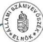

*Állami Számvevőszék*---

# JELENTÉS

**29 települési és 18 helyi kisebbségi önkormányzat  
pénzügyi-gazdasági tevékenységének 1997. évi  
ellenőrzési tapasztalatairól**

9813

---**419.**

**1998. április**

---

A vizsgálat végrehajtásáért felelős:

Dömötör Gyula

igazgató

Az ellenőrzést vezette:

Dr. Sallai Antal

számvevő-főtanácsos

Az összefoglaló jelentést készítette:

Kóródi József

számvevő-tanácsos

Vécsey László

számvevő-tanácsos

A helyszíni vizsgálatot végezték:

Benczik Lászlóné

Bocsi Sándor

Buczkó András

Csekei Gyula

Csomán Mihály

Csuti Lajos

Dr. Bukva Anna

Fercsik Gyula

György Árpád

Hadházi Sándor

Hirka Mihály

Horváth József

Huszár Sándorné

Kalmár Ferencné

Kántor Ilona

Kenéz Sándor

Kerezsi Pál

Kispálné

Wiedemann Györgyi

Kollár Lászlóné

Komlósiné Bogár

Éva

Kozák György

Köcse Istvánné

Majer Lajosné

Müller Ildikó

Nagy Józsefné

Pálfi András

Remeczki László

Dr. Spilák Antal

Szabó Gabriella

Szabó Zoltán

Dr. Szikszai Bertalan

Szilágyi Sándor

Dr. Szücs Zoltán

Dr. Takács András

Dr. Telkes Imre

Tormáné Ivánfi Irén

Tréfás Antal

Turnheimné Lakos

Zsuzsa

Dr. Vasváriné

Dr. Rózsa Anikó

Zeke József

---

V-1003-44/1997-98.TSZ. 364

# TARTALOMJEGYZÉK

I. BEVEZETÉS 3
II. ÖSSZEGZÖ MEGÁLLAPITÁSOK, KÖVETKEZTÉSEK, JAVASLATOK 5
III. RÉSZLETES MEGÁLLAPITÁSOK 9

1. Az onkormányzati gazdalkodás szervezettsége, szabályozottsága 9
2.A koltsegvetesek szabályszerüsege, megalapozottsága 11
3. Az onkormanyzatok gazdalkodásanak törvenyessége, eredményessége 12
4. A szamviteli rend es a gazdalkodásrol történő beszámolás Ellenőrzésenek tapasztalatai 13
5. Az onkormanyzatok ellenorzési tevekenysége 15
6. A helyi kisebbségi önkormányzatok gazdalkodásanak tapasztalatai 16

1

---

.

1

---

# Jelentés

# 29 települési és 18 helyi kisebbségi önkormányzat pénzügyi-gazdasági tevékenységének 1997. évi általánosítható ellenőrzési tapasztalatairól

# I. BEVEZETÉS

A helyi önkormányzatokról szóló többször módosított 1990. évi LXV. törvény 92.§ (1) bekezdése az Állami Számvevőszék feladatává teszi a helyi önkormányzatok és a helyi kisebbségi önkormányzatok gazdálkodásának ellenőrzését. A jogszabályban megfogalmazott kötelezettség teljesítéseként — kapacitásunk függvényében — az előző évekhez hasonlóan 1997. évben is végeztünk átfogó pénzügyi-gazdasági ellenőrzést mind a települési, mind a helyi kisebbségi önkormányzatoknál. Ezek során mindenek előtt arra kerestük a választ, hogy a vizsgált önkormányzat

- gazdálkodásában a törvények és rendeletek előírásai maradéktalanul érvényesültek-e,
- pénzügyi-gazdasági helyzete miként alakult, gazdaságszervező és végrehajtó tevékenysége hogyan minősíthető,
- ellenőrző munkája mennyiben segítette szakmai és gazdasági tevékenységének szabályszerűségét, célszerűségét, hatékonyságát,
- a vizsgált helyi kisebbségi önkormányzat a törvényes keretek között gazdálkodott-e?

Az Állami Számvevőszékhez az utóbbi években sorozatosan érkeztek bejelentések, felkérések, kezdeményezések arra vonatkozóan, hogy vizsgálja meg egy-egy önkormányzat teljes gazdálkodását, vagy annak — a bejelentésben megjelölt — részterületét. A lakosság közügyek iránti érdeklődésének növekedése, továbbá egyes vélt, vagy valós sérelmek kapcsán 1996. évben is érkeztek ilyen témájú állampolgári bejelentések az ÁSz-hoz. Ezen túlmenően képviselőtestületek, polgármesterek, közigazgatási hivatalok és más szervezetek (köztük ügyészség) is kérték egy-egy önkormányzat gazdálkodásának ellenőrzését. Az Állami Számvevőszék bejelentésekre vagy bejelentések alapján általában nem szervez vizsgálatot. Kivételt képez az önkormányzati gazdaság, ahol olyan problémákra hívják fel a figyelmet, amelyek egy-egy önkormányzat gazdálkodásának átfogó vizsgálatát igénylik.

1997. évben az ÁSz 29 települési és 18 helyi kisebbségi önkormányzat pénzügyi gazdálkodását ellenőrizte. A pénzügyi-gazdasági ellenőrzés 3 városi, 3 nagyközségi, és 23 községi önkormányzatra terjedt ki, (1. sz. melléklet).

3

---

I. BEVEZETÉS---

Az ellenőrzések főként az 1000-2000 fős településeket érintették. Ennek következtében az önkormányzatok mintegy 1%-ának vizsgálata alapján tett megállapítások az önkormányzati gazdálkodás egészére **nem általánosíthatóak**. Ugyanakkor néhány kedvezőtlen jelenségre, jellemző hiányosságra hívták fel a figyelmet. Az ellenőrzési megállapításokat gazdagították azok a tapasztalatok is, amelyek az önkormányzatok tevékenységének egyéb ellenőrzései során felszínre kerültek.

Az ellenőrzések egységes szemléletét és módszerét központilag kidolgozott vizsgálati program biztosította. **Az ellenőrzési program lehetőséget adott a számvevőknek arra, hogy a helyszíni vizsgálatok során kellő mélységben foglalkozzanak helyileg fontos** — de előre nem látható — **téma-körökkel, ami a vizsgálatok helyi és központi hasznosítására lehetőséget adott, illetve ad.**

Az 1997. évi ellenőrzések elsősorban az 1995—96. évi gazdálkodásra irányultak. **A helyszíni ellenőrzések tapasztalatait a következőkben foglaltuk össze.**

---4

---

II. ÖSSZEGZŐ MEGÁLLAPÍTÁSOK, KÖVETKEZTETÉSEK, JAVASLATOK

## II. ÖSSZEGZŐ MEGÁLLAPÍTÁSOK, KÖVETKEZTETÉSEK, JAVASLATOK

A vizsgált nagyobb önkormányzatok — a helyi sajátosságokat figyelembe véve — megfelelően alakították ki szakmai és gazdasági feladataik ellátásának szervezeti kereteit (önkormányzati hivatal, intézmények). A kis települések képviselő-testületei viszont továbbra sem szorgalmazták kellően az igazgatási, gazdasági feladatok szakszerűbb, hatékonyabb és költségkímélőbb (társulás, körjegyzőség) formában történő ellátását.

A gazdálkodás szervezettségét, szabályozottságát illetően az ellenőrzés alapvető hiányosságokat állapított meg a vizsgálattal érintett önkormányzatoknál. Mintegy 80%-uk ugyanis egyáltalán nem szabályozott — sem helyi rendeletben, sem belső szabályzatban — több, a gazdálkodást alapvetően érintő kérdéskört, vagy formális kötelezettségének ítélte. Az utóbbiak ugyanis vásárolt — a helyi sajátosságokra nem adaptált, ebből következően szabályozó funkciójuk betöltésére alkalmatlan — mintaszabályzatokkal rendelkeztek.

Azon önkormányzatoknál, ahol saját maguk próbálkoztak a gazdálkodással összefüggő feladatokat, hatásköröket, felelősséget, továbbá az információszolgáltatással, a számviteli nyilvántartások vezetésével kapcsolatos előírásokat megfogalmazni, — a kellő szakértelem hiánya miatt — a szabályozás tartalmilag hiányos, vagy szakszerűtlen volt.

Minimális - 20% alatt - volt azon önkormányzatok száma, ahol munkaköri leírásban megfelelően rögzítették a polgármesteri hivatalban dolgozók gazdálkodással összefüggő feladatait, hatáskörét, felelősségét.

A vizsgált önkormányzatok közel 50% nem készítette el — a település hosszabb távú célkitűzéseit meghatározó, az éves költségvetéseket megalapozó és törvényben előírt — gazdasági programját. A költségvetés tervezésének, jóváhagyásának ellenőrzése során szerzett tapasztalatok szerint a vizsgált önkormányzatoknak csak kis hányada (20%) készített, illetve fogadott el olyan költségvetéseket, amelyek mindenben megfeleltek a vonatkozó előírásoknak. Az éves költségvetések legjellemzőbb hiányossága, hogy összeállításuk és jóváhagyásuk során nem tartották be az azok tartalmára, részletezettségére, szerkezetére vonatkozó kötelező előírásokat.

Kedvező viszont, hogy az ellenőrzött önkormányzatok mintegy 75%-a reálisan tervezte meg forrásait és azok felhasználását éves költségvetéseiben. Néhány esetben fordult elő a bevételek vagy a kiadások alul-, illetve túltervezése. A tervező munka hiányosságai viszont ezeknél sem voltak olyan súlyúak, amelyek miatt az érintett önkormányzatok pénzügyi egyensúlya, likviditási helyzete veszélybe került volna.

Az érintett önkormányzatok operatív gazdálkodásának törvényessége nem volt minden tekintetben kielégítő és elfogadható. Ez részben jogkövető magatartásuk fogyatékosságaira, részben a helyi szabályozások hiányosságaira — ese-

5

---

II. ÖSSZEGZŐ MEGÁLLAPÍTÁSOK, KÖVETKEZTETÉSEK, JAVASLATOK

tenként hiányára — vezethető vissza. Jelentős hányaduk (75%) ugyanis a költségvetés végrehajtása során a gazdálkodási fegyelem több elemi előírását sem tartotta be. Nem hajtották végre az előirányzatok évközi módosítását, nem vagy csak részben tartották be a költségvetésben jóváhagyott kiemelt előirányzatokat. Több helyen pedig a kötelezettségvállalás, az ellenjegyzés, az érvényesítés és utalványozás jogszabályban előírt szigorú előírásainak gyakorlását mulasztották el, vagy tekintették a gazdálkodás formális követelményének. A testületi hatáskörbe tartozó kötelezettségvállalások (hitelfelvétel, kötvénykibocsátás, kezességvállalás, jelzálogjog alapítás) tekintetében többségük körültekintően járt el.

A vizsgált körben szerzett ellenőrzési tapasztalatok azt bizonyítják, hogy az önkormányzatoknál alkalmazott könyvviteli rendszer a pénzforgalomról elfogadható információkat képes biztosítani mind a központi szervek, mind a képviselő-testületek számára. Az önkormányzatok számvitelszervező munkájának — főként az analitikus nyilvántartások terén tapasztalt — fogyatékosságai miatt viszont a beszámolók mérlegadatainak megbízhatósága sok kívánnivalót hagy maga után. A vagyon számbavételénél, nyilvántartásánál, leltározásánál szinte minden önkormányzatnál tapasztalt hiányosságot az ellenőrzés.

A korábbi évekhez hasonlóan változatlanul gondot jelent, hogy a pénzügyi-gazdasági ellenőrzések keretében, a zárszámadási törvénnyel lezárt évet érintő állami hozzájárulásoknál és támogatásoknál megállapított eltéréseket - törvényi felhatalmazás hiányában - nem lehet realizálni.

A vizsgált önkormányzatok túlnyomó hányada nem, vagy nem maradéktalanul tett eleget azon kötelezettségének, mely szerint az éves gazdálkodásról zárszámadási rendeletet kell alkotnia. Több önkormányzat (10%) egyáltalán nem, számottevő részük (58%) pedig vagy jelentős időbeni késéssel, vagy tartalmilag hiányosan terjesztette a rendelettervezetet a képviselő-testület elé. A könyvvizsgálatra kötelezett önkormányzatok 71%-a egyszerűsített tartalmú beszámolóját könyvvizsgálóval felülvizsgáltatta s közzétette, 29%-a viszont elmulasztotta azt.

Az ellenőrző tevékenység jelentősen elmaradt a jogszabályban előírt követelményektől. Ez érvényes mind az önálló gazdálkodási jogkörrel rendelkező intézmények, mind a polgármesteri hivatalok gazdálkodására irányuló ellenőrzésekre egyaránt. A vizsgált önkormányzatok többsége (60%) sem felügyeleti jellegű, sem függetlenített belső ellenőrzési szervezetet nem alakított ki, illetve ilyen tevékenységet nem végzett. Kisebbik hányaduk (40%) ugyan tett intézkedéseket, de annak folyamatos és teljes körű megvalósítása egyetlen önkormányzatnál sem sikerült. A pénzügyi bizottságok többsége (82%) sem végzett konkrét ellenőrzést a polgármesteri hivatalokban és az intézményekben.

A 18 helyi kisebbségi önkormányzat 1995—96. évi gazdálkodásának ellenőrzése során szerzett legfontosabb tapasztalat, hogy gazdálkodás szakszerű végrehajtásához még nem rendelkeznek megfelelő felkészültséggel. Ezért írta elő jogszabály, hogy a kisebbségi önkormányzatnak a települési önkormányzattal megállapodásban kell rögzíteni a költségvetési gazdálkodás lényeges folyamatainak részletes eljárási szabályait. A törvény által előírt együttműködési

6

---

II. ÖSSZEGZŐ MEGÁLLAPÍTÁSOK, KÖVETKEZTETÉSEK, JAVASLATOK

megállapodás megkötésére, a vizsgált időszakban általában nem került sor. Az együttműködési megállapodások hiánya is oka annak, hogy a vizsgált kisebbségi önkormányzatok gazdálkodásában számos hiányosságot, szabálytalanságot, esetenként törvénysértést tárt fel az ellenőrzés.

Az Állami Számvevőszék a helyszíni ellenőrzések megállapításai nyomán megtette javaslatait a feltárt hiányosságok felszámolására, és felhívta az illetékes vezetők figyelmét a törvényes állapot helyreállítására.

A javaslatokat az önkormányzatok elfogadták és az általuk kidolgozott intézkedési tervek bizonyítják a hiányosságok felszámolására irányuló szándékukat.

Szembetűnő tapasztalat, hogy a gazdálkodási szabályokat és törvényes előírásokat megszegő vétkes személyek felelősségre vonásától az önkormányzati testületek többsége eltekintett. (A 3. sz. melléklet tanúsága szerint a 12 önkormányzatnál összesen 31 fő felelőssé tett személy közül 3 főt vontak felelősségre). Főleg a polgármesterek, jegyzők felelősségre vonása annak ellenére nem történt meg, hogy a jogszabályok világosan és számon kérhetően részletezik feladataikat, felelősségüket.

A mentő körülmények, az érdemek és eredmények túlhangsúlyozása mellett az is közrejátszik a felelősségre vonások elmaradásában, hogy a szabálytalanságok elkövetésében testület, választott és kinevezett tisztségviselő, ügyintéző általában közösen osztozik. A törvényes állapot olyan hiányát — amihez nem kapcsolódik személyes haszonszerzés, visszaélés — a helyi közfelfogás „bocsánatos bűnnek” tekinti. Gyakran ez is szerepet játszik abban, hogy a gazdálkodás törvényességének a követelménye nem érvényesül a gyakorlatban.

Az Állami Számvevőszék a helyi önkormányzati és a helyi kisebbségi önkormányzati gazdálkodás törvényességének, szabályszerűségének szigorítása, szervezettségének szükségszerű javítása érdekében a Kormány részére javasolja, hogy a törvényalkotás folyamatában

1. Indokolt megteremteni a helyi önkormányzati és a helyi kisebbségi önkormányzati gazdálkodás rendszeres átfogó törvényességi és eredményességi ellenőrzésének jogi, pénzügyi és szervezeti feltételeit. Ennek megvalósítása érdekében a Kormány gyorsítsa fel a már folyamatban lévő ezirányú törvényelőkészítő — módosító — munkát.
2. Törvényben célszerű szabályozni a központi költségvetésből az önkormányzatok részére juttatott hozzájárulások és támogatások teljes körű elszámolásának feltételeit. Ennek érdekében a Kormány készítsen, s terjesszen a Parlament elé az államháztartásról szóló törvény kiegészítésére olyan javaslatot, mely egyértelműen szabályozza a központi költségvetés és az önkormányzatok közötti elszámolások pénzügyi rendezésének elévülési idejét. (Ezt célszerű lenne az adó elévülésének időtartamában — 5 évben — meghatározni.) Rögzíteni szükséges a zárszámadási törvénnyel lezárt évet illető, utólag megállapított eltérések rendezésének eljárási szabályait is.
3. A kis önkormányzati hivatalokban jelentkező igazgatási, gazdasági feladatok szakszerű, hatékony és költségkímélő ellátásának eszköze a társulási, illetve a körjegyzőségi forma, ezért e feladatok ilyen keretek között történő ellátásának szélesebb körű elter-

7

---

II. ÖSSZEGZŐ MEGÁLLAPÍTÁSOK, KÖVETKEZTETÉSEK, JAVASLATOK---

jesztését — az eddig alkalmazott ösztönzésen túl — célszerű lenne további központi támogatásokkal segíteni.

4. A helyi kisebbségi önkormányzati gazdálkodás törvényességének, szakszerűségének javítása érdekében indokolt módosítani az államháztartásról szóló törvényt, valamint a kisebbségi önkormányzatok gazdálkodásáról szóló kormányrendeletet. A jogszabályok korrekciója azt szolgálná, hogy a kisebbségi önkormányzat csak a helyi önkormányzatok költségvetési elszámolási számláját vezető pénzintézetnél, annak alszámlájaként nyithasson bankszámlát. Egyidejűleg a polgármesteri hivatalok kontrolljának biztosítása érdekében — megszűnne annak lehetősége, hogy az ellenjegyzési jogot a jegyző helyett a kisebbségi önkormányzat testületének tagja is elláthassa.

---8

---

III. RÉSZLETES MEGÁLLAPÍTÁSOK

# III. RÉSZLETES MEGÁLLAPÍTÁSOK

## 1. AZ ÖNKORMÁNYZATI GAZDÁLKODÁS SZERVEZETTSÉGE, SZABÁLYOZOTTSÁGA

Az ország valamennyi településének lakosságát megilleti az önkormányzáshoz való jog, a helyi közszolgáltatások biztosítása. Nincs olyan jogszabály, ami kötelező előírásokat tartalmazna arra, hogy az önkormányzatok kötelező és önként vállalt feladataikat milyen szervezeti keretek, milyen szervezési elvek, illetve tárgyi-személyi feltételek között lássák el. A képviselő-testületek joga és felelőssége ezért az ilyenirányú döntések meghozatala, melyek során a rendelkezésre álló anyagi erőforrások felelősségteljes felhasználásával, az ésszerű gazdálkodás követelményei, illetve a helyi sajátosságok messzemenő figyelembevételével kell a feladatellátás legmegfelelőbb szervezeti-működési rendjét kialakítani.

E feladat nagyságrendjét mutatja, hogy az ország településeinek közel kétharmadán kellett 1990-től megteremteni a helyi közügyek ellátására hivatott önálló szervezeti-működési kereteket.

Az 1997. évi pénzügyi-gazdasági ellenőrzések — a korábbi évek ilyen típusú ellenőrzéseihez hasonlóan — azt mutatták, hogy az önkormányzatok általában megfelelően alakították ki a helyi közfeladatok ellátásának szervezeti kereteit, mivel a polgármesteri hivatalok és a különféle intézmények többsége célszerűen, a helyi sajátosságokra figyelemmel létesült.

Az önkormányzati feladatok ellátásában döntő szereppel rendelkező polgármesteri hivatalok nagyságrendje, az ott dolgozók létszáma általában megfelelő a BM által ajánlott, a települések nagyságrendjéhez igazított modellnek.

A tapasztalatok szerint ugyanakkor még mindig idegenkednek a képviselő-testületek attól, hogy az önkormányzat működésével kapcsolatos feladatok olcsóbb, hatékonyabb ellátása érdekében együttműködjenek más településekkel, és körjegyzőséget hozzanak létre. Féltik önállóságukat. Az egységes hivatali szervezet létrehozása esetén veszélyeztetve látják a közügyek helyben történő intézésének lehetőségét is. Az önkormányzati önállóság teljességének hiányát látnák abban, ha helyben nem működne saját, bármilyen kis apparátussal bíró hivatal, s csak ügyfélfogadás helyettesítené azt.

Az ellenőrzések szinte egyöntetű tapasztalata, hogy a testületek nem fordítottak kellő figyelmet arra, hogy maguk és szervezetük működését kellő színvonalon és tartalommal meg is szervezzék. Ez azt jelentette, hogy az Ötv. 1, 10, 35. §-aiban, valamint a 156/1995. (XII.26.) Korm. rendelet 10. §-ában meghatározott jogaik és kötelezettségeik nem érvényesültek maradéktalanul a gyakorlatban, elsősorban az SZMSZ-ek, ügyrendek hiánya, hibái miatt. Kedvezőtlen tapasztalat, hogy a szabályozásokat általában készen vásárolták meg és adaptálás nélkül hagyták jóvá a testületek. Az ilyen „látszat-szabályozás” következményei a sablonos, semmitmondó szabályzatok. Azokon a településeken, ahol

9

---

III. RÉSZLETES MEGÁLLAPÍTÁSOK---

igyekeztek valóságos szervező munkával vezérelni a polgármesteri hivatalok gazdálkodását, a szabályozások gyakran hibásak, hiányosak, vagy szakszerűtlenek voltak.

Az ellenőrzött önkormányzatok 80%-ánál voltak ilyen jellegűek a tapasztalatok 1997 évben, ami még akkor sem tekinthető elfogadhatónak, ha a végrehajtás, a gyakorlati munka — s ez kedvező — nem volt mindenhol az alacsony szintű szabályozással azonos. A folyamatok gyakran sajátos önszerveződés révén alakultak, fejlődtek, s megfelelő vezérlés híján helyi tényezőkön (szakértelem, fluktuáció stb.) múlt, hogy a gazdálkodás mennyire vált szervezetté, szabályszerűvé.

Az önkormányzatok nem, vagy csak részben hajtották végre az 54/1996. (IV.12.) Korm. rendelet előírásait, melynek 25. §-a a leltározás és selejtezés, 37. §-a a számlarend készítés, valamint az analitikus nyilvántartások rendszerének szabályozási kötelezettségét írta elő. A 156/1995.(XII. 26.) Korm. rendelet tartalmazza a pénzgazdálkodási jogkörök gyakorlásának általános szabályait, melyek szintén hiányosan kerültek rögzítésre a helyi szabályozásokban. Az 1997. január 1-től kötelező számviteli politikát — közte a pénzkezelési szabályzatot — sem készítették el, a 209/1996. (XII.23.) Korm. rendeletben foglaltak szerint.

A polgármesteri hivatalok alacsony szintű szervezettségének egyik legjellemzőbb megnyilvánulása volt, hogy nem (36%), vagy csak hiányosan (22%) alakították ki, illetve szabályozták a gazdálkodással kapcsolatos helyi hatáskörök gyakorlásának rendjét, melyeket az 1991. évi XX. tv. X. fejezetének 138-140. §-ai részleteztek. Különösen a pénzgazdálkodással kapcsolatos hatásköri előírások maradtak el, melynek következtében a vizsgált önkormányzatok gazdálkodási gyakorlatában több szabálytalanság volt fellelhető.

Az ellenőrzött önkormányzatok 20%-át sem érte el azoknak a száma, melyeknél megfelelően rögzítették a polgármesteri hivatalban dolgozók munkaköri feladatait. Számos (6) településen az operatív gazdálkodásban közreműködők munkaköri feladatai olyannyira általánosan vagy hiányosan kerültek megfogalmazásra, hogy végrehajtását nem lehetett az ellenőrzések során az ügyintézőkön számon kérni, felelősségüket tisztázni, illetve megállapítani.

Pozitívnak tekinthető viszont a Vecsés nagyközség polgármesteri hivatalában tapasztalt gyakorlat, hogy részletes feladat-felmérés és átvilágítás után alakították ki jelenleg is meglévő szervezetüket, s készítették el annak alapján — egyebek mellett — a részletes munkaköri leírásokat.

A vizsgált polgármesteri hivatalok közel felénél voltak megfelelőnek tekinthetők a személyi-tárgyi feltételek. A „nem megfelelő” minősítést többségében a rosszabb személyi feltételek miatt eszközölték a számvevők, míg a tárgyi feltételek általában e helyeken is kielégítőek voltak.

A megfelelő személyi feltételek biztosítása gyakran okoz gondokat a kis településeken, melynek orvoslására helyben kevés lehetőség kínálkozik. A települések összefogása, a közös hivatalok létrehozása ugyanakkor lassan halad, így még nehéz a gazdálkodás színvonalának, szabályszerűségének javulása is. Hozzájárul mindehhez a szervezettséget illetően gyakran tapasztalható igénytelenség

---10

---

III. RÉSZLETES MEGÁLLAPÍTÁSOK

is, ami azzal párosul, hogy számos erre vonatkozó jogszabályi rendelkezést nem, vagy csak hézagosan, igen alacsony szinten hajtanak végre.

## 2. A KÖLTSÉGVETÉSEK SZABÁLYSZERŰSÉGE, MEGALAPOZOTTSÁGA

A vizsgált önkormányzatok közel 50%-a — figyelmen kívül hagyva az Ötv. 91. §-ában foglaltakat — nem készítette el gazdasági programját. Ennek következtében az éves költségvetések nagy hányada nélkülözte azt a keretet, melynek alapján tervszerűen, tudatosan, a hosszabb távú célokat figyelembe vevő módon történhetett volna meg összeállításuk.

Az éves költségvetések mindössze 20%-a felelt meg kifogástalanul a jogszabályi előírásoknak. A fennmaradó részt közel fele-fele arányban tették ki azon önkormányzatok, amelyek költségvetései — a hibák, hiányosságok eltérő súlya, jelentősége miatt — vagy teljes egészében, vagy részben elfogadhatatlanok, illetve szabálytalanok voltak. A költségvetések legjellemzőbb hibája az volt, hogy figyelmen kívül hagyták azok szerkezetére, tartalmára, részletezettségére vonatkozó (az Áht. 67, 69, 71, 73, 74, 75, 118, valamint a 156/1995. (XII.26.) Korm. rendelet 12, 18. §-aiban részletezett) előírásokat.

A vizsgált önkormányzatok nagyobb része (közel 60%) figyelemmel volt arra, hogy elfogadott költségvetésük végrehajtását — ezzel a helyi akarat, célok érvényre jutását — saját rendeleteikkel is előmozdítsák. Nem elhanyagolható ugyanakkor azon önkormányzatok köre, ahol ilyen intézkedéseket (az Áht. 8/A. § (1) bek., 71. § (2) bek., 74. § (2) bek., 75. §, valamint a 156/1995. (XII.26.) Korm. rendelet 24-25. §-aiban foglaltak végrehajtására) nem tettek, így kevésbé érvényesülhetett a költségvetés gazdálkodást vezérlő, szabályozó szerepe.

Az 1997. évi pénzügyi-gazdasági ellenőrzéssel érintett önkormányzatok túlnyomó része (75%) megfelelően, vagy „még elfogadható” minősítéssel vette számba költségvetésében forrásait és tervezte meg ennek alapján kiadásait. Kedvező, hogy a megalapozatlanul, kellő realitás nélkül elkészített költségvetésekkel rendelkező önkormányzatok — a rossz tervezőmunka következtében — nem kerültek elháríthatatlanul súlyos, esetleg olyan csődhelyzetbe, amit saját hatáskörbe nem tudtak volna kezelni, rendezni.

Gyakori, hogy a települések „pesszimista” szemléletű költségvetést állítanak össze, melynek mértéke meghaladja az óvatos, körültekintő, biztonságra törekvő gazdálkodási szemlélet által indokoltat. Ezt bizonyítja többek között az, hogy a költségvetésekben betervezett hitelfelvételre ezeknél az önkormányzatoknál nem volt szükség.

Az ellenőrzések kedvező tapasztalata ugyanakkor, hogy az önkormányzatok 80%-ánál megfelelőnek volt minősíthető a fejlesztések pénzügyi megalapozottsága. A minősítés még annak figyelembevételével is helytállónak tekinthető, ha ebbe a körbe tartozó önkormányzatok több mint 40%-a csak viszonylag kis volumenű beruházásokba kezdett a vizsgált időszakban, vagy esetenként — átmenetileg — teljesen szüneteltette fejlesztéseit.

Az önkormányzatok általában 1990-től nagyarányú fejlesztésekbe kezdtek, — különösen a helyi infrastruktúra kiépítése érdekében — amelyek zömmel

11

---

III. RÉSZLETES MEGÁLLAPÍTÁSOK

1995–96. években értek el a befejezés stádiumába. Pénzügyi erőforrásaikat e célokra koncentrálták. Általában — ha nem is gondmentesen, — sikerült a fejlesztésekhez szükséges erőforrásokat úgy biztosítani, hogy pénzügyi egyensúlyukat megőrizték. Az új fejlesztések indítása tekintetében a vizsgált időszakban tapasztalható általános visszafogottságot, illetve a folyamatba lévők befejezésére irányuló törekvést az ellenőrzések — egy-két esetinek tekinthető jelenség kivételével — pozitívan értékelték.

### 3. AZ ÖNKORMÁNYZATOK GAZDÁLKODÁSÁNAK TÖRVÉNYESSÉGE, EREDMÉNYESSÉGE

A gazdálkodás eredményességét lényegesen meghatározzák a feladatellátás szervezeti keretei, melyeket az önkormányzatok túlnyomó része (65%) megfelelően, a helyi sajátosságokhoz igazodóan, célszerűen alakított ki. A feladatellátás igen változatos formáival, szervezeti megoldásaival találkoztak a számvevők. A különféle költségvetési gazdálkodási formák mellett jelen vannak a vállalkozások is, melyek szintén változatos szervezeti keretek között tevékenykednek.

Az önkormányzatok jelentős részénél nem volt megfelelőnek tekinthető a gazdálkodási fegyelem. Ennek egyik megnyilvánulása, hogy az ellenőrzött települések mintegy 58%-a nem, további 13% is csak részben gondoskodott az előirányzatok betartásáról, módosításáról. A jóváhagyott költségvetést még mindig nem tekintik a helyi közakaratot kifejezésre juttató, kötelező érvényű és ezért betartandó pénzügyi tervnek, ezért annak kapcsolata a valós gazdálkodással gyakran laza, esetleges. Ez azt jelentette, hogy ezek megsértették az Áht. 93. § (1) bekezdés azon előírását, amely szerint a költségvetési szerv a jóváhagyott előirányzatokon belül köteles gazdálkodni. A költségvetési fegyelem nem megfelelő állapotának, illetve a gazdálkodásban tapasztalható megengedhetetlen liberalizmusnak egyik további megnyilvánulása volt az, hogy a vizsgált önkormányzatok jelentős hányadánál (62%) nem, vagy csak részben (13%) tartották be jóváhagyott költségvetésük kiemelt előirányzatait. Ez a jelenség részben az előirányzat-módosítások elmaradásának következménye részben annak, hogy nem tartották be a kötelezettségvállalásra vonatkozó, az Áht. 98. §-ában, valamint a 156/1995. (XII.26.) Korm. rendelet 35-39. §-aiban foglalt előírásokat sem.

A képviselő-testületi hatáskörbe tartozó döntéseket (hitelfelvétel, kötvénykibocsátás, kezességvállalás, alapítványok támogatása, jelzálogjog alapítás) viszont az érintett önkormányzatok megfelelően készítették elő. Az előterjesztések e tekintetben valós és teljes körű információkat nyújtottak a képviselőknek a felelős döntéshozatalhoz.

Az 1997. évi pénzügyi-gazdasági ellenőrzések a korábbi éveknél kedvezőbb tapasztalatokat szereztek - a vizsgált körben - az önkormányzatok vagyongazdálkodásáról is. A kiegyensúlyozottabb, konszolidáltabb helyzetet mutatja, hogy a számvevők az ellenőrzött önkormányzatok 55%-ánál megfelelőnek ítélték a vagyongazdálkodást, s további 24%-uknál ha még nem is hibamentesnek, de még (részben) elfogadhatónak volt tekinthető. E minősítések során a szabályszerűség mellett a célszerűségi (eredményességi) szempontokat is figyelembe

12

---

III. RÉSZLETES MEGÁLLAPÍTÁSOK

vették, illetve mérlegelték az ellenőrzést végzők, amely hozzájárult a kedvezőbb tapasztalatokhoz.

Körültekintőbb, a realitásokat jobban figyelembevevő szemlélettel találkoztak az ellenőrök 1997. évben, melynek eredményeképpen a települések pénzügyileg stabilak tudtak maradni. E biztonság fenntartása érdekében viszont a települések egy része — azok, amelyek a korábbi években megkezdett beruházások előtt nem mérték fel reálisan lehetőségeiket — arra kényszerült, hogy hosszabb távú érdekeik ellenére értékesítsék vagyonuk egy részét.

A vagyonértékesítés a vizsgált körben sehol sem volt „vagyonfelélés”-sel egyenlőnek tekinthető nagyságrendű, — ugyanis azok nem veszélyeztették az önkormányzatok kötelező feladatainak ellátását —, gyakran mégis előnytelen döntésekre kényszerültek a képviselő-testületek. Ez volt a jellemző a vagyoni részesedések (részvények) értékesítésére, mivel a saját maguk által előidézett pénzügyi egyensúlytalanságot csak a részvények értéken aluli eladása révén tudták megszüntetni. Három településen — a pénzügyi helyzet szorításában — szabálytalan intézkedéseket hoztak fizetőképességük biztosítására. (A lakásértékesítésből elért bevételt az 1993. évi LXXVIII. tv. 62. §-ában foglaltakkal ellentétben nem különítették el és az engedélyezett céltól eltérően, amely lakóépületek felújítására, korszerűsítésére és építésére ad lehetőséget, működési kiadásaik fedezetére használták fel).

Az önkormányzatok meglévő vagyonának kihasználása tekintetében az ellenőrzések kedvező tapasztalatok birtokába jutottak. A testületek ugyanis általában figyelemmel kísérik intézményeik kapacitás-kihasználtságát, s megteszik azokat az intézkedéseket, melyek az igények és lehetőségek összehangolásához szükségesek. Nehezebb az ilyen döntések meghozatala a kis településeken, ahol objektíve korlátozottabb lehetőségei vannak a megfelelő szintű kapacitás-kihasználás érdekében tehető intézkedéseknek. Az intézmények száma, alapterülete, felszereltsége általában szerény, s az ugyancsak szerény személyi feltételek is megnehezítik a rugalmas alkalmazkodást a változó igényekhez.

#### 4. A SZÁMVITELI REND ÉS A GAZDÁLKODÁSRÓL TÖRTÉNŐ BEZÁMOLÁS ELLENŐRZÉSÉNEK TAPASZTALATAI

Az 54/1996. (IV.12.) számú Korm. rendelet 4.§.(1) bekezdése szerint „A költségvetés alapján gazdálkodó szerv tevékenysége vagyoni és pénzügyi helyzetére ható eseményeiről a kettős könyvvitel rendszerében — e rendeletben rögzített szabályok szerint — pénzforgalmi nyilvántartást vezet, amelyet a naptári év végén lezár”.

Az 1997. évi pénzügyi-gazdasági ellenőrzések megállapításai szerint az önkormányzatok által működtetett számviteli rendszer a pénzforgalomról — a már említett helyi szabályozási hiányosságok ellenére is — teljes körű és valós információkat képes biztosítani mind a központi szervek, mind a képviselő-testületek számára. Ez részben a pénzforgalmi könyvelés zárt rendszerének eredménye, részben annak, hogy a főkönyvi könyvelést országosan egységesített — néhány központilag kifejlesztett és tesztelt — számítógépes programokkal végzik.

13

---

III. RÉSZLETES MEGÁLLAPÍTÁSOK

A pénzforgalmi szemléletű kettős könyvvitel a költségvetési szervek pénzforgalmát zárt rendszer keretében tartja nyilván és mutatja ki. Kizárólagos pénzforgalmi szemléletéből következően azonban nem képes kezelni a készletek, az adósok, a vevők, a munkavállalókkal kapcsolatos követelések, a szállítókkal szembeni tartozások számláinak adatait, és az azokban bekövetkezett változásokat. Ezekről külön analitikus nyilvántartásokat kell vezetni azért, hogy értékük a vagyonmérlegben kimutatható legyen. Az analitikus nyilvántartások szerepe tehát jelentős, amit az ellenőrzött önkormányzatok nem ismertek fel.

Az önkormányzatok — az állami tulajdon lebontása révén — megalakulásuk óta számottevő vagyonhoz jutottak. Ezek nyilvántartásba vételének előírásait a számviteli jogszabályok tartalmazzák, ennek ellenére — a vizsgált körben — az önkormányzatnál még mindig hiányosságok voltak tapasztalhatók a vagyon számbavételét illetően.

A költségvetés alapján gazdálkodó szervek beszámolási és könyvvezetési kötelezettségéről szóló 54/1996.(IV.12.) számú Korm. rendelet 25. §-a előírja, hogy a mérlegben kimutatott vagyonrészek értékét leltárral kell alátámasztani. A leltározás előkészítésével, végrehajtásával, összeállításával, kiértékelésével, a leltári eltérések rendezésével kapcsolatosan még mindig sok hiányosság volt tapasztalható. Az ellenőrzött önkormányzatok jelentős hányadánál ugyanis (32%) évek óta nem végezték el a vagyontárgyak leltározását, vagy az nem volt teljes körű. Esetenként a leltár kiértékelése maradt el. Olyan — tulajdonvédelmi szempontból megengedhetetlen — eset is előfordult, hogy a selejtezést és a leltározást azonos időben végezték el.

Az önkormányzatok mintegy 70%-ánál - az 1997. évben végzett ellenőrzések megállapításai szerint - a házipénztári pénzkezelés gyakorlata elfogadható volt. 30%-nál viszont vagy a pénztár biztonságos működésének tárgyi feltételeit illetően, vagy a pénztárellenőrzést, az elszámolásra kiadott előlegek nyilvántartását, a szigorú számadású nyomtatványok kezelését illetően tapasztalt kisebb-nagyobb hiányosságokat az ellenőrzés. Egy városnál pedig az értékpapírok nyilvántartásánál, tárolásánál tártak fel mulasztásokat a számvevők.

A szigorú számadású nyomtatványok körének meghatározása, kezelése, nyilvántartásuk vezetése és ellenőrzése tekintetében 5 önkormányzatnál tapasztaltak a számvevők hiányosságokat.

A helyi önkormányzatok a központi költségvetésből különféle jogcímeken juthatnak állami támogatáshoz, hozzájáruláshoz. A támogatásokat és hozzájárulásokat az önkormányzatok többsége szabályosan használta fel. Ez elsősorban a központosított előirányzatokból különféle jogcímeken kapott állami támogatásra vonatkozik, míg a normatív állami hozzájárulások elszámolásának megbízhatóságát illetően némileg kedvezőtlenebbek a tapasztalatok. A szabálytalanságok általában a jogszabályok helytelen értelmezésére, alkalmazására, jogszabályismeret hiányára, illetve felületességre — s nem szándékosságra — voltak visszavezethetők.

Nem változott 1997. évben sem az, hogy a pénzügyi-gazdasági ellenőrzés keretében feltárt eltéréseket a számvevőszék csak megállapítani tudta, de azok pénzügyi rendezéséről — jogszabályi felhatalmazás hiányában — nem tudott intézkedni. A zárszámadási törvénnyel lezárt évet illetően utólag megállapított

14

---

III. RÉSZLETES MEGÁLLAPÍTÁSOK

eltérések rendezésének szabályairól ugyanis még nem döntött a törvényalkotó, így az 1995–96. évi eltérések visszafizetéséről — kiutalásáról — sem lehetett már intézkedni.

A helyi önkormányzatok éves gazdálkodásukról zárszámadást kötelesek készíteni, amit a polgármesternek a képviselő-testület elé kell terjesztenie megvitatás és jóváhagyás céljából. A zárszámadási rendelettervezet tartalmára, szerkezetére, előterjesztésének határidejére az Áht. 69.§ (1) bekezdése, 82. §-a, valamint a 156/1995.(XII.26.) számú Kormány rendelet 18. §-a tartalmaz előírásokat.

A vizsgálatok az ellenőrzött önkormányzatok 32%-ánál találták az említett jogszabályok előírásaival összhangban lévőnek a zárszámadást. 10%-uk viszont egyáltalán nem terjesztette azt a képviselő-testület elé, 58%-uk pedig vagy az Áht-ban előírt határidőn túl, vagy nem megfelelő tartalommal tette azt meg.

Az ellenőrzött önkormányzatok 39%-a a zárszámadás keretében jóváhagyta az intézmények, illetve az önkormányzat összesített pénzmaradványát; 32%-uk elmulasztotta azt; 29%-uk pedig — a kormányrendeletben előírtak be nem tartása miatt — nem valós összegben állapította meg a pénzmaradványt.

A helyi önkormányzatokról szóló, többször módosított, 1990. évi LXV. törvény 92/A. § (2) bekezdése alapján az ellenőrzötteknek közel fele (48%-a) volt köteles egyszerűsített tartalmú beszámolót készíteni, s azt könyvvizsgálóval felülvizsgálni, illetve közzétenni. Ezek többsége (71%-a) eleget tett törvényi kötelezettségének, kisebb hányada (29%-a) viszont elmulasztotta a könyvvizsgálat igénybevételét. Az elvégzett könyvvizsgálatok tartalmi színvonala változatos képet mutat. A vizsgált körben ugyanis fellelhetők voltak olyanok, amelyek elősegítették az önkormányzat gazdálkodási kultúrájának, számvitele szabályszerűségének fejlődését. Tapasztalható volt azonban az előírt követelmények formális teljesítése is.

## 5. AZ ÖNKORMÁNYZATOK ELLENŐRZÉSI TEVÉKENYSÉGE

A helyi önkormányzatok ellenőrzési kötelezettségét a többször módosított 1990. évi LXV. törvény 92. § (2) és (3) bekezdése írja elő. Ennek alapján az önkormányzatoknak gondoskodniuk kell saját intézményeik pénzügyi ellenőrzéseiről, valamint gazdálkodásuk belső ellenőrzéséről.

A vizsgált önkormányzatoknak csupán egyharmada volt felügyeleti jellegű költségvetési ellenőrzés végzésére kötelezett. A vizsgálat körébe vont önkormányzatok többsége olyan kisközségi önkormányzat volt, melyek önállóan gazdálkodó intézményt nem tartottak fenn. A helyszíni vizsgálatok megállapították, hogy az érintett önkormányzatok — egy kivételével — az intézményeket ellenőrző feladatukat vagy egyáltalán nem, vagy nem folyamatosan, vagy nem az intézmények gazdálkodásának teljes körére kiterjedően végezték el.

Az önkormányzati törvény azon előírásának fontosságát, hogy „A helyi önkormányzat gondoskodik gazdálkodásának belső ellenőrzéséről jogszabályban meghatározott képesítésű belső ellenőr útján,” az önkormányzati vezetők nem igazán ismerték fel. A helyszíni vizsgálatok tapasztalatai szerint ugyanis ez az ellenőrzési forma vagy egyáltalán nem-, vagy csak igen hiányosan valósult

15

---

III. RÉSZLETES MEGÁLLAPÍTÁSOK

meg. Az érintett polgármesteri hivatalok közel 60%-ánál semmilyen intézkedést nem tettek a törvény ezen — számukra kötelező — előírásának végrehajtása érdekében. Mintegy 40%-a próbálkozott gazdálkodása belső ellenőrzését - különböző módon — megoldani, de ez maradéktalanul, folyamatosan és teljeskörűen egyetlen önkormányzati hivatalnak sem sikerült.

16 település önkormányzati hivatalában a vizsgált időszakban nem került sor a gazdálkodás belső ellenőrzésére.

A helyi önkormányzatokról szóló, többször módosított, 1990. évi LXV. törvény 22. §-a azt írj elő, hogy „A képviselő-testület a kétezernél több lélekszámú településen pénzügyi bizottságot választ.”

A vizsgált körben szerzett ellenőrzési tapasztalatok azt bizonyítják, hogy a törvény — pénzügyi bizottságra vonatkozó — előírásai nem váltották be maradéktalanul a hozzájuk fűzött reményeket. A 2000 lélekszám alatti településeken ugyanis — általában — részben önálló gazdálkodási jogkörű intézmények működnek, amelyeknek a gazdálkodási, pénzügyi, számviteli feladatait a polgármesteri hivatalokban végzik, így ezek felügyeleti jellegű költségvetési ellenőrzésére nem kerülhet sor. Gazdálkodásuk ellenőrzését a polgármesteri hivatal belső ellenőrzése keretében kellene megoldani, melyek hiányosságai viszont az előzőekből ismertek. E településeken — a törvény előírásából következően — pénzügyi bizottságot egyébként sem kötelesek választani. A vizsgált községi önkormányzatoknak közel 40%-a tartozik e kategóriába, így a kisebb önkormányzatok s intézményeik jelentős hányadának költségvetési gazdálkodása szinte kontroll nélkül folyik.

A működő pénzügyi bizottságok kisebb részénél (18%) tapasztaltak törekvéseket az ellenőrzések arra vonatkozóan, hogy a törvényben előírt feladatokat ellássák, amit jelentős mértékben meghatározott a bizottság tagjainak szakmai felkészültsége, költségvetési, gazdálkodási, számviteli ismerete. Azon önkormányzatoknál, ahol a tagok aktivitása szakismerettel párosult, igen hasznos elemző-értékelő munkát végzett a bizottság. A vizsgált önkormányzatok többségénél (82%) azonban konkrét ellenőrzést nem végeztek, tevékenységük csak a költségvetési -, és a zárszámadási rendelettervezetek véleményezésére korlátozódott.

## 6. A HELYI KISEBBSÉGI ÖNKORMÁNYZATOK GAZDÁLKODÁSÁNAK TAPASZTALATAI

Az Állami Számvevőszék az országban működő helyi kisebbségi önkormányzatok közül 1997. évben — a pénzügyi-gazdasági ellenőrzés keretében 13-nál, a zárszámadás vizsgálata kapcsán pedig 5-nél — összesen 18-nál végzett ellenőrzést. A helyi önkormányzatokról szóló — többször módosított — 1990. évi LXV. törvény 102/C. § (2) bekezdése szerint: „A települési önkormányzat képviselő-testülete feladat- és hatáskörét — a hatósági, valamint a közüzemi szolgáltatásokkal összefüggő feladat- és hatáskörök kivételével — a helyi kisebbségi önkormányzat testületére, annak kérésére átruházhatja.”

A vizsgált kisebbségi önkormányzatok egyike sem élt ezzel a lehetőséggel. Nem vett át feladatot a települési önkormányzattól. Eredményesen látták el viszont

16

---

III. RÉSZLETES MEGÁLLAPÍTÁSOK

a helyi kisebbség képviseletét, segítették hagyományainak megőrzését. Esetenként közvetlen, illetve közvetett anyagi támogatásban részesítették a kisebbséghez tartozókat; pályázati lehetőségek kihasználásával pedig a munkanélküliek és pályakezdők foglalkoztatását, a hátrányos helyzetű gyermekek felzárkóztatását igyekeztek elősegíteni. Ezen feladatok megoldásában a kisebbségi önkormányzat és a települési önkormányzat között több településen követendő együttműködés alakult ki.

A kisebbségi önkormányzatoknál végzett ellenőrzések kiterjedtek azok költségvetési gazdálkodásuk teljes folyamatára. Ennek során a számvevők — törvényességi, szabályszerűségi szempontból — minősítették a költségvetés tervezését, jóváhagyását, az operatív gazdálkodást, a pénzkezelést, a számviteli rendet, az okmányfegyelmet, a vagyonnyilvántartást, valamint a költségvetés végrehajtásáról szóló beszámolást.

Az államháztartásról szóló, többször módosított 1992. évi XXXVIII. törvény 66. §-a és 68. §(3) bekezdése alapján a helyi kisebbségi önkormányzatnak a települési önkormányzattal kötött megállapodásban kell rögzíteni az együttműködésére vonatkozó részletes szabályokat és eljárási rendet. A helyszíni vizsgálatok megállapításai szerint azonban a kisebbségi önkormányzatok nem ismerték fel a törvény által előírt együttműködési megállapodás szükségességét, fontosságát. A költségvetési rendelet kidolgozásával, a kisebbségi önkormányzat gazdálkodásával összefüggő operatív feladatok végrehajtására, ugyanis a vizsgált 18 kisebbségi önkormányzatból 13 egyáltalán nem kötött megállapodást. Öt kisebbségi önkormányzat jelentős időbeli késéssel, illetve hiányosan állapodott meg a települési önkormányzattal.

Az említett megállapodások hiánya is hozzájárult ahhoz, hogy a vizsgált kisebbségi önkormányzatok gazdálkodásának szervezettségében, szabályozottságában, gyakorlati végrehajtásában sok hiányosságot, jogszabálysértést tártak fel az ellenőrzések.

Az államháztartásról szóló, többször módosított 1992. évi XXXVIII. törvény 65. § (2) bekezdésében foglaltak szerint; a helyi kisebbségi önkormányzat költségvetését önállóan, költségvetési határozatban állapítja meg. A törvény 65. és 69. §-aiban foglaltak értelmében a települési önkormányzat költségvetési rendeletének e határozat alapján elkülönítetten, kiemelt előirányzatonkénti részletezésben kell tartalmaznia a kisebbségi önkormányzat költségvetését is. Ugyancsak e törvény 74.§ (3) bekezdése szerint; a kisebbségi önkormányzat költségvetési előirányzatait kizárólag a helyi kisebbségi önkormányzat határozata alapján lehet megváltoztatni. A helyszíni vizsgálatok szerint az ellenőrzött kisebbségi önkormányzatok közel fele nem, vagy nem maradéktalanul tett eleget említett kötelezettségeinek.

A vizsgált kisebbségi önkormányzatok eleget tettek a 20/1995.(III.3.) Korm. rendelet 13. § (1) bekezdése szerint bankszámla nyitási kötelezettségüknek. Egy kivételével az önkormányzati hivatal költségvetési elszámolási számlájához kapcsolódó alszámlát választották. E településeken a számlapénz kezelését előírásszerűnek minősítették a helyszíni vizsgálatok.

17

---

III. RÉSZLETES MEGÁLLAPÍTÁSOK

A vizsgált körben egy kisebbségi önkormányzat élt — az önkormányzati hivatal költségvetési elszámolási számlájától teljesen elkülönült — más pénzintézetnél történő önálló bankszámla nyitásának, továbbá az ellenjegyzési jog kisebbségi képviselő által történő ellátásának lehetőségével. Ehhez viszont több jogsértés is párosult. Nevezetesen — a 20/1995. (III.3.) Korm. rendelet 15. §-a, illetve 14. § (5) bekezdésében megfogalmazottak ellenére — számviteli nyilvántartásait nem az előírásoknak megfelelően, s nem az önkormányzati hivatal nyilvántartásainak részeként vezetett, továbbá a pénzügyi bizonylatok érvényesítését nem az önkormányzati hivatal pénzügyi-számviteli szakképesítésű dolgozójával, hanem külső személlyel végeztette. Mindezek együttes következményeként a kisebbségi önkormányzat költségvetési gazdálkodása teljesen kikerült az önkormányzati hivatal kontrollja alól. Itt a helyszíni vizsgálat súlyos szabálytalanságokat, törvénysértéseket állapított meg.

A helyenként tapasztalt zavarok ellenére azonban a helyi kisebbségi önkormányzatok operatív gazdálkodásában az önkormányzat meghatározó szerepe — általában — érvényesült. A kötelezettségvállalást, s az utalványozást az elnök, az ellenjegyzést pedig - egy kivételével - a települési önkormányzat jegyzője látta el. Költségvetési előirányzatukat — benne az állam által részükre nyújtott támogatásokat — néhány kivételtől eltekintve célnak megfelelően, de nem minden esetben szabályszerűen használták fel.

A kisebbségi önkormányzatok a rendelkezésükre álló forrásokat főként működési, fenntartási kiadásaikra fordították. Jelentősebb értékű vagyontárgy beszerzésére csak három önkormányzat esetében kerülhetett sor. Két önkormányzat a beszerzett nagy értékű eszközök szabályszerű nyilvántartását megoldotta. Egy viszont elmulasztotta nyilvántartásba venni a mintegy 200 ezer forint értékben beszerzett vagyontárgyait.

A vizsgált települési önkormányzatok - egy kivételével - eleget tettek a 20/1995. (III.3.) számú Korm. rendeletben előírtaknak, mely szerint a helyi kisebbségi önkormányzatok számviteli nyilvántartásait elkülönítetten kötelesek vezetni.

A helyi kisebbségi önkormányzat — az Áht., illetve a 20/1995.(III.3.) számú Korm. rendelet 8. § (5) bekezdése és 11. §-a alapján — éves gazdálkodásáról szóló zárszámadását (beszámolóját) is határozatban köteles elfogadni, megállapítani. A települési önkormányzat zárszámadási rendeletébe ugyanis csak e határozat alapján épülhet be, elkülönítetten, kiemelt előirányzatonkénti részletezettségben a kisebbségi önkormányzat zárszámadása. E kötelezettségének a kisebbségi önkormányzatok (35%-a) nem, vagy nem hiánytalanul tettek eleget. Ennek következtében az érintett települési önkormányzatok — a TÁKISZ-nak átadott — beszámolója is hiányos adatokat tartalmazott.

Budapest, 1998. április '24.'

dr. Kovács Árpád elnök

18

---

1. sz. melléklet

a V-1003/1997-98. sz. jelentéshez

# Az 1997. évi pénzügyi-gazdasági ellenőrzések település-típusok szerinti megoszlása

|  ÁSZ kirendeltség (megye) | Vizsgált önkor- mány- zatok száma | Városi | Nagyközségi | Községi  |
| --- | --- | --- | --- | --- |
|   |   |  önkormányzatok megnevezése  |   |   |
|  Békés | 3 | Gyula „K”, „K” |  |   |
|  Borsod-Abaúj-Zemplén | 5 |  |  | Cserépváralja Ormosbánya Korlát Sajószöged Bodrogolaszi  |
|  Fejér | 1 |  |  | Ráckeresztúr  |
|  Hajdú-Bihar | 2 | Debrecen „K” | Kaba |   |
|  Jász-Nagykun-Szolnok | 2 |  |  | Jászszentandrás Rákócziújfalu  |
|  Komárom-Esztergom | 1 |  |  | Bokod  |
|  Nógrád | 3 |  |  | Dorogháza Kazár „K”  |
|  Pest | 9 |  | Albertirsa „K” Vecsés „K” | Csomád „K” Csobánka „K” Újszilvás  |
|  Somogy | 7 |  |  | Istvánd „K” Kastélyosdombó Drábatamási Drávagárdony Ötvösköny „K”  |
|  Szabolcs-Szatmár-Bereg | 3 | Tiszalök |  | Nyírbogdány Tiszaszalka  |

---

|  Tolna | 3 | Tolna „K”, „K” |  |   |
| --- | --- | --- | --- | --- |
|  Veszprém | 1 |  |  | Veszprémvarsány  |
|  Zala | 2 |  |  | Semjénháza „K”  |
|  **Összesen** | **42** | **8** | **5** | **29**  |
|  Ebből: települési önk. | 29 | 3 | 3 | 23  |
|  kisebbségi önk. | 13 | 5 | 2 | 6  |

**Megjegyzés**: a „K” megjelölés azt jelenti, hogy a települési önkormányzatok mellett a helyi kisebbségi önkormányzat(ok) vizsgálatára is sor került. Kivéve Debrecent, ahol csak a kisebbségi önkormányzat gazdálkodását ellenőriztük.

2

---

2. sz. melléklet a V-1003/1997-98. sz. jelentéshez

## Az ellenőrzött önkormányzatok jellemző adatai

|   | 1995 | 1996 | Index(%)  |
| --- | --- | --- | --- |
|  Település állandó lakosainak száma (fő) | 118.818 | 123.064 | 103,57  |
|  Önállóan gazdálkodó intézmények száma (db) | 43 | 43 | 100,00  |
|  Részben önálló intézmények száma (db) | 93 | 75 | 80,64  |
|  Polgármesteri hivatal létszáma (fő) | 506 | 496 | 98,02  |
|  Pénzügyi-gazdasági feladatok ellátásával foglalkozók száma (fő) | 121 | 119 | 98,35  |
|  Az önkormányzat és intézményei költségvetésének fő összege (E Ft) | 7.297.180 | 6.483.533 | 88,85  |
|  Az önkormányzat és intézményei mérlegfőösszege (E Ft) | 6.565.579 | 7.803.435 | 118,85  |

---

3. sz. melléklet

a V-1003/1997-98. sz. jelentéshez

# A felelősség megállapításának eredményei

|  Csobánka | 5 fő | polgármester jegyző gazd.ügyintézők | A képviselőtestület nem döntött a felelősségre vonásról  |
| --- | --- | --- | --- |
|  Albertirsa | 2 fő | polgármester jegyző | A képviselőtestület nem döntött a felelősségre vonásról  |
|  Csomád | 3 fő | polgármester jegyző gazd.ügyintéző | A képviselőtestület nem döntött a felelősségre vonásról  |
|  Kastélyosdombó | 1 fő | polgármester | Felelősségre vonásra nem került sor  |
|  Drávatamási | 1 fő | polgármester | Felelősségre vonásra nem került sor  |
|  Drávagárdony | 1 fő | polgármester | Felelősségre vonásra nem került sor  |
|  Bokod | 1 fő | polgármester | Felelősségre vonásra nem került sor  |
|  Dorogháza | 5 fő | polgármester | Fegyelmi eljárás megindult  |
|   |  2 fő | jegyző | Már nem dolgoznak az önkormányzatnál, így felelősségre vonásukra nem került sor  |
|   |  2 fő | gazd. előadó | Mindkét személy megrovás fegyelmi büntetésben részesült  |
|  Veszprémvarsány | 2 fő | polgármester jegyző | A képviselő-testület eltekintett a felelősségre vonástól, csak „figyelem-felhívás”-sal élt.  |
|  Gyula | 2 fő | polgármester jegyző | A képviselő-testület „ a törvényes határidő elmultával” eltekintett a személyi felelősségre vonástól  |
|  Debrecen | 1 fő | kisebbs. önkorm. elnöke | A cigány kisebbségi önkormányzat képviselő-testülete nem kezdeményezett felelősségre vonást  |
|  Ráckeresztúr | 3 fő | polgármester jegyző pü. csop.vez. | A képviselő-testület nem indított eljárást a polgármester és a jegyző ellen. A pénzügyi csoportvezetőt fegyelmi büntetésként tisztségéből visszahívták, majd önként távozott a polgármesteri hivataltól.  |