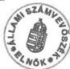
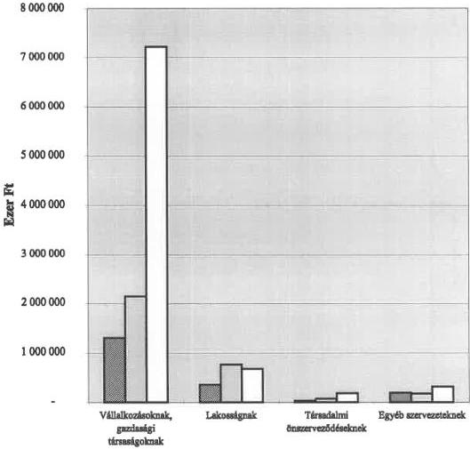
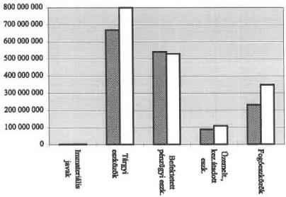
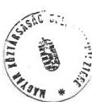
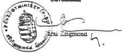

Állami Számverőszék

V-1016-82/97-98.

# JELENTÉS

a helyi önkormányzatok nem
közszolgáltatási célú társasági
befektetésekkel, valamint
értékpapírokkal történő
gazdálkodásának ellenőrzéséről

98.14

420.

1998. augusztus

---

Az ellenőrzés végrehajtásáért felelős:

Dömötör Gyula

számvevő igazgató

Az ellenőrzést vezette:

dr. Saly Ferenc

régióvezető főtanácsos

A jelentést készítette:

Csecserits Imréné

régióvezető főtanácsos

Németh Gábor

számvevő tanácsos

Szilágyi Sándor

számvevő tanácsos

közreműködésével.

Az ellenőrzésben részt vevők névsorát az 1.számú melléklet tartalmazza.

---

V-1016-82/1997-98. TÉMASZÁM: 392

# TARTALOMJEGYZÉK

|  **BEVEZETÉS** | **3**  |
| --- | --- |
|  **I. ÖSSZEGZŐ MEGÁLLAPÍTÁSOK, KÖVETKEZTETÉSEK, JAVASLATOK** | **4**  |
|  ÖSSZEGZŐ MEGÁLLAPÍTÁSOK, KÖVETKEZTETÉSEK | 4  |
|  JAVASLATOK | 7  |
|  **II. RÉSZLETES MEGÁLLAPÍTÁSOK** | **9**  |
|  1. Az önkormányzatok társasági befektetésekkel történő gazdálkodása | 9  |
|  1.1. Az önkormányzatok részére jogszabályi előírás alapján átadott gazdasági társasági részesedések önkormányzati tulajdonbavételének helyzete | 9  |
|  1.2. Az önkormányzatok által vásárolt társasági részesedések | 10  |
|  1.3. Az önkormányzati tulajdonban lévő társasági részesedések nyilvántartása | 11  |
|  1.4. A társasági részesedésekkel történő gazdálkodás önkormányzati szabályozottsága | 12  |
|  1.5. A társasági részesedésekkel történő önkormányzati gazdálkodás szabályszerűsége | 12  |
|  1.6. A gazdasági társasági érdekeltségekkel történő vagyongazdálkodás szervezeti megoldásai | 13  |
|  1.7. Az önkormányzati tulajdonban lévő gazdasági társaságok irányításának és ellenőrzésének tapasztalatai | 15  |
|  1.8. A társasági befektetések és hozamaik szerepe az önkormányzatok gazdálkodásában | 15  |
|  2. Az önkormányzatok hitelviszonyt megtestesítő értékpapírokkal történő gazdálkodása | 18  |
|  2.1. Az értékpapírok vásárlásának-értékesítésének szabályozása | 18  |
|  2.2. Az értékpapírok vásárlásának-értékesítésének gyakorlata | 19  |
|  2.3. Az értékpapírok számviteli nyilvántartása | 22  |
|  2.4. Az értékpapír gazdálkodás eredményessége az önkormányzatoknál | 23  |
|  3. Az önkormányzatok által államháztartáson kívülre nyújtott kölcsönök, hosszú lejáratú bankbetétek és véglegesen átadott pénzeszközök alakulása | 25  |
|  3.1. Az önkormányzatok által adott működési és felhalmozási célú kölcsönök | 25  |
|  3.2. Az önkormányzatok által adott működési és felhalmozási célú pénzügyi támogatások | 25  |
|  4. Az önkormányzatok gazdasági társasági befektetésekkel és értékpapírokkal történő gazdálkodásának belső és könyvvizsgálati ellenőrzése | 27  |

Mellékletek: 1-től 7-ig

1

---

2

---

# JELENTÉS

## A HELYI ÖNKORMÁNYZATOK NEM KÖZSZOLGÁLTATÁSI CÉLÚ TÁRSASÁGI BEFEKTETÉSEKKEL, VALAMINT ÉRTÉKPAPÍROKKAL TÖRTÉNŐ GAZDÁLKODÁSÁNAK ELLENŐRZÉSÉRŐL

### Bevezetés

A helyi önkormányzati vagyon tulajdonosa – a helyi önkormányzatokról szóló 1990. évi LXV. számú törvény (továbbiakban: Ötv.) indoklási részében szereplő meghatározás szerint – az adott település lakossága, mint közösség. E közösség tulajdonosi jogosítványainak gyakorlója az önkormányzati testület. Az Ötv. szerint a gazdálkodás biztonságáért a képviselő-testület felelős, e felelősséget azonban csak a négyévenkénti választások során érvényesíthetik a közösség választópolgárai.

Az önkormányzatok gazdasági társaságokat alapíthatnak, valamint az állami vagyon lebontása során különböző törvények alapján a feladatellátásukhoz közvetlenül nem kapcsolódó tevékenységet végző társaságokban is kaptak meghatározott feltételek szerinti tulajdonrészt. Az előbbieken kívül vagyonátadások (apportálások) és vásárlások útján is szerezhetnek társasági részesedéseket.

Az önkormányzatok tartósan, vagy átmenetileg szabad pénzeszközeikből hitelviszonyt megtestesítő értékpapírt (továbbiakban: értékpapír) is vásárolhatnak. Az értékpapír (pl. kötvény, befektetési jegy) kibocsátójának a gazdálkodása általában nem tartozik az államháztartás rendszerébe, az önkormányzat azonban az értékpapírok vétele-eladása során köteles betartani az államháztartás rendszerére vonatkozó jogszabályi előírásokat.

Az önkormányzatok támogatást nyújthatnak közszolgáltatási feladatainak ellátását segítő, abban közreműködő nem önkormányzati intézmények, alapítványok, társadalmi és egyházi szervek, vállalkozások, gazdasági társaságok részére azok működéséhez és fejlesztéséhez. Ezáltal az átadott (befektetett) eszköz segítheti az önkormányzati célkitűzések megvalósítását, ezen keresztül az önkormányzat feladatainak ellátását.

**A vizsgálat célja** annak megállapítása volt, hogy a gazdasági társasági érdekeltségekkel, pénzügyi befektetésekkel történő gazdálkodás hogyan hatott az önkormányzati vagyon alakulására. Ennek feltárása érdekében a vizsgálat tárgykörébe

- a befektetett pénzügyi eszközök köréből a részesedések, a vásárolt értékpapírok, hosszú lejáratú bankbetétek, felhalmozási célú kölcsönök;

---3

---

• a forgóeszközök közül a kincstárjegyek, kötvények, egyéb értékpapírok és a működési célú kölcsönök;
• a működési és felhalmozási célú pénzeszköz-átadások

tartoztak.

A vizsgált időszak: az 1995. január 1-től 1997. június 30-ig terjedő gazdálkodás volt. A helyszíni vizsgálat a jóváhagyott program szerint 1997. december 20-ig tartott.

Vizsgálatunk kiterjedt: 2 megyei, 2 megyei jogú városi, 3 fővárosi kerületi, 25 városi, 4 nagyközségi és 2 községi önkormányzatra, valamint a Budapest Főváros Önkormányzatánál 1996-97. évben V-1012 számon végzett – a társasági érdekeltségekkel és értékpapírokkal történő gazdálkodásra is kiterjedő – átfogó pénzügyi-gazdasági ellenőrzését is figyelembe véve, összesen 39 önkormányzatra (2.számú melléklet).

A vizsgálati körbe vont 39 önkormányzat tulajdonában volt 1996-97. évben az összes önkormányzati tulajdonban lévő gazdasági társasági érdekeltség mintegy kétharmada és az átmeneti jelleggel vásárolt értékpapírok több mint fele.

Az önkormányzatoknál végzett helyszíni ellenőrzések során a számviteli nyilvántartásokon, költségvetési beszámolókon túlmenően áttanulmányoztuk a képviselő-testületek, közgyűlések tárggyal kapcsolatos előterjesztéseit, határozatait, rendeleteit. Rendkívüli értékpapír-leltározást végeztünk és áttekintettük a társasági érdekeltségekkel, értékpapírokkal kapcsolatos bizonylatokat. A vizsgálat keretében tájékozódtunk az Állami Pénz- és Tőkepiaci Felügyeletnél, az Államadósságkezelő Központban, valamint a Központi Értékpapír és Elszámolóház Rt-nél.

# I. ÖSSZEGZŐ MEGÁLLAPÍTÁSOK, KÖVETKEZTETÉSEK, JAVASLATOK

# ÖSSZEGZŐ MEGÁLLAPÍTÁSOK, KÖVETKEZTETÉSEK

Az önkormányzatok vagyonáról értékben kifejezett teljes körű nyilvántartás – az ÁSZ több korábbi vizsgálati jelentésében is megállapítottan – nem áll rendelkezésre. Elméletileg a számviteli szabályok szerint vezetett nyilvántartásokból készített költségvetési beszámoló mérleg űrlapja tartalmazza értékben az önkormányzatok tulajdonában lévő eszközöket és azok forrásait. Azonban önkormányzati specialitás, hogy nagyon jelentős az 1992. év előtti számviteli szabályok szerint érték nélkül nyilvántartott eszközök állománya. Tipikusan ide tartoznak az önkormányzati tulajdonban lévő vizek, vízilétesítmények, utak, közterületek, parkok a tartozékokkal együtt, a bel- és külterületi beépítetlen földterületek. A számviteli törvény 1992. évtől ad lehetőséget ezek értékben történő nyilvántartására, de nem írja elő kötelezően az egyszeri értékmegállapítást.

4

---

Az önkormányzatok országos szintű összevont költségvetési beszámolója szerint 1995. évben az önkormányzatok eszközeit – forrásait – rögzítő mérleg főösszeg 29,7%-a, 1996. évben 32,4%-a, 1997. évben 25,9%-a részesedésekben, 2,6–3,5%-a értékpapírokban testesült meg. Ezen eszközökkel történő gazdálkodás új jellegű feladat, amelyhez kellő szakmai felkészültséggel és esetenként megfelelő jogszabályi háttérrel sem rendelkeztek az önkormányzatok. Az önkormányzati tulajdonban lévő társasági érdekeltségek mérleg szerinti nyilvántartási értéke 1995. évben 373 milliárd Ft, 1996. évben 496 milliárd Ft, 1997. évben 463 milliárd Ft, amely összegek megbízhatósága azonban megkérdőjelezhető, mivel a vizsgált önkormányzati körben a mérlegben nyilvántartott részesedések értéke és a vizsgálat során megállapított tényleges érték egymástól jelentősen eltért. Az alapvető hiányosságot a társasági érdekeltségek teljes körű nyilvántartásba vételének hiánya, valamint az év végi állomány értékének jogszabályi előírásoktól eltérő megállapítása okozta. (A vizsgált önkormányzatok társasági részesedéseinek költségvetési beszámolók szerinti értékét a 3. számú melléklet részletezi.) Részesedésként az önkormányzati tulajdonban lévő részvények, üzletrészek, továbbá az 1992. december 31. előtt alapított és a jelenlegi szabályok szerint határozatlan ideig működtethető önkormányzati vállalatok alapítói vagyonának értéke szerepel.

A részesedések állománya csak önkormányzatonkénti részletezésben ismert. Az önkormányzatonkénti részesedés állomány összetételéről, megoszlásáról nem készül országos szintű feldolgozás. Az összetétel csak egy-egy önkormányzatnál végzett vizsgálat során az adott önkormányzatra vonatkozóan ismerhető meg.

A volt tanácsi közüzemi vállalatok átalakításával létrejött és az ezt követően alapított gazdasági társasági érdekeltségek, – amelyek az önkormányzati tulajdonban lévő összes társasági részesedések mintegy 80%-át jelentik – működtetésénél nem az osztalék jellegű bevétel elérése az önkormányzatok elsődleges célja, hanem a közszolgáltatási feladatok ellátása. Ezek működtetését az önkormányzatok nemcsak mint tulajdonosok, hanem mint a közszolgáltatás elvégzésében érdekelt, a közszolgáltatás hatósági árát megállapító szervezetek is befolyásolták. A közszolgáltatási feladatokat végző gazdasági társaságok önkormányzati irányításának vizsgálatával az ÁSZ a korábbi években több témavizsgálat keretében foglalkozott (pl. víziközművek, távhőszolgáltató szervezetek működtetésére vonatkozó vizsgálatok), ezért a vizsgálat részletesen nem tért ki ezekre.

A nem közszolgáltatást végző, de önkormányzati többségi tulajdonban lévő társaságok esetében az önkormányzatoknál a tulajdonosi irányítás és ellenőrzés rendszere még nem alakult ki, a gazdasági társaságokról szóló törvény szerinti lehetőségekkel sem éltek teljeskörűen. Az irányító testületekbe megválasztott önkormányzatot képviselők részére elvárásokat, konkrét feladatokat nem határoztak meg, munkájukról rendszeres tájékoztatást a képviselő-testületek, közgyűlések nem kértek.

Az önkormányzatok a társasági részesedések évente mintegy 1,5%-át – elsősorban azokat, amelyekben kisebbségi tulajdonosok voltak – értékesítették 1995-96. évben, átlag 99%, illetve 106%-on. Rendszeres bevételt biztosító társasági érdekeltségekből jelentős – 100 millió Ft névérték feletti – mennyiség értékesítésére négy önkormányzatnál került sor, egy kivétellel a piaci árfolyamon. Az

5

---

önkormányzatok a részesedések adás-vételét nem tervezték meg, értékesítésnél, vételnél többnyire az előzetes felhívás nélkül hozzájuk beérkező írásos megkereséseket, vagy szóbeli ajánlatokat vették alapul. Előkészítő elemzések, célszerűségi vizsgálatok az adás-vételt megelőzően egyetlen önkormányzatnál sem készültek, még akkor sem, ha az adott önkormányzat vagyongazdálkodási rendelete szerint erre szükség lett volna. A részesedések, üzletrészek értékesítése során rendszeresen megsértették az Áht. nyilvános versenytárgyalásra vonatkozó előírását. A versenytárgyalásról szóló törvényerejű rendeletet a vizsgált időszakban hatályon kívül helyezték, így a jogi háttér is hiányos.

A vizsgált önkormányzatok a belterületi földérték alapján térítésmentesen átvett gazdasági társasági érdekeltségek után a részesedés nyilvántartási értékéhez viszonyítva 1995. évben csak 1,3%, 1996. évben 0,7% osztalékot kaptak. A vásárolt és az apportálás útján kialakított gazdasági társasági érdekeltség tulajdonjoga alapján 1995. évben 6, 1996. évben pedig csak 4 társaságtól kaptak osztalékot. Az összes társasági részesedés utáni osztalék együttes értéke egyik évben sem érte el a részesedések nyilvántartási értékének 0,5%-át.

Az önkormányzatok a privatizációs törvények kapcsán 1995-96-97. évben jelentős pénzösszeget kaptak az ÁPV Rt-től. Ezen pénzösszeget a végleges, általában infrastruktúra fejlesztésre történő felhasználásig átmenetileg értékpapír-vásárlásra fordították. (A vizsgált önkormányzatok költségvetési beszámolók szerinti 1995-96-97. év végi értékpapír állományát a 4. számú melléklet tartalmazza.) Az értékpapír-vásárlás speciális megfontolásokat, esetenként kockázatvállalást is jelent, ezért speciális szakmai felkészültségre lett volna szükség ezen befektetések során. Az önkormányzatok egy része viszonylag széles körű pályázati felhívás alapján tájékozottságra tett szert a befektetési lehetőségek kockázatairól, a reális hozamlehetőségekről. Így az általuk elért hozam az értékpapír-piacon elérhető hozamoknak megfelelő nagyságú volt. Az értékpapír-vásárlással foglalkozó önkormányzatok többsége azonban pályázatás nélkül döntött a spontán jelentkező tanácsadó, értékpapír-forgalmazó cégek igénybevétele mellett. Nem kontrollálta ezen cégek tájékoztatását, ajánlatát, így az értékpapír-piacon elérhető reális hozamnál lényegesen alacsonyabb hozamot ért el, esetenként veszteséges befektetésekre is sor került. Általános tapasztalat, hogy az önkormányzatok az értékpapír-vásárlás kockázatának csökkentésére nem tették meg a jogszabályok által adott valamennyi intézkedést, pl. nem kötöttek értékpapír-számla szerződést, nem helyezték zárolt letéti számlára az értékpapírt, nem fektettek hangsúlyt az elsődleges értékpapír-kereskedő cégek igénybevételére, nem figyelték a megvásárolt értékpapír forgalomképességét. A befektetési szolgáltatókkal kötött megbízási szerződésekben elismerték ugyan, hogy azoktól az értékpapírokra vonatkozó törvényben előírt tájékoztatást megkapták, de ezt nem dokumentálták.

A befektetési szolgáltatók tevékenységének hatékony ellenőrzését nem tapasztaltuk. Az elsődleges forgalmazók is kötöttek tőzsdére bevezetett értékpapírokra vonatkozóan tőzsdén kívüli, attól eltérő árfolyamú értékesítési szerződést.

Az értékpapír-forgalomhoz kapcsolódó jogszabályi háttér a vizsgált időszak alatt módosult, de a változás nem volt teljes körű. Elmaradt, illetve késett a törvényben a kormány hatáskörbe adott részletes eljárási szabályok kidolgozása, pl. a portfólió-kezelés, az értékpapír-számla nyitás, letéti kezelés szabályai-

6

---

nak esetében. A számviteli nyilvántartási követelmények sem egyértelműek és nem kellő részletezettségűek a költségvetési szervek értékpapír-gazdálkodásához kapcsolódóan. Hiányzik a pénzforgalmat (banki átutalást) nem igénylő, éven belüli többszöri, esetenként néhány napos megszakítással történő és határidős adás-vételi szerződések, valamint az ezekhez kapcsolódó hozam-, kamat- és jutalék elszámolás megfelelő főkönyvi nyilvántartásának szabályozása.

Az önkormányzatok államháztartáson kívülre országos szinten évente mintegy 50 milliárd Ft felhalmozási és működési jellegű pénzeszköz-átadást mutatnak ki pénzforgalmi jelentésükben. A vizsgált körben az ilyen jellegű átadás elsősorban a különböző civil szervezetek, alapítványok és egyházak támogatását jelentette (jelentős mértékben növekedett 1995–97. között, évi 3 milliárd Ft-ról 10 milliárd Ft-ra). Az önkormányzatok az így átadott pénzeszközök felhasználását dokumentáltan nem ellenőrizték, a cél szerinti hasznosítás érdekében a felhasználóval szerződést nem kötöttek. Jelentős nagyságrendű a gazdasági társaságok részére átadott pénzeszközök összege is. Az önkormányzatok elsősorban a közmű- és úthálózati beruházások finanszírozásához adnak támogatást a kivitelezést megvalósító szervezetek részére. Az elkészült beruházásokat azonban az önkormányzatok nem aktiválják. Ezek a támogatások az önkormányzatok részéről végleges vagyonátadást jelentenek, így vagyonnövekedésként az évenkénti költségvetési beszámoló mérlegében az eszközök között nem jelennek meg. Különösen zavaró ez azon tárgyi eszközök esetében, amelyeket jogszabályok az önkormányzatok törzsvagyonába tartozónak tekintenek, ilyenek pl. a helyi közutak és a víziközművek.

A közigazgatási hivatalok a törvényességi ellenőrzésük során nem észrevételezték, hogy az önkormányzati társasági érdekeltségekre, értékpapírokra vonatkozó testületi határozatok nincsenek összhangban a jogszabályokkal, az önkormányzatok vagyongazdálkodási rendeleteivel.

## JAVASLATOK

Az önkormányzatok figyelmét a törvényi előírások betartására felhívtuk és a helyszíni vizsgálatról készített jelentésekben kezdeményeztük, hogy

- az Áht. 104. § (3) bekezdésének megfelelően a vagyonnal – különös tekintettel a társasági részesedésekkel és értékpapírokkal – felelős módon, rendeltetésszerűen gazdálkodjanak, ezt megfelelő helyi szabályozás kialakításával biztosítsák;
- a társasági részesedések, valamint az értékpapírok vásárlásánál és értékesítésénél érvényesítsék a szakmai hatékonyságot és gazdaságosságot, biztosítsák a tervezési, beszámolási, információ-szolgáltatási kötelezettség teljesítését, azok teljességét és hitelességét az Áht. 97. §-ában előírtaknak megfelelően;
- az Áht. 12. § (1)–(2) bekezdését figyelembe véve minden bevételre és kiadásra biztosítsanak költségvetési előirányzatot, kötelezettség-vállalásra csak az Áht. 12./A § (1) bekezdésében előírtak betartásával, az önkormányzat költségvetésében jóváhagyott előirányzat mértékéig kerüljön sor;
- tartsák be a számviteli törvény alapelveit, alakítsák ki számviteli politikájukat, valamint számlarendjük feleljen meg a számviteli törvény 79. §-ában és a költségvetés alapján gazdálkodó szervezetek beszámolási és könyvvezetési kö-

7

---

telezettségéről szóló 54/1996. (IV.12.) számú kormányrendelet 37. §-ában előírt követelményeknek;

- a gyakorlatban dematerializált jellegű értékpapírok átruházását az 1996. évi CXI. törvény 80. § előírásának megfelelően értékpapír-számlán bonyolítsák, az átruházást végző brókercéggel kössenek együttes rendelkezésű értékpapírszámla szerződést;
- az önkormányzati és lakossági forrásokból megvalósuló közművek, utak önkormányzati tulajdonba vételét az Ötv. 79. §-ában foglaltaknak megfelelően oldják meg.

Jogszabályok megsértése miatt 8 önkormányzatnál összesen 17 fő személyes felelősségének megállapítására került sor a helyszíni vizsgálatok során.

**Az önkormányzatok társasági érdekeltségekkel és értékpapírokkal történő gazdálkodásának szabályszerűbbé, hatékonyabbá és ellenőrzöttebbé tétele érdekében javasoljuk, hogy:**

### 1.A Kormány kezdeményezze

- az érdekeit tárcák közreműködésével a helyi önkormányzatok külső gazdasági, költségvetési ellenőrzésének továbbfejlesztését szolgáló törvény kidolgozását és megalkotását. Ennek során tekintse át a helyi önkormányzatok gazdasági-pénzügyi, valamint törvényességi ellenőrzésére vonatkozó szabályozást; teremtse meg az ellenőrzések jogszabályi hátterének összehangoltságát, beleértve a piacgazdasági kapcsolódásokat is;
- a helyi önkormányzatok gazdálkodási feladatkörét ellátó köztisztviselők rendszeres szakmai továbbképzését. Ennek során az érdekeit tárcák és szakmai szervezetek mellett a szervezésben és lebonyolításban támaszkodjék az Állami Számvevőszék szakmai tapasztalataira és közreműködésére.

### 2.A Pénzügyminisztérium kezdeményezze a Kormánynál

- az államháztartás alrendszerét képező helyi önkormányzati vagyon értékesítési, valamint a rendelkezési, használati, hasznosítási jog átengedési módjának (versenytárgyalás, pályáztatás) jogi szabályozását;
- a portfólió-kezelési feltételek részletes jogi szabályozását,
- az évenkénti önkormányzati költségvetés előirányzatainak összeállítására vonatkozó tájékoztató, valamint az önkormányzati költségvetési nyomtatvány kiegészítését annak érdekében, hogy a felhalmozási és tőke jellegű bevételek pénzforgalmi előirányzata és teljesítése elnevezésű űrlapon a részvények értékesítése mellett a kft üzletrész bevétele is szerepeljen.

### kezdeményezzen intézkedéseket:

- az elsődleges értékpapír-forgalmazói kör által az állampapírok esetében alkalmazható árfolyamok és vételi-eladási árfolyam különbségek kereteinek kialakítására és ezen keretek betartásának ellenőrzésére, különös tekintettel a költségvetési szervek befektetéseire;

8

---

- az Állami Penz- és Tókepiaci Felügyelet a befektetési szolgáltatók üzletszabályzatanak jováhagyása során követelje meg, hogy az 1996. évi CXI. törveny 69. § (1) bekezdés szerinti tajékoztatas helyi önkormányzatok eseten - a közösségi vagyonra tekintettel - irásban történjen, az irásbeliségtólCsak a befektető erre vonatkoź nyilatkozata alapján lehessen elterni;
a koltségvetési szervek ertekpapir-gazdalkodással kapcsolatos konyvviteli, nyilvantartási feladatainak egyertelmü meghatározására, különösen a penzforgalmat nem igényló, even beluli tobbszörí, esetenként néhány napos megszakitással történő adás-vételre (forgatas), határidós (opciós) adás-vételi szerzódésekre, valamint az ezen ügyletekhez kapcsolódo hazam-, kamat- és jutalek elszamolásokra.
3. A Belugyminisztérum hivja fel a kozigazgatasi hivatalok figyelmét arra, hogy az onkormányzati testületek tarsasagi érdekeltségekre, ertekpapirokra vonatkozo hatarozatainak Ellenörzese soran vizsgaljak meg azok összhangjat a jogszabályokkal, különösen az onkormányzatok vagyongazdalkodási rendeletével.

## II. RÉSZLETES MEGÁLLAPÍTÁSOK

### 1. AZ ÖNKORMÁNYZATOK TÁRSASÁGI BEFEKTETÉSEKKEL TÖRTÉNŐ GAZDÁLKODÁSA

#### 1.1. Az önkormányzatok részére jogszabályi előírás alapján átadott gazdasági társasági részesedések önkormányzati tulajdonbavételének helyzete

Jogszabályi előírások alapján térítésmentesen jutottak az önkormányzatok gazdasági társasági részesedésekhez az átalakult állami és tanácsi alapítású vállalatok meghatározott vagyonrészei után az alábbiak szerint:

a gazdalkod szervezetek es gazdasagi tarsasagok atalakulasarol szlo 1989. evi XIII. törveny 21.5.(2) bekezdese alapjan az atalakulo allami vallalat vagyonmérlegben szereplö belterületi fold ertekenek megfelelo üzletrész (részveny) a fold fekvese szerinti onkormanyzatot illette meg. Ezt ugy modositotta az idölegesen allami tulajdonban levovagyon ertekesitéserol, hasnositásarol es vedelméról szlo 1992. evi LIV. törveny 42.5.(1) bekezdese, hogy az atalakulo vallalat vagyonmérlegben szereplö belterületi fold utan a fold ertekenek a vallalati vagyonmérleg fösszeghez viszonyitott aranyaban részesedik a sajat tokbol az onkormanyzat. Ez penz helyett üzletrész (részveny) formajaban is kiadható volt a Vagyonugynökség es az onkormanyzatok kozötti megallapodások alapjan;
a helyi onkormanyzatokrol szlo 1990. evi LXV. törvenynek - az 1995. evi LXX. törvennyel - megallapitott 107/A.§-a szerint a villamos- és gázkozmüvet üzemeltető gazdasági tarsaságok allami tulajdonú vagyonreszenek villamoskozmü eseten 25%-a, gázkozmü eseten 40%-a szolgaltatasba bekapsolt települési onkormanyzatokat illette meg részény formájaban;

9

---

• ugyancsak az 1990. évi LXV. törvény 107.§-ának előírása alapján került az önkormányzatok tulajdonába a tanácsok által közüzemi célra alapított és a tanácsok felügyelete alatt álló gazdálkodó szervezetek – ide értve a fővárosi és megyei gyógyszertári központokat is –, továbbá a költségvetési üzemek vagyonát és az e szervezetekből átalakuló gazdasági társaságokban az államot megillető vagyonrészt.

A kapott társasági részesedések értéke, vagy a pénzbeni vagyonjuttatás összege nagymértékű szóródást mutat az önkormányzatok között. Ezek sok kis település részére jelentős vagyont biztosítottak, azonban csak mérsékelt hozamot eredményeztek és értékesítési árfolyamuk sem emelkedett jelentősen. Az elmúlt évtizedek ipartelepítései során előtérbe helyezett települések számottevő vagyongyarapodást értek el, amennyiben hatékonyan működő gazdasági társaságokban jutottak érdekeltségekhez. Ezek a vagyonátadások-átvételek alapvetően az 1992-1996. években valósultak meg.

Az önkormányzatok részére a törvények alapján történő vagyonátadás még nem fejeződött be. A vizsgált önkormányzatok 75%-a jelezte 1997. év folyamán az ÁPV Rt-nek, hogy több átalakult, privatizált gazdasági társaságból nem kapta még meg a szerinte jogszerű részesedést. Az önkormányzatok által bejelentett igény összességében jelentős nagyságrendű, de pontos összeg nem állapítható meg, mivel egyharmad részük csak az érintett gazdasági társaság megnevezését és tulajdonszerzési indokait szerepeltette.

Az ÁPV Rt. közlése szerint 1997. évben 11,33 milliárd Ft részvény, illetve üzletrész és 17,62 milliárd Ft készpénz, 1998. elején pedig 0,63 milliárd Ft részvény és 0,7 milliárd Ft készpénz került kiadásra. (Ezek alapján az ÁPV Rt. 1998. február végéig mintegy 98%-ban rendezte az önkormányzatokkal szembeni kötelezettségét. A még kiadásra kerülő 1,85 milliárd Ft elsősorban felszámolás és végelszámolás alatt álló társaságok utáni kötelezettség.)

Ezen jogszabályi lehetőségek alapján az önkormányzatok olyan vagyon tulajdonosaivá váltak, amellyel összefüggő tulajdonosi jogok gyakorlása során biztosítaniuk kellett új típusú feladatként a költségvetési szervekre vonatkozó gazdálkodási szabályokon kívül a gazdasági társaságokról szóló 1988. évi VI. törvényben és az 1959. évi IV. törvényben (Ptk.) az egyes jogi személyek vállalatára meghatározott előírások betartását is.

# 1.2. Az önkormányzatok által vásárolt társasági részesedések

Gazdasági társasági érdekeltségek vételére a vizsgált időszakban összesen 1,1 milliárd Ft-ot fordítottak a vizsgált önkormányzatok. Döntően törvényi előírás alapján átvett kárpótlási jegyek ellenében meghirdetett cserékhez kapcsolódtak. Kivételt jelent Százhalombatta Önkormányzata (Pest megye), amely az eladott MOL részvényeinek bevételéből Postabank Rt részvényeket vásárolt 1 milliárd Ft-ért.

10

---

# 1.3. Az önkormányzati tulajdonban lévő társasági részesedések nyilvántartása

Az önkormányzatok a tulajdonukban lévő gazdasági társaságokról megbízható számviteli nyilvántartást még nem alakítottak ki, s emiatt az évenkénti költségvetési beszámolókban szereplő adatok sem a valós képet mutatják.

Jelentős nagyságrendű nyilvántartási hiányosságokat okoztak az alábbiak:

- nem szerepelteték a vallalatok részére alapítol vagyonként átadott tárgyi és penzügyi eszköket az átadas utan az önkormányzati befektetett penzügyi eszköközött;
- részénytársasagok eseten nem a tulajdonszerzes idopontjatol, hanemCsak a késöbbiekben, a kinyomtatott részények fizikai atvetelekor vettek nyilvantartasba az erdekeltségeket;
a gazdasagi tarsasagi erdekeltsegeket az eves koltsegvetesi beszamol Merleg furlapjan nem az ere a celra kijelolt rzesedes soraban, hanem az ertekpapirok kozott szerepeltettek.

Általános hiányosság, hogy a számviteli törvény által 1992. január 1. óta a részesedésekre, értékpapírokra előírt évenkénti értékelést és az ennek során megállapított tartós értékvesztés elszámolását, a számviteli nyilvántartás szerinti érték korrekcióját nem végzik el az önkormányzatok.

A tartós értékvesztés figyelemmel kísérésének, kiszámításának, dokumentálásának rendszere még nem alakult ki. Néhány önkormányzatnál voltak ilyen kezdeményezések a kárpótlási jegyek, egyes részvények esetében, azonban ezek nem feleltek meg a jogszabályi előírásoknak.

Dorog (Komárom-Esztergom megye) Önkormányzatánál a 121.401 ezer Ft névértékű Richter Rt részvényt az 1996. év végi tőzsdei átlagárfolyam figyelembevételével felértékelték és 1.147.239 ezer Ft-on szerepeltették, annak ellenére, hogy a számvitelről szóló törvény a költségvetési szervek esetében felértékelésre nem ad lehetőséget.

Több önkormányzatnál a felszámolás alatt álló társaságban meglévő részesedés értékvesztését nem a felszámoló értesítése alapján határozták meg, hanem a felszámolás ismertté válásakor azonnal elszámolták a teljes érték elvesztését.

Budapest Fővárosi Önkormányzat esetében a részesedések számviteli törvénynek megfelelő évenkénti értékelése során 1995. évben 3, összesen 25.473 ezer Ft nyilvántartási értékű (amelyek együttes névértéke 98.810 ezer Ft volt) felszámolás, vagy végelszámolás alatt lévő gazdasági társasági részesedés teljes leírására került sor. Ezekben az esetekben a Budapest Főváros Vagyonkezelő Központ Rt nem rendelkezett a felszámoló, végelszámoló nyilatkozatával arra vonatkozóan, hogy várhatóan a befektetés még részben sem térül meg. Ezért ez a leírás nem tekinthető megfelelő bizonylatokkal alátámasztottnak.

11

---

### 1.4. A társasági részesedésekkel történő gazdálkodás önkormányzati szabályozottsága

Az önkormányzatok többsége ma már valamilyen módon szabályozza a vagyonával történő gazdálkodás egyes feltételeit. **A szabályozó rendeletek azonban csak ritkán térnek ki a társasági részesedésekkel, értékpapírokkal történő gazdálkodásra.** Az önkormányzatoknál ezen vagyon-tárgyak feletti rendelkezési jog gyakorlása általában a képviselő-testület, illetve a közgyűlés hatásköre.

A képviselő-testületek nem szabályozták megfelelően a társasági érdekeltségek adásának-vételének részletes feltételeit, módozatait. Előzetes gazdaságossági, célszerűségi vizsgálat elvégzésének igénye csak 1-2 önkormányzat vagyongazdálkodási rendeletében szerepel.

Dorog Önkormányzata és (Komárom-Esztergom megye) Orosháza Önkormányzata (Békés megye) a társasági részesedésekkel történő gazdálkodás hatáskörét nem rendeletben, hanem csak határozatban szabályozta 1995-97. években.

További hiányosság, hogy a vagyongazdálkodási rendeletek gyakran túlszabályozottak és emiatt nehezen áttekinthetők. Általában ritkán módosítják, nem aktualizálják ezeket, még az egyébként indokolt esetekben sem. Ezzel ellentétben Esztergom Önkormányzata (Komárom-Esztergom megye) 1992-1997. évek között hat alkalommal módosította vagyongazdálkodási rendeletét a döntési hatáskör és az illetékesség gyakori változtatásai miatt.

### 1.5. A társasági részesedésekkel történő önkormányzati gazdálkodás szabályszerűsége

**Az önkormányzatok a gazdasági társasági érdekeltségek vételéről-eladásáról általában képviselő-testületi döntéssel határoztak. Ezek a döntések azonban a legtöbb esetben csak az adás-vétel kereteit határozták meg.** A konkrét feltételek kialakítását – pl. fizetés módja, fizetési határidők, késedelmes fizetés esetén a szankció megállapítása – a polgármesterre bízták. Néhány esetben előfordult, hogy az adás-vételről a polgármester a képviselő-testületet az előzetes jóváhagyatás helyett csak utólag tájékoztatta.

Esztergom (Komárom-Esztergom megye) polgármestere 1995. június. 13-án 1.984 ezer Ft eladási áron OTP részvényeket értékesített, amelyről a testületet csak utólag tájékoztatta.

A Baranya Megyei Közgyűlés elnöke az Autókonszern Rt 5.000 ezer Ft névértékű részesedését 1996. március 14-én 4.560 ezer Ft-ért értékesítette, amelyről a testületet 1996. április 1-én utólag tájékoztatta.

Ezeket a tájékoztatásokat a képviselő-testület, illetve a közgyűlés tudomásul vette.

**Az önkormányzatok az Áht. 108. §-ában kapott felhatalmazás ellenére általában nem határoztak meg értékhatárt arra vonatkozóan, hogy mely értékesítéseknél nincs szükség nyilvános versenytárgyalás lebonyolítására.** Az értékpapírok esetében a nyilvános versenytárgyalás megtartásának Áht-ban előírt kötelezettsége nehezen egyeztethető össze a forgalmazás speciális feltételeivel. Tőzsdén történő értékesítésre szóló megbízás

12

---

esetében a nyilvános versenyeztetést a tőzsdére bevívő brókercégek között is meg kell oldani.

Az Áht. 108. § (1) bekezdésében előírt nyilvános (indokolt esetben zárt körű) versenytárgyalást szabályozó 1987. évi 19. törvényerejű rendeletet a tisztességtelen piaci magatartásról és a versenykorlátozás tilalmáról szóló 1996. évi LVII. törvény 1997. január 1-től hatályon kívül helyezte. Ennek következtében a versenytárgyalás lebonyolítására vonatkozó jogszabályi előírás hiányzik.

Az önkormányzatok a részesedések értékesítésénél, vételénél többnyire az előzetes felhívás nélkül hozzájuk beérkező írásos megkereséseket, vagy szóbeli ajánlatokat vették alapul. Ezáltal a vásárlásoknál és az eladásoknál sem volt biztosított a szándék nyilvánosságra hozatala, a piaci helyzet reális felmérése. Előkészítő elemzések, célszerűségi vizsgálatok az adás-vételt megelőzően egyetlen önkormányzatnál sem készültek még akkor sem, ha az adott önkormányzat vagyongazdálkodási rendelete szerint erre szükség lett volna.

Gazdasági társasági részesedések vétele-eladása során néhány esetben eltértek az önkormányzati rendeletekben és a képviselő-testületi határozatokban foglaltaktól.

Csongrád Megyei Önkormányzat közgyűlése a Tisza-Kenyér Sütőipari Rt részvények megvásárlásáról hozott határozatot. A közgyűlés alelnöke testületi felhatalmazás nélkül további kötelezettséget vállalt a dolgozók részére fenntartott részvények maradványának megvásárlására és tőkeemelésre.

A DÉLÉPÍTŐ Kft üzletrészének megvásárlását követően a Csongrád Megyei Közgyűlés alelnöke testületi határozat nélkül vásárolt a Kft Rt-vé történő átalakulása után annak 1994. évi osztalékáért DÉLÉPÍTŐ Rt részvényeket. A részvényekből történt eladás és a bevétel más részére történő engedményezésére 1995. évben ugyancsak a testület előzetes határozata nélkül került sor.

### 1.6. A gazdasági társasági érdekeltségekkel történő vagyongazdálkodás szervezeti megoldásai

Az önkormányzatok többsége a polgármesteri hivatalra bízta a vagyonkezelési feladatokat. A polgármesteri hivatalon belül a vagyonkezeléssel megbízott szervezetek és személyek 1995-97. évek között általában gyakran változtak. A feladatot az erre a célra létrehozott vagyongazdálkodási ügyosztály mellett a pénzügyi, vagy a városgazdálkodási ügyosztályhoz csatolták. Azoknál az önkormányzatoknál, ahol a gazdasági társaságok száma jelentős, ott különböző szakmai összetételű, több fős egység (pl. vagyoniroda) kialakítására is sor került. A vagyonkezelési feladatok megoldásában közgazdasági, jogi és műszaki végzettségű munkatársak vesznek részt, azonban speciális értékpapírforgalmazói szakvizsgával rendelkező személyt nem foglalkoztattak egyik önkormányzatnál sem.

A polgármesteri hivatalok ügyrendjében csak a feladat összevont általános leírása szerepel, ezek tartalma a konkrét munkaköri leírásokból is hiányzik. Az önkormányzatok számlarendjében a gazdasági társasági részesedé-

13

---

**sekre vonatkozó főkönyvi és analitikus nyilvántartási feladatok rendszere nincs részletezve, ezért hiányosak, az elvárható szakmai követelményeket nem elégítik ki.**

Az önkormányzatok számára új típusú feladatot jelentő gazdasági társasági érdekeltségekkel történő gazdálkodás iratkezelésében is hiányosságok tapasztalhatók. Általában nem kerülnek iktatásra a tag- és közgyűlési meghívók, jegyzőkönyvek, s gyakran a részesedések és értékpapírok adás-vételi szerződései sem.

Az önkormányzati képviselő-testületek (közgyűlések) részére adott információkban az egyik legáltalánosabban jelentkező hiányosság az érdekeltségek piaci árfolyama figyelemmel kísérésének elmaradása volt. Nem alakult ki a tőzsdére bevezetett és a tőzsdén kívüli piacon forgalmazott részvények napi árfolyamának figyelési rendszere, ezáltal nagymértékben bizonytalanná, megalapozatlanná váltak az ezirányú adás-vételi döntések.

A nyilvános piaci árfolyammal nem rendelkező értékpapírok esetében a legkedvezőbb eladási ár elérése érdekében az önkormányzatok összefogását is tapasztaltuk.

A DÉGÁZ Rt részvényeinek eladásánál Csongrád—Bács-Kiskun—Békés megye önkormányzatai egy csomagban történő értékesítésben állapodtak meg. Energia Bizottságot hoztak létre, amely együttesen hallgatta meg a részvényre vételi ajánlatot adó cégeket. A további értékesítésnél az itt elfogadott megállapodást vették figyelembe.

Az összefogás elmaradására és az emiatt bekövetkezett rendkívül eltérő árfolyamon lebonyolított eladásra is volt példa:

A SANOPHARMA Rt. részvényeire két cég – egy szakmai és egy pénzügyi befektető – egymást gyakran túllicitálva jelentkezett több Békés megyei önkormányzatnál 1996. évben. A két vételi ajánlatot tevő folyamatos árfolyam-növelésének eredményeként az értékesítés az első ügyletnél elért 220%-os árfolyamról az utolsó két önkormányzatnál 500%-os eladási árfolyamra emelkedett.

A szervezeti megoldásokat érintően saját költségvetési intézmény, illetve külső szervezet, vagy magánszemély értékesítéssel-vétellel történő megbízására csak néhány önkormányzatnál került sor.

Ezek közül a Csorna Önkormányzata által (Győr-Moson-Sopron megye) 1997. január 1-én 1 millió Ft jegyzett tőkével alapított Csornai Vagyonkezelő Kft-t egy speciális pénzügyi tranzakció – Postabank részvény vásárlás Postabank Rt által nyújtott hitelből – lebonyolítására hozták létre. A hitelkonstrukciót az alapítás után fél évvel közös megállapodásban megszüntették, ezért a Kft csak formálisan létezik, egyéb feladatot az önkormányzattól nem kapott.

Nincs önálló döntési jogköre a Zalaegerszeg Önkormányzata (Zala megye) által létrehozott Első Egerszeg Holding Kft-nek, a döntéseket a képviselő-testület alakítja ki.

Budapest XVI. kerület Önkormányzata magánszemélyt bízott meg a gazdasági társasági részesedésekkel összefüggő feladatok ellátásával.

14

---

## 1.7. Az önkormányzati tulajdonban lévő gazdasági társaságok irányításának és ellenőrzésének tapasztalatai

Az önkormányzatok minden esetben kisebbségi tulajdonjogot szereztek a belterületi földérték alapján az ÁPV Rt-től kapott társasági részesedések révén. A kisebbségi részarány miatt formálisnak tekintették a társaságok közgyűlésein, taggyűlésein részvételüket. A vizsgálat során nem tapasztaltuk, hogy az önkormányzatok kisebbségi részesedésüket összevonva, közösen kezdeményezték volna kisebbségi érdekeik érvényesítését.

A kisebbségi tulajdonnal rendelkező önkormányzatok képviselői általában részt vettek a társasági köz- és taggyűléseken, azonban a részvételhez kapcsolódóan az önkormányzat képviselő-testülete nem fogalmazott meg előzetes elvárásokat, ezért elmaradtak az utólagos beszámoltatások is.

Nem alakult ki megfelelő információrendszer a gazdasági társaság köz- és taggyűlésein részt vevők, valamint a polgármesteri hivatal számviteli nyilvántartását vezetők között. Ennek kedvezőtlen hatásai tapasztalhatók az önkormányzati vagyon számviteli törvény szerinti értékelésénél a jegyzett tőke felemelésére vonatkozó döntések miatti fizetési kötelezettségek számbavételénél, valamint az osztalék-követelések nyilvántartásánál, továbbá a kapott osztalékok mértékének hiányos ellenőrzésénél.

A gazdasági társaságokkal kapcsolatos önkormányzati információk nem megfelelő kezelése és teljeskörűségének hiánya miatt egyrészt az önkormányzatok ezen vagyon piaci értékét és nyilvántartás szerinti értékét kellő mértékben nem ismerik, másrészt a gazdálkodás során ez az információ-hiány esetenként (az értéken aluli eladás miatt) jelentős vagyonvesztést is okozott.

Dorog Önkormányzata (Komárom-Esztergom megye) a tulajdonában lévő 121 millió Ft névértékű Richter részvényeket az előző napi átlagos tőzsdei árfolyam 76%-án értékesítette 1997. január 31-én, ezáltal közel 300 millió Ft bevételi lehetőségtől esett el.

## 1.8. A társasági befektetések és hozamaik szerepe az önkormányzatok gazdálkodásában

Az önkormányzatok részvényekkel és üzletrészekkel való gazdálkodása lényegesen elmarad a más vagyonrészeknél tapasztalt, átgondoltabbnak minősülő végrehajtási gyakorlattól az alábbiak miatt:

**A gazdálkodás pénzügyi lehetőségeit meghatározó önkormányzati költségvetések szinte sehol nem tartalmaznak eredeti előirányzatokat az állomány gyarapítására, vásárlásokra sem a tartós lekötésű befektetések, sem pedig az egy éven belüli hasznosítású forgóeszközök közé tartozó portfólió vonatkozásában.**

Az állomány csökkenését eredményező folyamatoknál, az értékesítéseknél sem tartalmaz a költségvetés bevételi előirányzatot. Csupán néhány önkormányzat hozott koncepcionális döntéseket és ezek alapján tervezett eredeti előirányzatokat is. Tény viszont, hogy ezek többnyire jelentősen alultervezetteknek bizo-

15

---

nyultak a tényleges teljesítések adataihoz képest. Az eredeti előirányzatok elmaradását általában az előre nem ismerhető árfolyam-alakulásokkal és piaci értékesítési lehetőségekkel indokolják az önkormányzatok.

Az előbbiek következményeként csak utólagosan, általában a tényadatok ismeretében kerül sor az un. „módosított előirányzatok” kialakítására. Nem ritkán azonban ez is elmarad, még a kiemelkedően nagy összegű részvény és üzletrész eladások eseteiben is. Az értékesítési döntések motivációi nem dokumentáltak, a döntést tárgyaló jegyzőkönyvekből általában az állapítható meg, hogy valaki, vagy valakik vételi ajánlatot tettek, amelynek alapján döntött a testület. Külön említést érdemel, hogy az önkormányzati beszámolókban szereplő értékesítési adatok a felülvizsgálat alapján néhány eseten valótlanoknak bizonyultak; a valóságban lényegesen nagyobb összegű eladások történtek.

Siófok Önkormányzatánál (Somogy megye) 1995. évben a részvények, üzletrészek értékesítésének eredeti előirányzata 242.892 ezer Ft, módosított előirányzata 277.611 ezer Ft, a tényleges teljesítés 666.398 ezer Ft volt, ugyanakkor értékesítés jogcímen 1995. évben csak 16.469 ezer Ft-ot közöltek a beszámolóban.

Az előbbi előirányzati és megbízhatósági problémák jelentkeznek a befektetések hozamainál is.

A vizsgált önkormányzatok háromnegyed része egyáltalán nem tervezett részvényei és üzletrészei után osztalékot az ilyen jogcímen számba veendő bevételek bizonytalanságára és alacsony összegszerűségére való hivatkozással. Ilymódon ezeknél az előirányzati teljesítési arányok nem mérhetők fel.

Azoknál az önkormányzatoknál, ahol osztalék- és hozambevétel volt előirányozva, igen gyakran jelentős alultervezettség volt megállapítható részben az előbbi okokra, részben pedig nyilvántartási problémákra visszavezethetően.

Siófok Önkormányzata (Somogy megye) az éves költségvetési koncepció elkészítésénél, illetve költségvetési rendeleteinek megalkotásánál nem vette figyelembe osztalék- és hozambevételeit, mivel bizonytalanoknak tekintette azokat. Ezzel szemben 1995. évben 3.524 ezer Ft, 1996. évben pedig 9.279 ezer Ft bevétele volt ezen a jogcímen.

A vizsgált önkormányzati vagyonrészek értékesítési és osztalék bevételei, illetőleg az önkormányzatok felhalmozási jellegű kiadásai (beruházások) viszonylatában szoros korreláció csak néhány esetben tárható fel. Csak azokon a helyeken mutatható ki közvetlen kapcsolat, ahol jelentős összegű bevételek voltak ezen a jogcímen.

Néhány esetben a költségvetési rendeletekben, illetőleg a testületi határozatokban egyértelműen megfogalmazták az értékesítési- és hozambevételek felhalmozási célú felhasználási kötelezettségét. (Pl. Szentes, Szeghalom és Pásztó önkormányzatainál.)

Dombóvár Önkormányzata (Tolna megye) viszont 1996. évben 46.894 ezer Ft értékesítési-, osztalék- és hozambevételből csak 13.000 ezer Ft-ot fordított beruházásra, 36.894 ezer Ft-ot pedig működési célokra használt fel.

16

---

Siófok Önkormányzata (Somogy megye) az osztalékot nem fizető kisebbségi részesedések eladásából származó bevételekből állampapírokat vett és azok kamatbevételeit használta fel beruházási célokra.

**A vizsgált önkormányzatok a belterületi földérték alapján térítésmentesen átvett gazdasági társasági érdekeltségek után a részesedés nyilvántartási értékéhez viszonyítva 1995. évben csak 1,3%, 1996. évben 0,7% osztalékot kaptak. A vásárolt és az apportálás útján kialakított gazdasági társasági érdekeltség tulajdonjoga alapján 1995. évben 6, 1996. évben pedig csak 4 társaságtól kaptak osztalékot. Az összes társasági részesedés utáni osztalék együttes értéke egyik évben sem érte el a részesedések nyilvántartási értékének 0,5%-át.**

Általánosan megállapítható, hogy az önkormányzatok sehol nem vezetnek nyilvántartást osztalék-követeléseikről az érdekeltségi körükbe tartozó társaságok közgyűlésein és taggyűlésein elhatározott nyereség-felosztásokról szóló kiértésének alapján. Ennek igen gyakran a kiértésének elmaradása is okozója, több esetben pedig az osztalékjárandóságok igen alacsony értékével indokolják követeléseik nyilvántartásainak hiányát. A követelések nyilvántartásának hiánya miatt az önkormányzatok nem tudják vizsgálni osztalékjárandóságaik pénzügyi teljesítéseit.

Budapest Főváros Önkormányzatnál az egyedi nyilvántartásokból a vizsgálat során készített kigyűjtés szerint 1995. év végén 17.899 ezer Ft osztalék-követelés volt, amely az önkormányzat összevont költségvetési beszámolójának mérlegében nem szerepelt.

**A ténylegesen befolyt osztalékokról sem vezettek 12 önkormányzatnál analitikus nyilvántartást**, pedig ezek közül 7 (Szentes, Kapuvár, Hajdúszoboszló, Püspökladány, Dorog, Zalaegerszeg, Budapest IV. kerület) évenként 1 millió Ft feletti osztalékbevételt kapott. Megfelelő analitikus (cégenkénti) nyilvántartás hiányában az osztalékokból származó költségvetési bevételek nem tervezhetők megalapozottan.

Az önkormányzatok a kapott társasági részesedéseknek évente mintegy 1,5%-át értékesítették 1995-96. évben, átlag 99%, illetve 106%-on, elsősorban az érdemi befolyásolási lehetőség hiánya és az alacsony osztalék miatt. Rendszeres bevételt biztosító társasági érdekeltségekből jelentős – 100 millió Ft névérték feletti – mennyiség értékesítésére csak négy önkormányzatnál került sor, egy kivétellel a piaci árfolyamon.

**Az általánosságban tapasztalható pénzügyi fedezethiány ellenére kevés helyen tettek eredményes intézkedéseket az önkormányzati feladatellátáshoz nem kapcsolódó tevékenységeket végző társaságokban lévő, osztalékot nem biztosító részvényeik és üzletrészeik hasznosítására azok eladása érdekében.**

17

---

## 2. AZ ÖNKORMÁNYZATOK HITELVISZONYT MEGTESTESÍTŐ ÉRTÉKPAPÍROKKAL TÖRTÉNŐ GAZDÁLKODÁSA

### 2.1. Az értékpapírok vásárlásának-értékesítésének szabályozása

1996. december 31-ig az 1990. évi VI. törvény, 1997. január 1-től az 1996. évi CXI. törvény és annak felhatalmazása alapján kiadott kormányrendeletek szerinti szabályozásnak megfelelően kellett eljárni az értékpapírok forgalomba hozatalánál és a befektetési szolgáltatásoknál. Az új szabályozás a befektetők érdekeinek védelmére részletesebb előírásokat tartalmaz és meghatározza a dematerializált értékpapír-forgalmazás speciális feltételeit.

1996. január 1-től működik az állampapírok elsődleges forgalmazói rendszere, amelynek alapvető célja az állam által kibocsátott értékpapírok befektetőkhöz való eljuttatásának megkönnyítése, a másodpiac átláthatóságának és likviditásának növelése volt.

Az elsődleges forgalmazói kör tagjai – akik teljesítették a minősítők által előírt tőke- és likviditási követelményeket, a személyi és tárgyi feltételeket – a kibocsátott kötvények és kincstárjegyek megvásárlásáért jutalékot kapnak az államtól. Államkötvényeket kibocsátáskor kizárólag az elsődleges forgalmazók vásárolhatnak, a diszkont kincstárjegyek aukcióin egyéb értékpapír-forgalmazók is részt vehetnek. Az elsődleges forgalmazói kör tagjai 1996. április 15-e óta kötelesek a tőzsdén és az tőzsdén kívüli, OTC piacon vételi és eladási árfolyamot jegyezni az 1996. január 1. után kibocsátott diszkont kincstárjegyekre és államkötvényekre addig, amíg ezen papírok hátralévő futamideje meghaladja a 3 hónapot. A következő napi legjobb vételi és eladási ajánlatokat (mennyiségi korlátokkal) a Napi Gazdaság és a Világgazdaság c. újság rendszeresen közzé teszi. A másodpiacon így a befektetők megbízható piaci információk alapján bármikor vásárolhatnak államkötvényeket és kincstárjegyeket, illetve bármikor eladhatják a birtokukban lévő állampapírokat.

**Az önkormányzatok a törvényi szabályozást, annak módosítását, az értékpapír-piac fejlődését a szükséges mértékben nem ismerték meg. Vagyongazdálkodási rendeleteikben az értékpapírok vételét-értékesítését nevesítetten nem szabályozták, befektetési stratégiát nem alakítottak ki, így a döntés általában képviselő-testületi hatáskörben maradt.** Kivételt képez az a néhány önkormányzat, ahol a képviselő-testület a hatáskörét részben, vagy egészben a polgármesterre (pl. Budapest IV. kerület), vagy bizottságára átruházta.

Budapest XVI. kerület Önkormányzata az 1996. évben elfogadott vagyongazdálkodási rendeletében 1996. szeptember 1-től kezdődően az értékpapír-vásárlást versenyeztetési eljáráshoz kötötte. A versenyeztetést a vagyongazdálkodásról szóló önkormányzati rendelet szerint külön rendeleti formában jóváhagyásra kerülő versenyeztetési szabályzat betartásával kell lebonyolítani. A versenyeztetési eljárás szabályairól azonban az önkormányzat képviselő-testülete a vizsgált időszakban nem alkotott rendeletet.

18

---

# 2.2. Az értékpapírok vásárlásának-értékesítésének gyakorlata

Az önkormányzatok egy része – az átmenetileg szabad pénzeszközei reálértékének megőrzése, illetve gyarapítása érdekében a lekötött bankbetéteknél magasabb hozamra törekedve – pénzeszközeit értékpapírok vásárlására fordította. A befektetések biztonságát szem előtt tartva, elsősorban állam által kibocsátott hitelviszonyt megtestesítő értékpapírt vásároltak. Ez a szándék összhangban van az Áht. 104. § (3) bekezdésének azon előírásával, hogy a helyi önkormányzat vagyonával felelős módon, rendeltetésszerűen kell gazdálkodni.

# Az önkormányzatok értékpapírforgalmuk lebonyolítására jellemzően a következő módszereket alkalmazták.

A számlavezető bankjuk által kibocsátott értékpapírt vásároltak többnyire a bank brókercégétől. A néhány alkalommal vásárolt értékpapírt lejáratig, vagy a pénzeszköz más célú felhasználásáig megtartották. A vásárlási szerződésben az értékpapír letéti kezeléséről is intézkedtek.

A nagyobb összegű (egyidejűleg 250-1.000 millió Ft) befektethető pénzeszközzel rendelkező önkormányzatok különböző módon kiválasztott egy vagy több bróker céggel végeztették értékpapírjaik forgalmazását.

Budapest IV. kerület Önkormányzata az eltérő időpontban, különböző vagyonrészei hasznosítására kapott nem összehasonlítható ajánlatok alapján választott ki egy bróker céget. A cég azon üzletkötőjének – akivel személyes kapcsolatot tartottak – munkahelyváltásakor a megbízásokat az őt alkalmazó másik brókercéghez átirányították. Ez utóbbi azonban nem tartozik az elsődleges értékpapírforgalmazók körébe.

Budapest XVI. kerület Önkormányzata a mintegy 1 milliárd Ft értékű állampapír-vásárlást megelőző szóbeli ajánlatkérésre 6 értékpapír-forgalmazó cég által írásban adott ajánlat ismeretében döntött az állampapír-vásárlásnál közreműködő cégekről. A megvásárolt értékpapírok beváltása, eladása utáni újabb vásárolásokat megelőzően már egyre kevesebb ajánlat bekérésére került sor.

A bankkonszolidáció során a pénzintézeteknek juttatott 20 év futamidejű piaci árfolyammal nem rendelkező hitelkonszolidációs kötvényt (2013/C, 2014/A, 2014/B) vásároltak egyes önkormányzatok. A vásárlással egyidejűleg a pénzintézettel határidős értékesítési szerződést is kötöttek.

Siófok Önkormányzata 1996. és 1997. évben 600–600 millió Ft névértékű hitelkonszolidációs kötvényt vásárolt határidős értékesítési feltétellel.

A hitelkonszolidációs kötvény-vásárlás nagyobb kockázatú az önkormányzatok számára, ha azt nem az előző példa szerinti visszavásárlási kötelezettséggel (óvadéki repo formájában) végzik. A hosszú futamidő miatt lejáratig nem tudják az értékpapírt megtartani, a lejárat előtti értékesítés pedig a kis likviditás miatt csak hozamveszteség árán valószínűsíthető.

Négy önkormányzat portfolió kezelési szerződést kötött bróker cégekkel, amelyben az átmenetileg szabad pénzeszközeik befektetésére adtak megbízást. Az első megbízásokat az átalakuló állami vállalatok belterületi földje értékének megfelelő üzletrész, részvény megszerzésében sok helyen közreműködő

19

---

Vektor Pénzügyi és Befektetési Tanácsadó Rt alvállalkozójával a Vektor Bróker Értékpapírforgalmazási és Befektetési Rt-vel kötötték meg. 1996. október elején ezen szerződéseket felbontották, illetve nem hosszabbították meg azok érvényességét. (A Vektor Bróker Rt tevékenységét a Tocsik ügy kapcsán az Állami Értékpapír- és Tőzsdefelügyelet felfüggesztette.)

A portfólió kezelés feltételeit jogszabály nem határozza meg. Az önkormányzatok a brókercég javaslatát többnyire elfogadták még akkor is, ha abban számukra hátrányos, jogszabályi előírásokkal ellentétes kitétel szerepelt. (Pl. a megbízási szerződésben meghatározott árfolyamnál kedvezőbb teljesítés esetén az így jelentkező előnyt teljes egészében átengedték a brókercégnek.)

Százhalombatta Önkormányzata 1995. december 15-én szerződésben bízta meg a Vektor Bróker Értékpapírforgalmazási és Befektetési Rt-t, hogy átmenetileg szabad pénzeszközeit állampapírnak minősülő értékpapírba fektesse be. A szerződés sikerdíjas volt, a hozamnak a garantált 24%-ot meghaladó részét teljes egészében az Rt kapta meg. A szerződés meghosszabbításakor, 1996. május 15-én a garantált hozamot évi 23%-ra csökkentették. (1996. januárban a három hónap futamidejű diszkont kincstárjegy vásárlással elérhető éves hozam még meghaladta a 30%-ot.) A „Tocsik ügy” kipattanása után a megbízási szerződést megszüntették. 1997. évben szűk körű meghívásos pályázat alapján választották ki a Creditanstalt Értékpapír Rt-t és a Postabank Értékpapírforgalmazási és Befektetési Rt-t a portfólió-vagyon további kezelésére. Mindkettővel mintegy 1-1 milliárd Ft értékű vagyon kezelésére kötöttek szerződést.

Dorog polgármestere 1997. március 4-én a képviselő-testület határozatát figyelmen kívül hagyva nem a Citybank ajánlata alapján fektette be a Richter Rt részvények értékesítési bevételének második felét, hanem a Globex Brókerház Rt-vel kötött 500 millió Ft névértékű 1 hónap futamidejű diszkont kincstárjegy vásárlására szerződést. A kincstárjegy futamidejének lejáratakor a Globex Brókerház Rt nem utalta át az 500 millió Ft-ot az önkormányzat részére, pedig ez volt a feltétel ahhoz, hogy az önkormányzat vele az írásbeli ajánlatok értékelése alapján 850 millió Ft értékű portfólió-vagyon kezelésére szerződést kössön. Hosszú jogvita után 1997. november 19-én írták alá az 1997. április 14-től hatályos 500 millió Ft portfólió-vagyonra vonatkozó évi 24% garantált hozamú vagyonkezelési szerződést.

Három önkormányzat átmenetileg szabad pénzeszközeit, vagy annak egy részét az állam által garantáltaknál nagyobb kockázatot jelentő értékpapír-vásárlásra fordította.

Siófok Önkormányzata 1996. évben 100 millió Ft névértékű Postabank által kibocsátott alárendelt kölcsönkötvényt vásárolt.

Zalaegerszeg Önkormányzata tulajdonában 1996. december 31-én 100 millió Ft, 1997. május 31-én 334 millió Ft nyilvántartási értékű Optima befektetési jegy volt. Ugyanezen időpontokban Mosonmagyaróvár Önkormányzata 214, illetve 284 millió Ft nyilvántartási értékű Optima befektetési jeggyel rendelkezett.

**A bizományosi szerződésekben az önkormányzatok többsége értékpapírszámla megnyitását nem kérte, az értékpapír-számla feletti rendelkezési jogot nem tartotta fenn.** A megvásárolt értékpapírok felett az adásvételi szerződések alapján általában semmilyen közvetlen rendelkezési jogot nem biztosítottak. **A szerződések többsége nem rendelkezett sem**

20

---

az értékpapírok letétbehelyezéséről, sem a kinyomtatásra nem került állampapírok feletti rendelkezési jog megtartásáról.

Az önkormányzatok nem vették figyelembe az 1996. évi CXI. törvény 80. § (1) és (2) bekezdésében foglalt azon jogszabályi előírást, amely alapján 1997. január 1-től a belföldön kibocsátott dematerializált értékpapír átruházására kizárólag értékpapírszámlán történő terhelés, illetve jóváírás útján kerülhet sor.

Az értékpapírszámla-vezetés konkrét feltételeit szabályozó jogszabály a vizsgált időszakban még nem jelent meg, így ennek jogi háttere sem volt kellően biztosított. Ugyanakkor az önkormányzatok a dematerializált értékpapír tulajdonjogát sem tudták ezáltal bizonyítani, mivel a hivatkozott törvény szerint tulajdonosnak – az ellenkező bizonyításáig – azt kell tekinteni, akinek a számláján az értékpapírt nyilvántartják.

A közösségi vagyon fokozott védelmére vonatkozó elvárások ellenére az önkormányzatok nem gondoskodtak arról, hogy az államilag garantált értékpapírba fektetett vagyont az értékpapír-kereskedő cég esetleges csődje esetén se veszíthessék el. Nem intézkedtek arról, hogy az értékpapír-kereskedő cég az önkormányzat értékpapír-forgalmát a KELER Rt-nél együttes rendelkezésű alszámlán bonyolítsa le.

Az államkötvény, a diszkont kincstárjegy és a kamatozó kincstárjegy az 1982. évi 28. törvényerejű rendelet alapján ugyan bemutatóra szóló értékpapír, de a forgalmazás már csaknem teljeskörűen (az államkötvények egy részének kivételével) az értékpapírok fizikai megléte és mozgatása nélkül történik. Ezért célszerű lett volna a dematerializált értékpapírok átruházására vonatkozó törvényi előírások alkalmazása.

Az állampapír-vásárlások konkrét megvalósítása során néhány esetben eltértek az önkormányzati rendeletben és a képviselő-testületi határozatokban foglaltaktól.

Budapest XVI. kerület Polgármesteri Hivatala 8 alkalommal testületi határozat nélkül vásárolt, illetve 13 esetben testületi határozat nélkül adott el (beleértve a lejáratkori beváltást is) állampapírt.

Budapest IV. kerület Önkormányzata 100 millió Ft értékhatárig adott felhatalmazást a polgármesternek értékpapír vásárlásra. Ezt az előírást csak formálisan tartották be. Ugyanazon a napon, ugyanazon értékpapír-vásárlásra számos alkalommal kötöttek egyenként 100 millió Ft értékhatár alatti szerződést, de ezek együttes összege többszörösen meghaladta az engedélyezett értékhatárt.

A vizsgált önkormányzatok közül 7 önkormányzatnál nem tartották be az Áht. 100. §. (1) bekezdésének c) pontjában előírtakat, amely szerint önkormányzati intézmény nem vásárolhat értékpapírt a gazdasági társasági részesedést megtestesítő értékpapírok kivételével.

Baranya megye, Balassagyarmat, Siófok, Dunaföldvár önkormányzatánál egy, Csongrád megye és Hajdúszoboszló Önkormányzatánál kettő, valamint Zalaegerszeg Önkormányzatánál három intézmény vásárolt társasági részesedést nem megtestesítő értékpapírt. (Ezen intézmények tulajdonában 1995. évben 144

21

---

millió Ft, 1996. évben 99 millió Ft értékben volt gazdasági társasági részesedést nem megtestesítő értékpapír.)

## 2.3. Az értékpapírok számviteli nyilvántartása

Az értékpapír vásárlások-eladások könyvviteli nyilvántartásánál az önkormányzatok többsége nem tett eleget a számviteli törvény 77. §-ában előírt követelménynek. Nem vezettek olyan könyvviteli nyilvántartást a gazdasági műveletekről, amely az eszközökben és a forrásokban bekövetkezett változásokat a valóságnak megfelelően, folyamatosan áttekinthetően mutatja. A polgármesteri hivataloknak vagy nem volt számlarendje, vagy az nem felelt meg maradéktalanul a számviteli törvény 79. §-ban és a költségvetés alapján gazdálkodó szervek beszámolási és könyvvezetési kötelezettségéről szóló 54/1996. (IV.12.) számú kormányrendelet 37. §-ban előírt követelményeknek.

Az önkormányzatok az értékpapírok értékesítését, vagy lejáratát követően több esetben néhány napos késedelem után a hozammal, illetve kamattal növelt árbevételüket – számlájukra való visszautalás nélkül – ismételten értékpapír-vásárlásra fordították. Így az értékpapír-vásárlások és értékesítések, valamint az ezek közötti „szünet” az önkormányzatoknál nem járt pénzforgalommal, a változásokat a főkönyvi számlák nem tartalmazták. Az állományi számlák csak szerződések, teljesítési igazolások és az értékpapírok tulajdonjogát bizonyító letéti igazolások alapján vezetett analitikus nyilvántartás esetén zárhatók le a valós állapot szerint, ez azonban gyakran elmaradt.

Értékpapírforgalmáról szabályszerű analitikus nyilvántartást nem vezetett Budapest XIII. kerület Polgármesteri Hivatala, Százhalombatta Polgármesteri Hivatala csak 1996. október 15. óta vezet, Budapest IV. és XVI. kerület Polgármesteri Hivatala pedig csak a vizsgálat alatt készítette el.

Pozitív példaként Zalaegerszeg Polgármesteri Hivatala emelendő ki, az analitikus nyilvántartásuk áttekinthető, megfelelően részletezett.

Az önkormányzatok az egymáshoz kapcsolódó, egymást követő befektetésekkel pénzügyileg nem számoltak el a bróker cégekkel. Az újabb értékpapír-vásárlás ráfordítása többnyire nem egyezik meg a korábban tulajdonukban lévő értékpapír hozammal, illetve kamattal növelt értékesítési bevétel összegével. A kapott és újrabefektetett összeg közötti különbségek miatt keletkező követelések, illetve tartozások kimaradtak – az analitikus nyilvántartás hiánya miatt – az önkormányzatok éves költségvetési beszámolójából.

Az önkormányzatok követelésének védelmét biztosítaná az 1996. évi CXI. törvény 90. § előírásai szerint vezetett ügyfélszámla. Az ügyfélszámla nyitásra és -kezelésre vonatkozó külön jogszabály [90.§ (3) bekezdés] azonban a vizsgált időszakban még nem jelent meg.

**A nagyobb befektetéssel rendelkező önkormányzatok többsége az értékpapírok hozamát, illetve kamatát a számviteli törvény 15.§ (10) bekezdésében előírt bruttó elszámolás elvének megsértésével számolta el.** Az analitikus nyilvántartás hiánya, illetve hibája miatt befektetésenként nem vették számba az elért hozamot, illetve kamatot, helyette év végén az értékpapír-értékesítés bevételéből az önkormányzat számlájára vissza-

22

---

utalt összeg és a vásárlásra átutalt összeg különbségét számolták el kamatként. **Nem különítették el a hozam és kamat-bevételt, az utóbbiként elszámolt összeget szabálytalanul csökkentették a bróker cég jutalékával, bizományosi díjával és a bevétel átutalásának bankköltségével.**

Zalaegerszeg Önkormányzatának Polgármesteri Hivatala azonban a szabályszerűen vezetett analitikus nyilvántartás alapján 1995. és 1996. évben a jogszabályi előírásoknak megfelelően számolta el az értékpapírok hozam és kamatbevételét.

Általánosan elkövetett szabálytalanság, hogy a forgóeszközök között nyilvántartott rövid lejáratú értékpapírok vásárlására és az értékesítésükből származó bevételre sem az eredeti, sem a módosított költségvetések nem, vagy csak nettó módon tartalmaznak előirányzatokat. Az Áht. 12/A § (1) bekezdése szerint tárgyévi fizetési kötelezettség a jóváhagyott előirányzatok mértékéig vállalható. **Az előirányzat nélküli értékpapír-vásárlásokkal a hivatkozott előírást megsértették.**

**A főkönyvi könyvelés adatainak évenkénti lezárása során az értékpapír-állomány leltározására, egyeztetésére általában nem került sor.** Az értékpapírok nyilvántartásából az állományban bekövetkezett változások folyamatosan, mennyiségben és értékben és a mindenkori egyenleg összege közvetlenül nem állapíthatók meg.

A költségvetési szerveknél 1997. január 1-től a kamatozó értékpapírok beszerzési ára nem tartalmazhatja a vételárban lévő kamat összegét. Az önkormányzatok ezen előírást megsértve nem alakították ki az értékpapír-állomány és a kamatok megfelelő nyilvántartási rendszerét.

Az értékpapír-forgalomhoz kapcsolódó jogszabályi háttér a vizsgált időszak alatt módosult, de a változás nem volt teljes körű. Elmaradt a törvényváltozás következtében kormány hatáskörbe adott részletes eljárási szabályok kidolgozása, pl. az értékpapír-számla nyitás, letéti kezelés szabályainak esetében. A számviteli nyilvántartási követelmények nem egyértelműek és nem kellő részletezettségűek a költségvetési szervek értékpapír-gazdálkodásához kapcsolódóan. **Hiányzik a pénzforgalmat nem igénylő, éven belüli többszöri, esetenként néhány napos megszakítással történő és határidős adás-vételi szerződések, valamint az ezekhez kapcsolódó hozam-, kamat- és jutalék-elszámolás megfelelő főkönyvi nyilvántartásának szabályozása.**

## 2.4. Az értékpapír gazdálkodás eredményessége az önkormányzatoknál

Az értékpapír-gazdálkodás akkor tekinthető eredményesnek, ha az elért hozamok, illetve kamatok meghaladják az azonos időszak betéti kamatszintjét. A befektetések gazdaságossága csak azonos módon számított hozam-mutatók alapján lehetséges. Ezt a célt is szolgálta a 41/1997. (III.5.) számú kormányrendelet a betéti kamat, az értékpapírok hozama és a teljes hiteldíj-mutató számításáról és közzétételéről.

23

---

Az önkormányzatok – amelyek nem pályáztatás útján választottak bróker céget – sem előzetesen, sem utólag nem vették számba az elérhető, illetve a realizált hozamot, hanem a döntések meghozatalakor a brókercég üzletkötőjének befektetési tanácsadására támaszkodtak. A tanácsadás megbízhatóságát nem ellenőrizték és így az önkormányzat számára anyagilag hátrányos befektetési döntéseket is hoztak:

- Az ertekpapirokat lejarat elott ertekesitetek, az ebbol szarmazo bevetelt masik ertekpapir megvasarlasara forditottak. Az egyes ertekpapirok tulnyomó resze 30 napnal rovidebb ideig volt az onkormanyzatok tulajdonaban. Minden ertekpapir-vasarlasnal meg kellett fizniuk a broker ceg veteileladasi arfolyamkulonbsget (marzs-at), ezzel esetenkent az eves hozam felet is elvesztitetek.
- Az ertekpapir aukciok napjan a legmagasabb aukciós árfoyam fölötti árfo-lyamon is vásároltak ertekpapirt.
- Az atmenetileg szabad pénzeszközeiket nem folyamatosan fektették be, az ertekpapirok eladása és vetele közott gyakran tobb nap telt el ügy, hogy a broker cég azt az önkormányzat javára nem hasznositotta.
- Az atmenetileg szabad pénzeszköz mennyiségének csökkentéskor nem mersékelték az ertékpapir vásárlását, hanem azt ertékpapir eladás utján felvett hitellel (passziv repo utján) finanszirozták.

Budapest IV. kerület Önkormányzata az értékpapírok vásárlásánál és értékesítésénél ismételten, folyamatosan hozott számára anyagilag hátrányos döntéseket. A befektetéseinek hatékonysága folyamatosan romlott, 1995. évben a reálisan elérhető hozam és kamatbevétel 82%-át, 1996. évben 70%-át, 1997. I. félévben már csak 45%-át realizálta, összességében mintegy 77,5 millió Ft hozamveszteség érte az államkötvények és kincstárjegyek vétele-eladása során.

A bizományosi szerződésekben ugyan az önkormányzatok elismerik, hogy az 1996. évi CXI. törvény 69. §-ában foglalt tájékoztatást megkapták, de ennek tényleges megtörténte dokumentummal nem igazolható. A tájékoztatás írásbelisége szükséges az ellenőrzés lehetőségének biztosításához.

Az elsődleges forgalmazók által alkalmazott másodpiaci árfolyamok, illetve árfolyam-különbözetek külső ellenőrzését nem tapasztaltuk. A vizsgálat során tett ez irányú konkrét kezdeményezés teljesítésétől az Állami Pénz és Tőkepiaci felügyelet elzárkózott.

Fentiek figyelembevételével az állampapír-vásárlások – mint pénzügyi befektetések – az önkormányzatok számára nem nyújtottak kellő biztonságot.

Azok az önkormányzatok, amelyek esetenkénti pályáztatás útján választották ki az értékpapír forgalmat lebonyolító bróker céget, illetve kedvező tapasztalat alapján foglalkoztatták tovább az így kiválasztottat és az értékpapírokat lejáratig megtartották, sokkal jobb hozamot értek el. A pályáztatás révén az ön-

24

---

kormányzatok tájékoztatást kaptak a megvásárolni kívánt értékpapír tényleges piaci helyzetéről, árfolyamának alakulásáról és a várható hozamról.

### **3. AZ ÖNKORMÁNYZATOK ÁLTAL ÁLLAMHÁZTARTÁSON KÍVÜLRE NYÚJTOTT KÖLCSÖNÖK, HOSSZÚ LEJÁRATÚ BANKBETÉTEK ÉS VÉGLEGESEN ÁTADOTT PÉNZESZKÖZÖK ALAKULÁSA**

#### **3.1. Az önkormányzatok által adott működési és felhalmozási célú kölcsönök**

A vizsgált önkormányzatok 1996. év végén összesen 23 millió Ft működési célú, valamint 2.773 millió Ft felhalmozási célú kölcsön-állományt szerepeltettek a nyilvántartásukban.

A lakosság részére jelentős nagyságrendben lakásépítéshez és -vásárláshoz, valamint szociálpolitikai indokok alapján nyújtottak kölcsönt, szintén kamatmentesen. Az 1996. év végén kimutatott kölcsönállomány az önkormányzati költségvetési beszámolókban 2.760 millió Ft, míg a vizsgálat szerint 2.796 millió Ft volt. Az eltérést az önkormányzatok analitikus nyilvántartásában szereplő, de a költségvetési beszámolóból hiányzó kölcsönök jelentik.

A kamatbevételeket érintően általános hiányosság, hogy az önkormányzati lakásértékesítések ellenértékének törlesztése során fizetendő kamatok csak nagyon kevés helyen vannak elkülönítve a tőketartozások és kezelési költségek összegeitől. Az előbbi tételek rendszerint csak együttesen szerepelnek a vevőnkénti analitikus nyilvántartásokban. Annak ellenére, hogy a kamatbevételek kimunkálása kötelező lenne, a bérlakás-értékesítésekhez kapcsolódó részletfizetések, illetve a lakásvásárláshoz adott kölcsönök kamatait csak Szeghalom, Paks és Zalaegerszeg önkormányzatai tudták kimutatni.

Hosszú lejáratú bankbetéttel a jelentésekben foglalt megállapítások szerint egyetlen önkormányzat sem rendelkezett.

#### **3.2. Az önkormányzatok által adott működési és felhalmozási célú pénzügyi támogatások**

Az önkormányzatok évente jelentős nagyságrendű működési és felhalmozási jellegű támogatást nyújtanak az alapítványok és egyéb szervezetek, egyházak, gazdasági társaságok, kisebbségi szervezetek, magánintézmények, társadalmi önszerveződések és a vállalkozások, valamint a lakosság részére. A vizsgált önkormányzatok 1995. évben 1,2 milliárd Ft, 1996. évben 2,0 milliárd Ft, 1997. I. félévben már 1,6 milliárd Ft **működési jellegű** támogatást nyújtottak.

Alapítványok részére két kivétellel valamennyi önkormányzat nyújtott támogatást. Elsősorban oktatási, egészségügyi, kulturális tevékenységet végző alapítványokat támogattak. A vizsgált körben az alapítványok támogatása évről-évre emelkedik, az 1995. évi 61 millió Ft-ról, 1996. évben 129 millió Ft-ra és 1997. I. félévében már 82 millió Ft volt. A támogatások odaítélése az Ötv. 10. § d) pontja alapján a képviselő-testület kizárólagos hatásköre. Egyes önkor-

25

---

mányzatok ezt az előírást megsértve bizottsági döntéssel is nyújtottak támogatást alapítványok részére, pl. a Budapest XVI. kerület Önkormányzata.

Hiányosság, hogy az önkormányzatok a támogatásban részesülő alapítványokkal a felhasználás célszerűségére vonatkozó szerződést általában nem kötöttek, a felhasználásról tájékoztatást nem kértek. Ezen túlmenően az alapítványok részére nyújtott támogatást esetenként az egyéb szervezetek támogatásaként szerepeltették az éves költségvetési beszámolókban.

Egyházak támogatására csaknem valamennyi önkormányzatnál sor került. A támogatásokat elsősorban a karitatív tevékenységek segítésével indokolták. 1996. évben 90 millió Ft támogatást nyújtottak. Az 1997. I. félévi támogatás az előző évi összeg időarányos részének felel meg.

Egyéb szervezetek működési támogatásaként 1996. évben 116 millió Ft-ot, 1997. I. félévében 145 millió Ft-ot biztosítottak. A vizsgálat során nem megfelelő főkönyvi számlára történt könyvelés miatt ezek az összegek 87 millió Ft-ra, illetve 134 millió Ft-ra módosultak. Az önkormányzatok egyéb szervezetek támogatásaként mutatták ki a társadalmi szervezeteknek, valamint a vállalkozásoknak nyújtott működési támogatások egy részét. Egyéb szervezeteknél elsősorban a sport és kulturális egyesületek, klubok támogatása a gyakori. **Több önkormányzat esetében előfordult, hogy a különböző sport és kulturális rendezvények során versenydíjként átadott elismerés, vagy a rendezvény lebonyolításához adott összeg akkor is egyéb szervezetnek adott államháztartáson kívüli pénzátadásként szerepelt, amennyiben azt az önkormányzat saját intézménye, pl. iskolája kapta.**

A vállalkozások, társadalmi önszerveződések, egyéb szervezetek és a lakosság részére 1995. évben 1,9 milliárd Ft, 1996. évben 3,2 milliárd Ft, 1997. I. félévben 1,5 milliárd Ft, 1997. évben 8,4 milliárd Ft **felhalmozási célú** támogatást adtak a vizsgált önkormányzatok.

A vállalkozások és a lakosság részére elsősorban közmű beruházások finanszírozásához nyújtottak támogatást. Ezeket a társaságok kivitelezői számla alapján árbevételként, vagy átvett pénzeszközként, a tőketartalék növelésére számolták el. **Az elkészült beruházásokat az önkormányzatok nem vezették be a főkönyvi nyilvántartásba. Ezek a támogatások az önkormányzatok részéről végleges vagyonátadást jelentettek, így vagyon növekedésként az évenkénti költségvetési beszámoló mérlegében nem jelentek meg. Különösen zavaró ez azon tárgyi eszközök esetében, amelyeket jogszabályok, pl. önkormányzati törvény, ágazati törvény az önkormányzatok törzsvagyonába tartozónak tekintenek.** Ilyenek például a helyi közutak és a víziközművek is.

A lakosság részére átadott felhalmozási célú pénzeszközként a közműberuházások mellett a vissza nem térítendő lakásépítési támogatások jelennek meg. (A felhalmozási célú átadott pénzeszközök megoszlását az 5. számú melléklet szemlélteti.)

26

---

#### 4. AZ ÖNKORMÁNYZATOK GAZDASÁGI TÁRSASÁGI BEFEKTETÉSEKKEL ÉS ÉRTÉKPAPÍROKKAL TÖRTÉNŐ GAZDÁLKODÁSÁNAK BELSŐ ÉS KÖNYVVIZSGÁLATI ELLENŐRZÉSE

Az önkormányzatok saját állományú ellenőrei, valamint a hivatali belső ellenőrzéssel megbízott külső munkavállalók eddig egyáltalán nem, vagy csak érintőlegesen vizsgálták az államháztartáson kívül működő önkormányzati vagyonrészekkel történő gazdálkodást. Ennek oka több helyen az, hogy (így Gyomaendrőd, Hévíz, Dabas, Füzesgyarmat és Karancskeszi önkormányzatánál) nincs ellenőrzési feladattal megbízott személy. Az is közrehatott, hogy sok önkormányzatnál (Hajdúszoboszló, Balassagyarmat és Pásztó, valamint a Budapest IV. kerületi és a Baranya Megyei Önkormányzat) csak intézményi felügyeleti vizsgálatokat végeztek az ellenőrök.

Hiányosságot mindössze 2 önkormányzatnál tártak fel, azonban ezeket még nem szüntették meg teljesen.

Siófok Önkormányzatánál (Somogy megye) a részesedések változásairól nem minden esetben kaptak bizonylatot a számviteli nyilvántartást végzők.

Pusztamérges Önkormányzata (Csongrád megye) a belső ellenőr által feltárt számviteli hiányosságokat csak részben szüntette meg.

Az önkormányzati beszámolókat auditáló könyvvizsgálók általában az analitikus nyilvántartások hiányát, a leltározások elmulasztását, az értékvesztések elszámolásának hiányát, valamint egyes vagyontételek számviteli nyilvántartásban történő rögzítésének elmaradását állapították meg. Ezek miatt 1996. évben Pásztó, Nagykanizsa, Zalaegerszeg és a Budapest XVI. kerület Önkormányzatánál „korlátozó záradékolás” történt a könyvvizsgálók részéről. Nem tettek észrevételt azonban a részesedések december 31-i tőzsdei árfolyamra történt felértékelése miatt (Dorog Önkormányzatánál 1996. évben), valamint az év végi értékpapír-állomány nem megfelelő és analitikus nyilvántartással sem alátámasztott megállapítása miatt (Budapest IV. kerület Önkormányzatnál).

Budapest, 1998. augusztus 28.

Dr. Kovács Árpád  
elnök

27

---

V-1016/1997-98. számú vizsgálati jelentés

# **Mellékletek felsorolása:**

1. számú A helyszíni ellenőrzésben részt vevők névsora
2. számú Vizsgált önkormányzatok jegyzéke
3. számú Tájékoztató a vizsgált önkormányzatok tulajdonában lévő társasági érdekeltségekről
(éves költségvetési beszámolók alapján)
4. számú Tájékoztató a vizsgált önkormányzatok tulajdonában lévő értékpapírokról
(éves költségvetési beszámolók alapján)
5. számú A vizsgált önkormányzatok államháztartási körön kívülre adott felhalmozási célú támogatása
1995-1996. évben és 1997. I. félévben
6. számú Tájékoztató a helyi önkormányzatok vagyonnyilvántartásában lévő eszközök összetételéről
(költségvetési beszámolók mérlegadatai alapján a mérleg szerkezetében)
7. számú Tájékoztató az önkormányzatok 1996. évi vagyonáról, a vagyon struktúrájáról, különös tekintettel a részesedések összetételére

---

V-1016/1997-98. számú vizsgálati jelentés  
1. számú melléklete

## A helyszíni ellenőrzésben részt vevők névsora

|  Baranya megye | dr. Nagy Ágnes számvevő tanácsos  |
| --- | --- |
|  Békés megye | Vida László számvevő  |
|   | Hirka Mihály számvevő tanácsos  |
|  Csongrád megye | Csiszárné dr. Kosik Mária számvevő tanácsos  |
|   | dr. Boda Sándor számvevő tanácsos  |
|  Győr-Moson-Sopron megye | dr. Szeli Tibor számvevő tanácsos  |
|  Hajdú-Bihar megye | Szilágyi Sándor számvevő tanácsos  |
|  Komárom-Esztergom megye | Ambrus Lajos számvevő tanácsos  |
|  Nógrád megye | Huszár Sándorné számvevő tanácsos  |
|  Somogy megye | Huszti István számvevő tanácsos  |
|  Tolna megye | Péntek László számvevő tanácsos  |
|  Zala megye | Angyalosi Dániel számvevő tanácsos  |
|  Főváros és Pest megye | Csecserits Imréné régióvezető főtanácsos  |
|   | Fancsali Mária számvevő  |
|   | Müller Ildikó számvevő tanácsos  |
|   | Németh Gábor számvevő tanácsos  |
|   | Szabó Tamás számvevő  |
|   | Turnheimné Lakos Zsuzsa számvevő tanácsos  |

---

V-1016/1997-98. számú vizsgálati jelentés  
2. számú melléklete

### Vizsgált önkormányzatok jegyzéke

|  Baranya megye | 1 Baranya | megye  |
| --- | --- | --- |
|   | 2 Komló | város  |
|   | 3 Mohács | város  |
|  Békés megye | 4 Gyomaendrőd | város  |
|   | 5 Füzesgyarmat | nagyközség  |
|   | 6 Orosháza | város  |
|   | 7 Szeghalom | város  |
|  Csongrád megye | 8 Pusztamérges | község  |
|   | 9 Csongrád | megye  |
|   | 10 Makó | város  |
|   | 11 Szentes | város  |
|  Győr-Moson-Sopron megye | 12 Csorna | város  |
|   | 13 Kapuvár | város  |
|   | 14 Mosonmagyaróvár | város  |
|  Hajdú-Bihar megye | 15 Püspökladány | város  |
|   | 16 Hajdúszoboszló | város  |
|  Komárom-Esztergom megye | 17 Dorog | város  |
|   | 18 Esztergom | város  |
|  Nógrád megye | 19 Balassagyarmat | város  |
|   | 20 Karancskeszi | község  |
|   | 21 Pásztó | város  |
|  Somogy megye | 22 Balatönföldvár | város  |
|   | 23 Balatonboglár | város  |
|   | 24 Siófok | város  |
|  Tolna megye | 25 Dombóvár | város  |
|   | 26 Dunaföldvár | város  |
|   | 27 Paks | város  |
|  Zala megye | 28 Hévíz | város  |
|   | 29 Nagykanizsa | megyei jogú város  |
|   | 30 Zalaegerszeg | megyei jogú város  |
|  Főváros és Pest megye | 31 IV. kerület | város  |
|   | 32 XVI. kerület | város  |
|   | 33 XIII. kerület | város  |
|   | 34 Budakeszi | nagyközség  |
|   | 35 Dabas | város  |
|   | 36 Pilisvörösvár | nagyközség  |
|   | 37 Százhalombatta | város  |
|   | 38 Taksony | nagyközség  |

---

A V-1016/1997-98. sz. vizsgálati jelentés

3. számú melléklete

# Tájékoztató

# a vizsgált önkormányzatok tulajdonában lévő társasági érdekeltségekről

# (éves költségvetési beszámolók alapján)

Adatok: ezer Ft-ban

|  Sor szám | Megye/Önkormányzat | Társasági érdekeltségek  |   |   |   |
| --- | --- | --- | --- | --- | --- |
|   |   |   |  1995. év | 1996. év | 1997. év  |
|  1 | Budapest Főváros | Budapest Főváros | 237 968 207 | 335 713 548 | 305 782 728  |
|  2 |   | IV.kerület | 3 565 779 | 2 990 772 | 2 963 242  |
|  3 |   | XIII.kerület | 860 110 | 2 106 300 | 2 406 804  |
|  4 |   | XVI. kerület | - | - | 35 160  |
|  5 | Baranya megye | Baranya megye | 702 648 | 852 719 | 916 549  |
|  6 |   | Komló | 365 459 | 248 538 | 227 410  |
|  7 |   | Mohács | 326 130 | 328 362 | 267 341  |
|  8 | Békés megye | Füzesgyarmat | 159 696 | 177 026 | 35 378  |
|  9 |   | Gyomaendrőd | 87 263 | 191 773 | 63 117  |
|  10 |   | Orosháza | 295 944 | 406 324 | 319 532  |
|  11 |   | Szeghalom | 431 592 | 462 772 | 41 120  |
|  12 | Csongrád megye | Csongrád megye | 80 817 | 158 960 | 264 624  |
|  13 |   | Makó | 114 900 | 121 450 | 144 954  |
|  14 |   | Pusztamérges | 26 452 | 127 612 | 126 532  |
|  15 |   | Szentes | 167 842 | 330 762 | 80 123  |
|  16 | Győr-Moson-Sopron megye | Csorna | 368 274 | 248 776 | 205 662  |
|  17 |   | Kapuvár | 167 424 | 176 301 | 87 839  |
|  18 |   | Mosonmagyaróvár | 1 574 032 | 1 684 782 | 1 540 652  |
|  19 | Hajdú-Bihar megye | Hajdúszoboszló | 263 398 | 412 378 | 429 620  |
|  20 |   | Püspökladány | 63 350 | 121 463 | 69 095  |
|  21 | Komárom-Esztergom megye | Dorog | 79 892 | 2 386 729 | 211 951  |
|  22 |   | Esztergom | 85 449 | 199 509 | 118 226  |
|  23 | Nógrád megye | Balassagyarmat | 104 522 | 59 419 | 59 470  |
|  24 |   | Karancskeszi | 14 650 | 61 087 | 49 357  |
|  25 |   | Pásztó | 49 373 | 84 015 | 6 858  |
|  26 | Pest megye | Budakeszi | 5 200 | 191 870 | 231 390  |
|  27 |   | Dabas | 58 970 | 91 820 | 14 050  |
|  28 |   | Pilisvörösvár | - | 89 930 | 5 582  |
|  29 |   | Százhalombatta | 108 875 | 293 875 | 2 044 133  |
|  30 |   | Taksony | 122 022 | 156 161 | 141 821  |
|  31 | Somogy megyye | Balatonboglár | 64 242 | 68 430 | 18 561  |
|  32 |   | Balatonföldvár | 184 543 | 186 100 | 50 072  |
|  33 |   | Siófok | 567 336 | 930 933 | 489 869  |
|  34 | Tolna megye | Dombóvár | 697 484 | 676 747 | 723 117  |
|  35 |   | Dunaföldvár | 126 050 | 171 175 | 127 426  |
|  36 |   | Paks | 370 572 | 505 712 | 200 101  |
|  37 | Zala megye | Hévíz | 24 444 | 54 627 | 40 404  |
|  38 |   | Nagykanizsa | 21 340 | 27 890 | 226 651  |
|  39 |   | Zalaegerszeg | 1 072 818 | 1 320 539 | 1 484 959  |
|  Összesen: |   |   | 251 347 099 | 354 417 186 | 322 251 480  |

---

V-1016/1997-98. sz. vizsgálati jelentés  
4. számú melléklete

## Tájékoztató

### a vizsgált önkormányzatok tulajdonában lévő értékpapírokról (éves költségvetési beszámolók alapján)

Adatok: ezer Ft-ban

|  Sor-szám | Megye | Önkormányzat | Értékpapírok  |   |   |
| --- | --- | --- | --- | --- | --- |
|   |   |   |  1995. év | 1996.év | 1997. év  |
|  1 | Budapest Főváros | Budapest Főváros | 8 164 302 | 11 295 611 | 56 400 935  |
|  2 |   | IV.kerület | 95 821 | 479 129 | 385 820  |
|  3 |   | XIII.kerület | 1 485 612 | 1 135 471 | 1 228 107  |
|  4 |   | XVI. kerület | 31 323 | 1 012 036 | 451 308  |
|  5 | Baranya megye | Baranya megye | 50 819 | 2 300 | 2 398  |
|  6 |   | Komló | 1 368 | 115 | 267  |
|  7 |   | Mohács | 24 763 | 66 483 | 99 580  |
|  8 | Békés megye | Füzesgyarmat | 19 896 | 39 993 | 115 776  |
|  9 |   | Gyomaendrőd | 404 | 284 | 284  |
|  10 |   | Orosháza | 497 | 11 643 | 206 953  |
|  11 |   | Szeghalom | - | - | -  |
|  12 | Csongrád megye | Csongrád megye | 54 674 | 38 660 | 5 948  |
|  13 |   | Makó | 35 558 | 39 727 | 120 111  |
|  14 |   | Pusztamérges | - | - | -  |
|  15 |   | Szentes | 2 538 | 170 901 | 125  |
|  16 | Győr-Moson-Sopron megye | Csorna | 641 | 195 | 173  |
|  17 |   | Kapuvár | 4 593 | 800 | 8  |
|  18 |   | Mosonmagyaróvár | 52 999 | 213 681 | 280 206  |
|  19 | Hajdú-Bihar megye | Hajdúszoboszló | 17 750 | 182 427 | 457 946  |
|  20 |   | Püspökladány | 205 | 4 | 115  |
|  21 | Komárom-Esztergom megye | Dorog | 17 140 | 15 703 | 500 759  |
|  22 |   | Esztergom | 31 299 | 7 368 | -  |
|  23 | Nógrád megye | Balassagyarmat | 119 745 | 158 717 | 53 413  |
|  24 |   | Karancakeszi | - | - | -  |
|  25 |   | Pásztó | 963 | 2 | 2  |
|  26 | Pest megye | Budakeszi | 237 | - | -  |
|  27 |   | Dabas | - | - | -  |
|  28 |   | Pilisvörösvár | 12 900 | 404 | 35 488  |
|  29 |   | Százhalombatta | 3 061 555 | 3 936 229 | 4 427 593  |
|  30 |   | Taksony | - | - | 48  |
|  31 | Somogy megye | Balatonboglár | 500 | 63 | 45 000  |
|  32 |   | Balatonföldvár | 20 | 60 | 60  |
|  33 |   | Siófok | 623 312 | 754 267 | 856 505  |
|  34 | Tolna megye | Dombóvár | 3 543 | 210 | 105  |
|  35 |   | Dunaföldvár | 91 399 | 1 203 | 38 417  |
|  36 |   | Paks | 228 561 | 52 816 | -  |
|  37 | Zala megye | Hévíz | 85 051 | 430 519 | 613 293  |
|  38 |   | Nagykanizsa | 250 248 | 482 142 | 297  |
|  39 |   | Zalaegerszeg | 1 285 015 | 1 362 833 | 2 571 982  |
|  Összesen: |   |   | 15 855 251 | 21 891 996 | 68 899 022  |

---

V-1016/1997-98.sz.vizsgálati jelentés

5.számú melléklet

A vizsgált önkormányzatok államháztartási körön kívülre adott felhalmozási célú támogatása 1995-96-97. évben

■ 1995. év □ 1996. év □ 1997. év

---

V-1016/1997-98.sz.vizsgálati jelentés

6. számú melléklet

# Tájékoztató

a helyi önkormányzatok vagyonnyilvántartásában lévő eszközök összetételéről
(költségvetési beszámolók mérlegadatai alapján a mérleg szerkezetében)

Adatok ezer Ft-ban

|  Eszközcsoportok megnevezése |   | 1996.XII.31-i állomány értéke | 1997.XII.31-i állomány értéke  |
| --- | --- | --- | --- |
|  I. | Immateriális javak összesen | 1 769 337 | 2 280 177  |
|  1 | Ingatlanok | 511 543 969 | 605 054 584  |
|  2 | Gépek, berendezések, felszerelések | 48 866 987 | 57 490 396  |
|  3 | Járművek | 4 711 855 | 7 563 517  |
|  4 | Beruházások | 103 559 477 | 127 695 124  |
|  II. | Tárgyi eszközök összesen | 668 682 288 | 799 489 282  |
|  1 | Részesedések | 496 015 093 | 463 184 919  |
|  2 | Értékpapírok | 15 722 123 | 30 181 473  |
|  3 | Adott kölcsönök | 28 158 209 | 35 515 215  |
|  4 | Hosszú lejáratú bankbetétek | 343 095 | 244 735  |
|  III | Befektetett pénzügyi eszközök összesen | 540 238 520 | 529 126 342  |
|  IV | Üzemeltetésre, kezelésre átadott eszközök | 88 362 037 | 109 023 421  |
|  A) | Befektetett eszközök összesen | 1 299 052 182 | 1 439 919 222  |
|  I. | Készletek összesen | 12 242 499 | 12 643 280  |
|  II. | Követelések összesen | 76 542 036 | 98 447 329  |
|  1 | Kárpótlási jegyek | 236 425 | 48 626  |
|  2 | Kincstárjegyek | 25 248 785 | 53 911 385  |
|  3 | Kötvények | 8 525 424 | 17 170 144  |
|  4 | Egyéb értékpapírok | 3 417 897 | 11 842 890  |
|  III. | Értékpapírok összesen | 37 428 531 | 82 973 045  |
|  IV. | Pénzeszközök összesen | 87 416 523 | 118 780 825  |
|  V. | Egyéb aktív pénzügyi elszámolás összesen | 18 096 835 | 35 343 155  |
|  B) | Forgóeszközök összesen | 231 726 424 | 348 187 634  |
|  Eszközök összesen |   | 1 530 778 606 | 1 788 106 856  |

1996.XII.31-i allomany erteke
1997.XII.31-i allomany erteke

---

V-1016/1997-98. számú jelentés  
7. számú melléklet

# Tájékoztató

### ***az önkormányzatok vagyonáról, a vagyon struktúrájáról, különös tekintettel a részesedések összetételére***

Az önkormányzatok vagyoni helyzetéről az éves költségvetési beszámoló mérleg űrlapja ad tájékoztatást. A polgármesteri hivatalok március végéig készítik elő az önkormányzat éves költségvetési beszámolóját, amelynek országos összesítése május hóban fejeződik be az APEH-SZTADI-nál. Az 1997. évi országos összesítő adatok 1998. május 15-ig (a részesedésekről és értékpapírokról szóló jelentés lezárásáig) még az ÁSZ számára nem ismertek, ezért az 1997. december 20-án lezárult helyszíni jelentésekben utolsó éves adatként az 1996. évi adatok szerepelnek. Kivételt jelent az ÁPV Rt-től az önkormányzatok számára az állami vállalatok privatizációjához kapcsolódóan átadott összeg. Erre vonatkozóan az ÁPV Rt által a jelentésre adott észrevételben szereplő összeg 1997. évi, illetve 1998. február végi adat, amelyek utólag az országos összefoglaló jelentésbe beépítésre kerültek. Az országos összefoglaló jelentés mellékletei tájékoztató jelleggel tartalmazzák az 1997. év végi állományi adatokat is.

**Az önkormányzatok vagyonáról értékben kifejezett teljes körű nyilvántartás** – az ÁSZ több korábbi vizsgálati jelentésében is megállapítottan – **nem áll rendelkezésre**. Elméletileg a számviteli szabályok szerint vezetett nyilvántartásokból készített költségvetési beszámoló mérleg űrlapja tartalmazza értékben az önkormányzatok tulajdonában lévő eszközöket és azok forrásait, azaz az önkormányzati vagyont. Önkormányzati specialitás, hogy túl azon, hogy általában a mérlegben nem minden eszköz szerepel (pl. a már nullára leírt gépek, járművek, épületek, a számviteli nyilvántartásban a szabályok szerint érték nélkül nyilvántartott festmények stb.), az önkormányzatoknál nagyon jelentős az 1992. év előtti számviteli szabályok szerint érték nélkül nyilvántartott eszközök állománya. Tipikusan ide tartoznak az önkormányzati tulajdonban lévő vizek, vízilétesítmények, utak, hidak, átereszek, felül- és aluljárók, közterületek, közparkok tartozékokkal együtt, bel- és külterületi beépítetlen földterületek. A számviteli törvény 1992. évtől ad lehetőséget ezek értékben történő nyilvántartására, de nem írja elő kötelezően az azonnali, egyszeri érték-megállapítást. Ezen eszközök számviteli nyilvántartás szerinti értéke folyamatosan alakul ki azáltal, hogy az értéknövelő ráfordítások – pl. értéknövelő útépítés – összege mint eszközérték (aktivált érték) nyilvántartásra kerül, vagy különböző események miatt (pl. biztosításkötés, értékesítési szándék) forgalmi értéküket megállapítják. Az érték nélküli eszközök egyszeri felértékelése,

---

értékbecslése túl azon, hogy sokba kerül, elsősorban forgalomképességi problémák miatt nem egyszerű feladat.

Az ÁSZ által 1993. évben készített „az önkormányzatok tulajdonába került vagyontárgyak gazdálkodásával kapcsolatos tapasztalatok” (V-1016/1993.) című vizsgálathoz kapcsolódóan végzett becslés során ezt az eszközkört 1.500 milliárd Ft-ra becsültük, így az összes önkormányzati vagyon értéke akkor mintegy 3.000 milliárd Ft volt. Az inflációt is figyelembe véve az érték nélkül nyilvántartott eszközök egy 1997. évi értékbecslésben mintegy 3.600 milliárd Ft nyilvántartási értékű vagyont jelentenének.

A Kormány 1992. év végén rendelkezett az önkormányzatok ingatlanvagyonának felméréséről (ingatlankataszter), azonban eddigi tapasztalataink szerint (pl. a lakásgazdálkodással kapcsolatos vizsgálat során szerzett ismeretek) ez a nyilvántartás hiányos, nem naprakész, számviteli nyilvántartáshoz felhasználható értékadatokat nem tartalmaz.

Az értékadatokkal rendelkező, önkormányzati tulajdonban lévő eszközök állománya 1997. év végén 1.788 milliárd Ft volt, amelyet 87 milliárd Ft-os fizetési kötelezettség terhelt. Így összességében 1997. év végén 5.301 milliárd Ft értékű (számviteli szabályok szerinti számítási módszer figyelembevételével becsült nyilvántartási értéken 3.600 +1.788 -87 = 5.301) vagyonnal rendelkezhetnek az önkormányzatok.

Az 1997. évi önkormányzati költségvetési beszámolók mérlegében szereplő eszközállomány struktúrája a jelentősebb értéket képviselő főbb eszközcsoportonként, nagyságrendi sorrendben az alábbi:

Adatok: milliárd Ft-ban

|  ingatlanok | 605,1  |
| --- | --- |
|  részesedések (részvények, üzletrészek, vállalati alapítású vagyon) | 463,2  |
|  folyamatban lévő beruházások | 129,2  |
|  pénzeszközök | 118,8  |
|  üzemeltetésre átadott eszközök | 109,0  |
|  követelések | 98,4  |
|  rövid távú befektetésként vásárolt értékpapírok | 83,0  |
|  gépek, berendezések, járművek | 65,1  |
|  adott kölcsönök | 35,5  |
|  függő, átfutó tételek | 35,3  |
|  tartós befektetési célú értékpapírok (hitelviszonyt megtestesítő befektetések) | 30,2  |
|  készletek | 12,6  |
|  immateriális javak | 2,3  |
|  hosszú lejáratú bankbetétek | 0,3  |
|  Összesen: | 1 788,0  |

2

---

A felsorolásból – amelyben az eszközök a szemléletesebb bemutatás érdekében nem a mérleg szerinti csoportosításban szerepelnek – megállapítható, hogy az összes eszközből a legnagyobb tétel az ingatlanállomány (605,1 milliárd Ft) és ezt követi az önkormányzatok tulajdonában lévő részvények, üzletrészek, vállalati alapítói vagyonok állománya (463,2 milliárd Ft). Az ingatlanok – valamint a részesedéseken kívül a többi eszközcsoport és a részesedések között sajátos és lényeges különbséget jelent.

Az ingatlanok az önkormányzatok költségvetési szerveinél (polgármesteri hivataloknál és intézményeknél) szerepelnek a számviteli nyilvántartásban és költségvetési szervek használják, működtetik (pl. iskola, kórház), vagy adják bérbe (pl. lakások, üzlethelyiségek).

A részvények, üzletrészek, vállalat alapítói vagyonok olyan tulajdonviszonyt jelentenek ahol a tulajdonosi jogokat az önkormányzati testületek, átruházott hatáskörben a polgármesterek és az önkormányzati testületek bizottságai a társasági törvényben, a Ptk-ban, valamint a saját vagyongazdálkodási rendeletükben szabályozott módon közvetetten gyakorolhatják.

Ez a vagyoni kör, mint részvény, üzletrész, vállalat alapítói vagyon része az államháztartásnak, de az adott szervezetnél a jegyzett tőkét, vagy annak egy részét jelenti. A társaság, szervezet működése nem tartozik az államháztartás körébe, ezért tekintettük az önkormányzati részesedés mögötti vagyon működését államháztartáson kívülinek.

A részesedések elnevezésű mérlegsorban az önkormányzati tulajdonban lévő részvények, üzletrészek, továbbá az 1992. december 31. előtt alapított és a jelenlegi szabályok szerint határozatlan ideig működtethető önkormányzati vállalatok alapítói vagyonának értéke szerepel.

A részesedések állományának struktúrája csak önkormányzatonkénti részletezésben ismert. Az önkormányzatonkénti részesedés állományának **összetételéről, megoszlásáról** nem készül országos szintű feldolgozás. Az összetétel csak egy-egy önkormányzatnál végzett vizsgálat során az adott önkormányzatra vonatkozóan ismerhető meg.

Az önkormányzati vagyongazdálkodás egy-egy részterületére kiterjedő több ÁSZ vizsgálat (a Tájékoztató végén hivatkozott vizsgálatok) tapasztalatai, valamint egyéb (pl. APEH összesítő adatok) ismerete alapján végzett becslés szerint az önkormányzatok által 1996. év végén mérlegben kimutatott részesedés-állomány összetétele az alábbi:

# 1. Önkormányzatok által alapított **közüzemi és közszolgáltatási** tevékenységet végző

# a) szervezetek száma:

|  víziközművek | 158  |
| --- | --- |
|  közlekedési szervezetek | 6  |
|  tiszta profilú távfűtő szervezetek | 23  |

3

---

|  vegyes profilú, városüzemeltetést |   |
| --- | --- |
|  végző szervezetek | 313  |
|  Összesen: | 500  |

b) szervezeti típus szerinti megoszlása:

|  önkormányzati vállalat | 6%  |
| --- | --- |
|  részvénytársaság | 30%  |
|  Kft | 64%  |
|  Összesen: | 100%  |

c) Önkormányzat tulajdonosi aránya:

A mintegy 500 szervezetben kb. 450 önkormányzat többségi tulajdonos és kb. 2000 önkormányzat kisebbségi tulajdonos. Közel 50 olyan szervezet van ahol az önkormányzatok egyike sem rendelkezik 50%-nál nagyobb tulajdoni hányaddal.

2. Önkormányzatok tulajdonában lévő, nem közszolgáltatási tevékenységet végző, de önkormányzati döntés eredményeként létrejött társasági érdekeltségek száma, kb. 1000, amelyekben mintegy 1300 önkormányzat tulajdonosi részaránnyal rendelkezik.
3. Állami vállalatok privatizációja során az energiaszolgáltató vállalatok átalakulása miatt szinte minden önkormányzat kapott kisebbségi részesedést legalább egy gazdasági társaságban. Az önkormányzatok részére a belterületi földérték alapján átadott részesedések nyilvántartásánál tapasztalható a legtöbb pontatlanság, hiányosság, ezért ezek állományára, összetételére még a becslés sem alkalmazható (több ezer társaságban kapott tulajdonrész valószínűsíthető).

Az 1996. év végén önkormányzati nyilvántartásban lévő összes részesedésből:

|  1. a közüzemi, közszolgáltatási tevékenységet végző szervezetekben lévő önkormányzati részesedés nyilvántartási értéke | kb. 390 milliárd Ft  |
| --- | --- |
|  2. önkormányzati döntéssel létrejött társasági részesedések és az ÁPV Rt-től átvett részesedések együttes nyilvántartási értéke | 106 milliárd Ft  |
|  Összesen: | 496 milliárd Ft  |

Az önkormányzatok eddigi vizsgálata során un. „aranyrészvénnyel”, kereszt-tulajdonlással, valamint az önkormányzatok mint tulajdonostársak közötti kapcsolatot rögzítő megállapodásokkal nem találkoztunk. Az utóbbi megállapodások hiánya miatt kialakult problémákra már több témavizsgálatnál (pl. víziközmű) kitértünk. Önkormányzat és nem önkormányzat közötti tulajdonostársi kapcsolat szabályait tartalmazó néhány megállapodásról van tudomásunk, azonban ezek tartalmának ellenőrzése az eddigi vizsgálati céljaink között nem szerepelt.

Vizsgálati jelentéseinkben az állami (tanácsi) vállalati vagyon önkormányzatoknak történő átadását tekintettük privatizációnak. Az önkormányzatok

4

---

tulajdonában lévő részesedések (közszolgáltatáshoz és nem közszolgáltatáshoz kapcsolódó egyaránt) ellenértékért, vagy ellenérték nélküli eladását, átadását már nem neveztük privatizációnak.

A most lezáruló, részesedésekkel, értékpapírokkal foglalkozó vizsgálat során a vizsgálatba bevont megyékben és a fővárosban az aránylag nagyobb összegű részesedést, értékpapír-állományt kimutató önkormányzatokat választottuk ki (kivéve a megyei jogú városokat, ahol vizsgálatunkkal párhuzamosan más témájú ÁSZ ellenőrzés volt, ezért azokra nem terjedt ki ez a vizsgálat). A korábbi vizsgálatok során tapasztaltuk a gyakori nyilvántartási hibákat, valamint azt, hogy a részesedéseket nem teljeskörűen szerepeltetik a nyilvántartásban, valamint tévesen az értékpapírok között mutatják ki és az értékelési szabályokat is megsértik.

A vizsgált önkormányzatok kiválasztásakor a nyilvántartott összes részesedés-állomány önkormányzatonkénti megoszlása volt megismerhető az APEH-SZTADI adatbázisból. További részletezés pl. tulajdoni részarány, részvénytípus, részvény-üzletrész-vállalat alapítói vagyon aránya stb. semmilyen információ nem állt rendelkezésre.

Ezért csupán azt lehetett elvárásként megfogalmazni, hogy olyan önkormányzatokra terjedjen ki a vizsgálat, amelyek rendelkeznek részesedéssel, vagy értékpapírral és a megyén belüli önkormányzatok közül lehetőleg a legnagyobb összeggel rendelkezzenek, de maradjanak ki azok, amelyek ennek a feltételnek megfelelnek, azonban más témájú ÁSZ vizsgálattal már ebben az időszakban érintettek.

Ezen elvárás megfogalmazása következtében alakult ki, hogy az összefoglaló jelentésben szereplő vizsgált 39 önkormányzatnál volt az összes önkormányzati részesedés 71%-a (354,4 milliárd Ft). Tehát a mintavétel mintegy kétharmados volt, ami véleményünk szerint lehetőséget adott a részesedésekkel rendelkező önkormányzatokra vonatkozó általánosítható megállapításokra.

A vizsgált önkormányzatoknál az ellenőrzés során végzett kigyűjtésekből megállapítható, hogy a nyilvántartásukban szereplő 354,4 milliárd Ft-ból 39,4 milliárd Ft a nem közüzemi, közszolgáltatási tevékenységet ellátó gazdasági társaságban lévő részesedés. Ez az ilyen jellegűnek becsült összes önkormányzati részesedés 37,2%-a. A vizsgálat során a teljes részesedés-állomány számbavételét ellenőriztük és az adott önkormányzatoknál a vizsgált időszakban a részesedések állományát befolyásoló intézkedések szabályszerűségét, tervszerűségét és eredményességét minősítettük.

Az önkormányzatok vagyoni helyzetének és a vagyonnal való gazdálkodásának megismerésével eddig több vizsgálatban foglalkoztunk, azonban többségében a nyilvántartási hiányosságok sokféleségét tártuk fel.

Célszerű további vizsgálatokkal az önkormányzati vagyon összetételének, eszközcsoporton belüli megoszlásának (struktúrájának) megismerése, mivel ez lehet az alapja az önkormányzati gazdálkodás során bekövetkező esetleges vagyonvesztések további feltárásának. (Ilyenre példa az 1996. évben befejezett víziközművekkel kapcsolatos vizsgálat, amelynek alapján kezdeményezésünkre a Legfőbb Ügyészség saját vizsgálatával is megerősítette az általunk feltárt önkormányzati vagyonvesztést.)

5

---

# Figyelembe vett ÁSZ vizsgálati jelentések

Az önkormányzatok tulajdonába került vagyontárgyakkal való gazdálkodás ellenőrzése (V-1016/1992-93.)

Az önkormányzatok vagyonhasznosítási, vállalkozási tevékenységének vizsgálata (V-1017/1993-94.)

A helyi önkormányzatok közüzemi víz- és csatornaszolgáltatási feladatainak és az ehhez kapcsolódó lakossági díjtámogatási rendszer működésének vizsgálata (V-1007/1995-96.)

A távhőszolgáltatás gazdálkodási rendszerének vizsgálata (V-1013/1995-96.)

A helyi önkormányzatok lakás és nem lakás célját szolgáló ingatlanvagyonnal való gazdálkodásának ellenőrzése (V-1014/1996-97.)

Az önkormányzatoknak az ÁPV Rt-től járó – a belterületi föld értékének megfelelő – vagyonrészesedések átadási körülményeinek vizsgálata (V-1021/1996-97.)

Budapest Főváros Önkormányzata pénzügyi-gazdasági ellenőrzése (V-1012/1996-97.)

A fővárosi és megyei jogú városok szennyvíztisztítási programjára rendelkezésre álló források felhasználásának vizsgálata (V-1014/1997-98.)

A helyi önkormányzatok nem közszolgáltatási célú társasági befektetésekkel, valamint értékpapírokkal történő gazdálkodásának ellenőrzése (V-1016/1997-98.)

6

---

A MAGYAR KÖZTÁRSASÁG
BELÜGYMINISZTERE

1-a-4/21/1998.

Dr. Kovács Árpád úrnak,
elnök

Állami Számvevőszék
Budapest

ÁLLAMI SZÁMVEVŐSZÉK
1998 -08- 17
Érkezett:
Iktatószám: V-1018/46/98
Melléklet:
687/57/98.

Tisztelt Elnök Úr!

„A helyi önkormányzatok nem közszolgáltatási célú társasági befektetésekkel,
valamint értékpapírokkal történő gazdálkodásának ellenőrzéséről” készült
jelentéssel kapcsolatban az alábbiakról tájékoztatom.

A vizsgálati jelentés megállapításaival egyetértek. Fontosnak tartom, hogy a helyi
önkormányzatok a részesedéseik és értékpapírjaik nyilvántartását megfelelően
kezeljék, és a vagyonvesztés elkerülése érdekében figyeljenek oda a velük való
gazdálkodásra is. A vizsgálat ráirányítja a figyelmet a helyi önkormányzatok
vagyongazdálkodásával kapcsolatos pénzügyi, számviteli jogszabályok
pontosítására, kiegészítésére.

Köszönöm Önnek a vizsgálat során végzett korrekt és alapos értékelő munkát.
Javaslataik a minisztérium és az önkormányzatok munkáját egyaránt segítik.

Budapest, 1998. augusztus „14„

Üdvözlettel:

Dr. Pintér Sándor

---

586/EH/98

ÁLLAMI SZÁMVEVŐSZEK

Érkezett 1998-08-18

Ütközés: V-1016-74/1997

Melléklet

PÉNZÜGYMINISZTER

Ikt.sz.: 6994/98

Hiv.sz.: V-1016-74/1997-98.

Kovács Árpád úrnak,
elnök

Állami Számvevőszék

Tárgy: Társasági befektetésekkel és
értékpapírokkal való önkormányzati gazdálkodás

Budapest

Tisztelt Elnök Úr!

A tárggyal kapcsolatos jelentést áttanulmányoztatva négy kérdésre kívánok visszatérni.

1. Mindenekelott megemiftem, hogy az onkormanyzati vagyonnal valo gazdalkodas feligyeleta, annak\
minden vonatkozasaban, a Belugyminisztirium haraskorebe kerult. Ennek megfeleloen mind a Kormany\
felé, mind egyeb tekintetben szuksegesnek tartont intezkedesek kezdemenyeze eslosdegesen a\
Belugyminisztirium feladatat képezi. Ha ennek soran esetleg oyan torvenyek is erintetak, hogy\
tarsminisztirium egyuttmukodesre van szukseg, akkor temmeszetesen a Penzugyminisztirium ebben a\
munkaban reszt vesz.
2. Ismetelt megfontolast erdemel az a javaslat, amely szerint "az allampapirok esetuben alkalmazhato arfolyamok es veteli-eladasi arfolyamkulonbsgek kereteinek kialakitasara" a kialakult piacgazdasagi feltetelek ellene kozpontilag, a Penzugyminisztieriumnak kellene intezkedeseket kezdemenyezie.
3. Ugyancsak megfontolandó az a Penzugyminisztériumnak cimzett intezkedési javaslat, hogy a befektetési szolgaltatok üzletszabályzata az onkormányzatok esetében irasbeii tajékoztatási kotelezetséget tartalmazzon. Az üzletszabályzat kotelezó tartalmi elemeiról szólo 205/1996. (XII. 23.) Korm. rendelet ugyanis ezt az elöirast jelenleg nem fogalja magaban, illetve egy ilyen elöiras indokolatlan megkūlónbötzetest jelentene a maganszemélyekkel szemben.
4. Arnyaltabb megfogalmazast igenyel a jelentesnek a dematerializalt ertekpapirokkal kapcsolatos javaslata is, mert az 1996. evi CXI. torvenyben foglalt lehtoseg reszletes eljarasi szabalyait tartalmazo 265/1997. (XII. 21.) Korn, rendeletCsak a mult ev vegen jelent meg, ezt megelozoen tehat az onkormanyzatok annak teteles elcirasali veg nem tarhattak be.

Kérem Elnök urat, hogy a jelentés véglegzésénél az említetteket figyelembe venni szíveskedjék.

Budapest, 1998. augusztus 11.

Üdvözlettel

---

V-1016-49/1997-98.

**Dr. Járai Zsigmond úr**

pénzügyminiszter

Budapest

*Tisztelt Miniszter Úr!*

Köszönettel vettem a helyi önkormányzatok nem közszolgáltatási célú társasági befektetésekkel, valamint értékpapírokkal történő gazdálkodásának ellenőrzéséről készített jelentésben foglaltakhoz adott észrevételeit, megfontolásra tett javaslatait.

A helyi önkormányzatok a törvényekben meghatározott keretek között vagyonukkal tulajdonosként önállóan gazdálkodhatnak. Vizsgálati tapasztalataink alapján esetenként a jogszabályi keretek pontosítását, kiegészítését tartjuk indokoltnak az önkormányzati értékpapír-befektetések és az értékpapír-piaci résztvevőkre vonatkozóan, valamint az önkormányzati költségvetés és zárszámadás elkészítésénél. Ezen javaslatok címzettjeként az e tárgyban meghatározó jelentőségű kezdeményező szerepe miatt a Pénzügyminisztérium megjelölését továbbra is indokoltnak tartom.

A helyi önkormányzatok állampapírokba történő befektetései az államháztartás és a központi költségvetés szempontjából is egyre nagyobb jelentőségűek. A vizsgálat során feltárt hiányosságok alapján célszerű az államháztartás ezen alrendszeréhez tartozó vagyon védelme érdekében a jogszabályi keretek kiegészítése, pontosítása elsősorban a vagyon-vesztések megelőzése, a felelősség számonkérhetősége miatt.

A helyi önkormányzati vagyonnal mint a helyi közösség vagyonával történő gazdálkodás során az indokolatlan vagyon-vesztés elkerülését célszerűnek tartjuk. Ezért a gyakorlatban dematerializált jellegű értékpapírok átruházásánál továbbra is célszerűnek tartjuk a valóban dokumentalizált értékpapírokra vonatkozó előírások alkalmazásának kezdeményezését az önkormányzatoknál.

Kérem tájékoztatásom szíves tudomásulvételét.

Budapest, 1998. augusztus 28.

Tisztelettel

Dr. Kovács Árpád

---

Miniszterelnöki Hivatal

B5-98/98

Döntőt ennek!
(menedül) Miniszter
én 28.

# POLITIKAI ÁLLAMTITKÁR

ÁLLAMI SZÁMVEVŐSZÉK
Érkezett: 1998 -08- 28
Iktatószám: V-1016-81/98
Melléklet: ...

Kovács Árpád úr részére
elnök
Állami Számvevőszék

Budapest

Tisztelt Elnök Úr!

A helyi önkormányzatok nem közszolgáltatási célú társasági befektetésekkel, valamint értékpapírokkal történő gazdálkodásának ellenőrzéséről szóló jelentést megkaptam, az abban foglaltakkal kapcsolatos véleményemről - a Miniszter úr megbízásából - az alábbiakban tájékoztatom:

A vizsgálat a helyi önkormányzatok gazdálkodó tevékenységének egyre nagyobb jelentőségű részterületére irányult. A helyi önkormányzatok e téren folytatott gazdálkodó tevékenysége a közösség vagyonával piaci körülmények között való jelenlétet eredményez, annak minden kockázatával együtt. Mint a jelentésből kitűnik az eredményes gazdálkodás feltételei több vonatkozásban hiányosak.

A jelentést összegző és részletes megállapításaiból kiderül, hogy a helyi önkormányzatok társasági befektetésekkel, értékpapírokkal történő gazdálkodásának szabályozása nem tekinthető még teljes körűnek, továbbá több tekintetben nem biztosított a hatályos jogi szabályozás végrehajtása. Mindez igényli a jogi szabályzás kiegészítését, módosítását. Megítélésem szerint különösen fontos a közösségi vagyonnal gazdálkodó önkormányzatok piaci fellépésére vonatkozó szabályozás áttekintése, a külső ellenőrzési rendszerek összehangolása, a belső felelősségi követelmények megerősítése.

A jelzett területek szabályozásának áttekintésén, a szükséges módosításokon, kiegészítéseken túlmenően elkerülhetetlen a vizsgált tevékenységre vonatkozó ellenőrzésben résztvevő szervek tevékenysége, a gazdasági - költségvetési és a törvényességi ellenőrzés jobb koordinációja is.

A vizsgálat alapján egyértelmű, hogy a feltárt hiányosságok egyik fő forrása az önkormányzati gazdálkodás e területével foglalkozó köztisztviselők szakmai felkészületlensége, a képviselők tájékozatlansága.

Mindezekre tekintettel célszerűnek tartom a javaslat kiegészítését.

A Kormány programja is tartalmazza a helyi önkormányzatok külső gazdasági, költségvetési ellenőrzésére vonatkozó törvény megalkotásának szükségességét. A vizsgálat és a jelentés

---

célszerű a javaslatban is feltüntetni az említett törvény mielőbbi megalkotásának szükségességét.

Az ellenőrzés összehangolása akkor biztosítható, ha a jogszabályi háttér összehangolására is sor kerül. E célból át kell tekinteni a helyi önkormányzatok gazdálkodásának ellenőrzésére, a törvényességi ellenőrzésre, a tőkepiaci felügyeletre, valamint a gazdasági társaságok törvényességi felügyeletére vonatkozó szabályozást.

Ugyancsak fontosnak tartom a javaslatban is feltüntetni a helyi önkormányzatok polgármesteri nivatalaiban a gazdálkodás e területén tevékenykedő köztisztviselők széleskörű és alapos továbbképzésének szükségességét.

Jelzem, hogy a jelentés 7. oldalán az államháztartáson kívülre, elsősorban a civil szervezetek, egyházak alapítványok részére adott éves támogatásként “mintegy 50 milliárd Ft” pénzeszköz átadás szerepel, ugyanakkor a részletes megállapításokban (25. oldal 3.2. első bek., 26. old. első bek.) feltüntetett összegek összesen mintegy 5 milliárd Ft-ot tesznek ki.

Az átfogó vizsgálat jelentését megköszönve kérem Elnök urat, támogassa a javasolt kérdésekben történő érdemi előrelépést.

Budapest, 1998. augusztus 14.