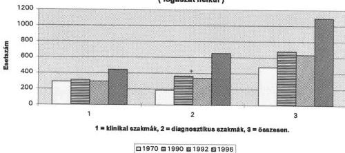
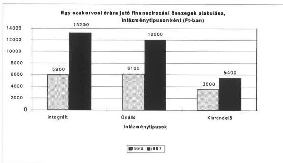
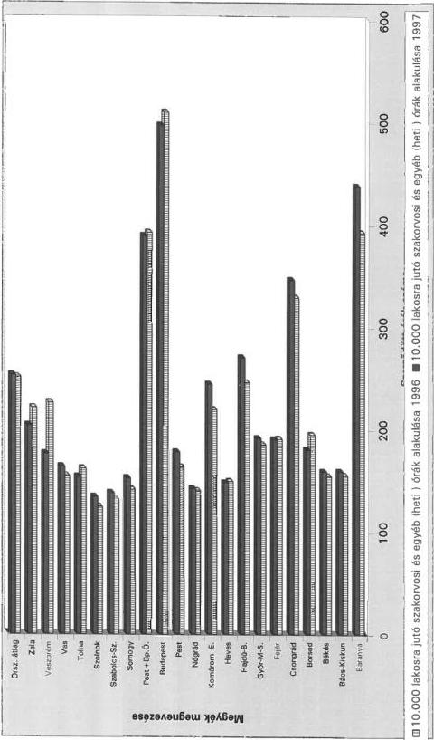
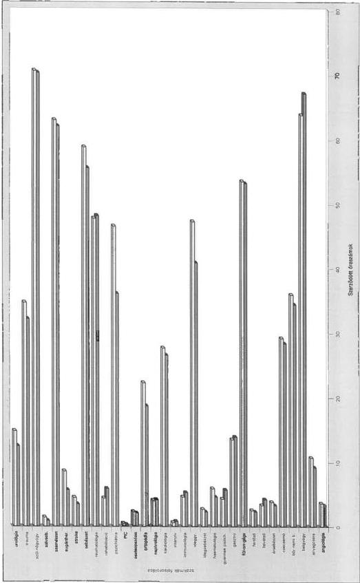
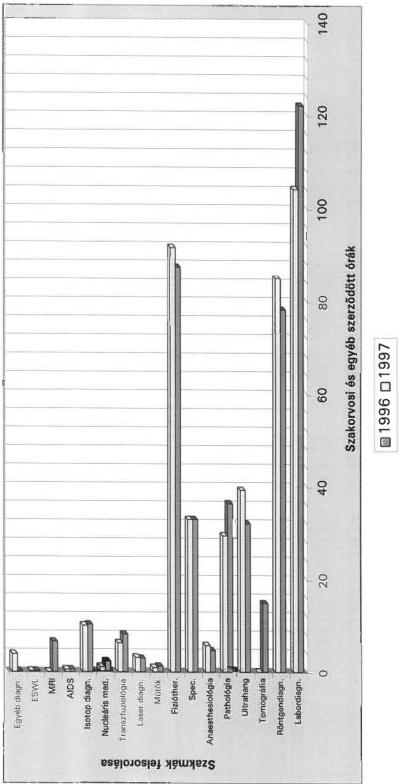
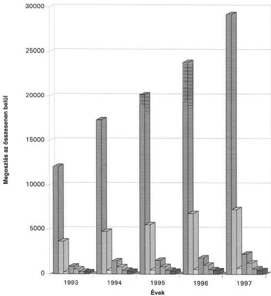
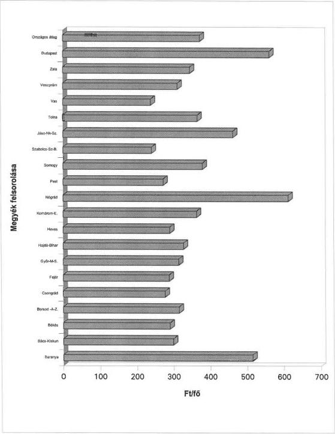
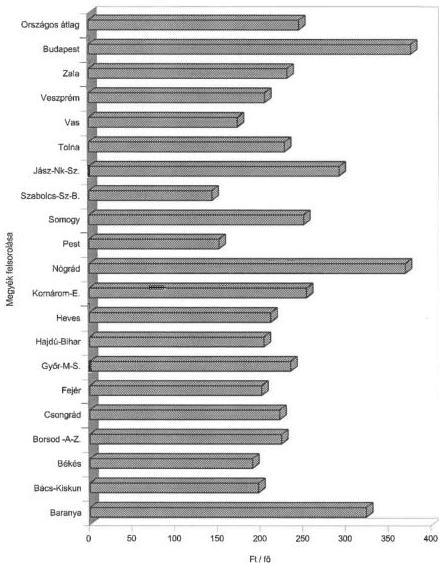

Állami Számvevőszék

# JELENTÉS

A helyi önkormányzatok által fenntartott járóbetegszakellátás helyzetének és a ráfordított pénzeszközök felhasználásának vizsgálatáról

9812

423.

1998. május

---

A vizsgálat végrehajtásáért felelős:

V. Önkormányzati és Területi Ellenőrzési Igazgatóság

Dömötör Gyula

számvevő igazgató

Az ellenőrzést vezette és a jelentést összeállította:

dr.Sallai Antal

régióvezető főtanácsos

Dankó Géza

számvevő tanácsos

Böröcz Imre

számvevő tanácsos

Laki Dóra

számvevő

közreműködésével

Az ellenőrzésben részt vettek:

Benkéné dr.Lavner Klára számvevő tanácsos

Böröcz Imre számvevő tanácsos

Dankó Géza számvevő tanácsos

Domján Jenő számvevő tanácsos

Hadházy Sándor számvevő tanácsos

Koronczai Sándorné számvevő tanácsos

Laki Dóra számvevő

dr.Magyar György számvevő tanácsos

Nagy Sándorné számvevő tanácsos

Pálfi András számvevő

Szabó Gabriella számvevő

Tóth Ferencné számvevő tanácsos

Vécsey László számvevő tanácsos

---

V-1013-121/1997-98. SZ. JELENTÉS, TÉMASZÁM: 384

# TARTALOMJEGYZÉK

BEVEZETÉS 3

I. ÖSSZEGZŐ MEGÁLLAPÍTÁSOK, KÖVETKEZTETÉSEK, JAVASLATOK 5

II. RÉSZLETES MEGÁLLAPÍTÁSOK 10

1. A járóbeteg-szakellátást végző intézmények és a betegforgalom jellemzői 10

1.1.Az ellatorendszer, a szakorvosi es nem szakorvosi orak osszetetele 10
1.2.Betegforgalmat jellemz0 tendenciak 12
1.3.A jarobeteg-szakellatas keretuben mukod gondoizintezetek 15

2. A helyi önkormányzatok szerepe a járóbeteg- szakellátásban 17

2.1.Az ellatassal osszefuggo onkormanyzati felelosseg 17
2.2. Az intézményfenntartással kapcsolatos önkormányzati feladatok fóbb jellemzői 19

3. A járóbeteg-szakellátás személyi- és tárgyi feltételei 24

3.1.A szemelyi feltetelek, szakorvosok, kozvetlen szakdolgozok letszama 25
3.2. Ingatlan ellatottsag 26
3.3. Egészsegügyi gép-múszer, valamint számítástechnikai ellatottság 27

4. Az intézmények gazdálkodása és működésük pénzügyi feltételei 29

4.1. A Tb finanszirozas es a sajat bevetelek szerepe a vizsgalt intezmenyek gazdalkodasaban 30
4.2.Az intezmenyek kiadasai es koltsegvetesi gazdalkodasa 32

5. A járóbeteg- szakellátás társadalombiztosítási finanszírozása 33

5.1.Az ellatast szolgalo tarsadalombitzositasi kiadasok 33
5.2.A finanszirozasi modszer es annak valtozasa, a finanszirozasi szerzodesek megkotese 34
5.3.A teljesitményelvü finanszirozas bevezetésenek problemaí és a megoldásukat célzo alapvető szakmai dontések 36
5.4.A finanszirozói ellenorzés 40

1

---

,

---

# Jelentés
a helyi önkormányzatok által fenntartott
járóbeteg-szakellátás helyzetének és a ráfordított
pénzeszközök felhasználásának
vizsgálatáról

# BEVEZETÉS

A járóbeteg-szakellátás a megelőző, a gyógyító, a gondozó tevékenység keretében jelentős betegforgalmat lebonyolító része az egészségügyi ellátásnak, amelynek feladatai:

- konzultációs, diagnosztikus, terapiás háttér nyújtása az alapellátás, a fekvöbeteg-ellátás és más szakrendelések számára,
- a beutalt vagy spontán jelentkező betegek gyógykezélse,
- folyamatos gondożas a háziorvosi ellatásban nem gondożható krónikus betegek szamára, egyes kiemelt betegségcsoportokban a szürések lebonyolítása.

A lakosság megbetegedési és halálozási viszonyait ma a krónikus, nem fertőző betegségek határozzák meg, ezek visszaszorításának, eredményes gyógykezelésének egyik alapvető módszere a szűrés és a gondozás.

A szűrés a másodlagos megelőzés részeként is fontos szerepet játszik, amely korábban elsősorban a fertőző betegségek terjedésének megelőzését célozta, mára feladata a rosszindulatú megbetegedések szaporodó száma, a környezeti ártalmak, az életmód változás miatt számottevően bővült. A kiemelt betegségcsoportok elleni küzdelem nem csak önkormányzati, hanem központi (kormányzati) feladatot is képez.

A szűrés egyben a gondozás bevezető szakasza is és e tevékenységek az egészségügyi ellátórendszer különböző szintjein egyaránt jelen vannak:

- az alapellátásban a háziorvosok feladata a szúres (az életkorhoz kötöttt szúrovizsgálatokat az 51/1997.(XII.18.) NM rendelet szabályozta) és a kompetencia körben történő gondozas (ennek érdekében külön gondozasi szorzo épült be a háziorvosi finanszirozasba)
- a szakellátashoz tartozó gondožointézetekben (tüdó, bör és nemibeteg, pszichiátriai, onkológiai) ezek a betegségek korai felismerésében jatszanak szerepet és egyes betegségcsoportokban jelentós hospitalizációs (kórházi ellatási) igény kivaltsára képesek.

3

---

BEVEZETÉS

A **járóbeteg-szakellátás szervezeti keretei** alapvetően az alábbi formákban jöttek létre:

- **a fekvőbeteg-intézményhez (kórház) integrált rendelőintézetek, osztályos ambulanciák, szakambulanciák,**
- **önállósult, de kórházi háttérrel működő, ahhoz szakmailag kötődő rendelőintézetek** (sok esetben az integráció felbomlását jelezte megjelenésük),
- **kórházi háttér nélküli szakorvosi rendelőintézetek.**

Finanszírozási szempontból az integrált intézmények, önálló rendelőintézetek és kisrendelők csoportját különböztetik meg.

Az önkormányzati törvény (Ötv.) az egészségügyi ellátásról történő gondoskodás kötelező feladata körében az önkormányzatok széles körű felelősségét fogalmazta meg. Az Ötv. hatályba lépésével a megszűnt tanácsok és szerveik valamint intézményeik kezelésében levő állami tulajdonú ingatlanok és egyéb vagyontárgyak - ezek között az egészségügyi intézmények (kórházak, rendelők) - a törvény erejénél fogva az önkormányzatok tulajdonába kerültek.

Az egészségügyi ellátási kötelezettségről és a területi finanszírozási normatívákról szóló 1996. LXIII. törvény (Kapacitástv.) megyénként a fekvőbeteg-ellátásban meghatározott ágyszám, a járóbeteg-szakellátásban szakrendelési óraszám finanszírozását írta elő az Egészségbiztosítási Alap (E. Alap) kezelője számára. A törvény alapján létrejött egyeztető fórumokon kialakított kapacitások és területi ellátási kötelezettség figyelembe vételével a kapacitás-lekötési megállapodásokat első ízben 1996. december 1-ig kellett megkötni.

Az Állami Számvevőszék 1993-1997. évekre kiterjedően vizsgálta az önkormányzatok ellátás-szervezésben betöltött szerepét, a járóbeteg-szakellátás szolgáltató rendszeren belüli szerepének növelésére, a területi és szakmai egyenetlenségek csökkentésére tett intézkedéseket, a finanszírozásnak az intézmények működési feltételeire gyakorolt hatását.

A helyszíni vizsgálatok lezárását követően új egészségügyi törvényt alkotott az Országgyűlés. Az ellátás színvonalát garantáló, a finanszírozó számára a pénzügyi források hatékony felhasználását segítő **minőségbiztosítás és minőségellenőrzés** rendszere korábban nem épült ki az egészségügyi intézményekben. Az 1998. július 1-én hatályba lépő új egészségügyi törvény fogalmazta meg a szolgáltatás megfelelő minőségének alapvető feltételeit:

- **azt kizárólag a jogszabályban meghatározott személyi és tárgyi feltételekkel rendelkező szolgáltató nyújtsa**, (ennek irányába tett lépés volt korábban a minimumfeltételek meghatározása),
- **az ellátás során érvényesüljenek a szakmai szabályok** (jogszabályban, irányelvekben, módszertani útmutatókban vagy ezek hiányában a széles körben elfogadott, szakirodalomban közzétett szakmai kö-

4

---

I. ÖSSZEGZŐ MEGÁLLAPÍTÁSOK, KÖVETKEZTETÉSEK, JAVASLATOK

vetelmények), amelyek kialakítása a járóbeteg-ellátásban a szakmai ellenőrzésnek is nélkülözhetetlen, ma még többnyire hiányzó feltétele,

- a beteg számára hozzáférhető legyen, a lehető legnagyobb állapotjavulást eredményezze, tegye lehetővé a betegjogok érvényesülését, valamint az erőforrások optimális, szakmailag és gazdaságilag hatékony felhasználását.

Helyszíni ellenőrzésre 12 megyében és a fővárosban 32 helyi önkormányzatnál, 12 megyei egészségbiztosítási pénztárnál (MEP), összesen 39 egészségügyi szolgáltatónál (19 integrált egészségügyi intézménynél 13 önálló rendelőintézetnél, 7 kisrendelőnél) került sor. A vizsgált intézmények 1511 rendelésen a járóbeteg-szakrendelési óraszám 21,6%-át működtetik.

Az ellenőrzéseket módszertani ajánlásokkal, továbbá helyszíni tájékozódás tapasztalatainak átadásával a kulturális és szakmai együttműködést támogató brit Know How Fond nevű alapítvány is segítette.

# I. ÖSSZEGZŐ MEGÁLLAPÍTÁSOK, KÖVETKEZTETÉSEK, JAVASLATOK

A járóbeteg-szakrendelések betegforgalma 1992-96. évek között 164%-kal nőtt, és az egészségügyi ellátórendszerben létrejött évi közel 183 millió orvos-beteg találkozás 63%-ára a járóbeteg-szakellátásban került sor. A betegforgalom jelentős részét a korábbi rendeléseken megjelent betegek további, ismételt vizsgálatai és a kórházi osztályok által kért -általában diagnosztikai - vizsgálatok képezik.

Az E. Alap költségvetéséből 1997. évben a járóbeteg-szakellátással összefüggő feladatokra 41,7 milliárd Ft-ot, a gyógyító-megelőző ellátások előirányzatának közel 16%-át folyósították. Ez az összeg a vizsgált időszakban több mint kétszeresére nőtt (234%-kal), azonban az infláció hatását és a betegforgalom növekedését figyelembe véve a reálértéke csökkent.

Az egészségügyi ellátórendszer, a progresszív betegellátás legjelentősebb intézményei az integrált kórház-rendelőintézetek számottevő része a települési önkormányzatok tulajdonába került, így sok esetben a városoknál jelentkeztek a település lakosságának igényeit és az önkormányzatok teljesítő képességét jóval meghaladó középfokú közszolgáltatások, intézmények fenntartásának, fejlesztésének és irányításának feladatai. A tulajdonosi jogok gyakorlásához az önkormányzatok jelentős része nem rendelkezik megfelelő pénzügyi forrásokkal.

A tulajdonos önkormányzatoknak kell - számos feladattal terhelt saját bevételeikből - az intézmények működtetési forrásait kiegészíteni, fejlesztéséről gondoskodni, az ezt szolgáló cél, címzett támogatáshoz saját forrást biztosítani. Ennek terhe nem került központilag megosztásra (normatív támogatás vagy a TB finanszírozásban megjelenő amortizációs hányad útján) és a szolgáltatáso-

5

---

I. ÖSSZEGZŐ MEGÁLLAPÍTÁSOK, KÖVETKEZTETÉSEK, JAVASLATOK---

kat igénybe vevők jelentős részének **lakóhelye szerinti önkormányzatokat semmi sem kötelezi a feladatokhoz való anyagi hozzájárulásra.**

A kórházak, rendelőintézetek az önkormányzat felhatalmazásával, területi ellátási kötelezettséget vállalva a finanszírozó E. Alap kezelőjével közvetlenül kötöttek finanszírozási szerződést. A teljesítményeket a finanszírozó felé számolták el, amelynek ellenőrzése a finanszírozó MEP-ek, az egészségügyi ellátórendszer szakmai felügyelete az önkormányzatoktól független állami népegészségügyi és tisztiorvosi szolgálat (ÁNTSZ) feladata. Az önkormányzatok a társadalombiztosítási alapú finanszírozás mellett **nem mindig érzékelték felelősségüket az egészségügyi intézmények fenntartása, irányítása területén.**

A fenntartókra az intézmények eltérő állagából, felszereltségéből és az elmúlt években döntően állami (címzett) támogatásból megvalósított rekonstrukciók eredményeként igen eltérő terhek hárulnak. **Az önkormányzatok nem rendelkeznek elegendő információval a lakosság egészségügyi állapotáról, a tulajdonukban lévő intézményekről, így döntéseik kevésbé megalapozottak, olykor érzelmi vagy politikai megfontolásból születnek.** Az E. Alap kezelője az intézményeket közvetlenül finanszírozza, így sok esetben a tulajdonos önkormányzatok sem a bevételekről, sem azok felhasználásáról nem kellően tájékozottak annak ellenére, hogy az egészségügyi intézmények bevételeit és kiadásait szerepeltetni kell költségvetésükben és beszámolójukban.

**A járóbeteg-szakellátás személyi és tárgyi feltételeiben számottevő különbségek tapasztalhatók.** A jól felszerelt városi rendelőintézetek mellett egyes vidéki kisrendelők műszerezettségének és szakorvos ellátottságának hiányosságait a teljesítmény alapú finanszírozás differenciáló hatása tovább erősítette, és ezt a fenntartó önkormányzatok pénzeszközök hiányában nem mindenhol tudták ellensúlyozni.

A járóbeteg-szakellátás, a szűrés, gondozás területén a **megyék közötti különbségek** az ellátáshoz való hozzájutásban nagyfokú **esélyegyenlőtlenséget jelentenek** és különösen a szűréseknek a betegségek korai felismerésében játszott szerepe növelhető azok szervezettségének, célzottságának javításával.

**A járóbeteg-szakellátás helyzetét befolyásolta, hogy az egészségpolitikai elvek többször változtak.** Az alapellátás (háziorvosi rendszer) 1992. évben megkezdett fejlesztése mellett nem volt egyértelmű, kiforrott álláspont a járóbeteg-ellátás átalakítására vonatkozóan. Ennek következményei az egészségügy korszerűsítésének 1997. évi programjában kitűzött cél megvalósítását - a járóbeteg-szakellátás diagnosztikus és konzultatív lehetőségeinek erősítését, az ellátási egyenetlenségek fokozatos csökkentésével egyidejűleg - jelenleg is nehezítik.

A kórházi ágyszám csökkentés mellett 1996. évben a Kapacitástv. a járóbeteg-szakellátás megerősítését közvetlen célként nem fogalmazta meg. Az ellátás területi aránytalanságainak mérséklését szolgálta azonban a rendelési óraszám felső határértékének megállapítása, illetve a fenntartók ajánlata alapján az előző évi óraszám 10%-os növelésének lehetősége.

---6

---

I. ÖSSZEGZŐ MEGÁLLAPÍTÁSOK, KÖVETKEZTETÉSEK, JAVASLATOK

A működési engedélyek 1996. évi kiadását megelőző felmérések alapján a szakrendelések jelentős hányada a minimumfeltételek teljesítésének részleges hiánya miatt, az ambulanciák a minimumfeltételek meghatározásának hiányában **csak ideiglenes működési engedélyt** kaptak. A minimumfeltételek teljesítésére a gép-műszer ellátottság területén eredetileg előírt 1997. június 30-i határidőre a hiányosságok pótlása nem volt biztosítható, ezért azt 1 évvel meghosszabbították. A szakrendelések és az ambulanciák feladatainak, szervezeti megoldásainak, személyi és műszerezettségi feltételeinek különbözősége a szakmai szabályokban és a finanszírozásban nem tükröződik.

Az NM központi támogatással, pályázati úton segítette a minimumfeltételek teljesítését, azonban ez és az önkormányzatok pénzügyi lehetőségei összességében sem teszik lehetővé, hogy az előírt határidőre pótolják az összes megállapított hiányosságot. A minimumfeltételek vizsgálata során **csak a mennyiségi hiányokat rögzítették**, az elöregedett gépek, műszerek cseréjéhez szükséges források elégtelensége további feszültséget jelent az intézményeknél.

**Alapvetően megváltozott 1993. július 1-től a szakellátás finanszírozása**, amelynek alapja az egészségügyi ellátási tevékenység orvos-szakmai típusa, illetve az ezek biztosítása során elért teljesítmény. A fokozatosság érdekében átmenetileg a bázisfinanszírozás elemei is megmaradtak, a fixdíj 70%-os részarányt képviselt, amelynek súlya, részaránya a vizsgált időszak végére 10%-ra csökkent.

Az egészségügyi rendszer átfogó reformjának igénye már korábban megfogalmazódott, ennek érdekében a finanszírozási rendszer átalakítása fontos lépés volt, de nem oldotta meg az egészségügyi strukturális gondjait. A járóbetegszakellátásban a szolgáltatás mennyiségén alapuló finanszírozás - bár a korábbi pénzelosztás helyett objektívebb - a hatékonyság, eredményesség növelését önmagában nem biztosíthatta és nem is oldotta meg, ugyanakkor nem kívánatos hatásokat is kiváltott.

**Az orvos illetve az intézmény az új típusú finanszírozási rendszerben abban érdekelt, hogy minél több szolgáltatást nyújtson**, hogy magasabb legyen a teljesítménye. Ez nemcsak a betegek jobb ellátásával érhető el, hanem ismételt, szakmailag indokolatlan vizsgálatokkal, a teljesítményelszámolások gondosabb elkészítésével is.

A romló gazdasági, pénzügyi feltételek és **a teljesítményelvű finanszírozás bevezetése** felszínre hozta az egészségügyi ellátórendszer belső feszültségeit. Nem ment végbe olyan strukturális átalakulás, amelynek jellemzői: kisebb, de területileg arányosabb és hatékonyabb fekvőbeteg-ellátás, szakmailag és felszereltségében megerősített járóbeteg- és alapellátás.

A finanszírozási változásokat nem követte a szakellátást végző egészségügyi **intézmények gazdálkodásának, belső érdekeltségi rendszerének átalakítása**. A finanszírozás viszonylag rugalmas rendszere valamint a hagyományos költségvetési gazdálkodási kötöttségek, és a közalkalmazotti bérrendszer merevsége közötti ellentmondás a személyes érdekeltség hiányában is érzékelhető.

7

---

I. ÖSSZEGZŐ MEGÁLLAPÍTÁSOK, KÖVETKEZTETÉSEK, JAVASLATOK---

Az ellátórendszer tényleges működtetési költségének és hatékonyságának megállapítása érdekében megbízhatóbb adatszolgáltatásra és költségkimutatásokra van szükség. Az informatika fejlesztése a minőségbiztosításhoz és ellenőrzéshez is nélkülözhetetlen. Az intézmények gazdálkodása során keletkező adatok rögzítésének, **a bevételek és kiadások tervezésének és elszámolásának** jelenlegi **gyakorlata az ellátások tényleges költségeinek megállapításához**, az érdekeltségi és kontrolling rendszer kialakításához **sem biztosít megbízható információkat**.

A hatékonyabb működés és gazdálkodás ösztönzőjeként a járóbetegszakellátásban a működtetés privatizációjára csak kísérleti jelleggel került sor. E folyamat megerősödésének legfontosabb akadályát jelenti az állami önkormányzati felelősség és önkormányzati tulajdon átalakításának kialakulatlan gyakorlata, az amortizáció képzésének és elszámolhatóságának megoldatlansága.

**A helyszíni vizsgálatok az intézményeknek, és a fenntartó önkormányzatoknak a következő javaslatokat** fogalmazták meg:

- • A járóbeteg-ellátás működtetése, fejlesztése érdekében az ellátási terület érintett önkormányzataival való együttműködés javítását.
- • A megyei egyeztető fórumokon a járóbeteg-szakellátás területi és strukturális aránytalanságai csökkentése, a kapacitásoknak a lakosság egészségügyi állapotának megfelelő alakítása érdekében új kapacitás-lekötesi megállapodások kezdeményezését.
- • A tényleges rendelési idő és a lekötött kapacitások összhangjának biztosítását, a rendelések átmeneti szüneteltetését elkerülendő helyettesítések megszervezését.
- • A járóbeteg-szakellátással összefüggő lakossági szükségletek jobb kielégítése érdekében a betegforgalom, a rendelési körülmények, a várakozás alakulásának figyelemmel kísérését.
- • A minimumfeltételekben előírt személyi- és tárgyi feltételek teljesítéséhez szükséges források megteremtését, a pénzügyi lehetőségek függvényében az éves költségvetésben ütemezését.
- • A teljesítmények és kapacitások, az egyes szakrendelések bevételeinek alakulását, költségeinek rendszeres elemzését, értékelését.
- • A költségvetés tervezése, a beszámoló készítése során az államháztartási törvény előírásaival összhangban a bevételek, kiadások ténylegesen ellátott feladat szerinti szakfeladaton történő elszámolását.
- • A tevékenységek, gazdasági folyamatok nyomon követése, optimalizálása, a célszerű érdekeltségi rendszer kialakítása, működtetése érdekében korszerű kontrolling feltételeinek informatikai megalapozását.

---8

---

I. ÖSSZEGZŐ MEGÁLLAPÍTÁSOK, KÖVETKEZTETÉSEK, JAVASLATOK

Az Állami Számvevőszék az ellenőrzés tapasztalatai alapján a Népjóléti Minisztériumnak ajánlja:

- A járóbeteg-szakellátás irányítási, működési rendszerét áttekinteni, különös figyelemmel a térségi szemlélet erősítésére a szakellátások szervezésében, az ellátórendszer fenntartásában, fejlesztésében.
- A tulajdonost terhelő kötelezettségek pénzügyi forrásainak megteremtése érdekében a fejlesztést, pótlást szolgáló támogatási formák normatív alapokra való helyezésével, az amortizáció képzésével és elszámolhatóságával kapcsolatos alapvető kérdések eldöntését és a szükséges jogi szabályozás kidolgozását.
- A progresszív betegellátás követelményének figyelembe vételével a szakrendelések és az ambulanciák minimumfeltételének áttekintését, kompetenciáit és kötelező ellátási területeit a működési feltételekben, szervezeti megoldásaikban meglévő különbségeket figyelembe véve szabályozni.
- Az egészségügyi intézmények gazdálkodásának, tervezési, beszámolási, informatikai, ágazati statisztikai rendszerének korszerűsítését.

Az Állami Számvevőszék az ellenőrzés tapasztalatai alapján az Egészségbiztosítási Önkormányzatnak ajánlja:

- A gondozóintézetek feladataihoz, a végzett munkához illeszkedő finanszírozási rendszer bevezetését, a szűrések szervezettségének, célzottságának javítását.
- Az alapellátás és a költségesebb járó- és fekvőbeteg-ellátás érdekeltségi viszonyait összhangba hozni és olyan irányba fejleszteni, hogy a befejezett ellátásban való érdekeltség érvényesüljön, erősödjön a háziorvosok és a járóbeteg-szakellátás közötti kapcsolat.
- A gyógyító-megelőző tevékenység eredményessége, az erőforrások jobb hasznosítása érdekében a működés-finanszírozás ellenőrzési színvonalának emelését, különös tekintettel a finanszírozás alapját jelentő teljesítmények orvos-szakmai tartalmára, indokoltságára, az intézmények gazdálkodására, a minőségbiztosításból eredő követelmények érvényesítésére.

9

---

II. RÉSZLETES MEGÁLLAPÍTÁSOK---

# II. RÉSZLETES MEGÁLLAPÍTÁSOK

## 1. A JÁRÓBETEG-SZAKELLÁTÁST VÉGZŐ INTÉZMÉNYEK ÉS A BETEGFORGALOM JELLEMZŐI

### 1.1. Az ellátórendszer, a szakorvosi és nem szakorvosi órák összetétele

A heti rendelési órában kifejezett kapacitás mintegy 80%-a a helyi önkormányzatok tulajdonában levő intézmények által szerződött óra, a fennmaradó hányad háromnegyede 3 megyében és a fővárosban az orvosegyetemek klinikái és az országos intézetek által területi ellátási kötelezettséggel működtetett járóbeteg-szakrendelés (számottevően csökkentve e területen az önkormányzatok feladat-ellátási kötelezettségéből adódó terheket), a fennmaradó egynegyed rész a KHVM (vasutas tb) HM, BM által működtetett intézmények szakrendelései.

A járóbeteg szakellátás heti rendelési óráin belül Csongrád megyében a SZOTE 42,4%-kal, Hajú-Bihar megyében a DOTE 31%-kal részesedik.

A járóbeteg-ellátást nyújtó intézmények az ellátórendszer legváltozatosabb részét alkotják. A legmagasabb heti rendelési óraszám a vizsgált intézményeknél közel 5 ezer óra, míg a kisrendelők átlagos rendelési ideje 240 (egyes kisrendelőké csupán heti 30-40 óra).

Az önkormányzati intézményekben az ellátórendszer összetételében jelentős eltérés tapasztalható. A **megyék egyik felénél a járóbeteg-rendelések kórházi háttérrel, integrált intézményként működnek, míg** (pl. Győr-Moson-Sopron, Fejér, Nógrád megyék) a **megyék másik felénél az önálló rendelőintézetek, kis rendelők biztosítják a kapacitások jelentős hányadát.** (pl. Pest megyében 59%-át, Hajdú-Bihar megyében 35%-át, Csongrád megyében 28%-át).

Kedvező település-földrajzi adottságok mellett, a korábbi kórháztelepítések következtében a kórházak, rendelőintézetek viszonylag kis távolságon belül elérhetőek, más térségekben a szakellátás megközelíthetősége, betegközelisége rosszabb.

Győr-Moson-Sopron megyében a településeken élők 30 km-en belüli távolságból érhetik el a beutalási rend szerinti rendelőt, ugyanakkor Hajdú-Bihar megyében a Tiszaháti térségben 70 km-es távolságra található néhány településtől a területileg illetékes intézmény.

A **kapacitásokra** (szakorvosi és nem szakorvosi órákban) **az ellátás személyi- és tárgyi feltételeire** vonatkozó adatokat először az 1995. október 1-gyel kötött új finanszírozási szerződések rögzítették, majd a Kapacitástv. 1996. év-

---10

---

II. RÉSZLETES MEGÁLLAPÍTÁSOK

ben a heti szakorvosi, nem szakorvosi és gondozási óraszámokat illetően felső határértéket állapított meg.

A törvény alapján kötött **kapacitás-lekötési megállapodások eredményeképpen** a járóbeteg-szakellátás **területi egyenetlenségeinek szélső értékei csökkentek, azonban továbbra is jelentősek**, nem tükrözik a helyi megbetegedési viszonyokból fakadó valós igényeket.

Az összes szakorvosi óraszám 10 ezer lakosra vetítve 1996. évben pl. Budapesten 529 óra, Csongrád megyében 344 óra, Szabolcs-Szatmár megyében 142 óra, Szolnok megyében 139 óra volt, 1997. évben a különbségek csak kis mértékben csökkentek. A rendelési órák megyénkénti, valamint klinikai és diagnosztikus szakmák szerinti összetételét 1996-97. évekre az 1-3. sz. mellékletek tükrözik.

Összességében a szerződött óraszámokban 1996-97. között országosan nem következett be lényeges változás, mindössze 1,1%-kal növekedett a heti óraszám. Belső struktúrája azonban módosult: a szakorvosi óráknál 7,9%-os növekedés, a nem szakorvosi óráknál 11,3%-os csökkenés tapasztalható. Ez utóbbi nagyobb része azonban csupán technikai jellegű, az 1995. évi szerződés kötésnél alkalmazott számbevételi pontatlanságok, értelmezési zavarok miatti helyesbítésekkel függ össze.

Megfigyelhető, hogy a klinikai szakmák szakorvosi óraszámai lényegesen kisebb ütemben (+ 5,5%) növekedtek mint a diagnosztikus tevékenységeké (+ 15,2%), ugyanakkor a nem szakorvosi órák esetében éppen fordított a helyzet.

**Fekvőbeteg-intézményhez integrált szakrendelők**, illetve ezek részeként működő **(szak)ambulanciák** heti rendelési óráinak száma 214,5 ezer, az összes kapacitás 78%-a az általuk jelentett havi átlagos teljesítménypont 80-81% az összeshez viszonyítva. A néhány százalékpontos eltérés (pl. az önálló rendelőintézeteknél -2,5 ill. -2,1 százalékpont) teljesítménydíjban számítva mintegy 0,5 milliárd Ft-ot jelentett, amely a rendelőintézetek fix és teljesítménydíjának 11%-a.

Az ambulanciákon a jobb műszerezettség, a kórházi gyakorlatból származó nagyobb szakmai hozzáértés következtében jobban nőtt a betegforgalom és a beavatkozások pontértéke.

A Győri Petz Aladár Megyei Kórház ambulanciáin 1994-96. között a szakrendeléseken 17%-kal, az ambulanciákon 26,6%-kal nőtt a teljesítmény.

Az integráció felbomlásával 1990. évet követően nagyobb városokban és Budapesten is szervezetileg **önálló rendelőintézetek** jöttek létre. Általában 10-nél több szakmában, egyenként 20-50 háziorvosnak biztosítanak konzultatív hátteret, földrajzi helyzetüknél fogva betegközeliek, **főként az ún. kórházhiányos térségek járóbeteg-szakellátása szempontjából fontos a szerepük**. (Szakorvosi rendelőintézet: a legalább belgyógyászati, sebészeti, szülészeti szakorvosi rendelést illetve a rendelési idő alatt szakorvos által vezetett radiológiai, klinikai laboratórium és EKG rendelést működtető szolgáltató).

11

---

II. RÉSZLETES MEGÁLLAPÍTÁSOK

A rendelőintézet kritériumának meg nem felelő **kisrendelők** általában néhány szakmában - jellemzően nem főállású szakorvossal, viszonylag alacsony óraszám mellett - biztosítják az adott település és környezetének egészségügyi szakellátását.

## 1.2. Betegforgalmat jellemző tendenciák

Az ágazati statisztika hosszú ideje gyűjt adatokat a betegforgalom területi és szakmai megoszlására vonatkozóan. A teljesítményalapú finanszírozás bevezetését megelőző 1992-es évhez viszonyítva **a rendelőintézetek betegforgalma** (fogászat nélkül) **1996. évre 164%-kal nőtt**, és az egészségügyi intézményekben létrejött évi közel **183 millió orvos-beteg találkozás 63%-ára a járóbeteg-szakellátásban került sor**. (A statisztikák 1990. évben még csak 132 millió orvos-beteg találkozást regisztráltak, és ennek 49%-át jelentették a rendelőintézetek.)

A 100 lakosra jutó betegforgalom az egészségügyi ellátásban:

|  Megnevezés | 1992 | 1996 | Változás %-a  |
| --- | --- | --- | --- |
|  - Háziorvosok | 512,1 | 513,3 | 100,6  |
|  - Szakrendelők | 701,7 | 1.165,6 | 166,1  |
|  - Gondozóintézetek | 58,4 | 54,4 | 93,2  |
|  - Kórházak | 21,9 | 23,1 | 105,5  |

A szakrendelések betegforgalma a KSH által gyűjtött adatok szerint 1992. évet megelőzően elsősorban a diagnosztikus szakmákban növekedett, 1992-96. között a növekedés a klinikai és a diagnosztikus szakmákban is jelentős volt.

A betegforgalom (fogászat nélkül) 1970-1992. között 33,1%-kal nőtt a diagnosztikus szakmák 83,2%-os forgalomnövekedésének eredményeként. Ezzel szemben 1992-1996. között az esetszám 72,8%-kal nőtt, amelyen belül a klinikai szakmákban 50,8%-os, a diagnosztikai területeken 91,9%-os volt a növekedés. A betegforgalom 1996. évben már tartalmazta a kórházi ambuláns ellátást, amely a statisztikák szerint az összes betegforgalom 14,8%-a volt.

A betegellátást jellemző perc-átlag (egy gyógykezelési esetre jutó idő) a legtöbb klinikai szakterületen nőtt, azonban összességében az 1990.évi 7,5-ről 1996.évben 6,7 percre csökkent. Ennek oka, hogy az esetek mintegy 52%-át reprezentáló diagnosztikai vizsgálatoknál az automatizáció eredményeként az egy vizsgálatra eső idő 0,8 percre csökkent. Ugyanakkor pl. a reumatológiai szakrendelések betegforgalmát és percátlagát csökkentette, hogy 1995. évtől a fizikoterápia esetszámait a statisztika nem tartalmazta (évente 6-7 millió eset).

12

---

II. RÉSZLETES MEGÁLLAPÍTÁSOK

100 lakosra jutó gyógykezelési eset a rendelőintézetekben

A járóbeteg-szakellátásban a kapacitás (óraszám), orvos létszám adatok eltérőek az ágazati statisztikában és a finanszírozó E. Alap kezelőjénél. Az egyes ellátási szintek kapacitását és betegforgalmát leíró statisztikai adatok mellett az ellátórendszer hatékonyságára, az ellátás minőségére és a lakosság egészségügyi állapotára, az ellátás igénybe vételét befolyásoló tényezőkre vonatkozóan az Országos Statisztikai Adatgyűjtő Program (OSAP) keretében viszonylag kevés adatot gyűjtöttek.

A finanszírozó E. Alap kezelője a betegforgalomról a teljesítményalapú finanszírozás bevezetésétől, 1993. július 1-től rendelkezik adatokkal. A helyszíni vizsgálatok során összehasonlítható 3 teljes év jelentett teljesítményei alapján 1994-96. között az esetszám 16,9%-kal, a bevételi érdekeltség miatt a finanszírozás szempontjából lényeges beavatkozásszám ugyanebben az időszakban 50,6%-kal, a pontérték 50,9%-kal nőtt.

A fekvőbeteg-ellátáshoz kapcsolódó ambuláns betegforgalom az új finanszírozási rendszer bevezetéséig nem szerepelt a járóbeteg-ellátás adatai között. Ezt követően a szakrendelő, ambulancia betegforgalmának elkülönítése elsősorban a finanszírozási szabályok miatt vált fontossá. Az ambulánsan (járóbetegként) végzett, de a fekvőbeteg-ellátás teljesítményeiben elismert tevékenységek:

A fekvőbeteg felvételt megelőző 24 órán belül, vagy az osztályra már felvett betegen végzett diagnosztikus és terápiás beavatkozások, fekvőbetegek járóbeteg-szakellátás rendelésen történő kontrollvizsgálata a fekvőbeteg finanszírozásban meghatározott felső határnapon belül nem számolható el a járóbeteg-szakellátás teljesítményeként (ezért pl. a programozott műtétek előtt 2 nappal végzik el a laborvizsgálatot, és akkor jár a teljesítménydíj).

**Számos** olyan **ellátás** van - sebészet, urulógia, nőgyógyászat, gégészet stb. - amely azonos tartalommal és ugyanolyan feltételekkel **elvégezhető** ambulánsan (**járóbeteg**) és hospitalizált (**fekvőbeteg**) **formában** is. A fekvőbeteg-ellátásért járó díjazás a jelenlegi finanszírozási rendszerben nagyobb érde-

13

---

II. RÉSZLETES MEGÁLLAPÍTÁSOK

keltséget jelent, annak ellenére, hogy azt terhelik a hotel-szolgáltatások költségei is.

Az ambulánsan is végezhető beavatkozások fekvőbeteg-ellátás teljesítményeként történő elszámolására utal közvetett módon, hogy a kórházi betegforgalom 22,61%-a rövid átlagos ápolási idejű (átlagos ápolási idő 1,71 nap.)

A rendelőintézetek betegforgalmából a statisztika a háziorvosok által beutaltak esetszámát számszerűsíti, az egyéb összetevőkre vonatkozóan csak következtetni lehet.

- Az alapellátásból beutalóval érkező esetek száma a háziorvosi statisztika szerint évente 3,3 - 3,6 millió. A háziorvosok a rendelésen megjelenteknek 1992. évben 5,6%-át, 1996. évben már 8%-át utalták szakrendelésre, és a kórházba továbbutalt betegek száma ugyanebben az időszakban 24%-kal nőtt.
- A kórházi osztályok által kért vizsgálat valamint a járóbetegszakrendeléseken megjelent betegek első vizsgálatot követő további vagy ismételt vizsgálata számottevő.
- A beutaló nélkül felkereshető rendelések számát a 172/1994. (XII.20.) Korm. rendelet bővítette. Eszerint a biztosított az alapellátás orvosának beutalása nélkül sürgős eseteken túl is jogosult igénybe venni a bőrgyógyászati, fül- orr- gége, nőgyógyászati, általános és baleseti sebészeti, szülészeti, onkológiai, urulógiai szakrendelést, valamint a gondozó intézetek keretében nyújtott szolgáltatást.

A vizsgált intézményeknél 1994-96. között az elszámolt pontértékhez viszonyítva 21,5-24% volt a saját kórházi osztály felé nyújtott teljesítmény.

A beutaló nélkül igénybevehető rendeléseket felkereső betegek gyakran feleslegesen terhelik az egyébként is zsúfolt rendeléseket, melyhez hozzájárul a megfelelő tájékoztatás és a korszerű betegirányítási módszerek hiánya is. A szakrendelők a háziorvosokat a rendelési időben bekövetkezett változásokról nem tájékoztatják naprakészen. Előjegyzést csak néhány szakmában és csak akkor alkalmaznak, ha a zsúfoltság miatt csak későbbi időpontban (2-4 hét múlva) tudják fogadni a betegeket.

A Komárom-Esztergom Megyei Önkormányzat Szent Borbála Kórházában a szemészeten a sürgős eseteket kivéve előfordul, hogy a betegeket csak egy hónapon túl tudják előjegyzés alapján fogadni.

A Győri Petz Aladár Kórházban központi (kézi) kartonozó működik. A betegforgalom nagysága és a kapacitás alapján alakították ki a betegek előjegyzésének módját az egyes szakterületeken. Nem szükséges előjegyzés, az ellátás érkezési sorrendben történik 6 szakterülethez tartozó rendelésen. Előzetes előjegyzés szükséges a reumatológiai, ortopédiai, szemészeti, bőrgyógyászati szakrendeléseken, ahol a betegek 50%-a kerül aznap ellátásra, másik részük a kapacitástól függően 2-14 napon belül kerül előjegyzésre.

14

---

II. RÉSZLETES MEGÁLLAPÍTÁSOK

A kórházi osztályok által kért labor, röntgen vizsgálatok jelentik az összes eset 64-71%-át (labordiagnosztikában 1996. évben 1 elbocsátott kórházi betegre eső vizsgálati eset átlagosan 18 volt).

A diagnosztikus szakmák (laboratórium, képalkotó eljárások, röntgen, UH, egyéb) esetszáma összefügg azon szakmák betegforgalmával, amelyeknek diagnosztikai igénye a legnagyobb. (belgyógyászat, sebészet stb.)

A Sárvári Önkormányzati Kórház járóbeteg-szakrendelésein a fekvőbeteg-osztályok felé a labor, röntgen, UH vizsgálatoknál számoltak el növekvő arányban teljesítményt. A diagnosztikus szakmák részaránya a teljesítményeken belül az 1994. évi 33%-ról 1996. évben 41,2%-ra nőtt, ugyanebben az időszakban a röntgen, ultrahang vizsgálatok a fekvőbeteg-osztályok felé 17,5%-ról 21,6%-ra nőttek.

A párhuzamos, ismételt vizsgálatok kiszűrésére az igen eszköz- és anyagigényes diagnosztikai szakterületeken is csak elvétve volt tapasztalható törekvés.

### 1.3. A járóbeteg-szakellátás keretében működő gondozóintézetek

A gondozóintézetek számos megbetegedésben (tuberkulózis, nemibetegségek) járványtanilag is fontos megelőző és gyógyító ellátást végeznek, valamint nagy számban látnak el nem fertőző krónikus megbetegedésben szenvedőket. A gondozás szakmai többletet nyújt az ellátott betegek számára, a gondozó orvos jogosult a keresőképtelenség, illetve keresőképesség elbírálására és igazolására is.

Feladataik megoszlanak a gyógyító, gondozó és az adott szakterületen folyó konzultatív tevékenység között, melyek szétválasztására a finanszírozás 1993. július 1-i reformját követően került sor:

- Az ideg, nemibeteg, tüdő és az onkológiai gondozók e tevékenységükre a költségvetési előirányzataik meghatározott százalékát, gondozási szakterületektől függően 25-70%-át mutathatták ki, és az E. Alapban így elkülönített előirányzatból (kassza) feladatfinanszírozásban részesülnek. (Az egyes gondozók részesedését az E. Alap költségvetésén belül a 4.sz. melléklet mutatja be.)
- A rendelésen megjelentek után - a szűrővizsgálatot és a gondozási tevékenységet kivéve - a járóbeteg-szakellátás kasszájából teljesítmény- díjazásban részesülnek.

A gondozóintézetek egyes típusai által végzett szűrést, gondozást az alábbiak jellemzik:

- Tüdőgondozók létrehozásához képest a tuberkulózis (tbc) jelentősen visszaszorult, számottevően lecsökkent és megváltozott a betegforgalmuk, amely nagyrészt a nem fertőző krónikus tüdőbetegségekből tevődik össze. Ennek keretében működnek a stabil és mozgó ernyő fénykép szűrőállomások is. A szűréseknél a tbc-ről áthelyeződött a hangsúly a halálokok között elő-

15

---

II. RÉSZLETES MEGÁLLAPÍTÁSOK

kelő helyet elfoglaló tüdődaganatokra és keringési megbetegedésekre, a komplex szűrésekre (keringési, cukorbetegségek, vesebetegségek, daganatos megbetegedések).

A tbc-s megbetegedések száma a 90-es évektől kezdve ismét növekedett. A szűrések eredményeként 1995. évben a tüdődaganatos betegek 33%-át, az újra előforduló tbc-sek 42%-át kutatták fel, amelynek aránya évek óta stagnál. A TB támogatás növekvő hányada a tüdőgondozók működtetését szolgálja (1993. éven 40,7%, 1997. évben 43,6%).

A legnagyobb gondot a szűrőállomások elavult gép-műszer parkja okozza, az ezzel kapcsolatos források megteremtése a fenntartó települési önkormányzatok számára aránytalanul nagy terhet jelent, miközben a szűrőállomások más önkormányzatok közigazgatási területén élő lakosságot is ellátják.

- **Bőr és nemibeteg gondozók** betegforgalma évek óta csökken. 1970. évben ugyanennyi gondozó 2 millió fővel nagyobb betegforgalmat bonyolított le, amelyet a hálózat arányainak változása nem követett. A TB támogatás növekvő hányadát (1993. évben 10,4%-át, 1997. évben 12,5%-át) folyósították működtetésükre.
- **Pszichiátriai gondozók** betegforgalma a többi gondozótól eltérően az elmebetegségek, lelki zavarok, mentálhigiénés betegségek növekedése miatt az 1990-es években emelkedett (1990.évi 922 ezer főről 1996. évre 1.105 ezer főre) miközben a TB támogatásból való részesedésük 1993-97. között 1,8%-ponttal csökkent. A gondozásba vett új betegek aránya megyék között igen nagy szóródást mutat (1995. évben 10 ezer lakosra Somogy megyében 2,5 fő, Békés megyében 4,7 fő, Baranya megyében 42 fő, Nógrád megyében 55,2 fő, a 19 fős országos átlaggal szemben).
- **Onkológiai gondozókban** 1992. évében 530 ezer, 1996. évben 492 ezer fő jelent meg, és a csökkenő számú szűrővizsgálatokon felfedezett rosszindulatú daganatos betegek aránya is kisebb. (1994. évben 2,5, 1996. évben 1,7 ezrelék). A gondozók betegforgalmának közel egynegyede daganatos beteg. A 100 veszélyeztetett korú (30-69 év között) nő közül csak 33 vesz részt szűrésen, amely évek óta stagnál és a megyék között jelentősen szóródik (pl Tolna megyében 10,6%, Vas megyében 14,75%, Baranyában 38,38%, Komárom-Esztergom megyében 41,6%, Budapesten 39,4% volt 1995. évben). A gondozók által felismert daganat az új megbetegedéseknek mintegy 5,6%-a vagyis a daganatos megbetegedések túlnyomó többségét (94,4%-át) az ellátó rendszer csak akkor észleli, amikor a beteg panasszal fordul hozzá.

Az E. Alap költségvetésében a gondozók részesedése a gyógyító megelőző ellátáson belül csupán 2%-ot tesz ki (ez jelzi a megelőzésre fordított társadalombiztosítási kiadások alacsony arányát) rendkívül egyenetlen területi eloszlásban.

**Az egy lakosra jutó gondozási költség** Budapesten, Nógrád, Baranya megyében a legmagasabb, Szabolcs-Szatmár-Bereg, Vas, Fejér megyében a legalacsonyabb, **a különbség a szélső értékeknél két és félszeres és növekvő tendenciájú.** (Az egy lakosra jutó gondozási költségek megyénkénti megoszlását az 5-6. sz. melléklet szemlélteti.) Néhány megyében a megbetegedési és halálozási statisztikával összevetve elfogadható, de több esetben nem indokolható a nagy különbség (pl. Szabolcs-Szatmár-Bereg megyében).

16

---

II. RÉSZLETES MEGÁLLAPÍTÁSOK

## 2. A HELYI ÖNKORMÁNYZATOK SZEREPE A JÁRÓBETEG- SZAKELLÁTÁSBAN

### 2.1. Az ellátással összefüggő önkormányzati felelősség

A helyi önkormányzatok egészségügyi ellátással kapcsolatos hatáskörével, felelősségével kapcsolatos keretjellegű szabályokat az Ötv. rögzítette. A megszűnt tanácsok által kezelt, illetve irányításuk alatt álló **egészségügyi intézmények vagyona** (kórházak, rendelők mintegy 1.700 db - 40%-ban 1945 előtt létesült - épülete, egyéb eszközei) **önkormányzati tulajdonba került**. Az Ötv. a települési önkormányzatok feladatai között nevesítette az egészségügyi ellátásról való gondoskodást, de egyértelmű kötelezettségüket az egészségügyi alapellátás biztosításában határozta meg. A többszereplős (tulajdonos, állam, finanszírozó) felelősségi rendszerben az ellátás, és ezen belül az önkormányzati feladatellátás szakmai, ágazati követelményeire viszont csak az utóbbi években születtek meg az alapvető törvényi előírások.

Az önkormányzatok feladat- és hatásköréről szóló törvény (1991. évi XX. tv. - Htv.) szabályozta az egészségügyi szakellátásban az ellátási felelősséget. Az egészségügyi intézmények (járó- és fekvőbeteg-ellátó és gondozó) ellátási területét és az ellátási kötelezettségük terjedelmét - önkormányzatok közötti eltérő megállapodás hiányában - azonossá tette az Ötv. hatálybalépésekor fennálló helyzettel.

Az Ötv. 1994. évi módosításával a megyei, fővárosi önkormányzat kötelező feladata lett az alapellátást meghaladó egészségügyi szakellátásról való gondoskodás, ha azt a külön törvény (a Htv.) szerint ellátásra kötelezett települési önkormányzat nem vállalja. Ezzel az egészségügyi szakellátás biztosítása a települési önkormányzatok számára - kizárólag helyi döntéstől függő - önként vállalt, a megyei (fővárosi) önkormányzatok számára kötelező feladattá vált.

A gazdasági stabilizációról szóló törvény (1995. évi XLVIII. tv.) az egészségügyi intézménnyel rendelkező önkormányzatok ellátási kötelezettséget csak a társadalombiztosítási finanszírozás mértékéig állapította meg. A törvény indokolása szerint az össztársadalmi igény (szükséglet) erejéig a társadalombiztosítás finanszírozza az ellátást, és indokolatlan, hogy az önkormányzatok ezt meghaladóan is kötelesek legyenek működtetni az intézményeiket.

Az Alkotmánybíróság e rendelkezést 1996. június 30. napjával megsemmisítette, és nem maradt hatályban az ellátásra kötelezettek körét, illetve az ellátási kötelezettség mértékét szabályozó törvényi előírás.

A szabályozási hézagot a Kapacitástv. egy hónap múlva megszüntette. Ebben a fenntartói - benne önkormányzati - kötelezettség tartalmára vonatkozó előírások is meghatározásra kerültek. A fenntartónak a kapacitás-lekötési megállapodás szerint kell biztosítania a szolgáltatás nyújtásához szükséges tárgyi és személyi feltételeket, az intézmény működőképességét, az érintett terület lakosságának szakmai szabályok szerinti minőségű ellátását.

**Az egészségügyi intézmények működőképessége biztosításának önkormányzati felelősségét erősíti** a helyi önkormányzatok adósságrendezési eljárásáról szóló törvény (1996. évi XXV. tv.) 1997. év végi módosítása

17

---

II. RÉSZLETES MEGÁLLAPÍTÁSOK

(1997. évi CXLVI. tv. keretében), amely alapján **1998. decemberétől önkormányzati adósságrendezési eljárás megindítására** nem csak az önkormányzat és az általa finanszírozott intézmények, hanem az E. Alapból finanszírozott intézmények fizetésképtelenségekor is sor kerülhet.

Az egészségügyről szóló törvény (1997. évi CLIV. tv.) 1998. július 1-én hatályba lépő rendelkezései rögzítik az egészségügyi intézmények fenntartóinak - más jogszabályokban nagyrészt korábban is megjelenő - főbb hatásköreit, a területi ellátási kötelezettségből fakadó alapvető kötelezettségeit.

A vegyes tulajdonosi és működtetői szerkezet kialakulását célzó privatizációt az egészségügyben a hatékonyabb működés, gazdálkodás ösztönzésének és az állami, önkormányzati tulajdonosi felelősség mérséklésének igénye is évek óta napirenden tartja. A magánosítás mikéntjére, az önkormányzati tulajdon átalakítására a legtöbb helyen koncepciót nem dolgoztak ki, mivel úgy ítélték meg, hogy csak olyan jobban finanszírozott tevékenység vállalkozásba adására lenne igény, amelyek nélkül megbomlana az ellátás szakmai egysége és az intézmények pénzügyi nehézségei csak fokozódnának. A szakorvosok magánorvosi tevékenységét azonban az intézmények nem korlátozták.

**A magánosítás széles körben nem tapasztalható. Megvalósításának két típusa volt megfigyelhető a vizsgált intézményeknél** (egyik sem járt az önkormányzati tulajdon megváltozásával): az **intézmény működtetésének teljes privatizációja vagy az egyes szakrendelések szerződésbe adása.**

Az 1994. évi rekonstrukciót követően a Mezőkovácsháza Városi Rendelőintézet funkcionális privatizációjára kiírt pályázatot a szakorvosok többségéből alakuló kft. nyerte. Az egészségügyi vállalkozással kötött szerződés szerint az önkormányzat a kft. ingyenes használatába adta a rendelő eszközeit, és 1995-97. között az önkormányzat a finanszírozási szerződés alapján megkapott TB támogatást az igazgatási és egyéb költség címén visszatartott 2,5-3 millió Ft-ot leszámítva továbbutalta.

A Nyírbátori Rendelőintézet privatizációjára egy közhasznú társaságot (kht.) hozott létre az önkormányzat és néhány magán személy, amely 1997. július 1-től a feladat ellátását az önkormányzattal kötött megállapodásban átvállalta úgy, hogy az önkormányzat az eszközöket térítés mentesen bocsátotta a kht. rendelkezésére.

A Sárospataki Rendelőintézetben 4 szakorvos a szakdolgozókkal együtt az intézménnyel kötött vállalkozási szerződés keretében végzi tevékenységét. Ennek eredményeként jelentősen nőtt a teljesítmény, és csökkent az elmaradt rendelések száma. Ezt megelőzően 1995. évben az orr-fül-gégészeten, szemészeten, ideggyógyászaton különböző okok miatt kieső rendelési idő mintegy 1700 óra volt, ami átlagos pontérték figyelembe vételével mintegy 4 millió teljesítménypont, valamint 2 millió Ft teljesítmény díj kiesést jelentett, ami az éves díjbevétel közel 25%-a volt.

Az önkormányzati tulajdon jogszabályokban meghatározott korlátozások mellett történő magánosításának veszélyeit jelzi, hogy a vállalkozás csődje, felszámolása esetén az ellátási kötelezettség továbbra is a szükséges vagyon nélküli önkormányzatot terheli, és az ebből eredő kockázatát csak a polgári jog keretén belül kötött szerződéssel tudja némileg csökkenteni.

18

---

II. RÉSZLETES MEGÁLLAPÍTÁSOK

A szakellátásban voltak kezdeményezések magántőke bevonására is, de ezek elsősorban hiánypótló és kiegészítő egészségügyi szolgáltatások végzésére irányultak.

A Győri Petz A. Megyei Kórházban a nephrológiai centrum, az audiológiai szakellátás, a diagnosztikai központ és több kiegészítő szolgáltatás (mosoda, étkeztetés, péküzem, gyógyszer és gyógyászati segédeszköz ellátás stb.) privatizációja megtörtént.

Az NM 1998. év elején szempontokat dolgozott ki az egészségügyi vállalkozások létrehozásának feltételeiről és **az egészségügyi szolgáltatások magánosításáról**. Ebben a szakrendelőknél a tevékenységek szétválaszthatósága, a szakmai együttműködés igénye miatt egy-egy szolgáltatási csomag - pl. diagnosztika - más működési formába történő átalakítását tartják indokoltnak.

## 2.2. Az intézményfenntartással kapcsolatos önkormányzati feladatok főbb jellemzői

A szabályozásban biztosított lehetőség és az egészségügyi intézmények nehezedő pénzügyi helyzete ellenére **a feladatok, intézmények megyék részére történő átadása nem volt jellemző**. Az elvétve előforduló átadás-átvétel során nem rendeződtek a tulajdonnal kapcsolatos alapvető kérdések:

Esztergom Város Önkormányzata 1994. január 1-től átadta a Vaszary Kolos Kórháza (benne a járóbeteg-szakellátás) irányítását a Komárom-Esztergom Megyei Önkormányzatnak. Az átvételről a megyei közgyűlés 1993. júniusában szóbeli előterjesztés alapján döntött, a szerződéses feltételek kidolgozása csak ezt követően indult meg, amelyben több kérdés tisztázatlan, megoldatlan maradt. A megye csak az irányítási, működtetési feladatot vette át, a tulajdon a városnál maradt. Az eszközök használatba adásáról leltár készült, de egyértelmű állapotfelmérés nem volt, elmaradt annak tisztázása, hogy minőségi csere esetén az értékkülönbözet miként kezelendő az intézmény visszavételekor.

Ezzel szemben a fővárosban a kerületek szándéka a járóbeteg-szakellátási feladatok Fővárosi Önkormányzattól való átvállalása volt.

A Fővárosi Önkormányzat Közgyűlése 1992-ben hozott döntésével megindult a gondozás nélküli járóbeteg-szakellátás leválasztása az integrált intézményekről és az eszközökkel együtt történő átadás az azt igénylő kerületeknek. A vizsgált időszak végéig a következő kerületek önkormányzatai vették át az önként vállalt feladatot: I., II., V., VI., VIII., IX., XIII., XIV., XV., XVIII., XIX., XXI., XXII.

A társadalombiztosítási finanszírozásban bekövetkezett változásokat és az ÁNTSZ szakmai felügyeletét az önkormányzatok a saját feladataik, a felelősségük csökkenéseként értelmezték. Nem születtek olyan ágazati szabályok, amelyek egyértelmű szakmai követelményeket támasztottak volna az ellátást nyújtó intézmények irányításával, az egészségügyet érintő döntések előkészítésével kapcsolatosan. Az intézményirányítás szervezeti, személyi feltételei területén a legkülönbözőbb megoldások jöttek létre, jellemzővé a hivatalokon belüli egészségügyi osztályok megszüntetése, az álláshelyek leépítése vált:

19

---

II. RÉSZLETES MEGÁLLAPÍTÁSOK---

Győr-Moson-Sopron Megyei Önkormányzat Hivatalában részmunkaidős orvost foglalkoztatnak, akinek munkáját főállású ügyintéző segíti, de ez utóbbi munkaköri leírásában az egészségüggyel kapcsolatos feladatok be sem kerültek.

A Bács-Kiskun Megyei Önkormányzat Hivatalában a Művelődésügyi és Egészségügyi Osztály keretében egy fő orvos főtanácsost foglalkoztatnak.

Kapuváron a kórház orvos-igazgatója megbízás alapján heti 8 órában egyben a város témafelelős szakreferense is, így az irányítási és végrehajtási felelőssége összemosódik.

Püspökladányban a rendelőintézet fizetőképtelensége miatt 1997. évben kirendelt önkormányzati biztos beszámolója alapján született döntés arra, hogy a hivatalon belül szakreferens kerüljön alkalmazásra a fenntartói irányítás ellátására.

A döntés-előkészítést, az intézmények működésének folyamatos figyelemmel kísérését szolgáló információk, adatok köre az önkormányzati hivataloknál leszűkült. A szakellátást nyújtó intézmények közvetlenül kötnek szerződést a finanszírozó E. Alap kezelőjével. A jelentett teljesítmények ellenőrzését a MEP, az ellátórendszer szakmai felügyeletét az ÁNTSZ végzi. A statisztikai adatokat az intézmények közvetlenül a KSH-nak küldik. Az önkormányzatok az ÁNTSZ tájékoztatóiból, az intézményektől kért eseti jelentésekből, szakértői vizsgálati anyagokból jutottak lényeges információkhoz, mélyebb elemzés, adatfeldolgozás a hivatalokon belüli szakemberhiány miatt okozott rendszerint nehézségeket.

Az önkormányzati testületek gyakran kiszolgáltatottá váltak amikor csak intézményi önértékelésekre, általuk előkészített - szubjektivitástól sem mentes - előterjesztésekre alapozhatták döntéseiket. Az ellátás szervezése, a döntések előkészítése - a tulajdonosi érdekek képviselete és alapvető információk hiányában - **lényegében intézményi feladattá vált**. Külső szakértők bevonására rendszerint akkor került sor, amikor az intézményi adósság jelentősen megnövekedett.

Az intézménytulajdonos önkormányzatok számára gyakran megoldhatatlan feladatot jelentett a helyi érdekek, célok és a központi egészségpolitikai elvek összehangolása. A kétpólusú egészségügyi ellátás 1991. évi meghirdetésével egy időben nem volt egyértelmű, kiforrott álláspont a járóbeteg-szakellátás átalakítására vonatkozóan, különféle értelmezések jelentek meg (a háziorvosi ellátás bevezetése, annak erősítése illetve remélt csoportpraxisok megjelenése miatt visszafejlesztés, majd szerepnövelés a kórházi ágyszám csökkentéssel összefüggésben).

A Kapacitástv. fogalmazta meg az önkormányzatok ellátás-szervezési, koordinációs feladatait. Az ellátás területi összehangolásának szükségességét, fontosságát felismerve voltak korábban is erre irányuló kezdeményezések (pl. Komárom-Esztergom Megyei Közgyűlés a koordináció igényét a települési önkormányzatok felé többször megfogalmazta, Győr-Moson-Sopron Megyei Közgyűlés Kórházi Koordinációs Bizottságot hozott létre 1995-ben), azonban az önkormányzatok szakellátást szervező tevékenysége csak a törvény hatására vált intenzívebbé. A szakellátásban a kapacitások kialakítását 1996 őszétől a tör-

---20

---

II. RÉSZLETES MEGÁLLAPÍTÁSOK

vény előírásainak figyelembevételével a tulajdonosok, működtetők érdekegyeztetésével a megyei egyeztető fórumok végezték.

Az önkormányzati hivataloknál gyakori egészségügyi szakemberhiány, az információk hiánya, az elmaradt teljesítményelemzések következtében rendszerint az érdemi felülvizsgálat nélküli intézményi javaslatok váltak fenntartói ajánlatokká. A járóbeteg-szakellátás nem kapott a kórházi ágyszámok csökkenése mellett kiemelt figyelmet. A kapacitásegyeztetés visszatérő, kampányszerű feladatain túl **nem történt előrelépés az önkormányzatok, intézmények szakmai tevékenységének, az egyéb ellátási kérdések, szakmai programok, fejlesztések, folyamatos területi összehangolásában.**

**Az önkormányzatok** intézményfenntartással kapcsolatos **hatáskörének gyakorlását**, feladatainak ellátását elsősorban a következők jellemezték:

- Az önkormányzatok a fenntartói irányításból adódó feladatokat jelentőségénél általában alacsonyabb színvonalon és szerényebb mértékben gyakorolták. Eltérően ítélték meg ellenőrzési feladataikat, sok esetben úgy gondolták, hogy ez a finanszírozó és az ÁNTSZ feladata.

Az egészségügyről jellemzően egy-egy részkérdés napirendre kerülésekor tájékozódtak és intézményüket néha beszámoltatták tevékenységéről, amely integrált intézmények esetén rendszerint csak a fekvőbeteg-ellátás kérdéseivel foglalkozott. Az önkormányzati hivatalok orvos végzettségű alkalmazottak hiányában eseti jelleggel sem tudtak szakmai irányítást gyakorolni. Az utóbbi években több helyen kezdeményeztek szakértői vizsgálatokat.

A vizsgált intézményi kör 54%-ánál került sor átvilágításra, 17 esetben (74%) a tulajdonos önkormányzat kezdeményezésére és tehervállalása mellett, de előfordult, hogy azt az adósság konszolidáció keretében az NM (pl.Kecskeméten, Miskolcon), vagy az OEP (pl.Celldömölkön) kezdeményezte.

Az átvilágításokra általában csak az intézmény pénzügyi egyensúlyának megrendülését követően került sor. A szakértői jelentések számos hasznos javaslatot fogalmaztak meg, amelyek alapján intézkedési tervek is készültek. A szakmai tevékenység és a gazdálkodás figyelemmel kísérése azonban állandó, folyamatos tevékenységet igényel.

Az intézmények pénzügyi-gazdasági tevékenységét az önkormányzatoknak csak egy része ellenőrizte átfogóan, több intézményt viszont éveken át nem ellenőriztek.

A Heves megyei Közgyűlés Hivatala a megyei kórházat átfogóan csak egy alkalommal 1996-ban ellenőrizte, Kapuváron csak 1997-ben történt meg külső szakértő bevonásával a kórház pénzügyi-gazdasági vizsgálata, Kiskőrös város intézményeinél az 1994. évi átfogó pénzügyi vizsgálatot követően már csak két céllelenőrzést végeztek 1996-ban. Sárvár, Heves, Pétervására városok egészségügyi intézményeiket átfogóan nem vizsgálták, a győri Petz Aladár Megyei Kórházat - amelynek éves költségvetése meghaladja a 4 milliárd Ft-ot - évek óta nem ellenőrizték sem pénzügyi, sem szakmai szempontból.

Míg a kettős könyvvitelt vezető vállalkozások éves beszámolójukat 5 millió Ft, vagy bizonyos feltételek esetén 50 millió Ft nettó árbevétel felett, vagy a megyei és városi, valamint a hitelállománnyal rendelkező és 100 millió Ft feletti költség-

21

---

II. RÉSZLETES MEGÁLLAPÍTÁSOK

vetési volumenű önkormányzatok összevont egyszerűsített éves beszámolójukat kötelesek közzétenni és könyvvizsgálóval auditálni, addig a kórházak - amelyek az államháztartás rendszerében évente egyenként több milliárd Ft-ot használnak fel - éves beszámolói ellenőrizetlenek.

- **A minimumfeltételekhez viszonyítva a fejlesztések ellenére a járóbeteg-szakellátásban komoly hiányosságok mutatkoznak.** Az önkormányzatok működő egészségügyi vagyonhoz jutottak az intézményi tulajdon megszerzésekor. Az E. Alap feladata a működtetés finanszírozása, az ingatlanok állagának megóvása, a felújítások, beruházások megvalósítása, a gép-műszerek fejlesztése, cseréje, a hiányzó eszközök beszerzése a tulajdonos kötelezettsége. Kedvező körülménynek tekinthető, hogy - sokszor önkormányzatoktól is független - alapítványok jöttek létre azzal a céllal, hogy egészségügyi intézmények műszerezettségét javítsák, ehhez forrásokat gyűjtsenek (pl. Sárospatakon, Bábolnán).

Az önkormányzatok nem ismerték fel, hogy **a műszaki fejlesztés a szakmai színvonal növekedése mellett az intézmény pénzügyi egyensúlyi helyzetén is javíthat**, hiszen a korszerű diagnosztikai, illetve gyógyító munkát végző rendelőket a lakosság növekvő számban keresi fel, a teljesítménynövekedés mellett pedig magasabb összegű finanszírozás várható.

Az egészségügyi fejlesztésekhez a normatív támogatás és az E. Alap finanszírozása sem biztosít forrásokat.

A normatív támogatás, vagy amortizációt is tartalmazó finanszírozás kérdése évek óta napirenden van, de még az alapvető kérdéseket (a forrást, az igazságos, konfliktusok nélküli, célszerű és alkalmazható elosztástechnikai megoldásokat, a források helyi felhasználásával kapcsolatos követelményeket) sem sikerült tisztázni.

**Az önkormányzatok elsősorban a címzett- és céltámogatások rendszerében, pályázati úton igyekeztek forrásokat teremteni**, igaz elsősorban a fekvőbeteg-ellátás feltételeinek javítását megcélozva. A legtöbb esetben a kórházi fejlesztéseknek volt a járóbeteg-szakellátás feltételeinek javítását célzó eleme is, hiszen pl. egy-egy fekvőbeteg osztályt érintő rekonstrukció a kapcsolódó ambulanciák körülményeit is javította.

Évente általában 10 milliárd Ft-ot is meghaladó összköltséggel indulhatott néhány beruházás címzett támogatással, igaz ugyanakkor hogy a központi keret mértéke határt szabott valamennyi pályázat központi elfogadásának. Céltámogatással csökkenő számú, de összességében évente 4 milliárd Ft-os kiadást rendre meghaladó gép-műszer fejlesztések történtek.

**A tulajdonos önkormányzatok több esetben próbálkoztak az egészségügyi intézményük fejlesztéséhez az intézmény székhelyén kívüli ellátottak lakóhelye szerinti települési önkormányzatoktól is forrásokat szerezni.** A céltámogatási rendszer magasabb központi támogatást biztosított közösen pályázott fejlesztésekre, ezért több esetben sikerült a tulajdonosoknak a környező településeket e célra megnyerni, de közreműködésük általában az önkormányzati forrás megteremtésében minimális volt. **A fejlesztési források folyamatos, rendszeres, és ellátottak létszámával arányos biztosításához a más települések bevoná-**

22

---

II. RÉSZLETES MEGÁLLAPÍTÁSOK

# **sát célzó kísérletek rendszerint kudarcba fulladtak, vagy csak minimális eredménnyel jártak.**

A Bács-Kiskun Megyei Önkormányzat több alkalommal kezdeményezte Kecskemét Megyei Jogú Város Önkormányzatánál eddig eredménytelenül, hogy vállaljon részt a megyei kórház gép-műszerparkjának korszerűsítéséből, hiszen a gyógykezelések közel fele a városi lakosok ellátását célozza.

Évek óta nem sikerült megállapodásig eljutni a Komárom-Esztergom Megyei Önkormányzat és Tatabánya Megyei Jogú Város Önkormányzat között, holott a megyei fenntartású Szent Borbála Kórház ellátásainak mintegy felét a tatabányai lakosok veszik igénybe. A kórháznál címzett támogatással megvalósuló rekonstrukció 100 millió Ft-os önkormányzati önrészének felét lakosságarányosan vállalta egy megbeszélésen 16 település polgármestere, ugyanakkor 1996. és 1997. szeptember között ebből mindössze 1,7 millió Ft-ot utaltak a megyei önkormányzatnak.

# **Az intézményi igények szakmai célszerűségét, rangsorát, ütemezését - a hivatalok kedvezőtlen egészségügyi szakember-ellátottsága miatt - nem mindig tudták az önkormányzatok érdemben felülvizsgálni.**

A Sárospataki Rendelőintézetnél megfelelő szakmai koncepció hiányában, a szakmai struktúrát figyelmen kívül hagyva olyan eszköz is beszerzésre került, amelynek kihasználtsága alacsony. A 3,8 millió Ft értékben beszerzett terheléses EKG alacsony teljesítménnyel működik, kardiológus szakorvossal és szakrendeléssel az intézmény nem rendelkezik.

Az önkormányzatok többnyire csak az **1996-ban** megjelent minimumfeltételek alapján **az ÁNTSZ által elvégzett felmérésekből ismerték meg a fejlesztési szükségleteket.** A technikai feltételek e szerint a legtöbb helyen hiányosak, és **jelentős további források szükségesek ezek pótlására.** Erre az önkormányzatok esetenként több évre szóló tervet készítettek, de saját forrásaik általában nem elégségesek.

Az országos tisztifőorvos 1997 áprilisában felmérette a minimumfeltételek vizsgálatakor megállapított hiányosságok költségvonzatát, amely megyénként igen jelentős szóródás mellett összességében 32 milliárd Ft-ban volt összegezhető. (Míg Szabolcs-Szatmár-Bereg megyében a felmért hiány 4,9 milliárd Ft, Nógrád megyében 2,3 milliárd Ft, addig Bács-Kiskun megyében 71 millió Ft).

Az ÁNTSZ részére készített felmérés szerint a Komárom-Esztergom Megyei Önkormányzat kórházainál közel 800 millió Ft kellene a minimumfeltételek szerinti műszerek biztosításához, amelyből a járóbeteg-szakellátás igénye 150 millió Ft. Mindezek forrását - az önkormányzat súlyosbodó pénzügyi gondjai mellett - elsősorban pályázati összegek elnyerésétől remélik.

Heves város sikeresen pályázott meg 1997-ben az NM által meghirdetett támogatási lehetőséget, 15 millió Ft forrást szerzett a hiányzó eszközök pótlására.

Sárváron a minimumfeltételek felmérése alapján hiányzó műszerek becsült értéke 32,8 millió Ft, pótlására 3 éves ütemterv készült.

- **A többcsatornás finanszírozási rendszerből adódóan az egészségügyi intézmények működtetésében a felelősség megoszlik a tulajdonos (fenntartó) önkormányzatok és a finanszírozó E. Alap kezelője között.** A Kapacitástv. után sem vált teljesen egyértelművé, hogy mit

23

---

II. RÉSZLETES MEGÁLLAPÍTÁSOK

is jelent a kapacitás-lekötési megállapodásokban szereplő szolgáltatások tekintetében fennálló felelősség a működőképesség biztosításában.

Az önkormányzatok a valós költségeket nem fedező finanszírozásból eredő problémák áthárítását vélték felfedezni a szabályozásból, amit pénzügyi forrásaik szűkössége miatt sem kívántak mindenhol átvállalni. A fenntartók intézkedései (tevékenység-optimalizáció szakértői javaslat alapján, takarékossági intézkedések, korszerű kontrolling bevezetése, stb.) csak hosszabb távon hozhatnak eredményt, az intézmények pénzügyi problémáinak megoldására szolgáló szabad önkormányzati források általában nincsenek. A finanszírozói előlegek, hitelek tartósan nem oldják meg az adósságállomány kezelését.

Az önkormányzatok kisebb hányada vállalta fel a működőképesség biztosításának anyagi terhét, a vizsgált intézmények kevesebb mint egyharmada kapott kisebb-nagyobb, eseti vagy folyamatos működési támogatást fenntartójától, jellemzően az utóbbi években.

### 3. A JÁRÓBETEG-SZAKELLÁTÁS SZEMÉLYI- ÉS TÁRGYI FELTÉTELEI

A szakellátások **minimum-feltételeit** első ízben a 19/1996. (VII.26.) NM rendelet határozta meg. A működési engedélyekről szóló 113/1996.(VII.23.) Korm.rendelet hatályba lépését követően az **ÁNTSZ** 1996. szeptember hóban helyszíni vizsgálatok keretében ellenőrizte és **rögzítette a személyi, tárgyi és építészeti jellegű hiányosságokat**.

Az NM rendelet nem terjed ki a (szak)ambulanciákra, csak a kórházakban és a járóbeteg-szakellátásban működtetett klinikai és diagnosztikai szakterületekre. Az ambulanciák gép-műszer ellátottsága a kórházi osztályok szakmai minimumfeltételei alapján (erre vonatkozóan fekvő- és járóbeteg megbontást tartalmaz) minősíthetők, de a személyi és egyéb tárgyi feltételek a jogszabály ellentmondásaiból következően nem voltak megítélhetők.

Az ideiglenes vagy határozatlan idejű működési engedélyt attól függően adta meg az **ÁNTSZ**, hogy adott rendelésre jelent-e meg minimum-feltétel, illetve ezzel szemben milyen volt a tényleges helyzet. Ideiglenes működési engedély kiadásakor a hiányosságok felszámolására határidőket állapítottak meg, így a tárgyi eszközök pótlására a jogszabály szerint adható határidő 1997. június 30, a személyi feltételeknél 1999. december 31., az építészeti jellegű hiányosságok pótlására 2005. december 31. volt.

A helyszíni ellenőrzéssel érintett **1.511 szakrendelésnek** csupán 20%-a kapott határozatlan idejű működési engedélyt, 80%-uk a megállapított hiányosságok vagy minimum-feltételek hiányában csupán ideiglenest.

Több vizsgált megyében (Bács, Csongrád, Komárom, Pest, Vas, Veszprém) és Budapesten egyetlen vizsgált intézmény szakrendelése sem kapott határozatlan idejű működési engedélyt.

24

---

II. RÉSZLETES MEGÁLLAPÍTÁSOK

### 3.1. A személyi feltételek, szakorvosok, közvetlen szakdolgozók létszáma

Az ágazati statisztika szerint 1990-96. között a járóbeteg-szakorvosi ellátás álláshelyeinek a száma 8%-kal, a teljesített éves rendelési órák száma viszont 70%-kal nőtt. A két egymással összefüggő adat eltérő növekedési üteme megkérdőjelezi az adattartalom valódiságát.

A vizsgált körben betöltetlen szakorvosi állás az intézmények jelentős hányadánál volt. (Az integrált intézmények 64,7%-ánál, az önálló rendelőintézetek 66,7%-ánál.)

**A betöltetlen állások aránya 0-38% között változott.** Csökkenő arányuk ellenére a rendelések folyamatosságának fenntartása a vizsgált intézmények 55,5%-ánál okoz gondokat, a szakorvosok szabadsága és egyéb távolléte esetében. Az integrált rendelőintézetek 47%-a, az önálló rendelők 61,5%-a, a kisrendelők 66,7%-a jelezte ezirányú problémáit.

A problémák súlyossága eltérő, **a különböző nagyságrendet képviselő intézmények között. Kórházi háttér esetén a szakorvos ellátottság jobb**, könnyebb a munka szervezése is. (un. forgó rendszerben a hiányzó orvosok pótlása is megoldható).

Az egri megyei kórház osztályos ambulanciáin és rendelésein az orvosok többnyire un. forgó rendszerben dolgoznak. A járóbeteg-ellátásban lekötött orvos létszám 56%-a főállásban kórházi osztályon dolgozik, ezen belül 43%-a heti 40 órán felül vesz részt a járóbeteg-ellátásban.

**A kevés szakmájú kis intézmények** ugyanakkor a szakorvosok és szakdolgozók alkalmazásában **nehezebb helyzetben vannak.**

A celldömölki önkormányzati kórházban bőrgyógyász szakorvos évek óta nincs, s több szakrendelésen a tényleges szakrendelés eltér a lekötött kapacitástól. Összesen 435 heti szakorvosi órából 30%, 131,5 óra nem működik.

A püspökladányi rendelőintézetben a rendelési idővel lefedett szerződött órák aránya csupán 61%. A belgyógyászaton az engedélyezett heti 311 órával szemben a tényleges rendelési idő 136 óra, orr-fül-gégészeten 147 órával szemben csak 38 óra.

Személyi feltételek hiánya integrált intézményeknél is előfordul.

A gyulai kórház 81 szakrendelése közül 57-nél (70,4%-nál) az ANTSZ ideiglenes működési engedélyt adott ki a személyi feltételek hiánya miatt. 4 szakorvos, 7 orvos asszisztens és 60 adminisztratív állás 1999. december 31-ig történő betöltését írta elő a működési engedély határozatlan idejű megadásának feltételéül.

**A kisebb rendelőintézetek a területi ellátási kötelezettségükbe tartozó lakosság számára nem tudják biztosítani az év teljes tartamában a szakorvosi ellátást**, akut esetben ezen rendelőintézetekhez tartozó betegek egyrészt távolabbi szolgáltatót kényszerülnek felkeresni, másrészt a helyettesítésekkor jelentkező zsúfoltsággal járó tortúra elviselését sem mellőzhetik. A heti

25

---

II. RÉSZLETES MEGÁLLAPÍTÁSOK

néhány órás rendeléseket csak rész-munkaidős foglalkoztatással tudják működtetni.

A szarvasi és a mezőkovácsházai rendelőintézetnél a járóbeteg-szakellátásban a nem fő foglalkozású orvosok aránya 40-50% közötti.

Gyakori, hogy a rendelési idő olyan alacsony, hogy csak részmunkaidős foglalkoztatás mellett foglalkoztatható szakorvos, vagy ennek hiányában magánorvossal kötött szerződés útján biztosítják a rendelést. Pl. Monor városi egészségügyi intézménynél a szerződéses jogviszonyban álló orvosok száma a részmunkaidős foglalkoztatás miatt 29 fő, a gyermekgyógyászati rendelést csak magánorvossal kötött szerződés útján tudták biztosítani.

### 3.2. Ingatlan ellátottság

Az ingatlanokat jellemző hiányosságok - melyeknek pótlására a vonatkozó rendelet értelmében 2005-ig kaptak haladékot a működtetők - megmutatkoznak az orvosi szobák, személyzeti szociális helyiségek, archiváló helyiségek hiányában, melyek közvetlenül, de közvetetten is rontják a betegellátás színvonalát, az orvos-beteg kapcsolatok optimális kialakításának feltételeit.

Az integrált rendelőintézetek 64,7%-ánál, a rendelőintézetek 69,2%-ánál, a kisrendelők 50%-ánál volt 1997. évben gyakorlat a **rendelő helyiségek váltott műszakú használata**.

A minta integrált intézményei közül a kapuvári kórház szakrendeléseinek közel fele (45,5%) váltott műszakban használja a rendelőt.

Rendelőintézeti körben a Monoron működő 24 szakrendelésből 14 kényszerül közös rendelőbe. (58,3%)

A rendelő helyiségek váltott műszakú használata gazdasági oldalról kényszer, orvos-szakmai szempontból rendszerint hátrányos. Meg kell találni azokat a szakmapárokat, melyek legkevésbé gyakorolnak negatív hatást egymásra. Összehangolandó továbbá ez esetben a rendelések időbelisége is, amely ilyen korlátok között gyakorta nem tudja közelíteni az optimális szintet, illetőleg a lakossági elvárást. Az ingatlanellátottság helyzete kihat a szakrendelések lakosság általi elérhetőségére úgy időben, mint színvonalában valamint az üzemeltetés gazdaságosságára is.

A járóbeteg-szakellátás feltételrendszerének megteremtése a működtető, tulajdonos önkormányzatok feladata, illetve törvényi kötelezettsége, amelyek az ingatlan ellátottság javítására csak kevés esetben rendelkeztek forrásokkal. Ezt bizonyítja az, hogy a reprezentatív mintában szereplő 1.511 szakrendelés közül mindössze 52 költözött 1993. évet követően új, vagy felújított rendelőbe (3,4%).

Az ingatlanellátottságra vonatkozó jellemzőként állapítható meg, a szakrendelések adott településen belüli szétszórt elhelyezése, azaz a több telephelyen való működés jelentős gyakorisága. A vizsgált intézményeknél csupán a kisrendelők és két önálló (kisebb) rendelőintézet (Bábolna, Balatonfüred) van olyan szerencsés helyzetben, hogy minden szakrendelést azonos telephelyen tud működtetni.

26

---

II. RÉSZLETES MEGÁLLAPÍTÁSOK

**A rendelőintézeteknél nem ritka a 4-6 telephelyen való működés, integrált rendelők esetében pedig 8-10-14 telephely is előfordul.**

A sárospataki rendelőintézet 5, a mezőkovácsházi VIS-MEDICA Kft. 6 telephellyel rendelkezik.

A Győri Kórház szakrendelései 1997-ben 8, a budapesti Szt. János Kórház 13, a Ján F. Kórház 10, a Sz. István Kórház 10 telephelyen működtek.

A vizsgált intézmények 1993-ban összesen 138, 1997-ben 137 telephellyel rendelkeztek, azaz átlagosan 3,5 telephelyen működtek.

A szakrendelők szétszórt helyzete a többletköltségek mellett kedvezőtlennek ítélhető a betegek szempontjából, hiszen több irányú szakorvosi vizsgálat szükségessége esetén a szakrendelők elérése csak külön utak megtételével lehetséges. **A több telephelyen történő működés az egészségügyi ellátás sajátosságos fejlődésével függ össze.** Az orvosi szakterületek, illetve diagnosztikus eljárások specializálódási folyamatának eredményeként létrejövő új szakrendelések a gyakorlatban úgy és ott kerültek bevezetésre, ahol azoknak éppen helyet tudtak biztosítani.

Az 1960-70-es években egészségügyi típustervek alapján országszerte - de főképpen vidéken - épülő **szakrendelők kubatúráit az intézmények egy idő után kinőtték, s az újabb szakrendelések így kényszerből más, eredetileg sok esetben nem is egészségügyi célra létesült épületekben nyertek elhelyezést.** Ennek eredményeként a vizsgált intézmények átlagos rendelő nagysága (betegváróval együtt) 24-105 m2 között szóródik.

A vizsgált intézmények vezetőinek viszonylagosan szubjektív megítélése alapján az ingatlanok megközelíthetőségét túlnyomó többségükben 75-100%-os értékkel jellemezték az 1-100-ig terjedő skálán. Az intézmények 46%-ánál 50%-os, vagy az alatti műszaki állapotúnak ítélték a szakrendelőket.

### 3.3. Egészségügyi gép-műszer, valamint számítástechnikai ellátottság

A minimum feltételeket illetően összességében **a legtöbb - és rövid időn belül kiküszöbölendő - hiányosság a műszerezettséget illetően került megállapításra az ÁNTSZ felmérése során.** Mivel az egészségügy jelenlegi finanszírozási rendszerében a működés technikai feltételeinek biztosítása a tulajdonos kötelezettsége, az orvosi gép-műszer hiányosságok megszüntetésének terhe döntően az önkormányzatokra hárul.

A fővárosban a járó- és fekvőbeteg-ellátásban a teljes gép- műszer hiány pótlásához mintegy 6 milliárd Ft szükséges, melynek meghatározó része a fekvőbeteg-ellátást érintette.

Győr-Moson-Sopron megyében a fekvő- és járóbeteg-ellátás igényeit egyaránt kielégítő diagnosztikai szakmákban hiányzó gépek- műszerek pótlásához 740 millió Ft szükséges.

Csongrád város egészségügyi intézményénél a hiányzó eszközök becsült értéke 18,5 millió Ft, az önkormányzat 1,5 millió Ft saját forrást biztosított a műszerpályázat önrészéhez.

27

---

II. RÉSZLETES MEGÁLLAPÍTÁSOK

A Monor városi egészségügyi intézménynél a 17 rendelőből hatnál összesen 17,5 millió Ft értékű műszer hiányzott, amely az 1996. év végi mérleg szerinti nettó eszközértékkel azonos nagyságrendű.

# **A felmérés mennyiségi mutatókon alapult, így nem alkalmas az eszközök korszerűségének a megítélésére.**

Az Egri Markhot F. Kórházban a hiányzó gép- műszerek értéke csak 8 millió Ft, azonban az eszközök átlagos életkora 11,8 év, a röntgenkészülékek kétharmada nullára leírt, 16-20 év közötti, elavult berendezés.

A Sárvári Kórház-Rendelőintézetben az eszközök átlagos életkora 10 év körüli a rendelők 82%-ánál, a hiányzó műszerek értéke 32,8 millió Ft.

**Az önálló rendelőintézetek és kórházi ambulanciák között jelentős különbség tapasztalható a műszerezettséget illetően is.** A rendelőintézetekben csak az általános vizsgálatokat tudják elvégezni, a jobb műszerezettséget igénylő beavatkozásokat a kórházi ambulanciák végzik, gyakran erőltetett ütemben, az engedélyezett óraszámon felül. Ennek következtében a zsúfoltság és a várakozási idő mértéke is magasabb, mint a rendelőintézetekben.

A vizsgált intézmények 74,3%-át támogatta felhalmozási céllal valamilyen mértékben a tulajdonos önkormányzat, azonban ez az indokolt cserék, pótlások elvégzésére sem volt elegendő. Összegszerűen a támogatás - négy év alatt - 611 millió Ft-ot tett ki, amely ezen intézmények ellátási kötelezettségébe tartozó lakosságszámra vetítve 45 Ft-ot jelent éves átlagban.

**A vizsgálatba bevont szakrendelések 45,8%-a rendelkezik számítógéppel.** A számítógépek 44,3%-a tekinthető korszerűnek. Az informatikai ellátottságban igen nagy szóródás tapasztalható, ez nem része a minimumfeltételeknek.

A gyulai kórházban a szakrendelések 92,6%-a, a szarvasi rendelőintézetben csak 23,8%-a rendelkezik számítógéppel, és általában alacsony a hálózatban üzemeltetett gépek aránya.

**A havi teljesítményjelentéseknek csupán 17%-a készül közvetlenül az adott szakrendelések számítógépén, - a számítógéppel ellátott munkahelyek 62,5%-a e célra nem használja az informatikát - 73%-ban az intézményeknél központilag, míg 10%-ban egyéb módon, pl.: intézményen kívüli informatikai feldolgozással állítják elő a szükséges jelentéseket.**

Van olyan kórház-rendelőintézet is, ahol egyetlen számítógép sem található a szakrendeléseken (Celldömölk), és van olyan intézmény is, ahol minden munkahely számítógéppel ellátott és saját maga dolgozza fel informatikai úton havi teljesítmény jelentéseit (Hódmezővásárhelyi Erzsébet Kórház-Rendelőintézet)

A járóbeteg-ellátásban felhasznált, egymástól független fejlesztésű rendszerek sok esetben az előírt teljesítmény-adatok szolgáltatására is alkalmatlanok, így intézményi szintű adatgyűjtő és összesítő program segítségével főként manuálisan rögzített adatokból készül a finanszírozó felé a teljesítmény jelentés. Kevés intézmény rendelkezik olyan korszerű integrált számítógépes adatfeldolgozással, amely lehetővé teszi a beteg-nyilvántartás, betegforgalmi adatok, statiszti-

28

---

II. RÉSZLETES MEGÁLLAPÍTÁSOK

kák készítését, a központi beteg-irányítást és vizsgálat kérést a diagnosztikus részlegek felé számítógépes úton.

#### 4. AZ INTÉZMÉNYEK GAZDÁLKODÁSA ÉS MŰKÖDÉSÜK PÉNZÜGYI FELTÉTELEI

A járóbeteg-szakellátást végző egészségügyi szolgáltatók többségének gazdálkodására, könyvvezetésére, beszámolására a költségvetési intézményekre vonatkozó szabályok érvényesek. Így e tevékenységükkel kapcsolatos bevételeket és kiadásokat az államháztartás információs rendszerében a „Járóbetegek szakorvosi ellátása, gondozása” elnevezésű szakfeladaton kell elszámolni, kimutatni.

Az önkormányzatok tulajdonában lévő intézmények működtetik a szakorvosi órák 4/5-ét, ennek ellenére ezen a szakfeladaton az önkormányzatok összevont adatai alapján az E. Alap által a járóbeteg kasszákból 1996. évben leutalt 35 milliárd Ft-tal szemben csupán 0,8 milliárd Ft Tb-től átvett pénzeszköz, valamint 1,7 milliárd Ft kiadás szerepelt. (Az 1997.évi költségvetési információ összevont adatai hasonló képet mutatnak, a Tb-től átvett támogatás eredeti előirányzata 0,9 milliárd Ft.)

A jelentős eltérés oka kisebb részben az, hogy a Tb támogatás kasszák szerinti bontása nem feleltethető meg automatikusan az érvényes szakfeladat rendnek. Ennél lényegesebb, hogy elsősorban az integrált kórház-rendelőintézetek az előirányzatokat, a teljesítéseket az 1992 óta érvényes pénzforgalmi szemléletben csak intézményszinten tartják nyilván, amely alkalmatlan a költségek, ráfordítások megfigyelésére. Amíg 1993. július 1-től a bázisszemléletű intézmény finanszírozás helyett a finanszírozás feladatokra történik (járóbeteg-, fekvőbeteg kasszákból), addig a tevékenységenkénti költségekre, ráfordításokra vonatkozó információk hiánya miatt sok esetben áttekinthetetlen volt egy-egy feladat tényleges költsége.

A könyvviteli rendszer 1992. évi változtatása és a teljesítmény alapú finanszírozás bevezetése a nagyobb szakmai felkészültséggel rendelkező kórház-rendelőintézeteknél is információs, feldolgozási gondokat okozott. Elsődlegesen a pénzforgalmi szemléletű központi információs igényeket elégitették ki, a teljesítmény finanszírozáshoz igazodó belső (endo) finanszírozás és a hozzá kapcsolódó anyagi érdekeltség információs bázisát jelentő - párhuzamos - belső költségelszámolásokat csak később, az utóbbi években hozták létre.

A vizsgált intézmények járóbeteg-szakellátásra vonatkozó bevételi és kiadási adatokat ezért csak külön kigyűjtéssel, és nem a könyvviteli beszámolók alapján foglalták tanúsítványba.

A Hódmezővásárhelyi Erzsébet Kórház-rendelőintézet, a Gyulai Pándy K. Kórház és 1997. évig a Komárom-Esztergom Megyei Önkormányzat Szent Borbála Kórháza csak intézményi szinten tervezte kiadásait, és beszámolójában a járóbetegek szakorvosi ellátása szakfeladaton a kiadásoknak csak egy részét, többségét az intézmény jellemző szakfeladatán mutatta ki (aktív fekvőbeteg-ellátás). A Váci Jávorszky Ödön Városi Kórház a járóbeteg-szakellátás kiadásai-

29

---

II. RÉSZLETES MEGÁLLAPÍTÁSOK

nak csak egy részét szerepelteti ezen a szakfeladaton, a fekvőbeteg osztályok ambulanciáinak kiadásait az aktív fekvőbeteg-ellátásnál mutatta ki.

A kórházak költségeinek növekedését az előirányzatok pénzforgalmi teljesítése nem pontosan tükrözi, a kiadások mérsékeltebb növekedése mögött jelentős kiegyenlítetlen szállítói tartozások húzódtak meg.

A Bács-Kiskun Megyei Kórház 1995. évben a szállítói állomány növekedése miatt 151 millió Ft tartozást halmozott fel.

A Komárom-Esztergom Megyei Önkormányzat Szent Borbála Kórházában 1997. augusztus végén 320 millió Ft volt a felhalmozott lejárt tartozás.

A teljesítményalapú finanszírozás az intézményvezetéstől a hagyományos vezetési, orvos-szakmai feladatokon túl újszerű ismereteket (intézménymenedzsment) is megkövetelt. Ennek része, hogy **a betegforgalom és a kapacitások folyamatos elemzésével, értékelésével kell alkalmazkodni a finanszírozási rendszer változásaihoz.** Ez feltételezi a **korszerű informatikán alapuló számviteli, belső információs rendszer (kontrolling) működtetését** és a hagyományos feladat, szerepkör választástól eltérő koncepcionális, stratégiai tervezést.

A kis intézményeknél hiányzik leginkább ez a korszerű menedzsment és ismeretanyag, így az intézmények fokozódó költségvetési nehézségei ellenére nem, vagy késve ismerték fel a növekvő arányú teljesítmény finanszírozásból származó kényszert, és utólag próbáltak intézkedéseket tenni.

Az intézményvezetők másik csoportja a betegforgalom elemzése és trendje alapján alakítja az intézmény szakmai feladatait. Ezek finanszírozási gondjai jelentéktelenek, emellett az elemző- értékelő tevékenység megteremti a minőségbiztosítási rendszerhez vezető kezdeti lépéseket.

### 4.1. A Tb finanszírozás és a saját bevételek szerepe a vizsgált intézmények gazdálkodásában

**A vizsgált intézmények bevételeinek 97%-a származott Tb finanszírozásból**, azonban intézmény típusonként eltérő az arány. Integrált intézményeknél a járóbeteg-ellátást több mint 99%-ban biztosította Tb támogatás, az önálló rendelőintézeteknél 87-91%-os, a kisrendelőknél 79-88%-os volt a Tb finanszírozás aránya. A saját és egyéb bevételek részaránya alacsony (0,6-1,3%), így jelentősége sem számottevő az intézmények többségénél.

**A bevételek növekedési üteme (203,2%) sem a teljesítmények (betegforgalom) növekedését, sem az inflációt (1997/94. között az infláció mértéke 223%- volt) nem érte el.**

Elsősorban a költségigényes diagnosztikai vizsgálatoknál jelent problémát, az itt felhasznált vegyszerek (reagensek) ára, a nagy értékű berendezések karbantartási költsége. Ezen az 1997. évi kódszám felülvizsgálat némiképpen enyhített, azonban a folyamatos pontszám karbantartás hiányában a finanszírozás és a tényleges ráfordítások közötti összhang nem biztosított.

30

---

II. RÉSZLETES MEGÁLLAPÍTÁSOK

A diagnosztikai szakterületeken a teljesítmény növekedése a felhasznált anyagok és egyéb költségek arányos emelkedésével jár, amely az áremeléssel együtt jelentős veszteséget okoz a működtetőknek.

A Bács-Kiskun Megyei Önkormányzat kórházában a labor önköltsége 1,2 Ft/pont, a röntgené 1,57 Ft/pont volt, miközben az 1 pontra jutó fix- és teljesítménydíj nem érte el az 1 Ft-ot, összességében a diagnosztikai területeken mintegy 17 millió Ft veszteséget mutattak ki 1996. évben.

A Miskolci Semmelweis Kórházban 29 millió Ft volt a hiány, a diagnosztikai területeken azután is, hogy 58 millió Ft-ot a kért vizsgálatok után a fekvőbeteg osztályokra terheltek.

**A felülről zárt kasszarendszer és az országos teljesítménytől függő lebegő pontforintérték miatt a beavatkozás szám növekedése** egy határ felett a **fajlagos teljesítmény-bevétel csökkenéséhez vezet**, amely elsősorban az önálló rendelőintézeteket és kisrendelőket érinti hátrányosan. (Az egy beavatkozásra jutó TB támogatás a vizsgált intézményeknél 1997/94. között 2,4%-kal csökkent.)

A szerződött óraszámok kisebb ütemű növekedése miatt az egy szakorvosi órára jutó finanszírozási összeg emelkedett, de annak mértéke az egyes intézménytípusoknál különböző volt.

A vizsgált intézmények 28%-a (11 intézmény) kapott a **fenntartó önkormányzattól eseti, vagy folyamatos működési támogatást**, mintegy 185 millió Ft összegben. Ez alig haladja meg a TB támogatás 1%-át, amelynek 91%-át 4 intézmény önkormányzati támogatása jelentette.

A XIX. Kerületi Önkormányzat a vizsgált időszakban 79 millió Ft-tal támogatta a rendelőintézet működését.

31

---

II. RÉSZLETES MEGÁLLAPÍTÁSOK

A szentgotthárdi rendelőintézetnél 1996-97. évben 27-30%-kal, püspökladányi rendelőintézetnél 1997. évben 21%-kal, a ruzsai kisrendelőnél 1996. évben 44%-kal, 1997. első felében 52%-kal, a bábolnai rendelőnél 1997. első felében 22,7%-kal támogatta a működtetést az önkormányzat, miközben az ellátási terület önkormányzatai ehhez anyagilag nem járultak hozzá.

## 4.2. Az intézmények kiadásai és költségvetési gazdálkodása

A vizsgált intézmények kiadásai 1994-1996. között 156%-kal (1,9 milliárd Ft-tal) növekedtek. **E növekményből a személyi jellegű kiadások és járulékai 58,3%-kal részesedtek**, a dologi kiadások növekedési üteme az inflációt (ennek mértéke 1994. évben 18,8%, 1995. évben 28,2%, 1996. évben 23,6% volt) figyelembe véve igen alacsony. **A költségek meghaladták a kiadások növekedését**, a már jelzett kifizetetlen szállítói számlák miatt.

A kiadásokból a személyi jellegű kiadások részaránya 63-64% (önálló rendelőintézeteknél, kisrendelőknél 69-71%). A személyi jellegű és az üzemeltetési (rezsi) kiadások zömében függetlenek a teljesítménytől, elsősorban az áremelkedések, valamint a közalkalmazotti bértábla bevezetése, a központi bérintézkedések miatt növekedtek. A személyi jellegű kiadások részaránya valamennyi intézménytípusnál nőtt, integrált intézményeknél 2,8, önálló rendelőintézeteknél 2,6, kisrendelőknél 4,1 százalékponttal. Ez azonban az infláció magasabb üteme miatt reálbér emelkedést nem eredményezett.

A teljesítményekkel leginkább arányos, a **szakmai tevékenységgel összefüggő kiadások** (gyógyszer, vegyszer, szakmai anyag- és készletbeszerzés) **részaránya az összes kiadásokon belül az 1994. évi 8,6%-ról 1996. évben 10,1%-ra** nőtt. Mivel e kiadásokban az áremelkedés leginkább éreztette a hatását, így csupán nominális növekedésről beszélhetünk, a gyógyszer-vegyszer, szakmai tevékenységgel kapcsolatos beszerzések volumene csökkent.

A kiadások 26,5-27,6 %-a üzemeltetéssel kapcsolatos dologi kiadás, melynek meghatározó része az energia, közműdíj, ezeket különösen érzékenyen érintette az infláció.

A Miskolci Semmelweis Kórházban miközben a felhasznált energia és víz mennyisége csökkent, vagy nem változott, az árváltozás hatására a kiadások e tételeken 27%-kal növekedtek. (Az egységár változás a villamos energiánál 24,6%-os, tüzelőolajnál 29,9%-os, gáznál 22,5%-os, vízdíjnál 49,3%-os volt 1996-ban.)

Az intézmények egy része a belső (endo) finanszírozáshoz, az érdekeltségi rendszer működtetéséhez nélkülözhetetlen belső elszámolásokat az utóbbi években alakította ki, és ez alapján kíséri figyelemmel a szolgáltatások önköltségét, a teljesítmények alakulását. A megfigyelés azonban nem a finanszírozási struktúrát és a szakfeladat-rendet követi, hanem az intézményen belüli szervezeti egységekre vonatkozik (kórházi osztályok, részlegek), amelyeken belül általában nem különítik el a járó- és fekvőbeteg-ellátást.

**A vizsgált intézmények 44,4%-a jelezte, hogy érdekeltségi rendszert működtet.** A személyi ösztönzés szélesebb körű alkalmazásának elsősorban pénzügyi korlátai vannak, az integrált intézmények a fekvőbeteg-ellátás hiányát esetenként a járóbeteg-ellátásnál elért többletbevételből fedezik, így sajátos keresztfinanszírozás érvényesül.

32

---

II. RÉSZLETES MEGÁLLAPÍTÁSOK

A teljesítményfinanszírozás csak intézményi szinten érvényesülhetett, az átlag alatti teljesítményeket nyújtók bérét is garantáló közalkalmazotti bérrendszer mellett a pozitív ösztönzéshez szükséges források nem állnak rendelkezésre.

A Csongrádi Egyesített Egészségügyi Intézménynél 1994-95. évben a járóbeteg-ellátás bevételeinek 2,8-3,7%-át belső érdekeltségi rendszerben kifizették. A fixdíj arányának csökkenése felszínre hozta a hatékonyságbeli problémákat, és az alacsony teljesítményt nyújtó szakrendelések működtetése elvitte az ösztönzéshez szükséges forrásokat, így megszüntették az érdekeltségi rendszert.

A Győri Petz A. Megyei Kórházban 1997. évben kísérleti jelleggel indították az érdekeltségi rendszert, melyben a költségcsökkentésből és az elismert teljesítménytöbbletből képezhető személyi ösztönzési alap.

## 5. A JÁRÓBETEG- SZAKELLÁTÁS TÁRSADALOMBIZTOSÍTÁSI FINANSZÍROZÁSA

### 5.1. Az ellátást szolgáló társadalombiztosítási kiadások

A szakrendelések, szakambulanciák és gondozás támogatása a gyógyító-megelőző ellátások kiadásain belül a vizsgált időszak alatt több mint kétszeresére nőtt, de 1994-96. között az éves növekedés üteme 20% alatt volt. Ez utóbbi időszakban az inflációnál alacsonyabb volt a kiadások növekedése, így azok reálértéke - figyelemmel az elvégzett (elszámolt) ellátási teljesítmények emelkedő tendenciájára is - csökkent.

A társadalombiztosítás pénzügyi alapjai költségvetéseinek végrehajtásáról szóló törvények, illetve 1997-re vonatkozóan az előzetes adatok alapján a járóbeteg-szakrendelésekre és szakambulanciákra valamint a gondozókra fordított egészségbiztosítási kiadások évente az alábbiak szerint változtak:

Millió Ft-ban

|  Megnevezés | 1993. év | 1994. év | 1995. év | 1996. év | 1997. év  |
| --- | --- | --- | --- | --- | --- |
|  Járóbeteg-szakrendelés | 12 059 | 17 344 | 20 158 | 23 804 | 28.425  |
|  Járóbeteg-szakambulancia | 3 658 | 4 773 | 5 536 | 6 828 | 8.072  |
|  **Szakrend. és szakamb. együtt** | **15 717** | **22 117** | **25 694** | **30 632** | **36.497**  |
|  Bőr- és nemibeteg gondozás | 217 | 428 | 459 | 537 | 652  |
|  Tüdőgondozás | 853 | 1 456 | 1 548 | 1 831 | 2.307  |
|  Ideggyógyászati gondozás | 547 | 800 | 846 | 1 011 | 1 271  |
|  Onkológiai gondozás | 272 | 417 | 434 | 511 | 618  |
|  Alkohológiai és drogellátás | 206 | 296 | 310 | 400 | 415  |
|  **Gondozás együtt** | **2 095** | **3 397** | **3 597** | **4 290** | **5 263**  |

33

---

II. RÉSZLETES MEGÁLLAPÍTÁSOK

A szakrendelés és szakambulancia szerinti megkülönböztetés igazodik a társadalombiztosítási kasszák szerinti megbontáshoz.

E kasszákat a teljesítmények szerinti díjak számításakor nem kezelték külön, összevont adatok alapján egységes pontforintértékek kerültek alkalmazásra. A finanszírozás szempontjából szakambulanciának vagy szakrendelésnek tekintett ellátó helyek a tényleges szervezeti megoldáshoz csak részben igazodnak, így a kiadási adatok külön-külön nem tekinthetők pontosnak. A szakambulanciák vagy szakrendelések közé sorolás az 1993. évi kasszabontáskor az intézmény döntésétől függött. Így például a Gyulai Pándy Kórház, a Debreceni Kenézy Kórház, az Egri Markhot Kórház, a Tatabányai Szent Borbála Kórház csak szakrendelési kasszát jelölt; a Miskolci Semmelweis Kórház pedig - amennyiben volt osztályos háttér - csak szakambulanciát, holott ezek nem a valós struktúrát takarták. Kasszák közti átrendezésre évek óta nem került sor.

## 5.2. A finanszírozási módszer és annak változása, a finanszírozási szerződések megkötése

**Az egészségügyi reform olyan új finanszírozási módszer kialakítását sürgette**, amely a ténylegesen ellátott feladatok, a teljesítmények és a pénzügyi források elosztásának lehetőségek szerinti összehangolását célozta meg.

A járóbeteg-szakellátásban az áttérés első és meghatározó elemeként 1993. július 1-től kétfajta finanszírozási mód került bevezetésre:

- **feladatfinanszírozás**; amely olyan tevékenységekre vonatkozott ahol a teljesítménymérés nehézségei vagy más szakmai indokok miatt célszerűnek látszott **továbbra is a források bázis alapú elosztása**. E körbe került a gondozók (tüdő, ideg, nemi, onkológiai) gondozási, szűrési tevékenysége.
- **vegyes finanszírozás**; amelyet a feladatfinanszírozás körébe nem tartozó járóbeteg-szakellátást nyújtó rendelések, jogszabályi feltételeknek megfelelő, a fekvőbeteg szakellátás előirányzatainak 5%-át meghaladó előirányzatot szakambulanciára bontó kórházak társadalombiztosítási támogatásánál alkalmaztak. Az intézmények a kasszákra kimutatott **előirányzatuk 70%-át bázisként kapták meg, míg a fennmaradó 30% - amely kibővült a teljes előirányzatra eső 15%-os növekménnyel (együtt 45%) - képezte az országos teljesítmény-díjalapot, ami a tényleges teljesítmények alapján került visszaosztásra**. A teljesítmények mérésének az alapját az egyes szolgáltatások adaptált WHO rendszer (német pontrendszer) szerinti pontértéke és ezek előfordulási gyakorisága adta. A központi teljesítmény-díjalap és az országosan összesített teljesítménypontok havonta - az OEP-ben - számított hányadosa képezte azt az un. lebegő pontforintértéket, amellyel az intézmények saját, adott hónapban elért pontszámát megszorozva határozták meg a járó teljesítménydíjakat. E díjakhoz az egészségügyi szolgáltatók a tárgyhót követő második hónap 20-át követően jutottak az őket megillető bázisalapú fixdíjjal együtt.

A járóbeteg-szakellátás vegyes finanszírozásánál az 1995. október 1-től hatályos szabályozás a fixdíjat 40%-ra csökkentette, a teljesítménydíjat 60%-ra növelte. A finanszírozási kérdéseket tisztázó kormányrendelet ugyan OEP útmutatóban rögzített szakmánkénti, ellátási szintenkénti, területenkénti korrekciós

34

---

II. RÉSZLETES MEGÁLLAPÍTÁSOK

szorzók alkalmazására is utalt, de ezek kidolgozására és alkalmazására nem került sor.

**A finanszírozási kérdésekről szóló kormányrendelet** 1996 decemberi változtatása 1997. március 1-től lépett életbe és **a járóbeteg-szakellátás fixdíját tovább szűkítette**. A teljesítménydíj aránya közel 90%-ra nőtt, **így csaknem teljes mértékben a teljesítményfinanszírozás érvényesül**.

**A járóbeteg-szakellátás finanszírozása az E. Alap kezelője és a szolgáltatást nyújtó közötti szerződés alapján történt.** A finanszírozási technika módosulása mindig új szerződések megkötését is követelte.

A finanszírozás szerződéses feltételeit a következők jellemezték:

- **A határozott idejű szerződések lejárata rendre nem igazodott az új finanszírozási módszerek bevezetésének idejéhez.** A korábbi **szerződések** változtatás nélküli **meghosszabbítására 1995 előtt még törvényi szintű előírások intézkedtek**. Ezt követően viszont jogszabályok csak az új szerződések megkötésének időpontját, illetve az új finanszírozási szabályok alkalmazásának kezdetét határozták meg, a lejárt szerződések hatályával nem foglalkoztak.

Az 1993. július 1-től érvényes finanszírozási szerződések hatályát több alkalommal módosították, a finanszírozási rendszer változtatása nélkül. Az alapszerződés eredetileg 1994. június 30-ig volt érvényes, amelyet a TB 1994. évi költségvetéséről szóló törvény 1994. december 31-ig, majd az 1994. évi CIII. tv. 1995. június 30-ig hosszabbított meg.

Az E. Alap kezelője a finanszírozási szabályok szerint 1995. október 1-el kötött új szerződést a szolgáltatókkal, amely 1996. december 31-ig volt hatályos. A következő - finanszírozási szabályok módosulásával összefüggő - szerződéskötés időpontja 1997. március 1. volt.

Az egészségbiztosító a finanszírozást a korábbi rendnek megfelelően folytatta az új szerződések időpontjáig 1995-ben, 1997. első két hónapjánál pedig - az OEP Főigazgatójának utasítására - a korábbi szerződések kiegészítésére, meghosszabbítására került sor, ami alapján az 1996. december 1-ig megkötött kapacitás-lekötési megállapodások figyelembevételével a szolgáltatások változatlan rendszerű finanszírozása megtörténhetett. A Kapacitástv. 14. § (1) bekezdése ugyan új szerződések megkötésére 1996. december 31-i határidőt adott, de a finanszírozás új szabályait csak 1997. március 1-től írta elő finanszírozási jogszabály és ehhez igazodott az új szerződések megkötése is.

- Az OEP-ben kidolgozott formanyomtatványok szerinti **finanszírozási szerződések**, illetve azok mellékszerződéseinek, mellékleteinek **adattartalma** a bővülő indokolt információs igény kielégítése érdekében **jelentősen megnőtt**, ezzel együtt **az új szerződések véglegézése egyre elhúzódóbb feladattá vált**.

Míg az 1993. júliusi szerződések - amelyeket még központilag az OEP készített el és küldött meg némi késéssel a MEP-eknek aláírásra - lényegében a márciusban elvégzett intézményi előirányzat-megosztáson alapuló díjak és az ellátást biztosító struktúra rögzítését célozták, addig az 1995. októberi szerződések már az ellá-

35

---

II. RÉSZLETES MEGÁLLAPÍTÁSOK

tási feladat, a kapacitás, az ellátás személyi- és tárgyi feltételei vonatkozásában is eltérő mélységű adatokat tartalmaztak.

Az 1997. márciusi szerződéseknél - amelyeket a kapacitás-lekötési megállapodások alapoztak meg - elsősorban az ÁNTSZ által a működési engedélyekhez felmért minimumfeltételekkel összefüggő információk, a személyi feltételek és a kapcsolódó hatáskörök részletezései jelentettek lényegesebb adatbővülést a korábbi szerződésekhez képest.

A korábbi szerződéskötéshez hasonlóan **1997-ben is központilag kiadott útmutatás segítette a MEP-ek és intézmények közötti szerződéskötést**, de a jelentős és egyeztetést, ellenőrzést is igénylő adatmennyiség, értelmezési problémák ( Pl.: onkológiai gondozás, szakrendelés követelményrendszerénél, az ellátandó lakosság meghatározásánál), az informatikai feldolgozás nehézségei miatt a március 1-től érvényes szerződések véglegzése főként a kórházaknál rendszerint jelentősen elhúzódott.

A finanszírozási szerződések megkötése 1997. március 1-i hatállyal, de valójában a nyár folyamán történt pl. Veszprém megyében, május-június hónapokban Békés, Vas megyékben, Komárom-Esztergom megyében a Szent Borbála Kórház esetében pedig a véglegzés az év második felére is áthúzódott.

- **A közvetlenül az OEP-pel korábban egyedileg szerződött egészségügyi vállalkozások finanszírozásánál az 1993. júliusától bevezetett új szabályok csak az utóbbi években érvényesültek.**

A szektorsemlegesség, az egészségügyi vállalkozások finanszírozásának már 1993. év elején mutatkozó igényéből fakadóan az OEP egyes vállalkozásokkal egyedi szerződéseket kötött. A bázis alapú finanszírozás megszüntetésére, a teljesítményt is figyelembe vevő díjazás új szerződéses feltételeinek megteremtésére 1993. júliusában viszont nem került sor.

### 5.3. A teljesítményelvű finanszírozás bevezetésének problémái és a megoldásukat célzó alapvető szakmai döntések

A teljesítményelvű finanszírozás bevezetésére vonatkozó döntés egy kényszerűen gyors előkészítési folyamatot követelt, amely során a szükséges feltételek megteremtésénél - a későbbi finanszírozásra is nagyrészt kiható - problémák jelentkeztek:

- **Az intézményi előirányzatok kasszák szerinti felosztása gyakran nem a valós költségek alapján történt.**

A Társadalombiztosítás pénzügyi alapjairól és azok 1993. évi költségvetéséről szóló 1992. évi LXXXIV. törvény az E. Alap által finanszírozott intézmények számára adatszolgáltatási kötelezettséget állapított meg az 1993. évi alap-előirányzatuk új finanszírozási rendszernek megfelelő kasszákra bontásáról. Ezt központilag kiadott útmutató alapján az intézmények saját maguk - számos tőlük függő és független befolyásoló körülmény mellett - végezték. Az előirányzat-megosztás **pontatlanságainak legfőbb okai:**

**Számítási nehézségek.** Az intézményeknek pénzforgalmi szemléletű könyvvezetésre kellett áttérni 1992. évben és a költségek megfigyelését biztosító belső elszámolási, nyilvántartási rendszer hiányában, a rendelkezésre álló viszonylag

36

---

II. RÉSZLETES MEGÁLLAPÍTÁSOK

rövid idő alatt csak becsülhetőek voltak az adatok, elsősorban a nagyobb szolgáltatóknál.

**Intézményi spekulációk, helyi célszerűségi szempontok érvényesülése.** Az adatszolgáltatás a részletes finanszírozási szabályok ismerete nélkül történt (a finanszírozási jogszabály csak ezt követően jelent meg), de a vélt előnyök vagy várt szabályozási elemek az intézmények becsléseit befolyásolták.

A kórházak nagy része felismerte, hogy ha a fekvőbeteg-ellátáson mutat ki nagyobb összeget a közvetett kiadások felosztása révén (pl. labor elsősorban fekvőbeteg ellátásra terhelésével), akkor kedvezőbb helyzetbe kerülhet. Ott az alapdíj ugyanis magasabb lesz és több pénzhez juthat, és emellett a járóbetegszakellátásnál is jobban jár, mert a kasszába tett összegnél a várt magasabb teljesítmények miatt többet kap majd vissza. Az önálló szakrendelőknél, kisrendelőknél erre - fekvőbeteg-ellátó egység hiányában - lehetőség nem volt.

A kórházak döntésén múlt lényegében, hogy ambulanciára vagy arra is osztottak-e előirányzatot, mert a fekvőbeteg-ellátás előirányzatainak 5%-ában megszabott határérték igazából nem jelentett rendező elvet.

**Ellenőrzés hiánya.** Az intézményi számítások, adatszolgáltatások valós kontroll nélkül történtek, a kellő mélységű finanszírozói ellenőrzést az erre fordítható idő és a szükséges személyi feltételek, célszerű normatív szabályok hiánya gyakorlatilag lehetetlenné tette.

Mivel az egyes intézményektől várható teljesítménypontok figyelmen kívül maradtak, intézményi jellemzőkhöz rendelt normatívák nem készültek, így az elkülönített előirányzatok valóságtartalmának logikai összefüggések szerinti ellenőrzésére sem volt mód.

Az intézményi összelőirányzat betartásának megkövetelésén túl a központilag végzett feldolgozás során az ellenőrzési lehetőség már rendkívül szűk volt, a társadalombiztosítás megyei szervezeteinek csak a központilag elkészített szerződések aláírásában volt szerepe.

**A kasszabontás pontatlanságainak következményeként a bevezetett új elosztási rendszer elsősorban az előirányzat tervezésén keresztül differenciált és nem a teljesítmények szerint.** Az egyes intézmények által később lejelentett teljesítménypontokból és a tervezett saját előirányzatokból számított egy pontra eső forintérték rendkívül szélsőséges értékeket mutatott, egy OEP-nél készült elemzés szerint tíz fillértől öt forintig terjedt.

Az átlagnál magasabb volt az egy pontra jutó forintérték az országos intézeteknél, egyetemeknél, az önálló rendelőintézeteknél, terület szerint leginkább Pest megyében és a fővárosban. Ennek oka az előirányzat-bontáson túl elsősorban a túlzott kapacitás, az eltérő költségigényesség.

Mivel a teljesítményfinanszírozási részösszeg meghatározása országosan egységes pontforintérték alapján történt azok az intézmények akik a teljesítményükhöz képest alacsony előirányzatot határoztak meg jól, míg azok akik magasabbat terveztek rosszul jártak.

37

---

II. RÉSZLETES MEGÁLLAPÍTÁSOK---

- **A járóbeteg-szakellátásban elszámolható tevékenységek pontértéke a német pontrendszer adaptációjával került kialakításra.** A magyar viszonyokhoz való igazítás során a pontértékek korrekciójára a szakmai kollégiumok véleményei alapján került sor, de annak alkalmazásánál alapvető problémák mutatkoztak.

Az egyes tevékenységek tényleges hazai költségeinek teljes körű, konkrét ismerete, objektív viszonyításai nélkül nem valósulhatott meg a legcélszerűbb adaptáció, így szakmákon belül és szakterületek között is egyenetlenségek mutatkoztak;

A fekvő- és járóbeteg-szakellátásban is elvégezhető beavatkozások teljesítmény értékei között aránytalanság mutatkozott ami - szakmai protokoll hiányára is visszavezethetően - rendszerint kórházi ápolásra ösztönzött;

Néhány tevékenység kimaradt a listából, ugyanakkor e finanszírozási körbe nem tartozó beavatkozások is belekerültek;

Olyan tevékenységeket (pl. diéta, terápiabetanítás, testméretek mérése) tartalmazott a kódlista, amelyek - a nem betegségcsoport, hanem tevékenység szerinti finanszírozás sajátosságaiból is eredően - lehetőséget adtak az un. 'vattapontzásra', ami pedig a lebegő pontforintérték devalválódása irányába hat;

A túlzott részletezettség az alkalmazhatóságot, az elszámolások utólagos ellenőrzését nehezítette;

Számos értelmezési kérdés (pl. páros szervekhez kapcsolódó tevékenységek elszámolhatósága, azonosnak tekintett tevékenységek) tisztázatlan volt, Szabálykönyv csak 1994 áprilisában került kiadásra.

- **A teljesítmény-elszámolás rendszeréből lényeges kontrolelemek, logikai szűrők hiányoztak.**

A rendszer védtelen volt - a nagyrész orvosok és szakszemélyzet megfelelő felkészítésének hiányából is eredő - véletlen és a szándékos tévedések ellen egyaránt (tévesen értelmezett tevékenységek, magasabb pontérték elérése szabálytalan kalkulációval, el nem végzett tevékenységek). Lehetőséget adott olyan tevékenységek elszámolására is, amelyeket már egy másik elszámolt tevékenység tartalmazott, vagy azonos szakmai tartalmú tevékenységek egymás mellett is elszámolhatóak voltak.

Nem került meghatározásra, hogy egyes szakprofilokhoz milyen tevékenységek tartoznak, így nem vált kizárhatóvá az, hogy a szakrendelés profiljába nem tartozó beavatkozások is elszámolásra kerüljenek. Az intézményi személyi és tárgyi feltételeknek illetve az egyes beavatkozások elvégezhetőségi feltételeinek ismerete hiányában olyan tevékenységek is elszámolhatóvá váltak amit elvileg nem végezhettek adott intézményben, rendelésen éppen a felszerelés vagy személyzet hiánya miatt.

A beteg, biztosított szintű adatfigyelésre nem volt mód, így az egészségügyi ellátásban, de ezen belül a járóbeteg-szakellátás keretében biztosított beavatkozásoknál sem voltak kiszűrhetőek szakmailag kifogásolható abszurditások, párhuzamosságok.

---38

---

II. RÉSZLETES MEGÁLLAPÍTÁSOK

Mindezek hiánya nagymértékben hozzájárult ahhoz, hogy az amúgy is egyre nehezebb pénzügyi helyzetben lévő egészségügyi szolgáltatóknál "pontvadászat" indult el.

**Lényeges szakmai döntésekre 1996. évet követően került sor:**

- A szükségletek és az ellátórendszer összhangját célzó Kapacitástv. került elfogadásra. A kapacitás-lekötési megállapodások és az ezekre alapozott új szerződések révén egy előzetesen ellenőrzött, egyeztetett, finanszírozott ellátó-struktúra jött létre.
- Meghatározásra kerültek egyes rendelések személyi- és tárgyi minimumfeltételei. Ellentmondást hordoz, hogy míg a minimumfeltételek betartása költségnövelő hatást vált ki, addig az adott finanszírozási rendszer a költségek csökkentésére kényszerít. A finanszírozható egységek körére a minimumfeltételek szabályozása még csak igen csekély mértékben hatott, a szükséges feltételek hiányosságai gyakorlatilag még nem zártak ki szolgáltatókat a finanszírozás köréből.
- **Általános kódszám revízióra, pontfelülvizsgálatra került sor**, az ennek alapján kiadott listát 1997. március 1-től kellett alkalmazni.

A népjóléti miniszter ugyan évekkel ezelőtt Országos Díjtétel Egyeztető és Karbantartó Bizottságot hozott létre, de a pontrendszer lényegesebb módosítását célzó munkálatok - a módosító javaslatok feldolgozása révén - csak 1996. végén indultak meg. A szakértői anyag jelezte, hogy az igazán aktív kódok - amelyeket a tevékenység elszámolására használnak - csak a tevékenységi lista 15 %-át teszik ki és az elszámolásokban jelentős a "vattapontozás" szerepe.

A szakértői anyag szerint 1995-ben az összpontszám 95%-át a tevékenységek alig több mint 12%-a (397 féle kód) adta, és az alkalmazható 3.134 féle tevékenységi kódból 142 félét egyáltalán nem, 886 félét nagyon keveset használtak. Az összteljesítmény 27,4%-át a 10 leggyakrabban végzett tevékenység adta, a sokat használt kódok között megtalálhatók a szakorvosok által szívesen alkalmazott un. "vattapont" elszámolására lehetőséget adók. Ez utóbbiak a kódszámok 1%-át tették ki, de feltételezhetően a teljesítménynövelésre elszámolt pontértékek az éves összpontérték 21,5%-át alkották, ami azt is jelentette, hogy ezek után pl. 1996-ban több mint 5 milliárd Ft teljesítménydíj került kifizetésre.

Indokolt megjegyezni, hogy nem ezen összeg kifizetése, hanem az elosztás igazságtalan módja kifogásolható.

A revízióval (tevékenységlista szöveges módosítása, egyes tevékenységek törlése, pontszámok emelése, másutt csökkentése, új kódok beépítése) előrelépés történt az igazságosabb forráselosztás felé, de a finanszírozási rendszer ellentmondásait a módosított kódrendszer sem képes teljes körűen megoldani. A pontrendszer karbantartása nem egyszeri kampányfeladatot, hanem folyamatos szakmai tevékenységet igényel.

- A teljesítményjelentések realitásának, ellenőrizhetőségének javítását célzó intézkedés alapján 1998-tól a járóbeteg-szakellátási teljesítményeket (is) az ellátottak társadalombiztosítási azonosítási jeléhez (TAJ szám) kapcsolva kell jelenteni. Ennek feltételei az intézményeknél még rendkívül hiányosak

39

---

II. RÉSZLETES MEGÁLLAPÍTÁSOK

voltak a vizsgálatunk időszakában. Szükségessége ugyanakkor nem vitatható, hiszen **e jelentési forma mellett a feldolgozásba számos célszerű ellenőrzési pont épülhet**. A finanszírozó ellenőrzési rendszerének ezzel is összefüggő továbbfejlesztése 1997-ben megindult.

### 5.4. A finanszírozói ellenőrzés

Az egészségügyi ellátás külső ellenőrzésének egyes elemei (tulajdonosifenntartói, szakmai felügyeleti, egészségbiztosítói) közötti **munkamegosztás nem kellően tisztázott**. A finanszírozói ellenőrzést több jogszabály (társadalombiztosításról szóló törvény és végrehajtási rendelete módosításai, a társadalombiztosítási alapok költségvetéseiről szóló törvények, a Kapacitástv.) határozta meg, majd pontosította, egészítette ki.

A szakmai és pénzügyi ellenőrzési jogosultság a dokumentációk, a szerződéses feltételek alapvető teljesítésének felülvizsgálatán túllépve a szolgáltatások személyi- és tárgyi feltételeinek, az ellátás igénybevétele indokoltságának, a finanszírozott tevékenységi kör pénzügyi-gazdasági folyamatainak vizsgálataira is kiterjed. A Kapacitástv. szerint a fenntartókat együttesen és az E. Alap kezelőjét 'kötelezettség terheli, hogy a kapacitás-lekötési megállapodásokban kijelölt szolgáltatások tekintetében, a szakmai szabályok szerinti minőségben az egészségügyi szolgáltatónál ellátásokat biztosítsanak'. A törvényi előírás szerint az E. Alap kezeléséért felelős szerv 'a teljesített és ellenőrzött szolgáltatások finanszírozását' biztosítja.

Az ellenőrzések decentralizációja a MEP-ekkel szembeni elvárások növekedésével járt, ez irányba hatott a finanszírozási problémák ellenőrzés eszközével történő megoldásának igénye is.

Az új finanszírozási rendszer 1993. évi bevezetését követően a MEP-ek kampányszerű ellenőrzési feladatot kaptak, ugyanis a finanszírozás a teljesítményjelentések legalapvetőbb logikai ellenőrzése nélkül indult, és így utólag (1994-ben) kellett feltárni és rendezni a szerződöttől eltérő, helytelen kódolásból eredő (megyénként általában több millió Ft-os forrásvisszavonást követelő) eltéréseket.

Ezt követően az OEP által visszajelzett egyes szélsőséges teljesítmény-adatok vizsgálatai, és a szerződéskötésekhez kapcsolódó ellenőrzési teendők végrehajtása jelentettek ugyancsak központilag előírt kampányszerű feladatokat.

Mindezeken túl rendszerint célszerű egység kiválasztási szempontok (előző hónaphoz viszonyított +,- 20%-os teljesítmény eltérés, az erre adott intézményi indoklás szakmai megalapozottsága, helyi teljesítményelemzés és finanszírozás rendszerébe épülő belső ellenőrzési folyamatok megállapításai, kellő gyakoriságú intézményfelkeresés követelménye) alapján a teljesítmény-elszámolások, a feladatellátás dokumentális és szakmai felülvizsgálatait is végezték a MEP-ek.

A finanszírozói (MEP) ellenőrzések számos hiányosságot, szabálytalanságot, esetenként pénzelvonással is járó eltérést állapítottak meg.

40

---

II. RÉSZLETES MEGÁLLAPÍTÁSOK

A szolgáltatók szakmai és finanszírozási dokumentációi hiányosak, sok az értelmezési és véletlenszerű elszámolási hiba, a szakmai felszereltség és az elszámolt teljesítmények kellő összhangja nem teljes körűen érvényesül.

Kétszeres finanszírozás történt (pl.: a Soproni Erzsébet Kórháznál 1996 év két hónapjában a gondozói tüdőszűréseket járóbeteg-szakellátási teljesítményként is elszámolták, a Makói Dr.Diósszilágyi Kórház-Rendelőintézetnél 1995-ben a gyógyfürdő jeggyel történő ellátást külön is jelölték két esetben és duplán számolták el.).

A kódolási tevékenység kifogásolható volt (pl.: 1997-ben a hajdúböszörményi, a hajdúszoboszlói, a balmazújvárosi egészségügyi intézményeknél a kódokkal jelzett tevékenységek átfedései, páros szerv vizsgálatának helytelen értelmezései, helytelen kódhasználatok kerültek megállapításra.).

**Az ellenőrzések során tapasztalt hiányosságok megszüntetésére a MEP-ek felhívták a szolgáltatók figyelmét és a jogosulatlan támogatás visszavonására intézkedtek.** A visszavont finanszírozási összegek a **járóbeteg-szakellátás kiadásaihoz viszonyítva** - az 1994 évi zömében struktúraeltérésekből adódó rendezéseket kivéve - elenyészőek voltak.

Például fővárosban és Pest megyében az 1995-97. évi elvonások aránya a teljesítményekhez kötött kifizetésekhez képest valamivel kevesebb mint 0,2% volt.

Békés megyében a jogtalannak minősített teljesítményekre jutó és visszavont finanszírozási összeg aránya a kifizetett teljesítménydíjakhoz képest 1994-ben 0,4%, 1995-ben 0,15%, 1996-ban 0,1% volt, míg 1997. vizsgált időszakában visszavonásra nem került sor.

Komárom-Esztergom megyében - a kezdeti struktúraeltérésekből eredő korrekciókon túl - csak egy esetben történt olyan intézményi vizsgálat, amely finanszírozási összeg visszavonásával (1,5 E Ft) járt a járóbeteg-szakellátásban.

A finanszírozás folyamatába ellenőrzési pontok kerültek (informatikai szűrők, teljesítményjelentések manuális, bizonyos logikai felülvizsgálata), és a finanszírozási osztályok, valamint az ellenőrző főorvosok orvos-szakmai kérdésekre is kiterjedő lényeges ellenőrzéseire került sor a vizsgált időszakban, ugyanakkor a **finanszírozói tevékenység szűk keresztmetszete mégis az ellenőrzés.** A járóbeteg-szakellátás teljesítményeinek, az elszámolt kezelések indokoltságának, a szakellátási és gondozási tevékenységek elhatárolásának rendszeres, folyamatos vizsgálata - igaz részben kellő feltételek hiányára is visszavezethetően - elmaradt a jogszabályban előírtaktól.

**A teljesített és ellenőrzött szolgáltatások szerinti finanszírozás követelményének valójában még nem sikerült eleget tenni.**

**A járóbeteg-szakellátásra irányuló hatékony finanszírozói ellenőrzés ellen ható alapvető tényezők:**

- szűk ellenőri, ellenőrzési kapacitás, a személyi állomány fluktuációja és a kellő szakosodás hiánya, a szakmai tovább képzés hiányosságai valamint egyéb ellenőrzéstechnikai nehézségek (rendelés akadályozásának minimalizálására, a rendelési időn kívüli túlmunka elkerülésére irányuló igény), kellő érdekeltségi rendszer hiánya,

41

---

II. RÉSZLETES MEGÁLLAPÍTÁSOK

- a finanszírozási összegek nagyságrendje és egyéb célszerűségi szempontok miatt más ellátási formák (pl. fekvőbeteg-ellátás) ellenőrzési prioritása,
- korszerű informatikai ellenőrzési megoldások hiányosságai és az ellenőrzés helyére, irányára rámutató, országos adatokkal is összehasonlító folyamatos elemzések hiánya,
- az egészségügyi intézmények ismert pénzügyi problémái mellett a pénzelvonással járó megállapítások megyei ellátást veszélyeztető hatásának félelme, amit elsősorban az oldhat fel, ha az országban mindenütt egységes, következetes vizsgálatok folynak,
- vonatkozó részletes ellenőrzési szabályok, eljárások, technikák, programok, realizálási, dokumentálási követelmények terén meglévő hiányosságok, szakmai protokollok, aktuális szabálykönyv (kódlista alkalmazásáról) hiánya.

Az OEP 1997 nyarán vezetői előterjesztést készített, amelyben felmérte a finanszírozói ellenőrzés rendszerének tapasztalatait, meghatározta a fejlesztés irányait figyelemmel arra is, hogy az E. Alap 1997. évi költségvetéséről szóló törvény 750 millió Ft-ot hagyott jóvá az ellenőrzési rendszerek fejlesztésére. Az előterjesztésben - az ellenőrzés "elégtelenségét" elismerve - jelentős létszámbővítési (316 fős) és informatikai fejlesztési igény került meghatározásra, megjelölve a végrehajtás ütemezését is.

A megvalósítási folyamat 1997. II. felében megindult, a tárgyévi ütem alapján 205 fővel növelt álláshelyek betöltése azonban csak részben sikerült.

Egy 1998. elején készült felmérés szerint az ellenőrző főorvosi álláshelyekből (174 fő) 30 betöltetlen volt, miközben 1997-ben 64 fős (50%-os) létszámfejlesztés történt. Néhány megyében a szervezett állások felénél is kevesebb ellenőrző főorvos dolgozik és kevesebb az ellenőrző főgyógyszerészek, informatikusok száma is.

Budapest, 1998. május "18."

dr. Kovács Árpád  
elnök

42

---

1.számú melléklet

10.000 lakosra jutó szakorvosi és nem szakorvosi
( szerződött, heti ) órák alakulása 1996- ban,1997-ben

---

2.számú melléklet

Szerződésben rögzített kapacitások a klinikai szakmáknál

Szerződött heti óra (ezer órában)

1998 1997

---

3.számú melléklet

Szerződésben rögzített kapacitások a diagnosztikai szakmákban

Szerződött heti óra (ezer órában)

---

Gondozók részesedése az E. Alap költségvetéséből

4. számú melléklet

■ Járóbeteg szakr. ■ Járó szakamb. ■ Bőr-nemi beteg g. ■ Tüdőgond.
■ Ideggond. ■ Onkológia ■ Addiktológia

Adatok millió Ft-ban

---

5.számú melléklet

# Egy főre jutó gondozási költség megyénkénti alakulása
1996

1996

---

6.számú melléklet

# **Egy főre jutó gondozási költségek alakulása**  
**1997. I. félév**

1997. I. f.év